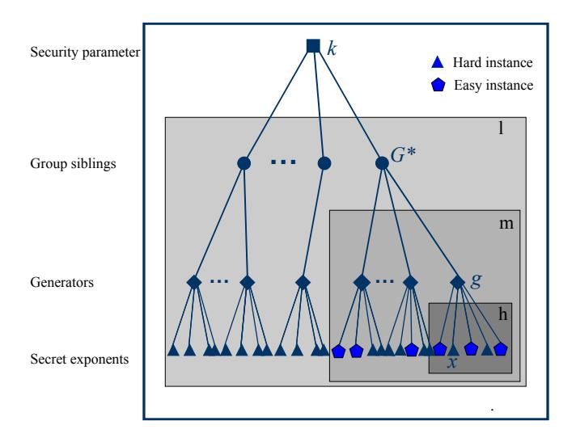
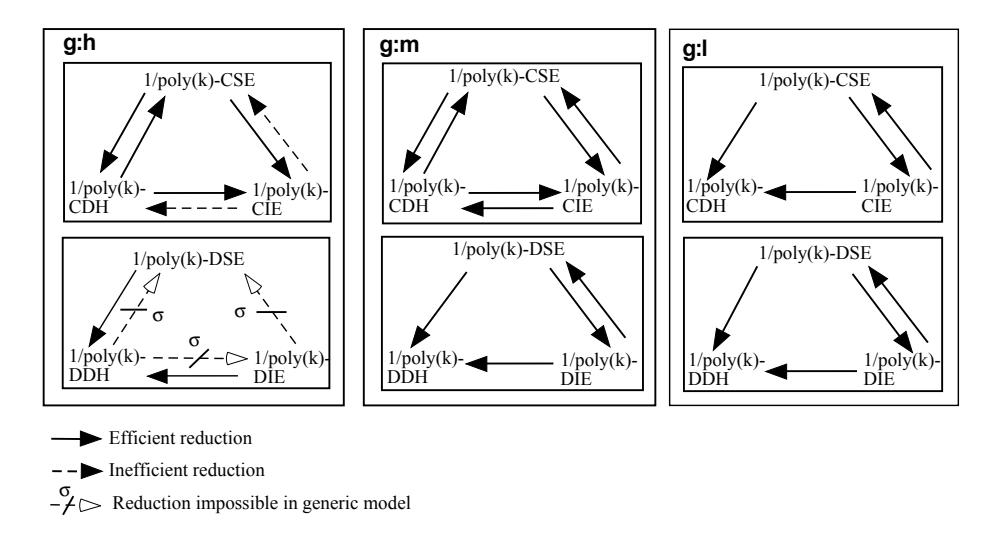

# Assumptions Related to Discrete Logarithms: Why Subtleties Make a Real Difference

Ahmad-Reza Sadeghi Michael Steiner Fachrichtung Informatik, Universit¨at des Saarlandes D-66123 Saarbruc¨ ken, Germany {sadeghi,steiner}@cs.uni-sb.de

August 23, 2002

### Abstract

The security of many cryptographic constructions relies on assumptions related to Discrete Logarithms (DL), e.g., the Diffie-Hellman, Square Exponent, Inverse Exponent or Representation Problem assumptions. In the concrete formalizations of these assumptions one has some degrees of freedom offered by parameters such as computational model, problem type (computational, decisional) or success probability of adversary. However, these parameters and their impact are often not properly considered or are simply overlooked in the existing literature.

In this paper we identify parameters relevant to cryptographic applications and describe a formal framework for defining DL-related assumptions. This enables us to precisely and systematically classify these assumptions.

In particular, we identify a parameter, termed granularity, which describes the underlying probability space in an assumption. Varying granularity we discover the following surprising result: We prove that two DLrelated assumptions can be reduced to each other for medium granularity but we also show that they are provably not reducible with generic algorithms for high granularity. Further we show that reductions for medium granularity can achieve much better concrete security than equivalent high-granularity reductions.

Keywords: Complexity Theory, Cryptographic Assumptions, Generic Algorithms, Discrete Logarithms, Diffie-Hellman, Square Exponent, Inverse Exponent.

## Contents

| 1 | Introduction                          | 2      |  |
|---|---------------------------------------|--------|--|
| 2 | Terminology                           |        |  |
|   | 2.1<br>General Notational Conventions | 4<br>4 |  |

| 2.3<br>Computational Model<br><br>2.4<br>Indistinguishability<br>2.5<br>Algebraic Structures<br><br>2.6<br>Problems<br><br>2.7<br>Samplers<br>3<br>Parameters of DL-based Assumptions<br>4<br>Defining Assumptions<br>5<br>The Impact of Granularity<br>6<br>Computational DH, SE and IE<br>29<br>6.1<br>Self-Correction<br><br>6.2<br>CSE versus CDH<br>6.2.1<br>High Granular<br><br>6.2.2<br>Medium Granular<br><br>6.3<br>CDH versus CIE<br><br>6.3.1<br>High Granular<br><br>6.3.2<br>Medium Granular<br><br>7<br>Decisional DH, SE and IE<br>49<br>7.1<br>Difficulty in the Generic Model<br><br>7.2<br>DSE versus DDH<br>7.2.1<br>High Granular<br><br>7.3<br>DIE versus DDH<br><br>7.3.1<br>High Granular<br><br>7.4<br>DSE versus DIE<br><br>7.4.1<br>High Granular<br><br>7.4.2<br>Medium Granular<br><br>8<br>Conclusions<br>References<br>Index<br>Deriving Formal Assumptions |   | 2.2 | Asymptotics | 5  |  |  |  |  |
|--------------------------------------------------------------------------------------------------------------------------------------------------------------------------------------------------------------------------------------------------------------------------------------------------------------------------------------------------------------------------------------------------------------------------------------------------------------------------------------------------------------------------------------------------------------------------------------------------------------------------------------------------------------------------------------------------------------------------------------------------------------------------------------------------------------------------------------------------------------------------------------------|---|-----|-------------|----|--|--|--|--|
|                                                                                                                                                                                                                                                                                                                                                                                                                                                                                                                                                                                                                                                                                                                                                                                                                                                                                            |   |     |             | 6  |  |  |  |  |
|                                                                                                                                                                                                                                                                                                                                                                                                                                                                                                                                                                                                                                                                                                                                                                                                                                                                                            |   |     |             | 7  |  |  |  |  |
|                                                                                                                                                                                                                                                                                                                                                                                                                                                                                                                                                                                                                                                                                                                                                                                                                                                                                            |   |     |             | 7  |  |  |  |  |
|                                                                                                                                                                                                                                                                                                                                                                                                                                                                                                                                                                                                                                                                                                                                                                                                                                                                                            |   |     |             | 8  |  |  |  |  |
|                                                                                                                                                                                                                                                                                                                                                                                                                                                                                                                                                                                                                                                                                                                                                                                                                                                                                            |   |     |             | 9  |  |  |  |  |
|                                                                                                                                                                                                                                                                                                                                                                                                                                                                                                                                                                                                                                                                                                                                                                                                                                                                                            |   |     |             | 11 |  |  |  |  |
|                                                                                                                                                                                                                                                                                                                                                                                                                                                                                                                                                                                                                                                                                                                                                                                                                                                                                            |   |     |             | 20 |  |  |  |  |
|                                                                                                                                                                                                                                                                                                                                                                                                                                                                                                                                                                                                                                                                                                                                                                                                                                                                                            |   |     |             | 27 |  |  |  |  |
|                                                                                                                                                                                                                                                                                                                                                                                                                                                                                                                                                                                                                                                                                                                                                                                                                                                                                            |   |     |             |    |  |  |  |  |
|                                                                                                                                                                                                                                                                                                                                                                                                                                                                                                                                                                                                                                                                                                                                                                                                                                                                                            |   |     |             | 30 |  |  |  |  |
|                                                                                                                                                                                                                                                                                                                                                                                                                                                                                                                                                                                                                                                                                                                                                                                                                                                                                            |   |     |             | 32 |  |  |  |  |
|                                                                                                                                                                                                                                                                                                                                                                                                                                                                                                                                                                                                                                                                                                                                                                                                                                                                                            |   |     |             | 32 |  |  |  |  |
|                                                                                                                                                                                                                                                                                                                                                                                                                                                                                                                                                                                                                                                                                                                                                                                                                                                                                            |   |     |             | 37 |  |  |  |  |
|                                                                                                                                                                                                                                                                                                                                                                                                                                                                                                                                                                                                                                                                                                                                                                                                                                                                                            |   |     |             | 39 |  |  |  |  |
|                                                                                                                                                                                                                                                                                                                                                                                                                                                                                                                                                                                                                                                                                                                                                                                                                                                                                            |   |     |             | 39 |  |  |  |  |
|                                                                                                                                                                                                                                                                                                                                                                                                                                                                                                                                                                                                                                                                                                                                                                                                                                                                                            |   |     |             | 46 |  |  |  |  |
|                                                                                                                                                                                                                                                                                                                                                                                                                                                                                                                                                                                                                                                                                                                                                                                                                                                                                            |   |     |             |    |  |  |  |  |
|                                                                                                                                                                                                                                                                                                                                                                                                                                                                                                                                                                                                                                                                                                                                                                                                                                                                                            |   |     |             | 49 |  |  |  |  |
|                                                                                                                                                                                                                                                                                                                                                                                                                                                                                                                                                                                                                                                                                                                                                                                                                                                                                            |   |     |             | 54 |  |  |  |  |
|                                                                                                                                                                                                                                                                                                                                                                                                                                                                                                                                                                                                                                                                                                                                                                                                                                                                                            |   |     |             | 54 |  |  |  |  |
|                                                                                                                                                                                                                                                                                                                                                                                                                                                                                                                                                                                                                                                                                                                                                                                                                                                                                            |   |     |             | 57 |  |  |  |  |
|                                                                                                                                                                                                                                                                                                                                                                                                                                                                                                                                                                                                                                                                                                                                                                                                                                                                                            |   |     |             | 57 |  |  |  |  |
|                                                                                                                                                                                                                                                                                                                                                                                                                                                                                                                                                                                                                                                                                                                                                                                                                                                                                            |   |     |             | 65 |  |  |  |  |
|                                                                                                                                                                                                                                                                                                                                                                                                                                                                                                                                                                                                                                                                                                                                                                                                                                                                                            |   |     |             | 65 |  |  |  |  |
|                                                                                                                                                                                                                                                                                                                                                                                                                                                                                                                                                                                                                                                                                                                                                                                                                                                                                            |   |     |             | 68 |  |  |  |  |
|                                                                                                                                                                                                                                                                                                                                                                                                                                                                                                                                                                                                                                                                                                                                                                                                                                                                                            |   |     |             | 72 |  |  |  |  |
|                                                                                                                                                                                                                                                                                                                                                                                                                                                                                                                                                                                                                                                                                                                                                                                                                                                                                            |   |     |             | 74 |  |  |  |  |
|                                                                                                                                                                                                                                                                                                                                                                                                                                                                                                                                                                                                                                                                                                                                                                                                                                                                                            |   |     |             | 79 |  |  |  |  |
|                                                                                                                                                                                                                                                                                                                                                                                                                                                                                                                                                                                                                                                                                                                                                                                                                                                                                            | A |     |             | 82 |  |  |  |  |

## <span id="page-1-0"></span>1 Introduction

Most modern cryptographic systems rely on assumptions on the computational difficulty of some particular number-theoretic problem.<sup>1</sup> One well-known class of

<sup>1</sup>The exceptions are information-theoretically secure systems and systems such as hashfunctions or shared-key encryption relying on heuristic assumptions, e.g., the Random Oracle

<span id="page-2-0"></span>assumptions is related to the difficulty of computing discrete logarithms in cyclic groups [\(McCurley](#page-76-0) 1990). In this class a number of variants exists. The most prominent ones, besides Discrete Logarithm (DL), are the computational and decisional Diffie-Hellman (DH) assumptions (Diffie and [Hellman](#page-74-0) 1976; [Brands](#page-73-1) 1994) Less known assumptions are Matching Diffie-Hellman [\(Frankel](#page-74-1) et al. 1996), Square Exponent (SE) [\(Maurer](#page-76-1) and Wolf 1996), and Inverse Exponent (IE) [\(Pfitzmann](#page-76-2) and Sadeghi 2000), an assumption closely related to the Inverted-Additive Exponent (IAE) Problem introduced by [MacKenzie](#page-75-0) (2001) <sup>2</sup> and also implicitly required for the security of the schemes proposed by [Camenisch,](#page-74-2) Maurer, and Stadler (1996) and Davida, Frankel, [Tsiounis,](#page-74-3) and Yung (1997). Further related assumptions mentioned in the sequel are Generalized Diffie-Hellman (GDH) [\(Shmuely](#page-77-0) 1985; [Steiner](#page-77-1) et al. 1996) and the Representation Problem (RP) [\(Brands](#page-73-1) 1994). Several additional papers have studied relations among these assumptions, e.g., [\(Shoup](#page-77-2) 1997; [Maurer](#page-76-3) and Wolf 1998a; [Maurer](#page-76-4) and Wolf 1998b; [Biham](#page-73-2) et al. 1999; Wolf [1999\)](#page-77-3).

In the concrete formalizations of these assumptions one has various degrees of freedom offered by parameters such as computational model, problem type (computational, decisional or matching) or success probability of the adversary. However, such aspects are often not precisely considered in the literature and consequences are simply overlooked. In this paper, we address these aspects by identifying the parameters relevant to cryptographic assumptions. Based on this, we present a formal framework and a concise notation for defining DLrelated assumptions. This enables us to precisely and systematically classify these assumptions.

Among the specified parameters, we focus on a parameter we call granularity of the probability space which underlies an assumption. Granularity defines what part of the underlying algebraic structure (i.e., algebraic group and generator) is part of the probability space and what is fixed in advance: For high granularity an assumption has to hold for all groups and generators; for medium granularity the choice of the generator is included in the probability space and for low granularity the probability is taken over both the choice of the group and the generator. Assumptions with lower granularity are weaker than those with higher granularity. Nonetheless, not all cryptographic settings can rely on the weaker variants: Only when the choice of the system parameters is guaranteed to be random one can rely on a low-granularity assumption. For example, consider an anonymous payment system where the bank chooses the system parameters. To base the security of such a system a-priori on a low-granularity assumption would not be appropriate. A cheating bank might try to choose a weak group with trapdoors (easy problem instances) to violate the anonymity of the customer. Such a cheater strategy might be possible even if the low-granular assumption holds: The assumption would ensure that the overall number of easy

Model (Bellare and [Rogaway](#page-73-3) 1993).

<sup>2</sup>Note that SE and IAE are originally called Squaring Diffie-Hellman [\(Wolf](#page-77-3) 1999) and Inverted-Additive Diffie-Hellman [\(MacKenzie](#page-75-0) 2001), respectively. They are renamed here for consistency and clarity reasons.

<span id="page-3-2"></span>problem instances is asymptotically negligible (in respect to the security parameter). Nonetheless, it would not rule out that there are infinitely many weak groups! However, if we choose the system parameters of the payment system through a random yet verifiable process we can resort to a weaker assumption with lower granularity. To our knowledge no paper on anonymous payment systems addresses this issue properly. Granularity was also overlooked in different contexts, e.g., [Boneh](#page-73-4) (1998) ignores the fact that low-granular assumptions are not known to be random self-reducible and comes to a wrong conclusion regarding the correctness of a certain self-corrector.

In this paper, we show that varying granularity can lead to surprising results. We extend the results of Wolf [\(1999\)](#page-77-3) to the problem class IE, i.e., we prove statements on relations between IE, DH and SE for both computational and decisional variants in the setting of Wolf [\(1999\)](#page-77-3), which corresponds to the high-granular case. We then consider medium granularity (with other parameters unchanged) and show the impact: We prove that the decisional IE and SE assumptions are equivalent for medium granularity whereas this is provably not possible for their high-granular variants, at least not in the generic model [\(Shoup](#page-77-2) 1997). We also show that reductions between computational IE, SE and DH can offer much better concrete security for medium granularity than their high-granular analogues.

## <span id="page-3-0"></span>2 Terminology

## <span id="page-3-1"></span>2.1 General Notational Conventions

By {a, b, c, . . . } and (a, b, c, . . .) we denote the set and the sequence consisting of the elements a, b, c, . . . . By specifying a set as {f(v<sup>1</sup> , . . . , vn) | pred(v<sup>1</sup> , . . . , v<sup>n</sup> )} we mean the set of elements we get by evaluating the formula f with any instantiation of the n free variables v<sup>1</sup> , . . . , v<sup>n</sup> which fulfills the predicate pred, e.g., {(v, v 2 ) | v ∈ } denotes the set of all tuples which contain a natural number and its square. Similarly, we define (f(v<sup>1</sup> , . . . , vn) | pred(v<sup>1</sup> , . . . , v<sup>n</sup> )) to be the sequence of elements we get by evaluating the formula f with any instantiation of the n free variables v<sup>1</sup> , . . . , v<sup>n</sup> which fulfills the predicate pred. The elements are ordered according to some arbitrary but fixed order relation on the (instantiated) argument tuples (v<sup>1</sup> , . . . , vn). For example, ((v, v 2 ) | v ∈ ) denotes the infinite sequence of all tuples which contain a natural number and its square, and where the sequence is ordered, e.g., using the standard order < on and the value of v as the sort index.

The evaluation and following assignment of an expression expr to a variable v is denoted by v ← expr. By v ←<sup>R</sup> S we mean the assignment of a uniformly chosen random element from the set S to variable v. Similarly, v ∈<sup>R</sup> S denotes that v is a uniformly distributed random element from set S. Finally, by t:=expr we mean that by definition the term t is equal to expr.

Simple random variables are specified as v ←<sup>R</sup> S as mentioned above. To <span id="page-4-1"></span>specify more complicated random variables, we use the following notation:  $(f(v_1,\ldots,v_n)::\operatorname{assign}(v_1,\ldots,v_n))$ . By this we mean the random variable having a structure as defined by the formula f and a probability space as induced by binding the n free variables  $v_1,\ldots,v_n$  via the assignment rule assign, e.g.,  $((v,v^2)::v\stackrel{\mathcal{R}}{\leftarrow}\mathbb{Z}_n)$  denotes the random variable consisting of a tuple which contains an integer and its square where the integer is uniformly chosen from  $\mathbb{Z}_n$ . Similarly,  $\{f(v_1,\ldots,v_n)::\operatorname{assign}(v_1,\ldots,v_n)\}$  defines an ensemble of random variables indexed by the free variables  $v_i$  which are left unspecified in the assignment rule assign and which have by definition domain  $\mathbb{N}$ , e.g.,  $\{(v,v^k)::v\stackrel{\mathcal{R}}{\leftarrow}\mathbb{Z}_n\}$  denotes the ensemble of random variables consisting of a tuple which contain an integer and its k-th power where the integer is uniformly chosen from  $\mathbb{Z}_n$  and the natural number k is the index of the ensemble. Finally, let v be some arbitrary random variable or random variable ensemble. Then, [v] denotes the set of all possible values of v.

To specify probabilities, we use the notation  $\mathbf{Prob}[\mathsf{pred}(v_1,\ldots,v_n) :: \mathsf{assign}(v_1,\ldots,v_n)]$ . This denotes the probability that the predicate  $\mathsf{pred}$  holds when the probability is taken over a probability space defined by the formula  $\mathsf{assign}$  on the n free variables  $v_i$  of the predicate  $\mathsf{pred}$ . For example,  $\mathsf{Prob}[v \equiv 0 \pmod 2] :: v \xleftarrow{\mathcal{R}} \mathbb{Z}_n$  denotes the probability that a random element of  $\mathbb{Z}_n$  is even.

For convenience, by log we always mean the logarithm to the base two.

## <span id="page-4-0"></span>2.2 Asymptotics

Cryptographic assumptions are always expressed asymptotically in a **security parameter**  $k \in \mathbb{N}$ . To classify the asymptotic behavior of functions  $\mathbb{N} \to \mathbb{R}^*$  (with  $\mathbb{R}^*$  denoting the set of all non-negative real numbers) we require the following definitions.

We can extend ordinary relation operators  $op \in \{<, \leq, =, >, \geq\}$  on elements of  $\mathbb{R}^*$  to asymptotic relation operators  $op_{\infty}$  on functions  $f_1$  and  $f_2$  defined as above as follows:

$$f_1(k)$$
  $op_{\infty}$   $f_2(k) := \exists k_0 \ \forall k > k_0 : f_1(k) \ op \ f_2(k).$

The corresponding negation of the asymptotic relation operators is then denoted by  $\not<_{\infty}$ ,  $\not\leq_{\infty}$ ,  $\not\geq_{\infty}$ , and  $\not>_{\infty}$ , respectively.

For example,  $f_1(k) <_{\infty} f_2(k)$  means that  $f_1$  is asymptotically strictly smaller than  $f_2$  and  $f_1(k) \not\geq_{\infty} f_2(k)$  means that  $f_1$  is not asymptotically larger or equal to  $f_2$ , i.e., for each  $k_0$  there is a  $k_1 > k_0$  such that  $f_1(k_1) < f_2(k_1)$ . However, note that the  $f_1(k) \not\geq_{\infty} f_2(k)$  does not imply  $f_1(k) <_{\infty} f_2(k)$ !

Let  $\mathsf{poly}(v)$  be the class of  $\mathsf{univariate}\ \mathsf{polynomials}$  with variable v and non-negative coefficients, i.e.,  $\mathsf{poly}(v) := \{\sum_{i=0}^d a_i v^i \mid d \in \mathbb{N}_0 \land a_i \in \mathbb{N}_0\}$ . Furthermore, let  $\mathsf{poly}(v_1, \ldots, v_n)$  be the class of  $\mathsf{multivariate}\ \mathsf{polynomials}$  with n variables  $v_j$  and non-negative coefficients, i.e.,  $\mathsf{poly}(v_1, \ldots, v_n) := \{\sum_{i=0}^d \sum_{j=1}^{|D_i|} a_{ij} \prod_{l=1}^n v_l^{d_{ijl}} \mid d \in \mathbb{N}_0 \land a_{ij} \in \mathbb{N}_0 \land (d_{ij1}, \ldots, d_{ijn}) \in D_i^n\}$  where  $D_i^n := \{(d_l \mid l \in \{1, \ldots, n\}) \mid d_l \in \mathbb{N}_0 \land \sum_{l=1}^n d_l = i\}$ . Based on this we can define the following useful classes of functions:

<span id="page-5-1"></span>A **negligible** function  $\epsilon(k)$  is a function where the inverse of any polynomial is asymptotically an upper bound, i.e.,  $\forall d > 0 \ \exists k_0 \ \forall k > k_0 : \epsilon(k) < 1/k^d$ . We denote this by  $\epsilon(k) <_{\infty} 1/\text{poly}(k)$ . If  $\epsilon(k)$  cannot be upper bounded in such a way, we say  $\epsilon(k)$  is **not negligible** and we denote this by  $\epsilon(k) \not<_{\infty} 1/\text{poly}(k)$ .

A **non-negligible** function f(k) is a function which asymptotically can be lower bounded by the inverse of some polynomial, i.e.,  $\exists d > 0 \ \exists k_0 \ \forall k > k_0 : f(k) \geq 1/k^d$ . We denote this by  $f(k) \geq_{\infty} 1/\mathsf{poly}(k)$ .<sup>3</sup> If f(k) cannot be lower bounded in such a way we say f(k) is **not non-negligible** and denote this by  $f(k) \not\geq_{\infty} 1/\mathsf{poly}(k)$ .

Non-negligible functions are — when seen as a class — closed under multivariate polynomial composition, i.e.,  $\forall n \in \mathbb{N} \ \forall i \in \{1,\dots,n\} \ \forall p \in \mathsf{poly}(v_1,\dots,v_n) \setminus \{0_{\mathsf{poly}}\} \ \forall f_i \geq_\infty 1/\mathsf{poly}(k) : \ p(f_1,\dots,f_n) \geq_\infty 1/\mathsf{poly}(k)$  where  $0_{\mathsf{poly}}$  denotes the null polynomial. This holds also for negligible functions if there is no non-zero constant term in the polynomial, i.e., we select only elements from the class  $\mathsf{poly}(v_1,\dots,v_n)$  where  $a_{01}$  is zero. For not negligible and not non-negligible functions this holds solely for univariate polynomial composition. Finally, the addition (multiplication) of a non-negligible and a not negligible function is a non-negligible function. Similarly, the addition of a negligible and a not non-negligible function is a not non-negligible function or even a negligible function if the not non-negligible function can be upper bounded by some polynomial.

## <span id="page-5-0"></span>2.3 Computational Model

The computational model is based on the class  $\mathcal{TM}$  of probabilistic  $\mathit{Turing}$   $\mathit{machines}$  on the binary alphabet  $\{0,1\}$ . The  $\mathit{runtime}$  of a Turing machine M is measured by the number of simple Turing steps from the initial state with given inputs until the machine reaches a final state. This is denoted by  $\mathit{RunTime}(\mathsf{M}(\mathit{inputs}))$ . The complexity of a Turing machine is expressed as a function of the bit-length of the inputs encoded on its input tape and defined as the maximum runtime for any input of a given bit-length. To make the definition of the probability spaces more explicit, we model a probabilistic Turing machine always as a deterministic machine with the random coins given as an explicit input  $\mathcal C$  chosen from the  $\mathit{uniform}$  distribution of  $\mathit{infinite}$  binary  $\mathit{strings}$   $\mathcal U$ . However, we do not consider the randomness when calculating the length of the inputs. The important class of  $\mathit{polynomial-time}$   $\mathit{Turing}$   $\mathit{machines}$  is the class of machines with polynomial complexity:

```
 \{ \mathcal{A} \mid \mathcal{A} \in \mathcal{TM};
\forall d_1; \ \exists d_2; \ \forall k;
\forall inputs \in \{0,1\}^{k^{d_1}}; \ \forall \mathcal{C} \in \{0,1\}^{\infty};
: \text{RunTime}(\mathcal{A}(\mathcal{C}, inputs)) < k^{d_2} \}
```

 $<sup>^3</sup>$ Note that not negligible is *not* the same as non-negligible, there are functions which are neither negligible nor non-negligible!

<span id="page-6-2"></span>When we use the term **efficient** in the context of algorithms or computation we mean a Turing machine with polynomial complexity. By a **hard problem** we mean the absence of any efficient algorithm (asymptotically) solving that problem.

In some situations, e.g., in a reduction, a machine M has access to some other machines  $\mathcal{O}_1, \ldots, \mathcal{O}_n$  and can query them as **oracles**. We denote this by  $\mathsf{M}^{\mathcal{O}_1, \ldots, \mathcal{O}_n}$ . This means that the machine M can write the input tapes of all  $\mathcal{O}_i$ , run them on that input, and read the corresponding output tapes. However, M does not get access to the internal structure or state of the oracle.

### <span id="page-6-0"></span>2.4 Indistinguishability

Let two families of random variables  $X := (X_k \mid k \in \mathbb{N})$  and  $Y := (Y_k \mid k \in \mathbb{N})$  be defined over some discrete domain  $\mathcal{D}$ . They are said to be **computationally indistinguishable** iff there is no efficient distinguishing algorithm D which can distinguish the two asymptotically, i.e.,  $|\mathbf{Prob}[D(1^k, X_k) = 1] - \mathbf{Prob}[D(1^k, Y_k) = 1]|$  is a negligible function in k. This is denoted by  $X \stackrel{c}{\approx} Y$ . X and Y are **statistically indistinguishable** iff the **statistical difference**  $\Delta_{(X,Y)}(k) := \sum_{d \in \mathcal{D}} |\mathbf{Prob}[X_k = d] - \mathbf{Prob}[Y_k = d]|$  is a negligible function. This is written as  $X \stackrel{s}{\approx} Y$ .

## <span id="page-6-1"></span>2.5 Algebraic Structures

The following terms are related to the algebraic structures underlying an assumption.

**Finite cyclic group** G: A group is an algebraic structure with a set G of **group elements** and a binary **group operation**  $*: G \times G \to G$  such that the following conditions hold:

- the group operation is **associative**, i.e., a\*(b\*c)=(a\*b)\*c for all  $a,b,c\in G$ ,
- there is an identity element  $1 \in G$  such that a \* 1 = a = 1 \* a for all  $a \in G$ , and
- for each  $a \in G$  there is an **inverse**  $a^{-1} \in G$  such that  $a * a^{-1} = 1 = a^{-1} * a$ .

The **group order** is the cardinality of the set G and is denoted by |G|.

In the following, we write group operations always multiplicatively by juxtaposition of group elements; Nonetheless, note that the following results apply — with the appropriate adaption of notation — also to additive groups such as elliptic curves. The **exponentiation**  $a^x$  for  $a \in G$  and  $x \in \mathbb{N}_0$  is then defined

as usual as  $\overbrace{a\cdots a}$ . The **discrete logarithm** of a given  $b\in G$  in respect to a specified base  $a\in G$  is the smallest  $x\in \mathbb{N}_0$  such that  $a^x=b$  or undefined if no such x exists. The **order of a group element**  $b\in G$  is the least positive integer x such that  $b^x=1$  or  $\infty$  if no such x exists.

<span id="page-7-1"></span>A group G is **finite** if |G| is finite. A group G is **cyclic** if there is a **generator**  $g \in G$ , such that  $\forall b \in G \exists ! x \in \mathbb{Z}_{|G|} : g^x = b$ . The order of all elements in a finite cyclic group G divides |G|. In particular, there are exactly  $\varphi(d)$  elements of order d (where d is any divisor of |G|).

All considered assumptions are based on finite cyclic groups. For brevity, however, we omit the "finite cyclic" in the sequel and refer to them simply as "groups".

For more information on the relevant abstract algebra we refer you to the book of Lidl and Niederreiter (1997).

Algorithmically, the following is noteworthy: Finding generators can be done efficiently when the factorization of |G| is known; it is possible to perform exponentiations in  $O(\log{(|G|)})$  group operations; and computing inverses can be done in  $O(\log{(|G|)})$  group operations under the condition that |G| is known. For the corresponding algorithms and further algorithms for abstract or concrete groups we refer you to the books of Bach and Shallit (1996) and Menezes, van Oorschot, and Vanstone (1997).

**Structure instance** SI:A tuple  $(G, g_1, \ldots, g_n)$  containing a group G as first element followed by a sequence of one or more generators  $g_i$ . This represents the structure underlying a particular problem. We can assume that the structure instance SI (though not necessarily properties thereof such as the order or the factorization of the order) is publicly known.

As a convention we abbreviate  $g_1$  to g if there is only a single generator associated with a given structure instance.

### <span id="page-7-0"></span>2.6 Problems

The following two terms characterize a particular problem underlying an assumption.

**Problem family**  $\mathcal{P}$ : A family of abstract relations indexed by their underlying structure instance SI. An example is the family of Diffie-Hellman problems which relate two (secret) numbers x and y, the two (public) values  $g^x$  and  $g^y$ , and the value  $g^{xy}$  where all exponentiations are computed using the generator g specified in SI. We define a problem family by explicitly describing its problem instances as shown in the next paragraph.

**Problem instance** PI: A list of concrete parameters fully describing a particular instance of a problem family, i.e., a description of the structure instance SI and a tuple (priv, publ, sol) where priv is the tuple of values kept secret from adversaries, publ is the tuple of information publicly known on that problem and sol is the set of possible solutions<sup>4</sup> of that problem instance. When not explicitly stated, we can assume that priv consists always of elements from  $\mathbb{Z}_{|G|}$ ,

<sup>&</sup>lt;sup>4</sup>The solutions might not be unique, e.g., multiple solution tuples match a given public value in the case of the Representation Problem (See Section 3, Parameter 1).

<span id="page-8-1"></span>publ consists of elements from G, and sol is either a set of elements from  $\mathbb{Z}_{|G|}$  or from G.

If we take the aforementioned Diffie-Hellman problem for subgroups of  $\mathbb{Z}_p^*$  of order q with p and q prime as an example, a problem instance  $PI_{DH}$  is defined by a tuple

$$(((\mathbb{Z}_{p/q}^*, p, q), (g)), ((x, y), (g^x, g^y), \{(g^{xy})\}))$$

where  $\mathbb{Z}_{p/q}^*$  denotes the parameterized description of the group and its operation, and p,q are the corresponding group parameters. (More details on the group description and parameter are given below when group samplers are introduced.)

This presentation achieves a certain uniformity of description and allows a generic definition of types of problems, i.e., whether it is a decisional or computational variant of a problem. While this might not be obvious right now, it should become clear at the latest in Section 3 below when we give the explicit definition of the different problem families with Parameter 1 and the precise definition of problem types with Parameter 2.

For convenience, we define  $PI^{SI}$ ,  $PI^{publ}$ ,  $PI^{priv}$  and  $PI^{sol}$  to be the projection of a problem instance PI to its structure instance, public, private and solution part, respectively. Picking up again above example, this means  $PI_{DH}^{SI} := ((\mathbb{Z}^*_{p/q}, p, q), (g)), PI_{DH}^{priv} := (x, y), PI_{DH}^{publ} := (g^x, g^y), \text{ and } PI_{DH}^{sol} := \{g^{xy}\}, \text{ respectively.}$

## <span id="page-8-0"></span>2.7 Samplers

In the following, we describe different probabilistic polynomial-time algorithms we use to randomly select (sample) various parameters. Note that these samplers cannot be assumed to be publicly known, i.e., to sample from the corresponding domains adversaries have to construct their own sampling algorithms from publicly known information.

**Group sampler**  $SG_{\mathcal{G}}$ : A function which, when given a security parameter k as input, randomly selects a group G and returns a corresponding group index. We assume that a group sampler selects groups only of similar nature and type, i.e., there is a general description of a Turing machine which, based on a group index as parameter, implements at least the group operation and the equality test, and specifies how the group elements are represented. An example are the groups pioneered by Schnorr (1991) in his identification and signature schemes and also used in the Digital Signature Standard (DSS) (National Institute of Standards and Technology (NIST) 2000), i.e., unique subgroups of  $\mathbb{Z}_p^*$  of order q with p and q prime. The group index would be (p,q) and the description of the necessary algorithms would be taken, e.g., from Menezes et al. (1997). Note that, in this example, the group index allows the derivation of the group order and the factorization thereof. However, it cannot be assumed that the group index — the only information besides the description of the Turing machine which will be always publicly known about the group — allows to derive such knowledge on the group order in general.

<span id="page-9-0"></span>The set of groups possibly returned by a group sampler, i.e.,  $[SG_{\mathcal{G}}]$ , is called in the sequel a **group family**  $\mathcal{G}$  and is required to be infinite. To make the specific group family  $\mathcal{G}$  more explicit in the sampler we often label the sampler accordingly as  $SG_{\mathcal{G}}$ , e.g., for above example the sampler would be named  $SG_{\mathbb{Z}_{p/q}^*}$ .

Furthermore, the set of possible groups G returned by  $SG_{\mathcal{G}}$  for a given fixed security parameter k, i.e.,  $[SG_{\mathcal{G}}(1^k)]$ , is called **group siblings**  $\mathcal{G}_{SG(k)}$ . This represents the groups of a given family  $\mathcal{G}$  with approximately the same "security". We assume that the group operation and equality test for the groups in  $\mathcal{G}_{SG(k)}$  can be computed efficiently (in k); yet the underlying problem is supposedly asymptotically hard.

Slightly restricting the class of samplers, we require that the order |G| of all  $G \in \mathcal{G}_{SG(k)}$  is approximately the same. In particular, we assume that the order can be bounded in the security parameter, i.e.,  $\exists d_1, d_2 > 0 \ \forall k > 1 \ \forall G \in \mathcal{G}_{SG(k)} : k^{d_1} \leq \log{(|G|)} \leq k^{d_2}.^5$  For Schnorr signatures, in the example given above, a group sampler might choose the random primes p and q with  $|q| \approx 2k$  and p = rq + 1 for an integer r sufficiently large to make DL hard to compute in security parameter k. See Menezes et al. (1997) and Odlyzko (2000) for the state-of-the-art algorithms for computing discrete logarithms and Lenstra and Verheul (2001) for a methodology on how to choose parameters (as a function of the security parameter k), illustrated concretely for group families such as  $\mathbb{Z}_p^*$  or elliptic curves.

Generator sampler Sg: A function which, when given a description of a group G for a fixed group family, randomly selects a generator  $g \in G$ . We assume that Sg has always access somehow, e.g., via an oracle, to the factorization of the group order. This information is required by the sampler as the group index might not be sufficient to find generators efficiently. This covers the situation where an honest party chooses the group as well as the generator but keeps the factorization of the group order secret. However, it also implies that the factorization of the order should in general be public when the adversary chooses the generators.

Note that the number of generators is  $\varphi(|G|)$  and, due to requirements on group orders mentioned above, always super-polynomial in the security parameter k: Given the lower bound  $\forall n \geq 5 : \varphi(n) > n/(6\log(\log(n)))$  (Fact 2.102, Menezes et al. 1997) and our size restrictions on |G| we have asymptotically the following relation:  $\varphi(|G|)/|G| > 1/O(\log k) > 1/k$ .

**Problem instance sampler**  $SPI_{\mathcal{P}}$ : A function indexed by a problem family  $\mathcal{P}$  which, when given a description of a structure instance SI as input, ran-

<sup>&</sup>lt;sup>5</sup>This restriction is mainly for easier treatment in various reductions and is not a hindrance in practical applications: On the one hand, the upper bound is tight (larger groups cannot have efficient group operations). On the other hand, the common approach in choosing a safe group order, e.g., as proposed by Lenstra and Verheul (2001), will relate the group order closely to the negligible probability of guessing a random element correctly, and hence result in exponential order.

<span id="page-10-1"></span>domly selects a problem instance PI. Similarly to Sg, we assume that  $SPI_{\mathcal{P}}$  gets always access to the factorization of the group order. Furthermore,  $SPI_{\mathcal{P}}$  gets also access to the discrete logarithms among the different generators in SI. This is required for some problem families, e.g., IE and RP(n). In most cases and in all examples considered here, this corresponds to randomly selecting priv and deriving publ and sol from it. For example, a problem instance sampler  $SPI_{DH}$  for the Diffie-Hellman problem family would return a tuple  $(SI, ((x, y), (g^x, g^y), \{(g^{xy})\}))$  with x and y randomly picked from  $\mathbb{Z}_{|G|}$  and g taken from SI. When the specific problem family  $\mathcal{P}$  is not relevant or clear from the context we abbreviate  $SPI_{\mathcal{P}}$  to SPI.

Note that the running time of the samplers is always polynomially bounded in the security parameter k.<sup>7</sup>

If not stated explicitly we can always assume a uniform distribution of the sampled elements in the corresponding domains, as done in most cases of cryptographic applications. The rare exceptions are cases such as the c-DLSE assumption (Patel and Sundaram 1998; Gennaro 2000), an assumption on the difficulty of taking discrete logarithms when the random exponents are taken only from a small set, i.e.,  $\mathbb{Z}_{2^c}$  with  $c = \omega(\log \log |G|)$  instead of  $\mathbb{Z}_{|G|}$ , or the Diffie-Hellman Indistinguishability (DHI) assumptions introduced by Canetti (1997). The difficulty of these assumptions is not necessarily their individual specification, e.g., c-DLSE could be defined by suitably restricting the domain of the sol part of a DL problem instance. The deeper problem is that proving relations among these and other assumptions seems to require very specific tools, e.g., for randomization and analysis of resulting success probabilities, and are difficult to generalize as desirable for a classification as presented here. However, it might be worthwhile to investigate in future work whether these cases can be addressed by treating the sampling probability distribution as an explicit parameter of the classification. To make this extension promising, one would have to first find a suitable categorization of sampling probability distributions which: (1) captures the assumptions currently not addressed, and (2) offers tools assisting in proving reductions in a generalizable fashion.

## <span id="page-10-0"></span>3 Parameters of DL-based Assumptions

In defining assumptions, a cryptographer has various degrees of freedom related to the concrete mathematical formulation of the assumption, e.g., what kind of attackers are considered or over what values the probability spaces are defined.

 $<sup>^6</sup>$  As a practical consequence, it means that for such problem families either this information has to be public, e.g., the group index should allow the derivation of the factorization of the order, or the group and generators are chosen by the same party which samples the problem instance.

 $<sup>^7</sup>$ For SG this holds trivially as we required samplers to be polynomial-time in their inputs. The input of Sg are the outputs of a single call of a machine (SG) polynomially bounded by k and, therefore, can be polynomially upper bounded in k. As the class of polynomials is closed under polynomial composition this holds also for Sg and, using similar reasoning, also for SPI.

<span id="page-11-1"></span>To shed some light in these degrees of freedom we classify intractability assumptions for problems related to DL and relevant to many cryptographic applications. We identify the following orthogonal parameters. Additionally, we give for each of these parameters in a corresponding sublist different values which can produce significantly different assumptions.

<span id="page-11-0"></span>1. **Problem family**: The following problem families are useful (and often used) for cryptographic applications. As mentioned in Section 2.6 we define the problem family (or more precisely their problem instances) by a structure instance SI (described abstractly by G and  $g_i$ 's) and a tuple (priv, publ, sol):

**DL** (Discrete Logarithm):

$$PI_{DL} := ((G, g), ((x), (g^x), \{(x)\})).$$

**DH** (Diffie-Hellman):

$$PI_{DH} := ((G,g),((x,y),(g^x,g^y),\{(g^{xy})\}))$$

**GDH**(n) (Generalized Diffie-Hellman for  $n \geq 2$ ):

$$PI_{\mathrm{GDH}(n)} := ((G,g), ((x_i|i \in \{1,\ldots,n\}), (g^{\prod_{i \in I} x_i} \mid I \subset \{1,\ldots,n\}), \{(g^{\prod_{i=1}^n x_i})\})),$$

where n is a fixed parameter.<sup>8</sup>

**SE** (Square-Exponent):

$$PI_{SE} := ((G,g),((x),(g^x),\{(g^{x^2})\})).$$

**IE** (Inverse-Exponent):

$$PI_{\text{IE}} := ((G, g), ((x), (g^x), \{(g^{x^{-1}})\})).$$

Note that for elements  $x' \in \mathbb{Z}_{|G|} \setminus \mathbb{Z}_{|G|}^*$  the value  $x^{-1}$  is not defined. Therefore,  $PI_{\mathrm{IE}}^{priv}$  (= (x)) has to contain an element of  $\mathbb{Z}_{|G|}^*$ , contrary to the previously mentioned problem families where priv consists of elements from  $\mathbb{Z}_{|G|}$ .

 $\mathbf{RP}(n)$  (Representation Problem for  $n \geq 2$ ):

$$PI_{\mathrm{RP}(n)} := ((G, g_1, \dots, g_n), ((x_i \mid i \in \{1, \dots, n\}), (\prod_{i=1}^n g_i^{x_i}), \{(x_i' \mid i \in \{1, \dots, n\}) \mid (x_i' \in \mathbb{Z}_{|G|}) \wedge (\prod_{i=1}^n g_i^{x_i'} = \prod_{i=1}^n g_i^{x_i})\})),$$

 $<sup>^8</sup>$ A slightly generalized form  $\mathrm{GDH}(n(k))$  would allow n to be a function in k. However, this function can grow at most logarithmically (otherwise the tuple would be of super-polynomial size!)

where n is a fixed parameter.<sup>9</sup>

<span id="page-12-1"></span>IAE (Inverted Additive Exponent Problem):

$$PI_{\text{IAE}} := ((G, g), ((x, y), (g^{1/x}, g^{1/y}), \{(g^{1/(x+y)})\})).$$

Similar to IE,  $PI_{\text{IAE}}^{priv}$  (= (x, y)) consists of elements from  $\mathbb{Z}^*_{|G|}$ . Additionally, it has to hold that  $x + y \in \mathbb{Z}^*_{|G|}$ .

- <span id="page-12-0"></span>2. **Problem type**: Each problem can be formulated in three variants.
  - C (Computational): For a given problem instance PI an algorithm  $\mathcal{A}$  succeeds if and only if it can solve PI, i.e.,  $\mathcal{A}(\dots, PI^{publ}) \in PI^{sol}$ . For the Diffie-Hellman problem family this means that  $\mathcal{A}$  gets  $g^x$  and  $g^y$  as input and the task is to compute  $g^{xy}$ . There is a small twist in the meaning of  $\mathcal{A}(\dots, PI^{publ}) \in PI^{sol}$ : As |G| is not necessarily known,  $\mathcal{A}$  might not be able to represent elements of  $\mathbb{Z}_{|G|}$  required in the solution set uniquely in their "principal" representation as elements of  $\{0,\dots,|G|-1\}$ . Therefore, we allow  $\mathcal{A}$  in these cases to return elements of  $\mathbb{Z}$  and we implicitly reduce them  $\operatorname{mod}|G|$ .
  - D (Decisional): For a given problem instance  $PI_0$ , a random problem instance  $PI_1$  chosen with the same structure instance using the corresponding problem instance sampler and a random bit b, the algorithm  $\mathcal{A}$  succeeds if and only if it can decide whether a given solution chosen randomly from the solution set of one of the two problem instances corresponds to the given problem instance, i.e.,  $\mathcal{A}(\ldots, PI^{publ}, sol_c)) = b$  where  $sol_c \stackrel{\mathcal{R}}{\leftarrow} PI_b^{sol}$ . For the Diffie-Hellman problem family this means that  $\mathcal{A}$  gets  $g^x$ ,  $g^y$  and  $g^c$  (where c is either xy or x'y' for  $x', y' \in_{\mathcal{R}} \mathbb{Z}_{|G|}$ ) as input and the task is to decide whether  $g^c$  is  $g^{xy}$  or not.
  - M (Matching): For two given problem instances  $PI_0$  and  $PI_1$  and a random bit b, the algorithm  $\mathcal{A}$  succeeds if and only if it can correctly associate the given solutions with their corresponding problem instances, i.e.,  $\mathcal{A}(\ldots,PI_0^{publ},PI_1^{publ},sol_b,sol_{\bar{b}})=b$  where  $sol_0\stackrel{\mathcal{R}}{\leftarrow}PI_0^{sol}$  and  $sol_1\stackrel{\mathcal{R}}{\leftarrow}PI_1^{sol}$ . For the Diffie-Hellman problem family this means that  $\mathcal{A}$  gets  $g^{x_0}$ ,  $g^{y_0}$ ,  $g^{x_1}$ ,  $g^{y_1}$ ,  $g^{x_by_b}$  and  $g^{x_{\bar{b}}y_{\bar{b}}}$  as input and the task is to predict b.

<sup>&</sup>lt;sup>9</sup>Similar to  $\mathrm{GDH}(n)$  one can also define here a slightly generalized form  $\mathrm{RP}(n(k))$ . In this case one can allow n(k) to grow even polynomially.

 $<sup>^{10}</sup>$ This definition differs subtly from most other definitions of decisional problems: Here the distribution of the challenge  $sol_c$  is for b=1, i.e., the random "wrong" challenge, according to the distribution of sol induced by SPI whereas most others consider it to be a (uniformly chosen) random element of G. Taking DIE or DDH with groups where the order has small factors these distributions are quite different! Conceptually, the definition here seems more reasonable, e.g., in a key exchange protocol you distinguish a key from an arbitrary key, not an arbitrary random value. It also addresses nicely the case of samplers with non-uniform distributions.

<span id="page-13-1"></span>Initially, only computational assumptions, which follow naturally from informal security requirements, were considered in cryptography. For example, a key exchange protocol should prevent the complete recovery of the key which is usually the solution part of an assumption. However, the later formalization of security requirements, in particular semantic security (Goldwasser and Micali 1984), requires often the indistinguishability of random variables. Taking again the example of a key exchange protocol, it was realized that if you do not want to make strong requirements on the particular use of exchanged keys but allow the modular and transparent composition of key exchange protocols with other protocols, e.g., for secure sessions, it is essential that an exchanged key is indistinguishable from random keys, i.e., not even partial information on the key is leaked. While this does not necessarily imply decisional assumptions, such assumptions might be indispensable for efficient systems: There is an efficient encryption scheme secure against adaptive adversaries under the Decisional Diffie-Hellman assumption (Cramer and Shoup 1998). Nonetheless, no system is known today which achieves the same security under a similar computational assumption in the standard model.<sup>11</sup> Finally, the matching variant was introduced by Frankel, Tsiounis, and Yung (1996) where it showed to be a useful tool to construct fair off-line cash. Handschuh, Tsiounis, and Yung (1999) later showed that the matching and the decisional variants of Diffie-Hellman are equivalent, a proof which is adaptable also to other problem families.

- <span id="page-13-0"></span>3. **Group family**: Various group families are used in cryptographic applications. The following list contains some of the more common ones. For brevity we do not mention the specific parameter choice as a function of k. We refer you to, e.g., Lenstra and Verheul (2001), for concrete proposals:
  - $\mathbb{Z}_p^*$ : The multiplicative groups of integers modulo a prime p with group order  $\varphi(p)$  having at least one large prime factor. The group index is p.
  - $\mathbb{Z}_{p/q}^*$ : The subgroups of  $\mathbb{Z}_p^*$  of prime order q. The group index is the tuple (p,q).
  - $\mathbb{Z}_n^*$ : The multiplicative groups of integers modulo a product n of two (or more) large primes p and q with p-1 and q-1 containing at least one large prime factor. The group index is n.<sup>12</sup>
  - $\mathbb{QR}_n^*$ : The subgroups of  $\mathbb{Z}_n^*$  formed by the quadratic residues with n product of two large safe<sup>13</sup> primes. The group index is n.

<sup>&</sup>lt;sup>11</sup>There are efficient schemes known in the random oracle model (Bellare and Rogaway 1993), e.g., OAEP (Bellare and Rogaway 1995; Boneh 2001; Shoup 2001; Fujisaki et al. 2001). However, this model is strictly weaker than the standard model and has a number of caveats (Canetti et al. 1998).

 $<sup>^{12}</sup>$ This means that the order of the group is secret if we assume factoring n is hard.

<sup>&</sup>lt;sup>13</sup>A prime p is a safe prime when p-1=2p' and  $p' \in \mathbb{P}$ .

<span id="page-14-0"></span>Ea,b/<sup>p</sup> : The elliptic curves over <sup>p</sup> with p and |Ea,b| prime with group index (a, b, p).

The concrete choice of a group family has significant practical impact on aspects such as computation or bandwidth efficiency or suitability for a particular hardware but discussing this goes beyond the scope of this document, namely comparing assumptions. In this scope, it is mostly sufficient to classify simple and abstract properties of the chosen family and the public knowledge about a given group. We established the following two general criteria:

(a) The factorization of the group order contains

lprim: large prime factors (at least one). Formally, it has to hold that (with being the set of prime numbers):

$$\forall d > 0 \exists k_0 \forall k > k_0 \forall G \in \mathcal{G}_{SG(k)} \exists p \in \mathbb{P} \exists r \in \mathbb{N} : |G| = pr \land p > k^d,$$

nsprim: no small prime factor. Formally, the following has to hold:

$$\forall d > 0 \exists k_0 \forall k > k_0 \forall G \in \mathcal{G}_{SG(k)} \not\exists p \in \mathbb{P} \exists r \in \mathbb{N} : |G| = pr \land p < k^d,$$

prim: only a single and large prime factor.

Note that this is a strict hierarchy and later values imply earlier ones. There would also be an obvious fourth value, namely the order contains no large factor. However, in such cases no reasonable DL based assumption seems possible (Pohlig and [Hellman](#page-76-9) 1978; [Pollard](#page-76-10) 1978).

(b) The group order is publicly

o: unknown,

o: known,

fct: known including its complete<sup>14</sup> factorization.

We assume any such public knowledge to be encoded in the description returned by a group sampler SG. Note that in practice the group order is never completely unknown: at least an efficiently computable upper bound B(|G|) can always be derived, e.g., from the bit-length of the representation of group elements. This can be exploited, e.g., in achieving random self-reducibility <sup>15</sup> (Blum and [Micali](#page-73-8) 1984) for DDH even in the case where the order is not known [\(Boneh](#page-73-4) 1998).

The cryptographic application will determine which of above properties hold, e.g., a verifiable group generation will quite likely result in a publicly known factorization.

<sup>14</sup>If the order is known then small prime factors can always be computed. Insofar the case here extends the knowledge about the factorization also to large prime factors.

<sup>15</sup>Informally, a problem is random self-reducible if solving any problem instance can be reduced to solving the problem on a random instance, i.e., when given an instance x we can efficiently randomize it to a random instance x<sup>R</sup> and can efficiently derive (derandomize) the solution for x from the solution returned by an oracle call on xR.

<span id="page-15-0"></span>Furthermore, note that the group families given above implicitly fix the properties of the group order factorization ( $\mathbb{Z}_p^*$ : lprim;  $\mathbb{Z}_{p/q}^*$ : prim;  $\mathbb{Z}_n^*$ : lprim;  $\mathbb{QR}_n^*$ : nsprim;  $E_{a,b}/\mathbb{F}_p$ : prim), and the public knowledge about it ( $\mathbb{Z}_p^*$ : o;  $\mathbb{Z}_{p/q}^*$ : fct;  $\mathbb{Z}_n^*$ :  $\overline{o}$ ;  $\mathbb{QR}_n^*$ :  $\overline{o}$ ;  $E_{a,b}/\mathbb{F}_p$ : fct).

- 4. Computational capability of adversary: Potential algorithms solving a problem have to be computationally limited for number-theoretic assumptions to be meaningful (otherwise we could never assume their nonexistence). Here, we only consider probabilistic polynomial-time algorithms (called adversaries in the following). The adversary can be of
  - **u** (Uniform complexity): There is a single probabilistic Turing machine  $\mathcal{A}$  which for any given finite input returns a (not necessarily correct) answer in polynomial time in its input length. As the complexity of Turing machines is measured in the bit-length of the inputs the inputs should be neither negligible nor super-polynomial in the security parameter k, otherwise the algorithm might not be able to write out the complete desired output or might become too powerful. To address this issue one normally passes an additional input  $1^k$  to  $\mathcal{A}$  to lower bound the complexity and makes sure that the other inputs can be polynomially upper bounded in k. In all cases considered here, the inputs in the assumptions are already proportional to the security parameters, see remarks on the size of groups and on the runtime of samplers in Section 2.7. Therefore we can safely omit  $1^k$  in the inputs of  $\mathcal{A}$ .
  - n (Non-uniform complexity): There is an (infinite) family of Turing machines  $(\mathcal{A}_k \mid k \in \mathbb{N})$  with description size and running time of  $\mathcal{A}_k$  bounded by a polynomial in the security parameter k. Equivalent alternatives are a (single) Turing Machine with polynomial running time and an additional (not necessarily computable) family of auxiliary inputs polynomially bounded by the security parameter, or families of circuits with the number of gates polynomially bounded by the security parameter,  $^{17}$  respectively.

Uniform assumptions are (in many cases strictly) weaker than corresponding non-uniform assumptions as any uniform algorithm is also a non-uniform one. Furthermore, all uniform black-box reductions map to the non-uniform case (but not necessarily vice-versa!) and henceforth most uniform proofs should map to their non-uniform counterpart. This makes uniform assumptions preferable over non-uniform assumptions (e.g., honest users are normally uniform and weaker assumptions are always prefer-

 $<sup>^{16}</sup>$ The remarks on input length and runtime mentioned above for uniform complexity also apply here.

 $<sup>^{\</sup>hat{1}7}$ In the case of circuits the bound on the running time automatically follows and does not have to be explicitly restricted.

<span id="page-16-0"></span>able over stronger ones). However, uniform assumptions also assume uniform adversaries which is a weaker adversary model than the model considering non-uniform adversaries. Furthermore, there are proofs which only work in a non-uniform model.

Further, potentially interesting yet currently ignored, attacker capabilities would be bounds on space instead of (or in addition) to time. Adaptive adversaries do not seem of concern for pure assumptions.

Ideally, one would consider larger, i.e., less restricted, classes of adversaries than the strictly polynomial-time one following from the definition from Section 2.3. It would seem more natural, e.g., to require polynomial behavior only on inputs valid for a given assumption or to allow algorithms, e.g., Las Vegas algorithms, with no a-priori bound on the runtime. <sup>18</sup> Unfortunately, such classes are difficult to define properly and even harder to work with. However, as for each adversary of these classes there seems to be a closely related (yet not necessarily black-box constructible) strictly polynomial-time adversary with similar success probability, this restriction seems of limited practical relevance.

- 5. "Algebraic knowledge": A second parameter describing the adversary's computational capabilities relates to the adversary's knowledge on the group family. It can be one of the following:
  - $\sigma$  (Generic): This means that the adversary does not know anything about the structure (representation) of the underlying algebraic group. More precisely this means that all group elements are represented using an **encoding function**  $\sigma(\cdot)$  drawn randomly from the set  $\Sigma_{G,g}$  of bijective<sup>19</sup> functions  $\mathbb{Z}_{|G|} \to G$ . Group operations can only be performed via the addition and inversion<sup>20</sup> oracles  $\sigma(x+y) \leftarrow \sigma_+(\sigma(x),\sigma(y))$  and  $\sigma(-x) \leftarrow \sigma_-(x)$  respectively, which the adversary receives as a black box (Shoup 1997; Nechaev 1994) together with  $\sigma(1)$ , the generator.

If we use  $\sigma$  in the following, we always mean the (not further specified) random encoding used for generic algorithms with a group G and generator g implied by the context. In particular, by  $\mathcal{A}^{\sigma}$  we refer to a generic algorithm. To prevent clutter in the presentation, we do not explicitly encode group elements passed as inputs to such generic

 $<sup>^{18}</sup>$ However, we would have to restrict the considerations to polynomial time runs when measuring the success probability of adversaries.

<sup>&</sup>lt;sup>19</sup>Others, e.g., Babai and Szemerédi (1984) and Boneh and Lipton (1996), considered the more general case where elements are not necessarily unique and there is a separate equality oracle. However, that model is too weak to cover some important algorithms, e.g., Pohlig and Hellman (1978), which are intuitively "generic". Furthermore, the impossibility results mentioned later still hold when transferred to the more general case.

 $<sup>^{20}\</sup>mathrm{Computing}$  inverses is usually efficient only when the group order is known. However, note that all impossibility results — the main use of generic adversaries — considered later hold naturally also without the inversion oracle.

algorithms. However, they should all be considered suitable encoded with  $\sigma$ .

<span id="page-17-0"></span>(marked by absence of  $\sigma$ ) (Specific): In this case the adversary can also exploit special properties (e.g., the encoding) of the underlying group.

This separation is interesting for the following reasons:

- Tight lower bounds on the complexity of some DL-based assumptions can lead to provably hard assumptions in the generic model (Shoup 1997; Maurer and Wolf 1998b). No such results are known in the standard model. However, similar to the random oracle model (Bellare and Rogaway 1993) the generic model is idealized and related pitfalls lure when used in a broader context than simple assumptions (Fischlin 2000).
- A number of algorithms computing discrete logarithms are generic in their nature. Two prominent ones are Pohlig-Hellman (1978) and Pollard- $\rho$  (1978) paired with Shanks Baby-Step Giant-Step optimization. Furthermore, most reductions are generic.
- However, exploiting some structure in the group can lead to faster algorithms, e.g., for finite fields there is the class of index-calculus methods and in particular the generalized number field sieve (GNFS) (Gordon 1993b; Schirokauer 1993) with sub-exponential expected running time.
- Nonetheless, for many group families, e.g., elliptic curves, no specific algorithms are known which compute the discrete logarithms better than the generic algorithms mentioned above.

Note that a generic adversary can always be transformed to a specific adversary but not necessarily vice-versa. Therefore, a reduction between two generic assumptions is also a reduction between the specific counterparts of the two assumptions. However, proofs of the hardness of generic assumptions or the non-existence of relations among them do *not* imply their specific counterparts!

- 6. "Granularity of probability space": Depending on what part of the structure instance is a-priori fixed (i.e., the assumption has to hold for all such parameters) or not (i.e., the parameters are part of the probability space underlying an assumption) we can distinguish among the following situations:
  - 1 (Low-granular): The group family (e.g., prime order subgroups of  $\mathbb{Z}_p^*$ ) is fixed but not the specific structure instance (e.g., parameters p, q and generators  $g_i$  for the example group family given above).
  - **m** (Medium-granular): The group (e.g., p and q) but not the generators  $g_i$  are fixed.

<span id="page-18-0"></span>h (High-granular): The group as well as the generators g<sup>i</sup> are fixed.

An assumption defines a family of probability spaces D<sup>i</sup> , where the index i is the tuple of k and, depending on granularity, group and generator, i.e., all parameters with an all-quantifier in the assumption statement. Each probability space D<sup>i</sup> is defined over problem instances, random coins for the adversary, and, again depending on granularity, groups and generators. Note that for a given k there are always only polynomially many D<sup>i</sup> . In the sequel we use the term probability space instance (PSI) for a single probability space D<sup>i</sup> .

7. Success probability: This parameter gives an (asymptotic) upper bound on how large a success probability we tolerate from an adversary. The success probability is measured over the family of probability space instances Di . Violation of an assumption means that there exists an algorithm A whose success probability α(k) reaches or exceeds this bound for infinitely many k in respect to at least one of the corresponding probability space instances D<sup>i</sup> .

The upper bound and the corresponding adversary can be classified in the following types:

- 1 (Perfect): The strict upper bound on the success probability is 1. Therefore, a perfect adversary algorithm A with success probability α(k) has to solve the complete probability mass of infinitely many D<sup>i</sup> , i.e., α(k) 6<<sup>∞</sup> 1.
- (1−1/poly(k)) (Strong): The bound is defined by the error probability which has to be non-negligible. Therefore, a strong adversary algorithm A has to be successful for infinitely many D<sup>i</sup> with overwhelming probability., i.e., if α(k) is the success probability of A then 1 − α(k) 6≥<sup>∞</sup> 1/poly(k).
- (Invariant): The strict upper bound is a fixed and given constant 0 < < 1. Therefore, the success probability α(k) of an invariant adversary algorithm A has to be larger than for infinitely many Di , i.e., α(k) 6<<sup>∞</sup> .
- 1/poly(k) (Weak): All non-negligible functions are upper bounds, i.e., only negligible success probabilities are tolerated. Therefore, a weak adversary algorithm A has to be successful with a not negligible fraction of the probability mass of D<sup>i</sup> for infinitely many D<sup>i</sup> , i.e., if α(k) is the success probability of A then α(k) 6<<sup>∞</sup> 1/poly(k).

An assumption requiring the nonexistence of perfect adversaries corresponds to worst-case complexity, i.e., if the assumption holds then there are at least a few hard instances. However, what is a-priori required in most cases in cryptography is a stronger assumption requiring the nonexistence of even weak adversaries, i.e., if the assumption holds then most problem instances are hard.

<span id="page-19-1"></span>The classification given above is certainly not exhaustive. The exploration of new problem families, e.g., related to arbitrary multivariate functions in the exponents as investigated by Kiltz (2001), might require additional values for the existing parameters. This can be done without much impact on the classification itself and other results. However, the need for a new dimension such as adding probability distributions as a separate parameter (see Section 2.7) would be of much larger impact. Nevertheless, from the current experience, above classification seems quite satisfactory.

## <span id="page-19-0"></span>4 Defining Assumptions

Using the parameters and corresponding values defined in the previous section we can define intractability assumptions in a compact and precise way.

The notation for a given assumption is

$$s-f^{a}(c:c;g:g;f:\mathcal{G})$$

where for each parameter there is a placeholder \$X which is instantiated by the labels corresponding to the value of that parameter in the given assumption. The placeholders and values (with — denoting that this value can be absent in the notation and has the same meaning as a corresponding wild card) are as follows:

- \$s: The algorithm's success probability (\$ $s \in \{1, (1-1/\mathsf{poly}(k)), \epsilon, 1/\mathsf{poly}(k)\}$ ).
- \$t: The problem type ( $t \in \{C, D, M\}$ ).
- \$\mathcal{P}\$: The problem family (\$\mathcal{P} \in \{\text{DL}, \text{DH}, \text{GDH}(n), \text{SE}, \text{IE}, \text{RP}(n), \text{IAE}\}).
- \$a: The algebraic knowledge of the algorithm ( $a \in \{\sigma, -\}$ ).
- \$c: The algorithm's complexity ( $c \in \{u, n\}$ ).
- \$g: The granularity of the probability space ( $g \in \{h, m, l\}$ ).
- \$\mathcal{G}\$: The group family (\$\mathcal{G} \in \{\text{lprim}, nsprim, prim, -\} \times \{\overline{\operatorname{\operatorname{\operatorname{\operatorname{\operatorname{\operatorname{\operatorname{\operatorname{\operatorname{\operatorname{\operatorname{\operatorname{\operatorname{\operatorname{\operatorname{\operatorname{\operatorname{\operatorname{\operatorname{\operatorname{\operatorname{\operatorname{\operatorname{\operatorname{\operatorname{\operatorname{\operatorname{\operatorname{\operatorname{\operatorname{\operatorname{\operatorname{\operatorname{\operatorname{\operatorname{\operatorname{\operatorname{\operatorname{\operatorname{\operatorname{\operatorname{\operatorname{\operatorname{\operatorname{\operatorname{\operatorname{\operatorname{\operatorname{\operatorname{\operatorname{\operatorname{\operatorname{\operatorname{\operatorname{\operatorname{\operatorname{\operatorname{\operatorname{\operatorname{\operatorname{\operatorname{\operatorname{\operatorname{\operatorname{\operatorname{\operatorname{\operatorname{\operatorname{\operatorname{\operatorname{\operatorname{\operatorname{\operatorname{\operatorname{\operatorname{\operatorname{\operatorname{\operatorname{\operatorname{\operatorname{\operatorname{\operatorname{\operatorname{\operatorname{\operatorname{\operatorname{\operatorname{\operatorname{\operatorname{\operatorname{\operatorname{\operatorname{\operatorname{\operatorname{\operatorname{\operatorname{\operatorname{\operatorname{\operatorname{\operatorname{\operatorname{\operatorname{\operatorname{\operatorname{\operatorname{\operatorname{\operatorname{\operatorname{\operatorname{\operatorname{\operatorname{\operatorname{\operatorname{\operatorname{\operatorname{\operatorname{\operatorname{\operatorname{\operatorname{\operatorname{\operatorname{\operatorname{\operatorname{\operatorname{\operatorname{\operatorname{\operatorname{\operatorname{\operatorname{\operatorname{\operatorname{\operatorname{\operatorname{\operatorname{\operatorname{\operatorname{\operatorname{\operatorname{\operato

This is best illustrated in an example: The term

$$1/\mathsf{poly}(k)$$
-DDH $^{\sigma}(c:u;g:h;f:prim)$

denotes the decisional (D) Diffie-Hellman (DH) assumption in prime-order groups (f:prim) with weak success probability  $(1/\mathsf{poly}(k))$ , limited to generic algorithms  $(\sigma)$  of uniform complexity (c:u), and with high granularity (g:h).

To refer to classes of assumptions we use **wild cards** (\*) and sets  $(\{\cdots\})$  of parameter values, e.g.,

<sup>&</sup>lt;sup>21</sup>The parameters for  $\mathcal{G}$  are not completely orthogonal in the sense that some combinations do not exist, e.g., (prim, ·,  $\mathbb{QR}_n^*$ ), and some result in nonsensical assumptions, e.g., (·, fct,  $\mathbb{Z}_n^*$ ). Nonetheless, the assumptions still can be defined and insofar this is not really of concern here.

$$\{(1-1/\mathsf{poly}(k)), \epsilon, 1/\mathsf{poly}(k)\}\text{-}CDH^{\sigma}(c:u;g:h;f:*)$$

denotes the class of computational (C) Diffie-Hellman (DH) assumptions with uniform complexity (c:u), limited to generic algorithms  $(\sigma)$ , with high-granular probability space (g:h), with some error  $(\{(1-1/\mathsf{poly}(k)), \epsilon, 1/\mathsf{poly}(k)\})$  and based on an arbitrary group family (f:\*).

Let us turn now to the meaning of an assumption described by above notation: By stating that an assumption  $s-tt^{a}(c;s;g;s;f;t)$  holds, we believe that asymptotically no algorithm of complexity c and algebraic knowledge c an solve (random) problem instances of a problem family P with problem type c thosen from groups in P with sufficient (as specified by P) success probability where the probability space is defined according to granularity P.

The precise and formal definitions follow naturally and quite mechanically. In defining an assumption we always require a bound  $k_0$  for the asymptotic behavior which says that beyond that bound no adversary will be successful. As further "ingredients" there are polynomials defined by their maximal degree  $d_1$ ,  $d_2$  and  $d_3$  which bind the error probability, time and description of programs, respectively. Finally, we require a machine (or family thereof)  $\mathcal{A}(\mathcal{A}_i)$  trying to solve the problem, and various quantifiers specifying (using the various samplers) the required parameters for a problem instance PI to solve.

Finally, we denote the class of uniform complexity adversaries by  $\mathcal{UPTM}$  and the corresponding class of generic adversaries by  $\mathcal{UPTM}^{\sigma}$ . The class of non-uniform complexity and generic non-uniform complexity adversaries is denoted similarly by  $\mathcal{NPTM}$  and  $\mathcal{NPTM}^{\sigma}$ , respectively.

To illustrate the formal details of assumptions and to provide a feel for the various parameters we offer three sets of examples. In each set we vary one of the parameters, namely: (1) the computational complexity, (2) the less obvious and often overlooked granularity parameter, and (3) the success probability. The complete details on how to derive the formal assumption statement from the parameters can be found in Appendix A:

- 1. Weak computational DL assumptions in the generic model, a group order with at least one large prime factor and the two variants of complexity measures (see Parameter 4). Remember that  $PI_{DL} := (SI, ((x), (g^x), \{(x)\}))$ ,  $PI_{DL}^{publ} := (g^x)$  and  $PI_{DL}^{sol} := \{(x)\}$ . Further, let  $SG_{\mathcal{G}}$  be a group sampler of some group family  $\mathcal{G}$  where the groups have an order with at least one large prime factor.
  - (a) Assumption  $1/\mathsf{poly}(k)$ -CDL $^{\sigma}$ (c:u; g:h; f:lprim), i.e., the uniform complexity variant:

```
\begin{aligned} &\forall \mathcal{A}^{\sigma} \in \mathcal{UPTM}^{\sigma}; \\ &\forall d_{1} > 0; \ \exists k_{0}; \ \forall k > k_{0}; \\ &\forall G \in [SG_{\mathcal{G}}(1^{k})]; \\ &\forall g \in [Sg(G)]; \\ &SI \leftarrow (G,g); \end{aligned}
&\mathbf{Prob}[\mathcal{A}^{\sigma}(\mathcal{C},SI,PI_{\mathrm{DL}}^{publ}) \in PI_{\mathrm{DL}}^{sol} :: \\ &\sigma \stackrel{\mathcal{R}}{\leftarrow} \Sigma_{G,g}; \\ &PI_{\mathrm{DL}} \leftarrow SPI_{\mathrm{DL}}(SI); \\ &\mathcal{C} \stackrel{\mathcal{R}}{\leftarrow} \mathcal{U} \\ &] < 1/k^{d_{1}}. \end{aligned}
```

(b) Same setting as above except now with a non-uniform adversary  $(1/\mathsf{poly}(k)\text{-}\mathrm{CDL}^{\sigma}(c:n;g:h;f:lprim))$ :

```
\forall (\mathcal{A}_{i}^{\sigma} \mid i \in \mathbb{N}) \in \mathcal{NPTM}^{\sigma};
\forall d_{1} > 0; \; \exists k_{0}; \; \forall k > k_{0};
\forall G \in [SG_{\mathcal{G}}(1^{k})];
\forall g \in [Sg(G)];
SI \leftarrow (G, g);
\mathbf{Prob}[\mathcal{A}_{k}^{\sigma}(\mathcal{C}, SI, PI_{\mathrm{DL}}^{publ}) \in PI_{\mathrm{DL}}^{sol} ::
\sigma \stackrel{\mathcal{R}}{\leftarrow} \Sigma_{G,g};
PI_{\mathrm{DL}} \leftarrow SPI_{\mathrm{DL}}(SI);
\mathcal{C} \stackrel{\mathcal{R}}{\leftarrow} \mathcal{U}
| < 1/k^{d_{1}}.
```

- 2. Weak decisional DH assumption variants for prime order subgroups of  $\mathbb{Z}_p^*$  with varying granularity. Recall that  $PI_{\mathrm{DH}} := (SI, ((x,y), (g^x, g^y), \{(g^{xy})\}))$ ,  $PI_{DH}{}^{publ} := (g^x, g^y)$  and  $PI_{DH}{}^{sol} := \{(g^{xy})\}$ .
  - (a) Assumption 1/poly(k)-DDH(c:u; g:h; f: $\mathbb{Z}_{p/q}^*$ ), i.e., with high granularity:

```
\forall \mathcal{A} \in \mathcal{UPTM};
         \forall d_1 > 0; \ \exists k_0; \ \forall k > k_0;
         \forall G \in [SG_{\mathbb{Z}_{p/q}^*}(1^k)];
         \forall g \in [Sg(G)];
         SI \leftarrow (G, g);
         (|\operatorname{\mathbf{Prob}}[\mathcal{A}(\mathcal{C},SI,PI_{\mathrm{DH/0}}^{publ},sol_{\mathrm{DH/c}})=b::
                 b \stackrel{\mathcal{R}}{\leftarrow} \{0,1\};
                  PI_{\mathrm{DH}/0} \leftarrow SPI_{\mathrm{DH}}(SI);
                  PI_{\mathrm{DH/1}} \leftarrow SPI_{\mathrm{DH}}(SI);
                  sol_{\mathrm{DH/c}} \xleftarrow{\mathcal{R}} PI_{\mathrm{DH/b}}{}^{sol};
                 \mathcal{C} \xleftarrow{\mathcal{R}} \mathcal{U}
              ]-1/2[\cdot 2] < 1/k^{d_1}.
                                                  except
                         above
                                                                                                  with
                                                                                                                        medium
                                                                                                                                                     granularity
         (1/\mathsf{poly}(k)\text{-DDH}(c:u; g:m; f:\mathbb{Z}_{p/q}^*)):
         \forall A \in \mathcal{UPTM};
         \forall d_1 > 0; \ \exists k_0; \ \forall k > k_0;
         \forall G \in [SG_{\mathbb{Z}_{n/a}^*}(1^k)];
         (|\operatorname{\mathbf{Prob}}[\mathcal{A}(\mathcal{C},SI,PI_{\mathrm{DH/0}}^{publ},sol_{\mathrm{DH/c}})=b::
                 g \leftarrow Sg(G);
                  SI \leftarrow (G,g);
                 b \xleftarrow{\mathcal{R}} \{0,1\};
                  PI_{\mathrm{DH}/0} \leftarrow SPI_{\mathrm{DH}}(SI);
                  PI_{\mathrm{DH/1}} \leftarrow SPI_{\mathrm{DH}}(SI);
                 sol_{\mathrm{DH/c}} \xleftarrow{\mathcal{R}} PI_{\mathrm{DH/b}}^{sol};
               \begin{array}{c|c} \mathcal{C} \xleftarrow{\mathcal{R}} \overset{'}{\mathcal{U}} \\ ]-1/2 \mid \cdot \ 2) \ < 1/k^{d_1}. \end{array}
(c) As
                           above
                                                      except
                                                                                                          with
                                                                                                                                low
                                                                                                                                                      granularity
                                                                                   now
         (1/\mathsf{poly}(k)\text{-}\mathrm{DDH}(\mathbf{c}:\mathbf{u};\mathbf{g}:\mathbf{l};\mathbf{f}:\mathbb{Z}_{p/q}^*)):
         \forall A \in \mathcal{UPTM};
         \forall d_1 > 0; \ \exists k_0; \ \forall k > k_0;
         (|\operatorname{\mathbf{Prob}}[\mathcal{A}(\mathcal{C}, SI, PI_{\mathrm{DH/0}}^{publ}, sol_{\mathrm{DH/c}}) = b ::
                 G \leftarrow SG_{\mathbb{Z}_{p/q}^*}(1^k);
                 g \leftarrow Sg(G);
                  SI \leftarrow (G, g);
                 b \stackrel{\mathcal{R}}{\leftarrow} \{0,1\};
                  PI_{\mathrm{DH}/0} \leftarrow SPI_{\mathrm{DH}}(SI);
                 PI_{\mathrm{DH/1}} \leftarrow SPI_{\mathrm{DH}}(SI);
                 sol_{\mathrm{DH}/c} \xleftarrow{\mathcal{R}} PI_{\mathrm{DH}/b}^{sol};
              \begin{array}{c|c} \mathcal{C} \xleftarrow{\mathcal{R}} \mathcal{U} \\ |-1/2 \mid \cdot \ 2) &< 1/k^{d_1}. \end{array}
```

- 3. Matching IE assumptions in  $\mathbb{QR}_n^*$  with varying success probability. Recall that  $PI_{\text{IE}} := (SI, ((x), (g^x), \{(g^{x^{-1}})\}))$ ,  $PI_{IE}^{publ} := (g^x)$  and  $PI_{IE}^{sol} := \{(g^{x^{-1}})\}$ .
  - (a) Assumption  $1/\mathsf{poly}(k)$ -MIE(c:u; g:h; f: $\mathbb{QR}_n^*$ ), i.e., the variant with weak success probability:

```
\begin{split} &\forall \mathcal{A} \in \mathcal{UPTM}; \\ &\forall d_1 > 0; \ \exists k_0; \ \forall k > k_0; \\ &\forall G \in [SG_{\mathbb{QR}_n^*}(1^k)]; \\ &\forall g \in [Sg(G)]; \\ &SI \leftarrow (G,g); \\ &(|\operatorname{\mathbf{Prob}}[\mathcal{A}(\mathcal{C},SI,PI_{\mathrm{IE}/0}^{publ},PI_{\mathrm{IE}/1}^{publ},sol_{\mathrm{IE}/b},sol_{\mathrm{IE}/\bar{b}}) = b :: \\ &b \overset{\mathcal{R}}{\leftarrow} \{0,1\}; \\ &PI_{\mathrm{IE}/0} \leftarrow SPI_{\mathrm{IE}}(SI); \\ &PI_{\mathrm{IE}/1} \leftarrow SPI_{\mathrm{IE}}(SI); \\ &sol_{\mathrm{IE}/0} \overset{\mathcal{R}}{\leftarrow} PI_{\mathrm{DH/0}}^{sol}; \\ &sol_{\mathrm{IE}/1} \overset{\mathcal{R}}{\leftarrow} PI_{\mathrm{DH/0}}^{sol}; \\ &c \overset{\mathcal{R}}{\leftarrow} \mathcal{U} \\ &] -1/2 \mid \cdot 2) \ < 1/k^{d_1}. \end{split}
```

(b) Same setting as above except now with invariant success probability  $\epsilon$  ( $\epsilon$ -MIE(c:u; g:h; f: $\mathbb{QR}_n^*$ )):

```
\begin{split} &\forall \mathcal{A} \in \mathcal{UPTM}; \\ &\exists k_0; \ \forall k > k_0; \\ &\forall G \in [SG_{\mathbb{Q}\mathbb{R}^*_n}(1^k)]; \\ &\forall g \in [Sg(G)]; \\ &SI \leftarrow (G,g); \\ &(|\operatorname{\mathbf{Prob}}[\mathcal{A}(\mathcal{C},SI,PI_{\mathrm{IE}/0}^{publ},PI_{\mathrm{IE}/1}^{publ},sol_{\mathrm{IE}/b},sol_{\mathrm{IE}/\bar{b}}) = b :: \\ &b \overset{\mathcal{R}}{\leftarrow} \{0,1\}; \\ &PI_{\mathrm{IE}/0} \leftarrow SPI_{\mathrm{IE}}(SI); \\ &PI_{\mathrm{IE}/1} \leftarrow SPI_{\mathrm{IE}}(SI); \\ &sol_{\mathrm{IE}/0} \overset{\mathcal{R}}{\leftarrow} PI_{\mathrm{DH}/0}^{sol}; \\ &sol_{\mathrm{IE}/1} \overset{\mathcal{R}}{\leftarrow} PI_{\mathrm{DH}/1}^{sol}; \\ &\mathcal{C} \overset{\mathcal{R}}{\leftarrow} \mathcal{U}; \\ &|-1/2 \mid \cdot 2) < \epsilon. \end{split}
```

(c) Same setting as above except now with strong success probability  $((1-1/\mathsf{poly}(k))\text{-MIE}(c:u;g:h;f:\mathbb{QR}_n^*))$ :

```
\begin{split} &\forall \mathcal{A} \in \mathcal{UPTM}; \\ &\exists d_1 > 0; \ \exists k_0; \ \forall k > k_0; \\ &\forall G \in [SG_{\mathbb{QR}_n^*}(1^k)]; \\ &\forall g \in [Sg(G)]; \\ &SI \leftarrow (G,g); \\ &(|\operatorname{\mathbf{Prob}}[\mathcal{A}(\mathcal{C},SI,PI_{\operatorname{IE}/0}^{publ},PI_{\operatorname{IE}/1}^{publ},sol_{\operatorname{IE}/b},sol_{\operatorname{IE}/\bar{b}}) = b :: \\ &b \overset{\mathcal{R}}{\leftarrow} \{0,1\}; \\ &PI_{\operatorname{IE}/0} \leftarrow SPI_{\operatorname{IE}}(SI); \\ &PI_{\operatorname{IE}/1} \leftarrow SPI_{\operatorname{IE}}(SI); \\ &sol_{\operatorname{IE}/0} \overset{\mathcal{R}}{\leftarrow} PI_{\operatorname{DH}/0}^{sol}; \\ &sol_{\operatorname{IE}/1} \overset{\mathcal{R}}{\leftarrow} PI_{\operatorname{DH}/1}^{sol}; \\ &\mathcal{C} \overset{\mathcal{R}}{\leftarrow} \mathcal{U} \\ &]-1/2 \mid \cdot 2) \ < (1-1/k^{d_1}). \end{split}
```

(d) Same setting as above except with no tolerated error, i.e., perfect success probability (1-MIE(c:u; g:h; f: $\mathbb{QR}_n^*$ )):

```
\begin{split} &\forall \mathcal{A} \in \mathcal{UPTM}; \\ &\exists k_0; \ \forall k > k_0; \\ &\forall G \in [SG_{\mathbb{Q}\mathbb{R}_n^*}(1^k)]; \\ &\forall g \in [Sg(G)]; \\ &SI \leftarrow (G,g); \\ &(|\operatorname{\mathbf{Prob}}[\mathcal{A}(\mathcal{C},SI,PI_{\operatorname{IE}/0}^{publ},PI_{\operatorname{IE}/1}^{publ},sol_{\operatorname{IE}/b},sol_{\operatorname{IE}/\bar{b}}) = b :: \\ &b \overset{\mathcal{R}}{\leftarrow} \{0,1\}; \\ &PI_{\operatorname{IE}/0} \leftarrow SPI_{\operatorname{IE}}(SI); \\ &PI_{\operatorname{IE}/1} \leftarrow SPI_{\operatorname{IE}}(SI); \\ &sol_{\operatorname{IE}/0} \overset{\mathcal{R}}{\leftarrow} PI_{\operatorname{DH}/0}^{sol}; \\ &sol_{\operatorname{IE}/1} \overset{\mathcal{R}}{\leftarrow} PI_{\operatorname{DH}/1}^{sol}; \\ &C \overset{\mathcal{R}}{\leftarrow} \mathcal{U} \\ &] -1/2 \mid \cdot 2) < 1. \end{split}
```

To express relations among assumptions we use the following operators where P and Q are assumptions as previously defined:

 $P \Longrightarrow Q$  means that if assumption P holds, so does assumption Q, i.e., P (Q) is a stronger (weaker) assumption than Q (P). Vice-versa, it also means that if there is a polynomially-bounded algorithm  $\mathcal{A}_Q$  breaking assumption Q then there is also another polynomially-bounded algorithm  $\mathcal{A}_P$  which breaks assumption P. Usually, this is shown in a **black-box reduction** where  $\mathcal{A}_P$ , or more precisely  $\mathcal{A}_P^{\mathcal{A}_Q}$ , breaks assumption P with oracle access to  $\mathcal{A}_Q$ . As a special case for invariant assumptions, we mean with  $\epsilon$ - $P \Longrightarrow \epsilon$ -Q that it should hold that  $\forall \epsilon' \in ]0,1[\exists \epsilon'' \in ]0,1[\exists \epsilon'' \in ]0,1[\exists \epsilon'' \in ]0,1[\exists \epsilon'' \in ]0,1[\exists \epsilon'' \in ]0,1[\exists \epsilon'' \in ]0,1[\exists \epsilon'' \in ]0,1[\exists \epsilon'' \in ]0,1[\exists \epsilon'' \in ]0,1[\exists \epsilon'' \in ]0,1[\exists \epsilon'' \in ]0,1[\exists \epsilon'' \in ]0,1[\exists \epsilon'' \in ]0,1[\exists \epsilon'' \in ]0,1[\exists \epsilon'' \in ]0,1[\exists \epsilon'' \in ]0,1[\exists \epsilon'' \in ]0,1[\exists \epsilon'' \in ]0,1[\exists \epsilon'' \in ]0,1[\exists \epsilon'' \in ]0,1[\exists \epsilon'' \in ]0,1[\exists \epsilon'' \in ]0,1[\exists \epsilon'' \in ]0,1[\exists \epsilon'' \in ]0,1[\exists \epsilon'' \in ]0,1[\exists \epsilon'' \in ]0,1[\exists \epsilon'' \in ]0,1[\exists \epsilon'' \in ]0,1[\exists \epsilon'' \in ]0,1[\exists \epsilon'' \in ]0,1[\exists \epsilon'' \in ]0,1[\exists \epsilon'' \in ]0,1[\exists \epsilon'' \in ]0,1[\exists \epsilon'' \in ]0,1[\exists \epsilon'' \in ]0,1[\exists \epsilon'' \in ]0,1[\exists \epsilon'' \in ]0,1[\exists \epsilon'' \in ]0,1[\exists \epsilon'' \in ]0,1[\exists \epsilon'' \in ]0,1[\exists \epsilon'' \in ]0,1[\exists \epsilon'' \in ]0,1[\exists \epsilon'' \in ]0,1[\exists \epsilon'' \in ]0,1[\exists \epsilon'' \in ]0,1[\exists \epsilon'' \in ]0,1[\exists \epsilon'' \in ]0,1[\exists \epsilon'' \in ]0,1[\exists \epsilon'' \in ]0,1[\exists \epsilon'' \in ]0,1[\exists \epsilon'' \in ]0,1[\exists \epsilon'' \in ]0,1[\exists \epsilon'' \in ]0,1[\exists \epsilon'' \in ]0,1[\exists \epsilon'' \in ]0,1[\exists \epsilon'' \in ]0,1[\exists \epsilon'' \in ]0,1[\exists \epsilon'' \in ]0,1[\exists \epsilon'' \in ]0,1[\exists \epsilon'' \in ]0,1[\exists \epsilon'' \in ]0,1[\exists \epsilon'' \in ]0,1[\exists \epsilon'' \in ]0,1[\exists \epsilon'' \in ]0,1[\exists \epsilon'' \in ]0,1[\exists \epsilon'' \in ]0,1[\exists \epsilon'' \in ]0,1[\exists \epsilon'' \in ]0,1[\exists \epsilon'' \in ]0,1[\exists \epsilon'' \in ]0,1[\exists \epsilon'' \in ]0,1[\exists \epsilon'' \in ]0,1[\exists \epsilon'' \in ]0,1[\exists \epsilon'' \in ]0,1[\exists \epsilon'' \in ]0,1[\exists \epsilon'' \in ]0,1[\exists \epsilon'' \in ]0,1[\exists \epsilon'' \in ]0,1[\exists \epsilon'' \in ]0,1[\exists \epsilon'' \in ]0,1[\exists \epsilon'' \in ]0,1[\exists \epsilon'' \in ]0,1[\exists \epsilon'' \in ]0,1[\exists \epsilon'' \in ]0,1[\exists \epsilon'' \in ]0,1[\exists \epsilon'' \in ]0,1[\exists \epsilon'' \in ]0,1[\exists \epsilon'' \in ]0,1[\exists \epsilon'' \in ]0,1[\exists \epsilon'' \in ]0,1[\exists \epsilon'' \in ]0,1[\exists \epsilon'' \in ]0,1[\exists \epsilon'' \in ]0,1[\exists \epsilon'' \in ]0,1[\exists \epsilon'' \in ]0,1[\exists \epsilon'' \in ]0,1[\exists \epsilon'' \in ]0,1[\exists \epsilon'' \in ]0,1[\exists \epsilon'' \in ]0,1[\exists \epsilon'' \in ]0,1[\exists \epsilon'' \in ]0,1[\exists \epsilon'' \in ]0,1[\exists \epsilon'' \in ]0,1[\exists \epsilon'' \in ]0,1[\exists \epsilon'' \in ]0,1[\exists \epsilon'' \in ]0,1[\exists \epsilon'' \in ]0,1[\exists \epsilon'' \in ]0,1[\exists \epsilon'' \in ]0,1[\exists \epsilon'' \in ]0,1[\exists \epsilon'' \in$

<span id="page-25-0"></span> $P \iff Q$  means that  $P \implies Q$  and  $Q \implies P$ , i.e., P and Q are assumptions of the same (polynomial) complexity.

 $P \xrightarrow{\alpha' \geq f_{\alpha}(t,\alpha,|G|,\dots); \ t' \leq f_{t}(t,\alpha,|G|,\dots)} Q \text{ is used to specify the quality of the reduction, i.e., the concrete security. It means that if assumption } Q \text{ can be broken in time } t \text{ and with success probability } \alpha \text{ we can break } P \text{ in time } t' \text{ and with success probability } \alpha' \text{ bounded by functions } f_{t} \text{ and } f_{\alpha}, \text{ respectively.}$  To measure time, we consider group operations and equality tests having unit-cost each and oracle calls having cost } t. \text{ Obviously, the cost of group operations, the runtime and the success probability of the oracle, and the size of the groups are not constant but functions depending on the security parameter k, e.g.,  $\alpha$  should be written more precisely as  $\alpha(k)$ . However, for better readability we omit this and all asymptotic aspects in the presentation. For the identical reason, we also cautiously use the  $O(\cdot)$  notation even if we slightly lose precision.

Let us illustrate this with the following result from Maurer and Wolf (1996) (for more information on this result see also page 32):

$$\epsilon$$
-CDH(c:u; g:h; f:o)  $\xrightarrow{\alpha' = \alpha^3; \ t' = 3t + O(\log(|G|)^2)} \epsilon$ -CSE(c:u; g:h; f:o)

This means that with three calls to an oracle breaking  $\epsilon$ -CSE(c:u; g:h; f:o) and additional  $O(\log (|G|)^2)$  group operations we can achieve a success probability of at least  $\alpha^3$  in breaking  $\epsilon$ -CDH(c:u; g:h; f:o) where t and  $\alpha$  are the runtime and the success probability of the oracle, respectively.

For simple assumptions, above is interpreted without syntactical conditions on P and Q, i.e., they may be arbitrary assumptions. If a relation refers to assumption classes, i.e., they contain some parameters which are not fully specified and contain wild cards or sets, there is the following syntactical constraint: The parameters which are not fully specified have to be equal for both assumptions P and Q. The meaning is as follows: The relation P OP Q holds for any assumption P' and Q' we can instantiate from P and Q by fixing all not fully specified parameters to any matching value with the additional condition that these values are identical for P' and Q'. To give an example,

$$*-CDH^*(c:*;g:\{h,m\};f:o) \implies *-CSE^*(c:*;g:\{h,m\};f:o)$$

illustrates that the result from Maurer and Wolf mentioned above can be generalized — as proven later in this paper — to high and medium granularity with arbitrary success probability, complexity and algebraic knowledge.

Furthermore, if we are referring to oracle-assumptions, i.e., assumptions where we give adversaries access to auxiliary oracles, we indicate it by listing the oracles at the end of the list in the assumption term. For example, the assumption  $1/\mathsf{poly}(k)\text{-}\mathsf{CDL}^\sigma(\mathsf{c:u};\mathsf{g:h};\mathsf{f:lprim};\mathcal{O}_{1\text{-}\mathsf{CDL}(\mathsf{c:u};\mathsf{g:h};\mathsf{f:lprim})})$  corresponds to the first assumption statement given in the example list above except that now the adversary also gets access to an oracle breaking the 1-CDL(c:u; g:h; f:lprim) assumption.

<span id="page-26-2"></span>

<span id="page-26-1"></span>Figure 1: The impact of granularity

## <span id="page-26-0"></span>5 The Impact of Granularity

It would go beyond the scope of this paper to discuss all previously identified parameters and we will focus only on granularity. Before stating the actual results, let us first briefly repeat the practical relevance of granularity as alluded in the introduction. Figure [1](#page-26-1) illustrates exemplarily different variants of the probability space for a given security parameter k. The areas labeled with l, m and h represent the algebraic parameters over which low-, medium- and high-granular probability spaces are defined.<sup>22</sup> Assumptions with lower granularity are weaker, and are therefore more desirable in principle. However, not all cryptographic settings can rely on the weaker variants: Consider, for instance, an escrowed anonymous payment system where the bank chooses the system parameters.<sup>23</sup> It would not be appropriate to base the security of such a system a-priori on a low-granular assumption. This is because a cheating bank might try to choose a weak group with trapdoors (easy problem instances) to violate the anonymity of the customer (This case is shown in Figure [1](#page-26-1) with a trapdoor group G<sup>∗</sup> and its corresponding easy instances.) Such a strategy might be possible even if the low-granular assumption holds: The assumption would ensure that the overall number of easy problem instances is asymptotically negligible with respect to the security parameter (In Figure [1](#page-26-1) weak instances (in area m)

<sup>22</sup>Recall that high-granular probability space is defined over the private parts (secret exponents), the medium-granular over the generators and private parts and finally the low-granular over groups, generators and the private parts.

<sup>23</sup>These are electronic payment systems where a third party can revoke the anonymity of the users under certain circumstances. Because of the revocation ability such systems can offer the users only computationally secure anonymity.

represent exemplarily a negligible portion of the instances of the low-granular space in areal.) Yet, the assumption would not rule out that there are infinitely many weak groups. Therefore, there might not exist a sufficiently large k for which the bank cannot break the assumption.

In contrast, a high-granular (medium-granular) assumption does not hold in our example because as shown in the figure, the fraction of weak instances in area h (m) is not negligible. However, if a high-granular (medium-granular) assumption holds then the trapdoor groups  $G^*$  in the above example would not exist and the bank could not cheat.

Thus, which of the granularity variants is appropriate in cryptographic protocols depends on how and by whom the parameters are chosen. A priori we have to use a high-granular assumption. Yet, in the following situations we can resort to a weaker less granular assumption: The security requirements of the cryptographic system guarantee that it's in the best (and only) interest of the chooser of the system parameters to choose them properly; the system parameters are chosen by a mutually trusted third party; or the system parameters are chosen in a verifiable random process.<sup>24</sup> Also, at most in these cases we can reasonably assume a group family with the group order and its factorization to be hidden from the public and the adversary. As a consequence, it would seem strange to base a cryptographic system on a high-granular assumption with unknown order factorization: either the system parameters are chosen by an honest party and we could resort to a weaker assumption with lower granularity, or the knowledge of the order and its factorization has to be assumed to be known to the adversary. Furthermore, care has to be taken for DL-related high- and medium-granular assumptions in  $\mathbb{Z}_p^*$  and its subgroups. Unless we further constrain the set of valid groups with (expensive) tests as outlined by Gordon (1993a), we require, for a given security parameter, considerably larger groups than for the low granular counterpart of the assumptions. As informally mentioned above, assumptions with lower granularity are weaker than assumption of higher granularity. Formally, this is stated and proven in the following theorem:

#### Theorem 5.1

$$*-***(c:*;g:h;f:*) \implies *-***(c:*;g:m;f:*) \implies *-***(c:*;g:l;f:*)$$

*Proof.* Assume we are given an adversary  $\mathcal{A}$  breaking a low-granular assumption for some group and problem family, some problem type, computational complexity, arbitrary algebraic knowledge and success probability. Furthermore, we are given an input I corresponding to an assumption of high- or medium-granular but otherwise identical parameters.

 $<sup>^{24}\</sup>mathrm{This}$  can be done either through a joint generation using random coins (Cachin et al. 2000) or using heuristics such as the one used for DSS key generation (National Institute of Standards and Technology (NIST) 2000).

<span id="page-28-1"></span>For the reduction, call A on this input I and return the result. To see that this achieves the desired attack on the medium- or high-granular assumption, note that inputs to an adversary breaking a high- or medium-granular assumption are also valid inputs to a low-granular adversary. Therefore, this reduction is a legitimate attacker from a runtime perspective exactly in the case where the oracle itself is a legitimate attacker. Furthermore, the probability space instances defined by a high- or medium-granular assumption always partition the probability space instances of a low-granular assumption. Therefore, it it is clear that for a perfect adversary A the reduction breaks certainly the high- or medium-granular probability space instances which are part of the low-granular probability space instances which A breaks. As there are by definition of A infinitely many such low-granular probability space instances it automatically follows that for the perfect case the high- and medium-granular assumption is broken, too. By a counting argument this also easily extends to the case of strong, invariant and weak adversaries, i.e., at least some of the high- or medium-granular probability space instances which are part of the low-granular probability space instances broken by A, are broken with the necessary success probability as well.

By an identical argument it follows that a high-granular assumption can be reduced to the corresponding medium-granular assumption. This concludes the theorem.

Remark 5.1. Note that the inverse of above result, a low-granular assumption implies the corresponding high-granular one, does not hold in general: There are always super-polynomially many of the higher-granular probability space instances contained in a given lower-granular instance. Therefore, there might be situations where infinitely many high-granular probability space instances and henceforth the corresponding high-granular assumption — are broken, yet they form only a negligible subset of the enclosing lower-granular probability space instances and the low-granular assumption can still hold.

However, if for a given granularity there exists a random selfreduction (Blum and [Micali](#page-73-8) 1984), then the inverse reduction exists also from that granularity to all higher granularities. As random self-reductions are known for all mentioned problem families and problem types in their medium granularity variant, this equates the medium- and high-granular cases. Unfortunately, no random self-reduction is yet known for low-granular assumptions and achieving such "full" random self-reducibility seems very difficult in general (if not impossible) in number-theoretic settings [\(Boneh](#page-73-11) 2000) contrary to, e.g., lattice settings used by Ajtai and [Dwork](#page-73-12) (1997). ◦

## <span id="page-28-0"></span>6 Computational DH, SE and IE

Maurer and Wolf [\(1996\)](#page-76-1) prove the equivalence between the computational SE and DH assumptions in their uniform and high-granular variant for both perfect and invariant success probabilities.

We briefly review their results, and show that they also hold for weak and strong success probabilities. We then extend these results to medium granularity and prove similar relations between IE and DH.

First however, we will look into how the success probability of oracles can be improved.

### <span id="page-29-0"></span>6.1 Self-Correction

In the following sections we are mostly concerned with faulty oracles, i.e., oracles which answer with a certain success probability to the legal inputs (inputs with correct distribution over the oracle's input domain). If an oracle has a small but not negligible success probability, one is interested in constructing an efficient algorithm which improves this success probability such that the answers to the legal inputs are almost certainly correct. In other words, one is interested in performing **self-correction** on the faulty oracle.

In our considerations we need to self-correct the faulty CDH oracle to determine the success probability of certain reductions which appear in later sections. Suppose, we are given a faulty CDH oracle  $\mathcal{O}_{CDH}$  which on input  $((G,g),(g^x,g^y))$  outputs  $g^{xy}$  with a not negligible probability  $\alpha$ . Then we can construct an efficient algorithm for CDH which outputs the correct answer almost certainly for all legal inputs. One may ask, why not running such an oracle for  $O(1/\alpha)$  times until we get a correct answer! However, this is of no help, since in general we cannot determine (decide) whether the output of the oracle is the correct Diffie-Hellman solution or not – this would mean solving Decisional Diffie-Hellman (DDH) Problem which is assumed to be hard in the underlying group.

Thus, other (more complicated) approaches have been taken to construct self-correctors for computational problems such as CDH.

Maurer and Wolf (1996) and Shoup (1997) give different constructions for CDH self-correctors. For our considerations we will use the result from Shoup 1997 which is formulated in the following lemma.

**Lemma 6.1 (Shoup 1997)** Given a CDH oracle with success probability  $\alpha$ , one can construct a probabilistic algorithm for CDH which, for a given  $0 < \beta < 1$ , answers correctly to all inputs with probability at least  $\alpha' = 1 - \beta$  making  $O(\frac{\log(1/\beta)}{\alpha})$  queries to the faulty oracle and performing additional  $O(\frac{\log(1/\beta)}{\alpha}) \log |G| + (\log |G|)^2$  group operations.

Note that Lemma 6.1 does not consider the success probabilities in the asymptotic framework as we introduced in Section 2.2. Thus, for our considerations we suitably adjust this result when self-correcting a weak or invariant oracle to a strong oracle.<sup>25</sup> This is summarized in the following corollary:

<span id="page-29-1"></span> $<sup>^{25} \</sup>text{Recall}$  that in the asymptotic notion the success probabilities are in fact functions in the security parameter and for weak and invariant oracles we have  $\alpha(k) \not<_{\infty} 1/\text{poly}(k)$  and  $\alpha(k) \not<_{\infty} \epsilon$  (see Section 3)

## Corollary 6.1

```
 \begin{array}{c} \{(1-1/\mathsf{poly}(k))\}\text{-}\mathrm{CDH}(\mathbf{c}:*;\mathbf{g}:\{\mathbf{h},\mathbf{m}\ \};\mathbf{f}:\mathbf{o})\\ \xrightarrow{\alpha'\geq 1-1/2^k;\ t'=O(\frac{tk}{\alpha})+O(\frac{k\log|G|}{\alpha}+(\log|G|)^2)}\\ &\qquad\qquad\qquad\qquad\qquad\qquad\qquad\qquad\qquad\qquad\qquad\qquad\qquad\qquad\qquad\qquad\qquad\qquad\qquad\qquad\qquad\qquad\qquad\qquad\qquad\qquad\qquad\qquad\qquad\qquad\qquad\qquad\qquad\qquad\qquad\qquad
```

Proof. We give the proof for weak oracles and the proof for the invariant oracle immediately follows.

Assume, we are given a CDH oracle with weak success probability  $\alpha(k)$ . In our framework for success probabilities it is reasonable to self-correct this oracle to a strong oracle, i.e., an oracle with success probability  $\alpha'(k)$  where  $1-\alpha'(k) \not\geq_{\infty} 1/\mathsf{poly}(k)$ .

By the straight forward (and naive) application of Lemma 6.1 one may set  $\beta(k) := 1/2^k$  (k security parameter) and self-correct oracle's success probability to  $\alpha'(k) \geq 1 - 1/2^k$  implying  $1 - \alpha'(k) \leq 1/2^k$ . Since  $1/2^k$  is asymptotically smaller than the inverse of any polynomial we can write  $1/2^k <_{\infty} 1/\text{poly}(k)$ . It follows that  $1 - \alpha'(k) <_{\infty} 1/\text{poly}(k)$ . According to Lemma 6.1 the self-correction requires  $O(\frac{k}{\alpha(k)})$  calls to the weak oracle and  $O(\frac{k \log |G|}{\alpha(k)} + (\log |G|)^2)$  group operations where we used  $\log(1/\beta(k)) = \log(2^k) = k$ .

However, the above approach is not conform to our framework of success probabilities and does not work directly. The reason is that in general the above self-correction may not provide us with a polynomial time algorithm. It is guaranteed to be polynomial only for those values of k (infinitely many  $k_i$  by definition) where the success probability  $\alpha(k)$  of the weak oracle can be lower bounded by the inverse of some polynomial  $p(\cdot)$ , but not necessarily for other values of k.<sup>26</sup>

To handle this problem, one can define a family of algorithms indexed by a polynomial  $p_j(\cdot)$  which runs the self-correction with  $p_j(k)$  rounds (oracle calls). Thus, all members of this family have the run time  $O(p_j(k)t) + O(p_j(k)\log(|G|) + (\log|G|)^2)$ , and therefore are polynomial. Moreover, there are members of this family which satisfy the condition for strong success probability. These are exactly the members for which  $kp(\cdot) <_{\infty} p_j(\cdot)$  holds. In particular, this holds for the same k values where the condition for the given weak success probability is satisfied.

However, this is an existential argument and not constructive, as in general neither the function  $\alpha(k)$  or the  $k_i$  values are known beforehand nor they can be approximated by querying the oracle in polynomial time.

Hence, in our framework it suffices to self-correct  $\mathcal{O}_{CDH}$  such that  $\alpha'(k) \not<_{\infty} 1 - 1/2^k$  holds. This implies  $1 - \alpha'(k) \not>_{\infty} 1/2^k$ , and since  $1/2^k <_{\infty} 1/\operatorname{poly}(k)$ , it follows  $1 - \alpha'(k) \not\geq_{\infty} 1/\operatorname{poly}(k)$  (i.e.,  $\alpha'(k)$  is strong.) This completes the proof.

 $<sup>^{26}</sup>$  Note that we might have  $\alpha(k)=0$  for infinitely many k values, and since the self-correction costs are proportional to  $1/\alpha(k)$ , this would lead to exponentially high number of oracle calls and group operations.

Remark 6.1. In the proof of his self-corrector Shoup (1997) assumes that the group order is known. However, by a closer inspection of the proof and the deployment of the techniques used in Remark 7.8 we can drop this requirement. Thus, Corollary 6.1 also holds without requiring the knowledge of the group order.

### <span id="page-31-1"></span><span id="page-31-0"></span>6.2 CSE versus CDH

### 6.2.1 High Granular

We start with the result of Maurer and Wolf (1996) on the equivalence between the computational SE and DH assumptions in their uniform and high-granular variant for perfect and invariant success probabilities. This is formulated in our convention in the following theorem.

### Theorem 6.1 (Maurer and Wolf 1996)

```
\begin{array}{ll} \epsilon\text{-CSE}\left(\text{c:u;g:h;f:o}\right) & \xrightarrow{\alpha'=\alpha;\ t'=t+O(\log|G|)} & \epsilon\text{-CDH}\left(\text{c:u;g:h;f:o}\right) \\ \epsilon\text{-CSE}\left(\text{c:u;g:h;f:o}\right) & \xleftarrow{\alpha'=\alpha^3;\ t'=3t+O(\log|G|)} & \epsilon\text{-CDH}\left(\text{c:u;g:h;f:o}\right) \end{array}
```

*Proof.* Let  $0 < \epsilon_1 < 1, 0 < \epsilon_2 < 1$  be arbitrary constants. Then the following statements hold:

- (a) Given a CDH oracle  $\mathcal{O}_{CDH}$  which breaks  $\epsilon$ -CDH(c:u; g:h; f:o) with success probability  $\alpha_{CDH}(k) \not<_{\infty} \epsilon_1$ , there exists an algorithm  $\mathcal{A}^{\mathcal{O}_{CDH}}$  which breaks  $\epsilon$ -CSE(c:u; g:h; f:o) with success probability  $\alpha_{CSE}(k) \not<_{\infty} \epsilon_1$ , using a single call to  $\mathcal{O}_{CDH}$  and  $O(\log |G|)$  group operations.
- (b) Given a CSE oracle  $\mathcal{O}_{CSE}$  which breaks  $\epsilon$ -CSE(c:u; g:h; f:o) with success probability  $\alpha_{CSE}(k) \not<_{\infty} \epsilon_2$ , there exists an algorithm  $\mathcal{A}^{\mathcal{O}_{CSE}}$  which breaks  $\epsilon$ -CDH(c:u; g:h; f:o) with success probability  $\alpha_{CDH}(k) \not<_{\infty} \epsilon_2^3$ , using 3 calls to  $\mathcal{O}_{CSE}$  and  $O(\log |G|)$  group operations.

From these reductions the theorem immediately follows. Above reductions are achieved as follows:

Case (a) is quite straightforward as the problem instances of SE are a proper subset of the problem instances of DH and the answer can be retrieved in one call to the oracle. In the case of perfect CDH oracle (perfect success probability) the oracle returns  $g^{x^2}$  on the input  $((G,g),(g^x,g^x))$ . However, in the case of invariant oracle (faulty oracle) care has to be taken that the inputs to the CDH oracle are uniformly distributed over oracle's input domain.<sup>27</sup> This can easily be achieved by randomizing a given tuple  $((G,g),(g^x,g^x))$  to a random CDH tuple

<sup>&</sup>lt;sup>27</sup>Note that the success probability of a faulty oracle holds for randomly and uniformly chosen inputs from the oracle's input domain.

 $((G,g),(g^{x'},g^{y'}))$ , i.e, randomly self-reducing the problem, as follows: Choose  $r_x, r_y \in_{\mathcal{R}} \mathbb{Z}_{|G|}$  and set  $x' := x + r_x$ , and  $y' := y + r_y$ . The elements  $g^{x'}, g^{y'}$  are randomly and uniformly distributed over G, since due to the randomization, x', y' are randomly and uniformly spread over  $\mathbb{Z}_{|G|}$ . Note that in the high-granular case an SI = (G, g) fixes a probability space instance (PSI).

Using oracle's answer we can determine the desired result as follows:

$$g^{x^2} = \frac{\mathcal{O}_{CDH}(g^{x'}, g^{y'})}{g^{r_x y + r_y x + r_x r_y}} = \frac{g^{x'y'}}{g^{r_x y + r_y x + r_x r_y}}.$$

Success probability: There is a single oracle call and thus for the success probability of  $\mathcal{A}^{\mathcal{O}_{CDH}}$  we have  $\alpha_{CSE}(k) = \alpha_{CDH}(k)$ . Since  $\alpha_{CDH}(k) \not<_{\infty} \epsilon_1$  it follows  $\alpha_{CSE}(k) \not<_{\infty} \epsilon_1$ .

Efficiency: There is only one oracle call and to solve the DSE instance we need to compute  $g^{r_x}, g^{r_y}, (g^y)^{r_x}, (g^x)^{r_y}, g^{r_x r_y}$  and  $(g^{r_x y + r_y x + r_x r_y})^{-1}$ . For exponentiations we can use, e.g., the square and multiply method requiring  $O(\log |G|)$  group operations. If we assume that the group order is known (denoted by the place holder "f:o") we can efficiently compute the inverse of the group elements using  $O(\log |G|)$  group operations.

Case (b) is slightly more involved. The key observation is that

$$g^{(x+y)^2} = g^{2xy}g^{x^2}g^{y^2}.$$

This implies

$$(g^{xy})^2 = g^{2xy} = g^{(x+y)^2}(g^{x^2})^{-1}(g^{y^2})^{-1} = g^{(x+y)^2 - x^2 - y^2}.$$

Therefore, we can solve CDH with three oracle calls (one for each of  $g^{(x+y)^2}$ ,  $g^{x^2}$  and  $g^{y^2}$ ), the computation of inverses of  $g^{x^2}$  and  $g^{y^2}$  and the square root of  $g^{2xy} = (g^{xy})^2$ .

As before, for the faulty oracle we have to uniformly spread the given input over oracle's input domain using randomization. Furthermore, we have to make sure now that all oracle calls are (statistically) independent to be able to make concrete statements on the success probability of  $\mathcal{A}^{\mathcal{O}_{CSE}}$ . Both we achieve with independent blinding factors  $r_i \in_{\mathcal{R}} \mathbb{Z}_{|G|}$  and computing  $g^{u^2}$  as  $\mathcal{O}_{CSE}(g^{(u+r_i)})/(g^u)^{2r_i}g^{r_i^2}$ . Note that  $g^{(u+r_i)}$  are randomly and uniformly distributed group elements, since  $u+r_i$  are randomly and uniformly distributed over  $\mathbb{Z}_{|G|}$ .

Success probability: There are 3 independent calls to the CSE oracle and thus the success probability of  $\mathcal{A}^{\mathcal{O}_{CSE}}$  is  $\alpha_{CDH}(k) = \alpha_{CSE}(k)^3$ . Since  $\alpha_{CSE}(k) \not<_{\infty} \epsilon_2$  it follows  $\alpha_{CDH}(k) \not<_{\infty} \epsilon_2^3$ .

That is,  $\forall (x',y') \in \mathbb{Z}^2_{|G|}$  and  $\forall (x,y) \in \mathbb{Z}^2_{|G|}$  there exists exactly one pair  $(r_x,r_y) \in \mathbb{Z}^2_{|G|}$  such that the equations  $x' = x + r_x$  and  $y' = x + r_y$  hold.

Efficiency: Assuming the group order |G| is known, one can efficiently compute the inverse and square roots of elements in G. Computing the inverse of elements requires  $O(\log |G|)$  group operations. For computing square roots there two possible cases:

- (i) The group order |G| is odd, i.e.,  $\gcd(|G|, 2) = 1$ . In this case, we can use the following general result: For d with  $\gcd(|G|, d) = 1$  and  $a \in G$  the equation  $x^d = a$  has the unique solution  $x = a^c$  where  $dc \equiv 1 \mod |G|$ . The required number of group operations for computing this is in the order of  $O(\log |G|)$ .
  - Thus, one can determine the (unique) square root of  $a = (g^{xy})^2$  by computing  $c \equiv 2^{-1} \mod |G|$  and then  $g^{xy} = a^c$ . As mentioned above, the total cost is in the order of  $O(\log |G|)$  group operations.
- (ii) The group order |G| is even. Thus, there exist two square roots. To compute these roots, one can apply the methods from Wolf 1999 (Lemma 11.4 and Theorem 11.5) where the (maximal) cost is in the order of  $O(\log |G|)$  group operations.

The two square roots of a are  $g^{xy}$  and  $g^{xy+|G|/2}$ . To find out which one is the correct square root of a, we proceed as follows: Assume,  $|G| = 2^e s$  where  $\gcd(s,p) = 1$ . Apply the Pohlig-Hellman algorithm to compute x, y and  $xy \mod 2^e$ . This requires  $O(\log |G|)$  group operations.<sup>29</sup> Since  $2^e \not\mid |G|/2$  we have  $xy \not\equiv xy + |G|/2 \mod 2^e$ , and so we can determine the correct root  $g^{xy}$  by computing the discrete logarithm of one of the roots  $\gcd 2^e$ .

The costs per oracle call are in the order of  $O(\log |G|)$  group operations for computing the square roots, and  $O(\log |G|)$  group operations for exponentiation and computing the inverses. Hence, for 3 oracle calls the total costs can be expressed by  $O(\log |G|)$  group operations.

Next, we extend this result to all other variants related to success probability (weak, strong) and adversary's computational complexity (non-uniform) as stated in the following Theorem:

#### Theorem 6.2

<span id="page-33-0"></span>
$$*-\text{CSE}(\text{c:*};\text{g:h};\text{f:o}) \xrightarrow{\alpha'=\alpha;\ t'=t+O(\log|G|)} *-\text{CDH}(\text{c:*};\text{g:h};\text{f:o})$$

$$*-\text{CSE}(\text{c:*};\text{g:h};\text{f:o}) \xrightarrow{\alpha'=\alpha^3;\ t'=3t+O(\log(|G|))} *-\text{CDH}(\text{c:*};\text{g:h};\text{f:o})$$

 $^{29}\mathrm{Let}\prod p_i^{e_i}$  be the prime factorization of the group order |G|. Then using the so-called Pohlig-Hellman decomposition (Pohlig and Hellman 1978) combined with baby-step giant-step one can compute the discrete logarithm x of  $b=g^x$  in G by  $O(\sum e_i(\log |G|+\sqrt{p_i}\log p_i))$  group operations if memory space for storing  $\lceil \sqrt{p_i} \rceil$  group elements is available (see also Wolf (1999)) Here the discrete logarithm modulo  $2^e$  is to be computed, i.e., for  $p_i=2$  and  $e_i=e$ . For this, one requires  $O(e(\log |G|+\sqrt{2}\log 2))=O(\log |G|)$  group operations.

*Proof.* We consider only the variants related to the weak and strong success probabilities since the other variants (perfect and invariant) are handled by Theorem 6.1.

Weak oracles  $(\alpha_{CDH}(k) \not<_{\infty} 1/\mathsf{poly}(k))$ : The resulting success probability in both reductions is also weak: In the first reduction, we have  $\alpha_{CSE}(k) = \alpha_{CDH}(k)$  implying  $\alpha_{CSE}(k) \not<_{\infty} 1/\mathsf{poly}(k)$ . In the second reduction, we have  $\alpha_{CDH}(k) = \alpha_{CSE}(k)^3$  which is a power of a not negligible function resulting in a not negligible function. It follows  $\alpha_{CDH}(k) \not<_{\infty} 1/\mathsf{poly}(k)$ .

Strong oracles  $(1 - \alpha_{CDH}(k) \not\geq_{\infty} 1/\mathsf{poly}(k))$ : The resulting success probability in both cases is also strong: We use the result of Lemma 6.2 stating that if a strong oracle is called polynomially (and independently) many times, the resulting success probability is also strong: In the first reduction there is a single oracle call, and in the second case there is a constant number of oracle calls (3 calls). Hence, the error probability of the algorithm is in both cases not non-negligible, i.e.,  $1 - \alpha_{CDH}(k) \not\geq_{\infty} 1/\mathsf{poly}(k)$ .

Efficiency: is the same as in Theorem 6.1.

The following lemma formulates the fact that if a strong oracle is called polynomially (and independently) many times, the resulting success probability is also strong.

**Lemma 6.2** Let  $k \in \mathbb{N}$ ,  $\alpha(k)$  be a function  $\mathbb{N} \to [0,1]$  and b,d>0 some real constants. Then the following holds:

$$1 - \alpha(k) \not \geq_\infty 1/\mathsf{poly}(k) \implies 1 - \alpha(k)^{bk^d} \not \geq_\infty 1/\mathsf{poly}(k).$$

*Proof.* Due to the definition we have

$$1-\alpha(k)\not\geq_{\infty}1/\mathsf{poly}(k) \implies \forall c>0 \ \forall k_0 \ \exists k_1>k_0: \alpha(k_1)>1-\frac{1}{k_1^c}.$$

It follows

$$\forall b > 0 \ \forall d > 0 \ \forall c > 0 \ \forall k_0 \ \exists k_1 > k_0 : \alpha(k_1)^{bk_1^d} > (1 - \frac{1}{k_1^c})^{bk_1^d}.$$

Now, for any b>0 and any d'>d>0 there exists  $k'_0\in\mathbb{N}$  such that for all  $k>k'_0$  the relation  $1\leq bk^d\leq k^{d'}$  holds. It follows

$$\forall b > 0 \ \forall d > 0 \ \forall d > 0 \ \forall c > 0 \ \forall c > 0 \ \forall k_0 > k_0' \ \exists k_1 > k_0 : \alpha(k_1)^{bk_1^d} > (1 - \frac{1}{k_1^c})^{k_1^{d'}}.$$

According to Lemma 6.3 below, for  $k \in \mathbb{N}$  and  $c \geq d'$  the following holds:  $(1 - \frac{1}{k^c})^{k^{d'}} \geq 1 - \frac{1}{k^{c-d'}}$ . Since c is arbitrary and since we can write c' := c - d' > 0 it follows:

$$\forall b > 0 \ \forall d > 0 \ \forall c' > 0 \ \forall k > k'_0 \ \exists k_1 > k'_0 : \alpha(k_1)^{bk_1^d} > 1 - \frac{1}{k_1^{c'}}.$$

This implies  $1 - \alpha(k)^{bk^d} \not\geq_{\infty} 1/\mathsf{poly}(k)$  and the proof is completed.

The next lemma provides us with a useful lower bound which we apply in some proofs (as in the proof of Lemma 6.2).

**Lemma 6.3** Let  $k \in \mathbb{N}$ . Then for all real constants d' > 0 and c > 0 with c > d' the following holds:

$$(1 - \frac{1}{k^c})^{k^{d'}} \ge 1 - \frac{k^{d'}}{k^c} = 1 - \frac{1}{k^{c-d'}}.$$

*Proof.* First, we stress that for  $a \in \mathbb{R}, a > -1$  and  $n \in \mathbb{N}$ , one can apply the Bernoulli inequality  $(1+a)^n \ge 1+na$ , and the claim follows immediately (set  $a := -\frac{1}{k^c}$  and  $n := k^{d'}$ .)

We prove the claim for  $n := k^{d'} \in \mathbb{R}$ : For k = 1 this relation obviously holds. One way to see that it also holds for k > 1 is as follows: Consider the expressions  $k^{d'} \ln(1 - 1/k^c)$  and  $\ln(1 - 1/k^{c-d'})$ . We expand them using

$$\ln(1-x) = -[x + x^2/2 + x^3/3 + \dots + x^n/n + \dots]$$

for  $-1 \le x < 1$ .

The expansion of the first expression is

$$k^{d'} \ln(1 - \frac{1}{k^c}) = -k^{d'} \left[ \frac{1}{k^c} + \frac{1}{2k^{2c}} + \frac{1}{3k^{3c}} + \dots + \frac{1}{nk^{nc}} + \dots \right]$$
$$= -\left[ \frac{1}{k^{c-d'}} + \frac{1}{2k^{2c-d'}} + \frac{1}{3k^{3c-d'}} + \dots + \frac{1}{nk^{nc-d'}} + \dots \right]$$

where  $x := 1/k^c < 1$  that is  $k^c > 1$ .

Expanding the other expression we obtain

$$\ln(1 - \frac{1}{k^{c-d'}}) = -\left[\frac{1}{k^{c-d'}} + \frac{1}{2k^{2(c-d')}} + \frac{1}{3k^{3(c-d')}} + \dots + \frac{1}{nk^{n(c-d')}} + \dots\right].$$

where  $x := 1/k^{c-d'} < 1$  that is  $k^{d'} < k^c$ .

Next we compute the difference between these expansions:

$$\Delta(k) := k^{d'} \ln(1 - \frac{1}{k^c}) - \ln(1 - \frac{1}{k^{c-d'}})$$

$$= \underbrace{\left[\left(-\frac{1}{2k^{2c-d'}} + \frac{1}{2k^{2(c-d')}}\right) + \left(-\frac{1}{3k^{3c-d'}} + \frac{1}{3k^{3(c-d')}}\right)\right]}_{\delta_3}$$

$$+ \dots + \underbrace{\left(-\frac{1}{nk^{nc-d'}} + \frac{1}{nk^{n(c-d')}}\right) + \dots\right]}_{\delta_{-}}.$$

For k > 1, c > d' > 0 each difference term  $\delta_n$  is positive, i.e.,

$$\delta_n = \left(-\frac{1}{nk^{nc-d'}} + \frac{1}{nk^{n(c-d')}}\right) = \frac{1}{nk^{nc-d'}}(-1 + (k^{d'})^{n-1}) > 0.$$

and we can conclude  $\Delta > 0$ . Thus for k > 1 and c > d' we can write

$$k^{d'}\ln(1-\frac{1}{k^c}) > \ln(1-\frac{1}{k^{c-d'}})$$

and by applying the exponential function we obtain

$$e^{k^{d'}\ln(1-1/k^c)} = \left(1 - \frac{1}{k^c}\right)^{k^{d'}} > e^{\ln(1-1/k^{c-d'})} = 1 - \frac{1}{k^{c-d'}}.$$

and this completes the proof.

### <span id="page-36-0"></span>6.2.2 Medium Granular

<span id="page-36-1"></span>Until now we have proved the equivalence between CDH and CSE for their high-granular variants. The next theorem shows that this relation also holds for medium granularity.

#### Theorem 6.3

\*-CSE(c:\*; g:m; f:o)
$$\xrightarrow{\alpha' = \alpha; \ t' = t + O(\log |G|)}$$
 \*-CDH(c:\*; g:m; f:o)
\*-CSE(c:\*; g:m; f:o)
$$\xrightarrow{\alpha' = \alpha^3; \ t' = 3t + O(\log |G|)}$$
 \*-CDH(c:\*; g:m; f:o)

*Proof.* The proof idea of Theorem 6.2 can also be applied here. The only thing we have to show is that the necessary randomization in the reduction steps can be extended to the medium granularity variants of CDH and CSE. Note that for the medium-granular probability space a group G fixes a probability space instance (PSI).

CDH: We transform a given CDH input tuple  $((G,g),(g^x,g^y))$  for a given generator  $g \in G$  into a random CDH input tuple  $((G,g_*),({g_*}^{x'},{g_*}^{y'}))$  for a random generator  $g_* \in G$  as follows:

- 1. We choose  $r_g \in_{\mathcal{R}} \mathbb{Z}^*_{|G|}, r_x, r_y \in_{\mathcal{R}} \mathbb{Z}_{|G|}$  and set  $g_* := g^{r_g}, x' := x + r_x$ , and  $y' := y + r_y$ .
- 2. We compute the public part of the input to the CDH oracle as

$$(g^x)^{r_g}g^{r_gr_x} = g^{r_g(x+r_x)} = (g^{r_g})^{(x+r_x)} = g_*^{x'}$$

and

$$(g^y)^{r_g}g^{r_gr_y} = g^{r_g(y+r_y)} = (g^{r_g})^{(y+r_y)} = g_*^{y'}.$$

The tuple  $((G, g_*), (g_*, g_*^{x'}, g_*^{y'}))$  has the correct distribution for CDH oracle. This is because (i)  $g_*$  is a random group generator, and (ii)  $g_*^{x'}, g_*^{y'}$  are randomly and uniformly distributed elements of G since, due to the randomization, x', y' are randomly and uniformly spread over  $\mathbb{Z}_{|G|}$ .

3. We unblind the result of the CDH oracle as

$$\begin{array}{lcl} (g_*^{x'y'})^{r_g^{-1}}/((g^x)^{r_y}(g^y)^{r_x}g^{r_xr_y}) & = & (g^{x'y'})^{r_g}r_g^{-1}/((g^x)^{r_y}(g^y)^{r_x}g^{r_xr_y}) \\ & = & g^{(xy+xr_y+yr_x+r_xr_y)}/g^{(xr_y+yr_x+r_xr_y)} \\ & = & g^{xy}. \end{array}$$

CSE: We transform a given CSE input  $((G, g), (g^x))$  for a given generator  $g \in G$  into a random CSE input  $((G, g_*), (g_*^{x'}))$  for a random generator  $g_* \in G$  as follows:

- 1. We choose  $r_g \in_{\mathcal{R}} \mathbb{Z}^*_{|G|}, r_x \in_{\mathcal{R}} \mathbb{Z}_{|G|}$  and set  $g_* := g^{r_g}$  and  $x' := x + r_x$ .
- 2. We compute the public part of the input to the CSE oracle as

$$(g^x)^{r_g}g^{r_gr_x} = g^{r_g(x+r_x)} = (g^{r_g})^{(x+r_x)} = g_*^{x'}.$$

Similar to the above case, the tuple  $((G, g_*), (g_*, g_*^{x'}))$  has the correct input distribution for the DSE oracle. This is because (i)  $g_*$  is a random group generator, and (ii)  $g_*^{x'}$  is a random element of G since, due to the randomization, x' is randomly and uniformly spread over  $\mathbb{Z}_{|G|}$ .

3. We unblind the result of the CSE oracle as

$$\begin{array}{rcl} (g_*{}^{x'^2})^{r_g^{-1}}/((g^x)^{2r_x}g^{r_x^2}) & = & (g^{x'^2})^{r_gr_g^{-1}}/((g^x)^{2r_x}g^{r_x^2}) \\ & = & g^{(x^2+2xr_x+r_x^2)}/g^{(2xr_x+r_x^2)} \\ & = & g^{x^2}. \end{array}$$

The rest of the proof remains the same as the proof of Theorems 6.1 and 6.2.

Remark 6.2. Reduction proofs of a certain granularity can in general be easily applied to the lower granularity variants of the involved assumptions. A sufficient condition is that all involved randomizations extend to the wider probability space associated with the lower granularity parameter. In all the mentioned problem families the random self-reducibility exists for medium granularity and we can transform proofs from a high-granular variant to the corresponding medium-granular variant. However, it does not seem to extend to low-granular variants, since this would require to randomize not only over the public part of the problem instance PI and the generator g but also over the groups G with the same associated security parameter k; this seems impossible to do in the general case and is easily overlooked and can lead to wrong conclusions, e.g., the random self-reducibility as stated by Boneh (1998) doesn't hold as the assumptions are (implicitly) given in their low-granular form.

<sup>&</sup>lt;sup>30</sup>that is  $\forall (x', y') \in \mathbb{Z}^2_{|G|}, \forall (x, y) \in \mathbb{Z}^2_{|G|}$  there exists exactly one pair  $(r_x, r_y) \in \mathbb{Z}^2_{|G|}$  such that the equations  $x' = x + r_x$ , and  $y' = y + r_y$  hold.

### <span id="page-38-1"></span><span id="page-38-0"></span>6.3 CDH versus CIE

## 6.3.1 High Granular

In the following, we prove that similar relations as between CDH and CSE also exist for CDH and CIE. As before, we show equivalence between the high-granular CDH and CIE assumptions: In Lemma 6.4 we prove high-granular reduction from CIE to CDH assumption for their different variants with respect to success probability. However, for weak and invariant CDH oracle the reduction does not work directly, and we need to self-correct the CDH oracle first.

For the converse reduction (i.e., from CDH to CIE), we first reduce CSE to CIE (Lemma 6.6), and then apply Theorem 6.2. Finally, we prove that the same relations hold also for the medium-granular versions, however, we can achieve them much more efficiently.

#### Lemma 6.4

```
\begin{split} \{1,\, (1-1/\mathsf{poly}(k))\}\text{-}\mathrm{CIE}\big(\mathbf{c};\mathbf{s};\mathbf{g};\mathbf{h};\mathbf{f};\mathbf{f}\mathbf{c}t\big) & \xrightarrow{\underline{\alpha'=\alpha^{O(\log|G|)}};\,\, t'=O(t\log|G|)+O((\log|G|)^2)} \\ & \underbrace{\{1,\, (1-1/\mathsf{poly}(k))\}\text{-}\mathrm{CDH}\big(\mathbf{c};\mathbf{s};\mathbf{g};\mathbf{h};\mathbf{f};\mathbf{f}\mathbf{c}t\big);} \\ \{\epsilon,1/\mathsf{poly}(k)\}\text{-}\mathrm{CIE}\big(\mathbf{c};\mathbf{s};\mathbf{g};\mathbf{h};\mathbf{f};\mathbf{f}\mathbf{c}t\big) \\ & \xrightarrow{\underline{\alpha'\geq 1-1/2^k;\,\, t'=O(tk/\alpha+t\log|G|)+O(k\log|G|/\alpha+(\log|G|)^2)}} \\ & \underbrace{\{(1-1/\mathsf{poly}(k))\}\text{-}\mathrm{CDH}\big(\mathbf{c};\mathbf{s};\mathbf{g};\mathbf{h};\mathbf{f};\mathbf{f}\mathbf{c}t\big)}_{\square} \end{split}
```

*Proof.* The following statements hold:

- (a) Given CDHoracle  $\mathcal{O}_{CDH}$ which breaks  $\{1, (1-1/poly(k))\}$ -CDH(c:\*; g:h; f:fct) with probabilsuccess ity  $\alpha_{CDH}(k)$ , there exists an algorithm  $\mathcal{A}^{\mathcal{O}_{CDH}}$ which breaks  $\{1, (1-1/poly(k))\}\-CIE(c:*; g:h; f:fct)$ with success probability  $\alpha_{CIE}(k) = \alpha_{CDH}(k)^{O(\log |G|)}$ , using  $O(\log |G|)$  oracle calls and  $O((\log |G|)^2)$  group operations.
- (b) Given a CDH oracle  $\mathcal{O}_{CDH}$  which breaks  $\{\epsilon, 1/\mathsf{poly}(k)\}$ -CDH (c:\*; g:h; f:fct) with success probability  $\alpha_{CDH}(k)$ , there exists an algorithm  $\mathcal{A}^{\mathcal{O}_{CDH}}$  which breaks  $\{(1-1/\mathsf{poly}(k))\}$ -CIE(c:\*; g:h; f:fct) with success probability  $\alpha_{CIE}(k) \not<_{\infty} 1 1/2^k$ , using  $O(k/\alpha_{CDH}(k) + \log |G|)$  oracle calls and  $O(k \log |G|/\alpha_{CDH}(k) + (\log |G|)^2)$  group operations.

Case (a): Given the CDH input tuple  $((G,g),(g^x))$ , compute  $g^{x^{-1}} = g^{x^{\varphi(|G|)-1}}$  by applying, e.g., the square and multiply method which requires  $O(\log |G|)$  calls to  $\mathcal{O}_{CDH}$ . Note that for this,  $\varphi(|G|)$  and consequently the factorization of |G| must be known (This fact is indicated by the place holder f:fct in the assumption.) Further, note that each time  $\mathcal{O}_{CDH}$  is called its inputs component

 $g^u$  must be randomized to obtain oracle calls with properly distributed and statistically independent inputs.<sup>31</sup>

Success probability: Since there are  $O(\log |G|)$  independent oracle calls the resulting success probability is  $\alpha_{CIE} = (\alpha_{CDH}(k))^{O(\log |G|)}$ . Depending on  $\alpha_{CDH}(k)$  we have the following cases:

Perfect oracle  $(\alpha_{CDH}(k) \nleq_{\infty} 1)$ : Clearly, the resulting success probability is also perfect, i.e.,  $\alpha_{CIE}(k) \nleq_{\infty} 1$ .

Strong oracle  $(1-\alpha_{CDH}(k)\not\geq_{\infty}1/\text{poly}(k))$ : The resulting success probability is also strong: Set  $f(|G|):=O(\log|G|)$ . It follows  $f(|G|)\leq b\log|G|$  for a constant b>0. As discussed in Section 2.7 we can assume that the group order can be bounded in the security parameter, i.e.,  $|G|\leq 2^{k^d}$  for some d>0. It follows  $\log|G|\leq k^d$  and we can write

$$\alpha_{CIE}(k) = \alpha_{CDH}(k)^{f(|G|)} \ge \alpha_{CDH}(k)^{bk^d}.$$

According to Lemma 6.2 a polynomial power of a strong success probability is itself strong, i.e.,  $1 - \alpha_{CDH}(k)^{bk^d} \not\geq_{\infty} 1/\mathsf{poly}(k)$  and thus, it follows  $1 - \alpha_{CIE}(k) \not\geq_{\infty} 1/\mathsf{poly}(k)$ .

Efficiency: There are  $O(\log |G|)$  oracle calls, and per oracle call  $O(\log |G|)$  group operations are required for exponentiations and computing inverses. This makes the total cost of  $O((\log |G|)^2)$  group operations.

Case (b): The proof is similar to the case (a), except that for the weak and invariant CDH oracle the resulting success probability  $\alpha_{CIE}(k)$  cannot be polynomially bounded, and the above reduction does not work directly. The success probability of  $\mathcal{O}_{CDH}$  has to be improved first by self-correction (see Section 6.1), a task expensive both in terms of oracle calls and group operations.

Success probability: As mentioned above, we first self-correct the success probability of the invariant (weak) CDH oracle to strong success probability. This is done by applying Corollary 6.1. Thus, we have  $1 - \alpha_{CDH}(k) \not\geq_{\infty} 1/\mathsf{poly}(k)$ . Then it follows from Lemma 6.2 that  $\alpha_{CDH}(k)^{bk^d}$  is strong, i.e., we have  $1 - \alpha_{CDH}(k)^{bk^d} \not\geq_{\infty} 1/\mathsf{poly}(k)$ . Since  $\alpha_{CIE}(k) \geq \alpha_{CDH}(k)^{bk^d}$  it follows  $1 - \alpha_{CIE}(k) \not\geq_{\infty} 1/\mathsf{poly}(k)$ .

Efficiency: Due to Corollary 6.1 the additional costs for self-correcting are

 $<sup>^{31}</sup>$  This is done as follows: Due to square and multiply method the input tuple to  $\mathcal{O}_{CDH}$  at given step is either of the form  $(g^{x^a},g^x)$  (multiplication) or of the form  $(g^{x^a},g^{x^a})$  (squaring) for some a. The inputs are randomized by choosing  $r,s\in_{\mathcal{R}}\mathbb{Z}_{|G|}$  and inputing the tuple  $(g^{x^a+r},g^{x+s})$  or  $(g^{x^a+r},g^{x^a+s})$  to  $\mathcal{O}_{CDH}$ . The desired outputs are then computed as  $g^{x^{a+1}}=\frac{g^{(x^a+r)(x+s)}}{g^{sx^a}+rx+rs}$  or  $g^{x^{2a}}=\frac{g^{(x^a+r)(x^a+s)}}{g^{(r+s)x^a}+rs}$ .

 $O(k/\alpha_{CDH}(k))$  oracle calls and  $O(k\log|G|/\alpha_{CDH}(k) + (\log|G|)^2)$  group operations. Thus, the total costs are:  $O(k/\alpha_{CDH}(k) + \log|G|)$  oracle calls and  $O(k\log|G|/\alpha_{CDH}(k) + (\log|G|)^2)$  group operations.

In the following Lemma we analyze the behavior of  $\frac{\varphi(|G|)}{|G|}$  for group orders containing no small prime factors. This will be helpful when proving relations between certain assumptions in the sequel.

**Lemma 6.5** Let  $SG_{\mathcal{G}}$  be a group sampler generating a family  $\mathcal{G}$  of groups whose orders contain no small prime factors. Let  $\mathcal{G}_{SG(k)}$  be the corresponding group siblings (the set of groups G returned by  $SG_{\mathcal{G}}$  for a security parameter K.) Further, let  $f: \mathbb{N} \mapsto \mathcal{G}$  be a function such that  $f(k) \in \mathcal{G}_{SG(k)}$  and  $\forall G' \in \mathcal{G}_{SG(k)}$ ,  $\frac{\varphi(|G'|)}{|G'|} \geq \frac{\varphi(|f(k)|)}{|f(k)|}$ . Then it follows  $1 - \frac{\varphi(|f(k)|)}{|f(k)|} <_{\infty} 1/\operatorname{poly}(k)$ .  $\square$

Proof. Let  $|f(k)| = |G| = \prod_{i=1}^m p_i^{e_i}$  be the prime factorization of the group order |G| and  $p = \min(p_1, \cdots, p_m)$  be the smallest prime factor of |G|. Then it follows  $|G| = \prod_{i=1}^m p_i \ge p^m$  and  $\log |G| \ge m \log p$  and thus  $m \le \log |G| / \log p \le \log |G|$  for  $\log p \ge 1$  (i.e., for  $p \ge 2$ ). Moreover, as discussed in Section 2.7, we can assume that the group order can be upper bounded in security parameter, i.e.,  $|G| \le 2^{k^d}$  for k > 1 and some d > 0. It follows  $m \le \log |G| \le k^d$ . Hence, we can write

$$\frac{\varphi(|G|)}{|G|} = \prod_{i=1}^{m} (1 - \frac{1}{p_i}) \ge (1 - \frac{1}{p})^m > (1 - \frac{1}{p})^{k^d}.$$

Since |G| contains no small prime factors, it follows from the definition of no small prime (see Section 3) that for any real constant c > 0, there exists a  $k_0$  such that for all  $k > k_0$ ,  $1/p < 1/k^c$ . Thus, we can write

<span id="page-40-0"></span>
$$\frac{\varphi(|G|)}{|G|} \ge (1 - \frac{1}{p})^{k^d} > (1 - \frac{1}{k^c})^{k^d}.$$

According to Lemma 6.3, the relation  $(1-1/k^c)^{k^d} \geq 1-1/k^{c-d}$  holds for c>d and  $k\in\mathbb{N}$ . Since c is arbitrary, and since for all c>d we can write c':=c-d>0, it follows that for all c'>0, there exists a  $k_0$  such that for all  $k>k_0$ ,  $\frac{\varphi(|G|)}{|G|}>1-1/k^{c'}$  and consequently  $1-\frac{\varphi(|G|)}{|G|}<1/k^{c'}$ . This means  $1-\frac{\varphi(|G|)}{|G|}<\infty$   $1/\operatorname{poly}(k)$ .

In the following lemma we prove the reduction from CSE to CIE assumption for their high-granular version. This lemma will be helpful later when establishing the relation between CIE and CDH assumptions.

#### Lemma 6.6

$$\begin{array}{c} \{(1-1/\mathsf{poly}(k)), \epsilon, 1/\mathsf{poly}(k)\}\text{-}\mathrm{CSE}\left(\mathbf{c}; \mathbf{s}; \mathbf{g}; \mathbf{h}; \mathbf{f}; \mathbf{nsprim}, \mathbf{o}\right) \\ & \xrightarrow{\alpha' \geq \frac{2\varphi(|G|)-1}{|G|}} \alpha^3; \ t' = 3t + O(\log|G|) \\ \hline & & & \\ \{(1-1/\mathsf{poly}(k)), \epsilon, 1/\mathsf{poly}(k)\}\text{-}\mathrm{CIE}\left(\mathbf{c}; \mathbf{s}; \mathbf{g}; \mathbf{h}; \mathbf{f}; \mathbf{nsprim}, \mathbf{o}\right) \end{array}$$

Proof. We prove the following statement: Given a CIE oracle  $\mathcal{O}_{CIE}$  which breaks  $\{(1-1/\mathsf{poly}(k)), \epsilon, 1/\mathsf{poly}(k)\}$ -CIE(c:\*; g:h; f:nsprim,o) with success probability  $\alpha_{CIE}(k)$ , there exists an algorithm  $\mathcal{A}^{\mathcal{O}_{CIE}}$  which breaks the assumption  $\{(1-1/\mathsf{poly}(k)), \epsilon, 1/\mathsf{poly}(k)\}$ -CSE(c:\*; g:h; f:nsprim,o) with success probability  $\alpha_{CSE}(k) \geq \frac{2\varphi(|G|)-1}{|G|}\alpha_{CIE}(k)^3$ , using 3 oracle calls and  $O(\log |G|)$  group operations.

We proceed as follows:

- (i) Select  $b, r_1, r_2 \in_{\mathcal{R}} \mathbb{Z}^*_{|G|}$ , compute  $(g^x g^{-b})^{r_1} = g^{(x-b)r_1}$  and  $(g^x g^b)^{r_2} = g^{(x+b)r_2}$ , and query  $\mathcal{O}_{CIE}$  with  $((G,g),(g^{(x-b)r_1}))$  and  $((G,g),(g^{(x+b)r_1}))$ . One can expect correct oracle answers with probability  $\alpha_{CIE}(k)$  only if oracle inputs are legal, i.e., only if  $x \pm b \in \mathbb{Z}^*_{|G|}$ . This event occurs with a certain probability which will be determined later. Now, assuming the inputs are legal, one obtains statistically independent oracle calls by randomizing the input elements with  $r_1, r_2$ . The oracle answers are  $g^{\frac{1}{r_1(x-b)}} = \mathcal{O}_{CIE}(g^{(x-b)r_1})$  and  $g^{\frac{1}{r_2(x+b)}} = \mathcal{O}_{CIE}(g^{(x+b)r_2})$ , each time with probability  $\alpha_{CIE}(k)$ .
- (ii) Using the oracle's answers in Step (i) compute:

$$\frac{\left(g^{\frac{1}{r_1(x-b)}}\right)^{r_1}}{\left(g^{\frac{1}{r_2(x+b)}}\right)^{r_2}} = g^{\left(\frac{1}{x-b} - \frac{1}{x+b}\right)} = g^{\frac{2b}{x^2 - b^2}}.$$

The exponent  $\frac{2b}{x^2-b^2}$  is an element of  $\mathbb{Z}^*_{|G|}$  because of the following reasons:  $b \in \mathbb{Z}^*_{|G|}$ , and as discussed above,  $x \pm b \in \mathbb{Z}^*_{|G|}$  which implies  $x^2 - b^2 \in \mathbb{Z}^*_{|G|}$ . Further, |G| is odd as the group families do not have any small prime factors in the order.

- (iii) Select  $r_3 \in_{\mathcal{R}} \mathbb{Z}^*_{|G|}$  and query  $\mathcal{O}_{CIE}$  with  $\left( (G,g), \left( (g^{\frac{2b}{x^2-b^2}})^{r_3} \right) \right)$  where  $r_3$  is used for randomization to obtain statistically independent oracle call. The oracle answers  $g^{\frac{x^2-b^2}{2br_3}} = \mathcal{O}_{CIE} \left( g^{\frac{2br_3}{x^2-b^2}} \right)$  with success probability  $\alpha_{CIE}(k)$ .
- (iv) Compute the desired CSE instance by using the oracle's answer in Step (iii)

$$g^{x^2} = \left(g^{\frac{x^2-b^2}{2br_3}}\right)^{2br_3} g^{b^2}.$$

Success probability: The probability that both events  $E_1: x+b \in \mathbb{Z}_{|G|}^*$  and  $\overline{}^{32}$ Note that for  $x \pm b \in \mathbb{Z}_{|G|}^*$  the multiplication with  $r_1, r_2 \in \mathbb{Z}_{|G|}^*$  spreads  $x \pm b$  randomly and uniformly over  $\mathbb{Z}_{|G|}^*$ , and consequently  $(g^{(x-b)})^{r_1}$ ,  $(g^{(x+b)})^{r_2}$  are randomly and uniformly distributed over input domain of  $\mathcal{O}_{CIE}$ , implying statistically independent oracle calls.

 $E_2: x - b \in \mathbb{Z}_{|G|}^*$  occur (in Step (i)) is

$$\begin{aligned} \mathbf{Prob}[E_1 \wedge E_2] &= \mathbf{Prob}[E_1] + \mathbf{Prob}[E_2] - \mathbf{Prob}[E_1 \vee E_2] \\ &= \frac{2\varphi(|G|)}{|G|} - \mathbf{Prob}[E_1 \vee E_2] \\ &\geq \frac{2\varphi(|G|)}{|G|} - 1 \end{aligned}$$

where we set  $\operatorname{\mathbf{Prob}}[E_1 \vee E_2] = 1$ . Obviously, this is a worst case lower bound.<sup>33</sup> Each time with probability  $\alpha_{CIE}(k)$  the oracle outputs the correct value. There are 3 statistically independent calls to the oracle, and so the resulting success probability of  $\mathcal{A}^{\mathcal{O}_{CIE}}$  is:

$$\alpha_{CSE}(k) \geq \big(\frac{2\varphi(|G|)}{|G|} - 1\big)\alpha_{CIE}(k\big)^3.$$

In the following, we set  $\lambda(k) := \alpha_{CIE}(k)^3$  and  $\gamma(k) := \frac{2\varphi(|G|)}{|G|} - 1$  (Note that |G| is a function of the security parameter k, see also Lemma 6.5) Depending on the oracle's success probability  $\alpha_{CIE}(k)$  we have the following cases:

Perfect oracle ( $\alpha_{CIE}(k) \not<_{\infty} 1$ ): The resulting success probability cannot be perfect because there is a non-zero error probability when querying the CIE oracle.

Weak oracle  $(\alpha_{CIE}(k) \not<_{\infty} 1/\mathsf{poly}(k))$ : The resulting success probability is (asymptotically) weak: Since |G| contains no small prime factors, it follows from Lemma 6.5 that  $1-\gamma(k)=2(1-\frac{\varphi(|G|}{|G|})<_{\infty} 1/\mathsf{poly}(k)$ . Thus, we can write  $\gamma(k)>_{\infty} 1-1/\mathsf{poly}(k)$ , meaning that  $\gamma(k)$  is non-negligible. Further, we have  $\alpha_{CIE}(k) \not<_{\infty} 1/\mathsf{poly}(k)$  which implies  $\lambda(k) \not<_{\infty} 1/\mathsf{poly}(k)$ . It follows  $\gamma(k)\lambda(k) \not<_{\infty} 1/\mathsf{poly}(k)$  (see also Section 2.2) Finally, since  $\alpha_{CSE}(k) \ge \gamma(k)\lambda(k)$ , it follows  $\alpha_{CSE}(k) \not<_{\infty} 1/\mathsf{poly}(k)$ .

Invariant oracle  $(\alpha_{CIE} \not<_{\infty} \epsilon_1)$ : The resulting success probability is (asymptotically) invariant: As shown in the weak case, we can write  $\gamma(k) >_{\infty} 1-1/\mathsf{poly}(k)$ . More precisely, for any  $\epsilon' > 0$  there exist a  $k_0$  such that for all  $k > k_0$ ,  $\gamma(k) > 1 - \epsilon'$ . Since  $\alpha_{CIE}(k) \not<_{\infty} \epsilon_1$ , for any  $k'_0$  there exists a  $k_1 > k'_0$  such that  $\alpha_{CIE}(k_1) \ge \epsilon_1$  and consequently  $\lambda(k_1) \ge \epsilon_1^3$ . Hence, for any  $k'_0 > k_0$  there exists a  $k_1 > k'_0$  such that  $\alpha_{CSE}(k_1) \ge \epsilon_2$  where  $\epsilon_2 := (1 - \epsilon')\epsilon_1^3$ . This means  $\alpha_{CSE}(k) \not<_{\infty} \epsilon_2$ .

Strong oracle  $(1 - \alpha_{CIE}(k) \not\geq_{\infty} 1/\mathsf{poly}(k))$ : The resulting success probability is (asymptotically) strong. For this, we first prove that  $1 - \gamma(k)\lambda(k) \not\geq_{\infty} 1/\mathsf{poly}(k)$ : As shown in the weak case, we can write  $\gamma(k) >_{\infty} 1 - 1/\mathsf{poly}(k)$ . Further, from Lemma 6.2 it follows  $1 - \lambda(k) \not\geq_{\infty} 1/\mathsf{poly}(k)$ . Applying Lemma

 $<sup>^{33}</sup>$  For this (worst case) lower bound to be meaningful (non-negative) the relation  $\frac{\varphi(|G|)}{|G|}>\frac{1}{2}$  must hold, and clearly this is the case as |G| contains no small prime factors.

 $<sup>^{34}\</sup>lambda(k)$  is a (polynomial) power of a strong success probability.

6.7 we obtain  $1 - \gamma(k)\lambda(k) \not\geq_{\infty} 1/\mathsf{poly}(k)$ . Since  $1 - \alpha_{CSE}(k) \leq 1 - \gamma(k)\lambda(k)$ , it follows  $1 - \alpha_{CSE}(k) \not\geq_{\infty} 1/\mathsf{poly}(k)$ .

<span id="page-43-0"></span>**Lemma 6.7** Let f(k), g(k) be functions  $\mathbb{N} \to [0,1]$ . If  $1 - f(k) \not\geq_{\infty} 1/\mathsf{poly}(k)$  and  $1 - g(k) <_{\infty} 1/\mathsf{poly}(k)$ , then  $1 - f(k)g(k) \not\geq_{\infty} 1/\mathsf{poly}(k)$ .

Proof. Consider P(k) = (1 - f(k))(1 - g(k)). Obviously,  $P(k) \ge 0$  for all k and we can write

$$\begin{array}{lcl} (1-f(k))(1-g(k)) & = & 1+f(k)g(k)-f(k)-g(k) \\ & = & -(1-f(k)g(k))+(1-f(k))+(1-g(k)) \\ & = & -(1-f(k)g(k))+S(k) \geq 0 \end{array}$$

where we set  $S(k)\!:=\!(1-g(k))\!+\!(1-f(k))$ . S(k) is a not non-negligible function since it is the sum of a negligible and a not non-negligible functions. Thus, we can write  $S(k)\not\geq_{\infty}1/\mathsf{poly}(k)$ . From equations above we have  $1-f(k)g(k)\leq S(k)$ . Since  $S(k)\not\geq_{\infty}1/\mathsf{poly}(k)$ , it follows  $1-f(k)g(k)\not\geq_{\infty}1/\mathsf{poly}(k)$ .

Efficiency: There are 3 calls to  $\mathcal{O}_{CIE}$ , and  $O(\log |G|)$  group operations are required for the exponentiations and computing the inverse elements.

Remark 6.3. For groups of prime order, the resulting success probability covers also perfect success probability as the special case of elements not in  $\mathbb{Z}_p^*$  (i.e., 0) can be tested and handled.

<span id="page-43-1"></span>Using the previous results we can now prove the relation between CIE and CDH assumptions in their high-granular variant.

#### Theorem 6.4

$$\begin{array}{c} *\text{-CIE}\left(\mathbf{c}\text{:}*;\mathbf{g}\text{:}\mathbf{h};\mathbf{f}\text{:}\mathbf{f}\mathbf{c}\mathbf{t}\right) \\ \xrightarrow{\alpha' \geq 1 - 1/2^k; \ t' = O\left(\frac{tk}{\alpha} + t\log|G|\right) + O\left(\frac{k\log|G|}{\alpha} + (\log|G|)^2\right)} \\ & *\text{-CDH}\left(\mathbf{c}\text{:}*;\mathbf{g}\text{:}\mathbf{h};\mathbf{f}\text{:}\mathbf{f}\mathbf{c}\mathbf{t}\right); \\ \{(1 - 1/\mathsf{poly}(k)), \epsilon, 1/\mathsf{poly}(k)\}\text{-CIE}\left(\mathbf{c}\text{:}*;\mathbf{g}\text{:}\mathbf{h};\mathbf{f}\text{:}\mathsf{nsprim},\mathbf{o}\right) \\ \xrightarrow{\alpha' \geq (\frac{2\varphi(|G|) - 1}{|G|})^3\alpha^9; \ t' = 9t + O(\log|G|)} \\ & \underbrace{\{(1 - 1/\mathsf{poly}(k)), \epsilon, 1/\mathsf{poly}(k)\}\text{-CDH}\left(\mathbf{c}\text{:}*;\mathbf{g}\text{:}\mathbf{h};\mathbf{f}\text{:}\mathsf{nsprim},\mathbf{o}\right)}_{} \end{array}$$

*Proof.* The following statements hold:

(a) Given a CDH oracle  $\mathcal{O}_{CDH}$  which breaks \*-CDH(c:\*; g:h; f:fct) with success probability  $\alpha_{CDH}(k)$ , there exists an algorithm  $\mathcal{A}^{\mathcal{O}_{CDH}}$  which breaks \*-CIE(c:\*; g:h; f:fct) with success probability  $\alpha_{CIE}(k) = \alpha_{CDH}(k)^{O(\log|G|)}$ , using at most  $O(\frac{k}{\alpha_{CDH}(k)} + \log|G|)$  calls to  $\mathcal{O}_{CDH}$  and  $O(\frac{k \log|G|}{\alpha_{CDH}(k)} + (\log|G|)^2)$  group operations.

(b) Given a CIE oracle OCIE which breaks {(1−1/poly(k)),,1/poly(k)}-CIE(c:∗; g:h; f:nsprim,o) with success probability αCIE(k), there exists an algorithm AOCIE which breaks {(1−1/poly(k)),,1/poly(k)}-CDH(c:∗; g:h; f:nsprim,o) with success probability αCDH (k) ≥ ( 2ϕ(|G|)−1 |G| ) <sup>3</sup>αCIE(k) 9 , using 9 oracle calls and O(log |G|) group operations.

Case (a): Follows immediately from lemma [6.4.](#page-61-0)

Case (b): According to Theorem [6.2](#page-33-0) there is a reduction from ∗-CDH(c:∗; g:h; f:o) to ∗-CSE(c:∗; g:h; f:o) with success probability αCDH (k) = αCSE(k) 3 , using 3 calls to OCDH and O(log |G|) group operations.

Further, according to Lemma [6.6](#page-40-0) there is a reduction from {(1−1/poly(k)),,1/poly(k)}-CSE(c:∗; g:h; f:nsprim,o) to {(1−1/poly(k)),,1/poly(k)}-CIE(c:∗; g:h; f:nsprim,o) with success probability αCSE(k) ≥ 2ϕ(|G|)−1 |G| αCIE(k) 3 , using 3 oracle calls and O(log |G|) group operations.

Combining these results we obtain a reduction from {(1−1/poly(k)),,1/poly(k)}-CDH(c:∗; g:h; f:nsprim,o) to {(1−1/poly(k)),,1/poly(k)}-CIE(c:∗; g:h; f:nsprim,o) with the resulting success probability αCDH (k) ≥ ( 2ϕ(|G|)−1 |G| ) <sup>3</sup>αCIE(k) 9 , using 9 oracle calls and O(log |G|) group operations. This completes the proof.

Remark 6.4. Theorem [6.4](#page-43-1) concerns only group orders with no small prime factors, and does not cover the gap between the group orders with at least one large prime factor and those containing no small primes. Note that for group orders with only small prime factors the problems are easy to solve since one can apply well-known algorithms for solving the discrete logarithms [\(Shoup](#page-77-2) 1997).

Remark 6.5. The CDH oracle can be used to multiply two discrete logarithms without knowing them explicitly (e.g., to compute g x 2 without knowing x). Using CDH oracle one can compute g p(x) for a polynomial p(x) with integer coefficients or to compute g h(x) for any rational function of the form h(x) = f(x)/g(x) where f(x), g(x) are polynomials with integer coefficients. This fact was also mentioned shortly by [Maurer](#page-75-9) (1994). As a consequence one can use CDH oracle to compute any multivariate polynomial p(x1, x2, · · · xn) or rational function h(x1, x2, · · · , xn) in the exponent.

Let us, for brevity, consider bivariate expressions in exponents. Assume we are given an oracle which, on input g x , g y , outputs g <sup>p</sup>(x,y) with a certain probability, where p(x, y) is a known (fixed) bivariate polynomial whose degree and form is appropriately defined. We may call this oracle CPE (Computational Polynomial Exponent) and want to analyze its relation to CDH oracle. Due to the discussion above we can easily construct a CPE oracle using a CDH oracle, however, the converse (reduction CDH to CPE) is not obvious. This direction was shown in Kiltz (2001): First show the equivalence between CDH oracle and a CPE oracle which computes polynomials of degree 2 (according to the underlying polynomial definition). We denote such oracle with CPE(2). Next prove that a CPE(n), i.e, a CPE oracle outputting p(x,y) of degree n, can be inductively reduced to CPE(2).

### <span id="page-45-0"></span>6.3.2 Medium Granular

Next, we prove the above equivalence (Theorem 6.4) also for medium granularity. Similar to Theorem 6.3 we could argue that due to the existence of a randomization the result immediately follows also for the medium-granular case. However, we will show that this reduction can be performed much more efficiently in the medium-granular case than in the high-granular case; thereby we improve the concrete security considerably. We start with the following lemma.

#### <span id="page-45-1"></span>Lemma 6.8

$$\underbrace{ \begin{array}{c} \alpha' = \alpha; \ t' = t + O(\log |G|) \\ \\ = - \operatorname{CSE}(c:*; g:m; f:o); \end{array} }_{ \text{$*$-CSE}(c:*; g:m; f:o); } \\ \{ (1 - 1/\operatorname{poly}(k)), \epsilon, 1/\operatorname{poly}(k) \} \text{-$\operatorname{CIE}(c:*; g:m; f:nsprim)$} \\ \underbrace{ \begin{array}{c} \alpha' \geq \frac{\varphi(|G|)}{|G|} \alpha; \ t' = t \\ \\ = - \operatorname{color}(1 - 1/\operatorname{poly}(k)), \epsilon, 1/\operatorname{poly}(k) \} \text{-$\operatorname{CSE}(c:*; g:m; f:nsprim)$} \end{array} }_{ \text{$*$-CSE}(c:*; g:m; f:nsprim) }$$

*Proof.* We prove that the following statements hold:

- (a) Given a CSE oracle  $\mathcal{O}_{CSE}$  which breaks \*-CSE(c:\*; g:m; f:o) with success probability  $\alpha_{CSE}(k)$ , there exists an algorithm  $\mathcal{A}^{\mathcal{O}_{CSE}}$  that breaks \*-CIE(c:\*; g:m; f:o) with success probability  $\alpha_{CIE}(k) = \alpha_{CSE}(k)$ , using 1 oracle call and  $O(\log |G|)$  group operations.
- (b) Given a CIE oracle  $\mathcal{O}_{CIE}$  which breaks  $\{(1-1/\mathsf{poly}(k)), \epsilon, 1/\mathsf{poly}(k)\}$ -CIE(c:\*; g:h; f:nsprim) with success probability  $\alpha_{CIE}(k)$ , there exists an algorithm  $\mathcal{A}^{\mathcal{O}_{CIE}}$  which breaks  $\{(1-1/\mathsf{poly}(k)), \epsilon, 1/\mathsf{poly}(k)\}$ -CSE(c:\*; g:h; f:nsprim) with success probability  $\alpha_{CSE}(k) \geq \frac{\varphi(|G|)}{|G|} \alpha_{CIE}(k)$ , using 1 oracle call.

Case (a): Given a CIE input tuple  $((G,g),(g^x))$  with  $x \in \mathbb{Z}^*_{|G|}$ , we construct  $\mathcal{A}^{\mathcal{O}_{CSE}}$  as follows: Set  $h := g^x$ , then we have  $g = h^t$  for  $t \in \mathbb{Z}^*_{|G|}$ . Since  $x \in \mathbb{Z}^*_{|G|}$ , h is a group generator, and  $t = x^{-1}$  exists as we implicitly assumed above. Select  $r \in_{\mathcal{R}} \mathbb{Z}_{|G|}$  and pass  $((G,h),(h^{t+r}))$  to  $\mathcal{O}_{CSE}$  where  $h^{t+r} = gg^r$ . The reason for the randomization with r is that here the inputs to  $\mathcal{O}_{CSE}$  are limited to those with secret exponents x from  $\mathbb{Z}^*_{|G|}$  whereas the success probability of

 $\mathcal{O}_{CSE}$  is defined over the input set with  $x \in \mathbb{Z}_{|G|}$ . Using the answer of  $\mathcal{O}_{CSE}$  we compute

$$h^{t^2} = \frac{\mathcal{O}_{CSE}(h^{t+r})}{g^{2r}g^{r^2}} = \frac{h^{t^2+2rt+r^2}}{(h^t)^{2r}h^{r^2}}.$$

Since  $t = x^{-1}$  we exploit the identity  $h^{t^2} = (g^x)^{(x^{-1})^2} = (g^x)^{x^{-2}} = g^{xx^{-2}} = g^{x^{-1}}$  to solve CIE input.

Success probability: There is a single call to  $\mathcal{O}_{CSE}$ . Thus, the resulting success probability is  $\alpha_{CIE}(k) = \alpha_{CSE}(k)$ .

Efficiency: There is a single oracle call, and there are  $O(\log |G|)$  group operations required for computing the inverses and exponentiations.

Case (b): Given a CSE input tuple  $((G,g),(g^x))$ , we construct  $\mathcal{A}^{\mathcal{O}_{CIE}}$  as follows: Set  $h:=g^x$  and pass  $((G,h),(h^t))$  to  $\mathcal{O}_{CIE}$  where  $h^t=g$ . Note that  $\mathcal{O}_{CIE}$  answers correctly (i.e.,  ${h^t}^{-1}$ ) with probability  $\alpha_{CIE}(k)$  only to the legal queries, i.e., when h is a generator and  $t\in\mathbb{Z}^*_{|G|}$ . The probability for this event is  $\frac{\varphi(|G|)}{|G|}$ . Note that in this case  $t:=x^{-1}$  exists, as we implicitly assumed above. The desired solution to the CSE problem is obtained by exploiting the identity  $h^{t^{-1}}=(g^x)^{(x^{-1})^{-1}}=g^{x^2}$ .

Success probability: There is a single call to  $\mathcal{O}_{CIE}$ . Thus, the resulting success probability is  $\alpha_{CSE}(k) \geq \frac{\varphi(|G|)}{|G|}\alpha_{CIE}(k)$ . Depending on the oracle's success probability  $\alpha_{CIE}(k)$  we have the following cases:

Perfect oracle ( $\alpha_{CIE}(k) \not<_{\infty} 1$ ): The resulting success probability cannot be perfect because there is a non-zero error probability when querying the CIE oracle.

Weak oracle  $(\alpha_{CIE}(k) \not<_{\infty} 1/\mathsf{poly}(k))$ : The resulting success probability is weak:  $\alpha_{CIE}(k)$  is a not negligible function, and  $\frac{\varphi(|G|)}{|G|}$  is always non-negligible (see also Lemma 6.5) Thus, the product of these terms is a not-negligible function, implying  $\alpha_{CSE}(k) \not<_{\infty} 1/\mathsf{poly}(k)$ .

Invariant oracle  $(\alpha_{CIE} \not<_{\infty} \epsilon_1)$ : The resulting success probability is (asymptotically) invariant. The proof is similar to that of the invariant case in Lemma 6.6: Since |G| contains no small prime factors, it follows from Lemma 6.5 that  $1 - \frac{\varphi(|G|)}{|G|} <_{\infty} 1/\text{poly}(k)$ . More precisely, for all  $\epsilon' > 0$  there exist a  $k_0$  such that for all  $k > k_0$ ,  $\frac{\varphi(|G|)}{|G|} > 1 - \epsilon'$ . Since  $\alpha_{CIE}(k) \not<_{\infty} \epsilon_1$ , for any  $k'_0$  there exists  $k_1 > k'_0$  such that  $\alpha_{CIE}(k_1) > \epsilon_1$ . Thus, for any  $k'_0 > k_0$  there exists  $k_1 > k'_0$  such that  $\alpha_{CSE}(k_1) > \epsilon_2$  where  $\epsilon_2 := (1 - \epsilon')\epsilon_1$ . This means  $\alpha_{CSE}(k) \not<_{\infty} \epsilon_2$ .

Strong oracle  $(1 - \alpha_{CIE}(k) \not\geq_{\infty} 1/\mathsf{poly}(k))$ : The resulting success probability is (asymptotically) strong. The proof is similar to that of the strong case in Lemma 6.6: Since |G| contains no small prime factors, it follows from Lemma

6.5 that  $1 - \frac{\varphi(|G|)}{|G|} <_{\infty} 1/\mathsf{poly}(k)$ . Further, we have  $1 - \alpha_{CIE}(k) \not\geq_{\infty} 1/\mathsf{poly}(k)$ . Applying Lemma 6.7 we obtain  $1 - \frac{\varphi(|G|)}{|G|} \alpha_{CIE}(k) \not\geq_{\infty} 1/\mathsf{poly}(k)$ , and since  $1 - \alpha_{CSE}(k) \leq 1 - \frac{\varphi(|G|)}{|G|} \alpha_{CIE}(k)$ , it follows  $1 - \alpha_{CSE}(k) \not\geq_{\infty} 1/\mathsf{poly}(k)$ .

<span id="page-47-0"></span>Combining Theorem 6.3 and Lemma 6.8 we obtain the following theorem on the relation between the medium-granular variants of CIE and CDH assumptions.

### Theorem 6.5

$$\xrightarrow{\alpha' = \alpha; \ t' = t + O(\log |G|)}$$

$$\xrightarrow{\alpha' = \alpha; \ t' = t + O(\log |G|)}$$

$$*-CDH(c:*; g:m; f:o);$$

$$\{(1 - 1/\mathsf{poly}(k)), \epsilon, 1/\mathsf{poly}(k)\} - CIE(c:*; g:m; f:nsprim)$$

$$\xrightarrow{\alpha' \geq \left(\frac{\varphi(|G|)}{|G|}\right)^3 \alpha^3; \ t' = 3t + O(\log |G|)}$$

$$\{(1 - 1/\mathsf{poly}(k)), \epsilon, 1/\mathsf{poly}(k)\} - CDH(c:*; g:m; f:nsprim)$$

Remark 6.6. In Theorem 6.5 we consider group orders containing no small prime factors (for the reduction CIE to CDH) to obtain comparable results to the high-granular variant of the reduction. However, the reduction holds also for general group orders<sup>35</sup> although for invariant and strong CIE oracle we need to self-correct the resulting success probability  $\alpha_{CDH}$  after the reduction (see Corollary 6.1) This is stated in the following lemma.

### Lemma 6.9

```
\begin{aligned} \{(1-1/\mathsf{poly}(k)), &\epsilon, 1/\mathsf{poly}(k)\}\text{-}\mathrm{CIE}(\mathbf{c}\text{:}*; \mathbf{g}\text{:}\mathbf{m}; \mathbf{f}\text{:}*) \\ & \longleftarrow \\ \{(1-1/\mathsf{poly}(k)), &\epsilon, 1/\mathsf{poly}(k)\}\text{-}\mathrm{CDH}(\mathbf{c}\text{:}*; \mathbf{g}\text{:}\mathbf{m}; \mathbf{f}\text{:}*) \end{aligned}
```

Remark 6.7. For prime group orders Theorem 6.5 also covers perfect oracles as the special case of elements not in  $\mathbb{Z}_p^*$  (i.e., 0) can be tested and handled.

In this section we have analyzed and proved relations between CDH, CSE, CIE in their high- and medium-granular versions. We can summarize the advantages of medium-granular reductions over their high-granular variants as follows:

- The medium-granular reduction of CIE to CDH (Theorem 6.4) does not require the CDH oracle to be self-corrected.
- The medium-granular reduction (Theorem 6.5) is much more efficient than the corresponding high-granular reduction (Theorem 6.4): The reduction CIE-CDH requires a single call to the CDH oracle and  $O(\log |G|)$  group

 $<sup>^{35}</sup>$ e.g., it holds also for orders containing at least one large prime factor.

operations whereas the high-granular version requires, even without self-correction,  $O(\log |G|)$  (very expensive) oracle calls and  $O((\log |G|)^2)$  group operations. Further, the reduction achieves a success probability which is higher by a power of  $O(\log |G|)$ . The success probability of the converse reduction CDH-CIE is comparatively higher for the medium-granular variant.

• The high-granular variant of Theorem 6.5 works for group orders with no small prime factors. It does not cover the range of group orders with at least one large prime factor to those with no small prime factors. However, this gap is covered by the medium-granular version since the reduction works for any group order (see Remarks 6.4 and 6.6).

## <span id="page-48-0"></span>7 Decisional DH, SE and IE

## <span id="page-48-1"></span>7.1 Difficulty in the Generic Model

<span id="page-48-2"></span>First we state a Lemma which plays an important role for later proofs in the context of generic algorithms:

**Lemma 7.1 (Schwartz 1980; Shoup 1997)** Let  $p \in \mathbb{P}$  and  $e \in \mathbb{N}$ . Further, let  $P(X_1, X_2, \dots, X_n)$  be a non-zero polynomial in  $\mathbb{Z}_{p^e}[X]$  of total degree  $d \geq 0$ . Then

$$\operatorname{Prob}[P(x_1, x_2, \cdots, x_n) \equiv 0 :: (x_1, x_2, \cdots, x_n) \in_{\mathcal{R}} \mathbb{Z}_{p^e}^n] \leq d/p.$$

Using Lemma 7.1 Wolf (1999) shows the following result: There exists no generic algorithm that can solve DSE in polynomial time if the order of the multiplicative group is not divisible by small primes. This result is summarized in the following theorem:

<span id="page-48-3"></span>Theorem 7.1 (Wolf 1999)
$$true \implies \epsilon\text{-DSE}^{\sigma}(c:*;g:h;f:nsprim,o)$$

Remark 7.1. More precisely, Wolf shows, the probability that any generic algorithm  $\mathcal{A}^{\sigma}$  can correctly distinguish correct DSE inputs from incorrect ones is at most  $\frac{(T+4)(T+3)}{2p'}$  where p' is the smallest prime factor of |G| and T is an upper bound on the algorithm's runtime.

<span id="page-48-4"></span>Remark 7.2. In the sequel, we will consider several decisional problems and prove results on the generic complexity of solving them. For known group orders the generic complexity of these problems is directly proportional to the smallest prime factor of the group order (similar to the result of Theorem 7.1)

In other words, these problems can only be hard if the group order |G| is free of small primes.<sup>36</sup>

To make this more clear, consider the following example regarding DDH for group family with |G|=2q where  $q\in\mathbb{P}$  is a prime. We assume that DDH is hard for q. Note that this example can be generalized to any group families with |G| containing small prime factors. Now, assume we are given a correct DDH tuple  $I_1:=((G,g),(g^x,g^y),(g^{xy}))$  and a random DDH tuple  $I_0:=((G,g),(g^x,g^y),(g^{x'y'}))$  with  $x',y'\in_{\mathcal{R}}\mathbb{Z}_{|G|}$ . Since |G| is even, we can determine the parity parity  $(exp):=exp \mod 2$  of the exponents  $exp\in\{x,y,xy,x'y'\}$  as follows:

$$\mathsf{parity}(\mathit{exp}) = \left\{ \begin{array}{ll} 0 & : & \mathrm{if}\,(g^{\mathit{exp}})^q = 1 \\ 1 & : & \mathrm{if}\,(g^{\mathit{exp}})^q = g^q. \end{array} \right.$$

This can be exploited to construct an algorithm (distinguisher) D which solves DDH in G with non-negligible success probability. D gets the tuple  $I_b$  as input, where b is a randomly and uniformly chosen bit, and outputs a bit  $D(I_b)$  such that

$$D(I_b) := \left\{ \begin{array}{ll} 1 & : & \text{if } \mathsf{parity}(z) = \mathsf{parity}(x) \mathsf{parity}(y) \\ 0 & : & \text{otherwise} \end{array} \right.$$

where z is either xy or x'y'. D is successful if and only if  $D(I_b) = b$ . The success probability of D is determined as follows:

$$\begin{aligned} \mathbf{Prob}[D(I_b) = b] &= \mathbf{Prob}[D(I_b) = 1|b = 1]\mathbf{Prob}[b = 1] \\ &+ \mathbf{Prob}[D(I_b) = 0|b = 0]\mathbf{Prob}[b = 0] \\ &= 1(\frac{1}{2}) + \frac{1}{2}\mathbf{Prob}[D(I_b) = 0|b = 0] \\ &= \frac{1}{2} + \frac{1}{2}\mathbf{Prob}[D(I_b) = 0|b = 0]. \end{aligned}$$

Note that  $\mathbf{Prob}[D(I_b) = 1|b=1] = 1$  always holds. Further,  $\mathbf{Prob}[b=1] = \mathbf{Prob}[b=0] = 1/2$  holds since b is chosen randomly and uniformly from  $\{0,1\}$ . It remains to compute  $\mathbf{Prob}[D(I_b) = 0|b=0]$ . For this, we consider the 4 possible cases for the parities of x and y represented by the disjoint events  $E_{i,j}$

$$E_{i,j} := \{(i,j) : x, y \in_{\mathcal{R}} \mathbb{Z}_{|G|} \land i = \mathsf{parity}(x) \land j = \mathsf{parity}(y)\}$$

for  $i, j \in \{0, 1\}$ . It follows

$$\begin{aligned} \mathbf{Prob}[D(I_b) = 0 | b = 0] &= \sum_{i,j \in \{0,1\}} \mathbf{Prob}[D(I_b) = 0 | b = 0 \land E_{i,j}] \mathbf{Prob}[E_{i,j}] \\ &= \mathbf{Prob}[D(I_b) = 0 | b = 0 \land E_{1,1}] \mathbf{Prob}[E_{1,1}] \\ &+ \sum_{\substack{i,j \in \{0,1\}\\ (i,j) \neq (1,1)}} \mathbf{Prob}[D(I_b) = 0 | b = 0 \land E_{i,j}] \mathbf{Prob}[E_{i,j}]. \end{aligned}$$

 $<sup>\</sup>overline{\ \ }^{36}$ Note that if the group order |G| is known then its small prime factors can easily be computed by using well-known factoring algorithms.

Since x and y are chosen uniformly and randomly we have Prob[Ei,j ] = 1/4 for all i, j ∈ {0, 1}. Further, we have

$$\mathbf{Prob}[D(I_b) = 0 | b = 0 \land E_{1,1}] = \mathbf{Prob}[\mathsf{parity}(z) = 0] = 3/4$$

and for i, j ∈ {0, 1},(i, j) 6= (1, 1)

$$\mathbf{Prob}[D(I_b) = 0 | b = 0 \land E_{i,j}] = \mathbf{Prob}[\mathsf{parity}(z) = 1] = 1/4.$$

Substituting these results in the above equations we obtain:

$$\mathbf{Prob}[D(I_b) = 0|b = 0] = 1/4(3/4) + 1/4(3/4) = 6/16$$

and

$$\mathbf{Prob}[D(I_b) = b] = 1/2 + 1/2(6/16) = 11/16.$$

According to our definitions of the assumptions in Section [4](#page-19-0) the adversary's success probability for decisional assumptions is normalized to (Prob[D(Ib) = b]− 1/2)2 = 6/16. Thus, with (non-negligible) success probability 6/16 the distinguisher can recognize the correct DDH tuple.

Remark 7.3. Theorem [7.1](#page-48-3) holds also for other variants of the assumption with respect to the success probabilities perfect, weak and strong.

<span id="page-50-0"></span>Remark 7.4. It might look surprising that ∗-DSE<sup>σ</sup> (c:∗; g:h; f:nsprim) always holds, i.e., it's a fact, not an assumption. Of course, the crucial aspect is the rather restricted adversary model (the σ in the assumption statement) which limits adversaries to generic algorithms. However, note that, consequently, to break DSE, one has to exploit deeper knowledge on the actual structure of the used algebraic groups. In particular, for appropriately chosen prime-order subgroups of <sup>∗</sup> <sup>p</sup> and elliptic or hyper-elliptic curves no such exploitable knowledge could yet be found, and all of currently known efficient and relevant algorithms in these groups are generic algorithms, e.g., Pohlig-Hellman [\(1978\)](#page-76-9) or Pollardρ [\(Pollard](#page-76-10) 1978). Nevertheless, care has to be applied when proving systems secure in the generic model [\(Fischlin](#page-74-8) 2000).

<span id="page-50-1"></span>Remark 7.5. As we will see later several (impossibility) results are proven in the generic model. All these proofs use similar techniques to determine bounds on the amount of information a generic adversary can obtain. For the better understanding, we describe this below by giving an example for DDH.

First recall that in the generic model a group element a ∈ G is represented by its encoding σ(x), with x ∈ <sup>|</sup>G<sup>|</sup> , using an encoding function σ(·) chosen randomly from the set ΣG,g of bijective functions <sup>|</sup>G<sup>|</sup> → G. The generic adversary A<sup>σ</sup> is given σ(1), i.e., the encoding of a generator, and it is given access to oracles for performing addition σ(x + y) ← σ+(σ(x), σ(y)) and inversions σ(−x) ← σ−(x) on group elements (see also Section [3\)](#page-10-0) 37

A decisional problem in this model is formulated as follows: The adversary A<sup>σ</sup> is given the encodings of the secret, solution and random parts where the

<sup>37</sup>As we will see later, for proving the impossibility of some reductions <sup>A</sup><sup>σ</sup> is given access to additional oracles.

latter two parts are in random order. Then  $\mathcal{A}^{\sigma}$  has to decide on the correct order of these two parts. For DDH it means,  $\mathcal{A}^{\sigma}$  is given  $\sigma(1), \sigma(x), \sigma(y)$  and the elements  $\{\sigma(xy), \sigma(c)\}$  in random order. Now,  $\mathcal{A}^{\sigma}$  has to decide which of the elements  $\{\sigma(xy), \sigma(c)\}$  is the encoding of the solution part and which one corresponds to the encoding of the random part. Assuming  $\mathcal{A}^{\sigma}$  makes T queries to the addition and inversion oracles we are interested in the amount of information it can obtain. Each time  $\mathcal{A}^{\sigma}$  interacts with these oracles it learns the encoding  $\sigma(w_i)$  of a  $w_i \in \mathbb{Z}_{|G|}$  where  $w_i = P_i(x, y, xy, c)$  is a linear function  $P_i$  in x, y, c, and can be determined by using the previous oracle queries.  $\mathcal{A}^{\sigma}$  has the following possibilities to obtain information on the encoded values:

- (a)  $\mathcal{A}^{\sigma}$  learns distinct (random) encoding of distinct values. More precisely, for all (i, j) with  $P_i \neq P_j$  we have  $\sigma(w_i) \neq \sigma(w_j)$ .
- (b)  $\mathcal{A}^{\sigma}$  learns a linear relation on the values x, y, xy and c. More precisely, there exists (i, j) such that  $P_i \neq P_j$  and  $\sigma(w_i) = \sigma(w_j)$ , meaning that either  $P_i(x, y, xy, c) \equiv P_j(x, y, xy, c) \mod |G|$  holds or  $P_i(x, y, c, xy) \equiv P_j(x, y, c, xy) \mod |G|$ .

In the case (a) the obtained values are independent random values and do not leak any information to  $\mathcal{A}^{\sigma}$  at all. In contrast, case (b) represents the only way  $\mathcal{A}^{\sigma}$  may obtain information on the values x,y,xy and c. If  $\mathcal{A}^{\sigma}$  can find such a relation we consider it as successful in finding the correct order of the elements. Hence, we are interested in bounding the probability of  $\mathcal{A}^{\sigma}$ 's success. For this purpose, it suffices to bound the probability that a pair (i,j) with  $i \neq j$  exists such that  $P_i(x,y,xy,c) \equiv P_j(x,y,xy,c)$  mod |G| or  $P_i(x,y,c,xy) \equiv P_j(x,y,c,xy)$  mod |G| when given any T distinct linear polynomials and the random values  $x,y,xy,c \in_{\mathcal{R}} \mathbb{Z}_{|G|}$ . As we will see later this bound is determined by exploiting the result of Theorem 7.1.

<span id="page-51-1"></span>In the following Theorem we show that also DIE cannot be solved by generic algorithms if the order |G| of the multiplicative group  $\mathbb{Z}_{|G|}^*$  is not divisible by small primes.

#### Theorem 7.2

$$true \implies *-DIE^{\sigma}(c:*;g:h;f:nsprim)$$

*Proof.* The following lemma associates the minimal generic complexity of solving DIE directly to the smallest prime factor of the order of the underlying group G. Theorem 7.2 immediately follows from this lemma and Remarks 7.6 and 7.5.

<span id="page-51-0"></span>**Lemma 7.2** Let G be a cyclic group and g a corresponding generator, let p' be the smallest prime factor of |G|. Let  $\mathcal{A}^{\sigma}$  be any generic algorithm for groups G with maximum run time T. Then the following always holds:

$$(|\operatorname{\mathbf{Prob}}[\mathcal{A}^{\sigma}(\mathcal{C}, (G, g), w_b, w_{\bar{b}}) = b :: b \stackrel{\mathcal{R}}{\leftarrow} \{0, 1\}; \ \mathcal{C} \stackrel{\mathcal{R}}{\leftarrow} \mathcal{U};$$

$$PI \leftarrow SPI_{IE}((G, g)); \ PI_{\mathcal{R}} \leftarrow SPI_{PI^{\mathcal{P}}}(PI^{SI});$$

$$w_b \leftarrow (PI^{publ}, PI^{sol});$$

$$w_{\bar{b}} \leftarrow (PI^{publ}, PI_{\mathcal{R}}^{sol})$$

$$|-1/2| \cdot 2) \leq \frac{2(T+4)(T+3)}{p'-2}$$

Proof. Assume, we are given the encodings  $\sigma(1)$ ,  $\sigma(x)$  and  $\{\sigma(x^{-1}), \sigma(c)\}$  where  $x \in \mathbb{Z}_{|G|}^*$ . After T computation steps the algorithm  $\mathcal{A}^{\sigma}$  can compute at most T+4 distinct linear combinations  $P_i$  of the elements  $1, x, x^{-1}$  and c, i.e., it obtains

$$\sigma(P_i(1, x, x^{-1}, c)) = \sigma(a_{i1} + a_{i2}x + a_{i3}x^{-1} + a_{i4}c),$$

where  $a_{ij}$  are constant coefficients. Furthermore, it is not a-priori known to  $\mathcal{A}^{\sigma}$  which one of the values in  $\{a_{i3}, a_{i4}\}$  is the coefficient for  $x^{-1}$  and which one corresponds to c.  $\mathcal{A}^{\sigma}$  may be able to distinguish  $\sigma(x^{-1})$  and  $\sigma(c)$  by finding relations (collisions) between distinct linear combinations  $(P_i, P_j)$  with  $i \neq j$ . This means it obtains  $\sigma(P_i(1, x, x^{-1}, c)) = \sigma(P_j(1, x, x^{-1}, c))$  or  $\sigma(P_i(1, x, c, x^{-1})) = \sigma(P_j(1, x, c, x^{-1}))$ , implying either  $P_i(1, x, x^{-1}, c) \equiv P_j(1, x, x^{-1}, c)$  mod |G| or  $P_i(1, x, c, x^{-1}) \equiv P_j(1, x, c, x^{-1})$  mod |G|. Let E denote this event. We compute an upper bound for the probability that E occurs: There are  $\binom{T+4}{2} = \frac{(T+4)(T+3)}{2}$  possible distinct pairs of polynomials  $(P_i, P_j)$ . For each such a pair (i, j) we can bound the number of solutions to  $P_i \equiv P_j \mod p^e$  for any prime power  $p^e$  that exactly divides |G|, i.e.,  $p^{e+1} \not | |G|$  (Note that uniformly distributed random values mod |G| are also randomly and uniformly distributed mod  $p^e$ .) More precisely, we consider the solutions to the following polynomials

$$F_{i,j}(x,c) := x[P_i(1,x,x^{-1},c) - P_j(1,x,x^{-1},c)] \equiv 0 \bmod p^e$$

or

$$G_{i,j}(x,c) := x[P_i(1,x,c,x^{-1}) - P_j(1,x,c,x^{-1})] \equiv 0 \bmod p^e.$$

Here the polynomials F or G are obtained by multiplying both sides of the congruence  $P_i \equiv P_j \mod p^e$  with x and then reordering the resulting congruence.

Hence, we bound the probability that a random tuple  $(x,c) \in_{\mathcal{R}} \mathbb{Z}_{p^e}^* \times \mathbb{Z}_{p^e}^*$  is a zero of the polynomials F or  $G \mod p^e$  (Note that  $\mathbb{Z}_{|G|}^*$  is the domain of the secret exponents of DIE input tuples.)

To do this, we first bound the number of solutions (x,c) to F or G mod  $p^e$  where (x,c) are randomly selected from  $\mathbb{Z}_{p^e}^2$ : The total degree of each of the polynomials F and G is two. It follows from Lemma 7.1 that the probability of a random tuple  $(x,c)\in\mathbb{Z}_{p^e}^2$  to be a zero of F or G mod  $p^e$  is at most 2(2/p)=4/p. There are  $p^{2e}$  tuples (x,c) in  $\mathbb{Z}_{p^e}^2$ . Thus, there are at most  $p^{2e}4/p=4p^{2e-1}$  zeros for F or G mod  $p^e$ .

Further, there are  $(\varphi(p^e))^2 = (p^e - p^{e-1})^2$  tuples in  $\mathbb{Z}_{p^e}^* \times \mathbb{Z}_{p^e}^*$ . Hence, the probability that such a tuple is a zero of F or G mod  $p^e$  is upper bounded by

$$4p^{2e-1}/(p^e-p^{e-1})^2$$
. It follows

$$\begin{aligned} \mathbf{Prob}[E] & \leq & \frac{(T+4)(T+3)}{2} \frac{4p^{2e-1}}{(p^e - p^{e-1})^2} \\ & = & \frac{(T+4)(T+3)}{2} \frac{4p^{2e-1}}{p^{2e} + p^{2e-2} - 2p^{2e-1}} \\ & = & (T+4)(T+3) \frac{2p}{p^2 - 2p + 1} \\ & \leq & (T+4)(T+3) \frac{2p}{p^2 - 2p} = (T+4)(T+3) \frac{2}{p-2} \\ & \leq & (T+4)(T+3) \frac{2}{p'-2}. \end{aligned}$$

If the complementary event  $\bar{E}$  occurs, then  $\mathcal{A}^{\sigma}$  cannot obtain any information about the bit b except pure guessing. Thus, the success probability of  $\mathcal{A}^{\sigma}$  for correctly outputting b is

$$\begin{aligned} \mathbf{Prob}[\mathcal{A}^{\sigma}(..) = b] &= \mathbf{Prob}[E] + \frac{1}{2}\mathbf{Prob}[\bar{E}] \\ &= \mathbf{Prob}[E] + \frac{1 - \mathbf{Prob}[E]}{2} \\ &= \frac{1}{2} + \frac{\mathbf{Prob}[E]}{2} \\ &\leq \frac{1}{2} + \frac{(T+4)(T+3)}{p'-2}. \end{aligned}$$

<span id="page-53-2"></span>Remark 7.6. In the classical formulation of decision problems the adversary gets, depending on the challenge b, either the correct element or a random element as input, i.e., in the case of DIE the adversary gets  $g^x$  together with  $g^{x^{-1}}$  if b=0 and  $g^c$  (with  $c \in_{\mathcal{R}} \mathbb{Z}^*_{|G|}$ ) if b=1. The formulation used in Lemma 7.2 considers a slightly different variant of the decisional problem type: We consider here an adversary which receives, in random order, both the correct and a random element and the adversary has to decide on the order of the elements, i.e., the adversary gets  $g^x$  and  $(g^{x^{-1}}, g^c)$  for b=0 and  $(g^c, g^{x^{-1}})$  for b=1.

This formulation makes the proofs easier to understand. However, note that both variants are equivalent.  $\quad \circ$

### <span id="page-53-0"></span>7.2 DSE versus DDH

#### <span id="page-53-1"></span>7.2.1 High Granular

<span id="page-53-3"></span>Wolf (1999) shows the following two results on the relation between DSE and DDH: DSE can easily be reduced to DDH, however, as Theorem 7.4 shows, the converse doesn't hold.

Theorem 7.3 (Wolf 1999)

$$\epsilon$$
-DSE(c:\*; g:h; f:o)  $\xrightarrow{\alpha' = \alpha; \ t' = t + O(\log |G|)} \epsilon$ -DDH(c:\*; g:h; f:o)

*Proof.* Given a DDH oracle  $\mathcal{O}_{DDH}$  which breaks  $\epsilon$ -DDH(c:\*; g:h; f:\*), one can construct an algorithm  $\mathcal{A}^{\mathcal{O}_{DDH}}$  for breaking  $\epsilon$ -DSE(c:\*; g:h; f:o) as follows:  $\mathcal{A}^{\mathcal{O}_{DDH}}$  randomizes its input tuple  $((G,g),(g^x),(g^z))$  by choosing  $r \in_{\mathcal{R}} \mathbb{Z}_{|G|}$  and constructing the tuple

$$I = ((G, g), (g^X, g^Y), (g^Z))$$

where  $g^X := g^x$ ,  $g^Y := g^{x+r}$  and  $g^Z := g^z(g^x)^r$ . The tuple I has the correct input distribution for  $\mathcal{O}_{DDH}$  because (i)  $g^Y := g^{x+r}$  is a random group element independent of  $g^X$ , and (ii) the last element  $g^Z$  is  $g^{XY}$  if and only if  $g^z = g^{x^2}$ , and it is a random group element otherwise.

Success probability: There is a single call to the DDH oracle with correctly distributed inputs. Thus, the resulting success probability is  $\alpha_{DSE} = \alpha_{DDH}$ , and since  $\alpha_{DSE}$  is invariant, it follows that  $\alpha_{DDH}$  is also invariant.

Efficiency: There is a single oracle call, and by applying the square and multiply method one requires  $O(\log |G|)$  group operations for performing the exponentiations.

Remark 7.7. The reduction in Theorem 7.3 also holds for other variants of the assumption with respect to the success probabilities perfect, weak and strong.

<span id="page-54-0"></span>Remark 7.8. In the proof of Theorem 7.3 we selected random elements from  $\mathbb{Z}_{|G|}$  exploiting that the group order is known. While the group order might not always be publicly known, there is always a publicly known upper bound B(|G|) on the group order as mentioned in Section 3 where Parameter 3 is discussed. If we now consider the two probability ensembles

$$X_k^* := \{g^{x^*} \, :: \, G \leftarrow SG(1^k) \ \land \ g \leftarrow Sg(G) \ \land \ x^* \xleftarrow{\mathcal{R}} \mathbbm{Z}_{2^kB(|G|)} \}$$

and

$$X_k := \{g^x \, :: \, G \leftarrow SG(1^k) \ \land \ g \leftarrow Sg(G) \ \land \ x \xleftarrow{\mathcal{R}} \mathbbm{Z}_{|G|}\},$$

we prove that they are statistically indistinguishable. First, observe that we compute in the exponents implicitly modulo |G|. Therefore, it is sufficient to consider the ensembles

$$Y_k^* := \{x^* \pmod{|G|} \, :: \, G \leftarrow SG(1^k) \ \land \ x^* \xleftarrow{\mathcal{R}} \mathbbm{Z}_{2^k B(|G|)} \}$$

and

$$Y_k := \{x :: G \leftarrow SG(1^k) \ \land \ x \xleftarrow{\mathcal{R}} \mathbb{Z}_{|G|} \}.$$

Investigating their statistical difference, we can derive following inequalities:

$$\begin{split} \Delta_{(Y^*,Y)}(k) &:= \sum_{y \in \mathbb{Z}_{|G|}} |\mathbf{Prob}[Y_k^* = y] - \mathbf{Prob}[Y_k = y]| \\ &= \sum_{y \in \mathbb{Z}_{|G|}} |\mathbf{Prob}[Y_k^* = y] - \frac{1}{|G|}| \\ &\leq \sum_{y \in \mathbb{Z}_{|G|}} (\max_{y \in \mathbb{Z}_{|G|}} (\mathbf{Prob}[Y_k^* = y]) - \min_{y \in \mathbb{Z}_{|G|}} (\mathbf{Prob}[Y_k^* = y])) \\ &= |G| \; (\max_{y \in \mathbb{Z}_G} (\mathbf{Prob}[Y_k^* = y]) - \min_{y \in \mathbb{Z}_G} (\mathbf{Prob}[Y_k^* = y])) \\ &= |G| \; (\frac{[2^k B(|G|)/|G|]}{2^k B(|G|)} - \frac{\lfloor 2^k B(|G|)/|G| \rfloor}{2^k B(|G|)}) \\ &= \frac{|G|}{2^k B(|G|)} \\ &\leq \frac{1}{2^k} \end{split}$$

Clearly, from this it follows that Y and  $Y^*$  (and indirectly X and  $X^*$ ) are statistically indistinguishable. Given that the behavior of the oracle machine cannot significantly differ on input distributions which are statistically indistinguishable from the correct ones — otherwise we would have a computational and therefore also statistical distinguisher — it is sufficient to sample random exponents from  $\mathbb{Z}_{2^kB(|G|)}$  to make the reduction work also for arbitrary group families.<sup>38</sup>

0

Remark 7.9. Following Remark 6.2, the result of Theorem 7.3 easily extends to the medium-granular variant.  $\circ$

Next theorem states that a DSE oracle, even when perfect, is of no help in breaking DDH assumptions.

<span id="page-55-0"></span>
$$true \implies 1\text{-DDH}^{\sigma}(c:*;g:h;f:nsprim;\mathcal{O}_{1\text{-DSE}(c:*;g:h;f:nsprim)})$$

Remark 7.10. More precisely, Wolf shows, the probability that any  $\mathcal{A}^{\sigma,\mathcal{O}_{DSE}}$  can correctly distinguish correct DDH inputs from incorrect ones is at most  $\frac{(T+5)(T+4)}{2p'}$  where p' is the smallest prime factor of |G| and T is an upper bound on the algorithm's runtime.

 $<sup>^{38}</sup>$  A similar argument (but without proof) is given by Boneh (1998) for random self-reducing of DDH with unknown order. He proposes to sample from  $\mathbb{Z}_{B(|G|)^2}$ . However, as in virtually all practical cases B(|G|) is considerably larger than  $2^k$  this results in a much more expensive reduction. Let us consider following (common) example: The computation is done in subgroups of  $\mathbb{Z}_p^*$  with prime order q and an obvious upper bound on the group order is p. For concreteness, let us use the group parameters suggested by Lenstra and Verheul (2001) for security parameter k=80, i.e., p and q having approximately 1460 and 142 bits, respectively. While our method requires exponentiation with exponents of 1540 bits, Boneh's method would require exponentiation with exponents of 2920 bits, i.e., a huge difference!

Remark 7.11. Theorem 7.4 holds also for other variants of the DDH assumption with respect to success probabilities weak, invariant and strong.

### <span id="page-56-1"></span><span id="page-56-0"></span>7.3 DIE versus DDH

## 7.3.1 High Granular

In the following we prove that similar relations also hold between DDH and DIE. We first prove a reduction from DIE to DDH, and then show in Theorem 7.7 that the converse does not hold in generic model. This means a DIE oracle, even when perfect, is of no help in breaking DDH assumption.

### <span id="page-56-2"></span>Theorem 7.5

$$\begin{split} \{(1-1/\mathsf{poly}(k)), &\epsilon, 1/\mathsf{poly}(k)\}\text{-DIE}(\mathbf{c}\text{:*}; \mathbf{g}\text{:h}; \mathbf{f}\text{:nsprim}) \\ & \xrightarrow{\alpha' \geq \frac{2\varphi(|G|)-1}{|G|}\alpha; \ t' = t + O(\log|G|)} \\ & \xrightarrow{\{(1-1/\mathsf{poly}(k)), \epsilon, 1/\mathsf{poly}(k)\}\text{-DDH}(\mathbf{c}\text{:*}; \mathbf{g}\text{:h}; \mathbf{f}\text{:nsprim})} \end{split}$$

Proof. We prove the following statement: Given a DDH oracle  $\mathcal{O}_{DDH}$  which breaks  $\{(1-1/\mathsf{poly}(k)), \epsilon, 1/\mathsf{poly}(k)\}$ -DDH(c:\*; g:h; f:nsprim) with success probability  $\alpha_{DDH}(k)$ , there exists an algorithm  $\mathcal{A}^{\mathcal{O}_{DDH}}$  which breaks the assumption  $\{(1-1/\mathsf{poly}(k)), \epsilon, 1/\mathsf{poly}(k)\}$ -DIE(c:\*; g:h; f:nsprim) with success probability  $\alpha_{DIE}(k) \geq \frac{2\varphi(|G|)-1}{|G|}\alpha_{DDH}(k)$ , using a single call to  $\mathcal{O}_{CDH}$  and  $O(\log |G|)$  group operations.

Suppose, we are given a DIE input tuple  $((G,g),(g^x),(g^z))$  with  $z=x^{-1}$  or z=c where  $c\in_{\mathcal{R}}\mathbb{Z}^*_{|G|}$ . We transform the DIE input tuple to a DDH input tuple  $((G,g),(g^X,g^Y),(g^Z))$  as follows: Set

$$g^X := g^{x+a_1}, \quad g^Y := g^{a_2z+a_3}, \quad g^Z := g^{a_4^*x+a_5^*z+a_6^*}.$$

where  $a_1, a_2, a_3 \in_{\mathcal{R}} \mathbb{Z}_{|G|}$ ,  $a_4^* = a_3$ ,  $a_5^* = a_2 a_1$  and  $a_6^* = a_2 + a_1 a_3$ . Here the superscript "\*" indicates that the corresponding values are constructed.

If  $z=x^{-1}$ , we get a correct DDH input tuple  $((G,g),(g^X,g^Y),(g^Z))$  because (i) X,Y are randomly and uniformly distributed over  $\mathbb{Z}_{|G|}$  due to the randomization with  $a_1,a_2,a_3\in_{\mathcal{R}}\mathbb{Z}_{|G|}$ , and (ii) the following holds

$$XY = a_2xz + a_3x + a_2a_1z + a_1a_3$$

$$= a_2xx^{-1} + a_3x + a_2a_1z + a_1a_3$$

$$= a_3x + a_2a_1x^{-1} + a_2 + a_1a_3$$

$$= a_4^* + a_5^*x^{-1} + a_6^*$$

$$= Z.$$

The case z=c is more involved. Here we apply the result of Lemma 7.3: For group orders with no small prime factors, the (constructed) tuples (X,Y,Z) are statistically indistinguishable from tuples (X',Y',Z') chosen randomly from  $\mathbb{Z}^3_{|G|}$ , and therefore, also indistinguishable for the DDH oracle. Thus, also in this case we get a correct DDH input tuple.

Success probability: There is single call to  $\mathcal{O}_{DDH}$  and, therefore, the resulting success probability is

$$\alpha_{DIE}(k) = \mathbf{Prob}[E_k]\alpha_{DDH}(k) \ge (\frac{2\varphi(|G|}{|G|} - 1)\alpha_{DDH}(k).$$

The reason for the factor  $\operatorname{\mathbf{Prob}}[E_k]$  is that the input tuples to  $\mathcal{O}_{DDH}$  are legal only if the tuples (X,Y,Z) are randomly and uniformly distributed over  $\mathbb{Z}_{|G|}$ , and this is the case if the event  $E_k$  occurs.

In the following, we set  $\gamma(k) := \frac{2\varphi(|G|)}{|G|} - 1$  (Note that |G| is a function of the security parameter k, see also Lemma 6.5) The type of resulting success probability  $\alpha_{DIE}(k)$  depends on the type of  $\alpha_{DDH}(k)$ . The proofs are similar to those of Lemma 6.6. Nevertheless, for completeness, they are given below.

Perfect oracle  $(\alpha_{DDH}(k) \nleq_{\infty} 1)$ : The resulting success probability cannot be perfect because there is a non-zero error probability when querying the DDH oracle.

Weak oracle  $(\alpha_{DDH}(k) \not<_{\infty} 1/\mathsf{poly}(k))$ : The resulting success probability is (asymptotically) weak: Since |G| contains no small prime factors, it follows from Lemma 6.5 that  $1-\gamma(k)=2(1-\frac{\varphi(|G|}{|G|})<_{\infty} 1/\mathsf{poly}(k)$ . Thus, we can write  $\gamma(k)>1-1/\mathsf{poly}(k)$ , meaning that  $\gamma(k)$  is non-negligible. Further, we have  $\alpha_{DDH}(k) \not<_{\infty} 1/\mathsf{poly}(k)$ . It follows  $\gamma(k)\alpha_{DDH}(k) \not<_{\infty} 1/\mathsf{poly}(k)$  (see also Section 2.2) Finally, since  $\alpha_{DIE}(k) \ge \gamma(k)\alpha_{DDH}(k)$ , it follows  $\alpha_{DIE}(k) \not<_{\infty} 1/\mathsf{poly}(k)$ .

Invariant oracle  $(\alpha_{DDH} \not<_{\infty} \epsilon_1)$ : The resulting success probability is (asymptotically) invariant: As shown in the weak case, we can write  $\gamma(k) >_{\infty} 1-1/\mathsf{poly}(k)$ . More precisely, for any  $\epsilon' > 0$  there exists a  $k_0$  such that for all  $k > k_0$  we have  $\gamma(k) >_{\infty} 1 - \epsilon'$ . From  $\alpha_{DDH}(k) \not<_{\infty} \epsilon_1$ , it follows that for any  $k'_0$  there exists a  $k_1 > k'_0$  such that  $\alpha_{DDH}(k_1) \ge \epsilon_1$ . Thus, for any  $k'_0 > k_0$  there exists a  $k_1 > k'_0$  such that  $\alpha_{DIE}(k_1) \ge \epsilon_2$  where  $\epsilon_2 := (1 - \epsilon')\epsilon_1$ . It follows  $\alpha_{DIE}(k) \not<_{\infty} \epsilon_2$ .

<span id="page-57-0"></span>Strong oracle  $(1 - \alpha_{DDH}(k) \not\geq_{\infty} 1/\mathsf{poly}(k))$ : The resulting success probability is (asymptotically) strong: As shown in the weak case, we can write  $\gamma(k) >_{\infty} 1 - 1/\mathsf{poly}(k)$ . Further, we have  $1 - \alpha_{DDH}(k) \not\geq_{\infty} 1/\mathsf{poly}(k)$ . It follows from Lemma 6.7 that  $1 - \gamma(k)\alpha_{DDH}(k) \not\geq_{\infty} 1/\mathsf{poly}(k)$ . Finally, since  $\alpha_{DIE}(k) \geq \gamma(k)\alpha_{DDH}(k)$ , it follows  $1 - \alpha_{DIE}(k) \not\geq_{\infty} 1/\mathsf{poly}(k)$ .

**Lemma 7.3** Let SG be a group sampler of groups whose orders contain no small prime factors. Further, let  $V_k$  and  $V'_k$  be probability ensembles defined as

$$\begin{array}{lll} V_k &:= & \{(X,Y,Z) :: G \leftarrow SG(1^k) \ \land \\ & (x,z) \in_{\mathcal{R}} (\mathbb{Z}^*_{|G|})^2 \land \ (a_1,a_2,a_3) \in_{\mathcal{R}} \mathbb{Z}^3_{|G|} \land \\ & a_4^* = a_3 \land \ a_5^* = a_2a_1 \land \ a_6^* = a_2 + a_1a_3 \land \\ & X := x + a_1 \land \ Y := a_2z + a_3; \land \ Z := a_4^*x + a_5^*z + a_6^*\}, \\ V_k' &:= & \{(X',Y',Z') :: G \leftarrow SG(1^k) \land \ (X',Y',Z') \in_{\mathcal{R}} \mathbb{Z}^3_{|G|}\}. \end{array}$$

Then  $V_k$  and  $V'_k$  are statistically indistinguishable.

*Proof.* According to the definition of statistical indistinguishability (see Section 2.4) we have to prove that the statistical difference  $\Delta_{(V,V')}(k)$  is negligible in security parameter k (here, for group orders |G| with no small prime factors)

Clearly,  $\operatorname{\mathbf{Prob}}[V_k'=v]=1/|G|^3$  holds for all  $v\in\mathbb{Z}^3_{|G|}$  by definition. Next, we partition  $\mathbb{Z}^3_{|G|}$  in two disjoint sets D and its complement  $\bar{D}=\mathbb{Z}^3_{|G|}\setminus D$  such that  $\operatorname{\mathbf{Prob}}[V_k=v]\geq 1/|G|^3$  for all  $v\in \bar{D}$ . Then we can write

$$\begin{split} \Delta_{(V,V')}(k) &:= \sum_{v \in \mathbb{Z}_{|G|}^3} |\mathbf{Prob}[V_k = v] - \mathbf{Prob}[V_k' = v]| \\ &= \sum_{v \in \mathbb{Z}_{|G|}^3} |\mathbf{Prob}[V_k = v] - 1/|G|^3| \\ &= \sum_{v \in D} (\mathbf{Prob}[V_k = v] - 1/|G|^3) + \\ &= \sum_{v \in \bar{D}} (1/|G|^3 - \mathbf{Prob}[V_k = v]). \end{split}$$

It follows

$$\begin{split} \Delta_{(V,V')}(k) & \leq & \sum_{v \in D} \left( \mathbf{Prob}[V_k = v] - 1/|G|^3 \right) + \\ & \sum_{v \in \bar{D}} \left( 1/|G|^3 - \min_{v \in \mathbb{Z}^3_{|G|}} (\mathbf{Prob}[V_k = v]) \right) \\ & = & \sum_{v \in D} \mathbf{Prob}[V_k = v] - |D|/|G|^3 + \\ & |\bar{D}| \left( 1/|G|^3 - \min_{v \in \mathbb{Z}^3_{|G|}} (\mathbf{Prob}[V_k = v]) \right). \end{split}$$

We exploit the relations  $\sum_{v \in D} \mathbf{Prob}[V_k = v] = 1 - \sum_{v \in \bar{D}} \mathbf{Prob}[V_k = v]$  and  $|D| = |G|^3 - |\bar{D}|$ , and substitute them in the above inequality:

$$\begin{split} \Delta_{(V,V')}(k) & \leq & 1 - \sum_{v \in \bar{D}} \mathbf{Prob}[V_k = v] - \frac{|G|^3 - |\bar{D}|}{|G|^3} + \\ & & |\bar{D}| \big( 1/|G|^3 - \min_{v \in \mathbb{Z}_{|G|}^3} (\mathbf{Prob}[V_k = v]) \big) \\ & \leq & 1 - \sum_{v \in \bar{D}} \big( \min_{v \in \mathbb{Z}_{|G|}^3} (\mathbf{Prob}[V_k = v]) \big) - 1 + |\bar{D}|/|G|^3 + \\ & & |\bar{D}| \big( 1/|G|^3 - \min_{v \in \mathbb{Z}_{|G|}^3} (\mathbf{Prob}[V_k = v]) \big) \\ & = & -|\bar{D}| \big( \min_{v \in \mathbb{Z}_{|G|}^3} (\mathbf{Prob}[V_k = v]) \big) + |\bar{D}|/|G|^3 + \\ & & |\bar{D}| \big( 1/|G|^3 - \min_{v \in \mathbb{Z}_{|G|}^3} (\mathbf{Prob}[V_k = v]) \big) \\ & = & 2|\bar{D}|/|G|^3 - 2|\bar{D}| \big( \min_{v \in \mathbb{Z}_{|G|}^3} (\mathbf{Prob}[V_k = v]) \big) \\ & \leq & 2|G|^3 \big( 1/|G|^3 - \min_{v \in \mathbb{Z}_{|G|}^3} (\mathbf{Prob}[V_k = v]) \big) \end{split}$$

where for the last step we used the fact  $|\bar{D}| \leq |G|^3$ . Next, we determine a lower bound for  $\min_{v \in \mathbb{Z}_{|G|}^3}(\mathbf{Prob}[V_k = v])$ . For this, we first consider the probability  $\mathbf{Prob}[V_k = v]$  together with the event  $E_k := E(V_k) : (1 - xz) \in \mathbb{Z}_{|G|}^*$ . It follows

$$\operatorname{\mathbf{Prob}}[V_k = v] = \operatorname{\mathbf{Prob}}[V_k = v \wedge E_k] + \operatorname{\mathbf{Prob}}[V_k = v \wedge \overline{E}_k]$$

where  $\bar{E}_k$  is the complement of  $E_k$ . Thus, we can write

$$\begin{split} \min_{v \in \mathbb{Z}^3_{|G|}} (\mathbf{Prob}[\,V_k = v]) & \geq & \min_{v \in \mathbb{Z}^3_{|G|}} (\mathbf{Prob}[\,V_k = v \wedge E_k]) \\ & + \min_{v \in \mathbb{Z}^3_{|G|}} (\mathbf{Prob}[\,V_k = v \wedge \bar{E}_k]). \end{split}$$

Since  $\min_{v \in \mathbb{Z}_{|G|}^3} (\mathbf{Prob}[V_k = v \wedge \bar{E}_k]) \geq 0$ , it follows

$$\min_{v \in \mathbb{Z}^3_{|G|}}(\mathbf{Prob}[\,V_k = v]) \geq \min_{v \in \mathbb{Z}^3_{|G|}}(\mathbf{Prob}[\,V_k = v \wedge E_k]).$$

Further, we have

$$\begin{aligned} \mathbf{Prob}[\,V_k = v \wedge E_k] &= &\mathbf{Prob}[\,V_k = v | E_k] \mathbf{Prob}[E_k] \\ &\geq &\frac{1}{|G|^3} \frac{\varphi(|G|) - (|G| - \varphi(|G|))}{|G|} \\ &\geq &\frac{1}{|G|^3} \big(\frac{2\varphi(|G|}{|G|} - 1\big). \end{aligned}$$

To see this, we consider the probability terms separately:

(i) For all v it holds  $\operatorname{\mathbf{Prob}}[V_k=v|E_k]=1/|G|^3$ . This is because, if  $E(V_k)$  (i.e.,  $1-xz\in\mathbb{Z}^*_{|G|}$ ) holds then the tuples (X,Y,Z) are uniformly distributed over  $\mathbb{Z}^3_{|G|}$ . One can see this as follows: For any  $(x,z)\in\mathbb{R}$

 $\mathbb{Z}_{|G|}^* \times \mathbb{Z}_{|G|}^*$  with  $z \neq x^{-1}$  and for any  $(X, Y, Z) \in_{\mathcal{R}} \mathbb{Z}_{|G|}^3$ , there exist exactly one tuple  $(a_1, a_2, a_3) \in \mathbb{Z}_{|G|}^3$  such that following equations hold

$$X := x + a_1, \quad Y := a_2 z + a_3, \quad Z := a_4^* x + a_5^* z + a_6^*$$

where  $a_4^* = a_3$ ,  $a_5^* = a_2 a_1$ ,  $a_6^* = a_2 + a_1 a_3$ . We compute  $a_1, a_3$  from the first equations and set them in the third and obtain:

$$Z = XY + a_2 - a_2xz, \ a_2(1 - xz) = Z - XY.$$

The last equation has a solution for  $a_2=(Z-XY)(1-xz)^{-1}$  if  $\gcd(1-xz,|G|)=1$ , i.e.,  $1-xz\in\mathbb{Z}^*_{|G|}$ . Having  $a_2$  computed, we can obtain the other values by computing  $a_1=X-x$  and  $a_3=Y-a_2z$ .

(ii)  $\operatorname{\mathbf{Prob}}[E_k] \geq \frac{2\varphi(|G|)}{|G|} - 1$ : As x, z are elements from  $\mathbb{Z}^*_{|G|}$ , there are  $\varphi(|G|)$  possible values for 1-xz which may or may not be relatively prime to |G|. In the worst case, at most  $|G| - \varphi(|G|)$  of them are not relatively prime to |G|. Thus, in the worst case, the number of possible values for 1-xz relatively prime to |G| is still  $\varphi(|G|) - (|G| - \varphi(|G|)) = 2\varphi(|G|) - |G|$ . Therefore, we can write  $\operatorname{\mathbf{Prob}}[E_k] \geq \frac{2\varphi(|G|) - |G|}{|G|} = \frac{2\varphi(|G|)}{|G|} - 1$ .

It follows

$$\mathrm{min}_{v \in \mathbb{Z}^3_{|G|}}(\mathbf{Prob}[\,V_k = v \wedge E_k]) = \frac{1}{|G|^3}\big(\frac{2\varphi(|G|}{|G|} - 1\big).$$

Now, we return to the statistical difference of the distributions. Substituting the above results, we obtain

$$\begin{array}{lcl} \Delta_{(V,V')}(k) & \leq & 2|G|^3 \left(1/|G|^3 - \min_{v \in \mathbb{Z}_{|G|}^3} (\mathbf{Prob}[\,V_k = v]) \right) \\ & \leq & 2|G|^3 \left(1/|G|^3 - \frac{1}{|G|^3} \big(\frac{2\varphi(|G|}{|G|} - 1)\big) \\ & \leq & \frac{4|G|^3}{|G|^3} \big(1 - \frac{2\varphi(|G|)}{|G|} \big) \\ & \leq & 4 \Big(1 - \frac{\varphi(|G|)}{|G|} \Big) \end{array}$$

For |G| with no small prime factors, it follows from Lemma 6.5 that  $1-\frac{\varphi(|G|}{|G|}<_{\infty}1/\mathsf{poly}(k)$  and consequently  $\Delta_{(V,V')}(k)<_{\infty}1/\mathsf{poly}(k)$ . This completes the proof.

 $<sup>^{39}</sup>$  The other solutions are all congruence modulo |G|. Note that if  $d=\gcd((1-xz),Z-XY)$  the equation has exactly d solutions for a given (x,z). In this case, we have collisions, i.e., there exist d different  $(a_1,a_2,a_3)$  tuples and that (X,Y,Z) are in general not uniformly distributed over  $\mathbb{Z}^3_{|G|}$ .

Remark 7.12. The above reduction does not hold for perfect success probability because of introduced non-zero error probability. However, for groups of prime order the reduction also holds for perfect success probability as the only special case x=0 can be explicitly handled, i.e., one can easily test whether  $g^0=1$  is the input.

<span id="page-61-2"></span>Remark 7.13. The reduction in Theorem 7.5 is proven for group orders with no small prime factors. However, it also holds for all other group orders, provided the group order is known. Knowing the group order, one can factor out the small prime factors by well-known factoring algorithms, and then easily solve the decisional problems DIE and DDH (see also Remark 7.2). Thus, we have the following theorem.

#### Theorem 7.6

```
 \begin{split} \{(1-1/\mathsf{poly}(k)), &\epsilon, 1/\mathsf{poly}(k)\}\text{-}\mathrm{DIE}(\mathbf{c}\text{:}*; \mathbf{g}\text{:}\mathbf{h}; \mathbf{f}\text{:}*, \mathbf{o}) \\ &\Longrightarrow \\ \{(1-1/\mathsf{poly}(k)), &\epsilon, 1/\mathsf{poly}(k)\}\text{-}\mathrm{DDH}(\mathbf{c}\text{:}*; \mathbf{g}\text{:}\mathbf{h}; \mathbf{f}\text{:}*, \mathbf{o}) \\ & & \Box \\ & & & & & & & & & & & & & & &
```

The following theorem proves (in generic model) that a DIE oracle, even when perfect, is of no help in breaking DDH assumptions.

#### Theorem 7.7

<span id="page-61-1"></span>
$$true \implies *-DDH^{\sigma}(c:*;g:h;f:nsprim;\mathcal{O}_{1-DIE(c:*;g:h;f:nsprim)})$$

*Proof.* Similar to the proof of Theorem 7.2 we define a Lemma which associates the minimal generic complexity of solving DIE with the smallest prime factor of the order of the underlying group G. Theorem 7.7 immediately follows from Lemma 7.4 and Remark 7.6.

<span id="page-61-0"></span>**Lemma 7.4** Let G be a cyclic group and g a corresponding generator, let p' be the smallest prime factor of |G|. Let  $\mathcal{O}_{DIE}$  be a given oracle which solves DIE tuples in G and let  $\mathcal{A}^{\sigma,\mathcal{O}_{DIE}}$  be any generic algorithm for groups G with maximum run time T and oracle access to  $\mathcal{O}_{DIE}$ . Then the following always holds:

```
(|\operatorname{\mathbf{Prob}}[\mathcal{A}^{\sigma,\mathcal{O}_{DIE}}(\mathcal{C},(G,g),w_b,w_{\bar{b}})=b:: b \stackrel{\mathcal{R}}{\leftarrow} \{0,1\}; \ \mathcal{C} \stackrel{\mathcal{R}}{\leftarrow} \mathcal{U}; \\ PI \leftarrow SPI_{DH}((G,g)); \ PI_{\mathcal{R}} \leftarrow SPI_{PI^{\mathcal{P}}}(PI^{\mathcal{P}}); \\ w_b \leftarrow (PI^{publ},PI^{sol}); \\ w_{\bar{b}} \leftarrow (PI^{publ},PI_{\mathcal{R}}^{sol}) \\ ]-1/2 \mid \cdot 2) \leq \frac{2(T+5)(T+4)}{p'}
```

Proof. Assume, we are given the encodings  $\sigma(1)$ ,  $\sigma(x)$ ,  $\sigma(y)$  and  $\{\sigma(xy), \sigma(c)\}$ . After  $T_1$  computation steps  $\mathcal{A}^{\sigma,\mathcal{O}_{DIE}}$  can compute at most  $T_1 + 5$  distinct linear combinations  $P_i(x, y, xy, c)$  of 1, x, y, xy and c, i.e., it obtains

$$\sigma(P_i(1, x, y, xy, c)) = \sigma(a_{i1} + a_{i2}x + a_{i3}y + a_{i4}xy + a_{i5}c)$$

where  $a_{ij}$  are constant coefficients. Furthermore, it is not known to  $\mathcal{A}^{\sigma,\mathcal{O}_{DIE}}$  which one of the values  $\{a_{i4}, a_{i5}\}$  is the coefficient of xy and which one corresponds to c. Further, assume that  $\mathcal{A}^{\sigma,\mathcal{O}_{DIE}}$  makes  $T_2$  calls to  $\mathcal{O}_{DIE}$ .

 $\mathcal{A}^{\sigma,\mathcal{O}_{DIE}}$  may be able to distinguish  $\sigma(xy)$  and  $\sigma(c)$  by obtaining information from either of the following events:

 $E_a$ :  $\mathcal{A}^{\sigma,\mathcal{O}_{DIE}}$  finds relations (collision) between two distinct linear combination  $(P_i, P_j)$  with  $i \neq j$ . This means, it obtains either  $\sigma(P_i(1, x, y, xy, c)) = \sigma(P_j(1, x, y, xy, c))$  or  $\sigma(P_i(1, x, y, c, xy)) = \sigma(P_j(1, x, y, c, xy))$ .

 $E_b$ :  $\mathcal{A}^{\sigma,\mathcal{O}_{DIE}}$  gets at least one positive answer from  $\mathcal{O}_{DIE}$ , i.e., it obtains either  $\sigma(P_i(1,x,y,xy,c)) = \sigma((P_j(1,x,y,xy,c))^{-1})$  or  $\sigma(P_i(1,x,y,c,xy)) = \sigma((P_j(1,x,y,c,xy))^{-1})$ .

We compute an upper bound for the probability that either of the events  $E_a$  and  $E_b$  occurs.

Case  $E_a$ : In this case we have  $P_i(1,x,y,xy,c) \equiv P_j(1,x,y,xy,c) \bmod |G|$  or  $P_i(1,x,y,c,xy) \equiv P_j(1,x,y,c,xy) \bmod |G|$ . There are  $\binom{T_1+5}{2} = \frac{(T_1+5)(T_1+4)}{2}$  distinct pairs of polynomials  $(P_i,P_j)$ . For each such a pair (i,j) we bound the number of solutions to  $P_i \equiv P_j \bmod p^e$  for any prime power  $p^e$  that exactly divides |G|, i.e.,  $p^{e+1} \not |G|$ . (Note that uniformly distributed random values  $\bmod |G|$  are also randomly and uniformly distributed  $\bmod p^e$ .) More precisely, we consider the solutions to the following polynomials

$$F_{i,j}(x, y, c) := P_i(1, x, y, xy, c) - P_j(x, y, xy, c) \equiv 0 \mod p^e$$

or

$$G_{i,j}(x, y, c) := P_i(1, x, y, c, xy) - P_j(x, y, c, xy) \equiv 0 \mod p^e$$
.

Each of the polynomials F and G has the total degree 2. It follows from Lemma 7.1 that the probability for a random  $(x, y, c) \in \mathbb{Z}_{p^e}^3$  to be a zero of F mod  $p^e$  or G mod  $p^e$  is at most 2(2/p) = 4/p. Thus, we have

$$\mathbf{Prob}[E_a] \leq \frac{(T_1+5)(T_1+4)}{2} \frac{4}{p} \\ \leq \frac{2(T_1+5)(T_1+4)}{p'}.$$

Case  $E_b$ : In this case we have  $P_i \equiv P_j^{-1} \mod |G|$ . However, it is not possible to derive this relation between the polynomials  $P_i$  and  $P_j$  but only between their evaluations at the points (x, y, c), i.e., when  $P_i(1, x, y, c, xy) \equiv P_j(x, y, c, xy)^{-1} \mod |G|$  (with  $P_j(x, y, c, xy) \not\equiv 0 \mod |G|$ )

Similar to our approach in the case  $E_a$ , for each such a pair (i, j) we can bound the number of solutions to  $P_i(x, y, xy, c) \equiv P_j(x, y, xy, c)^{-1} \mod p^e$  or  $P_i(x, y, c, xy) - P_j(x, y, c, xy)^{-1} \mod p^e$  for any prime power  $p^e$  that exactly divides |G|. More precisely, we consider the solutions to the following polynomials

$$H_{i,j}(x,y,c) := P_i(1,x,y,xy,c)P_j(x,y,xy,c) - 1 \equiv 0 \bmod p^e$$

or

$$I_{i,j}(x,y,c) := P_i(1,x,y,c,xy)P_i(x,y,c,xy) - 1 \equiv 0 \mod p^e$$
.

Here, the polynomial H(x, y, c) is obtained by multiplying both sides of the equation  $P_i(1, x, y, xy, c) - P_j(1, x, y, xy, c)^{-1} \equiv 0 \mod p^e$  with  $P_j(1, x, y, xy, c)$ . Similarly, we obtain I(x, y, c).

Hence, we bound the probability that a random triple  $(x,y,c) \in \mathbb{Z}_{p^e}^3$  is a zero of the polynomials I or  $H^{:40}$  The total degree of each of the polynomials H and I is at most 4. It follows from Lemma 7.1 that the probability of a randomly chosen  $(x,y,c) \in_{\mathcal{R}} \mathbb{Z}_{p^e}^3$  to be a zero of H or I is at most 2(4/p) = 8/p.t follows

$$\mathbf{Prob}[E_b] \le T_2 \frac{8}{p} \le T_2 \frac{8}{p'}.$$

In total we have

$$\begin{aligned} \mathbf{Prob}[E] & \leq & \mathbf{Prob}[E_a] + \mathbf{Prob}[E_b] \\ & \leq & \frac{2(T_1 + 5)(T_1 + 4)}{p'} + \frac{8T_2}{p'} \\ & \leq & \frac{2(T + 5)(T + 4)}{p'} \end{aligned}$$

where  $T_1 + T_2 \leq T$ . If the complementary event  $\bar{E}$  occurs, then  $\mathcal{A}^{\sigma,\mathcal{O}_{DIE}}$  cannot obtain any information about the bit b except by pure guessing. Thus, the success probability of  $\mathcal{A}^{\sigma,\mathcal{O}_{DIE}}$  for correctly outputting b is

$$\begin{split} \mathbf{Prob}[\mathcal{A}^{\sigma,\mathcal{O}_{DIE}}(..) = b] &= \mathbf{Prob}[E] + \frac{1}{2}\mathbf{Prob}[\bar{E}] \\ &= \mathbf{Prob}[E] + \frac{1 - \mathbf{Prob}[E]}{2} \\ &= \frac{1}{2} + \frac{\mathbf{Prob}[E]}{2} \\ &\leq \frac{1}{2} + \frac{(T+5)(T+4)}{p'}. \end{split}$$

 $<sup>^{40}</sup>$  Note that DIE oracle is guaranteed to answer correctly only to the legal inputs, i.e., when the secret exponents are elements from  $\mathbb{Z}^*_{|G|}$ . Thus, the answer of DIE oracle is correct if  $P_i(x,y,xy,c)$  and  $P_j(x,y,xy,c)$  are elements of  $\mathbb{Z}^*_{|G|}$ . As the DIE oracle can be evil on illegal inputs, the adversary can obtain fewer information, if any, than in the case where the inputs are legal. Hence, to be on the safe side, we give the generic adversary the advantage that all values  $P_i(x,y,xy,c)$  and  $P_j(x,y,xy,c)$  are legal inputs to the DIE oracle.

### <span id="page-64-1"></span><span id="page-64-0"></span>7.4 DSE versus DIE

## 7.4.1 High Granular

In the next theorem we prove that an oracle breaking 1-DSE(c:\*; g:h; f:\*) is of no help in breaking \*-DIE $^{\sigma}$ (c:\*; g:h; f:\*).

### Theorem 7.8

<span id="page-64-3"></span>
$$true \implies *-DIE^{\sigma}(c:*;g:h;f:nsprim;\mathcal{O}_{1-DSE(c:*;g:h;f:nsprim)})$$

*Proof.* Similar to the proofs of Theorem 7.2 and 7.7 we define a Lemma which associates the minimal generic complexity of solving DIE directly to the smallest prime factor of the order of the underlying group G. Theorem 7.8 immediately follows from Lemma 7.5 and Remark 7.6.

<span id="page-64-2"></span>**Lemma 7.5** Let G be a cyclic group and g a corresponding generator, let p' be the smallest prime factor of |G|. Let  $\mathcal{O}_{DSE}$  be a given oracle solving DSE tuples in G and let  $\mathcal{A}^{\sigma,\mathcal{O}_{DSE}}$  be any generic algorithm for groups G with maximum run time T and oracle access to  $\mathcal{O}_{DSE}$ . Then the following always holds:

$$(|\operatorname{\textbf{\textit{Prob}}}[\mathcal{A}^{\sigma,\mathcal{O}_{DSE}}(\mathcal{C},(G,g),w_b,w_{\bar{b}})=b::\\b\overset{\mathcal{R}}{\leftarrow}\{0,1\};\;\mathcal{C}\overset{\mathcal{R}}{\leftarrow}\mathcal{U};\\PI\leftarrow SPI_{IE}((G,g));\;PI_{\mathcal{R}}\leftarrow SPI_{PI^{\mathcal{P}}}(PI^{\mathcal{P}});\\w_b\leftarrow (PI^{publ},PI^{sol}_{\mathcal{D}});\\w_{\bar{b}}\leftarrow (PI^{publ},PI_{\mathcal{R}}^{sol})\\]-1/2\mid\cdot 2)\;\leq \frac{2(T+4)(T+3)}{p'-2}$$

Proof. Assume, we are given the encodings  $\sigma(1)$ ,  $\sigma(x)$  and  $\{\sigma(x^{-1}), \sigma(c)\}$  where  $x \in \mathbb{Z}^*_{|G|}$ . After  $T_1$  computation steps the algorithm  $\mathcal{A}^{\sigma,\mathcal{O}_{DSE}}$  can compute at most  $T_1 + 4$  distinct linear combinations  $P_i$  of the elements  $1, x, x^{-1}$ , and c, i.e., it obtains

$$\sigma(P_i(1, x, x^{-1}, c)) = \sigma(a_{i1} + a_{i2}x + a_{i3}x^{-1} + a_{i4}c),$$

where  $a_{ij}$  are constant coefficients. Furthermore, it is not a-priori known to  $\mathcal{A}^{\sigma,\mathcal{O}_{DSE}}$  which of the values in  $\{a_{i3}, a_{i4}\}$  is the coefficient for  $x^{-1}$  and which one corresponds to c. Further, assume that  $\mathcal{A}^{\sigma,\mathcal{O}_{DSE}}$  makes  $T_2$  calls to  $\mathcal{O}_{DSE}$ .

 $\mathcal{A}^{\sigma,\mathcal{O}_{DSE}}$  may be able to distinguish  $\sigma(x^{-1})$  and  $\sigma(c)$  by obtaining information from either of the following events:

- $E_a$ :  $\mathcal{A}^{\sigma,\mathcal{O}_{DSE}}$  finds a relation (collision) between two distinct linear equations  $(P_i,P_j)$  with  $i\neq j$ . This means it obtains  $\sigma(P_i(1,x,x^{-1},c))=\sigma(P_j(1,x,x^{-1},c))$  or  $\sigma(P_i(1,x,c,x^{-1}))=\sigma(P_j(1,x,c,x^{-1}))$ .
- $E_b$ :  $\mathcal{A}^{\sigma,\mathcal{O}_{DSE}}$  gets at least one positive answer from  $\mathcal{O}_{DSE}$  with  $i \neq j$ , i.e., it obtains  $\sigma(P_i(1,x,x^{-1},c)) = \sigma((P_j(1,x,x^{-1},c))^2)$  or  $\sigma(P_i(1,x,c,x^{-1})) = \sigma((P_j(1,x,c,x^{-1}))^2)$ .

We compute an upper bound for the probability that either of these events occurs.

Case  $E_a$ : In this case we have  $P_i(1, x, x^{-1}, c) \equiv P_j(1, x, x^{-1}, c) \mod |G|$  or  $P_i(1, x, c, x^{-1}) \equiv P_j(1, x, c, x^{-1}) \mod |G|$ . There are  $\binom{T+4}{2} = \frac{(T+4)(T+3)}{2}$  distinct polynomial pairs  $(P_i, P_j)$ . For each such a pair (i, j) we can bound the number of possible solutions to  $P_i \equiv P_j \mod p^e$  for any prime power  $p^e$  that exactly divides |G|, i.e.,  $p^{e+1} \not |G|$  (Note that uniformly distributed random values  $\mod |G|$  are also randomly and uniformly distributed  $\mod p^e$ .) More precisely, we consider the solutions to the following polynomials

$$F_{i,j}(x,c) := x[P_i(1,x,x^{-1},c) - P_j(1,x,x^{-1},c)] \equiv 0 \mod p^e$$

or

$$G_{i,j}(x,c) := x[P_i(1,x,c,x^{-1}) - P_j(1,x,c,x^{-1})] \equiv 0 \mod p^e.$$

Here, F and G are obtained by multiplying both sides of the congruence  $P_i \equiv P_j \mod p^e$  with x and then reordering the resulting congruence.

Hence, we bound the probability that a random tuple  $(x,c) \in \mathbb{Z}_{p^e}^* \times \mathbb{Z}_{p^e}^*$  is a zero of the polynomials F or  $G \mod p^e$  (Note that  $\mathbb{Z}_{|G|}^*$  is the domain of the secret exponents of DIE inputs.)

To do this, we first bound the number of solutions to F or G mod  $p^e$  where (x,c) are randomly selected from  $\mathbb{Z}_{p^e}^2$ : The total degree of each of the polynomials F and G is two. It follows from Lemma 7.1 that the probability for a random tuple  $(x,c) \in_{\mathcal{R}} \mathbb{Z}_{|G|}^2$  to be a zero of F or G mod  $p^e$  is at most 2(2/p) = 4/p. There are  $p^{2e}$  tuples (x,c) in  $\mathbb{Z}_{p^e}^2$ . Thus, there are at most  $p^{2e}4/p = 4p^{2e-1}$  zeros for either F or G mod  $p^e$ .

Further, there are  $(\varphi(p^e))^2 = (p^e - p^{e-1})^2$  tuples (x,c) in  $\mathbb{Z}_{p^e}^* \times \mathbb{Z}_{p^e}^*$ . Hence, the probability that such a tuple is a zero of F or G mod  $p^e$  is upper bounded by  $4p^{2e-1}/(p^e - p^{e-1})^2$ . It follows

$$\mathbf{Prob}[E_a] \leq \frac{(T+4)(T+3)}{2} \frac{4p^{2e-1}}{(p^e - p^{e-1})^2} \\
= \frac{(T+4)(T+3)}{2} \frac{4p^{2e-1}}{p^{2e} + p^{2e-2} - 2p^{2e-1}} \\
= (T+4)(T+3) \frac{2p}{p^2 - 2p + 1} \\
\leq (T+4)(T+3) \frac{2}{p-2} \\
\leq (T+4)(T+3) \frac{2}{p'-2}.$$

Case  $E_b$ : In this case we have  $P_i \equiv P_j^2 \mod |G|$ . However, it is not possible to derive this relation between the polynomials  $P_i$  and  $P_j$  but only between their evaluations at the points (x,c), i.e., when  $P_i(1,x,x^{-1},c) \equiv$

 $P_j(1, x, x^{-1}, c)^{-1} \mod |G|$ . Similar to the case  $E_a$ , for each pair (i, j),  $i \neq j$ , we can bound the number of possible solutions to  $P_i(1, x, x^{-1}, c) \equiv (P_j(1, x, x^{-1}, c))^2 \mod p^e$  or  $P_i(1, x, c, x^{-1}) \equiv (P_j(1, x, c, x^{-1}))^2 \mod p^e$  for any prime power  $p^e$  that exactly divides |G|. More precisely, we consider the solutions to the following polynomials

$$H_{i,j}(x,c) := x^2 [P_i(1,x,x^{-1},c) - (P_j(1,x,x^{-1},c))^2] \equiv 0 \mod p^e$$

or

$$I_{i,j}(x,c) := x^2 [P_i(1,x,x^{-1},c) - (P_i(1,x,x^{-1},c))^2] \equiv 0 \bmod p^e.$$

Here, we obtain the polynomial H(x,c) by multiplying both sides of the congruence  $P_i(1,x,x^{-1},c) \equiv P_j(1,x,x^{-1},c) \mod p^e$  with  $x^2$  and then reordering the resulting congruence. Similarly, we obtain I(x,c).

Hence, we bound the probability that a random tuple  $(x,c) \in_{\mathcal{R}} \mathbb{Z}_{p^e}^* \times \mathbb{Z}_{p^e}^*$  is a zero of the polynomials H or  $I \mod p^e$  (similar to the case  $E_a$ ): The total degree of each of the polynomials H and I is at most 4. It follows from Lemma 7.1 that the probability for a random tuple  $(x,c) \in_{\mathcal{R}} \mathbb{Z}_{|G|}^2$  to be a zero of H or  $I \mod p^e$  is at most 2(4/p) = 8/p. Thus, there are at most  $p^{2e}8/p = 8p^{2e-1}$  zeros for either H or  $I \mod p^e$ .

Further, there are  $(\varphi(p^e))^2 = (p^e - p^{e-1})^2$  tuples (x, c) in  $\mathbb{Z}_{p^e}^* \times \mathbb{Z}_{p^e}^*$ . Hence, the probability that  $(x, c) \in \mathbb{Z}_{p^e}^* \times \mathbb{Z}_{p^e}^*$  is a zero of H or  $I \mod p^e$  is upper bounded by  $8p^{2e-1}/(p^e - p^{e-1})^2$ . It follows

$$\mathbf{Prob}[E_b] \leq \frac{8T_2p^{2e-1}}{(p^e - p^{e-1})^2} = \frac{8T_2p^{2e-1}}{p^{2e} + p^{2e-2} - 2p^{2e-1}}$$

$$= \frac{8T_2p}{p^2 - 2p + 1}$$

$$\leq \frac{8T_2p}{p^2 - 2p} = \frac{8T_2}{p - 2}$$

$$\leq \frac{8T_2}{p' - 2}.$$

In total we have

$$\begin{aligned} \mathbf{Prob}[E] & \leq & \mathbf{Prob}[E_a] + \mathbf{Prob}[E_b] \\ & = & \frac{2(T_1 + 4)(T_1 + 3)}{p' - 2} + \frac{8T_2}{p' - 2} \\ & \leq & \frac{2(T + 4)(T + 3)}{p' - 2} \end{aligned}$$

with  $T_1 + T_2 \leq T$ . If the complementary event  $\bar{E}$  occurs, then  $\mathcal{A}^{\sigma,\mathcal{O}_{DSE}}$  cannot obtain any information about the bit b except by pure guessing. Thus, the

success probability of  $\mathcal{A}^{\sigma,\mathcal{O}_{DSE}}$  for correctly outputting b is

$$\begin{aligned} \mathbf{Prob}[\mathcal{A}^{\sigma,\mathcal{O}_{DSE}}(..) = b] &= \mathbf{Prob}[E] + \frac{1}{2}\mathbf{Prob}[\bar{E}] \\ &= \mathbf{Prob}[E] + \frac{1 - \mathbf{Prob}[E]}{2} \\ &= \frac{1}{2} + \frac{\mathbf{Prob}[E]}{2} \\ &\leq \frac{1}{2} + \frac{(T+4)(T+3)}{p'-2}. \end{aligned}$$

#### <span id="page-67-0"></span>7.4.2 Medium Granular

In sharp contrast to the above mentioned high-granular case, we prove in the following theorem that these assumptions are equivalent for their medium-granular version (other parameters remain unchanged).

#### <span id="page-67-1"></span>Theorem 7.9

$$\{(1-1/\mathsf{poly}(k)), \epsilon, 1/\mathsf{poly}(k)\}\text{-DSE}(\mathbf{c}:*; \mathbf{g}:\mathbf{m}; \mathbf{f}:\mathbf{nsprim}) \\ \xrightarrow{\alpha' \geq \left(\frac{\varphi(|G|)}{|G|}\right)^2 \alpha; \ t' = t} \\ \{(1-1/\mathsf{poly}(k)), \epsilon, 1/\mathsf{poly}(k)\}\text{-DIE}(\mathbf{c}:*; \mathbf{g}:\mathbf{m}; \mathbf{f}:\mathbf{nsprim}) \\ *\text{-DSE}(\mathbf{c}:*; \mathbf{g}:\mathbf{m}; \mathbf{f}:\mathbf{nsprim}) \\ \xrightarrow{\alpha' \geq \alpha - \left(1 - \left(\frac{\varphi(|G|)}{|G|}\right)^2\right); \ t' = t}} \\ \text{*-DIE}(\mathbf{c}:*; \mathbf{g}:\mathbf{m}; \mathbf{f}:\mathbf{nsprim})$$

*Proof.* We prove the following statements:

- (a) Given a DIE oracle  $\mathcal{O}_{DIE}$  which breaks  $\{(1-1/\mathsf{poly}(k)), \epsilon, 1/\mathsf{poly}(k)\}$ -DSE(c:\*; g:m; f:nsprim) with success probability  $\alpha_{DIE}(k)$ , there exists an algorithm  $\mathcal{A}^{\mathcal{O}_{DSE}}$  which breaks  $\{(1-1/\mathsf{poly}(k)), \epsilon, 1/\mathsf{poly}(k)\}$ -DIE(c:\*; g:m; f:nsprim) with success probability  $\alpha_{DSE}(k) \geq \left(\frac{\varphi(|G|)}{|G|}\right)^2 \alpha_{DIE}(k)$ , using a single oracle call.
- (b) Given an oracle  $\mathcal{O}_{DSE}$  which breaks \*-DIE(c:\*; g:m; f:nsprim) with success probability  $\alpha_{DSE}(k)$ , there exists an algorithm  $\mathcal{A}^{\mathcal{O}_{DSE}}$  which breaks \*-DSE(c:\*; g:m; f:nsprim) with success probability  $\alpha_{DIE}(k) \geq \alpha_{DSE}(k) \left(1 \left(\frac{\varphi(|G|)}{|G|}\right)^2\right)$ , using a single oracle call.

Case (a): Assume, we are given a DSE input tuple  $((G,g),(g^x),(g^z))$  where z is either  $x^2$  or a random element  $c \in_{\mathcal{R}} \mathbb{Z}_{|G|}$ . Set  $h := g^x$ , and pass  $((G,h),(h^t),(h^{tz}))$  to  $\mathcal{O}_{DIE}$ . Here, we used the relations  $g = h^t$  and  $g^z = h^{tz}$

where we implicitly assumed  $t=x^{-1}$ . This holds only if  $x\in\mathbb{Z}_{|G|}^*$  which occurs with probability  $\frac{\varphi(|G|)}{|G|}$  (Note that DIE oracle is not guaranteed to answer correctly on illegal inputs, i.e., inputs with secret exponents from  $\mathbb{Z}_{|G|}\setminus\mathbb{Z}_{|G|}^*$ .) If  $z=x^2$  then with  $x=t^{-1}$  we have  $z=t^{-2}$ , and the tuple  $((G,h),(h^t),(h^{tt}))$  has the form  $((G,h),(h^t),(h^{t^{-1}}))$  which is with probability  $\frac{\varphi(|G|)}{|G|}$  a legal DIE input tuple. This holds since h is a generator with probability  $\frac{\varphi(|G|)}{|G|}$  and thus,  $h^t$  and  $h^{t^{-1}}$  are legal public and solution parts of a DIE input tuple.

If  $z \neq x^2$  then the tuple  $((G,h),(h^t),(h^{tz}))$  is a legal input tuple for DIE oracle with probability  $\left(\frac{\varphi(|G|)}{|G|}\right)^2$ . This holds because (i) h is a generator with probability  $\frac{\varphi(|G|)}{|G|}$ , and thus  $h^t$  is a legal public part of the DIE input tuple, and (ii)  $h^{zt}$  is a legal random part of a DIE input tuple only if  $z \in_{\mathcal{R}} \mathbb{Z}_{|G|}^*$  which is true with probability  $\frac{\varphi(|G|)}{|G|}$ .

Since these events are independent, the probability for both to occur is  $\left(\frac{\varphi(|G|)}{|G|}\right)^2$ .

Success probability: We have  $\alpha_{DSE}(k) \geq \alpha_{DIE}(k) \left(\frac{\varphi(|G|)}{|G|}\right)$  for the correct case (i.e.,  $z=x^2$ ) and  $\alpha_{DSE}(k) \geq \alpha_{DIE}(k) \left(\frac{\varphi(|G|)}{|G|}\right)^2$  for the random case (i.e.,  $z \neq x^2$ ). Hence, for the resulting success probability the following holds

$$\alpha_{DSE}(k) \geq \big(\frac{\varphi(|G|)}{|G|}\big)^2 \alpha_{DIE}(k).$$

In the following we set  $\gamma(k) := \left(\frac{\varphi(|G|)}{|G|}\right)^2$  (Note that |G| is a function of the security parameter k, see also Lemma 6.5). Depending on the success probability of DIE oracle we have the following cases:

Perfect oracle  $(\alpha_{DIE}(k) \not<_{\infty} 1)$ : The resulting success probability cannot be perfect because there is a non-zero error probability when querying the DIE oracle.

Weak oracle  $(\alpha_{DIE}(k) \not<_{\infty} 1/\mathsf{poly}(k))$ : The resulting success probability is also weak: This holds since  $\frac{\varphi(|G|)}{|G|}$  and consequently  $\gamma(k)$  is always non-negligible, and its multiplication with a not negligible function results in a not negligible function. Thus, we can write  $\gamma(k)\alpha_{DIE}(k) \not<_{\infty} 1/\mathsf{poly}(k)$ . Since  $\alpha_{DSE}(k) \ge \gamma(k)\alpha_{DIE}(k)$ , it follows  $\alpha_{DSE}(k) \not<_{\infty} 1/\mathsf{poly}(k)$ .

Invariant oracle  $(\alpha_{DIE} \not<_{\infty} \epsilon_1)$ : The resulting success probability is (asymptotically) invariant: Since |G| contains no small prime factors, it follows from Lemma 6.5 that  $1 - \frac{\varphi(|G|)}{|G|} <_{\infty} 1/\text{poly}(k)$ . More precisely, for any  $\epsilon' > 0$  there exists a  $k_0$  such that for all  $k > k_0$ ,  $\frac{\varphi(|G|)}{|G|} > 1 - \epsilon'$ . It follows that for all  $k > k_0$ ,  $\gamma(k) > (1 - \epsilon')^2 = 1 - \epsilon''$  where  $\epsilon'' := 2\epsilon' - \epsilon'^2$ . Since  $\alpha_{DIE}(k) \not<_{\infty} \epsilon_1$ , for each  $k'_0$  there exists a  $k_1 > k'_0$  such that  $\alpha_{DIE}(k_1) \ge \epsilon_1$ . Hence, for each  $k'_0 > k_0$  there exists  $k_1 > k'_0$  such that  $\alpha_{DSE}(k_1) \ge \epsilon_2$  where  $\epsilon_2 := (1 - \epsilon'')\epsilon_1$ . This means  $\alpha_{DSE}(k) \not<_{\infty} \epsilon_2$ .

Strong oracle  $(1 - \alpha_{DIE}(k) \not\geq_{\infty} 1/\mathsf{poly}(k))$ : The resulting success probability is (asymptotically) strong: Since |G| contains no small prime factors, it follows from Lemma 6.5 that  $1 - \frac{\varphi(|G|)}{|G|} <_{\infty} 1/\mathsf{poly}(k)$ . Then we can write  $\frac{\varphi(|G|)}{|G|} >_{\infty} 1 - 1/\mathsf{poly}(k)$  and  $\gamma(k) >_{\infty} (1 - 1/\mathsf{poly}(k))^2 = 1 - 1/\mathsf{poly}(k)$ . Hence, we have  $1 - \gamma(k) >_{\infty} 1/\mathsf{poly}(k)$ . From Lemma 6.7 it follows  $1 - \gamma(k)\alpha_{DIE}(k) \not\geq_{\infty} 1/\mathsf{poly}(k)$ . Finally, since  $1 - \alpha_{DSE}(k) \leq 1 - \gamma(k)\alpha_{DIE}(k)$  we have  $1 - \alpha_{DSE}(k) \not\geq_{\infty} 1/\mathsf{poly}(k)$ .

Case (b): Assume, we are given a DIE input tuple  $((G,g),(g^x),(g^z))$  where  $x,z\in\mathbb{Z}^*_{|G|}$ , and z is either  $x^{-1}$  or a random element  $c\in_{\mathcal{R}}\mathbb{Z}^*_{|G|}$ . Set  $h:=g^z$  and pass  $((G,h),(h^t),(h^{tx}))$  to  $\mathcal{O}_{DSE}$  where  $h^t=g$  and  $h^{tx}=g^x$  for some  $t\in\mathbb{Z}^*_{|G|}$ . If  $z=x^{-1}$  then t=x and the tuple  $((G,h),(h^t),(h^{tx}))$  has the form  $((G,h),(h^t),(h^{t^2}))$  which is a correct DSE input tuple. This is because h is a generator, and  $h^t$  is a group element with  $t\in_{\mathcal{R}}\mathbb{Z}^*_{|G|}$ . Thus, this instance can be solved by the given DSE oracle. However, the probability for a correct answer is not neccessarily  $\alpha_{DSE}(k)$  since the inputs to the DSE oracle are limited to those with secret exponents from  $\mathbb{Z}^*_{|G|}$  whereas its success probabilities under the condition that the random secret exponents x are chosen from  $\mathbb{Z}^*_{|G|}$  and from  $\mathbb{Z}_{|G|}\setminus\mathbb{Z}^*_{|G|}$  respectively. It follows

$$\begin{split} \alpha_{DSE}(k) &= & \alpha_{DSE}''(k)\mathbf{Prob}[x \in_{\mathcal{R}} \ \mathbb{Z}_{|G|} \setminus \mathbb{Z}_{|G|}^*] + \alpha_{DSE}'(k)\mathbf{Prob}[x \in_{\mathcal{R}} \ \mathbb{Z}_{|G|}^*] \\ &= & \alpha_{DSE}''(k) \Big(1 - \frac{\varphi(|G|)}{|G|}\Big) + \alpha_{DSE}'(k) \frac{\varphi(|G|)}{|G|}. \end{split}$$

By reordering we obtain

$$\alpha'_{DSE}(k) = \frac{\alpha_{DSE}(k) - \left(1 - \frac{\varphi(|G|)}{|G|}\right) \alpha''_{DSE}(k)}{\frac{\varphi(|G|)}{|G|}}$$

$$\geq \alpha_{DSE}(k) - \left(1 - \frac{\varphi(|G|)}{|G|}\right) \alpha''_{DSE}(k)$$

$$\geq \alpha_{DSE}(k) - \left(1 - \frac{\varphi(|G|)}{|G|}\right)$$

where in the last inequality we set  $\alpha''_{DSE}(k) = 1$  to lower bound  $\alpha'_{DSE}(k)$ . Thus, the oracle answers correctly on the restricted inputs with probability at least  $\alpha'_{DSE}(k) \geq \alpha_{DSE}(k) - (1 - \frac{\varphi(|G|)}{|G|})$ .

If  $z \neq x^{-1}$  then  $t \neq x$  and the tuple  $((G,h),(h^t),(h^{xt}))$  is a correct (random) DSE input tuple. This is because (i) h is a generator, and (ii)  $h^t$  and  $h^{xt}$  are group elements (with  $x, t \in_{\mathcal{R}} \mathbb{Z}^*_{|G|}$ ) representing legal public and random parts of the DSE input tuple. However, the inputs to the DSE oracle are limited to those with secret exponents (t,z) from  $\mathbb{Z}^*_{|G|} \times \mathbb{Z}^*_{|G|}$ . Thus, similar to the correct case, we can determine the probability that the oracle answers correctly on these inputs. This probability is  $\alpha'_{DSE}(k) \geq \alpha_{DSE}(k) - \left(1 - \left(\frac{\varphi(|G|)}{|G|}\right)^2\right)$ .

Success probability: We have  $\alpha'_{DSE}(k) \geq \alpha_{DSE}(k) - \left(1 - \frac{\varphi(|G|)}{|G|}\right)$  for the correct case (i.e.,  $z = x^{-1}$ ) and  $\alpha'_{DSE}(k) \geq \alpha_{DSE}(k) - \left(1 - \left(\frac{\varphi(|G|)}{|G|}\right)^2\right)$  for the random case (i.e.,  $z \neq x^{-1}$ ). Hence, for the resulting success probability the following holds

$$\alpha_{DIE}(k) \geq \alpha_{DSE}(k) - \big(1 - \big(\frac{\varphi(|G|)}{|G|}\big)^2\big).$$

In the following we set  $\gamma(k) := \left(\frac{\varphi(|G|)}{|G|}\right)^2$  (Note that |G| is a function of the security parameter k, see also Lemma 6.5). Depending on the success probability of DSE oracle we have the following cases:

Perfect oracle ( $\alpha_{DSE}(k) \not<_{\infty} 1$ ): The resulting success probability is also perfect because DIE instances represent legal inputs to the DSE oracle, and they all are solved by the perfect oracle.

Weak oracle  $(\alpha_{DSE}(k) \not<_{\infty} 1/\mathsf{poly}(k))$ : The resulting success probability is (asymptotically) weak: As shown in the case (a), for |G| with no small prime factors we have  $1-\gamma(k)<_{\infty} 1/\mathsf{poly}(k)$ . The subtraction of a negligible function from a not negligible one results in a not negligible function, i.e.,  $\alpha_{DSE}(k) - (1-\gamma(k)) \not<_{\infty} 1/\mathsf{poly}(k)$ . This implies  $\alpha_{DIE}(k) \not<_{\infty} 1/\mathsf{poly}(k)$ .

Invariant oracle  $(\alpha_{DSE} \not<_{\infty} \epsilon_1)$ : The resulting success probability is (asymptotically) invariant: As shown in the case (a), for |G| with no small prime factors we have  $1-\gamma(k)<_{\infty} 1/\mathsf{poly}(k)$ . More precisely, for any  $\epsilon'$  there exists a  $k_0$  such that for all  $k>k_0$ ,  $1-\gamma(k)<\epsilon'$  holds. Since  $\alpha_{DSE}(k)\not<_{\infty} \epsilon_1$ , for any  $k'_0$  there exists a  $k_1>k'_0$  such that  $\alpha_{DSE}(k_1)\geq\epsilon_1$ . Thus, for any  $k'_0>k_0$  there exists a  $k_1>k'_0$  such that  $\alpha_{DSE}(k_1)-(1-\gamma(k_1))\geq\epsilon_2$  where  $\epsilon_2:=\epsilon_1-\epsilon'$ . Hence, we can write  $\alpha_{DSE}(k)-(1-\gamma(k))\not<_{\infty} \epsilon_2$ . Finally, since  $\alpha_{DIE}\geq\alpha_{DSE}(k)-(1-\gamma(k))$ , it follows that  $\alpha_{DIE}\not<_{\infty} \epsilon_2$ .

Strong oracle  $(1 - \alpha_{DSE}(k) \not\geq_{\infty} 1/\mathsf{poly}(k))$ : The resulting success probability is (asymptotically) strong: From  $\alpha_{DIE}(k) \geq \alpha_{DSE}(k) - (1 - \gamma(k))$  follows  $1 - \alpha_{DIE}(k) \leq 1 - \alpha_{DSE}(k) + (1 - \gamma(k))$ . As shown in the case (a), for |G| with no small prime factors we have  $1 - \gamma(k) <_{\infty} 1/\mathsf{poly}(k)$ . Further, we have  $1 - \alpha_{DSE}(k) \not\geq_{\infty} 1/\mathsf{poly}(k)$ . Thus, the right side of the above inequality is a not non-negligible function as it is the sum of a not non-negligible and a negligible functions. Hence, we can write  $1 - \alpha_{DSE}(k) + (1 - \gamma(k)) \not\geq_{\infty} 1/\mathsf{poly}(k)$ , implying  $1 - \alpha_{DIE}(k) \not\geq_{\infty} 1/\mathsf{poly}(k)$ .

Remark 7.14. The reductions in Theorem 7.9 are proven for group orders with no small prime factors. However, they also hold for all other group orders provided the group order is known (see also Remark 7.13) Thus, the following holds.

### <span id="page-70-0"></span>Theorem 7.10

 $\{(1-1/\mathsf{poly}(k)), \epsilon, 1/\mathsf{poly}(k)\}$ -DSE(c:\*; g:m; f:\*,o)

$$\Rightarrow \\ \{(1-1/\mathsf{poly}(k)), \epsilon, 1/\mathsf{poly}(k)\}\text{-DIE}(c:*; g:m; f:*,o) \\ *-\mathrm{DSE}(c:*; g:m; f:*,o) \\ \Leftarrow \\ *-\mathrm{DIE}(c:*; g:m; f:*,o) \\ \Box$$

Remark 7.15. The reduction (DIE to DSE) in Theorem [7.9](#page-67-1) [\(7.10](#page-70-0) respectively) does not hold for perfect success probability due to the introduced error probability. However, for groups of prime order the reduction also holds for perfect oracles as the only special case x = 0 can be explicitly handled, i.e., one can easily test whether g <sup>0</sup> = 1 is the input. ◦

## <span id="page-71-0"></span>8 Conclusions

In this paper, we identify the parameters relevant to cryptographic assumptions. Based on this we present a framework and notation for defining assumptions related to Discrete Logarithms. Using this framework these assumptions can be precisely and systematically classified. Wider adoption of such a terminology would ease the study and comparison of results in the literature, e.g., the danger of ambiguity and mistakes in lengthily stated textual assumptions and theorems would be minimized. Furthermore, clearly stating and considering these parameters opens an avenue to generalize results regarding the relation of different assumptions and to get a better understanding of them. This is the focus of our ongoing research. A parameter in defining assumptions previously ignored in the literature is granularity. We show (as summarized in Figure [2\)](#page-72-0) that varying this parameter leads to surprising results: We prove that some DLrelated assumptions are equivalent in one case (medium granular) and provably not equivalent, at least not in a generic sense, in another case (high granular). Furthermore, we show that some reductions for medium granularity are much more efficient than their high-granular version leading to considerably improved concrete security, in particular as medium granularity results in weaker assumptions than high-granular ones. However, we note that medium- or low-granular assumptions apply in cryptographic settings only when the choice of system parameters is guaranteed to be truly random. Interesting open questions remain to be answered: While for both CDL and CDH it can be shown that their highand medium-granular assumptions are equivalent, this is not yet known for DDH (also briefly mentioned as an open problem by [Shoup](#page-77-7) (1999)). Only few relations can be shown for low-granular assumptions as no random self-reducibility is yet known. However, achieving such "full" random self-reducibility seems very difficult in general (if not impossible) in number-theoretic settings [\(Boneh](#page-73-11) 2000) contrary to, e.g., lattice settings used by Ajtai and [Dwork](#page-73-12) (1997). Finally, high granularity is almost intrinsic in the generic model and it is not clear how to extend the generic model to medium or low granularity. Our surprising results also throw some shadow of doubt onto the use of the generic model as a tool



<span id="page-72-0"></span>Figure 2: Summary of our results

to show impossibility results. It remains to be further explored whether these results are due to the limitations of the generic model or are really intrinsic differences between assumptions with medium and high granularity.

## Acknowledgements

We thank Andr´e Adelsbach, Birgit Pfitzmann, Matthias Schunter, and the anonymous reviewers for their helpful comments.

## <span id="page-73-12"></span><span id="page-73-0"></span>References

- Ajtai, Mikl´os and Cynthia Dwork. 1997, May. "A Public-Key Cryptosystem with Worst-Case/Average-Case Equivalence." Proceedings of the 29th Annual Symposium on Theory Of Computing (STOC). El Paso, TX, USA: ACM Press, 284–293.
- <span id="page-73-9"></span>Babai, Laszlo and Endre Szemer´edi. 1984. "On the complexity of matrix group problems." Proceedings of the 25th Symposium on Foundations of Computer Science (FOCS). IEEE Computer Society Press, 229–240.
- <span id="page-73-5"></span>Bach, Eric and Jeffrey Shallit. 1996. Algorithmic Number Theory — Efficient Algorithms. Volume I. Cambridge, USA: MIT Press. ISBN: 0-262-02405-5.
- <span id="page-73-3"></span>Bellare, Mihir and Phillip Rogaway. 1993, November. "Random Oracles are Practical: A Paradigm for Designing Efficient Protocols." Edited by Victoria Ashby, Proceedings of the 1st ACM Conference on Computer and Communications Security. Fairfax, Virginia: ACM Press, 62–73.
- <span id="page-73-6"></span>. 1995. "Optimal Asymmetric Encryption — How to encrypt with RSA." Edited by A. De Santis, Advances in Cryptology – EUROCRYPT '94, Volume 950 of Lecture Notes in Computer Science. International Association for Cryptologic Research: Springer-Verlag, Berlin Germany, 92– 111. Final (revised) version appeared November 19, 1995. Available from <http://www-cse.ucsd.edu/users/mihir/papers/oaep.html>.
- <span id="page-73-2"></span>Biham, Eli, Dan Boneh, and Omer Reingold. 1999. "Breaking Generalized Diffie-Hellman modulo a composite is no easier than factoring." Information Processing Letters 70:83–87. Also appeared in Theory of Cryptography Library, Record 97-14, 1997.
- <span id="page-73-8"></span>Blum, Manuel and Silvio Micali. 1984. "How to Generate Cryptographically Strong Sequences of Pseudo-Random Bits." SIAM Journal on Computing 13 (4): 850–864 (November).
- <span id="page-73-4"></span>Boneh, Dan. 1998. "The Decision Diffie-Hellman problem." Third International Algorithmic Number Theory Symposium (ANTS-III), Volume 1423 of Lecture Notes in Computer Science. Springer-Verlag, Berlin Germany, 48–63.
- . 2000, October. Personal Communication.
- <span id="page-73-11"></span><span id="page-73-7"></span>. 2001. "Simplified OAEP for the RSA and Rabin functions." In [Kilian](#page-75-10) 2001, 275–291.
- <span id="page-73-10"></span>Boneh, Dan and Richard J. Lipton. 1996. "Algorithms for black box fields and their application to cryptography." In [Koblitz](#page-75-11) 1996, 283–297.
- <span id="page-73-1"></span>Brands, Stefan. 1994. "Untraceable Off-line Cash in Wallet with Observers." Edited by Douglas R. Stinson, Advances in Cryptology – CRYPTO '93, Volume 773 of Lecture Notes in Computer Science. International Association for Cryptologic Research: Springer-Verlag, Berlin Germany, 302–318.

<span id="page-74-9"></span>Cachin, Christian, Klaus Kursawe, and Victor Shoup. 2000, July. "Random Oracles in Constantinople: Practical Asynchronous Byzantine Agreement using Cryptography." Proceedings of the 19th Annual ACM Symposium on Principles of Distributed Computing. ACM Portland, Oregon. Full version appeared as Cryptology ePrint Archive Report 2000/034 (2000/7/7).

- <span id="page-74-2"></span>Camenisch, Jan, Ueli Maurer, and Markus Stadler. 1996, September. "Digital Payment Systems with Passive Anonymity-Revoking Trustees." Edited by E. Bertino, H. Kurth, G. Martella, and E. Montolivo, Proceedings of the Fourth European Symposium on Research in Computer Security (ES-ORICS), Volume 1146 of Lecture Notes in Computer Science. Rome, Italy: Springer-Verlag, Berlin Germany, 33–43.
- <span id="page-74-4"></span>Canetti, Ran. 1997. "Towards realizing random oracles: Hash functions that hide all partial information." Edited by Burton S. Kaliski, Jr., Advances in Cryptology – CRYPTO '97, Volume 1294 of Lecture Notes in Computer Science. International Association for Cryptologic Research: Springer-Verlag, Berlin Germany, 455–469.
- <span id="page-74-7"></span>Canetti, Ran, Oded Goldreich, and Shai Halevi. 1998, May. "The Random Oracle Methodology, Revisited." Proceedings of the 30th Annual Symposium on Theory Of Computing (STOC). Dallas, TX, USA: ACM Press, 209–218.
- <span id="page-74-5"></span>Cramer, Ronald and Victor Shoup. 1998. "A Practical Public Key Cryptosystem Provably Secure against Adaptive Chosen Ciphertext Attack." In [Krawczyk](#page-75-12) 1998, 13–25.
- <span id="page-74-3"></span>Davida, George, Yair Frankel, Yiannis Tsiounis, and Moti Yung. 1997, February. "Anonymity Control in E-Cash Systems." Proceedings of the First Conference on Financial Cryptography (FC '97), Volume 1318 of Lecture Notes in Computer Science. International Financial Cryptography Association (IFCA) Anguilla, British West Indies: Springer-Verlag, Berlin Germany, 1–16.
- <span id="page-74-0"></span>Diffie, Whitfield and Martin Hellman. 1976. "New Directions in Cryptography." IEEE Transactions on Information Theory IT-22 (6): 644–654 (November).
- <span id="page-74-8"></span>Fischlin, Marc. 2000. "A Note on Security Proofs in the Generic Model." In [Okamoto](#page-76-13) 2000, 458–469.
- <span id="page-74-1"></span>Frankel, Yair, Yiannis Tsiounis, and Moti Yung. 1996. ""Indirect Discourse Proofs": Achieving Fair Off-Line Cash (FOLC)." Edited by K. Kim and T. Matsumoto, Advances in Cryptology – ASIACRYPT '96, Volume 1163 of Lecture Notes in Computer Science. Springer-Verlag, Berlin Germany, 286–300.
- <span id="page-74-6"></span>Fujisaki, Eiichiro, Tatsuaki Okamoto, David Pointcheval, and Jacques Stern. 2001. "RSA—OAEP is secure under the RSA Assumption." In [Kilian](#page-75-10) 2001, 260–274.

<span id="page-75-3"></span>Gennaro, Rosario. 2000. "An Improved Pseudo-random Generator Based on Discrete Log." Edited by Mihir Bellare, Advances in Cryptology – CRYPTO '2000, Volume 1880 of Lecture Notes in Computer Science. International Association for Cryptologic Research: Springer-Verlag, Berlin Germany, 469–481.

- <span id="page-75-4"></span>Goldwasser, Shafi and Silvio Micali. 1984. "Probabilistic Encryption." Journal of Computer Security 28:270–299.
- <span id="page-75-8"></span>Gordon, Daniel M. 1993a. "Designing and Detecting Trapdoors for Discrete Log Cryptosystems." Edited by E.F. Brickell, Advances in Cryptology – CRYPTO '92, Volume 740 of Lecture Notes in Computer Science. International Association for Cryptologic Research: Springer-Verlag, Berlin Germany, 66–75.
- <span id="page-75-6"></span>1993b. "Discrete logarithms in GF(p) using the number field sieve." SIAM Journal on Discrete Mathematics 6 (1): 124–138.
- <span id="page-75-5"></span>Handschuh, Helena, Yiannis Tsiounis, and Moti Yung. 1999, March. "Decision oracles are equivalent to matching oracles." International Workshop on Practice and Theory in Public Key Cryptography '99 (PKC '99), Volume 1560 of Lecture Notes in Computer Science. Kamakura, Japan: Springer-Verlag, Berlin Germany.
- <span id="page-75-10"></span>Kilian, Joe, ed. 2001. Advances in Cryptology – CRYPTO '2001. Volume 2139 of Lecture Notes in Computer Science. International Association for Cryptologic Research: Springer-Verlag, Berlin Germany.
- <span id="page-75-7"></span>Kiltz, Eike. 2001. "A Tool Box of Cryptographic Functions related to the Diffie-Hellman Function." Advances in Cryptology – INDOCRYPT '2001, Volume 2247 of Lecture Notes in Computer Science. Springer-Verlag, Berlin Germany, 339–350.
- <span id="page-75-11"></span>Koblitz, Neal, ed. 1996. Advances in Cryptology – CRYPTO '96. Volume 1109 of Lecture Notes in Computer Science. International Association for Cryptologic Research: Springer-Verlag, Berlin Germany.
- <span id="page-75-12"></span>Krawczyk, Hugo, ed. 1998. Advances in Cryptology – CRYPTO '98. Volume 1462 of Lecture Notes in Computer Science. International Association for Cryptologic Research: Springer-Verlag, Berlin Germany.
- <span id="page-75-2"></span>Lenstra, Arjen K. and Eric R. Verheul. 2001. "Selecting Cryptographic Key Sizes." Journal of Cryptology 14 (4): 255–293.
- <span id="page-75-1"></span>Lidl, Rudolf and Harald Niederreiter. 1997, January. Finite Fields. Second edition. Encyclopedia of Mathematics and its Applications. Cambridge University Press.
- <span id="page-75-0"></span>MacKenzie, Philip. 2001, July. "On the Security of the SPEKE Password-Authenticated Key Exchange Protocol." Report 2001/057, Cryptology ePrint Archive.
- <span id="page-75-9"></span>Maurer, Ueli M. 1994. "Towards the Equivalence of Breaking the Diffie-Hellman Protocol and Computing Discrete Logarithms." Edited by Yvo G.

Desmedt, Advances in Cryptology – CRYPTO '94, Volume 839 of Lecture Notes in Computer Science. International Association for Cryptologic Research: Springer-Verlag, Berlin Germany, 271–281.

- <span id="page-76-1"></span>Maurer, Ueli M. and Stefan Wolf. 1996. "Diffie-Hellman Oracles." In [Koblitz](#page-75-11) 1996, 268–282.
- <span id="page-76-3"></span>. 1998a, August. "Diffie-Hellman, Decision Diffie-Hellman, and Discrete Logarithms." IEEE Symposium on Information Theory. Cambridge, USA, 327.
- <span id="page-76-4"></span>. 1998b. "Lower bounds on generic algorithms in groups." Edited by Kaisa Nyberg, Advances in Cryptology – EUROCRYPT '98, Volume 1403 of Lecture Notes in Computer Science. International Association for Cryptologic Research: Springer-Verlag, Berlin Germany, 72–84.
- <span id="page-76-0"></span>McCurley, Kevin S. 1990. "The Discrete Logarithm Problem." Edited by Carl Pomerance, Cryptology and Computational Number Theory, Volume 42 of Proceedings of Symposia in Applied Mathematics. American Mathematical Society Providence, 49–74.
- <span id="page-76-5"></span>Menezes, Alfred J., Paul C. van Oorschot, and Scott A. Vanstone. 1997. Handbook of Applied Cryptography. CRC Press series on discrete mathematics and its applications. CRC Press. ISBN 0-8493-8523-7.
- <span id="page-76-6"></span>National Institute of Standards and Technology (NIST). 2000, January. The Digital Signature Standard (DSS). FIPS PUB 186-2.
- <span id="page-76-11"></span>Nechaev, V. I. 1994. "Complexity of a determinate algorithm for the discrete logarithm." Mathematical Notes 55 (2): 165–172. Translated from Matematicheskie Zametki, 55(2):91–101, 1994.
- <span id="page-76-7"></span>Odlyzko, Andrew. 2000. "Discrete logarithms: The past and the future." Designs, Codes and Cryptography 19:129–145.
- <span id="page-76-13"></span>Okamoto, T., ed. 2000. Advances in Cryptology – ASIACRYPT '2000. Volume 1976 of Lecture Notes in Computer Science. International Association for Cryptologic Research, Kyoto, Japan: Springer-Verlag, Berlin Germany.
- <span id="page-76-8"></span>Patel, Sarvar and Ganapathy S. Sundaram. 1998. "An Efficient Discrete Log Pseudo Random Generator." In [Krawczyk](#page-75-12) 1998, 304–317.
- <span id="page-76-2"></span>Pfitzmann, Birgit and Ahmad-Reza Sadeghi. 2000. "Anonymous Fingerprinting with Direct Non-Repudiation." In [Okamoto](#page-76-13) 2000, 401–414.
- <span id="page-76-9"></span>Pohlig, S.C. and M. E. Hellman. 1978. "An improved algorithm for computing logarithms over GF(p) and its cryptographic significance." IEEE Transactions on Information Theory 24:106–110.
- <span id="page-76-10"></span>Pollard, J. M. 1978. "Monte Carlo methods for index computation mod p." Mathematics of Computation 32:918–924.
- <span id="page-76-12"></span>Schirokauer, Oliver. 1993. "Discrete logarithms and local units." Philosophical Transactions of the Royal Society of London A 345:409–423.

<span id="page-77-4"></span>Schnorr, Claus P. 1991. "Efficient Signature Generation by Smart Cards." Journal of Cryptology 4 (3): 161–174.

- <span id="page-77-6"></span>Schwartz, J. T. 1980. "Fast probabilistic algorithms for verification of polynomial identities." Journal of the ACM 27 (4): 701–717 (October).
- <span id="page-77-0"></span>Shmuely, Zahava. 1985, February. "Composite Diffie-Hellman Public-Key Generating Systems are Hard to Break." Computer science technical report 356, Israel Institute of Technology (Technion).
- <span id="page-77-2"></span>Shoup, Victor. 1997. "Lower Bounds for Discrete Logarithms and Related Problems." Edited by Walter Fumy, Advances in Cryptology – EURO-CRYPT '97, Volume 1233 of Lecture Notes in Computer Science. International Association for Cryptologic Research: Springer-Verlag, Berlin Germany, 256–266.
- <span id="page-77-7"></span>. 1999, April. "On Formal Models for Secure Key Exchange." Research report RZ 3120 (#93166), IBM Research. A revised version 4, dated November 15, 1999, is available from <http://www.shoup.net/papers/>.
- . 2001. "OAEP Reconsidered." In [Kilian](#page-75-10) 2001, 239–259.
- <span id="page-77-5"></span><span id="page-77-1"></span>Steiner, Michael, Gene Tsudik, and Michael Waidner. 1996, March. "Diffie-Hellman Key Distribution Extended to Groups." Edited by Clifford Neuman, Proceedings of the 3rd ACM Conference on Computer and Communications Security. New Delhi, India: ACM Press, 31–37. Appeared as revised and extended journal version as (Steiner, Tsudik, and [Waidner](#page-77-8) 2000).
- <span id="page-77-8"></span>. 2000. "Key Agreement in Dynamic Peer Groups." IEEE Transactions on Parallel and Distributed Systems 11 (8): 769–780 (August).
- <span id="page-77-3"></span>Wolf, Stefan. 1999. "Information-Theoretically and Computionally Secure Key Agreement in Cryptography." Ph.D. diss., ETH Zuric ¨ h.

## Index

## <span id="page-78-0"></span>**Symbols**

C, see problem type, computational DH, see problem family, DH DL, see problem family, DL D, see problem type, decisional  $E_{a,b}/\mathbb{F}_p$ , see group family  $\mathrm{GDH}(n)$ , see problem family. GDH(n) $\mathcal{G}_{SG(k)}$ , see group sibling IAE, see problem family, IAE IE, see problem family, IE M, see problem type, matching  $\mathbb{Z}_{p/q}^*$ , see group family RP(n), see problem family, RP(n) $\mathbb{Z}_n^*$ , see group family SE, see problem family, SE SG, see group sampler SPI, see problem instance sampler  $\mathbb{QR}_n^*$ , see group family Sg, see generator sampler  $\mathbb{Z}_{n}^{*}$ , see group family  $\leftarrow$ , see assignment  $\stackrel{\mathcal{R}}{\leftarrow}$ , see assignment, see random variable  $\in_{\mathcal{R}}$ , see assignment \*, see wild card G, see group PI, see problem instance SI, see structure Instance  $<_{\infty} 1/\mathsf{poly}(k)$ , see negligible  $\geq_{\infty} 1/\mathsf{poly}(k)$ , see non-negligible  $\not<_{\infty} 1/\mathsf{poly}(k)$ , see negligible  $\not\geq_{\infty} 1/\mathsf{poly}(k)$ , see non-negligible  $<_{\infty}$ , 5  $\geq_{\infty}$ , 5  $\not<_{\infty}$ , 5  $\ngeq_{\infty}$ , 5 g, see group, generator k, see security parameter  $\mathcal{G}$ , see group family  $\mathcal{P}$ , see problem family

U, see uniform distribution of infinite binary strings  $PI^{SI}$ , see problem instance  $PI^{priv}$ , see problem instance  $PI^{publ}$ , see problem instance  $PI^{sol}$ , see problem instance  $\stackrel{c}{\approx}$ , see indistinguishability, computational  $\stackrel{\circ}{\approx}$ , see indistinguishability, statistical (...), see sequence  $(\ldots :: \ldots)$ , see random variable  $(\ldots \mid \ldots)$ , see sequence  $\Delta_{(X,Y)}(k)$ , see statistical difference  $\Sigma_{G,q}$ , see encoding function  $g^x$ , see exponentiation  $\log, 5$  $poly(v_1,\ldots,v_n),$ seepolynomial, multivariate poly(v), see polynomial, univariate  $\sigma(\cdot)$ , see encoding function RunTime, seeTuring chine, runtime  $\{\ldots :: \ldots\}$ , see random variable, ensemble  $\{\ldots \mid \ldots\}$ , see set  $\{\ldots\}$ , see set |G|, see group order  $\sigma$ , see algebraic knowledge h, see granularity, high  $\epsilon$ , see success probability, invariant fct, see group family o, see group family lprim, see group family l, see granularity, low m, see granularity, medium nsprim, see group family n, see complexity, non-uniform :=, see assignment 1, see success probability, perfect prim, see group family  $[\cdot]$ , see random variable

80 INDEX

| (1−1/poly(k)), see success probabil<br>ity, strong<br>o, see group family<br>u, see complexity, uniform<br>1/poly(k),<br>see success probability,<br>weak<br>A              | generator, see group, generator<br>sampler, 10<br>generic model, see algebraic knowl<br>edge<br>granularity, 3, 18, 27–29<br>high, 18<br>low, 18<br>medium, 18       |
|-----------------------------------------------------------------------------------------------------------------------------------------------------------------------------|----------------------------------------------------------------------------------------------------------------------------------------------------------------------|
| adversary, 15<br>generic, 17<br>specific, 17<br>algebraic knowledge, 17<br>assignment, 4<br>associative, 7                                                                  | group, 7<br>cyclic, 7<br>element, 7<br>order, 7<br>family, 9, 14<br>finite, 7<br>generator, 7                                                                        |
| B<br>black-box reduction, 25<br>C<br>complexity, 15<br>non-uniform, 16<br>uniform, 16                                                                                       | identity element, 7<br>inverse, 7<br>operation, 7<br>order, 7<br>factorization, 14<br>sampler, 9<br>sibling, 9                                                       |
| cryptographic assumption, 11–26<br>parameter, 11–19                                                                                                                         | I<br>IAE, see<br>Inverted-Additive Expo                                                                                                                              |
| D<br>DH, see Diffie-Hellman<br>Diffie-Hellman (DH), 3<br>Discrete Logarithm (DL), 3, 7<br>distinguisher, 7<br>DL, see Discrete Logarithm<br>DL-based assumption, see crypto | nent<br>IE, see Inverse Exponent<br>indistinguishability<br>computational, 7<br>statistical, 7<br>Inverse Exponent (IE), 3<br>Inverted-Additive Exponent (IAE),<br>3 |
| graphic assumption                                                                                                                                                          | M                                                                                                                                                                    |
| E                                                                                                                                                                           | Matching Diffie-Hellman, 3                                                                                                                                           |
| efficient, 6<br>encoding function, 17<br>exponentiation, 7                                                                                                                  | N<br>negligible, 5                                                                                                                                                   |
| G<br>GDH,<br>see<br>Generalized<br>Diffie                                                                                                                                   | not, 5<br>non-negligible, 5<br>not, 6                                                                                                                                |
| Hellman<br>Generalized Diffie-Hellman (GDH),<br>3                                                                                                                           | O<br>oracle, 6                                                                                                                                                       |

INDEX 81

| P                                    | sequence, 4                         |  |  |
|--------------------------------------|-------------------------------------|--|--|
| polynomial                           | set, 4                              |  |  |
| multivariate, 5                      | Square Exponent (SE), 3             |  |  |
| univariate, 5                        | statistical difference, 7           |  |  |
| probability, 5                       | structure instance                  |  |  |
| probability space, 4                 | SI, 8                               |  |  |
| probability space instance (PSI), 18 | success probability, 18             |  |  |
| problem                              | invariant, 19                       |  |  |
| family, 8, 11                        | perfect, 19                         |  |  |
| DH, 12                               | strong, 19                          |  |  |
| DL, 12                               | weak, 19                            |  |  |
| GDH(n), 12                           |                                     |  |  |
| IAE, 12                              | T                                   |  |  |
| IE, 12                               | Turing machine, 6, 16               |  |  |
| RP(n), 12                            | polynomial-time, 6                  |  |  |
| SE, 12                               | runtime, 6                          |  |  |
| hard, 6                              |                                     |  |  |
| instance, 8                          | U                                   |  |  |
| sampler, 10                          | uniform distribution of infinite bi |  |  |
| type, 13                             | nary strings, 6                     |  |  |
| computational, 13                    |                                     |  |  |
| decisional, 13                       | W                                   |  |  |
| matching, 13                         |                                     |  |  |
| PSI, see probability space instance  | wild card, 20                       |  |  |
|                                      |                                     |  |  |
| R                                    |                                     |  |  |
| random self-reducibility, 15         |                                     |  |  |
| random variable, 4                   |                                     |  |  |
| ensemble, 5                          |                                     |  |  |
| Representation Problem (RP), 3       |                                     |  |  |
| RP, see Representation Problem       |                                     |  |  |
|                                      |                                     |  |  |
| S                                    |                                     |  |  |
| sampler                              |                                     |  |  |
| generator, see generator sam         |                                     |  |  |
| pler                                 |                                     |  |  |
| group, see group sampler             |                                     |  |  |
| problem instance, see problem        |                                     |  |  |
| instance sampler                     |                                     |  |  |
| SE, see Square Exponent              |                                     |  |  |
| security parameter k, 5              |                                     |  |  |
| self-reduction                       |                                     |  |  |
| see<br>random,<br>random<br>self     |                                     |  |  |
| reducibility                         |                                     |  |  |
| semantic security, 13                |                                     |  |  |
|                                      |                                     |  |  |

## <span id="page-81-0"></span>A Deriving Formal Assumptions

<span id="page-81-1"></span>The "mechanics" of deriving the formal assumption statement from its short form s-s+s-g-a (c:g:g:g:g:g:g-a) — as described in Section 4 the X's are placeholders of the parameters defined in Section 3 — is as follows:

- 1. **Group and problem family:** Just fix the group, generator and problem instance sampler  $SG_{\mathcal{G}}$ , Sg, and  $SPI_{\mathcal{P}}$  corresponding to group family  $\mathcal{SG}$  and problem family  $\mathcal{SP}$ , respectively. In the context of generic relations,  $\mathcal{SG}$  does normally not fix a particular group family and sampler but gives just some specific constraints on group families, e.g., groups with large prime factors indicated by "lprim". In such a case  $SG_{\mathcal{G}}$  denotes an arbitrary sampler for an arbitrary group family fulfilling the given constraints on the group family and the constraints on samplers given in Section 2.7.<sup>41</sup>
- 2. **Problem type:** Prepare the assumption formula F as the probability statement P defined as "Prob[".  $P_{pred}$ ."::".  $P_{def}$ ."]". The denotes the string-concatenation operator and the variables  $P_{pred}$  and  $P_{def}$  are the probability predicate and the probability space instance definition, respectively. They are defined depending on the problem type R as follows (where  $PI_{\mathcal{P}}$  is the problem sampler fixed in item 1 above and where the source of R is explained in item 3 below):
  - \$t = C: Initialize \$\mathbb{P}\_{\text{def}}\$ to "PI \( -SPI\_{\mathcal{P}}(SI);"\$ (the problem instance to solve) and add "\$\mathcal{C} \( \frac{\mathcal{P}}{\mathcal{U}} \mathcal{U};"\$ (the random coins for the adversary) to it. Define \$\mathbb{P}\_{\text{pred}}\$ as "\$\mathcal{A}(\mathcal{C}, SI, PI^{publ}) \in PI^{sol}"\$.
  - \$t = D: Initialize \$\mathbb{P}\_{def}\$ to the concatenation of "b  $\stackrel{\mathcal{R}}{\leftarrow}$  {0,1};" (the random bit used as challenge), "PI\_0 \( \simes SPI\_{\mathbb{P}}(SI);" and "PI\_1 \( SPI\_{\mathbb{P}}(SI);" (the real problem instance and an auxiliary problem instance for the random public part), "sol<sub>c</sub>  $\stackrel{\mathcal{R}}{\leftarrow}$  PI<sub>b</sub><sup>sol</sup>;" (one possible solution), and "\$\mathcal{C} \( \stackrel{\mathcal{R}}{\leftarrow} \mathcal{U};". \$\mathbb{P}\_{pred}\$ is defined as "\$\mathcal{A}(\mathcal{C}, SI, PI^{publ}, sol\_c) = b". Additionally, the probability statement \$\mathbb{P}\$ is normalized to "2 \( |\mathbb{P}\mathbf{rob}[\mathbb{S}\mathbb{P}\_{pred} :: \mathbb{P}\_{def}] 0.5|".
  - \$t = M: Initialize \$\mathbb{P}\_{def}\$ to the concatenation of "b  $\stackrel{\mathcal{R}}{\leftarrow}$  {0,1};" (the random bit used as challenge), "PI\_0 \( \simes SPI\_{\mathbb{P}}(SI);" and "PI\_1 \( SPI\_{\mathbb{P}}(SI);" (the two problem instances to match), "sol\_0  $\stackrel{\mathcal{R}}{\leftarrow}$  PI\_0 sol" and "sol\_1  $\stackrel{\mathcal{R}}{\leftarrow}$  PI\_1 sol" (two corresponding solutions), and "\$\mathcal{C} \simes \mathcal{U}\$;". \$\mathbb{P}\_{pred}\$ is defined as "\$\mathcal{A}(\mathcal{C}, SI, PI\_0^{publ}, PI\_1^{publ}, sol\_b, sol\_{\bar{b}}) = b". Additionally, the probability statement \$\mathbb{P}\$ is normalized as above to "2 \cdot |\mathbb{P}\mathcal{c}| \mathbb{P}\_{pred} :: \$\mathbb{P}\_{def}| 0.5|".
- 3. **Granularity:** Depending on the granularity value \$g do the following (where  $SG_{\mathcal{G}}$  and Sg are the group and generator sampler fixed in item 1):

<span id="page-81-2"></span> $<sup>^{41}</sup>$ In practice, only the later application of this relation using specific assumptions implied by a cryptographic systems will determine the concrete choices of group family and sampler.

- \$g = l: Prepend "G ← SGG(1<sup>k</sup> );", "g<sup>i</sup> ← Sg(G);" (for as many i ∈ as required by the problem family, e.g., one generator for DL and n generators for RP(n)), and "SI ← (G, g1, . . .);" to \$Pdef.
- \$g = m: Prepend "∀G ∈ [SGG(1<sup>k</sup> )]; to \$F. Prepend "g ← Sg(G);" and "SI ← (G, g1, . . .);" to \$Pdef.
- \$g = h: Prepend "∀G ∈ [SGG(1<sup>k</sup> )];", "∀g<sup>i</sup> ∈ [Sg(G)];", and "SI ← (G, g1, . . .);" to \$F.
- <span id="page-82-0"></span>4. Computational complexity and algebraic knowledge: Depending on the computational complexity \$c do the following:
  - \$c = u: Prefix \$F with "∀A ∈ UPT M;", "∃k0;", and "∀k > k0;".
  - \$c = n: Prefix \$F with "∀(A<sup>i</sup> | i ∈ ) ∈ N PT M;", "∃k0;", and "∀k > k0;". In \$Ppred replace "A" by "Ak".

If the considered assumption is in the generic model (\$a = σ) then replace everywhere "A", UPT M and N PT M by "A<sup>σ</sup>", UPT M<sup>σ</sup> and N PT M<sup>σ</sup> , respectively. Furthermore, append "σ ←<sup>R</sup> ΣG,g;" (the choice of the random encoding function) to \$Pdef.

- 5. Success probability: Depending on the success probability \$s do the following to finish the formal assumption statement:
  - \$s = 1: Append "< 1" to \$F, i.e., immediately after \$P.
  - \$s = (1 − 1/poly(k)): Append "∃d1;" immediately after the allquantifier on adversary algorithms in \$F. Append "< (1 − 1/k<sup>d</sup><sup>1</sup> )" to \$F.
  - \$s = : Append "< " to \$F.
  - \$s = 1/poly(k): Append "∀d1;" immediately after the all-quantifier on adversary algorithms in \$F. Append "< 1/k<sup>d</sup><sup>1</sup> " to \$F.

Evaluating \$F by expanding the variables , i.e., \$P, \$Ppred and \$Pdef, and applying the string-concatenation operator gives now the desired precise formal assumption statement.