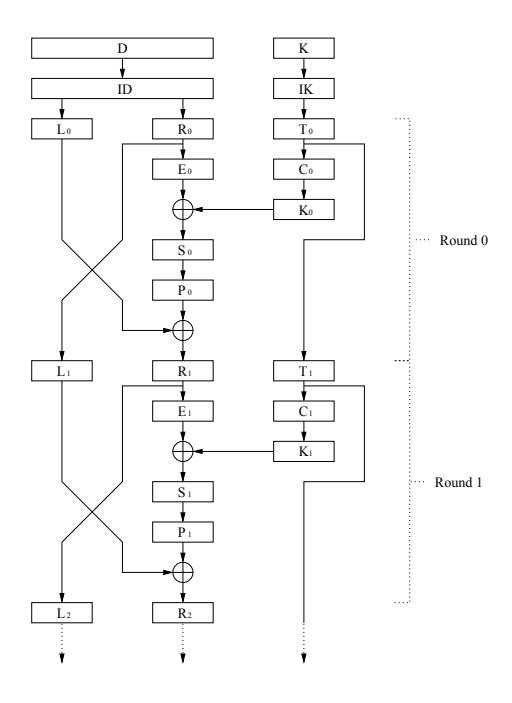
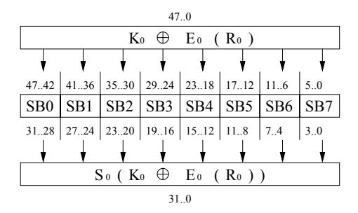

# Theoretical Use of Cache Memory as a Cryptanalytic Side-Channel

D. Page

Department of Computer Science, University of Bristol http://www.cs.bris.ac.uk/

#### **Abstract**

We expand on the idea, proposed by Kelsey *et al.* [14], of cache memory being used as a side-channel which leaks information during the run of a cryptographic algorithm. By using this side-channel, an attacker may be able to reveal or narrow the possible values of secret information held on the target device. We describe an attack which encrypts <sup>2</sup> <sup>10</sup> chosen plaintexts on the target processor in order to collect cache profiles and then performs around <sup>2</sup> <sup>32</sup> computational steps to recover the key. As well as describing and simulating the theoretical attack, we discuss how hardware and algorithmic alterations can be used to defend against such techniques.

### **1 Introduction**

State of the art cryptanalysis has conventionally lay in the realm of mathematicians who seek techniques to unravel the hard problems on which modern cryptosystems are generally based. Recently, a new class of attack has become increasingly popular. Side-channel analysis [23] moves the problem of revealing secret information from the mathematical domain into the practical domain of implementation. By considering the implementation of cryptosystems rather than their specification, researchers have found they can mount attacks which are of low cost in terms of time and equipment and are highly successful in extracting useful results.

Side-channel attacks are based around the general assumption that one can measure properties of the algorithm being processed and make deductions about exactly what that processing entails. For example, simple (SPA) and differential (DPA) power analysis [22] both rely on the attacker measuring the power usage of a processor while executing a cryptographic algorithm. By performing executions of the algorithm and using statistical tests on the resulting power profiles [2], the attacker is able to deduce what data is being used at each stage of the execution. If this data is specified as being secret, the attacker can read it, as if public, when leaked though the power based side-channel.

SPA and DPA are both non-invasive attacks in that the processing device need not be altered or damaged in any way during the attack. Other side-channel attacks which are progressively more intrusive include timing attacks [21], electro-magnetic radiation analysis [13] and glitch and fault analysis based attacks [9]. In their review of sidechannel cryptanalysis, Kelsey *et al.* state:

*"We believe attacks based on cache hit ratio in large S-box ciphers like Blowfish, CAST and Khufu are possible."* [14, Section 7]

We show precisely how cache profiles can aid the recovery of secret information, thereby confirming this prediction. Since cache memory represents a large proportion of microprocessor designs, these profiles are potentially easier to collect than microlevel features such as register or bus state used in related DPA and address-bit DPA [18] attacks. Furthermore, our attack technique is deterministic in the sense that outside the collection of profile information, it does not make use of the statistical techniques used in DPA and similar cache based attacks that could be constructed using timing information. These characteristics mean that cache behaviour analysis (CBA) attacks are hard to defend against without removing the cache entirely and may be mounted with less sophisticated equipment than other methods.

Although current smart-card processor cores [24] seldom incorporate cache memories, some next-generation [19] designs and many current embedded processors [3, 4] do allow the inclusion of both instruction and data caches. Since adding a cache is inexpensive in that it requires relatively few architectural alterations, such a step is attractive because it offers a cost effective way to improve system performance. This work presents preliminary research into how an attacker might use the presence of a cache to their advantage. As such, it provides an attack method which, if not immediately threatening, warns against the use of cache memory in security conscious devices without careful consideration.

We begin in Section 2 by giving a brief introduction to how cache memory works, with particular emphasis to the elements that related to our attack. In Section 3 we outline the environment in which we set our experiments before specifying an example attack against DES [20] in Section 4. So as to provide balance to our attack techniques, in Section 5 we consider some potential countermeasures and discuss their relative merits. Finally, we present ideas for further research in Section 6 and concluding remarks in Section 7.

# **2 Cache Memory**

Cache memory, in the context of microprocessors, is a small area of very fast memory that is placed between the processor and main memory. Since accesses to main memory are slow in comparison to the processor speed, performance is often impaired by operations that need to load and store data. A cache, which operates at a speed closer to that of the processor, helps to solve this problem by storing the most often used data items, thus reducing the cost of accessing them. Accesses to both data and instructions can be cached in this way, the whole system relying on the assumption that there is a working set of data items that are accessed most frequently. Since access to this working set will be accelerated by the cache, the performance of the whole system will improve.

However, since cache memory is faster and more expensive, it is smaller than main memory and can therefore only house a subset of the data items held at a higher level. A replacement policy manages which data items are stored in the cache when they are accessed by the processor, meaning that data items in the cache that have not been used for some time may be evicted and replaced by new items.

When the processor issues an access to the memory system, the address in memory that is being referenced is first mapped into a cache line. In the most simple case this

| Valid | Tag   | Content |  |                     |  |                                          |
|-------|-------|---------|--|---------------------|--|------------------------------------------|
| true  | 0b001 |         |  | 0x20 0x21 0x22 0x23 |  | This line contains address<br>0b00100000 |
| false | −−−−− |         |  | −−−− −−−− −−−− −−−− |  |                                          |
| false | −−−−− |         |  | −−−− −−−− −−−− −−−− |  |                                          |
| true  | 0b000 | 0x00    |  | 0x01 0x02 0x03      |  | This line contains address 0b00001101    |
| false | −−−−− |         |  | −−−− −−−− −−−− −−−− |  |                                          |
| false | −−−−− |         |  | −−−− −−−− −−−− −−−− |  | These lines are empty                    |
| false | −−−−− |         |  | −−−− −−−− −−−− −−−− |  |                                          |
| false | −−−−− |         |  | −−−− −−−− −−−− −−−− |  |                                          |

Figure 1: An example cache structure with eight line and four elements per-line.

may be described as

```
cache line = address mod cache size
```

although more complex mapping schemes exist for more complex cache types. Note that since the cache is smaller than main memory, the mapping scheme causes a wraparound effect meaning more than one address may map to the same line. A cache line will contain three main items of information: the cache valid flag that determines if the cache line has valid information in it, the cache tag that describes what is contained in the line, and the cache data that holds the actual memory contents.

In all but the most simple of caches, the cache line may contain data from several different addresses inside the same content field. That is, several addresses may all map to the same line and be contained within that line. This allows larger blocks of data to be transfered to and from main memory at once which is more efficient than dealing with many smaller transfers. The cache tag field allows such complexities in the mapping scheme by offering uniquely identification such that we can always match an address with the content of the mapped cache line.

Consider an example cache, shown in Figure 1, with a size of eight lines and a line size of four elements that is accessed using 8 bit addresses. In this more complex scheme, we use the lower bits of the address to select the entry within the cache line meaning that the higher bits, the tag, identifies the content of the line as a whole

```
cache element = (address) mod line size
   cache line = (address  (log2(line size)) mod cache size
   cache tag = (address  (log2(line size) + log2(cache size)))
```

where is bit-wise right shift. That is, the element number is calculated by selecting bits zero and one of the address while bits two, three and four specifying the line number. The cache tag is calculated by selecting all the other bits, i.e. except those used to specify the line or element number. From these formula we can show that the combination of element number, line number and tag allows us to distinguish between the mapping of any two addresses. For example, consider the following mappings that result from the equations above

```
address 0b00001101 7! tag 0b000, line 0b011, element 0b01
address 0b00000000 7! tag 0b000, line 0b000, element 0b00
address 0b00100000 7! tag 0b001, line 0b000, element 0b00
```

We can see for example that address 0b00001101 maps to line three and the value we are interested in is in element one. Addresses 0b00000000 and 0b00100000 both map to line zero, element zero but we can distinguish between them since they have different tag values.

When the processor accesses memory though the cache using a mapping of this form, one of several situations occurs. If the line contains invalid data then we need to load the memory content from main memory since the cache doesn't contain it. Similarly, if the cache tag held in the calculated cache line doesn't match the cache tag of the address, we also need to load the content from memory since although the line contains valid information, it isn't the information we are looking for. Either of these two cases is called a cache miss since the cache doesn't contain the data we want and hence it must be fetched from main memory. If the line contains valid data and the tags match, then a cache hit is signalled since the data is present and we can use it without resorting to the slower main memory. The locality of reference phenominia means that cache hits happen more often than cache misses and hence the operation of the overall system is accelerated since there are less accesses to slower memory devices and more to the fast, cached memory.

### **3 Attack Assumptions**

A naive way to approach using cache behaviour is the construction of a database which matches hit/miss profiles collected from an attack run with pre-computed profiles for encrypting a plain-text under all possible keys. Although this sort of attack would be successful, the amount of storage and computational power required to mount such an attack is cripplingly large.

In order to improve on this naive approach, our work employs analysis on, and knowledge of, the algorithms under attack. This analysis forms relationships between parts of secret information based on the behaviour of the cache when the algorithm is run. Such relationships can be used to weaken the cipher, or perhaps directly produce the secret information, with some extra processing after the collection of cache profiles.

When discussing these techniques, we make several assumptions about the ability of the attacker and the composition of the device being attacked:

- Firstly, we assume that the processing device being attacked accesses main memory through a conventional cache memory. Our example attack is based on the ability to spot cache hits and misses in a profile and so devices which perform direct memory access, i.e. without a cache, will not be endangered by this sort of technique.
- We also assume an attacker has the ability to capture information about the cache using a well understood method. We envisage this would be done by spotting known features in a power or electro-magnetic profile in a similar way to how SPA might attack an exponentiation algorithm. By observing the difference in activity between a cache hit and cache miss, the attacker can construct a profile that describes which event occurs within the cache for a given access.
- We assume knowledge about the cache structure, for example the line size, and develop our attack based on these facts. Although the attack will need to change based on the attributes of cache memory found in a real device, the general attack principle remains the same.

- Since our example attack is based on accesses to the S-box style structures found in many block ciphers, we assume that the value of these S-boxes is fetched from a table in memory and not calculated directly using a mapping implemented by processor instructions [1]. This means the access to memory will be routed through the cache and produce an access profile without which such attacks are useless.
- We assume that the cache is emptied on power-off of the host device and that we start running our cryptographic algorithm with an empty cache in respect to the data associated with the algorithm.
- Finally, we assume that we can match information gained from our capture ability to operations in the source code. That is, when a memory access happens through the cache, we can tell which data structure in the algorithm is being accessed. This assumption basically means we need to deal with a deterministic, in-order memory system.

Although these assumptions vastly constrain the usefulness of attacks against real devices, none of them are particularly outrageous when considering the real-life operation of next-generation smart-card devices and current embedded processors. The underlying fact is that the behaviour of cache memory on-board a cryptographic device will yield at least some useful information. Attacks will always need to be tailored to specific circumstances but, in general, more information is always better from the point of view of the attacker.

In our example attack we assume the existence of a processor from which we can glean the result of cache accesses. In order to simulate the information an attacker might gain from a real device, we linked our algorithm implementations to the Dinero cache simulation library [15] which was configured to model a <sup>1</sup> kilobyte, four byte per-line, direct-mapped variant of that found in a real processor core [19, 3, 4]. The cache simulator produces a list of accesses for each run of the algorithm where each access in the list relates to the S-box structures being read.

# **4 Example Attack**

#### **4.1 Introduction**

Our example attack is against the DES [20] encryption algorithm whose core is described as pseudo-code in Figure 2. In this discussion, we use the functions ID, <sup>E</sup>, <sup>P</sup> and F D to denote the initial data, expansion, P-box and final data permutations as well as <sup>T</sup> , IK and <sup>C</sup> in place of key rotation, initial key and compression permutations respectively. <sup>S</sup> represents the whole S-box or substitution transformation while SBn denotes an access to S-box <sup>n</sup>. Note that we assume that the S-box structures have been rearranged for easy array-style indexing as is common in software implementations of DES.

Additionally, we use several types of notation to select and concatenate bits sized values to and from larger values. The notation x[y::z] selects a number of bits, between indices *y* and *z* inclusively, from the value <sup>x</sup> and reforms them into a new value. Similarly, the notation <sup>x</sup>[y; z] selects individual bits at indices *y* and *z* and forms them into a new value. The @ operator is used to concatenate, or recombine, groups of bits into larger values.

```
void des( D, K[] )
{
  D = ID( D );
  L' = D[ 63 .. 32 ];
  R' = D[ 31 .. 00 ];
  for( round = 0; round < 16; round++ )
  {
    L = R';
    R = E( R' );
    R = R ˆ K[ round ];
    R = SB0[ R[ 47 .. 42 ] ] @ SB1[ R[ 41 .. 36 ] ] @
         SB2[ R[ 35 .. 30 ] ] @ SB3[ R[ 29 .. 24 ] ] @
         SB4[ R[ 23 .. 18 ] ] @ SB5[ R[ 17 .. 12 ] ] @
         SB6[ R[ 11 .. 06 ] ] @ SB7[ R[ 05 .. 00 ] ];
    R = P( R );
    R = L' ˆ R;
    L' = L;
    R' = R;
  }
  D = FD( R' @ L' );
}
```

Figure 2: A pseudo-code implementation of DES.

Our goal in attacking this algorithm is to reveal the master key <sup>K</sup> which is stored as secret information in the target device and used to generate the key schedule for encryption and decryption operations. Knowledge of this key would enable us to manufacture a clone device which we could use for fraudulent purposes since the clone would exactly replicate the behaviour of the original device.

#### **4.2 Formulation**

The formulation of an attack against DES assumes the in-depth knowledge of both the algorithm and the operational behaviour of cache memory [11]. We only need to consider the first two rounds of DES which are best described by the flow diagram in Figure 3. From this diagram it is easy to trace the flow of information through the algorithm and show how a given value is calculated from previous values.

The functions S0 and S1 in the diagram represent the substitution transformations in rounds zero and one respectively which are implemented by accesses to the S-box structures in memory. We can trace through the diagram to produce two formulas for the indices, I0 and I1, which perform the S-box accesses in transformations S0 and S1

$$I_0 = K_0 \oplus E_0(R_0)$$

$$I_1 = K_1 \oplus E_1(L_0 \oplus P_0(S_0(K_0 \oplus E_0(R_0))))$$
(1)

The equations for I0 and I1 hold for a different sub-set of bits for each S-box in each transformation. For example, the seventh S-box is accessed using bits zero to five of the incoming index. Furthermore, depending on the cache behaviour with respect to each S-box access, we can relate one index to the other. If we capture the cache behaviour when the aforementioned S-box seven is accessed in transformations S0 and



Figure 3: A flow diagram of DES.

S1 and consider the correct sub-set of bits used in the indices, we produce the following relationships

$$I_0[05..00] =_{LINE} I_1[05..00]$$
 when  $S_1$  yields a cache hit (2)
 $I_0[05..00] \neq_{LINE} I_1[05..00]$  when  $S_1$  yields a cache miss

where =LINE and 6=LINE are *cache line equivalencies* which take into account the fact that since each cache line may store more than one data item, the indices may result in the same cache line being accessed without actually being equal. That is, the *cache tags* of addresses I0 and I1, which dictate the cache lines they map to, may be equal without I0 and I1 actually being equal in value.

Our equations in step 2 basically mean that if we concentrate on the cache profile of one S-box and in round one it produces a hit, we know that the indices I0 and I1 must map to the same line in the cache. Depending on the cache line size, we can force these cache line considerate equations into direct equalities. We consider an example cache which has a line size of four, i.e. each cache line can hold four S-box elements, meaning that the bottom two bits of any access will be used as the selector within the line rather than altering which line the access refers to. We can apply this knowledge to solidify our relations thus

$$I_0[05..02] = I_1[05..02]$$
 when  $S_1$  yields a cache hit  $I_0[05..02] \neq I_1[05..02]$  when  $S_1$  yields a cache miss

This has allowed us to directly relate the values of I0 and I1 with each other from a cache hit or miss on accesses to a given S-box, in this case S-box seven. We continue our analysis by using the bit selection on our indices to peal away layers of permutation



Figure 4: A flow diagram of DES S-box access in round zero.

in order to simplify our expressions for I0 and I1. For example, given the expression

$$P_0(X)[04..01] (4)$$

we can trace the bits we require in the output through the permutation in order to deduce the bits from whence they came

$$P_0(X)[04..01] = X[26, 10, 21, 28] (5)$$

This example shows that if we apply the P0 permutation to a value <sup>X</sup> and are only interested in a sub-set of bits in the output, which values of <sup>X</sup> we need to consider in their place. By applying this sort of technique to our equations for I0 and I1 we can simplify them as follows

$$I_{0} = (K_{0} \oplus E_{0}(R_{0}))[05..02]$$

$$= K_{0}[05..02] \oplus E_{0}(R_{0})[05..02]$$

$$= K_{0}[05..02] \oplus R_{0}[04..01]$$
(6)

$$I_{1} = (K_{1} \oplus E_{1}(L_{0} \oplus P_{0}(S_{0}(K_{0} \oplus E_{0}(R_{0})))))[05..02]$$

$$= K_{1}[05..02] \oplus E_{1}(L_{0} \oplus P_{0}(S_{0}(K_{0} \oplus E_{0}(R_{0}))))[05..02]$$

$$= K_{1}[05..02] \oplus (L_{0} \oplus P_{0}(S_{0}(K_{0} \oplus E_{0}(R_{0}))))[04..01]$$

$$= K_{1}[05..02] \oplus L_{0}[04..01] \oplus P_{0}(S_{0}(K_{0} \oplus E_{0}(R_{0})))[04..01]$$

$$= K_{1}[05..02] \oplus L_{0}[04..01] \oplus S_{0}(K_{0} \oplus E_{0}(R_{0}))[26, 10, 21, 28]$$

The sticking point in using these equations is the instance of the S0 transformation which represents S-box accesses in round zero. Note that in this case, cache behaviour is irrelevant and we are interested only in the resultant value of the transformation in our equation. Since we know the output bits we are interested in, we can expand our expressions using knowledge about the flow of data through the S-boxes as shown in Figure 4. We can see from this that the output of the S-box transformation, given the sub-set of bits we are interested in, is taken from the output of four different actual S-box accesses. Hence we make the following specialisation

$$S_{0}(X)[26] = SB1(X[41..36])[02]$$

$$S_{0}(X)[10] = SB5(X[17..12])[02]$$

$$S_{0}(X)[21] = SB2(X[35..30])[01]$$

$$S_{0}(X)[28] = SB0(X[47..42])[00]$$
(7)

which we can insert into our expression thus

$$I_0 = K_0[05..02] \oplus R_0[04..01]$$
 (8)
 $I_1 = K_1[05..02] \oplus L_0[04..01] \oplus Z$

where

$$Z = SB1((K_0 \oplus E_0(R_0))[41..36])[02]@$$

$$SB5((K_0 \oplus E_0(R_0))[17..12])[02]@$$

$$SB2((K_0 \oplus E_0(R_0))[35..30])[01]@$$

$$SB0((K_0 \oplus E_0(R_0))[47..42])[00]$$

By rewriting all instances of K0 and K1 in terms of <sup>K</sup>, we find that

$$K_{0}[05..02] = K[19,50,51,02]$$

$$K_{1}[05..02] = K[27,58,59,10]$$

$$K_{0}[41..36] = K[31,07,62,55,45,22]$$

$$K_{0}[17..12] = K[17,34,59,11,41,35]$$

$$K_{0}[35..30] = K[61,29,38,39,20,06]$$

$$K_{0}[47..42] = K[54,13,30,04,15,47]$$

$$(9)$$

which we can substitute into our equations for I0 and I1, before removing any remaining permutation operations, to form a final result

$$I_0[05..02] = K[19, 50, 51, 02] \oplus R_0[04..01]$$
 (10)
 $I_1[05..02] = K[27, 58, 59, 10] \oplus L_0[04..01] \oplus Z$

where

$$Z = SB1(K[31,07,62,55,45,22] \oplus R_0[31,39,47,55,63,05])[02]@\\ SB5(K[17,34,59,11,41,35] \oplus R_0[27,35,43,51,59,01])[02]@\\ SB2(K[61,29,38,39,20,06] \oplus R_0[63,05,13,21,29,37])[01]@\\ SB0(K[54,13,30,04,15,47] \oplus R_0[57,07,15,23,31,39])[00]$$

From this final result and the relationships between I0 and I1 described in step 3, we have developed equations that tie together different parts of key material for given values of input data. When the indices for accesses to a given S-box in rounds zero and one are equal, i.e. there is a cache hit recorded for the access to that S-box in round one, these equations give us a equality test which we can use to check if a given combination of key material bits are valid. The composition of the test will depend on which S-box was considered when generating the equations for I0 and I1 but will take the general form

$$K[x..y] \oplus R_0[x..y] = K[x..y] \oplus L_0[x..y] \oplus Z$$

where

$$Z = SBn(K[x..y] \oplus R_0[x..y])[z]@$$

$$SBn(K[x..y] \oplus R_0[x..y])[z]@$$

$$SBn(K[x..y] \oplus R_0[x..y])[z]@$$

$$SBn(K[x..y] \oplus R_0[x..y])[z]$$

Since we can control the value of <sup>D</sup>, and hence the values of L0 and R0, we can force the solidification of our relationships into tests by picking a value of R0 and finding a value of L0 such that accessing the S-box under consideration in round one produces a hit. We call the value of L0 which provokes this cache hit the *fixed point* of R0. Using this technique and randomly picking values of R0, we can manufacture as many tests as we want by performing encryption queries to the target device, capturing the cache profile, and testing if a given L0 provoked a cache hit in round one when our chosen S-box was accessed.

The point of generating these tests is that we can use them to perform an efficient sub-key search which gives us a small number of candidate sub-key values with respect to each S-box. For example, considering the final result for S-box seven in step 10 above, we might choose R0 to be zero which, after finding the fixed point L0 to be 0x0E, gives the test

$$K[19, 50, 51, 02] = K[27, 58, 59, 10] \oplus 0x0E \oplus Z$$

where

$$Z = SB1(K[31,07,62,55,45,22])[02]@$$

$$SB5(K[17,34,59,11,41,35])[02]@$$

$$SB2(K[61,29,38,39,20,06])[01]@$$

$$SB0(K[54,13,30,04,15,47])[00]$$

If we were to perform a brute-force search through the <sup>31</sup> unique key bits used, with bit <sup>59</sup> being used twice, only a small proportion of the bit combinations will be valid under this equality. Since we can generate many of these tests for each S-box, each with different L0 and R0 pairs as demonstrated by the appendix to this paper, we can apply many tests on a given combination of key bits and ensure very few are actually considered valid.

#### **4.3 Implementation**

We considered an example attack against a secret key of

$$K = 0 \times 0123456789 \text{ABCDEF}$$
 (11)

which when we strip out the parity bits for clarity equals

$$K = 0 \times 0022446688 \text{AACCEE}$$
 (12)

Note that we consider a <sup>64</sup> bit key since this is what out algorithm, and hence the related key permutation and schedule operations, expects. It is important to note that any valid key could have been used and that the existence of parity bits doesn't effect the correctness of performance of the attack since they don't occur in our test equations.

We started by generating <sup>32</sup> tests with respect to S-box zero, by taking the general form for S-box zero indices found in the appendix, selecting a random R0 and finding the corresponding fixed point L0. After finding <sup>32</sup> random point/fixed point pairs, and hence creating the same number of equalities, we reduced the potential number of candidate sub-keys by searching through the used key bits and applying all our equality tests to all the combinations.

Eight candidate sub-key combinations passed all 32 tests, where  $C_{i,j}$  denotes candidate key number j which was gained from round i of the attack method

$$C_{0,0} = 0 \times 00024420 \times 002444$$

$$C_{0,1} = 0 \times 00024420 \times 002444$$

$$C_{0,2} = 0 \times 00024420 \times 002444$$

$$C_{0,3} = 0 \times 00024420 \times 002444$$

$$C_{0,4} = 0 \times 00024460888024$$

$$C_{0,5} = 0 \times 00024460888034$$

$$C_{0,6} = 0 \times 00024460888004$$

$$C_{0,7} = 0 \times 00024460888014$$

$$C_{0,7} = 0 \times 00024460888014$$

Interestingly, we found that performing 32 tests on each combination was in fact overkill since the same result could have been obtained using only 9 tests. In order to move closer to the actual result, we performed a second round of testing using 32 more tests, this time generated with respect to S-box one. The search again covered 31 bits of the key space and resulted in a further eight candidate sub-keys

$$C_{1,0} = 0 \times 00020046800 \text{A086E} \end{tabular}$$

$$C_{1,1} = 0 \times 00020046800 \text{A88EE} \end{tabular}$$

$$C_{1,2} = 0 \times 40020046800 \text{A084E} \end{tabular}$$

$$C_{1,3} = 0 \times 40020046800 \text{A88CE} \end{tabular}$$

$$C_{1,4} = 0 \times 80820046800 \text{A086E} \end{tabular}$$

$$C_{1,5} = 0 \times 80820046800 \text{A088EE} \end{tabular}$$

$$C_{1,6} = 0 \times 00820046800 \text{A084E} \end{tabular}$$

$$C_{1,7} = 0 \times 00820046800 \text{A088CE} \end{tabular}$$

This time, the full set of tests was required to narrow the candidate sub-keys to a manageable number. Since the candidate sub-keys from each round of testing use different bits of the key, we would ordinarily have to consider all logical combinations of the candidates, i.e.

$$\begin{array}{cccccccccccccccccccccccccccccccccccc$$

However, since we know that the two searches overlap in 17 bits of their key usage, we can eliminate a large number of these combinations. This is done by considering pairs of sub-keys and discarding any which disagree in their use of overlapping bits. If  $C_{0,i}$  and  $C_{1,j}$  represent two candidate sub-keys from search zero and one respectively and  $M_o$  represents a mask of the overlapping bits between the two rounds of testing, if

$$(C_{0,i} \oplus C_{1,j}) \wedge M_o = 0 \tag{16}$$

then the combined sub-key

$$C_{0,i} \vee C_{1,j} \tag{17}$$

is accepted as a valid candidate. After calculating the mask Mo which represents the overlapping bits to be

$$M_o = 0 \times \text{C0821840840000AA} \tag{18}$$

and using the test in step 16 on values from steps 13 and 14, we were able to narrow the number of potential candidates to four

$$C_{2,0} = 0$$
x00024466888AACEE (19)
 $C_{2,1} = 0$ x00024466888ABCFE
 $C_{2,2} = 0$ x0002446688AA8CEE
 $C_{2,3} = 0$ x0002446688AA9CFE

At this stage in the attack, we are faced with the prospect of further rounds of testing in order to narrow our candidate keys towards the final result. However, after performing rounds zero and one of testing, we have covered <sup>49</sup> of the <sup>56</sup> non-parity key bits and find that a further round of testing would only add a few extra bits to this coverage. Since a brute force search of the bits not covered by search rounds zero and one is much less expensive that performing further rounds of testing, this is the approach we adopt.

If Mu represents a mask where if a bit is set, it needs to be included in the search, i.e. it was not covered by any previous rounds of testing, and the value of this mask with respect to rounds zero and one is

$$M_u = 0 \times 0630800000044000 \tag{20}$$

we can apply the following test to narrow the candidate keys towards a final result

$$DES(P,K) = DES(P, C_{2.i} \vee \overline{M_u})$$
(21)

That is, if the cipher-text produced by encrypting a known plain-text under the secret key equals the cipher-text produced by encrypting the same plain-text under our composed candidate key, we have found the final result. Note that we use Mu to denote a value which is derived from only the bits, given by Mu, not covered by previous testing. In trying to solve this equation, we first collect a known plain-text/cipher-text pair from the target device with which to compare the results of our search. These values could be taken from the first phase of the attack where we recover fixed points for our equations by running queries on the device. We then search through possible values in Mu and compare the result of our known encryption to that of our composite key given by C2;i \_ Mu. We performed this search with our candidate keys and produced one single result

$$C_{3,0} = 0 \times 0022446688 \text{AACCEE} \tag{22}$$

which is the same as the key we started with and hence represents a successful attack.

#### **4.4 Efficiency**

In general, using our sub-key search method is significantly less expensive than performing conventional brute force key search. The first phase of the attack is the collection of cache information from the target device in order to build our test equalities. If we intend to perform r rounds of testing each performing t tests on each key combination, we will need to perform at most

$$\alpha = r \times t \times 2^4$$

DES operations (DOPS) on the target device in order to recover the fixed points and hence generate the equalities. Once this is done, we move onto the search phase which is the most costly operation in the attack. In total, we need to perform

$$\beta = r \times t \times 2^{31}$$

test operations (TOPS) since any test for a given S-box will utilise at most 31 unique key bits. Finally, we need to finalise the candidate keys we have left after the search operation by brute force searching the rest of the key space. We consider this phase to take

$$\gamma = c \times m$$

DES operations where c is the number of candidate keys produced by the search phase and m is a constant related to how may residual bits need to be searched. Typically, both c and m will be small and hence the finalisation phase will not be costly in comparison with the main search phase. In our example, we chose the following parameters

$$r = 2$$
 $t = 32$

i.e. we did two rounds of testing where in each round, generated by S-boxes zero and one, 32 tests were applied to each key combination. Since S-boxes zero and one overlap in 13 bits of their key use, they cover a total of 49 bits of the key. The remaining 7 non-parity bits of the key need to be searched by brute force DES search as part of the finalisation phase. We therefore performed a workload of

$$\alpha = 2 \times 32 \times 2^{4}$$
 $= 2^{10} \text{DOPS}$
 $\beta = 2 \times 32 \times 2^{31}$
 $= 2^{37} \text{TOPS}$
 $\gamma = 4 \times 2^{56 - (31 + 31 - 13)}$
 $= 2^{9} \text{DOPS}$

We deliberately chose to perform 32 tests on each combination of key bits since this is roughly equivalent to performing one application of DES. Therefore, since 32 TOPS equals 1 DOPS, our total workload was

$$2^{10}$$
DOPS +  $2^{32}$ DOPS +  $2^{9}$ DOPS  $\simeq 2^{32}$ DOPS

This result indicates that with the help of cache information gleaned from the target processor, the 56 bit DES key is equivalent in terms of security to a 32 bit DES key. It is imperative to note that only the first attack phase counts as on-line processing. That is, the attacker only needs access to the target device for as long as it takes to generate the fixed points for the test operations, i.e. for as long as it takes to perform  $2^{10}$  DES operations. The expensive off-line phase of the processing effort, around  $2^{32}$

DES operations, may take place off-line, at the attackers leisure and without the need for access to the target device. We implemented the off-line processing phase of our example attack described in Section 4.3 in software on a <sup>600</sup> MHz UltraSPARC III processor, and in hardware on a <sup>20</sup> MHz Xilinx4000XL FPGA design [7] programmed using the Handel-C hardware compilation system [6]. We were able to extract the key in around seven hours in software and under three hours in hardware.

It is interesting to note that the minimisation of on-line workload is an important factor in the viability of side-channel analysis attacks since without a low-cost way of collecting operation profiles, useful access to the target device will be limited [5]. The low on-line processing cost versus high off-line processing cost characteristic of this attack may therefore be thought of as an advantage over techniques that require more on-line work. That is, since we will always have more resources and time to perform off-line processing it makes sense to have an attack whose characteristics are skewed towards this fact.

### **5 Potential Countermeasures**

Although CBA might offer effective methods to attack the security of a cryptographic algorithm, there are measures which can be taken to limit the damage. The best way to prevent attacks against the cache is to remove it from the processor design. Although the cost versus performance tradeoff of removing the cache might be acceptable in some situations, the technique is flawed in general since the degradation in performance of the processing device is too valuable a factor to ignore. This discussion is therefore limited to techniques which act to reduce the effectiveness of such an attack when the cache is present.

We present several potential methods of guarding against CBA attacks which are based on hardware modifications, algorithmic alterations or a combination of both. The ideal solution will be the one which approaches the same performance-based efficiency as when a normal cache is present but without the problems of having attacks using information such as device gives. It is clear that other defences might be uncovered through further investigation. However, none of our current ideas, apart from removing the cache, can offer guaranteed protection from our attack methods since they all offer some probabilistic level of security. This is mainly due to the fact that our assumption is that the attacker is able to construct a profile of cache behaviour rather than using statistical information such as timing of execution. Although a profile collection based attack will be harder to do, and require more sophisticated hardare, it is possibly a more realistic model of how a secure processor would be attacked in the wild. In the case of timing based attacks against cache behaviour, defenses can fairly easily be realised using timing skews or by inserting dummy operations [12] to alter the run-time of the assumed fixed-length operation. To defend against our attack, one must mask the actual occurance of cache behaviour, in a similar way that register access behaviour should be masked to defend against DPA, an act which proves to be much harder to perform.

The defence which offers the best security versus cost ratio appears to be nondeterministic access ordering described in Section 5.3 since it offers a level of protection based on calculatable, although probabilistic, parameters such as the level of non-deterministic scheduling possible between the accesses. However, we note that this defence requires significant hardware changes which might be prove too costly a tradeoff in order to increase performance via the cache.

#### **5.1 Full or Random Cache Warming**

In order to change the profile of cache hits and misses between runs of the algorithm, we can make a changes to the source code of the algorithm which warms [10] the cache with data. This may range from fully loading an S-box into the cache, and hence avoiding any misses from which information can be gained, to randomly loading Sbox elements such that the confidence in information gained from the cache is reduced. For example, in the attack described in Section 4 we could alter the profile of hits and misses to the S-box data structure by warming the cache with random elements from that structure:

```
for( i = 0; i < warming factor; i++ )
{
  dummy = sbox[ random number % sbox size ]
}
```

By performing this operation at the start of the algorithm, we will fill the cache with random elements from the S-box which will act to change the profile of hits and misses in the cache depending on which elements were loaded. This approach is initially attractive since it can be implemented in software as a prelude to the actually algorithm rather than involving extra hardware elements. However, it does not guaranteed protection because it only actually masks the original access if we warmed the cache with the right entry. In that respect, it is a probabilistic defence with the probability of actual protection related to the size of the S-boxes and the proportion of them which are warmed into the cache.

To guarantee this as an effective countermeasure we need to warm the cache with the entirety of all the S-boxes, rather than just random elements, but this is as bad as not having a cache in the first place. Even so, full warming of the cache is implemented inadvertently in algorithms such as Khufu [17] where the S-boxes are computed via influence from the key material. In these cases, the entire S-box will be touched, and hence loaded into the cache, before execution of the algorithm starts meaning that assumptions about the ability to manufacture hits and misses no longer hold.

#### **5.2 Rapid Avalanche Effect**

Conventional wisdom states that a desirable property in hash function and cipher designs is the demonstration of an avalanche effect. That is, any given bit in the input should effect as much of the output as possible. If this effect happens quickly in the algorithm, it is much harder to perform analysis on the flow of data since the amount of unknown information that effects any given stage is very large.

We encountered the problems raised by the avalanche effect in Section 4. We found that in DES, <sup>54</sup> of the <sup>56</sup> useful bits in the key influenced the behaviour of the algorithm by the second round. This significantly complicates our equations and resulting tests since considering cache accesses to any of the S-box structures means considering the output from a further four S-boxes indexed by key material. If this were not the case, the relationships would be significantly simpler and include far less unknown information. This in turn would results in a more effective attack against the algorithm.

Since the rapid influence of the avalanche effect will make the formation of relationships based on cache behaviour harder, it follows that this is a good countermeasure to consider.

#### **5.3 Non-deterministic Access Ordering**

Non-deterministic processors [16] have been proposed as a general defence to sidechannel attacks. These processors harness instruction level parallelism, inherent in the implementation of an algorithm, to run instructions in a random order while maintaining dependencies between them. Since the processor will run the instructions in a different order on each run of the algorithm, the power profile will change between runs making an attack significantly harder.

Similar principles can be applied to defending against CBA by allowing memory access to occur out of order in the same way that register based instructions in a nondeterministic processor. Although dependencies between instructions need to be observed to prevent write-after-read or write-after-write hazards, a list of consecutive reads to memory could be reordered producing a different cache profile per-ordering:

```
temp0 = sbox0[ address ] = hit ) temp2 = sbox2[ address ] = miss
temp1 = sbox1[ address ] = hit ) temp3 = sbox3[ address ] = miss
temp2 = sbox2[ address ] = miss ) temp0 = sbox0[ address ] = hit
temp3 = sbox3[ address ] = miss ) temp1 = sbox1[ address ] = hit
```

The accesses could also be reordered in a valid manner such that the cache profile remains the same:

```
temp0 = sbox0[ address ] = hit ) temp1 = sbox1[ address ] = hit
temp1 = sbox1[ address ] = hit ) temp0 = sbox0[ address ] = hit
temp2 = sbox2[ address ] = miss ) temp3 = sbox3[ address ] = miss
temp3 = sbox3[ address ] = miss ) temp2 = sbox2[ address ] = miss
```

However, the attacker can not be sure that the deductions made from the cache access information are valid since they are no longer able to match an access in the profile to a reference in the source code. Furthermore, the addition of an instruction stream mutation unit [12] might enable false memory accesses to further complicate the captured access profile.

An optimistic attacker might suggest that they could count the total number of cache hits and misses in round zero and and one of DES execution. Then, by changing only input bits affecting a single S-box in round one and observing the change with respect to the pre-recorded total, he might still be able to see if there is a hit or a miss. For example, the attacker might record the hits and misses in round one as follows:

```
temp0 = sbox0[ address ] = hit
temp1 = sbox1[ address ] = hit
temp2 = sbox2[ address ] = miss
temp3 = sbox3[ address ] = miss
```

Then he cycles through bits in the address, i.e. the input data, which he knows might alter accesses to only one S-box, e.g. S-box one. Eventually, he might hit on a value which turns the hit resulting from the access to S-box one into a miss. Even if the accesses are reordered, the attacker still has the knowledge that there were two hits before; one hit afterwards; and his alterations only effected accesses to S-box one.

```
temp2 = sbox2[ address ] = miss
temp3 = sbox3[ address ] = miss
temp0 = sbox0[ address ] = miss
temp1 = sbox1[ address ] = hit
```

Therefore, he might claim that since there was one less hit before than after his altering the address, the result of accessing S-box one must have been a hit. The opposite deduction is true if he were to find one more hit, rather than one less after performing the counting operations. However, in practice, this attack doesn't work since thanks to the avalanche effect in DES, it is impossible to find enough bits in the address through which to cycle such that you can guarantee to alter the access pattern and notice the difference.

If this scheme were implemented as an extension to a non-deterministic processor [16] where scheduling allows a reasonably large degree of movement for instructions, it could significantly reduce the determinism of a captured cache profile and make CBA attacks much harder. However, it provides a probabilistic defence which is bound by the amount of memory reordering potential in a given algorithm. If the algorithm under attack has very few accesses to memory which can be reordered, due to dependencies for example, the whole scheme will be ineffective in guarding against CBA.

### **5.4 Non-deterministic Cache Placement**

The use of randomised cache mapping policies [25] has been proposed as a method of avoiding cache conflict caused by, for example, strided access patterns. This sort of scheme works by introducing some skew in how a cache line is determined from the address so that over time, the same address will be mapped into different lines. This sort of technique offers high performance while adding a level of non-determinism to the system by changing the mapping function between runs of an algorithm.

At first glance, it appears we might be able to use this property to defend against a CBA attack by introducing some degree of non-determinism in the cache operation. However, by looking at the problem more closely, this turns out to be impossible. If you implement a randomised mapping policy in the cache you could non-deterministically alter the performance, i.e. the number of hit and misses, between runs of the algorithm. Although this is possible, it isn't guaranteed since the mapping characteristics chosen will entirely determine the performance given a fixed base architecture and workload. Alternatively, you could elect to alter the mappings in the middle of a single execution in an attempt to alter the pattern of hits and misses.

The problem in the first case is that unlike DPA, we aren't interested in performance differentials between runs of the algorithm but the deterministic occurrence of a cache hit from a specific S-box access in the second round of DES execution. This is something that altering the mapping between executions will not hide.

In the second case, altering the mappings in a more fine grained manner, e.g. on a cache miss, will make all the data in the cache unretrievable every this is done. This is because the mappings effectively determine where in the cache new data elements are placed rather than whether the data can be found. By altering the mappings, all we have done is to ensure none of the data can be found but new data entering the cache will be placed in a different location. The net effect represents a massive performance problem which doesn't offer any better performance than not having a cache present.

Therefore, the introduction of non-determinism through randomised-cache mappings doesn't offer an effective defence since is doesn't guarantee a level of effectiveness and isn't able to hide the side-channel from the attacker.

### **6 Observations and Further Work**

Our work so far has been fairly successful in developing techniques to use cache behaviour information in a cryptanalytic setting. Our example starts by analysing the flow of data through the algorithm in question to form relationships between bits of secret information. These relationships are brought about by the ability to reason about the behaviour of the cache while the algorithm is running. We are able to control the plaintext input to the algorithm in order to solidify these relationships and inspect possible values of secret information. This process narrows the possible values it can take so that key search may be executed more efficiently.

Clearly our attack, like most side-channel attacks, is specialised to a given cryptographic algorithm and can not easily be generalised to other algorithms even if they are similar in structure. However, we have outlined some general methods that are potentially effective against a wide range of cryptographic algorithms and identified a number of issues which will impact on our ability to use these methods in real-life:

- Our assumptions about cache line size will alter how our attacks are implemented against a real device. Since the core element of our attacks is the ability to reason about what meaning a cache hit or miss has, the fact that altering the cache line size will alter the cache profile will need to be addressed in real world attacks.
- Our example algorithm is based on a Feistel network structure. It would be interesting to investigate other algorithms, such as AES [8], that are based on substitution/permutation network design. Additionally, it would be interested to investigate algorithms such as Khufu which generate key-dependent S-boxes to see if the scheduling operation is vulnerable to attack.
- The current state of our example attack is a product of the first round of research and is therefore open to improvement. Specifically, it would be interesting to improve the attack against DES such that it yields more useful results with less computational effort on the behalf of the attacker. Additionally, it is important to implement and test the effectiveness of our countermeasure proposals.
- We have only considered cache behaviour within large S-box structures. Although potentially more complicated to analyse, there may be other data structures used by an algorithm which are amenable to being examined by similar techniques. Although this would certainly need to be examined on the peralgorithm basis, it may provide an interesting area for further work, perhaps focusing on the use of the function call stack.
- Related to the item above, we could investigate implementations of algorithms, such as DES, which perform permutation operations by table lookup. Although this is costly in hardware, with memories becoming larger this may be a valid optimisation technique in software which is exploitable using CBA.

The main item of further work to consider is the deployment of our methods in real world situations against physical implementations. This step is vital to the success of this work since side-channel analysis is an inherently real world attack and so considering simulated results is at best theoretical and at worst invalid.

### **7 Conclusions**

Because of their ability to introduce non-linearity into block ciphers, S-boxes are generally considered to be vital for defense against mathematical based cryptanalysis

*"S-boxes are considered to be the elements in the round transformation that give the cipher its strength against cryptanalysis."* [8, Page 73]

However, this work shows that when considering implementation based cryptanalysis the S-boxes can present an attackable side-channel. Side-channel analysis is a thorn in the side of manufacturers of secure devices since it allows attackers to bypass conventional, mathematical notions of security. By attacking the implementation of algorithms rather than their specification, secret information can be liberated in a cost effective and practical manner. Next-generation smart-card devices [19] and currently available embedded processors [3, 4] allow the addition of cache memory as a way to improve overall system performance. We have shown that using cache memory in a processor without some thought can enable an attacker to infer details about what is going on inside a secure processor by analysing the cache access behaviour.

We have presented a theoretical attack against DES, which acts to significantly weaken the cipher once cache behaviour information has been collected. Our results showed that a <sup>56</sup> bit DES key is effectively only as secure as a <sup>32</sup> bit key if an attacker can spot cache hits and misses during execution of the algorithm. This example has hinted at some general techniques for using cache behaviour in attacks against other systems as well as a number of potential countermeasures which can make such attacks harder.

Clearly the theoretical examples and countermeasures presented here require further work to produce useful, implementable attacks against real hardware. However, it is imperative to note that CBA can give the attacker more information that they would otherwise have. Giving an attacker this extra information is dangerous if it can be avoided since combining several attacks which each yield small amounts of information may produce a composite attack that can reveal secret information and fully compromise security. Ultimately, designers of secure systems must consider *any* leaked information as dangerous since an attacker is certain to use anything they can to their advantage.

# **Acknowledgements**

The author would like to thank James Irwin and Nigel Smart for useful discussion throughout the duration of this work.

### **References**

- [1] A. Klimov and A. Shamir. A New Class of Invertible Mappings. In B.S. Kaliski Jr. and C¸ .K. Koc¸ and C. Paar, editor, *4th Workshop on Cryptographic Hardware and Embedded Systems (CHES)*, volume , pages 471–484. Springer-Verlag, Lecture Notes in Computer Science, August 2002.
- [2] M-L. Akkar, R. Bevan, P. Dischamp, and D. Moyart. Power Analysis, What Is Now Possible... In *6th International Conference on the Theory and Application of Cryptology and Information Security*. Springer-Verlag, December 2000.

- [3] ARM Ltd. ARM7 Embedded Processor Core. http://www.arm.com/ armtech/ARM7\_Thumb?OpenDocument, 2002.
- [4] ARM Ltd. ARM9 Embedded Processor Core. http://www.arm.com/ armtech/ARM9\_Thumb?OpenDocument, 2002.
- [5] B. Schneier and A. Shostack. Breaking Up Is Hard to Do: Modeling Security Threats for Smart Cards. In *USENIX Workshop on Smart Card Technology*, pages 175–185. USENIX Press, 1999.
- [6] Celoxica. Handel-C Language Overview. Technical report.
- [7] Celoxica. Reconfigurable Hardware Development Platform: RC1000. Technical report.
- [8] J. Daemen and V. Rijmen. *The Design of Rijndael*. Springer-Verlag, 2002.
- [9] E. Biham and A. Shamir. Differential fault analysis of secret key cryptosystems. In *17th Annual International Cryptology Conference (CRYPTO)*, volume 1294. Springer-Verlag, August 1997.
- [10] M.C. Easton and R. Fagin. Cold-Start vs. Warm-Start Miss Ratios. In *Communications of the ACM*, volume 21, pages 866–872, October 1978.
- [11] J. Hennessy and D. Patterson. *Computer Architecture A Quantative Approach*. Morgan Kaufmann, 1996.
- [12] J. Irwin and D. Page and N.P. Smart. Instruction Stream Mutation for Non-Deterministic Processors. In M. Shulte and S. Bhattacharyya and N. Burgess and R. Schreiber, editor, *13th International Conference on Application-Specific Systems, Architectures and Processors (ASAP)*, pages 286–295. IEEE Computer Society Press, July 2002.
- [13] K. Gandolfi and C. Mourtel and F. Olivier. Electromagnetic Analysis: Concrete Results. In *Workshop on Cryptographic Hardware and Embedded Systems (CHES)*, volume 2162. Springer-Verlag, May 2001.
- [14] J. Kelsey, B. Schneier, D. Wagner, and C. Hall. Side Channel Cryptanalysis of Product Ciphers. In *5th European Symposium on Research in Computer Security*, volume 1485, pages 97–110. Springer-Verlag, 1998.
- [15] M.D. Hill. Aspects of Cache Memory and Instruction Buffer Performance. Technical Report CSD-87-381, University of California, Berkeley, Department. of Computer Sciences, November 1987.
- [16] M.D. May and H.L. Muller and N.P. Smart. Non-Deterministic Processors. In *6th Australasian Conference On Information Security and Privacy (ACISP)*, pages 115–129, 2001.
- [17] R.C. Merkle. Fast Software Encryption Functions. In *Advances in Cryptology (CRYPTO)*, volume 537, pages 476–501. Springer-Verlag, August 1990.
- [18] T.S. Messerges, E.A. Dabbish, and R.H. Sloan. Investigations of Power Analysis Attacks on Smartcards. In *USENIX Workshop on Smartcard Technology*, pages 151–162, May 1999.

- [19] MIPS Technologies. MIPS 4KSc Smart-Card Processor Core. http://www. mips.com/products/s2p9.html, 2002.
- [20] National Institute of Standards and Technology (NIST). Data Encryption Standard (DES). Technical Report FIPS PUB 46-3, October 1999.
- [21] P.C. Kocher. Timing Attacks on Implementations of Diffie-Hellman, RSA, DSS, and Other Systems. In *16th Annual International Cryptology Conference (CRYPTO)*, volume 1109. Springer-Verlag, August 1996.
- [22] P.C. Kocher and J. Jaffe and B. Jun. Differential Power Analysis. In *19th Annual International Cryptology Conference (CRYPTO)*, volume 2139. Springer-Verlag, August 1999.
- [23] N.P. Smart. Physical Side-Channel Attacks On Cryptographic Systems. *Software Focus*, 1(2):6–13, 2000.
- [24] STMicroelectronics. ST22 Smart-Card Processor Core. http://www.st. com, 2002.
- [25] N.P. Topham and A. Gonzalez. Randomized Cache Placement for Eliminating Conflicts. *IEEE Transactions on Computers*, 48(2):185–192, 1999.

### **Appendix**

With respect to S-box 0:

```
I0[47; 46; 45; 44] = K[54; 13; 30; 04]  D[57; 07; 15; 23]
I1[47; 46; 45; 44] = K[62; 21; 38; 12]  D[56; 06; 14; 22]  Z
```

where

$$Z = SB6(K[03, 43, 26, 01, 49, 44] \oplus D[59, 01, 09, 17, 25, 33])[03]@\\SB3(K[05, 63, 28, 37, 46, 23] \oplus D[29, 37, 45, 53, 61, 03])[00]@\\SB1(K[31, 07, 62, 55, 45, 22] \oplus D[31, 39, 47, 55, 63, 05])[01]@\\SB4(K[42, 36, 25, 10, 27, 60] \oplus D[61, 03, 11, 19, 27, 35])[00]$$

With respect to S-box 1:

```
I0[41; 40; 39; 38] = K[31; 07; 62; 55]  D[31; 39; 47; 55]
I1[41; 40; 39; 38] = K[39; 15; 05; 63]  D[30; 38; 46; 54]  Z
```

where

```
Z = SB5(K[17; 34; 59; 11; 41; 35]  D[27; 35; 43; 51; 59; 01])[03]@
       SB7(K[19; 50; 51; 02; 09; 33]  D[25; 33; 41; 49; 57; 07])[03]@
       SB2(K[61; 29; 38; 39; 20; 06]  D[63; 05; 13; 21; 29; 37])[00]@
       SB6(K[03; 43; 26; 01; 49; 44]  D[59; 01; 09; 17; 25; 33])[00]
```

With respect to S-box 2:

```
I0[35; 34; 33; 32] = K[61; 29; 38; 39]  D[63; 05; 13; 21]
I1[35; 34; 33; 32] = K[04; 37; 46; 47]  D[62; 04; 12; 20]  Z
```

where

```
Z = SB4(K[42; 36; 25; 10; 27; 60]  D[61; 03; 11; 19; 27; 35])[03]@
       SB0(K[54; 13; 30; 04; 15; 47]  D[57; 07; 15; 23; 31; 39])[03]@
       SB3(K[05; 63; 28; 37; 46; 23]  D[29; 37; 45; 53; 61; 03])[01]@
       SB5(K[17; 34; 59; 11; 41; 35]  D[27; 35; 43; 51; 59; 01])[01]
```

With respect to S-box 3:

$$I_0[29, 28, 27, 26] = K[05, 63, 28, 37] \oplus D[29, 37, 45, 53]$$

 $I_1[29, 28, 27, 26] = K[13, 06, 07, 45] \oplus D[28, 36, 44, 52] \oplus Z$

where

$$Z = SB6(K[03, 43, 26, 01, 49, 44] \oplus D[59, 01, 09, 17, 25, 33])[02]@\\SB1(K[31, 07, 62, 55, 45, 22] \oplus D[31, 39, 47, 55, 63, 05])[03]@\\SB4(K[42, 36, 25, 10, 27, 60] \oplus D[61, 03, 11, 19, 27, 35])[02]@\\SB7(K[19, 50, 51, 02, 09, 33] \oplus D[25, 33, 41, 49, 57, 07])[01]$$

With respect to S-box 4:

$$I_0[23, 22, 21, 20] = K[42, 36, 25, 10] \oplus D[61, 03, 11, 19]$$

 $I_1[23, 22, 21, 20] = K[50, 44, 33, 18] \oplus D[60, 02, 10, 18] \oplus Z$

where

$$Z = SB2(K[61, 29, 38, 39, 20, 06] \oplus D[63, 05, 13, 21, 29, 37])[02]@\\SB0(K[54, 13, 30, 04, 15, 47] \oplus D[57, 07, 15, 23, 31, 39])[02]@\\SB1(K[31, 07, 62, 55, 45, 22] \oplus D[31, 39, 47, 55, 63, 05])[00]@\\SB5(K[17, 34, 59, 11, 41, 35] \oplus D[27, 35, 43, 51, 59, 01])[00]$$

With respect to S-box 5:

$$I_0[17,16,15,14] = K[17,34,59,11] \oplus D[27,35,43,51]$$

 $I_1[17,16,15,14] = K[25,42,36,19] \oplus D[26,34,42,50] \oplus Z$

where

$$Z = SB3(K[05, 63, 28, 37, 46, 23] \oplus D[29, 37, 45, 53, 61, 03])[02]@\\SB7(K[19, 50, 51, 02, 09, 33] \oplus D[25, 33, 41, 49, 57, 07])[00]@\\SB6(K[03, 43, 26, 01, 49, 44] \oplus D[59, 01, 09, 17, 25, 33])[01]@\\SB0(K[54, 13, 30, 04, 15, 47] \oplus D[57, 07, 15, 23, 31, 39])[01]$$

With respect to S-box 6:

$$I_0[11, 10, 09, 08] = K[03, 43, 26, 01] \oplus D[59, 01, 09, 17]$$

 $I_1[11, 10, 09, 08] = K[11, 51, 34, 09] \oplus D[58, 00, 08, 16] \oplus Z$

where

$$Z = SB2(K[61, 29, 38, 39, 20, 06] \oplus D[63, 05, 13, 21, 29, 37])[03]@\\SB4(K[42, 36, 25, 10, 27, 60] \oplus D[61, 03, 11, 19, 27, 35])[01]@\\SB3(K[05, 63, 28, 37, 46, 23] \oplus D[29, 37, 45, 53, 61, 03])[03]@\\SB7(K[19, 50, 51, 02, 09, 33] \oplus D[25, 33, 41, 49, 57, 07])[02]$$

With respect to S-box 7:

$$I_0[05,04,03,02] = K[19,50,51,02] \oplus D[25,33,41,49]$$

 $I_1[05,04,03,02] = K[27,58,59,10] \oplus D[24,32,40,48] \oplus Z$

where

$$Z = SB1(K[31,07,62,55,45,22] \oplus D[31,39,47,55,63,05])[02]@\\ SB5(K[17,34,59,11,41,35] \oplus D[27,35,43,51,59,01])[02]@\\ SB2(K[61,29,38,39,20,06] \oplus D[63,05,13,21,29,37])[01]@\\ SB0(K[54,13,30,04,15,47] \oplus D[57,07,15,23,31,39])[00]$$