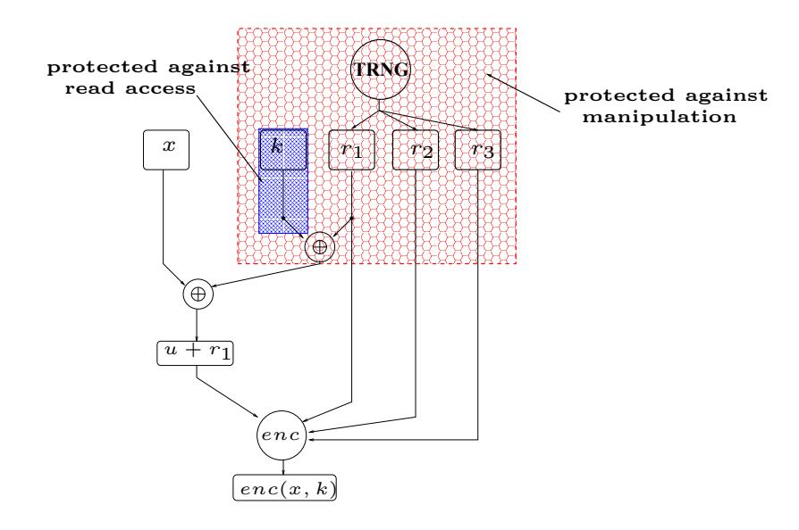

{0}------------------------------------------------

# Provably Secure Masking of AES

Johannes Bl¨omer<sup>1</sup> , Jorge Guajardo Merchan<sup>2</sup> , and Volker Krummel<sup>1</sup>

> <sup>1</sup> Paderborn University D-33095 Paderborn, Germany {bloemer,krummel}@upb.de 2 Infineon Technologies Secure Mobile Solutions 81609 Munich, Germany Jorge.Guajardo@infineon.com

Abstract. A general method to secure cryptographic algorithm implementations against side-channel attacks is the use of randomization techniques and, in particular, masking. Roughly speaking, using random values unknown to an adversary one masks the input to a cryptographic algorithm. As a result, the intermediate results in the algorithm computation are uncorrelated to the input and the adversary cannot obtain any useful information from the side-channel. Unfortunately, previous AES randomization techniques have based their security on heuristics and experiments. Thus, flaws have been found which make AES randomized implementations still vulnerable to side-channel cryptanalysis. In this paper, we provide a formal notion of security for randomized maskings of arbitrary cryptographic algorithms. Furthermore, we present an AES randomization technique that is provably secure against side-channel attacks if the adversary is able to access a single intermediate result. Our randomized masking technique is quite general and it can be applied to arbitrary algorithms using only arithmetic operations over some even characteristic finite field. We notice that to our knowledge this is the first time that a randomization technique for the AES has been proven secure in a formal model.

Keywords. AES, side-channel attacks, provable secure countermeasures, DPA, hardware implementation, security model

# 1 Introduction

The security of the Advanced Encryption Standard (AES) [32] against Simple (SPA), Differential (DPA), Higher Order Differential Power Analysis (HODPA) [16, 17], and Timing (TA) attacks [18] has received considerable attention since the beginning of the AES selection process. Koeune and Quisquater [19] describe timing attacks against careless implementations of AES. [4, 6, 9] discuss DPA attacks on the AES candidates in software based solutions. Ors ¨ et al. [23] describe the first (documented) power analysis-based attack on a dedicated AES ASIC implementation and Mangard [20] discusses an SPA attack on the key schedule of the AES. More recently, attacks have used the power of side-channel information to reduce the complexity of collision attacks on AES [26].

As a result of these attacks, numerous hardware and algorithmic countermeasures have been proposed. Hardware methodologies were proposed right from the beginning. They include randomized clocks, memory encryption/decryption schemes, (see [24], [8]), power consumption randomization [9], and decorrelating the external power supply from the internal power consumed by the chip. Moreover, the use of different hardware logic, such as complementary logic [9], sense amplifier based logic (SABL), and asynchronous logic [11, 22] has also been proposed. Some of these methods soon proved to be ineffective while other more successful countermeasures are very costly in terms of development, area and power. For example, the techniques in [9, 28, 29, 11, 22] require about twice as much area and will consume twice as much power as an implementation that is not protected against power attacks. In addition, hardware countermeasure will only protect against known techniques and 

{1}------------------------------------------------

attacks. They cannot provide security in some precisely defined mathematical sense. Hence, although hardware countermeasures are an important defense against side-channel attacks, they should be complemented by mathematically analyzed algorithmic countermeasures as well.

In this paper, we concentrate on algorithmic countermeasures against timing and power attacks on AES. In general, algorithmic countermeasures against timing and power attacks are based on randomization techniques. Here the problem is to guarantee that all information that can be gained via side channels is random and hence useless to the attacker. More precisely, one has to guarantee that intermediate results of the computation look random to an adversary. Furthermore, the randomization must be used in such a way that, at the end of the algorithm, the correct encryption or signature corresponding to the input plaintext is obtained. Randomized algorithmic countermeasures against timing and power attacks include secret-sharing schemes, proposed by Goubin and Patarin [13] and independently by Chari et al. [7] as well as methods based on the idea of masking all data and intermediate results during an encryption operation, originally introduced by Messerges in [21].

The first algorithmic countermeasure against power attacks customized for the AES was the transformed masking method [2] by Akkar and Giraud. This method was further simplified by Trichina et al. [31]. It was noticed in [31, 12, 3] that the multiplicative masking introduced in [2] masked only non-zero values, i.e., a zero byte will not get masked because of the multiplicative nature of the mask. This feature renders the method of Akkar and Giraud vulnerable to DPAs. A second masking technique for AES is the random representation method by Golic and Tymen [12]. Similar to Akkar and Giraud, Golic and Tymen do not try to show that their technique randomizes all intermediate results. Instead, the authors only argue experimentally that using their methods the Hamming weights of all intermediate results are distributed in roughly the same way, independent of the plaintext and secret key. We conclude that so far customized randomization techniques for AES were based on empirical assumptions about the power of potential adversaries. Then these assumptions were used to define some ad-hoc-model in which to analyze and argue the security of the methods. We believe that this is a dangerous approach. Therefore, in this paper

– We start with a mathematically precise security notion in which we discuss randomization techniques. For our security notion we only make some inevitable assumptions: First, we assume that some (small) part of the computation runs in a protected environment. Secondly, we limit the number of intermediate results that an adversary has access to. Note that previous methods made at least these assumptions. On the other hand, we assume that arbitrary differences in the distribution of an intermediate result that depends on the plaintext or secret key of the cryptosystem can be used to break the system completely. Accordingly, our security notion requires that the distribution of any intermediate result is independent of the secret key being used and independent of the plaintext. In the sequel, we call an algorithm where the joint distribution of any d intermediate results is independent of the secret key and the plaintext an order d perfectly masked algorithm. This notion of security strengthens the security notion proposed in [7] which only required distributions of intermediate results to be indistinguishable by an adversary. Since our security notion assumes that even tiny differences in the distribution of intermediate results completely break a cryptosystem, this notion is strong and often unrealistic. On the other hand, this assumption guarantees that algorithms complying with our notion of security will be able to withstand side channel attacks. In fact, below we argue why our security notion implies security against most 

{2}------------------------------------------------

side-channel attacks. Clearly our notion of security is also motivated and inspired by Shannon's notion of perfect secrecy [27].

- Based on this security notion we develop an order 1 perfectly masked algorithm for AES. Hence the algorithm is secure against any adversary that gets pairs of plain- and ciphertexts and a single intermediate result for each of those pairs. The main problem here is to describe a secure algorithm for the inversion operation that is the main ingredient of the AES SubBytes transformation. Our solution is based on a general technique to turn an arbitrary algorithm using arithmetic operations defined over some finite field into a randomized algorithm that securely computes the same function. Our method can be combined with standard d-out-of-d secret sharing schemes to obtain order d perfectly masked algorithms for AES. However, at this point the exact costs of this approach are not clear. Hence we will present these algorithms in a subsequent work.
- Show that masking countermeasures are inexpensive to implement in hardware. The countermeasures shown here when compared to dual-rail logic type countermeasures amount to only a 20% increase in the overall area required for an AES hardware implementation. To show this, we provide a detailed cost comparison of the different methods. Because our method is based on the usage of multipliers and adders over any binary field, designers might use this method to implement DPA-safe circuits which utilize previously designed multiplier and adder blocks. Moreover, the method is modular and encourages reusability.

The paper is organized as follows. Sections 2 and 3 introduce and discuss our security notion. In Sect. 5, we show how to compute the SubBytes transformation in the AES in a way that is provably secure in our model. We finish with a discussion of a possible hardware implementation of our method and compare its cost with the costs of other (less secure) countermeasures.

# 2 Security Notion

In this section we describe our notion of security. To do so, we first need to describe which attacks we allow and what we consider a successful attack. To simplify the exposition, we assume that we are given some encryption function enc that we want to evaluate in a sidechannel resistant manner. The inputs to the function enc are a plaintext x and a secret key k.

Given an algorithm that evaluates the function enc, for each plaintext x and key k, we view the computation of enc(x, k) as a sequence of intermediate results I1(x, k, r), . . . , It(x, k, r) = enc(x, k). Each intermediate result depends on the plaintext x, on the secret key k, and some r ∈ {0, 1} s . The element r is used to randomize the computation. r is chosen uniformly at random from {0, 1} s . The ciphertext enc(x, k) only depends on x and k and not on r.

We consider an adversary that knows plaintext/ciphertext pairs (x, enc(x)). Additionally, we assume that for each pair (x, enc(x)) the adversary gets several intermediate results I1(x, k, r), . . . , Id(x, k, r). The adversary may get different intermediate results for different plaintext/ciphertext pairs. If the adversary can get at most d intermediate results for each pair (x, enc(x)) of plaintext and ciphertext, we call this an order d adversary. In any case, the goal of the adversary is to compute the secret key k.

Intuitively, we say that the algorithm computing enc is insecure or that an adversary is successful, if the joint distribution of the intermediate results that an adversary gets depends on the plaintext x and on the secret key k. To formalize this, fix some d-tupel I1, . . . , I<sup>d</sup> 

{3}------------------------------------------------

of intermediate results. For a pair (x, k) of plaintext and key we denote by Dx,k(R) the joint distribution of I1, . . . , I<sup>d</sup> induced by choosing r uniformly at random in {0, 1} s . This immediately leads to our notion of security, called perfect masking.

Definition 1 (perfect masking). An algorithm that evaluates an encryption function enc is order d perfectly masked if for all d-tupels I1, . . . , I<sup>d</sup> of intermediate results we have that

$$D_{x,k}(R) = D_{x',k'}(R)$$
 for all pairs  $(x,k), (x',k')$ .

For d = 1 we say that an algorithm is perfectly masked.

# 3 Discussion of security notion

Our notion of security is very strong. Basically, we assume that an adversary can determine the secret key even from tiny differences in the (joint) distribution of intermediate results. In many realistic cases this may not be true. However, we do not want to base our security model on assumptions about technical abilities or limitations adversaries currently have. Instead we want to provide a precise mathematical notion that captures security against current side-channel attacks as well as future ones. Our notion of security strengthens the security notion in [7]. We require that for any two pairs (x, k),(x 0 , k 0 ) of plaintext and key the joint distributions Dx,k(R), Dx<sup>0</sup> ,k<sup>0</sup>(R) of d intermediate results induced by these pairs must be identical. Chari et al., on the other hand only demand that the distributions Dx,k(R), Dx<sup>0</sup> ,k<sup>0</sup>(R) must be indistinguishable by an adversary. As Chari et al. argue in their paper, if the joint distributions of d intermediate results induced by different plaintext/key pairs are indistinguishable for an adversary then power analysis and timing attacks using information about at most d intermediate results cannot be mounted. Clearly, identical distributions are indistinguishable. Hence, an algorithm that is order d perfectly masked is secure against timing and power analysis attacks using information about d intermediate results.

In this paper, we will concentrate on methods to achieve a perfectly masked algorithm to compute AES. From the discussion above it follows that the perfectly masked algorithm for AES that we describe is secure against timing and power analysis attacks using a single intermediate result. As can easily be seen, our algorithm is not secure, if an adversary has access to two or more intermediate results. Notice that most countermeasures proposed so far, also assume an adversary with access to a single intermediate result (see [2, 12, 30]). Finally, let us mention that combining d-out-of-d secret sharing schemes with our techniques to mask intermediate results, one can achieve algorithms for AES that are order d perfectly masked. However, at this point the costs in terms of randomness and hardware resources of these algorithms have not been determined exactly.

Notice that without further assumptions even an perfectly masked algorithm is impossible. To see this, note that the secret key k itself can be considered as an intermediate result. This intermediate result clearly does not satisfy the condition stated in Definition 1. Hence, to achieve a perfectly masked algorithm we must assume that some parts of the computation run in a guaranteed secure environment. In other words, some intermediate results cannot be accessed by an adversary. At least implicitly, all previously proposed countermeasures against side-channel attacks have made the same assumption. Clearly, our goal has to be to design perfect maskings that require only few intermediate results to be inaccessible by an adversary. Moreover, we must be able to identify those intermediate results that have to be computed in a secure environment. Note that on modern smartcards, protected by different sensors and encrypted memories, the assumption that at least some computations 

{4}------------------------------------------------

are done in a secure environment is realistic. Like all other countermeasure, we also assume that we have a true random number generator (TRNG) and that the adversary is not able to manipulate the random bits. Schematically, these assumptions are shown in Figure 1.



Fig. 1. Schematic view

So far we have been talking of intermediate results without specifying what we consider as possible intermediate results that an adversary may get. We consider an algorithm as a sequence of operations that are treated as encapsulated modules. This leads to a classification of intermediate results into different levels down to the bit level:

- 1. Text level: The whole algorithm is treated as a module. This level is the one of classical cryptography. The only information available to the adversary is the plaintext and the ciphertext.
- 2. Block level: Each part or subroutine of the algorithm is treated as a module. In the case of a block cipher such as the AES, each transformation within a round is treated as a module (SubBytes, ShiftRows, MixColumns and AddRoundKey).
- 3. Unit level: Each arithmetic operation is treated as a module. These operations work on the atomic units of information in the cipher. For example, the AES units of information are bytes; no operation acts on bits or nibbles. In hardware terms this level is based on the contents of registers.
- 4. Bit level: Each bit manipulation is treated as a module, for example XOR, shift etc. A bit is the smallest possible portion of information and hence security in this level is the best possible.

Every output of such a module is an *intermediate result*. In this paper we concentrate on intermediate results at the unit level. For AES this seems to be a natural choice. Basically all operations in AES are arithmetic operations on bytes. Therefore timing, power and fault attacks on AES have focused on these operations as well (see for example [19], [5]).

#### 4 Additive Masking and the AES

In [21], Messerges introduced the idea of masking all intermediate values of an encryption operation as an effective countermeasure against DPA and SPA type attacks. Randomizing the computation of a function f is, thus, achieved as f(u') where u' = u + r and r is a randomly chosen mask. If the function is linear, one can recover the desired value f(u) from f(u') = f(u) + f(r). A similar computation will recover f(u) if the function f is affine. For non-linear functions, the previous equation does not hold true and it is necessary to

{5}------------------------------------------------

come up with a series of computations dependent only on r and u' such that we obtain the value of f(u) without leaking any information. [21] suggested to combine both Boolean (logical XOR operations) and arithmetic masks (for example, multiplication and inversion in  $\mathbb{F}_{2^n}$ , multiplication and addition modulo  $2^{32}$ , etc.) since the AES candidates combine such operations and, then, use algorithms to convert between Boolean and arithmetic masks in a secure manner.

We notice that in the case of the AES [32], the only non-linear function in the algorithm is the AES SubBytes transformation. In particular, most researchers have concentrated their efforts on efficient methods to perform inversion over  $\mathbb{F}_{256}$  in a secure manner via masking countermeasures, i.e., computing  $u^{-1} + r$  from u + r without compromising the value of u. In this context, three masking methods have been proposed: two of them [2, 12] are based on the idea of combining Boolean and multiplicative masking operations and the third one is based on the idea of masking the individual logic operations required to compute a  $\mathbb{F}_{256}$  inverse. A simplification of [2] was introduced in [31] but it has been recently found in [1] that the simplifications lead to further vulnerabilities against DPA. Thus, we do not consider it any further in this work. In the following, we shortly summarize the previously mentioned countermeasures.

The Transform Masking Method (TMM). In [2], Akkar and Goubin introduce the Transform Masking Method (TMM) and algorithms to transform between boolean mask (XOR operation) and multiplicative masking (multiplication in  $\mathbb{F}_{256}$ ) which is compatible with inversion in  $\mathbb{F}_{256}$ . [2] solves the problem using Algorithm 1, where  $r_2$  is a non-zero random value and all variables and results are 8-bit long. Moreover, as noticed in [31, 12,

# Algorithm 1 Transform Masking Method

```
Input: u' = u + r_1, r_2

Output: u^{-1} + r_1

1: t_1 \leftarrow u' \cdot r_2; t_2 \leftarrow r_1 \cdot r_2

2: t_1 \leftarrow t_1 + t_2; t_3 \leftarrow r_2^{-1}

3: t_1 \leftarrow t_1^{-1}; t_2 \leftarrow t_3 \cdot r_1

4: t_1 \leftarrow t_1 + t_2

5: t_1 \leftarrow t_1 \cdot r_2

\{t_1 = (u + r_1) \cdot r_2\}

\{t_1 = (u + r_1) \cdot r_2\}

\{t_1 = (u \cdot r_2)^{-1}; t_2 = r_1 \cdot r_2^{-1}\}

\{t_1 = (u \cdot r_2)^{-1} + (r_1 \cdot r_2^{-1})\}

\{t_1 = u^{-1} + r_1\}
```

3], this countermeasure is susceptible to first-order DPA if u = 0 because zero cannot be masked with a multiplicative mask. It is clear that because of the special nature of the zero value, multiplicative masking cannot lead to perfect masking.

Embedded Multiplicative Masking (EMM). The basic idea in [12] is to embed the field  $\mathbb{F}_{256}$  in the ring  $\mathcal{R}_k = \mathbb{F}_2[x]/(pq) \cong \mathbb{F}_{256} \times \mathbb{F}_{2^k}$ , where q is another irreducible polynomial co-prime to p of degree k. The field  $\mathbb{F}_{256}$  is now a subfield of the ring  $\mathcal{R}_k$  with the isomorphism defined by  $v \mapsto (v_p, v_q)$ , where  $v_p \equiv v \mod p$  and  $v_q \equiv v \mod q$ . [12], then, suggests to use a random mapping  $\rho_k$  defined by  $v \mapsto v + rp \mod pq$  and modified inversion I' defined as  $v^{254} \mod pq$ , where r is a randomly chosen polynomial of degree less than k. In this way, arithmetic operations remain compatible with  $\mathbb{F}_{256}$  and the zero value gets mapped to one of  $2^k$  random values. It is, thus, harder to detect the zero value as k becomes larger. From a security point of view, however, the approach in [12] does not yield perfect masking since the sets of representatives of different values are disjoint. From an implementation point of view, we show in Section 6.2 that this method is too expensive to

{6}------------------------------------------------

implement in hardware. This is important since our methods can be implemented with less than half the hardware resources and, at the same time, yield perfect masking.

Combinational Logic Design for AES S-box on Masked Data. To the authors' knowledge, Trichina [30] is the first to consider embedding a masking countermeasure directly in hardware. [30] allows for a modified inversion function which on input u + r<sup>1</sup> outputs u <sup>−</sup><sup>1</sup> +r2, where r<sup>1</sup> and r<sup>2</sup> need not be the same. In addition, [30] reduces the masking problem for inversion in F<sup>2</sup> <sup>k</sup> to the problem of masking a logical AND operation since masking XOR operations is, in principle, trivial. In particular, given masked bits u <sup>0</sup> = u+r1, v <sup>0</sup> = v + r<sup>2</sup> and corresponding masks r1, r2, we compute (u∧v) + r3, where r<sup>3</sup> is the output mask. This can be accomplished according to [30] as:

$$(u \wedge v) + r_3 = (u \wedge v) + (r_1 \wedge r_2) = (u' \wedge v') + ((r_1 \wedge v') + (r_2 \wedge u'))$$
(1)

where the parenthesis indicate the order in which intermediate results are computed. Equation (1) implies that we can compute the AND operation of two bits u, v without using the actual bits but rather their masked counterparts u 0 , v <sup>0</sup> and corresponding masks r1, r2. We notice that if u = v = 0, the intermediate value (r<sup>1</sup> ∧ v 0 ) + (r<sup>2</sup> ∧ u 0 ) is always equal to zero for any value of r<sup>1</sup> and r2. This implies that (1) does not lead to perfect masking. [30] also introduces as a "far better" solution the following implementation:

$$(u \wedge v) + r_3 = (u' \wedge v') + (((r_2 \wedge u') + ((r_1 \wedge r_2) + r_3)) + (r_1 \wedge v'))$$
 (2)

where r<sup>3</sup> is a third mask and independent of r<sup>1</sup> and r2. However, [30] does not provide any formal treatment of security or argument as to why one masking methodology might be better than the other.

# 5 Perfectly masking AES against first order side channel attacks

As mentioned before, in order to obtain a perfectly masked algorithm for AES we concentrate on the problem of computing multiplicative inverses in F<sup>256</sup> because

$$INV(x) = \begin{cases} x^{-1}, & \text{if } x \in \mathbb{F}_{256}^{\times} \\ 0, & \text{if } x = 0 \end{cases}$$

is the main step of SubBytes. In this section we present an algorithm that is secure against an adversary that is able to get one intermediate result. However this solution can easily be generalized to higher order attacks by using more randomness. Moreover our method is quite general and hence with appropriate modifications for fields of odd characteristic applicable to an arbitrary finite field.

Let r, r <sup>0</sup> be independently and uniformly distributed random masks. We start with an additively masked value u + r and would like to calculate INV (u) + r 0 . However a direct application of INV leads to INV (u+r) that is of no use to us because of the non-linearity of inversion.

# 5.1 Idea

The basis of our idea is to calculate INV (x) as x <sup>254</sup> by using the square-and-multiply algorithm or an optimal addition chain. In general the multiplicative inverse of an element over an arbitrary finite field Fp<sup>m</sup> can always be calculated by raising it to the (p <sup>m</sup> − 2) th power. This can be efficiently done using only squarings and multiplications. Since our 

{7}------------------------------------------------

inputs are additively masked values (u+r) we correct the result of every single operation in the square-and-multiply algorithm in order to obtain the desired result. Our invariant is that at the end of each step our result has the form  $(u^e+r')$  for some e. Hence, the problem is to correct the intermediate results without revealing any information about u.

#### 5.2 Method

We introduce some variables: We name  $r_{j,i}$  the jth random mask used in Step i of our algorithm. All  $r_{j,i}$  are independently and uniformly distributed masks. The direct result of an operation (squaring or multiplication) in Step i performed on some masked values is called  $f_i$ . Furthermore, we need the auxiliary terms  $s_{1,i}$  and  $s_{2,i}$  to correct  $f_i$ . The variable  $t_{1,i}$  is the intermediate result that appears during the correction and  $t_i$  is the final result of Step i which complies with our invariant, i.e., it is of the form  $u^e + r_{1,i}$  for some e.

The input to our modified inversion algorithm is the masked value  $(u + r_{1,0})$ . Next, we describe how to perform multiplications and squarings in a perfectly masked manner. The security analysis is shown in Sect. 5.3. We distinguish between squaring and multiplication because the former can be done more efficiently.

Squaring. The squaring operation in Step i is described in Algorithm 2. The input  $t_{i-1} = u^e + r_{1,i-1}$  is squared in Step 1. In order to compute the output that respects our invariant we have to change the mask to  $r_{1,i}$ . To do so in Steps 2 and 3 we use the auxiliary term  $s_{1,i}$  and compute the desired output  $t_i = u^{2e} + r_{1,i}$ .

#### **Algorithm 2** Perfectly Masked Squaring (PMS)

```
Input: x = u^e + r_{1,i-1}

Output: u^{2e} + r_{1,i}

1: f_i \leftarrow x^2

2: s_{1,i} \leftarrow r_{1,i-1}^2 + r_{1,i}

3: t_i \leftarrow f_i + s_{1,i}

\{t_i = u^{2e} + r_{1,i}\}
```

Multiplication. Our perfectly masked multiplication method is described in Algorithm 3. The input are two intermediate results: The output of the previous step and a freshly masked value derived by securely changing the masked value from  $u + r_{1,0}$  to  $u + r_{2,i}$ . In Step 1 we calculate the product  $f_i$  of two intermediate results.  $f_i$  contains the desired power of u as well as some disturbing terms. In Steps 2-5 we compute the auxiliary terms  $s_{1,i}$  and  $s_{2,i}$ . In the end (Steps 6 and 7) we eliminate the disturbing parts of  $f_i$  and transform it according to our invariant. This is done by simply adding up the two auxiliary terms  $s_{1,i}$ ,  $s_{2,i}$  and  $f_i$ .

#### **Algorithm 3** Perfectly Masked Multiplication (PMM)

```
Input: x = u^{e} + r_{1,i-1}, x' = u + r_{2,i}
Output: u^{e+1} + r_{1,i}

1: f_{i} \leftarrow x \cdot x'

2: v_{1,i} \leftarrow x' \cdot r_{1,i-1}

3: v_{2,i} \leftarrow v_{1,i} + r_{1,i-1} \cdot r_{2,i} + r_{1,i-1} \cdot r_{2,i} + r_{1,i-1} \cdot r_{2,i} + r_{1,i-1} \cdot r_{2,i} + r_{1,i-1} \cdot r_{2,i} + r_{1,i-1} \cdot r_{2,i} + r_{1,i-1} \cdot r_{2,i} + r_{1,i}

4: s_{1,i} \leftarrow v_{2,i} + r_{1,i-1} \cdot r_{2,i} + r_{1,i}

5: s_{2,i} \leftarrow x \cdot r_{2,i}

6: t_{1,i} \leftarrow f_{i} + s_{1,i}

7: t_{i} \leftarrow t_{1,i} + s_{2,i}

\{f_{i} = u^{e+1} + u^{e} \cdot r_{2,i} + u \cdot r_{1,i-1} \cdot r_{2,i} \}

\{v_{2,i} = u \cdot r_{1,i-1} + r_{1,i-1} \cdot r_{2,i} + r_{1,i} \}

\{s_{2,i} = u^{e} \cdot r_{2,i} + r_{1,i-1} \cdot r_{2,i} + r_{1,i} \}

\{t_{1,i} = u^{e+1} + u^{e} \cdot r_{2,i} + r_{1,i-1} \cdot r_{2,i} + r_{1,i} \}

\{t_{i} = u^{e+1} + v^{e} \cdot r_{2,i} + r_{1,i-1} \cdot r_{2,i} + r_{1,i} \}
```

The complete computation to obtain INV(u) + r' in  $\mathbb{F}_{256}$  is shown in Table 3 in the Appendix. The output of the last operation is  $u^{254} + r_{1,13} = INV(u) + r_{1,13}$  which is the desired value, as required.

{8}------------------------------------------------

#### 5.3 Security Analysis

As defined in our security model we have to look at all intermediate results. For Algorithms 2 and 3 we only have to analyze the distributions of the following intermediate results:  $f_i, s_{1,i}, s_{2,i}, t_i, t_{1,i}, v_{1,i}, v_{2,i}$  where  $1 \le i \le 13$ . These are the results that depend on u. We can neglect intermediate results such as  $r_{1,i}^2$  since they do not depend on u.

Our security analysis is based on the following 2 lemmas that characterize the distributions of intermediate results.

**Lemma 1.** Let  $u \in \mathbb{F}_{256}$  be arbitrary. Let r be uniformly distributed over  $\{0, \ldots, 255\}$  independent of u. Then I(u, r) = u + r = Z is uniformly distributed.

**Lemma 2.** Let  $u, u' \in \mathbb{F}_{256}$  and  $r, r' \in \mathbb{F}_{256}$  be independently and uniformly distributed over  $\{0, \ldots, 255\}$ . Set  $I_1 = u + r$  and  $I_2 = u' + r'$ . Then the product  $Z = I_1 \cdot I_2$  is distributed according to

$$D_0 = \begin{bmatrix} 0 & 1 & 2 & \dots & 255 \\ 511 & 255 & 255 & \dots & 255 \end{bmatrix}.$$

So

$$Pr(Z=i) = \begin{cases} (2^9 - 1)/2^{16}, & \text{if } i = 0\\ (2^8 - 1)/2^{16}, & \text{if } i \neq 0 \end{cases}$$

The proofs of these lemmas are straightforward and therefore omitted. For our security analysis we also need the following observation.

Remark 1. In any finite field of characteristic 2 squaring is a one-to-one mapping.

**Analysis of**  $f_i$  We have to look at the intermediate result  $f_i$  in the two cases of squaring and multiplication.

- **Squaring:** The calculation is  $f_i \leftarrow t_{i-1}^2 = u^{2e} + r_{1,i-1}^2$  for some  $2 \le e \le 254$ . Since  $r_{1,i-1}$  is chosen uniformly at random, Remark 1 together with Lemma 1 shows that  $f_i$  is uniformly distributed for all u.
- **Multiplication:**  $f_i \leftarrow (u^e + r_{1,i-1}) \cdot (u + r_{2,i}) = u^{e+1} + u^e r_{2,i} + u r_{1,i-1} + r_{1,i-1} r_{2,i}$ . Here the terms  $u^e + r_{1,i-1}$  and  $u + r_{2,i}$  are independently (because of the independence of  $r_{1,i-1}$  and  $r_{2,i}$ ) and uniformly distributed (Lemma 1). So by Lemma 2,  $f_i$  is distributed according to  $D_0$  for all u.

## Analysis of $s_{1,i}, s_{2,i}$

- Squaring: Here  $s_{1,i}$  can be neglected since it does not depend on u.
- **Multiplication:**  $s_{1,i}$  is calculated by adding or multiplying independent masks on the term  $(u+r_{2,i})$  leading to the term  $ur_{1,i-1}+r_{1,i}$ . So  $s_{1,i}$  is obviously uniformly distributed.  $s_{2,i} \leftarrow (u^e + r_{1,i-1})r_{2,i}$  is the product of two independently uniformly distributed variables each of which is distributed independently of u. So independent of the value of u, the variable  $s_{2,i}$  is distributed according to  $D_0$ .

Analysis of  $t_{1,i}$ ,  $t_i$  All these intermediate results are sums of some part depending on u and an independent additive mask. So all of them are uniformly distributed by Lemma 1.

Hence corresponding intermediate results are always identically distributed independent of the value of u. This implies that the whole computation is perfectly masked.

{9}------------------------------------------------

#### 5.4 Simplified version

Previously we assumed that for each step we generate new random masks. In the special case of first order side channel attacks we can reuse random masks because the adversary is allowed to choose only one intermediate result. Thus, we can reduce the number of random masks needed to only three masks  $(r_1, r_2, r_3)$ . To achieve this we modify our calculations such that after each step we switch back to our original mask. This can be done by simply adding our original mask and then adding our temporarily used mask. Because of the independence of the masks this has no impact on security. The complete computation with the additional intermediate results  $(t_{2,i}, t_{3,i})$  needed for this extra calculation is shown in Table 4 in the Appendix.

## 6 Implementation and Costs

Throughout the paper, we have only considered a theoretical implementation of the inversion algorithm according to the square-and-multiply algorithm. However, our method is compatible with any implementation that combines additions, multiplications, and squarings in a field or ring. More precisely, an arbitrary straight-line program over some finite field using only additions and multiplications can be transformed to an equivalent program that is perfectly masked. In this work, we do not consider software implementations of the presented countermeasures. However, we notice that for constrained environments previous works have based their software implementations of side-channel countermeasures on table look-ups. The efficient implementation of the randomization techniques presented in this paper in such environments remains an open problem. From a hardware point of view, the most area efficient ASIC hardware implementation is the one described in [25] based on composite fields. We will discuss an implementation of our countermeasure based on composite fields in the next section.

# 6.1 Efficient Hardware Implementation over $GF(((2^2)^2)^2)$

First we describe in some detail how to implement an inverter over  $GF(((2^2)^2)^2)$ , so that it is clear how we obtained our area and delay estimates. This methodology is nothing new and it is well known in the literature. We assume a composite field representation  $GF(((2^2)^2)^2) \cong \mathbb{F}_{256}$  for the inverse transformation using the following irreducible polynomials:

$$GF(2^{2}) : P(x) = x^{2} + x + 1, P(\alpha) = 0$$

$$GF((2^{2})^{2}) : Q(y) = y^{2} + y + \alpha, Q(\beta) = 0$$

$$GF(((2^{2})^{2})^{2}) : R(z) = z^{2} + z + \lambda, \lambda = (\alpha + 1)\beta$$

We use the PMM and PMS algorithms from Sect. 5 instead of the normal ones to build our inversion circuit and, thus, render it secure against side-channel attacks. Based on [15, 14], [25] notices that for  $A \in GF(((2^2)^2)^2)$ ,  $A^{-1}$  can be computed as  $A^{-1} = (A^{17})^{-1}A^{16}$ , where  $A^{17} \in GF((2^2)^2)$ . Notice that the Itoh and Tsujii algorithm can be recursively applied to  $B = A^{17} \in GF((2^2)^2)$ , thus obtaining  $B^{-1} = (B^4 \cdot B)^{-1} \cdot (B^4)$  where  $B^5 \in GF(2^2)$ . In the following, we write  $B = B_1\beta + B_0 \in GF((2^2)^2)$  with  $B_i \in GF(2^2)$ . Then, we can minimize the area requirement of the implementation using the following "tricks":

- $-B^4 \in GF((2^2)^2)$  can be computed as  $B^4 \equiv B_1\beta + (B_1 + B_0)$ , i.e., only one addition over  $GF(2^2)$ .
- $-B^5 \in GF(2^2)$  can be computed as  $B^5 \equiv B_0 \cdot B_1 + B_0^2 + B_1^2 \cdot \alpha$ , where  $B_1^2 \cdot \alpha$  requires only wires for its implementation (no gates).

{10}------------------------------------------------

- Given C = c1α + c<sup>0</sup> ∈ GF(2<sup>2</sup> ), C <sup>−</sup><sup>1</sup> ≡ c1α + (c<sup>1</sup> + c0), i.e., it requires one GF(2) adder.
- Thus, computing B−<sup>1</sup> = B−<sup>5</sup> ·B<sup>4</sup> ∈ GF((2<sup>2</sup> ) 2 ) requires 3 GF(2<sup>2</sup> ) multipliers, 1 GF(2<sup>2</sup> ) squarer, and 4 GF(2<sup>2</sup> ) adders. Inversion in GF(((2<sup>2</sup> ) 2 ) 2 ) can then be implemented according to [25] with 2 adders, 3 multipliers, 1 inverter, and 1 squarer followed by multiplication by λ = (α + 1)β, all over GF((2<sup>2</sup> ) 2 ).

The hardware implementation of the side-channel attack safe version can be implemented similarly except that now instead of using the normal adders, multipliers, squarers, and inverters, we use circuits which implement the algorithms from Sect. 5.

## 6.2 Cost and Comparison to Previous Countermeasures

Area and delay estimates for circuits with and without countermeasures are provided in the appendix. The estimates are given in terms of the area and delay of 2-input AND gates, 2-input XOR gates, and NOT gates. The complexity and specific implementation of these circuits is taken from [33]. In addition, we provide complexity estimates in terms of normalized area and delay. The normalization is done with respect to the area and delay of a NOT gate. We have assumed that the areas of a 2-input AND gate and 2-input XOR gate are twice and 3 times that of an inverter, respectively. Similarly, it is assumed that the delays of NOT, AND, and XOR gates are equal. Notice that the assumptions regarding the gates' area and delay are not arbitrary but based on the actual sizes of several standard cell libraries. Finally, we point out that [25] which describes AES ASIC implementations over GF(((2<sup>2</sup> ) 2 ) 2 ) does not provide the actual circuits used to implement the AES S-box.

Table 1 provides a cost comparison among the different masking countermeasures. Table 2 summarizes the estimated hardware cost of the different countermeasures in the literature including the one presented in this paper. We did not considered the method from [12] because its hardware implementation requires too many hardware resources. We can estimate the cost of [12] with k = 8 by simply considering the cost of a multiplier and an inverter over <sup>F</sup>2[x]/(pq) <sup>∼</sup><sup>=</sup> <sup>F</sup><sup>256</sup> <sup>×</sup> <sup>F</sup><sup>2</sup> <sup>k</sup> . According to [10], such a multiplier requires 289 2-input AND gates and 272 2-input XOR gates. The map I 0 can also be implemented with a multiplier (a squarer requires only wires) for its implementation. Thus, we would need at least 1 multiplier and 1 inverter over F2[x]/(pq) and 3 multipliers and 1 inverter over F256. This results in a circuit which requires at least 731 AND and 766 XOR<sup>2</sup> or about twice as many gates as our method. We can see from Table 1 that the countermeasure of

| Arithmetic Operation                           | A    |     |    | A/ANormal Inv. T T/TNormal Inv. A · T |     |
|------------------------------------------------|------|-----|----|---------------------------------------|-----|
| Inversion over GF (((22)<br>2)<br>2) [25]      | 312  | 1   | 17 | 1                                     | 1   |
| Inversion with DPA countermeasure from [30] ac | 1071 | 3.4 | 26 | 1.5                                   | 5.3 |
| cording to (1)                                 |      |     |    |                                       |     |
| GF (((22)<br>2)<br>2) PM inverter (this paper) | 1704 | 5.5 | 21 | 1.2                                   | 6.7 |
| Inversion with DPA countermeasure from [30] ac | 1341 | 4.3 | 34 | 2                                     | 8.6 |
| cording to (2)                                 |      |     |    |                                       |     |

Inversion with countermeasure from [2] 1784 5.7 34 2 11.4

Table 1. Hardware cost comparison for different inversion circuits with side-channel countermeasures.

[30] implemented according to (1) has the best area/time product of all the implementations. However, as we have shown in Section 4, this countermeasure is susceptible to DPA attacks if the input byte is zero and, thus, it does not provide perfect masking. If we then consider the best area/time product of the countermeasures that offer DPA resistance, the implementation presented in this work has the best area/time product. This result comes 

{11}------------------------------------------------

from the reduced critical path in the circuit presented here. In addition, our design encourages re-usability of previously designed blocks. In other words, since the masking method depends only on multipliers and adders, if one has multiplier and adder blocks already designed, they can be used immediately to build a perfectly masked circuit (with the work from [30], implementation of the masking countermeasure would require a complete circuit redesign). Finally, we estimate the cost that our masking countermeasure would have on an AES hardware implementation. To do this, we assume that the implementation would follow the architecture described in [25] where the SubBytes transformation occupies about 22% of the design with 4 S-Boxes in parallel. Of this the inverse transformation accounts for 60% or about 14% of the total area. We also assume that the remaining circuits require twice as much area as an implementation without masking countermeasures. Then, our new inversion circuit would need about 2.5 times the area that an AES hardware implementation without countermeasures would need. Of this 31% would correspond to the inverter circuit. The required area is only 20% larger than an implementation that used hardware countermeasures based on the usage of different hardware logic. Such methods double the hardware resources when compared to an implementation using standard (single-rail) logic.

## 6.3 Other Costs

In addition to time and area, other costs are also of importance. For example, the amount of randomness is very important since its generation is quite expensive. In out simplified algorithm we only need 3 random masks in order to compute INV (x) in a secure manner. Another important cost factor is the number of operations that have to be protected by hardware means. Our approach needs this inevitable protection only for one intermediate result. Hence it is optimal with respect to this cost measure.

# 7 Conclusions and Recommendations for Further Research

In this paper, we have proposed a formal model in which masking countermeasures can be analyzed. Furthermore, we have proposed methods which are provable secure in our model if the adversary is limited to accessing a single intermediate result during the algorithm computation. A natural way to extend this research is to consider more powerful adversaries which can access more than one intermediate result at the time and develop methods which would withstand such attacks. Here a major challenge is to design methods which are "practical", in the sense, that they can be implemented at a reasonable hardware cost.

Another interesting question is to see whether for less powerful adversaries secure algorithms exist that require less randomness and / or are more efficient than the algorithms presented in this paper.

We have also considered the implementation of perfect masking from a hardware point view. An interesting avenue for further research would be to consider the efficient implementation of such countermeasures in software and what tricks can be used to improve its memory requirements and performance. Another question is if we can find more areaefficient methods to implement side-channel attack safe circuits for the AES. We believe that, using masking methodologies, the best we could hope for is to use twice as much area as a circuit without countermeasures (imagine simply that the circuit could be implemented using only XOR gates). Is this bound possible to achieve in practice. Related to this last question is the need for random masks, can we reduce the randomness requirement without affecting security. Notice for example that [31], effectively reduced the randomness requirement of the countermeasure presented in [2], but it was found later in [1], that such 

{12}------------------------------------------------

reduction made the implementation in [31] DPA susceptible. Thus, security should always be kept as the main evaluation criteria when implementing ciphers on different platforms, hardware or software.

# References

- 1. M.-L. Akkar, R. B´evan, and L. Goubin. Two Power Analysis Attacks against One-Mask Methods. In S. Maitra and R.L Karandikar, editors, 11th International Workshop on Fast Software Encryption — FSE 2004, volume LNCS. Springer-Verlag, 2004.
- 2. M.-L. Akkar and C. Giraud. An Implementation of DES and AES, Secure against Some Attacks. In C¸ . K. Ko¸c, D. Naccache, and C. Paar, editors, Workshop on Cryptographic Hardware and Embedded Systems — CHES 2001, volume LNCS 2162, pages 309–318. Springer-Verlag, May 14-16, 2001.
- 3. M.-L. Akkar and L. Goubin. A Generic Protection against High-Order Differential Power Analysis. In T. Johansson, editor, 10th International Workshop on Fast Software Encryption — FSE 2003, volume LNCS 2887, pages 192–205. Springer-Verlag, 2003.
- 4. E. Biham and A. Shamir. Power Analysis of the Key Scheduling of the AES Candidates. In Proceedings of the Second AES Candidate Conference (AES2), Rome, Italy, March 1999. Available at http://csrc. nist.gov/encryption/aes/aes\_home.htm.
- 5. J. Bl¨omer and J.-P. Seifert. Fault based cryptanalysis of the Advanced Encryption Standard. In Financial Cryptography, volume 2742 of Lecture Notes in Computer Science, pages 162–181. Springer Verlag, 2002.
- 6. S. Chari, C. S. Jutla, J. R. Rao, and P. Rohatgi. A Cautionary Note Regarding the Evaluation of AES Candidates on Smart Cards. In Proceedings of the Second AES Candidate Conference (AES2), Rome, Italy, March 1999. Available at http://csrc.nist.gov/encryption/aes/aes\_home.htm.
- 7. S. Chari, C. S. Jutla, J. R. Rao, and P. Rohatgi. Towards Sound Approaches to Counteract Power-Analysis Attacks. In M. Wiener, editor, Advances in Cryptology — CRYPTO '99, volume LNCS 1666, pages 398–412. Springer-Verlag, August 1999.
- 8. C. Clavier, J.S. Coron, and N. Dabbous. Differential Power Analysis in the Presence of Hardware Countermeasures. In C¸ . K. Ko¸c and C. Paar, editors, Workshop on Cryptographic Hardware and Embedded Systems — CHES 2000, volume LNCS 1965, pages 252–263. Springer-Verlag, August 17-18, 2000.
- 9. J. Daemen and V. Rijmen. Resistance Against Implementation Attacks: A Comparative Study of the AES Proposals. In Proceedings of the Second AES Candidate Conference (AES2), Rome, Italy, March 1999. Available at http://csrc.nist.gov/encryption/aes/aes\_home.htm.
- 10. G. Drolet. A New Representation of Elements of Finite Fields GF(2<sup>m</sup>) Yielding Small Complexity Arithmetic Circuits. IEEE Transactions on Computers, 47(9):938–946, September 1998.
- 11. J.J.A. Fournier, S. Moore, H. Li, R. Mullins, and G. Taylor. Security Evaluation of Asynchronous Circuits. In C.D. Walter, C¸ . K. Ko¸c, and C. Paar, editors, Workshop on Cryptographic Hardware and Embedded Systems — CHES 2003, volume LNCS 2779, pages 125–136. Springer-Verlag, September 7-10, 2003.
- 12. J.Dj. Goli´c and C. Tymen. Multiplicative Masking and Power Analysis of AES. In B. S. Kaliski, Jr., C¸ . K. Ko¸c, and C. Paar, editors, Workshop on Cryptographic Hardware and Embedded Systems — CHES 2002, volume LNCS 2523, pages 198–212. Springer-Verlag, 2002.
- 13. L. Goubin and J. Patarin. DES and Differential Power Analysis, "The Duplication Method". In C¸ . K. Ko¸c and C. Paar, editors, Workshop on Cryptographic Hardware and Embedded Systems — CHES 1999, volume LNCS 1717, pages 158–172. Springer-Verlag, 1999.
- 14. J. Guajardo and C. Paar. Itoh-Tsujii Inversion in Standard Basis and Its Application in Cryptography and Codes. Design, Codes, and Cryptography, 25(2):207–216, February 2002.
- 15. T. Itoh and S. Tsujii. A Fast Algorithm for Computing Multiplicative Inverses in GF(2<sup>m</sup>) Using Normal Bases. Information and Computation, 78:171–177, 1988.
- 16. P. Kocher, J. Jaffe, and B. Jun. Introduction to Differential Power Analysis and Related Attacks. Technical Report, Cryptography Research, Inc., 1998. Available at http://www.cryptography.com/ resources/whitepapers/DPA-technical.html.
- 17. P. Kocher, J. Jaffe, and B. Jun. Differential Power Analysis. In M. Wiener, editor, Advances in Cryptology — CRYPTO '99, volume LNCS 1666, pages 388–397. Springer-Verlag, 1999.
- 18. Paul C. Kocher. Timing attacks on implementations of Diffie-Hellman, RSA, DSS and other systems. In Neal Koblitz, editor, Advances in Cryptology - Proceedings of CRYPTO 1996, number 1109 in Lecture Notes in Computer Science, pages 104–113. Springer Verlag, 1996.
- 19. Francois Koeune and Jean-Jacques Quisquater. A timing attack against Rijndael. Technical Report CG-1999/1, Universit´e Catholique de Louvain, 1999.

{13}------------------------------------------------

- 20. S. Mangard. A Simple Power-Analysis (SPA) Attack on Implementations of the AES Key Expansion. In P.J. Lee Lee and C.H. Lim, editors, Proceedings of the 5th International Conference on Information Security and Cryptology (ICISC 2002), volume LNCS 2587, pages 343–358. Springer-Verlag, 2002.
- 21. T.S. Messerges. Securing the AES Finalists Against Power Analysis Attacks. In B. Schneier, editor, 7th International Workshop on Fast Software Encryption — FSE 2000, volume LNCS 1978, pages 150–164. Springer-Verlag, 2001.
- 22. S. Moore, R. Anderson, R. Mullins, G. Taylor, and J.J.A. Fournier. Balanced Self-Checking Asynchronous Logic for Smart Card Applications. Journal of Microprocessors and Microsystems, 27(9):421– 430, October 2003.
- 23. S.B. Ors, ¨ F. Gurk ¨ aynak, E. Oswald, and B. Preneel. Power-Analysis Attack on an ASIC AES Implementation. In Proceedings of the 2004 International Symposium on Information Technology (ITCC 2004), Las Vegas NV, USA, April 5-7, 2004. IEEE Computer Society. To appear.
- 24. Wolfgang Rankl and Wolfgang Effing. Handbuch der Chipkarten. Hanser Verlag, 4. edition, 2002.
- 25. A. Satoh, S. Morioka, K. Takano, and S. Munetoh. A Compact Rijndael Hardware Architecture with S-Box Optimization. In C. Boyd, editor, Advances in Cryptology — ASIACRYPT 2001, volume LNCS 2248, pages 239–254. Springer-Verlag, 2001.
- 26. K. Schramm, G. Leander, P. Felke, and C. Paar. A Collision-Attack on AES Combining Sidechannel and Differential Attack. Manuscript submitted for publication, Ruhr-Universit¨at Bochum, 2003. Available at http://www.crypto.rub.de/Publikationen/Publikationen.html.
- 27. Claude Elwood Shannon. Communication theory of secrecy systems. Bell System Technical Journal, 28:656–715, 1949.
- 28. K. Tiri, M. Akmal, and I. Verbauwhede. A Dynamic and Differential CMOS Logic with Signal Independent Power Consumption to Withstand Differential Power Analysis on Smart Cards. In 28th European Solid-State Circuits Conference (ESSCIRC 2002), September 24-26, 2002.
- 29. K. Tiri and I. Verbauwhede. Securing Encryption Algorithms against DPA at the Logic Level: Next Generation Smart Card Technology. In C.D. Walter, C¸ . K. Ko¸c, and C. Paar, editors, Workshop on Cryptographic Hardware and Embedded Systems — CHES 2003, volume LNCS 2779, pages 125–136. Springer-Verlag, September 7-10, 2003.
- 30. E. Trichina. Combinational logic design for aes subbyte transformation on masked data. Cryptology eprint archive: Report 2003/236, IACR, November 11, 2003.
- 31. E. Trichina, D. De Seta, and L. Germani. Simplified Adaptive Multiplicative Masking for AES. In B. S. Kaliski, Jr., C¸ . K. Ko¸c, and C. Paar, editors, Workshop on Cryptographic Hardware and Embedded Systems — CHES 2002, volume LNCS 2523, pages 187–197. Springer-Verlag, 2002.
- 32. U.S. Department of Commerce/National Institute of Standard and Technology. FIPS PUB 197, Specification for the Advanced Encryption Standard (AES), November 2001. Available at http: //csrc.nist.gov/encryption/aes.
- 33. P. Voigtl¨ander. Entwicklung einer Hardwarearchitektur fur ¨ einen AES-Coprozessor. Diplomarbeit, Fachbereich Informatik, Mathematik und Naturwissenshaften, Technische Informatik, HTWK Leipzig, Germany, May 2, 2003.

{14}------------------------------------------------

# A Tables

Table 2. Hardware cost for different inversion circuits with and without countermeasures

| Arithmetic Operation                                           | 1 2     |         | Norm. | Time Complexity |             |             | Norm.     |       |
|----------------------------------------------------------------|---------|---------|-------|-----------------|-------------|-------------|-----------|-------|
|                                                                | $AND_2$ | $XOR_2$ | NOT   | Area            | $T_{AND_2}$ | $T_{XOR_2}$ | $T_{NOT}$ | Delay |
| $GF(((2^2)^2)^2)$ multiplier with $P(x)$ , $Q(y)$ , and $R(z)$ | 36      | 70      | _     | 282             | 1           | 6           | _         | 7     |
| Inversion over $GF(((2^2)^2)^2)$ [25]                          | 45      | 73      | 3     | 312             | 4           | 13          | 1         | 18    |
| Inversion with countermeasure from [2]:                        | 250     | 426     | 6     | 1784            | 6           | 27          | 1         | 34    |
| Inversion with DPA countermeasure from [30] ac-                | 180     | 236     | 3     | 1701            | 4           | 21          | 1         | 26    |
| cording to (1):                                                |         |         |       |                 |             |             |           |       |
| Inversion with DPA countermeasure from [30] ac-                | 180     | 326     | 3     | 1341            | 4           | 29          | 1         | 34    |
| cording to (2):                                                |         |         |       |                 |             |             |           |       |
| $GF(2^2)$ PMM (this paper):                                    | 16      | 26      | _     | 116             | 1           | 5           | _         | 6     |
| $GF((2^2)^2)$ PMM (this paper):                                | 48      | 100     | _     | 396             | 1           | 7           | _         | 8     |
| $GF((2^2)^2)$ PM inverter (this paper):                        | 48      | 116     | _     | 444             | 2           | 13          | _         | 15    |
| $GF(((2^2)^2)^2)$ PM inverter (this paper):                    | 192     | 440     | _     | 1704            | 3           | 18          | _         | 21    |

**Table 3.** Calculation of  $(u^{254} + r_{1,13})$  using square-and-multiply

| i Op   | $f_{i}$                                                      | $s_{1,i}$               | $s_{2,i}$                            | $t_{1,i}$                                                 | $t_i$                   |
|--------|--------------------------------------------------------------|-------------------------|--------------------------------------|-----------------------------------------------------------|-------------------------|
| 1 (S)  | $u^2 + r_{1,0}^2$                                            | $r_{1,0}^2 + r_{1,1}$   |                                      |                                                           | $u^2 + r_{1,1}$         |
| 2 (M)  | $(u^2 + r_{1,1})(u + r_{2,2})$                               | $ur_{1,1} + r_{1,2}$    | $u^2r_{2,2} + r_{1,1}r_{2,2}$        | $u^3 + u^2 r_{2,2} + r_{1,1} r_{2,2} + r_{1,2}$           | $u^3 + r_{1,2}$         |
| 3 (S)  | $u^{o} + r_{1.2}^{2}$                                        | $r_{1,2}^2 + r_{1,3}$   |                                      |                                                           | $u^6 + r_{1,3}$         |
| 4 (M)  | $(u^6 + r_{1,3})(u + r_{2,4})$                               | $ur_{1,3} + r_{1,4}$    | $u^6r_{2,4} + r_{1,3}r_{2,4}$        | $u^7 + u^6 r_{2,4} + r_{1,3} r_{2,4} + r_{1,4}$           | $u^7 + r_{1,4}$         |
| 5 (S)  | $u^{14} + r_{1/4}^2$                                         | $r_{1,4}^2 + r_{1,5}$   |                                      |                                                           | $u^{14} + r_{1,5}$      |
| 6 (M)  | $ (u^{14} + r_{1,5})(u + r_{2,6}) $ $ u^{30} + r_{1,6}^{2} $ | $ur_{1,5} + r_{1,6}$    | $u^{14}r_{2,6} + r_{1,5}r_{2,6}$     | $u^{15} + u^{14}r_{2,6} + r_{1,5}r_{2,6} + r_{1,6}$       | $u_{15}^{15} + r_{1,6}$ |
| 7 (S)  | $u^{30} + r_{1,6}^2$                                         | $r_{1,6}^2 + r_{1,7}$   |                                      |                                                           | $u^{30} + r_{1.7}$      |
| 8 (M)  | $(u^{30} + r_{17})(u + r_{28})$                              | $ur_{1,7} + r_{1,8}$    | $u^{30}r_{2,8} + r_{1,7}r_{2,8}$     | $u^{31} + u^{30}r_{2,8} + r_{1,7}r_{2,8} + r_{1,8}$       | $u^{31} + r_{1,8}$      |
| 9 (S)  | $u^{02} + r_{1.8}^2$                                         | $r_{1,8}^2 + r_{1,9}$   |                                      |                                                           | $u^{62} + r_{1.9}$      |
| 10 (M) | $(u^{62} + r_{1.9}^2)(u + r_{2,10})$                         | $ur_{1,9} + r_{1,10}$   | $u^{62}r_{2,10} + r_{1,9}r_{2,10}$   | $u^{63} + u^{62}r_{2,10} + r_{1,9}r_{2,10} + r_{1,10}$    | $u^{63} + r_{1,10}$     |
| 11 (S) | $u^{126} + r_{1,10}^2$                                       | $r_{1,10}^2 + r_{1,11}$ |                                      |                                                           | $u^{126} + r_{1.11}$    |
| 12 (M) | $(u^{126} + r_{1,11})(u + r_{2,12})$                         | $ur_{1,11} + r_{1,12}$  | $u^{126}r_{2,12} + r_{1,11}r_{2,12}$ | $u^{127} + u^{126}r_{2,12} + r_{1,11}r_{2,12} + r_{1,12}$ | $u^{127} + r_{1,12}$    |
| 13 (S) | $u^{254} + r_{1,12}^2$                                       | $r_{1,12}^2 + r_{1,13}$ | , , ,                                | $u^{127} + u^{126}r_{2,12} + r_{1,11}r_{2,12} + r_{1,12}$ | $u^{254} + r_{1,13}$    |

**Table 4.** Calculation of  $(u^{254} + r_1)$  using square-and-multiply (simplified version)

| i Op   | $f_i$                       | $s_{1,i}$        | $s_{2,i}$             | $t_{1,i}$                             | $t_{2,i}$       | $t_{3,i}$             | $t_i$           |
|--------|-----------------------------|------------------|-----------------------|---------------------------------------|-----------------|-----------------------|-----------------|
| 1 (S)  | $u^2 + r_1^2$               | $r_1^2 + r_1$    | _                     |                                       | _               |                       | $u^2 + r_1$     |
| 2 (M)  | \                           | $ur_1 + r_3$     | $u^2r_2 + r_1r_2$     | $u^3 + u^2 r_2 + r_1 r_2 + r_3$       | $u^{3} + r_{3}$ | $u^3 + r_3 + r_1$     | $u^3 + r_1$     |
| 3 (S)  | $u^6 + r_1^2$               | $r_1^2 + r_1$    |                       |                                       |                 |                       | $u^6 + r_1$     |
| 4 (M)  |                             | $ur_{1} + r_{3}$ | $u^6r_2 + r_1r_2$     | $u^7 + u^6 r_2 + r_1 r_2 + r_3$       | $u^7 + r_3$     | $u^7 + r_3 + r_1$     | $u^7 + r_1$     |
| 5 (S)  | $u^{14} + r_1^2$            | $r_1^2 + r_1$    |                       |                                       |                 |                       | $u^{14} + r_1$  |
| 6 (M)  |                             | $ur_1 + r_3$     | $u^{14}r_2 + r_1r_2$  | $u^{15} + u^{14}r_2 + r_1r_2 + r_3$   | $u^{15} + r_3$  | $u^{15} + r_3 + r_1$  | $u^{15} + r_1$  |
| 7 (S)  | $u^{30} + r_1^2$            | $ r_1^2 + r_1 $  |                       |                                       |                 |                       | $u^{30} + r_1$  |
| 8 (M)  |                             | $ur_{1} + r_{3}$ | $u^{30}r_2 + r_1r_2$  | $u^{31} + u^{30}r_2 + r_1r_2 + r_3$   | $u^{31} + r_3$  | $u^{31} + r_3 + r_1$  | $u^{31} + r_1$  |
| 9 (S)  | $u^{62} + r_1^2$            | $r_1^2 + r_1$    |                       |                                       |                 |                       | $u^{62} + r_1$  |
| 10 (M) | $(u^{62} + r_1^2)(u + r_2)$ | $ur_1 + r_3$     | $u^{62}r_2 + r_1r_2$  | $u^{63} + u^{62}r_2 + r_1r_2 + r_3$   | $u^{63} + r_3$  | $u^{63} + r_3 + r_1$  | $u^{63} + r_1$  |
| 11 (S) | $u^{126} + r_1^2$           | $r_1^2 + r_1$    |                       |                                       |                 |                       | $u^{126} + r_1$ |
| 12 (M) | $(u^{126} + r_1)(u + r_2)$  | $ur_{1} + r_{3}$ | $u^{126}r_2 + r_1r_2$ | $u^{127} + u^{126}r_2 + r_1r_2 + r_3$ | $u^{127} + r_3$ | $u^{127} + r_3 + r_1$ | $u^{127} + r_1$ |
| 13 (S) | $u^{254} + r_1^2$           | $r_1^2 + r_1$    |                       |                                       |                 | _                     | $u^{254} + r_1$ |