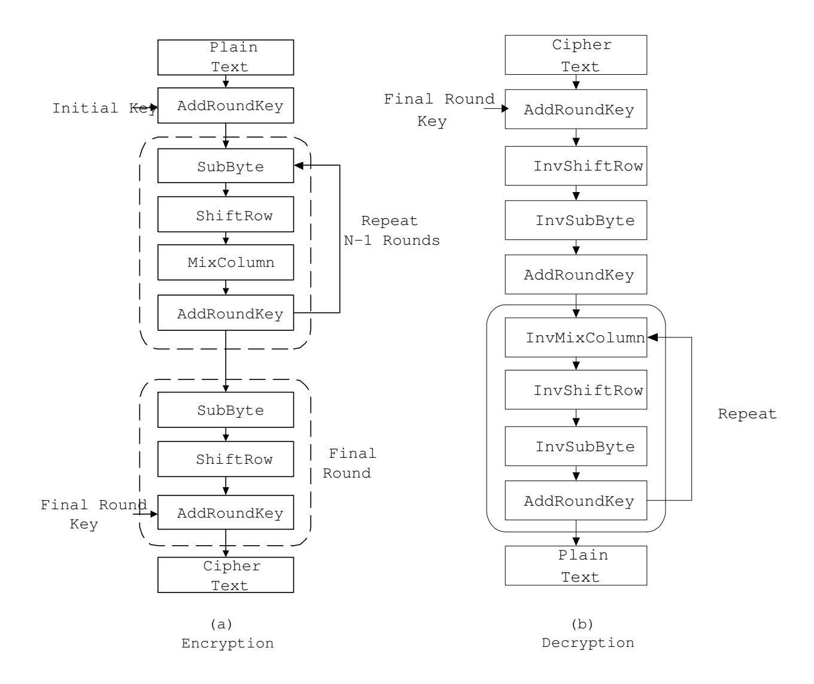
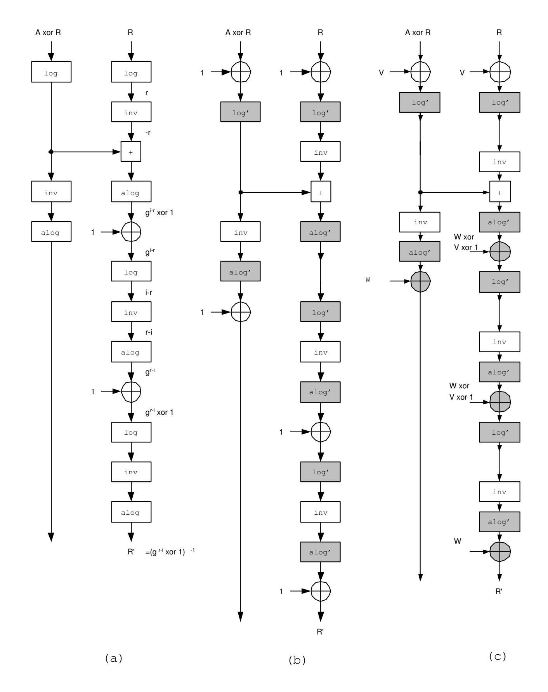
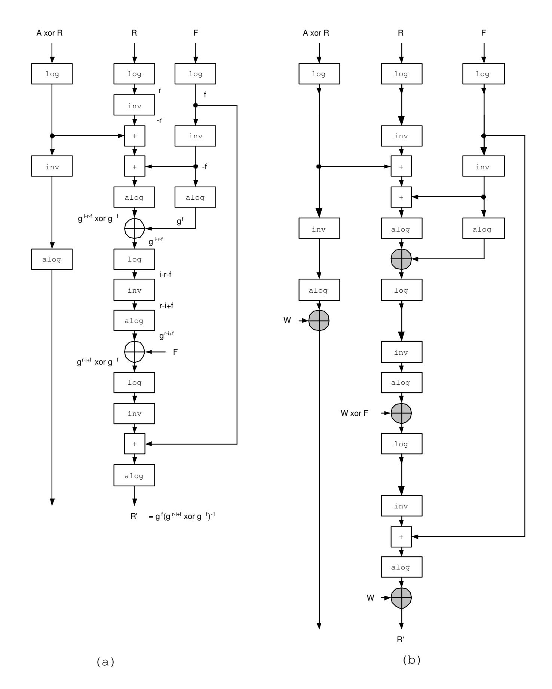
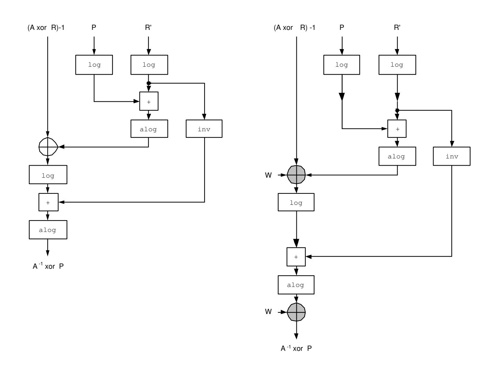

{0}------------------------------------------------

## SECURE AND EFFICIENT AES SOFTWARE IMPLEMENTATION FOR SMART CARDS

E. TRICHINA <sup>1</sup> AND L. KORKISHKO <sup>2</sup>

Abstract. In implementing cryptographic algorithms on limited devices such as smart cards, speed and memory optimization had always been a challenge. With the advent of side channel attacks, this task became even more difficult because a programmer must take into account countermeasures against such attacks, which often increases computational time, or memory requirements, or both.

In this paper we describe a new method for secure implementation of the Advanced Encryption Standard algorithm. The method is based on a data masking technique, which is the most widely used countermeasure against power analysis and timing attacks at a software level. The change of element representation allows us to achieve an efficient solution that combines low memory requirements with high speed and resistance to attacks.

#### 1. Introduction

The symmetric block cipher Rijndael [4] was standardized by the National Institute of Science and Technology (NIST) in November 2001, and will be used in a large variety of applications, from mobile consumer products to high-end servers. Consequently, the requirements and design criteria for AES implementations vary considerably.

Small footprint, stringent memory requirements, low power consumption and high throughput used to be standard criteria for implementation of cryptographic algorithms designated for smart cards and related embedded devices. With the advent of side channel attacks, one of the major concerns is resistance to such attacks.

The most general method to counter side channel attacks is to randomize data that may leak through various side channels, such as power consumption [11], electromagnetic radiation [18], or execution time [12]. The problem is to guarantee that an attacker may obtain only random information, and thus cannot gain any useful knowledge about the actual initial and/or intermediate data involved in computations [13].

In the AES algorithm most operations work on bytes. To protect against side channel attacks, every byte that appears as an intermediate result must look random. However, this is not easy to achieve. The problem is that the AES algorithm combines additive and multiplicative operations, which implies complex transformations on masks [3, 8, 1]. Moreover, as it turned out, a straightforward multiplicative mask [1] is not secure against so-called zero attack [7].

1

Key words and phrases. AES, Galois field, field generator, multiplication in GF(2n) inversion in in GF(2n), lookup tables, side-channel attacks, data masking.

{1}------------------------------------------------

The main contribution of this paper is that we suggest a method that combines a full protection against side channel attacks (including zero attack) with low memory requirements and low computational costs. This became possible due to a change of representation of field elements and using so called log- and alog-tables [21, 17] for arithmetic computations in Galois fields directly on masked data. To reinforce security, ideas of computations on masked tables [20] we incorporated in our implementation.

The rest of the paper is organized as follows. After a brief description of the Advanced Encryption Standard algorithm in the next chapter, we proceed in Chapter 3 with details of a very efficient AES implementation based on a so-called discrete logarithm representation of elements in GF(2<sup>n</sup>). The latter allows us to reduce multiplication and inversion in Galois fields to table lookups and simple integer arithmetic operations.

Chapters 4 and 5 discuss the difficulties of inversion on masked data, i.e., data that are obtained by XOR-ing every (i, j)-th byte of the state with a byte of a random mask, and outline an efficient and secure method of inversion using masked log/alog lookup tables.

The paper is concluded with the the summary of the novel features of secure AES software implementation suitable for even the most limited smart cards and other embedded devices.

### 2. AES reminder

AES encryption and decryption are based on four different transformations that are performed repeatedly in a certain sequence; each transformation maps an input state into an output state. The transformations are grouped in rounds and are slightly different for encryption and decryption. The number of rounds depends on the key/block size.

Figure 1 illustrates the general structure of the AES algorithm. Compared to encryption, decryption is simply an execution of the inverse transformations in the inverse order.

For simplicity, we describe only the 128-bit block- and and key-size version of the algorithm; although important design parameters, block and key sizes have no bearing on the content of the paper. For a complete mathematical specification of the AES algorithm we refer readers to [5].

In the standard Rijndael, a 128-bit data block is considered as a 4 × 4 array of bytes (usually referred as a state). The algorithm consists of an initial data/key addition, 9 full rounds, and a final (modified) round. A separate key scheduling module is used to generate all the sub-keys, or round keys, from the initial key. A sub-key is also represented as 4 × 4 array of bytes.

The full round involves four steps.

- The Byte Substitution, or SubByte step replaces each byte in a block by its substitute in an S-box. The S-box is an invertible substitution which is constructed by a composition of two transformations:
  - First, each byte A of a state is replaced with its reciprocal in GF(2<sup>8</sup> ) except that 0, which has no reciprocal, is replaced by itself.

{2}------------------------------------------------



Figure 1. The structure of the AES encryption and decryption algorithms.

– Then, an affine transformation f is applied. It consists of a bitwise matrix multiply with a fixed 8 × 8 binary matrix M, after which the resultant byte is XOR-ed with the hexadecimal number {63}.

The S-box is usually implemented as a look-up table consisting of 256 1-byte entries, but also can be computed "on-the-fly".

- Next comes the Shift Row step. Each row in a 4 × 4 array of bytes of the state is shifted 0, 1, 2 or 3 bytes to the left in a round fashion, producing a new 4 × 4 array of bytes.
- In the Mix Column operation, each column in the 4 × 4 array of bytes is considered as polynomial over GF(2<sup>8</sup> ) and multiplied modulo x <sup>4</sup> + 1 with a fixed polynomial c(x) = {03}x <sup>3</sup> + {01}x <sup>2</sup> + {01}x + {02}. Since multiplication is carried out in GF(2<sup>8</sup> ), the product is calculated modulo irreducible polynomial m(x) = x <sup>8</sup>+x <sup>4</sup>+x <sup>3</sup>+x+ 1, or 1{1b} in hexadecimal representation.
- The final step, Add Round Key, simply XOR-es the result with the sub-key for the current round.

In parallel to the round transformation, the round key is computed in the Key Scheduling Block. The round key is derived from the cipher key by means of key expansion and round key selection.

• The expanded key represents a linear array of 4-byte words, where the first N<sup>k</sup> words (where N<sup>k</sup> is equal to the key length divided by 32) are filled in with the cipher key. Every following word W[i] is obtained by XOR-ing the

{3}------------------------------------------------

- words W[i − 1] and W[i − Nk]. For words in positions that are multiples of Nk, the word is first rotated by one byte to the left; then its bytes are transformed using the S-box from the Byte Substitution step, and XOR-ed with the round-dependent constant.
- Round keys are taken from the expanded key in the following way: the first round key consists of the first N<sup>b</sup> words (where N<sup>b</sup> is equal to the block length divided by 32), the second of the following N<sup>b</sup> words, etc.

There are many design tradeoffs to consider when implementing the AES algorithm. In applications such as smart cards, the program's footprint, memory requirements, power consumption and throughput are important considerations.

In the next section we propose an implementation method that can realize both, encryption and decryption. The method requires only 512 bytes of memory and totally avoids Mips-intensive computations such as multiplication. To our knowledge, it is one of the best solutions reported so far. What is more important, the method can be extended to accommodate secure computations on masked data without a penalty of extra memory.

## 3. Implementing AES encryption and decryption using log/alog tables

To do calculations in a finite field GF(2<sup>n</sup>), the field elements are represented in a basis. Most software implementations use a standard basis, where elements are represented as polynomials of the form a<sup>0</sup> + a1x + ... + an−1x n−1 , where all a<sup>i</sup> are elements in GF(2), and addition is done modulo 2. Field operations on these elements consist of computations on polynomials, e.g., field multiplication can be calculated as a multiplication of two polynomials followed by a reduction of the result modulo some fixed irreducible polynomial degree n.

In [21] it was suggested to use a different representation of field elements. The new representation is based on the fact that all non-zero elements in a finite field GF(2<sup>n</sup>) can be obtained by exponentiation of a generator in this field. So after choosing a basis for GF(2<sup>n</sup>), we look for a field generator γ and calculate all pairs (α, i) such that α = γ i , 0 ≤ i ≤ 2 <sup>n</sup> − 1, α ∈ GF(2<sup>n</sup>) \ {0}. Such representation of non-zero elements is GF(2<sup>n</sup>) is unique for a fixed primitive element γ; i is the discrete logarithm of α with respect to γ.

The pairs are stored in two tables, a log-table sorted on α, and an alog-table sorted on i. Each table takes 2<sup>n</sup> − 1 words of n bits.

3.1. Computations in Galois fields using log- and alog tables. The log/alog tables can be used to calculate in GF(2<sup>n</sup>) very efficiently, avoiding all Mips-intensive operations [21].

A sum of two field elements, α and β is calculated as a bitwise XOR operation:

$$\alpha + \beta = \alpha \oplus \beta$$
.

A product of two non-zero elements can be calculated with three table look-ups:

$$\alpha \cdot \beta = alog[(log[\alpha] + log[\beta]) \mod (2^n - 1)].$$

An inversion operation on a non-zero element from GF(2<sup>n</sup>) can be calculated with two table lookups only:

$$\alpha^{-1} = alog[-log[\alpha] \mod (2^n - 1)].$$

{4}------------------------------------------------

Inversion in the field is defined only for non-zero elements, while zero is always mapped into itself by convention. In order to avoid checking for zero, we use an idea from [10] and augment the log and alog tables with one more value. Namely, let log[0] = 2<sup>n</sup> − 1 and alog[2<sup>n</sup> − 1] = 0; then

```
procedure invert (alpha) // alpha is in the interval 0 .. 2^n - 1
{
  temp = (2^n - 1) - alpha;
  case
     0 < temp < 2^n - 1 : return alog[temp];
     true : return alog[alpha];
}.
Taking this augmentation into account, the multiplication can be expressed as
procedure mult (alpha, beta)
{
   temp = (log[alpha] + log[beta]) mod (2^n -1);
   case
      temp == alpha : return alog[beta];
      temp == beta : return alog[alpha];
      true : return alog[temp];
}.
```

The new representation allows us to obtain a very compact, efficient and flexible implementation of the AES algorithm that can be used for both, encryption and decryption. How it is done is described below.

3.2. Implementation of round operations using log/alog tables. Maintaining pre-computed tables to simplify operations and improve performance is a common practice.For AES, a method to combine different operations of the round transformation in a single set of table lookups was suggested in [4]. This approach basically combines the matrix multiplication required in the MixColumn operation with the S-box, and involves 4 tables with 256 4-byte entries, i.e., 4KByte of memory. Because encryption and decryption must use different tables, the total memory requirement amounts to 8KByte.

Another solution is to trade memory for speed, and use two 256-byte lookup tables for the SubByte and InvSubByte operations, while implementing the Mix-Column/InvMixColumn operations separately. Here, again, various trade-offs are possible.

Each call to the MixColumn or InvMixColumn operations results in sixteen field multiplications. A straightforward implementation of the multiplication operation in the field is Mips-intensive. Since one of the multiplicands is fixed (with values limited to 6 field elements, i.e., {01}, {02} and {03} for MixColumn and {0b}, {0d}, and {09} for InvMixColumn), a conventional field multiplication operation can be replaced by a table lookup, requiring a new 6 × 256 table, each element of which is 8-bit wide.

Another solution is to implement field multiplication by repeated application of the xtime operation. The latter can be realized either as a left shift and a subsequent conditional bitwise XOR with {1b}, or as a table lookup, requiring only 256-byte table. This approach involves slight computational overhead (on the average three xtime and three field addition operations per one multiplication in 

{5}------------------------------------------------

the field) and is less efficient than table lookups, but saves memory, and is often used for memory-constrained devices and 8-bit microprocessors.

The log/alog-tables have been used in [17] to provide an efficient software method to compute the MixColumn and InvMixColumn operations. In comparison with a conventional table lookup for MixColumn/InvMixColumn, the new solution reduces memory requirements from 6×256 bytes to 2×256 bytes only, which is an important factor for smart cards.

Further memory optimization can be achieved by using the log/alog-tables to compute the SubByte/InvSubByte operations by exploiting similarities between encryption and decryption. For this, it is necessary to implement byte substitution in two separate steps, i.e., as a composition of inversion in the field and an affine transformation. While the affine transformations used for encryption and decryption are slightly different, inversion in GF(2<sup>8</sup> ) can be calculated using the same log/alog-tables.

The affine transformation used for encryption consists of shifts and simple multiplications:

```
procedure affine_encrypt (x) // x contains the input byte of the state
{
   tmp=(((x&1)*0xff)&c1);
   tmp^=((((x&2)>>1)*0xff)&c1);
   tmp^=((((x&4)>>2)*0xff)&c2);
   tmp^=((((x&8)>>3)*0xff)&c3);
   tmp^=((((x&16)>>4)*0xff)&c4);
   tmp^=((((x&32)>>5)*0xff)&c5);
   tmp^=((((x&64)>>6)*0xff)&c6);
   tmp^=((((x&128)>>7)*0xff)&c7);
   return tmp^=c; // tmp contains the output byte of the state
}.
```

The inverse affine transformation can be implemented in a similar way.

Thus, the same log/alog tables can be used in both, the MixColumn and SubByte operations for encryption, and in the InvMixColumn and InvSubByte operations for decryption. Sharing log- and alog-tables reduces the total memory requirements for complete AES implementation to 512 bytes only. At the same time, all Mips-intensive (and thus, power consuming) field arithmetic operations are replaced by table lookups, ensuring not only memory- but also time- and power-efficient implementation. As an additional bonus, an overall program that realizes both, encryption and decryption, has a small footprint.

The combination of these three properties makes the described solution ideal for smart cards and related embedded devices. In the remaining part of the paper we show how log/alog tables can be used for efficient and secure computations on masked data.

# 4. Protection against side channel attacks with data masking

Basically, side-channel attacks work because there is a correlation between the physical measurements taken during computations (e.g., power consumption [11], EMF radiation [6], time of computations [12]) and the internal state of the processing device, which itself is related to a secret key.

{6}------------------------------------------------

Among many attacks, the Differential Power Analysis (DPA) is the most dangerous (see, for example, [16]). It uses statistical analysis to extract information from a collection of power consumption curves obtained by running an algorithm many times with different inputs. Then an analysis of a probability distribution of points on the curves is carried on. The DPA attack uses correlations between power consumption patterns and specific key-dependent bits which appear at known steps of the cryptographic computations. For example, a selected bit b at the output of one S-box of the first round of the AES will depend on the known input message and 8 unknown bits of the key. The correlation between power consumption and b can be computed for all 256 values of 8 unknown bits of the key. The correlation is likely to be maximal for the correct guess of the 8 bits of the key. Then an attack can be repeated for the remaining S-boxes.

There are many strategies to combat side-channel attacks. Among software countermeasures against SPA/DPA are such techniques as introducing dummy instructions and/or random wait states, balancing of Hamming weight of internal data, randomization of instruction executing sequence. The most powerful software countermeasure appears to be so-called bit splitting [2, 9, 16], which in case when each bit is split into two shares can be reduced to masking data with random values. The idea how to apply data masking to AES is simple: the message, as well as the key, are masked with some random masks at the beginning of computations, and thereafter everything is almost as usual. Of course, the value of the mask at the end of some fixed step (e.g., at the end of a linear part of computations or at the end of a round) must be known in order to re-establish the expected value at the end of the execution; we call this mask correction.

A traditional XOR operation is used as a masking countermeasure; however, the mask is arithmetic on GF(2<sup>8</sup> ) [3]. The operation is compatible with the AES structure except for SubByte, which is the only non-linear transformation since it uses inversion in the field. In other words, it is easy to compute mask correction for all transformations in a round, apart from the inversion step of the SubByte. Namely, if every byte A of the (initial or intermediate) state is masked with some random mask R, then OP(A ⊕ R) = OP(A) ⊕ OP(R), where OP ∈ {MixColumn/InvMixColumn, ShiftRow/InvShiftRow, AddRoundKey}. Thus, given any random mask, it is easy either to pre-compute the corresponding mask correction, or to compute it on-the-fly, in parallel with computations on masked data.

This property also holds for an affine part of the SubByte operation, but does not hold for inversion in the field. To overcome this difficulty, Akkar and Giraud [1] proposed a so-called transformed masking. In this method, first an additive mask is replaced by a multiplicative mask in a series of multiply and add operations in GF(2<sup>8</sup> ), after which normal inversion takes place, and finally, a transformation of a multiplicative mask into an additive mask is carried out. Unfortunately, as was pointed out in [7], a multiplicative mask does not blind zero element in GF(2<sup>n</sup>), enabling a so-called zero attack.

The paper [20] suggested a simplification of the aforementioned technique. At the same time it proposed a simple but efficient way to enhance security with respect to the zero attack by conduction on-the-fly generation of the masked lookup tables used for implementation of the inversion operation.

{7}------------------------------------------------

In what follows we tackle the problem of non-linear operations on masked data from a different angle. Using a non-standard representation of elements in  $GF(2^n)$  allows us to implement inversion on masked data and to compute the corresponding mask correction in a secure and efficient manner.

## 5. Inversion on masked data using log/alog-tables

The problem can be formulated as follows. Given  $A \oplus R$ , where A is a byte of a state and R some uniformly distributed random value, find an efficient method to compute the value  $A^{-1} \oplus \tilde{R}$ , never revealing A or  $A^{-1}$  in a process. Here  $\tilde{R}$  can be either equal to R or any other (uniformly distributed) random value.



FIGURE 2. Computing inversion on masked data with log/alog tables.

{8}------------------------------------------------

The solution is based on the following observations.

- First, a new representation allows us to infer how (A ⊕ R) <sup>−</sup><sup>1</sup> differs from A<sup>−</sup><sup>1</sup> :
  - (1) A field element A ⊕ R can be represented as γ <sup>y</sup> = γ <sup>i</sup> ⊕ γ r , where γ i is a representation of the unknown byte A of the state, and γ r is a representation of the known random mask R.
  - (2) By simple formulae manipulations, we obtain

$$\gamma^y = \gamma^i \oplus \gamma^r = \gamma^i \cdot (\gamma^{r-i} \oplus \mathbf{1}).$$

(3) Therefore, we can write

$$\gamma^{-y} = (\gamma^i \oplus \gamma^r)^{-1} = (\gamma^i)^{-1} \cdot (\gamma^{r-i} \oplus \mathbf{1})^{-1}.$$

Hence, (γ <sup>r</sup>−<sup>i</sup> ⊕ 1) −1 is the mask correction for "masked inversion".

- Next, we show how to compute this mask correction without revealing A or A<sup>−</sup><sup>1</sup> .
  - (1) We can consider A ⊕ R from a different view point, namely as

$$\gamma^y = \gamma^i \oplus \gamma^r = \gamma^r \cdot (\gamma^{i-r} \oplus \mathbf{1}).$$

(2) Hence, if we multiply γ <sup>y</sup> by γ −r , we get

$$\gamma^{y} \cdot \gamma^{-r} = \gamma^{-r} \cdot \gamma^{r} \cdot (\gamma^{i-r} \oplus \mathbf{1}) = \gamma^{i-r} \oplus \mathbf{1}.$$

- (3) Executing (γ <sup>i</sup>−<sup>r</sup> ⊕ 1) ⊕ 1, we find γ i−r , after which using log- and alog-tables, we easily compute (γ i−r ) <sup>−</sup><sup>1</sup> = γ r−i .
- (4) Finally, after XOR-ing γ <sup>r</sup>−<sup>i</sup> with 1 and inverting the result, we find the mask correction (γ <sup>r</sup>−<sup>i</sup> ⊕ 1) −1 .

Figure 2(a) summarizes the computation flow for calculating inversion on masked data and the respective mask correction.

5.1. MixColumn/InvMixComumn on masked data with log/alog tables. It is easy to implement the MixColumn and InvMixColumn operations on masked data using log/alog tables as well. Indeed, since one of the terms in each field multiplication involved in these operation is fixed, the operation is linear. Let I denotes a fixed term, then (A ⊕ R) · I = (A · I) ⊕ (R · I). The corresponding mask correction can be computed trivially as R · I.

Hence, each of the MixColumn/InvMixColumn operations on masked data is reduced to 2×(16×3) table lookups using the same log/alog-tables that were used to compute inversion.

### 6. Coping with "zero attack".

The previously published proposals to randomize AES efficiently, such as multiplicative [1] and simplified [20] masking techniques, had a subtle flaw, namely, they were vulnerable to a zero attack [7]. The attack is based on the fact that a multiplicative mask masks only non-zero values. In other words, if the actual data byte A is zero, then for any mask X, (A ⊗ X) = 0.

Using Figure 2(a) as a reference, let us analyze how robust the new method is with respect to the zero attack.

First of all, notice that all manipulations on discrete logarithms are fully protected as long as random masks R change from one run to another.

{9}------------------------------------------------

On the other hand, detecting that an intermediate value γ i−r is zero provides some dangerous information. Indeed, γ i−r is in fact equivalent to A ⊗ R<sup>−</sup><sup>1</sup> , where A = (data ⊕ key), and R<sup>−</sup><sup>1</sup> is a mask. γ <sup>i</sup>−<sup>r</sup> = 0 implies that either A = 0 or R<sup>−</sup><sup>1</sup> = 0. Hence an attacker may systematically try all 256 possible values for data in order to find the one which turns A into zero.

In order to protect the inversion on masked data from this situation, we will have to implement log/alog table lookups in a secure way.

6.1. Masked log/alog tables. The simplest and the least expensive solution is to modify the inversion algorithm in the following way. Instead of XOR-ing the result of inversion in the mask correction branch with 1 and thus exposing γ i−r , we use fixed "correction" tables log' and alog', such that log<sup>0</sup> [γ <sup>i</sup> ⊕ 1] = i and (alog<sup>0</sup> [i] = γ <sup>i</sup> ⊕ 1. This necessitates slight data corrections in the processing flow, as shown in Figure 2(b).

A more general and more secure solution consists in using the technique similar to the one suggested in [15]. We assume that the standard log and alog tables are stored in EEPROM. Prior to running AES, we fix a pair of independent random bytes V and W. V is the value that masks every input byte of the original log table, while W masks every output byte of the original alog table. Then we recompute the log and alog tables (using, for example, the fast "split and swap" algorithm from [20]) in such a way that for every α = γ i , α ∈ GF(2<sup>8</sup> ), the following holds:

$$log'[\alpha \oplus V] = i \quad and \quad alog'[i] = \alpha \oplus W.$$

Re-computations can be done while downloading the tables from EEPROM to RAM prior to running the AES algorithm.

Of course, the computation flow for inversion (as well as for multiplications in MixColumn/InvMixColumn) should be modified by XOR-ing, where necessary, inputs to the log' table with V and outputs of the alog' table with W.

The complete information flow for computations of inversion in the field using masked log/alog tables is depicted in Figure 2(c). For the MixColumn/InvMixColumn operations the data correction is trivial.

6.2. Combining log/alog tables with random data partitioning. In this section we describe a new solution that re-enforces the previous result. It is based on the data splitting [2] idea applied to the mask correction computations.

Indeed, we can represent a masked data as three "slices":

$$A \oplus R = \gamma^i \oplus \gamma^r = \gamma^{i-k} \cdot (\gamma^{r-i+k} \oplus \gamma^k),$$

where γ k , γ<sup>r</sup> are some uniformly distributed random values. Then after inversion we obtain:

$$(A \oplus R)^{-1} = \gamma^{-i+k} \cdot (\gamma^{r-i+k} \oplus \gamma^k)^{-1} = \gamma^{-i} \cdot \gamma^k \cdot (\gamma^{r-i+k} \oplus \gamma^k)^{-1}.$$

From the last equation we infer the mask correction:

$$\gamma^k \cdot (\gamma^{r-i+k} \oplus \gamma^k)^{-1}$$
.

In order to understand how to compute this mask correction, we re-write the masked data as:

$$A \oplus R = \gamma^i \oplus \gamma^r = \gamma^{r+k} \cdot (\gamma^{i-r-k} \oplus \gamma^{-k}).$$

{10}------------------------------------------------



Figure 3. Information processing flow for computing inversion on masked data using log/alog tables with random data partitioning.

This equation is used as a basis for our mask correction algorithm. Indeed, multiplying (A ⊕ R) by γ <sup>−</sup><sup>r</sup> and γ −k (in any order), we get:

$$(A \oplus R) \cdot \gamma^{-r} \cdot \gamma^{-k} = \gamma^{r+k} \cdot (\gamma^{i-r-k} \oplus \gamma^{-k}) \cdot \gamma^{-r} \cdot \gamma^{-k} = \gamma^{i-r-k} \oplus \gamma^{-k}.$$

Then XOR-ing the result with γ <sup>−</sup><sup>k</sup> and inverting the sum, we compute γ r−i+k . Next, XOR-ing this value with with γ k (i.e., γ <sup>r</sup>−i+<sup>k</sup> ⊕ γ k ), inverting the result and 

{11}------------------------------------------------

multiplying it by γ k eventually produces a mask correction:

$$\gamma^k \cdot (\gamma^{r-i+k} \oplus \gamma^k)^{-1}$$
.

The information processing flow for computing inversion on masked data and the corresponding mask correction is depicted in Figure 3(a).

If this algorithm uses original log and alog tables, there is still a part of the computation flow that is potentially vulnerable to the zero attack. Namely, it is the part between two XOR operations, where after the first XOR with γ <sup>k</sup> we obtain a value equivalent to γ <sup>i</sup>−r−<sup>k</sup> and after a subsequent inversion we get γ r−i+k . If these values are both zero, there can be three potential cases: γ <sup>i</sup> = 0, or γ <sup>r</sup>+<sup>k</sup> = 0, or γ <sup>k</sup> = 0 (we assume that R 6= 0). Hence, an attacker can mount a second-order DPA attack, and discover the key.

In order to protect against this hazard, we mask all outputs of the alog table by some random value W. When W is fixed prior to running of the AES algorithm, the alog table can recomputed (using the algorithm from [20]) on-the-fly during downloading it from EEPROM to RAM: alog<sup>0</sup> [i] = γ <sup>i</sup> ⊕ W. The corresponding modification in the information flow processing for computing the mask correction for inversion in the field is depicted in Figure 3(b).



Figure 4. Information processing flow for computing inversion on masked data using log/alog tables with random data partitioning.

(a) (b)

{12}------------------------------------------------

After having computed the mask correction, the transformation of the multiplicative mask back into a boolean mask can be computed as shown in Figure 4, where part (a) depicts the information processing flow for the basic case, i.e., without additional masking of the alog table. If we use masked tables in our program, the information processing flow is altered slightly, as shown in Figure 4(b). If we use the proposed masked inversion and mask transformation methods together, the number of XOR and table lookup operations can be reduced since we can make all calculations in the discrete logarithm representation, thus avoiding redundant conversions into a normal representation at the transformations' boundary.

### 7. Conclusion

In this paper we propose a new solution to the problem of software implementation of the AES encryption/decryption algorithm secure against DPA attacks. Our solution is based on the discrete logarithm representation of elements in GF(2<sup>n</sup>). The field operations are effectively reduced to table lookups and simple operations like shift, XOR and integer arithmetic.

Only two tables are used for the entire round, one is a 256-byte log-table, sorted on field elements, and another is a 256-byte alog table sorted on discrete logarithms. The same tables are used for SubByte and MixColumn operations in encryption, and their counterparts in decryption process.

The implementation can be easily extended to accommodate the most versatile countermeasure against power analysis attacks, namely, data masking. There is no memory overhead involved, and computational overhead includes only simple table manipulations while downloading it from EEPROM to RAM and unavoidable computations of mask corrections. The latter amounts to XOR and simple integer arithmetic operations.

A danger of the zero attack is eliminated at the price of few additional XOR operations and on-the-fly table re-computations for every run of the algorithm. The latter can be efficiently executed using algorithm from [20] while coping the content of log/alog tables from EEPROM to RAM prior to running AES.

To our best knowledge, the proposed solution is the most efficient secure software implementation of the AES encryption/decryption algorithm published so far. Four factors make it ideal for limited devices such as smart cards, namely, (1) the program has a very small footprint, (2) it is fully protected against DPA/SPA attacks (including zero attacks), (3) the program does not have Mips-intensive power consuming operations using table lookups instead, and (4) only 512 bytes of RAM are necessary to store lookup tables that are used for both, encryption and decryption.

### References

- [1] Akkar, M., Giraud, C.: An implementation of DES and AES, secure against some attacks, In Proc. Cryptographic Hardware and Embedded Systems: CHES 2001, volume 2162 of Lecture Notes in Computer Science, pp. 309-318, Springer-Verlag, 2001.
- [2] Chari, S., Jutla, C., Rao, J., Rohatgi, P.: Towards sound approaches to counteract poweranalysis attacks, In Proc. Advances in Cryptology – Crypto'99, volume 1666 of Lecture Notes in Computer Science, pp. 398-412, Springer-Verlag, 1999.
- [3] Coron, J.-S., Goubin, L.: On boolean and arithmetic masking against differential power analysis. In Proc. Cryptographic Hardware and Embedded Systems: CHES 2000, volume 1965 of Lecture Notes in Computer Science, pp. 231-237, Springer-Verlag, 2000.

{13}------------------------------------------------

- [4] Daemen, J., Rijmen, V.: AES Proposal: Rijndael, AES submission, 1998. Available at URL <http://csrc.nist.gov/encryotion/aes/aes\_home.htm>.
- [5] Daemen J., Rijmen, V.:The design of Rijndael: AES The Advanced Encryption Standard. Springer-Verlag Berlin Heidelberg, 2002.
- [6] K. Gandolfi, C. Mourtel, F. Oliver, Electromagnetic analysis: concrete results, In Proc. Cryptographic Hardware and Embedded Systems: CHES 2001, volume 2162 of Lecture Notes in Computer Science, pp. 251-261, Springer-Verlag, 2001.
- [7] Goli´c, J., Tymen, Ch.: Multiplicative masking and power analysis of for AES. In Proc. Cryptographic Hardware and Embedded Systems: CHES 2002, volume 2523 of Lecture Notes in Computer Science, pp. 198-212, Springer-Verlag, 2002.
- [8] Goubin, L.: A sound method for swirching between boolean and arithmetic masking. In Proc. Cryptographic Hardware and Embedded Systems: CHES 2001, volume 2162 of Lecture Notes in Computer Science, pp. 3-15, Springer-Verlag, 2001.
- [9] Goubin, L., Patarin, J.: DES and differential power analysis, In Proc. Cryptographic Hardware and Embedded Systems: CHES'99, volume 1717 of Lecture Notes in Computer Science, pp. 158-172, Springer-Verlag, 1999.
- [10] Huang, C., Xu, L.: Fast software implementation of finite field operations, Technical Report, Washington University in St. Louis, December 2003. Available at URL <http://www.nisl.wustl.edu/Papers/Tech/GF.pdf>.
- [11] Kocher, P., Jaffe, J., Jun,B.: Differential power analysis, In Advances in Cryptology CRYPTO'99, volume 1666 of Lecture Notes in Computer Science, pp. 388-397, Springer-Verlag, 1999.
- [12] Kocher, P.: Timing attacks on implementations of Diffie-Hellmann, RSA, DSS, and other systems, In Proc. Advances in Cryptology – Crypto'96, volume 1109 of Lecture Notes in Computer Science, pp. 104-113, Springer-Verlag, 1996.
- [13] Kocher, P., Jaffe, J., Jun, B.: Using unpredictable information to minimize leakage from smartcards and other cryptosystems, USA patent, International Publication number WO 99/63696, December 9, 1999.
- [14] C. C. Lu, S-Y. Tseng, Integrated design of AES (Advanced Encryption Srandard) encryptor and decryptor, In proceedings IEEE conf. on Application-Specific Systems, Architectures, and Processors (ASAP'02), pp. xxx, IEEE, 2002.
- [15] Messerges, T. S.: Securing the AES finalists against power analysis attacks, In Proc. Fast Software Encryption Workshop 2000, volume 1978 of Lecture Notes in Computer Science, pp. 150-165, Springer-Verlag, 2000.
- [16] Messerges, T. S., Dabbish, E. A., Sloan, R. H.: Examining smart-card security under the thread of power analysis, IEEE Trans. Computers, vol. 51, no. 5, pp. 541-522, May 2002.
- [17] Jing Zheng Ouyang, Efficient method for multiplication over Galois fields, U.S. patent pub. number US2003/0128841 A1; July 10, 2003.
- [18] J. J. Quisquater, D. Samide, Electromagnetic analysis (ema): measures and countermeasures for smart cards, In proceedings Smartcard Programming and Security, volume 2140 of Lecture Notes in Computer Science, pp. 200-210, Springer-Verlag, 2001.
- [19] V. Rijmen, Efficient implementation of Rijndael SBox, <http://www.esat.kuleuven.ac.be/~rijmen/rijndael>
- [20] Trichina, E., De Seta, D., Germani, L.: Simplified Adaptive Multiplicative Masking for AES and its secure implementation, In Proc. Cryptographic Hardware and Embedded Systems: CHES 2002, volume 2523 of Lecture Notes in Computer Science, pp. 187-197, Springer-Verlag, 2002.
- [21] De Win, E., Bosselaers, A., Vandenberghe, S. De Gersem, P., Vandewalle, J.: A fast software imlementation for arithmetic operations in GF(2n). In Proc. Advances in Cryptology: ASIACRYPT 96, LNCS 1163, 65-76, Springer-Verlag, 1996.

<sup>1</sup> Smart Card System Engineering, System LSI Division, Device Solutions Network, Samsung Electronics Co. LTD., <sup>2</sup> Institute of Computer Information Technologies,

Ternopol Academy of National Economy, Ukraine

E-mail address: e.v.trichina@samsung.com, tko@tanet.edu.te.ua