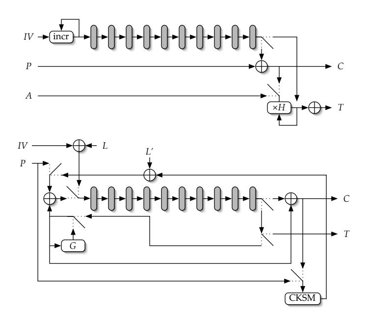

# The Security and Performance of the Galois/Counter Mode (GCM) of Operation (Full Version)

David A. McGrew† and John Viega‡ mcgrew@cisco.com,viega@securesoftware.com

† Cisco Systems, Inc., ‡ Secure Software

Abstract. The recently introduced Galois/Counter Mode (GCM) of operation for block ciphers provides both encryption and message authentication, using universal hashing based on multiplication in a binary finite field. We analyze its security and performance, and show that it is the most efficient mode of operation for high speed packet networks, by using a realistic model of a network crypto module and empirical data from studies of Internet traffic in conjunction with software experiments and hardware designs. GCM has several useful features: it can accept IVs of arbitrary length, can act as a stand-alone message authentication code (MAC), and can be used as an incremental MAC. We show that GCM is secure in the standard model of concrete security, even when these features are used. We also consider several of its important system-security aspects.

## 1 Introduction

The Galois/Counter Mode (GCM) of operation for block ciphers was designed to meet the need for an authenticated encryption mode that can efficiently achieve speeds of 10 gigabits per second and higher in hardware, can perform well in software, and is free of intellectual property restrictions. It was recently submitted to several standards venues, including the NIST Modes of Operation process [19], IEEE 802.1AE Link Security [23], where it is the mandatory-to-implement cryptoalgorithm in the current draft standard, and IPsec [26]. In the following, we consider its performance and security.

The counter mode of operation (CTR) has become the mode of choice for high speed applications, because it can be efficiently pipelined in hardware implementations. However, it provides no message authentication. GCM incorporates CTR and builds on it by adding a message authentication code (MAC) based on universal hashing [27, 17]. It uses polynomial hashing in the finite field GF(2w), the core operation of which is multiplication by a fixed field element. The binary field multiplication can be implemented easily in hardware, and can be made surprisingly efficient in software via table-driven methods. Additionally, GCM can be used as a stand-alone MAC, and can be used as an incremental MAC [3].

This paper is structured as follows. In Section 1.1 we review existing work on authenticated encryption with associated data (AEAD) methods [21]. In Section 2 we briefly review the GCM definition. In Section 3 we analyze and describe its performance in hardware are software, and compare it to other AEAD modes of operation. In Section 4, we review our analysis of GCM in the concrete model; proofs of our results are provided in the Appendices. In Section 5 we consider several important system-security aspects. An abridged version of this paper appeared as an extended abstract [20], in which the appendices were omitted.

### 1.1 Overview of Authenticated Encryption Modes

Recently, many authenticated encryption modes have been proposed, because of the efficiency and usability benefits of the combined approach. The first such mode was Jutla's IAPM (Integrity-Aware Parallelizable) mode [14]. The better known OCB (Offset Code Book) mode [22] is a refinement of IAPM. Both of these modes are parallelizable, making them suitable for high-speed hardware implementations (though they cannot take complete advantage of pipelining; see Section 3). Independently, Gligor and Donescu proposed several authenticated encryption modes [12]. All of the above modes are covered by patents, which has motivated some other work in this space. CCM [28] uses a single key and combines CTR mode with CBC-MAC to produce an authenticated encryption scheme. However, CCM is not suited to high-speed implementations, because CBC-MAC is neither pipelinable nor parallelizable. EAX [7] is a patent-free mode similar to CCM, combining CTR with the OMAC [13] variant of CBC-MAC. OMAC cannot be pipelined or parallelized, so neither can EAX. However, EAX solves some minor issues unique to CCM: it is not on-line, meaning that the message length must be known before one can start processing the message, and there are cases in which it does not preserve word alignment. CWC mode [16] is both patent-free and fully parallelizable; it combines CTR with a MAC based on a universal hash function over GF(2127−1). Due to its use of an integer multiply operation, CWC is relatively expensive to implement in hardware.

One useful feature of many authenticated encryption schemes is the ability to authenticate associated data that is not part of the message, such as packet headers. IAPM and OCB are the only two modes we have discussed that have no facilities for this. Another interesting feature, introduced by EAX, is the ability to accept arbitrary-length IVs (most modes use IVs no longer than the cipher block width). This facility increases the usability of the mode, but has the disadvantage of requiring additional processing - particularly in hardware, where a pipeline stall caused by IV processing can significantly impact throughput. GCM supports arbitrary sized IVs, but is optimized for the 12-byte case. As with most modes, GCM uses a single key, supports additional authenticated data, preserves data alignment in all cases, and is on-line.

GCM's design draws from several sources. It uses CTR for encryption, and uses a polynomial hash, like CWC, but with a relatively inexpensive binary field. Its architecture follows that of the Universal Security Transform [18], which enables it to be efficiently pipelined.

#### 2 GCM Definition

We briefly review the definition of GCM, closely following its specification [19], but considering a block cipher with a width of  $w \ge 64$  bits, instead of focusing on the 128-bit wide Advanced Encryption Standard (AES) [25]. We assume that w is even. The two main functions that GCM uses are block cipher encryption and multiplication over the field  $GF(2^w)$ ; it defines a particular field, but its details are irrelevant to our analysis. The block cipher encryption of the value  $X \in \{0,1\}^w$  with the key K is denoted as E(K,X). The multiplication of two elements  $X,Y \in GF(2^w)$  is denoted as  $X \cdot Y$ , and the addition of X and Y is denoted as  $X \oplus Y$ . The function len(S) takes a bit string S with a length between zero and  $2^{w/2} - 1$ , inclusive, and returns a w/2-bit string containing the nonnegative integer describing the number of bits in its argument, with the least significant bit on the right. The expression  $0^l$  denotes a string of l zero bits, and  $A \parallel B$  denotes the concatenation of two bit strings A and B. The function  $MSB_t(S)$  takes a bit string S and returns the bit string containing only the leftmost t bits of S, and the symbol  $\{\}$  denotes the bit string with zero length.

The authenticated encryption operation takes as inputs a secret key K, initialization vector IV, a plaintext P, and additional authenticated data A, and gives as its outputs a ciphertext C and an authentication tag T. These values are bit strings with lengths given as follows:

$$0 \le \text{len}(P) \le (2^{32} - 2)w$$

$$0 \le \text{len}(A) \le 2^{w/2}$$

$$0 < \text{len}(IV) \le 2^{w/2}$$

$$\text{len}(C) = \text{len}(P)$$

$$\text{len}(T) = t < w,$$
(1)

where the parameter t is fixed for each instance of the key. The secret key has a length appropriate to the block cipher, and is only used as an input to that cipher. For each fixed value of K, each value of the IV must be distinct, but those values need not have equal lengths. The authenticated decryption operation has five inputs: K, IV, C, A, and T, as defined above. It has only one output, either the plaintext value P or the special symbol **FAIL** that indicates that its inputs are not authentic.

During the encryption and decryption processes, the bit strings P, C, and A are broken up into w-bit blocks. We let n and u denote the unique pair of positive integers such that the total number of bits in the plaintext is (n-1)w+u, where  $1 \leq u \leq w$ , when len(P) > 0; otherwise n = u = 0. The plaintext consists of a sequence of n bit strings, in which the bit length of the last bit string is u, and the bit length of the other bit strings is w. The sequence is denoted  $P_1, P_2, \ldots, P_{n-1}, P_n^*$ , and the bit strings are called data blocks, although the last bit string,  $P_n^*$ , may not be a complete block. Similarly, the ciphertext is denoted as  $C_1, C_2, \ldots, C_{n-1}, C_n^*$ , where the number of bits in the final block  $C_n^*$  is u. The additional authenticated data A is denoted as  $A_1, A_2, \ldots, A_{m-1}, A_m^*$ ,

where the last bit string A∗ m may be a partial block of length v, and m and v denote the unique pair of positive integers such that the total number of bits in A is (m − 1)w + v and 1 ≤ v ≤ w, when len(A) > 0; otherwise m = v = 0. The authenticated encryption operation is defined by the following equations:

$$H = E(K, 0^{w})$$

$$Y_{0} = \begin{cases} IV || 0^{31}1 & \text{if len}(IV) = w - 32\\ \text{GHASH}(H, \{\}, IV) & \text{otherwise.} \end{cases}$$

$$Y_{i} = \text{incr}(Y_{i-1}) \text{ for } i = 1, \dots, n$$

$$C_{i} = P_{i} \oplus E(K, Y_{i}) \text{ for } i = 1, \dots, n - 1$$

$$C_{n}^{*} = P_{n}^{*} \oplus \text{MSB}_{u}(E(K, Y_{n}))$$

$$T = \text{MSB}_{t}(\text{GHASH}(H, A, C) \oplus E(K, Y_{0}))$$
(2)

Successive counter values are generated using the function incr(), which treats the rightmost 32 bits of its argument as a nonnegative integer with the least significant bit on the right, and increments this value modulo 232. More formally, the value of incr(FkI) is Fk(I + 1 mod 232). The function GHASH is defined by GHASH(H, A, C) = Xm+n+1, where the inputs A and C are formatted as described above, and the variables Xi for i = 0, . . . , m + n + 1 are defined as

$$X_{i} = \begin{cases} 0 & \text{for } i = 0\\ (X_{i-1} \oplus A_{i}) \cdot H & \text{for } i = 1, \dots, m-1\\ (X_{m-1} \oplus (A_{m}^{*} || 0^{w-v})) \cdot H & \text{for } i = m\\ (X_{i-1} \oplus C_{i-m}) \cdot H & \text{for } i = m+1, \dots, m+n-1\\ (X_{m+n-1} \oplus (C_{n}^{*} || 0^{w-u})) \cdot H & \text{for } i = m+n\\ (X_{m+n} \oplus (\text{len}(A) || \text{len}(C))) \cdot H & \text{for } i = m+n+1. \end{cases}$$

$$(3)$$

### 3 Performance

We considered the performance of various modes of operation of the AES-128 block cipher in both hardware and software. We use a simple model of a network crypto module in order to analyze the performance of different AEAD modes under realistic conditions. The module consists of a device that accepts a continuous stream unprotected data packets on one interface and then outputs the stream of encrypted and authenticated packets out another interface. We assume that the key is present in the module, and that the mode and data encapsulation are fixed, in order to focus on the data processing performance. We assume that the module contains a clock which runs at a fixed rate. In general, the number of clock cycles C(s) required to process a packet with s bytes varies as a function of s. We assume that the packet sizes are distributed probabilistically, where the probability of having size s is P[S = s]. The expected number of clocks per byte C of the module is  $C = \sum_{s} C(s) f(s)$ , where

$$f(s) = \frac{\mathbf{P}[S=s]}{\sum_{r} r\mathbf{P}[S=r]}$$
(4)

is the expected fraction of bytes that are carried in packets of size s. The function f(s) is important because it can be empirically observed. Studies of Internet traffic reveal a predominance of small packets, with peaks in the distribution of packet sizes at 44, 552, 576, and 1500 bytes, and very few packets with larger sizes [10], reflecting the nature of the TCP/IP protocol family. About half of the data on the Internet is carried in packets of 576 bytes or less, and most of the remainder is carried in packets of about 1500 bytes. We defined the Internet Performance Index (IPI) as the expected number of bits processed per clock cycle when the packet distribution has the values f(1500) = .6, f(576) = .2, f(552) = .15, and f(44) = .05, using data from [10]. This index is a useful indicator of the performance of a crypto module that protects IP traffic using e.g. the Encapsulating Security Payload (ESP) [15] in tunnel mode, the protocol which underlies most Virtual Private Networks.

### 3.1 Hardware

A typical high-speed AES-128 implementation consists of a pipeline of ten units, each of which implements a single AES round. At each clock cycle, data moves from one unit to the next, and 128 bits enter the pipeline and the same number leave the pipeline as output. In the following, we describe and analyze the best GCM, CWC, and OCB implementations that use a single instance of this AES pipeline. We disregard the other modes, since they use cipher block chaining and thus cannot be implemented in this manner. We require that packets be processed sequentially, rather than concurrently, because the complexity and circuit cost of the concurrent approach makes sequential processing more desirable in practice. In our performance analysis we determine the value of C(s) for each mode and tabulate the results, and also compare the circuit costs for the modes. Data from multiple packets may be in the module simultaneously. To account for this fact, we measure C(s) by counting the number of cycles between the time when the last data from one protected packet leaves the module and when the initial data from the next protected packet leaves the module. Our hardware implementation model is not detailed, but it very effectively reveals the effects of pipeline stalls on performance; a stall occurs when a circuit is not generating outputs for some number of clock cycles.

GCM can easily take advantage of the AES pipeline (Figure 1, top), as long as a 96-bit IV is used (as is recommended for high-speed implementations). We use a finite-field multiplier over  $GF(2^w)$  that executes in a single clock cycle. An important property of the mode is that the counter  $Y_0$  that is used to encrypt the GHASH output can immediately follow the other counters through the AES pipeline, so that after the plaintext is encrypted, only one additional clock is needed to compute the authentication tag. Thus GCM can achieve

C(s) = ds/16e + 1 by having the data from each packet immediately follow that of the previous packet through the pipeline. CWC is similar but requires an additional AES encryption to process the authentication tag. This causes a pipeline stall of 10 clock cycles during which the tag passes through the AES pipeline; thus for CWC, C(s) = ds/16e + 11.

In OCB (Figure 1, bottom), the AES pipline is used in three distinct ways: to encrypt the IV, to encrypt the plaintext, and to compute the authentication tag. The pipeline stalls for ten clock cycles while the IV is being encrypted. After that computation, the stall continues for another ten clock cycles, until the plaintext that is being encrypted appears at the output of the pipeline as ciphertext. After all of the plaintext has been encrypted, the 'checksum' value is encrypted; this operation requires only a single clock cycle, because the data from the IVencryption of the next packet can follow the data from the checksum-encryption through the pipeline. Thus OCB can achieve COCB = ds/16e + 21. In Table

Fig. 1. Pipelined high-speed implementations of AES-128 GCM (top) and AES-128 OCB (bottom). During each clock cycle, 128 bits of data move across each arrow. Some details have been omitted for clarity.

1, we compare the GCM, CWC, and OCB implementations described above. Various data sizes are included, along with the Internet Performance Index, and throughput is shown in bits per clock cycle. GCM excels the other modes in every category, especially at shorter lengths, because it keeps its pipeline full. In a crypto module that can process 128 bits per clock cycle, an ten-cycle pipeline stall has a considerable opportunity cost: 160 bytes could be encrypted during that time. GCM performance on the IPI is over twice that of CWC and over three times that of OCB. The circuit cost of GCM is higher than that of OCB because of its finite-field multiplier, but GCM is still the most economical mode for highspeed operation. Even in the unlikely case that this multiplier required a circuit as large as the entire AES pipeline, a single GCM instance would have higher throughput on Internet data than three OCB implementations, while having less total circuit area. The cost of a single-clock GF(2128)-multiplier has been estimated at 30% of the cost of the AES-128 pipeline; a detailed analysis of this cost is beyond the scope of this paper. The circuit cost of CWC is significantly higher than that of GCM because it uses an integer multiplier rather than a binary-field multiplier.

Table 1. Hardware performance in bits per clock cycle, with three significant digits, for a variety of packet sizes and the Internet Performance Index (IPI).

| Bytes                                                 | 16 | 20 | 40 | 44 |  |  | 64 128 256 552 576 1024 1500 8192 |     | IPI      |
|-------------------------------------------------------|----|----|----|----|--|--|-----------------------------------|-----|----------|
| GCM 64.0 71.1 91.4 93.9 102 114 120 124 124           |    |    |    |    |  |  | 126                               | 127 | 128 77.7 |
| CWC 10.7 13.1 23.7 25.6 34.1 53.9 75.9 97.0 98.0      |    |    |    |    |  |  | 109                               | 115 | 125 35.3 |
| OCB 5.82 7.19 13.6 14.8 20.5 35.3 55.4 79.6 80.8 96.4 |    |    |    |    |  |  |                                   | 105 | 123 22.8 |

### 3.2 Software

We tested software implementations of GCM, EAX, CCM, CWC, and OCB, each instantiated with the AES-128 cipher [25]. We also included CBC with HMAC-SHA1 to represent common current practice. We used the best available implementation of each mode, modified to use the fastest available AES implementation. All experiments took place on a 1Ghz Motorola G4 CPU using the GNU C compiler version 3.3 with full optimization. In this enviornment, AES-128 itself ran at 25 cycles per byte1 . Qualitatively similar results were found on an Intel P4 [11], though CWC performed better on that CPU2 . We tested GCM with both of the GHASH implementation strategies described in its specification, using 256 byte and 4Kb tables with Shoup's method [24] and 64Kb with the straightforward method. Table 2 shows our results. GCM has the best performance for the Internet Performance Index and on packets up to 576 bytes, while OCB has the best performance on larger packets. This result is easy to understand: OCB uses one more AES encryption per packet, while GCM does a GF(2w)-multiply operation per block that OCB does not. The point at which

1 Faster implementations have been reported for some CPUs, but are not publicly available. The table-driven GHASH algorithm, which uses the same basic operations as AES, may be able to benefit from similar implementation techniques.

2 Gladman's Intel implementations used Bernstein's floating-point multiplication techniques [?], which provide significant advantages on some processors.

their performance is equal reflects the number of multiplies that can be done in the time taken for a single AES encryption.

Table 2. Software performance in bits per kilocycle (or equivalently, megabits per second on a 1GHz processor) to three significant digits, on various packet sizes, and the Internet Performance Index (IPI), for various AES-128 modes of operation. GCM256, GCM4K, and GCM64K refer to GCM with 256, 4K, and 64K byte table sizes, respectively. The highest entry in each column is highlighted.

| Bytes    | 16  | 20 | 40                                       | 44 |  |  |     | 64 128 256 552 576 1024 1500 8192 |                                                       | IPI      |
|----------|-----|----|------------------------------------------|----|--|--|-----|-----------------------------------|-------------------------------------------------------|----------|
| GCM64K   |     |    | 136 167 227 253 223 263 267 273 273      |    |  |  | 266 | 266                               |                                                       | 258 268  |
| GCM4K    |     |    | 116 140 190 207 192 213 229 237 233      |    |  |  | 239 | 247                               |                                                       | 240 240  |
| GCM256   |     |    | 88.4 107 148 160 177 162 171 183 184     |    |  |  | 181 | 183                               |                                                       | 182 182  |
| OCB      |     |    |                                          |    |  |  |     |                                   | 89.5 85.7 140 150 185 225 255 261 265 273 275 282 260 |          |
| CWC      |     |    | 45.7 51.9 73.4 75.5 88.1 104 116 127 126 |    |  |  | 131 | 124                               |                                                       | 135 121  |
| EAX      |     |    | 46.0 44.9 73.4 80.0 102 129 148 157 160  |    |  |  | 165 | 167                               |                                                       | 174 156  |
| CCM      |     |    | 91.3 88.9 123 133 142 171 163 168 168    |    |  |  | 174 | 172                               |                                                       | 175 168  |
| CBC-HMAC | 6.3 |    | 8.0 15.2 16.6 23.4 39.0 64.5 96.0 97.0   |    |  |  | 117 | 129                               |                                                       | 156 88.6 |

### 3.3 Other Applications

GCM can be used in an authentication-only mode, in which the data to be authenticated is included in A and the plaintext has zero length. In this mode (called GMAC), GCM has even more compelling advantages over most other modes because it avoids calling the block cipher once per block of data. (CWC is the only other mode with this property.) For instance, GMAC in our software test environment can process 1500-byte packets in 10.2 cycles per byte, whereas PMAC, a stand-alone MAC based on OCB [8], requires 27.6 cycles per byte.

The Secure Real-time Transport Protocol (SRTP) encrypts and authenticates real-time traffic, such as conversational voice, at the transport layer [1]. Typical plaintext sizes for this traffic include 20 bytes for the G.729 encoding, and 80 bytes for the G.721 encoding; GCM's performance on short packets makes it ideal for this application.

### 4 Security

The security of GCM stands on a single cryptographic conjecture: the block cipher E is assumed to be a secure pseudorandom permutation (PRP). To paraphrase Occam, we do not multiply conjectures beyond necessity. This requirement is met when E cannot be distinguished from a random permutation by an adversary that can choose its inputs and view its outputs. To formalize this idea, we use standard definitions from concrete security analysis, following [4]. The permutation oracle has the same interface as does the block cipher E with a fixed key. It takes as input a plaintext in {0, 1} w and returns a ciphertext in  $\{0,1\}^w$ . We consider the experiment in which the adversary is given access to a permutation oracle and is challenged to determine whether it is the block cipher E with a randomly selected key (we denote this event as  $B_E$ ), or a random permutation (which we denote as  $B_E^c$ ). Each of these cases occurs with probability of 1/2. During the experiment, the adversary makes queries to the oracle and receives its responses. Afterwards, the adversary returns a bit that indicates its guess as to the content of the oracle. We denote as D the event that it guesses that  $B_E$  occurred, and denote as  $D^c$  the guess that  $B_E^c$  occurred.

We define the distinguishing advantage  $A_E$  as the adversary's true positive probability less her false positive probability, that is,

$$A_E = \mathbf{P}[D \mid B_E] - \mathbf{P}[D \mid B_E^c]. \tag{5}$$

Here we use the conventional notation that  $\mathbf{P}[\mathcal{X}]$  denotes the probability that the event  $\mathcal{X}$  occurs, and  $\mathbf{P}[\mathcal{X} \mid \mathcal{Y}] = \mathbf{P}[\mathcal{X} \cap \mathcal{Y}]/\mathbf{P}[\mathcal{Y}]$  denotes the probability that  $\mathcal{X}$  occurs, given that the event  $\mathcal{Y}$  has occured. We also use  $\mathcal{X} \cap \mathcal{Y}$  to denote the event in which both events  $\mathcal{X}$  and  $\mathcal{Y}$  occur, and use  $\mathcal{X}^c$  to denote the complement of  $\mathcal{X}$ , that is, the event that  $\mathcal{X}$  does not occur. We make the simplifying assumption that  $A_E > 0$ , because an adversary that is consistently wrong can turn itself into one that is consistently right by just inverting its output. Thus the value  $A_E$  ranges between 0 and 1, inclusive.

Our model for the security of an AEAD system follows Rogaway [21]. The authenticated encryption oracle models the GCM authenticated encryption operation. It takes as input the bit strings IV, A, and P and returns the bit strings C and T, whose lengths obey the restrictions of Equations 1. The authenticated decryption oracle accepts inputs of the form (IV, A, C, T) and returns as its outputs either the special symbol **FAIL** or the plaintext P, where all of the bit strings are as defined above. We let the adversary choose the IVs, but assume that she is nonce-respecting and will not submit the same IV value to the same oracle multiple times (though she is free to submit a value to both oracles). We allow the adversary to interleave queries to these oracles. For our definition of confidentiality, we use the indistinguishability of ciphertext from random under a chosen plaintext attack and indistinguishability of plaintext from random under a chosen ciphertext attack. This strong definition has been shown to be equivalent to several other definitions [2]. Under these assumptions, GCM encryption is secure if an adversary presented with these oracles cannot tell if they contain GCM with a randomly selected key ( we denote this event as  $B_{\text{GCM}}$ ) or if C and T are a random function of the other inputs (which we denote as  $B_{\text{GCM}}^c$ ). Each of these cases occurs with probability 1/2. Because GCM is not a generic composition of a cipher and a MAC, we cannot use the results of Bellare and Namprempre [5]. Most importantly, the use of the same secret value H for both hashing the IV and for computing the authentication tag provides the adversary a potential attack vector against confidentiality. For this reason, we need to give adversary access to the authenticated decryption oracle.

GCM uses E as a pseudorandom function (PRF). In our analysis, we make use of the well-known result on the use of a PRP as a PRF [4]. Our definition of PRF security considers the experiment in which we are given access to

the function oracle, and are challenged to determine whether it contains a true random function or a PRF. That oracle has the same interface as does the permutation oracle; unlike that oracle, the function oracle may not be invertible. We use the convention that  $B_{\rm PRF}$  denotes the PRF case and  $B_{\rm PRF}^c$  denotes the random function case. The advantage of a PRF-distinguisher is given by  $A_{\rm PRF} = \mathbf{P}[D \mid B_{\rm PRF}] - \mathbf{P}[D \mid B_{\rm PRF}]$ . The distinguishing advantage against a PRF is similar to that against a PRP, and has similar properties. The following Lemma bounds  $A_{\rm PRF}$  in terms of  $A_E$ .

**Lemma 1 (A PRP can be a good PRF).** The advantage  $A_{PRF}$  of an adversary in distinguishing a w-bit PRP E from a random function is bounded by  $A_{PRF} \leq A_E + q(q-1)2^{-w-1}$ , where  $A_E$  is the adversary's advantage in distinguishing E from a random permutation, and the value q is the number of queries to the function oracle.

**Theorem 1 (GCM Encryption is Secure).** If there is an adversary that can distinguish GCM encryption from a random function with advantage  $A_{GCM}$ , when the output of that function is limited to q queries to the authenticated encryption and decryption oracles, where the total number of plaintext bits processed is  $l_P$  and where  $len(C) + len(A) \leq l$  and  $len(IV) \leq l_{IV}$  for each query, then that adversary can distinguish E from a random permutation with advantage  $A_E$ , where

$$A_E \ge A_{GCM} - (l_P/w + 2q)^2 2^{-w-1} - q((l_P/w + 2q)\lceil l_{IV}/w + 1\rceil 2^{1-w} + \lceil l/w + 1\rceil 2^{-t}).$$

This result is similar to that for counter mode, with a term that is quadratic in  $l_{\rm P}$ . It also has a term that is linear in both  $l_{\rm P}$  and  $ql_{\rm IV}$ , which is due to the fact that collisions in the counter values are more likely when the lengths of the IVs that are hashed becomes greater. This term is dominant when  $ql_{\rm IV}>l_{\rm P}$ . The implication is that when long IVs are used, fewer queries should be made before a key is changed. However, in most cases  $l_{\rm IV}$  will be no greater than l, and thus the accommodation of variable length IVs comes at negligible security cost.

The authentication tag size t affects the security of GCM encryption, but its effect is relatively weak. The term containing  $2^{-t}$  in the bound on  $A_E$  does not dominate that value as long as t is greater than about  $w - \lg (q \lceil l/w \rceil + \lceil l_{\text{IV}}/w \rceil)$ .

### 4.1 Authentication

We use the standard model for the security of a MAC in the presence of a chosen-message attack, in which an adversary is given access to a tag generation oracle and a message/tag verification oracle. The adversary can pass messages to the tag generation oracle and construct any message/tag pairs that it likes and send these to the verification oracle. Queries to the oracles can be interleaved by the adversary, if desired. The forgery advantage  $F_{\rm GCM}$  is the probability that the adversary can get the verification oracle to accept a message/tag pair other than one generated by the tag generation oracle, after making q queries to the tag-generation oracle and the verification oracle.

**Theorem 2 (GCM authentication is secure).** An adversary with forgery advantage  $F_{GCM}$  against GCM, when q,  $l_P$ , l and  $l_{IV}$  are as defined in Theorem 1, has a distinguishing advantage  $A_E$  against the pseudorandom permutation E used in GCM of at least  $F_{GCM} - (l_P/w + 2q)^2 2^{-w-1} - q((l_P/w + 2q + 1)\lceil l_{IV}/w + 1\rceil 2^{1-w} + \lceil l/w + 1\rceil 2^{-t})$ .

Like most authentication modes, the forgery advantage has a term that is quadratic in the amount of data that is authenticated. This term is dominant whenever many short messages are processed, as is typical for network crypto modules. When very long messages are processed, the term proportional to l will dominate. This term is characteristic of MACs that are based on universal hashing.

#### 4.2 AES GCM Security

To tie our analysis to current practice, we apply it to the AES GCM specification for IPsec [26], for which  $l_{\rm IV}=96$  and t=96. Any of the AES key lengths (of 128, 192, and 256 bits) can be used; for each variant, the block width w=128. We use the typical Internet maximum packet size of 1500 bytes ( $l \leq 12000$ ). The security of AES-N-GCM (for N=128, 192, or 256) is captured in the following corollary.

**Corollary 1.** If there are no attacks against AES-N that can distinguish it from a random permutation with advantage greater than  $A_{AES-N}$ , and no more than q packets are processed, then

- there are no distinguishing attacks against AES-N-GCM that work with distinguishing advantage greater than  $A_{AES-N} + q^2 2^{-116} q 2^{-89.4}$ , and
- there are no forgery attacks against AES-N-GCM that work with forgery advantage greater than  $A_{AES-N}+q^22^{-116}-q2^{-89.4}-q2^{-128}$ .

In these equations, the key size appears implicitly in the value of  $A_{AES-N}$ . To provide a concrete example, these results show that, if AES is indistinguishable from a random permutation, and fewer than  $2^{48}$  packets are protected, then the attacker's advantage is no more than  $2^{-18}$ .

#### 5 Other Security Aspects

We next consider system-security aspects. Having shown GCM secure when used properly, we consider what can go wrong. One often overlooked aspect of mode security is the consequence of IV misuse. It is well known that reusing a key/IV pair in CTR results in a loss of confidentiality for the messages that used the common IV value. Since GCM is built on top of CTR, it shares this property. However, the reuse of an IV in the GCM authenticated encryption operation (e.g. on the sender's side) causes even worse problems. It allows the attacker to solve for the underlying GHASH key H, making subsequent forgeries trivial and also enabling the attacker to choose IVs that will cause colliding counters. However, the reuse of an IV in the authenticated decryption operation (on the

receiver's side) does not cause this problem. If an attacker convinces a receiver to decrypt multiple messages with the same IV, she still cannot exploit this situation to glean information about H efficiently. Fortunately, it is often comparatively easy for a sender to protect against IV reuse, for example, by using a simple message counter as an IV. Additionally, GCM's ability to accept an arbitrary-length IVs makes it easier to ensure all IVs are unique, by including any possible distinguishing information, no matter how verbose. Interestingly, CWC avoids some of these issues by using the underlying block cipher to encrypt the output of its universal hash function. But this aspect of its design is responsible for causing the pipeline stalls that significantly degrade CWC's performance.

It is possible that H = E(K, 0 w) = 0, and in this case, GHASH(H, A, C) = 0 w for all values of A and C. If E behaves as a random permutation, then the expected number of keys for which H = 0w is the fraction 2−w times the number of keys. This fact does not degrade the effectiveness of the message authentication; it is implicitly dealt with in the proof of security. When H = 0w, the authentication tags will not be predictable; that case is no easier to detect than any other value of the key. However, that value causes all IVs to hash to the same value (if 96-bit IVs are not used). For this reason, some users may want to avoid using that key, e.g. by using the convention that H is set to a fixed value whenever the zero value is detected at key setup time. Of course, that key is so unlikely to arise in practice that its effect on the bounds in the security proofs are negligible, and it is equally reasonable not to bother to check for it.

### References

- 1. M. Baugher , D. McGrew, M. Naslund, E. Carrara, K. Norrman. "The Secure Real-time Transport Protocol," IETF RFC 3711, March 2004.
- 2. M. Bellare, A. Desai, E. Jokipii, and P. Rogaway. "A concrete security treatment of symmetric encryption," In Proceedings of the 38th FOCS, IEEE Computer Society Press, 1997.
- 3. M. Bellare, O. Goldreich, and S. Goldwasser, "Incremental cryptography: the case of hashing and signing", CRYPTO '94, LNCS, Springer-Verlag, Aug. 1994.
- 4. M. Bellare, J. Kilian, P. Rogaway, "The Security of the Cipher Block Chaining Message Authentication Code," J. Comput. Syst. Sci. 61(3). pg. 362-399 (2000).
- 5. M. Bellare and C. Namprempre, "Authenticated encryption: Relations among notions and analysis of the generic composition paradigm," ASIACRYPT '00, Springer-Verlag, LNCS, 2000.
- 6. D. Bernstein. Floating-point arithmetic and message a uthentication, Manuscript, 2000. Available online at http://cr.yp.to/p apers.html#hash127.
- 7. M. Bellare, P. Rogaway, and D. Wagner, "A conventional authenticatedencryption mode", Submission to NIST Modes of Operation process, 2003.
- 8. J. Black and P. Rogaway, "A Block-Cipher Mode of Operation for Parallelizable Message Authentication," EUROCRYPT '02, LNCS, Springer-Verlag, 2002.
- 9. N. Biggs. Discrete Mathematics, Revised Edition, Oxford Science Publications, Oxford University Press. 1993.

- 10. K. Claffy, G. Miller, K. Thompson, "The nature of the beast: recent traffic measurements from an Internet backbone," INET '98, ISOC, 1998.
- 11. B. Gladman, "AES and Combined Encryption/Authentication Modes," Web Page, http://fp.gladman.plus.com/AES/index.htm, February, 2004.
- 12. V. Gligor and P. Donescu, "Fast encryption and authentication: XCBC encryption and XECB authentication modes," Proceedings of the Fast Software Encryption Workshop - FSE '01. Springer-Verlag, 2001.
- 13. T. Iwata, K. Kurosawa, "OMAC: One-Key CBC MAC," Submission to NIST Modes of Operation Process, 2002.
- 14. C. Jutla, "Encryption modes with almost free message integrity," Advanced in Cryptology - EUROCRYPT '01, Springer-Verlag, 2001.
- 15. S. Kent, R. Atkinson, "IP Encapsulating Security Payload (ESP)," IETF Request For Comments (RFC) 2406, November 1998.
- 16. T. Kohno, J. Viega, and D. Whiting, "The CWC-AES Dual-use Mode," Submission to NIST Modes of Operation Process, 2003.
- 17. H. Krawczyk, "LFSR-based hashing and authentication," In Y. Desmedt, editor, CRYPTO '94, LNCS, Springer-Verlag, Aug. 1994.
- 18. D. McGrew, "The Universal Security Transform," IETF Internet Draft, Work in Progress. Oct. 2002.
- 19. D. McGrew and J. Viega, "The Galois/Counter Mode of Operation (GCM)," Submission to NIST Modes of Operation Process, January, 2004.
- 20. D. McGrew and J. Viega, "The Security and Performance of the Galois/Counter Mode (GCM) of Operation," INDOCRYPT '04, LNCS, Springer-Verlag, 2004.
- 21. P. Rogaway. "Authenticated encryption with associated data," In Proceedings of the 9th CCS, Nov. 2002.
- 22. P. Rogaway, M. Bellare, J. Black, and T. Krovitz, "OCB: a block-cipher mode of operation for efficient authenticated encryption," ACM CCS, 2001.
- 23. A. Romanow, Ed. "Media Access Control (MAC) Security", IEEE 802.1AE, Draft Standard, July, 2004.
- 24. V. Shoup, "On Fast and Provably Secure Message Authentication Based on Universal Hashing," CRYPTO '96, LNCS, Springer-Verlag, 1996.
- 25. U.S. National Institute of Standards and Technology. The Advanced Encryption Standard. Federal Information Processing Standard (FIPS) 197, 2002.
- 26. J. Viega and D. McGrew, "The Use of Galois/Counter Mode (GCM) in IPsec ESP," IETF Internet Draft, Work in Progress, April, 2004.
- 27. M. Wegman and L. Carter, "New hash functions and their use in authentication and set equality," Journal of Computer and System Sciences, 22:265279, 1981.
- 28. D. Whiting, N. Ferguson, and R. Housley, "Counter with CBC-MAC (CCM)," Submission to NIST Modes of Operation Process, 2002.

### A Properties of GHASH

We now show that GHASH has the properties that we need, in the next three straightforward lemmas.

Lemma 2 (GHASH is almost xor universal). The function GHASH is  $\lceil l/w+1 \rceil 2^{-t}$ -almost xor universal when its second and third inputs are restricted so that their lengths sum to l or fewer bits and its output is truncated to t bits.

*Proof.* We consider two distinct inputs (A, C) and (A', C'), then analyze the probability of the event that

$$GHASH(H, A, C) \oplus GHASH(H, A', C') = a||z,$$
(6)

for some fixed t-bit value a and any value of the t-bit variable z (which we use to account for the truncation of the GHASH ouput). We assume that these inputs are formatted as described in Section 2, in which A, C, A', and C' consist of m, n, m', and n' w-bit blocks, respectively, the final blocks of which have lengths v, u, v', and u', respectively. We let  $p = \max(m+n, m'+n')$  denote the number of blocks in the longer input. We define the blocks  $D_i, D_i'$  for  $1 \le i \le p+1$  as

$$D_{i} = \begin{cases} A_{i} & \text{for } i = 1, \dots, m - 1 \\ A_{m}^{*} \| 0^{w-v} & \text{for } i = m \\ C_{i-m} & \text{for } i = m + 1, \dots, m + n - 1 \\ C_{n}^{*} \| 0^{w-u} & \text{for } i = m + n \\ \operatorname{len}(A) \| \operatorname{len}(C) & \text{for } i = m + n + 1 \\ 0^{w} & \text{for } m + n + 2, \dots, p + 1. \end{cases}$$

$$(7)$$

We similarly define the blocks  $D'_i$  for based on the input (A', C').

The condition that  $GHASH(H, A, C) \oplus GHASH(H, A', C') = a||z|$  can be expressed as R(H) = 0, where the polynomial R of degree at most p + 1 over  $GF(2^w)$  is defined by

$$R(H) = (a||z) \oplus \bigoplus_{i=1}^{p} (D_i \oplus D'_i) \cdot H^i.$$
 (8)

The polynomial R must be nonzero, because the strings A||C and A'||C' are distinct. There are at most p+1 values of  $H \in G$  for which R(H)=0 holds. This follows from the fact that an  $d^{th}$  degree polynomial over  $GF(2^w)$  has at most d distinct roots (this is the fundamental theorem of algebra over a finite field; see, for example, [9, Theorem 15.8.2]), and the fact that R is nonzero. The probability that R(H)=0 holds, given that H is chosen at random from  $GF(2^w)$ , is  $(p+1)/2^w \leq \lceil l/w+1 \rceil 2^{-w}$ , when the cumulative length of the inputs is restricted to l bits.

For each vector D, there is a unique pair (A, C) where both A and C are bit strings as described in Section 1, and vice-versa. This is because the last

element of D unambiguously encodes the lengths of both A and C. Thus, the probability that R(H)=0 holds for any two given messages (A,C) and (A',C'), and a given vector  $a\|z$ , is equal to the probability that  $GHASH(H,A,C) \oplus GHASH(H,A',C')=a\|z$ . Because there are  $2^{w-t}$  possible values for z, Equation 6 holds with probability  $\lceil l/w+1 \rceil 2^{-w} \times 2^{w-t} = \lceil l/w+1 \rceil 2^{-t}$  for any given values of (A,C),(A',C'), and  $a \in \{0,1\}^t$ .

We define the function h, which is (implicitly) used in GCM to compute the initial counter value  $Y_0$  based on the IV, so that we can analyze its properties:

$$h(H, M) = \begin{cases} M \|0^{31}\|1 & \text{if len}(M) = w - 32\\ \text{GHASH}(H, \{\}, M) & \text{otherwise.} \end{cases}$$
(9)

Lemma 3 (h is unlikely to collide). The bound

$$\mathbf{P}[h(H,IV) = \mathrm{incr}^{j}(h(H,IV')) \mid H \stackrel{R}{\leftarrow} GF(2^{w})] \le \lceil l/w + 1 \rceil 2^{-w}, \tag{10}$$

holds for the function h defined in Equation 9, for any values of j, IV, and IV', where the inputs IV and IV' are distinct and are allowed to have any lengths up to  $l_{IV}$  bits.

*Proof.* We call the event that  $h(H, IV) = \operatorname{incr}^{j}(h(H, IV'))$  as  $\mathcal{E}$ , for short. We separately consider the following cases:

- 1. len(IV) = len(IV') = w 32,
- 2. len(IV) = w 32 and  $len(IV') \neq w 32$ , and
- 3.  $len(IV) \neq w 32$  and len(IV') = w 32, and
- 4.  $len(IV) \neq w 32$  and  $len(IV') \neq w 32$ .

In case 1,  $h(H, IV) = IV \|0^{31}\|1$  and  $h(H, IV') = IV' \|0^{31}\|1$ . Because of the fact that IV and IV' are distinct and the fact that the increment function does not alter the leftmost w-32 bits of its input, the probability of a collision is zero. In case 2 when  $\mathcal{E}$  occurs it follows that

$$h(H, IV') = \operatorname{incr}^{-j}(IV||0^{31}||1) = IV||(1 - j \mod 2^{32}).$$

(Here we rely on the implicit conversion of non-negative integers to their representation as binary vectors; the important fact is that this conversion is unique and invertible.) This condition can be re-expressed as R(H) = 0, where the polynomial R of degree n' + 1 over  $GF(2^w)$  is defined by  $R = \bigoplus_{i=1}^{n'+1} R_i \cdot H^i$  with the coefficients

$$R_{i} = \begin{cases} IV \| (1 - j \mod 2^{32}) & \text{for } i = 0, \\ IV'_{i} \| 0^{p} & \text{for } 1 < i \le n', \\ (0^{w/2} \| \text{len}(IV')) & \text{for } i = n' + 1 \end{cases}$$
 (11)

where  $n' = \lceil \operatorname{len}(IV')/w \rceil$  and  $p = \operatorname{len}(IV') \mod w$  is the number of padding bits in the n'th coefficient. There are at most n' + 1 values of  $H \in G$  for which

R(H)=0 holds, since that it is the number of distinct roots of R. This fact is true for any value of j, since each value of j corresponds to a distinct polynomial. Thus the probability of  $\mathcal{E}$ , given that H is chosen at random from  $GF(2^w)$ , is  $(n'+1)/2^w \leq \lceil l_{\text{IV}}/w+1 \rceil 2^{-w}$ . Case 3 is identical to case 2 after a relabeling of IV and IV'. In Case 4, the probability that h(H, IV) = h(H, IV') is equal to the probability that  $GHASH(H, \{\}, IV) = GHASH(H, \{\}, IV')$ , which is no greater than  $\lceil l_{\text{IV}}/w+1 \rceil 2^{-w}$  from Lemma 2. The claimed result holds in all four

**Lemma 4** (h is unlikely to return zero). The function h defined in Equation 9 satisfies

$$\mathbf{P}[h(H,IV) = 0^w \mid H \stackrel{R}{\leftarrow} GF(2^w)] \le \lceil l_{IV}/w + 1 \rceil 2^{-w} \text{ for all } IV : \operatorname{len}(IV) \le l_{IV}.$$

*Proof.* When len(IV) = w - 32, then the probability is equal to zero. Otherwise, the condition that h(H, IV) = 0 can be re-expressed as R(H) = 0, where the polynomial R has the coefficients

$$R_{i} = \begin{cases} 0 & \text{for } i = 0, \\ IV_{i-1} & \text{for } i = 1 \le n+1 \\ 0^{w/2} || \text{len}(IV) & \text{for } i = n+1, \end{cases}$$
 (12)

and  $n = \lceil \operatorname{len}(N)/w \rceil$ . There are no more than  $\lceil l_{\text{IV}}/w + 1 \rceil$  values of H that satisfy this equation, because each of those values is a root of R(H) = 0 over  $GF(2^w)$ . Because H is chosen at random, the probability that R(H) = 0 is no more than  $\lceil l_{\text{IV}}/w + 1 \rceil 2^{-w}$ .

#### B Proofs of Theorems 1 and 2

We first prove Theorem 2, which shows that GCM is a good MAC, then we prove Theorem 1, which shows that GCM's encryption is effective. This order is important, since we use results from the analysis of the forgery probability when analyzing encryption. We start by reviewing message authentication based on universal hashing.

A function g(K, M) is  $\epsilon$ -almost xor universal [17] if

$$\mathbf{P}[g(K,M) \oplus g(K,M') = a \mid K \stackrel{R}{\leftarrow} \{0,1\}^n] \le \epsilon \text{ for all } M \ne M' \text{ and } a.$$
 (13)

Here the expression  $K \stackrel{R}{\leftarrow} \{0,1\}^n$  denotes the event that K is chosen at random from the set  $\{0,1\}^n$ . We diverge slightly from the usual definition in order to make our exposition more explicit3.

&lt;sup>3 In the standard definition, g would define a family of (unkeyed) hash functions, and we would select a function from that family. Our keyed hash function corresponds to the hash function family, and a particular value of the key K corresponds to a particular function in that family.

An  $\epsilon$ -almost xor universal function can be combined with a pseudorandom function to make a strong MAC. First, we analyze the security of the ideal case, following Krawczyk [17]. We consider the message authentication code AXUMAC defined by  $T = R(N) \oplus H(K,M)$ , where the hash function H(K,M) is  $\epsilon$ -almost xor universal and R is a random function. Here M is a message, N is a nonce and T is the tag corresponding to M and N.

**Lemma 5 (AXU-MAC is secure).** If H is  $\epsilon$ -almost xor universal, then the probability of success of a single forgery attempt against AXU-MAC is no greater than  $\epsilon$ .

*Proof.* The lemma follows directly from the properties of an xor-universal hash function. We denote as (N, M', T') the 3-tuple that represents a forgery attempt, and we assume that the adversary has access to a valid 3-tuple (N, M, T), with  $T = R(N) \oplus H(K, M)$ , for the same nonce value N. Then

$$\mathbf{P}[\ (N, M, T) \text{ accepted }] = \mathbf{P}[T' \oplus T = H(K, M') \oplus H(K, M)] \le \epsilon. \ \Box$$
 (14)

The best strategy for forging messages is to choose values of  $M \oplus M'$  and  $T' \oplus T$  such that the lower bound on the probability is met. A simple but important corollary follows.

Corollary 2. The forgery advantage against AXU-MAC is no greater than  $q\epsilon$ , whenever q queries to the authentication and verification oracles are allowed.

*Proof.* We define the event  $U_i$  as the case in which the adversary does not produce a successful forgery against AXU-MAC on the i query to the message/tag-verification oracle. If  $U_1 \cap U_2 \dots \cap U_i$  occurs, then the probability of the adversary succeeding in its next forgery attempt is limited by Lemma 5; thus

$$\mathbf{P}[U_{i+1} \mid U_i \cap U_{i-1} \cap \ldots \cap U_1] \ge 1 - \epsilon. \tag{15}$$

This fact holds independent from the number of queries that have been made to the tag-generation oracle. For any set of events  $A_1, A_2, \ldots, A_n$  such that  $\mathbf{P}[A_1 \cap A_2 \cap \ldots \cap A_n] > 0$ ,

$$\mathbf{P}[A_1 \cap A_2 \cap \ldots \cap A_n] = \mathbf{P}[A_n \mid A_1 \cap A_2 \cap \ldots \cap A_{n-1}] \times \mathbf{P}[A_{n-1} \mid A_1 \cap \ldots \cap A_{n-2}] \times \mathbf{P}[A_{n-2} \mid A_1 \cap \ldots \cap A_{n-3}] \times \cdots \times \mathbf{P}[A_1].$$

The probability  $\mathbf{P}[U_1 \cap U_2 \dots \cap U_q]$  that there are no successful forgeries after q queries to each oracle is at least  $(1-\epsilon)^q$ . The forgery advantage is no more than  $1-(1-\epsilon)^q \leq q\epsilon$ , with the inequality following from using Taylor's theorem with remainder.

Proof of Theorem 2. We proceed by treating E as a PRF, not a PRP, then rationalize this assumption using Lemma 1. We assume that we have a machine that generates GCM message/tag pairs with forgery advantage  $F_{\rm GCM}$ , using a chosen-message attack. We use this machine to distinguish between the case that

the oracle contains GCM implemented with E, which we denote as  $B_{\rm PRF}$ , and the case of GCM implemented with a random function, which we denote as  $B_{\rm PRF}^c$ . We measure the advantage  $A_{\rm PRF}$  defined above. We use the function oracle to implement GCM, by replacing each invocation of E with an invocation to that oracle, then run the machine and provide it with access to a tag-generation oracle and a message/tag verification oracle. If the machine succeeds in forging a message/tag pair, then we guess that event  $B_{\rm PRF}$  occurred, otherwise, we guess that  $B_{\rm PRF}^c$  occurred. We compute the hash key H by querying the function oracle with the input value  $0^w$  at the very outset of the experiment, and set that key to the value returned by the oracle. We denote the event that none of the counter values  $Y_i$  input to the function oracle during the experiment are equal to the zero value  $0^w$  as  $\mathcal{Z}$ . We also consider the event  $\mathcal{Y}$  that all counter values are distinct, for the entire run of the experiment, as used in the proof of Theorem 1. Our analysis uses the following facts:

Fact 1.  $F_{GCM} = \mathbf{P}[D \mid B_{PRF}]$ , which follows directly from the definition of the forgery advantage.

**Fact 2.** For any three events A, B and C (with  $P[B] \neq 0$ ),

$$\mathbf{P}[A \mid B] = \frac{\mathbf{P}[A \cap B]}{\mathbf{P}[B]}$$

$$= \frac{\mathbf{P}[A \cap B \cap C]}{\mathbf{P}[B]} + \frac{\mathbf{P}[A \cap B \cap C^{c}]}{\mathbf{P}[B]}$$

$$= \frac{\mathbf{P}[A \cap B \cap C]}{\mathbf{P}[B \cap C]} \frac{\mathbf{P}[B \cap C]}{\mathbf{P}[B]} + \frac{\mathbf{P}[A \cap B \cap C^{c}]}{\mathbf{P}[B \cap C^{c}]} \frac{\mathbf{P}[B \cap C^{c}]}{\mathbf{P}[B]}$$

$$= \mathbf{P}[A \mid B \cap C] \mathbf{P}[C \mid B] + \mathbf{P}[A \mid B \cap C^{c}] \mathbf{P}[C^{c} \mid B]. \quad (16)$$

Fact 3.  $\mathbf{P}[D \mid B_{\mathrm{PRF}}^c \cap \mathcal{Y} \cap \mathcal{Z}] \leq q\lceil l/w+1\rceil 2^{-t}$ , because when the events  $B_{\mathrm{PRF}}^c, \mathcal{Y}$ , and  $\mathcal{Z}$  occur in conjunction, Lemma 5 applies. When  $B_{\mathrm{PRF}}^c$  occurs, the hash key H is chosen uniformly at random, as required by that lemma. When  $\mathcal{Z}$  occurs, H is not used to encrypt any plaintext block, and the adversary has no information about its value. Event  $\mathcal{Y}$  ensures that no output from g is used more than once. We also know from Lemma 2 that GHASH is  $\lceil l/w+1 \rceil 2^{-t}$  almost xor universal.

Fact 4.  $\mathbf{P}[\mathcal{Z}^c \mid B_{\mathrm{PRF}}^c] \leq (q-1)\lceil l_{\mathrm{IV}}/w + 1\rceil 2^{-w}$  from Corollary 2.

We can express the PRF-distinguishing advantage  $A_{PRF}$  in terms of  $A_{GCM}$  as

$$A_{\text{PRF}} = \mathbf{P}[D \mid B_{\text{PRF}}] - \mathbf{P}[D \mid B_{\text{PRF}}^{c}]$$

$$= F_{\text{GCM}} - \mathbf{P}[D \mid B_{\text{PRF}}^{c}]$$

$$= F_{\text{GCM}} - \mathbf{P}[D \mid B_{\text{PRF}}^{c} \cap (\mathcal{Y} \cap \mathcal{Z})^{c}] \mathbf{P}[(\mathcal{Y} \cap \mathcal{Z})^{c} \mid B_{\text{PRF}}^{c}]$$

$$- \mathbf{P}[D \cap (\mathcal{Y} \cap \mathcal{Z}) \mid B_{\text{PRF}}^{c}] \mathbf{P}[\mathcal{Y} \cap \mathcal{Z} \mid B_{\text{PRF}}^{c}],$$

$$\geq F_{\text{GCM}} - \mathbf{P}[(\mathcal{Y} \cap \mathcal{Z})^{c} \mid B_{\text{PRF}}^{c}] - \mathbf{P}[D \cap (\mathcal{Y} \cap \mathcal{Z}) \mid B_{\text{PRF}}^{c}],$$

$$\geq F_{\text{GCM}} - \mathbf{P}[(\mathcal{Y} \cap \mathcal{Z})^{c} \mid B_{\text{PRF}}^{c}] - \mathbf{P}[D \cap (\mathcal{Y} \cap \mathcal{Z}) \mid B_{\text{PRF}}^{c}]$$

$$\geq F_{\text{GCM}} - \mathbf{P}[(\mathcal{Y} \cap \mathcal{Z})^{c} \mid B_{\text{PRF}}^{c}] - q[l/w + 1]2^{-t}$$

$$\geq F_{\text{GCM}} - \mathbf{P}[\mathcal{Y}^{c} \mid B_{\text{PRF}}^{c}] - (q - 1)[l_{\text{IV}}/w + 1]2^{-w} - q[l/w + 1]2^{-t},$$

$$\geq F_{\text{GCM}} - \mathbf{P}[\mathcal{Y}^{c} \mid B_{\text{PRF}}^{c}] - q([l_{\text{IV}}/w + 1]2^{-w} + [l/w + 1]2^{-t}). \tag{17}$$

We rely on the fact that  $\mathbf{P}[\mathcal{Y}^c \mid B_{\mathrm{PRF}}^c]$  is extremely small to keep the advantage low, and next consider that value.

During the experiment, the adversary makes a series of queries to the authenticated encryption oracle. For each query, there is a sequence of counter values  $Y_0, Y_1, \dots, Y_n$  used as the input to E. We denote as  $U_i$  the event that the counter sequence of the  $i^{th}$  query is distinct from the counter sequences of all of the previous queries. In order for a sequence of length l to overlap with another sequence, then either the initial counter of the first sequence is contained in the second sequence, or the initial counter of the first sequence is contained in the l counters that precede the second sequence. If the counter sequences for queries r and s overlap, then  $h(H, IV_r) = \operatorname{incr}^j(h(H, IV_s))$  for some value of j such that  $-b_r < j < b_s$ , where we let  $b_i$  denote the number of counters used during the  $i^{th}$  query. From Lemma 3, we know that the probability of this event, for any fixed value of j, is no greater than  $[l_{IV}/w+1]2^{-w}$ . (Importantly, when  $B_{PRF}^c$  occurs, the value of the hash key H is random, as is required by that Lemma.) Summing over all of the previous queries, we find that  $\mathbf{P}[U_r^c] \leq \left( (r-1)b_r + \sum_{i=1}^{r-1} b_i \right) \lceil l_{\text{IV}}/w + 1 \rceil 2^{-w}$  and the probability that there are no collisions across all queries is

$$\mathbf{P}[\mathcal{Y}^{c} \mid B_{GCM}^{c}] = \mathbf{P}[U_{1}^{c} \cup U_{2}^{c} \cup \ldots \cup U_{q}^{c}]$$

$$\leq \mathbf{P}[U_{1}^{c}] + \mathbf{P}[U_{2}^{c}] + \ldots + \mathbf{P}[U_{q}^{c}]$$

$$\leq \sum_{r=1,}^{q} \left( (r-1)b_{r} + \sum_{i=1}^{r-1} b_{i} \right) \lceil l_{IV}/w + 1 \rceil 2^{-w}$$

$$\leq qb \lceil l_{IV}/w + 1 \rceil 2^{1-w}, \tag{18}$$

where  $b = \sum_{r=1}^{q} b_r$  denotes the total number of counter blocks used during all of the queries. This value is no greater than  $l_P/w + 2q$ , where  $l_P$  is the total number of bits in all of the plaintexts. The theorem follows from combining Equations 17 and 18 with Lemma 1.

Proof of Theorem 1. We assume that we have a distinguisher  $\mathcal{D}_{GCM}$  that can distinguish between those two cases with advantage  $A_{GCM}$  given by

$$A_{\text{GCM}} = \mathbf{P}[D \mid B_{\text{GCM}}] - \mathbf{P}[D \mid B_{\text{GCM}}^c]. \tag{19}$$

We use  $\mathcal{D}_{GCM}$  to discern E from a random function as follows. We assume that we are given access to a function oracle, which contains E if the event  $B_{PRF}$  occurred and contains a true random function if  $B_{PRF}^c$  occurred. We replace each invocation of E in Equations 2 with a query to the function oracle. We run  $\mathcal{D}_{GCM}$  on the resulting algorithm, and return whatever value that it returns. For each query to this algorithm, there is a sequence of counter values  $Y_0, Y_1, \ldots, Y_n$  used as the input to E (as defined in Equation 2). We define the event  $\mathcal{Y}$  as the case in which all of these counter values are distinct, across all counter sequences. We also define the event  $\mathcal{F}$  as the case in which there are no successful forgeries during the distinguishing experiment. This latter case is important because an attacker can use information gleaned from a chosen-ciphertext or chosen-associated-data forgery to craft two distinct IV values that will cause a counter collision. This attack can be used to distinguish  $B_{\text{GCM}}$  from  $B_{\text{GCM}}^c$ , but cannot be used to distinguish  $B_{PRF}$  from  $B_{PRF}^c$ . We account for this fact by keeping explicit track of the forgery probability in our bounds. For notational simplicity, we define the event  $\mathcal{G} = \mathcal{F} \cap \mathcal{Y}$ . Our analysis uses the following facts:

Fact 1.  $P[D \mid B_{PRF}] = P[D \mid B_{GCM}]$ , because the two cases  $B_{PRF}$  and  $B_{GCM}$  provide equivalent inputs to the distinguisher.

Fact 2.  $P[D \mid B_{PRF}^c \cap \mathcal{G}]P[\mathcal{G} \mid B_{PRF}^c] \leq P[D \mid B_{GCM}^c]$ , because the two cases  $B_{PRF}^c \cap \mathcal{Y}$  and  $B_{GCM}^c$  provide equivalent inputs to the distinguisher. When E is replaced by a random function whose inputs are distinct, the set of its outputs form a random function with a larger range. Thus

$$\mathbf{P}[D \mid B_{\mathrm{PRF}}^{c} \cap \mathcal{G}] \mathbf{P}[\mathcal{G} \mid B_{\mathrm{PRF}}^{c}] = \frac{\mathbf{P}[D \cap B_{\mathrm{PRF}}^{c} \cap \mathcal{G}]}{\mathbf{P}[B_{\mathrm{PRF}}^{c} \cap \mathcal{G}]} \frac{\mathbf{P}[\mathcal{G} \cap B_{\mathrm{PRF}}^{c}]}{\mathbf{P}[B_{\mathrm{PRF}}^{c}]}$$

$$= \frac{\mathbf{P}[D \cap \mathcal{F} \cap \mathcal{Y} \cap B_{\mathrm{PRF}}^{c}]}{\mathbf{P}[B_{\mathrm{PRF}}^{c}]}$$

$$= \frac{\mathbf{P}[D \cap \mathcal{F} \cap B_{\mathrm{GCM}}^{c}]}{\mathbf{P}[B_{\mathrm{GCM}}^{c}]}$$

$$= \mathbf{P}[D \cap \mathcal{F} \mid B_{\mathrm{GCM}}^{c}]$$

$$\leq \mathbf{P}[D \mid B_{\mathrm{GCM}}^{c}]. \tag{20}$$

The advantage  $A_{\rm PRF}$  can be expressed in terms of  $A_{\rm GCM}$  as

$$A_{\text{PRF}} = \mathbf{P}[D \mid B_{\text{PRF}}] - \mathbf{P}[D \mid B_{\text{PRF}}^{c}],$$

$$= \mathbf{P}[D \mid B_{\text{GCM}}] - \mathbf{P}[D \mid B_{\text{PRF}}^{c}]$$

$$= \mathbf{P}[D \mid B_{\text{GCM}}] - \mathbf{P}[D \mid B_{\text{PRF}}^{c} \cap \mathcal{G}] \mathbf{P}[\mathcal{G} \mid B_{\text{PRF}}^{c}]$$

$$- \mathbf{P}[D \mid B_{\text{PRF}}^{c} \cap \mathcal{G}^{c}] \mathbf{P}[\mathcal{G}^{c} \mid B_{\text{PRF}}^{c}],$$

$$\geq \mathbf{P}[D \mid B_{\text{GCM}}] - \mathbf{P}[D \mid B_{\text{GCM}}^{c}] - \mathbf{P}[D \mid B_{\text{PRF}}^{c} \cap \mathcal{G}^{c}] \mathbf{P}[\mathcal{G}^{c} \mid B_{\text{PRF}}^{c}],$$

$$= A_{\text{GCM}} - \mathbf{P}[D \mid B_{\text{PRF}}^{c} \cap \mathcal{G}^{c}] \mathbf{P}[\mathcal{G}^{c} \mid B_{\text{PRF}}^{c}],$$

$$\geq A_{\text{GCM}} - \mathbf{P}[\mathcal{G}^{c} \mid B_{\text{PRF}}^{c}]$$

$$\geq A_{\text{GCM}} - \mathbf{P}[\mathcal{Y}^{c} \mid B_{\text{PRF}}^{c}] - \mathbf{P}[\mathcal{F}^{c} \mid B_{\text{PRF}}^{c}].$$
(21)

We rely on the fact that the rightmost two terms of Equation 21 are extremely small to keep the advantage low. The probability  $\mathbf{P}[\mathcal{Y}^c \mid B_{\mathrm{PRF}}^c]$  was bounded in Equation 18. We next turn to  $\mathbf{P}[\mathcal{F}^c \mid B_{\mathrm{PRF}}^c]$ . When the event  $B_{\mathrm{PRF}}^c$  occurs, Corollary 2 applies, and thus that probability is no more than  $q\lceil l/w+1\rceil 2^{-t}$  (where we also make use of Lemma 2). The result then follows from Equation 21 and Lemma 1.