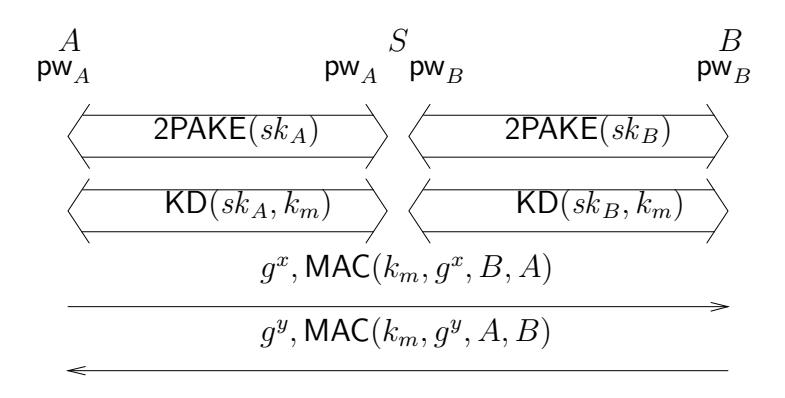

# **Password-Based Authenticated Key Exchange in the Three-Party Setting**

Michel Abdalla, Pierre-Alain Fouque, and David Pointcheval

Departement d'Informatique Ecole ´ Normale Superieure ´ 45 Rue d'Ulm, 75230 Paris Cedex 05, France {Michel.Abdalla,Pierre-Alain.Fouque,David.Pointcheval}@ens.fr http://www.di.ens.fr/users/{mabdalla,fouque,pointche}.

**Abstract.** Password-based authenticated key exchange are protocols which are designed to be secure even when the secret key or password shared between two users is drawn from a small set of values. Due to the low entropy of passwords, such protocols are always subject to online guessing attacks. In these attacks, the adversary may succeed with non-negligible probability by guessing the password shared between two users during its on-line attempt to impersonate one of these users. The main goal of password-based authenticated key exchange protocols is to restrict the adversary to this case only. In this paper, we consider password-based authenticated key exchange in the three-party scenario, in which the users trying to establish a secret do not share a password between themselves but only with a trusted server. Towards our goal, we recall some of the existing security notions for password-based authenticated key exchange protocols and introduce new ones that are more suitable to the case of generic constructions. We then present a natural generic construction of a three-party protocol, based on any two-party authenticated key exchange protocol, and prove its security without making use of the Random Oracle model. To the best of our knowledge, the new protocol is the first provably-secure password-based protocol in the three-party setting.

**Keywords.** Password, authenticated key exchange, key distribution, multi-party protocols.

### **1 Introduction**

**Motivation.** A fundamental problem in cryptography is how to communicate securely over an insecure channel, which might be controlled by an adversary. It is common in this scenario for two parties to encrypt and authenticate their messages in order to protect the privacy and authenticity of these messages. One way of doing so is by using public-key encryption and signatures, but the cost associated with these primitives may be too high for certain applications. Another way of addressing this problem is by means of a key exchange protocol, in which users establish a common key which they can then use in their applications.

In practice, one finds several flavors of key exchange protocols, each with its own benefits and drawbacks. Among the most popular ones is the 3-party *Kerberos* authentication system [31]. Another one is the 2-party SIGMA protocol [21] used as the basis for the signaturebased modes of the Internet Key Exchange (IKE) protocol. Yet another flavor of key exchange protocols which has received significant attention recently are those based on passwords.

PASSWORD-BASED KEY EXCHANGE. Password-based authenticaded key exchange protocols assume a more realistic scenario in which secret keys are not uniformly distributed over a large space, but rather chosen from a small set of possible values (a four-digit pin, for example). They also seem more convenient since human-memorable passwords are simpler to use than, for example, having additional cryptographic devices capable of storing high-entropy secret keys. The vast majority of protocols found in practice do not account, however, for such scenario and are often subject to so-called *dictionary* attacks. Dictionary attacks are attacks in which an adversary tries to break the security of a scheme by a brute-force method, in which it tries all possible combinations of secret keys in a given small set of values (i.e., the dictionary). Even though these attacks are not very effective in the case of high-entropy keys, they can be very damaging when the secret key is a password since the attacker has a non-negligible chance of winning. Such attacks are usually divided in two categories: *off-line* and *online* dictionary attacks.

To address this problem, several protocols have been designed to be secure even when the secret key is a password. The goal of these protocols is to restrict the adversary's success to on-line guessing attacks only. In these attacks, the adversary must be present and interact with the system in order to be able to verify whether its guess is correct. The security in these systems usually relies on a policy of invalidating or blocking the use of a password if a certain number of failed attempts has occurred.

3-PARTY PASSWORD-BASED KEY EXCHANGE. Passwords are mostly used because they are easier to remember by humans than secret keys with high entropy. Consequently, users prefer to remember very few passwords but not many. However, in scenarios where a user wants to communicate with many other users, then the number of passwords that he or she would need to remember would be linear in the number of possible partners. In order to limit the number of passwords that each user needs to remember, we consider in this paper password-based authenticated key exchange in the 3-party model, where each user only shares a password with a trusted server. The main advantage of this solution is that it provides each user with the capability of communicating securely with other users in the system while only requiring it to remember a single password. This seems to be a more realistic scenario in practice than the one in which users are expected to share multiple passwords, one for each party with which it may communicate privately. Its main drawback is that the server is needed during the establishment of all communication as in the Needham and Schroeder protocol.

KEY PRIVACY. One potential disadvantage of a 3-party model is that the privacy of the communication with respect to the server is not always guaranteed. Since we want to trust as little as possible the third party, we develop a new notion called key privacy which roughly means that, even though the server's help is required to establish a session key between two users in the system, the server should not be able to gain any information on the value of that session key. Here we assume that the server is honest but curious. Please note that key distribution schemes usually do *not* achieve this property.

INSIDER ATTACKS. One of the main differences between the 2-party and the 3-party scenarios is the existence of insider attacks. To better understand the power of these attacks, consider the protocol in Figure 1, based on the encrypted key exchange of Bellovin and Merritt[8], in which the server simply decrypts the message it receives and re-encrypts it under the other user's password. In this protocol, it is easy to see that one can mount an off-line dictionary by simply playing the role of one of the involved parties. Notice that both A and B can obtain the necessary information to mount an off-line dictionary attack against each other simply by eavesdropping on the messages that are sent out by the server. More specifically, A and B can respectively learn the values  $X_S^{\star} = \mathcal{E}_{PW_B}(X_S)$  and  $Y_S^{\star} = \mathcal{E}_{PW_A}(Y_S)$  and mount a dictionary attack against each other using the fact that  $X_S = X_A$  and  $Y_S = Y_B$ . Insider attacks do not need be considered explicitly in the case of 2-party protocols due to the independence among the passwords shared between pairs of honest users and those shared with malicious users.

A NEW SECURITY MODEL. In order to analyze the security of 3-party password-based authenticated key exchange protocols, we put forward a new security model and define two notions of security: semantic security of the session key and key privacy with respect to the server. The first of these notions is the usual one and is a straight-forward generalization of the equivalent notion in the 2-party password-based authenticated key exchange model. The second one is new and particular to the new setting, and captures the privacy of the key with respect to the trusted server to which all passwords are known.

Public information:
$$\mathbb{G}, g, p, \mathcal{E}, \mathcal{D}, H$$

$$\begin{array}{cccccccccccccccccccccccccccccccccccc$$

Fig. 1. An insecure 3-party password-based encrypted key exchange protocol.

A GENERIC CONSTRUCTION. In this paper, we consider a generic construction of 3-party password-based protocol. Our construction is a natural one, building upon existing 2-party password-based key exchange and 3-party symmetric key distribution schemes, to achieve provable security in the strongest sense. Moreover, our construction is also modular in the sense that it can be broken into two parts, a 3-party password-based key distribution protocol and 2-party authenticated key exchange. The second part is only needed if key privacy with respect to the server is required.

THE NEED FOR NEW SECURITY NOTIONS. Surprisingly, the proof of security for the new scheme *does not* follow from the usual security notions for the underlying schemes as one would expect and requires a *new* and *stronger* notion of security for the underlying 2-party password-based scheme (see Section 2). In fact, this new security notion is not specific to password-based schemes and is one of the main contributions of this paper. Fortunately, we observe that most existing 2-party password-based schemes do in fact satisfy this new property [10, 13, 19, 25]. More specifically, only a few small changes are required in their proof in order to achieve security in the new model. The bounds obtained in their proof remain essentially unchanged.

**Contributions.** In this paper, we consider password-based (implicitly) authenticated key exchange in the 3-party model, where each user only shares a password with a trusted server.

NEW SECURITY MODELS. Towards our goal, we put forth a new formal security model that is appropriate for the 3-party password-based authenticated key exchange scenario and give precise definitions of what it means for it to be secure. Our model builds upon those of Bellare and Rogaway [6, 7] for key distribution schemes and that of Bellare, Pointcheval, and Rogaway [4] for password-based authenticated key exchange.

NEW SECURITY NOTIONS. We also present a new and stronger model for 2-party authenticated key exchange protocols, which we call the Real-Or-Random model. Our new model is provably stronger than the existing model, to which we refer to as the Find-Then-Guess model, in the sense that a scheme proven secure in the new model is also secure in the existing model. However, the reverse is not necessarily true due to an unavoidable non-constant factor loss in the reduction. Such losses in the reduction are extremely important in the case of password-based protocols.

A GENERIC CONSTRUCTION IN THE STANDARD MODEL. We present a generic and natural framework for constructing a 3-party password-based authenticated key exchange protocol from any secure 2-party password-based one. We do so by combining a 3-party key distribution scheme, an authenticated Diffie-Hellman key exchange protocol, and the 2-party password-based authenticated key exchange protocol. The proof of security relies solely on the security properties of underlying primitives it uses and does not assume the Random Oracle model [5]. Hence, when appropriately instantiated, this construction yields a secure protocol in the standard model.

A SEPARATION BETWEEN KEY DISTRIBUTION AND KEY EXCHANGE. In addition to semantic security of the session key, we present a new property, called key privacy, which is specific to key exchange protocols. This new notion captures in a quantitative way the idea that the session key shared between two instances should be only known to these two instances and no one else, including the trusted server.

**Related Work.** Password-based authenticated key exchange has been extensively studied in the last few years [4, 9–13, 15–18, 20, 22–24, 26, 28, 32–35], with a portion of the work dealing with the subject of group key exchange and the vast majority dealing with different aspects of 2-party key exchange. Only a few of them (e.g., [11, 22, 32]) consider passwordbased protocols in the 3-party setting, but none of their schemes enjoys provable security. In fact, our generic construction seems to be the first provably-secure 3-party password-based authenticated key exchange protocol.

Another related line of research is authenticated key exchange *in the* 3*-party setting*. The first work in this area is the protocol of Needham and Schroeder [27], which inspired the *Kerberos* distributed system. Later, Bellare and Rogaway introduced a formal security model in this scenario along with a construction of the first provably-secure symmetric-key-based key distribution scheme [7]. In this paper, we consider the special but important case in which the secret keys are drawn from a small set of values.

**Organization.** In Section 2, we recall the existing security model for 2-party password-based authenticated key exchange and introduce a new one. Next, in Section 3, we introduce new models for 3-party password-based authenticated key exchange. Section 4 then presents our generic construction of a 3-party password-based authenticated key exchange protocol, called GPAKE, along with the security claims and suggestions on how to instantiate it. Some future extensions of this work are presented in Section 5. The proofs of security for GPAKE are given in Appendix A. Also in the appendix are the more detailed descriptions of the cryptographic primitives and assumptions on which GPAKE is based. We conclude by presenting some results in Appendix C regarding the relation between the existing security notions and the new ones being introduced in this paper.

## **2 Security models for** 2**-party password-based key exchange**

A secure 2-party password-based key exchange is a 2PAKE protocol where the parties use their password in order to derive a common session key sk that will be used to build secure channels. Loosely speaking, such protocols are said to be secure against *dictionary attacks* if the advantage of an attacker in distinguishing a real session key from a random key is less than O(n/|D|) + ε(k) where |D| is the size of the dictionary D, n is the number of active sessions and ε(k) is a negligible function depending on the security parameter k.

In this section, we recall the security model for 2-party password-based authenticated key exchange protocols introduced by Bellare, Pointcheval, and Rogaway (BPR) [4] and introduce a new one. For reasons that will soon become apparent, we refer to the new model as the Real-Or-Random (ROR) model and to the BPR model as the Find-Then-Guess (FTG) model, following the terminology of Bellare *et al.*for symmetric encryption schemes [3].

#### **2.1 Communication model**

PROTOCOL PARTICIPANTS. Each participant in the 2-party password-based key exchange is either a client C ∈ C or a server S ∈ S. The set of all users or participants U is the union C ∪ S.

LONG-LIVED KEYS. Each client C ∈ C holds a password pw C . Each server S ∈ S holds a vector pwS = hpwS [C]iC∈C with an entry for each client, where pwS [C] is the transformedpassword, as defined in [4]. In a symmetric model, pwS [C] = pwC, but they may be different in some schemes. pwC and pwS are also called the long-lived keys of client C and server S.

PROTOCOL EXECUTION. The interaction between an adversary A and the protocol participants occurs only via oracle queries, which model the adversary capabilities in a real attack. During the execution, the adversary may create several concurrent instances of a participant. These queries are as follows, where U i denotes the instance i of a participant U:

- **–** Execute(C i , S j ): This query models passive attacks in which the attacker eavesdrops on honest executions between a client instance C i and a server instance S j . The output of this query consists of the messages that were exchanged during the honest execution of the protocol.
- **–** Send (U i , m): This query models an active attack, in which the adversary may intercept a message and then either modify it, create a new one, or simply forward it to the intended participant. The output of this query is the message that the participant instance U i would generate upon receipt of message m.

### **2.2 Security definitions**

PARTNERING. We use the notion of partnering based on session identifications (*sid*), which says that two instances are partnered if they hold the same non-null *sid*. In practice, the *sid* is taken to be the partial transcript of the conversation between the client and the server instances before the acceptance.

FRESHNESS. In order to properly formalize security notions for the session key, one has to be careful to avoid cases in which adversary can trivially break the security of the scheme. For example, an adversary who is trying to distinguish the session key of an instance U i from a random key can trivially do so if it obtains the key for that instance through a Reveal query (see definition below) to instance U i or its partner. Instead of explicitly defining a notion of freshness and mandating the adversary to only perform tests on *fresh* instances as in previous work, we opted to embed that notion inside the definition of the oracles.

**Semantic security in the Find-Then-Guess model.** This is the definition currently being used in the literature. In order to measure the semantic security of the session key of user instance, the adversary is given access to two additional oracles: the Reveal oracle, which models the misuse of session keys by a user, and the Test oracle, which tries to capture the adversary's ability (or inability) to tell apart a real session key from a random one. Let b be a bit chosen uniformly at random at the beginning of the experiment defining the semantic security in the Find-Then-Guess model. These oracles are defined as follows.

- Reveal  $(U^i)$ : If a session key is not defined for instance  $U^i$  or if a Test query was asked to either  $U^i$  or to its partner, then return  $\bot$ . Otherwise, return the session key held by the instance  $U^i$ .
- $Test(U^i)$ : If no session key for instance  $U^i$  is defined or if a *Reveal* query was asked to either  $U^i$  or to its partner, then return the undefined symbol  $\bot$ . Otherwise, return the session key for instance  $U^i$  if b=1 or a random of key of the same size if b=0.

The adversary in this case is allowed to ask multiple queries to the *Execute*, *Reveal*, and *Send* oracles, but it is restricted to ask only a *single* query to the *Test* oracle. The goal of the adversary is to guess the value of the hidden bit b used by the *Test* oracle. The adversary is considered successful if it guesses b correctly.

Let SUCC denote the event in which the adversary is successful. The **ftg-ake-advantage** of an adversary  $\mathcal{A}$  in violating the semantic security of the protocol P in the Find-Then-Guess sense and the **advantage function** of the protocol P, when passwords are drawn from a dictionary  $\mathcal{D}$ , are respectively

$$\mathbf{Adv}_{P,\mathcal{D}}^{\mathrm{ftg-ake}}(\mathcal{A}) = 2 \cdot \Pr[\,\mathrm{SUCC}\,] - 1;$$
 and

$$\mathbf{Adv}_{P,\mathcal{D}}^{\mathrm{ftg-ake}}(t,R) = \max_{\mathcal{A}} \{ \, \mathbf{Adv}_{P,\mathcal{D}}^{\mathrm{ftg-ake}}(\mathcal{A}) \, \},$$

where the maximum is over all  $\mathcal{A}$  with time-complexity at most t and using resources at most R (such as the number of queries to its oracles). The definition of time-complexity that we use henceforth is the usual one, which includes the maximum of all execution times in the experiments defining the security plus the code size [1]. Note that the advantage of an adversary that simply guesses the bit t0 in the above definition due to the rescaling of the probabilities.

**Semantic security in the Real-Or-Random model.** This is a new definition. In the Real-Or-Random model, we only allow the adversary to ask *Execute*, *Send*, and *Test* queries. In other words, the *Reveal* oracle that exists in the Find-Then-Guess model is no longer available to the adversary. Instead, we allow the adversary to ask as many *Test* queries as it wants to different instances. All *Test* queries in this case will be answered using the same value for the hidden bit *b* that was chosen at the beginning. That is, the keys returned by the *Test* oracle are either all real or all random. However, in the random case, the same random key value should be returned for *Test* queries that are asked to two instances which are partnered. *P*lease note that the *Test* oracle is the oracle modeling the misuse of keys by a user in this case. The goal of the adversary is still the same: to guess the value of the hidden bit *b* used to answer *Test* queries. The adversary is considered successful if it guesses *b* correctly.

Let SUCC denote the event in which the adversary is successful. The **ror-ake-advantage**  $\mathbf{Adv}^{\mathrm{ror-ake}}_{P,\mathcal{D}}(\mathcal{A})$  of an adversary  $\mathcal{A}$  in violating the semantic security of the protocol P in the Real-Or-Random sense and the **advantage function**  $\mathbf{Adv}^{\mathrm{ror-ake}}_{P,\mathcal{D}}(t,R)$  of the protocol P are then defined as in the previous definition.

**Relation between notions.** As we prove in Appendix C, the Real-Or-Random (ROR) security model is actually stronger than the Find-Then-Guess (FTG) security model. More specifically, we show that proofs of security in the ROR model can be easily translated into proofs of security in the FTG model with only a 2 factor loss in the reduction (see Lemma 8). The reverse, however, is not necessarily true since the reduction is not security preserving. There is a loss of non-constant factor in the reduction (see Lemma 9). Moreover, the loss in the reduction cannot be avoided as there exist schemes for which we can prove such a loss in security exists (see Proposition 10).

7

To better understand the gap between the two notions, imagine a password-based scheme that was proven secure in the FTG model. By definition, the advantage of any adversary is at most O(n/|D|)+ε(k), where n is the number of active sessions and ε(k) is a negligible term. By applying the reduction, we can show that no adversary can do better than O(n 2/|D|)+n · ε(k), which is not enough to guarantee the security of the same scheme in the ROR model. Note that such a gap is not as important in the case where high-entropy keys are used since both terms in the expression would be negligible.

As a consequence, we cannot take for granted the security of the existing schemes and new proofs of security need be provided. Fortunately, we would like to point out here that the security proof for several of the existing schemes can be easily modified to meet the new security goals with essentially the same bounds. The reason for that is that the security proofs of most existing password-based schemes in fact prove something stronger than what is required by the security model. More specifically, most proofs generally show that not only the session key being tested looks random, but all the keys that may be involved in a reveal query also look random to an adversary that does not know the secret password, thus satisfying the security requirements of our new model. In particular, this is the case for the KOY protocol [19] and its generalization [13], and some other schemes based on the encrypted key exchange scheme of Bellovin and Merritt [8] (e.g., [10, 25]).

Since most existing password-based schemes do seem to achieve security in the new and stronger security model and since the latter appears to be more applicable to situations in which one wishes to use a password-based key exchange protocol as a black box, we suggest the use of our new model when proving the security of new password-based schemes.

# **3 Security models for** 3**-party password-based key exchange**

In this section, we put forward new formal security models for 3-party password-authenticated key exchange and key distribution protocols. Our models are generalizations of the model of Bellare and Rogaway [7] for 3-party key distribution schemes to the password case and that of Bellare, Pointcheval, and Rogaway [4] for 2-party password-based authenticated key exchange.

#### **3.1 Protocol Syntax**

PROTOCOL PARTICIPANTS. Each participant in a 3-party password-based key exchange is either a client U ∈ U or a trusted server S ∈ S. The set of clients U is made up of two disjoint sets: C, the set of honest clients, and E, the set of malicious clients. For simplicity, and without loss of generality 1 , we assume the set S to contain only a single trusted server.

The inclusion of the malicious set E among the participants is one the main differences between the 2-party and the 3-party models. Such inclusion is needed in the 3-party model in order to cope with the possibility of insider attacks. The set of malicious users did not need to be considered in the 2-party due to the independence among the passwords shared between pairs of honest participants and those shared with malicious users.

LONG-LIVED KEYS. Each participant U ∈ U holds a password pwU . Each server S ∈ S holds a vector pwS = hpwS [U]iU∈U with an entry for each client, where pwS [U] is the transformed-password, following the definition in [4]. In a symmetric model, pw S [U] = pwU , but they may be different in some schemes. The set of passwords pw E, where E ∈ E, is assumed to be known by the adversary.

1 This is so because we are working in the concurrent model and because all servers in the general case know all users' passwords.

#### 3.2 Communication model

The interaction between an adversary A and the protocol participants occurs only via oracle queries, which model the adversary capabilities in a real attack. These queries are as follows:

- $Execute(U_1^{i_1}, S^j, U_2^{i_2})$ : This query models passive attacks in which the attacker eavesdrops on honest executions among the client instances  $U_1^{i_1}$  and  $U_2^{i_2}$  and trusted server instance  $S^j$ . The output of this query consists of the messages that were exchanged during the honest execution of the protocol.
- SendClient( $U^i, m$ ): This query models an active attack, in which the adversary may intercept a message and then modify it, create a new one, or simply forward it to the intended client. The output of this query is the message that client instance  $U^i$  would generate upon receipt of message m.
- $SendServer(S^j, m)$ : This query models an active attack against a server. It outputs the message that server instance  $S^j$  would generate upon receipt of message m.

### 3.3 Semantic security

The security definitions presented here build upon those of Bellare and Rogaway [6, 7] and that of Bellare, Pointcheval, and Rogaway [4].

NOTATION. Following [6, 7], an instance  $U^i$  is said to be *opened* if a query  $Reveal(U^i)$  has been made by the adversary. We say an instance  $U^i$  is unopened if it is not opened. Similarly, we say a participant U is corrupted if a query Corrupt(U) has been made by the adversary. A participant U is said to be uncorrupted if it is not corrupted. We say an instance  $U^i$  has accepted if it goes into an accept mode after receiving the last expected protocol message.

PARTNERING. Our definition of partnering follows that of [4], which uses session identifications (sid). More specifically, two instances  $U_1^i$  and  $U_2^j$  are said to be partners if the following conditions are met: (1) Both  $U_1^i$  and  $U_2^j$  accept; (2) Both  $U_1^i$  and  $U_2^j$  share the same session identifications; (3) The partner identification for  $U_1^i$  is  $U_2^j$  and vice-versa; and (4) No instance other than  $U_1^i$  and  $U_2^j$  accepts with a partner identification equal to  $U_1^i$  or  $U_2^j$ . In practice, as in the 2-party case, the sid could be taken to be the partial transcript before the acceptance of the conversation among all the parties involved in the protocol, a solution which may require the forwarding of messages.

FRESHNESS. As in the 2-party case, we opted to embed the notion of freshness inside the definition of the oracles.

Semantic security in Find-Then-Guess model. This definition we give here is the straightforward generalization of that of Bellare, Pointcheval, and Rogaway [4] for the 2-party case, combined with ideas of the model of Bellare and Rogaway [7] for 3-party key distribution. As in the 2-party case, we also define a Reveal oracle to model the misuse of session keys and a Test oracle to capture the adversary's ability to distinguish a real session key from a random one. Let b be a bit chosen uniformly at random at the beginning of the experiment defining the semantic security in the Find-Then-Guess model. These oracles are defined as follows:

- $Reveal(U^i)$ : If a session key is not defined for instance  $U^i$  or if a Test query was asked to either  $U^i$  or to its partner, then return  $\bot$ . Otherwise, return the session key held by the instance  $U^i$ .
- $Test(U^i)$ : If no session key is defined for instance  $U^i$  or if the intended partner of  $U^i$  is part of the malicious set or if a *Reveal* query was asked to either  $U^i$  or to its partner, then return the invalid symbol  $\bot$ . Otherwise, return either the session key for instance  $U^i$  if b=1 or a random of key of the same size if b=0.

Consider an execution of the key exchange protocol P by an adversary A, in which the latter is given access to the *Reveal*, *Execute*, *SendClient*, *SendServer*, and *Test* oracles and asks a single *Test* query, and outputs a guess bit b'. Such an adversary is said to win the experiment defining the semantic security if b' = b, where b is the hidden bit used by the *Test* oracle.

Let SUCC denote the event in which the adversary wins this game. The **ftg-ake-advantage**  $\mathbf{Adv}_{P,\mathcal{D}}^{\mathrm{ftg-ake}}(\mathcal{A})$  of an adversary  $\mathcal{A}$  in violating the semantic security of the protocol P in the Find-Then-Guess sense and the **advantage function**  $\mathbf{Adv}_{P,\mathcal{D}}^{\mathrm{ftg-ake}}(t,R)$  of the protocol P are then defined as in previous definitions.

We say a 3-party password-based key exchange protocol P is semantically secure in the Find-Then-Guess sense if the advantage  $\mathbf{Adv}_{P,\mathcal{D}}^{\mathrm{ftg-ake}}$  is only negligibly larger than  $kn/|\mathcal{D}|$ , where n is number of active sessions and k is a constant. Note that k=1 in the best scenario since an adversary that simply guesses the password in each of the active sessions has an advantage of  $n/|\mathcal{D}|$ .

**Semantic security in Real-Or-Random model.** This is a new definition. In the Real-Or-Random model, *Reveal* queries are no longer allowed and are replaced by *Test* queries. In this case, however, the adversary is allowed to ask as many *Test* queries as it wants.

The modifications to the *Test* oracle are as follows. If a *Test* query is asked to a client instance that has not *accepted*, then return the undefined  $\bot$ . If a *Test* query is asked to an instance of an honest client whose intended partner is dishonest or to an instance of a dishonest client, then return the real session key. Otherwise, the *Test* query returns either the real session key if b=1 and a random one if b=0, where b is the hidden bit selected at random prior to the first call. However, when b=0, the same random key value should be returned for *Test* queries that are asked to two instances which are partnered. The goal of the adversary is still the same: to guess the value of the hidden bit used by the *Test* oracle. The adversary is considered successful if it guesses b correctly.

Consider an execution of the key exchange protocol P by an adversary A, in which the latter is given access to the Execute, SendClient, SendServer, and Test oracles, and outputs a guess bit b'. Such an adversary is said to win the experiment defining the semantic security in the ROR sense if b' = b, where b is the hidden bit used by the Test oracle. Let SUCC denote the event in which the adversary wins this game. The  $\mathbf{ror}$ -ake-advantage  $\mathbf{Adv}_{P,\mathcal{D}}^{\mathrm{ror}$ -ake}( $\mathcal{A}$ ) of an adversary  $\mathcal{A}$  in violating the semantic security of the protocol P in the Real-Or-Random sense and the advantage function  $\mathbf{Adv}_{P,\mathcal{D}}^{\mathrm{ror}$ -ake}(t,R) of the protocol P are then defined as in previous definitions.

#### 3.4 Key privacy with respect to the server

Differently from previous work, we define the notion of key privacy to capture, in a quantitative way, the idea that the session key shared between two instances should only be known to these two instances and no one else, including the trusted server. The goal of this new notion is to limit the amount of trust put into the server. That is, even though we rely on the server to help clients establish session keys between themselves, we still want to guarantee the privacy of these session keys with respect to the server. In fact, this is the main difference between a key distribution protocol (in which the session key is known to the server) and a key exchange protocol (for which the session key remains unknown to the server).

In defining the notion of key privacy, we have in mind a server which knows the passwords for all users, but that behaves in an honest but curious manner. For this reason, we imagine an adversary who has access to all the passwords as well as to the *Execute* and *SendClient* oracles but not to a *Reveal* oracle or to a *SendServer* oracle, since the latter can be easily

simulated using the passwords. To capture the adversary's ability to tell apart the real session key shared between any two instances from a random one, we also introduce a new type of oracle, called *TestPair*, defined as follows, where *b* is a bit chosen uniformly at random at the beginning of the experiment defining the notion of key privacy.

-  $TestPair(U_1^i, U_2^j)$ : If client instances  $U_1^i$  and  $U_2^j$  do not share the same key, then return the undefined symbol  $\bot$ . Otherwise, return the real session key shared between client instances  $U_1^i$  and  $U_2^j$  if b=1 or a random key of the same size if b=0.

Consider an execution of the key exchange protocol P by an adversary A with access to the Execute, SendClient, and TestPair oracles and the passwords of all users, and let b' be its output. Such an adversary is said to win the experiment defining the key privacy if b'=b, where b is the hidden bit used by the TestPair oracle. Let SUCC denote the event in which the adversary guesses b correctly. We can then define the  $\mathbf{kp-advantage}$   $\mathbf{Adv}_{P,\mathcal{D}}^{\mathrm{kp-ake}}(\mathcal{A})$  of  $\mathcal{A}$  in violating the key privacy of the key exchange protocol P and the  $\mathbf{advantage}$  function  $\mathbf{Adv}_{P,\mathcal{D}}^{\mathrm{kp-ake}}(t,R)$  of P as in previous definitions.

Finally, we say an adversary  $\mathcal{A}$  succeeds in breaking the key privacy of a protocol P if  $\mathbf{Adv}_{P,\mathcal{D}}^{\mathrm{kp-ake}}(\mathcal{A})$  is non-negligible.

### 4 A generic three-party password-based protocol

In this section, we introduce a generic construction of a 3-party password-based key exchange protocol in the scenario in which we have an *honest-but-curious* server. It combines a 2-party password-based key exchange, a secure key distribution protocol and a 2-party MAC-based key exchange and has several attractive features. First, it does not assume the Random Oracle (RO) model [5]. That is, if the underlying primitives do not make use of the RO model, neither does our scheme. Hence, by using schemes such as the KOY protocol [19] for the 2-party password-based key exchange and the 3-party key distribution scheme in [7], one gets a 3-part password-based protocol whose security is in the standard model. Second, if 2-party password-based key exchange protocols already exist between the server and its users in a distributed system, they can be re-used in the construction of our 3-party password-based key exchange.

**Description of the generic solution.** Our generic construction can be seen as a form of compiler transforming any secure 2-party password-based key exchange protocol P into a secure password-based 3-party key exchange protocol P' in the *honest-but-curious* security model using a secure key distribution KD, a secure MAC scheme, and generic number-theoretic operations in a group  $\mathbb{G}$  for which the DDH assumption holds (see Appendix B).

The compiler, depicted in Figure 2, works as follows. First, we use the protocol P between a user A and the server S to establish a secure high-entropy session key  $sk_A$ . Second, we use the protocol P between the server S and the user B in order to establish a session key  $sk_B$ . Third, using a key distribution KD, we have the server S first select a MAC key  $k_m$ , using the key generation of the latter, and then distribute this key to A and B using the session keys  $sk_A$  and  $sk_B$ , respectively, generated in the first two steps. Finally, S and S use a MAC-based key exchange to establish a session key CDH in an authenticated way.

Semantic security in the Real-Or-Random model. As the following theorem states, the generic scheme GPAKE depicted in Figure 2 is a secure 3-party password-based key exchange protocol as long as the Decisional Diffie-Hellman assumption holds in  $\mathbb{G}$  and the underlying primitives it uses are secure.

Fig. 2. GPAKE: a generic three-party password-based key exchange

**Theorem 1.** Let 2PAKE be a secure 2-party password-based Key Exchange, KD be a secure key distribution, and MAC be a secure MAC algorithm. Let  $q_{\rm exe}$  and  $q_{\rm test}$  represent the number of queries to Execute and Test oracles, and let  $q_{\rm send}^A$ ,  $q_{\rm send}^B$ ,  $q_{\rm kd}$ , and  $q_{\rm ake}$  represent the number of queries to the SendClient and SendServer oracles with respect to each of the two 2PAKE protocols, the KD protocol, and the final AKE protocol. Then,

$$\begin{split} \mathbf{Adv}_{\mathsf{GPAKE},\mathcal{D}}^{\mathsf{ror-ake}}(t,q_{\mathsf{exe}},q_{\mathsf{test}},q_{\mathsf{send}}^A,q_{\mathsf{send}}^B,q_{\mathsf{kd}},q_{\mathsf{ake}}) &\leq \\ &4 \cdot (q_{\mathsf{exe}} + q_{\mathsf{kd}}) \cdot \mathbf{Adv}_{\mathsf{KD}}^{\mathsf{ftg-kd}}(t,1,0) + \ 2 \cdot q_{\mathsf{ake}} \cdot \mathbf{Adv}_{\mathsf{MAC}}^{\mathsf{euf-cma}}(t,2,0) \\ &+ 2 \cdot \mathbf{Adv}_{\mathbb{G}}^{\mathsf{ddh}}(t + 8(q_{\mathsf{exe}} + q_{\mathsf{ake}})\tau_e) + 4 \cdot \mathbf{Adv}_{\mathsf{2PAKE},\mathcal{D}}^{\mathsf{ror-ake}}(t,q_{\mathsf{exe}},q_{\mathsf{exe}} + q_{\mathsf{send}}^A,q_{\mathsf{send}}^A) \\ &+ 4 \cdot \mathbf{Adv}_{\mathsf{2PAKE},\mathcal{D}}^{\mathsf{ror-ake}}(t,q_{\mathsf{exe}},q_{\mathsf{exe}} + q_{\mathsf{send}}^B,q_{\mathsf{send}}^B) \;, \end{split}$$

where  $\tau_e$  denotes the exponentiation computational time in  $\mathbb{G}$ .

Key privacy with respect to the server. As the following theorem states, the generic scheme GPAKE depicted in Figure 2 has key privacy with respect to the server as long as the Decisional Diffie-Hellman assumption holds in  $\mathbb{G}$ .

**Theorem 2.** Let GPAKE be the 3-party password-based authenticated key exchange scheme depicted in Figure 2. Then,

$$\mathbf{Adv}^{\mathrm{kp-ake}}_{\mathsf{GPAKE},\mathcal{D}}(t,q_{\mathrm{exe}},q_{\mathrm{test}},q_{\mathrm{send}}^A,q_{\mathrm{send}}^B,q_{\mathrm{kd}},q_{\mathrm{ake}}) \leq 2 \cdot \mathbf{Adv}^{\mathsf{ddh}}_{\mathbb{G}}(t') ,$$
where  $t' = t + 8 \cdot (q_{\mathrm{exe}} + q_{\mathrm{ake}}) \cdot \tau_e$  and the other parameters are defined as in Theorem 1.

**Instantiations.** Several practical schemes can be used in the instantiation of the 2-party password-based key exchange of our generic construction. Among them are the KOY protocol [19] and its generalization [13], the PAK suite [25], and several other schemes based on the encrypted key exchange scheme of Bellovin and Merritt [8] (e.g., [10]).

In the instantiation of the key distribution scheme, one could use the original proposal in [7] or any other secure key distribution scheme. In particular, the server could use a chosen-ciphertext secure symmetric encryption scheme to distribute the keys to the users. Independently of the choice, one should keep in mind that the security requirements for the key distribution scheme are very weak. It only needs to provide security with respect to one session.

For the instantiation of the MAC, any particular choice that makes the MAC term in Theorem 1 negligible will do. Possible choices are the HMAC [2] or the CBC MAC.

It is important to notice that, in order for GPAKE to be secure, the underlying 2-party password-based protocol *must* be secure in the ROR model. A 2-party password-based secure in the FTG model does not suffice to prove the security of GPAKE.

### **5 Concluding remarks**

AUTHENTICATION. In order to take (explicit) authentication into account, one can easily extend our model using definitions similar to those of Bellare *et al.* [4] for unilateral or mutual authentication. In their definition, an adversary is said to break authentication if it succeeds in making any oracle instance terminate the protocol without a partner oracle. Likewise, one could also use their generic transformation to enhance our generic construction so that it provides unilateral or mutual authentication. The drawback of using their generic transformation is that it requires the random oracle model.

MORE EFFICIENT CONSTRUCTIONS. Even though the generic construction presented in this paper is quite practical, more efficient solutions are possible. One example of such an improvement is a generic construction in which the key distribution and the final key exchange phases are combined into a single phase. One can easily think of different solutions for this scenario that are more efficient that the one we give. However, the overall gain in efficiency would not be very significant since the most expensive part of these two phases, the Diffie-Hellman protocol, seems to be necessary if key privacy with respect to the server is to be achieved. Perhaps the best way to improve the efficiency of 3-party password-based schemes is to adapt specific solutions in the 2-party model to the 3-party model, instead of treating these schemes as black boxes.

RELATION TO SIMULATION MODELS. In [29], the Find-Then-Guess model of [7] is shown to be equivalent to simulation models in the sense that a scheme that is proven secure in one model is also secure in the other model. By closely examining their proof, one can easily see that the equivalence does not apply to the case of password-based protocols due to the non-security-preserving reduction. It seems, however, that their proof of equivalence can be adapted to show the equivalence between the simulation model and the Real-Or-Random model that we introduce in this paper in the case of password-based protocols. This is also the subject of ongoing work.

#### **Acknowledgements**

The work described in this document has been supported in part by the European Commission through the IST Programme under Contract IST-2002-507932 ECRYPT. The information in this document reflects only the author's views, is provided as is and no guarantee or warranty is given that the information is fit for any particular purpose. The user thereof uses the information at its sole risk and liability

### **References**

- 1. M. Abdalla, M. Bellare, and P. Rogaway. The oracle Diffie-Hellman assumptions and an analysis of DHIES. In D. Naccache, editor, *CT-RSA 2001*, volume 2020 of *LNCS*, pages 143–158. Springer-Verlag, Apr. 2001.
- 2. M. Bellare, R. Canetti, and H. Krawczyk. Keying hash functions for message authentication. In N. Koblitz, editor, *CRYPTO'96*, volume 1109 of *LNCS*, pages 1–15. Springer-Verlag, Aug. 1996.
- 3. M. Bellare, A. Desai, E. Jokipii, and P. Rogaway. A concrete security treatment of symmetric encryption. In *38th FOCS*, pages 394–403. IEEE Computer Society Press, Oct. 1997.
- 4. M. Bellare, D. Pointcheval, and P. Rogaway. Authenticated key exchange secure against dictionary attacks. In B. Preneel, editor, *EUROCRYPT 2000*, volume 1807 of *LNCS*, pages 139–155. Springer-Verlag, May 2000.
- 5. M. Bellare and P. Rogaway. Random oracles are practical: A paradigm for designing efficient protocols. In *ACM CCS 93*, pages 62–73. ACM Press, Nov. 1993.
- 6. M. Bellare and P. Rogaway. Entity authentication and key distribution. In D. R. Stinson, editor, *CRYPTO'93*, volume 773 of *LNCS*. Springer-Verlag, Aug. 1994.

- 7. M. Bellare and P. Rogaway. Provably secure session key distribution the three party case. In *28th ACM STOC*, pages 57–66. ACM Press, May 1996.
- 8. S. M. Bellovin and M. Merritt. Encrypted key exchange: Password-based protocols secure against dictionary attacks. In *1992 IEEE Symposium on Security and Privacy*, pages 72–84. IEEE Computer Society Press, May 1992.
- 9. V. Boyko, P. MacKenzie, and S. Patel. Provably secure password-authenticated key exchange using Diffie-Hellman. In B. Preneel, editor, *EUROCRYPT 2000*, volume 1807 of *LNCS*, pages 156–171. Springer-Verlag, May 2000.
- 10. E. Bresson, O. Chevassut, and D. Pointcheval. New security results on encrypted key exchange. In F. Bao, R. Deng, and J. Zhou, editors, *PKC 2004*, volume 2947 of *LNCS*, pages 145–158. Springer-Verlag, Mar. 2004.
- 11. J. W. Byun, I. R. Jeong, D. H. Lee, and C.-S. Park. Password-authenticated key exchange between clients with different passwords. In R. H. Deng, S. Qing, F. Bao, and J. Zhou, editors, *ICICS 02*, volume 2513 of *LNCS*, pages 134–146. Springer-Verlag, Dec. 2002.
- 12. Y. Ding and P. Horster. Undetectable on-line password guessing attacks. *ACM SIGOPS Operating Systems Review*, 29(4):77–86, Oct. 1995.
- 13. R. Gennaro and Y. Lindell. A framework for password-based authenticated key exchange. In E. Biham, editor, *EUROCRYPT 2003*, volume 2656 of *LNCS*, pages 524–543. Springer-Verlag, May 2003. http: //eprint.iacr.org/2003/032.ps.gz.
- 14. O. Goldreich. *Foundations of Cryptography: Basic Tools*, volume 1. Cambridge University Press, Cambridge, UK, 2001.
- 15. O. Goldreich and Y. Lindell. Session-key generation using human passwords only. In J. Kilian, editor, *CRYPTO 2001*, volume 2139 of *LNCS*, pages 408–432. Springer-Verlag, Aug. 2001. http://eprint. iacr.org/2000/057.ps.gz.
- 16. L. Gong. Optimal authentication protocols resistant to password guessing attacks. In *CSFW'95: The 8th IEEE Computer Security Foundation Workshop*, pages 24–29, Kenmare, County Kerry, Ireland, Mar. 13–15, 1995. IEEE Computer Society.
- 17. L. Gong, T. M. A. Lomas, R. M. Needham, and J. H. Saltzer. Protecting poorly chosen secrets from guessing attacks. *IEEE JSAC*, 11(5):648–656, June 1993.
- 18. S. Halevi and H. Krawczyk. Public-key cryptography and password protocols. In *ACM Transactions on Information and System Security*, pages 524–543. ACM, 1999.
- 19. J. Katz, R. Ostrovsky, and M. Yung. Efficient password-authenticated key exchange using human-memorable passwords. In B. Pfitzmann, editor, *EUROCRYPT 2001*, volume 2045 of *LNCS*, pages 475–494. Springer-Verlag, May 2001.
- 20. J. Kim, S. Kim, J. Kwak, and D. Won. Cryptanalysis and improvement of password authenticated key exchange scheme between clients with different passwords. In A. Lagan, M. L. Gavrilova, V. Kumar, Y. Mun, C. J. K. Tan, and O. Gervasi, editors, *ICCSA 04*, volume 3043 of *LNCS*, pages 895–902. Springer-Verlag, May 2004.
- 21. H. Krawczyk. SIGMA: The "SIGn-and-MAc" approach to authenticated Diffie-Hellman and its use in the ike protocols. In D. Boneh, editor, *CRYPTO 2003*, volume 2729 of *LNCS*, pages 400–425. Springer-Verlag, Aug. 2003.
- 22. C.-L. Lin, H.-M. Sun, and T. Hwang. Three-party encrypted key exchange: Attacks and a solution. *ACM SIGOPS Operating Systems Review*, 34(4):12–20, Oct. 2000.
- 23. C.-L. Lin, H.-M. Sun, M. Steiner, and T. Hwang. Three-party encrypted key exchange without server publickeys. *IEEE Communications Letters*, 5(12):497–499, Dec. 2001.
- 24. P. MacKenzie, S. Patel, and R. Swaminathan. Password-authenticated key exchange based on RSA. In T. Okamoto, editor, *ASIACRYPT 2000*, volume 1976 of *LNCS*, pages 599–613. Springer-Verlag, Dec. 2000.
- 25. P. D. MacKenzie. The PAK suite: Protocols for password-authenticated key exchange. Contributions to IEEE P1363.2, 2002.
- 26. P. D. MacKenzie, T. Shrimpton, and M. Jakobsson. Threshold password-authenticated key exchange. In M. Yung, editor, *CRYPTO 2002*, volume 2442 of *LNCS*, pages 385–400. Springer-Verlag, Aug. 2002.
- 27. R. Needham and M. Schroeder. Using encryption for authentication in large networks of computers. *Communications of the ACM*, 21(21):993–999, Dec. 1978.
- 28. M. D. Raimondo and R. Gennaro. Provably secure threshold password-authenticated key exchange. In E. Biham, editor, *EUROCRYPT 2003*, volume 2656 of *LNCS*, pages 507–523. Springer-Verlag, May 2003.
- 29. V. Shoup. On formal models for secure key exchange. Technical Report RZ 3120, IBM, 1999.
- 30. V. Shoup. OAEP reconsidered. In J. Kilian, editor, *CRYPTO 2001*, volume 2139 of *LNCS*, pages 239–259. Springer-Verlag, Aug. 2001.
- 31. J. G. Steiner, B. C. Neuman, and J. L. Schiller. Kerberos: An authentication service for open networks. In *Proceedings of the USENIX Winter Conference*, pages 191–202, Dallas, TX, USA, 1988.
- 32. M. Steiner, G. Tsudik, and M. Waidner. Refinement and extension of encrypted key exchange. *ACM SIGOPS Operating Systems Review*, 29(3):22–30, July 1995.

- 33. G. Tsudik and E. Van Herreweghen. Some remarks on protecting weak keys and poorly-chosen secrets from guessing attacks. In *SRDS'93: The 12th Symposium on Reliable Distributed Systems*, pages 136–142, Princeton, New Jersey, USA, Oct. 6–8, 1993. IEEE Computer Society.
- 34. S. Wang, J. Wang, and M. Xu. Weaknesses of a password-authenticated key exchange protocol between clients with different passwords. In M. Jakobsson, M. Yung, and J. Zhou, editors, *ACNS 04*, volume 3089 of *LNCS*, pages 414–425. Springer-Verlag, June 2004.
- H.-T. Yeh, H.-M. Sun, and T. Hwang. Efficient three-party authentication and key agreement protocols resistant to password guessing attacks. *Journal of Information Science and Engineering*, 19(6):1059–1070, Nov. 2003.

### A Proof of security for GPAKE

Semantic security of GPAKE in the ROR model. Without loss of generality, we assume the set of honest users contains only users A and B. The solution can be easily extended to the more general case with essentially the same bounds.

Let  $\mathcal A$  be an adversary against the semantic security of GPAKE in the Real-Or-Random sense with time-complexity at most t, and asking at most  $q_{\rm exe}$  queries to its *Execute* oracle,  $q_{\rm test}$  queries to its *Test* oracle,  $q_{\rm send}^A$  queries to *SendClient* and *SendServer* oracles with respect to the 2PAKE protocol between A and the trusted server S,  $q_{\rm send}^B$  queries with respect to the 2PAKE protocol between B and B, B0 queries with respect to the KD protocol, and B1 queries with respect to the final authenticated key exchange protocol.

Our proof consists of a sequence of hybrid experiments, starting with the real attack against GPAKE scheme and ending in an experiment in which the adversary's advantage is 0, and for which we can bound the difference in the adversary's advantage between any two consecutive experiments. For each experiment  $\mathbf{Exp}_n$ , we define an event  $\mathrm{Succ}_n$  corresponding to the case in which the adversary correctly guesses the hidden bit b involved in the Test queries (see Section 3).

**Experiment Exp** $_0$ . This experiment corresponds to the real attack. By definition, we have

$$\mathbf{Adv}_{\mathsf{GPAKE},\mathcal{D}}^{\mathsf{ror-ake}}(\mathcal{A}) = 2 \cdot \Pr[\mathsf{SUCC}_0] - 1 \tag{1}$$

**Experiment**  $\mathbf{Exp}_1$ . We now modify the simulation of the oracles as follows. We replace the session key  $sk_A$  used as input to the KD protocol by a random session key  $sk_A'$  in all of the sessions. As the following lemma shows, the difference between the success probability of the adversary  $\mathcal{A}$  between the current and previous experiments is at most that of breaking the security of the underlying 2PAKE protocol between A and S.

$$\textbf{Lemma 3.} \ \left| \Pr[\, \text{SUCC}_1 \,] - \Pr[\, \text{SUCC}_0 \,] \right| \leq 2 \cdot \mathbf{Adv}^{\text{ror-ake}}_{2\mathsf{PAKE},\mathcal{D}}(t,q_{\text{exe}},q_{\text{exe}} + q_{\text{send}}^A,q_{\text{send}}^A) \ .$$

*Proof.* Let  $\mathcal{A}_1$  be a distinguisher for experiments  $\mathbf{Exp}_1$  and  $\mathbf{Exp}_0$ . We can build an adversary  $\mathcal{A}_{\mathsf{pake}}$  against the semantic security of the 2PAKE protocol between A and S using  $\mathcal{A}_1$  as follows.  $\mathcal{A}_{\mathsf{pake}}$  starts by choosing a bit b uniformly at random and selecting the passwords for all users in the system except A according to the distribution of  $\mathcal{D}$ . Next, it starts running  $\mathcal{A}_1$ , giving it the passwords for all the malicious clients in the system, and answering to its oracle queries as follows.

- SendClient and SendServer queries. If  $\mathcal{A}_1$  asks a SendClient or SendServer query pertaining to an instance of the 2PAKE protocol between B and S, then  $\mathcal{A}_{\mathsf{pake}}$  can answer it using the password of client B that it has picked at the beginning of its execution. If the SendClient or SendServer query pertains to an instance of the 2PAKE protocol between A and S, then  $\mathcal{A}_{\mathsf{pake}}$  can answer it by asking the corresponding query to its Send oracle. If this query forces the given instance of client A or S to accept or reject, then we also

ask a *Test* query to that instance (unless *Test* query had already been asked to its partner). The output of this *Test* query will be used to simulate the key distribution and final key exchange phases of the protocol. All the other *SendClient* and *SendServer* queries by  $\mathcal{A}_1$  can be easily answered either using the output of the *Test* queries made to instances of A or S or the session keys computed in the execution of the 2PAKE protocol between A and B.

- Execute queries.  $A_{pake}$  can easily answer these queries using its own Execute oracle and the output of the Test queries.
- Test queries.  $A_{pake}$  can easily answer these queries using the bit b that it has previously selected and the session keys that it has computed.

Let b' be the output of  $A_1$ . If b' = b, then  $A_{pake}$  outputs 1. Otherwise, it outputs 0.

One can easily see that the probability that  $\mathcal{A}_{\text{pake}}$  outputs 1 when its Test oracle returns real keys is exactly the probability that  $\mathcal{A}_1$  returns 1 in experiment  $\mathbf{Exp}_0$ . Similarly, the probability that  $\mathcal{A}_{\text{pake}}$  outputs 1 when its Test oracle returns random keys is exactly the probability that  $\mathcal{A}_1$  returns 1 in experiment  $\mathbf{Exp}_1$ . The lemma follows by noticing that  $\mathcal{A}_{\text{pake}}$  has at most time-complexity t and asks at most  $q_{\text{exe}} + q_{\text{send}}^A$  queries to its Test oracle, at most  $q_{\text{exe}}$  queries to its Execute oracle, and at most  $q_{\text{send}}^A$  queries to its Send oracle.

**Experiment**  $\mathbf{Exp}_2$ . We modify the previous experiment by replacing the session key  $sk_B$  used as input to the KD protocol by a random session key  $sk_B'$  in all of the sessions. Using similar arguments, one can prove the following lemma.

**Lemma 4.**
$$\left| \Pr[\text{SUCC}_2] - \Pr[\text{SUCC}_1] \right| \le 2 \cdot \mathbf{Adv}_{2\mathsf{PAKE},\mathcal{D}}^{\mathsf{ror-ake}}(t, q_{\mathsf{exe}}, q_{\mathsf{exe}} + q_{\mathsf{send}}^B, q_{\mathsf{send}}^B)$$
.

**Experiment**  $\mathbf{Exp}_3$ . In this experiment, we replace the MAC key  $k_m$  obtained via the key distribution protocol with a random key in all of the sessions. According to the following lemma, the difference between the success probability of the adversary  $\mathcal{A}$  between the current and previous experiments is at most that of breaking the security of the key distribution scheme KD protocol between A, B, and S.

Lemma 5.
$$\left| \Pr[\text{SUCC}_3] - \Pr[\text{SUCC}_2] \right| \le 2 \left( q_{\text{exe}} + q_{\text{kd}} \right) \mathbf{Adv}_{\text{KD}}^{\text{ftg-kd}}(t, 1)$$
.

*Proof.* The proof of this lemma uses standard hybrid arguments [14] in order to replace each of the key generated by the key distribution scheme KD. We can do so here because the input of the key distribution scheme are all independents since experiment  $\mathbf{Exp}_2$ .

The hybrids in this case consist of a sequence of random variables  $V_i$ , where  $0 \le i \le q_s$  and  $q_s = (q_{\text{exe}} + q_{\text{kd}})$ , such that (1) the random variable  $V_i$  is constructed as follows: in the first (i-1) sessions, the session keys are generated according to experiment  $\mathbf{Exp}_3$ , (i.e. at random), and in the  $(q_s - i + 1)$  sessions, they are generated according to the  $\mathbf{Exp}_2$ , (i.e. according to the real protocol); (2) extreme hybrids (i=0) and  $(i=q_s)$  collide with  $\mathbf{Exp}_2$  and  $\mathbf{Exp}_3$  respectively; (3) random values of each hybrid can be produced by a probabilistic polynomial time algorithm and the session that we modify is independent of the other sessions; and (4) there are only polynomially many hybrids.

The hybrids allow us to define  $q_s$  different experiments where we only ask queries to the Send oracles of the KD scheme with respect to a single session in each of the hybrids. Indeed, we start with a distinguisher  $\mathcal{A}_{3,i}$  for experiments  $V_{i-1}$  and  $V_i$  and we build an adversary  $\mathcal{A}^i_{kd}$  against the KD protocol. The adversary  $\mathcal{A}^i_{kd}$  will choose at random the MAC keys  $k_m$  for the first i-1 sessions as well as the secret keys  $sk_A$  and  $sk_B$  shared between the server and clients A and B, respectively. Hence, it can perfectly answer to the queries made by the adversary  $\mathcal{A}_{3,i}$  to SendClient, SendServer, Execute, and Test oracles for the (i-1) first sessions. In the

*i*-th session of hybrid experiment  $\mathbf{Exp}_{3,i}$ ,  $\mathcal{A}^i_{kd}$  will use the KD oracles to answer its queries. It also makes a *Test* query with respect to this session to obtain a key  $\tilde{k_m}$  and uses it in order to simulate the remainder of the GPAKE protocol for that session.

If the output of the *Test* query is the real key, then  $\mathcal{A}^i_{kd}$  is running  $\mathcal{A}_{3,i}$  as in the hybrid experiment  $V_{i-1}$ . If the session key returned by the *Test* query is a random key, then  $\mathcal{A}^i_{kd}$  is running  $\mathcal{A}_{3,i}$  as in the hybrid experiment  $V_i$  Note the number of queries asked by  $\mathcal{A}^i_{kd}$  to its *Send* oracles is at most the maximum number of messages in a single execution of the protocol, c, hence the bound given in the lemma. Finally, when answering to the *Test* queries made by  $\mathcal{A}_{3,i}$ ,  $\mathcal{A}^i_{kd}$  uses the same random bit b chosen at random at the beginning of its execution. Let b' be the output of adversary  $\mathcal{A}_{3,i}$ . If b'=b, then  $\mathcal{A}^i_{kd}$  returns 1 or 0, otherwise. Using classical probability analysis and the fact that  $\mathcal{A}^i_{kd}$  has time-complexity t and asks queries to its *Send* oracle with respect to a *single* session and no *Reveal* queries, we can show that the difference between the probabilities that  $\mathcal{A}^i_{kd}$  in experiments  $V_i$  and  $V_{i-1}$  is at most  $2 \cdot \mathbf{Adv}^{\mathrm{ftg-kd}}_{\mathrm{KD}}(t,1,0)$ . The lemma follows immediately by noticing that there are at most  $q_s$  hybrids.

**Experiment Exp** $_4$ . In this experiment, we modify the oracle instances as follows. If the adversary asks a *SendClient* query containing a new pair message-MAC not previously generated by an oracle, then we consider the MAC invalid and force the instance in question (which received a forged message) to terminate without accepting. As the following lemma shows, the difference between the current and previous experiments should be negligible if we use a secure MAC scheme.

Lemma 6.
$$\left|\Pr[\operatorname{SUCC}_4] - \Pr[\operatorname{SUCC}_3]\right| \leq q_{\operatorname{ake}} \cdot \mathbf{Adv}_{\mathsf{MAC}}^{\operatorname{euf-cma}}(t,2,0)$$
.

*Proof.* The proof of this lemma also uses hybrid arguments in the same as in the proof of Lemma 5. The total number of hybrids in this case is  $q_{\rm ake}$ , since *Execute* queries do not need to be taken into account in this case. In hybrid  $V_i$ , where  $0 \le i \le q_{\rm ake}$ , queries in the first i sessions are answered as in experiment  $\mathbf{Exp}_4$  and all other queries are answered as in experiment  $\mathbf{Exp}_3$ . Let  $\mathcal{A}_{4,i}$  be a distinguisher for hybrids  $V_i$  and  $V_{i-1}$ . Using  $\mathcal{A}_{4,i}$ , we can build an adversary for the MAC scheme as follows.

For the first i-1 sessions, the adversary  $\mathcal{A}_{\mathsf{mac}}^i$  will choose random values for the MAC key and is therefore able to perfect simulate the oracles given to  $\mathcal{A}_{4,i}$ . In the i-th session,  $\mathcal{A}_{\mathsf{mac}}^i$  makes use of its MAC generation and verification oracles to answer queries from  $\mathcal{A}_{4,i}$ . If  $\mathcal{A}_{4,i}$  generates a pair message-MAC not previously generated by  $\mathcal{A}_{\mathsf{mac}}^i$ , then  $\mathcal{A}_{\mathsf{mac}}^i$  halts and outputs that pair as its forgery. If no such pair is generated, we output a failure indication. For all remaining sessions,  $\mathcal{A}_{\mathsf{mac}}^i$  uses the actual MAC keys obtained via the key distribution scheme as in experiment  $\mathbf{Exp}_3$  to answer queries from  $\mathcal{A}_{4,i}$ .

Let F be the event in which a MAC is considered invalid in hybrid  $V_i$  but valid in hybrid  $V_{i-1}$ . Notice that  $\Pr[F]$  is at most the probability that an adversary  $\mathcal{A}^i_{\mathsf{mac}}$  can forge a MAC under a chosen-message attack. Since  $\mathcal{A}^i_{\mathsf{mac}}$  has time-complexity t and makes at most two queries to its MAC generation oracle (to answer the SendClient queries) and no queries to its verification oracle, we have that  $\Pr[F] \leq \mathsf{Succ}^{\mathsf{euf}\mathsf{-cma}}_{\mathsf{MAC}}(t,2,0)$ . Moreover, since the two hybrids proceed identically until F occurs, we have  $\Pr[\mathsf{Succ}_{V_{i-1}} \land \neg F] = \Pr[\mathsf{Succ}_{V_i} \land \neg F]$ . By Lemma 1 of [30], we have  $|\Pr[\mathsf{Succ}_{V_{i-1}}] - \Pr[\mathsf{Succ}_{V_i}]| \leq \Pr[F]$ . The lemma follows from the fact that there are at most  $q_{\mathsf{ake}}$  hybrids.

**Experiment Exp**5. In this experiment, we try to avoid the use of the discrete-log of the elements X, Y, Z in the *Test* queries in order to correctly compute the CDH(X, Y). We thus introduce a random DDH triples (X, Y, Z). Then, using the classical random self-reducibility

of the Diffie-Hellman problem, one can introduce the above triples in all the sessions which can be tested by the adversary. We do not need to modify the other sessions.

The behavior of our simulation in this experiment is as follows. Experiment  $\mathbf{Exp}_5$  is identical to experiment  $\mathbf{Exp}_4$ , except that we apply the following special rules when dealing with  $Test(U^i)$  and  $SendClient(U^i,m)$  queries for the last two flows of GPAKE:

- **R1:** When processing a  $SendClient(A^i, Start)$  query, the simulator picks two random values  $a_0$  and  $x_0$  in  $\mathbb{Z}q$ , computes  $X_0 = X^{a_0}g^{x_0}$ , and stores in some  $\mathcal{X}$ -table  $(a_0, x_0, X_0)$ .
- **R2:** When processing a  $SendClient(B^j, (X_0, m_0))$  query in the last message of the protocol,
  - if the element  $X_0$  has been computed by our simulator and thus have been stored in the  $\mathcal{X}$ -table, then it generates the same way its answer by choosing two random values  $b_0, y_0 \stackrel{R}{\leftarrow} \mathbb{Z}q$ , it computes  $Y_0 = Y^{b_0}g^{y_0}$  and stores in some  $\mathcal{Y}$ -table  $(b_0, y_0, Y_0)$ . It can now compute  $Z_0 = Z^{a_0b_0} \times Y^{x_0b_0} \times X^{a_0y_0} \times g^{x_0y_0}$  for the *Test* queries.
  - if the elements  $X_0$  has not been previously computed by our A-simulation, then it proceeds as in the experiment  $\mathbf{Exp}_4$ .
- **R3:** When processing a  $Test(U^i)$  query, we know that such a query only reveal information about the hidden bit when asked on an accepting instance, and an accepting instance can only happen when the simulator knows the correct value  $Z_0$  and can answer such query as in the experiment  $\mathbf{Exp}_4$ .

It is easy to see that in the second case of rule  $\mathbf{R2}$ , as in experiment  $\mathbf{Exp}_4$ , the adversary will not been able to forge a MAC tag, and then he will not be able to generate a correct message for either one of the two last flows. Consequently, the session will not be accepted by any party and so the adversary will not be able to send a *Test* query to any instance. Hence, the simulation will be consistent.

It is then clear that experiments  $\mathbf{Exp}_4$  and  $\mathbf{Exp}_5$  are equivalent, since we have consistently replaced one set of random variables by another set of identically distributed random variables. In particular,  $\Pr[SUCC_4] = \Pr[SUCC_5]$ .

**Experiment Exp**6. Experiment **Exp**6 is exactly the same as experiment **Exp**5, except that in all the rules, we use a random triple (X, Y, Z) coming from a random distribution  $(g^x, g^y, g^z)$ , instead of a DDH triple. As the following lemma shows, the difference between the current and previous experiments should be negligible if DDH is hard in  $\mathbb{G}$ .

Lemma 7.
$$\left| \Pr[\text{SUCC}_6] - \Pr[\text{SUCC}_5] \right| \leq \mathbf{Adv}_{\mathbb{G}}^{\text{ddh}}(t + 8(q_{\text{exe}} + q_{\text{ake}})\tau_e)$$
.

*Proof.* Let  $\mathcal{A}$  be an attacker that breaks the semantic security experiment of GPAKE with a different advantage in Experiment  $\mathbf{Exp}_6$  than in Experiment  $\mathbf{Exp}_5$ . We can build an adversary  $\mathcal{A}_{\mathsf{ddh}}$  for the DDH problem in  $\mathbb{G}$  as follows. Let (X,Y,Z) be the input given to  $\mathcal{A}_{\mathsf{ddh}}$ . A sks a SendClient, Execute, or Test query, then  $\mathcal{A}_{\mathsf{ddh}}$  computes its output exactly as in the previous experiment but using the triple (X,Y,Z) that it had received as input. Let b' be the output of  $\mathcal{A}$ . If b'=b, then  $\mathcal{A}_{\mathsf{ddh}}$  returns 1 or 0, otherwise.

Let us now analyze the success probability of  $\mathcal{A}_{ddh}$ . Clearly, when the triple (X,Y,Z) is a true Diffie-Hellman triple,  $\mathcal{A}_{ddh}$  runs  $\mathcal{A}$  exactly as in experiment  $\mathbf{Exp}_5$  and thus the probability that  $\mathcal{A}_{ddh}$  outputs 1 is exactly  $\Pr[\mathrm{SUCC}_5]$ . On the other hand, when (X,Y,Z) is a random triple,  $\mathcal{A}_{ddh}$  runs  $\mathcal{A}$  exactly as in experiment  $\mathbf{Exp}_6$  and thus the probability that  $\mathcal{A}_{ddh}$  outputs 1 is exactly  $\Pr[\mathrm{SUCC}_6]$ . The lemma follows from the fact that  $\mathcal{A}_{ddh}$  has time-complexity at most  $t+8(q_{\mathrm{exe}}+q_{\mathrm{ake}})\tau_e$ , due to the additional time for the computations of the random self-reducibility.

Due to the random self-reducibility property of the Diffie-Hellman problem, all the sessions keys  $Z_0$  used to answer *Test* queries in experiment  $\mathbf{Exp}_6$  are randomly and independently distributed in  $\mathbb{G}$ . As a result, no information on the hidden bit b used by the *Test* oracle is leaked to the adversary and thus  $\Pr[SUCC_6] = \frac{1}{2}$ . This result combined with the previous lemmas yields the result in Theorem 1.

**Key privacy.** The proof of key privacy uses arguments similar to those used in experiments  $\mathbf{Exp}_5$  and  $\mathbf{Exp}_6$  in the proof of semantic security of GPAKE. Let  $\mathcal{A}_{kp}$  be an adversary against the key privacy of GPAKE with time-complexity at most t, and asking at most  $q_{exe}$  queries to its *Execute* oracle,  $q_{test}$  queries to its *TestPair* oracle, and  $q_{ake}$  queries to *SendClient* oracle with respect to the final MAC-based authenticated key exchange protocol. Using  $\mathcal{A}_{kp}$ , we can build an adversary  $\mathcal{A}_{ddh}$  for the DDH problem in  $\mathbb G$  as follows.

Let (X,Y,Z) be the input given to  $\mathcal{A}_{ddh}$ .  $\mathcal{A}_{ddh}$  first chooses the passwords for all users in the system according to the distribution of  $\mathcal{D}$ . It also chooses a bit b at random that is used to answer queries to the TestPair oracle. It then starts running  $\mathcal{A}_{kp}$  giving all the password of all users to it. Since  $\mathcal{A}_{ddh}$  knows the password of all users, it can easily answer queries made by  $\mathcal{A}_{kp}$ . However, in order to use  $\mathcal{A}_{kp}$  to help it solve the DDH problem,  $\mathcal{A}_{ddh}$  will use the classical random self-reducibility of the Diffie-Hellman problem to introduce its input triple in the answers to SendClient, Execute, and TestPair queries with respect to the last two flows of GPAKE.

To simulate the *Execute* oracle, we simply use the passwords that we have chosen and *SendClient* queries. The simulation of the *SendClient* and *TestPair* are as follows:

- **R1:** When processing a  $SendClient(A^i, Start)$  query,  $\mathcal{A}_{ddh}$  picks two random values  $a_0$  and  $x_0$  in  $\mathbb{Z}q$ , computes  $X_0 = X^{a_0}g^{x_0}$ , and stores in some  $\mathcal{X}$ -table  $(a_0, x_0, X_0)$ .
- **R2:** When processing a  $SendClient(B^j, (X_0, m_0))$  query in the last message of the protocol,
  - if the element  $X_0$  has been computed by  $\mathcal{A}_{\mathsf{ddh}}$  and thus have been stored in the  $\mathcal{X}$ -table, then  $\mathcal{A}_{\mathsf{ddh}}$  generates the same way its answer by choosing two random values  $b_0, y_0 \overset{R}{\leftarrow} \mathbb{Z}q$ . It computes  $Y_0 = Y^{b_0}g^{y_0}$  and stores in some  $\mathcal{Y}$ -table  $(b_0, y_0, Y_0)$ .  $\mathcal{A}_{\mathsf{ddh}}$  can now compute  $Z_0 = Z^{a_0b_0} \times Y^{x_0b_0} \times X^{a_0y_0} \times g^{x_0y_0}$  for the *TestPair* queries.
  - if the elements  $X_0$  has not been previously computed by  $\mathcal{A}_{ddh}$ , then  $\mathcal{A}_{ddh}$  proceeds with the simulation as it would in a real attack.
- **R3:** When processing a  $TestPair(U_1^i, U_2^j)$  query,  $\mathcal{A}_{ddh}$  first checks whether  $U_1^i$  and  $U_2^j$  have both accepted and have the same key. If the check fails, then  $\mathcal{A}_{ddh}$  returns  $\bot$ . If the check passes, then  $\mathcal{A}_{ddh}$  knows the corresponding value  $Z_0$  for the secret key and can answer it based on the hidden bit b it had previously chosen.

Let b' be the output of  $A_{kp}$ . If b' = b, then  $A_{ddh}$  returns 1 and 0, otherwise.

We would like to observe here that the second case of rule R2 has no influence over TestPair queries, since the latter can only be asked to pair of oracle instances which share the same key. This is because even though the instance involved in the SendClient may itself accept, its partner would not be an oracle instance. Hence, a TestPair query involving this instance would always return the invalid symbol  $\bot$ .

In order to analyze the success probability of  $\mathcal{A}_{ddh}$ , first consider the case in which the triple (X,Y,Z) is a true Diffie-Hellman triple. Then, in this case, one can see that simulation of the  $\mathcal{A}_{kp}$  oracles is perfect. Hence, the probability that  $\mathcal{A}_{ddh}$  outputs 1 is exactly  $\frac{1}{2} + \frac{1}{2} \mathbf{A} \mathbf{d} \mathbf{v}_{\mathsf{GPAKE},\mathcal{D}}^{\mathsf{kp-ake}}(\mathcal{A}_{kp})$ . On the other hand, when (X,Y,Z) is a random triple, the keys  $Z_0$  used to answer  $\mathit{TestPair}$  queries are all random and independent as a result of the random self-reducibility property of the Diffie-Hellman problem. Hence, no information on b is leaked through  $\mathit{TestPair}$  queries and the probability that  $\mathcal{A}_{ddh}$  outputs 1 is exactly  $\frac{1}{2}$  in

this case. The proof of Theorem 2 follows from the fact that  $\mathcal{A}_{\text{ddh}}$  has time-complexity at most  $t+8(q_{\text{exe}}+q_{\text{ake}})\tau_e$ , due to the additional time for the computations of the random self-reducibility.

### **B** Building blocks

In this section, we recall the definitions for the cryptographic primitives that we use in the construction of our generic 3-party password-based authenticated key exchange, GPAKE.

**Decisional Diffie-Hellman assumption: DDH.** The DDH assumption states, roughly, that the distributions  $(g^u, g^v, g^{uv})$  and  $(g^u, g^v, g^w)$  are computationally indistinguishable when u, v, w are drawn at random from  $\{1, \ldots, |\mathbb{G}|\}$ . This can be made more precise by defining two experiments,  $\mathbf{Exp}^{\mathrm{ddh-real}}_{\mathbb{G}}(\mathcal{A})$  and  $\mathbf{Exp}^{\mathrm{ddh-rand}}_{\mathbb{G}}(\mathcal{A})$ . In both experiments, we compute two values  $U = g^u$  and  $V = g^v$  to be given to  $\mathcal{A}$ . But in addition to that, we also provide a third input, which is  $g^{uv}$  in  $\mathbf{Exp}^{\mathrm{ddh-real}}_{\mathbb{G}}(\mathcal{A})$  and  $g^z$  for a random z in  $\mathbf{Exp}^{\mathrm{ddh-rand}}_{\mathbb{G}}(\mathcal{A})$ . The goal of the adversary is to guess a bit indicating the experiment it thinks it is in. We define advantage of  $\mathcal{A}$  in violating the DDH assumption,  $\mathbf{Adv}^{\mathrm{ddh}}_{\mathbb{G}}(\mathcal{A})$ , as  $\Pr[\mathbf{Exp}^{\mathrm{ddh-real}}_{\mathbb{G}}(\mathcal{A}) = 1] - \Pr[\mathbf{Exp}^{\mathrm{ddh-rand}}_{\mathbb{G}}(\mathcal{A}) = 1]$ . The advantage function of the group,  $\mathbf{Adv}^{\mathrm{ddh}}_{\mathbb{G}}(t)$  is then defined as the maximum value of  $\mathbf{Adv}^{\mathrm{ddh}}_{\mathbb{G}}(\mathcal{A})$  over all  $\mathcal{A}$  with time-complexity at most t.

Message authentication codes (MAC). A Message Authentication Code MAC = (Key, Tag, Ver) is defined by the following three algorithms: (1) A MAC key generation algorithm Key, which on input  $1^k$  produces a  $\ell$ -bit secret-key sk uniformly distributed in  $\{0,1\}^{\ell}$ ; (2) A MAC generation algorithm Tag, possibly probabilistic, which given a message m and a secret key  $sk \in \{0,1\}^{\ell}$ , produces an authenticator  $\mu$ ; and (3) A MAC verification algorithm Ver, which given an authenticator  $\mu$ , a message m, and a secret key sk, outputs 1 if  $\mu$  is a valid authenticator for m under sk and 0 otherwise.

Like in signature schemes, the classical security level for a MAC is to prevent existential forgeries, even for an adversary which has access to the generation and verification oracles. We define **advantage** of  $\mathcal{A}$  in violating the security of the MAC,  $\mathbf{Adv}_{MAC}^{\mathrm{euf}-\mathrm{cma}}(\mathcal{A})$ , as

$$\Pr\left[\,sk \leftarrow \{0,1\}^\ell, (m,\mu) \leftarrow \mathcal{A}^{\mathsf{Tag}(sk;\cdot),\mathsf{Ver}(sk;\cdot,\cdot)}() : \mathsf{Ver}(sk;m,\mu) = 1\,\right],$$

and the **advantage function** of the MAC,  $\mathbf{Adv}_{\mathsf{MAC}}^{\mathsf{euf}-\mathsf{cma}}(t,q_g,q_s)$ , as the maximum value of  $\mathbf{Adv}_{\mathsf{MAC}}^{\mathsf{euf}-\mathsf{cma}}(\mathcal{A})$  over all  $\mathcal{A}$  that asks up to  $q_g$  and  $q_v$  queries to the generation and verification oracles, respectively, and with time-complexity at most t. Note that  $\mathcal{A}$  wins the above experiment only if it outputs a *new* valid authenticator.

**3-party key distribution.** A secure key distribution protocol KD is a 3-party protocol between 2 parties and a trusted server S where S picks a session key at random and securely sends it to the users. The security model, formally introduced in [7], is a generalization of that for 2-party authenticated key exchange protocols, to which a new oracle was added to represent the trusted server. Their security is in the Find-Then-Guess model, using the terminology that we introduced for key exchange protocols.

In our generic construction, we only need a KD secure with respect to a single session since the symmetric keys used as input to the key distribution protocol differ from session to session. They are the session keys obtained from the 2-party password-based authenticated key exchange protocols between the server and each of the two parties. Since in this case, both the Find-Then-Guess and Real-Or-Random notions are equivalent, we opted to use their definition (i.e. FTG) adapted to our terminology. That is, we define  $\mathbf{Adv}_{\mathrm{KD}}^{\mathrm{ftg}-\mathrm{kd}}(\mathcal{A})$  as the

advantage of adversary  $\mathcal{A}$  in violating the semantic security of a key distribution KD in the FTG sense, and  $\mathbf{Adv}_{\mathrm{KD}}^{\mathrm{ftg-kd}}(t,s,r)$  as the **advantage function** of KD, which is the maximum value of  $\mathbf{Adv}_{\mathrm{KD}}^{\mathrm{ftg-kd}}(\mathcal{A})$  over all  $\mathcal{A}$  with time-complexity at most t, asking Send queries with respect to at most s sessions and asking at most t t t t t t t t t t

#### C Relations between notions

In this section, we prove the relation between the Find-Then-Guess (FTG) and Real-Or-Random (ROR) notions of security for authenticated key exchange protocols. The relation is not specific to password-based schemes, but its implications are more important in that scenario. We do not present proofs for the forward-secure case as these proofs can be easily derived from the proofs in the non-forward-secure case.

**Lemma 8.** For any AKE,
$$\mathbf{Adv}_{\mathsf{AKE}}^{\mathsf{ftg-ake}}(t, q_{\mathsf{send}}, q_{\mathsf{reveal}}, q_{\mathsf{exe}}) \leq 2 \cdot \mathbf{Adv}_{\mathsf{AKE}}^{\mathsf{ror-ake}}(t, q_{\mathsf{send}}, q_{\mathsf{reveal}}, q_{\mathsf{exe}}) + 1, q_{\mathsf{exe}}$$
.

*Proof.* In order to prove this lemma, we show how to build an adversary  $\mathcal{A}_{ror}$  against the semantic security of an authenticated key exchange AKE protocol in the ROR model given an adversary  $\mathcal{A}_{ftg}$  against the semantic security of the same protocol AKE in the FTG model. We know that  $\mathcal{A}_{ftg}$  has time-complexity at most t and that it asks at most  $q_{send}$ ,  $q_{reveal}$ , and  $q_{exe}$  queries to its Send, Reveal, and Execute oracles, respectively.

The description of  $\mathcal{A}_{ror}$  is as follows.  $\mathcal{A}_{ror}$  starts by choosing a bit b uniformly at random and starts running  $\mathcal{A}_{ftg}$ . If  $\mathcal{A}_{ftg}$  asks a Send query, then  $\mathcal{A}_{ror}$  asks the corresponding query to its Send oracle. If  $\mathcal{A}_{ftg}$  asks a Execute query, then  $\mathcal{A}_{ror}$  asks the corresponding query to its Execute oracle. If  $\mathcal{A}_{ftg}$  asks a Reveal query, then  $\mathcal{A}_{ror}$  asks a Test query to its Test oracle and uses the answer it receives as the answer to the Reveal query. If  $\mathcal{A}_{ftg}$  asks a Test query, then  $\mathcal{A}_{ror}$  asks the corresponding query to its Test oracle. If b=1, then  $\mathcal{A}_{ror}$  uses the answer it received as the answer to the Test query. Otherwise, it returns a random key to  $\mathcal{A}_{ftg}$ . Let b' be the final output of  $\mathcal{A}_{ftg}$ . If b'=b, then  $\mathcal{A}_{ror}$  outputs 1. Otherwise, it outputs 0.

Note that  $A_{ror}$  has time-complexity at most t and asks at most  $q_{send}$ ,  $q_{reveal} + 1$ , and  $q_{exe}$  queries to its Send, Test, and Execute oracles, respectively.

In order to analyze the advantage of  $\mathcal{A}_{ror}$ , first consider the case in which its  $\mathit{Test}$  oracle returns random keys. It is easy to see that, in this case,  $\mathcal{A}_{ftg}$  cannot gain any information about the hidden bit b used to answer its single  $\mathit{Test}$ . Therefore, the probability that  $\mathcal{A}_{ror}$  is exactly  $\frac{1}{2}$ . Now consider the case in which its  $\mathit{Test}$  oracle returns the actual sessions keys. In this case, the simulation of  $\mathit{Reveal}$  is perfect and  $\mathcal{A}_{ror}$  runs  $\mathcal{A}_{ftg}$  exactly as in the experiment defining the semantic security of  $\mathcal{A}_{ftg}$  in the FTG model. Therefore, the probability that  $\mathcal{A}_{ror}$  is exactly  $\frac{1}{2} + \frac{1}{2} \mathbf{Adv}_{\mathsf{AKE}}^{\mathsf{ftg-ake}}(\mathcal{A}_{\mathsf{ftg}})$  and, as a result,  $\mathbf{Adv}_{\mathsf{AKE}}^{\mathsf{ftg-ake}}(\mathcal{A}_{\mathsf{ftg}}) \leq 2 \cdot \mathbf{Adv}_{\mathsf{AKE}}^{\mathsf{ror-ake}}(\mathcal{A}_{\mathsf{ror}}) \leq \mathbf{Adv}_{\mathsf{AKE}}^{\mathsf{ror-ake}}(t, q_{\mathsf{send}}, q_{\mathsf{reveal}} + 1, q_{\mathsf{exe}})$ . The lemma follows easily.

**Lemma 9.** For any AKE,
$$\mathbf{Adv}_{\mathsf{AKE}}^{\mathsf{ror-ake}}(t, q_{\mathsf{send}}, q_{\mathsf{test}}, q_{\mathsf{exe}}) \leq q_{\mathsf{test}} \cdot \mathbf{Adv}_{\mathsf{AKE}}^{\mathsf{ftg-ake}}(t, q_{\mathsf{send}}, q_{\mathsf{test}}, q_{\mathsf{exe}})$$
.

*Proof.* In order to prove this lemma, we show how to build a sequence of adversaries  $\mathcal{A}^i_{\mathrm{ftg}}$  against the semantic security of an authenticated key exchange AKE protocol in the FTG model given an adversary  $\mathcal{A}_{\mathrm{ror}}$  against the semantic security of the same protocol AKE in the ROR model. We know that  $\mathcal{A}_{\mathrm{ror}}$  has time-complexity at most t and that it asks at most  $q_{\mathrm{send}}$ ,  $q_{\mathrm{test}}$ , and  $q_{\mathrm{exe}}$  queries to its Send, Test, and Execute oracles, respectively.

The proof uses a standard hybrid argument, in which we define a sequence of  $q_{\text{test}} + 1$  hybrid experiments  $V_i$ , where  $0 \le i \le q_{\text{test}}$ . In experiment  $V_i$ , the first i-1 queries to the

Test oracle are answered using a random key and all remaining Test queries are answered using the real key. Please note that the hybrid experiments at the extremes correspond to the real and random experiments in the definition of semantic security in the ROR model. Hence, in order to prove the bound in the lemma, it suffices to prove that the difference in probability that adversary  $\mathcal{A}_{ror}$  returns 1 between any two consecutive experiments  $V_i$  and  $V_{i-1}$  is at most  $\mathbf{Adv}_{\mathsf{AKE}}^{\mathsf{ftg-ake}}(t, q_{\mathsf{send}}, q_{\mathsf{test}} - 1, q_{\mathsf{exe}})$ . This is achieved by building a sequence of  $q_{\mathsf{test}}$  adversaries  $\mathcal{A}_{\mathsf{ftg}}^i$ , as described below.

Let  $\mathcal{A}_{\mathrm{ftg}}^i$  be a distinguisher  $\mathcal{A}_{\mathrm{ftg}}^i$  for experiments  $V_i$  and  $V_{i-1}$ , where  $1 \leq i \leq q_{\mathrm{test}}$ .  $\mathcal{A}_{\mathrm{ftg}}^i$  starts running  $\mathcal{A}_{\mathrm{ror}}$  answering to its queries as follows. If  $\mathcal{A}_{\mathrm{ror}}$  asks a *Send* or *Execute* query, then  $\mathcal{A}_{\mathrm{ftg}}$  answers it using its corresponding oracle. If  $\mathcal{A}_{\mathrm{ror}}$  asks a *Test* query, then  $\mathcal{A}_{\mathrm{ftg}}$  answers it with a random key if this query is among the first i-1. If this is the i-th Test, then  $\mathcal{A}_{\mathrm{ftg}}$  uses its Test oracle to answer it. All remaining Test queries are answered using the output of the Reveal query.  $\mathcal{A}_{\mathrm{ftg}}$  finishes its execution by outputting the same guess bit b outputted by  $\mathcal{A}_{\mathrm{ror}}$ .

Note that  $\mathcal{A}_{\mathrm{ftg}}^i$  has time-complexity at most t and asks at most  $q_{\mathrm{send}}$ ,  $q_{\mathrm{test}}-1$ , and  $q_{\mathrm{exe}}$  queries to its *Send*, *Reveal*, and *Execute* oracles, respectively.

In order to analyze the advantage of  $\mathcal{A}^i_{\mathrm{ftg}}$ , first notice that when  $\mathit{Test}$  oracle returns a random key,  $\mathcal{A}^i_{\mathrm{ftg}}$  runs  $\mathcal{A}_{\mathrm{ror}}$  exactly as in the experiment  $V_i$ . Next, notice that when  $\mathit{Test}$  oracle returns the real key,  $\mathcal{A}^i_{\mathrm{ftg}}$  runs  $\mathcal{A}_{\mathrm{ror}}$  exactly as in the experiment  $V_i$ . It follows that the difference in probability that adversary  $\mathcal{A}_{\mathrm{ror}}$  returns 1 between experiments  $V_i$  and  $V_{i-1}$  is at most  $\mathbf{Adv}^{\mathrm{ftg-ake}}_{\mathrm{AKE}}(\mathcal{A}_{\mathrm{ror}}) \leq \mathbf{Adv}^{\mathrm{ftg-ake}}_{\mathrm{AKE}}(t,q_{\mathrm{send}},q_{\mathrm{test}}-1,q_{\mathrm{exe}})$ . The lemma follows easily.

Even though the reduction in Lemma 9 is not security-preserving (i.e., there is a non-constant factor loss in the reduction), it does not imply that a gap really exists— there might exist a tight reduction between the two notions that we have not yet found. In order to prove that the non-constant factor loss in the reduction is indeed intrinsic, we need to show that there exist schemes for which the gap does exist.

To achieve this goal, one can use techniques similar to those used to prove that a gap exists between the Left-Or-Right and Find-Then-Guess notions of security for symmetric encryption schemes [3]. In that paper, they show how to construct a new symmetric encryption scheme  $\mathcal{E}'$  from a secure encryption scheme  $\mathcal{E}$  such that  $\mathcal{E}'$  exhibits the gap.  $\mathcal{E}'$  was constructed in such a way that its encryption function works like the encryption function of  $\mathcal{E}$  most of the time, except in a few cases (which are easily identifiable) in which the ciphertext it generates contains the plaintext. The probability in which such bad cases happen in their construction is exactly 1/q, where q is the non-constant factor in the reduction.

A similar technique can be applied to authenticated key exchange protocols. Imagine a secure authenticated key exchange protocol AKE exists. For simplicity, assume  $q_{\rm test}=2^l$ , for some integer l. We can construct a new scheme AKE' such that the session key k that it generates equals the one generated by AKE most of the time except when the first l bits are 0. In this case, we just make k=0. Using a proof technique similar to that used in [3], one can prove the the gap in Lemma 9 cannot be avoided and we thus omit the detail. But before stating our proposition, we make a final remark that when the underlying scheme AKE is a password-based key exchange, not every choice of parameters will yield the desired result claimed in the proposition. However, there are (easy) choices of parameters for which the gap does exist and that suffices for the purpose of the proposition. We are now ready to state our claim.

**Proposition 10.** The gap exhibited in Lemma 9 is intrinsic and cannot be avoided.