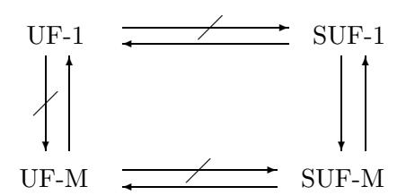
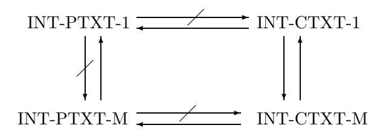

# The Power of Verification Queries in Message Authentication and Authenticated Encryption

Mihir Bellare<sup>∗</sup> Oded Goldreich† Anton Mityagin‡

#### Abstract

This paper points out that, contrary to popular belief, allowing a message authentication adversary multiple verification attempts towards forgery is not equivalent to allowing it a single one, so that the notion of security that most message authentication schemes are proven to meet does not guarantee their security in practice. We then show, however, that the equivalence does hold for strong unforgeability. Based on this we recover security of popular classes of message authentication schemes such as MACs (including HMAC and PRF-based MACs) and CWschemes. Furthermore, in many cases we do so with a tight security reduction, so that in the end the news we bring is surprisingly positive given the initial negative result. Finally, we show analogous results for authenticated encryption.

Keywords: Message authentication, PRFs, Carter-Wegman, symmetric encryption, authenticated encryption.

# 1 Introduction

Message authentication. A message authentication (ma) scheme allows parties sharing a key K to authenticate data they send to each other. The sender applies a tag generation algorithm TG to K and the message M to get a tag Tag, and then sends M, Tag to the receiver. The latter applies a verification algorithm VF to K, a received message, and its accompanying tag, to get an output of 1 (accept) or 0 (reject), indicating whether or not the message should be considered authentic.

Message authentication schemes are pervasive in practice. In a typical usage, public-key cryptography is first used to exchange a private key K, and the latter is then used to authenticate (and also possibly encrypt) data. This happens in Internet security protocols like SSL (used to secure credit card numbers in electronic commerce) SSH (secure remote login) and IPSEC.

Much work goes into obtaining high-performance, secure ma-schemes, and there are a variety of schemes in existence and use, including HMAC [1], block-cipher based MACs [5, 22, 10, 4, 11, 20, 17, 18] and Carter-Wegman (CW) ma-schemes [25, 21, 23, 16, 8, 9].

This paper points out that the notion of security that most of these schemes are proven to meet does not guarantee their security in practice, and then looks into remedies.

<sup>∗</sup>Dept. of Computer Science & Engineering, University of California, San Diego, 9500 Gilman Drive, La Jolla, CA 92093, USA. Email: mihir@cs.ucsd.edu. URL: http://www-cse.ucsd.edu/users/mihir. Supported in part by NSF grants CCR-0098123, ANR-0129617 and CCR-0208842, and by an IBM Faculty Partnership Development Award.

<sup>†</sup>Department of Computer Science, Weizmann Institute of Science, Rehovot, Israel. Email: oded.goldreich@ weizmann.ac.il. URL: http://www.wisdom.weizmann.ac.il/˜oded/homepage.html.

<sup>‡</sup>Dept. of Computer Science & Engineering, University of California, San Diego, 9500 Gilman Drive, La Jolla, CA 92093, USA. Email: amityagin@cs.ucsd.edu. URL: http://www-cse.ucsd.edu/users/amityagin. Supported in part by above-mentioned grants of first author.

# 1.1 UF-1;UF-M

Two definitions. The natural definition of security [5] comes by extending the one for digital signatures [15]. Namely, an adversary, allowed a chosen-message attack (via access to a tagging oracle TG(K, ·)), should be unable to produce a message-tag pair M, Tag that is valid (meaning VF(K, M, Tag) = 1) and for which the message is new (meaning, was not queried to the tagging oracle).

This definition however gives the adversary only one verification attempt. An alternative definition [4] gives the adversary, in addition to the tagging oracle, also a verification oracle VF(K, ·, ·). The adversary should be unable to make a query M, Tag to its verification oracle such that the latter returns 1 but M was not previously queried to the tag oracle.

Let us refer to this second definition as UF-M (UnForgeability under Multiple verification queries). Note that the first (standard) definition we discussed above is just the special case of the second one in which only a single verification query is allowed, so henceforth we think of it this way and refer to it as UF-1 (UnForgeability under a single verification query).

In practice, it is certainly possible for an adversary to make multiple verification attempts. (For example a server authenticating a client under their common key functions as the verification oracle, and an adversary can forward many transmissions to it.) A scheme that is UF-1 but not UF-M is thus clearly not providing adequate security for practical usage.

Equivalent? It turns out that this fact (namely, that UF-M is the "right" notion, not UF-1) is actually quite well understood in the community and literature. Nonetheless, it is the UF-1 notion that most schemes are proven to meet [5, 22, 1, 10, 11, 8, 9, 17, 18, 20]. (Exceptions are [4, 3].) Why?

It appears to be due to the belief that UF-1 ⇒ UF-M. More precisely, the belief is that if an adversary A makes v verification oracle queries, its advantage (probability of forgery) is not more than v times that of an adversary B of comparable time making just one verification oracle query. So the belief is that although a difference in concrete security does manifest itself, UF-1 and UF-M are polynomially equivalent. The folklore argument for this is that B can guess one of the verification queries of A to use as its own, single verification query, answering previous ones by "0."

Not equivalent. In Section 3 we show why the above-mentioned folklore argument is incorrect. This leaves open the question of whether or not it can be patched to show the equivalence, but we then go on to show that it cannot. Namely we show in Theorem 4.1 that UF-1 ; UF-M. We do this by presenting a ma-scheme that is UF-1 but is not UF-M. (Naturally this requires the assumption that some UF-1 ma-scheme exists, otherwise the question is moot.) Thus, contrary to expectation, the UF-1 and UF-M notions are not equivalent.

Intuitively, the problem is malleability [12]. In particular multiple verification queries can add power when an adversary can modify a valid tag for a message into another, different valid tag for the same message.

## 1.2 SUF-1⇒SUF-M

Next we establish a useful positive result, namely that the equivalence (between security under one or many verification queries) does hold under a stronger notion of unforgeability than the one considered above.

Strong unforgeability. Strong unforgeability [6] means the adversary is not only unable to forge a tag for a new message, but also unable to forge a new tag for an old (meaning, already tagged) message. The formalization is with respect to adversaries getting both a tagging and a



Figure 1: An arrow represents an implication and a barred arrow represents a separation.

verification oracle as above, so again there is both a single verification query version (that we denote SUF-1) and a multiple verification query version (that we denote SUF-M).

We show (cf. Theorem 5.1 and Corollary 5.2) that SUF-1 ⇒ SUF-M. Thus, in contrast to (mere) unforgeability, the strong versions of the notions are equivalent.

Relations. Figure 1.2 summarizes the relations between the four notions we have discussed, in the style of [2]. For each pair A, B ∈ {UF-1, UF-M, SUF-1, SUF-M} of notions we show one of the following: (1) An implication A ⇒ B (this means we prove that any ma-scheme achieving A also achieves B); or (2) A separation A ; B (this means we give a construction of a ma-scheme that meets notion A but does not meet notion B). A separation A ; B is always under the (minimal) assumption that there exists a scheme meeting notion A.

# 1.3 Repair: Establishing UF-M and SUF-M security of known schemes

The fact that UF-1 ; UF-M means that what has been proved about specific existing ma-schemes does not guarantee their security under multiple verification attempts and hence in practice, but does not mean that these particular schemes are not UF-M. We now ask whether it may be possible, via other routes, to prove UF-M security of existing schemes.

In answering this question, it would be much preferable to avoid re-entering the (sometimes complex) proofs of security of these ma-schemes. Our approach, instead, is to consider some special classes of ma-schemes such that (1) known schemes have been proved to fall into one of these classes, and (2) we can show that any scheme in the class is SUF-1. Then, via our SUF-1 ⇒ SUF-M implication, and existing results about the schemes, we can conclude that they are UF-M (and in fact SUF-M) secure. We implement this program as follows.

The first class of ma-schemes we consider are UF-1 MACs. (A ma-scheme is a message authentication code, or MAC, if its tagging function is stateless and deterministic, and verification is done by applying the tagging function to compute the correct tag of the given message and comparing this with the candidate tag.) It is easy to see (cf. Proposition 6.1) that any UF-1 MAC is in fact SUF-1, and hence (by Corollary 5.2) UF-M and SUF-M. As an application, since HMAC, proven UF-1 in [1], is a MAC, the above tells us that it is UF-M and SUF-M secure.

An important subclass of MACs are PRF based ones, where the tagging function is pseudorandom. These are UF-1 [14, 5] and thus by the above automatically SUF-1, UF-M and SUF-M. Since the tagging algorithms of block-cipher based constructs like various CBC-MACs [5, 10, 22], PMAC [11], TMAC [17] and OMAC [18] are shown in the cited papers to be PRFs, we can conclude that the corresponding MACs are UF-M and SUF-M.

The second class of ma-schemes we consider are Carter-Wegman (CW) ma-schemes [25]. These schemes are randomized or counter-based, and hence not MACs, so Proposition 6.1 does not apply. However, via an extension of the standard proof establishing the UF-1 security of these ma-schemes [21, 23, 16, 8, 9], we can establish their SUF-1 security as well. Hence by Corollary 5.2, they too are UF-M and SUF-M. In particular, UMAC [8, 9] and MMH-MAC [16] are CW ma-schemes shown in the cited papers to be UF-1, and hence are UF-M and SUF-M by the above.

### 1.4 Reduction tightness and concrete security improvements

The results above are with respect to asymptotic definitions of security, where meeting a notion means that the success probability of any polynomial-time adversary is a negligible function of the security parameter. This is indeed the conceptually appropriate setting in which to study security relations at the first cut. However, for practical purposes, the concrete security of reductions can be important, and we now address this issue.

Quality of the SUF-1 ⇒ SUF-M reduction, and its impact. The reduction of Theorem 5.1, which establishes that SUF-1 ⇒ SUF-M, is not tight: given a polynomial-time adversary A making v verification attempts and succeeding with probability a, it delivers a polynomial-time adversary B making one verification attempt and succeeding with probability at least b = a/v. The abovementioned results showing UF-M and SUF-M security of various classes of schemes inherit this loss in security through their reliance on Theorem 5.1. Unfortunately this loss can be significant in practice. Consider for example PRF-based MACs using a block cipher with block-length n. Typically [5, 10, 22, 11, 17, 18] it is shown that the probability of forgery under t tagging queries, each of at most m blocks, is roughly m<sup>2</sup> t <sup>2</sup>/2 n . With AES (n = 128) and assuming 1Kbyte messages (m = 2 <sup>13</sup>) this provides UF-1 security until around t = 2 <sup>51</sup> messages are tagged, which is adequate if we only cared about UF-1, but of course we don't. Obtaining UF-M/SUF-M via Theorem 5.1, we get that the probability of forgery under v verification queries is roughly vm<sup>2</sup> t <sup>2</sup>/2 n , with t, m as before. Now, for example, a guarantee of security against v = 2 <sup>34</sup> verification attempts requires that at most t = 2 <sup>34</sup> messages are tagged. These numbers are not large enough for comfort, and things get substantially worse if we consider legacy ciphers with block length n = 64.

No better general reduction. The first question to ask given the above is whether there is a better reduction showing SUF-1 ⇒ SUF-M. Proposition 7.1 shows that the answer is no. It does this by presenting a MAC for which there is a polynomial-time attack having constant probability of strong forgeability with v queries, but for which no polynomial-time attack making only one verification query succeeds in strong forgery with probability significantly better than 1/v. This shows (cf. Corollary 7.2) that no reduction could deliver a reduction factor that is better than that of Theorem 5.1 by more than a constant factor, even for the special case of ma schemes that are MACs.

Improvements in special cases. Although a general concrete-security improvement is ruled out by the above, we are able to find such improvements for important subclasses of ma-schemes. Proposition 7.3 presents an essentially tight reduction of SUF-M to the pseudorandomness of the MAC in the case the latter is PRF-based. Continuing the above example, this will imply that the probability of forgery under v verification queries is roughly m<sup>2</sup> (v <sup>2</sup> + t 2 )/2 n , with v,t, m as before. Now (for 1Kbyte messages) we have a guarantee of security against v = 2 <sup>50</sup> verification attempts even if up to t = 2 <sup>50</sup> messages are tagged.

This is a substantial improvement. It is particularly valuable since so many ma-schemes are PRF-based [5, 10, 22, 11, 17, 18], and we note it can also be applied to HMAC, whose tagging algorithms is often assumed to be a PRF, due to its usage for tasks such as key-derivation. (We note the proof of [1] extends to establish its security as a PRF if we are willing to assume the underlying compression function is a PRF.

### 1.5 The case of authenticated encryption

There are two notions of integrity for authenticated encryption: integrity of plaintexts (an analog of standard unforgeability for ma-schemes) and integrity of ciphertexts (an analog of strong unforgeability for ma-schemes). In either case we may consider versions with one or more verification attempts (here the verification oracle takes a ciphertext and says whether or not it is valid) leading to four notions, INT-PTXT-1,INT-PTXT-M,INT-CTXT-1,INT-CTXT-M. In the literature, INT-CTXT-1 was defined in [19, 7], and INT-CTXT-M,INT-PTXT-M in [6]. INT-PTXT-1 was not defined prior to our paper. Our main results about ma-schemes extend, and in particular we show that INT-PTXT-1 ; INT-PTXT-M but INT-CTXT-1 ⇒ INT-CTXT-M. This material is covered in Appendix B and the relations are depicted in Figure B.

## 1.6 Remarks

One might consider a multiple verification version of the definition of digital signatures as well, but it is clearly equivalent to the standard definition of [15] because verification takes place under a key that is public (and in particular available to the adversary).

In practice, "throttling" is often used to limit the number of verification attempts an adversary can make. (The verification server refuses further requests under a key for which some number of verification attempts have been previously rejected). It would be a mistake to think that the use of throttling means that UF-1 security suffices. For one thing, one surely cannot limit a user to just one verification attempt before revoking their key, for a few rejections can occur for natural reasons such as corrupted transmissions. Also, revocation of keys brings key-management costs. Thus we feel that for practice the most desirable situation is to have schemes providing security against a large number of verification attempts.

## 1.7 Related work

In his recent textbook [13], the second author of this paper noted that UF-1 ; UF-M, and also that the implication is true for the class of unique UF-1 ma-schemes. (In such a scheme there exists for every key and message at most one tag that the verification algorithm accepts.) The present paper represents the submission of this material to a research venue while adding significant improvements, extensions and applications. In particular we establish UF-M for SUF-1 schemes, which is a strictly larger class than the class of unique UF-1 ma-schemes. (Every unique UF-1 ma-scheme is SUF-1, but there are SUF-1 ma-schemes, such as CW-ma-schemes, that are not unique.) Other contributions of the paper not present in the textbook are: consideration of the UF-M security of specific existing ma-schemes in the literature as discussed in Section 1.3 above; tightness of the main reduction and concrete security improvements as discussed in Section 1.4 above; and authenticated encryption as discussed in Section 1.5 above.

# 2 Definitions

Notation. By akbkck · · · we denote an encoding of objects a, b, c, . . . into a binary string in such a way that the constituents are uniquely recoverable in linear time. If n is an integer then hni denotes its binary representation and [n] = {1, . . . , n}. If x is a string then |x| denotes its length and x[i] denotes its i-th bit, for i ∈ [|x|]. If A is a randomized algorithm then a \$← A(x, y, · · ·) means that A is executed on inputs x, y, . . . with fresh coins and a denotes the outcome. If S is a set then s \$← S means that s is chosen uniformly at random from S. If x, y are objects then x ← y means x is assigned the value y.

Message authentication schemes. A message-authentication scheme (ma-scheme) Π = (TG, VF) is a pair of polynomial-time algorithms, where

```
Experiment \mathbf{Exp}_{\Pi,A}^{\mathsf{type}}(k)
    K \stackrel{\$}{\leftarrow} \{0,1\}^{l(k)}; count \leftarrow 0; f \leftarrow 0; sf \leftarrow 0
    Run A on input 1^k, replying to its oracle queries as follows:
         When A makes a query M to \mathsf{TG}(K,\cdot) do
              Tag \stackrel{\$}{\leftarrow} \mathsf{TG}(K, M); TagSet[M] \leftarrow TagSet[M] \cup \{Tag\}; Return Tag to A
         When A makes a query M, Tag to VF(K,\cdot,\cdot) do
             d \leftarrow \mathsf{VF}(K, M, Tag); count \leftarrow count +1
             If d = 1 then
                  If TAGSET[M] = \emptyset then f \leftarrow 1; If Tag \notin TAGSET[M] then sf \leftarrow 1
             Return d to A
                               then return (count = 1) \wedge f
    If (type = UF-1)
    If (type = UF-M)
                               then return f
                               then return (count = 1) \wedge sf
    If (type = SUF-1)
    If (type = SUF-M) then return sf
```

Figure 2: Experiment defining our four notions of security.

- The tag-generation algorithm TG, which may be randomized or stateful, takes a key  $K \in \{0,1\}^{l(k)}$ , where  $k \in \mathbb{N}$  is the security parameter, and a message  $M \in \{0,1\}^*$  to return a tag  $Tag \in \{0,1\}^*$ . The function  $l(\cdot)$  is the key-length.
- The deterministic, stateless verification algorithm VF takes a key  $K \in \{0,1\}^{l(k)}$ , a message  $M \in \{0,1\}^*$  and a candidate tag  $Tag \in \{0,1\}^*$  to return either 1 (ACCEPT) or 0 (REJECT).

We require the following completeness condition:  $\mathsf{VF}(K,M,\mathsf{TG}(K,M))=1$  with probability 1 for any k, any  $K\in\{0,1\}^{l(k)}$ , and any  $M\in\{0,1\}^*$ . We say that  $\Pi$  is a message authentication code (MAC) if  $\mathsf{TG}$  is (stateless and) deterministic, and also  $\mathsf{VF}(K,M,Tag)$  is defined via: If  $Tag=\mathsf{TG}(K,M)$  then return 1 else return 0.

For simplicity we will focus for now on stateless schemes. (Meaning ones where TG is stateless. Verification is always stateless). We also assume that TG applies to any message  $M \in \{0,1\}^*$ . In some later cases we will want to consider that the TG $(K,\cdot)$  algorithm only applies to strings in some message space associated to k. (This happens because in practice the messages are often restricted in some way, for example to a maximum length or to length a multiple of some block length.) In that case the completeness condition only applies to messages in this space.

FOUR SECURITY NOTIONS. We provide the formal definitions and then some explanations. Let  $\Pi = (\mathsf{TG}, \mathsf{VF})$  be a message authentication scheme. Let  $\mathsf{type} \in \{\mathsf{UF-1}, \mathsf{UF-M}, \mathsf{SUF-1}, \mathsf{SUF-M}\}$ . Let A be an adversary with access to a tagging oracle and a verification oracle, and let  $k \in \mathbb{N}$ . We define the experiment depicted in Figure 2. We let

$$\mathbf{Adv}^{\mathsf{type}}_{\Pi,A}(k) \; = \; \Pr \left[ \; \mathbf{Exp}^{\mathsf{type}}_{\Pi,A}(k) = 1 \; \right]$$

denote the winning probability for A in the experiment in question. We say that  $\Pi$  is type-secure if the function  $\mathbf{Adv}_{\Pi,A}^{\mathsf{type}}(\cdot)$  is negligible for any polynomial time adversary A.

In the experiment, naturally, A's tagging oracle queries are answered via  $\mathsf{TG}(K,\cdot)$  and its verification oracle queries via  $\mathsf{VF}(K,\cdot,\cdot)$ . The rest is book-keeping. The flag  $\mathsf{f}$  is set to 1 if the conditions of standard forgery are met, and the flag  $\mathsf{sf}$  is set to 1 if the conditions of a strong forgery are met. It is assumed that the set  $\mathsf{TAGSET}[M]$  is initially empty for all M. The counter count keeps track of the number of verification queries made.

PRFs and PRF-based MACs. Let F be a family of functions with domain  $\{D_k\}_{k\in\mathbb{N}}$ , output length  $\tau(\cdot)$  and key-length  $l(\cdot)$ . This means that F(K,M) is a  $\tau(k)$ -bit string for each k, each l(k)-bit key K and each input  $M \in D_k$ , and can be computed in polynomial time. Recall [14, 5] that if B is an adversary with an oracle for a function  $f: D_k \to \{0,1\}^{\tau(k)}$  then its prf-advantage is

$$\mathbf{Adv}^{\mathrm{PRF}}_{F,B}(k) \ = \ \mathrm{Pr}\left[\,B^{F(K,\cdot)}(1^k) = 1\,\right] - \mathrm{Pr}\left[\,B^{f(\cdot)}(1^k) = 1\,\right]\,,$$

the first probability being over  $K \stackrel{\$}{\leftarrow} \{0,1\}^{l(k)}$  and the second over  $f \stackrel{\$}{\leftarrow} \mathsf{Maps}(D_k, \{0,1\}^{\tau(k)})$ , where  $\mathsf{Maps}(D,R)$  is the set of all functions mapping from domain D to range R. We say that F is a PRF if  $\mathbf{Adv}_{F,B}^{\mathsf{PRF}}(\cdot)$  is negligible for all polynomial-time adversaries B. We associate to F the ma-scheme  $\Pi[F] = (F, \mathsf{VF})$ , where  $\mathsf{VF}(K, M, Tag)$  returns 1 if F(K, M) = Tag and 0 otherwise. The message space associated to k is  $D_k$ . A ma-scheme  $\Pi$  is said to be PRF-based if there is a family F such  $\Pi = \Pi[F]$ . Note that a PRF-based ma-scheme is a MAC.

# 3 Template of a reduction

Let  $\Pi = (\mathsf{TG}, \mathsf{VF})$  be a UF-1 secure ma-scheme. As we noted earlier, there is a belief that one can prove it also UF-M secure. Here we will present the template of the "proof" that people appear to have in mind and see why it does not work. This is useful for two reasons: it lends some insight into the later counter-example showing UF-1  $\Rightarrow$  UF-M, and the same template will be later appropriately used to show that SUF-1  $\Rightarrow$  SUF-M.

Let A be a polynomial-time UF-M adversary attacking  $\Pi$ , and let  $v(\cdot)$  bound the number of verification-oracle queries made by A. (This means  $v(k) \leq \text{poly}(k)$  is a polynomial-time computable function such that the number of verification queries made by A on input  $1^k$  is at most v(k) with probability one, regardless of how answers to any oracle queries of A are computed.) We want to define a UF-1 adversary B such that for every k the following inequality, which we refer to as  $\mathbf{Eq}[A, B, k]$  holds:

$$\mathbf{Eq}[A,B,k]: \qquad \quad \mathbf{Adv}^{\mathrm{UF-1}}_{\Pi,B}(k) \ \geq \ \frac{1}{v(k)} \cdot \mathbf{Adv}^{\mathrm{UF-M}}_{\Pi,A}(k) \ .$$

The idea is for B to guess and output the first successful verification query made by A, answering all others negatively without consulting its verification oracle. The corresponding adversary, which we call  $B_1$ , is defined by the part of the code of Figure 3 that omits the boxed statements. (Ignore the boxed statements for now.) Let I be the random variable, in  $\mathbf{Exp}_{\Pi,A}^{\mathrm{UF-M}}(k)$ , that takes value the first verification query made by A to which the answer of the verification oracle is 1 and the message was not previously queried to the tagging oracle. Now we would like to claim that the guess guess made by  $B_1$  equals I with probability at least 1/v(k), and thus  $\mathbf{Eq}[A, B_1, k]$  is true.

However, this is not true. For example, A might make a query M to its tagging oracle, get back a tag Tag, and immediately make query M, Tag to its verification oracle. Let us imagine that, after this, it makes another verification oracle query M', Tag' that is valid, with  $M' \neq M$ , so that it wins with probability one. However,  $B_1$ 's simulation is inaccurate, because (in the case guess  $\geq 2$ ) the verification oracle would have returned 1 in answer to A's first query to it, but  $B_1$  returns 0 to A as the answer. So  $B_1$ 's advantage is 0. (In the case guess = 1,  $B_1$  does not win because M was queried to the tagging oracle and is not new).

This seems easily fixed by comparing tags in verification oracle queries to ones returned previously by the tagging oracle. Namely, we consider adversary  $B_2$  of Figure 3 that now includes the boxed statements. For our example A above,  $B_2$ 's simulation is now correct, and thus  $\mathbf{Eq}[A, B, k]$  is true. However, in general, this strategy is still wrong, meaning there are adversaries A for which  $\mathbf{Eq}[A, B_2, k]$  does not hold. The reason is malleability. Suppose A begins by making a query M to

```
Adversary B
            TG(K,·),VF(K,·,·)
            b
                          (1k
                             ) (b ∈ {1, 2})
   count ← 0 ; guess
                    $← [v(k)]
   Run A on input 1
                     k
                      , replying to its oracle queries as follows:
   – When A makes a query M to TG(K, ·) do
          Tag
              $← TG(K, M) ; TagSet[M] ← TagSet[M] ∪ {Tag} ; Return Tag to A
   – When A makes a query M, Tag to VF(K, ·, ·) do
          count ← count + 1
          If (count > guess) then Halt
          If (Tag ∈ TagSet[M]) then return 1 to A
          If (count < guess) then return 0 to A
          If (count = guess) then d ← VF(K, M, Tag) ; Halt
```

Figure 3: UF-1 adversaries B1, B<sup>2</sup> derived from UF-M adversary A. Adversary B<sup>1</sup> omits the boxed statements while B<sup>2</sup> includes them.

its tagging oracle, getting back a tag Tag, and is then capable of modifying Tag to some different value Tag such that VF(K, M, Tag) = 1. Let it then make query M, Tag to its verification oracle. As before, imagine that, after this, it makes another verification oracle query M<sup>0</sup> , Tag<sup>0</sup> that is valid, with M<sup>0</sup> 6= M, so that it wins with probability one. Now, again, B2's simulation is inaccurate, because (in the case guess ≥ 2) the verification oracle would have returned 1 in answer to A's first query to it, but B<sup>2</sup> returns 0 to A as the answer. So B2's advantage is 0.

This time, it is not clear how to fix B2, because in general it is not clear how to detect whether Tag is a valid tag for M without querying the verification oracle. Theorem 4.1 implies that this difficulty is not surmountable. On the other hand Theorem 5.1 shows that if Π was SUF-1 rather than merely UF-1 then this problem can be overcome to show that Π is also SUF-M.

# 4 UF-1;UF-M

The above discussion leaves open the question of whether UF-1 ⇒ UF-M or not. Perhaps the proof could be patched? The following theorem implies that it cannot, because the underlying claim is simply not true.

Theorem 4.1 [UF-1 ; UF-M] Assume there exists a UF-1-secure ma-scheme. Then there exists a UF-1-secure ma-scheme that is not UF-M-secure.

The rest of this section is devoted to a proof of Theorem 4.1. By assumption there exists a UF-1 secure ma-scheme Π = (TG, VF). Let l be its key-length. We build from it the ma-scheme Π = (MAC, VF) whose constituent algorithms are specified below:

```
Algorithm MAC(K, M)
   Tag ← TG(K, M)
   Tag ← Tagkh0i
   Return Tag
                         Algorithm VF(K, M, Tag)
                            Parse Tag as Tagkhii where i ∈ {0, 1, . . . , |K|}
                            d ← VF(K, M, Tag)
                            If (d = 0 or i = 0) then return d
                            If (d = 1 and i ≥ 1) then return K[i]
```

Recall that K[i] denotes the i-th bit of the key K. The key-length of the new scheme is also l. We first note that the scheme satisfies the completeness condition. Indeed, if Tag is an output of  $\overline{\mathsf{MAC}}(K,M)$  then it has the form  $Tag \|\langle i \rangle$  with i=0. Thus the first "If" statement of  $\overline{\mathsf{VF}}(K,M,\overline{Tag})$  applies and returns d, which is 1 by completeness of  $\Pi$ . Now we present an attack to show  $\overline{\Pi}$  is not secure against an adversary making more than one query to its verification oracle.

#### Claim 4.2 $\overline{\Pi}$ is not UF-M-secure.

**Proof:** Consider the following UF-M-adversary  $\overline{A}$  against  $\overline{\Pi}$ :

Adversary
$$\overline{A}^{\overline{\mathsf{MAC}}(K,\cdot),\overline{\mathsf{VF}}(K,\cdot,\cdot)}(1^k)$$

Let  $M_1$  be any message and let  $\overline{Tag}_1 \overset{\$}{\leftarrow} \overline{\mathsf{MAC}}(K,M_1)$
Parse  $\overline{Tag}_1$  as  $Tag_1 \| \langle 0 \rangle$
For  $i=1,\ldots,l(k)$  do  $L[i] \leftarrow \overline{\mathsf{VF}}(K,M_1,Tag_1 \| \langle i \rangle)$
Let  $M_2$  be any message different from  $M_1$
 $\overline{Tag}_2 \overset{\$}{\leftarrow} \overline{\mathsf{MAC}}(L,M_2)$ ;  $d \leftarrow \overline{\mathsf{VF}}(K,M_2,\overline{Tag}_2)$

Adversary  $\overline{A}$  obtains the tag of a message  $M_1$  using its tagging oracle. The definition of the algorithm  $\overline{\mathsf{VF}}(K,\cdot,\cdot)$  then tells us that, above, L[i]=K[i] is the i-th bit of the key K for all  $i\in[|K|]$ . In other words,  $\overline{A}$  has succeeded in recovering the key. Then it can, of course, easily win, by forging the tag of some new message  $M_2$ . (Note that its computation of  $\overline{Tag}_2$  is not an oracle query.  $\overline{A}$  simply runs algorithm  $\overline{\mathsf{MAC}}$  with key L and message  $M_2$ .) Thus  $\mathbf{Adv}_{\overline{\Pi},\overline{A}}^{\mathrm{UF-M}}(k)=1$ . Since  $\overline{A}$  is polynomial-time, the claim is justified.  $\blacksquare$

Next we show that  $\overline{\Pi}$  retains the UF-1 security of  $\Pi$ . The intuition is simple. In order to make  $\overline{\mathsf{VF}}(K,\cdot,\cdot)$  accept, an adversary must have a message-tag pair that is valid for  $\mathsf{VF}(K,\cdot,\cdot)$ . On the other hand, being limited to one verification oracle query, it cannot make any use of any information that the verification oracle returns in answer to this query, since its game is effectively over once the query is made. Here now is the formal claim and proof.

#### Claim 4.3 $\overline{\Pi}$ is UF-1-secure.

**Proof:** Let  $\overline{A}$  be any polynomial-time UF-1-adversary attacking  $\overline{\Pi}$ . We can assume it makes exactly one query to its verification oracle. We construct a polynomial-time UF-1 adversary A attacking  $\Pi$  such that

$$\mathbf{Adv}_{\overline{\Pi},\overline{A}}^{\mathrm{UF-1}}(k) \leq \mathbf{Adv}_{\Pi,A}^{\mathrm{UF-1}}(k) . \tag{1}$$

Here is how A works:

Adversary  $A^{\mathsf{TG}(K,\cdot),\mathsf{VF}(K,\cdot,\cdot)}(1^k)$

Run  $\overline{A}$  on input  $1^k$ , replying to its oracle queries as follows:

– When  $\overline{A}$  makes a query M to  $\overline{\mathsf{MAC}}(K,\cdot)$  do

$$Tag \stackrel{\$}{\leftarrow} \mathsf{TG}(K, M) \; ; \; \overline{Tag} \leftarrow Tag \|\langle 0 \rangle \; ; \; \text{Return } \overline{Tag} \text{ to } \overline{A}$$

– When  $\overline{A}$  makes a query  $M, \overline{Tag}$  to  $\overline{\mathsf{VF}}(K, \cdot, \cdot)$  do

Parse
$$\overline{Tag}$$
 as  $Tag \|\langle i \rangle$  where  $i \in \{0, 1, \dots, k\}$ ;  $d \leftarrow \mathsf{VF}(K, M, Tag)$ ; Halt

A does not return to  $\overline{A}$  any answer to  $\overline{A}$ 's (unique) verification-oracle query. (Not knowing K, it would not know how). It simply uses this query to make its own verification-oracle query, and halts. Equation (1) is true because A's simulation of replies to queries of the tagging oracle is perfect, and also because  $\overline{\mathsf{VF}}(K, M, Tag||\langle i \rangle)$  returns 1 only if  $\mathsf{VF}(K, M, Tag)$  returns 1.

This concludes the proof of Theorem 4.1. We now make some remarks that help relate this result to upcoming ones.

**Remark 4.4** The ma-scheme  $\overline{\Pi}$  of our counter-example is not a MAC. Although  $\overline{\mathsf{MAC}}(K,\cdot)$  is deterministic, the second requirement of MACs is violated: verification  $\overline{\mathsf{VF}}(K,\cdot,\cdot)$  is not done by recomputing  $\overline{\mathsf{MAC}}(K,\cdot)$  and comparing it with an input tag. This is relevant because otherwise we could contradict Proposition 6.1.  $\blacksquare$

**Remark 4.5** The ma-scheme  $\overline{\Pi}$  of our counter-example is not SUF-1 due to the following adversary:

```
Adversary \overline{A}^{\overline{\mathsf{MAC}}(K,\cdot),\overline{\mathsf{VF}}(K,\cdot,\cdot)}(1^k)
Let M be any message and let \overline{Tag} \xleftarrow{\$} \overline{\mathsf{MAC}}(K,M_1)
Parse \overline{Tag} as Tag \| \langle 0 \rangle; d \leftarrow \overline{\mathsf{VF}}(K,M,Tag \| \langle 1 \rangle)
```

The verification oracle accepts if K[1] = 1. Since K is chosen at random we have  $\mathbf{Adv}_{\overline{\Pi},\overline{A}}^{\text{SUF-1}}(k) = 1/2$ . This is relevant because otherwise we would contradict Corollary 5.2.

# 5 Equivalence in the strong unforgeability case

In contrast to the case of standard unforgeability, under the strong unforgeability definition, the single and multiple verification query versions are equivalent. We prove the equivalence and also state the quantitative relation between the advantages, since this is important for practical applications.

**Theorem 5.1** [SUF-1  $\Rightarrow$  SUF-M] Let  $\Pi = (\mathsf{TG}, \mathsf{VF})$  be a ma-scheme. Let A be an adversary making at most  $v(\cdot)$  verification queries. Then there exists an adversary B, making only one verification query, such that for all  $k \in \mathbb{N}$

$$\mathbf{Adv}_{\Pi,A}^{\text{SUF-M}}(k) \leq v(k) \cdot \mathbf{Adv}_{\Pi,B}^{\text{SUF-1}}(k) . \tag{2}$$

Furthermore, the number of tagging queries made by B is the same as the number made by A, and the running time of B is that of A plus  $O((v+t)\tau)$  where  $t(\cdot)$  is a bound on the number of tagging queries made by A and  $\tau(\cdot)$  is a bound on the lengths of messages and tags in A's oracle queries.

The following is immediate:

Corollary 5.2 [SUF-1  $\Rightarrow$  SUF-M] If a ma-scheme is SUF-1 secure then it is also SUF-M secure.

Since the relations SUF-M  $\Rightarrow$  UF-M and UF-M  $\Rightarrow$  UF-1 are trivial, it follows that a ma-scheme that is SUF-1 secure is also SUF-M, UF-M and UF-1 secure, meaning meets all the four notions we have considered.

**Proof of Theorem 5.1:** The required adversary B is exactly the one called  $B_2$  in Figure 3. For the analysis, let  $(M_1, Tag_1), (M_2, Tag_2), \ldots$  denote the verification-oracle queries made by A in  $\mathbf{Exp}_{\Pi,A}^{\mathrm{SUF-M}}(k)$ . Let the random variable I take value the smallest index i such that  $\mathsf{VF}(K, M_i, Tag_i) = 1$  and  $Tag_i \notin \mathsf{TAGSET}[M_i]$  if such an index exists, and 0 otherwise.

In the simulation of A provided by B, we notice that if guess  $\leq I$ , then for all  $1 \leq i < guess$ , the reply provided by B to the i-th verification-oracle query of A is correct, meaning equals  $\mathsf{VF}(K, M_i, Tag_i)$ . On the other hand the random choice of guess is independent of the view of A as long as B has not halted. So

$$\mathbf{Adv}^{\mathrm{SUF-1}}_{\Pi,B}(k) \; = \; \Pr \left[ \; \mathsf{guess} = I \wedge I \geq 1 \; \right] \; \geq \; \Pr \left[ \; \mathsf{guess} = I \; \right] \cdot \Pr \left[ \; I \geq 1 \; \right] \; = \; \frac{1}{v(k)} \cdot \mathbf{Adv}^{\mathrm{SUF-M}}_{\Pi,A}(k) \; .$$

# 6 Classes of SUF-1 ma-schemes

Towards applying Corollary 5.2 to existing ma-schemes, we establish SUF-1 for certain important classes.

MACs. Suppose ma-scheme Π = (TG, VF) is a MAC. This implies that for any message M and key K there is only one tag that VF will accept, namely TG(K, M). Thus:

Proposition 6.1 Let Π be a UF-1 MAC. Then it is also SUF-1.

So by Corollary 5.2, any UF-1 MAC is UF-M and SUF-M. As an application, since HMAC is proven UF-1 in [1], the above shows it is UF-M and SUF-M.

PRF-based MACs. Any PRF-based MAC is UF-M secure [5], and, being a MAC, we can then apply the above to get UF-M, SUF-M security. It is worth stating the concrete security of the reduction underlying this easy result, however, since it provides the backdrop for our later improvement:

Proposition 6.2 [PRF-based MACs are SUF-M, basic reduction] Let F be a PRF with outputlength τ (·). Let A be an adversary making at most v(·) verification queries. Then there exists a PRF adversary B such that for any k ∈ N

$$\mathbf{Adv}_{\Pi[F],A}^{\text{SUF-M}}(k) \leq \frac{v(k)}{2^{\tau(k)}} + v(k) \cdot \mathbf{Adv}_{F,B}^{\text{PRF}}(k) . \tag{3}$$

Furthermore, the number of oracle queries made by B is at most t(·) + 1, and the running time of B is that of A plus O((v + t)τ ), where t(·) is a bound on the number of tagging queries made by A.

As an application, various CBC-MACs [5, 10, 22], PMAC [11], TMAC [17] and OMAC [18] are UF-M and SUF-M. (But Proposition 7.3 yields better results.)

CW-ma-schemes. The Carter-Wegman paradigm [25] is now yielding the most efficient maschemes. UMAC [8, 9] is the canonical example. These schemes are nonce-based (the nonce is either a counter or a random number) and in particular are not MACs in the sense defined above, so the above does not apply. Via a closer look at the proof of the UF-1 security [21, 23, 16, 8, 9], however, one can establish SUF-1 as well. Details follow. For simplicity we consider only the case where the nonce is a counter.

Let H be a family of functions with domain {Dk}k∈N, output length τ (·) and key-length lH(·). Let F be a family of functions with domain {{0, 1} <sup>k</sup>}k∈N, output length τ (·) and key-length l<sup>F</sup> (·). We associate to them the counter-based CW ma-scheme Π[H, F] which has key-length lH(·)+l<sup>F</sup> (·) and the following tagging and verification algorithms. Below, N is a k-bit counter which is initially 0 and then incremented with each invocation of TG.

Algorithm
$$\mathsf{TG}(HK \| FK, M)$$
 Algorithm  $\mathsf{VF}(HK \| FK, M, Tag)$  Parse  $Tag$  as  $(N, \sigma)$
$$\sigma' \leftarrow F(FK, N) \oplus H(HK, M)$$
 Return  $Tag$  If  $(\sigma = \sigma')$  then return 1 else return 0

The message space is the domain of H. The proof of the following is in Appendix A.1.

**Proposition 6.3** [Security of CW-ma-schemes] Let families H, F be as above, both with outputlength  $\tau(\cdot)$ . Assume H is an  $\epsilon(\cdot)$ -AXU family and F is a PRF. Let  $\Pi[H, F]$  be the associated CW-ma-scheme as above. Let A be any adversary who makes at most  $t(k) < 2^k$  queries to its tagging oracle and one query to its verification oracle. Then there exists a PRF adversary B such that for all  $k \in \mathbb{N}$

$$\mathbf{Adv}_{\Pi[H,F],A}^{\text{SUF-1}}(k) \leq 2^{-\tau(k)} + \epsilon(k) + \mathbf{Adv}_{F,B}^{\text{PRF}}(k) . \tag{4}$$

Furthermore, the number of oracle queries made by B is  $t(\cdot) + 1$  and the running time of B is that of A plus  $O(t\tau)$ .

Since UMAC [8, 9] and MMH-MAC [16] were shown to be UF-1 in the cited papers, the above together with Corollary 5.2 shows they are UF-M and SUF-M.

# 7 Reduction tightness and concrete security improvements

Using Theorem 5.1 to establish UF-M and SUF-M security of ma-schemes results, as per Equation (2), in a factor  $v(\cdot)$  loss in the advantage. As we have discussed in Section 1.4, this can be appreciable in practice. This section looks into getting better reductions.

NO BETTER SUF-1  $\Rightarrow$  SUF-M REDUCTION. The first, natural question to ask is whether Theorem 5.1 represents the best possible reduction, or whether there is a better one. We claim there is no better one, even for the special case of ma-schemes that are MACs. To establish this we begin with the following, whose proof is in Appendix A.2:

**Proposition 7.1** Assume PRFs exist. Then for any polynomial  $v(\cdot)$  there exists a MAC  $\Pi$  such that

- (1) There exists a polynomial-time adversary A that makes at most  $v(\cdot)$  verification queries and achieves  $\mathbf{Adv}_{\Pi,A}^{\mathrm{SUF-M}}(k) = 1$ , and
- (2) For any polynomial-time adversary B making only one verification query, there is a negligible function  $s(\cdot)$  such that  $\mathbf{Adv}_{\Pi,B}^{\mathrm{SUF-1}}(k) \leq 2/v(k) + s(k)$  for all  $k \in \mathbb{N}$ .

Now let us see why this Proposition shows that the reduction of Theorem 5.1 cannot be improved. View a reduction as a transform  $\mathcal{B}$  that given a ma-scheme  $\Pi$ , a polynomial v and a polynomial-time adversary A making v verification queries, outputs a polynomial-time SUF-1 adversary  $\mathcal{B}(\Pi, v, A)$ . We say that  $\mathcal{B}$  has reduction factor  $\phi(\cdot)$  if

$$\mathbf{Adv}^{\mathrm{SUF-1}}_{\Pi,\,\mathcal{B}(\Pi,v,A)}(k) \; \geq \; \phi(v(k)) \cdot \mathbf{Adv}^{\mathrm{SUF-M}}_{\Pi,A}(k)$$

for all  $\Pi, A$  and k. Theorem 5.1 provides a reduction with reduction factor  $\phi(n) = 1/n$ . Now we claim:

Corollary 7.2 If PRFs exist then the reduction factor of any reduction is O(1/n).

So no reduction has a reduction factor that is better than the one of Theorem 5.1 by more than a constant factor. The proof of Corollary 7.2 is in Appendix A.2.

One might observe that the MAC of Proposition 7.1 is neither SUF-1 nor SUF-M secure. This did not preclude it being useful with regard to establishing the un-improvability of the reduction of Theorem 5.1, for the ma-scheme in that theorem is also not assumed to be secure in any sense. Indeed, a reduction transforms an adversary of one type into an adversary of another type with some relation between the advantages, regardless of whether the underlying scheme is secure or not, so the tightness of its reduction factor may be assessed via its performance on insecure schemes.

Improvements for PRF based MACs. Although the above precludes improved concrete security results for MACs in general, we note that one can improve the reduction for PRF-based MACs given in Proposition 6.2 to show the following, whose proof is in Appendix A.3:

Proposition 7.3 [PRF-based MACs are SUF-M, improved version] Let F be a PRF with outputlength τ (·). Let A be an adversary making at most v(·) verification queries. Then there exists a PRF adversary B such that for any k ∈ N

$$\mathbf{Adv}_{\Pi[F],A}^{\text{SUF-M}}(k) \leq \frac{v(k)}{2^{\tau(k)}} + \mathbf{Adv}_{F,B}^{\text{PRF}}(k) . \tag{5}$$

Furthermore, the number of oracle queries made by B is at most v(·) + t(·), and the running time of B is that of A plus O((v + t)τ ), where t(·) is a bound on the number of tagging queries made by A.

The improvement relative to Proposition 6.2 is to eliminate the factor of v(k) multiplying AdvPRF F,B (k) at the cost of allowing B an extra v(·) verification queries. However, typically t(·) ≥ v(·), so the number of oracle queries of B in fact only increases by a constant factor and the improvement is essentially for free. Now, under typical choices of τ (·), the v(k)2−τ(k) term is negligible compared to the other term, so roughly the bound is better than that of Proposition 6.2 by a factor v(k). This forms the basis for the examples, discussed in Section 1.4, which showed that the improvement has appreciable practical impact. We note that as applications we obtain UF-M, SUF-M security for the CBC-MACs [5, 10, 22], PMAC [11], TMAC [17] and OMAC [18] with concrete security that is better than that envisaged at the time people believed UF-1 ⇒ UF-M, even though we now know this implication is not even true.

# Acknowledgments

We thank Bodo Moeller for comments on a previous draft.

# References

- [1] M. Bellare, R. Canetti and H. Krawczyk. Keying hash functions for message authentication. Advances in Cryptology – CRYPTO '96, Lecture Notes in Computer Science Vol. 1109, N. Koblitz ed., Springer-Verlag, 1996.
- [2] M. Bellare, A. Desai, D. Pointcheval, and P. Rogaway. Relations among notions of security for public-key encryption schemes. Advances in Cryptology – CRYPTO '98, Lecture Notes in Computer Science Vol. 1462, H. Krawczyk ed., Springer-Verlag, 1998.
- [3] M. Bellare, O. Goldreich and H. Krawczyk. Stateless evaluation of pseudorandom functions: Security beyond the birthday barrier. Advances in Cryptology – CRYPTO '96, Lecture Notes in Computer Science Vol. 1109, N. Koblitz ed., Springer-Verlag, 1996.
- [4] M. Bellare, R. Guerin ´ and P. Rogaway. XOR MACs: New methods for message authentication using finite pseudorandom functions. Advances in Cryptology – CRYPTO '95, Lecture Notes in Computer Science Vol. 963, D. Coppersmith ed., Springer-Verlag, 1995.
- [5] M. Bellare, J. Kilian and P. Rogaway. The security of the cipher block chaining message authentication code. Journal of Computer and System Sciences, Vol. 61, No. 3, Dec 2000, pp. 362–399.

- [6] M. Bellare and C. Namprempre. Authenticated encryption: Relations among notions and analysis of the generic composition paradigm. Advances in Cryptology – ASIACRYPT '00, Lecture Notes in Computer Science Vol. 1976, T. Okamoto ed., Springer-Verlag, 2000.
- [7] M. Bellare and P. Rogaway. Encode-then-encipher encryption: How to exploit nonces or redundancy in plaintexts for efficient cryptography. Advances in Cryptology – ASIACRYPT '00, Lecture Notes in Computer Science Vol. 1976, T. Okamoto ed., Springer-Verlag, 2000.
- [8] J. Black, S. Halevi, H. Krawczyk, T. Krovetz and P. Rogaway. UMAC: Fast and Secure Message Authentication. Advances in Cryptology – CRYPTO '99, Lecture Notes in Computer Science Vol. 1666, M. Wiener ed., Springer-Verlag, 1999. [Preliminary version of [9]].
- [9] J. Black, S. Halevi, H. Krawczyk, T. Krovetz and P. Rogaway. UMAC: Fast and Secure Message Authentication. http://www.cs.ucdavis.edu/~rogaway/papers/ umac-full.ps. [Full version of [8]].
- [10] J. Black and P. Rogaway. CBC MACs for arbitrary-length messages: The three-key constructions. Advances in Cryptology – CRYPTO '00, Lecture Notes in Computer Science Vol. 1880, M. Bellare ed., Springer-Verlag, 2000.
- [11] J. Black and P. Rogaway. A block-cipher mode of operation for parallelizable message authentication. Advances in Cryptology – EUROCRYPT '02, Lecture Notes in Computer Science Vol. 2332, L. Knudsen ed., Springer-Verlag, 2002.
- [12] D. Dolev, C. Dwork, and M. Naor. Nonmalleable cryptography. SIAM Journal of Computing, Vol. 30, No. 2, 2000, pp. 391–437.
- [13] O. Goldreich. Foundations of Cryptography: Volume II, Basic applications. Cambridge University Press, 2004.
- [14] O. Goldreich, S. Goldwasser and S. Micali. How to construct random functions. Journal of the ACM, Vol. 33, No. 4, 1986, pp. 210–217.
- [15] S. Goldwasser, S. Micali and R. Rivest. A digital signature scheme secure against adaptive chosen-message attacks. SIAM Journal of Computing, Vol. 17, No. 2, 1988, pp. 281– 308.
- [16] S. Halevi and H. Krawczyk. MMH: Message authentication in software in the Gbit/sec rate. Fast Software Encryption '97, Lecture Notes in Computer Science Vol. 1267, E. Biham ed., Springer-Verlag, 1997.
- [17] T. Iwata and K. Kurosawa. TMAC: Two-Key CBC MAC. Topics in Cryptology CT-RSA '02, Lecture Notes in Computer Science Vol. 2271, B. Preneel ed., Springer-Verlag, 2002.
- [18] T. Iwata and K. Kurosawa. OMAC: One-key CBC MAC. Fast Software Encryption '03, Lecture Notes in Computer Science Vol. 2887, T. Johansson ed., Springer-Verlag, 2003.
- [19] J. Katz and M. Yung. Unforgeable encryption and chosen-ciphertext secure modes of operation. Fast Software Encryption '00, Lecture Notes in Computer Science Vol. 1978, B. Schneier ed., Springer-Verlag, 2000.

- [20] E. Jaulmes, A. Joux and F. Valette. On the security of randomized CBC-MAC beyond the birthday paradox limit: A new construction. *Fast Software Encryption '02*, Lecture Notes in Computer Science Vol. 2365, J. Daemen and V. Rijmen ed., Springer-Verlag, 2002.
- [21] H. KRAWCZYK. LFSR-based hashing and authentication. Advances in Cryptology CRYPTO '94, Lecture Notes in Computer Science Vol. 839, Y. Desmedt ed., Springer-Verlag, 1994.
- [22] E. Petrank and C. Rackoff. CBC MAC for real-time data sources. *Journal of Cryptology*, Vol. 13, No. 3, 2000, pp. 315–338.
- [23] P. Rogaway. Bucket hashing and its application to fast message authentication. *Journal of Cryptology*, Vol. 12, No. 2, 1999, pp. 91–115.
- [24] D. STINSON. Cryptography theory and practice, Second edition. Chapman and Hall/CRC, 2002.
- [25] M. WEGMAN AND L. CARTER. New hash functions and their use in authentication and set equality. *Journal of Computer and System Sciences*, Vol. 22, No. 3, 1981, pp. 265–279.

## A Proofs

This section provides proofs omitted from the body of the paper.

## A.1 Proof of Proposition 6.3

**Proof of Proposition 6.3:** The main part of the security proof considers the thought experiment in which  $F(FK,\cdot)$  is replaced by a random function  $f(\cdot)$  with output-length  $\tau(\cdot)$ . Formally, this means we consider the security of the ma-scheme  $\Pi[H,R]$  where R is the family of all functions having the same domain and output-length as F. We now bound  $\mathbf{Adv}_{\Pi[H,R],A}^{\mathrm{SUF-1}}(k)$ .

By assumption A makes at most  $2^k$  tagging queries, thus the tagging oracle never replies to two queries with the same nonce. Let M, (N, S) denote the single verification query made by A. If the nonce N is new, then clearly the probability that the tag is correct is at most  $2^{-\tau(k)}$  since f has never before been invoked on input N.

However, there could have been a previous query M' to the tagging oracle returning a tag of the form (N, S'). If M' = M then the only way that (N, S) is a correct tag for M is that S' = S, so in this case there is no strong forgery. So assume  $M' \neq M$ . In that case the argument reduces to that of the UF-1 case. Namely, we have

$$S \oplus S' = (f(N) \oplus h(M)) \oplus (f(N) \oplus h(M')) = h(M) \oplus h(M')$$

and the probability that this can happen is at most  $\epsilon(k)$  by assumption that H is  $\epsilon(\cdot)$ -AXU. In summary

$$\mathbf{Adv}^{\mathrm{SUF-1}}_{\Pi[H,R],A}(k) \leq 2^{-\tau(k)} + \epsilon(k)$$
.

Now one can lift this to the statement of the Proposition, using the assumption that F is a PRF, in a standard way.

## A.2 Proofs of Proposition 7.1 and Corollary 7.2

Proof of Proposition 7.1: Let w(·) = blog<sup>2</sup> v(·)c. Let F be a PRF with output-length w(·) and let Π = Π[F] = (TG, VF) be the associated PRF-based MAC, with message space the domain of F and key-length that of F. (Note by definition TG = F.) Adversary A works as follows:

Adversary ATG(K,·),VF(K,·,·) (1<sup>k</sup> )

> Let M be an arbitrary message in the message space For each Tag ∈ {0, 1} <sup>w</sup>(k) do d(Tag) ← VF(K, M, Tag)

Since TG(K, M) = F(K, M) ∈ {0, 1} <sup>w</sup>(k) we have AdvSUF-<sup>M</sup> <sup>Π</sup>,A (k) = 1. The number of verification queries made by A is 2 <sup>w</sup>(k) ≤ v(k). So we have item (1) of the Proposition. Now suppose B is a polynomial-time adversary making only one verification query. We associate to it the polynomialtime PRF adversary D that, given an oracle f(·), works as follows. It runs B on input 1 k . When B makes a query M to its tagging oracle, D returns f(M) to B. When B makes a query M, Tag to its verification oracle, D halts, outputting 1 if f(M) = Tag and M was not a query to the tagging oracle, and outputting 0 otherwise. Then

$$\Pr\left[D^{F(K,\cdot)}(1^k) = 1\right] = \mathbf{Adv}_{\Pi,B}^{\text{SUF-1}}(k) \quad \text{ and } \quad \Pr\left[B^{f(\cdot)}(1^k) = 1\right] \leq \frac{1}{2^{w(k)}} \leq \frac{2}{v(k)},$$

where in the first case the probability is over a random choice of K and in the second over a random choice of function f. So we have

$$\mathbf{Adv}_{\Pi,B}^{\text{SUF-1}}(k) \leq \frac{2}{v(k)} + \mathbf{Adv}_{F,B}^{\text{PRF}}(k)$$
.

Since the last function is negligible, we have item (2) of the Proposition.

Proof of Corollary 7.2: Let v(·) be a polynomial and let Π be the MAC associated to it by Proposition 7.1. Let B be a reduction with reduction factor φ. Proposition 7.1 says there is a polynomial-time SUF-M adversary A, making v(·) verification queries, such that

$$\mathbf{Adv}_{\Pi,\,\mathcal{B}(\Pi,v,A)}^{\mathrm{SUF-1}}(k) \; \leq \; \frac{\Theta(1)}{v(k)} \; = \; \frac{\Theta(1)}{v(k)} \cdot \mathbf{Adv}_{\Pi,A}^{\mathrm{SUF-M}}(k)$$

for all k. So φ(n) = O(1/n).

### A.3 Proof of Proposition 7.3

Proof of Proposition 7.3: Adversary B is given input 1 <sup>k</sup> and an oracle f: D<sup>k</sup> → {0, 1} τ(k) . It runs A on input 1 k . When A makes a query M to its tagging oracle, B responds with f(M). When A makes a query M, Tag to its verification oracle, B returns 1 to A if f(M) = Tag and 0 otherwise. Finally, B outputs 1 if A succeeded in strong forgery, and 0 otherwise. (In the first case it is betting f is an instance of F, and in the second it is betting f was chosen at random from Maps(Dk, {0, 1} τ(k) ). The analysis is standard.

# B Results for authenticated encryption

An authenticated encryption scheme is a symmetric encryption scheme that simultaneously provides privacy and authenticity. We are not concerned here with the privacy. Let us state the definitions of authenticity we consider.

```
Experiment \mathbf{Exp}_{\Pi,A}^{\mathsf{type}}(k)
    K \stackrel{\$}{\leftarrow} \{0,1\}^{l(k)}; count \leftarrow 0; fp \leftarrow 0; fc \leftarrow 0
     Run A on input 1^k, replying to its oracle queries as follows:
         When A makes a query M to Enc_K(\cdot) do
              C \stackrel{\$}{\leftarrow} \mathsf{Enc}_K(M); CTXTSETM \leftarrow \mathsf{CTXTSET}M \cup \{C\}; Return C to A
         When A makes a query C to De^*(\cdot) do
              d \leftarrow \mathsf{De}_K^*(C) \; ; \; \mathsf{count} \leftarrow \mathsf{count} + 1
              If d = 1 then
                   If CTXTSETM = \emptyset then \mathsf{fp} \leftarrow 1; If C \notin \mathsf{CTXTSET}M then \mathsf{fc} \leftarrow 1
              Return d to A
     If (type = INT-PTXT-1)
                                            then return (count = 1) \wedge fp
     If (type = INT-PTXT-M)
                                           then return fp
                                            then return (count = 1) \wedge fc
     If (type = INT-CTXT-1)
     If (type = INT-CTXT-M)
                                           then return fc
```

Figure 4: Experiment defining four notions of security of authenticated encryption scheme.

FOUR SECURITY NOTIONS. A symmetric encryption scheme  $\Pi = (\mathsf{Kg}, \mathsf{Enc}, \mathsf{De})$  is specified as usual via its key-generation, encryption and decryption algorithms. The last either returns a string or the symbol  $\bot$  to indicate rejection. The scheme has an associated key-length  $l(\cdot)$ . We associate to the scheme a verification algorithm  $\mathsf{De}^*$  that on input a key K and ciphertext C runs  $\mathsf{De}(K,C)$ , returning 0 if the result is  $\bot$  and 1 otherwise. We now formally define four notions of integrity. (We use the term integrity synonymously with authenticity.) Let  $\mathsf{type} \in \{\mathsf{INT-PTXT-1}, \mathsf{INT-PTXT-M}, \mathsf{INT-CTXT-1}, \mathsf{INT-CTXT-M}\}$ . Let A be an adversary with access to an encryption oracle  $\mathsf{Enc}(K,\cdot)$  and a verification oracle  $\mathsf{De}^*(K,\cdot)$ , and let  $k \in \mathbb{N}$ . We define the experiment depicted in Figure 4. We let

$$\mathbf{Adv}^{\mathsf{type}}_{\Pi,A}(k) \; = \; \Pr \left[ \; \mathbf{Exp}^{\mathsf{type}}_{\Pi,A}(k) = 1 \; \right]$$

denote the winning probability for A in the experiment in question. We say that  $\Pi$  is type-secure if the function  $\mathbf{Adv}_{\Pi,A}^{\mathsf{type}}(\cdot)$  is negligible for any polynomial time adversary A.

In the experiment, access to the encryption oracle allows the adversary to mount a chosen-message attack. The adversary succeeds if it makes the verification oracle accept an "illegitimate ciphertext." Integrity of plaintexts calls a ciphertext illegitimate if the corresponding plaintext was never queried to the encryption oracle, while integrity of ciphertexts calls a ciphertext illegitimate if it was never returned by the encryption oracle. In each case one may allow either one or many verification queries, giving rise to the four notions we have defined. Historically, INT-PTXT-M and INT-CTXT-M are from [6] while INT-CTXT-1 is from [19, 7]. INT-PTXT-1 is new.

RESULTS. We depict in Figure B the relations between the four notions of integrity for symmetric encryption schemes. As usual, arrows represent implications and barred arrows represent separations. INT-CTXT-M  $\Rightarrow$  INT-PTXT-M and INT-PTXT-M  $\Rightarrow$  INT-CTXT-M were known [6], and easily extend to show INT-CTXT-1  $\Rightarrow$  INT-PTXT-1 and INT-PTXT-1  $\Rightarrow$  INT-CTXT-1. Our main results are INT-PTXT-1  $\Rightarrow$  INT-PTXT-M and INT-CTXT-1  $\Rightarrow$  INT-CTXT-M. We also show that the latter reduction is tight. Formal statements follow.

**Theorem B.1** [INT-PTXT-1 ≠ INT-PTXT-M] Assume there exists an INT-PTXT-1-secure sym-



Figure 5: An arrow represents an implication and a barred arrow represents a separation.

metric encryption scheme. Then there exists an INT-PTXT-1-secure symmetric encryption scheme which is not INT-PTXT-M-secure.

**Proof:** By assumption there exists a INT-PTXT-1-secure symmetric key encryption scheme  $\overline{\Pi} = (Kg, Enc, De)$ . The counterexample is the symmetric key encryption scheme  $\overline{\Pi} = (\overline{Kg}, \overline{Enc}, \overline{De})$  whose key-generation algorithm  $\overline{Kg}$  is the same as Kg and whose encryption and decryption algorithms are specified below:

Algorithm
$$\overline{\mathsf{Enc}}(K,M)$$
 | Algorithm  $\overline{\mathsf{De}}(K,\overline{\mathtt{c}})$  |  $\mathsf{C} \leftarrow \mathsf{Enc}(K,M)$  |  $\mathsf{Parse c as c} \| \langle i \rangle \text{ where } i \in \{0,1,\ldots,|K|\}$  |  $\mathsf{C} \leftarrow \mathsf{C} \| \langle 0 \rangle$  |  $\mathsf{Return } \overline{\mathtt{c}}$  |  $\mathsf{If } (M = \bot \text{ or } i = 0) \text{ then return } M$  |  $\mathsf{If } (M \neq \bot \text{ and } i \geq 1 \text{ and } K[i] = 1) \text{ then return } M$  |  $\mathsf{If } (M \neq \bot \text{ and } i \geq 1 \text{ and } K[i] = 0) \text{ then return } \bot$

This encryption scheme has the following 2 properties:

(1) There exists polynomial-time adversary  $\overline{A}$  such that

$$\mathbf{Adv}_{\overline{\Pi}.\overline{A}}^{\underline{\mathrm{INT}}-\mathrm{PTXT-M}}(k) = 1.$$

(2) Let  $\overline{A}$  be any polynomial-time INT-PTXT-1-adversary attacking  $\overline{\Pi}$ . We can assume it makes exactly one query to its verification oracle. Then there exists a polynomial-time INT-PTXT-1 adversary A attacking  $\Pi$  such that

$$\mathbf{Adv}_{\overline{\Pi},\overline{A}}^{\mathrm{INT-PTXT-1}}(k) \ \leq \ \mathbf{Adv}_{\Pi,A}^{\mathrm{INT-PTXT-1}}(k) \ .$$

The proofs of these claims are analogous to the ones for ma-schemes and thus we omit them.

**Theorem B.2** [INT-CTXT-1  $\Rightarrow$  INT-CTXT-M] Let  $\Pi = (\mathsf{Kg}, \mathsf{Enc}, \mathsf{De})$  be a symmetric encryption scheme. Let A be an adversary making at most  $v(\cdot)$  verification queries. Then there exists an adversary B, making only one verification query, such that for all  $k \in \mathbb{N}$

$$\mathbf{Adv}_{\Pi,A}^{\text{INT-CTXT-M}}(k) \leq v(k) \cdot \mathbf{Adv}_{\Pi,B}^{\text{INT-CTXT-1}}(k) . \tag{6}$$

Furthermore, the number of encryption queries made by B is the same as the number made by A, and the running time of B is that of A plus  $O((v+t)\tau)$  where  $t(\cdot)$  is a bound on the number of encryption queries made by A and  $\tau(\cdot)$  is a bound on the lengths of messages and ciphertexts in A's oracle queries.

**Proof:** Adversary B is specified below:

Adversary
$$B^{\mathsf{Enc}(K,\cdot),\mathsf{De}^*(K,\cdot)}(1^k)$$

 $\mathsf{count} \leftarrow 0 \; ; \; \mathsf{guess} \stackrel{\$}{\leftarrow} [v(k)] \; ; \; \mathsf{CTXTSET} \leftarrow \emptyset$

Run A on input  $1^k$ , replying to its oracle queries as follows:

- When A makes a query M to  $\operatorname{Enc}(K,\cdot)$  do  $c \stackrel{\$}{\leftarrow} \operatorname{Enc}(K,M)$ ; CTXTSET  $\leftarrow$  CTXTSET  $\cup \{c\}$ ; Return c to A When A makes a query c to  $\operatorname{De}^*(K,\cdot)$  do count  $\leftarrow$  count + 1 If (count > guess) then Halt
  - If  $(c \in CTXTSET)$  then return 1 to A
  - If (count < guess) then return 0 to A
  - If (count = guess) then  $d \leftarrow \mathsf{De}^*(K, c)$ ; Halt

For the analysis, let  $c_1, c_2, \ldots$  denote the verification-oracle queries made by A in  $\mathbf{Exp}_{\Pi,A}^{\mathrm{INT-CTXT-M}}(k)$ . Let the random variable I take value the smallest index i such that  $\mathsf{De}^*(K, c_i) = 1$  and  $c_i \not\in \mathsf{CTXTSet}$ , and 0 otherwise.

In the simulation of A provided by B, we notice that if guess  $\leq I$ , then for all  $1 \leq i <$  guess, the reply provided by B to the i-th verification-oracle query of A is correct, meaning equals  $\mathsf{De}^*(K, c_i)$ . On the other hand the random choice of guess is independent of the view of A as long as B has not halted. So

$$\begin{split} \mathbf{Adv}_{\Pi,B}^{\mathrm{INT-CTXT-1}}(k) &= & \Pr\left[\,\mathsf{guess} = I \wedge I \geq 1\,\right] \\ &\geq & \Pr\left[\,\mathsf{guess} = I\,\right] \cdot \Pr\left[\,I \geq 1\,\right] \\ &= & \frac{1}{v(k)} \cdot \mathbf{Adv}_{\Pi,A}^{\mathrm{INT-CTXT-M}}(k) \;. \end{split}$$

This establishes Equation (6).

Corollary B.3 [SUF-1  $\Rightarrow$  SUF-M] If a symmetric encryption scheme is INT-CTXT-1-secure then it is also INT-CTXT-M-secure.

NO BETTER INT-CTXT-1  $\Rightarrow$  INT-CTXT-M REDUCTION. Theorem B.2 establishes INT-CTXT-M-security with a factor of v(k) security loss. We claim that this loss is unavoidable and there is no better reduction. To prove it we will use the results for me-schemes from Section 7.

**Proposition B.4** Assume PRFs exist. Then for any polynomial  $v(\cdot)$  there exists a symmetric encryption scheme  $\Pi$  such that

- (1) There exists a polynomial-time adversary A that makes at most  $v(\cdot)$  verification queries and achieves  $\mathbf{Adv}_{\Pi,A}^{\text{INT-CTXT-M}}(k) = 1$ , and
- (2) For any polynomial-time adversary B making only one verification query, there is a negligible function  $s(\cdot)$  such that  $\mathbf{Adv}_{\Pi,B}^{\text{INT-CTXT-1}}(k) \leq 2/v(k) + s(k)$  for all  $k \in \mathbb{N}$ .

**Proof:** Consider the MAC scheme  $\Pi = (\mathsf{TG}, \mathsf{VF})$  from the proof of Proposition 7.1. Using it we construct a symmetric encryption scheme  $\Pi^* = (\mathsf{Kg}, \mathsf{Enc}, \mathsf{De})$  whose constituent algorithms are given below:

$$\begin{array}{c|c} \text{Algorithm } \mathsf{Kg}(1^k) & \mathsf{Algorithm } \mathsf{Enc}(K,M) \\ K \overset{\$}{\leftarrow} \{0,1\}^{l(k)} & Tag \leftarrow \mathsf{TG}(K,M) \\ \mathsf{Return } K & \mathsf{c} \leftarrow M \| Tag \\ & \mathsf{Return } \mathsf{c} & \mathsf{If } (d=1) \mathsf{ return } M; \mathsf{ otherwise } \mathsf{return } \bot \\ \end{array}$$

Following Proposition 7.1, there exists adversary A' against  $\Pi$  such that  $\mathbf{Adv}_{\Pi,A'}^{\text{SUF-M}}(k) = 1$ . Such adversary could be naturally modified to the adversary A against encryption scheme  $\Pi^*$ :

```
Adversary A^{\mathsf{Enc}(K,\cdot),\mathsf{De}^*(K,\cdot)}(1^k)
```

Run  $A'(1^k)$  and answer its oracle queries as follows:

```
\mathsf{TG}(M): \mathsf{c} \leftarrow \mathsf{Enc}(K,M); parse \mathsf{c} as M \| Tag where Tag \in \{0,1\}^{\tau(k)}; return Tag to A' \mathsf{VF}(M,Tag): \mathsf{c} \leftarrow M \| Tag; d \leftarrow \mathsf{De}^*(K,\mathsf{c}); return d to A'
```

Note that A' wins SUF-M-experiment against  $\Pi$  exactly when A wins INT-CTXT-M-experiment against  $\Pi^*$  and thus  $\mathbf{Adv}_{\Pi^*,A}^{\mathrm{INT-CTXT-M}}(k) = \mathbf{Adv}_{\Pi,A'}^{\mathrm{SUF-M}}(k) = 1$ . This proves item (1) of the proposition.

Now consider an arbitrary INT-CTXT-1-adversary B against  $\Pi^*$ . Similarly to the previous case we modify B into the following SUF-1-adversary B' against  $\Pi$ :

```
Adversary B'^{\mathsf{TG}(K,\cdot),\mathsf{VF}(K,\cdot,\cdot)}(1^k)
```

Run  $B(1^k)$  and answer its oracle queries as follows:

 $\mathsf{Enc}(M): Tag \leftarrow \mathsf{TG}(K,M); \ \mathsf{c} \leftarrow M \| Tag; \ \mathsf{Return} \ \mathsf{c} \ \mathsf{to} \ B$

 $\mathsf{De}^*(\mathsf{c}):$  Parse c as  $M \| Tag, Tag \in \{0,1\}^{\tau(k)}; d \leftarrow \mathsf{VF}(M, Tag);$  return d to B

Note that B wins INT-CTXT-1-experiment against  $\Pi^*$  exactly when B' wins SUF-1-experiment  $\Pi$ . By Proposition 7.1,  $\mathbf{Adv}_{\Pi,B'}^{\mathrm{SUF-1}}(k) < 2/v(k) + s(k)$  for some negligible function  $s(\cdot)$ . Therefore

$$\mathbf{Adv}_{\Pi^*,B}^{\text{INT-CTXT-1}}(k) = \mathbf{Adv}_{\Pi,B'}^{\text{SUF-1}}(k) < 2/v(k) + s(k)$$

as claimed.

Note that the symmetric encryption scheme in our counter-example does not provide any privacy, since the plaintext is present in the clear in the corresponding ciphertext. This does not affect the fact that the example we construct shows what it is supposed to. It is possible to extend this example to one where the symmetric encryption scheme does provide privacy.

Recall that Theorem B.2 provides a reduction with a reduction factor 1/n. Proposition B.4 implies than no better reduction factor is possible:

Corollary B.5 If PRFs exist then the reduction factor of any INT-CTXT-1  $\Rightarrow$  INT-CTXT-M reduction is O(1/n).