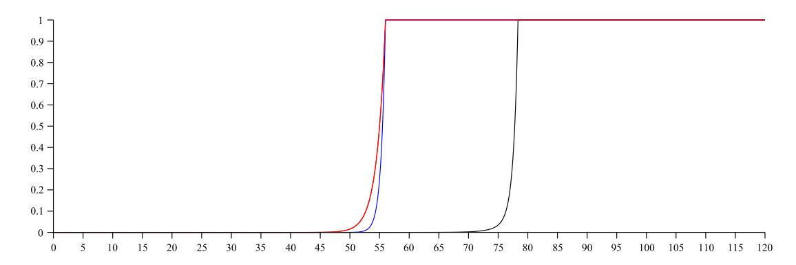
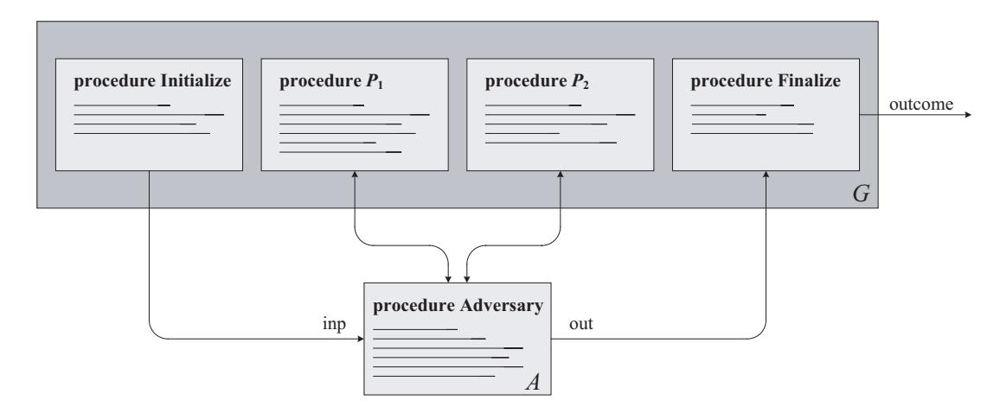

The proceedings version of this papers, entitled *The Security of Triple Encryption and a Framework for Code-Based Game-Playing Proofs*, appears in *Advances in Cryptology – Eurocrypt 2006*, LNCS vol. 4004, Springer, pp. 409–426, 2006. This is the full version of the paper.

# **Code-Based Game-Playing Proofs and the Security of Triple Encryption**

Mihir Bellare <sup>∗</sup> Phillip Rogaway †

November 27, 2008

(Draft 3.0)

#### **Abstract**

The game-playing technique is a powerful tool for analyzing cryptographic constructions. We illustrate this by using games as the central tool for proving security of three-key tripleencryption, a long-standing open problem. Our result, which is in the ideal-cipher model, demonstrates that for DES parameters (56-bit keys and 64-bit plaintexts) an adversary's maximal advantage is small until it asks about 2<sup>78</sup> queries. Beyond this application, we develop the foundations for game playing, formalizing a general framework for game-playing proofs and discussing techniques used within such proofs. To further exercise the game-playing framework we show how to use games to get simple proofs for the PRP/PRF Switching Lemma, the security of the basic CBC MAC, and the chosen-plaintext-attack security of OAEP.

**Keywords:** Cryptographic analysis techniques, games, provable security, triple encryption.

<sup>∗</sup>Department of Computer Science & Engineering, University of California at San Diego, 9500 Gilman Drive, La Jolla, California 92093 USA. E-mail: mihir@cs.ucsd.edu WWW: www.cse.ucsd.edu/users/mihir/

<sup>†</sup>Department of Computer Science, University of California at Davis, Davis, California, 95616, USA; and Department of Computer Science, Faculty of Science, Chiang Mai University, Chiang Mai 50200, Thailand. E-mail: rogaway@cs.ucdavis.edu WWW: www.cs.ucdavis.edu/∼rogaway/

## **Contents**

| 1 | Introduction                                                                                                                                                                                                                                                                                                                                                                           | 3                                                  |
|---|----------------------------------------------------------------------------------------------------------------------------------------------------------------------------------------------------------------------------------------------------------------------------------------------------------------------------------------------------------------------------------------|----------------------------------------------------|
| 2 | The PRP/PRF Switching Lemma                                                                                                                                                                                                                                                                                                                                                            | 7                                                  |
| 3 | The Game-Playing Framework                                                                                                                                                                                                                                                                                                                                                             | 9                                                  |
| 4 | The Security of Three-Key Triple-Encryption<br>4.1<br>Definitions<br>4.2<br>Results<br>4.3<br>Reduction to simplified adversary<br>4.4<br>Pseudorandomness of three correlated permutations<br><br><br>4.5<br>The improbability of forming a 3-chain<br><br>4.6<br>Putting together the pieces to conclude Theorem 4<br><br>4.7<br>Proof of Lemma 6<br><br>4.8<br>Proof of Lemma 7<br> | 14<br>14<br>14<br>15<br>17<br>18<br>18<br>19<br>23 |
| 5 | Elementary Proof for the CBC MAC                                                                                                                                                                                                                                                                                                                                                       | 25                                                 |
| 6 | A Game-Based Proof for OAEP                                                                                                                                                                                                                                                                                                                                                            | 28                                                 |
| 7 | Game-Rewriting Techniques<br>7.1<br>Game chains<br><br>7.2<br>Basic techniques<br><br>7.3<br>Coin fixing<br><br>7.4<br>Lazy sampling<br><br>                                                                                                                                                                                                                                           | 32<br>32<br>33<br>34<br>35                         |
|   | Acknowledgments                                                                                                                                                                                                                                                                                                                                                                        | 37                                                 |
|   | References                                                                                                                                                                                                                                                                                                                                                                             | 37                                                 |
| A | Fixing the PRP/PRF Switching Lemma Without Games                                                                                                                                                                                                                                                                                                                                       | 39                                                 |
| B | An Example Programming Language for Games                                                                                                                                                                                                                                                                                                                                              | 40                                                 |

### 1 Introduction

FOUNDATIONS AND APPLICATIONS. The game-playing technique has become a popular approach for doing proofs in cryptography. We will explain the method shortly. In this paper we take the initial steps in developing a theory of game-playing proofs. We believe that such a theory will prove beneficial for our field. Then we demonstrate the utility of game-playing by providing examples of the technique, the most striking of which is the first proof that triple-encryption (using three independent keys) is far more secure than single or double encryption. The result, which is in the ideal-cipher model, is the first to prove that the cascade of blockciphers can markedly improve security. Other examples that we work out with games include the PRP/PRF Switching Lemma, the PRF-security of the CBC MAC, and the chosen-plaintext-attack security for OAEP.

Why games? There are several reasons why we take a fresh look at the game-playing technique. First, the method is widely applicable, easily employed, and provides a unifying structure for diverse proofs. Games can be used in the standard model, the random-oracle model, the ideal-blockcipher model, and more; in the symmetric setting, the public-key setting, and further trust models; for simple schemes (eg, justifying the Carter-Wegman MAC) and complex protocols (eg, proving the correctness of a key-distribution protocol).

Second, the game-playing technique can lead to significant new results. We demonstrate this by developing a game-based proof for three-key triple encryption. Proving security for triple encryption is a well-known problem, but technical difficulties have always frustrated attempts at a solution.

Finally, we believe that the game-playing approach can lead to proofs that are less errorprone and more easily verifiable, even mechanically verifiable, than proofs grounded solely in more conventional probabilistic language. In our opinion, many proofs in cryptography have become essentially unverifiable. Our field may be approaching a crisis of rigor. While game-playing is not a panacea to this problem (which has at its core a significant cultural element), game-playing may play a role in the answer.

THE CASCADE CONSTRUCTION. The security of the cascade construction, where two or more independently keyed blockciphers are composed with one another, is a nearly 30-year-old problem [19, 36]. Even and Goldreich refer to it as a "critical question" in cryptography [21, p. 109]. They showed that the cascade of ciphers is at least as strong as the weakest cipher in the chain [21], while Maurer and Massey showed that, in a weaker attack model, it is at least as strong as the first cipher in the chain. We know that double encryption (the two-stage cascade) can't strengthen security much, due to the classic meet-in-the-middle attack [19], although Aiello, Bellare, Di Creczenzo, and Venkatesan show that the "shape" of the security curve is slightly improved [3]. This means that triple encryption (the three-stage cascade) is the shortest potentially "good" cascade. And, indeed, triple DES is the cascade that is widely standardized and used [38].

TRIPLE ENCRYPTION "WORKS." In this paper we prove that triple-encryption vastly improves security over single or double encryption. Given a blockcipher  $E: \{0,1\}^k \times \{0,1\}^n \to \{0,1\}^n$  with inverse D we consider  $\mathsf{Cascade}_E^{\mathsf{eee}}(K_0K_1K_2, X) = E_{K_2}(E_{K_1}(E_{K_0}(X)))$  and  $\mathsf{Cascade}_E^{\mathsf{ede}}(K_0K_1K_2, X) = E_{K_2}(D_{K_1}(E_{K_0}(X)))$ . Our results are the same for both versions of triple encryption. Following [22, 32, 44], we model E as a family of random permutations, one for each key, and we provide the adversary with oracle access to the blockcipher  $E(\cdot, \cdot)$  and its inverse  $E^{-1}(\cdot, \cdot)$  Given such oracles, the adversary is asked to distinguish between (a)  $\mathsf{Cascade}_E^{\mathsf{eee}}(K_0K_1K_2, \cdot)$  and its inverse, for a random key  $K_0K_1K_2$ , and (b) a random permutation on n bits and its inverse. We show that the adversary's advantage in making this determination,  $\mathsf{Adv}_{k,n}^{\mathsf{eee}}(q)$ , remains small until it asks about  $q = 2^{k+0.5 \, \mathrm{min}\{k,n\}}$  queries (the actual expression is more complex). The bound we get is



Figure 1: Upper bound on adversarial advantage (proven security) verses log<sup>2</sup> q (where q=number of queries) for the cascade construction, assuming key length k = 56 and block length n = 64. Single encryption is the leftmost curve, double encryption is the middle curve [3], and triple encryption in the rightmost curve, as given by Theorem 4.

plotted as the rightmost curve of Figure 1 for DES parameters k = 56 and n = 64. In this case an adversary must ask more than 277.<sup>79</sup> queries to get advantage 0.5. Also plotted are the security curves for single and double encryption, where the adversary must ask 2<sup>55</sup> and 255.<sup>5</sup> queries to get advantage 0.5. For a blockcipher with k = n = 64, the adversary must about 2<sup>89</sup> queries to get advantage 0.5. As there are matching attacks and security bounds for single and double encryption, our result proves that, in the ideal-cipher model, triple encryption is more secure than single or double encryption.

Our proof for triple-encryption uses game-playing in an integral way, first to recast the advantage we wish to bound to a simpler game, and later to analyze that game by investigating another one. Ultimately one is left with a game where conventional probabilistic reasoning (a special-purpose occupancy bound) can be applied. Game playing does not replace conventional probabilistic reasoning; it supplements it.

As for the cascade of - ≥ 4 blockciphers, the maximal advantage in our attack model is no worse than it is for triple encryption, so our result proves that cascade "works" (provides improved security over single and double encryption) for all - ≥ 3. It is an open question if security actually increases with increasing -.

What is the game-playing technique? One complication in any discussion about gameplaying proofs is that the term means different things to different people. To some, a game-playing proof in cryptography is any proof where one conceptualizes the adversary's interaction with its environment as a kind of game, the proof proceeding by stepwise refinement to that game. Viewed in this way, game-playing proofs have their origin in the earliest hybrid arguments, which began with Goldwasser and Micali [25] and Yao [50]. Bellare and Goldwasser provide an early example of an intricate proof of this flavor, demonstrating the security of a signature scheme that uses multiple cryptographic primitives [4]. In recent years Shoup has come to use such game-based proofs extensively [1, 16–18, 43, 45, 46, 48], as have other authors.

We believe that game-playing proofs can be most effectively studied and systematized by imposing some discipline on the process and, in particular, regarding games as code. This viewpoint begins in 1994 with Kilian and Rogaway [32]. Code-based game-playing soon became the favored technique of Rogaway, who, along with coauthors, used it in many subsequent papers [6, 10, 12– 14, 27, 28, 40–42]. Code-based game-playing typically works like this. Suppose you wish to upper bound the advantage of an adversary A in attacking some cryptographic construction. This is the difference between the probability that A outputs 1 in each of two different "worlds." First, write some code—a game—that captures the behavior of world 0. The code initializes variables, interacts with the adversary, and then runs some more. Then write another piece of code—a second game—that captures the behavior of world 1. Arrange that games 0 and 1 are *syntactically identical* apart from statements that follow the setting of a flag *bad* to true. Now invoke the "fundamental lemma of game playing" (which we formalize and prove in this paper) to say that, in this setup, the adversary's advantage is upper-bounded by the probability that *bad* gets set (in either game). Next, choose one of the two games and slowly transform it, modifying it in ways that increase or leave unchanged the probability that *bad* gets set, or decrease the probability that *bad* gets set by a bounded amount. In this way you produce a *chain* of games, ending at some *terminal* game. Bound the probability that *bad* gets set in the terminal game using conventional (not game-based) techniques.

Formalizing the foundations. In our treatment games are code and not abstract environments; as we develop it, game-playing centers around making disciplined transformations to code. The code can be written in pseudocode or a formalized programming language L. We will describe a sample programming language for writing games, using it (apart from some "syntactic sugar") in our examples.

Under our framework, a game G is a program that is *run* with an adversary A, which is also a program (look ahead to Figure 3). The adversary calls out to procedures, called *oracles*, specified by the game. We define what it means for two games to be identical-until-*bad*, where *bad* is a boolean variable in the game. This is a syntactical condition. We prove that if two games are identical-until-*bad* then the difference in the probabilities of a given outcome is bounded by the probability that *bad* gets set (in either game). This result, the *fundamental lemma of game-playing*, is the central tool justifying the technique.

We go on to give describe some general lemmas and techniques for analyzing the probability that *bad* gets set. Principle among these is a lemma that lets you change anything you want after the flag *bad* gets set. Other techniques speak to eliminating adaptivity, de-randomization, making "lazy" probabilistic choices, resampling, using "poisoned" points, and so forth.

Further applications. We illustrate the applicability of games in a wide variety of settings, providing results in the standard model, the random-oracle model [9], and the ideal-cipher model, and in both the symmetric and asymmetric settings.

We begin with a motivating observation, due to Tadayoshi Kohno, that the standard proof of the PRP/PRF Switching Lemma ([30, Theorem 5.1], [5], and [29]) contains an error in reasoning about conditional probabilities. (The lemma says that an adversary that asks q queries can distinguish with advantage at most q2/2n+1 a random permutation on n-bits from a random function of nbits to n-bits.) We regard this as evidence that reasoning about cryptographic constructions via conditional probabilities can be subtle and error-prone even in the simplest of settings. This motivates our use of games as an alternative. We re-prove the Switching Lemma with a simple game-based proof.

Next we look at the CBC MAC. Let **Adv**cbc n,m(q) denote the maximum advantage that an adversary restricted to making at most q oracle queries can obtain in distinguishing between (1) the m-block CBC MAC, keyed by a random permutation on n bits, and (2) a random function from mn-bits to n-bits. A result of Bellare, Kilian, and Rogaway [5] says that **Adv**cbc n,m(q) ≤ 2m2q2/2n. But the proof [5] is very complex and does not directly capture the intuition behind the security of the scheme. Here we use games to give an elementary proof for an m2q2/2<sup>n</sup> bound, the proof directly capturing, in our view, the underlying intuition.

Finally, we give an example of using games in the public-key, random-oracle setting by proving that OAEP [8] with any trapdoor permutation is an IND-CPA secure encryption scheme. The original proof of this result [8] was hard to follow or verify; the new proof is simpler and clearer, and illustrates the use of games in a computational rather than information-theoretic setting.

FURTHER RELATED WORK. The best-known attack on three-key triple-encryption is due to Lucks [33]. He does not work out an explicit lower bound for  $\mathbf{Adv}_{k,n}^{\text{eee}}(q)$  but in the case of triple-DES the advantage becomes large by  $q=2^{90}$  queries. We prove security to about  $2^{78}$  queries, so there is no contradiction

The DESX construction has been proven secure up to about  $2^{k+n-\lg m}$  blockcipher queries for key length k, block length n, and m queries to the construction [32]. This is stronger than our bound for triple encryption when the adversary can obtain few points encrypted by the construction, a weaker bound otherwise.

Double encryption and two-key triple encryption were analyzed Aiello, Bellare, Di Crescenzo, and Venkatesan [3], where it is shown that the meet-in-the-middle attack is optimal (in the ideal-cipher model). Their result is the first to show that the cascade construction buys you *something* (half a bit of security for advantage 0.5), but what it buys is inherently limited, because of the meet-in-the-middle attack. We comment that games provide an avenue to a much simpler proof of their result.

With motivation similar to our own, Maurer develops a framework for the analysis of cryptographic constructions and applies it to the CBC MAC and other examples [34]. Vaudenay has likewise developed a framework for the analysis of blockciphers and blockcipher-based constructions, and has applied it to the encrypted CBC MAC [49]. Neither Maurer's nor Vaudenay's approach is geared towards making stepwise, code-directed refinements for computing a probability.

A more limited and less formal version of the Fundamental Lemma appears in [6, Lemma 7.1]. A lemma by Shoup [45, Lemma 1] functions in a similar way for games that are not necessarily code-based.

Shoup has independently and contemporaneously prepared a manuscript on game playing [47]. It is more pedagogically-oriented than this paper. Shoup does not try to develop a theory for game playing beyond [45, Lemma 1]. As with us, one of Shoup's examples is the PRP/PRF Switching Lemma.

In response to a web distribution of this paper, Bernstein offers his own proof for the CBC MAC [11], re-obtaining the conventional bound. Bernstein sees no reason for games, and offers his own explanation for why cryptographic proofs are often complex and hard to verify: author incompetence with probability.

In work derivative of an earlier version of this paper, Bellare, Pietrzak, and Rogaway [7] improve the bound  $\mathbf{Adv}_{n,m}^{\text{cbc}}(q) \leq m^2 q^2/2^n$  of [5, 34] to about  $mq^2/2^n$ , and consider generalizations to this claim as well. The proof of [7] springs from games, refining the game used here for the CBC MAC and then analyzing it using techniques derivative of [20].

Following the web distribution of this paper, Halevi argues for the creation of an automated tool to help write and verify game-based proofs [26]. We agree. The possibility for such tools has always been one of our motivations, and one of the reasons why we focused on code-based games.

Gaži and Maurer [24] pointed out a couple of bugs that we corrected in draft 3.0. Game H is now parameterized by a permutation S and a formerly missing factor of 3 now appears in the second terms of (14). A consequence is that the claimed bound for triple DES was reduced from  $2^{78.5}$  to  $2^{77.79}$ . Gaži and Maurer also provide an alternative proof for the security of triple encryption using Maurer's framework [34] and extend the result to longer cascades.

WHY SHOULD GAME-PLAYING WORK? It is fair to ask if anything is actually "going on" when using games—couldn't you recast everything into more conventional probabilistic language and drop all that ugly code? Our experience is that it does not work to do so. The kind of probabilistic statements and thought encouraged by the game-playing paradigm seems to be a better fit, for

many cryptographic problems, than that which is encouraged by (just) defining random-variables, writing conventional probability expressions, conditioning, and the like. Part of the power of the approach stems from the fact that pseudocode is the most precise and easy-to-understand language we know for describing the sort of probabilistic, reactive environments encountered in cryptography, and by remaining in that domain to do ones reasoning you are better able to see what is happening, manipulate what is happening, and validate the changes.

## 2 The PRP/PRF Switching Lemma

THE LEMMA. The natural and conventional assumption to make about a blockcipher is that it behaves as a pseudorandom permutation (PRP). However, it usually turns out to be easier to analyze the security of a blockcipher-based construction assuming the blockcipher is secure as a pseudorandom function (PRF). The gap is then bridged (meaning, a result about the security of the construct assuming the blockcipher is a PRP is obtained) using the following lemma. In what follows, we denote by  $A^P \Rightarrow 1$  the event that adversary A, equipped with an oracle P, outputs the bit 1. Let Perm(n) be the set of all permutations on  $\{0,1\}^n$  and let Func(n) be the set of all functions from  $\{0,1\}^n$  to  $\{0,1\}^n$ . We assume below that  $\pi$  is randomly sampled from Perm(n) and  $\rho$  is randomly sampled from Func(n).

**Lemma 1** [PRP/PRF Switching Lemma] Let  $n \ge 1$  be an integer. Let A be an adversary that asks at most q oracle queries. Then

$$\left|\Pr\left[A^{\pi} \Rightarrow 1\right] - \Pr\left[A^{\rho} \Rightarrow 1\right]\right| \leq \frac{q(q-1)}{2^{n+1}}$$
.

In this section we point to some subtleties in the "standard" proof of this widely used result, as given for example in [5, 29, 30], showing in particular that one of the claims made in these proofs is incorrect. We then show how to prove the lemma in a simple and correct way using games. This example provides a gentle introduction to the game-playing technique and a warning about perils of following ones intuition when dealing with conditional probability in provable-security cryptography.

THE STANDARD PROOF. The standard analysis proceeds as follows. Let Coll ("collision") be the event that A, interacting with oracle  $\rho \stackrel{\$}{\leftarrow} \operatorname{Func}(n)$ , asks distinct queries X and X' that return the same answer. Let DIST ("distinct") be the complementary event. Now

$$\Pr[A^{\pi} \Rightarrow 1] = \Pr[A^{\rho} \Rightarrow 1 \mid \text{Dist}]$$
 (1)

since a random permutation is the same as a random function in which everything one obtains from distinct queries is distinct. Letting x be this common value and  $y = \Pr[A^{\rho} \Rightarrow 1 \mid \text{Coll}]$  we have

$$\begin{aligned} |\Pr[A^{\pi} \Rightarrow 1] - \Pr[A^{\rho} \Rightarrow 1]| &= |x - x \Pr[\text{Dist}] - y \Pr[\text{Coll}]| &= |x(1 - \Pr[\text{Dist}]) - y \Pr[\text{Coll}]| \\ &= |x \Pr[\text{Coll}] - y \Pr[\text{Coll}]| &= |(x - y) \Pr[\text{Coll}]| \leq \Pr[\text{Coll}] \end{aligned}$$

where the final inequality follows because  $x, y \in [0, 1]$ . One next argues that  $\Pr[\text{Coll}] \leq q(q - 1)/2^{n+1}$  and so the Switching Lemma follows.

Where is the error in the simple proof above? It's at equation (1): it needn't be the case that  $\Pr[A^{\pi} \Rightarrow 1] = \Pr[A^{\rho} \Rightarrow 1 \mid \text{DIST}]$ , and the sentence we gave by way of justification was mathematically meaningless. Here is a simple example to demonstrate that  $\Pr[A^{\pi} \Rightarrow 1]$  can be different from  $\Pr[A^{\rho} \Rightarrow 1 \mid \text{DIST}]$ . Let n = 1 and consider the following adversary A with oracle  $P: \{0, 1\} \to \{0, 1\}$ :

#### procedure Adversary A

```
procedure P(X) Game S0
100 Y $
    ← {0, 1}n Game S1
101 if Y ∈ image(π) then bad ← true, Y $
                      ← image(π)
102 return π[X] ← Y
```

Figure 2: Games used in the proof of the Switching Lemma. Game S<sup>1</sup> includes the boxed statement and S<sup>0</sup> doesn't.

if
$$P(0) = 0$$
 then return 1
else if  $P(1) = 1$  then return 1 else return 0

We claim that

$$\Pr[A^{\pi} \Rightarrow 1] = 1/2$$
 and  $\Pr[A^{\rho} \Rightarrow 1 \mid \text{Dist}] = 2/3$ .

The first equation is true because there are two possibilities for (π(0), π(1)), namely (0, 1),(1, 0), and A returns 1 for one of them, namely (0, 1). On the other hand, there are four possibilities for (ρ(0), ρ(1)), namely (0, 0),(0, 1),(1, 0),(1, 1). The event A<sup>ρ</sup> ⇒ 1 ∧ Dist is true for two of them, namely (0, 0),(0, 1), while the event Dist is true for three of them, namely (0, 0),(0, 1),(1, 0). Thus Pr[A<sup>ρ</sup> ⇒ 1 ∧ Dist]/Pr[Dist]=2/3.

Notice that the number of oracle queries made by the adversary of this counterexample varies, being either one or two, depending on the reply it receives to its first query. This turns out to be crucial in making equation (1) fail, in that if A always makes exactly q oracle queries (regardless of A's coins and the answers returned to its queries) then equation (1) is true. (This was pointed out by Kohno, and his argument is re-produced in Appendix A.) Since one can always first modify A to make exactly q queries without altering Pr[A<sup>ρ</sup> ⇒ 1] or Pr[A<sup>π</sup> ⇒ 1], we would be loath to say that the proofs in [5, 29, 30] are incorrect. But the authors make claim (1), and view it as "obvious," without restricting the adversary to exactly q queries, masking a subtlety that is not apparent at a first (or even second) glance.

The fact that one can write something like (1) and people assume this to be correct, and even obvious, suggests to us that the language of conditional probability may often be unsuitable for thinking about and dealing with the kind of probabilistic scenarios that arise in cryptography. Games may more directly capture the desired intuition. Let us use them to give a correct proof.

Game-based proof. Assume without loss of generality (since A's oracle is deterministic) that A never asks an oracle query twice. We imagine answering A's queries by running one of two games. Instead of thinking of A as interacting with a random permutation oracle π \$ ← Perm(n), think of it as interacting with the Game S<sup>1</sup> shown in Figure 2. Instead of thinking of A as interacting with a random function oracle ρ \$ ← Func(n), think of A as interacting with the game S<sup>0</sup> shown in the same figure. Game S<sup>0</sup> is game S<sup>1</sup> without the boxed statement. By convention, the boolean variable *bad* is initialized to false while the array π begins everywhere undefined. The games make available to A an oracle which has a formal name, in this case P. Adversary A can query this oracle with a string X ∈ {0, 1}n, in which case the code following the procedure P(X) line is executed and the value in the return statement is provided to A as the response to its oracle query. As the game runs, we fill-in values of π[X] with n-bit strings. At any point in time, we let image(π) be the set of all n-bit strings Y such that π[X] = Y for some X. Let image(π) be the complement of this set relative to {0, 1}n. Let A<sup>S</sup> ⇒ 1 denote the event that A outputs 1 in game S ∈ {S0, S1}.

Notice that the adversary never sees the flag *bad*. The flag will play a central part in our analysis, but it is not something that the adversary can observe. It's only there for our bookkeeping. What *does* adversary A see as it plays game S0? Whatever query X it asks, the game returns a random

*n*-bit string Y. So game  $S_0$  perfectly simulates a random function  $\rho \stackrel{\$}{\leftarrow} \operatorname{Func}(n)$  (remember that the adversary isn't allowed to repeat a query) and  $\Pr[A^{\rho} \Rightarrow 1] = \Pr[A^{S_0} \Rightarrow 1]$ . Similarly, if we're in game  $S_1$ , then what the adversary gets in response to each query X is a random point Y that has not already been returned to A. The behavior of a random permutation oracle is exactly this, too. (This is guaranteed by what we will call the "principle of lazy sampling.") So  $\Pr[A^{\pi} \Rightarrow 1] = \Pr[A^{S_1} \Rightarrow 1]$ . We complete the proof via the following chain of inequalities, the first of which we have just justified:

$$|\Pr[A^{\pi} \Rightarrow 1] - \Pr[A^{\rho} \Rightarrow 1]| = |\Pr[A^{S_1} \Rightarrow 1] - \Pr[A^{S_0} \Rightarrow 1]|$$

$$\leq \Pr[A^{S_0} \text{ sets } bad]$$
(2)

$$\leq q(q-1)/2^{n+1} . (3)$$

Above, " $A^{S_0}$  sets bad" refers to the event that the flag bad is set to true in the execution of A with game  $S_0$ . We justify (2) by appealing to the fundamental lemma of game playing (Lemma 2), which says that whenever two games are written so as to be syntactically identical except for things that immediately follow the setting of bad, the difference in the probabilities that A outputs 1 in the two games is bounded by the probability that bad is set in either game. (It actually says something a bit more general, as we will see.) We justify (3) by observing that, by the union bound, the probability that a Y will ever be in image( $\pi$ ) at line 101 is at most  $(1 + 2 + \cdots + (q - 1))/2^n = q(q - 1)/2^{n+1}$ . This completes the proof.

Counter-example above fares in the game-playing proof. A computation shows that

$$\Pr[A^{S_0} \Rightarrow 1] = 3/4$$
,  $\Pr[A^{S_1} \Rightarrow 1] = 1/2$ , and  $\Pr[A^{S_0} \text{ sets } bad] = 1/4$ .

So none of the equalities or inequalities that arose in the game-playing proof are violated.

## 3 The Game-Playing Framework

PROGRAMMING LANGUAGE. A game is a program, viewed as a collection of procedures, and the adversary is likewise a program, but one consisting of a single procedure. We will, for the moment, regard games and adversaries as being written in pseudocode. Below we outline some elements of our pseudocode. We find that a pseudocode-based descriptive language is adequate to make game-playing unambiguous and productive. To make a truly rigorous theory one should, in fact, fully specify the underlying programming language. In Appendix B we provide an example language  $\mathcal L$  suitable for describing games and adversaries (we specify the syntax but dispense with the operational semantics, which should be clear). The games of this paper conform to the syntax of  $\mathcal L$  apart from some minor matters.

Our programming language is strongly typed, with the type of each variable apparent from its usage (we dispense with explicit declarations). We will have variables of type integer, boolean, string, set, and array. A set is a finite set of strings and an array is an associative array, one taking on values of strings. The semantics of a boolean variable, which we will also call a *flag*, is that once true it stays true.

We allow conventional statements like if statements, for statements, and assignment statements. There is also a random-assignment statement, which is the only source of randomness in programs. Such a statement has the form  $s \stackrel{\$}{\leftarrow} S$  where S is a finite set. The result is to uniformly select a random element from the set S and assign it to s. If  $S = \emptyset$  or S = undefined (we regard undefined as a possible value for a variable) then the result of the random-assignment statement is to set s to undefined. A comma or newline serves as a statement separator and indentation is used to indicate grouping.



Figure 3: Running a game G with an adversary A. The game is the code at the top, the adversary is the code at the bottom. The adversary interacts with the game by calling the oracles provided (two of which are shown).

A game has three kinds of procedures: an initialization procedure (Initialize), a finalization procedure (Finalize), and named oracles (each one a procedures). The adversary can make calls to the oracles, passing in values from some finite domain associated to each oracle. The initialization or finalization procedures may be absent, and often are, and there may be any number of oracles, including none. All variables in a game are global variables and are not visible to the adversary's code. All variables in adversary code are local.

Running a game. We can *run* a game G with an adversary A. To begin, variables are given initial values. Integer variables are initialized to 0; boolean variables are initialized to false; string variables are initialized to the empty string ε; set variables are initialized to the empty set ∅; and array variables hold the value undefined at every point. These conventions facilitate omitting explicit initialization code in many cases.

The Initialize procedure is the first to execute, possibly producing an output *inp*. This is provided as input to the procedure Adversary, denoted A, which now runs. The adversary code can make oracle queries via statements of the form y ← P(···) for any oracle P that has been defined in the game. The result is to assign to y the value returned by the procedure call. We assume that the game and adversary match syntactically, meaning that all the oracle calls made by the adversary are to oracles specified in the game, and with arguments that match in type or quantity. The semantics of a call is call-by-value; the only way for an oracle to return a value to the adversary is via a return statement. When adversary A halts, possibly with some output *out*, we call the Finalize procedure, providing it any output produced by A. The Finalize procedure returns a string that is the outcome of the game. If we omit specifying Initialize or Finalize it means that these procedures do nothing: they compute the identity function.

Termination and finite randomness. We assume that an underlying execution model provides a notion for the number of steps (the running time) of a program. We require that both the adversary and the game always terminate in finite time. By this we mean that, for any adversary A there must exist an integer T such that A always halts within T steps (regardless of the random choices A makes and the answers it receives to its oracle queries). Similarly, for any game G there must exist an integer T such that G always halts within T steps (regardless of the random choices made, Initialize halts within T steps, and, regardless of the inputs they are provided, Finalize and the oracles halt within T steps). The finite-termination requirement is guaranteed automatically by our sample programming language L.

Since the adversary and game terminate in finite time, there must be an integer T such that they each execute at most T random-assignment statements, and there must be an integer B such that the size of the set S in any random-assignment statement s \$ ← S executed by the adversary or the game is at most B. Taken together, this means that the execution of G with A uses *finite randomness*, meaning G and A are underlain by a finite sample space Ω. Thus probabilities are well-defined and henceforth we can talk about the probabilities of various events in the execution.

Adversary and game outputs. We associate two outputs to the process of running a game with an adversary. The first, called the adversary output, is the value *out* returned by A after it has completed its interaction with the oracles provided by the game. The second, called the game output, is the value *outcome* returned by the Finalize procedure. Often the two outputs are the same, because the Finalize procedure is not specified (whence we define it to do nothing but pass on its input as its output).

The adversary and game outputs can be regarded as random variables. We write Pr[A<sup>G</sup> ⇒ 1] for the probability that the adversary output is 1 when we run game G with adversary A, and Pr[G<sup>A</sup> ⇒ 1] for the probability that the game output is 1 when we run game G with adversary A.

Advantages. If G and H are games and A is an adversary, let

$$\mathbf{Adv}(A^G, A^H) = \Pr[A^G \Rightarrow 1] - \Pr[A^H \Rightarrow 1]$$
 and  $\mathbf{Adv}(G^A, H^A) = \Pr[G^A \Rightarrow 1] - \Pr[H^A \Rightarrow 1]$ .

These represent the advantage of the adversary in distinguishing the games, the first measured via adversary output and the second via game output. We refer to the first as the *adversarial advantage* and the second as the *game advantage*. We say that G, H are *adversarially indistinguishable* if for any adversary A it is the case that **Adv**(AG, AH) = 0, and *equivalent* if, for any adversary A it is the case that **Adv**(GA, HA) = 0. We will often use the fact that

$$\mathbf{Adv}(A^G, A^I) = \mathbf{Adv}(A^G, A^H) + \mathbf{Adv}(A^H, A^I)$$
(4)

$$\mathbf{Adv}(G^A, I^A) = \mathbf{Adv}(G^A, H^A) + \mathbf{Adv}(H^A, I^A)$$
 (5)

for any games G, H, I and any adversary A. These will be referred to as the *triangle equalities*.

We will usually be interested in adversarial advantage (eg, this is the case in the game-playing proof of the PRP/PRF Switching Lemma). Game advantage is useful when we are interested in how the adversary's output relates to some game variable such as a hidden bit chosen by the game (this happens in our proof of the security of OAEP).

Identical-until-*bad* games. We are interested in programs that are syntactically identical except for statements that follow the setting of a flag *bad* to true. Somewhat more precisely, let G and H be programs and let *bad* be a flag that occurs in both of them. Then we say that G and H are *identical-until-bad* if their code is the same except that there might be places where G has a statement *bad* ← true, S while game H has a corresponding statement *bad* ← true, T for some T that is different from S. As an example, in the games S<sup>0</sup> and S<sup>1</sup> from Figure 2, the former has the empty statement following *bad* ← true while in S<sup>1</sup> we have Y \$ ← image(π) following *bad* ← true. Since this is the only difference in the programs, the games are identical-until-*bad*. One could also say that G and H are are identical-until-*bad* if one has the statement if *bad* then S where the other has the empty statement, for this can be rewritten in the form above.

A fully formal definition of identical-until-*bad* requires one to pin down the programming language and talk about the parse trees of programs in the language. We establish the needed language in Appendix B but, in fact, such formality isn't needed in applications: for any two games one writes down, whether or not they are identical-until-*bad* is obvious. We emphasize that identical-until-*bad* is a purely "syntactic" requirement.

We write  $\Pr[A^G \text{ sets } bad]$  or  $\Pr[G^A \text{ sets } bad]$  to refer to the probability that the flag bad is true at the end of the execution of the adversary A with game G, namely at the point when the Finalize procedure terminates. It is easy to see that, for any flag bad, identical-until-bad is an equivalence relation on games. When we say that a sequence of games  $G_1, G_2, \ldots$  are identical-until-bad, we mean that each pair of games in the sequence are identical-until-bad.

THE FUNDAMENTAL LEMMA. The fundamental lemma says that the advantage that an adversary can obtain in distinguishing a pair of identical-until-bad games is at most the probability that its execution sets bad in one of the games (either game will do).

**Lemma 2** [Fundamental lemma of game-playing] Let G and H be identical-until-bad games and let A be an adversary. Then

$$\mathbf{Adv}(A^G, A^H) \leq \Pr[A^G \text{ sets } bad] \quad and$$
 (6)

$$\mathbf{Adv}(G^A, H^A) \leq \Pr[G^A \text{ sets } bad].$$
 (7)

More generally, let G, H, I be identical-until-bad games. Then

$$\left| \mathbf{Adv}(A^G, A^H) \right| \le \Pr[A^I \text{ sets } bad] \quad and$$
 (8)

$$|\mathbf{Adv}(G^A, H^A)| \leq \Pr[I^A \text{ sets } bad].$$
 (9)

**Proof:** Statement (6) follows from (7) by applying the latter to games G', H' formed by replacing the Finalize procedure of games G, H, respectively, with the trivial one that simply returns the adversary output. Similarly, (8) follows from (9). We will now prove (7) and then derive (9) from it.

We have required that the adversary and game always terminate in finite time, and also that there is an integer that bounds the size of any set S in any random-assignment statement  $s \stackrel{\$}{\leftarrow} S$  executed by the adversary or game. This means that there exists an integer b such that the execution of G with A and the execution of H with A perform no more than b random-assignment statements, each of these sampling from a set of size at most b. Let  $C = \text{Coins}(A, G, H) = [1 \dots b!]^b$  be the set of b-tuples of numbers, each number between 1 and b!. We call C the coins for (A, G, H). For  $c = (c_1, \dots, c_b) \in C$ , the execution of G with A on coins c is defined as follows: on the i<sup>th</sup> random-assignment statement, call it  $X \stackrel{\$}{\leftarrow} S$ , if  $S = \{a_0, \dots, a_{m-1}\}$  is nonempty and  $a_0 < a_1 < \dots < a_{m-1}$  in lexicographic order then let X take on the value  $a_{c_i \mod m}$ . If  $S = \emptyset$  then let X take on the value undefined. This way to perform random-assignment statements is done regardless of whether it is A or one of the procedures from G that is is performing the random-assignment statement. Notice that m will divide b! and so if c is chosen at random from C then the mechanism above will return a point X drawn uniformly from S, and also the return values for each random-assignment statement are independent. For  $c \in C$  we let  $G^A(c)$  denote the output of G when G is executed with A on coins c. We define the execution of H with A on coins  $c \in C$ , and  $H^A(c)$ , similarly.

Let  $CG_{\text{one}} = \{c \in C : G^A(c) \Rightarrow 1\}$  be the set of coins  $c \in C$  such that G outputs 1 when executed with A on coins c. Partition  $CG_{\text{one}}$  into  $CG_{\text{one}}^{\text{bad}}$  and  $CG_{\text{one}}^{\text{good}}$ , where  $CG_{\text{one}}^{\text{bad}}$  is the set of all  $c \in CG_{\text{one}}$  such that the execution of G with A on coins c sets bad and  $CG_{\text{one}}^{\text{good}} = CG_{\text{one}} \setminus CG_{\text{one}}^{\text{bad}}$ . Similarly define  $CH_{\text{one}}$ ,  $CH_{\text{one}}^{\text{bad}}$  and  $CH_{\text{one}}^{\text{good}}$ . Observe that because games G and H are identical-until-bad, an element  $c \in C$  is in  $CG_{\text{one}}^{\text{good}}$  iff it is in  $CH_{\text{one}}^{\text{good}}$ . Thus these sets are equal and in particular have

the same size. Now we have

$$\begin{split} \Pr[G^A \Rightarrow 1] - \Pr[A^H \Rightarrow 1] &= \frac{|CG_{\text{one}}|}{|C|} - \frac{|CH_{\text{one}}|}{|C|} &= \frac{|CG_{\text{one}}^{\text{bad}}| + |CG_{\text{one}}^{\text{good}}| - |CH_{\text{one}}^{\text{good}}| - |CH_{\text{one}}^{\text{bad}}|}{|C|} \\ &= \frac{|CG_{\text{one}}^{\text{bad}}| - |CH_{\text{one}}^{\text{bad}}|}{|C|} \leq \frac{|CG_{\text{one}}^{\text{bad}}|}{|C|} \leq \frac{|CG^{\text{bad}}|}{|C|} &= \Pr[G^A \text{ sets } bad] \;. \end{split}$$

This completes the proof of (7). Now, if G, H are identical-until-bad then (7) tells us that

$$\mathbf{Adv}(G^A, H^A) \leq \Pr[G^A \text{ sets } bad]$$
 and  $\mathbf{Adv}(H^A, G^A) \leq \Pr[H^A \text{ sets } bad]$ .

However, if G, H, I are all identical-until-bad, then Proposition 3 says that

$$\Pr[G^A \text{ sets } bad] = \Pr[H^A \text{ sets } bad] = \Pr[I^A \text{ sets } bad].$$

Thus we have established (9).

We have used finite randomness in our proof of the Fundamental Lemma, but we comment that this is more for simplicity than necessity: probabilities over the execution of G with A can be defined quite generally, even when the underlying sample space is infinite, and the Fundamental Lemma can still be proved. But we have never encountered any situation where such an extension is useful.

AFTER BAD IS SET, NOTHING MATTERS. One of the most common manipulations of games along a game chain is to change what happens after *bad* gets set to true. Often one expunges code that follows the setting of *bad*, as we did in the PRP/PRF Switching Lemma,but it is also fine to insert alternative code. Any modification following the setting of *bad* leaves unchanged the probability of setting *bad*, as the following result shows.

**Proposition 3** [After bad is set, nothing matters] Let G and H be identical-until-bad games. Let A be an adversary. Then  $Pr[G^A \text{ sets bad}] = Pr[H^A \text{ sets bad}]$ .

**Proof:** Using the definition from the proof of Lemma 2, fix coins C = Coins(A, G, H) and execute  $G^A$  and  $H^A$  in the manner we described using these coins. Let  $CG^{\text{bad}} \subseteq C$  be the coins that result in bad getting set to true when we run  $G^A$ , and let  $CH^{\text{bad}} \subseteq C$  be the coins that result in bad getting set to true when we run  $H^A$ . Since G and H are identical-until-bad, each  $c \in C$  causes bad to be set to true in  $G^A$  iff it causes bad to be set to true in  $H^A$ . Thus  $CG^{\text{bad}} = CH^{\text{bad}}$  and hence  $|CG^{\text{bad}}| = |CH^{\text{bad}}|$  and  $|CG^{\text{bad}}|/|C| = CH^{\text{bad}}|/|C|$ , which is to say that  $\Pr[G^A \text{ sets } bad] = \Pr[H^A \text{ sets } bad]$ .

Besides the lemma above, many other ways to manipulate games are illustrated by our examples and our discussion in Section 7.

Game inputs. The setting discussed above can be extended to allow a game to take an input parameter: the Initialize procedure would take an optional input that is a string parameter input. The adversary and game outputs will now be denoted  $\Pr[A^G(input) \Rightarrow 1]$  and  $\Pr[G^A(input) \Rightarrow 1]$  respectively. Similarly, the advantages become  $\mathbf{Adv}(A^G(input), A^H(input))$  and  $\mathbf{Adv}(G^A(input), H^A(input))$ , these being defined in the obvious ways. The definition of identical-until-bad obviously extends to games with inputs, as does the Fundamental Lemma.

We can imagine that it might be convenient for games to have inputs, for example in the asymptotic setting where *input* might be the security parameter, but our experience has been that it is not really necessary. Rather than giving a game an input *input*, we can usually imagine a family of games, one for each value of *input*, and reason about these; since the games are involved only in the analysis, this usually suffices. Accordingly our treatment of games omits explicit game inputs.

### 4 The Security of Three-Key Triple-Encryption

In this section we show that, in the ideal-cipher model, triple encryption dramatically increases security compared to single (or double) encryption. The result covers both EEE-style triple encryption and EDE-style triple encryption.

#### 4.1 Definitions

Let  $E: \{0,1\}^k \times \{0,1\}^n \to \{0,1\}^n$  be a blockcipher with key length k and block length n. For  $K \in \{0,1\}^k$  and  $X \in \{0,1\}^n$  let  $E_K(X) = E(K,X)$ . Let  $E^{-1}: \{0,1\}^k \times \{0,1\}^n \to \{0,1\}^n$  be the blockcipher that is the inverse of E. We associate to E two blockciphers formed by composition; denoted  $\mathsf{Cascade}_E^{\mathsf{eee}}$ ,  $\mathsf{Cascade}_E^{\mathsf{eee}}: \{0,1\}^{3k} \times \{0,1\}^n \to \{0,1\}^n$ , these are defined as

$$\mathsf{Cascade}_E^{\mathrm{eee}}(K_0K_1K_2,\ X) \ = \ E_{K_2}(E_{K_1}(E_{K_0}(X))) \quad \text{and} \quad \\ \mathsf{Cascade}_E^{\mathrm{ede}}(K_0K_1K_2,\ X) \ = \ E_{K_2}(D_{K_1}(E_{K_0}(X)))$$

for all  $K_0, K_1, K_2 \in \{0, 1\}^k$  and  $X \in \{0, 1\}^n$ . These blockciphers have key length 3k and block length n and are sometimes referred to as the *three-key* forms of triple encryption. We will call the two methods EEE and EDE, respectively. There is also a *two-key* variant of triple encryption, obtained by setting  $K_0 = K_2$ , but we do not investigate it since the method admits comparatively efficient attacks [36].

We will be working in the ideal-blockcipher model, as in works like [3,22,32]. Let  $\operatorname{Bloc}(k,n)$  be the set of all blockciphers  $E \colon \{0,1\}^k \times \{0,1\}^n \to \{0,1\}^n$ . Thus  $E \stackrel{\$}{\leftarrow} \operatorname{Bloc}(k,n)$  means that  $E_K \colon \{0,1\}^n \to \{0,1\}^n$  is a random permutation on n-bit strings for each  $K \in \{0,1\}^k$ . We consider an adversary A that can make four types of oracle queries: T(X),  $T^{-1}(Y)$ , E(K,X), and  $E^{-1}(K,Y)$ , where  $X,Y \in \{0,1\}^n$  and  $K \in \{0,1\}^k$ . (As for our syntax,  $T,T^{-1}$ ,  $E,E^{-1}$  are formal symbols, not specific functions.) The advantage of A against EEE and the maximal advantage against EEE obtainable using q queries are defined as

$$\mathbf{Adv}_{k,n}^{\mathrm{eee}}(A) \ = \ \mathbf{Adv}(A_0^C, A_0^R) \quad \text{and} \quad \mathbf{Adv}_{k,n}^{\mathrm{eee}}(q) \ = \ \max_{A} \left\{ \ \mathbf{Adv}_{k,n}^{\mathrm{eee}}(A) \ \right\}$$

where the games  $C_0$ ,  $R_0$  are shown in Figure 4 and the maximum is over all adversaries A that make at most q oracle queries (that is, a total of q across all four oracles). The advantage of A measures its ability to tell whether  $T(\cdot)$  is a random permutation or is  $\mathsf{Cascade}_E^{\mathsf{eee}}(K_0K_1K_2, \cdot)$  for  $K_0K_1K_2$  chosen independently at random from  $\{0,1\}^{3k}$  and where E realizes a random blockcipher and  $T^{-1}$ ,  $E^{-1}$  realize inverses of T, E, respectively.

Define the query threshold  $\mathbf{QTh}_{1/2}^{\text{eee}}(k,n)$  as the largest integer q for which  $\mathbf{Adv}_{k,n}^{\text{eee}}(q) \leq 1/2$ . We will regard EEE as being secure up to  $\mathbf{QTh}_{1/2}^{\text{eee}}(k,n)$  queries. Let  $\mathbf{Adv}_{k,n}^{\text{ede}}(A)$ ,  $\mathbf{Adv}_{k,n}^{\text{ede}}(q)$ , and  $\mathbf{QTh}_{1/2}^{\text{ede}}(k,n)$  be defined in the analogous way.

#### 4.2 Results

We are now ready to state our result about the security of triple encryption.

**Theorem 4** [Security of triple-encryption] Let  $k, n \ge 2$ . Let  $\alpha = \max(2e2^{k-n}, 2n + k)$ . Then

$$\mathbf{Adv}_{k,n}^{\text{eee}}(q) \leq 12\alpha \frac{q^2}{2^{3k}} + 10.7 \left(\frac{q}{2^{k+n/2}}\right)^{2/3} + \frac{12}{2^k} \,. \quad \blacksquare$$
 (10)

We display the result graphically in Figure 1 for DES parameters k = 56 and n = 64. Our bound implies that  $\mathbf{QTh}_{1/2}^{\text{eee}}(k,n)$  is, very roughly, about  $2^{k+\min(k,n)/2}$ , meaning that EEE is secure up to this many queries.

For EDE the result is the same, meaning that  $\mathbf{Adv}_{k,n}^{\text{ede}}(q)$  is also bounded by the quantity on the right-hand-side of (10). This can be shown by mostly-notational modifications to the proof of Theorem 4.

OVERVIEW OF THE PROOF. The first step in our proof reduces the problem of bounding the advantage of an adversary A against EEE to bounding certain quantities that relate to a different, simplified adversary B. By a simplified adversary we mean one that makes no  $T(\cdot)$ ,  $T^{-1}(\cdot)$  queries, meaning it only has oracles  $E(\cdot,\cdot)$  and  $E^{-1}(\cdot,\cdot)$ . We will consider two games, both involving random, distinct keys  $K_0, K_1, K_2$ . In one game  $(R_3)$   $E_{K_2}$  is random, while in the other  $(D_S)$ , it is correlated to  $E_{K_0}, E_{K_1}$ . The quantities we will need to bound are the ability of our simplified adversary to either distinguish these games without extending a 2-chain, or to extend a 2-chain in one of the games, where what it means to extend a 2-chain is explained below. We will be able to provide these two bounds via two lemmas. The first considers a simplified game in which an adversary has only three permutation oracles, either all random or one correlated to the rest, and has to distinguish them without extending a 2-chain. The second bounds the probability that the adversary can extend a 2-chain in  $R_3$ .

Conventions. We begin with some conventions. An adversary A against EEE can make oracle queries T(X),  $T^{-1}(Y)$ , E(K,X), or  $E^{-1}(K,Y)$  for any  $X,Y \in \{0,1\}^n$  and  $K \in \{0,1\}^k$ . We will assume that any adversary against EEE is deterministic and never makes a redundant query. A query is redundant if it has been made before; a query  $T^{-1}(Y)$  is redundant if A has previously received Y in answer to a query  $T^{-1}(Y)$ ; a query  $T^{-1}(X)$  is redundant if A has previously received X in answer to a query  $T^{-1}(Y)$ ; a query  $T^{-1}(X)$  is redundant if  $T^{-1}(X)$  has previously received  $T^{-1}(X)$  in answer to a query  $T^{-1}(X)$ . Assuming  $T^{-1}(X)$  is redundant if  $T^{-1}(X)$  has previously received  $T^{-1}(X)$  in answer to a query  $T^{-1}(X)$ . Assuming  $T^{-1}(X)$  has a query  $T^{-1}(X)$  has a query  $T^{-1}(X)$  has a query  $T^{-1}(X)$  has a query  $T^{-1}(X)$  has a query  $T^{-1}(X)$  has a query  $T^{-1}(X)$  has a query  $T^{-1}(X)$  has a query  $T^{-1}(X)$  has a query  $T^{-1}(X)$  has a query  $T^{-1}(X)$  has a query  $T^{-1}(X)$  has a query  $T^{-1}(X)$  has a query  $T^{-1}(X)$  has a query  $T^{-1}(X)$  has a query  $T^{-1}(X)$  has a query  $T^{-1}(X)$  has a query  $T^{-1}(X)$  has a query  $T^{-1}(X)$  has a query  $T^{-1}(X)$  has a query  $T^{-1}(X)$  has a query  $T^{-1}(X)$  has a query  $T^{-1}(X)$  has a query  $T^{-1}(X)$  has a query  $T^{-1}(X)$  has a query  $T^{-1}(X)$  has a query  $T^{-1}(X)$  has a query  $T^{-1}(X)$  has a query  $T^{-1}(X)$  has a query  $T^{-1}(X)$  has a query  $T^{-1}(X)$  has a query  $T^{-1}(X)$  has a query  $T^{-1}(X)$  has a query  $T^{-1}(X)$  has a query  $T^{-1}(X)$  has a query  $T^{-1}(X)$  has a query  $T^{-1}(X)$  has a query  $T^{-1}(X)$  has a query  $T^{-1}(X)$  has a query  $T^{-1}(X)$  has a query  $T^{-1}(X)$  has a query  $T^{-1}(X)$  has a query  $T^{-1}(X)$  has a query  $T^{-1}(X)$  has a query  $T^{-1}(X)$  has a query  $T^{-1}(X)$  has a query  $T^{-1}(X)$  has a query  $T^{-1}(X)$  has a query  $T^{-1}(X)$  has a query  $T^{-1}(X)$  has a query  $T^{-1}(X)$  has a query  $T^{-1}(X)$  has a query  $T^{-1}(X)$

#### 4.3 Reduction to simplified adversary

Consider the games in Figure 4. The R-games (where R stands for random) omit the boxed assignment statements while the C-games and D-game include them. Distinct $_3^k$  denotes the set of all triples  $(K_0, K_1, K_2) \in (\{0,1\}^k)^3$  such that  $K_0 \neq K_1$  and  $K_1 \neq K_2$  and  $K_0 \neq K_2$ . Games  $R_0$ ,  $R_1$ ,  $C_0$ ,  $C_1$  will be run with an adversary against EEE. The rest of the games will be run with a simplified adversary. Game  $C_T$  is parameterized by a permutation  $T \in \text{Perm}(n)$ , meaning we are effectively defining one such game for every T, and similarly  $D_S$  is parameterized by a permutation  $S \in \text{Perm}(n)$ . Game  $D_S$  grows an (initially without edges) edge-labeled directed graph with vertex set  $\{0,1\}^n$ . An arc  $X \xrightarrow{i} Y$  is created when a query  $\mathbf{E}_{K_i}(X)$  returns the value Y or a query  $\mathbf{E}_{K_i}(Y)$  returns the value X. The boolean flag X2ch is set if the adversary extends a 2-chain, meaning that a path  $P \xrightarrow{i+1} Q \xrightarrow{i+2} R$  exists in the graph and the adversary asks either  $E_{K_i}(R)$  or  $E_{K_i}^{-1}(P)$ , where the indicated addition is modulo 3. Note that  $D_S$  has an explicit Finalize procedure, indicating we will be interested in the game output rather than the adversary output.

**Lemma 5** Let A be an adversary that makes at most q queries. Then there is a permutation  $S \in \text{Perm}(n)$  and a simplified adversary B making at most q queries such that  $\mathbf{Adv}^{\text{eee}}_{k,n}(A)$  is at most

$$\mathbf{Adv}(D_S^B, R_3^B) + \Pr\left[D_S^B \text{ sets x2ch }\right] + \Pr\left[R_3^B \text{ sets x2ch }\right] + \frac{6}{2^k}.$$

```
procedure Initialize
K_0, K_1, K_2 \stackrel{\$}{\leftarrow} \{0, 1\}^k, \quad E \stackrel{\$}{\leftarrow} \operatorname{Bloc}(k, n), \quad T \stackrel{\$}{\leftarrow} \operatorname{Perm}(n), \quad T \leftarrow E_{K_2} \circ E_{K_1} \circ E_{K_0}
                                                              procedure T^{-1}(S)
                                                              return T^{-1}[S]
return T[P]
                                                              procedure E^{-1}(K,Y)
procedure E(K,X)
                                                                                                                                                                           Game R_0
                                                                                                                                                                           Game C_0
return E_K[X]
                                                              return E_K^{-1}[Y]
procedure Initialize
(K_0,K_1,K_2) \overset{\hspace{0.1em}\mathsf{\scriptscriptstyle\$}}{\leftarrow} \mathrm{Distinct}_3^k, \quad E \overset{\hspace{0.1em}\mathsf{\scriptscriptstyle\$}}{\leftarrow} \mathrm{Bloc}(k,n), \quad T \overset{\hspace{0.1em}\mathsf{\scriptscriptstyle\$}}{\leftarrow} \mathrm{Perm}(n), \quad \left| E_{K_2} \leftarrow T \circ E_{K_0}^{-1} \circ E_{K_1}^{-1} \right|
                                                              procedure T^{-1}(S)
procedure T(P)
                                                              return T^{-1}[S]
return T[P]
                                                              procedure E^{-1}(K,Y)
procedure E(K,X)
                                                                                                                                                                           Game R_1
                                                              return E_K^{-1}[Y]
return E_K[X]
                                                                                                                                                                           Game C_1
procedure Initialize
(K_0, K_1, K_2) \stackrel{\$}{\leftarrow} \text{Distinct}_3^k, \quad E \stackrel{\$}{\leftarrow} \text{Bloc}(k, n), \quad \Big| E_{K_2} \leftarrow T \circ E_{K_0}^{-1} \circ E_{K_1}^{-1}
                                                              procedure E^{-1}(K,Y)
procedure E(K, X)
                                                                                                                                                                           Game R_2
                                                              return E_K^{-1}[Y]
return E_K[X]
                                                                                                                                                                          Game C_T
procedure Initialize
(K_0, K_1, K_2) \stackrel{\$}{\leftarrow} \text{Distinct}_3^k, \quad E \stackrel{\$}{\leftarrow} \text{Bloc}(k, n), \quad \Big| E_{K_2} \leftarrow S \circ E_{K_0}^{-1} \circ E_{K_1}^{-1}
procedure E(K,X)
if \exists i \in \{0,1,2\} such that K = K_i then
                                                                                                                                                                           Game R_3
      Q \leftarrow E_{K_{i+1}}^{-1}[X], \quad P \leftarrow E_{K_{i+1}}^{-1}[Q]
                                                                                                                                                                          Game D_S
      if P \xrightarrow{i+1} Q \xrightarrow{i+2} X then x2ch \leftarrow \text{true}
      Add arc X \xrightarrow{i} E_K[X]
return E_K[X]
procedure E^{-1}(K,Y)
                                                                                   procedure Finalize(out)
if \exists i \in \{0, 1, 2\} such that K = K_i then
                                                                                   if x2ch then return 1 else return out
     Q \leftarrow E_{K_{i+1}}[Y], \quad R \leftarrow E_{K_{i+2}}[Q] if Y \stackrel{i+1}{\longrightarrow} Q \stackrel{i+2}{\longrightarrow} R then x2ch \leftarrow \mathsf{true}
 \text{Add arc } E_K^{-1}[Y] \xrightarrow{i} Y  return E_K^{-1}[Y]
```

Figure 4: The  $C_X$  or  $D_X$  games include the boxed statements while the  $R_i$  games do not.

**Proof of Lemma 5:** Game  $C_0$  defines T as  $E_{K_2} \circ E_{K_1} \circ E_{K_0}$  while game  $C_1$  defines  $E_{K_2}$  as  $T \circ E_{K_0}^{-1} \circ E_{K_1}^{-1}$ . However, these processes are identical. With this factored out, the difference between  $C_1$  and  $C_0$  is that the former draws the keys  $K_0, K_1, K_2$  from Distinct<sup>k</sup> while the latter draws them from  $(\{0,1\}^k)^3$ . Games  $R_1$  and  $R_0$  differ in only the latter way. So using (4) we have

$$\mathbf{Adv}_{k,n}^{\text{eee}}(A) = \mathbf{Adv}(A_0^C, A_0^R) \le \mathbf{Adv}(A_1^C, A_1^R) + \frac{6}{2^k}$$
.

Game  $C_T$  is parameterized by a permutation  $T \in \text{Perm}(n)$ . For any such T we consider an adversary  $A_T$  that has T hardwired in its code and is simplified, meaning can make queries E(K, X) and  $E^{-1}(K, Y)$  only. This adversary runs A, answering the latter's E(K, X) and  $E^{-1}(K, Y)$  queries

via its own oracles, and answering T(X) and  $T^{-1}(Y)$  queries using T. Note that  $A_T$  makes at most q oracle queries. Choose  $S \in \text{Perm}(n)$  such that  $\mathbf{Adv}(A_S^{C_S}, A_S^{R_2})$  is the maximum over all  $T \in \text{Perm}(n)$  of  $\mathbf{Adv}(A_T^{C_T}, A_T^{R_2})$  and let  $B = A_S$ . We now have  $\mathbf{Adv}(A_1^C, A_1^R) \leq \mathbf{Adv}(B_S^C, B_2^R)$ . Now by (5) we have

$$\mathbf{Adv}(B_S^C, B_2^R) \leq \mathbf{Adv}(C_S^B, D_S^B) + \mathbf{Adv}(D_S^B, R_3^B) + \mathbf{Adv}(R_3^B, R_2^B) \;.$$

Game  $C_S$  (resp. game  $R_2$ ) can be easily transformed into an equivalent game such that this game and game  $D_S$  (resp.  $R_3$ ) are identical-until-x2ch, so by the Fundamental Lemma we have  $\mathbf{Adv}(C_S^B, D_S^B) \leq \Pr[D_S^B \text{ sets } x2ch]$  and  $\mathbf{Adv}(R_3^B, R_2^B) \leq \Pr[R_3^B \text{ sets } x2ch]$ . Putting all this together completes the lemma's proof.

Letting  $p = \Pr [R_3^B \text{ sets } x2ch]$ , we now need to bound

$$\mathbf{Adv}(D_S^B, R_3^B) + (\Pr \left[ D_S^B \text{ sets } x2ch \right] - p) + 2p. \tag{11}$$

We will be able to bound the first two terms by bounding the advantages of a pair  $B_1$ ,  $B_2$  of adversaries, related to B, in distinguishing between a pair of games that involve only three permutation oracles, the first two random, and the third either random or correlated to the first two. We will bound p separately via a combinatorial argument. We now state the lemmas we need, conclude the proof of Theorem 4 using them in Section 4.6, and then return to provide the proofs of the two lemmas.

#### 4.4 Pseudorandomness of three correlated permutations

We posit a new problem. Consider games G and  $H_S$ , for  $S \in \operatorname{Perm}(n)$ , defined in Figure 5. Game G grows an edge-labeled graph, which we shall describe shortly. An adversary may make queries  $\Pi(i,X)$  or  $\Pi^{-1}(i,Y)$  where  $i \in \{0,1,2\}$  and  $X,Y \in \{0,1\}^n$ . The oracles realize three permutations and their inverses, the function realized by  $\Pi^{-1}(i,\cdot)$  being the inverse of that realized by  $\Pi(i,\cdot)$ . In both games permutations  $\pi_0, \pi_1$  underlying  $\Pi(0,\cdot)$  and  $\Pi(1,\cdot)$  are uniform and independent. In game G the permutation  $\pi_2$  underlying  $\Pi(2,\cdot)$  is also uniform and independent of  $\pi_0$  and  $\pi_1$ , but in game  $H_S$  it is equal to  $S \circ \pi_0^{-1} \circ \pi_1^{-1}$ .

Notice that it is easy for an adversary to distinguish between games G and  $H_S$  by making queries that form a "chain" of length three: for any  $P \in \{0,1\}^n$ , let the adversary ask and be given  $Q \leftarrow \pi_0(P)$ , then  $R \leftarrow \pi_1(Q)$ , then  $P' \leftarrow \pi_2(R)$ , and then have the adversary output 1 if P = P' (a "triangle" has been found) or 0 if  $P \neq P'$  (the "three-chain" is not in fact a triangle). What we will establish is that, apart from such behavior—extending a known "2-chain"—the adversary is not able to gain much advantage. To capture this, as the adversary A makes its queries and gets replies, the games grow an (initially without edges) edge-labeled directed graph G with vertex set  $\{0,1\}^n$ . An arc  $X \xrightarrow{i} Y$  is created when a query  $\Pi(i,X)$  returns the value Y or a query  $\Pi^{-1}(i,Y)$  returns the value X. The boolean flag x2ch is set in the games if the adversary extends a 2-chain, meaning that a path  $P \xrightarrow{i+1} Q \xrightarrow{i+2} R$  exists in the graph and the adversary asks either  $\Pi(i,R)$  or  $\Pi^{-1}(i,P)$ , where the indicated addition is modulo 3. We will be interested in the game outputs rather than the adversary outputs. Again using a game-based proof, we prove the following in Section 4.7:

**Lemma 6** Fix
$$S \in \text{Perm}(n)$$
. If  $\Pr\left[B^G \text{ makes} \geq h \text{ oracle queries}\right] \leq \delta \text{ then } \mathbf{Adv}(H_S^B, G^B) \leq 2.5 h^2/2^n + \delta$ .

We remark that the lemma makes no (explicit) assumption about the probability that  $B^H$  makes h or more oracle queries.

```
procedure Initialize
\pi_0, \pi_1, \pi_2 \stackrel{\$}{\leftarrow} \operatorname{Perm}(n), \quad \pi_2 \leftarrow S \circ \pi_0^{-1} \circ \pi_1^{-1}
Game G
\text{Game } H_S

procedure \Pi(i, X)\nif \exists P \stackrel{i+1}{\rightarrow} Q \stackrel{i+2}{\rightarrow} X \in \mathcal{G} \text{ then } x2ch \leftarrow \text{true}
add X \stackrel{i}{\rightarrow} \pi_i[X] \text{ to } \mathcal{G}
return \pi_i[X]\nif \exists P \stackrel{i+1}{\rightarrow} Q \stackrel{i+2}{\rightarrow} X \in \mathcal{G} \text{ then } x2ch \leftarrow \text{true}
\text{add } \pi_i^{-1}[Y] \stackrel{i}{\rightarrow} Y \text{ to } \mathcal{G}
return \pi_i[X]
procedure Finalize(out)\nif x2ch then return 1 else return out
```

Figure 5: Game H includes the boxed statement, game G does not.

```
\begin{array}{|c|c|c|c|}\hline \mathbf{procedure}\ \boldsymbol{E}(K,X) & \mathbf{procedure}\ \boldsymbol{E}^{-1}(K,Y) & \mathrm{Game}\ L \\ \hline \mathrm{return}\ E_K[X] \overset{\hspace{0.1em}\raisebox{-0.4em}{$\scriptscriptstyle{\bullet}$}}{=} \overline{\mathrm{image}}(E_K) & E_K^{-1}[Y] \overset{\hspace{0.1em}\raisebox{-0.4em}{$\scriptscriptstyle{\bullet}$}}{=} \overline{\mathrm{domain}}(E_K) \\ \hline \mathbf{procedure}\ \mathbf{Finalize} & \\ K_0, K_1, K_2 \overset{\hspace{0.1em}\raisebox{-0.4em}{$\scriptscriptstyle{\bullet}$}}{=} \{0,1\}^k & \\ \mathrm{if}\ (\exists P)\ [E_{K_2}[E_{K_1}[E_{K_0}[P]]]]\ \mathrm{then}\ \mathit{bad} \leftarrow \mathsf{true} \end{array}
```

Figure 6: Game L captures improbability of making three chains.

### 4.5 The improbability of forming a 3-chain

Consider an adversary B that can make E(K,X) or  $E^{-1}(K,Y)$  queries. Game L of Figure 5 implements the oracles as a random blockcipher and its inverse, respectively, but samples these lazily, defining points as they are needed. Write  $X \xrightarrow{K} Y$  to mean that that B has made query E(K,X) and obtained Y as a result, or made query  $E^{-1}(K,Y)$  and obtained X as a result, for  $K \in \{0,1\}^k$  and  $X,Y \in \{0,1\}^n$ . The Finalize procedure picks keys  $K_0, K_1, K_2$  at random, and sets bad if the adversary's queries have formed a three chain, meaning that there exist points  $P,Q,R,S \in \{0,1\}^n$  such that  $P \xrightarrow{K_0} Q \xrightarrow{K_1} R \xrightarrow{K_2} S$ : the conditional which is the last line of Finalize means that there is a P for which  $E_{K_0}[P]$  is defined and  $E_{K_1}[E_{K_0}[P]]$  is defined. Our next lemma bounds the probability of this happening. The proof is in Section 4.8.

**Lemma 7** Let  $k, n \ge 1$ . Let B be an adversary that asks at most q queries. Let  $\alpha = \max(2e \, 2^{k-n}, 2n + k)$ . Then  $\Pr[B^L \text{ sets } bad] < 2\alpha \, q^2/2^{3k}$ .

#### 4.6 Putting together the pieces to conclude Theorem 4

Let B be a simplified adversary and  $S \in \operatorname{Perm}(n)$  a permutation. We associate to B, S a pair of adversaries  $B_{S,1}$  and  $B_{S,2}$  that make  $\Pi(i,X)$  or  $\Pi^{-1}(i,Y)$  queries, where  $i \in \{0,1,2\}$  and  $X,Y \in \{0,1\}^n$ , as follows. For  $b \in \{1,2\}$ , adversary  $B_{S,b}$  picks  $(K_0,K_1,K_2)$  at random from Distinct $_3^k$  and picks E at random from Bloc(k,n). It then runs B, replying to its oracle queries as follows. If B makes a query E(K,X), adversary  $B_{S,b}$  returns  $E_K(X)$  if  $K \notin \{K_0,K_1,K_2\}$  and returns  $\Pi(i,X)$  if  $K = K_i$  for  $i \in \{0,1,2\}$ . Similarly, if B makes a query  $E^{-1}(K,Y)$ , adversary  $B_{S,b}$  returns  $E_K^{-1}(Y)$  if  $K \notin \{K_0,K_1,K_2\}$  and returns  $\Pi^{-1}(i,Y)$  if  $K = K_i$  for  $i \in \{0,1,2\}$ . Adversaries  $B_{S,1},B_{S,2}$  differ only in their output, the first always returning 0 and the second returning the output out of B.

**Lemma 8** Let B be a simplified adversary that makes at most q oracle queries, and let  $S \in \text{Perm}(n)$ . Let  $B_{S,1}, B_{S,2}$  be defined as above. Let  $K = 2^k$ . Then for  $b \in \{1,2\}$  and any c > 0,  $\text{Pr}[B_{S,b}^G \text{ makes } \geq 3cq/K \text{ oracle queries }] \leq 1/c$ .

**Proof of Lemma 8:** The oracles B sees when it is run by  $B_{S,b}$  are exactly a random block cipher and its inverse. (A random permutation composed with a fixed one is still random so the composition by S does not change anything.) Now let X be the random variable that is the number of queries by B that involve keys  $K_0$ ,  $K_1$ , or  $K_2$  in the experiment where we first run B with oracles  $E, E^{-1}$  for  $E \stackrel{\$}{\leftarrow} \operatorname{Bloc}(k, n)$  and then pick  $(K_0, K_1, K_2) \stackrel{\$}{\leftarrow} \operatorname{Distinct}_3^k$ . Then the probability that  $B_{S,b}^G$  makes  $\geq 3cq/K$  oracle queries is exactly the probability that  $X \geq 3cq/K$ . Now assume wlog that B always makes exactly q distinct oracle queries rather than at most q. Then

$$\begin{split} \mathbf{E}[X] &= q \cdot \left[ 1 - \left( 1 - \frac{1}{K} \right) \left( 1 - \frac{1}{K - 1} \right) \left( 1 - \frac{1}{K - 2} \right) \right] \\ &= q \cdot \left[ 1 - \frac{K - 1}{K} \frac{K - 2}{K - 1} \frac{K - 3}{K - 2} \right] = q \cdot \left[ 1 - \frac{K - 3}{K} \right] = \frac{3q}{K} \; . \end{split}$$

We can conclude via Markov's inequality.

**Proof of Theorem 4:** Let A be an adversary against EEE that makes at most q oracle queries. Let B be the simplified adversary, and S the permutation, given by Lemma 5, and let  $p = \Pr\left[R_3^B \text{ sets } x2ch\right]$ . Let  $B_{S,1}, B_{S,2}$  be the adversaries associated to B as described above. Note that

$$\begin{array}{llll} \Pr[D_S^B \text{ sets } \mathbf{x} 2ch] &=& \Pr[H_S^{B_{S,1}} \Rightarrow 1] & \text{ and } & \Pr[R_3^B \text{ sets } \mathbf{x} 2ch] &=& \Pr[G^{B_{S,1}} \Rightarrow 1] \\ & \Pr[D_S^B \Rightarrow 1] &=& \Pr[H_S^{B_{S,2}} \Rightarrow 1] & \text{ and } & \Pr[R_3^B \Rightarrow 1] &=& \Pr[G^{B_{S,2}} \Rightarrow 1] \end{array} \tag{12}$$

Combining (11) and (12) we have

$$\mathbf{Adv}_{k,n}^{\text{eee}}(A) \le 2p + \mathbf{Adv}(H_S^{B_{S,1}}, G^{B_{S,1}}) + \mathbf{Adv}(H_S^{B_{S,2}}, G^{B_{S,2}}) + \frac{6}{2^k}.$$
 (13)

Let  $\alpha = \max(2e2^{k-n}, 2n+k)$  and let c be any positive real number. Since the probability that  $R_3^B$  extends a 2-chain is at most three times the probability that  $L^B$  forms a 3-chain we have

$$p \leq 3 \cdot 2^{-k} + 3 \cdot \Pr[B^L \text{ sets } bad]. \tag{14}$$

The first term is because L picks the keys  $K_0, K_1, K_2$  independently at random while  $R_3$  picks them from Distinct $_3^k$ . The factor of three in the second term accounts for the fact that game L fixes the order of the permutations in the chain as  $E_{K_2} \circ E_{K_1} \circ E_{K_0}$  whereas game  $R_3$  considers all three rotations of these permutations,  $E_{K_{i+2}} \circ E_{K_{i+1}} \circ E_{K_i}$ . Applying Lemma 7 we get  $p \leq 3 \cdot 2^{-k} + 6\alpha q^2 \cdot 2^{-3k}$ . Applying Lemma 6 in conjunction with Lemma 8 we have

$$\mathbf{Adv}(H^{B_{S,b}}, G^{B_{S,b}}) \le \frac{2.5}{2^n} \left(\frac{3cq}{2^k}\right)^2 + \frac{1}{c}$$

for both b=1 and b=2. Putting everything together we have

$$\mathbf{Adv}_{k,n}^{\text{eee}}(A) \leq 2\left(\frac{3}{2^k} + 6\alpha \frac{q^2}{2^{3k}}\right) + \frac{5}{2^n} \left(\frac{3cq}{2^k}\right)^2 + \frac{2}{c} + \frac{6}{2^k}.$$

Now, since the above is true for any c>0, we pick a particular one that minimizes the function  $f(c)=45\,c^2q^2\,2^{-n-2k}+2c^{-1}$ . The derivative is  $f'(c)=90\,cq^2\,2^{-n-2k}-2c^{-2}$ , and the only real root of the equation f'(c)=0 is  $c=(2^{n+2k}/45q^2)^{1/3}$ , for which we have  $f(c)=3(45q^2/2^{n+2k})^{1/3}$ . Plugging this into the above yields (10) and concludes the proof of Theorem 4.

#### 4.7 Proof of Lemma 6

We prove Lemma 6 as a corollary of:

**Lemma 9** Fix  $S \in \text{Perm}(n)$ . If A asks at most q queries then  $|\mathbf{Adv}(G^A, H_S^A)| \leq 2.5 \, q^2/2^n$ .

**Proof of Lemma 6:** We construct an adversary A that has the same oracles as B. Adversary A runs B, answering B's oracle queries via its own oracles. It also keeps track of the number of oracle queries that B makes. If this number hits h, it stops and outputs 1; else it outputs whatever B outputs. Then we note that  $\Pr[H_S^B \Rightarrow 1] \leq \Pr[H_S^A \Rightarrow 1]$  and  $\Pr[G^A \Rightarrow 1] \leq \Pr[G^B \Rightarrow 1] + \delta$ . Thus we have

$$\mathbf{Adv}(H_S^B, G^B) = \Pr[H_S^B \Rightarrow 1] - \Pr[G^B \Rightarrow 1]$$

$$\leq \Pr[H_S^A \Rightarrow 1] - \left(\Pr[G^A \Rightarrow 1] - \delta\right) = \mathbf{Adv}(H_S^A, G^A) + \delta.$$

As A makes  $\leq h$  queries, conclude by applying Lemma 9 to A with q = h.

**Proof of Lemma 9:** We assume that the adversary A never repeats a query, never asks a query  $\Pi^{-1}(i,Y)$  having asked some  $\Pi(i,X)$  that returned Y, and never asks a query  $\Pi(i,X)$  having asked some  $\Pi^{-1}(i,Y)$  that returned X. Call an adversary *valid* if it never extends a two-chain.

We begin by noting that to bound A's advantage in distinguishing games G and H we may assume that A is valid. Why? Because for any adversary  $A^*$  making at most  $q_0$  queries there exists a valid A that makes at most  $q_0$  queries and the advantage of A is at least that of  $A^*$ . Adversary A runs  $A^*$ , answering  $A^*$ 's oracle queries via its own oracles, but at any point that  $A^*$  would extend a two chain, adversary A simply halts and outputs 1. So now assuming A's validity, our task is to show that  $|\mathbf{Adv}(A_1^G, A_1^H)| \leq 2.5 q^2/2^n$  where the games  $G_1, H_1$  are shown in Figure 7. We show that games  $G_1$  and  $H_1$  are close by showing that both are close to game  $G_3$  (defined in the same figure). First, we claim that  $|\mathbf{Adv}(A_1^G, A_3^G)| \leq 0.5 q^2/N$  where, here and in the rest of this proof,  $N=2^n$ . Rewrite game  $G_1$  to game  $G_{1.5}$  (not shown) by lazily growing  $\pi_0, \pi_1, \pi_2$ , setting the flag bad whenever there is a collision; that is, game  $G_{1.5}$  is identical to game  $G_2$ except, after setting bad at line 211, set  $Y \stackrel{\$}{\leftarrow} \overline{\text{image}}(\pi_i)$ , and after setting bad at line 221, set  $X \stackrel{\$}{\leftarrow} \overline{\operatorname{domain}}(\pi_i)$ . Then modify game  $G_{1.5}$  to *not* re-sample after setting bad, obtaining game  $G_2$ . Now  $\left|\operatorname{\mathbf{Adv}}(A_1^G,A_3^G)\right| = \left|\operatorname{\mathbf{Adv}}(A_{1.5}^G,A_3^G)\right| = \left|\operatorname{\mathbf{Adv}}(A_{1.5}^G,A_2^G)\right| \leq \Pr[A_2^G \text{ sets } bad]$ . Then note that on the i<sup>th</sup> query the probability that bad will be set in game  $G_2$  is at most (i-1)/N since the size of domain $(\pi_j)$  and image $(\pi_j)$  will be at most i-1 for each  $j \in \{0,1,2\}$ . So over all q queries, the probability that bad ever gets set in game  $G_2$  is at most  $0.5q(q-1)/N \leq 0.5q^2/N$ . To establish Lemma 9 we now claim that

$$|\mathbf{Adv}(A_1^H, A_3^G)| \le 2q^2/N.$$
 (15)

First rewrite game  $H_1$  as game  $G_4$  (again in Figure 7). In the game we have written  $S_0 = S_1 = \mathrm{id}$  and  $S_2 = S$  where id is the identity function on  $\{0,1\}^n$  and S is the fixed permutation in the lemma statement. Addition (+1 and +2) is again understood to be modulo 3. Game  $G_4$  uses a form of lazy sampling, but it is not maximally lazy; on each query, not only is its answer chosen, but answers for some related queries are chosen and stored. In particular, the game maintains a set  $\mathcal{C}$  of commitments. Initially there are no commitments, but every time a query  $\mathbf{\Pi}(i,X)$  or  $\mathbf{\Pi}^{-1}(i,Y)$  is asked, one of two things happens: if a commitment has already been made specifying how to answer this query, we answer according to that commitment; else we not only answer the query asked, but commit ourselves to all of the queries in a "triangle" containing the queried point. In greater detail,  $(i, X, Y) \in \mathcal{C}$  (for  $i \in \{0, 1, 2\}$  and  $X, Y \in \{0, 1\}^n$ ) means that it has already been decided that  $\pi_i(X) = Y$ , so a forward query  $\mathbf{\Pi}(i, X)$  will need to be answered by Y and a backward

```
procedure Initialize
                                                                                                                                                 Game G_1
100 \pi_0, \pi_1, \pi_2 \stackrel{\$}{\leftarrow} \text{Perm}(n), \quad \pi_2 \leftarrow S \circ \pi_0^{-1} \circ \pi_1^{-1}
                                                                                                                                                 Game H_1
procedure \Pi(i,X)
                                                               procedure \Pi^{-1}(i,Y)
                                                               120 return \pi_i^{-1}[Y]
110 return \pi_i[X]
procedure \Pi(i, X)
                                                               procedure \Pi^{-1}(i,Y)
                                                                                                                                                  Game G_2
       Y \stackrel{\$}{\leftarrow} \{0,1\}^n
                                                                        X \stackrel{\$}{\leftarrow} \{0,1\}^n
        if Y \in \text{image}(\pi_i) then bad \leftarrow \text{true}
                                                               221
                                                                        if X \in \text{domain}(\pi_i) then bad \leftarrow \text{true}
213
        \pi[X] \leftarrow Y
                                                               223
                                                                        \pi[X] \leftarrow Y
        return Y
                                                                        return X
procedure \Pi(i,X)
                                                               procedure \Pi^{-1}(i,Y)
                                                                                                                                                  Game G_3
       return Y \stackrel{\$}{\leftarrow} \{0,1\}^n
                                                               320 return X \stackrel{\$}{\leftarrow} \{0,1\}^n
```

```
procedure \Pi(i,X)
                                                                                                                                                                             Game G_4
410 if \exists (i, X, Y) \in \mathcal{C} then return Y
       X_{i+1} \stackrel{\$}{\leftarrow} \{0,1\}^n, if X_{i+1} \in D_{i+1} then bad \leftarrow \mathsf{true}, X_{i+1} \stackrel{\$}{\leftarrow} \{0,1\}^n \setminus S_{i+1}
      X_{i+2} \stackrel{\$}{\leftarrow} \{0,1\}^n, if X_{i+2} \in D_{i+2} then bad \leftarrow \text{true}, X_{i+2} \stackrel{\$}{\leftarrow} \{0,1\}^n \setminus S_{i+2}
        D_i \leftarrow D_i \cup \{X_i\}, \ D_{i+1} \leftarrow D_{i+1} \cup \{X_{i+1}\}, \ D_{i+2} \leftarrow D_{i+2} \cup \{X_{i+2}\}
         \mathcal{C} \leftarrow \mathcal{C} \cup \{(i, X_i, S_i(X_{i+1})), (i+1, X_{i+1}, S_{i+1}(X_{i+2})), (i+2, X_{i+2}, S_{i+2}(X_i))\}
416 return S_i(X_{i+1})
procedure \Pi^{-1}(i,Y)
         if \exists (i, X, Y) \in \mathcal{C} then return X
         X_{i+1} \leftarrow Y
         X_i \stackrel{\$}{\leftarrow} \{0,1\}^n, if X_i \in D_{i+1} then bad \leftarrow \mathsf{true}, X_i \stackrel{\$}{\leftarrow} \{0,1\}^n \setminus S_{i+1}
       X_{i+2} \stackrel{\$}{\leftarrow} \{0,1\}^n, if X_{i+2} \in D_{i+2} then bad \leftarrow \mathsf{true}, X_{i+2} \stackrel{\$}{\leftarrow} \{0,1\}^n \setminus S_{i+2}
         D_i \leftarrow D_i \cup \{X_i\}, \ D_{i+1} \leftarrow D_{i+1} \cup \{X_{i+1}\}, \ D_{i+2} \leftarrow D_{i+2} \cup \{X_{i+2}\}
         \mathcal{C} \leftarrow \mathcal{C} \cup \{(i, X_i, S_i(X_{i+1})), (i+1, X_{i+1}, S_{i+1}(X_{i+2})), (i+2, X_{i+2}, S_{i+2}(X_i))\}
         return S_{i+2}(X_i)
```

Figure 7: Games for bounding the probability of distinguishing  $(\pi_0, \pi_1, \pi_2)$  and  $(\pi_0, \pi_1, \pi_1^{-1} \circ \pi_0^{-1})$  by an adversary that never extends a two-chain.

query  $\Pi^{-1}(i, Y)$  will need to be answered by X. In effect, we grow permutations  $\pi_0$ ,  $\pi_1$ , and  $\pi_2$  but store their values in  $\mathcal{C}$  and their domains in  $D_0, D_1$ , and  $D_2$ .

We claim that games  $H_1$  and  $G_4$  are adversarially indistinguishable even by an adversary that is not valid and asks all 6N possible queries. From this we know that  $\Pr[A_4^G \Rightarrow 1] = \Pr[A^{H_1} \Rightarrow 1]$ . To show this equivalence we claim that whether the queries are answered by game  $G_4$  or by game  $H_1$  the adversary gets the same view: any of  $(N!)^2$  possible outcomes, each with probability  $1/(N!)^2$ , the answers correspond to a pair of permutations  $\pi_0$ ,  $\pi_1$  along with  $\pi_2 = \pi_0^{-1} \circ \pi_1^{-1}$ . This is obviously the case when playing game  $H_1$ ; we must show it is so for game  $G_4$ . Note that sets  $D_0, D_1, D_2$ , and C begin with no points in them, then they grow to 1, 1, 1, and 3 points; then to 2, 2, 2, and 6 points; and so forth, until they have N, N, N, and 3N points. Not every query changes the sizes of these sets; it either leaves the sets unaltered or changes them as indicated. The first query that augments C extends the partial functions  $(\pi_0, \pi_1, \pi_2)$  in any of  $N^2$  different ways, each with the same probability; the second query that augments C extends  $(\pi_0, \pi_1, \pi_2)$  in any of  $(N-1)^2$  different ways, each with the same probability; and so forth, until we have extended  $(\pi_0, \pi_1, \pi_2)$  in any of  $(N!)^2$  different ways, each with the same probability. This establishes the claim.

```
procedure Π(i, X) Game G5
510 if ∃ (i, X, Y ) ∈ C then
511 if (+1, i, X) ∈ P then bad ← true, Y $
                                       ← {0, 1}
                                               n
512 return Y
513 Xi ← X
514 Xi+1
          $
         ← {0, 1}
                n, if Xi+1 ∈ Di+1 then bad ← true
515 Xi+2
         ← {0, 1}
                n, if Xi+2 ∈ Di+2 then bad ← true
516 Di ← Di ∪ {Xi}, Di+1 ← Di+1 ∪ {Xi+1}, Di+2 ← Di+2 ∪ {Xi+2}
517 C←C∪{(i + 1, Xi+1, Si+1(Xi+2)), (i + 2, Xi+2, Si+2(Xi))}
518 P←P∪{(1, i + 2, Xi+2),(−1, i + 1, Si+1(Xi+2))}
519 return Si(Xi+1)
procedure Π−1(i, Y )
520 if ∃ (i, X, Y ) ∈ C then
521 if ∃ (−1, i, Y ) ∈ P then bad ← true, X $
                                         ← {0, 1}
                                                n
522 return X
523 Xi+1 ← Y
524 Xi
        $
       ← {0, 1}
              n, if Xi ∈ Di+1 then bad ← true
525 Xi+2
         ← {0, 1}
                n, if Xi+2 ∈ Di+2 then bad ← true
526 Di ← Di ∪ {Xi}, Di+1 ← Di+1 ∪ {Xi+1}, Di+2 ← Di+2 ∪ {Xi+2}
527 C←C∪{(i + 1, Xi+1, Si+1(Xi+2)), (i + 2, Xi+2, Si+2(Xi))}
528 P←P∪{(1, i + 2, Xi+2),(−1, i + 1, Si+1(Xi+2))}
529 return Si+2(Xi)
```

Figure 8: Game G5.

Now let us go back to assuming that the adversary is valid. We make a change to game G<sup>4</sup> to arrive at game G5, shown in Figure 8. In the transition, we drop the first commitment from each group of three, since our assumptions about the adversary's behavior mean that these queries cannot be asked. We also drop the sequels to *bad* getting set at lines 412, 413, 422, and 423. More interestingly, in game G<sup>5</sup> we maintain a set of "poisoned" queries P. As with game G4, when the adversary asks **Π**(i, Xi) we return a random Xi+1, and when the adversary asks **Π***−***1**(i, Xi+1) we return a random Xi, and in either case we choose a random Xi+2 and "complete the triangle" using this point. We don't expect the adversary to ask about Xi+2, and, what is more, his asking will cause problems. So we record the unlikely but problematic queries involving Xi+2 in P. If the adversary makes a poisoned query then we set *bad*. The changes we have made can only increase the probability that *bad* gets set: Pr[AG<sup>4</sup> sets *bad* ] ≤ Pr[AG<sup>5</sup> sets *bad* ].

We claim that game G<sup>5</sup> is adversarially indistinguishable from game G3. Remember that our adversary is valid: it does not ask queries whose answers are trivially known and it does not ask to extend any 2-chain. Suppose first that the adversary asks a query whose answer has not been memoized in a commitment. Then for a forward query, we choose a uniform value Xi+1 at line 514 and return it at line 519. Likewise for a backward query, we choose a uniform value X<sup>i</sup> at line 524 and return it at line 529. So consider instead a query for which a commitment has been memoized. The code executes at lines 511–512 or lines 521–522. If the memoized query was poisoned—added to set P by an earlier execution of lines 518 or 528—then we return a random string (at line 511 or 521). If the memoized query was not poisoned, then we are extending a 1-chain, providing a value Xi+2 that was selected uniformly from {0, 1}<sup>n</sup> at an earlier execution of line 515 or 525, with this value not yet having influenced the run. Thus we return a uniform random value, independent of all oracle responses so far, and Pr[AG<sup>5</sup> ⇒ 1] = Pr[AG<sup>3</sup> ⇒ 1].

Finally, we must bound the probability that bad gets set in game  $G_5$ . The probability that bad ever gets set at any of lines 514, 515, 524, or 525 is at most  $2(1+2+\cdots+(q-1))/N \leq q^2/N$ . The probability that it gets set at lines 511 or 521 is at most  $2(1+2+\cdots+(q-1))/N$  because no information about the poisoned query is surfaced to the adversary. Overall we have that  $\Pr[A^{G_5} \text{ sets } bad] \leq 2q^2/N$ . Putting everything together we have (15) and the proof of the lemma is complete.

#### 4.8 Proof of Lemma 7

To prove this lemma we can assume without loss of generality that B is deterministic. For any particular blockcipher  $E \in \operatorname{Bloc}(k,n)$  we consider the game in which B is executed with oracles  $E, E^{-1}$ , which it queries, adaptively, until it halts. Note that there is no randomness involved in this game, since E is fixed and B is deterministic. Recall that  $X \xrightarrow{K} Y$  means that B has either made query E(K,X) and obtained Y as a result, or it has made query  $E^{-1}(K,Y)$  and obtained X as a result, for  $K \in \{0,1\}^k$  and  $X,Y \in \{0,1\}^n$ . Now we let

$$\mathsf{Ch}_3^{E,B} \ = \ \left| \{ \, (K_0,K_1,K_2,P) \, : \, \exists \, Q,R,S \, [ \, P \overset{K_0}{\to} \, Q \overset{K_1}{\to} \, R \overset{K_2}{\to} \, S \, ] \, \} \right| \, .$$

This is the number of 3-chains created by B's queries. Here  $K_0, K_1, K_2 \in \{0,1\}^k$  are keys, and  $P, Q, R, S \in \{0,1\}^n$ . As the notation indicates,  $\mathsf{Ch}_3^{E,B}$  is a number that depends on E and B. Regarding it as a random variable over the choice of E we have the following lemma, from which Lemma 7 will follow.

**Lemma 10** Let  $\alpha = \max(2e2^{k-n}, 2n+k)$ . Then  $\mathbf{E}[\mathsf{Ch}_3^{E,B}] < 2\alpha \cdot q^2$ , the expectation over  $E \overset{\$}{\leftarrow} \mathrm{Bloc}(k,n)$ .

**Proof of Lemma 7:** Consider the following game  $L^E$  parameterized by a blockcipher  $E \in \operatorname{Bloc}(k,n)$ : adversary B is executed with oracles  $E,E^{-1}$  until it halts, then  $K_0,K_1,K_2$  are chosen at random from  $\{0,1\}^k$ , and flag bad is set if there exist P,Q,R,S such that  $P \xrightarrow{K_0} Q \xrightarrow{K_1} R \xrightarrow{K_2} S$ . Let  $p^{E,B} = \Pr[L_B^E \text{ sets } bad]$ , the probability being over the random choices of  $K_0,K_1,K_2$ . Then for any  $E \in \operatorname{Bloc}(k,n)$  we have

$$\begin{split} p^{E,B} &= \Pr\left[\exists \, P, Q, R, S \, : \, P \overset{K_0}{\to} Q \overset{K_1}{\to} R \overset{K_2}{\to} S \,\right] \\ &= \frac{|\{\, (K_0, K_1, K_2) \, : \, \exists \, P, Q, R, S \, : \, P \overset{K_0}{\to} Q \overset{K_1}{\to} R \overset{K_2}{\to} S \,\}|}{2^{3k}} \\ &\leq \frac{\sum_P |\{\, (K_0, K_1, K_2) \, : \, \exists \, Q, R, S \, : \, P \overset{K_0}{\to} Q \overset{K_1}{\to} R \overset{K_2}{\to} S \,\}|}{2^{3k}} \, = \frac{\mathsf{Ch}_3^{E,B}}{2^{3k}} \, . \end{split}$$

By Lemma 10 we have  $\Pr[B^L \text{ sets } bad] = \mathbf{E}[p^{E,B}] \leq \mathbf{E}[\mathsf{Ch}_3^{E,B}] \cdot 2^{-3k} < 2\alpha q^2 2^{-3k} \text{ where } \alpha = \max(2e2^{k-n}, 2n+k) \text{ and the expectation is over } E \overset{\$}{\leftarrow} \operatorname{Bloc}(k,n).$

Towards the proof of Lemma 10, for  $E \in \operatorname{Bloc}(k,n)$  and  $Q, R \in \{0,1\}^n$  we let

$$\mathsf{Keys}^E(Q,R) \ = \ |\{\ K\ : \ E(K,Q) = R\ \}| \quad \text{and} \quad \mathsf{Keys}^E \ = \ \max_{Q,R} \{\mathsf{Keys}^E(Q,R)\}\ .$$

The first is the number of keys for which Q maps to R under E, and the second is the maximum value of  $\mathsf{Keys}^E(Q,R)$  over all  $Q,R \in \{0,1\}^n$ . No adversary is involved in this definition;  $\mathsf{Keys}^E$  is simply a number associated to a given blockcipher. Viewing it as a random variable over the choice of blockcipher we have the following.

**Lemma 11** Suppose  $\beta \geq 2e2^{k-n}$ . Then  $\Pr\left[\mathsf{Keys}^E \geq \beta\right] < 2^{2n+1-\beta}$ , where the probability is over  $E \overset{\$}{\leftarrow} \operatorname{Bloc}(k,n)$ .

**Proof of Lemma 11:** We claim that for any  $Q, R \in \{0, 1\}^n$  $\Pr\left[\mathsf{Keys}^E(Q, R) \ge \beta\right] < 2^{1-\beta}$ . (16)

The lemma follows via the union bound. We prove (16) using an occupancy-problem approach. Let  $b = \lceil \beta \rceil$ . Then

$$\begin{split} \Pr\left[ \, \mathsf{Keys}^E(Q,R) \geq \beta \, \right] &= \sum_{i=b}^{2^k} \binom{2^k}{i} \left( \frac{1}{2^n} \right)^i \left( 1 - \frac{1}{2^n} \right)^{2^k - i} \\ &\leq \sum_{i=b}^{2^k} \left( \frac{2^k e}{i} \right)^i \left( \frac{1}{2^n} \right)^i \, \leq \, \sum_{i=b}^{2^k} \left( \frac{2^k e}{2^n b} \right)^i \; . \end{split}$$

Let  $x = (e/b)2^{k-n}$ . The assumption  $\beta \ge 2e2^{k-n}$  gives  $x \le 1/2$ . So the above is

$$=\sum_{i=b}^{2^k} x^i < x^b \cdot \sum_{i=0}^{\infty} x^i = \frac{x^b}{1-x} \le \frac{2^{-b}}{1-1/2} = 2^{1-b} \le 2^{1-\beta}$$

as desired.

**Proof of Lemma 10:** For any  $Q, R \in \{0, 1\}^n$  we let

$$\begin{array}{lcl} \mathsf{Ch}_{2}^{E,B}(R) & = & |\{\,(K_{0},K_{1},P)\,:\,\exists\,Q\,[P\overset{K_{0}}{\to}Q\overset{K_{1}}{\to}R\,]\,\}|\\ \mathsf{Ch}_{1}^{E,B}(Q) & = & |\{\,(K_{0},P)\,:\,P\overset{K_{0}}{\to}Q\,\}|\\ \mathsf{Ch}_{0}^{E,B}(R) & = & |\{\,K_{2}\,:\,\exists\,S\,[R\overset{K_{2}}{\to}S\,]\,\}|\,. \end{array}$$

Then for any  $E \in \operatorname{Bloc}(k, n)$  we have

$$\begin{split} \mathsf{Ch}_3^{E,B} &= \sum_R \mathsf{Ch}_2^{E,B}(R) \cdot \mathsf{Ch}_0^{E,B}(R) \\ &\leq \sum_R \left( \sum_Q \mathsf{Ch}_1^{E,B}(Q) \cdot \mathsf{Keys}^E(Q,R) \right) \cdot \mathsf{Ch}_0^{E,B}(R) \\ &\leq \sum_R \left( \sum_Q \mathsf{Ch}_1^{E,B}(Q) \cdot \mathsf{Keys}^E \right) \cdot \mathsf{Ch}_0^{E,B}(R) \\ &= \mathsf{Keys}^E \cdot \left( \sum_Q \mathsf{Ch}_1^{E,B}(Q) \right) \cdot \left( \sum_R \mathsf{Ch}_0^{E,B}(R) \right) \\ &\leq \mathsf{Keys}^E \cdot q \cdot q = q^2 \cdot \mathsf{Keys}^E \;. \end{split}$$

Using the above and Lemma 11, we have the following, where the probability and expectation are both over  $E \stackrel{\$}{\leftarrow} \operatorname{Bloc}(k, n)$ :

$$\begin{split} \mathbf{E}[\mathsf{Ch}_3^{E,B}] &<& \mathbf{E}\left[\mathsf{Ch}_3^{E,B} \mid \mathsf{Keys}^E < \alpha\right] + \mathbf{E}\left[\mathsf{Ch}_3^{E,B} \mid \mathsf{Keys}^E \ge \alpha\right] \cdot 2^{2n+1-\alpha} \\ &\leq & q^2 \cdot \alpha + q^2 \cdot 2^k \cdot 2^{2n+1-\alpha} \;. \end{split}$$

The last inequality above used the fact that  $\mathsf{Keys}^E$  is always at most  $2^k$ . Since  $\alpha = \max(2e2^{k-n}, 2n + k) > 2$  we get  $\mathbf{E}[\mathsf{Ch}_3^{E,B}] < q^2\alpha + q^2 \cdot 2 < 2\alpha \cdot q^2$  as desired.

## 5 Elementary Proof for the CBC MAC

In this section we give a new proof for the security of the CBC MAC. Our proof is far simpler than the original one [5] or the recently devised one that offers an improved bound [7].

Fix  $n \geq 1$ . A block is a string of length n, and M is a string of blocks if |M| is divisible by n. If  $M \in (\{0,1\}^n)^*$  is a string of blocks we let  $M_i = M[n(i-1)+1..ni]$  denote the  $i^{\text{th}}$  block of M. If  $\pi: \{0,1\}^n \to \{0,1\}^n$  is a function and  $M \in (\{0,1\}^n)^m$  is a string of n-bit blocks then we define  $\text{CBC}_{\pi}(M)$  as the result of running the following algorithm:  $C \leftarrow 0^n$ , for  $i \leftarrow 1$  to m do  $C \leftarrow \pi(C \oplus M_i)$ ; return C. Let Perm(n) denote the set of all permutations on  $\{0,1\}^n$  and let Func(mn,n) denote the set of all functions from  $\{0,1\}^{mn}$  to  $\{0,1\}^n$ . For  $m \geq 1$  and  $\pi \in \text{Perm}(n)$  let  $\text{CBC}_{\pi}^m$  be the restriction of  $\text{CBC}_{\pi}$  to the domain  $\{0,1\}^{mn}$ . Given an algorithm A that never repeats a query and asks queries that are strings of n-bit blocks, the adversary having oracle-access to a function  $F: \{0,1\}^{mn} \to \{0,1\}^n$ , let

$$\begin{array}{lcl} \mathbf{Adv}^{\mathrm{cbc}}_{n,m}(A) & = & \Pr[\pi \xleftarrow{\$} \mathrm{Perm}(n) : \ A^{\mathrm{CBC}^m_{\pi}(\cdot)} \Rightarrow 1] - \Pr[\rho \xleftarrow{\$} \mathrm{Func}(mn,n) : \ A^{\rho(\cdot)} \Rightarrow 1] & \text{and} \\ \mathbf{Adv}^{\mathrm{cbc}}_{n,m}(q) & = & \max\left\{\mathbf{Adv}^{\mathrm{cbc}}_{n,m}(A)\right\} \end{array}$$

where, for the second definition, the maximum is over all adversaries A that ask at most q queries, regardless of oracle responses. To avoid working out uninteresting special cases, we assume throughout that  $q, m \ge 2$ . We will show the following using games followed by a simple case analysis.

Theorem 12 [CBC MAC, conventional bound]  $\mathbf{Adv}_{n,m}^{\mathrm{cbc}}(q) \leq m^2 q^2 / 2^n$  for any  $m, q \geq 2, n \geq 1$ .

**Proof:** Without loss of generality assume that A is deterministic and asks exactly q queries of m blocks each and that it never repeats a query. Refer to games  $C_0$ — $C_9$  defined in Figures 9 and 10. Let us begin by explaining the conventions used in these games. When M is string of blocks we write  $M_i$  for the  $i^{th}$  block of M, as before, and we write  $M_{1...j} = M[1...jn]$  for the first j blocks. In writing  $\overline{\text{domain}}(\pi)$  the complement is with respect to  $\{0,1\}^n$ . The value defined is an arbitrary string (it is never used), for concreteness,  $0^n$ . Finally,  $\text{Prefix}(M^1, \ldots, M^s)$  is the longest string of blocks  $P = P_1 \cdots P_p$  that is a prefix of  $M^s$  and is also a prefix of  $M^r$  for some r < s. If Prefix is applied to a single string the result is the empty string,  $\text{Prefix}(P^1) = \varepsilon$ . As an example, letting A, B, and C be distinct blocks,  $\text{Prefix}(ABC) = \varepsilon$ , Prefix(ACC, ACB, ABB, ABA) = AB, and  $\text{Prefix}(ACC, ACB, BBB) = \varepsilon$ .

We briefly explain the game chain up until the terminal game.  $\triangleright$  Game  $C_0$  is obtained from game  $C_1$  by dropping the assignment statements that immediately follow the setting of bad.  $\triangleright$  Game  $C_1$  is a realization of  $\mathsf{CBC}^m[\mathsf{Perm}(n)]$  and game  $C_0$  is a realization of  $\mathsf{Func}(mn,n)$ . The games use lazy sampling of a random permutation (as described in Section 7.4) and the resampling idiom (as described in Section 7.2). Games  $C_1$  and  $C_0$  are designed so that the Fundamental Lemma applies, so the advantage of A in attacking the CBC construction is at most  $\mathsf{Pr}[A^{C_0} \text{ sets } bad]$ .  $\triangleright C_0 \to C_2$ : This is a lossy transition that takes care of bad getting set at line 105, which clearly happens with probability at most  $(0+1+\cdots+(mq-1))/2^n \leq 0.5\,m^2q^2/2^n$ , so  $\mathsf{Pr}[A^{C_0} \text{ sets } bad] \leq \mathsf{Pr}[A^{C_2} \text{ sets } bad] + 0.5\,m^2q^2/2^n$ .  $\triangleright C_2 \to C_3$ : Next notice that in game  $C_2$  we never actually use the values assigned to  $\pi$ , all that matters is that we record that a value has been placed in the domain of  $\pi$ , and so game  $C_3$  does just that, dropping a fixed value defined into  $\pi[X]$  when we want X to join the domain of  $\pi$ . This is the technique we called "marking instead of recording" in Section 7.2. The change is conservative.  $\triangleright C_3 \to C_4$ : Now notice that in game  $C_3$  the value returned to the adversary, although dropped into  $T[M_1^s \cdots M_m^s]$ , is never subsequently used in the game so we could

```
Initialize
                                                                                Game C_0
                                                                                                    Initialize
                                                                                                                                                                                     Game C_2
                                                                               \overline{\text{Game}} C_1
100 T[\varepsilon] \leftarrow 0^n
                                                                                                    200 T[\varepsilon] \leftarrow 0^n
                                                                                                    procedure F(M)
procedure F(M)
                                                                                                    210 s \leftarrow s + 1, M^s \leftarrow M
110 s \leftarrow s + 1, M^s \leftarrow M
111 P \leftarrow \mathsf{Prefix}(M^1, \dots, M^s), \ p \leftarrow |P|/n, \ C \leftarrow T[P]
                                                                                                    211 P \leftarrow \mathsf{Prefix}(M^1, \dots, M^s), p \leftarrow |P|/n, C \leftarrow T[P]
112 for j \leftarrow p + 1 to m do
                                                                                                    212 for j \leftarrow p+1 to m do
            X \leftarrow C \oplus M_i
                                                                                                    213
                                                                                                                X \leftarrow C \oplus M_j
113
            C \stackrel{\$}{\leftarrow} \{0,1\}^n
                                                                                                                C \stackrel{\$}{\leftarrow} \{0,1\}^n
                                                                                                    214
114
                                                                                                    215
                                                                                                                 if X \in \text{domain}(\pi) then bad \leftarrow \text{true}
            if C \in \text{image}(\pi) then bad \leftarrow \text{true}, C \leftarrow \overline{\text{image}}(\pi)
                                                                                                    216
                                                                                                                 \pi[X] \leftarrow C
             if X \in \text{domain}(\pi) then bad \leftarrow \text{true}, |C \leftarrow \pi[X]|
116
                                                                                                    217
                                                                                                                 T[M_{1..i}] \leftarrow C
             \pi[X] \leftarrow C
117
                                                                                                    218 return C
            T[M_{1..i}] \leftarrow C
118
119 return C
Initialize
                                                                                Game C_3 | Initialize
                                                                                                                                                                                     Game C_4
300 T[\varepsilon] \leftarrow 0^n, defined \leftarrow 0^n
                                                                                                    400 \ T[\varepsilon] \leftarrow 0^n, defined \leftarrow 0^n
procedure F(M)
                                                                                                    procedure F(M)
310 s \leftarrow s + 1, \ M^s \leftarrow M
                                                                                                    410 s \leftarrow s + 1, \ M^s \leftarrow M
311 P \leftarrow \mathsf{Prefix}(M^1, \dots, M^s), p \leftarrow |P|/n, C \leftarrow T[P]
                                                                                                    411 P \leftarrow \mathsf{Prefix}(M^1, \dots, M^s), p \leftarrow |P|/n, C \leftarrow T[P]
                                                                                                    412 for j \leftarrow p+1 to m do
312 for j \leftarrow p+1 to m do
            X \leftarrow C \oplus M_i
                                                                                                    413
                                                                                                                 X \leftarrow C \oplus M_i
313
            C \stackrel{\$}{\leftarrow} \{0,1\}^n
                                                                                                    414
                                                                                                                 if X \in \operatorname{domain}(\pi) then bad \leftarrow \mathsf{true}
314
                                                                                                                 \pi[X] \leftarrow \mathsf{defined}
                                                                                                    415
            if X \in \operatorname{domain}(\pi) then bad \leftarrow \mathsf{true}
                                                                                                                 C \leftarrow T[M_{1..j}] \stackrel{\$}{\leftarrow} \{0,1\}^n
             \pi[X] \leftarrow \mathsf{defined}
                                                                                                    416
316
                                                                                                    417 Z^s \stackrel{\$}{\leftarrow} \{0,1\}^n
317
            T[M_{1..j}] \leftarrow C
                                                                                                    418 return Z^s
318 return C
Finalize
                                                                                Game C_5
                                                                                                    Finalize
                                                                                                                                                                                     Game C_6
500 T[\varepsilon] \leftarrow 0^n, defined \leftarrow 0^n
                                                                                                    600 T[\varepsilon] \leftarrow 0^n, defined \leftarrow 0^n
501 for s \leftarrow 1 to q do
                                                                                                    601 for s \leftarrow 1 to q do
            P \leftarrow \mathsf{Prefix}(\mathtt{M}^1, \dots, \mathtt{M}^s), \ p \leftarrow |P|/n, \ C \leftarrow T[P]
                                                                                                    602
                                                                                                                 P \leftarrow \mathsf{Prefix}(\mathsf{M}^1, \dots, \mathsf{M}^s), \ p \leftarrow |P|/n, \ C \leftarrow T[P]
503
            for j \leftarrow p + 1 to m do
                                                                                                    603
                                                                                                                 X \leftarrow C \oplus \mathsf{M}_{p+1}^s
504
                X \leftarrow C \oplus M_i^s
                                                                                                    604
                                                                                                                 if X \in \operatorname{domain}(\pi) then bad \leftarrow \mathsf{true}
505
                if X \in \operatorname{domain}(\pi) then bad \leftarrow \mathsf{true}
                                                                                                                 \pi[X] \leftarrow \mathsf{defined}
                                                                                                    605
                \pi[X] \leftarrow \mathsf{defined}
506
                                                                                                    606
                                                                                                                 C \leftarrow T[\mathbf{M}_{1..p+1}^s] \stackrel{\mathfrak{s}}{\leftarrow} \{0,1\}^n
                C \leftarrow T[\mathsf{M}_{1...i}^s] \xleftarrow{\$} \{0,1\}^n
507
                                                                                                    607
                                                                                                                 for j \leftarrow p + 2 to m do
                                                                                                    608
                                                                                                                     X \leftarrow C \oplus M_i^s
                                                                                                    609
                                                                                                                     if X \in \operatorname{domain}(\pi) then bad \leftarrow \mathsf{true}
                                                                                                    610
                                                                                                                     \pi[X] \leftarrow \mathsf{defined}
                                                                                                                     C \leftarrow T[\mathbf{M}_{1-i}^s] \stackrel{\$}{\leftarrow} \{0,1\}^n
                                                                                                    611
Finalize
                                                                                Game C_7
                                                                                                    Finalize
                                                                                                                                                                                     Game C_8
700 T[\varepsilon] \leftarrow 0^n, defined \leftarrow 0^n
                                                                                                    800 T[\varepsilon] \leftarrow 0^n, defined \leftarrow 0^n
                                                                                                    801 for X \in (\{0,1\}^n)^+ do T[X] \stackrel{\$}{\leftarrow} \{0,1\}^n
701 for X \in (\{0,1\}^n)^+ do T[X] \stackrel{*}{\leftarrow} \{0,1\}^n
701 for s \leftarrow 1 to q do
                                                                                                    802 for s \leftarrow 1 to q do
             P \leftarrow \mathsf{Prefix}(\mathsf{M}^1, \dots, \mathsf{M}^s), \ p \leftarrow |P|/n
                                                                                                                 P^s \leftarrow \mathsf{Prefix}(\mathsf{M}^1, \dots, \mathsf{M}^s), \ \ \mathsf{p}^s \leftarrow |\mathsf{P}^s|/n
702
                                                                                                    803
703
            if T[P] \oplus M_{n+1}^s \in \operatorname{domain}(\pi) then bad \leftarrow \mathsf{true}
                                                                                                    804
                                                                                                                 if T[\mathbf{P}^s] \oplus \mathbf{M}^s_{\mathbf{p}^s+1} \in \operatorname{domain}(\pi) then bad \leftarrow \mathsf{true}
             \pi[T[P] \oplus \mathtt{M}_{p+1}^s] \leftarrow \mathsf{defined}
                                                                                                    805
                                                                                                                 \pi[T[\mathbf{P}^s] \oplus \mathbf{M}^s_{\mathbf{p}^s+1}] \leftarrow \mathsf{defined}
704
             for j \leftarrow p + 2 to m do
                                                                                                    806
                                                                                                                 for j \leftarrow p^s + 1 to m - 1 do
705
                if T[\mathbf{M}_{1..i-1}^s] \oplus \mathbf{M}_i^s \in \operatorname{domain}(\pi) then bad \leftarrow \mathsf{true}
706
                                                                                                    807
                                                                                                                     if T[M_{1..i}^s] \oplus M_{i+1}^s \in \operatorname{domain}(\pi) then bad \leftarrow \mathsf{true}
                \pi[T[\mathtt{M}^s_{1..i-1}] \oplus \mathtt{M}^s_i] \leftarrow \mathsf{defined}
707
                                                                                                    808
                                                                                                                     \pi[T[\mathtt{M}_{1...i}^s] \oplus \mathtt{M}_{i+1}^s] \leftarrow \mathsf{defined}
```

Figure 9: Games used for the CBC MAC analysis.  $\mathsf{Prefix}(M^1, \dots, M^s), M_i$ , and  $M_{1...j}$  are defined in the text.

```
Finalize

900 T[\varepsilon] \leftarrow 0^n

901 for X \in (\{0,1\}^n)^+ do T[X] \stackrel{\$}{\leftarrow} \{0,1\}^n

902 for s \leftarrow 1 to q do P^s \leftarrow \mathsf{Prefix}(\mathsf{M}^1, \dots, \mathsf{M}^s), p^s \leftarrow |P^s|/n

903 bad \leftarrow

904 T[P^s] \oplus \mathsf{M}^s_{p^s+1} = T[P^r] \oplus \mathsf{M}^r_{p^r+1} for some 1 \le r < s \le q, or

905 T[P^s] \oplus \mathsf{M}^s_{p^s+1} = T[\mathsf{M}^r_{1...i}] \oplus \mathsf{M}^r_{i+1} for some 1 \le r < s \le q, p^r + 1 \le i \le m - 1, or

906 T[\mathsf{M}^s_{1...j}] \oplus \mathsf{M}^s_{j+1} = T[P^r] \oplus \mathsf{M}^r_{p^r+1} for some 1 \le r \le s \le q, p^s + 1 \le j \le m - 1, or

907 T[\mathsf{M}^s_{1...j}] \oplus \mathsf{M}^s_{j+1} = T[\mathsf{M}^r_{1...i}] \oplus \mathsf{M}^r_{i+1} for some 1 \le r \le s \le q, p^r + 1 \le i \le m - 1, or
```

Figure 10: Terminal game used in the analysis of the CBC MAC.

as well choose a random value  $Z^s$  and return it to the adversary, doing nothing else with  $Z^s$ . This is the change made for game  $C_4$ . The transition is conservative.  $\triangleright C_4 \rightarrow C_5$ : Changing game  $C_4$  to  $C_5$ is by the de-randomization technique. First de-randomize line 417, letting each  $Z^s$  be a constant  $Z^s$ . Thus we are not returning random values  $Z^1, \ldots, Z^q$  to the adversary, we are returning constants  $Z^1, \ldots, Z^q$  instead. Since adversary A is deterministic there are corresponding queries  $M^1, \ldots, M^q$ that it will ask. As these are constants, we need no longer consider the adversary as interacting with its oracle; in game  $C_5$  we "hardwire in" the sequence of queries  $M^1, \ldots, M^q$  (and responses  $Z^1, \ldots, Z^q$  except that these have no influence on the game) that the adversary A would have asked. The "virtual-queries"  $M^1, \ldots, M^q$  still have to be valid: each  $M^s$  is an mn-bit string different from all prior ones. We have that  $\Pr[A^{C_4} \text{ sets } bad] \leq \Pr[C_5 \text{ sets } bad]$ .  $\triangleright C_5 \to C_6$ : Game  $C_6$  unrolls the first iteration of the loop at lines 503–507. This transformation is conservative.  $\triangleright C_6 \rightarrow C_7$ : Game  $C_7$  is a rewriting of game  $C_6$  that omits mention of the variables C and X, directly using values from the T-table instead, these values now being chosen at the beginning of the game. The change is conservative.  $\triangleright C_7 \rightarrow C_8$ : Game  $C_8$  re-indexes the for loop at line 705–707. The change is conservative.  $\triangleright C_8 \rightarrow C_9$ : Game  $C_9$  restructures the setting of bad inside the loop at 802–808 to set bad in a single statement. Points were put into the domain of  $\pi$  at lines 805 and 808 and we checked if any of these points coincide with specified other points at lines 804 and 807. Running through the four possible types of collisions gives rise to the tests at lines 904–907. The change is conservative.

At this point we have only to bound  $\Pr[C_9 \text{ sets } bad]$ . We do this using the sum bound and a case analysis. Fix a line number among 904, 905, 906, and 907, and fix a corresponding r, i, s, j as specified on that line. We will show that the probability that the indicated equation holds is at most  $2^{-n}$  and so, adding the loss incurred in transitioning from From this we can conclude that  $\Pr[C_9 \text{ sets } bad] \leq 0.5m^2q^2$  because the total number of equations under consideration is less than  $0.5m^2q^2$ . To see that this is the total number of equations note that we can name a candidate equation by choosing a pair of points  $(r,i), (q,j) \in [1..q] \times [0..m-1]$  and then rejecting this pair if (r,i) does not proceed (s,j) in lexicographic order. Adding in the  $0.5m^2q^2$  term we lost in going from game  $C_0$  to game  $C_2$ , we will be done. The case analysis follows.

Line 904. We first bound  $\Pr[T[\mathsf{P}^r] \oplus \mathsf{M}^r_{\mathsf{p}^r+1} = T[\mathsf{P}^s] \oplus \mathsf{M}^s_{\mathsf{p}^s+1}]$ . If  $\mathsf{P}^r = \mathsf{P}^s = \varepsilon$  then  $\Pr[T[\mathsf{P}^r] \oplus \mathsf{M}^r_{\mathsf{p}^r+1} = T[\mathsf{P}^s] \oplus \mathsf{M}^s_{\mathsf{p}^s+1}] = \Pr[\mathsf{M}^r_1 = \mathsf{M}^s_1] = 0$  because  $\mathsf{M}^r$  and  $\mathsf{M}^s$ , having only  $\varepsilon$  as a common block prefix, must differ in their first blocks. If  $\mathsf{P}^r = \varepsilon$  but  $\mathsf{P}^s \neq \varepsilon$  then  $\Pr[T[\mathsf{P}^r] \oplus \mathsf{M}^r_{\mathsf{p}^r+1} = T[\mathsf{P}^s] \oplus \mathsf{M}^s_{\mathsf{p}^s+1}] = \Pr[\mathsf{M}^r_1 = T[\mathsf{P}^s] \oplus \mathsf{M}^s_{\mathsf{p}^s+1}] = 2^{-n}$  since the probability expression involves the single random variable  $T[\mathsf{P}^s]$  that is uniformly distributed in  $\{0,1\}^n$ . If  $\mathsf{P}^r \neq \varepsilon$  and  $\mathsf{P}^s = \varepsilon$  the same reasoning applies. If  $\mathsf{P}^r \neq \varepsilon$  and  $\mathsf{P}^s \neq \varepsilon$  then  $\Pr[T[\mathsf{P}^r] \oplus \mathsf{M}^r_{\mathsf{p}^r+1} = T[\mathsf{P}^s] \oplus \mathsf{M}^s_{\mathsf{p}^s+1}] = 2^{-n}$  unless  $\mathsf{P}^r = \mathsf{P}^s$ , so assume that to be the case. Then  $\Pr[T[\mathsf{P}^r] \oplus \mathsf{M}^r_{\mathsf{p}^r+1} = T[\mathsf{P}^s] \oplus \mathsf{M}^s_{\mathsf{p}^s+1}] = \Pr[\mathsf{M}^r_{\mathsf{p}^r+1} = \mathsf{M}^s_{\mathsf{p}^s+1}] = 0$  because  $\mathsf{P}^r = \mathsf{P}^s$  is the longest block prefix that coincides in  $\mathsf{M}^r$  and  $\mathsf{M}^s$ .

Line 905. We want to bound  $\Pr[T[\mathsf{P}^s] \oplus \mathsf{M}^s_{\mathsf{p}^s+1} = T[\mathsf{M}^r_{1..i}] \oplus \mathsf{M}^r_{i+1}]$ . If  $\mathsf{P}^s = \varepsilon$  then  $\Pr[T[\mathsf{P}^s] \oplus \mathsf{M}^s_{\mathsf{p}^s+1} = T[\mathsf{M}^r_{1..i}] \oplus \mathsf{M}^r_{i+1}] = \Pr[\mathsf{M}^s_{\mathsf{p}^s+1} = T[\mathsf{M}^r_{1..i}] \oplus \mathsf{M}^r_{i+1}] = 2^{-n}$  because it involves a single random value  $T[\mathsf{M}^r_{1..i}]$ . So assume that  $\mathsf{P}^s \neq \varepsilon$ . Then  $\Pr[T[\mathsf{P}^s] \oplus \mathsf{M}^s_{\mathsf{p}^s+1} = T[\mathsf{M}^r_{1..i}] \oplus \mathsf{M}^r_{i+1}] = 2^{-n}$  unless  $\mathsf{P}^s = \mathsf{M}^r_{1..i}$  in which case we are looking at  $\Pr[\mathsf{M}^s_{\mathsf{p}^s+1} = \mathsf{M}^r_{\mathsf{p}^s+1}]$ . But this is 0 because  $\mathsf{P}^s = \mathsf{M}^r_{1..i}$  means that the longest prefix that  $\mathsf{M}^s$  shares with  $\mathsf{M}^r$  is  $\mathsf{P}^s$  and so  $\mathsf{M}^s_{\mathsf{p}^s+1} \neq \mathsf{M}^r_{\mathsf{p}^s+1}$ .

Line 906. We must bound  $\Pr[T[\mathtt{P}^r] \oplus \mathtt{M}^r_{\mathtt{p}^r+1} = T[\mathtt{M}^s_{1..j}] \oplus \mathtt{M}^s_{j+1}]$ . It is at most by  $2^{-n}$  as above.

Line 907. What is  $\Pr[T[\mathtt{M}_{1..j}^s] \oplus \mathtt{M}_{j+1}^s = T[\mathtt{M}_{1..i}^r] \oplus \mathtt{M}_{i+1}^r]$ . It is  $2^{-n}$  unless i=j and  $\mathtt{M}_{1..j}^s = \mathtt{M}_{1..i}^r$ . In that case  $\mathtt{p}^s \geq j$  and  $\mathtt{p}^r \geq i$ , contradicting the allowed values for i and j at line 907. This completes the proof.

### 6 A Game-Based Proof for OAEP

BACKGROUND. We recall the needed background for the asymmetric encryption scheme OAEP [8]. A trapdoor-permutation generator with associated security parameter k is a randomized algorithm  $\mathcal{F}$  that returns a pair  $(f, f^{-1})$  where  $f: \{0, 1\}^k \to \{0, 1\}^k$  is (the encoding of) a permutation and  $f^{-1}$  is (the encoding of) its inverse. Let

$$\mathbf{Adv}^{\mathrm{owf}}_{\mathcal{F}}(I) = \Pr[(f, f^{-1}) \stackrel{\$}{\leftarrow} \mathcal{F}; x \stackrel{\$}{\leftarrow} \{0, 1\}^k : I(f, f(x)) = x]$$

be the advantage of adversary I in inverting  $\mathcal{F}$ . Let  $\rho < k$  be an integer. The key-generation algorithm of asymmetric encryption scheme  $\mathsf{OAEP}^{\rho}[\mathcal{F}]$  is simply  $\mathcal{F}$ , meaning it returns f as the public key and  $f^{-1}$  as the secret key. The encryption and decryption algorithms have oracles  $G \colon \{0,1\}^{\rho} \to \{0,1\}^{k-\rho}$  and  $H \colon \{0,1\}^{k-\rho} \to \{0,1\}^{\rho}$  and work as follows (for the basic, no-authenticity scheme):

algorithm
$$\mathcal{E}_f^{G,H}(M)$$
 /\*  $M \in \{0,1\}^{k-\rho}$  \*/
$$R \overset{\$}{\leftarrow} \{0,1\}^{\rho}$$
 algorithm  $\mathcal{D}_{f^{-1}}^{G,H}(Y)$  /\*  $Y \in \{0,1\}^k$  \*/
$$X \leftarrow f^{-1}(Y)$$

$$S \leftarrow G(R) \oplus M, \ T \leftarrow H(S) \oplus R$$

$$Y \leftarrow f(S \parallel T)$$
 return  $Y$
$$R \leftarrow H(S) \oplus T, \ M \leftarrow G(R) \oplus S$$
 return  $M$

Security of an asymmetric encryption scheme  $AE = (\mathcal{F}, \mathcal{E}, \mathcal{D})$  is defined via the following game. Keys  $(f, f^{-1})$  are chosen by running  $\mathcal{F}$ , and a bit b is chosen at random. Adversary A is given input f and a left-or-right oracle  $LR(\cdot, \cdot)$  which on input a pair  $M_0, M_1$  of equal-length messages computes  $Y \stackrel{\$}{\leftarrow} \mathcal{E}_f(M_b)$  and returns Y. The output of adversary is a bit b' and  $\mathbf{Adv}_{AE}^{\mathrm{ind-cpa}}(A) = 2\Pr[b' = b] - 1$ .

**Theorem 13** [IND-CPA security of OAEP] Let  $\mathcal{F}$  be a trapdoor permutation generator with associated security parameter k, and let  $\rho < k$  be an integer. Let A be an adversary with running time  $t_A$ , making at most  $q_G$  queries to its G oracle,  $q_H$  to its H oracle, and exactly one query to its left-or-right oracle. Then there is an adversary I with running time  $t_I$  such that

$$\mathbf{Adv}^{\mathrm{owf}}_{\mathcal{F}}(I) \; \geq \; \frac{1}{2} \, \mathbf{Adv}^{\mathrm{ind-cpa}}_{\mathsf{OAEP}^{\rho}[\mathcal{F}]}(A) - \frac{2q_G}{2^{\rho}} - \frac{q_H}{2^{k-\rho}} \quad \ and \quad \ t_I \; \leq \; t_A + c \, q_G q_H \, t_{\mathcal{F}}$$

where  $t_{\mathcal{F}}$  is the time for one computation of a function output by  $\mathcal{F}$  and c is an absolute constant depending only on details of the model of computation.

**Proof:** The proof is based on games shown in Figures 11–13. For these games regard  $\mathcal{F}$ , k, and  $\rho$  as fixed; they are hardwired into the games. We have striven to makes steps between adjacent games small at the cost of a somewhat longer game chain.

```
procedure LR(M_0, M_1)
                                                                                                                                                    Game P_0
000 \quad R^* \stackrel{\$}{\leftarrow} \{0,1\}^{\rho}
                                         001 GR^* \leftarrow \{0,1\}^{k-\rho}
                                                                                  002 if G[R^*] then bad \leftarrow \mathsf{true}, \ GR^* \leftarrow G[R^*]
003 \quad S^* \leftarrow GR^* \oplus M_h
                                         004 \quad HS^* \stackrel{\$}{\leftarrow} \{0,1\}^{\rho}
                                                                                  005 if H[S^*] then bad \leftarrow \text{true}, HS^* \leftarrow H[S^*]
006 \quad T^* \leftarrow R^* \oplus HS^*
                                               return Y^* \leftarrow f(S^* \parallel T^*)
                                                                                                  procedure H(S)
procedure G(R)
010 if R = R^* then return G[R^*] \leftarrow GR^*
                                                                                                 020 if S = S^* then return H[S^*] \leftarrow HS^*
        return G[R] \stackrel{\$}{\leftarrow} \{0,1\}^{k-\rho}
                                                                                                  021 return H[S] \leftarrow \{0,1\}^{\rho}
procedure LR(M_0, M_1)
                                                                                                                                                    Game P_1
                                         101 GR^* \stackrel{\$}{\leftarrow} \{0,1\}^{k-\rho} 102 S^* \leftarrow GR^* \oplus M_b
100 R^* \leftarrow \{0,1\}^{\rho}
                                                                                                                           103 HS^* \stackrel{\$}{\leftarrow} \{0,1\}^{\rho}
        T^* \leftarrow R^* \oplus HS^*
                                         105 return Y^* \leftarrow f(S^* \parallel T^*)
procedure G(R)
                                                                                                 procedure H(S)
                                                                                                 120 if S = S^* then return H[S^*] \leftarrow HS^*
110 if R = R^* then return G[R^*] \leftarrow GR^*
111 return G[R] \leftarrow {\{0,1\}}^{k-\rho}
                                                                                                  121 return H[S] \stackrel{\$}{\leftarrow} \{0,1\}^{\rho}
procedure LR(M_0, M_1)
                                                                                                                                                    Game P_2
                                        201 GR^* \stackrel{\$}{\leftarrow} \{0,1\}^{k-\rho} 202 S^* \leftarrow GR^* \oplus M_b
200 R^* \stackrel{\$}{\leftarrow} \{0,1\}^{\rho}
                                                                                                                           203 HS^* \leftarrow \{0,1\}^{\rho}
204 \quad T^* \leftarrow R^* \oplus HS^*
                                         205 return Y^* \leftarrow f(S^* \parallel T^*)
procedure G(R)
                                                                                                  procedure H(S)
210 if R = R^* then bad \leftarrow \text{true}, return G[R^*] \leftarrow GR^*
                                                                                                 220 if S = S^* then return H[S^*] \leftarrow HS^*
        return G[R] \stackrel{\$}{\leftarrow} \{0,1\}^{k-\rho}
                                                                                                 221 return H[S] \stackrel{\$}{\leftarrow} \{0,1\}^{\rho}
procedure LR(M_0, M_1)
                                                                                                                                                    Game P_3
                                        301 GR^* \stackrel{\$}{\leftarrow} \{0,1\}^{k-\rho} 302 S^* \leftarrow GR^* \oplus M_b 303 HS^* \stackrel{\$}{\leftarrow} \{0,1\}^{\rho}
300 R^* \leftarrow {}^{\$} \{0,1\}^{\rho}
304 \quad T^* \leftarrow R^* \oplus HS^*
                                                 return Y^* \leftarrow f(S^* \parallel T^*)
procedure G(R)
                                                              procedure H(S)
        if R = R^* then bad \leftarrow \mathsf{true}
                                                              320 if S = S^* then return H[S^*] \leftarrow HS^*
                                                              321 return H[S] \stackrel{\$}{\leftarrow} \{0,1\}^{\rho}
        return G[R] \xleftarrow{\$} \{0,1\}^{k-\rho}
Game 400 R^* \stackrel{\$}{\leftarrow} \{0,1\}^{\rho} 401 S^* \stackrel{\$}{\leftarrow} \{0,1\}^{k-\rho} 402 HS^* \stackrel{\$}{\leftarrow} \{0,1\}^{\rho} 403 T^* \leftarrow R^* \oplus HS^* 404 return Y^* \leftarrow f(S^* \parallel T^*)
                                                                                                                                                    Game P_4
procedure G(R)
                                                              procedure H(S)
410 if R = R^* then bad \leftarrow \mathsf{true}
                                                              420 if S = S^* then return H[S^*] \leftarrow HS^*
411 return G[R] \stackrel{\$}{\leftarrow} \{0,1\}^{k-\rho}
                                                              421 return H[S] \stackrel{\$}{\leftarrow} \{0,1\}^{\rho}
procedure LR(M_0, M_1)
                                                                                                                                                    Game P_5
                                                                           502 HS^* \stackrel{\$}{\leftarrow} \{0,1\}^{\rho} 503 T^* \leftarrow R^* \oplus HS^*
                                        501 S^* \leftarrow \{0,1\}^{k-\rho}
500 \quad R^* \stackrel{\$}{\leftarrow} \{0,1\}^{\rho}
504 return Y^* \leftarrow f(S^* \parallel T^*)
procedure G(R)
                                                                                       procedure H(S)
                                                                                       520 if S = S^* then return H[S^*] \leftarrow HS^*
510 if H[S^*] and R = R^* then bad \leftarrow \mathsf{true}
                                                                                       521 return H[S] \stackrel{\$}{\leftarrow} \{0,1\}^{\rho}
511 if \neg H[S^*] and R = R^* then bad \leftarrow \mathsf{true}
      return G[R] \stackrel{\$}{\leftarrow} \{0,1\}^{k-\rho}
```

Figure 11: Games used in the analysis of OAEP. Procedure **Initialize** is the same in all of these games:  $(f, f^{-1}) \stackrel{\$}{\leftarrow} \mathcal{F}(k), b \stackrel{\$}{\leftarrow} \{0, 1\}$ , return f. Procedure **Finalize**(out) is also the same: return (out = b).

```
procedure LR(M0, M1) Game Q0
000 R∗ $
     ← {0, 1}
          ρ 001 S∗ $
                      ← {0, 1}
                           k−ρ 002 HS ∗ $
                                       ← {0, 1}
                                             ρ 003 T ∗ ← R∗ ⊕ HS ∗
004 return Y ∗ ← f(S∗  T ∗)
procedure G(R) procedure H(S)
010 if H[S∗] and R = R∗ then bad ← true 020 if S = S∗ then return H[S∗] ← HS ∗
011 return G[R] $
           ← {0, 1}
                k−ρ 021 return H[S] $
                                            ← {0, 1}
                                                 ρ
procedure LR(M0, M1) Game Q1
100 R∗ $
     ← {0, 1}
          ρ 101 S∗ $
                      ← {0, 1}
                           k−ρ 102 T ∗ $
                                      ← {0, 1}
                                            ρ 103 HS ∗ ← R∗ ⊕ T ∗
104 return Y ∗ ← f(S∗  T ∗)
procedure G(R) procedure H(S)
110 if H[S∗] and R = R∗ then bad ← true 120 if S = S∗ then return H[S∗] ← HS ∗
111 return G[R] $
           ← {0, 1}
                k−ρ 121 return H[S] $
                                            ← {0, 1}
                                                 ρ
procedure LR(M0, M1) Game Q2
200 S∗ $
     ← {0, 1}
          k−ρ 201 T ∗ $
                    ← {0, 1}
                          ρ 202 R∗ $
                                    ← {0, 1}
                                         ρ 203 return Y ∗ ← f(S∗  T ∗)
procedure G(R) procedure H(S)
210 if H[S∗] and R = R∗ then bad ← true 220 if S = S∗ then return H[S∗] ← R∗ ⊕ T ∗
211 return G[R] $
           ← {0, 1}
                k−ρ 221 return H[S] $
                                            ← {0, 1}
                                                 ρ
procedure LR(M0, M1) Game Q3
300 S∗ $
     ← {0, 1}
          k−ρ 301 T ∗ $
                    ← {0, 1}
                          ρ 302 return Y ∗ ← f(S∗  T ∗)
procedure G(R) procedure H(S)
310 if H[S∗] and R = R∗ then bad ← true 320 if S = S∗ then R∗ $
                                           ←{0, 1}
                                                ρ
                                                , return H[S∗]←R∗ ⊕ T ∗
311 return G[R] $
           ← {0, 1}
                k−ρ 321 return H[S] $
                                       ← {0, 1}
                                            ρ
procedure LR(M0, M1) Game Q4
400 S∗ $
     ← {0, 1}
          k−ρ 401 T ∗ $
                     ← {0, 1}
                          ρ 402 return Y ∗ ← f(S∗  T ∗)
procedure G(R) procedure H(S)
410 if H[S∗] and R = R∗ then bad ← true 420 H[S] $
                                      ← {0, 1}
                                            ρ
411 return G[R] $
           ← {0, 1}
                k−ρ 421 if S = S∗ then R∗ ← H[S∗] ⊕ T ∗
                               422 return H[S]
procedure LR(M0, M1) Game Q5
500 S∗ $
     ← {0, 1}
          k−ρ 501 T ∗ $
                     ← {0, 1}
                          ρ 502 return Y ∗ ← f(S∗  T ∗)
procedure G(R) procedure H(S)
510 if R = H[S∗] ⊕ T ∗ then bad ← true 520 return H[S] $
                                           ← {0, 1}
                                                ρ
511 return G[R] $
           ← {0, 1}
                k−ρ
procedure LR(M0, M1) Game Q6
600 S∗ $
     ← {0, 1}
          k−ρ 601 T ∗ $
                     ← {0, 1}
                          ρ 602 return Y ∗ ← f(S∗  T ∗)
procedure G(R) procedure H(S)
610 if ∃ S s.t. f(S  T ∗) = Y ∗ and R = H[S] ⊕ T ∗ then bad ← true 620 return H[S] $
                                                          ← {0, 1}
                                                               ρ
611 return G[R] $
           ← {0, 1}
                k−ρ
procedure LR(M0, M1) Game Q7
700 return Y ∗ $
          ← {0, 1}
               k
procedure G(R) procedure H(S)
710 if ∃ S s.t. f(S  H[S] ⊕ R) = Y ∗ then bad ← true 720 return H[S] $
                                                   ← {0, 1}
                                                        ρ
711 return G[R] $
           ← {0, 1}
                k−ρ
```

Figure 12: Games used in the analysis of OAEP, continued. Initialize and Finalize are as before. 30

```
procedure LR(M_0, M_1)
000 R^* \stackrel{\$}{\leftarrow} \{0,1\}^{\rho} 001 S^* \stackrel{\$}{\leftarrow} \{0,1\}^{k-\rho} 004 return Y^* \leftarrow f(S^* \parallel T^*)
                                                                                                                                           003 \quad T^* \leftarrow R^* \oplus HS^*
                                                                                         002 \quad HS^* \stackrel{\$}{\leftarrow} \{0,1\}^{\rho}
procedure G(R)
                                                                                                   procedure H(S)
010 if \neg H[S^*] and R = R^* then bad \leftarrow \mathsf{true}
                                                                                                   020 if S = S^* then return H[S^*] \leftarrow HS^*
         return G[R] \stackrel{\$}{\leftarrow} \{0,1\}^{k-\rho}
                                                                                                           return H[S] \stackrel{\$}{\leftarrow} \{0,1\}^{\rho}
procedure LR(M_0, M_1)
                                                                                                                                                                        Game \hat{Q}_1
                                     101 \quad S^* \xleftarrow{\$} \{0,1\}^{k-\rho}
100 R^* \stackrel{\$}{\leftarrow} \{0,1\}^{\rho} 101
104 return Y^* \leftarrow f(S^* \parallel T^*)
                                                                                             102 \quad HS^* \stackrel{\$}{\leftarrow} \{0,1\}^{\rho}
                                                                                                                                            103 T^* \leftarrow R^* \oplus HS^*
procedure G(R)
                                                                                                   procedure H(S)
110 if \neg H[S^*] and R = R^* then bad \leftarrow \mathsf{true}
                                                                                                   120 return H[S] \stackrel{\$}{\leftarrow} \{0,1\}^{\rho}
         return G[R] \xleftarrow{\$} \{0,1\}^{k-\rho}
procedure LR(M_0, M_1)
                                                                                                                                                                        Game \hat{Q}_2
                                         201 \quad S^* \stackrel{\$}{\leftarrow} \{0,1\}^{k-\rho} \quad 202 \quad T^* \stackrel{\$}{\leftarrow} \{0,1\}^k
200 \quad R^* \stackrel{\$}{\leftarrow} \{0,1\}^{\rho}
                                                                                                                                        return Y^* \leftarrow f(S^* \parallel T^*)
procedure G(R)
                                                                                                   procedure H(S)
                                                                                                   220 return H[S] \stackrel{\$}{\leftarrow} \{0,1\}^{\rho}
         if R = R^* then bad \leftarrow \mathsf{true}
         return G[R] \stackrel{\$}{\leftarrow} \{0,1\}^{k-\rho}
```

```
procedure LR(M_0, M_1) Procedures of Inverter I 900 return Y^*

procedure G(R) procedure H(S) 910 if \exists S \text{ s.t. } f(S \parallel H[S] \oplus R) = Y^* \text{ then} 920 return H[S] \stackrel{\$}{\leftarrow} \{0,1\}^{\rho} 911 return G[R] \stackrel{\$}{\leftarrow} \{0,1\}^{k-\rho}
```

Figure 13: **Top:** Games used in the analysis of OAEP, continued. Procedures Initialize and Finalize are as before. **Bottom:** The inverting algorithm *I*, likewise with an identical Initialize procedure.

For the analysis let  $p_i = \Pr \left[ P_i^A \Rightarrow \mathsf{true} \right]$  for  $0 \le i \le 5$  (the Finalize procedure of these games outputs a boolean).  $\triangleright$  Game  $P_0$  perfectly mimics the game defining the security of  $\mathsf{OAEP}^{\rho}[\mathcal{F}]$ . Thus

$$0.5 + 0.5 \,\mathbf{Adv}_{\mathsf{OAEP}^{\rho}[\mathcal{F}]}^{\mathsf{ind-cpa}}(A) = p_0 = p_1 + (p_0 - p_1) \leq p_1 + \Pr[P_0^A \text{ sets } bad],$$

the last step by the Fundamental Lemma. Since game  $P_0$  chooses  $R^*$ ,  $S^*$  at random,  $\Pr[P_0^A \text{ sets } bad] \le q_G/2^{\rho} + q_H/2^{k-\rho}$ .  $\triangleright$  Game  $P_2$  differs from game  $P_1$  only in the setting of bad, so  $p_1 = p_2$ , and using the Fundamental Lemma again we have

$$p_1 = p_2 = p_3 + (p_2 - p_3) \le p_3 + \Pr[P_3^A \text{ sets } bad].$$

 $\triangleright$  In game  $P_4$  the string  $GR^*$  is chosen but not referred to in responding to any oracle queries of the adversary. Thus  $P_4$  is a conservative replacement for  $P_3$ ,  $p_3 = p_4$ , and  $\Pr[P_3^A \text{ sets } bad] = \Pr[P_4^A \text{ sets } bad]$ . However, the bit b is not used in  $P_4$ , and hence  $p_4 = 1/2$ . In summary

$$p_3 + \Pr[P_3^A \text{ sets } bad] = p_4 + \Pr[P_4^A \text{ sets } bad] = 1/2 + \Pr[P_4^A \text{ sets } bad].$$

Putting all this together we have

$$0.5 \operatorname{\mathbf{Adv}}_{\mathsf{OAEP}^{\rho}[\mathcal{F}]}^{\mathsf{ind-cpa}}(A) - \frac{q_G}{2^{\rho}} - \frac{q_H}{2^{k-\rho}} \leq \Pr[P_4^A \text{ sets } bad]. \tag{17}$$

We proceed to upper bound the right-hand-side of the above. We have

 $\Pr[P_4^A \text{ sets } bad] \leq \Pr[P_5^A \text{ sets } bad] \leq \Pr[Q_0^A \text{ sets } bad] + \Pr[\hat{Q}_0^A \text{ sets } bad] \leq \Pr[Q_0^A \text{ sets } bad] + q_G/2^{\rho}$ . Above, we have split the analysis of game  $P_5$  into the analysis of games  $Q_0$  and  $\hat{Q}_0$ , the former being accomplished by the game chain at Figure 12 and the latter by the game chain of Figure 13. The second term is readily shown to be at most  $q_G/2^{\rho}$  by way of the game chain at Figure 13. Going back to the analysis of game  $Q_0$  in Figure 12, we have a series of conservative changes, giving  $Q_1$ ,  $Q_2$ ,  $Q_3$ ,  $Q_4$ ,  $Q_5$  leading to

$$\Pr[Q_0^A \text{ sets } bad\,] \ = \ \Pr[Q_5^A \text{ sets } bad\,] \ \leq \ \Pr[Q_6^A \text{ sets } bad\,] \ = \ \Pr[Q_7^A \text{ sets } bad\,] \ .$$

To conclude the proof we design I so that

$$\Pr[Q_7^A \text{ sets } bad] \leq \mathbf{Adv}_{\mathcal{F}}^{\text{owf}}(I).$$
 (18)

On input  $f, Y^*$ , inverter I runs A on input public key f, responding to its oracle queries via the procedures specified in the last box in Figure 13. When A halts, inverter I returns  $S^* \parallel T^*$  if this has been defined. By comparison with game  $Q_7$  we see that (18) is true, completing the proof.

## 7 Game-Rewriting Techniques

In this section we name, describe, and justify some game-transformation techniques that seem universally useful. Our enumeration is not comprehensive, only aiming to hit some of the most interesting and widely applicable methods. We begin with some useful terminology.

#### 7.1 Game chains

The power of the game-playing technique stems, in large part, from our ability to incrementally rewrite games, constructing chains of them. Using the Fundamental Lemma, you first arrange that the analysis you want to carry out amounts to bounding  $\epsilon = \Pr[G_1^A \text{ sets } bad]$  for some first game  $G_1$  and some adversary A. (In fact, a game chain may be used also for this first phase, before we apply the Fundamental Lemma; triple encryption and OAEP are such examples.) You want to bound  $\epsilon$  as a function of the resources expended by A. To this end, you modify the game  $G_1$ , one step at a time, constructing a chain of games  $G_1 \longrightarrow G_2 \longrightarrow G_3 \longrightarrow \cdots \longrightarrow G_n$ . Game  $G_1$  is the initial game and game  $G_n$  is the terminal game. Game  $G_1$  is run using adversary A; other games may run with different adversaries.

Consider a transition  $G^A \to H^B$ . Let  $p_G = \Pr[G^A \text{ sets } bad]$  and let  $p_H = \Pr[H^B \text{ sets } bad]$ . We want to bound  $p_G$  in terms of  $p_H$ . Sometimes we show that  $p_G \leq p_H$ . In this case, the transformation is safe. A common case of this is when  $p_G = p_H$ , in which case the transformation is conservative. Sometimes we show that  $p_G \leq p_H + \epsilon$  or  $p_G \leq c \cdot p_H$  for some particular  $\epsilon > 0$  or c > 1. Either way, the transformation is lossy. When a chain of safe and lossy transformations is performed, a bound for bad getting set in the initial game is obtained from a bound for bad getting set in the terminal game by adding and/or multiplying the loss terms in the natural way. We use the terms safe, conservative, or lossy to apply to pairs of games even in the absence of a specific adversary: the statement is then understood to apply to all adversaries with understood resource bounds.

#### 7.2 Basic techniques

We start off with game-transformation methods that do not require an extensive discussion. The methods can be quite powerful just the same.

RESAMPLING IDIOM. Let T be a finite, nonempty set and let  $S \subseteq T$ . Then the code fragment  $x \stackrel{\$}{\leftarrow} S$  can be replaced by the equivalent code fragment  $x \stackrel{\$}{\leftarrow} T$ , if  $x \not\in S$  then  $x \stackrel{\$}{\leftarrow} S$ . We call this motif resampling. It is a basic "idiom" employed in games, often with bad getting set when resampling is required, replacing  $x \stackrel{\$}{\leftarrow} S$  by  $x \stackrel{\$}{\leftarrow} T$ , if  $x \not\in S$  then  $bad \leftarrow \text{true}, x \stackrel{\$}{\leftarrow} S$ . The code-replacement just specified is clearly safe (but not conservative). Our proof for the PRP/PRF Switching Lemma, our proof for triple-encryption, and our proof for the CBC MAC all employ the resampling idiom.

SWAPPING DEPENDENT AND INDEPENDENT VARIABLES. Instead of choosing a random value  $X \stackrel{\$}{\leftarrow} \{0,1\}^n$  and then defining  $Y \leftarrow X \oplus C$ , one can choose  $Y \stackrel{\$}{\leftarrow} \{0,1\}^n$  and define  $X \leftarrow Y \oplus C$ . This can be generalized in natural ways. Swapping dependent and independent variables is invariably a conservative change. This technique is used in our proof of OAEP.

CODE MOTION. It is often convenient to move around statements, as an optimizing compiler might. Permissible code motion is usually trivial to verify because games need not employ those programming-language constructs (aliasing and side-effects) that complicate seeing whether or not code motion is permissible. One particular form of code motion that is often used is to postpone until procedure Finalize making random choices that had been made earlier. Permissible code motion is conservative. Examples of code motion are given in the proof of the CBC MAC.

MARKING-INSTEAD-OF-RECORDING. Suppose that a variable  $\pi$  is being used in a game to record a lazily-defined permutation: we start off with  $\pi$  everywhere undefined, and then we set some first value  $\pi[X_1]$  to  $Y_1$ , and later we set some second value  $\pi[X_2]$  to  $Y_2$ , and so forth. Sometimes an inspection of the code will reveal that all we are paying attention to is which points are in the domain of  $\pi$  and which points are in the range. In such a case, we didn't need to record the association of  $Y_i$  to  $X_i$ , we could just as well have "marked"  $X_i$  as being a now-used domain-point, and marked  $Y_i$  as being a now-used range-point. Dropping the use of  $Y_i$  may now permit other changes in the code, like code motion. The method is conservative. Marking-instead-of-recording is used in our proof of the CBC MAC.

DERANDOMIZING A VARIABLE. Suppose a game G chooses a variable  $X \stackrel{\$}{\leftarrow} \mathcal{X}$  and never re-defines it. We may eliminate the random-assignment statement  $X \stackrel{\$}{\leftarrow} \mathcal{X}$  and replace all uses of X by a fixed constant  $c \in X$ , obtaining a new game  $G_c$ . Given an adversary A, let H be  $G_c$  for the lexicographically first  $c \in \mathcal{X}$  that maximizes  $\Pr[G_c^A \text{ sets } bad]$ . We say that game H has been obtained by derandomizing the variable X. It is easy to see that  $\Pr[G^A \text{ sets } bad] \leq \Pr[H^A \text{ sets } bad]$ ; that is, derandomizing a variable is a safe transformation. One can also de-randomize when elements of an array are chosen at random, replacing code for  $i \stackrel{\$}{\leftarrow} 1$  to q do  $A[i] \stackrel{\$}{\leftarrow} \mathcal{X}$  by references to constants. Our analysis of the triple can be viewed as using this method in passing from game  $C_2$  to  $C_T$  (but see Section 7.3 for a fuller discussion).

POISONED POINTS. Sometimes a game will place a value in an array that it probably will not use; that is, A[x] is defined as some value c but it is unlikely that the value of A[x] will actually be needed. In this case, one can think of "poisoning" array position x of A, dropping c into A[x] but setting a flag bad if A[x] is ever accessed. Next one can imagine storing a value b different from c in at A[x], and since any access to A[x] will set bad, it doesn't matter that a "wrong" value was placed in A[x]: it will not increase the probability that bad gets set. We call this the "poisoned-point technique." It is useful because it allows one to make a change in what is stored

in an array (setting A[x] to b instead of c) and pay for corrupting the game only later, and only if A[x] is actually accessed. We use the poisoned-point technique in our proof of triple encryption when passing from game  $G_4$  to game  $G_5$ .

UNPLAYABLE GAMES. We point out that the games in a game chain do not normally have to be efficient: a game chain is a thought experiment that, typically, is not performed by any user or adversary. We refer to a game that seems to have no efficient implementation as an *unplayable game*. In most settings it is perfectly fine to use unplayable games, although none are used within this paper.

#### 7.3 Coin fixing

It is often much easier to carry out an analysis if one can assume that adversaries decide on their queries in advance; the fact that adversaries can choose their queries adaptively is one of the major factors complicating many analyses. We now describe the *coin-fixing technique* to eliminate or reduce adversarial adaptivity. You can't *always* apply this method to remove adaptivity; our purpose is to given an example of a sufficient condition when you can. The coin-fixing technique stems from a classical method in complexity theory to eliminate coins, hardwiring them in, as in the proof that  $BPP \subseteq P/poly [2]$ .

Fix a game G and an enumeration of its oracles,  $P_1, \ldots, P_m$  for some  $m \geq 0$ . We would like to eliminate oracle  $P_1$ , constructing a new game H with oracles  $P_2, \ldots, P_m$ . If G has only one oracle,  $P_1$ , then H will be left with no oracles: it will be a non-interactive game, a game whose execution does not depend on an adversary. A resource vector is a sequence of numbers  $R = (q_1, \ldots, q_m) \in \mathbb{N}^m$ . For such a vector  $R = (q_1, \ldots, q_m)$  let  $A_R$  denote the set of all adversaries that ask exactly  $q_i$  queries to oracle  $P_i$ . Let  $tail(R) = (q_2, \ldots, q_m)$  be R stripped of its first component. When speaking of a game G where each oracle  $P_i$  has an understood domain  $D_i$ , the adversary class  $A_R$  is further assumed to include only adversaries that ask queries that are within the domain of each oracle.

Now suppose that oracle  $P_1$  is of the form:

**procedure**
$$P_1(X)$$
  $i \leftarrow i+1$ ,  $X[i] \leftarrow X$ ,  $Y[i] \stackrel{\$}{\leftarrow} D_{X[1],\dots,X[i],Y[1],\dots,Y[i-1]}$ ,  $S$ , return  $Y[i]$

where i is some integer variable and X and Y are distinct array variables and i,  $X[\cdot]$ , and  $Y[\cdot]$  appear in game G as l-values (that is, on the left-hand-side of an assignment operator or random-assignment operator) only in the statements shown. Statement S is empty if m > 1 and an arbitrary compound statement if m = 1. By  $D_{X[1],...,X[i],Y[1],...,Y[i-1]}$  we mean a finite set that depends only on X[1],...,X[i],Y[1],...,Y[i-1]. To fall within our code-based framework the set  $D_{X[1],...,X[i],Y[1],...,Y[i-1]}$  must be specified in code; what we are asserting that this code computes the associated set and is without side-effects. A useful special cases is  $Y[i] \stackrel{\$}{\leftarrow} \{0,1\}^n$  for some constant n. When  $P_1$  has the form we have just described we say that it is eliminable and has parameters i, X, Y, S.

With all notation as above, let  $X, Y \in (\{0,1\}^*)^{q_1}$ . We say that (X,Y) is possible for  $(G, \mathcal{A}_R)$  if there exists an adversary  $A \in \mathcal{A}_R$  for which there is nonzero probability that, in the interaction between A and G, the former asks queries  $X_1, \ldots, X_{q_1}$  and receives in response  $Y_1, \ldots, Y_{q_1}$ . A query set for  $(G, \mathcal{A}_R)$  is a finite set of points  $\mathcal{Q}$  that includes all possible (X, Y) for  $(G, \mathcal{A}_R)$ .

For  $X, Y \in (\{0,1\}^*)^{q_1}$  define the game  $G_{X,Y}$  to be identical to G except for the following: (1) Eliminate the procedure for oracle  $P_1$ . (2) Replace every expression of the form X[e] by X[e]. (no X[e] appears as an l-value). (3) Replace every expression of the form Y[e] by Y[e] (no Y[e] appears as

an l-value). (4) At the beginning of procedure Finalize, add the statement: for  $i \leftarrow 1$  to  $q_1$  do S. We eliminate  $P_1$  by appealing to the following.

**Proposition 14** Let G be a game with oracles  $P_1, \ldots, P_m$ . Let  $R = (q_1, \ldots, q_m) \in \mathbb{N}^m$  and R' = tail(R). Let Q be a query set. Then

$$\max_{A \in \mathcal{A}_R} \{ \Pr \left[ G^A \text{ sets } bad \right] \} \leq \max_{B \in \mathcal{A}_{R'}, (\mathbf{X}, \mathbf{Y}) \in \mathcal{Q}} \{ \Pr \left[ G^B_{\mathbf{X}, \mathbf{Y}} \text{ sets } bad \right] \}$$

### 7.4 Lazy sampling

Instead of making random choices up front, it is often convenient rewrite a game so as to delay making random choices until they are actually needed. We call such "just-in-time" flipping of coins lazy sampling. Whether a lazy sampling method works or not is sometimes clear but other times subtle. In this section we look at some examples and then provide a sufficient condition for lazy sampling to work.

EXAMPLE 1. As a simple but frequently used example, consider a game that provides the adversary an oracle  $\Pi(X)$  that is a permutation on  $\{0,1\}^n$ . One implementation of the game is game  $G_1$  of Figure 14 which simply chooses  $\pi$  at random from  $\operatorname{Perm}(n)$  during Initialize and then, when asked a  $\Pi(X)$  query, answers  $\pi[X]$ . The alternative, lazy, method for implementing  $\pi$  is shown in game  $G_2$ . This game maintains a partial permutation  $\pi$  from n bits to n bits that is initially everywhere undefined. When asked a query X not yet in the domain of  $\pi$ , the game chooses a value Y randomly from the co-range of  $\pi$ , defines  $\pi[X] \leftarrow Y$ , and returns Y.

You can think of the current partial function  $\pi$  as imposing the "constraint" that  $\pi[X] \not\in \operatorname{image}(\pi)$  on our choice of  $\pi[X]$ . We choose  $\pi[X]$  at random from all points respecting the constraint. In this case, it seems obvious that the two ways to simulate a random permutation are equivalent. (Recall we have defined this to mean that  $\operatorname{Adv}(G_1^A, G_2^A) = 0$  for any adversary A.) But lazy sampling methods can get more complex and prospective methods for lazy sampling often fail to work. One needs to carefully verify any prospective use of lazy sampling. To see this, consider the following.

EXAMPLE 2. Let  $\operatorname{Perm}_2^{\neq}(S)$  denote the set of all  $(\pi_0, \pi_1)$  such that  $\pi_0, \pi_1$  are permutations on the set S that satisfy  $\pi_0[X] \neq \pi_1[X]$  for all  $X \in S$ . Game  $H_1$  of Figure 14 provides the adversary with oracles for  $\pi_0$  and  $\pi_1$  chosen at random from this set. Game  $H_2$  presents a lazy sampling alternative. Here,  $\pi_0, \pi_1$  are (according to our conventions) initially everywhere undefined. When the adversary queries  $\Pi_i(X)$ , the reply  $\pi_i[X]$  is chosen at random from the set of points that are not yet in the range of  $\pi_i$  and also different from  $\pi_{1-i}[X]$ . This, as above, can be thought of as imposing the "constraint" that  $\pi_i[X] \notin \operatorname{image}(\pi_i) \cup \{\pi_{1-i}[X]\}$  on our choice of  $\pi[X]$ , and is thus quite natural.

We will assume as usual that the adversary does not repeat an oracle query. Now we ask whether games  $H_1, H_2$  are equivalent, meaning whether our lazy sampling method "works." Curiously, the answer is no. To see this, let  $S = \{1, 2, 3\}$ , and consider the adversary A who queries  $\Pi_0(1)$ ,  $\Pi_0(2)$ ,  $\Pi_0(3)$ ,  $\Pi_1(1)$ ,  $\Pi_1(2)$ . It outputs 1 if and only if the answer sequence received back is 1, 2, 3, 2, 1. Then  $\Pr[A_1^H \Rightarrow 1] = 0$  because the probability that A gets back the answer sequence 1, 2, 3, 2, 1 when run with  $H_1$  is zero. This is the case because there is no pair  $(\pi_0, \pi_1) \in \operatorname{Perm}_2^{\neq}(S)$  satisfying  $\pi_0[1] = 1, \pi_0[2] = 2, \pi_0[3] = 3, \pi_1[1] = 2, \pi_1[2] = 1$ . (It leaves no choice for  $\pi_1[3]$ , since the latter is not allowed to equal any of  $\pi_1[1], \pi_1[2], \pi_0[3]$ .) However,  $\Pr[A_2^H \Rightarrow 1] = 1/24$  because the probability that A gets back the answer sequence 1, 2, 3, 2, 1 when run with  $H_2$  is 1/24. So  $\operatorname{Adv}(H_2^A, H_1^A) = 1/24 \neq 0$ , meaning the games are not equivalent. That is, in this case, at least, the "natural" way of performing lazy sampling did not work.

| $\begin{array}{ c c c c } \hline \textbf{procedure Initialize} & \text{Game } G_1 \\ \hline 100 & \pi \stackrel{\$}{\leftarrow} \operatorname{Perm}(n) \\ \hline \end{array}$                                                                                                               | $ \begin{array}{ c c c c } \hline \mathbf{procedure} \ \mathbf{\Pi}(X) & \text{Game } G_2 \\ \hline 210 \ \ \text{return } \pi[X] \xleftarrow{\$} \overline{\text{image}}(\pi) & \\ \hline \end{array} $ |  |  |
|---------------------------------------------------------------------------------------------------------------------------------------------------------------------------------------------------------------------------------------------------------------------------------------------|----------------------------------------------------------------------------------------------------------------------------------------------------------------------------------------------------------|--|--|
| procedure $\Pi(X)$<br>110 return $\pi[X]$                                                                                                                                                                                                                                                   |                                                                                                                                                                                                          |  |  |
| procedure Initialize Game $H_1$ $100 (\pi_0, \pi_1) \stackrel{\$}{\leftarrow} \operatorname{Perm}_2^{\neq}(S)$                                                                                                                                                                              | procedure $\Pi_0(X)$ Game $H_2$ 210 return $\pi_0[X] \stackrel{\$}{\leftarrow} \overline{\mathrm{image}}(\pi_0) - \{\pi_1[X]\}$                                                                          |  |  |
| procedure $\Pi_0(X)$ procedure $\Pi_1(X)$<br>110 return $\pi_0[X]$ 120 return $\pi_1[X]$                                                                                                                                                                                                    | procedure $\Pi_1(X)$ 220 return $\pi_1[X] \leftarrow \overline{\text{image}}(\pi_1) - \{\pi_0[X]\}$                                                                                                      |  |  |
| procedure $\Pi_0(X)$ Game $H_3$ 310 if $X \in \overline{\operatorname{domain}}(\pi_0)$ then $(\pi_0[X], \pi_1[X]) \stackrel{\$}{\leftarrow} \{ (Y_1, Y_2) \in \overline{\operatorname{image}}(\pi_0) \times \overline{\operatorname{image}}(\pi_1) : Y_1 \neq Y_2 \}$ 311 return $\pi_0[X]$ |                                                                                                                                                                                                          |  |  |
| procedure $\Pi_1(X)$ 320 if $X \in \overline{\operatorname{domain}}(\pi_1)$ then $(\pi_0[X], \pi_1[X]) \stackrel{\$}{\leftarrow} \{ (Y_1, Y_2) \in \overline{\operatorname{image}}(\pi_0) \times \overline{\operatorname{image}}(\pi_1) : Y_1 \neq Y_2 \}$ 321 return $\pi_1[X]$            |                                                                                                                                                                                                          |  |  |

Figure 14: Games referred to in discussion of lazy sampling.

There could, however, be some different lazy sampling method that did work in this case. We present a possibility via game  $H_3$  of Figure 14. We leave as an exercise for the reader to determine whether or not  $H_3$  is equivalent to  $H_1$  and prove the answer correct.

AN AID TO JUSTIFYING LAZY SAMPLING METHODS. We would like some way to "test" a candidate lazy sampling method and determine whether or not it works. At least we would like a sufficient condition which, if met by the method, allows us to conclude it works. Here we put forth a result in this vein. Basically we say that we can restrict our attention to adversaries that make all possible oracle queries. Let us now make this more precise.

Let I be a game with an oracle P. We say that I implements P consistently if for any adversary A, if A has made a query P(X) and got back a value Y, then, if A again makes query P(X), the response will be Y. (This does not mean that there are no random choices involved in implementing P, but rather that the value of this oracle at some point, once defined, is not changed.) When all oracles provided by a game are implemented consistently, we can without loss of generality restrict attention to adversaries that never repeat an oracle query.

We say that games G, H are compatible if they provide access to oracles of the same names, meaning there is some  $n \geq 0$  and some  $P_1, \ldots, P_n$  such that both games provide these oracles and no others, and also both games implement all oracles consistently. (The oracles might be implemented differently in the two games. Think of G as implementing them via an eager sampling method and H via a lazy sampling one.)

Let G, H be compatible games providing oracles  $P_1, \ldots, P_n$  for some  $n \geq 1$ . We assume there is a finite domain  $D_i$  associated to  $P_i$  and that all adversaries considered must pick their queries to  $P_i$  from  $D_i$  for  $1 \leq i \leq n$ . (Such domains are always implicit in games.) We say that an adversary A is exhaustive if it queries all oracles at all possible points. That is, for any game I compatible with games G, H, for each i and each  $X \in D_i$ , there is some point in the execution of A with I at which A makes query  $P_i(X)$ . Note there are many possible exhaustive adversaries, for we do not impose requirements on the order in which they make their queries, or even on whether they are adaptive or not.

**Lemma 15** *Let* G,H *be compatible games. Then* G *and* H *are equivalent if and only if* **Adv**(GA, HA) = 0 *for all exhaustive adversaries* A*.*

**Proof:** If the games are equivalent then by definition **Adv**(GA, HA) = 0 for any adversary A, so in particular this is true when A is exhaustive. Conversely, let B be any adversary, and associate to it an exhaustive adversary A that works as follows. Adversary A runs B, answering B's oracle queries via its own oracles. When B halts with some output b, adversary A continues, making all oracle queries not made by B. (Since the domains of the oracles are finite, A will terminate.) Finally it outputs b and halts. Then **Adv**(GB, HB) = **Adv**(GA, HA). But the latter is by assumption zero since A is exhaustive, and thus **Adv**(GB, HB) = 0 as well. Since B was arbitrary, this shows the games are equivalent.

We remark that we effectively used the principle of the above lemma in justifying the lazy sampling method of G<sup>4</sup> in the proof of Lemma 9, when we assumed that A makes all 6N oracle queries.

# **Acknowledgments**

We thank Tadayoshi Kohno for permission to use his observations about the standard proof of the PRP/PRF Switching Lemma noted in Section 2 and Appendix A. Thanks to the Eurocrypt 2006 PC for their comments. Thanks to Deukjo Hong for pointing out an error in the exposition of Section 2. Finally, thanks to Peter Gaˇzi and Ueli Maurer for identifying bugs in earlier version, as described in Section 1.

Mihir Bellare was supported by NSF 0098123, ANR-0129617, NSF 0208842, and an IBM Faculty Partnership Development Award. Phil Rogaway was supported by NSF 0208842 and a gift from Intel Corp. Much of the work on this paper was carried out while Phil was hosted by Chiang Mai University, Thailand.

## **References**

- [1] M. Abe, R. Gennaro, K. Kurosawa and V. Shoup. Tag-KEM/DEM: A new framework for hybrid encryption and a new analysis of Kurosawa-Desmedt KEM. *Eurocrypt '05*.
- [2] L. Adleman. Two theorems on random polynomial time. *FOCS 78*.
- [3] W. Aiello, M. Bellare, G. Di Crescenzo, and R. Venkatesan. Security amplification by composition: the case of doubly-iterated, ideal ciphers. *Crypto '98*.
- [4] M. Bellare and S. Goldwasser. New paradigms for digital signatures and message authentication based on non-interactive zero knowledge proofs. *Crypto 89*, pp. 194–211, 1989.
- [5] M. Bellare, J. Kilian, and P. Rogaway. The security of the cipher block chaining message authentication code. *Journal of Computer and System Sciences* (JCSS), vol. 61, no. 3, pp. 362– 399, 2000. Earlier version in *Crypto '94*.
- [6] M. Bellare, T. Krovetz, and P. Rogaway. Luby-Rackoff backwards: increasing security by making block ciphers non-invertible. *Eurocrypt '98*.
- [7] M. Bellare, K. Pietrzak, and P. Rogaway. Improved security analyses for CBC MACs. *Crypto 05*.
- [8] M. Bellare and P. Rogaway. Optimal asymmetric encryption. *Eurocrypt '94*.
- [9] M. Bellare and P. Rogaway. Random oracles are practical: a paradigm for designing efficient protocols. *ACM CCS '93*.
- [10] M. Bellare, P. Rogaway, and D. Wagner. The EAX mode of operation (a two-pass authenticated encryption scheme). *FSE '04*

- [11] D. Bernstein. A short proof of the unpredictability of cipher block chaining. Manuscript, January 2005. Available on Bernstein's web page.
- [12] J. Black and P. Rogaway. CBC MACs for arbitrary-length messages: the three-key constructions. *Crypto '00*.
- [13] J. Black and P. Rogaway. A block-cipher mode of operation for parallelizable message authentication. *Eurocrypt '02*.
- [14] J. Black, P. Rogaway, and T. Shrimpton. Encryption-scheme security in the presence of keydependent messages. *SAC 2002*.
- [15] D. Boneh. Simplified OAEP for the RSA and Rabin functions. *Crypto '01*.
- [16] J. Camenisch and V. Shoup. Practical verifiable encryption and decryption of discrete logs. *Crypto '03*.
- [17] R. Cramer and V. Shoup. Design and analysis of practical public-key encryption schemes secure against adaptive chosen ciphertext attack. *SIAM J. of Computing*, vol. 33, pp. 167– 226, 2003.
- [18] R. Cramer and V. Shoup. Universal hash proofs and a paradigm for adaptive chosen ciphertext secure public key encryption. *Eurocrypt '02*.
- [19] W. Diffie and M. Hellman. Exhaustive cryptanalysis of the data encryption standard. *Computer*, vol. 10, pp. 74–84, 1977.
- [20] Y. Dodis, R. Gennaro, J. H˚astad, H. Krawczyk, and T. Rabin. Randomness extraction and key derivation using the CBC, Cascade, and HMAC modes. *Crypto '04*.
- [21] S. Even and O. Goldreich. On the power of cascade ciphers. *ACM Transactions on Computer Systems*, vol. 3, no. 2, pp. 108–116, 1985.
- [22] S. Even and Y. Mansour. A construction of a cipher from a single pseudorandom permutation. *Asiacrypt '91*. LNCS 739, Springer, pp. 210–224, 1992.
- [23] E. Fujisaki, T. Okamoto, D. Pointcheval, and J. Stern. RSA-OAEP is secure under the RSA assumption. *J. of Cryptology*, vol. 17, no. 2, pp. 81–104, 2004.
- [24] P. Gaˇzi and U. Maurer. Cascade encryption revisited. Manuscript provided by the authors. Received September 2008.
- [25] S. Goldwasser and S. Micali. Probabilistic encryption. *J. Comput. Syst. Sci.*, vol. 28, no. 2, pp. 270–299, 1984. Earlier version in *STOC '82*.
- [26] S. Halevi. A plausible approach to computer-aided cryptographic proofs. Cryptology ePrint archive report 2005/181, 2005.
- [27] S. Halevi and P. Rogaway. A parallelizable enciphering mode. *CT-RSA '04*. LNCS 2964, Springer, pp. 292–304, 2004.
- [28] S. Halevi and P. Rogaway. A tweakable enciphering mode. *Crypto '03*. LNCS 2729, pp. 482– 499, 2004.
- [29] C. Hall, D. Wagner, J. Kelsey, and B. Schneier. Building PRFs from PRPs. Available on Wagner's web page. Earlier version in *Crypto '98*.
- [30] R. Impagliazzo and S. Rudich. Limits on the provable consequences of one-way permutations. *Crypto '88*. LNCS 403, pp. 8–26, 1988.
- [31] E. Jaulmes, A. Joux, and F. Valette. On the security of randomized CBC-MAC beyond the birthday paradox limit: a new construction. *FSE '02*. LNCS 2365, pp. 237–251, 2002.
- [32] J. Kilian and P. Rogaway. How to protect DES against exhaustive key search (an analysis of DESX). *J. of Cryptology*, vol. 14, no. 1, pp. 17–35, 2001. Earlier version in *Crypto '96*.
- [33] S. Lucks. Attacking triple encryption. *FSE '98*. LNCS 1372, pp. 239–253, 1998.
- [34] U. Maurer. Indistinguishability of random systems. *Eurocrypt '02*. LNCS 2332, Springer, pp. 110–132, 2002.
- [35] U. Maurer and J. Massey. Cascade ciphers: the importance of being first. *J. of Cryptology*,

- vol. 6, no. 1, pp. 55–61, 1993.
- [36] R. Merkle and M. Hellman. On the security of multiple encryption. *Communications of the ACM*, vol. 24, pp. 465–467, 1981.
- [37] R. Motwani and P. Raghavan. *Randomized Algorithms.* Cambridge University Press, 1995.
- [38] National Institute of Standards and Technology. FIPS PUB 46-3, Data Encryption Standard (DES), 1999. Also ANSI X9.52, Triple Data Encryption Algorithm modes of operation, 1998, and other standards.
- [39] E. Petrank and C. Rackoff. CBC MAC for real-time data sources. *J. of Cryptology*, vol. 13, no. 3, pp. 315–338, 2000.
- [40] P. Rogaway. Authenticated-encryption with associated-data. *ACM CCS '02*.
- [41] P. Rogaway. Efficient instantiations of tweakable blockciphers and refinements to modes OCB and PMAC. *Asiacrypt '04*.
- [42] P. Rogaway, M. Bellare, and J. Black. OCB: A block-cipher mode of operation for efficient authenticated encryption. *ACM Transactions on Information and System Security*, vol. 6, no. 3, pp. 365–403, 2003. Earlier version in *ACM CCS '01*.
- [43] T. Schweinberger and V. Shoup. ACE: the advanced cryptographic engine. Cryptology ePrint report 2000/022, 2000.
- [44] C. Shannon. Communication theory of secrecy systems. *Bell Systems Technical Journal*, vol. 28, no. 4, pp. 656–715, 1949.
- [45] V. Shoup. OAEP reconsidered. *J. of Cryptology*, vol. 15, no. 4, pp. 223–249, 2002. Earlier version in *Crypto '01*.
- [46] V. Shoup. A proposal for an ISO standard for public key encryption. Cryptology ePrint report 2001/112, 2001.
- [47] V. Shoup. Sequences of games: a tool for taming complexity in security proofs. Cryptology ePrint report 2004/332, November 30, 2004.
- [48] V. Shoup. Using hash function as a hedge against chosen ciphertext attack. *Eurocrypt '00*.
- [49] S. Vaudenay. Decorrelation over infinite domains: the encrypted CBC-MAC case. *Communications in Information and Systems* (CIS), vol. 1, pp. 75–85, 2001.
- [50] A. Yao. Theory and applications of trapdoor functions. *FOCS 1982*, pp. 80–91, 1982.

# **A Fixing the PRP/PRF Switching Lemma Without Games**

Let adversary A and other notation be as in Section 2,where we showed by example that if the number of oracle queries made by A depends on the answers it receives in response to previous queries, then (1) may not hold. Here we show that if the number of oracle queries made by A is always *exactly* q—meaning the number of queries is this value regardless of A's coins and the answers to the oracle queries—then (1) is true.

Note that given any adversary A<sup>1</sup> making at most q queries, it is easy to modify it to an A<sup>2</sup> that has the same advantage as A<sup>1</sup> but makes exactly q oracle queries. (Adversary A<sup>2</sup> will run A<sup>1</sup> until it halts, counting the number of oracle queries the latter makes. Calling this number q1, it now makes some q − q<sup>1</sup> oracle queries, whose answers it ignores, outputting exactly what A<sup>1</sup> outputs.) In other words, if an adversary is assumed to make at most q queries, one can assume wlog that the number of queries is exactly q. This means that one can in fact obtain a correct proof of the PRP/PRF Switching Lemma based on (1). The bug we highlighted in Section 2thus amounts to having claimed (1) for all A making at most q queries rather than those making exactly q queries.

Let us now show that if the number of oracle queries made by A is always exactly q then (1) is true. Since A is computationally unbounded, we may assume wlog that A is deterministic. We also assume it never repeats an oracle query. Let  $V = (\{0,1\}^n)^q$  and for a q-vector  $a \in V$  let  $a[i] \in \{0,1\}^n$  denote the i-th coordinate of a,  $1 \le i \le q$ . We can regard A as a function  $f \colon V \to \{0,1\}$  that given a q-vector a of replies to its oracle queries returns a bit f(a). Let a denote the random variable that takes value the q-vector of replies returned by the oracle to the queries made by A. Also let

dist = {
$$a \in V : a[1], \dots, a[n]$$
 are distinct }
one = {  $a \in V : f(a) = 1$  }.

Let  $\Pr_{\text{rand}}[\cdot]$  denote the probability in the experiment where  $\rho \stackrel{\$}{\leftarrow} \operatorname{Func}(n)$ . Then

$$\Pr\left[A^{\rho} \Rightarrow 1 \mid \text{Dist}\right] = \Pr_{\text{rand}}\left[f(\mathbf{a}) = 1 \mid \mathbf{a} \in \text{dist}\right] = \frac{\Pr_{\text{rand}}\left[f(\mathbf{a}) = 1 \land \mathbf{a} \in \text{dist}\right]}{\Pr_{\text{rand}}\left[\mathbf{a} \in \text{dist}\right]} \\
= \frac{\sum_{a \in \text{dist} \cap \text{one}} \Pr_{\text{rand}}\left[\mathbf{a} = a\right]}{\sum_{a \in \text{dist}} \Pr_{\text{rand}}\left[\mathbf{a} = a\right]} = \frac{\sum_{a \in \text{dist} \cap \text{one}} 2^{-nq}}{\sum_{a \in \text{dist}} 2^{-nq}} = \frac{|\text{dist} \cap \text{one}|}{|\text{dist}|}.$$

On the other hand let  $\Pr_{\text{perm}}[\cdot]$  denote the probability in the experiment where  $\pi \stackrel{\$}{\leftarrow} \text{Perm}(n)$ . Then

$$\Pr\left[A^{\pi} \Rightarrow 1\right] = \Pr_{\text{perm}}\left[f(\mathbf{a}) = 1\right] = \sum_{a \in \text{dist}\cap \text{one}} \Pr_{\text{perm}}\left[\mathbf{a} = a\right]$$
$$= \sum_{a \in \text{dist}\cap \text{one}} \prod_{i=0}^{q-1} \frac{1}{2^n - i} = \sum_{a \in \text{dist}\cap \text{one}} \frac{1}{|\text{dist}|} = \frac{|\text{dist}\cap \text{one}|}{|\text{dist}|}.$$

## B An Example Programming Language for Games

FORMALIZING THE UNDERLYING PROGRAMMING LANGUAGE. Games, as well as adversaries, are programs written in some programming language. In this section we describe a suitable programming language for specifying games, denoted  $\mathcal{L}$ . See Figure 15 for the context-free grammar  $\mathcal{G}$  for  $\mathcal{L}$ . As usual, not every program generated by this grammar is valid (eg, identifiers mustn't be keywords, two procedures can't have the same name, and so forth). The start symbol for a game is game and that for an adversary is adversary. We regard a game (and an adversary) as being specified by its parse tree and therefore ignore the fact that  $\mathcal{G}$  is ambiguous. If one wants to regard games as textual strings instead of parse trees then ambiguity can easily be dealt with by bracketing if and for statements, adding parenthesis to expressions, and making extra productions to account for precedence and grouping rules.

STRUCTURE OF  $\mathcal{L}$ . Our programming language is intentionally simple. Games employ only static, global variables. A game consists of a sequence of procedures (the order of which is irrelevant). There are three kinds of procedures in games: an initialization procedure, a finalization procedure, and oracle procedures. The first two are distinguished by the keyword Initialize or Finalize, which is used as though it were the procedure name. The adversary is a single procedure, one which uses the keyword Adversary as though it were the procedure name.

The language  $\mathcal{L}$  is strongly typed. The types of expressions are integer, boolean, string, set, and array.  $\triangleright$  integer: A value of this type is a point in the set  $Z = \{\cdots, -2, -1, 0, 1, 2, \cdots\}$ , or else undefined.  $\triangleright$  boolean: A value of this type is either true or false, or else undefined.  $\triangleright$  string: A value of this type is a finite string over the binary alphabet  $\Sigma = \{0, 1\}$ , or else undefined.  $\triangleright$  set: A value of this type is a finite set of strings, or else undefined.  $\triangleright$  array: A value of this type is an associative

```
qame
                  \longrightarrow \varepsilon \mid procedure \ qame
procedure
                  → initialization | oracle | finalization
initialization --- procedure Initialize arguments compound
                  --- procedure identifier arguments compound
finalization
                  → procedure Finalize arguments compound
                  → procedure Adversary arguments compound
adversary
arguments
                  \longrightarrow \varepsilon \mid (arglist)
arglist
                  \longrightarrow identifier | identifier, arglist
compound
                  \longrightarrow simple | simple, compound
simple
                  \longrightarrow empty \mid assign \mid random \mid if \mid for \mid return
empty
                  \longrightarrow lvalue \leftarrow exp
assign
                  \longrightarrow lvalue \xleftarrow{\$} set
random
                  → if exp then compound | if exp then compound else compound
if
for
                  \longrightarrow for str \in set do compound | for identifier \leftarrow int to int do compound
return
                   \longrightarrow return exp
lvalue
                  \longrightarrow identifier | identifier[str]
                  \longrightarrow bool \mid int \mid str \mid set \mid array \mid call
exp
                   \longrightarrow false | true | exp = exp \mid exp \neq exp \mid bool \text{ and } bool \mid bool \text{ or } bool \mid \text{ not } bool \mid
bool
                         int < int \mid int \leq int \mid int > int \mid int \geq int \mid str \in set \mid str \notin set \mid exp \mid
                         identifier | undefined
                  \longrightarrow digits \mid int + int \mid int - int \mid int \cdot int \mid int \mid int \mid |set| \mid |str| \mid
int
                         identifier | undefined
                    \rightarrow \; \varepsilon \; | \; bits \; | \; str \; | \; str \; | \; str[int \rightarrow int] \; | \; \text{encode}(list) \; | \; identifier \; | \; identifier[str] \; | \; \text{undefined}
str
                    \rightarrow \emptyset \mid \{ strlist \} \mid set \cup set \mid set \cap set \mid set \setminus set \mid set \circ set \mid set \hat{} int \mid
set
                         domain(identifier) | image(identifier) | identifier | undefined
                   \longrightarrow identifier
arran
                    \rightarrow identifier arguments
call
list
                   \longrightarrow exp \mid exp \mid list
strlist
                   \longrightarrow str \mid str, strlist
bits
                   \longrightarrow 0 | 1 | 0 bits | 1 bits
                   \longrightarrow digit | digit digits
digits
                  \longrightarrow 0 \mid 1 \mid 2 \mid 3 \mid 4 \mid 5 \mid 6 \mid 7 \mid 8 \mid 9
digit
identifier
                   \longrightarrow letter characters
                  \longrightarrow \varepsilon \mid letter \ characters \mid digit \ characters
characters
                  \longrightarrow a | b | \cdots | z | A | B | \cdots | Z
letter
```

Figure 15: CFG for the sample game-programming-language  $\mathcal{L}$ . A game G is a program in this language starting from the "game" production. An adversary is also a program in this language, but starting from the "adversary" nonterminal.

array from and to strings; formally, an array A is a map  $A: \{0,1\}^* \to \{0,1\}^* \cup \{\text{undefined}\}$ . At any given time, there will be a finite number of strings X for which  $A[X] \neq \text{undefined}$ . An array can alternatively be regarded as a partial function from strings to strings. An array cannot have the value of undefined, but can be everywhere undefined: A[X] = undefined for all  $X \in \{0,1\}^*$ . We assert that A[undefined] = undefined.

We do not bother to declare variables, but each variable and each expression must have a well-defined type, this type inferable from the program. Demanding that each variable has a statically-inferable type rules out programs with statements like  $x \leftarrow x$  or  $x \leftarrow$  undefined where x occurs in no other context to make manifest its type. The possible types for variables are *integer*, boolean, string, set, or array. These mean the same as they did for expressions except that a boolean

variable has the semantics of a flag: once true a boolean variable remains true, even if it is assigned false or undefined.

We provide traditional operators like addition on integers, concatenation of strings, and union of sets. Observe that no operator can create an infinite set (eg, we do not provide for Kleene-closure). For an array A we support operators  $\operatorname{domain}(A)$  and  $\operatorname{image}(A)$  that return  $\{x \in \{0,1\}^*: A[x] \neq \operatorname{undefined}]\}$  and  $\{A[x]: x \in \{0,1\}^*\}$ , respectively. We provide an operator  $\operatorname{encode}(\cdots)$  that takes a list of values, of any type, and creates a string in such a way that  $\operatorname{encode}(L) \neq \operatorname{encode}(L')$  when  $L \neq L'$ . We assume lazy evaluation of  $\operatorname{and}$  and  $\operatorname{or}$ , so false and  $\operatorname{undefined} = \operatorname{false}$ , while true or  $\operatorname{undefined} = \operatorname{true}$ .

Each procedure is a sequence of statements. The types of statements supported in  $\mathcal{L}$  are as follows.  $\triangleright$  The empty statement does nothing.  $\triangleright$  The assignment statement is of the form  $x \leftarrow e$ where the left-hand-side must be either a variable or an array reference A[s] for an expression s of type string. In the first case the expression e must have the same type as the variable x, and in the second case it must be a string. The semantics is to evaluate the expression e and then modify the store by assigning this value to x.  $\triangleright$  For the random-assignment statement  $x \stackrel{\$}{\leftarrow} S$ , we require x to be a string variable or an array reference A[s] for an array A and string expression s. The right-hand-side S must be a set. The statement uniformly selects a random element from the set S and assigns that value to x. If  $S = \emptyset$  or S =undefined then the result of the randomassignment statement is to set x to undefined. Random-assignment statements are the only source of randomness in programs. An if statement comes in two forms, if e then S, and if e then S else S'. The expression e may have any type. If it is not a boolean then undefined is treated as false and any other value is treated as true (so "if A[B[s]] then S" is legal, and it tests if both B[s] and A[B[s]] are both defined).  $\triangleright$  A for statement comes in two forms: for  $x \in A$  do S, and for  $i \leftarrow a$  to b do S. In the first case x must be a string variable and A must be a set. The expression A is evaluated once and the value remembered. The statement that follows is then executed |A| times, with x taking on the values in A in lexicographic order. If A is empty or undefined then S is not executed. For the form for  $i \leftarrow a$  to b do S, the variable i must be an integer variable and expressions a and b are evaluated once, their values being saved. The statement is then evaluated for successive integers between a and b. If a < b or either is undefined then S is not executed.  $\triangleright$  The return x statement returns the value x to the caller. All procedures (including Initialize and Finalize) return values in this way. If control flows to the end of a routine without encountering a return statement then undefined is returned. It is understood that identifiers must not be keywords and that oracles must have unique names. The procedure invocation call may not be used in a game; it is provided for the benefit of an adversary, who may call out to named oracles.

An adversary is syntactically identical to an oracle except that the oracle is named "Adversary" and a new expression is allowed, the *call* expression.

We refer the reader to Section 3 for a discussion of initialization and the subsequent execution of a game with an adversary. The description of an execution there is admittedly informal. A rich theory in computer science exists to formalize the execution of programs, and our programming language is simple enough to present no particular difficulties in pinning down an operational semantics.

We observe that programs in our programming language must terminate. This is because we gave the language no *goto*, *while*, or the like; the only way to do repetition is via the *for* statement, which iterates over a finite set. We have never seen it to be an issue if a game programming language is not Turing-complete. It is, intuitively, more of a concern if adversaries are written in a language that is not Turing-complete (and one might wish to add a statement like a *while* statement to address that concern). But note that once a game is fixed and a bound is set on the total number

of oracle queries and their lengths, the optimal adversary for this game (optimal in terms of setting a flag *bad*, maximizing the chance of the game outcome is 1, etc.) will be computable, and it will be computable by a program over L. So at least when adversary computational complexity is not at issue, there is no loss of generality to assume that adversaries are programs over L.

Enhancing the language. The language L is a bit too restrictive to make for a convenient description of some games; it is conveniently supplemented with a bit of "syntactic sugar" (and beyond). (1) We use indentation to indicate grouping for compound statements. (2) We often omit commas as statement separators and use line breaks instead. (3) We allow arrays to be indexed by things other than strings. In such a case the meaning is to apply the encode(·) operator to the argument: A[i, x] is short for A[encode(i, x)]. (4) We allow use subscripts, superscripts, and Greek characters in identifiers. (5) We sometimes use a subscript in place of an array argument, as in EK[X] for E[K, X]. (6) We write domain(A) and image(A) for U − domain(A) and U − image(A) for an understood and specified set U, such as U = {0, 1}n. (7) Sometimes we write a shorthand that actually would be implemented with a fragment of code. For example, when π is an array and one writes π−1[Y ], this would have to be re-coded to fit into the syntax of L. If one knows that domain(π) ⊆ {0, 1}<sup>n</sup> then π−1[Y ] could be re-coded as a *for* loop that runs over {0, 1}<sup>n</sup> looking for the first (and presumably only) point X such that π[X] = Y ; π−1[Y ] is then that value.

In general, we view a game as being written in the language L as long as it is obvious how to transform the program so as to be literally in L. If one were using some sort of automated tool for verifying game-based proofs then it would be necessary to make sure that each game was *literally* in the target programming language. But when giving a human-readable proof, incorporating whatever constructs or conventions work to simplify the games one is writing is not only permissible, it is nearly essential: a few well-chosen and problem-specific conventions can make for much more readable code, facilitating more easily verified proofs.