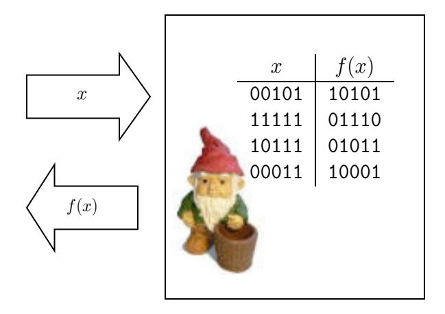

# Sequences of Games: A Tool for Taming Complexity in Security Proofs<sup>∗</sup>

Victor Shoup† January 18, 2006

#### Abstract

This paper is brief tutorial on a technique for structuring security proofs as sequences games.

# 1 Introduction

Security proofs in cryptography may sometimes be organized as sequences of games. In certain circumstances, this can be a useful tool in taming the complexity of security proofs that might otherwise become so messy, complicated, and subtle as to be nearly impossible to verify. This technique appears in the literature in various styles, and with various degrees of rigor and formality. This paper is meant to serve as a brief tutorial on one particular "style" of employing this technique, which seems to achieve a reasonable level of mathematical rigor and clarity, while not getting bogged down with too much formalism or overly restrictive rules. We do not make any particular claims of originality — it is simply hoped that others might profit from some of the ideas discussed here in reasoning about security.

At the outset, it should be noted that this technique is certainly not applicable to all security proofs. Moreover, even when this technique is applicable, it is only a tool for organizing a proof — the actual ideas for a cryptographic construction and security analysis must come from elsewhere.

### 1.1 The Basic Idea

Security for cryptograptic primitives is typically defined as an attack game played between an adversary and some benign entity, which we call the challenger. Both adversary and challenger are probabilstic processes that communicate with each other, and so we can model the game as a probability space. Typically, the definition of security is tied to some particular event S. Security means that for every "efficient" adversary, the probability that event S occurs is "very close to" some specified "target probabilty": typically, either 0, 1/2, or the probability of some event T in some other game in which the same adversary is interacting with a different challenger.

<sup>∗</sup>First public version: Nov. 30, 2004

<sup>†</sup>Computer Science Dept. NYU. shoup@cs.nyu.edu

In the formal definitions, there is a security parameter: an integer tending to infinity, and in the previous paragraph, "efficient" means time bounded by a polynomial in the security parameter, and "very close to" means the difference is smaller than the inverse of any polynomial in the security parameter, for sufficiently large values of the security parameter. The term of art is negligibly close to, and a quantity that is negliglibly close to zero is just called negligible. For simplicity, we shall for the most part avoid any further discussion of the security parameter, and it shall be assumed that all algorithms, adversaries, etc., take this value as an implicit input.

Now, to prove security using the sequence-of-games approach, one prodceeds as follows. One constructs a sequence of games, Game 0, Game 1, . . . , Game n, where Game 0 is the original attack game with respect to a given adversary and cryptographic primitive. Let S<sup>0</sup> be the event S, and for i = 1, . . . , n, the construction defines an event S<sup>i</sup> in Game i, usually in a way naturally related to the definition of S. The proof shows that Pr[S<sup>i</sup> ] is negligibly close to Pr[Si+1] for i = 0, . . . , n − 1, and that Pr[Sn] is equal (or negligibly close) to the "target probability." From this, and the fact that n is a constant, it follows that Pr[S] is negligibly close to the "target probability," and security is proved.

That is the general framework of such a proof. However, in constructing such proofs, it is desirable that the changes between succesive games are very small, so that analyzing the change is as simple as possible. From experience, it seems that transitions between successive games can be restricted to one of three types:

Transitions based on indistinguishability. In such a transition, a small change is made that, if detected by the adversary, would imply an efficient method of distinguishing between two distributions that are indistinguishable (either statistically or computationally). For example, suppose P<sup>1</sup> and P<sup>2</sup> are assumed to be computationally indistinguishable distributions. To prove that |Pr[S<sup>i</sup> ] − Pr[Si+1]| is negligible, one argues that there exists a distinguishing algorithm D that "interpolates" between Game i and Game i+1, so that when given an element drawn from distribution P<sup>1</sup> as input, D outputs 1 with probability Pr[S<sup>i</sup> ], and when given an element drawn from distribution P<sup>2</sup> as input, D outputs 1 with probabilty Pr[Si+1]. The indistinguishability assumption then implies that |Pr[S<sup>i</sup> ] − Pr[Si+1]| is negligible. Usually, the construction of D is obvious, provided the changes made in the transition are minimal. Typically, one designs the two games so that they could easily be rewritten as a single "hybrid" game that takes an auxilliary input — if the auxiallary input is drawn from P1, you get Game i, and if drawn from P2, you get Game i + 1. The distinguisher then simply runs this single hybrid game with its input, and outputs 1 if the appropriate event occurs.

Transitions based on failure events. In such a transition, one argues that Games i and i + 1 proceed identically unless a certain "failure event" F occurs. To make this type of argument as cleanly as possible, it is best if the two games are defined on the same underlying probability space — the only differences between the two games are the rules for computing certain random variables. When done this way, saying that the two games proceed identically unless F occurs is equivalent to saying that

$$S_i \wedge \neg F \iff S_{i+1} \wedge \neg F,$$

that is, the events S<sup>i</sup> ∧ ¬F and Si+1 ∧ ¬F are the same. If this is true, then we can use the

following fact, which is completely trivial, yet is so often used in these types of proofs that it deserves a name:

Lemma 1 (Difference Lemma). Let A, B, F be events defined in some probability distribution, and suppose that A ∧ ¬F ⇐⇒ B ∧ ¬F. Then |Pr[A] − Pr[B]| ≤ Pr[F].

Proof. This is a simple calculation. We have

$$\begin{aligned} |\Pr[A] - \Pr[B]| &= |\Pr[A \wedge F] + \Pr[A \wedge \neg F] - \Pr[B \wedge F] - \Pr[B \wedge \neg F]| \\ &= |\Pr[A \wedge F] - \Pr[B \wedge F]| \\ &\leq \Pr[F]. \end{aligned}$$

The second equality follows from the assumption that A ∧ ¬F ⇐⇒ B ∧ ¬F, and so in particular, Pr[A ∧ ¬F] = Pr[B ∧ ¬F]. The final inequality follows from the fact that both Pr[A ∧ F] and Pr[B ∧ F] are numbers between 0 and Pr[F]. ✷

So to prove that Pr[S<sup>i</sup> ] is negligibly close to Pr[Si+1], it suffices to prove that Pr[F] is negligible. Sometimes, this is done using a security assumption (i.e., when F occurs, the adversary has found a collision in a hash function, or forged a MAC), while at other times, it can be done using a purely information-theoretic argument.

Usually, the event F is defined and analyzed in terms of the random variables of one of the two adjacent games. The choice is arbitrary, but typically, one of the games will be more suitable than the other in terms of allowing a clear proof.

In some particularly challenging circumstances, it may be difficult to analyze the event F in either game. In fact, the analysis of F may require its own sequence of games sprouting off in a different direction, or the sequence of games for F may coincide with the sequence of games for S, so that Pr[F] finally gets pinned down in Game j for j > i+ 1. This technique is sometimes crucial in side-stepping potential circularities.

Bridging steps. The third type of transition introduces a bridging step, which is typically a way of restating how certain quantities can be computed in a completely equivalent way. The change is purely conceptual, and Pr[S<sup>i</sup> ] = Pr[Si+1]. The reason for doing this is to prepare the ground for a transition of one of the above two types. While in principle, such a bridging step may seem unnecessary, without it, the proof would be much harder to follow.

As mentioned above, in a transition based on a failure event, it is best if the two successive games are understood to be defined on the same underlying probability space. This is an important point, which we repeat here for emphasis — it seems that proofs are easiest to understand if one does not need to compare "corresponding" events across distinct and (by design) quite different probability spaces. Actually, it is good practice to simply have all the games in the sequence defined on the same underlying probability space. However, the Difference Lemma generalizes in the obvious way as follows: if A, B, F<sup>1</sup> and F<sup>2</sup> are events such that Pr[A ∧ ¬F1] = Pr[B ∧ ¬F2] and Pr[F1] = Pr[F2], then |Pr[A] − Pr[B]| ≤ Pr[F1]. With this generalized version, one may (if one wishes) analyze transitions based on failure events when the underlying probability spaces are not the same.

### 1.2 Some Historical Remarks

"Hybrid arguments" have been used extensively in cryptography for many years. Such an argument is essentially a sequence of transitions based on indistinguishability. An early example that clearly illustrates this technique is Goldreich, Goldwasser, and Micali's paper [GGM86] on constructing pseudo-random functions (although this is by no means the earliest application of a hybrid argument). Note that in some applications, such as [GGM86], one in fact makes a non-constant number of transitions, which requires an additional, probabilistic argument.

Although some might use the term "hybrid argument" to include proofs that use transitions based on both indistinguishability and failure events, that seems to be somewhat of a stretch of terminology. An early example of a proof that is clearly structured as a sequence of games that involves transitions based on both indistinguishability and failure events is Bellare and Goldwasser's paper [BG89].

Kilian and Rogaway's paper [KR96] on DESX initiates a somewhat more formal approach to sequences of games. That paper essentially uses the Difference Lemma, specialized to their particular setting. Subsequently, Rogaway has refined and applied this technique in numerous works with several co-authors. We refer the reader to the paper [BR04] by Bellare and Rogaway that gives a detailed introduction to the methodology, as well as references to papers where it has been used. However, we comment briefly on some of the differences between the technique discussed in this paper, and that advocated in [BR04]:

- In Bellare and Rogaway's approach, games are programs and are treated as purely syntactic objects subject to formal manipulation. In contrast, we view games as probability spaces and random variables defined over them, and do not insist on any particular syntactic formalism beyond that convenient to make a rigorous mathematical argument.
- In Bellare and Rogaway's approach, transitions based on failure events are restricted to events in which an executing program explicitly sets a particular boolean variable to true. In contrast, we do not suggest that events need to be explicitly "announced."
- In Bellare and Rogaway's approach, when the execution behaviors of two games are compared, two distinct probability spaces are involved, and probabilities of "corresponding" events across probability spaces must be compared. In contrast, we suggest that games should be defined on a common probability space, so that when discussing, say, a particular failure event F, there is literally just one event, not a pair of corresponding events in two different probability spaces.

In the end, we think that the choice between the style advocated in [BR04] and that suggested here is mainly a matter of taste and convenience.

The author has used proofs organized as sequences of games extensively in his own work [Sho00, SS00, Sho01, Sho02, CS02, CS03b, CS03a, GS04] and has found them to be an indispensable tool — while some of the proofs in these papers could be structured differently, it is hard to imagine how most of them could be done in a more clear and convincing way without sequences of games (note that all but the first two papers above adhere to the rule suggested here of defining games to operate on the same probability space). Other authors

have also been using very similar proof styles recently [AFP04, BK04, BCP02a, BCP02b, BCP03, CPP04, DF03, DFKY03, DFJW04, Den03, FOPS04, GaPMV03, KD04, PP03, SWP04]. Also, Pointcheval [Poi04] has a very nice introductory manuscript on public-key cryptography that illustrates this proof style on a number of particular examples.

The author has also been using the sequence-of-games technique extensively in teaching courses in cryptography. Many "classical" results in cryptography can be fruitfully analyzed using this technique. Generally speaking, it seems that the students enjoy this approach, and easily learn to use and apply it themselves. Also, by using a consistent framework for analysis, as an instructor, one can more easily focus on the ideas that are unique to any specific application.

### 1.3 Outline of the Rest of the Paper

After recalling some fairly standard notation in the next section, the following sections illustrate the use of the sequence-of-games technique in the analysis of a number of classical cryptographic constructions. Compared to many of the more technically involved examples in the literature of this technique (mentioned above), the applications below are really just "toy" examples. Nevertheless, they serve to illustrate the technique in a concrete way, and moreover, we believe that the proofs of these results are at least as easy to follow as any other proof, if not more so. All of the examples, except the last two (in §§7-8), are presented at an extreme level of detail; indeed, for these examples, we give complete, detailed descriptions of each and every game. More typically, to produce a more compact proof, one might simply describe the differences between games, rather than describing each game in its entirety (as is done in §§7-8). These examples are based mainly on lectures in courses on cryptography taught by the author.

# 2 Notation

We make use of fairly standard notation in what follows. In describing probabilistic processes, we write

$$x \stackrel{\mbox{\tiny $\mathfrak{k}$}}{\leftarrow} X$$

to denote the action of assigning to the variable x a value sampled according to the distribution X. If S is a finite set, we simply write s ←<sup>c</sup><sup>|</sup> S to denote assignment to s of an element sampled from the uniform distribution on S. If A is a probabilistic algorithm and x an input, then A(x) denotes the output distribution of A on input x. Thus, we write y ←<sup>c</sup><sup>|</sup> A(x) to denote the action of running algorithm A on input x and assigning the output to the variable y.

We shall write

$$\Pr[x_1 \stackrel{\notin}{\leftarrow} X_1, x_2 \stackrel{\notin}{\leftarrow} X_2(x_1), \dots, x_n \stackrel{\notin}{\leftarrow} X_n(x_1, \dots, x_{n-1}) : \phi(x_1, \dots, x_n)]$$

to denote the probability that when x<sup>1</sup> is drawn from a certain distribution X1, and x<sup>2</sup> is drawn from a certain distribution X2(x1), possibly depending on the particular choice of x1, and so on, all the way to xn, the predicate φ(x1, . . . , xn) is true. We allow the predicate φ to involve the execution of probabilistic algorithms.

If X is a probability distribution on a sample space X , then [X] denotes the subset of elements of X that occur with non-zero probability.

# 3 ElGamal Encryption

### 3.1 Basic Definitions

We first recall the basic definition of a public-key encryption scheme, and the notion of semantic security.

A public-key encryption scheme is a triple of probabilistic algorithms (KeyGen, E, D). The key generation algorithm KeyGen takes no input (other than an implied security parameter, and perhaps other system parameters), and outputs a public-key/secret-key pair (pk, sk). The encryption algorithm E takes as input a public key pk and a message m, selected from a message space M, and outputs a ciphertext ψ. The decryption algorithm takes as input a secret key sk and ciphertext ψ, and outputs a message m.

The basic correctness requirement is that decryption "undoes" encryption. That is, for all m ∈ M, all (pk, sk) ∈ [KeyGen()], all ψ ∈ [E(pk, m)], and all m<sup>0</sup> ∈ [D(sk, ψ)], we have m = m<sup>0</sup> . This definition can be relaxed in a number of ways; for example, we may only insist that it is computationally infeasible to find a message for which decryption does not "undo" its encryption.

The notion of semantic security intuitively says that an adversary cannot effectively distinguish between the encryption of two messages of his choosing (this definition comes from [GM84], where is called polynomial indistinguishability, and semantic security is actually the name of a syntactically different, but equivalent, characterization). This is formally defined via a game between an adversary and a challenger.

- The challenger computes (pk, sk) ←<sup>c</sup><sup>|</sup> KeyGen(), and gives pk to the adversary.
- The adversary chooses two messages m0, m<sup>1</sup> ∈ M, and gives these to the challenger.
- The challenger computes

$$b \stackrel{\protect}{\leftarrow} \{0,1\}, \ \psi \stackrel{\protect}{\leftarrow} E(pk,m_b)$$

and gives the "target ciphertext" ψ to the adversary.

• The adversary outputs ˆb ∈ {0, 1}.

We define the SS-advantage of the adversary to be |Pr[b = ˆb] − 1/2|. Semantic security means that any efficient adversary's SS-advantage is negligible.

### 3.2 The ElGamal Encryption Scheme

We next recall ElGamal encryption. Let G be a group of prime order q, and let γ ∈ G be a generator (we view the descriptions of G and γ, including the value q, to be part of a set of implied system parameters).

The key generation algorithm computes (pk, sk) as follows:

$$x \stackrel{\protect}{\leftarrow} \mathbb{Z}_q, \ \alpha \leftarrow \gamma^x, \ pk \leftarrow \alpha, \ sk \leftarrow x.$$

The message space for the algorithm is G. To encrypt a message  $m \in G$ , the encryption algorithm computes a ciphertext  $\psi$  as follows:

$$y \stackrel{\phi}{\leftarrow} \mathbb{Z}_q, \ \beta \leftarrow \gamma^y, \ \delta \leftarrow \alpha^y, \ \zeta \leftarrow \delta \cdot m, \ \psi \leftarrow (\beta, \zeta).$$

The decryption algorithm takes as input a ciphertext  $(\beta, \zeta)$ , and computes m as follows:

$$m \leftarrow \zeta/\beta^x$$
.

It is clear that decryption "undoes" encryption. Indeed, if  $\beta = \gamma^y$  and  $\zeta = \alpha^y \cdot m$ , then

$$\zeta/\beta^x = \alpha^y m/\beta^x = (\gamma^x)^y m/(\gamma^y)^x = \gamma^{xy} m/\gamma^{xy} = m.$$

#### 3.3 Security Analysis

ElGamal encryption is semantically secure under the Decisional Diffie-Hellman (DDH) assumption. This is the assumption that it is hard to distinguish triples of the form  $(\gamma^x, \gamma^y, \gamma^{xy})$  from triples of the form  $(\gamma^x, \gamma^y, \gamma^z)$ , where x, y, and z are random elements of  $\mathbb{Z}_q$ .

The DDH assumption is more precisely formulated as follows. Let D be an algorithm that takes as input triples of group elements, and outputs a bit. We define the DDH-advantage of D to be

$$|\Pr[x, y \xleftarrow{\phi} \mathbb{Z}_q : D(\gamma^x, \gamma^y, \gamma^{xy}) = 1] - \Pr[x, y, z \xleftarrow{\phi} \mathbb{Z}_q : D(\gamma^x, \gamma^y, \gamma^z) = 1]|.$$

The DDH assumption (for G) is the assumption that any efficient algorithm's DDH-advantage is negligible.

We now give a proof of the semantic security of ElGamal encryption under the DDH assumption, using a sequence of games.

**Game 0.** Fix an efficient adversary A. Let us define Game 0 to be the attack game against A in the definition of semantic security. To make things more precise and more concrete, we may describe the attack game algorithmically as follows:

$$x \stackrel{\notin}{\leftarrow} \mathbb{Z}_q, \ \alpha \leftarrow \gamma^x$$

$$r \stackrel{\notin}{\leftarrow} R, \ (m_0, m_1) \leftarrow A(r, \alpha)$$

$$b \stackrel{\notin}{\leftarrow} \{0, 1\}, \ y \stackrel{\notin}{\leftarrow} \mathbb{Z}_q, \ \beta \leftarrow \gamma^y, \ \delta \leftarrow \alpha^y, \ \zeta \leftarrow \delta \cdot m_b$$

$$\hat{b} \leftarrow A(r, \alpha, \beta, \zeta)$$

In the above, we have modeled the adversary A is a deterministic algorithm that takes as input "random coins" r sampled uniformly from some set R. It should be evident that this algorithm faithfully represents the attack game. If we define  $S_0$  to be the event that  $b = \hat{b}$ , then the adversary's SS-advantage is  $|\Pr[S_0] - 1/2|$ .

**Game 1.** [This is a transition based on indistinguishability.] We now make one small change to the above game. Namely, instead of computing  $\delta$  as  $\alpha^y$ , we compute it as  $\gamma^z$  for randomly chosen  $z \in \mathbb{Z}_q$ . We can describe the resulting game algorithmically as follows:

$$x \stackrel{\notin}{\leftarrow} \mathbb{Z}_q, \ \alpha \leftarrow \gamma^x$$

$$r \stackrel{\notin}{\leftarrow} R, \ (m_0, m_1) \leftarrow A(r, \alpha)$$

$$b \stackrel{\notin}{\leftarrow} \{0, 1\}, \ y \stackrel{\notin}{\leftarrow} \mathbb{Z}_q, \ \beta \leftarrow \gamma^y, \boxed{z \stackrel{\notin}{\leftarrow} \mathbb{Z}_q, \ \delta \leftarrow \gamma^z,} \zeta \leftarrow \delta \cdot m_b$$

$$\hat{b} \leftarrow A(r, \alpha, \beta, \zeta)$$

Let  $S_1$  be the event that  $b = \hat{b}$  in Game 1.

Claim 1.  $\Pr[S_1] = 1/2$ . This follows from the fact that in Game 2,  $\delta$  is effectively a one-time pad, and as such, the adversary's output  $\hat{b}$  is independent of the hidden bit b. To prove this more rigorously, it will suffice to show that  $b, r, \alpha, \beta, \zeta$  are mutually independent, since from this, it follows that b and  $\hat{b} = A(r, \alpha, \beta, \zeta)$  are independent. First observe that by construction,  $b, r, \alpha, \beta, \delta$  are mutually independent. It will suffice to show that conditioned on any fixed values of  $b, r, \alpha, \beta$ , the conditional distribution of  $\zeta$  is the uniform distribution over G. Now, if  $b, r, \alpha, \beta$  are fixed, then so are  $m_0, m_1$ , since they are determined by  $r, \alpha$ ; moreover, by independence, the conditional distribution of  $\delta$  is the uniform distribution on G, and hence from this, one sees that the conditional distribution of  $\zeta = \delta \cdot m_b$  is the uniform distribution on G.

Claim 2.  $|\Pr[S_0] - \Pr[S_1]| = \epsilon_{ddh}$ , where  $\epsilon_{ddh}$  is the DDH-advantage of some efficient algorithm (and hence negligible under the DDH assumption).

The proof of this is essentially the observation that in Game 0, the triple  $(\alpha, \beta, \delta)$  is of the form  $(\gamma^x, \gamma^y, \gamma^{xy})$ , while in Game 1, it is of the form  $(\gamma^x, \gamma^y, \gamma^z)$ , and so the adversary should not notice the difference, under the DDH assumption. To be more precise, our distinguishing algorithm D works as follows:

```
Algorithm D(\alpha, \beta, \delta)

r \stackrel{\ensuremath{\leftarrow}}{\leftarrow} R, \ (m_0, m_1) \leftarrow A(r, \alpha)

b \stackrel{\ensuremath{\leftarrow}}{\leftarrow} \{0, 1\}, \ \zeta \leftarrow \delta \cdot m_b

\hat{b} \leftarrow A(r, \alpha, \beta, \zeta)
\nif b = \hat{b}

then output 1
\nelse output 0
```

Algorithm D effectively "interpolates" between Games 0 and 1. If the input to D is of the form  $(\gamma^x, \gamma^y, \gamma^{xy})$ , then computation proceeds just as in Game 0, and therefore

$$\Pr[x, y \stackrel{\epsilon}{\leftarrow} \mathbb{Z}_q : D(\gamma^x, \gamma^y, \gamma^{xy}) = 1] = \Pr[S_0].$$

If the input to D is of the form  $(\gamma^x, \gamma^y, \gamma^z)$ , then computation proceeds just as in Game 1, and therefore

$$\Pr[x, y, z \stackrel{\epsilon}{\leftarrow} \mathbb{Z}_q : D(\gamma^x, \gamma^y, \gamma^z) = 1] = \Pr[S_1].$$

From this, it follows that the DDH-advantage of D is equal to |Pr[S0] − Pr[S1]|. That completes the proof of Claim 2.

Combining Claim 1 and Claim 2, we see that

$$|\Pr[S_0] - 1/2| = \epsilon_{\mathrm{ddh}},$$

and this is negligible. That completes the proof of security of ElGamal encryption.

# 3.4 Hashed ElGamal

For a number of reasons, it is convenient to work with messages that are bit strings, say, of length `, rather than group elements. Because of this, one may choose to use a "hashed" version of the ElGamal encryption scheme.

This scheme makes use of a family of keyed "hash" functions H := {Hk}k∈K, where each H<sup>k</sup> is a function mapping G to {0, 1} ` .

The key generation algorithm computes (pk, sk) as follows:

$$x \stackrel{\phi}{\leftarrow} \mathbb{Z}_q, \ k \stackrel{\phi}{\leftarrow} K, \ \alpha \leftarrow \gamma^x, \ pk \leftarrow (\alpha, k), \ sk \leftarrow (x, k).$$

To encrypt a message m ∈ {0, 1} ` , the encryption algorithm computes a ciphertext ψ as follows:

$$y \stackrel{\ \leftarrow}{\leftarrow} \mathbb{Z}_q, \ \beta \leftarrow \gamma^y, \ \delta \leftarrow \alpha^y, \ h \leftarrow H_k(\delta), \ v \leftarrow h \oplus m, \ \psi \leftarrow (\beta, v).$$

The decryption algorithm takes as input a ciphertext (β, v), and computes m as follows:

$$m \leftarrow H_k(\beta^x) \oplus v.$$

The reader may easily verify that decryption "undoes" encryption.

As for semantic security, this can be proven under the DDH assumption and the assumption that the family of hash functions H is "entropy smoothing." Loosely speaking, this means that it is hard to distinguish (k, Hk(δ)) from (k, h), where k is a random element of K, δ is a random element of G, and h is a random element of {0, 1} ` . More formally, let D be an algorithm that takes as input an element of K and an element of {0, 1} ` , and outputs a bit. We define the ES-advantage of D to be

$$|\Pr[k \xleftarrow{\phi} K, \ \delta \xleftarrow{\phi} G : D(k, H_k(\delta)) = 1] - \Pr[k \xleftarrow{\phi} K, \ h \xleftarrow{\phi} \{0, 1\}^{\ell} : D(k, h) = 1]|.$$

We say H is entropy smoothing if every efficient algorithm's ES-advantage is negligible.

It is in fact possible to construct entropy smoothing hash function families without additional hypothesis (the Leftover Hash Lemma may be used for this [IZ89]). However, these may be somewhat less practical than ad hoc hash function families for which the entropy smoothing property is only a (perfectly reasonable) conjecture; moreover, our definition also allows entropy smoothers that use pseudo-random bit generation techniques as well.

We now sketch the proof of semantic security of hashed ElGamal encryption, under the DDH assumption and the assumption that H is entropy smoothing.

Game 0. This is the original attack game, which we can state algorithmically as follows:

$$x \stackrel{\notin}{\leftarrow} \mathbb{Z}_q, k \stackrel{\notin}{\leftarrow} K, \alpha \leftarrow \gamma^x$$

$$r \stackrel{\notin}{\leftarrow} R, (m_0, m_1) \leftarrow A(r, \alpha, k)$$

$$b \stackrel{\notin}{\leftarrow} \{0, 1\}, y \stackrel{\notin}{\leftarrow} \mathbb{Z}_q, \beta \leftarrow \gamma^y, \delta \leftarrow \alpha^y, h \leftarrow H_k(\delta), v \leftarrow h \oplus m_b$$

$$\hat{b} \leftarrow A(r, \alpha, k, \beta, v)$$

We define  $S_0$  to be the event that  $b = \hat{b}$  in Game 0.

**Game 1.** [This is a transition based on indistinguishability.] Now we transform Game 0 into Game 1, computing  $\delta$  as  $\gamma^z$  for random  $z \in \mathbb{Z}_q$ . We can state Game 1 algorithmically as follows:

$$x \stackrel{\notin}{\leftarrow} \mathbb{Z}_q, k \stackrel{\notin}{\leftarrow} K, \alpha \leftarrow \gamma^x$$

$$r \stackrel{\notin}{\leftarrow} R, (m_0, m_1) \leftarrow A(r, \alpha, k)$$

$$b \stackrel{\notin}{\leftarrow} \{0, 1\}, y \stackrel{\notin}{\leftarrow} \mathbb{Z}_q, \beta \leftarrow \gamma^y, z \stackrel{\notin}{\leftarrow} \mathbb{Z}_q, \delta \leftarrow \gamma^z, h \leftarrow H_k(\delta), v \leftarrow h \oplus m_b$$

$$\hat{b} \leftarrow A(r, \alpha, k, \beta, v)$$

Let  $S_1$  be the event that  $b = \hat{b}$  in Game 1. We claim that

$$|\Pr[S_0] - \Pr[S_1]| = \epsilon_{\text{ddh}},\tag{1}$$

where  $\epsilon_{\rm ddh}$  is the DDH-advantage of some efficient algorithm (which is negligible under the DDH assumption).

The proof of this is almost identical to the proof of the corresponding claim for "plain" ElGamal. Indeed, the following algorithm D "interpolates" between Game 0 and Game 1, and so has DDH-advantage equal to  $|\Pr[S_0] - \Pr[S_1]|$ :

Algorithm
$$D(\alpha, \beta, \delta)$$

 $k \stackrel{\ensuremath{\leftarrow}}{\leftarrow} K$
 $r \stackrel{\ensuremath{\leftarrow}}{\leftarrow} R, (m_0, m_1) \leftarrow A(r, \alpha, k)$
 $b \stackrel{\ensuremath{\leftarrow}}{\leftarrow} \{0, 1\}, h \leftarrow H_k(\delta), v \leftarrow h \oplus m_b$
 $\hat{b} \leftarrow A(r, \alpha, k, \beta, v)$
\nif  $b = \hat{b}$
then output 1
\nelse output 0

**Game 2.** [This is also a transition based on indistinguishability.] We now transform Game 1 into Game 2, computing h by simply choosing it at random, rather than as a hash. Algorithmically, Game 2 looks like this:

$$x \stackrel{\notin}{\leftarrow} \mathbb{Z}_q, k \stackrel{\notin}{\leftarrow} K, \alpha \leftarrow \gamma^x$$

$$r \stackrel{\notin}{\leftarrow} R, (m_0, m_1) \leftarrow A(r, \alpha, k)$$

$$b \stackrel{\notin}{\leftarrow} \{0, 1\}, y \stackrel{\notin}{\leftarrow} \mathbb{Z}_q, \beta \leftarrow \gamma^y, z \stackrel{\notin}{\leftarrow} \mathbb{Z}_q, \delta \leftarrow \gamma^z, h \stackrel{\notin}{\leftarrow} \{0, 1\}^\ell, v \leftarrow h \oplus m_b$$

$$\hat{b} \leftarrow A(r, \alpha, k, \beta, v)$$

Observe that  $\delta$  plays no role in Game 2.

Let  $S_2$  be the event that  $b = \hat{b}$  in Game 2. We claim that

$$|\Pr[S_1] - \Pr[S_2]| = \epsilon_{\text{es}},\tag{2}$$

where  $\epsilon_{es}$  the ES-advantage of some efficient algorithm (which is negligible assuming  $\mathcal{H}$  is entropy smoothing).

This is proved using the same idea as before: any difference between  $\Pr[S_1]$  and  $\Pr[S_2]$  can be parlayed into a corresponding ES-advantage. Indeed, it is easy to see that the following algorithm D' "interpolates" between Game 1 and Game 2, and so has ES-advantage equal to  $|\Pr[S_1] - \Pr[S_2]|$ :

Algorithm D'(k,h)  $x \stackrel{\rlap{$\leftarrow}}{\leftarrow} \mathbb{Z}_q, \ \alpha \leftarrow \gamma^x$   $r \stackrel{\rlap{$\leftarrow}}{\leftarrow} R, \ (m_0,m_1) \leftarrow A(r,\alpha,k)$   $b \stackrel{\rlap{$\leftarrow}}{\leftarrow} \{0,1\}, \ y \stackrel{\rlap{$\leftarrow}}{\leftarrow} \mathbb{Z}_q, \ \beta \leftarrow \gamma^y, \ v \leftarrow h \oplus m_b$   $\hat{b} \leftarrow A(r,\alpha,k,\beta,v)$ \nif  $b = \hat{b}$ then output 1\nelse output 0

Finally, as h acts like a one-time pad in Game 2, it is evident that

$$\Pr[S_2] = 1/2. \tag{3}$$

Combining (1), (2), and (3), we obtain

$$|\Pr[S_0] - 1/2| \le \epsilon_{ddh} + \epsilon_{es},$$

which is negligible, since both  $\epsilon_{\rm ddh}$  and  $\epsilon_{\rm es}$  are negligible.

This proof illustrates how one can utilize more than one intractability assumption in a proof of security in a clean and simple way.

#### 4 Pseudo-Random Functions

#### 4.1 Basic Definitions

Let  $\ell_1$  and  $\ell_2$  be positive integers (which are actually polynomially bounded functions in a security parameter). Let  $\mathcal{F} := \{F_s\}_{s \in S}$  be a family of keyed functions, where each function  $F_s$  maps  $\{0,1\}^{\ell_1}$  to  $\{0,1\}^{\ell_2}$ . Let  $\Gamma_{\ell_1,\ell_2}$  denote the set of all functions from  $\{0,1\}^{\ell_1}$  to  $\{0,1\}^{\ell_2}$ . Informally, we say that  $\mathcal{F}$  is pseudo-random if it is hard to distinguish a random function drawn from  $\mathcal{F}$  from a random function drawn from  $\Gamma_{\ell_1,\ell_2}$ , given black box access to such a function (this notion was introduced in [GGM86]).

More formally, consider an adversary A that has oracle access to a function in  $\Gamma_{\ell_1,\ell_2}$ , and suppose that A always outputs a bit. Define the PRF-advantage of A to be

$$|\Pr[s \stackrel{\ \leftarrow}{\leftarrow} S : A^{F_s}() = 1] - \Pr[f \stackrel{\ \leftarrow}{\leftarrow} \Gamma_{\ell_1,\ell_2} : A^f()] = 1|.$$

We say that  $\mathcal{F}$  is pseudo-random if any efficient adversary's PRF-advantage is negligible.

#### 4.2 Extending the Input Length with a Universal Hash Function

We now present one construction that allows one to stretch the input length of a pseudorandom family of functions. Let  $\ell$  be a positive integer with  $\ell > \ell_1$ . Let  $\mathcal{H} := \{H_k\}_{k \in K}$  be a family of keyed hash functions, where each  $H_k$  maps  $\{0,1\}^{\ell}$  to  $\{0,1\}^{\ell_1}$ . Let us assume that  $\mathcal{H}$  is an  $\epsilon_{\text{uh}}$ -universal family of hash functions, where  $\epsilon_{\text{uh}}$  is negligible. This means that for all  $w, w' \in \{0,1\}^{\ell}$  with  $w \neq w'$ , we have

$$\Pr[k \stackrel{\&}{\leftarrow} K : H_k(w) = H_k(w')] \le \epsilon_{\text{uh}}.$$

There are many ways to construct such families of hash functions.

Now define the family of functions

$$\mathcal{F}' := \{ F'_{k,s} \}_{(k,s) \in K \times S},$$

where each  $F'_{k,s}$  is the function from  $\{0,1\}^{\ell}$  into  $\{0,1\}^{\ell_2}$  that sends  $w \in \{0,1\}^{\ell}$  to  $F_s(H_k(w))$ . We shall now prove that if  $\mathcal{F}$  is pseudo-random, then  $\mathcal{F}'$  is pseudo-random.

**Game 0.** This game represents the computation of an adversary given oracle access to a function drawn at random from  $\mathcal{F}'$ . Without loss of generality, we may assume that the adversary makes exactly q queries to its oracle, and never repeats any queries (regardless of the oracle responses). We may present this computation algorithmically as follows:

$$k \stackrel{\notin}{\leftarrow} K, s \stackrel{\notin}{\leftarrow} S$$

$$r \stackrel{\notin}{\leftarrow} R$$
for  $i \leftarrow 1 \dots q$  do
$$w_i \leftarrow A(r, y_1, \dots, y_{i-1}) \in \{0, 1\}^{\ell}$$

$$x_i \leftarrow H_k(w_i) \in \{0, 1\}^{\ell_1}$$

$$y_i \leftarrow F_s(x_i) \in \{0, 1\}^{\ell_2}$$

$$b \leftarrow A(r, y_1, \dots, y_q) \in \{0, 1\}$$
output  $b$

The idea behind our notation is that the adversary is modeled as a deterministic algorithm A, and we supply its random coins  $r \in R$  as input, and in loop iteration i, the adversary computes its next query  $w_i$  as a function of its coins and the results  $y_1, \ldots, y_{i-1}$  of its previous queries  $w_1, \ldots, w_{i-1}$ . We are assuming that A operates in such a way that the values  $w_1, \ldots, w_q$  are always distinct.

Let  $S_0$  be the event that the output b=1 in Game 0.

Our goal is to transform this game into a game that is equivalent to the computation of the adversary given oracle access to a random element of  $\Gamma_{\ell,\ell_2}$ , so that the probability that b=1 in the latter game is negligibly close to  $\Pr[S_0]$ .

**Game 1.** [This is a transition based on indistinguishability.] We now modify Game 0 so that we use a truly random function from  $\ell_1$  bits to  $\ell_2$  bits, in place of  $F_s$ . Intuitively, the pseudo-randomness property of  $\mathcal{F}$  should guarantee that this modification has only a negligible effect on the behavior of the adversary. Algorithmically, Game 1 looks like this:

$$k \stackrel{\ensuremath{\stackrel{\leftarrow}{\leftarrow}}}{K} K, \boxed{f \stackrel{\ensuremath{\stackrel{\leftarrow}{\leftarrow}}}{\Gamma_{\ell_1,\ell_2}}}$$

$$r \stackrel{\ensuremath{\leftarrow}}{R}$$
 for  $i \leftarrow 1 \dots q$  do
$$w_i \leftarrow A(r,y_1,\dots,y_{i-1}) \in \{0,1\}^\ell$$

$$x_i \leftarrow H_k(w_i) \in \{0,1\}^{\ell_1}$$

$$\boxed{y_i \leftarrow f(x_i) \in \{0,1\}^{\ell_2}}$$

$$b \leftarrow A(r,y_1,\dots,y_q) \in \{0,1\}$$
 output  $b$

We claim that

$$|\Pr[S_0] - \Pr[S_1]| = \epsilon_{\text{prf}},\tag{4}$$

where prf is the PDF-advantage, relative to F, of some efficient adversary (which is negligible assuming F is pseudo-random). Indeed, the following adversary essentially "interpolates" between Games 0 and 1, and so has PRF-advantage, with respect to F, exactly equal to |Pr[S0] − Pr[S1]|:

Oracle machine D<sup>O</sup>

$$k \stackrel{\notin}{\leftarrow} K, r \stackrel{\notin}{\leftarrow} R$$
for  $i \leftarrow 1 \dots q$  do
$$w_i \leftarrow A(r, y_1, \dots, y_{i-1}) \in \{0, 1\}^{\ell}$$

$$x_i \leftarrow H_k(w_i) \in \{0, 1\}^{\ell_1}$$

$$y_i \leftarrow \mathcal{O}(x_i) \in \{0, 1\}^{\ell_2}$$

$$b \leftarrow A(r, y_1, \dots, y_q) \in \{0, 1\}$$
output  $b$

Game 2. [This transition is a bridging step.] We now make a purely conceptual change to Game 1. Intuitively, one can think of a black box containing the random function f as a box with a little "gnome" inside: the gnome keeps a table of previous input/output pairs, and if a query is made that matches one of the previous inputs, the corresponding output is returned, and otherwise, an output value is chosen at random, and a new input/output pair is added to the table (see Figure 1). Based on this, we get the following equivalent formulation of Game 1:

$$\begin{split} k & \stackrel{\rlap{$\leftarrow$}}{\leftarrow} K, \boxed{Y_1, \dots, Y_q \stackrel{\rlap{$\leftarrow$}}{\leftarrow} \{0,1\}^{\ell_2}} \\ r & \stackrel{\rlap{$\leftarrow$}}{\leftarrow} R \\ \text{for } i \leftarrow 1 \dots q \text{ do} \\ w_i \leftarrow A(r, y_1, \dots, y_{i-1}) \in \{0,1\}^{\ell} \\ x_i \leftarrow H_k(w_i) \in \{0,1\}^{\ell_1} \\ & \text{ if } x_i = x_j \text{ for some } j < i \text{ then } y_i \leftarrow y_j \text{ else } y_i \leftarrow Y_i \\ b \leftarrow A(r, y_1, \dots, y_q) \in \{0,1\} \\ \text{output } b \end{split}$$

Let S<sup>2</sup> be the event that b = 1 in Game 2. Since the change in going from Game 1 to Game 2 was purely conceptual, we clearly have

$$\Pr[S_2] = \Pr[S_1]. \tag{5}$$



Figure 1: A gnome implementation of a random function

Game 3. [This is a transition based on a failure event.] We now modify Game 2 so that our gnome is "forgetful," and does not perform any consistency checks in calculating the y<sup>i</sup> values:

$$k \stackrel{\notin}{\leftarrow} K, Y_1, \dots, Y_q \stackrel{\notin}{\leftarrow} \{0, 1\}^{\ell_2}$$

$$r \stackrel{\&}{\leftarrow} R$$
for  $i \leftarrow 1 \dots q$  do
$$w_i \leftarrow A(r, y_1, \dots, y_{i-1}) \in \{0, 1\}^{\ell}$$

$$x_i \leftarrow H_k(w_i) \in \{0, 1\}^{\ell_1}$$

$$y_i \leftarrow Y_i$$

$$b \leftarrow A(r, y_1, \dots, y_q) \in \{0, 1\}$$
output  $b$

Define S<sup>3</sup> to be the event that b = 1 in Game 3. Define F to be the event that in Game 3, x<sup>i</sup> = x<sup>j</sup> for some i, j with i 6= j.

Observe that k and x1, . . . , x<sup>q</sup> play no role in Game 3, other than to define the event F. In particular, the random variables k, r, y1, . . . , y<sup>q</sup> are mutually independent.

We view Games 2 and 3 as operating on the same underlying probability space, so that the values of k, r, Y1, . . . , Y<sup>q</sup> are identical in both games. It is not hard to see that Games 2 and 3 proceed identically, unless event F occurs. In particular, if F does not occur, then the output in both games is identical. This is fairly obvious, but since this is our first example of this technique, let us make a more formal argument (in later examples, we will not do this). Select any fixed values k, r, Y1, . . . , Y<sup>q</sup> such that F does not occur. We prove by induction on i = 0, . . . , q, the values w1, x1, y1, . . . , w<sup>i</sup> , x<sup>i</sup> , y<sup>i</sup> are computed identically in both games. The case i = 0 is trivially true. Now we let i > 0, assume the claim for i − 1, and prove it for i. As the claim holds for i − 1, the value w<sup>i</sup> is computed in the same way as A(r, y1, . . . , yi−1) in both games, and hence x<sup>i</sup> is computed in the same way as Hk(wi) in both games. When it comes to computing y<sup>i</sup> , we see that since F does not hold, the values x1, . . . , x<sup>i</sup> are distinct (and are computed in the same way in both games); therefore, in both games  $y_i$  is assigned the value  $Y_i$ . That completes the induction proof. It follows that when F does not occur, both games compute  $y_1, \ldots, y_q$  in the same way, and hence both compute  $b = A(r, y_1, \ldots, y_q)$  in the same way.

In the previous paragraph, we argued that if F does not occur, then both games output the same value. This is the same as saying that  $S_2 \wedge \neg F \iff S_3 \wedge \neg F$ . Therefore, by the Difference Lemma, we have

$$|\Pr[S_2] - \Pr[S_3]| \le \Pr[F]. \tag{6}$$

We now show that

$$\Pr[F] \le \epsilon_{\rm uh} \cdot \frac{q^2}{2}.\tag{7}$$

The analysis is all done with respect to Game 3. To prove this inequality, it suffices to prove it conditioned on any fixed values of  $r, y_1, \ldots, y_q$ . In this conditional probability distribution, the values  $w_1, \ldots, w_q$  are fixed (as they are determined by  $r, y_1, \ldots, y_q$ ), while k is uniformly distributed over K (by independence). For any fixed pair of indices i, j, with  $i \neq j$ , by the universal hash property of  $\mathcal{H}$ , and by our assumption that the adversary never repeats any queries, we have  $w_i \neq w_j$ , and hence

$$\Pr[H_k(w_i) = H_k(w_i)] \le \epsilon_{\text{uh}}.$$

Since there are q(q-1)/2 such pairs of indices, the inequality (7) follows from the union bound.

Note that while one could have carried out the above analysis with respect to Game 2, it is conceptually much easier to carry it out in Game 3. In general, in applying the Difference Lemma, one can choose to analyze the probability of the "failure event" in either of the two adjacent games, but one will usually be easier to work with than the other.

Since the values of k and  $x_1, \ldots, x_q$  play no role in Game 3, it is not hard to see that in fact, Game 3 is equivalent to the computation of the adversary given oracle access to a function drawn at random from  $\Gamma_{\ell,\ell_2}$ : each successive (and by assumption, distinct) query yields a random result. Thus,  $|\Pr[S_0] - \Pr[S_3]|$  is equal to the PRF-advantage of the adversary. It then follows from (4), (5), (6), and (7) that the PRF-advantage of the adversary is bounded by

$$\epsilon_{\rm prf} + \epsilon_{\rm uh} \cdot \frac{q^2}{2},$$

which is negligible.

### 5 Pseudo-Random Permutations

Let  $\ell$  be a positive integer. Let  $\mathcal{P} := \{P_s\}_{s \in S}$  be a family of keyed functions, where each  $P_s$  is a *permutation* on  $\{0,1\}^{\ell}$ . Let  $\Pi_{\ell}$  denote the set of all permutations on  $\{0,1\}^{\ell}$ . Informally, we say that  $\mathcal{P}$  is pseudo-random if it is hard to distinguish a random permutation drawn from  $\mathcal{P}$  from a random permutation drawn from  $\Pi_{\ell}$ , given black box access to such a permutation.

More formally, consider an adversary A that has oracle access to a function in  $\Gamma_{\ell,\ell}$ , and suppose that A always outputs a single bit. Define the PRP-advantage of A to be

$$|\Pr[s \stackrel{\phi}{\leftarrow} S : A^{P_s}() = 1] - \Pr[\pi \stackrel{\phi}{\leftarrow} \Pi_{\ell} : A^{\pi}() = 1]|.$$

We say that P is pseudo-random if any efficient oracle machine's PRP-advantage is negligible.

# 5.1 Random Functions vs. Random Permutations

One of the things we want to do is to present a proof that every pseudo-random permutation family is also a pseudo-random function family. But first, we consider the slightly simpler problem of distinguishing random functions from random permutations. Suppose you are given a black box that contains either a random function on ` bits or a random permutation on ` bits, and your task is to determine which is the case. If you make roughly 2`/<sup>2</sup> queries, then (by the birthday paradox) you would expect to see some outputs that are equal, if the box contains a function rather than a permutation. This would allow you to determine, with reasonably high probability, the contents of the box. We want to rigorously prove that there is really no better way to determine what is inside the box.

Again, let A be an adversary given oracle access to a function in Γ`,`. We define its RF/RP-advantage to be

$$|\Pr[f \stackrel{\ensuremath{\leftarrow}}{\leftarrow} \Gamma_{\ell,\ell} : A^f() = 1] - \Pr[\pi \stackrel{\ensuremath{\leftarrow}}{\leftarrow} \Pi_{\ell} : A^{\pi}() = 1]|.$$

We shall now show that for any oracle machine that makes at most q queries to its oracle, its RF/RP-advantage is at most

$$\frac{q^2}{2} \cdot 2^{-\ell}.$$

As usual, we make this argument by considering a sequence of games.

Game 0. This game represents the computation of an adversary A given oracle access to a random permutation. Let us assume that A makes precisely q queries, and that each of these queries is distinct. We may write this game algorithmically as follows:

$$\pi \stackrel{\notin}{\leftarrow} \Pi_{\ell}$$

$$r \stackrel{\notin}{\leftarrow} R$$
for  $i \leftarrow 1 \dots q$  do
$$x_i \leftarrow A(r, y_1, \dots, y_{i-1}) \in \{0, 1\}^{\ell}$$

$$y_i \leftarrow \pi(x_i)$$

$$b \leftarrow A(r, y_1, \dots, y_q) \in \{0, 1\}$$
output  $b$

As usual, we assume that the queries x1, . . . , x<sup>q</sup> are always distinct. Define S<sup>0</sup> to be the event that b = 1 in Game 0.

Game 1. [This transition is a bridging step.] We now transform Game 1 into a new game involving "gnomes," as in §4.2. Our strategy is to first build a game that uses a "faithful gnome" that makes all the appropriate consistency checks. In the next game, we will use a "forgetful gnome" that does not bother with consistency checks, but that otherwise behaves identically. The idea is that we can model oracle access to a random permutation as a little "gnome" who keeps track input/output pairs, but now, the gnome has to make sure outputs as well as inputs are consistent:

$$\begin{aligned} & \overbrace{Y_1, \dots, Y_q} \overset{\phi}{\leftarrow} \{0, 1\}^{\ell} \\ & r \overset{\phi}{\leftarrow} R \\ & \text{for } i \leftarrow 1 \dots q \text{ do} \\ & x_i \leftarrow A(r, y_1, \dots, y_{i-1}) \in \{0, 1\}^{\ell} \\ & \text{if } Y_i \in \{y_1, \dots, y_{i-1}\} \text{ then } y_i \overset{\phi}{\leftarrow} \{0, 1\}^{\ell} \setminus \{y_1, \dots, y_{i-1}\} \text{ else } y_i \leftarrow Y_i \\ & b \leftarrow A(r, y_1, \dots, y_q) \in \{0, 1\} \\ & \text{output } b \end{aligned}$$

Recall that we are assuming that the inputs x1, . . . , x<sup>q</sup> are always distinct, so our "gnome" does not have to watch for duplicate inputs. Our "gnome" uses the random value Y<sup>i</sup> as the "default value" for π(xi), unless that value has already been used as a previous output, in which case the "gnome" chooses the value of π(xi) at random from all unused output values.

Let S<sup>1</sup> be the event that b = 1 in Game 1. It is evident that Game 1 is equivalent to Game 0 from the point of view of the adversary, and therefore:

$$\Pr[S_1] = \Pr[S_0]. \tag{8}$$

Game 2. [This is a transition based on a failure event.] As promised, we now make our gnome "forgetful," by simply dropping the output consistency checks:

$$Y_1, \dots, Y_q \overset{\&}{\leftarrow} \{0, 1\}^{\ell}$$

$$r \overset{\&}{\leftarrow} R$$
for  $i \leftarrow 1 \dots q$  do
$$x_i \leftarrow A(r, y_1, \dots, y_{i-1}) \in \{0, 1\}^{\ell}$$

$$y_i \leftarrow Y_i$$

$$b \leftarrow A(r, y_1, \dots, y_q) \in \{0, 1\}$$
output  $b$

Let S<sup>2</sup> be the event that b = 1 in Game 2. Let F be the event that Y<sup>i</sup> = Y<sup>j</sup> for some i 6= j. Let us view Games 1 and 2 as operating on the same underlying probability space, so the values of r, Y1, . . . , Y<sup>q</sup> are identical in both games. It is evident that these two games proceed identically unless the event F occurs; that is, S<sup>1</sup> ∧ ¬F ⇐⇒ S<sup>2</sup> ∧ ¬F. Therefore, by the Difference Lemma, we have

$$|\Pr[S_1] - \Pr[S_2]| \le \Pr[F]. \tag{9}$$

Furthermore, F is the union of q 2 events, each of which occurs with probability 2−` (clearly, Pr[Y<sup>i</sup> = Y<sup>j</sup> ] = 2−` , for i 6= j), and so by the union bound, we have

$$\Pr[F] \le \frac{q^2}{2} \cdot 2^{-\ell}.\tag{10}$$

Finally, note that Game 2 is fully equivalent to the computation of the adversary given oracle access to a random function. Thus, its RF/RP-advantage is equal to

$$|\Pr[S_0] - \Pr[S_2]|,$$

and by (8), (9), and (10), this is at most

$$\frac{q^2}{2} \cdot 2^{-\ell}.$$

# 5.2 Pseudo-Random Functions vs. Pseudo-Random Permutations

We now show that if ` is suitably large, so that 2−` is negligible, then any pseudo-random permutation family P := {Ps}s∈<sup>S</sup> is also a pseudo-random function family. This follows quite easily from the definitions and the fact proved in §5.1 bounding the RF/RP-advantage of any adversary.

Let us fix an efficient adversary A, and show that its PRF-advantage, with respect to P, is negligible. Assume that the oracle machine always makes at most q queries (since the adversary is efficient, this means that q is bounded by a polynomial in a security parameter).

Let

$$\epsilon_{\mathrm{prf}} := |\Pr[s \stackrel{\phi}{\leftarrow} S : A^{P_s}() = 1] - \Pr[f \stackrel{\phi}{\leftarrow} \Gamma_{\ell,\ell} : A^f() = 1]|$$

be the PRF-advantage of A. We want to show that prf is negligible. Let

$$\epsilon_{\text{prp}} := |\Pr[s \stackrel{\phi}{\leftarrow} S : A^{P_s}() = 1] - \Pr[\pi \stackrel{\phi}{\leftarrow} \Pi_{\ell} : A^{\pi}() = 1]|$$

be the PRP-advantage of A. By assumption, prp is negligible. Let

$$\epsilon_{\mathrm{rf/rp}} := |\Pr[f \stackrel{\phi}{\leftarrow} \Gamma_{\ell,\ell} : A^f() = 1] - \Pr[\pi \stackrel{\phi}{\leftarrow} \Pi_{\ell} : A^{\pi}() = 1]|$$

be the RF/RP-advantage of A. From the analysis in §5.1, we know that

$$\epsilon_{\rm rf/rp} \le \frac{q^2}{2} \cdot 2^{-\ell},$$

which is negligible, assuming 2−` is negligible. Finally, it is easy to see that by the triangle inequality, we have

$$\epsilon_{\text{prf}} = |\Pr[s \stackrel{\xi}{\leftarrow} S : A^{P_s}() = 1] - \Pr[f \stackrel{\xi}{\leftarrow} \Gamma_{\ell,ell} : A^f() = 1]|$$

$$\leq |\Pr[s \stackrel{\xi}{\leftarrow} S : A^{P_s}() = 1] - \Pr[\pi \stackrel{\xi}{\leftarrow} \Pi_{\ell} : A^{\pi}() = 1]| +$$

$$|\Pr[\pi \stackrel{\xi}{\leftarrow} \Pi_{\ell} : A^{\pi}() = 1] - \Pr[f \stackrel{\xi}{\leftarrow} \Gamma_{\ell,\ell} : A^f() = 1]|$$

$$= \epsilon_{\text{prp}} + \epsilon_{\text{rf/rp}},$$

which is negligible.

# 6 The Luby-Rackoff Construction

We now give an analysis of the Luby-Rackoff construction for building a pseudo-random permutation family out of a pseudo-random function family [LR88]. Since it is really no harder to do, we analyze the variation of Naor and Reingold [NR99], which uses a pairwise independent family of hash functions (or something slightly weaker) at one of the stages of the construction.

Let  $\mathcal{F} := \{F_s\}_{s \in S}$  be a pseudo-random family of functions, where each  $F_s$  maps  $\ell$ -bit strings to  $\ell$ -bit strings.

Let  $\mathcal{H} := \{H_k\}_{k \in K}$  an  $\epsilon_{axu}$ -almost-XOR-universal family of hash functions on  $\ell$ -bits, meaning that each  $H_k$  maps  $\ell$ -bit strings to  $\ell$ -bit strings, and for all  $x, x', y \in \{0, 1\}^{\ell}$ , with  $x \neq x'$ , we have

$$\Pr[k \stackrel{\phi}{\leftarrow} K : H_k(x) \oplus H_k(x') = y] \le \epsilon_{\text{axu}}.$$

We assume that  $\epsilon_{\text{axu}}$  is negligible.

The Luby-Rackoff construction builds a pseudo-random permutation family that acts on  $2\ell$ -bit strings as follows. A Luby-Rackoff key consists of a triple  $(k, s_1, s_2)$ , with  $k \in K$  and  $s_1, s_2 \in S$ . Let us interpret inputs and outputs as pairs of  $\ell$ -bit strings. Given  $u, v \in \{0, 1\}^{\ell}$  as input, the Luby-Rackoff algorithm runs as follows:

$$w \leftarrow u \oplus H_k(v)$$
$$x \leftarrow v \oplus F_{s_1}(w)$$
$$y \leftarrow w \oplus F_{s_2}(x)$$

The output is x, y.

It is easy to verify that the function computed by this algorithm is a permutation, and indeed, it is easy to invert the permutation given the key. We want to show that this construction is a pseudo-random permutation family, under the assumptions above, and the assumption that  $2^{-\ell}$  is negligible. To this end, by the result in §5.1, it will suffice to show that this construction is a pseudo-random function family.

**Game 0.** This game represents the computation of an adversary given oracle access to the Luby-Rackoff construction, for random keys  $k, s_1, s_2$ . We assume that the adversary makes exactly q oracle queries, and that all of these are distinct. We can present this game algorithmically as follows:

$$k \stackrel{\notin}{\leftarrow} K, s_1 \stackrel{\notin}{\leftarrow} S, s_2 \stackrel{\notin}{\leftarrow} S$$

$$r \stackrel{\notin}{\leftarrow} R$$
for  $i \leftarrow 1 \dots q$  do
$$(u_i, v_i) \leftarrow A(r, x_1, y_1, \dots, x_{i-1}, y_{i-1})$$

$$w_i \leftarrow u_i \oplus H_k(v_i)$$

$$x_i \leftarrow v_i \oplus F_{s_1}(w_i)$$

$$y_i \leftarrow w_i \oplus F_{s_2}(x_i)$$

$$b \leftarrow A(r, x_1, y_1, \dots, x_q, y_q)$$
output  $b$

We are assuming that for all  $i \neq j$ , we may have  $u_i = u_j$  or  $v_i = v_j$ , but not both. Let  $S_0$  be the event that b = 1 in Game 0.

**Game 1.** [This is a transition based on indistinguishability, plus a bridging step.] We now modify Game 0, replacing  $F_{s_1}$  be a truly random function. To save steps, let us implement our random function directly as a "faithful gnome":

$$k \stackrel{\notin}{\leftarrow} K, \overline{X_1, \dots, X_q \leftarrow \{0, 1\}^\ell}, s_2 \stackrel{\notin}{\leftarrow} S$$

$$r \stackrel{\notin}{\leftarrow} R$$
for  $i \leftarrow 1 \dots q$  do
$$(u_i, v_i) \leftarrow A(r, x_1, y_1, \dots, x_{i-1}, y_{i-1})$$

$$w_i \leftarrow u_i \oplus H_k(v_i)$$

$$\{ \text{if } w_i = w_j \text{ for some } j < i \text{ then } x_i' \leftarrow x_j' \text{ else } x_i' \leftarrow X_i \}, x_i \leftarrow v_i \oplus x_i'$$

$$y_i \leftarrow w_i \oplus F_{s_2}(x_i)$$

$$b \leftarrow A(r, x_1, y_1, \dots, x_q, y_q)$$
output  $b$

The intuition is that x 0 i represents the output of a random function on input w<sup>i</sup> . The default value for x 0 i is X<sup>i</sup> , but this default value is overridden if w<sup>i</sup> is equal to some previous input w<sup>j</sup> .

Let S<sup>1</sup> be the event that b = 1 in Game 1. By a (by now) very familiar argument, we have

$$|\Pr[S_0] - \Pr[S_1]| = \epsilon_{\text{prf}},\tag{11}$$

where prf is the PRF-advantage of some efficient adversary, and therefore negligible. Indeed, it is evident that the following adversary D does the job:

Oracle machine D<sup>O</sup>

$$k \stackrel{\notin}{\leftarrow} K, s_2 \stackrel{\notin}{\leftarrow} S$$

$$r \stackrel{\notin}{\leftarrow} R$$
for  $i \leftarrow 1 \dots q$  do
$$(u_i, v_i) \leftarrow A(r, x_1, y_1, \dots, x_{i-1}, y_{i-1})$$

$$w_i \leftarrow u_i \oplus H_k(v_i)$$

$$x_i \leftarrow v_i \oplus \mathcal{O}(w_i)$$

$$y_i \leftarrow w_i \oplus F_{s_2}(x_i)$$

$$b \leftarrow A(r, x_1, y_1, \dots, x_q, y_q)$$
output  $b$

Game 2. [This is also a transition based on indistinguishability, plus a bridging step.] Next, we naturally replace Fs<sup>2</sup> by a truly random function. Again, let us implement our random function directly as a "faithful gnome":

$$k \stackrel{\notin}{\leftarrow} K, X_1, \dots, X_q \leftarrow \{0,1\}^\ell, \boxed{Y_1, \dots, Y_q \stackrel{\notin}{\leftarrow} \{0,1\}^\ell}$$

$$r \stackrel{\notin}{\leftarrow} R$$
for  $i \leftarrow 1 \dots q$  do
$$(u_i, v_i) \leftarrow A(r, x_1, y_1, \dots, x_{i-1}, y_{i-1})$$

$$w_i \leftarrow u_i \oplus H_k(v_i)$$

$$\{ \text{ if } w_i = w_j \text{ for some } j < i \text{ then } x_i' \leftarrow x_j' \text{ else } x_i' \leftarrow X_i \}, x_i \leftarrow v_i \oplus x_i'$$

$$\{ \text{ if } x_i = x_j \text{ for some } j < i \text{ then } y_i' \leftarrow y_j' \text{ else } y_i' \leftarrow Y_i \}, y_i \leftarrow w_i \oplus y_i' \}$$

$$b \leftarrow A(r, x_1, y_1, \dots, x_q, y_q)$$
output  $b$

Let  $S_2$  be the event that b=1 in Game 2. Again, we have

$$|\Pr[S_1] - \Pr[S_2]| = \epsilon'_{\text{prf}},\tag{12}$$

where  $\epsilon'_{prf}$  is the PRF-advantage of some efficient adversary, and therefore negligible. Indeed, it is evident that the following adversary D' does the job:

```
Oracle machine (D')^{\mathcal{O}}

k \stackrel{\ell}{\leftarrow} K, X_1, \dots, X_q \leftarrow \{0, 1\}^{\ell}

r \stackrel{\ell}{\leftarrow} R

for i \leftarrow 1 \dots q do

(u_i, v_i) \leftarrow A(r, x_1, y_1, \dots, x_{i-1}, y_{i-1})

w_i \leftarrow u_i \oplus H_k(v_i)

\{ \text{ if } w_i = w_j \text{ for some } j < i \text{ then } x_i' \leftarrow x_j' \text{ else } x_i' \leftarrow X_i \}, x_i \leftarrow v_i \oplus x_i'

y_i \leftarrow w_i \oplus \mathcal{O}(x_i)

b \leftarrow A(r, x_1, y_1, \dots, x_q, y_q)

output b
```

Although it is not critical for this proof, we remark that one could jump directly from Game 0 to Game 2. The following adversary  $\tilde{D}$  has PRF-advantage equal to  $|\Pr[S_0] - \Pr[S_2]|/2$ :

```
Oracle machine \tilde{D}^{\mathcal{O}}

c \stackrel{\text{$\ensuremath{\leftarrow}}}{\leftarrow} \{0,1\}
\nif c=0 then output D^{\mathcal{O}} else output (D')^{\mathcal{O}}
```

We leave this for the reader to verify. This is a special case of what is more generally called a "hybrid argument," which allows one to replace any number (even a non-constant number) of pseudo-random objects by random objects in a single step. Exactly how and when such hybrid arguments are applicable depends on circumstances; however, one requirement is that all the objects are of the same basic type. (See §3.2.3 of [Gol01] for more on hybrid arguments.)

**Game 3.** [This is a transition based on a failure event.] Now we make both of our gnomes "forgetful," and we eliminate all the input-consistency checks. When we do this, we get the following:

$$k \stackrel{\notin}{\leftarrow} K, X_1, \dots, X_q \leftarrow \{0, 1\}^{\ell}, Y_1, \dots, Y_q \stackrel{\notin}{\leftarrow} \{0, 1\}^{\ell}$$

$$r \stackrel{\notin}{\leftarrow} R$$
for  $i \leftarrow 1 \dots q$  do
$$(u_i, v_i) \leftarrow A(r, x_1, y_1, \dots, x_{i-1}, y_{i-1})$$

$$w_i \leftarrow u_i \oplus H_k(v_i)$$

$$x_i \leftarrow v_i \oplus X_i$$

$$y_i \leftarrow w_i \oplus Y_i$$

$$b \leftarrow A(r, x_1, y_1, \dots, x_q, y_q)$$
output  $b$

Let S<sup>3</sup> be the event that b = 1 in Game 3.

Claim. In Game 3, the random variables k, r, x1, y1, . . . , xq, y<sup>q</sup> are mutually independent. Observe that k and r are independent by construction. Now condition on any fixed values of k and r. The first query (u1, v1) is now fixed, and hence so is w1; however, X<sup>1</sup> and Y<sup>1</sup> are both easily seen to still be uniformly and independently distributed in this conditional probability distribution, and so x<sup>1</sup> and y<sup>1</sup> are also uniformly and independently distributed. One continues the argument, conditioning on fixed values of x1, y1, observing that now u2, v2, and w<sup>2</sup> are also fixed, and that x<sup>2</sup> and y<sup>2</sup> are uniformly and independently distributed. The claim should now be clear.

Let F<sup>1</sup> be the event that w<sup>i</sup> = w<sup>j</sup> for some i 6= j in Game 3. Let F<sup>2</sup> be the event that x<sup>i</sup> = x<sup>j</sup> for some i 6= j in Game 3. Let F := F<sup>1</sup> ∨ F2. Games 2 and 3 proceed identically so long as F does not occur, and so by the Difference Lemma (and the union bound), we have

$$|\Pr[S_2] - \Pr[S_3]| \le \Pr[F] \le \Pr[F_1] + \Pr[F_2].$$
 (13)

By the fact that x1, . . . , x<sup>q</sup> are mutually independent (see claim), it is obvious that

$$\Pr[F_2] \le \frac{q^2}{2} \cdot 2^{-\ell}.\tag{14}$$

Let us now analyze the event F1. We claim that

$$\Pr[F_1] \le \frac{q^2}{2} \cdot \epsilon_{\text{axu}}.\tag{15}$$

To prove this, it suffices to prove it conditioned on any fixed values of r, x1, y1, . . . , xq, yq. If these values are fixed, then so are u1, v1, . . . , uq, vq. However, by independence (see claim), the variable k is still uniformly distributed over K. Now consider any fixed pair of indices i, j, with i 6= j. Suppose first that v<sup>i</sup> = v<sup>j</sup> . Then by assumption, we must have u<sup>i</sup> 6= u<sup>j</sup> , and it is easy to see that w<sup>i</sup> 6= w<sup>j</sup> for all k. Next suppose that v<sup>i</sup> 6= v<sup>j</sup> . Then by the almost-XOR-universal property for H, we have

$$\Pr[H_k(v_i) \oplus H_k(v_j) = u_i \oplus u_j] \le \epsilon_{\text{axu}}.$$

Thus, we have shown that for all pairs i, j with i 6= j,

$$\Pr[w_i = w_j] \le \epsilon_{\text{axu}}.$$

The inequality (15) follows from the union bound.

As another consequence of the claim, we observe that Game 3 represents the computation of the adversary given oracle access to a random function. Thus, the adversary's PRFadvantage is equal to |Pr[S0] − Pr[S3]|. From this, and (11), (12), (13), (14), and (15), we conclude that the PRF-advantage of our adversary is at most

$$\epsilon_{\rm prf} + \epsilon'_{\rm prf} + \frac{q^2}{2} (\epsilon_{\rm axu} + 2^{-\ell}),$$

which is negligible.

That concludes the proof, but we make one remark about the proof "strategy." One might have been tempted to take smaller steps: making the first gnome forgetful in one step, and making the second gnome forgetful in the second step. However, this would not be convenient. If we make only the first gnome forgetful, the resulting game is not "nice enough" to allow one to easily establish a bound on the "failure probability." It is better to make both gnomes forgetful at once, thus getting a very nice game in which it is easy to analyze both "failure probabilities." In general, finding a good strategy for how to modify games, and the order in which to modify them, etc., is a bit of a "black art."

# 7 Chosen Ciphertext Secure Symmetric Encryption

In this section and the next, we now present some more elaborate examples. This section studies a chosen ciphertext secure symmetric-key encryption scheme.

# 7.1 Basic Definitions

A symmetric-key encryption scheme is a triple of probabilistic algorithms (KeyGen, E, D). The key generation algorithm KeyGen takes no input (other than an implied security parameter, and perhaps other system parameters), and outputs a key k. The encryption algorithm E takes as input a key k and a message m, selected from a message space M, and outputs a ciphertext ψ. The decryption algorithm takes as input a key k and a ciphertext ψ, and outputs a message m.

As for any encryption scheme, the basic correctness requirement is that decryption "undoes" encryption. That is, for all m ∈ M, all k ∈ [KeyGen()], all ψ ∈ [E(k, m)], and all m<sup>0</sup> ∈ [D(k, ψ)], we have m = m<sup>0</sup> .

The notion of chosen ciphertext security is defined via a game between an adversary and a challenger:

- The challenger computes k ←<sup>c</sup><sup>|</sup> KeyGen(), and b ← { <sup>c</sup><sup>|</sup> 0, 1}.
- The adversary makes a sequence of queries to the challenger. Each query is of one of two types:
  - encryption query: The adversary submits two messages m0, m<sup>1</sup> ∈ M to the challenger. The challenger sends back ψ ←<sup>c</sup><sup>|</sup> E(k, mb) to the adversary.
  - decryption query: The adversary submits ψ 0 to the challenger, subject to the restriction that ψ 0 is not equal to the ciphertext output by any previous encryption query. The challenger sends back m<sup>0</sup> ←<sup>c</sup><sup>|</sup> D(k, ψ<sup>0</sup> ) to the adversary.
- The adversary outputs ˆb ∈ {0, 1}.

We define the CCA-advantage of the adversary to be |Pr[b = ˆb] − 1/2|. Chosen ciphertext security means that any efficient adversary's CCA-advantage is negligible.

### 7.2 A Simple Construction

We can easily build a chosen-ciphertext secure symmetric encryption scheme out of two components.

The first component is a pseudo-random family of functions F := {Fs}s∈S, where each F<sup>s</sup> maps n-bit strings to `-bit strings. It is assumed that 2−<sup>n</sup> is negligible. Also, the message space for the encryption scheme will be {0, 1} ` .

The second component is a "message authentication code," which we shall define as an unpredictable function family H := {Hk}k∈K, where each H<sup>k</sup> is a function mapping (n + `)-bit strings to w-bit strings. The property for H we are assuming is defined in terms of a game between an adversary and a challenger:

- The challenger selects k ←<sup>c</sup><sup>|</sup> K.
- The adversary makes a sequence of queries to the challenger. Each query is a string y ∈ {0, 1} n+` . The challenger gives the adversary t ← Hk(y).
- The adversary outputs a pair (y ∗ , t<sup>∗</sup> ).

The adversary wins the above game if Hk(y ∗ ) = t <sup>∗</sup> and y ∗ is not equal to any y-value submitted to the challenger during the game. The adversary's UF-advantage is defined to be the probability that the adversary wins the above game. The assumption that H is an unpredictable function family is the assumption that every efficient adversary's UFadvantage is negligible.

The encryption scheme works as follows. A key for the scheme is a pair (s, k), with s ∈ S and k ∈ K, each chosen at random.

To encrypt a message m ∈ {0, 1} ` , the encryption algorithm computes the ciphertext ψ as follows:

$$x \stackrel{\phi}{\leftarrow} \{0,1\}^n, \ c \leftarrow F_s(x) \oplus m, \ t \leftarrow H_k(x \mid\mid c), \ \psi \leftarrow (x,c,t).$$

To decrypt a ciphertext ψ, which we may assume to be of the form (x, c, t), with x ∈ {0, 1} n , c ∈ {0, 1} ` , t ∈ {0, 1} <sup>w</sup>, the decryption algorithm computes m as follows:

if
$$H_k(x \mid\mid c) = t$$
 then  $m \leftarrow F_s(x) \oplus c$  else  $m \leftarrow$  "reject"

Here, we may assume that "reject" is a default message encoded as an `-bit string, or we may assume that we allow the decryption algorithm to return a special value that is not in the message space (for our purposes, it does not matter).

The reader may easily verify that decryption "undoes" encryption.

### 7.3 Security Analysis

We now give a security proof as a sequence of games. Because it would be rather unwieldy, we do not give an explicit, low-level, algorithmic description of these games, but it should by now be clear that this could be done in principle. Rather, we give only a high-level description of Game 0, and brief descriptions of the modifications between successive games. **Game 0.** This is the original attack game with respect to a given efficient adversary A. At the beginning of the game, the challenger computes

$$s \stackrel{\varepsilon}{\leftarrow} S, \ k \stackrel{\varepsilon}{\leftarrow} K, \ b \stackrel{\varepsilon}{\leftarrow} \{0,1\}.$$

We assume that A makes exactly q encryption queries, where for  $i=1,\ldots,q$ , the ith query is  $(m_{i0},m_{i1})$ , and the corresponding ciphertext is  $\psi_i=(x_i,c_i,t_i)$ , which is computed by the challenger by encrypting  $m_{ib}$  under the key (s,k). Also, we assume that the adversary makes exactly q' decryption queries, where for  $j=1,\ldots,q'$ , the jth such query is  $\psi'_j=(x'_j,c'_j,t'_j)$ , which the challenger decrypts under the key (s,k). For  $j=1,\ldots,q'$ , let us define  $Q_j$  to be the number of encryption queries made prior to the jth decryption query. We assume all queries are syntactically well formed, and that A never submits  $\psi'_j$  for decryption with  $\psi'_j=\psi_i$  for  $i\leq Q_j$ . At the end of the game, the adversary outputs  $\hat{b}\in\{0,1\}$ . Let  $S_0$  be the event that  $b=\hat{b}$  in this game.

**Game 1.** This is the same as Game 0, except that we modify the way the challenger responds to decryption queries. Namely, we have the challenger respond with "reject" to all submitted ciphertexts, without performing any of the steps of the decryption algorithm.

Let  $S_1$  be the event that  $b = \hat{b}$  in Game 1. Let F be the event in Game 1 that for some  $j = 1, \ldots, q'$ , we have  $H_k(x'_j \mid\mid c'_j) = t'_j$ . It is clear that Games 0 and 1 proceed identically unless F occurs (as usual, both games are understood to be defined on the same underlying probability space); therefore, by the Difference Lemma, we have

$$|\Pr[S_0] - \Pr[S_1]| \le \Pr[F]. \tag{16}$$

It remains to bound Pr[F]. We claim that

$$\Pr[F] \le q' \cdot \epsilon_{\rm uf},\tag{17}$$

where  $\epsilon_{\text{uf}}$  is the UF-advantage of some efficient adversary B, which by assumption is negligible.

To prove this, we first make the following observations. Consider the jth decryption query  $\psi'_j = (x'_j, c'_j, t'_j)$ . There are two cases:

- $(x'_j, c'_j) = (x_i, c_i)$  for some  $i = 1, ..., Q_j$ . In this case, as  $\psi'_j \neq \psi_i$ , we must have  $t'_j \neq t_i$ , and since  $t_i = H_k(x_i \mid\mid c_i)$ , we must have  $t'_j \neq H_k(x'_j \mid\mid c'_j)$ .
- $(x'_j, c'_j) \neq (x_i, c_i)$  for all  $i = 1, ..., Q_j$ . In this case, if  $t'_j = H_k(x'_j \mid\mid c'_j)$ , the adversary has effectively predicted the value of  $H_k$  at a new point, and we can use him to build an adversary with a corresponding UF-advantage.

Based on the above discussion, we can easily construct an efficient adversary B with UF-advantage at least  $\Pr[F]/q'$ , which proves (17). We describe B as an oracle machine that makes use of A:

```
Oracle machine B^{\mathcal{O}}
s \stackrel{\ell}{\leftarrow} S, b \stackrel{\ell}{\leftarrow} \{0,1\}
j^* \stackrel{\ell}{\leftarrow} \{1,\ldots,q'\}
Run adversary A:

Upon the ith encryption query (m_{i0},m_{i1}) do:
x_i \stackrel{\ell}{\leftarrow} \{0,1\}^n, c_i \leftarrow F_s(x_i) \oplus m_{ib}, t_i \leftarrow \mathcal{O}(x_i \mid\mid c_i)
give \psi_i = (x_i,c_i,t_i) to A

Upon the jth decryption query \psi'_j = (x'_j,c'_j,t'_j) do:\nif j < j^* then
give "reject" to A\nelse - when j = j^*
output y^* = x'_j \mid\mid c'_j and t^* = t'_j
halt
```

Let us analyze B when given oracle access to  $H_k$ , for randomly chosen  $k \in K$ . Let  $\psi'_1, \ldots, \psi'_{q'}$  denote the decryption queries that would be processed by B if we let it run without halting it at the  $j^*$ th such query. The value of  $(\psi'_1, \ldots, \psi'_{q'})$  is completely determined by the coins of A, along with the values s, b, and k, and as such, is independent of  $j^*$ . Let  $\tilde{F}$  be the event that  $H_k(x'_j \mid\mid c'_j) = t'_j$  for some  $j = 1, \ldots, q'$ . Then by construction, we have  $\Pr[\tilde{F}] = \Pr[F]$ . If  $\tilde{F}$  occurs, we can define  $j_0$  to be the least j such that  $H_k(x'_j \mid\mid c'_j) = t'_j$ . We know that  $x'_{j_0} \mid\mid c'_{j_0}$  is not among the queries made to the oracle for  $H_k$  in processing the encryption queries made prior to processing decryption query  $j_0$ . Therefore, the UF-advantage of B is at least  $\Pr[\tilde{F} \land j^* = j_0]$ , and by independence, the latter probability is equal to  $\Pr[F]/q'$ .

**Game 2.** In this game, we replace  $F_s$  by a truly random function f. To save a step, let us implement f by using a "faithful gnome." To do this, the challenger makes the following computations on the ith encryption query  $(m_{i0}, m_{i1})$  to obtain the ciphertext  $\psi_i = (x_i, c_i, t_i)$ :

$$x_i \stackrel{\notin}{\leftarrow} \{0,1\}^n$$
,  $P_i \stackrel{\notin}{\leftarrow} \{0,1\}^\ell$
if  $x_i = x_j$  for some  $j < i$  then  $p_i \leftarrow p_j$  else  $p_i \leftarrow P_i$
 $c_i \leftarrow p_i \oplus m_{ib}, t_i \leftarrow H_k(x_i \mid\mid c_i)$

Let  $S_2$  be the event that  $b = \hat{b}$  in Game 2. By a familiar argument, we have

$$|\Pr[S_1] - \Pr[S_2]| = \epsilon_{\text{prf}},\tag{18}$$

where  $\epsilon_{\text{prf}}$  is the PRF-advantage of some efficient adversary, and hence by assumption, negligible. Indeed, the following adversary D does the job:

Oracle machine D<sup>O</sup>

$$k \stackrel{\mbox{\tiny $\psi$}}{\leftarrow} S, \ b \stackrel{\mbox{\tiny $\psi$}}{\leftarrow} \{0,1\}$$

Run adversary A:

Upon the ith encryption query (mi0, mi1) do:

$$x_i \stackrel{\ \leftarrow}{\leftarrow} \{0,1\}^n, c_i \leftarrow \mathcal{O}(x_i) \oplus m_{ib}, t_i \leftarrow H_k(x_i \mid\mid c_i)$$
 give  $\psi_i = (x_i, c_i, t_i)$  to  $A$

Upon the jth decryption query ψ 0 <sup>j</sup> = (x 0 j , c0 j , t0 j ) do: give "reject" to A

When A outputs ˆb do:

if b = ˆb then output 1 else output 0 halt

Game 3. Now, as usual, we make our gnome "forgetful," and modify the way the challenger responds to encryption queries, so that it does not check for collisions among the xi-values:

$$x_i \stackrel{\notin}{\leftarrow} \{0,1\}^n, P_i \stackrel{\notin}{\leftarrow} \{0,1\}^\ell$$

$$p_i \leftarrow P_i$$

$$c_i \leftarrow p_i \oplus m_{ib}, t_i \leftarrow H_k(x_i \mid\mid c_i)$$

Let S<sup>3</sup> be the event that b = ˆb in Game 3. Let F <sup>0</sup> be the event in Game 3 that x<sup>i</sup> = x<sup>j</sup> for some i 6= j. It is clear that Games 2 and 3 proceed identically unless F <sup>0</sup> occurs, and so by the Difference Lemma, we have

$$|\Pr[S_2] - \Pr[S_3]| \le \Pr[F']. \tag{19}$$

Moreover, since the xi-values are independent, it is clear that

$$\Pr[F'] \le \frac{q^2}{2} 2^{-n},$$
 (20)

which is negligible.

Finally, since in Game 3, each p<sup>i</sup> is essentially a one-time pad, it is clear that b and ˆb are independent, and so

$$\Pr[S_3] = 1/2.$$
 (21)

Combining (16), (17), (18), (19), (20), and (21), we see that the CCA-advantage of A is

$$|\Pr[S_0] - 1/2| \le q' \epsilon_{\text{uf}} + \epsilon_{\text{prf}} + \frac{q^2}{2} 2^{-n},$$

which is negligible.

# 8 Hashed ElGamal in the Random Oracle Model

In this section, we analyze the security of the "hashed" ElGamal encryption scheme, discussed in §3.4, in the random oracle model [BR93]. Here, we model the hash function H<sup>k</sup> : G → {0, 1} ` as a random oracle; that is, for the purposes of analysis, the function H<sup>k</sup> is modeled as a truly random function, to which both the adversary and the challenger have oracle (i.e., "black box") access. Thus, for any particular λ ∈ G, the value of Hk(λ) may be obtained only by giving the value λ to a special "hash oracle," who responds with the value Hk(λ). In this model, there is no real reason to view the hash function as keyed, but we will continue to do so, just to maintain consistency with the notation in §3.4.

Hashed ElGamal encryption is semantically secure in the random oracle model under the Computational Diffie-Hellman (CDH) assumption. This is the assumption that given γ <sup>x</sup> and γ y , it is hard to compute γ xy. Here, x and y are random elements of Zq.

The CDH assumption is more precisely formulated as follows. Let B be an algorithm that takes as input a pair of group elements, and outputs a group element. We define the CDH-advantage of B to be

$$\Pr[x, y \stackrel{\phi}{\leftarrow} \mathbb{Z}_q : B(\gamma^x, \gamma^y) = \gamma^{xy}].$$

The CDH assumption (for G) is the assumption that any efficient algorithm's CDHadvantage is negligible.

Clearly, the DDH assumption implies the CDH assumption, although the converse need not necessarily hold. One awkward aspect of the CDH assumption is that if the DDH assumption is indeed true, then we cannot efficiently verify the correctness of the output of an algorithm that attempts to compute γ xy given γ <sup>x</sup> and γ y . Because of this, in our security proof, we shall actually consider a slightly different formulation of the CDH assumption. Let C be an algorithm that takes as input a pair of group elements, and outputs a list of group elements. We define the list CDH-advantage of C to be

$$\Pr[x, y \xleftarrow{\phi} \mathbb{Z}_q : \gamma^{xy} \in C(\gamma^x, \gamma^y)].$$

It is clear that the CDH assumption implies that any efficient algorithm's list CDHadvantage is negligible. Indeed, if C has non-negligible list CDH advantage, then we can build an algorithm B with non-negligible CDH advantage as follows: algorithm B simply runs algorithm C and then outputs one group element, chosen at random from among those in C's output list.

We now give a security proof as a sequence of games. As in the previous section, we only give a high-level description of Game 0, and describe only the differences between successive games.

Game 0. This is the original attack game with respect to a given efficient adversary A. At the beginning of the game, the challenger computes x ←<sup>c</sup><sup>|</sup> Z<sup>q</sup> and α ← γ x , and gives α to A. Conceptually, the challenger has access to an oracle for the random function Hk.

Next, A makes a sequence of queries to the challenger. There are two types of queries:

hash oracle query: A presents the challenger with λ ∈ G, who responds to A's query with the value Hk(λ) ∈ {0, 1} ` .

encryption query: A submits two messages m0, m<sup>1</sup> ∈ {0, 1} ` to the challenger, who responds to A's query with the value (β, v), computed as follows:

$$b \stackrel{\ \ }{\leftarrow} \{0,1\}, \ y \stackrel{\ \ }{\leftarrow} \mathbb{Z}_q, \ \beta \leftarrow \gamma^y, \ \delta \leftarrow \alpha^y, \ h \leftarrow H_k(\delta), \ v \leftarrow h \oplus m_b.$$

Moreover, while the adversary may make any number of hash oracle queries, he may make at most one encryption query. Without loss of generality, we assume the adversary makes exactly one encryption query.

At the end of the game, A outputs ˆb ∈ {0, 1}. Let S<sup>0</sup> be the event that b = ˆb in Game 0.

Game 1. Here, we make several conceptual changes. First, we make the challenger generate the random value y ∈ Z<sup>q</sup> at the beginning of the game. Second, at the beginning of the game, the challenger also computes h <sup>+</sup> ← { <sup>c</sup><sup>|</sup> 0, 1} ` . Moreover, we modify the way the challenger responds to queries as follows:

hash oracle query: Given a query λ ∈ G, if λ = α y , respond with h <sup>+</sup>, otherwise, respond with Hk(λ).

encryption query: Given a query m0, m<sup>1</sup> ∈ {0, 1} ` , respond with (β, v), computed as follows:

$$b \stackrel{\protect}{\leftarrow} \{0,1\}, \ \beta \leftarrow \gamma^y, \ v \leftarrow h^+ \oplus m_b.$$

Let S<sup>1</sup> be the event that b = ˆb in Game 1. It should be clear that

$$\Pr[S_1] = \Pr[S_0]. \tag{22}$$

Indeed, all we have really done is to effectively replace the value of Hk(α y ) by h <sup>+</sup> consistently throughout the game, both in the hash oracle queries and in the encryption query.

Game 2. This is the same as Game 1, except that the challenger now reverts to the rule used for responding to hash oracle queries in Game 0. That is, given a hash oracle query λ ∈ G, the challenger now simply responds with Hk(λ). However, the challenger responds to the encryption query just as in Game 1; in particular, the value h <sup>+</sup> is only used to "'mask" m<sup>b</sup> in the encryption query, and the value y is only used to compute β in the encryption query.

Let S<sup>2</sup> be the event that b = ˆb in Game 2.

We claim that

$$\Pr[S_2] = 1/2.$$
 (23)

This follows directly from the fact that in Game 2, h <sup>+</sup> is effectively used as a one-time pad. Now let F be the event that the adversary makes an encryption oracle query λ in Game 2 with λ = α y . It is evident that Games 1 and 2 proceed identically unless F occurs. Therefore, by the Difference Lemma, we have

$$|\Pr[S_1] - \Pr[S_2]| \le \Pr[F]. \tag{24}$$

We claim that

$$\Pr[F] = \epsilon_{\text{lcdh}},\tag{25}$$

where lcdh is the list CDH-advantage of some efficient algorithm C (which is negligible under the CDH assumption). Algorithm C runs as follows. It takes as input α = γ <sup>x</sup> and β = γ y . It then interacts with A, playing the role of the challenger in Game 2, but using the given values of α and β. At game's end, C outputs the list of all hash oracle queries made by A. Some implementation notes:

- The challenger in Game 2 never needs the values of x and y except to compute α and β; therefore, algorithm C does not need either x or y.
- Algorithm C implements H<sup>k</sup> using the usual "gnome" implementation. Note that the only queries made to H<sup>k</sup> in Game 2 are by the challenger in response to the adversary's hash oracle queries.

It should be clear that the probability that C's output list contains α y is precisely equal to Pr[F].

Combining (22), (23), (24), and (25), we obtain

$$|\Pr[S_0] - 1/2| \le \epsilon_{\mathrm{lcdh}},$$

which is negligible.

# Acknowledgments

Thanks to Alex Dent and Antonio Nicolosi for their comments on preliminary drafts.

# References

- [AFP04] M. Abdalla, P.-A. Fouque, and D. Pointcheval. Password-based authenticated key exchange in the three party setting. Available at http://eprint.iacr. org/2004/233, 2004. To appear, PKC 2005.
- [BCP02a] E. Bresson, O. Chevassut, and D. Pointcheval. Dynamic group Diffie-Hellman key exchange under standard assumptions. In Advances in Cryptology– Eurocrypt 2002, pages 321–336, 2002. Full version avalable at http://www. di.ens.fr/~pointche.
- [BCP02b] E. Bresson, O. Chevassut, and D. Pointcheval. Group Diffie-Hellman key exchange secure against dictionary attack. In Advances in Cryptology–Asiacrypt 2002, pages 497–514, 2002. Full version avalable at http://www.di.ens.fr/ ~pointche.
- [BCP03] E. Bresson, O. Chevassut, and D. Pointcheval. Security proofs for an efficient password-based key exchange. In Proc. 10th ACM Conference on Computer and Communications Security, pages 241–250, 2003. Full version avalable at http://www.di.ens.fr/~pointche.
- [BG89] M. Bellare and S. Goldwasser. New paradigms for digital signatures andd message authentication based on non-interactive zero knowledge proofs. In Advances in Cryptology–Crypto '89, pages 194–211, 1989.
- [BK04] D. Boneh and J. Katz. Improved efficiency for CCA-secure cryptosystems built using identity-based encryption. Available at http://eprint.iacr.org/ 2004/261, 2004. To appear, CT-RSA 2005.

- [BR93] M. Bellare and P. Rogaway. Random oracles are practical: a paradigm for designing efficient protocols. In First ACM Conference on Computer and Communications Security, pages 62–73, 1993.
- [BR04] M. Bellare and P. Rogaway. The game-playing technique. Available at http: //eprint.iacr.org/2004/331, 2004.
- [CPP04] D. Catalano, D. Pointcheval, and T. Pornin. IPAKE: Isomorphisms for password-based authenticated key exchange. In Advances in Cryptology– Crypto 2004, pages 477–493, 2004. Full version at www.di.ens.fr/~pointche.
- [CS02] R. Cramer and V. Shoup. Universal hash proofs and a paradigm for adaptive chosen ciphertext secure public key encryption. In Advances in Cryptology– Eurocrypt 2002, pages 45–64, 2002. Full version at http://eprint.iacr.org/ 2001/085.
- [CS03a] J. Camenisch and V. Shoup. Practical verifiable encryption and decryption of discrete logarithms. In Advances in Cryptology–Crypto 2003, pages 126–144, 2003. Full version at http://eprint.iacr.org/2002/161.
- [CS03b] R. Cramer and V. Shoup. Design and analysis of practical public-key encryption schemes secure against adaptive chosen ciphertext attack. SIAM Journal on Computing, 33:167–226, 2003. Preliminary version at http: //eprint.iacr.org/2001/108.
- [Den03] A. Dent. A designer's guide to KEMs. In Proc. 9th IMA Conf. on Coding and Cryptography (LNCS 2898), 2003. Full version at http://eprint.iacr.org/ 2002/174.
- [DF03] Y. Dodis and N. Fazio. Public key trace and revoke scheme secure against adaptive chosen ciphertext attack. In Proc. 2003 International Workshop on Practice and Theory in Public Key Cryptography (PKC 2003), 2003. Full version at http://eprint.iacr.org/2003/095.
- [DFJW04] Y. Dodis, M. J. Freedman, S. Jarecki, and S. Walfish. Versatile padding schemes for joint signature and encryption. In Proc. 11th ACM Conference on Computer and Communications Security, 2004. Full verssion at http://eprint.iacr.org/2004/020.
- [DFKY03] Y. Dodis, N. Fazio, A. Kiayias, and M. Yung. Scalable public-key tracing and revoking. In Proc. 22nd ACM Symposium on Principles of Distributed Computing, 2003. Full version at http://eprint.iacr.org/2004/160.
- [FOPS04] E. Fujisaki, T. Okamoto, D. Pointcheval, and J. Stern. RSA-OAEP is secure under the RSA assumption. Journal of Cryptology, 17(2):81–104, 2004.
- [GaPMV03] D. Galindo, S. Mart´ın abd P. Morillo, and J. L. Villar. Fujisaki-Okamoto IND-CCA hybrid encryption revisted, 2003. Available at http://eprint. iacr.org/2003/107; to appear, Int. J. Inf. Secur.

- [GGM86] O. Goldreich, S. Goldwasser, and S. Micali. How to construct random functions. Journal of the ACM, 33:210–217, 1986.
- [GM84] S. Goldwasser and S. Micali. Probabilistic encryption. Journal of Computer and System Sciences, 28:270–299, 1984.
- [Gol01] O. Goldreich. Foundations of Cryptography: Basic Tools. Cambridge University Press, 2001.
- [GS04] R. Gennaro and V. Shoup. A note on an encryption scheme of Kurosawa and Desmedt. Available at http://eprint.iacr.org/2004/194, 2004.
- [IZ89] R. Impagliazzo and D. Zuckermann. How to recycle random bits. In 30th Annual Symposium on Foundations of Computer Science, pages 248–253, 1989.
- [KD04] K. Kurosawa and Y. Desmedt. A new paradigm of hybrid encryption scheme. In Advances in Cryptology–Crypto 2004, pages 426–442, 2004. Full version at http://kuro.cis.ibaraki.ac.jp/~kurosawa.
- [KR96] J. Kilian and P. Rogaway. How to protect DES against exhaustive key search. In Advances in Cryptology–Crypto '96, pages 252–267, 1996.
- [LR88] M. Luby and C. Rackoff. How to construct pseudorandom permutaations from pseudorandom functions. SIAM Journal on Computing, 17(2):373–386, 1988.
- [NR99] M. Naor and O. Reingold. On the construction of pseudo-random permutations: Luby-Rackoff revisited. Journal of Cryptology, 12(1):29–66, 1999.
- [Poi04] D. Pointcheval. Provable security for public key schemes, 2004. Available at http://www.di.ens.fr/~pointche.
- [PP03] D. H. Phan and D. Pointcheval. Chosen ciphertext security without redundancy. In Advances in Cryptology–Asiacrypt 2003, pages 1–18, 2003. Full version avalable at http://www.di.ens.fr/~pointche.
- [Sho00] V. Shoup. Using hash functions as a hedge against chosen ciphertext attack. In Advances in Cryptology–Eurocrypt 2000, pages 275–288, 2000.
- [Sho01] V. Shoup. A proposal for an ISO standard for public key encryption. Available at http://eprint.iacr.org/2001/112, 2001.
- [Sho02] V. Shoup. OAEP reconsidered. Journal of Cryptology, 15(4):223–249, 2002. Extended abstract in Crypto 2001. Available online at http://eprint.iacr. org/2000/060.
- [SS00] T. Schweinberger and V. Shoup. ACE: The Advanced Cryptographic Engine. Available at http://eprint.iacr.org/2000/022, 2000.

[SWP04] R. Steinfeld, H. Wang, and J. Pieprzyk. Efficient extension of standard Schnorr/RSA signatures into universal designated-verifier signatures. In Proc. 2004 International Workshop on Practice and Theory in Public Key Cryptography (PKC 2004), pages 86–100, 2004. Full version at http://eprint.iacr. org/2003/193.