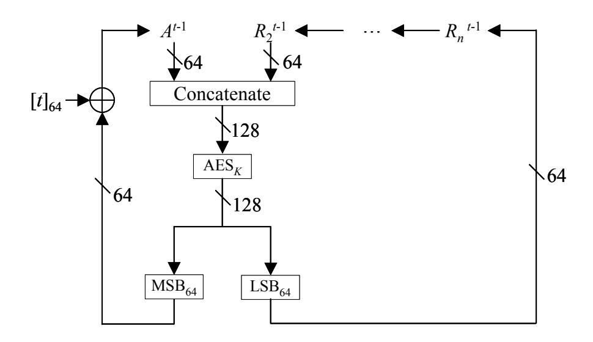
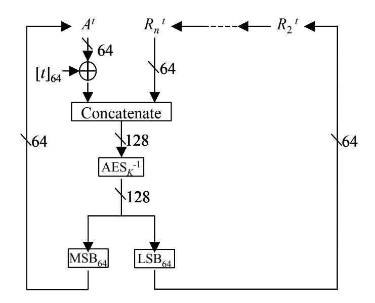
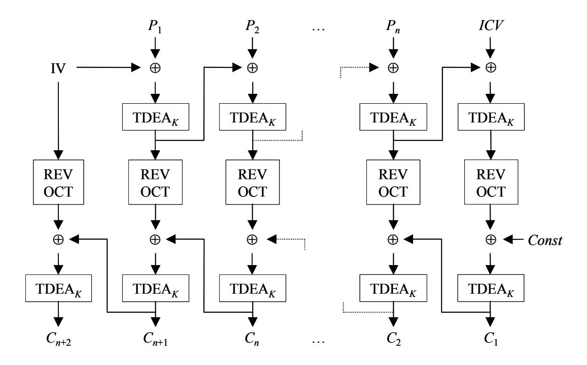
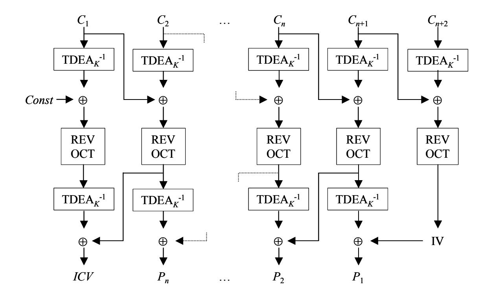
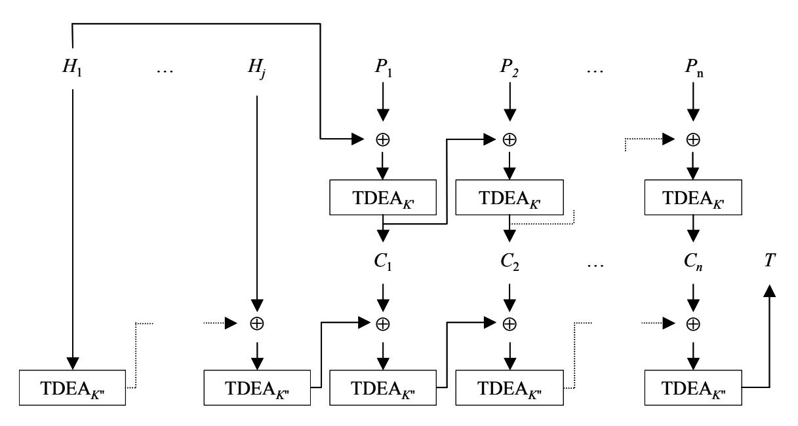
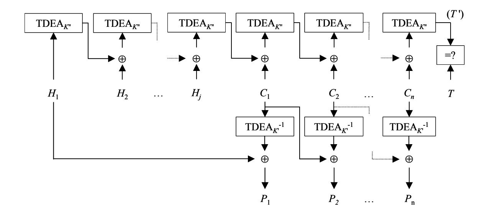

# *Accredited Standards Committee X9, Incorporated*

The following document contains excerpts from draft standard of the Accredited Standards Committee, X9, Inc. (ASC X9) entitled *ANS X9.102- Wrapping of Keys and Associated Data*. ASC X9 grants permission to the editor of this draft standard, the National Institute of Standards and Technology, to reproduce these excerpts, and they are to be used solely for the purpose of commenting and adding input to the draft standard.

These excerpts will be made available on the Cryptology ePrint Archive of the International Association of Cryptologic Research with permission of ASC X9 for a six month period but may not be made available on any other website, public network, satellite or otherwise without the prior written consent of the ACCREDITED STANDARDS COMMITTEE X9, INC., Contact: Cindy Fuller, Executive Director, ASC X9, Inc., P.O. Box 4035, Annapolis, MD 21403 USA.

© *ASC X9, Inc.*

# **Request for Review of Key Wrap Algorithms**

November, 2004

## *1 Introduction*

American Standards Committee X9, Financial Services, Inc., Subcommittee F, Working Group 1 (X9F1) requests a cryptographic review of the four key wrap algorithms in the draft key wrap standard, *ANS X9.102*. This request for review outlines the security goals and the specifications of the four algorithms. Comments on the security of the algorithms should be submitted to the editor of *ANS X9.102*, the National Institute of Standards and Technology (NIST), at dworkin@nist.gov. Comments will be accepted until May 21, 2005.

The four key wrap algorithms are intended to provide privacy and integrity protection for specialized data such as cryptographic keys, called the key data string, without the use of nonces. In addition, for three of the algorithms, integrity protection optionally may be provided for cleartext associated data, called the header, which will typically contain control information about the wrapped key.

The four algorithms that are currently proposed in Draft ANS X9.102 are named AESKW, TDKW, AKW1, and AKW2. The essential specification of AESKW has been available on the NIST key management web page since 2002. The underlying block cipher for AESKW is the Advanced Encryption Standard (AES) algorithm; TDKW is the analogue of AESKW for the Triple Data Encryption Algorithm (TDEA).

TDEA is also the underlying block cipher for the two alternative key wraps, AKW1 and AKW2. AKW1 is essentially the algorithm proposed in the Internet Engineering Task Force (IETF) Request for Comment (RFC) 3217. AKW2 is the algorithm that is implicitly defined in a "key block" specification that has been developed for use in constrained legacy systems in the financial services industry.

# *2 Security Models*

## **2.1 Overview**

The analysis of the privacy or integrity that is provided by an algorithm is typically undertaken in the context of a security model: a specific security property/goal with respect to a specific attack model. In Section 2.2., security models with respect to both privacy and integrity are discussed for AESKW, TDKW, and AKW1. For AKW2, Section 2.3 contains background on the design considerations, and Section 2.4 discusses security models.

## **2.2 Security Models for AESKW, TDKW, AKW1**

With respect to privacy, for AESKW, TDKW, and AKW1, the X9F1 working group proposes the goal of indistinguishability of ciphertexts under adaptive chosen ciphertext attacks<sup>1</sup>. For this model, the adversary chooses two distinct "target" inputs to the wrapping function that are not distinguishable by their length. The wrapping function is then applied to one of the two targets, chosen uniformly at random, under a secret key protection key, also chosen uniformly at random, and the result is returned to the adversary. The adversary breaches the goal if he can distinguish with probability greater than 0.5 which of the two target strings was wrapped.

In an adaptive chosen ciphertext attack, the adversary has access to oracles for both the wrapping and unwrapping functions of the key wrap, under the same key protection key<sup>2</sup>. The oracles may be queried adaptively, i.e., taking into account the results of previous queries, both before and after the adversary chooses the target strings and receives the target ciphertext. Of course, the adversary may not query 1) the wrapping oracle on either of the target strings or 2) the unwrapping oracle on the target ciphertext. For queries to the wrapping oracle for AKW1, which incorporates random bits into the input, the bits are selected uniformly at random, out of the adversary's control.

The queries to the wrapping oracles are limited to 2<sup>48</sup> for AESKW and 2<sup>32</sup> for TDKW and AKW1, consistent with the data requirements of the specifications. Moreover, the adversary's computing operations/time in the adaptive chosen ciphertext attack model are assumed to be less than what would be required to break the underlying block cipher by a brute force search of the key space, where the key size for TDEA is interpreted as the associated "security level," i.e., 112 bits for three-key TDEA, and 80 bits for two-key TDEA.

With respect to data integrity, the attack model is the same, and the security goal is unforgeability. In particular, it should not be feasible for an adversary to produce a valid ciphertext that is new, i.e., different than the result of any query to the wrapping oracle<sup>3</sup>. Feasibility here is assessed in relation to the number of bits of redundancy in the specification of the algorithm: at least 63 in AESKWand TDKW, and at least 64 in AKW1. A forgery is considered feasible if the probability of producing such a ciphertext is greater than could be achieved by random guessing.

The above security models are presented for convenience; however, the X9F1 working group will also consider attacks with a different privacy or integrity goal, or a different attack model, such as, for example, attacks based on related keys or weak keys.

<sup>-</sup>

<span id="page-2-0"></span><sup>&</sup>lt;sup>1</sup> This model is essentially the symmetric key analogue of IND-CCA2 privacy discussed in M. Bellare, A. Desai, D. Pointcheval, and P. Rogaway, Relations among Notions of Security for Public-Key Encryption Schemes *Advances in Cryptology—CRYPTO 1998*, Lecture Notes in Computer Science, vol. 1462, Hugo Krawczyk, ed., Springer-Verlag, 1998..

<span id="page-2-2"></span><span id="page-2-1"></span><sup>&</sup>lt;sup>2</sup> For a well-designed key wrap, however, each output of the unwrapping oracle is likely to be "invalid." This captures the usual definition of data integrity, because the introduction of bit errors into a valid ciphertext, either unintentionally or intentionally, is equivalent to an adversary flipping the corresponding bits of a corresponding oracle output. If the result is a valid ciphertext with sufficiently high probability, then forgery is feasible, contrary to the definition of unforgeability.

## **2.3 Background on the Design Considerations for AKW2**

Unlike AESKW and TDKW, the AKW2 method was developed for a specific environment, the ATM/POS network. This network has evolved over 20 years, so it contains a large number of legacy, computationally limited devices. Many of the devices were originally deployed to implement only 56-bit DEA, and are being retrofitted to support TDEA. The original DEA-based network encrypted DEA keys with ECB. This approach was reasonable given that DEA keys fit within a single block. As TDEA was gradually added to the network, these keys continued to be either ECB encrypted, or CBC encrypted with a zero IV (no MAC). The risks of such an approach are obvious to the cryptographic community.

AKW2 was designed to run on computationally limited devices. As a result, the AKW2 method just employs a TDEA crypto-primitive since these devices often lack sufficient memory and computational power to support other algorithms. The design was created with the realization that every additional TDEA block operation in AKW2 increases the probability that these devices will continue to be operated with ECB-based key management. The method is very specific to the threat model for this network. Other systems must examine the security assumptions very carefully if they are considering using AKW2.

A complete description of the ATM/POS threat model is beyond the scope of this document. However, to help the reader understand the environment, the list below groups the major vulnerabilities that affect key management with symmetric keys into four categories. For more information, consult ANS X9.24 part 1.

- 1) **Failures of procedure** This class of vulnerabilities includes most of the security vulnerabilities that have been exploited in actual networks. It includes bad practices such as the use of test keys in production environments, failures in the enforcement of dual control, and even e-mailing keys to vendors for debugging purposes. Protection from this type of vulnerability is largely a matter for auditors to enforce.
- 2) **Bad random number generation** This class of vulnerabilities is not limited to the financial networks and is included here only for completeness. Techniques for generating good random numbers are beyond the scope of the key wrapping standard.
- 3) **Exhaustive search of 56-bit DEA keys** This class of vulnerabilities is divided into two parts. There are a number of 56-bit DEA keys still in use in the financial networks. The vulnerability of such keys can only be fixed by upgrading the cryptography to TDEA. There is an additional class of attacks that may be performed on TDEA keys wrapped using techniques that do not ensure integrity of the key block that allows an attacker to manipulate encrypted keys to reduce the security of the system to 56-bit keys.
- 4) **Manipulation of Key Usage** This class of vulnerabilities is primarily exploitable at the server, within a data center or switch. At the server, key wrapping and other cryptographic operations are performed within hardware cryptographic modules. The

modules are designed to prevent exposure of cleartext keys to the calling application or any single user. However, if the usage of the keys is not cryptographically enforced within the module, a single user may be able to manipulate the interface to expose keys. These attacks have been well known for years and every vendor includes protection against such attacks. Unfortunately, different vendors use different methods, and these methods are not interoperable. Thus, part of the process of deploying systems that must work in a multi-vendor environment is often a deliberate re-introduction of these vulnerabilities.

The goal of AKW2 is to reduce the threat of attacks based on the third and fourth types of vulnerability.

#### Threat Model Characteristics:

- 1) As in the other TDEA-based wrapping schemes, we consider that an oracle attack is impractical if it requires more than 2<sup>32</sup> queries of the hardware.
- 2) Financial institutions have controls that make it impractical for an attacker to create a related key by XORing the wrapping key with the constant 0x454545454545454545, 0x4D4D4D4D4D4D4DD4D, or 0x08080808080808.
- 3) Finally, we consider that leakage about plaintext key information tends to happen in an "all-or-nothing" manner. Procedural failures that leak key information tend to reveal the entire key. This does not mean that power analysis or other side-channel type of attacks are not capable of leaking partial information about a key, merely that in the financial network the most convenient attack does not involve attacking the wrapped key.

Note that one of the significant security features of the method is not included in the specification of AKW2 in this request for review. The X9F6 working group has created a Technical Report, TR-31, to define a set of headers for common types of keys that will allow keys to be labeled consistently for transport between two vendors. This definition will eliminate many of the O(1) attacks that are currently possible for insiders using multi-vendor solutions.<sup>4</sup>

Balancing the constraints of the legacy network and the security goals led to the following choices for AKW2:

- 1) Key derivation is performed by a simple XOR, rather than a one-way key derivation function. In order to prevent catastrophic failure if a procedural error results in the misuse of a key-wrapping key in both ECB wrapping schemes and AKW2,the keywrapping key is not used directly for encryption.<sup>5</sup>
- 2) The CBC encryption scheme allows the use of a non-random IV.
  - a) Using a non-random IV allows an attacker to identify when the first block of two wrapped keys are equal. Note that valid keys on a database or in transit are random values. The X9F6 working group assumes that the system will not wrap 2<sup>32</sup> key values under the same wrapping key.

-

<span id="page-4-0"></span><sup>&</sup>lt;sup>4</sup> Attacks against key usage can be performed independent of the key length.

<span id="page-4-1"></span><sup>&</sup>lt;sup>5</sup> Note that the assumption about related keys is vitally important to the security of this approach.

- b) When the IV is non-random, the IV is derived from the header to separate different types of keys under different IVs. This helps reduce the number of keys under a particular IV.[6](#page-5-0)
- 3) The MAC algorithm in AKW2 is based on Algorithm 1 of ISO 9797-1.
  - a) Algorithms 2 and 3 are clearly inappropriate with keys derived by XOR.
  - b) Algorithm 1 is vulnerable to simple concatenation attacks. The requirements in Section 7.2, Item 5 provide protection against these attacks.

## **2.4 Security Models for AKW2**

With respect to data integrity, the security model for AKW2 is the same as described in Section 2.2 for the other proposed key wraps: unforgeability under adaptive chosen ciphertext attacks. The number of bits of redundancy is a parameter (the MAC length) of AKW2 between 32 and 64.

However, AKW2 cannot satisfy the same privacy goal as the other three key wrap algorithms. In particular, because the encryption mechanism in AKW2 is the cipher block chaining (CBC) mode of TDEA with a predictable initialization vector (IV), it is straightforward for an adversary to distinguish ciphertexts under adaptive chosen ciphertext attacks. The X9F1 working group suggests the following two alternative models for AKW2.

- Known Plaintext Security. The privacy model in Section 2.2 is weakened in two ways: 1) the two target plaintexts are generated uniformly at random, i.e., not by the adversary; and 2) the adversary may not query the wrapping oracle after receiving the target plaintexts. The adversary may still adaptively query the oracles prior to receiving the target plaintexts and ciphertext, in order to try to learn about the encryption function. The goal is still to determine which of the target plaintexts was encrypted to produce the target ciphertext.
- Ciphertext Only Security. The adversary is given the ciphertexts, i.e. the wrapped forms, of a set of target plaintexts that are generated uniformly at random. The adversary breaches the privacy goal if he can guess any bit of any target plaintext with probability greater than 0.5. As in the known plaintext model, the adversary may adaptively query the oracles prior to receiving the target plaintexts and ciphertext, in order to try to learn about the encryption function.

As with the other key wrap algorithms, analysts are free to devise other models, keeping in mind the threat model characteristics in Section 2.3. Note that AKW2 is designed for a system that provides protection against the use of related keys; however, this protection is independent of the important question of whether the simple relationship between the two *subkeys* introduces vulnerabilities into AKW2.

<span id="page-5-0"></span><sup>6</sup> In addition, this usage provides some very weak protection against another common procedural vulnerability. There are protocols that require the use of a single key for multiple purposes despite the inherent risk. The header IV hides such deliberate re-use from the casual observer. Note that it does not provide any security against knowledgeable insiders.

#### 3 Notation

The following notational conventions apply to the specifications below:

- Variables are italicized: a single, lower case letter represents an integer; other variables, possibly with subscripts or superscripts, represent strings.
- $MSB_x(\cdot)$  and  $LSB_x(\cdot)$  are the functions for the most and least significant x bits.
- AES<sub>K</sub>(•) and TDEA<sub>K</sub>(•) are the (forward) AES and TDEA algorithms under the key K; AES<sub>K</sub><sup>-1</sup>(•) and TDEA<sub>K</sub><sup>-1</sup>(•) are the inverse algorithms.
- The concatenation operation is denoted ||.
- The bit length of a string X is denoted |X|.
- The bit string consisting of x '0' bits is denoted  $0^x$ .
- Given a nonnegative integer x and a positive integer y such that  $x < 2^y$ , the representation of x as a binary string of y bits is denoted  $[x]_y$ .

#### 4 AESKW

#### 4.1 Overview

A link to the original specification of AESKW is available at the NIST key management home page <a href="http://csrc.nist.gov/CryptoToolkit/kms/">http://csrc.nist.gov/CryptoToolkit/kms/</a>. The specification proposed for ANS X9.102 extends the original specification, mainly in the following two ways:

- 1) A formatting function including a padding scheme is specified for encoding the key data string into a sequence of blocks, i.e., the plaintext; thus, AESKW applies to key data strings of arbitrary length (up to the specified maximum).
- 2) A cleartext header may be authenticated, essentially by duplicating the header within the formatting of the key data string into the plaintext. The header is verified within the integrity check function that corresponds to the formatting function.

In practice, the header may be a representative, or message digest, of some other, larger string. In this case, of course, the scope of the integrity assurance extends to the message digest, but not necessarily to the larger string.

Below are specifications of the elements of AESKW: the data requirements, the plaintext formatting function, the integrity check function, the wrapping function, and the unwrapping function.

## 4.2 Data Requirements for AESKW

- 1) The header, H, shall be an octet string whose octet length is less than 256.
- 2) The number of plaintext blocks, n, shall satisfy  $2 \le n \le 2^{32}$ . Consequently, at least one of the two input strings to the formatting function, H and KeyData, shall be nonempty.
- 3) For any given key protection key, no more than 2<sup>48</sup> inputs shall be wrapped in the lifetime of the key.

# 4.3 AESKW Plaintext Formatting Function

*Prerequisites*:

—*ICV*, integrity check value of 48 bits.

Inputs:

- —*H*, header string;
- —KeyData, key data string.

Outputs:

 $-P_1, P_2, ...P_n$ : plaintext, n 64 bit semiblocks.

Steps:

- 1) Let  $s = (64 (|H| + |KeyData|)) \mod 64$ .
- 2) Let  $PadLen = [s]_8$ , e.g., if s = 13 then Padlen = 00001101.
- 3) Let *Hlen* be the binary representation of the octet length of *H* as a string of 8 bits.
- 4) Let  $P_1, P_2, ...P_n$  be the sequence of semiblocks such that  $P_1 \parallel P_2 \parallel ... \parallel P_n = ICV \parallel PadLen \parallel Hlen \parallel H \parallel KeyData \parallel 0^s$ .

### 4.4 AESKW Integrity Check Function

Prerequisites:

—ICV, integrity check value of 48 bits.

Inputs:

- —*H*, header string;
- $-P_1, P_2, ...P_n$ : purported plaintext, sequence of 64 bit semiblocks.

Outputs:

—either "INVALID" or KeyData, a key data string.

Steps:

- 1) Verify the header length:
  - If H is not an octet string of octet length LSB<sub>8</sub>( $P_1$ ), then return "INVALID."
- 2) Verify the header:
  - If *H* is not a prefix of  $P_2 \parallel P_3 \parallel ... \parallel P_n$ , then return "INVALID."
- 3) Verify the integrity check value:
  - If  $MSB_{48}(P_1) \neq ICV$ , then return "INVALID."
- 4) Verify the padding:
  - Let r be the integer whose binary representation is LSB<sub>8</sub>(MSB<sub>56</sub>( $P_1$ )).
  - If r > 63 or LSB<sub>r</sub> $(P_n) \neq 0^r$ , then return "INVALID"; else, return the unique string *KeyData* such that  $H \parallel KeyData \parallel 0^r = P_2 \parallel P_3 \parallel \dots \parallel P_n$ .

# 4.5 **AESKW Wrapping**

*Prerequisites*:

- —K: key protection key, established among all the parties to the data;
- —*ICV*, integrity check value of 48 bits.

Inputs:

- —*H*, header string;
- —KeyData, key data string.

Outputs:

 $-C_1, C_2, ... C_n$ : ciphertext, n 64 bit semiblocks.

Steps:

1) Format the plaintext:

Apply the plaintext formatting function (Section 4.3) to H and KeyData to produce  $P_1, P_2, \dots P_n$ , a sequence of n 64 bit semiblocks for some n.

2) Initialize variables:

Let
$$A^0 = P_1$$
.
For  $i = 2, ..., n$ ,
 $R_i^0 = P_i$ .

3) Calculate intermediate values:

For
$$t = 1, ..., s$$
, where  $s = 6(n-1)$ :

$$A^{t} = \text{MSB}_{64}(\text{AES}_{K}(A^{t-1} || R_{2}^{t-1})) \oplus [t]_{64};$$
For  $i = 2, ..., n-1$ ,

$$R_{i}^{t} = R_{i+1}^{t-1};$$

$$R_{n}^{t} = \text{LSB}_{64}(\text{AES}_{K}(A^{t-1} || R_{2}^{t-1})).$$

4) Output the results:

Let
$$C_1 = A^s$$
.
For  $i = 2, ..., n$ ,
 $C_i = R_i^s$ .

#### Diagram:

The following diagram illustrates the motion of the AESKW wrapping function. The variable that indexes the iterations, t, increases from 1 to 6(n-1). The plaintext formatting function is not illustrated.



# 4.6 AESKW Unwrapping

**Prerequisites**

- —K: key protection key, established among all the parties to the data;
- —*ICV*, integrity check value of 48 bits.

Inputs:

- —*H*, header string;
- $-C_1, C_2, ...C_n$ : the ciphertext, n 64 bit semiblocks.

Outputs:

—either "INVALID" or KeyData, a key data string.

Steps:

1) Initialize variables:

Set
$$A^s = C_1$$
, where  $s = 6(n-1)$ .
For  $i = 2, ..., n$ ,
 $R_i^s = C_i$ .

2) Calculate the intermediate values:

For
$$t = s, s-1, ..., 1$$
:

$$A^{t-1} = \text{MSB}_{64}(\text{AES}^{-1}_{K}((A^{t} \oplus [t]_{64}) \parallel R_{n}^{t}));$$

$$R_{2}^{t-1} = \text{LSB}_{64}(\text{AES}^{-1}_{K}((A^{t} \oplus [t]_{64}) \parallel R_{n}^{t}));$$
For  $i = 3, ..., n,$

$$R_{i}^{t-1} = R_{i-1}^{t}.$$

3) Define the purported plaintext:

Let
$$P_1 = A^{0}$$
.
For  $i = 2, ..., n$ ,
 $P_i = R_i^{0}$ .

4) Verify the purported plaintext:

Apply the integrity check function (Section 4.4) to H and  $P_1, P_2, ... P_n$  and return the result.

#### Diagram:

The following diagram illustrates the motion of the AESKW unwrapping function. The variable that indexes the iterations, t, decreases from 6(n-1) to 1. The integrity check function is not illustrated.



#### 5 TDKW

#### 5.1 Overview

TDKW is the analogue of AESKW with TDEA as the underlying block cipher. Thus, a semiblock now consists of 32 bits, and two semiblocks are essentially devoted to integrity protection.

Below are specifications of the elements of TDKW: the data requirements, the formatting function, the integrity check function, the wrapping function, and the unwrapping function.

## 5.2 Data Requirements for TDKW

- 1) The header, H, shall be an octet string whose octet length is less than 256.
- 2) The number of plaintext blocks, n, shall satisfy  $2 \le n \le 2^{16}$ .
- 3) For any given key protection key, no more than  $2^{32}$  inputs shall be wrapped in the lifetime of the key.

### 5.3 TDKW Plaintext Formatting Function

```
Prerequisites:
```

—*ICV*, integrity check value of 48 bits.

Inputs:

- —*H*, header string;
- -KeyData, key data string.

Outputs:

 $-P_1, P_2, ...P_n$ : plaintext, n 32 bit semiblocks.

Steps.

- 1) Let  $s = (32-(|H| + |KeyData|)) \mod 32$ .
- 2) Let  $PadLen = [s]_8$ , e.g., if s = 13 then Padlen = 00001101.
- 3) Let *Hlen* be the binary representation of the octet length of *H* as a string of 8 bits.
- 4) Let  $P_1, P_2, ... P_n$  be the sequence of semiblocks such that  $P_1 \parallel P_2 \parallel ... \parallel P_n = ICV \parallel PadLen \parallel Hlen \parallel H \parallel KeyData \parallel 0^s$ .

## 5.4 TDKW Integrity Check Function

*Prerequisites*:

—ICV, integrity check value of 51 bits.

Inputs:

- —*H*, header string;
- $-P_1, P_2, ...P_n$ : purported plaintext, sequence of 32 bit semiblocks.

Outputs

—either "INVALID" or KeyData, a key data string.

Steps:

- 1) Verify the header length:
  - If H is not an octet string of octet length LSB<sub>8</sub> $(P_2)$ , then return "INVALID."
- 2) Verify the header:
  - If *H* is not a prefix of  $P_3 \parallel P_4 \parallel \dots \parallel P_n$ , then return "INVALID."
- 3) Verify the integrity check value:
  - If  $MSB_{48}(P_1 \parallel P_2) \neq ICV$ , then return "INVALID."
- 4) Verify the padding:

Let r be the integer whose binary representation is LSB<sub>8</sub>(MSB<sub>24</sub>( $P_2$ )).

If r > 31 or LSB<sub>r</sub> $(P_n) \neq 0^r$ , then return "INVALID"; else, return the unique string *KeyData* such that  $H \parallel KeyData \parallel 0^r = P_3 \parallel P_4 \parallel \dots \parallel P_n$ .

### 5.5 TDKW Wrapping

*Prerequisites*:

- —K: key protection key, established among all the parties to the data;
- —ICV, integrity check value of 48 bits.

Inputs:

- —*H*, header string;
- —KeyData, key data string.

Outputs:

 $-C_1, C_2, ... C_n$ : ciphertext, n 32 bit semiblocks.

Steps

1) Format the key data and header into plaintext:

Apply the plaintext formatting function (Section 5.3) to H and KeyData to produce  $P_1, P_2, ... P_n$ , a sequence of n 32 bit semiblocks for some n.

2) Initialize variables:

Let
$$A^0 = P_1$$
.
For  $i = 2, ..., n$ ,
 $R_i^0 = P_i$ .

2) Calculate intermediate values:

For
$$t = 1, ..., s$$
, where  $s = 6(n-1)$ :

$$A^{t} = \text{MSB}_{32}(\text{TDEA}_{K}(A^{t-1} || R_{2}^{t-1})) \oplus [t]_{32};$$
For  $i = 2, ..., n-1$ ,

$$R_{i}^{t} = R_{i+1}^{t-1};$$

$$R_{n}^{t} = \text{LSB}_{32}(\text{TDEA}_{K}(A^{t-1} || R_{2}^{t-1})).$$

3) Output the results:

Let
$$C_1 = A^s$$
.
For  $i = 2, ..., n$ ,
 $C_i = R_i^s$ .

Diagram:

See the analogous diagram for the AESKW wrapping function in Section 4.5.

## 5.6 TDKW Unwrapping

**Prerequisites**

- —K: key protection key, established among all the parties to the data;
- —ICV, integrity check value of 51 bits.

Inputs:

- —*H*, header string;
- $-C_1, C_2, ...C_n$ : the ciphertext, n 32 bit semiblocks.

Outputs:

—either "INVALID" or KeyData, a key data string.

Steps:

1) Initialize variables:

Set
$$A^s = C_1$$
, where  $s = 6(n-1)$ .
For  $i = 2, ..., n$ ,
 $R_i^s = C_i$ .

2) Calculate the intermediate values:

For
$$t = s, s-1, ..., 1$$
:

$$A^{t-1} = \text{MSB}_{32}(\text{TDEA}^{-1}_{K}((A^{t} \oplus [t]_{32}) \parallel R_{n}^{t}));$$

 $R_{2}^{t-1} = \text{LSB}_{32}(\text{TDEA}^{-1}_{K}((A^{t} \oplus [t]_{32}) \parallel R_{n}^{t}));$
For  $i = 3, ..., n,$
 $R_{i}^{t-1} = R_{i-1}^{t}.$

3) Define the purported plaintext:

Let
$$P_1 = A^{0}$$
.
For  $i = 2, ..., n$ ,
 $P_i = R_i^{0}$ .

4) Verify the purported plaintext:

Apply the integrity check function (Section 5.4) to H and  $P_1, P_2, ...P_n$  and return the result.

Diagram:

See the analogous diagram for the AESKW unwrapping function in Section 4.6.

#### 6 **AKW1**

#### 6.1 Overview

AKW2 essentially employs two passes of CBC encryption: the first pass over the plaintext and a hash-based integrity check value, the second pass in reverse order over the results of the first pass. The elements of AKW1 are specified below: the data requirements, the wrapping function, and the unwrapping function. The formatting of key data into plaintext is not explicitly specified.

### 6.2 Data Requirements for AKW1

- 1) The number of plaintext blocks, n, shall satisfy  $1 \le n \le 2^{16}$ .
- 2) For any given key protection key, no more than  $2^{\frac{1}{32}}$  inputs shall be wrapped in the lifetime of the key.

# 6.3 AKW1 Wrapping

**Prerequisites**

—*K*: key protection key, established among all the parties to the data;

Inputs:

 $-P_1, P_2, ...P_n$ : the plaintext, n 64 bit blocks.

Outputs:

—  $C_1, C_2, ... C_{n+1}, C_{n+2}$ : the ciphertext, n+2 64 bit blocks.

Steps:

- 1) Use an approved random bit generator to generate a random block of 64 bits. Call the result *IV*.
- 2) Let  $ICV = MSB_{64}(SHA1(P_1 || P_2 || ... || P_n))$ .
- 3) Encrypt  $P_1 \parallel P_2 \parallel \ldots \parallel P_n \parallel ICV$ , using TDEA in CBC mode under K, with IV as the initialization vector. Call the resulting ciphertext TEMPI.
- 4) Set  $TEMP2 = IV \parallel TEMP1$ .
- 5) Reverse the order of the octets in *TEMP2*. That is, the most significant (first) octet is swapped with the least significant (last) octet, and so on. Call the result *TEMP3*.
- 6) Encrypt *TEMP3* using TDEA in CBC mode under *K*, with the hexadecimal string 0x4adda22c79e82105 as the initialization vector. Return the result as the ciphertext.

*Diagram*:



### **6.4 AKW1 Unwrapping**

*Prerequisites*

- —*K*: key protection key, established among all the parties to the data*. Inputs*:
- —*C*1, *C*2, … *Cn*+1*, Cn*+2: the ciphertext, *n*+2 64 bit blocks.

*Outputs*:

- —either "INVALID" or *P*1, *P*2, …*Pn*: the plaintext sequence of *n* 64 bit blocks. *Steps*:
- 1) Decrypt the ciphertext using TDEA in CBC mode under *K*, with the hexadecimal string 0x4adda22c79e82105 as the initialization vector. Call the result TEMP3.
- 2) Reverse the order of the octets in TEMP3. That is, the most significant (first) octet is swapped with the least significant (last) octet, and so on. Call the result TEMP2.
- 3) Let *IV* be the single block and TEMP1 the concatenation of *n*+1 blocks such that TEMP2 = *IV* || TEMP1.
- 4) Decrypt TEMP1 using TDEA in CBC mode under *K*, with *IV* as the initialization vector. Call the result TEMP.
- 5) Let *P*1, *P*2, …*Pn, ICV* be the *n*+1 blocks for which TEMP = *P*1 || *P*2|| …|| *Pn* || *ICV*.
- 6) If MSB64(SHA1(*P*1 || *P*2 || …|| *Pn*)) = *ICV*, then return *P*1, *P*2, …, *Pn* as the plaintext; else, return "INVALID."

### *Diagram*:

The following is a diagram of the AKW1 unwrapping function; the verification of the integrity check value is not illustrated.



## 7 *AKW*2

#### 7.1 Overview

AKW2 is essentially CBC mode encryption followed by CBC-MAC authentication of the header and ciphertext, where the two keys are related to the key protection key, and hence to each other, by a constant exclusive-OR difference. The data requirements, the wrapping function, and the unwrapping function for AKW2 are specified in Sections 7.2., 7.3, and 7.4, respectively.

The formatting of the key data string into plaintext blocks, although mandated in the data requirements and verified within the unwrapping function, is not explicitly specified.

## 7.2 Data Requirements for AKW2

- 1) The number of plaintext blocks, n, shall satisfy  $2 \le n \le 2^{16}$ .
- 2) For any given key protection key, no more than  $2^{\overline{32}}$  inputs shall be wrapped in the lifetime of the key.
- 3) The parameter *Tlen* shall be chosen between 32 and 64 and fixed for any given key protection key.
- 4) The function for formatting valid key data strings into plaintext shall be one-to-one, i.e., unambiguously parsible.
- 5) One (or more) of the following conditions shall be met:
  - a) The parameter *Tlen* is 32.
  - b) The formatting of the first block of the header includes an explicit encoding of the length of the string  $H_1 \parallel H_2 \parallel ... \parallel H_i \parallel C_1 \parallel C_2 \parallel ... \parallel C_n \parallel T$ .
  - c) The length of the plaintext is fixed for any given header.

## **7.3 AKW2 Wrapping**

### *Prerequisites*:

- *K*, key protection key, established among all the parties to the data;
- r parameter; —*Tlen*, an intege
- —plaintext formatting function.

### *Input*:

- s; —*H*1, *H*2, ... , *Hj*: *j* header block
- 2, …*P* : formatted plaintext, a sequence of 64 bit blocks. — *P*1, *P <sup>n</sup>*

### *Output*:

- —*C*1, *C*2, …*Cn*: the ciphertext, a sequence of 64 bit blocks;
- *Tlen.* —*T*, message authentication code of bit length

### *Steps*:

- *K*', by exclusive-ORing each octet ncluding parity bits) with 0x45. Similarly, derive the TDEA authentication 1) Derive the TDEA confidentiality subkey, denoted of *K*, (i subkey, denoted *K*'', by exclusive-ORing each octet of *K* with 0x4D.
- key, 2) Encrypt the plaintext using the CBC mode of TDEA with the confidentiality sub K', and initialization vector *H*1 to produce *C*1, *C*2, …*Cn*, the ciphertext.
- AC: 3) Apply the CBC-MAC mode of TDEA with the authentication subkey, *K*'', to the header blocks concatenated with the ciphertext blocks to produce the M
- a) Let *A*0 = 064.
  - b) For *i* = 1 to *j*, let *Ai* = TDE*AK*''(*Hi* ⊕ *Ai*-1).
  - c) Let *B*0 = *Aj*.
  - d) For *i* = 1 to *n*, let *Bi* = TDEA*K*''(*Ci* ⊕ *Bi*-1).
  - (*B* ). e) Let *T* = MSB*Tlen <sup>n</sup>*
- 4) Return *C*1, *C*2, ..., *Cn*, *T*.

### *Steps*:

- ntiality subkey, denoted *K*', by exclusive-ORing each octet ncluding parity bits) with 0x45. Similarly, derive the TDEA authentication 1) Derive the TDEA confide of *K*, (i subkey, denoted *K*'', by exclusive-ORing each octet of *K* with 0x4D.
- key, 2) Encrypt the plaintext using the CBC mode of TDEA with the confidentiality sub K', and initialization vector *H*1 to produce *C*1, *C*2, …*Cn*, the ciphertext.
- AC: 3) Apply the CBC-MAC mode of TDEA with the authentication subkey, *K*'', to the header blocks concatenated with the ciphertext blocks to produce the M
- a) Let *A*0 = 064.
  - b) For *i* = 1 to *j*, let *Ai* = TDE*AK*''(*Hi* ⊕ *Ai*-1).
  - c) Let *B*0 = *Aj*.
  - d) For *i* = 1 to *n*, let *Bi* = TDEA*K*''(*Ci* ⊕ *Bi*-1).
  - (*B* ). e) Let *T* = MSB*Tlen <sup>n</sup>*
- 4) Return *C*1, *C*2, ..., *Cn*, *T*.

*Diagram*:



### **7.4 AKW2 Unwrapping**

### *Prerequisites*:

- —*K*, key protection key, established among all the parties to the data;
- —*Tlen*, an integer parameter;
- —a plaintext formatting function.

### *Input*:

- —*H*1, *H*2, ... , *Hj*: *j* header blocks;
- —*C*1, *C*2, …*Cn*: ciphertext, *n* 64 bit blocks;
- —*T'*, the purported message authentication code of bit length *Tlen*.

### *Output*:

—either "INVALID" or *KeyData*, the key data string.

### *Steps*:

- 1) Derive the TDEA confidentiality subkey, denoted *K*', by exclusive-ORing each octet of *K*, (including parity bits) with 0x45. Similarly, derive the TDEA authentication subkey, denoted *K*'', by exclusive-ORing each octet of *K* with 0x4D.
- 2) Apply the CBC-MAC mode of TDEA with the authentication subkey to the header blocks concatenated with the ciphertext blocks to produce the MAC:
- a) Let *A*0 = 064.
  - b) For *i* = 1 to *j*, let *Ai* = TDEA*K*'' (*H*i⊕ *Ai*-1).
  - c) Let *B*0 = *Aj*.
  - d) For *i* = 1 to *n*, let *Bi* = TDEA*K*'' (*Ci* ⊕ *Bi*-1).
  - e) Let *T* = *Bn*.
- 3) Compare the purported MAC to the MAC that was produced in Step 2: if *T* = *T'*, then continue to Step 4; else return "INVALID."
- 4) Decrypt *C*1, *C*2, …*Cn* using the CBC mode of TDEA with the confidentiality subkey K' and initialization vector *H*1 to produce *P*1, *P*2, ..., *Pn*.

5) Verify the formatting of the plaintext with respect to the header, including the applicable element of Data Requirement 5 in Section 7.2. If the plaintext is validly formatted, return  $P_1$ ,  $P_2$ , ...,  $P_n$ ; else return "INVALID." *Diagram*:

