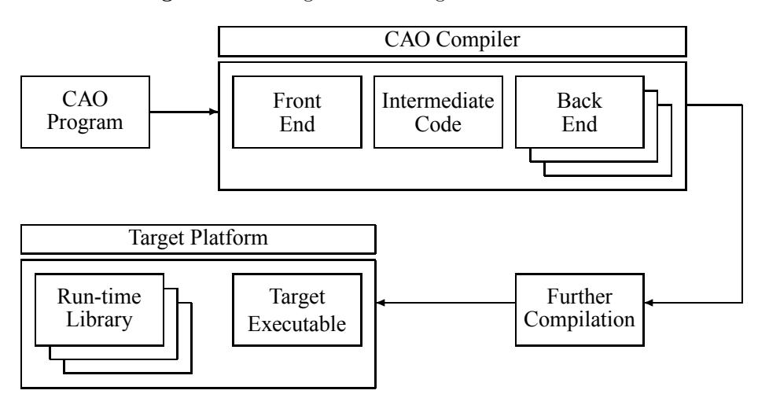
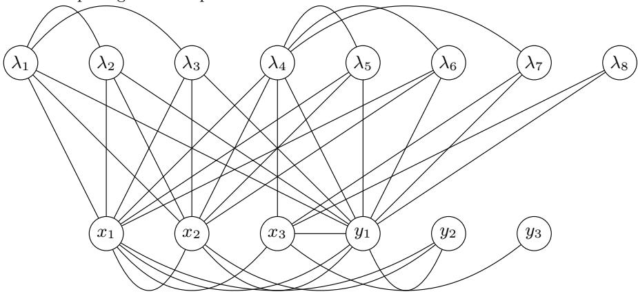
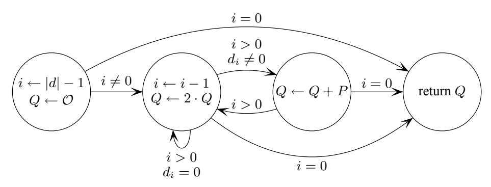
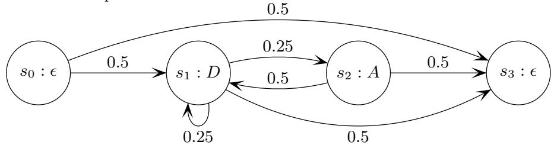

# First Steps Toward a Cryptography-Aware Language and Compiler

M. Barbosa<sup>1</sup> , R. Noad<sup>2</sup> , D. Page<sup>2</sup> and N.P. Smart<sup>2</sup>

> <sup>1</sup> Departamento de Informtica, Universidade do Minho, Campus de Gualtar, 4710-057 Braga, Portugal. mbb@di.uminho.pt <sup>2</sup> Department of Computer Science, University of Bristol, Merchant Venturers Building, Woodland Road, Bristol, BS8 1UB, United Kingdom. {noad, page, nigel}@cs.bris.ac.uk

Abstract. When developing secure, high-performance cryptographic software, the programmer is presented with a wide range of problems. Not only must they be conversant with pertinent scientific results, they must efficiently translate said results into a practical context. Unlike when writing normal programs, they are given little help from either the language or compiler: both are typically too general purpose to offer domain specific optimisation or analysis that would save the programmer time and reduce the potential for error. As a step toward solving this problem we present CAO, a cryptography-aware domain-specific language and associated compiler system. Rather than being a panacea, we pitch CAO as a mechanism for transferring and automating the expert knowledge of cryptographers into a form which is accessible to anyone writing security conscious software.

## 1 Introduction

#### 1.1 The Problem

A Performance Perspective The basic purpose of a compiler is to translate a program written in some language, typically containing high-level constructs, into a low-level or executable form. Essentially this mechanises the processes that an expert programmer might perform by hand and, as a result, removes the associated tedium and error. To allow successful translation, the programmer specifies the program using a precise list of operations and variables of known type on which those operations act. Since the compiler is empowered with knowledge of what these operations and types mean, it can manipulate and translate the program into a high-quality result while allowing the program specification to exist in a form which is natural to the programmer.

However, consider the situation where one writes a program containing types the compiler knows nothing about. For example, when writing cryptographic software it is common to use finite field types which are implemented in a library, typically as a class or set of functions that encapsulate the data and operations involved. Although from a programming perspective the class or functions allow a programmer to easily manipulate finite fields, the compiler still knows nothing about them or their operational semantics. Even if we allow operator overloading to allow easy expression of the program, an example code sequence such as:

```
gfp a, b, c, d;
a = a + a;
b = a * 2;
c = a * a;
d = power( a, 2 );
```

suffers from a number of problems. The variables are not automatically allocated registers, or temporaries if they are non-native; we need to manually allocate them in order to minimise the space they occupy. Standard strength reduction techniques cannot be applied; we must manually translate multiplication by small constants into an appropriate addition chain. Common sub-expression elimination cannot be performed; we must manually detect and share intermediate results which further complicates the minimisation use of temporary variables. The prescribed use of functions to represent operations not native to the language means analysis and transformation is harder for the compiler; it knows nothing about the meaning of the function and inter-function analysis is typically much harder then intra-function analysis.

In short, all the optimisations you would expect if the type of variables were native to the compiler are unavailable when the types are not native. The program is essentially written in a pseudo-high-level language: there are structured control flow statements but operations are otherwise at the level one would expect in a low-level language. This situation presents a clear problem for the programmer in that they are again burdened with a lot of hard work. Additionally, optimising the program partly obfuscates the it since the result no longer describes the original algorithm, but the form required for efficient implementation.

A Security Perspective Although there is clearly some overlap in definition, security related problems in software are generally harder to diagnose and solve than their functional equivalent. Firstly, security problems fail to follow the often quoted programming commandment that errors should be forced to present themselves in a noticeable rather than subtle way so they can more easily be eradicated. While functional problems will generally cause a program to crash or execute incorrectly, security problems only become an issue when someone exploits them, by which time it is too late. Secondly, an attack on security will deliberately search for and pick on an operation that the programmer has not considered, rather than the bug being triggered through normal patterns of use. In this sense, they are harder to detect since they require second guessing the ability and focus of an attacker who will search every avenue to achieve their unknown goal, rather than a user who interacts with the program to achieve a pre-determined task. Finally, the problems differ in that a single security problem is catastrophic, since an attacker need only target the weakest link in the security chain to achieve their goal, while functionality problems are generally less severe: even if an error is terminal, it is possible the program will function correctly aside from the operation that cause the error.

To address the problem of solving security problems, it is obviously attractive to offer a programmer automatic assistance in the same vein as the use of compiler systems to help solve functional problems by issuing error and warning messages. Such a mechanical approach is less error prone and offers a more satisfactory, although clearly not perfect, level of quality assurance. This sort of approach is becoming an increasingly common method for dealing with the threat of buffer overflow attacks. Resigning themselves to the fact that human programmers will inevitable produce vulnerable programs, researchers have developed systems that use compile-time [32, 39, 62] and run-time [10, 25] methods to detect and prevent attack. Investigation into many other security vulnerabilities has followed, with work to detect problems through programming errors [8]; combined static and dynamic analysis to prevent format, race and buffer overflows [17–20]; and even for intrusion detection systems [61]. Although it is difficult to quantify how successful these methods are in the field, it is clearly advantageous to use mechanical tools to assist the programmer in addressing security vulnerabilities within a large corpus of source code.

Although their remit is substantially different from that of classical cryptographers, researchers in the field of formal methods have developed techniques which allow automated or partly automated detection of security vulnerabilities [56]. Using these techniques, detectable problems lie within programs which describe protocols; the programmer describes the protocol, typically in some process algebra [1, 2, 31, 45], and then executes model checking software to prove that the description is secure. Such a proof, using the Spi Calculus for example, might demonstrate that a protocol is secure if one can demonstrate that two functions are indistinguishable for all input messages or keys. As noted and partly addressed by Boreale [14], with the key and message spaces potentially being very large by design, this is difficult to actually check mechanically. Even so, there is an increasing number of good tools to support this methodology. In particular, the Jif [51] system seems attractive since it allows program description in a dialect of Java rather than a process algebra which can be prohibitively hard to use. Other examples include the CPPL language of Guttman et al. [29], which offers a special purpose language focused on describing cryptographic protocols, and the library system of Backes et al [11] which is constructed in a way that allows automated proofs on protocols that link against it.

Despite the fact that automatically providing security proofs for cryptographic software is some way off, the formal analysis of programs has at least started to address one area that has been overlooked elsewhere: security against side-channel attack [3, 60]. Formally proposed by Kocher et al., side-channel analysis is the art of externally monitoring a device while it executes some algorithm that includes secret information. By careful profiling of time [36], power [37] or electromagnetic emissions [4, 5] and correlation of said profiles with the target algorithm, an attacker can often uncover the secret information. Although sound defence techniques have been well investigated in recent years they are typically implemented in an ad-hoc manner under sole control of the programmer: there is no way to provide assistance in diagnosing areas of the software that need protection or to actually implement said protection. Since attack and defence techniques are becoming increasingly well understood, it seems important to transfer this knowledge into automated tools that can make the programmers job easier and catch subtle but potentially catastrophic errors.

A Maintenance Perspective Given that the programmer of cryptographic software must manually optimise the performance and validate the security his programs, the final problem they encounter is one of maintenance. Even from a naive viewpoint, the problem is obvious: making even small changes might demand labour intensive re-optimisation and re-validation of the previously sound program. This is further complicated by the fact that in order to cope with a diverse range of targets, several synchronised versions of the same program may need to be maintained either in different source files or via some form of conditional compilation. For example, if the cost of addition versus multiplication is different on one machine than another, it might make sense to replace multiplication by small constants with an addition chain on one machine but not the other. Furthermore, consider the case where one machine has some security enhanced architectural support, such as an execute-only-memory (XOM) [44, 43] or a split stack to prevent buffer overflow [48], but another does not. The threat model against the software will differ and demand different analysis of each program version.

Even with the support of a revision control system, human programmers are typically bad at this sort of maintenance. Inconsistencies and oversights will start to exist between program versions with error and inefficiency being the inevitable result. At first glance, it seems naive to assume one can construct a universal language for naturally describing all programs and compiling them efficiently to all targets. For example the demands of hardware and software implementation typically demand designs are written using radically different programming metaphors. However, working within the constrained domain of cryptographic software, and given they typically have quite a rich mathematical structure, it seems entirely possible to approximate such a language, see for example [7]. As a result, the issues of maintenance are at least partly solved: we need describe our cryptographic kernel only once, leaving the tedious work of re-optimisation and re-validation to automated phases of the compiler.

#### 1.2 Toward a Solution

To address the dual goals of being able to write programs that can be analysed for security problems and compiled into a high-performance executable, we present CAO, a domain specific language (DSL) for describing cryptographic software, and an associated compiler system. The CAO language allows practical description of cryptographically interesting programs which can be analysed by the compiler that instruments a number of security conscious analysis, transformation and optimisation phases. The central principle behind the design of CAO is the promotion of notions central to the description of such programs to first class features in the language which are then supported by the compiler.

Unlike languages such as Magma [46] or Maple [47] which allow the description of high-level mathematical constructions, we restrict our focus to the implementation of cryptography kernels such as block ciphers; hash functions; and sequences of finite field arithmetic used to implement systems such as elliptic curve cryptography (ECC). By constructing compiler tool-chains that perform analysis and instrument defence techniques on such kernels, we hope to derive similar benefits to those experienced by programmers switching from low-level assembly languages to higher-level programming languages. That is, by expressing their programs in a more natural manner, a programmer will improve their productivity, reduce their rate of error and generally produce software of a higher quality.

We stress that CAO is not intended as a panacea or silver-bullet. It would be exceptionally hard to build an automated tool to discover new attack or defence techniques, neither is it realistic to assume that we can generate code which will always outperform a hand-written, highly optimised assembly language alternative. Equally, it is hard to imagine someone totally trusting the compiler output. In the same way as bugs in normal software occur, bugs in compilers can cause them to operate incorrectly: because of this, security conscious programmers might typically perform some final, manual validation checks and optimisation before CAO generated code is shipped. We also stress the difference between secure software and compilers that address security problems, and cryptographic software. The two inhabit entirely different domains, are susceptible to very different classes of attack, and demand vastly different means with which to describe programs within those domains. In this respect, we view CAO as complementary to rather than competitive with languages like Fortress [6].

Our aim is simply to move toward a situation where a novice programmer is assisted in constructing cryptographic software: the basic premise is that CAO should enable the transfer of knowledge from expert programmers and cryptographers into an automatic tool that can assist everyone else. High on our list of goals is that of practicality; we want programmers to write programs in CAO as easily, or more easily, as they can in C to combat the problem with formalisms like the Spi Calculus which are hard to use. To accommodate this need, our language design philosophy is somewhat ad-hoc rather than being formally exact. However, on the whole we have attempted to be minimalist in those

Fig. 1. A CAO.


elements added to the language and somewhat agnostic towards security so that the language is more generally useful.

#### 1.3 History

The acronym CAO was originally used to describe the idea of taking C and merging it with the good bits of occam to give C And Occam. This seemed like a nice, easy to pronounce name so it stuck; also since we were interested in finite fields, the cow-field relation seemed amusing. However, like most modern languages CAO borrows things from many other sources as well: parts of it are pseudo-functional; parts of it are pseudo-HDL; some parts are even totally novel. When it was adopted to investigate issues of security the acronym CHAOS, standing for C, Haskell And Occam for Security, was suggested. This name was taken by some other project and it also hinted at the chaotic nature of the language design and compiler implementation so was rejected.

#### 1.4 System Overview

The general design of the CAO compiler is such that it translates between the CAO language and some target language which is either executed directly by the target platform or compiled further. In both cases, the executable is supported by a run-time library which manages operations on non-native types such as finite fields. The tool-chain is shown in Figure 2.

For example, we can target JavaCard smart-cards by generating Java bytecode directly from the compiler. To target a desktop computer, we might generate C from the compiler and then use GCC to translate this into an executable. Since the CAO compiler is performing the translation, the programmer need not be knowledgeable about either the target platform or run-time library. This is clearly advantageous; we can compile the same CAO program onto multiple target platforms using different run-time libraries with minimal intervention from

Fig. 2. A block diagram illustrating the CAO tool-chain.



the user. For example, from a CAO program we might generate several target programs in C which can be linked to NTL [58], LiDIA [30] or nuMONGO [9] depending on the preference of the user. From this point of view, cryptographic libraries can be selected purely on their performance, memory footprint and feature sets rather than on how easy they are to use.

This architecture is also advantageous in the sense that by decoupling the various stages of the CAO compiler from each other, it is entirely possible to have a proprietory back-end for some commercially sensitive processor yet still benefit from the analysis and transformation phases in the front-end.

#### 1.5 Document Overview

In this document, we introduce the CAO language and present a number of the more interested features of the CAO compiler. To limit our scope, we concentrate on the description of public key primitives and their compilation from CAO to C source code which is linked to the NTL [58] library. In Section 2 we describe various performance and security oriented compiler phases and how they operate on an example program which implements ECC point multiplication. We then discuss how this example program is translated into C code in Section 3. Finally, we present some concluding remarks in Section 4, offering a fairly comprehensive language overview in Appendix A and a tentative list of potentially interesting research directions that relate to CAO in Appendix B.

Listing 1.1. A CAO implementation of the double-and-add algorithm.

```
1 pmul ( Px : f , Py : f , d : int : { secret } ) : f , f
2 {
3 Qx : f;
4 Qy : f;
5 i : int ;
6
7 Qx := 0;
8 Qy := 0;
9
10 for ( i := sizeof ( d ) - 1; i >= 0; i := i - 1 )
11 {
12 ( Qx , Qy ) := pdbl ( Qx , Qy );
13
14 if ( d[i ] == 1 )
15 {
16 ( Qx , Qy ) := padd ( Qx , Qy , Px , Py );
17 }
18 }
19
20 return Qx , Qy ;
21 }
```

Listing 1.2. A CAO implementation of point addition assuming global curve parameters A and B.

```
1 padd ( x1 : f , y1 : f,
2 x2 : f , y2 : f ) : f , f : { observable := A , sameas := pdbl }
3 {
4 l : f;
5 x3 : f;
6 y3 : f;
8 l := ( y2 - y1 ) / ( x2 - x1 );
9 x3 := l **2 - x1 - x2 ;
10 y3 := ( x1 - x3 ) * l - y1 ;
11
12 return x3 , y3 ;
13 }
```

Algorithm 1: The double-and-add method for scalar point multiplication.

```
Input: point P, integer d
Output: point Q = d \cdot P

1 Q \leftarrow \mathcal{O}
2 for i = |d| - 1 downto 0 do
3 Q \leftarrow 2 \cdot Q
4 if d_i = 1 then
5 Q \leftarrow Q + P
6 end
7 end
8 return Q
```

#### Algorithm 2: An algorithm for point addition.

```
Input: curve parameters A and B, points P=(x_1,y_1) and Q=(x_2,y_2) with P\neq Q
Output: point R=(x_3,y_3)=P+Q
1 \lambda\leftarrow\frac{y_2-y_1}{x_2-x_1}
2 x_3\leftarrow\lambda^2-x_1-x_2
3 y_3\leftarrow(x_1-x_3)\lambda-y_1
4 return x_3,y_3
```

## 2 Code Analysis

Our current implementation of the CAO compiler is typical of a research compiler in that we have concentrated on the elements which are interesting to us and hence neglected many others. Although the system is far from being ready for use in earnest, we already have a number of interesting security conscious analysis phases in development which act as an example of what is possible. Thus far, we have concentrated on public key systems, in particular ECC [12, 13]. Although this avoids issues relating to primitives such as block ciphers, we stress that this is for the purposes of exposition only: the CAO language includes several features which permit their efficient description, we simply have not focused on implementing these features yet.

Restricting ourselves to working over the field  $K = \mathbb{F}_p$ , where p is a large prime, our elliptic curve is defined by:

$$E(K): y^2 = x^3 + Ax + B$$

for some parameters A and B. The set of rational points P=(x,y) on this curve, together with the identity element  $\mathcal{O}$ , form an additive group. ECC based public key cryptography typically derives security by presenting an intractable discrete logarithm problem over this curve group. That is, one constructs a secret integer d and performs the operation  $Q=d\cdot P$  for some public point P. Since reversing this operation is hard, one can then transmit Q without revealing the value of d. There are a wide range of efficient algorithms to perform point

#### Algorithm 3: An algorithm for point doubling

```
Input: curve parameters A and B, point P = (x_1, y_1)

Output: point R = (x_3, y_3) = 2 \cdot P

1 \lambda \leftarrow \frac{3x_1^2 + A}{2y_1}

2 x_3 \leftarrow \lambda^2 - 2x_1

3 y_3 \leftarrow (x_1 - x_3)\lambda - y_1

4 return x_3, y_3
```

**Listing 1.3.** A CAO implementation of point doubling assuming global curve parameters A and B.

```
pdbl(x1:f,y1:f):f,f:{observable:=D, sameas:=padd}

{
        1:f;
        x3:f;
        y3:f;

        1:=(3*(x1**2)+A)/(2*y1);
        x3:=1**2-(2*x1);
        y3:=(x1-x3)*1-y1;

return x3, y3;
}
```

multiplication. The most basic of these is the binary or double-and-add method, described by Algorithm 1 and in CAO by Listing 1.1, which we use to illustrate our analysis phases. Note that we use affine points and slightly simplify the addition and doubling algorithms to ease discussion. Specifically, in a complete implementation we should check and resolve conditions such as performing an addition where P = Q or where either  $P = \mathcal{O}$  or  $Q = \mathcal{O}$ .

We begin by assuming we have defined and subsequently initialised a field type and associated curve parameters:

```
typedef f := gf[ 2**192 - 2**64 - 1 ];
A : f;
B : f;
```

so we can work on NIST-P192, a NIST standard curve defined over a 192-bit prime field. The back end of the compiler can spot that the field is defined by a non-general prime, in this case a generalised Mersenne prime, and utilise specialise arithmetic within the run-time to improve performance over the general case. Further, since each defined field type is distinct, if the run-time library supports it the compiler can manage operations on multiple fields at once. In

**Table 1.** A table describing liveness properties of temporary variables while computing an affine point addition.

| Operation                                        | Live In                               | Live Out                              |
|--------------------------------------------------|---------------------------------------|---------------------------------------|
|                                                  |                                       | $x_1, y_1, x_2, y_2$                  |
| $\lambda_1 \leftarrow y_2 - y_1$                 | $x_1, y_1, x_2, y_2$                  | $x_1, y_1, x_2, \lambda_1$            |
|                                                  |                                       | $x_1, y_1, x_2, \lambda_1, \lambda_2$ |
| $\lambda_3 \leftarrow \lambda_2^{-1}$            | $x_1, y_1, x_2, \lambda_1, \lambda_2$ | $x_1, y_1, x_2, \lambda_1, \lambda_3$ |
| $\lambda_4 \leftarrow \lambda_1 \cdot \lambda_3$ | $x_1, y_1, x_2, \lambda_1, \lambda_3$ | $x_1, y_1, x_2, \lambda_4$            |
| $\lambda_5 \leftarrow \lambda_4^2$               | $x_1, y_1, x_2, \lambda_4$            | $x_1, y_1, x_2, \lambda_4, \lambda_5$ |
| $\lambda_6 \leftarrow \lambda_5 - x_1$           | $x_1, y_1, x_2, \lambda_4, \lambda_5$ | $x_1, y_1, x_2, \lambda_4, \lambda_6$ |
| $x_3 \leftarrow \lambda_6 - x_2$                 | $x_1, y_1, x_2, \lambda_4, \lambda_6$ | $x_1, y_1, x_3, \lambda_4$            |
| $\lambda_7 \leftarrow x_1 - x_3$                 | $x_1, y_1, x_3, \lambda_4$            | $x_1, y_1, x_3, \lambda_4, \lambda_7$ |
| $\lambda_8 \leftarrow \lambda_4 \cdot \lambda_7$ | $x_1, y_1, x_3, \lambda_4, \lambda_7$ | $y_1, x_3, \lambda_8$                 |
| $y_3 \leftarrow \lambda_8 - y_1$                 | $y_1, x_3, \lambda_8$                 | $x_3, y_3$                            |
|                                                  | $x_3, y_3$                            |                                       |

ECC however, this ability is not utilised. Note that usually one would defined a point structure and utilise instances of this structure rather than separate coordinates; although possible, we deliberately avoid this so as to minimise the amount of new syntax introduced.

### 2.1 A Performance Perspective

**Register Allocation** One of the most tedious parts of implementing sequences of operations on types not supported by the compiler is finding an allocation of temporary variables which is efficient, i.e. uses the least amount of memory. For example, when implementing Algorithm 2 we start with a list of field operations that use an unbounded number of temporaries, say  $\lambda_1 \dots \lambda_n$ , and are required to fit them into the memory available on the target platform.

Register allocation of native types is often achieved by performing liveness analysis of the temporaries involved; constructing an interference graph which describes overlapping liveness ranges; and performing graph colouring on where the colours are register names [50, Chapter 16]. This process is illustrated by Table 1 and Figure 3 which show the calculation of liveness and interference between intermediate variables in Algorithm 2. From this, we can see that aside from the parameter and return values which are implicitly assigned their own space, we need only two temporary registers in order to compute the algorithm correctly.

Since we are currently targeting C code which is linked to NTL via a further compilation stage, we do not consider the case where we run out of temporaries and need to spill some to memory. However, adding this capability is a natural extension along the same lines as conventional compilers.

Fig. 3. A graph of interference built from the liveness properties of temporary variables while computing an affine point addition.



Strength Reduction In a typical implementation of Algorithm 3, multiplication of field elements by small constants is typically unrolled into an efficient addition chain since addition is far less costly than multiplication. In the terminology of compilers this is a type of strength reduction [50, Chapter 12]. For example the computation from Line 2 which computes 2x<sup>1</sup> can be replaced by x1+x<sup>1</sup> since we know that addition is less expensive than multiplication. Clearly we apply the same technique to exponentiation.

From a purists perspective, performing this optimisation manually obfuscates the program; early optimisation like this is a poor choice since it limits both understanding of the algorithm and portability of the program which implements it. In the example above, we have made an assumption about the cost ratio between addition and multiplication and hard coded it into our implementation. If this assumption is false for some platform, we must re-evaluate the implications of our optimisation and maybe replace it with something more appropriate. Within CAO however, this potential disadvantage is eliminated since we describe a program in the most natural form and rely on automated optimisation. More precisely, since the back end of the compiler has intimate knowledge of the target architecture, or can perform experiments to find out this information, it can evaluate the least costly option and implement it automatically.

In general, the problem of computing optimal addition chains is NP-complete. However, we typically only need to compute chains for small values and can get reasonable result using only a basic algorithm, for example the power-tree method of Knuth [35, Section 4.6.3]. Currently we only consider strength reduction of operations by replacing them with less costly alternatives; in reality we would also like to automatically detect and instrument pre-computation of costly constants. This is an area marked for future work. Another interesting extension is to consider a method of generating addition chains which interacts with the register allocator to minimise the amount of space used. For example, one might use and extend the method of Parker and Plater [54] so that a trade-off between short addition chains and low memory use is reached. Still further work might recognise and utilise multi-exponentiation as a means of reducing cost.

Common Sub-expression Elimination Intermediate results which are common between different parts of the computation and can potentially be shared without re-computation should there be enough registers to accommodate them. There is no good example of this in either Algorithm 2 or Algorithm 3. However, in general if we have an operation such as x<sup>1</sup> + x<sup>1</sup> twice in the program and the value of x<sup>1</sup> is not altered between the two, we can compute the value just once and share the result. Clearly such an operation is a trade-off between the spaced used to store the intermediate value and the time required to recompute it.

In compiler terminology such an optimisation is termed common sub-expression elimination [50, Chapter 13] and is easily realised for types known to the compiler.

### 2.2 A Security Perspective

The double-and-add algorithm described above is vulnerable to SPA-based sidechannel attack where the attacker monitors the power usage of the host device while executing the point multiplication by d. Since one is composed from a different sequence of field operations than the other, the power profiles of point addition and doubling will be distinguishable. Denoting addition by A and doubling by D, a monitoring phase presents the attacker with a trace detailing the operations performed during execution of the algorithm. For example, by monitoring the execution of Algorithm 1 using the multiplier d = 1001<sup>2</sup> = 910, we get the trace:

#### DADDDA

Given this trace, the attacker can recover the value of d simply by spotting where the point additions occur: if an addition occurs then d<sup>i</sup> = 1, otherwise d<sup>i</sup> = 0.

Simple Indistinguishability Tests The crux of the problem described above is that an observable operation is conditionally executed based on information that should remain secret. In the case of the double-and-add algorithm, this conditional statement is glaringly obvious and so spotting the vulnerability is simple once the programmer is aware of the issues. However, in more complex systems consisting of composite algorithms and where the secrecy of data is not as obvious, spotting such conditionals is much harder.

We can easily equip the compiler with the ability to locate this sort of vulnerable operation. We simply require a mechanism to communicate the privacy status of variables to the compiler and some simple analysis to determine if two code sequences are indistinguishable from each other. In Listing 1.1 we mark the multiplier d with the secret attribute to show that it should not be revealed to

Fig. 4. The control flow graph of the double-and-add algorithm.



an attacker. Using this extra information, the CAO compiler issues the following warning message when the program is compiled:

```
warning [pmul.cao:14:7-16] : branch based on secret condition
    if( d[i] == 1 )
        ^
```

This is essentially telling us that the branch condition has been marked as secret and hence if the executed content is observable, may be leaked.

As suggested by Coron [16], one way to avoid this problem is to employ a double-and-add-always method whereby a dummy addition is executed if the real one is not. Although this significantly reduces the performance, it acts to mask when the real addition occurs and hence leaks no information about the multiplier bit being used. More generally, if we can balance both sides of the branch in terms of observable operations, it will leak no information even if the condition is secret. An area of further work is to improve our simple indistinguishability test to cater for this possibility. Currently we simply spot where branches based on secret information are used. If we can tell where the two sides of a branch are balanced, such a test will more accurately predict actual security problems. We leave this as an area for future work.

This can be extended to more general operations whose execution is somehow dependent on secret information. For example, some attacks against use the fact on certain processors, bitwise shift and rotate operations take different amounts of time to complete depending on the shift distance. If the distance is secret, this can leak information to the attacker; in CAO we can detect and warn against this problem at compile-time.

Automatic HMM Analysis A common method for defending point multiplication against side-channel attack is to introduce some form of randomisation. This can either be done as part of the actual algorithm or as an exponent recoding phase, for example see the work of Oswald and Aigner [53]. However, previous

**Fig. 5.** A HHM description of the double-and-add algorithm. Nodes are marked with a node name  $s_i$  and an observable event,  $\epsilon$  denotes no observable. Edges are marked with transition probabilities.



research has shown that by modeling such algorithms as Hidden Markov Models (HMM), one can take the randomised side-channel information and reconstruct the original trace hence defeating the countermeasure. Oswald [52], Karlof and Wanger [34] and then Green, Noad and Smart [28] have all shown that this method is very effective in attacking systems that otherwise seem secure.

Once the HMM for a given algorithm has been constructed, the analysis is automatic: one feeds the algorithm and a number of captured randomised side-channel traces to the system and it recovers the genuine trace. Since at some point the algorithms are written as program code, it seems obvious to attempt a further step in terms of automation by constructing the HMM from the program code. In fact, this is fairly easily achieved since the HMM is essentially a distilled version of the program control flow graph with probabilities attached to the branches. The calculation of these probabilities is eased by the fact that randomisation is a first class concept in CAO but otherwise can be achieved using similar analysis phases as branch prediction would be in a conventional compiler. The observable events that occur are derived from attributes placed by the programmer: notice that the point addition and doubling implementations in Listing 1.2 and Listing 1.3 are both marked with the observable attribute to specify that they should be viewed as observable by an attacker.

As an example, consider the double-and-add method from previous discussion. Constructing the control flow graph from this algorithm is simple; we do this as part of other analysis phases, the result is shown in Figure 4. We can then translate this control flow graph into a HMM representation as shown in Figure 5. Using this graph, we can perform a similar form of automated analysis as Green, Noad and Smart to produce some idea of how secure the algorithm is.

Several problems prevent this being a trivial task. First, the double-and-add algorithm is an exception simple example; we use it here because of exactly that fact. More complex control flow graphs demand more involved translation. Second, in order to perform the automated analysis of the constructed HMM we need a trace generator which will give us example runs of the algorithm. In fact, this is not too much of a problem since we have the algorithm in an intermediate form within the compiler; we simply need to embed an interpreter

in the compiler to execute the model and produce traces or execute the actual HMM itself.

Automatic Construction of Indistinguishable Operations Considering the double-and-add method for point multiplication as described above, one method of defending against the basic SPA attack is to construct the point addition and doubling formula so that they are indistinguishable from each other. This is generally achieved by splitting the more expensive point addition into two parts, each of which is identical in terms of the operations it performs to a point doubling. Put more simply, instead of recovering an operation trace such as:

#### DADDDA

from the SPA analysis, an attacker gets:

#### DDDDDDDD

from which they can get no useful information. This methodology has been successfully constructed in several vanilla ECC implementations [59, 26]. It is this basic form of analysis that we consider; we simply reorganise the formulae so they are indistinguishable rather than performing more complex manipulation of the formulae or curve representation [42, 33]. The problem with the approach is that reorganising the formulae to make them indistinguishable while minimising any overhead is still non-trivial. This is especially true when the arithmetic sequences are more complex than in ECC, as is the case in systems like XTR, or HECC. We aim to utilise standard compiler techniques to automate this process and hence to some extent automatically produce SPA resistant implementations.

Put a little more formally, our starting point is a set of N functions  $F_i$ , with  $0 \le i \le N-1$ . Each function is a list of instructions from a finite and usually small instruction set L. For concreteness one can think of the simplest case of two functions  $F_1$  and  $F_2$  performing ECC point addition and doubling. Basic instructions will then be additions, multiplications, squarings and other operations over elements of the base field.

Let  $|F_i|$  denote the size of function  $F_i$ , and  $F_i[j] \in L$  denote instruction j of function  $F_i$ , with  $0 \le j \le |F_i| - 1$ . We aim to manipulate the original functions into new versions  $F'_i$  such that the execution trace of all of them is some multiple of the execution trace of a pattern P. That is, running  $F'_i$  is indistinguishable from running P a given number of times, or more exactly that:

$$\begin{cases} |F_i'| &= 0 \pmod{|P|} & 0 \leq i \leq N-1 \\ F_i'[j] &= P[j \pmod{|P|}] & 0 \leq i \leq N-1, 0 \leq j \leq |F_i'|-1 \end{cases}$$

Clearly we might need to add some dummy instructions to the original functions, as well as reordering their instructions, so that the above relations on the manipulated functions will hold. To allow for instruction reordering, we must extend our problem definition to include information on the dependencies between

#### **Algorithm 4**: An algorithm for Diffie-Hellman key exchange.

**Input**: Public modulus p and primitive root g modulo p. **Output**: Both players compute the shared key k.

Agent a Agent b

```
\begin{array}{cccccccccccccccccccccccccccccccccccc
```

instructions within each function. We represent these dependencies as directed graphs.

The goal is to find P and matching  $F_i'$  whose cost overhead compared to the original programs is minimised. This problem is similar in concept to that investigated by Chevallier-Mames et al. [15] who look at reordering processor level instructions to achieve a similar goal. Intuition on the hardness of this problem comes from noticing similarities with well-known NP-complete optimisation problems such as the Minimum Bin Packing, Longest Common Subsequence and Nearest Codeword problems [21]. Our approach to solving this problem uses an adaptation of a generic optimisation algorithm called Threshold Accepting [24]. We do not aim to find the optimal solution, but to find a good enough approximation of it that can be used in practical applications.

Notice that the point addition and doubling implementations in Listing 1.2 and Listing 1.3 are both marked with the same as attribute to specify that they should be paired and made indistinguishable by the compiler. Using this approach we have been able to produce results equivalent to the small handmade solution presented by Gebotys and Gebotys in [26] for elliptic curve point addition and doubling; to construct indistinguishable squaring and multiplication over a degree six extension of a finite field as used in several torus based constructions [27, 23]; and to produce indistinguishable versions of point addition and doubling over hyper-elliptic curves of genus 2 based on the explicit formulae presented by Lange in [38]. We are currently preparing a paper describing in detail our approach to generating indistinguishable operations and the results we have obtained.

Distillation to Models for Formal Methods One of the drawbacks to describing programs in languages typically used by the formal methods community is that they are difficult to use and generally disjoint from those one would use to describe executable programs. This presents a number of serious programs from a practical point of view. The emphasis in formal methods is on checking of a protocol rather than the implementation of that protocol. Clearly if the two are described in different programs, there is potential for differences between the two and hence errors.

Listing 1.4. A CAO implementation of Diffie-Hellman key exchange.

```
1 a( ba : input chan of int ,
2 ab : output chan of int ) : void
3 {
4 y : f;
5 x : f : { secret };
6 t : f;
7 k : f : { secret };
8
9 x := ?; // compute random x
10 t := g ** x ; // compute t = g^x
11
12 ab := t ; // send t to b
13 y := ba ; // read g^y from b
14
15 k := y ** x ; // compute key k
16 }
17
18 b( ab : input chan of int ,
19 ba : output chan of int ) : void
20 {
21 x : f;
22 y : f : { secret };
23 t : f;
24 k : f : { secret };
25
26 y := ?; // compute random y
27 t := g ** y ; // compute y = g^y
28
29 x := ab ; // read g^x from a
30 ba := t ; // send t to a
31
32 k := x ** y ; // compute key k
33 }
34
35 inst () : void
36 {
37 ab : chan of int :
38 ba : chan of int :
39
40 par
41 {
42 a ( ab , ba );
43 b ( ba , ab );
44 }
45 }
```

Algorithm 4 and Listing 1.4 describe the basic Diffie-Hellman key exchange protocol [22] whereby two agents a and b agree a shared key k. The basic model for parallelism in CAO is derived from occam and hence from CSP; the implementation is composed from a number of parallel processes and channels which allow them to communicate. From the implementation in CAO, we can clearly produce an executable form by mapping the processes onto the different processing devices involved in the protocol. However, we can also apply a fairly natural translation of the program into a CSP [55, 45] or Spi Calculus [1, 2] model that can then be verified by model checking systems. Further, we could replace our run-time support library with something similar to that of Backes et al. [11] so that automated proofs are possible by fitting into their model.

Ideally, we would want to embed the model checking software within the compiler so that the programmer is offered a single-shot solution. That is, they need not worry about multiple phases of security analysis, the analysis is managed automatically by the compiler which either issues error messages or produces a secure executable. This transformation or analysis is not currently implemented in the compiler; we leave it as an area for future work.

## 3 Code Generation

Listing 1.5 shows the compiled output of the CAO source code in Listing 1.1 for ECC point multiplication while Listing 1.6 and Listing 1.7 show the compiled addition and doubling functions, all ready for linking against NTL and a driver program to form an executable. Remember that by this stage we have already warned the programmer that the source code is vulnerable the SPA attack; we present the original distinguishable versions of the addition and doubling functions for clarity, in reality we might also have transformed them to address the issued warning.

Note that we employ a copy-back mechanism for implementing each function call. This essentially demands that the function return values are generated into spare temporaries and then copied to their final destination. Although this typically results in a marginal increase in the number of temporaries required, it allows us more freedom inside the actual function we are calling. Specifically, we can always write to the return values without any danger of overwriting one of the arguments which we need at a later date. In a hand coded program one typically avoids this problem by leaning on the fact that the entire call structure is known. Although we could also investigate inter-function analysis to do this, and hence marginally reduce the number of temporaries required, using the copy back mechanism to guarantee correctness seems an attractive alternative for now.

The performance of the CAO generated NTL code matches that written by a human programmer. Indeed, with this simple example there is very little margin to be either better or worse. More generally, with programs of this type, that is programs essentially consisting of sequence of finite field operations, we expect this match to remain as a result of our relying on the run-time library for the performance critical segments. For example, the overhead in the CAO generated

Listing 1.5. Compiled ECC point multiply.

```
1 void pmul ( ZZ_p & __ident_anon0 ,
2 ZZ_p & __ident_anon1 ,
3 ZZ_p & Px ,
4 ZZ_p & Py ,
5 ZZ & d )
6 {
7 ZZ_p __t53 ;
8 ZZ_p __t52 ;
9 int __t40 ;
10 ZZ_p __t50 ;
11 ZZ_p __t51 ;
12 char __t20 ;
13 __t53 = 0;
14 __t52 = 0;
15 __t40 = NumBits ( d );
16 __t40 = __t40 - 1;
17 __label141 :
18 if ( __t40 < 0 )
19 goto __ident_break ;
20 pdbl ( __t50 , __t51 , __t53 , __t52 );
21 __t53 = __t50 ;
22 __t52 = __t51 ;
23 __t20 = bit ( d , __t40 );
24 if ( __t20 != 1 )
25 goto __label144 ;
26 padd ( __t50 , __t51 , __t53 ,__t52 ,Px , Py );
27 __t53 = __t50 ;
28 __t52 = __t51 ;
29 __label144 :
30 __t40 = __t40 - 1;
31 goto __label141 ;
32 __ident_break :
33 __ident_anon0 = __t53 ;
34 __ident_anon1 = __t52 ;
35 }
```

Listing 1.6. Compiled ECC point addition.

```
1 void padd ( ZZ_p & __ident_anon0 ,
2 ZZ_p & __ident_anon1 ,
3 ZZ_p & x1 ,
4 ZZ_p & y1 ,
5 ZZ_p & x2 ,
6 ZZ_p & y2 )
7 {
8 ZZ_p __t50 ;
9 ZZ_p __t51 ;
10 sub ( __t50 , y2 , y1 );
11 sub ( __t51 , x2 , x1 );
12 inv ( __t51 , __t51 );
13 mul ( __t51 , __t50 , __t51 );
14 sqr ( __t50 , __t51 );
15 sub ( __t50 , __t50 , x1 );
16 sub ( __ident_anon0 , __t50 , x2 );
17 sub ( __t50 , x1 , __ident_anon0 );
18 mul ( __t50 , __t50 , __t51 );
19 sub ( __ident_anon1 , __t50 , y1 );
20 }
```

Listing 1.7. Compiled ECC point doubling.

```
1 void pdbl ( ZZ_p & __ident_anon0 ,
2 ZZ_p & __ident_anon1 ,
3 ZZ_p & x1 ,
4 ZZ_p & y1 )
5 {
6 ZZ_p __t50 ;
7 ZZ_p __t51 ;
8 ZZ_p __t52 ;
9 sqr ( __t50 , x1 );
10 add ( __t51 , __t50 , __t50 );
11 add ( __t50 , __t51 , __t50 );
12 add ( __t50 , __t50 , A );
13 add ( __t51 , y1 , y1 );
14 inv ( __t52 , __t51 );
15 mul ( __t52 , __t50 , __t52 );
16 sqr ( __t50 , __t52 );
17 add ( __t51 , x1 , x1 );
18 sub ( __ident_anon0 , __t50 , __t51 );
19 sub ( __t50 , x1 , __ident_anon0 );
20 mul ( __t50 , __t50 , __t52 );
21 sub ( __ident_anon1 , __t50 , y1 );
22 }
```

code for performing function call copy-back is marginal compared to the cost of a finite field multiply so this perceived lack of code quality is not actually important. However, the situation with other program types is far different. Ultimately, we would like to compile other cryptographic kernels such as the block ciphers DES and AES. In these cases, we can no longer rely on the cost of library operations to overshadow our inefficiencies since all the operations are more basic, operate on native types and hence do not use the run-time library. Addressing this issue is our next immediate goal in terms of code generation with the aim being high performance or small sized block cipher implementations from the same natural, high-level description in CAO.

## 4 Conclusions

Writing secure software is becoming an increasingly difficult task and yet with the rise of pervasive, networked computing, it is increasingly more important to get right. In the face of this difficulty, researchers have started to investigate and implement compiler based techniques for detecting and resolving issues such as buffer overflow vulnerabilities. Such techniques are attractive since automated program analysis and transformation can be applied to a large corpus of source code and provide a high level of quality assurance.

However, despite these advances in technology that helps to manage the complexity faced by programmers, until now there have been few aids for developers of cryptographic software. Since it represents a very distinct domain, this is unfortunate given the fact that demands on performance and security are perhaps even more important than in the general setting. To this end we have introduced CAO, a language and compiler that we claim is cryptography-aware and offers a step toward solution of these problems.

### References

- 1. M. Abadi and A.D. Gordon. A Calculus for Cryptographic Protocols: The Spi Calculus. In 4th ACM Conference on Computer and Communications Security, ACM Press, 36–47, 1997.
- 2. M. Abadi and A.D. Gordon. Reasoning about Cryptographic Protocols in the Spi Calculus. In Concurrency Theory (CONCUR), Springer-Verlag LNCS 1243, 59–73, 1997.
- 3. J. Agat. Transforming out Timing Leaks. In Principles of Programming Languages (POPL), 2000.
- 4. D. Agrawal, B. Archambeault, J.R. Rao and P. Rohatgi. The EM Side-Channel(s). In Cryptographic Hardware and Embedded Systems (CHES), Springer-Verlag LNCS 2523, 29–45, 2002.
- 5. D. Agrawal, J.R. Rao and P. Rohatgi. Multi-channel Attacks. In Cryptographic Hardware and Embedded Systems (CHES), Springer-Verlag LNCS 2779, 2–16, 2003.
- 6. E. Allen, D. Chase, V. Luchangco, J-W. Maessen, S. Ryu, G.L. Steele Jr. and S. Tobin-Hochstadt. The Fortress Language Specification. Technical Report, Sun Microsystems, 2005.

- 7. C.S. Ananian. Reconfigurable Cryptography A Hardware Compiler for Cryptographic Applications. Technical Report, Massachusetts Institute of Technology (MIT), 1997.
- 8. K. Ashcraft and D. Engler. Using Programmer-Written Compiler Extensions to Catch Security Holes. In IEEE Symposium on Security and Privacy, 2002.
- 9. R.M. Avanzi. Aspects of Hyperelliptic Curves over Large Prime Fields in Software Implementations. In Cryptographic Hardware and Embedded Systems (CHES), Springer-Verlag LNCS 3156, 148–162, 2004.
- 10. A. Baratloo, N. Singh and T. Tsai. Transparent Run-Time Defence Against Stack Smashing Attacks. In USENIX Annual Technical Conference, 2000.
- 11. M. Backes, B. Pfitzmann and M. Waidner. A Composable Cryptographic Library with Nested Operations. In Computer and Communications Security (CCS), 2003.
- 12. I.F. Blake, G. Seroussi and N.P. Smart, Elliptic Curves in Cryptography, Cambridge University Press, 1999.
- 13. I.F. Blake, G. Seroussi and N.P. Smart, Advances in Elliptic Curve Cryptography, Cambridge University Press, 2005.
- 14. M. Boreale. Symbolic Analysis of Cryptographic Protocols in the Spi Calculus. In Automata, Languages and Programming (ICALP), Springer-Verlag LNCS 2076, 667–681, 2001.
- 15. B. Chevallier-Mames, M. Ciet and M. Joye. Low-Cost Solutions for Preventing Simple Side-Channel Analysis: Side-Channel Atomicity. In IEEE Transactions on Computers, 53(6), 760–768, 2004.
- 16. J-S. Coron. Resistance against Differential Power Analysis for Elliptic Curve Cryptosystems. In Cryptographic Hardware and Embedded Systems (CHES), Springer-Verlag LNCS 1717, 292–302, 1999.
- 17. C. Cowan, M. Barringer, S. Beattie, and G. Kroah-Hartman, M. Frantzen, and J. Lokier. FormatGuard: Automatic Protection From printf Format String Vulnerabilities. In USENIX Security Symposium, 2001.
- 18. C. Cowan, S. Beattie, J. Johansen and P. Wangle PointGuard: Protecting Pointers From Buffer Overflow Vulnerabilities. In USENIX Security Symposium, 2003.
- 19. C. Cowan, S. Beattie, C. Wright, and G. Kroah-Hartman. RaceGuard: Kernel Protection From Temporary File Race Vulnerabilities. In USENIX Security Symposium, 2001.
- 20. C. Cowan, C. Pu, D. Maier, H. Hinton, J. Walpole, P. Bakke, S. Beattie, A. Grier, P. Wagle and Q. Zhang. StackGuard: Automatic Adaptive Detection and Prevention of Buffer-Overflow Attacks. In USENIX Security Symposium, 1998.
- 21. P. Crescenzi and V. Kann. A Compendium of NP Optimization Problems. Available at: http://www.nada.kth.se/\$\sim\$viggo/problemlist/compendium.html, 2005.
- 22. W. Diffie and M.E. Hellman. New Directions in Cryptography. In IEEE Transactions on Information Theory, 22, 644–654, 1976.
- 23. M. van Dijk, R. Granger, D. Page, K. Rubin, A. Silverberg, M. Stam and D. Woodruff. Practical Cryptography in High Dimensional Tori. In Cryptology ePrint Archive, Report 2004/352, 2004.
- 24. G. Dueck and T. Scheuer. Threshold Accepting: A General Purpose Optimization Algorithm Appearing Superior to Simulated Annealing. In Journal of Computational Physics, 90(1), 161–175, 1990.
- 25. C. Fetzer and Z. Xiao. An Automated Approach to Increasing the Robustness of C Libraries. In IEEE Conference on Dependable Systems and Networks (DSN), 2002.

- 26. C.H. Gebotys and R.J. Gebotys. Secure Elliptic Curve Implementations: An Analysis of Resistance to Power-Attacks in a DSP Processor. In Cryptographic Hardware and Embedded Systems (CHES), Springer-Verlag LNCS 2523, 114–128, 2002.
- 27. R. Granger, D. Page and M. Stam. A Comparison of CEILIDH and XTR. In Algorithmic Number Theory Symposium (ANTS), Springer-Verlag LNCS 3076, 235–249, 2004.
- 28. P.J. Green, R. Noad and N.P. Smart. Further Hidden Markov Model Cryptanalysis. Submitted.
- 29. J.D. Guttman, J.C. Herzog, J.D. Ramsdell and B.T. Sniffen. Programming Cryptographic Protocols. Technical Report 0836, MITRE Corporation, 2004.
- 30. S. Hamdy. LiDIA: A Library for Computational Number Theory. Available from: http://www.informatik.tu-darmstadt.de/TI/LiDIA/
- 31. N. Heintze and J.G. Riecke. The SLam Calculus: Programming with Secrecy and Integrity. In Principles of Programming Languages (POPL), 1998.
- 32. R.W.M. Jones and P.H.J. Kelly. Backwards-compatible Bounds Checking for Arrays and Pointers in C Programs. In Workshop on Automated Debugging, 13–16, Linkoping University Electronic Press, 1997.
- 33. M. Joye and J-J. Quisquater. Hessian Elliptic Curves and Side-Channel Attacks. In Cryptographic Hardware and Embedded Systems (CHES), Springer-Verlag LNCS 2162, 402–410, 2001.
- 34. C. Karlof and D. Wagner. Hidden Markov Model Cryptanalysis. In Cryptographic Hardware and Embedded Systems (CHES), Springer-Verlag LNCS 2779, 17–34, 2003.
- 35. D. Knuth. The Art of Computer Programming, Volume 2: Seminumerical Algorithms. Addison Wesley, 1999.
- 36. P.C. Kocher. Timing Attacks on Implementations of Diffie-Hellman, RSA, DSS, and Other Systems. In Advances in Cryptology (CRYPTO), Springer-Verlag LNCS 1109, 104–113, 1996.
- 37. P.C. Kocher, J. Jaffe and B. Jun. Differential Power Analysis. In Advances in Cryptology (CRYPTO), Springer-Verlag LNCS 2139, 388–397, 1999.
- 38. T. Lange. Efficient Arithmetic on Genus 2 Hyperelliptic Curves over Finite Fields via Explicit Formulae. In Cryptology ePrint Archive, Report 2002/121, 2002.
- 39. D. Larochelle and D. Evans. Statically Detecting Likely Buffer Overflow Vulnerabilities. In USENIX Security Symposium, USENIX Press, 2001.
- 40. R.B. Lee, R.L. Rivest, M.J.B. Robshaw, Z.J. Shi and Y.L. Yin. Permutation Operations in Block Ciphers To appear in Embedded Cryptographic Hardware: Design and Security.
- 41. R.B. Lee, R.L. Rivest, M.J.B. Robshaw, Z.J. Shi and Y.L. Yin. On Permutation Operations in Cipher Design In International Conference on Information Technology (ITCC), 569–577, 2004.
- 42. P-Y. Liardet and N.P. Smart. Preventing SPA/DPA in ECC Systems Using the Jacobi Form. In Cryptographic Hardware and Embedded Systems (CHES), Springer-Verlag LNCS 2162, 391–401, 2001.
- 43. D. Lie. Architectural Support For Copy And Tamper-Resistant Software PhD Thesis, Stanford University, 2003.
- 44. D. Lie, C. Thekkath, M. Mitchell, P. Lincoln, D. Boneh, J. Mitchell and M. Horowitz. Architectural Support for Copy and Tamper Resistant Software. In Architectural Support for Programming Languages and Operating Systems (ASP-LOS), 168–177, 2000.
- 45. G. Lowe. Casper: A Compiler for the Analysis of Security Protocols. In Journal of Computer Security, 6, 53–84, 1998.

- 46. Magma Computational Algebra System. Computational Algebra Group, University of Sydney. Available from: http://magma.maths.usyd.edu.au/magma/
- 47. Maple. Waterloo Maple Inc. Available from: http://www.maplesoft.com/
- 48. J.P. McGregor, D.K. Karig, Z. Shi, and R.B. Lee. A Processor Architecture Defense against Buffer Overflow Attacks. In International Conference on Information Technology: Research and Education (ITRE), 243–250, 2003.
- 49. J.P. McGregor and R.B. Lee. Architectural Techniques for Accelerating Subword Permutations with Repetitions. In IEEE Transactions on Very Large Scale Integration Systems, 11(3), 325–335, 2003.
- 50. S.S. Muchnick. Advanced Compiler Design and Implementation, Morgan Kaufmann, 1997.
- 51. A.C. Myers. Mostly-Static Decentralized Information Flow Control. PhD Thesis, Massachusetts Institute of Technology, 1999.
- 52. E. Oswald. Enhancing Simple Power-Analysis Attacks on Elliptic Curve Cryptosystems. In Cryptographic Hardware and Embedded Systems (CHES), Springer-Verlag LNCS 2779, 82–97, 2002.
- 53. E. Oswald and Manfred Aigner. Randomized Addition-Subtraction Chains as a Countermeasure Against Power Attacks. In Cryptographic Hardware and Embedded Systems (CHES), Springer-Verlag LNCS 2162, 39–50, 2001.
- 54. R. Parker and A. Plater. Addition Chains with a Bounded Number of Registers. In Information Processing Letters, 90(5), 247–252, 2004.
- 55. P. Ryan, S. Schneider, M. Goldsmith, G. Lowe and B. Roscoe. The Modeling and Analysis of Security Protocols. Addison-Wesley, 2000.
- 56. A. Sabelfeld and A.C. Myers. Language-Based Information-Flow Security. In IEEE Journal on Selected Areas in Communications, 21(1), 2003.
- 57. Z. Shi and R.B. Lee. Bit Permutation Instructions for Accelerating Software Cryptography. In International Conference on Application-specific Systems, Architectures and Processors (ASAP), 138–148. 2000.
- 58. V. Shoup. NTL: A Library for doing Number Theory. Available from: http: //www.shoup.net/ntl/
- 59. E. Trichina and A. Bellezza. Implementation of Elliptic Curve Cryptography with Built-In Countermeasures against Side Channel Attacks. In Cryptographic Hardware and Embedded Systems (CHES), Springer-Verlag LNCS 2523, 98–113, 2002.
- 60. D. Volpano and G. Smith. Eliminating Covert Flows with Minimum Typings. In IEEE Computer Security Foundations Workshop (CSFW), 1997.
- 61. D. Wagner and D. Dean. Intrusion Detection via Static Analysis. In IEEE Symposium on Security and Privacy, 2001.
- 62. D. Wagner, J.S. Foster, E.A. Brewer and A. Aiken. A First Step Towards Automated Detection of Buffer Overrun Vulnerabilities. In Networking and Distributed System Security Symposium, 2000.
- 63. X. Yang and R.B. Lee. Fast Subword Permutation Instructions Using Omega and Flip Network Stages. In International Conference on Computer Design (ICCD), 15–22, 2000.
- 64. X. Yang, M. Vachharajani and R.B. Lee. Fast Subword Permutation Instructions Based on Butterfly Networks. Proceedings of Media Processors 80–86, 2000.

### Appendix A: Language Reference

## 1 Comments

Annotation of code with a natural language description of functional and design issues is an important part of programming. Adding comments to the code ensures that subtle meaning is made obvious and that readers can more easily understand design and functional decisions made by the programmer. Comments are to aid human readability only: they are discarded by the compiler and have no impact on the function or performance of the program.

CAO adopts the same syntactic method of commenting as Java and C++ . That is, one can specify block comments using:

### /\* comment \*/

whereby everything between the /\* and \*/ markers is deemed a comment. Alternatively, single line comments are made easier by using the form:

## // comment

which means that everything between the // marker and the end of the line is a comment.

## 2 Types, Constants and Symbols

Any useful CAO program will use variables and constants to represent basic data items that are being operated on. The programmer describes these objects in a way that enables the compiler to know their name and type. The type of a variable or constant is exactly that: the variety of object or, more formally, the set of values the object can take and how operations are defined on it. These notions are somewhat awkward to explain but will certainly be familiar to those who have programmed in another language such as C .

Types in CAO comprise of two main varieties: scalar or primitive types that describe the most basic objects in a program, and derived or constructed types that build more complex types from basic ones.

### 2.1 Scalar Types

There are several basic types in CAO :

- The void type is something of a place-holder since it represents an unknown or empty type. It doesn't normally make sense to define variables with void type, but is commonly use to show that a function doesn't return a value or take arguments.
- The int type represents objects that take on signed, whole number, integer values. The range of values that an object of integer type can represent is determined by the size of the type, a subject discussed below.

– The boolean or bool type, i.e. the type of object that take the values true or false, is first-class in CAO . One might view this as a specialisation of the integer type which can only take two values.

Unlike the type system in other languages where the size of a type is largely pre-determined, we allow user-defined type sizes. For example, in C one might use:

```
short x;
int y;
```

to declare a 16-bit integer x and a 32-bit integer y. The problem with this method, in C at least, is that on some architectures the types may be represented by a different size than on others: an int on a PIC micro-controller for example is likely to be smaller than 32-bits if the hardware can not manage native 32-bit arithmetic. CAO allows the programmer to specify the required size of such types using:

```
x : int[16];
y : int[32];
```

to declare the same 16-bit and 32-bit integer variables x and y. This might be a little confusing for C programmers who would expect this syntax to declare an array whereas in fact we are defining the size of the basic type. In some sense it still is an array: an array of bits, the syntax being partly drawn from hardware description languages like Verilog and VHDL. Note that specifying the size of some basic types does not make sense. Specifically, one can not meaningfully change the size of void or bool types.

There are several advantages to allowing this ability to explicitly define the size of basic types. Firstly, it allows us to be more clear about what types mean rather than simply trusting that the target architecture supports our intuition. The additional semantic information such sizes give us has the further benefits of allowing more accurate type checking and the potential for aggressive optimisations not possible otherwise. Secondly, the facility to have odd sizes allows us to more easily specify programs that can efficiently be compiled to both software and hardware platforms. For example, when compiling to hardware it is clearly possible to create actual 5-bit values that could save valuable silicon space compared with defaulting to 8-bit values. Finally, it allows us to eliminate problems of portability since there is no longer any ambiguity about what a type means, a 32-bit integer type is always a 32-bit integer type.

Aside from this, the biggest difference from languages such as C is that a standard int type with no size qualifier is assumed to be an arbitrary precision value. The frequent use of large integer values in cryptography is such that having this type allows the compiler to generate and optimise code with complete semantic knowledge rather than forcing the programmer to do all the work. In cryptography, the maximum size of such an object is fixed; by using some range analysis, the compiler can determine this upper bound and constrain the arbitrary size to something finite.

#### 2.2 Symbols and Scope

In the previous section, without much explanation, we introduced the syntax for variable declaration. As mentioned previously, variables represent the objects within a program that are manipulated in order to produce the required result. Before they are used in any operation, variables must be declared so that the compiler knows about their properties and hence how such operations work. Such declarations provide the name, or identifier, and type of the variable.

Variable definitions are performed within a scope and their definition is only valid within this scope. Sometimes this concept is called the visibility of a variable and this describes the concept fairly well: the scope of a variable is simply the part of the program where the variable can be read from or written to. For example, consider two functions f and g:

```
f() : void
{
  x : int;
  y : int;
  ...
}
g() : void
{
  x : int;
  y : int;
  ...
}
```

The definitions of x and y in each function are distinct – they define different variables whose scope is limited to the function each definition is within. Equally, one can use compound statements as a scope:

```
f() : void
{
  x : int;
  y : int;
  for( x := 0; x < 10; x := x + 1 )
  {
    y : int;
    y := x + 1;
  }
  ...
}
```

In this case, the definition of y within the for loop is valid since it is within a different scope to the first and hence causes no conflict. If it were within the same scope, the compiler would be unable to know which variable a given reference was referring to. Here, the assignment to y within the for loop refers to the y defined in that scope.

#### 2.3 Attributes

C compilers have long allowed programmers to pass options to and control the compiler using the pragma directive. Although compiler-specific behavior is usually an unattractive feature, allowing the programmer to bypass the language and specify richer semantic information can be useful. To this end, CAO permits use of attributes directive which are used to mark types, symbols and constants with domain-specific information. This information is attached to the item in question and carried with it through the compiler transformations. The rational behind this mechanism is simple: we want the compiler to do analysis of security related programs and so knowing which variables represent, for example, secret keys is vital. In a conventional program, this information is only really known by the programmer – the compiler can not easily infer it automatically.

Since attributes are invisible to all analysis phases aside from those that look for them, one can easily construct inter-operable phases that work together to enhance the basic, security-agnostic language. Attributes are attached to a symbol by using a third section in their declaration. As a concrete example, consider the follow code fragment:

```
key_public : int : { public };
key_secret : int : { secret };
modulus : int : { public };
rsa_enc( x : int ) : int : { encrypt }
{
  return ( x ** key_public ) % modulus;
}
rsa_dec( x : int ) : int : { decrypt }
{
  return ( x ** key_secret ) % modulus;
}
```

From a practical standpoint, this isn't a very good implementation of RSA but it serves as an excellent demonstration of how symbols are tagged with different semantic information. The public and secret keys named key\_public and key\_secret are tagged with information that lets the compiler know they are public and secret: the exponentiations by these values might be instantiated using different algorithms as a result. The encryption and decryption functions rsa\_enc and rsa\_dec are tagged with even higher level attributes that specify their provable security properties: the compiler might be able to prove that the implementation matches the semantics dictated by such properties.

Note that this system is basically similar to that of Myers [51] as implemented in Jif, however we currently adopt a more ad-hoc approach without the formal semantics of his labeling mechanism. The semantics of attribute inheritance are that when an operation acts on a number of operands to produce a result, the attributes of the result are unioned with the attributes of the operands. That is, when we write:

```
f() : void
{
  a : int : { public };
  b : int : { public };
  c : int : { secret };
  a := b + c;
}
```

the attributes of a end up being the set { public, secret } since b is { public } and c is { secret }. It is then left up to individual analysis phases to resolve any ambiguities this could present.

### 2.4 Type Synonyms

CAO allows the programmer to define new names for types in the same way as the typedef construct in C . The purpose of such type synonyms is two-fold. Firstly, it reduces the amount of work required by the programmer in terms of actual typing effort, which may be considerable when large compound types are constructed. The second and perhaps most important purpose is to make programs more clear and easier to read. For example it is far more instructive to see the type name des\_key than unsigned int[64].

The mechanism for using type synonyms in CAO is somewhat cleaner than in C . To implement the example above, one would use the following statement:

```
typedef des_key := unsigned int[64];
```

This upgrade of typedef from part of the actual type declaration in C to a first-class statement in CAO , makes the definition much clearer and means that the parser can be more simply designed and implemented. In addition, note that since a type synonym is an actual statement, it might generate code in the target program to, for example, initialise or register the type within the run-time library.

Using this typedef mechanism, CAO automatically defines several type synonyms that are simply convenient names for often used basic types:

- The byte type is used to represent a byte or group of eight bits. It is therefore a synonym for using the type int[8] : { unsigned }.
- The char type is used to provide some level of compatibility with C programs, representing the int[8] : { signed } type.

#### 2.5 Derived Types

The basic types are augmented with a number of derived types that represent ordered collections of contained values. The first of these are the vector and matrix types that represent vector and matrix objects as one might see them in mathematics. These container types are used as one might expect, employing a similar syntax as basic types to denote size. For example, to declare ten by ten element matrix x and a twenty element vector y, both containing integer values, the following statements could be used:

```
x : matrix[10][10] of int;
y : vector[20] of int;
```

The vector type is like an array in C , although since there are no pointers in CAO it can be viewed as a more first-class notion. The matrix type is not like a two-dimensional array in C since it is representation neutral. That is, there is no specification as regards row or column-wise ordering in memory, the compiler is free to decide which is most appropriate.

CAO also allows compound types called structures. Structures are just like the concept of a struct in C – they are a collection of objects of potentially different basic type which are referenced by name. Due to their syntactic size, a structure type is generally defined using a typedef. The following fragment declares a structure s with three integer members named x,y and z:

```
typedef point := struct{ x : int;
                          y : int;
                          z : int; };
```

This type can then being use to define a variable v whose contents is accessed using the member selection operator:

```
p : point;
p.x := 0;
p.y := 1;
p.z := 0;
```

### 2.6 Mathematical Types

Finite fields are used extensively in cryptography and in the same way as CAO allows arbitrary precision integers as first-class types, we introduce a field type. The addition of the field as a native type derives similar benefit as having arbitrary sized integers: the compiler is able to perform optimisations that would not be possible without this knowledge.

Currently, the way these types are defined is insufficient for some problems to be specified, for example situations which need a modulus supplied at run-time using a variable rather than a constant; extension fields; and composite moduli which do not defined fields. One should view this as a first attempt and as such is the one area we expect to change in a backward incompatible way: we are in the process of revising the language, see Section 6 for more details.

CAO currently restricts fields to being of the form Fp<sup>e</sup> where p is the characteristic of the field and e is the extension degree. Using this format, one can construct elements in simple binary and ternary extension fields, as used in ECC for example, as follows:

```
x : gf[2 ** 8];
y : gf[3 ** 9];
```

In this case, x is an element in the field F<sup>2</sup> <sup>8</sup> while y is in F<sup>3</sup> <sup>9</sup> . However, one can also create more basic field types, such as gf[7], by omitting the extension degree. For large primes, it is common to use a typedef to create a new field type:

```
typedef f := gf[ 0xE69B959FA53FD3DE3818860FBDDD726F ];
```

Finally, we allow an empty field definitions:

```
x : gf[];
```

At first glance, this seems pointless. However, the rational behind this construct is that often we work with a field whose size is not known until run-time. For example, maybe we generate or load a prime number, perhaps an RSA key, and work with that as a modulus: the value is not known until run-time but we know enough to compile the program. Since we are dealing with describing cryptographic kernels within some larger application, we rely on this application to initialise the field for us prior to invoking any CAO generated functions.

#### 2.7 Constants

One problem of having such a diverse type system is that we need to be able to define constant values for each type. The integer and boolean types are no problem and follow C and C++ with true and false being first-class keywords to define boolean constants. CAO allows the specification of integer constants in decimal, hexadecimal and binary notation. For example, all three of the following assignments are equivalent and set the value of an integer x to the value ten:

```
x : int;
x := 10; // decimal
x := 0xA; // hexadecimal
x := 0b1010; // binary
```

Note that since the normal int type represents arbitrary sized integer values, constants can also be much larger than in a language like C .

Constant field elements are slightly more troublesome. For a given field, there may be a number of different ways to represent the elements, for example using a normal or polynomial basis. As such, specifying constant values is difficult since their specification is defendant on the representation. CAO currently takes the approach of defining field elements as abstract polynomials such as in this definition of the element **e**:

```
typedef f := gf[2 ** 8];
e : f := $ ** 2 + $ + 1;
```

Note the use of a special symbol \$ to denote the indeterminate of all polynomials to avoid ambiguities with actual symbols in the program. As such, in mathematical parlance we have that  $e \in \mathbb{F}_{2^8}$  and in fact that  $e = x^2 + x + 1$ .

Related to this is the potential need to allow the programmer to specify an irreducible polynomial to define a field. It is attractive to abstract this away and let the compiler select one from a list or generate a suitable one at compiler or run-time. However, there might be occasions when the programmer *needs* to specify one, to comply with a predetermined specification for example. The definition of such field polynomials is performed with an extension to the type definition as follows:

```
typedef f := gf[2 ** 8] over $ ** 8 + $ ** 4 + $ ** 3 + $ + 1;
e : f := $ ** 2 + $ + 1;
```

In this case, we have that  $e \in \mathbb{F}_{2^8}$  defined with the irreducible polynomial  $x^8 + x^4 + x^3 + x + 1$ .

#### 2.8 Type Elasticity

The type of some expressions, constants or symbols in a CAO program will not be determined by the object themselves but by the context they are used in. Consider the following example:

```
a : int;
b : matrix[4][4] of int;
a := 0;
b := 0;
```

The first assignment sets the integer a to the integer value 0 while the second sets the matrix b to the zero matrix. However, in both cases the constant 0 is used with no idea of what type it is associated with. This demands the concept of type elasticity: the ability for an expression, constant or symbol to have a different type in different contexts. As far as possible, the rules that determine which type an object of elastic type eventually has are based mainly on what one would intuitively expect.

#### 2.9 Type Qualifiers

One can add further meaning to basic types by attaching qualifiers to them. A type qualifier is used by including a list of predefined attributes in the type

definition. Note that one might view the type sizing mechanism as a form of qualifier since it adds information to a basic type. A more relevant example is where one wants to specify that an integer type is unsigned rather than signed so that arithmetic using variables of that type is performed correctly.

Type qualifiers come in two varieties that we term storage modifiers and type modifiers. A storage modifier tells the compiler where and how variable of a given type should be stored and how they are treated when linking the program. As such, they do not change the behavior of the type but do alter how it interacts with other elements of the program:

- A variable defined with a type containing an extern qualifier has its storage allocated in some other part of the program. That is, the variable is only defined so the symbol is in scope rather than to allocate space for it.
- A static type means that the defined variable is only visible within the current file.

In contrast, type modifiers change the functional properties of the type so that they mean something different when used in a given operation:

- When one needs to declare that a variable is immutable, the const qualifier can be attached to the type. This signals to the compiler that, aside from initialisation, the variable will never change value.
- The signed qualifier specifies that a type is able to deal with both positive and negative values. Note that applying this qualifier is not meaningful to all types, for example a finite field type can not be signed, and that the signed-ness may impact on the size of the resulting type.
- An unsigned qualifier has the opposite effect of a signed qualifier, forcing the type only allow positive values. It has similar constraints in terms of use as the signed qualifier.

### 3 Expressions

Generally the arithmetic, bitwise and boolean operators in CAO follow those in other languages quite closely. This is not a coincidence: one of the main motivations for selecting much of the syntax has been compatibility with C so as to ease uptake.

However, there are a range of operations that are first-class in CAO but normally implemented as libraries within most other languages. By elevating these features to first-class language entities we enable analyses and transformations within the CAO compiler that would be impossible to guarantee in other languages.

### 3.1 Extent

CAO removes the idea of pointers found in languages such as C and therefore also removes the need for memcpy type functions to copy data around. That

| Precedence Operator Meaning |        |                                 | Associativity |
|-----------------------------|--------|---------------------------------|---------------|
| 0                           |        | range                           | left to right |
| 1                           | ()     | function call                   | left to right |
| 1                           | []     | element select                  | left to right |
| 1                           |        | member select                   | left to right |
| 2                           | !      | boolean not                     | right to left |
| 2                           | ~      | bitwise not                     | right to left |
| 2                           | ++     | increment                       | right to left |
| 2                           |        | decrement                       | right to left |
| 2                           | +      | unary plus                      | right to left |
| 2                           | -      | unary minus                     | right to left |
| 2                           | sizeof | size                            | right to left |
| 2                           | (type) | cast                            | right to left |
| 3                           | *      | multiply                        | left to right |
| 3                           | /      | division                        | left to right |
| 3                           | %      | modular reduction left to right |               |
| 3                           | **     | exponentiation                  | left to right |
| 3                           | @      | concatenation                   | left to right |
| 4                           | +      | addition                        | left to right |
| 4                           | -      | subtraction                     | left to right |
| 5                           | <<     | left shift                      | left to right |
| 5                           | <      | left rotate                     | left to right |
| 5                           | >>     | right shift                     | left to right |
| 5                           | >      | right rotate                    | left to right |
| 6                           | ==     | equals                          | left to right |
| 6                           | !=     | not equals                      | left to right |
| 7                           | &      | bitwise and                     | left to right |
| 8                           | ^      | bitwise xor                     | left to right |
| 9                           |        | bitwise or                      | left to right |
| 10                          | &&     | boolean and                     | left to right |
| 11                          | ^^     | boolean xor                     | left to right |
| 12                          |        | boolean or                      | left to right |
| 13                          | :=     | assignment                      | right to left |
| 14                          | ,      | list                            | left to right |
|                             |        |                                 |               |

is, since assignment is aware of all types in a program, it implements the copy efficiently for the programmer. Even though this is the main use of the sizeof operator in C , it is still useful for the programmer to inspect the physical extent of variables and types in a given program. To this end, CAO retains the sizeof operator but with different semantics to C : the new operator returns the number of elements in the operand type. Hence, in the following code fragment:

```
x := sizeof( int[13] );
y := sizeof( int[16] );
```

the variables x and y are set to 13 and 16 respectively rather than 2 which would be the number of bytes required to hold them. One might view this as the sizeof operator returning the extent of a type rather than the physical size of it.

### 3.2 Selection and Concatenation

In languages such as C and Java , the array subscript operator is used to select a given element from an array. If a is an array, we use the syntax a[i] to select the element i from a. CAO allows this operation to be applied in more contexts than array subscripting; we term the more powerful operation element selection. If a is a vector, the element selector works as with C style arrays. If a is an integer type however, the element selector produces bit i of that value. Essentially, we can select elements from any type so long as the subscript is within range.

The element selector is also a bit more clever that the C array subscript in a couple of other ways. Firstly, we can select ranges of values so for example if we require that the variable b contain the lowest four bits of a we can use the range operator:

```
b := a[3 .. 0];
```

This sort of operation can also be performed using the concatenation operator which allows selected elements to be joined into composite values. We might write the same bit selection statement as:

```
b := a[3] @ a[2] @ a[1] @ a[0];
```

where the concatenation operator acts to join the parts into a whole. Note that the element selector and concatenation operators can also appear as lvalues so that:

```
b[3 .. 0] := 15;
```

assigns the value 15 to only the lowest four bits of b leaving the rest of the value intact and

```
a[1..0] @ b[1..0] := 6
```

assigns the value of 1 to the lower two bits of a, since this represents the top two bits of 6, while the lower two bits of b are set to the value 2.

Although veering into the world of functional programming a little, the concatenation and element selector allow natural specification of bit-related operations that are commonly used in cryptography. From this richer than normal specification, the compiler can formulate the best way to implement the underlying operation. Indeed, the fact that we can apply the element selector in such a general setting means many other operations such as mappings, shifts and rotations can be represented in a canonical form using these ideas.

#### 3.3 Mapping

A map is a table that describes the translation of elements in a source value into a target value. The goal is to enable the compiler with enough information that permutations, such as those in DES, can be efficiently implemented from natural descriptions.

Consider a code fragment that reverse the elements in a small vector a and stores the result in an vector b:

```
b[0] := a[3];
b[1] := a[2];
b[2] := a[1];
b[3] := a[0];
```

We can describe this translation using a map m:

```
m : map := { 0 to 3,
              1 to 2,
              2 to 1,
              3 to 0 };
```

and apply the map to a using the map operator, which appears just like a function call – essentially the map is a function defined with a different syntax, so as to replicate our original code fragment:

```
b := m( a );
```

There are several important things to notice about this seemingly innocuous, syntactic convenience. Firstly, since the map is effectively replicating a sequence of operations built from element selection, the map operator can be applied to any type that supports element selection. For example, we can apply a map to integer types in order to permute the bits in a value or to a matrix to reorder the entries. Secondly, because the map is a native type the compiler can automatically select and implement very efficient methods for realising the translation. This allows the programmer to describe a translation is a natural way yet still reap the benefit of high performance in a resulting implementation. For example, on targets that have bit permutation instructions [63, 57, 64, 40, 41, 49] a map of bits in an integer might translate directly into one instruction while on another target a more naive system of shift and masking may be required.

#### 3.4 Rotation

Another side-effect of the element selector is that rotation is much easier to describe than in languages like C . In C , one might rotate a 32-bit integer right by four bits using the statement:

```
a = ( a >> 4 ) | ( a << 28 );
```

Although this might be the best way to implement the rotation at a machine level, it is difficult for the compiler to recognise this as a rotation and use that fact in further optimisations. To combat this, we can use element selection and concatenation to do the same job in a more descriptive way:

```
a := a[3 .. 0] @ a[31 .. 4];
```

However, even this is far from ideal since it demands the programmer knows and correctly interprets the size of a to select and place bits from the correct location. To make things easier for the programmer, CAO offers a rotation operator that looks similar to the shift operator:

```
a := a |> 4;
```

### 3.5 Randomisation

Random values are a native concept in CAO and can be guaranteed backing from a cryptographically strong random number generator. To assign a random value to a variable, we use almost the same syntax as with a normal assignment but replace the rvalue with the random symbol:

```
a := ?;
```

Conceptually, ? is a variable whose value is randomly sampled each time it is accessed, rather than an operator or function that generates the random value. As a result, ? can be used anywhere in an expression a normal symbol can and the type is elastic: it matches the type expected by the context it is used in. In the example above, the type and size of ? matches the type and size of a so that if a is a 32-bit unsigned integer, ? will be a random integer in the range 0 through 2 <sup>32</sup> − 1.

Since ? can be thought of as a random variable, we can also use it in more complex expressions:

```
a := ? * b;
```

and even perform random coin-flip style decisions:

```
if( ? )
{
  ...
}
else
{
  ...
}
```

## 4 Statements

#### 4.1 Conditional Statements

Without some form of conditional execution, our programs will essentially be straight-line and hence not very useful. CAO offers two main conditional constructs: an if/else construct and a computed switch style branch.

The use of if statements is the same as in C . To conditionally execute a body of statements, we perform a test on a boolean condition. If the condition evaluates to true, the body is executed but if it evaluates to false it is not. For example, in the following fragment the value b is set to 1 only if a evaluates to true:

```
if( a )
{
  b := 1;
}
This is extended by adding an else branch:
if( a )
{
  b := 1;
}
else
{
  c := 1;
}
```

In this example, b is set to 1 if a evaluates to true but if a evaluates to false, the else branch is executed and c is set to 1. It is important to note that CAO uses strict types in this context: unlike in C , only boolean expression can be used as the condition.

#### 4.2 Iteration Statements

CAO offers the same three conventional forms of iteration statement that C does. Additionally, they have exactly the same semantics so most people should find them entirely familiar.

The do and while loop constructs use a single condition to continually execute a body of statements while the condition evaluates to true. For example, the following loops:

```
while( a < 10 )
{
  ...
}
```

```
do
{
  ...
}
while( a < 10 );
```

both continue to execute while the variable a is less than 10. The clear difference is that a do loop is guaranteed to execute at least once since the condition is evaluated at the end of each iteration. The condition of a while loop, in contrast, is evaluated at the start of each iteration

A for loop takes two more parameters that are designed to perform some form of initialisation and incrementing behavior. The best way to show the semantics of these extra parameters is to note that the following for loop:

```
for( a := 0; a < 10; a := a + 1 )
{
  ...
}
is exactly the same as writing the following while loop:
a := 0;
while( a < 10 )
{
  ...
  a := a + 1;
}
```

In addition to the more conventional iteration constructs, CAO includes a genuine iterator statement. The foreach statement is intended as a bridge toward a more mathematical way of writing down operations so that verbose loop nests are eliminated: the compiler builds the loop nests automatically. For example, the following code fragment:

```
s : matrix[4][4] of int;
k : matrix[4][4] of int;
foreach s[i][j]
{
  s[i][j] := s[i][j] ^ k[i][j];
}
is functionally equivalent to:
s : matrix[4][4] of int;
k : matrix[4][4] of int;
```

```
i : int;
j : int;
for( i = 0; i < 4; i++ )
{
  for( j = 0; j < 4; j++ )
  {
    s[i][j] := s[i][j] ^ k[i][j];
  }
}
```

## 5 Functions

Functions in CAO are defined in a similar way to C , with a declaration that specifies the function name and return and argument types followed by a body of statements:

```
sort( a : int, b : int ) : int, int
{
  return max( a, b ), min( a, b );
}
f() : void
{
  a : int;
  b : int;
  a := 10;
  b := 20;
  ( a, b ) := sort( a, b );
}
```

The semantics of function arguments are that they are all call-by-value. The CAO compiler is free to utilise a call-by-reference style mechanism during code generation in order to ensure large objects are not copied but references using a pointer.

The major different from C is that CAO follows occam by allowing multiple return values from a function. This approach is somewhat vital, due to the callby-value nature of arguments, so that a function can produce more than one result. However, it also allows the easy exposition of low-level operations such as add-with-carry instructions should the programmer wish to use them:

```
addc( a : int, b : int, c_in : int ) : int, int
{
 sum : int;
```

```
c_out : int;
  ...
  return sum, c_out;
}
```

This is the approach adopted by occam whereby the addc is essentially a library call that maps down to a single machine instruction: there just isn't a technical reason why there should be only one return value other than that it is a historical decision inherited from languages like C . From an implementation point of view, CAO views the multiple return values as an anonymous structure in a similar way that a functional style demands the programmer uses a first class tuple type to group values. Note the use of parenthesis around multiple return values to enforce this idea.

From an implementation point of view, the pass-by-value semantics makes certain aspects much easier. For example, one no longer needs to worry about the problem of aliasing between function arguments and results; one cannot alter an argument value by altering a return value even if the same object is passed as an argument and assigned to as a result.

### 6 Experimental Language Features

To allow some form of stability between what is in the language specification and what is implemented in the actual compiler, we define a number of experimental features. We fully intend to implement such features; they are simply specified here rather than in the main specification so that we can fold them in once they are implemented and hence maintain consistency between description and code.

#### 6.1 Mathematical Types

The current syntax for definition of mathematical types such as fields and rings is both inadequate and confusing. Fortunately, we have already moved toward a solution for this. Essentially, we distill all types which are modulo some integer or polynomial to one of four main cases:

```
typedef Fa : mod[ 2 ];
typedef Fb : mod[ n ];
typedef Fc : mod[ ];
typedef Fd : mod[ Fa / $ ** 8 + $ ** 4 + $ ** 3 + $ + 1 ];
```

In the first case, type Fa is defined as the integers modulo 2; this is simply the field F2. The second case extends this by allowing a variable in place of the previously constant modulus. Clearly this is advantageous since we might want to calculate the modulus at run-time and then work with it. Both constant and variable moduli can be prime or composite, the compiler can instrument optimisation and analysis phases or issue errors or warnings when it has more knowledge of the value in advance. Case three defines an empty modulus, here we do not know the value of the modulus at all or where it comes from and so rely on the run-time library or application software to initialise it for us. The final case is perhaps the most complex and allows definition of extension fields; the syntax demands one specifies a base field and an defining polynomial. As such, Fd is an extension of Fa, which we already set as  $\mathbb{F}_2$ , defined using the irreducible polynomial  $x^8 + x^4 + x^3 + x + 1$ .

#### 6.2 Parallelism

Writing parallel constructs in occam is a joy, the problem is that writing the actual program part is far from that. The ability to define parallel sections of code and use channels to communicate between processes is compelling when writing programs in some domains: CSP type processes map well into hardware, they are also quite nice for describing communication between parties in security protocols. One of the original motivations for CAO was to amalgamate the familiar syntax of C with the parallelism in occam . As a result, CAO treats parallelism as a first-class notion using two language features: *channel types* and *par statements*.

A channel is used to express communication between two parallel parts of a program or to connect the program with some external data source or target. There are two main types of channel: an input channel that receives data and an output channel that sends data. Each channel type is specified by detailing the communication direction and the type of data communicated over the channel. For example, the statements:

```
x : input chan of int;
y : output chan of bool;
```

define x, a channel channel than reads integer values, and y, a channel that writes boolean values. Note that the types of input and output channels are distinct, one can not use an input channel where an output channel is required and visa versa.

Channel read and write operations are different from occam in the sense that there are no explicit read and write operators. Instead, a channel used as an rvalue provokes a read from that channel, while a channel used as an lvalue writes to the channel. Although this means the communication can't really be spotted without knowing the types of all variables, it offers a more natural way to use a channel: it is just a variable that isn't stored in the same sense as normal.

The par and seq statements look simply like normal compound statements marked with a keyword:

```
par
{
...
}
```

where each statement in the block is treated as a parallel process. This is a lot more loose that the occam definition in terms of correctness checking.

#### 6.3 Advanced Maps

A drawback of the map syntax described above is that one cannot map entire matrix objects; each row/column needs to have a map applied to it independently. One way forward might be to replace the source and target indices in the map with full element selector expressions so one would write:

```
m : map := { [0] to [1],
             [1] to [2],
             [2] to [3],
             [3] to [0] };
```

but could then do something like this as well:

```
m : map := { [0][0] to [1][0],
             [1][1] to [2][1],
             [2][2] to [3][2],
             [3][3] to [0][3] };
```

in order to remap matrix type structures. Further, there isn't currently any support for functional map definitions. For example, we wanted to define maps something like

```
m : map := { target = ( source + 1 ) % 4 };
instead of
m : map := { 0 to 1,
              1 to 2,
              2 to 3,
              3 to 0 };
```

Although this is defiantly seems attractive, coming up with a syntax that fits with the rest of the language is a challenge.

#### 6.4 Matrix and Vector Slices

Since we have eliminated pointers, it would be a nice extension to have matrix slice operations like those in occam whereby one can specify the whole first row or column of a matrix using syntax such as:

```
a : matrix[3][3] of int;
a[0][] <- {0,1,2}; // first row = 0,1,2
a[][0] <- {0,1,2}; // first col = 0,1,2
```

This kind of controlled pointer seems not only attractive but actually vital for being able to specify some high-level operations efficiently. For example, if one wants to rotate a column or row of a matrix, as is the case in AES, the column or row needs to be referenced somehow.

### Appendix B : Potential Research Ideas

As a tool for serious use by the cryptographic community, CAO has significant potential. Although it covers a fairly broad range of areas, below are a list of potential, specific topics that could be addressed in fairly self-contained chunks either as student projects or varying difficulty, of as actual research projects:

- High performance compilation of cryptographic primitives.
  - Software register allocation for complex types.
  - Automatic addition chain generation for small multiples.
  - Range analysis for delayed modular reduction.
  - Domain specific super-optimisation.
  - Efficient compilation of bit-permutations.
- Automatic security diagnosis and vulnerability solution.
  - Analysis and generation of proof-carrying code.
  - Compiler instrumented indistinguishable functions.
  - Compiler instrumented arithmetic and boolean masking for side-channel defense of block ciphers like AES and DES.
  - Compiler instrumented of program-hardening constructs, for example StackGuard and PointGuard.
  - Compiler generated hidden Markov models for security analysis.
  - Automatic security proof validation via source code annotation.
  - Distillation into formal-method paradigms such as Spi Calculus.
  - Transformations to increase the level of non-determinism in NONDET processors.
- Shared-source compilation for diverse targets.
  - Hardware compilation and hardware-software interface.
  - Targets for smart-card systems such as JavaCard and the Mondex MUL-TOS operating system.
  - Support a range of libraries, for example NTL, LiDIA, GMP, nuMONGO.
  - A CAO-specific library which is specialised to best match the compiler capabilities and code generation style.
- Development tools.
  - An lburg style system for generating back-ends from a description rather than directly programming them.
  - A Javadoc style system for adding documentation to CAO source code.
  - A CAO to L<sup>A</sup>TEXpretty-printer to generate algorithms from programs.
  - A rich-text CAO source code editor that allows mathematical symbols.
  - An interpreter for CAO to allow interactive programming like in the Magma shell.