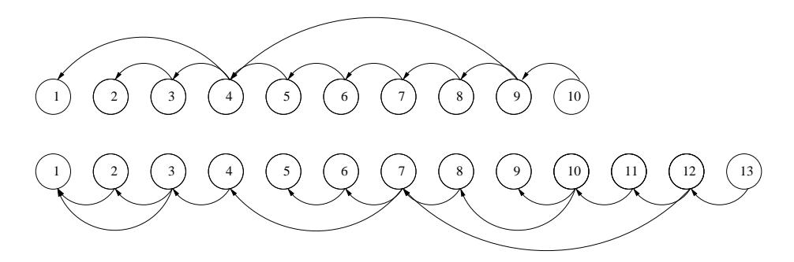
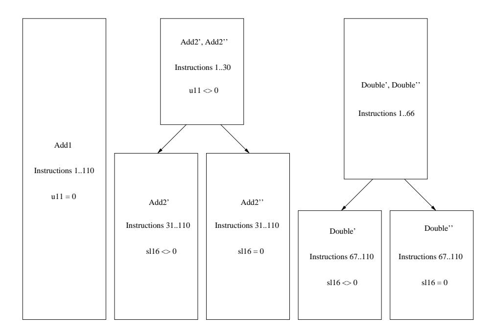

# On the Automatic Construction of Indistinguishable Operations

M. Barbosa1? and D. Page<sup>2</sup>

- <sup>1</sup> Departamento de Inform´atica, Universidade do Minho, Campus de Gualtar, 4710-057 Braga, Portugal. mbb@di.uminho.pt
- <sup>2</sup> Department of Computer Science, University of Bristol, Merchant Venturers Building, Woodland Road, Bristol, BS8 1UB, United Kingdom. page@cs.bris.ac.uk

Abstract. An increasingly important design constraint for software running on ubiquitous computing devices is security, particularly against physical methods such as side-channel attack. One well studied methodology for defending against such attacks is the concept of indistinguishable functions which leak no information about program control flow since all execution paths are computationally identical. However, the constructing such functions by hand is laborious and error prone as their complexity increases. We investigate techniques for automating this process and find that effective solutions can be constructed with only minor amounts of computational effort.

Keywords. Side-channel Cryptanalysis, Simple Power Analysis, Countermeasures, Indistinguishable Operations.

## 1 Introduction

As computing devices become increasingly ubiquitous, the task of writing software for them has presented programmers with a number of problems. Firstly, devices like smart-cards are highly constrained in both their computational and storage capacity; due to their low unit cost and small size, such devices are significantly less powerful than PDA or desktop class computers. This demands selection and implementation of algorithms which are sensitive to the demands of the platform. Coupled with these issues of efficiency, which are also prevalent in normal software development, constrained devices present new problems for the programmer. For example, one typically needs to consider the power characteristics and communication frequency of any operation since both eat into the valuable battery life of the device.

Perhaps the most challenging aspect of writing software for ubiquitous computers is the issue of security. Performing computation in a hostile, adversarial

<sup>?</sup> Funded by scholarship SFRH/BPD/20528/2004, awarded by the Funda¸c˜ao para a Ciˆencia e Tecnologia, Minist´erio da Ciˆencia e do Ensino Superior, Portugal.

environment demands that software is robust enough to repel attackers who hope to retrieve data stored on the device. Although cryptography provides a number of tools to aid in protecting the data, the advent of physical attacks such as side-channel analysis and fault injection mean one needs to consider security of the software implementation as well as the mathematics it implements. By passive monitoring of execution features such as timing variations [14], power consumption [15] or electromagnetic emission [1, 2] attackers can remotely recover secret information from a device with little fear of detection. Typically attacks consist of a collection phase which provides the attacker with profiles of execution, and an analysis phase which recovers the secret information from the profiles. Considering power consumption as the collection medium from here on, attack methods can be split into two main classes. Simple power analysis (SPA) is where the attacker is given only one profile and is required to recover the secret information by focusing mainly on the operation being executed. In contrast, differential power analysis (DPA) uses statistical methods to form a corelation between a number of profiles and the secret information by focusing mainly on the data items being processed.

As attack methods have become better understood, so have the related defense methods. Although new vulnerabilities are regularly uncovered, one can now deploy techniques in hardware and software which will vastly reduce the effectiveness of most side-channel attacks and do so with fairly minor overhead. Very roughly, defense methods fall into one of two main categories:

Randomisation One method of reducing the chance of leaking secret information is to introduce a confusion or randomisation element into the algorithm being executed. This is particularly effective in defending against DPA-style attacks but may also be useful in the SPA-style case. Essentially, randomisation ensures the execution sequence and intermediate results are different for every invocation and hence reduces the correlation of a given profile with the secret information. This method exists in many different forms, for example the addition of blinding factors to exponents; dynamically randomising the parameters or control flow in exponentiation algorithms; and using redundant representations.

Indistinguishability To prevent leakage of secret information to an SPA-style attack by revealing the algorithm control flow, this approach aims to modify operations sequences so that every execution path is uniform. Again, there are several ways in which this can be achieved. One way is to work directly on the mathematical formulae that define the operations and modify them so that the resulting implementations have identical structure. Another method is to work directly on the code, rearranging it and inserting dummy operations, to obtain the same effect.

A key difference between issues of efficiency and security is that the programmer is assisted by a compiler in the former case but not in the later. That is, the programmer is entirely responsible for constructing defense methods against sidechannel analysis. Although the general technique of creating indistinguishable

#### Algorithm 1 The double-and-add method for ECC point multiplication.

```
Input: point P, integer d
Output: point Q = d · P
1: Q ← O
2: for i = |d| − 1 downto 0 do
3: Q ← 2 · Q
4: if di = 1 then
5: Q ← Q + P
6: end if
7: end for
8: return Q
```

functions to foil SPA style attack is well understood; the general barrier to implementation is how labour intensive and error prone the process is. This is especially true when operation sequences in the functions are more complex than in the stock example of elliptic curve cryptography (ECC), for example systems like XTR or hyperelliptic curve cryptography (HECC). However, the task is ideally suited to automation; to this end our focus in this paper is the realisation of such automation to assist the development of secure software. In the rest of this Section we introduce the concept and use of indistinguishable functions in more detail and present an overview of related work. Then, in Section 2 we describe the construction of such functions as an optimisation problem and offer an algorithm to produce solutions in Section 3. Finally, we present some example results in Section 4 and concluding remarks in Section 5.

#### 1.1 Using Indistinguishable Functions

One of the most basic forms of side-channel attack is that of simple power analysis (SPA): the attacker is presented with a single profile from the collection phase and tasked with recovering the secret information. Such an attack can succeed if one can reconstruct the program control flow by observing the operations performed in an algorithm. If decisions in the control flow are based on secret information, it is leaked to the attacker. Because it represents an ideal partner for constrained devices, we focus here on point multiplication as used in ECC [3] and described by Algorithm 1.

Restricting ourselves to working over the field K = Fp, where p is a large prime, our elliptic curve is defined by:

$$E(K): y^2 = x^3 + Ax + B$$

for some parameters A and B. The set of rational points P = (x, y) on this curve, together with the identity element O, form an additive group. ECC based public key cryptography typically derives security by presenting an intractable discrete logarithm problem over this curve group. That is, one constructs a secret integer d and performs the operation Q = d ·P for some public point P. Since reversing this operation is hard, one can then transmit Q without revealing the value of d.

Since one is composed from a different sequence of field operations than the other, point addition and doubling operations will be distinguishable from each other in a profile of power consumption. Denoting addition by A and doubling by D, the collection phase presents the attacker with a profile detailing the operations performed during execution of the algorithm. For example, by monitoring execution of using the multiplier d = 10012 = 910, one obtains the profile:

#### DADDDA

Given this single profile, the analysis phase can recover the secret value of d simply by spotting where the point additions occur: if an addition occurs then d<sup>i</sup> = 1, otherwise d<sup>i</sup> = 0.

One way to avoid this problem is to employ a double-and-add-always method, due to Coron [7], whereby a dummy addition is executed if the real one is not. Although the cases where d<sup>i</sup> = 0 and d<sup>i</sup> = 1 are now indistinguishable, this method significantly reduces the performance of the algorithm since many more additions are performed.

However, the ECC group law is very flexible in terms of how the point addition and doubling operations can be implemented through different curve parameterisations, point representations and so on. We can utilise this flexibility to consider forcing indistinguishability by manipulating the functions for point addition and doubling so that they are no longer different. This is generally achieved by splitting the more expensive point addition into two parts, each of which is identical in terms of the operations it performs to a point doubling. Put more simply, instead of recovering the profile above from the SPA collection phase, an attacker gets:

#### DDDDDDDD

from which they can get no useful information. Note that although we present the use of indistinguishable functions solely for point multiplication or exponentiation, the technique is more generally useful and can be applied in many other contexts.

## 1.2 Related Work

Gebotys and Gebotys [11] analyse the SPA resistance of a DSP-based implementation of ECC point multiplication using projective coordinates on curves over Fp. They show that by hand-modifying the doubling and adding implementation code, simply by inserting dummy operations, it is possible to obtain significant improvements. Likewise, Trichina and Bellezza [20] analyse the overhead associated with the same approach using mixed coordinates on curves over F2<sup>n</sup> , and again find an efficient hand-constructed solution. Brier and Joye [5] present unified addition and doubling functions by observing that operations for calculating slope can be shared between the two cases. Joye and Quisquater [13] and Liardet and Smart [17] take a different approach by finding different curve parameterisations that offer naturally indistinguishable formula; they utilise Hessian and Jacobi form elliptic curves respectively.

In other contexts than ECC, Page and Stam [19] present hand-constructed indistinguishable operations for XTR.

Chevallier-Mames et al. [6] propose a generalised formulation for constructing indistinguishable functions and apply it to processor-level sequences of instructions. SPA attacks typically exploit conditional instructions that depend on secret information: the solution is to make the sequences of instructions (processes) associated with both branches indistinguishable. The authors introduce the concept of side channel atomicity: all processes are transformed, simply by padding them with dummy operations, so that they execute as a repetition of a small instruction sequence (a pattern) called a side-channel atomic block.

## 2 Indistinguishable Functions

In this section we enunciate the problem of building indistinguishable functions as an optimisation problem. We begin by defining a problem instance.

**Definition 1.** Let F be a list of N functions  $F = F_1, F_2, ..., F_N$  where each function  $F_i$  is itself a list of instructions from a finite basic instruction set L:

$$F_i = F_i[1], F_i[2], ..., F_i[|F_i|]$$

where  $|F_i|$  denotes the length of function  $F_i$ , and  $F_i[j] \in L$  denotes instruction j of function  $F_i$ , with  $1 \le j \le |F_i|$ . Also, let  $F_i[k...j]$  denote instructions k to j in function  $F_i$ , with  $1 \le k \le j \le |F_i|$ .

For concreteness one should think of the simple case of two functions  $F_1$  and  $F_2$  as performing ECC point addition and doubling. Further, the instruction set L is formed from three-address style operations [18] on elements in the base field, for example addition and multiplication, and the functions are straight-line in that they contain no internal control flow structure.

We aim to manipulate the original functions into new versions  $F'_i$  such that the execution trace of all of them is some multiple of the execution trace of some pattern  $\Pi$ . Clearly we might need to add some dummy instructions to the original functions as well as reordering their instructions so that the pattern is followed. To allow for instruction reordering, we extend our problem definition to include information about the data dependencies between instructions within each function. We represent these dependencies as directed graphs.

**Definition 2.** Given a set F as in Definition 1, let P be the list of pairs

$$P = (F_1, G_1), (F_2, G_2), ..., (F_N, G_N)$$

where  $G_i = (V_i, E_i)$  is a directed graph in which  $V_i$  and  $E_i$  are the associated sets of nodes and edges, respectively. Let  $|V_i| = |F_i|$  and, to each instruction

 $F_i[j]$ , associate node  $v_j \in V_i$ . Let  $E_i$  contain an edge between nodes  $v_j$  and  $v_k$  if and only if executing instruction  $F_i[j]$  before instruction  $F_i[k]$  disrupts the normal data flow inside the function. We say that instruction  $F_i[j]$  depends on instruction  $F_i[k]$ .

In general terms, given a straight-line function  $F_i$  described using three-address operations from our instruction set L, the pair of function and graph  $(F_i,G_i)$  can be constructed as follows:

- 1. Add  $|F_i|$  nodes to  $V_i$  so that each instruction in the function is represented by a node in the graph.
- 2. For every instruction  $F_i[j]$  add an edge  $(v_j, v_k)$  to  $E_i$  if and only if  $F_i[j]$  uses a result directly modified by some instruction  $F_i[k]$ . Note that we assume that symbols for intermediate results are not reused; that is the function is in single-static-assignment (SSA) form [18]. If reuse is permitted, additional edges must be inserted in the dependency graph to prevent overwriting intermediate results.
- 3. Calculate  $(V_i, E'_i)$ , the transitive closure of the graph  $(V_i, E_i)$ , and take  $G_i = (V_i, E'_i)$ .

We use the dependency graphs in Definition 2 to guarantee that the transformations we perform on the functions  $F_i$  are sound. That is, as long as we respect the dependencies, the program is functionally correct even though the instructions are reordered. Definition 3 captures this notion.

**Definition 3.** A function  $F'_i$  is a valid transformation of a function  $F_i$  (written  $F'_i \Leftarrow F_i$ ) if given the dependency graph  $G_i$ ,  $F'_i$  can be generated by modifying  $F_i$  as follows:

- 1. Reorder the instructions in  $F_i$ , respecting the dependency graph  $G_i$  i.e. if there is an edge  $(v_j, v_k) \in E_i$  then instruction  $F_i[j]$  must occur after instruction  $F_i[k]$  in  $F'_i$ .
- 2. Insert a finite number of dummy instructions.

The goal is to find  $\Pi$  and matching  $F'_i$  whose processing overhead compared to the original programs is minimised. Hence, our problem definition must also include the concept of computational cost. For the sake of generality, we assign to each basic instruction in set L an integer weight value that provides a relative measure of it's computational weight.

**Definition 4.** Let  $\omega: L \to \mathbb{N}$  be a weight function that, for each basic instruction  $l \in L$ , provides a relative value  $\omega(l)$  for the computational load associated with instruction l.

For example, taking w(x + y) = 1 we could set  $w(x^2) = 10$  and  $w(x \times y) = 20$ . Given this cost function, we are now in a position to provide a formulation of the problem of building indistinguishable functions as an optimisation problem.

**Algorithm 2** Methods for ECC affine point addition (left) and doubling (right).

```
Input: P = (x_1, y_1), Q = (x_2, y_2)
                                                                                       Input: P = (x_1, y_1)
Output: R = (x_3, y_3) = P + Q
                                                                                        Output: R = (x_3, y_3) = 2 \cdot P
  1: \lambda_1 \leftarrow y_2 - y_1
                                                                                         1: \lambda_1 \leftarrow x_1^2
  2: \lambda_2 \leftarrow x_2 - x_1
                                                                                         2: \lambda_2 \leftarrow \lambda_1 + \lambda_1
  3: \lambda_3 \leftarrow \lambda_2^{-1}
                                                                                         3: \lambda_3 \leftarrow \lambda_2 + \lambda_1
  4: \lambda_4 \leftarrow \lambda_1 \cdot \lambda_3
                                                                                         4: \lambda_4 \leftarrow \lambda_3 + A
  5: \lambda_5 \leftarrow \lambda_4^2
                                                                                         5: \lambda_5 \leftarrow y_1 + y_1
  6: \lambda_6 \leftarrow \lambda_5 - x_1
                                                                                         6: \lambda_6 \leftarrow \lambda_5^{-1}
  7: x_3 \leftarrow \lambda_6 - x_2
                                                                                         7: \lambda_7 \leftarrow \lambda_4 \cdot \lambda_6
  8: \lambda_7 \leftarrow x_1 - x_3
                                                                                         8: \lambda_8 \leftarrow \lambda_7^2
  9: \lambda_8 \leftarrow \lambda_4 \cdot \lambda_7
                                                                                         9: \lambda_9 \leftarrow x_1 + x_1
10: y_3 \leftarrow \lambda_8 - y_1
                                                                                        10: x_3 \leftarrow \lambda_8 - \lambda_9
                                                                                        11: \lambda_{10} \leftarrow x_1 - x_3
                                                                                       12: \lambda_{11} \leftarrow \lambda_{10} \cdot \lambda_7
13: y_3 \leftarrow \lambda_{11} - y_1
```

**Definition 5.** Given a pair  $(P, \omega)$  as in Definitions 1, 2 and 4, find a pattern  $\Pi$  and a list of functions  $F' = F'_1, F'_2, ..., F'_N$  such that

$$\begin{cases} \Pi = \Pi[1], \Pi[2], ..., \Pi[|\Pi|] & \Pi[k] \in L, 1 \le k \le |\Pi| \\ F'_i \Leftarrow F_i & 1 \le i \le N \\ |F'_i| = 0 \pmod{|\Pi|} & 1 \le i \le N \\ F'_i[j] = \Pi[mod(j, |\Pi|) + 1] & 1 \le i \le N, 1 \le j \le |F'_i| \end{cases}$$

and that

$$\sum_{i=1}^{N} \sum_{j=1}^{|F_i'|} \omega(F_i'[j])$$

is minimal.

Intuition on the hardness of satisfying these constraints comes from noticing similarities with well-known NP-complete optimisation problems such as the Minimum Bin Packing, Longest Common Subsequence and Nearest Codeword problems [8].

#### 2.1 A Small Example

Recalling our definition of the elliptic curve E(K) in Section 1.1, Algorithm 2 details two functions for affine point addition and doubling on such a curve. Denoting the addition and doubling as functions  $F_1$  and  $F_2$  respectively, we find  $|F_1| = 10$  while  $|F_2| = 13$ . From these functions, we also find our instruction set is  $L = \{x + y, x - y, x^2, x \times y, 1/x\}$  with all operations over the base field  $K = \mathbb{F}_p$ . Thus, we setup our costs as  $\omega(x + y) = 1$ ,  $\omega(x - y) = 1$ ,  $\omega(x^2) = 10$ ,  $\omega(x \times y) = 20$  and  $\omega(1/x) = 100$ .

Notice the role of dependencies in the functions: operation three in  $F_1$  depends on operation two but not on operation one. In fact, we can relocate operation one after operation three to form a valid function  $F'_1$  since it respects the data dependencies that exist.

The graphs in Figure 1 represent the direct dependencies between the instructions in the addition method (top) and the doubling method (bottom). Complete dependency graphs as specified in Definition 2 can be obtained by calculating the transitive closure over the graphs in Figure 1.

Algorithm3 shows a solution for this instance of the optimization problem. The cost of the solution is 12 since we add an extra square and two extra additions both denoted by the use of  $\lambda_d$  as their arguments. It is easy to see that it is actually an absolute minimal value. To clarify the criteria specified in Definition 5, let us see how they apply to this case.

The pattern  $\Pi$  is given by the operation sequence of the doubling method, and we have  $|\Pi|=13$ . To ensure both  $|F_1'|=0 \pmod{|\Pi|}$  and  $|F_2'|=0 \pmod{|\Pi|}$  we need to add three dummy instructions to  $F_1$ . The solution presents no mismatches between the instruction sequences of either function and the pattern  $\Pi$ , so the restriction  $F_i'[j]=\Pi[\operatorname{mod}(j,|\Pi|)+1]$  holds for all valid i and j values. Finally, it is easy to see that both  $F_i'$  are valid transformations of the original  $F_i$ . Instruction reordering occurs only once in  $F_1'$  (instructions 3 and 5), and these are independent in  $F_1$ .  $F_2'$  is identical to  $F_2$ .



Fig. 1. Dependency graphs for the methods in Algorithm 2.

#### 3 An Optimisation Algorithm

Our approach to solving the problem as described above is detailed in Algorithm 4. The algorithm represents an adaptation of Threshold Accepting [9], a generic optimisation algorithm. Threshold Accepting is a close relative of simulated annealing, where candidate solutions are deterministically accepted or rejected according to a predefined threshold schedule: a proposed solution is accepted as long as it does not increase the current cost by more than the current threshold value. Note that we are not aiming to find the optimal solution,

#### **Algorithm 3** Indistinguishable versions of the methods in Algorithm 2.

```
Input: P = (x_1, y_1), Q = (x_2, y_2)
                                                                                          Input: P = (x_1, y_1)
Output: R = (x_3, y_3) = P + Q
                                                                                           Output: R = (x_3, y_3) = 2 \cdot P
                                                                                           1: \lambda_1 \leftarrow x_1^2
  1: \lambda_d \leftarrow \lambda_d^2
  2: \lambda_d \leftarrow \lambda_d + \lambda_d
                                                                                           2: \lambda_2 \leftarrow \lambda_1 + \lambda_1
  3: \lambda_2 \leftarrow x_2 - x_1
                                                                                            3: \lambda_3 \leftarrow \lambda_2 + \lambda_1
  4: \lambda_d \leftarrow \lambda_d + \lambda_d
                                                                                            4: \lambda_4 \leftarrow \lambda_3 + A
 5: \lambda_1 \leftarrow y_2 - y_1
6: \lambda_3 \leftarrow \lambda_2^{-1}
                                                                                           5: \lambda_5 \leftarrow y_1 + y_1
6: \lambda_6 \leftarrow \lambda_5^{-1}
  7: \lambda_4 \leftarrow \lambda_1 \cdot \lambda_3
                                                                                            7: \lambda_7 \leftarrow \lambda_4 \cdot \lambda_6
  8: \lambda_5 \leftarrow \lambda_4^2
                                                                                            8: \lambda_8 \leftarrow \lambda_7^2
  9: \lambda_6 \leftarrow \lambda_5 - x_1
                                                                                           9: \lambda_9 \leftarrow x_1 + x_1
10: x_3 \leftarrow \lambda_6 - x_2
                                                                                          10: x_3 \leftarrow \lambda_8 - \lambda_9
11: \lambda_7 \leftarrow x_1 - x_3
                                                                                          11: \lambda_{10} \leftarrow x_1 - x_3
12: \lambda_8 \leftarrow \lambda_4 \cdot \lambda_7
                                                                                          12: \lambda_{11} \leftarrow \lambda_{10} \cdot \lambda_7
13: y_3 \leftarrow \lambda_8 - y_1
                                                                                          13: y_3 \leftarrow \lambda_{11} - y_1
```

but to find a good enough approximation of it that can be used in practical applications.

Algorithm 4 makes S attempts to find an optimal pattern size, which is selected randomly in each s-iteration (line 2). In each of these attempts, the original functions are taken as the starting solution, with the minor change that they are padded with dummy instructions, so as to make their size multiple of the pattern size (lines 3 to 6).

The inner loop (lines 10 to 18), which runs T times, uses a set of randomised heuristics to obtain a neighbour solution. This solution is accepted if it does not represent a relative cost increase greater than the current threshold value. The threshold varies with t, starting at a larger value for low values of t and gradually decreasing. The number of iterations S and T must be adjusted according to the size of the problem.

$$\begin{split} H[1] & H[2] & \dots & H[|H|-1] & H[|H|] \\ F_1'[1] & F_1'[2] & \dots & F_1'[|H|-1] & F_1'[|H|] \\ F_1'[|H|+1] & F_1'[2] & \dots & F_1'[2|H|-1] & F_1'[2|H|] \\ & \vdots & \vdots & \vdots & \vdots & \vdots \\ F_1'[|F_1'|-|H|+1] & F_1'[|F_1'|-|H|+2] & \dots & F_1'[|F_1'|-1] & F_1'[|F_1'|] \\ F_2'[1] & F_2'[2] & \dots & F_2'[|H|-1] & F_2'[|H|] \\ & \vdots & \vdots & \vdots & \vdots \\ F_N'[|F_N'|-|H|+1] & F_N'[|F_N'|-|H|+2] & \dots & F_N'[|F_N'|-1] & F_N'[|F_N'|] \\ \end{split}$$

Fig. 2. A solution as a matrix of instructions.

#### **Algorithm 4** An optimisation algorithm for indistinguishable operations.

```
Input: (P, \omega)
Output: (\Pi, F'), a quasi-optimal solution to the problem in Definition 5
 1: for s = 1 to S do
 2:
        |\Pi| \leftarrow \text{random pattern size}
 3:
        \mathbf{x} \leftarrow \{F_i, 1 < i < N\}
 4:
        for all F_i' \in \mathbf{x} do
 5:
           Append |\Pi| - (|F_i| \pmod{|\Pi|}) dummy instructions to F_i
 6:
        end for
 7:
        cost \leftarrow cost(\mathbf{x})
        result \leftarrow \mathbf{x}
 8:
 9:
        best \leftarrow cost
        for t = 1 to T do
10:
           \mathbf{x}' \leftarrow neighbour(\mathbf{x})
11:
12:
           thresh \leftarrow threshold(t, T)
13:
           cost' \leftarrow cost(\mathbf{x}')
           if (cost' - cost)/cost - 1 < thresh then
14:
15:
               \mathbf{x} \leftarrow \mathbf{x}'
16:
               cost \leftarrow cost'
17:
           end if
18:
         end for
19:
        if cost < best then
20.
           result \leftarrow \mathbf{x}
21:
           best \leftarrow cost
22:
        end if
23: end for
24: return result
```

The quality of a solution is measured using a cost function that operates as follows:

- The complete set of instructions in a solution  $\mathbf{x}$  is seen as a matrix with  $|\Pi|$  columns and  $(\sum_{i=1}^{N} |F_i'|)/|\Pi|$  lines (see Figure 2), in which each function occupies  $|F_i'|/|\Pi|$  consecutive lines.
- Throughout the algorithm, the pattern  $\Pi$  is adjusted to each solution by taking  $\Pi[k]$  as the most common basic instruction in column k of the matrix.
- A dummy instruction is always taken to be of the same type as the pattern instruction for its particular column, so dummy instructions are ignored when adjusting  $\Pi$  to a particular solution.
- The overall cost of a solution has two components: c and d. The former is the cost associated with deviations from the pattern and it is evaluated as the sum, taken over all non-matching instructions in the matrix, of the weight difference relative to the corresponding pattern instruction. The latter is the cost associated with dummy operations and it is evaluated as the accumulated weight of all the dummy instructions in the matrix.

- The relative importance of these components can be tuned to put more or less emphasis on indistinguishability. This affects the trade-off between indistinguishability and processing overhead.

Throughout its execution, the algorithm keeps track of the best solution it has been able to reach (lines 19 to 22); this is returned when the algorithm terminates (line 24).

A neighbour solution is derived from the current solution by randomly selecting one of the following heuristics:

Tilt function left A function  $F'_i$  is selected randomly, and its instructions are all moved as far to the left as possible, filling spaces previously occupied by dummy instructions or just freed by moving other instructions. The order of the instructions is preserved, and an instruction is only moved if it matches the pattern instruction for the target column.

**Tilt function right** Same as previous, only that instructions are shifted to the right.

Move instruction left A function  $F'_i$  is selected randomly, and an instruction  $F'_i[j]$  is randomly picked within it. This instruction is then moved as far to the left as possible. An instruction is only moved if this does not violate inter-instruction dependencies, and it matches the pattern instruction for the target column.

Move instruction right Same as previous, only that the instruction is shifted to the right.

After application of the selection heuristic, the neighbour solution is optimised by removing rows or columns containing only dummy instructions. If the final solution produced by Algorithm 4 includes deviations from the chosen pattern, these can be eliminated by extending the pattern to get a totally indistinguishable result. If the number of mismatches is large, this produces a degenerate solution. We have implemented this as an optional post-processing functionality.

Our experimental results indicate the following rules of thumb that should be considered when parameterising Algorithm 4:

- S should be at least half of the length of the longest function.
- T should be a small multiple of the total number of instructions.
- An overall cost function calculated as  $c^2 + d$  leads to a good compromise between indistinguishability and processing overhead.
- The threshold should decrease quadratically, starting at 70% for t=0 and reaching 10% when t=T-1.
- The neighbour generation heuristics should be selected with equal probability, or with a small bias favoring moving over tilting mutations.

#### 4 Results

Using Algorithm 4 we have been able to produce results equivalent to various hand-made solutions published in the literature for small sized problems, and

to construct indistinguishable versions of the much larger functions for point addition and doubling in genus 2 hyper-elliptic curves over finite fields.

Appendix 1 contains the results produced by Algorithm 4 when fed with the instruction sequences for vanilla EC affine point addition over F<sup>p</sup> using projective coordinates, as presented by Gebotys and Gebotys in (Figure 1,[11]). This result has exactly the same overhead as the version presented in the same reference.

Appendix 2 contains the instruction sequences corresponding to formulae for finite field arithmetic in a specific degree six extension as used in a number of torus based constructions [12, 10], together with the results obtained using Algorithm 4 for this problem instance.

Table 1 (left) shows the number of dummy field operations added to each of the functions in Appendix 2. Also shown in Table 1 (right) is the estimated overhead for an exponentiation. We assume the average case in which the number of squarings is twice the number of multiplications. This is roughly equivalent to the best hand-made solution that we were able to produce in reasonable time, even if the number of dummy multiplications is slightly larger in the automated version.

Table 1. Overheads for the indistinguishable functions in Appendix 2.

Overhead 24% 19% 400%

| Operations Square Multiply |   |    |
|----------------------------|---|----|
| Add                        | 9 | 11 |
| Multiply                   | 4 | 2  |
| Shift                      | 0 | 12 |

Appendix 3 includes indistinguishable versions of hyper-elliptic curve point adding and doubling functions. These implementations correspond to the general case of the explicit formulae for genus 2 hyperelliptic curves over finite fields using affine coordinates. provided by Lange in [16]. A pseudo-code implementation of these formulae is also included in Appendix 3. In our analysis, we made no assumptions as to the values of curve parameters because our objective was to work over a relatively large problem instance. Operations involving curve parameters were treated as generic operations.

In this example, the group operations themselves contain branching instructions. To accommodate this, we had to first create indistinguishable versions of the smaller branches inside the addition and doubling functions, separately. The process was then applied globally to the two main branches of the addition function and to the doubling function as a whole, which meant processing three functions of considerable size, simultaneously.

Table 2 (left) shows the number of dummy field operations added to each of the functions in Appendix 3. Note that functions Add2 <sup>0</sup> and Double<sup>0</sup> correspond to cases that are overwhelmingly more likely to occur. The overhead, in these cases, is within reasonable limits. Also shown in Table 2 (right) is the estimated overhead for a point multiplication. We assume the average case in which the number of doublings is twice the number of additions, and consider only the most likely execution sequences for these operations (Add2') and Double'.

**Table 2.** Overheads for the indistinguishable functions in Appendix 3.

| Operations | Add1 | Add2' | Add2'' | Double' | Double'' | Overhead |
|------------|------|-------|--------|---------|----------|----------|
| Add        | 35   | 20    | 37     | 4       | 16       | 19%      |
| Multiply   | 28   | 14    | 27     | 5       | 16       | 25%      |
| Square     | 7    | 5     | 6      | 2       | 4        | 60%      |
| Invert     | 1    | 1     | 1      | 1       | 1        | 100%     |

## 5 Conclusion

Defense against side-channel attacks is a vital part of engineering software that is to be executed on constrained devices. Since such devices are used within an adversarial environment, sound and efficient techniques are of value even if they are hard to implement. To this end we have investigated an automated approach to constructing indistinguishable functions, a general method of defense against certain classes of side-channel attack which are notoriously difficult to implement as the functions grow more complex. Our results show that efficient versions of such functions, which are competitive with hand-constructed versions, can be generated with only minor computational effort.

This work is pitched in the context of cryptography-aware compilation: the idea that programmers should be assisted in describing secure software just like they are offered support to optimise software. We have embedded our algorithm in such a compiler which can now automatically manipulate a source program so the result is more secure.

#### References

- D. Agrawal, B. Archambeault, J.R. Rao and P. Rohatgi. The EM Side-Channel(s). In Cryptographic Hardware and Embedded Systems (CHES), Springer-Verlag LNCS 2523, 29–45, 2002.
- D. Agrawal, J.R. Rao and P. Rohatgi. Multi-channel Attacks. In Cryptographic Hardware and Embedded Systems (CHES), Springer-Verlag LNCS 2779, 2–16, 2003.
- 3. I.F. Blake, G. Seroussi and N.P. Smart. *Elliptic Curves in Cryptography*. Cambridge University Press, 1999.
- 4. I.F. Blake, G. Seroussi and N.P. Smart. Advances in Elliptic Curve Cryptography. Cambridge University Press, 2004.
- É. Brier and M. Joye. Weierstraß Elliptic Curves and Side-channel Attacks. In Public Key Cryptography (PKC), Springer-Verlag LNCS 2274, 335–345, 2002.
- B. Chevallier-Mames, M. Ciet and M. Joye. Low-Cost Solutions for Preventing Simple Side-Channel Analysis: Side-Channel Atomicity. In *IEEE Transactions on Computers*, 53(6), 760–768, 2004.

- 7. J-S. Coron. Resistance against Differential Power Analysis for Elliptic Curve Cryptosystems. In Cryptographic Hardware and Embedded Systems (CHES), Springer-Verlag LNCS 1717, 292–302, 1999.
- 8. P. Crescenzi and V. Kann. A Compendium of NP Optimization Problems. Available at: http://www.nada.kth.se/∼viggo/problemlist/.
- 9. G. Dueck and T. Scheuer. Threshold Accepting: A General Purpose Optimization Algorithm Appearing Superior to Simulated Annealing. In Journal of Computational Physics, 90(1), 161–175, 1990.
- 10. M. van Dijk, R. Granger, D. Page, K. Rubin, A. Silverberg, M. Stam and D. Woodruff. Practical Cryptography in High Dimensional Tori To appear in Advances in Cryptology (EUROCRYPT), 2005.
- 11. C.H. Gebotys and R.J. Gebotys. Secure Elliptic Curve Implementations: An Analysis of Resistance to Power-Attacks in a DSP Processor. In Cryptographic Hardware and Embedded Systems (CHES), Springer-Verlag LNCS 2523, 114–128, 2002.
- 12. R. Granger, D. Page and M. Stam. A Comparison of CEILIDH and XTR. In Algorithmic Number Theory Symposium (ANTS), Springer-Verlag LNCS 3076, 235–249, 2004.
- 13. M. Joye and J-J. Quisquater. Hessian Elliptic Curves and Side-Channel Attacks. In Cryptographic Hardware and Embedded Systems (CHES), Springer-Verlag LNCS 2162, 402–410, 2001.
- 14. P.C. Kocher. Timing Attacks on Implementations of Diffie-Hellman, RSA, DSS, and Other Systems. In Advances in Cryptology (CRYPTO), Springer-Verlag LNCS 1109, 104–113, 1996.
- 15. P.C. Kocher, J. Jaffe and B. Jun. Differential Power Analysis. In Advances in Cryptology (CRYPTO), Springer-Verlag LNCS 1666, 388–397, 1999.
- 16. T. Lange. Efficient Arithmetic on Genus 2 Hyperelliptic Curves over Finite Fields via Explicit Formulae. In Cryptology ePrint Archive, Report 2002/121, 2002.
- 17. P-Y. Liardet and N.P. Smart. Preventing SPA/DPA in ECC Systems Using the Jacobi Form. In Cryptographic Hardware and Embedded Systems (CHES), Springer-Verlag LNCS 2162, 391–401, 2001.
- 18. S.S. Muchnick. Advanced Compiler Design and Implementation, Morgan Kaufmann, 1997.
- 19. D. Page and M. Stam. On XTR and Side-Channel Analysis. In Selected Areas in Cryptography (SAC), Springer-Verlag LNCS 3357, 54–68, 2004.
- 20. E. Trichina and A. Bellezza. Implementation of Elliptic Curve Cryptography with Built-In Counter Measures against Side Channel Attacks. In Cryptographic Hardware and Embedded Systems (CHES), Springer-Verlag LNCS 2523, 98–113, 2002.

## Appendix 1: Arithmetic Over Elliptic Curves Over F<sup>p</sup> Using Projective Coordinates

Figure 3 shows the results produced by Algorithm 4 when fed with the instruction sequences for vanilla EC affine point addition over F<sup>p</sup> using projective coordinates, as presented by Gebotys and Gebotys in (Figure 1,[11]).

| Double         | Add            |               |
|----------------|----------------|---------------|
| 1              | 1              | 21            |
| b1 = y ^ 2     | z2s = z2 ^ 2   | hs = h ^ 2    |
| 2              | 2              | 22            |
| e1 = z ^ 2     | z1s = z1 ^ 2   | om = j ^ 2    |
| 3              | 3              | 23            |
| b2 = b1 * b1   | f = z1s * x2   | ga = z1 * z2  |
| 4              | 4              | 24            |
| b = b2 << 3    | (dummy shift)  | (dummy shift) |
| 5              | 5              | 25            |
| z31 = y * z    | g = g2s * x1   | al = th * hs  |
| 6              | 6              | 26            |
| e2 = x - e1    | (dummy add)    | (dummy add)   |
| 7              | 7              | 27            |
| e3 = x + e1    | (dummy add)    | (dummy add)   |
| 8              | 8              | 28            |
| e = e2 * e3    | z1c = z1s * z1 | la = h * hs   |
| 9              | 9              | 29            |
| z12 = z31 << 1 | (dummy shift)  | (dummy shift) |
| 10             | 10             | 30            |
| c1 = e << 1    | (dummy shift)  | (dummy shift) |
| 11             | 11             | 31            |
| c = c1 + e     | (dummy add)    | (dummy add)   |
| 12             | 12             | 32            |
| f1 = b1 << 2   | (dummy shift)  | (dummy shift) |
| 13             | 13             | 33            |
| a = f1 * x     | z2c = z2s * z2 | th = la * i   |
| 14             | 14             | 34            |
| f3 = a << 1    | (dummy shift)  | (dummy shift) |
| 15             | 15             | 35            |
| (dummy mul)    | (dummy mul)    | z3 = ga * h   |
| 16             | 16             | 36            |
| d1 = c * c     | i = y1 * z2c   | la = hs * g   |
| 17             | 17             | 37            |
| x12 = d1 - f3  | th = f + g     | om = la - x3  |
| 18             | 18             | 38            |
| y31 = a - x3   | h = f - g      | x3 = om - al  |
| 19             | 19             | 39            |
| y32 = y31 * c  | om = y2 * z1c  | al = om * j   |
| 20             | 20             | 40            |
| y12 = y32 - b  | j = om -i      | y3 = al - th  |

Fig. 3. Indistinguishable EC affine point addition over F<sup>p</sup> using projective coordinates

## Appendix 2: Arithmetic Over a Specific a Degree Six Extension of a Finite Field

Figure 4 shows the instruction sequences corresponding to formulae for finite field arithmetic in a specific degree six extension, as used in a number of torus based constructions [12, 10]. Figure 5 shows the results obtained using Algorithm 4 for the functions in Figure 4.

| Square       | Multiply          |               |
|--------------|-------------------|---------------|
| 1            | 1                 | 37            |
| a0 = x0 - x3 | a0 = x0 - x3      | c16 = a * b   |
| 2            | 2                 | 38            |
| a1 = a0 + x0 | b0 = y0 - y3      | t0 = t0 - c16 |
| 3            | 3                 | 39            |
| c = x3 * a1  | c12 = a0 * b0     | t3 = t0 - t3  |
| 4            | 4                 | 40            |
| c0 = c + a0  | a1 = x1 - x4      | c2 = x2 * y2  |
| 5            | 5                 | 41            |
| c0 = c0 << 1 | b1 = y1 - y4      | c = c + c2    |
| 6            | 6                 | 42            |
| X4 = c0 + c  | c13 = a1 * b1     | t2 = t2 - c   |
| 7            | 7                 | 43            |
| a1 = x0 + x3 | a2 = x2 - x5      | c = c2 + c1   |
| 8            | 8                 | 44            |
| c = a0 * a1  | b2 = y2 - y5      | t1 = t1 - c   |
| 9            | 9                 | 45            |
| c0 = c + x0  | c14 = a2 * b2     | t1 = t1 - c6  |
| 10           | 10                | 46            |
| c0 = c0 << 1 | c0 = x0 * y0      | c = c + c0    |
| 11           | 11                | 47            |
| X1 = c0 + c  | c = c13 + c14     | t0 = t0 - c   |
| 12           | 12                | 48            |
| a0 = x1 - x4 | t0 = c + c12      | a = x0 - x2   |
| 13           | 13                | 49            |
| a1 = x0 - x4 | t1 = c + c0       | b = y0 - y2   |
| 14           | 14                | 50            |
| c = x1 * a1  | t2 = c0 + c14     | c4 = a * b    |
| 15           | 15                | 51            |
| c0 = c + a0  | c8 = x5 * y5      | X0 = t0 + c4  |
| 16           | 16                | 52            |
| c0 = c0 << 1 | c = c8 + c12      | a = x1 - x2   |
| 17           | 17                | 53            |
| X3 = c0 + c  | t5 = c + c13      | b = y1 - y2   |
| 18           | 18                | 54            |
| a1 = x1 + a0 | c7 = x4 * y4      | c5 = a * b    |
| 19           | 19                | 55            |
| a1 = - a1    | c6 = x3 * y3      | X1 = t1 + c5  |
| 20           | 20                | 56            |
| c = x4 * a1  | t4 = c + c7       | a = x3 - x4   |
| 21           | 21                | 57            |
| c0 = c + x1  | c = c6 + c7       | b = y3 - y4   |
| 22           | 22                | 58            |
| c0 = c0 << 1 | t3 = c + c14      | c9 = a * b    |
| 23           | 23                | 59            |
| X0 = c0 + c  | c1 = x1 * y1      | X2 = t2 + c9  |
| 24           | 24                | 60            |
| a0 = x2 - x5 | t2 = t2 + c1      | a = x3 - x5   |
| 25           | 25                | 61            |
| a1 = a0 - x5 | a = x0 - x1       | b = y3 - y5   |
| 26           | 26                | 62            |
| c = x2 * a1  | b = y0 - y1       | c10 = a * b   |
| 27           | 27                | 63            |
| c0 = c - x2  | c3 = a * b        | X3 = t3 + c10 |
| 28           | 28                | 64            |
| c0 = c0 << 1 | t2 = t2 - c3      | a = x4 - x5   |
| 29           | 29                | 65            |
| X5 = c0 + c  | t5 = t2 - t5      | b = x4 - x5   |
| 30           | 30                | 76            |
| a1 = a0 + x2 | a = a1 - a2       | c11 = a * b   |
| 31           | 31                | 77            |
| a1 = - a1    | b = b1 - b2       | X4 = t4 + c11 |
| 32           | 32                | 78            |
| c = x5 * a1  | c17 = a * b       | a = a0 - a1   |
| 33           | 33                | 79            |
| c0 = c - x5  | t1 = t1 - c17     | b = b0 - b1   |
| 34           | 34                | 70            |
| c0 = c0 << 1 | t4 = t1 - t4      | c15 = a * b   |
| 35           | 35                | 71            |
| X2 = c0 + c  | a = a0 - a2       | X5 = t5 + c15 |
|              | 36<br>b = b0 - b2 |               |
|              |                   |               |

Fig. 4. Squaring and multiplication in a specific degree six extension of a prime field

```
Square Multiply
 1
 2
 3
 4
 5
 6
 7
 8
 9
10
11
12
13
14
15
16
17
18
19
20
21
22
23
24
25
26
27
28
29
30
31
32
33
34
35
36
37
38
39
40
41
42
43
44
45
46
47
48
     a0 = x0 - x3
     a1 = a0 + x0
     c = x3 * a1
     c0 = c + a0
     c0 = c0 << 1
     X4 = c0 + c
     a1 = x0 + x3
     c = a0 * a1
     c0 = c + x0
     c0 = c0 << 1
     X1 = c0 + c
     a0 = x1 - x4
     a1 = x0 - x4
     c = x1 * a1
     c0 = c + a0
     c0 = c0 << 1
     X3 = c0 + c
     a1 = x1 + a0
     a1 = - a1
     c = x4 * a1
     c0 = c + x1
     c0 = c0 << 1
     X0 = c0 + c
     a0 = x2 - x5
     a1 = a0 - x5
     c = x2 * a1
     c0 = c - x2
     c0 = c0 << 1
     X5 = c0 + c
     a1 = a0 + x2
     a1 = - a1
     c = x5 * a1
     c0 = c - x5
     c0 = c0 << 1
     (dummy mul)
     X2 = c0 + c
     (dummy add)
     (dummy mul)
     (dummy add)
     (dummy add)
     (dummy add)
     (dummy mul)
     (dummy add)
     (dummy add)
     (dummy add)
     (dummy add)
     (dummy mul)
     (dummy add)
                                 1
                                 2
                                 3
                                 4
                                 5
                                 6
                                 7
                                 8
                                 9
                                10
                                11
                                12
                                13
                                14
                                15
                                16
                                17
                                18
                                19
                                20
                                21
                                22
                                23
                                24
                                25
                                26
                                27
                                28
                                29
                                30
                                31
                                32
                                33
                                34
                                35
                                36
                                37
                                38
                                39
                                40
                                41
                                42
                                43
                                44
                                45
                                46
                                47
                                48
                                     a0 = x0 - x3
                                     b0 = y0 - y3
                                     c12 = a0 * b0
                                     a1 = x1 - x4
                                     (dummy shift)
                                     b1 = y1 - y4
                                     b2 = y2 - y5
                                     c13 = a1 * b1
                                     a2 = x2 - x5
                                     (dummy shift)
                                     (dummy add)
                                     (dummy add)
                                     (dummy add)
                                     c14 = a2 * b2
                                     (dummy add)
                                     (dummy shift)
                                     (dummy add)
                                     (dummy add)
                                     (dummy add)
                                     c0 = x0 * y0
                                     c = c13 + c14
                                     (dummy shift)
                                     t2 = c0 + c14
                                     t1 = c + c0
                                     (dummy add)
                                     c8 = x5 * y5
                                     a = x0 - x1
                                     (dummy shift)
                                     c = c8 + c12
                                     b = y0 - y1
                                     (dummy add)
                                     c7 = x4 * y4
                                     t4 = c + c7
                                     (dummy shift)
                                     c6 = x3 * y3
                                     c = c6 + c7
                                     t3 = c + c14
                                     c1 = x1 * y1
                                     t2 = t2 + c1
                                     t0 = c + c12
                                     (dummy add)
                                     c3 = a * b
                                     a = a1 - a2
                                     t2 = t2 - c3
                                     t5 = c + c13
                                     b = b1 - b2
                                     c17 = a * b
                                     a = a0 - a2
                                                                 49
                                                                 50
                                                                 51
                                                                 52
                                                                 53
                                                                 54
                                                                 55
                                                                 56
                                                                 57
                                                                 58
                                                                 59
                                                                 60
                                                                 61
                                                                 62
                                                                 63
                                                                 64
                                                                 65
                                                                 66
                                                                 67
                                                                 68
                                                                 69
                                                                 70
                                                                 71
                                                                 72
                                                                 73
                                                                 74
                                                                 75
                                                                 76
                                                                 77
                                                                 78
                                                                 79
                                                                 80
                                                                 81
                                                                 82
                                                                 83
                                                                 84
                                                                 85
                                                                 86
                                                                 87
                                                                 88
                                                                 89
                                                                 90
                                                                 91
                                                                 92
                                                                 93
                                                                 94
                                                                 95
                                                                 96
                                                                      b = b0 - b2
                                                                      t1 = t1 - c17
                                                                      c16 = a * b
                                                                      t5 = t2 - t5
                                                                      (dummy shift)
                                                                      a = x0 - x2
                                                                      b = y0 - y2
                                                                      c2 = x2 * y2
                                                                      t4 = t1 - t4
                                                                      (dummy shift)
                                                                      t0 = t0 - c16
                                                                      c = c + c2
                                                                      t2 = t2 - c
                                                                      (dummy mul)
                                                                      c = c2 + c1
                                                                      (dummy shift)
                                                                      t1 = t1 - c
                                                                      t1 = t1 - c6
                                                                      c = c + c0
                                                                      c4 = a * b
                                                                      t0 = t0 - c
                                                                      (dummy shift)
                                                                      b = y1 - y2
                                                                      a = x1 - x2
                                                                      t3 = t0 - t3
                                                                      c5 = a * b
                                                                      X0 = t0 + c4
                                                                      (dummy shift)
                                                                      a = x3 - x4
                                                                      b = y3 - y4
                                                                      X1 = t1 + c5
                                                                      c9 = a * b
                                                                      a = x3 - x5
                                                                      (dummy shift)
                                                                      (dummy mul)
                                                                      b = y3 - y5
                                                                      (dummy add)
                                                                      c10 = a * b
                                                                      X3 = t3 + c10
                                                                      a = x4 - x5
                                                                      b = x4 - x5
                                                                      c11 = a * b
                                                                      X2 = t2 + c9
                                                                      X4 = t4 + c11
                                                                      a = a0 - a1
                                                                      b = b0 - b1
                                                                      c15 = a * b
                                                                      X5 = t5 + c15
```

Fig. 5. Indistinguishable squaring and multiplication in a degree six extension of a prime field

## Appendix 3: Arithmetic over Genus 2 Hyperelliptic Curves Over Finite Fields Over Finite Fields

Figures 8 and 9 show indistinguishable versions of hyper-elliptic curve point adding and doubling functions. These implementations correspond to the explicit formulae for genus 2 hyperelliptic curves over finite fields provided by Lange in [16]. Figure 7 contains a pseudo-code implementation of these formulae.

Figure 6 clarifies the relationship between Figures 7, 8 and 9. Note that variable sl1 in the pseudo-code implementation becomes variable sl16 in Figures 8 and 9. Note also that, whatever the execution path that occurs, indistinguishability is maintained accross all possible variants.



Fig. 6. Structure of the instruction sequences depicted in Figures 8 and 9.

Fig. 7. Arithmetic on genus 2 hyperelliptic curves over finite fields

```
Function Add
Parameters: h2, h1, h0
            f4, f3, f2, f1, f0,
            u10, u11, v10, v11,
            u20, u21, v20, v21
Returns: U0, U1, V0, V1
  If (u11 = 0)
    r=u20-(u21-u10)*u10
    inv=inverse(r)
    s0=inv*(v10-v20-v21*u10)
    l1=s0*u21
    l0=s0*u20
    k2=f4-u21
    k1=f3-(f4-u21)*u21-v21*h2-u20
    U1=k2-square(s0)-s0*h2-u10
    U0=k1-s0*(l1+h1+2*v21)-u10*U1
    V1=(h2+s0)*U1-(h1+l1+v21)
    V0=(h2-s0)*U0-(h0-l0+v20)
  Else
    z1 = u11-u21
    z2 = u20 - u10
    z3 = u11*z1+z2
    r = z2*z3 + square(z1)*u10
    inv1 = z1
    inv0 = z3
    w0= v10-v20
    w1 = v11-v21
    w2 = inv0*w0
    w3 = inv1*w1
    sl1=(inv0+inv1)*(w0+w1)-w2-w3*(1+u11)
    sl0=w2-u10*w3
    If (sl1<>0)
      w1=inverse(r*sl1)
      w2= r*w1
      w3=square(sl1)*w1
      w4 = r *w2
      w5 = square(w4)
      sll0=sl0*w2
      ll2=u21+sll0
      ll1=u21*sll0+u20
      ll0=u20*sll0
      U0=(sll0-u11)*(sll0-z1+h2*w4)-u10+ll1 \
              +(h1+2*v21)*w4+(2*u21+z1-f4)*w5
      U1=2*sll0-z1+h2*w4-w5
      w1=ll2-U1
      w2=U1*w1+U0-ll1
      V1=w2*w3-v21-h1+h2*U1
      w2=U0*w1-ll0
      V0=w2*w3-v20-h0+h2*U0
    Else
      inv=inverse(r)
      s0=sl0*w1
      *ru0=f4-u21-u11-square(s0)-s0*h2
      *ru1=0
      w1=s0*(u21+U0)+h1+v21+h2*U0
      w2=s0+v20+h0
      V0=U1*w1-w2
      V1=0
    End If
                                                    Function Double
                                                    Parameters: h2, h1, h0
                                                                 f4, f3, f2, f1, f0,
                                                                 u0, u1, v0, v1
                                                    Returns: U0, U1, V0, V1
                                                      vt1=h1+2*v1-h2*u1
                                                      vt0=h0+2*v0-h2*u0
                                                      w0=square(v1)
                                                      w1=square(u1)
                                                      w2=square(vt1)
                                                      w3=u1*vt1
                                                      r=u0*w2+vt0*(vt0-w3)
                                                      invl1=-vt1
                                                      invl0=vt0-w3
                                                      w3=f3+w1
                                                      w4=2*u0
                                                      kl1=2*(w1-f4*u1)+w3-w4-v1*h2
                                                      kl0=u1*(2*w4-w3+f4*u1+v1*h2) \
                                                              +f2-w0-2*f4*u0-v1*h1-v0*h2
                                                      w0 = kl0*invl0
                                                      w1 = kl1*invl1
                                                      sl1=(invl0+invl1) \
                                                              *(kl0+kl1)-w0-w1*(1+u1)
                                                      sl0=w0-u0*w1
                                                      If (sl1<>0)
                                                        w1=inverse(r*sl1)
                                                        w2=r*w1
                                                        w3=square(sl1)*w1
                                                        w4=r*w2
                                                        w5=square(w4)
                                                        sll0=sl0*w2
                                                        ll2=u1+sll0
                                                        ll1=u1*sll0+u0
                                                        ll0=u0*sll0
                                                        U0=square(sll0)+w4*(h2*(sll0-u1) \
                                                                 +2*v1+h1)+w5*(2*u1-f4)
                                                        U1=2*sll0+w4*h2-w5
                                                        w1=ll2-U1
                                                        w2=U1*w1+U0-ll1
                                                        V1=w2*w3-v1-h1+U1*h2
                                                        w2=U0*w1-ll0
                                                        V0=w2*w3-v0-h0+h2*U0
                                                      Else
                                                        w1=inverse(r)
                                                        s0=sl0*w1
                                                        w1=u1*s0+v1+h1
                                                        w2=u0*s0+v0+h0
                                                        U0=f4-square(s0)-s0*h2-2*u1
                                                        w1=w1-U0*(s0+h2)
                                                        V0=U0*w1-w2
                                                      End If
```

End If

|          | Add1                       | Add2'                                    | Add2''                                | Double'                                | Double''                               |
|----------|----------------------------|------------------------------------------|---------------------------------------|----------------------------------------|----------------------------------------|
| 1        | (dummy add)                | z10 = u11 - u21                          | z10 = u11 - u21                       | vt10 = v1 + v1                         | vt10 = v1 + v1                         |
| 2        | (dummy add)                | z20 = u20 - u10                          | z20 = u20 - u10                       | vt11 = h1 + vt10                       | vt11 = h1 + vt10                       |
| 3        | (dummy mul)                | z30 = u11 * z10                          | z30 = u11 * z10                       | vt12 = h2 * u1                         | vt12 = h2 * u1                         |
| 4        | (dummy add)                | z31 = z30 + z20                          | z31 = z30 + z20                       | vt13 = vt11 - vt12                     | vt13 = vt11 - vt12                     |
| 5        | (dummy add)                | (dummy add)                              | (dummy add)                           | vt00 = v0 + v0                         | vt00 = v0 + v0                         |
| 6        | (dummy mul)                | r0 = z20 * z31                           | r0 = z20 * z31                        | (dummy mul)                            | (dummy mul)                            |
| 7        | (dummy add)                | (dummy add)                              | (dummy add)                           | vt01 = h0 + vt00                       | vt01 = h0 + vt00                       |
| 8        | (dummy squ)                | r1 = squ(z10)                            | r1 = squ(z10)                         | (dummy squ)                            | (dummy squ)                            |
| 9        | (dummy mul)                | r2 = r1 * u10                            | r2 = r1 * u10                         | vt02 = h2 * u0                         | vt02 = h2 * u0                         |
| 10       | (dummy add)                | r3 = r2 + r0                             | r3 = r2 + r0                          | vt03 = vt01 - vt02                     | vt03 = vt01 - vt02                     |
| 11       | (dummy add)                | w00 = v10 - v20                          | w00 = v10 - v20                       | (dummy add)                            | (dummy add)                            |
| 12       | (dummy add)                | w10 = v11 - v21                          | w10 = v11 - v21                       | (dummy add)                            | (dummy add)                            |
| 13       | (dummy squ)                | (dummy squ)                              | (dummy squ)                           | w00 = squ(v1)                          | w00 = squ(v1)                          |
| 14       | (dummy squ)                | (dummy squ)                              | (dummy squ)                           | w10 = squ(u1)                          | w10 = squ(u1)                          |
| 15       | (dummy squ)                | (dummy squ)                              | (dummy squ)                           | w20 = squ(vt13)                        | w20 = squ(vt13)                        |
| 16       | (dummy mul)                | w20 = z31 * w00                          | w20 = z31 * w00                       | (dummy mul)                            | (dummy mul)                            |
| 17       | (dummy mul)                | w30 = z10 * w10                          | w30 = z10 * w10                       | w30 = u1 * vt13                        | w30 = u1 * vt13                        |
| 18       | (dummy add)                | s110 = z31 + z10                         | s110 = z31 + z10                      | (dummy add)                            | (dummy add)                            |
| 19       | (dummy mul)                | (dummy mul)                              | (dummy mul)                           | r0 = u0 * w20                          | r0 = u0 * w20                          |
| 20       | (dummy add)                | sl11 = w00 + w10                         | sl11 = w00 + w10                      | r1 = vt03 - w30                        | r1 = vt03 - w30                        |
| 21       | (dummy mul)                | sl12 = sl10 * sl11                       | sl12 = sl10 * sl11                    | r2 = vt03 * r1                         | r2 = vt03 * r1                         |
| 22       | (dummy add)                | sl13 = sl12 - w20                        | sl13 = sl12 - w20                     | r3 = r0 + r2                           | r3 = r0 + r2                           |
| 23       | (dummy add)                | sl14 = 1 + u11                           | sl14 = 1 + u11                        | invl10 = - vt13                        | invl10 = - vt13                        |
| 24       | (dummy add)                | (dummy add)                              | (dummy add)                           | invl00 = vt03 - w30                    | inv100 = vt03 - w30                    |
| 25<br>26 | (dummy mul)                | sl15 = w30 * sl14                        | sl15 = w30 * sl14                     | (dummy mul)<br>w31 = f3 + w10          | (dummy mul)<br>w31 = f3 + w10          |
| 26       | (dummy add)<br>(dummy add) | sl16 = sl13 - sl15<br>(dummy add)        | sl16 = sl13 - sl15<br>(dummy add)     | w31 = 13 + w10<br>w40 = u0 + u0        | w31 = 13 + w10<br>w40 = u0 + u0        |
| 28       | (dummy mul)                | sl00 = u10 * w30                         | sl00 = u10 * w30                      | kl10 = f4 * u1                         | kl10 = f4 * u1                         |
| 29       | (dummy md1)                | s100 = u10 + w30<br>s101 = w20 - s100    | s100 = u10 + w30<br>s101 = w20 - s100 | (dummy add)                            | (dummy add)                            |
| 30       | (dummy add)                | (dummy add)                              | (dummy add)                           | kl11 = w10 - kl10                      | kl11 = w10 - kl10                      |
| 31       | (dummy mul)                | w11 = r3 * s116                          | (dummy mul)                           | (dummy mul)                            | (dummy mul)                            |
| 32       | (dummy add)                | (dummy add)                              | (dummy add)                           | kl12 = kl11 + kl11                     | kl12 = kl11 + kl11                     |
| 33       | (dummy inv)                | w12 = inv(w11)                           | inv0 = inv(r3)                        | (dummy inv)                            | (dummy inv)                            |
| 34       | (dummy add)                | (dummy add)                              | (dummy add)                           | kl13 = kl12 + w31                      | kl13 = kl12 + w31                      |
| 35       | (dummy mul)                | w21 = r3 * w12                           | s00 = s101 * inv0                     | (dummy mul)                            | (dummy mul)                            |
| 36       | (dummy add)                | (dummy add)                              | (dummy add)                           | kl14 = kl13 - w40                      | kl14 = kl13 - w40                      |
| 37       | (dummy squ)                | w31 = squ(s116)                          | u102 = squ(s00)                       | (dummy squ)                            | (dummy squ)                            |
| 38       | (dummy mul)                | sl100 = sl01 * w21                       | (dummy mul)                           | kl15 = v1 * h2                         | kl15 = v1 * h2                         |
| 39       | (dummy add)                | (dummy add)                              | (dummy add)                           | kl16 = kl14 - kl15                     | kl16 = kl14 - kl15                     |
| 40       | (dummy add)                | 1120 = u21 + s1100                       | ul00 = f4 - u21                       | k100 = w40 + w40                       | k100 = w40 + w40                       |
| 41       | (dummy add)                | ul10 = sl100 + sl100                     | ul01 = ul00 - ul1                     | k101 = k100 - w31                      | k101 = k100 - w31                      |
| 42       | (dummy mul)                | 1110 = u21 * s1100                       | ul04 = s00 * h2                       | k102 = f4 * u1                         | k102 = f4 * u1                         |
| 43       | (dummy add)                | ul0b = u21 + u21                         | ul03 = ul01 - ul02                    | k103 = k101 + k102                     | k103 = k101 + k102                     |
| 44       | (dummy mul)                | (dummy mul)                              | (dummy mul)                           | k104 = v1 * h2                         | k104 = v1 * h2                         |
| 45<br>46 | (dummy add)                | 1111 = 1110 + u20                        | U0 = u103 - u104                      | k105 = k103 + k104<br>k106 = u1 * k105 | kl05 = kl03 + kl04<br>kl06 = u1 * kl05 |
| 46<br>47 | (dummy mul)<br>(dummy add) | (dummy mul)<br>ul01 = sll00 - z10        | (dummy mul)<br>(dummy add)            | k106 = u1 * k105<br>k107 = k106 + f2   | k106 = u1 * k105<br>k107 = k106 + f2   |
| 48       | (dummy add)                | ul01 = S1100 - 210<br>ul00 = S1100 - u11 | (dummy add)<br>w11 = u21 + U0         | k107 = k106 + 12<br>k108 = k107 - w00  | k107 = k106 + 12<br>k108 = k107 - w00  |
| 49       | (dummy mul)                | (dummy mul)                              | (dummy mul)                           | k100 = k107 - w00<br>k109 = f4 * u0    | k100 = k107 - w00<br>k109 = f4 * u0    |
| 50       | (dummy md1)                | ul11 = ul10 - z10                        | w21 = s00 + v20                       | kl0a = kl09 + kl09                     | k10a = k109 + k109                     |
| 51       | (dummy add)                | ul07 = v21 + v21                         | (dummy add)                           | k10b = k108 - k10a                     | kl0b = kl08 - kl0a                     |
| 52       | (dummy mul)                | w40 = r3 * w21                           | (dummy mul)                           | kl0c = v1 * h1                         | kl0c = v1 * h1                         |
| 53       | (dummy add)                | (dummy add)                              | (dummy add)                           | k10d = k10b - k10c                     | kl0d = kl0b - kl0c                     |
| 54       | (dummy mul)                | ul02 = h2 * w40                          | w12 = s00 * w11                       | kl0e = v0 * h2                         | kl0e = v0 * h2                         |
| 55       | r0 = u21 - u10             | ul03 = ul01 + ul02                       | w13 = w12 + h1                        | k10f = k10d - k10e                     | kl0f = kl0d - kl0e                     |
|          |                            |                                          |                                       |                                        | 1                                      |

Fig. 8. Indistinguishable arithmetic operations for genus 2 hyperelliptic curves over finite fields: instructions 1 to 55. The first three columns correspond to point adding. Add1 is the complete instruction sequence if the (u11=0) branch is chosen, Add2' represents the case when the  $(u11 <> 0 \land sl16 <> 0)$  branches occur, and Add2'' corresponds to the  $(u11 <> 0 \land sl16=0)$  branches. The last two columns correspond point doubling. Double' is the complete instruction sequence if the (sl16 <> 0) branch is chosen, and Double'' represents the case when the (sl16=0) branch occurs.

|          | Add1                                 | Add2'                              | Add2''                     | Double'                                  | Double''                         |
|----------|--------------------------------------|------------------------------------|----------------------------|------------------------------------------|----------------------------------|
| 56       | (dummy mul)                          | w32 = w31 * w12                    | (dummy mul)                | w01 = kl0f * invl00                      | w01 = kl0f * invl00              |
| 57       | r1 = u10 * r0                        | u104 = u100 * u103                 | (dummy mul)                | w11 = kl16 * invl10                      | w11 = kl16 * invl10              |
| 58       | r2 = u20 - r1                        | (dummy add)                        | (dummy add)                | sl10 = invl00+invl10                     | sl10 = invl00+invl10             |
| 59       | s00 = v10 - v20                      | ul05 = ul04 - ul0                  | w14 = w13 + v21            | sl11 = kl0f + kl16                       | sl11 = kl0f + kl16               |
| 60       | (dummy mul)                          | 1100 = u20 * s1100                 | w15 = h2 * U0              | sl12 = sl11 * sl10                       | sl12 = sl11 * sl10               |
| 61       | k10 = f4 - u21                       | (dummy add)                        | (dummy add)                | sl13 = sl12 - w01                        | sl13 = sl12 - w01                |
| 62       | (dummy add)                          | ul08 = h1 + ul07                   | w16 = w14 + w15            | sl14 = 1 + u1                            | sl14 = 1 + u1                    |
| 63       | s01 = v21 * u10                      | (dummy mul)                        | (dummy mul)                | sl15 = sl14 * w11                        | sl15 = sl14 * w11                |
| 64       | s02 = s00 - s01                      | ul0c = ul0b + z10                  | (dummy add)                | sl16 = sl13 - sl15                       | sl16 = sl13 - sl15               |
| 65       | k11 = k10 * u21                      | ul09 = ul08 * w40                  | v100 = U0 * w16            | sl00 = u0 * w11                          | s100 = u0 * w11                  |
| 66       | k12 = f3 - k11                       | ul0d = ul0c - f4                   | (dummy add)                | sl01 = w01 - sl00                        | sl01 = w01 - sl00                |
| 67       | (dummy mul)                          | (dummy mul)                        | (dummy mul)                | w12 = r3 * s116                          | (dummy mul)                      |
| 68       | inv0 = inv(r2)                       | (dummy inv)                        | (dummy inv)                | w13 = inv(w12)                           | w12 = inv(r3)                    |
| 69       | (dummy mul)                          | (dummy mul)                        | (dummy mul)                | w21 = r3 * w13                           | (dummy mul)                      |
| 70       | (dummy squ)                          | (dummy squ)                        | (dummy squ)                | w32 = squ(s116)                          | (dummy squ)                      |
| 71       | (dummy mul)                          | (dummy mul)                        | (dummy mul)                | w33 = w32 * w13                          | (dummy mul)                      |
| 72       | (dummy mul)                          | (dummy mul)                        | (dummy mul)                | w41 = r3 * w21                           | (dummy mul)                      |
| 73       | (dummy squ)                          | (dummy squ)                        | (dummy squ)                | w50 = squ(w41)                           | (dummy squ)                      |
| 74       | k13 = v21 * h2                       | (dummy mul)                        | (dummy mul)                | sl100 = sl01 * w21                       | s00 = s101 * w12                 |
| 75       | k20 = f4 - u21                       | (dummy add)                        | (dummy add)                | 1120 = u1 + s1100                        | (dummy add)                      |
| 76       | s03 = s02 * inv0                     | (dummy mul)                        | (dummy mul)                | 1110 = u1 * s1100                        | w13 = u1 * s00                   |
| 77       | k14 = k12 - k13                      | ul06 = ul05 + ll11                 | w22 = w21 + h0             | 1111 = 1110 + u0                         | w14 = w13 + v1                   |
| 78       | ul12 = s03 * h2                      | ul12 = h2 * w40                    | (dummy mul)                | 1100 = u0 * s1100                        | (dummy mul)                      |
| 79       | ul10 = squ(s03)                      | w50 = squ(w40)                     | (dummy squ)                | ul00 = squ(sl100)                        | ul00 = squ(s00)                  |
| 80       | ul11 = k20 - ul10                    | ul0a = ul06 + ul09                 | V0 = v100 - w22            | ul01 = sll00 - u1                        | (dummy add)                      |
| 81       | 110 = s03 * u21                      | (dummy mul)                        | (dummy mul)                | ul02 = h2 * ul01                         | (dummy mul)                      |
| 82       | (dummy add)                          | ul13 = ul11 + ul12                 | (dummy add)                | ul03 = v1 + v1                           | (dummy add)                      |
| 83       | v112 = h1 + 110                      | U1 = u113 - w50                    | (dummy add)                | u104 = u102 + u103                       | (dummy add)                      |
| 84       | v100 = h2 - s03                      | w13 = 1120 - U1                    | (dummy add)                | u105 = u104 + h1                         | (dummy add)                      |
| 85       | (dummy mul)                          | ul0e = ul0d * w50                  | (dummy mul)                | ul06 = w41 * ul05                        | (dummy mul)                      |
| 86       | v110 = h2 + s03                      | (dummy add)                        | (dummy add)                | u107 = u100 + u106                       | (dummy add)                      |
| 87<br>88 | ul13 = ul11 - ul12                   | (dummy add)                        | (dummy add)                | ul08 = u1 + u1                           | (dummy add)                      |
| 89       | U1 = u113 - u10<br>u105 = u10 * U1   | U0 = u10e + u10a<br>w22 = U1 * w13 | (dummy add)<br>(dummy mul) | ul09 = ul08 - f4<br>ul0a = ul09 * w50    | (dummy add)<br>(dummy mul)       |
| 90       |                                      | w23 = w22 + U0                     |                            |                                          |                                  |
| 91       | ul00 = 110 + h1<br>vl13 = vl12 + v21 | w24 = w23 - 1111                   | (dummy add)<br>(dummy add) | U0 = u107 + u10a<br>u110 = s1100 + s1100 | (dummy add)<br>(dummy add)       |
| 92       | 101 = s03 * u20                      | v110 = w24 * w32                   | (dummy add)                | ul10 = s1100 + s1100<br>ul11 = w41 * h2  | w21 = u0 * s00                   |
| 93       | (dummy add)                          | (dummy add)                        | (dummy add)                | ul12 = ul10 + ul11                       | w21 = u0 + s00<br>w22 = w21 + v0 |
| 94       | (dummy add)                          | (dummy add)                        | (dummy add)                | U1 = u112 - w50                          | ul01 = f4 - ul00                 |
| 95       | k15 = k14 - u20                      | vl11 = vl10 - v21                  | (dummy add)                | w14 = 1120 - U1                          | (dummy add)                      |
| 96       | (dummy mul)                          | w25 = U0 * w13                     | (dummy mul)                | w22 = U1 * w14                           | (dummy mul)                      |
| 97       | ul01 = v21 + v21                     | vl12 = vl11 - h1                   | (dummy add)                | w23 = w22 + U0                           | w23 = w22 + h0                   |
| 98       | ul02 = ul00 + ul01                   | w26 = w25 - 1100                   | (dummy add)                | w24 = w23 - 1111                         | ul04 = u1 + u1                   |
| 99       | ul03 = s03 * ul02                    | v100 = w26 * w32                   | (dummy mul)                | v110 = w24 * w33                         | ul02 = s00 * h2                  |
| 100      | v102 = h0 - 101                      | (dummy add)                        | (dummy add)                | vl11 = vl10 - v1                         | (dummy add)                      |
| 101      | u104 = k15 - u103                    | v101 = v100 - v20                  | (dummy add)                | vl12 = vl11 - h1                         | ul03 = ul01 - ul02               |
| 102      | vl11 = vl10 * U1                     | (dummy mul)                        | (dummy mul)                | v113 = U1 * h2                           | (dummy mul)                      |
| 103      | v103 = v102 + v20                    | v102 = v101 - h0                   | (dummy add)                | V1 = v112 + v113                         | UO = ul03 - ul04                 |
| 104      | (dummy mul)                          | v113 = h2 * U1                     | (dummy mul)                | w25 = U0 * w14                           | (dummy mul)                      |
| 105      | UO = ulO4 - ulO5                     | V1 = v112 + v113                   | (dummy add)                | w26 = w25 - 1100                         | w16 = s00 + h2                   |
| 106      | v101 = U0 * v100                     | v103 = h2 * U0                     | (dummy mul)                | v100 = w26 * w33                         | w17 = U0 * w16                   |
| 107      | (dummy add)                          | (dummy add)                        | (dummy add)                | v101 = v100 - v0                         | w15 = w14 + h1                   |
| 108      | VO = v101 - v103                     | (dummy add)                        | (dummy add)                | v102 = v101 - h0                         | w18 = w15 - w17                  |
| 109      | (dummy mul)                          | (dummy mul)                        | (dummy mul)                | v103 = h2 * U0                           | v100 = U0 * w18                  |
| 110      | V1 = v111 - v113                     | V0 = v103 + v102                   | (dummy add)                | V0 = v102 + v103                         | V0 = v100 - w23                  |
|          |                                      | l                                  | 1                          | l                                        | l                                |

**Fig. 9.** Indistinguishable arithmetic operations for genus 2 hyperelliptic curves over finite fields: instructions 56 to 110. The first three columns correspond to point adding. Add1 is the complete instruction sequence if the (u11=0) branch is chosen, Add2' represents the case when the  $(u11 <> 0 \land sl16 <> 0)$  branches occur, and Add2'' corresponds to the  $(u11 <> 0 \land sl16 = 0)$  branches. The last two columns correspond point doubling. Double' is the complete instruction sequence if the (sl16 <> 0) branch is chosen, and Double'' represents the case when the (sl16 = 0) branch occurs.