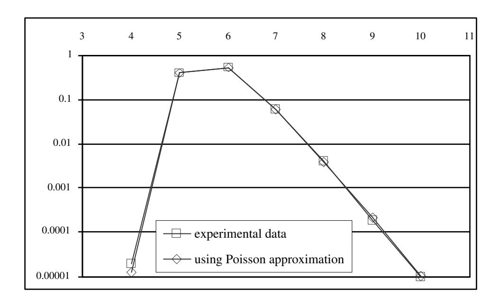
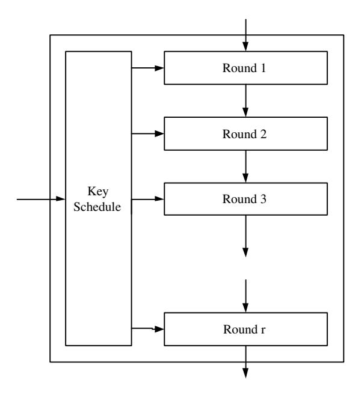
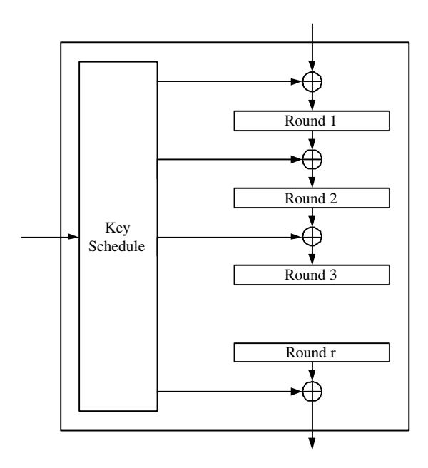
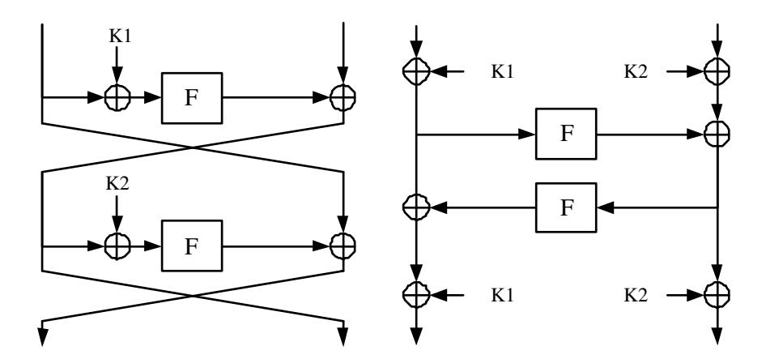
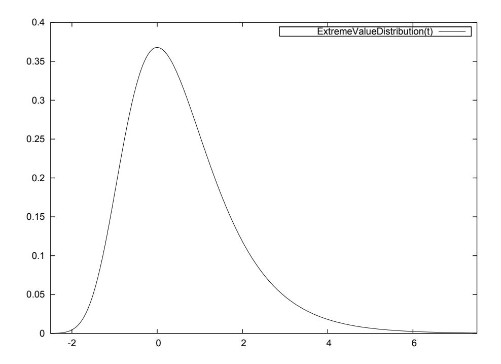

# Probability distributions of Correlation and Differentials in Block Ciphers

Joan Daemen∗ Vincent Rijmen†

April 13, 2006

#### Abstract

In this paper, we derive the probability distributions of difference propagation probabilities and input-output correlations for random functions and block ciphers, for several of them for the first time. We show that these parameters have distributions that are well-studied in the field of probability such as the normal, Poisson, Gamma and extreme value distributions.

For Markov ciphers there exists a solid theory that expresses bounds on the complexity of differential and linear cryptanalysis in terms of average difference propagation probabilities and average correlations, where the average is taken over the keys. The propagation probabilities and correlations exploited in differential and linear cryptanalysis actually depend on the key and hence so does the attack complexity. The theory of Markov ciphers does not make statements on the distributions of these fixed-key properties but rather makes the assumption that their values will be close to the average for the vast majority of keys. This assumption is made explicit in the form of the hypothesis of stochastic equivalence.

In this paper, we study the distributions of propagation properties that are relevant in the resistance of key-alternating ciphers against differential and linear cryptanalysis. Key-alternating ciphers are basically iterative ciphers where round keys are applied by an XOR operation in between unkeyed rounds and are a sub-class of Markov ciphers.

We give the distributions of fixed-key difference propagation probability and fixed-key correlation of iterative ciphers. We show that for key-alternating ciphers, the hypothesis of stochastic equivalence can be discarded. In its place comes the explicit formulation of the distribution of fixed-key differential probability (DP) of a differential in terms of its expected differential probability (EDP) and the distribution of the fixed-key linear probability (or rather potential) (LP) of a linear approximation (or hull) in terms of its expected linear probability (ELP). Here the ELP and EDP are defined by disregarding the key schedule of the block cipher and taking the average over independently selected round keys, instead of over all cipher keys. Proving these distributions requires no assumptions standardly made in Markov cipher theory as perfectly uniform behavior, independently acting rounds or the technique of averaging over keys.

For key-alternating ciphers, we show that if the EDP is equal to 2−n with n the block length, the fixed-key DP has a distribution that is very close to that in a random n-bit cipher. The same holds for the ELP and the corresponding fixed-key LP. Finally we present a technique for computing bounds on the EDP based on the distribution of probabilities of differential characteristics and of the ELP based on the distribution of LP of linear characteristics.

Key Words: Block ciphers, Probability Distributions, Differential cryptanalysis, Linear cryptanalysis

∗STMicroelectronics

† IAIK, Graz University of Technology and Cryptomathic

## 1 Introduction

Differential and linear cryptanalysis are the two most powerful general purpose cryptographic attacks known to date. In this paper we identify the properties of block ciphers that determine their resistance against these attacks. We make explicit the relations between the identified properties and derive their probability distributions.

#### 1.1 Differential and linear cryptanalysis

In their basic form, both attacks retrieve key information from the last round by analyzing (large) amounts of plaintext/ciphertext pairs. The key information acquired is then used to find even more key bits until the full key is found.

Differential cryptanalysis is a chosen-plaintext attack where plaintexts are applied in pairs that have a fixed difference [5]. The attack exploits the non-uniformity in the distribution of differences in the outputs of a map α, when pairs of inputs with a fixed difference are applied. The non-uniformity exploited can be a differential with a high probability, or, for more advanced versions of the attack, a differential with probability zero, or a combination of differentials with a high probability.

In the first type of differential attack, α equals the block cipher. The information on the ciphertext (output) pairs and plaintext (input) pairs is used to derive information on the key (input). If the distribution of output differences has a large peak with value P, the amount of plaintext/ciphertext pairs for the attack to be successful is proportional to P −1 . P is called the differential probability (DP). In the second type of differential attack, α is only a part of the block cipher. The map α is selected in such a way that its inputs and outputs can be computed from the plaintext and ciphertext and a 'small' number of key bits (typically 10 to 20 key bits). As in the first type of attack, the required amount of plaintext/ciphertext pairs is proportional to DP−1 . In general, DP depends on the key. Hence, the probability of success given a certain amount of plaintext/ciphertext pairs is key-dependent.

Linear cryptanalysis is a known-plaintext attack [20]. It exploits the correlation between linear combinations of input bits and linear combinations of output bits of a non-linear map α. In the first type of linear attack, α equals the block cipher. The information on the ciphertext (output) and the plaintext (input) is used to derive information on the key (input). If the correlation between input and output equals C, the required amount of known plaintexts is proportional to C −2 . In the second type of linear attack, α is only a part of the block cipher. The map α is selected in such a way that its inputs and outputs can be computed from the plaintext and ciphertext and a 'small' number of key bits (typically 10 to 20 key bits). If there is a linear combination of input bits and output bits of α that correlate to zero with a correlation value C while all other linear combinations have a negligible correlation, then it is possible to recover the key bits involved in the computation. In this attack the required amount of known plaintext for the attack to be successful is proportional to C −2 . The quantity C 2 is generally denoted by the term linear probability (or rather potential) (LP). In general, LP depends on the key and hence the probability of success given a certain amount of known plaintext is key-dependent.

Both linear and differential cryptanalysis have been improved with smart techniques that make them more efficient. Moreover, they have been extended in several ways and new attacks have been published that are related to them. The best known extensions are partitioning cryptanalysis [11] and truncated differentials [17]. Other attacks use difference propagation and correlation in different ways. This includes differential-linear attacks [13], impossible differentials [3, 6], boomerang attacks [34] and rectangle attacks [4]. In all these variants, the ability to predict difference propagation probabilities and correlations over multiple rounds that significantly deviate from the average values are essential for their success.

#### 1.2 Existing work

We briefly summarize existing work related to the subject at hand.

#### 1.2.1 Markov ciphers

The Markov cipher theory [18] has inspired many research on iterative block ciphers, including ours. It can be considered as the first approach to design block ciphers resistant against differential cryptanalysis. A Markov cipher is an (iterative) cipher for which the average difference propagation probability over one round is independent of the round's text input. For such ciphers, the assumption of independent round keys allows to compute the average DP of a characteristic as the product of the probabilities of the individual round. Here the average is taken over all the round keys, considered as independent variables. The average DP of a differential can be computed —in principle— as the sum of the probabilities of all characteristics with input difference a in the first round, and output difference b in the last round. Estimating the average probability of a differential to be equal to the fixedkey probability for almost all keys, is called making the hypothesis of stochastic equivalence. After the publication of linear cryptanalysis, Markov cipher theory has been extended to the resistance against linear cryptanalysis (e.g. see [26, 30]), leading to analogous conclusions for the LP of linear approximations (hulls) over the cipher. In [27] Markov theory was used to show that the average DP values in a Markov cipher employing differentially 2-uniform mappings converges exponentially fast to a flat distribution with high probability.

#### 1.2.2 Provable security

In [23, 2], a theory of provable security against differential attacks is developed. Originally developed for Feistel ciphers, the theory has been extended to cover more general Feistel-like constructions in [21]. In [15], the approach is extended further towards SP-networks, and also covers linear cryptanalysis. Follow-up results [16, 28, 29] allow to tighten the bounds for certain designs, using more complex counting strategies. The main contribution of these approaches is the construction of bounds on the average DP of differentials and LP of linear approximations (hulls), with as only condition the assumption of independent round keys.

#### 1.2.3 Decorrelation theory

In [31, 32] the decorrelation theory is proposed as a way to design ciphers secure against linear and differential cryptanalysis. The authors propose to use transformations reminiscent of universal hash functions [33] as an alternate way to have provable upper bounds to EDP and ELP. These transformations are used to construct a decorrelation module which can be plugged in into regular ciphers to make them secure against linear and differential cryptanalysis.

#### 1.3 The contributions of this paper

The complexity of an attack exploiting a differential is determined by the DP of that differential. In general, including Markov ciphers as well as ciphers using decorrelation modules, this quantity depends on the value of the key. The existing theories on cipher design [18, 23, 32] study the DP averaged over all keys assuming independent round keys, denoted by expected DP (EDP). This approximation is known as the hypothesis of stochastic equivalence. The same argument is true for fixed-key and average LP in the context of linear cryptanalysis. Proposed cipher designs upper bound the average value in order to obtain resistance against differential and linear attacks [21].

The problem with this approach is that the average values in general do not allow to draw conclusions on the shape of the distributions of the fixed-key values. In other words, the upper limits proven for the average probabilities do not guarantee that the fixed-key probabilities are small. This has been demonstrated in [1].

In the ideal case the distributions of the fixed-key differential and linear properties of a cipher are the same as for random block ciphers. A random block cipher can be modeled as a family of random permutations. For this purpose, we derive in Section 2 the distributions of the typical and maximum DP (or rather cardinality) of differentials over random vector Boolean functions and permutations. Section 3 does the same for the correlations of linear approximations (or hulls) over random vector Boolean functions and permutations. Section 4 treats the cardinalities and LP values in random block ciphers, both for the fixed-key case and for the averages over all keys.

In this paper we consider classes of ciphers that are a subset of Markov ciphers: longkey ciphers and key-alternating ciphers, defined in Section 5. Key-alternating ciphers are basically iterative ciphers where round keys are applied by an XOR operation in between unkeyed rounds. Long-key ciphers are key-alternating ciphers with independent round keys. For long-key ciphers we show in Section 6 that the distribution of the fixed-key probabilities of differentials is determined by the value of the average probability, the EDP. Similarly, in Section 7 we show that the distribution of the fixed-key LP is determined by the value of the average LP over all keys, the ELP. We show that these results remain valid if a key schedule is introduced, i.e. if the long-key cipher is turned into a key-alternating cipher. Hence, for key-alternating ciphers we show that the hypothesis of stochastic equivalence is replaced by the fact that the distribution of the fixed-key DP is determined by the average value of the corresponding long-key cipher. These quantities determine not only the shape of the distributions of the fixed-key quantities, but also the extreme value distribution, i.e. the maxima over all values of the key.

In Section 8 we present a method to compute bounds for the EDP over a key-alternating cipher given the distributions of the DP of differential characteristics and for the ELP over a key-alternating cipher given the distributions of the LP of linear characteristics.

Our approach differs from that of decorrelation theory in the following way. Decorrelation modules reduce the average DP of differentials, but not the fixed-key DP. In particular, for each value of the key, there is a differential with very high probability. The formal security proofs are based on the fact that since the key is not known, the attacker can not predict which differential has high DP. With our approach, we can avoid altogether the occurrence of differentials with high fixed-key DP, where 'high' means relative to what can be expected for a family of random permutations.

Section 10 contains the conclusions, Appendix A lists the probability distributions we

encounter in this paper and Appendix B derives the distribution of the maximum of a large number of variables with a given distribution.

## 2 Differentials in random functions

In this section we study the distributions related to the DP of differentials in random vector Boolean functions. This serves as a basis for studying the distributions for block ciphers in later sections and can also be used to predict the differential properties of randomly generated S-boxes.

#### 2.1 Random vector Boolean functions and permutations

A Boolean vector is a vector with bits as coordinates. The bitwise binary addition of two Boolean vectors a and b of the same dimension is a Boolean vector whose coordinates consist of the binary addition (addition modulo 2) of the corresponding bits of a and b. We denote this operation by +.

A Boolean function b = f(a) is a function that maps a Boolean vector to a bit.

$$f: GF(2)^n \to GF(2): a \mapsto b = f(a) . \tag{1}$$

The imbalance Imb(f) of a Boolean function f is the number of inputs that it maps to 0 minus the number of inputs that it maps to 1 divided by two. The imbalance can have any integer value and ranges from −2 n−1 to 2n−1 . We have:

$$Imb(f) = \frac{1}{2} \left( \# \left\{ a | f(a) = 0 \right\} - \# \left\{ a | f(a) = 1 \right\} \right) . \tag{2}$$

A Boolean function with imbalance 0 is called balanced.

A vector Boolean function b = α(a) is a function that maps a Boolean vector to another Boolean vector:

$$\alpha: \mathrm{GF}(2)^n \to \mathrm{GF}(2)^m: a \mapsto b = \alpha(a) \ . \tag{3}$$

This vector Boolean function has n input bits and m output bits. A vector Boolean function can be specified by its definition table: an array containing the output value for each of the 2 n possible input values.

Each bit of the output of a vector Boolean function is itself a Boolean function of the input vector. These are the coordinate Boolean functions of the vector Boolean function.

A vector Boolean transformation is a vector Boolean function with the same number of input bits as output bits. A vector Boolean permutation is an invertible vector Boolean transformation and maps all input values to different output values.

There are 2m2 n n-bit to m-bit vector Boolean functions. A random n-bit to m-bit vector Boolean function is a function selected at random from the set of 2m2 n different n-bit to m-bit vector Boolean functions, where each function has the same probability of being chosen. A random vector Boolean function can be obtained by filling its definition table with 2n random m-bit values. A random n-bit permutation is a permutation selected at random from the set of 2n ! possible n-bit permutations, where each permutation has the same probability of being chosen.

#### 2.2 Terminology related to differentials

A pair is an unordered set of two Boolean vectors of the same dimension: {v, u} = {u, v}. The difference of a pair is a Boolean vector with value u + v, where + denotes the bitwise difference or XOR. In the context of difference propagation in a vector Boolean function α, we speak of an input difference of a pair of vectors {v, u} and of its output difference α(u)+α(v). For a given n, there are 2n − 1 possible non-zero input differences. For each non-zero input difference, there are 2n−1 pairs with that input difference.

A differential over a vector Boolean function α consists of an input difference a and an output difference b and is denoted by (a, b). The differential probability (DP) of the differential (a, b) is given by the number of pairs that have input difference a and output difference b, divided by the total number of pairs with input difference a:

$$DP(a,b) = \#\{\{v,u\}|v+u=a \text{ and } \alpha(v) + \alpha(u) = b\}/2^{n-1}$$
(4)

Note that the differential probability can take only a limited number of values: it is either zero or a multiple of 21−n . In the following, we will consider DP(a, b) as a stochastic variable. It is often more convenient to work with the cardinality of the differential, because this term avoids confusion between the stochastic variable DP(a, b) and its probability distribution. Furthermore, using the term cardinality, we emphasize the discrete character of this quantity.

Definition 1 The cardinality of a differential N(a, b) is the number of pairs with input difference a that have output difference b.

$$N(a,b) = \#\{\{v,u\}|v+u = a \text{ and } \alpha(v) + \alpha(u) = b\} .$$
 (5)

Hence the cardinality equals the DP times 2n−1 . An impossible differential is a differential with DP (or cardinality) equal to 0. The weight of a possible differential (a, b) is the absolute value of the binary logarithm of its differential probability:

$$\mathbf{w}_{\mathbf{d}}(a,b) = -\log_2 \mathrm{DP}(a,b) \ . \tag{6}$$

The weight of a differential ranges from 0 to n − 1.

A differential with an input difference equal to 0 also has output difference 0 and is called a trivial differential. The trivial differential has differential probability 1, cardinality 2n−1 and weight 0. For a permutation α, all differentials (a, 0) with a 6= 0 are impossible differentials. The only possible differential of the form (a, 0) is the trivial differential. In the remainder of this document we will use the term differential to mean nontrivial differential.

In the following subsections we study distributions of the DP and cardinality of differentials over random vector Boolean functions and permutations.

#### 2.3 The cardinality of a differential for a random function

The cardinality of a differential is determined as follows.

Theorem 1 For a random n-bit to m-bit vector Boolean function, the cardinality N(a, b) of a given differential (a, b) is a stochastic variable with a binomial distribution:

$$\Pr(N(a,b) = i) = (2^{-m})^{i} (1 - 2^{-m})^{2^{n-1} - i} {2^{n-1} \choose i}.$$

Proof: A random vector Boolean function maps the 2n different input values v to independent output values α(v) and hence it maps the differences of pairs {v, u} to independent output differences. Given (a, b), taking a pair with a difference a is an experiment that is successful if the output difference is b. The number of experiments is 2n−1 and the probability of success is 2−m. The number of successes has the binomial distribution. ut

Corollary 2 For n ≥ 5 and n − m small , we have:

$$\Pr(N(a,b) = i) \approx e^{-2^{n-m-1}} \frac{2^{(n-m-1)i}}{i!} = Poisson(i; 2^{n-m-1})$$
.

Proof: If n ≥ 5 and n − m is small, then the binomial distribution can be approximated closely by a Poisson distribution with λ = 2n−m−1 (see Appendix A). ut

Corollary 3 If m is small, we have:

$$\Pr(N(a,b) = i) \approx Z\left(\frac{i - 2^{n-m-1}}{\sqrt{2^{n-m-1}(1 - 2^{-m})}}\right).$$

with Z () denoting a normal distribution (see Appendix A).

Proof: For small m, the binomial distribution can be approximated closely by a normal distribution with mean µ(N(a, b)) = 2n−m−1 and variance σ 2 = 2n−m−1 (1 − 2 −m) (see Appendix A). ut

Both approximations improve as n grows.

For a Boolean function we have m = 1 and hence the cardinality N(a, b) has a normal distribution with

$$\mu(N(a,b)) \approx 2^{n-2}, \tag{7}$$

$$\sigma^2(N(a,b)) \approx 2^{n-3} .$$
(8)

Corollary 4 For a random vector Boolean transformation we have

$$\Pr\left(N(a,b)=i\right) \approx \textit{Poisson}(i;\frac{1}{2}) = \frac{e^{-\frac{1}{2}}}{i!2^{i}} \ .$$

Proof: This follows from Corollary 2. For a transformation it holds that m = n and hence λ = 1 2 . ut

In a random permutation, the entries in the definition table of a permutation are not independent from one another. In the series of 2n−1 experiments of applying the pairs with a given nonzero input difference and observing the output difference, we see that in the output pairs all 2n possible output values appear exactly once. This restriction strongly complicates the analysis. Fortunately, the case of permutations was rigorously studied and described in [24, 12]. With the exception of the fact that differentials of the form (a, 0) with a 6= 0 are impossible, it turns out that the probability that a pair with a given input difference maps to a given output difference is not noticeably affected by the fact that the transformation is a permutation. It follows that in the computation of the distribution it is sufficient to replace the probability of success by 1/(2n − 1) for nonzero output differences b and by 0 for b = 0. For large n this has a negligible effect on the cardinality of differentials (a, b) with b 6= 0 and hence Corollary 4 for random transformations is also valid for random permutations.

#### 2.4 Maximum cardinality

In [24, 12] bounds have been proven for the maximum DP over permutations. In this section, we derive the shape of the distribution of the maximum cardinality for Boolean vector functions and permutations.

Let the cumulative distribution of the cardinality of a differential be denoted by Φ(`).

$$\Phi(\ell) = \Pr(N(a, b) \le \ell) . \tag{9}$$

For values of ` with 1 < ` ¿ 2 m, the distributions for differentials with the same input and different outputs can be approximated closely by independent distributions. We have:

$$\Pr\left(\max_{b} N(a, b) \le \ell\right) = \Pr\left(\forall b : N(a, b) \le \ell\right) \approx (\Phi(\ell))^{2^{m}}.$$
 (10)

This expression is not valid for ` = 0 as not all differentials over which the maximum is taken can have cardinality 0.

If Φ(`) ≈ 1 we can write:

$$(\Phi(\ell))^{2^m} = e^{2^m \log(\Phi(\ell))} \approx e^{-2^m (1 - \Phi(\ell))} . \tag{11}$$

For a random vector Boolean function, the cumulative distribution of the maximum cardinality over all differentials with a given input difference is therefore:

$$\Pr\left(\max_{b} N(a, b) \le \ell\right) \approx e^{-2^{m}(1 - \Phi(\ell))} . \tag{12}$$

Again, for values of ` with 1 < ` ¿ 2 m, the distributions for differentials with the different inputs can be approximated by independent distributions. For a random vector Boolean function, the cumulative distribution of the maximum cardinality is:

$$\Pr\left(\max_{a,b} N(a,b) \le \ell\right) \approx e^{-2^m(2^n - 1)(1 - \Phi(\ell))} \approx e^{-2^{m+n}(1 - \Phi(\ell))} . \tag{13}$$

If we derive the expressions for n-bit vector Boolean permutations instead of n-to-m vector Boolean functions, we must replace 2m by 2n − 1. For large n we can approximate 2n − 1 by 2 n , yielding:

$$\Pr\left(\max_{b} N(a, b) \le \ell\right) \approx e^{-2^{n}(1 - \Phi(\ell))} , \qquad (14)$$

$$\Pr\left(\max_{a,b} N(a,b) \le \ell\right) \approx e^{-2^{2n}(1-\Phi(\ell))} . \tag{15}$$

For a permutation, λ = 1 2 and we can approximate Φ(`) closely by [10, 19]:

$$\Phi(\ell) \approx 1 - \frac{2\ell}{2\ell - 1} \frac{e^{-\frac{1}{2}}}{\ell! 2^{\ell}} .$$
(16)

Using (14), (15) and (16), we can compute the distributions for concrete values of n. Table 1 gives the probability distributions for the maximum cardinality over all differentials for n = 64, 128 and 256. The values in the table illustrate that the distributions are very narrow. The probability is only large in a single, or two successive values of `. In Appendix B we derive an expression to compute the expected value of the maximum as a function of n and discuss the shape of the distribution. Table 2 lists the mean values of the distributions for random permutations with typical dimensions.

Table 1: Distribution of t = maxa,b N(a, b) for permutations of some given sizes.

| n = 64 |                   | n = 128 |                   | n = 256 |                   |
|-----------|-------------------|------------|-------------------|------------|-------------------|
| t         | Pr                | t          | Pr                | t          | Pr                |
| 26        | 10−62 4.5 × | 47         | 10−9 1.8 ×  | 83         | 10−56 8.0 × |
| 27        | 0.080             | 48         | 0.81              | 84         | 0.47              |
| 28        | 0.88              | 49         | 0.18              | 85         | 0.52              |
| 29        | 0.042             | 50         | 0.002             | 86         | 0.004             |
| 30        | 10−4 7.1 ×  | 51         | 10−5 2.0 ×  | 87         | 10−5 2.5 ×  |
| 31        | 10−5 1.2 ×  | 52         | 10−7 1.9 ×  | 88         | 10−7 1.4 ×  |
| 32        | 10−7 1.8 ×  | 53         | 10−9 1.8 ×  | 89         | 10−10 7.9 × |
| 33        | 10−9 2.7 ×  | 54         | 10−11 1.7 × | 90         | 10−12 4.4 × |
| 34        | 10−11 4.0 × | 55         | 10−13 1.5 × | 91         | 10−14 2.4 × |

Table 2: Mean value for the distribution of the maximum cardinality

| n  | µ(maxa N) | µ(maxa,b N) | n   | µ(maxa N) | µ(maxa,b N) |
|----|--------------|----------------|-----|--------------|----------------|
| 8  | 3.34         | 5.64           | 64  | 16.22        | 27.96          |
| 12 | 4.53         | 7.68           | 96  | 22.20        | 38.29          |
| 16 | 5.64         | 9.54           | 128 | 27.96        | 48.19          |
| 24 | 7.68         | 13.08          | 192 | 38.29        | 67.02          |
| 32 | 9.54         | 16.22          | 256 | 48.19        | 84.53          |
| 48 | 13.08        | 22.20          | 384 | 67.02        | 118.02         |

Figure 1: Distributions of maximum cardinality in 8-bit random permutations.

#### 2.5 Experimental data

To verify our approximations, we have generated a large number of random invertible Sboxes ranging from 4 to 8 bits and computed the distribution of the maximum cardinality. Starting from 5 bits the typical shape of extreme value distribution (see Appendix B) becomes apparent. Figure 1 illustrates that already for values as small as 8 the distributions derived in this section are quite close to experimentally obtained data.

## 3 Correlation in random functions

In this section we study the distributions of correlation and LP of linear approximations over random vector Boolean functions and permutations. This serves as a basis for studying the distributions for block ciphers in later sections and can also be used to predict the correlation properties of randomly generated S-boxes.

#### 3.1 Terminology related to correlation

A parity of a Boolean vector is a binary Boolean function that consists of the binary addition of a number of its coordinates. A parity is determined by the indices of the bits of the Boolean vector that are included in the binary addition.

The selection vector u of a parity is a Boolean vector that has a 1 in the bit positions that are included in the parity and a 0 in all other positions. Analogously to the inner product of vectors in linear algebra, we express the parity of vector a corresponding with selection vector u as u Ta. In this expression the T suffix denotes transposition of the vector u.

A (linear) approximation over a vector Boolean function α consists of an n-bit input selection vector v and an m-bit output selection vector u and is denoted by (v, u). What we call a linear rule, is sometimes referred to as a linear approximation. However, we think it makes sense to introduce a new term here, because the term linear approximation is also used to indicate what we call a linear trail (see Section 7.1). An approximation with both the input selection vector and the output selection vector equal to 0 is called a trivial approximation. The imbalance Imb(v, u) of an approximation (v, u) over a function α is the imbalance of the Boolean function given by:

$$v^{\mathrm{T}}a + u^{\mathrm{T}}\alpha(a)$$
.

The correlation of an approximation is its imbalance divided by 2n−1 :

$$C(v, u) = \text{Imb}(v, u)/2^{n-1} = 2^{1-n} \times \text{Imb}(v, u)$$
 (17)

The correlation ranges from −1 to +1. A correlation with value −1 means that the parities defined by v and u are each others complement and value +1 means that they are equal. Several authors work with the bias [20]. The bias of an approximation is its correlation divided by two. We prefer to follow here the terminology of e.g. [22] and work with the correlation. Note that the quantity denoted here by correlation, corresponds exactly to the definition of correlation in other fields of mathematics, e.g. probability theory [14].

The linear probability (or rather potential) (LP) of an approximation LP(v, u) is the square of its correlation and ranges from 0 to 1. We call an approximation with zero correlation an impossible approximation. The weight of a possible approximation is the absolute value of the binary logarithm of its LP. The weight ranges between 0 and 2(n − 1). It is well known, see e.g. [7], that for any vector Boolean function and for all u:

$$\sum_{v} LP(v, u) = 1.$$
 (18)

The approximation with output selection vector 0 and input selection vector 0 is the only possible trivial approximation. It has imbalance 2n−1 , correlation 1 and weight 0. Approximations (v, 0) with v 6= 0 are impossible approximations. For permutations, all approximations (0, u) with u 6= 0 are also impossible approximations. The weight of an approximation over an n-bit permutation ranges from 0 to 2(n − 2) (as the correlation of an approximation over a permutation is an integer multiple of 2n−2 ). In the remainder of this document we will use the term approximation to mean nontrivial approximation.

#### 3.2 Correlation of an approximation over a random vector Boolean function

We start with a result on the imbalance of an approximation.

Theorem 5 For a random n-bit to m-bit vector Boolean function, the imbalance Imb(v, u) of an approximation is a stochastic variable with the following distribution:

$$\Pr(\text{Imb}(v, u) = z) = 2^{-2^n} \binom{2^n}{2^{n-1} + z}.$$

Proof: We start by computing the number of vector Boolean functions for which an approximation (v, u) has imbalance z. For a given Boolean function f, the number of n-bit to m-bit vector Boolean functions α that satisfy

$$v^{\mathrm{T}}a + u^{\mathrm{T}}\alpha(a) = f(a)$$

is independent of the choice of f and is equal to  $2^{m2^{n-1}}$ . So the number of vector Boolean functions that satisfy  $\mathrm{Imb}(v,u)=z$  is equal to  $2^{m2^{n-1}}$  times the number of Boolean functions f(a) with imbalance z. Dividing by the total number of n-bit to m-bit vector Boolean functions results in the given distribution for the imbalance.

**Corollary 6** For  $n \geq 5$ , the result of Theorem 5 can be approximated by:

$$\Pr(\operatorname{Imb}(v, u) = z) \approx Z\left(\frac{z}{2^{(n-2)/2}}\right)$$
,

for z an integer and 0 otherwise.

**Proof:** The distribution of the imbalance is binomial. If  $2^n$  is large, it can be approximated closely by a normal distribution with  $\mu(\text{Imb}) = 0$  and  $\sigma(\text{Imb}) = 2^{(n-2)/2}$  [10, 19].  $\Box$  For the correlation this yields  $C(v, u) = 2^{-n+1} \text{Imb}(v, u)$ , hence  $\mu(C) = 0$  and  $\sigma(C) = 2^{-n/2}$ .

Approximating the discrete distribution of (6) by a continuous density function, we can derive from it the density function of the LP. This results in a Gamma distribution (see Appendix A).

**Corollary 7** For a random n-bit to m-bit vector Boolean function, with  $n \ge 5$ , the probability distribution of the LP of an approximation can be approximated by a Gamma distribution:

$$\Pr(\text{LP} = z) \approx \frac{2^{n/2}}{\sqrt{2\pi z}} e^{-\frac{z}{2^{1-n}}}$$
,

for z > 0 and 0 otherwise.

This distribution has mean  $\mu(LP) = 2^{-n}$  and standard deviation  $\sigma(LP) = \sqrt{2} \times 2^{-n}$ .

#### 3.3 Correlation of an approximation over a random permutation

We first derive the distribution of the imbalance of an approximation over a random n-bit vector Boolean permutation. This distribution was already given in [25] but the proof was missing due to page limit restrictions.

**Lemma 8 ([25])** For a random n-bit permutation, the imbalance Imb(v, u) of an approximation is a stochastic variable with the following distribution:

$$\Pr(\text{Imb}(v, u) = 2x) = \frac{\binom{2^{n-1}}{2^{n-2} + x}^2}{\binom{2^n}{2^{n-1}}}.$$

**Proof:** We start by computing the fraction of permutations for which an approximation (v, u) has imbalance Imb(v, u) = z. Consider the Boolean function g defined by

$$g(a) = u^{\mathrm{T}}\alpha(a). \tag{19}$$

Clearly, g(a) is an output parity of  $\alpha$ . Since  $\alpha$  is a permutation, g(a) is balanced. Its definition table contains  $2^{n-1}$  zeroes and  $2^{n-1}$  ones.

A vector Boolean permutation for which one output parity has been fixed to a function g can be constructed as follows. Complement the output parity with an (n-1)-bit permutation for the part of the definition table with g(a) = 0 and an (n-1)-bit permutation for the part of

the definition table with g(a) = 1. It follows that the number of such vector Boolean permutations is independent from the particular function g(a) and only depends on the dimension n. Hence the fraction of vector Boolean permutations that satisfy Imb(v, u) = z is equal to the number of balanced Boolean functions g that satisfy

$$Imb(g(a) + v^{\mathrm{T}}a) = z , \qquad (20)$$

divided by the total number of balanced Boolean functions.

We compute now the number of balanced Boolean functions that satisfy (20). Partition the definition table of g(a) in two halves:  $D_0$  for which  $v^Ta = 0$  and  $D_1$  for which  $v^Ta = 1$ . The total imbalance of  $g(a) + v^Ta$  is given by the imbalance of g(a) restricted to  $D_0$  (called x) minus the imbalance of g(a) restricted to  $D_1$  (called y). As g(a) is balanced, we have x + y = 0 and so y = -x. The imbalance of  $g(a) + v^Ta$  is hence given by 2x. It follows that in a vector Boolean permutation all approximations have an even imbalance.

The number of balanced Boolean functions g(a) for a given value of x is:

$$\binom{2^{n-1}}{2^{n-2}+x} \binom{2^{n-1}}{2^{n-2}-x} = \binom{2^{n-1}}{2^{n-2}+x}^2.$$
 (21)

If we divide this by the total number of balanced Boolean functions, we obtain the probability distribution of the imbalance.  $\Box$

In [25], it is proven that the number of approximations with correlation equal to 0, tends to zero when n grows. Additionally, some upper bounds are derived on the maximum correlation amplitude over all approximations of a random permutation. The distributions for correlations and maximum LP values we derive in the remainder of this section and following sections, confirm these results.

**Theorem 9** For a random n-bit permutation, with  $n \geq 5$  the imbalance  $\mathrm{Imb}(v,u)$  of an approximation is a stochastic variable with a distribution that can be approximated as follows:

$$\Pr(\mathrm{Imb}(v,u)=z) \approx 2Z\left(\frac{z}{2^{(n-2)/2}}\right)$$
,

for z even and zero otherwise.

**Proof:** We start with the expression of Lemma 8. If  $2^{n-1}$  is large, we have:

$$\binom{2^{n-1}}{2^{n-2} + x} \approx 2^{2^{n-1}} Z\left(\frac{x}{2^{(n-3)/2}}\right), \tag{22}$$

and

$$\binom{2^n}{2^{n-1}} \approx 2^{2^n} \frac{2^{-(n-2)/2}}{\sqrt{2\pi}} \ . \tag{23}$$

Working this out yields:

$$\Pr(\operatorname{Imb}(v, u) = 2x) \approx Z\left(\frac{x}{2^{(n-4)/2}}\right). \tag{24}$$

Substituting x by z/2 gives the desired distribution.

It follows that the correlation of an approximation over a random permutation and a random transformation are both approximated by a normal distribution with mean 0 and variance  $2^{-n}$ . They differ in the fact that the probability is only non-zero for correlation values that are an integer multiple of  $2^{2-n}$  for permutations and  $2^{1-n}$  for transformations.

#### 3.4 Maximum LP

Let the cumulative distribution of the LP of an approximation be denoted by Φ(x):

$$\Phi(x) = \Pr(\operatorname{LP}(v, u) \le x) . \tag{25}$$

For values of x ¿ 1, the distributions Φ(x) for approximations with the same output parity and different input parities can be approximated by independent distributions. We have:

$$\Pr(\max_{v}(\text{LP}(v, u) < x) \approx \Phi(x)^{2^{n}}.$$
(26)

If Φ(x) is very close to 1, we can approximate this by:

$$\Pr(\max_{v}(LP(v,u) < x) \approx e^{-2^{n}(1-\Phi(x))}$$
 (27)

Again, for values of x ¿ 1, the distributions Φ(x) for approximations with different output parities can be approximated by independent distributions. For the cumulative distribution of the maximum LP of a random vector Boolean function we have:

$$\Pr(\max_{v,u}(LP(v,u) < x)) \approx e^{-(2^m - 1)2^n(1 - \Phi(x))} \approx e^{-2^{m+n}(1 - \Phi(x))}.$$
 (28)

If we derive the expressions for permutations instead of transformations, we must replace 2n by 2n − 1. For large n we can approximate 2n − 1 by 2n , yielding:

$$\Pr(\max_{u}(\text{LP}(v, u) < x) \approx e^{-2^{n}(1 - \Phi(x))}$$
 (29)

$$\Pr(\max_{v,u}(\text{LP}(v,u) < x) \approx e^{-2^{2n}(1-\Phi(x))}.$$
 (30)

Due to the fact that P v LP(v, u) = 1, all these distributions are 0 for x < 2 −n .

In Appendix B we have derived the distributions of the maximum. Their mean and standard deviation depend on the number of approximations the maximum is taken over. If we denote this number by 2y , the distribution of the maximum has mean 2−n (1.38y−ln(1.38y)) and standard deviation 2.6 × 2 −n .

#### 3.5 Experimental data

We have computed the maximum LP of a large numbers of random permutations. Also here, the typical shape of extreme value distribution (see Appendix B) becomes apparent starting from 5 bits. Figure 2 illustrates that already for an 8-bit permutation our approximations match the experimental data quite closely.

# 4 Differentials and Correlation in Random Block Ciphers

A block cipher B with block length n and key length h is an array of 2h vector Boolean permutations operating on n-bit Boolean vectors. Each key value k determines a vector Boolean permutation denoted by B[k]. We also refer to B[k] as a fixed-key (block) cipher. A random block cipher with block length n and key length h is an array of 2h n-bit random permutations: one random n-bit permutation for each key value. Equivalently, a random block cipher with block length n and key length h is a block cipher chosen randomly from the set of (2n !)2 h possible block ciphers of these dimensions, where each block cipher has an equal probability of being chosen.

Figure 2: Distributions of maximum cardinality in 8-bit random permutations.

Table 3: Expected values for the maximum of the fixed-key cardinality over all keys and differentials

| n   | h   | µ(maxk,a,b N[k]) | h   | µ(maxk,a,b N[k]) |
|-----|-----|---------------------|-----|---------------------|
| 64  | 56  | 37                  | 128 | 48                  |
| 96  | 96  | 53                  | 192 | 67                  |
| 128 | 128 | 67                  | 256 | 85                  |
| 192 | 128 | 85                  | 256 | 101                 |
| 256 | 192 | 110                 | 256 | 118                 |

#### 4.1 Differentials in random block ciphers

We call the cardinality of a differential over a block cipher where the key is fixed to a specific value a fixed-key cardinality (of that block cipher).

The fixed-key cardinality of a differential over a random block cipher has the same distribution as the cardinality of a random permutation. We denote it by the symbol N[k](a, b). Since a random block cipher is an array of 2h fixed-key block ciphers, the distribution of the maximum over all keys of the fixed-key cardinalities of differentials of a random block cipher is given by:

$$\Pr\left(\max_{a,b,k} N[k](a,b) < \ell\right) \approx e^{-2^{2n+h}(1-\Phi(\ell))} . \tag{31}$$

Table 3 lists the expected values of the maximum fixed-key cardinality for random block ciphers with typical dimensions.

We can consider a differential (a, b) over a block cipher B as the combination of all differentials (a, b) of its fixed-key block ciphers. The total cardinality Ntot of a differential (a, b)

Table 4: Values of  $\mu(\max_{k,v,u} LP[k])$  for random block ciphers

| n   | h   | $\mu(\max_{k,v,u} \operatorname{LP}[k])$ | h   | $\mu(\max_{k,v,u} \mathrm{LP}[k])$ |
|-----|-----|------------------------------------------|-----|------------------------------------|
| 64  | 56  | $252 \times 2^{-64}$                     | 128 | $351 \times 2^{-64}$               |
| 96  | 96  | $396 \times 2^{-96}$                     | 192 | $529 \times 2^{-96}$               |
| 128 | 128 | $529 \times 2^{-128}$                    | 256 | $706 \times 2^{-128}$              |
| 192 | 128 | $706 \times 2^{-192}$                    | 256 | $883 \times 2^{-192}$              |
| 256 | 192 | $972 \times 2^{-256}$                    | 256 | $1061 \times 2^{-256}$             |

over a block cipher  $\mathcal{B}$  is the sum of the fixed-key cardinalities of the differential (a, b) over all keys.

$$N_{\text{tot}}(a,b) = \sum_{k} N[k](a,b)$$
 (32)

The average DP can be computed as the total cardinality divided by  $2^h$ , the number of possible keys, and  $2^{n-1}$ , the number of pairs with input difference a.

**Theorem 10** The distribution of the total cardinality of a differential over a random block cipher is very close to a normal distribution with mean  $\mu(N_{\rm tot}) = 2^{h-1}$  and standard deviation  $\sigma(N_{\rm tot}) = \sqrt{2^h 2^{-1}} = 2^{(h-1)/2}$ .

**Proof:** The total cardinality of a differential over a random block cipher is the sum of  $2^h$  independent variables. For all reasonable values of h,  $2^h$  is large enough to invoke the central limit theorem. The individual variables have the distribution of (4), i.e. with mean  $2^{-1}$  and variance  $2^{-1}$ .

The distribution of the average DP has mean  $2^{-n}$  and standard deviation  $2^{(h-1)/2}/2^{h+n-1} = 2^{-n}2^{(1-h)/2}$ .

We can estimate the maximum and minimum of the average cardinality of all differentials over a random block cipher by applying the formulas in Appendix B.1. While a random block cipher always has differentials with high fixed-key cardinality, the average cardinality of differentials stays extremely close to their mean value 1/2.

#### 4.2 Correlations in random block ciphers

A linear approximation over a block cipher is often indicated by the term hull. We call the correlation (LP) of a hull over a block cipher where the key is fixed to a specific value a fixed-key correlation (LP).

The distribution of the maximum over all keys of the fixed-key LP of hulls of a random block cipher is given by:

$$\Pr\left(\max_{k,a,b} \operatorname{LP}[k](a,b) < x\right) \approx e^{-2^{2n+h}(1-\Phi(x))}. \tag{33}$$

Table 4 lists the expected maximum values of the fixed-key LP for a number of block ciphers with typical dimensions.

We can consider a hull (v, u) over a block cipher  $\mathcal{B}$  as the combination of the fixed-key hulls (v, u) for all keys. The average LP of a hull (a, b) is the average of the fixed-key LP values of (a, b) over all keys.

Figure 3: Block diagram of an iterative cipher.

**Theorem 11** The distribution of the average LP of a hull over a random block cipher is very close to a normal distribution with mean  $2^{-n}$  and standard deviation  $2^{-n}2^{(1-h)/2}$ .

**Proof:** The fixed-key LP of a hull has a Gamma distribution with mean  $2^{-n}$  and standard deviation  $2^{\frac{1}{2}-n}$  (Corollary 7). Application of the central limit theorem results in the given distribution.

As in the case for the total cardinality of differentials, the average LP of hulls stays very close to its mean value  $2^{-1}$ . The extreme values can be found by applying the formulas in Appendix B.1.

# 5 Iterative Block Ciphers

Most block ciphers are constructed as a sequence of *rounds*, where each round is a key-dependent permutation. The keys that are used by the rounds are called *round keys* and to avoid confusion the key of the block cipher is called the *cipher key*. The round keys are derived from the cipher key by the *key schedule*. A block cipher with this structure is called an *iterative* (block) cipher. Figure 3 depicts the iterative block cipher structure.

#### 5.1 Key-alternating and long-key ciphers

Key-alternating (block) ciphers are a class of iterative ciphers in which the round keys are introduced in a particularly simple way.

**Definition 2** A key-alternating cipher consists of an alternating sequence of unkeyed rounds and simple bitwise key additions.

Figure 4: Block diagram of a key-alternating cipher.

The key-alternating cipher structure is depicted in Figure 4. Most examples of key-alternating ciphers are ciphers with a Substitution-Permutation Network (SPN) structure. However, it is also possible to present a cipher with a Feistel structure as a key-alternating cipher, on the condition that the F function can be presented as the sequence of a round key addition and an unkeyed function. For DES this is not possible due to the expansion before the key addition and hence DES is not a key-alternating cipher. Figure 5 illustrates the alternative representation for a balanced Feistel cipher. To illustrate the differences between Markov and key-alternating ciphers: DES, IDEA, Twofish, RC5, RC6, Serpent, Square and Rijndael (AES) are all Markov ciphers, but of these only Serpent, Square and Rijndael are key-alternating ciphers.

In order to develop our reasoning, we introduce yet another type of block cipher: long-key ciphers.

Definition 3 A long-key cipher is a key-alternating cipher with a particularly simple key schedule. It has a h = n(r + 1) bit cipher key that consists of the concatenation of the r + 1 round keys.

We call the key schedule of a long-key cipher trivial. Note that a long-key cipher is a special case of a Markov cipher. In particular, it satisfies, by definition, the assumption of independent and random round keys. Note further that we introduce this type of cipher only to explain better in the following sections our extensions to the Markov cipher theory.

# 6 Differentials in Key-alternating Ciphers

In this section we study the distributions of the total cardinalities and fixed-key cardinalities of differentials over key-alternating ciphers.

Figure 5: Two balanced Feistel rounds (left) and an alternative key-alternating representation (right).

#### 6.1 Characteristics in iterative block ciphers

A characteristic Q through an r-round cipher consists of a sequence of r+1 differences:

$$Q = \left(q^{(0)}, q^{(1)}, q^{(2)}, \dots, q^{(r-1)}, q^{(r)}\right) . \tag{34}$$

The fixed-key cardinality and DP of a characteristic through an iterative cipher are defined in the same way as the fixed-key cardinality and DP of a differential. We have

$$N[k](Q) = \# \left\{ \{v, u\} | v + u = q^{(0)} \text{ and } \rho(v) + \rho(u) = q^{(1)} \text{ and } \dots \right\},$$
 (35)

where  $\rho$  is the round transformation. A pair that shows the differences of a characteristic is called a pair that follows that characteristic. Similarly, the total cardinality of a characteristic through an iterative cipher is defined as the sum of the cardinalities of the characteristic over all keys.

A characteristic is a sequence of r differentials  $(q^{(j-1)}, q^{(j)})$ , that each have a weight  $w_d(q^{(j-1)}, q^{(j)})$ . We define the *weight* of a characteristic through a fixed-key cipher as the sum of the weights of the differentials it is composed of:

$$w_d(Q) = \sum_{j=1}^r w_d \left( q^{(j-1)}, q^{(j)} \right) .$$
 (36)

If a characteristic is composed of possible differentials, then the weight of characteristics is bounded as follows:

$$0 \le \mathbf{w}_{\mathbf{d}}(Q) \le r(n-1) \ . \tag{37}$$

Note that while (6) unambiguously relates the weight of a differential to its differential probability, this is not the case for characteristics. In general, the DP of single-round differentials of an iterative cipher depends on the value of the round key. Consequently, the weight of characteristics depends on the value of the cipher key. In a key-alternating cipher, the round functions are unkeyed and hence the weight of the single-round differentials is independent of

the key. The addition of the round keys between the rounds has no impact on the DP of single-round differentials. It follows that in a key-alternating cipher, the weight of characteristics is *independent* of the key, and hence also the key schedule.

The following result has been proven for Markov ciphers in [18] under the assumption of independent round keys. Since a long-key cipher is a Markov cipher with independent round keys, the result applies here as well.

**Theorem 12** The average DP of a characteristic through a long-key cipher equals the product of the DP values of the single-round differentials that form the characteristic.

$$DP(Q) = \prod_{j} DP\left(q^{(j-1)}, q^{(j)}\right) .$$

Using (6), we can write this as follows:

$$-\log_2(DP(Q)) = \sum_j w_d(q^{(j-1)}, q^{(j)}) = w_d(Q).$$
 (38)

Hence, a characteristic with weight z has average DP equal to  $2^{-z}$  and total cardinality equal to  $2^{-z}2^{h+n-1}$ . So, as opposed to a fixed-key cardinality of a characteristic, the total cardinality of a characteristic in a long-key cipher is easy to calculate.

#### 6.2 Characteristics forming differentials

We denote by  $Q_{(a,b)}$  a characteristic between a and b, i.e. with  $q^{(0)} = a$  and  $q^{(r)} = b$ . Clearly, a fixed-key cardinality of a differential (a,b) equals the sum of the fixed-key cardinalities of all characteristics between a and b.

$$N[k](a,b) = \sum_{Q_{(a,b)}} N[k](Q_{(a,b)}) .$$
(39)

Consequently, the total cardinality of a differential (a,b) over an iterative cipher equals the sum of the total cardinalities of all characteristics through that iterative cipher that have  $q^{(0)} = a$  and  $q^{(r)} = b$ . The relations between cardinalities are summarized in the following equation:

$$N_{\text{tot}}(a,b) = \sum_{k} N[k](a,b) = \sum_{k} \sum_{Q_{(a,b)}} N[k](Q_{(a,b)}) = \sum_{Q_{(a,b)}} N_{\text{tot}}(Q_{(a,b)}) . \tag{40}$$

If we consider the fixed-key cardinalities of all characteristics that start from the same difference, we see that they sum to  $2^{n-1}$ . Clearly, each pair must follow exactly one characteristic. This generalizes in a straightforward way to fixed-key and total cardinalities of characteristics through block ciphers, that sum to  $2^{h+n-1}$ . We have

$$\sum_{b} \sum_{Q_{(a,b)}} N[k](Q_{(a,b)}) = 2^{n-1} , \qquad (41)$$

$$\sum_{b} \sum_{Q_{(a,b)}} N_{\text{tot}}(Q_{(a,b)}) = 2^{h+n-1} . \tag{42}$$

The fixed-key DP of a characteristic equals its fixed-key cardinality divided by  $2^{n-1}$ , the total number of pairs with the given input difference. The average DP of a characteristic through a block cipher is equal to the total cardinality divided by  $2^{h+n-1}$ , the total number of pairs. It follows that the (average) DP values of all characteristics that start from a given difference sum to 1.

#### 6.3 Cardinality of characteristics and differentials over key-alternating ciphers

We define the long-key cipher associated with a key-alternating cipher by replacing its key schedule by the trivial key schedule. Hence, the set of 2h expanded key values produced by the key schedule of the key-alternating cipher are a subset of the set of 2(r+1)n key values of the long-key cipher. For a given long-key cipher, the total cardinality of all characteristics is deterministic and easy to compute. It follows that the total cardinalities of its differentials are also deterministic. The distributions of fixed-key and average cardinality of characteristics and differentials in key-alternating ciphers are determined by the average DP of those characteristics and differentials in the associated long-key cipher. This quantity is called the expected differential probability (EDP).

Definition 4 The expected differential probability (EDP) of a characteristic or differential over a key-alternating cipher is the average DP of that characteristic or differential over the associated long-key cipher.

Note that the EDP can be defined for iterative ciphers that are not key-alternating by taking the average DP over all round keys, ignoring the key schedule [30]. Our definition of EDP makes explicit the assumption of independent round keys that is always made when the EDP of a characteristic or differential is computed. We have:

$$EDP(a,b) = \sum_{Q_{(a,b)}} EDP(Q_{(a,b)}) = \sum_{Q_{(a,b)}} 2^{-w_d(Q_{(a,b)})}.$$
 (43)

A cipher with independent round keys is its own associated long-key cipher, and hence for such a cipher the EDP equals the average DP. For other ciphers, the equality doesn't need to hold. The following theorems show that for key-alternating ciphers, the difference between the EDP and the average DP is small.

It seems reasonable to make the following assumption.

Assumption 1 (The Sampling Model) The set of pairs that follow a characteristic for a given key can be modeled by a sampling process.

Under this assumption, we can prove the following relation between the EDP and the DP of a characteristic.

Theorem 13 In a key-alternating cipher, the fixed-key cardinality of a characteristic with weight z is a stochastic variable with the following distribution:

$$\Pr(N[k](Q) = i) \approx Poisson(i; 2^{n-1-z}) = Poisson(i; 2^{n-1} \text{EDP}(Q)) ,$$

where the distribution function measures the probability over all possible values of the key and all possible choices of the key schedule.

Proof: We start by considering the associated long-key cipher. The total cardinality of a characteristic over a long-key cipher follows directly from Theorem 12. The 2(r+2)n−1 pairs of the associated long-key cipher are divided uniformly over the keys: 2n−1 pairs for each value of the expanded key.

For each characteristic Q, the set of pairs following the characteristic for a fixed value of the key can be modeled as the outcome of a sampling of a population. The 'population' consists of all pairs (for all key values) in the long-key cipher, and the set of pairs belonging to the fixed key is the 'sample'. The distribution of the outcome of a sampling process depends on the following parameters:

The size of the total population: the total number of pairs for the associated long-key cipher,  $2^{(r+2)n-1}$ ;

The number of 'successes' in the population: the number of pairs following the characteristic for the associated long-key cipher,  $2^{(r+2)n-1-z}$ ;

The sample size: the number of pairs belonging to the fixed key,  $2^{n-1}$ ;

Sampling theory states that the outcome of the sampling process has a hypergeometric distribution [10]:

$$\Pr\left(N[k](Q) = i\right) = \frac{\binom{2^{(r+2)n-1-z}}{i} \binom{2^{(r+2)n-1}-2^{(r+2)n-1-z}}{2^{h+n-1}-i}}{\binom{2^{(r+2)n-1}}{2^{n-1}}} \ . \tag{44}$$

The mean of this distribution equals  $2^{n-1-z}$  and the variance equals

$$\frac{2^{(r+2)n-1} - 2^{n-1}}{2^{(r+2)n-1} - 1} 2^{n-1-z} (1 - 2^{-z}) . {45}$$

This distribution can be approximated by a binomial distribution

$$\Pr(N[k](Q) = i) \approx {2^{n-1} \choose i} 2^{-zi} (1 - 2^{-z})^{2^{n-1} - i} , \qquad (46)$$

with the same mean and with variance  $2^{n-1-z}(1-2^{-z})$ . This distribution in turn, can be approximated closely by a Poisson distribution with parameter  $\lambda$  equal to the mean of the binomial distribution.

Clearly, if z > n-1, then the characteristic is very likely to have cardinality 0 for a significant fraction of the keys. The sampling model seems especially appropriate for trails over many rounds of a cipher in which the single-round differentials have low weight. For ciphers in which the sampling model is justified we can prove the following theorem.

**Theorem 14** In a key-alternating cipher, the fixed-key cardinality of a differential is a stochastic variable with the following distribution:

$$\Pr(N[k](a,b) = i) \approx Poisson(i; 2^{n-1}EDP(a,b))$$
,

where the distribution function measures the probability over all possible values of the key and all possible choices of the key schedule.

**Proof:** The cardinality of a differential (a, b) over an iterative cipher equals the sum of the cardinalities of the characteristics Q through that iterative cipher that have  $q^{(0)} = a$  and  $q^{(r)} = b$ .

$$N[k](a,b) = \sum_{Q_{(a,b)}} N[k](Q_{(a,b)})$$
(47)

Since the characteristic cardinalities have Poisson distributions, the sum has a Poisson distribution with as  $\lambda$ -parameter the sum of the  $\lambda$ -parameters of the terms [14]:

$$\lambda = \sum_{Q_{(a,b)}} 2^{n-1-w_d(Q_{(a,b)})} = 2^{n-1} EDP(a,b) .$$

Theorem 15 In a key-alternating cipher, the total cardinality of a characteristic is a stochastic variable with the following distribution:

$$Pr(N_{tot}(Q) = i) \approx Poisson(i; 2^{h+n-1-z}) = Poisson(i; 2^{h+n-1}EDP(Q))$$
,

where the distribution function measures the probability over all possible choices of the key schedule.

Proof: The total cardinality of a characteristic is the sum of the fixed-key cardinalities of the characteristic, over the 2h values of the key.

$$N_{\text{tot}}(Q) = \sum_{k} N[k](Q)$$

By Theorem 13, the fixed-key cardinalities are Poisson variables. If h ¿ (r + 1)n, then we can assume that the fixed-key cardinalities are independent. The sum of independent Poisson variables is itself a Poisson variable, with as λ-parameter the sum of the λ-parameters of the terms [14]. ut

Theorem 16 In a key-alternating cipher, the total cardinality of a differential is a stochastic variable with the following distribution:

$$\Pr(N_{\text{tot}}(a, b) = i) \approx Poisson(i; 2^{h+n-1} \text{EDP}(a, b))$$
.

where the distribution function measures the probability over all possible choices of the key schedule.

Proof: The total cardinality of a differential (a, b) over an iterative cipher equals the sum of the total cardinalities through that iterative cipher that have q (0) = a and q (r) = b. The sum of variables with Poisson distributions, has itself a Poisson distribution with as λ-parameter the sum of the λ-parameters of the terms. ut

Most characteristics and differentials have an EDP value that is much larger than 21−h−n . For these characteristics and differentials, the Poisson distributions of Theorems 15 and 16 can be closely approximated by normal distributions. This results in the following corollary on the distribution of the average DP of characteristics and differentials:

Corollary 17 In a key-alternating cipher, the average DP of a characteristic or differential is a stochastic variable with a distribution that is very close to a normal distribution with mean the EDP and with standard deviation 2 −(h+n−1)/2 √ EDP, where the distribution function measures the probability over all possible choices of the key schedule.

#### 6.4 Summary

Table 5 gives an overview of the results derived in this section. The result on the average DP (Ntot) of a characteristic through a long-key cipher is the same as the result obtained in Markov cipher theory. Markov cipher theory also works with the average DP (Ntot) of differentials over a long-key cipher, and the theory of provable security against differential attacks bounds this quantity. The 6 remaining cardinalities are not considered in Markov cipher theory, nor in the theory of provable security (except by invoking the hypothesis of stochastic equivalence).

Table 5: Overview of results on the cardinalities of characteristics and differentials.

|                         | long-key cipher           | key-alternating cipher |
|-------------------------|---------------------------|------------------------|
| N[k](Q)                 | Theorem 13                | Theorem 13             |
| N[k](a,b)               | Theorem 14                | Theorem 14             |
| $N_{\mathrm{tot}}(Q)$   | Markov = Theorem 12       | Theorem 15             |
| $N_{\mathrm{tot}}(a,b)$ | Markov, provable security | Theorem 16             |

In most practical ciphers, the cardinality of characteristics and differentials depends on the value of the key. In this section, we modeled the choice of a particular value for the key as a sampling process in a population formed by the ciphers with keys consisting of independent round keys. Under assumptions standardly made in probability theory, Theorem 13 and Theorem 14, show how in a key-alternating cipher the EDP of characteristics and differentials determines the distribution of the fixed-key cardinalities of characteristics and differentials.

The average DP is the mean value of the distribution of fixed-key DPs of a characteristic or differential over all cipher keys. In most practical ciphers, the number of cipher keys is much smaller than the number of keys consisting of independent round keys. Hence, the fixed-key DPs can be assumed to be independent from one another. Corollary 17 indicates distributions for the average DP of characteristics and differentials that are very narrowly centered around the mean. Hence, in the case of key-alternating ciphers, we can justify the approach of [18, 21, 23] to approximate the average DP by the EDP. A similar conclusion can be drawn for the average DP of a characteristic.

# 7 Correlations in Key-alternating Ciphers

In this section we study the distributions of the average and fixed-key LP over different types of iterative ciphers. The material of Section 7.1 appeared before in [7].

#### 7.1 Linear characteristics in iterative ciphers

We can describe the fixed-key correlation of a hull over an iterative cipher as the sum of the fixed-key correlation contributions of a number of linear characteristics. A linear characteristic Q through a r-round iterative cipher consists of a sequence of r+1 selection patterns:

$$Q = \left(q^{(0)}, q^{(1)}, q^{(2)}, \dots, q^{(r-1)}, q^{(r)}\right) . \tag{48}$$

A linear characteristic consists of a sequence of r single-round approximations  $\left(q^{(j-1)},q^{(j)}\right)$ , that each have a correlation  $C\left(q^{(j-1)},q^{(j)}\right)$ . We define the fixed-key correlation of a linear characteristic through an iterative cipher as the product of the fixed-key correlations of its single-round approximations. The fixed-key correlation has a sign that is the product of the signs of the correlations of its single-round approximations. The fixed-key LP of a linear characteristic is the square of its fixed-key correlation. We define the weight of a linear

 $^{1}$ Note that our model doesn't require the assumption of independent, uniformly distributed, pseudo-random-looking round keys.

characteristic as the absolute value of the binary logarithm of its LP. It follows that the weight of a linear characteristic is the sum of the weights of its single-round approximations. The weight of a linear characteristic through an iterative cipher for a given key unambiguously determines its LP and hence the amplitude of its correlation. As opposed to the fixed-key cardinality of characteristics, the fixed-key correlation of a linear characteristic is in general easy to compute, both its amplitude and its sign:

$$C[k](Q) = \prod_{j} C[k](q^{j-1}, q^{j}) . (49)$$

For a linear characteristic that is composed of possible single-round approximations, the weight is bounded as follows:

$$0 \le w_1(Q) \le r2(n-2)$$
 (50)

For a general iterative cipher, the fixed-key LP (and hence also the weight) of a single-round approximation depends on the value of the round key. Consequently, the weight of linear characteristics depends on the value of the key. For a key-alternating cipher we can prove the following lemma:

Lemma 18 In a key-alternating cipher, the weight z and LP 2 −z of a linear characteristic are independent of the key, and hence also the key schedule.

Proof: In a key-alternating cipher, the round functions are independent of the key and hence the weight of the single-round approximations is independent of the key. The addition of the round key has only impact on the sign of the correlation [7]. It follows that the weight z and the LP 2−z of the linear characteristic are independent of the key. ut

The sign of the correlation of a linear characteristic is determined by a parity of the expanded key resulting in a distribution with two equal peaks at −2 −z/2 and at 2−z/2 , yielding:

Corollary 19 In a long-key cipher, the fixed-key correlation of a linear characteristic C[k](Q) has mean 0 and variance 2 −z .

In [8] it is shown that the sign of the correlation of a linear characteristic Q in a long-key cipher can be expressed in terms of a parity of the key k plus a key-independent constant:

$$s_Q = (-1)^{q^{\mathrm{T}}k + d_Q} {.} {(51)}$$

The constant dQ is the sign of the correlation of the linear characteristic in the case of a key consisting of all-zero round keys. The selection vector q completely determines the linear characteristic, i.e, two linear characteristics are different if they have a different selection vector q. We have

$$C[k](Q) = s_Q|C[k](Q)| = (-1)^{q^{\mathrm{T}}k + d_Q}|C[k](Q)|.$$
(52)

#### 7.2 Linear characteristics forming hulls

For the fixed-key correlation of hulls over iterative block ciphers the following theorem was proven in [7]:

Theorem 20 The fixed-key correlation of a hull (v, u) over an iterative block cipher equals the sum of the fixed-key correlations of all linear characteristics between v and u:

$$C[k](v,u) = \sum_{Q_{(v,u)}} C[k](Q_{(v,u)})$$
.

**Definition 5** The expected linear probability (or rather potential) (ELP) of a characteristic or hull over a key-alternating cipher is the average LP of that characteristic or hull over the associated long-key cipher.

The ELP can be defined for iterative ciphers that are not key-alternating by taking the average LP over all round keys, ignoring the key schedule [30]. Our definition of ELP makes explicit the assumption of independent round keys that is always made when the ELP of a characteristic or hull is computed. Note that the expected linear probability (ELP) despite its name is neither a probability nor the expected value over a key-alternating cipher unless it is a long-key cipher. We still chose to use the term here because it is well accepted in cryptographic literature. For the ELP we have the following theorem:

**Theorem 21** The ELP of a hull over a key-alternating cipher ELP(v, u) is the sum of the LP values of all linear characteristics between v and u.

$$ELP(v, u) = \sum_{Q_{(v,u)}} LP(Q_{(v,u)}).$$

**Proof:** We have:

$$\begin{split} \mathrm{ELP}(v,u) &= 2^{-h} \sum_{k} \left( C[k](v,u) \right)^2 \\ &= 2^{-h} \sum_{k} \left( \sum_{Q_{(v,u)}} C[k](Q_{(v,u)}) \right)^2 \; . \end{split}$$

We now index the linear characteristics  $Q_{(v,u)}$  with i and j. We denote the correlation of linear characteristic i with  $C_i$ , its sign with  $s_i$ , its selection vector with  $q_i$  and its constant with  $d_i$ . This results in:

ELP
$$(v, u)$$
 =  $2^{-h} \sum_{k} \left( \sum_{i} s_{i} |C_{i}| \right)^{2}$
=  $2^{-h} \sum_{k} \sum_{i} \sum_{j} s_{i} s_{j} |C_{i} C_{j}|$
=  $\sum_{i} \sum_{j} \left( 2^{-h} \sum_{k} s_{i} s_{j} \right) |C_{i} C_{j}|$ .

The factor of  $|C_iC_j|$  in this expression is:

$$2^{-h} \sum_{k} s_{i} s_{j} = 2^{-h} \sum_{k} (-1)^{q_{i}^{\mathrm{T}}k + d_{i}} (-1)^{q_{j}^{\mathrm{T}}k + d_{j}}$$

$$= (-1)^{d_{i} + d_{j}} 2^{-h} \sum_{k} (-1)^{(q_{i} + q_{j})^{\mathrm{T}}k}$$

$$= (-1)^{d_{i} + d_{j}} 2^{-h} \sum_{k} (-1)^{(q_{i} + q_{j})^{\mathrm{T}}k}$$

$$= (-1)^{d_{i} + d_{j}} \delta_{q_{i} + q_{j}}$$

$$= \delta_{q_{i} + q_{j}},$$

with δx the Kronecker delta that is 1 if x = 0 and 0 otherwise. This yields:

ELP
$$(v, u)$$
 =  $\sum_{i} \sum_{j} \delta_{q_i + q_j} |C_i C_j|$
 =  $\sum_{i} |C_i C_i|$
 =  $\sum_{i} C_i^2$

A similar result has been proven in [22]. ELP plays an important role in the distributions of the fixed-key LP values in associated key-alternating ciphers.

ut

#### 7.3 Fixed-key correlation of hulls in long-key ciphers

The distribution of the fixed-key LP of a hull over a long-key cipher LP[k](v, u), given ELP(v, u) depends on the number of linear characteristics between v and u and the relative size of their LP values. In the extreme case that there is only a single linear characteristic, the fixed-key LP is equal to that of the linear characteristic and is independent of the key. In the case that there are many linear characteristics and for all individual linear characteristics 2 −zi ¿ ELP(v, u), the correlation C[k](v, u) is the sum of many stochastic variables with mean 0 resulting in a Gamma distribution for LP[k](v, u).

For the case that the number of linear characteristics is large we can prove the following theorem:

Theorem 22 If the number of linear characteristics between v and u is large, the fixed-key LP of a hull LP[k](v, u) over a long-key cipher is a stochastic variable with the following Gamma distribution:

$$\Pr(\text{LP}[k](v,u) = z) \approx \frac{1}{\sqrt{\text{ELP}(v,u)}} \frac{1}{\sqrt{2\pi z}} \exp(-\frac{z}{2\text{ELP}(v,u)}) \ ,$$

for z > 0 and 0 otherwise. This distribution is taken over all possible expanded keys. This distribution has mean ELP(v, u) and standard deviation √ 2 × ELP(v, u).

Proof: The mean of the fixed-key LP µ(LP[k](v, u)) is equal to the variance of the fixed-key correlation σ 2 (C[k](v, u)). The fixed-key correlation C[k](v, u) is the sum of the (signed) correlations of the linear characteristics Q(v,u) . These correlations are independent as their sign depends on independent parities of the expanded key. It follows that the variance of the fixed-key correlation is equal to the sum of the variances of the correlations of the linear characteristics. The variance of the correlation of a linear characteristic is equal to 2−wl(Q) and hence it follows that:

$$\mu(\text{LP}[k](v,u)) = \sum_{Q_{(v,u)}} 2^{-\text{w}_l(Q_{(v,u)})} = \text{ELP}(v,u) .$$
 (53)

When the number of linear characteristics is large and the LP of the linear characteristics are small compared to ELP(v, u), a fixed-key correlation C[k](v, u) is the sum of many independent variables, leading to a normal distribution around 0. The distribution of the square of a variable with such a normal distribution with variance  $\mathrm{ELP}(v,u)$  has the Gamma distribution specified in the theorem.

Thanks to the key-dependent signs of the correlations of the linear characteristics the value LP[k](v,u) depends strongly on the key from the moment that more than a few linear characteristics are involved.

This proof is valid for a long-key cipher. In an key-alternating cipher the presence of the key schedule makes that the signs of the correlations of the linear characteristics may no longer be independent. The worst case occurs when in a cipher with a linear key schedule the sign-determining parities of two linear characteristics in the expanded key are reduced to the same parity in the cipher key. In that case the correlations of the two linear characteristics will systematically have the same sign or systematically a different sign for all cipher keys. In that case the sum of the terms  $LP(Q_1) + LP(Q_2)$  in the computation of ELP(v, u) must be replaced by  $(\sqrt{LP(Q_1)} + \sqrt{LP(Q_2)})^2$  or  $(\sqrt{LP(Q_1)} - \sqrt{LP(Q_2)})^2$  depending on the case. The probability that the worst case actually occurs, is small. As there are  $2^h$  cipher key parities, the probability that there are linear characteristics with colliding cipher key parities only becomes significant when the number of linear characteristics is of the order  $2^{h/2}$ . In that case the LP values of the contributing linear characteristics are very small with respect to the total ELP value and the effect on ELP(v, u) can be neglected.

# 8 Bounds based on the weight distributions of (differential and linear) characteristics

In Section 4 we have shown that for a random cipher, N[k](a, b) has a Poisson distribution with  $\lambda = 1/2$ . In Theorem 14, we have proven that in a key-alternating cipher, N[k](a, b) has a Poisson distribution with  $\lambda = 2^{1-n} \text{EDP}(a, b)$ . It follows that the fixed-key cardinality of a differential over a key-alternating cipher with  $\text{EDP}(a, b) = 2^{-n}$  has the same distribution as in a random cipher.

Similarly, in Section 4 we have shown that for a random cipher, LP[k](v,u) has a Gamma distribution with mean  $2^{-n}$  and standard deviation  $\sqrt{2} \times 2^{-n}$ . In Section 7.3, we have demonstrated that in a key-alternating cipher, LP[k](v,u) has a Gamma distribution with mean ELP(v,u) and standard deviation  $\sqrt{2} \times ELP(v,u)$  if there are a large number of linear characteristics  $Q_{(v,u)}$ . It follows that the fixed-key LP of a hull over a key-alternating cipher with  $ELP(v,u) = 2^{-n}$  and for which there are many linear characteristics has the same distribution as in a random cipher.

Therefore for a key-alternating cipher, the following design goals make sense:

- The EDP of all differentials over the cipher minus two rounds should be close to  $2^{-n}$ .
- The ELP of all hulls over the cipher minus two rounds should be close to  $2^{-n}$  and the number of linear characteristics  $Q_{(v,u)}$  should be large for any hull (v,u).

In Section 6.2, we have shown that the EDP of a differential is the sum of the DP values of characteristics and Theorem 21 states that the ELP of a hull is the sum of the LP values of linear characteristics. Now, both for differential and linear characteristics, there are techniques for designing ciphers such that one can prove lower bounds for the weight of characteristics, over a given number of rounds [9]. In this section we show how these bounds allow to make statements on the distributions of the EDP and ELP in the case of key-alternating ciphers.

More generally, we discuss how information on the weight distribution of the characteristics, can be used to make statements on the number of characteristics, with finite weight and the distributions of the EDP of differentials and the ELP of hulls in key-alternating ciphers.

The results of this section can be seen as a quantitative extension of a fundamental theorem of Markov cipher theory that states that under certain assumptions the average difference propagation probabilities of all differentials converge to  $2^{-n}$  for all (a,b) as the number of rounds grows and hence one can make a Markov cipher secure against differential attacks by just taking a sufficient number of rounds. This is Theorem 3 from [18]. In the following subsections we derive how fast this convergence is for the EDP and ELP in terms of the weight distribution of characteristics, that depend on the number of rounds.

#### 8.1 Distributions of EDP

For a key-alternating cipher, we define the *characteristic weight counting function*  $T_a(z)$  of an input difference a as the number of characteristics with weight z that start from a:

$$T_a(z) = \# \{ Q | q_0 = a \text{ and } w_d(Q) = z \}$$
 (54)

We define the characteristic weight distribution  $t_a(z)$  as

$$t_a(z) = 2^{-z} T_a(z) . (55)$$

The total number of characteristics that start from a is given by

$$\sum_{z} T_a(z) = \sum_{z} 2^z t_a(z) \ . \tag{56}$$

The characteristic weight distribution  $t_a(z)$  expresses how the pairs with an input difference a are distributed over characteristics, indicated by their weight.

Lemma 23 The characteristic weight distribution is a distribution, i.e.,

$$\sum_{z} t_a(z) = 1 .$$

**Proof:** Since in a long-key cipher the total number of pairs with a given input difference is  $2^{h+n-1}$  and each pair must follow exactly one characteristic, we have:

$$\sum_{z} 2^{(h+n-1)-z} T_a(z) = 2^{h+n-1} . (57)$$

$$\sum_{z} 2^{-z} T_a(z) = 1. (58)$$

We now consider the population of long-key ciphers that all have the same characteristic weight distribution  $t_a(z)$ . We have the following results on the number of characteristics  $Q_{(a,b)}$  and on the EDP of a differential EDP(a,b) for a cipher drawn at random from this population.

**Theorem 24** For a key-alternating cipher with a given characteristic weight distribution  $t_a(z)$ , the number of characteristics  $Q_{(a,b)}$  with finite weight, denoted by  $N_c(a,b)$  has a Poisson distribution with  $\lambda = \sum_z t_a(z) 2^{z-n}$ .

**Proof:** For a randomly drawn cipher, the characteristic weight distribution determines the number of characteristics with weight z starting from a but not where they arrive. We can consider the characteristic weight distribution as representing a set of *virtual* characteristics, that each may arrive in b or not. The probability that a characteristic arrives in b is equal to  $1/(2^n-1)\approx 2^{-n}$  and the number of characteristics is  $\sum_z 2^z t_a$ . This leads to the a Poisson distribution with  $\lambda=2^{-n}\sum_z 2^z t_a=\sum_z t_a 2^{z-n}$ .

$$\mu(N_{c}(a,b)) = \sum_{z} t_{a}(z)2^{z-n}$$
 (59)

$$\sigma(N_{c}(a,b)) = \sqrt{\sum_{z} t_{a}(z)2^{z-n}}.$$

$$(60)$$

**Theorem 25** For a key-alternating cipher with a given characteristic weight distribution  $t_a(z)$ , the EDP of a differential (a,b) has a distribution with:

$$\mu(\text{EDP}(a,b)) = 2^{-n}$$

$$\sigma(\text{EDP}(a,b)) = 2^{-n} \sqrt{\sum_{z} t_a(z) 2^{n-z}}.$$

**Proof:** The *increase* of a characteristic with weight z to EDP(a, b) depends on whether the characteristic arrives in b: if so, its increase is  $2^{-z}$ , otherwise its increase is 0. EDP(a, b) is the sum of the increases of all virtual characteristics that start in a. The increase of a virtual characteristic with weight z is a stochastic variable that has the following distribution:

$$\Pr(0) = \frac{2^n - 2}{2^n - 1} \approx 1 - 2^{-n} , \qquad (61)$$

$$\Pr(2^{-z}) = \frac{1}{2^n - 1} \approx 2^{-n} ,$$
 (62)

and zero elsewhere. This distribution has mean  $2^{-(z+n)}$  and variance:

$$2^{-n}2^{-2z} - 2^{-2(z+n)} = (2^n - 1)2^{-2(z+n)} \approx 2^{-n-2z}.$$
 (63)

Consequently, EDP(a, b) has mean:

$$\mu(\text{EDP}(a,b)) = \sum_{z} T_a(z) 2^{-(z+n)} = \sum_{z} t_a(z) 2^{-n} = 2^{-n} .$$
 (64)

and variance:

$$\sigma^{2}(\text{EDP}(a,b)) = \sum_{z} T_{a}(z)2^{-n-2z} = \sum_{z} t_{a}(z)2^{z}2^{-n-2z} = 2^{-2n} \sum_{z} t_{a}(z)2^{n-z} .$$
 (65)

#### 8.2 Distributions of ELP

For a key-alternating cipher, we define the linear characteristic weight counting function  $T_u(z)$  of an output selection pattern u as the number of linear characteristics with weight z that arrive in u:

$$T_u(z) = \# \{ Q | q_r = u \text{ and } w_1(Q) = z \}$$
 (66)

We define the linear characteristic weight distribution  $t_u(z)$  as

$$t_u(z) = 2^{-z} T_u(z) . (67)$$

Lemma 26 The linear characteristic weight distribution is a distribution, i.e.,

$$\sum_{z} t_u(z) = 1 .$$

**Proof:** Combining (18) and (21) we obtain

$$\sum_{v} \sum_{Q_{(v,u)}} \text{LP}(Q_{(v,u)}) = 1 , \qquad (68)$$

i.e. the LP values of the linear characteristics through a key-alternating cipher that arrive in the same selection pattern sum to 1. It follows that:

$$\sum_{z} T_u(z) 2^{-z} = \sum_{z} t_u(z) = 1 . {(69)}$$

The total number of linear characteristics that arrive in u is given by

$$\sum_{z} T_u(z) = \sum_{z} 2^z t_u(z) \ . \tag{70}$$

We now consider the population of long-key ciphers that all have the same linear characteristic weight distribution  $t_u(z)$ . We have the following results on the number of linear characteristics  $Q_{(v,u)}$  and on the ELP of a hull  $\mathrm{ELP}(v,u)$  for a cipher drawn at random from this population.

**Theorem 27** For a key-alternating cipher with a given linear characteristic weight distribution  $t_u(z)$ , the number of linear characteristics  $Q_{(v,u)}$  with finite weight has a Poisson distribution with  $\lambda = \sum_z t_u(z) 2^{z-n}$ .

The proof is the same as that of Theorem 24.

**Theorem 28** For a key-alternating cipher with a given linear characteristic weight distribution  $t_u(z)$ , the ELP of a hull (v, u) has a distribution with:

$$\begin{array}{rcl} \mu(\mathrm{ELP}(v,u)) & = & 2^{-n} \\ \sigma(\mathrm{ELP}(v,u)) & = & 2^{-n} \sqrt{\sum_z t_u(z) 2^{n-z}} \ . \end{array}$$

The proof is the same as that of Theorem 25.

#### 8.3 Characteristic weight margins

In this section we describe what can be concluded on the distributions of the EDP and the ELP given a lower bound on the weight of characteristics and linear characteristics respectively. We give the derivation for the EDP only, the derivation for the ELP is identical and gives very similar conclusions.

Assume that we have a key-alternating cipher for which there are no characteristics with weight below n + ω. The term ω is a characteristic weight margin with respect to the block length n: all characteristics have a weight that is above the block length plus the margin. We then have the following corollary that results from Theorem 24 and Theorem 25.

Corollary 29 If n + ω is a lower bound for the weights of the characteristics in a long-key cipher, then

$$\sigma(\text{EDP}(a,b)) \leq 2^{-n} \sqrt{\sum_{z \geq n+\omega} t_a(z) 2^{n-z}} \leq 2^{-n} \times 2^{-\omega/2} ,
\mu(N_c(a,b)) = \sum_{z \geq n+\omega} t_a(z) 2^{z_{\min}-n} \geq 2^{\omega} .$$

It follows that the EDP of almost all differentials (a, b) can be brought arbitrarily close to 2 −n by increasing the number of rounds, thereby increasing ω.

Let us now consider the worst case, i.e., the maximum EDP over all differentials (a, b). Corollary 29 does not allow to make statements on this value unless we make assumptions on the shape of the distribution of the EDP over all differentials. If we assume a normal distribution, the maximum EDP over all differentials can be found by applying Appendix B.1. The mean value of the maximum EDP is then upper bounded by:

$$2^{-n}(1+\sqrt{2^{-\omega}}(1.17\sqrt{2n})) = 0.5(1+1.65\sqrt{2^{-\omega}n}). \tag{71}$$

If we require this upper bound to be 1 + ² times 2−n we obtain:

$$\omega = \frac{\ln(n) + 1 - 2\ln(\epsilon)}{\ln(2)} \ . \tag{72}$$

For example, if we take ² = 1% we obtain for an 128-bit block cipher ω ≈ 20. For the ELP, lower bounds on the weight of linear characteristics allow similar conclusions.

Please note that one should be careful in assuming a normal distribution in specific cases. For example, a small number of rounds of a cipher with strong diffusion typically has many differentials with DP equal to 0. Such cipher specifics can be taken into account in order to find closer bounds.

# 9 Acknowledgements

We would like to thank Gilles Van Assche, Luke O'Connor, Pascal Junod, Eli Biham and two anonymous referees for their feedback.

## 10 Conclusions and future work

In this paper, we have derived the probability distributions of a number of important parameters for random functions and block ciphers, for most of them for the first time. We have shown that these parameters have distributions that are well-studied in the field of probability theory such as the normal, Poisson, Gamma and extreme value distributions. These distributions replace the quantities obtained by averaging over keys and invoking the hypothesis of stochastic equivalence.

We showed how much difference there is between fixed-key cardinality and correlation of linear characteristics and average cardinalities and correlations. As far as we know, there is no other theory for the study of differential and linear cryptanalysis that distinguishes between fixed-key behavior and key-averaged behavior.

We proposed the key-alternating round structure, which has the advantage that the weights of the characteristics, are independent of the value of the key. For ciphers adopting this round structure, we derived bounds on the EDP and ELP as a function of the minimum weights of the characteristics.

The results obtained in this paper can be extended in several ways. Firstly, the results can be applied to a particular cipher in order to compute some practical bounds or to examine the validity of the sampling model. Secondly, application to other sub-classes of (Markov) block ciphers can be considered. Thirdly, more work on the interpretation of the results can be done, e.g. what values for ω are needed to obtain provable resistance against linear and differential attacks. Finally, the theory can be extended to cover explicitly resistance against variants of linear and differential attacks.

## References

- [1] K. Aoki, "On maximum non-averaged differential probability," Selected Areas in Cryptography '98, LNCS 1556, S. Tavares, H. Meijer, Eds., Springer-Verlag, 1999, pp. 118– 130.
- [2] K. Aoki and K. Ohta, "Strict evaluation of the maximum average of differential probability and the maximum average of linear probability," IEICE Transactions on Fundamentals of Electronics, Communications and Computer Sciences (Japan), Vol. E80-A, No 1, 1997, pp. 2–8.
- [3] E. Biham, A. Biryukov, and A. Shamir, "Cryptanalysis of Skipjack reduced to 31 rounds using impossible differentials," Advances in Cryptology, Proceedings of Eurocrypt '99, LNCS 1592, J. Stern, Ed., Springer-Verlag, 1999, pp. 12–23.
- [4] E. Biham, O. Dunkelman, and N. Keller, "The rectangle attack rectangling the Serpent," Advances in Cryptology, Proceedings of Eurocrypt '01, LNCS 2045, B. Pfitzmann, Ed., Springer-Verlag, 2001, pp. 340–357.
- [5] E. Biham and A. Shamir, "Differential Cryptanalysis of DES-like Cryptosystems," Journal of Cryptology, Vol. 4, No. 1, 1991, pp. 3–72.
- [6] J. Borst, L.R. Knudsen, V. Rijmen, "Two attacks on reduced IDEA," Advances in Cryptology, Proceedings of Eurocrypt '97, LNCS 1233, W. Fumy, Ed., Springer-Verlag, 1997, pp. 1–13.

- [7] J. Daemen, R. Govaerts, and J. Vandewalle, "Correlation matrices," Fast Software Encryption '94, LNCS 1008, B. Preneel, Ed., Springer-Verlag, 1995, pp. 275–285.
- [8] J. Daemen and V. Rijmen, The design of Rijndael AES, The Advanced Encryption Standard, Springer-Verlag, 2002.
- [9] J. Daemen, V. Rijmen and L.R. Knudsen. "Linear frameworks for block ciphers," Designs, codes and cryptography, Vol. 22, No. 1, January 2001, pp. 65–87.
- [10] W. Feller, An Introduction to Probability Theory and Its Applications, Vol. 1, Wiley & Sons, 1968.
- [11] C. Harpes and J. Massey, "Partitioning cryptanalysis," Fast Software Encryption '97, LNCS 1267, E. Biham, Ed., Springer-Verlag, 1997, pp. 13–27.
- [12] P. Hawkes and L O'Connor, "XOR and Non-XOR Differential Probabilities," Advances in Cryptology, Proceedings of Eurocrypt '99, LNCS 1592, J. Stern, Ed., Springer-Verlag, 1999, pp. 272–285
- [13] M. E. Hellman and S. K. Langford, "Differential–linear cryptanalysis," Advances in Cryptology, Proceedings of Crypto '94, LNCS 839, Y.G. Desmedt, Ed., Springer Verlag, 1994, pp. 26–39.
- [14] P. Hoel, S. Port and C. Stone, Introduction to probability theory, Houghton Mifflin Company.
- [15] L. Keliher, H. Meijer, and S. Tavares, "New method for upper bounding the maximum average linear hull probability for SPNs," Advances in Cryptology, Proceedings of Eurocrypt '01, LNCS 2045, B. Pfitzmann, Ed., Springer-Verlag, 2001, pp. 420–436.
- [16] L. Keliher, H. Meijer, and S. Tavares, "Improving the upper bound on the maximum average linear hull probability for Rijndael," Advances in Cryptology, Selected Areas in Cryptography '01, LNCS 2259, S. Vaudenay, A.M. Youssef, Eds., Springer-Verlag, 2001, pp. 112–128.
- [17] L.R. Knudsen, "Truncated and higher order differentials," Fast Software Encryption '94, LNCS 1008, B. Preneel, Ed., Springer-Verlag, 1995, pp. 196–211.
- [18] X. Lai, J.L. Massey and S. Murphy, "Markov Ciphers and Differential Cryptanalysis," Advances in Cryptology, Proceedings of Eurocrypt '91, LNCS 547, D.W. Davies, Ed., Springer-Verlag, 1991, pp. 17–38.
- [19] Mathworld, http://mathworld.wolfram.com/.
- [20] M. Matsui, "Linear Cryptanalysis Method for DES Cipher," Advances in Cryptology, Proceedings of Eurocrypt '93, LNCS 765, T. Helleseth, Ed., Springer-Verlag, 1994, pp. 386–397.
- [21] M. Matsui, "New block encryption algorithm Misty," Fast Software Encryption '97, LNCS 1267, E. Biham, Ed., Springer-Verlag, 1997, pp. 64–74.
- [22] K. Nyberg, "Linear Approximation of Block Ciphers," Advances in Cryptology, Proceedings of Eurocrypt '94, LNCS 950, A. De Santis, Ed., Springer-Verlag, 1995, pp. 439–444.

- [23] K. Nyberg and L.R. Knudsen, "Provable security against a differential attack," Journal of Cryptology, Volume 8, No 1, 1995, pp. 27–38.
- [24] L. O'Connor, "On the Distribution of Characteristics in Bijective Mappings," Advances in Cryptology, Proceedings of Eurocrypt '93, LNCS 765, T. Helleseth, Ed., Springer-Verlag, 1993, pp. 360–370.
- [25] L. O'Connor, "Properties of Linear Approximation Tables," Fast Software Encryption '94, LNCS 1008, B. Preneel, Ed., Springer-Verlag, 1995, pp. 131–136.
- [26] L. O'Connor, J. Golic, "A Unified Markov Approach to Differential and Linear Cryptanalysis," Advances in Cryptology, Proceedings of Asiacrypt '94, LNCS 917, Springer-Verlag 1995, pp. 387-397
- [27] L. O'Connor, "Convergence in Differential Distributions" Advances in Cryptology, Proceedings of Eurocrypt '95, LNCS 921, L. Guillou and J. Quisquater, Eds., Springer-Verlag 1995, pp.13–23.
- [28] S. Park, S.H. Sung, S. Chee, E-J. Yoon and J. Lim, "On the security of Rijndael-like structures against differential and linear cryptanalysis," Advances in Cryptology, Proceedings of Asiacrypt '02, LNCS 2501, Y. Zheng, Ed., Springer-Verlag, 2002, pp. 176–191.
- [29] S. Park, S.H. Sung, S. Lee and J. Lim, "Improving the upper bound on the maximum differential and the maximum linear hull probability for SPN structures and AES," Fast Software Encryption '03, LNCS 2887, T. Johansson, Ed., Springer-Verlag, 2003, pp. 247– 260.
- [30] S. Vaudenay, "On the Security of CS-Cipher," Fast Software Encryption '99, LNCS 1636, L. Knudsen, Ed., Springer-Verlag, 1999, pp. 260–274.
- [31] S. Vaudenay, "Resistance Against General Iterated Attacks," Advances in Cryptology, Proceedings of Eurocrypt '99, LNCS 1592, J. Stern, Ed., Springer-Verlag, 1999, pp. 255– 271.
- [32] S. Vaudenay, "Decorrelation: a theory for block cipher security," Journal of Cryptology, Vol. 16, No. 4, 2003, pp. 249–286.
- [33] M.N. Wegman, J.L. Carter, "New hash functions and their use in authentication and set equality," Journal of Computer and System Sciences, Vol. 22, 1981, pp. 265–279.
- [34] D. Wagner, "The boomerang attack", Fast Software Encryption '99, LNCS 1636, L. Knudsen, Ed., Springer-Verlag, 1999, pp. 156–170.

## A Probability distributions

In this appendix we mention a number of probability distributions that we refer to in the body of the paper. For a more detailed treatment we refer to specialized textbooks such as [10] and [14] and sites on the Internet like [19].

#### A.1 Binomial distribution

The binomial distribution is a discrete distribution with parameters p and n and is defined as follows:

$$\Pr(X=i) = \binom{n}{i} p^i (1-p)^{n-i} \text{ for } 0 \le i \le n .$$
 (73)

The mean value of this distribution equals np, and the variance equals np(1-p).

#### A.2 Poisson distribution

The Poisson distribution is a discrete distribution with parameter  $\lambda$  and is defined as follows:

$$\Pr(X = i) = \frac{e^{-\lambda} \lambda^i}{i!} = \text{Poisson}(i; \lambda) . \tag{74}$$

The mean value and the variance of this distribution are equal to  $\lambda$ . It is well known that a binomial distribution with small p can be closely approximated by a Poisson distribution with  $\lambda = np$ .

#### A.3 Normal distribution

A normal distribution is a continuous distribution. For mean  $\mu(x)$  and variance  $\sigma^2$  it has the following density:

$$D(x) = \frac{1}{\sigma\sqrt{2\pi}}e^{-\frac{x-\mu(x)}{\sigma^2}} = Z\left(\frac{x-\mu(x)}{\sigma}\right). \tag{75}$$

If  $\mu(x)$  is 0 and  $\sigma = 1$ , we speak of the standard normal distribution. It is well known that a binomial distribution with large n can be closely approximated by a normal distribution with mean  $\mu(x) = np$  and variance  $\sigma^2 = np(1-p)$ .

#### A.4 Gamma distribution

A Gamma distribution is a continuous distribution with two free parameters  $\alpha$  and  $\lambda$  [14, 19]:

$$g(x;\alpha,\lambda) = \frac{\lambda^{\alpha}}{\Gamma(\alpha)} x^{\alpha-1} e^{-\lambda x} . \tag{76}$$

for x > 0 and 0 otherwise.  $\Gamma(x)$  is the well-known gamma function. The Gamma distribution has mean  $\alpha/\lambda$  and variance  $\alpha/(\lambda^2)$

If we have a variable x with a normal distribution with mean 0, the distribution of its square  $x^2$  has a Gamma distribution with  $\alpha = \frac{1}{2}$  and  $\lambda = 1/(2\sigma^2)$ . It follows that  $\mu(x^2) = \sigma^2$  and  $\sigma^2(x^2) = 2\sigma^4$ .

#### B Distributions of maxima

In this appendix we study the distribution of the maximum over a very large set of independent stochastic variables. We consider the case that all variables have the same distribution and that their density decreases exponentially for large x. We denote the number of variables by  $2^y$  and model the cumulative distribution D(X) as:

$$D(X) = 1 - e^{-f(X)} . (77)$$

Figure 6: Extreme value distribution with a = 0 and b = 1.

with f(X) a function that increases in a sub-exponential way. From order statistics [10, 19] we know that the (cumulative) distribution of the maximum of a number of variables is the product of the (cumulative) distributions of these variables. We have:

$$D_{\max}(X) = D(X)^{2^y} = (1 - e^{-f(X)})^{2^y} \approx e^{-2^y e^{-f(X)}} = e^{-e^{\ln(2)y - f(X)}}.$$
 (78)

We can approximate the function  $\ln(2)y - f(X)$  by a linear function around the point where its value is 0. Let a be the solution of  $f(X) = \ln(2)y$  and let b be 1 divided by the derivative of f(x) in a. This gives the following expression:

$$D_{\max}(X) \approx e^{-e^{\frac{a-X}{b}}} \ . \tag{79}$$

This distribution has been well studied in probability theory and is known as the extreme value distribution, Fisher-Tippett distribution or log-Weibull distribution [10, 19]. The corresponding density is depicted in Figure 6. Its peak is in a and its width is proportional to b. This distribution has  $\mu(X) = a + b\gamma$  with  $\gamma \approx 0.58$  and  $\sigma(X) = \frac{\pi}{\sqrt{6}}b \approx 1.3b$ . Clearly, the validity of (79) depends on the quality of the linear approximation of f(x) around (a, 0).

#### B.1 Maximum over X with a normal distribution

Let us first consider the special case for a variable x with a standard normal distribution. We have

$$D(x) = \int_{-\infty}^{x} Z(u)du . (80)$$

For large x, this can be closely approximated by [10, 19]:

$$D(x) \approx 1 - \frac{1}{x}Z(x) = 1 - \frac{1}{x\sqrt{2\pi}}e^{\frac{-x^2}{2}}$$
 (81)

From this we can derive the following expression for f(x):

$$f(x) = -\ln(\frac{1}{x}Z(x)) = \frac{1}{2}(\ln(2\pi) + x^2) + \ln(x) . \tag{82}$$

The parameter  $a_s$  (subscript s for standard) is the solution of

$$a_s = \sqrt{2\ln(2)y - \ln(2\pi) - 2\ln(a_s)}$$
, (83)

which can be solved iteratively, ignoring the rightmost term in the first iteration. The derivative of f(x) is given by:

$$x + \frac{1}{x} \,, \tag{84}$$

hence

$$b_s = \frac{a_s}{a_s^2 + 1} \approx \frac{1}{a_s} \ . \tag{85}$$

Roughly speaking, the maximum has a distribution with mean  $1.17\sqrt{y}$  and standard deviation  $1.11/\sqrt{y}$ . We can find the values of a and b for any normal distribution with mean  $\mu(X)$  and standard deviation  $\sigma$  by substituting x by  $\frac{X-\mu(X)}{\sigma}$ . This gives:

$$a = \sigma a_s + \mu(X) , \qquad (86)$$

$$b = \sigma b_s . (87)$$

## B.2 Maximum over $X^2$ , with X normally distributed

Let us first consider the special case for a variable x with a standard normal distribution. For  $z = x^2$ , we have:

$$D(z) = \int_{-\sqrt{z}}^{\sqrt{z}} Z(u) du = 2 \int_{-\infty}^{\sqrt{z}} Z(u) du .$$
 (88)

Using (81), this gives:

$$D(z) \approx 1 - \frac{2}{\sqrt{2\pi z}} e^{\frac{-z}{2}} , \qquad (89)$$

yielding

$$f(z) = \frac{1}{2}(\ln(\frac{\pi}{2}) + z + \ln(z)) . \tag{90}$$

 $a_s$  is the solution of:

$$a_s = 2\ln(2)y - \ln(\frac{\pi}{2}) - \ln(a_s)$$
 (91)

The derivative of f(z) is given by:

$$\frac{1}{2} + \frac{1}{z}$$
; (92)

As the function f(z) around  $(a_s, f(a_s))$  only differs from a linear function by a logarithmic term, this is a particularly good approximation. Roughly speaking, the maximum has a distribution with mean  $1.38y - \ln(1.38y)$  and standard deviation 2.6.

We can find the values of a and b for any normal distribution with mean 0 and standard deviation σ by substituting x by X σ . This gives:

$$a = \sigma^2 a_s , (93)$$

$$b = \sigma^2 b_s . (94)$$

#### B.3 Maximum over X with a Poisson distribution

If the maximum is taken over variables with a Poisson distribution, we must take into account the discrete nature of the latter. We can however obtain expressions for the mean and standard deviation of the maximum if we approximate the Poisson distribution by a continuous function. We can derive an expression for the function f(x) and use it to find the values of a and b. We have:

$$\Phi(i;\lambda) = \sum_{x=0}^{i-1} \text{Poisson}(x;\lambda) = 1 - \sum_{x \ge i} \text{Poisson}(x;\lambda) .$$
 (95)

For i À λ, this can be closely approximated by [10, 19]:

$$\Phi(i;\lambda) \approx 1 - (1 + \frac{\lambda}{i}) \operatorname{Poisson}(i;\lambda) \approx \operatorname{Poisson}(i;\lambda) = e^{-\lambda} \frac{\lambda^i}{i!}$$
(96)

If we use the Stirling approximation for the factorial [10, 19], we obtain the following expression for f(i):

$$f(i) = \frac{1}{2}\ln(2\pi) + \lambda + i\ln(i) - (1+\ln(\lambda))i + \frac{1}{2}\ln(i) .$$
 (97)

If we now make abstraction of the fact that i must be an integer, we can compute the parameter a by solving:

$$\ln(2)y = \frac{1}{2}\ln(2\pi) + \lambda + i\ln(i) - (\ln(\lambda) + 1)i + \frac{1}{2}\ln(i) , \qquad (98)$$

or equivalently:

$$i = \frac{\ln(2)y - \frac{1}{2}\ln(2\pi i) - \lambda}{\ln(\frac{i}{\lambda}) - 1} , \qquad (99)$$

which can be solved iteratively. The derivative of f(i) is given by:

$$\ln(\frac{i}{\lambda}) + \frac{1}{2i} \ . \tag{100}$$

Filling in a and using a À λ, we have:

$$b \approx \frac{1}{\ln(\frac{a}{\lambda})} \ . \tag{101}$$

It follows that if a is much larger than λ, the standard deviation becomes smaller than 1. Since the distribution of the maximum is discrete, this small value of the standard deviation that the distribution is concentrated at the two integer values near a.