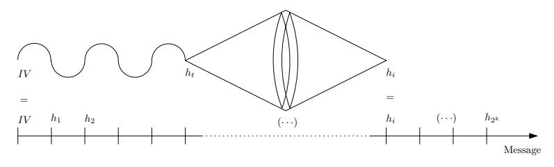

# Second Preimage Attacks on Dithered Hash Functions

Charles Bouillaguet1 , Pierre-Alain Fouque1 , Adi Shamir1,2 , and Sebastien Zimmer1

> 1 École normale supérieure Département d'Informatique 45, rue d'Ulm 75230 Paris cedex 05, France Charles.Bouillaguet@ens.fr, Pierre-Alain.Fouque@ens.fr, Sebastien.Zimmer@ens.fr 2 Weizmann Institute of Science Adi.Shamir@weizmann.ac.il

Abstract. The goal of this paper is to analyze the security of dithered variants of the Merkle-Damgård mode of operation that use a third input to indicate the position of a block in the message to be hashed. These modes of operation for hash functions have been proposed to avoid some structural weaknesses of the Merkle-Damgard paradigm, e.g. that second preimages can be constructed in much less than 2 n work, as pointed out by Kelsey and Schneier. Among the modes of operation that use such a third input are Rivest's dithered hashing and Biham and Dunkelman's Haifa proposal.

We propose several new second preimage attacks on the Merkle-Damgård mode of operation, which can also attack Rivest's dithered hash with almost the same complexity. When applied to Shoup's UOWHF, these attacks can be shown to be optimal since their complexity matches Shoup's security bound.

Keywords: Cryptanalysis, Hash Function, Dithering

## 1 Introduction

Hash functions have recently been the subject of numerous attacks which have highlighted many weaknesses (either on some specific hash functions or on the general Merkle-Damgård mode of operation). Wang et al. [29–32], Biham et al. [3], Klima [19] and Joux et al. [14] all show that differential attacks can be used to efficiently find collisions in specific hash functions based on the MD4 design such as MD5, RIPEMD, SHA-0 and SHA-1. This type of results is important for at least two reasons. First, collision resistance is a classical property that hash function should have. In addition, if collisions were easy to construct, perhaps it would become easier to mount stronger types of attacks which rely on the possibility to find collisions, such as Joux's [13] multicollision attack on combiners. Following this result, Kelsey and Schneier [16] extended a previous result of Dean [8], and showed that Joux's idea can be used to mount an efficient second preimage attack. All these attacks led the NIST to organize workshops and to solicit new hash function candidates.

After Kelsey and Schneier published their attack, several researchers proposed to tweak the Merkle-Damgård paradigm, using a third input (called "dithering") to avoid attacks based on fixed points that can be iterated an arbitrary number of times. In this paper, we study the second preimage resistance of such dithered modes of operation, which is crucial for the security of signature schemes based on the "hash-and-sign" paradigm.

### 1.1 Related Work

Independently of the Ph.D thesis of Dean [8], Kelsey and Schneier [16] presented at EUROCRYPT 2005 a second preimage attack that works against all hash functions based on the Merkle-Damgård construction. The complexity of their attack is  $k \cdot 2^{n/2+1} + 2^{n-k+1}$  evaluations of the compression function. It relies on expandable messages, i.e. a family of messages of different lengths that hash to the same value. These messages are used to bypass the Merkle-Damgård strengthening. This in turn allows them to reapply the long message attack [20] which was supposedly foiled by the strengthening.

Biham and Dunkelman proposed HAIFA [23], which adds in each block the number of message bits which were hashed so far. The simplest way to implement HAIFA is to shorten each data block by 64 bits, and to concatenate the 64 bit counter instead. Rivest [25] introduced a clever way to decrease the number of bits used for this extra input to either 2 or 16, thus increasing the bandwidth available for actual data, by using a specific sequence of values to "dither" the actual inputs. The properties of this sequence were claimed by Rivest to be sufficient to avoid the Kelsey-Schneier attack.

Another variant of the long message attack is the "Nostradamus attack" of Kelsey and Kohno [15] which makes it possible to commit to a hash value h and then to find a message that hashes to h with any desired prefix. For their attack, they have introduced the "diamond" structure which is reminiscent of a binary tree. It is a  $2^{\ell}$ -multicollision where all the  $2^{\ell}$  colliding messages have a different initial value. Its construction cost is heavy,  $2^{n/2+\ell/2+2}$  (where n is the size of the hash function output), but then it allows to connect any message to the collision tree with only  $2^{n-\ell+1}$  calls to the hash function.

### 1.2 Our Results

In this paper, we propose several new generic second preimage attacks on various dithered versions of the Merkle-Damgård paradigm in which the compression function can be modeled by a random oracle. Our technique mainly relies on the diamond structure from the herding attack of [15]. If the diamond is a  $2^{\ell}$ -multicollision, we obtain a second preimage of a message of size  $2^k$  in time  $2^{n/2+\ell/2+2}+2^{n-\ell+1}+2^{n-k+1}$ . This expression is optimal for  $\ell \approx n/3$  where the complexity becomes  $2^{2n/3+2} + 2^{n-k+1}$ . This is slightly more expensive than the  $k \cdot 2^{n/2+1} + 2^{n-k+1}$  complexity of the Kelsey-Schneier attack (for SHA-1, the Kelsey-Schneier attack complexity is about 2106 work whereas ours is approximately  $2^{109}$ ). The main advantage of our attack is that it can be extended to Rivest's dithered proposal since the dithering sequence used in the third input has an undesirable property that can be exploited to make the attack efficient: the number of  $\ell$ -letter subwords in it is exceptionally small, and thus one of these subwords must occur very frequently. Compared to the original attack, we lose a factor equal to the inverse of the frequency of the most probable word. The function mapping  $\ell$  to the number of  $\ell$ -letter words in the sequence is called the factor complexity of the sequence (see for example [1]). For the particular sequence chosen by Rivest, this complexity is only linear in the size  $\ell$  of the words. For example, for Rivest's 16-bit sequence, the attack requires  $2^{n/2+\ell/2+2} + (8\ell + 32768) \cdot 2^{n-\ell+1} + 2^{n-k+1}$  work, which for SHA-1 is approximately  $2^{121}$ . This is slightly worse than the attacks against the basic Merkle-Damgård construction but it is still much smaller than the  $2^{160}$  security which was expected for the dithered construction.

An extension of the basic attack can also be applied to a Universal One Way Hash Function designed by Shoup [27], which has some similarities with dithered hashing. Our technique yields the first published attack against this particular hash function. This additionally proves that Shoup's security bound is tight since there is asymptotically only a factor of  $\mathcal{O}(\log k)$  between his bound and our attack's complexity.

The attacks presented above demonstrate that the properties of the dithering sequence influencing the security of dithered hash functions may not be well understood, and may include additional properties beyond its factor complexity and its repetition-freeness.

#### 1.3 Organization of the Paper.

We describe our attack against the Merkle-Damgård construction in section 2. We introduce some terminology and describe the dithered Merkle-Damgård construction in section 3, and then we extend our attack to tackle dithered Merkle-Damgård in section 4. We apply it to Rivest's concrete proposal, as well as to some of the variations that he suggested. In section 5, we apply the extended attack against Shoup's UOWHF construction.

## 2 A New Generic Second Preimage Attack

## 2.1 The Merkle-Damgård construction

We first describe briefly the classical Merkle-Damgård construction. An iterated hash function  $H^F: \{0,1\}^* \to \{0,1\}^n$  is built by iterating a basic compression function  $F: \{0,1\}^m \times \{0,1\}^n \to \{0,1\}^n$ . The hash process works as follows:

- Pad and split a message M into r blocks  $x_1, \ldots, x_r$  of m bits each.
- Set  $h_0$  to the initialization value IV.
- For each message block *i* compute  $h_i = F(h_{i-1}, x_i)$ .
- Output  $H^F(M) = h_r$ .

The padding is usually done by appending a single '1' bit followed by as many '0' bits as needed to complete an m-bit block. Merkle [21] and Damgård [7] independently proved in 1989 that making the binary encoding of the message length part of the padding improves the security of the construction: with this so-called *strengthening*, the scheme is proven to be Collision-Resistance Preserving, in the sense that a collision in the hash function  $H^F$  would imply a collision in the compression function F. As a side effect, the strengthening defines an upper bound on the size of the messages that can be processed (because the encoding of the length has a fixed size). In most deployed hash functions, this limit is  $2^{64}$  bits, or equivalently  $2^{55}$  512-bit blocks. In the sequel, we denote the maximal number of admissible blocks by  $2^k$ .

## 2.2 Description of the Attack

We describe a new technique to build expandable messages. It relies heavily on the diamond structure introduced by Kelsey and Kohno [15] to find second preimages. An expandable message  $\mathcal{M}$  is a family of messages with different number of blocks but with the same hash up to strengthening. We call any one of these messages an *instance* of  $\mathcal{M}$ . The range of  $\mathcal{M}$  is the set of lengths of its instances.

A diamond of size  $\ell$  is a multicollision that has the shape of a complete converging binary tree of height  $\ell$ . It therefore has  $2^{\ell}$  leaves. Its nodes are labelled by chaining values over n bits, and its edges are labelled by message blocks over m bits, which map between the chaining values at the two ends of the edge by the compression function. Thus, from any one of the  $2^{\ell}$  leaves, there is a path labelled by  $\ell$  message blocks that leads to the same target value  $h_T$  labelling the root of the tree.

Let M be a message of size  $2^k$ . The main idea of the attack is that after a big collision tree of height  $\ell$  is built during an (expensive) preprocessing stage, it costs less than  $2^n$  work to "connect" the target chaining value  $h_T$  of the tree to one of the  $2^k$  chaining values  $h_i$  obtained when hashing M. It also costs much less than  $2^n$  work to connect an arbitrary prefix to one of the  $2^{\ell}$  leaves, if we do not care which one it is. The attack works in four steps:

- 1. Preprocessing step: compute a collision tree of height  $\ell$  with an arbitrary target value  $h_T$ . Note that this has to be done only once, and can be reused when computing second preimages of multiple messages.
- 2. Connect the target  $h_T$  to some block in the message M. This can be done by generating random message blocks B, until  $F(h_T, B) = h_{i_0}$  for some  $i_0$ ,  $\ell + 1 \le i_0 < |M|$ . Let  $B_0$  be a message block satisfying this condition.
- 3. Generate an arbitrary prefix P of size  $i_0 \ell 1$  whose hash is one of the chaining values labelling a leaf. Let  $h = H^F(P)$  be this value, and let T be the chain of  $\ell$  blocks traversing the tree from h to  $h_T$ .
- 4. Form a message  $M' = P||T||B_0||M_{i_0+1}...M_{2^r}$ .

Fig. 1: Summary of the attack on classic Merkle-Damgård.

The message M' has the same hash as M, before strengthening, and has the same length, so we have obtained a full collision in the strengthened Merkle-Damgård construction.

A collision tree of height  $\ell$  can be constructed with time and space complexity  $2^{\frac{n}{2} + \frac{\ell}{2} + 2}$  (see [15] for details). The second step of the attack can be carried out with  $2^{n-k+1}$  work, and the third one with  $2^{n-\ell+1}$  work. The total time complexity of the attack is then:

$$2^{\frac{n}{2} + \frac{\ell}{2} + 2} + 2^{n-k+1} + 2^{n-\ell+1}$$

If n is much bigger than k (which is the case in all the members of the SHA family), then the first term of this sum becomes negligible compared to the other two; we will use

this approximation in the sequel. The complexity is minimal when  $\ell = \frac{n}{3}$ , and with this setting, the total cost of our attack is about  $3 \cdot 2^{2n/3+2} + 2^{n-k+1}$ .

It must be noted that if we choose  $\ell \geq k$ , then the connection in the third step of the attack can be realized for free. This step amount to finding a prefix of a given length, the hash of which is one of the values labelling the leaves of the collision tree. When there are more leaves than possible lengths for the prefix (that is,  $2^k$ ), then the hash value labelling the *i*-th leaf can be obtained by hashing a chosen message of length *i* blocks. This makes the attack slightly less expensive when *n* is very big.

### 2.3 Comparison With Kelsey and Schneier

The difference between the two techniques lies in the way expandable messages are built. Kelsey and Schneier build an expandable message in time  $k \cdot 2^{n/2+1}$ . Here, we build an expandable message in time  $2^{n/2+\ell/2+2} + 2^{n-\ell+1}$ . On the original Merkle-Damgård construction their attack is more efficient than ours (on SHA-1, they can find a second preimage of a message of size  $2^{55}$  with  $2^{106}$  work, whereas we need  $2^{109}$  calls to the compression function to obtain the same result). However, our technique to build expandable messages is more flexible, and in particular it can be adapted to work even when an additional dithering input is given, unlike the original Kelsey-Schneier technique. In addition, our technique gives the adversary more control on the second preimage, since she can typically choose about half of the message in an arbitrary way.

## 3 Dithered Hashing

The general idea of dithered hashing is to perturb the hashing process by using an additional input to the compression function, formed by the consecutive elements of a fixed *dithering* sequence. This gives the attacker less control over the input of the compression function, and makes the hash of a message block dependent on its position in the whole message. In particular, its goal is to prevent attacks based on expandable messages.

Since the dithering sequence  $\mathbf{z}$  has to be at least as long as the maximal number of blocks in any message that can be processed by the hash function, it is reasonable to consider infinite sequences as candidates for  $\mathbf{z}$ . Let  $\mathcal{A}$  be a finite alphabet, and let the dithering sequence  $\mathbf{z}$  be an eventually infinite word over  $\mathcal{A}$ . Let  $\mathbf{z}[i]$  denote the i-th element of  $\mathbf{z}$ . The dithered Merkle-Damgård construction is obtained by setting  $h_i = F(x_i, h_{i-1}, \mathbf{z}[i])$  in the definition of the Merkle-Damgård scheme.

#### 3.1 Words and Sequences

Notations and Terminology. Let  $\omega$  be a word over the finite alphabet  $\mathcal{A}$ . The dot operator denotes concatenation. If  $\omega$  can be written as  $\omega = x.y.z$  (where x,y or z can be empty), we say that x is a *prefix* of  $\omega$  and that y is a *factor* (or subword) of  $\omega$ . A finite word  $\omega$  is a *square* if it can be written as  $\omega = x.x$ , where x is not empty. A finite

word ω is an abelian square if it can be written as ω = x.x′ where x ′ is a permutation of x (i.e. a reordering of the letters of x). A word is said to be square-free (resp. abelian square-free) if none of its factors is a square (resp. an abelian square). Note that abelian square-free words are in particular square-free.

An Infinite Abelian Square-Free Sequence. In 1992, Keränen [17] exhibited an infinite abelian square-free word k over a four-letter alphabet (there are no infinite abelian square-free words over a ternary alphabet). In this paper, we call this infinite abelian square-free word the Keränen sequence. Details about its construction can be found in [17, 18, 25].

Sequence Complexity. The number of factors of a given size of an infinite word gives an intuitive notion of its complexity: a sequence is more complex (or richer) if it possesses a large number of different factors. We denote by F actz(ℓ) the number of factors of size ℓ of the sequence z.

## 3.2 Rivest's Proposals.

Keränen-DMD. Rivest suggested to directly use the Keränen sequence as a source of dithering inputs. The dithering inputs are taken from the alphabet A = {a, b, c, d}, and can be encoded by two bits. The number of data bits in the input of the compression function is thus reduced by only two bits, which improves the hashing efficiency. It is possible to generate the Keränen sequence online, one symbol at a time, in logarithmic space and constant amortized time.

Rivest's Concrete Proposal. Rivest's concrete proposal is referred to as DMD-CP (Dithered Merkle-Damgård– Concrete Proposal). To speed up the generation of the dithering sequence, Rivest proposed a slightly modified scheme, in which the dithering symbols are 16-bit wide. If the message M is r blocks long, then for 1 ≤ i < r the i-th dithering symbol has the form:

$$(0, \mathbf{k}[|i/2^{13}|], i \mod 2^{13}) \in \{0, 1\} \times \mathcal{A} \times \{0, 1\}^{13}$$

The idea is to increment the counter for each dithering symbol, and to shift to the next letter in the Keränen sequence, only when the counter overflows. This "diluted" dithering sequence can essentially be generated 2 13 times faster than the Keränen sequence. The last dithering symbol has a different form :

$$(1, |M| \mod m) \in \{0, 1\} \times \{0, 1\}^{15}$$

## 4 Second Preimage Attacks on Dithered Merkle-Damgård

In this section, we present the first known second preimage attack on Rivest's dithered Merkle-Damgård construction. In section 4.1, we adapt the attack of section 2 to KeränenDMD, obtaining second preimages in time  $(k+39) \cdot 2^{n-k}$ . We then apply the extended attack to MMD-CP, obtaining second preimages with about  $2^{n-k+16}$  evaluations of the compression function. We show some examples of sequences which make the corresponding dithered constructions immune to our attack. This notably covers the case of HAIFA [23]. Lastly, we present in section 4.2 a variation of the attack, which includes an expensive preprocessing, but which is able to cope with sequences of high complexity over a small alphabet with a very small online cost.

## 4.1 Adapting the Attack to Dithered Merkle-Damgård

Let us now assume that the hashing algorithm uses a dithering sequence  $\mathbf{z}$ . When building the collision tree, we must choose which dithering symbols to use. A simple solution is to use the same dithering symbol for all the edges at the same depth in the tree. A tuple of  $\ell$  letters is then required to build the collision tree. We will also need an additional letter to connect the tree to the message M. This way, in order to build a collision tree of height  $\ell$ , we have to fix a word  $\omega$  of size  $\ell+1$ , use  $\omega[i]$  as the dithering symbol of depth i, and use the last letter of  $\omega$  to realize the connection.

The dithering sequence makes the hash of a block dependent on its position in the whole message. Therefore, the collision tree can be connected to its target only at certain positions, namely, at the positions where  $\omega$  and  $\mathbf{z}$  match. The range of such an expandable message  $\mathcal{M}$  is then given by:

Range
$$\mathcal{M} = \left\{ i \in \mathbb{N} \, \middle| \, \left( \ell + 1 \le i \right) \land \left( \mathbf{z}[i - \ell] \dots \mathbf{z}[i] = \omega \right) \right\}.$$

Note that finding a connecting block  $B_0$  in the second step defines the length of the instance of  $\mathcal{M}$  that is required. If  $i_0$  is in the range of  $\mathcal{M}$ , it will be possible to build this instance. Otherwise, another block  $B_0$  has to be found.

To make sure that Range  $\mathcal{M}$  is not empty,  $\omega$  has to be a factor of  $\mathbf{z}$ . Ideally,  $\omega$  should be the factor of length  $\ell+1$  which occurs most frequently in  $\mathbf{z}$ , as the cost of the attack ultimately depends on the number of connecting blocks tried before finding a useful one (with  $i_0 \in \text{Range } \mathcal{M}$ ). What is the probability that a factor  $\omega$  appears at a random position in  $\mathbf{z}$ ? Although this is highly sequence-dependent, it is possible to give a generic lower bound: in the worst case, all factors of size  $\ell+1$  appear in  $\mathbf{z}$  with the same frequency. In this setting, the probability that a randomly chosen factor of size  $\ell+1$  in  $\mathbf{z}$  is the word  $\omega$  is  $1/Fact_{\mathbf{z}}(\ell+1)$ .

The main property of z influencing the cost of our attack is its complexity (which is related to its min-entropy), whereas its repetition-freeness influences the cost of Kelsey and Schneier type attacks.

The cost of finding this second preimage for a given sequence z is then:

$$2^{\frac{n}{2} + \frac{\ell}{2} + 2} + Fact_{\mathbf{z}}(\ell+1) \cdot 2^{n-k+1} + 2^{n-\ell+1}.$$

Cryptanalysis of Keränen-DMD. The cost of the extended attack against Keränen-DMD depends on the complexity of the sequence **k**. Since it has a very regular structure,

- 1. Choose the most frequent factor  $\omega$  of **z**, with  $|\omega| = \ell + 1$ .
- 2. Build a collision tree of size  $\ell$  using  $\omega$  as the dithering symbols in all the leaf-to-root paths. Let  $h_T$  be the target value of the tree.
- 3. Find a connecting block  $B_0$  mapping  $h_T$  to anyone of the  $h_i$  (say  $h_{i_0}$ ), by using  $\omega[\ell]$  as the dithering letter. Repeat until  $i_o \in \text{Range } \mathcal{M}$ .
- 4. Carry the remaining steps of the attack as described previously.

Fig. 2: Summary of the attack when a dithering sequence z is used.

**k** has an unusually low complexity (there are other abelian square-free sequences with exponential complexity, see appendix A). In appendix B we prove the following lemma:

**Lemma 1.** For  $\ell < 85$ , we have:

$$Fact_{\mathbf{k}}(\ell) \leq 8 \cdot \ell + 332.$$

By computing the exact number of factors of  $\mathbf{k}$ , it is possible to observe that this bound is tight (for example there are exactly 732 factors of size 50). With  $\ell=50$ , and assuming that all factors occur equally often in  $\mathbf{k}$ , the probability that a connecting block falls in the range of  $\mathcal{M}$  is  $2^{-9.5}$ . However, we observe that in the first  $2^{30}$  symbols of  $\mathbf{k}$  there are factors of size 50 occurring 2941800 times while some others only occur 910237 times. By choosing one of the former, and assuming that the frequency of this factor is the same throughout  $\mathbf{k}$ , the probability can be increased to  $2^{-8.5}$ , but we are not going to take this slight improvement into account when computing the cost of the attack.

Despite being strongly repetition-free, the sequence  ${\bf k}$  offers an extremely weak security level against our attack. We illustrate this by evaluating the cost of our attack on Keranen-DMD:

$$2^{\frac{n}{2} + \frac{\ell}{2} + 2} + (8 \cdot \ell + 340) \cdot 2^{n-k+1} + 2^{n-\ell+1}$$

If n is greater than about 3k, then by setting  $\ell = k - 3$ , the total cost of the attack is about:

$$(k+39)\cdot 2^{n-k+4}$$

which is much smaller than  $2^n$  in spite of the dithering.

Cryptanalysis of DMD-CP. We now apply the attack to Rivest's concrete proposal. We first need to evaluate the complexity of its dithering sequence. Recall from section 3.2 that it is based on the Keränen sequence, but that we move on to the next symbol of the sequence only when a 13 bit counter overflows. The original motivation was to reduce the cost of the dithering, but it has the unintentional effect of increasing the resulting sequence complexity. However, in appendix B we prove that this effect is quite small:

**Lemma 2.** Let **c** denote the sequence obtained by diluting **k** with a 13-bit counter. Then for every  $0 \le \ell < 2^{13}$ , we have:

$$Fact_{\mathbf{c}}(\ell) = 8 \cdot \ell + 32760.$$

The dilution does not generate a sequence of higher asymptotic complexity: it is still linear in  $\ell$ , even though the constant term is bigger due to the counter. The cost of the attack is therefore:

$$2^{\frac{n}{2} + \frac{\ell}{2} + 2} + (8 \cdot \ell + 32768) \cdot 2^{n-k+1} + 2^{n-\ell+1}$$
.

Again, if n is greater than about 3k, the best value of  $\ell$  is given by  $\ell = k - 3$ , and the complexity of the attack is then approximately:

$$(k+4096) \cdot 2^{n-k+4} \simeq 2^{n-k+16}$$
.

For settings corresponding to SHA-1, a second preimage can be computed in time  $2^{121}$ .

**Countermeasures.** Even though the dilution does not increase the asymptotic complexity of a sequence, the presence of a counter increases the complexity of the attack. If we simply used a counter over i bits as the dithering sequence, the number of factors of size  $\ell$  would be  $Fact(\ell) = 2^i$  (as long as  $i \leq \ell$ ). The complexity of the attack would then become:

$$2^{\frac{n}{2} + \frac{\ell}{2} + 2} + 2^{n-k+i+1} + 2^{n-\ell+1}$$
.

In practice, the dominating term is  $2^{n-k+i+1}$ . By taking i = k, we would obtain a scheme which is resistant to our attack. This is essentially the choice made by the designers of HAIFA [23], but such a dithering sequence consumes k bits of bandwidth. Note that as long as the counter does not overflow, no variation of the attack of Kelsey and Schneier can be applied to the dithered construction.

A possible way to improve the resistance of Rivest's dithered hashing to this attack is to use a dithering sequence of high complexity over a small alphabet (to preserve bandwidth). In appendix A we show that there is an abelian square-free sequence over 6 letters with complexity greater than  $2^{\ell/2}$ . Then, with  $\ell = 2k/3$ , the total cost of the online attack is  $2^{n-2k/3}$ .

Another possible way to repair Rivest's dithered hashing is to use a pseudo random sequence over a small alphabet. Even though it may not be repetition-free, its complexity is almost maximal. Suppose the alphabet has size  $|\mathcal{A}| = 2^i$ . Then the expected number of  $\ell$ -letter factors in a pseudo random word of size  $2^k$  is:  $2^{i\cdot\ell}\cdot (1-\exp{-2^{k-i\cdot\ell}})$  (refer to [11, 12] for a proof of this claim). The total optimal cost of the online attack is  $2^{n-k/(i+1)+3}$  and is obtained with  $\ell = k/(i+1)$ . With 8-bit dithering symbols and if k=55, as in the SHA family, the complexity of the attack is  $2^{n-4}$ .

#### 4.2 A Generic Attack on any Dithering Scheme With a Small Alphabet

The attacks described so far exploited the low complexity of Rivest's specific dithering sequences. In this section we show that the weakness is more general, and that after some preprocessing second preimages can be found in  $\max(\mathcal{O}(2^k), \mathcal{O}(2^{(n-k)/2}))$  time for any dithering sequence (even of maximal complexity) if the dithering alphabet is small.

Outline of the Attack. The new attack can be viewed as a type of time-memory tradeoff. For any given compression function, we precompute a fixed data structure called a kite generator3 which can then be used to compute additional preimages for any dithering sequence and any given message of length  $\mathcal{O}(2^k)$  in time  $\max(\mathcal{O}(2^k), \mathcal{O}(2^{(n-k)/2}))$ and negligible additional space. Note that for the SHA-1 parameters of n=160 and k=55, the time complexity of the new attack is  $2^{55}$ , which is just the time needed to hash the original message! The size of the kite generator is  $\mathcal{O}(|\mathcal{A}| \cdot 2^{n-k})$  (where  $|\mathcal{A}| = 4$ for Rivest's original proposal, and  $|\mathcal{A}| = 2^{15}$  for Rivest's concrete proposal). The kite generator is a labelled directed graph whose  $2^{n-k}$  vertices are labelled by some easily recognized subset of the chaining values that includes the IV (e.g., the tiny fraction of hash values which are extremely close to IV). Each directed edge (which can be traversed in both directions) is labelled by one letter  $\alpha$  from the dithering alphabet and one message block m, and it leads from vertex  $h_1$  to vertex  $h_2$  if  $F(h_1, m, a) = h_2$ . Each vertex in the generator should have exactly two outgoing edges labelled by each dithering letter, and thus the expected number of ingoing edges labelled by each letter is also 2. The generator is highly connected in the sense that there is an exponentially large diverging binary tree with any desired dithering sequence starting at any vertex, and an exponentially large converging tree 4 with any desired dithering sequence (whose degrees are not always 2) ending at most vertices. It can be viewed as a generalization of the collision tree of Kelsey and Kohno [15], which is a single tree with a single root in only the converging direction and with no dithering labels.

Once computed (during an unbounded precomputation stage), we can use the generator to find a second preimage for any given message M with  $2^k$  blocks and any dithering sequence. We first hash the long input M to find (with high probability) some intermediate hash value  $h_i$  which appears in the generator. We then use the generator to replace the first i blocks in the message by a different set of i blocks. We start from the generator vertex labelled by IV, and follow some path in the generator of length i - (n - k) which has the desired dithering sequence (there are exponentially many paths we can choose from). It leads to some hash value  $h_t$  in the generator. We then evaluate the full diverging tree of depth (n - k)/2 and the desired dithering sequence ending at  $h_i$ . Since

&lt;sup>3 We call it a kite generator since we use it generate *kites* of the form of

Fig. 3: A Kite

&lt;sup>4 See [10] for a formal justification of this claim.

the number of leaves in each tree is  $\mathcal{O}\left(2^{(n-k)/2}\right)$  and they are labelled by only  $2^{n-k}$  possible values, we expect by the birthday paradox to find a common chaining value among the two sets of leaves. We can now combine the long random chain of length i - (n - k) with the two short tree chains of length (n - k)/2 to find a *kite*-shaped structure of the same length i and with the same dithering sequence as the original message between the two chaining values IV and  $h_i$ .

Finding Collisions inside a Kite. The simplest way to find the common leaf is to store all the leaf values of the diverging and converging trees in an additional data structure, sort it, and look for repetitions. This requires time and space  $\mathcal{O}(2^{(n-k)/2})$ . However, it is possible to find the common leaf value by a more sophisticated algorithm which requires the same time but negligible additional space. It is based on Pollard's  $\rho$  method, with appropriate modifications. Let  $f_1(x)$  be the mapping from the root of the diverging tree to the leaf in which the path is determined by the desired dithering sequence where the first n-k-1 bits in x define which of the two outgoing edges with each dithering symbol to follow. Let  $f_2(x)$  be a similar mapping from the root of the converging tree to the leaf specified by x. Finally, let  $f_0(x)$  be the random function from n-k bit values to n-k bit values in which the last bit of x determines whether we apply  $f_1$  or  $f_2$  to x. By iterating  $f_0$  on a random initial value  $x_0$ , we expect to enter a loop after  $\mathcal{O}\left(2^{(n-k)/2}\right)$  steps. The entry point into this loop represents two different values  $x_1$  and  $x_2$  which converge under  $f_0$  to the same value  $x_0$ . With constant probability  $x_1$  and  $x_2$  have different final bits, and in this case  $x_0$  is a common leaf in the diverging and converging tree paths represented by  $f_1(x_1)$  and  $f_2(x_2)^{-5}$ .

When the size of the dithering alphabet  $\mathcal{A}$  exceeds  $2^k$  (as in the HAIFA proposal) the size of the kite generator becomes larger than  $2^n$ , and thus our attack becomes more expensive than the trivial attack that precomputes and stores one message that hashes to each one of the  $2^n$  possible values.

The attack can be applied with essentially the same complexity even when the IV is not known during the precomputation stage (e.g., when it is time dependent). When we hash the original long message, we have to find two intermediate hash values  $h_i$  and  $h_j$  (instead of IV and  $h_i$ ), and connect them by a properly dithered kite-shaped structure of the same length.

Note that if we reduce the size of either the message or the kite generator, we are unlikely to find any common chaining values between the given message and the generator. Finding a way to connect the generator back into the message will require  $2^{n-k+1}$  additional steps, and thus the time complexity of finding second preimages in arbitrarily dithered SHA-1 will jump from  $2^{55}$  to at least  $2^{106}$ . It is an interesting open problem whether we can precompute a smaller generator, and trade it off smoothly with a larger computing time without such quantum jumps.

&lt;sup>5 Note that the length of the path in each one of the trees was extended from (n-k)/2 to n-k-1 in order to make sufficiently many leaves reachable from both roots, and thus we have to shorten the tail to i-2(n-k-1) to get the same total path length.

## 5 An Attack on Shoup's UOWHF

In this section, we show that our attack is generic enough to be applied against hash functions enjoying a different security property, namely Universal One-Way Hash Function (UOWHF). A UOWHF is a keyed hash function H for which any computationally bounded adversary A wins the following game with negligible probability. First A chooses a message M, then a key K is chosen at random and given to A. The adversary wins if she violates the Target Collision Resistance (TCR) of H, that is if she generates a message M' different from M that collides with M for the key K (i.e. such that  $H_K(M) = H_K(M')$  with  $M \neq M'$ ).

At EUROCRYPT 2000, Shoup [27] had proposed a simple construction for a UOWHF that hashes messages of arbitrary size, given a UOWHF that hashes messages of fixed size. It is a Merkle-Damgård-like mode of operation, but before every iteration, one of several possible masks is XORed to the chaining value. The number of masks is logarithmic in the length of the hashed message, and the order in which they are used is carefully chosen to maximize the security of the scheme. This is reminiscent of dithered hashing, except that here the dithering process does not hit the bandwidth available to actual data.

We first describe briefly Shoup's construction, and then show how our attack can be applied against it. This way we prove that for this particular construction, Shoup's security bound is tight.

## 5.1 Description

The construction has some similarities with Rivest's dithered hashing. It starts from a universal one way compression function F that is keyed by a key K,  $F_K$ :  $\{0,1\}^m \times \{0,1\}^n \to \{0,1\}^n$ . This compression function is then iterated, as described below, to obtain a variable input length UOWHF  $H_K^F$ .

A certain number of "masks" are needed, each one of which is a random n-bit string. Assuming that the maximal size of hashed messages is  $2^k$  then k+1 masks  $M_0, \ldots, M_k$  are required. The key of the whole iterated function consists of K and of these masks. After each application of the compression function, a mask is XORed to the result. The order in which the masks are applied is defined by a specified sequence over the alphabet  $\mathcal{A} = \{0, \ldots, k\}$ . The scheduling sequence is  $\mathbf{z}[i] = \nu_2(i)$ , for  $1 \leq i \leq 2^k$ , where  $\nu_2(i)$  denotes the largest integer  $\nu$  such that  $2^{\nu}$  divides i. Let M be a message that can be split into r blocks  $x_1, \ldots, x_r$  and let  $h_0$  be an arbitrary n-bit string. We define  $h_i = F_K\left(h_{i-1} \oplus M_{\nu_2(i)}, x_i\right)$ , and  $H_K^F(M) = h_r$ .

#### 5.2 An Attack Matching the Security Bound

In [27], Shoup proves the following security result:

**Theorem 1 (Main result of [27]).** If an adversary is able to break the target collision resistance of  $H^F$  with probability  $\epsilon$  in time T, then one can construct an adversary that breaks the target collision resistance of F in time T, with probability  $\epsilon/2^k$ .

In this section we show that this bound is almost tight. First, we give an alternate definition of the dithering sequence z. We define:

$$u_i = \begin{cases} 0 & \text{if } i = 1, \\ u_{i-1}.(i-1).u_{i-1} & \text{otherwise.} \end{cases}$$

As an example, we have  $u_4 = 010201030102010$ . It is clear that  $|u_i| = 2^i - 1$ , and it is easy to show that for all i,  $u_i$  is a prefix of  $\mathbf{z}$ . The dithering sequence is thus simply  $u_k$  (a prefix of  $\mathbf{z}$  of size  $2^k - 1$  is arguably enough).

The most frequently-occurring factor of size  $\ell < 2^k$  in  $\mathbf{z}$  is the prefix of size  $\ell$  of  $\mathbf{z}$ . It is a prefix of  $u_j$  with  $j = \lceil \log_2{(\ell+1)} \rceil$ , and  $u_j$  itself occurs  $2^{k-j}$  times in  $\mathbf{z} = u_k$ . The probability for a random factor of  $\mathbf{z}$  of size  $\ell$  to be exactly this candidate is equal to the number of occurrences of this candidate divided by the number of  $\ell$ -bit strings in  $\mathbf{z}$ . Thus this probability is  $\frac{2^{k-j}}{2^k-\ell}$ . This can in turn be lower-bounded by:  $2^{-j} \geq \frac{1}{2(\ell+1)}$ . Our attack can be applied against the TCR property of  $H^F$  as described above: just choose at random a (long) message x. Once the key is chosen at random, build a collision tree using a prefix of  $\mathbf{z}$  of size  $\ell$ , and continue as described in section 4. The cost of the attack is then:

$$T = 2^{\frac{n}{2} + \frac{\ell}{2} + 2} + 2(\ell + 1) \cdot 2^{n-k+1} + 2^{n-\ell+1}.$$

This attack breaks the target collision resistance with probability  $\mathcal{O}(1)$ . Therefore, with Shoup's result, one can construct an adversary A against F with running time  $\mathcal{O}(T)$  and probability of success  $\mathcal{O}(1/2^k)$ . Therefore, the adversary  $\mathcal{A}'$  which runs  $\mathcal{A}(2^k)$  times has a probability  $\mathcal{O}(1)$  of breaking the TCR property. When  $n \geq 3k$ ,  $T \simeq (2k+3) \cdot 2^{n-k+1}$  (with  $\ell = k-1$ ), and thus the running time of the adversary is  $\mathcal{O}(2^k \cdot T) = \mathcal{O}(k \cdot 2^n)$ . If F is a random oracle, the best attack against F's TCR property runs in time  $\mathcal{O}(2^n)$ , which means that there is only a factor k between Shoup's security proof and our attack.

### 5.3 Further Improvement of the Attack

Our attack can be improved to obtain a gap  $\mathcal{O}(\log k)$  between Shoup's security proof and our attack. To this end, we use the following trick. Instead of focusing on the most frequent word of size  $\ell$ , we focus on the most frequent word of size  $\mathcal{O}(\log_2(\ell))$  for which it is easier to connect a collision tree to the original message, because it occurs more frequently.

More precisely, let  $\omega_0$  be the (s+1)-letter prefix of  $\mathbf{z}$ , where  $s = \lceil \log_2(12\ell \cdot k) \rceil$ . First we produce a collision tree for every  $\ell$ -symbol word  $\omega$  such that  $\omega \| \omega_0$  is a factor of  $\mathbf{z}$ . Thus, for every such word  $\omega$  are associated a collision tree and the target  $h_{\omega}$  of the collision tree. Since we are free to choose the hash value labelling the leaves of a tree, we now use the set of all these targets as the leaves for a new smaller collision tree using the s first letters of  $\omega_0$  as a dithering. This way we herd all the previously constructed collision tree in a bigger aggregated tree. Let  $h_T$  denote the target of the resulting collision tree. We continue the attack nearly as usual. We find a block  $B_0$  such that  $F_K\left(h_T \oplus M_{\omega_0[s+1]}, B_0\right) = h_{i_0}$  for some  $i_0$ , with  $\mathbf{z}[i_0 - s - 1] \dots \mathbf{z}[i_0] = \omega_0$  and

 $i_0 \geq \ell + s + 1$ . This fixes a word  $\omega_1 = \mathbf{z}[i_0 - s - \ell - 3] \dots \mathbf{z}[i_0 - s - 2]$  and the particular subtree generated with  $\omega_1$  as dithering symbols. Finally we generate an arbitrary prefix P of size  $i_0 - s - \ell - 4$  whose hash is one of the leaf of the  $\omega_1$  subtree. Let T be the chain of  $\ell + s$  blocks traversing successively the  $\omega_1$  subtree and then the small  $\omega_0$  collision tree, from h to  $h_T$ . The second preimage is therefore  $P||T||B_0||x_{i_0+1}||\dots||x_{2^k}$ .

Let  $c_{\ell}$  denote the number of  $\ell$ -letter words w such  $\omega \| \omega_0$  is a factor of  $\mathbf{z}$ . Note that the previous attack is correct if and only if the number of leaves of the  $\omega_0$  collision tree is greater than  $c_{\ell}$  the number of collision graph we have to herd. It can be shown that for the particular value chosen for s,  $2^s \geq c_{\ell}$ , thus the attack is correct and the cost of this attack is roughly:

$$c_{\ell} \cdot 2^{\frac{n}{2} + \frac{\ell}{2} + 2} + 2^{\frac{n}{2} + \frac{\log_2(\ell)}{2} + 2} + 2(1 + \log_2 \ell) \cdot 2^{n-k+1} + 2^{n-\ell+1}.$$

Compared to the previous attack, we now have to build  $c_{\ell}$  collision trees of size  $\ell$  instead of one, but it also becomes easier to connect our structure to the original message. Note that the term  $2^{n/2 + \log_2(\ell)/2 + 2}$  is always negligible before  $c_{\ell} \cdot 2^{n/2 + \ell/2 + 2}$ .

If  $n \gg 3k$ , when  $\ell = k$ , the term  $c_{\ell} \cdot 2^{n/2 + \ell/2 + 2} = \mathcal{O}\left(2^{n/2 + k/2 + 2\log_2 k}\right)$  is smaller than  $2^{n-k+1}$  and the cost of the attack is  $\mathcal{O}\left(\log k \cdot 2^{n-k}\right)$ . Therefore, with the same proof as in the previous subsection, we can show that there is a factor  $\mathcal{O}\left(\log k\right)$  between Shoup's security proof and our attack. Note that, depending on the parameters, this improved version of the attack may be worse than the basic version.

| Parameters | n   | k  | Basic     | Improved  |
|------------|-----|----|-----------|-----------|
| SHA-1      | 160 | 55 | $2^{112}$ | $2^{115}$ |
| SHA-256    | 256 | 55 | $2^{208}$ | $2^{206}$ |

#### 5.4 Comparing the Shoup and Rivest Dithering Techniques

An intriguing connection between Shoup's and Rivest's ideas shows up as soon as we notice that the scheduling sequence  $\mathbf{z}$  chosen by Shoup is abelian square-free. In fact, one year after Shoup's construction was published, Mironov [22] proved that an even stronger notion of repetition-freeness was necessary:  $\mathbf{z}$  is, and has to be, even-free. A word is even-free if all of its non-empty factors contain at least one letter an odd number of times. Note that all even-free words are abelian square-free. We believe that the role these non-trivial sequences play in iterated constructions in cryptography (such as hashing) has yet to be completely understood.

### References

- 1. Allouche, J.P.: Sur la complexité des suites infinies. Bull. Belg. Math. Soc. 1 (1994) 133-143
- 2. Andreeva, E., Neven, G., Preneel, B., Shrimpton, T.: Seven-Property-Preserving Iterated Hashing: ROX. Cryptology ePrint Archive, Report 2007/176, to appear in ASIACRYPT'07 (2007)

- 3. Biham, E., Chen, R., Joux, A., Carribault, P., Lemuet, C., Jalby, W.: Collisions of SHA-0 and Reduced SHA-1. [6] 36–57
- 4. Brassard, G., ed.: CRYPTO '89, Santa Barbara, California, USA, August0-24, 1989, Proceedings. In Brassard, G., ed.: CRYPTO. Volume 435 of Lecture Notes in Computer Science., Springer (1990)
- 5. Cobham, A.: Uniform tag seqences. Mathematical Systems Theory 6(3) (1972) 164–192
- 6. Cramer, R., ed.: Advances in Cryptology EUROCRYPT 2005, 24th Annual International Conference on the Theory and Applications of Cryptographic Techniques, Aarhus, Denmark, May 22-26, 2005, Proceedings. In Cramer, R., ed.: EUROCRYPT'05. Volume 3494 of Lecture Notes in Computer Science., Springer (2005)
- 7. Damgård, I.: A Design Principle for Hash Functions. [4] 416–427
- 8. Dean, R.D.: Formal Aspects of Mobile Code Security. PhD thesis, Princeton University (January 1999)
- 9. Ehrenfeucht, A., Lee, K.P., Rozenberg, G.: Subword Complexities of Various Classes of Deterministic Developmental Languages without Interactions. Theor. Comput. Sci. 1(1) (1975) 59–75
- 10. Feller, W.: 12. In: An Introduction to Probability Theory and Its Applications. Volume 1. John Wiley & Sons (1971)
- 11. Gheorghiciuc, I.: The Subword Complexity of Finite and Infinite Binary Words. PhD thesis, University of Pennsylvania (September 2004)
- 12. Janson, S., Lonardi, S., Szpankowski, W.: On average sequence complexity. Theor. Comput. Sci. 326(1-3) (2004) 213–227
- 13. Joux, A.: Multicollisions in Iterated Hash Functions. Application to Cascaded Constructions. In Franklin, M.K., ed.: CRYPTO'04. Volume 3152 of Lecture Notes in Computer Science., Springer (2004) 306–316
- 14. Joux, A., Peyrin, T.: Hash Functions and the (Amplified) Boomerang Attack. In Menezes, A., ed.: CRYPTO. Volume 4622 of Lecture Notes in Computer Science., Springer (2007) 244–263
- 15. Kelsey, J., Kohno, T.: Herding Hash Functions and the Nostradamus Attack. In Vaudenay, S., ed.: EUROCRYPT'06. Volume 4004 of Lecture Notes in Computer Science., Springer (2006) 183–200
- 16. Kelsey, J., Schneier, B.: Second Preimages on n-Bit Hash Functions for Much Less than 2n Work. [6] 474–490
- 17. Keränen, V.: Abelian Squares are Avoidable on 4 Letters. In Kuich, W., ed.: ICALP. Volume 623 of Lecture Notes in Computer Science., Springer (1992) 41–52
- 18. Keränen, V.: On abelian square-free DT0L-languages over 4 letters. In Harju, T., ed.: WORDS'03. Volume 27., TUCS General Publication (2003) 95–109
- 19. Klima, V.: Tunnels in Hash Functions: MD5 Collisions Within a Minute. Cryptology ePrint Archive, Report 2006/105 (2006) http://eprint.iacr.org/.
- 20. Menezes, A., van Oorschot, P., Vanstone, S.: Handbook of Applied Cryptography
- 21. Merkle, R.C.: One Way Hash Functions and DES. [4] 428–446
- 22. Mironov, I.: Hash Functions: From Merkle-Damgård to Shoup. In Pfitzmann, B., ed.: EUROCRYPT. Volume 2045 of Lecture Notes in Computer Science., Springer (2001) 166–181
- 23. Orr Dunkelman, E.B.: A Framework for Iterative Hash Functions HAIFA. Presented at the second NIST hash workshop (August 24–25 2006)
- 24. Pansiot, J.J.: Complexité des facteurs des mots infinis engendrés par morphismes itérés. In Paredaens, J., ed.: 11th ICALP, Antwerpen. Volume 172 of LNCS., Springer (july 1984) 380–389
- 25. Rivest, R.L.: Abelian Square-Free Dithering for Iterated Hash Functions. Presented at ECrypt Hash Function Workshop, June 21, 2005, Cracow, and at the Cryptographic Hash workshop, November 1, 2005, Gaithersburg, Maryland (August 2005)
- 26. Rogaway, P., Shrimpton, T.: Cryptographic Hash-Function Basics: Definitions, Implications, and Separations for Preimage Resistance, Second-Preimage Resistance, and Collision Resistance. In Roy, B.K., Meier, W., eds.: FSE. Volume 3017 of Lecture Notes in Computer Science., Springer (2004) 371–388
- 27. Shoup, V.: A Composition Theorem for Universal One-Way Hash Functions. In: EUROCRYPT'00. (2000) 445–452
- 28. Shoup, V., ed.: Advances in Cryptology CRYPTO 2005: 25th Annual International Cryptology Conference, Santa Barbara, California, USA, August 14-18, 2005, Proceedings. In Shoup, V., ed.: CRYPTO. Volume 3621 of Lecture Notes in Computer Science., Springer (2005)

- 29. Wang, X., Lai, X., Feng, D., Chen, H., Yu, X.: Cryptanalysis of the Hash Functions MD4 and RIPEMD. [6] 1–18
- 30. Wang, X., Yin, Y.L., Yu, H.: Finding Collisions in the Full SHA-1. [28] 17–36
- 31. Wang, X., Yu, H.: How to Break MD5 and Other Hash Functions. [6] 19–35
- 32. Wang, X., Yu, H., Yin, Y.L.: Efficient Collision Search Attacks on SHA-0. [28] 1–16

## A There are Abelian Square-Free Sequences of Exponential Complexity

Another way to repair DMD-CP would be to find an infinite abelian square-free sequence of exponential complexity. This is indeed possible, although we do not know how to do it without slightly enlarging the alphabet.

We start with the abelian square-free Keränen sequence k over {a, b, c, d}, and with another sequence u over {0, 1} that has an exponential complexity. Such a sequence can be built for example by concatenating the binary encoding of all the consecutive integers. Then we can create a sequence ˜z over the union alphabet A = {a, b, c, d, 0, 1} by interleaving k and u : z˜ = k[1].u[1].k[2].u[2]. . . . . The resulting shuffled sequence inherits both properties: it is still abelian square-free, and has a complexity of order Ω 2 ℓ/2 .

Even with this exponentially complex dithering sequence, our attack is still more efficient than brute-force in finding second preimages. Although it may be possible to find square-free sequences with even higher complexity, it is probably very difficult to achieve optimal protection, and the generation of the dithering sequences is likely to become more and more complex.

## B Proofs of Sequence-Complexity Related Results

Sequences Generated by Morphisms. We say that a function τ : A∗ → A∗ is a morphism if for all words x and y, τ (x.y) = τ (x).τ (y). A morphism is then entirely determined by the images of the individuals letters. A morphism is said to be r-uniform (with r ∈ N) if for all word x, |τ (x)| = r · |x|. If, for a given letter α ∈ A, we have τ (α) = α.x for some word x, then τ is non-erasing for α. Given a morphism τ and an initialization letter α, let un denote the n-th iterate of τ over α: un = τ n (α). If τ is r-uniform (with r ≥ 2) and non-erasing for α, then un is a strict prefix of un+1, for all n ∈ N. Let τ∞(α) denote the limit of this sequence : it is the only fixed point of τ that begins with the letter α. Such infinite sequences are called uniform tag sequences [5] or r-automatic sequences [1].

Because they have a very regular structure, there is a spectacular result [5] regarding the complexity of infinite sequences generated by uniform morphisms:

Theorem 2 (Cobham, 1972). Let z be an infinite sequence generated by an r-uniform morphism, and assume that the alphabet size A is constant. Then z has linear complexity:

$$Fact_{\mathbf{z}}(\ell) \leq r \cdot |\mathcal{A}|^2 \cdot \ell.$$

It is worth mentioning that similar results exist in the case of sequences generated by non-uniform morphisms [24, 9], although the upper bound can be quadratic.

Proofs. Since the Keränen sequence is 85-uniform [17, 18, 25], the result of theorem 2 gives: F actk(ℓ) ≤ 1360· ℓ. This upper-bound is relatively rough, and for particular values of ℓ, it is possible to obtain a much better approximation (which is tight):

Lemma 1 (of section 4.1). Let z be an infinite sequence over the alphabet A generated by a r-uniform morphism τ . For all ℓ, 1 ≤ ℓ ≤ r, we have :

$$Fact_{\mathbf{z}}(\ell) \leq \ell \cdot \Big(Fact_{\mathbf{z}}(2) - |\mathcal{A}|\Big) + \Big[(r+1) \cdot |\mathcal{A}| - Fact_{\mathbf{z}}(2)\Big].$$

Proof. If ℓ ≤ r, then any factor of z of size ℓ falls in one of these two classes (possibly both, but this does not matter, as we are looking for an upper bound) :

- Either it is a factor of τ (α) for some letter α ∈ A. There are no more than |A|·(r−ℓ+1) such factors.
- Or it is a factor of τ (α).τ (β), for two letters α, β ∈ A (and is not a factor of either τ (α) or τ (β)). For any given pair (α, β), there can only be ℓ−1 such factors. Moreover, αβ must be a factor of size 2 of z.

So
$$Fact_{\mathbf{z}}(\ell) \leq |A| \cdot (r - \ell + 1) + Fact_{\mathbf{z}}(2) \cdot (\ell - 1)$$
.

The result of this lemma can be specialized for the Keränen sequence, to obtain the result announced in section 4.1. In this case, we have r = 85, A  = 4 and F actk(2) = 12 (all non-repeating pairs of letters).

Lemma 2 (of section 4.1). Let z be an arbitrary sequence over A, and let d denote the sequence obtained by diluting z with a counter over i bits. Then for every ℓ not equal to 1 modulo 2 i , we have:

$$Fact_{\mathbf{d}}(\ell) = (2^{i} - (\ell \mod 2^{i}) + 1) \cdot Fact_{z}(\lceil \ell \cdot 2^{-i} \rceil) + ((\ell \mod 2^{i}) - 1) \cdot Fact_{\mathbf{z}}(\lceil (\ell - 1) \cdot 2^{-i} \rceil + 1)$$

Proof. The counter over i bits splits the diluted sequence c into chunks of size 2 i (a new chunk begins when the counter reaches 0). In a chunk, the letter from z does not change, and only the counter varies. To obtain the number of factors of size ℓ, let us slide a window of size ℓ over d. This window overlaps at least ℓ · 2 −i chunks (when the beginning of the window is aligned at the beginning of a chunk), and at most (l − 1) · 2 −i +1 chunks (when the window begins just before a chunk boundary). These two numbers are equal if and only if ℓ ≡ 1 mod 2i . When this case is avoided, then these two numbers are consecutive integers.

This means that by sliding this window of size ℓ over d we will only observe factors of z of size ℓ · 2 −i and ℓ · 2 −i + 1. Given a factor of size ℓ · 2 −i of z, there are 2 i − (ℓ mod 2i ) + 1 positions of a window of size ℓ that allow us to observe this factor with different values of the counter (it essentially amounts to moving the window without crossing a chunk boundary).

Similarly, there are  $(\ell \mod 2^i) - 1$  positions of the window that contain a given factor of  $\mathbf{z}$  of size  $\lceil \ell \cdot 2^{-i} \rceil + 1$ .

By taking  $2 \le \ell \le 2^i$ , we have that  $\lceil \ell \cdot 2^{-i} \rceil = 1$ . Therefore, only the number of factors of size 1 and 2 of **z** come into play. The formula can be further simplified into:

$$Fact_{\mathbf{d}}(\ell) = \ell \cdot \left( Fact_{\mathbf{z}}(2) - Fact_{\mathbf{z}}(1) \right) + (2^{i} + 1) \cdot Fact_{\mathbf{z}}(1) - Fact_{2}(\mathbf{z}).$$

For the Keränen sequence with i = 13, this gives:  $Fact_{\mathbf{d}}(\ell) = 8 \cdot \ell + 32760$ .

## C Second Preimage Resistance of Iterated Hash Functions

Until now we have presented generic second-preimage attacks against particular dithered Merkle-Damgård constructions. In this section, we show that there exists a dithered Merkle-Damgård construction with optimal security against second preimage attacks. For this purpose, we study the HAsh Iterative FrAmework (HAIFA) introduced in [23]. It is a Merkle-Damgård construction where a counter is added to the input of the compression function. It can be considered as a dithered Merkle-Damgård construction over an alphabet of  $2^k$  letters where the role of the dithering is played by the counter. The authors of [23] explain why their proposition resists to all known attacks and claim an upper bound of  $2^n$  on the complexity of the best possible generic second-preimage attack. In this section we give a proof of their claim, showing that this construction meets the optimal security level against second preimage attacks.

#### C.1 Description of Haifa

We first briefly describe HAIFA. The HAsh Iterative FrAmework  $H^F: \{0,1\}^* \to \{0,1\}^n$  is built by iterating a compression function  $F: \{0,1\}^m \times \{0,1\}^n \times \{0,1\}^{64} \to \{0,1\}^n$ . The hash process works as follows:

- Pad and split a message M into r blocks  $x_1, \ldots, x_r$  of m bits each.
- Set  $h_0$  to the initialization value IV.
- For each message block i compute  $h_i = F(h_{i-1}, x_i, i)$ .
- Output  $H^F(M) = h_r$ .

The padding is done by appending a single '1' bit followed by as many '0' bit as needed to complete a m-bit block.

#### C.2 Security Result

We model the compression function by a random oracle for two reasons. First we want to take into account only generic attacks, the adversary should not be able to exploit a particular weakness or property of the compression function. Second, for 1-block messages, the iterated hash function is reduced to the compression function, therefore if the compression function is not a good hash function, the iterated hash function cannot be a good compression function either.

The kind of security results that we obtain by reasoning about a mode of operation in the random oracle model is inherently different from these obtained by the reductionist approach of [26]. Andreeva, Neven, Preneel and Shrimpton [2] proved that HAIFA does not preserve the second preimage resistance of the compression function (using a special compression function that admits the IV as a fixpoint). Here, we prove that HAIFA is second-preimage resistant when instancied with a "reasonable" compression function. These two results are not contradictory though. Note that the same security result can be stated (losing only a small constant factor) in the Ideal Cipher Model, by considering that the hash function implements the Davies-Meyer mode of operation with independent random permutations.

Let us consider an unbounded adversary  $\mathcal{A}$  that, given a message M, tries to find a message M' such that  $H^F(M) = H^F(M')$ . Let Q denote the number of queries  $\mathcal{A}$  sends to the F oracle. We enforce  $\mathcal{A}$  to always return a message M', even if it is not a second preimage, and to evaluate  $H^F(M)$  and  $H^F(M')$ , by issuing the corresponding queries to the random oracle.

**Theorem 3 (Security of** HAIFA). Let  $H^F$  be an iterated hash function following the scheme of HAIFA and A a second preimage adversary against  $H^F$  which makes at most Q queries to F. Then:

$$\Pr\left[H^F(M) = H^F(M') \colon \mathcal{A} \text{ returns } M'\right] \leq \frac{2Q}{2^n}.$$

This essentially comes from the fact that when the adversary submits a query to F, she has to specify the value  $i_0$  of the counter. Indeed, the adversary wins if and only if she can find a message  $\tilde{M}$  such that  $H^F(\tilde{M}) = h_i$  and  $|\tilde{M}| = i$  or  $H^F(\tilde{M}) = h_r$  (using previously introduced notations). This implies that for every query where the value of the counter is  $i_0$ , she can win only if the oracle outputs  $h_{i_0}$  or  $h_r$ . The detailled proof follows.

When the classical Merkle-Damgård construction achieved a proven bound6  $Q \cdot |M|/2^{n-1}$  (which can be established with a very similar proof as the one used for the previous theorem), HAIFA reaches the same security level as a random oracle, which is the best security that we can hope.

Proof (of theorem 3).

We simulate the execution of the adversary  $\mathcal{A}$ , and bookmark the queries sent by A to the random oracles: it is a set S of tuples (x, m, i, y), with  $y = F_i(x, m)$ . We suppose that  $\mathcal{A}$  evaluates H(M), so  $\mathcal{A}$  sends the corresponding queries to the oracles at some point. Let us note these queries  $(h_i, m_i, i, h_{i+1})_{1 \leq i \leq |M|}$ . In particular,  $H(M) = h_{|M|+1}$ .

&lt;sup>6 Remark that it implies that the attack of Kelsey and Schneier [16] is optimal against classical Merkle-Damgård.

If  $\mathcal{A}$  succeeds in finding a second preimage, then  $\mathcal{A}$  has produced a collision in particular. It is well known that in the presence of the so-called Merkle-Damgård *strengthening*, this implies a collision on the compression function [7, 21]. However, this collision is *constrained*: the resulting target hash value is one of the  $h_i$ . Finding such a collision is harder than finding an arbitrary collision.

Suppose A wins. We distinguish two cases.

- 1. If  $|M| \neq |M'|$ , then the values of the counter entering the compression function in its last invocation are different. Therefore,  $\mathcal{A}$  has found a second preimage on F. Each query has a probability  $2^{-n}$  to yield this preimage. Since there are Q queries, the probability that  $\mathcal{A}$  wins this way is upper-bounded by  $Q/2^n$ .
- 2. Otherwise, |M| = |M'|. Let us formalize our notion of constrained collision. We consider the following event, that we call **E**. We say that **E** is realized if and only if there is in S a query  $(x, m, i_0, y)$  such that  $y = h_{i_0+1}$ , for a given value of  $i_0$  (recall that  $h_{i_0}$  is the  $i_0$ -th chaining value obtained in the process of hashing M), and such that  $(x, m) \neq (h_{i_0}, m_{i_0})$ . Intuitively, **E** is realized as soon as A submits a query the answer of which gives a second preimage of one of the  $h_i$ .

The key of the reasoning is that  $\mathbf{E}$  is realized whenever  $\mathcal{A}$  wins. Thanks to the result of Merkle-Damgård, we know that there is a collision on the compression function where one of the colliding hash value is one of the  $h_i$ . However, this is not sufficient to say that  $\mathbf{E}$  is realized, because we would need to know that the values of the counter are actually the same. We now prove that it is indeed the case.

**Lemma 3** (Collision-Resistance extended to Haifa). Let  $H^F$  be a hash function implementing the mode of operation of Haifa. Let F be the compression function. Then, if  $H^F(M) = H^F(M')$  with  $M \neq M'$  and |M| = |M'|, then there is a collision on F, with the same value of the counter (this means that  $\mathbf{E}$  is realized).

*Proof.* let us note  $M = x_1, \ldots, x_r, M' = x'_1, \ldots, x'_r, h_0 = h'_0 = IV, h_i = F(h_{i-1}, i, x_i)$  and  $h'_i = F(h'_{i-1}, i, x'_i)$ .

Since  $h_r = h'_r$ , either there is a collision for F (with counter value r), or  $(x_r, h_{r-1}) = (x'_r, h'_{r-1})$ . In the latter case, either there is a collision for F (with counter value r-1) or  $(x_{r-1}, h_{r-2}) = (x'_{r-1}, h'_{r-2})$ . This argument repeats. Since |M| = |M'|, then either there is a collision for F at some point (with the same counter value), or  $x_i = x'_i$ , for all  $i, 1 \le i \le r$ . In the latter case, M = M', which is impossible. This completes the proof of the lemma.

Note that **E** being realized does not imply that  $\mathcal{A}$  has won, because of a corner case: if  $\mathcal{A}$  finds a preimage of H(M) for F but with a message block that does not include the padding, then  $\mathcal{A}$  cannot automatically produce a second preimage. Now, let us show the following inequality:

$$\mathbb{P}\big[\mathbf{E}\big] \le \frac{Q}{2^n}$$

Everytime  $\mathcal{A}$  submits a query to the oracle, the probability that  $\mathbf{E}$  is triggered by this particular query is upper-bounded by  $2^{-n}$ . When submitting a query (and note

| that i0                        |  | is part of the query), a random value is chosen by the random oracle, and |  |  |  | E |
|-----------------------------------|--|---------------------------------------------------------------------------|--|--|--|---|
| is realized only if this value is |  | hi0+1.                                                                    |  |  |  |   |

Since A sends Q queries to the oracle during its execution, we obtain the announced bound. ⊓⊔