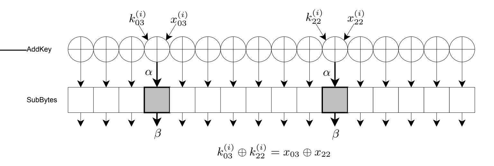
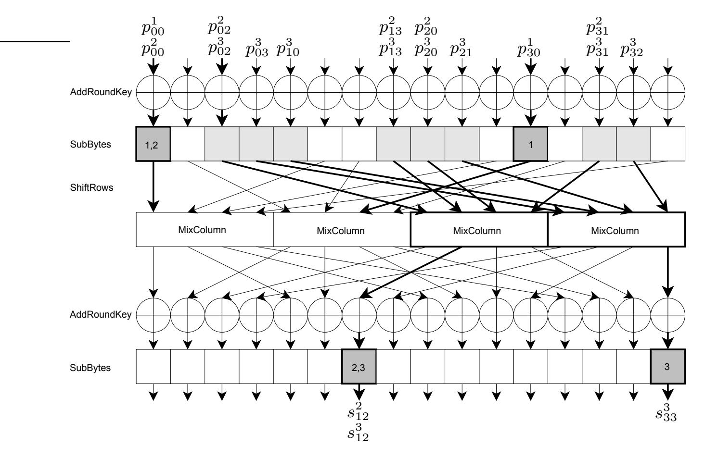
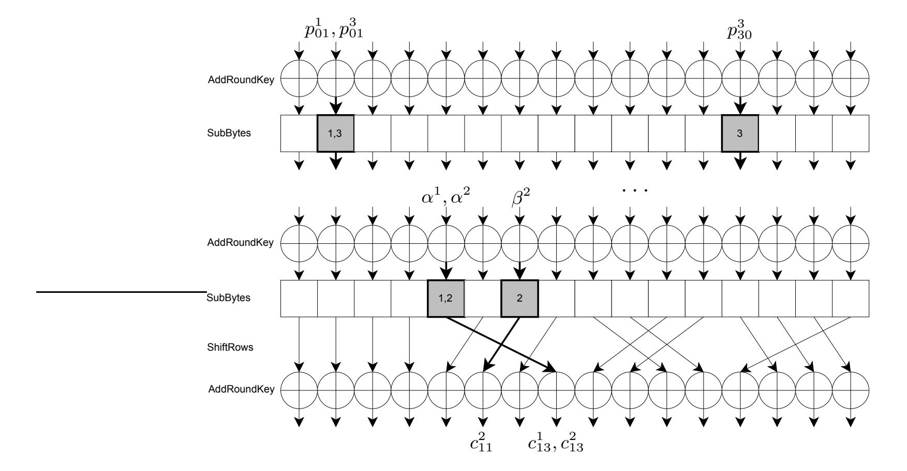

{0}------------------------------------------------

# Algebraic Side-Channel Collision Attacks on AES

Andrey Bogdanov<sup>1</sup> and Andrey Pyshkin<sup>2</sup>

<sup>1</sup> Chair for Communication Security Ruhr University Bochum, Germany abogdanov@crypto.rub.de

<sup>2</sup> Department of Computer Science Technical University Darmstadt, Germany pychkine@cdc.informatik.tu-darmstadt.de

Abstract. This paper presents a new powerful side-channel cryptanalytic method - algebraic collision attacks - representing an efficient class of power analysis being based on both the power consumption information leakage and specific structure of the attacked cryptographic algorithm. This can result in an extremely low measurement count needed for a key recovery.

The algebraic collision attacks are well applicable to AES, if one-byte collisions are detectable. For the recovery of the complete AES key, one needs 3 measurements with a probability of 0.42 and 4.24 PC hours postprocessing, 4 measurements with a probability of 0.82 and several seconds of offline computations or 5 measurements with success probability close to 1 and several seconds post-processing.

Key words: AES, collision attacks, side-channel attacks, generalized collisions, Gr¨obner basis, algebraic attacks, Faug`ere's F4 algorithm

### 1 Introduction

Power analysis based side-channel attacks have gained major importance since their introduction in [6]. Differential power analysis (DPA) is probably the most discussed side-channel attack in scientific literature due to its generic applicability to a variety of implementations. However, a number of other power analysis techniques exist that exhibit particular suitability in some special cases, sidechannel collision attacks representing one of such alternative approaches.

The usage of internal collisions in side-channel attacks was proposed by Hans Dobbertin (see also [10] for an early discussion of collision attacks). An internal collision, as defined in [9] and [8], occurs, if a function f within a cryptographic algorithm processes different input arguments, but returns an equal output argument. As applied to AES, Schramm et al. [8] consider one byte transform of the MixColumn operation of the first AES round as the colliding function f. To detect collisions, power consumption curves bytewise corresponding to separate S-box operations in the second round at a fixed internal state position 

{1}------------------------------------------------

after the key addition can be compared, see e.g. [1]. Some methods to overpass random masking of AES implementations using collision attacks can be found in [2]. However, we take another approach in this paper.

The key idea of our improvements to collision attacks is based on the notion of a generalized internal collision introduced in [3]. One can look at several instances of the same function f, if their implementations are similar enough, and try to detect equal inputs to these instances by comparing the corresponding power traces. Ideally, the several logical instances of f should share the same implementation that is executed serially, which is e.g. often the case low-end implementations in embedded systems. A generalized internal collision in an iterative cryptographic algorithm A with respect to a function f occurs within one or several runs of A if two inputs to f in some (possibly different) iterations of A at some (possibly different) positions are equal.

In the case of AES, the 8-bit S-box transform can be the target function f. The S-box remains the same for all executions, rounds and byte positions within the round (as opposed to DES and a large variety of other cryptographic algorithms, where different S-boxes are applied at different positions within the round). This increases the number of instances to compare and of potential collisions to be used afterwards for recovering key bits.

Each collision can be considered as a nonlinear equation over a finite field. The set of all detected collisions corresponds to a system of nonlinear equations with respect to the key. If the linear part of this system is considered only or a part of the system is linearized, we speak about linear collision attacks (these were considered in [3]). If this system is solved nonlinearly, one deals with algebraic collision attacks which represent the main object of the present paper.

From the point of view of algebraic cryptanalysis, the treatment of nonlinear equations is natural. In our constructions we only use the collisions that result in nonlinear equation systems over GF(2) of degree ≤ 2, since one AES round can be implicitly expressed as a system of degree 2 equations. The low degree of the equations and the special form of the system enable an efficient application of Gr¨obner basis techniques to solve such systems. However, this is not the only algebraic technique we use. Before solving the overall system using the Faug`ere F4 algorithm [5] in Magma, we first find independent subsystems on the unknowns of the first and last rounds, that we call cycles, and solve them separately over GF(2<sup>8</sup> ), each having a maximum of 2 solutions. This allows one to determine several variables for free, speeding up the subsequent applications of the F4 Gr¨obner base finding algorithm to the larger system over GF(2). Our algebraic collision attacks seem to be the first successful real-world cryptanalytic attacks on the full-scale AES using its weak algebraic structure [4], though being substantially based on the side-channel leakage.

From the point of view of power analysis, the assumption that one-byte collisions are reliably detectable may seem quite strong. Indeed, the application of averaging within one power trace (for measurement devices with a high sampling rate) or between several power traces (by sending the same input to the device several times) may be needed to achieve an acceptable probability of collision 

{2}------------------------------------------------

detection. See also [1] and [8] for real-world side-channel collision attacks. However, this is out of the scope of this paper whose purpose is to extract as much information about the key as possible from a minimal number of collisions.

Our algebraic collision techniques allow one to mount collision attacks on AES for 3 measurements with a probability of 0.42 and 4.24 PC hours post-processing, for 4 measurements with a probability of 0.82 in several seconds of offline computations or for 5 measurements with success probability close to 1 and several seconds post-processing.

The remainder of the paper is organized as follows. Section 2 recalls the known collision attacks on AES from [8] and [3]. Section 3 introduces the algebraic description of equations enabling the complexity improvements for collision attacks. Section 4 specifies our algebraic collision attacks on AES in detail, discusses some of their advanced properties and provides experimental results. We conclude in Section 5. Appendix A gives some details on the computational platform used to perform experiments. Appendix B briefly discusses the applicability of collision attacks in practice.

### 2 Previous Work

#### 2.1 Basic Collision Attack on AES

Side-channel collision attacks were proposed for the case of DES in [9] and enhanced in [7]. AES was first attacked using collision techniques in [8]. This side-channel collision attack on AES is based on detecting internal one-byte collisions in the MixColumns transformation in the first AES round. The basic idea is to identify pairs of plaintexts leading to the same byte value in an output byte after the MixColumns transformation of the first round and to use these pairs to deduce information about some key bytes involved into the transform.

Let  $A = (a_{ij})$  with  $i, j = \overline{0,3}$  and  $a_{ij} \in GF(2^8)$  be the internal state in the first AES round after key addition, byte substitution and the SHIFTROWS operation. Let  $B = (b_{ij})$  with  $i, j = \overline{0,3}$  and  $b_{ij} \in GF(2^8)$  be the internal state after the MIXCOLUMNS transformation, B = MixColumns(A), where the MIXCOLUMNS transformation is defined for each column j as follows:

(1) 
$$\begin{pmatrix} b_{0j} \\ b_{1j} \\ b_{2j} \\ b_{3j} \end{pmatrix} = \begin{pmatrix} 02 & 03 & 01 & 01 \\ 01 & 02 & 03 & 01 \\ 01 & 01 & 02 & 03 \\ 03 & 01 & 01 & 02 \end{pmatrix} \times \begin{pmatrix} a_{0j} \\ a_{1j} \\ a_{2j} \\ a_{3j} \end{pmatrix}.$$

Here all operations are performed over  $GF(2^8)$ .  $P = (p_{ij})$  with  $i, j = \overline{0, 3}$ ,  $p_{ij} \in GF(2^8)$ , and  $K^{(1)} = (k_{ij}^{(1)})$  with  $i, j = \overline{0, 3}$ ,  $k_{ij}^{(1)} \in GF(2^8)$ , denote the plaintext block and the first subkey, respectively, then  $b_{00}$  can be represented as:

(2) 
$$b_{00} = 02 \cdot a_{00} \oplus 03 \cdot a_{10} \oplus 01 \cdot a_{20} \oplus 01 \cdot a_{30} = 02 \cdot S(p_{00} \oplus k_{00}^{(1)}) \oplus 03 \cdot S(p_{11} \oplus k_{11}^{(1)}) \oplus 01 \cdot S(p_{22} \oplus k_{22}^{(1)}) \oplus 01 \cdot S(p_{33} \oplus k_{33}^{(1)}).$$

{3}------------------------------------------------

For two plaintexts P and P' with  $p_{00} = p_{11} = p_{22} = p_{33} = \delta$  and  $p'_{00} = p'_{11} = p'_{22} = p'_{33} = \epsilon$ ,  $\delta \neq \epsilon$ , one obtains the following, provided  $b_{00} = b'_{00}$ :

(3) 
$$\begin{aligned} 02 \cdot S(k_{00}^{(1)} \oplus \delta) \oplus 03 \cdot S(k_{11}^{(1)} \oplus \delta) \oplus 01 \cdot S(k_{22}^{(1)} \oplus \delta) \oplus 01 \cdot S(k_{33}^{(1)} \oplus \delta) \\ &= 02 \cdot S(k_{00}^{(1)} \oplus \epsilon) \oplus 03 \cdot S(k_{11}^{(1)} \oplus \epsilon) \oplus 01 \cdot S(k_{22}^{(1)} \oplus \epsilon) \oplus 01 \cdot S(k_{33}^{(1)} \oplus \epsilon) \end{aligned}$$

Let  $C_{\delta,\epsilon}$  be the set of all key bytes  $k_{00}^{(1)}, k_{11}^{(1)}, k_{22}^{(1)}, k_{33}^{(1)}$  that lead to a collision (3) with plaintexts  $(\delta, \epsilon)$ . Such sets are pre-computed and stored for all  $2^{16}$  pairs  $(\delta, \epsilon)$ . Each set contains on average  $2^{24}$  candidates for the four key bytes. Actually, every set  $C_{\epsilon,\delta}$  can be computed from the set  $C_{\epsilon\oplus\delta,0}$  using some relations between the sets. Due to some dependencies within the sets, this optimization reduces the required disk space to about 540 megabytes.

The attack on the single internal state byte  $b_{00}$  is then the following. The attacker generates random values  $(\epsilon, \delta)$  and inputs them to the AES module as described above. The power consumption curve for the time period, where  $b_{00}$  is processed, is stored. Then the attacker proceeds with other random values  $(\epsilon', \delta')$ , measures the power profile, stores it and correlates it with all stored power curves. And so on. One needs about 4 collisions (one in each output byte of a column) to recover the four bytes involved into the MixColumns transformation. The probability that after N operations at least one collision  $b_{00} = b'_{00}$  occurs in a single byte is:

(4) 
$$p_N = 1 - \prod_{l=0}^{N-1} (1 - l/2^8).$$

Actually, the attack can be parallelized to search for collisions in all four columns of B in parallel. In this case the attacker needs at least 16 collisions, 4 for each column of B, so  $p_N^{16} \geq 1/2$  and  $N \approx 40$ . Once the required number of collisions was detected, he uses the pre-computed tables  $C_{\epsilon \oplus \delta,0}$  to recover all four key bytes for each column by intersecting the pre-computed key sets corresponding to the collisions  $(\epsilon, \delta)$  detected. Thus, on average one has to perform about 40 measurements to obtain all 16 collisions needed and to determine all 16 key bytes. Note that since the cardinality of the intersections for the sets  $C_{\epsilon,\delta}$  is not always 1, there are a number of key candidates to be tested using a known plaintext-ciphertext pair.

#### 2.2 Linear Collision Attack on AES

The basic collision attack on AES can be improved using the notion of generalized collisions [3]. In round  $i = \overline{1,10}$ , AES performs the Subbytes operation (16 parallel S-box applications) on the output bytes of the previous round XORed with the (i+1)-th subkey  $K^{(i+1)}$  starting with the subkey  $K^{(1)}$  before the first round. A generalized internal AES collision occurs, if there are two S-boxes within the same AES execution or within several AES runs accepting the same byte value as their input.

{4}------------------------------------------------



Fig. 1. Linear collisions

In Figure 1 a linear collision within a single AES round i is illustrated.  $x_{vu}$ ,  $v, u = \overline{0,3}$ , are plaintext bytes, if i = 1, or the output bytes from the previous round i - 1, otherwise. In this example, bytes 03 and 22 collide.

A detected collision in the S-box layer of the first round in bytes  $(i_1, j_1)$  and  $(i_2, j_2)$  with  $i_1, j_1, i_2, j_2 = \overline{0,3}$  corresponds to the following linear equation:

$$S(k_{i_1,j_1}^{(1)} \oplus p_{i_1,j_1}) = S(k_{i_2,j_2}^{(1)} \oplus p_{i_2,j_2}), \tag{5}$$

$$k_{i_1,j_1}^{(1)} \oplus k_{i_2,j_2}^{(1)} = \Delta_{(i_1,j_1),(i_2,j_2)}^{(1)} = p_{i_1,j_1} \oplus p_{i_2,j_2}$$
 (6)

for some known plaintext bytes  $p_{i_1,j_1}$  and  $p_{i_2,j_2}$ . In the same way, one can write equations resulting from collisions within some other round  $i = \overline{2,10}$ . In this case we have some unknown key- and plaintext-dependent byte variables instead of the plaintext bytes  $p_{i_1,j_1}$  and  $p_{i_2,j_2}$ .

m linear equations of type (6) resulting from a number of collisions detected within the S-box layer in the first round build the following linear equation system:

(7) 
$$S_m: \begin{cases} k_{i_1,j_1}^{(1)} \oplus k_{i_2,j_2}^{(1)} = \Delta_{(i_1,j_1),(i_2,j_2)}^{(1)} \\ k_{i_3,j_3}^{(1)} \oplus k_{i_4,j_4}^{(1)} = \Delta_{(i_3,j_3),(i_4,j_4)}^{(1)} \\ \dots \\ k_{i_{2m-1},j_{2m-1}}^{(1)} \oplus k_{i_{2m},j_{2m}}^{(1)} = \Delta_{(i_{2m-1},j_{2m-1}),(i_{2m},j_{2m})}^{(1)}. \end{cases}$$

Note that this system has 16 variables (bytes of the first round subkey). In system (7) the key byte numbers and the variables are not necessarily pairwise distinct. The maximal rank of  $S_m$  is 15.

It is not necessary for  $S_m$  to have the maximal rank. If there are several isolated subsystems within  $S_m$ , then each of them can be solved independently as described above. If there are q independent subsystems  $SS_m^1, \ldots, SS_m^q$  in  $S_m$ , then  $S_m$  can be represented as a union of these subsystems:

$$S_m = SS_m^1 \cup \dots \cup SS_m^q, \ SS_m^i \cap SS_m^j = \emptyset, \ i \neq j.$$

{5}------------------------------------------------

To solve  $S_m$  in this case, one has to assign q byte values to some q variables in the subsystems  $\{SS_m^i\}_{i=1}^q$ . At the end there are  $2^{8q}$  key candidates. The correct key is identified using a known plaintext-ciphertext. In Table 1 the estimated numbers of isolated subsystems are provided.

**Table 1.** Offline complexity and success probabilities

| Measurements, $t$                | 4     | 5     | 6     | 7     | 8     | 9     | 29     |
|----------------------------------|-------|-------|-------|-------|-------|-------|--------|
| Linear equations, m              | 7.09  | 10.72 | 14.88 | 19.46 | 24.36 | 29.49 | 105.14 |
| Isolated subsystems, $q$         | 8.81  | 5.88  | 3.74  | 2.20  | 1.43  | 1.15  | 1.00   |
| Offline complexity $\leq 2^{40}$ |       |       |       |       |       |       |        |
| Success probability              | 0.037 | 0.372 | 0.854 | 0.991 | 0.999 | 1.000 | 1.000  |
| Offline complexity $\leq 2^{48}$ |       |       |       |       |       |       |        |
| Success probability              | 0.092 | 0.548 | 0.927 | 0.997 | 0.999 | 1.000 | 1.000  |

The offline stage becomes feasible after 5 measurements ( $2^{45.5}$  simple steps with a probability of 0.548). Linear systems resulting from 6 measurements are easily solvable in  $2^{37.15}$  steps on average with a probability of 0.85, which is more realistic. After 11 measurements the expected offline attack complexity is about  $2^{12.11}$ , practically all systems being solvable.

### 3 Algebraic Description of Nonlinear Collisions in AES

In this section we show how to improve the results using the algebraic cryptanalysis techniques developed for AES. The general idea is to exploit more information about the key available in nonlinear collisions. To extract this information we use the algebraic representation of AES and the Faugère F4 algorithm finding Gröbner bases. To make the resulting system of nonlinear equations solvable, we select the collisions in a way keeping the algebraic degree of equations low (it does not exceed 2) and the number of unknowns small (we fix a number of variables and try to use all possible low-degree dependencies on these variables in an efficient way).

In this section the basic nonlinear and linear collisions we use (FS- and FL-collisions) are described algebraically. Moreover, the notion of non-collisions is introduced and briefly discussed here.

#### 3.1 FS-Collisions

Collisions in the first two AES rounds occurring between bytes of the first two rounds are called *FS-collisions*. If input bytes  $\alpha_1$  and  $\alpha_2$  of two S-boxes collide, we have the simple linear equation over  $GF(2^8)$ :  $\alpha_1 \oplus \alpha_2 = 0$ . If  $\alpha_e$  lies in the

{6}------------------------------------------------

S-box layer of the first round, then  $\alpha_e = k_{i,j}^{(1)} \oplus p_{i,j}$ , for some i, j. Otherwise, we have

$$\alpha_e = k_{i,j}^{(2)} \oplus m_i \cdot a_{0,j} \oplus m_{i+1} \cdot a_{1,j+1} \oplus m_{i+2} \cdot a_{2,j+2} \oplus m_{i+3} \cdot a_{3,j+3},$$

where  $m=(m_0,m_1,m_2,m_3)=(02,03,01,01)$ , and the addition of indices is interpreted modulo 4 and  $a_{i,j}=S(k_{i,j}^{(1)}\oplus p_{i,j})$ . We distinguish between the following three types of collisions: linear collisions in the first round, nonlinear collisions between the first two rounds, and nonlinear collisions within the second round. These three collision types are illustrated in Figure 2. S-boxes leading to the detection of collisions (active S-boxes) are marked with the numbers of collisions they account for. Collision 1 is between two bytes of the first round, linearly binding  $k_{00}^{(1)}$  and  $k_{30}^{(1)}$ . Collision 2 is between the S-box number 12 of the 2nd round and the S-box 00 of the first round. It binds 6 key bytes:  $k_{00}^{(1)}$ ,  $k_{02}^{(1)}$ ,  $k_{13}^{(1)}$ ,  $k_{20}^{(1)}$ ,  $k_{31}^{(1)}$ , and  $k_{12}^{(2)}$ . Collision 3 algebraically connects two MIXCOLUMN expressions on 8 key bytes after the S-box layer with two bytes of the second subkey in a linear manner. The explicit algebraic equations for this example are the following:

$$\begin{array}{l} 1: \ k_{00}^{(1)} \oplus p_{00}^1 = k_{30}^{(1)} \oplus p_{30}^1 \\ 2: \ k_{00}^{(1)} \oplus p_{00}^2 = S^{-1}(s_{12}^2) = k_{12}^{(2)} \oplus \\ 01S(k_{02}^{(1)} \oplus p_{02}^2) \oplus 02S(k_{13}^{(1)} \oplus p_{13}^2) \oplus 03S(k_{20}^{(1)} \oplus p_{20}^2) \oplus 01S(k_{31}^{(1)} \oplus p_{31}^2) \\ 3: \ s_{12}^3 = s_{33}^3, \\ k_{12}^{(2)} \oplus 01S(k_{02}^{(1)} \oplus p_{02}^3) \oplus 02S(k_{13}^{(1)} \oplus p_{13}^3) \oplus 03S(k_{20}^{(1)} \oplus p_{20}^3) \oplus 01S(k_{31}^{(1)} \oplus p_{31}^3) \\ & = \\ k_{33}^{(2)} \oplus 03S(k_{03}^{(1)} \oplus p_{03}^3) \oplus 01S(k_{10}^{(1)} \oplus p_{10}^3) \oplus 01S(k_{21}^{(1)} \oplus p_{21}^3) \oplus 02S(k_{32}^{(1)} \oplus p_{32}^3) \end{array}$$

All these relations can be described a the system of polynomial quadratic [4] and linear equations over GF(2) in key bit variables and state variables given by the output of the S-boxes of the first round. See Subsection 4.1. Note that there are mirrored collisions occurring between the S-boxes of the last round (number 10) and the round next to the last one (number 9). Such collisions are called LN-collisions.

#### 3.2 FL-Collisions

One can also detect collisions between bytes of the first and last rounds. We call collisions of this type FL-collisions. If plaintexts as well as ciphertexts are known, an FL-collision leads to a simple nonlinear equation. Linear collisions within the first round as well as those within the last round can be additionally used.

Figure 3 illustrates these three types of collisions. As in Figure 2, S-boxes allowing one to detect collisions are marked with the numbers of collisions they account for. In the example of Figure 3, collision 1 is between byte  $k_{01}^{(1)}$  of the first round and the byte  $k_{10}^{(10)}$  of round 10 for some input and output with  $p_{01}^1$  and

{7}------------------------------------------------



Fig. 2. FS-collisions



Fig. 3. FL-collisions

{8}------------------------------------------------

 $c_{14}^1$  (note that the bytes do not have to belong to the same input/output pair). Input  $k_{10}^{(10)} \oplus \alpha_1$  to S-box 10 in the last round can be expressed as  $S^{-1}(k_{12}^{(11)} \oplus c_{13}^1)$  using the corresponding ciphertext and last subkey bytes.

Collision 2 of Figure 3 is a linear collision within the last AES round. Collision 3 is a standard linear collision within the first AES round. The following equations give algebraic expressions resulting from the four collisions illustrated in Figure 3:

1: 
$$k_{01}^{(1)} \oplus p_{01}^1 = k_{10}^{(10)} \oplus \alpha^1 = S^{-1}(k_{13}^{(11)} \oplus c_{13}^1),$$
  
 $S(k_{01}^{(1)} \oplus p_{01}^1) = k_{13}^{(11)} \oplus c_{13}^1$   
2:  $k_{10}^{(10)} \oplus \alpha^2 = k_{12}^{(10)} \oplus \beta^2, \ k_{13}^{(11)} \oplus c_{13}^2 = k_{11}^{(11)} \oplus c_{11}^2$   
3:  $k_{01}^{(1)} \oplus p_{01}^3 = k_{30}^{(1)} \oplus p_{30}^3$ 

FL-collisions can be obviously expressed as a system of quadratic equations over GF(2). Now we show how to derive a system of quadratic equations over  $GF(2^8)$  for these collisions. One way is to use the BES expression [4]. However we have 8 variables per one key byte in this case. We describe a simpler system, which has only 32 variables.

It is clear that linear collisions in the first or the last round can be expressed as linear equations over  $GF(2^8)$ . Let us consider a nonlinear FL-collision of type 1 (see example above). Its algebraic expression is given by:

$$S(k_{i,j}^{(1)} \oplus p_{i,j}) = k_{u,v}^{(11)} \oplus c_{u,v},$$

for some  $i, j, u, v = \overline{0,3}$ . Recall that the AES S-box is the composition of the multiplicative inverse in the finite field  $GF(2^8)$ , the GF(2)-linear mapping, and the XOR-addition of the constant  $\{63\}^3$ . The GF(2)-linear mapping is invertible, and its inverse is given by the following polynomial over  $GF(2^8)$ :

$$f(x) = \{6e\}x^{2^7} + \{db\}x^{2^6} + \{59\}x^{2^5} + \{78\}x^{2^4} + \{5a\}x^{2^3} + \{7f\}x^{2^2} + \{fe\}x^2 + \{05\}x^2 + \{16a\}x^{2^6} + \{16a\}x^{2^6} + \{16a\}x^{2^6} + \{16a\}x^{2^6} + \{16a\}x^{2^6} + \{16a\}x^{2^6} + \{16a\}x^{2^6} + \{16a\}x^{2^6} + \{16a\}x^{2^6} + \{16a\}x^{2^6} + \{16a\}x^{2^6} + \{16a\}x^{2^6} + \{16a\}x^{2^6} + \{16a\}x^{2^6} + \{16a\}x^{2^6} + \{16a\}x^{2^6} + \{16a\}x^{2^6} + \{16a\}x^{2^6} + \{16a\}x^{2^6} + \{16a\}x^{2^6} + \{16a\}x^{2^6} + \{16a\}x^{2^6} + \{16a\}x^{2^6} + \{16a\}x^{2^6} + \{16a\}x^{2^6} + \{16a\}x^{2^6} + \{16a\}x^{2^6} + \{16a\}x^{2^6} + \{16a\}x^{2^6} + \{16a\}x^{2^6} + \{16a\}x^{2^6} + \{16a\}x^{2^6} + \{16a\}x^{2^6} + \{16a\}x^{2^6} + \{16a\}x^{2^6} + \{16a\}x^{2^6} + \{16a\}x^{2^6} + \{16a\}x^{2^6} + \{16a\}x^{2^6} + \{16a\}x^{2^6} + \{16a\}x^{2^6} + \{16a\}x^{2^6} + \{16a\}x^{2^6} + \{16a\}x^{2^6} + \{16a\}x^{2^6} + \{16a\}x^{2^6} + \{16a\}x^{2^6} + \{16a\}x^{2^6} + \{16a\}x^{2^6} + \{16a\}x^{2^6} + \{16a\}x^{2^6} + \{16a\}x^{2^6} + \{16a\}x^{2^6} + \{16a\}x^{2^6} + \{16a\}x^{2^6} + \{16a\}x^{2^6} + \{16a\}x^{2^6} + \{16a\}x^{2^6} + \{16a\}x^{2^6} + \{16a\}x^{2^6} + \{16a\}x^{2^6} + \{16a\}x^{2^6} + \{16a\}x^{2^6} + \{16a\}x^{2^6} + \{16a\}x^{2^6} + \{16a\}x^{2^6} + \{16a\}x^{2^6} + \{16a\}x^{2^6} + \{16a\}x^{2^6} + \{16a\}x^{2^6} + \{16a\}x^{2^6} + \{16a\}x^{2^6} + \{16a\}x^{2^6} + \{16a\}x^{2^6} + \{16a\}x^{2^6} + \{16a\}x^{2^6} + \{16a\}x^{2^6} + \{16a\}x^{2^6} + \{16a\}x^{2^6} + \{16a\}x^{2^6} + \{16a\}x^{2^6} + \{16a\}x^{2^6} + \{16a\}x^{2^6} + \{16a\}x^{2^6} + \{16a\}x^{2^6} + \{16a\}x^{2^6} + \{16a\}x^{2^6} + \{16a\}x^{2^6} + \{16a\}x^{2^6} + \{16a\}x^{2^6} + \{16a\}x^{2^6} + \{16a\}x^{2^6} + \{16a\}x^{2^6} + \{16a\}x^{2^6} + \{16a\}x^{2^6} + \{16a\}x^{2^6} + \{16a\}x^{2^6} + \{16a\}x^{2^6} + \{16a\}x^{2^6} + \{16a\}x^{2^6} + \{16a\}x^{2^6} + \{16a\}x^{2^6} + \{16a\}x^{2^6} + \{16a\}x^{2^6} + \{16a\}x^{2^6} + \{16a\}x^{2^6} + \{16a\}x^{2^6} + \{16a\}x^{2^6} + \{16a\}x^{2^6} + \{16a\}x^{2^6} + \{16a\}x^{2^6} + \{16a\}x^{2^6} + \{16a\}x^{2^6} + \{16a\}x^{2^6} + \{16a\}x^{2^6} + \{16a\}x^{2^6} + \{16a\}x^{2^6} + \{16a\}x^{2^6} + \{16a\}x^{2^6} + \{16a\}x^{2^6} + \{16a\}x^{2^6} + \{16a\}x^{2^6} + \{16a\}x^{2^6} + \{16a\}x^{2^6} + \{16a\}x^{2^6} + \{16a\}x^{2^6} + \{16a\}x^{2^6} + \{16a\}x^{2^6} + \{16a\}x^{2^6}$$

Hence we have

$$(k_{i,j}^{(1)} \oplus p_{i,j})^{-1} = f(k_{u,v}^{(11)} \oplus c_{u,v} \oplus 63) = f(k_{u,v}^{(11)}) \oplus f(c_{u,v} \oplus 63).$$

If we replace  $f(k_{u,v}^{(11)})$  by a new variable  $\tilde{k}_{u,v}$ , we obtain the quadratic equation

$$(k_{i,j}^{(1)} \oplus p_{i,j})(\tilde{k}_{u,v} \oplus f(c_{u,v} \oplus 63)) = 1,$$

which holds with probability  $\frac{255}{256}$ . The following proposition follows:

**Proposition 1.** Solutions to the equation  $S(k_{i,j}^{(1)} \oplus p_{i,j}) = k_{u,v}^{(11)} \oplus c_{u,v}$  coincides with solutions to the equation

$$(k_{i,j}^{(1)} \oplus p_{i,j})(\tilde{k}_{u,v} \oplus f(c_{u,v} \oplus 63)) = 1$$

under the change of variables  $\tilde{k}_{u,v} = f(k_{u,v}^{(11)})$  with a probability of  $\frac{255}{256}$ .

<sup>&</sup>lt;sup>3</sup> Here and below any byte  $\{\alpha\beta\} = \alpha \cdot 16 + \beta = \sum_{i=0}^{7} b_i \cdot 2^i$  is interpreted as the element of  $GF(2^8) = GF(2)[\omega]$  using a polynomial representation  $\sum_{i=0}^{7} b_i \cdot \omega^i$ , where  $\omega^8 + \omega^4 + \omega^3 + \omega + 1 = 0$  holds.

{9}------------------------------------------------

Moreover, if  $k_{i,j}^{(11)} \oplus k_{u,v}^{(11)} = \Delta_{(i,j),(u,v)} = c_{i,j} \oplus c_{u,v}$  with  $i,j,u,v = \overline{0,3}$ , then we have

$$f(k_{i,j}^{(11)}) \oplus f(k_{u,v}^{(11)}) = \tilde{k}_{i,j} \oplus \tilde{k}_{u,v} = f(\Delta_{(i,j),(u,v)}).$$

Thus we derive for FL-collisions the system  $\mathbb{S}$  of quadratic equations over  $GF(2^8)$  in 32 variables  $\mathcal{K} = \{k_{i,j}^{(1)}, \tilde{k}_{i,j}\}_{0 \leq i,j \leq 3}$ . Furthemore, each equation of the resulting system  $\mathbb{S}$  has only two variables. We call such equations binomial.

#### 3.3 Non-Collisions

A non-collision occurs between two S-box input bytes inside one or several AES executions if the processed bytes are not equal (no collision has been detected between these two unknown bytes). The straightforward algebraic description of non-collisions is as follows. Suppose two bytes  $b_1 = \{x_7x_6...x_0\}$  and  $b_2 = \{y_7y_6...y_0\}$  do not collide, i.e.,  $b_1 \neq b_2$ . Then bit variables satisfy the following equation over GF(2):

$$\prod_{i=0}^{7} (x_i + y_i + 1) = 0.$$

Since the degree of this equation is equal to 8, and the number of the terms is exactly  $3^8 = 6561$ , the equation seems to be useless for Gröbner basis attacks. However, there are more constructive applications of non-collisions reducing the search for several unknown bytes. These are specific for the structure of nonlinear equation systems we use and are explained in Subsection 4.4.

#### 4 Algebraic Analysis of Collisions

In this section we construct and solve concrete systems of equations based on the ideas from the previous sections. First, we analyze the equation systems resulting from FS- and FL-collisions. Then combined systems of equations are constructed. Several ways to accelerate the process of finding the Gröbner bases for the combined systems are introduced and discussed, including chains of variables in binomial equations, non-linear cycles and search optimization using non-collisions.

#### 4.1 Solving Equations for FS-Collisions

The straightforward application of the Faugère F4 algorithm to the system constructed in Subsection 3.1 gives results superior to those in [3]. These are are summarized in Table 2.

The system of nonlinear equations is considered over GF(2). For t inputs (t measurements) there are 128 variables of the first subkey  $K^{(1)}$ , 128 variables of the second subkey  $K^{(2)}$  and  $128 \cdot t$  intermediate variables for the output bits of the first round S-box layer. The collision-independent equations include  $39 \cdot 16 \cdot t$  quadratic equations over GF(2) connecting the inputs and outputs of the first

{10}------------------------------------------------

round S-boxes, and 4 · 39 = 156 quadratic and 12 · 8 = 96 linear equations connecting K(1) and K(2) using the key schedule relations, since the AES S-box can be implicitly expressed as 39 degree 2 equations [4]. Each of the three types of FS-collisions add 8 linear equations to the system, resulting in 8 · c equations if c collision occurred.

The system is solved in the following way. First the system is passed to the F4 algorithm without modifications. If it is not solvable, one guesses the largest connected linear component and tries to solve the system again. The memory limit for the Magma program was set to 500 MB. It can be seen from Table 2 that for 5 measurements most (> 93%) instances of the FS-system can be solved within several hours on a PC. For 4 measurements, less systems are solvable (about 40%) within approx. 2 hours. These attacks work in the known plaintext scenario.

| Measurements                                                                   | 5     | 5      | 4     | 4      |
|--------------------------------------------------------------------------------|-------|--------|-------|--------|
| Success prob.                                                                  | 0.425 | 0.932  | 0.042 | 0.397  |
| Run time, s                                                                    | 142.8 | 7235.8 | 71.5  | 6456.0 |
| Memory limit, MB                                                               | 500   | 500    | 500   | 500    |
| Number of variables                                                            | 896   | 896    | 768   | 768    |
| Linear/quadratic equations 96 + 8c/3276 96 + 8c/3276 96 + 8c/2652 96 + 8c/2652 |       |        |       |        |

Table 2. Solving equation systems for FS-collisions over GF(2)

#### 4.2 Solving Equations for FL-Collisions

FL-collisions lead, as a rule, to more efficient results. Each equation binds only two GF(2<sup>8</sup> )-variables, since one deals with binomial equations introduced in Subsection 3.2. There are 32 variables K over GF(2<sup>8</sup> ). The algebraic relations on these variables are much simpler, since one has both plaintext and ciphertext bytes (more information related to the detected collisions). Moreover, there are nonlinear subsystems (cycles) solvable independently (see Subsection 4.4). On average there are 1.02 cycles covering 30.08 out of 32 GF(2<sup>8</sup> )-variables for 5 measurements and 0.99 cycles covering 20.08 out of 32 GF(2<sup>8</sup> )-variables for 4 measurements. Statistically there are 43.58 collisions for 5 measurements and 29.66 collisions for 4 measurements.

Table 3 contains the results for applying the F4 algorithm to FL-systems of nonlinear equations averaged over 10000 samples. After resolving the nonlinear subsystems using F4, we guess variables defining the remaining bytes in a way similar to the linear collision attacks (see Subsection ?? and Subsection 4.4). For 5 measurements practically all FL-systems are solvable in several seconds (2<sup>32</sup> simple offline operations), an FL-system being solvable with a probability of 0.82 within several seconds (2<sup>32</sup> simple offline operations) for 4 measurements.

{11}------------------------------------------------

**Table 3.** Solving equation systems for FL-collisions over  $GF(2^8)$ 

| Measurements                       | 5        | 4        |
|------------------------------------|----------|----------|
| Success probability                | 1.00     | 0.82     |
| Time for finding Gröbner basis, ms |          | 5        |
| Chain guesses                      | $2^{32}$ | $2^{32}$ |
| Memory limit, MB                   | 500      | 500      |
| Number of variables                | 32       | 32       |
| Average number of equations        | 43.58    | 29.66    |

#### 4.3 Constructing Combined Systems of Equations

Though FS- and, first of all, FL-systems perform well for 4 and 5 measurements, their solution for 3 measurements is either extremely improbable or rather infeasible. Here a combined approach has to be used. For combined systems of equations we use 23 quadratic equations over GF(2) instead of 39 ones to describe the S-boxes [4]. This representation has the advantage that only quadratic monomials in both input and output variables are present, as opposed to the description with 39 variables where more quadratic terms are used.

We performed experiments with combined systems having 512 variables for  $K^{(1)}$ ,  $K^{(2)}$ ,  $K^{(10)}$ ,  $K^{(11)}$  as well as  $128 \cdot t$  variables for outputs of the first S-box layer and  $128 \cdot t$  variables for inputs to the S-boxes of the last round (for t measurements). The combined systems consists of the following equations:

- 1.  $2 \cdot 23 \cdot 16 \cdot t$  quadratic equations describing the relationship between input and output of the S-boxes at the first and last rounds;
- 2. Key schedule equations for subkeys 1, 2 and 10, 11  $(2 \cdot 4 \cdot 23)$  quadratic and  $2 \cdot 12 \cdot 8$  linear ones);
- 3. 8 linear equations for each FS- or LN-collision;
- 4. 23 quadratic equations for each type 1 FL-collision. 8 linear equations for each of the following additional collisions:
  - Collisions between the S-boxes of round 1 and 9,
  - Collisions between the S-boxes of round 2 and 10.

#### 4.4 Speed-Ups

The straightforward approach to solve the system constructed in Subsection 4.3 would be to pass it to the F4 algorithm. However, this is a rather inefficient approach. A more detailed insight into the structure of the resulting nonlinear system reveals that the system frequently possesses subsystems that can be efficiently solved independently of the remaining system.

Solving Chains and Nonlinear Cycles for FL-Collisions. The subset of binomial equations over  $\mathcal{K}$  in the system disintegrates into a number of independent subsystems on  $\mathcal{K}_i$ ,  $i = \overline{1, m}$ . The chains possess the property that if one

{12}------------------------------------------------

element of the chain (say, one byte in the chain was guessed) uniquely defines all the other elements of the chain. Thus, if one identifies all (linear and nonlinear) binomial equations in the system, finds h longest chains and guesses one byte in each of them, this determines all the unknowns in these h chains.

This system of nonlinear equations for FL-collisions S introduced in Subsection 3.2 can be solved in few milliseconds using Magma. However not always there is a single solution.

Let us consider a partition of K

$$\mathcal{K} = \mathcal{K}_1 \cup \cdots \cup \mathcal{K}_m, \quad \mathcal{K}_i \cap \mathcal{K}_j = \emptyset, \ i \neq j$$

such that

- 1. for any i, j = 1, m (i 6= j), and any two variables v<sup>i</sup> ∈ K<sup>i</sup> and v<sup>j</sup> ∈ K<sup>j</sup> there is no equation in v1, v<sup>2</sup> in S;
- 2. no K<sup>i</sup> has a partition that satisfies the first property.

We say that a subset of the variables is connected w.r.t. S, if this subset has no partition that satisfies the first property. Thus each K<sup>i</sup> is connected. Then the system S can be patitioned into m isolated subsystem S<sup>i</sup> corresponding to K<sup>i</sup> . Pairs (K<sup>i</sup> , Si) are called chains due to their geometric representation as vertex chains in graphs associated with these subsystems (see e.g. [3]). Obviously, S<sup>i</sup> = ∅ iff K<sup>i</sup> = {v} for some variable v ∈ K. In this case the right value of the variable v can only be guessed. The case S<sup>i</sup> is a linear subsystem was considered in [3]. We have rank(Si) = #K<sup>i</sup> − 1, and if we fix some variable v<sup>i</sup><sup>1</sup> ∈ K<sup>i</sup> , the other variables v<sup>i</sup><sup>j</sup> ∈ K<sup>i</sup> are given by v<sup>i</sup><sup>j</sup> = v<sup>i</sup><sup>1</sup> ⊕ ∆<sup>i</sup><sup>j</sup> with ∆<sup>i</sup><sup>j</sup> ∈ GF(2<sup>8</sup> ). Suppose now S<sup>i</sup> has one or more quadratic equations, i.e., K<sup>i</sup> ∩ {k (1) 0,0 , . . . , k(1) 3,3 } 6= ∅ and K<sup>i</sup> ∩ {˜k0,0, . . . , ˜k3,3} 6= ∅. Let v ∈ K<sup>i</sup> . Since K<sup>i</sup> is connected, there is a relation between v and any other variable x ∈ K<sup>i</sup> . These relations can be expressed as linear or quadratic equations in two variables. Indeed, let x, y, z ∈ K<sup>i</sup> , and

$$x \cdot y + \alpha \cdot x + \beta \cdot y + \gamma = 0;$$
  $x + z = \delta,$ 

where α, β, γ, δ ∈ GF(2<sup>8</sup> ). If v + x = ¯δ, we get

$$v \cdot y + \alpha \cdot v + (\beta + \bar{\delta}) \cdot y + (\gamma + \alpha \cdot \bar{\delta}) = 0;$$
  $v + z = \delta + \bar{\delta}.$ 

In the case x · v + ¯α · x + β¯ · v + ¯γ = 0 we have

$$(v + \bar{\alpha})(x \cdot y + \alpha \cdot x + \beta \cdot y + \gamma) + (y + \alpha)(x \cdot v + \bar{\alpha} \cdot x + \bar{\beta} \cdot v + \bar{\gamma}) = (\beta + \bar{\beta}) \cdot v \cdot y + (\alpha \cdot \bar{\beta} + \gamma) \cdot v + (\bar{\alpha} \cdot \beta + \bar{\gamma}) \cdot y + (\bar{\alpha} \cdot \gamma + \alpha \cdot \bar{\gamma}) = 0,$$

and

$$v \cdot z + \bar{\alpha} \cdot z + (\bar{\beta} + \delta) \cdot v + (\bar{\gamma} + \bar{\alpha} \cdot \delta) = 0.$$

We see that the degree of S-polynomials does not increase and is ≤ 2. Therefore a Gr¨obner basis can be found quickly.

{13}------------------------------------------------

Let us now show how many solutions  $S_i$  has. As an example, if  $\mathcal{K}_i = \{v, u\}$ , and  $S_i$  has two non-linear equations in u, v, then v is a root of a quadratic equation in one variable. Therefore  $S_i$  has two solutions in this case. If  $\#S_i \geq 3$ , then the solution is single. Generally, we say that  $\mathcal{K}_i$  is strongly connected w.r.t.  $S_i$ , if there is a non-linear equation  $e \in S_i$  such that  $\mathcal{K}_i$  is connected w.r.t.  $S_i \setminus \{e\}$ . Such chains are called *cycles*. It can be shown that in this case  $S_i$  has at most two solutions. Moreover, the solution is single, if  $\mathcal{K}_i$  is strongly connected w.r.t.  $S_i \setminus \{e\}$ .

Thus the number of solutions of the whole system S is equal to  $\prod_{i=1}^{m} 2^{q_i}$ , where  $q_i \leq 1$ , if  $\mathcal{K}_i$  is strongly connected, and  $q_i = 8$  otherwise. Let us remark that it is not necessary to know the value of all variables. It is enough to find the key bytes of either the first or last round.

Using Non-Collisions to Recover Chains. To solve the combined system we guess h bytes defining the maximum number of variables in  $\mathcal{K}$ . In the most practical attacks, h can be 1 or 2. Actually, one does not have to solve all the resulting  $2^{8 \cdot h}$  systems. Some of these guesses can be filtered out using the notion of non-collisions introduced in Subsection 3.3. Instead of constructing implicit degree 8 nonlinear equations, we make use of the non-collisions explicitly in the following way.

Let  $C_1, \ldots, C_h$  denote the h longest chains of variables induced by binomial equations in question, each being of length  $|C_i| = l_i$ ,  $i = \overline{1, h}$ ,  $C_i \cap C_j = \emptyset$ . The variables of the chain  $C_i$  are denoted by  $c_{ij}$  for  $j = \overline{1, l_i}$ . Every  $(c_{ij}, c_{rs})$  of l(l-1)/2 pairs of variables in these chains are connected either by an equality (there was a collision detected)  $e_{ij,rs}(c_{ij}, c_{rs})$  or an inequality (no collision detected)  $in_{ij,rs}(c_{ij}, c_{rs})$ . Collisions and non-collisions (as well as the corresponding equations) can be either linear (e.g. between the bytes of  $K^{(1)}$ ) or nonlinear (e.g. between the bytes of  $K^{(1)}$ ) as illustrated in Subsection 3.2 for FL-collisions.

The idea behind the optimized search for chain evaluations using non-collisions is to verify connections (inequalities or equalities) for every pair of variables in the h longest chains  $C_1 \cup \cdots \cup C_h$  for each candidate evaluation. The procedure can be formalized using Algorithm 1:

**Table 4.** Number of candidate chain evaluations before and after sieving using non-collisions (with and without nonlinear cycles) averaged over 5000 samples for 3 measurements

| h | Before   | After on average | Average speed-up |
|---|----------|------------------|------------------|
| 1 | 256      | 149              | 1.72             |
| 2 | $2^{16}$ | $2^{14.08}$      | 3.78             |
| 3 | $2^{24}$ | $2^{20.77}$      | 9.38             |

In our experiments we had  $h \in \{1, 2, 3\}$ . Table 4 shows the speedup we obtained on average using the sieving technique in these cases. Note that the

{14}------------------------------------------------

#### Algorithm 1 Sieving guesses with non-collisions and non-linear cycles

```
Require: h chains C_1, \ldots, C_h of lengths l_1, \ldots, l_h with 2^{8h} possible evaluations
 1: for each guess (c_{11}, \ldots, c_{h1}) \in \{0, \ldots, 2^{8h} - 1\} do
        for each chain i = 1 : h do
 2:
 3:
            for each chain variable c_{ij} j = 2 : l_i do
               Evaluate c_{ij} using chain equations
 4:
 5:
            end for
        end for
 6:
        for each (c_{ij}, c_{rs}) of \frac{l(l-1)}{2} pairs of chain variables in C_1 \cup \cdots \cup C_h do
Verify equality e_{ij,rs}(c_{ij}, c_{rs}) or inequality in_{ij,rs}(c_{ij}, c_{rs}) on variables c_{ij}, c_{rs}
 7:
 8:
           if e_{ij,rs}(c_{ij},c_{rs}) is inequation or in_{ij,rs}(c_{ij},c_{rs}) is equation then
 9:
                Go to 1 (contradiction is detected)
10:
            end if
11:
12:
         end for
         Output the guess (c_{11}, \ldots, c_{h1}) as a candidate evaluation of the chains
13:
14: end for
```

ratio of systems with cycles for 3 measurements is about 0.232 averaged over 5000 samples.

#### 4.5 Solving the Combined Systems of Equations

#### **Algorithm 2** Solving combined systems of nonlinear equations

```
1: if there are nonlinear cycles in the binomial chains then
      Resolve the cycles over GF(2^8) using F4 or brute-force
2:
      Define bytes of the dependent chains
3:
4: end if
5: Find the h longest binomial chains
6: Execute Algorithm 1 for sieving chain evaluations
 7: for each non-contradicting evaluation of h chains do
      Find Gröbner basis for the reduced combined system of nonlinear equations with
 8:
      F4
      if the Gröbner basis \neq \{1\} then
9:
         Verify the key candidates using a known plaintext-ciphertext pair
10:
      end if
11:
12: end for
```

To solve the nonlinear systems we executed Algorithm 2. The results of the application of this algorithm to the combined system of nonlinear equations (with additional collisions) for 3 measurements can be found in Table 5. The system is solvable with a probability of 0.698 within 22 days or with a probability of 0.419 within 4.24 hours or with a probability of 0.072 within several minutes.

{15}------------------------------------------------

Table 5. Solving combined equation systems

| Measurements                | 3     | 3                               | 3     |
|-----------------------------|-------|---------------------------------|-------|
| Success prob.               | 0.072 | 0.419                           | 0.698 |
| Run time                    |       | 98.31 sec 4.24 hours 22.03 days |       |
| Memory limit, MB            | 500   | 500                             | 500   |
| h, number of chains guessed | 0     | 1                               | 2     |

### 5 Conclusion

This paper extends the known side-channel collision attacks on AES by treating generalized collisions within several rounds instead of searching for collisions in the first or last round only. This idea combined with algebraic techniques such as Gr¨obner bases provides significant advantages both in terms of measurements and post-processing complexity.

If byte collisions are detectable, the complete AES key can be recovered with 3 measurements with a probability of 0.42 and 4.24 PC hours post-processing, with 4 measurements with a probability of 0.82 in several seconds of offline computations or with 5 measurements with success probability close to 1 and several seconds post-processing. This is to be compared to 40 measurements with some non-negligible post-processing for a success probability > 0.5 in [8] or to 6 measurements with approx. 2<sup>37</sup>.<sup>15</sup> offline computations and a success probability of 0.85 and 5 measurements with 2<sup>45</sup>.<sup>5</sup> offline computations and a probability of 0.55 in [3].

### References

- 1. Alex Biryukov, Andrey Bogdanov, Dmitry Khovratovich, and Timo Kasper. Collision Attacks on Alpha-MAC and Other AES-based MACs. In CHES'07, LNCS. Springer-Verlag, 2007.
- 2. Alex Biryukov and Dmitry Khovratovich. Two new techniques of side-channel cryptanalysis. In CHES 2007, volume 4727 of LNCS. Springer-Verlag, 2007.
- 3. Andrey Bogdanov. Improved Collision Attacks on AES. In The 14th Annual Workshop on Selected Areas in Cryptography (SAC 2007), Ottawa, Ontario, Canada, LNCS. Springer-Verlag, 2007.
- 4. Carlos Cid, Sean Murphy, and Matthew Robshaw. Algebraic Aspects of the Advanced Encryption Standard. Springer-Verlag, 2006.
- 5. J.-C. Faug`ere. A New Efficient Algorithm For Computing Gr¨obner Bases (F4). Journal of Pure and Applied Algebra, 139(1):6188, June 1999.
- 6. Paul Kocher, Joshua Jaffe, and Benjamin Jun. Differential Power Analysis. In CRYPTO'99, LNCS, pages 388–397. Springer-Verlag, 1999.
- 7. Herv´e Ledig, Fr´ed´eric Muller, and Fr´ed´eric Valette. Enhancing Collision Attacks. In CHES'04, volume 3156 of LNCS, pages 176–190. Springer, 2004.
- 8. Kai Schramm, Gregor Leander, Patrick Felke, and Christof Paar. A Collision-Attack on AES: Combining Side-Channel and Differential Attack. In CHES'04, volume 3156 of LNCS, pages 163–175. Springer, 2004.

{16}------------------------------------------------

- 9. Kai Schramm, Thomas J. Wollinger, and Christof Paar. A New Class of Collision Attacks and Its Application to DES. In FSE'03, volume 2887 of LNCS, pages 206–222. Springer, 2003.
- 10. Andreas Wiemers. Collision Attacks for Comp128 on Smartcards. ECC-Brainpool Workshop on Side-Channel Attacks on Cryptographic Algorithms, Bonn, Germany, December 2001.

## A Details about the Computational Platform for Experiments

We implemented all our attacks in Magma V2.13-10 (including the AES algorithm itself as well as its random inputs) running on a dual-core AMD Opteron processor with 1 MB cache and clocked at 2613.39 MHz under Linux. We used only one execution thread of the Opteron processor and not more than 1 GB of RAM. Thus, it is claimed that the performance figures of our attacks on a standard PC with a single-thread processor and 1 GB RAM are comparable to those given in this paper.

### B On the Practical Applicability of Collision Attacks

To make the reliable detection of byte collisions in S-boxes within AES possible, a number of conditions have to be fulfilled:

- All instances of the AES S-box have to share the same implementation: This condition is quite natural and is automatically fulfilled if the S-box is implemented as a separate routine, which is frequently the case on 8-bit embedded microcontrollers.
- The attacker has to precisely know when the S-boxes are executed: This is automatically fulfilled if the implementation is known to the attacker. Otherwise, the analysis of the timing behaviour can be performed prior to the attack using SPA. During this phase the attacker needs to know neither inputs/outputs to the cipher nor the used keys.
- Measurements of high accuracy are required: The usage of averaging techniques increases the signal-to-noise ratio and the probability of collision detection. Averaging within one trace requires a high sampling rate of the measurement device. If several traces are averaged, multiple measurements for each of the inputs are needed.
- Lengthy power traces have to be stored: As the power consumption of S-boxes in several AES rounds is analyzed in linear and algebraic collision attacks, more points have to be stored for each algorithm run. This condition can be fulfilled by long memory scopes.

The practical feasibility of collision attacks for AES was shown in [1] for a PIC16F687 microcontroller and in [8] for an i8051-type controller. To detect a collision, the attacker compares the corresponding power curves using e.g. the least-square method.