{0}------------------------------------------------

# New Related-Key Boomerang Attacks on AES (Full Version)

Michael Gorski and Stefan Lucks

Bauhaus-University Weimar, Germany {Michael.Gorski, Stefan.Lucks}@uni-weimar.de

Abstract. In this paper we present two new attacks on round reduced versions of the AES. We present the first application of the related-key boomerang attack on 7 and 9 rounds of AES-192. The 7-round attack requires only 218 chosen plaintexts and ciphertexts and needs 267.5 encryptions. We extend our attack to nine rounds of AES-192. This leaves to a data complexity of 267 chosen plaintexts and ciphertexts using about 2 143.33 encryptions to break 9 rounds of AES-192.

Keywords: block ciphers, AES, differential cryptanalysis, related-key boomerang attack.

## 1 Introduction

The Advanced Encryption Standard (AES) [8] has become one of the most used symmetric encryption algorithm in the world. Differential cryptanalysis [6] is one of the most powerful attacks on block ciphers like the AES. It recovers subkey bits for the first or the last rounds, while using differential properties of the underlying cipher. Variants of this attack such as the impossible differential attack [2], the truncated differential attack [19], the higher order differential attack [19], the differential-linear attack [20], the boomerang attack [24], the amplified boomerang attack [14] and the rectangle attack [3] were introduced.

The boomerang attack [24] is a strong extension of differential cryptanalysis to break more rounds than differential attacks can do, since the cipher is treated as a cascade of two sub-ciphers, using short differentials in each sub-cipher. These differentials are combined in an adaptive chosen plaintext and ciphertext attack to exploit properties of the cipher that have a high probability.

Related-key attacks [1, 18] apply differential cryptanalysis to ciphers using different but related keys and consider the information that can be extracted from encryptions under these keys. Ciphers with a weak key schedule are vulnerable to this kind of attack. The idea of related-key differentials was presented in [15], while two encryptions under two related-keys are used. Several combinations of related-key and differential attacks were introduced in the following. Related keys combined with the impossible attack [13], the differential-linear attack [11] or the rectangle attack [4, 12, 16, 17]. Biryukov [7] propose a boomerang attack on the AES-128 which can break up to 5 and 6 out of 10 rounds. The

{1}------------------------------------------------

related-key boomerang attack was published first in [4], but was not used to attack the AES.

We present the first related-key boomerang attack on 7 rounds of AES-192 using 4 related keys. Our related-key boomerang attack can also break 9 rounds using 256 related keys. It uses less data and less time than existing attacks on the same number of reduced rounds. Table 1 summarizes existing attacks on AES-192 and our new attacks on 7 and 9 rounds.

Table 1. Existing attacks on round reduced AES-192

| Attack                          | # rounds # keys |     | data / time                   | source    |
|---------------------------------|-----------------|-----|-------------------------------|-----------|
| Impossible Differential         | 7               | 1   | 92 / 2186 2                | [22]      |
| Square                          | 7               | 1   | 32 / 2184 2                | [21]      |
| Partial Sums                    | 7               | 1   | 32 / 2155 19 · 2           | [10]      |
| Partial Sums                    | 7               | 1   | 128 − 119 / 2120 2 2 | [10]      |
| Related-Key Differential-Linear | 7               | 2   | 22 / 2187 2                | [25]      |
| Related-Key Differential-Linear | 7               | 2   | 70 / 2130 2                | [25]      |
| Related-Key Impossible          | 7               | 2   | 111 / 2116 2               | [13]      |
| Related-Key Impossible          | 7               | 32  | 56 / 294 2                 | [5]       |
| Related-Key Boomerang           | 7               | 4   | 18 / 267.5 2               | Section 4 |
| Partial Sums                    | 8               | 1   | 128 − 119 / 2188 2 2 | [10]      |
| Related-Key Impossible          | 8               | 2   | 88 / 2183 2                | [13]      |
| Related-Key Rectangle           | 8               | 4   | 86.5 / 286.5 2          | [12]      |
| Related-Key Rectangle           | 8               | 2   | 94 / 2120 2                | [16]      |
| Related-Key Differential-Linear | 8               | 2   | 118 / 2165 2               | [25]      |
| Related-Key Impossible          | 8               | 32  | 116 / 2134 2               | [5]       |
| Related-Key Impossible          | 8               | 32  | 92 / 2159 2                | [5]       |
| Related-Key Impossible          | 8               | 32  | 68.5 / 2184 2           | [5]       |
| Related-Key Rectangle†          | 9               | 256 | 86 / 2181 2                | [4]       |
| Related-Key Rectangle           | 9               | 64  | 85 / 2182 2                | [16]      |
| Related-Key Boomerang           | 9               | 256 | 67 / 2143.33 2             | Section 5 |
| Related-Key Rectangle           | 10              | 256 | 125 / 2182 2               | [16]      |
| Related-Key Rectangle           | 10              | 64  | 124 / 2183 2               | [16]      |

† the attack with some flaws corrected by Kim et al. [16].

The paper is organized as follows: In Section 2 we give a brief description of the AES. In Section 3 we describe the related-key boomerang attack. In Section 4, we present a new related-key boomerang attack on 7-round of AES-192. Our 9 round attack is presented in Section 5. We conclude the paper in Section 6.

{2}------------------------------------------------

#### 2 Description of the AES

The AES [8] is a block cipher using data blocks of 128 bits with 128, 192 or 256-bit cipher key. A different number of rounds is used depending on the length of the cipher key. The AES has 10, 12 and 14 rounds when a 128, 192 or 256-bit cipher key is used respectively. The plaintexts are treated as a 4 x 4 byte matrix, which is called state. A round applies four operations to the state:

- SubBytes (SB) is a non-linear byte-wise substitution applied on every byte of the state matrix in parallel.
- ShiftRows (SR) is a cyclic left shift of the *i*-th row by *i* bytes, where  $i \in \{0, 1, 2, 3\}$ .
- MixColumns (MC) is a multiplication of each column by a constant 4 x 4 matrix.
- AddRoundKey (AK) is a XORing of the state and a 128-bit subkey which is derived from the cipher key.

An AES round function applies the SB, SR, MC and AK operation in order. Before the first round a whitening AK operation is applied and the MC operation is omitted in the last round because of symmetry. We concentrate on the 192-bit version of the AES in this paper and refer to [8] for more details on the other versions. Let  $W_i$  be a 32-bit word, then the 192-bit cipher key is represented by  $W_0||W_1||W_2||...||W_5$ . The 192-bit key schedule algorithm works as follows:

- For i = 6 till i = 51
  - If  $i \equiv 0 \mod 6$ , then  $W_i = W_{i-6} \oplus SB(RotByte(W_{i-1})) \oplus Rcon(i/6)$ ,
  - else  $W_i = W_{i-6} \oplus W_{i-1}$ .

where Rcon denotes fixed constants depending on its input and RotByte represents a byte-wise left shift. The whitening key is  $W_0||W_1||W_2||W_3$ , the subkey of round 1 is  $W_4||W_5||W_6||W_7$ , the subkey of round 2 is  $W_8||W_9||W_{10}||W_{11}$  and so one. The bytes coordinates of a 4 x 4 state matrix are labeled as:

| $x_0$ | $x_4$ | $x_8$    | $x_{12}$ |
|-------|-------|----------|----------|
| $x_1$ | $x_5$ | $x_9$    | $x_{13}$ |
| $x_2$ | $x_6$ | $x_{10}$ | $x_{14}$ |
| $x_3$ | $x_7$ | $x_{11}$ | $x_{15}$ |

## 3 The Related-Key Boomerang Attack

We now describe the related-key boomerang attack [4] in more detail. But first, we have to give some definitions.

**Definition 1.** Let P, P' be two bit strings of the same length. The bit-wise xor of P and P',  $P \oplus P'$ , is called the difference of P, P'. Let a be a known and \* an unknown non-zero byte difference.

{3}------------------------------------------------

**Definition 2.**  $\alpha \to \beta$  is called a differential if  $\alpha$  is the plaintext difference  $P \oplus P'$  before some non-linear operation  $f(\cdot)$  and  $\beta$  is the difference after applying these operation, i.e,  $f(P) \oplus f(P')$ . The probability p is linked on a differential saying that an  $\alpha$  difference turns into a  $\beta$  difference with probability p. The backward direction, i.e.,  $\alpha \leftarrow \beta$  has probability  $\hat{p}$ .

Two texts (P, P') are called a pair, while two pairs (P, P', O, O') are called a quartet. Regularly, the differential probability decreases the more rounds are included. Therefore two short differential covering only a few rounds each will be used instead of a long one covering the whole cipher. Related-keys are used to exploit some weaknesses of the key schedule to enhance the probability of the differentials being used. We call such differentials related-key differentials. We split the related-key boomerang attack into two steps. The related-key boomerang distinguisher step and the key recovery step. The related-key boomerang distinguisher is used to find all plaintexts sharing a desired difference that depends on the choice of the related-key differential. These plaintexts are used in the key recovery step afterwards to recover subkey bits for the initial round key.

Distinguisher Step. During the distinguisher step we treat the cipher as a cascade of two sub-ciphers  $E_K(P) = E_K^1(P) \circ E_K^0(P)$ , where K is the key used for encryption and decryption. We assume that the related-key differential  $\alpha \to \beta$  for  $E^0$  occurs with probability p, while the related-key differential  $\gamma \to \delta$  for  $E^1$  occurs with probability q, where  $\alpha, \beta, \gamma$  and  $\delta$  are differences of texts. The backward direction  $E^{0-1}$  and  $E^{1-1}$  of the related-key differential for  $E^0$  and  $E^1$  are denoted by  $\alpha \leftarrow \beta$  and  $\gamma \leftarrow \delta$  and occur with probability  $\hat{p}$  and  $\hat{q}$  respectively. The related-key boomerang distinguisher involves four different unknown but related-keys  $K_a, K_b = K_a \oplus \Delta K^*, K_c = K_a \oplus \Delta K'$  and  $K_d = K_a \oplus \Delta K^* \oplus \Delta K'$ , where  $\Delta K^*$  and  $\Delta K'$  are known cipher key differences. The attack works as follows:

- 1. Choose a pool of s plaintexts  $P_i$ ,  $i \in \{1, ..., s\}$  uniformly at random and compute a pool  $P'_i = P_i \oplus \alpha$ .
- 2. Ask for the encryption of  $P_i$  under  $K_a$ , i.e.,  $C_i = E_{K_a}(P_i)$  and ask for the encryption of  $P'_i$  under  $K_b$ , i.e.,  $C' = E_{K_b}(P'_i)$ .
- 3. Compute the new ciphertexts  $D_i = C_i \oplus \delta$  and  $D'_i = C'_i \oplus \delta$ .
- 4. Ask for the decryption of  $D_i$  under  $K_c$ , i.e.,  $O_i = E_{K_c}^{-1}(D_i)$  and ask for the decryption of  $D'_i$  under  $K_d$ , i.e.,  $O'_i = E_{K_d}^{-1}(D'_i)$ .
- For each pair  $(O_i, O'_j)$ ,  $i, j \in \{1, ..., s\}$ 5. If  $O_i \oplus O'_j$  equals  $\alpha$  store the quartet  $(P_i, P'_j, O_i, O'_j)$  in the set M.

A pair  $(P_i, P'_j)$ ,  $i, j \in \{1, ..., s\}$  with the difference  $\alpha$  satisfies the differential  $\alpha \to \beta$  with the probability p. The output of  $E_0$  is  $A_i$  and  $A'_j$ , i.e.,  $E^0_{K_a}(P_i) = A_i$  and  $E^0_{K_b}(P'_j) = A'_j$  have a certain difference  $\beta = A_i \oplus A'_j$  with probability p. Using the ciphertexts  $C_i$  and  $C'_j$  we can compute the new ciphertexts  $D_i = C_i \oplus \delta$  and  $D'_j = C'_j \oplus \delta$ . Let  $B_i = E^{1^{-1}}_{K_c}(D_i)$  and  $B'_j = E^{1^{-1}}_{K_d}(D'_j)$  are the decryption of  $D_i$  and  $D'_j$  with  $E^{1^{-1}}_{K_i}$   $i \in \{c, d\}$ . A difference  $\delta$  turns into a difference  $\gamma$  after

{4}------------------------------------------------

passing  $E_{K_i}^{1^{-1}}$  with probability  $\hat{q}$ . Since  $\delta = C_i \oplus D_i$  and  $\delta = C'_j \oplus D'_j$  we know that  $\gamma = A_i \oplus B_i$  and  $\gamma = A'_j \oplus B'_j$  with probability  $\hat{q}^2$ . Since we also know, that  $A_i \oplus A'_j = \beta$  with probability p, it follows that  $(A_i \oplus B_i) \oplus (A_i \oplus A'_j) \oplus (A'_j \oplus B'_j) = \gamma \oplus \beta \oplus \gamma = \beta = (B_i \oplus B'_j)$  holds with probability  $p \cdot \hat{q}^2$ . A  $\beta$  difference turns into an  $\alpha$  difference after passing the differential  $E_{K_i}^{0^{-1}}$  with probability  $\hat{p}$ . Thus, a pair of plaintexts  $(P_i, P'_j)$  with  $P_i \oplus P'_j = \alpha$  generates a new pair of plaintexts  $(O_i, O'_j)$  where  $O_i \oplus O'_j = \alpha$  with probability  $p \cdot \hat{p} \cdot \hat{q}^2$ . A quartet containing these two pairs is defined as:

**Definition 3.** A quartet  $(P_i, P'_j, O_i, O'_j)$  which satisfies

$$P_{i} \oplus P'_{j} = \alpha = O_{i} \oplus O'_{j},$$

$$A_{i} \oplus A'_{j} = \beta = B_{i} \oplus B'_{j},$$

$$A_{i} \oplus B_{i} = \gamma = A'_{j} \oplus B'_{j},$$

$$C_{i} \oplus D_{i} = \delta = C'_{j} \oplus D'_{j},$$

is called a **correct related-key boomerang quartet** which occurs with probability  $Pr_c = p \cdot \hat{p} \cdot \hat{q}^2$ . A quartet  $(P_i, P'_j, O_i, O'_j)$  which only satisfies the condition  $P \oplus P'_j = \alpha = O_i \oplus O'_j$  is called a **false related-key boomerang quartet**.

Figure 1 displays the structure of the related-key boomerang distinguisher step. Any attacker who applies a related-key boomerang distinguisher does not know

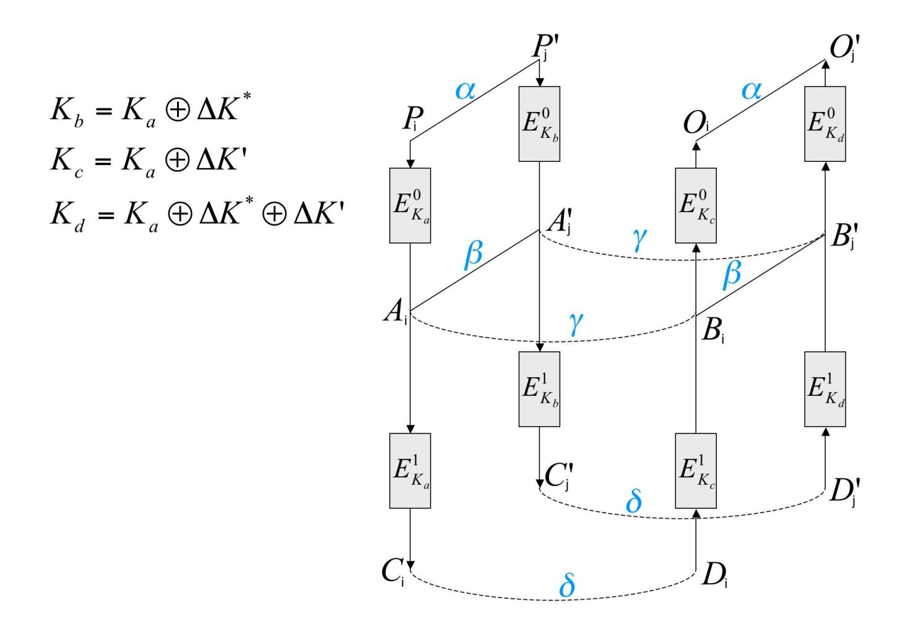

Fig. 1. The related-key boomerang distinguisher

{5}------------------------------------------------

6

the internal states  $A_i, A'_j, B_i, B'_j$ , since he can only apply a chosen plaintext and ciphertext attack on the cipher. The set M which is the output of the related-key boomerang distinguisher, therefore contains correct and false related-key boomerang quartets. It is impossible to form another distinguisher which separates the correct and the false related-key boomerang quartets, since the interior differences  $\beta$  and  $\gamma$  cannot be computed.

**Key Recovery Step.** The second step of the related-key boomerang attack is the *key recovery step*. From now on, an attacker operates on the set M that was stored by the related-key boomerang distinguisher. Let  $k_a, k_b, k_c$  and  $k_d$  be some key bits of the last round keys derived from the cipher keys  $K_a, K_b, K_c$  and  $K_d$ . Let  $d_k(C)$  be the one round partially decryption of C under the key bits k. The key bits are related as  $k_b = k_a \oplus \Delta k^*$ ,  $k_c = k_a \oplus \Delta k'$  and  $k_d = k_a \oplus \Delta k^* \oplus \Delta k'$ , where  $\Delta k^*$  and  $\Delta k'$  are differences of the last round key bits. These differences are derived from the cipher key difference  $\Delta K^*$  and  $\Delta K'$ . The key recovery step works as follows:

- For each key-bit combination of  $k_a$ 
  - 1. Initialize a counter for each key-bit combination with zero.
  - For all quartets (P, P', O, O') stored in M
    - 2. Ask for the encryption of P, P', O, O' under  $K_a, K_b, K_c$  and  $K_d$  respectively and obtain the ciphertext quartet C, C', D, D'. Decrypt the ciphertexts C, C', D, D' under  $k_a, k_b, k_c, k_d$ , i.e.,  $\bar{C} = d_{k_a}(C), \bar{C}' = d_{k_b}(C'), \bar{D} = d_{k_c}(D)$  and  $\bar{D}' = d_{k_d}(D')$ .
    - 3. Test whether the differences  $\bar{C} \oplus \bar{D}$  and  $\bar{C}' \oplus \bar{D}'$  have a desired difference an attacker would expect depending on the related-key differential being used. Increase a counter for the used key-bits if the difference is fulfilled in both pairs.
- 4. Output the key-bits  $k_a$  with the highest counter as the correct one.

Four cases can be distinct in Step 3, since M contains correct and false related-key boomerang quartets and the key-bit combination  $k_a$  can either be correct or false. A correct related-key boomerang quartet encrypted with the correct key bits will have the desired difference needed to pass the test in Step 3 with probability 1. Hence, the counter for the correct key bits is increased. The three other cases are: a correct related-key boomerang quartet is used with false key bits  $(Pr_{cK_f})$ , a false related-key boomerang quartet is used with the correct key-bits  $(Pr_{fK_c})$  or a false related-key boomerang quartet is used with a false key-bit combination  $(Pr_{fK_f})$ . We assume that the cipher acts like a random permutation. In these cases we assume that

$$Pr_{cK_f} = Pr_{fK_c} = Pr_{fK_f} =: Pr_{filter}.$$

The probability that a quartet in one of the three undesirable cases is counted for a certain key bit combination is  $Pr_{filter}$ . The related-key differentials have to be chosen such that the counter of the correct key bits is significantly higher than the counter of each false key bit combination. If the differentials have a high probability the key recovery step outputs the correct key-bits in Step 4 with a high probability much faster than exhaustive search.

{6}------------------------------------------------

#### 4 Related-Key Boomerang Attack on 7-Round AES-192

In this section we mount a key recovery attack on 7-round AES-192 using 4 related keys. The cipher is represented as  $E = E^1 \circ E^0$ .  $E^0$  is a differential containing rounds 1 to 4 and including the whitening key addition as well as the key addition of round 4.  $E^1$  is a differential covering rounds 5 to 7. After applying the related-key boomerang distinguisher for  $E^1 \circ E^0$  using the related-key differentials  $E^0$  and  $E^1$  we apply it to recover 8 key-bits of the seventh round-keys. We assumed, that the S-Box acts like a random permutation. Thus, all S-Box output differences will have the same probability for a given input difference. The notation used in our attack will be defined as:

- $-K_a, K_b, K_c, K_d$  unknown cipher keys (192 bit).
- $K_{ai}$ ,  $K_{bi}$ ,  $K_{ci}$ ,  $K_{di}$  unknown round keys of round i, where  $i \in \{0, 1, 2, ..., 12\}$  (128 bit).
- $-\Delta K^*, \Delta K'$  known cipher key differences (192 bit).
- $-\Delta K_i^*, \Delta K_i'$  known subkey differences of round i (128 bit).
- $-P_i, P'_i, O_i, O'_i$  plaintexts.
- $-C_i, C'_j, D_i, D'_j$  ciphertexts.
- $-E_{K_i}^0(\cdot)$  4-round AES-192 encryption from round 1 to 4 under key  $K_i$ , where  $i \in \{a, b, c, d\}$ .
- $-E_{K_i}^{1^{-1}}(\cdot)$  3-round AES-192 decryption from round 7 to 5 under key  $K_i$ , where  $i \in \{a, b, c, d\}$ .
- -a is a known non-zero byte difference.
- -b is an output difference of S-Box for the input difference a.
- -c,d are unknown non-zero byte differences.
- -\* is a variable unknown non-zero byte differences.

The Structure of the Keys. In our attack we use four related but unknown keys  $K_a, K_b, K_c$  and  $K_d$ . Let  $K_a$  be the unknown key an attacker would like to recover. The relation that is required for the attack is:

$$K_b = K_a \oplus \Delta K^*$$

$$K_c = K_a \oplus \Delta K'$$

$$K_d = K_a \oplus \Delta K^* \oplus \Delta K'$$

 $\Delta K^*$  is the cipher key difference used for the first related-key differential  $E^0$  and  $\Delta K'$  is the cipher key difference used for the second related-key differential  $E^1$ . An attacker only knows the differences  $\Delta K^*$  and  $\Delta K'$  but does not know the keys. He chooses the cipher key differences as:

$$\Delta K^* = \begin{array}{|c|c|c|c|c|c|c|c|c|c|c|c|c|c|c|c|c|c|c$$

Using the key schedule algorithm of AES-192 we can use the cipher key differences  $\Delta K^*$  and  $\Delta K'$  to derive the round key differences  $\Delta K_0^*, \ldots, \Delta K_8^*$  and  $\Delta K_0', \ldots, \Delta K_8'$  respectively. These values are shown in Figure 2 and 3.

&lt;sup>1 These related keys are also used in [12].

{7}------------------------------------------------

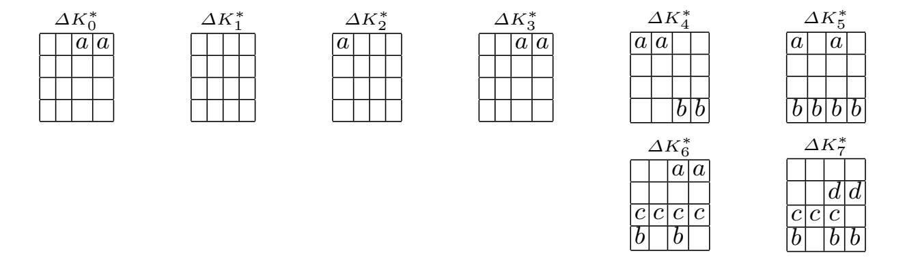

**Fig. 2.** Round key differences derived from  $\Delta K^*$ 

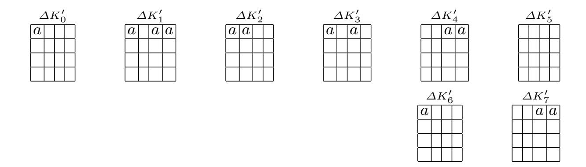

**Fig. 3.** Round key differences derived from  $\Delta K'$ 

The difference b can be one of  $2^7-1$  values, because of the symmetry of the XOR operation and the fact that an a difference can be one of  $2^8-1$  differences. If two texts forming an a difference passing the S-Box only one of  $2^7-1$  differences can occur.

The Related-Key Differential  $E^0$  for rounds 1-4. The input difference  $\alpha$  of  $E^0$  has a non-zero difference in bytes 8 and 12. These differences are of value a with the probability  $2^{-16}$ . This is the probability that two randomly chosen non-zero bytes are of value a. The whitening key addition  $AK_0$  generates a zero difference in each byte of the state matrix. These zero differences remain until  $AK_2$  is applied, since  $\Delta K_1^*$  has only zero differences and does not alter the differences in the state matrix.  $AK_2$  generates an a difference in byte 0, which is transformed into a non-zero difference after  $SB_3$ .  $MC_3$  creates a non-zero difference in bytes 0,1,2 and 3, while  $AK_3$  inserts an a difference in bytes 8 and 12. After applying  $SR_4$  we just have one non-zero byte in column 0 and 1 and two non-zero bytes in column 2 and 3. Four non-zero bytes remain after  $MC_4$  in column 0 and 1 with probability one, while we do not know which bytes of column 2 and 3 are non-zero. These bytes are labeled with ?. Then  $AK_4$  places an a difference in byte 12. We call  $\beta_{out}$  the difference obtaining after passing the related-key differential  $E^0$ . The probability of the differential  $E_0$ , i.e., the

{8}------------------------------------------------

transformation of an  $\alpha$  difference into a  $\beta_{out}$  difference is given by

$$Pr(\alpha \to \beta_{out}) = 2^{-16}$$
.

The related-key differential  $E^0$  is shown in Figure 4.

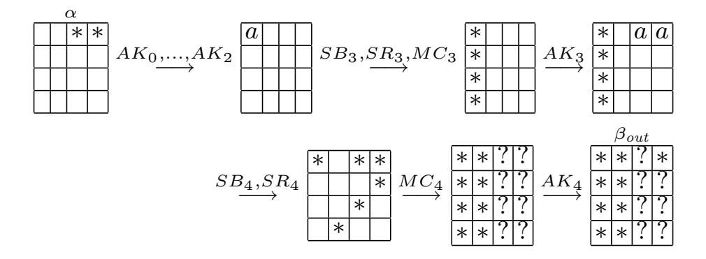

**Fig. 4.** The related-key differential  $E^0$ 

The Related-Key Differential  $E^{1^{-1}}$  for rounds 7-5. The input difference  $\delta$  consists of a non-zero difference in byte 0 and two a differences in bytes 8 and 12. This differences vanish after  $AK_7^{-1}$ , since  $\Delta K_7'$  has two a differences in bytes 8 and 12 while the other bytes of  $\Delta K_7'$  have a zero difference. Only the non-zero difference in byte 0 remains.  $SB_7^{-1}$  generates an a difference in byte 0 with probability  $2^{-8}$  since we assume that the S-Box acts like a random permutation. If this occurs the text difference after  $SB_7^{-1}$  is equal to the subkey difference  $\Delta K_6'$ . Hence, all bytes have a zero difference after applying  $AK_6^{-1}$ . All bytes will also have a zero difference after  $AK_5^{-1}$ , since  $\Delta K_5'$  has a zero difference in each byte. We call the text difference after applying  $E^{1^{-1}}$   $\gamma$  which consists of 16 zero bytes. The probability of  $E^{1^{-1}}$  is  $\Pr(\gamma \leftarrow \delta) = 2^{-8}$ . The related-key differential  $E^{1^{-1}}$  is shown in Figure 5.

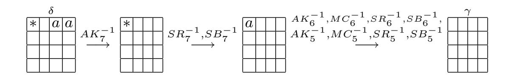

**Fig. 5.** The related-key differential  $E^{1^{-1}}$ 

The Related-Key Differential  $E^{0^{-1}}$  for rounds 4-1. For the following steps we need that the output difference  $\beta_{out}$  of the related-key differential  $E^0$  is

{9}------------------------------------------------

equal to the input difference  $\beta_{in}$  for the related-key differential  $E^{0^{-1}}$ . Note that  $\beta_{in}$  and  $\beta_{out}$  are not only equal in the same positions of non-zero differences but are also equal in each byte. We will shown how to construct such a case. From the boomerang condition inside the cipher for two differences  $\gamma_1$  and  $\gamma_2$  we know that

$$\beta_{out} \oplus \gamma_1 \oplus \gamma_2 = \beta_{in}$$

holds with some probability. Since  $\gamma_1$  and  $\gamma_2$  are equal in each byte, we simply write  $\gamma$ . Thus the above condition reduces to :

$$\beta_{out} \oplus \gamma \oplus \gamma = \beta_{out} = \beta_{in} \tag{1}$$

Using the differentials above, the differences  $\beta_{in}$  and  $\beta_{out}$  are equal with probability one. Note that these difference occur only with some probability, which will be described more detailed later.

Let A, A', B, B' be the internal state after  $SR_4$  when encrypting P, P', O, O' under  $K_a, K_b, K_c, K_d$  respectively. We use the same notation as in Figure 1. Since MC is linear  $\gamma$  can be expressed as

$$\gamma = K_{a4} \oplus MC_4(A) \oplus K_{c4} \oplus MC_4(B) = \overbrace{K_{a4} \oplus K_{c4}}^{\Delta K_4'} \oplus MC_4(A \oplus B) \qquad (2)$$

and as

10

$$\gamma = K_{b4} \oplus MC_4(A') \oplus K_{d4} \oplus MC_4(B') = \overbrace{K_{b4} \oplus K_{d4}}^{\Delta K'_4} \oplus MC_4(A' \oplus B'). \quad (3)$$

Equation (2) and (3) can be combined, which leaves  $A \oplus A' = B \oplus B'$ . In other words, the  $MC_4$  operation can be undone with the probability 1 due to the boomerang condition (1). This means that we know exactly that after  $MC_4^{-1}$  only the bytes 0,7,8,10,12 and 13 are non-zero, while all other bytes are zero.  $SB_4^{-1}$  then transforms a non-zero difference into an a difference with probability  $2^{-8}$ . Regarding bytes 8 and 12 we have the probability  $2^{-16}$  of doing so. The resulting a differences in bytes 8 and 12 are canceled out by  $AK_3^{-1}$ . After that  $MC_3^{-1}$  generates a non-zero with a fixed position from four non-zero bytes with probability  $2^{-24}$ . We have only one a difference after  $SB_3^{-1}$  in byte 0 with probability  $2^{-24} \cdot 2^{-8} = 2^{-32}$ . This a difference is canceled out by  $AK_2^{-1}$ . We call a the difference that is the output of the related-key differential  $E^{0^{-1}}$ . a has an a difference in the bytes 8 and 12. The differential  $E^{0^{-1}}$  has the probability  $Pr(\alpha \leftarrow \beta_{in}) = 2^{-16} \cdot 2^{-32} = 2^{-48}$  and is shown in Figure 6.

**The Attack.** The attack first applies a related-key boomerang distinguisher to obtain all correct and false boomerang quartets which are stored in M. A key-search is then applied on M to find 1 byte of the seventh round keys. Let  $k_{a7}$  be an 8-bit subkey in the position of byte 0 of the seventh round key  $K_{a7}$ . Let  $d_{7k_{i7}}(X)$ ,  $i \in \{a, b, c, d\}$  be the seventh round partially decryption of X under the 8-bit subkey  $k_i$ . The attack is as follows:

{10}------------------------------------------------

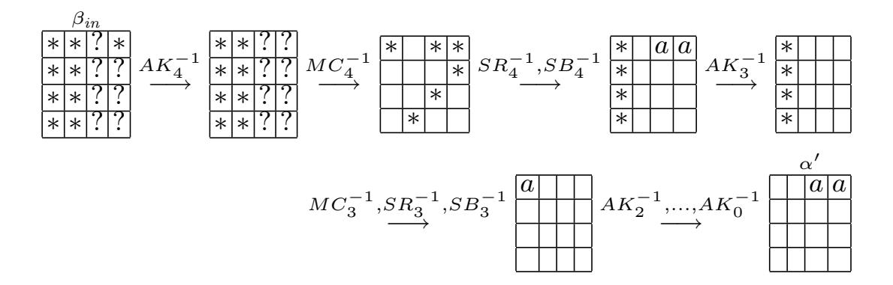

**Fig. 6.** The related-key differential  $E^{0^{-1}}$ 

- 1. Choose  $2^{49.5}$  structures  $S_1, S_2, \ldots, S_{2^{49.5}}$  of  $2^{16}$  plaintexts  $P_i$ ,  $i \in \{1, 2, \ldots, 2^{16}\}$ , where all bytes are fixed except for bytes 8 and 12. Ask for encryption of  $P_i$  under  $K_a$  to obtain the ciphertexts  $C_i$ , i.e.,  $C_i = E_{K_a}(P_i)$ .
- 2. Compute  $2^{49.5}$  structures  $S_1', S_2', \ldots, S_{2^{49.5}}'$  of  $2^{16}$  plaintexts  $P_i' = P_i$ . Ask for encryption of the  $P_i'$  under  $K_b$ , where  $K_b = K_a \oplus \Delta K^*$  to obtain the ciphertexts  $C_i'$ , i.e.,  $C_i' = E_{K_b}(P_i')$ .
- 3. Compute  $2^{49.5}$  structures  $S_1^*, S_2^*, \ldots, S_{2^{49.5}}^*$  of  $2^{16}$  ciphertexts  $D_i$ , i.e,  $D_i = C_i \oplus \delta$  where  $\delta$  is a fixed difference with any non-zero byte difference in byte 0 and two a differences in bytes 8 and 12. Ask for decryption of  $D_i$  under  $K_c$  to obtain the plaintexts  $O_i$ , i.e.,  $O_i = E_{K_c}^{-1}(D_i)$ .
- 4. Compute  $2^{49.5}$  structures  $S_1'^*, S_2'^*, \ldots, S_{2^{49.5}}'^*$  of  $2^{16}$  ciphertexts  $D_i'$ , i.e.,  $D_i' = C_i' \oplus \delta$  where  $\delta$  is as in Step 3. Ask for decryption of  $D_i'$  under  $K_d$  to obtain the plaintexts  $O_i'$ , i.e.,  $O_i' = E_{K_d}^{-1}(D_i')$ .
- 5. Store only those quartets  $(P_i, P'_j, O_i, O'_j)$ ,  $i, j \in \{1, 2, \dots, 2^{16}\}$  in the set M where  $O_i \oplus O'_j$  have an a difference in bytes 8 and 12, while the remaining byte differences are zero.
- 6. For each 8-bit key  $k_{a7}$  compute  $k_{b7}=k_{a7}, k_{c7}=k_{a7}$  and  $k_{d7}=k_{a7}$ .

For each quartet passing the test in Step 5:

- 6.1. Ask for encryption of  $(O_i, O'_j)$  under  $K_c, K_d$  to obtain  $(D_i, D'_j)$  and compute  $(C_i, C'_j)$  respectively.
- 6.2. Partially decrypt a ciphertext quartet  $(C_i, C'_j, D_i, D'_j)$ , i.e.,  $\bar{C}_i = d_{7k_{a7}}(C_i)$ ,  $\bar{C}'_j = d_{7k_{b7}}(C'_j)$ ,  $\bar{D}_i = d_{7k_{c7}}(D_i)$  and  $\bar{D}'_j = d_{7k_{d7}}(O'_j)$ .
- 6.3. Increase the counter for the used 8-bit subkey  $k_{a7}$  by one if  $\bar{C}_i \oplus \bar{D}_i$  and  $\bar{C}'_j \oplus \bar{D}'_j$  have an a-difference in byte 0.
- 7. Output the 8-bit subkey  $k_{a7}$  which counts at least two quartets as the correct one.

**Analysis of the Attack.** Two pools of  $2^{16}$  plaintexts can be combined to approximately  $(2^{16})^2 = 2^{32}$  quartets. Using  $2^{49.5}$  structures we obtain  $\#PP \approx 2^{49.5} \cdot 2^{32} = 2^{81.5}$  quartets in total. A correct related-key boomerang quartet

{11}------------------------------------------------

occurs with probability

$$Pr_c = \Pr(\alpha \to \beta_{out}) \cdot (\Pr(\gamma \leftarrow \delta))^2 \cdot \Pr(\alpha \leftarrow \beta_{in})$$
$$= 2^{-16} \cdot (2^{-8})^2 \cdot 2^{-48} = 2^{-80},$$

since all related-key differential conditions are fulfilled. A random permutation of a difference  $O_i \oplus O_j'$  has 14 zero byte difference with probability  $Pr_f = 2^{-112}$ . Thus, after Step 5 we have about  $\#C = \#PP \cdot Pr_c = 2^{81.5} \cdot 2^{-80} = 2^{1.5}$  correct and  $\#F = \#PP \cdot Pr_f = 2^{81.5} \cdot 2^{-112} = 2^{-30.5}$  false related-key boomerang quartets. The data and time complexity of Step 6 to 7 is negligible compared to the other steps before, since we expect to have only  $2^{1.5}$  quartets stored.

A false combination of quartets and key bits is counted in Step 6.3 with the probability  $Pr_{filter} = 2^{-16}$ . This is the probability that an active byte with an unknown non-zero difference has an a difference after  $SB_7^{-1}$ .

At least  $\#CK_c = 2^{1.5}$  correct related-key boomerang quartets and additionally  $\#FK_c = \#F \cdot Pr_{filter} = 2^{-30.5} \cdot 2^{-16} = 2^{-46.5}$  false related-key boomerang quartets are counted with the correct key bits. About  $\#CK_c + \#FK_c = 2^{1.5} + 2^{-46.5} \approx 3$  quartets are counted in Step 6.3 for the correct key bits.

About  $\#CK_f = \#C \cdot Pr_{filter} = 2^{1.5} \cdot 2^{-16} = 2^{-14.5}$  correct related-key boomerang quartets and  $\#FK_f = \#F \cdot Pr_{filter} = 2^{-30.5} \cdot 2^{-16} = 2^{-46.5}$  false related-key boomerang quartets are counted with the false key bits, which are approximately  $\#CK_f + \#FK_f = 2^{-14.5} + 2^{-46.5} = 2^{-14.5}$  counts for each false key bit combination.

Using the Poisson distribution we can compute the success rate of our attack. The probability that the number of remaining quartets for each false key bit combination is larger than 1 is  $Y \sim Poisson(\mu = 2^{-14.5})$ ,  $\Pr(Y \geq 2) \approx 0$ . Therefore the probability that our attack outputs false key bits as the correct one is very low. We expect to have a count of  $2^2$  quartets for the correct key bits. The probability that the number of quartets counted for the correct key bits is larger than 1 is  $Z \sim Poisson(\mu = 3)$ ,  $\Pr(Z \geq 2) \approx 0.8$ .

The data complexity of this attack is determined by Steps 1, 2, 3 and 4 which is about  $2^{18} = 2^2 \cdot 2^{16}$  adaptive chosen plaintexts and ciphertexts for each structure. We do not have to compute all structures simultaneously, thus we keep only four structures in memory, which reduces the memory requirements of our attack. The time complexity is about  $2^{67.5} = 2^{49.5} \cdot 2^2 \cdot 2^{16}$  seven round AES-192 encryptions. Our attack has a success rate of 0.8.

#### 5 Related-Key Boomerang Attack on 9-Round AES-192

Our related-key boomerang attack can be extend to attack 9 rounds of AES-192 using 256 related keys. The data complexity is of  $2^{67}$  chosen plaintexts and ciphertexts and the time complexity is about  $2^{143.33}$  nine round AES encryptions. We describe the 9 round attack in Appendix A.

{12}------------------------------------------------

## 6 Conclusion

In this paper we improved attacks on 7 and 9 round reduced versions of AES-192. This is the first application of the related-key boomerang attack on the AES. Our 7 round attack has a data complexity of 218 chosen plaintexts and ciphertexts. Its time complexity is of 267.5 seven round AES-192 encryptions. We also presented a 9 round related-key boomerang attack which needs only 267 chosen plaintexts and ciphertexts and has a time complexity of 2143.33 nine round encryptions. Our attacks are the best attacks on seven and nine rounds of AES-192 in terms of data and time complexity known so far. The AES remains still unbroken but we have shown that up to 7 rounds practical attacks are available yet.

## Acknowledgements

The authors would like to thank Thomas Peyrin, Ewan Fleischmann and the anonymous reviewers for many helpful comments.

## References

- [1] Eli Biham. New Types of Cryptanalytic Attacks Using Related Keys. J. Cryptology, 7(4):229–246, 1994.
- [2] Eli Biham, Alex Biryukov, and Adi Shamir. Cryptanalysis of Skipjack Reduced to 31 Rounds Using Impossible Differentials. J. Cryptology, 18(4):291–311, 2005.
- [3] Eli Biham, Orr Dunkelman, and Nathan Keller. The Rectangle Attack Rectangling the Serpent. In Birgit Pfitzmann, editor, EUROCRYPT, volume 2045 of Lecture Notes in Computer Science, pages 340–357. Springer, 2001.
- [4] Eli Biham, Orr Dunkelman, and Nathan Keller. Related-Key Boomerang and Rectangle Attacks. In Ronald Cramer, editor, EUROCRYPT, volume 3494 of Lecture Notes in Computer Science, pages 507–525. Springer, 2005.
- [5] Eli Biham, Orr Dunkelman, and Nathan Keller. Related-Key Impossible Differential Attacks on 8-Round AES-192. In David Pointcheval, editor, CT-RSA, volume 3860 of Lecture Notes in Computer Science, pages 21–33. Springer, 2006.
- [6] Eli Biham and Adi Shamir. Differential Cryptanalysis of DES-like Cryptosystems. J. Cryptology, 4(1):3–72, 1991.
- [7] Alex Biryukov. The Boomerang Attack on 5 and 6-Round Reduced AES. In Dobbertin et al. [9], pages 11–15.
- [8] J. Daemen and V. Rijmen. The Design of Rijndael: AES The Advanced Encryption Standard. Springer Verlag, Berlin Heidelberg, 2002.
- [9] Hans Dobbertin, Vincent Rijmen, and Aleksandra Sowa, editors. Advanced Encryption Standard - AES, 4th International Conference, AES 2004, Bonn, Germany, May 10-12, 2004, Revised Selected and Invited Papers, volume 3373 of Lecture Notes in Computer Science. Springer, 2005.
- [10] Niels Ferguson, John Kelsey, Stefan Lucks, Bruce Schneier, Michael Stay, David Wagner, and Doug Whiting. Improved Cryptanalysis of Rijndael. In Schneier [23], pages 213–230.

{13}------------------------------------------------

- [11] Philip Hawkes. Differential-Linear Weak Key Classes of IDEA. In EUROCRYPT, pages 112–126, 1998.
- [12] Seokhie Hong, Jongsung Kim, Sangjin Lee, and Bart Preneel. Related-Key Rectangle Attacks on Reduced Versions of SHACAL-1 and AES-192. In Henri Gilbert and Helena Handschuh, editors, FSE, volume 3557 of Lecture Notes in Computer Science, pages 368–383. Springer, 2005.
- [13] Goce Jakimoski and Yvo Desmedt. Related-Key Differential Cryptanalysis of 192-bit Key AES Variants. In Mitsuru Matsui and Robert J. Zuccherato, editors, Selected Areas in Cryptography, volume 3006 of Lecture Notes in Computer Science, pages 208–221. Springer, 2003.
- [14] John Kelsey, Tadayoshi Kohno, and Bruce Schneier. Amplified Boomerang Attacks Against Reduced-Round MARS and Serpent. In Schneier [23], pages 75–93.
- [15] John Kelsey, Bruce Schneier, and David Wagner. Related-key cryptanalysis of 3-WAY, Biham-DES, CAST, DES-X, NewDES, RC2, and TEA. In Yongfei Han, Tatsuaki Okamoto, and Sihan Qing, editors, ICICS, volume 1334 of Lecture Notes in Computer Science, pages 233–246. Springer, 1997.
- [16] Jongsung Kim, Seokhie Hong, and Bart Preneel. Related-Key Rectangle Attacks on Reduced AES-192 and AES-256. In Alex Biryukov, editor, FSE, volume 4593 of Lecture Notes in Computer Science, pages 225–241. Springer, 2007.
- [17] Jongsung Kim, Guil Kim, Seokhie Hong, Sangjin Lee, and Dowon Hong. The Related-Key Rectangle Attack - Application to SHACAL-1. In Huaxiong Wang, Josef Pieprzyk, and Vijay Varadharajan, editors, ACISP, volume 3108 of Lecture Notes in Computer Science, pages 123–136. Springer, 2004.
- [18] Lars R. Knudsen. Cryptanalysis of LOKI91. In Jennifer Seberry and Yuliang Zheng, editors, ASIACRYPT, volume 718 of Lecture Notes in Computer Science, pages 196–208. Springer, 1992.
- [19] Lars R. Knudsen. Truncated and Higher Order Differentials. In Bart Preneel, editor, Fast Software Encryption, volume 1008 of Lecture Notes in Computer Science, pages 196–211. Springer, 1994.
- [20] Susan K. Langford and Martin E. Hellman. Differential-Linear Cryptanalysis. In Yvo Desmedt, editor, CRYPTO, volume 839 of Lecture Notes in Computer Science, pages 17–25. Springer, 1994.
- [21] Stefan Lucks. Attacking Seven Rounds of Rijndael under 192-bit and 256-bit Keys. In AES Candidate Conference, pages 215–229, 2000.
- [22] Raphael Chung-Wei Phan. Impossible differential cryptanalysis of 7-round Advanced Encryption Standard (AES). Inf. Process. Lett., 91(1):33–38, 2004.
- [23] Bruce Schneier, editor. Fast Software Encryption, 7th International Workshop, FSE 2000, New York, NY, USA, April 10-12, 2000, Proceedings, volume 1978 of Lecture Notes in Computer Science. Springer, 2001.
- [24] David Wagner. The Boomerang Attack. In Lars R. Knudsen, editor, Fast Software Encryption, volume 1636 of Lecture Notes in Computer Science, pages 156–170. Springer, 1999.
- [25] Wentao Zhang, Lei Zhang, Wenling Wu, and Dengguo Feng. Related-Key Differential-Linear Attacks on Reduced AES-192. In K. Srinathan, C. Pandu Rangan, and Moti Yung, editors, INDOCRYPT, volume 4859 of Lecture Notes in Computer Science, pages 73–85. Springer, 2007.

{14}------------------------------------------------

#### A Related-Key Boomerang Attack on 9-Round AES-192

The Structure of the Keys. In our attack we use four related but unknown keys  $K_a, K_b, K_c$  and  $K_d$ .2 The relation that is required for the attack is:

$$K_b = K_a \oplus \Delta K^*$$

$$K_c = K_a \oplus \Delta K'$$

$$K_d = K_a \oplus \Delta K^* \oplus \Delta K'$$

cipher key differences as:

$$\Delta K^* = \begin{bmatrix} \hline a & a \\ \hline a & a \\ \hline \end{bmatrix} \quad \text{and} \quad \Delta K' = \begin{bmatrix} \hline a & a \\ \hline b & b \\ \hline \end{bmatrix}$$

Using the key schedule algorithm of AES-192 he can use the cipher key differences  $\Delta K^*$  and  $\Delta K'$  to derive the round key differences  $\Delta K_0^*, \ldots, \Delta K_8^*$  and  $\Delta K_0', \ldots, \Delta K_8'$  respectively. These values are shown in Figure 7 and 8.

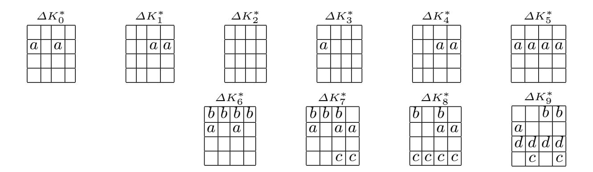

Fig. 7. Round key differences derived from  $\Delta K^*$ 

The Related-Key Differential  $E^0$ . The related-key differential  $E^0$  for rounds 1-5 is described as follows. The input difference  $\alpha$  of  $E^0$  has a non-zero difference in bytes 1,2,6,7,8, 10,11 and 12. Byte 9 has an a difference. The non-zero difference After  $SR_1$  all non-zero bytes are in column 2 and 3. A column with four non-zero bytes ist transformed into a column having an a difference with fixed position after MixColumns with probability  $2^{-32}$ . This occurs for two of such columns with probability  $2^{-64}$ . The two a differences in bytes 9 and 12 are canceled out by the key addition  $AK_1$ . Thus each byte of the state matrix has a zero difference until  $AK_3$  creates an a difference in byte 1, which is transformed to a non-zero difference by  $SB_4$  and to four non-zero bytes by  $MC_4$ . The state matrix has an a difference in byte 9 and non-zero differences in bytes 11,12,13,14.

The key differences are the same as used in [16].

{15}------------------------------------------------

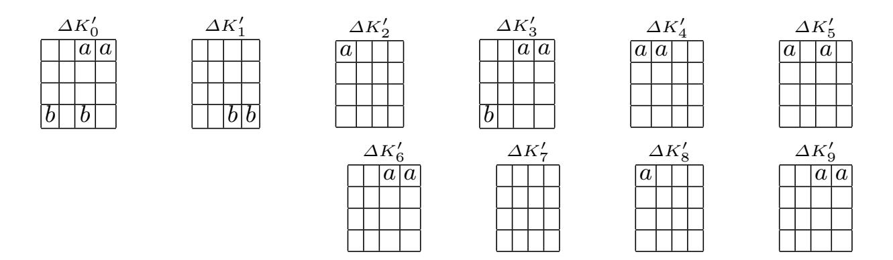

**Fig. 8.** Round key differences derived from  $\Delta K'$ 

The difference which occurs after  $AK_5$  is called  $\beta_{out}$ , where all bytes are non-zero except for bytes 4 and 7 which are unknown. The probability of the differential  $E_0$ , i.e., the transformation of an  $\alpha$  difference into a  $\beta_{out}$  difference is given by

$$Pr(\alpha \to \beta_{out}) = 2^{-64}$$
.

The related-key differential  $E^0$  is shown in Figure 9.

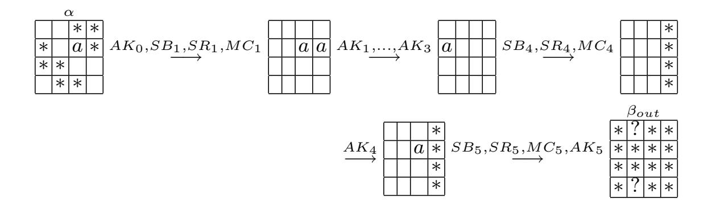

Fig. 9. The related-key differential  $E^0$ 

The Related-Key Differential  $E^{1^{-1}}$ . From the bottom up direction of the related-key boomerang distinguisher the related-key differential  $E^{1^{-1}}$  is used for Rounds 9 – 6 with the round-key differences of  $\Delta K'$ . The input difference  $\delta$  consists of a non-zero difference in byte 0 and two a differences in bytes 8 and 12. These differences vanish after  $AK_9^{-1}$ , since  $\Delta K_9'$  has two a differences in bytes 8 and 12 while the other bytes of  $\Delta K_9'$  are zero. Only the non-zero difference in byte 0 remains.  $SB_9^{-1}$  generates an a difference in byte 0 with probability  $2^{-8}$ . If this occurs the text difference after  $SB_9^{-1}$  is equal to the subkey difference  $\Delta K_8'$ . Hence, all bytes have a zero difference after applying  $AK_8^{-1}$ . Passing  $AK_6^{-1}$  the state matrix has two a differences in bytes 8, 12. We call  $\gamma$  the text difference remaining after  $SB_6^{-1}$ . This text difference has eight

{16}------------------------------------------------

non-zero difference in bytes 1,2, 6,7,8,11,12 and 13. The probability of  $E^{1^{-1}}$  is  $\Pr(\gamma \leftarrow \delta) = 2^{-8}$ . The related-key differential  $E^{1^{-1}}$  is shown in Figure 10.

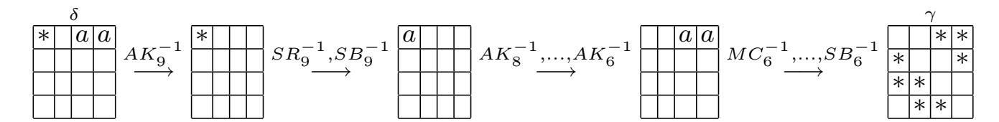

**Fig. 10.** The related-key differential  $E^{1^{-1}}$ 

The Related-Key Differential  $E^{0^{-1}}$ . As in the 7-round attack on AES-192 we need that the output difference  $\beta_{out}$  of the related-key differential  $E^0$  is equal to the input difference  $\beta_{in}$  for the related-key differential  $E^{0^{-1}}$ . If this holds the MixColumns Operation of round 5 can be undone with probability one. For a detailed description we refer to the analysis of our 7 round attack.

To achieve that  $\beta_{out}$  equals  $\beta_{in}$  the differences  $\gamma_1$  and  $\gamma_2$  have to be equal. This happens with probability  $2^{-56}$  since an a difference can be one of  $2^7-1$  values after an S-Box transformation and MixColumns is a linear operation. If this occurs we know from the boomerang condition that  $\beta_{out} \oplus \gamma_1 \oplus \gamma_2 = \beta_{out} = \beta_{in}$  holds with some probability and  $MC_5$  can be undone with probability one. This means that we know that a non-zero byte difference occurs after  $MC_5^{-1}$  only the bytes 3, 5, 6, 9 and 12, while the other bytes are zero.  $SB_5^{-1}$  then transforms a non-zero difference in byte 9 into an a difference with probability  $2^{-8}$ . Four non-zero bytes remain after  $AK_4^{-1}$  in the third column. With probability  $2^{-24}$   $MC_4^{-1}$  generates a non-zero difference in byte 13 while the remaining bytes are zero. After the next S-Box operation we have an a difference with probability  $2^{-8}$ . The further steps operate such that the output difference of  $E^{0^{-1}}$  has non-zero differences in bytes 1,2,6,7,8,11,12,13 and an a difference in byte 9. We call this difference  $\alpha$ . The differential  $E^{0^{-1}}$  has the probability  $\Pr(\alpha \leftarrow \beta_{in}) = 2^{-40}$  and is shown in Figure 11.

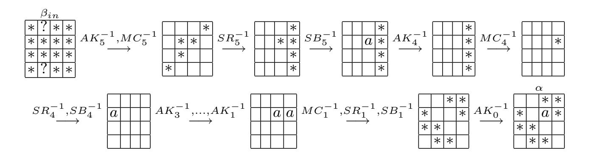

**Fig. 11.** The related-key differential  $E^{0^{-1}}$ 

{17}------------------------------------------------

#### The Attack.

18

- 1. Choose  $2^{49.5}$  structures  $S_1, S_2, \ldots, S_{2^{49.5}}$  of  $2^{64}$  plaintexts  $P_i$ ,  $i \in \{1, 2, \ldots, 2^{64}\}$  where the bytes 0, 3, 4, 5, 9, 10, 14, 15 are fixed. Ask for encryption of  $P_i$  under  $K_a$  to obtain the ciphertexts  $C_i$ , i.e.,  $C_i = E_{K_a}(P_i)$ .
- 2. Compute  $2^{49.5}$  structures  $S_1', S_2', \ldots, S_{2^{49.5}}'$  of  $2^{\tilde{6}4}$  plaintexts  $P_i' = P_i \oplus \Theta$ , where  $\Theta$  is a 16 byte value of which byte 9 is a and all the other bytes are zero. Ask for encryption of  $P_i'$  under  $K_b$ , where  $K_b = K_a \oplus \Delta K^*$  to obtain the ciphertexts  $C_i'$ , i.e.,  $C_i' = E_{K_b}(P_i')$ .
- 3. For each possible value of b compute  $\Delta \tilde{K}'$ 
  - 3.1. Compute  $2^{49.5}$  structures  $S_1^*, S_2^*, \ldots, S_{2^{49.5}}^*$  of  $2^{64}$  ciphertexts  $D_i$ , i.e,  $D_i = C_i \oplus \delta$  where  $\delta$  is a 128-bit value of which byte 0 is non-zero and bytes 8 and 12 have value a the other bytes are zero. Ask for decryption of  $D_i$  under  $K_c = K_a \oplus \Delta \tilde{K}'$  to obtain the plaintexts  $O_i$ , i.e.,  $O_i = E_{K_c}^{-1}(D_i)$ .
  - 3.2. Compute  $2^{49.5}$  structures  $S_1'^*, S_2'^*, \ldots, S_{2^{49.5}}'^*$  of  $2^{64}$  ciphertexts  $D_i'$ , i.e,  $D_i' = C_i' \oplus \delta$  where  $\delta$  is as in Step 3.1. Ask for decryption of  $D_i'$  under  $K_d = K_a \oplus \Delta K^* \oplus \Delta \tilde{K}'$  to obtain the plaintexts  $O_i'$ , i.e.,  $O_i' = E_{K_d}^{-1}(D_i)$ .
  - $K_a\oplus \Delta K^*\oplus \Delta \tilde{K}'$  to obtain the plaintexts  $O_i'$ , i.e.,  $O_i'=E_{K_d}^{i-1}(D_i)$ . 3.3. Store only those quartets  $(P_i,P_j',O_i,O_j')$  where  $O_i\oplus O_j'$  have a zero byte differences in bytes 0, 3, 4, 5, 10, 14, 15 and an a difference in byte 9.
  - 3.4. Guess an 8-bit subkey  $\bar{k}_{a9}$  of  $K_{a9}$  in the positions of byte 0 and compute  $\bar{k}_{b9}, \bar{k}_{c9}, \bar{k}_{d9}$  respectively.
    - 3.4.1. Partially decrypt each quartet  $(C_i, C'_j, D_i, D'_j)$  remaining after Step 3.3 under  $\bar{k}_{a9}, \bar{k}_{b9}, \bar{k}_{c9}, \bar{k}_{d9}$  respectively.
    - 3.4.2. Check if  $d_{\bar{k}_{a9}}(C_i) \oplus d_{\bar{k}_{c9}}(D_i)$  and  $d_{\bar{k}_{b9}}(C_i') \oplus d_{\bar{k}_{d9}}(D_i')$  have an a-difference after  $SB_9^{-1}$  in byte 0. Record  $(\bar{k}_{a9})$  and all the qualified quartets and then go to Step 3.5.
  - 3.5. Guess a 32-bit subkey  $k'_{a0}$  of  $K_{a0}$  in the positions of bytes 2,7,8,13 and compute  $k'_{b0}=k'_{c0}=k'_{d0}=k'_{a0}$  ( $\Delta K^*_0$  and  $\Delta K'_0$  are zero in these four bytes)
    - 3.5.1. Partially encrypt each quartet  $(P_i, P'_j, O_i, O'_j)$  remaining after Step 3.4.2 under  $k'_{a0}, k'_{b0}, k'_{c0}, k'_{d0}$  respectively.
    - 3.5.2. Check if  $e_{k'_{a0}}(P_i) \oplus e_{k'_{b0}}(P'_j)$  and  $e_{k'_{c0}}(O_i) \oplus e_{k'_{d0}}(O'_j)$  have an a difference in byte 9. Record  $(\bar{k}_{a9}, k'_{a0})$  and all the qualified quartets and then go to Step 3.6.
  - 3.6. Guess a 32-bit subkey  $k_{a0}^*$  of  $K_{a0}$  in the positions of bytes 1,6,11,12 and compute  $k_{b0}^*=k_{a0}^*\oplus M_1$ , with the 32-bit value  $M_1=(a,0,0,0)$ , compute  $k_{c0}^*=k_{a0}^*\oplus M_2$ , with the 32-bit value  $M_2=(0,0,b,a)$  and compute  $k_{d0}^*=k_{a0}^*\oplus M_1\oplus M_2$ .
    - 3.6.1. Partially encrypt each quartet  $(P_i, P_j', O_i, O_j')$  remaining after Step 3.5.2 under  $k_{a0}^*, k_{b0}^*, k_{c0}^*, k_{d0}^*$  respectively.
    - 3.6.2. Check if  $e_{k_{a0}^*}(P_i) \oplus e_{k_{b0}^*}(P_j')$  and  $e_{k_{c0}^*}(O_i) \oplus e_{k_{d0}^*}(O_j')$  have an a difference in byte 13. If there exist more than 2 boomerang quartets passing this test, record  $(\bar{k}_{a9}, k_{a0}', k_{a0}^*)$  and all the qualified quartets and then go to Step 4. Otherwise, repeat Step 3.6 with another guessed key. If all the possible keys are tested, then repeat Step 3.5 with another guessed key. If all the possible keys are tested, then repeat Step 3.4 with another guessed key.

{18}------------------------------------------------

4. For a suggested  $(\bar{k}_{a9}, k'_{a0}, k^*_{a0})$ , do an exhaustive search for the remaining 120 cipher key bits using trial encryption. If a 192-bit cipher key is suggested, output it as the cipher key. Otherwise, go to Step 3 with another guess of b.

Analysis of the Attack. Two pools of  $2^{64}$  plaintexts can be combined to approximately  $(2^{64})^2 = 2^{128}$  quartets. Each quartet of structures  $S_i, S_i', S_i^*, S'^*, i \in \{1,2,\ldots,2^{49.5}\}$  can be analyzed separately. The data complexity of Step 1, 2, 3.1 and 3.2 is  $2^2 \cdot 2^{64} = 2^{66}$  chosen plaintexts, while the time complexity is about  $2^{64}$  encryptions for Step 1 and 2 and about  $2^7 \cdot 2^{64} = 2^{71}$  for Step 3.1 and 3.2, since Step 3 runs at most  $2^7$  times. The data complexity of Step 3.3 is  $2^2 \cdot 2^{64} = 2^{66}$  plaintexts, since we have a 64-bit filtering condition which leaves  $2^{128} \cdot 2^{-64} = 2^{64}$  quartets stored in this step. Step 3.4.1 takes about  $(1/9) \cdot (1/16) \cdot 2^7 \cdot 2^8 \cdot 2^2 \cdot 2^{64} = 2^{73.83}$  nine round encryptions. The number of remaining quartets after Step 3.4.2 are  $2^{64} \cdot 2^{-14} = 2^{50}$ , since we have a 7-bit filtering on both pairs of a quartet. The time complexity of Step 3.5.1 is about  $(1/9) \cdot (4/16) \cdot 2^7 \cdot 2^{32} \cdot 2^8 \cdot 2^2 \cdot 2^{50} = 2^{93.83}$  nine round encryptions. Due to the 32-bit filtering on both pairs we obtain about  $2^{50} \cdot 2^{-64} = 2^{-14}$  quartets after Step 3.5.2. The time complexity of Step 3.6.1 is negligible, while about  $2^{-14} \cdot 2^{-64} = 2^{-78}$  quartets remain after this step.

Using  $2^{49.5}$  structures we obtain  $\#PP \approx 2^{49.5} \cdot 2^{128} = 2^{187.5}$  quartets in total. A correct related-key boomerang quartet occurs with probability

$$Pr_c = \Pr(\alpha \to \beta_{out}) \cdot (\Pr(\gamma \leftarrow \delta))^2 \cdot \Pr(\beta_{out} = \beta_{in}) \cdot \Pr(\alpha \leftarrow \beta_{in})$$
  
=  $2^{-64} \cdot (2^{-8})^2 \cdot 2^{-56} \cdot 2^{-40} = 2^{-176}$ ,

since all related-key differential conditions are fulfilled. About  $2^{49.5} \cdot 2^{-78} = 2^{-28.5}$  false related-key boomerang quartets remain Step 3.6.2 and are counted with the false key bits.

Using the Poisson distribution we can compute the success rate of our attack. The probability that the number of remaining quartets for each false key bit combination is larger than 1 is  $Y \sim Poisson(\mu = 2^{-28.5})$ ,  $\Pr(Y \geq 2) \approx 0$ . Therefore the probability that our attack outputs false key bits as the correct one is very low. We expect to have a count of 3 quartets for the correct key bits. The probability that the number of quartets counted for the correct key bits is larger than 1 is  $Z \sim Poisson(\mu = 3)$ ,  $\Pr(Z \geq 2) \approx 0.8$ .

The data complexity is about  $2^{67} = 2^3 \cdot 2^{64}$  adaptive chosen plaintexts and ciphertexts and the time complexity is about  $2^{143.33} = 2^{49.5} \cdot 2^{93.83}$  nine round AES-192 encryptions. Our attack has a success rate of 0.8.