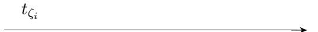
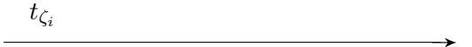

### Automatic Generation of Sound Zero-Knowledge Protocols

Endre Bangerter<sup>1</sup> , Jan Camenisch<sup>2</sup> , Stephan Krenn<sup>3</sup> , Ahmad-Reza Sadeghi<sup>4</sup> , and Thomas Schneider<sup>4</sup>

<sup>1</sup> Bern University of Applied Sciences, Biel-Bienne, Switzerland endre.bangerter@bfh.ch <sup>2</sup> Bern University of Applied Sciences, Biel-Bienne and University of Fribourg, Switzerland stephan.krenn@bfh.ch 3 IBM Research, Zurich Research Lab, R¨uschlikon, Switzerland jca@zurich.ibm.com <sup>4</sup> Horst G¨ortz Institute for IT Security, Ruhr-University Bochum, Germany {ahmad.sadeghi,thomas.schneider}@trust.rub.de

Abstract. Efficient zero-knowledge proofs of knowledge (ZK-PoK) are basic building blocks of many practical cryptographic applications such as identification schemes, group signatures, and secure multiparty computation. Currently, first applications that essentially rely on ZK-POKs are being deployed in the real world. The most prominent example is Direct Anonymous Attestation (DAA), which was adopted by the Trusted Computing Group (TCG) and implemented as one of the functionalities of the cryptographic chip Trusted Platform Module (TPM).

Implementing systems using ZK-PoK turns out to be challenging, since ZK-PoK are, loosely speaking, significantly more complex than standard crypto primitives, such as encryption and signature schemes. As a result, implementation cycles of ZK-PoK are time-consuming and error-prone, in particular for developers with minor or no cryptographic skills.

To overcome these challenges, we have designed and implemented a compiler with corresponding languages that given a high-level ZK-PoK protocol specification automatically generates a sound implementation of this. The output is given in form of Σ-protocols, which are the most efficient protocols for ZK-PoK currently known. Our compiler translates ZK-PoK protocol specifications, written in a high-level protocol description language, into Java code or LATEX documentation of the protocol.

The compiler is based on a unified theoretical framework that encompasses a large number of existing ZK-PoK techniques.Within this framework we present a new efficient ZK-PoK protocol for exponentiation homomorphisms in hidden order groups. Our protocol overcomes several limitations of the existing proof techniques.

Key words: Zero-Knowledge, Protocol Compiler, Language Design

### 1 Introduction

A zero-knowledge proof of knowledge (ZK-PoK) is a two-party protocol between a prover and a verifier, which allows the prover to convince the verifier that he knows some secret values (proof of knowledge property), without that the verifier learns anything about them (zero-knowledge property). There are fundamental results showing that all relations in NP have ZK-PoK [\[GMW91\]](#page-19-0). The corresponding protocols are of theoretical relevance, but much too inefficient in practice.

Essentially, all efficient ZK-PoK protocols used in practice today are based on so called Σprotocols. These are three-move protocols consisting of the first message from the prover, a challenge uniformly chosen at random by the verifier and the corresponding response from the prover again. What is typically being proved using basic Σ-protocols is the knowledge of a preimage under a homomorphism. There are numerous variations of these preimage proofs. For instance, so called "AND-proofs" allow to prove simultaneous knowledge of multiple preimages under possibly different homomorphisms. Similarly there are "OR-proofs", and one can also show that different preimages fulfill a set of linear relations.

These Σ-protocol based ZK-PoK proof techniques play an important role in applied cryptography. In fact, many practically oriented applications use such proofs as basic building blocks. Examples of such applications include identification schemes [\[Sch91\]](#page-19-1), interactive verifiable computation [\[CM99\]](#page-18-0), group signatures [\[Cam98\]](#page-18-1), secure watermark detection [\[ARS05\]](#page-18-2), and efficient secure multiparty computation [\[LPS08\]](#page-19-2) - just to name a few.

While many of these applications typically only exist on a specification level, a direction of applied research has produced first applications using ZK-PoKs being deployed in the real world. One prominent example is Direct Anonymous Attestation (DAA) [\[BCC04\]](#page-18-3), which was adopted by the Trusted Computing Group (TCG), an industry consortium of many IT enterprises, as a privacy enhancing mechanism for remote authentication of computing platforms. Another example is the idemix anonymous credential system [\[CH02\]](#page-18-4), which was released by IBM into the Eclipse Higgins project, an open source effort dedicated to developing software for "user-centric" identity management.

Up to now, the design and implementation of practical ZK-PoK protocols is done "by hand". The security proofs of these protocols consist of, loosely speaking, a handful of standard arguments and tricks which are repeated in different constellations over and over again. In fact, past experiences, e.g., during the development of the idemix anonymous credential system [\[CH02\]](#page-18-4) or Direct Anonymous Attestation [\[BCC04\]](#page-18-3) have shown that (i) implementation cycles of ZK-PoK are timeconsuming and error-prone, and (ii) it is hard to achieve resilience against design modifications, i.e., minor changes in the protocol specification can result in substantial implementation work. Moreover, in practice, protocols are often designed by cryptographers and then implemented by software engineers. The former typically are not skilled in implementation matters and the latter have a hard time understanding details and subtleties of ZK-PoK protocols, which are sometimes indeed rather complex. This can lead to a rupture between design and implementation, which can eventually lead to implementation errors. In this paper we aim at tackling these challenges.

Our contributions. To overcome theses challenges, we have designed and implemented a compiler and corresponding languages that given a high-level ZK-PoK protocol specification automatically generates the implementation of the corresponding Σ-protocol. More precisely, we have designed a language which is inspired by the widely used Camenisch-Stadler notation [\[CS97a\]](#page-18-5). ZK-PoK protocol specifications in this language are then translated by the compiler either into Java or LATEX code. The Java code can be integrated into higher level systems that make use of the corresponding ZK-PoK. The group operations in the generated code are expressed in terms of abstract interfaces. This allows users of the code to plug their preferred libraries into the protocol code by implementing our abstract interfaces. By the same mechanism we assert the algebraic extensibility and flexibility of the code being generated, i.e., to use one's favorite group one simply implements our abstract interfaces with that group. The LATEX code can be used for documenting the protocols and also for verification purposes. To the best of our knowledge, this is the first compiler suite to support the automatic generation of sound ZK-PoK protocols.

The existing theory and collection of ZK-PoK proof techniques and "tricks" using Σ-protocols is vast. The problem however is the lack of a unified theory underlying these techniques. To build our compiler on solid ground, we have developed a unified framework which encompasses a large number (but probably not all) of existing proof techniques. The basis of the framework are simple proofs of knowledge of preimages under homomorphisms. More precisely, we have incorporated the theory by Cramer [Cra96] on special homomorphisms. These are essentially homomorphisms with a known order co-domain and the homomorphisms of the form  $\phi(w) = w^e$  underlying, e.g., the RSA scheme.

Exponentiation homomorphisms in hidden order groups (i.e.,  $\phi : \mathbb{Z}^l \to \mathcal{H} : (w_1, \dots, w_l) \mapsto h_1^{w_1} \cdots h_l^{w_l}$  with  $h_1, \dots, h_l$  being elements of an RSA group) are not special and thus not covered by Cramer's theory. Essentially, all ZK-PoK for such homomorphisms are currently based on the Damgård-Fujisaki (DF) scheme [DF02]. While the DF scheme allows to demonstrate knowledge of preimages of exponentiation homomorphisms in hidden order groups, it is not a proof of knowledge in the strict sense, but loosely speaking, something weaker. In fact, the DF scheme is often wrongly believed to be a proof of knowledge. This is surprising, since the authors of the paper don't make this claim, and describe in detail their proper definition of demonstrating knowledge. In fact, the DF scheme only works for homomorphisms which are generated using an associated setup protocol.

We propose the novel  $\Sigma^{exp}$ -protocol, which takes up and extends the ideas underlying the DF scheme. The  $\Sigma^{exp}$ -protocol relies on weaker and simpler setup assumptions than the DF scheme and works for arbitrary exponentiation homomorphisms. In particular, it does not require that homomorphisms are generated according to some specific setup protocol, but only an auxiliary input has to be given to the prover and the verifier. This auxiliary input has to be verified in a setup protocol once, and can then be used for arbitrary exponentiation homomorphisms with less than an arbitrary (but fixed) number of base elements. Also, the  $\Sigma^{exp}$ -protocol can always be used instead of the DF scheme. This makes the  $\Sigma^{exp}$ -protocol more appropriate for our unified framework. The  $\Sigma^{exp}$ -protocol yields computational proofs of knowledge in the auxiliary string model, i.e., under the assumption that the prover and verifier are given some appropriately chosen auxiliary information. This definitional setting is simpler than the rather contrived one, which underlies the DF scheme. This can potentially lead to a simpler and more modular security analysis of applications relying on the  $\Sigma^{exp}$ -protocol. We believe that the  $\Sigma^{exp}$ -protocol is a contribution of independent interest.

Finally, our theoretical framework also describes how to compose the basic protocols for preimage proofs mentioned above to obtain "AND" and "AND-OR" proofs, and to prove linear relations among preimages. Therefore we rely on a selection of existing techniques. The unification of ZK-PoK for special homomorphisms and hidden order homomorphisms is novel.

The current version of the compiler - as presented in this paper - implements most of the general framework (excluding the proposed  $\Sigma^{exp}$ -protocol) and can already be used to automatically generate sound ZK-PoKs for many practical applications in known-order groups including Pedersen Commitments/Verifiable Secret Sharing [Ped92], Schnorr Authentication/Signatures [Sch91], proving in ZK that a number is the product of two safe primes [CM99], Electronic Cash [Bra94,Oka95,CFT98], Group Signatures [CL04], and Ring Signatures [CDS94]. Also supported are ZK-PoKs of a plaintext corresponding to a ciphertext or relations between plaintexts under various encryption schemes such as, RSA [RSA78], Paillier [Pai99], or Damgård-Jurik [DJ01]; these homomorphic encryption schemes are widely used in e-voting and secure multiparty computation.

Currently, we are working on the extension of our compiler for protocols in hidden order groups.

**Related Work.** The compiler presented in this paper was started in [Bri04,CRS05]. We have extended it substantially and present it together with the underlying theoretical framework here.

A profound analysis of  $\Sigma$ -protocols for special homomorphisms, the so-called  $\Sigma^{\phi}$ -protocol, can be found in [Cra96], and the used composition rules can be found in [CDS94]. A first framework for

boolean formulae containing linear relations was done by Brands [Bra97] and extended by Bresson and Stern in [BS02] to a larger class of predicates. The idea underlying our proofs for relations is essentially the same as in [CS97b], where the authors also explain how to obtain efficient proof systems for such formulae. However, all these frameworks are restricted to exponentiation-based homomorphisms in known-order groups only. We extend it to unknown order groups as well. The  $\Sigma^{exp}$ -protocol extends work of Damgård-Fujisaki [DF02] and overcomes some of their restrictions; similar approaches also appear in [BCM05,Ban05].

Provably secure protocols for two-party secure function evaluation (SFE) can be compiled automatically [MOR03,MNPS04]. Similar to what our compiler does in the context of zero-knowledge protocols, these compilers allow to specify the function to be evaluated in a high-level language and automatically compile this into an executable protocol. They use zero-knowledge protocols as building blocks to prove that players behave honestly. In principle, the verification of the relation to be proven in zero-knowledge can be expressed as a function to which the prover provides the secret witness and which is evaluated in a secure way. The protocols generated by our compiler are much more efficient than this generic approach.

On a lower level, Cryptography Aware language and cOmpiler (CAO) [BNPS05] provides compiler support for efficient and secure low-level implementation of cryptographic primitives resistant against software side-channels [BP05] and applications to elliptic curve cryptography [BMP07].

### <span id="page-3-1"></span>2 General Framework Description

In this section we present the theoretical framework underlying our compiler. We briefly review the theory by Cramer [Cra96] on  $\Sigma$ -protocols and proofs of knowledge for special homomorphisms using the  $\Sigma^{\phi}$ -protocol in §2.1. On a high level, the class of special homomorphisms consists of homomorphisms where the co-domain is a known order group and of the power homomorphisms  $\phi(w) = w^e$  in hidden order groups. In the following §2.2 we describe how to compose  $\Sigma^{\phi}$ -protocols to obtain simultaneous proofs of knowledge for preimages under multiple homomorphisms (i.e., "AND composition"), and PoKs for subsets of preimages out of a given set (i.e., "AND - OR composition"). Finally, in §2.3 we present techniques to prove knowledge of linear relations among preimages of homomorphisms; these techniques can be combined in a modular way with the "AND" and "AND-OR" compositions. As a result we obtain a rich language of expressions that can be proved about preimages of homomorphisms, and a simple unified theory underlying these constructions.

#### <span id="page-3-0"></span>2.1 $\Sigma$ -protocols and proofs of knowledge for special homomorphisms

By  $s \in_R S$  we denote uniform random choice of element s from set S. The cardinality of S is denoted by #S, and the power set of S by  $2^S$ . We write  $(w_i)_{i=1}^n$  for the vector  $(w_1, \ldots, w_n)$ . By  $(w_1, \ldots, w_n)^T$  we denote the transposed vector. A mapping  $\phi : \mathcal{G} \to \mathcal{H}$  from an additive group  $(\mathcal{G}, +)$  into a multiplicative group  $(\mathcal{H}, \cdot)$  is called *homomorphism*, iff  $\forall a, b \in \mathcal{G} : \phi(a+b) = \phi(a) \cdot \phi(b)$ . By Im  $\phi$  we denote the *image of*  $\phi$ , i.e., Im  $\phi = \{z \in \mathcal{H} : \exists w \in \mathcal{G} : z = \phi(w)\}$ . Note that Im  $\phi$  is a subgroup of  $\mathcal{H}$ .

Let R be a binary relation and let  $(x, w) \in R$ , where w is a witness and x an element of the associated language  $L_R$ . Informally, a proof of knowledge with knowledge error  $\kappa$  for R is a pair of interactive algorithms (P, V), such that every (potentially dishonest) prover  $P^*$  who on input x can make verifier V accept with probability more than  $\kappa(x)$ , has to know a w', such that  $(x, w') \in R$ ; further, V always accepts for the honest prover P. For a formal definition we refer to [BG93].

A proof of knowledge in the auxiliary string model with knowledge error κ for relation R is a proof of knowledge where P and V additionally are given an auxiliary string α, which is chosen according to some predefined probability distribution. For a formal definition we refer to [\[Dam00\]](#page-19-12). We note that auxiliary string proofs of knowledge subsume the plain ones. We call a proof of knowledge in the plain or the auxiliary string model computational, if we restrict provers to be probabilistic polynomial-time (PPT) algorithms.

All protocols generated by our compiler fall into the abstract class of Σ-protocols defined next.

<span id="page-4-0"></span>Definition 1 (Σ-protocol). Let R denote a binary relation, and consider a (x, w) ∈ R. Let P1, P2, and V denote arbitrary algorithms and α a (potentially empty) auxiliary string. A protocol between a prover P := P(x, w, α) and a verifier V := V(x, α) is called a Σ-protocol with challenge set C = {0, . . . , c+} if it satisfies the following conditions:

- 3-move form: The protocol is of the following form:
  - P sets (r, state) := P1(x, w, α), sends r to V and keeps state secret.
  - V sends a random challenge c ∈<sup>R</sup> C to P
  - P computes s := P2(x, w, state, c, α), sends s to V who accepts if predicate V(x, r, c, s, α) = true; otherwise he rejects.

Often r, c, s are referred to as commitment, challenge and response, respectively.

- Completeness: For an honest prover, the verifier always accepts.
- Special honest-verifier zero-knowledge: There is a PPT algorithm S, called the simulator, which takes (x, c) as input and outputs a triple (r, c, s) the distribution of which is indistinguishable from the distribution of real communications between prover and verifier.

If α is the empty string, we will omit it as a parameter.

Concrete instances of a Σ-protocol are obtained by defining the algorithms P1, P2, V, and proving the protocol properties required by Definition [1.](#page-4-0)

The significance of this definition is that the 3-move form and the completeness property underly the proof of knowledge property of all Σ-protocols currently being known. The completeness property of a Σ-protocol trivially corresponds to the completeness property required for a proof of knowledge.

The 3-move form property is more interesting. In fact, based on this property one can show that there is an algorithm that, when given rewinding access to an arbitrary convicing prover in a Σ-protocol, will output two accepting communication triples (r, c<sup>0</sup> , s0 ) and (r, c00, s00) (i.e., triples such that V(x, r, c<sup>0</sup> , s0 ) = V(x, r, c00, s00) = true), satisfying c <sup>0</sup> 6= c <sup>00</sup>. This property is fundamental, since all currently existing knowledge extractors for Σ-protocols build upon this property. For a proof of this property see, e.g., Damg˚ard [\[Dam04\]](#page-19-13).

Also, from the special honest-verifier zero-knowledge (special HVZK) property the plain HVZK property of Σ-protocols easily follows. Moreover, there exist techniques that allow to turn a Σprotocol into a zero-knowledge or concurrent zero-knowledge protocol, e.g. [\[Dam00\]](#page-19-12). The Fiat-Shamir heuristic allows to transform Σ protocols into non-interactive signatures of knowledge [\[FS87\]](#page-19-14).

Next we describe a concrete Σ-protocol for homomorphisms with a finite domain.

<span id="page-4-1"></span>Definition 2 (Σ<sup>φ</sup> -protocol). Let be given a homomorphism φ : G → H with a finite domain G and x = φ(w). The Σ<sup>φ</sup> -protocol with prover P(x, w) and verifier V(x) is defined by choosing the algorithms P1, P2, and V, occurring in the definition of the Σ-protocol, as follows:

- $P_1(x, w)$  chooses  $k \in_R \mathcal{G}$  and sets  $(r, state) := (\phi(k), k)$ .
- $P_2(x, w, state, c)$  computes s := k + cw.
- V(x, r, c, s) = true, iff  $\phi(s) = rx^c$ .

For any  $\phi$  with a finite domain the  $\Sigma^{\phi}$ -protocol with binary challenge set  $\mathcal{C} = \{0,1\}$  is a  $\Sigma$ -protocol according to Definition 1 and it can be shown to be a proof of knowledge with knowledge error 1/2, e.g., [Cra96]. To obtain a sufficiently small knowledge error it needs to be repeated sequentially, e.g., 80 repetitions are required to reduce the knowledge error to  $1/2^{80}$ . The resulting proofs are not sufficiently efficient for many practical applications. For so called *special homomorphisms* we can obtain much more efficient proofs, since they allow to obtain a small knowledge error in a single execution of the  $\Sigma^{\phi}$ -protocol.

**Definition 3 (Special Homomorphism [Cra96]).** A homomorphism  $\phi$  is called special, if there is a PPT algorithm that on input  $\phi: \mathcal{G} \to \mathcal{H}$  and  $x \in \text{Im } \phi$  outputs  $(u, v) \in \mathcal{G} \times \mathbb{Z} \setminus \{0\}$ , such that  $x^v = \phi(u)$ . For a given  $\phi$ , the special exponent v being output has to be the same for all x.

Many homomorphisms used in cryptography are special. For example every homomorphism  $\phi$ , for which a non-zero multiple v of the order of Im  $\phi$  is known, is special, since  $x^v = 1 = \phi(0)$  for all  $x \in \text{Im } \phi$ . Especially, if the order of  $\mathcal{H}$  is known, one can set  $v := \text{ord}(\mathcal{H})$ . There are also special homomorphisms for which the order of the image is unknown (and in fact hard to compute). For instance, consider a power homomorphism  $\phi : \mathbb{Z}_n^* \to \mathbb{Z}_n^*, x \mapsto x^e$  where n is an RSA modulus and  $e \in \mathbb{Z}$ . Then for every  $x \in \text{Im } \phi$  the pair (x, e) satisfies  $x^e = \phi(x)$ , and thus  $\phi$  is special. Examples for efficient protocols relying on special homomorphisms are those given by Schnorr [Sch91] and by Guillou and Quisquater [GQ88].

For the proof of the following theorem on special homomorphisms we refer to §A.1:

<span id="page-5-1"></span>**Theorem 1.** Let  $\phi$  be a special homomorphism, and let  $c^+$  be smaller than the smallest prime dividing its special exponent v. Then the  $\Sigma^{\phi}$ -protocol is a  $\Sigma$ -protocol with challenge set  $\mathcal{C} = \{0, \ldots, c^+\}$  according to Definition 1, and a HVZK proof of knowledge with knowledge error  $1/\#\mathcal{C}$  for  $\phi$ .

**Notation of ZK-PoKs.** We will use the notation introduced in [CS97a] to denote ZK-PoKs. That is, a term like

$$\mathsf{ZPK}\bigg[(\omega_1,\omega_2):x_1=\phi_1(\omega_1)\quad\wedge\quad x_2=\phi_2(\omega_2)\quad\wedge\quad\omega_1=a\omega_2\bigg]$$

means, that knowledge of  $w_1, w_2$  has to be proven such that  $x_1 = \phi_1(w_1)$ ,  $x_2 = \phi_2(w_2)$  and  $w_1 = aw_2$ . We will stick to the convention that knowledge of variables denoted by Greek letters has to be proven, whereas all other quantities are assumes to be publicly known.

#### <span id="page-5-0"></span>2.2 Boolean composition of preimage proofs

In many cryptographic applications simple preimage proofs are not sufficient. Hence we will describe the techniques used in our compiler to prove knowledge of a subset of preimages. To this end, we will consider the case of pure AND-proofs, followed by proofs for arbitrary monotone boolean formulae.

**AND** - **proofs.** First, we consider the pure AND-proof, i.e., proofs of knowledge of multiple preimages under possibly different homomorphisms. Using the notation of Camenisch and Stadler

[\[CS97a\]](#page-18-5) we want to perform the following ZK-PoK:

<span id="page-6-3"></span>
$$\mathsf{ZPK}\bigg[(\omega_i)_{i=1}^m: \bigwedge_{i=1}^m x_i = \phi_i(\omega_i)\bigg]. \tag{1}$$

Here, the φ<sup>i</sup> : G<sup>i</sup> → H<sup>i</sup> are special homomorphisms. For notational convenience, we will describe the composition of two proofs only (i.e., m = 2); generalisation to an arbitrary m is straightforward. This means, we show how to ZPK-(ω1, ω2) : x<sup>1</sup> = φ1(ω1) ∧ x<sup>2</sup> = φ2(ω2) :

To this end, define φ : G1×G<sup>2</sup> → H1×H<sup>2</sup> by (w1, w2) 7→ (φ1(w1), φ2(w2)). Set w := (w1, w2) and x := (x1, x2). Then performing ZPK-(ω) : x = φ(ω) proves knowledge of the required preimages, if one chooses c <sup>+</sup> smaller than the smallest prime dividing lcm(v1, v2), where v<sup>i</sup> is the special exponent of φ<sup>i</sup> .

<span id="page-6-4"></span>Lemma 1. Using the AND-composition technique described above yields a special HVZK proof of knowledge (in the plain model) for the preimages w1, w<sup>2</sup> under special homomorphisms φ1, φ2.

Proof (Sketch). Note that φ is special with special exponent lcm(v1, v2). Hence, using Theorem [1](#page-5-1) we have that the according Σ<sup>φ</sup> -protocol is a Σ-protocol. ut

Proofs of expressions containing ORs. Let's now consider AND-OR-proofs, i.e., proofs of arbitrary monotone boolean formulae. Let be given x<sup>i</sup> = φi(wi) for i = 1, . . . , n. Let each φ<sup>i</sup> be special. Further, let be given a monotone access structure Γ on {1, . . . , n}. That is, Γ ⊆ 2 {1,...,n} satisfying that, if A ∈ Γ and A ⊆ B, then B ∈ Γ. We explain how to construct a ZK-PoK for:

<span id="page-6-1"></span>
$$\mathsf{ZPK}\bigg[(\omega_i)_{i=1}^n: \bigvee_{A \in \Gamma} \bigwedge_{j \in A} x_j = \phi_j(\omega_j)\bigg]. \tag{2}$$

To this end, we use the technique of Cramer, Damg˚ard and Schoenmakers [\[CDS94\]](#page-18-10), which uses secret sharing schemes [\[Sha79,](#page-19-17)[Bla79\]](#page-18-21) to yield efficient HVZK proofs of knowledge for expressions like [\(2\)](#page-6-1). These PoKs are perfect HVZK in the plain model. For details we refer to [\[CDS94\]](#page-18-10).

Our compiler uses Shamir's secret sharing scheme [\[Sha79\]](#page-19-17), which allows to realize any threshold access structure, i.e., there is a k ≤ n, s.t. A ∈ Γ, if and only if #A ≥ k; we stress that this covers OR-proofs, as an OR can be seen as a threshold scheme with k = 1.

### <span id="page-6-0"></span>2.3 Relations among preimages

Next we will describe how homogeneous linear relations among the preimages can be proven. For better understanding, we first consider a simple example, where only one equation has to be satisfied:

<span id="page-6-2"></span>
$$\mathsf{ZPK}\left[(\omega_1, \omega_2) : x_1 = \phi_1(\omega_1) \land x_2 = \phi_2(\omega_2) \land \omega_2 = b\omega_1\right] \tag{3}$$

The idea now is quite simple: first, note that the set Gˆ of pairs satisfying the relation is a subgroup of G 2 ; that is, Gˆ = {(z, bz) : z ∈ G}. So, define φ : G → H ˆ <sup>1</sup> × H<sup>2</sup> as the cartesian product of φ<sup>1</sup> and φ2, and let x := (x1, x2). Then [\(3\)](#page-6-2) can be proven by performing ZPK-(ω) : x = φ(ω) . Note that r ∈<sup>R</sup> Gˆ can be drawn efficiently by choosing r<sup>1</sup> ∈<sup>R</sup> G and setting r := (r1, br1). This is essentially the same idea as in [\[CS97b\]](#page-19-9), where this technique is used to prove that two discrete logarithms are equal.

Let us now generalize this to the general case, with an arbitrary number of homomorphisms and linear relations. Assume one has m homomorphisms  $\phi_j: \mathcal{G}^{n_j} \to \mathcal{H}_j$  and a family of sets  $\Theta \subseteq 2^{\{1,\dots,m\}}$ . For each j, let  $x_j = \phi_j(w_{j1},\dots,w_{jn_j})$ . We show how to prove the following statement:

<span id="page-7-0"></span>
$$\mathsf{ZPK}\bigg[\big((\omega_{j1},\ldots,\omega_{jn_j})_{j=1}^m\big):\bigvee_{S\in\Theta}\Big(\bigwedge_{j\in S}x_j=\phi_j(\omega_{j1},\ldots,\omega_{jn_j})\ \land\ \mathbf{0}=A_S\cdot((\omega_{j1},\ldots,\omega_{jn_j})_{j\in S})^T\Big)\bigg].$$

Here, for each  $S \in \Theta$ ,  $A_S$  denotes an integer matrix with  $\sum_{j \in S} n_j$  columns and as many rows as linear relation have to be satisfied, of the following form:

$$A_S = \begin{pmatrix} 0 & 0 & 1 & * \cdots & * \\ 0 & \ddots & & \vdots & & \vdots \\ 1 & * & \cdots & * & \cdots & * \end{pmatrix}.$$

In the following we assume that all  $\phi_j$  in (4) are special homomorphisms, for which the special exponent is a nonzero multiple of ord(Im  $\phi$ ). Then the 4 can be handled using the composition techniques of §2.2 by additionally performing the following steps for each  $S \in \Theta$  first:

- Let  $x_S := (x_j)_{j \in S}$  be the vector consisting of all images in S.
- Define  $\mathcal{G}_S$  as the subgroup of  $\prod_{j\in S} \mathcal{G}^{n_j}$  consisting of all tuples satisfying the linear relations in (4) within the conjunctive clauses corresponding to S. Because of the form of  $A_S$ , random choices can be done efficiently in  $\mathcal{G}_S$  by forward substitution.
- The homomorphism  $\phi_S: \mathcal{G}_S \to \prod_{j \in S} \mathcal{H}_j$  is set to the cartesian product of all  $\phi_j$  with  $j \in S$ .

Using this approach, expression (4) reduces to an OR-proof among the preimages of the  $x_S$ :

$$\mathsf{ZPK}\bigg[\big((\omega_{j1},\ldots,\omega_{jn_j})_{j=1}^m\big):\bigvee_{S\in\Theta}x_S=\phi_S((\omega_{j1},\ldots,\omega_{jn_j})_{j\in S})\bigg].$$

**Theorem 2.** Let the special exponent  $v_j$  of  $\phi_j$  be a nonzero multiple of the order of Im  $\phi_j$  for all  $j \in \{1, ..., m\}$ . Then performing the steps described above yields a  $\Sigma$ -protocol to prove knowledge of preimages satisfying the conditions in (4).

*Proof.* We show that all  $\phi_S$  are special: As  $v_j$  is a (nonzero) multiple of the order of Im  $\phi_j$ , the same holds for  $v_S := \prod_{j \in S} v_j$  and  $\phi_S$ . Set u = 0 for all  $x \in \text{Im } \phi_S$ . Then  $x^{v_S} = 1 = \phi_S(0)$  and the zero-vector trivially satisfies all homogeneous linear equations. So the claim follows by Lemma 1 and the correctness of the OR-composition by [CDS94].

So far we have restricted the domain of each homomorphism to be  $\mathcal{G}^{n_j}$ . Yet, the above result can easily be generalized to the case of arbitrary domains, as long as all preimage within one linear relation in (4) are elements of the same group. This is already implemented in our compiler.

**Further relations.** Using the methods described so far, it is possible to prove all statements that can algebraically be derived from preimage proofs using boolean composition and linear relations. For instance multiplicative relations can be performed manually with our current compiler:

Example 1 (Multiplicative Relations modulo ord(G)). To prove knowledge of the discrete logarithms w1, w2, w<sup>3</sup> of x1, x2, x3, satisfying w1w<sup>2</sup> = w<sup>3</sup> mod ord(G) one can perform the following proof:

$$\mathsf{ZPK}\bigg[(\omega_{1},\omega_{2},\omega_{3}): x_{1} = g^{\omega_{1}} \wedge x_{2} = g^{\omega_{2}} \wedge x_{3} = g^{\omega_{3}} \wedge x_{3} = x_{1}^{\omega_{2}}\bigg].$$

Example 2 (Polynomial Relations modulo ord(G)). As a special case of the previous example one can show that one preimage is a power of another one, which together with linear relations allows to prove polynomial relations without constant terms. If in the previous example the relation w<sup>3</sup> = w 2 <sup>1</sup> + w<sup>2</sup> mod ord(G) has to be satisfied, the problem can be reduced to one only containing linear constraints [\[CS97a\]](#page-18-5), which can be handled as explained before:

$$\mathsf{ZPK}\bigg[(\omega_1, \omega_2, \omega_3, \mu) : x_1 = g^{\omega_1} \wedge x_2 = g^{\omega_2} \wedge x_3 = g^{\omega_3} \wedge 1 = g^{\mu} x_1^{-\omega_1} \wedge \omega_3 = \mu + \omega_2\bigg].$$

Example 3 (Range Proof ). As suggested in [\[CM99\]](#page-18-0) one can proof knowledge of a preimage ω of x = φ(ω) that lies in a given range, i.e., 2`<sup>1</sup> − 2 `<sup>2</sup> ≤ ω ≤ 2 `<sup>1</sup> + 2`<sup>2</sup> for public constants `1, `2, by committing to the bits of ω with Pederson's homomorphic commitment scheme [\[Ped92\]](#page-19-4) and then proving that the commitments hide either 0 or 1 and constitute the binary representation of ω.

In the following two sections we describe how our current compiler implements the described general framework in §[3](#page-8-0) and give practical examples in §[4.](#page-12-0) Theoretically interested readers can safely skip these sections and continue reading in §[5](#page-13-0) how the general framework presented in this section can be extended to hidden order groups.

### <span id="page-8-0"></span>3 Implementation of the Compiler

As a proof of concept, we have implemented a compiler that brings the theoretical framework of §[2](#page-3-1) into practice. That is, the current version of the compiler supports the Σ<sup>φ</sup> -protocol (cf. Definition [2\)](#page-4-1) for proofs of special homomorphisms, especially including all homomorphisms with known-order co-domain. Future versions will also be able to prove exponentiation homomorphisms in unknownorder groups using the techniques described in §[5.](#page-13-0)

The compiler is based on work in [\[Bri04\]](#page-18-11) and IBM Research and we plan to publish it as an open source project soon. It translates a high-level protocol specification into a complete, sound and HVZK Σ-protocol for special homomorphisms using the techniques of §[2.2](#page-5-0) and §[2.3.](#page-6-0)

The input of the compiler is a protocol specification in a language which is very close to the intuitive and widely used notation of Camenisch-Stadler [\[CS97a\]](#page-18-5) with extensions to specify the underlying algebraic structures precisely.

The output of the compiler is either a human-readable specification of the protocol in LATEX or JAVA source code for prover and verifier that can be compiled into runnable code. The JAVA code corresponds to the algorithms of the Σ-protocol for prover and verifier (P1, P2, V) that can easily be integrated into high-level user applications. Some parameters that can not be inferred by the compiler automatically (like the size of the challenge set) must be chosen by the user according to the theory and provided as constructor arguments. The compiler was designed modularly to be easily extendible with other backends, e.g., to produce C-code for specific embedded platforms.

Next, we describe the semantics of the input language using a practical running example. We discuss two more practical examples to demonstrate the broad applicability of our compiler in §[4.](#page-12-0) The complete EBNF specifying the syntax of the input language formally is given in Appendix [B.](#page-21-0)

### 3.1 Overview

As running example we show how our compiler can be used to automatically generate protocols to prove relations between plaintexts encrypted with the Damg˚ard-Jurik crypto system [\[DJ01\]](#page-19-8). The running example proves that ciphertext x<sup>a</sup> is either an encryption of 0 or 1 and that prover knows the plaintext of ciphertexts x<sup>b</sup> and x<sup>c</sup> being encryptions of the same message µ, i.e.,

$$\mathsf{ZPK} \bigg[ (\mu, (\rho_i)_{i=1}^4) : (x_a = E(0, \rho_1) \vee x_a = E(1, \rho_2)) \wedge x_b = E(\mu, \rho_3) \wedge x_c = E(\mu, \rho_4) \bigg].$$

with E(., .) denoting the encryption function and ρ<sup>i</sup> randomization parameters.

```
// Declarations
     Group Zn, Zm*;
     GroupElement g,x_a,x_b,x_c,rho_[0..3],mu;
     Homomorphism phi_[0..3];
     IntegerConstant n;
// Assignments
     AssignGroupMember(Zn, mu);
     AssignGroupMember(Zm*,{g,x_a,x_b,x_c,rho_[0..3]});
// Definitions
     DefineHomomorphism(phi_0, (rho_0) |-> (rho_0^n));
     DefineHomomorphism(phi_1, (rho_1) |-> (rho_1^n));
     DefineHomomorphism(phi_2, (mu,rho_2) |-> (g^mu * rho_2^n));
     DefineHomomorphism(phi_3, (mu,rho_3) |-> (g^mu * rho_3^n));
// Protocol Specification
     SpecifyProtocol [
       Relation = ([(x_a)=phi_0(rho_0)] || [(x_a*g^(-1))=phi_1(rho_1)])
         && ([(x_b)=phi_2(mu,rho_2)] && [(x_c)=phi_3(mu,rho_3)]);
       Target = LATEX;
       Layout = COMPACT;
     ]
```

The LATEX output generated by our compiler is given in Appendix [C.](#page-23-0)

As in the example, all input files are composed of four parts for Declarations (cf. § [3.2\)](#page-9-0), Assignments (cf. §[3.3\)](#page-10-0), Definitions (cf. §[3.4\)](#page-10-1), and Protocol Specification (cf. §[3.5\)](#page-10-2) in the given order that are described in the following sections.

Line comments starting with // can be inserted at any place, statements are terminated with ';', and arrays are used as shortcut, e.g., rho\_[0..3] is equivalent to rho 0,rho 1,rho 2,rho 3.

### <span id="page-9-0"></span>3.2 Declarations

Each variable must be declared as Group, GroupElement, Homomorphism, or IntegerConstant before usage. The order of declarations is arbitrary. For convenience, multiple variables separated with ',' can be declared in the same line.

Most relevant groups are already pre-defined in the compiler while abstraction allows users to add arbitrary groups.

Pre-defined finite additive (Zm) resp. multiplicative (Z ∗ <sup>m</sup>) groups modulo m are defined as uppercase Z followed by a letter for the modulus and an optional \* to indicate the multiplicative group, i.e., Group Zn; declares group (Zn, +) resp. Group Zm\*; declares group (Z ∗ <sup>m</sup>, ∗). In the implementation, the corresponding modulus is given as constructor parameter, e.g., m would be set to n 2 in the running example when used for Paillier crypto system.

Alternatively, abstract groups like Group (G,+) or Group(H,\*) can be declared for which an abstract class is generated that allows easy integration of arbitrary groups like elliptic curve groups. The first parameter is the name of the group whereas second parameter denotes whether the group is written additively (+) or multiplicatively (\*).

Other declarations have the structure <Type> <VariableName>;, where <Type> is either GroupElement, Homomorphism, or IntegerConstant and <VariableName> has to start with a letter followed by letters, numbers or underscores (\_).

The pre-defined parameter names shown in Table [1](#page-22-0) in the appendix are reserved for code generation and hence can not be used as variable names. Alternatively, pre-defined parameter names can be changed in the ParameterNames section described later.

### <span id="page-10-0"></span>3.3 Assignments

In this section of the input file, each group element must be assigned to one group declared before. Single group elements can be assigned with AssignGroupMember(Zn,mu);. Multiple group elements are grouped in braces like AssignGroupMember(Zm\*,{g,x a,...}); in the running example.

### <span id="page-10-1"></span>3.4 Definitions

Homomorphisms can be defined either concrete or abstract. They must already have been declared before.

Concrete definition maps elements explicitly from domain to co-domain, e.g., DefineHomomorphism(phi 2, (mu,rho 2) |-> (g^mu\*rho 2^n)); for homomorphism φ<sup>2</sup> : (µ, ρ2) 7→ g µ · ρ<sup>2</sup> n in the running example.

The mapping can consist of group elements (i.e., g) and integer constants (i.e., n) defined before as well as integer numbers (i.e., 1 in the definition of φ1). It must be semantically correct, e.g., only combines group elements of the same group with its group operation. For concrete homomorphisms a class is generated that implements the homomorphism using the corresponding group operations.

Alternatively, abstract definition, e.g., DefineHomomorphism(phi, G 1 # G 2 -> H 1 # H 2);, specifies only the domain (G<sup>1</sup> × G2) and the co-domain (H<sup>1</sup> × H2) of the homomorphism φ : G<sup>1</sup> × G<sup>2</sup> → H<sup>1</sup> × H2. An interface is generated that can be instantiated with a corresponding implementation of an arbitrary complex homomorphism.

### <span id="page-10-2"></span>3.5 Protocol Specification

The protocol specification is encapsulated in a block SpecifyProtocol [ . . . ] and contains the specification of the protocol in the order given in this section. Relation and Target must be specified whereas Constraints, ParameterNames and Layout are optional.

Relation (cf. §[2.2\)](#page-5-0). Group elements must be related to homomorphisms together with an optional access structure. The relation can be given either in boolean or enumerative description as follows.

Boolean description is close to Camenisch-Stadler notation [\[CS97a\]](#page-18-5), e.g., the relation in the running example directly corresponds to (x<sup>a</sup> = φ0(ρ0) ∨ xa/g = φ1(ρ1)) ∧ x<sup>b</sup> = φ2(µ, ρ2) ∧ x<sup>c</sup> = φ3(µ, ρ3). It consists of literals encapsulated in [...] that relate preimages via homomorphisms to images. The access structure is specified as monotone boolean operators AND (&&) resp. OR (||) between the literals and is compiled into AND- resp. OR-proofs. Additionally, arithmetic expressions, i.e., semantically correct expressions (cf. previous section) on publicly known values (images, integer constants and integers), can be defined on the left-hand side of the literals, e.g., [(x\_a^(5\*n))=phi\_0(rho\_3)].

Alternatively, enumerative description allows more detailed specification of the access structure. The relation of the running example is equivalent to

```
Relation [
  CommonInput = {(phi_0,(x_a)),(phi_1,(x_a*g^(-1))),(phi_2,(x_b)),(phi_3,(x_c))};
  PreimageInput = {(rho_0),(rho_1),(mu,rho_2),(mu,rho_3)};
  AccessStructure = {{phi_0,phi_2,phi_3},{phi_1,phi_2,phi_3}};
]
```

in enumerative description. The common input and the preimage input are both ordered lists of tuples that correspond to each other in number and position. Each tuple of the common input consists of the name of the homomorphism (e.g., phi\_i)) followed by the list of its publicly known images (e.g., (x\_i)). Each tuple of the preimage input is the list of private preimages (e.g., (rho\_0), (rho\_1), (mu,rho\_2), resp. (mu,rho\_3)) of the homomorphism defined in the same position of the common input. Hence, the first position of the example above specifies that x<sup>a</sup> = φ0(ρ0). The access structure is given as a set of qualified sets that describes its disjunctive normal form (DNF). If an honest prover knows all preimages of one qualified set, e.g., the preimages of φ0, φ<sup>2</sup> and φ<sup>3</sup> or those of φ1, φ<sup>2</sup> and φ<sup>3</sup> in the example, the honest verifier will accept the proof. The compiler automatically generates a combination of AND and OR-proofs corresponding to the DNF of the specified access structure.

If the access structure is not specified, an abstract class is generated to allow arbitrary implementation of monotone access structures. We have implemented a threshold access structure based on Shamir's Secret Sharing [\[Sha79\]](#page-19-17) to efficiently prove knowledge of k out-of n preimages [\[CDS94\]](#page-18-10).

Constraints (cf. §[2.3\)](#page-6-0). Homogenous linear relations between preimages can be expressed as constraints, e.g., Constraints = (w 1=3\*w 2+w 3)&&(w 4=-w 1)&&(w 5=w 6);. For multiplicatively written groups with group operation \* the first constraint would be written as (w\_1=w\_2^3\*w\_3), the second as w\_4=w\_1^(-1).

All preimages in one constraint must belong to the same group and the left hand side must always be a single variable. Multiple constraints can be connected with && and are valid globally for all homomorphisms that depend on the corresponding preimages.

If linear combinations of the same preimages are re-used in multiple homomorphisms, e.g., m in the running example, they are automatically converted into an explicit constraint, i.e., the input in the running example is internally changed to:

```
Relation =...&&([(x b)=phi 2(mu phi 2,rho 2)]&&[(x c)=phi 3(mu phi 3,rho 3)]);
Constraints = (mu phi 2=mu phi 3);.
```

The order of constraints is important in order to avoid cyclic dependencies. If a preimage is assigned on the left hand side of a constraint it must only be used on the right hand side of later constraints only (in left-to-right order). E.g. the order in Constraints = (omega 1=omega 2) && (omega 3=omega 1); is correct while swapping the two constraints would be invalid. For simplicity, the compiler assigns the variables from left to right so each variable has to be assigned before its value is used in a later assignment. Naturally, cyclic assignments like (omega 1=omega 2) && (omega 2=omega 1) are impossible with this notation. Future versions of the compiler might find a correct ordering of assignments automatically but still detect cyclic assignments.

ParameterNames. Pre-defined parameter names can be changed from their default name given in Table [1](#page-22-0) in the appendix to avoid conflicts with user-defined variable names like ParameterNames{VarRandom=u; VarChallenge=z;}.

Target. The back-end of the compiler used for output generation can be specified as target. Target = JAVA; generates JAVA source code for prover and verifier that can be compiled into runnable code, Target = LATEX; a human-readable summary of the protocol in LATEX.

Layout. The layout of the LATEX output (Target = LATEX;) is set to compact mode by specifying Layout = COMPACT; or verbose mode if Layout is omitted. Compact mode puts together multiple homomorphisms to visualize the protocol specification in a more compact way.

### <span id="page-12-0"></span>4 Examples

We describe two real-world applications demonstrating the broad applicability of our compiler in practice. For lack of space, only the input specifications are given here while the corresponding LATEX outputs generated by the compiler can be found in the appendix.

### <span id="page-12-1"></span>4.1 Group Signature Scheme

A group signature scheme allows members of a group to sign messages s.t. the signature does not reveal their identity. Only a designated group manager is able to identify the group member who issued a given signature. Camenisch and Lysyanskaya [CL04] propose an efficient group signature scheme that extends the approach of [CS97a] to known order groups of prime order q with bilinear maps. The example demonstrates how our compiler can be used to automatically generate the  $\Sigma$ -protocol underlying their signature proof of knowledge

$$\mathsf{SPK}\bigg[(\mu,\rho,\nu): v_s^\rho = v_x v_{xy}^\mu \wedge c_1 = g^\nu \wedge c_2 = h^\nu \wedge c_3 = y_1^\nu g^\mu \wedge c_4 = (y_2 y_3^H)^\nu\bigg](m)$$

where  $H := \mathcal{H}(c_1||c_2||c_3)$ . The first clause proving knowledge of a CL signature [CL02] is rewritten as  $v_x = v_s^{\rho} v_{xy}^{-\mu}$  in the protocol specification. The generated LATEX output is given in Appendix D.

```
// Declarations
     Group Zq, (G,*);
     GroupElement g,h,mu,rho,nu,v_x,v_s,v_xy,H,y_[1..3],c_[1..4];
     Homomorphism phi_[0..4];
// Assignments
     AssignGroupMember(Zq, {mu,rho,nu,H});
     AssignGroupMember(G, {g,h,v_x,v_s,v_xy,y_[1..3],c_[1..4]});
// Definitions
     DefineHomomorphism(phi_0, (rho,mu) |-> (v_s^rho * v_xy^(-1*mu)));
     DefineHomomorphism(phi_1, (nu) |-> (g^nu));
     DefineHomomorphism(phi_2, (nu) |-> (h^nu));
     DefineHomomorphism(phi_3, (nu,mu) |-> (y_1^nu * g^mu));
     DefineHomomorphism(phi_4, (nu) |-> ((y_2*y_3^H)^nu));
// Protocol Specification
     SpecifyProtocol [
       Relation = [(v_x) = phi_0(rho, mu)] \&\& [(c_1) = phi_1(nu)] \&\&
         [(c_2) = phi_2(nu)] \&\& [(c_3) = phi_3(nu,mu)] \&\& [(c_4) = phi_4(nu)];
       Target = LATEX;
     ]
```

#### <span id="page-12-2"></span>4.2 Ring Signature Scheme

The second example demonstrates automatic generation of the proofs from a basic ring signature scheme [CDS94] based on a Schnorr signature [Sch91]. Ring signatures are group signatures without a group manager who can unveil the identity of the issuer of a ring signature. A ring signature can

be issued by proving knowledge of one secret key  $w_j$  of the *n* public keys  $x_1, \ldots, x_n$  associated to the members of the group with the following signature proof of knowledge

$$\mathsf{SPK} \Big[ (w_1, \dots, w_n) : x_1 = g^{w_1} \vee \dots \vee x_n = g^{w_n} \Big] (m).$$

The example generates the underlying  $\Sigma$ -protocol for n=3 members.

```
// Declarations
     Group Zq, Zp*;
     GroupElement g,x_[1..3],w_[1..3];
     Homomorphism phi_[1..3];
// Assignments
     AssignGroupMember(Zq, {w_[1..3]});
     AssignGroupMember(Zp*, {g,x_[1..3]});
     DefineHomomorphism(phi_1, (w_1) |-> (g^w_1));
     DefineHomomorphism(phi_2, (w_2) \mapsto (g^w_2));
     DefineHomomorphism(phi_3, (w_3) |-> (g^w_3));
// Protocol Specification
     SpecifyProtocol [
       Relation [
         CommonInput = \{(phi_1,(x_1)), (phi_2,(x_2)), (phi_3,(x_3))\};
         PreimageInput = {(w_1),(w_2),(w_3)};
         AccessStructure = {{phi_1},{phi_2},{phi_3}};
       Target = LATEX;
       Layout = COMPACT;
```

AccessStructure allows specification of an arbitrary access structure of signers who are qualified to sign on the group's behalf. If AccessStructure is omitted it is generated as abstract class. Instantiation with the implemented threshold access structure yields a ring signature scheme where valid signatures can be issued by cooperation of at least k of the n members of the group [CDS94].

The generated LATEX output is given in Appendix E.

# <span id="page-13-0"></span>5 Extension to Hidden Order Groups

The  $\Sigma^{\phi}$ -protocol as defined in §2 can only be used efficiently if the underlying homomorphism is special. To overcome this limitation, we introduce a novel protocol (the  $\Sigma^{exp}$ -protocol) in §5.1, which yields efficient proofs of knowledge for exponentiation homomorphisms in hidden order groups. The  $\Sigma^{exp}$ -protocol extends ideas of the Damgård-Fujisaki proof scheme [DF02] and overcomes several limitations of it. In §5.2 and §5.3 we show how the framework given in §2 can be extended to cover the  $\Sigma^{exp}$ -protocol as well, and we show how to combine the techniques for  $\Sigma^{\phi}$ - and  $\Sigma^{exp}$ -protocols.

The  $\Sigma^{exp}$ -protocol is not yet implemented in the compiler described in §3 and §4, but the implementation will take place in near future. We present the  $\Sigma^{exp}$ -protocol here and extend the general framework of §2 to hidden order groups, which we think is of independent interest.

# <span id="page-13-1"></span>5.1 An efficient protocol for exponentiation homomorphisms in hidden order groups

We first note that the  $\Sigma^{\phi}$ -protocol is only defined for homomorphisms with a finite domain. It is thus not applicable for exponentiation homomorphisms  $\phi_E = g_1^{w_1} \dots g_l^{w_l}$  in hidden order groups (e.g.,

when  $g_1, \ldots, g_l$  are elements of an RSA group); these are mappings of the form  $\phi_E : \mathbb{Z}^l \to \mathcal{H}$ , having an infinite domain. In this case, the soundness property is not satisfied any more. Yet this is only a technical issue, since the  $\Sigma^{\phi}$ -protocol can be easily modified to also work for exponentiations in hidden order groups, e.g. [Ban05]. The more fundamental problem is that the resulting  $\Sigma$ -protocol is only known to be a proof of knowledge when the challenge set is chosen to be  $\mathcal{C} = \{0, 1\}$ . The resulting proofs are thus not sufficiently efficient for most practical applications.

There are ways around this problem. Bangerter et al [BCM05] discuss protocols and techniques which allow to obtain efficient proofs for homomorphisms in hidden order groups. Yet, the soundness of these techniques relies on rather strong assumptions (i.e., the random oracle model) and most of all are not based on the  $\Sigma$ -protocol and thus do not fit into our framework. The most widely used technique is the Damgård-Fujisaki (DF) scheme [DF02]. It allows to demonstrate knowledge of a commitment in RSA groups (and other hidden order groups) using a  $\Sigma$ -protocol. On a high level, the scheme consits of a setup protocol where prover and verifier jointly generate a commitment function. Then, once the prover has committed to some value, he uses a  $\Sigma$ -protocol to demonstrate knowledge of that value to the verifier. The commitment being used is the exponentiation homomorphism  $\phi_E = g_1^{w_1} g_2^{w_2}$ . However, the DF scheme can be extended to work for multi-exponentiation with more than two base elements.

It is important to note that the DF scheme, as the authors state explicitly, is *not* a proof of knowledge, but loosely speaking something weaker. That is the  $\Sigma$ -protocol used in the DF scheme only demonstrates knowledge for homomorphisms which were priorly generated in the setup phase. Since the setup protocol is rather inefficient, using the DF scheme is only suitable when setup costs can be neglected. In practice, when the DF scheme is used as a sub-protocol of some higher-level application, this is typically the case when the setup protocol is run during system initialization, but not while the system is in interactive use. This in turn means that *all* homomorphisms for which the DF scheme is to be applied to, need to be known a priori at initialization time.

To overcome these restrictions we present a novel protocol, called  $\Sigma^{exp}$  which allows to obtain efficient statistical HVZK proofs of knowledge in the auxiliary string model. It works for any exponentiation homomorphism  $\phi_E = g_1^{w_1} \dots g_l^{w_l}$ , in particular in hidden order groups, in the case that the order of Im  $\phi_E$  does not contain small prime factors. The protocol extends ideas found in the DF scheme. That is, the soundness of our protocol also relies on the strong RSA assumption and our protocol requires a setup phase similar to the DF scheme. Compared to the DF scheme it has two main advantages. First, the setup protocol only needs to be run once and for all and then our scheme can be used as an efficient proof of knowledge for arbitrary exponentiation homomorphisms (that do not contain more than an arbitrary but fixed number of base elements). Second, our protocol is a proof of knowledge in the auxiliary string model. Technically, this is a simpler and easier to grasp definitional setting than the rather contrived one underlying the DF scheme. This can potentially lead to a simpler and more modular security analysis of applications relying on our protocol. Loosely speaking, our scheme is more flexible than the DF scheme and works for a larger class of exponentiation homomorphisms, and thus it is more appropriate for the theoretical framework underlying our compiler, and probably also for other practical applications as well.

The idea underlying the  $\Sigma^{exp}$ -protocol is as follows: in the setup phase, we generate a DF commitment function  $\vartheta$  and then pass it on as auxiliary input to the  $\Sigma^{exp}$ . In the protocol we let the prover commit to the preimage of the homomorphisms  $\phi_E$  whose knowledge he wants to prove. Then we run a variant of the  $\Sigma$ -protocol which proves that the committed values are equal to the

preimage of  $\phi_E$ . The soundness of the scheme then essentially follows from the soundness of the DF scheme.

Let us first describe how to generate the auxiliary  $\vartheta$ -function. By m we denote an arbitrary but fixed positive integer. Now, one chooses a safe prime modulus n (i.e., n = (2p+1)(2q+1), where p, q, (2p+1), and (2q+1) are primes) and generator g of the sub-group of quadratic residues of  $\mathbb{Z}_n^*$ . Finally, choose uniform random elements  $g_1, \ldots, g_m$  from  $\langle g \rangle$ , and define  $\vartheta(x_1, \ldots, x_{m+1}) = g_1^{x_1} \cdot \ldots \cdot g_m^{x_m} \cdot g^{x_{m+1}}$ .

Given an exponentiation homomorphism  $\phi_E : \mathbb{Z}^l \to H$  let  $\mathcal{G}$  denote an arbitrary finite subset of  $\mathbb{Z}^l$ , which is defined by the integer parameters  $T_1, \ldots, T_l$  as follows:

<span id="page-15-1"></span>
$$\mathcal{G} := \{-T_1, \dots, T_1\} \times \dots \times \{-T_l, \dots, T_l\}. \tag{5}$$

The  $T_i$  can be chosen arbitrarily large and are only needed to control the size of the prover's random choices to ensure that the protocol is statistically HVZK, if  $-T_i \leq w_i \leq T_i$  holds for all  $i = 1, \ldots, l$ . Using an additional security parameter  $k_s > 0$ , we associate the following set with  $\mathcal{G}$ :

<span id="page-15-2"></span>
$$\mathcal{G}' := \{-2^{k_s}c^+T_1, \dots, 2^{k_s}c^+T_1\} \times \dots \times \{-2^{k_s}c^+T_l, \dots, 2^{k_s}c^+T_l\}. \tag{6}$$

We note that the security parameter  $k_s$  controls the tightness of statistical HVZK property of the  $\Sigma^{exp}$ -protocol which we define next.

**Definition 4** ( $\Sigma^{exp}$ -protocol). Let be given an exponentiation homomorphism  $\phi_E : \mathbb{Z}^l \to \mathcal{H}$ ,  $x = \phi_E(w)$ , and  $\vartheta(z_1, \ldots, z_{m+1}) = g_1^{z_1} \cdot \ldots \cdot g_l^{z_l} \cdot g^{z_{l+1}}$  which is generated as described above. A  $\Sigma^{exp}$ -protocol with challenge set  $\mathcal{C} = \{0, \ldots, c^+\}$  consists of (P,V) performing the joint computation described in Figure 1.

$$\begin{array}{c} \mathcal{P}(x,w,\vartheta_{l+1}) & \mathcal{V}(x,\vartheta_{l+1}) \\ \hline \\ P_1 & \mathsf{w} \in_R \{0,2^{k_s}n\}; \, \mathsf{x} := \vartheta_{l+1}(w,\mathsf{w}) \\ & r \in_R \mathcal{G}' \\ \\ \mathsf{r} \in_R \{-2^{2k_s}c^+n,2^{2k_s}c^+n\} \\ & t := \varphi_E(r) \\ & t := \vartheta_{l+1}(r,\mathsf{r}) \\ \hline \\ P_2 & s := r + cw \\ \hline \\ \mathsf{s} := \mathsf{r} + cw \\ \hline \\ \mathsf{s} := \mathsf{r} + cw \\ \hline \\ & (s,\mathsf{s}) \\ \hline \\ & (s,\mathsf{s}) \\ \hline \\ & \mathsf{v} \text{ if } \varphi_E(s) = tx^c, \\ & \text{and } \vartheta_{l+1}(s,\mathsf{s}) = \mathsf{t}x^c, \\ & \text{then output } true; \text{ else output } false \\ \hline \end{array}$$

<span id="page-15-0"></span>**Fig. 1.** Description of the  $\Sigma^{exp}$ -protocol

Now, the following holds:

<span id="page-15-3"></span>**Theorem 3.** Under the strong RSA assumption, the  $\Sigma^{exp}$ -protocol with challenge set  $C = \{0, \ldots, c^+\}$  is a statistical special HVZK computational proof of knowledge in the auxiliary string model for any exponentiation homomorphism  $\phi_E$ , if  $c^+$  is smaller than the smallest prime dividing the order of Im  $\phi_E$ . The knowledge error is 1/#C + 1/p(|x|), where p() is an arbitrary but fixed polynomial. Especially, the  $\Sigma^{exp}$ -protocol is a  $\Sigma$ -protocol according to Definition 1.

For a proof of the theorem we refer to Appendix A.2. Finally, let us sketch how to choose the auxiliary  $\vartheta$ -function in practice. Most importantly, we observe that one can choose  $\vartheta$  once and then use the  $\Sigma^{exp}$ -protocol for any exponentiation homomorphism using the same  $\vartheta$ . There are essentially three possible ways to choose  $\vartheta$ . One is to use the setup protocol of the DF scheme. That is, the verifier chooses  $\vartheta$  as outlined above and sends it to the prover. Then it uses a rather inefficient variant of the  $\Sigma$ - protocol with binary challenges to prove that  $g_1, \ldots, g_l \in \langle g \rangle$ . This prove is necessary to assert that  $\vartheta$  is a hiding commitment function and thus essential for the zero-knowledge property of our protocol. In a real world implementation using the  $\Sigma^{exp}$ -protocol one would rather either hardcode  $\vartheta$  into the system (like other system parameters) or let a trusted third party publish  $\vartheta$  along with a certificate vouching that it was generated correctly.

### <span id="page-16-0"></span>5.2 Boolean Composition of $\Sigma^{exp}$ -protocols

Analogously to §2.2 we show how  $\Sigma^{exp}$ -protocols can be combined by boolean operators, cf. (1) and (2).

**AND-proofs.** We want to briefly discuss the AND-composition of two  $\Sigma^{exp}$ -protocols. Let be given  $x_1 = \phi_{E_1}(w_1) = h_{11}^{w_{11}} \cdots h_{1l_1}^{w_{1l_1}}$  and  $x_2 = \phi_{E_2}(w_2) = h_{21}^{w_{21}} \cdots h_{2l_2}^{w_{2l_2}}$ . For a direct protocol composition, one would now run the setup phase twice to obtain  $\vartheta_{l_1+1}$  and  $\vartheta_{l_2+1}$ . In the following we show how this can be optimized to avoid unneeded overhead.

By  $\mathcal{G}_i$  and  $\mathcal{G}'_i$  we denote the sets described in (5) resp. (6) for  $\phi_{E_1}$  and  $\phi_{E_2}$ . Note that elements in  $G_1$  and  $G'_1$  have  $l_1$  components, whereas those in  $G_2$  and  $G'_2$  have  $l_2$ . As auxiliary input let be given  $\vartheta_{l+1}$ , with  $l := l_1 + l_2$ . In contrast to a parallel execution of the protocols, the prover commits to all his random choices (and preimages, resp.) at once, instead of computing a commitment for the random choices (resp., preimages) of each  $\phi_{E_i}$ . More precisely, the protocol looks like this:

- In  $\mathsf{P}_1$ , the prover draws random choices  $\mathsf{r} \in_R \{-2^{2k_s}c^+n, 2^{2k_s}c^+n\}$  and  $\mathsf{w} \in_R \{0, 2^{k_s}n\}$ , as well as  $r_i \in_R \mathcal{G}_i'$  for i=1,2. Then he commits to  $r_1, r_2$  as usual by  $t_i := \phi_{E_i}(r_i)$ . Now, in contrast to a parallel execution, he commits to  $(w_1, w_2)$  simultaneously, blinding it using  $\mathsf{w}$ , by  $\mathsf{x} := \vartheta_{l+1}(w_1, w_2, \mathsf{w})$ . Analogously, he computes  $\mathsf{t} := \vartheta_{l+1}(r_1, r_2, \mathsf{r})$ . The tuple  $(\mathsf{x}, (t_1, t_2), \mathsf{t})$  is sent to the verifier.
- The remaining steps now are a straightforward adaption of the protocol in Figure 1: having received the challenge c, in  $P_2$  the prover computes responses  $s_1 := r_1 + cw_1$  and  $s_2 := r_2 + cw_2$ . He sets s := r + cw and sends  $((s_1, s_2), s)$  to the verifier, who checks that  $\phi_{E_i}(s_i) = t_i x_i^c$  for i = 1, 2, and that  $\vartheta_{l+1}(s_1, s_2, s) = \mathsf{tx}^c$ .

<span id="page-16-1"></span>**Lemma 2.** If  $c^+$  is smaller than the smallest prime dividing  $\operatorname{ord}(\operatorname{Im} \phi_{E_1})$  or  $\operatorname{ord}(\operatorname{Im} \phi_{E_2})$ , the above composition yields a computational proof of knowledge (in the auxiliary string model) of the preimages of  $x_1, x_2$  under  $\phi_{E_1}$  resp.  $\phi_{E_2}$ , that satisfies statistical special HVZK property.

The proof is a direct adaption of the proof of Theorem 3 and hence omitted.

If an expression like (1) contains special homomorphisms as well as exponentiation homomorphisms in hidden order groups, the AND-composition is done for the occurring homomorphisms of each class separately, and then the resulting  $\Sigma$ -protocols are run in parallel using the same challenge c. The following result then follows from Lemma 1 and Lemma 2:

<span id="page-16-2"></span>**Theorem 4.** Let  $c^+ \in \mathbb{Z}$  be smaller than the smallest prime dividing one special exponent of  $\phi_1, \ldots, \phi_{m_1}$  or one of the orders of  $\operatorname{Im} \phi_{m_1+1}, \ldots, \operatorname{Im} \phi_m$ . Then applying the described composition techniques and running the resulting protocols in parallel yields a statistical HVZK, computational

proof of knowledge (in the auxiliary string model) with challenge set C := {0, . . . , c+} and knowledgeerror κ = 1/#C + 1/p(|x|), where p() is an arbitrary but fixed polynomial.

Proofs of expressions containing ORs. For proofs of expressions containing ORs, the corresponding technique given in §[2.2](#page-5-0) can be applied without changes: for the results of [\[CDS94\]](#page-18-10) there has to be a HVZK proof of knowledge in form of a Σ-protocol for each predicate in an expression like [\(2\)](#page-6-1). This is the case here, if one chooses the Σ<sup>φ</sup> -protocol for all special homomorphisms, and the Σexp-protocol for all exponentiation homomorphisms in hidden order groups. A computational, statistical HVZK, proof of knowledge in the auxiliary string model is obtained, if c <sup>+</sup> is chosen as, e.g., in Theorem [4.](#page-16-2)

We are aware that the performance of the output of our compiler can be enhanced by skillfully applying AND-compositions before using this technique. We will consider this in future versions.

### <span id="page-17-0"></span>5.3 Relations among preimages

Essentially the same technique as described in detail in §[2.3](#page-6-0) also works for linear constraints among the preimages of exponentiation homomorphisms in the Σexp-protocol. Again the idea is to perform an AND-composition within each AND-term in an expression like [\(4\)](#page-7-0), but to restrict the sets for the random choices. A small technical issue arises because the sets for random choices are no groups any more, see [\(6\)](#page-15-2). Hence, in the example given at the beginning of this section, it could happen that br<sup>1</sup> is not in this set any more. Yet, this problem is easy to overcome: one only has to check that for each component w<sup>i</sup> the parameter T<sup>i</sup> is chosen large enough, what can be done very fast because of the form of AS. In the given example this means that T<sup>2</sup> ≥ |b|T1, where |b| denotes the absolute value of b.

If in [\(4\)](#page-7-0) special homomorphisms appear as well as exponentiation homomorphisms, the constructions are run separately for them.

### 6 Conclusion and Future Work

We have presented a compiler that given a high-level ZK-PoK protocol specification automatically generates a sound implementation of the corresponding Σ-protocol. The initial version of the compiler can already be used for many practical applications as given in the introduction, but is currently restricted to automatic generation of proofs for special homomorphisms, i.e., the framework given in §[2.](#page-3-1) Future work will contain the Σexp-protocol together with the theory explained in §[5](#page-13-0) and protocols as suggested in [\[DF02,](#page-19-3)[BCM05\]](#page-18-15) to allow proofs in unknown order groups as well, which in turn will enable to generate more efficient proofs for complex statements like efficient interval proofs.

In order to increase the flexibility of the existing tool, predefined and user-written macros will be supported, which are translated into the input language by a precompiler. Such macros could for example simplify the realization of complex algebraic relations among the preimages. Additionally to Z<sup>n</sup> and Z ∗ n , other commonly used groups such as groups over elliptic curves and homomorphisms like multiexponentiation homomorphisms could be predefined.

In the theoretical framework in §[2](#page-3-1) we give conditions under which the output protocol is a HVZK proof of knowledge. Those can easily be checked manually for special homomorphisms, which are currently implemented in the compiler. Yet, this issue becomes more challenging when the input language of the compiler gets more comprehensive. Thus it is preferable that incorrect inputs (that would result in unsound protocols) are spotlighted automatically. For this reason, an automated formal verification of the output will be implemented.

Last, transformations of the generated Σ-protocols to signature schemes [\[FS87\]](#page-19-14) or concurrent zero-knowledge [\[Dam00\]](#page-19-12) that are also secure against malicious verifiers could be automated easily.

Acknowledgements. The authors would like to thank Thomas Briner who wrote the initial version of the compiler as well as Wilko Henecka who extended the compiler substantially for their support.

### References

- <span id="page-18-2"></span>ARS05. A. Adelsbach, M. Rohe, and A.-R. Sadeghi. Complementing zero-knowledge watermark detection: Proving properties of embedded information without revealing it. Multimedia Systems, 11(2):143–158, 2005.
- <span id="page-18-16"></span>Ban05. E. Bangerter. Efficient Zero-Knowledge Proofs of Knowledge for Homomorphisms. PhD thesis, Ruhr-University Bochum, 2005.
- <span id="page-18-3"></span>BCC04. E. Brickell, J. Camenisch, and L. Chen. Direct anonymous attestation. In Proc. ACM CCS 2004, pages 132–145. ACM, 2004.
- <span id="page-18-15"></span>BCM05. E. Bangerter, J. Camenisch, and U. Maurer. Efficient proofs of knowledge of discrete logarithms and representations in groups with hidden order. In International Workshop on Practice and Theory in Public-Key Cryptography – PKC 05, volume 3386 of LNCS, pages 154–171. Springer, 2005.
- <span id="page-18-20"></span>BG93. M. Bellare and O. Goldreich. On defining proofs of knowledge. In Advances in Cryptology – CRYPTO 92, volume 740 of LNCS, pages 390–420. Springer, 1993.
- <span id="page-18-21"></span>Bla79. G. Blakley. Safeguarding cryptographic keys. In National Computer Conference 97, pages 313–317, 1979.
- <span id="page-18-19"></span>BMP07. Manuel Barbosa, Andrew Moss, and Dan Page. Compiler assisted elliptic curve cryptography. In Information Security (IS), volume 4804 of LNCS, pages 1785–1802. Springer, 2007.
- <span id="page-18-17"></span>BNPS05. M. Barbosa, R. Noad, D. Page, and N.P. Smart. First steps toward a cryptography-aware language and compiler. Cryptology ePrint Archive, Report 2005/160, 2005. <http://eprint.iacr.org/>.
- <span id="page-18-18"></span>BP05. Manuel Barbosa and Dan Page. On the automatic construction of indistinguishable operations. Cryptology ePrint Archive, Report 2005/174, 2005. <http://eprint.iacr.org/>.
- <span id="page-18-7"></span>Bra94. S. Brands. Untraceable off-line cash in wallet with observers. In Advances in Cryptology – CRYPTO 93, volume 773 of LNCS, pages 302–318. Springer, 1994.
- <span id="page-18-13"></span>Bra97. S. Brands. Rapid demonstration of linear relations connected by boolean operators. In Advances in Cryptology – EUROCRYPT 97, volume 1233 of LNCS, pages 318–333. Springer, 1997.
- <span id="page-18-11"></span>Bri04. T. Briner. Compiler for zero-knowledge proof-of-knowledge protocols. Master's thesis, ETH Zurich, 2004.
- <span id="page-18-14"></span>BS02. E. Bresson and J. Stern. Proofs of knowledge for non-monotone discrete-log formulae and applications. In ISC '02: Proceedings of the 5th International Conference on Information Security, pages 272–288. Springer, 2002.
- <span id="page-18-1"></span>Cam98. J. Camenisch. Group Signature Schemes and Payment Systems Based on the Discrete Logarithm Problem. PhD thesis, ETH Zurich, Konstanz, 1998.
- <span id="page-18-10"></span>CDS94. R. Cramer, I. Damg˚ard, and B. Schoenmakers. Proofs of partial knowledge and simplified design of witness hiding protocols. In Advances in Cryptology – CRYPTO 94, volume 839 of LNCS, pages 174–187. Springer, 1994.
- <span id="page-18-8"></span>CFT98. A. Chan, Y. Frankel, and Y. Tsiounis. Easy come - easy go divisible cash. Technical Report TR-0371-05- 98-582, GTE, 1998. Updated version with corrections.
- <span id="page-18-4"></span>CH02. J. Camenisch and E. V. Herreweghen. Design and implementation of the idemix anonymous credential system. In Proc. ACM CCS 2002, pages 21–30. ACM, 2002. [http://www.zurich.ibm.com/security/](http://www.zurich.ibm.com/security/idemix/) [idemix/](http://www.zurich.ibm.com/security/idemix/).
- <span id="page-18-22"></span>CL02. J. Camenisch and A. Lysyanskaya. A signature scheme with efficient protocols. In Security in Communication Networks – SCN 2002, volume 2576 of LNCS, pages 268–289, 2002.
- <span id="page-18-9"></span>CL04. J. Camenisch and A. Lysyanskaya. Signature schemes and anonymous credentials from bilinear maps. In Advances in Cryptology – CRYPTO 2004, volume 3152 of LNCS, pages 56–72. Springer, 2004.
- <span id="page-18-0"></span>CM99. J. Camenisch and M. Michels. Proving in zero-knowledge that a number is the product of two safe primes. In Advances in Cryptology – EUROCRYPT 99, volume 1592 of LNCS, pages 107–122. Springer, 1999.
- <span id="page-18-6"></span>Cra96. R. Cramer. Modular Design of Secure yet Practical Cryptographic Protocols. PhD thesis, CWI and University of Amsterdam, 1996.
- <span id="page-18-12"></span>CRS05. J. Camenisch, M. Rohe, and A.-R. Sadeghi. Sokrates - a compiler framework for zero-knowledge protocols. In Western European Workshop on Research in Cryptology – WEWoRC 05, 2005.
- <span id="page-18-5"></span>CS97a. J. Camenisch and M. Stadler. Efficient group signature schemes for large groups (extended abstract). In Advances in Cryptology – CRYPTO 97, volume 1294, pages 410–424. Springer, 1997.

- <span id="page-19-9"></span>CS97b. J. Camenisch and M. Stadler. Proof systems for general statements about discrete logarithms. Technical Report 260, Institute for Theoretical Computer Science, ETH Zürich, 1997.
- <span id="page-19-18"></span>CS03. J. Camenisch and V. Shoup. Practical verifiable encryption and decryption of discrete logarithms. In Advances in Cryptology – CRYPTO 2003, volume 2729 of LNCS, pages 126–144. Springer, 2003.
- <span id="page-19-12"></span>Dam<br/>00. I. Damgård. Efficient concurrent zero-knowledge in the auxiliary string model. In Advances in Cryptology<br/>
  – EUROCRYPT 2000, volume 1807 of LNCS, pages 418–430. Springer, 2000.
- <span id="page-19-13"></span>Dam<br/>04. I. Damgård. On sigma-protocols, 2004. Lecture on Cryptologic Protocol<br/> Theory; Faculty of Science, University of Aarhus.
- <span id="page-19-3"></span>DF02. I. Damgård and E. Fujisaki. A statistically-hiding integer commitment scheme based on groups with hidden order. In *Advances in Cryptology – ASIACRYPT 2000*, volume 2501 of *LNCS*, pages 77–85. Springer, 2002.
- <span id="page-19-8"></span>DJ01. I. Damgård and M. Jurik. A generalisation, a simplification and some applications of paillier's probabilistic public-key system. In *Proc. 4th International Workshop on Practice and Theory in Public-Key Cryptography (PKC 2001)*, LNCS, pages 119–136. Springer, 2001.
- <span id="page-19-14"></span>FS87. A. Fiat and A. Shamir. How to prove yourself: practical solutions to identification and signature problems. In *Advances in Cryptology - CRYPTO 86*, volume 263 of *LNCS*, pages 186–194. Springer, 1987.
- <span id="page-19-0"></span>GMW91. O. Goldreich, S. Micali, and A. Wigderson. Proofs that yield nothing but their validity or all languages in NP have zero-knowledge proof systems. *Journal of the ACM*, 38(1):691–729, 1991. Preliminary version in 27th FOCS, 1986.
- <span id="page-19-15"></span>GQ88. L. Guillou and J. Quisquater. A practical zero-knowledge protocol fitted to security microprocessor minimizing both transmission and memory. In Advances in Cryptology – EUROCRYPT 88, volume 330 of LNCS, pages 123–128. Springer, 1988.
- <span id="page-19-2"></span>LPS08. Y. Lindell, B. Pinkas, and N. Smart. Implementing two-party computation efficiently with security against malicious adversaries. In *Security in Communication Networks – SCN 2008*, volume 5229 of *LNCS*, pages 2–20. Springer, 2008.
- <span id="page-19-11"></span>MNPS04. D. Malkhi, N. Nisan, B. Pinkas, and Y. Sella. Fairplay — a secure two-party computation system. In USENIX Security '04, 2004. http://www.cs.huji.ac.il/project/Fairplay/fairplay.html.
- <span id="page-19-10"></span>MOR03. P. MacKenzie, A. Oprea, and M. K. Reiter. Automatic generation of two-party computations. In *Proc.* ACM CCS 2003, pages 210–219. ACM, 2003.
- <span id="page-19-5"></span>Oka95. T. Okamoto. An efficient divisible electronic cash scheme. In *Advances in Cryptology - CRYPTO 95*, volume 963 of *LNCS*, pages 438–451. Springer, 1995.
- <span id="page-19-7"></span>Pai99. P. Paillier. Public-key cryptosystems based on composite degree residuosity classes. In Advances in Cryptology – EUROCRYPT 99, volume 1592 of LNCS, pages 223–238. Springer, 1999.
- <span id="page-19-4"></span>Ped92. T. P. Pedersen. Non-interactive and information-theoretic secure verifiable secret sharing. In *Advances in Cryptology - CRYPTO 91*, volume 576 of *LNCS*, pages 129–140. Springer, 1992.
- <span id="page-19-6"></span>RSA78. R. L. Rivest, A. Shamir, and L. Adleman. A method for obtaining digital signatures and public-key cryptosystems. *Communications of the ACM*, 21(2):120–126, 1978.
- <span id="page-19-1"></span>Sch91. C. Schnorr. Efficient signature generation by smart cards. Journal Of Cryptology, 4(3):161–174, 1991.
- <span id="page-19-17"></span>Sha79. A. Shamir. How to share a secret. Communications of the ACM, 22(11):612–613, 1979.

### A Proofs

#### <span id="page-19-16"></span>A.1 Proof of Theorem 1

*Proof.* 3-move form and completeness follow from the definition.

For special HVZK consider the following simulator: on input  $c \in \mathcal{C}$ , choose  $s \in_R \mathcal{G}$  and set  $r := \phi(s)x^{-c}$ . Hence, the  $\Sigma^{\phi}$ -protocol is a  $\Sigma$ -protocol according to Definition 1.

For proof of knowledge property consider the following: using standard rewinding arguments, e.g. [Dam04], it is possible to obtain two accepting communication triples (r, c', s') and (r, c'', s'') with  $c' \neq c''$  within the allowed running time of the knowledge extractor as defined by [BG93]. Dividing the corresponding verification equations yields  $x^{c'-c''} = \phi(s'-s'')$ . Since  $\phi$  is special,  $x^v = \phi(u)$ . We have  $\gcd(c' - c'', v) = 1$ , as  $c^+$  is smaller than the smallest prime dividing v. So,  $a, b \in \mathbb{Z}$ , s.t. a(c'-c'') + bv = 1 can be found efficiently with extended Euclidean algorithm and by using the homomorphic property of  $\phi$  we obtain w' := a(s' - s'') + bu as a preimage.

#### <span id="page-20-0"></span>A.2 Proof of Theorem 3

*Proof.* The first two properties of a  $\Sigma$ -protocol, i.e., 3-move-form and completeness, are clear. Only the special HVZK and the proof of knowledge properties remain to show.

Let's start with special HVZK: To this end we consider the following simulator S for the  $\Sigma^{exp}$ -protocol on input  $c \in \mathcal{C}$ : Choose  $\mathsf{w}' \in_R \{0,\ldots,2^{k_s}n\}$  and set  $\mathsf{x}' := g^{\mathsf{w}'}$ . Choose  $s' \in \mathcal{G}'$ , and  $\mathsf{s}' \in_R \{-2^{2k_s}c^+n,2^{2k_s}c^+n\}$ . Set  $t' := \phi_E(s')x^{-c}$  and  $\mathsf{t}' := \vartheta_{l+1}(s',\mathsf{s}')\mathsf{x}'^{-c}$ . The output of S is then given by  $((\mathsf{x}',\mathsf{t}',t'),c,(s',\mathsf{s}'))$ .

We now have to verify that the distribution of these tuples is statistically indistuingishable from the verifier's real view ((x,t,t),c,(s,s)).

Both  $(\mathsf{t},t)$  and  $(\mathsf{t}',t')$  are uniquely determined by the other values. So it is sufficient to show that the distributions of  $Pr(\mathsf{x}',s',\mathsf{s}'|c,w)$  and  $Pr(\mathsf{x},s,\mathsf{s}|c,w)$  are statistically indistinguishable. To do so, we write  $Pr(\mathsf{x}',s',\mathsf{s}'|c,w) = Pr(s',\mathsf{s}'|\mathsf{x}',c,w) Pr(\mathsf{x}'|c,w)$  and  $Pr(\mathsf{x},s,\mathsf{s}|c,w) = Pr(s,\mathsf{s}|\mathsf{x},c,w) Pr(\mathsf{x}|c,w)$ , resp..

The distributions of x and x' do not depend on c and w, as their choices do not depend on the secret preimage or the challenge. So we have to show that Pr(x) and Pr(x') are statistically close. Since  $w \in_R \{0, \ldots, 2^{k_s}n\}$ , which is an interval much larger than the order of g (upper bounded by n), we have that  $x = g_1^{w_1} \cdots g_l^{w_l} \cdot g^{\mathbf{W}}$  is statistically close to the uniform distribution on  $\langle g \rangle$ . On the other hand, with the same argument, the same holds for  $x' = q^{\mathbf{W}'}$ .

So it remains to show that Pr(s', s'|x', c, w) and Pr(s, s|x, c, w) are statistically close. First, note that the components of s are distributed independently; so the following holds:  $Pr(s, s|x, c, w) = Pr(s_1|c, w_1) \cdots Pr(s_l|c, w_l) Pr(s|x, c)$  and analogously for Pr(s', s'|x', c, w). Each  $s_i$  is uniform and random on

$$\{-2^{k_s}T_i + cw_i, \dots, cw_i + 2^{k_s}T_i\}$$

and each  $s'_i$  is uniform and random on

$$\{-2^{k_s}T_i,\ldots,2^{k_s}T_i\}.$$

So the statistical difference of the distributions is  $2cw_i/(2^{k_s+1}T_i)$  for each  $i=1,\ldots,l$ , and therefore negligible in the security parameter  $k_s$ . Similarly, the difference of s and s' is negligible in  $k_s$ . As l is polynomially bounded in  $k_s$ , the sum of these differences is negligible.

Let's turn to the *proof of knowledge property* now: using standard rewinding arguments we obtain two accepting communication triples, say ((x,t,t),c',(s',s')) and ((x,t,t),c'',(s'',s'')), with  $c' \neq c''$ , within the allowed running time of a knowledge-extractor [BG93]. By dividing the corresponding verification equations we obtain

$$\phi_E(\Delta s) = x^{\Delta c}$$
 and  $\vartheta_{l+1}(\Delta s, \Delta s) = \mathsf{x}^{\Delta c}$

where  $\Delta c := c'' - c'$ , and analogously for  $\Delta s$ ,  $\Delta s$ . According to [CS03]  $\Delta c | \Delta s_i$  for all i, and  $\Delta c | \Delta s$ , as otherwise the prover could factor the RSA-modulus n efficiently. So we have

$$w' = (\Delta s_1/\Delta c, \dots, \Delta s_l/\Delta c)$$

as a preimage, where the division in the exponent holds over the integers. Particularly, the  $\Sigma^{exp}$ -protocol is a  $\Sigma$ -protocol according to Definition 1.

### <span id="page-21-0"></span>B EBNF Syntax Definition of the Input Language

The syntax of the compiler's input language is specified by the following EBNF:

```
Input ::= Declaration { Declaration } Assignment { Assignment } Definition { Definition } Pro-
   tocol.
Declaration ::= GroupDeclaration | (('GroupElement' | 'Homomorphism' | 'IntegerConstant')
   IdentList )';'.
GroupDeclaration ::= 'Group' GroupList ';'.
GroupList ::= Group { ',' Group }.
Group ::= ('(' Ident [ ArrayNotation ] ',' ('+' | '*') ')') | ('Z' Letter { '*' }).
IdentList ::= Ident [ ArrayNotation ] { ',' Ident [ ArrayNotation ] }.
ArrayNotation ::= '[' Number '.' '.' Number ']'.
Ident ::= Letter { Letter | Number | '_' }.
Letter ::= 'A' | 'B' | . . . | 'Z' | 'a' | . . . | 'z'.
Number ::= '0' | . . . | '9' { '0' | . . . | '9' }.
Definition ::= HomomorphismDefinition';'.
HomomorphismDefinition ::= 'DefineHomomorphism' HomomorphismDefinitionList.
HomomorphismDefinitionList ::= '(' Ident ',' ( AbstractStructure | ConcreteStructure ) ')' {
   ',' '(' Ident ',' ( AbstractStructure | ConcreteStructure ) ')' }.
ConcreteStructure ::= ( Ident | ( '(' IdentList ')') ) '|->' '(' Expression { ',' Expression } ')'.
IdentList ::= Ident [ ArrayNotation ] [ ',' IdentList ].
Expression ::= TermList.
TermList ::= Term [ ('+'| '-') TermList ].
Term ::= FactorList.
FactorList ::= Factor [ ('*'| '/') FactorList ].
Factor ::= ExponentList.
ExponentList ::= Exponent [ '^' ExponentList ].
Exponent ::= Ident | Number | ('(' Expression ')').
AbstractStructure ::= GroupStructure '->' GroupStructure.
GroupStructure ::= ( Ident | ('Z' Letter) | ('Z' Letter '*') ) [ ' # ' ( Ident | ('Z' Letter { '*'})) ].
Assignment ::= 'AssignGroupMember' GroupMemberAssignmentList ';'.
GroupMemberAssignmentList ::= '(' Ident ',' ( Ident | ( '{' Ident [ ArrayNotation ] [ ',' Ident
   [ ArrayNotation ] '}' ) ')' ',' [ GroupmemberAssignList ].
Protocol ::= 'SpecifyProtocol' '[' Relation [ Constraints ] [ VariableNames ] Target [ Layout ] ']'.
Relation ::= 'Relation' EnumerativeDescription | BooleanDescription.
EnumerativeDescription ::= '[' CommonInput PreImageInput [ AccessStructure ].
CommonInput ::= 'CommonInput' '=' '{' CommonInputTuple [ ',' CommonInputTuple ] '}' ';'.
CommonInputTuple ::= '(' Ident ',' '(' Expression { ',' Expression } ')' ')'.
PreImageInput ::= 'PreimageInput' '=' '{' PreImageInputTuple { ',' PreImageInputTuple } '}'
   ';'.
PreImageInputTuple ::= '(' Ident { ',' Ident } ')'.
AccessStructure ::= 'AccessStructure' '=' '{' QualifiedSet { ',' QualifiedSet } '}'.
QualifiedSet ::= '{' Ident { ',' Ident } '}'.
BooleanDescription ::= '=' BooleanTermList.
BooleanTermList ::= BooleanTerm [ '||' BooleanTermList ].
```

```
BooleanTerm ::= BooleanFactorList.
BooleanFactorList ::= BooleanFactor [ '&&' BooleanFactorList ].
BooleanFactor ::= HomomorphismRelation | ('(' BooleanTermList ')').
HomomorphismRelation ::= '[' ImageHomRelationTuple '=' Ident '(' PreImageHomRelation-
   Tuple ')' ']'.
PreImageHomRelationTuple ::= Ident { ',' Ident }
ImageHomRelationTuple ::= '(' Expression ')'.
Constraints ::= 'Constraints' '=' ConstraintEquation { '&&' ConstraintEquation } ';'.
ConstraintEquation ::= '(' Ident '=' ConstraintTuple { ('+'| '-' | '*' | '/') ConstraintTuple } ')'.
ConstraintTuple ::= [ '-' ] ( (Number '*' Ident) | (Ident '^' Number) ).
VariableNames ::= 'ParameterNames' '{' VariableNameDefinition { VariableNameDefinition }
   '}'.
VariableNameDefinition ::= ( 'VarRandom' | 'VarCommit' | 'VarChallenge' | 'VarResponse' |
   'VarPreimage' | 'VarImage' | 'VarHomomorphism' | 'SecretSharingScheme' | 'AccessStructure'
   | 'QualifiedSet' | 'ChallengeMax' ) '=' Ident ';'.
Target ::= 'Target' '=' 'JAVA' | 'LATEX' ';'.
Layout ::= 'Layout' '=' 'COMPACT' ';'.
```

<span id="page-22-0"></span>Table 1. Pre-defined variable names

| Protocol Element          | Default Name Description |                                               |
|---------------------------|--------------------------|-----------------------------------------------|
| VarRandom                 | r                        | Randomly chosen preimage of prover            |
| VarCommit                 | t                        | Commitment of prover                          |
| VarChallenge              | c                        | Challenge of verifier                         |
| VarResponse               | s                        | Response of prover                            |
| VarPreimage               | w                        | Compact mode: preimage                        |
| VarImage                  | x                        | Compact mode: image                           |
| VarHomomorphism           | zeta                     | Compact mode: homomorphism                    |
| SecretSharingScheme Theta |                          | Secret sharing scheme                         |
| AccessStructure           | Gamma                    | Access structure                              |
| QualifiedSet              | A                        | Qualified set                                 |
| ChallengeMax              | c plus                   | + for<br>[0c+]<br>Challenge maximum c<br>c ∈R |

### <span id="page-23-0"></span>C Generated output of running example in §3

### C.1 Protocol Inputs

### Homomorphisms as defined in Input File

$$\phi_0: \mathbb{Z}_m^* \to \mathbb{Z}_m^*, \, \rho_0 \mapsto \rho_0^n$$

$$\phi_1: \mathbb{Z}_m^* \to \mathbb{Z}_m^*, \, \rho_1 \mapsto \rho_1^n$$

$$\phi_2: \mathbb{Z}_n \times \mathbb{Z}_m^* \to \mathbb{Z}_m^*, \, (\mu, \rho_2) \mapsto g^{\mu} \cdot \rho_2^n$$

$$\phi_3: \mathbb{Z}_n \times \mathbb{Z}_m^* \to \mathbb{Z}_m^*, \, (\mu, \rho_3) \mapsto g^{\mu} \cdot \rho_3^n$$

### Homomorphisms as used in Protocol

$$\psi_0 = \phi_0 \times \phi_2 \times \phi_3$$

$$\psi_1 = \phi_1 \times \phi_2 \times \phi_3$$

### **Common Input**

 $\mathbb{Z}: c^+, n$   $\mathbb{Z}_m^*: g, x_a, x_b, x_c$ Secret Sharing Scheme  $\Theta, \mathbb{Z}_m^*, \mathbb{Z}_n$

### **Preimage Input**

 $\mathbb{Z}_n : \mu$   $\mathbb{Z}_m^* : \rho_0, \rho_1, \rho_2, \rho_3$ Qualified Set A

### Access Structure

$$\left( (\rho_0) \wedge (\mu, \rho_2) \wedge (\mu, \rho_3) \right) \vee \left( (\rho_1) \wedge (\mu, \rho_2) \wedge (\mu, \rho_3) \right)$$

#### Constraints on Preimages

$$\mu_{\phi_3} = 1 \cdot \mu_{\phi_2}$$

#### Relation

 $\begin{aligned} \phi_0 : x_a &= \rho_0{}^n \\ \phi_1 : x_a \cdot g^{-1} &= \rho_1{}^n \\ \phi_2 : x_b &= g^\mu \cdot \rho_2{}^n \\ \phi_3 : x_c &= g^\mu \cdot \rho_3{}^n \end{aligned}$

### C.2 Protocol in compact Notation

### Round 1, Prover:

For each  $\zeta_i \in \{\psi_0, \psi_1\}$  with  $y_{\zeta_i} = \zeta_i(x_{\zeta_i})$ :

- if secret  $x_{\zeta_i}$  is known:
  - $\rho_{\zeta_i} \in_R \operatorname{dom}(\zeta_i)$
  - $t_{\zeta_i} := \zeta_i(\rho_{\zeta_i})$
- if secret  $x_{\zeta_i}$  is unknown:
  - $s_{\zeta_i} \in_R \operatorname{dom}(\zeta_i)$
  - $c_i \in_R [0, c^+]$
  - $t_{\zeta_i} := \zeta_i(s_{\zeta_i}) \cdot y_{\zeta_i}^{c_i}$



### Round 2, Verifier:

 $c \in R[0, c^+]$

C

### Round 3, Prover:

 $(c_0, c_1) := \text{complete}(c, \{[c_i]_{\bar{A}}\}, \Gamma^*(n))$ For each  $\zeta_i \in \{\psi_0, \psi_1\}$  with  $y_{\zeta_i} = \zeta_i(x_{\zeta_i})$ :

- if secret  $x_{\zeta_i}$  is known:

$$s_{\zeta_i} := \rho_{\zeta_i} + (-x_{\zeta_i}) \cdot c_i$$

$$s_{\zeta_i}, c_i$$

### Round 4, Verifier:

Check whether

•  $s_{1,3} \stackrel{?}{=} 1 \cdot s_{1,1}$

Check for each  $\zeta_i \in \{\psi_0, \psi_1\}$  with  $y_{\zeta_i} = \zeta_i(x_{\zeta_i})$  whether

•  $t_{\zeta_i} \stackrel{?}{=} \zeta_i(s_{\zeta_i}) \cdot y_{\zeta_i}^{c_i}$

Check whether isConsistent $(c, \{[c_i]\}, \Gamma^*(n))$  returns true

## <span id="page-25-0"></span>D Generated output of example in §4.1

### D.1 Protocol Inputs

### Homomorphisms as defined in Input File

$$\phi_{0}: \mathbb{Z}_{q}^{2} \to G, \ (\rho, \mu) \mapsto v_{s}^{\rho} \cdot v_{xy}^{(-1 \cdot \mu)}$$

$$\phi_{1}: \mathbb{Z}_{q} \to G, \ \nu \mapsto g^{\nu}$$

$$\phi_{2}: \mathbb{Z}_{q} \to G, \ \nu \mapsto h^{\nu}$$

$$\phi_{3}: \mathbb{Z}_{q}^{2} \to G, \ (\nu, \mu) \mapsto y_{1}^{\nu} \cdot g^{\mu}$$

$$\phi_{4}: \mathbb{Z}_{q} \to G, \ \nu \mapsto (y_{2} \cdot y_{3}^{H})^{\nu}$$

### Homomorphisms as used in Protocol

$$\psi_0 = \phi_0 \times \phi_1 \times \phi_2 \times \phi_3 \times \phi_4$$

### Common Input

 $G: c_1, c_2, c_3, c_4, g, h, v_s, v_x, v_{xy}, y_1, y_2, y_3$   $\mathbb{Z}_q: H$   $\mathbb{Z}: c^+$  $G, \text{Secret Sharing Scheme } \Theta, \mathbb{Z}_q$

### **Preimage Input**

 $\mathbb{Z}_q: \mu, \nu, \rho$ Qualified Set A

### Access Structure

$$((\rho,\mu) \wedge (\nu) \wedge (\nu) \wedge (\nu,\mu) \wedge (\nu))$$

### Constraints on Preimages

$$\mu_{\phi_3} = 1 \cdot \mu_{\phi_0}
\nu_{\phi_2} = 1 \cdot \nu_{\phi_1}
\nu_{\phi_3} = 1 \cdot \nu_{\phi_1}
\nu_{\phi_4} = 1 \cdot \nu_{\phi_1}$$

#### Relation

$$\begin{aligned} \phi_0 : v_x &= v_s{}^{\rho} \cdot v_{xy}{}^{(-1 \cdot \mu)} \\ \phi_1 : c_1 &= g^{\nu} \\ \phi_2 : c_2 &= h^{\nu} \\ \phi_3 : c_3 &= y_1{}^{\nu} \cdot g^{\mu} \\ \phi_4 : c_4 &= (y_2 \cdot y_3{}^H)^{\nu} \end{aligned}$$

### D.2 Protocol in verbose Notation

```
Round 1, Prover:

r_{0,0} \in_R \mathbb{Z}_q

r_{0,1} \in_R \mathbb{Z}_q

r_{0,2} \in_R \mathbb{Z}_q

r_{0,5} := r_{0,1} \cdot 1

r_{0,3} := r_{0,2} \cdot 1

r_{0,4} := r_{0,2} \cdot 1

r_{0,6} := r_{0,2} \cdot 1

t_{0,0} := (v_s^{r_{0,0}} \cdot v_{xy}^{(-1 \cdot r_{0,1})})

t_{0,1} := (g^{r_{0,2}})

t_{0,2} := (h^{r_{0,3}})

t_{0,3} := (y_1^{r_{0,4}} \cdot g^{r_{0,5}})

t_{0,4} := ((y_2 \cdot y_3^H)^{r_{0,6}})
```

 $\underbrace{t_{0,0},t_{0,1},t_{0,2},t_{0,3},t_{0,4}}_{}$

Round 2, Verifier:

 $c \in_R [0, c^+]$

c

Round 3, Prover:

```
 (s_{0,0}, s_{0,1}) := (r_{0,0}, r_{0,1}) + ((-((\rho, \mu)))) \cdot c
 s_{0,2} := r_{0,2} + ((-(\nu))) \cdot c
 s_{0,3} := r_{0,3} + ((-(\nu))) \cdot c
 (s_{0,4}, s_{0,5}) := (r_{0,4}, r_{0,5}) + ((-((\nu, \mu)))) \cdot c
 s_{0,6} := r_{0,6} + ((-(\nu))) \cdot c
```

 $s_{0,0}, s_{0,1}, s_{0,2}, s_{0,3}, s_{0,4}, s_{0,5}, s_{0,6}$

### Round 4, Verifier:

### Check whether

- $s_{0.5} \stackrel{?}{=} 1 \cdot s_{0.1}$
- $s_{0,3} \stackrel{?}{=} 1 \cdot s_{0,2}$
- $s_{0,4} \stackrel{?}{=} 1 \cdot s_{0,2}$
- $s_{0.6} \stackrel{?}{=} 1 \cdot s_{0.2}$

### Check whether

- $t_{0,0} \stackrel{?}{=} (v_s^{s_{0,0}} \cdot v_{xy}^{(-1 \cdot s_{0,1})}) \cdot v_x^c$
- $t_{0,1} \stackrel{?}{=} (g^{s_{0,2}}) \cdot c_1{}^c$

- $t_{0,1} = (g^{-}) \cdot c_1$   $t_{0,2} \stackrel{?}{=} (h^{s_{0,3}}) \cdot c_2{}^c$   $t_{0,3} \stackrel{?}{=} (y_1{}^{s_{0,4}} \cdot g^{s_{0,5}}) \cdot c_3{}^c$   $t_{0,4} \stackrel{?}{=} ((y_2 \cdot y_3{}^H)^{s_{0,6}}) \cdot c_4{}^c$

#### <span id="page-27-0"></span>Generated output of example in §4.2 $\mathbf{E}$

#### E.1**Protocol Inputs**

### Homomorphisms as defined in Input File

- $\begin{aligned} \phi_1: \mathbb{Z}_q &\to \mathbb{Z}_p^*, \ w_1 \mapsto g^{w_1} \\ \phi_2: \mathbb{Z}_q &\to \mathbb{Z}_p^*, \ w_2 \mapsto g^{w_2} \end{aligned}$
- $\phi_3: \mathbb{Z}_q^{\stackrel{r}{\longrightarrow}} \mathbb{Z}_p^{\stackrel{r}{\longrightarrow}}, w_3 \mapsto g^{w_3}$

### Homomorphisms as used in Protocol

- $\phi_1 = \phi_1$
- $\phi_2 = \phi_2$
- $\phi_3 = \phi_3$

### **Common Input**

- $\mathbb{Z}:c^+$
- $\mathbb{Z}_p^*: g, x_1, x_2, x_3$

Secret Sharing Scheme  $\Theta, \mathbb{Z}_p^*, \mathbb{Z}_q$

### **Preimage Input**

- $\mathbb{Z}_q: w_1, w_2, w_3$
- Qualified Set A

Access Structure
$$((w_1)) \lor ((w_2)) \lor ((w_3))$$

### Relation

- $\phi_1: x_1 = g^{w_1}$
- $\phi_2: x_2 = g^{w_2}$
- $\phi_3: x_3 = g^{w_3}$

### E.2 Protocol in compact Notation

### Round 1, Prover:

For each  $\zeta_i \in \{\phi_1, \phi_2, \phi_3\}$  with  $y_{\zeta_i} = \zeta_i(x_{\zeta_i})$ :

- if secret  $x_{\zeta_i}$  is known:
  - $r_{\zeta_i} \in_R \operatorname{dom}(\zeta_i)$
  - $t_{\zeta_i} := \zeta_i(r_{\zeta_i})$
- if secret  $x_{\zeta_i}$  is unknown:
  - $s_{\zeta_i} \in_R \operatorname{dom}(\zeta_i)$
  - $c_i \in_R [0, c^+]$
  - $t_{\zeta_i} := \zeta_i(s_{\zeta_i}) \cdot y_{\zeta_i}^{c_i}$



### Round 2, Verifier:

 $c \in_R [0, c^+]$

C

### Round 3, Prover:

$$\begin{split} &(c_0,c_1,c_2) := \operatorname{complete}(c,\{[c_i]_{\bar{A}}\},\varGamma^*(n)) \\ &\text{For each } \zeta_i \in \{\phi_1,\phi_2,\phi_3\} \text{ with } y_{\zeta_i} = \zeta_i(x_{\zeta_i}): \end{split}$$

– if secret  $x_{\zeta_i}$  is known:  $s_{\zeta_i} := r_{\zeta_i} + (-x_{\zeta_i}) \cdot c_i$

$$s_{\zeta_i}, c_i$$

### Round 4, Verifier:

Check for each  $\zeta_i \in \{\phi_1, \phi_2, \phi_3\}$  with  $y_{\zeta_i} = \zeta_i(x_{\zeta_i})$  whether

•
$$t_{\zeta_i} \stackrel{?}{=} \zeta_i(s_{\zeta_i}) \cdot y_{\zeta_i}^{c_i}$$

Check whether isConsistent $(c, \{[c_i]\}, \Gamma^*(n))$  returns true