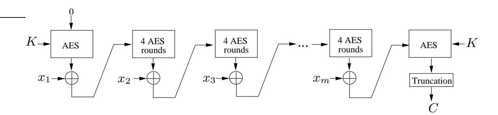
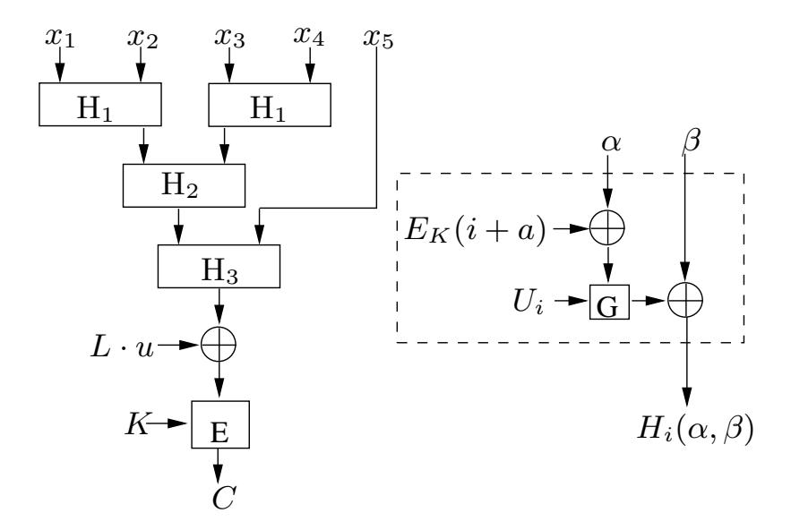
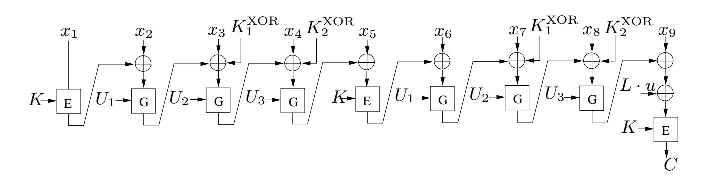
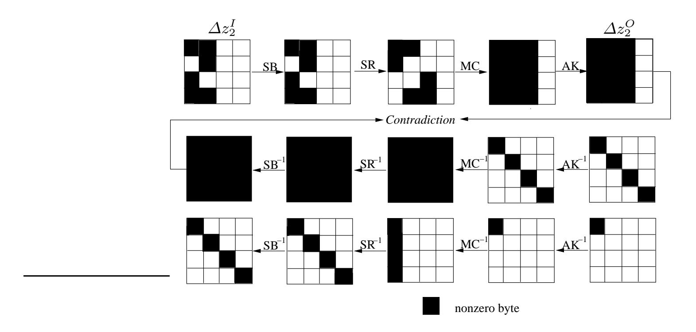
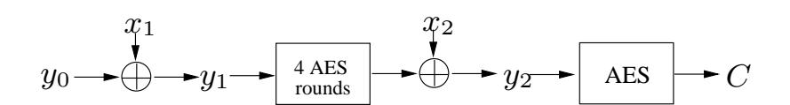
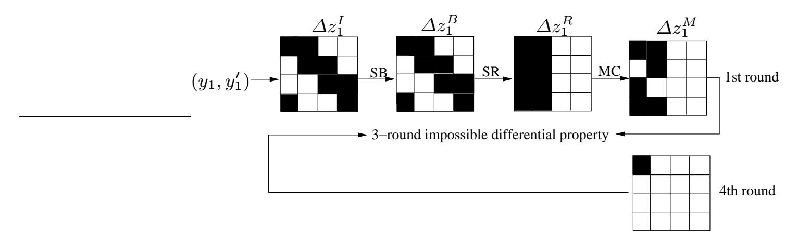
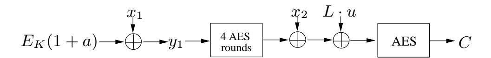
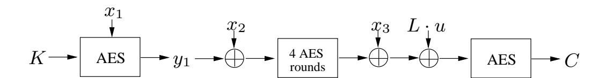

{0}------------------------------------------------

# Impossible Differential Cryptanalysis of Pelican, MT-MAC-AES and PC-MAC-AES\*

Wei Wang1, Xiaoyun Wang \*\*1,2, and Guangwu Xu3

1 Key Laboratory of Cryptographic Technology and Information Security, Ministry of Education, Shandong University, Jinan 250100, China weiwang.c@gmail.com

- 2 Center for Advanced Study, Tsinghua University, Beijing 100084, China xiaoyunwang@mail.tsinghua.edu.cn
- 3 Department of Electrical Engineering and Computer Science, University of Wisconsin-Milwaukee, USA

gxu4uwm@uwm.edu

**Abstract.** In this paper, the impossible differential cryptanalysis is extended to MAC algorithms Pelican, MT-MAC and PC-MAC based on AES and 4-round AES. First, we collect message pairs that produce the inner near-collision with some specific differences by the birthday attack. Then the impossible differential attack on 4-round AES is implemented using a 3-round impossible differential property. For Pelican, our attack can recover the internal state, which is an equivalent subkey. For MT-MAC-AES, the attack turns out to be a subkey recovery attack directly. The data complexity of the two attacks is  $2^{85.5}$  chosen messages, and the time complexity is about  $2^{85.5}$  queries. For PC-MAC-AES, we can recover the 256-bit key with  $2^{85.5}$  chosen messages and  $2^{128}$  queries. **Keywords:** MAC, Cryptanalysis, Impossible differential, AES

# 1 Introduction

Message Authentication Code (MAC) is a symmetric cryptographic primitive, which provides data integrity and data origin authenticity. It takes a secret key and a message as input, and produces a short digest value as output. Because of its security property, MAC is widely used in Internet protocols, such as IPsec, SSL/TLS, SSH, SNMP, etc. There are several new MAC constructions proposed based on a block cipher and its component, typically a reduced-round version of the block cipher in order to gain higher performance. These kinds of MACs can be easily implemented on any platform where the block cipher has already been utilized. One of the popular choices is the combination of AES [6] and 4-round AES.

Daemen and Rijmen proposed such a MAC construction named ALRED, and an AES-based instance ALPHA-MAC [7]. They proved that the ALRED construction is as strong as the underlying block cipher with respect to key recovery and

\* This work is supported by the National Outstanding Young Scientist (No.60525201) and National 973 Program of China (No.2007CB807902)

\*\* To whom correspondence should be addressed.

{1}------------------------------------------------

any forgery attack not involving internal collisions. Later, they proposed an optimized version called Pelican [8] which uses four AES rounds as a building block and computes the authentication tag in a CBC-like manner. Minematsu and Tsunoo also proposed two provable secure MAC schemes, MT-MAC and PC-MAC, which makes use of the provably secure almost universal hash functions (AU2) [11]. The MT-MAC uses differentially uniform permutations such as four rounds of AES with independent keys in a Wegman-Carter binary tree. However, it is not memory efficient; a modified version PC-MAC, which is based on a CBC-like AU2 hash PCH (Periodic CBC Hash), is suggested. For Alpha-MAC, the second preimage can be found, on the assumption that a key or an internal state is known [9]. There also exists a side-channel collision attack on Alpha-MAC and Pelican which can recover its internal state, and mount a selective forgery attack [5].

Recently, Yuan et al. proposed new distinguishing and forgery attacks on the Alred construction, and an internal state recovery attack on Alpha-MAC with the complexity of the birthday attack [14]. They constructed distinguisher to detect the inner near-collisions with specific differences rather than collisions, from which more information can be derived. Another recent work of Jia et al. presented a distinguisher for CBC-like MACs; they also constructed meaningful second preimages for CBC-like MACs, including Pelican, MT-MAC and PC-MAC [10].

Inspired by the above attacks, we observe that the impossible differential cryptanalysis can be extended to MACs provided that an inner near-collision with specific differences is detected.

Impossible differential cryptanalysis [2] is one of the widely used key recovery attacks on block ciphers. It is a sieving attack which considers a differential with probability 0. If a pair of messages is encrypted or decrypted to such a difference under some trial key, one can filter out this trial key from the key space. Thus, the correct key is found by eliminating all other keys which lead to a contradiction. When it comes to MACs, the secret key is replaced by the internal state sometimes. Little has been done for impossible differential cryptanalysis on MACs, due to the fact that the internal state values as well as their difference, are concealed by the final encryption or complex keyed iterations. It is difficult to identify the right key with the complexity less than exhaustive search. However, the recent techniques based on the birthday attack overcome this obstacle, and one can recognize the inner near-collision with some specific differences, hence the impossible differential attack can be performed. Taking 4-round AES as a building block, we can recover its secret subkey XORed with the message using a 3-round impossible differential property. For Pelican, the secret subkey is replaced by the internal state, thus we can recover its internal state with  $2^{85.5}$ chosen messages and  $2^{85.5}$  queries. This attack can be further extended to a subkey recovery attack on MT-MAC-AES with the same complexities. For PC-MAC-AES, we are able to recover its two secret keys separately once the internal state is sieved, with  $2^{85.5}$  chosen messages and  $2^{128}$  queries.

{2}------------------------------------------------

This paper is organized as follows. Section 2 defines the notations used in this paper and gives brief descriptions of Pelican, MT-MAC-AES and PC-MAC-AES. We introduce our main idea in Section 3, where a 3-round impossible differential property of AES and the method for collecting useful message pairs are proposed. Section 4 presents impossible differential attacks on Pelican, MT-MAC-AES and PC-MAC-AES. Finally, we conclude in Section 5.

#### Backgrounds and Notations $\mathbf{2}$

In this section, we define the notations used in the rest of the paper, and give brief descriptions of Pelican, MT-MAC-AES and PC-MAC-AES.

#### Notation 2.1

0

the serial composition, e.g.,  $F_2 \circ F_1(x) = F_2(F_1(x))$ 

Cthe MAC value

the length of the message block n

|x|the length of bit string x $\{0,1\}^n$ the space of *n*-bit strings

 $10^{j}$ a (j+1)-bit sequence  $(100\cdots 0)$ the XOR difference of x and x' $\Delta x$  $z_i^I : z_i^B, z_i^R, z_i^M \text{ and } z_i^O :$ the input of the *i*-th AES round

the intermediate values after the application of SB, SR,

MC and AK of AES, respectively

 $z_i$  is exhibited as an array of  $4 \times 4$  bytes with byte indexed as:

| 0  |   | 1  | 2  | 3  |
|----|---|----|----|----|
| 4  |   | 5  | 6  | 7  |
| 8  |   | 9  | 10 | 11 |
| 12 | 2 | 13 | 14 | 15 |

#### PELICAN MAC Algorithm 2.2

Pelican |8| is a specific instance of Alred construction |7| based on AES, which supports block length of 128-bit and key length of 128/160/192/224/256bit. Pelican can take messages of arbitrary length and output MAC values with length up to 128-bit.

To construct the MAC, let us pad a message M of any length to a multiple of 128-bit by appending a single bit '1' followed by the minimum number of zero bits, and split the padded message into 128-bit words  $(x_1, x_2, \dots, x_m)$ . The Pelican MAC function works as follows (See Fig. 1):

- 1. **Initialization:** Fill the 128-bit *state* with zeros and encrypt it with AES encryption, i. e.,  $y_0 = E_K(0)$ , where E is the AES, and K is the secret key.
- 2. Chaining: XOR the first message word  $x_1$  to the state, i. e.,  $y_1 = y_0 \oplus x_1$ . For each message word  $x_i$   $(i = 2, \dots, m)$ , perform an iteration:  $y_i = f(y_{i-1}) \oplus x_i$ , where f consists of 4 AES rounds with the round subkeys set to 0.

{3}------------------------------------------------

Fig. 1. The Pelican Algorithm

3. **Finalization:** Apply AES to the state and take the first  $l_m$  bits of the state as the MAC value of M. The final output C is  $C = Trunc(E_K(y_m))$ .

Recall that one AES round consists of four basic transformations in the following order:

- SubBytes (SB): for each byte of the state, operate a non-linear byte substitution using an  $8 \times 8$  S-box.
- ShiftRows (SR): cyclically shift the bytes to the left in the last three rows of the state according to different number of bytes, 1 for the second row, 2 for the third row and 3 for the fourth row.
- MixColumns (MC): multiply each column of the state with a matrix.
- AddRoundKey (AK): add the round subkey to the state by XOR operation.

In the rest of our discussion, we assume that there is no truncation on the final output, i. e.,  $l_m = 128$ .

# 2.3 MT-MAC-AES

MT-MAC [11] is a provably secure MAC construction based on the Modified Tree Hash (MTH) [4]. It combines an n-bit block cipher  $E_K$  with an n-bit additional keyed permutation  $G_U$ , where K is the secret key, and U is generated from K. Let us start with the definition of MTH.

# Definition 1 (Modified Tree Hash (MTH) [4]).

Let  $H = (H_1, H_2, \cdots)$  be an infinite sequence of keyed functions:  $\{0, 1\}^{2n} \rightarrow \{0, 1\}^n$ ,  $x = (x_1, x_2, \cdots, x_s)$ , where  $|x_i| = n$ . For all  $i \geq 1$ , define  $L_{H_i}$  as:

$$L_{H_i}(x) = \begin{cases} H_i(x_1, x_2) || H_i(x_3, x_4) || \cdots || H_i(x_{s-1}, x_s) & \text{if } s \mod 2 = 0, \\ H_i(x_1, x_2) || H_i(x_3, x_4) || \cdots || H_i(x_{s-2}, x_{s-1}) || x_s & \text{if } s \mod 2 = 1. \end{cases}$$

The output of the MTH using H for input x is

$$MTH_H(x) = L_{H_b} \circ L_{H_{b-1}} \circ \cdots \circ L_{H_1}(x).$$

Next we present the MT-MACb[ $E_K|G_U$ ] construction (See Fig. 2).

{4}------------------------------------------------

### - Preprocessing:

- Compute  $L = E_K(0)$ , where K is the secret key.
- Let  $U = (U_1, \dots, U_b)$  be the first bl bits of  $E_K(1), E_K(2), \dots, E_K(a)$ , where  $|U_i| = l, i = 1, \dots, b$ , and  $a = \lceil bl/n \rceil$ .
- Let  $H = (H_1, \dots, H_b)$ , where  $H_i(\alpha, \beta) = G_{U_i}(\alpha \oplus E_K(i+a)) \oplus \beta$ .
- MAC Computation: For message M with  $|M| \leq n2^b$ ,

$$C = \begin{cases} E_K(MTH_H(M) \oplus L \cdot u) & \text{if } |M| \mod n = 0, \\ E_K(MTH_H(M|10^t) \oplus L \cdot u^2) & \text{if } |M| \mod n = n - t - 1, \end{cases}$$

where  $u \in GF(2^n) \setminus \{0,1\}$ , and  $L \cdot u$  is the multiplication of L and u in  $\overline{GF(2^n)}$ .

Fig. 2. The MT-MAC Construction with 5-Block Message

An AES-based implementation was presented in [11], where the block cipher  $E_K$  is the AES with 128-bit key, and the permutation  $G_U$  is the 4-round AES. We will call this AES-based instance MT-MAC-AES.

# 2.4 PC-MAC-AES

PC-MAC is another provably secure MAC construction proposed in [11]. Compared with MT-MAC, this scheme reduces the amounts of the preprocessing and working memory requirement by using the Periodic CBC Hash (PCH). It is also composed of an n-bit block cipher  $E_K$ , and an n-bit auxiliary keyed permutation  $G_U$ . However, two secret keys are required, one for the block cipher and the other for making the block cipher tweakable. The PC-MAC-AES makes use of the AES and 4-round AES, too.

For  $i = 1, 2, \dots, s$ , let  $F_i$  be an *n*-bit random function, and  $x = (x_1, x_2, \dots, x_{s+1})$ , we first define the chaining function:

$$Ch[F_1, \dots, F_s](x) = x_{s+1} \oplus F_s(x_s \oplus F_{s-1}(\dots F_2(x_2 \oplus F_1(x_1)) \dots)).$$

{5}------------------------------------------------

The chaining function is used iteratively when the input is longer than (s+1)block, and terminates as soon as the last input block is XORed. The PCH is defined as follows:

# Definition 2 (Periodic CBC Hash (PCH) [11]).

Let  $E_K$  be an n-bit block cipher. For  $d \geq 0$ , let  $G = (G_1, \dots, G_d)$  be the sequence of keyed auxiliary permutation, where for  $G_i$   $(i = 1, \dots, d)$ , the subkey involved in G is  $U_i$ . We assume that  $(K_1^{XOR}, \dots, K_{d-1}^{XOR})$  are (d-1) n-bit subkeys. The Periodic CBC Hash is defined as:

$$PCH_d[E_K, G] = Ch[E_K, G_1, G_2^{\oplus K_1^{XOR}}, \cdots, G_d^{\oplus K_{d-1}^{XOR}}].$$

Here,  $G_i^{\oplus K_{i-1}^{XOR}}(\alpha) = G_i(\alpha \oplus K_{i-1}^{XOR})$   $(i = 2, \dots, d)$ , where  $\alpha$  is an n-bit variable.  $PCH_d[E_K, G]$  terminates as soon as the last input block is XORed.

The next is the description of the PC-MACd[ $E_K|G_U$ ] construction (See Fig. 3).

# - Preprocessing:

- Compute  $U = (U_1, \dots, U_d)$ , which is the first dl bits of  $E_K(0 \oplus L), \dots$ ,  $E_K(\hat{a} \oplus L)$ . Here, K, L are the secret keys, and  $\hat{a} = \lceil dl/n \rceil$ .
- Compute  $K_{j-\hat{a}+1}^{\text{XOR}} = E_K(j \oplus L)$ , for  $j = \hat{a}, \dots, \hat{a} + d 2$ . MAC Computation: For message M with arbitrary length,

$$C = \begin{cases} E_K(PCH_d[E_K, G](M) \oplus L \cdot u) & \text{if } |M| \text{ is a multiple of } n, \\ E_K(PCH_d[E_K, G](M|10^t) \oplus L \cdot u^2) & \text{if } |M| \mod n = n - t - 1 \end{cases},$$

where  $u \in GF(2^n) \setminus \{0,1\}$ , and  $L \cdot u$  is the multiplication of L and u in  $GF(2^n)$ .

Fig. 3. The PC-MAC Construction with d=3 and 9-Block Message

#### Main Idea of the Impossible Differential Cryptanalysis 3

Similar to the cryptanalysis of block cipher, to implement an impossible differential attack on MACs, we need to find an impossible differential path first. 

{6}------------------------------------------------

Then we collect many structures of chosen messages, query MAC with them, and sieve the message pairs satisfying the required intermediate differences. For each sieved pair, discard the wrong subkeys (or internal states) which cause the partial encryption and decryption to match the impossible differential path. Finally, after enough pairs are analyzed, only the correct subkey (or internal state) is left.

# 3.1 Three-Round Impossible Differential Property of AES

For AES, several 4-round impossible differential paths have been found in literature, e. g. [1,3,12]. However, we note that, among the MAC algorithms presented in the previous section, the 4-round AES is taken as a building block. Thus, we focus on the reduced AES and only need a 3-round impossible differential path.

The 3-round impossible differential property states as follows.

Property 1 (Impossible Differential Property of 3-round AES).

For 3-round AES, given an input pair  $(z_2^I, z_2^{I'})$  whose components equal in all except six bytes indexed by (0, 1, 5, 8, 12, 13), or (0, 1, 4, 5, 9, 12), or (0, 4, 5, 8, 9, 13), or (1, 4, 8, 9, 12, 13), the difference of the output pair  $(z_4^O, z_4^{O'})$  can not have exactly one nonzero byte.

*Proof.* Because of the SR operation, there will be one column with zero difference in  $\Delta z_2^O$ , but since the branch number of the MC transformation is 5, one nonzero byte in  $\Delta z_4^O$  will decrypt to 16 nonzero bytes in  $\Delta z_3^I$ , i. e.  $\Delta z_2^O$ , which is a contradiction.  $\square$ 

Fig. 4 illustrates the impossible differential path in one possible case.

Fig. 4. 3-Round Impossible Differential Property of AES

{7}------------------------------------------------

## 3.2 Message Pairs Collection Phase

In the cryptanalysis of block cipher, we can collect the message pairs related to the impossible differential property directly according to the output difference. While for MACs, we have to explore new technique to collect such message pairs since the 4-round AES is used as chaining or auxiliary permutation function, whose outputs, as well as their difference, are concealed by the AES encryption.

To get over this obstacle, we take advantage of the ideas described in [13,14]. First, randomly choose two structures of messages, with the message differences of some specific forms. One example is that there is only one nonzero byte in the difference of the last word. The concrete structures are constructed based on the concrete MAC constructions. Second, utilize the birthday attack to search collisions between the two structures. Third, once a colliding pair is found, it will be used in the key recovery attack. When enough such pairs are collected, we can deduce information of subkeys in the similar manner as in the cryptanalysis of block cipher.

# 4 Impossible Differential Cryptanalysis of Pelican, MT-MAC-AES and PC-MAC-AES

In this section, we present the impossible differential attacks based on the 3-round impossible differential property proposed in Section 3. First, we present an internal state recovery attack on Pelican with complexity of  $2^{85.5}$  chosen texts and  $2^{85.5}$  queries. Then the attack is further extended to a subkey recovery attack on MT-MAC-AES with the same complexities. Finally, the attack is used in the key recovery attack on PC-MAC-AES, which recovers the two 128-bit secret keys with  $2^{85.5}$  chosen texts and  $2^{128}$  queries.

#### 4.1 Internal State Recovery of Pelican

This section describes the internal state recovery attack on Pelican with one additional round at the beginning of the 3-round impossible differential. The recovery of internal state results in the derivation of the equivalent subkey, i. e., the state  $y_0 = E_K(0)$ .

We depict the Pelican algorithm with two message words in Fig. 5 for simplicity. It is noted that, collision at C indicates collision at  $y_2$  since the final AES encryption is a permutation. Because  $y_2 = AES^{4r}(y_1) \oplus x_2$  where  $AES^{4r}$  stands for the 4-round AES, the inner collision at  $y_2$  means  $AES^{4r}(y_1) \oplus x_2 = AES^{4r}(y_1') \oplus x_2'$ , which yields

$$AES^{4r}(y_1) \oplus AES^{4r}(y_1') = x_2 \oplus x_2'.$$
 (1)

We can deduce the information of the output difference of the inner 4-round AES from  $\Delta x_2$ , and apply the impossible differential cryptanalysis accordingly. Message Pairs Collection Phase

The useful message pairs resulting in the inner near-collision is sieved in the following way.

{8}------------------------------------------------

Fig. 5. Pelican Algorithm with Two Message Words

1. First, construct two structures, each has  $2^{64}$  two-block messages: randomly choose  $(x_{1,2}, \dots, x_{1,14})$ , which will be the bytes of block  $x_1$  at (2,3,4,7,8,9,13,14), and set the corresponding bytes of  $x_1'$  with the same values; randomly choose two 128-bit message blocks  $x_2$  and  $x_2'$ , with only one nonzero byte in  $\Delta x_2 = x_2 \oplus x_2'$ . The two structures are

$$S_{1} = \{(x_{1}, x_{2}) | (x_{1,0}, x_{1,1}, x_{1,5}, x_{1,6}, x_{1,10}, x_{1,11}, x_{1,12}, x_{1,15}) \in \{0, 1\}^{64}\},\$$

$$S_{2} = \{(x'_{1}, x'_{2}) | (x'_{1,0}, x'_{1,1}, x'_{1,5}, x'_{1,6}, x'_{1,10}, x'_{1,11}, x'_{1,12}, x'_{1,15}) \in \{0, 1\}^{64}\}.$$

It is noted that the difference  $\Delta x_1$  of the first blocks between the two structures is zero at bytes (2, 3, 4, 7, 8, 9, 13, 14). See Fig. 6.

2. Query MAC on the two structures, and search collisions between the corresponding MAC values of the two structures by the birthday attack [15].

Fig. 6. Internal State Recovery of Pelican

Since there are  $2^{64}$  elements in each structure, and the difference of  $\Delta x_2$  is fixed,  $2^{-1}$  colliding pairs are expected to be found. Repeat the message pairs collection phase by choosing different  $(x_{1,2}, x_{1,3}, x_{1,4}, x_{1,7}, x_{1,8}, x_{1,9}, x_{1,13}, x_{1,14})$ , one colliding pair is expected to be obtained. This means that we can get one colliding pair with  $2 \cdot 2 \cdot 2^{64} = 2^{66}$  chosen messages. To obtain  $2^a$  colliding pairs,  $2^a \cdot 2^{66} = 2^{a+66}$  chosen messages are required. For this, the time complexity is  $2^{a+66}$ , as we need to make  $2^{a+66}$  queries.

For each collected pair, there is only one nonzero byte in  $\Delta z_4^O$  since there is only one nonzero byte in  $\Delta x_2$ , where  $z_4^O = AES^{4r}(y_1)$ . The input to the 4-round AES,  $y_1$ , equals to  $x_1 \oplus y_0$ , and the round subkeys are set to zero, so  $y_0$ 

{9}------------------------------------------------

can be regarded as the subkey XORed before the first round, and is recovered in a similar manner as in the impossible differential cryptanalysis of AES (See Fig. 6).

## **Internal State Recovery Phase**

We can recover 8 bytes of  $y_0$  at position (0, 1, 5, 6, 10, 11, 12, 15) by exhaustive search directly .

- 1. Initialize a list L to store the  $2^{64}$  possible values of  $(y_{0,0}, y_{0,1}, y_{0,5}, y_{0,6}, y_{0,10}, y_{0,11}, y_{0,12}, y_{0,15})$ .
- 2. For each of the  $2^a$  valid pairs, perform partial encryption with each element in L, to obtain the first two columns of  $z_1^M$  and  $z_1^{M'}$ , respectively. From the fact that  $\Delta x_1$  is zero at bytes (2,3,4,7,8,9,13,14), we can deduce that the last two columns of  $\Delta z_1^M$  are zero. Thus, if  $\Delta z_1^M$  is in the form of  $\Delta z_2^I$  as described in Property 1, the corresponding 8 bytes of  $y_0$  must be wrong, because of the 3-round impossible differential property. We delete it from the list L.

After all pairs are processed, we except that there is only one element in the list L, which is the correct one.

For random  $(y_{0,0}, y_{0,1}, y_{0,5}, y_{0,6}, y_{0,10}, y_{0,11}, y_{0,12}, y_{0,15})$ , the probability that  $\Delta z_1^M$  has the impossible form is  $4 \cdot 2^{-16} = 2^{-14}$ , since for the two zero bytes in the first two columns, there are 4 possible positions. Therefore, for each collected pair, we can filter out  $2^{64} \cdot 2^{-14} = 2^{50}$  wrong  $(y_{0,0}, y_{0,1}, y_{0,5}, y_{0,6}, y_{0,10}, y_{0,11}, y_{0,12}, y_{0,15})$ , and one wrong value remains in list L with probability  $1 - \frac{2^{50}}{2^{64}}$ . After sieving with all  $2^a$  pairs, the excepted number of wrong elements that are left in list L should satisfy

$$2^{64} \cdot \left(1 - \frac{2^{50}}{2^{64}}\right)^{2^a} < 1.$$

This relation is true if we take  $a = 2^{19.5}$ .

In this manner, we can recover 8 bytes of the internal state  $y_0$ , the other 8 bytes can be recovered by exhaustive search since there are only one nonzero byte in  $\Delta z_4^O$ .

#### Complexity

The data complexity is  $2^{a+66}=2^{85.5}$  chosen messages, and the time complexity of the message pairs collection phase is  $2^{85.5}$  queries. For  $2^{19.5}$  collected pairs, the time complexity of the internal state recovery phase is at most  $2^{19.5} \cdot 2^{64} = 2^{83.5}$  one-round encryptions. Therefore, the total time complexity is dominated by the message pairs collection phase, which is about  $2^{85.5}$  queries.

## Selective Forgery Attack

Once the attacker obtains the value of the internal state  $y_0$ , he can create arbitrary meaningful colliding messages by calculating a proper 128-bit injection at the end. The readers are referred to [5] for detail.

#### 4.2 Subkey Recovery Attack on MT-MAC-AES

It is clear that the structure of MT-MAC-AES is similar to Pelican when the messages are of two-block (See Fig. 7). Therefore, the above attack is applicable

{10}------------------------------------------------

to MT-MAC-AES directly, with the recovered internal state  $y_0$  is replaced by the subkey  $E_K(1+a)$ . The data complexity of the subkey recovery attack is  $2^{85.5}$  chosen messages, and the time complexity is  $2^{85.5}$  queries.

Fig. 7. MT-MAC-AES with Two Message Words

### 4.3 Key Recovery Attack on PC-MAC-AES

The situation becomes a little different when it comes to PC-MAC-AES, where the 4-round AES is applied after the second block, and there are two secret keys (K, L) involved in the MAC computation. We can use the divide-and-conquer technique to recover the two secret keys. The PC-MAC-AES with three message blocks is illustrated in Fig. 8.

Fig. 8. PC-MAC-AES with Two Message Words

We proceed the key recovery attack according to the following procedure.

1. Construct two structures by prepending a fixed  $x_1$  to each message of structures  $S_1$  and  $S_2$  in Section 4.1. Randomly choose  $x_1$ , set the bytes at (2, 3, 4, 7, 8, 9, 13, 14) of  $x_2$  and  $x_2'$  to the same values, and choose two 128-bit message blocks  $x_3$  and  $x_3'$  with only one nonzero byte in  $\Delta x_3$ . The following are the two structures, each has  $2^{64}$  elements:

$$S_1' = \{(x_1, x_2, x_3) | (x_{2,0}, x_{2,1}, x_{2,5}, x_{2,6}, x_{2,10}, x_{2,11}, x_{2,12}, x_{2,15}) \in \{0, 1\}^{64}\},\$$

$$S_2' = \{(x_1, x_2', x_3') | (x_{2,0}', x_{2,1}', x_{2,5}', x_{2,6}', x_{2,10}', x_{2,11}', x_{2,12}', x_{2,15}') \in \{0, 1\}^{64}\}.$$

- 2. Recover the value  $y_1$  as in the internal state recovery attack presented in Section 4.1. It is noted that  $x_1$  is unchanged when we choose different structures to collect enough colliding pairs.
- 3. Since  $y_1 = E_K(x_1)$ , we can exhaustively search  $2^{128}$  possible K to sieve the right one.

{11}------------------------------------------------

4. When K is recovered, exhaustively search  $2^{128}$  possibilities of L, and the correct one is suggested by the MAC value C.

The data complexity is the same as the internal state recovery attack, which is about  $2^{85.5}$  chosen messages, and the time complexity is dominated by the exhaustive search of the secret key, which is about  $2^{128}$  queries, much lower than the  $2^{256}$  security bound. We note that even two keys are involved in PC-MAC-AES, the security of the algorithm does not get increased.

# 5 Conclusion

In this paper, we adopt the technique of detecting the inner near-collision with some specific difference [13,14] to implement impossible differential cryptanalysis on Pelican, MT-MAC-AES and PC-MAC-AES, all of them are combinations of AES and 4-round AES. Based on a 3-round impossible differential property of AES, we can recover the internal state of Pelican, which is an equivalent subkey, and the recovery can lead to a selective forgery attack [5]. The data complexity is  $2^{85.5}$  chosen messages, and the time complexity is  $2^{85.5}$  queries. This attack is applicable to MT-MAC-AES and PC-MAC-AES directly. For MT-MAC-AES, it turns to be a subkey recovery attack with the same complexities. For PC-MAC-AES, we can deduce the two secret keys separately with  $2^{128}$  queries and  $2^{85.5}$  chosen messages, provided that the internal state is identified.

# References

- 1. B. Bahrak, M. R. Aref, Impossible Differential Attack on Seven-Round AES-128, IET Information Security, 2008, vol. 2, No. 2, pp. 28-32, 2008.
- 2. E. Biham, A. Biryukov, A. Shamir, Cryptanalysis of Skipjack Reduced to 31 Rounds Using Impossible Differentials. EUROCRYPT 1999, LNCS 1592, pp. 12-23, 1999.
- 3. E. Biham, N. Keller, Cryptanalysis of Reduced Variants of Rijndael, 3rd AES Conference, 2000.
- 4. M. Boesgaard, T. Christensen, E. Zenner, Badger A Fast and Provably Secure MAC. ACNS 2005, LNCS 3531, pp. 176-191, 2005.
- 5. A. Biryukov, A. Bogdanov, D. Khovratovich, T. Kasper, Collision Attacks on AES-Based MAC: Alpha-MAC, CHES 2007, LNCS 4727, pp. 166-180, 2007.
- 6. J. Daemen, V. Rijmen, AES Proposal: Rijndael. The First Advanced Encryption Standard Candidate Conference. NIST AES Proposal, 1998.
- 7. J. Daemen, V. Rijmen, A New MAC Construction Alred and A Specific Instance Alpha-MAC. FSE 2005, LNCS 3557, pp. 1-17, 2005.
- 8. J. Daemen, V. Rijmen, The Pelican MAC Function. IACR ePrint Archive, http://eprint.iacr.org/2005/088.
- 9. J. Huang, J. Seberry, W. Susilo, On the Internal Structure of Alpha-MAC. VI-ETCRYPT 2006, LNCS 4341, pp. 271-285, 2006.
- 10. K. Jia, X. Wang, Z. Yuan, G. Xu, Distinguishing Attack and Second-Preimage Attack on the CBC-like MACs, IACR ePrint Archive, http://eprint.iacr.org/2008/542.

{12}------------------------------------------------

- 11. K. Minematsu, Y. Tsunoom, Provably Secure MACs from Differentially-Uniform Permutations and AES-Based Implementations. FSE 2006, LNCS 4047, pp. 226- 241, 2006.
- 12. R. C.-W. Phan, Impossible Differential Cryptanalysis of 7-round Advanced Encryption Standard (AES). Information Processing Letters, vol. 91, pp.33-38, 2004.
- 13. X. Wang, H. Yu, W. Wang, H. Zhang, T. Zhan, Cryptanalysis on HMAC/NMAC-MD5 and MD5-MAC. Submitted to EUROCRYPT 2009.
- 14. Z. Yuan, K. Jia, W. Wang, X. Wang, Distinguishing and Forgery Attacks on Alred and Its AES-based Instance Alpha-MAC. IACR ePrint Archive, http://eprint.iacr.org/2008/516.
- 15. G. Yuval, How to Swindle Rabin. Cryptologia, vol. 3, pp. 187-189, 1979.