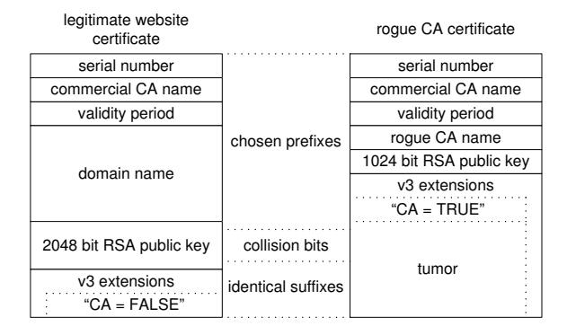

# Short Chosen-Prefix Collisions for MD5 and the Creation of a Rogue CA Certificate

Marc Stevens1 , Alexander Sotirov2 , Jacob Appelbaum3 , Arjen Lenstra4,5 , David Molnar6 , Dag Arne Osvik4 and Benne de Weger7

1 CWI, Amsterdam, The Netherlands 2 http://www.phreedom.org 3 http://www.appelbaum.net 4 EPFL IC LACAL, Station 14, CH-1015 Lausanne, Switzerland 5 Alcatel-Lucent Bell Laboratories 6 University of California at Berkeley 7 EiPSI, TU Eindhoven, The Netherlands 1−7 md5-collisions@phreedom.org

Abstract. We present a refined chosen-prefix collision construction for MD5 that allowed creation of a rogue Certification Authority (CA) certificate, based on a collision with a regular end-user website certificate provided by a commercial CA. Compared to the previous construction from Eurocrypt 2007, this paper describes a more flexible family of differential paths and a new variable birthdaying search space. Combined with a time-memory trade-off, these improvements lead to just three pairs of near-collision blocks to generate the collision, enabling construction of RSA moduli that are sufficiently short to be accepted by current CAs. The entire construction is fast enough to allow for adequate prediction of certificate serial number and validity period: it can be made to require about 249 MD5 compression function calls. Finally, we improve the complexity of identical-prefix collisions for MD5 to about 216 MD5 compression function calls and use it to derive a practical single-block chosen-prefix collision construction of which an example is given.

Keywords: MD5, collision attack, certificate, PlayStation 3

## 1 Introduction

At Eurocrypt 2007, it was shown how chosen-prefix collisions for MD5 can be constructed and an undesirable consequence for any public key infrastructure (PKI) was pointed out in the form of different certificates with the same valid signature (cf. [13]). Actual realization of the threat in question was considered to be hard due to a combination of difficulties, some related to the construction, others to the way certificates are produced by CAs. Thus, some CAs kept using MD5, either consciously based on the perception that the obstacles were too high, or because they were unaware of lurking dangers.

It was found, however, that for at least one commercial CA the relevant obstacles could be overcome with non-negligible probability. Understandably, this triggered new research in the earlier chosen-prefix collision construction. A couple of non-trivial refinements removed all remaining obstacles, thereby in principle allowing us to create real havoc.

Obviously, creating havoc was not our goal. It was our intention and priority that all relevant responsible parties would develop a thorough understanding of the implications of chosen-prefix collisions for MD5. Furthermore, before publishing the details of our results, we wanted to make sure that all parties would have had both a strong impetus and ample time to adequately change their procedures. Therefore, we decided to actually implement our construction and to try and exploit it in practice by attempting to create a harmless rogue CA certificate that would be accepted by all regular web browsers: harmless, because they would only do so after setting their date back to August 2004, because we would keep the private key of the rogue CA in question under tight control, and because we would not right away reveal the details of our method. After a moderate number of attempts we succeeded to create such a certificate.

The announcement of our successful creation of a rogue CA certificate had the desired effect. CAs and other vendors responded swiftly and adequately. We believe that as a result of our exercise, the bar to undermine the security of PKI was raised, somewhat. Given that the current situation with respect to usage of MD5 looks much better than when we made our announcement, we feel that the details behind our method can now be revealed. We also feel that this should indeed be done to give others the opportunity to further build on them and to develop a better understanding of the lack of strength of currently popular cryptographic hash functions. Fully appreciating the details presented here requires a full understanding of the approach from [13].

We describe, roughly, what was achieved in the Eurocrypt 2007 paper [13] and why those methods were believed to have limited impact. Given any two chosen message prefixes P and P 0 , it was shown how suffixes S and S 0 can be constructed such that the concatenations PkS and P 0kS 0 collide under MD5. In the X.509 certificate context, the prefixes include the Distinguished Name fields, and the suffixes are the initial parts of the RSA moduli. A simple, previously published method was then used to construct a further extension T such that each of PkSkT and P 0kS 0kT

is a complete to-be-signed part, with two different hard to factor RSA moduli contained in SkT and S 0kT, respectively. Because the two tobe-signed parts still collide under MD5, this allowed construction of two X.509 certificates with identical MD5-based signatures but different Distinguished Names and different public keys. Put differently, assuming full control over the prefix part P and RSA public key data of a legitimate user, a certificate of that user's data can be used to fraudulently obtain a rogue certificate for any party identified by a prefix part P 0 selected by the attacker. Using moderate resources, the calculation of suffixes S, S 0 and T, given any chosen prefixes P and P 0 , can be completed in a day using e.g. a quad-core PC.

One obstacle against actual abuse of this construction is apparent from the above description. Only the signing CA has full control over the final contents of the P-part: an attacker will have to wait and see what serial number and validity period will be inserted. Obviously, an unpredictable P will make it impossible to concoct the collision required for a rogue certificate. On the other hand, if the full contents of P can reasonably be predicted one day in advance, nothing seems to be in the way of the construction of a rogue certificate. That, however, is not the case: the S and S 0 as found during the collision construction of [13] lead to RSA moduli that are too large. More precisely, S and S 0 both typically consist of 11 near-collision blocks (i.e., 11 · 512 bits) and require 5 additional blocks to generate secure 8192-bit RSA moduli. On the other hand, CAs do not necessarily accept RSA moduli of more than 2048 bits. Despite this mismatch, there was no real incentive to reduce the lengths of the RSA moduli, because the assumption that P could be predicted a day in advance sounded preposterous to begin with.

The practical validity of the above assumption came as somewhat of a surprise: practical in the sense that the prefix P cannot be predicted with 100% certainty, but with high enough probability to make further research efforts worthwhile to try and reduce the number of near-collision blocks to, say, 3. In principle the latter can be achieved by throwing more resources at the construction of the collision. It quickly turned out, as further explained below, that either the running time or the space requirements of this approach are prohibitive. To get the rogue certificate construction to work for an actual CA, a better approach to chosen-prefix collisions for MD5 was imperative.

Our improved chosen-prefix collision construction for MD5 is based on two main ingredients. In the first place, we managed to generalize the known differential path constructions (as described in [13] and extended in [12]) to an entire family of differential paths. As a result, more bits can be eliminated per pair of near-collision blocks, at a somewhat higher complexity of the actual construction of those blocks than before. This is described in Section 3, after notation and MD5 have been introduced in Section 2. The reader is forewarned that full appreciation of the improved differential paths requires familiarity with [13, Section 5]. Secondly, we introduced a variable birthday search that permits a flexible choice of search space between the two extremes of 96 bits (as in [13]) and 64 bits (as introduced in [12] and actually used for [14]): in this way more time can be invested in the birthday search to achieve a lower average number of required near-collision blocks. The details along with the more contrived parameter selection that this all leads to can be found in Section 4. The construction of the rogue CA certificate is described in Section 5. Section 6 describes an improvement creating a chosen-prefix collision using only a single near-collision block.

#### 2 Preliminaries

#### 2.1 Notation

MD5 operates on 32-bit words  $(v_{31}v_{30}...v_0)$  with  $v_i \in \{0,1\}$ , that are identified with elements  $v = \sum_{i=0}^{31} v_i 2^i$  of  $\mathbb{Z}/2^{32}\mathbb{Z}$  and referred to as 32-bit integers. In this paper we switch freely between these representations.

Integers are denoted in hexadecimal as, for instance,  $1E_{16}$  and in binary as  $00011110_2$ . For 32-bit words X and Y we denote their bitwise AND, OR and XOR as  $X \wedge Y$ ,  $X \vee Y$  and  $X \oplus Y$ , respectively,  $\overline{X}$  is the bitwise complement of X, the i-th bit  $v_i$  of  $X = (v_{31}v_{30} \dots v_0)$  is denoted X[i], and RL(X,n) (resp. RR(X,n)) is the cyclic left (resp. right) rotation of X by n bit positions.

For chosen message prefixes P and P' we seek suffixes S and S' such that the messages P||S and P'||S' collide under MD5. In this paper any variable X related to the message P||S or its MD5 calculation, may have a corresponding variable X' related to the message P'||S' or its MD5 calculation. Furthermore,  $\delta X = X' - X$  for such a 'matched'  $X \in \mathbb{Z}/2^{32}\mathbb{Z}$ . For a 'matched' variable Z that consist of tuples of 32-bit integers, say  $Z = (z_1, z_2, \ldots)$ , we define  $\delta Z$  as  $(\delta z_1, \delta z_2, \ldots)$ .

#### 2.2 MD5 overview

MD5 works as follows:

- 1. Padding. Pad the message with: first a '1'-bit, next the least number of '0' bits to make the length equal to 448 mod 512, and finally the bitlength of the original unpadded message as a 64-bit little-endian integer. As a result the total bitlength of the padded message is 512N for a positive integer N.
- 2. Partitioning. Partition the padded message into N consecutive 512-bit blocks  $M_1, M_2, \ldots, M_N$ .
- 3. Processing. MD5 goes through N+1 states  $IHV_i$ , for  $0 \le i \le N$ , called the intermediate hash values and denoted this way to achieve consistency with [13]. Each intermediate hash value  $IHV_i$  consists of four 32-bit words  $a_i, b_i, c_i, d_i$ . For i=0 these are fixed public values  $(a_0, b_0, c_0, d_0) = (67452301_{16}, EFCDAB89_{16}, 98BADCFE_{16}, 10325476_{16})$ . For  $i=1,2,\ldots,N$  intermediate hash value  $IHV_i$  is computed as MD5Compress( $IHV_{i-1}, M_i$ ) using the MD5 compression function described in detail below.
- 4. Output. The resulting hash value is the last intermediate hash value IHVN, expressed as the concatenation of the hexadecimal byte strings of the four words  $a_N, b_N, c_N, d_N$ , converted back from their little-endian representation.

#### 2.3 MD5 compression function

The input for the compression function MD5Compress(IHV, B) is an intermediate hash value IHV = (a,b,c,d) and a 512-bit message block B. The compression function consists of 64 steps (numbered 0 to 63), split into four consecutive rounds of 16 steps each. Each step t uses modular additions, a left rotation, and a non-linear function  $f_t$ . These functions involve Addition Constants  $AC_t = \lfloor 2^{32} |\sin(t+1)| \rfloor$  for  $0 \le t < 64$ , and Rotation Constants  $RC_t$  defined as

$$(RC_t, RC_{t+1}, RC_{t+2}, RC_{t+3}) = \begin{cases} (7, 12, 17, 22) & \text{for } t = 0, 4, 8, 12, \\ (5, 9, 14, 20) & \text{for } t = 16, 20, 24, 28, \\ (4, 11, 16, 23) & \text{for } t = 32, 36, 40, 44, \\ (6, 10, 15, 21) & \text{for } t = 48, 52, 56, 60. \end{cases}$$

The non-linear function  $f_t$  depends on the round:

$$f_t(X,Y,Z) = \begin{cases} F(X,Y,Z) = (X \land Y) \oplus (\overline{X} \land Z) & \text{for } 0 \le t < 16, \\ G(X,Y,Z) = (Z \land X) \oplus (\overline{Z} \land Y) & \text{for } 16 \le t < 32, \\ H(X,Y,Z) = X \oplus Y \oplus Z & \text{for } 32 \le t < 48, \\ I(X,Y,Z) = Y \oplus (X \lor \overline{Z}) & \text{for } 48 \le t < 64. \end{cases}$$

The message block B is partitioned into sixteen consecutive 32-bit words m0, m1, . . ., m15 (with little-endian byte ordering), and expanded to 64 words Wt , for 0 ≤ t < 64, of 32 bits each:

$$W_t = \begin{cases} m_t & \text{for } 0 \le t < 16, \\ m_{(1+5t) \mod 16} & \text{for } 16 \le t < 32, \\ m_{(5+3t) \mod 16} & \text{for } 32 \le t < 48, \\ m_{(7t) \mod 16} & \text{for } 48 \le t < 64. \end{cases}$$

To facilitate the analysis we follow an 'unrolled' description instead of a cyclic state. For each step t the compression function algorithm maintains a working register with 4 state words Qt , Qt−1, Qt−2 and Qt−3 and calculates a new state word Qt+1. With (Q0, Q−1, Q−2, Q−3) = (b, c, d, a), for t = 0, 1, . . . , 63 in succession Qt+1 is calculated as follows:

$$\begin{cases} F_t &= f_t(Q_t, \ Q_{t-1}, \ Q_{t-2}), \\ T_t &= F_t + Q_{t-3} + AC_t + W_t, \\ R_t &= RL(T_t, RC_t), \\ Q_{t+1} &= Q_t + R_t. \end{cases}$$

After all steps are computed, the resulting state words are added to the intermediate hash value and returned as output:

$$MD5Compress(IHV, B) = (a + Q_{61}, b + Q_{64}, c + Q_{63}, d + Q_{62}).$$
 (1)

## 3 A new family of differential paths

The suffixes S and S 0 in a chosen-prefix collision consist of three consecutive parts: padding bitstrings, birthday bitstrings and near-collision bitstrings. The padding bitstrings are arbitrarily chosen such that the birthday bitstrings end on the same 512-bit block border. The birthday bitstrings result in a δIHV that will be eliminated by a sequence of nearcollision blocks which make up the near-collision bitstrings as described in [13, Section 5.3]. Fewer near-collision blocks are required if the family of differential paths is more effective, whereas finding a δIHV that requires fewer near-collision blocks increases the birthday search complexity. Thus, if both search time and number of near-collision blocks are limited, a more effective family of differential paths is required.

In our target application, generating a rogue CA certificate, we have to deal with two hard limits. Because the CA that is supposed to sign our (legitimate) certificate does not accept certification requests for RSA moduli larger than 2048 bits, each of our suffixes S and S' and their common appendage T must fit in 2048 bits. This implies that we can use at most 3 near-collision blocks. Furthermore, to reliably predict the serial number, the entire construction must be performed within a few days.

**Table 1.** Family of partial differential paths using  $\delta m_{11} = \pm 2^{q-10 \mod 32}$ .

| t       | $\delta Q_t$                                                            | $\delta F_t$ | $\delta W_t$           | $\delta T_t$           | $\delta R_t$ | $RC_t$ |
|---------|-------------------------------------------------------------------------|--------------|------------------------|------------------------|--------------|--------|
| 35 - 60 | 0                                                                       | 0            | 0                      | 0                      | 0            |        |
| 61      | 0                                                                       | 0            | $\pm 2^{q-10 \mod 32}$ | $\pm 2^{q-10 \mod 32}$ | $\pm 2^q$    | 10     |
| 62      | $\pm 2^q$                                                               | 0            | 0                      | 0                      | 0            | 15     |
| 63      | $\pm 2^q$                                                               | 0            | 0                      | 0                      | 0            | 21     |
| 64      | $\pm 2^q + \sum_{\lambda=0}^{w'} s_{\lambda} 2^{q+21+\lambda \bmod 32}$ |              |                        |                        |              |        |

Here  $w' = \min(w, 31 - q)$  and  $s_0, \ldots, s_{w'} \in \{-1, 0, +1\}$  for a fixed parameter  $w \ge 0$ . Interesting values for w are between 2 and 5.

Thus, as shown in Table 1, we have extended the family of differential paths used to construct chosen-prefix collisions. The larger choice is parameterized by the non-negative integer w: a larger value allows elimination of more differences in  $\delta$ IHV per near-collision block, but increases the cost of constructing each near-collision block by a factor of roughly  $2^{2w}$ . The value for w in Table 1 can be chosen freely, however due to the blow-up factor of  $2^{2w}$  only the values 2, 3, 4, and 5 are of interest.

Compared to the earlier differential paths in [13, Table 2] and [12, Table 7-2], the new ones vary the carry propagations in the last 3 steps and the boolean function difference in the last step. This change affects the working state only in difference  $\delta Q_{64}$ . Each possible value  $\delta Q_{64}$  may be caused by many different carry propagations and boolean function differences. When performing the collision finding for an actual near-collision block using a particular differential path, we do not consider just one such possible variation but for the last 3 steps check only if the  $\delta Q_t$ 's are as specified.

#### 4 Variable birthday search space, time-memory trade-off

A birthday search on a search space V is generally performed by iterating a properly chosen deterministic function  $f:V\to V$  and by assuming that the points of V thus visited form a 'random walk' [9]. After approximately  $\sqrt{\pi|V|/2}$  iterations one may expect to have encountered a

collision, i.e., different points x and y such that f(x) = f(y). Because the entire trail can in practice not be stored and to take advantage of parallelism, different pseudo-random walks are generated, of which only the startpoints, lengths, and endpoints are kept. The walks are generated to end on 'distinguished points', points with an easily recognizable bitpattern depending on |V |, available storage and other characteristics. The average length of a walk is inversely proportional to the fraction of distinguished points in V . Because intersecting walks share their endpoints, they can easily be detected. The collision point can then be recomputed given the startpoints and lengths of the two colliding walks.

Let p be the probability that a birthday collision satisfies additional conditions that cannot be captured by V or f. On average 1/p birthday collisions have to be found at a cost of Ctr = p π|V |/(2p) iterations, plus recomputation of 1/p intersecting walks at Ccoll iterations. To achieve Ccoll ≈ ² · Ctr for any given ² ≤ 1 and optimizing for the expected walk lengths, one needs to store approximately 1/(p · ²) walks. The value for p depends in an intricate way on k (cf. below), w, and the targeted number of near-collision blocks and is extensively tabulated in the final version [15] of [13]. The value for ² depends on the amount of available space to store walks. For very small ² the overall birthdaying complexity is about Ctr.

The first chosen-prefix collision example from [13] used a 96-bit birthday search space V with |V | = 296 to find a δIHV = (δa, δb, δc, δd) with δa = 0, δb = δc = δd. This search can be continued until a birthday collision is found that requires a sufficiently small number of near-collision blocks, which leads to a trade-off between the birthday search and the number of blocks. If one would aim for just 3 near-collision blocks, one expects 257.33 MD5 compressions for the 96-bit birthday search, which would take about 50 days on 215 PlayStation 3 game consoles.

By leaving δb free, we get an improved 64-bit search space (cf. [12], [14]). In the resulting birthday collisions, the differences in δb compared to δc were handled by the differential path from [12, section 7.4] which corresponds to δQ64 = ±2 q ∓2 q+21 mod 32 in Table 1 (cf. equation 2.3(1)). This significantly decreasing the birthday search complexity, but also increases the average number of near-collision blocks. When aiming for 3 blocks, birthdaying requires about 255.73 MD5 compressions. But the probability that a birthday collision is useful becomes so small that the space requirements are prohibitive: about 250.15 bytes, i.e., more than a petabyte.

A more flexible approach is obtained by interpolating between the above 64-bit and 96-bit birthday searches, while exploiting the family of differential paths from Section 3. For any k ∈ {0, 1, . . . , 32}, we can do a (64 + k)-bit search similar to the one above, but with δb = δc mod 2k . Since δb does not introduce new differences compared to δc in the lower k bits, the average number of near-collision blocks may be reduced – in particular when taking advantage of our new family of differential paths – while incurring a higher birthdaying cost. For any targeted number of near-collision blocks, this leads to a trade-off between the birthdaying cost and space requirements (unless the number of blocks is at least 6, since then 241MB suffices for the plausible choice w = 2). Table 2 gives birthday complexities for k = 0, a range of w-values to control the number of differences that can be eliminated per near-collision block, and number r of near-collision blocks. The smallest amount of memory required for Ccoll to be smaller than Ctr is denoted by M.

Table 2. Birthday complexities and memory requirements for k = 0.

|      |       | w = 0       |            | w = 1       |            | w = 2       |            | w = 3       |            | w = 4       |            | w = 5       |
|------|-------|-------------|------------|-------------|------------|-------------|------------|-------------|------------|-------------|------------|-------------|
| r    | Ctr   | M           | Ctr        | M           | Ctr        | M           | Ctr        | M           | Ctr        | M           | Ctr        | M           |
| 14 2 | 36.68 | 1MB         | 34.01 2 | 1MB         | 32.96 2 | 1MB         | 32.84 2 | 1MB         | 32.83 2 | 1MB         | 32.83 2 | 1MB         |
| 13 2 | 37.55 | 1MB         | 34.69 2 | 1MB         | 33.22 2 | 1MB         | 32.93 2 | 1MB         | 32.88 2 | 1MB         | 32.87 2 | 1MB         |
| 12 2 | 38.55 | 1MB         | 35.59 2 | 1MB         | 33.71 2 | 1MB         | 33.16 2 | 1MB         | 33.02 2 | 1MB         | 32.98 2 | 1MB         |
| 11 2 | 39.68 | 2MB         | 36.71 2 | 1MB         | 34.50 2 | 1MB         | 33.63 2 | 1MB         | 33.34 2 | 1MB         | 33.24 2 | 1MB         |
| 10 2 |       | 40.97 11MB  | 38.06 2 | 1MB         | 35.60 2 | 1MB         | 34.42 2 | 1MB         | 33.91 2 | 1MB         | 33.71 2 | 1MB         |
| 9 2  |       | 42.40 79MB  | 39.63 2 | 2MB         | 37.02 2 | 1MB         | 35.56 2 | 1MB         | 34.80 2 | 1MB         | 34.45 2 | 1MB         |
| 8 2  |       | 44.02 732MB | 2          | 41.43 21MB  | 38.76 2 | 1MB         | 37.09 2 | 1MB         | 36.05 2 | 1MB         | 35.51 2 | 1MB         |
| 7 2  | 45.73 | 8GB         | 2          | 43.43 323MB | 40.83 2 | 9MB         | 39.02 2 | 1MB         | 37.73 2 | 1MB         | 36.95 2 | 1MB         |
| 6 2  |       | 47.92 164GB | 45.69 2 | 7GB         | 2          | 43.22 241MB | 2          | 41.40 20MB  | 39.89 2 | 3MB         | 38.85 2 | 1MB         |
| 5 2  | 49.82 | 3TB         | 2          | 47.92 164GB | 45.89 2 | 10GB        | 2          | 44.20 938MB | 2          | 42.59 102MB | 2          | 41.34 18MB  |
| 4    |       |             |            |             | 49.33 2 | 2TB         | 47.42 2 | 82GB        | 45.81 2 | 9GB         | 44.55 2 | 2GB         |
| 3    |       |             |            |             |            |             |            |             |            |             | 2          | 48.17 231GB |

Having a cluster of 215 PlayStation 3 (PS3) game consoles at our disposal obviously influenced our parameter choices. When running Linux on a PS3, our application has access to 6 Synergistic Processing Units (SPUs), a general purpose CPU, and about 150MB of RAM per PS3. For our birthday search, the 6 × 215 SPUs are computationally equivalent to approximately 8600 regular 32-bit cores, due to each SPU's 4 × 32-bit wide SIMD architecture. The other parts of the chosen-prefix collision construction are not suitable for the SPUs, but we were able to use the 215 PS3 CPUs for the construction of the actual near-collision blocks. With these resources, the choice w = 5 still turned out to be acceptable despite the 1000-fold increase in the cost of the actual near-collision block construction. This is the case even for the hard cases with many differences between IHV and IHV0 : as a consequence the differential paths contain many bitconditions which leaves little space for so-called 'tunnels' (cf. [6]), thereby complicating the near-collision block construction.

For w = 5 and the targeted 3 near-collision blocks, Table 3 shows the time-memory tradeoff when the birthday search space is varied with k. With 150MB at our disposal per PS3, for a total of about 30GB, we decided to use k = 8 as this optimizes the overall birthday complexity for the plausible case that the birthday search takes √ 2 times longer than expected. The overall chosen-prefix collision construction takes on average less than a day on the cluster of PS3s. In theory we could have used 1TB (or more) of hard drive space, in which case it would have been optimal to use k = 0 for a birthday search of about 20 PS3 days.

Table 3. Birthday complexities and memory requirements for r = 3.

|      | w = 3 |             |            | w = 4       | w = 5      |             |  |
|------|-------|-------------|------------|-------------|------------|-------------|--|
| k    | Ctr   | M           | Ctr        | M           | Ctr        | M           |  |
| 0    |       |             |            |             | 2          | 48.17 231GB |  |
| 2    |       |             |            |             | 2          | 49.10 210GB |  |
| 4    |       |             | 2          | 50.43 330GB | 49.29 2 | 68GB        |  |
| 6    | 2     | 51.33 287GB | 50.54 2 | 96GB        | 49.69 2 | 30GB        |  |
| 8    | 2     | 51.98 177GB | 50.74 2 | 32GB        | 49.99 2 | 11GB        |  |
| 10 2 | 52.43 | 82GB        | 51.24 2 | 16GB        | 50.44 2 | 5GB         |  |
| 12 2 | 52.44 | 22GB        | 51.64 2 | 7GB         | 50.90 2 | 3GB         |  |
| 14 2 | 52.76 | 9GB         | 52.01 2 | 3GB         | 51.38 2 | 2GB         |  |
| 16 2 | 53.13 | 4GB         | 52.48 2 | 2GB         | 2          | 51.96 675MB |  |
| 18 2 | 53.59 | 2GB         | 2          | 53.02 733MB | 2          | 52.61 418MB |  |
| 20 2 |       | 53.96 673MB | 2          | 53.46 340MB | 2          | 53.13 215MB |  |
| 22 2 |       | 54.43 324MB | 2          | 54.01 182MB | 2          | 53.73 123MB |  |
| 24 2 |       | 54.92 160MB | 2          | 54.59 102MB | 2          | 54.33 71MB  |  |
| 26 2 |       | 55.52 92MB  | 2          | 55.25 64MB  | 2          | 55.04 47MB  |  |
| 28 2 |       | 56.11 52MB  | 2          | 55.95 42MB  | 2          | 55.83 36MB  |  |
| 30 2 |       | 56.74 32MB  | 2          | 56.68 29MB  | 2          | 56.61 26MB  |  |
| 32 2 |       | 57.27 17MB  | 2          | 57.27 17MB  | 2          | 57.27 17MB  |  |

## 5 Rogue CA certificate construction

In this section we present some of the details of the construction of the to-be-signed parts of our colliding certificates, as outlined in Figure 1.

The chosen prefix of the website certificate contains a subject Distinguished Name (a domain name), as well as the first 208 bits of the RSA modulus, chosen at random, as padding to reach proper alignment

Fig. 1. The to-be-signed parts of the colliding certificates.

with the rogue CA certificate. Furthermore, an educated guess has to be included for the serial number and validity period fields that the signing CA will insert when it processes the legitimate website's certification request. For the targeted commercial CA it turned out, based on repeated observations, that the validity period can be predicted very reliably as the period of precisely one year plus one day, starting exactly six seconds after a certification request is submitted. Furthermore, it was found that the targeted CA uses sequential serial numbers. Being able to predict the next serial number, however, is not enough, because the construction of the collision can be expected to take at least a day, implying a substantial and uncertain increment in the serial number by the time the collision construction is finished. The increment in serial number over a weekend, however, does not vary a lot and Monday morning's serial numbers can be predicted, roughly, on the Friday afternoon before.

The chosen prefix of the rogue CA certificate contains a short rogue CA name, a 1024-bit RSA public key, and the first part of the X.509v3 extension fields. One of these extension fields is the 'basic constraints' field, containing a bit that identifies the certificate as a CA certificate (in Figure 1 denoted by "CA=TRUE"). The final part of the rogue chosen prefix contains an indication that all remaining bits of this to-be-signed part should be interpreted as an extension field of the type "Netscape Comment", a field that is ignored by most application software. In Figure 1 this field is denoted as 'tumor'.

Given these two chosen prefixes, the collision bits consisting of birthday bits and near-collision blocks are computed as described above. We describe how those bits are interpreted on either side. The birthday bits occupy 96 bits. Immediately after them there is a border between MD5 input blocks. In the website certificate the birthday bits are part of the RSA modulus, in the rogue CA certificate they belong to the tumor.

After the birthday bits, there are 3 near-collision blocks of 512 bits each. In the website certificate these are part of the RSA modulus, thereby fixing 208 + 96 + 3 × 512 = 1840 bits of the website's RSA modulus. In the rogue CA certificate these 3 blocks are the second part of the tumor.

After the collision bits, another 2048 − 1840 = 208 bits are needed to complete the website's 2048-bit RSA modulus. These 208 bits have to be determined in such a way that the complete factorization of the RSA modulus is known, in order to be able to submit a valid certificate signing request for the website. The RSA modulus does not have to be secure as it will not be used after obtaining the website's certificate. Its least significant 208 bits are determined as follows. Let B denote the fixed 1840-bit part of the RSA modulus followed by 208 one bits. Now select a random 224-bit integer q until B mod q is less than 2208, and keep doing so until both q and bB/qc are prime. As a result n = bB/qcq has the desired 1840 leading bits and, for purely esthetic reasons, n's smallest prime factor q is larger than the 67-digit largest factor found (so far) using the Elliptic Curve integer factorization method.

Finally the website's RSA public exponent is set, followed by the X.509v3 extensions of the website certificate. All bits after the collision bits in the website certificate's to-be-signed part are copied to the tumor in the rogue CA certificate.

A legitimate PKCS#10 Certificate Signing Request can now be submitted to the signing CA. This CA requires proof of possession of the private key corresponding to the public key inside the request. This is done by signing the request using this private key and this is the sole reason that we needed the factorization of the website's RSA modulus. Upon correct submission, the signing CA returns a website certificate. If the serial number and validity period as inserted by the CA indeed match our guess, then the website certificate's to-be-signed part will collide under MD5 with the rogue CA certificate's to-be-signed part, and the signing CA's MD5-based digital signature will be equally valid for the rogue data.

Getting the right serial number at the right time requires some care. About half an hour before the targeted submission moment, the same request is submitted, and the serial number in the resulting certificate is inspected. If it is already too high, the entire attempt has to be abandoned. Otherwise, the request is repeatedly submitted, with a frequency depending on the gap that may still exist between the serial number received and the targeted one, and taking into account possible certification requests by others. In this way the serial number is slowly nudged toward the right value at the right time.

A proof of concept rogue CA certificate constructed in this manner, where it required some experimentation and a moderate number of attempts to get the correct serial number and validity period, was obtained using a commercial CA. Full details, including the rogue CA certificate, are available from www.win.tue.nl/hashclash/rogue-ca/.

# 6 Independent additional improvement

We show how to construct a chosen-prefix collision for MD5 that consists of 84 birthday bits followed by one pair of near-collision blocks, for a chosen-prefix collision-causing appendage of 84 + 512 = 596 bits. The construction is based on an even richer family of differential paths that allows elimination using a single pair of near-collision blocks of a set of δIHVs that is bounded enough so that finding the near-collision blocks is still feasible, but large enough that such a δIHV can be found efficiently by a birthday search. Instead of using the family of differential paths based on δm11 = ±2 i , we use the fastest known collision attack for MD5 and vary the last few steps to find a large family of differential paths.

We first present a new collision attack for MD5 with complexity of approximately 216 MD5 compressions improving upon the 220.96 MD5 compressions required in [20]. Our starting point is the partial differential path for MD5 given in Table 4. It is based on message differences δm2 = 28 , δm4 = δm14 = 231 and δm11 = 215 which is very similar to those used by Wang et al. in [17] for the first collision attack against MD5. This partial differential path can be used for a near-collision attack with complexity of approximately 214.8 MD5 compressions. This leads in the usual fashion to an identical-prefix collision attack for MD5 that requires approximately 216 MD5 compressions, since one has to do it twice: first to add differences to δIHV and then to eliminate them again. It should be noted that usually bitconditions are required on the IHV and IHV0 between the two collision blocks which imply an extra factor in complexity. In the present case, however, we can construct a large set of differential paths for the second near-collision block that will cover all bitconditions that are likely to occur, thereby avoiding the extra complexity.

By properly tuning the birthday search, the same partial differential path leads to the construction of a single near-collision block chosen-prefix collision for MD5. By varying the last steps of the differential path and

Table 4. Partial differential path for fast near-collision attack.

| t       | δQt                                    | δFt                 | δWt     | δTt                   | δRt             | RCt |
|---------|----------------------------------------|---------------------|---------|-----------------------|-----------------|-----|
| 30 − 33 | 0                                      | 0                   | 0       | 0                     | 0               | ·   |
| 34      | 0                                      | 0                   | 15 2 | 15 2               | 31 2         | 16  |
| 35      | 31 2                                | 31 2             | 31 2 | 0                     | 0               | 23  |
| 36      | 31 2                                | 0                   | 0       | 0                     | 0               | 4   |
| 37      | 31 2                                | 31 2             | 31 2 | 0                     | 0               | 11  |
| 38 − 46 | 31 2                                | 31 2             | 0       | 0                     | 0               | ·   |
| 47      | 31 2                                | 31 2             | 8 2  | 8 2                | 31 2         | 23  |
| 48      | 0                                      | 0                   | 0       | 0                     | 0               | 6   |
| 49      | 0                                      | 0                   | 0       | 0                     | 0               | 10  |
| 50      | 0                                      | 0                   | 31 2 | 0                     | 0               | 15  |
| 51 − 59 | 0                                      | 0                   | 0       | 0                     | 0               | ·   |
| 60      | 0                                      | 0                   | 31 2 | 31 2               | 5 −2         | 6   |
| 61      | 5 −2                                | 0                   | 15 2 | 15 2               | 25 2         | 10  |
| 62      | 5 + 225 −2                          | 0                   | 8 2  | 8 2                | 23 2         | 15  |
| 63      | 5 + 225 + 223 −2                    | 5 − 23 2 2 | 0       | 5 − 23 2 2 2 | 26 − 14 2 | 21  |
| 64      | 5 + 225 + 223 + 226 − 14 −2 2 |                     |         |                       |                 |     |

Partial differential path for t = 29, . . . , 63 using message differences δm2 = 28 , δm4 = δm14 = 231 , δm11 = 215. The probability that it is satisfied is approximately 2−14.5 .

by allowing the collision finding complexity to grow by a factor of about , we have found a set S of about 223.3 different δIHV = (δa, δb, δc, δd) of the form δa = −2 , δd = −2 + 225 , δc = −2 mod 220 that can be eliminated. Such δIHVs can be found using an 84-bit birthday search with step function f : {0, 1} → {0, 1} of the form

$$f(x) = \begin{cases} \phi(\text{MD5compress}(\text{IHV}, B||x) + \delta\widehat{\text{IHV}}) & \text{for } \sigma(x) = 0\\ \phi(\text{MD5compress}(\text{IHV}', B'||x)) & \text{for } \sigma(x) = 1, \end{cases}$$

where δIHV is of the required form, d σ : x 7→ {0, 1} is a balanced selector function and φ(a, b, c, d) 7→ akdk(c mod 220). There are 2128−84 = 244 possible δIHVs of this form, of which only about 223.3 are in the allowed set S. It follows that a birthday collision has probability p = 223.3/(244 · 2) = −21.7 to be useful, where the additional factor 2 stems from the fact that different prefixes are required.

A useful birthday collision can be expected after p π2 /(2p) ≈ 2 .2 MD5 compressions, requires 400MB of storage and takes about 3 days on 215 PS3s. The expected complexity of finding the actual near-collision blocks is bounded by about 214.8+26 = 240.8 MD5 compressions. In Table 5 two 128-byte messages are given both consisting of a 52-byte chosen prefix and a 76-byte single-block chosen-prefix collision suffix and with colliding MD5 hash value D320B6433D8EBC1AC65711705721C2E1.

Table 5. Example single-block chosen-prefix collision.

#### Message 1

4F64656420476F6C6472656963680A4F64656420476F6C6472656963680A4F64 656420476F6C6472656963680A4F64656420476FD8050D0019BB9318924CAA96 DCE35CB835B349E144E98C50C22CF461244A4064BF1AFAECC5820D428AD38D6B EC89A5AD51E29063DD79B16CF67C12978647F5AF123DE3ACF844085CD025B956

#### Message 2

4E65616C204B6F626C69747A0A4E65616C204B6F626C69747A0A4E65616C204B 6F626C69747A0A4E65616C204B6F626C69747A0A75B80E0035F3D2C909AF1BAD DCE35CB835B349E144E88C50C22CF461244A40E4BF1AFAECC5820D428AD38D6B EC89A5AD51E29063DD79B16CF6FC11978647F5AF123DE3ACF84408DCD025B956

## 7 Conclusion

We have shown that the length of formerly rather long chosen-prefix collisions for MD5 can be reduced to a minimum at a still acceptable cost, and that short enough chosen-prefix collision-causing appendages can be found fast enough to cause trouble, if so desired.

As secure cryptographic hash function for digital signature applications, MD5 has been declared dead over and over again. The improvements in the collision construction for MD5 presented here firmly hammer another nail into its coffin. We have been told that simply removing all existing MD5 applications would break too much. Nevertheless, we hope that our work has contributed to a sooner ending of MD5's funeral.

In Table 6 we present a historical overview of the decline in complexity of MD5 and SHA-1 collision finding. It clearly illustrates that attacks only get better, not worse. Not reflected in the table is the fact that already in 1993 it was known that there was serious trouble with MD5, based on collisions in its compression function (cf. [1], [3]). We leave any speculation about the future of SHA-1 cryptanalysis to the knowledgeable reader.

A possible mitigation of the risk posed by chosen-prefix collisions when signing documents is to let the signer add a sufficient amount of fresh randomness at the appropriate spot in the to-be-signed data, i.e., not as a suffix but preferably somewhere early on. For certificates the serial number, or even a somewhat variable validity period, would be an appropriate

Table 6. Collision complexities – Historical overview.

|            |                  | MD5                  | SHA-1             |                                |  |  |  |
|------------|------------------|----------------------|-------------------|--------------------------------|--|--|--|
| year       | identical-prefix | chosen-prefix        |                   | identical-prefix chosen-prefix |  |  |  |
| pre-2004 2 | 64 (trivial)     | 64 (trivial) 2    | 80 (trivial) 2 | 80 (trivial) 2              |  |  |  |
| 2004 2     | 40 [16], [17]    |                      |                   |                                |  |  |  |
| 2005 2     | 37 [5]           |                      | 69 [18] 2      |                                |  |  |  |
|            |                  |                      | 63 [19] 2      |                                |  |  |  |
| 2006 2     | 32 [6], [11]     | 49 [13] 2         |                   | 80−² 2 [10]              |  |  |  |
| 2007 2     | 25 [12]          | 42 [12] 2         | 61 [8] 2       |                                |  |  |  |
| 2008 2     | 21 [20]          |                      |                   |                                |  |  |  |
| 2009 2     | 16 (this paper)  | 39 (this paper) 2 | 52 [7] 2       |                                |  |  |  |

Complexity is given as the number of calls to the relevant compression function. The figures are optimized for speed, i.e., for collisions using any number of near-collision blocks. For other collision lengths the complexities may differ.

spot. Although this would work, it can be argued that such a countermeasure relies on unintentional choices of the X.509 certificate standard. Indeed, we would be in favor of a more fundamental way to add randomness to to-be-hashed data, such as using randomized hashing as a mode of operation for hash functions as proposed in [4]. The collision was, at least partially, achievable because of 'flabby structure' of the certificate (cf. [2]), so that may have to be addressed as well. On the other hand, a more 'rigid' structure would not be an excuse to use a poor hash function: irrespective of the elegance or lack thereof of the certificate structure, we need a solid hash function.

As far as we know, no harm was done using our rogue CA certificate. The positive effects we intended to achieve by its construction have been realized. From this point of view, and because it required new cryptanalytic insights in MD5, the project described in this paper was very gratifying. Nevertheless, there was another, secondary aspect that is worth mentioning here. Although, as stated earlier, creating havoc was not our goal, we must admit that some havoc was created by our announcement. Despite our best efforts to inform the party that was arguably most directly affected by our work (as documented on one of the related websites), we also felt we should not reveal our identities to avoid any attempt to file an injunction barring our announcement. Overall, this did not stimulate a healthy exchange of information of which all parties involved could have profited. We do not know how the present legal climate could best be changed to address this problem, but hope that the difficulties as clearly observed in our case help to expedite a solution.

## Acknowledgements

We are grateful for comments by the Crypto 2009 reviewers, and support by the European Commission through the EU ICT program ECRYPT II, by the Swiss National Science Foundation, and by EPFL DIT.

## References

- 1. B. den Boer and A. Bosselaers, Collisions for the compression function of MD5, Eurocrypt '93, LNCS 765, pp. 293–304, 1994.
- 2. W. Diffie, personal communication, January 2009.
- 3. H. Dobbertin, Cryptanalysis of MD5 Compress, May 1996, http:www-cse.ucsd.edu/~bsy/dobbertin.ps.
- 4. S. Halevi and H. Krawczyk, Strengthening Digital Signatures via Randomized Hashing, Internet Draft, http://tools.ietf.org/html/draft-irtf-cfrg-rhash-01. Crypto 2006, LNCS 4117, pp. 41–59, 2006.
- 5. Vlastimil Klima, Finding MD5 Collisions on a Notebook PC Using Multi-message Modifications, Cryptology ePrint Archive, Report 2005/102.
- 6. Vlastimil Klima, Tunnels in Hash Functions: MD5 Collisions Within a Minute, Cryptology ePrint Archive, Report 2006/105.
- 7. Cameron McDonald, Philip Hawkes and Josef Pieprzyk, SHA-1 collisions now 2 52 , Eurocrypt 2009 Rump session.
- 8. Florian Mendel, Christian Rechberger and Vincent Rijmen, Update on SHA-1, Crypto 2007 Rump session.
- 9. Paul C. van Oorschot and Michael J. Wiener, Parallel collision search with cryptanalytic applications, Journal of Cryptology 12(1), 1–28, 1999.
- 10. Christian Rechberger, unpublished result, 2006.
- 11. Marc Stevens, Fast Collision Attack on MD5, Cryptology ePrint Archive, Report 2006/104.
- 12. Marc Stevens, On collisions for MD5, Master's thesis, TU Eindhoven, June 2007, available from http://www.win.tue.nl/hashclash/.
- 13. Marc Stevens, Arjen Lenstra and Benne de Weger, Chosen-Prefix Collisions for MD5 and Colliding X.509 Certificates for Different Identities, in M. Naor (Ed.), Eurocrypt 2007, LNCS 4515, pp. 1–22, 2007.
- 14. Marc Stevens, Arjen Lenstra and Benne de Weger, Predicting the winner of the 2008 US presidential elections using a Sony PlayStation 3, http://www.win.tue.nl/hashclash/Nostradamus/, 2007.
- 15. Marc Stevens, Arjen Lenstra and Benne de Weger, Chosen-Prefix Collisions for MD5 and Applications, in preparation.
- 16. Xiaoyun Wang, Xuejia Lai, Dengguo Feng and Hongbo Yu, Collisions for hash functions MD4, MD5, HAVAL-128 and RIPEMD, Crypto 2004 Rump Session.
- 17. Xiaoyun Wang and Hongbo Yu, How to Break MD5 and Other Hash Functions, Eurocrypt 2005, LNCS 3494, pp. 19-35.
- 18. Xiaoyun Wang, Yiqun Lisa Yin and Hongbo Yu, Finding Collisions in the Full SHA-1, Crypto 2005, LNCS 3621, pp. 17-36.
- 19. Xiaoyun Wang, Andrew Yao and Frances Yao, New Collision Search for SHA-1, Crypto 2005 Rump session.
- 20. Tao Xie, FanBao Liu and DengGuo Feng, Could The 1-MSB Input Difference Be The Fastest Collision Attack For MD5?, Cryptology ePrint Archive, Report 2008/391.