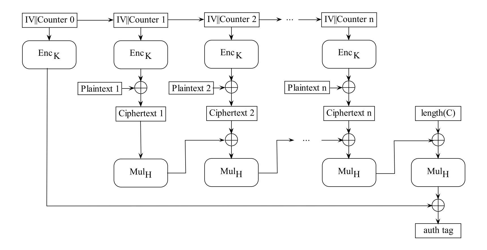

{0}------------------------------------------------

# Faster and Timing-Attack Resistant AES-GCM

Emilia K¨asper<sup>1</sup> and Peter Schwabe<sup>2</sup> <sup>⋆</sup>

<sup>1</sup> Katholieke Universiteit Leuven, ESAT/COSIC Kasteelpark Arenberg 10, B-3001 Leuven-Heverlee, Belgium emilia.kasper@esat.kuleuven.be <sup>2</sup> Department of Mathematics and Computer Science Technische Universiteit Eindhoven, P.O. Box 513, 5600 MB Eindhoven, Netherlands peter@cryptojedi.org

Abstract. We present a bitsliced implementation of AES encryption in counter mode for 64-bit Intel processors. Running at 7.59 cycles/byte on a Core 2, it is up to 25% faster than previous implementations, while simultaneously offering protection against timing attacks. In particular, it is the only cache-timing-attack resistant implementation offering competitive speeds for stream as well as for packet encryption: for 576-byte packets, we improve performance over previous bitsliced implementations by more than a factor of 2. We also report more than 30% improved speeds for lookup-table based Galois/Counter mode authentication, achieving 10.68 cycles/byte for authenticated encryption. Furthermore, we present the first constant-time implementation of AES-GCM that has a reasonable speed of 21.99 cycles/byte, thus offering a full suite of timing-analysis resistant software for authenticated encryption.

Keywords: AES, Galois/Counter mode, cache-timing attacks, fast implementations

### 1 Introduction

While the AES cipher has withstood years of scrutiny by cryptanalysts, its implementations are not guaranteed to be secure. Side-channel attacks have become the most promising attacks, and cache-timing attacks pose a security threat to common AES implementations, as they make heavy use of lookup tables. Countermeasures against cache-timing attacks on software implementations include hardware-based defenses to limit cache leakage; or obscuring timing data, e.g., via adding dummy instructions. However, both approaches are generally deemed impractical due to a severe performance penalty.

This leaves us with the third option: writing dedicated constant-time software. While several cryptographic algorithms such as the Serpent block cipher [8] have been designed with a lookup-table-free implementation in mind, it is generally extremely difficult to safeguard a cipher against side-channel attacks a posteriori.

Matsui and Nakajima were the first to show a constant-time implementation of AES on an Intel Core 2 processor faster than any other implementation described before [24]. However, the reported speed of 9.2 cycles/byte<sup>3</sup> is only achieved for chunks of 2 KB of input data that are transposed into a dedicated bitsliced format. Including format conversion, this

<sup>⋆</sup> The first author was supported in part by the European Commission through the ICT Programme under Contract ICT-2007-216646 ECRYPT II, the IAP–Belgian State–Belgian Science Policy BCRYPT and the IBBT (Interdisciplinary institute for BroadBand Technology) of the Flemish Government, and by the FWO-Flanders project nr. G.0317.06 Linear Codes and Cryptography. The second author was supported by the European Commission through the ICT Programme under Contract ICT–2007–216499 CACE, and through the ICT Programme under Contract ICT-2007-216646 ECRYPT II. Permanent ID of this document: cc3a43763e7c5016ddc9cfd5d06f8218. Date: June 16, 2009

<sup>3</sup> From here on, we consider only AES-128. All results extend straightforwardly to other key sizes, with an appropriate downscaling in performance.

{1}------------------------------------------------

implementation thus runs at around 10 cycles/byte for stream encryption. On the other hand, encrypting, say, 576-byte packets would presumably cause a slowdown by more than a factor of 3, making the approach unsuitable for many network applications.

K¨onighofer presents an alternative implementation for 64-bit platforms that processes only 4 input blocks in parallel [22], but at 19.8 cycles/byte, his code is even slower than the reference implementation used in OpenSSL.

Finally, Intel has announced a new AES-NI instruction set [17] that will provide dedicated hardware support for AES encryption and thus circumvent cache leaks on future CPUs. However, processors rolled out to the market today do not yet support these instructions, so cache-timing attacks will continue to be a threat to AES for several years until all current processors have been replaced.

This paper presents a constant-time implementation of AES which only needs 7.59 cycles/byte on an Intel Core 2 Q9550, including costs for transformation of input data into bitsliced format and transformation of output back to standard format. On the newer Intel Core i7, we show even faster speeds of 6.92 cycles/byte, while lookup-table-based implementations on the same platform are still behind the 10 cycles/byte barrier. Not only is our software up to 30% faster than any previously presented AES software for 64-bit Intel processors, it also no longer needs input chunks of 2 KB but only of 128 bytes to achieve optimal speed and is thus efficient for packet as well as stream encryption.

Secondly, we propose a fast implementation of Galois/Counter mode (GCM) authentication. Combined with our fast AES encryption, we demonstrate speeds of 10.68 cycles per encrypted and authenticated byte on the Core 2 Q9550. Our fast GCM implementation, however, uses the standard method of lookup tables for multiplication in a finite field. While no cache-timing attacks against GCM have been published, we acknowledge that this implementation might be vulnerable to cache leaks. Thus, we also describe a new method for implementing GCM without lookup tables that still yields a reasonable speed of 21.99 cycles/byte. The machine-level strategies for implementing AES-GCM in constant time might be of independent interest to implementors of cryptographic software.

Note. All software presented in this paper is in the public domain and is available online on the authors' websites [19, 31] to maximize reusability of results.

Organization of the paper. In Section 2, we analyze the applicability of cache-timing attacks to each component of AES-GCM authenticated encryption. Section 3 gives an overview of the target platforms. In Sections 4 and 5, we describe our implementations of AES and GCM, respectively. Finally, Section 6 gives performance benchmarks on three different platforms.

### 2 Cache timing attacks against AES and GCM

Cache-timing attacks are software side-channel attacks exploiting the timing variability of data loads from memory. This variability is due to the fact that all modern microprocessors use a hierarchy of caches to reduce load latency. If a load operation can retrieve data from one of the caches (cache hit), the load takes less time than if the data has to be retrieved from RAM (cache miss).

Kocher [21] was the first to suggest cache-timing attacks against cryptographic algorithms that load data from positions that are dependent on secret information. Initially, timing attacks were mostly mentioned in the context of public-key algorithms until Kelsey et al. [20] 

{2}------------------------------------------------

and Page [30] considered timing attacks, including cache-timing attacks, against secret-key algorithms. Tsunoo et al. demonstrated the practical feasibility of cache-timing attacks against symmetric-key ciphers MISTY1 [33] and DES [32], and were the first to mention an attack against AES (without giving further details).

In the rest of this section, we analyze separately the cache-timing vulnerability of three components of AES-GCM: encryption, key schedule, and authentication.

### 2.1 Attacks Against AES Encryption

A typical implementation of AES uses precomputed lookup tables to implement the S-Box, opening up an opportunity for a cache-timing attack. Consider, for example, the first round of AES: the indices of the table lookups are then defined simply by the xor of the plaintext and the first round key. As the attacker knows or even controls the plaintext, information about the lookup indices directly leaks information about the key.

Bernstein [3] was the first to implement a cache-timing key-recovery attack against AES. While his attack relies on the attacker's capability of producing reference timing distributions from known-key encryptions on a platform identical to the target platform and has thus been deemed difficult to mount [9, 29], several improved attack strategies have subsequently been described by Bertoni et al. [6], Osvik et al. [29], Acıi¸cmez et al. [18], Bonneau and Mironov [9], and Neve et al. [27, 28].

In particular, Osvik et. al. [29] propose an attack model where the attacker obtains information about cache access patterns by manipulating the cache between encryptions via user-level processes. Bonneau and Mironov [9] further demonstrate an attack detecting cache hits in the encryption algorithm itself, as opposed to timing a process controlled by the attacker. Their attack requires no active cache manipulation, only that the tables are (partially) evicted from cache prior to the encryption. Finally, Acıi¸cmez et. al. [18] note that if the encrypting machine is running multiple processes, workload on the target machine achieves the desired cache-cleaning effect, and provide simulation results suggesting that it is possible to recover an AES encryption key via a passive remote timing attack.

#### 2.2 Attacks against AES key expansion

The expansion of the 128-bit AES key into 11 round keys makes use of the SubBytes operation which is also used for AES encryption and usually implemented through lookup tables. During key schedule, the lookup indices are dependent on the secret key, so in principle, ingredients for a cache-timing attack are available also during key schedule.

However, we argue that mounting a cache-timing attack against AES key-expansion will be very hard in practice. Common implementations do the key expansion just once and store either the fully expanded 11 round keys or partially-expanded keys (see e.g. [2]); in both cases, table lookups based on secret data are performed just once, precluding statistical timing attacks, which require multiple timing samples.

We nevertheless provide a constant-time implementation of key expansion for the sake of completeness. The cycle count of the constant-time implementation is however inferior to the table-based implementation; a performance comparison of the two methods is given in Section 6.

{3}------------------------------------------------

#### 2.3 Attacks Against Galois/Counter Mode Authentication

The computationally expensive operations for GCM authentication are multiplications in the finite field  $\mathbb{F}_{2^{128}}$ . More specifically, each block of input requires multiplication with a secret constant factor H derived from the master encryption key. As all common general-purpose CPUs lack support for multiplication of polynomials over  $\mathbb{F}_2$ , the standard way of implementing GCM is through lookup tables containing precomputed multiples of H.

The specification of GCM describes different multiplication algorithms involving tables of different sizes allowing to trade memory for computation speed [25]. The basic idea of all of these algorithms is the same: split the non-constant factor of the multiplication into bytes or half-bytes and use these as indices for table lookups.

For the first block of input  $P_1$ , this non-constant factor is  $C_1$ , the first block of ciphertext. Assuming the ciphertext is available to the attacker anyway, the indices of the first block lookups do not leak any secret information. However, for the second ciphertext block  $C_2$ , the non-constant input to the multiplication is  $(C_1 \cdot H) \oplus C_2$ . An attacker gaining information about this value can easily deduce the secret value H necessary for a forgery attack.<sup>4</sup>

The lookup tables used for GCM are usually at least as large as AES lookup tables; common sizes include 4 KB, 8 KB and 64 KB. The values retrieved from these tables are 16 bytes long; knowledge of the (64-byte) cache line thus leaves only 4 possibilities for each lookup index. For example, the 64-KB implementation uses 16 tables, each corresponding to a different byte of the 128-bit input. Provided that cache hits leak the maximum 6 bits in each byte, a 2<sup>32</sup> exhaustive search over the remaining unknown bits is sufficient to recover the authentication key.

We conclude that common implementations of GCM are potentially vulnerable to authentication key recovery via cache timing attacks. Our software thus includes two different versions of GCM authentication: a fast implementation based on 8-KB lookup tables for settings where timing attacks are not considered a threat; and a slower, constant-time implementation offering full protection against timing attacks. For a performance comparison of these two implementations, see Section 6.

### 3 The Intel Core 2 and Core i7 processors

We have benchmarked our implementations on three different Intel microarchitectures: the 65-nm Core 2 (Q6600), the 45-nm Core 2 (Q9550) and the Core i7 (920). These microarchitectures belong to the amd64 family, they have 16 128-bit SIMD registers, called XMM registers.

The 128-bit XMM registers were introduced to Intel processors with the "Streaming SIMD Extensions" (SSE) on the Pentium III processor. The instruction set was extended (SSE2) on the Pentium IV processor, other extensions SSE3, SSSE3 and SSE4 followed. Starting with the Core 2, the processors have full 128-bit wide execution units, offering increased throughput for SSE instructions.

Our implementation mostly uses bit-logical instructions on XMM registers. Intel's amd64 processors are all able to dispatch up to 3 arithmetic instructions (including bit-logical instructions) per cycle; at the same time, the number of simultaneous loads and stores is limited to one.

<sup>&</sup>lt;sup>4</sup> The authentication key *H* is derived from the master key via encrypting a known constant. Thus, learning *H* is equivalent to obtaining a known plaintext-ciphertext pair and should pose no threat to the master encryption key itself.

{4}------------------------------------------------

|             |     | xor/and/or pshufd/pshufb xor (mem-reg) mov (reg-reg) TOTAL |   |    |     |
|-------------|-----|------------------------------------------------------------|---|----|-----|
| SubBytes    | 128 | –                                                          | – | 35 | 163 |
| ShiftRows   | –   | 8                                                          | – | –  | 8   |
| MixColumns  | 27  | 16                                                         | – | –  | 43  |
| AddRoundKey | –   | –                                                          | 8 | –  | 8   |
| TOTAL       | 155 | 24                                                         | 8 | 35 | 222 |

Table 1. Instruction count for one AES round

Virtually all instructions on the amd64 operate on two registers; that is,a two-operand instruction, such as an XOR, overwrites one of the inputs with the output. This introduces an overhead in register-to-register moves whenever both inputs need to be preserved for later reuse.

Aside from these obvious performance bottlenecks, different CPUs have specific limitations:

The pshufb instruction: This instruction is part of the SSSE3 instruction-set extension and allows to shuffle the bytes in an XMM register arbitrarily. On a 65-nm processor, pshufb is implemented through 4 µops; 45-nm Core 2 and Core i7 CPUs need just 1 µop (see [15]). This reduction was achieved by the introduction of a dedicated shuffle-unit [12]. The Core i7 has two of these shuffle units, improving throughput by a factor of two.

Choosing between equivalent instructions: The SSE instruction set includes three different logically equivalent instructions to compute the xor of two 128-bit registers: xorps, xorpd and pxor; similar equivalences hold for other bit-logical instructions: andps/andpd/pand, orps/orpd/por.

While xorps/xorpd consider their inputs as floating point values, pxor works on integer inputs. On Core 2 processors, all three instructions yield the same performance. On the Core i7, on the other hand, it is crucial to use integer instructions: changing all integer bit-logical instructions to their floating-point equivalents results in a performance penalty of about 50% on our benchmark Core i7 920.

What about AMD processors? Current AMD processors do not support the SSSE3 pshufb instruction, but an even more powerful SSE5 instruction pperm will be available for future AMDs. It is also possible to adapt the software to support current 64-bit AMD processors. The performance of the most expensive part of the computation—the AES S-box—will not be affected by this modification, though the linear layer will require more instructions.

### 4 Bitsliced Implementation of AES in Counter Mode

Bitslicing as a technique for implementing cryptographic algorithms was proposed by Biham to improve the software performance of DES [7]. Essentially, bitslicing simulates a hardware implementation in software: the entire algorithm is represented as a sequence of atomic Boolean operations. Applied to AES, this means that rather than using precomputed lookup tables, the 8×8-bit S-Box as well as the linear layer are computed on-the-fly using bit-logical instructions. Since the execution time of these instructions is independent of the input values, the bitsliced implementation is inherently immune to timing attacks.

Obviously, representing a single AES byte by 8 Boolean variables and evaluating the S-Box is much slower than a single table lookup. However, collecting equivalent bits from multiple

{5}------------------------------------------------

| row 0                                  |                                        |                                        |                                        |          | row 3                         |                                        |  |
|----------------------------------------|----------------------------------------|----------------------------------------|----------------------------------------|----------|-------------------------------|----------------------------------------|--|
| column 0                               | column 1                               | column2                                |                                        | column 3 | column 0                      | column 3                               |  |
| 0<br>1<br>7<br>block<br>block<br>block | 0<br>1<br>7<br>block<br>block<br>block | 0<br>1<br>7<br>block<br>block<br>block | 0<br>1<br>7<br>block<br>block<br>block | block    | 0<br>1<br>7<br>block<br>block | 0<br>1<br>7<br>block<br>block<br>block |  |

Fig. 1. Bit ordering in one 128-bit vector of the bitsliced state

bytes into a single variable (register) allows to compute multiple S-Boxes at the cost of one. More specifically, the 16 XMM registers of the Core 2 processors allow to perform packed Boolean operations on 128 bits. In order to fully utilize the width of these registers, we thus process 8 16-byte AES blocks in parallel. While our implementation considers 8 consecutive blocks of AES in counter mode, the same technique could be applied equally efficiently to other modes, as long as there is sufficient parallelism. For example, while the CBC mode is inherently sequential, one could consider 8 parallel independent CBC encryptions to achieve the same effect.

Table 1 summarizes the instruction count for each component of AES. In total, one full round of AES requires 222 instructions to process 8 blocks, or 1.73 instructions/byte. In comparison, a typical lookup-table-based implementation performs 1 lookup per byte per round. As the Core 2 can issue up to 3 arithmetic instructions per clock cycle, we are able to break the fundamental 1 cycle/byte barrier of lookup-table-based implementations.

Several AES implementations following a similar bitslicing approach have been reported previously [22–24]. However, compared to previous results, we have managed to further optimize every step of the round function. Our implementation of SubBytes uses 15% fewer instructions than previously reported software implementations. Also, replacing rotates with the more general byte shuffling instructions has allowed us to design an extremely efficient linear layer (see Section 4.3 and 4.4). In the rest of this section, we describe implementation aspects of each step of the AES round function, as well as the format conversion algorithm.

#### 4.1 Bitsliced Representation of the AES State

The key to a fast bitsliced implementation is finding an efficient bitsliced representation of the cipher state. Denote the bitsliced AES state by a[0], . . . , a[7], where each a[i] is a 128-bit vector fitting in one XMM register. We take 8 16-byte AES blocks and "slice" them bitwise, with the least significant bits of each byte in a[0] and the most significant bits in the corresponding positions of a[7]. Now, the AES S-Box can be implemented equally efficiently whatever the order of bits within the bitsliced state. The efficiency of the linear layer, on the other hand, depends crucially on this order.

In our implementation, we collect in each byte of the bitsliced state 8 bits from identical positions of 8 different AES blocks, assuring that bits within each byte are independent and all instructions can be kept byte-level. Furthermore, in order to simplify the MixColumns step, the 16 bytes of an AES state are collected in the state row by row. Figure 1 illustrates the bit ordering in each 128-bit state vector a[i].

Several solutions are known for converting the data to a bitsliced format and back [22,24]. Our version of the conversion algorithm requires 84 instructions to bitslice the input, and 8 byte shuffles to reorder the state row by row.

{6}------------------------------------------------

|          | xor | and/or | mov | TOTAL |
|----------|-----|--------|-----|-------|
| Hardware | 82  | 35     |     | 117   |
| Software | 93  | 35     | 35  | 163   |

**Table 2.** Instruction count for the AES S-Box

### 4.2 The Subbytes Step

The Subbytes step of AES transforms each byte of the 16-byte AES state according to an  $8\times8$ -bit S-Box S based on inversion in the finite field  $\mathbb{F}_{28}$ . We use well-known hardware implementation strategies for decomposing the S-Box into Boolean instructions. The starting point of our implementation is the compact hardware S-Box proposed by Canright [11], requiring 120 logic gates, and its recent improvements by Boyar and Peralta [10], which further reduce the gate count to 117. Our implementation of the Subbytes step is obtained by converting each logic gate (xor, and, or) in this implementation to its equivalent CPU instruction. All previous bitsliced implementations use a similar approach, nevertheless, by closely following hardware optimizations, we have improved the software instruction count by 15%, from 199 instructions [24] to 163.

We omit here the lengthy description of obtaining the Boolean decomposition; full details can be found in the original paper [11]. Instead, we highlight differences between the hardware approach and our software "simulation", as the exchange rate between hardware gates and instructions on the Core 2 is not one-to-one.

First, the packed Boolean instructions of the Core 2 processors have one source and one destination; that is, one of the inputs is always overwritten by the result. Thus, we need extra move instructions whenever we need to reuse both inputs. Also, while the compact hardware implementation computes recurring Boolean subexpressions only once, we are not able to fit all intermediate values in the available 16 XMM registers. Instead, we have a choice between recomputing some values, or using extra load/store instructions to keep computed values on the stack. We chose to do away without the stack: our implementation fits entirely in the 16 registers and uses 128 packed Boolean instructions and 35 register-to-register move instructions. Table 2 lists the instruction/gate counts for the S-Box in software and hardware.

#### 4.3 The ShiftRows Step

Denote the  $4 \times 4$ -byte AES state matrix by  $[a_{ij}]$ . SHIFTROWS rotates each row of the matrix left by 0, 1, 2 and 3 bytes, respectively:

$$\begin{bmatrix} a_{00} \ a_{01} \ a_{02} \ a_{03} \\ a_{10} \ a_{11} \ a_{12} \ a_{13} \\ a_{20} \ a_{21} \ a_{22} \ a_{23} \\ a_{30} \ a_{31} \ a_{32} \ a_{33} \end{bmatrix} \mapsto \begin{bmatrix} a_{00} \ a_{01} \ a_{02} \ a_{03} \\ a_{11} \ a_{12} \ a_{13} \ a_{10} \\ a_{22} \ a_{23} \ a_{20} \ a_{21} \\ a_{33} \ a_{30} \ a_{31} \ a_{32} \end{bmatrix}.$$

Since each byte of the bitsliced state contains 8 bits from identical positions of 8 AES blocks, ShiftRows requires us to permute the 16 bytes in each 128-bit vector according to the following permutation pattern:

```
 [a_{00}|a_{01}|a_{02}|a_{03}|a_{10}|a_{11}|a_{12}|a_{13}|a_{20}|a_{21}|a_{22}|a_{23}|a_{30}|a_{31}|a_{32}|a_{33}] \mapsto 
 [a_{00}|a_{01}|a_{02}|a_{03}|a_{11}|a_{12}|a_{13}|a_{10}|a_{22}|a_{23}|a_{20}|a_{21}|a_{33}|a_{30}|a_{31}|a_{32}].
```

{7}------------------------------------------------

Using the dedicated SSSE3 byte shuffle instruction pshufb, the whole ShiftRows step can be done in 8 XMM instructions.

#### 4.4 The MIXCOLUMNS Step

MIXCOLUMNS multiplies the state matrix  $[a_{ij}]$  by a fixed  $4 \times 4$  matrix to obtain a new state  $[b_{ij}]$ :

$$\begin{bmatrix} b_{00} \ b_{01} \ b_{02} \ b_{03} \\ b_{10} \ b_{11} \ b_{12} \ b_{13} \\ b_{20} \ b_{21} \ b_{22} \ b_{23} \\ b_{30} \ b_{31} \ b_{32} \ b_{33} \end{bmatrix} = \begin{bmatrix} 02_x \ 03_x \ 01_x \ 01_x \\ 01_x \ 02_x \ 03_x \ 01_x \\ 01_x \ 01_x \ 02_x \ 03_x \\ 03_x \ 01_x \ 01_x \ 02_x \end{bmatrix} \cdot \begin{bmatrix} a_{00} \ a_{01} \ a_{02} \ a_{03} \\ a_{11} \ a_{12} \ a_{13} \ a_{10} \\ a_{22} \ a_{23} \ a_{20} \ a_{21} \\ a_{33} \ a_{30} \ a_{31} \ a_{32} \end{bmatrix}.$$

Owing to the circularity of the multiplication matrix, each resulting byte  $b_{ij}$  can be calculated using an identical formula:

$$b_{ij} = 02_x \cdot a_{ij} \oplus 03_x \cdot a_{i+1,j} \oplus a_{i+2,j} \oplus a_{i+3,j},$$

where indices are reduced modulo 4.

Recall that each byte  $a_{ij}$  is an element of  $\mathbb{F}_{2^8} = \mathbb{F}_2[X]/X^8 + X^4 + X^3 + X + 1$ , so multiplication by  $02_x$  corresponds to a left shift and a conditional masking with  $00011011_b$  whenever the most significant bit  $a_{ij}[7] = 1$ . For example, the least significant bit  $b_{ij}[0]$  of each byte is obtained as

$$b_{ij}[0] = a_{ij}[7] \oplus a_{i+1,j}[0] \oplus a_{i+1,j}[7] \oplus a_{i+2,j}[0] \oplus a_{i+3,j}[0].$$

As the bitsliced state collects the bits of an AES state row by row, computing  $a_{i+1,j}[0]$  from  $a_{ij}[0]$  for all 128 least significant bits in parallel is equivalent to rotating a[0] left by 32 bits:

$$[a_{00}|a_{01}|a_{02}|a_{03}|a_{10}|a_{11}|a_{12}|a_{13}|a_{20}|a_{21}|a_{22}|a_{23}|a_{30}|a_{31}|a_{32}|a_{33}] \mapsto [a_{10}|a_{11}|a_{12}|a_{13}|a_{20}|a_{21}|a_{22}|a_{23}|a_{30}|a_{31}|a_{32}|a_{33}|a_{00}|a_{01}|a_{02}|a_{03}].$$

Similarly, computing  $a_{i+2,j}$  ( $a_{i+3,j}$ ) requires rotation by 64 (resp. 96) bits. To obtain the new bitsliced state vector b[0], we can now rewrite the above equation as

$$b[0] = (a[7] \oplus (rl^{32}a[7])) \oplus (rl^{32}a[0]) \oplus rl^{64}(a[0] \oplus (rl^{32}a[0])).$$

Similar equations can be obtained for all state vectors b[i] (see App. A for a complete listing). By observing that  $rl^{64}a[i] \oplus rl^{96}a[i] = rl^{64}(a[i] \oplus rl^{32}a[i])$ , we are able to save a rotation and we thus only need to compute two rotations per register, or 16 in total. There is no dedicated rotate instruction for XMM registers; however, as all our rotations are in full bytes, we can use the pshufd 32-bit-doubleword permutation instruction. This instruction allows to write the result in a destination register different from the source register, saving register-to-register moves. In total, our implementation of MIXCOLUMNS requires 43 instructions: 16 pshufd instructions and 27 xors.

#### 4.5 The AddRoundKey Step

The round keys are converted to bitsliced representation during key schedule. Each key is expanded to 8 128-bit values, and a round of AddroundKey requires 8 xors from memory to the registers holding the bitsliced state. The performance of the AddroundKey step can further be slightly optimized by interleaving these instructions with the byte shuffle instructions of the ShiftRows step.

{8}------------------------------------------------



Fig. 2. Galois/Counter Mode Authenticated Encryption

#### 4.6 AES Key Schedule

The AES key expansion algorithm computes 10 additional round keys from the initial key, using a sequence of Subbytes operations and xors. With the input/output transform, and our implementation of Subbytes, we have all the necessary components to implement the key schedule in constant time. The key schedule performs 10 unavoidably sequential Subbytes calls; its cost in constant time is thus roughly equivalent to the cost of one 8-block AES encryption. The performance results in Section 6 include an exact cycle count.

#### 5 Implementations of GCM Authentication

Galois/Counter mode is a NIST-standardized block cipher mode of operation for authenticated encryption [25]. The 128-bit authentication key H is derived from the master encryption key K during key setup as the encryption of an all-zero input block. The computation of the authentication tag then requires, for each 16-byte data block, a 128-bit multiplication by H in the finite field  $\mathbb{F}_{2^{128}} = \mathbb{F}_2[X]/(X^{128} + X^7 + X^2 + X + 1)$ . Figure 2 illustrates the mode of operation; full details can be found in the specification [25].

The core operation required for GCM authentication is thus Galois field multiplication with a secret constant element H. This section describes two different implementations of the multiplication—first, a standard table-based approach, and second, a constant-time solution. Both implementations consist of a one-time key schedule computing H and tables containing multiples of H; and an online phase which performs the actual authentication. Both implementations accept standard (non-bitsliced) input.

## 5.1 Table-Based Implementation

Several flavors of Galois field multiplication involving lookup tables of different sizes have been proposed for GCM software implementation [25]. We chose the "simple, 4-bit tables

{9}------------------------------------------------

#### Algorithm 1 Multiplication in F<sup>2</sup> <sup>128</sup> of D with a constant element H.

```
Require: Input D, precomputed values H, X · H,X2
                                                    · H, . . . , X127
                                                                 · H
Ensure: Output product DH = D · H
  DH = 0
  for i = 0 to 127 do
     if di == 1 then
        DH = DH ⊕ X
                        i
                         · H
     end if
  end for
```

method", which uses 32 tables with 16 precomputed multiples of H each, corresponding to a memory requirement of 8 KB.

Following the ideas from [13], we can do one multiplication using 84 arithmetic instructions and 32 loads.

The computation is free of long chains of dependent instructions and the computation is thus mainly bottlenecked by the number of 32 loads per multiplication yielding a performance of 10.68 cycles/byte for full AES-GCM on a Core 2 Q9550.

## 5.2 Constant-Time Implementation

Our alternative implementation of GCM authentication does not use any table lookups or data-dependent branches and is thus immune to timing attacks. While slower than the implementation described in Section 5.1, the constant-time implementation achieves a reasonable speed of 21.99 cycles per encrypted and authenticated byte and, in addition, requires only 2 KB of memory for precomputed values, comparing favorably to lookup-table-based implementations.

During the offline phase, we precompute values H, X · H, X<sup>2</sup> · H, . . . , X<sup>127</sup> · H. Based on this precomputation, multiplication of an element D with H can be computed using a series of xors conditioned on the bits of D, as shown in Algorithm 1.

For a constant-time version of this algorithm we have to replace the conditional statements by a sequence of deterministic instructions. Suppose that we want to xor register %xmm3 into register %xmm4 if and only if bit b0 of register %xmm0 is set. Listing 1 shows a sequence of six assembly instructions that implements this conditional xor in constant time. Lines 1–4 produce an all-zero mask in register %xmm1 if b0 = 0 and an all-one mask otherwise. Lines 5–6 mask %xmm3 with this value and xor the result. We note that the precomputation described above is also implemented in constant time, using the same conditional-xor technique.

In each 128-bit multiplication in the online phase, we need to loop through all 128 bits of the intermediate value D. Each loop requires 6 · 128 instructions, or 48 instructions per byte. We managed to further optimize the code in Listing 1 by considering four bitmasks in parallel and only repeating lines 1–3 of the code once every four bits, yielding a final complexity of 3.75 instructions per bit, or 30 instructions/byte. As the Core 2 processor can issue at most 3 arithmetic instructions per cycle, a theoretical lower bound for a single Galois field multiplication, using our implementation of the conditional xor, is 10 cycles/byte. The actual performance comes rather close at around 14 cycles/byte for the complete authentication.

{10}------------------------------------------------

### Listing 1 A constant-time implementation of conditional xor

```
1: movdqa %xmm0, %xmm1 # %xmm1 - tmp
2: pand BIT0 , %xmm1 # BIT0 - bit mask in memory
3: pcmpeqd BIT0 , %xmm1
4: pshufd $0xff, %xmm1, %xmm1 #
5: pand %xmm3, %xmm1 #
6: pxor %xmm1, %xmm4 #
```

### 6 Performance

We give benchmarking results for our software on three different Intel processors. A description of the computers we used for benchmarking is given in Table 3; all benchmarks used just one core.

|               | latour                 | berlekamp                                       | dragon            |
|---------------|------------------------|-------------------------------------------------|-------------------|
| CPU           |                        | Intel Core 2 Quad Q6600 Intel Core 2 Quad Q9550 | Intel Core i7 920 |
| CPU frequency | 2404.102 MHz           | 2833 MHz                                        | 2668 MHz          |
| RAM           | 8 GB                   | 8 GB                                            | 3 GB              |
| OS            | Linux 2.6.27.11 x86 64 | Linux 2.6.27.19 x86 64 Linux 2.6.27.9 x86 64    |                   |
| Affiliation   | Eindhoven University   | National Taiwan                                 | National Taiwan   |
|               | of Technology          | University                                      | University        |

Table 3. Computers used for benchmarking

To ensure verifiability of our results, we used the open eSTREAM benchmarking suite [14], which reports separate cycle counts for key setup, IV setup, and for encryption.

Benchmarking results for different packet sizes are given in Tables 4 and 5. The "simple Imix" is a weighted average simulating sizes of typical IP packages: it takes into account packets of size 40 bytes (7 parts), 576 bytes (4 parts), and 1500 bytes (1 part).

| ⁀<br>Packet size                                          |                                                           |                                                           |       |       | 4096 bytes 1500 bytes 576 bytes 40 bytes Simple Imix |  |  |
|-----------------------------------------------------------|-----------------------------------------------------------|-----------------------------------------------------------|-------|-------|------------------------------------------------------|--|--|
| latour                                                    |                                                           |                                                           |       |       |                                                      |  |  |
| This paper                                                | 9.32                                                      | 9.76                                                      | 10.77 | 34.36 | 12.02                                                |  |  |
| [5]                                                       | 10.58                                                     | 10.77                                                     | 10.77 | 19.44 | 11.37                                                |  |  |
|                                                           |                                                           | Cycles for key setup (this paper), table-based: 796.77    |       |       |                                                      |  |  |
|                                                           |                                                           | Cycles for key setup (this paper), constant-time: 1410.56 |       |       |                                                      |  |  |
|                                                           | Cycles for key setup [5]: 163.25                          |                                                           |       |       |                                                      |  |  |
| berlekamp                                                 |                                                           |                                                           |       |       |                                                      |  |  |
| This paper                                                | 7.59                                                      | 7.98                                                      | 8.86  | 28.71 | 9.89                                                 |  |  |
| [5]                                                       | 10.60                                                     | 10.77                                                     | 10.75 | 19.34 | 11.35                                                |  |  |
|                                                           | Cycles for key setup (this paper), table-based: 775.14    |                                                           |       |       |                                                      |  |  |
|                                                           | Cycles for key setup (this paper), constant-time: 1179.21 |                                                           |       |       |                                                      |  |  |
| Cycles for key setup [5]: 163.21                          |                                                           |                                                           |       |       |                                                      |  |  |
| dragon                                                    |                                                           |                                                           |       |       |                                                      |  |  |
| This paper                                                | 6.92                                                      | 7.27                                                      | 8.08  | 26.32 | 9.03                                                 |  |  |
| [5]                                                       | 10.01                                                     | 10.24                                                     | 10.15 | 18.01 | 10.72                                                |  |  |
| Cycles for key setup (this paper), table-based: 763.38    |                                                           |                                                           |       |       |                                                      |  |  |
| Cycles for key setup (this paper), constant-time: 1031.11 |                                                           |                                                           |       |       |                                                      |  |  |
| Cycles for key setup [5]: 147.70                          |                                                           |                                                           |       |       |                                                      |  |  |

Table 4. Performance of AES-CTR encryption in cycles/byte

{11}------------------------------------------------

| ⁀<br>Packet size                                                                      |                                                                                     |       |       |        | 4096 bytes 1500 bytes 576 bytes 40 bytes Simple Imix |  |  |
|---------------------------------------------------------------------------------------|-------------------------------------------------------------------------------------|-------|-------|--------|------------------------------------------------------|--|--|
| latour                                                                                |                                                                                     |       |       |        |                                                      |  |  |
| Table-based (eSTREAM)                                                                 | 12.22                                                                               | 13.73 | 16.12 | 76.82  | 19.41                                                |  |  |
| Table-based (accumulated)                                                             | 12.55                                                                               | 14.63 | 18.49 | 110.89 | 23.41                                                |  |  |
| Constant-time (eSTREAM)                                                               | 27.13                                                                               | 28.79 | 31.59 | 99.90  | 35.25                                                |  |  |
| Constant-time (accumulated)                                                           | 27.52                                                                               | 29.85 | 34.36 | 139.76 | 39.93                                                |  |  |
| Cycles for precomputation and key setup, table-based: 3083.31                         |                                                                                     |       |       |        |                                                      |  |  |
| Cycles for precomputation and key setup, constant-time: 4330.94                       |                                                                                     |       |       |        |                                                      |  |  |
| Cycles for IV setup and final computations for authentication, table-based: 1362.98   |                                                                                     |       |       |        |                                                      |  |  |
| Cycles for IV setup and final computations for authentication, constant-time: 1594.39 |                                                                                     |       |       |        |                                                      |  |  |
| berlekamp                                                                             |                                                                                     |       |       |        |                                                      |  |  |
| Table-based (eSTREAM)                                                                 | 10.40                                                                               | 11.64 | 13.72 | 65.95  | 16.54                                                |  |  |
| Table-based (accumulated)                                                             | 10.68                                                                               | 12.39 | 15.67 | 94.24  | 19.85                                                |  |  |
| Constant-time (eSTREAM)                                                               | 21.67                                                                               | 23.05 | 25.34 | 82.79  | 28.44                                                |  |  |
| Constant-time (accumulated)                                                           | 21.99                                                                               | 23.92 | 27.62 | 115.57 | 32.30                                                |  |  |
|                                                                                       | Cycles for precomputation and key setup, table-based: 2786.79                       |       |       |        |                                                      |  |  |
| Cycles for precomputation and key setup, constant-time: 3614.83                       |                                                                                     |       |       |        |                                                      |  |  |
|                                                                                       | Cycles for IV setup and final computations for authentication, table-based: 1131.97 |       |       |        |                                                      |  |  |
| Cycles for IV setup and final computations for authentication, constant-time: 1311.21 |                                                                                     |       |       |        |                                                      |  |  |
| dragon                                                                                |                                                                                     |       |       |        |                                                      |  |  |
| Table-based (eSTREAM)                                                                 | 9.86                                                                                | 10.97 | 12.87 | 59.05  | 15.34                                                |  |  |
| Table-based (accumulated)                                                             | 10.12                                                                               | 11.67 | 14.69 | 85.24  | 18.42                                                |  |  |
| Constant-time (eSTREAM)                                                               | 20.00                                                                               | 21.25 | 23.04 | 73.95  | 25.87                                                |  |  |
| Constant-time (accumulated)                                                           | 20.29                                                                               | 22.04 | 25.10 | 103.56 | 29.36                                                |  |  |
| Cycles for precomputation and key setup, table-based: 2424.50                         |                                                                                     |       |       |        |                                                      |  |  |
| Cycles for precomputation and key setup, constant-time: 3429.55                       |                                                                                     |       |       |        |                                                      |  |  |
| Cycles for IV setup and final computations for authentication, table-based: 1047.49   |                                                                                     |       |       |        |                                                      |  |  |
| Cycles for IV setup and final computations for authentication, constant-time: 1184.41 |                                                                                     |       |       |        |                                                      |  |  |
|                                                                                       |                                                                                     |       |       |        |                                                      |  |  |

Table 5. Cycles/byte for AES-GCM encryption and authentication

For AES-GCM authenticated encryption, the eSTREAM benchmarking suite reports cycles per encrypted and authenticated byte without considering final computations (one 16-byte AES encryption and one multiplication) necessary to compute the authentication tag. Cycles required for these final computations are reported as part of IV setup. Table 5 therefore gives performance numbers as reported by the eSTREAM benchmarking suite (cycles/byte and cycles required for IV setup) and "accumulated" cycles/byte, illustrating the "actual" time required for authenticated encryption.

For AES in counter mode, we also give benchmarking results of previously fastest software [5], measured with the same benchmarking suite on the same computers. Note however that this implementation uses lookup tables. The previous fastest bitsliced implementation [24] is not available for public benchmarking; based on the results in the paper, we expect it to perform at best equivalent for stream encryption; and significantly slower for all packet sizes below 2 KB.

For AES-GCM, there exist no benchmarking results from open benchmarking suites such as the eSTREAM suite or the successor eBASC [4]. The designers of GCM provide performance figures for 128-bit AES-GCM measured on a Motorola G4 processor which is certainly not comparable to an Intel Core 2 [26]. Thus, we only give benchmarks for our software in Table 5. As a frame of reference, Brian Gladman's implementation needs 19.8 cycles/byte using 64-KB GCM lookup tables and 22.3 cycles/byte with 8-KB lookup tables on a nonspecified AMD64 processor [16]. LibTomCrypt needs 25 cycles/byte for AES-GCM on an Intel Core 2 E6300 [1]. Our implementation of AES-CTR achieves up to 30% improved per-

{12}------------------------------------------------

formance for stream encryption, depending on the platform. Compared to previous bitsliced implementations, packet encryption is several times faster. Including also lookup-table-based implementations, we still improve speed for all packet sizes except for the shortest, 40-byte packets.

Similarly, our lookup-table-based implementation of AES-GCM is more than 30% faster than previously reported. Our constant-time implementation is the first of its kind, yet its performance is comparable to previously published software, confirming that it is a viable solution for protecting GCM against timing attacks.

Finally, our benchmark results show a solid improvement from the older 65nm Core 2 to the newer i7, indicating that bitsliced implementations stand to gain more from wider registers and instruction set extensions than lookup-table-based implementations. We conclude that bitslicing offers a practical solution for safeguarding against cache-timing attacks: several of the techniques described in this paper extend to other cryptographic algorithms as well as other platforms.

### 7 Acknowledgements

Emilia K¨asper thanks the Computer Laboratory of the University of Cambridge for hosting her. The authors are grateful to Dan Bernstein, Joseph Bonneau, Wei Dai, George Danezis, Samuel Neves, Jing Pan, and Vincent Rijmen for useful comments and suggestions.

### References

- 1. LTC benchmarks. http://libtomcrypt.com/ltc113.html (accessed 2009-03-07).
- 2. Daniel J. Bernstein. AES speed. http://cr.yp.to/aes-speed.html (accessed 2009-03-07).
- 3. Daniel J. Bernstein. Cache-timing attacks on AES, 2005. http://cr.yp.to/antiforgery/ cachetiming-20050414.pdf.
- 4. Daniel J. Bernstein and Tanja Lange (editors). eBACS: ECRYPT benchmarking of cryptographic systems. http://bench.cr.yp.to (accessed 2009-03-07).
- 5. Daniel J. Bernstein and Peter Schwabe. New AES software speed records. In Progress in Cryptology INDOCRYPT 2008, volume 5365 of Lecture Notes in Computer Science, pages 322–336. Springer, 2008.
- 6. Guido Bertoni, Vittorio Zaccaria, Luca Breveglieri, Matteo Monchiero, and Gianluca Palermo. AES power attack based on induced cache miss and countermeasure. In ITCC '05: Proceedings of the International Conference on Information Technology: Coding and Computing (ITCC'05) - Volume I, pages 586–591, Washington, DC, USA, 2005. IEEE Computer Society.
- 7. Eli Biham. A fast new des implementation in software. In Fast Software Encryption: 4th International Workshop, FSE'97, volume 1267 of LNCS, pages 260–272. Springer, 1997.
- 8. Eli Biham, Ross J. Anderson, and Lars R. Knudsen. Serpent: A new block cipher proposal. In Fast Software Encryption: 5th International Workshop, FSE '98, pages 222–238, 1998.
- 9. Joseph Bonneau and Ilya Mironov. Cache-collision timing attacks against AES. In Cryptographic Hardware and Embedded Systems – CHES 2006, volume 4249 of LNCS, pages 201–215. Springer, 2006.
- 10. Joan Boyar and Rene Peralta. New logic minimization techniques with applications to cryptology. Cryptology ePrint Archive, Report 2009/191, 2009. http://eprint.iacr.org/.
- 11. David Canright. A very compact s-box for AES. In Cryptographic Hardware and Embedded Systems CHES 2005, volume 3659 of LNCS, pages 441–455. Springer, 2005.
- 12. James Coke, Harikrishna Baliga, Niranjan Cooray, Edward Gamsaragan, Peter Smith, Ki Yoon, James Abel, and Antonio Valles. Improvements in the Intel <sup>c</sup> CoreTM 2 Penryn processor family architecture and microarchitecture. Technical report, Intel Corporation, 2008. http://download.intel.com/technology/ itj/2008/v12i3/Paper2.pdf.
- 13. Wei Dai. Crypto++ library. http://www.cryptopp.com (accessed 2009-06-14).
- 14. Christophe De Canni`ere. The eSTREAM project: software performance, 2008. http://www.ecrypt.eu. org/stream/perf.

{13}------------------------------------------------

- 15. Agner Fog. How to optimize for the Pentium family of microprocessors, 2009. URL: http://www.agner.org/assem/.
- 16. Brian Gladman. AES and combined encryption/authentication modes, 2008. http://fp.gladman.plus. com/AES/ (accessed 2009-03-07).
- 17. Shay Gueron. Advanced encryption standard (AES) instructions set. Technical report, Intel Corporation, 2008. http://softwarecommunity.intel.com/isn/downloads/intelavx/AES-Instructions-Set\_ WP.pdf.
- 18. Onur Acıi¸cmez, Werner Schindler, and C¸ etin K. Ko¸c. Cache based remote timing attack on the AES. In Topics in Cryptology – CT-RSA 2007, volume 4377 of LNCS, pages 271–286. Springer, 2006.
- 19. Emilia K¨asper. AES-GCM implementations, 2009. http://homes.esat.kuleuven.be/~ekasper.
- 20. John Kelsey, Bruce Schneier, David Wagner, and Chris Hall. Side channel cryptanalysis of product ciphers. Journal of Computer Security, 8(2-3):141–158, 2000.
- 21. Paul C. Kocher. Timing attacks on implementations of Diffie-Hellman, RSA, DSS, and other systems. In Advances in Cryptology – CRYPTO 96, volume 1109 of LNCS, pages 104–113. Springer, 1996.
- 22. Robert K¨onighofer. A fast and cache-timing resistant implementation of the AES. In Tal Malkin, editor, CT-RSA, volume 4964 of Lecture Notes in Computer Science, pages 187–202. Springer, 2008.
- 23. Mitsuru Matsui. How far can we go on the x64 processors? In Matthew J. B. Robshaw, editor, FSE, volume 4047 of Lecture Notes in Computer Science, pages 341–358. Springer, 2006. http://www.iacr. org/archive/fse2006/40470344/40470344.pdf.
- 24. Mitsuru Matsui and Junko Nakajima. On the power of bitslice implementation on Intel Core2 processor. In CHES, pages 121–134, 2007. http://dx.doi.org/10.1007/978-3-540-74735-2\_9.
- 25. David A. McGrew and John Viega. The Galois/Counter Mode of operation (GCM). http://www. cryptobarn.com/papers/gcm-spec.pdf.
- 26. David A. McGrew and John Viega. The security and performance of the Galois/Counter Mode (GCM) of operation. In Progress in Cryptology – INDOCRYPT 2004, volume 3348 of LNCS, pages 343–355. Springer, 2005.
- 27. Michael Neve and Jean-Pierre Seifert. Advances on access-driven cache attacks on AES. In Selected Areas in Cryptography, volume 4356 of LNCS, pages 147–162. Springer, 2007.
- 28. Michael Neve, Jean-Pierre Seifert, and Zhenghong Wang. A refined look at Bernstein's AES side-channel analysis. In ASIACCS '06: Proceedings of the 2006 ACM Symposium on Information, computer and communications security, pages 369–369, New York, NY, USA, 2006. ACM.
- 29. Dag Arne Osvik, Adi Shamir, and Eran Tromer. Cache attacks and countermeasures: the case of AES. In Topics in Cryptology – CT-RSA 2006, volume 3860 of LNCS, pages 1–20. Springer, 2006.
- 30. Dan Page. Theoretical use of cache memory as a cryptanalytic side-channel. Technical report, Department of Computer Science, University of Bristol, June 2002. http://www.cs.bris.ac.uk/Publications/ Papers/1000625.pdf.
- 31. Peter Schwabe. AES-GCM implementations, 2009. http://cryptojedi.org/crypto/#aesbs.
- 32. Yukiyasu Tsunoo, Teruo Saito, Tomoyasu Suzaki, Maki Shigeri, and Hiroshi Miyauchi. Cryptanalysis of DES implemented on computers with cache. In Cryptographic Hardware and Embedded Systems – CHES 2003, volume 2779 of LNCS, pages 62–76. Springer, 2003.
- 33. Yukiyasu Tsunoo, Etsuko Tsujihara, Kazuhiko Minematsu, and Hiroshi Miyauchi. Cryptanalysis of block ciphers implemented on computers with cache. In Proceedings of the International Symposium on Information Theory and Its Applications, ISITA 2002, pages 803–806, 2002.

{14}------------------------------------------------

# A Equations for MixColumns

We give the full equations for computing MixColumns as described in Section 4.4. In Mix-Columns, the bits of the updated state are computed as follows:

$$b_{ij}[0] = a_{ij}[7] \oplus a_{i+1,j}[0] \oplus a_{i+1,j}[7] \oplus a_{i+2,j}[0] \oplus a_{i+3,j}[0]$$

$$b_{ij}[1] = a_{ij}[0] \oplus a_{ij}[7] \oplus a_{i+1,j}[0] \oplus a_{i+1,j}[1] \oplus a_{i+1,j}[7] \oplus a_{i+2,j}[1] \oplus a_{i+3,j}[1]$$

$$b_{ij}[2] = a_{ij}[1] \oplus a_{i+1,j}[1] \oplus a_{i+1,j}[2] \oplus a_{i+2,j}[2] \oplus a_{i+3,j}[2]$$

$$b_{ij}[3] = a_{ij}[2] \oplus a_{ij}[7] \oplus a_{i+1,j}[2] \oplus a_{i+1,j}[3] \oplus a_{i+1,j}[7] \oplus a_{i+2,j}[3] \oplus a_{i+3,j}[3]$$

$$b_{ij}[4] = a_{ij}[3] \oplus a_{ij}[7] \oplus a_{i+1,j}[3] \oplus a_{i+1,j}[4] \oplus a_{i+1,j}[7] \oplus a_{i+2,j}[4] \oplus a_{i+3,j}[4]$$

$$b_{ij}[5] = a_{ij}[4] \oplus a_{i+1,j}[4] \oplus a_{i+1,j}[5] \oplus a_{i+2,j}[5] \oplus a_{i+3,j}[5]$$

$$b_{ij}[6] = a_{ij}[5] \oplus a_{i+1,j}[6] \oplus a_{i+1,j}[6] \oplus a_{i+2,j}[6] \oplus a_{i+3,j}[6]$$

$$b_{ij}[7] = a_{ij}[6] \oplus a_{i+1,j}[6] \oplus a_{i+1,j}[7] \oplus a_{i+2,j}[7] \oplus a_{i+3,j}[7].$$

In our bitsliced implementation, this translates to the following computation on the 8 128-bit state vectors:

```
b[0] = (a[7] ⊕ (rl32a[7])) ⊕ (rl32a[0]) ⊕ rl64(a[0] ⊕ (rl32a[0]))
b[1] = (a[0] ⊕ (rl32a[0])) ⊕ (a[7] ⊕ (rl32a[7])) ⊕ (rl32a[1]) ⊕ rl64(a[1] ⊕ (rl32a[1]))
b[2] = (a[1] ⊕ (rl32a[1])) ⊕ (rl32a[2]) ⊕ rl64(a[2] ⊕ (rl32a[2]))
b[3] = (a[2] ⊕ (rl32a[2])) ⊕ (a[7] ⊕ (rl32a[7])) ⊕ (rl32a[3]) ⊕ rl64(a[3] ⊕ (rl32a[3]))
b[4] = (a[3] ⊕ (rl32a[3])) ⊕ (a[7] ⊕ (rl32a[7])) ⊕ (rl32a[4]) ⊕ rl64(a[4] ⊕ (rl32a[4]))
b[5] = (a[4] ⊕ (rl32a[4])) ⊕ (rl32a[5]) ⊕ rl64(a[5] ⊕ (rl32a[5]))
b[6] = (a[5] ⊕ (rl32a[5])) ⊕ (rl32a[6]) ⊕ rl64(a[6] ⊕ (rl32a[6]))
b[7] = (a[6] ⊕ (rl32a[6])) ⊕ (rl32a[7]) ⊕ rl64(a[7] ⊕ (rl32a[7])).
```