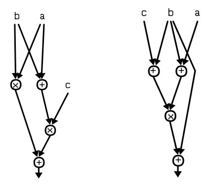

# A new combinational logic minimization technique with applications to cryptology.

Joan Boyar ?<sup>1</sup> and Ren´e Peralta<sup>2</sup>

<sup>1</sup> Department of Mathematics and Computer Science University of Southern Denmark, joan@imada.sdu.dk 2 Information Technology Laboratory, NIST, peralta@nist.gov

Abstract. A new technique for combinational logic optimization is described. The technique is a two-step process. In the first step, the nonlinearity of a circuit – as measured by the number of non-linear gates it contains – is reduced. The second step reduces the number of gates in the linear components of the already reduced circuit. The technique can be applied to arbitrary combinational logic problems, and often yields improvements even after optimization by standard methods has been performed. In this paper we show the results of our technique when applied to the S-box of the Advanced Encryption Standard (AES [5]). This is an experimental proof of concept, as opposed to a full-fledged circuit optimization effort. Nevertheless the result is, as far as we know, the circuit with the smallest gate count yet constructed for this function. We have also used the technique to improve the performance (in software) of several candidates to the Cryptographic Hash Algorithm Competition. Finally, we have experimentally verified that the second step of our technique yields significant improvements over conventional methods when applied to randomly chosen linear transformations.

Keywords: AES; S-box; finite field inversion; circuit complexity; multiplicative complexity.

## 1 Introduction

Constructing optimal combinational circuits is an intractable problem under almost any meaningful metric (gate count, depth, energy consumption, etc.). In practice, no known techniques can reliably find optimal circuits for functions with as few as eight Boolean inputs and one Boolean output (there are 2<sup>256</sup> such functions).

For example, the multiplicative complexity<sup>3</sup> of the Boolean function E<sup>8</sup> 4 , which is true if and only if exactly four of its eight input bits are true, is unknown [2]. In practice, we build circuit implementations of functions using a variety of heuristics. Many of these heuristics have exponential time complexity and thus can only be applied to small components of a circuit being built. This works reasonably well for functions that naturally decompose into repeated use of small components. Such functions include

<sup>?</sup> Partially supported by the Danish Natural Science Research Council (SNF). Some of this work was done while visiting the University of California, Irvine.

<sup>3</sup> The multiplicative complexity of a function is the number of GF(2) multiplications necessary and sufficient to compute it.

arithmetic functions (which we often build using full adders), matrix multiplication (which decomposes into multiplication of small submatrices), and more complex functions such as cryptographic functions (which are commonly based on multiple iterations of an algorithm containing linear steps and one non-linear step).

This work presents a new technique for logic synthesis and circuit optimization. The technique can be applied to arbitrary functions, and yields improvements even on programs/circuits that have already been optimized by standard methods. We apply our technique to the S-box of AES, which, in addition to being used in AES, has been used in several proposals for a new hash function standard<sup>4</sup> . The result is, as far as we know, the smallest circuit yet constructed for this function. The circuit contains 32 AND gates and 83 XOR/XNOR gates for a total of 115 gates. We have also applied these techniques to the logic embedded in the nonlinear components of several candidates to the SHA-3 competition. The improvements in software performance were significant.

Our circuits are over the basis {⊕, ∧, 1}. This basis is logically complete: any Boolean circuit can be transformed into this form using only local replacements. The circuit operations can be viewed either as performing Boolean logic or arithmetic modulo 2. The number of ∧ gates is called the multiplicative complexity of the circuit. Connected components of the circuit containing ∧ gates are called non-linear. Components free of ∧ gates are called linear.

## 2 Combinational circuit optimization

The techniques described here would generally be applied to subcircuits of a larger circuit, such as an S-box in a cryptographic application, which have relatively few inputs and outputs connecting them to the remainder of the circuit. The key observation that led us to our techniques is that circuits with low multiplicative complexity will naturally have large sections which are purely linear (i.e. contain only ⊕ gates). Thus

it is plausible that a two-step process, which first reduces multiplicative complexity and then optimizes linear components, leads to small circuits.

We have, of course, no way of proving this hypothesis. But the experiments reported here support it.

#### First step

The first step of our technique consists of identifying non-linear components of the subcircuit to be optimized and reducing the number of ∧ gates. This reduction is not easy to do. For example, the two circuits

<sup>4</sup> See http://csrc.nist.gov/groups/ST/hash/sha-3/index.html

below compute the same function. But it is not obvious how to algorithmically transform one into the other.



Finding circuits with minimum multiplicative complexity is, in all likelihood, a highly intractable problem. However, recent work on multiplicative complexity contains an arsenal of reduction techniques that in practice yield circuits with small, and often optimal, multiplicative complexity [2]. That work focuses exclusively on symmetric functions (those whose value depends only on the Hamming weight of the input). In this paper we use ad-hoc heuristics to construct a circuit with low multiplicative complexity for inversion in GF(2<sup>4</sup> ). The technique is partially described in Section 3.

#### Second step

The second step of our technique consists of finding maximal linear components of the circuit and then minimizing the number of XOR gates needed to compute the target functions computed in these linear components. A new heuristic for this computationally intractable problem is described in Section 4.

## 3 AES's S-box

The non-linear operation in AES's S-box is to compute an inverse in the field GF(2<sup>8</sup> ). A recursive method for building a circuit for inverses in GF(2mn), given a circuit for inverses in GF(2m), is due to Itoh and Tsujii [6]. The circuits produced by this method are said to have a tower fields architecture. Since there are multiple possible representations for Galois fields, several authors have concentrated on finding representations that yield efficient circuits under the tower fields architecture. We use the same general technique for the reduction from inversion in GF(2<sup>8</sup> ) to GF(2<sup>4</sup> ) inversion, but we use a completely different technique for computing the inversion in GF(2<sup>4</sup> ). We then place the optimized circuit for GF(2<sup>4</sup> ) inversion in its appropriate place in AES's S-box and apply a novel optimization technique on the linear parts of the resulting circuit.

## $GF(2^4)$ inversion – A non-linear component

The tower fields architecture for inversion in  $GF(2^8)$  has (non-trivial) easily identifiable non-linear components corresponding to inversion in subfields. The first step in our method is to focus on one of these components and derive a circuit that uses few  $\land$  gates. The component for inversion in  $GF(2^2)$  is too small for us to benefit significantly from optimizing it. Instead we focus on inversion in  $GF(2^4)$ .

There are many representations of  $GF(2^4)$ . We construct

```
-GF(2^2) by adjoining a root W of x^2 + x + 1 over GF(2); -GF(2^4) by adjoining a root Z of x^2 + x + W^2 over GF(2^2).
```

Following Canright [4], we represent  $GF(2^2)$  using the basis  $(W, W^2)$  and  $GF(2^4)$  using the basis  $(Z^2, Z^8)$ . Thus, an element  $\delta \in GF(2^4)$  is written as  $\delta_1 Z^2 + \delta_2 Z^8$ , where  $\delta_1, \delta_2 \in GF(2^2)$ . Similarly, an element  $\gamma$  in  $GF(2^2)$  is written as  $\gamma_1 W + \gamma_2 W^2$ , where  $\gamma_1, \gamma_2 \in GF(2)$ . Since Z satisfies  $x^2 + x + W^2 = 0$  and W satisfies  $x^2 + x + 1 = 0$ , one can calculate that  $Z^4 = Z^2 + W$ ,  $Z^8 = Z^2 + 1$ ,  $Z^{10} = Z^4 + Z^2 = W$ ,  $Z^{16} = Z^8 + W$ ,  $W^3 = W^2 + W$ ,  $W^4 = W$ , and  $W^5 = W^2$ . These equations can be used to reduce expressions to check equalities.

Using this representation, an element of  $GF(2^4)$  can be written as  $\Delta = (x_1W + x_2W^2)Z^2 + (x_3W + x_4W^2)Z^8$ , where  $x_1, x_2, x_3, x_4 \in GF(2)$ . The inverse of this element,  $\Delta' = (y_1W + y_2W^2)Z^2 + (y_3W + y_4W^2)Z^8$ , can then be calculated using the following polynomials over GF(2):

```
- y_1 = x_2x_3x_4 + x_1x_3 + x_2x_3 + x_3 + x_4
- y_2 = x_1x_3x_4 + x_1x_3 + x_2x_3 + x_2x_4 + x_4
- y_3 = x_1x_2x_4 + x_1x_3 + x_1x_4 + x_1 + x_2
- y_4 = x_1x_2x_3 + x_1x_3 + x_1x_4 + x_2x_4 + x_2
```

The fact that  $\Delta'$  is the inverse of  $\Delta$  can be verified by multiplying the two elements together and reducing using the equations mentioned above (along with  $x^2 = x$  and x + x = 0). The symbolic result is  $(QW + QW^2)Z^2 + (QW + QW^2)Z^8$ , where  $Q = x_1x_2x_3x_4 + x_1x_2x_3 + x_1x_2x_4 + x_1x_3x_4 + x_2x_3x_4 + x_1x_2 + x_1x_3 + x_1x_4 + x_2x_3 + x_2x_4 + x_3x_4 + x_1x_2 + x_3 + x_4$ . The fact that the value of Q is 1 unless all four variables have the value 0, when it is 0, can be seen by observing that it is the symmetric function  $\Sigma_4^4 + \Sigma_3^4 + \Sigma_2^4 + \Sigma_1^4$ . If exactly four variables are set, then the first term gives the value 1 (and the others 0); if three are set, then the second, third and fourth terms give the value 1; if exactly two are set, then only the third gives the value 1; and if only one is set, then only the last gives the value 1. Hence, the result is 1, except for the zero input.<sup>5</sup>

Thus the task at hand is to construct a circuit with four inputs and four outputs that calculates the above system of equations using as few

<sup>&</sup>lt;sup>5</sup> A circuit for finite field inversion must have some output for the non-invertible zero element. In the following constructions we follow the AES convention that the output on input zero is zero.

∧ gates as possible. Currently, our heuristic search programs can handle functions with one output and up to eight inputs. This means that we can directly construct optimal circuits for each of the four equations individually, but not for the system itself. For the full system we took the following approach:

- pick an equation and construct an efficient circuit for it;
- store intermediate functions computed in the previous steps for possible use in constructing a circuit for the next equation to be tackled;
- iterate until all equations have been computed.

The first step is non-trivial even for predicates on few inputs. The heuristic we used is inspired by methods from automatic theorem proving. We omit its description here due to space constraints<sup>6</sup> . We can report, however, that we succeeded in determining the multiplicative complexity of all 2<sup>16</sup> predicates on four bits. It turns out that 3 multiplications are enough to compute any predicate on four variables.<sup>7</sup> This is of interest to designers of cryptographic functions since many constructions have been proposed which use 4x4 S-boxes. We have not yet been able to do the same for all predicates on 5 bits.

We performed the three steps above for each of the 24 orderings of {y1, y2, y3, y4}. The ordering (y4, y2, y1, y3) gave the best results. The resulting circuit, expressed as a straight-line program over GF(2), is shown in Figure 1 (outputs are indicated by an (\*) ).

```
t1 = x1 + x2 t2 = x1 × x3 t3 = x4 + t2
t4 = t1 × t3 y4 = x2 + t4 (∗) t5 = x3 + x4
t6 = x2 + t2 t7 = t6 × t5 y2 = x4 + t7 (∗)
t8 = x3 + y2 t9 = t3 + y2 t10 = x4 × t9
y1 = t10 + t8 (∗) t11 = t3 + t10 t12 = y4 × t11
y3 = t12 + t1 (∗)
```

Fig. 1. Inversion in GF(2<sup>4</sup> ).

This circuit contains 5 ∧ gates and 11 ⊕ gates. It is a significant improvement over previous constructions, e.g. Paar's construction [8] has a gate count of 10 ∧ gates and 15 ⊕ gates for the same function. It is harder to compare to Canright's construction [4]. In his original, he had 9 ∧ gates (and NAND gates) and 14 ⊕ gates (and XNOR gates), but he optimized, allowing NOR gates. After this, he had 8 NAND gates, 2 NOR gates, and 9 XOR/XNOR gates.

<sup>6</sup> A description can be found in the patent application by NIST and the University of Southern Denmark ([3]).

<sup>7</sup> Lest the reader think this trivial, he/she may attempt to compute the function f() = x1x2x3x<sup>4</sup> + x1x2x<sup>3</sup> + x1x2x<sup>4</sup> + x2x3x<sup>4</sup> + x1x<sup>2</sup> + x1x<sup>3</sup> + x1x<sup>4</sup> + x2x<sup>3</sup> + x3x<sup>4</sup> using only three multiplications.

The multiplicative complexity of a function is the number of GF(2) multiplications necessary and sufficient to compute it. Under the given representation for GF(2<sup>4</sup> ), the multiplicative complexity of inversion is 5. This can be argued as follows: the upper bound is given by the construction. The four outputs that have to be computed all have degree 3. One ∧ is needed to compute a polynomial of degree 2. Then, an additional ∧ is necessary to produce each of the four linearly independent polynomials, since each is of degree 3.

#### A view of the structure of AES's S-box

In the previous section, using the tower fields architecture, we identified and optimized (with respect to multiplicative complexity) a major nonlinear component in an implementation of the AES S-box. That completes the first step of our technique for circuit optimization, but in other circuits, one may be able to identify more non-linear components with few enough inputs that they can also be optimized before continuing. In the case of AES, after the non-linear portions of the circuit are optimized, as expected, a bird's-eye view of the resulting circuit reveals large linear connected components. In fact, from a cryptanalyst's point of view, the topology of the resulting circuit is potentially of interest: the S-box of AES consists of an initial linear expansion U from 8 to 22 bits, followed by a non-linear contraction F from 22 to 18 bits, and ending with a linear contraction B from 18 to 8 bits. The U and B matrices are given in Appendix A. AES's S-box is S(x) = B · F(U · x) + [11000110]<sup>T</sup> , where · is matrix multiplication and x is the 8-bit S-box input. We do not know if there are any cryptanalytic implications to the structure of these matrices. The first row and last columns of U should raise an eyebrow, as should the 12th and the last three columns of B. Note that the initial linear expansion and the linear contraction were defined to contain as much of the circuit as possible while still being linear. Thus, the portion of the circuit defined by U, for example, overlaps with the GF(2<sup>8</sup> ) inversion. The next step was to minimize the circuits for computing U and B.

## 4 Minimizing linear components

Gate optimization of circuits for linear functions has been extensively studied. It has been shown that the problem of linear-circuit optimization is NP-hard [1]. That paper further shows that unless P=NP, this problem does not even have efficient -approximation schemes. Thus, our goal in this research is restricted to improving on known heuristics. As far as we know, the most successful heuristics are variations on a greedy algorithm due to Paar [9]. We report significant improvements over the latter methods.

A linear straight-line program over a field F is a variation on a straight-line program which does not allow multiplication of variables. That is, every line of the program is of the form  $u := \lambda v + \mu w$  where  $\lambda, \mu$  are in F and v, w are variables. Constructing a linear circuit for a given function f is equivalent to constructing a linear straight-line program over GF(2) which computes f. (Note that, over GF(2)  $\lambda$ , and  $\mu$  are always 1 and thus are never written explicitly.)

A linear straight-line program over GF(2) is said to be *cancellation-free* if, for every line of the program u := v + w, none of the variables in the expression for v are also present in the expression for w, i.e., there is no cancellation of variables in the computation.

Previous work on circuit minimization for AES S-boxes (e.g. [8, 10, 4]) only consider cancellation-free straight-line programs for producing a set of linear forms over GF(2). Some authors appear to make the incorrect assumption that there always exists a cancellation-free optimal linear program over GF(2). A small counter-example showing this is not the case is the following:

$$x_1 + x_2$$
;  $x_1 + x_2 + x_3$ ;  $x_1 + x_2 + x_3 + x_4$ ;  $x_2 + x_3 + x_4$ .

It is not hard (although somewhat tedious) to see that the optimum cancellation-free straight-line program has length 5. A solution of length 4 which allows cancellations is

$$v_1 = x_1 + x_2$$
;  $v_2 = v_1 + x_3$ ;  $v_3 = v_2 + x_4$ ;  $v_4 = v_3 + x_1$ .

In [1], we show that any algorithm for computing linear programs that is restricted to cancellation-free programs is at most  $\frac{3}{2}$ -approximating. Thus, even optimal cancellation-free circuits can be far from optimal in the unrestricted model. The heuristic we present below is not restricted to producing cancellation-free circuits. Furthermore, there appears to be little reason for restricting the search to cancellation-free circuits, as we have shown that finding an optimal cancellation-free circuit is NP-hard ([1]).

#### A new heuristic

Let S be a set of linear functions. For any linear predicate f, we define the distance  $\delta(S, f)$  as the minimum number of additions of elements from S necessary to obtain f.

The problem is to find a short linear program that computes  $f(\mathbf{x}) = M\mathbf{x}$  where M is an  $m \times n$  matrix over GF(2). The heuristic is as follows. We keep a "base" S of "known" functions. Initially S is just the set of variables  $x_1, \ldots, x_n$ . We maintain the vector Dist[] of distances from S to the linear functions given by the rows of M. That is,  $Dist[i] = \delta(S, f_i)$  where  $f_i$  is the  $i^{th}$  row of M multiplied by the input vector  $\mathbf{x}$ . Initially, Dist[i] is just one less than the Hamming weight of row i. We then perform the following loop

- pick a new base element by adding two existing base elements;

– update Dist[];

until Dist[i] = 0 for all i.

The current criterion for picking the new base element is

- pick one that minimizes the sum of new distances;
- resolve ties by maximizing the Euclidean norm of the vector of new distances.

This tie resolution criterion, which we term "Norm", may seem counterintuitive. The basic idea is that we prefer a distance vector like 0,0,3,1 to one like 1,1,1,1. In the latter case, we would need 4 more gates to finish. In the former, 3 might do it.

The bulk of the time of the heuristic is spent on picking the new base element. Our experiments show that the following "pre-emptive" choice usually improves running time without increasing the size of the output circuit:

– if any two bases S[i], S[j] are such that S[i]⊕S[j] is a row in M, then pick this sum as the new base element.

The tie resolution criterion is a critical part of the heuristic. It does well on most matrices we have tried, but we have found specific matrices for which other decision rules do better. Intuitively, no one simple rule should work for all matrices. The effectiveness of the heuristic most likely depends on the topology of the digraph represented by the input matrix. We have not pursued this line of inquiry. We have, however tested our heuristic with various tie resolution methods against Paar's algorithm [9]. On random matrices, our heuristic gives significant improvements under Norm as well as under three other tie-breaking rules (see Section 6 and Appendix B).

The distance vector in our heuristics is computed by exhaustive search. The reason the heuristic is practical for moderate-size matrices is that the distance can only decrease. In fact, it can only decrease by 1. So when a new base is being considered, if a distance is d, then only combinations of exactly d − 1 old base elements and the new base element need to be considered.

#### A small example using the heuristic

Suppose we need a circuit that computes the following system of equations.

$$y_0 = x_0 + x_1 + x_2$$

$$y_1 = x_1 + x_3 + x_4$$

$$y_2 = x_0 + x_2 + x_3 + x_4$$

$$y_3 = x_1 + x_2 + x_3$$

$$y_4 = x_0 + x_1 + x_3$$

$$y_5 = x_1 + x_2 + x_3 + x_4$$

Equivalently, we need a circuit for multiplication by the following  $6\times 5$  matrix

$$M = \begin{bmatrix} 1 & 1 & 1 & 0 & 0 \\ 0 & 1 & 0 & 1 & 1 \\ 1 & 0 & 1 & 1 & 1 \\ 0 & 1 & 1 & 1 & 0 \\ 1 & 1 & 0 & 1 & 0 \\ 0 & 1 & 1 & 1 & 1 \end{bmatrix}$$

The target signals to be computed are simply the rows of M. The initial base is  $\{x_0, x_1, x_2, x_3, x_4\}$ , which corresponds to

$$S = \{ \begin{bmatrix} 1 & 0 & 0 & 0 & 0 \end{bmatrix}, \begin{bmatrix} 0 & 1 & 0 & 0 & 0 \end{bmatrix}, \begin{bmatrix} 0 & 0 & 1 & 0 & 0 \end{bmatrix}, \\ \begin{bmatrix} 0 & 0 & 0 & 1 & 0 \end{bmatrix}, \begin{bmatrix} 0 & 0 & 0 & 0 & 1 \end{bmatrix} \}$$

The initial distance vector is

$$D = [223223]$$

The heuristic must find two base vectors whose sum, when added to the base, minimizes the sum of the new distances. It turns out the right choice is to calculate  $x_1 + x_3$ . So the new base S is expanded to contain the signal

$$[0 1 0 1 0] = [0 1 0 0 0] + [0 0 0 1 0]$$

The new distance vector is

$$D = \left[\,2\;1\;3\;1\;1\;2\,\right]$$

The full run of the program is below. The tie breaking criteria is used in Step 2. If one had chosen  $x_1 + x_2$  instead of  $x_0 + t_5$ , the new distance vector would be  $\begin{bmatrix} 1 & 1 & 3 & 1 & 1 & 2 \end{bmatrix}$ , which has norm  $\sqrt{17}$ , while the one found has norm  $\sqrt{19}$ . Note that there is cancellation in the last step.

Step 1:  $t_5 = x_1 + x_3$ . New D: [2 1 3 1 1 2].

Step 2:  $t_6 = x_0 + t_5$  (found target signal  $y_4 = [1 \ 1 \ 0 \ 1 \ 0]$ ). New D:  $[2 \ 1 \ 3 \ 1 \ 0 \ 2]$ .

Step 3 :  $t_7 = x_2 + t_5$  (found target signal  $y_3 = [0\ 1\ 1\ 1\ 0]$ ). New D :  $[2\ 1\ 3\ 0\ 0\ 1]$ .

Step  $4: t_8 = x_4 + t_5$  (found target signal  $y_1 = [0\ 1\ 0\ 1\ 1]$ ). New D:  $[2\ 0\ 3\ 0\ 0\ 1]$ .

Step  $5: t_9 = x_2 + t_8$  (found target signal  $y_5 = [0\ 1\ 1\ 1\ 1]$ ). New D:  $[2\ 0\ 2\ 0\ 0]$ .

Step  $6: t_{10} = x_0 + x_1$ . New D:  $[1\ 0\ 1\ 0\ 0\ 0]$ .

Step 7:  $t_{11} = x_2 + t_{10}$  (found target signal  $y_0 = [1 \ 1 \ 1 \ 0 \ 0]$ ). New D:  $[0 \ 0 \ 1 \ 0 \ 0]$ .

Step 8:  $t_{12} = t_8 + t_{11}$  (found target signal  $y_2 = [1 \ 0 \ 1 \ 1 \ 1]$ ). New D:  $[0 \ 0 \ 0 \ 0 \ 0]$ . (DONE!)

## 5 A circuit for the S-box of AES

Our techniques yield a circuit for the AES S-box composed of three parts: a "top" linear transformation; a middle non-linear part; and a "bottom" linear transformation. The linear transformations are defined by the matrices U and B of Appendix A.

For matrix U, the smallest circuits we found had 23 ⊕ gates. Among the many such circuits, the shortest ones have depth 7. It is worthwhile to note that if 24 ⊕ gates are allowed, circuits with depth 4 exist for U. Figure 2 in Appendix C shows a circuit of size 23 and depth 7. The circuit maps inputs x<sup>0</sup> . . . x<sup>7</sup> to outputs x7, y<sup>1</sup> . . . y21.

Figure 3 in Appendix C shows the non-linear middle part of the S-box circuit. It is a function from 22 to 18 bits. The circuit contains 32 ∧ gates and 32 ⊕ gates. It maps inputs x7, y<sup>1</sup> . . . y<sup>21</sup> to outputs z<sup>0</sup> . . . z17.

For matrix B, the randomized version of our heuristic yields many circuits with 30 ⊕ gates. The heuristic is fast enough that we are able to pick a circuit which is both small and short. Figure 4 in Appendix C shows a circuit of depth 6. The circuit maps inputs z<sup>0</sup> . . . z<sup>17</sup> to outputs s<sup>0</sup> . . . s7.

## 6 Experiments with different tie-breaking methods

In order to compare the effects of using different tie-breakers, we tested our heuristics on matrices generated as follows

- We first chose a size (for example, 10 × 20 matrices, which represent 10 linear forms on 20 distinct variables);
- We then picked a bias ρ between 0 and 1;
- For each entry of the matrix, we set the bit to 1 with probability ρ and to 0 with probability 1 − ρ. Thus ρ is the expected fraction of variables that appears in each linear form.
- Matrices with rows which are all zeros were discarded, as were matrices containing duplicate rows.

The testing was performed with a C++ program, compiled with g++ -O3, on a quadcore x86 64, running Ubuntu 9.10, with Intel Xenon 5150 processors running at 2.66 GHz, with 8 GB memory. There were no other users on the machine. We compared the different heuristics on sets of one hundred random matrices with different sizes and densities. The experiment showed that the heuristics were slower when the bias was larger. This was expected, since the initial "distances" (number of operations on the base vectors to obtain the target vectors) were then larger on average when there were more ones in the matrices.

The tie-breakers we compared were the following:

- Norm: maximizing the Euclidean norm
- Norm-largest: maximizing the square of the Euclidean norm minus the largest distance

- Norm-diff: maximizing the square of the Euclidean norm minus the difference of the largest two distances
- Random: In processing the possible new base vectors, if the current possible new base vector has the same sum of distances as the previous best (current choice), then flip an unbiased coin. If heads, then keep the current choice. If tails, then apply the Norm criterion. This heuristic may end up choosing a pair with non-maximum Euclidean norm. On the other hand, it allows substitution of one optimum (by sum-of-distances and Euclidean norm) pair by another found later in the search.

In all cases, except the "Random" one, when there were still ties after applying the "tie-breaker", the first pair with both the minimum sum of distances and the optimal value for the tie-breaker was chosen. This was the base pair with lexicographically minimum indices (i, j). Randomized tie-breaking allows running the heuristic several times and picking the best result. In our tests we ran the heuristic with "Random" tie-breaking three times.

We also compared these heuristics to Paar's heuristic [9] on the same matrices. Paar's heuristic repeatedly finds the most frequently occurring base pair and adds that as the next base pair. It is significantly faster than our heuristic, but it produces only cancellation-free circuits. Its performance, relative to the heuristics proposed here, decreases as the bias increases, using more than 30% extra gates when the bias is 3/4 (when the number of rows is at least 15) and 40% extra when the bias is 9/10.

Among the biases tried, the number of gates in the circuits found by our heuristics is similar with biases 1/2 and 3/4. It is not a strictly increasing function of the bias, since when nearly all of the variables are used in nearly all of the forms, the outputs from many of the gates can be reused for many targets. Thus, circuits with fewer gates were found when the bias was 9/10 than when it was 1/2 or 3/4. This was also true for Paar's heuristic, but less dramatically so.

All the tie resolution criteria performed fairly similarly, producing circuits of nearly the same size, with Random apparently doing slightly better (more often producing smaller circuits), presumably because it tries three different circuits and uses the best. Random also runs for about three times as long as the others. The results of these tests are presented in tables in Appendix B. In the tables, the column headings specify the matrix size and the bias. For each heuristic, and all matrix sizes and biases, 100 randomly chosen matrices were tested.

For each tie-breaker rule and Paar's heuristic, for each matrix size and bias, the average number of gates in the circuits found and the number of matrices where that heuristic did not obtain the minimum value of all of the heuristics is given, along with the running time in seconds. Note that this means the Paar heuristic was beaten by at least one of the other heuristics on all 700 matrices except for 17 of the 100 with bias 1/4 (and there was only one matrix on which Paar's heuristic beat any of the other heuristics). In fact, for the tests with bias larger than 1/4, Paar's heuristic did worse than any of the other heuristic on every one of the matrices; usually the values obtained for the newer heuristics were similar, with Random possibly being marginally better, but with the value for Paar's heuristic being significantly larger.

Paar's heuristic (and, for matrices between size 4 and 10, a variant which does at most one gate better on average in the data presented) was tested [9] on square matrices of sizes 4×4 through 16×16 and the average number of XOR gates is presented, along with the relative improvement over the straightforward implementation. These square matrices came from applying Mastrovito's [7] matrix description of multiplication in GF(2<sup>n</sup> ) to constant multiplication. Paar tries all possible constants in GF(2<sup>n</sup> ) for n between 4 and 16, giving these square matrices. Since our heuristics are so much slower and the matrices in the cryptographic applications we are interested in do not necessarily have this form, we have not tested on all of these restriced matrices of those sizes, but rather on random matrices with different biases. For 15 ×15 matrices, Paar gets an average of 52.9 gates. This is similar to our results for Paar's algorithm with 15 × 15 matrices with biases 1/2 and 3/4, where the Paar heuristic gets averages of 51.7 and 53.3 gates, respectively. For bias 1/2, our deterministic heuristics get average gate counts between 44.21 and 44.28, while Random gets 43.81. For bias 3/4, our deterministic heuristics all get average count 40.82, while Random gets 40.38. Thus, our relative improvement over the Paar heuristic is between 17% and 32% for these types of matrices. Paar's result of 52.9 gates for 15 × 15 matrices is a relative improvement of 45.5% over the straightforward approach.

The last row in each table in Appendix B shows the sums of the values which are the minimum of those calculated by the different heuristics for each matrix. This shows that for each of the tie-breakers, there are cases where it gets a worse result than at least one of the others.

## 7 Conclusions and work in progress

We tested new techniques for decreasing circuit size. The techniques were applied to the extensively studied AES S-box. We obtained the smallest circuit yet constructed for this function. The circuit contains 32 AND gates and 83 XOR/XNOR gates for a total of 115 gates. As by-products of the experiment we obtained very small circuits for inversion in GF(2<sup>4</sup> ) and GF(2<sup>8</sup> ).

The experiments with linear circuit optimization indicate that our techniques are likely to be superior to previous techniques which produced only cancellation-free circuits. We expect this to be particularly useful for cryptographic applications where many XOR operations are used, along with some AND operations to introduce nonlinearity.

Along with the many implications of our experiments, our results lead us to question the common wisdom that multiplication in GF(2<sup>n</sup> ) using Mastrovito Multipliers requires about n <sup>2</sup> additions and n <sup>2</sup> multiplications (see, for example, [11]). In future work we intend to re-examine this body of work.

It would be interesting to determine how close to optimal the circuits found by these techniques usually are and how much better they are than the optimal cancellation-free circuits. Finding even better techniques which are not restricted to finding cancellation-free circuits would also be very interesting.

## References

- 1. J. Boyar, P. Matthews, and R. Peralta. On the shortest linear straight-line program for computing linear forms. In Mathematical Foundations of Computer Science, volume 5162 of Lecture Notes in Computer Science, pages 168–179, 2008.
- 2. J. Boyar and R. Peralta. Tight bounds for the multiplicative complexity of symmetric functions. Theoretical Computer Science, 396(1-3):223–246, 2008.
- 3. J. Boyar and R. Peralta. Patent application number 61089998 filed with the U.S. Patent and Trademark Office. A new technique for combinational circuit optimization and a new circuit for the S-Box for AES, 2009.
- 4. D. Canright. A very compact Rijndael S-box. Technical Report NPS-MA-05-001, Naval Postgraduate School, 2005.
- 5. FIPS. Advanced Encryption Standard (AES). National Institute of Standards and Technology, 2001.
- 6. T. Itoh and S. Tsujii. A fast algorithm for computing multiplicative inverses in GF(2<sup>m</sup>) using normal bases. Inf. Comput., 78(3):171–177, 1988.
- 7. E. Mastrovito. VLSI architectures for computation in Galois fields. PhD thesis, Link¨oping University, Dept. Electr. Eng., Sweden, 1991.
- 8. C. Paar. Some remarks on efficient inversion in finite fields, 1995. In 1995 IEEE International Symposium on Information Theory, page 58, Whistler, B.C. Canada.
- 9. C. Paar. Optimized arithmetic for Reed-Solomon encoders. In IEEE International Symposium on Information Theory, page 250, 1997.
- 10. A. Satoh, S. Morioka, K. Takano, and S. Munetoh. A compact Rijndael hardware architecture with S-Box optimization. In Advances in Cryptology - Proceedings of ASIACRYPT 01, volume 2248 of Lecture Notes in Computer Science, pages 239–254. Springer-Verlag, 2001.
- 11. B. Sunar and C¸ . K. Ko¸c. Mastrovito multiplier for all trinomials. IEEE Trans. Comput., 48(5):522–527, 1999.

Appendix A: The matrices U and B for the top and bottom linear parts of the AES S-box

$$U = \begin{bmatrix} 0 & 0 & 0 & 0 & 0 & 0 & 0 & 1 \\ 0 & 1 & 1 & 0 & 0 & 0 & 0 & 1 \\ 1 & 1 & 1 & 0 & 0 & 0 & 0 & 1 \\ 1 & 1 & 1 & 0 & 0 & 0 & 0 & 1 \\ 0 & 1 & 1 & 0 & 0 & 0 & 1 \\ 0 & 1 & 1 & 0 & 0 & 0 & 1 \\ 1 & 0 & 1 & 1 & 0 & 1 & 1 \\ 0 & 1 & 0 & 0 & 1 & 1 & 1 \\ 1 & 0 & 0 & 0 & 1 & 1 & 1 \\ 1 & 0 & 0 & 0 & 1 & 1 & 0 \\ 1 & 0 & 0 & 1 & 0 & 1 & 0 \\ 1 & 0 & 1 & 0 & 1 & 1 & 0 \\ 1 & 0 & 0 & 1 & 0 & 1 & 0 \\ 1 & 0 & 0 & 1 & 0 & 1 & 0 \\ 0 & 0 & 1 & 0 & 1 & 1 & 0 \\ 1 & 0 & 0 & 1 & 0 & 1 & 1 & 0 \\ 0 & 0 & 1 & 0 & 1 & 1 & 0 \\ 1 & 0 & 1 & 0 & 1 & 1 & 0 & 0 & 0 & 0 &$$

 $B = \begin{bmatrix} 0 & 1 & 1 & 0 & 1 & 1 & 0 & 0 & 0 & 1 & 1$

Appendix B: Experimental results on samples of 100 random matrices

|              | $15 \times 15 \text{ matrices}, \text{ Bias} = \frac{1}{4}$ |         |         | $15 \times 15 \text{ matrices}, \text{ Bias} = \frac{1}{2}$ |         |         |
|--------------|-------------------------------------------------------------|---------|---------|-------------------------------------------------------------|---------|---------|
| Heuristic    | Average                                                     | Not min | Seconds | Average                                                     | Not min | Seconds |
| Norm         | 29.65                                                       | 16      | 12      | 44.21                                                       | 48      | 125     |
| Norm-largest | 29.63                                                       | 14      | 12      | 44.23                                                       | 49      | 121     |
| Norm-diff    | 29.65                                                       | 15      | 11      | 44.28                                                       | 51      | 119     |
| Random       | 29.59                                                       | 10      | 29      | 43.81                                                       | 23      | 322     |
| Paar         | 31.07                                                       | 83      | 0.01    | 51.70                                                       | 100     | 0.02    |
| Minimum      | 29.48                                                       | 0       | -       | 43.50                                                       | 0       | -       |

|              | $15 \times 15 \text{ matrices}, \text{ Bias} = \frac{3}{4}$ |         |         | $15 \times 15 \text{ matrices}, \text{ Bias} = \frac{9}{10}$ |         |         |
|--------------|-------------------------------------------------------------|---------|---------|--------------------------------------------------------------|---------|---------|
| Heuristic    | Average                                                     | Not min | Seconds | Average                                                      | Not min | Seconds |
| Norm         | 40.82                                                       | 47      | 291     | 30.28                                                        | 31      | 388     |
| Norm-largest | 40.82                                                       | 46      | 290     | 30.28                                                        | 31      | 428     |
| Norm-diff    | 40.82                                                       | 46      | 292     | 30.29                                                        | 32      | 388     |
| Random       | 40.39                                                       | 23      | 838     | 30.01                                                        | 14      | 1145    |
| Paar         | 53.27                                                       | 100     | 0.03    | 43.11                                                        | 100     | 0.02    |
| Minimum      | 40.11                                                       | 0       | -       | 29.86                                                        | 0       | -       |

|              | $20 \times 20 \text{ matrices}, \text{ Bias} = \frac{3}{4}$ |         |         |  |  |
|--------------|-------------------------------------------------------------|---------|---------|--|--|
| Heuristic    | Average                                                     | Not min | Seconds |  |  |
| Norm         | 67.47                                                       | 62      | 86,465  |  |  |
| Norm-largest | 67.43                                                       | 60      | 82,597  |  |  |
| Norm-diff    | 67.40                                                       | 58      | 82,780  |  |  |
| Random       | 66.87                                                       | 30      | 234,815 |  |  |
| Paar         | 90.86                                                       | 100     | 0.11    |  |  |
| Minimum      | 66.43                                                       | 0       | -       |  |  |

|              | $20 \times 10 \text{ matrices}, \text{ Bias} = \frac{3}{4}$ |         |         | $10 \times 20 \text{ matrices}, \text{ Bias} = \frac{3}{4}$ |         |         |
|--------------|-------------------------------------------------------------|---------|---------|-------------------------------------------------------------|---------|---------|
| Heuristic    | Average                                                     | Not min | Seconds | Average                                                     | Not min | Seconds |
| Norm         | 31.44                                                       | 25      | 1.35    | 42.04                                                       | 44      | 30,626  |
| Norm-largest | 31.43                                                       | 24      | 1.38    | 42.08                                                       | 44      | 30,490  |
| Norm-diff    | 31.44                                                       | 25      | 1.34    | 42.12                                                       | 44      | 30,740  |
| Random       | 31.23                                                       | 11      | 4.08    | 41.76                                                       | 22      | 84,540  |
| Paar         | 43.32                                                       | 100     | 0.02    | 50.02                                                       | 100     | 0.02    |
| Minimum      | 31.12                                                       | 0       | -       | 41.50                                                       | 0       | -       |

## Appendix C: The circuit definition for the AES S-box

```
y_{14} = x_3 + x_5
                         y_{13} = x_0 + x_6
                                                   y_9 = x_0 + x_3
y_8 = x_0 + x_5
                                                  y_1 = t_0 + x_7
                       t_0 = x_1 + x_2
y_4 = y_1 + x_3
                       y_{12} = y_{13} + y_{14}
                                                   y_2 = y_1 + x_0
y_5 = y_1 + x_6
                         y_3 = y_5 + y_8
                                                   t_1 = x_4 + y_{12}
y_{15} = t_1 + x_5
                         y_{20} = t_1 + x_1
                                                    y_6 = y_{15} + x_7
                                                   y_7 = x_7 + y_{11}
y_{10} = y_{15} + t_0
                          y_{11} = y_{20} + y_9
                                                    y_{16} = t_0 + y_{11}
y_{17} = y_{10} + y_{11}
                          y_{19} = y_{10} + y_8
y_{21} = y_{13} + y_{16}
                          y_{18} = x_0 + y_{16}
```

**Fig. 2.** Top linear transformation: Inputs are  $x_0, x_1, ..., x_7$ . Outputs to the next level are  $x_7, y_1, y_2, ..., y_{21}$ .

```
t_2 = y_{12} \times y_{15}
                                   t_3 = y_3 \times y_6
                                                                       t_4 = t_3 + t_2
                                                                      t_7 = y_{13} \times y_{16}
t_5 = y_4 \times x_7
                                   t_6 = t_5 + t_2
t_8 = y_5 \times y_1
                                   t_9 = t_8 + t_7
                                                                      t_{10} = y_2 \times y_7
t_{11} = t_{10} + t_7
                                   t_{12} = y_9 \times y_{11}
                                                                      t_{13} = y_{14} \times y_{17}
t_{14} = t_{13} + t_{12}
                                   t_{15} = y_8 \times y_{10}
                                                                      t_{16} = t_{15} + t_{12}
t_{17} = t_4 + t_{14}
                                   t_{18} = t_6 + t_{16}
                                                                      t_{19} = t_9 + t_{14}
t_{20} = t_{11} + t_{16}
                                   t_{21} = t_{17} + y_{20}
                                                                       t_{22} = t_{18} + y_{19}
t_{23} = t_{19} + y_{21}
                                   t_{24} = t_{20} + y_{18}
                                   t_{26} = t_{21} \times t_{23}
                                                                      t_{27} = t_{24} + t_{26}
t_{25} = t_{21} + t_{22}
                                                                      t_{30} = t_{23} + t_{24}
t_{28} = t_{25} \times t_{27}
                                   t_{29}\,=t_{28}+t_{22}
t_{31} = t_{22} + t_{26}
                                   t_{32} = t_{31} \times t_{30}
                                                                       t_{33} = t_{32} + t_{24}
t_{34} = t_{23} + t_{33}
                                   t_{35} = t_{27} + t_{33}
                                                                      t_{36} = t_{24} \times t_{35}
                                   t_{38} = t_{27} + t_{36}
t_{37} = t_{36} + t_{34}
                                                                       t_{39} = t_{29} \times t_{38}
t_{40} = t_{25} + t_{39}
t_{41} = t_{40} + t_{37}
                                   t_{42} = t_{29} + t_{33}
                                                                      t_{43} = t_{29} + t_{40}
t_{44} = t_{33} + t_{37}
                                   t_{45} = t_{42} + t_{41}
                                                                      z_0 = t_{44} \times y_{15}
z_1 = t_{37} \times y_6
                                   z_2 = t_{33} \times x_7
                                                                      z_3 = t_{43} \times y_{16}
z_4 = t_{40} \times y_1
                                   z_5 = t_{29} \times y_7
                                                                       z_6 = t_{42} \times y_{11}
                                   z_8 = t_{41} \times y_{10}
z_7 = t_{45} \times y_{17}
                                                                       z_9 = t_{44} \times y_{12}
z_{10} = t_{37} \times y_3
                                   z_{11} = t_{33} \times y_4
                                                                       z_{12} = t_{43} \times y_{13}
z_{13} = t_{40} \times y_5
                                   z_{14} = t_{29} \times y_2
                                                                       z_{15} = t_{42} \times y_9
z_{16} = t_{45} \times y_{14}
                                   z_{17} = t_{41} \times y_8
```

**Fig. 3.** The middle non-linear section: Inputs are  $x_7, y_1, y_2, ..., y_{21}$ . Outputs to the next level are  $z_0, z_1, ..., z_{17}$ . Note that the computation of  $t_{25}$  through  $t_{40}$  is the inversion in  $GF(2^4)$ .

```
t_{46} = z_{15} + z_{16}
                                 t_{47} = z_{10} + z_{11}
                                                                          t_{48} = z_5 + z_{13}
t_{49} = z_9 + z_{10}
                                 t_{50} = z_2 + z_{12}
                                                                          t_{51} = z_2 + z_5
t_{52} = z_7 + z_8
                                 t_{53} = z_0 + z_3
                                                                          t_{54} = z_6 + z_7
t_{55} = z_{16} + z_{17}
                                 t_{56} = z_{12} + t_{48}
                                                                          t_{57} = t_{50} + t_{53}
                                                                          t_{60} = t_{46} + t_{57}
t_{58} = z_4 + t_{46}
                                 t_{59} = z_3 + t_{54}
t_{61} = z_{14} + t_{57}
                                 t_{62} = t_{52} + t_{58}
                                                                          t_{63} = t_{49} + t_{58}
                                                                          t_{66} = z_1 + t_{63}
t_{64} = z_4 + t_{59}
                                 t_{65} = t_{61} + t_{62}
                                                                          s_7 = t_{48} \text{ XNOR } t_{60}
s_0 = t_{59} + t_{63}
                                 s_6 = t_{56} \text{ XNOR } t_{62}
t_{67} = t_{64} + t_{65}
                                 s_3 = t_{53} + t_{66}
                                                                          s_4 = t_{51} + t_{66}
s_5 = t_{47} + t_{65}
                                 s_1 = t_{64} \text{ XNOR } s_3
                                                                          s_2 = t_{55} \text{ XNOR } t_{67}
```

**Fig. 4.** Bottom linear transformation: Inputs are  $z_0, z_1, ..., z_{17}$ . Outputs are  $s_0, s_1, ..., s_7$ .