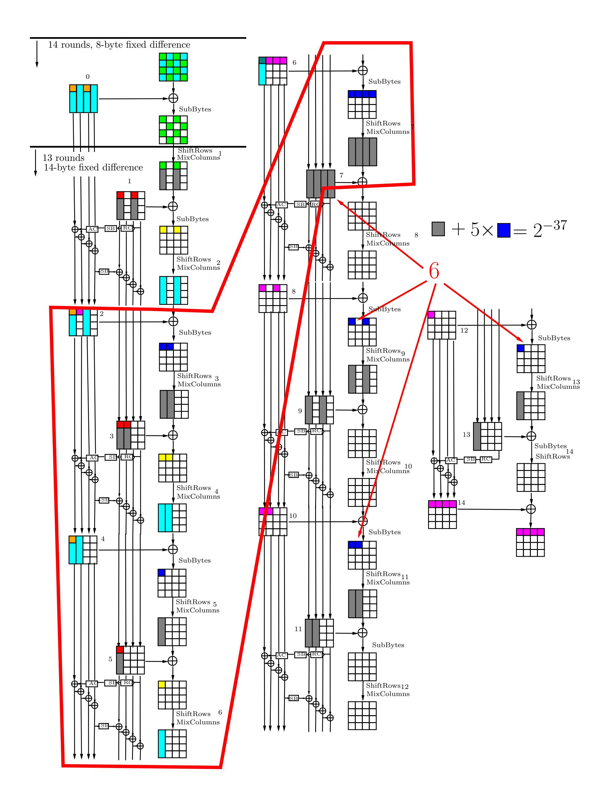

{0}------------------------------------------------

## Examples of differential multicollisions for 13 and 14 rounds of AES-256

Alex Biryukov, Dmitry Khovratovich, Ivica Nikolić

University of Luxembourg

{alex.biryukov, dmitry.khovratovich, ivica.nikolic@uni.lu}

Here we present practical differential q-multicollisions for AES-256. In our paper [1] q-multicollisions are found with complexity  $q \cdot 2^{67}$ . We relax conditions on the plaintext difference  $\Delta_P$  allowing some bytes to vary and find multicollisions for 13 and 14 round AES with complexity  $q \cdot 2^{37}$ . Even with the relaxation there is still a large complexity gap between our algorithm and the lower bound that we have proved in Lemma 1. Moreover we believe that in practice finding even two fixed-difference collisions for a good cipher would be very challenging.

The multicollision sets, presented in the tables below, are obtained using the technique described in our original paper. Our search algorithm for 13 and 14 rounds of AES-256 can be described as:

- 1. Build a differential trail for 14 rounds of AES-256. The trail specifies the admissible values of the active S-boxes in these rounds.
- 2. Using the triangulation algorithm produce one pair that satisfies all the conditions for the S-boxes in the rounds 3–7.
- 3. If this pair satisfies the conditions for the rounds 8-14 as well then goto step 4; else go to step 2.
- 4. Decrypt the pair through one round and print the 13 round example (decrypt the pair through two rounds and print the 14 round example).

Note that, since we use our triangulation algorithm, the S-boxes active in the rounds 3–7 do not increase the complexity of the search, because we always fix the right (admissible) values for them. Hence, the complexity of the above algorithm is fully determined only by the number of active S-boxes in the rounds 8-14 plus one active S-box in the key schedule in round 6 that our triangulation algorithm does not cover. Therefore, we have in total 6 active S-boxes. Five of these hold with probability  $2^{-6}$  and one with probability  $2^{-7}$ , hence the total complexity for finding one collision is  $2^{37}$  executions of step 2. Since S-boxes get admissible values in rounds 3–14, the remaining one (two) rounds in the beginning can add only two bytes (eight bytes) variation to the difference, i.e. the rest of the bytes will still have the pre-fixed differences.

Our lower bound from Lemma 1 suggests that for 13 rounds of AES-256 one would expect to find this type of differential 5-multicollision, with fixed input difference in 14 bytes of the plaintext, and fixed output difference in the ciphertext, with complexity  $2^{\frac{4\cdot112}{6}}=2^{74.6}$  computations. Our search algorithm finds this multicollision set with  $5\cdot 2^{37}$  computations. For 14 rounds, with half of the plaintext difference fixed, and fully fixed difference in the ciphertext, the

{1}------------------------------------------------

generic search would find differential 10-multicollisions with complexity 2 9·64 11 = 2 52.3 . Our algorithm finds this set with 10 · 2 37 computations.

The estimates for the generic multicollision search are given as lower bounds. Since we have highly structured and fixed differences in the plaintext and in the ciphertext, we expect that in practice finding each extra collision would cost about 2112 and 264 time for 13 and 14 rounds of AES-256, respectively.

## References

1. Alex Biryukov, Dmitry Khovratovich, and Ivica Nikoli´c. Distinguisher and relatedkey attack on the full AES-256. In Shai Halevi, editor, CRYPTO, LNCS. Springer, 2009. to appear.

Table 1. Differential 5-multicollisions for 13 rounds of AES-256. The last row is the ciphertext difference for all of the five pairs.

| ⊕ K2 K1 | 0f070709 0e070709 0f070709 0e070709    |  |  |                                     |  |
|------------|----------------------------------------|--|--|-------------------------------------|--|
|            | 371f1f21 00000000 371f1f21 00000000    |  |  |                                     |  |
| K1         | 254a6373 cf362573 ef2cb535 6ae8f43a K2 |  |  | 2a4d647a c131227a e02bb23c 64eff333 |  |
|            | 16a9ba79 a2c2fbed 7f00a01f 48ab1441    |  |  | 21b6a558 a2c2fbed 481fbf3e 48ab1441 |  |
| P1         | 243bc292 18fa5782 60236961 b3ec7d58 P2 |  |  | 8724ddb3 18fa5782 793c7640 b3ec7d58 |  |
| ⊕ P2 P1 | a31f1f21 00000000 191f1f21 00000000    |  |  |                                     |  |
| K1         | d6da793c adeb288e 7f8f4e9c f7f65854 K2 |  |  | d9dd7e35 a3ec2f87 70884995 f9f15f5d |  |
|            | e4b93772 20fe8ecb 2491682d 1327930e    |  |  | d3a62853 20fe8ecb 138e770c 1327930e |  |
| P1         | 24159557 e524934a 1afebe7c 8acb180d P2 |  |  | 1e0a8a76 e524934a c1e1a15d 8acb180d |  |
| P1 ⊕ P2 | 3a1f1f21 00000000 db1f1f21 00000000    |  |  |                                     |  |
| K1         | e22f0568 1857d06d 2170bf42 dcef9e97 K2 |  |  | ed280261 1650d764 2e77b84b d2e8999e |  |
|            | da3a3459 b8604fd7 a473efd7 939e628e    |  |  | ed252b78 b8604fd7 936cf0f6 939e628e |  |
| P1         | 93677864 20116bd1 e6889a49 9a0c3eaf P2 |  |  | 80786745 20116bd1 98978568 9a0c3eaf |  |
| P1 ⊕ P2 | 131f1f21 00000000 7e1f1f21 00000000    |  |  |                                     |  |
| K1         | 1e16a0ac 0e8ccaeb f463fc3b 491381ed K2 |  |  | 1111a7a5 008bcde2 fb64fb32 471486e4 |  |
|            | 3ad4dc1e ad3a6411 ef88c1d3 d81dc7a7    |  |  | 0dcbc33f ad3a6411 d897def2 d81dc7a7 |  |
| P1         | 8ff62851 a9a1784f f8f19558 f9de3c58 P2 |  |  | 72e93770 a9a1784f feee8a79 f9de3c58 |  |
| P1 ⊕ P2 | fd1f1f21 00000000 061f1f21 00000000    |  |  |                                     |  |
| K1         | b35f91b2 450d32a0 074d95e5 260b39a8 K2 |  |  | bc5896bb 4b0a35a9 084a92ec 280c3ea1 |  |
|            | 05fc10ec 1b5b7eea 4f504523 78bd9286    |  |  | 32e30fcd 1b5b7eea 784f5a02 78bd9286 |  |
| P1         | 78f7ad2f 5d12c822 71aaa425 538b0264 P2 |  |  | d3e8b20e 5d12c822 aab5bb04 538b0264 |  |
| ⊕ P2 P1 | ab1f1f21 00000000 db1f1f21 00000000    |  |  |                                     |  |
| C1 ⊕ C2 | 01000000 01000000 01000000 01000000    |  |  |                                     |  |
|            |                                        |  |  |                                     |  |

{2}------------------------------------------------

**Table 2.** Differential 10-multicollisions for 14 rounds of AES-256. The last row is the ciphertext difference for all of the ten pairs.

| $K_* \oplus K_*$             | 0f070709                  | 00070700                  | 01070700                  | 00070700                  |                        |          |          |                 |          |
|------------------------------|---------------------------|---------------------------|---------------------------|---------------------------|------------------------|----------|----------|-----------------|----------|
| $M_1 \oplus M_2$             |                           | 00000000                  |                           |                           |                        |          |          |                 |          |
| $K_1$                        |                           | cf362573                  |                           |                           | IV                     | 20146170 | 21212272 | 000hh020        | 6/off222 |
| $N_1$                        |                           | a2c2fbed                  |                           |                           | $ \mathbf{\Lambda}_2 $ |          |          | 481fbf3e        |          |
| $P_1$                        |                           | 05ce0c9e                  |                           |                           | D.                     |          |          | a0320686        |          |
|                              |                           | 0sce0c9e 0ea1072f      |                           |                           |                        | 93000402 | 00010001 | <u>au320000</u> | Vacoreco |
|                              |                           |                           |                           |                           | <u> </u>               |          |          | 2222224         | 450404 1 |
| $K_1$                        |                           | 92388b3b                  |                           |                           | $ K_2 $                |          |          |                 |          |
| D                            |                           | 12c21882                  |                           |                           | D                      |          |          | e017c273        |          |
| $P_1$                        |                           | 6e0356de                  |                           |                           |                        | 457d5e49 | 60ae51d0 | 15dd73aa        | 3524c25d |
|                              | 0d <b>07</b> d1 <b>09</b> |                           |                           |                           |                        |          |          |                 |          |
| $K_1$                        |                           | adeb288e                  |                           |                           | $ K_2 $                |          |          |                 |          |
|                              |                           | 20fe8ecb                  |                           |                           |                        |          |          | 138e770c        |          |
| $P_1$                        |                           | a759cecf                  |                           |                           |                        | 024c8aff | a96ec91b | 711dbcf4        | 3f2c2440 |
| $P_1 \oplus P_2$             | 0b <b>07</b> 3c <b>09</b> | <b>0e</b> 37 <b>07</b> d4 | a5 <b>07</b> 8d <b>09</b> | <b>0e</b> bf <b>07</b> 83 |                        |          |          |                 |          |
| $K_1$                        | e22f0568                  | 1857d06d                  | 2170bf42                  | dcef9e97                  | $K_2$                  | ed280261 | 1650d764 | 2e77b84b        | d2e8999e |
|                              | da3a3459                  | b8604fd7                  | a473efd7                  | 939e628e                  |                        | ed252b78 | b8604fd7 | 936cf0f6        | 939e628e |
| $P_1$                        | 5d7c9ca8                  | 082f0f55                  | 5f725130                  | f4666e5d                  | $P_2$                  | 227b43a1 | 066b084f | d6751039        | fab9694e |
| $P_1 \oplus P_2$             | 7f <b>07</b> df <b>09</b> | <b>0e</b> 44 <b>07</b> 1a | 89 <b>07</b> 41 <b>09</b> | <b>0e</b> df <b>07</b> 13 |                        |          |          |                 |          |
| $K_1$                        | 1e16a0ac                  | 0e8ccaeb                  | f463fc3b                  | 491381ed                  | $K_2$                  | 1111a7a5 | 008bcde2 | fb64fb32        | 471486e4 |
|                              | 3ad4dc1e                  | ad3a6411                  | ef88c1d3                  | d81dc7a7                  |                        | 0dcbc33f | ad3a6411 | d897def2        | d81dc7a7 |
| $P_1$                        | 13e096fd                  | 8fef8da5                  | 979b2ccd                  | 043cf04a                  | $P_2$                  | 35e702f4 | 81368a9a | e09c9bc4        | 0ac2f796 |
| $P_1 \oplus P_2$             | 26 <b>07</b> 94 <b>09</b> | <b>0e</b> d9 <b>07</b> 3f | 77 <b>07</b> b7 <b>09</b> | <b>0e</b> fe <b>07</b> dc |                        |          |          |                 |          |
| $K_1$                        | 32bc86d4                  | 69a1d814                  | 766610ef                  | 215a5a7b                  | $K_2$                  | 3dbb81dd | 67a6df1d | 796117e6        | 2f5d5d72 |
|                              | 4d7933db                  | eb334b0d                  | ffa980c1                  | c888c7e3                  |                        | 7a662cfa | eb334b0d | c8b69fe0        | c888c7e3 |
| $P_1$                        | f2116489                  | 3e44f43b                  | 427d0b82                  | 106e1616                  | $P_2$                  | c7164580 | 3089f3d7 | 787af28b        | 1ef4116a |
| $P_1 \oplus P_2$             | 35 <b>07</b> 21 <b>09</b> | <b>0e</b> cd <b>07</b> ec | 3a <b>07</b> f9 <b>09</b> | <b>0e</b> 9a <b>07</b> 7c |                        |          |          |                 |          |
| $K_1$                        | 23af02e1                  | 65dfae34                  | 801e5598                  | c9d84572                  | $K_2$                  | 2ca805e8 | 6bd8a93d | 8f195291        | c7df427b |
|                              | af15ae93                  | addc102d                  | b985215d                  | 8e2bbf62                  |                        | 980ab1b2 | addc102d | 8e9a3e7c        | 8e2bbf62 |
| $P_1$                        | 839adb14                  | fc39a4ef                  | $\mathtt{dd8b5835}$       | d4055b3f                  | $P_2$                  | c79dde1d | f2faa32e | ec8cc93c        | da545cd7 |
| $P_1 \oplus P_2$             | 44 <b>07</b> 05 <b>09</b> | <b>0e</b> c3 <b>07</b> c1 | 31 <b>07</b> 91 <b>09</b> | <b>0e</b> 51 <b>07</b> e8 |                        |          |          |                 |          |
| $K_1$                        | 66e16f1a                  | fd4d0e90                  | db7d4985                  | bad4284f                  | $K_2$                  | 69e66813 | f34a0999 | d47a4e8c        | b4d32f46 |
|                              | caf7d6f6                  | 19a1bc7e                  | 467ef193                  | 711e1300                  |                        | fde8c9d7 | 19a1bc7e | 7161eeb2        | 711e1300 |
| $P_1$                        | 2d310d6f                  | a2a409cf                  | e9f6f074                  | 5167426f                  | $P_2$                  | 2e360666 | acd10eed | 5ff1607d        | 5f3345e3 |
| $P_1 \oplus P_2$             | 03 <b>07</b> 0b <b>09</b> | <b>0e</b> 75 <b>07</b> 22 | b6 <b>07</b> 90 <b>09</b> | <b>0e</b> 54 <b>07</b> 8c |                        |          |          |                 |          |
| $K_1$                        | 0b18834e                  | 0810e179                  | 4ef0d554                  | 9b06ebfb                  | $K_2$                  | 041f8447 | 0617e670 | 41f7d25d        | 9501ecf2 |
|                              | 73ee203f                  | 98fd948a                  | 53905aa3                  | 647b6cc4                  |                        | 44f13f1e | 98fd948a | 648f4582        | 647b6cc4 |
| $P_1$                        | c3738f78                  | 9484d719                  | 1180bb6e                  | 9def69b4                  | $P_2$                  | cb74b471 | 9a94d017 | 5687fb67        | 93c26efa |
| $P_1 \oplus P_2$             | 08 <b>07</b> 3b <b>09</b> | <b>0e</b> 10 <b>07</b> 0e | 47 <b>07</b> 40 <b>09</b> | <b>0e</b> 2d <b>07</b> 4e |                        |          |          |                 |          |
| $K_1$                        | b35f91b2                  | 450d32a0                  | 074d95e5                  | 260b39a8                  | $K_2$                  | bc5896bb | 4b0a35a9 | 084a92ec        | 280c3ea1 |
| <u> </u>                     |                           | 1b5b7eea                  |                           |                           | _                      |          |          | 784f5a02        |          |
| $P_1$                        |                           | 12085de9                  |                           |                           |                        |          |          |                 |          |
|                              | 3c <b>07</b> a3 <b>09</b> |                           |                           |                           | _                      |          |          |                 |          |
|                              | 01000000                  |                           |                           |                           |                        |          |          |                 |          |
| $\bigcirc 1 \cup \bigcirc 2$ | 0100000                   | 2100000                   | 3100000                   | 3100000                   |                        |          |          |                 |          |

{3}------------------------------------------------

Fig. 1. Multicollision trail. Green bytes denote arbitrary differences, the other colors denote fixed differences.