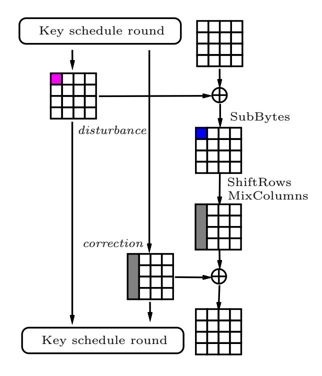
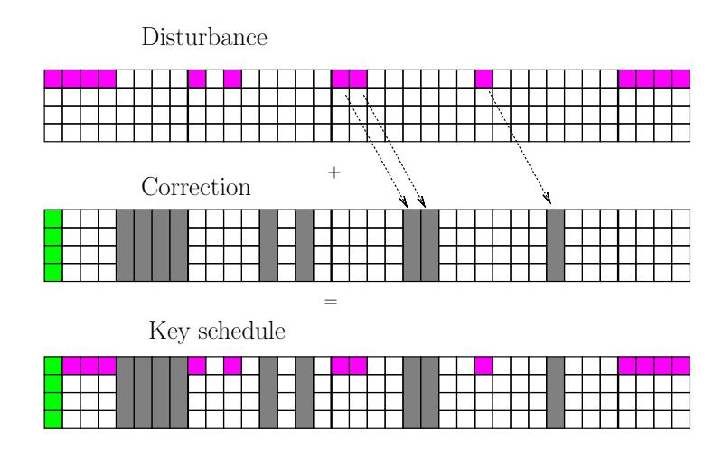
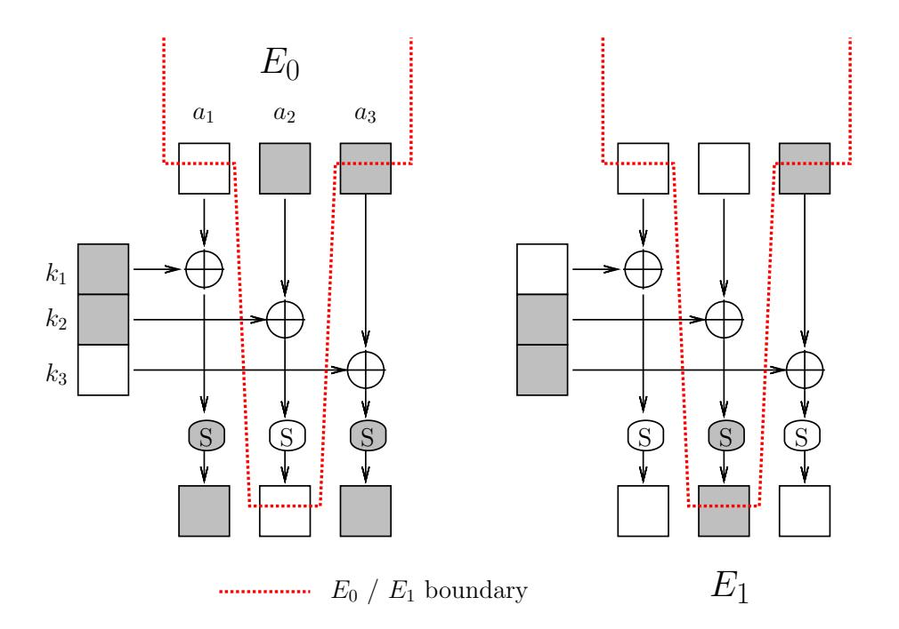
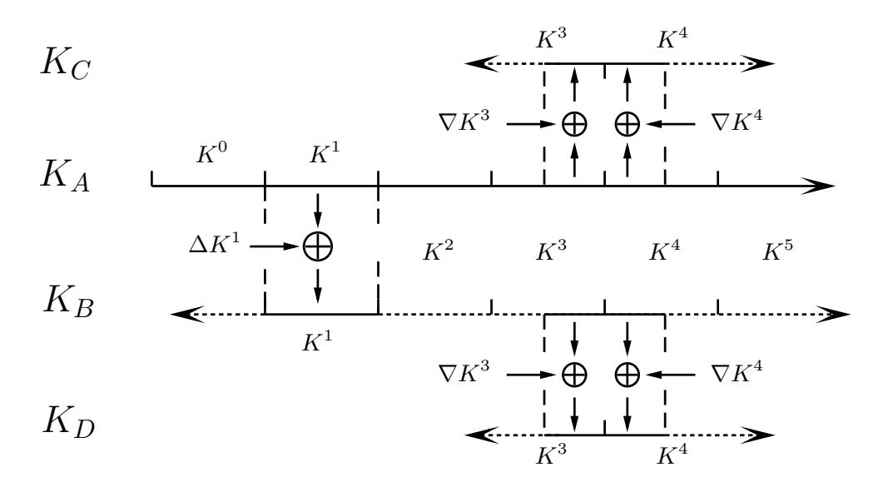
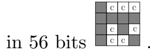
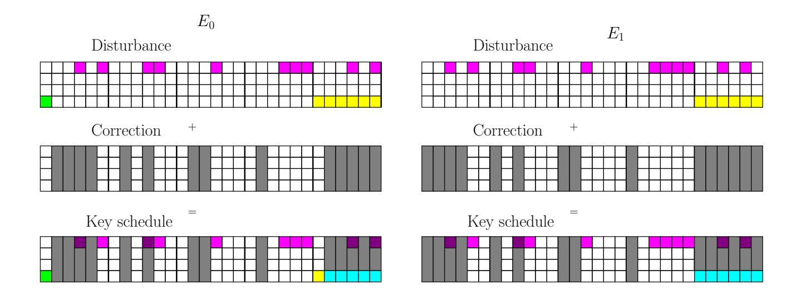
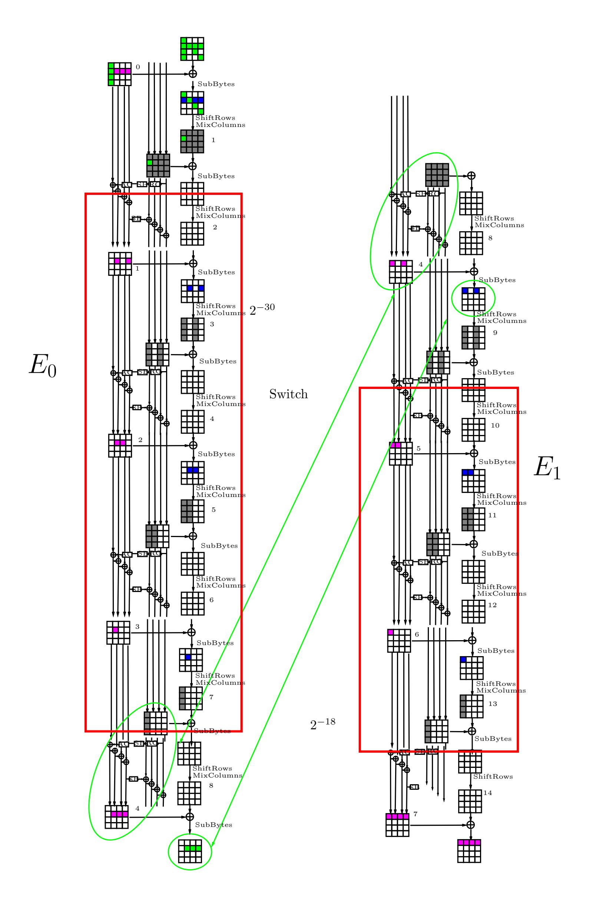
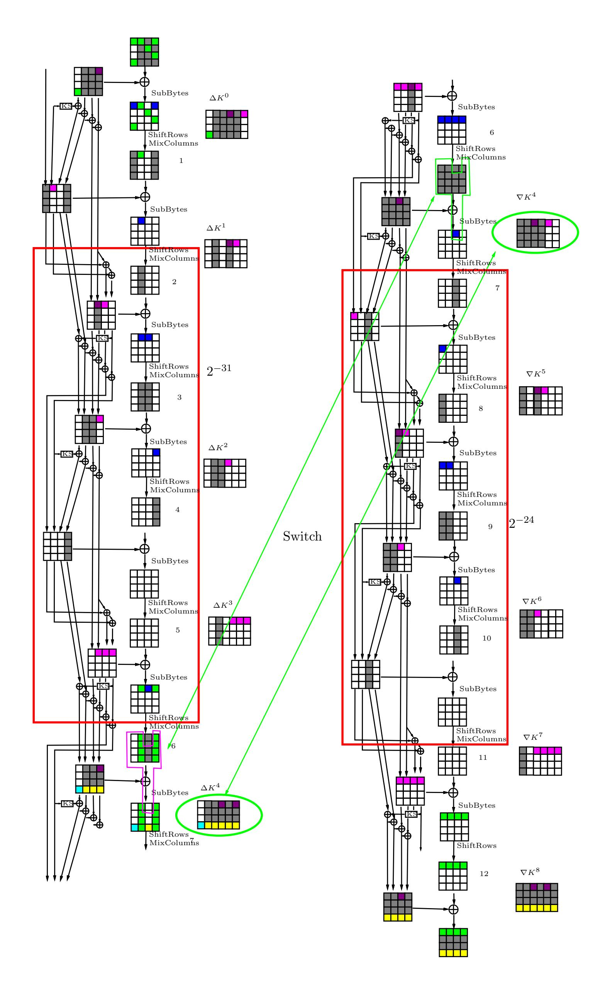

{0}------------------------------------------------

# Related-key Cryptanalysis of the Full AES-192 and AES-256

Alex Biryukov and Dmitry Khovratovich

University of Luxembourg

Abstract. In this paper we present two related-key attacks on the full AES. For AES-256 we show the first key recovery attack that works for all the keys and has 299.5 time and data complexity, while the recent attack by Biryukov-Khovratovich-Nikoli´c works for a weak key class and has much higher complexity. The second attack is the first cryptanalysis of the full AES-192. Both our attacks are boomerang attacks, which are based on the recent idea of finding local collisions in block ciphers and enhanced with the boomerang switching techniques to gain free rounds in the middle.

## 1 Introduction

The Advanced Encryption Standard (AES) [\[10\]](#page-14-0) — a 128-bit block cipher, is one of the most popular ciphers in the world and is widely used for both commercial and government purposes. It has three variants which offer different security levels based on the length of the secret key: 128, 192, 256-bits. Since it became a standard in 2001 [\[1\]](#page-14-1), the progress in its cryptanalysis has been very slow. The best results until 2009 were attacks on 7-round AES-128 [\[11](#page-14-2)[,12\]](#page-14-3), 10-round AES-192 [\[6,](#page-14-4)[14\]](#page-14-5), 10-round AES-256 [\[6](#page-14-4)[,14\]](#page-14-5) out of 10, 12 and 14 rounds respectively. The two last results are in the related-key scenario.

Only recently there was announced a first attack on the full AES-256 [\[7\]](#page-14-6). The authors showed a related-key attack which works with complexity 296 for one out of every 235 keys. They have also shown practical attacks on AES-256 (see also [\[8\]](#page-14-7)) in the chosen key scenario, which demonstrates that AES-256 can not serve as a replacement for an ideal cipher in theoretically sound constructions such as Davies-Meyer mode.

In this paper we improve these results and present the first related-key attack on AES-256 that works for all the keys and has a better complexity (299.5 data and time). We also develop the first related key attack on the full AES-192. In both attacks we minimize the number of active S-boxes in the key-schedule (which caused the previous attack on AES-256 to work only for a fraction of all keys) by using a boomerang attack [\[16\]](#page-14-8) enhanced with boomerang switching techniques. We find our boomerang differentials by searching for local collisions [\[9,](#page-14-9)[7\]](#page-14-6) in a cipher. The complexities of our attacks and a comparison with the best previous attacks are given in Table [1.](#page-1-0)

{1}------------------------------------------------

This paper is structured as follows: In Section 3 we develop the idea of local collisions in the cipher and show how to construct optimal related-key differentials for AES-192 and AES-256. In Section 4 we briefly explain the idea of a boomerang and an amplified boomerang attack. In Sections 5 and 6 we describe an attack on AES-256 and AES-192, respectively.

| Attack                   | Rounds | # keys   | Data        | Time       | Memory          | Source |  |  |  |
|--------------------------|--------|----------|-------------|------------|-----------------|--------|--|--|--|
| 192                      |        |          |             |            |                 |        |  |  |  |
| Partial sums             | 8      | 1        | $2^{127.9}$ | $2^{188}$  | ?               | [11]   |  |  |  |
| Related-key rectangle    | 10     | 64       | $2^{124}$   | $2^{183}$  | ?               | [6,14] |  |  |  |
| Related-key              | 12     | 4        | $2^{123}$   | $2^{176}$  | $2^{152}$       | Sec. 6 |  |  |  |
| amplified boomerang      |        |          |             |            |                 |        |  |  |  |
| 256                      |        |          |             |            |                 |        |  |  |  |
| Partial sums             | 9      | 256      | $2^{85}$    | $2^{226}$  | $2^{32}$        | [11]   |  |  |  |
| Related-key rectangle    | 10     | 64       | $2^{114}$   | $2^{173}$  | ?               | [6,14] |  |  |  |
| Related-key differential | 14     | $2^{35}$ | $2^{131}$   | $2^{131}$  | $2^{65}$        | [7]    |  |  |  |
| Related-key boomerang    | 14     | 4        | $2^{99.5}$  | $2^{99.5}$ | 2 77 | Sec. 5 |  |  |  |

Table 1. Best attacks on AES-192 and AES-256

# 2 AES Description and Notation

We expect that most of our readers are familiar with the description of AES and thus point out only the main features of AES-256 that are crucial for our attack.

AES rounds are numbered from 1 to 14 (12 for AES-192). We denote the i-th 192-bit subkey (do not confuse with a 128-bit round key) by  $K^i$ , i.e. the first (whitening) subkey is the first four columns of  $K^0$ . The last subkey is  $K^7$  in AES-256 and  $K^8$  in AES-192. The difference in  $K^i$  is denoted by  $\Delta K^i$ . Bytes of a subkey are denoted by  $k^l_{i,j}$ , where i,j stand for the row and column index, respectively, in the standard matrix representation of AES, and l stands for the number of the subkey. Bytes of the plaintext are denoted by  $p_{i,j}$ , and bytes of the internal state after the SubBytes transformation in round r are denoted by  $a^r_{i,j}$ , with  $A^r$  depicting the whole state. Let us also denote by  $b^r_{i,j}$  byte in position (i,j) after the r-th application of MixColumns.

Features of AES-256. AES-256 has 14 rounds and a 256-bit key, which is two times larger than the internal state. Thus the key schedule consists of only 7

{2}------------------------------------------------

rounds. One key schedule round consists of the following transformations:

$$k_{i,0}^{l+1} \leftarrow S(k_{i+1,7}^{l}) \oplus k_{i,0}^{l} \oplus C^{l}, \qquad 0 \leq i \leq 3;$$

$$k_{i,j}^{l+1} \leftarrow k_{i,j-1}^{l+1} \oplus k_{i,j}^{l}, \qquad 0 \leq i \leq 3, \ 1 \leq j \leq 3;$$

$$k_{i,4}^{l+1} \leftarrow S(k_{i,3}^{l+1}) \oplus k_{i,4}^{l}, \qquad 0 \leq i \leq 3;$$

$$k_{i,j}^{l+1} \leftarrow k_{i,j-1}^{l+1} \oplus k_{i,j}^{l}, \qquad 0 \leq i \leq 3, \ 5 \leq j \leq 7,$$

where S() stands for the S-box, and C l — for the round-dependent constant. Therefore, each round has 8 S-boxes.

Features of AES-192. AES-192 has 12 rounds and a 192-bit key, which is 1.5 times larger than the internal state. Thus the key schedule consists of 8 rounds. One key schedule round consists of the following transformations:

$$\begin{split} k_{i,0}^{l+1} &\leftarrow S(k_{i+1,5}^l) \oplus k_{i,0}^l \oplus C^l, & 0 \leq i \leq 3; \\ k_{i,j}^{l+1} &\leftarrow k_{i,j-1}^{l+1} \oplus k_{i,j}^l, & 0 \leq i \leq 3, \ 1 \leq j \leq 5. \end{split}$$

Notice that each round has only four S-boxes.

## 3 Local Collisions in AES

The notion of a local collision comes from the cryptanalysis of hash functions with one of the first applications by Chabaud and Joux [\[9\]](#page-14-9). The idea is to inject a difference into the internal state, causing a disturbance, and then to correct it with the next injections. The resulting difference pattern is spread out due to the message schedule causing more disturbances in other rounds. The goal is to have as few disturbances as possible in order to reduce the complexity of the attack.

In the related-key scenario we are allowed to have difference in the key, and not only in the plaintext as in the pure differential cryptanalysis. However the attacker can not control the key itself and thus the attack should work for any key pair with a given difference.

Fig. 1. A local collision in AES-256.

Local collisions in AES-256 are best understood on a one-round example (Fig. [1\)](#page-2-1), which has one active S-box in the internal state, and five non-zero byte 

{3}------------------------------------------------

differences in the two consecutive subkeys. This differential holds with probability  $2^{-6}$  if we use an optimal differential for an S-box:

$$0x01 \stackrel{\text{SubBytes}}{\Longrightarrow} 0x1f; \quad \begin{pmatrix} 0x1f \\ 0 \\ 0 \\ 0 \end{pmatrix} \stackrel{\text{MixColumns}}{\Longrightarrow} \quad \begin{pmatrix} 0x3e \\ 0x1f \\ 0x21 \end{pmatrix}$$

Due to the key schedule the differences spread to other subkeys thus forming the key schedule difference. The resulting key schedule difference can be viewed as a set of local collisions, where the expansion of the disturbance (also called disturbance vector) and the correction differences compensate each other. The probability of the full differential trail is then determined by the number of active S-boxes in the key-schedule and in the internal state. The latter is just the number of the non-zero bytes in the disturbance vector.

Therefore, to construct an optimal trail we have to construct a minimal-weight disturbance expansion, which will become a part of the full key schedule difference. For the AES key schedule, which is mostly linear, this task can be viewed as building a low-weight codeword of a linear code. Simultaneously, correction differences also form a codeword, and the key schedule difference codeword is the sum of the disturbance and the correction codewords. In the simplest trail the correction codeword is constructed from the former one by just shifting four columns to the right and applying the S-box-MixColumns transformation.

**Fig. 2.** Full key schedule difference (4.5 key-schedule rounds) for AES-256.

An example of a good key-schedule pattern for AES-256 is depicted in Figure 2 as a 4.5-round codeword. In the first four key-schedule rounds the disturbance codeword has only 9 active bytes (red cells in the picture), which is the lower bound. We want to avoid active S-boxes in the key schedule as long as possible, so we start with a single-byte difference in byte  $k_{0,0}^4$  and go backwards. Due to a slow diffusion in the AES key schedule the difference affects only one more byte per key schedule round. The correction (grey) column should be positioned four columns to the right, and propagates backwards in the same way. The last column in the first subkey is active, so all S-boxes of the first round are

{4}------------------------------------------------

active as well, which causes an unknown difference in the first (green) column. This "alien" difference should be canceled by the plaintext difference.

# 4 Related Key Boomerang and Amplified Boomerang Attacks

In this section we describe two types of boomerang attacks in the related-key scenario.

A basic boomerang distinguisher [\[16\]](#page-14-8) is applied to a cipher EK(·) which is considered as a composition of two sub-ciphers: EK(·) = E1 ◦ E0. The first subcipher is supposed to have a differential α → β, and the second one to have a differential γ → δ, with probabilities p and q, respectively. In the further text the differential trails of E0 and E1 are called upper and lower trails, respectively.

In the boomerang attack a plaintext pair results in a quartet with probability p 2 q 2 . The amplified boomerang attack [\[13\]](#page-14-10) (also called rectangle attack [\[4\]](#page-14-11)) works in a chosen-plaintext scenario and constructs N2p 2 q 22 −n quartets of N plaintext pairs. We refer to [\[16,](#page-14-8)[13\]](#page-14-10) for the full description of the attacks.

In the original boomerang attack paper by Wagner [\[16\]](#page-14-8) it was noted that the number of good ciphertext quartets is actually higher, since an attacker may consider other β and γ (with the same α and δ). This observation can be applied to both types of boomerang attacks. As a result, the number Q of good quartets is expressed via amplified probabilities pˆ and ˆq as follows:

$$Q = \hat{p}^2 \hat{q}^2 2^{-n} N^2,$$

where

$$\hat{p} = \sqrt{\sum_{\beta} P[\alpha \to \beta]^2}; \quad \hat{q} = \sqrt{\sum_{\gamma} P[\gamma \to \delta]^2}.$$
 (1)

### 4.1 Related-key attack model

The related-key attack model [\[3\]](#page-14-12) is a class of cryptanalytic attacks in which the attacker knows or chooses a relation between several keys and is given access to encryption/decryption functions with all these keys. The goal of the attacker is to find the actual secret keys. The relation between the keys can be an arbitrary bijective function R (or even a family of such functions) chosen in advance by the attacker (for a formal treatment of the general related key model see [\[2](#page-14-13)[,15\]](#page-14-14)). In the simplest form of this attack, this relation is just a XOR with a constant: K2 = K1 ⊕ C, where the constant C is chosen by the attacker. This type of relation allows the attacker to trace the propagation of XOR differences induced by the key difference C through the key schedule of the cipher. However, more complex forms of this attack allow other (possibly non-linear) relations between the keys. For example, in some of the attacks described in this paper the attacker chooses a desired XOR relation in the second subkey, and then defines the implied relation between the actual keys as: K2 = F −1 (F(K1) ⊕ C) = RC (K1) where 

{5}------------------------------------------------

F represents a single round of the AES-256 key schedule, and the constant C is chosen by the attacker.1

Compared to other cryptanalytic attacks in which the attacker can manipulate only the plaintexts and/or the ciphertexts the choice of the relation between secret keys gives additional degree of freedom to the attacker. The downside of this freedom is that such attacks might be harder to mount in practice. Still, designers usually try to build "ideal" primitives which can be automatically used without further analysis in the widest possible set of applications, protocols, or modes of operation. Thus resistance to such attacks is an important design goal for block ciphers, and in fact it was one of the stated design goals of the Rijndael algorithm, which was selected as the Advanced Encryption Standard.

In this paper we use boomerang attacks in the related-key scenario. In the following sections we denote the difference between subkeys in the upper trail by  $\Delta K^i$ , and in the lower part by  $\nabla K^i$ .

#### 4.2 Boomerang switch

Here we analyze the transition from the sub-trail  $E_0$  to the sub-trail  $E_1$ , which we call the boomerang switch. We show that the attacker can gain 1-2 middle rounds for free due to a careful choice of the top and bottom differentials. The position of the switch is a tradeoff between the sub-trail probabilities, that should minimize the overall complexity of the distinguisher. Below we summarize the switching techniques that can be used in boomerang or amplified boomerang attacks on any block cipher.

Ladder switch. By default, a cipher is decomposed into rounds. However, such decomposition may not be the best for the boomerang attack. We propose not only to further decompose the round into simple operations but also to exploit the existing parallelism in these operations. For example some bytes may be independently processed. In such case we can switch in one byte before it is transformed and in another one after it is transformed, see Fig. 3 for an illustration.

An example is our attack on AES-192. Let us look at the differential trails (see Fig. 8). There is one active S-box in round 7 of the lower trail in byte  $b_{0,2}^7$ . On the other hand, the S-box in the same position is not active in the upper trail. If we would switch after ShiftRows in round 6, we would "pay" the probability in round 7 afterwards. However, we switch all the state except  $b_{0,2}$  after MixColumns, and switch the remaining byte after the S-box application in round 7, where it is not active. We thus do not pay for this S-box.

Feistel switch. Surprisingly, a Feistel round with an arbitrary function (e.g., an S-box) can be passed for free in the boomerang attack (this was first observed

&lt;sup>1 Note that due to low nonlinearity of AES-256 key schedule such subkey relation corresponds to a fixed XOR relation in 28 out of 32 bytes of the secret key, and a simple S-box relation in the four remaining bytes.

{6}------------------------------------------------

Fig. 3. The ladder switch in a toy three S-box block. A switch either before or after the S-box layer would cost probability, while the ladder does not.

in the attack on cipher Khufu in [\[16\]](#page-14-8)). Suppose the internal state (X, Y ) is transformed to (Z = X ⊕ f(Y ), Y ) at the end of E0. Suppose also that the E0 difference before this transformation is (∆X, ∆Y ), and that the E1 difference after this transformation is (∆Z, ∆Y ).

As a result, variable Y in the four iterations of a boomerang quartet takes two values: Y0 and Y0⊕∆Y for some Y0. Then the f transformation is guaranteed to have the same output difference ∆f in the quartet. Therefore, the decryption phase of the boomerang creates the difference ∆X in X at the end of E0 "for free". This trick is used in the switch in the subkey in the attack on AES-192.

S-box switch. This is similar to the Feistel switch, but costs probability only in one of the directions. Suppose that E0 ends with an S-box Y ⇐ S(X) with difference ∆ If the output of an S-box in a cipher has difference ∆ and if the same difference ∆ comes from the lower trail, then propagation through this S-box is for free on one of the faces of the boomerang. Moreover, the other direction can use amplified probability since specific value of the difference ∆ is not important for the switch[2](#page-6-2) .

## 5 Attack on AES-256

In this section we present a related key boomerang attack on AES-256.

2 This type of switch was used in the original version of this paper, but is not needed now due to change in the trails. We describe it here for completeness, since it might be useful in other attacks.

{7}------------------------------------------------

#### 5.1 The trail

The boomerang trail is depicted in Figure 7, and the actual values are listed in Tables 3 and 2. It consists of two similar 7-round trails: the first one covers rounds 1–8, and the second one covers rounds 8–14. The trails differ in the position of the disturbance bytes: the row 1 in the upper trail, and the row 0 in the lower trail. This fact allows the Ladder switch.

The switching state is the state  $A^9$  (internal state after the SubBytes in round 9) and a special key state  $K_S$ , which is the concatenation of the last four columns of  $K^3$  and the first four columns of  $K^4$ . Although there are active S-boxes in the first round of the key schedule, we do not impose conditions on them. As a result, the difference in column 0 of  $K^0$  is unknown yet.

Related keys We define the relation between four keys as follows (see also Figure 4). For a secret key  $K_A$ , which the attacker tries to find, compute its second subkey  $K_A^1$  and apply the difference  $\Delta K^1$  to get a subkey  $K_B^1$ , from which the key  $K_B$  is computed. The relation between  $K_A$  and  $K_B$  is a constant XOR relation in 28 bytes out of 32 and is computed via a function  $k'_{i,0} = k_{i,0} \oplus S(k_{i+1,7}) \oplus S(k_{i+1,7} \oplus c_{i+1,7})$ , i=0,1,2,3, with constant  $c_{i+1,7} = \Delta k_{i+1,7}^0$  for the four remaining bytes.

The switch into the keys  $K_C$ ,  $K_D$  happens between the 3rd and the 4th subkeys in order to avoid active S-boxes in the key-schedule using the Ladder switch idea described above. We compute subkeys  $K^3$  and  $K^4$  for both  $K_A$  and  $K_B$ . We add the difference  $\nabla K^3$  to  $K_A^3$  and compute the upper half (four columns) of  $K_C^3$ . Then we add the difference  $\nabla K^4$  to  $K_A^4$  and compute the lower half (four columns) of  $K_C^4$ . From these eight consecutive columns we compute the full  $K_C$ . The key  $K_D$  is computed from  $K_B$  in the same way.

**Fig. 4.** AES-256: Computing  $K_B$ ,  $K_C$ , and  $K_D$  from  $K_A$ .

Finally, we point out that difference between  $K_C$  and  $K_D$  can be computed in the backward direction deterministically since there would be no active S-boxes

{8}------------------------------------------------

till the first round. The secret key  $K_A$ , and the three keys  $K_B$ ,  $K_C$ ,  $K_D$  computed from  $K_A$  as described above form a proper related key quartet. Moreover, due to a slow diffusion in the backward direction, as a bonus we can compute some values in  $\nabla K^i$  even for i = 0, 1, 2, 3 (see Table 2). Hence given the byte value  $k_{i,j}^l$  for  $K_A$  we can partly compute  $K_B$ ,  $K_C$  and  $K_D$ .

Internal state The plaintext difference is specified in 9 bytes. We require that all the active S-boxes in the internal state should output the difference 0x1f so that the active S-boxes are passed with probability  $2^{-6}$ . The only exception is the first round where the input difference in nine active bytes is not specified.

Let us start a boomerang attack with a random pair of plaintexts that fit the trail after one round. Active S-boxes in rounds 3–7 are passed with probability  $2^{-6}$  each, so the overall probability is  $2^{-30}$ .

We switch the internal state in round 9 with the *Ladder switch* technique: the row 1 is switched before the application of S-boxes, and the other rows are switched after the S-box layer. As a result, we do not pay for active S-boxes at all in this round.

The second part of the boomerang trail is quite simple. Three S-boxes in rounds 10–14 contribute to the probability, which is thus equal to  $2^{-18}$ . Finally we get one boomerang quartet after the first round with probability  $2^{-30-30-18-18} = 2^{-96}$ .

#### 5.2 The attack

The attack works as follows. Do the following steps  $2^{25.5}$  times:

- 1. Prepare a structure of plaintexts as specified below.
- 2. Encrypt it on keys  $K_A$  and  $K_B$  and keep the resulting sets  $S_A$  and  $S_B$  in memory.
- 3. XOR  $\Delta_C$  to all the ciphertexts in  $S_A$  and decrypt the resulting ciphertexts with  $K_C$ . Denote the new set of plaintexts by  $S_C$ .
- 4. Repeat previous step for the set  $S_B$  and the key  $K_D$ . Denote the set of plaintexts by  $S_D$ .
- 5. Compose from  $S_C$  and  $S_D$  all the possible pairs of plaintexts which are equal

- 6. For every remaining pair check if the difference in  $p_{i,0}$ , i > 1 is equal on both sides of the boomerang quartet (16-bit filter). Note that  $\nabla k_{i,7}^0 = 0$  so  $\Delta k_{i,0}^0$  should be equal for both key pairs  $(K_A, K_B)$  and  $(K_C, K_D)$ .
- 7. Filter out the quartets whose difference can not be produced by active S-boxes in the first round (one-bit filter per S-box per key pair) and active S-boxes in the key schedule (one-bit filter per S-box), which is a  $2 \cdot 2 + 2 = 6$ -bit filter.
- 8. Gradually recover key values and differences simultaneously filtering out the wrong quartets.

{9}------------------------------------------------

Each structure has all possible values in column 0 and row 0, and constant values in the other bytes. Of  $2^{72}$  texts per structure we can compose  $2^{144}$  ordered pairs. Of these pairs  $2^{144-8\cdot9}=2^{72}$  pass the first round. Thus we expect one right quartet per  $2^{96-72}=2^{24}$  structures, and three right quartets out of  $2^{25.5}$  structures.

Let us now compute the number of noisy quartets. About  $2^{144-56-16} = 2^{72}$  pairs come out of step 6. The next step applies a 6-bit filter, so we get  $2^{72+25.5-6} = 2^{91.5}$  candidate quartets in total.

The remainder of this section deals with gradual recovering of the key and filtering wrong quartets. The key bytes are recovered as shown in Figure 5.

| 5  |   |   |   |         |  | 0   |
|----|---|---|---|---------|--|-----|
| 2  | 3 | 1 | 1 | 3D 4 |  |     |
| 0D |   | 5 |   |         |  | 0 4 |
| 0D |   |   | 5 |         |  | 0   |

Fig. 5. Gradual key recovery. Digits stand for the steps, 'D' means difference.

- 1. First, consider 4-tuples of related key bytes in each position (1, j), j < 4. Two differences in a tuple are known by default. The third difference is unknown but is equal for all tuples (see Table 2, where it is denoted by X) and gets one of  $2^7$  values. We use this fact for key derivation and filtering as follows. Consider key bytes  $k_{2,2}^0$  and  $k_{2,3}^0$ . The candidate quartet proposes  $2^2$  candidates for both 4-tuples of related-key bytes, or  $2^4$  candidates in total. Since the differences are related with the X-difference, which is a 9-bit filter, this step reveals two key bytes and the value of X and reduces the number of quartets to  $2^{91.5-5} = 2^{86.5}$ .
- 2. Now consider the value of  $\Delta k_{1,0}^0$ , which is unknown yet and might be different in two pairs of related keys. Let us notice that it is determined by the value of  $k_{2,7}^0$ , and  $\nabla k_{2,7}^0 = 0$ , so that  $\Delta k_{1,0}^0$  is the same for both related key pairs and can take  $2^7$  values. Each guess of  $\Delta k_{1,0}^0$  proposes key candidates for byte  $k_{2,0}^0$ , where we have a 8-bit filter for the 4-tuple of related-key bytes. We thus derive the value of  $k_{1,0}^0$  in all keys and reduce the number of candidate quartets to  $2^{85.5}$ .
- 3. The same trick holds for the unknown  $\Delta k_{1,4}^0$ , which can get  $2^7$  possible values and can be computed for both key pairs simultaneously. Each of these values proposes four candidates for  $k_{1,1}^0$ , which are filtered with an 8-bit filter. We thus recover  $k_{1,1}^0$  and  $\Delta k_{1,4}^0$  and reduce the number of quartets to  $2^{79.5}$ .
- 4. Finally, we notice that  $\Delta k_{1,4}^{0}$  is completely determined by  $k_{1,0}^{0}, k_{1,1}^{0}, k_{1,2}^{0}, k_{1,3}^{0}$ , and  $k_{2,7}^{0}$ . There are at most two candidates for the latter value as well as for  $\Delta k_{1,4}^{0}$ , so we get a 6-bit filter and reduce the number of quartets to  $2^{72.5}$ .
- 5. Each quartet also proposes two candidates for each of key bytes  $k_{0,0}^0$ ,  $k_{2,2}^0$ , and  $k_{3,3}^0$ . Totally, the number of key candidates proposed by each quartet is  $2^6$ .

{10}------------------------------------------------

The key candidates are proposed for 11 bytes of each of four related keys. However, these bytes are strongly related so the number of independent key bytes on which the voting is performed is significantly smaller than  $11 \times 4$ . At least, bytes  $k_{0,0}^0$ ,  $k_{1,1}^0$ ,  $k_{2,2}^0$  and  $k_{3,3}^0$  of  $K_A$  and  $K_C$  are independent so we recover 15 key bytes with  $2^{78.5}$  proposals. The probability that three wrong quartets propose the same candidates does not exceed  $2^{-80}$ .

We thus estimate the complexity of the filtering step as  $2^{77.5}$  time and memory. We recover  $3 \cdot 7 + 8 \cdot 8 = 85$  bits of  $K_A$  (and 85 bits of  $K_C$ ) with  $2^{99.5}$  data and time and  $2^{77.5}$  memory.

The remaining part of the key can be found with many approaches. One is to relax the condition on one of the active S-boxes in round 3 thus getting four more active S-boxes in round 2, which in turn leads to a full-difference state in round 1. The condition can be actually relaxed only for the first part of the boomerang (the key pair  $(K_A, K_B)$ ) thus giving a better output filter. For each candidate quartet we use the key bytes, that were recovered at the previous step, to compute  $\Delta A^1$  and thus significantly reduce the number of keys that are proposed by a quartet. We then rank candidates for the first four columns of  $K_A^0$  and take the candidate that gets the maximal number of votes. Since we do not make key guesses, we expect that the complexity of this step is smaller than the complexity of the previous step  $(2^{99.5})$ . The right quartet also provide information about four more bytes in the right half of  $K_A^0$  that correspond to the four active S-boxes in round 2. The remaining 8 bytes of  $K_A$  can be found by exhaustive search.

### 6 Attack on AES-192

The key schedule of AES-192 has better diffusion, so it is hard to avoid active S-boxes in the subkeys. We construct a related-key boomerang attack with two subtrails of 6 rounds each. The attack is an amplified-boomerang attack because we have to deal with truncated differences in both the plaintext and the ciphertext, the latter would be expensive to handle in a plain boomerang attack.

#### 6.1 The trail

The trail is depicted in Figure 8, and the actual values are listed in Tables 4 and 5. The key schedule codeword is depicted in Figure 6.

**Related keys** We define the relation between four keys similarly to the attack on AES-256. Assume we are given a key  $K_A$ , which the attacker tries to find. We compute its subkey  $K_A^1$  and apply the difference  $\Delta K^1$  to get the subkey  $K_B^1$ , from which the key  $K_B$  is computed. Then we compute the subkeys  $K_A^4$  and  $K_B^4$  and apply the difference  $\nabla K^4$  to them. We get subkeys  $K_C^4$  and  $K_D^4$ , from which the keys  $K_C$  and  $K_D$  are computed.

Now we prove that keys  $K_A$ ,  $K_B$ ,  $K_C$ , and  $K_D$  form a quartet, i.e. the subkeys of  $K_C$  and  $K_D$  satisfy the equations  $K_C^l \oplus K_D^l = \Delta K^l$ , l = 1, 2, 3.

{11}------------------------------------------------

Fig. 6. AES-192 key schedule codeword.

The only active S-box is positioned between  $K^3$  and  $K^4$ , whose input is  $k_{0,5}^3$ . However, this S-box gets the same pair of inputs in both key pairs (see the "Feistel switch" in Sec. 4.2). Indeed, if we compute  $\nabla k_{0,5}^3$  from  $\Delta K^4$ , then it is equal to  $\Delta k_{0,5}^3 = 0x01$ . Therefore, if the active S-box gets as input  $\alpha$  and  $\alpha \oplus 1$  in  $K_A$  and  $K_B$ , respectively, then it gets  $a \oplus 1$  and a in  $K_C$  and  $K_D$ , respectively. As a result,  $K_C^3 \oplus K_D^3 = \Delta K^3$ , the further propagation is linear, so the four keys form a quartet.

Due to a slow diffusion in the backward direction, we can compute some values in  $\nabla K^l$  even for small l (Table 5). Hence given  $k_{i,j}^l$  for  $K_A$  we can partly compute  $K_B$ ,  $K_C$  and  $K_D$ , which provides additional filtration in the attack.

Internal state The plaintext difference is specified in 10 bytes  $\frac{1}{2}$ , the difference in the other six bytes not restricted. The three active S-boxes in rounds 2–4 are passed with probability  $2^{-6}$  each. In round 6 (the switching round) we ask for the fixed difference only in  $a_{0,2}^6$ , the other two S-boxes can output any difference such that it is the same as in the second related-key pair. Therefore, the amplified probability of round 6 equals to  $2^{-6-2\cdot3.5} = 2^{-13}$ . We switch between the two trails before the key addition in round 6 in all bytes except  $b_{0,2}^6$ , where we switch after the S-box application in round 7 (the *Ladder switch*). This trick allows us not to take into account the only active S-box in the lower trail in round 7. The overall probability of the rounds 3–6 is  $2^{-3\cdot6-13} = 2^{-31}$ .

The lower trail has 8 active S-boxes in rounds 8–12. Only the first four active S-boxes are restricted in the output difference, which gives us probability  $2^{-24}$  for the lower trail. The ciphertext difference is fully specified in the middle two rows, and has 35 bits of entropy in the other bytes. More precisely, each  $\nabla c_{0,*}$  is taken from a set of size  $2^7$ , and all the  $\nabla c_{3,*}$  should be the same on both sides of the boomerang and again should belong to a set of size  $2^7$ . Therefore, the ciphertext difference gives us a 93-bit filter.

### 6.2 The attack

We compose  $2^{73}$  structures of type with  $2^{48}$  texts each. Then we encrypt all the texts with the keys  $K_A$  and  $K_C$ , and their complements w.r.t.  $\Delta P$  on

{12}------------------------------------------------

 $K_B$  and  $K_D$ . We keep all the data in memory and analyze it with the following procedure:

- 1. Compose all candidate plaintext pairs for the key pairs  $(K_A, K_B)$  and  $(K_C, K_D)$ .
- 2. Compose and store all the candidate quartets of the ciphertexts.
- 3. For each guess of the subkey bytes:  $k_{0,3}^0$ ,  $k_{2,3}^0$ , and  $k_{0,5}^0$  in  $K_A$ ;  $k_{0,5}^7$  in  $K_A$  and  $K_B$ :
  - (a) Derive values for these bytes in all the keys from the differential trail. Derive the yet unknown key differences in  $\Delta K^0$  and  $\nabla K^8$ .
  - (b) Filter out candidate quartets that contradict  $\nabla K^8$ .
  - (c) Prepare counters for the yet unknown subkey bytes that correspond to active S-boxes in the first two rounds and in the last round:  $k_{0,0}^0$ ,  $k_{0,1}^0$ ,  $k_{1,2}^0$ ,  $k_{3,0}^0$  in keys  $K_A$  and  $K_C$ ,  $k_{0,0}^8$ ,  $k_{0,1}^8$ ,  $k_{0,2}^8$ ,  $k_{0,3}^8$  in keys  $K_A$  and  $K_B$ , i.e. 16 bytes in total.
  - (d) For each candidate quartet derive possible values for these unknown bytes and increase the counters.
  - (e) Pick the group of 16 subkey bytes with the maximal number of votes.
  - (f) Try all possible values of the yet unknown 9 key bytes in  $K^0$  and check whether it is the right key. If not then go to the first step.

Right quartets. Let us first count the number of right quartets in the data. Evidently, there exist  $2^{128}$  pairs of internal states with the difference  $\Delta A^2$ . The inverse application of 1.5 rounds maps these pairs into structures that we have defined, with  $2^{48}$  pairs per structure. Therefore, each structure has  $2^{48}$  pairs that pass 1.5 rounds, and  $2^{73}$  structures have  $2^{121}$  pairs. Of these pairs  $2^{(121-31)\cdot 2-128} = 2^{52}$  right quartets can be composed after the switch in the middle. Of these quartets  $2^{52-2\cdot 24} = 16$  right quartets come out of the last round.

Steps 1–2. The first two steps are the most time-consuming part of the attack. We propose the following approach based on the ideas of [5] and the fact that pairs of plaintexts in a right quartet should belong to the same structure:

- Having encrypted the data, group all the ciphertexts into buckets according to the 88-bit ciphertext filter: fixed differences in the middle rows, equal differences in the last row.
- Prepare a two-dimensional table of plaintexts indexed by the indices of structures and a key.
- For every pair  $(C_A, C_C)$  of ciphertexts in a same bucket, that were encrypted under  $K_A$  and  $K_C$ , respectively:
  - Check if the pair satisfies the additional 5-bit filter in the differences corresponding to the active S-boxes, where there are only 27 possibilities per byte.
  - If yes, detect structures  $S_A$  and  $S_C$ , to which the corresponding plaintexts belong, and insert the pair in a table into a cell indexed by these structures.
- Repeat the previous step for the keys  $K_B$  and  $K_D$ .

{13}------------------------------------------------

- For every pair of structures compose all the possible quartets of plaintexts.
- Put all the quartets into a hash table indexed by the two differences  $\nabla c_{3,0}$ .

Every bucket contains  $2^{(121-88)\cdot 2-5}=2^{61}$  pairs. The overall number of pairs is  $2^{88+61}=2^{149}$  pairs, or  $2^3$  pairs for a pair of structures. Therefore, we compose  $2^{3\cdot 2+73\cdot 2}=2^{152}$  candidate quartets and then rank them according to  $\nabla c_{3,0}$ . We thus get  $2^{14}$  groups of quartets each having  $2^{138}$  candidate quartets.

Step 3(a-b) (filtering). We apply the  $\nabla K^8$  filter and analyze  $2^{138}$  candidate quartets. We know  $k_{0,3}^0$  from the guess and  $\Delta a_{0,3}^1$  from the trail, which gives us an 8-bit filter on  $p_{0,3}$ , and a 16-bit filter on the quartets. We also know  $k_{2,3}^0$  so for both pairs of plaintexts in each of remaining  $2^{122}$  quartets we compute  $\Delta a_{2,3}^1$ . Since  $\Delta a_{2,3}^1$  is a value in the column that should collapse to one non-zero byte  $\Delta b_{0,1}^1$  by MixColumns, we derive all the values on its diagonal and  $\Delta b_{0,1}^1$ . Actually, the value of  $b_{0,1}^1$  can be restricted to two options, since we know  $k_{0,1}^0$ ,  $\Delta k_{0,1}^0$ , and  $\Delta a_{0,1}^2$ . For a given difference in the plaintext and provided with  $\Delta A^1$  there exist 8 possible combinations of  $k_{0,1}^0$ ,  $k_{1,2}^0$ , and  $k_{3,0}^0$ , and the probability that any of them matches the two options for  $a_{0,1}^1$  is 1/16. Therefore, the value of  $\Delta p_{2,3}$  restricts the other three differences on its diagonal by 3+4=7 bits. One more bit comes from the fact that only half of  $\Delta a_{0,1}^1$  can be converted into  $\Delta a_{0,1}^2$ . Therefore, we consider only  $2^{122-2\cdot(7+1)}=2^{106}$  quartets.

Step 3(c-e) (counting). Both pairs of plaintexts in a quartet propose key candidates: the first pair for  $K_A$  and the second pair for  $K_B$ . Each pair proposes one candidate for  $(k_{0,1}^0, k_{1,2}^0, k_{3,0}^0)$  and the two candidates for  $k_{0,0}^0$ , so we have  $2^{10}$  candidates for 16 key bytes. The probability that 16 false quartets propose the same key candidate can be upper bounded by  $2^{116\cdot16-128\cdot15} = 2^{-64}$ .

The overall time complexity is the number of quartets analyzed at Step 3 times the number of the key guesses. Now we point out that we do not have to guess all 8 bits of  $k_{0,5}^7$  since we need only the output S-box difference. Therefore, we try  $2^{3\cdot 8+2\cdot 7}=2^{38}$  key guesses, so the time complexity of the attack is  $2^{138+38}=2^{176}$ , and the data complexity is  $2^{123}$ .

### 7 Conclusions

We presented related-key boomerang attacks on the full AES-192 and the full AES-256. The differential trails for the attacks are based on the idea of finding local collisions in the block cipher. We showed that optimal key-schedule trails should be based on low-weight codewords in the key schedule. We also exploit various boomerang-switching techniques, which help us to gain free rounds in the middle of the cipher. However, both our attacks are still mainly of theoretical interest and do not present a threat to practical applications using AES.

**Acknowledgements.** The authors thank Vincent Rijmen and anonymous reviewers for their valuable comments, which helped to improve the paper. Dmitry Khovratovich is supported by PRP "Security & Trust" grant of the University of Luxembourg.

{14}------------------------------------------------

## References

- 1. FIPS-197: Advanced Encryption Standard, November 2001, available at [http://](http://csrc.nist.gov/publications/fips/fips197/fips-197.pdf) [csrc.nist.gov/publications/fips/fips197/fips-197.pdf](http://csrc.nist.gov/publications/fips/fips197/fips-197.pdf).
- 2. Mihir Bellare and Tadayoshi Kohno. A theoretical treatment of related-key attacks: Rka-prps, rka-prfs, and applications. In EUROCRYPT'03, volume 2656 of LNCS, pages 491–506. Springer, 2003.
- 3. Eli Biham. New types of cryptanalytic attacks using related keys. J. Cryptology, 7(4):229–246, 1994.
- 4. Eli Biham, Orr Dunkelman, and Nathan Keller. The rectangle attack - rectangling the Serpent. In EUROCRYPT'01, volume 2045 of LNCS, pages 340–357. Springer, 2001.
- 5. Eli Biham, Orr Dunkelman, and Nathan Keller. New results on boomerang and rectangle attacks. In FSE'02, volume 2365 of LNCS, pages 1–16. Springer, 2002.
- 6. Eli Biham, Orr Dunkelman, and Nathan Keller. Related-key boomerang and rectangle attacks. In EUROCRYPT'05, volume 3494 of LNCS, pages 507–525. Springer, 2005.
- 7. Alex Biryukov, Dmitry Khovratovich, and Ivica Nikoli´c. Distinguisher and relatedkey attack on the full AES-256. In CRYPTO'09, volume 5677 of LNCS, pages 231–249. Springer, 2009.
- 8. Alex Biryukov, Dmitry Khovratovich, and Ivica Nikoli´c. Examples of differential multicollisions for 13 and 14 rounds of AES-256, 2009, available at [http://eprint.](http://eprint.iacr.org/2009/242.pdf) [iacr.org/2009/242.pdf](http://eprint.iacr.org/2009/242.pdf).
- 9. Florent Chabaud and Antoine Joux. Differential collisions in SHA-0. In CRYPTO'98, 1998.
- 10. Joan Daemen and Vincent Rijmen. The Design of Rijndael. AES — the Advanced Encryption Standard. Springer, 2002.
- 11. Niels Ferguson, John Kelsey, Stefan Lucks, Bruce Schneier, Michael Stay, David Wagner, and Doug Whiting. Improved cryptanalysis of Rijndael. In FSE'00, volume 1978 of LNCS, pages 213–230. Springer, 2000.
- 12. Henri Gilbert and Marine Minier. A collision attack on 7 rounds of Rijndael. In AES Candidate Conference, pages 230–241, 2000.
- 13. John Kelsey, Tadayoshi Kohno, and Bruce Schneier. Amplified boomerang attacks against reduced-round MARS and Serpent. In FSE'00, volume 1978 of LNCS, pages 75–93. Springer, 2000.
- 14. Jongsung Kim, Seokhie Hong, and Bart Preneel. Related-key rectangle attacks on reduced AES-192 and AES-256. In FSE'07, volume 4593 of LNCS, pages 225–241. Springer, 2007.
- 15. Stefan Lucks. Ciphers secure against related-key attacks. In FSE'04, volume 3017 of LNCS, pages 359–370. Springer, 2004.
- 16. David Wagner. The boomerang attack. In FSE'99, volume 1636 of LNCS, pages 156–170. Springer, 1999.

Disclaimer on colors. We intensively use colors in our figures in order to provide better understanding on the trail construction. In figures, different colors refer to different values, which is hard to depict in black and white. However, we also list all the trail differences in the tables, so all the color information is actually dubbed.

Trail details. By ∆Ai we denote the upper trail difference in the internal state after the S-box layer, and by ∇Ai the same for the lower trail.

{15}------------------------------------------------

Table 2. Key schedule difference in the AES-256 trail.

|   | $\Delta K^i$                                                 |  |  |  |  |  |  |
|---|--------------------------------------------------------------|--|--|--|--|--|--|
| 0 | $ \begin{array}{c ccccccccccccccccccccccccccccccccccc$       |  |  |  |  |  |  |
| 3 | $ \begin{array}{c ccccccccccccccccccccccccccccccccccc$       |  |  |  |  |  |  |
|   | $\nabla K^i$                                                 |  |  |  |  |  |  |
| 0 | $ \left  \begin{array}{cccccccccccccccccccccccccccccccccccc$ |  |  |  |  |  |  |
| 3 | $ \begin{array}{c ccccccccccccccccccccccccccccccccccc$       |  |  |  |  |  |  |
| 6 | $ \begin{array}{c ccccccccccccccccccccccccccccccccccc$       |  |  |  |  |  |  |

Table 3. Non-zero internal state differences in the AES-256 trail.

| $\Delta P = \begin{array}{c} ?\ 00\ 00\ 00 \\ ?\ ?\ ?\ ? \\ ?\ 00\ ?\ 00 \\ ?\ 00\ 00\ ? \end{array}$ |                  | ? 00 00 00        |                | 00 00 00 00  |             | 00 00 00 00     |                  |
|-------------------------------------------------------------------------------------------------------|------------------|-------------------|----------------|--------------|-------------|-----------------|------------------|
|                                                                                                       | ? ? ? ?          | $\Delta A^1$      | 1f ? $1f$ $1f$ | $\Delta A^3$ | 00 1f 00 1f |                 | $00\ 1f\ 1f\ 00$ |
|                                                                                                       | ? 00 ? 00        |                   | 00 00 ? 00     |              | 00 00 00 00 |                 | 00 00 00 00      |
|                                                                                                       | ? 00 00 ?        |                   | 00 00 00 ?     |              | 00 00 00 00 |                 | 00 00 00 00      |
|                                                                                                       | 00 00 00 00      | $\sqrt{\sqrt{7}}$ | 1f 1f 1f 1f    |              | 1f 00 1f 00 | $\nabla A^{11}$ | 1f 1f 00 00      |
| $\Delta A^7$                                                                                          | $00\ 1f\ 00\ 00$ |                   | 00 00 00 00    | $\nabla A^9$ | 00 00 00 00 |                 | 00 00 00 00      |
|                                                                                                       | 00 00 00 00      |                   | 00 00 00 00    |              | 00 00 00 00 |                 | 00 00 00 00      |
|                                                                                                       | 00 00 00 00      |                   | 00 00 00 00    |              | 00 00 00 00 |                 | 00 00 00 00      |
|                                                                                                       | 1f 00 00 00      |                   | 00 00 00 00    |              |             |                 |                  |
| $\nabla A^{13}$                                                                                       | 00 00 00 00      | $\Delta C$        | 00 00 00 00    |              |             |                 |                  |
|                                                                                                       | 00 00 00 00      |                   | 00 00 00 00    |              |             |                 |                  |
|                                                                                                       | 00 00 00 00      |                   | 00 00 00 00    |              |             |                 |                  |

{16}------------------------------------------------

Table 4. Internal state difference in the AES-192 trail.

|                 | ? ? 3e ?            |                 | 1f ? 00 1f          |                 | 00 1f 00 00 |              | $00 \ 1f$ | $\overline{1f}$ ( | 00             |
|-----------------|---------------------|-----------------|---------------------|-----------------|-------------|--------------|-----------|-------------------|----------------|
| $\Delta P$      | 1f 1f ? 1f          | $\Delta A^1$    | 00 00 ? 00          | $\Delta A^2$    | 00 00 00 00 | $\Delta A^3$ | 00 00     | 00 (              | 00             |
|                 | $1f \ 1f \ 1f \ ?$  |                 | 00 00 00 ?          |                 | 00 00 00 00 |              | 00 00     | 00 (              | 00             |
|                 | ? 21 21 21          |                 | ? 00 00 00          |                 | 00 00 00 00 |              | 00 00     | 00 (              | )()            |
|                 | $00\ 00\ 00\ 1f$    |                 | 00 00 00 00         | $\Delta A^6$    | 00 1f 1f 1f |              | 00 00     | 00 1              | $\overline{f}$ |
| $A A^4$         | 00 00 00 00         | $\Delta A^5$    | 00 00 00 00         |                 | 00 00 00 00 | $\Delta A^7$ | 00 00     | 00 0              | 0(             |
| $\Delta A$      | 00 00 00 00         |                 | 00 00 00 00         |                 | 00 00 00 00 |              | 00 00     | 00 0              | )()            |
|                 | 00 00 00 00         |                 | 00 00 00 00         |                 | 00 00 00 00 |              | 00 00     | 00 0              | )()            |
|                 | 1f 1f 1f 1f         |                 | 00 00 1 <i>f</i> 00 | $\nabla A^8$    | 1f 00 00 00 |              | 1f 1f     | 00 (              | 00             |
| $\nabla A^6$    | 00 00 00 00         | $\nabla A^7$    | 00 00 00 00         |                 | 00 00 00 00 | $\nabla A^9$ | 00 00     | 00 (              | )()            |
| VA              | 00 00 00 00         |                 | 00 00 00 00         |                 | 00 00 00 00 |              | 00 00     | 00 (              | )()            |
|                 | 00 00 00 00         |                 | 00 00 00 00         |                 | 00 00 00 00 |              | 00 00     | 00 (              | )()            |
|                 | 00 00 1 <i>f</i> 00 | $\nabla A^{11}$ | 00 00 00 00         | $\nabla A^{12}$ | ? ? ? ?     | $\Delta C$   | ? ?       | ?                 | ?              |
| $\nabla A^{10}$ | 00 00 00 00         |                 | 00 00 00 00         |                 | 00 00 00 00 |              | 1f 1f     | 1f 1              | 1f             |
|                 | 00 00 00 00         |                 | 00 00 00 00         |                 | 00 00 00 00 |              | 1f 1f     | 1f 1              | 1f             |
|                 | 00 00 00 00         |                 | 00 00 00 00         |                 | 00 00 00 00 |              | ? ?       | ?                 | ?              |

 $\textbf{Table 5.} \ \text{Key schedule difference in the AES-192 trail.}$ 

|              | 00 3e 3e 3f 3e 01                      |                         | 00 3e 00 3f 01 00        |              | 00 3e 3e 01 00 00        |
|--------------|----------------------------------------|-------------------------|--------------------------|--------------|--------------------------|
| $\Delta K^0$ | 00 1f 1f 1f 1f 00                      | $\Delta K^1$            | $00\ 1f\ 00\ 1f\ 00\ 00$ | $\Delta K^2$ | $00\ 1f\ 1f\ 00\ 00\ 00$ |
|              | 00 1f 1f 1f 1f 00 00 1f 1f 1f 1f 00 |                         | $00\ 1f\ 00\ 1f\ 00\ 00$ |              | $00\ 1f\ 1f\ 00\ 00\ 00$ |
|              | ? 21 21 21 21 00                       |                         | 00 21 00 21 00 00        |              | 00 21 21 00 00 00        |
|              | 00 3e 00 01 01 01                      |                         | 00 3e 3e 3f 3e 3f        |              |                          |
| $A K^3$      | 00 1f 00 00 00 00                      | $\Lambda \mathcal{K}^4$ | 00 1f 1f 1f 1f 1f 1f     |              |                          |
| $\Delta K$   | $00\ 1f\ 00\ 00\ 00\ 00$               | $\Delta K$              | $00\ 1f\ 1f\ 1f\ 1f\ 1f$ |              |                          |
|              | 00 21 00 00 00 00                      |                         | ? ? ? ? ? ?              |              |                          |
|              | ? ? ? 3e 3f 3e                         | $\nabla K^1$            | ? ? 3f 01 3e 00          | $\nabla K^2$ | ? 3e 01 00 3e 3e         |
| $\nabla K^0$ | ?~?~?~1f~1f~1f                         |                         | ? ? 1f 00 1f 00          |              | $?\ 1f\ 00\ 00\ 1f\ 1f$  |
| VA           | ? ? ? 1f 1f 1f                         |                         | ? ? 1f 00 1f 00          |              | ? 1f 00 00 1f 1f         |
|              | ???? 21 21                             |                         | ?? ? 00 21 00            |              | ? ? 00 00 21 21          |
|              | 3e 00 01 01 3f 01                      |                         | 3e 3e 3f 3e 01 00        | $\nabla K^5$ | 3e 00 3f 01 00 00        |
| $\nabla K^3$ | 1f 00 00 00 1f 00                      | $\nabla K^4$            | 1f 1f 1f 1f 00 00        |              | $1f\ 00\ 1f\ 00\ 00\ 00$ |
| VIX          | 1f 00 00 00 1f 00                      | VA                      | 1f 1f 1f 1f 00 00        |              | $1f\ 00\ 1f\ 00\ 00\ 00$ |
|              | ? 00 00 00 21 00                       |                         | 21 21 21 21 00 00        |              | 21 00 21 00 00 00        |
|              | 3e 3e 01 00 00 00                      | $\nabla K^7$            | 3e 00 01 01 01 01        | $\nabla K^8$ | 3e 3e 3f 3e 3f 3e        |
| $\nabla K^6$ | 1f 1f 00 00 00 00                      |                         | 1f 00 00 00 00 00        |              | 1f 1f 1f 1f 1f 1f        |
|              | $1f \ 1f \ 00 \ 00 \ 00 \ 00$          |                         | 1f 00 00 00 00 00        |              | 1f 1f 1f 1f 1f 1f        |
|              | 21 21 00 00 00 00                      |                         | 21 00 00 00 00 00        |              | ? ? ? ? ? ?              |

{17}------------------------------------------------

Fig. 7. AES-256 E0 and E1 trails. Green ovals show an overlap between the two trails where the switch happens.

{18}------------------------------------------------

Fig. 8. AES-192 trail.