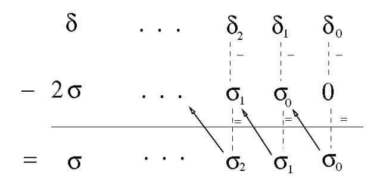

# A study of pairing computation for curves with embedding degree 15

Nadia El Mrabet1, Nicolas Guillermin2, and Sorina Ionica3

LIRMM, Montpellier
 DGA, Rennes
 Université de Versailles Saint-Quentin-en-Yvelines, 45 avenue des États-Unis, 78035 Versailles CEDEX, France
 nadia.elmrabet@lirmm.fr,sorina.ionica@m4x.org

**Abstract.** This paper presents the first study of pairing computation on curves with embedding degree 15. We compute the Ate and the twisted Ate pairing for a family of curves with parameter  $\rho$  1.5 and embedding degree 15. We use a twist of degree 3 to perform most of the operations in  $\mathbb{F}_p$  or  $\mathbb{F}_{p^5}$ . Furthermore, we present a new arithmetic for extension fields of degree 5. Our computations show that these curves give very efficient implementations for pairing-based cryptography at high security levels.

**Key-words:** Pairing based cryptography, Pairing computation, Arithmetic, Interpolation, Elliptic Curves, Embedding degree, Security level.

# 1 Introduction

Pairings on elliptic curves were introduced by André Weil in 1948 in mathematics [24], but their utilization in cryptography is actually quite recent. They were first used for cryptanalytic purposes, i.e. attacking the discrete logarithm problem on supersingular elliptic curves [2], but nowadays they are also used as building blocks for new cryptographic protocols such as the tripartite Diffie-Hellman protocol [15], identity-based encryption [5], short signatures [6], and others. A pairing is a bilinear map  $e : \mathbb{G}_1 \times \mathbb{G}_2 \to \mathbb{G}_3$ , where  $\mathbb{G}_1$ ,  $\mathbb{G}_2$  and  $\mathbb{G}_3$  are groups of large prime order r. Known pairings on elliptic curves, i.e. the Weil, Tate, Eta and Ate pairings map to the multiplicative group of the minimal extension of the ground field  $\mathbb{F}_p$  containing the r-th roots of unity. The degree of this extension is called the embedding degree with respect to r. The most efficient known method used for pairing computation is Miller's algorithm, whose performance relies heavily on efficient arithmetic of this extension field. It follows that for efficient pairing computation we need curves with a rather small embedding degree.

On the other hand, latest research in efficient computation of pairings focused on the reduction of the loop length in Miller's algorithm. It was proven [23][13] that on most known families of ordinary curves, the complexity of Miller's algorithm is  $\mathcal{O}(\frac{1}{\varphi(k)}\log_2(r))$ , where k is the embedding degree and  $\varphi$  is Euler's totient function. Consequently, for a fixed level of security and therefore a fixed bit length of r, pairing computation might turn out to be faster on curves with embedding degrees such that the integer  $\varphi(k)$  is large. Moreover, in practice we are looking for curves for which the following value  $\rho = \frac{\log_2(p)}{\log_2(r)}$  is as small as possible, in order to save bandwidth during the calculation.

In this paper, we give the first efficient pairing computation for curves of embedding degree 15. We show that existing constructions of families of curves of degree 15 and j-invariant 0 present multiple advantages. First of all, we show that pairing computation on these curves has loop length  $\frac{\log_2(r)}{8}$  for the Ate pairing and  $\frac{\log_2(r)}{2}$  for the twisted Ate pairing. Secondly, we show that by using twists of degree 3 we manage to perform most of the operations in  $\mathbb{F}_p$  or  $\mathbb{F}_{p^5}$ . By making use of an interpolation technique, we also improve the arithmetic of  $\mathbb{F}_{p^5}$  in order to get better results.

Moreover, denominator computation and the final inversion can be avoided by making use of the twist. Our results show that by choosing the optimal arithmetic on  $\mathbb{F}_{p^5}$  and  $\mathbb{F}_{p^{15}}$ , pairing computation

on curves of embedding degree 15 and  $\rho=1.5$  is faster than on Barreto-Naehrig curves for high security levels, i.e. security levels of 192 and 256 bits. Our computations suggest that these curves might be the best choice one could make among known pairing-friendly families of curves for implementations at high security levels.

The remainder of this paper is organized as follows: Section 2 gives the definition and important properties of pairings. In Section 3 we establish the optimal computation of the pairing on curves with embedding degree 15. In Section 4 we describe an interpolation-based algorithm for multiplication over the field  $\mathbb{F}_{p^5}$ . Finally, we conclude in Section 5 by giving a global evaluation of the number of operations needed to compute the pairing and by comparing our results to performances obtained on Barreto-Naehrig curves, which are considered as standard at the time this paper was written.

# 2 Background on pairings

In this section we give a brief overview of the definitions of pairings on elliptic curves and of Miller's algorithm [20] used in pairing computation. Let p be a prime, E an elliptic curve defined over  $\mathbb{F}_p$  by the Weierstrass equation  $y^2 = x^3 + ax + b$  and r a prime factor of  $\#(E(\mathbb{F}_p))$ . Suppose  $r^2$  does not divide  $\#(E(\mathbb{F}_p))$  and let k be the embedding degree with respect to r, i.e. the smallest integer such that r divides  $p^k - 1$ . We denote by  $P_{\infty}$  the point at infinity of the elliptic curve.

**Definition 1.** A pairing is a bilinear and non degenerate function:

$$e: \mathbb{G}_1 \times \mathbb{G}_2 \to \mathbb{G}_3$$

 $(P,Q) \to e(P,Q)$

where  $\mathbb{G}_1$  and  $\mathbb{G}_2$  are subgroups of order r on the elliptic curve and  $\mathbb{G}_3$  is generally  $\mu_r$ , the subgroup of the r-th roots of unity in  $\mathbb{F}_{p^k}$ . In general, in cryptographic applications, we take  $\mathbb{G}_1 = E(\mathbb{F}_p)[r]$  and  $\mathbb{G}_2 \subset E(\mathbb{F}_{p^k})[r]$ , where we denote by E(K)[r] the subgroup of K-rational points of order r of the elliptic curve E. We also denote E[r] the subgroup of points of order r defined over the algebraic closure of  $\mathbb{F}_p$ .

Let  $P \in \mathbb{G}_1$ ,  $Q \in \mathbb{G}_2$ . The goal of Miller's algorithm is to first construct a rational function  $f_{s,P}$  associated to the point P and to some integer s and to secondly evaluate this function at the point Q (in fact at a divisor associated to this point). The function  $f_{s,P}$  is such that the divisor associated to it is:

$$\operatorname{div}(f_{s,P}) = s(P) - (sP) - (s-1)(P_{\infty}).$$

Suppose we want to compute the sum of iP and jP. Take  $h_1$  the line going through iP and jP and  $h_2$  the vertical line through (i+j)P. Miller's idea was to make use of the following relation

$$f_{i+j,P} = f_{i,P} f_{j,P} \frac{h_1}{h_2},\tag{1}$$

in order to compute  $f_{s,P}$  iteratively. Moreover, Miller's algorithm uses the double-and-add method to compute  $f_{s,P}$  in  $\log_2(s)$  operations.

The Tate pairing The Tate pairing, denoted  $e_{Tate}$ , is defined by:

$$\mathbb{G}_1 \times \mathbb{G}_2 \mapsto \mathbb{G}_3$$

 $(P,Q) \mapsto e_{Tate}(P,Q) = f_{r,P}(Q).$

Here, the function  $f_{r,P}$  is normalized, i.e.  $(u_0^r f_{r,P})(P_{\infty}) = 1$  for  $u_0^r$  some  $\mathbb{F}_p$ -rational uniformizer at  $P_{\infty}$ . This pairing is only defined up to a representative of  $(\mathbb{F}_{p^k})^r$ . In order to obtain a unique value we raise it to the power  $\frac{p^k-1}{r}$ , obtaining an r-th root of unity that we call the reduced Tate pairing

$$\hat{e}_{Tate}(P,Q) = f_{r,P}(Q)^{\frac{p^k-1}{r}}.$$

Ate pairing Let  $\pi_p$  be the Frobenius over the elliptic curve:  $\pi_p: E \to E$ , such that for  $P = (x_P, y_P)$   $\pi_p(P) = (x_P^p, y_P^p)$ . The trace of the Frobenius is denoted by t. Let T = t - 1,  $\mathbb{G}_1 := E[r] \cap \text{Ker}(\pi_q - [1])$  and  $\mathbb{G}_2 := E[r] \cap \text{Ker}(\pi_q - [q])$ . Then for two points  $P \in \mathbb{G}_1$  and  $Q \in \mathbb{G}_2$ , the Ate pairing is given by:

$$e_{ate}(Q, P) = f_{T,Q}(P)^{(p^k - 1)/r}$$

It was shown in [14] that the Ate pairing is actually a power of the reduced Tate pairing.

Twisted Ate pairing We begin with the following definition.

**Definition 2.** Let E, E' be elliptic curves over  $F_p$ . Then E' is called a twist of degree d if there exists an isomorphism  $\phi_d: E' \to E$  defined over  $\mathbb{F}_{p^d}$  and d is minimal.

Suppose now that E admits a twist E' defined over  $\mathbb{F}_{p^{k/d}}$  of degree d, with  $d \mid k$ . We set  $m = \gcd(k, d)$  and e = k/m. We consider  $G_1$  and  $G_2$  as above. Then for  $P \in G_1, Q \in G_2$  we get [14]:

$$e_{twisted}(P,Q) = f_{T^e,P}(Q)^{(p^k-1)/r},$$

The twisted Ate pairing is also a power of the reduced Tate pairing. For curves with small trace of the Frobenius, it is clear that the Ate and twisted Ate pairings should be preferred to the Tate pairing, as the loop in Miller's algorithm will be shorter. Other variants of twisted Ate pairing were obtained in [19] replacing  $T^e$  with  $T^{ie}$ , for any  $i \in \mathbb{Z}$ . All these variants were given in order to find the smallest possible  $\lambda$  determining the length of the loop in Miller's algorithm. Hess and Vercauteren exploit these ideas in [13] and [23], respectively, by making use of lattices.

**Optimal pairing** Consider s an integer and  $h = \sum_{i=0}^d h_i x^i \in \mathbb{Z}[x]$  with  $h(s) \equiv 0 \mod r$ . Let  $R \in E(\mathbb{F}_{q^k})$  and  $f_{s,h,R}$  the function whose divisor is

$$(f_{s,h,R}) = \sum_{i=0}^{d} h_i((s^i R) - (P_{\infty}))$$

We denote  $||h||_1 = \sum_{i=0}^{d} |h_i|$ .

**Theorem 1.** Let s be any primitive root of unity modulo  $r^2$  and n an integer dividing #Aut(E). Then

$$a_{s,h}^{twist}: G_1 \times G_2 \to \mu_r$$

 $(P,Q) \to (f_{s,h,P}(Q))^{(q^k-1)/r}.$

defines a bilinear pairing which is non-degenerate if and only if  $h(s) \not\equiv 0 \mod r^2$ . The relation with the Tate pairing is

$$a_{s,h}^{twist}(P,Q) = t(P,Q)^{h(s)/r}$$
.

There exists an efficiently computable  $h \in \mathbb{Z}$  with  $h(s) \equiv 0 \mod r$ ,  $deg(h) \leq \varphi(n) - 1$  and  $||h||_1 = \mathcal{O}(r^{1/\varphi(n)})$  such that the above pairings are non-degenerate. The  $\mathcal{O}$ -constant depends only on n.

Security aspect The security of a pairing based cryptosystem relies on two parameters: the bit length of r,  $\log_2 r$  and the bit size of the extension field  $k\log_2 p$ . These parameters have to be chosen large enough to ensure that the discrete logarithm problem will be hard in both the subgroup of points of order r of the curve and the multiplicative group of the finite field  $\mathbb{F}_{p^k}$ . The fastest known attack on finite field is the index calculus method, whose complexity is  $\mathcal{O}(L_r(\frac{1}{3}))$ , where  $L_r(\frac{1}{3}) = \exp\left((32/9)^{(1/3)}(\log r)^{\frac{1}{3}}\log(\log(r))^{\frac{2}{3}}\right)$  and c is a constant depending on the characteristic of the finite field [12]. Meanwhile the best attack known

Table 1. Level of security in bit

| AES security | bit size of $r$ | bitsize of $p^k$ |
|--------------|--------------------|------------------|
| 80           | 160                | 1024             |
| 128          | 256                | 3072             |
| 192          | 384                | 7680             |
| 256          | 512                | 15360            |

on elliptic curves DLP is the Pollard- $\rho$  method, whose complexity is  $\mathcal{O}(\sqrt{r})$  [9, Chap. 17]. As a consequence, while the security level will increase, the bound on  $k\log_2(p)$  is expected to grow faster than the bound on  $\log_2(r)$ . Following NIST recommendations [1], Table 1 gives optimal bitsizes of r and  $p^k$  for different security levels.

On the other hand, in practice we are looking for curves for which the following value

$$\rho = \frac{\log p}{\log r}$$

is as small as possible, in order to save bandwith during the calculation. This is due to the fact that for a fixed level of security, efficient implementation of the pairing depends on the size of the ground field, i.e. on the size of p. So taking greater k is a better solution than increasing the bit length of p.

# 3 Optimal pairing for k = 15

A first method that could be used in order to build curves with k=15 is the Cocks-Pinch method [8]. This method generates curves with arbitrary r and  $\rho \sim 2$ . Duan and all. [11] showed that by using the Brezing-Weng method we can actually do better. They generated a family of curves with j-invariant 0, embedding degree 15 and  $\rho \sim 1.5$ . This family is given by the following polynomials:

$$p = \frac{1}{3}x^{12} - \frac{2}{3}x^{11} + \frac{1}{3}x^{10} + \frac{1}{3}x^7 - \frac{2}{3}x^6 + \frac{1}{3}x^5 + \frac{1}{3}x^2 + \frac{1}{3}x + \frac{1}{3}x + \frac{1}{3}x + \frac{1}{3}x + \frac{1}{3}x^7 + \frac{1}{3}x^7 + \frac{1}{3}x^7 + \frac{1}{3}x^7 + \frac{1}{3}x^7 + \frac{1}{3}x^7 + \frac{1}{3}x^7 + \frac{1}{3}x^7 + \frac{1}{3}x^7 + \frac{1}{3}x^7 + \frac{1}{3}x^7 + \frac{1}{3}x^7 + \frac{1}{3}x^7 + \frac{1}{3}x^7 + \frac{1}{3}x^7 + \frac{1}{3}x^7 + \frac{1}{3}x^7 + \frac{1}{3}x^7 + \frac{1}{3}x^7 + \frac{1}{3}x^7 + \frac{1}{3}x^7 + \frac{1}{3}x^7 + \frac{1}{3}x^7 + \frac{1}{3}x^7 + \frac{1}{3}x^7 + \frac{1}{3}x^7 + \frac{1}{3}x^7 + \frac{1}{3}x^7 + \frac{1}{3}x^7 + \frac{1}{3}x^7 + \frac{1}{3}x^7 + \frac{1}{3}x^7 + \frac{1}{3}x^7 + \frac{1}{3}x^7 + \frac{1}{3}x^7 + \frac{1}{3}x^7 + \frac{1}{3}x^7 + \frac{1}{3}x^7 + \frac{1}{3}x^7 + \frac{1}{3}x^7 + \frac{1}{3}x^7 + \frac{1}{3}x^7 + \frac{1}{3}x^7 + \frac{1}{3}x^7 + \frac{1}{3}x^7 + \frac{1}{3}x^7 + \frac{1}{3}x^7 + \frac{1}{3}x^7 + \frac{1}{3}x^7 + \frac{1}{3}x^7 + \frac{1}{3}x^7 + \frac{1}{3}x^7 + \frac{1}{3}x^7 + \frac{1}{3}x^7 + \frac{1}{3}x^7 + \frac{1}{3}x^7 + \frac{1}{3}x^7 + \frac{1}{3}x^7 + \frac{1}{3}x^7 + \frac{1}{3}x^7 + \frac{1}{3}x^7 + \frac{1}{3}x^7 + \frac{1}{3}x^7 + \frac{1}{3}x^7 + \frac{1}{3}x^7 + \frac{1}{3}x^7 + \frac{1}{3}x^7 + \frac{1}{3}x^7 + \frac{1}{3}x^7 + \frac{1}{3}x^7 + \frac{1}{3}x^7 + \frac{1}{3}x^7 + \frac{1}{3}x^7 + \frac{1}{3}x^7 + \frac{1}{3}x^7 + \frac{1}{3}x^7 + \frac{1}{3}x^7 + \frac{1}{3}x^7 + \frac{1}{3}x^7 + \frac{1}{3}x^7 + \frac{1}{3}x^7 + \frac{1}{3}x^7 + \frac{1}{3}x^7 + \frac{1}{3}x^7 + \frac{1}{3}x^7 + \frac{1}{3}x^7 + \frac{1}{3}x^7 + \frac{1}{3}x^7 + \frac{1}{3}x^7 + \frac{1}{3}x^7 + \frac{1}{3}x^7 + \frac{1}{3}x^7 + \frac{1}{3}x^7 + \frac{1}{3}x^7 + \frac{1}{3}x^7 + \frac{1}{3}x^7 + \frac{1}{3}x^7 + \frac{1}{3}x^7 + \frac{1}{3}x^7 + \frac{1}{3}x^7 + \frac{1}{3}x^7 + \frac{1}{3}x^7 + \frac{1}{3}x^7 + \frac{1}{3}x^7 + \frac{1}{3}x^7 + \frac{1}{3}x^7 + \frac{1}{3}x^7 + \frac{1}{3}x^7 + \frac{1}{3}x^7 + \frac{1}{3}x^7 + \frac{1}{3}x^7 + \frac{1}{3}x^7 + \frac{1}{3}x^7 + \frac{1}{3}x^7 + \frac{1}{3}x^7 + \frac{1}{3}x^7 + \frac{1}{3}x^7 + \frac{1}{3}x^7 + \frac{1}{3}x^7 + \frac{1}{3}x^7 + \frac{1}{3}x^7 + \frac{1}{3}x^7 + \frac{1}{3}x^7 + \frac{1}{3}x^7 + \frac{1}{3}x^7 + \frac{1}{3}x^7 + \frac{1}{3}x^7 + \frac{1}{3}x^7 + \frac{1}{3}x^7 + \frac{1}{3}x^7 + \frac{1}{3}x^7 + \frac{1}{3}x^7 + \frac{1}{3}x^7 + \frac{1}{3}x^7 + \frac{1}{3}x^7 + \frac{1}{3}x^7 + \frac{1}{3}x^7 + \frac{1}{3}x^7 + \frac{1}{3}x^7 + \frac{1}{3}x^7 + \frac{1}{3}x^7 + \frac{1}{3}x^7 + \frac{1}{3}x^7 + \frac{1}{3}x^7 + \frac{1}{3}x^7 + \frac{1}{3}x^7$$

The remainder of this paper will present efficient computation of pairings on this family of curves. To emphasize the performance of our suggestion, we compare our results to those resulting from efficient implementation of pairings on Barreto-Naehrig curves [4]. We briefly remind that these are curves of embedding degree 12 and j-invariant 0, given by the following parametrization:

$$p = 36x^4 + 36x^3 + 24x^2 + 6x + 1$$
$$r = 36x^4 + 36x^3 + 18x^2 + 6x + 1$$
$$t = 6x^2 + 1$$

These curves are preferred in cryptographic applications because they have the  $\rho \sim 1$  and most operations during the pairing computation are done in  $\mathbb{F}_p$  or  $\mathbb{F}_{p^2}$ , thanks to the existence of a twist of degree 6.

#### 3.1 Twists of degree 3

Let E be an elliptic curve of j-invariant 0, defined over  $\mathbb{F}_p$ . Suppose its equation is  $y^2 = x^3 + b$ , with  $b \in \mathbb{F}_p$ . Consider E over the extension field  $\mathbb{F}_{p^{k/3}}$ . Then it admits a cubic twist E' of equation  $y^2 = x^3 + \frac{b}{D}$ ,

with D not a cubic residue  $D \in \mathbb{F}_{a^{k/3}}$ . The morphism

$$\Phi_3: E' \to E: \Phi_3(x,y) = (xD^{1/3}, yD^{1/2})$$

maps points in  $E'(\mathbb{F}_{p^k/3})$  to points in  $E(\mathbb{F}_{p^k})$ . In particular, as  $r \mid \#E'$ , we may choose Q, the generator of  $\mathbb{G}_2$ , as the image of an r order point under this morphism :  $Q = \Phi_3(Q')$ , with  $Q' \in E'(\mathbb{F}_{p^{k/3}})$ . So  $Q = (D^{1/3}x, D^{1/2}y)$ , with  $x, y \in \mathbb{F}_{p^{k/3}}$ . As we will see later, for k = 15 this will imply that most operations in pairing computation on  $\mathbb{G}_1 \times \mathbb{G}_2$  (or  $\mathbb{G}_2 \times \mathbb{G}_1$ ) are to be done in  $\mathbb{F}_p$  or  $\mathbb{F}_{p^5}$ .

# 3.2 Optimal pairing for k = 15

We can easily see that for the family of curves with k=15 described above, the length of the Miller's loop for the twisted Ate pairing is  $\frac{5}{8}\log_2 r$ . We will show that the complexity of the computation of the optimal pairing for this family is  $\mathcal{O}(\frac{\log_2 r}{2})$ . Indeed, we apply theorem 1 with n=3 and compute the following polynomial using function field LLL ([21]):

$$h_{15}(x,t) = (x^3 - x^2 + 1)t - x^4 + x^3 - x + 1$$

We compute

$$\operatorname{div}(f_{s,h,P}) = ((x^3 - x^2 + 1)(sP) - ((x^3 - x^2 + 1)sP) - (x^3 - x^2)(P_{\infty})) + ((-x^4 + x^3 - x + 1)(P) - ((-x^4 + x^3 - x + 1)P) - (-x^4 + x^3 - x)(P_{\infty})) + ((x^3 - x^2 + 1)tP) + ((-x^4 + x^3 - x + 1)P) - 2(P_{\infty}) = \operatorname{div}(f_{x^3 - x^2 + 1, sP}) + \operatorname{div}(f_{-x^4 + x^3 - x + 1, P}) + \operatorname{div}(f_{x^3 - x^2 + 1, sP})$$

Now it was shown in [14] that  $\mathbb{G}_1 = E[r] \cap \operatorname{Ker}(\zeta_3 \circ \pi_p^5 - [p^5])$  and  $\mathbb{G}_2 = E[r] \cap \operatorname{Ker}(\zeta_3 \circ \pi_{p^5} - [1])$  and that  $f_{T^5,\zeta_3 \circ \pi_p^5(P)} \circ \zeta_3 \circ \pi_p^5 = f_{T^5,P}$ . We conclude that the optimal twisted Ate pairing for this family of curves is given by the formula:

$$(f_{x^3-x^2+1,P}^{p^5}(Q)f_{-x^4+x^3-x+1,P}(Q))^{\frac{p^{15}-1}{r}}.$$

Note that the evaluation at Q of the vertical line  $v_{(x^3-x^2+1)tP}$  can actually be ignored because of the final exponentiation. So we need to compute  $f_{x,P}(Q)$ ,  $f_{x^2,P}(Q)$ ,  $f_{x^3,P}(Q)$  and  $f_{x^4,P}(Q)$  as well the evaluation at Q of the lines  $l_{x^3P,-x^2P}$ ,  $l_{-x^4,x^3}$ ,  $l_{(-x^4+x^3,-x)}$ . So we get a complexity of  $\mathcal{O}(\log r/2)$  for the pairing computation. The twisted Ate pairing has loop length  $\frac{\log r}{2}$  for Barreto-Naehrig curves, as a search for the optimal pairing on these curves gives, for example,

$$h_{12}(x,t) = (2x+6x^2)*t+1+2x$$

So the complexity of Miller's algorithm is  $\frac{\log_2 r}{2}$ . The Ate pairing for k=15 is given by  $f_{x,Q}(P)$ , so the loop length is  $\frac{\log r}{8}$ , while the optimal Ate pairing computation for Barreto-Naehrig curves has complexity  $\mathcal{O}(\frac{\log r}{4})$ , as shown in [23]. We have also verified with MAGMA that our formulas give bilinear non-degenerated pairings.

#### 3.3 Denominator elimination in pairing computation

We use an idea given in [18]. We observe that the expression of line  $h_2$  in Equation (1) can be written as:

$$x_T - x_Q = \frac{x_T^3 - x_Q^3}{x_T^2 + x_T x_Q + x_Q^2} = \frac{y_T^2 - y_Q^2}{x_T^2 + x_T x_Q + x_Q^2}.$$

The element  $(y_Q^2 - y_T^2)$  is in  $\mathbb{F}_{p^5}$  and can be forgotten during the computation of the pairing, because of the final exponentiation. Indeed,  $p^5 - 1$  is a divisor of  $\frac{p^{15} - 1}{r}$  so multiplication by this term can be omitted. Consequently at each iteration in Miller's algorithm loop it suffices to multiply by  $x_T^2 + x_T x_Q + x_Q^2$ , instead of dividing by  $h_2$ . This saves operations, as we no longer need to compute denominators at each step and also avoids the final inversion, which is important on restricted devices.

# 3.4 Operation count

Pairing computation on elliptic curves in Weierstrass form is usually performed in Jacobian coordinates (see [7], [3]), but we find that homogenous coordinates will give better results in our case. Our starting point is a suggestion for pairing computation in homogenous coordinates given in [10]. A point (X, Y, Z) in homogenous coordinates represents the affine point (X/Z, Y/Z) on the elliptic curve of affine equation  $y^{-}x^{3} + c$ . Due to denominator elimination, the doubling step of the Miller loop becomes:

$$(2i)P \leftarrow 2 \cdot (iP)$$
$$f_{2i,P} \leftarrow f_{i,P}^2 h_1(Q) S_T(Q)$$

where  $h_1(Q) = 2YZy_Q - 3X^2x_Q + Y^2 - 3cZ^2$  and  $S_T(Q) = Z^2x_Q^2 + XZx_Q + X^2$ . We compute  $(2i)P = (X_3, Y_3, Z_3)$  as

$$X_3 = 2XY(Y^2 - 9Z^2),$$

 $Y_3 = (Y - Z)(Y + 3Z)^3 - 8Y^3Z,$
 $Z_3 = 2Y^3Z.$

We perform the operations in the following order:

$$A = Y^{2}$$
  $E = X^{2}$
 $B = Z^{2}$   $F = (X + Y)^{2} - E - A$
 $C = (Y + Z)^{2} - A - B$   $X_{3} = F \cdot (A - 9B)$
 $Z_{3} = 4A \cdot C$   $Y_{3} = (A - 3B + C) \cdot (A + 9B + 3C) - Z_{3}$

We compute  $h_1(Q) \cdot S_T(Q)$  as:

$$h_1(Q)S_T(Q) = (2YZy_Q - 3X^2x_Q + Y^2 - 3cZ^2)(Z^2x_Q^2 + XZx_Q + X^2) = 2X^2YZy_Q + 2XYZ^2x_Qy_Q + 2YZ^3x_Q^2y_Q - 3X^4x_Q - 3X^3Zx_Q^2 - 3X^2Z^2x_Q^3 + (Y^2 - 3cZ^2)X^2 + (Y^2 - 3cZ^2)XZx_Q + (Y^2 - 3cZ^2)Z^2x_Q^2$$

It follows that we need to perform the following operations:

$$G = B \cdot C$$

$$H = B \cdot F$$

$$I = E^{2}$$

$$K = \frac{(X+Z)^{2} - E - B}{2}$$

$$L = K^{2}$$

$$M = F^{2}$$

$$N = (A - 3cB) \cdot K$$

$$Q = E \cdot K$$

$$P = (A - 3cB) \cdot B$$

This gives the following computation for  $h_1(Q)S_T(Q)$ :

$$h_1(Q)S_T(Q) = Fy_Q + Hx_Qy_Q + Gx_Q^2y_Q - (3I - N)x_Q - (3O - P)x_Q^2 - 3Lx_Q^3 + M - 3cLx_Q^2 + Mx_Q^2 + Mx_Q^2 + Mx_Q^2 + Mx_Q^2 + Mx_Q^2 + Mx_Q^2 + Mx_Q^2 + Mx_Q^2 + Mx_Q^2 + Mx_Q^2 + Mx_Q^2 + Mx_Q^2 + Mx_Q^2 + Mx_Q^2 + Mx_Q^2 + Mx_Q^2 + Mx_Q^2 + Mx_Q^2 + Mx_Q^2 + Mx_Q^2 + Mx_Q^2 + Mx_Q^2 + Mx_Q^2 + Mx_Q^2 + Mx_Q^2 + Mx_Q^2 + Mx_Q^2 + Mx_Q^2 + Mx_Q^2 + Mx_Q^2 + Mx_Q^2 + Mx_Q^2 + Mx_Q^2 + Mx_Q^2 + Mx_Q^2 + Mx_Q^2 + Mx_Q^2 + Mx_Q^2 + Mx_Q^2 + Mx_Q^2 + Mx_Q^2 + Mx_Q^2 + Mx_Q^2 + Mx_Q^2 + Mx_Q^2 + Mx_Q^2 + Mx_Q^2 + Mx_Q^2 + Mx_Q^2 + Mx_Q^2 + Mx_Q^2 + Mx_Q^2 + Mx_Q^2 + Mx_Q^2 + Mx_Q^2 + Mx_Q^2 + Mx_Q^2 + Mx_Q^2 + Mx_Q^2 + Mx_Q^2 + Mx_Q^2 + Mx_Q^2 + Mx_Q^2 + Mx_Q^2 + Mx_Q^2 + Mx_Q^2 + Mx_Q^2 + Mx_Q^2 + Mx_Q^2 + Mx_Q^2 + Mx_Q^2 + Mx_Q^2 + Mx_Q^2 + Mx_Q^2 + Mx_Q^2 + Mx_Q^2 + Mx_Q^2 + Mx_Q^2 + Mx_Q^2 + Mx_Q^2 + Mx_Q^2 + Mx_Q^2 + Mx_Q^2 + Mx_Q^2 + Mx_Q^2 + Mx_Q^2 + Mx_Q^2 + Mx_Q^2 + Mx_Q^2 + Mx_Q^2 + Mx_Q^2 + Mx_Q^2 + Mx_Q^2 + Mx_Q^2 + Mx_Q^2 + Mx_Q^2 + Mx_Q^2 + Mx_Q^2 + Mx_Q^2 + Mx_Q^2 + Mx_Q^2 + Mx_Q^2 + Mx_Q^2 + Mx_Q^2 + Mx_Q^2 + Mx_Q^2 + Mx_Q^2 + Mx_Q^2 + Mx_Q^2 + Mx_Q^2 + Mx_Q^2 + Mx_Q^2 + Mx_Q^2 + Mx_Q^2 + Mx_Q^2 + Mx_Q^2 + Mx_Q^2 + Mx_Q^2 + Mx_Q^2 + Mx_Q^2 + Mx_Q^2 + Mx_Q^2 + Mx_Q^2 + Mx_Q^2 + Mx_Q^2 + Mx_Q^2 + Mx_Q^2 + Mx_Q^2 + Mx_Q^2 + Mx_Q^2 + Mx_Q^2 + Mx_Q^2 + Mx_Q^2 + Mx_Q^2 + Mx_Q^2 + Mx_Q^2 + Mx_Q^2 + Mx_Q^2 + Mx_Q^2 + Mx_Q^2 + Mx_Q^2 + Mx_Q^2 + Mx_Q^2 + Mx_Q^2 + Mx_Q^2 + Mx_Q^2 + Mx_Q^2 + Mx_Q^2 + Mx_Q^2 + Mx_Q^2 + Mx_Q^2 + Mx_Q^2 + Mx_Q^2 + Mx_Q^2 + Mx_Q^2 + Mx_Q^2 + Mx_Q^2 + Mx_Q^2 + Mx_Q^2 + Mx_Q^2 + Mx_Q^2 + Mx_Q^2 + Mx_Q^2 + Mx_Q^2 + Mx_Q^2 + Mx_Q^2 + Mx_Q^2 + Mx_Q^2 + Mx_Q^2 + Mx_Q^2 + Mx_Q^2 + Mx_Q^2 + Mx_Q^2 + Mx_Q^2 + Mx_Q^2 + Mx_Q^2 + Mx_Q^2 + Mx_Q^2 + Mx_Q^2 + Mx_Q^2 + Mx_Q^2 + Mx_Q^2 + Mx_Q^2 + Mx_Q^2 + Mx_Q^2 + Mx_Q^2 + Mx_Q^2 + Mx_Q^2 + Mx_Q^2 + Mx_Q^2 + Mx_Q^2 + Mx_Q^2 + Mx_Q^2 + Mx_Q^2 + Mx_Q^2 + Mx_Q^2 + Mx_Q^2 + Mx_Q^2 + Mx_Q^2 + Mx_Q^2 + Mx_Q^2 + Mx_Q^2 + Mx_Q^2 + Mx_Q^2 + Mx_Q^2 + Mx_Q^2 + Mx_Q^2 + Mx_Q^2 + Mx_Q^2 + Mx_Q^2 + Mx_Q^2 + Mx_Q^2 + Mx_Q^2 + Mx_Q^2 + Mx_Q^2 + Mx_Q^2 + M$$

We denote by  $S_{p^n}$  and  $M_{p^n}$  the cost of a squaring and a multiplication, respectively, in the extension field of degree n of  $\mathbb{F}_p$ . We assume that the expressions of  $x_Q$ ,  $x_Q^2$ ,  $y_Q$ ,  $x_Qy_Q$ ,  $x_Q^2y_Q$  are precomputed. As explained in section 3.1,  $x_Q$  and  $y_Q$  can be chosen such as the multiplication of any of these expressions

with an element of  $\mathbb{F}_p$  costs  $5M_p$ . A count of the operations for the entire doubling step for the twisted Ate pairing gives  $9S_p + 38M_p + S_{p^{15}} + M_{p^{15}}$ . In the case of the Ate pairing doubling computation, A, B, C, ...L are elements of  $\mathbb{F}_{p^5}$ , so the operation count gives  $30M_p + 9S_{p^5} + 8M_{p^5} + S_{p^{15}} + M_{p^{15}}$ . For pairing computation on Barretto-Naehrig curves we only need to do the doubling of the point and compute  $h_1(Q)$ . The operation count gives  $5S_p + 15M_p + S_{p^{12}} + M_{p^{12}}$  for the doubling part of the twisted Ate pairing and  $4M_p + 5S_{p^2} + 3M_{p^2} + S_{p^{12}} + M_{p^{12}}$  for the Ate pairing.

#### 3.5 First comparison

We compare the complexity of pairing computation for the families of curves presented above, using Karatsuba and Toom Cook multiplication algorithms in the extension fields. The costs of multiplications are given in Table 2. We denote by  $A_p$  the cost of an addition in  $\mathbb{F}_p$ . Table 3 gives recommended sizes of r and p for different security levels. Using a classical arithmetic, we count the number of multiplications in  $\mathbb{F}_p$  needed for a Miller loop; we do not take into account the cost of the polynomial reduction one has to perform when multiplying two elements of the extension field. Indeed,  $\mathbb{F}_{p^{12}}$  is usually constructed as an extension of  $\mathbb{F}_{p^2}$ , which in turn is constructed as  $\mathbb{F}_p/(X^2+1)$ . The polynomials used to construct the extension fields of degree 2 and 3 over this field then have constant term  $\delta$  in  $\mathbb{F}_{p^2}$ ; depending on the choice of delta (not a square, nor a cube) the multiplication cost may vary. However in this paper we consider this influence negligeable. The resulting comparison for the Ate and twisted Ate pairings is given in Table 4.

**Table 2.** A performance evaluation: arithmetic of  $\mathbb{F}_{p^{15}}$  versus arithmetic of  $\mathbb{F}_{p^{12}}$

| ĺ | $M_{p^2}$     | $M_p$ з        | $M_{p^5}$       | $M_{p^6}$       | $M_{p^{12}}$     | $M_{p^{15}}$     |
|---|---------------|----------------|-----------------|-----------------|------------------|------------------|
|   | $3M_p + 4A_p$ | $5M_p + 20A_p$ | $13M_p + 58A_p$ | $15M_p + 72A_p$ | $45M_p + 180A_p$ | $65M_p + 390A_p$ |

Table 3. A security evaluation: curves with embedding degree 15 versus Barreto-Naehrig curves

| AES security |                   |                                   |     | ıp sizes | group | o sizes |  |
|--------------|-------------------|-----------------------------------|-----|----------|-------|---------|--|
|              | bit length of $r$ | length of $r$ bit length of $p^k$ |     | k = 15   |       | k = 12  |  |
|              |                   |                                   | r   | p        | r     | p       |  |
| 80           | 160               | 1024                              | 160 | 240      | 160   | 160     |  |
| 128          | 256               | 3072                              | 256 | 384      | 256   | 256     |  |
| 192          | 384               | 7680                              | 384 | 576      | 640   | 640     |  |
| 256          | 512               | 15360                             | 682 | 1024     | 1280  | 1280    |  |

Table 4. Pairing evaluation: curves with embedding degree 15 versus Barreto-Naehrig curves

|                        |              |              | Twisted Ate pairing |              |  |
|------------------------|--------------|--------------|---------------------|--------------|--|
| Security level in bits | k = 15       | k = 12       | k = 15              | k = 12       |  |
| 80                     |              |              |                     | $7800M_{p}$  |  |
|                        |              |              |                     | $12480M_{p}$ |  |
| 192                    | $16104M_{p}$ | $17007M_{p}$ | $30432M_{p}$        | $31200M_{p}$ |  |
| 256                    | $28601M_{p}$ | $33486M_{p}$ | $54048M_{p}$        | $62400M_{p}$ |  |

It becomes clear that at 80 and 128 bits security levels Barreto-Naehrig curves give most efficient pairing computation. On the other hand, for 192 and 256 security levels, the family of curves with embedding degree 15 and  $\rho$  1.5 gives pairing computations faster than on Barreto-Naehrig curves. Moreover, note that Karatsuba is optimal for extensions of degree 2, so it seems quite natural to question these results. We propose in the next Section an improvement of the arithmetic on  $\mathbb{F}_{p^5}$  using the Newton interpolation method to compute a multiplication between two elements of  $\mathbb{F}_{p^5}$ .

#### 4 Finite field arithmetic

In cryptography, and more generally in arithmetic, we need an efficient polynomial multiplication. The optimization can be in time or elementary operations. Pairing Based Cryptography (PBC) follows the same rules as PBC involves polynomial computations. Indeed A and  $B \in \mathbb{F}_{p^k}$  are represented as polynomials of degree (k-1) in  $\gamma$ , with  $\gamma$  a root in  $\mathbb{F}_{p^k}$  of a polynomial of degree k, irreducible over  $\mathbb{F}_p$ . If possible, the irreducible polynomial is chosen to be  $X^k - \beta$ , with  $\beta \in \mathbb{F}_p$ . In the case of k = 5, this condition is true for every prime p such that  $p \equiv 1 \mod(5)$  [17, Theorem 3.75].

**Theorem 2.** Let  $\mathbb{F}_p$  be a finite field and  $\beta$  be an element of  $\mathbb{F}_p$  such that  $\beta$  is not a k-th power of an element of  $\mathbb{F}_p$ . Then the polynomial  $X^k - \beta$  is irreducible over  $\mathbb{F}_p$ .

In extensions of degree 2 or 3 the Karatsuba and Toom Cook multiplications are the most efficient. For higher degree extension, one can use tower field extensions [16] and apply Karatsuba and Toom Cook [25], or multiplication by interpolation [25]. Generally, interpolation methods have an important drawback: they increase the number of additions during a multiplication. We present a multiplication by Newton interpolation which, despite the extra additions, improves the global complexity of a multiplication in  $\mathbb{F}_{p^5}$  when compared to the Karatsuba multiplication.

#### 4.1 Interpolation

We denote by  $A(X) = a_0 + a_1 X + \ldots + a_{k-1} X^{k-1}$ ,  $B(X) = b_0 + b_1 X + \ldots + b_{k-1} X^{k-1}$  the polynomials obtained by substituting  $\gamma$  by X in the expressions of A and B in  $\mathbb{F}_{p^k}$ . Multiplications by interpolation follow these steps:

- Find 2k-1 different values in  $\mathbb{F}_p$   $\{\alpha_0, \alpha_1, \dots, \alpha_{2k-2}\}.$
- Evaluate the polynomials A(X) and B(X) at these 2k-1 values:  $A(\alpha_0), \ldots, A(\alpha_{2k-2}), B(\alpha_0), \ldots, B(\alpha_0)$
- Compute  $C(X) = A(X) \times B(X)$  at these 2k-1 values  $C(\alpha_i) = A(\alpha_i)B(\alpha_i)$ .
- Interpolate C(X) polynomial of degree 2k-2 either with Lagrange or Newton interpolation.

We describe our method of multiplication using the Newton interpolation, which is more efficient for our purpose than Lagrange interpolation [25]. The use of FFT [25] is not interesting in our case. Indeed, during a FFT multiplication, we have to multiply by roots of unity. As we do not have any control on the characteristic p we work with, the roots of unity do not necessarily have a sparse representation, even after recoding. It follows that multiplications by these roots are expensive. Furthermore, the choice of values of interpolation in Section 4.3 is not interesting for the FFT method. Last but not least, FFT is very interesting for extensions of large even degree, which is not the case for the finite field  $\mathbb{F}_{p^5}$ . Consequently, we focused on the Newton interpolation.

#### 4.2 Newton interpolation

Newton interpolation constructs the polynomial C(X) in the following way:

$$\begin{cases} c'_0 = & C(\alpha_0) \\ c'_1 = & (C(\alpha_1) - c'_0) \frac{1}{(\alpha_1 - \alpha_0)} \\ c'_2 = \left( (C(\alpha_2) - c'_0) \frac{1}{(\alpha_2 - \alpha_0)} - c'_1 \right) \frac{1}{(\alpha_2 - \alpha_1)} \\ \vdots = & \vdots \end{cases}$$

The reconstruction of C(X) is done by

$$C(X) = c'_0 + c'_1(X - \alpha_0) + c'_2(X - \alpha_0)(X - \alpha_1) + \dots + c'_{2k-2}(X - \alpha_0)(X - \alpha_1) \dots (X - \alpha_{2k-2}).$$

It can be computed using the Horner scheme:

$$C(X) = c'_0 + (X - \alpha_0) [c'_1 + (X - \alpha_1) (c'_2 + (X - \alpha_2) \langle \dots \rangle)]$$

So, complexity in term of operation of Newton interpolation is the sum of the complexities of these different operations:

- 1. the evaluations in  $\alpha_i$  of A(X) et B(X)
- 2. the 2k-1 multiplications in  $\mathbb{F}_p$  (  $A(\alpha_i) \times B(\alpha_i)$  )
- 3. computation of the  $c'_i$
- 4. the Horner scheme to find the expression of  $C(X) = A(X) \times B(X)$  of degree 2k-1.

# 4.3 Simplifying operations of the Newton interpolation for k=5

We consider that k = 5, the 2k - 1 = 9 chosen values for the interpolation are:

$$\alpha_0 = 0, \alpha_1 = 1, \alpha_2 = -1, \alpha_3 = 2, \alpha_4 = -2, \alpha_5 = 4, \alpha_6 = -4, \alpha_7 = 3, \alpha_8 = \infty.$$

We choose those value in order to minimize the number of additions and divisions by the differences of the  $\alpha_i$  during the interpolation.

In the following section, we denote  $A_p$  an addition,  $M_p$  a multiplication, and  $S_p$  a square in  $\mathbb{F}_p$ .

Complexity of the evaluations in  $\alpha_i$  of A and B First of all, we have to evaluate A(X) and B(X) at the  $\alpha_i$ 's. With the chosen values, evaluations of A(X) and B(X) are done using only additions and shifts in  $\mathbb{F}_p$ . Indeed, a product by a power of 2 is composed of shifts in binary base, so in order to evaluate A(X) at  $2^j$ , we compute the products  $a_i \times (2^j)^i$ , and perform the additions  $\sum_{i=0}^{k-1} a_i (2^j)^i$  using a FFT scheme

Writing down 3 = 2 + 1, the evaluation in 3 is only composed of shifts and additions too. Indeed, powers of 3 can be decomposed as sum of powers of 2:  $3^2 = 2^3 + 1$ ,  $3^3 = 2^5 - 2^2 - 1$  et  $3^4 = 2^6 + 2^4 + 1$ . Adding the different costs, evaluations of A(X) and B(X) have a complexity of  $50A_n$ .

Once we have the evaluations, we have to compute the multiplications  $A(\alpha_i) \times B(\alpha_i)$  which are obtained with  $9M_p$ . The complexity of the steps 1 and 2 altogether is then  $50A_p + 9M_p$ .

Complexity of the computations of  $c'_j$  In order to compute the coefficients  $c'_j$  during a Newton interpolation, one has to compute exact divisions by the differences of the  $\alpha_i \in \mathbb{F}_p$ . We call an exact division a division where the dividend is a multiple of the divisor. Among all the differences of the  $\alpha_i$  we choose, eleven are not a power of 2. They are given in Table 5. In a binary basis, exact divisions by power of 2 are very simple, they are only shift on the right of the bits. We have to analyze the complexity of divisions by 3, 5 and 7. A precise analysis of these divisions shows they can be computed in only one subtraction.

Table 5. The problematic differences

$$\alpha_3 - \alpha_2 = 3$$
 $\alpha_4 - \alpha_1 = -3$
 $\alpha_5 - \alpha_1 = 3$
 $\alpha_5 - \alpha_2 = 5$
 $\alpha_5 - \alpha_4 = 6$
 $\alpha_6 - \alpha_1 = -5$
 $\alpha_6 - \alpha_2 = -3$
 $\alpha_6 - \alpha_3 = -6$
 $\alpha_7 - \alpha_0 = 3$
 $\alpha_7 - \alpha_4 = 5$
 $\alpha_7 - \alpha_6 = 7$

We describe here the method to execute the exact division. We want to divide  $\delta$ , a multiple of 3, by 3, i.e.  $\delta$  verifies that  $\delta = 3 \times \sigma$  and we want to find  $\sigma$ . This equality can be rewritten as  $\sigma = \delta - 2 \times \sigma$ . If  $\delta = \sum_i \delta_i 2^i$  and  $\sigma = \sum_i \sigma_i 2^i$  we can find  $\sigma$  bit after bit beginning with the less significant bit. Indeed,  $\sigma = \delta - 2 \times \sigma$  gives  $\sigma_0 = \delta_0$ . Thus we can find  $\sigma_1$  as the result of the subtraction:  $\delta_1 \delta_0 - \sigma_0 0 = \sigma_1 \sigma_0$ . By extrapolation we find  $\sigma_1$ , and then  $\sigma_2$  and the following as explained in Figure 1.

Fig. 1. Scheme for the division by 3 in one addition

Consequently, an exact division by 3 is theoretically done with exactly one subtraction in  $\mathbb{F}_p$ . The same scheme can be applied to an exact division by 5. Indeed, for  $\chi = 5 \times \kappa$  (i. e. knowing  $\chi$  we want to find  $\kappa$ ), we just have to consider that  $\kappa = \chi - 4 \times \kappa$ . Then the exact division by 5 has the complexity of a subtraction.

The cost of an exact division by 7 is the same as the one of an addition in  $\mathbb{F}_p$ , provided that we find first the negative of the result. We know  $\mu = 7 \times \nu$ , and we want to find  $\nu$ . We transform the equation:  $-\nu = \mu - 8 \times \nu$ . So first we find  $-\nu$  with an addition in  $\mathbb{F}_p$ , and then it is quite easy to find  $\nu$ .

We consider that the complexity of a subtraction is equivalent to the complexity of an addition, which is an upper bound for a subtraction. The implementation aspect is considered in Section 4.4. As a consequence, the exact divisions by 3, 5 and 7 can be computed with only an addition. The eleven divisions by these values have a complexity of  $11A_p$ .

In order to have the complexity of the computation of the  $c'_j$ , we must take into consideration the subtractions. There are 28 subtractions in the formulas of the  $c'_j$ .

Thus, the complexity of the computation of the  $c'_i$  is  $39A_p$ .

Complexity of the polynomial interpolation We use the Horner scheme to find the expression of the product polynomial  $C = A \times B$ . The Horner scheme consists in writing and computing:

$$C(X) = ((((c'_8(X - \alpha_7) + c'_7)(X - \alpha_6) + c'_6)(X - \alpha_5) + c'_5) \dots + c'_1)(X - \alpha_1) + c'_0.$$

We begin to compute from the inside (the parenthesis  $(c'_8(X - \alpha_7) + c'_7))$  to the outside, i.e. we compute  $((c'_8(X - \alpha_7) + c'_7)(X - \alpha_6) + c'_6)$ , and we continue until we arrive at the coefficient  $c'_0$ . Thus

the construction of the polynomial using the Horner scheme is composed of multiplications of the *i*-th parenthesis by  $\alpha_{7-i}$  and additions. With the chosen values of  $\alpha'_i$ s the Horner scheme is composed only of additions.

So the complexity of the polynomial expression with the Horner scheme is  $29A_p$ .

#### 4.4 Results and implementation aspects

We have described the multiplication by interpolation for an extension of degree 5 of a finite field. Table 6 gives the complexity of multiplications with several methods: the classical Karatsuba and Toom Cook multiplications (KTC), the interpolation multiplication. The third line of Table 6 (Mix) gives the cost of a multiplication in  $\mathbb{F}_{p^{15}}$  using a tower of extension fields. We use our Newton multiplication in  $\mathbb{F}_{p^5}$  and the Toom Cook method for the extension field of degree 3 over  $\mathbb{F}_{p^5}$ .

| Extension Method | $M_{p^2}$     | $M_{p^5}$       | $M_{p^{12}}$      | $M_{p^{15}}$      |
|---------------------|---------------|-----------------|-------------------|-------------------|
| KTC                 | $3M_p + 4A_p$ | $13M_p + 60A_p$ | $45M_p + 180A_p$  | $65M_p + 390A_p$  |
| Interpolation       |               | $9M_p + 107A_p$ | $23M_p + 2070A_p$ | $29M_p + 2136A_p$ |
| Mix                 |               |                 | $45M_n + 180A_n$  | $45M_n + 635A_n$  |

Table 6. Complexity of different method of multiplication

Using these results, it becomes clear that it is better to use a multiplication by interpolation instead of a multiplication using Karatsuba Toom Cook for extension fields of degree 5. We save 4 multiplications in  $\mathbb{F}_p$  using interpolation whereas we add 47 additions. The extra cost due to these additions is not as important as the cost to compute 4 multiplications in  $\mathbb{F}_p$ . Indeed, the complexity of a Karatsuba multiplication in  $\mathbb{F}_p$  is

$$5N^{\log_2(3)}A_w + N^{\log_2(3)}M_w$$

where N is the number of bytes of the considered integers, and where  $A_w$  and  $M_w$  represent an addition and a multiplication of a word.

We designed the exact division by 3 on a Stratix 2 FPGA (speed grade 3). The result of this implementation is that the division we present can be done in the same time as an addition. We compute the exact division of an integer of size 240 bits in 13.9 ns, which is an acceptable latency to be executed in one clock cycle. In comparaison, on the same FPGA the ripple-carry adder, which takes benefit of carry propagation mechanism, achieves a 14.2 ns latency on an integer addition of the same length. Thus our hyptothesis in Section 4.3 is verified and the complexity we give is true.

On the contrary, for extensions of degree 12 and 15, using an interpolation to compute a multiplication is not so interesting. The additional cost of the additions is huge in comparison to the saved multiplications. The interpolation method is very interesting for an extension of degree 5, because we can choose the value of interpolation such that the number of additions does not increase too much in relation with the saved multiplications. Table 7 gives the comparison of a pairing computation considering the number of multiplications and additions at different security levels.

Table 7 gives our final comparison. We used our improved arithmetic for an extension of degree 5 to compute a multiplication in  $\mathbb{F}_{p^5}$ . We compare our result to the complexity of the pairing computation on Barreto-Naehrig curves.

Note that we have only counted the number of operations in  $\mathbb{F}_p$ , but the base field has different bitsizes for each family of curves. This means that Barreto Naehrig curves still give the most efficient pairing computation for 80 and 128-bits security levels. On the other hand, for 192 and 256-bits security

**Table 7.** A performance evaluation of the Ate pairing computation: curves with embedding degree 15 versus Barreto-Naehrig curves

|              | Ate p                  | airing                 | Twisted Ate pairing    |                        |  |
|--------------|------------------------|------------------------|------------------------|------------------------|--|
| AES security | k=15                   | k=12 k=                |                        | k=12                   |  |
| 80           | $4830M_p + 53760A_p$   | $4300M_p + 13600A_p$   | $9880M_p + 88900A_p$   | $7800M_p + 25200A_p$   |  |
| 128          | $7728M_p + 86064A_p$   | $6900M_p + 21760A_p$   | $15808M_p + 142240A_p$ | $12480M_p + 40320A_p$  |  |
| 192          | $11592M_p + 129096A_p$ | $17007M_p + 54400A_p$  | $23712M_p + 213360A_p$ | $31200M_p + 100800A_p$ |  |
| 256          | $20587M_p + 172128A_p$ | $33486M_p + 108800A_p$ | $42113M_p + 284480A_p$ | $62400M_p + 201600A_p$ |  |

levels, pairing computation is more efficient on curves with embedding degree 15 and  $\rho \sim 1.5$  than on Barreto-Naehrig curves (note that at these security levels the bitlength of p is shorter for k=15). We evaluated the cost of final exponentiation using the techniques proposed in [22] and our computations showed that this operation has approximatively the same cost for curves with k=15 and  $\rho \sim 1.5$  and for Barretto-Naehrig curves at 256-bits security level (about 960  $S_{p^{15}}$  for k=15 and 940  $S_{p^{12}}$  for k=12). However, for lower security levels the final exponentiation will be more expensive for the case k=15 because it depends on the value of  $\rho \sim 1.5$ . Further work needs to be done to find families of curves of embedding degree 15 with better  $\rho$  value if we want to make this case interesting for lower security levels.

# 5 Conclusion

In this paper, we give efficient pairing computation for curves of embedding degree 15. We show that existing constructions of families of curves of degree 15 and j-invariant 0 present multiple advantages. First of all, we show that pairing computation on these curves has loop length  $\frac{\log r}{8}$  for the Ate pairing and  $\frac{\log r}{2}$  for the twisted Ate pairing. Secondly, we show that by using twists of degree 3 we manage to perform most of the operations in  $\mathbb{F}_p$  or  $\mathbb{F}_{p^5}$ . Moreover, denominator computation and the final inversion can be avoided by making use of twists. By using of an interpolation technique, we also improve the arithmetic of  $\mathbb{F}_{p^5}$  in order to get better results.

# References

- 1. Recommendations for Key Management, 2007. Special Publication 800-57 Part 1.
- S. Vanstone A. Menezes, T. Okamoto. Reducing elliptic curve logarithms in a finite field. IEEE Transactions on Information Theory, 39(5):1639–1646, 1993.
- 3. C. Arne, T. Lange, M. Naehrig, and C. Ritzenhaler. Faster Pairing Computation, 2009. http://eprint.iacr.org/2009/155.
- 4. P. Barreto and M. Naehrig. Pairing-friendly elliptic curves of prime order. In Selected Areas in Cryptography SAC 2005, volume 3897 of Lecture Notes in Computer Science, pages 319 –331. Springer, 2006.
- D. Boneh and M. K. Franklin. Identity-based encryption from the Weil pairing. In Joe Kilian, editor, Advances in Cryptology - CRYPTO 2001, volume 2139 of Lecture Notes in Computer Science, pages 213–229. Springer Verlag, 2001.
- D. Boneh, B. Lynn, and H. Shacham. Short signatures from the Weil pairing. In Colin Boyd, editor, Advances in Cryptology – ASIACRYPT 2001, volume 2248 of Lecture Notes in Computer Science, pages 514–532. Springer Verlag, 2001.
- Sanjit Chatterjee, Palash Sarkar, and Rana Barua. Efficient computation of tate pairing in projective coordinate over general characteristic fields, 2004.
- 8. C. Cocks and R.G.E. Pinch. Indentity-based cryptosystems based on the Weil pairing. unplublished manuscript, 2001.
- H. Cohen and G. Frey (editors). Handbook of elliptic and hyperelliptic curve cryptography. Discrete Math. Appl., Chapman Hall/CRC, 2006.

- 10. C. Costello, H. Hisil, J.M.G. Nieto, and K.K.H. Wong. Faster Pairings on Special Weierstrass Curves. Pairing 2009, 2009. to appear.
- 11. P. Duan, S. Cui, and C.W. Chan. Special polynomial families for generating more suitable elliptic curves for pairing-based cryptosystems. In The 5th WSEAS International Conference on Electronics, Hardware, Wireless Optimal Communications, 2005.
- 12. R. Granger, A.J. Holt, D. Page, N.P. Smart, and F. Vercauteren. Function field sieve in characteristic three. In Applied Cryptography and Network Security) 2004, volume 3076 of Lectures Notes in Computer Science, pages 223–234. Springer, 2004.
- 13. F. Hess. Pairing Lattices. In Steven Galbraith and Kenny Peterson, editors, Pairing 2008, volume 5209 of Lectures Notes in Computer Science, pages 18–38, 2008.
- 14. F. Hess, N. P. Smart, and F. Vercauteren. The Eta Pairing Revisited. IEEE Transactions on Information Theory, 52:4595–4602, 2006.
- 15. A. Joux. A one round protocol for tripartite Diffie-Hellman. Journal of Cryptology, 17(4):263–276, September 2004.
- 16. Neal Koblitz and Alfred Menezes. Pairing-based cryptography at high security levels. In Nigel P. Smart, editor, IMA Int. Conf., volume 3796 of Lectures Notes in Computer Science, pages 13–36, 2005.
- 17. R. Lidl and H. Niederreiter. Finite Fields. 2nd ed., Cambridge University Press, 1997.
- 18. X. Lin, C. Zhao, F. Zhang, and Y. Wang. Computing the Ate Pairing on Elliptic Curves with Embedding Degree k = 9. IEICE Transactions, 91-A(9):2387–2393, 2008.
- 19. Seiichi Matsuda, Naoki Kanayama, Florian Hess, and Eiji Okamoto. Optimised versions of the ate and twisted ate pairings. In the Eleventh IMA International Conference on Cryptography and Coding, pages 302–312. Springer-Verlag, 2007.
- 20. Victor S. Miller. The Weil pairing, and its efficient calculation. Journal of Cryptology, 17(4):235–261, September 2004.
- 21. S. Paulus. Lattice basis reduction in function fields. In Joe Buhler, editor, ANTS III, volume 1423 of Lectures Notes in Computer Science, pages 567–575, 1998.
- 22. M. Scott, N. Benger, M. Charlemagne, L.J.D. Perez, and E.J. Kachisa. On the final exponentiation for calculating pairings on ordinary elliptic curves. to appear in Pairing 2009, 2009.
- 23. Frederik Vercauteren. Optimal Pairings, 2008. http://eprint.iacr.org/2008/096.
- 24. Andr´e Weil. Courbes alg´ebriques et vari´et´es ab´eliennes (in french. Hermann, 1948.
- 25. J. Von ZurGathen and J. Gerhard. Modern Computer Algebra. Cambridge University Press, New York, NY, USA, 2003.