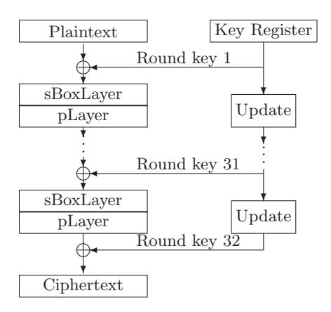
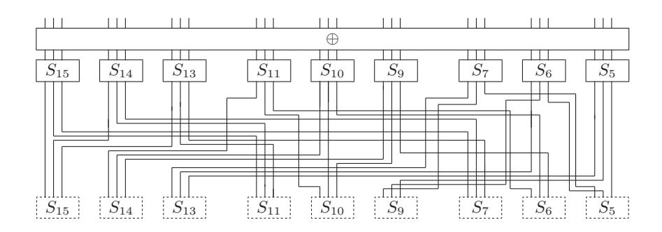
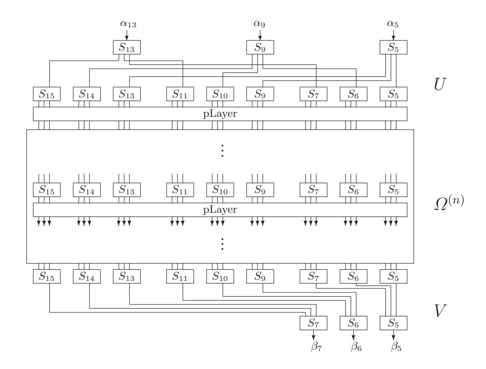
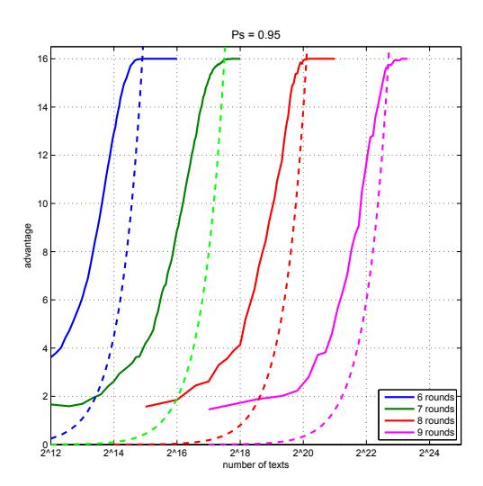

# Linear Cryptanalysis of Reduced-Round PRESENT

Joo Yeon Cho

Helsinki University of Technology, Department of Information and Computer Science, P.O. Box 5400, FI-02015 TKK, Finland joo.cho@tkk.fi

Abstract. PRESENT is a hardware-oriented block cipher suitable for resource constrained environment. In this paper we analyze PRESENT by the multidimensional linear cryptanalysis method. We claim that our attack can recover the 80-bit secret key of PRESENT up to 25 rounds out of 31 rounds with around 262.4 data complexity. Furthermore, we showed that the 26-round version of PRESENT can be attacked faster than key exhaustive search with the 264 data complexity by an advanced key search technique. Our results are superior to all the previous attacks. We demonstrate our result by performing the linear attacks on reduced variants of PRESENT. Our results exemplify that the performance of the multidimensional linear attack is superior compared to the classical linear attack.

Keywords : Block Ciphers, Lightweight Cryptography, PRESENT, Multidimensional Linear Cryptanalysis.

# 1 Introduction

PRESENT [3] is a lightweight SPN block cipher proposed by Bogdanov et al. at CHES 2007. PRESENT is designed for resource restricted applications such as RFID and sensor networks. Due to the impressive hardware performance and the strong security, PRESENT has drawn a lot of attention from the lightweight cryptographic community.

On the other hand, the cryptanalysis on PRESENT has been also actively performed so far. In [15], Wang presented a differential cryptanalysis that could attack the 16-round variant with 264 chosen texts and 265 memory accesses. In [1], Albrecht et al. presented a differential attack using algebraic techniques that can recover a 80-bit key of the 16-round variant with similar complexity to [15] and a 128-bit key of the 19-round variant by 2113 computations. In [4], Collard et al. presented a statistical saturation attack that can recover the key of the 24 round variant with 257 chosen texts and 257 time complexity under the condition that the parts of plaintexts are fixed to a constant value. More recently, Ohkuma presented a linear attack on 24-round variant using weak keys with 263.5 known texts [13].

In this paper, we analyze PRESENT by a multidimensional linear attack method. We observe that PRESENT has a large number of linear approximations that hold with the same order of magnitude of correlations due to the simple structure of the round function 1 . As shown in [7], a multidimensional linear attack can be efficiently applied to such cipher. According to our analysis, the 25-round variant of PRESENT using the 80-bit key can be attacked faster than key exhaustive search with around 262.4 data complexity. Furthermore, an advanced key search technique enables us to attack the 26-round version of PRESENT with 264 data complexity. Our results are superior to all the previous attacks presented in

1 Similar observation was independently presented in [13].

2

the open literature. We demonstrate our claim by performing the multidimensional linear attacks on reduced variants of PRESENT.

This paper is organized as follows. In Section 2, the structure of PRESENT is briefly described and the framework of multidimensional linear attack is presented. In Section 3, linear characteristics are derived and their capacities are computed. In Section 4, the attack algorithm using linear characteristics is described. In Section 5, our attacks are applied to reduced variants of PRESENT and the experimental results are presented. Section 6 concludes this paper.

#### 2 Preliminaries

## 2.1 Brief Description of PRESENT

PRESENT is a SPN block cipher that consists of 31 rounds. The encryption block length is 64 bits and the key lengths is 80 bits or 128 bits. Each of the 31 rounds consists of three layers: addRoundKey, SboxLayer and pLayer. The AddRoundKey is a 64-bit eXclusiveOR operation with a round key. The SboxLayer is a 64-bit nonlinear transform using a single S-box 16 times in parallel. The S-box is a nonlinear bijective mapping  $S: \mathbb{F}_2^4 \mapsto \mathbb{F}_2^4$  given in Table 4. The pLayer is a bit-by-bit permutation  $P: \mathbb{F}_2^{64} \mapsto \mathbb{F}_2^{64}$  given in Table 5. The design idea of SboxLayer and pLayer is adapted from Serpent [2] and DES block cipher [10], respectively. The structure of PRESENT is illustrated in Figure 1.

The key scheduling algorithm has two versions depending on whether the key size is 80 bits or 128 bits. Since the key schedule is not directly relevant to out attack, we do not describe the key schedule algorithm here. For complete description of PRESENT we refer to the paper [3].

Fig. 1. Overview of PRESENT

## 2.2 Multidimensional Linear Cryptanalysis using $\chi^2$ Method

Multidimensional linear cryptanalysis is an extension of Matsui's classical linear cryptanalysis [9] in which multiple linear approximations are optimally exploited. The general framework of the multidimensional linear cryptanalysis adapting Matsui's algorithm 2 was presented by Hermelin et al. in [8]. In their paper, Hermelin et al. studied two statistic methods:

the log-likelihood ratio (LLR) and the  $\chi^2$ . We apply the  $\chi^2$  statistic method to PRESENT since the LLR method is not proper to PRESENT-like structure. The detailed explanation will be given in Section 4.4.

The brief framework of the  $\chi^2$  method is as follows. Let  $V_n$  denote the space of n-dimensional binary vectors. A function  $f: V_n \to V_m$  with  $f = (f_1, \dots, f_m)$  where  $f_i$  is a linear approximation is called a vectorial linear approximation of the dimension m. The correlation of  $f_i$  is defined as  $c(f_i) = 2^{-n} \left[ \#(f_i(a) = 0) - \#(f_i(a) = 1) \right]$  where  $a \in V_n$ .

Let p be the probability distribution of m-dimensional linear approximations. The capacity of  $p=(p_0,\ldots,p_{2^m-1})$  is defined by  $C_p=\sum_{i=0}^{2^m-1}\frac{(p_i-u_i)^2}{u_i}$  where  $u=(u_0,\ldots,u_{2^m-1})$  is the uniform distribution. It is well known that the  $C_p$  is equal to the sum of the square of correlations of all  $2^m-1$  linear approximations.

Suppose l is the length of the target key. For all values of  $k \in [0, 2^l - 1]$ , one obtains the empirical probability distributions  $Q_k = (q_{k,0}, \ldots, q_{k,2^m-1})$  by measuring the frequency of m-dimensional vectors which are Boolean values of m linear independent approximations. Then the candidate keys are sorted according to their  $\chi^2$ -statistics defined as

$$\mathcal{D}(k) = 2^m \sum_{i=0}^{M} (q_{k,i} - 2^{-m})^2, \quad M = 2^m - 1$$
 (1)

which represents the  $l_2$ -distance of the  $Q_k$  from the uniform distribution.

If the right key is ranked in the position of d from the top out of  $2^l$  key candidates, we say that the attack has the advantage of  $(l - \log_2 d)$  [14]. The advantage of the  $\chi^2$ -method using statistic (1) is derived in Theorem 1 in [8] by

$$advantage = \frac{(NC_p - 4\Phi^{-2}(2P_s - 1))^2}{8M}, \quad \Phi(x) = \int_{-\infty}^x \frac{1}{\sqrt{2\pi}} e^{-t^2/2} dt$$
 (2)

where  $P_s$  is the success probability, N is the amount of data and C is the capacity.

#### 2.3 Notations

Let  $S_i$  denote the *i*-th S-box in the SboxLayer and P denote the permutation in the pLayer. Let  $K_r$  denote the *r*-th round key and  $K_r^{[i]}$  denote the *i*-th bit of the  $K_r$ . The  $K_r^{[i..j]}$  denote the bit string from  $K_r^{[i]}$  to  $K_r^{[j]}$ . We use  $E_K(X)$  for representing the average value of X over all possible values of K. In our notation of the bit masks, we identify  $\mathbb{F}_2^4$  with  $\mathbb{Z}_{16}$ . We use the little endian for bit notation through the paper, that is, the least significant bit is counted at the rightmost.

#### 3 Linear Characteristics of PRESENT

We define a *linear trail* as a single path of linear approximations concatenated over multiple rounds. It is a common belief that the linear characteristic with multiple linear trails has a larger correlation than one with a single linear trail due to the linear hull effect [11]. In this section, we derive a linear characteristic of PRESENT that has multiple linear trails. Each linear trail exploits the linear approximations of S-boxes which have a *single active bit* in the input and output masks. The linear masks having more than one active bits affect at least two S-boxes in the consecutive round due to the permutation layer, which yield much less correlations in the multiple rounds of PRESENT.

**Definition 1.** A single-bit linear trail is a linear trail where the input and output masks of linear approximations of all intermediate S-boxes are of Hamming weight one.

We call a single-bit linear trail as just a linear trail unless specified otherwise.

## 3.1 Single Bit Linear Trails

Let  $\pi(\alpha, \beta)$  denote a linear approximation of S-box S where  $\alpha, \beta \in \mathbb{F}_2^4$  are an input and output mask of S, respectively. The correlation of  $\pi(\alpha, \beta)$  is denoted by  $\rho(\alpha, \beta)$ . We observe that the S-box has the following properties:

**S1.** For
$$\alpha, \beta \in \{2, 4, 8\}$$
,  $\rho(\alpha, \beta) = \pm 2^{-2}$  except that  $\rho(8, 4) = 0$ ;

**S2.** For
$$\alpha \in \{1, 2, 4, 8\}$$
,  $\rho(\alpha, 1) = \rho(1, \alpha) = 0$ .

According to Property S1 and S2, the S-box holds eight linear approximations which has a single active bit in both the input and output linear masks.

Let us define  $S = \{S_5, S_6, S_7, S_9, S_{10}, S_{11}, S_{13}, S_{14}, S_{15}\}$  and  $B = \{4i + 1, 4i + 2, 4i + 3 | 0 \le i \le 15, S_i \in S\}$ . Then, the permutation P of the pLayer has the following properties:

**P1.** If  $x \in \mathcal{B}$ , then  $P(x) \in \mathcal{B}$ ;

**P2.** All the outputs of  $S_0$ ,  $S_4$ ,  $S_8$  and  $S_{12}$  turn into the least significant bits of the inputs of S-boxs next round by the permutation. Also, the outputs of  $S_1$ ,  $S_2$  and  $S_3$  turn into the input of  $S_0$ ,  $S_4$ ,  $S_8$  and  $S_{12}$  next round.

Due to Property S2 and P2, the linear trails passing any bit position that does not included in  $\mathcal{B}$  do not have correlations. Hence, by Property S1 and P1, any r-round linear trail with an input mask  $\alpha$  and an output mask  $\beta$  takes the following path:

$$\pi(\alpha, 2^{v_1}) \to \pi(2^{u_2}, 2^{v_2}) \to \cdots \to \pi(2^{u_{r-1}}, 2^{v_{r-1}}) \to \pi(2^{u_r}, \beta)$$

where  $u_i, v_i \in \{1, 2, 3\}$  and  $(u_i, v_i) \neq (3, 2)$  for  $1 \le i \le r$ .

#### 3.2 *n*-Round Linear Characteristic

Let  $\Omega^{(1)}$  denote the 1-round linear characteristic which has all the single bit linear trails of nine S-boxes of  $\mathcal{S}$ , as shown in Figure 2. Due to Property S1, the  $\Omega^{(1)}$  contains  $9 \times 8 = 72$  linear trails, each of which has  $\pm 2^{-2}$  correlation. Since  $x \mapsto P(x)$  is an one-to-one mapping, Property P1 implies that  $\{P(x)|x \in \mathcal{B}\} = \mathcal{B}$ . Hence, we can construct the n-round linear characteristic, which is denoted by  $\Omega^{(n)}$ , by concatenating  $\Omega^{(1)}$  iteratively n times as follows:

$$\Omega^{(n)} = \underbrace{\Omega^{(1)} \circ \cdots \circ \Omega^{(1)}}_{n \text{ times}}.$$

We can expect that the number of linear trails grows exponentially according to the increment of the number of rounds. Let  $\zeta^{(r)}(x,y)$  denote a bundle of linear trails which start from the x-th bit of input and end up at the y-th bit of output over  $\Omega^{(r)}$ . Each  $\zeta^{(r)}(x,y)$  is extended to  $\zeta^{(r+1)}(x,\nu)$  for some  $\nu \in \mathcal{B}$  via two or three single-bit linear approximations of the S-box.

Fig. 2. Linear trails in the 1-round linear characteristic

Suppose K is a user-supplied key. Let  $\theta^{(r)}(x,y;K)$  denote the correlation of  $\zeta^{(r)}(x,y)$ , given K. The actual value of  $\theta^{(r)}(x,y;K)$  depends on the round keys involved in each linear trail. For any  $x, y \in \mathcal{B}$ , the  $\theta^{(r)}(x, y; K)$  is recursively expressed as

$$\theta^{(r)}(x,y;K) = \sum_{i=1}^{3} (-1)^{K_r^{[\nu]}} \rho(2^i, 2^{P^{-1}(y) \mod 4}) \theta^{(r-1)}(x,\nu;K), \ \nu = 4 \lfloor P^{-1}(y)/4 \rfloor + i \quad (3)$$

where  $P^{-1}$  is an inverse mapping of P.

The average value of  $\theta^{(r)}(x,y;K)$  over all possible values of K is recursively computed by the following algorithm:

- 1. Initialize  $\theta^{(0)}(x,y) = 1$  for all  $j \in B$ . Set r = 1.
- 2. For each  $x, y \in \mathcal{B}$ ,
  - (a) compute  $\theta^{(r)}(x,y;K)$  using (3) for all possible values of  $K \in \mathbb{F}_2^{27}$ ; (b) assign  $\theta^{(r)}(x,y) = E_K(|\theta^{(r)}(x,y;K)|) = 2^{-27} \sum_K |\theta^{(r)}(x,y;K)|$ .
- 3. Repeat Step 2 for  $r = 2, 3, \ldots, n$ .

Above algorithm can be much simplified by the following theorem: (In this theorem, the correlation potential means the square of the correlation.)

Theorem 1. (Theorem 7.9.1 in "Design of Rijndael" [6] and Fundamental Theorem by Nyberg [11]) The average correlation potential between an input and an output selection pattern is the sum of the correlation potentials of all linear trails between the input and output selection patterns.

By Theorem 1, the average value of  $(\theta^{(n)}(x,y))^2$  is obtained by summing the square values of correlations of all linear trails in the  $\zeta^{(r)}(x,y)$  for all  $x,y\in\mathcal{B}$ . Hence, the average value of  $(\theta^{(n)}(x,y))^2$  can be computed simply by the following algorithm:

- 1. Initialize  $\theta^{(0)}(x,y) = 1$  for all  $x,y \in B$ . Set r = 1.
- 2. For each  $x, y \in \mathcal{B}$ , compute

$$E_K[(\theta^{(r)}(x,y;K))^2] = \sum_{i=1,2,3} \rho(2^i, 2^{P^{-1}(y) \mod 4})^2 E_K[(\theta^{(r-1)}(x,\nu;K))^2], \ \nu = 4\lfloor P^{-1}(y)/4 \rfloor + i$$

3. Repeat Step 2 for  $r = 2, 3, \ldots, n$ .

Theorem 1 concerns a single linear approximation that has multiple linear trails. For the multidimensional linear cryptanalysis, Theorem 1 can be extended as follows:

**Proposition 1.** The expected capacity of an m-dimensional linear approximation is the sum of the square of the expected correlations of all the linear trails that each of the  $2^m - 1$  one-dimensional linear approximations are composed of.

## 3.3 (n+4)-Round Linear Characteristic

Let us define U as the 2-round characteristic which starts from  $S_5, S_9$  and  $S_{13}$  and ends with nine S-boxes of S. Each input S-box of U takes arbitrary value from 1 to 15 as the input mask and each output S-box takes a single-bit output mask only. We also define V as the 2-round characteristic which starts from nine S-boxes of S and ends up at  $S_5, S_6$  and  $S_7$ . Each input S-box of V takes a single-bit linear mask and each output S-box takes arbitrary value from 1 to 15 as the output mask. For a positive integer n, the n+4 round linear characteristic is constructed by adding U and V to  $\Omega^{(n)}$  at the top and the bottom respectively as shown in Figure 3.

**Fig. 3.** (n+4) rounds linear characteristic

Let  $C_p^{(n+4)}$  denote the capacity of  $U \circ \Omega^{(n)} \circ V$ . By the definition of the capacity and due to Theorem 1, the average value of  $C_p^{(n+4)}$  is the sum of the square of correlations of all linear trails over the  $U \circ \Omega^{(n)} \circ V$ , which is calculated by the following theorem:

**Theorem 2.** Let us assume that the round keys of PRESENT are statistically independent. For a positive integer n, the expected capacity of  $U \circ \Omega^{(n)} \circ V$  over the secret key K is

$$2^{-8} \cdot E_K \left[ \sum_{x \in B} \sum_{y \in B} \left( \theta^{(n)}(x, y; K) \right)^2 \right]$$

Proof. Let  $\alpha_i$  be an input mask of  $S_i \in \{S_5, S_9, S_{13}\}$  of the U and  $\beta_j$  be an output mask of  $S_j \in \{S_5, S_6, S_7\}$  of the V. For a fixed  $\alpha_i$ , the U has nine linear trails holding with correlations of  $\rho(\alpha_i, 2^u) \cdot 2^{-2}$  for some  $u \in \{1, 2, 3\}$ . Similarly, for a fixed  $\beta_j$ , the V has nine linear trails with the correlations of  $\rho(2^v, \beta_j) \cdot 2^{-2}$  for some  $v \in \{1, 2, 3\}$ . We define  $B[\alpha_i]$  and  $B[\beta_j]$  as the sets of input and output bit positions where  $\Omega^{(n)}$  is linked with U and V for fixed  $\alpha_i$  and  $\beta_j$ , respectively. Obviously,  $\#B[\alpha_i] = \#B[\beta_j] = 9$  for any  $\alpha_i$  and  $\beta_j$ .

Let  $c^{(n+4)}(\alpha_i, \beta_j)$  denote the correlation of the linear approximation with the input mask  $\alpha_i$  and the output mask  $\beta_j$  over  $U \circ \Omega^{(n)} \circ V$ . Then, for a fixed key K, we can write

$$c^{(n+4)}(\alpha_i,\beta_j;K) = \sum_{x \in B_1} \sum_{y \in B_2} (-1)^k \cdot \rho(\alpha_i,2^u) \cdot 2^{-2} \cdot \theta^{(n)}(x,y;K) \cdot 2^{-2} \cdot \rho(2^v,\beta_j)$$

where k denotes a parity of the relevant round key bits. Since

$$E_K[(-1)^{k_s}(-1)^{k_t}] = \begin{cases} 1 & \text{if } s = t, \\ 0 & \text{if } s \neq t \end{cases}$$

under the assumption that the round key bits are statistically independent,2 we get

$$E_K \left[ \left( c^{(n+4)}(\alpha_i, \beta_j; K) \right)^2 \right] = E_K \left[ 2^{-8} \sum_{x \in B_1} \sum_{y \in B_2} \rho(\alpha_i, 2^u)^2 \cdot \left( \theta^{(n)}(x, y; K) \right)^2 \cdot \rho(2^v, \beta_j)^2 \right].$$

Parseval's theorem says that  $\sum_{\alpha_i=0}^{15} \rho(\alpha_i, 2^u)^2 = \sum_{\beta_j=0}^{15} \rho(2^v, \beta_j)^2 = 1$  for any  $u, v \in \{1, 2, 3\}$ . Hence, the average value of  $C_p^{(n+4)}(\alpha_i, \beta_j; K)$  is obtained by computing

$$E_K[C_p^{(n+4)}(\alpha_i, \beta_j; K)] = \sum_{\alpha_i=0}^{15} \sum_{\beta_j=0}^{15} E_K \left[ \left( c^{(n+4)}(\alpha_i, \beta_j; K) \right)^2 \right]$$
$$= 2^{-8} \cdot E_K \left[ \sum_{x \in B_1} \sum_{y \in B_2} \left( \theta^{(n)}(x, y; K) \right)^2 \right].$$

The  $C_p^{(n+4)}(K)$  is the sum of  $C_p^{(n+4)}(\alpha_i, \beta_j; K)$  for all pairwise combinations of  $\{\alpha_i, \beta_j\}$  where  $\alpha_i \in \{\alpha_5, \alpha_9, \alpha_{13}\}$  and  $\beta_j \in \{\beta_5, \beta_6, \beta_7\}$ . Since  $B[\alpha_5] \cup B[\alpha_9] \cup B[\alpha_{13}] = \mathcal{B}$  and  $B[\beta_5] \cup B[\beta_6] \cup B[\beta_7] = \mathcal{B}$ , we conclude that

$$\begin{split} E_K[C_p^{(n+4)}(K)] &= \sum_{i \in \{5,9,13\}} \sum_{j \in \{5,6,7\}} E_K[C_p^{(n+4)}(\alpha_i,\beta_j;K)] \\ &= 2^{-8} \cdot E_K \left[ \sum_{x \in B} \sum_{y \in B} \left( \theta^{(n)}(x,y;K) \right)^2 \right] \end{split}$$

&lt;sup>2 The statistical behavior of  $k_s \oplus k_t$  was experimentally verified to follow unbiased binomial distribution by a summer school student.

Theorem 2 implies that the expected capacity of  $U \circ \Omega^{(n+4)} \circ V$  is the sum of the square of correlations of all linear trails starting from the second round and ending to the second last round. We calculated the average capacities of (n+4)-round linear characteristics for  $2 \le n \le 25$  by Theorem 2. The results are displayed in Table 1.

In the next section, we present the multidimensional linear attacks using the (n + 4)-round linear characteristics.

| round | capacity     | round | capacity     |
|-------|--------------|-------|--------------|
| 6     | $2^{-8.42}$  | 18    | $2^{-39.71}$ |
| 7     | $2^{-11.00}$ | 19    | $2^{-42.32}$ |
| 8     | $2^{-13.61}$ | 20    | $2^{-44.94}$ |
| 9     | $2^{-16.22}$ | 21    | $2^{-47.55}$ |
| 10    | $2^{-18.82}$ | 22    | $2^{-50.16}$ |
| 11    | $2^{-21.43}$ | 23    | $2^{-52.77}$ |
| 12    | $2^{-24.04}$ | 24    | $2^{-55.38}$ |
| 13    | $2^{-26.66}$ | 25    | $2^{-57.99}$ |
| 14    | $2^{-29.27}$ | 26    | $2^{-60.61}$ |
| 15    | $2^{-31.88}$ | 27    | $2^{-63.22}$ |
| 16    | $2^{-34.49}$ | 28    | $2^{-65.83}$ |
| 17    | $2^{-37.10}$ | 29    | $2^{-68.44}$ |

**Table 1.** Evaluation of capacities of n + 4 round characteristics

#### 4 Multidimensional Linear Attacks on PRESENT

#### 4.1 Selection of linear independent approximations

Suppose n is a positive integer. The dimension of input and output masks of the  $U \circ \Omega^{(n)} \circ V$  is  $4 \times 3 = 12$  each. As mentioned before, the linear trails passing more than one S-boxes at each round have much less correlations than single-bit linear trails. Thus, it is sufficient to take nine linear characteristics individually, each of which has 8-dimensional linear characteristic with 4-bit input and 4-bit output. Then, the number of linear approximations spanned for our attack is  $9 \times (2^8 - 1)$  in total.

We use eight unit vectors as the linear independent approximations. Even though each unit vector does not have any correlation, all linear approximations can be obtained by spanning these unit vectors. The merit of this approach is that the evaluation of Boolean values of linear approximations is not needed; The probability distribution of the linear approximations can be obtained by just measuring the frequencies of the concatenated value of input and output of the linear characteristic. Hence, the time complexity of the attack can be reduced by at least a factor of m where m is the dimension of the linear approximations.

### 4.2 Attack Algorithm

We target to attack the n-round version of PRESENT. Our attack uses the (n-2)-round linear characteristic  $U \circ \Omega^{(n-6)} \circ V$  from the second round to (n-1)-th round and recovers the 32 bits of the round key in the first round and the last round. The inputs of the U are

connected to  $S_4, S_5, S_6$  and  $S_7$  of the first round and the outputs of the V are connected to  $S_1, S_5, S_9$  and  $S_{13}$  of the n-th round. Thus, we target to recover the 16 bits of the  $K_1$ , which are  $K_1^{[16..19]}||K_1^{[20..23]}||K_1^{[24..27]}||K_1^{[28..31]}$ , and the 16 bits of the  $K_n$ , which are  $P(K_n^{[4..7]})||P(K_n^{[20..23]})||P(K_n^{[36..39]})||P(K_n^{[52..55]})$ .

Let  $k_e$  and  $k_d$  be the targeted 16 bits of  $K_1$  and  $K_n$ , respectively. Then, we recover the  $k_e$  and  $k_d$  in the following way:

- 1. Prepare  $9 \cdot 2^{32} \cdot 2^8$  counters and initialize them by zero.
- 2. Collect N plaintext-ciphertext pairs.
- 3. For  $K = 0, \dots, 2^{32-1}$ ,
  - (a) Partially encrypt each plaintext one round by the 16 bits of  $k_e$  and decrypt the corresponding ciphertext one round by the 16 bits of  $k_d$  where  $K = k_d || k_e$ .
  - (b) Extract three input values  $\alpha_5, \alpha_9, \alpha_{13}$  of U and three output values  $\beta_5, \beta_6, \beta_7$  of V.
  - (c) Obtain nine 8-bit values by pairwise concatenating  $\alpha_i$  and  $\beta_j$  for i=5,9,13 and j=5,6,7.
  - (d) increment nine counters indicated by K and  $(\alpha_i||\beta_i)$ .
- 4. Repeat Step 3 for all N text pairs.
- 5. Compute  $l_2$  distance using (1) between the probability distribution for each K and uniform distribution.
- 6. Sort out the candidate keys according to their  $l_2$  distances.
- 7. Search the right key from the top of the sorted keys.

#### 4.3 Attack Complexity

The amount of data required for  $\chi^2$  statistic method is obtained from (2) as follows:

$$N = \left(\sqrt{advantage \cdot 8 \cdot M} + 4\Phi^{-2}(2P_s - 1)\right) / C^{(r)}$$

where  $P_s$  is the success probability and  $C^{(r)}$  is the capacity. Since the number of linear approximations available for the attack is  $9 \times (2^8 - 1)$ , the full advantage (32 bits) of the attack with the success probability 0.95 is achieved by the data complexity of  $N = \left(\sqrt{32 \cdot 8 \cdot 9 \cdot (2^8 - 1)} + 4\Phi^{-2}(2 \cdot 0.95 - 1)\right)/C^{(r)} \approx 2^{9.6}/C^{(r)}$ .

According to the Step 3 and 4 of the attack algorithm, we needs to perform both 1-round encryption and decryption for each plaintext-ciphertext pair and each guessed key. A naive implementation of these steps requires  $N \cdot 2^{32}$  operations. We can reduce the computational complexity greatly by removing the repeated computations.

Let x and y be a 16-bit plaintext and a 16-bit ciphertext used for our attack. The Step 3-(a) of the attack algorithm is to compute  $z_k = (P(S(x \oplus k_e))||(S^{-1}(P^{-1}(y \oplus k_d)))$  where  $k_e$  and  $k_d$  denote the guessed 16-bit keys of the first round and the last round, respectively. Thus, the probability distribution  $Q_k$  of  $z_k$  is obtained by mapping  $(x \oplus k_e)||(y \oplus k_d) \mapsto z_k$  for all  $k = (k_e||k_d) \in \mathbb{F}_2^{32}$  with N pairs of data. This step can be divided into two sub-steps for efficient computations: First, the table  $Q^*$  is obtained by measuring the frequency of  $(x||y) \in \mathbb{F}_2^{32}$ . Next, the mapping  $(Q^*,k) \mapsto Q_k$  can be done by  $2^{32}$  times access of  $Q^*$  for each candidate k. Hence, the Step 3 can be done by  $2^{32} \cdot 2^{32}$  operations in total. 3 Since computing the  $l_2$  distance requires  $9 \cdot 2^8$  operations for each candidate key, the total time complexity of the attack is  $2^{64} + 9 \cdot 2^8 \cdot 2^{32} \approx 2^{64}$ . For the memory complexity, the  $Q^*$  needs

&lt;sup>3 The computational complexity may be further reduced by applying Fast Fourier Transform at the cost of the increased memory complexity. [5]

 $2^{32} \cdot 4 = 2^{34}$  bytes of memory and some additional memory is required for storing temporary values of computations.

Without increasing the amount of data complexity, we can recover another 32 bits of the round key by changing the input S-boxes of U and the output S-boxes of V over the  $U \circ \Omega^{(n)} \circ V$ ; if the attack uses the linear characteristic starting with  $S_7, S_{11}, S_{15}$  and ending with  $S_{13}, S_{14}, S_{15}$ , we recover the  $K_1^{[48..63]}$  and the  $K_n^{[12..15]}, K_n^{[28..31]}, K_n^{[44..47]}, K_n^{[60..63]}$ . In this manner, we can recover  $32 \cdot 2$  bits of the round keys in the first and the last round key in total. The remaining 80 - 64 = 16 bits of key can be obtained by exhaustive key search. Hence, the time complexity of the attack is around  $2 \cdot 2^{64} + 2^{16} \approx 2^{65}$  in total.

Attack on 26-round PRESENT Our attack can be extended to 26-round version of PRESENT with the 24-round characteristic holding with the capacity of  $2^{-55.38}$ . If the attack uses the full range of text pairs, which is  $2^{64}$ , the theoretical advantage of attack is expected to be 8 by (2). This means that the right key is possibly ranked within the position of  $2^{32-8} = 2^{24}$  out of  $2^{32}$  candidates with the probability of 0.95. Hence, we apply the following attack scenario to the 26-round PRESENT: First, the multidimensional linear attack targeting 32 bits of the round key is performed with  $2^{64}$  text pairs. As a result, the  $2^{24}$  candidate keys are obtained. Second, the remained secret key bits (80-32=48) are combined with the  $2^{24}$  candidate keys from the top in order and the key exhaustive search is performed.

From this scenario, the secret key can be found within the time complexity of  $2^{64} + 2^{48} \cdot 2^{24} \approx 2^{72}$ . Note that the theoretical estimation is always the lower bound since we use the correlations of only single linear trails. We compare our attacks with previous attacks against various rounds versions of PRESENT in Table 2.

| round | data                 | time     | source                       |
|-------|----------------------|----------|------------------------------|
| 16    | $2^{64}CP$           | $2^{65}$ | Differential [15]            |
| 19    | -                    |          | Differential + Algebraic [1] |
| 24    | $2^{57}$ CP          | $2^{57}$ | Saturation [4]               |
| 24    | $2^{63.5} \text{KP}$ | -        | Linear [13]                  |
| 25    | $ 2^{62.4}$ KP       | $2^{65}$ | Linear (this paper)          |
| 26    | $2^{64}$ KP          | $2^{72}$ | Linear (this paper)          |

**Table 2.** Comparison of data and time complexity of the attacks against PRESENT (CP: Chosen Plaintext, KP: Known Plaintext)

#### 4.4 Discussion

Weakness of bit permutation Our attack is mainly based on the observation that PRESENT has a large number of linear approximations with the same magnitude of correlations. It seems that this weakness is caused by the lack of diffusion property of the bit permutation. Even though the bit permutation is desirable for efficient hardware implementation, it has a potential weakness that input bits and output bits have one-to-one correspondence. Hence, a single-bit linear approximations of an S-box of any round can be connected to another single-bit linear approximation of next round through the permutation layer. Since the S-box of PRESENT has multiple linear approximations of which linear

masks have a single active bit, one can construct multiple single-bit linear trails over arbitrary rounds. Note that this weakness does not appear in the linear transformation functions of Serpent [2] or AES [6] since any single output bit of the linear transformation is expressed as a boolean function of at least two input bits.

A simple remedy to prevent our attack is to revise the S-box in such a way that a single-bit linear approximations of S-box do not have significant correlations. However, we did not investigate how this remedy affects the other aspects of the security of PRESENT.

Correlation and Piling Up Lemma The designers of PRESENT proved in Theorem 2 of [3] that the maximum correlation of a linear approximation of four rounds of PRESENT is 2 −6 . As a result, the maximal correlation of a 28-round linear approximation was estimated to be (2−6 ) 7 = 2−42 by Piling Up lemma [3]. Thus, the linear attack using the 28-round linear approximation would require more than 284 data [3]. On the other hand, according to our analysis, the capacity of the 28 round PRESENT is estimated to be around 2−65.8 by the correlation theorem [12] so that 30 round of PRESENT can be (theoretically) attacked by around 275 data.

The difference between the designers' estimation and our result is originated from the fact that the designers considered a single linear approximation using a single linear trail holding with the strongest correlation, whereas our attack takes into account multiple linear approximations, each of which has multiple linear trails holding with strong correlations. Due to the existence of large amount of linear trails in PRESENT, the data complexity of the attack is reduced significantly compared to the estimate by a correlation of a single linear approximation.

The χ 2 and LLR method Finally, we justify the reason why the LLR method is not used for the attack on PRESENT even if the LLR method showed a better performance than the χ 2 method in the attacks on SERPENT [7]. As described in [7], the LLR method is more advantageous compared to the χ 2 method if the pre-computed profile of the probability distribution is accurate. However, the distribution of linear approximations in PRESENT heavily depends on the key values so that the space for the profile of the probability distribution becomes too large. On the other hand, the χ 2 method does not need to know the distribution accurately; We only need to detect a large deviation of the probability distribution from the uniform distribution. It is an open problem whether there is a way to apply the LLR method efficiently for the attacks against PRESENT.

## 5 Experiments

We performed the multidimensional linear attacks on the reduced-round PRESENT by experiments in order to verify our theoretical analysis. We chose r = 6, 7, 8, 9 rounds version of PRESENT and applied our attack algorithm. We targeted to recover the 16 bits of the last round key by using (r − 1)-round linear characteristics. The plaintexts were randomly generated and encrypted by r-round PRESENT. The experiments were repeated with the randomly chosen 200 secret keys and the average values of advantage were calculated. Figure 4 illustrates the relationship between the advantage of the attacks and the required amount of plaintexts for each experiments. The dashed lines represent theoretically estimations drawn by (2) and the solid lines are empirical results. We can see that the estimation of the full advantage of the attack is well matched with empirical results up to 9 rounds PRESENT. Due to the restriction of computational resources, we could not perform the attack algorithm which recovers 32 bits of the round key of the r-round version by the (r − 2)-round characteristic. However, based on our experimental results, we can conclude that our estimates of attack complexity against further rounds PRESENT are reasonable.

Fig. 4. Empirical evaluation of linear attacks on reduced variants of PRESENT

# 6 Conclusion

Modern block ciphers often prove the resistance of linear cryptanalysis by counting the minimum number of the active S-boxes involved in the best linear approximation. Even though PRESENT provides a provable security against linear cryptanalysis according to this rule, our attack shows that the resistance of the classical linear cryptanalysis does not always thwart the multidimensional linear attacks. Even though a simple, iterative structure of the cipher is desirable for the hardware-oriented block ciphers, such ciphers may have possibility to retain a large number of linear approximations by which a multidimensional linear attack can be applied efficiently. It is interesting to see that our attack can be applied to some other ciphers that have simple structures, like AES.

# Acknowledgment

I wish to thank Kaisa Nyberg for very useful comments that helped to improve the paper. I am grateful to anonymous reviewers of Asiacrypt 2009 and CT-RSA 2010 for their valuable comments.

## References

- 1. M. Albrecht and C. Cid, Algebraic techniques in differential cryptanalysis, Fast Software Encryption, 16th International Workshop, FSE 2009, Leuven, Belgium, February 22-25, 2009, Revised Selected Papers, Lecture Notes in Computer Science, vol. 5665, Springer, 2009, pp. 193–208.
- 2. R. Anderson, E. Biham, and L. Knudsen, Serpent: A proposal for the Advanced Encryption Standard, First Advanced Encryption Standard (AES) conference, 1998.
- 3. A. Bogdanov, L. R. Knudsen, G. Leander, C. Paar, A. Poschmann, M. J. B. Robshaw, Y. Seurin, and C. Vikkelsoe, PRESENT: An ultra-lightweight block cipher, Cryptographic Hardware and Embedded Systems - CHES 2007, 9th International Workshop, Vienna, Austria, September 10- 13, 2007, Proceedings, Lecture Notes in Computer Science, vol. 4727, Springer, 2007, pp. 450– 466.
- 4. B. Collard and F. Standaert, A statistical saturation attack against the block cipher PRESENT, Available at http://www.dice.ucl.ac.be/ fstandae/PUBLIS/62.pdf, 2009.
- 5. B. Collard, F. Standaert, and J. Quisquater, Improving the time complexity of matsui's linear cryptanalysis, Information Security and Cryptology - ICISC 2007, 10th International Conference, Seoul, Korea, November 29-30, 2007, Proceedings, Lecture Notes in Computer Science, vol. 4817, Springer, 2007, pp. 77–88.
- 6. J. Daemen and V. Rijmen, The Design of Rijndael- AES, the Advanced Encryption Standard, Springer-Verlag, 2002.
- 7. M. Hermelin, J. Cho, and K. Nyberg, Multidimensional linear cryptanalysis of reduced round Serpent, Information Security and Privacy, 13th Australasian Conference, ACISP 2008, Wollongong, Australia, July 7-9, 2008, Proceedings, Lecture Notes in Computer Science, vol. 5107, Springer, 2008, pp. 203–215.
- 8. M. Hermelin, J. Y. Cho, and K. Nyberg, Multidimensional extension of Matsui's algorithm 2, Fast Software Encryption 2009, Lecture Notes in Computer Science, Springer, to appear.
- 9. M. Matsui, Linear cryptoanalysis method for DES cipher, Advances in Cryptology EURO-CRYPT '93, Lecture Notes in Computer Science, vol. 765, Springer, 1993, pp. 386–397.
- 10. National Bureau of Standards, FIPS PUB 46-3: Data Encryption Standard (DES), National Institute for Standards and Technology, January 1977.
- 11. K. Nyberg, Linear approximation of block ciphers, Advances in Cryptology EUROCRYPT '94, Workshop on the Theory and Application of Cryptographic Techniques, Perugia, Italy, May 9-12, 1994, Proceedings, Lecture Notes in Computer Science, vol. 950, Springer, 1994, pp. 439–444.
- 12. , Correlation theorems in cryptanalysis, Discrete Applied Mathematics 111 (2001), 177– 188.
- 13. K. Ohkuma, Weak keys of reduced-round PRESENT for linear cryptanalysis, in preproceeding of SAC 2009, 2009.
- 14. A. Sel¸cuk, On probability of success in linear and differential cryptanalysis, Journal of Cryptology 21 (2008), no. 1, 131–147.
- 15. M. Wang, Differential cryptanalysis of reduced-round PRESENT, Progress in Cryptology AFRICACRYPT 2008, First International Conference on Cryptology in Africa, Casablanca, Morocco, June 11-14, 2008. Proceedings, Lecture Notes in Computer Science, vol. 5023, 2008, pp. 40–49.

# A Correlation Table of S-box of PRESENT

Given an input mask α and an output mask β where α, β ∈ F 4 2 , the correlation of the linear approximation α · x ⊕ β · S(x) = 0 of the S-box is measured as follows:

$$c(\alpha,\beta) = 2^{-4} (\#(\alpha \cdot x \oplus \beta \cdot S(x) = 0) - \#(\alpha \cdot x \oplus \beta \cdot S(x) = 1))$$

where the · notation stands for the standard inner product. The correlation table of the S-box is given in Table 3.

| $\alpha \backslash \beta$ | 1         | 2         | 3         | 4         | 5         | 6         | 7         | 8         | 9         | a         | b         | С         | d         | е         | f          |
|---------------------------|-----------|-----------|-----------|-----------|-----------|-----------|-----------|-----------|-----------|-----------|-----------|-----------|-----------|-----------|------------|
| 1                         | 0         | 0         | 0         | 0         | $-2^{-1}$ | 0         | $-2^{-1}$ | 0         | 0         | 0         | 0         | 0         | $-2^{-1}$ | 0         | $2^{-1}$   |
| 2                         | 0         | $2^{-2}$  | $2^{-2}$  | $-2^{-2}$ | $-2^{-2}$ | 0         | 0         | $2^{-2}$  | $-2^{-2}$ | 0         | $2^{-1}$  | 0         | $2^{-1}$  | $-2^{-2}$ | $2^{-2}$   |
| 3                         | 0         | $2^{-2}$  | $2^{-2}$  | $2^{-2}$  | $-2^{-2}$ | $-2^{-1}$ | 0         | $-2^{-2}$ | $2^{-2}$  | $-2^{-1}$ | 0         | 0         | 0         | $-2^{-2}$ | $-2^{-2}$  |
| 4                         | 0         | $-2^{-2}$ | $2^{-2}$  | $-2^{-2}$ | $-2^{-2}$ | 0         | $2^{-1}$  | $-2^{-2}$ | $-2^{-2}$ | 0         | $-2^{-1}$ | 0         | 0         | $-2^{-2}$ | $2^{-2}$   |
| 5                         | 0         | $-2^{-2}$ | $2^{-2}$  | $-2^{-2}$ | $2^{-2}$  | 0         | 0         | $2^{-2}$  |           | $-2^{-1}$ | 0         | $2^{-1}$  | 0         | $2^{-2}$  | $2^{-2}$   |
| 6                         | 0         | 0         | $-2^{-1}$ | 0         | 0         | $-2^{-1}$ | 0         |           | $-2^{-1}$ | 0         | 0         | $2^{-1}$  | 0         | 0         | 0          |
| 7                         | 0         | 0         | $2^{-1}$  | $2^{-1}$  | 0         | 0         | 0         | 0         | $-2^{-1}$ | 0         | 0         | 0         | 0         | $2^{-1}$  | 0          |
| 8                         | 0         | $2^{-2}$  | $-2^{-2}$ | 0         | 0         | $-2^{-2}$ | $2^{-2}$  | $-2^{-2}$ | $2^{-2}$  | 0         | 0         | $-2^{-2}$ |           | $2^{-1}$  | $ 2^{-1} $ |
| 9                         | $2^{-1}$  |           | $-2^{-2}$ | 0         | 0         | $2^{-2}$  | $-2^{-2}$ | $-2^{-2}$ | $-2^{-2}$ | $-2^{-1}$ | 0         | $-2^{-2}$ | $2^{-2}$  | 0         | 0          |
| a                         | 0         | $2^{-1}$  | 0         | $2^{-2}$  | $2^{-2}$  | $2^{-2}$  | $-2^{-2}$ | 0         | 0         | 0         | $-2^{-1}$ | $2^{-2}$  |           | $-2^{-2}$ | $2^{-2}$   |
| b                         | $-2^{-1}$ | 0         |           | $-2^{-2}$ | $-2^{-2}$ | $2^{-2}$  | $-2^{-2}$ | $-2^{-1}$ | 0         | 0         | 0         | $2^{-2}$  | $2^{-2}$  | $2^{-2}$  | $-2^{-2}$  |
| c                         | 0         | 0         |           |           | $-2^{-2}$ | $-2^{-2}$ | $-2^{-2}$ | $2^{-1}$  | 0         | 0         | $-2^{-1}$ | $-2^{-2}$ |           | $2^{-2}$  | $-2^{-2}$  |
| d                         | $2^{-1}$  | $2^{-1}$  |           | $-2^{-2}$ | $-2^{-2}$ | $2^{-2}$  | $2^{-2}$  | 0         | 0         | 0         | 0         | $2^{-2}$  | $-2^{-2}$ | $2^{-2}$  | $-2^{-2}$  |
| e                         | 0         | $2^{-2}$  |           | $-2^{-1}$ | $2^{-1}$  | $-2^{-2}$ | $-2^{-2}$ |           | $-2^{-2}$ | 0         | 0         |           |           | 0         | 0          |
| f                         | $2^{-1}$  | $-2^{-2}$ | $2^{-2}$  | 0         | 0         | $-2^{-2}$ | $-2^{-2}$ | $-2^{-2}$ | $2^{-2}$  | $2^{-1}$  | 0         | $2^{-2}$  | $2^{-2}$  | 0         | 0          |

**Table 3.** Correlation table of S-box of PRESENT:  $c(\alpha, \beta)$

# B The S-box and Permutation tables of PRESENT

The S-box and the permutation tables of PRESENT are given in Table 4 and Table 5, respectively.

|      | 0 |   |   |   |   |   |   |   | l . |   |   | l | l |   |   |   |
|------|---|---|---|---|---|---|---|---|-----|---|---|---|---|---|---|---|
| S(x) | С | 5 | 6 | В | 9 | 0 | A | D | 3   | E | F | 8 | 4 | 7 | 1 | 2 |

Table 4. S-box table of PRESENT in hexadecimal notation

| i    | 0  | 1  | 2  | 3  | 4  | 5  | 6  | 7  | 8  | 9  | 10 | 11 | 12 | 13 | 14 | 15 |
|------|----|----|----|----|----|----|----|----|----|----|----|----|----|----|----|----|
| P(i) | 0  | 16 | 32 | 48 | 1  | 17 | 33 | 49 | 2  | 18 | 34 | 50 | 3  | 19 | 35 | 51 |
| i    | 16 | 17 | 18 | 19 | 20 | 21 | 22 | 23 | 24 | 25 | 26 | 27 | 28 | 29 | 30 | 31 |
| P(i) | 4  | 20 | 36 | 52 | 5  | 21 | 37 | 53 | 6  | 22 | 38 | 54 | 7  | 23 | 39 | 55 |
| i    | 32 | 33 | 34 | 35 | 36 | 37 | 38 | 39 | 40 | 41 | 42 | 43 | 44 | 45 | 46 | 47 |
| P(i) | 8  | 24 | 40 | 56 | 9  | 25 | 41 | 57 | 10 | 26 | 42 | 58 | 11 | 27 | 43 | 59 |
| i    | 48 | 49 | 50 | 51 | 52 | 53 | 54 | 55 | 56 | 57 | 58 | 59 | 60 | 61 | 62 | 63 |
| P(i) | 12 | 28 | 44 | 60 | 13 | 29 | 45 | 61 | 14 | 30 | 46 | 62 | 15 | 31 | 47 | 63 |

 Table 5. Permutation table of PRESENT