# High-Speed Hardware Implementations of BLAKE, Blue Midnight Wish, CubeHash, ECHO, Fugue, Grøstl, Hamsi, JH, Keccak, Luffa, Shabal, SHAvite-3, SIMD, and Skein

Version 2.0, November 11, 2009

Stefan Tillich, Martin Feldhofer, Mario Kirschbaum, Thomas Plos, J¨orn-Marc Schmidt, and Alexander Szekely

Graz University of Technology, Institute for Applied Information Processing and Communications, Inffeldgasse 16a, A–8010 Graz, Austria {Stefan.Tillich,Martin.Feldhofer,Mario.Kirschbaum, Thomas.Plos,Joern-Marc.Schmidt,Alexander.Szekely}@iaik.tugraz.at

Abstract. In this paper we describe our high-speed hardware implementations of the 14 candidates of the second evaluation round of the SHA-3 hash function competition. We synthesized all implementations using a uniform tool chain, standard-cell library, target technology, and optimization heuristic. This work provides the fairest comparison of all second-round candidates to date.

Keywords: SHA-3, round 2, hardware, ASIC, standard-cell implementation, high speed, high throughput, BLAKE, Blue Midnight Wish, Cube-Hash, ECHO, Fugue, Grøstl, Hamsi, JH, Keccak, Luffa, Shabal, SHAvite-3, SIMD, Skein.

# 1 About Paper Version 2.0

This version of the paper contains improved performance results for Blue Midnight Wish and SHAvite-3, which have been achieved with additional implementation variants. Furthermore, we include the performance results of a simple SHA-256 implementation as a point of reference. As of now, the implementations of 13 of the candidates include eventual round-two tweaks. Our implementation of SIMD realizes the specification from round one.

# 2 Introduction

Following the weakening of the widely-used SHA-1 hash algorithm and concerns over the similarly-structured algorithms of the SHA-2 family, the US NIST has initiated the SHA-3 contest in order to select a suitable drop-in replacement [27]. In round two of the competition, 14 candidates remain for consideration. Apart from the ongoing cryptanalytic efforts, benchmarking of software and hardware implementations of the candidates will be an important part of the evaluation. Software benchmarking is done for example by NIST on their reference platform and by the eBASH project in the context of the ECRYPT II network of excellence [5].

While a fair comparison of software performance is far from trivial, the situation for hardware implementations seems even worse. Although hardware performance figures for several candidate algorithms have been published [14], a fair and meaningful comparison of these results is extremely difficult. Hardware modules are designed towards different goals (e.g. maximal throughput, low area, optimal speed-area tradeoff) and feature varying degrees of functionality and system interfaces. Moreover, implementation often involves different synthesis tools, target technologies, and optimization heuristics.

The Athena project has the goal of allowing a more meaningful comparison of hardware performance on FPGAs [19]. This effort is aided by the relatively broad availability of corresponding design and synthesis tools (e.g. Xilinx ISE, Altera Quartus II) and the ease of using certain families of FPGAs as uniform target devices. For standard-cell hardware implementations, the availability of corresponding synthesis setups tends to be much more limited. Even if the same tools are employed, the standard-cell libraries and target technologies seldom agree. Another problem is that the HDL code of implementations is not always made available, which often precludes benchmarking of implementations from different parties.

In order to overcome these hurdles, we decided to take on the effort to design and implement high-speed hardware modules of all 14 candidate hash algorithms. Our implementations encompass equivalent functionality and interfaces, and received similar optimization effort. Implementation has been done targeting the same process technology and the same standard-cell library and has made use a uniform optimization heuristic. Our work is the first to provide a comparison of all 14 candidates and should be a good starting point for a fair and transparent evaluation of the hardware performance of the SHA-3 candidates. In this context, our work is the first to present concrete hardware implementations of JH, SHAvite-3, and SIMD, and complete standard-cell implementations of BLAKE, Blue Midnight Wish, CubeHash, Shabal.

This paper is structured as follows. In Section 3 we state the general properties of our hardware modules. The modules themselves are described in Sections 4 to 17 (in alphabetical order). Our practical results are presented in Section 19 and the paper is concluded in Section 20.

# 3 Design and Implementation of the SHA-3 Candidates

Our main target have been those variants of the hash functions which produce a 256-bit message digest. We generally assumed that message padding is performed external to the hardware module1 . Consequently, our modules can be fed with a number of full message blocks. Apart from padding, the hardware modules are fully self-contained and require no additional components (e.g. external memory). Extra functionality like salting or keyed hashing modes have not been supported. Interfacing has been kept generic and with broad data input and output ports2 so that there is no dependency on a specific bus or system interface.

# 4 BLAKE

The BLAKE family of hash functions has been designed by Aumasson et al. [1] and follows the concept of the "HAsh Iterative FrAmework" (HAIFA) [7]. Two versions of BLAKE are available: a 32-bit version (BLAKE-32) for message digests of 224 bits and 256 bits, and a 64-bit version (BLAKE-64) for message digests of 384 bits and 512 bits.

#### 4.1 Algorithm Description

BLAKE uses the local wide-pipe strategy and operates on a large inner state v that is represented as a 4 × 4 matrix of words. The compression function of BLAKE takes as inputs a message block MSG, the current chaining value hi , and a counter value t. Basically, the compression function consists of three steps: initialization, round updates, and finalization. During the first step, the inner state v is initialized from hi and t. Afterwards, v is updated several times by using a message-dependent round function. In the last step, v is compressed and the next chaining value hi+1 is computed.

The round function is based on the stream cipher ChaCha [3] and consists of the eight round-dependent transformations G0 . . . G7. All Gis are derived from a single transformation operation G which is parameterized by a permutation table σ. Each Gi processes four words of the inner state v and is composed of modular additions, XOR, and shift operations. First, G0 . . . G3 are applied in parallel on the four vertical columns of v. Consecutively, G4 . . . G7 are applied in parallel on the four disjoint diagonals of v. BLAKE-32 uses 10 iterations of the round function and BLAKE-64 uses 14 iterations.

#### 4.2 Implementation

We have implemented various design approaches of BLAKE-32 and evaluated them with respect to the maximum achievable throughput. Results have shown that the best performance is obtained by implementing four parallel instances of the transformation operation G. Hence, two clock cycles are required for computing one round of BLAKE-32. Carry-save adders are used inside the G

1 Implementing the padding in the hardware module would usually complicate the module's interface and render no significant advantage for the external environment.

2 Data input is generally a complete message block, while data output is usually the complete message digest.

#### 4 S. Tillich et al.

operations to speed up the computation. We have added a pipeline register at the output of the permutation table in order to reduce the critical path of the design. Moreover, delaying the finalization step, which produces the next chaining value, by one clock cycle additionally increases the performance. Figure 1 shows the datapath of this implementation, which reaches a throughput of almost 4 Gbit/s and requires less than 46,000 GEs.

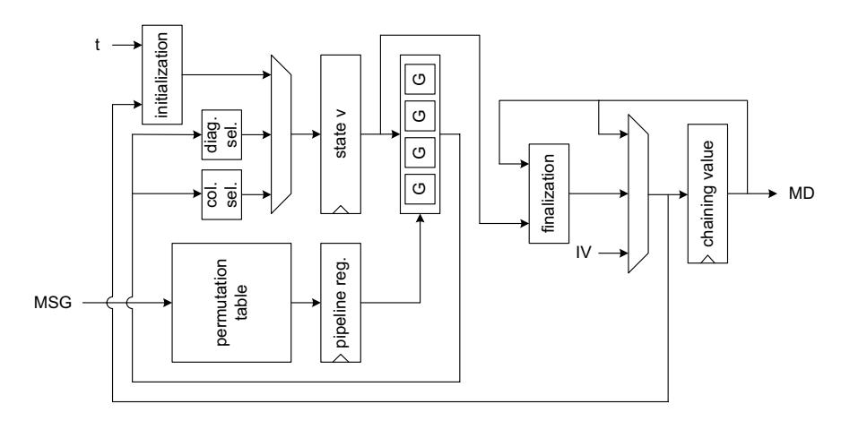

Fig. 1. Implementation of BLAKE-32.

The efficiency of this approach in terms of throughput per area can be further improved by splitting the functionality of each G operation into two equal parts and implementing only one of them in hardware. In that way, a throughput of more than 3.2 Gbit/s is achieved by consuming only 29,000 GEs.

# 5 Blue Midnight Wish

Blue Midnight Wish (BMW) has been developed by Gligoroski et al. [20] and offers message digest sizes of 224, 256, 384, as well as 512 bits. In our implementations we focussed on BMW-256 which could also be easily adapted to BMW-224, as both versions are nearly identical.

### 5.1 Algorithm Description

BMW basically works on a double pipe H and a quadrupled pipe {Qa, Qb}, whereby H is at least two times the size of the message digest and {Qa, Qb} is at least four times the size of the message digest. The compression function of BMW iteratively computes new values of Qa, Qb, and H by means of the three functions f0, f1, and f2.

The function f0 takes a 512-bit message block M and the current value of H; for the first message block, H contains a predefined IV. The message block M and the double pipe H are diffused and stored to the first part of the quadrupled pipe Qa. The function f0 contains shift, rotate, and XOR operations as well as additions and subtractions modulo 32 on the 32-bit words of M and H.

The message expansion in f1 is carried out within two subroutines (expand1 and expand2) which perform a multi-permutation between M, Qa, and Qb. Both subroutines contain shift, rotate, and XOR operations as well as additions and subtractions modulo 32 on the 32-bit words of M, Qa, and Qb. In the recommended version of BMW, expand1 is performed two times and expand2 14 times, where each invocation computes one of 16 32-bit words for Qb. As expand1 is considerably more complex than expand2, the authors state that the security of BMW can be increased by increasing the number of expand1 rounds and decreasing the number of expand2 rounds. In our implementation we focussed only on the recommended version with the distribution of two and 14 rounds for expand1 and expand2, respectively.

The third and last part in the compression function (f2) is described by the authors as a folding mechanism to map 3m bits of M, Qa, and Qb to m bits representing the new value of the double pipe H. Similar to the previous functions, f2 contains shift, rotate, and XOR operations as well as additions modulo 32 on the 32-bit words of the three components.

The compression function is executed repeatedly to process the message blocks and to update the double pipe H. As output transformation the compression function is executed one last time with swapped input arguments: The input M contains the current value of the double pipe after the last iteration and the input H represents a predefined constant of 16 32-bit words.

### 5.2 Implementation

We have tested two basic implementation approaches: A pipelined implementation with shared adders/subtractors and a full unrolling of the message expansion and compression function. While the pipelined implementation is smaller, the fully unrolled module has a considerably higher throughput. The datapath of the hardware module with full unrolling is shown in Figure 2.

# 6 CubeHash

The CubeHash family of hash functions has been designed by Daniel Bernstein [4]. CubeHash uses a uniform structure for producing message digests of up to 512 bits. The number of rounds and the size of a message block can be tweaked.

#### 6.1 Algorithm Description

Each member of the CubeHash family is defined through the size of the message digest h (in bits), the number of rounds per message block r, and the number

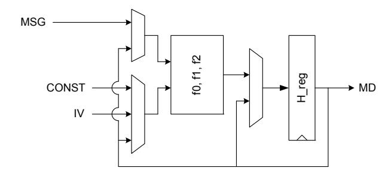

Fig. 2. Implementation of BMW-256 (fully unrolled).

of bytes b per message block. The notation CubeHashr/b-h is used to describe a specific CubeHash variant. The parameter configuration for the round-two SHA-3 submission of CubeHash specifies 16 rounds and 32-bit message blocks (Cubehash16/32-h).

The round function of CubeHash works on the internal 1,024-bit state, which is organized in 32 words of 32 bits each. A round consists of ten simple operations which each manipulate the 16 words of half the state. These operations consist of addition of words modulo 232, word rotation, word swapping, and XORing of words. The internal state is initialized in 10r rounds, each message block is XORed to the state and the result processed in r rounds, and the message digest is derived from the last state in 10r rounds.

### 6.2 Implementation

Our implementation has been kept flexible, in order to accommodate a wide range of CubeHash variants. The algorithm's parameters can be selected individually at runtime for each hashing operation. The full range of message digest sizes h and message block sizes b is supported. Furthermore, the number of rounds r can be configured up to a maximum value of 32 rounds. These parameters are read in the initialization phase of the hashing operation. The number of unrolled full CubeHash rounds is statically configurable prior to synthesis of the design. The control finite-state machine adapts flexibly to the runtime parameters and the number of unrolled rounds.

At the core of our implementation is the 1,024-bit state and a combinatorial unit consisting of the configured number of CubeHash rounds. The clock cycle latency per message block is simply the number of rounds r divided by the number of unrolled rounds. Initialization and finalization take 10r + 1 cycles, respectively. If an extra cycle is allowed for the loading of message blocks, the area of the implementation can be reduced at the cost of a lower throughput. The datapath of our CubeHash implementation with two unrolled rounds is depicted in Figure 3.

We have synthesized our CubeHash module with different numbers of unrolled rounds (1, 2, 4, or 8). Implementation with 16 unrolled rounds failed due to problems of the synthesis software with larger designs. In any case, increased

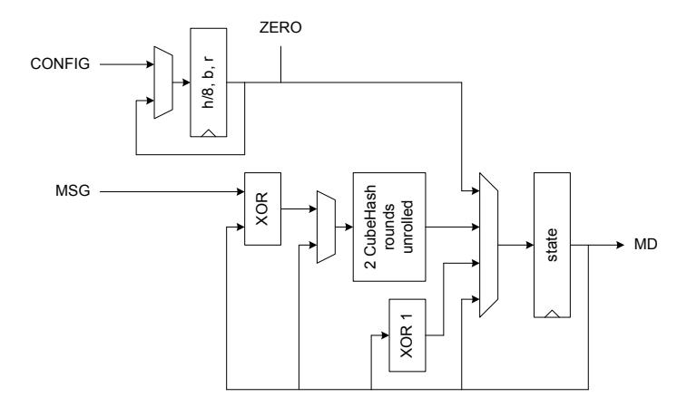

Fig. 3. Implementation of CubeHash.

degrees of unrolling turned out to be an ineffective measure to reach higher throughputs.

# 7 ECHO

The hash function ECHO has been invented by Ryad Benadjila et al. [2]. Its design is based on the goal to use as many features of the Advanced Encryption Standard (AES) as possible.

#### 7.1 Algorithm Description

Basically, ECHO consists of the serial application of a compression function following the Merkle-Damg˚ard principle. The chaining variable has 512 bits and the internal state consists of 2,048 bits. This state is organized as a 4 × 4 matrix of 128-bit words, each of which is interpreted as an AES state. The compression function uses the functions BIG.SubWords, BIG.ShiftRows, BIG.MixColumns as well as the function BIG.Final in the last iteration.

The BIG.SubWords function is basically an S-box look-up on 128-bit words whereby two complete AES rounds are applied to each word. A counter with the current message size and a salt value are used as keys for the AES rounds. BIG.ShiftRows works similar to AES ShiftRows with 128-bit words as unit. BIG.MixColumns uses the same multiplication matrix as AES, only that its input and output bytes are selected from four different AES states. After iterating these three functions eight times, the final operation BIG.Final is applied. The chaining variables are updated by using the old chaining variables, a feed-forward of the message and the state. Finally, the output of the hash function is a truncation of the chaining variable.

#### 7.2 Implementation

The hardware implementation of ECHO-256 is shown in Figure 4. The underlying architecture is similar to the AES implementation of Mangard et al. [25]. The central element is the State matrix which consists of 16 × 128-bit words (which are internally organized as 16 × 8-bit). We instantiated a whole AES round four times which makes up the largest combinational circuit of the hardware module. This allows to compute the two AES rounds for the BIG.SubWords operation for each 128-bit word in eight clock cycles. Additional four clock cycles are necessary for calculating BIG.MixColumns whereby 16 instances of AES MixColumns multipliers are used. For the total of eight rounds, this leads to a latency of 96 clock cycles. One additional clock cycle is required for the BIG.Final operation at the end of hashing a 1,536-bit input block.

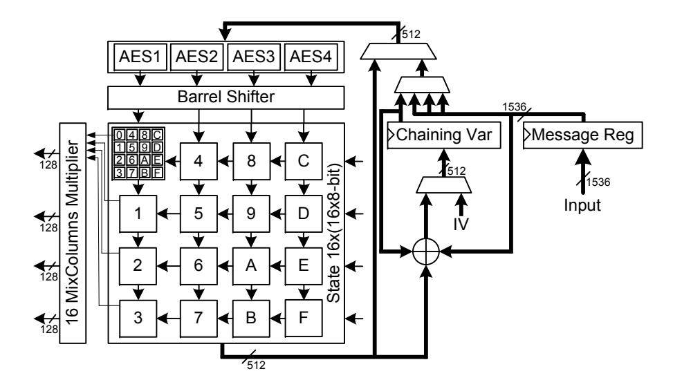

Fig. 4. Implementation of ECHO-256.

For our implementation we investigated the use of several different implementations of the AES S-box, resulting in a trade-off between size and throughput. Alternatively, it would be possible to further speed up our design by using 64 MixColumns multipliers instead of 16 or to instantiate 16 parallel AES rounds instead of four. This would reduce the number of clock cycles by 24 and 48 respectively, but would in turn increase the required area considerably.

# 8 Fugue

Fugue has been developed by Halevi et al. [21]. It is based on the design principles of the hash function Grindahl and features additional protection against attacks developed for Grindahl.

### 8.1 Algorithm Description

At the heart of Fugue is a 128-bit permutation called SMIX. It consists of a layer of AES S-box substitutions followed by the multiplication with a 16 × 16 constant GF(28 ) matrix from the left. Other operations are the mixing of the 32-bit words of the internal state via XOR and word-wise rotation of the state.

Each 32-bit message block is mixed into the state (TIX) and then the state is transformed in several identical sub-rounds. Each sub-round consists of state rotation (ROR3), mixing of some state words (CMIX), and an invocation of SMIX on the first four state words. The message digest is generated in two phases (G1 and G2) from the state. In phase G1, a number of sub-rounds is applied to the state. Phase G2 consists of a combination of state word mixing, rotation and SMIX. The exact transformations of G2 are determined by the size of the message digest.

### 8.2 Implementation

Our implementation of Fugue-256 is depicted in Figure 5. The TIX operation has been integrated in the loading operation of the message block in order to keep the number of clock cycles per block small. In our case, a 32-bit block is processed in two clock cycles.

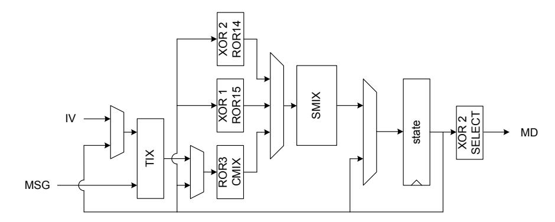

Fig. 5. Implementation of Fugue-256.

The "heaviest" operation of Fugue is its SMIX transformation. As SMIX resembles parts of the AES round, similar optimization techniques applies. The whole transformation can be implemented as 16 parallel look-ups of 128-bit values, with a subsequent combination of the 16 values into the final output (similar to the T-table approach in AES [13]). Alternatively, the S-box layer can be implemented separately from the matrix multiplication. We have implemented both approaches. For the case of separated S-box look-up and matrix multiplication, we have compared two different implementations of the AES S-box: Canright's approach using normal bases [12] and a synthesized hardware look-up table of the input-output mapping (HW LUT approach) [30].

# 9 Grøstl

Gauravaram et al. have designed Grøstl, which shares many features of the Advanced Encryption Standard (AES), including the application of the widetrail design strategy [18].

#### 9.1 Algorithm Description

Grøstl comes in two flavors, with a 512-bit chaining value for message digests of up to 256 bits, and twice the size for larger message digests. Two permutations (called P and Q) at the core of Grøstl transform two intermediate states, which are derived from the current chaining value and the message block. The output of the two permutations is used to update the chaining value. The permutations are very similar and operate on 64-bit words in multiple rounds with the "AES-like" transformations AddRoundConstant, SubBytes, ShiftBytes, and MixBytes.

#### 9.2 Implementation

For our high-speed Grøstl-256 implementation we have tested both the parallel calculation of the P and Q permutation as well as the use of a single permutation unit which can switch between both permutation types. Interestingly, the second possibility has a higher throughput, even though it is much smaller than the first. This is due to the fact that the throughput of a design with two parallel permutations cannot be increased further by inserting pipeline stages within rounds due to the inherent data dependencies of the intermediate results.

Our fastest implementation features a pipelined permutation round unit with two stages. This unit is used to calculate the P and Q permutation alternatingly. Two 512-bit registers are used to hold intermediate results and the previous chaining value, respectively. This version is shown in Figure 6.

# 10 Hamsi

The family of cryptographic hash functions called Hamsi has been invented by Ozg¨ul K¨u¸c¨uk [23]. Mainly, there are two instances called Hamsi-256 and ¨ Hamsi-512 whereas there are also the subversions Hamsi-224 and Hamsi-384. Implementations of all versions are very similar except that Hamsi-512 (Hamsi-384) has a larger state matrix. We focused on Hamsi-256 for design and implementation.

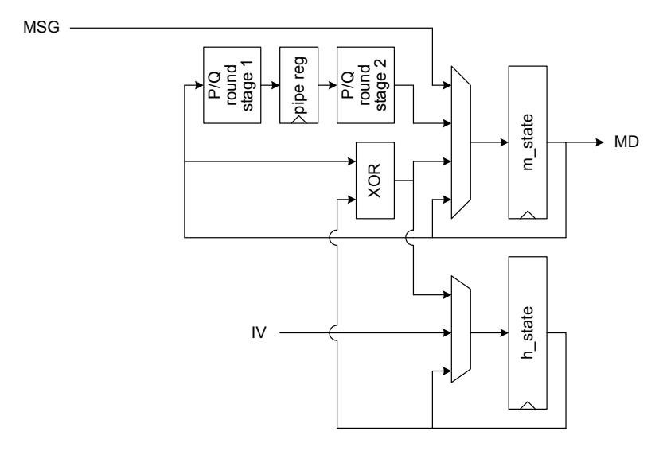

Fig. 6. Implementation of Grøstl-256.

### 10.1 Algorithm Description

Hamsi is based on a "Concatenate-Permute-Truncate" design strategy. A 256-bit chaining value is concatenated with the expanded message of also 256 bits. The message expansion uses a linear code to transform 32-bit message blocks to the 256-bit expanded message. On this 512-bit state (represented as 4 × 4 matrix of 32-bit words) the non-linear permutation function P is applied three times to all input blocks except the last one, where a slightly modified permutation function Pf is applied six times. Subsequently, the resulting 512 bits are truncated and combined with the previous chaining value using an XOR operation. Truncation from 512 to 256 bits works by simply choosing the first and third row of the state matrix.

The non-linear permutation function P consists of three functional layers. First, a 512-bit constant and the current counter value are added to the state. This is followed by the substitution layer which consists of the application of 128 identical 4-bit S-boxes. The final layer adds diffusion by applying the linear transformation L several times. L operates on 32-bit words and produces four 32-bit words from four 32-bit input words. The non-linear permutation function Pf has different round constants and is applied six times to the last message block as final transformation.

#### 10.2 Implementation

We have investigated two versions of hardware implementations of Hamsi-256 which differ in the number of instances of the non-linear permutation function P and Pf. The state matrix is stored in a 512-bit register and the chaining value requires a 256-bit register.

A P/Pf instance mainly consists of 128 S-boxes, which are implemented as an unstructured mass of standard cells (HW LUT approach [30]), and four L transformation modules. Additionally, round constants and the round counter are added using XOR gates. The truncation function is simply realized as rewiring and the feed forward of the chaining value is an XOR operation of the truncated state with the previous chaining value. The message expansion is implemented as a table lookup which is quite efficient.

The architecture of our fastest implementation of Hamsi-256 is depicted in Figure 7. It features three instances of the P/Pf function and requires one clock cycle to hash a 32-bit block (except for the last block, which requires two cycles).

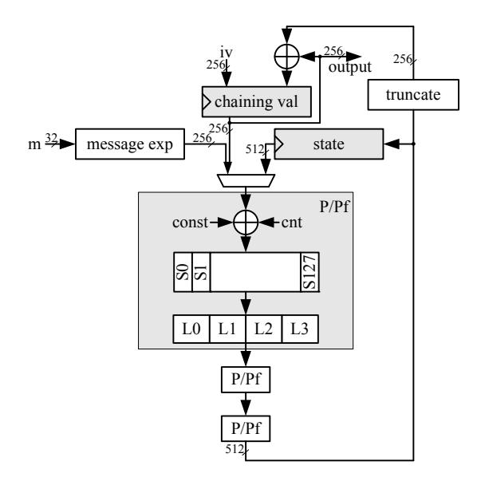

Fig. 7. Architecture overview of fastest Hamsi-256 implementation.

# 11 JH

Hongjun Wu et al. have designed the hash function family JH [32], which consists of JH-224, JH-256, JH-384, and JH-512. All four versions of JH are based on the same compression function which makes it rather easy to combine them in one hardware implementation. The bit-slice implementation of the JH hash function is very efficient in software using the SSE2 instruction set.

### 11.1 Algorithm Description

The standard variant of JH works with an internal state H which consists of 256 4-bit elements. In a first step, an initial vector (IV), which is derived from the message digest size, is loaded into the internal state H. The message M is expanded to a multiple of 512 bits, where the message M is padded with at least 512 bits.

The core component of JH (i.e. the compression function F8) works on the internal state H and takes one 512-bit message block Mi of the padded message as input. The first step in the compression function is an XOR operation of Mi with the first half of H. The round constant vector Cr is loaded with an initial vector Cr,0 and is used later in the round function R8. Next the bijective function E8 is executed, which consists of a grouping function, the round function R8, a trailing substitution layer St, as well as a de-grouping function. The round function R8 is executed 35 times and contains two substitution-permutation networks (S and P8, S0 and P6), as well as two linear transformations (L, LCr) that implement a (4, 2, 3) maximum distance separable (MDS) code over GF(24 ).

The substitution layer S within R8 as well as the trailing substitution layer St contain two 4-bit S-boxes. The round constant vector Cr selects which S-boxes are used (similar to Lucifer [16]) in the substitution steps and is updated in every round of R8. After each invocation of R8, the value of Cr it updated by passing it through the substitution-permutation network of S0 and P6, where S0 contains only one 4-bit S-box, and the linear transformation LCr.

The last step in F8 is an XOR operation of Mi with the second half of H. The remaining 512-bit message blocks run through the same compression procedure to iteratively generate the hash value. After all message blocks have been processed, the n-bit message digest of M is composed of the last n bits of H.

#### 11.2 Implementation

Our implementation of JH-256 works with 320 instances of a combinational implementation of the S-boxes; 256 S-boxes work on the internal state H and 64 S-boxes work on the round constant vector Cr in every round of R8. This way, one round of R8 can be executed in only one clock cycle. The datapath of our implementation is illustrated in Figure 8.

The IV of H as well as Cr,0 have been realized as constant vectors in our implementation. Another possibility to derive the initial state of H would have been to store the message digest size into the first 16 bits of H, to clear the remaining bits of H, and to run this value through the compression function once.

In our implementation of JH the registers for the 1024-bit internal state H, the 512-bit message block Mi , and the 256-bit round constant Cr occupy approximately one quarter of the whole area. The 320 combinational S-boxes occupy another quarter of the area. One 512-bit message block is processed in 39 clock cycles.

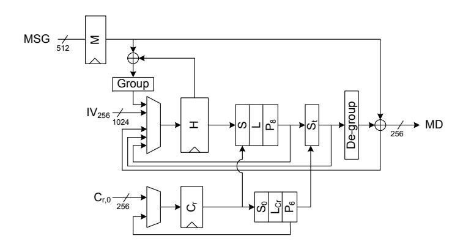

Fig. 8. Implementation of JH-256.

#### 12 Keccak

Bertoni *et al.* have designed the Keccak family [6]. The basic component is the so-called Keccak-f permutation, which consists of a number of simple rounds with logical operations and bit permutations.

### 12.1 Algorithm Description

The structure of Keccak is simple: The input message block is XORed onto a part of the current state and the result is passed through the Keccak-f permutation. The initial state is all zero and the message digest is a truncation of the state after the last message block, thus requiring no output transformation3. For the Keccak variants proposed for SHA-3, the state is fixed at 1,600 bits, and the size of the message block is set to the state size minus twice the message digest size. The state is logically grouped into a  $5 \times 5$  matrix of 64-bit words.

The Keccak-f permutation consists of 24 rounds, which are identical except for the addition of a round-dependent constant. Each round has five steps  $(\theta, \rho, \pi, \chi, \text{ and } \iota)$ , which feature simple logical operations and permutations of the state bits. Although the steps are defined on the bit level, they can also be expressed as simple operations on the 64-bit words of the state.

#### 12.2 Implementation

The plain structure of Keccak naturally maps to the simple implementation depicted in Figure 9. Through static configuration, our implementation supports all variants of the Keccak hash function which have been proposed as SHA-3

&lt;sup>3 Note that Keccak supports arbitrary lengths of the message digest by applying the Keccak-f permutation repeatedly on the state.

candidates. For the performance evaluation we concentrated on the 256-bit variant, namely bKeccak[r=1088, c=512, d=32]c256 4 .

A single round of the Keccak-f permutation is instantiated in hardware. Thus, a total of 24 iterations is required to perform the complete permutation. The appropriate round constant is selected by the current round index. As the round constants have a very low Hamming weight, they can be mapped to a small synthesized look-up table.

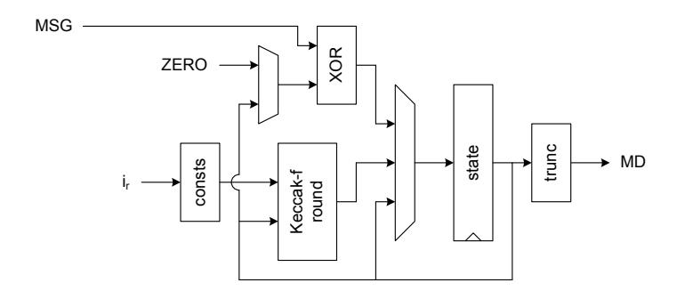

Fig. 9. Implementation of Keccak.

The loading of the message block and its combination with the state requires an additional clock cycle. This separation allows to reduce the critical path of the hardware module, which runs through the Keccak-f round unit. The processing of a complete message block thus requires 25 clock cycles.

# 13 Luffa

Luffa has been conceived by Canni´ere et al. [11]. Its core components are a message injection function based on arithmetic over GF((232) 8 ) and a number of parallel 256-bit permutations.

### 13.1 Algorithm Description

Luffa processes the message in blocks of 256 bits. Each block is combined with the current state in the message injection. Subsequently, the state is updated by passing it through a number of parallel permutations. The message injection considers 256-bit blocks (i.e. the message block and the parts of the state) as

4 In this notation, r denotes the message block size in bits, c is the state size (fixed to 1,600 bits) minus the block size, and d is the so-called diversifier, which is used in message padding. The bc256 notation indicates truncation of the state to 256 bits in order to generate the message digest

polynomials over GF(232) and applies a number of additions and constant multiplications. Then, each 256-bit part of the state is passed through a permutation Qj consisting of a simple tweaking function and eight similar steps.

Each step of Qj features a 4-bit S-box layer (SubCrumb), a mixing of pairs of 32-bit words (MixWords), and the XORing of some constants (AddConstant). The SubCrumb S-boxes can be implemented in a bit-sliced manner. MixWords consists of only a few fixed rotations and some XORs. The constants for Add-Constant can be generated on-the-fly with a simple function which is based on a 64-bit linear-feedback shift register (LFSR). The output function of Luffa uses the message injection with an all-zero message block and the Qj permutations.

### 13.2 Implementation

As Luffa-224 and Luffa-256 are virtually identical, we have implemented a hardware module capable of both variants. The corresponding datapath is shown in Figure 10. The inputs for the message injection function can be switched to accommodate the first message block (IV and MSG loaded), intermediate message blocks (state feedback and MSG loaded), and final blank rounds (state feedback and ZERO loaded). The tweak at the start of each permutation is already performed at the end of the message injection. The constants are generated on-the-fly and the current constants are registered in order to minimize the critical path. One step for each of the three permutations Q0, Q1, and Q2 is implemented in parallel.

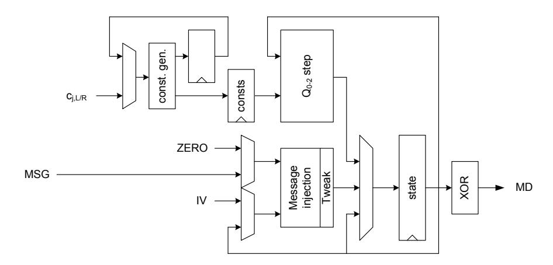

Fig. 10. Implementation of Luffa-224/256.

Luffa consists of rather simple operations which can be mapped efficiently to hardware (simple bit-sliced S-boxes, fixed rotations, XORs, and arithmetic operations in binary extension fields). By separating message injection from the Qj steps, the combinatorial paths can be split up relatively evenly. The message injection has been implemented following the approach given in the specification [11], which uses doubling of GF(232) elements as basic building block. For the 4-bit S-box layer, we have implemented both the bit-sliced approach as well as explicit instantiation of the S-boxes as synthesized look-up tables (both resulting in similar speed).

# 14 Shabal

The hash algorithm Shabal was designed by Jean-Franois Misarsky et al. [9]. It is based on a number of cross-coupled non-linear feedback shift registers (NLFSRs).

### 14.1 Algorithm Description

Shabal is defined for a message block M with a size of 512 bits. Its internal state consists of the three components A (384 bits), B and C (both 512 bits) and a message block counter W (64 bits). The inner core of Shabal is the keyed permutation P. It features rotations, an AND operation, additions modulo 232 and two multiplications with small constants modulo 232 . P consists of 48 steps, each manipulating one 32-bit word of A and B. Each step (except the first one) involves the result of the previous one.

One inner round of Shabal consists of XORing W into the first two 32-bit words of A and adding M and B in blocks of 32 bits. The resulting A and B together with C and M are the input for P. Then, the words of M are subtracted from the words of C. The resulting words are written to B, while the previous value of B is put into C. Additionally, W is incremented by one. After each 512-bit message block is processed by an inner round, three final rounds are applied. Each final round is performed with the last message block like an inner round but without incrementing of the counter value W. The message digest is taken from the last bits of C.

The init state of Shabal can either be stored as a constant or calculated by operating two rounds on a message that is prefixed with 32 words fixed to values ranging from the digest size to the digest size plus 31, starting with A = B = C = 0 and W = −1.

#### 14.2 Implementation

Figure 11 depicts the datapath of our implementation of Shabal. It basically consists of 32-bit adders, a 384-bit shift register for A and three 512-bit shift registers for B, C and M. Each round of the permutation P rotates A, B, C, and M by one 32-bit word. Furthermore, the results of the combinatorial logic are put on the last position of A and B. Since there are 48 rounds of P, each register is in the correct position after the application of P (A is fully rotated four times, B and C are fully rotated three times). The initialization vectors are stored as constants, which saves two initial rounds. Each inner round requires one clock cycle for adding before P and one cycle for the subtraction after P. Each of the 48 inner loops of P requires one cycle, resulting in a total latency of 50 cycles per message block.

Fig. 11. Implementation of Shabal-256.

# 15 SHAvite-3

The SHAvite-3 family of hash functions has been proposed by E. Biham and O. Dunkelman [8] and bases upon the concept of the "HAsh Iterative FrAmework" (HAIFA) [7]. Two variants of SHAvite-3 are available: SHAvite-3256 for digests up to 256 bits, and SHAvite-3512 for larger digests up to 512 bits. In our implementations we have only focused on SHAvite-3256, since both variants are very similar in their design.

#### 15.1 Algorithm Description

The main building block of SHAvite-3256 is the Feistel block cipher E256 which iterates a round function twelve times. The round function is composed of three full AES rounds. E256 is used in Davies-Meyer mode, which transforms the block cipher into a compression function. This transformation is achieved by XORing the output of the block cipher to its input.

The compression function accepts four inputs: A chaining value h of 256 bits, a message block m of 512 bits, a bit counter b of 64 bits, and a salt s of size 256 bits. In order to hash a message block m, the chaining value h is encrypted with E256 using three round keys ki0 . . . ki2 for each round i. The round keys are computed by a message expansion function that iteratively applies a non-linear and a linear expansion step in an alternating fashion. Both steps operate on blocks of 512 bits and produce four new round keys. The non-linear step consists of four full AES rounds whose keys are determined by the salt s, followed by a partial XOR of the result with the bit counter b. The linear step XORs the current round keys with each other in a specific way in order to derive new round keys. With the use of the input message block as the first four round keys, four applications of the non-linear step and four applications of the linear step are sufficient to compute all required 36 round keys.

#### 15.2 Implementation

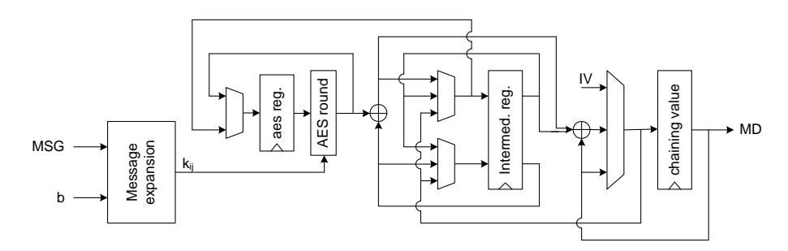

Fig. 12. Implementation of SHAvite-3256 with one AES round.

Several versions of SHAvite-3256 have been implemented in hardware and evaluated with respect to their performance. The versions mainly differ in the number of unrolled AES rounds for the compression function and the message expansion. The architecture which yielded the highest throughput in our evaluation is depicted in Figure 12. It features one AES round for the compression function and one AES round for the message expansion (contained in the message expansion block). Additionally, various implementations of the AES-round function have been tested: The T-table approach [13], and separated S-box and MixColumns layers, with S-box implementations following Canright [12], Wolkerstorfer et al. [31], and the HW LUT approach [30]. With our current evaluation approach, the highest throughput has been achieved for the SHAvite-3256 version with one AES-round function for the compression function and message expansion each and with S-boxes following the HW LUT approach.

# 16 SIMD

The SIMD family of hash functions has been designed by Leurent et al. [24]. The design of SIMD has been optimized for platforms with vector instructions (Single Instruction, Multiple Data). The two variants SIMD-256 and SIMD-512 produce message digests of up to 256 bits and 512 bits, respectively.

### 16.1 Algorithm Description

SIMD-256 takes message blocks of 512 bits and has an internal state of the same size. The message expansion expands the message from 512 to 4,096 bits. It consists of three layers and tries to build an error correcting code with a high minimal distance. The first layer uses a number-theoretic transform, the second uses an inner code to further increase the minimal distance, and the last layer permutes the expanded message. An additional last message block uses a slightly different message expansion.

The compression function uses a modified Davies-Meyer construction. Instead of encrypting the previous chaining value (hi−1) the input of the block cipher in SIMD is hi−1 XOR the message. In addition, the output of the encryption function is not simply XORed with the previous chaining value, but additional block cipher steps with hi−1 as key are performed. The block cipher of the compression function is built from four parallel Feistel ladders. Each round is made up of 8 steps, and in total the compression function is made up from 4 rounds plus 4 additional steps which update the chaining value.

#### 16.2 Implementation

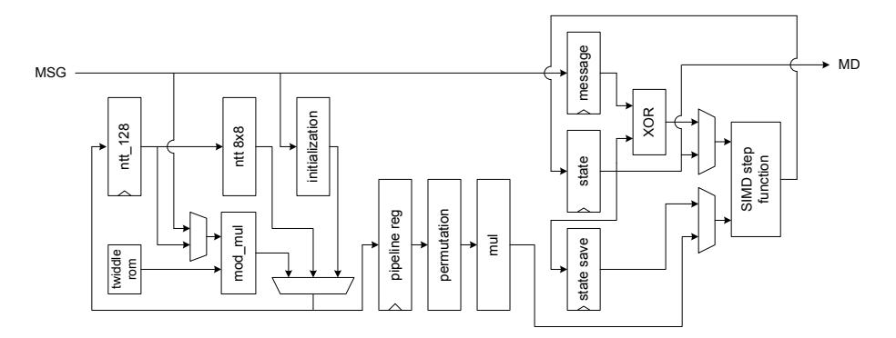

Fig. 13. Implementation of SIMD-256.

Our implementation of SIMD-256 realizes the specification of round one of the SHA-3 competition. The hardware module is depicted in Figure 13. It consists of four Feistel blocks in parallel. Implementing the number-theoretic transform (NTT) modulo 257 of the 64 input bytes basically means performing a Fast Fourier Transform (FFT) mod 257 of 128 integer values. As half of these 128 values is zero, this FFT can be split into two separate FFT-64. Each FFT-64 is built from two instances of FFT-8 and sixteen 8 × 8-bit modulo multipliers. With this configuration we need 36 clock cycles to process a 512-bit message block.

# 17 Skein

The Skein hash function family, which is optimized for performance on 64-bit processors, has been conceived by Ferguson et al. [17].

#### 17.1 Algorithm Description

Skein is based on the tweakable block cipher Threefish, which has equal block and key size of either 256, 512, or 1,024 bits. Threefish used in Matyas-Meyer-Oseas mode, together with the format specification of the tweak and a padding scheme, defines the so-called Unique Block Iteration (UBI) chaining mode. UBI is used for IV generation, message compression, and as output transformation.

The size of the message digest can be set more or less arbitrarily for each Threefish block size. The Skein variant with a block size of x bits and a message digest size of y bits is designated as Skein-x-y. Note that the message digest size y is only a minimal tweak to a hardware implementation.

The Threefish block cipher is based on three categories of simple operations: Additions modulo 264, XORs, and bit permutations. These operations are defined on the intermediate state organized in 64-bit words. The MIX operation transforms two of these 64-bit words and is common to all Threefish variants. The rotation distance depends on the Threefish block size, the round index and the position of the two 64-bit words in the Threefish state.

Threefish rounds are applied repeatedly to the input block. A number of subkeys are derived from the cipher key and tweak via addition modulo 264 in a simple key schedule and are added to the input block and the intermediate state in each fourth round.

### 17.2 Implementation

We have implemented Skein with all three block sizes. The core of the datapath consists of eight unrolled rounds of Threefish and a key schedule unit which can supply two consecutive subkeys at a time. The advantage of this architecture is that the Threefish rounds have fixed rotation distances for their MIX layer, which allows a simple hard-wiring of the rotations. Thus, the output of the Threefish unit only depends on the input block and the two subkeys. Our implementation is shown in Figure 14.

The key schedule unit is loaded with an input key and input tweak at the beginning of each Threefish encryption. Two subsequent subkeys are derived through a number of 64-bit adders. Apart from the key schedule unit, the datapath contains two registers of the size of a Threefish block for the current message block and for holding intermediate values of the Threefish encryption.

A more detailed description of our Skein implementation can be found in [29].

# 18 SHA-2 Reference Implementation

The SHA-2 hash function family is specified in [28]. The four variants of SHA-2 differ only slightly in the word size of the internal state, IV, and number of rounds of the compression function.

#### 18.1 Algorithm Description

The SHA-2 algorithms consists of a message schedule and a compression function. The message schedule is initialized with the 16 words of the current message block, and iterated to generate additional words (one for each round of the

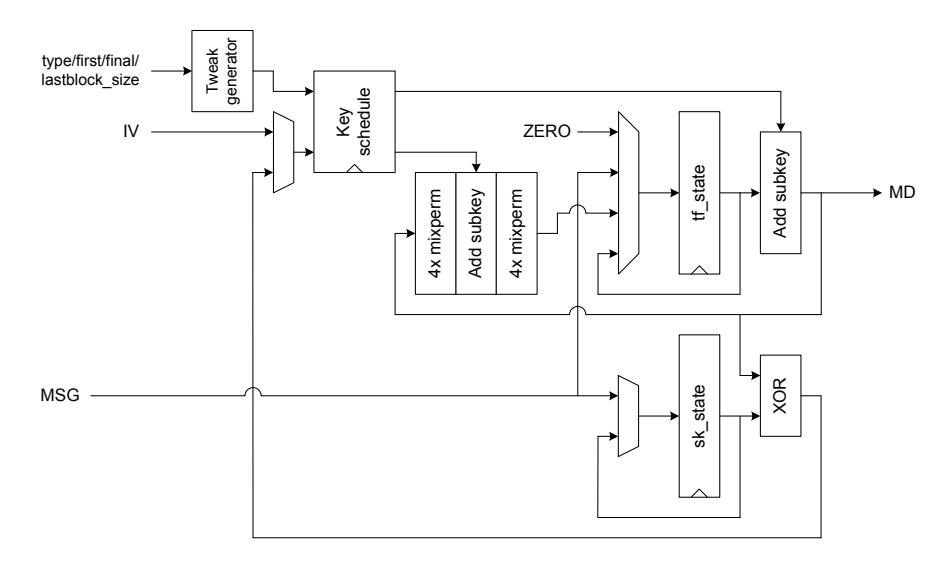

Fig. 14. Implementation of Skein.

compression function). Each round of the message schedule generates a new word. The compression function applies a number of similar rounds to the eight words of the current chaining value. Each round uses a single word from the message schedule and a round constant. The operations of the message schedule and compression function mainly consists of modular additions and some logical operations.

In each round of the compression function, two words of the state are updated while the other six words are just shifted. This structure allows for a number of optimization techniques to be applied for hardware implementation.

### 18.2 Implementation

To serve as a point of reference, we have implemented a SHA-256 hardware module with a straight-forward approach. No optimization techniques [26] have been employed, except for the use of carry-save adders in the round implementation of compression function and message schedule. The datapath of our implementation is depicted in Figure 15.

### 19 Practical Results

The SHA-3 hardware modules have been implemented in VHDL or Verilog. Any eventual second-round tweaks have been integrated in the modules. The only exception is the SIMD module, which currently implements the specifica-

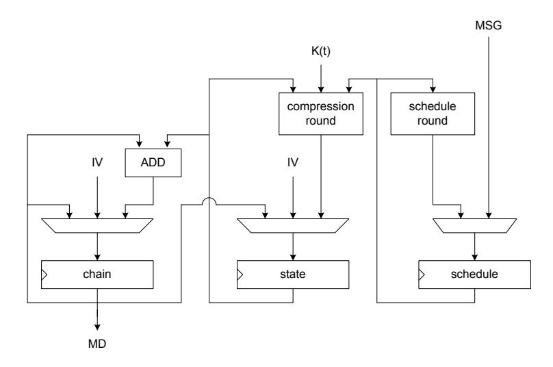

Fig. 15. Straight-forward implementation of SHA-256.

tion from round one5 . Correct functionality of all modules has been verified against the official Known Answer Test (KAT) vectors with simulation via Cadence ncsim. In order to keep the implementation effort with our optimization heuristic at a feasible level, only synthesis runs have been performed and are reported in this paper6 . Synthesis targeted the UMC 0.18 µm standard-cell library FSA0A C from Faraday [15] and has been performed with the Cadence PKS-Shell (v05.16) [10]. Optimization effort was set high and was primarily aimed towards maximum speed.

Our throughput evaluation assumes that the message blocks are delivered to the hardware module at a speed which allows it to operate under full utilization. Our optimization target for synthesis was maximum peak throughput, which corresponds to the throughput for long messages. Note that for shorter messages, the throughput might change due to more or less costly initialization operations and output transformations.

In order to optimize towards maximum peak throughput we have performed multiple synthesis runs per design with an adaptive optimization heuristic. For each run, the target for the critical path delay has been adapted7 . Synthesis runs have been counted as successful only if they (1) finished within a certain

5 Integration of the round-two tweak is expected to effect no significant change in the performance figures.

6 Place & route is expected to have only little impact on the performance figures estimated after synthesis.

7 Lowered if the run was successful, increased if it failed.

amount of time8 and (2) the synthesized design reached the set target delay under worst-case conditions9 .

Note that we only make a comparison of the results of our hardware modules and that we do not include previously published results. We do this in order to stress the coherency of our benchmarking effort and to keep the comparison as fair as possible.

Table 1 summarizes our results for the "best" variants of the 14 presented hardware modules. The primary selection criterion for the table entries was high throughput. Some implementation variants increase throughput marginally at a substantial overhead in area (e.g. 4% increase in throughput at a 65% increase in area). In such cases, we report the slightly slower but substantially more area-efficient implementation.

The implementations reported in Table 1 refer to the following implementation variants:

- BLAKE: Four G functions in parallel, two pipeline registers, additional cycle for chaining, carry-save adders.
- Blue Midnight Wish: Whole compression function (f0, f1, f2) as a single combinational block, generic adders.
- CubeHash: Two CubeHash rounds unrolled, generic adders.
- ECHO: S-boxes as HW LUT.
- Fugue: S-boxes and matrix multiplication separated, S-boxes as HW LUT.
- Grøstl: Shared P/Q permutation, S-boxes and MixBytes separated, S-boxes following Wolkerstorfers et al. approach [31] with one pipeline register.
- Hamsi: Three P/Pf instances in series, S-boxes as HW LUT.
- JH: 320 S-boxes (one cycle per R8 round), combinational S-boxes.
- Keccak: One Kekkak-f round per cycle.
- Luffa: S-boxes and matrix multiplication separated, S-boxes as HW LUT, output of control FSM registered.
- Shabal: One round of permutation P per cycle, generic adders.
- SHAvite-3: One AES round for compression function and message expansion each.
- SIMD: Message expansion with 16 parallel FFT-8 and 16 parallel modular multipliers, compression function with four parallel Feistel blocks.
- Skein: Eight Threefish rounds unrolled, generic adders.
- SHA-2: No unrolling or quasi-pipelining, generic adders.

Table 1 contains the block size of the hash algorithm (block) and the number of clock cycles required for the processing of one block (latency). The area is given in terms of gate equivalents (GEs)10. The reported clock frequency is the maximum value under typical conditions11. The TP column indicates the peak throughput at the stated clock frequency. A graphical representation of area in

8 For the present work, the limit has been set to two hours.

9 A maximal negative slack of 50 ps has been allowed.

10 1 GE equals 9.37 sqmils (i.e. the size of a ND2 cell).

11 Operating temperature 25 ◦C .

Block Latency Area Clock freq. TP Implementation Reference bit cycles GE MHz Gbit/s BLAKE-32 Submitted 512 22 45,640 170.64 3.971 BMW-256 Submitted 512 1 169,737 10.46 5.358 CubeHash16/32-h Submitted 256 8 58,872 145.77 4.665 ECHO-256 Submitted 1,536 97 141,489 141.84 2.246 Fugue-256 Submitted 32 2 46,257 255.75 4.092 Grøstl-256 Submitted 512 22 58,402 270.27 6.290 Hamsi-256 Submitted 32 1 58,661 173.91 5.565 JH-256 Submitted 512 39 58,832 380.22 4.992 Keccak(-256) Submitted 1,088 25 56,316 487.80 21.229 Luffa-224/256 Submitted 256 9 44,972 483.09 13.741 Shabal-256 Submitted 512 50 54,186 320.51 3.282 SHAvite-3256 Submitted 512 37 57,388 227.79 3.152 SIMD-256 Submitted 512 36 104,166 64.93 0.924 Skein-256-256 Submitted 256 10 58,611 73.52 1.882 Skein-512-512 Submitted 512 10 102,039 48.87 2.502

Table 1. Results for implementation with the UMC 0.18 µm FSA0A C standard-cell library.

relation to highest throughput is given in Figure 16. Several area-performance tradeoffs for the same implementations are given in Figure 17. Figure 18 zooms in on the area which contains most of the implementations. An interactive version of the most recent performance results, conforming to Figure 16 of the most recent version of this paper can be found on IAIK's website [22].

SHA-256 Submitted 512 66 19,144 302.11 2.344

In terms of throughput, the Keccak implementation outperforms all other modules by a considerable margin. The Luffa module is second fastest and more compact. The next-best implementations are those of Grøstl, Hamsi, JH, and CubeHash which all have similar area requirements. The BMW module achieves similar throughput, but at considerably higher hardware cost. The implementations of Fugue and BLAKE are a bit slower, but also smaller. The Shabal and SHAvite-3 modules are slower and bigger and achieve similar performance. The Skein-512 implementation follows next with a considerable hardware cost. The ECHO module achieves similar throughput, but requires more area. The Skein-256 module follows with a moderate size. Our implementation of SIMD is the slowest in the field. The straight-forward SHA-256 implementation has the smallest area and achieves a throughput which is rather at the low end of the spectrum.

# 20 Conclusions

In this work we presented our high-speed hardware implementations of all 14 round-two candidates of the SHA-3 contest. All hash modules have been designed and implemented towards the same optimization goal and evaluated with the

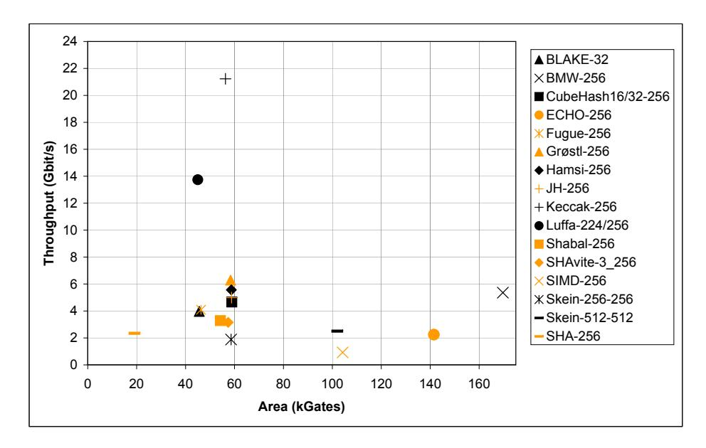

Fig. 16. Highest throughput vs. area of the high-speed hardware implementations of the SHA-3 candidates.

same synthesis tools, target technology, and optimization heuristic. In order to stress the coherency of our results, we have consciously excluded other prior published implementations from consideration, as we regard the differences in interface design, standard-cell library, target technology, synthesis tools, and optimization effort to make meaningful comparisons extremely difficult. We believe that our work provides the fairest comparison of hardware performance of the SHA-3 candidates to date.

# References

- 1. J.-P. Aumasson, L. Henzen, W. Meier, and R. C.-W. Phan. SHA-3 proposal BLAKE, version 1.3. Available online at http://131002.net/blake/blake.pdf, 2008.
- 2. R. Benadjila, O. Billet, H. Gilbert, G. Macario-Rat, T. Peyrin, M. Robshaw, and Y. Seurin. SHA-3 Proposal: ECHO. Available online at http://crypto.rd. francetelecom.com/echo/doc/echo\_description\_1-5.pdf, February 2009.
- 3. D. J. Bernstein. ChaCha, a variant of Salsa20. Available online at http://cr.yp. to/chacha/chacha-20080128.pdf, January 2008.
- 4. D. J. Bernstein. CubeHash specification (2.B.1). Available online at http:// cubehash.cr.yp.to/submission/spec.pdf, October 2008.
- 5. D. J. Bernstein and T. Lange. eBASH: ECRYPT Benchmarking of All Submitted Hashes. http://bench.cr.yp.to/ebash.html.
- 6. G. Bertoni, J. Daemen, M. Peeters, and G. V. Assche. KECCAK specifications, Version 2 – September 10, 2009. Available online at http://keccak.noekeon.org/ Keccak-specifications-2.pdf, September 2009.

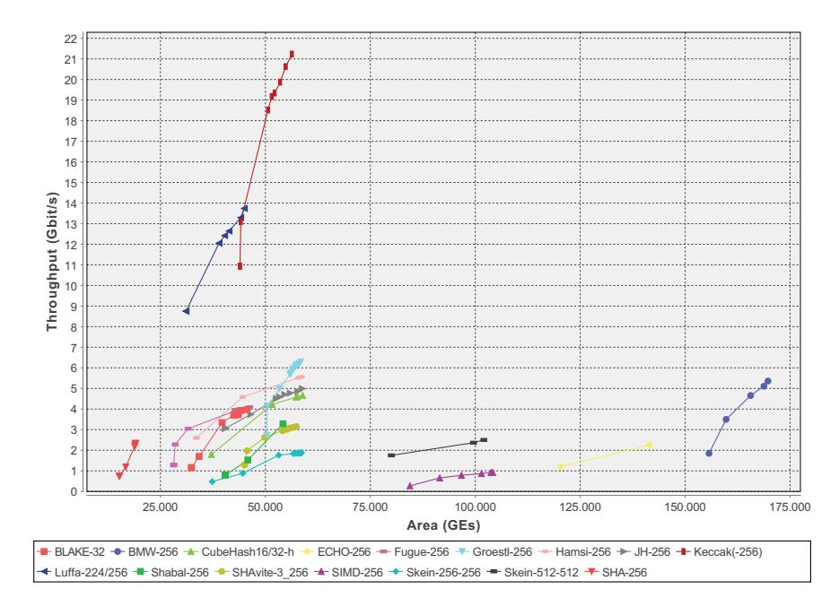

Fig. 17. Various tradeoffs for throughput vs. area of the high-speed hardware implementations of the SHA-3 candidates.

- 7. E. Biham and O. Dunkelman. A Framework for Iterative Hash Functions HAIFA. In Second NIST Cryptographic Hash Workshop, Santa Barbara, California, USA, August 24-25, 2006, August 2006.
- 8. E. Biham and O. Dunkelman. The SHAvite-3 Hash Function (version from February 1, 2009). Available online at http://www.cs.technion.ac.il/~orrd/ SHAvite-3/Spec.01.02.09.pdf, February 2009.
- 9. E. Bresson, A. Canteaut, B. Chevallier-Mames, C. Clavier, T. Fuhr, A. Gouget, T. Icart, J.-F. Misarsky, M. Naya-Plasencia, P. Paillier, T. Pornin, J.-R. Reinhard, C. Thuillet, and M. Videau. Shabal, a Submission to NIST's Cryptographic Hash Algorithm Competition. Available online at http://www.shabal.com/ wp-content/plugins/download-monitor/download.php?id=Shabal.pdf, October 2008.
- 10. Cadence Design Systems. The Cadence Design Systems Website. http://www. cadence.com/.
- 11. C. D. Canni´ere, H. Sato, and D. Watanabe. Hash Function Luffa, Specification Ver. 2.0. Available online at http://www.sdl.hitachi.co.jp/crypto/luffa/ Luffa\_v2\_Specification\_20090915.pdf, September 2009.
- 12. D. Canright. A Very Compact S-Box for AES. In J. R. Rao and B. Sunar, editors, Cryptographic Hardware and Embedded Systems – CHES 2005, 7th International Workshop, Edinburgh, UK, August 29 - September 1, 2005, Proceedings, volume 3659 of Lecture Notes in Computer Science, pages 441–455. Springer, 2005.
- 13. J. Daemen and V. Rijmen. The Design of Rijndael. Information Security and Cryptography. Springer, 2002. ISBN 3-540-42580-2.

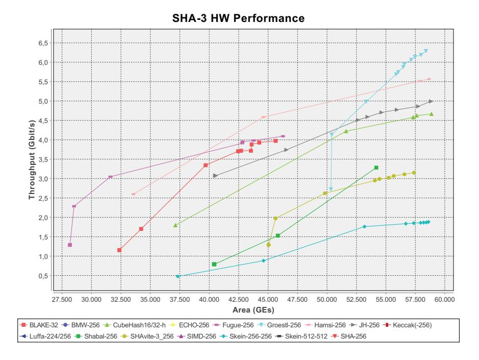

Fig. 18. View of Figure 17 zoomed into area containing most implementations.

- 14. ECRYPT II. SHA-3 Hardware Implementations. http://ehash.iaik.tugraz.at/ wiki/SHA-3\_Hardware\_Implementations.
- 15. Faraday Technology Corporation. Faraday FSA0A C 0.18 µm ASIC Standard Cell Library, 2004. Details available online at http://www.faraday-tech.com.
- 16. H. Feistel. Cryptography and Computer Privacy. Scientific American, 228(5):15– 23, 1973.
- 17. N. Ferguson, S. Lucks, B. Schneier, D. Whiting, M. Bellare, T. Kohno, J. Callas, and J. Walker. The Skein Hash Function Family. Available online at http://www. skein-hash.info/sites/default/files/skein1.1.pdf, November 2008.
- 18. P. Gauravaram, L. R. Knudsen, K. Matusiewicz, F. Mendel, C. Rechberger, and S. S. T. Martin Schl¨affer. Grøstl – a SHA-3 candidate. Available online at http: //www.groestl.info/Groestl.pdf, October 2008.
- 19. George Mason University. The Athena Website. http://cryptography.gmu.edu/ athena/.
- 20. D. Gligoroski and V. Klima. Cryptographic Hash Function BLUE MIDNIGHT WISH. Available online at http : / / people . item . ntnu . no / ~danilog / Hash / BMW-SecondRound / Supporting \_ Documentation / BlueMidnightWishDocumentation.pdf, September 2009.
- 21. S. Halevi, W. E. Hall, and C. S. Jutla. The Hash Function "Fugue". Available online at http://domino.research.ibm.com/comm/research\_projects.nsf/ pages/fugue.index.html/\$FILE/fugue\_09.pdf, September 2009.
- 22. Institute for Applied Information Processing and Communications (IAIK), Graz University of Technology. SHA-3 Hardware Benchmarking. http://www.iaik. tugraz.at/content/research/vlsi/sha3hw/, 2009.

- 23. O. K¨u¸c¨uk. The Hash Function Hamsi, version from September 14, 2009. Available ¨ online at http://www.cosic.esat.kuleuven.be/publications/article-1203. pdf, September 2009.
- 24. G. Leurent, C. Bouillaguet, and P.-A. Fouque. SIMD Is a Message Digest. Updated version: 2009-01-15, 2009.
- 25. S. Mangard, M. Aigner, and S. Dominikus. A Highly Regular and Scalable AES Hardware Architecture. IEEE Transactions on Computers, 52(4):483–491, April 2003.
- 26. R. P. McEvoy, F. M. Crowe, C. C. Murphy, and W. P. Marnane. Optimisation of the SHA-2 Family of Hash Functions on FPGAs. In J. Becker, A. Herkersdorf, A. Mukherjee, and A. Smailagic, editors, IEEE Computer Society Annual Symposium on Emerging VLSI Technologies and Architectures (ISVLSI'06), Karlsruhe, Germany, 2-3 March, 2006, Proceedings, pages 317–322. IEEE Computer Society, March 2006.
- 27. National Institute of Standards and Technology (NIST). Cryptographic Hash Algorithm Competition Website. http://csrc.nist.gov/groups/ST/hash/sha-3.
- 28. National Institute of Standards and Technology (NIST). FIPS-180-3: Secure Hash Standard, October 2008. Available online at http://www.itl.nist.gov/ fipspubs/.
- 29. S. Tillich. Hardware Implementation of the SHA-3 Candidate Skein. Cryptology ePrint Archive (http://eprint.iacr.org/), Report 2009/159, April 2009.
- 30. S. Tillich, M. Feldhofer, and J. Großsch¨adl. Area, Delay, and Power Characteristics of Standard-Cell Implementations of the AES S-Box. In S. Vassiliadis, S. Wong, and T. H¨am¨al¨ainen, editors, 6th International Workshop on Embedded Computer Systems: Architectures, Modeling, and Simulation, SAMOS 2006, Samos, Greece, July 17-20, 2006, Proceedings, volume 4017 of Lecture Notes in Computer Science, pages 457–466. Springer, July 2006.
- 31. J. Wolkerstorfer, E. Oswald, and M. Lamberger. An ASIC implementation of the AES SBoxes. In B. Preneel, editor, Topics in Cryptology - CT-RSA 2002, The Cryptographers' Track at the RSA Conference 2002, San Jose, CA, USA, February 18-22, 2002, Proceedings, volume 2271 of Lecture Notes in Computer Science, pages 67–78. Springer, 2002.
- 32. H. Wu. SHA-3 proposal JH, version January 15, 2009. JH online at http://icsd.i2r.a-star.edu.sg/staff/hongjun/jh/index.html, 2008.