# LIGHTWEIGHT CRYPTOGRAPHY

Cryptographic Engineering for a Pervasive World


# **DISSERTATION**

for the degree *Doktor-Ingenieur* Faculty of Electrical Engineering and Information Technology Ruhr-University Bochum, Germany

> Axel York Poschmann Bochum, February 2009

To my parents and Katja.

Author's contact information: axel.poschmann@gmail.com

Thesis Advisor: **Prof. Dr.-Ing. Christof Paar** Secondary Referee: **Dr. Matthew J.B. Robshaw**

Thesis submitted: February 4, 2009 Thesis defense: April 30, 2009

*"As light as a feather, and as hard as dragon-scales"*

Bilbo Baggins in "The Lord of the Rings: The Fellowship of the Ring".

# **Abstract**

Increasingly, everyday items are enhanced to pervasive devices by embedding computing power and their interconnection leads to Mark Weiser's famous vision of *ubiquitous computing* (ubicomp), which is widely believed to be the next paradigm in information technology. The mass deployment of pervasive devices promises on the one hand many benefits (e.g. optimized supply-chains), but on the other hand, many foreseen applications are security sensitive (military, financial or automotive applications), not to mention possible privacy issues. Even worse, pervasive devices are deployed in a hostile environment, *i.e.* an adversary has physical access to or control over the devices, which enables the whole field of physical attacks. Not only the adversary model is different for ubicomp, but also its optimisation goals are significantly different from that of traditional application scenarios: high throughput is usually not an issue but power, energy and area are sparse resources. Due to the harsh cost constraints for ubicomp applications only the least required amount of computing power will be realized. If computing power is fixed and cost are variable, Moore's Law leads to the paradox of an increasing demand for lightweight solutions.

In this Thesis different approaches are followed to investigate new lightweight cryptographic designs for block ciphers, hash functions and asymmetric identification schemes. A strong focus is put on lightweight hardware implementations that require as few area (measured in *Gate Equivalents (GE)*) as possible. We start by scrutinizing the Data Encryption Standard (DES)—a standardized and well-investigated algorithm—and subsequently slightly modify it (yielding DESL) to decrease the area requirements. Then we start from scratch and design a complete new algorithm, called PRESENT, where we could build upon the results of the first step. A variety of implementation results of PRESENT—both in software and hardware—using different design strategies and different platforms is presented. Our serialized ASIC implementation (1, 000 GE) is the smallest published and enabled PRESENT to be considered as a suitable candidate for the upcoming ISO/IEC standard on lightweight cryptography (ISO/IEC JTC1 SC27 WG2). Inspired by these implementation results, we propose several lightweight hash functions that are based on PRESENT in *Davies-Meyer*-mode (DM-PRESENT-80, DM-PRESENT-128) and in *Hirose*-mode (H-PRESENT-128). For their security level of 64 (DM-PRESENT-80, DM-PRESENT-128) and 128 bits (H-PRESENT-128) the implementation results are the smallest published. Finally, we use PRESENT in output feedback mode (OFB) as a pseudo-random number generator within the asymmetric identification scheme crypto-GPS. Its design trade-offs are discussed and the implementation results of different architectures (starting from 2, 181 GE) are backed with figures from a manufactured prototype ASIC.

We conclude that block ciphers drew level with stream-ciphers with regard to low area requirements. Consequently, hash functions that are based on block ciphers can be implemented efficiently in hardware as well. Though it is not easy to obtain lightweight hash functions with a digest size of greater or equal to 160 bits. Given the required parameters, it is very unlikely that the NIST SHA-3 hash competition will lead to a lightweight approach. Hence, lightweight hash functions with a digest size of greater or equal to 160 bits remain an open research problem.

**Keywords.** Lightweight Cryptography, Design, Embedded Systems, Hardware, ASIC, Sboxes, Block cipher, Hash Function, Pervasive Security, IT Security.

# **Kurzfassung**

Alltagsgegenstände werden zunehmend durch das Einbetten von Prozessoren zu pervasiven Geräten erweitert und ihre Vernetzung führt zu Mark Weiser's berühmter Vision des *Ubiquitous Computing* (ubicomp), das gemeinhin als neues IT-Paradigma angenommen wird. Der erwartete Nutzen ist einerseits vielversprechend (z.B. optimierte Supply-Chains), jedoch sind andererseits viele der skizzierten Szenarien (z.B. fürs Militär, für Banken oder für die Automobilbranche) sicherheitskritisch. Schlimmer noch, durch den Einsatz in "feindlicher" Umgebung, hat ein möglicher Angreifer volle physikalische Kontrolle über die Geräte, wodurch die gesamte Klasse der physikalischen Angriffe überhaupt erst ermöglicht wird. Abschließend sei noch auf die Gefahren für die Privatsphäre und anderer Bürgerrechte durch die Allgegenwärtigkeit von eingebetteten Systemen hingewiesen. Sicherheit ist also von zentraler Bedeutung. Nicht nur das Angreifermodell von ubicomp, auch seine Optimierungsziele unterscheiden sich deutlich von denen traditioneller IT-Systeme: einerseits geringer Durchsatz, aber andererseits starke Beschränkungen hinsichtlich des Strom-, Energie-, und Flächenverbrauchs. Bedingt durch die scharfen Kostenvorgaben wird stets nur das Minimum der benötigten Rechenbzw. Speicherkapazität realisiert, wodurch Moore's Law konträr interpretiert werden muss: da die Rechenkapazität fix und die Kosten variabel sind führt Moore's Law zu dem Paradoxon einer konstanten oder sogar steigenden Nachfrage nach hocheffizienten Implementierungen.

In dieser Dissertation werden verschiedene Ansätze verfolgt um hocheffiziente Implementierungen von kryptographischen Primitiven wie Blockchiffren, Hashfunktionen und asymmetrischen Identifikationssystemen zu untersuchen. Der Fokus liegt dabei auf hocheffizienten Hardwarerealisierungen, die so wenig Fläche wie möglich—gemessen in Gatter Äquivalenten (GE)—verbrauchen. Zuerst wird der Data Encryption Standard (DES)—ein standardisierter und gut-untersuchter Algorithmus—effizient implementiert und um den Flächenverbrauch weiter zu verringern wird er anschließend geringfügig verändert (DESL). Im nächsten Schritt wird ein komplett neuer Algorithmus (PRESENT) entworfen. Hierbei konnte auf Ergebnisse der vorherigen Untersuchungen aufgebaut werden. Verschiedenste Hard- und Softwarerealisierungen von PRESENT für unterschiedliche Plattformen werden vorgestellt, wobei unser Hardwarerealisiserung (1, 000 GE) die kleinste bekannte Hardwarerealisierung einer kryptographischen Primitive mit angemessener Sicherheit darstellt. Diese Ergebnisse führten dazu, dass PRESENT als geeigneter Kandidat für den zukünftigen ISO/IEC Standard für Lightweight Cryptography (ISO/IEC JTC1 SC27 WG2) gehandelt wird. Auf diesen Ergebnissen aufbauend, werden neue hocheffiziente Hashfunktionen, die auf PRESENT im *Davies-Meyer*-Modus (DM-PRESENT-80, DM-PRESENT-128) und im *Hirose*-Modus (H-PRESENT-128) basieren, vorgestellt. Für die jeweiligen Sicherheitslevel von 64 (DM-PRESENT-80, DM-PRESENT-128)) bzw. 128 Bit (H-PRESENT-128) sind usere Implementierungen diejenigen mit dem geringsten Flächenverbrauch. Schließlich kommt PRESENT im *Output-Feedback*-Modus als Pseudozufallszahlengenerator innerhalb des asymmetrischen Identifikationssystems *crypto-GPS* zum Einsatz. Verschiedene Architekturen werden vorgestellt und die Implementierungsergebnisse werden durch die Zahlen eines speziell gefertigten ASIC-Prototypen von *crypto-GPS* ergänzt.

Die Ergebnisse dieser Dissertation lassen den Schluss zu, dass im Hinblick auf effieziente Hardwarerealisierungen Blockchiffren mit Stromchiffren gleichgezogen sind. Dadurch lassen sich Hashfunktionen, die auf Blockchiffren basieren, ebenfalls hocheffizient implementieren. Dieses trifft jedoch nicht auf Hashfunktionen mit Ausgabelängen von 160 oder mehr Bits zu. Berücksichtigt man die Parameter des NIST SHA-3 Hashfunktions-Wettbewerbs, ist es sehr unwahrscheinlich, dass hieraus eine hocheffiziente Hashfunktion resultiert und folglich bleibt diese Forschungsfrage weiterhin offen.

**Schlüsselworte.** Hocheffiziente Kryptographie, Entwurf, Eingebette Systeme, Hardware, ASIC, S-Box, Blockchiffre, Hashfunktion, Pervasive Sicherheit, IT-Sicherheit.

# **Acknowledgement**

This Thesis is the outcome of three years of research at the Embedded Security group<sup>1</sup> at the Horst Görtz Institute for IT Security at the Ruhr University Bochum. During this time I got the chance to work with friends and therefore could combine many times work and spare time. It offered me a smooth transition from a students life to the working world. The results would not have been possible without collaboration with many researchers and colleagues. Therefore I would like to briefly acknowledge a subset of all the interesting people I met in the past years.

First of all I would like to say *Danke!* to my supervisor Christof Paar for his great work in supervising, guiding and mentoring me in a very friendly and cooperative way. Secondly, I would like to say *Danke!* to Irmgard Kühn for coping with all the administrative stuff and all the nice coffee chats that we had. *Thank you!* Matt Robshaw for being my Thesis reader, and for all the exciting research projects we had. *Danke!* Gregor Leander for all the funny hours that we spent in your office on joint research projects and on conferences. *Merci!* Yannick Seurin, *Spasibo!* Andrey Bogdanov and *Tak!* Lars Knudsen and Charlotte Vikkelsoe for the joint work on PRESENT.

*Danke!* Andrè Weimerskirch for showing me how to stay calm and relaxed even in the most stressful situations. *Danke!, Kiitos!, Merci!, Obrigado!, Spasibo! and Terima kasih!* to Dirk Westhoff, Uwe Herzog, Evgeny Osipov and the whole UbiSec&Sens Team.

I would also like to say *Danke!* and *Dhanyavad!* to my predecessors Sandeep Kumar, Kerstin Lemke, Jan Pelzl and Kai Schramm for showing me a lifestyle that I wanted to live too! *Danke!* to my former colleagues Thomas Eisenbarth, Tim Güneysu, Timo Kasper, Markus Kasper for the very friendly and cooperative atmosphere that we had at the COSY/EMSEC group. Several guests have visited our group during the last three years and I would like to say *Grazie!* Francesco Regazzoni, *Daste schoma dart nakone!* Amir Moradi and *D*eˇ*kuj!* Martin Novotny for all the fun we had beside the work. I would also like to say *Danke!* to all the students I have supervised. Finally, *Danke!* to the whole EMSEC group and all other folks that I forgot.

<sup>1</sup> Former Communication Security (COSY) group.

# **Table of Contents**

| 1 |     | Introduction |                                                                       | 1  |
|---|-----|--------------|-----------------------------------------------------------------------|----|
|   | 1.1 |              | Motivation                                                            | 1  |
|   | 1.2 |              | Summary of research contributions and outline                         | 3  |
|   |     | 1.2.1        | Lightweight block ciphers                                             | 3  |
|   |     | 1.2.2        | Lightweight hash functions<br>                                        | 4  |
|   |     | 1.2.3        | Lightweight public key cryptography<br>                               | 4  |
| 2 |     | Fundamentals |                                                                       | 7  |
|   | 2.1 |              | Design strategies for lightweight cryptography                        | 7  |
|   | 2.2 |              | Notations                                                             | 8  |
|   | 2.3 |              | Introduction to ASIC design                                           | 9  |
|   |     | 2.3.1        | Semi-custom standard cell design flow<br>                             | 9  |
|   |     | 2.3.2        | Power consumption<br>                                                 | 10 |
|   |     | 2.3.3        | Metrics                                                               | 10 |
|   |     | 2.3.4        | Architecture strategies                                               | 11 |
|   | 2.4 |              | Hardware properties of cryptographic building blocks<br>              | 12 |
|   |     | 2.4.1        | Internal state storage                                                | 12 |
|   |     | 2.4.2        | Combinatorial elements<br>                                            | 13 |
|   |     | 2.4.3        | Confusion and diffusion                                               | 14 |
| 3 |     |              | New Lightweight DES Variants                                          | 17 |
|   | 3.1 |              | DESL and DESXL: design ideas and security consideration<br>           | 17 |
|   | 3.2 |              | Related work                                                          | 18 |
|   | 3.3 |              | Design criteria of DESL                                               | 19 |
|   |     | 3.3.1        | Improved resistance against differential cryptanalysis and Davies Mur |    |
|   |     |              | phy attack<br>                                                        | 20 |
|   |     | 3.3.2        | Improved resistance against linear cryptanalysis                      | 21 |
|   |     | 3.3.3        | 4R iterative linear approximation                                     | 23 |
|   |     | 3.3.4        | 5R iterative linear approximation                                     | 24 |
|   |     | 3.3.5        | nR iterative linear approximation<br>                                 | 26 |
|   |     | 3.3.6        | Resistance against algebraic attacks<br>                              | 26 |
|   |     | 3.3.7        | Improved S-box                                                        | 26 |
|   | 3.4 |              | Implementation results                                                | 27 |
|   |     | 3.4.1        | Lightweight hardware implementation of DES and DESX<br>               | 27 |
|   |     | 3.4.2        | Lightweight hardware implementation of DESL and DESXL                 | 29 |
|   |     | 3.4.3        | Lightweight software implementation results                           | 29 |
|   | 3.5 |              | Conclusions<br>                                                       | 31 |
| 4 |     |              | PRESENT - An Ultra-Lightweight Block Cipher                           | 33 |
|   | 4.1 |              | Related work                                                          | 33 |

|   | 4.2 | Design decisions<br>34                                                  |
|---|-----|-------------------------------------------------------------------------|
|   | 4.3 | Algorithmic description of the PRESENT encryption routine<br>35         |
|   |     | 4.3.1<br>addRoundKey<br>36                                              |
|   |     | 4.3.2<br>sBoxlayer<br><br>36                                            |
|   |     | 4.3.3<br>pLayer<br><br>37                                               |
|   | 4.4 | Algorithmic description of the PRESENT decryption routine<br>39         |
|   |     | 4.4.1<br>addRoundKey<br>39                                              |
|   |     | 4.4.2<br>invSBoxlayer<br><br>39                                         |
|   |     | 4.4.3<br>invPLayer<br><br>40                                            |
|   | 4.5 | The key schedule<br><br>40                                              |
|   |     | 4.5.1<br>The key schedule for PRESENT-80<br>40                          |
|   |     | 4.5.2<br>The key schedule for PRESENT-128<br><br>40                     |
|   | 4.6 | Cryptanalytic Aspects<br><br>42                                         |
|   |     | 4.6.1<br>Differential and linear cryptanalysis<br><br>42                |
|   |     | 4.6.2<br>Structural attacks<br>46                                       |
|   |     | 4.6.3<br>Algebraic attacks<br><br>46                                    |
|   |     | 4.6.4<br>Key schedule attacks<br>47                                     |
|   |     | 4.6.5<br>Statistical saturation attacks<br>47                           |
|   |     | 4.6.6<br>Algebraic differential attacks<br><br>48                       |
|   | 4.7 | Further observations<br><br>48                                          |
|   |     |                                                                         |
| 5 |     | Implementation Results of PRESENT<br>51                                 |
|   | 5.1 | ASIC Implementations<br><br>51                                          |
|   |     | 5.1.1<br>Serialized ASIC implementation<br><br>51                       |
|   |     | 5.1.2<br>Round-based ASIC implementation<br><br>53                      |
|   |     | 5.1.3<br>Parallelized ASIC implementation<br><br>54                     |
|   |     | 5.1.4<br>Discussion of the implementation results<br><br>55             |
|   | 5.2 | FPGA implementation results<br>57                                       |
|   |     | 5.2.1<br>Target platform and designflow<br><br>57                       |
|   |     | 5.2.2<br>Architecture of the round-based FPGA implementation<br>57      |
|   |     | 5.2.3<br>Implementation results<br><br>59                               |
|   | 5.3 | Hardware/Software co-design implementation results<br><br>60            |
|   |     | 5.3.1<br>ASIC based co-processor implementation results<br>60           |
|   |     | 5.3.2<br>FPGA-based co-processor implementation results<br><br>61       |
|   |     | 5.3.3<br>Instruction set extensions for bit-sliced implementation<br>63 |
|   | 5.4 | Software Implementations<br>64                                          |
|   |     | 5.4.1<br>Implemented variants<br><br>64                                 |
|   |     | 5.4.2<br>Software implementation on a 4 bit microcontroller<br><br>65   |
|   |     | 5.4.3<br>Software implementations on an 8-Bit microcontroller<br>71     |
|   |     | 5.4.4<br>Software implementations on a 16-Bit microcontroller<br>75     |
|   |     | 5.4.5<br>Software implementations on a 32-Bit CPU<br><br>78             |
|   |     | 5.4.6<br>Other software implementations of PRESENT<br><br>80            |
|   | 5.5 | Conclusions<br><br>82                                                   |
|   |     |                                                                         |
| 6 |     | Lightweight Hash Functions<br>83                                        |
|   | 6.1 | Motivation<br>83                                                        |
|   | 6.2 | Related Work<br><br>84                                                  |
|   | 6.3 | Design decisions<br>85                                                  |

|   | 6.4 | Background on hash function constructions                                      | 86  |
|---|-----|--------------------------------------------------------------------------------|-----|
|   |     | 6.4.1<br>Dedicated hash function constructions                                 | 86  |
|   |     | 6.4.2<br>Block cipher constructions                                            | 86  |
|   | 6.5 | Compact hash functions with a digest size of 64 bits<br>                       | 87  |
|   |     | 6.5.1<br>Description of DM-PRESENT-80 and DM-PRESENT-128                       | 87  |
|   |     | 6.5.2<br>Implementation results of DM-PRESENT-80<br>                           | 88  |
|   |     | 6.5.3<br>Implementation results of DM-PRESENT-128<br>                          | 92  |
|   | 6.6 | Compact hash functions with a digest size of 128 bits<br>                      | 95  |
|   |     | 6.6.1<br>Description of H-PRESENT-128<br>                                      | 96  |
|   |     | 6.6.2<br>Implementation results of H-PRESENT-128<br>                           | 96  |
|   | 6.7 | Compact hash functions with a digest size of ≥<br>160 bits<br>100              |     |
|   |     | 6.7.1<br>Description of C-PRESENT-192<br>100                                   |     |
|   |     | 6.7.2<br>Implementation results and estimations of C-PRESENT-192 102           |     |
|   |     | 6.7.3<br>Dedicated design elements inspired by PRESENT 103                     |     |
|   |     | 6.7.4<br>Estimations of PROP-1 and PROP-2<br>105                               |     |
|   | 6.8 | Conclusion 106                                                                 |     |
| 7 |     | Lightweight Public-Key Cryptography                                            | 109 |
|   | 7.1 | Motivation 109                                                                 |     |
|   | 7.2 | Related Work<br>109                                                            |     |
|   | 7.3 | The GPS identification scheme<br>110                                           |     |
|   |     | 7.3.1<br>History 110                                                           |     |
|   |     | 7.3.2<br>Parameters and optimizations<br>110                                   |     |
|   |     | 7.3.3<br>Design decisions<br>113                                               |     |
|   | 7.4 | The crypto-GPS proof-of-concept prototype board<br>114                         |     |
|   |     | 7.4.1<br>The input and output pins of the ASIC<br>114                          |     |
|   |     | 7.4.2<br>The handshake protocol for communication between microcontroller      |     |
|   |     | and crypto-GPS ASIC<br>115                                                     |     |
|   |     | 7.4.3<br>Different architectures of the ASIC 116                               |     |
|   | 7.5 | Hardware implementations of round-based crypto-GPS 117                         |     |
|   |     | Implementation of the Controller<br>7.5.1<br>component 119                     |     |
|   |     | Implementation of the Addwc<br>7.5.2<br>component 119                          |     |
|   |     | Implementation of the S_Storage<br>component with a fixed secret s<br>7.5.3    | 119 |
|   |     | Implementation of the S_Storage<br>component with a variable secret s<br>7.5.4 | 120 |
|   | 7.6 | Hardware implementation of serialized crypto-GPS<br>120                        |     |
|   |     | Implementation of the Controller<br>7.6.1<br>component 120                     |     |
|   |     | Implementation of the S_Storage<br>component with a fixed secret s<br>7.6.2    | 122 |
|   | 7.7 | Discussion of implementation results 122                                       |     |
| 8 |     | Physical Security Aspects                                                      | 125 |
|   | 8.1 | Motivation 125                                                                 |     |
|   | 8.2 | A pervasive attacker model<br>125                                              |     |
|   |     | 8.2.1<br>Classification of attackers<br>125                                    |     |
|   |     | 8.2.2<br>Classification of attacks<br>126                                      |     |
|   |     | 8.2.3<br>Classification of attack costs 127                                    |     |
|   | 8.3 | Classification of pervasive devices<br>127                                     |     |
|   |     | 8.3.1<br>Unprotected pervasive devices<br>128                                  |     |
|   |     | 8.3.2<br>Partly protected pervasive devices<br>128                             |     |

|   |          | 8.3.3            | Tamper resistant pervasive devices 130                                        |     |
|---|----------|------------------|-------------------------------------------------------------------------------|-----|
|   | 8.4      |                  | Evaluation of pervasive devices with respect to physical security aspects 131 |     |
|   |          | 8.4.1            | Evaluation of unprotected pervasive devices<br>131                            |     |
|   |          | 8.4.2            | Evaluation of partly protected pervasive devices 131                          |     |
|   |          | 8.4.3            | Evaluation of tamper resistant pervasive devices 132                          |     |
|   | 8.5      |                  | Introduction to side channel attacks and their countermeasures<br>132         |     |
|   |          | 8.5.1            | Countermeasures at the algorithmic level 133                                  |     |
|   |          | 8.5.2            | Countermeasures at the cell level 135                                         |     |
|   | 8.6      |                  | Cost overhead estimations of side channel countermeasures<br>137              |     |
|   |          | 8.6.1            | Cost overhead estimations for a masked serialized hardware implemen           |     |
|   |          |                  | tations of PRESENT<br>137                                                     |     |
|   |          | 8.6.2            | Cost overhead estimations for a masked 4<br>bit software implementations      |     |
|   |          |                  | of PRESENT<br>140                                                             |     |
|   | 8.7      |                  | Conclusions<br>140                                                            |     |
| 9 |          | Conclusion       |                                                                               | 143 |
|   |          | Bibliography     |                                                                               | 147 |
|   |          | List of Figures  |                                                                               | 165 |
|   |          | List of Tables   |                                                                               | 167 |
|   | Appendix |                  |                                                                               | 169 |
|   |          | Curriculum Vitae |                                                                               | 175 |

# **1 Introduction**

"As light as a feather, and as hard as dragon-scales."

was Bilbo Baggins description for *Mithril*, a legendary material in J.R.R. Tolkiens famous novel "The Lord of the Rings" [228]. It is however also an appropriate description for the topic of this Thesis: *Lightweight Cryptography*. On the one hand lightweight cryptography aims to yield very lightweight implementations that are virtually "light as a feather", but on the other hand without conceding the security level too much. In fact, one major aspect of lightweight cryptography is to exploit the security-efficiency trade-offs inherent in implementations of cryptographic algorithms. "Hard as dragon scales" is a good paraphrase for this aspect, because it emphasizes that there are *sufficient* security levels (e.g. 80 bit key size) beside a theoretical optimal one.

In the remainder of this chapter, firstly this Thesis is motivated in Section 1.1. Subsequently, in Section 1.2 a summary of our research contributions and the outline of the Thesis is given.

# **1.1 Motivation**

Increasingly, everyday items are enhanced to pervasive devices by embedding computing power. The interconnection of these pervasive devices leads to Mark Weiser's famous vision of *ubiquitous computing* (ubicomp) [238]. A widely shared view is that ubiquitous computing is the next paradigm in information technology. It fits that currently 98.8% of all manufactured microprocessors are employed in embedded applications and only 1.2% in traditional computers. Also Stajano foresees a paradigm shift towards ubiquitous computing when he states that computers "will evolve from a few large, multipurpose, unreliable techno-monoliths to a multitude of small, dedicated, simple and non-threatening appliances" [210, p. XIV]. In 2002 Ross Anderson predicted that by 2012 "your fridge, your heart monitor, your bathroom scales and your shoes might work together to monitor (and nag you about) your cardiovascular health" [210, p. XII]. Nowadays (2009) it seems that it may need another 10 years to let this particular vision come true, but generally the trend is clearly visible.

The mass deployment of pervasive devices promises many benefits such as lower logistic costs, higher process granularity, optimized supply-chains, or location based services among others. For instance the RFID<sup>1</sup> technology is believed to be the enabling technology for the internet of things. Basically, RFID tags consist of a transponder and an antenna and are able to remotely receive data from an RFID host or reader device. In general, RFID tags can be divided into passive and active devices: active tags provide their own power supply (*i.e.* in form of a battery), whereas passive tags solely rely on the energy of the carrier signal transmitted by the reader device. As a result, passive RFID devices are not only much less expensive, but also require less chip size and have a longer life cycle [74].

<sup>1</sup>Radio Frequency IDentification, see e.g. [74].

Pervasiveness implies mass deployment which in turn implies harsh cost constraints on the used technology. Software implementations typically face ROM, RAM and energy constraints. The latter can be addressed by the designer by avoiding power consuming accesses to EEPROM or Flash memories and by reducing the required clock cycles. Luckily, on the other hand in most cases just a few data, e.g. counter, initialization vector or identifier, are processed. Therefore high throughput is not critical, though reduction of the clock cycle count increases the throughput. The cost constraints imply in particular for ASICs<sup>2</sup> that power, energy, and area requirements must be kept to a minimum. A complete—*i.e.* including the analog part low-cost RFID tag might have between 1, 000 and 10, 000 GE<sup>3</sup> and for security components may only be 200 − 2, 000 GE available [116].

One counter-argument might be that *Moore's Law* will provide abundant computing power in the near future. However, Moore's Law needs to be interpreted contrary here: rather than doubling of performance, the price for constant computing power halves each 18 months. This interpretation leads to interesting conclusions, because many foreseen applications require a minimum amount of computing power, but at the same time have extremely tight cost constraints (e.g. RFID in tetra packs). As a consequence these applications are not realized yet, simply because they do not pay off. Moore's law however halves the price for a constant amount of computing power every 18 months, and consequently enables such applications after a certain period of time. Therefore, we foresee a constant or even increasing demand for the cheapest (read lightweight) solutions.

Besides the aforementioned benefits, there are also many risks inherent in pervasive computing: many foreseen applications are security sensitive, such as wireless sensor networks for military, financial or automotive applications. With the widespread presence of embedded computers in such scenarios, security is a striving issue, because the potential damage of malicious attacks also increases. Stajano sees these three major problems that determine whether ubicomp will be successful or not [210]:

- (1) insufficient security
- (2) solving the wrong problems (e.g. global public-key infrastructure)
- (3) prevent ubicomp to become ubiquitous surveillance.

An aggravating factor is that pervasive devices are usually not deployed in a controlled but rather in a hostile environment, *i.e.* an adversary has physical access to or control over the devices. This adds the whole field of physical attacks to the potential attack scenarios. Most notably are here so-called side-channel attacks, such as *Differential Power Analysis/Correlation Power Analysis* [131] or *EM attacks* [8]. It has been shown that security solutions which use a cryptographically secure algorithm but are implemented without any side-channel countermeasures can easily be broken by such attacks [171].

Another active research area is to prevent counterfeiting of goods. According to the U.S. Chamber of Commerce "counterfeiting and product piracy cost the U.S. economy between \$200 billion and \$250 billion per year and a total of 750.000 American Jobs" [66, p.26]. Combined with other sources, [172] estimates the global market size of counterfeited goods with US-\$527 billion<sup>4</sup> . For this purpose (beside others, such as access control) it is desired to use RFID tags as cryptographic tokens, e.g. in a challenge response protocol. In this case the tag must be able

<sup>2</sup>Application Specific Integrated Circuit.

<sup>3</sup>Gate equivalent is a measure for area requirements of integrated circuits (IC). It is derived by dividing the area of the IC by the area of a two-input NAND gate with the lowest driving strength.

<sup>4</sup>Note that the value of global drug trade is estimated with US-\$321.6 billion in 2005 [230, p.127].

to execute a secure cryptographic primitive. Contactless microprocessor cards [192], which are capable to execute cryptographic algorithms, are not only expensive and, hence, not necessarily suited for mass production, but also draw a lot of current. The high, non-optimal power consumption of a microprocessor can usually only be provided by close coupling systems, *i.e.* a short distance between reader and RFID device has to be ensured [74]. A better approach is to use a custom made RFID chip, which consists of a receiver circuit, a control unit, *i.e.* a finite state machine, some kind of volatile and/or non-volatile memory and a cryptographic primitive. These cryptographic primitives have to be optimized to the harsh power and area constraints that low-cost passive RFID tags face.

# **1.2 Summary of research contributions and outline**

In this Thesis we focus on the technical aspects of security for ubiquitous computing, but also take economic considerations into account (see Section 2). Especially the attacker model, countermeasures for DPA/CPA and the design goals for lightweight cryptography are influenced by cost sensitivity (see Section 8). We will follow different approaches to investigate new lightweight cryptographic designs and their implementations for block ciphers, hash functions and public key identification schemes. A strong focus is put on lightweight hardware implementations that require as few area (measured in *Gate Equivalents (GE)*) as possible, though also software figures are provided. The contributions can be classified into lightweight block ciphers (Section 1.2.1), lightweight hash functions (Section 1.2.2) and lightweight public key cryptography (Section 1.2.3).

## **1.2.1 Lightweight block ciphers**

In Chapter 3 we start with a serialized implementation of DES that requires 2, 310 GEs and encrypts a plaintext within 144 clock cycles. To our knowledge, this is the smallest reported DES implementation, trading area for throughput. In our serialized DES implementation Sboxes take up approximately 32% of the area. Further we decrease the gate complexity of DES by replacing the eight original S-boxes by a single new one, eliminating seven S-boxes as well as the multiplexer. This lightweight variant of DES is named DESL and results in approximately 20% less chip size than our DES (1, 850 GEs vs. 2, 310 GEs). The S-box has been carefully selected and highly optimized in such a way that DESL resists common attacks, *i.e.* linear and differential cryptanalysis, and the Davies-Murphy-attack. However, the security provided by DES and DESL is limited by the 56 bit key, which might be adequate for a range of low-cost applications though. In situations where a higher security level is needed key whitening can be applied yielding the cipher DESXL, with a security level of approx. 118 bits. DESXL requires 2, 170 GEs and encrypts a plaintext within 144 clock cycles.<sup>5</sup>

Another alternative for lightweight cryptography, rather than efficiently implement or slightly modify an established cipher, is to design a new hardware optimized cipher from scratch. This approach will be followed in Chapter 4, where we propose PRESENT, a *substitution permutation network* (SPN) based block cipher with 31 rounds, a block size of 64 bits, and a key size

<sup>5</sup>Please note that parts of this chapter, especially the design and security analysis of the S-boxes and DESL, are based on joint work with Gregor Leander.

of 80 or 128 bits.<sup>6</sup> The main design philosophy during the design of PRESENT was simplicity: no part of the cipher was added without a good reason for it, like thwarting an attack. The substitution-layer comprises of 16 S-boxes with 4-bit input and 4-bit output (4 × 4). We decided to use similar S-boxes both in the data path and in the key-scheduling, because we learned from DESL that this can result in significant area savings when a serialized implementation is desired. The choice for 4 × 4 S-boxes rather than 8 × 8 was also hardware driven, because 4-bit S-boxes require less than a quarter of the area of 8-bit S-boxes (25 GEs vs. 120 GEs). However, 4-bit S-boxes have to be selected very carefully because they are cryptographically weaker than 8-bit S-boxes. Nevertheless, if they are selected carefully, it is possible to achieve an appropriate security level. The permutation-layer is a very regular and simple bit transposition, which comes virtually for free in hardware since it is realized by simple wiring and, hence, no transistors are required. The permutation-layer ensures that the four output bits of an S-box will be distributed to four distinct S-boxes in the following round, which ensures the avalanche effect. This is required to thwart linear and differential cryptanalyses. The design and security assessment of PRESENT is treated more detailed in Chapter 4.

The implementation efficiency of PRESENT is intensively scrutinized in Chapter 5. We give details about different implementations for ASICs (serialized, round-based, parallelized and coprocessor), FPGAs<sup>7</sup> , and a variety of software platforms (4-, 8-, 16- and 32-bit). Especially noteworthy are the implementation results for the 4-bit microcontroller and the serialized ASIC. The first one is the first published implementation of a cryptographic algorithm on such an ultra constrained device and the latter one requires only 1, 000 GE and constitutes the smallest published implementation of a cryptographic algorithm with a reasonable security level.

## **1.2.2 Lightweight hash functions**

Inspired by the implementation results of PRESENT, we scrutinize lightweight hash functions that are based on PRESENT or that have similar design elements in Chapter 6.<sup>8</sup> Two proposals based on PRESENT in *Davies-Meyer*-mode (DM-PRESENT-80 and DM-PRESENT-128) that offer a hash digest of 64 bits are presented using literature-based design strategies. For hash functions with a digest size of 128 bits, PRESENT in *Hirose*-mode (H-PRESENT-128) is proposed. To obtain digests of 160 bits or more it is required to use at least a triple-block length construction, since PRESENT has a block size of 64 bits. For this purpose C-PRESENT-192 is proposed using current best practice, but its implementation results (8, 048 GE) and estimates (> 4, 600 GE) indicate that this is not the way to go. Instead two proposals—PROP-1 and PROP-2—that use similar design elements to PRESENT are investigated. Their implementation estimates are more promising (> 2, 520 GE and > 3, 010 GE).

### **1.2.3 Lightweight public key cryptography**

In Chapter 7 we utilize PRESENTs hardware efficiency for public key cryptography. We use PRESENT in *output feedback mode (OFB)* [153], thus turning it into a stream cipher. This stream

<sup>6</sup>Please note that parts of this chapter, especially the security assessment of PRESENT, are based on joint work with Gregor Leander, Matt Robshaw, Yannick Seurin, Andrey Bogdanov, Lars Knudsen, Christof Paar and Charlotte Vikkelsoe.

<sup>7</sup> Field Programmable Gate Array.

<sup>8</sup>Please note that parts of this chapter, especially the cryptographic aspects and the design of the hash functions, are based on a joint work with Matt Robshaw, Yannick Seurin, Gregor Leander, Andrey Bogdanov and Christof Paar.

cipher is used as a Pseudo Random Number Generator (PRNG) for the public key *crypto-GPS* identification scheme [85], which exploits a security-efficiency trade-off by using precomputed coupons. The design trade-offs of crypto-GPS are discussed and four different lightweight hardware architectures are described in detail. We show that crypto-GPS can be implemented as efficiently as 2, 181 GE. We furthermore describe the architecture of a prototype circuit board that contains a manufactured ASIC with our four variants of crypto-GPS.

Physical security aspects are discussed in Chapter 8. We first develop a pervasive attacker model in Section 8.2, before we characterize pervasive devices in Section 8.3. Based on this we classify pervasive devices with respect to physical security aspects in Section 8.4. Then we discuss side channel attacks and their countermeasures in Section 8.5 before we estimate the cost overhead of hardware and software implementations of PRESENT that contain SCA countermeasures in Section 8.6.

Finally Chapter 9 concludes this Thesis and provides pointer for future work.

# **2 Fundamentals**

In this Chapter necessary background information will be provided. First, design strategies for lightweight cryptography are discussed in Section 2.1 before the notation is introduced in Section 2.2. Then an overview over the semi-custom standard cell design flow and the used metrics is given in Section 2.3. Finally, the hardware properties of cryptographic building blocks is treated in Section 2.4.

# **2.1 Design strategies for lightweight cryptography**

*Lightweight Cryptography* is a relatively young scientific sub-field that is located at the intersection of electrical engineering, cryptography and computer science and focuses on new designs, adaptions or efficient implementations of cryptographic primitives and protocols. Due to the harsh cost constraints and a very strong attacker model—especially noteworthy is the possibility of physical attacks—there is an increasing need for lightweight security solutions that are tailored to the ubiquitous computing paradigm.

Every designer of lightweight cryptography has to cope with the trade-off between *security*, *costs*, and *performance*. For block ciphers the key length provides a security-cost trade-off, while the amount of rounds provides a security-performance trade-off and the hardware architecture a cost-performance trade-off (see Figure 2.1). Usually, any two of the three design goals – security and low costs, security and performance, or low costs and performance – can be easily optimized, whereas it is very difficult to optimize all three design goals at the same time. For example, a secure and high performance hardware implementation can be achieved by a pipelined architecture which also incorporates many countermeasures against side-channel attacks. The resulting design would have a high area requirement, which correlates with high costs. On the other hand it is possible to design a secure and low-cost hardware implementation with the drawback of limited performance.

Generally speaking, there are three approaches for providing cryptographic primitives for extremely lightweight applications such as passive RFID tags:

- (1) Optimized low-cost implementations for standardized and trusted algorithms.
- (2) Slightly modify a well investigated and trusted cipher.
- (3) Design new ciphers with the goal of having low hardware implementation costs.

In this Thesis we will scrutinize all three approaches. The problem with the first approach is that most modern block ciphers were primarily designed with good software implementation properties in mind, and not necessarily with hardware-friendly properties. This is the right approach for today's block ciphers, because on the one hand the vast majority of algorithms run in software on PCs or embedded devices, and on the other hand silicon area has become so inexpensive that very high performance hardware implementations (achieved through large chip area) are not a problem any more. However, if the goal is to provide extremely low-cost

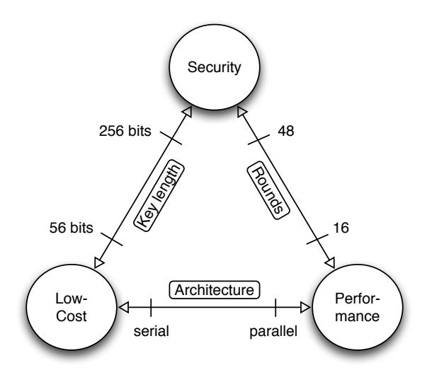

Figure 2.1: Design trade-offs for lightweight cryptography.

security on devices where both of those assumptions do not hold, it turns out that many modern block ciphers do not perform well for these scenarios. We will underline this observation when following this approach in Chapter 3 where we start with a serialized DES implementation.

The second approach is to have a well investigated cipher, the design of which was driven by low hardware costs. A very well known cipher to this respect is the Data Encryption Standard, DES [159]. DES was designed in the first half of the 1970s and the targeted implementation platform was hardware. However, by today's standard, digital technology was extremely limited in the early 1970s, *i.e.* a factor of 2 <sup>20</sup> or 6 orders of magnitude less powerful following *Moore's Law*. Hence, virtually all components of DES were heavily driven by low hardware complexity: exclusive bit-wise OR (XOR), bit permutation and small S-boxes. We will follow the second approach by slightly modifying DES in order to gain DESL in Chapter 3. The obvious drawback of DES is that its key length is not adequate for many of today's applications, but by applying key-whitening techniques the security level can be increased. This will also be addressed in Chapter 3.

Though the implementation results of DESL are encouraging, they also show optimization potentials. Therefore, in order to further decrease the hardware area requirements, we will also follow the third approach and design the ultra-lightweight cipher PRESENT anew in Chapter 4.

# **2.2 Notations**

Throughout this Thesis we use the following notations:

EK(M) = C Encryption of a message M under the key K to obtain the ciphertext C. AkB Concatenation of A and B |A| Bit-length of A, *i.e.* |A| = dlog2(A)e.

xi logical inversion of bit x<sup>i</sup> .

· logical AND.

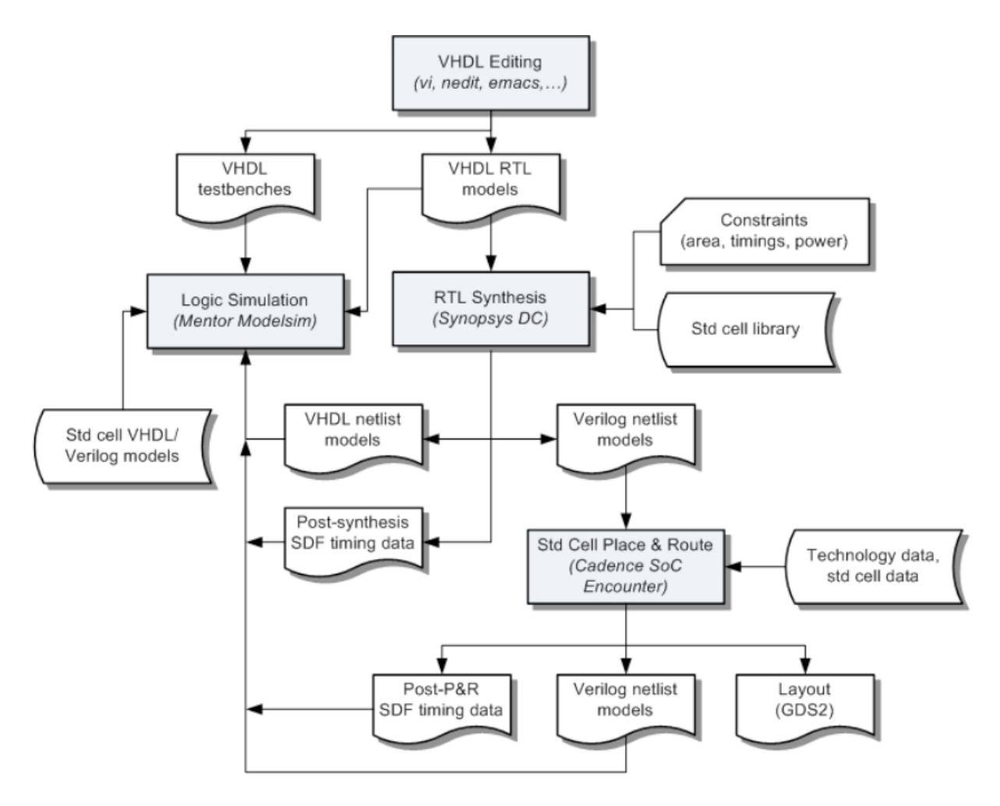

Figure 2.2: Top-down digital semi-custom standard cell design flow, source [231].

# **2.3 Introduction to ASIC design**

In this Section first an overview over the semi-custom standard cell design flow is provided in Section 2.3.1. Subsequently, in Section 2.3.2 a brief introduction to power consumption of ASICs is provided. Then in Section 2.3.3 the metrics are explained and finally architectural strategies for hardware implementations are discussed in Section 2.3.4.

## **2.3.1 Semi-custom standard cell design flow**

In this Thesis several hardware implementation architectures of lightweight cryptographic algorithms will be described. All architectures were developed and synthesized by using a script based design flow (see Figure 2.2). We used *Mentor Graphics Modelsim* [92] for VHDL source code construction and functional verification. Then the RTL description was synthesized with *Synopsys Design Compiler* [219] which was also used to generate the area, timing, and power estimation reports. For different parts of this Thesis different version of these programs have been used. We provide details about the used versions in the appropriate subsection. The main effort of synthesis process was area optimization.

Throughout this Thesis we use three different standard cell libraries with different technology parameters: a 350 nm *MTC45000* library from *AMIS* [4], a 250 nm *SESAME-LP2* library from *IHP* [64], and a 180 nm *UMCL18G212D3* library from *UMC* [233]. Each of them contains a different set of standard cells and also the subset of implemented logical functions differ between these libraries. These facts will lead to different area requirements expressed in GE for the very same VHDL source code. We mainly used the *UMCL18G212D3* library, which is based on the *UMC L180 0.18*µ*m 1P6M* logic process and has a typical voltage of 1.8 Volt [233].

## **2.3.2 Power consumption**

One particular problem of passive RFID applications is that the tags face strict power constraints. A rule-of-thumb is that the current consumption should be less than 15µA [72].

The following equation summarizes the power dissipation P in CMOS<sup>1</sup> devices [59]:

$$P = \left(\frac{1}{2} \cdot C \cdot V_{dd}^2 + Q_{sc} \cdot V_{dd}\right) \cdot f \cdot N + I_{leak} \cdot V_{dd}$$

where C denotes the circuit capacitance, Vdd the supply voltage, Qsc the short-circuit charge, f the operating frequency, N the switching activity and Ileak the leakage current. The first summand represents the dynamic power consumption and the second the static power consumption. At higher frequencies the dynamic part becomes the dominant factor of the total power consumption. It can be linearly decreased by lowering the operating frequency f, which also lowers the switching activity N and quadratically by decreasing the supply voltage Vdd. The remaining terms of the dynamic part, C and Qsc, are technology dependent and can not be influenced by an algorithm designer. The static power consumption can be linearly decreased by applying a lower supply voltage Vdd. Moreover, since the leakage current Ileak is directly proportional to the number of required GEs, decreasing the gate count directly decreases the power consumption of the circuit.

To lower power consumption, RFID applications are typically clocked at a low frequency, *e.g.* 100 KHz or 500 KHz. In this frequency range the static power consumption is dominant. RFID applications usually have harsh cost constraints and the silicon area of the chip is directly proportional to the cost. Therefore, a good way to minimize both the cost and the power consumption is to minimize the area requirements. It has become common to use the term *hardware efficient* as a synonym for small area requirements. Besides this it is also used to measure throughput per area, which is the inverse of the time-area product (TA).

## **2.3.3 Metrics**

To assess the efficiency of our implementation we used the following metrics:

**Area:** Area requirements are usually measured in µm<sup>2</sup> , but this value depends on the fabrication technology and the standard cell library. In order to compare the area requirements independently it is common to state the area as *gate equivalents* [GE]. One GE is equivalent to the area which is required by the two-input NAND gate with the lowest driving strength of the appropriate technology. The area in GE is derived by dividing the area in µm<sup>2</sup> by the area of a two-input NAND gate.

<sup>1</sup>*Complementary Metal Oxide Semiconductor*, the most widely-used technology.

**Cycles:** Number of clock cycles to compute and read out the result.

**Time:** The required amount of time for a certain operation can be calculated by dividing the amount of cycles by the operating frequency  $t = \frac{cycles}{freq}$ . Throughout this Thesis in most cases 100KHz is used as the operating frequency. Therefore in most cases the time is given in milli seconds [ms].

**Throughput:** The rate at which new output is produced with respect to time. The number of output bits is divided by the time, *i.e.* by the needed cycles and multiplied by the operating frequency. It is expressed in bits per second [bps].

**Power:** The power consumption is estimated on the gate level by Synopsys PowerCompiler [220]. It is provided in micro Watt [ $\mu$ W]. Note that power estimations on the transistor level are more accurate, but this would also require further design steps in the design flow, *e.g.* the *place&route* step.

**Energy:** The energy consumption denotes the power consumption over a certain time period. It can be calculated by multiplying the power consumption with the required time of the operation. For the efficiency of a cryptographic algorithm it might be interesting also to know the energy consumption per output bit. The energy consumption is provided in micro Joule  $[\mu J]$  or micro Joule per bit  $[\frac{\mu J}{hit}]$ , respectively.

**Current:** The power consumption divided by the typical core voltage of the library. These are 3.3V for the *AMIS MTC45000* library, 2.5V for the *IHP SESAME-LP2* library, and 1.8V for the *UMC UMCL18G212D3* library.

**Efficiency:** The throughput to area ratio is used as a measure of hardware efficiency. The hardware efficiency is calculated by dividing the area requirements by the throughput, i.e.  $eff. = \frac{area}{throughput}$ , and is expressed in gate equivalents per bits per second  $\left[\frac{GE}{bps}\right]$ .

Note that the choice of an appropriate  $I/O^2$  interface is highly application specific, while at the same time it can have a significant influence on the area, power, and timing figures. In order to have a clearer estimation of the cryptographic core's efficiency we throughout this Thesis did not implement any special input or output interfaces, but rather chose a width that best suits the need of the appropriate implementation.

### 2.3.4 Architecture strategies

An implementation for a low cost passive smart device, such as RFID tags or contactless smart cards requires small area and power consumption, while the throughput is of secondary interest. On the other hand, an RFID reader device that reads out many devices at the same time, requires a higher throughput, but area and power consumption are less important. Active smart devices, such as contact smart cards do not face strict power constraints but timing and sometimes energy constraints. In order to tailor an implementation to the design goals of the application scenario there are three major hardware architecture options: parallel (loop unrolled), round-wise, and serial.

A *parallel*, or loop unrolled, block cipher implementation performs several round operations of the encryption/decryption process within one clock cycle. Usually parallel implementations are *pipelined*, *i.e.* registers are inserted in the critical path so as to increase the maximum clock frequency. While parallel implementations have high throughput rates, this is rarely the focus

<sup>&</sup>lt;sup>2</sup>Input/Output.

for RFID applications. Rather, the high area and power demands mean that parallel implementations of block ciphers and stream ciphers are rarely suited for passive RFID applications.

In a *round-wise* implementation, one round function of a block or a stream cipher is processed within one clock cycle. The decreased throughput comes at the benefit of decreased area and power consumption. From a low power and low area perspective, round-wise implementations are best suited for stream ciphers and make a reasonable option for block ciphers.

To lower power consumption and area requirements, implementations can be *serialized*; here only a fraction of one round is processed in a clock cycle. Up to a certain point this strategy can significantly decrease the area and the power consumption and the impressive results by Feldhofer *et al.* on the AES [161] are achieved by serialization [73]. However, it might not always be a suitable implementation strategy since the savings can sometimes be cancelled by the overheads in additional control logic. Nevertheless, from a low power and low area perspective, serial implementations appear to be best-suited for RFID-like implementations in the case of block ciphers. The natural way of implementing stream ciphers is in a bit serial fashion.

# **2.4 Hardware properties of cryptographic building blocks**

This Section first provides a brief overview over sequential (Section 2.4.1) and combinatorial (Section 2.4.2) logic elements. Then in Section 2.4.3 the basic cryptographic properties of confusion and diffusion are discussed with respect to their hardware properties.

### **2.4.1 Internal state storage**

Ciphers have an internal state which we might refer to as *cipher state* and *key state*. When a block cipher is used, the cipher state is initialized by the plaintext (or ciphertext) and modified under the action of the *key* (and therefore the key state). When a stream cipher is used, the cipher state is initialized by the *initialization value* and the *key*. Stream ciphers then use the initialized cipher state to output the keystream. Block ciphers have a fixed number of rounds and the final internal state serves as the ciphertext. Note that independent of the implementation strategy (see above) the internal cipher state has to be saved at each round.

In software environments kilobytes of RAM and ROM are available. In low-cost tag applications this is not the case. Although most RFID tags have a memory module, for cryptographic algorithms there is only the barest minimum of storage capacity available. Furthermore, read and write access to the memory module (usually EEPROM) is very power consuming. As a consequence it is preferable to store all intermediate values and variables in registers rather than in external memory.

Registers typically consist of *flip-flop*s. Compared to other standard cells, flip-flops have a rather high area and power demand. For example, when using the *Virtual Silicon (VST)* standard cell library based on the *UMC L180* 0.18µ *1P6M Logic process* (UMCL18G212T3, [233]), flip-flops require between 5.33 GE and 12.33 GE to store a single bit (see Table 2.1). The gate count differs so significantly for different cells because the first cell (HDDFFPB1) consists only of a simple D flip-flop itself, while the latter one (HDSDERSPB1) comprises of a multiplexer to select one of two possible inputs for storage and a D flip-flop with active-low enable, asynchronous clear and set. There exists a wide variety of flip-flops of different complexity between

| Standard cell                 | Process | Library      | Cell name  | Area in µm2 | GE    |
|-------------------------------|---------|--------------|------------|-------------|-------|
| NOT                           | 0.18µm  | UMCL18G212T3 | HDINVBD1   | 6.451       | 0.67  |
| NAND                          | 0.18µm  | UMCL18G212T3 | HDNAN2D1   | 9.677       | 1     |
| NOR                           | 0.18µm  | UMCL18G212T3 | HDNOR2D1   | 9.677       | 1     |
| AND                           | 0.18µm  | UMCL18G212T3 | HDAND2D1   | 12.902      | 1.33  |
| OR                            | 0.18µm  | UMCL18G212T3 | HDOR2D1    | 12.902      | 1.33  |
| MUX                           | 0.18µm  | UMCL18G212T3 | HDMUX2D1   | 22.579      | 2.33  |
| XOR (2)                       | 0.18µm  | UMCL18G212T3 | HDEXOR2D1  | 25.805      | 2.67  |
| XOR (3)                       | 0.18µm  | UMCL18G212T3 | HDEXOR3D1  | 45.158      | 4.67  |
| D Flip flop                   | 0.18µm  | UMCL18G212T3 | HDDFFPB1   | 51.61       | 5.33  |
| Scan D flip-flop<br>/w enable | 0.18µm  | UMCL18G212T3 | HDSDFPQ1   | 58.061      | 6     |
| Scan flip-flop                | 0.18µm  | UMCL18G212T3 | HDSDEPQ1   | 83.866      | 8.67  |
| complex<br>Scan flip-flop     | 0.18µm  | UMCL18G212T3 | HDSDERSPB1 | 119.347     | 12.33 |

Table 2.1: Area requirements and corresponding gate count of selected standard cells of the UMCL18G212T3 library.

these two extremes. A good trade-off between efficiency and useful supporting logic provide the two flip-flop cells HDSDEPQ1 and HDSDFPQ1. Both are scan flip-flops, which means that beside the flip-flop they also provide a multiplexer. The latter one is also capable of being gate clocked, which is an important feature to lower power consumption.

Storage of the internal state typically accounts for at least 50 % of the total area and power consumption<sup>3</sup> . Therefore implementations of cryptographic algorithms for low-cost tag applications should aim to minimize the storage required.

### **2.4.2 Combinatorial elements**

The term *combinatorial elements* includes all the basic Boolean operations such as NOT, NAND, NOR, AND, OR, and XOR. It also includes some basic logic functions such as multiplexers (MUX). It is widely assumed that the gate count for these basic operations is typically independent of the library used. However, in [199] we showed that ASIC implementation results of a serialized PRESENT in different technologies range from 1, 000 GE to 1, 169 GE. This indicates that also the gate count for basic logic gates differs depending on the used standard-cell library.

For the *Virtual Silicon (VST)* standard cell library based on the *UMC L180* 0.18µ *1P6M Logic process* (UMCL18G212T3, [233]) the figures for selected two-input gates with the lowest driving strength is given in Table 2.1. Note that in hardware XOR and MUX are rather expensive when compared to the other basic Boolean operations.

<sup>3</sup>E.g. the area requirements of storage logic accounts for 55 % in the case of PRESENT [33] and for the AES it is 60 %, while half of the current consumption (*i.e.* 52 %) of the latter is due to storage logic [73].

# **2.4.3 Confusion and diffusion**

Shannon [208] was the first to formalize the ideas of *confusion* and *diffusion* as two attractive properties in the design of a secure cipher. In practice, almost all block ciphers are product ciphers, *i.e.* they are based on subsequent operations of confusion and diffusion. In a block cipher, confusion is often identified with a substitution layer (see below) while diffusion is usually identified with a permutation or "mixing" layer. In reality is not always easy to separate and identify the components that contribute to confusion or diffusion.

Some ciphers use arithmetic operations as a diffusion and confusion technique, but this can significantly increase the area and power consumption. Arguably the most common confusion method is based on S-boxes (see below). A small change in the input to an S-box leads to a complex change in the output. In order to spread these output changes over the entire state quickly, a dedicated diffusion layer has to be applied. The classical way of doing this is to use bit *permutation*. In hardware, bit permutations can be realized with wires and no transistors are involved. They are therefore a very efficient component. Note that more complex diffusion techniques, such as the mix-column layer used in the AES, are also possible. Even though they have cryptographic advantages, they come at a higher hardware cost.

Many block ciphers, and some stream ciphers, use S-boxes to introduce non-linearity. In software S-boxes are often implemented as *look-up tables* (LUT). In hardware these look-up tables can have a large area footprint<sup>4</sup> or they pose technological problems since a mix of combinatorial logic and ROM cannot always be easily achieved with a standard hardware design flow. Hence a purely combinatorial realization is often more efficient.

If combinatorial implementations do not exploit any internal structure in the S-box, then the area requirements will grow rapidly with a the number of input and output bits. The more output bits an S-box has, the more Boolean equations will be required. And the more input bits an S-box has, the more complex these equations are likely to be. An interesting interaction between cryptography and hardware implementation can be observed here: in order to withstand differential and linear cryptanalysis [26, 149], high non-linearity of S-boxes is required, which directly translates into a high gate count. A close look on the hardware efficiency of the S-boxes in AES [161], DES [159], and PRESENT [33] illustrates this.

AES uses a bijective 8-bit S-box, *i.e.* eight input bits are mapped to eight output bits. In [223] the hardware properties of several implementations of AES S-boxes, each illustrating different design goals, are compared. It turns out that the AES S-box realised as Boolean logic requires about 1, 000 GE while there is no implementation that requires less than 300 GE. These figures also include the inverse S-box.

DES uses eight different S-boxes that map six input bits to four output bits. In Chapter 3 we will show that in our DES ASIC design the S-boxes require in total 742 GE. However, taking into account that Boolean terms can be shared between the eight different S-boxes, it is not surprising that the area requirements for a single 6-bit to 4-bit S-box typically is around 120 GE. This can also be observed in implementations of DESXL and DESL, which will be introduced also in Chapter 3. Both algorithms use 6-bit to 4-bit S-boxes but, in contrast to DES, a single S-box is repeated eight times. Therefore only one instance of the S-box has to be implemented in a serialized design, which requires 128 GE.

<sup>4</sup>Note that LUTs with a large memory footprint in software can be vulnerable to side-channel attacks based on *cache misses*.

In [140] the area requirements of so-called *SERPENT-type* S-boxes are described. These are a special subset of 4-bit to 4-bit S-boxes fulfilling certain criteria and we found that the area requirements for this type of S-box varies between 21 GE and 39 GE. As an example, PRESENT uses a single, bijective 4-bit to 4-bit S-box which can be implemented with 21 GE. However, in Chapter 5 we will see that a single S-box requires 28 GE when implemented with the *UMCL18G212D3* library. This deviation is caused by the fact that synthesis results depend heavily on the technology of the standard cells that are used (see discussion above).

After having introduced the basic knowledge about semi-custom ASIC design, we now can proceed with the first design approach to lightweight cryptography in the next chapter.

# **3 New Lightweight DES Variants**

In this Chapter we first give an overview of our approach in Section 3.1 and treat related work in Section 3.2. Subsequently we present and discuss design criteria for the new algorithm DESL in Section 3.3. There we will describe how we strengthened the original DES S-box design criteria in order to achieve a cryptographically stronger S-box compared to the original DES S-boxes. We will show, that our S-box resists linear and differential cryptanalyses and the Davies-Murphy-attack. The design and security analysis of DESL is joined work with Gregor Leander and hence contains contributions from him. Subsequently we present a lightweight hardware implementation architecture for DES, DESX, DESL and DESXL in Section 3.4. There we also will present the performance results of the described hardware implementations as well as software implementation results. Finally, in Section 3.5 we draw conclusions.

# **3.1 DESL and DESXL: design ideas and security consideration**

The main design ideas of the new cipher family of this Chapter, which are either original DES efficiently implemented or a variant of DES, are:

- (1) Use of a serial hardware architecture which reduces the gate complexity.
- (2) Optionally apply key-whitening in order to render brute-force attacks impossible.
- (3) Optionally replace the 8 original S-boxes by a single one which further reduces the gate complexity.

If we make use of the first idea, we obtain a lightweight implementation of the original DES algorithm which consumes about 35% less gates than the best known AES implementation [71].

To our knowledge, this is the smallest reported DES implementation, trading area for throughput. The implementation requires also about 86% fewer clock cycles for encrypting of one block than the serialized AES implementation in [71] (1032 cycles vs. 144) which makes it easier to use in standardized RFID protocols. However, the security provided is limited by the 56-bit key. Brute forcing this key space takes a few months and hundreds of PCs in software, and only a few days with a special-purpose machine such as COPACOBANA [135]. Hence, this implementation is only relevant for application where short-term security is needed, or where the values protected are relatively low. However, we can imagine that in certain low cost applications such a security level is adequate.

In situation where a higher security level is needed key whitening, which we define here as follows:

$$DESX_{k.k_1.k_2}(x) = k_2 \oplus DES_k(k_1 \oplus x)$$

can be added to standard DES, yielding DESX. The additional XOR gates increase the gate count by about 14%<sup>1</sup> . The best known key search attack uses a time-memory trade-off and requires 2 <sup>120</sup> time steps and 2 <sup>64</sup> memory locations, which renders this attack entirely out of reach. The best known mathematical attack is linear cryptanalysis [149]. Linear cryptanalysis requires about 2 <sup>43</sup> known ciphertext blocks together with the corresponding plaintexts. At a clock speed of 500 kHz, our DESX implementation will take more than 80 years, so that analytical attacks do not pose a realistic threat. Please note that parallelization is only an option if devices with identical keys are available.

In situations where extremely lightweight cryptography is needed, we can further decrease the gate complexity of DES by replacing the eight original S-Boxes by a single new one. This lightweight variant of DES is named DESL and has a brute-force resistance of 2 <sup>56</sup>. In order to strengthen the cipher, key whitening can be applied yielding the cipher DESXL. The crucial question is what the strength of DESL and DESXL is with respect to analytical attacks. We are fully aware that any changes to a cipher might open the door to new attacks, even if the changes have been done very carefully and checked against known attacks. Hence, we believe that DESL (or DESXL) should primarily not be viewed as competitors to AES, but should be used in applications where established algorithms are too costly. In such applications which have to trade security (really: trust in an algorithm) for cost, we argue that it is a cryptographically sound approach to modestly modify a well studied cipher (in fact, the world's best studied crypto algorithm).

# **3.2 Related work**

In [73], Feldhofer *et al.* propose a very small hardware implementation of the *Advanced Encryption Standard (AES)* [161] (3, 400 GE), which was then by far the smallest available implementation of the AES. Their AES design is based on a byte-per-byte serialization, which only requires the implementation of a single S-box [54] and achieves an encryption within 1, 032 clock cycles (= 10.32 ms @ 100kHz). Unfortunately, the ISO/IEC 18000 standard requires that the latency of a response of an RFID tag does not exceed 320µs, which is why Feldhofer *et al.* propose a slightly modified challenge-response protocol based on interleaving. In 2006 Hämäläinen *et al.* propose a low area implementation of the AES that requires 3, 100 GE and only 160 clock cycles [96]. However, these figures are still significantly higher than the assumed 2, 000 GE and it seems that it is not very likely to further decrease the area requirements for the AES. This might be due to the fact that the AES—besides the majority of block ciphers—has been developed with good software properties in mind, which in turn means that the gate count for a hardware implementation is rather high.

The only well established cipher that was designed with a strong focus on low hardware costs is the *Data Encryption Standard* (DES) [159]. The smallest published implementation of DES consists of 12, 000 transistors, which roughly translates to 3, 000 GE, and requires 28 clock cycles for one encryption [232]. It was published by Verbauwhede *et al.* back in 1988 and is not based on a modern semi-custom standard cell design flow. Instead it uses customized floorplanning and routing for which the whole implementation was optimized. If we compare this implementation of DES with a standard, one-round implementation of AES, the former

<sup>1</sup>This number only includes additional XOR gates, because we assume that all keys have to be stored at different memory locations anyway.

consumes about 6% (!) of the logic resources of AES, while having a shorter critical path [232, 201].<sup>2</sup>

As will become clear in Section 3.4, S-boxes require a large share of the area. Hence, a native approach is to alter the substitution layer of DES by replacing the eight original S-boxes by one S-box, which is repeated eight times. While it does not seem to be possible to find better logic minimizations of the original DES S-boxes, there have been other approaches to alter the S-box, e.g. key-dependent S-boxes [22], [26] or the so-called s <sup>i</sup>*DES* [122, 123, 124]. All these approaches—despite the fact that some of them have worse cryptographic properties than DES [128]—just change the content and not the *number* of S-boxes. To the best of our knowledge, no DES variant has been proposed in the past which uses a single S-box, repeated eight times. In Section 3.3 we describe how a variant of DES with a single S-box can be made resistant against the differential, linear, and Davies-Murphy attack. The work is based on the original design criteria for DES as published by Coppersmith [48] and the work of Kim *et al.* [122, 123, 124] where several criteria for DES type S-boxes are presented to strengthen the resistance against the above mentioned attacks.

# **3.3 Design criteria of DESL**

Coppersmith states the following eight criteria as the "only cryptographically relevant" ones for the DES S-boxes (see [48]):

- **(S-1)** Each S-box has six bits of input and four bits of output.
- **(S-2)** No output bit of an S-box should be too close to a linear function of the input bits.
- **(S-3)** If we fix the leftmost and rightmost input bits of the S-box and vary the four middle bits, each possible 4-bit output is attained exactly once as the middle input bits range over their 16 possibilities.
- **(S-4)** If two inputs to an S-box differ in exactly one bit, the outputs must differ in at least two bits.
- **(S-5)** If two inputs to an S-box differ in the two middle bits exactly, the outputs must differ in at least two bits.
- **(S-6)** If two inputs to an S-box differ in their first two bits and are identical in their last two bits, the two outputs must not be the same.
- **(S-7)** For any nonzero 6-bit-difference between inputs, ∆I, no more than eight of the 32 pairs of inputs exhibiting ∆I may result in the same output difference ∆O.
- **(S-8)** Minimize the probability that a non zero input difference to three adjacent S-boxes yield a zero output difference.

In the following sections we will develop eight criterions (C1-C8) which ensure that DESL is resistant against differential, linear, and the Davies-Murphy attack. Figure 3.1 shows our approach for setting up the eight conditions and provides an overview over their purpose.

<sup>2</sup>Please note that between the DES implementation of Verbauwhede *et al.* [232] in 1988 and the AES implementation of Satoh *et al.* [201] in 2001 more than a decade has passed and synthesis algorithms have been greatly improved since.

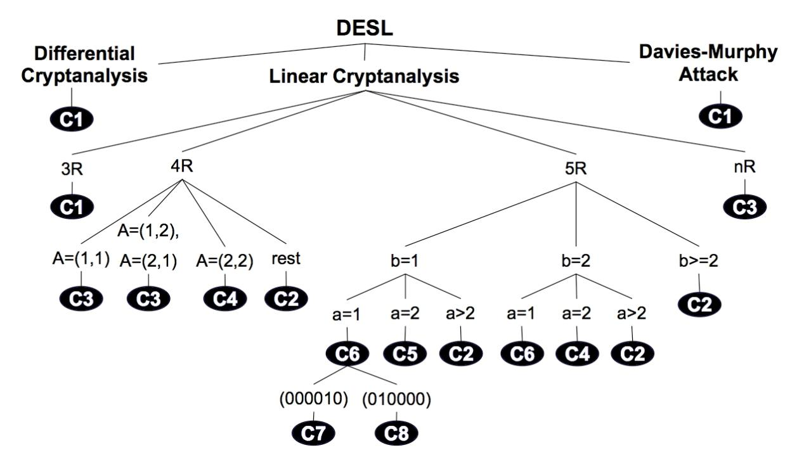

Figure 3.1: Eight conditions to be fulfilled by the S-box of DESL in order to thwart differential, linear, and the Davies-Murphy attack.

# 3.3.1 Improved resistance against differential cryptanalysis and Davies Murphy attack

The criteria (S-1) to (S-7) refer to one single S-box. The only criterion which deals with the combination of S-boxes is criterion (S-8). The designers' goal was to minimize the probability of collisions at the output of the S-boxes and thus at the output of the *f-function*. As a matter of fact, it is only possible to cause a collision, *i.e.* two different inputs are mapped to the same output, in three adjacent S-boxes, but not in a single S-box or a pair of S-boxes due to the diffusion caused by the expansion permutation. The possibility to have a collision in three adjacent S-boxes leads to the most successful differential attack based on a 2-round iterative characteristic with probability  $\frac{1}{234}$ .

Clearly better than minimizing the probability for collisions in three or more adjacent S-boxes, is to eliminate them. This was the approach used in [122, 123, 124] and can easily be reached by improving one of the design criteria.

We replace (S-6) and (S-8) by an improved design criterion similar to the one given in [124].

**Condition 1.** *If two inputs to an S-box differ in their first bit and are identical in their last two bits, the two outputs must not be the same.*

This criterion ensures that differential attacks using 2-round iterative characteristics, as the one presented by Biham and Shamir in [26], will have all eight S-boxes active and therefore will not be more efficient than exhaustive search anymore.

Moreover, the only criterion that refers to more than one S-box, *i.e.* (S-8), is now replaced by a condition that refers to one S-box, only. Thus, most of the security analysis remains unchanged when we replace the eight different S-boxes by one S-box repeated eight times.

Note that as described by Biham in [23] and by Kim *et al.* in [123] this condition also ensures resistance against the Davies Murphy attack [56].

### 3.3.2 Improved resistance against linear cryptanalysis

To improve the resistance of our variant of DES with only one S-Box against linear cryptanalysis (LC) is more complex than the protection against the differential cryptanalysis. Kim *et al.* presented a number of conditions that, when fulfilled by a set of S-boxes, ensure the resistance of DES variants against LC. However, several of these conditions focus on different S-boxes and this implies that if one wants to replace all eight S-boxes by just one S-box, there are very tight restrictions to the choice of the S-box. This one S-box has to fulfill *all* conditions given in [123] referring to *any* S-box.

Let  $S_b = \langle b, S(x) \rangle$  denote a combination of output bits that is determined by  $b \in GF(2)^4$ . Then, the *Walsh-coefficient*  $S_b^{\mathcal{W}}(a)$  for an element  $a \in GF(2)^6$  is defined by

$$S_b^{\mathcal{W}}(a) = \sum_{x \in GF(2)^6} (-1)^{\langle b, S(x) \rangle + \langle a, x \rangle}.$$
 (3.1)

Since

$$\# \{x | S_b(x) = \langle a, x \rangle \} + \# \{x | S_b(x) \neq \langle a, x \rangle \} = 2^6$$

it follows that

$$S_b^{\mathcal{W}}(a) = 2\# \{x | S_b(x) = \langle a, x \rangle\} - 2^6$$

The probability of a linear approximation of a combination of output bits  $S_b$  by a linear combination a of input bits can be written as

$$p = \frac{\#\{x|S_b(x) = \langle a, x \rangle\}}{2^6}.$$
 (3.2)

Combining equations 3.1 and 3.2 leads to

$$p = \frac{S_b^{\mathcal{W}}(a)}{2^7} + \frac{1}{2}.$$

The *linear probability bias*  $\varepsilon$  is a correlation measure for this deviation from probability  $\frac{1}{2}$  for which it is entirely uncorrelated. We have

$$\varepsilon = \left| p - \frac{1}{2} \right| = \left| \frac{S_b^{\mathcal{W}}(a)}{2^7} \right|.$$

Let us denote the maximum absolute value of the Walsh-Transformation by  $S_{max}^{\mathcal{W}}.$  Then clearly

$$\varepsilon \leq \left| \frac{S_{max}^{\mathcal{W}}(a)}{2^7} \right|.$$

The smaller the linear probability bias  $\varepsilon$  is, the more secure the S-box is against linear cryptanalysis. We defined our criterion (S-2") by setting the threshold for  $S_{max}^{W}$  to 28.

Condition 2.  $|S_b^{\mathcal{W}}(a)| \leq 28$  for all  $a \in GF(2)^6$ ,  $b \in GF(2)^4$ .

Note that this is a tightened version of Condition 2 given in [123] where the threshold was set to 32. In the original DES the best linear approximation has a maximum absolute Walsh coefficient of 40 for S-box S5.

If an LC attack is based on an approximation that involves n S-boxes, under the standard assumption that the round keys are statistically independent, the overall bias  $\varepsilon$  is (see [149])

$$\varepsilon = 2^{n-1} \prod_{i=1}^{n} \varepsilon_i$$

where the values  $\varepsilon_i$  are the biases for each of the involved S-box.

A rough approximation of the effort of a linear attack based on a linear approximation with bias  $\varepsilon$  is  $\varepsilon^{-2}$ , thus if we require that such an attack is no more efficient than exhaustive search we need  $\varepsilon < 2^{-28}$ .

It can easily be seen that any linear approximation for 15 round DES involves at least 7 approximations for S-boxes. But as

$$2^6 \prod_{i=1}^7 \varepsilon_i \le 2^6 \prod_{i=1}^7 \frac{7}{32} \approx 2^{-9.35}$$

this bound is clearly insufficient.

Thus in order to prove the resistance against linear attack, we have to make sure that either enough S-boxes are active, *i.e.* enough S-Boxes are involved in the linear approximation, or, if fewer S-boxes are active, the bound on the probabilities can be tightened. In the first case we need more than 23 active S-boxes as

$$2^{21} \left(\frac{S_{max}^{\mathcal{W}}}{128}\right)^{22} > 2^{-28} > 2^{22} \left(\frac{S_{max}^{\mathcal{W}}}{128}\right)^{23}. \tag{3.3}$$

For the second case several conditions have been developed in [122, 123]. Due to our special constraints we have to slightly modify these conditions. Following [123] we discuss several cases of iterative linear approximations. We denote a linear approximation of the F function of DES by

$$\langle I, Z_1 \rangle + \langle K, Z_3 \rangle = \langle O, Z_2 \rangle$$

where  $Z_1, Z_2, Z_3 \in GF(2)^{32}$  specify the input, output and key bits used in the linear approximation.

An n round iterative linear approximation is of the form

$$\langle I_1, \cdot \rangle + \langle I_n, \cdot \rangle = \langle K_2, \cdot \rangle + \dots + \langle K_{n-1}, \cdot \rangle$$

and consists of linear approximations for the rounds 2 until n-1.

Similar as it was done in [122] it can be shown that a three round (3R) iterative linear approximation is not possible with a non zero bias, due to condition 1.

We therefore focus on the case of a 4 and 5 round iterative approximation only.

## **3.3.3 4R iterative linear approximation**

A four round iterative linear approximation consists of two linear approximations for the F function of the second and third round. We denote these approximations as

$$A: \langle I_2, Z_1 \rangle + \langle K_2, Z_3 \rangle = \langle O_2, Z_2 \rangle$$

$$B: \langle I_3, Y_1 \rangle + \langle K_3, Y_3 \rangle = \langle O_3, Y_2 \rangle.$$

In order to get a linear approximation of the form

$$\langle I_1, \cdot \rangle + \langle I_4, \cdot \rangle = \langle K_2, \cdot \rangle + \langle K_3, \cdot \rangle$$

Using O<sup>2</sup> = I<sup>1</sup> + I<sup>3</sup> and O<sup>3</sup> = I<sup>2</sup> + I<sup>4</sup> it must hold that

$$Z_2 = Y_1 \text{ and } Z_1 = Y_2.$$

The 15 round approximation is

$$-AB - BA - AB - BA - AB.$$

If the number of S-boxes involved in the approximation of A is a and for B is b we denote by A = (a, b). First assume that A = (1, 1). Due to Z<sup>2</sup> = Y<sup>1</sup> and the property of the P-permutation, which distributes the output bits of one S-box to 6 different S-Boxes in the next round, it must hold that |Y1| = |Z2| = 1. For the same reason we get |Z1| = |Y2| = 1. To minimize the probability of such an approximation we stipulate the following condition

**Condition 3.** *The S-box has to fulfill* S<sup>W</sup> b (a) ≤ 4 *for all* a ∈ GF(2)<sup>6</sup> , b ∈ GF(2)<sup>4</sup> *with* wt(a) = wt(b) = 1*.*

This condition is comparable to Condition 4 in [123], however, as we only have a single Sbox, we could not find a single S-box fulfilling all the restrictions from Condition 4 in [123]. If the S-box fulfills condition 3 the overall bias for the linear approximation described above is bounded by

$$\varepsilon \le 2^9 \left(\frac{4}{128}\right)^{10} < 2^{-40}.$$

As this is (much) smaller than 2 <sup>−</sup><sup>28</sup> this does not yield to a useful approximation.

Assume now that A = (1, 2) (the case A = (2, 1) is very similar). If B involves two S-boxes we have |Y1| = |Y2| = 2 and thus |Y2| = |Z1| = 2. In particular for both S-boxes involved in B Condition 3 applies which results in a threshold

$$\varepsilon \le 2^{14} \left(\frac{4}{128}\right)^{10} \left(\frac{28}{128}\right)^5 < 2^{-46}$$

for the overall linear bias.

Next we assume that A = (2, 2) . In this case we get (through the properties of the P function) that each S-box involved in A and B has at most two input and output bits involved in the linear approximation. In order to avoid this kind of approximation we add another condition.

**Condition 4.** *The S-box has to fulfill* S<sup>W</sup> b (a) ≤ 16 *for all* a ∈ GF(2)<sup>6</sup> , b ∈ GF(2)<sup>4</sup> *with* wt(a), wt(b) ≤ 2*.*

This condition is a tightened version of Condition 5 in [123] where the threshold was set to 20. In this case (remember that we now have 20 S-boxes involved) we get

$$\varepsilon \le 2^{19} \left( \frac{16}{128} \right)^{20} < 2^{-40}.$$

In all other cases, more than 23 S-boxes are involved and thus the general upper bound (3.3) can be applied.

## **3.3.4 5R iterative linear approximation**

A five round iterative linear approximation consists of three linear approximations for the F function of the second, third and fourth round. We denote these approximations as

$$A: \langle I_2, Z_1 \rangle + \langle K_2, Z_3 \rangle = \langle O_2, Z_2 \rangle$$


$$B: \langle I_3, Y_1 \rangle + \langle K_3, Y_3 \rangle = \langle O_3, Y_2 \rangle$$


$$C: \langle I_4, X_1 \rangle + \langle K_4, X_3 \rangle = \langle O_4, X_2 \rangle.$$

In order to get a linear approximation of the form

$$\langle I_1, \cdot \rangle + \langle I_5, \cdot \rangle = \langle K_2, \cdot \rangle + \langle K_3, \cdot \rangle + \langle K_4, \cdot \rangle$$

it must hold that

$$Z_1 = Y_2 = X_1$$
 and  $Y_1 + Z_2 + X_2 = 0$ .

The 15 round approximation is

$$-ABC - CBA - ABC - DE$$

for some linear approximations D and E each involving at least one S-box. Clearly, as the inputs of A and C are the same we have A = (a, b, a), *i.e.* the number of involved S-boxes in A and C are the same.

**Case** b = 1**:** Assume that b = 1, *i.e.* only one S-box is involved in the linear approximation B. If |Z1| ≥ 3 than we must have a ≥ 3 and so the number of S-boxes involved is at least 23, which makes the approximation useless. If |Z1| = 2 we have two active S-boxes for A and B. Moreover as b = 1 we must have |Y1| = |Z<sup>2</sup> + X2| = 1. Due to properties of the P function, the S-boxes involved in A and B are never adjacent S-boxes, therefore exactly one input bit is involved in the approximation for each of the two S-boxes. In order to minimize the probability for such an approximation, we stipulate the following condition:

**Condition 5.** *The S-box has to fulfill*

$$|S_{b_1}^{\mathcal{W}}(a)S_{b_2}^{\mathcal{W}}(a)| \le 240$$

*for all* a ∈ GF(2)<sup>6</sup> , b1, b<sup>2</sup> ∈ GF(2)<sup>4</sup> *with* wt(a) = 1, wt(b<sup>1</sup> + b2) = 1*.* This is a modified version of Condition 7 in [123]. With an S-box fulfilling this condition we derive an upper bound for the overall bias

$$\varepsilon \le 2^{16} \left(\frac{240}{128^2}\right)^6 \left(\frac{16}{128}\right)^3 \left(\frac{28}{128}\right)^2 < 2^{-33}.$$

If  $|Z_1| = 1$  then a = 1 and we have  $|Y_1| = |Z_2 + X_2| = 1$  and  $|Z_1| = 1$ . We stipulate one more condition.

**Condition 6.** The S-box has to fulfill

$$S_h^{\mathcal{W}}(a) = 0$$

for  $a \in \{(010000), (000010)\}, b \in GF(2)^4$  with wt(b) = 1.

This implies that the input to B is such that a middle bit is affected. Due to the properties of the P function this implies that in the input of A and C a non-middle bit is affected. As for any DES type S-box it holds that  $S_b^{\mathcal{W}}(100000) = S_b^{\mathcal{W}}(000001) = 0$  for all b the only possible input values for the S-box involved in A and C are (010000) and (000010). To avoid the second one we define the next condition.

#### Condition 7.

$$|S_{b_1}^{\mathcal{W}}(000010)S_{b_2}^{\mathcal{W}}(000010)| = 0$$

for all  $b_1, b_2 \in GF(2)^4$  with  $wt(b_1 + b_2) = 1$ .

The other possible input value, *i.e.* 01000 occurs only when S-box 1 is active in B and S-box 5 is active in A and C. In this case the input values for the S-box in B is (000100) and the output value is (0100). The next condition makes this approximation impossible.

**Condition 8.** *The S-box has to fulfill*

$$S_{(0100)}^{\mathcal{W}}(000100) = 0.$$

**Case** b=2: Assume that b=2, *i.e.* exactly two S-boxes are involved for B. If a>2 then at least 23 S-boxes are involved in total. If a=2 we have for each S-box involved in B at most 2 input bits and at most 2 output bits. Therefore we can apply the bound from condition 4 to the two S-boxes from B. Applying the general bound for all the other S-boxes we get

$$\varepsilon \le 2^{19} \left(\frac{16}{128}\right)^6 \left(\frac{28}{128}\right)^{14} < 2^{-29}.$$

In the case where a=1 the two S-boxes involved in B have one input and one output bit involved each, thus we can apply the strong bound from condition 3 for these S-boxes (6 in total) and the general bound for the other S-boxes to get

$$\varepsilon \le 2^{13} \left(\frac{4}{128}\right)^6 \left(\frac{28}{128}\right)^8 < 2^{-34}.$$

**Case** b > 2: In this case we must have  $a, b \ge 2$  and thus at least 29 S-boxes are involved in total.

| DES S-box | S1 | S2 | S3 | S4 | S5 | S6 | S7 | S8 | DESL |
|-----------|----|----|----|----|----|----|----|----|------|
| # deg 2   | 1  | 0  | 0  | 5  | 1  | 0  | 0  | 0  | 1    |
| # deg 3   | 88 | 88 | 88 | 88 | 88 | 88 | 88 | 88 | 88   |

Table 3.1: Number of Degree two and Degree three Equations

|    |   |    |    |    |   |    |    | S  |    |    |   |    |    |    |    |
|----|---|----|----|----|---|----|----|----|----|----|---|----|----|----|----|
| 14 | 5 | 7  | 2  | 11 | 8 | 1  | 15 | 0  | 10 | 9  | 4 | 6  | 13 | 12 | 3  |
| 5  | 0 | 8  | 15 | 14 | 3 | 2  | 12 | 11 | 7  | 6  | 9 | 13 | 4  | 1  | 10 |
| 4  | 9 | 2  | 14 | 8  | 7 | 13 | 0  | 10 | 12 | 15 | 1 | 5  | 11 | 3  | 6  |
| 9  | 6 | 15 | 5  | 3  | 8 | 4  | 11 | 7  | 1  | 12 | 2 | 0  | 14 | 10 | 13 |

Table 3.2: Improved DESL S-box

## **3.3.5 nR iterative linear approximation**

For an n round iterative linear approximation with only one S-box involved in each round (denoted as Type-I by Matsui) our condition 3 ensures that if more than 7 S-boxes are involved in total the approximation will not be useful for an attack as

$$\varepsilon \le 2^6 \left(\frac{4}{128}\right)^7 = 2^{-29}. (3.4)$$

### **3.3.6 Resistance against algebraic attacks**

There is no structural reason why algebraic attacks should pose a greater threat to DESL than to DES. The DESL S-box has been randomly generated in the set of all S-boxes fulfilling the design criteria described above. Therefore we do not expect any special weakness of the chosen S-box. Indeed we computed the number of low degree equations between the input and output bits of the S-box. There exist one quadratic equation and 88 equations of degree 3. Note that for each 6 to 4 Bit S-box, there exist at least 88 equations of degree 3. Given the comparison with the corresponding results for the original DES S-boxes in Table 3.1 we anticipate that DESL is as secure as DES with respect to algebraic attacks.

### **3.3.7 Improved S-box**

We randomly generated S-boxes, which fulfill the original DES criteria (S-1), (S-3), (S-4), (S-5), (S-7), Condition 1 and our modified Conditions 2 to 8. Our goal was to find one single S-box, which is significantly more resistant against differential and linear cryptanalyses than the original eight S-boxes of DES. In our DESL algorithm this S-box is repeated eight times and replaces all eight S-boxes in DES. Table 3.2 depicts the improved DESL S-box.

# **3.4 Implementation results**

In this section we present the hardware implementation architecture for our family of lightweight block ciphers. We implemented DES, DESX, DESL, and DESXL in the hardware description language VHDL, where we sacrificed time for area wherever possible. We used *Synopsys Design Vision V-2004.06-SP2* to map our designs to the Artisan UMC 0.18µm L180 Process 1.8-Volt *Sage-X Standard Cell* Library and *Cadence Silicon Ensemble 5.4* for the Placement & Routing-step. *Synopsys NanoSim* was used to simulate the power consumption of the back-annotated verilog netlist of the ASICs.

We first describe the DES and DESX implementations in Section 3.4.1 and subsequently describe the DESL and DESXL implementations in Section 3.4.2. Finally we list the software implementation results of DES, DESL and DESX in Section 3.4.3.

# **3.4.1 Lightweight hardware implementation of DES and DESX**

The overall architecture of our size-optimized DES implementation is depicted in Figure 3.2. Our design basically consists of five core modules: *controller*, *keyschedule*, *mem\_left*, *mem\_right*, and *sbox*. Subsequently, we give a brief description of these modules.

**Controller:** The *controller* module manages all control signals in the ASIC based on a finite state machine. The FSM is depicted in Figure 3.3.

**Keyschedule:** In this module all DES round keys are generated. It is composed of a 56-bit register, an input multiplexer, and an output multiplexer to select the right fraction of the roundkey.

**mem\_left:** This module consists of eight 4-bit wide registers, each composed of D-flip-flops.<sup>3</sup>

**mem\_right:** This module is similar to the *mem\_left* module with slight differences. It also consists of eight 4-bit wide registers, but it has different input and output signals: instead of a 4-bit wide output it has a 6-bit wide output, due to the *expansion* function of DES<sup>4</sup> .

**sbox:** This module consists of eight S-boxes of the DES algorithm and an output multiplexer. The S-boxes are realized in combinatorial logic, *i.e.* a sum of products (SOP) [170].

Figure 3.2 also shows the datapath of our serialized DES design. The 56-bit *key* is stored in the key flip-flop register after the PC1 and LS1 permutations have been applied. The plaintext is first confused using the *Initial Permutation* (IP), then, it is split into two 32-bit inputs for the modules *mem\_left* and *mem\_right*, respectively. The input of *mem\_left* is modified by the inverse of the P permutation and stored in the registers of the modules *mem\_left* and *mem\_right* in one cycle. Next, the output of the last register in *mem\_right* is both stored in the first register of *mem\_right* and expanded to six bits. After an XOR operation with the appropriate block of the current round key, this expanded value is processed by the *sbox* module, which is selected by the *count* signal, provided by the *controller* module. Finally, the result is XORed with the

<sup>3</sup>Note that the memory modules were designed in a shift register manner, such that the output of a 4-bit block is fed as the new input into the following block. At the end of the chain the current 4-bit block is provided and can be processed without an additional output multiplexer, which results in a saving of 48 GE.

<sup>4</sup>Note that the design in a shift register manner in this module saves even more area (72 GE) than in the *mem\_left* module, because here a 6-bit wide output multiplexer can be saved. Altogether 120 GE can be saved by our memory design compared to a regular design.

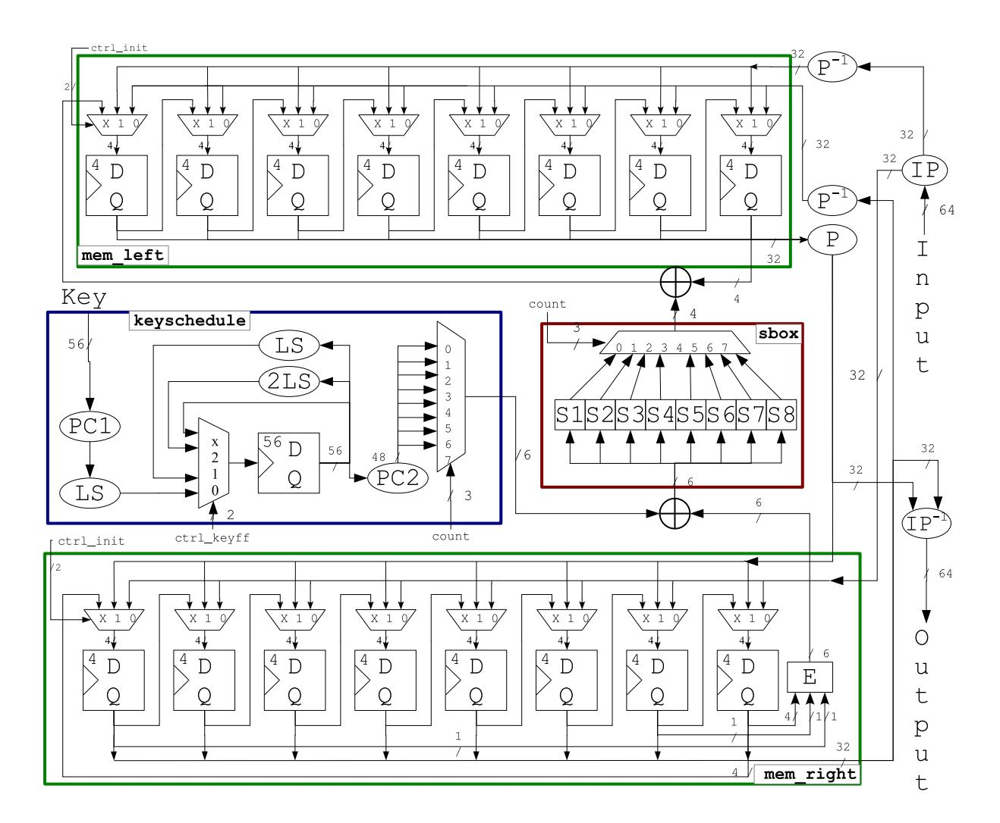

Figure 3.2: Datapath of the serialized DES ASIC with original S-boxes.

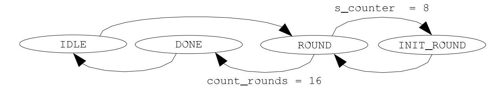

Figure 3.3: Finite State Machine of the ASIC architecture for DES, DESX, DESL, and DESXL.

output of the *mem\_left* module, and stored in the first flip-flop of the *mem\_left* module. This is repeated eight times, until all 32 bits of the right half are processed.

In our design, we applied the P permutation in each ninth clock cycle. Because the P <sup>−</sup><sup>1</sup> permutation is applied before the left 32-bit half L<sup>i</sup> is stored in the *mem\_left* module, we perform the (P) permutation on the resulting right half Ri+1 = P P −1 (Li) ⊕ S (E (Ri) ⊕ Ki) , where L<sup>i</sup> denotes the left half, R<sup>i</sup> denotes the right half, and K<sup>i</sup> denotes the round key.

By reducing the datapath from a 32-bit bus to a 4-bit bus, only 6·10+ 4·10 = 100 transistors (25 GE) are needed for the XOR operations, compared to 48 · 10 + 32 · 10 = 800 (200 GE) transistors in a not-serialized design. This saving comes with the disadvantage of two additional multiplexers, each one for the round key (72 GE) and for the S-box output (48 GE). As we will see in Section 3.4.2, our DESL algorithm does not need an output multiplexer in the *sbox* module.

Once all eight 4-bit blocks of both halves have been processed, they are concatenated to two 32-bit wide outputs of the modules *mem\_left* and *mem\_right*. The output of the module *mem\_left* is transformed by the P permutation and stored as the new content of the *mem\_right* module, while the output of the *mem\_right* module is stored as the new content of the *mem\_left* module. This execution flow repeats another 15 rounds. Finally, both outputs of the memory modules *mem\_left* and *mem\_right* are concatenated to a 64-bit wide output. This output is confused by the *Inverse Initial Permutation* (IP <sup>−</sup><sup>1</sup> ), which results in a valid ciphertext of the DES algorithm. It takes 144 clock cycles to encrypt one 64-bit block of plaintext. For one encryption at 100 kHz the average current consumption is 1.19 µA and the throughput reaches 5.55 KB/s.

## **3.4.2 Lightweight hardware implementation of DESL and DESXL**

As we have described in the previous sections, the main difference between DESL and DES lies in the f-function. We substituted the eight original DES S-boxes by a single but cryptographically stronger S-box (see Table 3.2), which is repeated eight times. Furthermore, we omitted the initial permutation (IP) and its inverse (IP−<sup>1</sup> ), because they do not provide additional cryptographic strength, but at the same time require area for wiring. The design of our DESL algorithm is exactly the same as for the DES algorithm, except for the (IP) and (IP−<sup>1</sup> ) wiring and the *sbox* module. Figure 3.4 depicts the architecture of the serialized DESL implementation.

Our serialized DESL ASIC implementation has an area requirement of 1848 GE and it takes 144 clock cycles to encrypt one 64-bit block of plaintext. For one encryption at 100 kHz the average current consumption is 0.89 µA and the throughput reaches 5.55 KBps. For further details on the implementational aspects of our DES and DESL architecture we refer to [184].

### **3.4.3 Lightweight software implementation results**

For the sake of completeness also lightweight software implementation results have been included here. The figures were taken from [68] and have been obtained for the ATMEL ATMega128 8-bit microcontroller, which is a widely used embedded processor for smart cards and WSNs, *e.g.* in Micaz Motes. Table 3.4 depicts implementation results of DESL and DESXL for an 8-bit microcontroller.

A comparison with software implementations for 8 bit microcontroller of other block and stream ciphers will be done in Section 5.4.

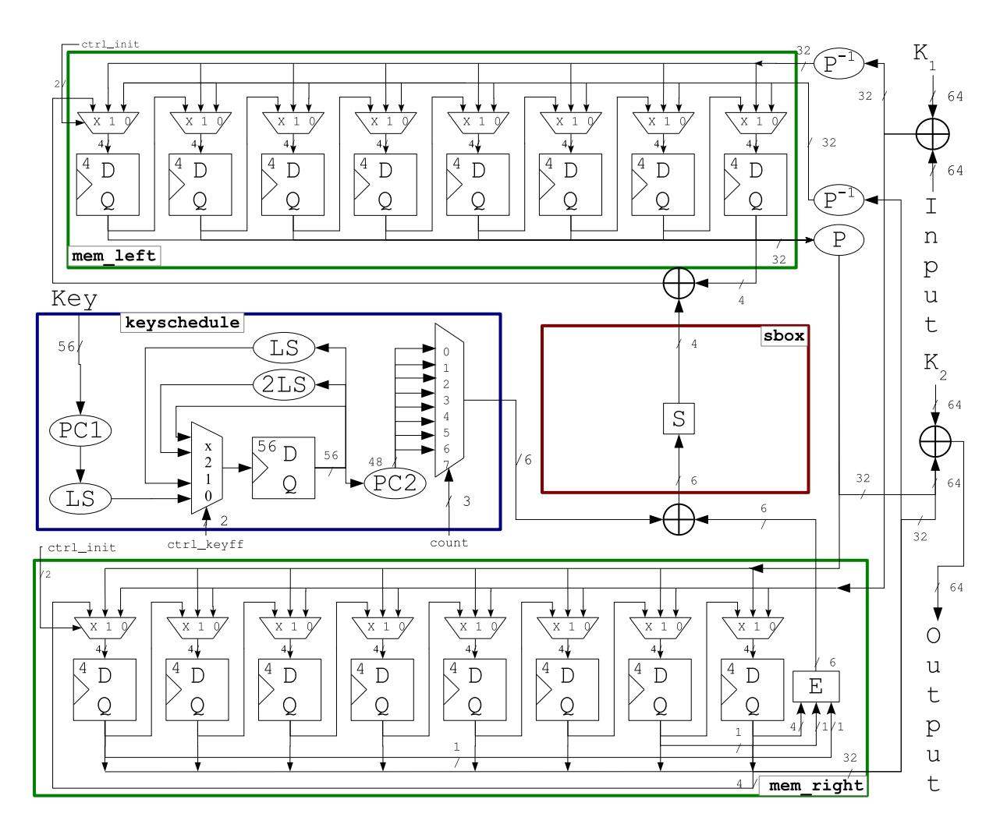

Figure 3.4: Datapath of the serialized DESL ASIC with the improved S-box.

Table 3.3: Hardware implementation results of DES, DESX, DESL and DESXL. All figures are obtained at or calculated for a frequency of 100KHz.

| Algorithm | key<br>size | block<br>size | datapath<br>width | cycles /<br>block       | T'put<br>[Kbps] | Tech.<br>[µm] | Area<br>[GE] | Eff.<br>[bps/GE] | Cur.<br>[µA] |
|-----------|-------------|---------------|-------------------|-------------------------|-----------------|---------------|--------------|------------------|--------------|
|           |             |               |                   | Serialized Architecture |                 |               |              |                  |              |
| DES       | 56          | 64            | 4                 | 144                     | 44.44           | 0.18          | 2,309        | 19.25            | 1.19         |
| DESL      | 56          | 64            | 4                 | 144                     | 44.44           | 0.18          | 1,848        | 24.05            | 0.89         |
| DESX      | 184         | 64            | 4                 | 144                     | 44.44           | 0.18          | 2,629        | 16.9             | –            |
| DESXL     | 184         | 64            | 4                 | 144                     | 44.44           | 0.18          | 2,168        | 20.5             | –            |

|            | Key    | Block  | code    | Encryption | T'put    | Decryption | T'put    |
|------------|--------|--------|---------|------------|----------|------------|----------|
|            | size   | size   | size    | [cycles /  | at 4 MHZ | [cycles /  | at 4 MHZ |
| Algorithm  | [bits] | [bits] | [bytes] | block]     | [Kbps]   | block]     | [Kbps]   |
| DESL [195] | 56     | 64     | 3,098   | 8,365      | 30.6     | 7,885      | 32.5     |
| DESXL [68] | 184    | 64     | 3,192   | 8,531      | 30.4     | 7,961      | 32.2     |

Table 3.4: Software implementation results of DESL and DESXL.

# **3.5 Conclusions**

We started with the approach of implementing a standardized algorithm with the optimization goal of minimal hardware requirements. We chose DES, because it is one of the very few algorithms that was designed with a strong focus on hardware efficiency and is probably the best investigated algorithm. As a result we presented the smallest known hardware implementation of DES in Section 3.4.

The next step was to have a closer look on the hardware requirements of the single components and it turned out that the substitution layer of DES is very demanding in terms of area requirements. Consequently we thought about further optimizations and we decided to slightly and very carefully change the substitution layer of DES. The literature study revealed that there was no DES variant published that uses a single S-box repeated eight times. Therefore we studied the design criteria of DES S-boxes and the various publications that deal with cryptographic properties of S-boxes.

In Section 3.3 we stated eight conditions that have to be fulfilled by a single S-box in order to be resistant against certain types of linear and differential cryptanalyses, and the Davies-Murphy attack. We presented a strengthened S-box, which is used in the single S-box DES variants DESL and DESXL. Furthermore, we showed, that a differential cryptanalysis with characteristics similar to the characteristics used by Biham and Shamir in [25] is not feasible anymore. We also showed, that DESL is more resistant against the most promising types of linear cryptanalysis than DES due to the improved non-linearity of the S-box.

In order to expand the keyspace we also proposed DESXL, which is a DESX variant based on DESL rather than on DES. DESL and DESXL are two examples for the approach where a well trusted algorithm is slightly and very carefully modified. In order to gain an even more hardware efficient implementation of a cryptographic algorithm, it is required to design a new lightweight algorithm from scratch. This is what we will do in the next chapter.

# **4** PRESENT **- An Ultra-Lightweight Block Cipher**

In this Chapter we will follow the third approach and design a new cipher from scratch. First we will review related work in Section 4.1 before we present our design decisisons in Section 4.2. Then we will present algorithmic descriptions of the encryption (Section 4.3) and the decryption (Section 4.4) routine of PRESENT. The key schedule is presented in Section 4.5 and its cryptanalytic aspects are treated subsequently in Section 4.6. Finally we close this Chapter with further observations on the structure of PRESENT in Section 4.7. Please note that this chapter is based on joint work with Andrey Bogdanov, Lars Knudsen, Gregor Leander, Christof Paar, Matt Robshaw, Yannick Seurin and Charlotte Vikkelsoe. It is hard to clearly separate individual contributions, but especially the cryptographic aspects, such as the security assessment in Section 4.6, contain significant contributions from co-designers. Implementation results of PRESENT will be presented in the following Chapter 5.

# **4.1 Related work**

The RFID technology is widely discussed as a promising solution for the counterfeiting issues in the literature [209, 229, 115, 143]. Many of the proposed authentication protocols use a Pseudo Random Number Generator (PRNG), a hash function, or symmetric key encryption [156, 62, 71, 70, 15, 65, 141, 193, 78]. Cheap tags pose severe implementation challenges and it is far from clear that a suitable hash function even exists. Block ciphers however can be used as basic building blocks for a secure identification system, for example in a challengeresponse protocol.

Quite a few lightweight cryptographic algorithms have been published that are especially optimized for ultra-constrained devices. HIGHT [107] was recently published by Hong *et al.* in 2006. It has a 64-bit state, a 128-bit key, consists of 32 rounds and was specifically designed for constrained devices such as wireless sensor networks and RFID-tags. HIGHT has a generalized Feistel-like structure and every operation is 8-bit oriented. The authors state a hardware requirement of 3, 048 GE for a round-based implementation of HIGHT, but unfortunately do not provide further details.

mCrypton was designed by Lim and Korkishko in 2006 [38] with both lightweight software and lightweight hardware implementations for constrained devices in mind. It has a 64-bit state, consists of 13 rounds and is specified for three different key lengths: 64-, 96- and 128-bit. An encryption-only hardware implementation requires 2, 420 GE with a 64-bit key, 2, 681 GE with a 96-bit key and 2, 949 GE with a 128-bit key.

SEA (Scalable Encryption Algorithm) [213] was proposed by Standaert *et al.* in 2006 and was targeted for constrained (software) devices. As the name suggests, SEA is designed for a broadrange of application and special emphasis was put on scalability. Consequently, the data state size n, the key length k and the processor word size b are parameters that can be adjusted to the target application. This flexibility comes at a price of higher area requirements and an implementation of SEA with a block and key size of n = 96 bits, a word size of b = 8 bits and n<sup>r</sup> = 93 rounds requires 3, 758 GE [144].

TEA (Tiny Encryption Algorithm) was proposed by Wheeler and Needham [239] and was designed with great emphasis on simplicity. It operates on a 64-bit data state, has a 128-bit key and consists of 64 rounds. Kelsey *et al.* have mounted a related key attack on TEA [119], which lead to the development of a tweaked version called XTEA [240]. Despite the simplicity of the basic round functions, a hardware implementation of TEA still requires 2, 355 GE [243].

ICEBERG was published by Standaert *et al.* in 2004 and was specifically designed for reconfigurable devices [212]. It has a 64-bit state, a 128-bit key and consists of 16 rounds. All components of ICEBERG are involutional and hence are well suited for combination of encryption and decryption functionality. However, the smallest published hardware implementation requires 7, 732 GE [144], which is far from being lightweight.

The eSTREAM project [175] aimed at designing new lightweight stream ciphers and its hardware profile specifically targeted lightweight hardware implementations. Grain [99] and Trivium [57] are among the finalists and have the lowest hardware footprint. Grain can be implemented with only 2, 599 GE and Trivium with only 1, 294 GE [89]. However, a major drawback of stream ciphers is the lengthy initialization phase (e.g. 321 clock cycles for GRAIN and 1, 333 for TRIVIUM) prior to first usage. The authors of Trivium state that Trivium "was designed as an exercise in exploring how far a stream cipher can be simplified without sacrificing its security, speed or flexibility" and they "strongly discourage the use of Trivium at this stage" (April 2005) [57]. Up to now (February 2009) no cryptanalytic attack has been published that is better than brute force but some attacks come close [63, 150, 191].

*Keeloq* [171] and *Mifare* [173] are two examples for cryptographic algorithms that have been kept secret by the designers in order to gain also security by obscurity, thus violating the *Kerckhoff principle* [120]. However, *Keeloq* and *Mifare* both were broken shortly after their algorithm was reverse-engineered [32, 173]. Though Tea and mCrypton come close to the 2, 000 GE barrier, HIGHT, SEA and TEA are already significantly larger than what is wanted.

# **4.2 Design decisions**

Besides security and efficient implementation, the main goal when designing PRESENT was simplicity. It is therefore not surprising that similar designs have been considered in other contexts [102] and can even be used as a tutorial for students [101]. In this section we justify the decisions we took during the design of PRESENT. First, however, we describe the anticipated application requirements.

In designing a block cipher suitable for extremely constrained environments, it is important to recognize that we are not building a block cipher that is necessarily suitable for wide-spread use; we already have the AES [161] for this. Instead, we are targeting some very specific applications for which the AES is unsuitable. These will generally conform to the following characteristics.

The cipher is to be implemented in hardware.

- Applications will only require moderate security levels. Consequently, 80-bit security will be adequate. Note that this is also the position taken for hardware profile stream ciphers submitted to eSTREAM [175].
- Applications are unlikely to require the encryption of large amounts of data. Implementations might therefore be optimised for performance or for space without too much practical impact.
- In some applications it is possible that the key will be fixed at the time of device manufacture. In such cases there would be no need to re-key a device (which would incidentally rule out a range of key manipulation attacks).
- After security, the physical space required for an implementation will be the primary consideration. This is closely followed by peak and average power consumption, with the timing requirements being a third important metric.
- In applications that demand the most efficient use of space, the block cipher will often only be implemented as *encryption-only*. In this way it can be used within challengeresponse authentication protocols and, with some careful state management, it could be used for both encryption and decryption of communications to and from the device by using the counter mode [162].

Taking such considerations into account we decided to make PRESENT a 64-bit block cipher with an 80-bit key. Optionally we also give specifications for a version with a 128-bit key. Encryption and decryption with PRESENT have roughly the same physical requirements. Opting to support both encryption and decryption will result in a lightweight block cipher implementation that is still smaller than an encryption-only AES. Opting to implement an encryptiononly PRESENT will give an ultra-lightweight solution. The encryption subkeys can be computed *on-the-fly*.

The literature contains a range of attacks that manipulate time-memory-data trade-offs [28] or the birthday paradox when encrypting large amounts of data. However such attacks depend solely on the parameters of the block cipher and exploit no inner structure. Our goal is that these attacks be the best available to an adversary. Side-channel and invasive hardware attacks are likely to be a threat to PRESENT, as they are to all cryptographic primitives. For the likely applications, however, the moderate security requirements reflect the very limited gain any attacker would make in practice. In a risk assessment, such attacks are unlikely to be a significant factor.

# **4.3 Algorithmic description of the** PRESENT **encryption routine**

PRESENT is an example of an SP-network [153] and consists of 31 rounds. The block length is 64 bits and two key lengths of 80 and 128 bits are supported. Given the applications we have in mind, we recommend the version with 80-bit keys. This is more than adequate security for the low-security applications typically required in tag-based deployments, but just as importantly, this matches the design goals of hardware-oriented stream ciphers in the eSTREAM project and allows us to make a fairer comparison.

Each of the 31 rounds consists of an XOR operation to introduce a round key K<sup>i</sup> for 1 ≤ i ≤ 32, where K<sup>32</sup> is used for post-whitening, a linear bitwise permutation and a non-linear substitution layer. The non-linear layer uses a single 4-bit S-box S which is applied 16 times in parallel

```
plaintext
                                                                         key register
generateRoundKeys()
                                                             addRoundKey
for i = 1 to 31 do
                                                  sBoxLayer
                                                                           update
                                                   pLayer
  addRoundKey(STATE,K_i)
  sBoxLayer(STATE)
  pLayer(STATE)
                                                  sBoxLayer
                                                                           update
                                                   pLaver
end for
                                                             addRoundKey
addRoundKey(STATE,K_{32})
                                                  ciphertext
```

Figure 4.1: A top-level algorithmic description of the encryption routine of PRESENT.

in each round. The encryption routine of the cipher is described in pseudo-code in Figure 4.1, and each stage is now specified in turn. The design rationale are given in Section 4.2 and throughout this Thesis we number bits from zero with bit zero on the right of a block or word.

## 4.3.1 addRoundKey

Given round key  $K_i = \kappa_{63}^i \dots \kappa_0^i$  for  $1 \le i \le 32$  and current STATE  $b_{63} \dots b_0$ , addRoundKey consists of the operation for  $0 \le j \le 63$ ,

$$b_j \to b_j \oplus \kappa_j^i$$
.

### 4.3.2 sBoxlayer

We use a single 4-bit to 4-bit S-box  $S: \mathbb{F}_2^4 \to \mathbb{F}_2^4$  in PRESENT. This is a direct consequence of our pursuit of hardware efficiency, with the implementation of such an S-box typically being much more compact than that of an 8-bit S-box. Since we use a bit permutation for the linear diffusion layer, AES-like diffusion techniques [54] are not an option for PRESENT. Therefore we place some additional conditions on the S-boxes to improve the so-called *avalanche of change*. More precisely, the S-box for PRESENT fullfils the following conditions, where we denote the Fourier coefficient of S by

$$S_b^W(a) = \sum_{x \in \mathbb{F}_2^4} (-1)^{\langle b, S(x) \rangle + \langle a, x \rangle}.$$

(1) For any fixed non-zero input difference  $\Delta_I \in \mathbb{F}_2^4$  and any fixed non-zero output difference  $\Delta_O \in \mathbb{F}_2^4$  we require

$$\#\{x \in \mathbb{F}_2^4 | S(x) + S(x + \Delta_I) = \Delta_O\} \le 4.$$

(2) For any fixed non-zero input difference  $\Delta_I \in \mathbb{F}_2^4$  and any fixed output difference  $\Delta_O \in \mathbb{F}_2^4$  such that  $\operatorname{wt}(\Delta_I) = \operatorname{wt}(\Delta_O) = 1$  we have

$$\{x \in \mathbb{F}_2^4 | S(x) + S(x + \Delta_I) = \Delta_O\} = \emptyset.$$

Table 4.1: The PRESENT S-box.

| ſ | x    | 0 | 1 | 2 | 3 | 4 | 5 | 6 | 7 | 8 | 9 | А | В | С | D | Ε | F |
|---|------|---|---|---|---|---|---|---|---|---|---|---|---|---|---|---|---|
| Γ | S[x] | С | 5 | 6 | В | 9 | 0 | А | D | 3 | Ε | F | 8 | 4 | 7 | 1 | 2 |

- (3) For all non-zero  $a\in\mathbb{F}_2^4$  and all non-zero  $b\in\mathbb{F}_2^4$  it holds that  $|S_b^W(a)|\leq 8.$
- (4) For all  $a \in \mathbb{F}_2^4$  and all non-zero  $b \in \mathbb{F}_2^4$  such that  $\operatorname{wt}(a) = \operatorname{wt}(b) = 1$  it holds that  $|S_b^W(a)| \leq 4$ .

As will become clear in Section 4.6, these conditions will ensure that PRESENT is resistant to differential and linear attacks. Using a classification of all 4-bit S-boxes that fulfill the above conditions [140] we chose an S-box that is particular well-suited to efficient hardware implementation.

The S-box used in PRESENT is a 4-bit to 4-bit S-box  $S: \mathbb{F}_2^4 \to \mathbb{F}_2^4$ . Let  $x=(x_3\|x_2\|x_1\|x_0)$  denote the 4-bit input to the S-box and let  $S(x)=(S_3(x)\|S_2(x)\|S_1(x)\|S_0(x))$  denote its 4-bit output. By using the Boolean minimization tool espresso [170] we obtained the following four Boolean output functions for the PRESENT S-box:

$$S_{0}(x) = x_{3} \cdot x_{2} \cdot \overline{x_{1}} \cdot x_{0} + \overline{x_{3}} \cdot x_{2} \cdot \overline{x_{1}} \cdot \overline{x_{0}} + \overline{x_{3}} \cdot \overline{x_{2}} \cdot \overline{x_{1}} \cdot x_{0} + x_{3} \cdot \overline{x_{2}} \cdot \overline{x_{1}} \cdot x_{0} + x_{3} \cdot \overline{x_{2}} \cdot \overline{x_{1}} \cdot x_{0} + \overline{x_{3}} \cdot \overline{x_{2}} \cdot x_{1} \cdot x_{0} + x_{3} \cdot \overline{x_{2}} \cdot \overline{x_{1}} \cdot x_{0} + x_{3} \cdot \overline{x_{2}} \cdot \overline{x_{1}} \cdot x_{0} + x_{3} \cdot \overline{x_{2}} \cdot \overline{x_{1}} \cdot x_{0} + x_{3} \cdot \overline{x_{2}} \cdot \overline{x_{1}} \cdot x_{0} + x_{3} \cdot \overline{x_{2}} \cdot \overline{x_{1}} \cdot \overline{x_{0}} + x_{3} \cdot \overline{x_{2}} \cdot \overline{x_{1}} \cdot x_{0} + x_{3} \cdot \overline{x_{2}} \cdot \overline{x_{1}} \cdot x_{0} + x_{3} \cdot \overline{x_{2}} \cdot \overline{x_{1}} \cdot x_{0} + x_{3} \cdot \overline{x_{2}} \cdot \overline{x_{1}} \cdot x_{0} + x_{3} \cdot \overline{x_{2}} \cdot \overline{x_{1}} \cdot x_{0} + x_{3} \cdot \overline{x_{2}} \cdot \overline{x_{1}} \cdot x_{0} + x_{3} \cdot \overline{x_{2}} \cdot \overline{x_{1}} \cdot x_{0} + x_{3} \cdot \overline{x_{2}} \cdot \overline{x_{1}} \cdot x_{0} + x_{3} \cdot \overline{x_{2}} \cdot \overline{x_{1}} \cdot x_{0} + x_{3} \cdot \overline{x_{2}} \cdot \overline{x_{1}} \cdot x_{0} + x_{3} \cdot \overline{x_{2}} \cdot \overline{x_{1}} \cdot x_{0} + x_{3} \cdot \overline{x_{2}} \cdot \overline{x_{1}} \cdot x_{0} + x_{3} \cdot \overline{x_{2}} \cdot \overline{x_{1}} \cdot x_{0} + x_{3} \cdot \overline{x_{2}} \cdot \overline{x_{1}} \cdot x_{0} + x_{3} \cdot \overline{x_{2}} \cdot \overline{x_{1}} \cdot x_{0} + x_{3} \cdot \overline{x_{2}} \cdot \overline{x_{1}} \cdot x_{0} + x_{3} \cdot \overline{x_{2}} \cdot \overline{x_{1}} \cdot x_{0} + x_{3} \cdot \overline{x_{2}} \cdot \overline{x_{1}} \cdot x_{0} + x_{3} \cdot \overline{x_{2}} \cdot \overline{x_{1}} \cdot x_{0} + x_{3} \cdot \overline{x_{2}} \cdot \overline{x_{1}} \cdot x_{0} + x_{3} \cdot \overline{x_{2}} \cdot \overline{x_{1}} \cdot x_{0} + x_{3} \cdot \overline{x_{2}} \cdot \overline{x_{1}} \cdot x_{0} + x_{3} \cdot \overline{x_{2}} \cdot \overline{x_{1}} \cdot x_{0} + x_{3} \cdot \overline{x_{2}} \cdot \overline{x_{1}} \cdot x_{0} + x_{3} \cdot \overline{x_{2}} \cdot \overline{x_{1}} \cdot x_{0} + x_{3} \cdot \overline{x_{2}} \cdot \overline{x_{1}} \cdot x_{0} + x_{3} \cdot \overline{x_{2}} \cdot \overline{x_{1}} \cdot x_{0} + x_{3} \cdot \overline{x_{2}} \cdot \overline{x_{1}} \cdot x_{0} + x_{3} \cdot \overline{x_{2}} \cdot \overline{x_{1}} \cdot x_{0} + x_{3} \cdot \overline{x_{2}} \cdot \overline{x_{1}} \cdot x_{0} + x_{3} \cdot \overline{x_{2}} \cdot \overline{x_{1}} \cdot \overline{x_{0}} + x_{3} \cdot \overline{x_{2}} \cdot \overline{x_{1}} \cdot \overline{x_{0}} + x_{3} \cdot \overline{x_{2}} \cdot \overline{x_{1}} \cdot \overline{x_{0}} + x_{3} \cdot \overline{x_{2}} \cdot \overline{x_{1}} \cdot \overline{x_{0}} + x_{3} \cdot \overline{x_{2}} \cdot \overline{x_{1}} \cdot \overline{x_{0}} + x_{3} \cdot \overline{x_{2}} \cdot \overline{x_{1}} \cdot \overline{x_{0}} + x_{3} \cdot \overline{x_{2}} \cdot \overline{x_{1}} \cdot \overline{x_{0}} + x_{3} \cdot \overline{x_{2}} \cdot \overline{x_{1}} \cdot \overline{x_{0}} + x_{3} \cdot \overline{x_{2}} \cdot \overline{x_{1}} \cdot \overline{x_{0}} + x_{3} \cdot \overline{x_{2}} \cdot \overline{x_{1}} \cdot \overline{x_{0}} + x_{3} \cdot \overline{x_{2}} \cdot \overline{x_{1}} \cdot \overline{x_{0}} + x_{3} \cdot \overline{x_{2}} \cdot$$

where  $\overline{x}_i$  denotes the inversion of bit  $x_i$ , · denotes a logical AND and + denotes a logical OR. The action of this S-box in hexadecimal notation is given by Table 4.1.

For sBoxLayer the current STATE  $b_{63} \dots b_0$  is considered as sixteen 4-bit words  $w_{15} \dots w_0$  where  $w_i = b_{4*i+3} ||b_{4*i+2}||b_{4*i+1}||b_{4*i}$  for  $0 \le i \le 15$  and the output nibble  $S[w_i]$  provides the updated state values in the obvious way.

The XOR distribution table of the PRESENT S-box is given in Table 4.2. As one can see the maximum probability of any output differential  $\Delta_O$  is limited by  $P_{\Delta_O} = \frac{4}{16} = 2^{-2}$ .

#### 4.3.3 pLayer

When choosing the mixing layer, our focus on hardware efficiency demands a linear layer that can be implemented with a minimum number of processing elements, *i.e.* transistors. This leads us directly to bit permutations. Given our focus on simplicity, we have chosen a regular bit-permutation and this helps to make a clear security analysis (see Section 4.6). The bit permutation used in PRESENT is given by Table 4.3. Bit i of STATE is moved to bit position P(i).

It is also possible to write the P-layer in the following way:

$$P(i) = \begin{cases} i \cdot 16 \mod 63, & i \in \{0, \dots, 62\} \\ 63, & i = 63. \end{cases}$$

Table 4.2: Differential distribution table of the PRESENT S-box.

| ∆I<br>∆O | 0  | 1 | 2 | 3 | 4 | 5 | 6 | 7 | 8 | 9 | A | B | C | D | E | F |
|----------|----|---|---|---|---|---|---|---|---|---|---|---|---|---|---|---|
| 0        | 16 | 0 | 0 | 0 | 0 | 0 | 0 | 0 | 0 | 0 | 0 | 0 | 0 | 0 | 0 | 0 |
| 1        | 0  | 0 | 0 | 2 | 0 | 2 | 0 | 4 | 0 | 0 | 0 | 2 | 0 | 2 | 0 | 4 |
| 2        | 0  | 0 | 0 | 0 | 0 | 0 | 2 | 2 | 0 | 2 | 2 | 0 | 2 | 4 | 2 | 0 |
| 3        | 0  | 4 | 2 | 2 | 0 | 0 | 0 | 0 | 2 | 0 | 2 | 0 | 0 | 2 | 2 | 0 |
| 4        | 0  | 0 | 0 | 2 | 0 | 2 | 0 | 0 | 0 | 4 | 0 | 2 | 0 | 2 | 0 | 4 |
| 5        | 0  | 0 | 4 | 0 | 4 | 0 | 0 | 0 | 0 | 0 | 4 | 0 | 4 | 0 | 0 | 0 |
| 6        | 0  | 0 | 2 | 4 | 2 | 0 | 2 | 2 | 0 | 2 | 0 | 0 | 0 | 0 | 2 | 0 |
| 7        | 0  | 4 | 0 | 2 | 2 | 0 | 0 | 0 | 2 | 0 | 0 | 0 | 2 | 2 | 2 | 0 |
| 8        | 0  | 0 | 0 | 0 | 0 | 0 | 2 | 2 | 0 | 2 | 2 | 4 | 2 | 0 | 2 | 0 |
| 9        | 0  | 4 | 0 | 0 | 2 | 2 | 0 | 0 | 2 | 0 | 0 | 2 | 2 | 0 | 2 | 0 |
| A        | 0  | 0 | 2 | 2 | 2 | 2 | 0 | 0 | 0 | 0 | 2 | 2 | 2 | 2 | 0 | 0 |
| B        | 0  | 0 | 0 | 2 | 0 | 2 | 4 | 0 | 4 | 0 | 0 | 2 | 0 | 2 | 0 | 0 |
| C        | 0  | 0 | 2 | 0 | 2 | 4 | 2 | 2 | 0 | 2 | 0 | 0 | 0 | 0 | 2 | 0 |
| D        | 0  | 4 | 2 | 0 | 0 | 2 | 0 | 0 | 2 | 0 | 2 | 2 | 0 | 0 | 2 | 0 |
| E        | 0  | 0 | 2 | 0 | 2 | 0 | 0 | 0 | 0 | 4 | 2 | 0 | 2 | 0 | 0 | 4 |
| F        | 0  | 0 | 0 | 0 | 0 | 0 | 4 | 4 | 4 | 0 | 0 | 0 | 0 | 0 | 0 | 4 |

Table 4.3: The permutation layer of PRESENT.

| i    | 0  | 1  | 2  | 3  | 4  | 5  | 6  | 7  | 8  | 9  | 10 | 11 | 12 | 13 | 14 | 15 |
|------|----|----|----|----|----|----|----|----|----|----|----|----|----|----|----|----|
| P(i) | 0  | 16 | 32 | 48 | 1  | 17 | 33 | 49 | 2  | 18 | 34 | 50 | 3  | 19 | 35 | 51 |
| i    | 16 | 17 | 18 | 19 | 20 | 21 | 22 | 23 | 24 | 25 | 26 | 27 | 28 | 29 | 30 | 31 |
| P(i) | 4  | 20 | 36 | 52 | 5  | 21 | 37 | 53 | 6  | 22 | 38 | 54 | 7  | 23 | 39 | 55 |
| i    | 32 | 33 | 34 | 35 | 36 | 37 | 38 | 39 | 40 | 41 | 42 | 43 | 44 | 45 | 46 | 47 |
| P(i) | 8  | 24 | 40 | 56 | 9  | 25 | 41 | 57 | 10 | 26 | 42 | 58 | 11 | 27 | 43 | 59 |
| i    | 48 | 49 | 50 | 51 | 52 | 53 | 54 | 55 | 56 | 57 | 58 | 59 | 60 | 61 | 62 | 63 |
| P(i) | 12 | 28 | 44 | 60 | 13 | 29 | 45 | 61 | 14 | 30 | 46 | 62 | 15 | 31 | 47 | 63 |

generateRoundKeys() addRoundKey(STATE, $K_{32}$ ) for i=31 downto 1 do invPLayer(STATE) invSBoxLayer(STATE) addRoundKey(STATE, $K_i$ )

end for

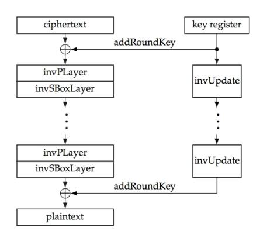

Figure 4.2: A top-level algorithmic description of the decryption routine of PRESENT.

Table 4.4: The inverse PRESENT S-box.

| x    | 0 | 1 | 2 | 3 | 4 | 5 | 6 | 7 | 8 | 9 | А | В | С | D | E | F |
|------|---|---|---|---|---|---|---|---|---|---|---|---|---|---|---|---|
| S[x] | 5 | E | F | 8 | С | 1 | 2 | D | В | 4 | 6 | 3 | 0 | 7 | 9 | А |

# 4.4 Algorithmic description of the PRESENT decryption routine

Figure 4.2 depicts a top-level algorithmic overview of the decryption routine of PRESENT. As one can see it consists of the inverse operations applied in the reverse order of the encryption routine of PRESENT. These inverse operations will be detailed in this Section.

### 4.4.1 addRoundKey

The addRoundKey operation is the same as in the encryption routine. However, for the sake of clarity we describe it again in this section. Given round key  $K_i = \kappa_{63}^i \dots \kappa_0^i$  for  $1 \le i \le 32$  and current STATE  $b_{63} \dots b_0$ , addRoundKey consists of the operation for  $0 \le j \le 63$ ,

$$b_j \to b_j \oplus \kappa_j^i$$
.

### 4.4.2 invSBoxlayer

The S-box used in the decryption routine of PRESENT is the inverse of the 4-bit to 4-bit S-box  $S: \mathbb{F}_2^4 \to \mathbb{F}_2^4$  that was described in Section 4.3.2. The action of the inverse S-box in hexadecimal notation is given by Table 4.4.

For invSBoxLayer the current STATE  $b_6 \dots b_0$  is considered as sixteen 4-bit words  $w_{15} \dots w_0$  where  $w_i = b_{4*i+3} ||b_{4*i+2}||b_{4*i+1}||b_{4*i}$  for  $0 \le i \le 15$  and the output nibble  $S[w_i]$  provides the updated state values in the obvious way.

| i    | 0  | 1  | 2  | 3  | 4  | 5  | 6  | 7  | 8  | 9  | 10 | 11 | 12 | 13 | 14 | 15 |
|------|----|----|----|----|----|----|----|----|----|----|----|----|----|----|----|----|
| P(i) | 0  | 4  | 8  | 12 | 16 | 20 | 24 | 28 | 32 | 36 | 40 | 44 | 48 | 52 | 56 | 60 |
| i    | 16 | 17 | 18 | 19 | 20 | 21 | 22 | 23 | 24 | 25 | 26 | 27 | 28 | 29 | 30 | 31 |
| P(i) | 1  | 5  | 9  | 13 | 17 | 21 | 25 | 29 | 33 | 37 | 41 | 45 | 49 | 53 | 57 | 61 |
| i    | 32 | 33 | 34 | 35 | 36 | 37 | 38 | 39 | 40 | 41 | 42 | 43 | 44 | 45 | 46 | 47 |
| P(i) | 2  | 6  | 10 | 14 | 18 | 22 | 26 | 30 | 34 | 38 | 42 | 46 | 50 | 54 | 58 | 62 |
| i    | 48 | 49 | 50 | 51 | 52 | 53 | 54 | 55 | 56 | 57 | 58 | 59 | 60 | 61 | 62 | 63 |
| P(i) | 3  | 7  | 11 | 15 | 19 | 23 | 27 | 31 | 35 | 39 | 43 | 47 | 51 | 55 | 59 | 63 |

Table 4.5: The inverse permutation layer of PRESENT.

## **4.4.3 invPLayer**

The bit permutation used in the decryption routine of PRESENT is given by Table 4.5. Bit i of STATE is moved to bit position P(i).

# **4.5 The key schedule**

PRESENT can take keys of either 80 or 128 bits. In Section 4.5.1 we describe the version with an 80-bit key and in the following Section 4.5.2 the 128-bit version is described.

## **4.5.1 The key schedule for** PRESENT**-80**

The user-supplied key is stored in a key register K and represented as k79k<sup>78</sup> . . . k0. At round i the 64-bit round key K<sup>i</sup> = κ63κ<sup>62</sup> . . . κ<sup>0</sup> consists of the 64 leftmost bits of the current contents of register K. Thus at round i we have that:

$$K_i = \kappa_{63}\kappa_{62}\ldots\kappa_0 = k_{79}k_{78}\ldots k_{16}.$$

After extracting the round key K<sup>i</sup> , the key register K = k79k<sup>78</sup> . . . k<sup>0</sup> is updated as follows.

- 1. [k79k<sup>78</sup> . . . k1k0] = [k18k<sup>17</sup> . . . k20k19]
- 2. [k79k78k77k76] = S[k79k78k77k76]
- 3. [k19k18k17k16k15] = [k19k18k17k16k15] ⊕ round\_counter

Thus, the key register is rotated by 61 bit positions to the left, the left-most four bits are passed through the PRESENT S-box, and the round\_counter value i is exclusive-ored with bits k19k18k17k16k<sup>15</sup> of K with the least significant bit of round\_counter on the right. Figure 4.3 depicts the key schedule for PRESENT-80 graphically.

### **4.5.2 The key schedule for** PRESENT**-128**

In this Section the key schedule for 128-bit keys is presented. Similar to the 80-bit variant at the beginning the user-supplied key is stored in a key register K and is represented as

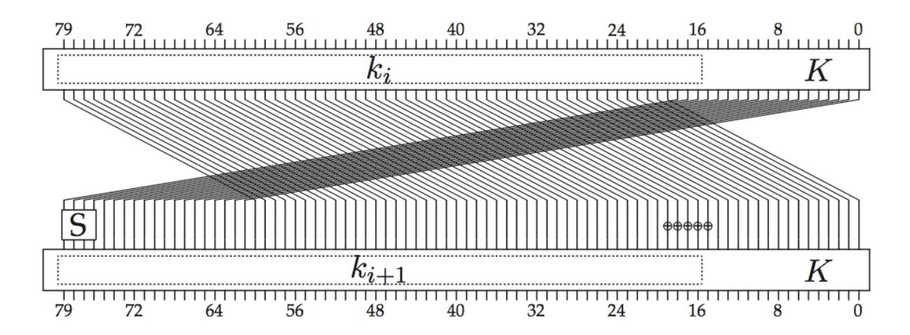

Figure 4.3: The key schedule of PRESENT-80.


Figure 4.4: The key schedule of PRESENT-128.

k127k<sup>126</sup> . . . k0. At round i the 64-bit round key K<sup>i</sup> = κ63κ<sup>62</sup> . . . κ<sup>0</sup> consists of the 64 leftmost bits of the current contents of register K. Thus at round i we have that:

$$K_i = \kappa_{63}\kappa_{62}\ldots\kappa_0 = k_{127}k_{126}\ldots k_{64}.$$

After extracting the round key K<sup>i</sup> , the key register K = k127k<sup>126</sup> . . . k<sup>0</sup> is updated as follows.

- 1. [k127k<sup>126</sup> . . . k1k0] = [k66k<sup>65</sup> . . . k68k67]
- 2. [k127k126k125k124] = S[k127k126k125k124]
- 3. [k123k122k121k120] = S[k123k122k121k120]
- 4. [k66k65k64k63k62] = [k66k65k64k63k62] ⊕ round\_counter

Thus, the key register is rotated by 61 bit positions to the left, the left-most eight bits are passed through two PRESENT S-boxes, and the round\_counter value i is exclusive-ored with bits k66k65k64k63k<sup>62</sup> of K with the least significant bit of round\_counter on the right. Figure 4.4 depicts the key schedule for PRESENT-128 graphically.

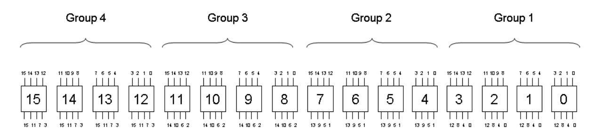

Figure 4.5: The grouping of S-boxes in PRESENT for the purposes of cryptanalysis. The input numbers indicate the S-box origin from the preceeding round and the output numbers indicate the destination S-box in the following round.

# **4.6 Cryptanalytic Aspects**

In [33] we presented the results of a security analysis of PRESENT. In the following our findings are recalled. First differential and linear cryptanalysis are treated in Section 4.6.1. Subsequently structural attacks (Section 4.6.2), algebraic attacks (Section 4.6.3), key schedule attacks (Section 4.6.4), statistical saturation attacks (Section 4.6.5) and combined algebraic and differential attacks (Section 4.6.6) are treated.

# **4.6.1 Differential and linear cryptanalysis**

Differential [26] and linear [149] cryptanalysis are among the most powerful techniques available to the cryptanalyst. In order to gauge the resistance of PRESENT to differential and linear cryptanalysis we provide a lower bound to the number of so-called *active* S-boxes involved in a differential (or linear) characteristic.

We divide the 16 S-boxes into four groups (see Figure 4.5) and by examining the permutation layer one can then establish the following.

- (1) The input bits to an S-box come from four distinct S-boxes of the same group.
- (2) The input bits to a group of four S-boxes come from 16 different S-boxes.
- (3) The four output bits from a particular S-box enter four distinct S-boxes, each of which belongs to a distinct group of S-boxes in the subsequent round.
- (4) The output bits of S-boxes in distinct groups go to distinct S-boxes.

We use these observations in the following to proof Theorem 4.1.

### **Differential cryptanalysis.**

The case of differential cryptanalysis is captured by the following theorem.

**Theorem 4.1.** *Any five-round differential characteristic of* PRESENT *has a minimum of ten active Sboxes.*

*Proof.* Recalling that the rounds are indexed from 1 to 31, consider five consecutive rounds of PRESENT ranging from i − 2 to i + 2 for i ∈ [3 . . . 29]. Let D<sup>j</sup> be the number of active S-boxes in round j. If  $D_j \ge 2$ , for  $i-2 \le j \le i+2$ , then the theorem trivially holds. So let us suppose that one of the  $D_j$  is equal to one. We can distinguish several cases:

- Case  $D_i=1$ . The S-box of PRESENT is such that a difference in a single input bit causes a difference in at least two output bits (cf. the second design criterion). Thus  $D_{i-1}+D_{i+1}\geq 3$ . Using observation 1 above, all active S-boxes of round i-1 belong to the same group, and each of these active S-boxes have only a single bit difference in their output. So according to observation 2 we have that  $D_{i-2}\geq 2D_{i-1}$ . Conversely, according to observation 3, all active S-boxes in round i+1 belong to distinct groups and have only a single bit difference in their input. So according to observation 4 we have that  $D_{i+2}\geq 2D_{i+1}$ . Together this gives  $\sum_{j=i-2}^{i+2} D_j \geq 1+3+2\times 3=10$ .
- Case  $D_{i-1}=1$ . If  $D_i=1$  we can refer to the first case, so let us suppose that  $D_i\geq 2$ . According to observation 3 above, all active S-boxes of round i belong to distinct groups and have only a single bit difference in their input. Thus, according to observation 4,  $D_{i+1}\geq 2D_i\geq 4$ . Further, all active S-boxes in round i+1 have only a single bit difference in their input and they are distributed so that at least two groups of S-boxes contain at least one active S-box. This means that  $D_{i+2}\geq 4$  and we can conclude that  $\sum_{j=i-2}^{i+2} D_j \geq 1+1+2+4+4=12$ .
- Case  $D_{i+1}=1$ . If  $D_i=1$  we can refer to the first case. So let us suppose that  $D_i\geq 2$ . According to observation 1 above, all active S-boxes of round i belong to the same group and each of these active S-boxes has only a single bit difference in their output. Thus, according to observation 2,  $D_{i-1}\geq 2D_i\geq 4$ . Further, all active S-boxes of round i-1 have only a single bit difference in their output, and they are distributed so that at least two groups contain at least two active S-boxes. Thus, we have that  $D_{i-2}\geq 4$  and therefore that  $\sum_{j=i-2}^{i+2} D_j \geq 4+4+2+1+1=12$ .
- Cases  $D_{i+2} = 1$  or  $D_{i-2} = 1$ . The reasoning for these cases is similar to those for the second and third cases.

The theorem follows.  $\Box$

By using Theorem 4.1 any differential characteristic over 25 rounds of PRESENT must have at least  $5 \times 10 = 50$  active S-boxes. The maximum differential probability of a PRESENT S-box is  $2^{-2}$  and so the probability of a single 25-round differential characteristic is bounded by  $2^{-100}$ . Advanced techniques allow the cryptanalyst to remove the outer rounds from a cipher to exploit a shorter characteristic. However, even if we allow an attacker to remove six rounds from the cipher, a situation without precedent, then the data required to exploit the remaining 25-round differential characteristic exceeds the amount available. Thus, the security bounds are more than we require. However, we have practically confirmed that the bound on the number of active S-boxes in Theorem 4.1 is tight.

#### Practical confirmation.

We can identify characteristics that involve ten S-boxes over five rounds. The following two-round iterative characteristic involves two S-boxes per round and holds with probability  $2^{-25}$  over five rounds.

$$\begin{array}{rcl} \Delta & = & 0\,0\,0\,0\,0\,0\,0\,0\,0\,0\,0\,0\,1\,1 \\ \\ & \rightarrow & 0\,0\,0\,0\,0\,0\,0\,0\,0\,0\,0\,0\,0\,1\,1 = \Delta. \end{array}$$

A more complicated characteristic holds with probability  $2^{-21}$  over five rounds.

```
\begin{array}{rcl} \Delta & = & 0\,0\,0\,0\,0\,0\,0\,0\,0\,0\,0\,0\,0\,7\,0\,7\,0 \\ \\ \rightarrow & 0\,0\,0\,0\,0\,0\,0\,0\,0\,0\,0\,0\,0\,0\,0\,0 \\ \\ \rightarrow & 0\,0\,0\,1\,0\,0\,0\,0\,0\,0\,0\,0\,0\,0\,0\,0 \\ \\ \rightarrow & 0\,0\,0\,0\,0\,0\,0\,0\,0\,0\,0\,8\,8\,0\,0\,8\,8 \\ \\ \rightarrow & 0\,0\,3\,3\,0\,0\,0\,0\,0\,3\,3\,0\,0\,3\,3. \end{array}
```

While the probability of this second characteristic is very close to the bound of  $2^{-20}$ , it is non-iterative and of little practical value. Instead we have experimentally confirmed the probability of the two-round iterative differential. In experiments over 100 independent sub-keys using  $2^{23}$  chosen plaintext pairs, the observed probability was as predicted. This seems to suggest that for this particular characteristic there is no accompanying significant differential. However, determining the extent of any differential effect is a complex and time-consuming task even though our preliminary analysis has been encouraging.

#### Linear cryptanalysis.

The case of the linear cryptanalysis of PRESENT is handled by the following theorem where we analyse the best linear approximation to four rounds of PRESENT.

**Theorem 4.2.** Let  $\epsilon_{4R}$  be the maximal bias of a linear approximation of four rounds of PRESENT. Then  $\epsilon_{4R} \leq \frac{1}{27}$ .

*Proof.* Recall that Matsui's piling-up lemma [149] estimates the bias of a linear approximation involving n S-boxes to be

$$2^{n-1} \prod_{i=1}^{n} \epsilon_i,$$

where the values  $\epsilon_i$  are the individual bias of each (independent) S-box. According to the design principles of PRESENT, the bias of all linear approximations is less than  $2^{-2}$  while the bias of any single-bit approximation is less than  $2^{-3}$ . Let  $\epsilon_{4\mathrm{R}}^{(j)}$  denote the bias of a linear approximation over 4 rounds involving j active S-boxes. Now consider the following three cases.

(1) Suppose that each round of a four-round linear approximation has exactly one active S-box. Then the bias of each of the two S-boxes in the middle rounds is at most 1/8 and the overall bias for a four round approximation can be bounded as follows:

$$\epsilon_{4R}^{(4)} \le 2^3 \times (2^{-3})^2 \times (2^{-2})^2 = 2^{-7}.$$

(2) Suppose, instead, that there are exactly five active S-boxes over four rounds. Then by the grouping of S-boxes in Figure 4.5, the active S-boxes over three consecutive rounds cannot form the pattern 1-2-1. For this to happen, the two active S-boxes in the middle round are activated by the same S-box and must therefore belong to two different groups of S-boxes. But if this is the case they couldn't activate only one S-box in the following round. Consequently the number of active S-boxes is either 2-1-1-1 or 1-1-1-2, so that

$$\epsilon_{4R}^{(5)} \le 2^4 \times (2^{-3}) \times (2^{-2})^4 = 2^{-7}.$$

(3) Finally, suppose that there are more than five active S-boxes. Thus

$$\epsilon_{4R}^{(j)} \le 2^{j-1} \times (2^{-2})^j = 2^{-j-1} \le 2^{-7} \text{ for } j > 5.$$

The equality is theoretically attainable for j = 6. This is a strict inequality for all other j's.

The theorem follows.  $\Box$

We can use Theorem 4.2 directly to bound the maximal bias of a 28-round linear approximation by

$$2^6 \times \epsilon_{4R}^7 = 2^6 \times (2^{-7})^7 = 2^{-43}$$
.

Therefore under the assumption that a cryptanalyst need only approximate 28 of the 31 rounds in PRESENT to mount a key recovery attack, linear cryptanalysis of the cipher would require of the order of  $2^{84}$  known plaintext/ciphertexts. Such data requirements exceed the available text.

#### Some advanced differential/linear attacks.

The structure of PRESENT allows us to consider some dedicated forms of attacks. However, none have yielded an attack that requires less text than the lower bound on text requirements for linear cryptanalysis. Among the dedicated attacks we considered was one using palindromic differences, since symmetrical differences are preserved with probability one over the diffusion layer, and some advanced variants of differential-linear attacks [138]. While the attacks seemed promising over a few rounds, they very quickly lost their practical value and are unlikely to be useful in the cryptanalysis of PRESENT. We also established that *truncated differential cryptanalysis* [126, 127] was likely to have limited value, though the following two-round truncated extension holds with probability one.

```
 \Delta = 0000000000000000000000000000000000
```

Even when used to reduce the length of the differential characteristics already identified, the data requirements still remain excessive.

### **Differential attack on reduced-round versions of** PRESENT

Shortly after the publication of PRESENT Wang published her findings about the differential properties of PRESENT in [235]. Wang showed that a 16-round version of PRESENT is susceptible to differential cryptanalysis. In particular 2 <sup>64</sup> chosen plaintexts are required and the time complexity is about 2 <sup>65</sup> memory accesses to obtain the right key with a probability of 0.999999939. Furthermore 2 <sup>32</sup> 6-bit counters and 2 <sup>24</sup> hash cells are the memory requirements. One drawback of the attack is that it requires a complete codebook, *i.e.* all available 2 <sup>64</sup> plaintexts and their corresponding ciphertexts are required. If all plaintexts and their corresponding ciphertexts are known to the attacker, the key is not required anymore, because he can simply look up the plaintext to a given ciphertext. Furthermore, the attack can only cryptananlyze 16 out of 31 rounds, hence there is still a large security margin. However, these findings provide an interesting starting point for further studies of the differential properties of PRESENT.

# **4.6.2 Structural attacks**

Structural attacks such as *integral attacks* [125] and *bottleneck attacks* [80] are well-suited to the analysis of AES-like ciphers, such as the AES itself [54], SQUARE [53] or SHARK [194]. Such ciphers have strong word-like structures, where the words are typically bytes. However, the design of PRESENT is almost exclusively bitwise, and while the permutation operation is somewhat regular, the development and propagation of word-wise structures are disrupted by the bitwise operations used in the cipher.

In [244] a bit-pattern based integral attack is proposed and the authors analyze reduced round variants of PRESENT with 5, 6 and 7 rounds. The authors highlight that a 5 round attack only requires 80 chosen plaintexts, but the 7 round attack already requires 2 24.3 chosen plaintexts and has a time complexity of 2 <sup>100</sup>.<sup>1</sup> and a data complexity of 2 <sup>77</sup> bytes. Furthermore the authors state that integral attacks "can not be extended beyond a certain point" due to increasing time complexity with increasing number of rounds. Hence, integral attacks do not seem to be a threat for PRESENT.

### **4.6.3 Algebraic attacks**

Algebraic attacks have had better success when applied to stream ciphers than block ciphers. Nevertheless, the simple structure of PRESENT means that they merit serious study. The PRESENT S-box is described by 21 quadratic equations in the eight input/output-bit variables over GF(2). This is not surprising since it is well-known that any four bit S-box can be described by at least 21 such equations. The entire cipher can then be described by e = n × 21 quadratic equations in v = n × 8 variables, where n is the number of S-boxes in the encryption algorithm and the key schedule. For PRESENT we have n = (31×16)+31 thus the entire system consists of 11, 067 quadratic equations in 4, 216 variables.

The general problem of solving a system of multivariate quadratic equations is NP-hard. However the systems derived for block ciphers are very sparse since they are composed of n small systems connected by simple linear layers. Nevertheless, it is unclear whether this fact can be exploited in a so-called *algebraic attack*. Some specialised techniques such as XL [50] and XSL [51] have been proposed, though flaws in both techniques have been discovered [44, 60]. Instead the only practical results on the algebraic cryptanalysis of block ciphers have been obtained by applying the Buchberger [29] and F4 [69] algorithms within Magma [146]. Simulations on small-scale versions of the AES showed that for all but the very smallest SP-networks one quickly encounters difficulties in both time and memory complexity [45]. The same applies to PRESENT as we will show in the next section.

### **Practical confirmation.**

We ran simulations on small-scale versions using the F<sup>4</sup> algorithm in Magma. When there is a single S-box, *i.e.* a very small block size of four bits, then Magma can solve the resulting system of equations over many rounds. However, by increasing the block size and adding S-boxes, along with an appropriate version of the linear diffusion layer, the system of equations soon becomes too large. Even when considering a system consisting of seven S-boxes, *i.e.* a block size of 28 bits, we were unable to get a solution in a reasonable time to a two-round version of the reduced cipher. Our analysis suggests that algebraic attacks are unlikely to pose a threat to PRESENT.

# **4.6.4 Key schedule attacks**

Since there are no established guidelines to the design of key schedules, there is both a wide variety of designs and a wide variety of schedule-specific attacks. The most effective attacks come under the general heading of *related-key attacks* [20] and *slide attacks* [29], and both rely on the build-up of identifiable relationships between different sets of subkeys. To counter this threat, we use a round-dependent counter so that subkey sets cannot easily be "slid", and we use a non-linear operation to mix the contents of the key register K. In particular,

- all bits in the key register are a non-linear function of the 80-bit user-supplied key by round 21,
- that each bit in the key register after round 21 depends on at least four of the usersupplied key bits, and
- by the time we arrive at deriving K32, six bits are degree two expressions of the 80 usersupplied key bits, 24 bits are of degree three, while the remaining bits are degree six or degree nine function of the user-supplied key bits.

We believe these properties to be sufficient to resist key schedule-based attacks.

## **4.6.5 Statistical saturation attacks**

Recently, a new class of statistical saturation attacks has been proposed by Collard and Standaerd [47] and PRESENT has been chosen to demonstrate the attack. It exploits properties of the permutation layer, in particular the fact that only 8 out of 16 bits of the output of S-boxes 5, 6, 9 and 10 are directed to other S-boxes. However, the authors can only break 14 rounds out of the 31 rounds of PRESENT and it requires 2 <sup>34</sup> plaintext-ciphertext pairs.<sup>1</sup> Since this attack has been applied to a reduced version of PRESENT with less than half of its rounds, the remaining security margin is still large. Nevertheless, this is an interesting new type of attack and it will be interesting to see it applied to other block ciphers too.

<sup>1</sup>On the webpage of one of the authors [46] it is stated however that 15 rounds of PRESENT can be broken with 2 <sup>35</sup>.<sup>6</sup> plaintext-ciphertext pairs.

Table 4.6: The reduced permutation layer P16(x).

| i      | 0 | 1 | 2 | 3  | 4 | 5 | 6 | 7  | 8 | 9 | 10 | 11 | 12 | 13 | 14 | 15 |
|--------|---|---|---|----|---|---|---|----|---|---|----|----|----|----|----|----|
| P16(i) | 0 | 4 | 8 | 12 | 1 | 5 | 9 | 13 | 2 | 6 | 10 | 14 | 3  | 7  | 11 | 15 |

## **4.6.6 Algebraic differential attacks**

In [2] three attacks are proposed that combine algebraic and differential techniques. The authors performed experimental results for two of three proposed attacks on reduced round variants of PRESENT-80 with 16 (PRESENT-80-16) rounds and on PRESENT-128 with 17 (PRESENT-128-17), 18 (PRESENT-128-18) and 19 (PRESENT-128-19) rounds. However, they also state that such an attack on PRESENT-128-19 would require 2 <sup>113</sup> CPU cycles and hence is impractical.

# **4.7 Further observations**

Gregor Leander made an observation that promises great optimization potential for software implementations [139]. Figure 4.6(a) depicts two rounds of PRESENT and it can be seen that the 16 bit output of one set of four adjacent S-boxes is exactly mapped to the 16 bit input of four S-boxes in the next round. Leander proposed to re-arrange the S-boxes as it is depicted in Figure 4.6(b). As it becomes clear now, the modified permutation layer P 0 (x) can be seen as a concatenation of four instances of a permutation layer P16(x) that each permutes a 16 bit chunk of the state, *i.e.*

$$P'(x_3||x_2||x_1||x_0) = P_{16}(x_3)||P_{16}(x_2)||P_{16}(x_1)||P_{16}(x_0)$$

where x<sup>i</sup> = b16·i+15||b16·i+14|| . . . ||b16·<sup>i</sup> for 0 ≤ i ≤ 3. The updated state is not in the same order as the original permutation layer P(x) would have transformed it, so the roundkey has to be re-ordered nibble-wise. If we apply P 0 (x) again to the state we need another 64 bit permutation P <sup>00</sup>(x) in order to guarantee that P(P(x)) = P <sup>00</sup>(P 0 (P 0 (x))). Interestingly it holds that P <sup>00</sup> = P −1 , hence

$$P(P(x)) = P^{-1}(P'(P'(x))).$$

It is also possible to write the reduced P-layer in the following way:

$$P_{16}(i) = \begin{cases} i \cdot 4 \mod 15, & i \in \{0, \dots, 14\} \\ 15, & i = 15. \end{cases}$$

Please note that P16(x) is an involution, *i.e.* P16(x) = P −1 <sup>16</sup> (x). As we will see in Section 5.4.5 exploitation of this observation will lead to an optimized software implementation of the decryption routine.

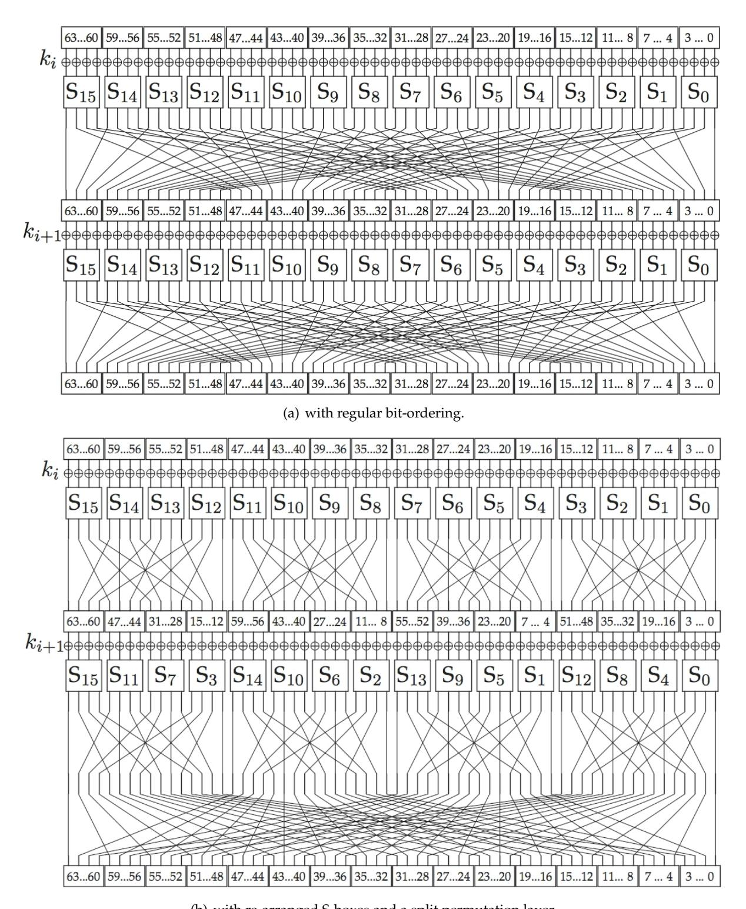

(b) with re-arranged S-boxes and a split permutation layer.

Figure 4.6: Two rounds of PRESENT

# **5 Implementation Results of** PRESENT

In Chapter 4 the block cipher PRESENT was introduced. For different application scenarios there exist different demands on the implementation and the optimization goals. In this chapter we consider a wide variety of different target platforms ranging from highly-optimized ASICs, over more flexible but still efficient low-cost FPGAs to hardware-software co-design approaches and flexible software implementations for 4-, 8-, 16- and 32-bit processors. We start with three ASIC implementations of PRESENT in Section 5.1, each of them is highly optimized for a specific scenario. FPGA implementations provide more flexible solutions than ASICs while exploiting the hardware efficiency of PRESENT. We present implementation figures of PRESENT for low-cost FPGAs in Section 5.2. Then we discuss implementation results that use hardware-software co-design approaches in Section 5.3. Software implementations for a wide range of different target platforms are presented in Section 5.4. Finally, this chapter is concluded in Section 5.5.

# **5.1 ASIC Implementations**

In this Section we first describe a serialized architecture that is minimized in terms of area and power consumption in Section 5.1.1. Subsequently, we present a round-based architecture that is optimized in terms of area, speed, and energy in Section 5.1.2. For the sake of completeness, also a parallelized architecture that uses pipelining technique and generates a high throughput is presented in Section 5.1.3. In order to decrease the area requirements even further, all architectures can perform encryption only. This is sufficient for encryption and decryption of data when the block cipher is operated for example in counter mode.

Finally, we evaluate our implementation results with respect to the three scenarios low cost passive smart devices, low cost active smart devices, and high end smart devices in Section 5.1.4. We considered the following optimization goals for the three scenarios: low cost and passive smart devices should be optimized for area and power constraints and low cost and active smart devices for area, energy, and time constraints. Note that in our methodology high end devices are always contact smart cards and hence should be optimized for time and energy constraints. Therefore we do not distinguish between passive and active high end smart devices.

### **5.1.1 Serialized ASIC implementation**

As was already pointed out in Section 4.3.3 the permutation layer of PRESENT can be written as:

$$P(i) = \begin{cases} i \cdot 16 \mod 63, & i \in \{0, \dots, 62\} \\ 63, & i = 63. \end{cases}$$

An interesting property of P is the fact that three consecutive application of P(i) lead to the original bit position i, *i.e.* P(P(P(i))) = i. For bits 0 and 63 this is an obvious observation

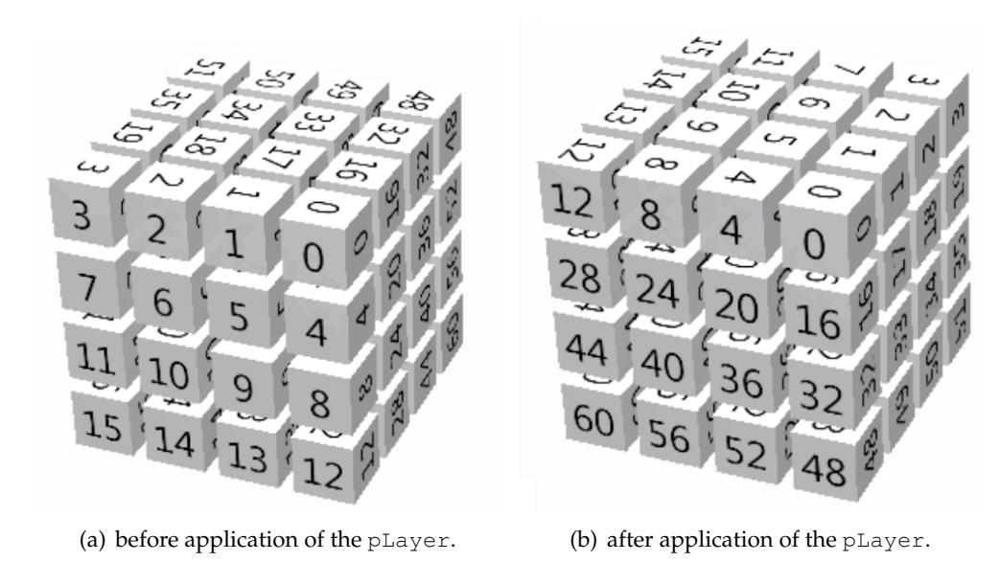

Figure 5.1: Bit positions of the PRESENT state arranged in a 4 × 4 × 4 bit cube.

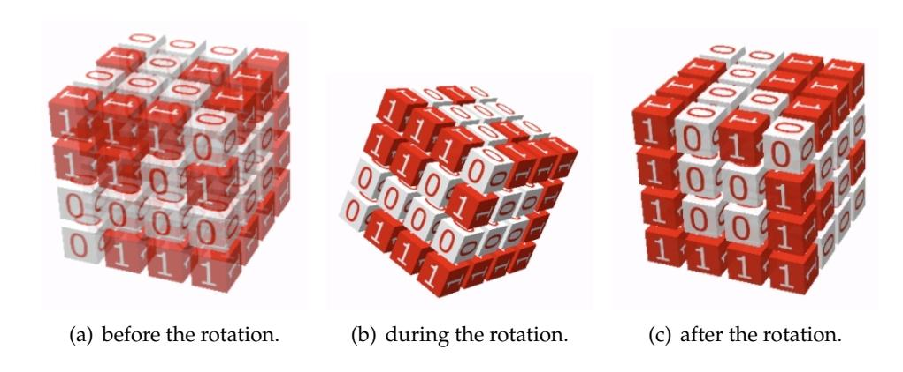

Figure 5.2: Exemplary 4 × 4 × 4 bit state cube.

and for the remaining bits this follows from the fact that P(P(P(i))) = (((i · 16) · 16) · 16) mod 63 = i · 4096 mod 63 = i · 1 mod 63.

Consider that we arrange the state of PRESENT in a cube with 4 bits in each dimension, *i.e.* a 4 × 4 × 4-bits cube, and that we number the bits according to Figure 5.1(a). After applying the pLayer permutation to the state cube the bit positions change (see Figure 5.1(b)). If one looks carefully it can be seen that the pLayer acts as a rotation of the cube around an axis that runs from the upper right corner at the front to the bottom left corner in the back. This virtual axis would touch bits 0, 21, 42 and 63 (before rotation). An exemplary state cube is depicted in Figure 5.2 before (Figure 5.2(a)), during (Figure 5.2(b)) and after (Figure 5.2(c)) a rotation.

However, it is not an easy task to implement such an architecture efficiently in hardware. The problem of rotating a 4 × 4 × 4-bits cube has been treated by Pfister/Kaufman [180] in the context of real-time volume rendering. Unfortunately, the selection of single bits in hardware requires a MUX (2.33 GE per bit) and is hence rather expensive in terms of area. Therefore we dropped this idea and used the following architecture instead.

### **Architecture**

A serialized architecture of PRESENT-80 is depicted in Figure 5.3. As one can see it has a 4 bit width datapath, *i.e.* only 4 bits are processed in one clock cycle. Consequently it takes 16 clock cycles to XOR all 16 chunks of the state with the according chunk of the round key and subsequently process the result by the S-box. Another clock cycle is required to perform the pLayer on the whole state. This is due to the fact that the pLayer was designed to provide a good avalanche effect, which in turn prohibits efficient serialization. Since the S-box is not occupied by the datapath in this clock cycle, the key schedule can share the same hardware resources and hence uses the same S-box. This saves 28 GE for a separate S-box at the cost of a new MUX (10 GE). Also the remaining operations of the key schedule are performed in this clock cycle, while in the previous 16 clock cycles only the key state was shifted. Since the key state consists of 20 4-bit chunks, but was only shifted 16 times, the 61 bit left rotation has to be adapted. Contrary to the round-based implementation, now an FSM is required to control the control signals. Furthermore, additionally to the 5-bit round counter another 4-bit counter is required to keep track of the chunks within one round.

The serialized architecture requires 17 clock cycles to process one round and since it has a 4-bit width I/O interface 20 clock cycles are required to initialize the circuit. Since the final round does not include the pLayer it requires only 16 clock cycles during which the result is also output and new data and key can be read in.<sup>1</sup> The done signal indicates if the output is valid. In total a complete PRESENT-80 encryption of a 64-bit message requires 31 · 17 + 16 + 4 = 547 clock cycles. An encryption with a serialized PRESENT-128 implementation requires 31 · 17 + 16 + 16 = 559 clock cycles.

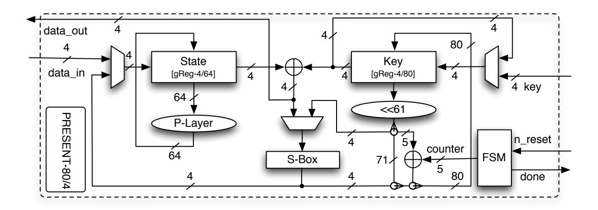

Figure 5.3: Datapath of the serialized PRESENT architecture.

### **5.1.2 Round-based ASIC implementation**

This architecture represents the direct implementation of the PRESENT top-level algorithm description in Figure 4.1, *i.e.* one round of PRESENT is performed in one clock cycle. The focus lies on a compact solution, but at the same time with an eye on the time-area product. To save

<sup>1</sup>Note that it requires 4 additional clock cycles to read in the 80 bit key and 20 additional clock cycles for the 128-bit key, respectively.

power and area a loop based approach is chosen. The balance between the 64-bit datapath and the used operations per clock cycle leads to a good time-area product. Due to the reuse of several building blocks and the round structure, the design has a high energy efficiency as well. The architecture uses only one substitution and permutation layer. So the datapath consists of one 64-bit XOR, 16 S-boxes in parallel, and one P-Layer. To store the internal state and the key, a 64-bit state register and an 80-bit key register are required. The key scheduling consists of a key register, a 5-bit XOR, one S-box and a 61-bit left rotation, which is only wiring. Figure 5.4 depicts the architecture of the round based approach for PRESENT. At first the key and the plaintext are stored into the respective register. After each round the internal state is stored into the state register and the updated key state in the key register. After 31 rounds the state is finally processed via XOR with the last round key, hence a 5-bit counter is required. This architecture does not require an FSM.

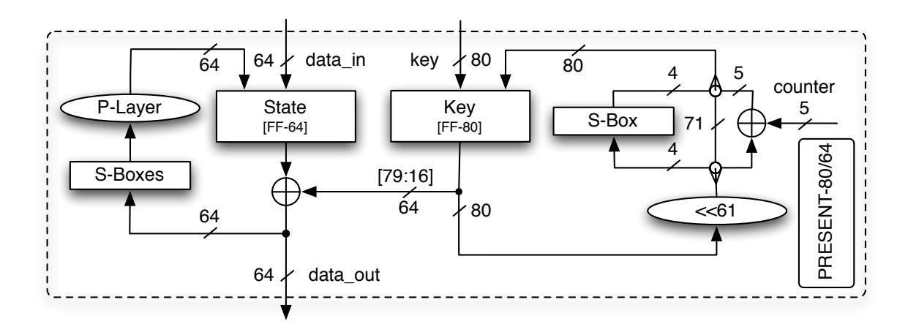

Figure 5.4: Datapath of the round-based PRESENT-80 architecture.

### 5.1.3 Parallelized ASIC implementation

For the sake of completeness we also briefly describe a parallelized pipelined architecture of PRESENT-80 as described in [199], though it is not lightweight. As introduced in Section 2.1 for a parallel design the algorithm is "unrolled", *i.e.* each of the 31 rounds has its own datapath in order to achieve a higher throughput. The required round key is generated by taking the right bits from the 80-bit key and if necessary pass them through an S-box or add a roundcounter value. All subkeys are available in parallel and no register is needed to store the key. Figure 5.5 shows the datapath of the pipelined architecture. It consists of 32 XORs, 496 S-boxes, and 31 P-Layer for the datapath. The key scheduling consists of 31 S-boxes and the round counter XOR is hard wired, *i.e.* the XOR addition is realized by inverters. First the given 64-bit plaintext and the first round key are XORed. The result is split up into 16 4-bit blocks. Each block is processed by a 4-bit S-box in parallel. The 64-bit P-Layer transposes the bits at the end of each of the 31 rounds. Note that the 32th round consists only of the XOR operation.

This straight forward approach does not achieve a high maximum operating frequency, because the input signal has to propagate through all XOR and S-box gates and hence the critical path is obviously too long. The more gates belong to the path the higher is the resulting capacitance to be switched. So the time period for a switching event is stretched. To shorten the

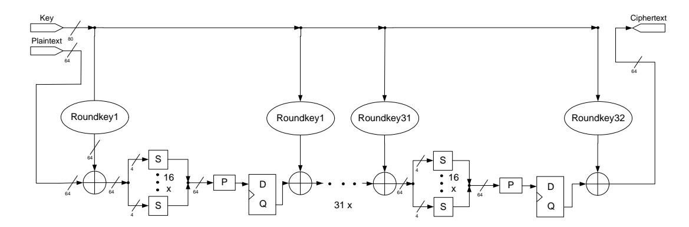

Figure 5.5: Datapath of the pipelined parallelized PRESENT-80 architecture, source [199].

critical path, flip-flops as pipeline stages were installed after each round, *i.e.* after each P-Layer (see Figure 5.5). On the one hand this increases the chip area and power consumption further, but on the other hand the maximum frequency can be raised significantly (recall that for this architecture the main design goal is high throughput and not low area requirements).

The pipelined parallelized implementation of PRESENT-80 requires 27, 028 GE and once the pipeline is completely filled (after 31 clock cycles) it can encrypt a message block of 64 bits within one clock cycle. This translates to a delay of 31 cycles and a throughput of 6.4 Mbps at a frequency of 100 KHz. More details about this architecture can be found in [199].

## **5.1.4 Discussion of the implementation results**

Table 5.1 summarizes the implementation results and compares them to other block and stream cipher implementations after synthesis.<sup>2</sup> The upper part shows implementation results of serialized architectures with round-based architectures in its middle part. For the sake of completeness, also figures of a parallelized PRESENT-80 implementation have been included in the lower part. As one can see a serialized implementation of PRESENT-80 requires 1, 075 GE. To the best of our knowledge this is the smallest implementation of a cryptographic algorithm with a moderate security level, *i.e.* 80 bit. The figures for a serialized PRESENT-128 implementation are extrapolated by adding the area for storing 48 additional key bits (288 GE) and a second S-box (28 GE). Due to the serialization it takes 547 clock cycles to encrypt one message block, which leads to a rather small throughput and, consequently, a small hardware efficiency. The implementation figures of DES, DESL, DESX and DESXL have been copied from Section 3.4. Compared to the implementation figures of PRESENT all DES variants are inferior. For comparison reason also figures for two implementations of the AES [73, 96] and the stream ciphers TRIVIUM and GRAIN [89] are included. The AES implementation of Feldhofer *et al.* [73] is considered to be the benchmark of all lightweight implementations though the implementation of Hämäläinen *et al.* is around 10% smaller and more than 6 *times* faster than the first one. However, compared to our serialized PRESENT-80 and PRESENT-128 implementation, it is still 2 − 3 *times* larger.

It is noteworthy that also the implementation results of both eSTREAM hardware profile finalists TRIVIUM and GRAIN require more area than both serialized PRESENT implementations.

<sup>2</sup>The power figure for SEA and ICEBERG have been derived by scaling down the energy consumption linearly from the figure stated in [144] and dividing by 1.2V, the core voltage of the used technology.

Table 5.1: Hardware implementation results of PRESENT-80 and PRESENT-128 with an encryption only datapath for the UMCL18G212T3 standard-cell library. All figures are obtained at or calculated for a frequency of 100KHz. Please be aware that power figures can not be compared adequately between different technologies.

| Algorithm     | key<br>size | block<br>size | datapath<br>width        | cycles /<br>block         | T'put<br>[Kbps] | Tech.<br>[µm] | Area<br>[GE] | Eff.<br>[bps/GE] | Cur.<br>[µA] |
|---------------|-------------|---------------|--------------------------|---------------------------|-----------------|---------------|--------------|------------------|--------------|
|               |             |               |                          | Serialized Architecture   |                 |               |              |                  |              |
| PRESENT       | 80          | 64            | 4                        | 547                       | 11.7            | 0.18          | 1,075        | 10.89            | 1.4          |
| PRESENT       | 128         | 64            | 4                        | 559                       | 11.45           | 0.18          | 1,391        | 8.23             | —            |
| DES           | 56          | 64            | 4                        | 144                       | 44.44           | 0.18          | 2,309        | 19.25            | 1.19         |
| DESL          | 56          | 64            | 4                        | 144                       | 44.44           | 0.18          | 1,848        | 24.05            | 0.89         |
| DESX          | 184         | 64            | 4                        | 144                       | 44.44           | 0.18          | 2,629        | 16.9             | —            |
| DESXL         | 184         | 64            | 4                        | 144                       | 44.44           | 0.18          | 2,168        | 20.5             | —            |
| AES [73]      | 128         | 128           | 8                        | 1,032                     | 12.4            | 0.35          | 3400         | 3.65             | 3.0          |
| AES [96]      | 128         | 128           | 8                        | 160                       | 80              | 0.13          | 3,100        | 25.81            | —            |
| Trivium [89]  | 80          | SC            | 1                        | 1                         | 100             | 0.13          | 2,599        | 38.48            | 4.67         |
| Grain [89]    | 80          | SC            | 1                        | 1                         | 100             | 0.13          | 1,294        | 77.28            | 2.75         |
|               |             |               | Round-based Architecture |                           |                 |               |              |                  |              |
| PRESENT       | 80          | 64            | 64                       | 32                        | 200             | 0.18          | 1,570        | 127.4            | 2.78         |
| PRESENT       | 128         | 64            | 64                       | 32                        | 200             | 0.18          | 1,884        | 106.2            | 3.67         |
| SEA [144]     | 96          | 96            | 96                       | 93                        | 103.23          | 0.13          | 3,758        | 27.47            | 1.7          |
| ICEBERG [144] | 128         | 64            | 64                       | 16                        | 400             | 0.13          | 7,732        | 51.73            | 3.19         |
| HIGHT [107]   | 128         | 64            | 64                       | 34                        | 188.2           | 0.25          | 3,048        | 61.75            | –            |
|               |             |               |                          | Parallelized Architecture |                 |               |              |                  |              |
| PRESENT [199] | 80          | 64            | 64                       | 1                         | 6,400           | 0.18          | 27,028       | 236.79           | 38.3         |

Due to the high throughput achievable by both stream ciphers also the hardware efficiency is better than for a serialized PRESENT implementation. However, for a minimal area footprint this assumption does not hold anymore. Furthermore, if attention is turned to the roundbased implementation results of PRESENT-80, it becomes visible that for 1, 570 GE a hardware efficiency of 127.4 bits per second per GE is achievable, which is the highest among all ciphers in this table. Please note furthermore that stream ciphers require a significant amount of time for initialization (e.g. 321 clock cycles for GRAIN and 1, 333 for TRIVIUM) prior to first usage. For comparison reasons, figures for round-based implementations of SEA, ICE-BERG [144] and HIGHT [107] have been included. All three block ciphers require between 3, 048 GE and 7, 732 GE and also the hardware efficiency is worse than for both PRESENT-80 and PRESENT-128 implementations. ICEBERG's high throughput (400 Kbps) is nullified by its large area requirements of 7, 732 GE.

# **5.2 FPGA implementation results**

In this section we describe an FPGA implementation of a stand-alone PRESENT component. We implemented an encryption and a decryption only core and for each we investigated two different design strategies (boolean representation and look-up tables) for the S-box component. First we describe our target platform and the tool-chain in Section 5.2.1. Then we describe our architectures in Section 5.2.2 and finally present our results in Section 5.2.3.

## **5.2.1 Target platform and designflow**

We implemented both encryption and decryption functions in *VHDL* for the *Spartan-III XC3S400* (Package FG456 with speed grade -5) FPGA core from *Xilinx* [242]. We used *Mentor Graphics ModelSimXE 6.2g* for simulation purposes and *Xilinx ISE v10.1.03 WebPACK* for design synthesis.

## **5.2.2 Architecture of the round-based FPGA implementation**

As can be seen from Fig. 5.6(a) our PRESENT-80 and PRESENT-128 entities have 212 and 270 I/O pins, respectively. We did not implement any I/O logic such as a UART interface in order to achieve implementation figures for the plain PRESENT core. The interface usually strongly depends on the target application, hence we deliberately use additional I/O pins for a parallel key input. There are two reasons why we abandon the options of hard-coding the key inside the cipher module or implementing serial interface to supply the key to the algorithm. First, we want to reduce the control logic overhead to a minimum in order to present performing results of the plain encryption core. Secondly, we anticipate that the majority of applications most likely would use PRESENT as an independent cipher module within a larger top entity, so that the key can be supplied externally. From that perspective our implementation choice offers the best flexibility.

Unfortunately, the low-cost *Spartan-III XC3S200* FPGA has no package with more than 173 I/O pins [242]. Therefore we decided to move to the more advanced *Spartan-III XC3S400* which features a package (FG456) with 264 I/O pins. Larger Spartan FPGAs such as the *Spartan-III XC3S1000* feature even more I/O pins but also contain more logic resources. Since in this Thesis we focus on lightweight and low-cost implementations of PRESENT we chose the smallest

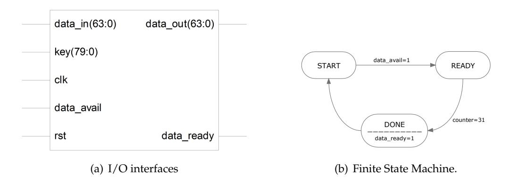

Figure 5.6: I/O interfaces and FSM of the PRESENT-80 FPGA implementation.

possible device *Spartan-III XC3S400* which is only slightly larger (and hence more expensive) than the *Spartan-III XC3S200*.

The entire cipher control logic was implemented as a 3-state finite-state machine (see Fig.5.6(b)). After reset the first round begins and the two inputs of the algorithm, plaintext and user-supplied key are read from the corresponding registers. The 64- and 80-bit multiplexers select the appropriate input depending on the value of the round counter, *i.e.* initial values for plaintext and key are valid only in round 1. Both 64- and 80-bit D-flip-flops are used for round synchronization between the round function output and the output of the key schedule. Part of the round key is then XOR-ed with the plaintext. Key schedule and round function run in parallel for each round  $1 \le i \le 32$ .

Implementation of both permutation and bit-rotation is very straightforward in hardware, which is a simple bit-wiring. The highly non-linear PRESENT S-box function is the core of the cryptographic strength of the cipher, and is the only design component that takes a lion's share of both computational power and area. Two implementation options for the PRESENT S-box were taken in consideration in order to optimize the efficiency of the cipher. Using Look-Up Tables (LUTs) for bit substitution is the most obvious one and was implemented first. An alternative considered next was determining a minimal non-linear Boolean function

$$S_i: \mathbb{F}_2^4 \mapsto \mathbb{F}_2$$

 $(x_3x_2x_1x_0) \mapsto y_i, \quad 0 \le i \le 3$

for each bit output of the PRESENT S-box using only standard gates, *i.e.* AND, OR and NOT. The tool espresso [170] was used to produce such minimal Boolean functions for the PRESENT S-box.

Interestingly, in some cases this modification yielded a performance boost in terms of max. frequency/throughput and area requirements measured in occupied slices. E.g., for PRESENT-80 with espresso-optimized S-box ISE showed significant decrease in critical path delay due to routing as compared to the S-box implementation with LUTs. From our results we conclude that espresso and its minimal Boolean functions can yield better resources utilization and may in some cases outpace ISE's internal synthesis mechanisms.

The decryption unit of PRESENT is very similar to the encryption. The first round of decryption requires the last round key of the encryption routine. For optimal performance we assume that this last round key is pre-computed and available at the beginning of the decryption routine. The assumption is fair since we have to perform this step only once for multiple cipher texts.

| Key<br>size | enc/<br>dec | S-box<br>(espresso/<br>LUT) | LUTs | FFs | Total<br>equiv.<br>Slices | Max.<br>freq<br>(MHz) | CLK<br>cycles | Throughput<br>(Mbps) | Eff.<br>(Mbps/<br>Slices) |
|-------------|-------------|-----------------------------|------|-----|---------------------------|-----------------------|---------------|----------------------|---------------------------|
|             | enc         | espresso                    | 253  | 152 | 176                       | 258                   | 32            | 516                  | 2.93                      |
| 80          |             | LUT                         | 350  | 154 | 202                       | 240                   | 32            | 480                  | 2.38                      |
|             | dec         | espresso                    | 328  | 154 | 197                       | 240                   | 32            | 480                  | 2.44                      |
|             |             | LUT                         | 328  | 154 | 197                       | 238                   | 32            | 476                  | 2.42                      |
|             | enc         | espresso                    | 299  | 200 | 202                       | 250                   | 32            | 500                  | 2.48                      |
| 128         |             | LUT                         | 300  | 200 | 202                       | 254                   | 32            | 508                  | 2.51                      |
|             | dec         | espresso                    | 366  | 202 | 221                       | 239                   | 32            | 478                  | 2.16                      |
|             |             | LUT                         | 366  | 202 | 221                       | 239                   | 32            | 478                  | 2.16                      |

Table 5.2: Performance results for encryption and decryption of one data block with PRESENT for different key sizes and S-box implementation techniques on a Spartan-III XC3S400 FPGA.

# **5.2.3 Implementation results**

Table 5.2 summarizes the performance figures for our implementations. All figures presented are from Post Place & Route Timing Report. To achieve optimal results both Synthesis and Place & Route Effort properties were set to High and Place & Route Extra Effort was set to Continue on Impossible.

Numerous FPGA implementations of AES block cipher exist. Some of them are tuned to maximize data throughput, whereas others were designed for optimization of area requirements and power consumption. There are also block ciphers that were designed specifically for hardware (SEA [145]) or even FPGA (ICEBERG [211]) applications. We compare our PRESENT implementation with different existent FPGA implementations of those ciphers. Given the wide range of different features and logic slices provided by different FPGAs it is hard to make a fair comparison, so additional information on implementation platform and boundary conditions is provided.

Table 5.3 shows that in the field of cryptographic implementations for low-cost FPGA cores, PRESENT offers both the smallest area requirement and highest hardware efficiency compared to AES as well as ICEBERG and SEA implementations. Note, that our implementation does not require any Block RAM units while most AES implementations do. For this matter we show the total equivalent slice count for each implementation to highlight the real area requirements.

The speed grade of the Spartan devices has significant impact on the max. frequency of the cipher. Switching from speed grade 4 to speed grade 5 gave us up to 20% max. frequency increase. There are also different packages for each device platform with varying pinout count. Those facts make a fair inter-platform comparison even harder. Hence, for comparison's sake we picked only AES implementations on Spartan devices with speed grade 5 and above. For ICEBERG and SEA there are only Virtex-II implementations available. We also chose PRESENT version with 128-bit key size for the same reason even though the implementation figures for PRESENT-80 are more encouraging.

| Cipher           | Block<br>Size | FPGA device            | Max.<br>freq.<br>(MHz) | T'put<br>(Mbps) | Total<br>equiv.<br>Slices | Eff.<br>(Mbps/<br>Slice) |
|------------------|---------------|------------------------|------------------------|-----------------|---------------------------|--------------------------|
| PRESENT-128      | 64            | Spartan-III XCS400-5   | 254                    | 508             | 202                       | 2.51                     |
| PRESENT-80, [94] | 64            | Spartan-IIIE XC3S500   | -                      | -               | 271                       | -                        |
| ICEBERG, [211]   | 64            | Virtex-II              | -                      | 1016            | 631                       | 1.61                     |
| SEA126,7, [145]  | 126           | Virtex-II XC2V4000     | 145                    | 156             | 424                       | 0.368                    |
| AES, [43]        | 128           | Spartan-II XC2S30-6    | 60                     | 166             | 522                       | 0.32                     |
| AES, [88]        | 128           | Spartan-III XC3S2000-5 | 196.1                  | 25,107          | 17,425                    | 1.44                     |
| AES, [88]        | 128           | Spartan-II XC2S15-6    | 67                     | 2.2             | 264                       | 0.01                     |
| AES, [200]       | 128           | Spartan-II XC2V40-6    | 123                    | 358             | 1214                      | 0.29                     |
| AES, [37]        | 128           | Spartan-III            | 150                    | 1700            | 1800                      | 0.9                      |

Table 5.3: Performance comparison of FPGA implementations of cryptographic algorithms.

# **5.3 Hardware/Software co-design implementation results**

Embedded systems offer a wide range of different implementation opportunities. On the extremes there are plain hardware and plain software implementations. In practice however often hardware software co-design strategies are applied, which we will address in this section. We start with a co-processor ASIC implementation in Section 5.3.1 that was published by Rolfes *et al.* in [199]. Subsequently, in Section 5.3.2 we discuss a co-processor FPGA implementation of Guo *et al.* [94] and finally we treat Instruction Set Extensions for bit-sliced software implementations that have been published by Grabher *et al.* [91] in Section 5.3.3.

## **5.3.1 ASIC based co-processor implementation results**

To equip a smart device with cryptographic functions there are different ways for implementation: software or hardware. The first solution requires RAM to store the program and inhibits the microcontroller while performing cryptographic algorithms. The second possibility is to implement the crypto part straight into the microcontroller core. A more flexible way is to construct a cryptographic co-processor that is controlled by the main core. It uses a memory-like interface for communication. Using the round based architecture of PRESENT-128, we present in this section a cryptographic co-processor with encryption and decryption capabilities.

## **Architecture**

To get a compact and also fast solution we use the round based architecture presented in Section 5.1.2 with a modified finite state machine and added further multiplexers. Now the plaintext is loaded in 32-bit blocks. As far as we know this is the maximum bit width of microcontrollers for smart devices. The co-processor is controlled by write and read enable signals. The address signal selects the different bit blocks and encryption or decryption mode. Figure 5.7 illustrates the interfaces and the units.

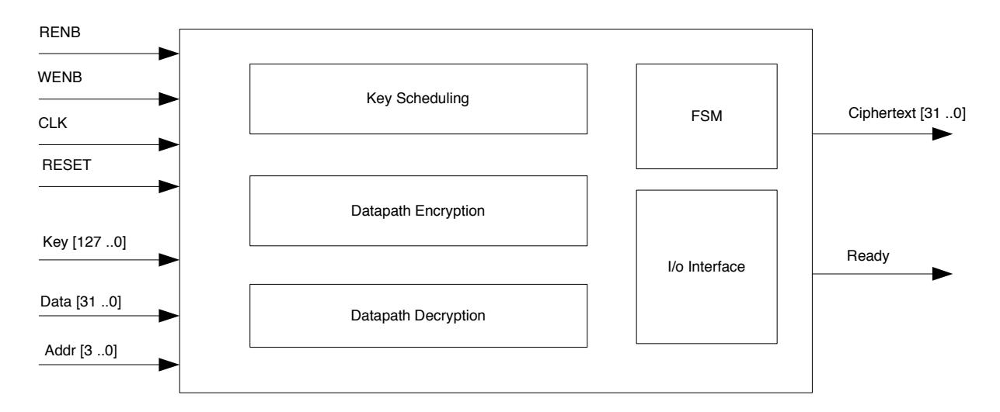

Figure 5.7: Block diagram of PRESENT-128 co-processor with 32-bit interface.

### **Implementation results**

The best choice is to implement a round based architecture with a 32-bit I/O interface. In the literature several AES implementations can be found that are up to the mark. We compare the PRESENT implementations to Pramstaller *et al.* [186] and Satoh *et al.* [201]. Also a commercial solution by Cast Inc. [39] is listed. Table 5.4 shows the results for the different implementations. As there are many smart cards equipped with 8-bit microcontrollers we list the results for an 8-bit interface, too. The PRESENT co-processor is much more compact than the other implementations and also needs less clock cycles to compute the ciphertext.

| Cipher                             | Datapath<br>[Bit] | Tech.<br>[µm]        | max Freq.<br>[MHz] | Area<br>[GE]                | T'put<br>[Mbps]   | Cycles         |
|------------------------------------|-------------------|----------------------|--------------------|-----------------------------|-------------------|----------------|
| PRESENT-128                        | 8                 | 0.35<br>0.25<br>0.18 | 131<br>121<br>353  | 2,587<br>2,851<br>2,900     | 133<br>123<br>359 | 63<br>63<br>63 |
|                                    | 32                | 0.35<br>0.25<br>0.18 | 143<br>141<br>323  | 2,681<br>2,917<br>2,989     | 234<br>231<br>529 | 39<br>39<br>39 |
| AES [39]<br>AES [201]<br>AES [186] | 32                | 0.18<br>0.11<br>0.6  | 300<br>131<br>50   | 124,000<br>54,000<br>85,000 | 872<br>311<br>70  | 44<br>54<br>92 |

Table 5.4: Implementation results of the co-processor architectures of a PRESENT-80 ASIC [199].

### **5.3.2 FPGA-based co-processor implementation results**

Guo *et al.* investigated the energy and performance efficiency of an FPGA-based System-on-Chip (SoC) platform with AES and PRESENT co-processors in [94]. They used the GEZEL [203] cosimulation environment that creates a platform simulator by combining instruction-set simulators with a hardware kernel. The GEZEL description can be transformed into synthesizable VHDL code and Guo *et al.* used the resulting VHDL code to add an AES and a PRESENT coprocessor in the Xilinx Platform Studio 9.1.02. Table 5.5 summarizes their result.

Table 5.5: Co-processor implementation results of AES and PRESENT within a System-on-Chip platform based on a low-cost FPGA [94].

|                                    | unit      | AES-128            | PRESENT-80 |
|------------------------------------|-----------|--------------------|------------|
| Area                               |           |                    |            |
| Crypto core                        | [slices]  | 1,877              | 271        |
| Co-processor /w wrapper            | [slices]  | 2,097              | 460        |
| Timing for encryption of 100       | blocks    |                    |            |
| SW                                 | [cycles]  | 432,756            | 2,295,863  |
| HW                                 | [cycles]  | 1,200              | 3,300      |
| HW/SW                              | [cycles]  | 77,428             | 51,427     |
| HW speedup                         | [factor]  | 360.6              | 695.7      |
| HW/SW speedup                      | [factor]  | 5.6                | 44.6       |
| Power/Energy of crypto core for 10 |           | encryptions 20 MHZ |            |
| Quiescent Power                    | [mW]      | 51.51              | 44.06      |
| Dynamic Power                      | [mW]      | 40.75              | 3.49       |
| Time                               | [ms]      | 6                  | 16.5       |
| Energy                             | [mJ]      | 0.55               | 0.78       |
| Energy/byte                        | [µJ/byte] | 3.46               | 9.81       |
| Power/Energy of FPGA system for 4  |           | encryptions 50 MHZ |            |
| Quiescent Power                    | [mW]      | 31.25              | 31.25      |
| Dynamic Power                      | [mW]      | 19.97              | 19.61      |
| Time                               | [ms]      | 62.08              | 41.2       |
| Energy                             | [mJ]      | 3.18               | 2.1        |
| Energy/byte                        | [µJ/byte] | 49.68              | 65.48      |

As one can see the area requirements of AES are about 7 *times* higher compared to PRESENT if we consider the crypto core and it is still 4.5 *times* higher if we also take the wrapper into account. On the other hand the timing for both plain software (SW) and plain hardware (HW) implementations are 2.75 times better for the AES. However, if also the I/O communication overhead between processor and co-processor is considered the AES requires 1.5 times more cycles compared to PRESENT. The possible speedup of a plain hardware and a combined HW/SW co-design implementation compared to a plain software implementation is provided by the following two rows of the table. Though AES requires 360 times less cycles in hardware compared to software implementations, if also the I/O communication overhead is considered the speedup is reduced to a factor of 5.6. A plain hardware implementation of PRESENT requires nearly 700 times fewer clock cycles and a combined HW/SW co-design implementation still requires 44.6 times fewer clock cycles compared to a plain software implementation. These figures impressively underline PRESENT's suitability for hardware implementations.

The power figures of PRESENT are less or equal to those of AES for both the crypto core component and the complete FPGA system. However, the total energy consumption and the energy per byte consumption are worse for PRESENT compared to AES for the crypto core component. For the complete FPGA system the total energy consumption of PRESENT is less than for AES, while the energy per byte ratio is better for AES. Concluding it can be observed that PRESENT is better suited for low-area and low-power implementations that do not have to encrypt large amounts of data, such as passive low-cost devices. Note that this was exactly one of the design goals of PRESENT.

## **5.3.3 Instruction set extensions for bit-sliced implementation**

*Bit-slicing* was introduced by Biham in [21] and is a technique which considers a processor with a word size of w bits to be w 1-bit processors that operate in a SIMD<sup>3</sup> -style parallelism. Instead of encrypting data blocks subsequently, w blocks are processed at in a bit-serial way at the same time.

In a standard software implementation each data block has the following bit arrangement

$$B_i = b_{i,w-1}b_{i,w-2}\dots b_{i,0}, 0 \le i \le m-1,$$

where m denotes the amount of data blocks to be processed, B<sup>i</sup> denotes the i-th data block and bi,j denotes the j-th bit of the i-th data block. The order of processing would be B0, B1, . . . , Bm−1. In a bit-sliced implementation data blocks have the following bit arrangement

$$B_i = b_{w-1,i}b_{w-2,i}\dots b_{0,i}, 0 \le i \le m-1.$$

Let us consider a CPU with a word size of w = 64 bits and a block cipher such as PRESENT or DES with a block size of n = 64 bits. Then in standard implementation we would process blocks with the following bit arrangements:

$$B_0 = b_{0,63}b_{0,62}\dots b_{0,0}, B_1 = b_{1,63}b_{1,62}\dots b_{1,0},\dots, B_{63} = b_{63,63}b_{63,62}\dots b_{63,0}.$$

In a bit-sliced implementation however the bit arrangement looks like the following:

$$B_0 = b_{63,0}b_{62,0}\dots b_{0,0}, B_1 = b_{63,1}b_{62,1}\dots b_{0,1},\dots, B_{63} = b_{63,63}b_{62,63}\dots b_{0,63}.$$

In other words, the i-th data block that is processed by the CPU consists of the i-th bit of all data blocks. Therefore, prior to processing, the data words have to be re-arranged bit by bit, which poses a significant overhead. In total however bit-slicing was shown to significantly speed-up software implementations of block ciphers. Interestingly, it is especially suited to speed-up operations that are efficient in hardware and rather inefficient in software, such as bit permutations.

Grabher *et al.* describe Instruction Set Extensions (ISE) for bit-sliced implementations in [91]. They used the Processor Designer tool-chain from CoWare, which is based on LISA (Language for Instruction Set Architectures), to describe a CRISP<sup>4</sup> 5-stage pipeline along with each 4 KB data and instruction RAM in a Harvard-architecture. Then they used Xilinx ISE

<sup>3</sup> Single Instruction Multiple Data.

<sup>4</sup>Cryptographic Reduced Instruction Set Computing Processor.

7.3 to synthesyze it to an ADM-XRC-II PCI card, which includes a Xilinx Virtex-II XC2V6000-4FF1152 FPGA device with 33, 000 slices.<sup>5</sup>

Table 5.6 summarizes their results of a comparison between AES, serpent and PRESENT. As one can see PRESENT is by far the smallest but also the slowest implementation of all algorithms. On the one hand it is no wonder that PRESENT has the smallest code footprint in bit-sliced implementations, because it is strongly optimized for a low hardware complexity. On the other hand it would be interesting to see why it takes so many clock cycles for one encryption of PRESENT.

| Algorithm   | Implementation<br>strategy                    | Source                | Cycles                  | Code size<br>[bytes]    |
|-------------|-----------------------------------------------|-----------------------|-------------------------|-------------------------|
| AES-128     | 32<br>bit<br>Bit-sliced<br>Bit-sliced /w LUTs | [19]<br>[132]<br>[91] | 1,662<br>2,699<br>2,203 | 1,160<br>2,080<br>1,328 |
|             | Bit-sliced /w LUTs and perm.                  | [91]                  | 1,222                   | 858                     |
| serpent-128 | Bit-sliced<br>Bit-sliced /w LUTs              | [91]<br>[91]          | 2,031<br>922            | 2,112<br>984            |
| PRESENT-80  | Bit-sliced<br>Bit-sliced /w LUTs              | [91]<br>[91]          | 39,986<br>28,082        | 500<br>408              |

Table 5.6: Performance of ISE for bit-sliced implementations of AES, serpent and PRESENT.

# **5.4 Software Implementations**

This section presents software implementation results of PRESENT on a wide range of different platforms. First we provide an overview of different implementation profiles in Section 5.4.1. Subsequently we present implementation results for 4-bit microcontrollers, which are up to now the first implementation results for a cryptographic algorithm on a 4-bit microcontroller. Hence, they may serve as a proof-of-concept for the feasibility of cryptography on such constrained devices. Then we provide implementation figures of PRESENT for 8-, 16- and 32-bit microcontrollers/CPUs.

### **5.4.1 Implemented variants**

PRESENT-80 has been implemented with three different functionalities, *i.e.* each one variant is capable of encryption or decryption only, and one variant can perform both encryption and decryption. Furthermore we optimized all three variants either for speed or code size. We numbered the profiles as follows (see also Table 5.7):

**Profile I** is optimized for **speed** and can perform the **encryption** routine only.

<sup>5</sup>Please note that the PRESENT implementation used in [91] was created by a group of students in winter term 2007 at the Ruhr-University Bochum. During the same course a different group created a bit-sliced implementation of PRESENT that requires only 26, 400 clock cycles for encryption and 31, 200 clock cycles for decryption. Because these figures have been obtained for different target platforms they are not included in the comparison table.

Table 5.7: The different profiles for the software implementations.

|       | encryption | Decryption | Enc + Dec |
|-------|------------|------------|-----------|
| Speed | I          | III        | V         |
| Code  | II         | IV         | VI        |

**Profile II** is optimized for **code size** and can perform the **encryption** routine only.

**Profile III** is optimized for **speed** and can perform the **decryption** routine only.

**Profile IV** is optimized for **code size** and can perform the **decryption** routine only.

**Profile V** is optimized for **speed** and can perform both the **encryption and decryption** routine.

**Profile VI** is optimized for **code size** and can perform both the **encryption and decryption** routine.

# **5.4.2 Software implementation on a 4 bit microcontroller**

4-Bit microcontroller are deployed in a very broad range of everyday life items, ranging from watches and washing machines to security critical applications such as car tire sensors or onetime PIN generators. To the best of our knowledge so far no implementation of a cryptographic algorithm on such a constrained platform has been published.

#### 4**-bit target platform and development environment**

The ATAM893−D, member of Atmel's MARC4 family of 4-bit single-chip microcontrollers inherits a RISC<sup>6</sup> core and contains EEPROM, RAM, parallel input/output ports, two 8-bit programmable multifunction counters/timer and an on-chip clock generation with integrated RC-, 32-kHz and 4-MHz crystal oscillators. It is widely used in wireless applications such as remote keyless entry, immobilizer systems and wireless sensors. Atmel's MARC4 microcontroller family is based on a low-power 4-bit CPU core. The modular MARC4 architecture is high-level language oriented, consuming still below 1 mA in active mode [13]. Programming of MARC4 microcontrollers is supported by a personal computer based software development system with a high-level language *qForth* compiler and a real-time core simulator (see Fig. 5.8(a)).

The CPU is based on the *Harvard* architecture with physically separate program memory and data memory. For the communication between ROM, RAM and peripherals three independent buses (instruction-, memory- and I/O-bus) are used. The core contains 4 KByte program memory (ROM), 256x4-bit data memory (RAM), arithmetic-logic-unit (ALU) (see Fig. 5.9(b)), Program Counter (PC), RAM address register, instruction decoder and interrupt controller. The RAM is used for the Expression Stack, the Return Stack and as data memory for variables and arrays. It can be addressed by any of the four 8-bit wide RAM Address Registers SP, RP, X and Y (see below). These registers allow access to any of the 256 RAM nibbles.

All arithmetic, I/O and memory reference operations take their operands *from*, and return their result *to* the Expression Stack (EXP) which is addressed by SP. The MARC4 performs

<sup>6</sup>Reduced Instruction Set Computing.

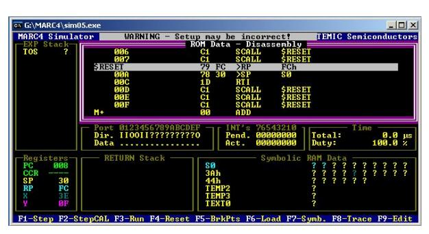

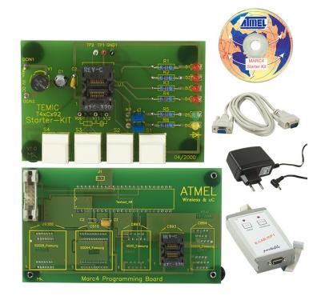

- (a) Screenshot of the MARC4 Simple Core Simulator. (b) Atmel MARC4 Starter Kit.

Figure 5.8: Development environment for the MARC4 4 bit microcontroller.

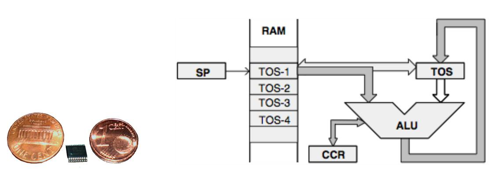

- (a) MARC4 microcontroller size comparison with 1 cent coins.
- (b) Blockdiagram of the ALU of MARC4, source: [13].

Figure 5.9: Blockdiagram of the ALU and size comparison of MARC4.

the operations with the top of stack items (TOS and TOS-1). The TOS register contains the top element of EXP and works in the same way as an accumulator. This stack is also used for passing parameters between subroutines, and as a scratchpad area for temporary storage of data (see Figure 5.9(b)). The 12-bit wide Return Stack (RET) is addressed by the Return Stack Pointer (RP). It is used for storing return addresses of subroutines, interrupt routines and for keeping loop-index counters. It can also be used as a temporary storage area.

The instruction set supports the exchange of data between the top elements of the Expression Stack and the Return Stack. The two stacks within the RAM have a user-definable maximum depth. The MARC4 controller has six programmable registers and one condition code register. The Program Counter (PC) is a 12-bit register that contains the address of the next instruction to be fetched from the ROM. Instructions currently being executed are decoded in the instruction decoder to determine the internal micro-operations. For linear code (no calls or branches), the program counter is incremented with every instruction cycle. If a branch, call, return instruction or an interrupt is executed, the program counter is loaded with a new address. The PC is also used with the table instruction to fetch 8-bit wide ROM constants.

We used the *MARC4 Starter Kit* which contains five samples of the *Atmel ATAM893* µ*C* (see Fig. 5.9(a)), the target application board *T4xCx92*, an *E-Lab ICP V24 Portable* programmer and corresponding MARC4 programming board (see Figure 5.8(b)), as well as the software development software (see Figure 5.8(a)).

Since the MARC4 inherits a stack-based architecture (which is similar to a zero-address machine) and its instructions contain only the operation to be performed without any source or destination, please note that it was arduous to implement the PRESENT block cipher on the target platform. In fact it turned out to be similar to the *Tower of Hanoi* mathematical game.

All variables have to be initialized with a specific value for the MARC4 hardware to function correctly, since no variables are automatically assigned to zero. The 64-bit plaintext (or ciphertext, respectively) input to be encrypted (decrypted) is stored in the nibbles TextF to Text0, where TextF represents the 4 most-significant-bits (MSB) of the input. Hence, we refer to their order from '0' to '9' followed by alphabetical means until the letter 'F'. Naming congruates with the 80 bits of the key variables KeyJ to Key0. In order to implement the PRESENT round counter the 2VARIABLE construct is used. It allocates RAM space for storage of one double length (8-bit) value. The 5 most significant bits of the 8-bit variable Round represent the current number of rounds performed. This design decision was made to efficiently implement the exclusive-or operation (XOR) in the key scheduling function.

PRESENT consists of an initial key addition followed by 31 iterations of :PBOX, :KEYSCHED and :KEYXOR. Also the 8-bit counter Round has to be increased in every iteration.

```
: ENCRYPT \ This i s a COMMENT
      KEYSCHED
       Round 2@ 8 M+ Round 2 ! \ i n c r e a s e Round by 8
      SBOX PBOX KEYXOR
```

The required 31 iterations of :ENCRYPT are performed in a 10 · 3 + 1 fashion. The word :EN-CLOOP applies 10 iterations of :ENCRYPT and is executed 3 times, resulting in 30 iterations of one round of PRESENT. Completing the encryption :ENCRYPT is once again executed, applying the last iteration of the PRESENT encryption.

```
: ENCLOOP
 11 BEGIN \ DO 10 times ENCRYPT
      1− DUP 0 > WHILE \ . . . WHILE TOS > 0
      ENCRYPT REPEAT DROP \ drop loop−coun te r =0
\ −−−−−−−−−−−−−−−ENCRYPTION −−−−−−−−−−−−−−−−−−−−−−−
 : INT1 \ INT1 = enc ryp tion
      KEYXOR \ I n i t i a l KeyXOR
      4 BEGIN \ DO 3 times ENCLOOP
            1− DUP
            0 > WHILE
            ENCLOOP \ DO−END
      REPEAT DROP
      ENCRYPT \ 31 s t Round o f PRESENT
```

Due to the harsh memory constraints of the MARC4 microcontroller (4 KB ROM, 128 B RAM) our main optimization goal was to reduce the code size, but with an eye on the execution time. Unfortunately the harsh memory constraints did not allow to fit an implementation that is capable of encryption and decryption. Therefore, we first discuss the encryption only implementation (profile II) and subsequently the decryption only implementation (profile IV) before we turn to the implementation results.

#### **Code size optimized implementation of the encryption only variant**

Encrypting one block of 64 bits with a given 80-bit key can be divided into 4 procedures coinciding with the blocks found in Fig. 4.1. These procedures are Adding the Key (addRoundKey,:KeyXOR), Substitution Table (sBoxLayer, :SBOX), Permutation Layer (pLayer, :PBOX) and Deriving the Key (update, :KeySched).

The :KeyXOR sub-routine starts with a rather trivial function, the Key XOR. TextF places the 8-bit RAM—address of the variable TextF as two 4-bit values on to the stack (low nibble is top element). @ copies the 4-bit value at a specified memory location via the two topmost nibbles onto the top of the stack (TOS). ! stores a 4-bit value at a specified memory location. The two topmost nibbles represent the 8-bit RAM—address where the value being the 3rd element on the stack, is to be stored.

```
: KEYXOR

TextF @ \ load value of TextF onto stack

KeyJ @ \ load value of KeyJ onto stack

XOR TextF ! \ XOR and save back to TextF

[...]

\[ \ \ \ \ \ \ \ \ \ \ \ \ \ \ \ \ \ \
```

The substitution table consisting of 16 values featured as nibbles stored in the ROM of the MARC4 microcontroller, beginning at ROM-address  $0 \times 360 \,\mathrm{h}$  and ending at  $0 \times 36 \,\mathrm{Fh}$ . This is done with ROMCONST which saves 4-bit values in an array at consecutive ROM addresses. Though the MARC4 instruction set contains the function DTABLE@ which fetches an 8-bit constant from a ROMCONST array referring a 12-bit ROM address, a performance gain about 20% is achieved using ROMBYTE@ instead. Since no carry can occur, the first address (12 bits) of the array sTable can be placed onto the Expression Stack, only the lowest 4 bits of the address need to be added up to generate the substitution table lookup-address.

```
      ROMCONST sTable 12, 5, 6, 11, 9, 0, 10, 13, 3, 14, 15, 8, 4, 7, 1, 2, AT 360h

      sTable Text0 @ + lookup table base address lookup table index by adding.. .. value of Text0

      ROMBYTE@ STable Substitute Text0 ! lookup table [Text0] to Text0

      DROP lookup table base address lookup table index by adding.. lookup table index by adding.. lookup table index by adding.. lookup table index by adding.. lookup table index by adding.. lookup table index by adding.. lookup table index by adding.. lookup table index by adding.. lookup table index by adding.. lookup table index by adding.. lookup table index by adding.. lookup table index by adding.. lookup table index by adding.. lookup table index by adding.. lookup table index by adding.. lookup table index by adding.. lookup table index by adding.. lookup table index by adding.. lookup table index by adding.. lookup table index by adding.. lookup table index by adding.. lookup table index by adding.. lookup table index by adding.. lookup table index by adding.. lookup table index by adding.. lookup table index by adding.. lookup table index by adding.. lookup table index by adding.. lookup table index by adding.. lookup table index by adding.. lookup table index by adding.. lookup table index by adding.. lookup table index by adding.. lookup table index by adding.. lookup table index by adding.. lookup table index by adding.. lookup table index by adding.. lookup table index by adding.. lookup table index by adding.. lookup table index by adding.. lookup table index by adding...
```

Given the permutation layer's characteristics, it can be implemented using only 16 bits as temporary memory, which are stored in the variables Temp3 to Temp0. The way most efficient approach of implementing the permutation layer was to shift each single bit out of the actual variable, and into its new location. This way of 'filling' the variables equates *filo-queueing* and it is therefore necessary to insert the subsequent MSB into the LSB position.

Commands used to *shift into* and *rotating out of* the carry-bit are SHL, SHR, ROL, ROR (cf. [221]).

```
| Text0 @ SHR Temp0 @ ROR Temp0 ! | SHR
```

This way all 16x4 bits of TextF to Text0 are consecutively processed to assign the bits to their new position. Each of these 16 iterations clears one 4-bit variable which is subsequently used as the next temporary variable maintaining memory-efficiency.

Efficient rotation of all 80 key-bits by 61 positions to the left in the Key Schedule (:KeySched) is performed by moving 20 bits to the right and then rotate one position to the left. Since 20 is a multiple of the 4-bit architecture, the first operation would actually be only re-addressing memory pointers. As mentioned before the MARC4 hardware is a zero-address machine, therefore re-addressing can only be accomplished by copying the respective values *into* their new positions.

```
: KEYSCHED
Key4@ Key3@ Key2@ Key1@ Key0@ KeyJ@ KeyI@ KeyH@ KeyG@
KeyF@ KeyE@ KeyD@ KeyC@ KeyB@ KeyA@ Key9@ Key8@ Key7@
 Key6 @ Key5@ \ Pushed Keys onto s t a c k > >20..
SHL Key0 ! \ Ro t a te through Carry BEGIN
ROL Key1 ! \ . . <<1 matches >>19 ergo <<69
[ . . . ]
ROL KeyJ !
0111b CCR @ < \ i f Carry , i n s e r t 0001b i n t o Key0
IF Key0 @ 1 XOR Key0 !
ELSE Key0 @ 0 XOR \ non−varying RunTime
  Key0 ! NOP NOP NOP \ −−> timing−a t t a c k r e s i s t a n c e
THEN \ Ro t a te through Carry END
```

The single bits 79 to 76 oblige one SBOX lookup as shown above and the 8 bits of the counter Round are added to the bits 19 to 15 of the key resulting in the new actual key.

```
Round 2@ Key3@ XOR Key3 ! Key4@ XOR Key4 ! \ Add Counter
```

## **Code size optimized implementation of the decryption only variant**

Due to MARC4's constrained hardware specifications in terms of available memory, no precomputing and storing of the round-keys for decryption can be achieved. Therefor before decrypting, the 31st key is pre-computed, and an inverse key scheduling routine is implemented. Though performance takes a slight hit from the extra amount of pre-computing the 31st key, this was the most efficient way to implement the decryption routine without the need for additional external memory.

The differences in decrypting data, instead of encrypting, are that instead of the regular S-box and permutation layer their respective inverses are used in the reverse order of appearance. Furthermore the first decryption key (*i.e.* the last encryption key) has to be pre-computed, *i.e.*, the complete encryption key-schedule has to be finished, first.

The word LASTKEY computes the first decryption key and is therefore iterated 30 + 1 times. Now that the first decryption key is stored in KeyJ to Key0 the decryption can be started by setting interrupt number seven (INT7). The decryption code again coincides with encryption, except for the counter Round being decreased and changing order of the inverse substitution table with the inverse permutation layer as described in the following subsections. Adding the key during decryption is similar to the addition during encryption. The inverse Substitution table (:ISBOX) of the decryption is stored at ROM-addresses 0x370h and ending at 0x37Fh. The same characteristics of the :SBOX (see above) also apply here, except for the inverted substitution table IsTable.

```
ROMCONST I s T a bl e 5 , 1 4 , 1 5 , 8 , 1 2 , 1 , 2 , 1 3 , 1 1 , 4 , 6 , 3 , 0 , 7 , 9 , 1 0 , AT 370h
```

The code of the inverse substitution layer (:iPBOX) logically equals the code of the :PBOX (see above) with only minor changes of sorting.

Presumable the *last key* is already stored in the variables KeyJ to Key0, the inverse key scheduling shares most of its code with the key scheduling routine of the encryption, just in reverse order. It starts with the exclusive-or with Round and the inverse substitution table lookup of the bits 79 to 76. The way of shifting all key-bits 61 positions to the right is again done the same way as explained before, only changed in its order to achieve the inverse shifting direction.

## **Performance results**

The results refer to the optimized and most efficient implemented version. Since this is the first state-of-the-art block cipher on a 4-bit microcontroller there are no figures for comparison

| enc/ | ROM             | Stack |       | Init.    | Cycles / block |
|------|-----------------|-------|-------|----------|----------------|
| dec  | [lines of code] | [EXP] | [RET] | [cycles] | [cycles]       |
| enc  | 841             | 25    | 4     | 230      | 55,734         |
| dec  | 945             | 25    | 4     | 230      | 65,574         |

Table 5.8: Code size and cycle count of PRESENT-80 on the ATAM893-D 4-Bit microcontroller.

|       |       | CLK    | Time for |            | Current | Energy    |          |
|-------|-------|--------|----------|------------|---------|-----------|----------|
| enc / | Freq. | int. / | enc/dec  | T'put      | cons.   | per block | per bit  |
| dec   | [KHz] | ext.   | [ms]     | [bits/sec] | [µA]    | [µJ]      | [µJ/bit] |
|       | 2,000 | int.   | 27.9     | 2,297      | 79.3    | 3.98      | 0.06     |
| enc   | 500   | ext.   | 111.5    | 574        | 6.7     | 1.3       | 0.02     |
|       | 16    | ext.   | 3,483    | 18.4       | 9.2     | 57.7      | 0.9      |
|       | 2,000 | int.   | 32.8     | 1,952      | 79.3    | 4.68      | 0.07     |
| dec   | 500   | ext.   | 131.1    | 488        | 6.7     | 1.58      | 0.02     |
|       | 16    | ext.   | 4,098    | 15.6       | 9.2     | 67.87     | 1.06     |

Table 5.9: Throughput and energy results of PRESENT-80 on the ATAM893-D 4-Bit microcontroller.

available. The pursued target of implementing PRESENT-80 on a 4-bit microcontroller was to achieve the shortest possible execution time while requiring as less resources as possible. Therefore the code size and maximum growth of both stacks (EXP & RET) are listed. As one can see from Table 5.8 the decryption routine requires 100 lines of code more compared to the encryption routine which is due to the additional key-scheduling and the additional inverse S-box. The stack growths and also the time for initialization were similar for both encryption and decryption.

The encryption of 64 bit plaintext requires 55, 734 cycles which is equivalent to 27.9 ms at 2 MHz (see Table 5.9). In the theoretical lowest possible cycle rate of 2 KHz this would be equivalent to 27.9 *seconds*. The decryption of one data block of 64 bits requires 65, 574 cycles which is equivalent to 32.8 ms at 2 MHz or 32.8 *seconds* at 2 KHz, respectively. These figures translate to about 2.3 and 1.9 Kbits per second for encryption and decryption at 2 MHz or 18.4 and 15.6 bits per second at 16 KHz, respectively. Please note that RFID applications typically do not require the processing of large amounts of data.

1.8V was applied as the supply voltage for measurements to obtain the current consumption of the microcontroller. A *Keithley 2001 digital multi-meter* [117] was used for measuring while encrypting data on the µC. Table 5.9 shows the power consumption for different frequencies. Please note that these numbers also resemble the power consumption of the decryption respectively. Furthermore, measurements have also been conducted for a supply voltage of 5V, but the measured current consumption was reciprocal proportional to the operating frequency. Since we could not find an explanation for this phenomenon, we decided to remove these figures from Table 5.9.

The microcontroller was either clocked by an external crystal (XTAL) oscillator or using the internal RC-oscillator. The following clock-speeds were generated using a 32 kHz XTAL: 16 kHz, 2 kHz and also the SLEEP mode. The 2 MHz frequency was generated using the internal RC-oscillator. Finally, in order to reduce power-consumption, an external 4 MHz XTAL was used generating the 500 kHz. We selected the different frequencies in order to show the timepower/energy trade-off that is possible with our PRESENT implementation. While 2 MHz and 2 KHz are the maximum and minimum frequencies of the ATAM893-D we also wanted to provide figures for an implementation that requires less then 200 ms for encryption/decryption of one block. It turned out that 500 KHz is the lowest possible frequency to reach this goal.

As one can see from Table 5.9 at a supply voltage of 1.8V the current consumption of the microcontroller is below 10 µA when clocked at 16 KHz and 500 KHz. This is an interesting result, because it indicates that this implementation can also be used for passively powered low-cost RFID tags, which typically require such harsh power constraints. At 500 KHZ is the best energy per bit ratio, which is interesting for active devices in order to maximize the lifespan of the battery.

## **5.4.3 Software implementations on an 8-Bit microcontroller**

These implementations can be downloaded free of charge from the website http://www. lightweightcrypto.org/present.

## 8 **bit target platform and development environment**

The ATMEL AVR RISC<sup>7</sup> microcontroller family uses a *Harvard* architecture concept, *i.e.* it uses separate memories and buses for program and data. Its two stage pipeline allows to execute in every clock cycle one instruction and most of its 130 instructions are single cycle instructions [9]. Out of this family we chose the ATmega163 microcontroller [11] as the target platform. Besides other features such as timers and counters, the ATmega163 provides 16 K bytes Flash, 512 bytes EEPROM, 1024 bytes SRAM and 32 general purpose working register. Figure 5.10 depicts the architecture of the ATmega163. Access to the SRAM costs 2 clcock cycles and access to the Flash memory costs 3 clock cycles. The ATmega163 can operate with up to 8 MHz. At a frequency of 4 MHZ and a voltage supply of 3 Volt the ATmega163 draws 5 mA of current when active, 1.9 mA in Idle Mode and less than 1µA in Power-down Mode. The interested reader is referred to the data sheet [11] and the instruction set manual [9] for further details about the ATmega163 microcontroller.

We used the integrated development environment *AVR Studio 4.13* from ATMEL [10]. It is provided free of charge by ATMEL and supports a wide range of ATMEL's microcontrollers, such as the ATmega series. The *AVR Studio* features an in-build chip simulator and a source file editor as well as decent project management capabilities. Furthermore it uses the opensource *WinAVR* tool kit [241] that contains a *GNU GCC* compiler for C/C++ source, the *avr-gdb* debugger and the *avrdude* programmer.

### **Speed optimized implementation**

For speed optimization it is wise to pre-compute and store all round keys in an array, because it has to be done only once in the beginning. Since PRESENT requires 32 round keys of each

<sup>7</sup>Reduced Instruction Set Computing

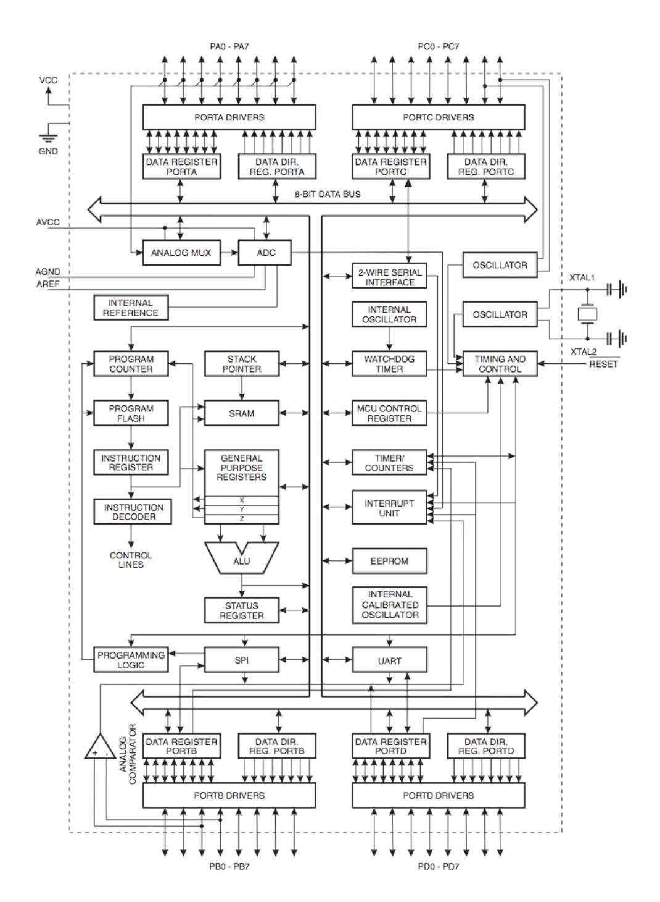

Figure 5.10: Architecture of the ATmega163 8 bit microcontroller, source: [11].

64 bits, in total 256 Bytes of data memory are required. The 61 bit rotation to the left in the key schedule is equivalent to a 19 bit rotation to the right. For the speed optimized variants this rotation was decomposed into a 16 bit and a 3 bit shift to the right. This is advantageous on an 8 bit platform, such as the ATmega163, because a 16 bit shift can be implemented by re-addressing the 8 bit registers in the following way:

$$key[i] = key[i + 2 MOD 10], 0 \le i \le 9.$$

Finally the 61 bit rotation of all 80 bits can be implemented by ten register address swaps and  $10 \cdot 3 = 30$  shifting operations. The S-box for the key schedule is stored as 16 8-bit values where the high nibble is the S-box output value and the low nibble is padded with zeros. This allows to immediately OR the S-box output value with the four LSB of the highest key state byte.

The S-Layer of PRESENT consists of  $16.4 \times 4$  S-boxes (see Chapter 4). A naïve approach would be to select a 4 bit chunk of the current state byte s, substitute it with the 4 bit S-box output value and store the result at the right position of the state. However, this would require to apply an AND operation to the state with a selection mask  $(0 \times F0 \text{ or } 0 \times 0F)$  and a table lookup. In case that the processed nibble is the higher significant one, additionally a shifting by 4 positions to the left before and after the S-box look-up is required. A more efficient—and well-known—technique is to combine two (or more) smaller S-boxes to a larger S-box. By joining two PRESENT S-boxes we get the new  $8 \times 8$  S-box:

$$S_{8\times8}(x_1||x_2) = S(x_1)||S(x_2).$$

 $S_{8\times8}$  has 256 entries of each 8 bits. Using  $S_{8\times8}$  significantly decreases the cycle count while also significantly increases the memory requirements.

The permutation layer of PRESENT is probably the most difficult part to implement in software, because it processes each of the 64 state bits individually. While in hardware this can be done virtually free of cost, in software this poses severe difficulties. A naïve approach would select 64 times a single bit, look-up the shifting offset in a table and shift it to its new position. Since table look-ups require 2 clock cycles this approach would require at least  $64 \cdot (1+2+1) = 256$  operations in total. A well-known implementation trick is to use look-up tables instead of permutations. Figure 5.11 depicts the general time-memory trade-off for look-up tables. The left side shows the classic look-up table approach for an n bit permutation, which requires only one look-up to get the result. However, the memory requirements are  $2^n \cdot n$  bits. In the case of PRESENT n=64 and hence the memory requirement would be  $2^{64} \cdot 64 = 2^{67}$  Bytes, which is by far too much.

Therefore a divide-and-conquer approach with the following steps seems to be better suited:

- (1) Split the *n* bit word in *k* parts, each  $\frac{n}{L}$  bits wide.
- (2) Create *k* different tables, each with  $2^{\frac{n}{k}}$  entries of *n* bits.
- (3) Join the *k* look-up results from the different tables to one final result.

Depending on the joining operation in step 3 (OR, XOR or AND) it is either required to pad the table entries with '0' bits (OR, XOR) or with '1' bits (AND) in step 2. The advantage of this divide-and-conquer approach is that it trades memory for additional time. Since we have k tables each with  $2^{\frac{n}{k}}$  entries of n bits, the memory requirement is  $k \cdot 2^{\frac{n}{k}} \cdot n$  bits. On the other hand now k table look-ups are required and an additional joining operation.

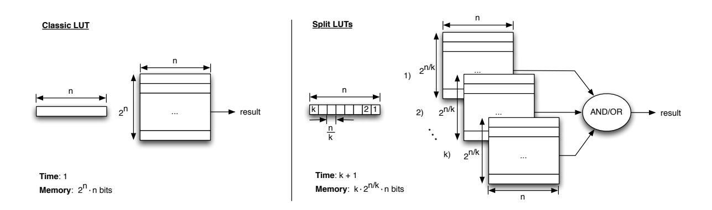

Figure 5.11: Time-memory trade-off for look-up tables.

A natural next step for optimizing a software implementation for an 8 bit microcontroller would be to set k=8. While the timing then would be 8+1=9 steps, the memory requirements would be  $8\cdot 2^{\frac{64}{8}}\cdot 64$  bits  $=2^{14}$  bytes =16KB. Unfortunately this is the exact amount of Flash memory that our target platform ATmega163 provides and hence this approach does not allow a single additional line of code. Therefore we set k=16 and now it takes 17 steps to process the permutation while the memory requirements are reduced to  $16\cdot 2^{\frac{64}{16}}\cdot 64$  bits  $=2^{11}$  bytes =2KB. However, one Flash memory access requires 3 clock cycles, therefore the 8 look-up operations require at least 24 cycles and our timing complexity is about 25 steps. Even worse, one step refers to processing a 64-bit word, which on an 8-bit architecture costs at least 8 cycles each. Therefore the time complexity is around  $25\cdot 8=200$  clock cycles. In the end this was the main reason to implement the P-layer in assembly, which results in 176 clock cycles.

Finally, we advised GCC to compile with the -03 option, which aggressively optimizes the code for speed, e.g. by loop-unrolling.

#### Size optimized implementation

For a size optimized implementation it is wise to compute the round keys on-the-fly, *i.e.* no key is pre-computed. On the one hand this significantly increases the execution time, but on the other hand also significantly decreases storage requirements. For profile I (encryption only) we chose this option, but for profile II (decryption only) things are different. For decryption first the last round key has to computed with the regular key schedule using the regular S-box S. The last round key then can be used to calculate the round keys backwards for which the  $S^{-1}$  S-box is required. Hence, for decryption an on-the-fly key schedule would require to implement the regular key schedule and its inverse. Furthermore both S-boxes S and  $S^{-1}$  have to be stored. Our implementation results of both variants revealed that the pre-computation approach yields smaller program code (948 B) compared to the on-the-fly variant (1022 B). Therefore we implemented profile II with key pre-computation.

The 61 bit left rotation of the key schedule now is implemented in a FOR loop, while the counter XOR and the S-box look-up are identical to the speed optimized version. The XOR between a round key byte and the appropriate state byte is implemented in a loop.

For size optimization we chose to implement the S-box as a byte array of 16 entries. The output of this S4×<sup>8</sup> called S-box is given by the output value of the PRESENT S-box (lower nibble) with the higher nibble padded with 0x0:

$$S_{4\times8}(x) = 0x0||S(x).$$

The S-box look-up of all eight state bytes is realized in a loop for both the encryption and the decryption routine.

For the size optimized version we resigned to use assembly code. Instead we used the arithmetic representation of the permutation layer P(i) and its inverse P −1 (i) as it was described in Section 4.3.3:

$$P(i) = \begin{cases} i \cdot 16 \mod 63, & i \in \{0, \dots, 62\} \\ 63, & i = 63. \end{cases}$$
 (5.1)

$$P^{-1}(i) = \begin{cases} i \cdot 4 \mod 63, & i \in \{0, \dots, 62\} \\ 63, & i = 63. \end{cases}$$
 (5.2)

We used a loop to permute all bits of the state according to Equations 5.1 and 5.2. Finally, we advised GCC to compile with the -Os option, which aggressively optimizes the code for minimal size, e.g. by not unrolling any loop.

## **Performance results**

Table 5.10 summarizes our implementation results and provides details about all implemented profiles. We compare the implementation results of profile V (speed optimized implementation of encryption and decryption) to other software implementations in Table 5.11. As one can see, our PRESENT-80 implementation is about 11% faster than the one published in [68] but still significantly slower than the AES or IDEA implementation from the same publication. Also the code size of our implementation is larger than the code size of PRESENT and IDEA but smaller than AES.

## **5.4.4 Software implementations on a 16-Bit microcontroller**

These implementations can be downloaded free of charge from the website http://www. lightweightcrypto.org/present.

#### 16 **bit target platform and development environment**

We chose the *Infineon C167CR* microcontroller as the target 16-bit platform [111] due to its widespread usage in the embedded systems community. Figure 5.12(a) depicts a top-level view of the complete architecture (on the left) as well as a more detailed view to the CPU architecture (on the right). The C167 architecture combines design elements of RISC as well CISC features and consists of 32 KB to 128 KB mask-programmable ROM, 2 KB of internal RAM (IRAM) and 2 KB extension RAM (XRAM). All memories (as well as the I/O ports) share the same address space, therefore the C167 microcontroller has a *Von Neumann* memory architecture. Beside the 16-bit arithmetic and logic unit (ALU), the C167CR features dedicated

Table 5.10: Performance results of PRESENT-80 on the 8 bit ATmega163 microcontroller.

| enc/<br>dec | opt.<br>goal | Profile | ROM<br>[bytes] | RAM<br>[bytes] | Cycles  | Cycles/bit | Throughput<br>@4MHz<br>[Kbps] |
|-------------|--------------|---------|----------------|----------------|---------|------------|-------------------------------|
|             |              | I       | 1,494          | 272            | 10,089  | 157.64     | 25.4                          |
| enc         | speed        | V       | 2,398          | 528            | 9,595   | 149.92     | 26.7                          |
|             | size         | II      | 854            | 16             | 646,272 | 10,098     | 0.4                           |
|             |              | VI      | 1,474          | 32             | 646,166 | 10,096     | 0.4                           |
|             |              | III     | 1,532          | 280            | 10,310  | 161.1      | 24.8                          |
|             | speed        | V       | 2,398          | 528            | 9,820   | 153.44     | 26.1                          |
| dec         |              | IV      | 948            | 40             | 634,823 | 9,919      | 0.4                           |
|             | size         | VI      | 1,474          | 32             | 634,614 | 9,916      | 0.4                           |
| better is:  |              |         | less           | less           | less    | less       | more                          |

Table 5.11: Comparison of software implementations of ciphers on different 8-bit micro controllers.

|              | Key   | Block | Enc.     | T'put                            | Dec.     | Code   | SRAM   |
|--------------|-------|-------|----------|----------------------------------|----------|--------|--------|
|              | Size  | Size  | [Cycles/ | at 4MHz                          | [Cycles/ | Size   | Size   |
|              | [bit] | [bit] | Block]   | [Kbps]                           | Block]   | [byte] | [byte] |
|              |       |       | PRESENT  |                                  |          |        |        |
| profile V    | 80    | 64    | 9,595    | 26.7                             | 9,820    | 2,398  | 528    |
| [68]         |       |       | 10,723   | 23.7                             | 11,239   | 936    | 0      |
|              |       |       |          | Hardware Oriented Block Ciphers  |          |        |        |
| DES [68]     | 56    | 64    | 8,633    | 29.6                             | 8,154    | 4,314  | 0      |
| DESXL [68]   | 184   | 64    | 8,531    | 30.4                             | 7,961    | 3,192  | 0      |
| HIGHT [68]   | 128   | 64    | 2,964    | 80.3                             | 2,964    | 5,672  | 0      |
|              |       |       |          | Software Oriented Block Ciphers  |          |        |        |
| AES [68]     | 128   | 128   | 6,637    | 77.1                             | 7,429    | 2,606  | 224    |
| IDEA [68]    | 128   | 64    | 2,700    | 94.8                             | 15,393   | 596    | 0      |
| TEA [68]     | 128   | 64    | 6,271    | 40.8                             | 6,299    | 1,140  | 0      |
| SEA [68]     | 96    | 96    | 9,654    | 39.7                             | 9,654    | 2,132  | 0      |
|              |       |       |          | Software Oriented Stream Ciphers |          |        |        |
| Salsa20 [68] | 128   | 512   | 18,400   | 111.3                            | N/A      | 1,452  | 280    |
| LEX [68]     | 128   | 320   | 5,963    | 214.6                            | N/A      | 1,598  | 304    |

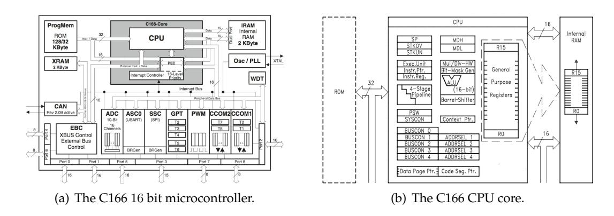

Figure 5.12: Architecture of the C166 microcontroller, source: [111].

special function registers (SFR), a separate multiply and dive unit and a barrel shifter. In conjunction with its four stage instruction pipeline this allows to execute most of the instructions within one clock cycle. It is noteworthy that—independent of the shifting amount—all shift and rotate instructions can be executed in one machine cycle. The C167CR requires a voltage supply between 4.5 V and 5.5V and its maximum operating frequency is between 25 MHz and 33 MHz. Its current consumption depends on the operating frequency and can be calculated for active (IDD) and for idle (IID) mode by the following equations:

$$I_{DD} = 15 + 2.5 \cdot f$$
$$I_{ID} = 10 + f$$

where f denotes the frequency in MHz. In power down mode the current consumption is IP D = 50µA. The interested reader is referred to the data sheet [111] and the instruction set manual [108] for further details about the C167 microcontroller.

We used *Altiums Tasking VX-Toolset v2.2r3* [3], which is integrated into the Eclipse framework [222]. It features a debugger (Crossview Pro) and a high speed simulator for C/C++, assembly and mixed code. There are four optimization levels available:

**Level 0** no optimization,

**Level 1** optimize without affecting debug-ability,

**Level 2** optimize, this is the default level and

**Level 3** maximum optimization.

There are different memory models: near, far, (segmented) huge and huge. Out of these alternatives the near memory model results in the fastest code, because it does not access Flash memory, while the far memory model yields the smallest code.

### **Speed optimized implementation**

The state is stored as a long long variable that has 64 bits. Since the key has 80 bits, it has to be stored as two long long variable keyhigh and keylow. Though it would have been possible to use a variable type with just 16 bits, we decided to use the long long variable, because this is advantageous for the 61 bit rotation of the key schedule. The S-box of the key schedule S4×<sup>64</sup> is realized as a look-up table with 16 entries, each of which is 64 bits wide. The S-box output is the most significant nibble, while the remainder of the output is padded with zeros, *i.e.*

$$S_{4\times64}(x) = S(x)||0x000000000000000000000000000000000$$

For speed optimization we have implemented PRESENT-80 with key pre-computation. For profiles I (encryption only) and V (encryption and decryption) we merged the S-layer and the P-layer into a single look-up. For this purpose the divide-and-conquer approach (see Section 5.4.3) has been applied and 8 new look-up tables have been computed. Since each table outputs 64 bits the memory requirement for the merged S/P-layer is 8 · 2 8 · 64 = 16K bytes. The look-up values are concatenated by an OR operation. For profile III (decryption only) however it is not possible to merge the inverse S-layer and the inverse P-layer, due to the reverse execution order.

## **Size optimized implementation**

For size optimization it is wise to use on-the-fly key scheduling in order to save memory of the round keys. We use on-the-fly key scheduling for profiles II and VI, while for profile IV we use pre-computation (see Section 5.4.3). Since we operate on 64 bit variables (long long) the 61 bit left rotation can be performed within one instruction. Another difference compared to the speed optimized version is the usage of a 4 × 16 S-box S4×<sup>16</sup> which in this case gives the following output:

$$S_{4\times 16}(x) = 0x000||S(x).$$

S4×<sup>16</sup> is used both for the key schedule as well a for the data path of the size optimized version, hence the P-layer has to be implemented separately. Similar to the code size optimized 8-bit implementations (see Section 5.4.3), we use the arithmetic representation of the P-layer for profiles II, IV and VI.

## **Performance results**

Table 5.12 shows the implementation results for the Infineon C166 16-bit microcontroller. Interestingly implementation figures of all profiles are significantly worse on a 16-bit platform compared to an 8-bit platform.

### **5.4.5 Software implementations on a 32-Bit CPU**

These implementations can be downloaded free of charge from the website http://www. lightweightcrypto.org/present.

| enc/<br>dec | opt.<br>goal | Profile | HEX<br>code<br>[Kbytes] | Cycles    | Cycles/bit | Throughput<br>@4MHz<br>[Kbps] |
|-------------|--------------|---------|-------------------------|-----------|------------|-------------------------------|
|             |              | I       | 45.9                    | 19,460    | 304.06     | 13.2                          |
| enc         | speed        | V       | 92.2                    | 19,464    | 304.13     | 13.2                          |
|             | size         | II      | 8.17                    | 1,439,296 | 22,489     | 0.2                           |
|             |              | VI      | 9.67                    | 1,442,556 | 22,540     | 0.2                           |
|             |              | III     | 51.9                    | 33,354    | 521.16     | 7.7                           |
|             | speed        | V       | 92.2                    | 33,352    | 521.13     | 7.7                           |
| dec         |              | IV      | 8.44                    | 1,328,714 | 20,716     | 0.2                           |
|             | size         | VI      | 9.67                    | 1,332,062 | 20,813     | 0.2                           |
| better is:  |              |         | less                    | less      | less       | more                          |

Table 5.12: Performance results of PRESENT-80 on the 16 bit C166 microcontroller.

### **Target platform and development environment**

We used *Microsoft Visual Studio 2008 Professional Edition* [155] as the integrated development environment. Visual Studio features a compiler and a debugger as well as outstanding documentation by the MSDN library. The compiler has several optimization goals, which are bundled to two options: O1 for minimal size and O2 for maximum speed. The implementation was done on a laptop PC equipped with 512 MB RAM and an *Intel Pentium III M* processor, clocked at 1, 600 MHz.

#### **Speed optimized implementation**

Similar to the speed optimized 16-bit implementations (profiles I, III, V, see Section 5.4.4) we stored the 80-bit key in two 64-bit variables (\_\_int64) in order to exploit performance benefits in the 61-bit key schedule rotation. Also similar to the 16-bit implementations, the S-box in the key schedule is realized as a 4×16 S-box with 64-bit output values that consist of the S-box lookup value which is padded with 15 zeros to the right, *i.e.* S4×64(x) = S(x)||0x000000000000000. The S-box and permutation of the datapath have been merged and the divide-and-conquer approach has been applied with k = 8 (see Section 5.4.3) for profiles I and V. As we have pointed out for the 16-bit implementation (see Section 5.4.4) it is not possible to merge S-box and permutation for the decryption routine. For the 32-bit implementation however it is possible to exploit an interesting property of the permutation layer. As described in Section 4.7 it is possible to re-arrange the S-boxes of the datapath such that the permutation layer actually consists of four instances of a permutation layer P16(x) that permutes only 16 bits (see Figure 4.6(b)). Now it is possible to merge 4 adjacent S-boxes and one instance of the reduced permutation layer (see Figure 5.13) into a new look-up table SP16×<sup>16</sup> = P16(S(x)||S(x)||S(x)||S(x)). SP<sup>16</sup> has 2 <sup>16</sup> 64-bit entries. As one can see, the major benefit is that the expensive permutation layer P (or better P 0 ) now only every second round has to be processed, which leads to an estimated clock cycle reduction of 25%. However, since every second round key has to be re-ordered as

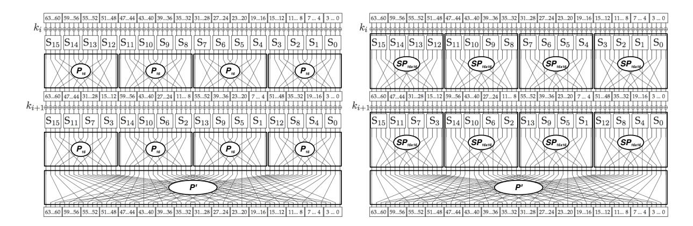

Figure 5.13: Re-ordering and merging of S-boxes with the permutation layer.

well, the saving is less. Figure 5.13 depicts details of the re-ordering and the merging of the S-boxes with the permutation layer.

Finally, we advised the compiler to use the /O2 option for the speed optimized profiles I, III and V.

## **Size optimized implementation**

For profiles II, IV and VI we implemented the key schedule similar to the 16-bit size optimized implementation. However, since we operate on 64-bit variables (\_\_int64) we use the 4 × 64 S-box S4×<sup>64</sup> which was introduced above. The permutation layer was implemented using the arithmetic description (see Section 4.3.3). Furthermore we advised the compiler to use the /O1 option for the code size optimized profiles II, IV and VI.

### **Performance results**

Table 5.13 summarizes the implementation results of all variants for the 32-bit *Pentium III*. We derived the memory requirements from the file size of the assembly file which is created by the compiler. For each profile we measured 100, 000 times the required clock cycles with the RDTSC command. Out of the 100, 000 values we chose the minimum to keep external influences of the PC (such as network card activity etc.) to a minimum.

### **5.4.6 Other software implementations of** PRESENT

Korte provides a PRESENT plugin for *Microsofts .NET* framework [133]. He also implemented a GUI based implementation of PRESENT in *Microsoft Silverlight* for educational purposes. Figure 5.14 depicts selected screenshots of his implementation. Oosterlynck implemented PRESENT in *Python*. Both the *.NET* and the *pyton* implementations can be downloaded free of charge from the website www.lightweightcrypto.org/present.

|             |              |         |                         |        | Table 5.13: Performance results of PRESENT-80 on the 32 bit Pentium III CPU. |                               |
|-------------|--------------|---------|-------------------------|--------|------------------------------------------------------------------------------|-------------------------------|
| enc/<br>dec | opt.<br>goal | Profile | src<br>code<br>[Kbytes] | Cycles | Cycles/bit                                                                   | Throughput<br>@1GHz<br>[Mbps] |
|             |              | I       | 67.6                    | 1,037  | 16.2                                                                         | 61.7                          |
| enc         | speed        | V       | 1,669                   | 1,082  | 16.9                                                                         | 59.1                          |
|             | size         | II      | 4.1                     | 64,012 | 1,000.2                                                                      | 1                             |
|             |              | VI      | 9                       | 74,593 | 1,166                                                                        | 0.9                           |
|             |              | III     | 1,628                   | 1,443  | 22.5                                                                         | 44.4                          |
|             | speed        | V       | 1,669                   | 1,445  | 22.6                                                                         | 44.3                          |
| dec         |              | IV      | 4.5                     | 63,651 | 994.6                                                                        | 1                             |
|             | size         | VI      | 9                       | 75,399 | 1,178                                                                        | 0.8                           |
| better is:  |              |         | less                    | less   | less                                                                         | more                          |

Table 5.13: Performance results of PRESENT-80 on the 32 bit Pentium III CPU.

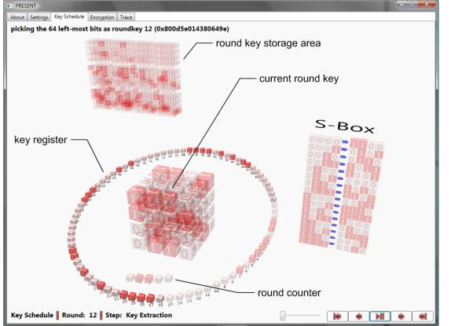

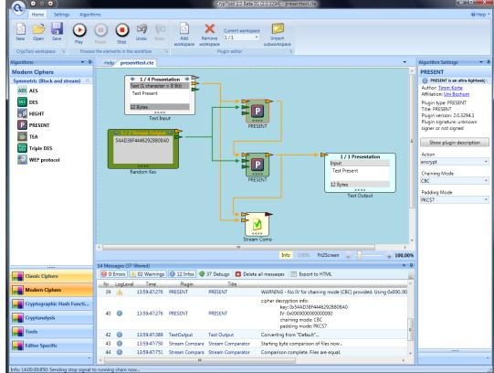

(a) The educational Silverlight implementation of PRESENT. (b) The .NET plugin of PRESENT within the cryptool framework.

Figure 5.14: Screenshots of selected implementations of PRESENT.

# **5.5 Conclusions**

In this Chapter we have explored implementations of PRESENT on a wide variety of different platforms, ranging from ASICs and FPGAs, over hardware-software co-design approaches to plain software implementations. The serialized ASIC implementation constitutes with 1, 000 GE the smallest published ASIC implementation of a cryptographic algorithm with a reasonable security level. Also the FPGA-implementation leads to a very compact result (202 slices), while providing a maximum frequency of 254 MHz. ASIC and FPGA figures highlight that though PRESENT was designed with a minimal hardware footprint in mind, *i.e.* targeted for low-cost devices such as RFIDs, PRESENT is also well suited for high-speed and highthroughput applications. Especially its hardware efficiency, *i.e.* the throughput per slice or GE, respectively, is noteworthy. Furthermore, interestingly the old-fashioned Boolean minimization tool *espresso* lead to an FPGA implementation that was significantly smaller than a standard LUT based implementation.

If we only consider crypto cores in a HW/SW co-design environment, the energy consumption of PRESENT seems to be not so promising compared to the AES. However, if we also take the I/O commuication overhead between the microcontroller and the co-processor into account, PRESENT is more energy efficient and also the power and area (7 *times* smaller) requirements of PRESENT are very low compared to the AES. Together with the gained speed-up factor of 44.6 for a HW/SW co-design approach compared to a plain software implementation, these figures underline PRESENTs suitability for low-area and low-cost hardware implementations.

On the software side we exploited the lightweight structure of PRESENT and especially its 4-bit S-boxes by implementing PRESENT on a 4-bit microcontroller. Due to the low-power nature of the ATAM893-D microcontroller it is also thinkable that 4-bit microcontroller will be employed in low-cost RFID tags. To the best of our knowledge up to now there are no implementation results of cryptographic algorithms for 4-bit microcontrollers published. In this Chapter we have closed this gap and provided the first implementation results of this kind. We therefore presented a proof-of-concept that state-of-the-art cryptography is feasible on ultra-constrained 4-bit microcontrollers. Our implementation draws a current of 6.7µA at a supply voltage of 1.8V and a frequency of 500 KHz. Together with the observation that the processing of one data block requires less than 200 ms we conclude that this implementation is interesting for passively powered RFID tags. In this Chapter we also provided implementation figures for PRESENT with different optimization goals (speed or code size) for 8-, 16- and 32-bit processors. We also showed that the regular structure of the permutation layer of PRESENT can be exploited to obtain a faster implementation by re-ordering the S-boxes.

# **6 Lightweight Hash Functions**

In this Chapter lightweight hash functions are investigated. First, the work is motivated in Section 6.1 and related work is treated in Section 6.2. Then our design decisions are presented in Section 6.3 and subsequently information about general hash function constructions are given in Section 6.4. Since current hash functions of dedicated design are either too large or broken, we first consider hash functions that are built around block ciphers. In particular we use the compact block cipher PRESENT (see Sections 4 and 5) as a building block and we consider the implementation of a range of hash functions offering 64-bit (see Section 6.5) and 128-bit outputs (Section 6.6) using established techniques. We also consider hash functions that offer larger outputs and we highlight some design directions along with their potential hardware footprint in Section 6.7. Finally, the Chapter is concluded in Section 6.8. Please note that parts of this chapter are based on joint work with Andrey Bogdanov, Gregor Leander, Christof Paar, Matt Robshaw and Yannick Seurin. Especially the design and security assessment of DM-PRESENT-80, DM-PRESENT-128, H-PRESENT-128 and C-PRESENT-192 contain significant contributions from Matt Robshaw and Yannick Seurin, whereas Andrey Bogdanov and Gregor Leander significantly contributed to the design of PROP-1 and PROP-2.

# **6.1 Motivation**

With RFID tags on consumer items, the potential for wired-homes, and large-scale sensor networks becoming a reality, we are on the threshold of a pervasive computing environment. But along with these new applications come new, and demanding, security challenges. The cryptographic research community has been quick to identify some of the issues, and device authentication and privacy have received considerable attention. As a result a variety of new protocols have been proposed and in many of them, particularly ones intended to preserve user privacy and to anonymize tag interactions, it is assumed that a cryptographic hash function will be used on the tag.

However, which hash function might be used in practice is rarely identified. Looking at dedicated hash functions from the last 20 years, we have become used to their impressive hashing speed (though this is a view that we might have to change in the future). This fast throughput might lead some designers to believe that hash functions are "efficient" in other regards and that they can be routinely used in low-cost environments. This is a mistake, a point that was convincingly made in a paper by Feldhofer and Rechberger [72]. Generally speaking, current hash functions are not at all suitable for constrained environments. They require significant amounts of state and the operations in current dedicated designs are not hardware friendly. This is not surprising since modern hash functions were designed with 32-bit processors in mind, but it means that very few RFID-oriented protocols appealing to a hash function could ever be used on a modestly-capable tag.

In this Chapter we consider RFID tag-enabled applications and the use of hash functions in RFID protocols. We then turn our attention to the design of hash functions and we explore whether a block cipher makes an appropriate starting point for a compact hash function instead of a dedicated design.<sup>1</sup>

In Sections 6.5 and 6.6 we instantiate lightweight hash functions using literature-based constructions and the compact block cipher PRESENT [33]. This allows us to implement a range of representative constructions that, for their given parameter sets, are the most compact hash functions available today. In Section 6.7 we then look at some challenging problems in designing hash functions with greater hash output lengths. While the paper reveals positive results, our work also serves to highlight the difficult issue of compact hash functions; we therefore close the paper with problems for future research.

To consider the efficiency of our proposals, we implemented two different architectures, *i.e.* round-based and serialized, for each proposal in VHDL. We describe these architectures and the implementation results in the corresponding subsection in detail. For functional and postsynthesis simulation we used *Mentor Graphics Modelsim SE PLUS 6.3a* [92] and *Synopsys Design-Compiler* version *Z-2007.03-SP5* [219] was used to synthesize the designs to the *Virtual Silicon* (VST) standard cell library *UMCL18G212T3*, which is based on the *UMC L180 0.18*µ*m 1P6M* logic process and has a typical voltage of 1.8 Volt [233]. We used *Synopsys Power Compiler* version *Z-2007.03-SP5* [220] to estimate the power consumption of our implementations. For synthesis and for power estimation we advised the compiler to use a clock frequency of 100 KHz, which is a widely used operating frequency for RFID applications. For the power simulation an appropriate wire-load model was chosen that fits to the size of the actual design. We give details about this in the corresponding subsection.

# **6.2 Related Work**

For RFID tag-based applications, the protocols in question are often focused on authentication or on providing some form of anonymity and/or privacy [5, 14, 61, 77, 100, 142, 176]. These protocols use a cryptographic hash function and it is assumed that these can be efficiently implemented in hardware. However, Feldhofer and Rechberger have pointed out that current hash functions are not all suited for use in hardware constrained environments, because the area and power requirements of standard hash functions, e.g. MD4 [197], MD5 [196], SHA-1 [166] and SHA-256 [166] are too large [72]. In particular, their implementations require 7, 350 GE and 456 cycles for MD4, 8, 400 GE and 612 cycles for MD5, 8, 120 and 1, 274 cycles for SHA-1 and 10, 868 GE and 1, 128 cycles for SHA-256. This is far away from the 2, 000 GE barrier and so they identified the design of new lightweight hash functions as future work.

A new lightweight compression function named *MAME* was proposed by Yoshida *et al.* at CHES 2007 [95]. Though their hardware implementation requires only 96 clock cycles, the area requirement remains still too large with 8, 100 GE. At FSE 2008 Shamir proposed a new MAC named *SQUASH* that is tailored for RFID tags [207]. There have been no ASIC implementations published so far, but Gosset *et al.* have assessed the hardware efficiency of SQUASH on a Xilinx Virtex-4 FPGA device [90]. Their area optimized implementation of SQUASH with an output size of 32 bits requires 63, 250 clock cycles and 377 slices and 104, 114 clock cycles and 378 slices for a 64-bit output variant. These figures are translated into 6, 303 GE and 6, 328 GE, respectively, by the synthesis tool *Xilinx ISE*. Please note that the amount of GE derived from a number of slices is typically significantly larger than a plain ASIC implementation would

<sup>1</sup>This relates to proposals for future work identified in [72].

require and also depends on the target device. Consequently Gosset *et al.* proposed to see their results as an upper bound.

Recent attacks on standard hash functions [236, 237] have triggered a public competition for a new hash algorithm by NIST [165]. However, since the aim is to design a general purpose hash algorithm, it is no wonder that the requirements do not fit well for constrained environments such as passive RFID tags. Especially the digest sizes of 224- to 512-bit will most probably lead to high area requirements for any candidates.

# **6.3 Design decisions**

Informally, a cryptographic hash function H takes an input of variable size and returns a hash value of fixed length while satisfying the properties of preimage resistance, second preimage resistance, and collision resistance [153]. For a hash function with n-bit output, compromising these should require 2 n , 2 n , and 2 n/<sup>2</sup> operations respectively. These properties make hash functions very appealing in a range of protocols. For tag-based applications, the protocols in question are often focused on authentication or on providing some form of anonymity and/or privacy [5, 14, 61, 77, 100, 142, 176]. However, some estimates suggest that no more than 2, 000 GE are available for security in low-cost RFID tags [116] but implementation results show that the hash functions available are unsuitable in practice [72]. When we consider what we need from a hash function in an RFID tag-based application the following issues can be identified:

- (1) In tag-based applications we are unlikely to hash large amounts of data. Most tag protocols require that the hash function processes a challenge, an identifier, and/or perhaps a counter. The typical input is usually much less than 256 bits.
- (2) In many tag-based applications we do not need the property of *collision resistance*. Most often the security of the protocol depends on the *one-way* property. In certain situations, therefore, it is safe to use hash functions with smaller hash outputs.
- (3) Applications will (typically) only require moderate security levels. Consequently 80-bit security, or even less, may be adequate. This is also the position taken in the eSTREAM project [175]. An algorithm should be chosen according to the relevant security level and in deployment, where success depends on every dollar and cent spent, there is no point using extra space to get a 256-bit security level if 64-bit security is all that is required.
- (4) While the physical space for an implementation is often the primary consideration, the peak and average power consumption are also important. The time for a computation will matter if we consider how a tag interacts with higher-level communication and anticollision protocols.
- (5) Some protocols use a hash function to build a *message authentication code* (MAC), often by appealing to the HMAC construction [164]. When used as a MAC a number of interesting issues arise such as choosing an appropriate key length and understanding whether keys will be changed, something that will almost certainly be impossible in most tag-enabled applications. There might also be the possibility of side-channel analysis on the MAC. However, such attacks will rarely be worthwhile for cheap tag-enabled applications and we do not consider this issue further.

Taking account of these considerations allows us to make some pragmatic choices. There will be applications that just require one-wayness and the application may only require 80-bit or 64-bit security. Note that this is the view adopted by Shamir in the proposal SQUASH for use in RFID tags [207]. For other applications we might like to see 80-bit security against collision attacks.

# **6.4 Background on hash function constructions**

Hash functions in use today are built around the use of a *compression function* and appeal to the theoretical foundations laid down by Merkle and Damgård [55, 154]. The compression function h has a fixed-length input, consisting of a *chaining variable* and a message extract, and gives a fixed-length output. A variety of results [58, 114, 118] have helped provide a greater understanding of this construction and while there are some limitations there are some countermeasures [24]. Since our goal is to obtain *representative* performance estimates, we will not go into the details of hash function designs. Instead we will assume that our hash function uses a compression function in an appropriate way and that the compression function takes as input some words of chaining variable, represented by H<sup>i</sup> , and some words of (formatted) message extract, represented by M<sup>i</sup> . We then restrict our focus to the cost of implementing the compression function.

In the hash function literature it is common to distinguish between two popular ways of building a compression function. The first is to use a compression function of a dedicated design and the second is to use an established, and trusted, block cipher.

## **6.4.1 Dedicated hash function constructions**

The separation of dedicated constructions from block cipher-based constructions tends to disguise the fact that even dedicated hash functions like SHA-1 [163] and MD5 [196] are themselves built around a block cipher. Remove the feed-forward from compression functions in the MD-family and we are left with a reversible component that can be used as a block cipher (such as SHACAL [98] in the case of SHA-1). However, the underlying block cipher we are left with is rather strange and has a much larger-than-normal block and key size combination. The problem with dedicated hash functions is that recent attacks [236, 237] have shown that there is much to learn in designing block ciphers with such strange parameter sizes. There is therefore some value in considering approaches that use a more "classical" block cipher as the basis for a compression function.

### **6.4.2 Block cipher constructions**

The use of a block cipher as a building block in hash function design [49] is as old as DES [159]. The topic has been recently revisited and Black *et al.* [30] have built on the work of Preneel [187] to present a range of secure 2n- to n-bit compression functions built around an n-bit block cipher that takes an n-bit key. Among these are the well-known *Davies-Meyer*, *Matyas-Meyer-Oseas*, and *Miyaguchi-Preneel* constructions.

A hash function with an output of n bits can only offer a security level of 2 <sup>n</sup> operations for pre-image and second pre-image attacks and 2 n/<sup>2</sup> operations against finding collisions. While a security level of 128-bit is typical for mainstream applications, 80-bit security is often a reasonable target for RFID tag-based applications. Either way, there is a problem since the hash functions we need cannot always be immediately constructed out of the block ciphers we have to hand. This is not a new problem. But it is not an easy one to solve either, and there has been mixed success in constructing 2n-bit hash functions from an n-bit block cipher [36, 49, 129, 136, 137, 188, 189]. While limitations have been identified in many constructions, work by Hirose [103, 105] has identified a family of double-block-length hash functions that possess a proof of security. These use block ciphers with a key length that is twice the block length. Such a property is shared by AES-256 [161] and PRESENT-128 [33] and so in Section 6.6 we consider the performance of an Hirose-style construction instantiated using PRESENT-128.

When it comes to providing a replacement for SHA-1, the parameter sizes involved provide a difficult challenge. If we are to use a 64-bit block cipher like PRESENT-128, then in arriving at a hash function with an output of at least 160 bits we need a construction that delivers an output three times the block size (thereby achieving a 192-bit hash function). There are no "classical" constructions for this and so Sections 6.7.1 and 6.7.3 illustrate two possible design directions. These give representative constructions and we use them to gauge the hardware requirements of different design approaches. We hope that this will be of interest to future hash function designers.

# 6.5 Compact hash functions with a digest size of 64 bits

In this section we will consider two approaches to compact hashing with a digest size of 64 bits when we use the block cipher PRESENT [33] as a building block. We start with the description and security analysis of DM-PRESENT-80 and DM-PRESENT-128 in Section 6.5.1. Subsequently, we describe different implementation results of both proposals in Section 6.5.2 (DM-PRESENT-80) and Section 6.5.3 (DM-PRESENT-128).

### **6.5.1 Description of DM-PRESENT-80 and DM-PRESENT-128**

There are a variety of choices for building a 64-bit hash function from a 64-bit block cipher. We will illustrate these with the *Davies-Meyer* mode where a single 64-bit chaining variable  $H_i$  is updated using a message extract  $M_i$  according to the computation  $H'_i = E(H_i, M) \oplus H_i$ .

In our case E denotes encryption with either PRESENT-80 or PRESENT-128, see Figure 6.1. Such hash functions will only be of use in applications that require the one-way property and 64-bit security. At each iteration of the compression function 64 bits of chaining variable and 80 bits (resp. 128 bits) of message-related input are compressed. Therefore the two proposals DM-PRESENT-80 and DM-PRESENT-128 provide a simple trade-off between space and throughput. We also provide figures for a serial and parallel implementation of PRESENT, see Table 6.5.

While we have focused on using Davies-Meyer, it is important to note that these figures are a good indication of the cost for *any* single block-length hash function construction. If one prefers to implement *Matyas-Meyer-Oseas* or *Miyaguchi-Preneel* based on PRESENT (instead of *Davies-Meyer*) then the cost of DM-PRESENT-80 will be a reasonable guide. Moving away from PRESENT to a different block cipher will almost certainly cause an increase to the space required for an implementation.

<sup>&</sup>lt;sup>2</sup>These properties are identical to those offered by the proposal SQUASH [207].

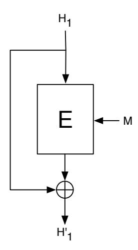

Figure 6.1: Compression function for the 64-bit hash functions DM-PRESENT-80 and DM-PRESENT-128.

## **6.5.2 Implementation results of** DM-PRESENT-80

We first describe the round-based implementation DM-PRESENT-80/64 with a 64-bit datapath and then subsequently the serialized implementation DM-PRESENT-80/4 with a 4-bit datapath.

### **Implementation results of** DM-PRESENT-80 **with a** 64**-bit datapath**

Figure 6.3 depicts the architecture of the DM-PRESENT-80 module with a datapath of 64 bits and its input and output signals are depicted in Figure 6.2(a). As one can see this architecture consists of the 64-bit gated register Temp, a finite state machine (FSM), a 64-bit XOR and a round-based PRESENT-80 implementation. The latter one contains a 64-bit and an 80-bit register, a 64-bit XOR, 17 S-boxes (16 in the datapath and one in the key schedule), the P-Layer and a 61-bit rotation and the 5-bit counter XOR in the key schedule.

We used the finite state machine (FSM) depicted in Figure 6.2(b) to control our implementation of DM-PRESENT-80 with a datapath of 64 bits. As can be seen the FSM consists of the six states S\_IDLE, S\_INIT\_TEMP, S\_INIT\_DATA, S\_PRESENT, S\_H\_UPDATE, and S\_DONE. Upon resetting the ASIC the FSM starts in the S\_IDLE state. The following two states S\_INIT\_TEMP and S\_INIT\_DATA both last for one clock cycle and do not have a condition for transition, *i.e.* after one clock cycle the FSM transitions to the following state. During the S\_INIT\_TEMP state the initial chaining variable H is loaded into the Temp register and during the S\_INIT\_DATA state it is forwarded to the State register. The S\_PRESENT state lasts for 31 cycles, during which a complete PRESENT encryption is performed. After the encryption the FSM transitons to the S\_H\_UPDATE state, where the result of the PRESENT encryption is XORed with the chainig variable H and the result is stored in the Temp register. This takes one clock cycle and if all message chunks are processed the FSM transitions to the S\_DONE state, otherwise to the S\_INIT\_DATA state. During the S\_DONE state the done signal is active indicating that the correct result is ready.

It takes 33 clock cycles to process one message chunk of 80 bits. At a frequency of 100 KHz this is equivalent to a throughput of 242.42 Kbps. After synthesis our implementation requires

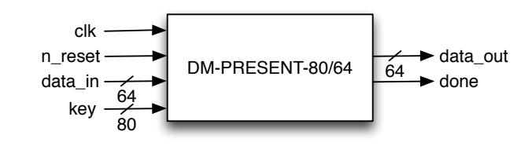

(a) Input and output signals.

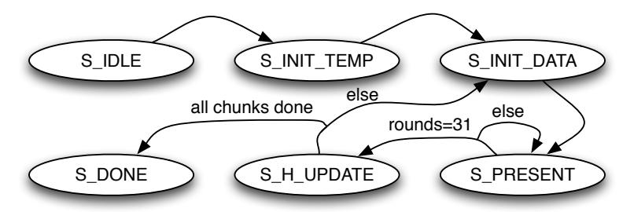

(b) Finite state machine.

Figure 6.2: I/O and FSM of the DM-PRESENT-80 module with a datapath of 64 bits.

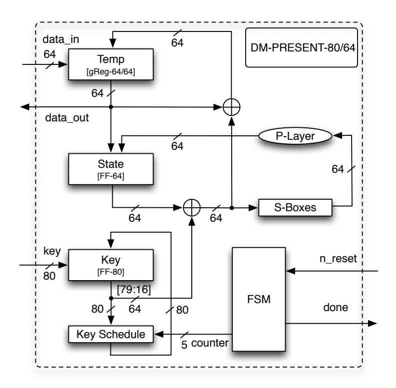

Figure 6.3: Architecture of the DM-PRESENT-80 module with a datapath of 64 bits.

| unit       | module             | area (GE) | %     |
|------------|--------------------|-----------|-------|
| PRESENT-80 | data state         | 384       | 17.35 |
|            | S-boxes            | 448       | 20.24 |
|            | P-layer            | 0         | 0     |
|            | key XOR            | 171       | 7.73  |
|            | key state          | 480       | 21.69 |
|            | 61<br>bit rotation | 0         | 0     |
|            | S-box              | 28        | 1.27  |
|            | counter XOR        | 13        | 0.59  |
| overhead   | temp state         | 384       | 17.35 |
|            | XOR                | 171       | 7.73  |
|            | other (e.g. FSM)   | 134       | 6.06  |
| sum        |                    | 2,213     | 100   |

Table 6.1: Area requirements of components of DM-PRESENT-80/64.

2, 213 GE and a breakdown of its components is given in Table 6.1. As one can see more than half of the area is required for storage of the state (56.4 %). The hardware efficiency is 109.5 bps/GE. At a frequency of 100 KHz and with the suggested wire-load model of 10, 000 GE the estimated power consumption is 6.28 µW, which is equivalent to 3.49 µA.

### **Implementation results of** DM-PRESENT-80 **with a** 4**-bit datapath**

The architecture of a serialized implementation with a datapath of 4 bits is depicted in Figure 6.4 and its input and output signals are shown in Figure 6.5(a). This architecture comprises of a gated register Temp with 4- and 64-bit inputs and outputs, a 4-bit XOR, a 4-bit MUX, and a serialized PRESENT-80 implementation. The latter one consists of a gated register with 4 and 64-bit input and output, one gated register with 4- and 80-bit input and output, two 4-bit MUXes, a 4-bit XOR, two S-boxes (each one for the datapath and the key schedule), the P-Layer, a 61-bit rotation, the 5-bit counter XOR in the key schedule and a finite state machine (FSM). Please note that this serialized PRESENT-80 implementation is similar to the one described in Section 5.1.1.

We used the finite state machine (FSM) depicted in Figure 6.5(b) to control our implementation of DM-PRESENT-80/4. As can be seen the FSM consists of the seven states S\_IDLE, S\_INIT\_DATA, S\_INIT\_KS, S\_SBOX, S\_PLAYER\_KS, S\_FINISHED, and S\_DONE. Upon resetting the ASIC the FSM starts in the S\_IDLE state and transistions after one clock cycle into the next state S\_INIT\_DATA. During each of the next 16 cycles a 4-bit chunk of the 64-bit chaining variable H is loaded into both the Temp and the State register. At the same time also the 64 MSB of the 80-bit message M are loaded into the Key register. Then the FSM transitions to the S\_INIT\_KS state, which loads the remaining 16 bits of the message M into the Key register. Thus it takes another 4 clock cycles before the FSM transitions to the next state S\_SBOX. During each of the 16 cycles of this state, a 4-bit chunk of the state is XORed with a 4-bit chunk of the roundkey, and then subsequently processed by the S-box. Once all 64 bits are processed, the FSM transitions to the S\_PLAYER\_KS state. During this state the whole State is permuted by the P-layer, and the Key register is updated with the new roundkey within one clock cycle. Since PRESENT features 31 complete rounds (*i.e.* a round consisting of key XOR, S-box lookup and permutation), the FSM returns back to the S\_SBOX state 31 times. At the

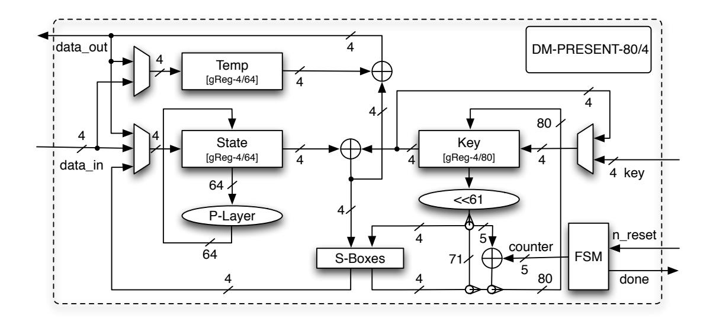

Figure 6.4: Architecture of the DM-PRESENT-80 module with a datapath of 4 bits.


serial=16

S\_DONE

(b) Finite state machine.

S\_FINISHED

Figure 6.5: I/O and FSM of the DM-PRESENT-80 top module with a datapath of 4 bits.

else

S\_PLAYER\_KS

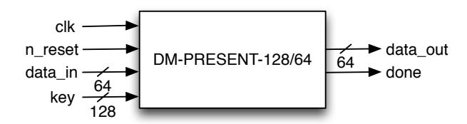

Figure 6.6: Input and output signals of the DM-PRESENT-128 top module with a datapath of 64 bits.

 $32^{nd}$  time the FSM transitions to the S\_FINISHED state. Within each of its 16 clock cycles it computes both the final round of PRESENT and then the XOR addition of the chaining variable H and the output of PRESENT, 4 bits at a time. Also the done signal is set to 1 to indicate that the result is output. Finally, the FSM transitions to the S\_DONE state in order to set the done signal to 0.

It takes 547 clock cycles to process one message chunk of 80 bits. At a frequency of 100 KHz this is equivalent to a throughput of 14.63 Kbps. After synthesis our implementation requires 1,600 GE. Unfortunately a detailed breakdown of its components is not possible in this case, because the synthesis result does not provide the required information. However, our serialized architecture of DM-PRESENT-80 consists of a serialized PRESENT-80 (1,075 GE), as described in Section 5.1.1), the Temp register (384 GE), a 4-bit MUX (9 GE), and a 4-bit XOR (11 GE), which sums up to 1,479 GE. The missing 121 GE may be required by the more complex FSM. The hardware efficiency is 9.1 bps/GE. At a clock frequency of 100 KHz and with the suggested wire-load model of 10,000 GE DM-PRESENT-80/4 consumes 1.83  $\mu$ W which is equivalent to 1.02  $\mu$ A.

### **6.5.3 Implementation results of DM-PRESENT-128**

First we describe the round-based implementation DM-PRESENT-128/64 with a 64-bit datapath and then subsequently the serialized implementation DM-PRESENT-128/4 with a 4-bit datapath.

#### Implementation results of DM-PRESENT-128 with a 64-bit datapath

Figure 6.7 depicts the architecture of the DM-PRESENT-128 module with a datapath of 64 bits and its input and output signals are depicted in Figure 6.6. Similar to the DM-PRESENT-80 implementation with a 64 bits datapath it contains a 64-bit gated register Temp, a finite state machine (FSM) and a 64 bit XOR. The main difference lies in the round-based PRESENTimplementation, which in this case is PRESENT-128 and not PRESENT-80. It consists of a 64-bit and a 128-bit register, a 64-bit XOR, 18 S-boxes (16 in the datapath and two in the key schedule), the P-Layer and a 61-bit rotation and the 5-bit counter XOR in the key schedule.

We used the same finite state machine (FSM) as for DM-PRESENT-80/64 (see Figure 6.2(b)) and refer to the description above for further details. Similar to the DM-PRESENT-80/64 implementation it also takes 33 clock cycles to process one message chunk. Contrary to the DM-PRESENT-80/64 implementation one message chunk now has 128 bits instead of 80 bits. Therefore the throughput at a frequency of 100 KHz is a factor of  $\frac{128}{80} = 1.6 \text{ higher}$  and now achieves 387.88

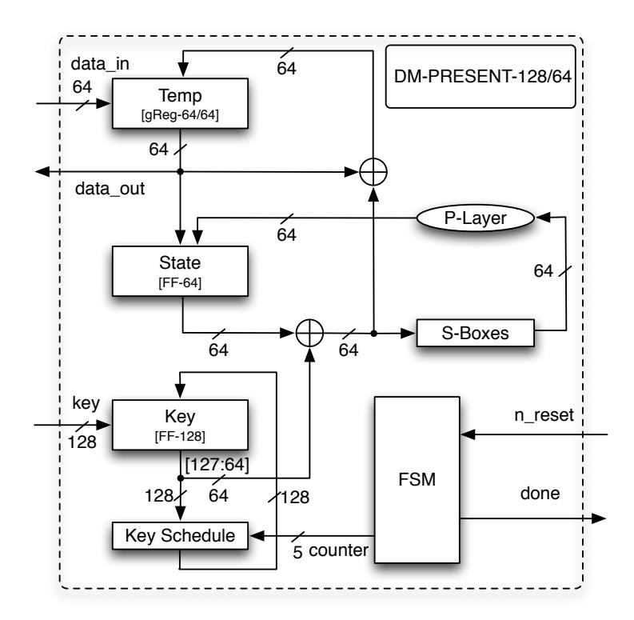

Figure 6.7: Architecture of the DM-PRESENT-128 module with a datapath of 64 bits.

| unit        | module             | area (GE) | %     |
|-------------|--------------------|-----------|-------|
| PRESENT-128 | data state         | 384       | 15.18 |
|             | S-boxes            | 448       | 17.71 |
|             | P-layer            | 0         | 0     |
|             | key XOR            | 171       | 6.76  |
|             | key state          | 768       | 30.36 |
|             | 61<br>bit rotation | 0         | 0     |
|             | S-boxes            | 56        | 2.21  |
|             | counter XOR        | 13        | 0.51  |
| overhead    | temp state         | 384       | 15.18 |
|             | XOR                | 171       | 6.76  |
|             | other (e.g. FSM)   | 135       | 5.3   |
| sum         |                    | 2,530     | 100   |

Table 6.2: Area requirements of components of DM-PRESENT-128/64.

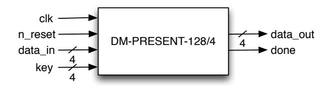

Figure 6.8: Input and output signals of the DM-PRESENT-128 top module with a datapath of 4 bits.

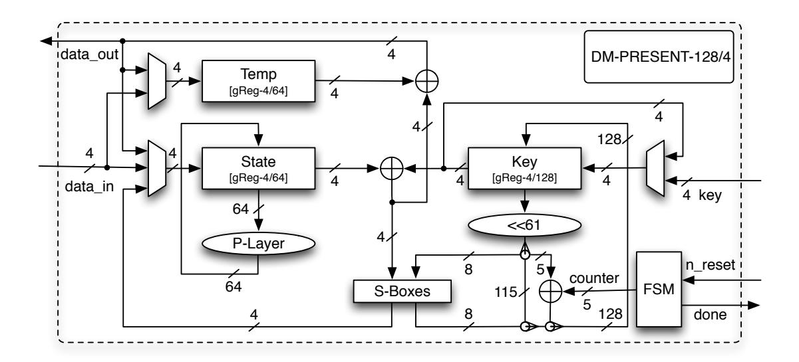

Figure 6.9: Architecture of the DM-PRESENT-128 module with a datapath of 4 bits.

Kbps. After synthesis our implementation requires  $2,530~\mathrm{GE}$  and a breakdown of its components is given in Table 6.2. As one can see more than 60~% of the area is required for storage of the state. Compared to the plain PRESENT-128 core the implementation of DM-PRESENT-128/64 requires 689 additional GE. The hardware efficiency is  $153.3~\mathrm{bps/GE}$ . At a frequency of  $100~\mathrm{KHz}$  and with the suggested wire-load model of  $10,000~\mathrm{GE}$  DM-PRESENT-128/64 has an average power consumption of  $7.49~\mu\mathrm{W}$ , which relates to an average current consumption of  $4.16~\mu\mathrm{A}$ .

#### Implementation results of DM-PRESENT-128 with a 4-bit datapath

The architecture of a serialized implementation with a datapath of 4 bits is depicted in Figure 6.9 and its input and output signals are shown in Figure 6.8. Similar to the DM-PRESENT-80/4 implementation this architecture comprises of a gated register Temp with 4- and 64-bit inputs ad outputs, a 4-bit XOR and one 4-bit MUX. The main difference lies in the serialized PRESENT implementation, which in this case is PRESENT-128 and not PRESENT-80. It consists of a gated register with 4- and 64-bit input and output, one gated register with 4- and 128-bit input and output, three 4-bit MUXes, a 4-bit XOR, two S-boxes, the P-Layer, a 61-bit rotation, the 5-bit counter XOR in the key schedule and a finite state machine (FSM).

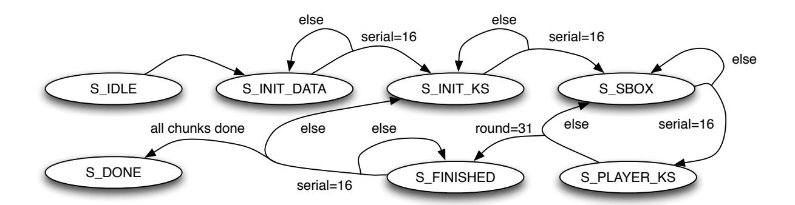

Figure 6.10: Finite state machine of the DM-PRESENT-128 module with a datapath of 4 bits.

We used a slightly modified version of the finite state machine (FSM) for DM-PRESENT-80/4 to control our implementation of DM-PRESENT-128/4, see Figure 6.10. As can be seen, the FSM consists of the same seven states, *i.e.* S\_IDLE, S\_INIT\_DATA, S\_INIT\_KS, S\_SBOX, S\_PLAYER\_KS, S\_FINISHED, and S\_DONE. The only difference occurs during the S\_INIT\_KS state. Since now PRESENT with a 128-bit key is used, it requires 12 more cycles to load the whole key into the Key register. Therefore the FSM transitions after 16 clock cycles to the next state and not after just four clock cycles. The remainder of the FSM is identical and we refer to the description above for more details.

It takes 559 clock cycles to process one message chunk of 128 bits. At a frequency of 100 KHz this is equivalent to a throughput of 22.9 Kbps. After synthesis our implementation requires 1,886 GE. Unfortunately a detailed breakdown of its components is not possible in this case, because the synthesis result does not provide the required information. However, our serialized architecture of DM-PRESENT-128 consists of a serialized PRESENT-128, the Temp register (384 GE), a 4-bit MUX (9 GE), and a 4-bit XOR (11 GE), which sums up to 1,886 GE. The hardware efficiency is 12.1 bps/GE. At a frequency of 100 KHz and with the suggested wireload model of 10,000 GE DM-PRESENT-128/4 has an average power consumption of  $2.94~\mu\text{W}$ , which relates to an average current consumption of  $1.63~\mu\text{A}$ .

# 6.6 Compact hash functions with a digest size of 128 bits

When designing a 128-bit hash function from the 64-bit output block cipher PRESENT, we have to appeal to so-called double-block-length hash function constructions. Natural candidates are MDC-2 [49] and Hirose's constructions [103, 105]. These schemes possess security proofs in the ideal cipher model, where the underlying block cipher is modeled as a family of random permutations, one permutation being chosen independently for each key. However, MDC-2 is not an ideal construction [214] and so we base our 128-bit hash function H-PRESENT-128 on the construction studied in [105]. We start with a description and security ananlysis of our proposal H-PRESENT-128 in Section 6.6.1. Subsequently, we present different implementation results for the proposal in Section 6.6.2.

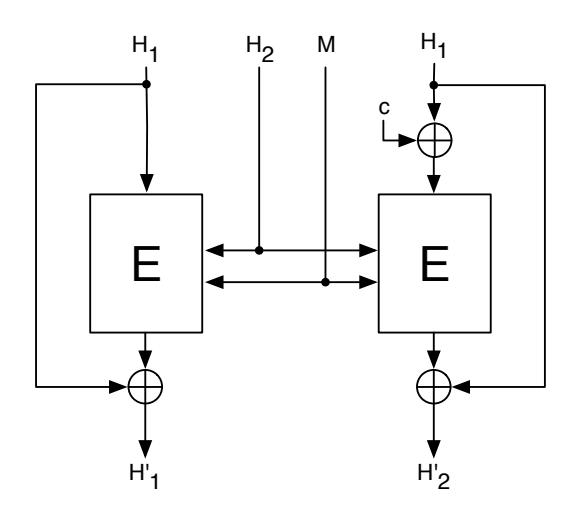

Figure 6.11: Compression function for the 128-bit hash function H-PRESENT-128.

### **6.6.1 Description of H-PRESENT-128**

The scheme H-PRESENT-128 is illustrated in Figure 6.11. The compression function takes as input two 64-bit chaining variables and a 64-bit message extract, denoted by the triple  $(H_1, H_2, M)$ , and outputs the pair of updated chaining variables  $(H_1', H_2')$  according to the computation

$$H_1' = E_{H_2 \parallel M}(H_1) \oplus H_1$$
 and  $H_2' = E_{H_2 \parallel M}(H_1 \oplus c) \oplus H_1$

where E denotes PRESENT-128 and c is a non-zero constant that needs to be fixed [40]. Thus the chaining variable  $H_1 \parallel H_2$  is 128 bits long and 64 bits of message-related input are hashed per iteration.

Hirose showed that, in the ideal cipher model, an adversary has to make at least  $2^n$  queries to the cipher in order to find a collision with non-negligible advantage, where n is the block size of the cipher. It is possible to make the same kind of analysis for preimage resistance (see proof of Theorem 4 in [104]) and to show that any adversary has to make at least  $2^{2n}$  queries to the cipher to find a preimage. As for Section 6.5 our implementation results are presented for both a parallel and serial implementation of PRESENT-128, see Table 6.5. These results should be viewed as indicative of the cost of a double-block-length construction using PRESENT. Since only one key schedule needs to be computed per iteration of the compression function, the Hirose construction is probably one of the most efficient constructions of this type, e.g. in the case of PRESENT around 1,000 GE can be saved in this way.

### **6.6.2 Implementation results of H-PRESENT-128**

First we describe the architecture and the implementation results of a round-based H-PRESENT-128 with a 128-bit datapath and subsequently the architecture of a serialized H-PRESENT-128 with an 8-bit datapath.

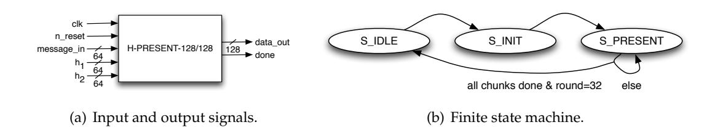

Figure 6.12: I/O and FSM of the H-PRESENT-128 module with a datapath of 128 bits.

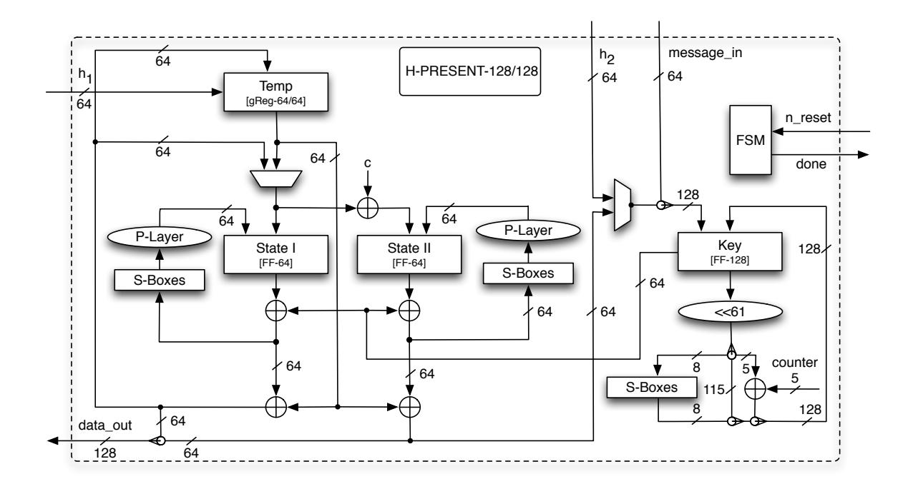

Figure 6.13: Architecture of the H-PRESENT-128 module with a datapath of 128 bits.

### **Implementation results of** H-PRESENT-128 **with a** 128**-bit datapath**

Figure 6.13 depicts the architecture of the round-based H-PRESENT-128 implementation with a datapath of 128 bits. The H-PRESENT-128/128 implementation consists of a gated register with 64-bit input and output for the chaining variable (384 GE), two 64-bit MUXes (298 GE), two 64-bit XOR gates (342 GE), a finite state machine, a modified PRESENT-128 core and an additional PRESENT data path (1, 000 GE). Note that since the constant c was chosen as 0x00000000 00000001, the XOR with the constant is actually only a NOT gate, which requires 0.5 GE.

We used the finite state machine (FSM) depicted in Figure 6.12(b) to control our implementation of H-PRESENT-128/128. As can be seen, the FSM consists of the three states S\_IDLE, S\_INIT and S\_PRESENT. Upon resetting the ASIC the FSM starts in the S\_IDLE state. During the following state S\_INIT the chaining variable h<sup>1</sup> is stored in the Temp register. In the same clock cycle also the second chaining variable h<sup>2</sup> and the first message chunk M are concatenated and loaded into the Key register. The FSM directly transitions without any condition

| unit        | module           | area (GE) | %     |
|-------------|------------------|-----------|-------|
| PRESENT-128 | 2× data state    | 853       | 20.06 |
|             | 2× S-boxes       | 896       | 21.07 |
|             | 2× P-layer       | 0         | 0     |
|             | 2× key XOR       | 342       | 8.04  |
|             | key state        | 768       | 18.06 |
|             | 61-bit rotation  | 0         | 0     |
|             | S-boxes          | 56        | 1.32  |
|             | counter XOR      | 13        | 0.31  |
| overhead    | temp state       | 384       | 9.03  |
|             | XOR              | 342       | 8.04  |
|             | MUXes            | 298       | 7.01  |
|             | other (e.g. FSM) | 301       | 7.08  |
| sum         |                  | 4,253     | 100   |

Table 6.3: Area requirements of components of H-PRESENT-128/128.

to the S\_PRESENT state. The S\_PRESENT state lasts for 32 cycles, during which a complete PRESENT encryption (including the final round) is performed. Both outputs of the two PRESENT datapathes are XORed with the initial chaining variable  $h_1$  and serve as the new chaining variables  $h_1'$  and  $h_2'$ .  $h_1'$  is stored in the Temp register and  $h_2'$  is concatenated with the next message chunk and stored in the Key register. Once all message chunks are processed the done signal is set to 1 indicating that the correct result is ready and the FSM transitons to the S\_IDLE state.

It takes 32 clock cycles to process one message chunk of 64 bits. At a frequency of 100 KHz this is equivalent to a throughput of 200 Kbps. After synthesis our implementation requires 4, 256 GE and a breakdown of its components is given in Table 6.3. As one can see more than half of the area is required for storage of the state (56.4 %). The hardware efficiency is 109.5 bps/GE. At a frequency of 100 KHz and with the suggested wire-load model of 10,000 GE H-PRESENT-128/128 has an average power consumption of 8.09  $\mu$ W, which relates to an average current consumption of 4.49  $\mu$ A.

#### Implementation results of H-PRESENT-128 with an 8-bit datapath

Figure 6.14 depicts the architecture of the serialized H-PRESENT-128 implementation with a datapath of 8 bits. The H-PRESENT-128/8 implementation basically consists of the DM-PRESENT-128/4 implementation (1,886 GE, see above for details) with some additional logic. In particular this is a gated register with 4-bit and 64-bit input and output for the second PRESENT state (384 GE), two 4-bit MUXes (20 GE), two 4-bit XOR gates (22 GE)<sup>3</sup> and an additional 4-bit MUX for the S-box input (10 GE).<sup>4</sup>

We used the same finite state machine (FSM) as for DM-PRESENT-128/4 (see Figure 6.10) to control our implementation of H-PRESENT-128/8, hence we refer to the description above for

<sup>&</sup>lt;sup>3</sup>Because the roundkey is XORed to both PRESENT states and both results are then XORed with the chaining variable. Therefore, H-PRESENT-128/8 requires two 8-bit XORes and not two 4-bit XORes as DM-PRESENT-128/4.

<sup>&</sup>lt;sup>4</sup>H-PRESENT-128/8 has two serialized PRESENT datapathes, hence 8 bits are processed by the S-boxes, while DM-PRESENT-128/4 has only one PRESENT datapath, hence only 4 bits are processed at once. Since in both architectures the S-boxes are also used by the key schedule the input has to be multiplexed.

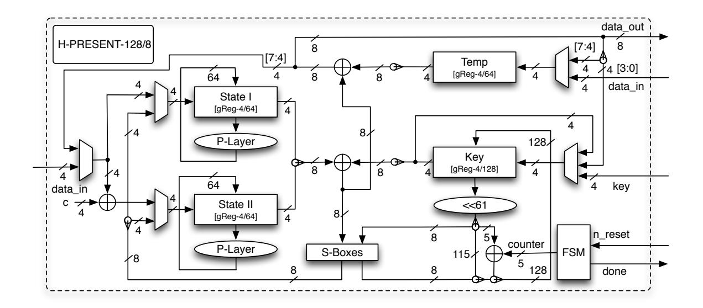

Figure 6.14: Architecture of the H-PRESENT-128 module with a datapath of 8 bits.

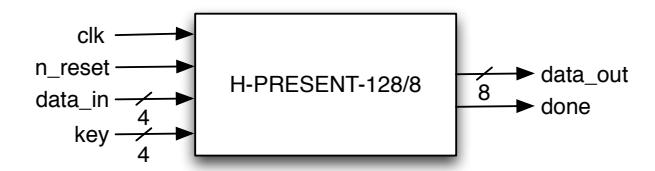

Figure 6.15: Input and output signals of the H-PRESENT-128 top module with a datapath of 8 bits.

more details. It takes 559 clock cycles to process one data chunk of 64 bits. Since DM-PRESENT-128/4 processes data chunks of 128 bits while requiring the same amount of clock cycles, H-PRESENT-128/8 gains exactly half of its throughput, *i.e.* 11.45 Kbps at a frequency of 100 KHz. After synthesis our implementation requires 2,330 GE. Again for this architecture a detailed breakdown of its components is not possible. The hardware efficiency is 4.9 bps/GE. At a frequency of 100 KHz and with the suggested wire-load model of 10,000 GE H-PRESENT-128/8 has an average power consumption of 6.44  $\mu$ W, which relates to an average current consumption of 3.58  $\mu$ A.

# 6.7 Compact hash functions with a digest size of $\geq$ 160 bits

In some cases tag-enabled applications might need collision-resistance at a security level of  $2^{80}$  operations. For this we need a hash output of 160 bits or greater. However, this is where the problems really begin and we consider two directions.

For the first, we continue the approach to consider building a hash function with a hash output greater than 160 bits from PRESENT as is. So in Section 6.7.1 we try to use PRESENT in this way and, using established results in the literature, we make a proposal. However, at the same time, we use the very same results to demonstrate that this approach is unlikely to be successful, a sentiment that is supported by our implementation results in Section 6.7.2. Instead, for the second direction that is described in Section 6.7.3, we move towards a dedicated hash function though we keep elements of PRESENT in our constructions. Our dedicated proposals are deliberately simple and obvious, and in this way we aim to provide some first results on the impact different design choices might have in moving towards a new, compact, hash function.

### **6.7.1 Description of** C-PRESENT-192

We aim to design a hash function that is based on PRESENT and has a digest size of at least 160 bits. Since PRESENT has a 64-bit block size, this means that we are forced to consider a triple-block-length construction and we will obtain a 192-bit hash function. Unfortunately very few designs for l-block length hash function with  $l \geq 3$  have been studied so far. However, Peyrin et al. [179] have identified some necessary conditions for securely combining compression functions to obtain a new compression function with a longer output. We can use these results and so, in the case we consider here, our constituent compression functions will be based around PRESENT-128, i.e. we will use DM-PRESENT-128 as the building block.

More background to the construction framework is given in [179]. However, within this framework, efficiency demands that we keep to a minimum the number of compression functions that we need to use, where each compression function is instantiated by DM-PRESENT-128. For reasons of simplicity and greater design flexibility we restrict ourselves to processing only a single 64-bit message extract, and so our inputs to C-PRESENT-192, where we use C as shorthand for "constructed", consist of a quadruplet  $(H_1, H_2, H_3, M)$  while the output is a triplet  $(H_1', H_2', H_3')$ . The compression function C-PRESENT-192 is illustrated in Figure 6.16. The output is computed as:

$$H'_1 = f^{(1)}(H_3, H_1, H_2) \oplus f^{(3)}(H_3 \oplus M, H_1, H_2) \oplus f^{(5)}(H_2, H_3, M)$$

 $H'_2 = f^{(1)}(H_3, H_1, H_2) \oplus f^{(4)}(H_1, H_3, M) \oplus f^{(6)}(H_1 \oplus H_2, H_3, M)$
 $H'_3 = f^{(2)}(M, H_1, H_2) \oplus f^{(4)}(H_1, H_3, M) \oplus f^{(5)}(H_2, H_3, M)$

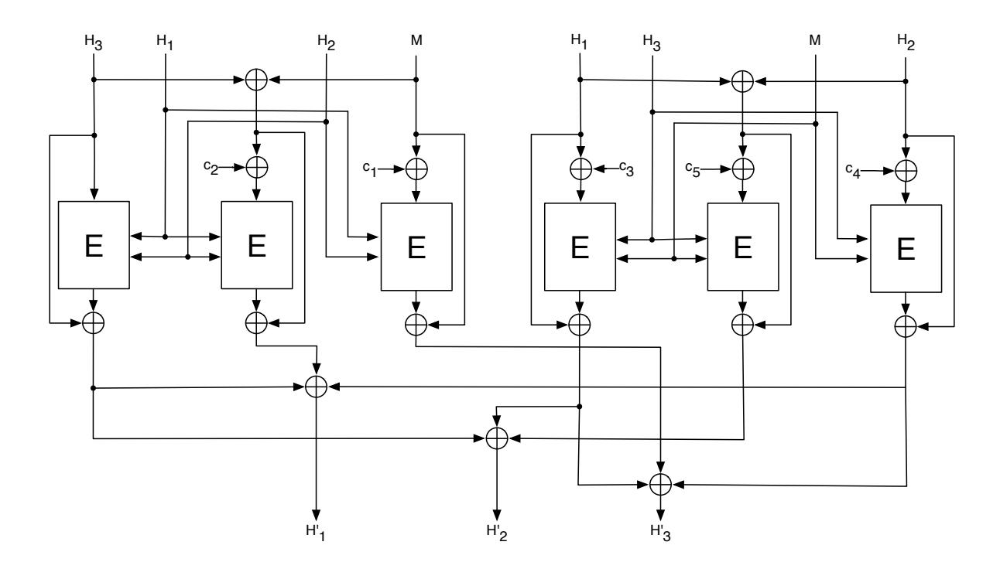

Figure 6.16: Compression function for the 192-bit hash function C-PRESENT-192.

with f (i) (A, B, C) = E(A ⊕ ci−1, BkC) ⊕ A for different constants c<sup>i</sup> and E denotes encryption with PRESENT-128.

Each inner compression function f (i) is built around PRESENT-128 in Davies-Meyer mode, and five non-zero constants c1, . . . , c<sup>5</sup> are used to make them independent. The constants were chosen to be linearly independent and of low Hamming weight.

We chose the constants c<sup>0</sup> to c<sup>5</sup> according to the following equation

$$c_i = \begin{cases} 0, i = 0 \\ c_i = 2^{i-1}, 1 \le i \le 5. \end{cases}$$

In other words we used the constants c<sup>0</sup> = 0 = 000002, c<sup>1</sup> = 1 = 000012, c<sup>2</sup> = 2 = 000102, c<sup>3</sup> = 4 = 001002, c<sup>4</sup> = 8 = 010002, c<sup>5</sup> = 16 = 100002. In a more computer architecture oriented description the non-zero constants c1, . . . , c<sup>5</sup> are given by

$$c_i = (0x0000000000000001) \ll (i-1).$$

This construction might seem too complicated, but this is exactly the point we wish to make. The particular set of parameter values that are forced upon us when trying to build a largeoutput hash function from a small block cipher means that there will be *no* simple construction. More precisely, work in [179] shows that for *any* construction that uses a compression function with parameters equivalent to PRESENT-128 along with linear mixing layers to combine chaining variables and intermediate values, at least six compression functions are needed to resist all currently-known generic attacks. We *must* therefore use at least six independent calls to DM-PRESENT-128, which is attained by our C-PRESENT-192 construction.

In addition, the output mapping should be a (6, 3, 3) binary linear error-correcting code, while the input mapping must satisfy the following constraints:

- (1) Every external output block must depend on all external input blocks, no matter which invertible transformation of the external inputs and outputs is applied.
- (2) Every pair of external input blocks must appear as an identified pair for every invertible combination of external output blocks, where a pair (A, B) is said to be identified when A and B both appear within the internal inputs to some f (i) , and this no matter which invertible transformation of the external inputs is applied.

The input mapping for our representative was selected from among those that satisfy these conditions and that also minimize the number of key schedules used to hash one block of message. By reducing the number of key schedules we increase the performance of the scheme and, potentially, reduce the space required by an implementation. It can be proved that for the parameter sets of interest to us here, the minimal number of key schedules is two.

For the results of Peyrin *et al.* [179] to hold, the compression functions f (i) have to be *ideal* compression functions with respect to collision and preimage resistance (that is, finding a collision or a preimage must require on average Θ(2n/<sup>2</sup> ) and Θ(2<sup>n</sup> ) evaluations of the function respectively) and must behave independently. Each inner compression function f (i) is built around PRESENT-128 in a way similar to the Davies-Meyer mode. That way, the results of Black *et al.* [30] ensure that, in the ideal cipher model, finding a collision (resp. a preimage) for the compression functions f (i) requires Θ(2n/<sup>2</sup> ) (resp. Θ(2<sup>n</sup> )) queries to the cipher. Hence, in the ideal cipher model, each inner compression function f (i) is ideal in the sense defined above.

Making the six compression functions f (i) independent is not so easy. The most secure way to do this would be to "tweak" the block cipher with *e.g.* the XE or XEX construction of Rogaway [198]. However, these constructions are only efficient when one has to compute ciphertexts for the same key and many different tweaks, which is not our case. Using any known provably secure construction of a tweakable block cipher for the C-PRESENT-192 scheme would imply one supplementary cipher call for each key, thus increasing the number of block cipher calls per message block to eight. Instead we might consider using the same kind of technique that is used in the Hirose construction and we use five constants c1, . . . , c<sup>5</sup> to make the six instances of the compression function independent. In the absence of a structural weakness in PRESENT this is sufficient for our purposes. Further, we are trying to estimate the space required for a construction of this type and so this approach will help to yield conservative estimates. The constants were chosen to be linearly independent and of low Hamming weight. They are given by c<sup>0</sup> = 0 and c<sup>i</sup> = (0x0000000000000001) (i − 1) for i ≥ 1. While some limitations of this construction follow from [205], assuming we can consider the inner compression functions independent, Peyrin *et al.* show that there is no currently-known attack with *computational* complexity less than brute-force on the larger compression function.

## **6.7.2 Implementation results and estimations of** C-PRESENT-192

When implementing C-PRESENT-192 in a round-based manner, there is a trade-off between storage of intermediate values and additional PRESENT datapaths. A completely parallelized approach would require six datapaths (6 × 840 GE = 5, 040 GE, see Section 5.1) and two key schedules (2 × 1, 000 GE = 2, 000 GE, see Section 5.1) of PRESENT-128, eight 64-bit XORs with two inputs (8 × 64 × 2.67GE = 1, 368 GE) and three 64-bit XORs with three inputs (3 × 64 × 4.67 GE = 896 GE). Note that the XOR addition of the constants can be achieved by inverting the appropriate bit positions. Since we chose five constants that all have Hamming weight 1, the area requirement for the XOR addition of the constants is about 3 GE. In total the minimal requirement for a round-based implementation of C-PRESENT-192 would sum up to more than 9, 300 GE and these figures do not even include the finite state machine of the control logic. This is far away from our ideal goal of around 2, 000 GEs and consequently we do not follow this approach any further.<sup>5</sup>

However, following the above stated trade-off, it is possible to sacrifice throughput for the benefit of area savings. Since a PRESENT datapath consists of the storage for 64 bits, the requirements for the S-boxes and the key XOR, we chose to use as few datapaths as possible. In our proposed C-PRESENT-192 the key schedule is shared by three PRESENT datapaths. In order to benefit from the shared key schedule, at least three PRESENT datapaths are required. Therefore, we base our estimations on three serialized PRESENT datapaths.

A serialized PRESENTdatapath basically consists of the storage for the state (384 GE), the key XOR (11 GE) and the S-box (28 GE), which sums up to a total gate count of 384 + 11 + 28 = 423 GE. Besides three PRESENTdatapathes (3 × 423 GE = 1, 269 GE) and one PRESENT-128 key schedule (837 GE) C-PRESENT-192 requires to store at least five additional 64-bit temporary values (5 × 64 GE = 1, 920 GE), 13 4-bit MUXes (13 × 4 × 2.33 GE = 121 GE), which would lead to 4, 150 GE. Additionally, several XOR gates and a finite state machine are required, so in total we estimate the area requirements with 4, 600 GE. Such a serialized implementation would require 3, 338 clock cycles for processing one block of 64 bits, giving it a throughput of 1.9 Kbps at 100 KHZ. In total this would lead to a hardware efficiency of 0.41 bps. From these estimations it becomes clear that also a serialized implementation of C-PRESENT-192 requires too much area, mostly because of the huge intermediate storage requirements.

### **6.7.3 Dedicated design elements inspired by** PRESENT

Hash function design is notoriously difficult and so an interesting first step is to identify some general approaches and to understand their security and performance trade-offs. In this section we describe the results of some prototyping which tests a range of approaches and provides good background to our ongoing work. Our basic premise is to stay close to the design elements of PRESENT and to modify the design so as to give a block cipher with a much larger block size. We then adapt the key schedule in two alternative ways with the first being a natural proposal and the second having strong similarities to Whirlpool [17]. We give implementation results for both approaches.

Our schemes will continue to be based on the Davies-Meyer (DM) scheme Hi+1 = E(H<sup>i</sup> , Mi)⊕ H<sup>i</sup> though the form of our encryption function E will now change. In general, the encryption function E can be described as:

$$\begin{split} E: \mathbb{F}_2^n \times \mathbb{F}_2^k &\to \mathbb{F}_2^n \ , \\ E: \text{PLAINTEXT} \times \text{KEY} &\mapsto \text{CIPHERTEXT}. \end{split}$$

The detailed description of PRESENT can be found in Section 4. At a top-level we can write the r-round encryption of the plaintext STATE as:

<sup>5</sup>Note that the <sup>C</sup>-PRESENT-192/192 implementation described in [34] only uses two round-based PRESENT datapaths and also shares XOR-gates. Technically speaking this is not a plain round-based implementation, but an approach that uses round-based components in a serialized manner. Therefore it is no wonder that the implementation figures for C-PRESENT-192/192 given in [34] are smaller than our estimates for a plain round-based implementation. However, this design still requires more than 8, 000 GE and hence is far too demanding for our purposes.

```
for i = 1 to r do

STATE \leftarrow STATE \oplus eLayer(KEY, i)

STATE \leftarrow sBoxLayer(STATE)

STATE \leftarrow pLayer(STATE)

KEY \leftarrow genLayer(KEY, i)
\nend for

STATE \leftarrow STATE \oplus eLayer(KEY, r + 1),
```

where eLayer describes how a subkey is combined with a cipher STATE, sBoxLayer and pLayer describe how the STATE evolves, and genLayer is used to describe the generation of the next subkey.

When used in the DM mode we recast the plaintext and ciphertext as hash function STATE and use the (formatted) message extract as the key. For ease of design we will choose the parameters k and n so that k|n and 4|n, and both our proposals will have the following (unmodified) structure:

```
\begin{aligned} & \textbf{for } i = 1 \textbf{ to } r \textbf{ do} \\ & \textbf{STATE} \leftarrow \textbf{STATE} \oplus \textbf{eLayer}(\texttt{MESSAGE}, i) \\ & \textbf{STATE} \leftarrow \textbf{sBoxLayer}(\texttt{STATE}) \\ & \textbf{STATE} \leftarrow \textbf{pLayer}(\texttt{STATE}) \\ & \textbf{MESSAGE} \leftarrow \textbf{genLayer}(\texttt{MESSAGE}, i) \\ & \textbf{end for} \\ & \textbf{STATE} \leftarrow \textbf{STATE} \oplus \textbf{eLayer}(\texttt{MESSAGE}, r+1). \end{aligned}
```

The following building blocks are unchanged between the two proposals and are merely generalizations of the PRESENT structure to larger 160-bit block sizes.

- (1) sBoxLayer: This denotes use of the PRESENT  $4 \times 4$ -bit S-box S and it is applied n/4 times in parallel.
- (2) pLayer: This is an extension of the PRESENT bit-permutation and moves bit i of STATE to bit position P(i), where

$$P(i) = \begin{cases} i \cdot n/4 \mod n - 1, & \text{if } i \in \{0, \dots, n - 2\} \\ n - 1, & \text{if } i = n - 1. \end{cases}$$

It is in the specification of genLayer, which transforms the message of length k from round-to-round, and eLayer :  $\mathbb{F}_2^k \to \mathbb{F}_2^n$ , that describes how the message extract is combined with cipher state, that the two proposals differ.

**PROP-1.** For ease of comparison with PRESENT we keep exactly the same 80-bit key input and the same 80-bit key schedule. Thus we modify a 160-bit chaining variable using an 80-bit message input and, to make an implementation estimate, we use 64 rounds. This is equivalent to the parameters n=160, k=80, and r=64. The sBoxLayer and pLayer are as above and eLayer and genLayer are described as follows:

- (1) eLayer(MESSAGE, i) = MESSAGE||genLayer(MESSAGE, i)
- (2) genLayer(MESSAGE, i) is defined as the 80-bit key schedule of PRESENT. Thus, MESSAGE is rotated by 61-bit positions to the left, the left-most four bits are passed through the PRESENT S-box, and the round counter i is exclusive-ored with some bits of MESSAGE.

In words, we use the key schedule of PRESENT-80 exactly as is and at each round we use what would be two successive 80-bit round keys. At each round the key schedule is updated only

once, so the same subkey is used once on the right-hand side and, in the following round, on the left-hand side.

**PROP-2.** For the second proposal, we consider a structure that has some similarity to Whirlpool. Our parameter set is n = 160 and k = 160 which allows us to use a longer message extract at each iteration of the compression function. For prototyping and implementation estimates we set r = 80. The building blocks eLayer and genLayer are specified as:

- (1) eLayer(MESSAGE, i) = MESSAGE
- (2) genLayer(MESSAGE, i) = pLayer(sBoxLayer(MESSAGE ⊕ i)), being just a copy of the data path with round constant addition.

In words, we imagine that our message extract is a 160-bit key and we process the key in a key-schedule that is identical to the encryption process.

Our proposed design elements are not intended to be specifications. Nevertheless, some preliminary analysis follows from the simple structures proposed. In particular, for a fixed message block and two different chaining values we can apply Theorem 1 of [33] directly. This states that at least 10 active S-boxes are involved in any 5-round differential characteristic. However, for the more important case of two different message blocks, the analysis has to be slightly modified. The following two results on the differential behavior of the proposals can be viewed as a first step towards a deeper analysis:

**Theorem 6.1.** *Let* P (3) (∆1,∆2)7→∆ *be the probability of a differential characteristic over 3 rounds of PROP-1 with* ∆<sup>2</sup> 6= 0*, i.e. the probability that*

$$PROP-1_3(H \oplus \Delta_1, M \oplus \Delta_2) = PROP-1_3(H, M) \oplus \Delta,$$

*where* PROP-1<sup>3</sup> *denotes three rounds of PROP-1. Then each 3-round differential characteristic of this form has at least 4 active S-boxes and therefore* P (3) (∆1,∆2)7→<sup>∆</sup> ≤ 2 −8 *.*

**Theorem 6.2.** *Let* P(∆1,∆2)7→<sup>∆</sup> *be the probability of a differential characteristic such that*

$$PROP-2(H \oplus \Delta_1, M \oplus \Delta_2) = PROP-2(H, M) \oplus \Delta$$

for
$$\Delta_2 \neq 0$$
. Then  $P_{(\Delta_1, \Delta_2) \mapsto \Delta} \leq 2^{-400}$  for PROP-2.

Theorem 6.1 indicates that the probability of each 64-round differential characteristic can be upper-bounded by (2−<sup>8</sup> ) 64 <sup>3</sup> ≈ 2 <sup>−</sup>170. This observation as well as Theorem 6.2 show that the differential properties may be strong enough to thwart pre-image, second pre-image and collision attacks for both proposals. Furthermore, Theorem 6.2 indicates that one could probably decrease the number of rounds in PROP-2 without unduly compromising the security. The most appropriate trade-off remains an area of research.

## **6.7.4 Estimations of** PROP-1 **and** PROP-2

We estimated the hardware figures for different architectures when implementing PROP-1 and PROP-2. Our implementation estimates range from a 4-bit width data path (highly serialized) up to a 160-bit width data path which offers one round of processing in one cycle. Since PROP-2 uses a very similar key schedule (*i.e.* message path) and encryption routine, we can give a further two different implementation options: one with a shared sBoxLayer between the data path and the message path and one with an individual sBoxLayer. The results are summarized in Table 6.4 with the efficiency *eff.* being measured in bps/GE.

| data  |       | PROP-1 |                   |       | PROP-2 (shared) |                   |       | PROP-2 (ind.) |                   |
|-------|-------|--------|-------------------|-------|-----------------|-------------------|-------|---------------|-------------------|
| path  | area  | cycles | eff.              | area  | cycles          | eff.              | area  | cycles        | eff.              |
| width | (GE)  |        | Kbps<br>(<br>GE ) | (GE)  |                 | Kbps<br>(<br>GE ) | (GE)  |               | Kbps<br>(<br>GE ) |
| 4     | 2,520 | 5,282  | 1.2               | 3,010 | 6,481           | 0.82              | 3,020 | 3,281         | 1.62              |
| 16    | 2,800 | 1,322  | 4.33              | 3,310 | 1,621           | 2.92              | 3,380 | 821           | 5.77              |
| 32    | 3,170 | 662    | 7.64              | 3,730 | 811             | 5.11              | 3,860 | 411           | 10.09             |
| 80    | 4,270 | 266    | 14.09             | 4,960 | 325             | 9.29              | 5,300 | 165           | 18.3              |
| 160   | 4,830 | 134    | 24.73             | 5,730 | 163             | 15.29             | 6,420 | 83            | 30.03             |

Table 6.4: Hardware estimations of PROP-1 and PROP-1 using datapath widths from 4 bit to 160 bit.

# **6.8 Conclusion**

Table 6.5 summarizes our results and compares them to other hash functions and AES-based schemes. When the hash output length is 128 bits or lower, a construction based around PRESENT seems to have potential. Certainly they are far more competitive than current hash functions, the primary reason being that there exist efficient block cipher-based constructions for this size of hash output. Even a larger block cipher such as AES makes for a more compact hash function than current dedicated designs at this security level, though the throughput suffers. Also first estimates of an ASIC implementation of SQUASH indicate significantly higher area requirements while at the same time providing a two orders of magnitude lower throughput.

For the area estimates of the AES-based *Davies-Meyer* and *Hirose* schemes we used the smallest known (3,400 GE) AES implementation [71]. We estimated the area requirements for storing one bit to be 8 GE as stated in [71]. For the AES-based *Davies-Meyer scheme* we assumed that at least one additional register would be required to store the 128-bit value H<sup>1</sup> (1,024 additional GE), summing up to at least 4,400 GE in total.

The AES-based *Hirose scheme* requires an AES implementation with 256-bit key length. However, no such low-cost implementation has been reported so far. Therefore we estimate the area requirements starting from the Feldhofer *et al.* [71] implementation with a 128-bit key. At least 128 additional key bits (1,024 GE) have to be stored to achieve an AES implementation with 256 bits key length, summing up to at least 4,400 GE. The *Hirose scheme* requires two instantiations of the block cipher and the storage of one intermediate value H1, which has the same size as the block size. All together we estimate the AES-based *Hirose scheme* to require at least 9,800 GE. The serial variant of C-PRESENT-192 was not implemented, because the figures for the round-based variant and the estimations indicate large area requirements with more than 4, 600 GE. In fact this large area requirement for both variants of C-PRESENT-192 was the main reason to look for other constructions such as PROP-1 and PROP-2.

Note that it is not easily possible to compare power consumption of designs implemented in different technologies, hence we did not include these figures in Table 6.5. However, the figures for SHA-256 (15.87 µW) and SHA-1 (10.68 µW) provided by Feldhofer and Rechberger [72] are in the same range as ours.

While compact hash functions are often proposed in protocols for RFID tags, there are currently no sufficiently compact candidates to hand. Here we have explored the possibility of building a hash function out of a block cipher such as PRESENT. We have described hash func-

Table 6.5: The performance of different hash functions based on the direct application of PRESENT. For comparison with our hash functions with 128-bit output we include estimates for the AESbased 128-bit hash function in Davies-Meyer mode. For comparison with MAME we include estimates for the 256-bit hash function built from the AES in Hirose's construction.

|                        | Hash<br>output<br>size | Data<br>path<br>size | Cycles<br>per<br>block | Throughput<br>at 100KHz<br>[Kbps] | Eff.<br>[bps/GE] | Logic<br>process | Area<br>[GE] |  |
|------------------------|------------------------|----------------------|------------------------|-----------------------------------|------------------|------------------|--------------|--|
|                        |                        |                      | 64                     | bit output size                   |                  |                  |              |  |
| DM-PRESENT-80          | 64                     | 64                   | 33                     | 242.42                            | 109.5            | 0.18µm           | 2,213        |  |
|                        |                        | 4                    | 547                    | 14.63                             | 9.1              | 0.18µm           | 1,600        |  |
| DM-PRESENT-128         | 64                     | 64                   | 33                     | 387.88                            | 153.3            | 0.18µm           | 2,530        |  |
|                        |                        | 4                    | 559                    | 22.9                              | 12.1             | 0.18µm           | 1,886        |  |
| SQUASH [90]            | 64                     | 12                   | 104,114                | 0.06                              | 0.01             | ISE              | 6,328        |  |
| 128<br>bit output size |                        |                      |                        |                                   |                  |                  |              |  |
| H-PRESENT-128          | 128                    | 128                  | 32                     | 200                               | 47               | 0.18µm           | 4,253        |  |
|                        |                        | 8                    | 559                    | 11.45                             | 4.9              | 0.18µm           | 2,330        |  |
| MD4 [72]               | 128                    | 32                   | 456                    | 112.28                            | 15.3             | 0.13µm           | 7,350        |  |
| MD5 [72]               | 128                    | 32                   | 612                    | 83.66                             | 10               | 0.13µm           | 8,400        |  |
| DM-AES                 | 128                    | 8                    | ><br>1,032             | <<br>12.4                         | <<br>2.8         | estimate         | ><br>4,400   |  |
|                        |                        |                      | ≥<br>160               | bit output size                   |                  |                  |              |  |
| C-PRESENT-192          | 192                    | 192                  | 108                    | 59.26                             | 7.4              | 0.18µm           | 8,048        |  |
|                        |                        | 12                   | 3,338                  | 1.9                               | 0.41             | estimate         | 4,600        |  |
| SHA-1 [72]             | 160                    | 32                   | 1,274                  | 40.19                             | 4.9              | 0.35µm           | 8,120        |  |
| SHA-256 [72]           | 256                    | 32                   | 1,128                  | 45.39                             | 4.2              | 0.35µm           | 10,868       |  |
| MAME [95]              | 256                    | 256                  | 96                     | 266.67                            | 32.9             | 0.18µm           | 8,100        |  |
| H-AES                  | 256                    | 8                    | ><br>1,032             | <<br>12.4                         | <<br>1.3         | estimate         | ><br>9,800   |  |

tions that offer 64- and 128-bit outputs based on current design strategies. For their parameter sets these are the most compact hash function candidates available today. In particular, H-PRESENT-128 requires around 4,000 GE, which is similar to the best known AES implementation and about 50% smaller than the best reported MD5 implementation. At the same time, H-PRESENT-128 requires between 20–30 *times* fewer clock cycles than compact AES and MD5 implementations, giving it a major time-area advantage.

Obviously 128-bit hash functions are relevant for applications where a security-performance trade-off is warranted. To obtain larger hash outputs there are severe complications and we suspect that dedicated designs could be more appropriate.

Understanding the best trade-offs for the different approaches is not easy. As one can see, all three estimations of PROP-1 and PROP-2 scale nicely, though it seems that PROP-2 is more efficient in terms of throughput per area when compared to PROP-1. On the other hand PROP-1 offers a lower minimal achievable gate count, though at the cost of a higher cycle count. Much would also depend on a thorough security analysis of any final proposal and while some initial analysis suggests the possibility of optimizations to an approach like PROP-2, this is something to explore in future work during the design of an explicit proposal.

Clearly there are many areas of open research, not least the design of very compact hash functions. In parallel, it might also be worth revisiting tag-based protocols that use hash functions to see if the same goals can be achieved in a different way.

# **7 Lightweight Public-Key Cryptography**

In this Chapter first the usage of lightweight public-key cryptography is motivated in Section 7.1 and related work is treated in Section 7.2. Subsequently, a brief introduction to the *crypto-GPS* identification scheme is given in Section 7.3. Then a prototype board that contains a proof-of-concept ASIC implementation of *crypto-GPS* is decribed in Section 7.4. The component of the ASIC, three different variants of the *crypto-GPS* scheme, are described subsequently. First two round-based variants are describe in Section 7.5 and a serialized implementation is detailed in Section 7.6.

# **7.1 Motivation**

The automotive production process nowadays is very sophisticated with a widely distributed division of tasks. Consequently it is also referred to as a *supply chain* [97] or even more precise a *supply network*. On the different steps in the production process different supplier and sub-supplier deliver components or modules just-in-time (JIT). Some modules, such as dashboards or seats are delivered just-in-sequence (JIS). It is of paramount importance to identify components cheaply and reliably in order to guarantee to have the right part at the right place of the assembly line at the right point in time (JIT) in the right order (JIS). Since many different players are here involved, this kind of scenarios for RFID applications is also referred to as *open systems*. An overview of potentials and risks for automotive supply-chains that use RFID tags from an economic perspective is provided in [183]. One conclusion is that there are great optimization potentials, but also severe security threats if RFID tags are used in open systems.

The former chapters dealt with symmetric cryptographic primitives, which have the drawback of the key-distribution problem. In *closed systems* RFID tags, readers and the backend system are controlled by a single player. However, this poses no great difficulty, but for open systems it does. Lightweight public-key cryptography may be suitable to address these problems.

# **7.2 Related Work**

There exists a rich literature on low-area implementations of public key cryptography based on elliptic curves (ECC). Comparison of different ECC implementations is not always easy, because the choice of the underlying curve determines both efficiency and security of the algorithm. However, no implementation has been published so far that comes close to the goal of 2, 000 GE, but several publications—with a significantly lower security level than 80-bit—exist that are in the range of 10, 000 GE or above [18, 68, 75]. Gaubatz *et al.* [76] have investigated the hardware efficiency of the NTRUencrypt algorithm [174, 106] with the following parameters (N, p, q) = (167, 3, 128) that offer a security level of only 57 bits. Though their implementation requires only 2, 850 GE, it takes 29, 225 clock cycles, which translates to 292 ms, for the response to be computed. However, it is noteworthy that more than 80% of the area is occupied with storage elements and that already a bit serial datapath is used, which implies that the chance of future improvements is very limited. Oren *et al.* propose a public key identification scheme called *WIPR* [177] that is based on the randomized variant [87] of the Rabin crypto system [190]. Their ASIC implementation requires 5, 705 GE and 66, 048 clock cycles, which is still significantly larger than 2, 000 GE.

# **7.3 The GPS identification scheme**

In this Section first a brief historical overview of GPS is given, before relevant parameters and optimization tricks are presented.

# **7.3.1 History**

In 1991 Girault describes self-certified public keys in [81] and 1998 Poupard and Stern analyzed the security of practical "on-the-fly" authentication and signature systems [185]. In 2006 Marc *G*irault, Guillaume *P*oupard and Jacques *S*tern proposed an "On the Fly Authentiction and Signature Scheme Based on Groups of Unknown Order" in [85].<sup>1</sup> In the remainder we focus on the identification scheme. Nowadays, crypto-GPS is standardized within the international standard ISO/IEC 9798-5 [112]. Furthermore it is listed within the final NESSIE recommendations [113].

## **7.3.2 Parameters and optimizations**

Since crypto-GPS offers a variety of parameters for different security-performance trade-offs, optimizations have been widely discussed in the literature. In the following we will focus on the optimizations that have actually been chosen for our implementation. Starting with the elliptic curve-based variant, we will discuss coupons, low Hamming weight (LHW) challenges, compact encoding of the LHW challenge, and the usage of a PRNG.

#### **Elliptic curve-base**

Though there are variants of the crypto-GPS scheme that are based on RSA-like moduli, we use a variant that uses elliptic curve operations, because it allows smaller keys. Brute-force attacks require a square-root work effort [84], consequently for a security level of 80 bits a secret s with σ = |s| = 160 bits is required.

### **Coupons**

In [82] Girault described a storage-computation trade-off for the crypto-GPS scheme that uses t coupons, each consisting of a pair (r<sup>i</sup> , xi) for 1 ≤ i ≤ t. These coupons are stored on the tag before deployment. The on-tag computation then can be reduced to y = r<sup>i</sup> + (s × c), where c is a challenge of δ = |c| bits length provided by the reader and s is a σ-bit secret that is stored on the tag. Figure 7.1 shows a general overview of the elliptic curve-based variant of crypto-GPS that we used. Here h denotes the length from an arbitrary hash function HASH.

<sup>1</sup> In the following we refer to this asymmetric identification scheme as *crypto-GPS* in order to not confuse with the widespread Global Positioning System.

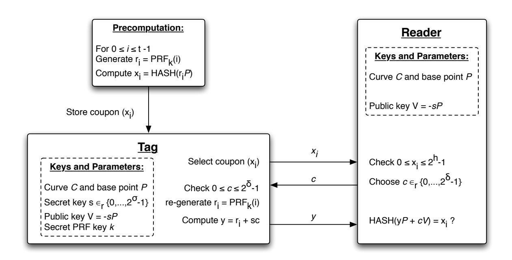

Figure 7.1: Overview of the used elliptic curve-based variant of crypto-GPS.

## **Low Hamming weight challenge**

In order to avoid the computationally rather demanding (σ × δ)-bit multiplication, it is possible to turn it into a series of simple additions [84]. For this purpose, it is required to turn the challenge c into a *Low Hammingweight (LHW) challenge* [84] such that at least σ − 1 zero bits are between two subsequent 1 bits. When using binary representations of the multiplicands it is easy to see that multiplications can be performed using the basic Shift-And-Add multiplication algorithm [178]. Always when a bit of the input challenge c is 0, the multiplicand s is shifted to the left by one position. When the bit of the input challenge c is 1 the multiplicand s is shifted to the left and the result is added (with carry) to the multiplicand s. This way a complete multiplication can be reduced to simple shiftings and additions. Since in our case we use a low Hamming weight challenge that has all 1 bits at least σ − 1 zero bits apart, it is ensured that there is no overlap in subsequent additions of s. In other words, s is never added more than once at the same time.

In our implementation we use the following parameters: σ = |s| = 160 and a challenge c of length δ = |c| = 848 with a Hamming weight of 5. The specifications of GPS state that the parameters are typical set to ρ = |r| = σ + δ + 80. For the chosen values this leads to ρ = |r| = 160 + 848 + 80 = 1, 088 bits. According to [84] these parameters enable crypto-GPS to achieve a security level equivalent to a probability of impersonation of 2 <sup>−</sup>32. This combination of coupons and LHW leads to the most efficient implementation for constrained devices as has been pointed out in [83, 151, 152].

### **Compact encoding of the LHW challenge**

Also in [151, 83] two encoding schemes have been proposed that allow to use only 40 bits to encode the complete 848-bit challenge c. In our implementation we will use a modified variant of the encoding scheme that was proposed for the 8-bit architecture in [151]. In particular it assumes that the challenge c consists of five 8-bit chunks n<sup>i</sup> , or in other words c = n4kn3kn2kn1kn0. Each n<sup>i</sup> consists of the 5-bit number c<sup>1</sup> and the 3-bit number c<sup>2</sup> (n<sup>i</sup> = ci,2kci,1) and encodes the exact position of one of the five non-zero bits of the 848-bit low Hamming weight challenge.

In particular, the positions of the non-zero bits can be calculated by the following recursive equation:

$$P(i) = 160 + 8 \cdot c_{i,1} + c_{i,2} \quad 1 \le i \le 4$$


$$P(0) = 8 \cdot c_{0,1} + c_{0,2} \quad i = 0.$$

Let us consider two example challenges Ccomp,<sup>1</sup> and Ccomp,2. A compact transmitted challenge

$$C_{comp,1} = \begin{array}{c|c|c} n_4 & n_3 & n_2 & n_1 & n_0 \\ \hline 00 & 00 & 00 & 00 & 00 \end{array}$$

in hexadecimal notation gives us the following ci,<sup>1</sup> and ci,2. Now it is easy to calculate the positions of the non-zero bits P(i) according to the above equation.

| i | ni   | ci,2 | ci,1  | P(i) |
|---|------|------|-------|------|
| 0 | 0x00 | 000  | 00000 | 0    |
| 1 | 0x00 | 000  | 00000 | 160  |
| 2 | 0x00 | 000  | 00000 | 320  |
| 3 | 0x00 | 000  | 00000 | 480  |
| 4 | 0x00 | 000  | 00000 | 640  |

Finally, it is possible to decode the whole 848-bit challenge c. For this example the whole challenge is the following:<sup>2</sup>

|              | 864      | 832      | 800      | 768      | 736      | 704      | 672      |
|--------------|----------|----------|----------|----------|----------|----------|----------|
| Ccomp,1<br>= | 00000000 | 00000000 | 00000000 | 00000000 | 00000000 | 00000000 | 00000000 |
|              | 640      | 608      | 576      | 544      | 512      | 480      | 448      |
|              | 00000001 | 00000000 | 00000000 | 00000000 | 00000000 | 00000001 | 00000000 |
|              | 416      | 384      | 352      | 320      | 288      | 256      | 224      |
|              | 00000000 | 00000000 | 00000000 | 00000001 | 00000000 | 00000000 | 00000000 |
|              | 192      | 160      | 128      | 96       | 64       | 32       | 0        |
|              | 00000000 | 00000001 | 00000000 | 00000000 | 00000000 | 00000000 | 00000001 |

For the second example we assume the compact challenge

$$C_{comp,2} = \begin{array}{c|c|c|c} n_4 & n_3 & n_2 & n_1 & n_0 \\ 44 & E3 & A2 & C1 & 20 \\ \end{array}$$

which leads to the following table:

<sup>2</sup>Please note that throughout this example we padded the challenge with 48 zeros to the left in order to gain a multiple of 64 (848 + 48 = 896 = 14 × 64).

| i | ni   | ci,2 | ci,1  | P(i)                        |       |
|---|------|------|-------|-----------------------------|-------|
| 0 | 0x20 | 001  | 00000 | 8<br>·<br>0 + 1             | = 1   |
| 1 | 0xC1 | 110  | 00001 | 1 + 160 + 8<br>·<br>1 + 6   | = 175 |
| 2 | 0xA2 | 101  | 00010 | 175 + 160 + 8<br>·<br>2 + 5 | = 356 |
| 3 | 0xE3 | 111  | 00011 | ·<br>356 + 160 + 8<br>3 + 7 | = 547 |
| 4 | 0x44 | 010  | 00100 | ·<br>547 + 160 + 8<br>4 + 2 | = 741 |

Finally, the challenge in hexadecimal notation is decoded as follows:

|              | 864      | 832      | 800      | 768      | 736      | 704      | 672      |
|--------------|----------|----------|----------|----------|----------|----------|----------|
| Ccomp,2<br>= | 00000000 | 00000000 | 00000000 | 00000000 | 00000020 | 00000000 | 00000000 |
|              | 640      | 608      | 576      | 544      | 512      | 480      | 448      |
|              | 00000000 | 00000000 | 00000000 | 00000000 | 00000008 | 00000000 | 00000000 |
|              | 416      | 384      | 352      | 320      | 288      | 256      | 224      |
|              | 00000000 | 00000000 | 00000010 | 00000000 | 00000000 | 00000000 | 00000000 |
|              | 192      | 160      | 128      | 96       | 64       | 32       | 0        |
|              | 00000000 | 00008000 | 00000000 | 00000000 | 00000000 | 00000000 | 00000002 |

### **Usage of PRNG**

Storing coupons cost memory space and especially in both hardware and software implementation for embedded devices memory is a significant cost factor. Hence, the size of the coupons limits the amount of available coupons for a given amount of memory or increases the cost. One approach considers using shorter hash length [86] to lower memory requirements. The ISO standard 9798 [112] suggests the usage of a PRNG for regenerating r<sup>i</sup> instead of storing it. This would lower the size of each coupon at the fixed cost of implementing a PRNG. We chose to use PRESENT in output feedback mode (OFB) to serve as the PRNG for our crypto-GPS implementations.

### **7.3.3 Design decisions**

The following optimizations have been considered for this prototype:

- (1) Elliptic curves-based variant rather than RSA-based allows shorter keys thus reducing the storage requirements.
- (2) Coupons/pre-computations avoid hashing and elliptic curve operations on the tag.
- (3) LHW challenges reduce the on-tag (σ × δ)-bit multiplication to simple additions.
- (4) Compact encoding of LHW challenge allows to reduce the transmission time.
- (5) Usage of a PRNG reduces storage for the random values.

While all of these optimizations have already been considered and studied in [83, 151, 152] the here described implementations have different features. First of all, the implementations described in [152] assume that the 1, 088-bit random number stream r and the 160-bit secret s are provided in 8-bit chunks on-demand and that the 848-bit challenge c is provided bit-serial, 1 bit in each cycle. This however implies that r and s have to be stored in a separate memory on the tag. Furthermore, this assumption also implies some kind of memory addressing logic that selects the appropriate 8-bit chunk of r and s on-demand once requested by the GPS core. The implementations described in [151] also assume that the 1, 088-bit random number stream r and the 160-bit secret s are provided in 8-bit or 16-bit chunks (depending on the architecture) on-demand. Furthermore it is assumed that the compact challenge c is input into the GPS core in 8-bit chunks on-demand. Similar to the implementations described in [152] this implies that r, s and c are stored in an additional memory on the tag and that there is a memory addressing logic. Figures for the additional logic (memory controller, memory) on the tag however are estimated (1, 000 GE for a PRNG) or not provided.

The implementations described in Sections 7.5 (GPS-64/8-F) and 7.6 (GPS-4/4-F) read in the complete compact challenge c and a 64-bit initialization vector IV at the beginning of the computation. Though the secret s will be fixed in practical applications, we have also implemented a variant (GPS-64/8-V) with a variable s in order to scrutinize performance trade-offs for different values of s. Therefore, the (GPS-64/8-V) variant also awaits an s value at the beginning of the computation. The 64-bit IV will be used to initialize a PRESENT-80 core in *Output-Feedback*-mode (OFB) that will act as the PRNG. At the end of one run, *i.e.* after 17 complete iterations of PRESENT (17 · 64 bit = 1, 088 bit), the ASIC also outputs the internal state of the PRESENT core, which will act as the new IV for the next run.

Before we turn to the detailed description of the crypto-GPS implementations in Sections 7.5 and 7.6, we first describe the prototype board in the next section in order to better understand the design constraints.

# **7.4 The crypto-GPS proof-of-concept prototype board**

To proof the efficiency of the crypto-GPS scheme and to study different design trade-offs, Orange Labs, Paris, France decided to fabricate a proof-of-concept ASIC that should be able to respond to a challenge in less than 200 ms. We implemented three different architectures in VHDL. The functional simulated variants were sent to IHP<sup>3</sup> , a german chip foundry. IHP offers so-called multi-design ASICs, were a set of different designs from different customers is bundled on the same wafer. This procedure ensures significant cost savings for the production of the lithographic mask, which in turn allows us to fabricate three different designs for a limited budget. An ATMEL ATmega323 [12] microcontroller (µC) is used to simulate the remaining parts of an RFID tag. As such it provides the ASIC with the challenge cin and the secret s (for some variants) and receives the output of the ASIC. In order to have a proof-of-concept prototype it should be possible to easily demonstrate the functionality of the crypto-GPS variants. Therefore the board contains a serial USB interface for easy communication with a PC. The µC converts the bit serial data stream from the USB interface to the 8-bit parallel I/O of the ASIC and vice versa. Figure 7.2 depicts the layout of the prototype board.

### **7.4.1 The input and output pins of the ASIC**

One requirement of the shared design ASIC was that all variants have the same I/O pins. In order to have the possibility of using a small packaging we tried to use as few pins as possible. Beside the mandatory pins for power supply we decided to use the following 20 I/O pins:

**clk** one pin is required to clock the ASIC with the right frequency.

<sup>3</sup> Innovations for High Performance, Frankfurt/Oder, Germany.

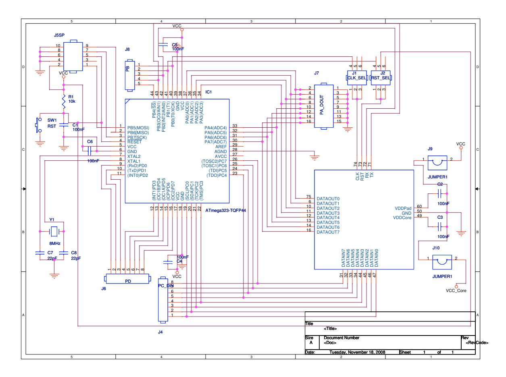

Figure 7.2: Layout diagram of the crypto-GPS prototype board.

**n reset** one pin is required to reset the ASIC.

**rx** this pin is required for the I/O handshake protocol as the input channel to the ASIC.

**tx** this pin is required for the I/O handshake protocol as the output channel of the ASIC.

data in these eight pins are used to load values into the ASIC.

data out these eight pins are used to output the result.

# 7.4.2 The handshake protocol for communication between microcontroller and crypto-GPS ASIC

Since the microcontroller ( $\mu$ C) is clocked independently from the ASIC, both components have to be synchronized when they are communicating. Therefore a handshake protocol with the following steps was implemented (see Figure 7.3):

- (1)  $\mu$ C sets input data
- (2) wait until input data valid
- (3)  $\mu$ C sets tx to '0' indicating that input data are valid
- (4) wait until ASIC notices that input is valid (IO\_READ\_WAIT)
- (5) ASIC sets rx to '0' indicating that input is being read (IO\_READ\_INPUT)

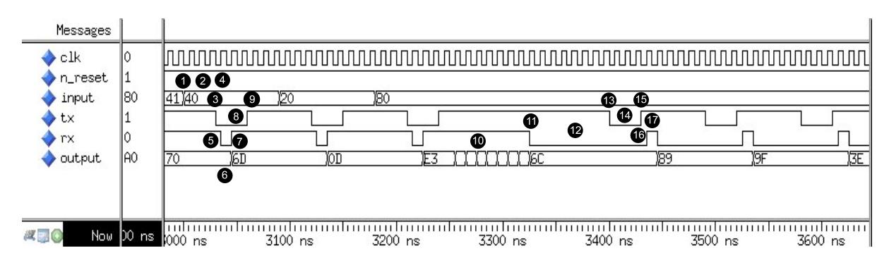

Figure 7.3: Signal flow of the handshake protocol for communication between board and crypto-GPS ASIC.

- (6) ASIC reads input (IO\_READ\_INPUT)
- (7) ASIC sets rx to '1' indicating that input was successfully read (IO\_READ\_ACK)
- (8) wait until µC notices that rx was set to '1'
- (9) µC sets tx to '1' thus finishing the input procedure
- (10) ASIC computes the response
- (11) ASIC sets rx to '0' indicating that output data are valid (IO\_WRITE\_WAIT)
- (12) wait until µC notices that output is valid (IO\_WRITE\_WAIT)
- (13) µC sets tx to '0' indicating that output is being read
- (14) µC reads output (IO\_WROTE\_OUTPUT)
- (15) µC sets tx to '1' indicating that the output was successfully read
- (16) wait until ASIC notices that tx was set to '1'
- (17) ASIC sets rx to '1' thus finishing the output procedure.

## **7.4.3 Different architectures of the ASIC**

We implemented one crypto-GPS variant with a round-based PRESENT-80 core, an internal datapath of 8 bits and a fixed secret s. We refer to this variant in the following as GPS-64/8-F and describe the implementation in Section 7.5. Some applications might require that the secret s is going to be updated. For this reason and in order to exploit the performance trade-offs for different values of s we implemented a GPS variant with a round-based PRESENT-80 core, an internal datapath of 8 bits and a variable secret s which is referred to as GPS-64/8-V. We will also provide details about this implementation in Section 7.5. Another design trade-off is to use a serialized PRESENT-80 core instead of a round-based one. For this variant it is advantageous to use an internal datapath of 4 bits. Furthermore we decided to implement this variant with a fixed secret s. Details for this GPS-4/4-F called variant are provided in Section 7.6. Finally, the ASIC also contains a variant that consists only of a serialized PRESENT-80 encryption core. This implementation is similar to the serialized PRESENT-80 implementation described in Section 5.1.1 but also contains I/O logic. Especially noteworthy is the implementation of the handshake protocol that lead to a significant increase of the area requirements (1, 220 GE compared to 1, 075 GE). At the time of the submission of this Thesis the ASIC has not yet been

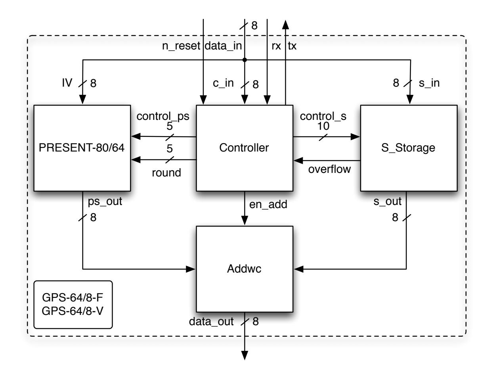

Figure 7.4: Top-level architecture of the GPS-64/8-F and GPS-64/8-V variants.

returned from fabrication such that no further investigations could be performed. Since the architecture of a serialized PRESENT-80 core was detailed already in Section 5.1.1 we do not repeat it at this point.

# 7.5 Hardware implementations of round-based crypto-GPS

The architecture of GPS-64/8-F is depicted in Figure 7.4. It uses a round-based PRESENT-80 implementation (PRESENT), a Controller component, a full-adder component (Addwc) and a storage component (S\_Storage). In the following these components are described in detail. Since the PRESENT component is similar to the one described in Section 5.1.2 we refer the interested reader there. Starting with the Controller component in Section 7.5.1, the Addwc component is described in Section 7.5.2. Finally two different S\_storage components are described in Sections 7.5.3 and 7.5.4.

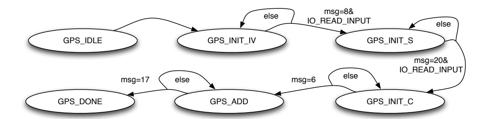

(a) Central FSM of all crypto-GPS variants.

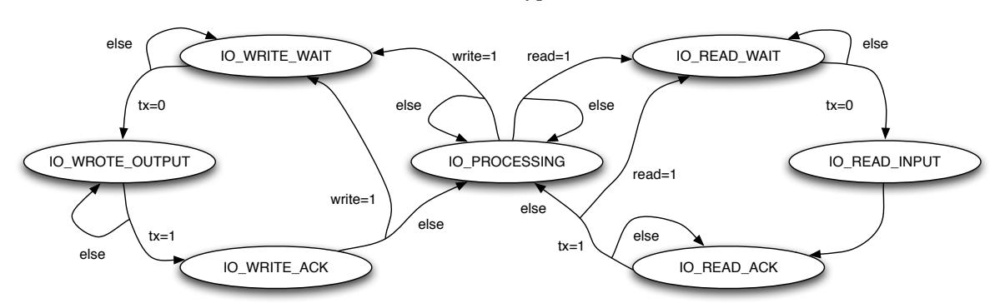

(b) I/O FSM of all crypto-GPS variants.

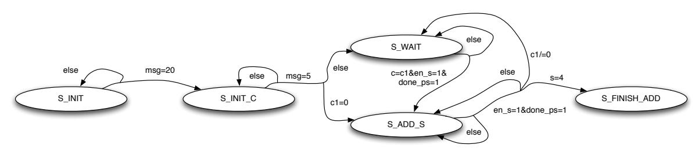

(c) FSM of the storage component of all crypto-GPS variants.

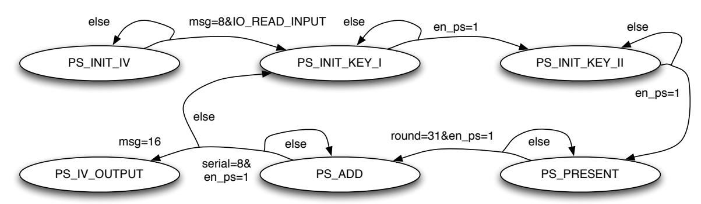

(d) FSM of the round-based PRESENT core of GPS-64/8-F and GPS-64/8-V.

Figure 7.5: Finite State Machines of the crypto-GPS ASIC.

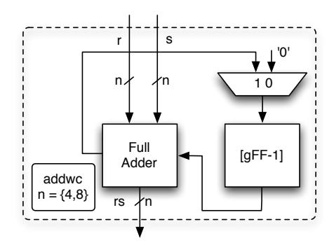

Figure 7.6: Architecture of the adder component of all crypto-GPS variants.

# **7.5.1 Implementation of the Controller component**

The controller consists of four separate but interacting FSMs each one for the central control (see Figure 7.5(a)), I/O (Figure 7.5(b)), S\_STORAGE (Figure 7.5(c)) and PRESENT (Figure 7.5(d)). It requires 64 clock cycles to initialize the ASIC and load the values IV , cin and s. In the round based version it requires 32 cycles to create 64 pseudo random bits by the PRESENT component and to add it with the appropriate chunk of the secret s. Due to the handshaking protocol, it then requires 64 cycles to output the result in 8-bit chunks. Since we have to compute 1, 088 bits we have to repeat this procedure another 16 times. Finally the internal state of the PRESENT component has to be stored outside the ASIC as the new IV for the next iteration of crypto-GPS. So in total (including I/O overhead) it takes 17 · (32 + 64) + 64 = 1, 696 clock cycles for one complete run of crypto-GPS.

## **7.5.2 Implementation of the Addwc component**

Figure 7.6 depicts the ADDWC component. As one can see, it consists of a flip-flop to store the carry bit and a standard full-adder component. For the round-based variants GPS-64/8-F and GPS-64/8-V it has a datapath width of 8 bits, *i.e.* two 8-bit input values are added.

## **7.5.3 Implementation of the S\_Storage component with a fixed secret** s

Figure 7.7(a) depicts the architecture of the S\_Storage component for a fixed secret s. It consists of an 8-bit AND gate (11 GE), an 8-bit OR gate (11 GE), a gated register with 8 bit input (48 GE), an 8-bit 20-to-1 MUX (249 GE), and a shifting component denoted with ("00000000"||a)«c2. First, the right 8-bit chunk of s is chosen by the MUX, which then is ANDed with the 8-bit signal n\_zero. n\_zero replicates eight times a single bit of the control\_vector, hence it can either be set to "00000000" or "11111111". This way the resulting value a is either set to the corresponding 8-bit chunk of s or "00000000", before it is processed by the shifting component. The shifting component has a second input, namely the shifting offset c2. Within the shifting component the input value a is appended to the string "00000000" in order to yield the intermediate state b, *i.e.* in VHDL notation

```
b <= "00000000"&a;.
```

It then rotates b by c2 positions to the left. Since c2 has three bits, the shifting offset varies between 0 and 7. Finally, it outputs two 8-bit values c and d, which consist of the 8 MSB (c) and the 8 LSB (d) of the internal state b. c is stored in an 8-bit gated register and d is ORed with the output of the gated register.

## **7.5.4 Implementation of the S\_Storage component with a variable secret** s

Figure 7.7(b) depicts the architecture of the S\_Storage component that is capable to process variable secrets s. It consists of an 8-bit 4-to-1 input MUX, an 8-bit 3-to-1 output MUX, an 8-bit AND, an 8-bit OR and 22 gated shifting registers that each store 8 bit. 20 of these shifting registers are required to store the complete secret s and the remaining two are required to temporarily store the shifted values for the next addition cycle.

# **7.6 Hardware implementation of serialized crypto-GPS**

The architecture of GPS-4/4-F is depicted in Figure 7.8(a). As one can see, the general structure is very close to the architecture of the round-based variants GPS-64/8-F and GPS-64/8- V (see Figure 7.4). It also feeds the 8-bit input value cin into the Controller component, but contrary to the round-based variants it splits this value and feeds the higher nibble into the S\_Storage component and the lower nibble into the PRESENT component. Since it uses an internal datapath of 4 bits, also the outputs of the PRESENT, S\_Storage and the Addwc components are only 4 bits width. Therefore the 4-bit output signal data\_out is padded with "0000" in order to fulfill the requirements of an 8 bit I/O interface. It uses a serialized PRESENT-80 implementation (PRESENT), a Controller component, a full-adder component (Addwc) and a storage component for fixed s (S\_Storage). Since the PRESENT component is similar to the one described in Section 5.1.1 and the Addwc component was already described in Section 7.5.2, we refer the interested reader there. However, the Controller and the S\_Storage components are different and consequently we detail them in the remainder of this section.

## **7.6.1 Implementation of the Controller component**

The Controller module consists of the same four FSMs that were already described in Section 7.5.1. Three of them (central FSM, I/O FSM and storage FSM, see Figures 7.5(a) to 7.5(c)) are similar to the ones used for the round-based variants and we refer to Section 7.5.1 for further details. Figure 7.8(b) depicts the FSM of the serialized PRESENT-80 component. Due to the serialized approach it is significantly more complex than the FSM for a round-based implementation.

It requires 64 clock cycles to initialize the ASIC and load the values IV , cin and s. In the serialized version it requires 563 cycles to create 64 pseudo random bits by the PRESENT component and to add them to the appropriate chunk of the secret s. Due to the handshaking protocol, it then requires 64 cycles to output the result in 4-bit chunks. Since we have to compute 1, 088 bits we have to repeat this procedure another 16 times. Finally the internal state of the PRESENT component has to be stored outside the ASIC as the new IV for the next iteration of crypto-GPS. So in total (including I/O overhead) it takes 17 ·(563 + 64) + 64 = 10, 723 clock cycles for one complete run of crypto-GPS.

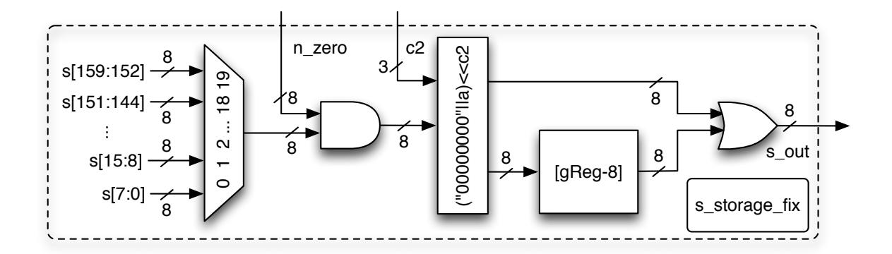

(a) Architecture of the storage component of GPS-64/8-F with a fixed secret s.

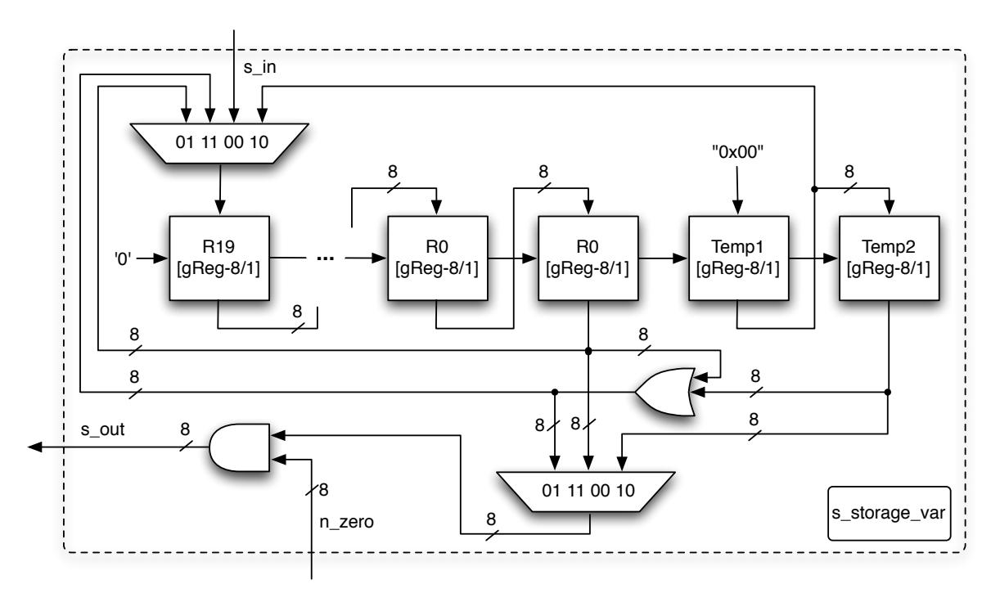

(b) Architecture of the storage component of GPS-64/8-V with a variable secret s.

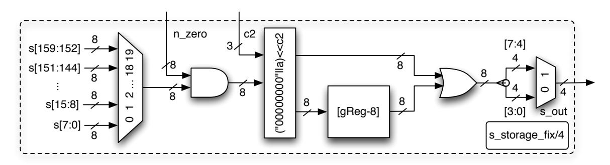

(c) Architecture of the storage component of GPS-4/4-F with a fixed secret s.

Figure 7.7: Three architectures of storage components for different crypto-GPS variants.

|                          | Security<br>level<br>[bits] | Response<br>size<br>[bits] | Data<br>path<br>size | Cycles<br>per<br>block | Time<br>at 100KHz<br>[ms] | Logic<br>process | Area<br>[GE] |
|--------------------------|-----------------------------|----------------------------|----------------------|------------------------|---------------------------|------------------|--------------|
| GPS-64/8-F               | 80                          | 1,088                      | 8                    | 1,696                  | 16.96                     | 0.18 UMC         | 2,556        |
|                          |                             |                            |                      |                        |                           | 0.25 IHP         | 2,433        |
| GPS-64/8-V               | 80                          | 1,088                      | 8                    | 1,696                  | 16.96                     | 0.18 UMC         | 3,976        |
|                          |                             |                            |                      |                        |                           | 0.25 IHP         | 3,861        |
| GPS-4/4-F                | 80                          | 1,088                      | 4                    | 10,723                 | 107.23                    | 0.18 UMC         | 2,181        |
|                          |                             |                            |                      |                        |                           | 0.25 IHP         | 2,143        |
| WIPR [177]               | 80                          | 2,048                      | 8                    | 66,048                 | 660.5                     | 0.35 AMS         | 5,705        |
| ·<br>ECC-2<br>67<br>[18] | 67                          | 134                        |                      | 418,250                | 4,183                     | 0.25             | 12,944       |
| ECC-112 [75]             | 56                          | 112                        | 1                    | 195,264                | 1,953                     | 0.35 AMI         | 10,113       |
| NTRUencrypt [76]         | 57                          | 264                        | 1                    | 29,225                 | 292.2                     | 0.13 TSMC        | 2,850        |

Table 7.1: Post-Synthesis implementation results of three different architectures of crypto-GPS.

## **7.6.2 Implementation of the S\_Storage component with a fixed secret** s

Figure 7.7(c) depicts the architecture of the S\_Storage component for a fixed secret s and an internal 4-bit datapath. As one can see, it is very similar to the S\_Storage component of the round-based variant GPS-64/8-F (see Figure 7.7(a)). In fact it just splits the 8-bit input value into two 4-bit chunks. Dependent on a counter value it outputs either the higher or the lower nibble.

# **7.7 Discussion of implementation results**

For functional and post-synthesis simulation we used *Mentor Graphics Modelsim SE PLUS 6.3a* [92] and *Synopsys DesignCompiler* version *Z-2007.12-SP1* [218] was used to synthesize the designs to two different standard-cell libraries. Table 7.1 summarizes the implementation results of the three different architectures of crypto-GPS. We provide area figures from post-synthesis for two different libraries. One is the *Virtual Silicon* (VST) standard cell library *UMCL18G212T3*, which is based on the *UMC L180 0.18*µ*m 1P6M* logic process and has a typical voltage of 1.8 Volt [233]. Since throughout this Thesis we used this library for many other designs<sup>4</sup> , we also provide area figures for crypto-GPS synthesized to the UMC library in order to enable a fairer comparison with the other designs. On the other hand we provide area figures for crypto-GPS for the *IHP* standard cell library *SESAME-LP2-IHP0.25UM*, which is compatible to the *IHP 0.25* µ*m Logic 1P4M Salicide* process and has a typical voltage of 2.5 Volt [64]. Since we manufactured an ASIC that uses this process (see Figure 7.9 for a photograph), it is interesting to see how the post-synthesis figures compare to the manufactured ones.

<sup>4</sup> Such as PRESENT-80 and PRESENT-128 (see Chapter 5) and all hash-functions (see Chapter 6).

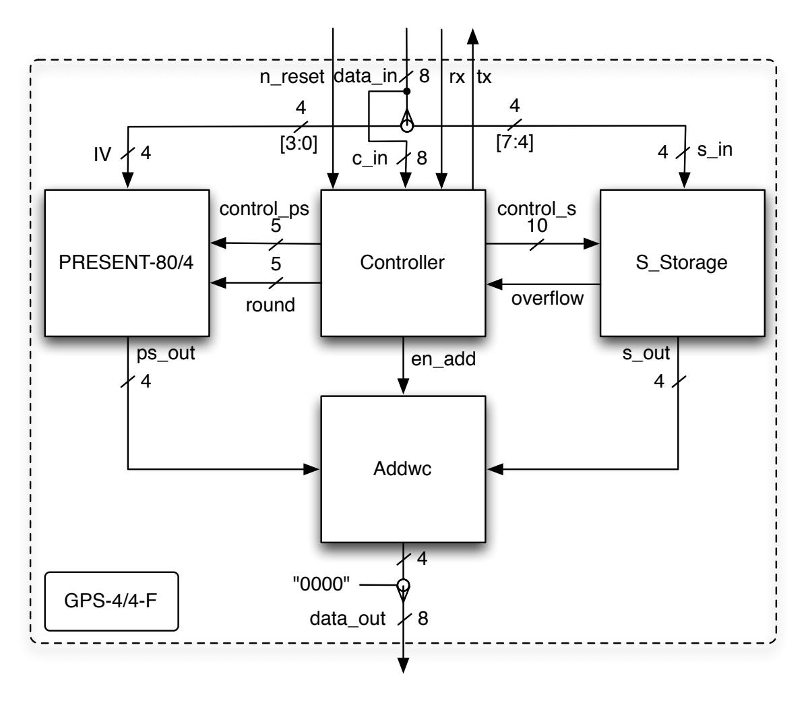

(a) Top-level architecture of the  ${\sf GPS-4/4-F}$  variant.

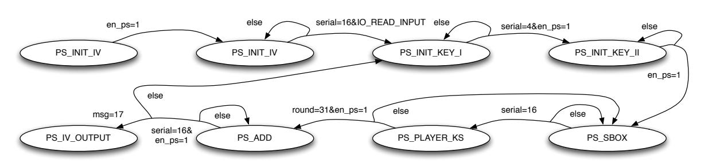

(b) FSM of the serialized PRESENT core of the GPS-4/4-F variant.

Figure 7.8: Top-level architecture and FSM of the GPS-4/4-F variant.

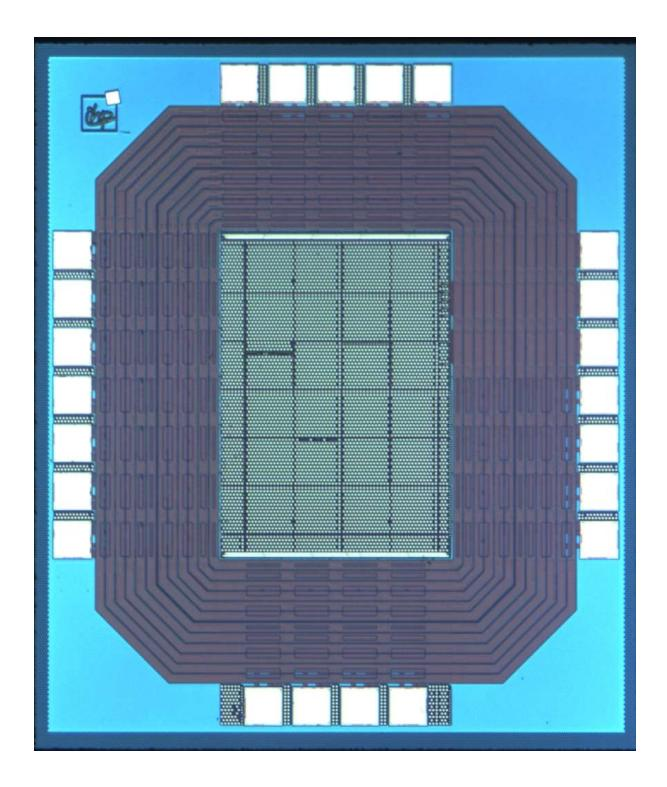

Figure 7.9: Photograph of the manufactured crypto-GPS ASIC.

As one can see from Table 7.1 the round-based variants GPS-64/8-F and GPS-64/8-V require 1, 696 clock cycles and the serialized variant GPS-4/4-F requires 10, 723 clock cycles for processing one challenge. At a frequency of 100KHz this translates to 16.96 ms and 107.23 ms, which is well below the required 200 ms. The area requirements (for the *UMCL18G212T3* library) range from 3, 976 GE for GPS-64/8-V over 2, 556 GE for GPS-64/8-F to 2, 181 GE for GPS-4/4-F. Given the more than 6 *times* longer processing time, it seems that a serialized PRESENT implementation only provides a slight benefit compared to a round-based implementation. However, flexibility comes at a high price: while the fixed secret variants can hardwire s and select the appropriate chunk with MUXes, the variable variant has to use 160 flip-flops, which results in a significant area overhead.

Oren *et al.* propose a public key identification scheme called *WIPR* [177] that is based on the randomized variant [87] of the Rabin crypto system [190]. Their ASIC implementation requires 5, 705 GE and 66, 048 clock cycles, which is still significantly larger than 2, 000 GE. Furthermore it takes more than 6 *times* longer to process one challenge compared to our serialized implementation and 39 *times* longer compared to our round-based variants while being significantly larger. While offering a significantly lower security level, even the smallest published ECC implementations require more than 10, 000 GE and hence are far away from being lightweight. Gaubatz *et al.* [76] have investigated the hardware efficiency of the NTRUencrypt algorithm [174, 106] with the following parameters (N, p, q) = (167, 3, 128) that offer a security level of only 57 bits. Though their implementation requires only 2, 850 GE, it takes 29, 225 clock cycles, which translates to 292 ms, for the response to be computed. However, it is noteworthy that more than 80% of the area is occupied with storage elements and that already a bit serial datapath is used, which implies that the chance of future improvements is very limited.

# **8 Physical Security Aspects**

In this Chapter physical security aspects and their relation to lightweight implementations are discussed. Starting with a motivation in Section 8.1, we define a pervasive attacker model in Section 8.2. Subsequently, pervasive devices are classified in Section 8.3 Then we provide an evaluation of pervasive devices with regard to physical security aspects in Section 8.4. Subsequently, in Section 8.5 side channel attacks and their countermeasures are introduced. Then in Section 8.6 the cost overhead of side channel countermeasures are assessed for lightweight hardware and software implementations of PRESENT-80. Finally this Chapter is concluded and pointer for future work are provided in Section 8.7.

# **8.1 Motivation**

Even though modern ciphers like AES seem to be resistant against cryptographic attacks, such as linear or differential cryptanalysis [149, 26], it might be possible to attack the *implementation* of the algorithm. In the last years it became clear that an implementation of a cryptographic algorithm can leak sensitive information about processed key-related data. The term side channel analysis summarizes all possible ways of collecting this information, such as processing time [130], power consumption [131] or electromagnetic emission [8]. Side channel attacks pose a severe threat for pervasive devices, because of their deployment "in the field". If a device implements no countermeasures against tampering, an adversary may manipulate the operation environment of the device (voltage, clock frequency) or intrude the device for example by *micro probing*. An adversary may deduce from side channel information (electromagnetic emission, power consumption) or from the device's behavior to her manipulations (time delays) critical security parameters like a secret key stored inside the device.

# **8.2 A pervasive attacker model**

For a security evaluation of pervasive devices it is important to classify the attackers, which will be carried out in Section 8.2.1. Subsequently in Section 8.2.2 physical attacks will be classified and finally in Section 8.2.3 costs of an attack will be discussed.

## **8.2.1 Classification of attackers**

Since the requirements in terms of cost, time, expertise and equipment differ significantly for different attacks, it is important to classify the attackers. We adopted the classes proposed in [1] and [6], respectively<sup>1</sup> :

<sup>1</sup>Please note that the amount of money spent by the attackers is a vague estimation that is not backed by literature.

- **Class 1, Clever Outsiders:** "These attackers are often very intelligent but may have insufficient knowledge of the system. They may have access to only moderately sophisticated equipment. They often try to take advantage of an existing weakness in the system, rather than try to create one." We believe that clever outsider will typically not spent more than 5,000 EUR for the whole attack including equipment and salary.
- **Class 2, Knowledgeable Insiders:** "These attackers have substantial specialized technical education and experience. They have varying degrees of understanding of parts of the system but potential access to most of it. They often have highly sophisticated tools and instruments for analysis." Knowledgeable insiders may also spend up to 5,000 EUR for an attack, but they can use expensive equipment free of charge.
- **Class 3, Funded Organizations:** "These attackers are able to assemble teams of specialists with related and complementary skills backed by great funding resources. They are capable of in-depth analysis of the system, designing sophisticated attacks, and using the most advanced analysis tools. They may use class 2 adversaries as part of the attack team." Funded organizations may spend several 100,000's EUR for an attack. Notice that combinations of attacker classes are also possible and bear a great security risk. Imagine a knowledgeable insider who distributes his knowledge via the Internet to many clever outsiders.

## **8.2.2 Classification of attacks**

Following Anderson *et al.* [7], we categorize the attacks in either *active* or *passive* and either *local* or *remote* attacks. During an active attack the adversary tries to manipulate the device, its input or its environment to cause abnormal behavior, while during a passive attack, the adversary works with the device as it is operated normally. Local attacks can be further separated into invasive, semi-invasive and non-invasive attacks. Invasive attacks are classified by a direct electrical access to the internal components of the device, for example by micro-probing [134]. Even though, semi-invasive attacks do neither require direct electrical contact nor damage the silicon, they need a de-packaged chip. Thus, an adversary requires access to the device. Anderson *et al.* [7] give the following example for a semi-invasive attack: "the attacker may use a laser beam to ionize a transistor and thus change the state of the flip-flop that holds the device's protection state". Non-invasive attacks include close observation and manipulation of the device's operation, for example differential power analysis [131]. For this kind of attacks, no extremely sophisticated equipment is necessary. Even class 1 attacker can organize some second-hand equipment (like high-grade oscilloscope) for this attack. Remote attacks include observation of the normal input and output of the device, for example timing analysis, cryptanalysis, protocol analysis, and attacks on the application programming interface. A special kind of remote attacks are Denial of Service (DoS) attacks. In this case an attacker's aim is to compromise the availability of functions of the device. As an extreme example for a Denial of Service attack consider the following: an attacker could send lots of requests to the device, forcing it to compute answers. After a certain time period the energy resources will be exhausted and the node stops working. That is the reason why active devices are more susceptible to Denial of Service attacks than passive devices. However, since this is not a physical security concern, it was not considered in our evaluation.

## **8.2.3 Classification of attack costs**

We assume that the cost of an attack consists of two parts: initial costs C<sup>i</sup> and cost per device Cd. The average costs per device C to break x devices are estimated by the following equation:

$$C = \frac{C_i + x \cdot C_d}{x}$$

As one can see from this equation, with larger x, the initial cost C<sup>i</sup> become negligible. While high initial costs C<sup>i</sup> put off class I and class II attackers but not class III attackers, high breaking costs per device C<sup>d</sup> also scare class III attackers. The optimization goal is therefore to increase the cost per device C<sup>d</sup> as much as possible.

# **8.3 Classification of pervasive devices**

Resistance against tampering is used as the main characteristic to distinguish the classes, because we classify the devices with regard to security issues. The classes are:

- unprotected devices
- partly protected devices
- tamper resistant devices.

Another property which we used to classify devices is the power supply. If a device provides not its own power supply, it is called a *passive* device. If a device has a built-in power supply it is called an *active* device. Active devices usually have a longer range than passive devices, but, if battery powered, they offer an additional resource, which an attacker might attack. Therefore, we further separated each of the three classes into active and passive devices. In our classification scheme device costs also play an important role. If millions or even billions of devices are deployed, the price of a single device becomes a knock-out criterion. Thus, we classified the devices on their estimated prize as follows:

**low:** less than 1 EUR (e.g. passive RFID label)

**medium:** 1 - 10 EUR (e.g. smart card)

**high:** more than 10 EUR (e.g. high-end smart card)

The NIST standard FIPS 140-02 [160] defines four levels of physical security for cryptographic modules:

**Level 1:** devices with no special protection mechanisms

**Level 2:** devices, that implement tamper evidence mechanisms

**Level 3:** devices, that implement tamper evidence and tamper response mechanisms

**Level 4:** devices, that implement tamper evidence, tamper response and environmental protection mechanisms/environmental testing

*Tamper evidence mechanisms* provide the evidence, that an attack has been attempted (for example a seal). *Tamper response mechanisms* actively react to the detection of an attack (for example a zeroization circuit that deletes the secure key). *Environmental protection mechanisms* measure the voltage and temperature of the device. Environmental testing means, that a device undergo a testing procedure with extreme voltages and temperatures before it is deployed. According to Anderson *et al.* [7], there is a clear bifurcation in the smart card market between low-cost smart cards and state of the art secure smart cards. Low-cost smart cards offer rudimentary protection such that we denote them as *passive partly protected devices'*. We will have a look at highly secure smart cards in Section 8.3.3 as *passive tamper resistant devices*. Radio Frequency Identification (RFID) devices comprise a wide variety of devices. Because this ranges from single bit transponders to contact-less smart cards, the term RFID is not suitable for our classification scheme. In each case one has to classify an RFID transponder based on the properties of the device. However, we use the term RFID as an equivalent to passive low-cost RFID tags, therefore we will use the term RFID tags synonymous to passive unprotected pervasive devices.

## **8.3.1 Unprotected pervasive devices**

Unprotected pervasive devices typically have been developed for mass-market applications. Furthermore, we assume that one of the main designing constraints, probably the most important one, for this kind of devices was low production cost. As a consequence of this sharp cost calculation, unprotected devices were not designed to provide any countermeasures against tampering. A standard passivation layer is the top most layer of every micro-controller. If the secret key is stored in an external memory an adversary can simply read it out and the passivation layer is useless. In this sense it is not really a countermeasure, but it can extend the time needed for an attacker to gain access to the controller chip. Unprotected devices usually comprise embedded processors, which are normally very cheap and hence best suited for mass deployment. The following list summarizes the main characteristics of unprotected devices:

- low-cost
- no security driven design
- small/lightweight
- only external memory (e.g. flash memory or EEPROM)

A special subset of unprotected devices are passive unprotected devices. They do not have an own power supply and are extremely low-cost devices. They are supposed to be very small, lightweight and hence very mobile. Examples for this device class are RFIDs tags used as electronic product codes for 0.55 cent. Active unprotected devices are quite similar to passive unprotected devices. They are supposed to be cheap, small, lightweight and also mobile. The main difference is their own power supply. Hence they are additionally susceptible to denial of service attacks. MicaMotes [52] serve as an example for active unprotected devices.

## **8.3.2 Partly protected pervasive devices**

With regard to physical security mechanisms partly protected devices in our classification scheme equal Level 3 devices in FIPS 140-2. The aim of this device class is to prevent an intruder to gain access to critical security parameters, like plaintext key, which are stored inside the device. This includes mechanisms that have a high probability of tamper-detection, such as:

- top-metal sensor meshes
- light-sensors

Nowadays high-grade smart cards have a sensor mesh implemented in the top metal layer. A sensor mesh consists of sensor, ground and power lines in a serpentine pattern. An adversary, who destroys a sensor line or shortens it to ground or power, causes the device to self-destruct. For micro-probing it is necessary to open a device and remove the standard passivation layer to gain access to the chip's surface. Light sensors can be used to prevent an opened chip from working. If one of these sensors detects an intrusion attempt, a tamper-response mechanism is triggered. Usually tamper-response mechanisms are zeroization circuits that erase all critical security parameters stored on the device. Beside tamper-detection and tamper-response mechanisms, partly protected devices may have one or more of the following countermeasures implemented:

- glue logic
- noise generators
- internal bus hardware encryption
- password restricted software access to internal memory

Microcontrollers used to be separated in standard building-blocks, like CPU instruction decoder, register file, ALU and I/O circuits. These blocks could be easily identified with an optical microscope. Glue logic describes a randomized ASIC-like logic design where the blocks cannot be identified any more. For an adversary it is virtually impossible to find signals for probing by hand in a glue logic design, hence invasive attacks based on micro-probing are thwarted by this countermeasure [7]. Internal bus hardware encryption makes data analysis more difficult and thus improves the security level. Password restricted software access to internal memory is a countermeasure against simple attacks to read out the whole memory. If the memory content is encrypted an adversary gains no advantage any more. Noise generators aim at thwarting side channel attacks like differential power analysis. They generate noise to obscure the actual signals in the controller. It has become clear that noise generators can not prevent side channel attacks in general, yet they can significantly increase the effort for an adversary to succeed. The following list summarizes the main characteristics of partly protected devices:

- medium cost
- security is a design goal
- at least one of the above listed countermeasures is implemented

Passive partly protected devices implement one or more of the above mentioned countermeasures against tampering attacks. Although some of these countermeasures need power to work properly (all kind of sensors) they can be implemented as well on passive devices. An adversary can invade a passive device without any concern as long as the device is not powered on. Once the device is powered on, the sensors detect an intrusion attempt and zeroize all critical security parameters like the plaintext key. Hence the countermeasures work with a delay, giving an adversary a time window where she can try to bypass the countermeasures. In practice, the countermeasures are quite sophisticated and it is a hard and time consuming work to bypass them. Examples for this device class are secure memory modules or basic smart cards. Similar to passive partly protected devices active partly protected devices implement one or more of the above mentioned countermeasures. Additionally, they implement improved tamper-resistance measures compared to passive partly protected devices. Unlike passive devices, active devices can react immediately to a detected intrusion attempt. This is an advantage over passive devices, hence active partly protected devices are able to provide a higher security level than passive partly protected devices.

## **8.3.3 Tamper resistant pervasive devices**

Tamper resistant devices are the most sophisticated devices in our classification scheme. They are comparable to security level 4 devices defined in FIPS 140-2 with regard to physical security issues. In comparison to partly protected devices, which typically implement only a few of the aforementioned countermeasures, tamper resistant devices aim to thwart any known attacks, even attacks from funded organisations (class 3 attackers). Therefore, tamper resistant devices usually implement more of the above mentioned countermeasures than partly protected devices. In addition to the countermeasures mentioned in Section 8.3.2, tamper resistant devices possess environmental failure protection mechanism or undergo environmental failure testing. In particular, FIPS 140-2 security level 4 requires the implementation of voltage and temperature sensors. Additionally clock frequency sensors improve the security level. If a device is operated in unusual environmental conditions outside of its standard operation range, this can cause abnormal behaviour, which may result in a security risk [16]. Environmental failure protection mechanisms include:

- internal voltage sensors
- clock frequency sensors
- temperature sensors

Power glitch attacks use under- and over-voltages to cause abnormal behavior of the device. Internal voltage sensors protect the device against these kinds of attacks. Similar to power glitch attacks, clock glitch attacks use a higher frequency to cause abnormal behavior of the device. Furthermore, at a very low clock frequency it is possible to make a static analysis of the device. Clock frequency sensors protect the device from these attacks. Static RAM contents can persist for seconds to minutes after power is removed, when the temperature is below -20°C. An adversary could use this fact to read out RAM content like secret keys. Furthermore, very high temperatures can cause failures, which may be used for attacks. Temperature sensors aim at this kind of attacks. A high security level is a basic requirement for tamper resistant devices, hence they are the most expensive devices in our classification scheme, assumed that devices of the same processing power are compared. The following list summarizes the main characteristics of partly protected devices:

- most sophisticated devices
- high cost
- security is a basic requirement
- many of the aforementioned countermeasures are implemented
- environmental protection mechanisms are implemented or the devices undergo environmental testing before deployment

As already mentioned in Section 8.3.2, an adversary can attack a device without any concern as long as it is not switched on, because tamper-detection and environmental failure protection mechanisms can only work, when the device is powered on. Passive tamper resistant devices should therefore have been tested for environmental failure before deployment. The temperature to be tested should range from -100°C to +200°C, the voltage "should range from the smallest negative voltage (with respect to ground) that causes the zeroization of the electronic devices or circuitry, including reversing the polarity of the voltages." [160]. A wide spread example for passive tamper resistant devices are sophisticated smart cards with controllers like the Infineon SLE88CX720P and SLE66C24PE [109, 110]. In comparison to passive tamper resistant devices, active tamper resistant devices can take full advantage of environmental failure protection mechanisms, because they can continuously monitor the operating voltage and temperature of the device. As soon as the sensors detect unusual environmental conditions of fluctuations, tamper response mechanisms must be triggered. FIPS 140-2 gives two alternatives for tamper-responding mechanisms. Either the device is shut-down or all critical security parameters are zeroized immediately. Examples for active tamper resistant devices are secure hardware modules used for communication between embassies or encryption devices for telecommunication.

# **8.4 Evaluation of pervasive devices with respect to physical security aspects**

In this section, we evaluate the proposed device classes with regard to security issues. Starting with unprotected pervasive devices in Section 8.4.1, we evaluate partly protected pervasive devices in Section 8.4.2 and tamper resistant pervasive devices in Section 8.4.3.

# **8.4.1 Evaluation of unprotected pervasive devices**

Unprotected devices are developed under tight cost constraints, hence they are not supposed to implement any countermeasures against physical attacks. Once an attacker can achieve unsupervised physical access to an unprotected device, she can try to tamper it with any of the above mentioned local attacks. Neither expensive equipment nor outstanding knowledge about the system is required for an attack of this device class. A clever outsider (class I attacker) may spend up to 5,000 EUR for the required (second hand) equipment. Hence, even class I attacker (clever outsiders) are supposed to be able to break unprotected pervasive devices.

### **8.4.2 Evaluation of partly protected pervasive devices**

Partly protected devices implement one or more of the following countermeasures: top-metal sensor meshes, light-sensors, glue logic, noise generators, internal bus hardware encryption, and password restricted software access to internal memory. Anderson *et al.* state, that "no single low-cost defence technology can protect a device against attacks" [7]. Anyway, if countermeasures are prudent implemented, they can significantly raise the time and effort (red: cost) an attacker has to spend to physically attack a single device. Furthermore, sophisticated and, hence, expensive equipment is required, which will ultimately exclude class I attackers. Beside this, countermeasures aim to make life hard for class II attackers and expensive for class III attackers [6]. Passive devices are in general more vulnerable to physical attacks than active devices, because their countermeasures need to be powered on to work. This delay provides a time window, where the adversary may bypass the countermeasures before she powers the device to read out critical security parameters. Therefore it is more expensive for class II and class III attackers to break an active device rather than a passive device.

## **8.4.3 Evaluation of tamper resistant pervasive devices**

In addition to the countermeasures mentioned in the last section, tamper resistant devices implement environmental failure protection mechanisms or undergo environmental failure detection. Environmental failure protection mechanisms include: internal voltage sensors, clock frequency sensors, and temperature sensors. Anderson and Kuhn refer to a senior agency official and a senior scientist at a leading semiconductor manufacturer stating the following: "chip contents cannot be kept from a capable motivated opponent; at most one can impose cost and delay" [7]. Because passive tamper resistant devices provide a time window where an adversary may bypass the countermeasures and the environmental failure protection mechanisms, we think that these devices can be broken by a class III (funded organisations) opponent. By contrast, active tamper resistant devices can implement more sophisticated tamper-detection mechanisms, which will react immediately to a detected attack. This results in a higher security level and, hence, even for class III attackers it is much more expensive to break an active tamper resistant device. Note that content of static RAM, if stored for a long period, may be burned in and, hence, easily be read out.

As we have pointed out in this Section, the security level of a cryptographic implementation is a matter of costs and it is very expensive to deter class II and class III attackers. Since a large share of the envisioned applications of low-cost RFID tags protects low-price values, also a low-cost security solution is sufficient. In particular for many cases it might be sufficient to deter class I attackers or raise the cost to break a single device above the value of the protected application. Therefore in the following we concentrate on non-invasive passive attacks, *i.e.* side-channel attacks, because they only require low-cost equipment and can be mounted without insider knowledge.

# **8.5 Introduction to side channel attacks and their countermeasures**

Side channel cryptanalysis has emerged as a serious threat for smart cards and other types of pervasive devices performing cryptographic operations. It was demonstrated in a number of publications that side channel attacks are an extremely powerful and practical tool for breaking unprotected (or insufficiently protected) implementations of crypto systems. These attacks exploit the fact that the execution of a cryptographic algorithm on a physical device leaks information about sensitive data (*e.g.* secret keys) involved in the computations. Though these attacks have been discovered accidently already in 1943 [167], it took more than 50 years for the first publication of power analysis attacks in 1999 [131]. Many sources of side channel information have been discovered in recent years, including the timing characteristics of a cryptographic algorithm [130], as well as deliberately introduced computational faults [16, 27], but most notably are power analysis attacks [131], which evolved to an own scientific sub-field with an ever increasing amount of publications. *Simple Power Analysis (SPA)* uses the leaked information from a single computation, while *Differential Power Analysis (DPA)* utilizes statistical methods to evaluate the information observed from multiple computations [131]. Currently, there exists no perfect protection against DPA attacks. However, by applying appropriate countermeasures, it is possible to make the attacker's task more difficult and expensive. These countermeasures can be implemented at the architectural, algorithmic, or cell level. In the remainder we focus on the latter two. Starting with an overview of countermeasures at the algorithmic level, we then discuss countermeasures at the cell level.

## **8.5.1 Countermeasures at the algorithmic level**

The two most common countermeasure principles against side channel attacks at the algorithmic level are *hiding* and *masking* [147]. This Section provides a brief overview over implementation possibilities of these fundamental principals.

### **Hiding**

*Hiding* is a general term for countermeasures that aim to break the link between the power consumption of a cryptographic device and the processed data value [147]. There are two hiding approaches: either the device has a random power consumption such that in each clock cycle a random amount of power is consumed or exactly the same amount of power is dissipated in each cycle. The latter approach tries to implement single operations in a way that each operation with all data values consumes the same amount of data. However, both goals are not possible in practice, but there are several proposal to approach this goal. In the following two proposals that use time de-synchronization are shortly presented. Subsequently two proposal that reduce the signal-to-noise ratio (SNR) are presented.

**Random insertion of dummy cycles** This approach tries to de-synchronize different power traces of the cryptographic device. It randomly inserts dummy operations before, during and after the execution of the algorithm. For an attacker it is important to have aligned traces, such that correlating peaks add up. The random insertion of dummy operations de-aligns measured power traces and hence more traces are required for a successful attack. The drawback of this approach is its longer execution time and hence its lower throughput.

**Shuffling** Many cryptographic algorithms use operations that only modify a part of the internal state at once. S-boxes are a good example for these kind of operations. In the case of AES and PRESENT 16 similar S-boxes are applied in parallel to the state. Note that AES has an internal data state of 128 bits and 8 × 8 S-boxes while PRESENT has an internal state of 64 bits and 4 × 4 S-boxes. In a serialized implementation, where in each clock cycle only one chunk of 4 bits (in case of PRESENT) is processed by the S-box, 16 cycles are required for the whole state. Usually the 4-bit chunks are processed subsequently and—more important—in the same order for each round of the algorithm. Shuffling randomizes the sequence of similar operations with different random number for each execution and round of the algorithm. As a result the power traces of such a protected implementation are similarly randomized as by the insertion of dummy operations, but the throughput does not suffer. Unfortunately only a limited amount of operations are shuffle-able in an algorithm. However, in practice both countermeasures are often combined.

**Increasing the noise** There are two possibilities to reduce the SNR: increasing the noise or reducing the signal. To increase the noise especially for hardware implementations there exist a variety of different approaches. The most straightforward approach is to perform several independent operations in parallel. A pipelined parallelized implementation of a cryptographic algorithm performs several encryptions of different—and hence independent—plaintexts at the same time. Consequently it is much harder to attack a parallelized implementation compared to a round-based or serialized implementation. Dedicated noise generators are another approach to increase the noise. These circuits are solely implemented to generate random noise thus increasing  $Var(P_{sn})$  and hence lower the SNR. Disadvantageous on both approaches is the introduction of significant overhead in terms of area and power consumption.

**Reducing the signal** In order to lower the SNR it is also possible to decrease the signal. It turned out that this a challenging task, because even the smallest deviations in the power consumption of different operations can be exploited by DPA. However, dedicated logic styles try to flatten the power consumption at the cell level. The goal is have a constant power consumption for all different cells such that the overall power consumption is constant. Finally some approaches filter the power consumption of the cryptographic device in order to remove all data- and operation-dependent components.

#### Masking

*Masking* is a countermeasure that aims to release the link between the intermediate values of a cryptographic algorithm and its power consumption by randomization. Masking can be applied on the algorithmic level, *i.e.* there is no need to change the power characteristics of the device. In *Boolean masking* the intermediate value  $v_m$  is bit-wise XORed with the mask, such that  $v_m = v \oplus m$  and in *arithmetic masking* an arbitrary arithmetic operator is used despite the bit-wise XOR. In the remainder of this Thesis we focus on *Boolean masking* and consequently the term *masking* refers to *Boolean masking* unless it is denoted otherwise.

The idea behind masking is to blind the input at the very beginning of the cipher with a random value (the mask) and then process the masked instead of the unmasked value. As a result, the side channel leakage of all intermediate, key-dependent values is not correlated to the unmasked values. Hence, side channel attacks can be effectively thwarted [204]. Finally, in the so-called *mask correction* step, the mask has to be removed in order to output the correct ciphertext. For this purpose the mask has to be processed by similar operations as the data or key state. For linear operations, e.g. the permutation layer in PRESENT, this is simple to implement, because  $P(x \oplus m) = P(x) \oplus m$  holds. However, for non-linear operations such as S-boxes it is not trivial, because  $S(x \oplus m) \neq S(x) \oplus S(m)$ . Therefore, the masked S-box  $S_{m_1}$  has to be adapted for each possible value of the mask  $m_1$ , such that  $S_{m_1}(x \oplus m_1) = S(x) \oplus m_1$  holds. This enables the mask to *flow* through the S-box, such that it can be unmasked easily by XORing the mask to the output again. Figure 8.1(a) depicts a schematic of such a modified S-box.

However, if the mask has to be updated in every round, the S-box can be further modified, such that  $S_{m_2}(x\oplus m')=S(x)\oplus m_d$  holds. Now the input value  $x\oplus m'$  of the S-box is concealed by a different mask (m') than the output of the S-box  $(m_d)$ . Figure 8.1(b) depicts a schematic of the masked S-box-m2 entity, which takes  $x\oplus m'$ , m' and  $m_d$  as inputs and outputs  $S(x)\oplus m_d$ . We advised the espresso tool to provide four Boolean output functions according to the specifications. Hence S-box-m1 can be seen as an  $8\times 4$  S-box and S-box-m2 as a  $12\times 4$  S-box.

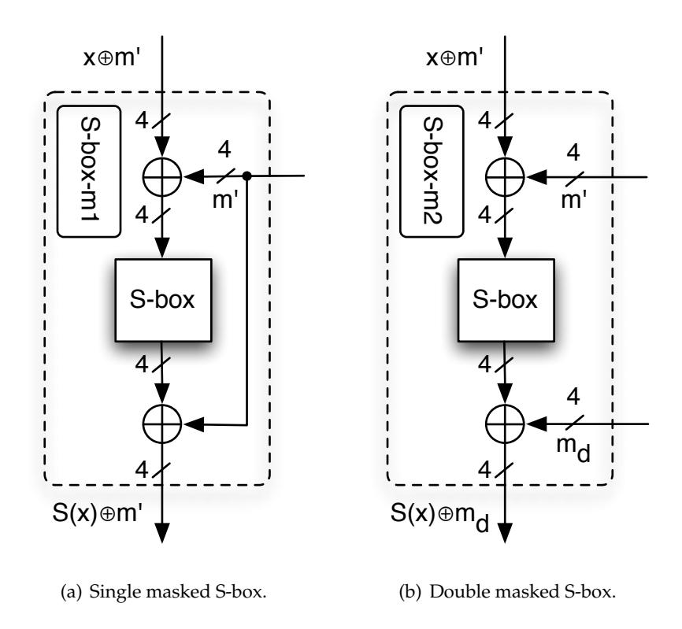

Figure 8.1: Schematics of single and double masked PRESENT S-boxes.

After synthesis the masked S-boxes Sm<sup>1</sup> and Sm<sup>2</sup> require 52 GE and 57 GE, which is about twice the size of a standard PRESENT S-box (28 GE).

Both modified S-boxes S-box-m1 and S-box-m2 first remove the mask form the input, process the unmasked value, and then mask the output again. This is an effective countermeasures against side channel attacks that exploit the leakage of flip-flops, such as [158, 157]. However, both S-boxes may be susceptible to side channel attacks that exploit the leakage of the combinatorial parts (toggle-count model).

Masking is in fact a (2,2) secret sharing scheme [206, 31], where both shares of the secret are required to proceed. Unfortunately, higher order DPA attacks (HODPA) can break basic masking schemes. However, Chari *et al.* have shown in [41] that up to n-th order DPA attacks can be prevented by using n masks. Following this direction, Nikova *et al.* extend the idea of masking with more than two shares in [168]. They show that non-linear functions implemented in such a way, achieve provable security against first-order DPA attacks and also resists higherorder attacks that are based on a comparison of mean power consumption. Estimations of a hardware implementation of these ideas are presented in [169].

### **8.5.2 Countermeasures at the cell level**

Sense Amplifier Based Logic (SABL), which is a Dual-Rail Precharge (DRP) logic, has been proposed by Tiri *et al.* [224] as the first DPA countermeasure at the cell level. In fact, in theory using a full-custom design tool enables to equalize the load capacitances of each couple of complementary logic signals and hence to make the power consumption independent of the processed data. Afterwards, Wave Dynamic Differential Logic (WDDL) [226] has been introduced in order to avoid the usage of full-custom design tools especially for the routing process. Since some place and route methods such as [93, 227] were proposed to diminish the load imbalances of complementary signals, the data-dependent time of evaluation and the memory effect of WDDL cells leave it still vulnerable to DPA attacks [216, 147].

Although it has been shown that masking at the cell level can not prevent the information leakage because of the presence of glitches [148], its combination with precharge logics led to Random Switching Logic (RSL) [217] in order to equalize the circuit transition probability. However, Tiri and Schaumont [225] showed that the single mask-bit in RSL just add one bit of entropy. On the other hand, in order to use semi-custom design tools without routing constrains, Masked Dual-Rail Precharge Logic (MDPL) [182] was introduced. It works similar to WDDL and employs a single mask-bit to nullify the effect of load imbalances. Moreover, Dual-Rail Random Switching Logic (DRSL) [42] was proposed to be the dual-rail version of RSL and to avoid the need of a central module to control the precharge signals.

Suzuki *et al.* showed that MDPL is susceptible to the early propagation effect [215]. The practical evaluation of the SCARD prototype chip<sup>2</sup> proved that the early propagation effect which resulted in a vulnerability of CMOS circuits also exists for MDPL cells [181]. In order to cope with the early propagation issues, the designers of MDPL introduced a so called Evaluation-Precharge Detection Unit (EPDU), which consists of three (CMOS) AND gates and two (CMOS) OR gates. The EPDU is applied to all improved MDPL (iMDPL) gates, hence it is not surprising that the area requirements for iMDPL gates increased significantly compared to MDPL gates.

Gierlichs [79] presented an attack on MDPL that exploits a deviation in the mask bit distribution and unbalanced dual-rails in the target cell. In order to mount this attack an adversary requires detailed knowledge on the layout-level of the device under attack. However, in practice this information is not publicly available or requires insider knowledge or expensive equipment and time-consuming efforts, such as reverse-engineering to gain it.

At that time, Schaumont and Tiri [202] showed that already slightly unbalanced complementary wires can be exploited to mount classical DPA attacks after only a simple filtering operation. Contrary to Gierlichs they did not exploit the unbalanced wires of the mask bit signal, but rather use only the unbalanced dual-rail wires of the logical signals.

Note that the attacks of Gierlichs and of Schaumont/Tiri can also be mounted on circuits built in iMDPL, but again require unbalanced wires and detailed knowledge of the device under attack. Therefore both attacks assume a rather strong attacker model. Furthermore, both attacks and also the attacks by Suzuki *et al.* [215] and Popp *et al.* [181] exploit leakage of the combinatorial part of a circuit. Contrary to this, Moradi *et al.* presented an attack on special circuits built in MDPL and DRSL that exploits the leakage of the underlying flip-flops [158]. They gain the Hamming distance of the mask bit with a Simple Power Analysis (SPA) and subsequently attack the circuit with a Correlation Power Analysis (CPA) [35]. Note that the success rate of any SPA strongly depends on the architecture of the attacked device. However, this attack is focused on a special type of flip-flops and a special architecture of the circuit. In a followup work [157] Moradi *et al.* analyzed the information leakage of CMOS flip-flops as well as the flip-flops of some known DPA-resistant logic styles. Using a modified Hamming distance

<sup>2</sup>During the SCARD (Side-Channel Analysis Resistant Design Flow, www.scard-project.eu) project a prototype chip was built, that contains amongst other components three AES co-processors built in CMOS, a DRP logic, and MDPL.

model to find the leakage of the CMOS flip-flops used in masked flip-flops their attack does not require any knowledge of the layout of the device<sup>3</sup> nor unbalanced wires and hence can be mounted even by class 1 attackers (clever outsiders). Their attack works even if a masked dual-rail ASIC has perfectly balanced wires.

Yet, perfectly balanced loads can never be achieved in practice because electrical effects will always cause different wire capacitances, even when the routing is done manually in a fullcustom design process. Therefore, it is questionable whether dual-rail logic approaches can provide enough resistance against side channel attacks in practice. Hence, the design of side channel countermeasures at the cell level remains an open research problem.

# **8.6 Cost overhead estimations of side channel countermeasures**

In this Section the costs of side channel countermeasures for lightweight hardware and software implementations of PRESENT-80 are assessed. The goal is to provide figures that estimate the additional costs in terms of area and timing when implementing side channel countermeasures. First a masked serialized PRESENT-80/4 hardware architecture is discussed in Section 8.6.1 and subsequently a masked software implementation on a 4-bit microcontroller is assessed in Section 8.6.2.

## **8.6.1 Cost overhead estimations for a masked serialized hardware implementations of** PRESENT

This section estimates the overhead costs of a masked serialized hardware implementation of PRESENT compared to a non-masked implementation. In a masked implementation no two values with the same mask should be stored in registers with a similar leakage model in subsequent clock cycles [147]. This is especially important for lightweight hardware implementations, because the register are reduced to a minimum in order to save area. This in particular means that as few registers or flip-flops are used as possible, which implies that updated values replace current values. For round-based implementations it is immediately clear that in each cycle a new mask has to be applied to all data state and key state bits. A serialized PRESENT-80/4 implementations requires a new 4-bit mask for every 4-bit chunk of the data and the key state in every round. Hence, regardless of the architecture, a masked PRESENT-80 implementation requires in total 32 · (64 + 80) = 4, 608 mask bits, *i.e.* random bits.

Figure 8.2 depicts a proposal for a double masked serialized PRESENT-80 architecture. It consists of a serialized PRESENT-80/4 implementation without the S-boxes component (1, 038 GE), because it was replaced by S-box-m2 in the datapath and by S-box-m1 in the key schedule. The initial data are input as sixteen 4-bit words W = w<sup>15</sup> . . . w0. These words are masked with random 4-bit words md,i ∈<sup>R</sup> {0, 1} <sup>4</sup> before they are stored in the state registers, hence the data state consists of the following sixteen 4-bit words wm,<sup>15</sup> . . . wm,<sup>0</sup> where wm,i = w<sup>i</sup> ⊕ md,i for 0 ≤ i ≤ 15. Similarly, the initial key K = k<sup>19</sup> . . . k<sup>0</sup> is input in 4-bit words and masked with random 4-bit words mk,j ∈<sup>R</sup> {0, 1} 4 . Consequently the key state consists of the following twenty 4 bit words km,<sup>19</sup> . . . km,<sup>0</sup> where km,j = k<sup>j</sup> ⊕mk,j for 0 ≤ j ≤ 19. For this initial masking step two additional 4-bit XORs with two inputs (18.64 GE) are required.

<sup>3</sup>Of course, any power analysis attack needs a brief knowledge about the architecture and intermediate values.

Please note that in our notation the masks of the current round are denoted with  $m_{d,i}$  and  $m_{k,j}$  while the values of the masks from the previous round are denoted with  $m'_{d,i}$  and  $m'_{k,j}$ . Therefore, after each round the following transitions occurs

$$m'_{d,i} \leftarrow m_{d,i}, \text{for } 0 \leq i \leq 15$$

$$m'_{k,j} \leftarrow m_{k,j}$$
, for  $0 \le j \le 19$

and consequently also

$$w_{m',15}\ldots w_{m,0} \leftarrow w_{m,15}\ldots w_{m',0}$$

$$k_{m',19} \dots k_{m,0} \leftarrow k_{m,19} \dots k_{m',0}$$

where  $w_{m',i} = w_i \oplus m'_{d,i}$  for  $0 \le i \le 15$  and  $k_{m',i} = k_i \oplus m'_{k,i}$  for  $0 \le i \le 19$ . This implies that the mask bits have to be stored for one round, which requires 144 additional flip-flops (864 GE).

After initialization, the first 4-bit word of the data state  $w_{m',0}$  is XORed with the corresponding key nibble  $k_{m',0}$  and subsequently processed by the S-box-m2 before it is stored again in the data state register. As mentioned above the data state has to be concealed with a different mask prior to storing, which is performed by the S-box-m2 component. The S-box input  $x_{m',i}$  consists of the XOR sum of the masked data state word  $w_{m',i}$  and the corresponding masked key state word  $k_{m',i}$ , i.e.  $x_{m',i} = w_{m',i} \oplus k_{m',i} = (w_i \oplus m'_{d,i}) \oplus (k_i \oplus m'_{k,i}) = x_i \oplus m'_{i}$ , where  $x_i = w_i \oplus k_i$  and  $m'_i = m'_{d,i} \oplus m'_{k,i}$ . Recall that S-box-m2 was designed such that  $S_{m_2}(x \oplus m') = S(x) \oplus m_d$ , hence the output of S-box-m2 is  $S(w_i \oplus k_i) \oplus m_{d,i}$ . In order to provide  $m'_i$  a 4-bit XOR with two inputs is required (9.32 GE).

In the same cycle the key state word is fed back into the key state register. In order to update the key mask, one 4-bit XOR with three inputs (18.68 GE) is required that XORs  $m_{k,i}$  and  $m'_{k,i}$  to the masked key word  $k_{m',i}$ . Therefore the key state is updated with  $k_{m,i} = k_{m',i} \oplus m'_{k,i} \oplus m_{k,i} = (k_i \oplus m'_{k,i}) \oplus m'_{k,i} \oplus m_{k,i} = k_i \oplus m_{k,i}$ . After 16 iterations all data state words have been processed but four key state words have not. Therefore four additional clock cycles, during which the data state sleeps, are required. The permutation layer is processed in a single clock cycle on the complete data state. In total the execution of one round would require 16+4+1=21 clock cycles. After repetition of 31 times in the final round the output has to be unmasked. For this purpose a 4 bit XOR with two inputs is required (9.32 GE).

Please note that the S-boxes unit replaces the S-box component of the serialized PRESENT-80/4 implementation while all other units from Table 8.1 require additional area. The S-box component of the plain PRESENT-80/4 implementation consists of a 4-bit MUX (9.32 GE) and an S-box (28 GE), which sums up to 37.2 GE. Consequently the contribution of the S-boxes unit to the overhead was reduced by 37 GE and in the following Table 8.2 only the difference was taken into account. As one can see a masked implementation requires less than double the area of a non-masked one and is slightly above the 2,000 GE barrier. Similar to the plain implementation, the majority of the area is required for storage, because for every data and key state bit also a mask bit has to be stored. The timing overhead is caused by the fact that the key state is 16 bits longer than the data state. Since the mask bits are provided in 4-bit chunks, 4 additional clock cycles are required per round in order to update the mask of the key state. Since also the plain implementation requires 20 clock cycles to read in the key at the beginning of each new message block, this overhead occurs only during 31 rounds. In total  $31 \cdot 4 = 124$  additional clock cycles would be required for a masked implementation.

As a next step this proposal needs to be implemented and its power consumption has to be simulated to assess the achieved resistance against side channel attacks. Then if the results are


Figure 8.2: Proposal for a serialized double masked PRESENT-80 architecture.

| unit       | module           | area [GE] | %     |
|------------|------------------|-----------|-------|
| S-boxes    | S-box-m1         | 52        | 5.05  |
|            | S-box-m2         | 57        | 5.54  |
| XORs       | init data mask   | 9.32      | 0.91  |
|            | init key mask    | 9.32      | 0.91  |
|            | $m_d \oplus m_k$ | 9.32      | 0.91  |
|            | data unmask      | 9.32      | 0.91  |
|            | key mask update  | 18.68     | 1.82  |
| flip flops | data mask        | 384       | 37.32 |
| flip-flops | key mask         | 480       | 46.65 |
| sum        |                  | 1,029     | 100   |

Table 8.1: Estimated area requirements of masking components for serialized PRESENT-80/4.

| component        | unit                          | area<br>[GE]    | rel.                 | clock cycles<br>[CLK] | rel. |
|------------------|-------------------------------|-----------------|----------------------|-----------------------|------|
| PRESENT-80/4     |                               | 1,075           | 1                    | 547                   | 1    |
| masking overhead | S-boxes<br>XORs<br>flip-flops | 72<br>56<br>864 | 0.07<br>0.05<br>0.80 | 124                   | 0.23 |
| total sum        |                               | 2,067           | 1.92                 | 671                   | 1.23 |

Table 8.2: Estimated area and timing overhead of masking components for a serialized PRESENT-80/4 implementation.

|         | ROM             |      | Stack     |      | Init.    |      | Cycles / block |      |
|---------|-----------------|------|-----------|------|----------|------|----------------|------|
|         | [lines of code] | rel. | [EXP/RET] | rel. | [cycles] | rel. | [cycles]       | rel. |
| umasked | 841             | 1    | 25/4      | 1/1  | 230      | 1    | 55,734         | 1    |
| masked  | 2,699           | 3.21 | 25/4      | 1/1  | 640      | 2.78 | 92,498         | 1.66 |

Table 8.3: Code size and cycle count overhead of a masked PRESENT-80 implementation on the ATAM893-D 4-bit microcontroller.

promising, a real ASIC should be manufactured and attacked in order to assess the security level more realistically.

# **8.6.2 Cost overhead estimations for a masked** 4 **bit software implementations of** PRESENT

In Section 5.4.2 a software implementation of PRESENT-80 on a 4-bit microcontroller was presented. This implementation was strengthened using Boolean masking in a straightforward manner and a coding style that achieves a constant runtime. Further implementation details can be found in [234]. Table 8.3 shows the performance of the masked implementation in comparison with the non-masked implementation. As one can see the masked implementation requires more than three times of ROM while the stack requirements stay the same. This is mainly caused by the masked S-box, which is 16 times larger than the unmasked S-box. At the same time the initialization phase is nearly three time as long and the encryption of one data blocks requires 66% more clock cycles. However, with 92, 498 clock cycles the masked implementation can encrypt one message block below 200 ms when clocked at 500 KHz, where the current consumption is still below 10 µA (see Section 5.4.2).

# **8.7 Conclusions**

The structural problem of most of todays SCA countermeasures is that they significantly increase the area, timing and power consumption of the implemented algorithm compared to a non-protected implementation. Furthermore, many countermeasures require random numbers, hence also a TRNG or a PRNG<sup>4</sup> has to be available. Since this will also increase the cost of an implementation of the algorithm, it will delay the break-even point and hence the mass deployment of some applications. For ultra-constrained applications, such as passive RFID tags, some countermeasures pose an impregnable barrier, because the power consumption of the protected implementation is much higher than what is available.

Power optimization techniques are an important tool for lightweight implementations of specific pervasive applications and might ease the aforementioned problem. On the one hand they also strengthen implementations against side channel attacks, because they lower the power consumption (the signal), which decreases the signal to noise ratio (SNR). However, on the other hand power saving techniques also *weaken* the resistance against side channel attacks. One consequence of the power minimization goal is that in the optimal case only those parts of the data path are active that process the relevant information. Furthermore, the width of the data path, *i.e.* the amount of bits that are processed at one point in time, is reduced by serialization. This however implies that the algorithmic noise is reduced to a minimum, which reduces the amount of required power traces for a successful side channel attack. Even worse, the serialized architecture allows the adversary a divide-and-conquer approach which further reduces the complexity of a side channel attack. Summarizing, it can be concluded that lightweight implementations greatly enhance the success probability of a side channel attack. The practical side channel attack [67] on *KeeLoq* applications [171] impressively underline this conclusions.

A different approach that combines power saving and SCA resistance is taken by Khatir and Moradi. They propose to use *adiabatic logic* styles as a countermeasure against SCA attacks [121]. Adiabatic logic uses a time-varying voltage source and its slopes of transition are slowed down. This reduces the energy dissipation of each transition to:

$$E_{Adiabatic} = \xi \frac{RC}{T} C V_{dd}^2$$

where T denotes the charging/discharging time, Vdd the voltage swing value ξ is the shaping factor for the power wave form. Recall that the energy dissipation of a CMOS circuit is given by the following equation:

$$E_{CMOS} = \frac{1}{2}CV_{dd}^2$$

where C denotes the associated capacitance and Vdd the supply voltage. In short the idea of adiabatic logic is to use a trapezoidal power-clock voltage rather than fixed supply voltage. As a consequence the power consumption of a circuit is reduced while at the same time its resistance against side-channel attacks is greatly enhanced. Especially for pervasive devices adiabatic logic styles seem to be a promising SCA countermeasure and future publications on this topic will be worth reading.

<sup>4</sup>True Random Number Generator, Pseudo Random Number Generator.

# **9 Conclusion**

As we have pointed out in this Thesis, the attacker model is different for pervasive devices compared to traditional computers. Especially the access to and the control over the pervasive devices opens the whole field of physical attacks for a potential adversary. On the other side, pervasive devices are typically very constrained in terms of computing capabilities, memory capacitance, and available power supply. These requirements lead to the need of specifically tailored security solutions for pervasive devices. Furthermore, due to the cost-constraints inherent in mass-deployment always the cheapest, *i.e.* most constrained, device that fulfills the requirements will be chosen for deployment. Consequently, there is a constant or even increasing demand for lightweight cryptography.

In Chapter 2 we introduced the notation, metrics and further background information as well as the design approaches and trade-offs for lightweight cryptography. We started with the approach of implementing a standardized algorithm with the optimization goal of minimal hardware requirements in Chapter 3. We chose DES, because it is one of the very few algorithms that was designed with a strong focus on hardware efficiency and is probably the best investigated algorithm. As a result we presented the smallest known hardware implementation of DES in Section 3.4.1. The next step was to have a closer look on the hardware requirements of the single components and it turned out that the substitution layer of DES is very demanding in terms of area requirements. Consequently we thought about further optimizations and we decided to slightly and very carefully change the substitution layer of DES. The literature study revealed that so far there was no DES variant published that uses a single S-box repeated eight times. Therefore we studied the design criteria of DES' S-boxes and the various publications that deal with cryptographic properties of S-boxes.

In Section 3.3 we stated eight conditions which a single S-box has to fulfill in order to be resistant against certain types of linear and differential cryptanalyses, and the Davies-Murphy attack. We presented a strengthened S-box, which is used in the single S-box DES variants DESL and DESXL. Furthermore, we showed, that a differential cryptanalysis with characteristics similar to the characteristics used by Biham and Shamir in [25] is not feasible anymore. We also showed, that DESL is more resistant against the most promising types of linear cryptanalysis than DES due to the improved non-linearity of the S-box. In order to expand the key space we also proposed DESXL, which is a DESX variant based on DESL rather than on DES. Due to the low current consumption and the small chip size required for our DESL design, it is especially suited for resource limited applications, for example RFID tags and wireless sensor nodes. DESL and DESXL are two examples for the approach where a well trusted algorithm is slightly and very carefully modified. In order to gain an even more hardware efficient implementation of a cryptographic algorithm, it is required to design a new lightweight algorithm from scratch.

This approach was followed in Chapter 4, where the new lightweight block cipher PRESENT was proposed. Well-known design principles (substitution-permutation network) were used to optimize its structure and every component for lightweight hardware implementation with a minimal area footprint, hence so to say PRESENT is an *engineered* cipher. The design philosophy of PRESENT was to keep it straight and simple wherever possible, because this eases implementation, while at the same time encourages researchers to scrutinize the security of PRESENT. In Section 4.6 we have presented our cryptanalytic results that show that PRESENT resists all (at the time of publication) known cryptanalytic attacks. Furthermore we also have discussed recent cryptanalytic results from other researchers that to some extent propose new cryptanalytic techniques. Interestingly all results underline the strength of PRESENT against these attacks.

In this Thesis we have also intensively explored implementations of PRESENT on a wide variety of different platforms, ranging from ASICs and FPGAs, over hardware-software co-design approaches to plain software implementations. The serialized ASIC implementation constitutes with 1, 000 GE the smallest published ASIC implementation of a cryptographic algorithm with a reasonable security level. Also the FPGA-implementation leads to a very compact result (202 slices), while providing a maximum frequency of 254 MHz. ASIC and FPGA figures highlight that though PRESENT was designed with a minimal hardware footprint in mind, *i.e.* targeted for low-cost devices such as RFIDs, PRESENT is well suited for high-speed and high-throughput applications. Especially its hardware efficiency, *i.e.* the throughput per slice or GE, respectively, is noteworthy. Furthermore, interestingly the old-fashioned Boolean minimization tool *espresso* lead to an FPGA implementation that was significantly smaller than a standard LUT based implementation. Besides this, we have also discussed recently published HW/SW codesign implementation results from other researchers that all underline PRESENTs suitability for low-cost and low-power applications that only process small amounts of data.

On the software side we exploited the lightweight structure of PRESENT and especially its 4-bit S-boxes by implementing PRESENT on a 4-bit microcontroller. To the best of our knowledge up to now there are no implementation results of cryptographic algorithms for 4-bit microcontrollers published. In Chapter 5 we have closed this gap and provided the first implementation results of this kind. We therefore presented a proof-of-concept that state-of-the-art cryptography is feasible on ultra-constrained 4-bit microcontrollers. Our implementation draws a current of 6.7 µA at a supply voltage of 1.8V and a frequency of 500 KHz. Together with the observation that the processing of one data block requires less than 200 ms we conclude that this implementation is interesting for passively powered RFID tags.

While compact hash functions are often proposed in protocols for RFID tags, there are currently no sufficiently compact candidates to hand. In Chapter 6 we have explored the possibility of building a hash function out of a block cipher such as PRESENT. We have described hash functions that offer 64- and 128-bit outputs based on current design strategies. For their parameter sets these are the most compact hash function candidates available today. In particular, H-PRESENT-128 requires around 4, 000 GE, which is similar to the best known AES implementation and about 50% smaller than the best reported MD5 implementation. At the same time, H-PRESENT-128 requires between 20–30 *times* fewer clock cycles than compact AES and MD5 implementations, giving it a major time-area advantage. Obviously 128-bit hash functions are relevant for applications where a security-performance trade-off is warranted. To obtain larger hash outputs there are severe complications and we suspect that dedicated designs could be more appropriate.

Lightweight public-key cryptography was investigated in Chapter 7. There we have described a proof-of-concept prototype board that simulates an RFID tag and contains a crypto-GPS ASIC. Several well-known optimizations of crypto-GPS have been described and three different hardware architectures of the crypto-GPS scheme have been presented. The implementation figures show that public key cryptography with a security level equivalent to 80 bits can be implemented with as few as 2, 181 GE including also memory and PRNG components. For 375 additional GE a more than 6 times faster implementation (1, 696 vs. 10, 723 clock cycles) can be realized. Both of these variants have a fixed secret s and an implementation with a variable secret s requires 3, 976 GE and takes 1, 696 clock cycles.

The area and power minimization goals of lightweight cryptographic implementations also bear security risks with regard to physical attacks. While on the one hand power saving techniques reduce the signal, which in turn decreases the signal to noise ratio (SNR), on the other hand together with a serialized datapath they decrease the algorithmic noise to a minimum, thus increasing the SNR. This in turn greatly increase the success probability of side channel attacks. Therefore in Chapter 8 we classified pervasive devices with respect to physical security aspects. Furthermore, we have estimated the costs of masking for lightweight hardware and software implementations of PRESENT. One observation from previously published countermeasures against side channel attacks is that each countermeasure introduces a significant overhead in area, clock cycles, and/or power consumption. Even more interesting, though the *relative* overhead stays the same for different algorithms, the *total* overhead in terms of area and power consumption (and also the costs) decreases with a more efficient algorithm. Especially with regard to the adapted Moore's law this can be a strong argument for or against a certain algorithm. Under this assumption area and power minimization becomes ever more important and adiabatic logic seems to be a very promising logic style for pervasive devices.

In short, the implementation results that have been described in this Thesis lead to the following conclusions:

- (1) The widespread assumption that stream-ciphers can be implemented more efficiently in hardware compared to block ciphers does not hold anymore, since the block cipher PRESENT requires only 1, 000 GE.
- (2) Consequently, hash functions with a digest size of 64 or 128 bits that are based on block ciphers can be implemented efficiently in hardware as well. Though it is not easy to obtain lightweight hash functions with a digest size of greater or equal to 160 bits. Given the required parameters, it is very unlikely that the NIST SHA-3 hash competition will lead to a lightweight approach. Hence, lightweight hash functions with a digest size of greater or equal to 160 bits remain an open research problem.
- (3) It is possible to implement the asymmetric cryptographic identification scheme crypto-GPS with only 2, 181 GE including storage and PRNG. However, crypto-GPS has a limited (though configurable) amount of pre-computed coupons. It would be interesting to see lightweight implementations of asymmetric identification schemes that do not have this constraints.

# **Bibliography**

- [1] D.G. Abraham, G.M. Dolan, G.P. Double, and J.V. Stevens. Transaction Security System. *IBM Systems Journal*, 30(2):206–229, 1991.
- [2] M. Albrecht and C. Cid. Algebraic Techniques in Differential Cryptanalysis. In *Fast Software Encryption 2009 – FSE 2009*, Lecture Notes in Computer Science. Springer-Verlag, to appear., 2009.
- [3] Altium Limited. TASKING VX-Toolset for C166 User Guide. Available via http:// tinyurl.com/pwtlra, September 2008.
- [4] AMI Semiconductors. MTC45000 Standard Cell Design Data Book 0.35 µm CMOS, December 1996.
- [5] Y. An and S. Oh. RFID System for User's Privacy Protection. In *IEEE Asia-Pacific Conference on Communications*, pages 16–519. IEEE Computer Society, 2005.
- [6] R. Anderson. *Security Engineering: A Guide to Building Dependable Distributed Systems*. John Wiley & Sons, Inc. New York, NY, USA, 2001.
- [7] R. Anderson, M. Bond, J. Clulow, and S. Skorobogatov. Cryptographic Processors a Survey. *Proceedings of the IEEE*, 94(2):357–369, 2006.
- [8] R. Anderson and M. Kuhn. Tamper Resistance a Cautionary Note. In *Second Usenix Workshop on Electronic Commerce*, pages 1–11, November 1996.
- [9] Atmel. 8-bit AVR Instruction Set. Available via http://www.atmel.com/dyn/ resources/prod\_documents/doc0856.pdf.
- [10] Atmel. AVR Studio 4.13. Available via http://www.atmel.com/dyn/products/ tools\_card.asp?tool\_id=2725.
- [11] Atmel. Datasheet of ATMega163, an 8-bit AVR Microcontroller with 16K Bytes In-System Programmable Flash. Available via http://www.atmel.com/dyn/resources/ prod\_documents/doc1142.pdf, 2003.
- [12] Atmel. Datasheet of ATMega323, an 8-bit AVR Microcontroller with 32K Bytes In-System Programmable Flash. Available via http://www.atmel.com/dyn/resources/ prod\_documents/doc1457.pdf, 2003.
- [13] Atmel. Flash Version for ATAR080 ATAR090/890 ATAR092/892 and ATAM893- D . Available via http://www.atmel.com/dyn/resources/prod\_documents/ doc4680.pdf, 2005.
- [14] G. Avoine and P. Oechslin. A Scalable and Provably Secure Hash-based RFID Protocol. In *3rd IEEE Conference on Pervasive Computing and Communications Workshops — PerCom 2005*, pages 110–114. IEEE Computer Society, 2005.
- [15] D. Bailey and A. Juels. Shoehorning Security into the EPC Standard. In R. De Prisco and M. Yung, editors, *Security in Communication Networks — SCN 2006*, volume 4116 of *Lecture Notes in Computer Science*, pages 303–320, Maiori, Italy, September 2006. Springer-Verlag.

- [16] H. Bar-El, H. Choukri, D. Naccache, M. Tunstall, and C. Whelan. The Sorcerer's Apprentice Guide to Fault Attacks. *Proceedings of the IEEE*, 94(2):370–382, 2006.
- [17] P. Baretto and V. Rijmen. The Whirlpool Hashing Function. Available via http://www. larc.usp.br/~pbarreto/WhirlpoolPage.html.
- [18] L. Batina, J. Guajardo, T. Kerins, N. Mentens, P. Tuyls, and I. Verbauwhede. An Elliptic Curve Processor Suitable For RFID-Tags. Cryptology ePrint Archive, Report 2006/227, available via http://eprint.iacr.org/, 2006.
- [19] G. Bertoni, L. Breveglieri, P. Fragneto, M. Macchetti, and S. Marchesin. Efficient Software Implementation of AES on 32-Bit Platforms. In C.D. Walter, Ç.K. Koç, and C. Paar, editors, *Cryptographic Hardware and Embedded Systems — CHES 2003*, volume 2779 of *Lecture Notes in Computer Science*, pages 159–171. Springer-Verlag, 2003.
- [20] E. Biham. New Types of Cryptanalytic Attacks Using Related Keys. In T. Helleseth, editor, *EUROCRYPT 1993*, volume 765 of *Lecture Notes in Computer Science*, pages 398– 409. Springer-Verlag, 1994.
- [21] E. Biham. A Fast New DES Implementation in Software. In *Fast Software Encryption 1997 – FSE 1997*, volume 1267 of *Lecture Notes in Computer Science*, pages 260–272. Springer-Verlag, 1997.
- [22] E. Biham and A. Biryukov. How to Strengthen DES Using Existing Hardware. In *Advances in Cryptology — ASIACRYPT 1994*. Lecture Notes in Computer Science, Springer-Verlag, 1994. Available via citeseer.ist.psu.edu/biham94how.html.
- [23] E. Biham and A. Biryukov. An Improvement of Davies' Attack on DES. *Journal of Cryptology*, 10(3):195–205, Summer 1997. Available via citeseer.ist.psu.edu/467934. html.
- [24] E. Biham and O. Dunkelman. A Framework for Iterative Hash Functions HAIFA. Presented at Second NIST Cryptographic Hash Workshop, available via csrc.nist.gov/ groups/ST/hash/, August 2006.
- [25] E. Biham and A. Shamir. Differential Cryptanalysis of DES-like Cryptosystems. In A.J. Menezes and S.A. Vanstone, editors, *Advances in Cryptology — CRYPTO 1990*, volume Lecture Notes in Computer Science 537, pages 2–21. Springer-Verlag, 1991.
- [26] E. Biham and A. Shamir. Differential Cryptanalysis of the Full 16-Round DES. In *Advances in Cryptology — CRYPTO 1992*, volume 740 of *Lecture Notes in Computer Science*, pages 487–496, 1992. Available via citeseer.ist.psu.edu/ biham93differential.html.
- [27] E. Biham and A. Shamir. Differential Fault Analysis of Secret Key Cryptosystems. In B. S. Kaliski, editor, *Advances in Cryptology — CRYPTO 1997*, volume 1294 of *Lecture Notes in Computer Science*, pages 513–525. Springer-Verlag, 1997.
- [28] A. Biryukov, S. Mukhopadhyay, , and P. Sarkar. Improved time-memory trade-offs with multiple data. In B. Preneel and S. Tavares, editors, *Selected Areas in Cryptography — SAC 2005*, volume 3897 of *Lecture Notes in Computer Science*, pages 110–127. Springer-Verlag.
- [29] A. Biryukov and D. Wagner. Advanced Slide Attacks. In B. Preneel, editor, *Eurocrypt 2000*, volume 1807 of *Lecture Notes in Computer Science*, pages 589–606. Springer-Verlag, 2000.

- [30] J. Black, P. Rogaway, and T. Shrimpton. Black-Box Analysis of the Block-Cipher-Based Hash-Function Constructions from PGV. In M. Yung, editor, *Advances in Cryptology — CRYPTO 2002*, volume 2442 of *Lecture Notes in Computer Science*, pages 320–335. Springer-Verlag, 2002.
- [31] G. R. Blakley. Safeguarding Cryptographic Keys. In *National Computer Conference*, pages 313–317, 1979.
- [32] A. Bogdanov. Attacks on the KeeLoq Block Cipher and Authentication Systems. In *RFID Security — RFIDsec 2007, Workshop Record*, 2007.
- [33] A. Bogdanov, G. Leander, L.R. Knudsen, C. Paar, A. Poschmann, M.J.B. Robshaw, Y. Seurin, and C. Vikkelsoe. PRESENT - An Ultra-Lightweight Block Cipher. In P. Paillier and I. Verbauwhede, editors, *Cryptographic Hardware and Embedded Systems — CHES 2007*, number 4727 in Lecture Notes in Computer Science, pages 450–466. Springer-Verlag, 2007.
- [34] A. Bogdanov, G. Leander, C. Paar, A. Poschmann, M. J.B. Robshaw, and Y. Seurin. Hash Functions and RFID Tags: Mind the Gap. In E. Oswald and P. Rohatgi, editors, *Cryptographic Hardware and Embedded Systems — CHES 2008*, number 5154 in Lecture Notes in Computer Science, pages 283–299. Springer-Verlag, 2008.
- [35] E. Brier, C. Clavier, and F. Olivier. In M. Joye and J.-J. Quisquater, editors, *Cryptographic Hardware and Embedded Systems — CHES 2004*.
- [36] L. Brown, J. Pieprzyk, and J. Seberry. LOKI A Cryptographic Primitive for Authentication and Secrecy Applications. In J. Pieprzyk and J. Seberry, editors, *Advances in Cryptology — AUSCRYPT 1990*, volume 453 of *Lecture Notes in Computer Science*, pages 229–236. Springer-Verlag, 1990.
- [37] P. Bulens, F.-X. Standaert, J.-J. Quisquater, P. Pellegrin, and G. Rouvroy. Implementation of the AES-128 on Virtex-5 FPGAs. In S. Vaudenay, editor, *Progress in Cryptology — AFRICACRYPT 2008*, pages 16–26, 2008.
- [38] C. Lim and T. Korkishko. mCrypton A Lightweight Block Cipher for Security of Lowcost RFID Tags and Sensors. In J. Song, T. Kwon, and M. Yung, editors, *Workshop on Information Security Applications — WISA 2005*, volume 3786 of *Lecture Notes in Computer Science*, pages 243–258. Springer-Verlag, 2005.
- [39] Cast Inc. Cast AES32-C. Available via www.cast-inc.com.
- [40] D. Chang. A Practical Limit of Security Proof in the Ideal Cipher Model : Possibility of Using the Constant As a Trapdoor In Several Double Block Length Hash Functions. IACR Cryptology ePrint Archive, Report 2006/481. Available via http://eprint. iacr.org/2006/481, 2006.
- [41] S. Chari, C. S. Jutla, J. R. Rao, and P. Rohatgi. Towards Sound Approaches to Counteract Power-Analysis Attacks. In M. Wiener, editor, *Advances in Cryptology — CRYPTO 1999*, volume 1666 of *Lecture Notes in Computer Science*, pages 398–412. Springer-Verlag, 1999.
- [42] Z. Chen and Y. Zhou. Dual-Rail Random Switching Logic: A Countermeasure to Reduce Side Channel Leakage. In L. Goubin and M. Matsui, editors, *Cryptographic Hardware and Embedded Systems — CHES 2006*, volume 4249 of *Lecture Notes in Computer Science*, pages 242–254. Springer-Verlag, 2006.

- [43] P. Chodowiec and K. Gaj. Very Compact FPGA Implementation of the AES Algorithm. In C.D. Walter, Ç.K. Koç, and C. Paar, editors, *Cryptographic Hardware and Embedded Systems — CHES 2003*, number 2779 in Lecture Notes in Computer Science, pages 319–333. Springer-Verlag, 2003.
- [44] C. Cid and G. Leurent. An Analysis of the XSL Algorithm. In B. Roy, editor, *Advances in Cryptology — ASIACRYPT 2005*, volume 3788 of *Lecture Notes in Computer Science*, pages 333–352. Springer-Verlag, 2005.
- [45] C. Cid, S. Murphy, and M.J.B. Robshaw. Small Scale Variants of the AES. In H. Gilbert and H. Handschuh, editors, *FSE 2005*, volume 3557 of *Lecture Notes in Computer Science*, pages 145–162. Springer-Verlag, 2005.
- [46] B. Collard. http://www.dice.ucl.ac.be/crypto/people/show/217.
- [47] B. Collard and F.-X. Standaert. A Statistical Saturation Attack against the Block Cipher PRESENT. In *Topics in Cryptology — CT-RSA 2009*, to appear.
- [48] D. Coppersmith. The Data Encryption Standard (DES) and its Strength Against Attacks. Technical report rc 186131994, IBM Thomas J. Watson Research Center, December 1994.
- [49] D. Coppersmith, S. Pilpel, C.H. Meyer, S.M. Matyas, M.M. Hyden, J. Oseas, B. Brachtl, and M. Schilling. Data Authentication Using Modification Detection Codes Based on a Public One Way Encryption Function. U.S. Patent No. 4,908,861, March 13 1990.
- [50] N. Courtois, A. Klimov, J. Patarin, and A. Shamir. Efficient Algorithms for Solving Overdefined Systems of Multivariate Polynomial Equations. In B. Preneel, editor, *Advances in Cryptology — EUROCRYPT 2000*, volume 1807 of *Lecture Notes in Computer Science*, pages 392–407. Springer-Verlag, 2000.
- [51] N. Courtois and J. Pieprzyk. Cryptanalysis of Block Ciphers with Overdefined Systems of Equations. In Y. Zheng, editor, *Advances in Cryptology — ASIACRYPT 2002*, volume 2501 of *Lecture Notes in Computer Science*, pages 267–287. Springer-Verlag, 2002.
- [52] Crossbow Technology Inc. MPR-MIB Users Manual. Available via http://www.xbow. com/Support/Support\_pdf\_files/MPR-MIB\_Series\_Users\_Manual.pdf, June 2007.
- [53] J. Daemen, L. Knudsen, and V. Rijmen. The Block Cipher Square. In E. Biham, editor, *Fast Software Encryption — FSE 1997*, volume 1267 of *Lecture Notes in Computer Science*, pages 149–165. Springer-Verlag, 1997.
- [54] J. Daemen and V. Rijmen. *The Design of Rijndael*. Springer-Verlag, Berlin, Germany, 2002.
- [55] I. Damgård. A Design Principle for Hash Functions. In G. Brassard, editor, *Advances in Cryptology — CRYPTO 1989*, volume 435 of *Lecture Notes in Computer Science*, pages 416–427. Springer-Verlag, 1989.
- [56] D. Davies and S. Murphy. Pairs and Triplets of DES S-Boxes. *Journal of Cryptology*, 8(1):1– 25, 1995.
- [57] C. de Cannière and B. Preneel. Trivium. Available via www.ecrypt.eu.org/stream.
- [58] R.D. Dean. *Formal Aspects of Mobile Code Security*. PhD thesis, Princeton University, 1999.
- [59] S. Devadas and S. Malik. A survey of optimization techniques targeting low power VLSI circuits. In *ACM/IEEE Conference on Design Automation*, pages 242–247, 1995.

- [60] C. Diem. The XL-Algorithm and a Conjecture from Commutative Algebra. In P.J. Lee, editor, *Advances in Cryptology — ASIACRYPT 2004*, volume 3329 of *Lecture Notes in Computer Science*, pages 323–337. Springer-Verlag, 2004.
- [61] T. Dimitriou. A lightweight rfid protocol to protect against traceability and cloning attacks. In *IEEE International Conference on Security and Privacy of Emerging Areas in Communication Networks (SecureComm 2005)*, pages 59–66. IEEE Computer Society, 2005.
- [62] T. Dimitriou. A Secure and Efficient RFID Protocol that could make Big Brother (partially) Obsolete. In *International Conference on Pervasive Computing and Communications – PerCom 2006*, pages 269–275, Pisa, Italy, March 2006. IEEE Computer Society.
- [63] I. Dinur and A. Shamir. Cube Attacks on Tweakable Black Box Polynomials. Cryptology ePrint Archive, Report 2008/385, available via http://eprint.iacr.org/ 2008/385, 2008.
- [64] Dolphin Integration. SESAME-LP2 Description of the Standard Cells for the Process IHP 0.25 µm – ViC Specifications, December 2005.
- [65] S. Dominikus, E. Oswald, and M. Feldhofer. Symmetric authentication for RFID systems in practice. RFID and Lightweight Crypto — RFIDsec 2005, Workshop Record, July 2005.
- [66] T. J. Donohue. The State of American Business 2007. Technical report, United States Chamber of Commerce, 2007.
- [67] T. Eisenbarth, T. Kasper, A. Moradi, C. Paar, M. Salmasizadeh, and M. T. M. Shalmani. On the power of power analysis in the real world: A complete break of the keeloqcode hopping scheme. In *CRYPTO*, pages 203–220, 2008.
- [68] T. Eisenbarth, S. Kumar, C. Paar, A. Poschmann, and L. Uhsadel. A Survey of Lightweight Cryptography Implementations. *IEEE Design & Test of Computers – Special Issue on Secure ICs for Secure Embedded Computing*, 24(6):522 – 533, November/December 2007.
- [69] J. C Faugère. A new efficient algorithm for computing Gröbner bases (F4). *Journal of Pure and Applied Algebra*, 139(1):61 – 88, June 1999.
- [70] M. Feldhofer. An Authentication Protocol in a Security Layer for RFID Smart Tags. In *The 12th IEEE Mediterranean Electrotechnical Conference — MELECON 2004*, volume 2, pages 759–762, Dubrovnik, Croatia, May 2004. IEEE.
- [71] M. Feldhofer, S. Dominikus, and J. Wolkerstorfer. Strong Authentication for RFID Systems Using the AES algorithm. In M. Joye and J.-J. Quisquater, editor, *Cryptographic Hardware and Embedded Systems — CHES 2004*, volume 3156 of *Lecture Notes in Computer Science*, pages 357–370. Springer-Verlag, 2004.
- [72] M. Feldhofer and C. Rechberger. A Case Against Currently Used Hash Functions in RFID Protocols. In *First International Workshop on Information Security — IS 2006*, volume 4277 of *Lecture Notes in Computer Science*, pages 372–381. Springer-Verlag, 2006.
- [73] M. Feldhofer, J. Wolkerstorfer, and V. Rijmen. AES Implementation on a Grain of Sand. *Information Security, IEE Proceedings*, 152(1):13–20, 2005.
- [74] K. Finkenzeller. *RFID Handbook : Fundamentals and Applications in Contactless Smart Cards and Identification*. John Wiley and Sons, 2003.
- [75] F. Fürbass and J. Wolkerstorfer. ECC Processor with Low Die Size for RFID Applications. In *IEEE International Symposium on Circuits and Systems 2007 – ISCAS 2007*, pages 1835– 1838, 2007.

- [76] J.-P. Kaps G. Gaubatz and B. Sunar. Public Key Cryptography in Sensor Networks— Revisited. In C. Castellucia, H. Hartenstein, C. Paar, and d. Westhoff, editors, *Proceeding of the 1st European Workshop on Security in Ad-Hoc and Sensor Networks – ESAS 2004*, volume 3312 of *Lecture Notes in Computer Science*, pages 2–18. Springer-Verlag, 2004.
- [77] X. Gao, Z. Xian, H. Wang, J. Shen, J. Huang, and S. Song. An Approach to Security and Privacy of RFID System for Supply Chain. In *IEEE International Conference on E-Commerce Technology for Dynamic E-Business*, pages 164–168. IEEE Computer Society, 2004.
- [78] X. Gao, Z. Xiang, H. Wang, J. Shen, J. Huang, and S. Song. An Approach to Security and Privacy of RFID System for Supply Chain. In *Conference on E-Commerce Technology for Dynamic E-Business — CEC-East2004*, pages 164–168, Beijing, China, September 2005. IEEE, IEEE Computer Society.
- [79] B. Gierlichs. DPA-Resistance Without Routing Constraints? A Cautionary Note About MDPL Security. In P. Paillier and I. Verbauwhede, editors, *Cryptographic Hardware and Embedded Systems — CHES 2007*, volume 4727 of *Lecture Notes in Computer Science*, pages 107–120. Springer-Verlag, 2007.
- [80] H. Gilbert and M. Minier. A Collision Attack on 7 Rounds of Rijndael. In *3rd AES Candidate Conference*, pages 230–241, 2000.
- [81] M. Girault. Self-Certified Public Keys. In D. W. Davies, editor, *Advances in Cryptology — EUROCRYPT 1991*, volume 547 of *Lecture Notes in Computer Science*, pages 490–497. Springer-Verlag, 1991.
- [82] M. Girault. Low-Size Coupons for Low-Cost IC Cards. In J. Domingo-Ferrer, D. Chan, and A. Watson, editors, *4th Working Conference on Smart Card Research and Advanced Applications on Smart Card Research and Advanced Applications*, pages 39–50, Norwell, MA, USA, 2001. Kluwer Academic Publishers.
- [83] M. Girault, L. Juniot, and M.J.B. Robshaw. The Feasibility of On-the-Tag Public Key Cryptography. In *RFID Security 2007 — RFIDsec 2007, Workshop Record*, 2007.
- [84] M. Girault and D. Lefranc. Public Key Authentication with One (Online) Single Addition. In M. Joye and J.-J. Quisquater, editor, *Cryptographic Hardware and Embedded Systems - CHES 2004*, volume 3156 of *Lecture Notes in Computer Science*, pages 967–984. Springer-Verlag, 2004.
- [85] M. Girault, G. Poupard, and J. Stern. On the Fly Authentication and Signature Schemes Based on Groups of Unknown Order. *Journal of Cryptology*, 19:463–487, 2006.
- [86] M. Girault and J. Stern. On the Length of Cryptographic Hash-Values Used in Identification Schemes. In Y. Desmedt, editor, *Advances in Cryptology — CRYPTO 1994*, volume 893 of *Lecture Notes in Computer Science*, pages 202–215. Springer-Verlag, 1994.
- [87] S. Goldwasser and S. Micali. Probabilistic Encryption & How to Play Mental Poker Keeping Secret All Partial Information. In *ACM Symposium on Theory of Computing — STOC 1982*, pages 365–377, New York, NY, USA, 1982. ACM.
- [88] T. Good and M. Benaissa. AES on FPGA from the Fastest to the Smallest. In J.R. Rao and B. Sunar, editors, *Cryptographic Hardware and Embedded Systems — CHES 2005*, number 3659 in Lecture Notes in Computer Science, pages 427–440. Springer-Verlag, 2005.
- [89] T. Good and M. Benaissa. Hardware Results for Selected Stream Cipher Candidates. State of the Art of Stream Ciphers 2007 (SASC 2007), Workshop Record, February 2007. Available via www.ecrypt.eu.org/stream.

- [90] F. Gosset, F.-X. Standaert, and J.-J. Quisquater. FPGA Implementation of SQUASH. In *Twenty-ninth Symposium on Information Theory in the Benelux*, 2008.
- [91] P. Grabher, J. Großschädl, and D. Page. Light-Weight Instruction Set Extensions for Bit-Sliced Cryptography. In E. Oswald and P. Rohatgi, editors, *Cryptographic Hardware and Embedded Systems — CHES 2008*, number 5154 in Lecture Notes in Computer Science, pages 331–345. Springer-Verlag, August 2008.
- [92] Mentor Graphics. ModelSim SE User's Manual. Available via http://www.model. com/resources/resources\\_manuals.asp.
- [93] S. Guilley, P. Hoogvorst, Y. Mathieu, and R. Pacalet. The "Backend Duplication" Method. In J.R. Rao and B. Sunar, editors, *Cryptographic Hardware and Embedded Systems — CHES 2005*, volume 3659 of *Lecture Notes in Computer Science*, pages 383–397. Springer-Verlag, 2005.
- [94] X. Guo, Z. Chen, and P. Schaumont. Energy and Performance Evaluation of an FPGA-Based SoC Platform with AES and PRESENT Coprocessors. In *Embedded Computer Systems: Architectures, Modeling, and Simulation*, volume 5114 of *Lecture Notes in Computer Science*, pages 106–115. Springer-Verlag, 2008.
- [95] H. Yoshida, D. Watanabe, K. Okeya, J. Kitahara, J. Wu, O. Kucuk, and B. Preneel. MAME: A Compression Function With Reduced Hardware Requirements. In P. Paillier and I. Verbauwhede, editors, *Cryptographic Hardware and Embedded Systems — CHES 2007*, volume 4727 of *Lecture Notes in Computer Science*, pages 148–165. Springer-Verlag, 2007.
- [96] P. Hämäläinen, T. Alho, M. Hännikäinen, and T. D. Hämäläinen. Design and Implementation of Low-Area and Low-Power AES Encryption Hardware Core. In *DSD*, pages 577–583, 2006.
- [97] R. B. Handfield and E. L. Nichols. *Introduction to Supply Chain Management*. Prentice-Hall, Upper Saddle River, NJ, 1999.
- [98] H. Handschuh, L.R. Knudsen, and M.J.B. Robshaw. Analysis of SHA-1 in Encryption Mode. In D. Naccache, editor, *Topics in Cryptology — CT-RSA 2001*, volume 2020 of *Lecture Notes in Computer Science*, pages 70–83, 2001.
- [99] M. Hell, T. Johansson, A. Maximov, and W. Meier. A Stream Cipher Proposal: Grain-128. In *IEEE International Symposium on Information Theory—ISIT 2006*, 2006. Also available via www.ecrypt.eu.org/stream.
- [100] D. Henrici, J. Götze, and P. Müller. A Hash-based Pseudonymization Infrastructure for RFID Systems. In P. Georgiadis, J. Lopez, S. Gritzalis, and G. Marias, editors, *SecPerU 2006*, pages 22–27. IEEE Computer Society Press, 2006.
- [101] H. Heys. A Tutorial on Differential and Linear Cryptanalysis. Available via www.engr. mun.ca/~howard/PAPERS/ldc\_tutorial.pdf.
- [102] H. M. Heys and S. E. Tavares. Substitution-Permutation Networks Resistant to Differential and Linear Cryptanalysis. *Journal of Cryptology*, 9(1):1–19, 1996.
- [103] S. Hirose. Provably Secure Double-Block-Length Hash Functions in a Black-Box Model. In C. Park and S. Chee, editors, *ICISC 2004*, volume 3506, pages 330–342. Springer-Verlag, 2004.
- [104] S. Hirose. How to Construct Double-Block-Length Hash Functions. In *Second Cryptographic Hash Workshop*, Santa Barbara, Aug 2006.

- [105] S. Hirose. Some Plausible Constructions of Double-Block-Length Hash Functions. In M.J.B. Robshaw, editor, *Fast Software Encryption 2006 – FSE 2006*, volume 4047 of *Lecture Notes in Computer Science*, pages 210–225, 2006.
- [106] J. Hoffstein, J. Pipher, and J. Silverman. NTRU: A Ring-based Public Key Cryptosystem. In J. Buhler, editor, *Algorithmic Number Theory (ANTS III)*, volume 1423 of *Lecture Notes in Computer Science*, pages 267–288. Springer-Verlag, 1998.
- [107] D. Hong, J. Sung, S. Hong, J. Lim, S. Lee, B. S. Koo, C. Lee, D. Chang, J. Lee, K. Jeong, H. Kim, J. Kim, and S. Chee. HIGHT: A New Block Cipher Suitable for Low-Resource Device. In L. Goubin and M. Matsui, editors, *Cryptographic Hardware and Embedded Systems — CHES 2006*, number 4249 in Lecture Notes in Computer Science, pages 46–59. Springer-Verlag, 2006.
- [108] Infineon Technologies. Instruction Set Manual for the C166 Family of Infineon 16- Bit Single-Chip Microcontrollers. Available via http://www.keil.com/dd/docs/ datashts/infineon/c166ism.pdf, March 2001.
- [109] Infineon Technologies. *Security & Chip Card ICs SLE 88CX720P*, 2001. Available via http://www.datasheetarchive.com/pdf-datasheets/Datasheets-14/ DSA-262009.pdf.
- [110] Infineon Technologies. *Security & Chip Card ICs SLE 66C24PE*, 2004. Available via http://www.datasheetarchive.com/pdf-datasheets/Datasheets-14/ DSA-262009.pdf.
- [111] Infineon Technologies. Data Sheet for C167CR/C167SR 16-Bit Single-Chip Microcontroller. Available via http://tinyurl.com/qvyxqs, February 2005.
- [112] ISO/IEC. International Standard ISO/IEC 9798 Information technology Security techniques – Entity authentication – Part 5: Mechanisms using Zero-Knowledge Techniques. Available via http://tinyurl.com/o24jwv.
- [113] IST-1999-12324. Final Report of European Project IST-1999-12324: New European Schemes for Signatures, Integrity, and Encryption (NESSIE). Available via https: //www.cosic.esat.kuleuven.be/nessie/, April 2004.
- [114] A. Joux. Multi-Collisions in Iterated Hash Functions. Application to Cascaded Constructions. In M. Franklin, editor, *Advances in Cryptology — CRYPTO 2004*, volume 3152 of *Lecture Notes in Computer Science*, pages 306–316. Springer-Verlag, 2004.
- [115] A. Juels. RFID Security and Privacy: a Research Survey. *Selected Areas in Communications, IEEE Journal on*, 24(2):381–394, Feb. 2006.
- [116] A. Juels and S. A. Weis. Authenticating pervasive devices with human protocols. In V. Shoup, editor, *Advances in Cryptology — CRYPTO 2005*, volume 3126 of *Lecture Notes in Computer Science*, pages 293–198. Springer-Verlag, 2005.
- [117] Keithley Instruments. 7.5-Digit High Performance Multimeter. Available via http: //www.keithley.com/data?asset=361, 2005.
- [118] J. Kelsey and B. Schneier. Second Preimages on n-bit Hash Functions for Much Less than 2 <sup>n</sup> Work. In R. Cramer, editor, *Advances in Cryptology — EUROCRYPT 2005*, volume 3494 of *Lecture Notes in Computer Science*, pages 474–490. Springer-Verlag, 2005.
- [119] J. Kelsey, B. Schneier, and D. Wagner. Related-key Cryptanalysis of 3-WAY, Biham-DES,CAST, DES-X, NewDES, RC2, and TEA. In G. Goos, J. Hartmanis, and J. van

- Leeuwen, editors, *Information and Communications Security*, volume 1334 of *Lecture Notes in Computer Science*, pages 233–246. Springer-Verlag, 1997.
- [120] A. Kerckhoff. La Cryptographie Militaire. *Journal des Sciences Militaires*, IX:5–38, Feb. 1883. Available via http://tinyurl.com/qgb56g.
- [121] M. Khatir and A. Moradi. Secure Adiabatic Logic: a Low-Energy DPA-Resistant Logic Style. Cryptology ePrint Archive, Report 2008/123, available via http://eprint. iacr.org/2008/123, 2008.
- [122] K. Kim, S. Lee, S. Park, and D. Lee. DES can be Immune to Linear Cryptanalysis. In *Workshop on Selected Areas in Cryptography – SAC 1994*, pages 70–81, May 1994. Available via citeseer.csail.mit.edu/kim94des.html.
- [123] K. Kim, S. Lee, S. Park, and D. Lee. Securing DES S-boxes Against Three Robust Cryptanalysis. In *Workshop on Selected Areas in Cryptography – SAC 1995*, pages 145–157, 1995. Available via citeseer.ist.psu.edu/kim95securing.html.
- [124] K. Kim, S. Park, and S. Lee. Reconstruction of s 2 -DES S-Boxes and their Immunity to Differential Cryptanalysis. In *Korea-Japan Joint Workshop on Information Security and Cryptology – JW-ISC 1993*, October 1993. Available via citeseer.csail.mit.edu/ kim93reconstruction.html.
- [125] L. Knudsen and D. Wagner. Integral Cryptanalysis. In *Fast Software Encryption FSE 2002*, volume 2365 of *Lecture Notes in Computer Science*, pages 112–127. Springer-Verlag, 2002.
- [126] L. R. Knudsen and T. A. Berson. Truncated Differentials of SAFER. In D. Gollmann, editor, *Fast Software Encryption — FSE 1996*, volume 1039 of *Lecture Notes in Computer Science*, pages 15–26. Springer-Verlag, 1996.
- [127] L. R. Knudsen, M. J. B. Robshaw, and D. Wagner. Truncated Differentials and Skipjack. In M. Wiener, editor, *Advances in Cryptology — CRYPTO 1999*, volume 1666 of *Lecture Notes in Computer Science*, pages 165–180. Springer-Verlag, 1999.
- [128] L.R. Knudsen. Iterative Characteristics of DES and s 2 -DES. In E. F. Brickell, editor, *Advances in Cryptology — CRYPTO 1992*, volume 740 of *Lecture Notes in Computer Science*, pages 497–511. Springer-Verlag, 1992.
- [129] L.R. Knudsen and X. Lai. New Attacks on all Double Block Length Hash Functions of Hash Rate 1, Including the Parallel-DM. In A. De Santis, editor, *Advances in Cryptology — EUROCRYPT 1994*, volume 950 of *Lecture Notes in Computer Science*, pages 410–418. Springer-Verlag, 1994.
- [130] P. C. Kocher. Timing Attacks on Implementations of Diffie-Hellman, RSA, DSS, and Other Systems. In N. I. Koblitz, editor, *Advances in Cryptology — CRYPTO 1996*, volume 1109 of *Lecture Notes in Computer Science*, pages 104–113. Springer Verlag, 1996.
- [131] P. C. Kocher, J. Jaffe, and B. Jun. Differential Power Analysis. In M. Wiener, editor, *Advances in Cryptology — CRYPTO 1999*, volume 1666 of *Lecture Notes in Computer Science*, pages 388–397. Springer Verlag, 1999.
- [132] R. Könighofer. A Fast and Cache-Timing Resistant Implementation of the AES. In *Topics in Cryptology — CT-RSA 2008*, volume 4964, pages 187–202. Springer-Verlag, 2008.
- [133] T. Korte. *Silverlight Implementation of PRESENT*. M.sc. thesis, Embedded Security Group, Ruhr University Bochum, February 2009.

- [134] M. Kuhn and O. Kömmerling. Design Principles for Tamper-resistant Smartcard Processors. In *USENIX Workshop on Smartcard Technology*, 1999.
- [135] S. Kumar, C. Paar, J. Pelzl, G. Pfeiffer, and M. Schimmler. Breaking Ciphers with CO-PACOBANA - A Cost-Optimized Parallel Code Breaker. In L. Goubin and M. Matsui, editors, *Cryptographic Hardware and Embedded Systems — CHES 2006*, number 4249 in Lecture Notes in Computer Science, pages 101–118. Springer-Verlag, 2006.
- [136] X. Lai and J.L. Massey. Hash Functions Based on Block Ciphers. In R. A. Rueppel, editor, *Advances in Cryptology — EUROCRYPT 1992*, volume 658, pages 55–70. Springer-Verlag, 1992.
- [137] X. Lai, C. Waldvogel, W. Hohl, , and T. Meier. Security of Iterated Hash Functions Based on Block Ciphers. In D.R. Stinson, editor, *Advances in Cryptology — CRYPTO 1993*, volume 773 of *Lecture Notes in Computer Science*, pages 379–390. Springer-Verlag, 1993.
- [138] S. K. Langford and M. E. Hellman. Differential-Linear Cryptanalysis. In Y. G. Desmedt, editor, *Advances in Cryptology — CRYPTO 1994*, volume 94 of *Lecture Notes in Computer Science*, pages 17–25. Springer-Verlag, 1994.
- [139] G. Leander. Re-Ordering of PRESENTs S-boxes. Personal Communication., November 2007.
- [140] G. Leander and A. Poschmann. On the Classification of 4-Bit S-boxes. In C. Carlet and B. Sunar, editors, *Arithmetic of Finite Fields — WAIFI 2007*, volume 4547 of *Lecture Notes in Computer Science*. Springer-Verlag, 2007.
- [141] S. Lee, T. Asano, and K. Kim. RFID Mutual Authentication Scheme based on Synchronized Secret Information. In *Symposium on Cryptography and Information Security*, Hiroshima, Japan, January 2006.
- [142] S. Lee, Y. Hwang, D. Lee, and J. Lim. Efficient Authentication for Low-Cost RFID Systems. In O. Gervasi, M.L. Gavrilova, V. Kumar, A. Laganà, H.P. Lee, Y. Mun, D. Taniar, and C.J.K. Tan, editors, *Computational Science and Its Applications — ICCSA 2005*, volume 3480 of *Lecture Notes in Computer Science*, pages 619–627. Springer-Verlag, 2005.
- [143] M. Lehtonen, T. Staake, F. Michahelles, and E. Fleisch. From Identification to Authentication - A Review of RFID Product Authentication Techniques. RFID Security — RFIDsec 2006, Workshop Record, July 2006.
- [144] F. Mace, F.-X. Standaert, and J.-J. Quisquater. ASIC Implementations of the Block Cipher SEA for Constrained Applications. In *RFID Security — RFIDsec 2007, Workshop Record*, pages 103 – 114, Malaga, Spain, 2007.
- [145] F. Macé, F.-X. Standaert, and J.-J. Quisquater. FPGA implementation(s) of a Scalable Encryption Algorithm. *IEEE Transactions on Very Large Scale Integration (VLSI) Systems*, 16(2):212–216, 2008.
- [146] MAGMA. Magma v2.12. Computational Algebra Group, School of Mathematics and Statistics, University of Sydney, available via http://magma.maths.usyd.edu.au, 2005.
- [147] S. Mangard, E. Oswald, and T. Popp. *Power Analysis Attacks: Revealing the Secrets of Smart Cards*. Springer-Verlag, 2007.
- [148] S. Mangard, T. Popp, and B. M. Gammel. Side-Channel Leakage of Masked CMOS Gates. In *Topics in Cryptology — CT-RSA 2005*, volume 3376 of *Lecture Notes in Computer Science*, pages 351–365. Springer-Verlag, 2005.

- [149] M. Matsui. Linear Cryptanalysis of DES Cipher. In T. Hellenseth, editor, *Advances in Cryptology — EUROCRYPT 1993*, volume 0765 of *Lecture Notes in Computer Science*, pages 286 – 397, Berlin, Germany, 1994. Springer-Verlag.
- [150] A. Maximov and A. Biryukov. Two trivial attacks on trivium. Cryptology ePrint Archive, Report 2007/021, 2007. Available via http://eprint.iacr.org/.
- [151] M. McLoone and M. J. B. Robshaw. New Architectures for Low-Cost Public Key Cryptography on RFID Tags. In *IEEE International Conference on Security and Privacy of Emerging Areas in Communication Networks — SecureComm 2005*, pages 1827–1830. IEEE, 2007.
- [152] M. McLoone and M.J.B. Robshaw. Public Key Cryptography and RFID Tags. In M. Abe, editor, *Topics in Cryptology — CT-RSA 2007*, volume 4377 of *Lecture Notes in Computer Science*, pages 372–384. Springer-Verlag, 2007.
- [153] A. J. Menezes, P. C. van Oorschot, and S. A. Vanstone. *Handbook of Applied Cryptography*. CRC Press, Boca Raton, Florida, USA, first edition, 1996.
- [154] R.C. Merkle. One Way Hash Functions and DES. In G. Brassard, editor, *Advances in Cryptology — CRYPTO 1989*, volume 435 of *Lecture Notes in Computer Science*, pages 428– 446. Springer-Verlag, 1989.
- [155] Microsoft. Visual Studio 2008 Product Information. Available via http://tinyurl. com/q9j9po.
- [156] D. Molnar, A. Soppera, and D. Wagner. A Scalable, Delegatable, Pseudonym Protocol Enabling Ownership Transfer of RFID Tags. RFID and Lightweight Crypto — RFIDsec 2005, Workshop Record, July 2005.
- [157] A. Moradi, T. Eisenbarth, A. Poschmann, C. Rolfes, C. Paar, M. T. M. Shalmani, and M. Salmasizadeh. Information Leakage of Flip-Flops in DPA-Resistant Logic Styles. Cryptology ePrint Archive, Report 2008/188, available via http://eprint.iacr. org/, 2008.
- [158] A. Moradi, M. Salmasizadeh, and M. T. M. Shalmani. In K.-H. Nam and G. Rhee, editors, *Information Security and Cryptology — ICISC 2007*, Lecture Notes in Computer Science, pages 259–272. Springer-Verlag.
- [159] National Institute of Standards and Technology. FIPS 46-3: Data Encryption Standard (DES). Available via http://csrc.nist.gov, October 1999.
- [160] National Institute of Standards and Technology. FIPS 140-2: Security Requirements for Cryptographic Modules. Available via http://csrc.nist.gov/publications/ fips/, 2001.
- [161] National Institute of Standards and Technology. FIPS 197: Advanced Encryption Standard. Available via http://csrc.nist.gov/publications/fips/, 26. November 2001.
- [162] National Institute of Standards and Technology. SP800-38A: Recommendation for Block Cipher Modes of Operation, December 2001.
- [163] National Institute of Standards and Technology. FIPS 180-2: Secure Hash Standard. Available via http://csrc.nist.gov, August 2002.
- [164] National Institute of Standards and Technology. FIPS 198: The Keyed-Hash Message Authentication Code. Available via http://csrc.nist.gov, March 2002.

- [165] National Institute of Standards and Technology. Announcing Request for Candidate Algorithm Nominations for a New Cryptographic Hash Algorithm (SHA-3) Family. *Federal Register*, 72(212):62212 – 62220, November 2007.
- [166] National Institute of Standards and Technology. FIPS 180-3: Secure Hash Standard. Available via http://csrc.nist.gov, October 2008.
- [167] National Security Agency. TEMPEST: A Signal Problem. *Cryptologic Spectrum*, 2(3), 1972 (declassified 2007).
- [168] S. Nikova, C. Rechberger, and V. Rijmen. Threshold Implementations Against Side-Channel Attacks and Glitches. In P. Ning, S. Qing, and N. Li, editors, *International Conference in Information and Communications Security — ICICS 2006*, volume 4307 of *Lecture Notes in Computer Science*, pages 529–545. Springer-Verlag, 2006.
- [169] S. Nikova, V. Rijmen, and M. Schläffer. Secure Hardware Implementations of Non-Linear Functions in the Presence of Glitches. In P.J. Lee and J.H. Cheon, editors, *International Conference in Information and Communications Security — ICICS 2008*, volume 5461 of *Lecture Notes in Computer Science*, pages 218–234. Springer-Verlag, 2008.
- [170] N.N. Espresso. Available via http://tinyurl.com/o7qh6w, November 1994.
- [171] N.N. Keeloq Algorithm. Available via http://en.wikipedia.org/wiki/KeeLoq, November 2006.
- [172] N.N. Havocscope Illicit Market News. Available via http://www.havocscope.com, January 2008.
- [173] K. Nohl and H. Ploetz. Mifare Little Security, Despite Obscurity. Talk at the 24th Chaos Communication Congress, December 2007.
- [174] NTRU Cryptosystems. NTRUencrypt. Available via www.ntru.com.
- [175] ECRYPT Network of Excellence. *The Stream Cipher Project: eSTREAM*. Available via www.ecrypt.eu.org/stream.
- [176] M. Ohkubo, K. Suzuki, and S. Kinoshita. Cryptographic Approach to Privacy-Friendly Tags. In *RFID Privacy Workshop*, 2003.
- [177] Y. Oren and M. Feldhofer. WIPR Public-Key Identification on Two Grains of Sand. In *RFID Security — RFIDsec 2008, Workshop Record*, July 2008. Available via http://iss. oy.ne.ro/WIPR.
- [178] B. Parhami. *Computer Arithmetic: Algorithms and Hardware Designs*. Oxford University Press, September 1999.
- [179] T. Peyrin, H. Gilbert, F. Muller, and M. J. B. Robshaw. Combining Compression Functions and Block Cipher-Based Hash Functions. In X. Lai and K. Chen, editors, *Advances in Cryptology — ASIACRYPT 2006*, volume 4284 of *Lecture Notes in Computer Science*, pages 315–331. Springer-Verlag, 2006.
- [180] H. Pfister and A. E. Kaufman. Cube-4 A Scalable Architecture for Real-Time Volume Rendering. In *IEEE Symposium on Volume Visualization — VVS 1996*, pages 47–54, 1996.
- [181] T. Popp, M. Kirschbaum, T. Zefferer, and S. Mangard. Evaluation of the Masked Logic Style MDPL on a Prototype Chip. In P. Paillier and I. Verbauwhede, editors, *Cryptographic Hardware and Embedded Systems — CHES 2007*, volume 4727 of *Lecture Notes in Computer Science*, pages 81–94. Springer-Verlag, 2007.

- [182] T. Popp and S. Mangard. Masked Dual-Rail Pre-charge Logic: DPA-Resistance without Routing Constraints. In J.R. Rao and B. Sunar, editors, *Cryptographic Hardware and Embedded Systems — CHES 2005*, volume 3659 of *Lecture Notes in Computer Science*, pages 172–186. Springer-Verlag, 2005.
- [183] A. Poschmann. *Potenziale der RFID-Technologie zur Steuerung der Produktionsprozesskette in der Automobilindustrie*. M.Sc. Thesis in Business Studies, Fernuniversität in Hagen, April 2008.
- [184] A. Poschmann, G. Leander, K. Schramm, and C. Paar. New Lightweight Crypto Algorithms for RFID. In *IEEE International Symposium on Circuits and Systems 2007 – ISCAS 2007*, pages 1843–1846, 2007.
- [185] G. Poupard and J. Stern. Security Analysis of a Practical "on the fly" Authentication and Signature Generation. In K. Nyberg, editor, *Advances in Cryptology - EUROCRYPT 1998*, volume 1403 of *Lecture Notes in Computer Science*, pages 422–436. Springer-Verlag, 1998.
- [186] N. Pramstaller, S. Mangard, S. Dominikus, and J. Wolkerstorfer. Efficient AES Implementations on ASICs and FPGAs. In *AES Conference*, pages 98–112, 2004.
- [187] B. Preneel. *Analysis and Design of Cryptographic Hash Functions*. PhD thesis, Katholieke Universiteit Leuven, 1993.
- [188] B. Preneel, A. Bosselaers, R. Govaerts, and J. Vandewalle. Collision-Free Hash Functions Based on Block Cipher Algorithms. In *International Carnahan Conference on Security Technology*, pages 203–210. IEEE, 1989.
- [189] J.-J. Quisquater and M. Girault. 2n-bit Hash-Functions Using n-bit Symmetric Block Cipher Algorithms. In J.-J. Quisquater and J. Vandewalle, editors, *Advances in Cryptology — EUROCRYPT 1989*, volume 434 of *Lecture Notes in Computer Science*, pages 102–109. Springer-Verlag, 1989.
- [190] M. Rabin. Digitalized Signatures and Public-key Functions as Intractable as Factorization. Technical report, Massachusetts Institute of Technology, Cambridge, MA, USA, 1979.
- [191] H. Raddum. Cryptanalytic Results on Trivium. Available via http://www.ecrypt. eu.org/stream/trivium.html, October 2006.
- [192] W. Rankl and W. Effing. *Smart Card Handbook*. Carl Hanser Verlag, München, Germany, second edition, 2002.
- [193] K. Rhee, J. Kwak, S. Kim, and D. Won. Challenge-Response based RFID Authentication Protocol for Distributed Database Environment. In D. Hutter and M. Ullmann, editors, *Security in Pervasive Computing — SPC 2005*, volume 3450 of *Lecture Notes in Computer Science*, pages 70–84, Boppard, Germany, April 2005. Springer-Verlag.
- [194] V. Rijmen, J. Daemen, B. Preneel, A. Bosselaers, and E. De Win. The Cipher Shark. In D. Gollmann, editor, *Fast Software Encryption — FSE 1996*, volume 1039 of *Lecture Notes in Computer Science*, pages 99–111. Springer-Verlag, 1996.
- [195] S. Rinne, T. Eisenbarth, and C. Paar. Performance Analysis of Contemporary Light-Weight Block Ciphers on 8-bit Microcontrollers. In *Software Performance Enhancement for Encryption and Decryption — SPEED 2007*, 2007.
- [196] R. L. Rivest. RFC 1321: The MD5 Message-Digest Algorithm. Available via http: //www.ietf.org/rfc/rfc1321.txt, April 1992.

- [197] R.L. Rivest. The MD4 Message Digest Algorithm. In A.J. Menezes and S.A. Vanstone, editors, *Advances in Cryptology — CRYPTO 1990*, volume 537 of *Lecture Notes in Computer Science*, pages 303–311. Springer-Verlag, 1991.
- [198] P. Rogaway. Efficient Instantiations of Tweakable Blockciphers and Refinements to Modes OCB and PMAC. In P.J. Lee, editor, *Advances in Cryptology — ASIACRYPT 2004*, volume 3329 of *Lecture Notes in Computer Science*, pages 16–31. Springer-Verlag, 2004.
- [199] C. Rolfes, A. Poschmann, G. Leander, and C. Paar. Ultra-Lightweight Implementations for Smart Devices - Security for 1000 Gate Equivalents. In G. Grimaud and F.-X. Standaert, editors, *Smart Card Research and Advanced Application — CARDIS 2008*, volume 5189 of *Lecture Notes in Computer Science*, pages 89–103. Springer-Verlag, 2008.
- [200] G. Rouvroy, F.-X. Standaert, J.-J. Quisquater, and J.-D. Legat. Compact and Efficient Encryption/Decryption Module for FPGA Implementation of the AES Rijndael Very Well Suited for Small Embedded Applications. In *International Conference on Information Technology: Coding and Computing — ITCC 2004*, pages 583–587. IEEE Computer Society, 2004.
- [201] A. Satoh, S. Morioka, K. Takano, and S. Munetoh. A Compact Rijndael Hardware Architecture with S-Box Optimization. In C. Boyd, editor, *Advances in Cryptology — ASI-ACRYPT 2001*, volume 2248 of *Lecture Notes in Computer Science*, pages 239–254. Springer-Verlag, 2001.
- [202] P. Schaumont and K. Tiri. Masking and Dual-Rail Logic Don't Add Up. In P. Paillier and I. Verbauwhede, editors, *Cryptographic Hardware and Embedded Systems — CHES 2007*, volume 4727 of *Lecture Notes in Computer Science*, pages 95–106. Springer-Verlag, 2007.
- [203] P. Schaumont and I. Verbauwhede. A Component-Based Design Environment for ESL Design. *Design & Test of Computers, IEEE*, 23(5):338–347, 2006.
- [204] K. Schramm. *Advanced Methods in Side Channel Cryptanalysis*. PhD thesis, Ruhr University Bochum, 2006.
- [205] Y. Seurin and T. Peyrin. Security Analysis of Constructions Combining FIL Random Oracles. In A. Biryukov, editor, *Fast Software Encryption 2007 – FSE 2007*, volume 4593 of *Lecture Notes in Computer Science*, pages 119–136. Springer-Verlag, 2007.
- [206] A. Shamir. How to Share a Secret. *Communications of the ACM*, 22(11):612–613, 1979.
- [207] A. Shamir. SQUASH–A New MAC with Provable Security Properties for Highly Constrained Devices Such as RFID Tags. In K. Nyberg, editor, *Fast Software Encryption 2008 – FSE 2008*, volume 5086, pages 144–157. Springer-Verlag, 2008.
- [208] C.E. Shannon. Communication Theory of Secrecy Systems. *Bell System Technical Journal*, 28-4:656–715, 1949.
- [209] T. Staake, F. Thiesse, and E. Fleisch. Extending the EPC Network: the Potential of RFID in Anti-Counterfeiting. *ACM Symposium on Applied Computing*, pages 1607–1612, 2005.
- [210] F. Stajano. *Security for Ubiquitous Computing*. Wiley, 1st edition, June 2002.
- [211] F.-X. Standaert, G. Piret, G. Rouvroy, and J.-J. Quisquater. FPGA Implementations of the ICEBERG Block Cipher. *The VLSI Journal*, 40(1):20–27, 2007.
- [212] F.-X. Standaert, G. Piret, G. Rouvroy, J.-J. Quisquater, and J.-D. Legat. ICEBERG: an Involutional Cipher Efficient for Block Encryption in Reconfigurable Hardware. In B. Roy and W. Meier, editors, *Fast Software Encryption — FSE 2004*, pages 279–298. Springer-Verlag, 2004.

- [213] F.X. Standaert, G. Piret, N. Gershenfeld, and J.-J. Quisquater. SEA: A Scalable Encryption Algorithm for Small Embedded Applications. In J. Domingo-Ferrer, J. Posegga, and D. Schreckling, editors, *Smart Card Research and Applications, Proceedings of CARDIS 2006*, volume 3928 of *Lecture Notes in Computer Science*, pages 222–236. Springer-Verlag, 2006.
- [214] J. P. Steinberger. The Collision Intractability of MDC-2 in the Ideal-Cipher Model. In M. Naor, editor, *Advances in Cryptology — EUROCRYPT 2007*, volume 4515 of *Lecture Notes in Computer Science*, pages 34–51. Springer-Verlag, 2007.
- [215] D. Suzuki and M. Saeki. Security Evaluation of DPA Countermeasures Using Dual-Rail Pre-charge Logic Style. In L. Goubin and M. Matsui, editors, *Cryptographic Hardware and Embedded Systems — CHES 2006*, volume 4249 of *Lecture Notes in Computer Science*, pages 255–269. Springer-Verlag, 2006.
- [216] D. Suzuki, M. Saeki, and T. Ichikawa. DPA Leakage Models for CMOS Logic Circuits. In J.R. Rao and B. Sunar, editors, *Cryptographic Hardware and Embedded Systems — CHES 2005*, volume 3659 of *Lecture Notes in Computer Science*, pages 366–382. Springer-Verlag, 2005.
- [217] D. Suzuki, M. Saeki, and T. Ichikawa. Random Switching Logic: A New Countermeasure against DPA and Second-Order DPA at the Logic Level. *IEICE Transactions on Fundamentals of Electronics, Communications and Computer Sciences*, E90-A(1):160–168, 2007. Also available via http://eprint.iacr.org/2004/346.
- [218] Synopsys. Design Compiler User Guide Version A-2007.12. Available via http:// tinyurl.com/pon88o, December 2007.
- [219] Synopsys. Design Compiler User Guide Version Z-2007.3. Available via http:// tinyurl.com/qnskxf, March 2007.
- [220] Synopsys. Power Compiler User Guide Version Z-2007.03. Available via http:// tinyurl.com/pnwhuh, March 2007.
- [221] Temic Semiconductors. MARC4 4-Bit Microcontrollers Programmers Guide. Available via http://www.atmel.com/dyn/resources/prod\_documents/doc4747.pdf, 2004.
- [222] The Eclipse Foundation. Eclipse IDE for C/C++ Developers. Available via http:// www.eclipse.org.
- [223] S. Tillich, M. Feldhofer, and J. Großschädl. Area, Delay, and Power Characteristics of Standard-Cell Implementations of the AES S-Box. In S. Vassiliadis, S. Wong, and T.D. Hämäläinen, editors, *Embedded Computer Systems: Architectures, Modeling, and Simulation – SAMOS 2006*, volume 4917 of *Lecture Notes in Computer Science*, pages 457–466. Springer-Verlag, 2006.
- [224] K. Tiri, M. Akmal, and I. Verbauwhede. A Dynamic and Differential CMOS Logic with Signal Independent Power Consumption to Withstand Differential Power Analysis on Smart Cards. In *European Solid-State Circuits Conference — ESSCIRC 2002*, pages 403–406, 2002.
- [225] K. Tiri and P. Schaumont. Changing the Odds Against Masked Logic. In E. Biham and A.M. Youssef, editors, *Selected Areas in Cryptography — SAC 2006*, volume 4356 of *Lecture Notes in Computer Science*, pages 134–146. Springer-Verlag, 2006.

- [226] K. Tiri and I. Verbauwhede. A Logic Level Design Methodology for a Secure DPA Resistant ASIC or FPGA Implementation. In *Design, Automation and Test in Europe Conference - DATE 2004*, pages 246–251, 2004.
- [227] K. Tiri and I. Verbauwhede. Place and Route for Secure Standard Cell Design. In *Smart Card Research and Advanced Applications — CARDIS 2004*, pages 143–158. Kluwer, 2004.
- [228] J.R.R. Tolkien. *The Lord of the Rings, The Fellowship of the Ring*. George Allen Unwin, 1954.
- [229] P. Tuyls and L. Batina. RFID-tags for Anti-Counterfeiting. In D. Pointcheval, editor, *Topics in Cryptology — CT-RSA 2006*, volume 3860, pages 115–131. Springer-Verlag, 2006.
- [230] United Nations Office on Drugs and Crime. World Drug Report 2005, June 2005. Available via http://tinyurl.com/owteuf.
- [231] A. Vachoux. *Top-down Digital Design Flow*. Microelectronic Systems Lab, EPFL, 3.1 edition, November 2006.
- [232] I. Verbauwhede, F. Hoornaert, J. Vandewalle, and H. De Man. Security and Performance Optimization of a New DES Data Encryption Chip. *IEEE Journal of Solid-State Circuits*, 23(3):647–656, 1988.
- [233] Virtual Silicon Inc. 0.18 µm VIP Standard Cell Library Tape Out Ready, Part Number: UMCL18G212T3, Process: UMC Logic 0.18 µm Generic II Technology: 0.18µm, July 2004.
- [234] M. Vogt. *Side Channel Attack Resistant Implementation of Lightweight Cryptography on Ultra-Constrained* 4*-bit Microcontroller*. M.sc. thesis, Embedded Security Group, Ruhr University Bochum, March 2009.
- [235] M. Wang. Differential Cryptanalysis of Reduced-Round PRESENT. In S. Vaudenay, editor, *Progress in Cryptology — AFRICACRYPT 2008*, number 5023 in Lecture Notes in Computer Science, pages 40–49. Springer-Verlag, 2008.
- [236] X. Wang, Y.L. Yin, and H. Yu. Finding Collisions in the Full SHA-1. In V. Shoup, editor, *Advances in Cryptology — CRYPTO 2005*, volume 3621 of *Lecture Notes in Computer Science*, pages 17–36. Springer-Verlag, 2005.
- [237] X. Wang and H. Yu. How to Break MD5 and Other Hash Functions. In R. Cramer, editor, *Advances in Cryptology — EUROCRYPT 2005*, volume 3494 of *Lecture Notes in Computer Science*, pages 19–35. Springer-Verlag, 2005.
- [238] M. Weiser. The computer for the 21st century. *ACM SIGMOBILE Mobile Computing and Communications Review*, 3(3):3–11, 1999.
- [239] D. Wheeler and R. Needham. TEA, a Tiny Encryption Algorithm. In B. Preneel, editor, *Fast Software Encryption — FSE 1994*, volume 1008 of *Lecture Notes in Computer Science*, pages 363–366. Springer-Verlag, 1994.
- [240] D. Wheeler and R. Needham. TEA extensions. October 1997. Available via www.ftp. cl.cam.ac.uk/ftp/users/djw3/. (Also Correction to XTEA. October, 1998.).
- [241] WinAVR. Suite of Executable, Open Source Software Development Tools for the Atmel AVR Series of RISC Microprocessors Hosted on the Windows Platform. Available via http://winavr.sourceforge.net.
- [242] Xilinx. Spartan-3 FPGA Family Data Sheet. Available via http://www.xilinx.com, June 2008.
- [243] Y. Yu, Y. Yang, Y. Fan, and H. Min. Security Scheme for RFID Tag. Technical report, Auto-ID Labs white paper WP-HARDWARE-022.

[244] M.R. Z'Aba, H. Raddum, M. Henricksen, and E. Dawson. Bit-Pattern Based Integral Attack. In K. Nyberg, editor, *Fast Software Encryption — FSE 2008*, volume 5086 of *Lecture Notes in Computer Science*, pages 363–381. Springer-Verlag, 2008.

# **List of Figures**

| 2.1<br>2.2 | Design trade-offs for lightweight cryptography.<br><br>Top-down digital semi-custom standard cell design flow, source [231].<br>                                                                       | 8<br>9 |
|------------|--------------------------------------------------------------------------------------------------------------------------------------------------------------------------------------------------------|--------|
| 3.1        | Eight conditions to be fulfilled by the S-box of DESL in order to thwart differen<br>tial, linear, and the Davies-Murphy attack                                                                        | 20     |
| 3.2        | Datapath of the serialized DES ASIC with original S-boxes                                                                                                                                              | 28     |
| 3.3        | Finite State Machine of the ASIC architecture for DES, DESX, DESL, and DESXL.                                                                                                                          | 28     |
| 3.4        | Datapath of the serialized DESL ASIC with the improved S-box                                                                                                                                           | 30     |
| 4.1        | A top-level algorithmic description of the encryption routine of PRESENT.<br>                                                                                                                          | 36     |
| 4.2        | A top-level algorithmic description of the decryption routine of PRESENT.<br>                                                                                                                          | 39     |
| 4.3        | The key schedule of PRESENT-80.<br>                                                                                                                                                                    | 41     |
| 4.4<br>4.5 | The key schedule of PRESENT-128.<br><br>The grouping of S-boxes in PRESENT for the purposes of cryptanalysis. The in<br>put numbers indicate the S-box origin from the preceeding round and the output | 41     |
|            | numbers indicate the destination S-box in the following round.<br>                                                                                                                                     | 42     |
| 4.6        | Two rounds of PRESENT<br>                                                                                                                                                                              | 49     |
| 5.1        | ×<br>×<br>Bit positions of the PRESENT state arranged in a 4<br>4<br>4<br>bit cube                                                                                                                     | 52     |
| 5.2        | ×<br>×<br>Exemplary 4<br>4<br>4<br>bit state cube.<br>                                                                                                                                                 | 52     |
| 5.3        | Datapath of the serialized PRESENT architecture.<br>                                                                                                                                                   | 53     |
| 5.4        | Datapath of the round-based PRESENT-80 architecture.<br>                                                                                                                                               | 54     |
| 5.5        | Datapath of the pipelined parallelized PRESENT-80 architecture, source [199].<br>                                                                                                                      | 55     |
| 5.6        | I/O interfaces and FSM of the PRESENT-80 FPGA implementation.<br>                                                                                                                                      | 58     |
| 5.7        | Block diagram of PRESENT-128 co-processor with 32-bit interface.<br>                                                                                                                                   | 61     |
| 5.8        | Development environment for the MARC4 4<br>bit microcontroller                                                                                                                                         | 66     |
| 5.9        | Blockdiagram of the ALU and size comparison of MARC4                                                                                                                                                   | 66     |
| 5.10       | Architecture of the ATmega163 8<br>bit microcontroller, source: [11].<br>                                                                                                                              | 72     |
| 5.11       | Time-memory trade-off for look-up tables                                                                                                                                                               | 74     |
| 5.12       | Architecture of the C166 microcontroller, source: [111].<br>                                                                                                                                           | 77     |
| 5.13       | Re-ordering and merging of S-boxes with the permutation layer                                                                                                                                          | 80     |
| 5.14       | Screenshots of selected implementations of PRESENT.<br>                                                                                                                                                | 81     |
| 6.1        | Compression function for the 64-bit hash functions DM-PRESENT-80 and DM                                                                                                                                |        |
|            | PRESENT-128.<br>                                                                                                                                                                                       | 88     |
| 6.2        | I/O and FSM of the DM-PRESENT-80 module with a datapath of 64<br>bits.<br>                                                                                                                             | 89     |
| 6.3        | Architecture of the DM-PRESENT-80 module with a datapath of 64<br>bits.<br>                                                                                                                            | 89     |
| 6.4        | Architecture of the DM-PRESENT-80 module with a datapath of 4<br>bits                                                                                                                                  | 91     |
| 6.5        | I/O and FSM of the DM-PRESENT-80 top module with a datapath of 4<br>bits                                                                                                                               | 91     |
| 6.6        | Input and output signals of the DM-PRESENT-128 top module with a datapath<br>of 64<br>bits                                                                                                             | 92     |

| 6.7  | Architecture of the DM-PRESENT-128 module with a datapath of 64<br>bits.<br>    | 93 |
|------|---------------------------------------------------------------------------------|----|
| 6.8  | Input and output signals of the DM-PRESENT-128 top module with a datapath       |    |
|      | of 4<br>bits.<br>                                                               | 94 |
| 6.9  | Architecture of the DM-PRESENT-128 module with a datapath of 4<br>bits          | 94 |
| 6.10 | Finite state machine of the DM-PRESENT-128 module with a datapath of 4<br>bits. | 95 |
| 6.11 | Compression function for the 128-bit hash function H-PRESENT-128.<br>           | 96 |
| 6.12 | I/O and FSM of the H-PRESENT-128 module with a datapath of 128<br>bits.<br>     | 97 |
| 6.13 | Architecture of the H-PRESENT-128 module with a datapath of 128<br>bits         | 97 |
| 6.14 | Architecture of the H-PRESENT-128 module with a datapath of 8<br>bits           | 99 |
| 6.15 | Input and output signals of the H-PRESENT-128 top module with a datapath of     |    |
|      | 8<br>bits.<br>                                                                  | 99 |
| 6.16 | Compression function for the 192-bit hash function C-PRESENT-192.<br>101        |    |
| 7.1  | Overview of the used elliptic curve-based variant of crypto-GPS.<br>111         |    |
| 7.2  | Layout diagram of the crypto-GPS prototype board 115                            |    |
| 7.3  | Signal flow of the handshake protocol for communication between board and       |    |
|      | crypto-GPS ASIC 116                                                             |    |
| 7.4  | Top-level architecture of the GPS-64/8-F and GPS-64/8-V variants.<br>117        |    |
| 7.5  | Finite State Machines of the crypto-GPS ASIC.<br>118                            |    |
| 7.6  | Architecture of the adder component of all crypto-GPS variants 119              |    |
| 7.7  | Three architectures of storage components for different crypto-GPS variants 121 |    |
| 7.8  | Top-level architecture and FSM of the GPS-4/4-F variant 123                     |    |
| 7.9  | Photograph of the manufactured crypto-GPS ASIC.<br>124                          |    |
| 8.1  | Schematics of single and double masked PRESENT S-boxes 135                      |    |
| 8.2  | Proposal for a serialized double masked PRESENT-80 architecture 139             |    |

# **List of Tables**

| 2.1                                    | Area requirements and corresponding gate count of selected standard cells of<br>the UMCL18G212T3 library                                                                                                                                                                                                                       | 13                               |
|----------------------------------------|--------------------------------------------------------------------------------------------------------------------------------------------------------------------------------------------------------------------------------------------------------------------------------------------------------------------------------|----------------------------------|
| 3.1<br>3.2<br>3.3                      | Number of Degree two and Degree three Equations<br><br>Improved DESL S-box<br><br>Hardware implementation results of DES, DESX, DESL and DESXL. All figures                                                                                                                                                                    | 26<br>26                         |
| 3.4                                    | are obtained at or calculated for a frequency of 100KHz<br>Software implementation results of DESL and DESXL                                                                                                                                                                                                                   | 30<br>31                         |
| 4.1<br>4.2<br>4.3<br>4.4<br>4.5<br>4.6 | The PRESENT S-box<br>Differential distribution table of the PRESENT S-box.<br><br>The permutation layer of PRESENT<br>The inverse PRESENT S-box.<br><br>The inverse permutation layer of PRESENT.<br><br>The reduced permutation layer P16(x)                                                                                  | 37<br>38<br>38<br>39<br>40<br>48 |
| 5.1                                    | Hardware implementation results of PRESENT-80 and PRESENT-128 with an en<br>cryption only datapath for the UMCL18G212T3<br>standard-cell library. All figures<br>are obtained at or calculated for a frequency of 100KHz. Please be aware that<br>power figures can not be compared adequately between different technologies. | 56                               |
| 5.2                                    | Performance results for encryption and decryption of one data block with<br>PRESENT for different key sizes and S-box implementation techniques on a<br>Spartan-III XC3S400 FPGA.<br>                                                                                                                                          | 59                               |
| 5.3<br>5.4<br>5.5                      | Performance comparison of FPGA implementations of cryptographic algorithms.<br>Implementation results of the co-processor architectures of a PRESENT-80 ASIC [199].<br>Co-processor implementation results of AES and PRESENT within a System-on                                                                               | 60<br>61                         |
|                                        | Chip platform based on a low-cost FPGA [94].<br>                                                                                                                                                                                                                                                                               | 62                               |
| 5.6                                    | Performance of ISE for bit-sliced implementations of AES, serpent and PRESENT.                                                                                                                                                                                                                                                 | 64                               |
| 5.7                                    | The different profiles for the software implementations                                                                                                                                                                                                                                                                        | 65                               |
| 5.8                                    | Code size and cycle count of PRESENT-80 on the ATAM893-D 4-Bit microcontroller.                                                                                                                                                                                                                                                | 70                               |
| 5.9                                    | Throughput and energy results of PRESENT-80 on the ATAM893-D 4-Bit micro                                                                                                                                                                                                                                                       |                                  |
|                                        | controller.<br>                                                                                                                                                                                                                                                                                                                | 70                               |
| 5.10<br>5.11                           | Performance results of PRESENT-80 on the 8<br>bit ATmega163 microcontroller.<br><br>Comparison of software implementations of ciphers on different 8-bit micro<br>controllers                                                                                                                                                  | 76<br>76                         |
| 5.12                                   | Performance results of PRESENT-80 on the 16<br>bit C166 microcontroller.<br>                                                                                                                                                                                                                                                   | 79                               |
| 5.13                                   | Performance results of PRESENT-80 on the 32<br>bit Pentium III CPU                                                                                                                                                                                                                                                             | 81                               |
| 6.1                                    | Area requirements of components of DM-PRESENT-80/64                                                                                                                                                                                                                                                                            | 90                               |
| 6.2                                    | Area requirements of components of DM-PRESENT-128/64.<br>                                                                                                                                                                                                                                                                      | 93                               |
| 6.3                                    | Area requirements of components of H-PRESENT-128/128.<br>                                                                                                                                                                                                                                                                      | 98                               |

| 6.4 | Hardware estimations of PROP-1 and PROP-1 using datapath widths from 4<br>bit                                                                                                                                                                                                                                                                                                  |
|-----|--------------------------------------------------------------------------------------------------------------------------------------------------------------------------------------------------------------------------------------------------------------------------------------------------------------------------------------------------------------------------------|
|     | to 160<br>bit 106                                                                                                                                                                                                                                                                                                                                                              |
| 6.5 | The performance of different hash functions based on the direct application of<br>PRESENT. For comparison with our hash functions with 128-bit output we in<br>clude estimates for the AES-based 128-bit hash function in Davies-Meyer mode.<br>For comparison with MAME we include estimates for the 256-bit hash function<br>built from the AES in Hirose's construction 107 |
| 7.1 | Post-Synthesis implementation results of three different architectures of crypto<br>GPS.<br>122                                                                                                                                                                                                                                                                                |
| 8.1 | Estimated area requirements of masking components for serialized PRESENT-80/4.139                                                                                                                                                                                                                                                                                              |
| 8.2 | Estimated area and timing overhead of masking components for a serialized<br>PRESENT-80/4 implementation 140                                                                                                                                                                                                                                                                   |
| 8.3 | Code size and cycle count overhead of a masked PRESENT-80 implementation                                                                                                                                                                                                                                                                                                       |
|     | on the ATAM893-D 4-bit microcontroller.<br>140                                                                                                                                                                                                                                                                                                                                 |

# **Appendix**

A testvector generator for PRESENT-80 and PRESENT-128 is available free of charge from www.lightweightcrypto.org/present. It creates all intermediate values for both encryption and decryption and also allows to vary the amount of rounds. In the following each one testvector including all intermediate values is provided for encrypting the all "0" message under the all "0" key for PRESENT-80 and PRESENT-128. Please note that besides also generating testvectors the PRESENT cryptool2 plugin<sup>1</sup> provides a nice visualization of PRESENT for educational purposes.

<sup>1</sup>Available online via http://cryptool2.vs.uni-due.de

# **Testvectors for** PRESENT**-80**

P l a i n t e x t : 0000000000000000 Given Key ( 8 0 b i t ) : 0000000000000000 0000 −−−−−−−−−−−−−−−−−−−−−−−−−−−−−−−−−−−−−− Round 1 Subkey : 0000000000000000 Tex t a f t e r . . . . . . Key−Xor : 0000000000000000 . . . . . S−Box : c c c c c c c c c c c c c c c c . . . . . P−Box : f f f f f f f f 0 0 0 0 0 0 0 0 −−−−−−−−−−−−−−−−−−−−−−−−−−−−−−−−−−−−−− Round 2 Subkey : c000000000000000 Tex t a f t e r . . . . . . Key−Xor : 3 f f f f f f f 0 0 0 0 0 0 0 0 . . . . . S−Box : b 2 2 2 2 2 2 2 c c c c c c c c . . . . . P−Box : 80 f f 0 0 f f f f 0 0 8 0 0 0 −−−−−−−−−−−−−−−−−−−−−−−−−−−−−−−−−−−−−− Round 3 Subkey : 5000180000000001 Tex t a f t e r . . . . . . Key−Xor : d 0 f f 1 8 f f f f 0 0 8 0 0 1 . . . . . S−Box : 7 c 2 2 5 3 2 2 2 2 c c 3 c c 5 . . . . . P−Box : 4036 c 8 3 7b 7c 8 8c 0 9 −−−−−−−−−−−−−−−−−−−−−−−−−−−−−−−−−−−−−− Round 4 Subkey : 60000 a0003000001 Tex t a f t e r . . . . . . Key−Xor : 2036 c 2 3 7b 4c 8 8c 0 8 . . . . . S−Box : 6 cba46bd894334c3 . . . . . P−Box : 73 c2cd26b6192359 −−−−−−−−−−−−−−−−−−−−−−−−−−−−−−−−−−−−−− Round 5 Subkey : b0000c0001400062 Tex t a f t e r . . . . . . Key−Xor : c3c2c126b759233b . . . . . S−Box : 4 b46456a8d0e6bb8 . . . . . P−Box : 41 d7be58531e4446 −−−−−−−−−−−−−−−−−−−−−−−−−−−−−−−−−−−−−− Round 6 Subkey : 900016000180002 a Tex t a f t e r . . . . . . Key−Xor : d1d7a858529e446c . . . . . S−Box : 757 d f30306e199a4 . . . . . P−Box : 182 e f 8 6 1 ad 6 2 fd 1c −−−−−−−−−−−−−−−−−−−−−−−−−−−−−−−−−−−−−− Round 7 Subkey : 0001920002 c00033 Tex t a f t e r . . . . . . Key−Xor : 182 f 6 a 6 1 a f a 2 f d 2 f . . . . . S−Box : 5362 a f a 5 f 2 f 6 2 7 6 2 . . . . . P−Box : 0 e a 0 a 5 b 6 7e f f c 5 a 4 −−−−−−−−−−−−−−−−−−−−−−−−−−−−−−−−−−−−−− Round 8 Subkey : a000a0003240005b Tex t a f t e r . . . . . . Key−Xor : a e a 0 0 5 b 6 4 c b f c 5 f f . . . . . S−Box : f 1 f c c 0 8 a 9 4 8 2 4 0 2 2 . . . . . P−Box : bba0b848a113e080 −−−−−−−−−−−−−−−−−−−−−−−−−−−−−−−−−−−−−− Round 9 Subkey : d000d4001400064c Tex t a f t e r . . . . . . Key−Xor : 6 ba06c48b513e6cc . . . . . S−Box : a 8 fc a 4 9 3 8 0 5b 1 a 4 4 . . . . . P−Box : f a 9 4 3 4 2 3 a 9 1 4 2 3 3 8 −−−−−−−−−−−−−−−−−−−−−−−−−−−−−−−−−−−−−− Round 10 Subkey : 30017 a001a800284 Tex t a f t e r . . . . . . Key−Xor : ca954e23b39421bc . . . . . S−Box : 4 fe 0 9 1 6b 8be 9 6 5 8 4 . . . . . P−Box : 69 f2e22d63684d54 −−−−−−−−−−−−−−−−−−−−−−−−−−−−−−−−−−−−−− Round 11 Subkey : e 0 1 9 2 6 0 0 2 f 4 0 0 3 5 5

```
. . . Key−Xor : 89 ebc42d4c284e01
 . . . . . S−Box : 3 e184967946391c5
 . . . . . P−Box : 548 a4b63c330a59d
−−−−−−−−−−−−−−−−−−−−−−−−−−−−−−−−−−−−−−
Round 12
Subkey : f 0 0 a 1c 0 3 2 4c 0 0 5ed
 Tex t a f t e r . . .
 . . . Key−Xor : a 4 8 0 5 7 6 0e 7 f 0 a 0 7 0
 . . . . . S−Box : f 9 3 c 0d a c 1d 2 c fcd c
 . . . . . P−Box : d 7 5 f 9 5 5 f a 2 2 8e 4 c a
−−−−−−−−−−−−−−−−−−−−−−−−−−−−−−−−−−−−−−
Round 13
Subkey : 800 d5e014380649e
 Tex t a f t e r . . .
 . . . Key−Xor : 5752 cb5ee1a88054
 . . . . . S−Box : 0 d 0 6 4 8 0 1 1 5 f 3 3c 0 9
 . . . . . P−Box : 44255864103841 f 9
−−−−−−−−−−−−−−−−−−−−−−−−−−−−−−−−−−−−−−
Round 14
Subkey : 4017 b001abc02876
 Tex t a f t e r . . .
 . . . Key−Xor : 0432 e 8 6 5 b b f 8 6 9 8 f
 . . . . . S−Box : c9b613a08823ae32
 . . . . . P−Box : e 2 c c 9 0 0 4 3 6 3 f 6 c 1 2
−−−−−−−−−−−−−−−−−−−−−−−−−−−−−−−−−−−−−−
Round 15
Subkey : 71926802 f 6 0 0 3 5 7 f
 Tex t a f t e r . . .
 . . . Key−Xor : 935 e f 8 0 6 c 0 3 f 5 9 6d
 . . . . . S−Box : eb0123ca4cb20ea7
 . . . . . P−Box : c36682c5cd375421
−−−−−−−−−−−−−−−−−−−−−−−−−−−−−−−−−−−−−−
Round 16
Subkey : 10 a1ce324d005ec7
 Tex t a f t e r . . .
 . . . Key−Xor : d 3c 7 4c f 7 8 0 3 7 0 ae 6
 . . . . . S−Box : 7 b4d942d3cbdc f1a
 . . . . . P−Box : 597 db55cc2a5d9b6
−−−−−−−−−−−−−−−−−−−−−−−−−−−−−−−−−−−−−−
Round 17
Subkey : 20 d5e21439c649a8
 Tex t a f t e r . . .
 . . . Key−Xor : 79 a 8 5 7 4 8 fb 6 3 9 0 1e
 . . . . . S−Box : de f30d9328abec51
 . . . . . P−Box : e67ce40e71b8b713
−−−−−−−−−−−−−−−−−−−−−−−−−−−−−−−−−−−−−−
Round 18
Subkey : c17b041abc428730
 Tex t a f t e r . . .
 . . . Key−Xor : 2707 e 0 1 4cd f a 3 0 2 3
 . . . . . S−Box : 6 dcd1c59472 fbc6b
 . . . . . P−Box : 751 df6d6807b5b59
−−−−−−−−−−−−−−−−−−−−−−−−−−−−−−−−−−−−−−
Round 19
Subkey : c 9 2 6b 8 2 f 6 0 8 3 5 7 8 1
 Tex t a f t e r . . .
 . . . Key−Xor : bc 3b 4e f 9e 0 f 8 0cd 8
 . . . . . S−Box : 84 b8912e1c23c473
 . . . . . P−Box : b948414e23332c93
−−−−−−−−−−−−−−−−−−−−−−−−−−−−−−−−−−−−−−
Round 20
Subkey : 6 a1cd924d705ec19
 Tex t a f t e r . . .
 . . . Key−Xor : d 3 5 4 9 8 6 a f 4 3 6c 0 8 a
 . . . . . S−Box : 7 b 0 9e 3 a f 2 9 b a 4 c 3 f
 . . . . . P−Box : 5 b75890dc fb3d563
−−−−−−−−−−−−−−−−−−−−−−−−−−−−−−−−−−−−−−
Round 21
Subkey : bd5e0d439b249aea
 Tex t a f t e r . . .
 . . . Key−Xor : e 6 2b 8 4 4e 5 4 9 7 4 f 8 9
 . . . . . S−Box : 1 a68399109ed923e
 . . . . . P−Box : 5679203168278 f 5 a
−−−−−−−−−−−−−−−−−−−−−−−−−−−−−−−−−−−−−−
Round 22
Subkey : 07 b077abc1a8736e
 Tex t a f t e r . . .
 . . . Key−Xor : 51 c 9 5 7 9 a a 9 8 f f c 3 4
 . . . . . S−Box : 054 e 0de f fe 3 2 2 4b 9
 . . . . . P−Box : 17 c 3 7 7 c 4 1 3 f a 4 5 a 3
−−−−−−−−−−−−−−−−−−−−−−−−−−−−−−−−−−−−−−
```

Tex t a f t e r . . .

| Round 23                                                                                                                                                                       | a f t e r S h i f t : 1000180000000000 0000                                                                                                                                                                                 |  |
|--------------------------------------------------------------------------------------------------------------------------------------------------------------------------------|-----------------------------------------------------------------------------------------------------------------------------------------------------------------------------------------------------------------------------|--|
| Subkey : 426 b a 0 f 6 0e f 5 7 8 3e<br>Tex t a f t e r                                                                                                                        | a f t e r S−Box : 5000180000000000 0000<br>Subkey Round 3 ( a f t e r S a l t ) :<br>> >5000180000000001 < < 0000                                                                                                           |  |
| Key−Xor : 55 a8d7321d0f3d9d<br>S−Box : 00 f37db657c2b7e7<br>P−Box : 262 a2de73b5 f3ecd<br>−−−−−−−−−−−−−−−−−−−−−−−−−−−−−−−−−−−−−−                                               | a f t e r S h i f t : 20000 a0003000000 0000<br>a f t e r S−Box : 60000 a0003000000 0000<br>Subkey Round 4 ( a f t e r S a l t ) :                                                                                          |  |
| Round 24<br>Subkey : 41 cda84d741ec1d5                                                                                                                                         | >>60000 a0003000001 << 8000<br>a f t e r S h i f t : 30000 c0001400060 0000                                                                                                                                                 |  |
| Tex t a f t e r<br>Key−Xor : 67 e 7 8 5 a a 4 f 4 1 f f 1 8<br>S−Box : ad 1d 3 0 f f 9 2 9 5 2 2 5 3<br>P−Box : d3a053128b4d7bb3                                               | a f t e r S−Box : b0000c0001400060 0000<br>Subkey Round 5 ( a f t e r S a l t ) :<br>>>b0000c0001400062 << 0000                                                                                                             |  |
| −−−−−−−−−−−−−−−−−−−−−−−−−−−−−−−−−−−−−−<br>Round 25<br>Subkey : f 5e 0e 8 3 9 b 5 0 9 ae 8 f                                                                                    | a f t e r S h i f t : 4000160001800028 000 c<br>a f t e r S−Box : 9000160001800028 000 c<br>Subkey Round 6 ( a f t e r S a l t ) :<br>> >900016000180002 a<< 800 c                                                          |  |
| Tex t a f t e r<br>Key−Xor : 2640 bb2b3e44d53c<br>S−Box : 6 a9c8868b19970b4<br>P−Box : 7 db29209c28a20 fa<br>−−−−−−−−−−−−−−−−−−−−−−−−−−−−−−−−−−−−−−                            | a f t e r S h i f t : 5001920002 c00030 0005<br>a f t e r S−Box : 0001920002 c00030 0005<br>Subkey Round 7 ( a f t e r S a l t ) :<br>> >0001920002 c00033 << 0005                                                          |  |
| Round 26<br>Subkey : 2 b075ebc1d0736ad                                                                                                                                         | a f t e r S h i f t : 6000 a00032400058 0006<br>a f t e r S−Box : a000a00032400058 0006                                                                                                                                     |  |
| Tex t a f t e r<br>Key−Xor : 56 b5ccb5d f8d1657<br>S−Box : 0 a80448072375a0d                                                                                                   | Subkey Round 8 ( a f t e r S a l t ) :<br>>>a000a0003240005b << 8006                                                                                                                                                        |  |
| P−Box : 62050 c 9 9 4 0 f 4 0 0b 9<br>−−−−−−−−−−−−−−−−−−−−−−−−−−−−−−−−−−−−−−<br>Round 27<br>Subkey : 86 ba2560ebd783ad                                                         | a f t e r S h i f t : 7000 d40014000648 000b<br>a f t e r S−Box : d000d40014000648 000b<br>Subkey Round 9 ( a f t e r S a l t ) :<br>>>d000d4001400064c << 000b                                                             |  |
| Tex t a f t e r<br>Key−Xor : e 4b f 2 9 f 9 ab 2 3 8 3 1 4<br>S−Box : 19826 e 2e f 8 6b 3b 5 9<br>P−Box : 65 d 5 0d a 2 1 fbcc 0 9 f<br>−−−−−−−−−−−−−−−−−−−−−−−−−−−−−−−−−−−−−− | a f t e r S h i f t : 80017 a001a800280 00 c9<br>a f t e r S−Box : 30017 a001a800280 00 c9<br>Subkey Round 10 ( a f t e r S a l t ) :<br>>>30017 a001a800284 << 80 c9                                                       |  |
| Round 28<br>Subkey : 8 cdab0d744ac1d77<br>Tex t a f t e r                                                                                                                      | a f t e r S h i f t : 901926002 f 4 0 0 3 5 0 0050<br>a f t e r S−Box : e 0 1 9 2 6 0 0 2 f 4 0 0 3 5 0 0050<br>Subkey Round 11 ( a f t e r S a l t ) :<br>>>e 019 260 02 f 400 355 << 0050                                 |  |
| Key−Xor : e90fbd755b10dde8<br>S−Box : 1 ec287d0085c7713<br>P−Box : 6 a 5 0 6 6 3c 5 4 0d 8 6 2 f                                                                               | a f t e r S h i f t : a 0 0 a 1c 0 3 2 4c 0 0 5e 8 006 a<br>a f t e r S−Box : f 0 0 a 1 c 0 3 2 4 c 0 0 5e 8 006 a                                                                                                          |  |
| −−−−−−−−−−−−−−−−−−−−−−−−−−−−−−−−−−−−−−<br>Round 29                                                                                                                             | Subkey Round 12 ( a f t e r S a l t ) :<br>>> f 00a 1c 032 4c 005ed << 806 a                                                                                                                                                |  |
| Subkey : 1 e0eb19b561ae89b<br>Tex t a f t e r<br>Key−Xor : 745 ed7a702176eb4<br>S−Box : d9017dfdc65da189<br>P−Box : c 7 9 b 8 f f 0 0 a 4 8d f 3 5                             | a f t e r S h i f t : b00d5e0143806498 00bd<br>a f t e r S−Box : 800 d5e0143806498 00bd<br>Subkey Round 13 ( a f t e r S a l t ) :<br>>>800d5e014380649e << 00bd                                                            |  |
| −−−−−−−−−−−−−−−−−−−−−−−−−−−−−−−−−−−−−−<br>Round 30<br>Subkey : d075c3c1d6336acd                                                                                                | a f t e r S h i f t : c017b001abc02870 0 c93<br>a f t e r S−Box : 4017 b001abc02870 0 c93<br>Subkey Round 14 ( a f t e r S a l t ) :<br>>>4017 b001abc02876 << 8 c93                                                        |  |
| Tex t a f t e r<br>Key−Xor : 17 ee 4c 3 1dc 7bb 5 f 8<br>S−Box : 5 d1194b574d88023<br>P−Box : 4 a 3 8c 5e 0 0 2 8 3 fb a 1<br>−−−−−−−−−−−−−−−−−−−−−−−−−−−−−−−−−−−−−−           | a f t e r S h i f t : d1926802 f6003578 050 e<br>a f t e r S−Box : 71926802 f 6 0 0 3 5 7 8 050 e<br>Subkey Round 15 ( a f t e r S a l t ) :<br>>>71926802 f 6 0 0 3 5 7 f << 050 e                                         |  |
| Round 31<br>Subkey : 8 ba27a0eb8783ac9<br>Tex t a f t e r                                                                                                                      | a f t e r S h i f t : e0a1ce324d005ec0 06 a f<br>a f t e r S−Box : 10 a1ce324d005ec0 06 a f<br>Subkey Round 16 ( a f t e r S a l t ) :                                                                                      |  |
| Key−Xor : c 1 9 a b fee b a f b c 1 6 8<br>S−Box : 45 e f 8 2 1 1 8 f 2 8 4 5 a 3<br>P−Box : 38 d 2 f 0 4c 3 4 6 3 5 3 4 5<br>−−−−−−−−−−−−−−−−−−−−−−−−−−−−−−−−−−−−−−           | >>10 a1ce324d005ec7 << 86 a f<br>a f t e r S h i f t : f 0d 5e 2 1 4 3 9c 6 4 9 a 0 0bd8<br>a f t e r S−Box : 20 d5e21439c649a0 0bd8                                                                                        |  |
| Fi n al Round                                                                                                                                                                  | Subkey Round 17 ( a f t e r S a l t ) :<br>>>20d5e21439c649a8 << 0bd8                                                                                                                                                       |  |
| Subkey : 6 dab31744 f41d700<br>Tex t : 5579 c1387b228445<br>* * * * * * * * * * * * * * * * * * * * * * * * * * * * * * * * * * * *                                            | a f t e r S h i f t : 017 b041abc428738 c935<br>a f t e r S−Box : c17b041abc428738 c935<br>Subkey Round 18 ( a f t e r S a l t ) :                                                                                          |  |
| PRESENT-80 key schedule                                                                                                                                                        | >>c17b041abc428730 << 4935<br>a f t e r S h i f t : 0926 b 8 2 f 6 0 8 3 5 7 8 8 50 e6<br>a f t e r S−Box : c 9 2 6b 8 2 f 6 0 8 3 5 7 8 8 50 e6<br>Subkey Round 19 ( a f t e r S a l t ) :<br>>>c926b82 f60835781 << 50 e6 |  |
| Inpu t : 0000000000000000 0000                                                                                                                                                 | a f t e r S h i f t : 2 a1cd924d705ec10 6 a f 0                                                                                                                                                                             |  |
| Subkey Round 1 : > >0000000000000000 < <<br>a f t e r S h i f t : 0000000000000000 0000<br>a f t e r S−Box : c000000000000000 0000                                             | a f t e r S−Box : 6 a1cd924d705ec10 6 a f 0<br>Subkey Round 20 ( a f t e r S a l t ) :<br>>>6a1cd924d705ec19 << e a f 0                                                                                                     |  |
| Subkey Round 2 ( a f t e r S a l t ) :<br>>>c000000000000000 << 8000                                                                                                           | a f t e r S h i f t : 3 d5e0d439b249ae0 bd83<br>a f t e r S−Box : bd5e0d439b249ae0 bd83                                                                                                                                     |  |

| Subkey Round 21 ( a f t e r S a l t ) :<br>>>bd5e0d439b249aea << bd83                                                                                                                                |             | Round 4<br>Subkey : 5 b30000000000000                                                                                                                                                                       |
|------------------------------------------------------------------------------------------------------------------------------------------------------------------------------------------------------|-------------|-------------------------------------------------------------------------------------------------------------------------------------------------------------------------------------------------------------|
| a f t e r S h i f t : 57 b077abc1a87364 935d<br>a f t e r S−Box : 07 b077abc1a87364 935d<br>Subkey Round 22 ( a f t e r S a l t ) :<br>>>07 b077abc1a8736e << 135d                                   |             | Tex t a f t e r<br>Key−Xor : 97078 c 3 f 7 3 c 0 4 0 0 0<br>S−Box : edcd34b2db4c9ccc<br>P−Box : f 2d f f 4 b 7 8 b 4 0 5 a c 8                                                                              |
| a f t e r S h i f t : c 2 6 b a 0 f 6 0e f 5 7 8 3 5 0e6d<br>a f t e r S−Box : 426 b a 0 f 6 0e f 5 7 8 3 5 0e6d<br>Subkey Round 23 ( a f t e r S a l t ) :<br>>>426 b a 0 f 6 0e f 5 7 8 3e << 0e6d |             | −−−−−−−−−−−−−−−−−−−−−−−−−−−−−−−−−−−−−−<br>Round 5<br>Subkey : 580 c000000000001<br>Tex t a f t e r                                                                                                          |
| a f t e r S h i f t : c1cda84d741ec1de a f 0 7<br>a f t e r S−Box : 41 cda84d741ec1de a f 0 7<br>Subkey Round 24 ( a f t e r S a l t ) :<br>>>41cda84d741ec1d5 << 2 f 0 7                            |             | Key−Xor : aad3 f4b78b405ac9<br>S−Box : f f 7 b 2 9 8d 3 8 9 c 0 f 4e<br>P−Box : d 7 7 5e 1 1 7 f 8 8 5 f 5 a 4<br>−−−−−−−−−−−−−−−−−−−−−−−−−−−−−−−−−−−−−−<br>Round 6                                         |
| a f t e r S h i f t : a5e0e839b509ae83 d83a<br>a f t e r S−Box : f 5e 0e 8 3 9b 5 0 9 ae 8 3 d83a<br>Subkey Round 25 ( a f t e r S a l t ) :<br>>> f 5e 0e 8 3 9b 5 0 9 ae 8 f << d83a               |             | Subkey : 656 cc 0 0 0 0 0 0 0 0 0 0 1<br>Tex t a f t e r<br>Key−Xor : b 2 1 9 2 1 1 7 f 8 8 5 f 5 a 5<br>S−Box : 865 e655d233020 f0                                                                         |
| a f t e r S h i f t : fb075ebc1d0736a1 35d1<br>a f t e r S−Box : 2 b075ebc1d0736a1 35d1<br>Subkey Round 26 ( a f t e r S a l t ) :<br>>>2b075ebc1d0736ad << b5d1                                     |             | P−Box : 91027 f 0 2 5 8e a 2 7 6 2<br>−−−−−−−−−−−−−−−−−−−−−−−−−−−−−−−−−−−−−−<br>Round 7<br>Subkey : 6 e60300000000001                                                                                       |
| a f t e r S h i f t : b6ba2560ebd783a0 e6d5<br>a f t e r S−Box : 86 ba2560ebd783a0 e6d5<br>Subkey Round 27 ( a f t e r S a l t ) :<br>>>86ba2560ebd783ad << e6d5                                     |             | Tex t a f t e r<br>Key−Xor : f f 6 2 4 f 0 2 5 8 e a 2 7 6 3<br>S−Box : 22 a692c6031 f6dab<br>P−Box : 2 a 1 7 1 3 1c f 5 5b 0 8 7 5<br>−−−−−−−−−−−−−−−−−−−−−−−−−−−−−−−−−−−−−−                               |
| a f t e r S h i f t : bcdab0d744ac1d7a f 0 7 5<br>a f t e r S−Box : 8 cdab0d744ac1d7a f 0 7 5<br>Subkey Round 28 ( a f t e r S a l t ) :<br>>>8cdab0d744ac1d77 << 7075                               |             | Round 8<br>Subkey : b595b30000000001<br>Tex t a f t e r<br>Key−Xor : 9 f 8 2 a 0 1 c f 5 5 b 0 8 7 4                                                                                                        |
| a f t e r S h i f t : ee0eb19b561ae895 83 ae<br>a f t e r S−Box : 1 e0eb19b561ae895 83 ae<br>Subkey Round 29 ( a f t e r S a l t ) :<br>>>1e0eb19b561ae89b << 83 ae                                  |             | S−Box : e 2 3 6 fc 5 4 2 0 0 8c 3d 9<br>P−Box : 8 c 1 b 9 f 0 a f 8 8 4 2 a 0 7<br>−−−−−−−−−−−−−−−−−−−−−−−−−−−−−−−−−−−−−−<br>Round 9<br>Subkey : beb980c000000002                                           |
| a f t e r S h i f t : 7075 c3c1d6336ac3 5d13<br>a f t e r S−Box : d075c3c1d6336ac3 5d13<br>Subkey Round 30 ( a f t e r S a l t ) :<br>>>d075c3c1d6336acd << dd13                                     |             | Tex t a f t e r<br>Key−Xor : 32 a 2 1 f c a f 8 8 4 2 a 0 5<br>S−Box : b 6 f 6 5 2 4 f 2 3 3 9 6 f c 0<br>P−Box : a 1 1 6 7b 0e f 5ec a 9 7 4                                                               |
| a f t e r S h i f t : bba27a0eb8783ac6 6d59<br>a f t e r S−Box : 8 ba27a0eb8783ac6 6d59<br>Subkey Round 31 ( a f t e r S a l t ) :<br>>>8ba27a0eb8783ac9 << 6d59                                     |             | −−−−−−−−−−−−−−−−−−−−−−−−−−−−−−−−−−−−−−<br>Round 10<br>Subkey : 96 d656cc00000002<br>Tex t a f t e r                                                                                                         |
| a f t e r S h i f t : 2 dab31744 f41d70 f 0759<br>a f t e r S−Box : 6 dab31744 f41d70 f 0759<br>Subkey Round 32 ( a f t e r S a l t ) :<br>>>6dab31744f41d700 << 8759                                |             | Key−Xor : 37 c 0 2dc 2 f 5ec a 9 7 6<br>S−Box : bd4c67462014 feda<br>P−Box : d00 f7 f1e8d8dc42a<br>−−−−−−−−−−−−−−−−−−−−−−−−−−−−−−−−−−−−−−<br>Round 11                                                       |
| Testvectors for                                                                                                                                                                                      | PRESENT-128 | Subkey : 9 f f ae 6 0 3 0 0 0 0 0 0 0 2<br>Tex t a f t e r<br>Key−Xor : 4 f f5991d8d8dc428<br>S−Box : 9220 ee5737374963<br>P−Box : 8 c 0 4 0 f 5 a 6d f 3 8 3 f 5<br>−−−−−−−−−−−−−−−−−−−−−−−−−−−−−−−−−−−−−− |
| P l a i n t e x t : 0000000000000000<br>Given Key ( 1 2 8 b i t ) : 0000000000000000 0000000000000000                                                                                                |             | Round 12<br>Subkey : 065 b595b30000002                                                                                                                                                                      |
| −−−−−−−−−−−−−−−−−−−−−−−−−−−−−−−−−−−−−−<br>Round 1<br>Subkey : 0000000000000000                                                                                                                       |             | Tex t a f t e r<br>Key−Xor : 8 a 5 f 5 6 0 1 5d f 3 8 3 f 7<br>S−Box : 3 f020ac5072b3b2d<br>P−Box : 46154341 d47ec15d                                                                                       |
| Tex t a f t e r<br>Key−Xor : 0000000000000000<br>S−Box : c c c c c c c c c c c c c c c c<br>P−Box : f f f f f f f f 0 0 0 0 0 0 0 0                                                                  |             | −−−−−−−−−−−−−−−−−−−−−−−−−−−−−−−−−−−−−−<br>Round 13<br>Subkey : 0 f 7 fe b 9 8 0 c 0 0 0 0 0 3                                                                                                               |
| −−−−−−−−−−−−−−−−−−−−−−−−−−−−−−−−−−−−−−<br>Round 2<br>Subkey : cc 0 0 0 0 0 0 0 0 0 0 0 0 0 0                                                                                                         |             | Tex t a f t e r<br>Key−Xor : 496 aa8d9d87ec15e<br>S−Box : 9 e a f f 3 7e 7 3d 1 4 5 0 1<br>P−Box : f 9 2 0 5 b a c 7 f c 0 9 e f 5                                                                          |
| Tex t a f t e r<br>Key−Xor : 33 f f f f f f 0 0 0 0 0 0 0 0<br>S−Box : b b 2 2 2 2 2 2 c c c c c c c c<br>P−Box : c 0 f f 0 0 f f f f 0 0 c 0 0 0                                                    |             | −−−−−−−−−−−−−−−−−−−−−−−−−−−−−−−−−−−−−−<br>Round 14<br>Subkey : ac196d656cc00003                                                                                                                             |
| −−−−−−−−−−−−−−−−−−−−−−−−−−−−−−−−−−−−−−<br>Round 3<br>Subkey : c300000000000000                                                                                                                       |             | Tex t a f t e r<br>Key−Xor : 553936 c 9 1 3 0 0 9e f 6<br>S−Box : 00 beba4e5bcce12a<br>P−Box : 3 d7913b83d4b28c4                                                                                            |
| Tex t a f t e r<br>Key−Xor : 03 f f 0 0 f f f f 0 0 c 0 0 0<br>S−Box : c b 2 2 c c 2 2 2 2 c c 4 c c c<br>P−Box : c c 3 7 8 c 3 f 7 3 c 0 4 0 0 0                                                    |             | −−−−−−−−−−−−−−−−−−−−−−−−−−−−−−−−−−−−−−<br>Round 15<br>Subkey : a 3 3d f f ae 6 0 3 0 0 0 0 3                                                                                                                |

Tex t a f t e r . . .

−−−−−−−−−−−−−−−−−−−−−−−−−−−−−−−−−−−−−−

| Key−Xor : 9 e44ec165d7b28c7<br>S−Box : e199145a07d8634d<br>P−Box : b131866b814c7a65                                                                                     | Round 27<br>Subkey : c b 0 7 b 8 f 8 7e 3 3d f f c                                                                                                                                                                             |
|-------------------------------------------------------------------------------------------------------------------------------------------------------------------------|--------------------------------------------------------------------------------------------------------------------------------------------------------------------------------------------------------------------------------|
| −−−−−−−−−−−−−−−−−−−−−−−−−−−−−−−−−−−−−−<br>Round 16<br>Subkey : d6b065b595b30003                                                                                         | Tex t a f t e r<br>Key−Xor : d5b1d049da7efa88<br>S−Box : 70857 c 9e 7 fd 1 2 f 3 3<br>P−Box : 27649 de 4 8 9 c f 9 a f 7                                                                                                       |
| Tex t a f t e r<br>Key−Xor : 6781 e 3de 1 4 f f 7 a 6 6<br>S−Box : ad351b715922d faa<br>P−Box : c 4 4 f 5 2 8 c a 6 3 7 7 f c c                                         | −−−−−−−−−−−−−−−−−−−−−−−−−−−−−−−−−−−−−−<br>Round 28<br>Subkey : 34980 aeced6b065d                                                                                                                                               |
| −−−−−−−−−−−−−−−−−−−−−−−−−−−−−−−−−−−−−−<br>Round 17<br>Subkey : d f 8 c f 7 f e b 9 8 0 c 0 0 4                                                                          | Tex t a f t e r<br>Key−Xor : 13 f c 9 7 0 8 6 4 a 4 9 c a a<br>S−Box : 5 b 2 4 ed c 3 a 9 f 9 e 4 f f<br>P−Box : 4 e f b 9e 2 f 6 9 a b c 5 7 3                                                                                |
| Tex t a f t e r<br>Key−Xor : 1 b c 3 a 5 7 2 1 f b 7 b f c 8<br>S−Box : 584 b f0d6528d8243<br>P−Box : 5 a38ab9219459a91                                                 | −−−−−−−−−−−−−−−−−−−−−−−−−−−−−−−−−−−−−−<br>Round 29<br>Subkey : 8 b 2 c 1 e e 3 e 1 f 8 c f 7 8                                                                                                                                 |
| −−−−−−−−−−−−−−−−−−−−−−−−−−−−−−−−−−−−−−<br>Round 18<br>Subkey : 3 b5ac196d656cc04                                                                                        | Tex t a f t e r<br>Key−Xor : c5d780cc88530a0b<br>S−Box : 407 d 3c 4 4 3 3 0bc fc 8<br>P−Box : 141 fb70e28d438d4                                                                                                                |
| Tex t a f t e r<br>Key−Xor : 61626 a 0 4c f 1 3 5 6 9 5<br>S−Box : a 5 a 6 a fc 9 4 2 5b 0 ae 0<br>P−Box : a f 1 6 5 6 a 2bc 5 6 4 5 3 0                                | −−−−−−−−−−−−−−−−−−−−−−−−−−−−−−−−−−−−−−<br>Round 30<br>Subkey : 54 d2602bb3b5ac1e                                                                                                                                               |
| −−−−−−−−−−−−−−−−−−−−−−−−−−−−−−−−−−−−−−<br>Round 19<br>Subkey : 387 e 3 3d f f ae 6 0 3 0 4                                                                              | Tex t a f t e r<br>Key−Xor : 40 cdd7259b6194ca<br>S−Box : 9 c 4 7 7d 6 0e 8 a 5e 9 4 f<br>P−Box : c4ed7e9b1aa99c15                                                                                                             |
| Tex t a f t e r<br>Key−Xor : 9768657 d46b04634<br>S−Box : eda3a0d79a8c9ab9<br>P−Box : e a f f c 3 1 0 b 9 4 6 5 3 8 b                                                   | −−−−−−−−−−−−−−−−−−−−−−−−−−−−−−−−−−−−−−<br>Round 31<br>Subkey : 4 a 2cb 0 7b 8 f 8 7e 3 3 a                                                                                                                                     |
| −−−−−−−−−−−−−−−−−−−−−−−−−−−−−−−−−−−−−−<br>Round 20<br>Subkey : eced6b065b595b34                                                                                         | Tex t a f t e r<br>Key−Xor : 8 e c 1 c e e 0 9 5 2 e 7 f 2 f<br>S−Box : 3145411 ce061d262<br>P−Box : 018839 aa80a7d618                                                                                                         |
| Tex t a f t e r<br>Key−Xor : 0612 a 8 1 6e 2 1 f 0 8 b f                                                                                                                | −−−−−−−−−−−−−−−−−−−−−−−−−−−−−−−−−−−−−−<br>Fi n al Round                                                                                                                                                                        |
| S−Box : c a 5 6 f 3 5 a 1 6 5 2c 3 8 2<br>P−Box : c90aba685d552ea4                                                                                                      | Subkey : 97534980 aeced6b7                                                                                                                                                                                                     |
| −−−−−−−−−−−−−−−−−−−−−−−−−−−−−−−−−−−−−−<br>Round 21<br>Subkey : e 3 e 1 f 8 c f 7 f e b 9 8 0 9                                                                          | Tex t : 96 db702a2e6900a f<br>* * * * * * * * * * * * * * * * * * * * * * * * * * * * * * * * * * * *                                                                                                                          |
| Tex t a f t e r<br>Key−Xor : 2 aeb42a722beb6ad<br>S−Box : 6 f 1 8 9 6 fd 6 6 8 1 8 a f 7<br>P−Box : 5 b 2ec 7c 3c 6c 7 6b 1 3                                           | PRESENT-128 key schedule                                                                                                                                                                                                       |
| −−−−−−−−−−−−−−−−−−−−−−−−−−−−−−−−−−−−−−<br>Round 22                                                                                                                      | Inpu t : 0000000000000000 0000000000000000                                                                                                                                                                                     |
| Subkey : 6 bb3b5ac196d6569                                                                                                                                              | Subkey Round 1 : > >0000000000000000 < <                                                                                                                                                                                       |
| Tex t a f t e r<br>Key−Xor : 309 d 7 2 6 fd f a a 0e 7 a<br>S−Box : b ce 7d 6 a 2 7 2 f f c 1d f<br>P−Box : ea3b7cbbb7 f198b7<br>−−−−−−−−−−−−−−−−−−−−−−−−−−−−−−−−−−−−−− | a f t e r S h i f t : 0000000000000000 0000000000000000<br>a f t e r S−Box : cc 0 0 0 0 0 0 0 0 0 0 0 0 0 0 0000000000000000<br>Subkey Round 2 ( a f t e r S a l t ) :<br>>>cc00000000000000 << 4000000000000000               |
| Round 23<br>Subkey : b b 8 f 8 7e 3 3d f f ae 6 5<br>Tex t a f t e r                                                                                                    | a f t e r S h i f t : 0800000000000000 1980000000000000<br>a f t e r S−Box : c300000000000000 1980000000000000<br>Subkey Round 3 ( a f t e r S a l t ) :                                                                       |
| Key−Xor : 51 b4 fb588a0e36d2<br>S−Box : 058928033 fc 1b a 7 6                                                                                                           | >>c300000000000000 << 9980000000000000                                                                                                                                                                                         |
| P−Box : 346 c 4 0 6 3 0 9c f 5 1d a<br>−−−−−−−−−−−−−−−−−−−−−−−−−−−−−−−−−−−−−−<br>Round 24<br>Subkey : 80 aeced6b065b590                                                 | a f t e r S h i f t : 1330000000000000 1860000000000000<br>a f t e r S−Box : 5 b30000000000000 1860000000000000<br>Subkey Round 4 ( a f t e r S a l t ) :<br>>>5b30000000000000 << d860000000000000                            |
| Tex t a f t e r<br>Key−Xor : b4c28eb5b9aae44a<br>S−Box : 894631808 e f f 1 9 9 f<br>P−Box : c 2 f 7 3 0 7 1 1 8 7 1 4 c 3 f                                             | a f t e r S h i f t : 1 b0c000000000000 0 b66000000000000<br>a f t e r S−Box : 580 c000000000000 0 b66000000000000<br>Subkey Round 5 ( a f t e r S a l t ) :<br>>>580 c000000000001 << 0 b66000000000000                       |
| −−−−−−−−−−−−−−−−−−−−−−−−−−−−−−−−−−−−−−<br>Round 25<br>Subkey : c 1 e e 3 e 1 f 8 c f 7 f e b f                                                                          | a f t e r S h i f t : 216 cc 0 0 0 0 0 0 0 0 0 0 0 0 b01800000000000<br>a f t e r S−Box : 656 cc 0 0 0 0 0 0 0 0 0 0 0 0 b01800000000000<br>Subkey Round 6 ( a f t e r S a l t ) :<br>>>656 cc00000000001 << 4 b01800000000000 |
| Tex t a f t e r<br>Key−Xor : 03190 e6e9486b280<br>S−Box : cb 5ec 1 a 1e 9 3 a 8 6 3c<br>P−Box : dad9b88552b66562<br>−−−−−−−−−−−−−−−−−−−−−−−−−−−−−−−−−−−−−−              | a f t e r S h i f t : 2960300000000000 0 cad980000000000<br>a f t e r S−Box : 6 e60300000000000 0 cad980000000000<br>Subkey Round 7 ( a f t e r S a l t ) :                                                                    |
| Round 26<br>Subkey : 2602 bb3b5ac196d0                                                                                                                                  | >>6e60300000000001 << 8 cad980000000000                                                                                                                                                                                        |
| Tex t a f t e r<br>Key−Xor : fcdb 0 3be 0 8 7 7 f 3b 2<br>S−Box : 2478 cb81c3dd2b86<br>P−Box : 1 eb668b1a44d2574                                                        | a f t e r S h i f t : 3195 b30000000000 0 dcc060000000000<br>a f t e r S−Box : b595b30000000000 0 dcc060000000000<br>Subkey Round 8 ( a f t e r S a l t ) :<br>>>b595b30000000001 << cdcc060000000000                          |
| −−−−−−−−−−−−−−−−−−−−−−−−−−−−−−−−−−−−−−                                                                                                                                  | a f t e r S h i f t : 39 b980c000000000 16 b2b66000000000<br>a f t e r S−Box : beb980c000000000 16 b2b66000000000                                                                                                              |

```
Subkey Round 9 ( a f t e r S a l t ) :
>>beb980c000000002 << 16 b2b66000000000
. . . a f t e r S h i f t : 42 d656cc00000000 17 d7301800000000
. . . a f t e r S−Box : 96 d656cc00000000 17 d7301800000000
Subkey Round 10 ( a f t e r S a l t ) :
>>96d656cc00000002 << 57 d7301800000000
. . . a f t e r S h i f t : 4 a f ae 6 0 3 0 0 0 0 0 0 0 0 12 dacad980000000
. . . a f t e r S−Box : 9 f f ae 6 0 3 0 0 0 0 0 0 0 0 12 dacad980000000
Subkey Round 11 ( a f t e r S a l t ) :
>>9 f f ae 6 0 3 0 0 0 0 0 0 0 2 << 92 dacad980000000
. . . a f t e r S h i f t : 525 b595b30000000 13 f f 5 c c 0 6 0 0 0 0 0 0 0
. . . a f t e r S−Box : 065 b595b30000000 13 f f 5 c c 0 6 0 0 0 0 0 0 0
Subkey Round 12 ( a f t e r S a l t ) :
>>065 b595b30000002 << d 3 f f 5 c c 0 6 0 0 0 0 0 0 0
. . . a f t e r S h i f t : 5 a 7 feb 9 8 0c 0 0 0 0 0 0 00 cb6b2b66000000
. . . a f t e r S−Box : 0 f 7 fe b 9 8 0 c 0 0 0 0 0 0 00 cb6b2b66000000
Subkey Round 13 ( a f t e r S a l t ) :
>>0 f 7 feb 9 8 0c 0 0 0 0 0 3 << 00 cb6b2b66000000
. . . a f t e r S h i f t : 60196 d656cc00000 01 e f fd 7 3 0 1 8 0 0 0 0 0
. . . a f t e r S−Box : ac196d656cc00000 01 e f fd 7 3 0 1 8 0 0 0 0 0
Subkey Round 14 ( a f t e r S a l t ) :
>>ac196d656cc00003 << 41 e f fd 7 3 0 1 8 0 0 0 0 0
. . . a f t e r S h i f t : 683 d f f ae 6 0 3 0 0 0 0 0 15832 dacad980000
. . . a f t e r S−Box : a 3 3d f f ae 6 0 3 0 0 0 0 0 15832 dacad980000
Subkey Round 15 ( a f t e r S a l t ) :
>> a 3 3d f f ae 6 0 3 0 0 0 0 3 << 95832 dacad980000
. . . a f t e r S h i f t : 72 b065b595b30000 1467 b f f 5 c c 0 6 0 0 0 0
. . . a f t e r S−Box : d6b065b595b30000 1467 b f f 5 c c 0 6 0 0 0 0
Subkey Round 16 ( a f t e r S a l t ) :
>>d6b065b595b30003 << d 4 6 7b f f 5c c 0 6 0 0 0 0
. . . a f t e r S h i f t : 7 a 8 c f 7 f e b 9 8 0 c 0 0 0 1 ad60cb6b2b66000
. . . a f t e r S−Box : d f 8 c f 7 f e b 9 8 0 c 0 0 0 1 ad60cb6b2b66000
Subkey Round 17 ( a f t e r S a l t ) :
>>d f 8 c f 7 fe b 9 8 0 c 0 0 4 << 1 ad60cb6b2b66000
. . . a f t e r S h i f t : 835 ac196d656cc00 1 b f 1 9e f fd 7 3 0 1 8 0 0
. . . a f t e r S−Box : 3 b5ac196d656cc00 1 b f 1 9e f fd 7 3 0 1 8 0 0
Subkey Round 18 ( a f t e r S a l t ) :
>>3b5ac196d656cc04 << 5 b f 1 9e f fd 7 3 0 1 8 0 0
. . . a f t e r S h i f t : 8 b 7e 3 3d f f ae 6 0 3 0 0 076 b5832dacad980
. . . a f t e r S−Box : 387 e 3 3d f f ae 6 0 3 0 0 076 b5832dacad980
Subkey Round 19 ( a f t e r S a l t ) :
>>387 e 3 3d f f ae 6 0 3 0 4 << 876 b5832dacad980
. . . a f t e r S h i f t : 90 ed6b065b595b30 070 f c 6 7 b f f 5 c c 0 6 0
. . . a f t e r S−Box : eced6b065b595b30 070 f c 6 7 b f f 5 c c 0 6 0
Subkey Round 20 ( a f t e r S a l t ) :
>>eced6b065b595b34 << c 7 0 f c 6 7 b f f 5 c c 0 6 0
. . . a f t e r S h i f t : 98 e 1 f 8 c f 7 f e b 9 8 0 c 1d9dad60cb6b2b66
. . . a f t e r S−Box : e 3 e 1 f 8 c f 7 f e b 9 8 0 c 1d9dad60cb6b2b66
Subkey Round 21 ( a f t e r S a l t ) :
>>e 3 e 1 f 8 c f 7 f e b 9 8 0 9 << 1d9dad60cb6b2b66
. . . a f t e r S h i f t : 23 b3b5ac196d656c d c 7 c 3 f 1 9e f fd 7 3 0 1
. . . a f t e r S−Box : 6 bb3b5ac196d656c d c 7 c 3 f 1 9e f fd 7 3 0 1
Subkey Round 22 ( a f t e r S a l t ) :
>>6bb3b5ac196d6569 << 9 c 7 c 3 f 1 9 e f f d 7 3 0 1
. . . a f t e r S h i f t : 338 f 8 7 e 3 3 d f f a e 6 0 2 d7676b5832dacad
. . . a f t e r S−Box : b b 8 f 8 7e 3 3d f f ae 6 0 2 d7676b5832dacad
Subkey Round 23 ( a f t e r S a l t ) :
>>bb 8 f 8 7e 3 3d f f ae 6 5 << ad7676b5832dacad
. . . a f t e r S h i f t : b5aeced6b065b595 b 7 7 1 f 0 f c 6 7 b f f 5 c c
. . . a f t e r S−Box : 80 aeced6b065b595 b 7 7 1 f 0 f c 6 7 b f f 5 c c
Subkey Round 24 ( a f t e r S a l t ) :
>>80 aeced6b065b590 << 7771 f 0 f c 6 7 b f f 5 c c
. . . a f t e r S h i f t : 0 e e e 3 e 1 f 8 c f 7 f e b 9 9015 d9dad60cb6b2
. . . a f t e r S−Box : c 1 e e 3 e 1 f 8 c f 7 f e b 9 9015 d9dad60cb6b2
Subkey Round 25 ( a f t e r S a l t ) :
>> c 1 e e 3 e 1 f 8 c f 7 f e b f << 9015 d9dad60cb6b2
. . . a f t e r S h i f t : f202bb3b5ac196d6 583 d c 7 c 3 f 1 9 e f fd 7
. . . a f t e r S−Box : 2602 bb3b5ac196d6 583 d c 7 c 3 f 1 9 e f fd 7
Subkey Round 26 ( a f t e r S a l t ) :
>>2602 bb3b5ac196d0 << 183 d c 7 c 3 f 1 9 e f fd 7
. . . a f t e r S h i f t : 0307 b 8 f 8 7 e 3 3d f f a e4c057676b5832da
. . . a f t e r S−Box : c b 0 7 b 8 f 8 7e 3 3d f f a e4c057676b5832da
Subkey Round 27 ( a f t e r S a l t ) :
```

```
. . . a f t e r S h i f t : 8 c980aeced6b065b 5960 f 7 1 f 0 f c 6 7 b f f
. . . a f t e r S−Box : 34980 aeced6b065b 5960 f 7 1 f 0 f c 6 7 b f f
Subkey Round 28 ( a f t e r S a l t ) :
>>34980 aeced6b065d << 9960 f 7 1 f 0 f c 6 7 b f f
. . . a f t e r S h i f t : b 3 2 c 1 e e 3 e 1 f 8 c f 7 f e693015d9dad60cb
. . . a f t e r S−Box : 8 b 2 c 1 e e 3 e 1 f 8 c f 7 f e693015d9dad60cb
Subkey Round 29 ( a f t e r S a l t ) :
>>8 b 2 c 1ee 3e 1 f 8 c f 7 8 << e693015d9dad60cb
. . . a f t e r S h i f t : 1 cd2602bb3b5ac19 716583 d c 7 c 3 f 1 9 e f
. . . a f t e r S−Box : 54 d2602bb3b5ac19 716583 d c 7 c 3 f 1 9 e f
Subkey Round 30 ( a f t e r S a l t ) :
>>54d2602bb3b5ac1e << 316583 d c 7 c 3 f 1 9 e f
. . . a f t e r S h i f t : c62cb07b8 f87e33d ea9a4c057676b583
. . . a f t e r S−Box : 4 a2cb07b8 f87e33d ea9a4c057676b583
Subkey Round 31 ( a f t e r S a l t ) :
>>4 a2cb07b8 f87e33a << 6 a9a4c057676b583
. . . a f t e r S h i f t : 4 d534980aeced6b0 6945960 f 7 1 f 0 f c 6 7
. . . a f t e r S−Box : 97534980 aeced6b0 6945960 f 7 1 f 0 f c 6 7
Subkey Round 32 ( a f t e r S a l t ) :
>>97534980 aeced6b7 << a 9 4 5 9 6 0 f 7 1 f 0 f c 6 7
```

>>c b 0 7 b 8 f 8 7e 3 3d f f c << 64 c057676b5832da

# **Curriculum Vitae**

# **Personal Data**

Born on 25 April 1979 in Hamburg, Germany. Contact Information:

e-mail: axel.poschmann@gmail.com

# **Research Interests**

- Lightweight cryptography
- side channel resistant ASIC design
- low-power and area-efficient implementations of cryptographic algorithms
- security for RFIDs and Wireless Sensor Networks

# **Education**

| 01/2006 - 04/2009 | Ph.D. studies<br>Title: Lightweight Cryptography -<br>Security Engineering for a Pervasive World<br>Supervisor: Prof. DrIng. Christof Paar<br>Chair for Embedded Security<br>Horst Görtz Institute for IT Security<br>Ruhr-University Bochum, Germany |
|-------------------|-------------------------------------------------------------------------------------------------------------------------------------------------------------------------------------------------------------------------------------------------------|
| 10/2004 - 04/2008 | Fernuniversität in Hagen, Germany<br>degree awarded: Diplom-Kaufmann<br>equivalent to M.Sc. in Business Studies                                                                                                                                       |
| 10/2000 - 12/2005 | Ruhr University of Bochum, Germany<br>degree awarded: Diplom-Ingenieur IT-Sicherheit (1,3)<br>equivalent to M.Sc. in IT Security (Excellent)                                                                                                          |
| 10/1998 - 09/2000 | Friedrich-Alexander-University of Erlangen-Nuremberg, Germany<br>degree awarded: Vordiplom<br>equivalent to intermediate Diploma in Business Studies                                                                                                  |

# **International Studies**

| 07/2008 - 10/2008 | research stay at the UC Berkeley, Berkeley, USA<br>supported by the German Academic Exchange Service (DAAD) |
|-------------------|-------------------------------------------------------------------------------------------------------------|
| 11/2004 - 02/2005 | research stay at the Swiss Institute of Technology Lausanne, Switzerland                                    |
| 1996, 1997        | Each 3 weeks exchange of students to Shanghai and Beijing, China                                            |

# **Experience**

| since 03/2009     | Academic Research (Post-Doc)<br>School of Physical & Mathematical Sciences<br>Nanyang Technological University, Singapore                     |
|-------------------|-----------------------------------------------------------------------------------------------------------------------------------------------|
| 01/2006 - 02/2009 | Research and teaching assistant<br>Horst Görtz Institute for IT Security<br>Chair for Embedded Security<br>Ruhr University of Bochum, Germany |
| 2007 - 2008       | Conducting a market study "New Markets for RFID-based Applications"<br>as an external Consultant at CardFactory AG, Oldenburg, Germany        |
| 2006              | Professional training course in IT Security for the Advanced<br>Training Center of the Ruhr University Bochum, Germany                        |
| 2002 - 2004       | Student assistant at Communication Security group<br>Ruhr University Bochum, Germany                                                          |
| 2003              | IT security Consultant at Atelion GmbH, Hamburg, Germany                                                                                      |
| 2002              | 8 weeks Internship at the Information Security group of the<br>Federal State Bank Westdeutsche Landesbank, Duesseldorf, Germany               |
| 2002              | 7 weeks internship at the IT security consulting company Thales<br>Communication GmbH (now Atelion GmbH), Hamburg, Germany                    |

# **Fellowships and Awards**

2008 Doctoral stipend of the German Academic Exchange Service (DAAD)

01/2007 - 04/2009 Fellow of the Research School of the Ruhr-University Bochum, Germany 2007 Stipend of the Ruth und Gert Massenberg Stiftung for travel cost 2006 Award for a particularly good grade (top 5%) of the Faculty of Electrical Engineering and Information Technology of the Ruhr-University Bochum, Germany 2006 2. place at the CAST-Award IT Security (award for best theses in IT Security in Austria, Germany, and Switzerland, 2,500 EUR) 2006 VDE MS Thesis Award of the German Association for Electrical, Electronic & Information Technologies (VDE, 500 EUR) 2002 1. Place at the 1. Crypto Challenge of the Ruhr University Bochum 1991 - 1998 Participation in special training courses for highly mathematically skilled students at the William-Stern-Gesellschaft,

# **List of Publications**

This thesis is a monograph which contains unpublished material, but is based on the following publications. All publications are listed in (reverse) chronological order and are sorted in the categories book chapters, peer-reviewed journal papers, peer-reviewed conference papers, and other publications.

Hamburg, Germany

#### **Book Chapters**

 C. Paar, **A. Poschmann**, M.J.B. Robshaw. New Designs in Lightweight Symmetric Encryption. Chapter in P. Kitsos, Y. Zhang (eds.): RFID Security: Techniques, Protocols and System-On-Chip Design, Springer-Verlag.

#### **Peer-Reviewed Journal Papers**

 T. Eisenbarth, S. Kumar, C. Paar, **A. Poschmann**, L. Uhsadel. Survey of Lightweight Cryptography Implementations. IEEE Design & Test of Computers - Special Issue on Secure ICs for Secure Embedded Computing vol. 24, Nr. 6, pp. 522-533, November 2007.

#### **Peer-Reviewed Conference Papers**

 C. Rolfes, **A. Poschmann**, G. Leander, C. Paar. Ultra-Lightweight Implementations for Smart Devices - Security for 1000 Gate Equivalents. Proceedings of 8th Smart Card Research and Advanced Application Conference, CARDIS 2008, Egham, United Kingdom. LNCS, Springer-Verlag. 8.-11. September 2008.

- A. Bogdanov, G. Leander, C. Paar, **A. Poschmann**, M.J.B. Robshaw, Y. Seurin. Hash Functions and RFID Tags : Mind The Gap, Proceedings of 10th Workshop on Cryptographic Hardware and Embedded Systems, Washington, D.C. USA. LNCS, Springer-Verlag, 10.- 13. August 2008.
- B. Driessen, **A. Poschmann**, C. Paar. Comparison of Innovative Signature Algorithms for WSNs. Proceedings of 1. ACM Conference on Wireless Network Security, WiSec 2008, Alexandria, Virginia, USA. ACM Press. 31. March - 2. April 2008.
- C. Rolfes, **A. Poschmann**, C. Paar. Security for 1000 Gate Equivalents. Workshop on Secure Component and System Identification, SECSI 2008, Berlin. 17.-18. March, 2008.
- **A. Poschmann**, C. Paar. Hardware Optimierte Lightweight Block-Chiffren für RFIDund Sensor-Systeme. INFORMATIK 2007 - Informatik trifft Logistik, Workshop: Kryptologie in Theorie und Praxis, 37. Jahrestagung der Gesellschaft für Informatik e. V. (GI), LNI P-110, Bremen, 27. September, 2007.
- A. Bogdanov, L.R. Knudsen, G. Leander, C. Paar, **A. Poschmann**, M.J.B. Robshaw, Y. Seurin, and C. Vikkelsoe. PRESENT: An Ultra-Lightweight Block Cipher. 9. International Workshop on Cryptographic Hardware and Embedded Systems, CHES 2007, Vienna, Austria, LNCS, Springer-Verlag, September 10 - 13, 2007.
- F. Regazzoni, S. Badel, T. Eisenbarth, J. Großschädl, **A. Poschmann**, Z. Toprak, M. Macchetti, L. Pozzi, C. Paar, Y. Leblebici, and P. Ienne. A Simulation-Based Methodology for Evaluating the DPA-Resistance of Cryptographic Functional Units with Application to CMOS and MCML Technologies. International Conference on Embedded Computer Systems: Architectures, Modeling, and Simulation (SAMOS IC 07), Samos, Greece. 16.- 19. July, 2007.
- L. Uhsadel, **A. Poschmann**, C. Paar. Enabling Full-Size Public-Key Algorithms on 8 bit Sensor Nodes. European Workshop on Security and Privacy in Ad hoc and Sensor Networks 2007, ESAS 2007, Cambridge, United Kingdom. LNCS, Springer-Verlag, 2.-3. July, 2007.
- G. Leander and **A. Poschmann**. On the Classification of 4-Bit S-boxes. International Workshop on the Arithmetic of Finite Fields (WAIFI), Madrid, Spanien. LNCS, Springer-Verlag, 21.-22. June, 2007.
- L. Uhsadel, **A. Poschmann**, and C. Paar. An Efficient General Purpose Elliptic Curve Cryptography Module for Ubiquitous Sensor Networks. Software Performance Enhancement for Encryption and Decryption, SPEED 2007, Amsterdam, Netherlands. 11.- 12. June, 2007.
- G. Leander, C. Paar, **A. Poschmann**, K. Schramm. New Lightweight Crypto Algorithms for RFID. IEEE International Symposium on Circuits and Systems 2007, ISCAS 2007, New Orleans, Louisana, USA. IEEE Conference Proceedings ISCAS 2007, pp. 1843 - 1846, 27.- 30. May, 2007.
- G. Leander, C. Paar, **A. Poschmann**, K. Schramm. New Lightweight DES Variants. Fast Software Encryption 2007, FSE 2007, Luxemburg City, Luxemburg. LNCS, Springer-Verlag, 26.-28. March, 2007.
- **A. Poschmann**, D. Westhoff, and A. Weimerskirch. Dynamic Code Update for the Efficient Usage of Security Components in WSNs. Workshop on Mobile Ad-Hoc Networks 2007, WMAN 2007, Bern, Switzerland. VDE-Verlag, 1.-2. March, 2007.

**A. Poschmann**, G. Leander, K. Schramm, C. Paar. A Family of Light-Weight Block Ciphers Based on DES Suited for RFID Applications. Workshop on RFID Security 2006, Graz, Austria, 12.-14. July, 2006.

### **Other Publications**

- G. Acs, L. Buttyan, A. Casaca, C. Castelluccia, A. Francillon, J. Girao, A. Grilo, P. Langendoerfer, M. Nunes, E. Osipov, K. Piotrowski, **A. Poschmann**, J. Riihijaervi, P. Schaffer, R. Silva, P. Steffen, A. Weimerskirch, D. Westhoff, UbiSec&Sens Deliverable D0.1 Scenario definition and initial threat analysis, 2006, http://www.ist-ubisecsens. org/deliverables/D0.1\_060628.pdf
- C. Castelluccia, B. Driessen, A. Hessler, M. Manulis, **A. Poschmann**, O. Ugus, A. Weimerskirch, D. Westhoff, UbiSec&Sens Deliverable D2.2 Specification and Implementation of Re-Recognition Schemes, 2007.
- F. Armknecht, L. Buttyan, C. Castelluccia, A. Francillon, M. Manulis, **A. Poschmann**, O. Ugus, D. Westhoff, UbiSec&Sens Deliverable D2.4 Specification and Simulation of Key Pre-distribution Schemes, 2007, http://www.ist-ubisecsens.org/deliverables/ D2.4\_026820.pdf
- A. Hessler, P. Langendoerfer, M. Manulis, **A. Poschmann**, K. Piotrowski, D. Westhoff, UbiSec&Sens Deliverable D3.1 Specification, Implementation and Simulation of Secure Distributed Data Storage, 2007.
- J.-M. Bohli, A. Casaca, C. Jardak, P. Langendoerfer, E. Meshkova, R. Nunes, S. Peter, K. Piotrowski, **A. Poschmann**, K. Rerkrai, UbiSec&Sens Deliverable D3.3 Interfaces for Management as well as Service and Application Support, 2008,