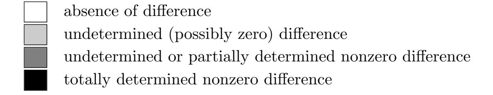
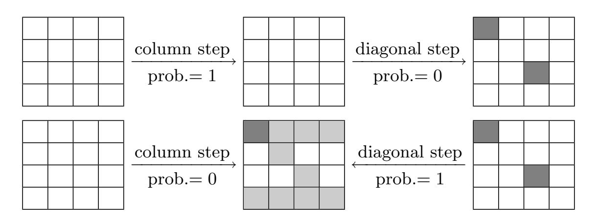
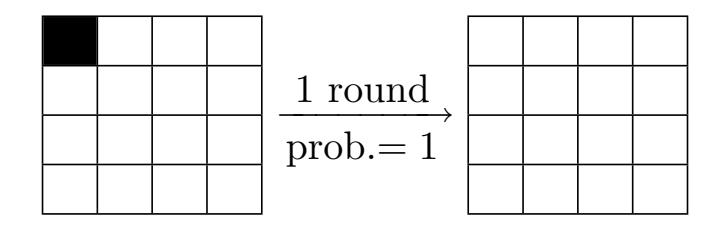
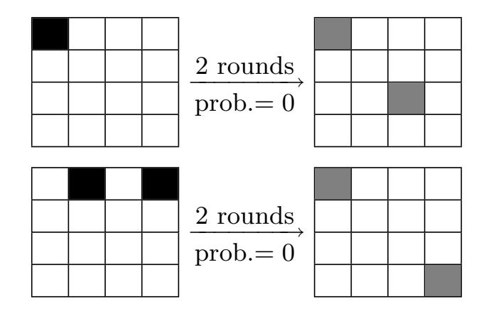
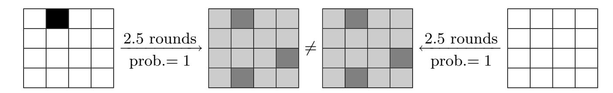
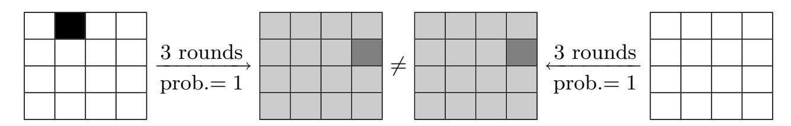
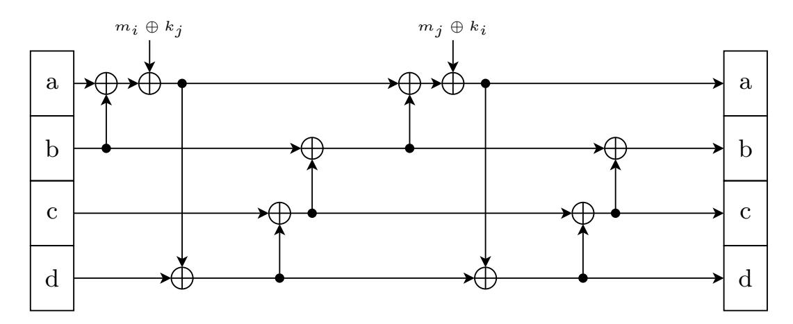
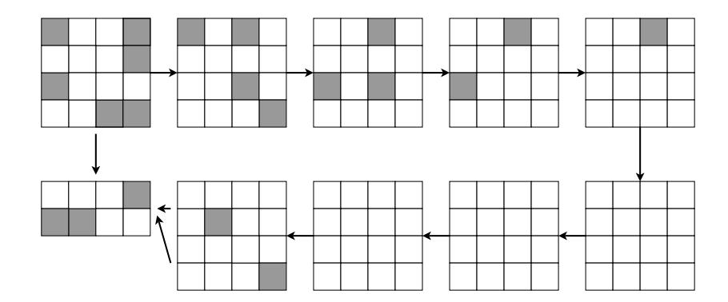
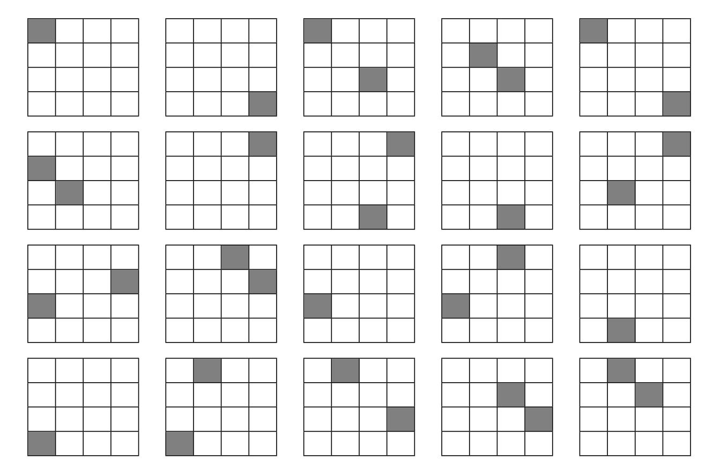

{0}------------------------------------------------

# Differential and invertibility properties of BLAKE (full version)<sup>∗</sup>

Jean-Philippe Aumasson<sup>1</sup>,† , Jian Guo<sup>2</sup>,‡ , Simon Knellwolf<sup>3</sup>,§ , Krystian Matusiewicz<sup>4</sup>,¶, and Willi Meier<sup>3</sup>,<sup>k</sup>

- <sup>1</sup> Nagravision SA, Switzerland
- <sup>2</sup> Nanyang Technological University, Singapore
  - <sup>3</sup> FHNW, Switzerland
- <sup>4</sup> Technical University of Denmark, Denmark

Abstract. BLAKE is a hash function selected by NIST as one of the 14 second round candidates for the SHA-3 Competition. In this paper, we follow a bottom-up approach to exhibit properties of BLAKE and of its building blocks: based on differential properties of the internal function G, we show that a round of BLAKE is a permutation on the message space, and present an efficient inversion algorithm. For 1.5 rounds we present an algorithm that finds preimages faster than in previous attacks. Discovered properties lead us to describe large classes of impossible differentials for two rounds of BLAKE's internal permutation, and particular impossible differentials for five and six rounds, respectively for BLAKE-32 and BLAKE-64. Then, using a linear and rotation-free model, we describe near-collisions for four rounds of the compression function. Finally, we discuss the problem of establishing upper bounds on the probability of differential characteristics for BLAKE.

Keywords: BLAKE, cryptanalysis, hash functions, SHA-3

### 1 Introduction

BLAKE [1] is one of the 14 designs selected for the second round of the SHA-3 Competition organized by the U.S. National Institute of Standards and Technology. BLAKE uses HAIFA as [2] operation mode, with some simplifications. Its compression function is based on a keyed permutation that reuses internals of the stream cipher ChaCha [3]. Wordwise operations are integer addition, XOR, and rotation (AXR). Depending on the output length BLAKE works on 32-bit or 64-bit words. If necessary we refer to the specific instances by BLAKE-32 and BLAKE-64 respectively.

In a previous work, Ji and Liangyu [4] presented a preimage attack on round-reduced versions of BLAKE-32 and BLAKE-64 with up to 2.5 rounds (out of 10 and 14 respectively). In particular they described a method with complexity 2<sup>192</sup> to find preimages of BLAKE-32 reduced to 1.5 rounds.

Contribution of this paper. We establish differential properties of the permutation used in the compression function of BLAKE and investigate invertibility of one and more rounds. Following a bottom-up approach, we first state differential properties of the core function G. We exploit them to show injectivity of one round of the permutation with respect to the message space. We derive explicit input-output equations for G, which yield an efficient algorithm to invert one round and an improved algorithm to find a preimage

<sup>∗</sup>Full version of paper presented at FSE 2010. Supported in part by European Commission through the ICT programme under contract ICT-2007-216676 ECRYPT II.

<sup>†</sup>Work done while this author was with FHNW, Switzerland, and supported by the Swiss National Science Fundation under project no. 113329.

<sup>‡</sup>The paper was partly done during the author's visit to Technical University of Denmark and was partly supported by a DCAMM grant there.

<sup>§</sup>Supported by Hasler Foundation http://www.haslerfoundation.ch under project number 08065.

<sup>¶</sup>Supported by the grant from the Danish Research Council for Technology and Production Sciences number 274-07-0246.

<sup>k</sup>Supported by GEBERT RUF STIFTUNG, project no. GRS-069/07. ¨

{1}------------------------------------------------

of 1.5 rounds (in  $2^{128}$  for BLAKE-32). Then we exploit differential properties of  ${\sf G}$  to find large classes of impossible differentials for one and two rounds, and specific impossible differentials for five and six rounds of BLAKE-32 and BLAKE-64 respectively. Using a linear and rotation-free model of  ${\sf G}$  we find near-collisions for the compression function with four specific rounds, in  $2^{56}$  trials. Finally we discuss the problem of finding upper bounds on the probability of a differential characteristic for BLAKE, and more generally for AXR algorithms. We give bounds on the probability of any type of characteristic for some given difference in a message block.

### 2 Preliminaries

This section describes the compression function of BLAKE and then fixes notations used in the rest of this paper. A complete specification of BLAKE can be found in [1].

#### 2.1 The compression function of BLAKE

The compression function of BLAKE processes a  $4\times4$  state of 16 words  $v_0, \ldots, v_{15}$ . This state is initialized by a chaining value  $h_0, \ldots, h_7$ , a salt  $s_0, \ldots, s_3$ , a counter  $t_0, t_1$ , and constants  $k_0, \ldots, k_7$  as depicted below:

$$\begin{pmatrix} v_0 & v_1 & v_2 & v_3 \\ v_4 & v_5 & v_6 & v_7 \\ v_8 & v_9 & v_{10} & v_{11} \\ v_{12} & v_{13} & v_{14} & v_{15} \end{pmatrix} \leftarrow \begin{pmatrix} h_0 & h_1 & h_2 & h_3 \\ h_4 & h_5 & h_6 & h_7 \\ s_0 \oplus k_0 & s_1 \oplus k_1 & s_2 \oplus k_2 & s_3 \oplus k_3 \\ t_0 \oplus k_4 & t_0 \oplus k_5 & t_1 \oplus k_6 & t_1 \oplus k_7 \end{pmatrix}$$

The initial state is processed by 10 or 14 rounds for BLAKE-32 and BLAKE-64 respectively. A round is composed of a **column step**:

$$\mathsf{G}_0(v_0,v_4,v_8,v_{12}) \ \mathsf{G}_1(v_1,v_5,v_9,v_{13}) \ \mathsf{G}_2(v_2,v_6,v_{10},v_{14}) \ \mathsf{G}_3(v_3,v_7,v_{11},v_{15})$$

followed by a diagonal step:

$$\mathsf{G}_4(v_0,v_5,v_{10},v_{15}) \ \mathsf{G}_5(v_1,v_6,v_{11},v_{12}) \ \mathsf{G}_6(v_2,v_7,v_8,v_{13}) \ \mathsf{G}_7(v_3,v_4,v_9,v_{14}).$$

The G function depends on a position index  $s \in \{0, ..., 7\}$  (indicated as subscript), a round index  $r \ge 0$ , a message block  $m_0, ..., m_{15}$ , and constants  $k_0, ..., k_{15}$ . At round r of BLAKE-32,  $G_s(a, b, c, d)$  computes

$$1: a \leftarrow (a+b) + (m_i \oplus k_j)$$

$$2: d \leftarrow (d \oplus a) \gg 16$$

$$3: c \leftarrow (c+d)$$

$$4: b \leftarrow (b \oplus c) \gg 12$$

$$5: a \leftarrow (a+b) + (m_j \oplus k_i)$$

$$6: d \leftarrow (d \oplus a) \gg 8$$

$$7: c \leftarrow (c+d)$$

$$8: b \leftarrow (b \oplus c) \gg 7$$

with  $i = \sigma_r(2s)$  and  $j = \sigma_r(2s+1)$ , where  $\{\sigma_r\}$  is a family of permutations of  $\{0, \ldots, 15\}$  (see Appendix A). In BLAKE-64, the only differences—besides the word size—are the rotation constants, respectively set to 32, 25, 16, and 11.

For a fixed message block m, G is invertible and so a series of rounds is a permutation of the state. One may view the permutation as a block cipher with key m. After the 10 or 14 rounds the new chaining value  $h'_0, \ldots, h'_7$  is computed as

$$h'_{0} \leftarrow h_{0} \oplus s_{0} \oplus v_{0} \oplus v_{8}$$

$$h'_{1} \leftarrow h_{1} \oplus s_{1} \oplus v_{1} \oplus v_{9}$$

$$h'_{2} \leftarrow h_{2} \oplus s_{2} \oplus v_{2} \oplus v_{10}$$

$$h'_{3} \leftarrow h_{3} \oplus s_{3} \oplus v_{3} \oplus v_{11}$$

$$h'_{4} \leftarrow h_{4} \oplus s_{0} \oplus v_{4} \oplus v_{12}$$

$$h'_{5} \leftarrow h_{5} \oplus s_{1} \oplus v_{5} \oplus v_{13}$$

$$h'_{6} \leftarrow h_{6} \oplus s_{2} \oplus v_{6} \oplus v_{14}$$

$$h'_{7} \leftarrow h_{7} \oplus s_{3} \oplus v_{7} \oplus v_{15}$$

Observe that in the definition of G, we write the first line as " $a \leftarrow (a+b) + (m_i \oplus k_j)$ ", instead of " $a \leftarrow a + b + (m_i \oplus k_j)$ ". This is to avoid ordering ambiguities when computing probabilities of differential characteristics. For instance, a difference in  $m_i$  propagates through one addition in the former case, and through two additions in the latter, when interpreted as " $a \leftarrow a + (b + (m_i \oplus k_j))$ ", idem for the fifth line. Clearly, one can simultaneously use different characteristics in this model as being equivalent to a single characteristic in a model that does not make any assumption on the order of the operations.

{2}------------------------------------------------

#### 2.2 Notations

The symbols  $\land$  and  $\lor$  denote logical AND and OR. Numbers in hexadecimal basis are written in typewriter (for example, ABCDEF01). A difference  $\Delta$  always means a difference with respect to XOR, that is, two words m and m' have the difference  $\Delta$  if  $m \oplus \Delta = m'$ . The Hamming weight of word m is denoted |m|, the Hamming weight of  $(m \land 7\text{FF} \cdots \text{FF})$ , that is, the Hamming weight of m excluding the most significant bit (MSB), is denoted |m|. A differential characteristic (DC) for BLAKE is the sequence of differences followed through application of addition, XOR, and rotation. In contrast a differential only consists in a pair of input and output differences.

When analyzing the differential behavior of the G function, we use the following notation:

 $\Delta a$ : initial difference in a

 $\Delta \hat{a}$ : difference in the intermediate value of a set at line 1

 $\Delta a'$ : final difference in a $\Delta_i$ : difference in  $m_i$ 

Analogous notations are used for differences in b, c, d, and  $m_j$ . For instance, if  $\Delta a = \Delta_i = 0$  and  $\Delta b = 80 \cdots 00$ , then  $\Delta \hat{a} = 80 \cdots 00$ .

### 3 Differential properties of the **G** function

This section enumerates properties of the G function. We first consider the case of differences in  $m_i$  and  $m_j$  only, and then consider the general case with input differences in the state. Finally we briefly look at the inverse of G.

#### 3.1 Differences in the message words only

All statements below assume zero input difference in the state words, that is,  $\Delta a = \Delta b = \Delta c = \Delta d = 0$ .

**Proposition 1.** If 
$$(\Delta_i = 0) \wedge (\Delta_j \neq 0)$$
, then  $(\Delta a' \neq 0) \wedge (\Delta b' \neq 0) \wedge (\Delta c' \neq 0) \wedge (\Delta d' \neq 0)$ .

Proof. If there is no difference in  $m_i$  then there is no difference in a, b, c, and d after the first four lines of G. Thus a difference  $\Delta$  in  $m_j$  always gives a nonzero difference  $\Delta'$  in a. Then, d always has a difference  $(\Delta') \gg 8$ , which propagates to a nonzero difference  $\Delta''$  to c, and finally b has difference  $(\Delta'') \gg 7$ .

**Proposition 2.** If  $\Delta_i \neq 0$ , then

$$(\Delta a' = 0) \Rightarrow (\Delta d' \neq 0) \qquad (\Delta c' = 0) \Rightarrow (\Delta b' \neq 0) \land (\Delta d' \neq 0)$$
$$(\Delta b' = 0) \Rightarrow (\Delta c' \neq 0) \qquad (\Delta d' = 0) \Rightarrow (\Delta a' \neq 0) \land (\Delta c' \neq 0)$$

Proof. We show that in the output, a and d cannot be both free of difference, idem for d and c, and for b and c. By a similar argument as in the proof of Proposition 1, after the first four lines of G the four state words have nonzero differences. In particular, the state has differences  $(\Delta', \Delta'') \gg 12, \Delta'', \Delta' \gg 16$ , for some nonzero  $\Delta'$  and  $\Delta''$ . Suppose that we obtain  $\Delta a' = 0$ . Then we must have  $\Delta d' = (\Delta') \gg 24$ . Hence a and a' cannot be both free of difference. Similarly, cancelling the difference  $\Delta''$  in a' requires a difference, thus a' and a' cannot be both free of difference. Finally, to cancel the difference in a', a' must have a difference, thus a' and a' cannot be both free of difference.

Two corollaries immediately follow from Proposition 1 and Proposition 2.

Corollary 1. If  $(\Delta_i \vee \Delta_j) \neq 0$ , then there are differences in at least two output words.

{3}------------------------------------------------

Corollary 2. All differentials with an output difference of one of the following forms are impossible:

$$(\Delta, 0, 0, 0)$$
  $(0, \Delta, 0, 0)$   $(\Delta, 0, 0, \Delta')$   $(\Delta, 0, \Delta', 0)$   $(0, 0, \Delta, 0)$   $(0, 0, 0, \Delta)$   $(\Delta, \Delta', 0, 0)$   $(0, \Delta, \Delta', 0)$ 

for some nonzero  $\Delta$  and  $\Delta'$ , and for any  $\Delta_i$  and  $\Delta_j$ .

Note that output differences of the form  $(0, \Delta, 0, \Delta')$  are possible. For instance, if  $\Delta_i = (\Delta_i \gg 4)$ , then the output difference obtained by linearization is  $(0, \Delta_i \gg 3, 0, \Delta_i)$ . For such a  $\Delta_i$ , highest probability  $2^{-28}$  is achieved for  $\Delta = 888888888$ .

A consequence of Corollary 2 is that a difference in at least one word of  $m_7, \ldots, m_{15}$  gives differences in at least two output words after the first round. This yields the following upper bounds on the probabilities of DCs.

**Proposition 3.** A DC with input difference  $\Delta_i$ ,  $\Delta_j$  has probability at most  $2^{-1}$  if  $(\Delta_i = 0) \land (\Delta_j \neq 0)$ , at most  $2^{-6}$  if  $(\Delta_i \neq 0) \land (\Delta_j = 0)$  and at most  $2^{-5}$  if  $(\Delta_i \neq 0) \land (\Delta_j \neq 0)$ .

See Appendix B for a proof.

#### 3.2 General case

Statements below no longer assume zero input difference in the state words.

**Proposition 4.** If 
$$\Delta a' = \Delta b' = \Delta c' = \Delta d' = 0$$
, then  $\Delta b = \Delta c = 0$ .

*Proof.* First, when  $\Delta_i = \Delta_j = 0$ , collisions do not exist since  $\mathsf{G}$  is a permutation for fixed  $m_i$  and  $m_j$ . So we must have differences in  $m_i$  and/or  $m_j$ . By Proposition 6, in  $\mathsf{G}^{-1}$  a difference in  $m_i$  and/or  $m_j$  cannot affect b and c, hence a collision for  $\mathsf{G}$  needs no difference in b and c.

In other words, a collision for G requires zero difference in the initial b and c. For instance, collisions can be obtained for certain differences  $\Delta a$ ,  $\Delta_i$ , and zero differences in the other input words. Indeed at line 1 of the description of G,  $\Delta a$  propagates to (a+b) with probability  $2^{-\|\Delta a\|}$ ,  $\Delta_i$  propagates to  $(m_i \oplus k_j)$  with probability one, and finally  $\Delta a$  eventually cancels  $\Delta_i$ . Note that a collision for G with difference 88888888 in both  $m_{11}$  and a is used in §6 to find near-collisions for a modified version of BLAKE-32 with four rounds.

The following result directly follows from Proposition 4.

**Corollary 3.** The following classes of differentials for G are impossible:

$$(\Delta, \Delta', \Delta'', \Delta''') \mapsto (0, 0, 0, 0)$$
  
 $(\Delta, 0, \Delta'', \Delta''') \mapsto (0, 0, 0, 0)$   
 $(\Delta, \Delta', 0, \Delta''') \mapsto (0, 0, 0, 0)$ 

for nonzero  $\Delta'$  and  $\Delta''$ , possibly zero  $\Delta$  and  $\Delta'''$ , and any  $\Delta_i$  and  $\Delta_j$ .

Many other classes of impossible differentials for  $\mathsf{G}$  exist. For example, if  $\Delta a' \neq 0$  and  $\Delta b' = \Delta c' = \Delta d' = 0$ , then  $\Delta b = 0$ .

**Proposition 5.** The only DCs with probability one give  $\Delta a' = \Delta b' = \Delta c' = \Delta d' = 0$  and have either

```
-\Delta_i = \Delta a = 800 \cdots 00 \text{ and } \Delta b = \Delta c = \Delta d = \Delta_j = 0;

-\Delta_j = \Delta a = \Delta d = 800 \cdots 00 \text{ and } \Delta b = \Delta c = \Delta_i = 0;

-\Delta_i = \Delta_j = \Delta d = 800 \cdots 00 \text{ and } \Delta a = \Delta b = \Delta c = 0.
```

*Proof.* The difference (800 · · · 00) is the only difference whose differential probability is one. Hence probability-1 DCs must only have differences active in additions. By enumerating all combinations of MSB differences in the input, one observes that the only valid ones have either MSB difference in  $\Delta_i$  and  $\Delta a$ , in  $\Delta_j$  and  $\Delta a$ and  $\Delta d$ , or in  $\Delta_i$  and  $\Delta_j$  and  $\Delta d$ .

For constants  $k_i$  equal to zero, more probability-1 differentials can be obtained using differences with respect to integer addition. However, in this case simple attacks exist (see Appendix C).

{4}------------------------------------------------

### 3.3 Properties of G−<sup>1</sup>

At round r, the inverse of G<sup>s</sup> of BLAKE-32 computes

```
1 : b ← c ⊕ (b ≪ 7) 5 : b ← c ⊕ (b ≪ 12)
2 : c ← c − d 6 : c ← c − d
3 : d ← a ⊕ (d ≪ 8) 7 : d ← a ⊕ (d ≪ 16)
4 : a ← a − b − (mj ⊕ ki) 8 : a ← a − b − (mi ⊕ kj )
                                             ,
```

where i = σr(2s) and j = σr(2s + 1). Unlike G, G <sup>−</sup><sup>1</sup> has low flow dependency: two consecutive lines can be computed simultaneously and independently, with concurrent access to one variable.

Many properties of G −1 can be deduced from the properties of G. For example, probability-1 DCs for G −1 can be directly obtained from Proposition 5. We report two particular properties of G −1 . The first one follows directly from the description of G −1 .

Proposition 6. In G −1 , the final values of b and c do not depend on the message words m<sup>i</sup> and m<sup>j</sup> . In particular, b depends only on the initial b, c, and d.

That is, when inverting G, initial b and c depend only on the choice of the image (a, b, c, d), not on the message.

The following property follows from the observation in Proposition 3.

Proposition 7. There exists no DC that gives collisions with probability one.

Properties of G <sup>−</sup><sup>1</sup> are exploited in §4 to find impossible differentials.

### 4 Impossible differentials

An impossible differential (ID) is a pair of input and output differences that cannot occur. This section studies IDs for several rounds of the permutation of BLAKE. First we exploit properties of the G function to describe IDs for one and two rounds. Then we apply a miss-in-the-middle strategy to reach up to five and six rounds.

To illustrate IDs we use the following color code:



#### 4.1 Impossible differentials for one round

The following statement describes many IDs for one round of BLAKE's permutation.

Proposition 8. All differentials for one round (of any index) with no input difference in the initial state, any difference in the message block, and an output with difference in a single diagonal of one of the forms in Corollary 2, are impossible.

Proof. We give a general proof for the central diagonal (v0, v5, v10, v15); the proof directly generalizes to the other diagonals of the state. We distinguish two cases:

1. No differences are introduced in the column step: the result directly follows from Proposition 4 and Corollary 2.

{5}------------------------------------------------

2. Differences are introduced in the column step: recall that if  $\Delta b \neq 0$  or  $\Delta c \neq 0$ , then one cannot obtain a collision for G (see Proposition 4); in particular, if there is a difference in one of the two middle rows of the state before the diagonal step, then the corresponding diagonal cannot be free of difference after. We reason ad absurdum: if a difference was introduced in the column step in the first or in the fourth column, then there must be a difference in the corresponding b or c (for output differences with  $\Delta b' = \Delta c' = 0$  are impossible after the column step, see Corollary 2). That is, one diagonal distinct from the central diagonal must have differences.

We deduce that any state after one round with difference only in the central diagonal must be derived from a state with differences only in the second or in the third column. In particular, when applying G to the central diagonal, we have  $\Delta a = \Delta d = 0$ . From Proposition 2, we must thus have  $\Delta a' \neq 0$ ,  $\Delta c' \neq 0$ , and  $\Delta d' \neq 0$ . In particular, the output differences in Corollary 2 cannot be reached.

We have shown that after one round of BLAKE, differences in the message block cannot lead to a state with only differences in the central diagonal, such that the difference is one of the differences in Corollary 2. The proof directly extends to any of the three other diagonals.

To illustrate Proposition 8, which is quite general and covers a large set of differentials, Fig. 1 presents two examples corresponding to the two cases in the proof. Appendix D gives examples of output differences that are impossible to reach after one round.



**Fig. 1.** Illustration of IDs after one round: when there is no difference introduced in the column step (top), and when there is one or more (bottom).

Note that our finding of IDs with zero difference in the initial and in the final state is another way to prove Proposition 9.

#### 4.2 Extension to two rounds

We can directly extend the IDs identified above to two rounds, by prepending a probability-1 DC leading to a zero difference in the state after one round. For example, differences  $800 \cdots 00$  in  $m_0$  and in  $v_0$  always lead to zero-difference state after the first round:



By Proposition 8, a state with differences only in  $v_0$  and  $v_{10}$  cannot be reached after one round when starting from zero-difference states. Therefore, differences  $800 \cdots 00$  in  $m_0$  and  $v_0$  cannot lead to differences only in  $v_0$  and  $v_{10}$  after two rounds. This example is illustrated in Fig. 2.

{6}------------------------------------------------



**Fig. 2.** Examples of IDs for two rounds: given difference  $800 \cdots 00$  in  $m_0$  and  $v_0$  (top), or in  $m_2, m_6, v_1, v_3$  (bottom).

#### 4.3 Miss in the middle

The technique called miss-in-the-middle [5] was first applied to identify IDs in block ciphers (for instance, DEAL [6] and AES [7,8]). Let  $\Pi = \Pi_0 \circ \Pi_1$  be a permutation. A miss-in-the-middle approach consists in finding a differential  $(\alpha \mapsto \beta)$  of probability one for  $\Pi_1$  and a differential  $(\gamma \mapsto \delta)$  of probability one for  $\Pi_0^{-1}$ , such that  $\beta \neq \delta$ . The differential  $(\alpha \mapsto \delta)$  thus has probability zero and so is an ID for  $\Pi$ . The technique can be generalized to truncated differentials, that is, to differentials  $\beta$  and  $\delta$  that only concern a subset of the state. Below we apply such a generalized miss-in-the-middle to the permutation of BLAKE. We expose separately the application to BLAKE-32 and to BLAKE-64. The strategy is similar for both:

- 1. Start with a probability-1 differential with difference in the state and in the message so that difference vanish until the second round.
- 2. Look for bits that are changed (or not) with probability one after a few more rounds, given this difference.
- 3. Do same as step 2 in the backwards direction, starting from the final difference.

Good choices of differences are those that maximize the delay before the input of the first difference, more precisely, those such that the message word with the difference appears in the second position of a diagonal step forwards, and in the first position of a column step backwards. The goal is to minimize diffusion so as to maximize the chance of probability-1 truncated differentials.



**Fig. 3.** Miss-in-the-middle for BLAKE-32, given the input differences 80000000 in  $m_2$  and  $v_1$ . The two differences in dark gray are incompatible, thus the impossibility. In the forward direction, 2.5 rounds are two rounds plus a column step; backwards, 2 inverse rounds plus an inverse diagonal step.



**Fig. 4.** Miss-in-the-middle for BLAKE-64, given the input difference  $80 \cdots 00$  in  $m_2$  and  $v_1$ . The two differences in dark gray are incompatible, thus the impossibility.

{7}------------------------------------------------

**Application to BLAKE-32.** We consider a difference 80000000 in the initial state in  $v_1$ , and in the message block word  $m_2$ ; we have that

- Forwards, differences in  $v_1$  and  $m_2$  cancel each other at the beginning of the column step and no difference is introduced until the diagonal step of the second round in which  $m_2$  appears as  $m_j$  in  $G_5$ ; after the column step of the third round (that is, after 2.5 rounds), we observe that bits<sup>5</sup> 35, 355, 439, and 443 are always changed in the state.
- Backwards, we start from a state free of difference, and  $m_2$  introduces a difference at the end of the first inverse round, as it appears as  $m_i$  in the column step's  $G_2$ ; after 2.5 inverse rounds, we observe that bits 35, 355, 439, and 433 are always unchanged.

The probability-1 differentials reported above were first discovered empirically, and could be verified analytically by tracking differences, distinguishing bits with probability-1 (non-) difference, and other bits.

We deduce from the observations above that difference 80000000 in  $v_1$  and  $m_2$  cannot lead to a state free of difference after five rounds. We thus identified a 5-round ID for the permutation of BLAKE-32. Fig. 3 gives a graphical description of the ID.

**Application to BLAKE-64.** For BLAKE-64, we follow a similar approach as for BLAKE-32, with MSB difference in  $m_2$  and  $v_1$ . We could detect contradictious probability-1 differentials over three instead of 2.5 rounds, both forwards and backwards. For example, we detected probability-1 inconsistencies for bits 450, 453, 457, 462, and 463 of the state. As shown on Fig. 4, we obtain an ID for six rounds of the permutation of BLAKE-64.

### Remarks.

- 1. The probability-1 truncated differentials used above were empirically discovered, but one can easily verify them analytically. For instance, for bit 35 forward (fourth bit of  $v_1$ ), we observe that the state is free of difference until the input of  $m_2$  in the second round in  $G_5$ , which sets a difference  $\Delta = 80000000$  in  $v_1$ , and other differences in  $v_6$ ,  $v_{11}$ ,  $v_{12}$ . At the next (third) round, when computing  $G_1$  the only difference occurs in the MSB of  $v_1$ , which gives difference  $\Delta \hat{a} = \Delta$ ,  $\Delta \hat{d} = \Delta \gg 16$ ,  $\Delta \hat{c}$  with no difference in the first 15 bits and a difference in the 16th,  $\Delta \hat{b}$  with no difference in the first three bits and a difference in the fourth; thus we have  $\Delta a'$  with no difference in the first three bits and a difference in the fourth, that is, the bit 35 of the state is always flipped after 2 rounds plus a column step. Similar verification can be realized for the backwards differentials.
- 2. The IDs presented in this section do not lead to IDs for the compression function. This is because a given difference in the output of the compression function can be caused by  $2^{256}$  distinct differences in the final value of the permutation (for BLAKE-32).

### 5 Invertibility of a round

Let  $f^r$  be the function  $\{0,1\}^{512} \times \{0,1\}^{512} \to \{0,1\}^{512}$ , that for initial state v and message block m outputs the state after r rounds of the permutation of BLAKE-32. Non-integer round indices (for example r=1.5) mean the application of  $\lfloor r \rfloor$  rounds and the following column step. We write  $f_v^r = f^r(v,\cdot)$  when considering  $f^r$  for a fixed initial state and respectively  $f_m^r$  when the message block is fixed. As noted above,  $f_m^r$  is a permutation for any message block m and any  $r \geq 0$ . In this section we use the differential properties of G to show that  $f_v^1$  is also a permutation for any initial state v. Then we derive an efficient algorithm for the inverse of  $f_v^1$  and an algorithm with complexity  $2^{128}$  to compute a preimage of  $f_v^{1.5}$  for BLAKE-32 (a similar method applies to BLAKE-64 in  $2^{256}$ ). This improves the round-reduced preimage attack presented in [4] (whose complexity was respectively  $2^{192}$  and  $2^{384}$  for BLAKE-32 and BLAKE-64)

<sup>&</sup>lt;sup>5</sup>Here, bit 35 is the fourth most significant bit of the second state word  $v_1$ , bit 355 is the fourth most significant bit of  $v_{11}$ , etc.

{8}------------------------------------------------

#### 5.1 A round is a permutation on the message space

**Proposition 9.** For any fixed state v, one round of BLAKE (for any index of the round) is a permutation on the message space. In particular,  $f_v^1$  is a permutation.

*Proof.* We show that if there is no difference in the state, any difference in the message block implies a difference in the state after one round of BLAKE. Suppose that there is a difference in at least one message word. We distinguish two cases:

- 1. No differences are introduced in the column step: there is thus no difference in the state after the column step. At least one of the message words used in the diagonal step has a difference; from Corollary 1, there will be differences in at least two words of the state after the diagonal step.
- 2. Differences are introduced in the column step: from Corollary 2, output differences of the form (0,0,0,0),  $(\Delta,0,0,0)$ ,  $(0,0,0,\Delta)$ , or  $(\Delta,0,0,\Delta')$  are impossible. Thus, after the first column step, there will be a difference in at least one word of the two middle rows (that is, in  $v_4, \ldots, v_{11}$ ). These words are exactly the words used as b and c in the calls to G in the diagonal step; from Proposition 4, we deduce that differences will exist in the state after the diagonal step, since  $\Delta b = \Delta c = 0$  is a necessary condition to make differences vanish (see Proposition 4).

We conclude that whenever a difference is set in the message, there is a difference in the state after one round.  $\Box$ 

The fact that a round is a permutation with respect to the message block indicates that no information of the message is lost through a round and thus can be considered a strength of the algorithm. The same property also holds for AES-128.

Note that Proposition 9 says nothing about the injectivity of  $f_v^r$  for  $r \neq 1$ .

#### 5.2 Inverting one round and more

Without loss of generality, we assume the constants equal to zero, that is,  $k_i = 0$  for i = 0, ..., 7 in the description of G. We use explicit input-output equations of G to derive our algorithms.

Input—output equations for G. Consider the function  $G_s$  operating at round r on a column or diagonal of the state respectively. Let (a, b, c, d) be the initial state words and (a', b', c', d') the corresponding output state words. For shorter notation let  $i = \sigma_r(2s)$  and  $j = \sigma_r(2s+1)$ . Let  $\hat{a} = a + b + m_i$  be the intermediate value of a set at line 1 of the description of G. From line 2 we get  $\hat{a} = (\hat{d} \ll 16) \oplus d$ , where  $\hat{d}$  is the intermediate value of d set at line 2. From line 7 we get  $\hat{d} = (d' \ll 8) \oplus d'$  and derive

$$a = (((d' \ll 8) \oplus a') \ll 16) \oplus d - b - m_i. \tag{1}$$

Below we use the following equations that can be derived in a similar way:

$$a = (((((((b' \ll 7) \oplus c') \ll 12) \oplus b) - c) \ll 16) \oplus d) - m_i - b$$
(2)

$$= a' - ((b' \ll 7) \oplus c') - m_i - b - m_i \tag{3}$$

$$b = (((b' \ll 7) \oplus c') \ll 12) \oplus (c' - d') \tag{4}$$

$$c = c' - d' - ((d' \leqslant 8) \oplus a') \tag{5}$$

$$= c' - d' - ((d \oplus (a + b + m_i)) \gg 16)$$
(6)

$$d = (((d' \ll 8) \oplus a') \ll 16) \oplus (a' - ((b' \ll 7) \oplus c') - m_j)$$
(7)

$$a' = ((((((b' \ll 7) \oplus c') \ll 12) \oplus b) - c) \ll 16) \oplus d) + ((b' \ll 7) \oplus c') + m_j$$
(8)

$$b' = ((((b \oplus (c' - d')) \gg 12) \oplus c') \gg 7)$$
(9)

$$d' = c' - c - ((d \oplus (a + b + m_i)) \gg 16) \tag{10}$$

{9}------------------------------------------------

Observe that (1), (2) and (8) allow to determine  $m_i$  and  $m_j$  from (a, b, c, d) and (a', b', c', d'). Further, (4) and (5) imply Proposition 6.

We now apply these equations to invert  $f_v^1$  and to find a preimage of  $f_v^{1.5}(m)$  for arbitrary m and v. Denote  $v^i = v^i_0, \dots, v^i_{15}$  the internal state after *i* rounds. Again, non-integer round indices refer to intermediate states after a column step but before the corresponding diagonal step. The state  $v^r$  is the output of  $f_{v^0}^r$ .

Inverting  $f_v^1$ . Given  $v^0$  and  $v^1$ , the message block  $m=(m_0,\ldots,m_{15})$  with  $f_{v^0}^1(m)=v^1$  can be determined as follows:

- 1. Determine  $v_4^{0.5}, \ldots, v_7^{0.5}$  using (4) and  $v_8^{0.5}, \ldots, v_{11}^{0.5}$  using (5).
- 2. Determine  $m_0, \ldots, m_7$  using (2), (8), and (10). 3. Determine  $v_0^{0.5}, \ldots, v_3^{0.5}, v_{12}^{0.5}, \ldots, v_{15}^{0.5}$  using  $\mathsf{G}_0, \ldots, \mathsf{G}_3$ . 4. Determine  $m_8, \ldots, m_{15}$  using (2), (8), and (10).

This algorithm always succeeds, as it is deterministic. Although slightly more complex than the forward computation of  $f_n^1$ , it can be executed efficiently.

**Preimage of**  $f_v^{1.5}(m)$ . Given some  $v^0$ , and  $v^{1.5}$  in the codomain of  $f_{v^0}^{1.5}$  (thus, a preimage of  $v^{1.5}$  exists), a message block m with  $f_{v^0}^{1.5}(m) = v^{1.5}$  can be determined as follows:

- 1. Guess  $m_8, m_{10}, m_{11}$  and  $v_{10}^{0.5}$ .

- 1. Guess  $m_8, m_{10}, m_{11}$  and  $v_{10}$ . 2. Determine  $v_4^1, \ldots, v_7^1$  using (4) and  $v_8^1, \ldots, v_{11}^1$  using (5),  $v_{12}^1, v_{13}^1$  using (7). 3. Determine  $v_6^{0.5}, v_7^{0.5}$  using (4),  $m_4$  (2),  $v_1^1$  (2),  $v_{14}^{0.5}$  (6),  $v_1^{0.5}$  (3),  $v_{11}^{0.5}$  (5),  $v_{12}^{0.5}$  (2). 4. Determine  $v_2^{0.5}$  (5),  $m_5$  (8),  $m_6$  (2),  $v_{15}^1$  (7),  $v_{15}^{0.5}$  (6),  $v_5^{0.5}$  (4),  $v_0^1$  (5),  $m_9$  (8),  $m_{14}$  (2). 5. Determine  $v_3^{0.5}$  (5),  $m_7$  (8),  $v_0^{0.5}$  (2),  $v_8^{0.5}$  (5),  $m_0$  (1),  $v_2^1$  (5),  $v_{14}^1$  (2),  $m_{15}$  (8). 6. Determine  $v_4^{0.5}$  (9),  $m_1$  (8),  $v_9^{0.5}$  (6),  $v_3^1$  (8),  $m_{13}$  (2),  $m_2$  (2),  $m_3$  (8),  $v_{13}^{0.5}$  (7),  $m_{12}$  (2). 7. If  $f_{v_0}^{1.5}(m) = v^{1.5}$  output m, otherwise make a new guess.

This algorithm yields a preimage of  $f_v^{1.5}(m)$  for BLAKE-32 after  $2^{128}$  guesses in the worst case. It directly applies to find a preimage of the compression function of BLAKE reduced to 1.5 rounds and thus greatly improves the round-reduced preimage attack of [4] which has complexity 2<sup>192</sup>. The method also applies to BLAKE-64, giving an algorithm of complexity  $2^{256}$ , improving on [4]'s  $2^{384}$  algorithm.

There are other possibilities to guess words of m and the intermediate states. But exhaustive search showed that at least four words are necessary to determine the full message block m by explicit input-output equations.

#### **5.3** On the resistance to recent preimage attacks

An attack strategy based on a meet-in-the-middle approach was recently used to devise preimage attacks, in particular against MD5 |9-11|. Since these attacks partially rely on the fact that MD5 uses a permutation of the message words, like BLAKE, one may wonder whether they also apply to BLAKE.

The idea of the recent preimage attack is to find two independent chunks of the message block, in order to obtain degrees of freedom to perform a birthday-like matching.

For BLAKE, since every message word is used in every round, we cannot find any independent chunks. One can make use of the "initial structure" [11], which can essentially relocate the positions of some message words without affecting the final output of the hash. As argued in the BLAKE submission [1], diffusion is fully done in two rounds. Hence initial structure cannot be carried out for more than three rounds. Similarly the "partial matching" technique can only extend the attack for at most two rounds.

There are two additional difficulties to overcome: First, one has to take care of  $v_{12}, \ldots, v_{15}$ , where  $v_{12} \oplus$  $v_{13}=k_4\oplus k_5$  and  $v_{14}\oplus v_{15}=k_6\oplus k_7$ . When the preimage attack is carried out, it computes backwards, which is supposed to give random values (it satisfies the above with probability  $2^{-n/4}$ ). One can overcome this difficulty by splitting the compression function near initial state. Second, the partial matching has to be carried out at (or very close to) the finalization step since internal states are of length 2n.

Based on our observations, we conjecture that a meet-in-the-middle strategy for a preimage attack on BLAKE cannot apply on more than five rounds.

{10}------------------------------------------------

#### 6 Near collisions

In this section, we exploit linearization of the G function, that is, approximation of addition by XOR. This enables us to find near collisions for a variant of BLAKE-32 with four rounds identical to rounds 3 to 6 in the original function.

#### 6.1 Linearizing G

Observe that in G, the number of bits rotated are 16, 12, 8 and 7. Only 7 is not a multiple of 4.

The idea of our attack is to use differences that are invariant by rotation of 4 bits (and thus by any rotation multiple of 4), as 88888888, and try to avoid differences pass through the rotation by 7. We model the compression function in GF(2), where a 1 denotes a difference in the register and 0 means no difference. We linearize the G function by replacing addition with XOR. Further we remove the rotations as the differences we choose are rotation invariant (see Figure 5).



Fig. 5. Linearized G function

#### 6.2 Differential characteristic for near collisions

In our linearized model, we have 16 bits of message and 16 bits of chaining values, hence the search space is  $2^{32}$ , which can be explored exhaustively. We can further reduce the search space by the condition that no difference passes through rotation by 7 over four rounds of the compression function.

As the model is linear, the whole compression function can be expressed by a bit vector consisting of message and chaining value multiplied by a matrix. We used the program MAGMA to efficiently reduce the search space to 2<sup>4</sup> for a 4-round reduced compression function.

Linearizing a difference pattern 8888888 costs  $2^7$  for each addition. We aim to find those configurations which linearize the addition operation as little as possible. Note that by choosing proper chaining values and messages, we can get the first 1.5 rounds "for free". We did the search, and the configuration with differences in  $m_0$  and  $v_0, v_3, v_7, v_8, v_{14}, v_{15}$  with starting point at round 3 gives count 8 only. This gives complexity  $2^{56}$ , with no memory requirements. This configuration gives after feedforward final differences in  $h'_3, h'_4$ , and  $h'_5$ .

We thus obtain a near collision on (256-24) = 232 bits. Figure 6 shows how differences propagate from round 3 to 6. We expect similar methods to apply to any sequence of four rounds, though with different complexities.

#### 6.3 On the extension to more rounds

Consider the linearized model of G, in which we approximate addition by xor, and use the special difference 88888888 (so that differences do not propagate to the final b).

Consider a linearized round, as in §6.1. Since there are 16 chaining variables and 16 message words, hence we have  $2^{16+16}$  different configurations. When we restrict "no difference in output b of G", the number of

{11}------------------------------------------------



Fig. 6. Tracing the differences for near collisions on rounds 3 to 6. Inputs with difference are h0, h3, h7, s<sup>0</sup> and t0. Gray cells denote states with differences.

good configurations is reduced by a factor 2 when passing each G. Each round function has eight G's. Hence each round reduces the "good configurations" by a factor 2<sup>8</sup> . Thus, N rounds reduce the number of good configurations to 2<sup>32</sup>/2 <sup>8</sup><sup>N</sup> ≥ 1. Hence four seems to be the maximum possible number of rounds for which our method applies, which was verified by our program.

This is also why we need to seek non-linear connectors to give collisions for more rounds.

## 7 Bounding the probability of differential characteristics

Bounds on the probability of DCs have been proposed as a measure to quantify security, mostly in the context of block ciphers [12, 13]. For most designs such bounds are established by counting the minimum number of active S-boxes (see for example SHA-3 submissions LANE [14], ECHO [15] or SIMD [16]). However, to the best of our knowledge, the problem of establishing bounds for AXR designs has never been studied. A difficulty seems to stem from the following facts:

- Addition behaves as XOR with relatively high probability (compared to an S-box); in particular, it admits probability-1 differentials and lacks uniformity (except for the MSB, the more significant is the bit with a difference, the fewer output differences are expected).
- Chains of AXR operations are complex to analyze (compared to substitution-permutation constructions of block ciphers), which complicates the finding of bounds based on combinatorial arguments.

Although some previous AXR algorithms underwent differential attacks [17], recent designs seem impressively resistant to differential cryptanalysis [3,18]. Search for bounds on DCs is thus of interest, in particular to evaluate and compare the security of AXR SHA-3 candidates (BLAKE, Blue Midnight Wish [19], Cube-Hash [20], Skein [18]).

This section proposes assumptions for a security analysis of AXR algorithms and establishes bounds for the permutation of BLAKE.

#### 7.1 Assumptions and trivial bound

We make the following assumptions

To compute bounds on the probabilities of DCs, we make the assumptions that the initial state and the message block are selected uniformly at random, and that for each modular addition, summands are selected uniformly as well. These assumptions allow to use the results from [21].

If we only consider modular additions at line 1 and at line 5 in the description of G we get the following trivial upper bound for any DC for r permutation rounds corresponding to input differences ∆<sup>i</sup> , i = 0, . . . , 15 in the message block:

$$\left(\prod_{i=0}^{15} \mathrm{DP}^+_{2\mathsf{max}}(\Delta_i)\right)^r \ .$$

{12}------------------------------------------------

Where the notation  $\mathrm{DP}^+_{2\mathsf{max}}(\Delta_i)$  is borrowed from Lipmaa and Moriai's work on the probabilities of differential of addition [21]. Appendix E summarizes the notations that we reuse.

In the following, we first present bounds local to  $\mathsf{G}$ , and then deduce bounds for the permutation of BLAKE. These bounds should be considered as indicative, and not as "proofs of security"; indeed, attacks use advanced message modification techniques to fulfill the conditions of a characteristics.

#### 7.2 Local bounds for G

For a given  $(\Delta_i, \Delta_j)$ , we give below the  $(\Delta a, \Delta b, \Delta c, \Delta d)$  and the differentials that maximize probability of the DC. Note that the probabilities obtained give upper bounds on the probability of a *characteristic* for a given  $(\Delta_i, \Delta_j)$ , not on the probability of a *differential*.

The bounds are based on the following observation: given a nonzero difference in the message, the optimal choice of a difference in (a, b, c, d) is one that cancels  $\Delta_i$  and  $\Delta_j$ . We further observe, based on results in [21], that if one of the summands has no difference, then the differential obtained by linearization of addition to XOR is optimal. Note indeed that for all  $\Delta$ 's, we have

$$\mathrm{DP}^+(\Delta, 0 \mapsto \Delta) = \mathrm{DP}^+_{\mathsf{max}}(\Delta, 0) = 2^{-\|\Delta\|}$$
.

Below we present bounds for each particular case.

When  $\Delta_i \neq 0$  and  $\Delta_j = 0$ , the highest-probability DC, over all possible differences in (a, b, c, d), has  $\Delta a \neq 0$  that gives  $\Delta \hat{a} = 0$ , and  $\Delta b = \Delta c = \Delta d = 0$ . Thus highest probability  $2^{-2\|\Delta_i\|}$  is achieved when  $\Delta a = \Delta_i$ . There are two active additions.

When  $\Delta_i = 0$  and  $\Delta_j \neq 0$ , the highest-probability DC has  $\Delta a = \Delta d = \Delta_j$  and  $\Delta b = \Delta c = 0$ . It has probability  $2^{-4\|\Delta_j\|}$ , and four active additions.

 $\Delta_i = \Delta_j \neq 0$ , the highest-probability DC has  $\Delta d' = \Delta_i$ , giving probability  $2^{-3\|\Delta_i\|}$ . There are three active additions.

When  $\Delta_i \neq \Delta_j$  and are both nonzero, we assume  $\Delta d = \Delta_i$  to avoid active addition at line 3. At line 5 the first active addition (a+b) has optimal probability  $\mathrm{DP}^+_{\mathsf{max}}(\Delta_i,0) = \mathrm{DP}^+(\Delta_i,0\mapsto\Delta_i) = 2^{-\|\Delta_i\|}$ . The second active addition thus has optimal probability  $\mathrm{DP}^+_{\mathsf{max}}(\Delta_i,\Delta_j)$ . We thus consider the local bound  $2^{-2\|\Delta_i\|-\|\alpha\ggg8\|} \times \mathrm{DP}^+_{\mathsf{max}}(\Delta_i,\Delta_j)$ , where  $\alpha$  is the difference that maximizes  $\mathrm{DP}^+(\Delta_i,\Delta_j)$ .

Unlike the three previous cases, for which the output difference was  $(\Delta a', \Delta b', \Delta c', \Delta d') = (0, 0, 0, 0)$ , here only  $\Delta a'$  is zero.

#### 7.3 Bound for the permutation

Based on observations in  $\S7.2$ , we give the following refined bound:

**Proposition 10.** Any DC over r rounds of BLAKE-n's permutation induced by differences  $\Delta_i$  in the message word  $m_i$ , i = 0, ..., 15, has probability at most

$$\prod_{i=0}^{r-1} (\mathsf{colcost}_i \times \mathsf{diagcost}_i)$$

where  $colcost_i$  and  $diagcost_i$  are computed as described in Algorithms 1 and 2, respectively.

In Proposition 10,  $\operatorname{colcost}_i$  is a bound on the probability of a DC for the column step of round i, derived from local bounds in §7.2;  $\operatorname{diagcost}_i$  is an upper bound on the probability of a DC for the column step of round i. Note that a different choice of  $\sigma$  may affect the bound obtained.

We illustrate the improvement from the trivial bound to that of Proposition 10 with two examples:

1. If for BLAKE-32  $\Delta_0 = 08040001$ ,  $\Delta_4 = 00101000$ ,  $\Delta_{10} = 10105000$ , then the trivial bound gives bound  $2^{-90}$  and Proposition 10 gives  $2^{-253}$ .

{13}------------------------------------------------

#### Algorithm 1 $colcost_i$

```
1. \mathsf{colcost}_i \leftarrow 1
 2. for j = 0, \ldots, 3
  3.
               x \leftarrow \|\Delta_{\sigma_i(2j)}\|
  4.
                y \leftarrow \|\Delta_{\sigma_i(2j+1)}\|
               z \leftarrow -\log_2 \mathrm{DP}^+_{\mathsf{max}}(\Delta_{\sigma_i(2j)}, \Delta_{\sigma_i(2j+1)})
  5.
  6.
                if (x = 0)
                      colcost_i \leftarrow colcost_i \times 2^{-4y}
  7.
                if (y = 0)
  8.
                       colcost_i \leftarrow colcost_i \times 2^{-2x}
 9.
                if ((x \neq 0) \land (y \neq 0))
10.
                      \mathsf{colcost}_i \leftarrow \mathsf{colcost}_i \times 2^{-2x+z}
11.
```

#### Algorithm 2 diagcost<sub>i</sub>

```
1. \mathsf{diagcost}_i \leftarrow 1
  2. for j = 4, \ldots, 7
                 x \leftarrow \|\Delta_{\sigma_i(2j)}\|
  3.
  4.
                 y \leftarrow \|\Delta_{\sigma_i(2j+1)}\|
                z \leftarrow -\log_2 \mathrm{DP}^+_{\mathsf{max}}(\Delta_{\sigma_i(2j)}, \Delta_{\sigma_i(2j+1)})
  5.
  6.
                 if (x = 0)
                        \mathsf{diagcost}_i \leftarrow \mathsf{diagcost}_i \times 2^{-4y}
  7.
  8.
                 if (y = 0)
                        \mathsf{diagcost}_i \leftarrow \mathsf{diagcost}_i \times 2^{-2x}
  9.
                 if ((x \neq 0) \land (y \neq 0))
10.
                        \mathsf{diagcost}_i \leftarrow \mathsf{diagcost}_i \times 2^{-2x+z}
11.
```

2. If for BLAKE-64  $\Delta_0 = 000002010000010$ ,  $\Delta_4 = 001010008008401$ ,  $\Delta_{10} = 001050000040002$ , then the trivial bound gives bound  $2^{-140}$  and Proposition 10 gives  $2^{-560}$ .

Bounds from Proposition 10 are arguably loose, for they do not count differences in the state. In particular: they assume that "(c+d)" additions are never active, and that  $\Delta b$  and  $\Delta c$  are always zero; both are very unlikely.

Proposition 10 is very general, however. It gives bounds for any number of rounds, for any permutation  $\sigma$ , and even for any rotation values. We hope that tighter bounds can be obtained by exploiting combinatorial arguments for a specific number of rounds, structural properties of the  $\sigma$  permutations (see Appendix A), or the actual values of the rotations.

In particular, and contrary to block cipher SPN's, the worst-case assumption (for the attacker) is not enough: even if we know that N additions are active, if we have no insight on the actual input difference we need count probability equal to one. Insights based on rotations are likely to assist for (say) the first round, but for subsequent rounds it becomes more difficult.

#### 8 Conclusion

We studied differential properties of the SHA-3 candidate BLAKE, and our main findings are

- Differential properties of BLAKE's permutation and of its core function G.
- Inversion algorithms for one and 1.5 rounds of BLAKE's round function for a fixed initial value.
- Impossible differentials for five (resp. six) rounds of BLAKE-32's (resp. BLAKE-64's) permutation.
- Near-collisions on four intermediate rounds of the compression function of BLAKE-32.
- Nontrivial bounds on the probability of DCs.

{14}------------------------------------------------

None of our observations seems to be a threat to the security of BLAKE.

Future work may address properties related to additive differences, instead of XOR differences. Our results may also assist cryptanalysis of the stream ciphers Salsa20 and ChaCha, on which BLAKE is based.

### Acknowledgments

Jian Guo is supported by the Singapore Ministry of Education under Research Grant T206B2204

### References

- 1. Aumasson, J.P., Henzen, L., Meier, W., Phan, R.C.W.: SHA-3 proposal BLAKE. Submission to the SHA-3 Competition (2008)
- 2. Biham, E., Dunkelman, O.: A framework for iterative hash functions HAIFA. Cryptology ePrint Archive, Report 2007/278 (2007)
- 3. Bernstein, D.J.: ChaCha, a variant of Salsa20. http://cr.yp.to/chacha.html
- 4. Ji, L., Liangyu, X.: Attacks on round-reduced BLAKE. Cryptology ePrint Archive, Report 2009/238 (2009)
- 5. Biham, E., Biryukov, A., Shamir, A.: Miss in the middle attacks on IDEA and Khufu. In Knudsen, L.R., ed.: FSE. Volume 1636 of LNCS., Springer (1999) 124–138
- 6. Knudsen, L.R.: DEAL a 128-bit block cipher. Technical Report 151, University of Bergen (1998) Submitted as an AES candidate.
- 7. Jakimoski, G., Desmedt, Y.: Related-key differential cryptanalysis of 192-bit key AES variants. In Matsui, M., Zuccherato, R.J., eds.: Selected Areas in Cryptography. Volume 3006 of LNCS., Springer (2003) 208–221
- 8. Biham, E., Dunkelman, O., Keller, N.: Related-key impossible differential attacks on 8-round aes-192. In Pointcheval, D., ed.: CT-RSA. Volume 3860 of LNCS., Springer (2006) 21–33
- 9. Aumasson, J.P., Meier, W., Mendel, F.: Preimage attacks on 3-pass HAVAL and step-reduced MD5. [22] 120–135
- 10. Aoki, K., Sasaki, Y.: Preimage attacks on one-block MD4, 63-step MD5 and more. [22] 103–119
- 11. Sasaki, Y., Aoki, K.: Finding preimages in full MD5 faster than exhaustive search. In Joux, A., ed.: EUROCRYPT. Volume 5479 of LNCS., Springer (2009) 134–152
- 12. Daemen, J., Rijmen, V.: The wide trail design strategy. In Honary, B., ed.: IMA Int. Conf. Volume 2260 of LNCS., Springer (2001) 222–238
- 13. Vaudenay, S.: Decorrelation: A theory for block cipher security. J. Cryptology 16(4) (2003) 249–286
- 14. Indesteege, S.: The LANE hash function. Submission to the SHA-3 Competition (2008)
- 15. Benadjila, R., Billet, O., Gilbert, H., Macario-Rat, G., Peyrin, T., Robshaw, M., Seurin, Y.: SHA-3 proposal: ECHO. Submission to the SHA-3 Competition (2008)
- 16. Leurent, G., Bouillaguet, C., Fouque, P.A.: SIMD is a message digest. Submission to the SHA-3 Competition (2008)
- 17. Whiting, D., Schneier, B., Lucks, S., Muller, F.: Phelix fast encryption and authentication in a single cryptographic primitive. Submission to eSTREAM (2005)
- 18. Ferguson, N., Lucks, S., Schneier, B., Whiting, D., Bellare, M., Kohno, T., Callas, J., Walker, J.: The Skein hash function family. Submission to the SHA-3 Competition (2008)
- 19. Gligoroski, D., Klima, V., Knapskog, S.J., El-Hadedy, M., Amundsen, J., Mjolsnes, S.F.: Cryptographic hash function Blue Midnight Wish. Submission to the SHA-3 Competition (2008)
- 20. Bernstein, D.J.: Cubehash specification (2.B.1). Submission to the SHA-3 Competition (2008)
- 21. Lipmaa, H., Moriai, S.: Efficient algorithms for computing differential properties of addition. In Matsui, M., ed.: FSE. Volume 2355 of LNCS., Springer (2001) 336–350
- 22. Avanzi, R.M., Keliher, L., Sica, F., eds.: Selected Areas in Cryptography, 15th International Workshop, SAC 2008, Sackville, New Brunswick, Canada, August 14-15, Revised Selected Papers. In Avanzi, R.M., Keliher, L., Sica, F., eds.: Selected Areas in Cryptography. Volume 5381 of LNCS., Springer (2009)
- 23. Aumasson, J.P., Henzen, L., Meier, W., Phan, R.C.W.: Toy versions of BLAKE. http://131002.net/blake/toyblake.pdf

{15}------------------------------------------------

### A Permutation family $\sigma$

The permutations  $\sigma_0, \ldots, \sigma_9$  defined in Table 1 have the following properties:

- 1. No message word is input twice at the same point.
- 2. Each message word appears 5 times in a column step and 5 times in a diagonal step.
- 3. Each message word appears 5 times in first position in G and 5 times in second position.

| Round | $G_0$ |    | $G_1$ |    | $G_2$ |    | $G_3$ |    | $G_4$ |    | $G_5$ |    | $G_6$ |    | $G_7$ |    |
|-------|-------|----|-------|----|-------|----|-------|----|-------|----|-------|----|-------|----|-------|----|
| 0     | 0     | 1  | 2     | 3  | 4     | 5  | 6     | 7  | 8     | 9  | 10    | 11 | 12    | 13 | 14    | 15 |
| 1     | 14    | 10 | 4     | 8  | 9     | 15 | 13    | 6  | 1     | 12 | 0     | 2  | 11    | 7  | 5     | 3  |
| 2     | 11    | 8  | 12    | 0  | 5     | 2  | 15    | 13 | 10    | 14 | 3     | 6  | 7     | 1  | 9     | 4  |
| 3     | 7     | 9  | 3     | 1  | 13    | 12 | 11    | 14 | 2     | 6  | 5     | 10 | 4     | 0  | 15    | 8  |
| 4     | 9     | 0  | 5     | 7  | 2     | 4  | 10    | 15 | 14    | 1  | 11    | 12 | 6     | 8  | 3     | 13 |
| 5     | 2     | 12 | 6     | 10 | 0     | 11 | 8     | 3  | 4     | 13 | 7     | 5  | 15    | 14 | 1     | 9  |
| 6     | 12    | 5  | 1     | 15 | 14    | 13 | 4     | 10 | 0     | 7  | 6     | 3  | 9     | 2  | 8     | 11 |
| 7     | 13    | 11 | 7     | 14 | 12    | 1  | 3     | 9  | 5     | 0  | 15    | 4  | 8     | 6  | 2     | 10 |
| 8     | 6     | 15 | 14    | 9  | 11    | 3  | 0     | 8  | 12    | 2  | 13    | 7  | 1     | 4  | 10    | 5  |
| 9     | 10    | 2  | 8     | 4  | 7     | 6  | 1     | 5  | 15    | 11 | 9     | 14 | 3     | 12 | 13    | 0  |

**Table 1.** Permutations  $\sigma_i$ : value at round i in column  $j \in \{0, ..., 15\}$  equals  $\sigma_i(j)$ .

### B Proof of Proposition 3

A possible DC (when linearizing additions) with  $|\Delta_i| = 0$  and  $w = |\Delta_j| \neq 0$  has output differences

$$(\Delta_j, \Delta_j \gg 15, \Delta_j \gg 8, \Delta_j \gg 8)$$

for BLAKE-32. If  $(\Delta_j \wedge 80 \cdots 0080)$  equals zero, then the DC is followed with probability  $2^{-2w}$ ; if it equals  $800 \cdots 00$  or  $00 \cdots 0080$ , with probability  $2^{-2w+1}$ ; if it equals  $80 \cdots 0080$ , with probability  $2^{-2w+2}$ . Clearly, probability is maximized for w = 1 and  $\Delta_j$  either  $80 \cdots 00$  or  $00 \cdots 0080$ , giving probability 1/2. Since at least one non-MSB difference must be active for any difference, probability is at most 1/2, a bound which we could match.

Suppose all additions behave as XOR's. Summands of the four additions then have the following differences:

$$0 + \Delta_{i}$$

$$0 + (\Delta_{i} \gg 16)$$

$$\Delta + (\Delta_{i} \gg 28)$$

$$(\Delta_{i} \gg 16) + ((\Delta_{i} \gg 4) \oplus (\Delta_{i} \gg 8) \oplus (\Delta_{i} \gg 24))$$

for BLAKE-32. When w=1: the OR of the summands is respectively 1, 1, 2, and 4, so 8 in total. Rotation by zero and by 16 appear twice each, thus if  $\Delta_i$  equals 80000000 or 00008000, then two of the eight bits are MSB's. This DC is thus followed with probability  $2^{-6}$  when  $\Delta_i$  equals 80000000 or 00008000.

It is easy to see that a higher probability cannot be obtained when w > 1: indeed, the probability cannot be less than  $2^{-4w+4}$ ; when w = 2 weights excluding MSB are at least 1, 1, 3, and 3, which gives a probability  $2^{-8}$ . Hence  $2^{-6}$  is the highest probability.

First observe that if  $w = \Delta_i > 1$ , then after the first four lines, a, b, and c have at least w - 1 differences, excluding the MSB. Hence the DC for second part of G is followed with probability at least  $2^{2 \times (w-1) + w - 1} = 1$ 

{16}------------------------------------------------

 $2^{3w-3}$ , because a, b, and c appear in the two additions. This bound is maximized to  $2^{-3}$  for w=2. A refined analysis shows that when w=2 a DC cannot have probability greater than  $2^{-6}$ , even considering non-linear differentials.

Suppose that  $w = \Delta_i = 1$  and that the first part of G is crossed with probability 1/2. That is,  $m_i$  has difference  $\Delta \in \{80000000, 00008000\}$ , and intermediate values of (a, b, c, d) have differences

$$(\Delta, \Delta \gg 16, \Delta \gg 16, \Delta \gg 28)$$

which is the one of the following differences:

```
(8000000, 00000008, 00008000, 00008000)
(00008000, 00080000, 80000000, 80000000).
```

When  $\Delta = 80000000$ , there are two optimal choices of a difference in  $m_j$  (80008008 and 80000008), which both give total probability  $2^{-5}$ . When  $\Delta = 00008000$ , the optimal choices of a difference in  $m_j$  is 80088000, which also gives total probability  $2^{-5}$ .

#### C Attack on a variant with identical constants

We present a simple method to find collisions in  $2^{n/4}$  for the compression function when constants are all identical, that is,  $k_i = k_j$  for all i, j.

Set  $m=m_i$  for all i, and choose the chaining value, salt, and counter such that all four columns of the initial v are identical, that is,  $v_i=v_{i+1}=v_{i+2}=v_{i+3}$  for i=0,4,8,12. Observe that  ${\sf G}$  takes one input from each row, and then always uses  $m\oplus k$  as input. Thus, all output of the four  ${\sf G}$  functions in each step are indentical, and so the columns remain identical through iteration of any number of rounds.

This essentially reduces the output space of the hash from  $2^n$  to  $2^{n/2}$ , thus collisions can be found in  $2^{n/4}$  due to the birthday paradox. However, to find a collision, we only have control over m, and it is not enough to give enough candidates  $(2^{n/8} \text{ only})$  to carry out the birthday attack  $(2^{n/4} \text{ required})$ . We can resolve this problem by trying different (same for the collision pair) chaining values. For instance, we can set  $t_0 = t_1 = 1$ , and try different message values for the first  $2^{n/8} + 1$  bits, then carry out the collision attack.

Note that this attack does *not* break the variants BLAZE and BRAKE from [23]. Indeed, these variants use no constant within G, but constants are used to initialize v. It is thus impossible to have four identical columns in the initial state.

### D Impossible output differences after one round

Fig. 7 gives examples of output differences impossible to reach after one round, given differences only in the message block (see Proposition 8). Recall that a dark grey cell symbolizes a word with some nonzero undetermined difference.

### E Notations for differential probabilities

We describe below the notations borrowed from [21].

To express the probability that addition conforms to a particular differential  $(\alpha, \beta \mapsto \gamma)$ , we use the notation

$$\mathrm{DP}^+(\alpha,\beta\mapsto\gamma) = \Pr_{x,y}\left[(x+y)\oplus((x\oplus\alpha)+(y\oplus\beta))=\gamma\right] \ .$$

Given the differences  $\alpha, \beta$  in the two summands, the maximal differential probability over all differences in the sum is denoted

$$DP^+_{\mathsf{max}}(\alpha,\beta) = \max_{\gamma} DP^+(\alpha,\beta \mapsto \gamma)$$
.

{17}------------------------------------------------



Fig. 7. Examples of classes of differences impossible to reach after one round.

Given only the difference in one of the summands, the maximal differential probability over all differences in the second summand and in the sum is denoted

$$DP^{+}_{2\mathsf{max}}(\alpha) = \max_{\beta,\gamma} DP^{+}(\alpha,\beta \mapsto \gamma) .$$

Efficient algorithms for computing  $\mathrm{DP}^+,\,\mathrm{DP}^+_\mathsf{max},\,\mathrm{and}\,\mathrm{DP}^+_\mathsf{2max}$  are given in [21].