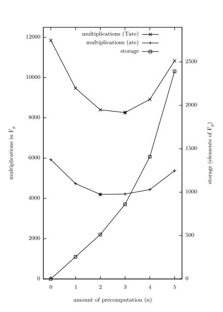
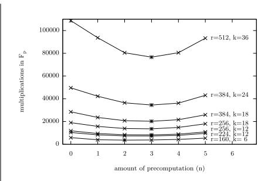
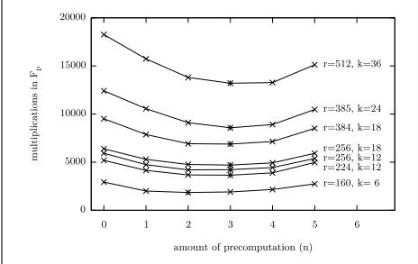

# Fixed Argument Pairings

Craig Costello? and Douglas Stebila

Information Security Institute, Queensland University of Technology, Brisbane, Queensland, Australia Email: craig.costello@qut.edu.au, douglas@stebila.ca

Abstract. A common scenario in many pairing-based cryptographic protocols is that one argument in the pairing is fixed as a long term secret key or a constant parameter in the system. In these situations, the runtime of Miller's algorithm can be significantly reduced by storing precomputed values that depend on the fixed argument, prior to the input or existence of the second argument. In light of recent developments in pairing computation, we show that the computation of the Miller loop can be sped up by up to 37% if precomputation is employed, with our method being up to 19.5% faster than the previous precomputation techniques.

Keywords: Pairings, Miller's algorithm, Tate pairing, ate pairing, precomputation.

## 1 Introduction

Boneh and Franklin were among the first to present a pairing-based cryptosystem in 2001, when they exploited the powerful bilinearity property of pairings to construct the first efficient and provably secure identity-based encryption (IBE) scheme [9], answering an open question first posed by Shamir in 1984 [44]. Boneh and Franklin's discovery, alongside Joux's one round tripartite key agreement protocol [29], were major breakthroughs that gave rise to the now thriving field of pairing-based cryptography and a vast array of new pairing-based primitives that followed, including short signatures [11], hierarchical encryption [23], group signatures [8], ring signatures [10], identity-based key agreement schemes [45, 13, 33], an IBE scheme secure in the standard model [47], as well as generalizations of IBE such as attribute-based encryption [24, 31].

The computation of pairings via Miller's algorithm [35] was initially too slow for them to be considered practically viable, but this did not remain the case for long. Much research has concentrated on achieving pairings at high security levels that are efficient enough for industrial applications. Although use of the Weil pairing was initially proposed, it quickly became evident that the computation of the Tate pairing was much faster in practice [9, 21, 22, 4]. A decade after their introduction into cryptosystems, the computation of a pairing has accelerated from older implementations that took a few minutes [34], to current state-of-the-art implementations that take only a few milliseconds [25, 1, 37]. Many of the avenues for improving the computation speed of cryptographic pairings on elliptic curves have been somewhat exhausted:

- the Miller loop has been truncated to optimal lengths [3, 28, 32, 46, 27];
- improvements inside the Miller iterations, such as denominator elimination, have been thoroughly explored [4, 5];
- the choice of the groups G<sup>1</sup> and G<sup>2</sup> as the two eigenspaces of the Frobenius endormorphism is now standard [28, 18];
- there is now a flexible array of curve constructions that facilitate fast implementations [20];
- different elliptic curve representations and coordinates systems have been explored in efforts to reduce the field operations encountered when computing the Miller functions [2, 16, 17]; and
- many other improvements have become standard in optimal or restricted implementations, such as compressed pairings [39, 36], optimized field constructions [30, 6], fast hashing [40], and fast final exponentiation [41] techniques.

<sup>?</sup> The first author acknowledges funding from the Queensland Government Smart State PhD Scholarship.

While these techniques have allowed for relatively fast implementations of pairings, there are still some possible improvements that are yet to be explored to their full potential. In this paper we explore one such technique: the implementation of pairings with one argument fixed, which allow for improvements in runtime performance based on precomputations. In the pairing e(R, S) of two points R and S on an elliptic curve, we call the argument R fixed if it is constant in terms of the corresponding protocol that employs the pairing, for example, R is a long-term private key that is "paired" with ephemeral or dynamic values (different S values) at runtime.

Scott [38] was the first to comment on the possibility of exploiting the nature of a fixed argument R, suggesting to precompute all multiples of the point R required in the Miller loop. Scott et al. [42] took this idea further by also precomputing the gradients,  $\lambda_i$ , of each of the line functions that arise in the Miller iterations, since these are also values depending solely on the first argument R. Essentially, this means that the coefficients of the affine Miller functions have been computed in advance and are just "waiting" as indeterminate functions until S is known, so that they can be evaluated and used to update the Miller function.

We adopt this same approach by performing all computations that are solely dependent on the fixed argument R, and storing these before the second argument S is available. Since R-dependent computations can be performed once only and stored in the long term, it is only the subsequent S-dependent computations that affect the runtime of the pairing algorithm. The question that we address in this paper arises naturally: are there further R-dependent (pre)computations that can be done to reduce the workload encountered when the dynamic second argument S is known?

In light of recent developments in pairing computation [14,15], we address this question by considering another: is it computationally cheaper to evaluate a function before operating on its result, or can it be advantageous to operate on the indeterminate function before evaluating it?

When neither of the pairing arguments are fixed, the results in [14] and [15] show that many cases of pairing implementations favour the latter. In the case of fixed argument pairings, this becomes even more evident when we observe that any computations on the indeterminate Miller functions are entirely R-dependent and can be done in advance. We show that for both the Tate and ate pairings, the Miller loop can be computed with between 25 and 37% fewer field multiplications (or squarings) if an optimal amount of precomputation is performed in the fixed argument, compared to the case when no precomputation is performed.

The rest of this paper is organized as follows. In Section 2, we present background information on computing pairings using Miller's algorithm. In Section 3, we separate the R-dependent precomputations from the S-dependent dynamic computations in preparation for Section 4, where we present our main technical innovation: we show how to merge multiple iterations of the loop in Miller's algorithm in the precomputation stage to reduce the cost of the S-dependent computations. Section 5 presents the optimal number of iterations to merge for various security levels, and Section 6 lists a number of cryptosystems which can benefit from our techniques. We conclude in Section 7.

### 2 Preliminaries

Let E be an elliptic curve defined over a large prime field  $\mathbb{F}_p$  which is given by the short Weierstrass equation  $E: y^2 = x^3 + ax + b$ , the identity element of which is denoted by  $\mathcal{O}$ . Let r be a large prime and let E[r] be the group of points with order r (the r-torsion) on E. Let k > 1 be the smallest integer such that  $r \mid p^k - 1$ ; we call k the embedding degree. Let  $\pi_p$  be the p-power Frobenius endormorphism on E. The two eigenspaces of  $\pi_p$ , restricted to the r-torsion on E, form two linearly independent groups of order r, written as  $\mathbb{G}_1 = E[r] \cap \ker(\pi_p - [1])$  and  $\mathbb{G}_2 = E[r] \cap \ker(\pi_p - [p])$ . The group  $\mathbb{G}_1$  is defined over the base field  $\mathbb{F}_p$ , whilst the group  $\mathbb{G}_2$  is defined over the full extension field  $\mathbb{F}_{p^k}$ .

A bilinear pairing e of two points  $R, S \in E$  can be computed as

$$e(R,S) = f_{m,R}(S)^{(p^k-1)/r},$$

where  $m \in \mathbb{Z}$ , and  $f_{m,R}$  is a function with divisor  $\operatorname{div}(f_{m,R}) = m(R) - ([m]R) - (m-1)(\mathcal{O})$ . For our purposes, k will always be even, which allows us to write the function  $f_{m,R}$  as a polynomial in x and y so that  $f_{m,R}(x,y)$  is evaluated at the coordinates of the point S when the pairing is computed. For the Tate pairing, the first argument R comes from  $\mathbb{G}_1$  and the second argument S comes from  $\mathbb{G}_2$ , whilst the ate pairing takes  $R \in \mathbb{G}_2$  and  $S \in \mathbb{G}_1$ . In either case, the function  $f_{m,R}(S)$  evaluates as an element of the finite field  $\mathbb{F}_{p^k}$ , and this value is raised to the power  $(p^k-1)/r$  in the "final exponentiation" stage. The function  $f_{m,R}$  is called the *Miller function*, since it is constructed in a double-and-add like fashion using Miller's algorithm, which is described in Algorithm 1.

### Algorithm 1 Miller's affine double-and-add algorithm with denominator elimination

```
Input: R = (x_R, y_R), S = (x_S, y_S), m = (m_{l-1}...m_1, m_0)_2.
Output: f_{m,R}(S) \leftarrow f.
 1: T \leftarrow R, f \leftarrow 1.
 2: for i from l-2 to 0 do
           Compute g(x,y) = y - y_T + \lambda(x_T - x), where \lambda is the gradient of the tangent line to T.
 4:
           T \leftarrow [2]T = [2](x_T, y_T).
           g \leftarrow g(x_S, y_S).
 5:
           f \leftarrow f^2 \cdot g.
 6:
           if m_i \neq 0 then
 7:
                 Compute g(x,y) = y - y_T + \lambda(x_T - x), where \lambda is the gradient of the line joining T and R.
 8:
 9:
10:
                 g \leftarrow g(x_S, y_S).
11:
                  f \leftarrow f \cdot g.
12:
           end if
13: end for
14: return f.
```

If we were to discard lines 5 and 10 of Algorithm 1, the output would be an indeterminate function  $f_{m,R}(x,y)$  of degree m, rather than a field element  $f_{m,R}(x_S,y_S) \in \mathbb{F}_{p^k}$ . The reason we include lines 5 and 10 and evaluate the intermediate functions in each iteration is because m is usually quite large (for example, no smaller than  $2^{20}$ ), and storing so many coefficients is infeasible; memory constraints force us to evaluate the g functions as we go.

Modern pairing implementations make use of the twisted curve E' of E, to define a group  $\mathbb{G}_2' \in E'$  that is isomorphic to  $\mathbb{G}_2 \in E$ , but is defined over a smaller subfield  $\mathbb{F}_{p^e}$  of  $\mathbb{F}_{p^k}$ . We let  $\psi : E' \to E$  be the twisting isomorphism from E' to E, so that  $\psi(\mathbb{G}_2') = \mathbb{G}_2$ . A point  $P \in \mathbb{G}_2$  is usually written as  $P = P' \cdot \alpha$ , where  $P' \in \mathbb{G}_2'$  is defined over  $\mathbb{F}_{p^e}$  and  $\alpha$  is an algebraic element used in the twisting isomorphism (cf. [28, 17]). In both the Tate and ate pairings, such points in  $\mathbb{G}_2$  are often multiplied by elements in the base field  $\mathbb{F}_p$ , and because of the representation of  $\mathbb{G}_2$  over the twisted curve, these multiplications are counted as e multiplications in the base field.

To count field multiplications and squarings across the different fields employed in pairing computations, we use  $\mathbf{m}_i$  and  $\mathbf{s}_i$  to respectively denote a multiplication and a squaring in the field  $\mathbb{F}_{p^i}$ . We maintain generality (across both Tate and ate like pairings) by assuming that the first argument R is written as an element of  $\mathbb{F}_{p^u}$  and that the second argument S is written as an element of  $\mathbb{F}_{p^v}$ , where it is understood that the Tate pairing has (u, v) = (1, e) and that the ate pairing has (u, v) = (e, 1). In both cases, the argument defined over  $\mathbb{F}_{p^k}$  is actually treated as an element of  $\mathbb{F}_{p^e}$  using  $\mathbb{G}'_2$ .

### 3 R-dependent versus S-dependent Computations

We begin by separating the R-dependent (fixed) computations from the S-dependent (dynamic) computations. Our goal is to minimize the computational complexity of the S-dependent computations.

When the first argument in the pairing, R, is a fixed or constant parameter in a protocol, Scott et~al.~[42] propose precomputing and storing all the multiples of R (the T values in Algorithm 1) and all of the gradients (the  $\lambda$  values) in each of the Miller lines (the functions g). This is essentially the same as writing each of the Miller lines as  $g(x,y) = y - \lambda x - c$ , where  $c = y_T - \lambda x_T$  is precomputed and stored alongside  $\lambda$  (see Algorithm 1). We prefer to precompute and store  $(\lambda, c)$  at each iteration, rather than  $(x_T, y_T, \lambda)$ , since this saves an extra multiplication  $(\lambda \text{ by } x_T)$  at runtime and only requires the storage of two values for each iteration, as well as somewhat simplifying the description of what the precomputation achieves. Namely, we do not store the multiples of the point R, since they are not necessarily required once S is input. Instead, we compute all of the R-dependent coefficients of the Miller line functions that are required, in complete preparation for the "arrival" of the argument S.

In this light, fixing one argument in the pairing allows us to split Miller's algorithm into two parts. The first part involves all of the R-dependent (pre)computations that can be performed in advance: computing a set of indeterminate Miller lines defined by  $(\lambda, c)$ . The second part involves all of the S-dependent computations, namely those which cannot be performed until the argument S is known. We describe the R-dependent precomputations in Algorithm 2 and the S-dependent dynamic computations in Algorithm 3. For ease of exposition, we assume from here on that the Miller lines are of the form  $g(x,y) = y + \tilde{\lambda}x + \tilde{c}$ , instead of the usual  $g(x,y) = y - \lambda x - c$ , by taking  $\tilde{\lambda} = -\lambda$  and  $\tilde{c} = -c$ , and make an abuse of notation by relabeling and writing  $g(x,y) = y + \lambda x + c$  from now on. We use #DBL and #ADD in both algorithms to denote the number of doublings and additions, respectively, that occur in the run of Miller's algorithm. Clearly, #DBL = l - 1 (from Algorithm 1) and #ADD is equal to the number of non-zero bits in the binary representation of the loop parameter m (excluding the most significant bit). We also write the binary representation of m from  $m = (m_{l-1}...m_1, m_0)_2$  to  $m = (\tilde{m}_0, \tilde{m}_1...\tilde{m}_{\#DBL-1}, \tilde{m}_{\#DBL})_2$ , so that  $\tilde{m}_0$  is now the most significant bit, and Miller's algorithm proceeds from  $\tilde{m}_1$  to  $\tilde{m}_{\#DBL}$ ; we relabel so that  $m = (m_0, m_1...m_{\#DBL-1}, m_{\#DBL})_2$  from now on.

#### **Algorithm 2** R-dependent precomputations

```
Input: R = (x_R, y_R), m = (m_0, m_1...m_{\#DBL-1}, m_{\#DBL})_2.
Output: G_{DBL} = \{(\lambda_1, c_1), (\lambda_2, c_2), ..., (\lambda_{\#DBL}, c_{\#DBL})\} and
     G_{\text{ADD}} = \{(\lambda'_1, c'_1), (\lambda'_2, c'_2), ..., (\lambda'_{\text{\#ADD}}, c'_{\text{\#ADD}})\}.
 1: T \leftarrow R, G_{DBL} \leftarrow \{\emptyset\}, G_{ADD} \leftarrow \{\emptyset\}.
 2: for i from 1 to #DBL do
             Compute \lambda_i and c_i, such that y + \lambda_i x + c_i is the line tangent to T.
 3:
             T \leftarrow [2]T.
 4:
 5:
             Append (\lambda_i, c_i) to G_{DBL}.
 6:
             if m_i \neq 0 then
                    Compute \lambda'_i and c'_i, such that y + \lambda'_i x + c'_i is the line joining T and R.
 7:
                    T \leftarrow T + R.
 8:
 9:
                    Append (\lambda'_i, c'_i) to G_{ADD}.
10:
             end if
11: end for
12: return G_{DBL}, G_{ADD}
```

It is important to note that we are solely focussed on minimizing the computational complexity of the algorithm that is S-dependent. We are assuming that the R-dependent precomputations are carried out well in advance on a platform that is not too restricted (within reason) with

#### **Algorithm 3** S-dependent computations

```
Input: S = (x_S, y_S), m = (m_0, m_1...m_{\#DBL-1}, m_{\#DBL})_2, G_{DBL} and G_{ADD} (from Algorithm 2).
Output: f_{m,R}(S) \leftarrow f.
 1: f \leftarrow 1, count<sub>ADD</sub> \leftarrow 1.
 2: for i from 1 to #DBL do
 3:
             Compute g \leftarrow (y_S + \lambda_i x_S + c_i).
              f \leftarrow f^2 \cdot g.
 4:
             if m_i \neq 0 then
 5:
                     Compute g \leftarrow (y_S + \lambda'_{\texttt{count}_{ADD}} x_S + c'_{\texttt{count}_{ADD}}).
 6:
 7:
                     \mathtt{count}_{\mathtt{ADD}} \leftarrow \mathtt{count}_{\mathtt{ADD}} + 1.
 8:
                     f \leftarrow f \cdot g.
 9:
             end if
10: end for
11: return f.
```

computational time. For example, in pairings where both arguments are dynamic, one would never compute the Miller point operations and the Miller line functions in affine coordinates, as this involves costly field inversions. Such pairings always resort to avoiding these inversions by using projective coordinates, but in these cases the Miller lines that arise are almost always (cf. [17]) of the form  $g(x,y) = g_x \cdot x + g_y \cdot y + g_0$ . Employing projective coordinates would certainly reduce the computational time spent performing the R-dependent precomputations, but this would produce slightly more complicated Miller lines (the extra coefficient  $g_y$  in front of y), and would inevitably slow down the dynamic computations involving S. In the theme of this paper then, we opt for affine coordinates throughout, with the ultimate goal of minimizing the S-dependent runtime. We do point out however, that the methods in this paper are entirely compatible with an implementation where the precomputation complexity might still be somewhat crucial, in which case the precomputation could be performed in projective coordinates. In such cases, one would split the algorithm and the analogous computational cost analysis described in [15].

In Table 1, we present the S-dependent dynamic computational complexity in a typical iteration of Algorithm 3, ignoring the cost of the precomputations in Algorithm 2.

| Iteration        | R-dependent values                         | Storage $\in \mathbb{F}_{p^u}$ | S-dependent computations                                                     | Dynamic costs                                         |
|------------------|--------------------------------------------|--------------------------------|------------------------------------------------------------------------------|-------------------------------------------------------|
| 1                | $\lambda_1, c_1$                           | 2                              | $\lambda_1 \cdot x_S, f \leftarrow f^2, f \leftarrow f \cdot g$              | $e\mathbf{m}_1 + \mathbf{s}_k + \tilde{\mathbf{m}}_k$ |
| 2                | $\lambda_2,c_2$                            | 2                              | $\lambda_2 \cdot x_S, f \leftarrow f^2, f \leftarrow f \cdot g$              | $e\mathbf{m}_1 + \mathbf{s}_k + \tilde{\mathbf{m}}_k$ |
| :                | :                                          | :                              | :                                                                            | :                                                     |
| i                | $\lambda_i,c_i$                            | 2                              | $\lambda_i \cdot x_S, f \leftarrow f^2, f \leftarrow f \cdot g$              | $e\mathbf{m}_1 + \mathbf{s}_k + \tilde{\mathbf{m}}_k$ |
| :                | :                                          | :                              | :<br>:                                                                       | :                                                     |
| $\#\mathtt{DBL}$ | $\lambda_{\text{\#DBL}}, c_{\text{\#DBL}}$ | 2                              | $\lambda_{\text{\#DBL}} \cdot x_S, f \leftarrow f^2, f \leftarrow f \cdot g$ | $e\mathbf{m}_1 + \mathbf{s}_k + \tilde{\mathbf{m}}_k$ |

 $\textbf{Table 1.} \ \textbf{The complexity of } S \textbf{-dependent computations and storage requirements for Miller's double-and-add routine}$

Table 1 also includes the storage requirements for the Miller lines in each iteration. We do not include the extra storage and S-dependent computations required for the addition steps in our analysis, since additions only occur a small number of times in state-of-the-art implementations that make use of well-chosen, low Hamming-weight loop parameters. In each iteration, the multiplication of the Miller function f by the update g is counted as  $\tilde{\mathbf{m}}_k$ , where  $\tilde{\mathbf{m}}_k$  is actually less than a general  $\mathbf{m}_k$ , since the updates g are sparse. The complexity of  $\tilde{\mathbf{m}}_k$  compared with  $\mathbf{m}_k$  depends on the degree of the twist and the nature of the field construction.

The R-dependent precomputations described above are somewhat natural in the context of fixed argument pairings. In the next section, we investigate whether more precomputation can be done to reduce the overall S-dependent complexity (the total of all the entries in the "Dynamic costs" column).

## 4 Further Precomputations: Merging n Iterations at a Time

It was shown very recently [14, 15] that speedups in pairing computations can be achieved if the Miller lines for consecutive iterations are combined before they are evaluated at the second argument of the pairing. In [15], speedups were achieved by developing a general algorithm for merging n consecutive iterations. This involves multiplying n Miller lines together, each of which is raised to a different exponent depending on how many field squarings it would otherwise encounter in the standard Miller routine, given as

$$G_n(x,y) = \prod_{i=1}^n g_i(x,y)^{2^{n-i}}.$$
 (1)

The technique in [14] is much the same, except the formulas for the above line product were presented in (slightly faster) explicit formulas, depending on the shape of the curve employed.

Our approach is analogous to that of [15], where we derive an algorithm to give Gn(x, y) in its general form. We note two important differences between the results herein, and those in [15]. Firstly, the Miller lines in this paper are given in affine form, and so the general product in (1) will have a slightly different form. Secondly, the only computational costs we are concerned with are the dynamic S-dependent costs. This means that the (potentially very expensive) computational costs associated with building up the combined products in (1) can be ignored when determining the optimal number of lines to combine.

We start the discussion by determining the nature of the function Gn(x, y), since the Gn(x, y) products will be evaluated at S, and this is the first S-dependent cost incurred in each of the n-ata-time iterations. We reiterate that the cost associated with building the indeterminate Gn(x, y) functions is ignored since the coefficients of these functions are solely R-dependent. We assume that Gn(x, y) is reduced modulo the curve equation y <sup>2</sup> = h(x), so that the result will always be (at most) linear in y, given as

$$G_n(x,y) = f_n(x) + g_n(x)y, \tag{2}$$

(where fn(x) and gn(x) are not to be confused with the f and g functions described in the algorithms in the previous sections). The following lemma can be used to determine the exact degree of fn(x) and gn(x) for all n.

Lemma 1. Let y <sup>2</sup> = h(x) define an elliptic curve, where h(x) is a monic polynomial with deg(h) = 3. Let n consecutive affine Miller doubling updates be given by g1(x, y) = y+λ1x+c1,..., gn(x, y) = y + λnx + cn. If G<sup>n</sup> is defined as in Equation (1), then Gn(x, y) takes the form

$$G_n(x,y) = f_n(x) + g_n(x)y,$$

where g(x) is a monic polynomial such that deg(gn) = deg(fn) − 1.

Proof. When n = 1, we have G1(x, y) = g1(x, y) = y + λ1x + c<sup>1</sup> = f1(x) + g1(x)y, where f1(x) = λ1x + c and g1(x) = 1, so that deg(g1) = deg(f1) − 1 and g1(x) is trivially monic.

For induction, assume G<sup>k</sup> = fk(x) + gk(x)y, where deg(gk) = deg(fk) − 1 and g<sup>k</sup> is monic. Gk+1 is computed as

$$\begin{split} G_{k+1} &= G_k^2 \cdot g_{k+1} \\ &= \left( f_k(x) + g_k(x) y \right)^2 \cdot \left( y + \lambda_{k+1} x + c_{k+1} \right) \\ &= \left( f_k(x)^2 + 2 f_k(x) g_k(x) y + g_k(x)^2 h(x) \right) (y + \lambda_{k+1} x + c_{k+1}) \\ &= f_{k+1}(x) + g_{k+1}(x) y, \end{split}$$

where

$$f_{k+1}(x) = 2f_k(x)g_k(x)h(x) + (f_k(x)^2 + g_k(x)^2h(x))(\lambda_{k+1}x + c_{k+1})$$

and

$$g_{k+1}(x) = f_k(x)^2 + g_k(x)^2 h(x) + 2f_k(x)g_k(x)(\lambda_{k+1}x + c_{k+1}).$$

The degree of  $f_{k+1}(x)$  is easily seen to be  $\deg(f_{k+1}) = \deg(f_k) + \deg(g_k) + \deg(h) = \deg(f_k) + \deg(f_k) + \deg(f_k) + \deg(f_k) + 2$ , and the degree of  $g_{k+1}(x)$  is  $2 \cdot \deg(g_k) + \deg(h) = 2 \cdot \deg(f_k) + 1$ , so that  $\deg(g_{k+1}) = \deg(f_{k+1}) - 1$ . Lastly,  $g_k(x)^2 h(x)$  is the only expression contributing to  $g_{k+1}(x)$  whose degree is the same as the degree of  $g_{k+1}(x)$ , and  $g_k(x)^2 h(x)$  is clearly monic (since both  $g_k(x)$  and  $g_k(x)$  are monic), so  $g_{k+1}(x)$  is also monic.

To determine the degrees of  $f_n$  and  $g_n$ , we couple the initial values,  $\deg(f_1) = 1$  and  $\deg(g_1) = 0$ , with the conditions  $\deg(f_{k+1}) = 2 \cdot \deg(f_k) + 2$  and  $\deg(g_{k+1}) = 2 \cdot \deg(f_k) + 1$ ; hence

$$\deg(f_n) = 3 \cdot (2^{n-1} - 1) + 1 \qquad \text{and} \qquad \deg(g_n) = 3 \cdot (2^{n-1} - 1), \tag{3}$$

agreeing with the analogous result for projective coordinates in [15, Eq. (10)].

Since we are combining n iterations into one, the R-dependent precomputation stage of the pairing algorithm will now involve two sub-algorithms. Firstly, Algorithm 2 will precompute the  $(\lambda, c)$  and  $(\lambda', c')$  pairs as usual. Then, another sub-algorithm will be called to combine these pairs (which define lines  $g(x, y) = y + \lambda x + c$ ), combining n at a time into products of the form in (2), the degrees of which are described in (3). Since this sub-algorithm deals with n of the  $\lfloor \log_2(m) \rfloor$  standard Miller iterations at a time, it will involve  $\lfloor \log_{2n}(m) \rfloor$  iterations.

For exactly the same reason, the modified S-dependent evaluation stage of the pairing algorithm will now also involve  $\lfloor \log_{2^n}(m) \rfloor$  iterations. We now turn to determining the cost of each of these dynamic iterations. Each of the  $G_{n(i)}$  takes the form  $G_{n(i)}(x,y) = f_{n(i)}(x) + g_{n(i)}(x)y$ , containing  $\deg(f_n) + 1 + \deg(g_n) = 2 \cdot \deg(f_n) = 6 \cdot (2^{n-1} - 1) + 2$  non-trivial coefficients, since  $g_n$  is monic. Thus, for each  $1 \le i \le \lfloor \log_{2^n}(m) \rfloor$ , we must store  $6 \cdot (2^{n-1} - 1) + 2$  elements in  $\mathbb{F}_{p^u}$ . Apart from the constant term of  $f_{n(i)}(x)$ , every one of these  $6 \cdot (2^{n-1} - 1) + 2$  non-trivial coefficients is multiplied by a product of the coordinates of S, each multiplication of which costs  $e\mathbf{m}_1$ . Thus, the cost of evaluating  $G_{n(i)}$  at S is  $[6 \cdot (2^{n-1} - 1) + 1]e\mathbf{m}_1$ . We summarize the S-dependent "per-iteration" costs in Table 2. Importantly, we note that each of the n-at-a-time iterations will also involve n squarings of the Miller function f, as well as one (rather than n) multiplication of f by G(S) (see [14,15]). For n > 1, this multiplication becomes a general full extension field multiplication  $\mathbf{m}_k$ , rather than the  $\tilde{\mathbf{m}}_k$  that is reported for n = 1, since G(S) is no longer sparse.

Each of the  $\lfloor \log_{2^n}(m) \rfloor$  iterations requires the computation of  $f_{n(1)}(S_x)$  and  $g_{n(1)}(S_x) \cdot S_y$ . Thus, each iterate requires the same products of  $S_x^i$  and  $S_x^j S_y$ , where  $2 \leq i \leq \deg(f_n)$  and  $1 \leq j \leq \deg(g_n)$ , and these products, which are dependent on the dynamic input, are precomputed before the first iteration. We use the term precomputed here carefully, since these S-dependent precomputations are not to be confused with the R-dependent precomputations that don't contribute to the complexity at runtime. Where possible, we would like to use field squarings to determine the  $S_x^i$  and  $S_x^j S_y$  terms, rather than the slightly more expensive field multiplications. We can compute the  $S_x^i$  terms, which range from  $S_x^2$  to  $S_x^{\deg(f_n)}$ , where  $2 \leq i \leq 2^{\lfloor \log_2(\deg(f_n)) \rfloor}$ , using one field squaring each (cf.  $[14, \S 5.2]$ ). The remaining  $S_x^i$  terms, where  $i > 2^{\lfloor \log_2(\deg(f_n)) \rfloor}$ , are computed using  $(\deg(f_n) - 2^{\lfloor \log_2(\deg(f_n)) \rfloor})$  field multiplications. These multiplications and squarings occur in the field  $\mathbb{F}_{p^v}$ , so that the total dynamic cost of obtaining  $S_x^i$  for  $2 \leq i \leq \deg(f_n)$  is

$$(2^{\lfloor \log_2(\deg(f_n))\rfloor} - 1)\mathbf{s}_v + (\deg(f_n) - 2^{\lfloor \log_2(\deg(f_n))\rfloor})\mathbf{m}_v.$$

To compute the  $S_x^j S_y$  products, where  $1 \leq j \leq \deg(g_n)$ , we require  $\deg(g_n)$  multiplications<sup>1</sup> since we already have all of the  $S_x^j$ . Each of these multiplications occur in  $\mathbb{F}_{p^v}$ , so that the total cost of

<sup>&</sup>lt;sup>1</sup> This is the cheapest way to compute these products, as trying to use field squarings to form the products would require us to compute  $S_x^j S_y = ((S_x^j + S_y)^2 - S_x^{2j} + S_y^2)$ ; even though we have  $S_y^2$  via the curve equation, the squaring  $(S_x^j + S_y)^2$  would require a full extension field squaring.

| Iterations     | R-dependent Storage  |                        | S-dependent                                       | Dynamic                         |  |  |
|----------------|----------------------|------------------------|---------------------------------------------------|---------------------------------|--|--|
|                | values               | $\in \mathbb{F}_{p^u}$ | computations                                      | costs                           |  |  |
| 1              | coefficients of      | $6(2^{n-1}-1)$         | $f_{n(1)}(S), g_{n(1)}(S)$                        | $(6(2^{n-1}-1)+1)e\mathbf{m}_1$ |  |  |
| $\downarrow$   | $f_{n(1)}, g_{n(1)}$ | +2                     | $f \leftarrow f^{2^n}$                            | $n\mathbf{s}_k$                 |  |  |
| $\underline{}$ |                      |                        | $f \leftarrow f \cdot G(S)$                       | $\mathbf{m}_k$                  |  |  |
| n+1            | coefficients of      | $6(2^{n-1}-1)$         | $f_{n(2)}(S), g_{n(2)}(S)$                        | $(6(2^{n-1}-1)+1)e\mathbf{m}_1$ |  |  |
| $\downarrow$   | $f_{n(2)}, g_{n(2)}$ | +2                     | $f \leftarrow f^{2^n}$                            | $n\mathbf{s}_k$                 |  |  |
| 2n             |                      |                        | $f \leftarrow f \cdot G(S)$                       | $\mathbf{m}_k$                  |  |  |
| :              | :                    | :                      | :                                                 | ÷                               |  |  |
| in + 1         | coefficients of      | $6(2^{n-1}-1)$         | $f_{n(i)}(S), g_{n(i)}(S)$ $f \leftarrow f^{2^n}$ | $(6(2^{n-1}-1)+1)e\mathbf{m}_1$ |  |  |
| $\downarrow$   | $f_{n(i)}, g_{n(i)}$ | +2                     | $f \leftarrow f^{2^n}$                            | $n\mathbf{s}_k$                 |  |  |
| (i+1)n         |                      |                        | $f \leftarrow f \cdot G(S)$                       | $\mathbf{m}_k$                  |  |  |
| :              | :                    | :                      | ÷                                                 | :                               |  |  |

**Table 2.** The complexity of S-dependent computations and storage requirements for n combined iterations

the S-dependent precomputation is given by adding  $\deg(g_n)\mathbf{m}_v = (\deg(f_n) - 1)\mathbf{m}_v$  to the previous cost, giving

$$(2^{\lfloor \log_2(\deg(f_n))\rfloor} - 1)\mathbf{s}_v + (2 \cdot \deg(f_n) - 2^{\lfloor \log_2(\deg(f_n))\rfloor} - 1)\mathbf{m}_v.$$

Substituting  $\deg(f_n) = 3(2^{n-1}-1)+1$  (from (3)) into the above equation requires the evaluation of  $2^{\lfloor \log_2(3(2^{n-1}-1)+1)\rfloor}$ . To simplify this expression we rewrite the index as  $\lfloor \log_2(2^n+2^{n-1}-2)\rfloor = n$ , so that the total number of S-dependent computations simplifies to

$$(2^{n} - 1)\mathbf{s}_{v} + (2^{n+1} - 5)\mathbf{m}_{v}. \tag{4}$$

From Table 2, each of the iterations costs  $([6 \cdot (2^{n-1} - 1) + 2]e\mathbf{m}_1 + n\mathbf{s}_k + \mathbf{m}_k)$ . Summing this cost over the  $\lfloor \log_{2^n}(m) \rfloor$  iterations, and adding the S-dependent precomputation in (4), gives the total S-dependent computation complexity as

$$\lfloor \log_{2^n}(m) \rfloor ([6 \cdot (2^{n-1} - 1) + 1]e\mathbf{m}_1 + n\mathbf{s}_k + \mathbf{m}_k) + (2^n - 1)\mathbf{s}_v + (2^{n+1} - 5)\mathbf{m}_v.$$
 (5)

We summarize the total storage and the total costs for all n in Table 3. Once more, we reiterate that the total complexity is independent of the field containing the first argument,  $\mathbb{F}_{p^u}$ , and is only dependent on the field containing the second argument,  $\mathbb{F}_{p^v}$ . Interestingly, this means that even if the ate and Tate pairings had equal loop lengths, a fixed argument ate pairing (v=1) will still perform faster than a fixed argument Tate pairing (v=e) in general. As far as storage goes, the ate pairing will require storing values in the field  $\mathbb{F}_{p^e}$ , whilst the Tate pairing will store values in the base field  $\mathbb{F}_p$ . However, because of the shorter loop lengths achieved in the ate pairing, the total storage needed in the ate pairing may still end up being less than for the Tate pairing. Unlike the speedups achieved in [14] and [15] which mainly benefit the Tate pairing, it is clear that our techniques will also speed up the ate pairing when a fixed argument can be exploited. In the next section, we use the complexities in Table 3 to determine the optimal amount of precomputation for implementations over various embedding degrees.

### 5 Optimising n

With the ultimate goal of minimizing the dynamic computations incurred in a pairing with a fixed argument, we use the total complexities for the Miller loop in Table 3 to determine the best value of n for both the Tate and ate pairings at different security levels. In Table 4, we summarize our results for a variety of common security levels (taken from [20]) and embedding degrees, for both the Tate and ate pairings. At each security level, we list:

|   | n        | Storage $\in \mathbb{F}_{p^u}$                  | S-dependent costs                                                                 |  |  |  |  |
|---|----------|-------------------------------------------------|-----------------------------------------------------------------------------------|--|--|--|--|
| - | 1        | $2\lfloor \log_2 m \rfloor$                     | $\lfloor \log_2(m) \rfloor (e\mathbf{m}_1 + \mathbf{s}_k + \tilde{\mathbf{m}}_k)$ |  |  |  |  |
| - | $\geq 2$ | $\lfloor \log_{2^n} m \rfloor (6(2^{n-1}-1)+2)$ | $[\log_{2^n}(m)]((6(2^{n-1}-1)+1)e\mathbf{m}_1 + n\mathbf{s}_k + \mathbf{m}_k)$   |  |  |  |  |
|   |          |                                                 | $+(2^{n}-1)\mathbf{s}_{v}+(2^{n+1}-5)\mathbf{m}_{v}$                              |  |  |  |  |

**Table 3.** The total storage requirements and S-dependent complexity for a fixed argument pairing

- the optimal<sup>2</sup> length of the Miller loop ( $m_{\text{Tate}}$  and  $m_{\text{ate}}$ , respectively) for both pairings (taken from [17]).;
- the optimal value of n, the number of iterations to merge, based on the analysis in Section 4;
- the overall cost of S-dependent dynamic Miller loop doubling operations in terms of base field  $(\mathbb{F}_p)$  multiplications, assuming that  $\mathbf{s}_1 = 0.8\mathbf{m}_1$ , and counting multiplications in fields with extension degrees of the form  $k = 2^i 3^j$ , as  $\mathbf{m}_k = 3^i 5^j \mathbf{m}_1$  (cf. [30]);
- the percentage reductions in Miller loop operations between an optimal n implementation (this paper) and (i) the previous precomputation methods [42] (which correspond to n = 1 herein),
  (ii) no precomputation, but with optimal delayed multiplications [14].

We point out that these percentage speedups are based on the computation of the Miller loop only, and do not take into account the fixed cost of the final exponentation, so that the relative speedups for the entire pairing computation will be less than those reported in Table 4.

| Security | r      | k  | Best   | $\mathbb{F}_p$ | $\mathbb{F}_{p^e}$ | $\mathbb{F}_{p^k}$ | Pairing | m   | n | $\#\mathbf{m}_1$ | % S <sub>I</sub> | oeedup  |
|----------|--------|----|--------|----------------|--------------------|--------------------|---------|-----|---|------------------|------------------|---------|
| (bits)   | (bits) |    | $\rho$ | (bits)         | (bits)             | (bits)             |         |     |   |                  | pre.             | no pre. |
| 80       | 160    | 6  | 2.000  | 320            | 320                | 1920               | Tate    | 80  | 2 | 1843             | 7.8              | 37.1    |
|          |        |    |        |                |                    |                    | ate     | 80  | 2 | 1846             | 7.7              | 37.0    |
|          |        | 8  | 1.500  | 240            | 480                | 1920               | Tate    | 120 | 2 | 5069             | 11.2             | 30.8    |
|          |        |    |        |                |                    |                    | ate     | 120 | 2 | 5058             | 11.4             | 30.9    |
| 112      | 224    | 12 | 1.000  | 224            | 448                | 2688               | Tate    | 112 | 3 | 7308             | 11.8             | 29.5    |
|          |        |    |        |                |                    |                    | ate     | 56  | 3 | 3646             | 12.0             | 29.7    |
|          |        | 16 | 1.250  | 280            | 1120               | 4480               | Tate    | 112 | 2 | 13460            | 14.6             | 25.9    |
|          |        |    |        |                |                    |                    | ate     | 28  | 2 | 3346             | 15.1             | 26.3    |
| 128      | 256    | 12 | 1.000  | 256            | 512                | 3072               | Tate    | 128 | 3 | 8263             | 12.7             | 30.3    |
|          |        |    |        |                |                    |                    | ate     | 64  | 2 | 4198             | 11.3             | 29.2    |
|          |        | 16 | 1.250  | 320            | 1280               | 4096               | Tate    | 128 | 2 | 15368            | 14.7             | 26.0    |
|          |        |    |        |                |                    |                    | ate     | 32  | 2 | 3823             | 15.1             | 26.3    |
|          |        | 18 | 1.333  | 342            | 1026               | 4608               | Tate    | 128 | 3 | 13590            | 13.6             | 28.5    |
|          |        |    |        |                |                    |                    | ate     | 43  | 3 | 4697             | 11.1             | 26.5    |
| 192      | 384    | 18 | 1.333  | 512            | 1536               | 6912               | Tate    | 192 | 3 | 20173            | 14.2             | 29.3    |
|          |        |    |        |                |                    |                    | ate     | 64  | 3 | 6881             | 12.5             | 27.6    |
|          |        | 24 | 1.250  | 478            | 1912               | 9216               | Tate    | 192 | 3 | 34540            | 18.2             | 30.4    |
|          |        |    |        |                |                    |                    | ate     | 48  | 3 | 8577             | 18.7             | 30.9    |
| 256      | 512    | 32 | 1.125  | 576            | 4608               | 16384              | Tate    | 256 | 3 | 87876            | 17.9             | 25.7    |
|          |        |    |        |                |                    |                    | ate     | 32  | 3 | 10777            | 19.5             | 27.1    |
|          |        | 36 | 1.167  | 598            | 3588               | 18432              | Tate    | 264 | 3 | 102960           | 18.2             | 29.5    |
|          |        |    |        |                |                    |                    | ate     | 43  | 3 | 13202            | 16.1             | 27.7    |

**Table 4.** The optimal number of iterations to merge (n), the resulting S-dependent base field operation counts  $(\#\mathbf{m}_1)$ , and the percentage speedup compared to previous precomputation (pre.) [42] and no precomputation (no pre.) techniques, for a variety of security levels and embedding degrees (k).

<sup>&</sup>lt;sup>2</sup> These loop lengths are commonly  $m_{Tate} = \log(r)/2$  and  $m_{ate} = \log(r)/\phi(k)$ , corresponding to the twisted ate [28] and optimal ate [46] pairings respectively.



(a) Tate and ate pairing multiplication vs. storage costs with r = 256 and k = 12 for various n.



(b) Tate pairing multiplication costs with different r and k for various n.



(c) ate pairing multiplication costs with different r and k for various n.

Fig. 1. S-dependent costs for various n values for the Tate and ate pairings.

In Figure 1(a), we show the operation count (in terms of number of base field multiplications) for the entire S-dependent dynamic Miller loop doubling operations in the Tate and ate pairings for a curve with r = 256 and k = 12 based on the analysis in Section 4, as well as the precomputation storage costs in terms of number of base field elements, for various amounts of precomputation; n = 0 corresponds to no precomputation, while n ≥ 1 corresponds to the complexity from Table 3. The optimal amount of precomputation for this case occurs at n = 3, at which point the precomputation storage costs are 860 base field elements, which is not too prohibitive for many applications.

Figure 1(b) shows the base field multiplication costs for the S-dependent dynamic Miller loop doubling operations in a Tate pairing for a variety of subgroup sizes and embedding degrees based on the amount (n) of precomputation. With the exception of the r = 160 case, the optimal n is 3, meaning for those cases we should use precomputation to merge 3 iterations of the Miller loop at a time, as described in Section 4. Figure 1(c) shows the same costs in an ate pairing.

## 6 Applications

There are many pairing-based cryptosystems that can benefit from precomputation when one of the arguments is fixed. In Table 5, we have listed some pairing-based cryptosystems that have fixed arguments and hence which can benefit from the improvements in this paper.

In some cases, such as the Boneh-Franklin identity-based encryption scheme [9] or the Chen-Kudla identity-based key agreement protocol [13], one party computes a pairing where the first argument is fixed while the other party computes a pairing where the second argument is fixed; here, our technique can only be applied to speed up one party's pairing computation.

In others cases, such as the McCullagh-Barreto identity based key agreement protocol [33], the two parties employing the cryptosystem can both benefit because they each compute pairings where the fixed value appears in the same argument of the pairing. Our speed-up is also applicable to attribute-based encryption schemes such as those of Goyal et al. [24, §4] and Lewko et al. [31, §2] which perform a large number of pairings (one or two for each attribute used in decryption), as in these schemes the second arguments in all these pairing computations are long-term values (fixed across multiple runs of the protocol, though not all identical within a single run of the protocol).

|                        | #        | fixed              | #            | fixed              |  |  |
|------------------------|----------|--------------------|--------------|--------------------|--|--|
|                        | pairings | arguments          | pairings     | arguments          |  |  |
| Public key encryption  |          | Encryption         | Decryption   |                    |  |  |
| Boyen-Mei-Waters [12]  | 0        |                    | 1            | 2nd                |  |  |
| ID-based encryption    |          | Encryption         | Decryption   |                    |  |  |
| Boneh-Franklin [9]     | 1        | 2nd                | 1            | 1st                |  |  |
| Boneh-Boyen [7]        | 0        |                    | 1            | 2nd                |  |  |
| Waters [47]            | 0        |                    | 2            | both in 2nd        |  |  |
| Attribute-based encr.  |          | Encryption         | Decryption   |                    |  |  |
| GPSW [24, §4]          | 0        |                    | ≤ #attr.     | all in 1st         |  |  |
| LOSTW [31, §2]         | 0        |                    | ≤ 2 · #attr. | all in 2nd         |  |  |
| ID-based signatures    | Signing  |                    | Verification |                    |  |  |
| Waters [47]            | 0        |                    | 2            | 1 in 2nd           |  |  |
| ID-based key exchange  |          | Initiator          | Responder    |                    |  |  |
| Smart-1 [45]           | 2        | 1 in 1st, 1 in 2nd | 2            | 1 in 1st, 1 in 2nd |  |  |
| Chen-Kudla [13]        | 1        | 1st                | 1            | 2nd                |  |  |
| McCullagh-Barreto [33] | 1        | 2nd                | 1            | 2nd                |  |  |

Table 5. Fixed arguments in various pairing-based cryptosystems.

## 7 Conclusions

We have shown how using precomputation to merge iterations of the Miller loop in Tate and ate pairings can reduce the cost of the dynamic running time when computing a pairing with one fixed argument and one dynamic argument. This improves the runtime cost by between 25% and 37% when compared to a pairing computation with no precomputation, and up to 19.5% when compared to previous precomputation techniques. While the precomputation stage is somewhat expensive compared to the cost of pairing computation, it can still be run quite quickly (in a few seconds or less) on modern computers, and the amount of precomputation storage required is not prohibitive for many settings. Given the wide variety of pairing-based cryptosystems where one argument (say, a long-term private key or system parameter) is fixed across many protocol runs, we believe our techniques have wide applicability.

## References

- 1. Aranha, D.F., L´opez, J., Hankerson, D.: High-speed parallel software implementation of the η<sup>T</sup> pairing. In: Pieprzyk, J. (ed.) Topics in Cryptology – CT-RSA 2010. Lecture Notes in Computer Science, vol. 5985, pp. 89–105. Springer (2010)
- 2. Arene, C., Lange, T., Naehrig, M., Ritzenthaler, C.: Faster pairing computation. Cryptology ePrint Archive, Report 2009/155 (2009)
- 3. Barreto, P.S.L.M., Galbraith, S.D., O'Eigeartaigh, C., Scott, M.: Efficient pairing computation on supersingular abelian varieties. Designs, Codes and Cryptography 42(3), 239–271 (2007)
- 4. Barreto, P.S.L.M., Kim, H.Y., Lynn, B., Scott, M.: Efficient algorithms for pairing-based cryptosystems. In: Yung, M. (ed.) Advances in Cryptology – Proc. CRYPTO 2002. Lecture Notes in Computer Science, vol. 2442, pp. 354–368. Springer (2002)
- 5. Barreto, P.S.L.M., Lynn, B., Scott, M.: Efficient implementation of pairing-based cryptosystems. J. Cryptology 17(4), 321–334 (2004)

- 6. Benger, N., Scott, M.: Constructing tower extensions for the implementation of pairing-based cryptography. In: Hasan and Helleseth [26]
- 7. Boneh, D., Boyen, X.: Efficient selective-ID secure identity-based encryption without random oracles. In: Cachin, C., Camenisch, J. (eds.) Advances in Cryptology – Proc. EUROCRYPT 2004. Lecture Notes in Computer Science, vol. 3027, pp. 223–238. Springer (2004)
- 8. Boneh, D., Boyen, X., Shacham, H.: Short group signatures. In: Franklin [19], pp. 41–55
- 9. Boneh, D., Franklin, M.: Identity-based encryption from the Weil pairing. In: Kilian, J. (ed.) Advances in Cryptology – Proc. CRYPTO 2001. Lecture Notes in Computer Science, vol. 2139, pp. 213–229. Springer (2001)
- 10. Boneh, D., Gentry, C., Lynn, B., Shacham, H.: Aggregate and verifiably encrypted signatures from bilinear maps. In: Biham, E. (ed.) Advances in Cryptology – Proc. EUROCRYPT 2003. Lecture Notes in Computer Science, vol. 2656, pp. 416–432. Springer (2003)
- 11. Boneh, D., Lynn, B., Shacham, H.: Short signatures from the Weil pairing. J. Cryptology 17(4), 297–319 (2004)
- 12. Boyen, X., Mei, Q., Waters, B.: Direct chosen ciphertext security from identity-based techniques. In: Meadows, C., Syverson, P. (eds.) Proc. 12th ACM Conference on Computer and Communications Security (CCS). pp. 320–329. ACM (2005)
- 13. Chen, L., Kudla, C.: Identity based authenticated key agreement protocols from pairings. In: Proceedings 16th IEEE Computer Security Foundations Workshop (CSWF-16). pp. 219–233. IEEE (2003)
- 14. Costello, C., Boyd, C., Nieto, J.M.G., Wong, K.K.H.: Avoiding full extension field arithmetic in pairing computations. In: Progress in Cryptology – Proc. AFRICACRYPT 2010. Lecture Notes in Computer Science, Springer (2010)
- 15. Costello, C., Boyd, C., Nieto, J.M.G., Wong, K.K.H.: Delaying mismatched field multiplications in pairing computations. In: Hasan and Helleseth [26]
- 16. Costello, C., Hisil, H., Boyd, C., Nieto, J.M.G., Wong, K.K.H.: Faster pairings on special Weierstrass curves. In: Shacham and Waters [43], pp. 89–101
- 17. Costello, C., Lange, T., Naehrig, M.: Faster pairing computations on curves with high-degree twists. In: Nguyen, P.Q., Pointcheval, D. (eds.) Public Key Cryptography (PKC) 2010. Lecture Notes in Computer Science, vol. 6056, pp. 224–242. Springer (2010)
- 18. Devegili, A.J., Scott, M., Dahab, R.: Implementing cryptographic pairings over Barreto-Naehrig curves. In: Takagi, T., Okamoto, T., Okamoto, E., Okamoto, T. (eds.) Pairing-Based Cryptography – Pairing 2007. Lecture Notes in Computer Science, vol. 4575, pp. 197–207. Springer (2007)
- 19. Franklin, M.K. (ed.): Advances in Cryptology Proc. CRYPTO 2004, Lecture Notes in Computer Science, vol. 3152. Springer (2004)
- 20. Freeman, D., Scott, M., Teske, E.: A taxonomy of pairing-friendly elliptic curves. J. Cryptology 23(2), 224–280 (2010)
- 21. Galbraith, S.D.: Supersingular curves in cryptography. In: Boyd, C. (ed.) Advances in Cryptology Proc. ASIACRYPT 2001. Lecture Notes in Computer Science, vol. 2248, pp. 495–513. Springer (2001)
- 22. Galbraith, S.D., Harrison, K., Soldera, D.: Implementing the Tate pairing. In: Fieker, C., Kohel, D.R. (eds.) Proc. Algorithmic Number Theory 6th International Symposium (ANTS) 2002. Lecture Notes in Computer Science, vol. 2369, pp. 324–337. Springer (2002)
- 23. Gentry, C., Silverberg, A.: Hierarchical ID-based cryptography. In: Zheng, Y. (ed.) Advances in Cryptology – Proc. ASIACRYPT 2002. Lecture Notes in Computer Science, vol. 2501, pp. 548–566. Springer (2002)
- 24. Goyal, V., Pandey, O., Sahai, A., Waters, B.: Attribute-based encryption for fine-grained access control of encrypted data. In: Wright, R., De Capitani de Vimercati, S., Shmatikov, V. (eds.) Proc. 13th ACM Conference on Computer and Communications Security (CCS). pp. 89–98. ACM (2006)
- 25. Hankerson, D., Menezes, A.J., Scott, M.: Software implementation of pairings. In: Joye, M., Neven, G. (eds.) Identity-Based Cryptography. pp. 188–206. IOS Press (2008)
- 26. Hasan, A., Helleseth, T. (eds.): International Workshop on the Arithmetic of Finite Fields (WAIFI) 2010. Lecture Notes in Computer Science, Springer (2010)
- 27. Hess, F.: Pairing lattices. In: Galbraith, S.D., Paterson, K.G. (eds.) Pairing-Based Cryptography Pairing 2008. Lecture Notes in Computer Science, vol. 5209, pp. 18–38. Springer (2008)
- 28. Hess, F., Smart, N.P., Vercauteren, F.: The eta pairing revisited. IEEE Transactions on Information Theory 52(10), 4595–4602 (2006)
- 29. Joux, A.: A one round protocol for tripartite Diffie-Hellman. In: Bosma, W. (ed.) Proc. Algorithmic Number Theory 5th International Symposium (ANTS) 2000. Lecture Notes in Computer Science, vol. 1838, pp. 385–394. Springer (2000)

- 30. Koblitz, N., Menezes, A.: Pairing-based cryptography at high security levels. In: Smart, N.P. (ed.) Cryptography and Coding – 10th IMA International Conference. Lecture Notes in Computer Science, vol. 3796, pp. 13–36. Springer (2005)
- 31. Lewko, A., Okamoto, T., Sahai, A., Takashima, K., Waters, B.: Fully secure functional encryption: Attribute-based encryption and (hierarchical) inner product encryption. In: Advances in Cryptology – Proc. EUROCRYPT 2010. Lecture Notes in Computer Science, Springer (2010)
- 32. Matsuda, S., Kanayama, N., Hess, F., Okamoto, E.: Optimised versions of the ate and twisted ate pairings. In: Galbraith, S.D. (ed.) Cryptography and Coding – 11th IMA International Conference. Lecture Notes in Computer Science, vol. 4887, pp. 302–312. Springer (2007)
- 33. McCullagh, N., Barreto, P.S.: A new two-party identity-based authenticated key agreement. In: Menezes, A.J. (ed.) Topics in Cryptology — CT-RSA 2005. Lecture Notes in Computer Science, vol. 3376, pp. 262–274. Springer (2005)
- 34. Menezes, A.J.: Elliptic Curve Public Key Cryptosystems. Kluwer Academic Publishers (1993)
- 35. Miller, V.S.: The Weil pairing, and its efficient calculation. Journal of Cryptology 17, 235–261 (2004)
- 36. Naehrig, M., Barreto, P.S.L.M., Schwabe, P.: On compressible pairings and their computation. In: Vaudenay, S. (ed.) Progress in Cryptology – AFRICACRYPT 2008. Lecture Notes in Computer Science, vol. 5023, pp. 371–388. Springer (2008)
- 37. Naehrig, M., Niederhagen, R., Schwabe, P.: New software speed records for cryptographic pairings. Cryptology ePrint Archive, Report 2010/186 (2010)
- 38. Scott, M.: Implementing cryptographic pairings. In: Takagi, T., Okamoto, T., Okamoto, E. (eds.) Pairing-Based Cryptography – Pairing 2007. Lecture Notes in Computer Science, vol. 4575, pp. 177– 196. Springer (2007)
- 39. Scott, M., Barreto, P.S.L.M.: Compressed pairings. In: Franklin [19], pp. 140–156
- 40. Scott, M., Benger, N., Charlemagne, M., Perez, L.J.D., Kachisa, E.J.: Fast hashing to G<sup>2</sup> on pairingfriendly curves. In: Shacham and Waters [43], pp. 102–113
- 41. Scott, M., Benger, N., Charlemagne, M., Perez, L.J.D., Kachisa, E.J.: On the final exponentiation for calculating pairings on ordinary elliptic curves. In: Shacham and Waters [43], pp. 78–88
- 42. Scott, M., Costigan, N., Abdulwahab, W.: Implementing cryptographic pairings on smartcards. In: Goubin, L., Matsui, M. (eds.) Cryptographic Hardware and Embedded Systems (CHES) 2006. Lecture Notes in Computer Science, vol. 4249, pp. 134–147. Springer (2006)
- 43. Shacham, H., Waters, B. (eds.): Pairing-Based Cryptography Pairing 2009, Lecture Notes in Computer Science, vol. 5671. Springer (2009)
- 44. Shamir, A.: Identity-based cryptosystems and signature schemes. In: Goos, G., Hartmanis, J. (eds.) Advances in Cryptology – Proc. CRYPTO 1984. Lecture Notes in Computer Science, vol. 196, pp. 47–53. Springer (1984)
- 45. Smart, N.P.: Identity-based authenticated key agreement protocol based on Weil pairing. Electronics Letters 38(13), 630–632 (June 2002)
- 46. Vercauteren, F.: Optimal pairings. IEEE Transactions on Information Theory 56(1), 455–461 (2010)
- 47. Waters, B.: Efficient identity-based encryption without random oracles. In: Cramer, R. (ed.) Advances in Cryptology – Proc. EUROCRYPT 2005. Lecture Notes in Computer Science, vol. 3494, pp. 114–127. Springer (2005)