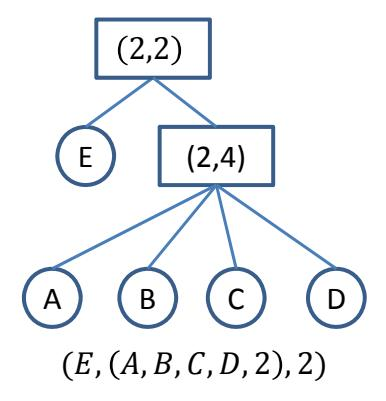
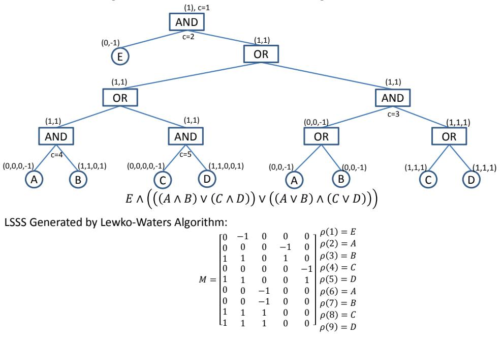
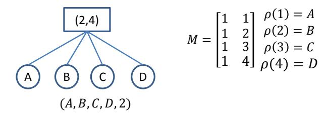
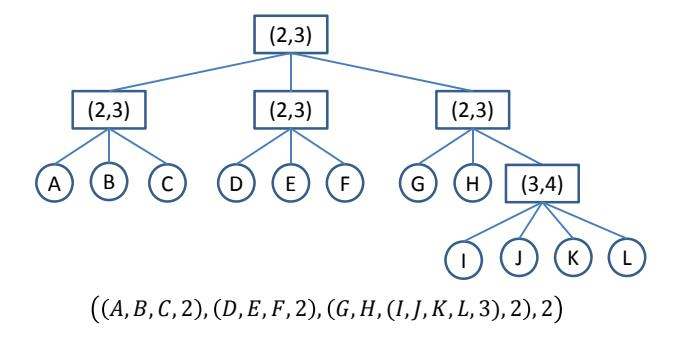
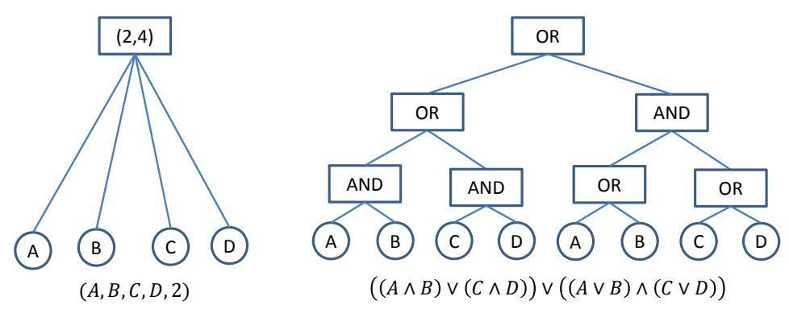
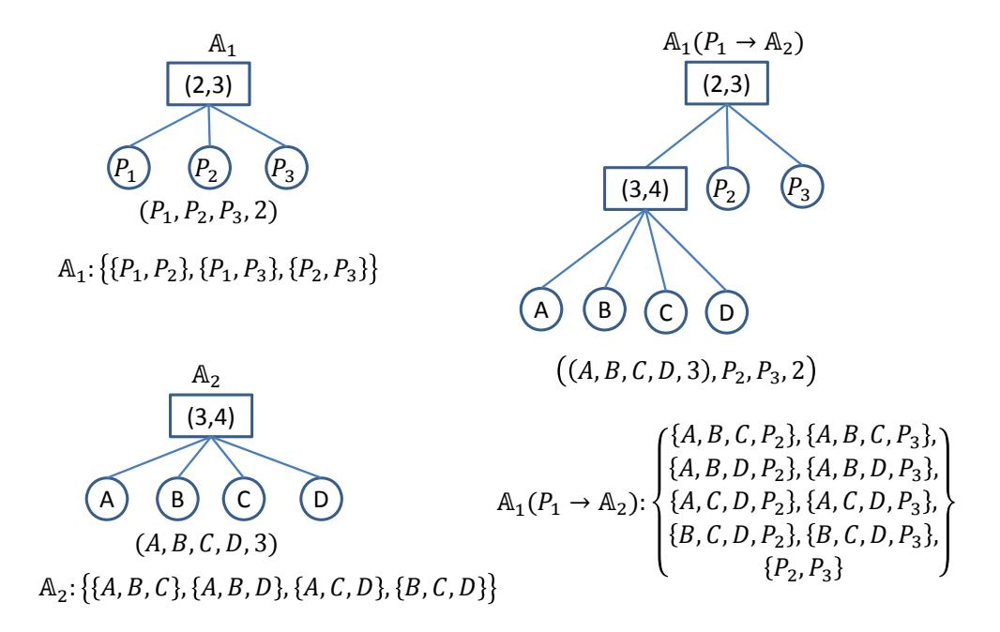

#### 1

# Efficient Generation of Linear Secret Sharing Scheme Matrices from Threshold Access Trees

Zhen Liu, Zhenfu Cao, and Duncan S. Wong

#### Abstract

Linear Secret Sharing Scheme (LSSS) matrices are commonly used for implementing monotone access structures in highly expressive Ciphertext-Policy Attribute-Based Encryption (CP-ABE) schemes. However, LSSS matrices are much less intuitive to use when compared with other approaches such as boolean formulas or access trees. To bridge the gap between the usability of an access structure representation method and the implementation technique required in a concrete CP-ABE construction, Lewko and Waters proposed an algorithm which can convert any monotone boolean formulas to LSSS matrices. This algorithm is very useful in practice as a ciphertext policy can now be intuitively expressed using a monotone boolean formula, which has good usability, and the corresponding LSSS for an actual CP-ABE construction can then be generated accordingly using this algorithm. However, in this algorithm, the non-leaf nodes of a monotone boolean formula, when viewed as an access tree, can only be AND or OR gates. For general monotone access structures, for example, in a (t, n)-threshold access tree, the threshold gates of the tree have to be converted to AND and OR gates before we can apply the algorithm on this access tree. This results in generating a large LSSS matrix, and entailing a large CP-ABE ciphertext. To address this problem, in this paper, we propose a new algorithm which, in addition to AND and OR gates, can directly support threshold gates, and obtain much smaller LSSS matrices (or the same in the worst case when only AND and OR gates exist). This will particularly be useful for reducing the size of all ciphertexts with policies in the typical (t, n)-threshold type. Furthermore, as AND and OR gates are the special cases of the general (t, n)-threshold gates, not only an optimization, but also is this new algorithm a generalization of the Lewko-Waters algorithm.

#### Index Terms

Attribute-Based Encryption, Access Policy, Monotone Access Structure, Linear Secret Sharing Scheme.

Z. Liu (zhenliu7-c@my.cityu.edu.hk) and D. S. Wong (duncanwong@astri.org) are with the Security and Data Sciences, ASTRI, and Z. Cao (zfcao@sei.ecnu.edu.cn) is with East China Normal University. Part of the work was done when Z. Liu was jointly affiliated to Shanghai Jiao Tong University and City University of Hong Kong in 2012 and 2013.

# I. INTRODUCTION

In a Ciphertext-Policy Attribute-Based Encryption (CP-ABE) system [1], a ciphertext is generated by encrypting a message under an *access policy*, which is defined over attributes. The ciphertext can only be decrypted by users whose attributes satisfy the policy of the ciphertext. This is done by an authority who issues a decryption key to each user in the system according to the attributes the user possesses. As an illustration of this ciphertext access policy, suppose Alice is a secretary, who encrypts a message under a ciphertext policy denoted as "(Mathematics AND (PhD Student OR Alumni))", where "Mathematics", "PhD student" and "Alumni" are *attributes*. In order to decrypt the message, a receiver should have a decryption key corresponding to attributes which satisfy this access policy, for example, all PhD students and alumni in the Department of Mathematics. The set of eligible receivers is dynamic and Alice does not need to know the exact identities of the eligible receivers.

One of the main objectives of CP-ABE is to allow users to implement fine-grained access control on their data in encrypted form. For applications related to access control, such as secure cloud storage access and sharing, enabling fine-grained access control is the appealing advantage of CP-ABE over traditional user-specific encryption systems, which include the conventional public key encryption [2]– [4], identity-based encryption [5], [6], and broadcast encryption [7], [8].

CP-ABE has attracted great attention in the research community, with a series of work being done recently [9]–[20]. In provably secure CP-ABE schemes currently available for highly expressive access policies (i.e. supporting any monotone access structures), including [12]–[20], a Linear Secret Sharing Scheme (LSSS) matrix (M, ρ) is included in each ciphertext, where M is a matrix over Z<sup>p</sup> and ρ maps each row of M to an attribute<sup>1</sup> . This LSSS matrix is used for specifying and enforcing the access policy of the ciphertext, and as shown in [21], LSSS matrices can realize any monotone access structures. Also worth noticing is that in all the highly expressive CP-ABE schemes [12]–[20], *the ciphertext size is linear in the size of the associated LSSS matrix (i.e. the number of rows of* M*)*.

However, expressing monotone access structures in LSSS matrices is not obvious. It is also difficult to use and hard to comprehend when an access policy is expressed as an LSSS matrix. In practice, it is more intuitive and preferred if access policies are expressed in boolean formulas, access trees, or access structures themselves. To illustrate this, suppose we have an LSSS matrix given in Fig. 1. This LSSS matrix is representing an access policy, while it is obscure for everybody who is not an expert in

<sup>1</sup>M in [12], [14], [19] is on Zp, while M in [13], [15]–[18], [20] is on Z<sup>N</sup> , where p is a large prime related to the system security parameter and N is the product of three large primes whose size is related to the system security parameter.

$$M = \begin{bmatrix} 1 & 1 & 0 \\ 1 & 2 & 1 \\ 1 & 2 & 2 \\ 1 & 2 & 3 \\ 1 & 2 & 4 \end{bmatrix} \begin{array}{l} \rho(1) = E \\ \rho(2) = A \\ \rho(3) = B \\ \rho(4) = C \\ \rho(5) = D \end{array}$$

Fig. 1. An LSSS example  $(M, \rho)$ . M is a matrix and  $\rho$  maps the 1st, 2nd, 3rd, 4th and 5th row of M to attributes E, A, B, C and D respectively. Given an attribute set S, if and only if the rows of M labeled by the attributes in S include the vector  $(1, 0, \ldots, 0)$  in their span, the LSSS is said to be satisfied by S.



Fig. 2. A Threshold-gate access tree. Each non-leaf node is a threshold gate and each leaf is an attribute. Given an attribute set S, for a leaf node, if the associated attribute is in S, the leaf node is said to be satisfied by S. For a (t,n)-threshold node where n is the number of children and  $1 \le t \le n$  a threshold value, if and only if at least t child nodes are satisfied, the threshold node is said to be satisfied. If and only if the root node of the access tree is satisfied, the access tree is said to be satisfied by S. Also note that when t = 1, a (t, n)-threshold gate is an OR gate and when t = n, it is an AND gate.

LSSS. The LSSS matrix represents an access policy that "an eligible user should have attribute E and in addition, at least two more attributes in  $\{A,B,C,D\}$ ". It can be expressed in a more comprehensible way, for example,  $E \wedge ((A \wedge B) \vee (A \wedge C) \vee (A \wedge D) \vee (B \wedge C) \vee (B \wedge D) \vee (C \wedge D))$ , which is a boolean formula, or an access tree, namely (E,(A,B,C,D,2),2), as shown in Fig. 2, where each interior (i.e. non-leaf) node of the tree is a threshold gate and the leaf nodes are attributes.

From the example above, we can see that there is a gap between the usability of an access policy representation method and the actual implementation technique (i.e. LSSS) used for realizing ciphertext policies in a concrete CP-ABE construction supporting highly expressive access policies (i.e. any monotone access structures). Ordinary users prefer using boolean formulas or access trees to represent policies

while the aforementioned provably secure and highly expressive CP-ABE schemes, such as [12]–[20], require LSSS to specify and enforce the policies in ciphertexts. General methods for constructing secret sharing schemes from monotone access structures can be found in [22], and basic techniques have been provided, however, specific implementation and concrete construction details from any (t, n)-threshold gate of an access tree to an LSSS matrix are yet to be elaborated. To address this problem, in [23, Appendix G]<sup>2</sup> , Lewko and Waters proposed a detailed algorithm which converts any monotone boolean formulas<sup>3</sup> to the corresponding LSSS matrices.

## *A. The Lewko-Waters Algorithm*

The input of the algorithm [23, Appendix G] is an access tree, which represents a monotone boolean formula. The tree's non-leaf nodes are AND and OR gates and leaf nodes are attributes. The output of the algorithm is the corresponding LSSS, whose size (i.e. the number of rows) is equal to the number of leaf nodes of the input access tree. Using the access policy "an eligible user should have attribute E and in addition, at least two more attributes in {A, B, C, D}" as an example, where the boolean formula form is E ∧ ((A ∧ B) ∨ (A ∧ C) ∨ (A ∧ D) ∨ (B ∧ C) ∨ (B ∧ D) ∨ (C ∧ D)), Fig. 3 shows the details of the algorithm.

Before applying the algorithm, we may first transform the monotone boolean formula to an equivalent but shorter one, namely, E ∧ (((A ∧ B) ∨ (C ∧ D)) ∨ ((A ∨ B) ∧ (C ∨ D))). This transformation is desirable, as will be illustrated later, that the size of the resulting LSSS is equal to the number of leaf nodes of the access tree, and the resulting LSSS will be smaller. As shown in Fig. 3, the Lewko-Waters algorithm takes the access tree representation of this transformed boolean formula as input, then labels the root node of the tree with vector (1) (a vector of length 1) and initializes a global counter c to 1. Then it goes down the tree, and labels the nodes as follows:

- 1) if the parent node is an OR gate labeled with a vector v, the algorithm labels both child nodes as v and keeps the counter c unchanged;
- 2) if the parent node is an AND gate labeled with a vector v, the algorithm pads v with 0's at the end (if necessary) to make it of length c, then the algorithm labels its right child node with the vector vk1 (where k denotes concatenation) and the left child node with the vector (0, . . . , 0)k-1, where (0, . . . , 0) is of length c, and increases the value of c by 1.

<sup>[23]</sup> is the full version of [15].

<sup>3</sup> Informally, "monotone" means that there is no NOT.

ܦ∨ܥ ∧ ܤ∨ܣ ∨ ܦ∧ܥ ∨ ܤ∧ܣ ∧ ܧ:Formula Boolean) Compressed but Equivalent( ܦ∧ܥ ∨ ܦ∧ܤ ∨ ܥ∧ܤ ∨ ܦ∧ܣ ∨ ܥ∧ܣ ∨ ܤ∧ܣ ∧ ܧ:Formula Boolean Run Lewko‐Waters Algorithm on the Access Tree with AND‐OR gates:



Fig. 3. Use Lewko-Waters algorithm to generate an LSSS for access policy "an eligible user should have attribute E and in addition, at least two more attributes in {A, B, C, D}".

Once the algorithm finishes labeling the tree, the vectors labeled on the leaf nodes constitute the rows of an LSSS matrix, and if the vectors have different lengths, the algorithm pads the shorter ones with 0's at the end until all the them are of the same length. Note that a set of the rows of the resulting matrix includes (1, 0, . . . , 0) in its span if and only if the attributes corresponding to the rows in the set satisfy the input access tree.

The Lewko-Waters algorithm requires each of the non-leaf nodes of an access tree to be either an AND gate or an OR gate. Although this is *sufficient* for expressing any monotone access structures, it may not always be efficient. Consider a typical (t, n)-threshold type access structure. To generate the corresponding LSSS from the Lewko-Waters algorithm, we first need to convert the access structure to an access tree containing AND and OR gates only. This requires us to convert each of the (t, n)-threshold gates in the access structure to a tree branch containing AND and OR nodes only, resulting in a larger LSSS matrix than a version which is generated directly from the (t, n)-threshold gates that our algorithm, which is proposed later in this paper, can support. When this (t, n)-threshold type access structure is a

ciphertext policy in a CP-ABE scheme, the result of applying the Lewko-Waters algorithm will incur a bigger ciphertext when compared with the one obtained from the new LSSS generation algorithm that we will propose.

Threshold policies, for example, the Majority Policy, namely (bn/2c+ 1, n)-threshold, are common in practice. Given a (t, n)-threshold policy, 1 ≤ t ≤ n, before applying the Lewko-Waters algorithm, we first need to represent the threshold policy into a boolean formula so that it can be viewed as an AND-OR-gate access tree as exemplified in Fig. 3. For simplicity, if an access tree's non-leaf nodes can only be AND and OR gates, we refer to it as an AND-OR-gate access tree, and if the non-leaf nodes can also be any threshold gates, we refer to the access tree as a Threshold-gate access tree. In the following, we discuss several important aspects regarding the efficiency and applicability related issues of the Lewko-Waters algorithm particularly for threshold policies.

- 1) As the size of a generated LSSS matrix from the Lewko-Waters algorithm is equal to the number of leaf nodes of the input access tree, and the ciphertext size in a highly expressive (LSSS-based) CP-ABE scheme [12]–[20] is linear in the size of LSSS, before applying the Lewko-Waters algorithm to an AND-OR-gate access tree, we may try to optimize the tree so that it contains *fewer* leaf nodes (Fig. 3). This, however, is a challenging and expensive optimization problem. In [24, Chapter 8], it is shown that (1) it is easy to design an optimal monotone boolean formula with size n log n for a (2, n)-threshold policy, but it is much harder to design an optimal monotone boolean formula for a (t, n)-threshold policy if t > 2; (2) given a (t, n)-threshold policy, an equivalent monotone boolean formula of size c · n log n can be built in polynomial time. However, c is often large (though it is possible to reduce c by some further complicated manipulations); and (3) it is generally hard to design an asymptotically optimal monotone boolean formula for a general (t, n)-threshold policy.
- 2) Given a (t, n)-threshold policy, if there exists a preprocessing algorithm which can generate the corresponding optimal monotone boolean formula with size c · n log n as outlined above, and we ignore the possibly expensive computational cost of this preprocessing, the resulting LSSS matrix generated by the Lewko-Waters algorithm will be of size c · n log n. However, a smaller and equivalent LSSS matrix of size n can readily be built from the (t, n)-threshold policy [25] (later in this paper we will describe such an LSSS in detail). In other words, applying Lewko-Waters algorithm on a (t, n)-threshold ciphertext policy for a highly expressive CP-ABE scheme will make the ciphertext size c · log n times larger. For example, consider a (2, 4)-threshold policy over attributes {A, B, C, D}. The possibly smallest size of the corresponding boolean formula is



Fig. 4. A Threshold-gate access tree and an equivalent LSSS



Fig. 5. Example of a general Threshold-gate access tree

 $n \log n = 8$ , that is,  $((A \wedge B) \vee (C \wedge D)) \vee ((A \vee B) \wedge (C \vee D))$ . Taking this minimized boolean formula as input, Lewko-Waters algorithm will output an LSSS with size 8. However, as shown in Fig. 4, we can build an equivalent LSSS of size 4 from the same (2,4)-threshold policy.

3) If the original ciphertext policy is a general Threshold-gate access tree which may have multiple levels of (t,n)-threshold gates (for example, such as the one in Fig. 5), to the best of our knowledge, there is no efficient method for obtaining an optimal boolean formula. Also the corresponding boolean formula size is always larger than the number of leaf nodes in a Threshold-gate access tree.

#### B. Our Results

In this paper we propose a new LSSS generation algorithm which converts any general Threshold-gate access trees to their equivalent LSSS matrices. The non-leaf nodes of an access tree at the algorithm input can also be (t, n)-threshold gates, so that no more conversion to an AND-OR-gate access tree is required, in contrast to what the Lewko-Waters algorithm requires. Furthermore, the AND and OR gates are also supported directly without degrading the efficiency as they are the special cases of the (t, n)-threshold gates, where t = n and t = 1, respectively. Below are the main merits of this new algorithm.

- 1) This new algorithm is more general and covers the Lewko-Waters algorithm. For any monotone boolean formula (i.e. any AND-OR-gate access tree) that Lewko-Waters algorithm supports, we convert it to a Threshold-gate access tree first. This is done by replacing AND and OR gates with (2, 2)-threshold and (1, 2)-threshold gates, respectively (while keeping the other parts of the access tree unchanged). Then we apply the new algorithm on the Threshold-gate access tree. Note that the leaf nodes remain unchanged, and hence the size of the resulting LSSS will be the same as that of the LSSS generated by the Lewko-Waters algorithm.
- 2) The new algorithm is more efficient than Lewko-Waters algorithm on general (t, n)-threshold policies. Without incurring any possibly expensive preprocessing overhead, which is needed when applying Lewko-Waters algorithm, this new algorithm can be applied directly on Threshold-gate access trees. Furthermore and more importantly, applying this new algorithm can obtain LSSS with smaller size. This implies smaller ciphertext size in highly expressive CP-ABE schemes [12]–[20]. In particular, for a single (2, n)-threshold policy, the new algorithm can generate an LSSS with size n, while Lewko-Waters algorithm generates an LSSS with size at least n log n. Besides, for a single (t, n)-threshold policy with 2 < t < n, the new algorithm can generate an LSSS with size n, while Lewko-Waters algorithm generates an LSSS with size c · n log n for a possibly large c; for a general Threshold-gate access tree with multiple levels of general (t, n)-threshold gates, the new algorithm can have even more advantages on generating LSSS with smaller size, although it is yet to come up with methods for estimating the order of performance optimization.

In addition, the new algorithm has the following desirable features:

- 1) As the Threshold-gate access tree is a more general, efficient and intuitive form to describe an access policy than a boolean formula does, the new algorithm is helpful to the applicability of CP-ABE in practice, especially on describing complicated (and highly expressive) ciphertext policies. The new algorithm allows an encryptor to directly use a natural and intuitive Threshold-gate access tree to specify a ciphertext policy without requiring any expensive preprocessing.
- 2) Existing optimization algorithms applied to boolean formulas for obtaining equivalent ones with smaller/optimal size before invoking the Lewko-Waters algorithm can continue be applied before invoking this new algorithm. This follows the fact that the Threshold-gate access trees are the generalization of the AND-OR-gate access trees. In addition to this, some other optimization algorithms, for example, the one proposed in [26], which allows a complex access structure to be realized by *possibly the fewest* number of threshold gates, can also be applied. Given an access

policy which is in the form of neither a Threshold-gate access tree nor a boolean formula, we can run the optimization algorithm in [26] for obtaining threshold gates, and then build a Threshold-gate access tree by linking all the threshold gates together using a (1, n)-threshold gate. The resulting Threshold-gate access tree will have two levels of threshold nodes and one level of leaf nodes. This Threshold-gate access tree will finally be passed to this new algorithm for generating a small LSSS. As a summary, this new algorithm can be used in the following fashion depending on how the access policy is originally specified: (1) if the original access policy is not specified in the form of a Threshold-gate access tree, we can apply some existing optimization algorithms for covering to a Threshold-gate access tree and optimizing its size; and (2) if the original access policy is already specified as a Threshold-gate access tree (e.g. Fig. 5), we can apply the new algorithm directly on it.

3) Specific to CP-ABE, this new algorithm is designed such that when applied to a highly expressive CP-ABE scheme, the algorithm can help reduce the overhead size for describing the policy of a ciphertext. In a highly expressive CP-ABE scheme [12]–[20], a ciphertext policy is specified as an LSSS matrix (M, ρ). As M is a matrix over Z<sup>p</sup> where p is a large prime, the overhead due to (M, ρ) could be large. In this new algorithm, both M and ρ can be completely determined by a formatted string that describes the Threshold-gate access tree, and no extra strings are needed. Also, this formatted string consists of only attributes and several special symbols with size being approximately equal to that of ρ. As a result, the overhead for describing the ciphertext policy can be reduced as there is no need to specifically describe M.

*Paper Organization.* In the next section, we review some related notions and theoretical preliminaries. In Sec. III we outline our ideas, and in Sec. IV, we describe the new algorithm and its use in CP-ABE. Finally, we conclude the paper in Sec. V.

# II. BACKGROUND

## *A. Attribute-Based Encryption*

Sahai and Waters [27] introduced the concept of Attribute-Based Encryption (ABE) in 2005 when working on fuzzy Identity-Based Encryption. In their work, each user's private key is described by an attribute set and each ciphertext is encrypted under an attribute set as well. For a private key with attribute set w, to decrypt a ciphertext encrypted under an attribute set w 0 , if and only if w and w 0 are close to each other as measured by the "set overlap distance metric" (i.e. |w ∩ w 0 | ≥ d for some threshold value d), the decryption will succeed. In other words, this is an ABE scheme supporting threshold policies.

In 2006, Goyal et al. [1] formalized Key-Policy ABE (KP-ABE) and Ciphertext-Policy ABE (CP-ABE). In CP-ABE, each user's private key is associated with an attribute set issued by an authority, and each ciphertext is associated with an access policy specified by the encryptor. The policy determines what users are eligible to decrypt the ciphertext. In KP-ABE, each user's private key is associated with an access policy issued by an authority. The policy determines what ciphertexts that the user is eligible to decrypt, where each ciphertext is described by an attribute set. Though we focus on CP-ABE in this paper, it is worth mentioning that KP-ABE also have many applications, such as pay-TV and audit-log [1]. Among recently proposed KP-ABE schemes [1], [14], [28]–[31], some highly expressive ones (e.g. [14], [29], [31]) also use LSSS to specify the access policies for private keys.

## *B. Access Policies and Realizations*

An access policy can be described as an *access structure* which can be realized by a *secret sharing scheme*. In the following, we review their definitions.

Definition 1 (Access Structure [21]). *Let* P = {P1, P2, . . . , Pn} *be a set of parties. A collection* A ⊆ 2 {P1,P2,...,Pn} *is monotone if for any* B *and* C*: if* B ∈ A and B ⊆ C then C ∈ A*. An access structure (respectively, monotone access structure) is a collection (respectively, monotone collection)* A *of nonempty subsets of* {P1, P2, . . . , Pn}*, i.e.,* A ⊆ 2 {P1,P2,...,Pn} \ {∅}*. The sets in* A *are called the authorized sets, and the sets not in* A *are called the unauthorized sets.*

In an ABE system, the role of the parties is defined by attributes. An access structure A in ABE contains the authorized sets of attributes. Unless otherwise stated, by an access structure we mean a monotone access structure for the rest of this paper. As shown in [21], any monotone access structure can be realized by a linear secret sharing scheme. Below we use the definition from [12], [21].

Definition 2 (Linear Secret-Sharing Schemes (LSSS) [12]). *A secret sharing scheme* Π *over a set of parties* P *is called linear (over* Zp*) if*

- 1) *the shares for each party form a vector over* Zp*, and*
- 2) *there exists a matrix* M *called the share-generating matrix for* Π*. The matrix* M *has* m *rows and* d *columns. For* i = 1, . . . , m*, the* i th *row* M<sup>i</sup> *of* M *is labeled by a party* ρ(i) *where* ρ *is a function from* {1, . . . , m} *to* P*. Given a column vector* ~v = (s, r2, . . . , rd)*, where* s ∈ Z<sup>p</sup> *is the secret to be shared and* r2, . . . , r<sup>d</sup> ∈ Z<sup>p</sup> *are randomly chosen,* M~v *is the vector of* m *shares of the secret* s *according to* Π*. The share* λ<sup>i</sup> = (M~v)<sup>i</sup> *, i.e., the inner product* M<sup>i</sup> · ~v*, belongs to party* ρ(i)*.*

Also as shown in [21], any LSSS defined as above enjoys the linear reconstruction property defined as follows. Suppose that Π is an LSSS for access structure A. Let S ∈ A be an authorized set, and I ⊂ {1, . . . , m} be defined as I = {i : ρ(i) ∈ S}. There exist constants {ω<sup>i</sup> ∈ Zp}i∈<sup>I</sup> satisfying P <sup>i</sup>∈<sup>I</sup> ωiM<sup>i</sup> = (1, 0, . . . , 0), so that if {λi} are valid shares of any secret s according to Π, then P <sup>i</sup>∈<sup>I</sup> ωiλ<sup>i</sup> = s. Furthermore, these constants {ωi} can be found in time polynomial in the size of the share-generating matrix M. For any unauthorized set, no such constants exist. The LSSS is denoted by (M, ρ), and its size is the number of rows of M, that is, m.

In the highly expressive CP-ABE schemes mentioned above [12]–[20], each ciphertext is associated with an LSSS (M, ρ) as its access policy, and the ciphertext size is linear in the size of (M, ρ). In the highly expressive KP-ABE schemes [14], [29], each private key is associated with an LSSS (M, ρ), and the private key size is linear in the size of (M, ρ).

# *C. Different Forms for Describing Access Policies*

Besides the theoretical way of describing access policies using access structures, there are several more practical and efficient ways for describing policies. They are efficient because they can eliminate the redundancies as usually found in conventional access structures. Fig. 6 shows the different forms for describing a (2, 4)-threshold policy over the universe P = {A, B, C, D}. They include the minimal form access structure, the boolean formula and two types of access trees.

Minimal Form Access Structures. Due to the monotonicity, a monotone access structure A can be efficiently described by a set A <sup>−</sup>, which consists of the *minimal elements (sets)* in A, i.e., the elements in A for which no proper subset is also in A. Given A <sup>−</sup>, A can be determined as follows. For any attribute set S ⊆ P, if and only if there exists some set A ∈ A <sup>−</sup> such that S ⊇ A, S is an authorized set (i.e., S ∈ A, or S satisfies A). We refer to A <sup>−</sup> as the *minimal form* of A. Note that each minimal set in A <sup>−</sup> represents a distinct series of authorized sets in A, i.e., suppose A <sup>−</sup> = {A1, . . . , An<sup>A</sup> } and A<sup>n</sup> = {S | S ⊇ An} for 1 ≤ n ≤ nA, we have A = S 1≤n≤n<sup>A</sup> An, and An<sup>1</sup> 6= An<sup>2</sup> for 1 ≤ n<sup>1</sup> 6= n<sup>2</sup> ≤ nA. Obviously, it is more efficient to use the minimal form to describe an access policy rather than the access structure itself which may contain many redundancies.

Montone Boolean Formulas. When compared with minimal form access structure, a monotone boolean formula is more general and efficient for describing the same access policy, where a monotone boolean formula is a boolean formula without NOT. For any minimal form monotone access structure, say A <sup>−</sup> = {A1, . . . , An<sup>A</sup> }, an equivalent monotone boolean formula, say F<sup>A</sup> = W 1≤n≤n<sup>A</sup> ( V x∈A<sup>n</sup> x) can be

, ܦ,ܥ , ܦ ,ܤ , ܥ ,ܤ , ܦ ,ܣ , ܥ ,ܣ , ܤ ,ܣ :Structure Access ܦ ,ܥ ,ܤ ,ܣ , ܦ,ܥ ,ܤ , ܦ ,ܥ ,ܣ , ܦ ,ܤ ,ܣ , ܥ ,ܤ ,ܣ

ܦ,ܥ , ܦ,ܤ , ܥ ,ܤ , ܦ ,ܣ , ܥ ,ܣ , ܤ ,ܣ :Form Minimal in Structure Access

ܦ∨ܥ ∧ ܤ∨ܣ ∨ ܦ∧ܥ ∨ ܤ∧ܣ :Formula Boolean

Access Tree with Threshold Gates:

Access Tree with AND‐OR Gates:



Fig. 6. Different forms for describing a (2, 4)-threshold policy over the universe {A, B, C, D}

compressed and simplified further to obtain a version with smaller size, e.g, (A∧B)∨(A∧C) = A∧(B∨C) (as shown in Fig. 6). On the other side, if we already have a monotone boolean formula which describes an access policy, and want to transform it to an equivalent minimal form access structure, we need to first convert the boolean formula to an equivalent DNF, whose size may be larger than the original boolean formula.

Monotone Access Trees. On a monotone access tree, each leaf node corresponds to an attribute, and each non-leaf node represents a threshold gate, which is described by its children and a threshold value. This is generally termed as Threshold-gate access tree while a AND-OR-gate access tree (detailed below) is a special case of the Threshold-gate access tree. Whether an attribute set S satisfies a monotone access tree is determined as follows. For a leaf node, if the corresponding attribute appears in S, the leaf node is said to be satisfied. For a (t, n)-threshold gate where n is the number of its children and 1 ≤ t ≤ n is the threshold value, if and only if at least its t (out of n) child nodes are satisfied, the (t, n)-threshold node is satisfied. If and only if the root node of the access tree is satisfied, the access tree is said to be satisfied by S. For a (t, n)-threshold gate, when t = 1, the threshold gate is an OR gate and when t = n, it is an AND gate. Hence, an AND-gate can be expressed as an (n, n)-Thresholdgate, and an OR-gate can be expressed as a (1, n)-Threshold-gate, but reversely to express a general

(t, n)-threshold gate where 1 < t < n, multiple AND and OR gates have to be used. As a result, for an AND-OR-gate access tree, we can replace all the AND and OR gates on the tree with (n, n)- and (1, n)-threshold gates, respectively, and obtain a Threshold-gate access tree with the same number of leaf nodes. However, conversely for a Threshold-gate access tree, once general (t, n)-threshold gates with 1 < t < n are involved, an equivalent AND-OR-gate access tree will have more leaf nodes than the original Threshold-gate access tree. Also note that an AND-OR-gate access tree is the same as an equivalent monotone boolean formula in terms of generality and efficiency, where AND gate corresponds to ∧ and OR gate to ∨.

Efficiency of These Different Forms. The expressivity of minimal form access structure, monotone boolean formula, Threshold-gate access tree and AND-OR-gate access tree are equivalent. If we use A > B (reps. A ≡ B) to represent that form A is more efficient than form B (resp. form A is equally efficient to form B), we have the following relationships.

Threshold-gate access tree > AND-OR-gate access tree

AND-OR-gate access tree ≡ monotone boolean formula

monotone boolean formula > (minimal form) access structure

As a summary of the above, we have the following facts.

- 1) Any monotone access structure can be described and determined by an equivalent minimal form access structure.
- 2) Any minimal form access structure can be written to an equivalent monotone boolean formula, i.e. a DNF.
- 3) Any monotone boolean formula can be illustrated as an AND-OR-gate access tree with the number of leaf nodes being equal to the size of the boolean formula.
- 4) Any AND-OR-gate access tree is a special case of a Threshold-gate access tree with the same number of leaf nodes.

Fig. 6 is also an example that Threshold-gate access tree is the most general and efficient form. When access policies are more complicated, the advantage of using Threshold-gate access trees (e.g. Fig. 5) is becoming more apparent and significant.

## *D. The Insertion of Access Structure*

The LSSS defined in Section II-B is induced from a linear algebra model of computation called *Monotone Span Program* (MSP), which was introduced by Karchmer and Widgerson [25] for computing



Fig. 7. The insertion of access structure

access structures. LSSS are in one-to-one correspondence with MSPs [21]. In the following, we review the work of Nikov and Nikova [32] which will later be modified and applied to the construction of our new algorithm.

Definition 3 (The Insertion of Access Structure [32]). *Let* A<sup>1</sup> *and* A<sup>2</sup> *be two monotone access structures on participant sets* P<sup>1</sup> *and* P2*, respectively, and let* P<sup>z</sup> ∈ P1*. Define "the insertion of* A<sup>2</sup> *at participant* P<sup>z</sup> *in* A1*", denoted by* A1(P<sup>z</sup> → A2)*, as a monotone access structure on the set* (P<sup>1</sup> \ {Pz}) ∪ P<sup>2</sup> *such that for* G ⊆ (P<sup>1</sup> \ {Pz}) ∪ P<sup>2</sup> *we have*

$$G \in \mathbb{A}_1(P_z \to \mathbb{A}_2) \iff \begin{cases} (G \cap \mathcal{P}_1 \in \mathbb{A}_1), & or \\ ((G \cap \mathcal{P}_1) \cup \{P_z\} \in \mathbb{A}_1 \text{ and } G \cap \mathcal{P}_2 \in \mathbb{A}_2). \end{cases}$$

*In other words,* A1(P<sup>z</sup> → A2) *is the monotone access structure* A<sup>1</sup> *with participant* P<sup>z</sup> *"replaced" by the sets of* A2*.*

Fig. 7 shows an example of A1(P<sup>1</sup> → A2), where A<sup>1</sup> is a (2, 3)-threshold policy on {P1, P2, P3} and A<sup>2</sup> is a (3, 4)-threshold policy on {A, B, C, D}. To obtain a Threshold-gate access tree for A1(P<sup>z</sup> → A2), we simply need to replace the leaf node corresponding to P<sup>z</sup> in the access tree for A<sup>1</sup> with the access tree for A2. In the example illustrated in Fig. 7, such as a hierarchical organization, to satisfy A1, at least two of  $\{P_1, P_2, P_3\}$  have to be present, and the privilege of  $P_1$  may be distributed to a lower level so that only if at least three out of  $\{A, B, C, D\}$  are present, can they achieve the privilege of  $P_1$ .

**Theorem 1.** [32] Let  $\mathbb{A}_1$  and  $\mathbb{A}_2$  be monotone access structures defined on participant sets  $\mathcal{P}_1$  and  $\mathcal{P}_2$ , realized by LSSS  $(M^{(1)}, \rho^{(1)})$  of size  $m_1$  and  $(M^{(2)}, \rho^{(2)})$  of size  $m_2$ , respectively. Let  $P_z \in \mathcal{P}_1$ . There exists an LSSS  $(M, \rho)$  of size  $m_1 + (m_2 - 1)q$  realizing the access structure  $\mathbb{A}_1(P_z \to \mathbb{A}_2)$ , where q is the number of rows labeled by  $P_z$  in  $(M^{(1)}, \rho^{(1)})$ .

The construction of LSSS  $(M,\rho)$  is given as follows [32]: Let  $M^{(1)}=\begin{pmatrix} M_{P_z}^{(1)} \\ \overline{M}^{(1)} \end{pmatrix}$  and  $M^{(2)}=\begin{pmatrix} \overrightarrow{u}^{(2)} & \widetilde{M}^{(2)} \end{pmatrix}$  be  $m_1 \times d_1$  and  $m_2 \times d_2$  matrices, respectively, where  $M_{P_z}^{(1)}$  are the q rows labeled by  $P_z$

and  $\vec{u}^{(2)}$  is the first column, assuming that the rows of  $P_z$  are the first rows in  $M^{(1)}$ . Let  $M_{P_z}^{(1)} = \begin{pmatrix} v_1 \\ \vec{v}_2 \\ \vdots \\ \vec{v}_q \end{pmatrix}$ ,

$$\vec{u}^{(2)} = \begin{pmatrix} u_1 \\ u_2 \\ \vdots \\ u_{m_2} \end{pmatrix}, \text{ and define } \vec{v}_i \otimes \vec{u}^{(2)} = \begin{pmatrix} u_1 \vec{v}_i \\ u_2 \vec{v}_i \\ \vdots \\ u_{m_2} \vec{v}_i \end{pmatrix}, \text{ where } \vec{v}_i \ (i=1,\ldots,q) \text{ are row vectors in } \mathbb{Z}_p^{d_1}$$

and  $u_j \in \mathbb{Z}_p$   $(j = 1, \dots, m_2)$ . Note that  $\vec{v_i} \otimes \vec{u}^{(2)}$  is an  $m_2 \times d_1$  matrix. Using  $\mathbf{0}$  to denote all-zero

$$\text{matrices, let } M = \begin{pmatrix} \vec{v}_1 \otimes \vec{u}^{(2)} & \widetilde{M}^{(2)} & \mathbf{0} & \cdots & \mathbf{0} \\ \vec{v}_2 \otimes \vec{u}^{(2)} & \mathbf{0} & \widetilde{M}^{(2)} & \ddots & \vdots \\ \vdots & \vdots & \ddots & \ddots & \mathbf{0} \\ \vec{v}_q \otimes \vec{u}^{(2)} & \mathbf{0} & \cdots & \mathbf{0} & \widetilde{M}^{(2)} \\ \overline{M}^{(1)} & \mathbf{0} & \cdots & \mathbf{0} & \mathbf{0} \end{pmatrix}, \text{ the rows of } \begin{pmatrix} \overline{M}^{(1)} & \mathbf{0} \end{pmatrix} \text{ are labeled as }$$

the corresponding rows of  $\overline{M}^{(1)}$  in  $(M^{(1)}, \rho^{(1)})$ . For i=1 to q, the rows of  $(v_i \otimes \vec{u}^{(2)} \setminus \mathbf{0})$  are labeled as the corresponding rows of  $\widetilde{M}^{(2)}$  in  $(M^{(2)}, \rho^{(2)})$ . Then M computes the access structure  $\mathbb{A}_1(P_z \to \mathbb{A}_2)$ , and it is an  $(m_1 + (m_2 - 1)q) \times (d_1 + (d_2 - 1)q)$  matrix. We refer readers to [32] for the proof.

#### III. OUR APPROACH - FROM THRESHOLD-GATE ACCESS TREES TO LSSS MATRICES

We now describe our method to construct an LSSS matrix from a Threshold-gate access tree. Inspired by Theorem 1, we repeatedly carry out the "insertion" operation on two Threshold access structures,

and our ideas can be outlined as follows: (1) for a single (t, n)-threshold gate, find its LSSS matrix; (2) repeatedly perform the "insertion" of Threshold-gate access trees according to the structure of the input Threshold-gate access tree; and (3) use a formatted string to describe the input Threshold-gate access tree and design an algorithm which can output (M, ρ) based on the formatted string alone.

# *A. Recursive-Form Strings*

Recall that in a Threshold-gate access tree, each leaf node corresponds to an attribute, and each nonleaf node is a threshold gate, described by its children and a threshold value. A Threshold-gate access tree can naturally be described using a recursive-form string as follows.

- 1) Without loss of generality, we assume the symbols "(", "," and ")" are not in the attribute universe, where "()" will be used to define non-leaf nodes and "," will work as separator to separate the child nodes of each non-leaf node.
- 2) A Threshold-gate access tree A is described by a string that describes its root node. In particular, suppose that the root node is a (t, n)-threshold gate, the access tree can then be described by a string (F1, F2, . . . , Fn, t) where t is the threshold value and F<sup>i</sup> (1 ≤ i ≤ n) represents the children of the root node.
- 3) F<sup>i</sup> is an attribute corresponding to a leaf node, or a non-leaf node described by its children and a threshold value, i.e. F<sup>i</sup> = (Fi,1, Fi,2, . . . , Fi,n<sup>i</sup> , ti), where Fi,1, Fi,2, . . . , Fi,n<sup>i</sup> represent the n<sup>i</sup> children of F<sup>i</sup> and t<sup>i</sup> is a threshold value with 1 ≤ t<sup>i</sup> ≤ n<sup>i</sup> .

For example, the access tree in Fig. 5 can be described using a recursive-form string, namely, ((A, B, C, 2), (D, E, F, 2),(G, H,(I, J, K, L, 3), 2), 2), where (A, B, C, 2), (D, E, F, 2) and (G, H,(I, J, K, L, 3), 2) are the three children of the root node. For the node (G, H,(I, J, K, L, 3), 2), the first two children are the leaf nodes corresponding to attributes G and H, respectively, and the third child is a (3, 4)-threshold gate described by (I, J, K, L, 3).

We refer to such a recursive-form string as a *threshold-tree-string*. Furthermore, given a thresholdtree-string FA, when we say "i th attribute of FA" we mean the i th attribute, indexed from left to right, ignoring the symbols "(", ")" and ",". Suppose F<sup>A</sup> = ((A, B, C, 2),(A, D, 1), E, 3), the 1 st , 2 nd , 3 rd , 4 th , 5 th, and 6 th attributes of F<sup>A</sup> are A, B, C, A, D, and E, respectively.

#### B. LSSS for Threshold Access Structures

For a (t, n)-threshold access structure  $(P_1, P_2, \ldots, P_n, t)$ , we can construct the corresponding LSSS over  $\mathbb{Z}_p$ , p > n + 1, as

$$M = \begin{pmatrix} 1 & 1 & 1 & \dots & 1 \\ 1 & 2 & 2^2 & \dots & 2^{t-1} \\ 1 & 3 & 3^2 & \dots & 3^{t-1} \\ \vdots & \vdots & \vdots & \vdots & \vdots \\ 1 & n & n^2 & \dots & n^{t-1} \end{pmatrix}, \quad \rho(i) = P_i \text{ (for } i = 1, \dots, n). \tag{1}$$

We can verify that  $(M, \rho)$  realizes  $(P_1, P_2, \dots, P_n, t)$  as follows. To share a secret  $s \in \mathbb{Z}_p$  in a (t, n)-threshold style, we choose a random vector  $\vec{v} = (s, a_1, \dots, a_{t-1}) \in \mathbb{Z}_p^t$  and give the inner product  $\lambda_i = (M_i \cdot \vec{v})$  to participant  $P_i$ . Consider the polynomial  $f(x) = s + a_1x + a_2x^2 + \dots + a_{t-1}x^{t-1}$ , we have that  $\lambda_i = f(i)$ , that is, participant  $P_i$  has the value f(i). In other words, we are implementing Shamir's secret sharing scheme [33] for a (t, n)-threshold function. According to the security of Shamir's secret sharing scheme, we know that if and only if at least t of  $\{\lambda_i\}_{i=1}^n$  are known, the secret s can be reconstructed. Note that s is completely determined by the values of s and s and s and s and s and s and s and s and s and s and s and s and s and s and s and s and s and s and s and s and s and s and s and s and s and s and s and s and s and s and s and s and s and s and s and s and s and s and s and s and s and s and s and s and s and s and s and s and s and s and s and s and s and s and s and s and s and s and s and s and s and s and s and s and s and s and s and s and s and s and s and s and s and s and s and s and s and s and s and s and s and s and s and s and s and s and s and s and s and s and s and s and s and s and s and s and s are completely

#### C. Our Modified Construction for Theorem 1

In the construction for Theorem 1 (Section II-D), it is assumed that (1) the construction handles all the q rows owned by  $P_z$  in one "insertion", and (2) all the q rows of  $P_z$  are the *first* rows in  $M^{(1)}$ . As directly using the original construction [32] for Theorem 1 will incur complex codes and additional overhead, for example, which are entailed to finding all the rows owned by  $P_z$  and arranging them in the first rows of  $M^{(1)}$ , we propose to view and describe the construction in a different way:

1) Let  $(M, \rho)$  be an LSSS realizing access structure  $\mathbb{A}$ , and its size be m. For any  $1 \leq i, j \leq m$ , define  $(M', \rho')$  as follows:

$$M'_{i} = M_{j},$$
  $M'_{j} = M_{i},$   $M'_{k} = M_{k} (\forall k \neq i, j);$   $\rho'(i) = \rho(j),$   $\rho'(j) = \rho(i),$   $\rho'(k) = \rho(k) (\forall k \neq i, j).$

Obviously  $(M', \rho')$  is also an LSSS realizing  $\mathbb{A}$ . This implies that when we use the construction for Theorem 1 we do not need to arrange the rows of  $P_z$  to the first rows of the matrix.

2) To design an efficient and easily comprehensible algorithm, it is desirable to handle one row in each "insertion" operation and by repeating the one-row-insertion operation to handle the cases

that  $P_z$  owns multiple, say q rows. The following example shows that we do not need to handle all the q rows in one "insertion", instead, we can attain the same construction as the original one for Theorem 1 by repeating the one-row-insertion operation for q times. Without loss of generality, suppose q=2, and  $\vec{v}_1$  and  $\vec{v}_2$  are labeled by  $P_z$ :

$$M^{(1)} = \begin{pmatrix} \overline{M}^{(11)} \\ \overrightarrow{v}_1 \\ \overline{M}^{(12)} \\ \overrightarrow{v}_2 \\ \overline{M}^{(13)} \end{pmatrix} \xrightarrow{\substack{row \ \overrightarrow{v}_1 \\ insertion}} M^{(1)} = \begin{pmatrix} \overline{M}^{(11)} & \mathbf{0} \\ \overrightarrow{v}_1 \otimes \overrightarrow{u}^{(2)} & \widetilde{M}^{(2)} \\ \overline{M}^{(12)} & \mathbf{0} \\ \overrightarrow{v}_2 & \overrightarrow{0} \\ \overline{M}^{(13)} & \mathbf{0} \end{pmatrix} \xrightarrow{\substack{row \ (\overrightarrow{v}_2 \ \overrightarrow{0}) \\ insertion}} \xrightarrow{insertion}$$

$$M^{(1)} = \left( \begin{array}{cccc} \overline{M}^{(11)} & \mathbf{0} & \mathbf{0} \\ \vec{v}_1 \otimes \vec{u}^{(2)} & \widetilde{M}^{(2)} & \mathbf{0} \\ \overline{M}^{(12)} & \mathbf{0} & \mathbf{0} \\ \vec{v}_2 \otimes \vec{u}^{(2)} & \vec{0} \otimes \vec{u}^{(2)} & \widetilde{M}^{(2)} \\ \overline{M}^{(13)} & \mathbf{0} & \mathbf{0} \end{array} \right) = \left( \begin{array}{cccc} \overline{M}^{(11)} & \mathbf{0} & \mathbf{0} \\ \vec{v}_1 \otimes \vec{u}^{(2)} & \widetilde{M}^{(2)} & \mathbf{0} \\ \overline{M}^{(12)} & \mathbf{0} & \mathbf{0} \\ \vec{v}_2 \otimes \vec{u}^{(2)} & \mathbf{0} & \widetilde{M}^{(2)} \\ \overline{M}^{(13)} & \mathbf{0} & \mathbf{0} \end{array} \right).$$

Note that handling insertion of multiple rows through repeating one-row-insertion as above is based on the fact that in the expanded columns in each insertion, all elements but those in  $\widetilde{M}^{(2)}$  are zero, so that in the next insertion we have  $\vec{0} \otimes \vec{u}^{(2)} = \mathbf{0}$ .

#### IV. THE NEW LSSS GENERATION ALGORITHM

#### A. The Algorithm

For a Threshold-gate access tree  $\mathbb{A}$ , taking the corresponding threshold-tree-string  $F_{\mathbb{A}}$  as input, using an LSSS as in Equation (1) for each Threshold-gate, we can follow the threshold-tree-string's structure to repeatedly execute the one-row-insertion, and eventually output an LSSS  $(M, \rho)$  for  $\mathbb{A}$ , where  $\rho$  is determined by  $F_{\mathbb{A}}$  as the i-th row of M is labeled by the i-th attribute of  $F_{\mathbb{A}}$ . In particular, each node of the access tree is regarded as a participant of a threshold access structure specified by its parent node. Then we start with a (1,1)-threshold LSSS and consider the root node of the tree as its participant. We repeatedly execute the one-row-insertion on the non-leaf nodes of the tree, and will eventually obtain the desirable LSSS. Below is the LSSS generation algorithm with pseudo code given in Algorithm 1.

#### Algorithm Description.

• Input: A threshold-tree-string  $F_{\mathbb{A}}$  for a Threshold-gate access tree  $\mathbb{A}$ .

- Output: A matrix M and a function ρ, which maps the i th row of M to the i th attribute in FA, (M, ρ) is the LSSS realizing A.
- Convert(FA): In the following, M is an m × d matrix over Zp, and L = (L1, L2, . . . , Lm) a vector with m coordinates, where each coordinate is an attribute or a threshold-tree-string. The i th coordinate of L labels the i th row of M.
  - 1) Let matrix M = (1)1×1, vector L = (FA), and m = 1, d = 1.
  - 2) Repeat the following until all coordinates of L are attributes:
    - a) Consider M to be an m × d matrix over Zp, and L = (L1, L2, . . . , Lm).
    - b) Scan the coordinates of L to find the first coordinate that is a threshold-tree-string rather than an attribute. Suppose the index of this coordinate is z. We have a threshold-tree-string L<sup>z</sup> = F<sup>z</sup> = (Fz,1, Fz,2, . . . , Fz,m<sup>2</sup> , d2). *Remark*: If such a coordinate does not exist, it means that all the coordinates have been attributes and the algorithm should stop and output the matrix M.
    - c) Resolve F<sup>z</sup> to obtain its m<sup>2</sup> children Fz,1, Fz,2, . . . , Fz,m<sup>2</sup> and threshold value d2.
    - d) For this (d2, m2)-threshold access structure, construct the corresponding LSSS matrix according to Equation (1), then execute "insertion" of this (d2, m2)-LSSS matrix on the z th row of M to obtain a new M with m − 1 + m<sup>2</sup> rows and d + d<sup>2</sup> − 1 columns. Set L = (L1, L2, . . . , Lz−1, Fz,1, Fz,2, . . . , Fz,m<sup>2</sup> , Lz+1, . . . , Lm), and then set m = m−1+m2, and d = d − 1 + d2.
  - 3) Return the matrix M.

Note that *"2.(c) Resolve* F<sup>z</sup> *to obtain its* m<sup>2</sup> *children* Fz,1, Fz,2, . . . , Fz,m<sup>2</sup> *and its threshold value* d2*"* is easy and we do not discuss the detail here.

The algorithm above is simple and efficient with rationale based on the following: (1) each time only *one* row labeled by a threshold-tree-string is handled; (2) using the construction of (d2, m2)-LSSS from Equation (1) to ensure that the LSSS matrix for A is completely determined by F<sup>A</sup> as the i th row of the resulting M is labeled by the i th attribute in FA; (3) the first column of M2, i.e., ~u(2), is an all-one vector, so that ~v<sup>z</sup> ⊗ ~u(2) can easily be obtained by repeating the row ~v<sup>z</sup> d<sup>2</sup> times; and (4) the elements of <sup>M</sup>f(2) can easily be obtained (the pseudo code, Algorithm 1, Line 29 to 33).

## *B. Complexity*

Regarding the computational complexity of the algorithm, the major cost is on "x ← x ∗ a mod p", that is, computing a <sup>j</sup> mod p (a = 1, . . . , n; j = 1, . . . , t − 1) for each (t, n)-threshold gate. While most

# Algorithm 1 Convert(FA)

```
1: (M[1, 1], L[1], m, d) ← (1, FA, 1, 1), z ← 1
2: while z 6= 0 do
3: z ← 0, i ← 1
4: while i ≤ m AND z = 0 do
5: if L[i] is a threshold-tree-string then
6: z ← i
7: end if
8: i ← i + 1
9: end while
10: if z 6= 0 then
11: Fz ← L[z]
12: m2 ← the number of children of Fz, d2 ← the threshold value of Fz
13: L2[i] ← the i
                 th children of Fz (i = 1, 2, . . . , m2)
14: (M1, L1, m1, d1) ← (M, L, m, d)
15: for i = 1 to z − 1 step 1 do
16: L[i] ← L1[i]
17: for j = 1 to d1 step 1 do
18: M[i, j] ← M1[i, j]
19: end for
20: for j = d1 + 1 to d1 + d2 − 1 step 1 do
21: M[i, j] ← 0
22: end for
23: end for
24: for i = z to z + m2 − 1 step 1 do
25: L[i] ← L2[i − z + 1]
26: for j = 1 to d1 step 1 do
27: M[i, j] ← M1[z, j]
28: end for
29: a ← i − (z − 1), x ← i − (z − 1)
30: for j = d1 + 1 to d1 + d2 − 1 step 1 do
31: M[i, j] ← x
32: x ← x ∗ a mod p
33: end for
34: end for
35: for i = z + m2 to m1 + m2 − 1 step 1 do
36: L[i] ← L1[i − m2 + 1]
37: for j = 1 to d1 step 1 do
38: M[i, j] ← M1[i − m2 + 1, j]
39: end for
40: for j = d1 + 1 to d1 + d2 − 1 step 1 do
41: M[i, j] ← 0
42: end for
43: end for
44: (m, d) ← (m1 + m2 − 1, d1 + d2 − 1)
45: end if
46: end while
```

values will be used multiple times, the computation cost can be further reduced by storing the values of  $a^j \mod p$ .

Taking as input the number of leaf nodes in the Threshold-gate access tree, say n, suppose there are I non-leaf nodes, we can analyze the time complexity of the algorithm (Algorithm 1) as follows.

- 1) Line 3 to 45 are executed I times, one time for each non-leaf node. We use k = 1, ..., I to index these executions.
- 2) Line 3 to 9 are to find the first threshold-tree-string (if there exists one). Suppose the  $z_k$ -th coordinate of L[] is the first threshold-tree-string.
- 3) Line 10 to 45 are to resolve  $L[z_k]$  to its children and threshold value, and execute the "Insertion" operation. We use  $m_{1,k} \times d_{1,k}$  and  $m_{2,k} \times d_{2,k}$  to denote the size of corresponding matrices.

The time complexity for the k-th non-leaf node is

$$z_k \quad \text{for Line 3 to Line 9} \\ + m_{2,k} \quad \text{for Line 13} \\ + (z_k - 1) \times (d_{1,k} + d_{2,k} - 1) \quad \text{for Line 15 to Line 23} \\ + m_{2,k} \times (d_{1,k} + d_{2,k} - 1) \quad \text{for Line 24 to Line 34} \\ + (m_{1,k} - z_k) \times (d_{1,k} + d_{2,k} - 1) \quad \text{for Line 35 to Line 43},$$

and hence the total complexity of the algorithm is

$$T(n) = \sum_{k=1}^{I} z_k + m_{2,k} + (z_k - 1 + m_{2,k} + m_{1,k} - z_k) \times (d_{1,k} + d_{2,k} - 1)$$

$$= \sum_{k=1}^{I} z_k + \sum_{k=1}^{I} m_{2,k} + \sum_{k=1}^{I} (m_{1,k} + m_{2,k} - 1) \times (d_{1,k} + d_{2,k} - 1)$$

$$\leq \sum_{k=1}^{I} z_k + \sum_{k=1}^{I} m_{2,k} + \sum_{k=1}^{I} (m_{1,k} + m_{2,k}) \times (d_{1,k} + d_{2,k})$$

$$(\text{since } I \leq n, \ z_k \leq n, \ d_{1,k} \leq m_{1,k} \leq n, \ d_{2,k} \leq m_{2,k} \leq n)$$

$$\leq n^2 + n^2 + 2n \cdot \sum_{k=1}^{I} (m_{1,k} + m_{2,k})$$

$$= 2n^2 + 2n \cdot \sum_{k=1}^{I} m_{1,k} + 2n \cdot \sum_{k=1}^{I} m_{2,k}.$$

Note that the value of  $\sum_{k=1}^{I} m_{1,k}$  (resp. the value of  $\sum_{k=1}^{I} m_{2,k}$ ) is the sum of the number of children of all the non-leaf nodes, this is, one less than the number of nodes in the Threshold-gate access tree

(since the root node is not included). In a Threshold-gate access tree, if a non-leaf node has only one child node, the node and its child node can be combined to one node (without changing other parts), that is, any non-leaf node has no less than two children. Thus, a Threshold-gate access tree with n leaf nodes will have at most 2n nodes (since the number of the parent nodes of the leaf nodes is at most  $\frac{n}{2}$ , the number of the parent nodes of these parent nodes is at most  $\frac{n}{2}$ , ...). This is also why we have  $I \leq n$ . Then

$$T(n) \le 2n^2 + 2n \cdot \sum_{k=1}^{I} m_{1,k} + 2n \cdot \sum_{k=1}^{I} m_{2,k}$$
$$\le 2n^2 + 2n \cdot 2n + 2n \cdot 2n$$
$$= 10n^2.$$

Hence, the time complexity of Algorithm 1 is  $O(n^2)$ .

#### C. An Example

We now use the access tree shown in Fig. 5 as an example. As there are five Threshold-gates in the access tree, the algorithm will execute "one-row-insertion" for five times. The algorithm takes in the threshold-tree-strings  $((A,B,C,2),\,(D,E,F,2),(G,H,(I,J,K,L,3),2),2)$  and works out the LSSS as follows:

follows:

1)
$$M = \begin{pmatrix} 1 \\ 1 \end{pmatrix}, L = \begin{pmatrix} ((A, B, C, 2), (D, E, F, 2), (G, H, (I, J, K, L, 3), 2), 2) \end{pmatrix}.$$

2)  $M = \begin{pmatrix} 1 & 1 \\ 1 & 2 \\ 1 & 3 \end{pmatrix}, L = \begin{pmatrix} (A, B, C, 2) \\ (D, E, F, 2) \\ (G, H, (I, J, K, L, 3), 2) \end{pmatrix}.$

3)  $M = \begin{pmatrix} 1 & 1 & 1 \\ 1 & 1 & 2 \\ 1 & 1 & 3 \\ 1 & 2 & 0 \\ 1 & 3 & 0 \end{pmatrix}, L = \begin{pmatrix} A \\ B \\ C \\ (D, E, F, 2) \\ (G, H, (I, J, K, L, 3), 2) \end{pmatrix}.$

4)  $M = \begin{pmatrix} 1 & 1 & 0 \\ 1 & 1 & 0 \\ 1 & 2 & 0 & 1 \\ 1 & 2 & 0 & 2 \\ 1 & 2 & 0 & 3 \\ 1 & 3 & 0 & 0 \end{pmatrix}, L = \begin{pmatrix} A \\ B \\ C \\ F \\ (G, H, (I, J, K, L, 3), 2) \end{pmatrix}.$

$$6) \ M = \left( \begin{array}{c} 1 & 1 & 1 & 0 & 0 \\ 1 & 1 & 2 & 0 & 0 \\ 1 & 1 & 3 & 0 & 0 \\ 1 & 2 & 0 & 1 & 0 \\ 1 & 2 & 0 & 2 & 0 \\ 1 & 2 & 0 & 3 & 0 \\ 1 & 3 & 0 & 0 & 1 \\ 1 & 3 & 0 & 0 & 2 \\ 1 & 3 & 0 & 0 & 3 \end{array} \right), \ L = \left( \begin{array}{c} A \\ B \\ C \\ D \\ E \\ F \\ G \\ H \\ (I,J,K,L,3) \end{array} \right)$$

$$\left( \begin{array}{c} A \\ B \\ C \\ H \\ (I,J,K,L,3) \end{array} \right)$$

$$\left( \begin{array}{c} A \\ B \\ C \\ D \\ D \\ E \\ C \\ D \\ D \\ E \\ F \\ G \\ H \\ I \\ J \\ K \\ L \\ I \end{array} \right)$$

$$\left( \begin{array}{c} A \\ B \\ C \\ D \\ D \\ E \\ F \\ G \\ H \\ I \\ J \\ K \\ L \\ L \\ I \end{array} \right)$$

## *D. The Application of the New Algorithm in CP-ABE Systems*

Algorithm 1 can be used in all the aforementioned provably secure and highly expressive CP-ABE schemes [12]–[20]. The algorithm can be embedded in the Encrypt and Decrypt algorithms, and the small-size threshold-tree-string can be included in the ciphertext as its policy. In this way, at the cost of running this new converting algorithm in the Decrypt process<sup>4</sup> , we should use the small-size thresholdtree-string (whose size is approximately equal to that of ρ) to specify ciphertext policies, rather than employing the large LSSS (M, ρ) directly. Besides, this new algorithm also results in achieving smaller (or the same in the worst case where all the non-leaf nodes of an access tree are AND or OR gates only) ciphertext size when compared with using the Lewko-Waters algorithm.

.

<sup>4</sup>Note that such an algorithm must be run in the Encrypt process of a CP-ABE system in order to generate LSSS matrices, i.e., the *additional* cost is to run the algorithm in the Decrypt process.

More Efficient Converting Algorithm for the CP-ABE Decryption Process. In the Encrypt process of a CP-ABE system, the LSSS is completely generated using Algorithm 1. While in the Decrypt process, we observe that the LSSS does not need to be completely generated and hence can enhance the efficiency of this new converting algorithm specifically for the Decrypt process. In particular, only the rows labeled by the attributes that the user possesses need to be converted. We modify the algorithm so that it takes an attribute set S as an additional input, and if L<sup>z</sup> does not contain any attribute in S, we remove the z th row of M and the z th coordinate of L. As a result, the algorithm avoids executing unnecessary insertions. The following is the description of the modified algorithm, where the bold parts are different from the original Algorithm 1.

- Input: A threshold-tree-string F<sup>A</sup> and an attribute set S.
- Output: A matrix M and a vector L whose coordinates are the attributes in S. The i th row of M is labeled by the i th coordinate of L.
- Convert(FA): In the following, M is an m×d matrix over Zp, and L is a vector with m coordinates, where each coordinate is an attribute or a threshold-tree-string. The i th coordinate of L labels the i th row of M.
  - 1) Let matrix M = (1)1×1, vector L = (FA), and m = 1, d = 1.
  - 2) Repeat the following until all coordinates of L are attributes:
    - a) Consider M to be an m × d matrix over Zp, and L = (L1, L2, . . . , Lm).
    - b) Scan the coordinates of L to find the first coordinate that is a threshold-tree-string rather than an attribute. Suppose the index is z. We have a threshold-tree-string L<sup>z</sup> = F<sup>z</sup> = (Fz,1, Fz,2, . . . , Fz,m<sup>2</sup> , d2). If L<sup>z</sup> does not contain any attribute in S, remove the z th row of M and the z th coordinate of L, set m = m − 1, and go to (a).
    - c) Resolve F<sup>z</sup> to obtain its m<sup>2</sup> children Fz,1, Fz,2, . . . , Fz,m<sup>2</sup> and its threshold value d2.
    - d) For this (d2, m2)-threshold access structures, construct the corresponding LSSS matrix according to Equation (1), then execute "insertion" of this (d2, m2)-LSSS matrix on the z th row of M to obtain a new M with m − 1 + m<sup>2</sup> rows and d − 1 + d<sup>2</sup> columns. Set L = (L1, L2, . . . , Lz−1, Fz,1, Fz,2, . . . , Fz,m<sup>2</sup> , Lz+1, . . . , Lm), and then set m = m−1+m2, and d = d + d<sup>2</sup> − 1.
  - 3) Remove the coordinates (i.e. attributes) of L that do not appear in S, and remove the corresponding rows of M, then return the matrix M and vector L.

This modified algorithm will work well for the Decrypt process because in the one-row-insertion

operation, all elements of the expanded columns, except those in <sup>M</sup>f(2), are zero. For any <sup>F</sup><sup>A</sup> and <sup>S</sup>, suppose that M<sup>0</sup> S is the output of this modified algorithm, and M<sup>S</sup> is the sub-matrix labeled by S from M output by the original converting algorithm, i.e., Algorithm 1, we have that M<sup>0</sup> S can be obtained from M<sup>S</sup> by removing some all-zero columns, so that for any row vector ~ω = (ω1, . . . , ω|S<sup>|</sup> ), ~ωM<sup>S</sup> = (1, 0, . . . , 0) if and only if ~ωM<sup>0</sup> <sup>S</sup> = (1, 0, . . . , 0).

As an example (use the one in Fig. 5 again), given

$$F_{\mathbb{A}} = ((A, B, C, 2), (D, E, F, 2), (G, H, (I, J, K, L, 3), 2), 2)$$

and S = {A, B, G, H}, the modified algorithm works as follows:

$$\begin{array}{lll} 1) & M_S' = \left(\begin{array}{c} 1 \end{array}\right), \, L = \left(\begin{array}{c} ((A,B,C,2),(D,E,F,2),(G,H,(I,J,K,L,3),2),2) \end{array}\right). \\ 2) & M_S' = \left(\begin{array}{c} 1 & 1 \\ 1 & 2 \\ 1 & 3 \end{array}\right), \, L = \left(\begin{array}{c} (A,B,C,2) \\ (D,E,F,2) \\ (G,H,(I,J,K,L,3),2) \end{array}\right). \\ 3) & M_S' = \left(\begin{array}{c} 1 & 1 & 1 \\ 1 & 1 & 2 \\ 1 & 1 & 3 \\ 1 & 2 & 0 \\ 1 & 3 & 0 \end{array}\right), \, L = \left(\begin{array}{c} A \\ B \\ C \\ (D,E,F,2) \\ (G,H,(I,J,K,L,3),2) \end{array}\right). \\ 4) & M_S' = \left(\begin{array}{c} 1 & 1 & 1 \\ 1 & 1 & 2 \\ 1 & 1 & 3 \\ 1 & 3 & 0 \end{array}\right), \, L = \left(\begin{array}{c} A \\ B \\ C \\ (G,H,(I,J,K,L,3),2) \end{array}\right). \\ 5) & M_S' = \left(\begin{array}{c} 1 & 1 & 0 \\ 1 & 1 & 0 \\ 1 & 3 & 0 & 1 \\ 1 & 3 & 0 & 2 \\ 1 & 3 & 0 & 3 \\ 1 & 1 & 1 & 0 \\ 1 & 1 & 2 & 0 \\ 1 & 1 & 3 & 0 \\ 1 & 1 & 1 & 0 \\ 1 & 1 & 2 & 0 \\ 1 & 1 & 3 & 0 \\ 1 & 3 & 0 & 1 \\ 1 & 3 & 0 & 2 \\ 1 & 3 & 0 & 1 \\ 1 & 1 & 0 \\ 1 & 3 & 0 & 2 \\ 1 & 3 & 0 & 1 \\ 1 & 3 & 0 & 2 \\ \end{array}\right), \, L = \left(\begin{array}{c} A \\ B \\ C \\ G \\ H \\ (I,J,K,L,3) \end{array}\right). \\ 6) & M_S' = \left(\begin{array}{c} 1 & 1 & 1 & 0 \\ 1 & 1 & 2 & 0 \\ 1 & 1 & 3 & 0 \\ 1 & 3 & 0 & 1 \\ 1 & 3 & 0 & 2 \\ \end{array}\right), \, L = \left(\begin{array}{c} A \\ B \\ C \\ G \\ H \end{array}\right). \\ 6) & M_S' = \left(\begin{array}{c} 1 & 1 & 3 & 0 \\ 1 & 1 & 3 & 0 \\ 1 & 1 & 3 & 0 \\ 1 & 3 & 0 & 1 \\ 1 & 3 & 0 & 2 \\ \end{array}\right), \, L = \left(\begin{array}{c} C \\ G \\ H \\ C \\ G \\ H \end{array}\right). \\ 6) & M_S' = \left(\begin{array}{c} 1 & 1 & 3 & 0 \\ 1 & 1 & 3 & 0 \\ 1 & 1 & 3 & 0 \\ 1 & 3 & 0 & 1 \\ 1 & 3 & 0 & 2 \\ \end{array}\right), \, L = \left(\begin{array}{c} C \\ G \\ H \\ C \\ G \\ H \end{array}\right). \\ 6) & M_S' = \left(\begin{array}{c} 1 & 1 & 3 & 0 \\ 1 & 1 & 3 & 0 \\ 1 & 3 & 0 & 1 \\ 1 & 3 & 0 & 2 \\ \end{array}\right), \, L = \left(\begin{array}{c} C \\ G \\ G \\ H \end{array}\right). \\ 6) & M_S' = \left(\begin{array}{c} 1 & 1 & 3 & 0 \\ 1 & 1 & 3 & 0 \\ 1 & 3 & 0 & 1 \\ 1 & 3 & 0 & 2 \\ \end{array}\right), \, L = \left(\begin{array}{c} C \\ G \\ G \\ H \end{array}\right). \\ \\ C \\ C \\ C \\ C \\ C \\ C \\ C \\ C \\ C$$

7)
$$M_S' = \begin{pmatrix} 1 & 1 & 1 & 0 \\ 1 & 1 & 2 & 0 \\ 1 & 3 & 0 & 1 \\ 1 & 3 & 0 & 2 \end{pmatrix}, L = \begin{pmatrix} A \\ B \\ G \\ H \end{pmatrix}$$

Note that M<sup>S</sup> obtained from the example in Section. IV-C is

$$M_S = \left( \begin{array}{cccccccc} 1 & 1 & 1 & 0 & 0 & 0 & 0 \ 1 & 1 & 2 & 0 & 0 & 0 & 0 \ 1 & 3 & 0 & 0 & 1 & 0 & 0 \ 1 & 3 & 0 & 0 & 2 & 0 & 0 \end{array} \right),$$

and M<sup>0</sup> S can be obtained from M<sup>S</sup> by removing the all-zero columns (4 th , 6 th, and 7 th columns).

.

# *E. The Application of the New Algorithm in KP-ABE Systems*

As mentioned in Sec. II-A, fully secure and highly expressive KP-ABE schemes such as [14], [29] use LSSS to specify access policies of private keys, and the private key size is linear in the size of the associated LSSS. Applying this new converting algorithm in the key generation process of these KP-ABE schemes will result in private keys with smaller size than (or at most the same as) applying the Lewko-Waters algorithm.

## V. CONCLUSION

In this paper, we proposed a new algorithm that converts any monotone access structures, in the most general and efficient form (i.e., Threshold-gate access trees, expressed by threshold-tree-strings), to the corresponding LSSS matrices. As Threshold-gate access tree is the most general and efficient form to describe a monotone access structure, for any given monotone access structures, this new algorithm can be applied directly, without requiring any preprocessing, and the size of the resulting LSSS matrix can achieve the best level among currently available work, and can also achieve much better efficiency when compared with the existing work especially for the cases where we have the general (t, n)-threshold gates other than being limited to the special cases of AND and OR gates. For the highly expressive CP-ABE and KP-ABE systems that use LSSS as access policies, using this new converting algorithm can attain smaller ciphertext size for CP-ABE and smaller private key size for KP-ABE. In addition, as the resulting LSSS matrix is completely determined by the threshold-tree-string, for the CP-ABE schemes, we can associate threshold-tree-strings as access policies rather than the LSSS matrices to the ciphertexts, so that we can significantly reduce the overhead incurred by expressing the access policies, from an LSSS

matrix (M, ρ) over Z<sup>p</sup> to a simple and intuitive threshold-tree-string, whose size is approximately equal to that of ρ.

# REFERENCES

- [1] V. Goyal, O. Pandey, A. Sahai, and B. Waters, "Attribute-based encryption for fine-grained access control of encrypted data," in *ACM Conference on Computer and Communications Security*. ACM, 2006, pp. 89–98.
- [2] R. L. Rivest, A. Shamir, and L. M. Adleman, "A method for obtaining digital signatures and public-key cryptosystems," *Commun. ACM*, vol. 21, no. 2, pp. 120–126, 1978.
- [3] T. E. Gamal, "A public key cryptosystem and a signature scheme based on discrete logarithms," *IEEE Transactions on Information Theory*, vol. 31, no. 4, pp. 469–472, 1985.
- [4] R. Cramer and V. Shoup, "A practical public key cryptosystem provably secure against adaptive chosen ciphertext attack," in *CRYPTO*, ser. Lecture Notes in Computer Science, vol. 1462. Springer, 1998, pp. 13–25.
- [5] A. Shamir, "Identity-based cryptosystems and signature schemes," in *CRYPTO*, ser. Lecture Notes in Computer Science, vol. 196. Springer, 1984, pp. 47–53.
- [6] D. Boneh and M. K. Franklin, "Identity-based encryption from the weil pairing," in *CRYPTO*, ser. Lecture Notes in Computer Science, vol. 2139. Springer, 2001, pp. 213–229.
- [7] A. Fiat and M. Naor, "Broadcast encryption," in *CRYPTO*, ser. Lecture Notes in Computer Science, vol. 773. Springer, 1993, pp. 480–491.
- [8] D. Boneh, C. Gentry, and B. Waters, "Collusion resistant broadcast encryption with short ciphertexts and private keys," in *CRYPTO*, ser. Lecture Notes in Computer Science, vol. 3621. Springer, 2005, pp. 258–275.
- [9] J. Bethencourt, A. Sahai, and B. Waters, "Ciphertext-policy attribute-based encryption," in *IEEE Symposium on Security and Privacy*. IEEE Computer Society, 2007, pp. 321–334.
- [10] L. Cheung and C. C. Newport, "Provably secure ciphertext policy ABE," in *ACM Conference on Computer and Communications Security*. ACM, 2007, pp. 456–465.
- [11] V. Goyal, A. Jain, O. Pandey, and A. Sahai, "Bounded ciphertext policy attribute based encryption," in *ICALP (2)*, ser. Lecture Notes in Computer Science, vol. 5126. Springer, 2008, pp. 579–591.
- [12] B. Waters, "Ciphertext-policy attribute-based encryption: An expressive, efficient, and provably secure realization," in *Public Key Cryptography*, ser. Lecture Notes in Computer Science, vol. 6571. Springer, 2011, pp. 53–70.
- [13] A. B. Lewko, T. Okamoto, A. Sahai, K. Takashima, and B. Waters, "Fully secure functional encryption: Attribute-based encryption and (hierarchical) inner product encryption," in *EUROCRYPT*, ser. Lecture Notes in Computer Science, vol. 6110. Springer, 2010, pp. 62–91.
- [14] T. Okamoto and K. Takashima, "Fully secure functional encryption with general relations from the decisional linear assumption," in *CRYPTO*, ser. Lecture Notes in Computer Science, vol. 6223. Springer, 2010, pp. 191–208.
- [15] A. B. Lewko and B. Waters, "Decentralizing attribute-based encryption," in *EUROCRYPT*, ser. Lecture Notes in Computer Science, vol. 6632. Springer, 2011, pp. 568–588.
- [16] Z. Liu, Z. Cao, Q. Huang, D. S. Wong, and T. H. Yuen, "Fully secure multi-authority ciphertext-policy attribute-based encryption without random oracles," in *ESORICS*, ser. Lecture Notes in Computer Science, vol. 6879. Springer, 2011, pp. 278–297.
- [17] A. B. Lewko and B. Waters, "New proof methods for attribute-based encryption: Achieving full security through selective techniques," in *CRYPTO*, ser. Lecture Notes in Computer Science, vol. 7417. Springer, 2012, pp. 180–198.

- [18] Z. Liu, Z. Cao, and D. S. Wong, "White-box traceable ciphertext-policy attribute-based encryption supporting any monotone access structures," *IEEE Transactions on Information Forensics and Security*, vol. 8, no. 1, pp. 76–88, 2013.
- [19] Y. Rouselakis and B. Waters, "Practical constructions and new proof methods for large universe attribute-based encryption," in *ACM Conference on Computer and Communications Security*. ACM, 2013, pp. 463–474.
- [20] Z. Liu, Z. Cao, and D. S. Wong, "Blackbox traceable CP-ABE: how to catch people leaking their keys by selling decryption devices on ebay," in *ACM Conference on Computer and Communications Security*. ACM, 2013, pp. 475–486.
- [21] A. Beimel, "Secure schemes for secret sharing and key distribution," Ph.D. dissertation, Israel Institute of Technology, Technion, Haifa, Israel, 1996.
- [22] J. C. Benaloh and J. Leichter, "Generalized secret sharing and monotone functions," in *CRYPTO*, ser. Lecture Notes in Computer Science, vol. 403. Springer, 1988, pp. 27–35.
- [23] A. B. Lewko and B. Waters, "Decentralizing attribute-based encryption," IACR Cryptology ePrint Archive, Tech. Rep. 351, 2010.
- [24] I. Wegener, *The complexity of Boolean functions*. Wiley-Teubner, 1987.
- [25] M. Karchmer and A. Wigderson, "On span programs," in *Structure in Complexity Theory Conference*, 1993, pp. 102–111.
- [26] C. Zhang, K.-Y. Lam, and S. Jajodia, "Scalable threshold closure," *Theor. Comput. Sci.*, vol. 226, no. 1-2, pp. 185–206, 1999.
- [27] A. Sahai and B. Waters, "Fuzzy identity-based encryption," in *EUROCRYPT*, ser. Lecture Notes in Computer Science, vol. 3494. Springer, 2005, pp. 457–473.
- [28] R. Ostrovsky, A. Sahai, and B. Waters, "Attribute-based encryption with non-monotonic access structures," in *ACM Conference on Computer and Communications Security*. ACM, 2007, pp. 195–203.
- [29] A. B. Lewko, T. Okamoto, A. Sahai, K. Takashima, and B. Waters, "Fully secure functional encryption: Attribute-based encryption and (hierarchical) inner product encryption," IACR Cryptology ePrint Archive, Tech. Rep. 110, 2010.
- [30] N. Attrapadung, B. Libert, and E. de Panafieu, "Expressive key-policy attribute-based encryption with constant-size ciphertexts," in *Public Key Cryptography*, ser. Lecture Notes in Computer Science, vol. 6571. Springer, 2011, pp. 90–108.
- [31] R. Longo, C. Marcolla, and M. Sala, "Key-policy multi-authority attribute-based encryption," in *Algebraic Informatics*, ser. Lecture Notes in Computer Science, vol. 9270. Springer, 2015, pp. 152–164.
- [32] V. Nikov and S. Nikova, "New monotone span programs from old," IACR Cryptology ePrint Archive, Tech. Rep. 282, 2004.
- [33] A. Shamir, "How to share a secret," *Commun. ACM*, vol. 22, no. 11, pp. 612–613, 1979.