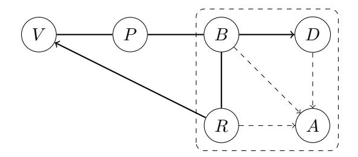
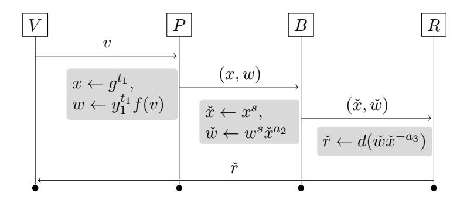
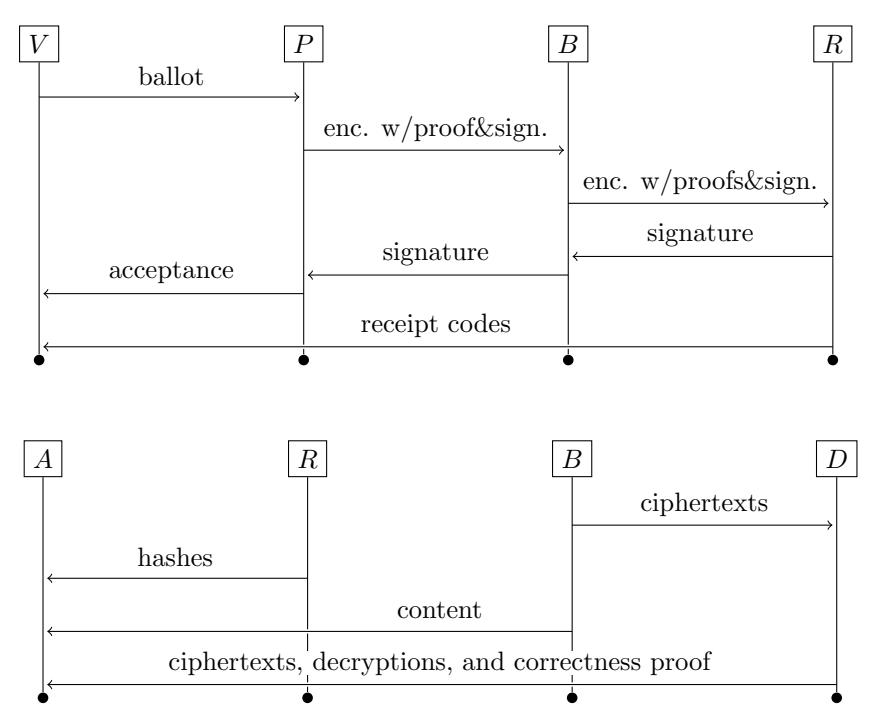

# Analysis of an internet voting protocol

Kristian Gjøsteen<sup>∗</sup>

July 7, 2010

#### Abstract

The Norwegian government is planning trials of internet voting in the 2011 local government elections. We describe and analyse the cryptographic protocol that will be used. In our opinion, the protocol is suitable for trials of internet voting, even though it is not perfect.

This paper is a second<sup>1</sup> step in an ongoing evaluation of the cryptographic protocol.

# 1 Introduction

The Norwegian government is planning trials of internet voting in the 2011 local government elections. One of the key requirements for elections is trust, and for many internet voting deployments this trust has been lacking.

One reason is excessive secrecy. It is a well-established cryptographic and computer security principle that secrecy does not ensure security. Empirically, transparency seems to increase security. We observe that making system architecture, design and even implementation details available for inspection leads to increased security, at least in the long run.

In order to build trust in internet voting, the Norwegian government has decided on nearly complete transparency. Most important documents from the tender process, including most technical details in every submitted proposal, has been made public (see www.evalg.dep.no). Before the 2011 trial, the architecture and even the source code for the deployed system will be made available to the public.

At the heart of any internet voting system is a cryptographic protocol. The security of this protocol is a necessary requirement for trust in the internet voting solution. As part of the initial tender evaluation, a preliminary analysis of the cryptographic voting protocols was carried out. After the winning bid was selected, it was decided to make some modest

<sup>∗</sup> kristian.gjosteen@math.ntnu.no, Department of Mathematical Sciences, NTNU.

<sup>1</sup>A previous version of this document, dated March 9, 2010, has been published at www.evalg.dep.no. A version dated December 23, 2009 describing the full protocol and sketches of security proofs has been circulated privately.

changes to the cryptographic protocol, partially to get security proofs. This paper is a more extensive analysis of the resulting protocol.

Internet voting in Norway Norwegian elections are somewhat complicated, but ballots essentially consists of a short sequence of options (a party list followed by selection of candidates, at most about a hundred options in total) chosen from a small set of possible options (at most a few thousand). Note that the entire sequence is required to properly interpret and count the ballot. For parliamentary elections order within the sequence is important, while order does not matter for county and municipal elections. There are no write-ins.

There are significant functional constraints on any real-world voting system. The voter should not have to interact with the voting system more than once to submit a ballot. Most ballots will be submitted during peak hours, and the submitted ballots must be processed quickly. Once the ballot box closes, the result must be available as soon as possible.

Since cost does matter and secure computing hardware is expensive, any election infrastructure will have quite limited computational resources available for the protocol execution.

We also get functional constraints from security considerations. In practice, the two most significant security problems with internet voting in Norway will be compromised computers and coercion.

Since a significant fraction of home computers are compromised, the protocol must allow voters to detect ballot tampering without relying on computers. This is complicated by the fact that voters are unable to do even the simplest cryptographic processing without computer assistance.

When voting from home, no amount of cryptography can protect the voter from coercion. To defend against coercion, we mandate that the system must allow voters to vote multiple times, so-called revoting, counting only the final ballot. Voters may also vote once on paper and this vote should be counted instead of any electronic ballot, no matter when submitted. The internet voting system must essentially allow election administrators to cancel votes.

Defending against coercion by election insiders is very difficult. Before anyone can cast their vote, they must somehow authenticate to the system. For most plausible authentication systems, anyone with access to the authentication system will be able to detect electronic revoting.

In the Norwegian electoral system, for any ballot there will be a large number of valid ballots that are different, but have essentially the same effect on the final election result. Therefore, any coercer with access to the counted ballots (electronic or on paper) can tell his victim to submit an unlikely ballot with the desired effect, then verify that his victim did not revote by observing if the unlikely ballot is present among the counted ballots.

We should also note that traditionally, the electoral roll is considered sensitive in Norway. This means that very little information about the count should be published, and that universal verifiability will be impractical.

Related work We can roughly divide the literature into protocols suitable for voting booths [5, 6, 19, 20], and protocols suitable for remote internet voting [7, 8, 14, 16, 18], although protocols often share certain building blocks. One difference is that protocols for voting booths should be both coercion-resistant and voter verifiable, while realistic attack models (the attacker may know more than the voter knows) for remote internet voting probably make it impossible to achieve both true voter verifiability and coercion-resistance.

For internet voting protocols, we can again roughly divide the literature into two main strands distinguished by the counting method. One is based on homomorphic tallying. Ballots are encrypted using a homomorphic cryptosystem, the product of all the ciphertexts is decrypted (usually using some form of threshold decryption) to reveal the sum of the ballots. For simple elections, this can be quite efficient, but for the Norwegian elections, this quickly becomes unwieldy.

The other strand has its origins in mix nets [3]. Encrypted ballots are sent through a mix net. The mix net ensures that the mix net output cannot be correlated with the mix net input. There are many types of mixes, based on nested encryption [3] or reencryption, verifiable shuffles [12, 18] or probabilistic verification [1, 14], etc. These can be quite efficient, even for the Norwegian elections.

Much of the literature ignores the fact that a voter simply will not do any computations. Instead, the voter delegates computations to a computer. Unfortunately, a voter's computer can be compromised, and once compromised may modify the ballot before submission.

One approach is so-called preencrypted ballots and receipt codes [4, 2], where the voter well in advance of the election receives a table with candidate names, identification numbers and receipt codes. The voter inputs a candidate identification number to vote and receives a response. The voter can verify that his vote was correctly received by checking the response against the printed receipt codes.

Note that unless such systems are carefully designed, privacy will be lost. Clearly, general multiparty computation techniques can be used to divide the processing among several computing nodes (presumably used by [4]). One approach for securely generating the receipt codes is to use a proxy oblivious transfer scheme [13]. A ballot box has a database of receipt codes and the voter's computer obliviously transfers the correct one to a messenger, who then sends the receipt to the voter. This approach seems to be very expensive for Norwegian elections.

Another useful tool is the ability for out-of-band communication with voters [17]. This allows us to give the voter information directly, information that his computer should not know and not be able to tamper with. The scheme in [13] sends receipt codes to the voter out-of-band. This helps ensure that a voter is notified whenever a vote is recorded, preventing a compromised computer from undetectably submitting ballots on the voter's behalf.

Our contribution The cryptographic protocol to be used in Norway is designed by Scytl, a Spanish electronic voting company. It is mostly a fairly standard internet voting system. Essentially, a voter uses his computers to submit a ballot to an election infrastructure. To defend against coercion, a voter is allowed to submit multiple ballots, where the final submission will be counted.

The system works roughly as follows. The voter gives his ballot to a computer, which encrypts the ballot and submits it to a ballot box. Once the ballot box closes, the submitted ciphertexts are decrypted in some decryption service, based on a reencrypting mix net. An auditor supervises the entire process.

The part of the system not usually found in other deployed internet voting systems is detecting when a compromised computer has altered the ballot. The ballot box and a receipt generator cooperate to compute a sequence of receipt codes for the submitted ballot. These codes are sent to the voter through an independent channel (most likely SMS messages to mobile phones). The voter verifies the receipt codes against a list of precomputed receipt codes printed on his voting card.

Scytl originally proposed to use a pseudo-random function family to compute the receipt codes. While this would most likely be secure, it was difficult to prove anything about the proposal. It was therefore decided to use a slightly different construction. We use the fact that exponentiation is in some sense a pseudo-random function [9, 11], and since ElGamal is homomorphic, exponentiation can be efficiently done "inside" the ciphertext. This mechanism is the only significant cryptographic novelty described in this paper.

Overview of the paper We describe the security goals for the protocol in Section 2. We discuss what capabilities an adversary will have what the protocol is supposed to achieve.

A simplified protocol is specified and analysed in Section 3. We do this to focus on the only novel cryptographic construction in this scheme, which is how the receipt codes are computed.

We describe the full protocol in Sect. 4 and analyse its security in Sect. 5.

# 2 Security goal

To define security for a protocol, we must define what kind of attackers we face and how we will allow them to influence the election.

We stress that we do not consider coercion in this analysis, beyond the brief discussion in the introduction.

The attacker We start with the standard premise that the attacker controls the network. What remains to decide is which players can be corrupted. Our players include a set of voters, a set of computers and four infrastructure players, the ballot box, a receipt generator, a decryption service, an auditor and a set of electoral board members.

Remark 1. The electoral board members will only appear in subprotocols that we do not analyse. Therefore, we ignore the electoral board in this discussion.

Any external attacker will clearly be able to compromise a number of voters as well as a larger number of computers. To simplify discussions, we shall assume that corrupt voters only use corrupt computers. Honest voters may use honest computers, corrupt computers or both.

Since the infrastructure is divided into a small number of separate players, organizational and non-cryptographic technical measures may make it reasonable to assume that an inside attacker can compromise at most one infrastructure player.

Remark 2. Suppose we have some protocol satisfying the following: (i) the voter submits his vote to the computer, the computer submits an encrypted ballot to the infrastructure, and the infrastructure players cooperate to generate a receipt code and send it directly to the voter; (ii) a single infrastructure player X is responsible for sending the receipt code to the voter.

Consider the following attack where X and the voter's computer are corrupt. The computer submits a forged ballot to the infrastructure, leading to the computation of a receipt code. This code is discarded by X. A forged ballot has been submitted, and the voter has noticed nothing.

The conclusion is that for protocols like ours, it is impossible to protect the voter against a corrupt computer cooperating with a corrupt receipt generator. For practical reasons, our protocol will be of this form. We therefore arrive at the following static corruption model:

The attacker may corrupt either (i) the ballot box and any subset of voters and computers, or (ii) any single infrastructure player.

For the simplified protocol, we use a weaker attack model:

The attacker may corrupt either (i) any subset of voters and computers, or (ii) passively any one infrastructure player.

The attacker's influence We shall allow corrupt voters to submit spoilt ballots.

Since an attacker controls the network between a voter's computer and the election infrastructure, he will certainly be able to delay or block the submission of ballots. Obviously, any corrupt infrastructure player can halt and thereby stop the election. They can usually cause more suspicious integrity failures, again stopping the election.

For usability reasons, the number of receipt codes must be equal to the number of options chosen. Therefore, if the receipt generator is corrupt, it is unavoidable that the number of options on a ballot leaks.

If the voter's computer is compromised, the attacker will see the ballot. The attacker may also modify the ballot, but in this case, the voter should be able to notice with high probability.



Figure 1: Communication between players. The infrastructure players are inside the box. The auditor A is not part of the simplified protocol.

We arrive at the following security goal:

At most one ballot per voter should be counted.

Any vote submitted through an honest computer should remain confidential (up to information leaked through the receipt codes).

If no infrastructure player is corrupt, the auditor will not fail the election.

Suppose the auditor does not fail the election. If an honest voter has accepted a ballot as cast, the ballot should be counted unless the voter subsequently submitted another ballot (but he need not have accepted it as cast) or complained about a forgery.

# 3 Simplified Protocol

We describe the simplified protocol. The players in the protocol are the voter V , the voter's computer P, the ballot box B the receipt generator R, and the decryption service D. The auditor is not part of the simplified protocol. The players communicate via secure, authenticated channels, as described in Fig. 1. We note that in this simplified model, the ballot box knows which voter is communicating with which computer.

The voter chooses as its ballot a sequence of options (v1, . . . , vk) from a set of options O = {1, 2, . . . }, the computer pads the ballots with zeros to a fixed length kmax , encrypts it with the election encryption key and submits the encrypted ballot to a ballot box. The ballot box, in cooperation with the receipt generator computes a sequence of receipt codes from a set C that are sent directly to the voter. The voter has a correspondence between options and receipt codes. If the receipt codes received match the options selected, the voter accepts, otherwise he knows something went wrong.

When the ballot box closes, the ballot box submits the encrypted ballots to the decryption service, which decrypts the ballots and publishes the result.

**Prerequisites** The system uses a finite cyclic group G of prime order q generated by g. We also have a pseudo-random function family F from G to C.

An injective encoding function  $f: \mathcal{O} \to G$  is chosen (the choice is not arbitrary and has implications for security, see Sect. 3.3 for details). We then extend the function by defining f(0) to be the identity element in G. Corrupt voters will be able to submit spoilt ballots, so we have a set  $\mathcal{O}' \supseteq \mathcal{O}$  and shall sometimes consider f as a function from  $\mathcal{O}'$  to G.

**Key generation** For the simplified protocol, we shall assume that all key generation is done by a trusted third party.

Before the election, three secret parameters  $a_1$ ,  $a_2$  and  $a_3$  are generated such that  $a_1 + a_2 \equiv a_3 \pmod{q}$ . The ballot box gets  $a_2$ , the receipt code generator gets  $a_3$  and the decryption service gets  $a_1$ . Three public parameters for the election,  $y_1$ ,  $y_2$  and  $y_3$ , are computed as  $y_1 = g^{a_1}$ ,  $y_2 = g^{a_2}$  and  $y_3 = g^{a_3}$ .

For every voter, s is sampled from  $\{0, 1, \ldots, q-1\}$ , and d from F. The composition of f, the exponentiation map  $x \mapsto x^s$  and d gives a function  $r: \mathcal{O} \to \mathcal{C}$  for each user,  $r(v) = d((f(v))^s)$ . Before the election, the set  $\{(v, r(v)) \mid v \in \mathcal{O}\}$  is computed and given to V.

**Vote submission** When the voter V wants to submit the ballot  $(v_1, \ldots, v_k)$ , the protocol proceeds as follows:

- 1. The voter sends  $(v_1, \ldots, v_k)$  to his computer P. The computer sets  $v_i = 0$  for  $i = k+1, \ldots, k_{max}$ .
- 2. For  $1 \le i \le k_{max}$ , the computer samples  $t_i$  from  $\{0, 1, \ldots, q-1\}$ , computes  $(x_i, w_i) = (g^{t_i}, y_1^{t_i} f(v_i))$  and sends  $((x_1, w_1), \ldots, (x_{k_{max}}, w_{k_{max}})$  to the ballot box B.
- 3. The ballot box computes  $\check{x}_i = x_i^s$  and  $\check{w}_i = w_i^s \check{x}_i^{a_2}$ . The pairs  $((\check{x}_1, \check{w}_1), \dots, (\check{x}_{k_{max}}, \check{w}_{k_{max}}))$  and the voter's name is sent to R.
- 4. The receipt generator computes  $\check{r}_i = d(\check{w}_i\check{x}_i^{-a_3})$  and sends  $(\check{r}_1, \ldots, \check{r}_k)$  to the voter. (Note that k can be deduced from the number of non-identity decryptions.)
- 5. The voter verifies that every pair  $(v_i, \check{r}_i)$  is in the set of receipt codes received before the election, and if so consideres the ballot cast.

The protocol is summarized in Fig. 2.

The voter may submit multiple ballots electronically, and the final submission supercedes any previous submissions.

Counting When the ballot box closes, superceded ballots are discarded, only the final submitted ballot should count. The ballot box sends the remaining encrypted ballots to the decryption service, in random order. The decryption service decrypts all the ciphertexts  $(\mu_i = w_i x_i^{-a_1})$  and outputs the resulting ballots in random order.



Figure 2: Protocol for submission of one option and generation of one receipt code.

### 3.1 Completeness

The protocol is *complete* if, when every participant is honest, the submitted ballots are eventually correctly decrypted, and the receipt codes sent to the voter matches the expected values.

Completeness is obvious, except for the receipt code received by the voter. We only need to argue that  $(v, \check{r})$  will always be in the computed set of receipt codes, that is, that  $\check{r} = r(v)$ . We compute

$$\check{w}\check{x}^{-a_3} = w^s\check{x}^{a_2}\check{x}^{-a_3} = w^s\check{x}^{-a_1} = w^s(x^s)^{-a_1} = (wx^{-a_1})^s = (f(v))^s.$$

Completeness follows.

#### 3.2 Security

This section argues informally about the security of the simplified protocol. We consider the following corruption model: (a) The voter and his computer are corrupted; (b) the voter's computer is corrupted; and (c) one of the infrastructure players is passively corrupt (or honest-but-curious: the adversary follows the protocol, but tries to deduce information about voters' ballots). We prove the following properties:

- 1. If a corrupt computer modifies a ballot, the voter will most likely notice.
- 2. No honest-but-curious infrastructure player will learn any non-trivial information about the ballots.

We see that for the given corruption models, our security goal follows from these properties.

(a) By the assumption of authenticated channels, the ballot box can trivially ensure that at most one ballot is counted per voter. Submitting malformed ciphertexts will at most invalidate the voter's ballot, which we expressly permit.

(b) Suppose the computer submits  $(v'_1, \ldots, v'_{k'})$  instead of  $(v_1, \ldots, v_k)$ .

We know that the exponentiation map is a permutation on G and that f is an injection. Since d will look like a random function, f composed with a permutation composed with a random-looking function will again look like a random function from  $\mathcal{O}'$  to  $\mathcal{C}$ .

Any function from  $\mathcal{O}'$  to the set of receipt codes  $\mathcal{C}$  defines a partition of  $\mathcal{O}'$ . A partition defines an equivalence relation. The uniform distribution on the set of functions from  $\mathcal{O}'$  to the receipt code set therefore induces a probability distribution on the set of equivalence relations on  $\mathcal{O}'$ .

We extend an equivalence relation  $\sim$  on  $\mathcal{O}'$  in the obvious way to strings of options, i.e.  $(v_1, \ldots, v_k) \sim (v'_1, \ldots, v'_{k'})$  if and only if k = k' and  $v_i \sim v'_i$  for  $i = 1, \ldots, k$ .

The voter will accept the manipulation if and only if  $(v'_1, \ldots, v'_{k'}) \sim (v_1, \ldots, v_k)$ . As long as the set  $\mathcal{C}$  is sufficiently large, the probability of this happening will be small.

(c) We consider the three infrastructure players in turn. Since they are honest-but-curious, we only need to simulate the input they would normally see, we do not need to model interaction with other parts of the system.

**The ballot box** Suppose we have an honest-but-curious ballot box  $B^*$  that after the election is over looks at the ciphertexts and outputs some information about the ballots submitted.

Given a tuple  $(g, y_1, u_1, u_2)$  of elements from G, we shall employ  $B^*$  as follows:

- 1. Generate  $a_2$  and compute  $y_3 = y_1 g^{a_2}$ . Send  $a_2$  to  $B^*$ .
- 2. Instead of encrypting the encoded option  $f(v_i)$  as usual, we compute the encryption as  $(x_i, w_i) = (g^{t_i} u_1^{t_i'}, y_1^{t_i} u_2^{t_i'} f(v_i))$ , for some random  $t_i$  and  $t_i'$ .

If  $(g, y_1, u_1, u_2)$  is a Diffie-Hellman tuple, this will simulate the ballot box input perfectly. If  $(g, y_1, u_1, u_2)$  is not a Diffie-Hellman tuple, the ballot box input will contain no information at all about the ballots.

The conclusion is that if  $B^*$  can extract some information about the ballots, we have a distinguisher for the Decision Diffie-Hellman problem.

The receipt generator We shall now assume that the family of functions from  $\mathcal{O}$  to G given by  $v \mapsto f(v)^s$  is a pseudo-random function family, that is, functions sampled uniformly at random from the family are indistinguishable from functions sampled uniformly at random from the set of all possible functions from  $\mathcal{O}$  to G (subject to  $1 \mapsto 1$ ). We shall discuss this assumption and the choice of function  $f: \mathcal{O} \to G$ , as well as an alternative assumption, in Sect. 3.3.

Suppose we have an honest-but-curious receipt generator  $R^*$  that after the election is over outputs some non-trivial information about the ballots submitted.

Given an encoding function f, a function  $\rho: \mathcal{O} \to G$  and  $j, 1 \leq j \leq N$ , we use  $R^*$  as follows:

- 1. For the voters  $V_1, V_2, \dots V_{j-1}$ , we choose random functions  $\rho_l : \mathcal{O} \to G$ ,  $1 \le l < j$ .
- 2. Generate keys as usual for  $V_{j+1}, \ldots, V_N$  and use the functions  $\rho_l : v \mapsto f(v)^{s_l}, j < l \leq N$ .
- 3. For  $V_j$ , we use the given function  $\rho$ .
- 4. For every ballot  $(v_1, \ldots, v_{k_{max}})$  from a voter  $V_l$  with function  $\rho_l$ , we compute  $(\check{x}_i, \check{w}_i)$  as  $(g^{t'_i}, y_3^{t'_i} \rho_l(v_i))$ .

If our function  $\rho$  comes from the family and j=1, this will simulate the receipt generator input perfectly. If our function  $\rho$  is a random function and j=N, the receipt generator input will contain no non-trivial information about the ballots submitted.

After a standard hybrid argument, the conclusion is that if  $R^*$  can extract some non-trivial information about the ballots, we have a distinguisher for the function family.

The decryption service Since the decryption service sees the encrypted ballots in random order, it does not know which ballot originated with which voter, hence can extract no information about which ballot belongs to which voter.

### 3.3 Encoding Options as Group Elements

The Decision Diffie-Hellman problem can be formulated as follows:

```
Given (g_1, g_2) \in G \times G (where at least g_2 is sampled at random), decide if (x_1, x_2) \in G \times G was sampled uniformly from the powers of (g_1, g_2) (i.e. (x_1, x_2) = (g_1^s, g_2^s) for some s), or uniformly from G \times G.
```

It is well-known (e.g. [9, 11]) that this is equivalent to the following problem:

```
Given (g_1, \ldots, g_n) \in G^n (where at least g_2, \ldots, g_n are sampled at random), decide if (x_1, \ldots, x_n) \in G^n was sampled uniformly from the powers of (g_1, \ldots, g_n) (i.e. (x_1, \ldots, x_n) = (g_1^s, \ldots, g_n^s) for some s), or uniformly from G^n.
```

Therefore, if we choose a random injection  $\mathcal{O} \to G$  as our encoding function f, the assumption used to prove privacy against the receipt generator in the previous section follows easily from Decision Diffie-Hellman.

However, choosing a different encoding function will allow a significant (by a factor of 20-100) speedup of vote decryption. Let p be a randomly chosen safe prime, let G be the quadratic residues in  $\mathbb{F}_p^*$  and let L be a set of small primes whose images  $\{\ell_1, \ell_2, \ldots, \ell_n\}$  in  $\mathbb{F}_p^*$  are quadratic residues. Consider the following problem:

Given  $(\ell_1, \ldots, \ell_n) \in G^n$  as above, decide if  $(x_1, \ldots, x_n) \in G^n$  was sampled uniformly from the powers of  $(\ell_1, \ldots, \ell_n)$  (i.e.  $(x_1, \ldots, x_n) = (\ell_1^s, \ldots, \ell_n^s)$  for some s), or uniformly from  $G^n$ .

Now, if f is any injection from  $\mathcal{O}$  into  $\{\ell_1, \ldots, \ell_n\}$ , the assumption used to prove privacy against the receipt generator in the previous section holds if the above problem is hard.

While this assumption is very similar to Decision Diffie-Hellman, it seems unlikely that it will be possible to prove that it follows from Decision Diffie-Hellman.

We currently believe that the best way to solve Decision Diffie-Hellman is to compute one of the corresponding discrete logarithms. It is known [15] that solving the static Diffie-Hellman problem with a fairly large number of oracle queries is easier than solving the discrete logarithm problem.

For fairly large n, a static Diffie-Hellman solver could be applied to decide the above problem. This would be faster than the fastest known solver for the Decision Diffie-Hellman problem in the same group. However, for our application, n will always be small, hence the static Diffie-Hellman solver can not be applied. It seems as if the best approach to solving the above decision problem is computing discrete logarithms.

Remark 3. It is important that the prime p is chosen verifiably at random. If it is not, it will probably be possible to choose the safe prime together with a relation among the small primes. Given such a relation, the decision problem will be easy.

**Other approaches** While the assumption discussed above is sufficient for security, it is not necessary. A weaker, sufficient condition would be if, given a permutation of a subset of  $\{\ell_1^s, \ldots, \ell_n^s\}$  for some random s, it was hard to deduce any information about which primes were involved and what the permutation was.

The simplest case, which fortunately corresponds to the most common voting pattern, is that the receipt generator sees one group element, and must decide which prime was used to generate it. For reasons explained in Sect. 4, the receipt generator is also given a random generator g and  $g^s$ .

We do the calculations for the case when there are only two primes to decide between, say  $\ell_0$  and  $\ell_1$ . Let  $R^*$  be an algorithm that takes as input five group elements and outputs 0 or 1. Define

$$p_{00} = \Pr[R^*(\ell_0, \ell_1, g, g^s, \ell_0^s) = 0],$$

$$p_{11} = \Pr[R^*(\ell_0, \ell_1, g, g^s, \ell_1^s) = 1], \text{ and}$$

$$p_{i,\text{rnd}} = \Pr[R^*(\ell_0, \ell_1, g, g^s, g^t) = i], i \in \{0, 1\},$$

where s and t are sampled uniformly at random from  $\{0, 1, ..., q - 1\}$ . Note that  $p_{0,\text{rnd}} = 1 - p_{1,\text{rnd}}$ , since the input distribution to  $R^*$  is identical for both probabilities.

We may define the advantage of  $R^*$  as  $|p_{00} + p_{11} - 1|$ . Observe that if  $|p_{00} - p_{0,\text{rnd}}|$  or  $|p_{11} - p_{1,\text{rnd}}|$  are large, we have a trivial solver for Decision Diffie-Hellman with the generator fixed to either  $\ell_0$  or  $\ell_1$ .

We may assume that p<sup>00</sup> +p<sup>11</sup> −1 = 2 > 0. Then either p<sup>00</sup> ≥ 1/2 + or p<sup>11</sup> ≥ 1/2 +, so assume the former. Furthermore, let p<sup>00</sup> − p0,rnd = µ. If |µ| ≥ , we have an adversary against Decision Diffie-Hellman with the generator fixed to `0, so assume |µ| < . Then

$$p_{11} - p_{1,\text{rnd}} = 1 + 2\epsilon - p_{00} - (1 - p_{0,\text{rnd}}) = 2\epsilon - \mu \ge \epsilon,$$

which means that we must have an adversary with advantage against Decision Diffie-Hellman with the generator fixed to either `<sup>0</sup> or `1.

The same arguments applies to an R<sup>∗</sup> that can decide between multiple primes, he must lead to a successful adversary against Decision Diffie-Hellman with the generator fixed to one of the primes.

Unfortunately, the above argument breaks down if R<sup>∗</sup> is allowed to see multiple primes raised to the same power, that is, given {` s i | i ∈ I} for some small index set I, decide what I is. It is not unlikely that a careful analysis could reduce this problem to our alternative DDH problem (for a smaller number of primes), but such a result is of questionable value.

# 4 Full protocol

In this section, we shall describe the full protocol and the measures required to defend against active attacks by infrastructure players. The basic idea is that everyone should prove that they have faithfully executed the simplified protocol. The computer proves knowledge of ciphertext content and the ballot box proves the correctness of its computations. In addition, the voter has the computer sign the submitted ballot on his behalf, and the receipt generator signs a hash of the ballot. Finally, the electoral board is responsible for key generation.

Technically, we shall describe a protocol employing several subprotocols. To simplify analysis, we replace the subprotocols by so-called ideal functionalities, trusted third parties that every player can communicate securely with. These ideal functionalities are discussed in Sect. 4.1.

We briefly discuss each player and give an intuitive discussion of the protocol elements and their purpose. The protocol messages are summarized in Fig. 3.

The voter The voter tells the computer what ballot to submit and allows the computer to sign the encrypted ballot on his behalf. The voter then waits for an acceptance message from the computer, and for receipt codes to arrive out-of-band. The receipt codes are verified.

Intuitively, the signature prevents a corrupt ballot box from inserting forged ballots, or falsely claiming that a given ballot belongs to someone else. With signed ballots, it is also easy for the ballot box and the auditor to ensure that at most one ballot is counted per voter.

The computer The computer encrypts the voter's ballot and signs the ciphertext on the voter's behalf. The computer should also prove that it knows the content of the ciphertexts before submission. The computer then waits for the receipt generator's signature on a hash of the encrypted ballot, before sending an acceptance message to the voter.

Intuitively, the receipt generator's signature ensures that the receipt generator has seen the encrypted ballot. The proof of knowledge is to prevent a corrupt ballot box from using a corrupt voter to submit an honest voter's ciphertexts as its own, then learn the ballot contents from the receipt codes.

Proof-theoretically, we will need to extract the vote from the ballot. Therefore, in theory, the proof of knowledge should have a proper online extractor [10], but morally a more efficient non-interactive Schnorr proof will do, even if we do not have a knowledge extractor that works for parallel composition.

The ballot box The ballot box receives signed, encrypted ballots from the voter's computer. It computes receipt code ciphertexts and proves to the receipt generator that its computations are correct. When the receipt generator replies with a signature, it passes this signature on to the voter's computer. The ballot box numbers received ballots sequentially when talking to the receipt generator.

In order to verify correct computation and that this was a real ballot, the receipt generator must see the entire encrypted ballot, including the voter's signature and the computer's proofs of knowledge.

When the ballot box closes, it selects the encrypted ballots that should be decrypted, sends them to the decryption service and reveals the entire content of the ballot box to the auditor.

Intuitively, the ballot box proofs are there to prevent a corrupt ballot box cooperating with a corrupt computer from forging ciphertexts with correct receipt codes, or a corrupt ballot box cooperating with a corrupt voter from abusing the receipt generator's decryption capability. The sequence numbers are there so that the receipt generator and the ballot box explicitly agree on the order of submitted ballots.

Receipt generator The receipt generator verifies the voter's signature and every proof, then generates the receipt codes and sends them directly to the voter. Also, the receipt generator signs a hash of the ballot and returns the signature to the ballot box. Without the signature, the voter's computer will not inform the user that the ballot has been accepted.

Remark 4. If the ballot box discards a ballot, the hash and the signature would allow a voter to prove, in cooperation with an honest auditor, that his ballot was discarded. There is no need for this functionality in our corruption models, but we believe there are corruption models where this might be useful. We have not yet studied them.

When the ballot box closes, the receipt generator gives the auditor a list of hashes of ballots with corresponding sequence numbers seen by the receipt generator.



Figure 3: Protocol messages involved in submitting a ballot and receiving receipts (above) and counting (below). The players are: the voter V , the computer P, the ballot box B, the receipt generator R, the decryption service D and the auditor A.

Decryption service The decryption service decrypts the incoming ciphertexts, shuffles the decryptions before output, then proves to the auditor that the input ciphertexts contain a shuffle of the decryptions. This is done using a mix net and standard Schnorr proofs of decryption. The mix net is similar to randomized partial checking [14] or "almost entirely correct mixing" [1].

Auditor The auditor receives the entire content of the ballot box and a list of hashes of encrypted ballots seen by the receipt generator. The auditor verifies the content of the ballot box (signatures and proofs), that no ballots have been inserted or lost compared to the receipt generator list and computes on its own a list of encrypted ballots that should be counted. The auditor compares this list to the ciphertexts input to the decryption service, then verifies the proofs offered by the decryption service.

Electoral board The electoral board is responsible for key generation, which must be done before ballot submission begins. The subprotocol used for key generation is not analysed in this document.

### 4.1 Prerequisites

The full protocol uses a number of subprotocols for key generation, communication and non-interactive zero knowledge proofs. In order to focus on the e-voting protocol, we replace these subprotocols by so-called ideal functionalities and describe a hybrid protocol. We also discuss what protocols will replace these ideal functionalities, to the extent that these are known at this time.

The ideal functionalities are trusted third parties that every player can communicate securely with. Standard protocol theory says that if we replace the ideal functionalities by secure subprotocols, we get a composed protocol and any attacks against this protocol can be translated into attacks on the hybrid protocols. If we know all possible attacks on the hybrid protocol, we will also know all the attacks on the composed protocol.

Electronic identity We need some form of electronic identity to provide digital signatures. We also use the electronic identity to establish a secure channel between the voter's computer and the ballot box.

The electronic identity is modeled using the following simplified ideal functionality, where we ignore key generation. The motivating idea is that for most electronic identity schemes, a voter essentially gives his computer custody of his electronic identity. If the computer is honest, it will do only as the voter intends, but if it is compromised it can usually abuse the voter's identity arbitrarily.

```
On (key, Y, Σ,) from S:
  1. Store (key, Y, Σ).
On (use, P) from V , do:
  1. Record (use, P, V ).
On (establish, V, B) from P:
  1. Stop unless (use, P, V ) is recorded.
  2. Choose unique sid, send (establish, B, sid, V, P) to S, then record (sid, V, P, B).
  3. Send delayed, queued output (established, sid) to P and delayed, queued output
      (established, sid, V, P) to B.
On (send, sid, m) from X:
  1. Stop unless (sid, V, X, Y ) or (sid, V, Y, X) is recorded.
  2. Send (send, sid, |m|) to S and delayed, queued output (recv, sid, m) to Y .
On (sign, V, m) from P:
```

Figure 4: Ideal functionality for electronic identity, Feid (continues).

- 1. Stop unless (use, P, V ) and (key, V, Σ) is recorded.
- 2. Let σ ← Σ(m), record (signature, V, m, σ, 1) and output (signature, V, m, σ).

On (sign, R, m) from honest R:

- 1. Stop unless (key, R, Σ) is recorded.
- 2. Let σ ← Σ(m), record (signature, V, m, σ, 1) and output (signature, V, m, σ).

On (verify, Y, m, σ) from X:

- 1. If no record (key, Y, Σ) exists, output (fail, Y, m, σ) and stop.
- 2. If (signature, Y, m, σ, 1) is recorded, output (verified, Y, m, σ) and stop.
- 3. If (signature, Y, m, σ, 0) is recorded, output (fail, Y, m, σ) and stop.
- 4. If Y is corrupt or (use, P, Y ) is recorded for some corrupt P, send (verify, Y, m, σ) to S and wait for (verify, Y, m, σ, b). Record (signature, Y, m, σ, b). If b = 1, output (verified, Y, m, σ), otherwise output (fail, Y, m, σ). Then stop.
- 5. Record (signature, Y, m, σ, 0) and output (fail, Y, m, σ).

Figure 4: Ideal functionality for electronic identity, Feid (final).

Remark 5. Originally, the assumption was that an electronic identity smart card issued by the government coupled with a PKI would be available. This smart card would support signatures and secure, identified channels (probably using some variant of TLS). Unfortunately, this identity card has been delayed and will not be available for the trials.

The electronic identity system to be used has not yet been finalized, but will probably be based on a government system using passwords and pins for identification, with some additional functionality for simulating digital signatures. It is currently unclear how much public documentation will be available for this system. Therefore, the assumptions on what security is provided (implicit in the ideal functionality) is deliberately quite conservative.

Proofs of knowledge The computer and the ballot box need to prove that they have acted correctly. One method to do that is for them to prove that they know certain discrete logarithms. At some point, we shall also need to use that this proof is extractable. We model this using the proof-of-knowledge functionality given in Fig. 5.

The actual proof is done as follows, where H is a hash function. On input of aux , n, ~ξ, ~η and ~ρ, do:

- 1. Choose random numbers ~t and compute u<sup>i</sup> = ξ ti i , i = 1, . . . , n.
- 2. Compute e ← H(aux , n, ~ξ, ~η, ~u).

On (setup, (Sim, Ver)) from S:

1. Store (Sim, Ver).

On (prove,  $aux, n, \vec{\xi}, \vec{\eta}, \vec{\rho}$ ) from honest P:

1. Compute  $\pi \leftarrow Sim(aux, n, \vec{\xi}, \vec{\eta})$ , store  $(aux, n, \vec{\xi}, \vec{\eta}, \pi)$ , and output (proof,  $aux, n, \vec{\xi}, \vec{\eta}, \pi$ ) to P.

On (verify,  $(aux, n, \vec{\xi}, \vec{\eta}, \pi)$ ) from Y:

- 1. If we have recorded  $(aux, n, \vec{\xi}, \vec{\eta}, \pi)$ , output (verified,  $aux, n, \vec{\xi}, \vec{\eta}, \pi$ ) and stop. If we have recorded (invalid,  $aux, n, \vec{\xi}, \vec{\eta}, \pi$ ), output (invalid,  $aux, n, \vec{\xi}, \vec{\eta}, \pi$ ) to Y.
- 2. Send (verify,  $(aux, n, \vec{\xi}, \vec{\eta}, \pi)$ ) to  $\mathcal{S}$ . If  $\mathcal{S}$  replies with (witness,  $n, \vec{\rho}$ ) such that  $\eta_i = \xi_i^{\rho_i}$  for  $i = 1, \ldots, n$  and  $Ver(aux, n, \vec{\xi}, (\xi_1^{\rho_1}, \ldots, \xi_n^{\rho_n}), \pi) = 1$ , store  $(aux, n, \vec{\xi}, (\xi_1^{\rho_1}, \ldots, \xi_n^{\rho_n}), \pi)$  and output (verified,  $aux, n, \vec{\xi}, \vec{\eta}, \pi$ ). Otherwise record (invalid,  $aux, n, \vec{\xi}, \vec{\eta}, \pi$ ) and output (invalid,  $aux, n, \vec{\xi}, \vec{\eta}, \pi$ ).

Note:  $\vec{\xi}$  and  $\vec{\eta}$  are tuples of length n where the elements all come from either G,  $G^2$  or  $G^3$ .

Figure 5: Ideal functionality for discrete logarithm proof of knowledge,  $\mathcal{F}_{pok}$ .

3. Compute  $z_i = t_i - e\rho_i, i = 1, ..., n$ .

The proof is  $\pi=(e,\vec{z})$ . To verify the proof  $\pi$  for  $aux, \vec{\xi}$  and  $\vec{\eta}$ , do:

- 1. Compute  $u'_{i} = \eta_{i}^{e} \xi_{i}^{z_{i}}, i = 1, \dots, n$ .
- 2. Compute  $e' = H(aux, n, \vec{\xi}, \vec{\eta}, \vec{u}')$ .

Accept the proof of e' = e.

Remark 6. This (parallel) non-interactive Schnorr proof of knowledge does not realize the ideal functionality, because it is not extractable when composed in parallel. In our opinion, this does not seem to be a deficiency in the Schnorr proof, but rather a technical obstruction. A protocol with an efficient online extractor [10] could have been used, but there seems little point in using a significantly more expensive proof of knowledge when no real security is gained.

We note that the cost of generating a proof in  $G^i$  is dominated by in exponentiations in G, while verifying the proof is dominated by 2in exponentiations in G.

**Collision resistant hashing** The return code generator needs to sign hashes of votes. We denote by *Hash* some hash function. When needed, we shall assume that this hash function is collision resistant.

Additional secure channels We assume that inside the infrastructure, every player communicates via secure channels. Also, there is a unidirectional out-of-band channel from the receipt generator to the voter. We model this using the following functionality, where V is the set of all voters and P is the set of all computers.

```
On (send, X, ξ) from Y :
  1. If (X, Y ) is in V × P, P × V, V × {R} or
     {(R, B),(B, R),(D, B),(A, B),(A, R),(A, D)}, then send (recv, Y, ξ) to X. If
     (X, Y ) ∈ V × {R}, then the output to X is delayed.
On (flush) from R:
  1. Deliver any pending outputs to voters.
```

Figure 6: Ideal functionality for secure communication, Fsc.

Remark 7. The communication between the ballot box, receipt generator, decryption service and auditor is modeled as an untappable channel. Most likely, it will be realized by some standard protocol like TLS or IPSEC running over a public, reliable network. Some of the communication may also be out-of-band. We have not yet analyzed the realizing protocols.

Remark 8. The out-of-band channel between the receipt generator and the voter will probably have unpredictable delivery scheduling. We (somewhat crudely) model this by allowing the adversary to schedule deliveries. The adversary cannot be allowed to postpone delivery indefinitely, however. The (flush) message is a technical trick to enforce this, not a real message in the real protocol.

To simplify the description of protocols, we shall write "Send ξ to X" and "Receive ξ from Y " instead of "Send (send, X, ξ) to Fsc" and "Receive (recv, Y, ξ) from Fsc". Since the channel established by the electronic identity functionality is susceptible to adversarial delay, we do not follow this convention there.

Key generation Certain global parameters, such as the group G, its order q and the generator g are assumed to be public and known by everyone. The electoral board generates the three election keys, a1, a<sup>2</sup> and a3, using a multiparty computation protocol. The pervoter keys are also generated by the electoral board. For simplicity, we model both of these processes as one simple ideal functionality.

```
Once (start) has been received from every electoral board player:
  1. Choose the function f : O → G.
```

Figure 7: Ideal functionality for key generation, Fkey (continues).

- 2. Choose random  $a_1$  and  $a_2$ , and compute  $a_3 = (a_1 + a_2) \mod q$ . Compute  $y_1 = g^{a_1}$ ,  $y_2 = g^{a_2}$  and  $y_3 = g^{a_3}$ .
- 3. For every voter V, choose random exponent s and PRF instance d. Compute the per-voter commitment  $\gamma = g^s$  and the set  $\mathcal{RC} = \{(v, d(f(v)^s)) \mid v \in \mathcal{O}\}$ . Send (codes,  $\mathcal{RC}$ ) to V.
- 4. Send (keys,  $y_1, a_2, y_3, \{(V, s)\}$ ) to B, (keys,  $y_1, y_2, a_3, \{(V, \gamma, d)\}$ ) to R, and (keys,  $y_1$ ) to A.
- 5. For every computer P, send (keys,  $y_1, f$ ) to P.

Once (count) has been received by a qualified majority of the electoral board players:

1. Send (keys,  $a_1$ ) to D.

Figure 7: Ideal functionality for key generation,  $\mathcal{F}_{key}$  (final).

Remark 9. In practice, the per-voter exponent s will be pseudo-randomly generated. The receipt generator may use a single pseudo-random function to generate the receipt codes, but include a voter identifier to simulate a per-voter pseudo-random function.

Remark 10. The key generation protocols have not yet been analyzed.

#### 4.2 The Protocol

The protocol has as its players the electoral board members, a set of voters, a larger set of computers, a ballot box, a receipt generator, a decryption service and an auditor. The programs run by the various players are described below.

*Remark* 11. Error handling is mostly ignored in the protocol descriptions, but follows the usual principle that if something is wrong, the calling party is notified and processing stops.

#### 4.2.1 The Voter

Before the election, the voter receives a table of option–receipt code pairs. When the voter wants to submit a ballot, he gives the computer access to his electronic identity, submits the vote to the computer and waits for the computer's acceptance message and the receipt codes from the receipt generator. The receipt codes are verified against the option–receipt code pairs. If the voter receives receipt codes from the receipt generator when not processing a vote, he complains about a forgery.

On (codes,  $\mathcal{RC}$ ) from  $\mathcal{F}_{key}$ :

Figure 8: Program for the voter V (continues).

```
1. Store RC.
On input (vote, P, v1, . . . , vk):
   1. Send (use, P) to Feid .
   2. Send (vote, v1, . . . , vk) to P.
   3. Wait for (accepted) or (fail) from P, and (receipt, rˇ1, . . . , rˇk
                                                                         0) from R.
   4. If (fail) was received from P, if k 6= k
                                                 0 or (vi
                                                        , rˇi) 6∈ RC for some i ∈ {1, . . . , k},
      output (fail). Otherwise erase ˇr1, . . . , rˇk and output (accepted).
On (receipt, . . .) from R:
   1. Output (forgery!).
On input (use, P):
   1. Send (use, P) to Feid .
```

Figure 8: Program for the voter V (final).

Remark 12. Given the receipt codes and the correspondence RC between options and receipt codes, it will usually be possible to reconstruct the corresponding ballot. Therefore, the voter should erase the receipt codes after verification (by deleting the SMS message with the codes).

Remark 13. If the voter submits two or more ballots in parallel, the receipt codes from the receipt generator may arrive out of order and the voter will have no way to decide which receipt belongs to which ballot. There is no way for the voter to decide which ballot will be counted and which will not be counted. Honest voters should therefore not submit ballots in parallel.

#### 4.2.2 The Computer

The computer receives the ballot from the voter. It encrypts the ballot, generates a proof that it knows the contents of the encryption, signs the encrypted ballot on behalf of the voter, then submits the signed, encrypted ballot to the ballot box via Feid . Then it waits for the receipt generator's signature from the ballot box. Finally, the computer informs the voter that the ballot was accepted.

```
On (keys, y1, f) from Fkey :
   1. Store y1 and f.
```

Figure 9: Program for the computer P (continues).

```
On (vote, v1, . . . , vk) from V :
```

- 1. Send (establish, V, B) to Feid and wait for (established, sid).
- 2. Set vk+1 = · · · = vkmax = 0.
- 3. For i from 1 to kmax : Choose random t<sup>i</sup> , compute (x<sup>i</sup> , wi) = (g ti , y ti 1 f(vi)).
- 4. Send (prove, V, kmax ,(g, . . . , g),(x1, . . . , xkmax ),(t1, . . . , tkmax )) to Fpok and wait for (proof, . . . , π) from Fpok .
- 5. Send (sign, V,((x1, w1), . . . ,(xkmax , wkmax ), π)) to Feid , and wait for (signature, . . . , σ<sup>V</sup> ) from Feid .
- 6. Send (send, sid,(vote, V,((x1, w1), . . . ,(xkmax , wkmax ), π), σ<sup>V</sup> )) to Feid , and wait for (recv, sid,(receipt, σR)) from Feid .
- 7. Compute h<sup>b</sup> ← Hash(V,(x1, w1), . . . ,(xkmax , wkmax ), π).
- 8. Send (verify, R, hb, σR) to Feid and wait for (verified, R, hb, σR).
- 9. Send (accepted) to V .

Figure 9: Program for the computer P (final).

Remark 14. Note that when sending the encrypted ballot to the ballot box, a fixed-length encoding should be used for the group elements. This is to prevent a compromised decryption service from correlating message length (which leaks out of the electronic identity functionality together with the identity) and encrypted ballots.

#### 4.2.3 The Ballot Box

The ballot box does nothing until it has received its keys. Afterwards, as computers connect to submit votes, it verifies signatures and proofs, then does the appropriate computations and generates appropriate proofs of correct computation. The result is passed to the receipt generator. The receipt generator replies with a signature, which the ballot box verifies and passes on to the computer.

When the ballot box is told to close, it waits for ongoing submissions to complete, then selects the ballots to be counted and sends them to the decryption service. Finally, the entire contents of the ballot box is sent to the auditor.

```
Do nothing until (keys, y1, a2, y3, {(V, s)}) has been received from Fkey , then do:
```

1. Record y1, a<sup>2</sup> and y3, as well as the pairs (V, s).

Figure 10: Program for the ballot box B (continues).

On (established, sid, V, P) from Feid :

- 1. Wait for (recv, sid, P,(((x1, w1), . . . ,(xkmax , wkmax ), π), σ<sup>V</sup> )) from Feid .
- 2. Send (verify, V,((x1, w1), . . . ,(xkmax , wkmax ), π), σ<sup>V</sup> ) to Feid and wait for (verified, . . . , σ<sup>V</sup> ) from Feid .
- 3. Send (verify, V, kmax ,(g, . . . , g),(x1, . . . , xkmax ), π) to Fpok and wait for (verified, . . . , π) from Fpok .
- 4. Look up the stored pair (V, s) and place an exclusive lock on the pair (waiting for any other session to release its exclusive lock).
- 5. Select the next sequence number seq.
- 6. For i from 1 to kmax :
  - (a) Compute (ˇx<sup>i</sup> , wˇ<sup>i</sup> , πˇi) as specified below.
- 7. Send (ballot, seq, V,(x1, w1, xˇ1, wˇ1, πˇ1), . . . ,(xkmax , wkmax , xˇkmax , wˇkmax , πˇkmax ), π, σ<sup>V</sup> ) to R, and wait for (receipt, seq, σR) from R.
- 8. Compute h<sup>b</sup> ← Hash(V,(x1, w1), . . . ,(xkmax , wkmax ), π).
- 9. Send (verify, R, hb, σR) to Feid and wait for (verified, R, hb, σR) from Feid .
- 10. Store (seq, V,(x1, w1), . . . ,(xkmax , wkmax ), π, σ<sup>V</sup> ) and release the lock on the record (V, s).
- 11. Send (receipt, σR) to P.

On (count) from D:

- 1. Stop processing (established, . . .) messages from Feid .
- 2. Stop any voting sessions that have not yet reached Step 4 and wait for remaining sessions to terminate.
- 3. Send (count) to R.
- 4. Let Sbb be the list of all recorded entries (seq, V,(x1, w1), . . . ,(xkmax , wkmax ), π, σ<sup>V</sup> ).
- 5. For each voter V , find the recorded entry with the largest sequence number seq and extract the ballot ((x1, w1), . . . ,(xkmax , wkmax )). Compute

$$x = \prod_{i=1}^{k_{max}} x_i \qquad \qquad w = \prod_{i=1}^{k_{max}} w_i$$

Figure 10: Program for the ballot box B (continues).

and add (x, w) to the list L. (For elections where order is important, raise x<sup>i</sup> and w<sup>i</sup> to the ith power in the product.)

6. Sort L. Send (decrypt, L) to the decryption service D, and (content, Sbb) to A.

Figure 10: Program for the ballot box B (final).

The triples (ˇx<sup>i</sup> , wˇ<sup>i</sup> , πˇi) are computed as follows. The pair (ˇx<sup>i</sup> , wˇi) are computed as in the simplified protocol. As for the correctness proof ˇπ<sup>i</sup> , the idea is to prove correctness by proving equality of discrete logarithms, which is done by proving knowledge of the discrete logarithm in G × G or G × G × G. (We note that non-extractability of the non-interactive Schnorr proof is a non-issue here.)

On input of (x, w), s and a2, do:

- 1. Compute (¯x, w¯) ← (x s , w<sup>s</sup> ) and ˆw ← x¯ a2 .
- 2. Send (prove, V, 1,(g, x, w),(g s , x, ¯ w¯), s) to Fpok and wait for (proof, . . . , π¯) from Fpok .
- 3. Send (prove, V, 1,(g, x¯),(y2, wˆ), a2) to Fpok and wait for (proof, . . . , πˆ) from Fpok .

The result is (ˇx, wˇ) = (¯x, w¯wˆ), the proof is ˇπ = ( ¯w, w, ˆ π, ¯ πˆ).

To verify a proof ˇπ on input of (x, w), (ˇx, wˇ), y<sup>2</sup> and γ, do:

- 1. Check that ˇw = ¯wwˆ.
- 2. Send (verify, V, 1,(g, x, w),(γ, x, ¯ w¯), π¯) to Fpok and wait for (verified, . . .) from Fpok .
- 3. Send (verify, V, 1,(g, x),(y2, wˆ), πˆ) to Fpok and wait for (verified, . . .) from Fpok .

#### 4.2.4 Receipt Generator

The receipt generator receives from the ballot box the sequence number, the entire encrypted ballot, the computer's proof, the voter's signature, the ciphertexts {(ˇx<sup>i</sup> , wˇi)} and the proofs made by the ballot box. It verifies the proofs, the digital signature and the sequence number before decrypting (ˇx<sup>i</sup> , wˇi). It then derives the receipt codes and sends them to the voter. It signs a hash of the encrypted ballot and sends this receipt to the ballot box. Also, it records the voter name, the sequence number and a hash of the encrypted ballot.

```
On (keys, y1, y2, a3, {(V, γ, d)}) from Fkey :
   1. Record y1, y2, a3, as well as the tuples (V, γ, d).
```

Figure 11: Program for the return code generator R (continues).

On (ballot, seq, V,  $(x_1, w_1, \check{x}_1, \check{w}_1, \check{\pi}_1), \ldots, (x_{k_{max}}, w_{k_{max}}, \check{x}_{k_{max}}, \check{w}_{k_{max}}, \check{\pi}_{k_{max}}), \pi, \sigma_V)$  from B:

- 1. Compute  $h_b \leftarrow Hash(V, (x_1, w_1), \dots, (x_{k_{max}}, w_{k_{max}}), \pi, \sigma_V)$  and  $h'_b \leftarrow Hash(V, (x_1, w_1), \dots, (x_{k_{max}}, w_{k_{max}}), \pi)$ .
- 2. Look up the recorded tuple  $(V, \gamma, d)$  and place an exclusive lock on the tuple (waiting for any other session to release its exclusive lock).
- 3. Verify that no record  $(\cdot, \cdot, \cdot, h'_h)$  or  $(V, seq', \cdot, \cdot)$  with  $seq' \geq seq$  exists.
- 4. Send (verify, V,  $((x_1, w_1), \ldots, (x_{k_{max}}, w_{k_{max}}), \pi), \sigma_V)$  to  $\mathcal{F}_{eid}$  and wait for (verified,  $\ldots, \sigma_V$ ).
- 5. Send (verify,  $V, k_{max}, (g, \ldots, g), (x_1, \ldots, x_{k_{max}}), \pi$ ) to  $\mathcal{F}_{pok}$  and wait for (verified, ...).
- 6. For i from 1 to  $k_{max}$ :
  - (a) Verify the computation of  $(\check{x}_i, \check{w}_i)$  using the proof  $\check{\pi}_i$  as described after the ballot box program (Fig. 10).
  - (b)  $r_i \leftarrow \check{w}_i \check{x}_i^{-a_3}$ . If  $r_i \neq 1$ , then  $k \leftarrow i$ .
  - (c)  $\check{r}_i \leftarrow d(r_i)$ .
- 7. Send (sign,  $R, h_b$ ) to  $\mathcal{F}_{eid}$  and wait for (signature,  $R, h_b, \sigma_R$ ).
- 8. Record  $(V, seq, h_b, h'_b)$ . Send (receipt,  $seq, \sigma_R$ ) to B.
- 9. Send (receipt,  $\check{r}_1, \ldots, \check{r}_k$ ) to V.

On (count) from B:

- 1. Verify that all sessions have terminated.
- 2. Send (flush) to  $\mathcal{F}_{sc}$ .
- 3. Let  $S_R$  be the list of all recorded entries  $(V, seq, h_b, h'_b)$ . Send (hashes,  $S_R$ ) to A.

Figure 11: Program for the return code generator R (final).

#### 4.2.5 Decryption Service

The decryption service decrypts the encrypted ballots sent by the ballot box and shuffles the result before output. Before decryption, the auditor must approve the input. The decryption service also proves to the auditor that the encrypted ballots contain a permutation of the output ballots [12].

The proof that the encrypted ballots contain a permutation of the output ballots is

done by shuffling and rerandomizing the encrypted ballots, then decrypting the result. The correctness of the shuffle and the decryptions are proved to the auditor.

The decryption service also decodes ballots. Let  $2^{\mathcal{O}}$  denote the set of all subsets of  $\mathcal{O}$ , let G be a subgroup the non-zero elements of a finite prime field  $\mathbb{F}_p$  under multiplication, and let  $\ell_1, \ldots, \ell_{|\mathcal{O}|}$  be the primes used to encode options.

We define a decoding function  $\phi: G \to 2^{\mathcal{O}} \cup \{\text{spoilt}\}$ . Considering  $\mu \in G$  as an integer between 0 and p, we can try to factor that integer as a non-empty product of the small primes  $\ell_1, \ldots, \ell_{|\mathcal{O}|}$ . From such a product, we can easily deduce a subset S of  $\mathcal{O}$  such that  $\mu = \prod_{v \in S} f(v)$ , and we let  $\phi(\mu) = S$ . If there is no such product, we let  $\phi(\mu) = \text{spoilt}$ . (Note that for elections where order matter, the decoding function  $\phi$  must be changed in the obvious way.)

On (keys,  $a_1$ ) from  $\mathcal{F}_{key}$ :

- 1. Send (count) to B.
- 2. Wait for  $(\text{decrypt}, (x_1, w_1), \dots, (x_n, w_n))$  from B.
- 3. Compute  $\chi \leftarrow Hash((x_1, w_1), \dots, (x_n, w_n))$ , send  $(\mathsf{hash}, \chi)$  to A, and wait for  $(\mathsf{proceed})$  from A.
- 4. Choose a permutation  $\Pi$  on  $\{1, \ldots, n\}$ .
- 5. For i from 1 to n: Choose a random number  $t_i$  and compute:

$$x_i' = x_{\Pi(i)}g^{t_i} w_i' = w_{\Pi(i)}y_1^{t_i}$$

Compute  $\mu_i = w'_i(x'_i)^{-a_1}$ , send (prove,  $-, 1, (g, x'_i), (y_1, w'_i \mu_i^{-1}), a_1$ ) to  $\mathcal{F}_{pok}$  and wait for (proof, ...,  $\pi_i$ ).

- 6. Create a proof  $\pi'$  that  $(x_1', w_1'), \ldots, (x_n', w_n')$  is a shuffle of  $(x_1, w_1), \ldots, (x_n, w_n)$ .
- 7. Send (proofs,  $(x'_1, w'_1, \mu_1, \pi_1), \ldots, (x'_n, w'_n, \mu_n, \pi_n), \pi'$ ) to A, then output (ballots,  $\phi(\mu_1), \ldots, \phi(\mu_n)$ ).

Figure 12: Program for the decryption service D.

The proof of correctness  $\pi'$  for the ciphertext shuffle is a protocol run by a prover and a verifier. It works by the prover doing four intermediate shuffles and carefully revealing some information about each shuffle in parallel.

Assume for the moment that the number of ciphertexts to be shuffled is a square, that is  $n = \nu^2$ . Denote the *i*'th ciphertext  $(x_i, w_i)$  by  $c_i$ .

For the k'th shuffle, the prover chooses a permutation  $\Pi^{(k)}$  on  $\{1, 2, \ldots, n\}$  for the shuffle and lets  $c_{\Pi^{(k)}(i)}^{(k+1)}$  be a rerandomization of  $c_i^{(k)}$ . The challenger randomly divides the

index set into ν groups {Γ (k) i }, each group containing ν indices. The prover must then reveal the images of the groups under Π(k) , that is, {Π(k) (Γ(k) i )}, and prove (using Fpok ) that

$$\prod_{j \in \Gamma_i^{(k)}} c_j^{(k)} / \prod_{j' \in \Pi(\Gamma_i^{(k)})} c_{j'}^{(k+1)}$$

is an encryption of the identity element. The intermediate shuffles are connected by requiring that for any i and j, the intersection of Π(k) (Γ(k) i ) and Γ(k+1) j should contain exactly one index.

Note that for all i, c (1) i should be (x<sup>i</sup> , wi) and c (5) i should be (x 0 i , w<sup>0</sup> i ).

The idea is that dividing the ciphertexts into groups prevents the prover from changing the content of ciphertexts. Limiting the information revealed about the permutations limits the information revealed to the verifier.

The proof should be interactive, that is, the prover commits to every shuffle, then the verifier selects the groups.

#### 4.2.6 Auditor

The auditor verifies that every encrypted ballot in the ballot box was seen by the receipt generator. Also, it verifies the selection of ciphertexts sent for decryption. Finally, it verifies correctness of decryption.

Remark 15. In the real protocol, the voter receives a receipt that he can verify after the election by contacting the auditor. For our corruption model, no security is gained and we have not modeled this process. In other corruption models, there might be some gain. We have not yet analysed these corruption models.

On (keys, y1) from Fkey :

1. Store y1.

On (content, Sbb) from B:

- 1. Wait for (hashes, SR) from R.
- 2. Verify that every encrypted ballot in Sbb has a corresponding hash in SR, and vice versa.
- 3. Verify the signatures on the encrypted ballots.
- 4. Select from Sbb the ciphertexts that should be decrypted, sort the list and compute a hash χ of the list.
- 5. Wait for (hash, χ<sup>0</sup> ) from D. Verify that χ = χ 0 , then send (proceed) to D.

Figure 13: Program for the auditor A (continues).

```
6. Wait for (proofs, (x'_1, w'_1, \mu_1, \pi_1), \ldots, (x'_n, w'_n, \mu_n, \pi_n), \pi') from D.
```

- 7. For i from 1 to n, do: Send (verify, -, 1,  $(g, x'_i)$ ,  $(y_1, w'_i \mu_i^{-1})$ ,  $\pi_i$ ) to  $\mathcal{F}_{pok}$  and wait for (verified, . . . ) from  $\mathcal{F}_{pok}$ .
- 8. Verify the proof  $\pi'$ .
- 9. Output (accepted,  $\phi(\mu_1), \ldots, \phi(\mu_n)$ ).

Figure 13: Program for the auditor A (final).

### 4.3 The Electoral Board Member

The electoral board member participates in the key generation. Since we have not analysed these protocols, but instead hide them in the key generation functionality, the electoral board member protocol is quite simple.

```
On input (start):

1. Send (start) to \mathcal{F}_{key}.

On input (count):

1. Send (count) to \mathcal{F}_{key}.
```

Figure 14: Program for the electoral board member  $E_i$ .

# 5 Security

Our goal should be to prove that the protocol realizes a functionality roughly similar to the one given in Fig. 15. Unfortunately, the protocol (given the subprotocols we have) is not secure. Hence, it does not realize the protocol in the most interesting corruption models. Fortunately, we are able to prove a number of interesting security properties for the protocol.

Do nothing until (start) has been received from every election board player. Then:

1. For every voter, choose a random permutation  $\Pi_V$  on  $\mathcal{O}$  and an equivalence relation  $\sim_V$  on a set  $\mathcal{O}'$  containing  $\mathcal{O}$  (see Sect. 3 for the definition of  $\mathcal{O}'$  and Sect. 3.2 for a discussion on  $\sim_V$ ).

```
On input (vote, P, v_1, \ldots, v_k) from V:
```

Figure 15: Ideal functionality for electronic voting,  $\mathcal{F}_{vote}$  (continues).

- 1. If V is corrupt, choose the next sequence number seq, store (seq, V, v1, . . . , vk) and stop.
- 2. If P is corrupt, record (use, V, P).
- 3. If P is corrupt, set aux = (v1, . . . , vk). If R is corrupt, set aux = (Π<sup>V</sup> (v1), . . . , Π<sup>V</sup> (vk)). Otherwise, let aux be empty.
- 4. Choose unique sid and send (vote, sid, V, P, aux) to S and wait for (vote, sid, result, aux<sup>0</sup> ) from S, where result ∈ {fail,store}.
- 5. If result = fail, output (fail) to V and stop.
- 6. Choose next sequence number seq. If P is corrupt, parse aux<sup>0</sup> as (v 0 1 , . . . , v<sup>0</sup> k <sup>0</sup>) and store (seq, V, v<sup>0</sup> 1 , . . . , v<sup>0</sup> k <sup>0</sup>). Otherwise store (seq, V, v1, . . . , vk).
- 7. Wait for (vote, sid, result<sup>0</sup> ), where result ∈ {fail, ok}. If result = fail, output (fail) to V and stop.
- 8. If P is corrupt and (v1, . . . , vk) 6∼<sup>V</sup> (v 0 1 , . . . , v<sup>0</sup> k <sup>0</sup>), output (fail) to V and stop. Otherwise, output (accepted) to V .

### On (use, P) from honest V :

1. If P is corrupt, record (use, V, P).

### On (forge, V, P, v1, . . . , vk) from S:

- 1. If V is corrupt, P is honest or (use, V, P) is not recorded, stop.
- 2. Choose next sequence number seq and store (seq, V, v1, . . . , vk). Then send delayed message (forgery!) to V .

#### On (count) from an election board player:

- 1. Stop unless a qualified majority of the election board players have input (count).
- 2. If B or R are corrupt, send (count) to S and wait for (count, result). If result = fail, output (fail) to A and stop.
- 3. Stop processing new input from voters, and wait for processing of already received input from voters to terminate.
- 4. For each voter V , select the stored record (seq, V, v1, . . . , vk) with maximal sequence number. Add the set {v1, . . . , vk} to a list L at a random position.
- 5. If D or A are corrupt, send (count, L) to S and wait for (count, result). If result = fail, output (fail) to A and stop. Otherwise, output (ballots, L) to D and (accepted, L) to A.

Figure 15: Ideal functionality for electronic voting, Fvote (final).

Our general strategy create a sequence of indistinguishable games, starting with the real world and ending with a game where it is easier to analyse security.

We consider the following cases for corruption in order:

- A subset of the voters and computers are corrupt, and possibly the ballot box.
- The receipt generator is corrupt.
- The decryption service is corrupt.
- The auditor is corrupt.

## 5.1 Voters, computers and the ballot box

Our starting game is the real protocol interacting with a real adversary that has corrupted a number of voters and computers, and possibly the ballot box. We shall make a number of changes to this game and finally arrive in a game that is indistinguishable from the initial game, but where security analysis is easier. There we shall prove the following:

- If the ballot box is not corrupt, the auditor will not fail the election.
- For any honest voter that uses only honest computers, any ballot accepted as cast and not superceded should be counted if the auditor accepts the election. The ballot remains confidential regardless.
- If an honest voter uses a corrupt computer (not neccessarily for voting), nothing can be guaranteed for voters that submit multiple ballots. However, for voters that submit exactly one ballot and accepts that ballot as cast, with high probability that ballot will be counted unless the voter observes an attack. If the ballot was submitted through an honest computer, the ballot remains confidential.

Game 1 In the first game, one machine M plays the role of every honest player as well as the ideal functionalities. Note that in this game, the machine M knows every decryption key in the system, specifically the machine M knows a1, a<sup>2</sup> and a3.

This game is clearly indistinguishable from our starting point.

Game 2 In this game, the machine M ignores mixing encrypted ballots and proving the correctness of decryptions. Instead, the encrypted ballots are simply decrypted and the ballots are shuffled.

Since the adversary cannot observe the conversation between the decryption service and the auditor, this game is indistinguishable from the previous game.

**Game 3** In this game, the machine M aborts if it ever observes a collision in  $Hash(\cdot)$ . Clearly, this game is indistinguishable from the previous game if  $Hash(\cdot)$  is collision resistant.

From now on, we can treat Hash(.) as an injective function in analysis.

**Game 4** The machine M samples the per-voter function  $d: G \to \mathcal{C}$  from the set of all functions from G to  $\mathcal{C}$ , not from F. Since F is a pseudo-random function family, this game is indistinguishable from the previous game.

**Game 5** We make two changes: First, the machine M computes the return codes sent to voters (see the key generation functionality, Fig. 7) as d(f(v)), not  $d(f(v)^s)$ . Second, the simulated return code generator (see Fig. 11) computes the return code as  $d(w_i x_i^{-a_1})$ , not as  $d(\check{w}_i \check{x}_i^{-a_3})$ . Note that the machine M knows  $(x_i, w_i)$  because the ballot box also sends the original encrypted ballot.

Since d is a random function and exponentiation is a permutation, the only way these changes can be observable is if  $(w_i x_i^{-a_1})^s \neq \check{w}_i \check{x}_i^{-a_3}$ . Note that Schnorr proofs in the groups  $G^2$  and  $G^3$  are sound in the sense that it is hard to create a valid proof unless a witness exists. Therefore, as long as the ballot box proofs are valid,  $(w_i x_i^{-a_1})^s = \check{w}_i \check{x}_i^{-a_3}$  holds except with negligible probablity.

We conclude that this game is indistinguishable from the previous game. Observe also that we no longer use the return code generator decryption key  $a_3$ .

Game 6 In this game, the machine M remembers the ballot corresponding to every honestly generated encrypted ballot (that is, signed by an honest user and created by an honest computer). When such ballots arrive at the simulated receipt generator, it does not decrypt the ciphertexts, but uses the stored ballot instead. When such encrypted ballots are submitted for final decryption, the stored ballot is used instead of decrypting the ciphertexts.

Clearly, this game is indistinguishable from the previous game.

Game 7 When an adversarially generated encrypted ballot  $((x_1, w_1), \ldots, (x_{k_{max}}, w_{k_{max}}), \pi)$  reaches the simulated receipt generator, it verifies the proof  $\pi$  before decryption. This forces the adversary to supply witnesses  $(\rho_1, \ldots, \rho_{k_{max}})$  to  $\mathcal{F}_{pok}$  that satisfy  $x_i = g^{\rho_i}$ . The decryption of  $(x_i, w_i)$  is  $w_i y_1^{-\rho_i}$ . The simulated receipt generator uses this to decrypt instead of  $w_i x_i^{-a_1}$ .

The machine M remembers the clear text ballot for adversarially encrypted ballots that arrive at the receipt generator. When these are submitted for final decryption, the stored ballot is used instead of decrypting the ciphertexts.

By the properties of  $\mathcal{F}_{pok}$ , the computed decryptions are always correct. Therefore, this game is indistinguishable from the previous game.

Claim. The decryption key a<sup>1</sup> is not used in Game 7.

Proof. The only encrypted ballots that need to be decrypted are those that the receipt generator have not seen. But if any such encrypted ballots reach the decryption service, the auditor will complain since the list of encrypted ballots received from the ballot box will either not match those submitted for decryption or not match those seen by the receipt generator. If the auditor complains, the machine M does not need to decrypt the ciphertexts, since there will be no election result.

Remark 16. We note again that the Schnorr proof we use is not extractable, hence it does not realize the ideal functionality, hence the above argument does not strictly apply to our protocol. In our opinion, this is a technical problem, not a security problem. Therefore, the above argument is morally justified.

Game 8 In this game, the simulated honest computers no longer provide the simulated Fpok with a witness for proofs. Since Fpok does not use the witness, this game is indistinguishable from the previous.

Game 9 In this game, the simulated honest computers no longer encrypt encoded options, but rather random group elements. Since we do not use any of the decryption keys, a straight-forward DDH-reduction will show that this game is indistinguishable from the previous game.

Analysis Suppose the auditor accepts the election. The auditor verifies that the list of hashes retained by the receipt generator matches the list of encrypted ballots in the ballot box. Since Hash(·) is injective in the final game, every encrypted ballot in the ballot box must have been seen by the receipt generator. The receipt generator and the auditor verify the voter's signature, therefore the encrypted ballot must come from a computer used by the voter.

If the computers used by the voter are all honest, the receipt generator sees and verifies the sequence numbers, then gives them to the auditor. Since the voter's computer verifies the receipt generator's signature, every honestly generated ballot must be in the ballot box. Since an honest voter submits votes sequentially, the ballot box sequence numbers must correspond to the submission order, which means that the correct ballot must be counted.

If the voter has used a corrupt computer, we suppose that the voter submits exactly one ballot. Suppose first that this ballot is submitted through a corrupt computer. The voter will not accept the ballot as cast unless he receives correct receipt codes. If he receives correct receipt codes, then with high probability the ciphertexts seen by the receipt generator contain the correct ballot. If there are more encrypted ballots from the voter in the ballot box, these must have been seen by the receipt generator, which means that the voter must have received unexpected receipt codes, which means that the voter will have noticed (and complained about) an attack.

If the voter's ballot is submitted through an honest computer, the ciphertexts seen by the ballot box contain no information about the ballot. Also, unless the voter receives unexpected receipt codes, the attacker cannot use the receipt generator as a decryption oracle. Therefore, the ballot will remain confidential.

Discussion The above results are somewhat close to the security requirements, but there is a gap. We provide three example attacks to show that the gap is real, and not just a limitation of the security proof.

1. Consider a corrupt computer used by the voter to submit two ballots, and suppose the ballots are known in advance to the attacker. The computer first submits the two ballots in reverse order, but delays the receipt code messages. When the voter asks the computer to submit the first ballot, the computer does nothing and the adversary delivers the second receipt code message. When the voter asks the computer to submit the second ballot, the computer does nothing and the adversary delivers the first receipt code message. The voter accepts both ballots as cast, but the wrong ballot is counted.

In this attack, the ballot box is honest and the voter does not notice an attack.

2. Consider a corrupt computer used by the voter to submit a ballot. The computer first submits (on behalf of the voter) the correct ballot, but delays the receipt code. He then submits a forged ballot and delivers this receipt code. In response to the unexpected receipt code, the voter fails to accept the ballot as cast. Next, suppose the voter resubmits his correct ballot through the same corrupt computer. The attacker discards the submission, but delivers the delayed receipt code. The voter now accepts his ballot as cast, but it will not be counted.

In this attack, the ballot box is honest, but the voter notices an attack.

3. Since the receipt generator remembers ciphertexts and proofs of knowledge, the attacker cannot replay old ciphertexts. However, the attacker may substitute its own ciphertexts for honestly generated ciphertexts, observe the voter's subsequent behaviour and from that deduce something about the honestly generated ciphertexts.

Consider a voter that has used a corrupt computer. Later, this voter uses an honest computer to vote. The adversary delays the receipt codes (but not the receipt for the honest computer). The adversary guesses the content of the honestly encrypted ballot and runs a second voting session from the corrupt computer submitting the guessed ballot. The adversary allows these receipt code message to arrive. From the voter's subsequent behaviour, the attacker may decide if his guess is correct or not.

In this attack, the ballot box is honest, but the voter notices an attack.

Remark 17. To some extent, these attacks are artefacts of our model, specifically the fact that the attacker schedules delivery of receipt code messages.

However, the main problem is that the voter cannot connect receipt code messages to ballot submission sessions. Therefore, messages from two different protocols runs can be confused, which is the essential cause of the attacks.

There may be solutions to this problem, but since these attacks are quite marginal, our opinion is that any mitigation attempt should not reduce usability. The best approach would be to use a stronger electronic identity scheme, where the voter is forced to approve the connection to the ballot box. This would allow a voter to connect receipt code messages to ballot submission sessions.

Until some mitigation is in place, we believe the government's advice to voters should be to vote only once electronically. If something goes wrong or the voter is subject to coercion, the voter should submit a paper vote if possible, rather than vote again electronically.

Remark 18. Note that the ballot box is honest in every attack. Indeed, in our model, corrupting the ballot box does not seem to help the attacker, because the ballot box must prove correctness of everything it does. Also, the receipt generator will detect replay attacks, so access to previously submitted electronic ballots does not help.

### 5.2 The Receipt Generator

Again, our starting point is the real protocol interacting with a real adversary that has corrupted the receipt generator. For the final game, we shall prove the following:

• The corrupt receipt generator learns nothing about the submitted ballots, except what the receipt codes tell him.

Remark 19. A moderately complicated argument with a simulator based on the final game (with some minor modifications) should suffice to show that our protocol realizes the functionality Fvote in this corruption model. We have not completed that argument.

Game 1 In this game, one machine M plays the role of every honest player as well as the ideal functionalities. Note that in this game, the machine M knows every decryption key in the system, specifically our machine M knows a1, a<sup>2</sup> and a3.

This game is clearly indistinguishable from our starting point.

Game 2 Note that the machine M knows which cleartext ballot corresponds to which encrypted ballot. In this game, the decryption service uses the cleartext ballots instead of decrypting the encrypted ballots.

This game is clearly indistinguishable from the previous game. Note also that the election decryption key a<sup>1</sup> is no longer used.

**Game 3** In this game, the machine M provides  $\mathcal{F}_{pok}$  with random witnesses. Since the witnesses are never used by  $\mathcal{F}_{pok}$ , this game is clearly indistinguishable from the previous game.

**Game 4** Now the machine M generates the message to the receipt generator when it generates the encrypted ballot (but does not send it until the appropriate message has arrived at the ballot box). Again, this game is clearly indistinguishable from the previous game.

**Game 5** We change the machine M's computation of the values  $x_i, w_i, \bar{x}_i, \bar{w}_i, \hat{w}_i, \dot{x}_i, \dot{w}_i$  related to the option  $v_i$  as follows:

Here, s is the appropriate per-voter exponent and  $s^{-1}$  is its multiplicative inverse modulo q.

A straight-forward computation will show that the change in method of computation does not change the induced probability distributions. Therefore, this game is indistinguishable from the previous game.

**Game 6** In this game, the machine M samples a random  $\hat{w}_i$  instead of computing it as  $\tilde{x}_i^{a_2}$ .

Claim. A distinguisher for this game and the previous game will result in an adversary against Decision Diffie-Hellman.

*Proof.* If this game is distinguishable from the previous game, we get an adversary against Decision Diffie-Hellman. On input of a tuple  $(g, y_2, u_1, u_2)$ , it works as follows. It runs the game as usual, except that during key generation,  $y_2$  is taken as given,  $a_2$  and  $a_1$  are never generated, and  $y_1 = y_3 y_2^{-1}$ . Furthermore,  $\check{x}_i$  and  $\hat{w}_i$  are computed as:

$$\dot{x}_i = g^{t_i} u_1^{t_i'} \qquad \qquad \dot{w}_i = y_1^{t_i} u_2^{t_i'}$$

If we get a DDH tuple, the execution proceeds as in the previous game. If we get a random tuple, the execution proceeds as in this game.  $\Box$

Game 7 In this game, we change the machine M's computation of x<sup>i</sup> , w<sup>i</sup> , x¯<sup>i</sup> , w¯<sup>i</sup> , wˆ<sup>i</sup> , xˇ<sup>i</sup> as follows:

$$\dot{x}_i = \bar{x}_i
 \dot{w}_i = \dot{w}_i \bar{w}_i^{-1}
 \bar{x}_i = x_i^s
 \bar{w}_i = w_i^s
 x_i = g^{t_i}
 w_i = g^{t_i'}$$

Here, s is the appropriate per-voter exponent.

Again, a straight-forward computation shows that this game is indistinguishable from the previous game.

Game 8 In this game, we replace the per-voter functions v 7→ f(v) <sup>s</sup> with random functions from O to G.

Claim. A distinguisher for this game and the previous game will result in an adversary against the problem described in Sect. 3.3.

Proof. Our adversary gets as its input (`1, . . . , `|O|) and (u1, . . . , u|O|). Define f : O → G to be f(i) = `<sup>i</sup> , i = 1, . . . , |O|. Let

$$g = \prod_{j=1}^{|\mathcal{O}|} \ell_j^{s_j},$$

where s<sup>j</sup> are random numbers. For one specific voter, we use the receipt code function i 7→ u<sup>i</sup> . We generate the per-voter commitment as

$$\gamma = \prod_{j=1}^{|\mathcal{O}|} u_j^{s_j}.$$

When generating encrypted ballots, we compute x<sup>i</sup> , w<sup>i</sup> , x¯<sup>i</sup> , w¯<sup>i</sup> as follows:

$$\bar{x}_i = \prod_{j=1}^{|\mathcal{O}|} u_j^{t_{i,j}}$$

$$\bar{w}_i = \prod_{j=1}^{|\mathcal{O}|} u_j^{t'_{i,j}}$$

$$x_i = \prod_{j=1}^{|\mathcal{O}|} \ell_j^{t_{i,j}}$$

$$w_i = \prod_{j=1}^{|\mathcal{O}|} \ell_j^{t'_{i,j}}$$

Note that the per-voter exponent s is no longer used for the specific voter.

We divide the remaining voters into two groups. One group of voters uses f composed with exponentiation for the per-voter receipt code function and generates x<sup>i</sup> , w<sup>i</sup> , x¯<sup>i</sup> , w¯<sup>i</sup> as in the previous game. The other group uses random functions for the per-voter receipt code function and generates x<sup>i</sup> , w<sup>i</sup> , x¯<sup>i</sup> , w¯<sup>i</sup> as random group elements.

It is now easy to observe that if there exists some exponent s such that u<sup>i</sup> = ` s i , i = 1, . . . , |O|, then the computations for the specific voter induce the same probability distributions as for the first group. Otherwise, the induced distributions are as for the second group.

The claim now follows by a straight-forward hybrid argument.

Analysis Observe that in the final game, the encrypted ballots contain no information about the ballots except the (random) receipt codes. Given that the receipt generator must see the receipt codes, it learns no unavoidable information about the submitted ballots.

### 5.3 The Decryption Service

We argue for the following claim for a compromised decryption service:

• The submitted ballots remain confidential, and it is unlikely that the election result is incorrect.

Analysis Suppose the decryption service is compromised. Since encrypted ballots are sent through secure channels (encoded using a fixed-length encoding) and the ballot box shuffles the order of the encrypted ballots before they are sent for decryption, the decryption service learns nothing about which encrypted ballot belongs to which voter, beyond what the list of decrypted ballots will tell it. This ensures confidentiality.

Since correctness of decryption is proved using Fpok , we only need to consider the proof of correctness for the shuffle. We can ignore the shuffling. Again, since we use Fpok to prove that the rerandomization factors over groups are encryptions of the identity, the only relevant issue is the choice of groups. Furthermore, since the different choices of groups are dependent, we should only look at one round to produce an upper bound on the attackers success probability.

The proof now reduces to the following: The decryption service generates n encryptions, the auditor partitions the ciphertexts into groups, and the decryption service proves that for each group, the product of all the ciphertexts is an encryption of the identity.

The decryption service can cheat successfully by not generating encryptions of the identity and then hoping that the verifier chooses the groups such that for each group the product ciphertext is an encryption of the identity.

This is essentially equivalent to the following game:

- 1. The attacker selects n = ν <sup>2</sup> group elements z1, . . . , zn.
- 2. The verifier selects a permutation Π on {1, . . . , n}.

The attacker wins if at least one z<sup>i</sup> 6= 1, and

$$\prod_{i=\nu j+1}^{\nu(j+1)} z_{\Pi(i)}$$

holds for 1 ≤ j ≤ ν.

To estimate the attacker's success probability, we need to estimate the number of permutations for which the attacker wins. Intuitively, it seems reasonable that to maximize the number of such permutations, the attacker wants many group elements to be the identity. This implies that the best choice is z<sup>1</sup> = z −1 2 6= 1, while z<sup>3</sup> = · · · = z<sup>n</sup> = 1. The number of permutations that lead to success in this case is the number of permutations that keep z<sup>1</sup> and z<sup>2</sup> inside the same arbitrary group, but at arbitrary positions, and moves the other elements arbitrarily, that is

$$\# = \nu \cdot \nu(\nu - 1) \cdot (\nu^2 - 2)!$$
.

As a fraction of the total number of permutations, we get

$$\frac{\nu \cdot \nu(\nu - 1) \cdot (\nu^2 - 2)!}{\nu^2!} = \frac{\nu \cdot \nu(\nu - 1)}{\nu^2(\nu^2 - 1)} = \frac{1}{(\nu + 1)},$$

which should be an upper bound on the probability of successful cheating. We note that for 10 000 votes, this gives an attacker a 1/100 chance of manipulating two votes.

It is therefore plausible that minor tampering with ballots could pass undetected, however any significant tampering is quite unlikely. We also note that since the decryption service does not know who submitted which ballots, any tampering will essentially be random.

Remark 20. Note that we cannot make the shuffle proof non-interactive in the usual manner, because of the high probability of manipulation.

Remark 21. If the probability of manipulation is considered too large, one mitigation strategy is to have the decryption service produce a proof that the input ciphertexts contain a permutation of the output decryptions, e.g. like [18] or [12] (we do not need the full verifiable shuffle, just the proof of permutation of known plaintexts). Such a proof could be produced after the initial tally is published, but before the final result is certified.

### 5.4 The Auditor

As usual, our starting point is the real protocol interacting with a real adversary that has corrupted the auditor. For the final game, we shall argue for the following:

• The submitted ballots remain confidential.

Remark 22. A moderately complicated argument with a simulator based on the final game should suffice to show that our protocol realizes the functionality Fvote in this corruption model. We have not completed that argument.

Game 1 In the first game, one machine M plays the role of every honest player as well as the ideal functionalities. Note that in this game, the machine M knows every decryption key in the system, specifically the machine M knows a1, a<sup>2</sup> and a3.

This game is clearly indistinguishable from our starting point.

Game 2 In this game, the machine M provides Fpok with random witnesses. Since the witnesses are never used by Fpok , this game is clearly indistinguishable from the previous game.

Game 3 The machine M knows which cleartext ballot corresponds to which encrypted ballot. In this game, the decryption service uses the cleartext ballots instead of decrypting the ciphertexts. Likewise, the receipt generator never decrypts ciphertexts or generates receipt codes, and the voters never check the receipt codes.

The adversary cannot observe these changes, therefore this game is indistinguishable from the previous game.

Note also that the content of the ciphertexts is no longer used.

Game 4 Instead of using the cleartext ballots when generating the encrypted ballots, we encrypt random group elements.

A straight-forward DDH reduction will show that this game is indistinguishable from the previous game.

Game 5 In the generation of the shuffle proof, the decryption service uses fresh random encryptions in each round instead of rerandomizations.

Again, a straight-forward DDH reduction will show that this game is indistinguishable from the previous game.

Note that at this point, the only information the auditor has about correlations between ciphertexts and decrypted ballots is through the groups in the shuffle proof.

Analysis The ciphertexts seen by the auditor contain no information about the ballots. This means that the only way the auditor can deduce information about the voters' ballots is by correlating ciphertexts with decrypted ballots. As we have seen, the only information it has is through its selection of groups in the shuffle proof.

We argue informally. Suppose that the auditor faces the simplest possible case, he wants to correlate two decrypted ballots (among many) with two ciphertexts. Suppose that groups are selected such the two ciphertexts are in distinct groups in the first round. In the second round every group contains exactly one ciphertext from each first round group. Therefore, the adversary cannot know in which group his ciphertexts are, he has lost track of them. If the adversary chooses groups such that the two ciphertexts are in the same group, they must be in distinct groups in the second round and the adversary will have lost track of them after the third round.

It therefore seems reasonable that confidentiality is preserved, even if the auditor is corrupt.

# 6 Conclusion

We have described the cryptographic protocol that will be used in the Norwegian goverment's e-voting experiment in 2011 and analysed its security.

We can summarize our findings for our corruption model as follows:

- If a voter uses only honest computers, his final submitted ballot will remain confidential (up to information leaked through receipt codes) and will (with high probability) be counted correctly, or the auditor will complain.
- If the voter uses a compromised computer, but submits only one ballot, if he accepts the ballot as cast, the ballot will (with high probability) be counted correctly, or the auditor will complain.
- Any corrupt infrastructure player may prevent the election from completing. The decryption service and the auditor may do so after seeing the result.

We believe these security properties, while not perfect, constitute a reasonable basis for an e-voting experiment. We stress that there are many other requirements for a secure election system that have not been examined, the most obvious being correct implementation and deployment. Moreover, we have not examined the usability of this system. While we believe many voters will be able to use this system correctly, we do not know how voters in general will interact with the system and consequently which security properties the deployed system will have. This will require further study.

While confidentiality from the receipt generator depends on a new and untested cryptographic assumption, we believe this is justified for the following reasons:

- The receipt generator will be quite well protected, and a compromise of this system is quite unlikely.
- A majority of voters submit ballots with exactly one option. For such ballots, the problem facing the corrupt receipt generator is essentially equivalent to Decision Diffie-Hellman with a fixed generator, a well-studied problem.
- While the efficiency gains for mixing and decryption are significant, it is possible to sacrifice these gains to get a less efficient system whose security is based entirely on Decision Diffie-Hellman.

Another part of our security proof pretends that a certain non-interactive proof is extractable, which is not strictly true. We believe this is not a real deficiency, but rather a technical obstacle, and therefore justified.

**Future work** The primary focus of future work should be to study the subprotocols not studied in this paper. Of particular interest are the key generation protocols and the electronic identity protocols.

There are several other ways in which the protocol or its analysis can be extended. First of all, it should be easy to improve performance by more careful use of non-interactice zero knowledge proofs (for instance, the many proofs that  $\{(\bar{x}_i, \bar{w}_i)\}$  have been correctly computed could be joined together).

It might be possible to use a variant of ElGamal, where the public key consists of a number of group elements:  $y_{1,1}, \ldots, y_{1,k_{max}}$ . To encrypt a ballot  $v_1, \ldots, v_{k_{max}}$ , we choose one random number t and compute the ciphertext as  $(g^t, y_{1,1}^t f(v_1), \ldots, y_{1,k_{max}}^t f(v_{k_{max}})$ . The proof of knowledge would now involve just one group element. The proofs of correctness could also be significantly improved. This would yield a significant performance improvement.

One possible idea for extending the protocol is to have the voter's computer generate ciphertexts  $(\hat{x}_i, \hat{w}_i)$  for the public key  $y_3$  and prove that they have the same decryptions as the ciphertexts  $(x_i, w_i)$ . Then the ballot box computes  $(\check{x}, \check{w})$  directly, obviating the need for the secret key  $y_2$  and the relationship  $a_1 + a_2 \equiv a_3$ . To prevent the receipt generator from simply decrypting  $(\hat{x}_i, \hat{w}_i)$ , the voter's computer must actually submit a commitment to  $\hat{w}_i$  as well as an opening that is only seen by the ballot box. Every proof must then work with the commitment, significantly increasing total computational load.

If both the ballot box and the receipt generator are compromised and cooperate, election privacy will still be lost even if the election decryption key is not revealed. The reason is of course that the ballot box and the receipt generator together could decrypt  $(\hat{x}_i, \hat{w}_i)$ . However, if the system is only partially compromised (say, the keys and the content of the ballot box leak after the election), it is possible to preserve election privacy if  $(\hat{x}_i, \hat{w}_i)$  and  $(\check{x}_i, \check{w}_i)$  are discarded after use. It is unclear if the modest increase in robustness justifies the cost.

If the public key infrastructure in use provides each voter with a public key encryption functionality, in addition to the identification and signature functionality, it might be possible to move the entire computation of  $(\check{x},\check{w})$  to the voter's computer. This should be safe because the receipt generator applies a secret, pseudo-random function to the decryption to get the receipt codes. In such a scheme, the ballot box might not need any secret keys at all, a significant system simplification. Alternatively (as in Scytl's original proposal), the seed for the secret exponent could be printed on the electoral card and typed in by the voter.

It might also be interesting to study additional corruption scenarios, e.g. allowing the adversary to corrupt both voters and computers in addition to the decryption service or

the auditor. If we relax the security requirements, it might also be interesting to study simultaneous corruption of the ballot box, receipt generator and decryption service. Since voters sign encrypted ballots and the auditor verifies these signatures, it should be hard to insert forged ballots. Furthermore, since the receipt generator provides a signed receipt, it should be possible for voters together with the honest auditor to verify that their vote was counted.

# Acknowledgements

The author has had useful discussions about this analysis with Kjell Jørgen Hole, the people at Scytl, Helger Lipmaa in Trondheim, February 2010, Filip van Laenen, David Wagner, Mariana Raykova and Berry Schoenmakers, as well as many others.

# References

- [1] Dan Boneh and Philippe Golle. Almost entirely correct mixing with applications to voting. In Vijayalakshmi Atluri, editor, ACM Conference on Computer and Communications Security, pages 68–77. ACM, 2002.
- [2] e-voting security study. CESG, United Kingdom, July 2002. Issue 1.2.
- [3] David Chaum. Untraceable electronic mail, return addresses, and digital pseudonyms. Commun. ACM, 24(2):84–88, 1981.
- [4] David Chaum. Surevote. www.surevote.com, 2000.
- [5] David Chaum. Secret-ballot receipts: True voter-verifiable elections. IEEE Security & Privacy, 2(1):38–47, 2004.
- [6] David Chaum, Peter Y. A. Ryan, and Steve A. Schneider. A practical voter-verifiable election scheme. In Sabrina De Capitani di Vimercati, Paul F. Syverson, and Dieter Gollmann, editors, ESORICS, volume 3679 of Lecture Notes in Computer Science, pages 118–139. Springer, 2005.
- [7] Josh D. Cohen and Michael J. Fischer. A robust and verifiable cryptographically secure election scheme (extended abstract). In Proceedings of 26th Symposium on Foundations of Computer Science, pages 372–382. IEEE, 1985.
- [8] Ronald Cramer, Matthew K. Franklin, Berry Schoenmakers, and Moti Yung. Multiautority secret-ballot elections with linear work. In Ueli M. Maurer, editor, EURO-CRYPT, volume 1070 of Lecture Notes in Computer Science, pages 72–83. Springer, 1996.

- [9] Ivan Damg˚ard, Kasper Dupont, and Michael Østergaard Pedersen. Unclonable group identification. In Serge Vaudenay, editor, EUROCRYPT, volume 4004 of Lecture Notes in Computer Science, pages 555–572. Springer, 2006.
- [10] Marc Fischlin. Communication-efficient non-interactive proofs of knowledge with online extractors. In Victor Shoup, editor, CRYPTO, volume 3621 of Lecture Notes in Computer Science, pages 152–168. Springer, 2005.
- [11] Kristian Gjøsteen. A latency-free election scheme. In Tal Malkin, editor, CT-RSA, volume 4964 of Lecture Notes in Computer Science, pages 425–436. Springer, 2008.
- [12] Jens Groth. A verifiable secret shuffle of homomorphic encryptions. In Yvo Desmedt, editor, Public Key Cryptography, volume 2567 of Lecture Notes in Computer Science, pages 145–160. Springer, 2003.
- [13] Sven Heiberg, Helger Lipmaa, and Filip van Laenen. On achieving e-vote integrity in the presence of malicious trojans. Submission to the Norwegian e-Vote 2011 tender (see also http://eprint.iacr.org/2010/195), August 2009.
- [14] Markus Jakobsson, Ari Juels, and Ronald L. Rivest. Making mix nets robust for electronic voting by randomized partial checking. In Dan Boneh, editor, USENIX Security Symposium, pages 339–353. USENIX, 2002.
- [15] Antoine Joux, Reynald Lercier, David Naccache, and Emmanuel Thom´e. Oracleassisted Static Diffie-Hellman is easier than discrete logarithms. In Matthew G. Parker, editor, IMA Int. Conf., volume 5921 of Lecture Notes in Computer Science, pages 351– 367. Springer, 2009.
- [16] Ari Juels, Dario Catalano, and Markus Jakobsson. Coercion-resistant electronic elections. Cryptology ePrint Archive, Report 2002/165, 2002. http://eprint.iacr. org/.
- [17] Miroslaw Kutylowski and Filip Zag´orski. Verifiable internet voting solving secure platform problem. In Atsuko Miyaji, Hiroaki Kikuchi, and Kai Rannenberg, editors, IWSEC, volume 4752 of Lecture Notes in Computer Science, pages 199–213. Springer, 2007.
- [18] C. Andrew Neff. A verifiable secret shuffle and its application to e-voting. In ACM Conference on Computer and Communications Security, pages 116–125, 2001.
- [19] P. Y. A. Ryan and T. Peacock. Prˆet `a voter: a systems perspective. Technical Report CS-TR No 929, School of Computing Science, Newcastle University, September 2005.
- [20] Kazue Sako and Joe Kilian. Receipt-free mix-type voting scheme a practical solution to the implementation of a voting booth. In Louis C. Guillou and Jean-Jacques

Quisquater, editors, EUROCRYPT, volume 921 of Lecture Notes in Computer Science, pages 393–403. Springer, 1995.