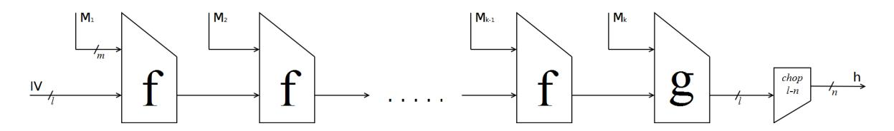

# Security Reductions of the Second Round SHA-3 Candidates

Elena Andreeva, Bart Mennink and Bart Preneel

Dept. Electrical Engineering, ESAT/COSIC and IBBT Katholieke Universiteit Leuven, Belgium {elena.andreeva, bart.mennink}@esat.kuleuven.be

Abstract. In 2007, the US National Institute for Standards and Technology announced a call for the design of a new cryptographic hash algorithm in response to vulnerabilities identified in existing hash functions, such as MD5 and SHA-1. NIST received many submissions, 51 of which got accepted to the first round. At present, 14 candidates are left in the second round. An important criterion in the selection process is the SHA-3 hash function security and more concretely, the possible security reductions of the hash function to the security of its underlying building blocks. While some of the candidates are supported with firm security reductions, for most of the schemes these results are still incomplete. In this paper, we compare the state of the art provable security reductions of the second round candidates. We discuss all SHA-3 candidates at a high functional level, and analyze and summarize the security reduction results. Surprisingly, we derive some security bounds from the literature, which the hash function designers seem to be unaware of. Additionally, we generalize the well-known proof of collision resistance preservation, such that all SHA-3 candidates with a suffix-free padding are covered.

# 1 Introduction

Hash functions are a building block for numerous cryptographic applications. In 2004 a series of attacks by Wang et al. [\[66,](#page-14-0)[67\]](#page-14-1) have exposed security vulnerabilities in the design of the most widely adopted and deployed SHA-1 hash function. As a result, the US National Institute for Standards and Technology (NIST) recommended the replacement of SHA-1 by the SHA-2 hash function family and announced a call for the design of a new SHA-3 hashing algorithm. The SHA-3 hash function must allow for message digests of length 224, 256, 384 and 512 bits, it should be efficient, and most importantly it should provide an adequate level of security. In the current second round, 14 candidate hash functions are still in the race for the selection of the SHA-3 hash function. These candidates are under active evaluation by the cryptographic community. As a result of the performed comparative analysis, several classifications of the SHA-3 candidates, mostly focussed on hardware performance, appeared in the literature [\[33,](#page-13-0)[64,](#page-14-2)[32,](#page-13-1)[45\]](#page-14-3). A classification based on the specified by NIST security criteria is however still due.

NIST Security Requirements. NIST specifies a number of security requirements [\[55\]](#page-14-4) to be satisfied by the future SHA-3 function: (i) at least one variant of the hash function must securely support HMAC and randomized hashing. Furthermore, for all n-bit digest values, the hash function must provide (ii) preimage resistance of approximately n bits, (iii) second preimage resistance of approximately n − L bits, where the first preimage is of length at most 2<sup>L</sup> blocks, (iv) collision resistance of approximately n/2 bits, and (v) all variants must be resistant to the length-extension attack. Finally, (vi) for any m ≤ n, the hash function specified by taking a fixed subset of m bits of the function's output is required to satisfy properties (ii)-(v) with n replaced by m.

Our Contribution. In this work we provide a survey of the 14 remaining SHA-3 candidates, in which we compare their security reductions. More concretely, we consider preimage, second preimage and collision resistance (security requirements (ii)-(iv)) for the n = 256 and n = 512 variants. Most of our security analysis is realized in the ideal model, where one or more of the underlying integral building blocks (e.g., the underlying block cipher or permutation(s)) are assumed to be ideal, i.e. random primitives. Additionally, to argue collision resistance we extend the standard proof of Merkle-Damgård collision resistance [27,53] to cover *all* SHA-3 candidate hash functions with a suffix-free padding (App. A). Notice that the basic Merkle-Damgård proof does not suffice in the presence of a final transformation and/or a chopping.

Furthermore, we consider the indifferentiability of the candidates. Informally, indifferentiability guarantees that a design has no structural design flaws [26], and in particular (as formally proven in App. B) an indifferentiability result provides upper bounds on the advantage of finding preimages, second preimages and collisions.

Our main contribution consists in performing a comparative survey of the existing security results on the 14 hash function candidates and results derivable from earlier works on hash functions, and suggesting possible research directions aimed at resolving some of the identified open problems. Section 2 briefly covers the notation, and the basic principles of hash function design. In Sect. 3, we consider all candidates from a provable security point of view. We give a high level algorithmic description of each hash function, and discuss the existing security results. All results are summarized in Table 1. We conclude the paper with Sect. 4 and give some final remarks on the security comparison.

#### <span id="page-1-0"></span>2 Preliminaries

For a positive integer value  $n \in \mathbb{N}$ , we denote by  $\mathbb{Z}_2^n$  the set of bit strings of length n, and by  $(\mathbb{Z}_2^n)^*$  the set of strings of length a positive multiple of n bits. We denote by  $\mathbb{Z}_2^*$  the set of bit strings of arbitrary length. If x, y are two bit strings, their concatenation is denoted by x||y. By |x| we denote the length of a bit string x, and for  $m, n \in \mathbb{N}$  we denote by  $\langle m \rangle_n$  the encoding of m as an n-bit string. The function  $\mathsf{chop}_n(x)$  chops off n bits of a bit string x.

Throughout, we use a unified notation for all candidates. The value n denotes the output size of the hash function, l the size of the chaining value, and m the number of message bits compressed in one iteration of the compression function. A padded message is always parsed as a sequence of  $k \geq 1$  message blocks of length m bits:  $(M_1, \ldots, M_k)$ .

#### 2.1 Security Notions

In this section we investigate the security of the hash functions in the 'ideal model' and the more classical 'generic' security.

Security in the ideal model. In the ideal model, a compressing function F (either on fixed or arbitrary input lengths) that uses one or more underlying building blocks is viewed insecure if there exists a successful information-theoretic adversary that has only query access to the idealized underlying primitives of F. The complexity of the attack is measured by the number of queries q to the primitive made by the adversary. In this work it is clear from the context which of the underlying primitives is assumed to be ideal. The three main security properties required from the SHA-3 hash function are preimage, second preimage and collision resistance. For each of these three notions, with  $\mathbf{Adv}_F^{\mathrm{atk}}$ , where  $\mathrm{atk} \in \{\mathrm{pre}, \mathrm{sec}, \mathrm{col}\}$ , we denote the maximum advantage of an adversary to break the function F under the security notion atk. The advantage is the probability function taken over all random choices of the underlying primitives, and the maximum is taken over all adversaries that make at most q queries to their oracles.

Additionally, we consider the indifferentiability of the SHA-3 candidates. The indifferentiability

framework introduced by Maurer et al. [52] is an extension of the classical notion of indistinguishability, and ensures that a hash function has no structural defects. We denote the indifferentiability security of a hash function  $\mathcal{H}$  by  $\mathbf{Adv}^{\mathrm{pro}}_{\mathcal{H}}$ , maximized over all distinguishers making at most q queries of maximal length  $K \geq 0$  message blocks to their oracles. We refer to [26] for a formal definition. An indifferentiability bound guarantees security of the hash function against specific attacks. In particular, one can obtain a bound on  $\mathbf{Adv}^{\mathrm{atk}}_{\mathcal{H}}$ , for any security notion atk:  $\mathbf{Adv}^{\mathrm{atk}}_{\mathcal{H}} \leq \mathbf{Pr}^{\mathrm{atk}}_{RO} + \mathbf{Adv}^{\mathrm{pro}}_{\mathcal{H}}$ , where  $\mathbf{Pr}^{\mathrm{atk}}_{RO}$  denotes the success probability of a generic attack against  $\mathcal{H}$  under atk. This bound is proven in Thm. 2 (App. B).

Generic security. The generic collision resistance security in the context of this work deals with analyzing the collision resistance of hash functions in the standard model. A hash function  $\mathcal{H}$  is called generically  $(t, \varepsilon)$  collision resistant if no adversary running in time at most t can find two different messages M, M' such that  $\mathcal{H}(M) = \mathcal{H}(M')$  with advantage more than  $\varepsilon$ . We denote by  $\mathbf{Adv}^{\mathrm{gcol}}_{\mathcal{H}}$  the generic collision resistance security of the function  $\mathcal{H}$ , maximized over all 'efficient' adversaries. We refer the reader to [59,58,3] for a more formal discussion.

To argue generic collision resistance security of the hash function  $\mathcal{H}$  (as domain extenders of fixed input length compression functions) we use the composition result of [27,53] and extend it to a wider class of suffix-free hash functions (App. A). This result concludes the collision resistance of the hash function  $\mathcal{H}$  assuming collision resistance security guarantees from the underlying compression functions. We then translate ideal model collision resistance security results on the compression functions via the latter composition to ideal model collision results on the hash function (expressed by  $\mathbf{Adv}^{\mathrm{col}}_{\mathcal{H}}$ ). A generic collision result, generally speaking, applies to a wider class of schemes for which no bounds on the collision resistance security of the underlying compression functions is known, e.g. for BLAKE and BMW.

If a compressing function F outputs a bit string of length n, one expects to find collisions with high probability after approximately  $2^{n/2}$  queries (due to the birthday attack). Similarly, (second) preimages can be found with high probability after approximately  $2^n$  queries<sup>1</sup>. Moreover, finding second preimages is provably harder than finding collisions, and similar for preimages (depending on the specification of F) [59]. Formally, we have  $\Omega(q^2/2^n) = \mathbf{Adv}_F^{\mathrm{col}} = O(1)$ ,  $\Omega(q/2^n) = \mathbf{Adv}_F^{\mathrm{sec}} \leq \mathbf{Adv}_F^{\mathrm{col}}$ , and  $\Omega(q/2^n) = \mathbf{Adv}_F^{\mathrm{pre}} \leq \mathbf{Adv}_F^{\mathrm{col}} + \varepsilon$ , where  $\varepsilon$  is negligible if F is a variable input length compressing function. In the remainder, we will consider these bounds for granted, and only include security results that improve either of these bounds. A bound is called tight if the lower and upper bound are the same up to a constant factor, and optimal if the bound is tight with respect to the original lower bound.

#### 2.2 Compression Function Design Strategies

A common way to build compression functions is to base it on a block cipher [57,21,62], or on a (limited number of) permutation(s) [20,60,61]. Preneel et al. [57] analyzed and categorized 64 block cipher based compression functions. Twelve of them are formally proven secure by Black et al. [21]. These results have been recently generalized by Stam [62]. Interestingly, the latter result implies security bounds for some compression functions that do not fit in the PGV-model, like ECHO, Hamsi and SIMD. Throughout, by 'PGVx' we denote the  $x^{th}$  type compression function

<span id="page-2-0"></span><sup>&</sup>lt;sup>1</sup> Kelsey and Schneier [42] describe a second preimage attack on the Merkle-Damgård hash function that requires at most approximately  $2^{n-L}$  queries, where the first preimage is of length at most  $2^L$  blocks. This attack does, however, not apply to all SHA-3 candidates. In particular, the wide-pipe SHA-3 candidates remain mostly unaffected due to their increased internal state.

of [\[57\]](#page-14-9). We note that PGV1, PGV3 and PGV5 are better known as the Matyas-Meyer-Oseas, the Miyaguchi-Preneel and the Davies-Meyer compression functions, respectively.

In the context of permutation based compression functions, Black et al. [\[20\]](#page-13-6) analyzed 2l- to l-bit compression functions based on one l-bit permutation, and proved them insecure. This result has been generalized by Rogaway and Steinberger [\[60\]](#page-14-11), Stam [\[61\]](#page-14-12) and Steinberger [\[63\]](#page-14-14) to compression functions with arbitrary input and output sizes, and an arbitrary number of underlying permutations. Their bounds indicate the number of queries required to find collisions or preimages for permutation based compression functions.

### 2.3 Hash Function Design Strategies

In order to allow the hashing of arbitrarily long strings, all SHA-3 candidates employ a specific mode of operation. Central to all designs is the iterated hash function principle [\[47\]](#page-14-15): on input of an initialization vector IV, the iterated hash function H<sup>f</sup> based on the compression function f proceeds a padded message (M1, . . . , Mk) as follows:

$$\mathcal{H}^f(\mathsf{IV}; M_1, \dots, M_k) = h_k$$
, where:  $h_0 = \mathsf{IV}$ ,
$$h_i = f(h_{i-1}, M_i) \text{ for } i = 1, \dots, k.$$

This principle is also called the plain Merkle-Damg˚ard (MD) design [\[53,](#page-14-5)[27\]](#page-13-2). Each of the 14 remaining candidates is based on this design, possibly followed by a final transformation (FT), and/or a chop-function[2](#page-3-0) .

The padding function pad : Z ∗ <sup>2</sup> → (Z m 2 ) ∗ is an injective mapping that transforms a message of arbitrary length to a message of length a multiple of m bits (the number of message bits compressed in one compression function iteration). Most of the candidates employ a sufficiently strong padding rule (cf. App. [C\)](#page-16-2). Additionally, in some of the designs the message blocks are compressed along with specific counters or tweaks, which may strengthen the padding rule. We distinguish between 'prefix-free' and/or 'suffix-free' padding.

A padding rule is called suffix-free, if for any distinct M, M<sup>0</sup> , there exists no bit string X such that pad(M<sup>0</sup> ) = Xkpad(M). The plain MD design with any suffix-free padding (also called MD-strengthening [\[47\]](#page-14-15)) preserves collision resistance [\[53,](#page-14-5)[27\]](#page-13-2). We generalize this result in Thm. [1](#page-15-1) (App. [A\)](#page-15-0): informally, this preservation result also holds if the iteration is finalized by a distinct compression function and/or the chop-function. Other security properties, like preimage resistance, are however not preserved in the MD design [\[3\]](#page-13-4). It is also proven that the MD design with a suffix-free padding need not necessarily be indifferentiable [\[26\]](#page-13-3). However, the MD construction is indifferentiable if it ends with a chopping function or a final transformation, both when the underlying compression function is ideal or when the hash function is based on a PGV compression function [\[26,](#page-13-3)[39,](#page-14-16)[51\]](#page-14-17).

A padding rule is called prefix-free, if for any distinct M, M<sup>0</sup> , there exists no bit string X such that pad(M<sup>0</sup> ) = pad(M)kX. It has been proved that the MD design, based on ideal compression function or ideal PGV construction, with prefix-free padding is indifferentiable from a random oracle [\[25](#page-13-7)[,26](#page-13-3)[,39](#page-14-16)[,51\]](#page-14-17). Security notions like collision-resistance, are however not preserved in the MD design with prefix-free only padding.

<span id="page-3-0"></span><sup>2</sup> A function g is a final transformation if it differs from f, and is applied to the final state, possibly with the injection of an additional message block. The chop-function is not considered to be (a part of) a final transformation.

HAIFA design. A concrete design based on the MD principle is the HAIFA construction [\[18\]](#page-13-8). In HAIFA the message is padded in a specific way so as to solve some deficiencies of the original MD construction: in the iteration, each message block is accompanied with a fixed (optional) salt of s bits and a (mandatory) counter C<sup>i</sup> of t bits. The counter C<sup>i</sup> keeps track of the number of message bits hashed so far, and equals 0 by definition if the i th block does not contain any message bits. Partially due to the properties of this counter, the HAIFA padding rule is suffix- and prefix-free. As a consequence, the construction preserves collision resistance (cf. Thm. [1\)](#page-15-1) and the indifferentiability results of [\[26\]](#page-13-3) carry over. For the HAIFA design, these indifferentiability results are improved in [\[16\]](#page-13-9). Furthermore, the HAIFA construction is proven secure against second preimage attacks if the underlying compression function is assumed to behave like an ideal primitive [\[23\]](#page-13-10).

Wide-pipe design. In the wide-pipe design [\[50\]](#page-14-18), the iterated state size is significantly larger than the final hash output: at the end of the iteration, a fraction of the output of a construction is discarded. As proved in [\[26\]](#page-13-3), the MD construction with a distinct final transformation and/or chopping at the end is indifferentiable from a random oracle.

Sponge functions. We do not explicitly consider sponge functions [\[15\]](#page-13-11) or their generalization [\[1\]](#page-11-0) as a specific type of construction: all SHA-3 candidates known to be sponge(-like) functions, CubeHash, Fugue, JH, Keccak and Luffa, can be described in terms of the chop-MD construction (possibly with a final transformation before or instead of the chopping).

# <span id="page-4-0"></span>3 SHA-3 Hash Function Candidates

In this section, we analyze the security of the 14 remaining SHA-3 candidates in more detail. For simplicity, we only consider the proposals of the SHA-3 candidates that output digests of 256 or 512 bits. Observe that in many candidate SHA-3 hash function families, the algorithms that output 224 or 384 bits are the same as the 256- or 512-bits algorithms, except for an additional chopping at the end. Particularly, the results of [\[26\]](#page-13-3) and Thm. [1](#page-15-1) carry over in most of the cases. The same remark applies to requirement (vi) of NIST.

Requirement (i). All designers claim that their proposal can safely be used in HMAC mode [\[9\]](#page-13-12) or for randomized hashing [\[41\]](#page-14-19), and we do not discuss it here;

Requirements (ii)-(iv). Preimage, second preimage and collision resistance of each hash function are discussed in this section. Additionally, we consider the indifferentiability of the candidates;

Requirement (v). All hash function candidates are secure against the length extension attack, and thus we do not discuss it further.

Below, we examine the SHA-3 candidate hash functions in more detail. Each paragraph contains an informal discussion for each of the second round SHA-3 candidates and their security reduction results. The mathematical descriptions of the (abstracted) designs are given in Fig. [1,](#page-5-0) and the candidates' padding functions are summarized in App. [C.](#page-16-2) The concrete security results for all current candidate hash functions are summarized in Table [1.](#page-12-0) More precisely, for each candidate and each security notion, this table includes the security bound, as far as it exists, and the underlying assumption.

3.1. The BLAKE hash function [\[6\]](#page-13-13) is a HAIFA construction. The message blocks are accompanied with a HAIFA-counter, and more generally, the function employs a suffix- and prefix-free padding rule. The compression function f is block cipher based[3](#page-4-1) . It moreover employs an injective linear

<span id="page-4-1"></span><sup>3</sup> As observed in [\[6,](#page-13-13) Sect. 5], the core part of the compression function can be seen as a permutation keyed by the message, which we view here as a block cipher.

```
BLAKE:
                                                                                                                                               JH:
 (n, l, m, s, t) \in \{(256, 256, 512, 128, 64), (256, 256, 256, 256, 256, 256, 256, 256,
 \begin{array}{l} (n,t,m,s,t) \in \{(250,250,512,128,64),\\ \qquad \qquad (512,512,1024,256,128)\} \\ E: \mathbb{Z}_2^{2l} \times \mathbb{Z}_2^m \to \mathbb{Z}_2^{2l} \text{ a block cipher} \\ L: \mathbb{Z}_2^{l+s+t} \to \mathbb{Z}_2^{2l}, \, L': \mathbb{Z}_2^{2l} \to \mathbb{Z}_2^{l} \text{ linear functions} \\ f(h,M,S,C) = L'(E_M(L(h,S,C))) \oplus h \oplus (S\|S) \end{array}
                                                                                                                                                 (n, l, m) \in \{(256, 1024, 512), (512, 1024, 512)\}
                                                                                                                                               P: \mathbb{Z}_2^l \to \mathbb{Z}_2^l a permutation f(h, M) = P(h \oplus (0^{l-m} || M)) \oplus (M || 0^{l-m})
                                                                                                                                                JH(M) = h, where:
 \mathsf{BLAKE}(M) = h_k, where:
                                                                                                                                                     \begin{array}{l} (M_1,\ldots,M_k) \leftarrow \mathsf{pad}_8(M); \ h_0 \leftarrow \mathsf{IV} \\ h_i \leftarrow f(h_{i-1},M_i) \ \text{for} \ i=1,\ldots,k \end{array}
      \begin{array}{l} (M_1,\ldots,M_k) \leftarrow \operatorname{pad}_1(M); \ h_0 \leftarrow \operatorname{IV} \\ S \in \mathbb{Z}^s_2; \ (C_i)_{i=1}^k \ \operatorname{HAIFA-counter} \\ h_i \leftarrow f(h_{i-1},M_i,S,C_i) \ \operatorname{for} \ i=1,. \end{array}
                                                                                                                                                     h \leftarrow \mathsf{chop}_{l-n}[h_k]
                                                                                                                                                Keccak
                                                                                                                                                 (n, l, m) \in \{(256, 1600, 1088), (512, 1600, 576)\}
EVALUATION M (256, 512, 512), (512, 1024, 1024) E: \mathbb{Z}_2^m \times \mathbb{Z}_2^l \to \mathbb{Z}_2^m a block cipher L: \mathbb{Z}_2^{l+m+l} \to \mathbb{Z}_2^l a compressing function f(h,M) = L(h,M,E_h(M))
                                                                                                                                                P: \mathbb{Z}_2^l \to \mathbb{Z}_2^l a permutation
                                                                                                                                                f(h, M) = P(h \oplus (M || 0^{l-m}))
                                                                                                                                               Keccak(M) = h, where:
                                                                                                                                                     \begin{array}{l} (M_1,\ldots,M_k) \leftarrow \operatorname{pad}_9(M); \ h_0 \leftarrow \operatorname{IV} \\ h_i \leftarrow f(h_{i-1},M_i) \ \text{for} \ i=1,\ldots,k \\ h \leftarrow \operatorname{chop}_{l-n}[h_k] \end{array}
 g(h) = f(\mathsf{IV}', h)
 BMW(M) = h, where:
      (M_1,\ldots,M_k) \leftarrow \mathsf{pad}_2(M); \ h_0 \leftarrow \mathsf{IV}
                                                                                                                                               Luffa:
      h_i \leftarrow f(h_{i-1}, M_i) \text{ for } i = 1, \dots, k
                                                                                                                                                \begin{array}{l} (n,l,m,w) \in \{(256,768,256,3),(512,1278,256,5)\} \\ P_i: \mathbb{Z}_2^m \to \mathbb{Z}_2^m \ (i=1,\ldots,w) \ \text{permutations} \\ L: \mathbb{Z}_2^{wm+m} \to \mathbb{Z}_2^{wm}, \ L': \mathbb{Z}_2^{wm} \to \mathbb{Z}_2^m \ \text{linear functions} \end{array}
     h \leftarrow \mathsf{chop}_{l-n}[g(h_k)]
 CubeHash:
                                                                                                                                                f(h, M) = (P_1(h'_1) || \dots || P_w(h'_w))
where (h'_1, \dots, h'_w) = L(h, M)
 g(h) = (L'(h) || L'(f(h, 0^m)))
  (n, l, m) \in \{(256, 1024, 256), (512, 1024, 256)\}
 P: \mathbb{Z}_2^l \to \mathbb{Z}_2^l a permutation
 f(h, M) = P(h \oplus (M||0^{l-m}))

g(h) = P^{10}(h \oplus (0^{992}||1||0^{31}))
                                                                                                                                               Luffa(M) = h, where:
                                                                                                                                                     (M_1, \dots, M_k) \leftarrow \operatorname{pad}_{10}(M); \ h_0 \leftarrow \operatorname{IV} h_i \leftarrow f(h_{i-1}, M_i) \text{ for } i = 1, \dots, k
 CubeHash(M) = h, where:
     \begin{array}{l} (M_1,\ldots,M_k) \leftarrow \operatorname{pad}_3(M); \ h_0 \leftarrow \operatorname{IV} \\ h_i \leftarrow f(h_{i-1},M_i) \ \text{for} \ i=1,\ldots,k \\ h \leftarrow \operatorname{chop}_{l-n}[g(h_k)] \end{array}
                                                                                                                                                     h \leftarrow \mathsf{chop}_{512-n}[g(h_k)]
                                                                                                                                                 Shabal:
                                                                                                                                                (n, l, m) \in \{(256, 1408, 512), (512, 1408, 512)\}

E : \mathbb{Z}_2^{896} \times \mathbb{Z}_2^{1024} \to \mathbb{Z}_2^{896} a block cipher

f(h, C, M) = (y_1, h_3 - M, y_3)
FCHO.
  (n, l, m, s, t) \in \{(256, 512, 1536, 128, 64/128)\}
 (612, 1024, 1024, 256, 64/128),
(512, 1024, 1024, 256, 64/128)\}
E: \mathbb{Z}_2^{2048} \times \mathbb{Z}_2^{s+t} \to \mathbb{Z}_2^{2048} \text{ a block cipher}
                                                                                                                                                     where h \in \mathbb{Z}_2^l \xrightarrow{a_1, a_2} h = (h_1, h_2, h_3) \in \mathbb{Z}_2^{384+m+m} and (y_1, y_3) = E_{M, h_3}(h_1 \oplus (0^{320} \| C), h_2 + M)
 L: \mathbb{Z}_2^{2048} \to \mathbb{Z}_2^1 \quad \Rightarrow \mathbb{Z}_2 \quad \text{a block cipiler}
L: \mathbb{Z}_2^{2048} \to \mathbb{Z}_2^1 \text{ a linear function}
f(h, M, S, C) = L(E_{S,C}(h||M) \oplus (h||M))
                                                                                                                                                  Shabal(M) = h, where:
 ECHO(M) = h, where:
                                                                                                                                                       (M_1,\ldots,M_k) \leftarrow \mathsf{pad}_{11}(M);\ h_0 \leftarrow \mathsf{IV}
                                                                                                                                                     \begin{array}{l} h_i \leftarrow f(h_{i-1}, \langle i \rangle_{64}, M_i) \text{ for } i = 1, \ldots, k \\ h_{k+i} \leftarrow f(h_{k+i-1}, \langle k \rangle_{64}, M_k) \text{ for } i = 1, \ldots, 3 \\ h \leftarrow \mathsf{chop}_{l-n}[h_{k+3}] \end{array}
     (M_1,\ldots,M_k) \leftarrow \mathsf{pad}_4(M);\ h_0 \leftarrow \mathsf{IV}
     S \in \mathbb{Z}_2^s; (C_i)_{i=1}^k \text{ HAIFA-counter}
h_i \leftarrow f(h_{i-1}, M_i, S, C_i) \text{ for } i = 1, \dots, k
      h \leftarrow \mathsf{chop}_{l-n}[h_k]
                                                                                                                                               SHAvite-3
                                                                                                                                                 (n, l, m, s, t) \in \{(256, 256, 512, 256, 64),
 Fugue:
                                                                                                                                                (512, 512, 1024, 512, 128)\}
E: \mathbb{Z}_2^l \times \mathbb{Z}_2^{m+s+t} \to \mathbb{Z}_2^l \text{ a block cipher}
  (n, l, m) \in \{(256, 960, 32), (512, 1152, 32)\}
 \begin{array}{l} P, \tilde{P} : \mathbb{Z}_2^l \to \mathbb{Z}_2^l \text{ permutations} \\ L : \mathbb{Z}_2^l \times \mathbb{Z}_2^m \to \mathbb{Z}_2^l \text{ a linear function} \\ f(h, M) = P(L(h, M)) \end{array}
                                                                                                                                                 f(h, M, S, C) = E_{M,S,C}(h) \oplus h
                                                                                                                                               SHAvite-3(M) = h_k, where:
                                                                                                                                                      (M_1,\ldots,M_k) \leftarrow \mathsf{pad}_{12}(M);\ h_0 \leftarrow \mathsf{IV}
  \mathsf{Fugue}(M) = h, \text{ where: }
                                                                                                                                                     S \in \mathbb{Z}_2^s; (C_i)_{i=1}^k HAIFA-counter h_i \leftarrow f(h_{i-1}, M_i, S, C_i) for i = 1, \dots, k
      (M_1, \dots, M_k) \leftarrow \mathsf{pad}_5(M); \ h_0 \leftarrow \mathsf{IV}
h_i \leftarrow f(h_{i-1}, M_i) \text{ for } i = 1, \dots, k
     h \leftarrow \mathsf{chop}_{l-n}[\tilde{P}(h_k)]
                                                                                                                                                 (n, l, m) \in \{(256, 512, 512), (512, 1024, 1024)\}
                                                                                                                                               E, \tilde{E}: \mathbb{Z}_2^l \times \mathbb{Z}_2^m \to \mathbb{Z}_2^l \text{ block ciphers}
f(h, M) = L(h, \tilde{E}_M(h \oplus M))
  (n, l, m) \in \{(256, 512, 512), (512, 1024, 1024)\}
 P, Q: \mathbb{Z}_2^l \to \mathbb{Z}_2^l permutations f(h, M) = P(h \oplus M) \oplus Q(M) \oplus h
                                                                                                                                               g(h, M) = L(h, \tilde{E}_M(h \oplus M))
 g(h) = P(h) \oplus h
                                                                                                                                               SIMD(M) = h, where:
                                                                                                                                                      \begin{array}{l} (M_1,\ldots,M_k) \leftarrow \mathsf{pad}_{13}(M); \ h_0 \leftarrow \mathsf{IV} \\ h_i \leftarrow f(h_{i-1},M_i) \ \text{for} \ i=1,\ldots,k-1 \end{array}
 Grøstl(M) = h, where:
     \begin{array}{l} (M_1,\ldots,M_k) \leftarrow \operatorname{pad}_6(M); \ h_0 \leftarrow \operatorname{IV} \\ h_i \leftarrow f(h_{i-1},M_i) \ \text{for} \ i=1,\ldots,k \\ h \leftarrow \operatorname{chop}_{l-n}[g(h_k)] \end{array}
                                                                                                                                                     \begin{array}{l} h_{k} \leftarrow g(h_{k-1}, M_{k}) \\ h_{k} \leftarrow \operatorname{chop}_{l-n}[h_{k}] \end{array}
                                                                                                                                               Skein:
 Hamsi:
                                                                                                                                                 (n, l, m) \in \{(256, 512, 512), (512, 512, 512)\}
\begin{array}{l} (n,l,m) \in \{(256,256,32),(512,512,64)\} \\ P,\tilde{P}: \mathbb{Z}_2^{2n} \to \mathbb{Z}_2^{2n} \text{ permutations} \\ \text{Exp}: \mathbb{Z}_2^{n^2} \to \mathbb{Z}_2^{n} \text{ a linear code} \end{array}
                                                                                                                                                E:\mathbb{Z}_2^m\times\mathbb{Z}_2^{128}\times\mathbb{Z}_2^l\to\mathbb{Z}_2^m a tweakable block cipher f(h,T,M)=E_{h,T}(M)\oplus M
 f(h, M) = h \oplus \operatorname{chop}_n[P(\operatorname{Exp}(M) || h)]
                                                                                                                                               Skein(M) = h, where:
 g(h,M) = h \oplus \mathsf{chop}_n[\tilde{P}(\mathsf{Exp}(M) \| h)]
                                                                                                                                                     (\mathring{M_1}, \dots, \mathring{M_k}) \leftarrow \mathsf{pad}_{14}(M); \ h_0 \leftarrow \mathsf{IV}
                                                                                                                                                      \begin{array}{l} (T_i)_{i=1}^k \text{ round-specific tweaks} \\ h_i \leftarrow f(h_{i-1}, T_i, M_i) \text{ for } i = 1, \ldots, k \\ h \leftarrow \mathsf{chop}_{l-n}[h_k] \end{array}
 \overline{\mathsf{Hamsi}(M) = h}, where:
     \begin{array}{l} (M_1,\ldots,M_k) \leftarrow \mathsf{pad}_7(M); \ h_0 \leftarrow \mathsf{IV} \\ h_i \leftarrow f(h_{i-1},M_i) \ \text{for} \ i=1,\ldots,k-1 \end{array}
      h \leftarrow g(h_{k-1}, M_k)
```

<span id="page-5-0"></span>**Fig. 1.** The padding rules employed by the functions are summarized in App. C. In all algorithm descriptions, IV denotes an initialization vector, h denotes state values, M denotes message blocks, S denotes a (fixed) salt, C denotes a counter and T denotes a tweak. The functions  $L, L', \mathsf{Exp}$  underlying BLAKE, BMW, ECHO, Fugue, Hamsi and Luffa, are explained in the corresponding section.

function L, and a linear function L' that XORs the first and second halves of the input.

Security of BLAKE. The compression function of BLAKE shows similarities with the PGV5 compression function [21], but no security results are known for this variation. The mode of operation of BLAKE is based on the HAIFA structure, and as a consequence all security properties regarding this type hold [18]. In particular, the design preserves collision resistance, and as a consequence we obtain  $\mathbf{Adv}_{\mathcal{H}}^{\mathrm{col}} = \Theta(q^2/2^n)$  (if f is assumed ideal). Also, the design is secure against second preimage attacks. Additionally, a preimage for BLAKE implies a preimage for its last compression function, and we obtain  $\mathbf{Adv}_{\mathcal{H}}^{\mathrm{pre}} = \Theta(q/2^n)$ . Furthermore, the BLAKE hash function is indifferentiable from a random oracle if the underlying compression function is assumed to be ideal, due to the HAIFA counter [26,16].

**3.2.** The **Blue Midnight Wish** (BMW) hash function [38] is a chop-MD construction, with a final transformation before chopping. The hash function employs a suffix-free padding rule. The compression function f is block cipher based<sup>4</sup>, and the final transformation g consists of the same compression function with the chaining value processed as a message, and with an initial value as chaining input. The compression function employs a function L which consists of two compression functions with specific properties as specified in [38].

Security of BMW. The compression function of BMW shows similarities with the PGV3 compression function [21], but no security results are known for this variation. Thm. 1 applies to BMW, where the final transformation has no message block as input, and as a consequence we obtain  $\mathbf{Adv}_{\mathcal{H}}^{\mathrm{col}} = \Theta(q^2/2^n)$  (if f is assumed ideal). Additionally, a preimage for BMW implies a preimage for its final transformation, and we obtain  $\mathbf{Adv}_{\mathcal{H}}^{\mathrm{pre}} = \Theta(q/2^n)$ . Furthermore, albeit no indifferentiability proof for the BMW hash function is known, we note that BMW can be seen as a combination of the HMAC- and the chop-construction, both proven indifferentiable from a random oracle [26]. We remark that a distinguisher for the compression function of BMW is derived in [5].

**3.3.** The **CubeHash** hash function [12] is a chop-MD construction, with a final transformation before chopping. The compression function f is permutation based, and the final transformation g consists of flipping a certain bit in the state and applying 10 more compression function rounds on zero-messages.

Security of CubeHash. The compression function of CubeHash is based on one permutation<sup>5</sup>, and collisions and preimages for the compression function can be found in one query to the permutation [20]. The CubeHash hash function is as parazoa design proven indifferentiable from a random oracle if the underlying permutation is assumed to be ideal [1]. Using Thm. 2, this indifferentiability bound additionally renders an optimal collision resistance bound for CubeHash,  $\mathbf{Adv}^{\mathrm{col}}_{\mathcal{H}} = \Theta(q^2/2^n)$ , as well as an improved upper bound  $O\left(\frac{q}{2^n} + \frac{q^2}{2^{l-n}}\right)$  on the preimage and second preimage resistance. Note that these bounds are optimal for the n=256 variant.

**3.4.** The **ECHO** hash function [11] is a chop-HAIFA construction. The message blocks are accompanied with a HAIFA-counter, and more generally, the function employs a suffix- and prefix-free padding rule. The compression function f is block cipher based<sup>6</sup>. It moreover employs a linear function L that chops the state in blocks of length l bits, and XORs these.

**Security of ECHO.** The compression function of ECHO is a 'chopped single call Type-I' com-

<span id="page-6-0"></span><sup>&</sup>lt;sup>4</sup> As observed in [38], the compression function can be seen as a generalized PGV3 construction, where the function  $f_0$  of [38] defines the block cipher keyed with the chaining value.

<span id="page-6-1"></span><sup>&</sup>lt;sup>5</sup> Effectively, this permutation consists of one simpler permutation executed 16 times iteratively.

<span id="page-6-2"></span><sup>&</sup>lt;sup>6</sup> As observed in [11], the core part of the compression function can be seen as a permutation keyed by the salt and counter, which we view here as a block cipher. This cipher is AES-based.

pression function in the categorization of [62]. Therefore, the results of [62, Thm. 15] carry over, yielding optimal security bounds for the compression function. Observe that these results can easily be adjusted to obtain bound  $\mathbf{Adv}_{\mathsf{chop} \circ f}^{\mathsf{col}} = \Theta(q^2/2^n)$ . ECHO is a combination of HAIFA and chop-MD, but it is unclear whether all HAIFA security properties hold after chopping. Still, Thm. 1 applies to ECHO, and as a consequence we obtain  $\mathbf{Adv}_{\mathcal{H}}^{\mathsf{col}} = \Theta(q^2/2^n)$ . Additionally, a preimage for ECHO implies a preimage for its last compression function, and we obtain  $\mathbf{Adv}_{\mathcal{H}}^{\mathsf{pre}} = \Theta(q/2^n)$ . Furthermore, the ECHO hash function would be indifferentiable from a random oracle if the underlying compression function is assumed to be ideal, due to the chopping function at the end [26]. However, the compression function of ECHO is easily differentiable from a random oracle [35], and we cannot directly apply the results of [26].

**3.5.** The **Fugue** hash function [40] is a chop-MD construction, with a final transformation before chopping. The hash function employs a suffix-free padding rule. The compression function f is permutation based, and the final transformation consists of a permutation  $\tilde{P}$  which differs from P in the parametrization. The compression function employs a linear function L for message injection (TIX of [40]).

Security of Fugue. The compression function of Fugue is based on one permutation, and collisions and preimages for the compression function can be found in one query to the permutation [20]. As a consequence, the result of Thm. 1 is irrelevant, even though the padding rule of Fugue is suffix-free. The Fugue hash function is as parazoa design proven indifferentiable from a random oracle if the underlying permutations P and  $\tilde{P}$  are assumed to be ideal [1]. Using Thm. 2, this indifferentiability bound additionally renders an optimal collision resistance bound for Fugue,  $\mathbf{Adv}^{\mathrm{col}}_{\mathcal{H}} = \Theta(q^2/2^n)$ , as well as an improved upper bound  $O\left(\frac{q}{2^n} + \frac{q^2}{2^{l-m-n}}\right)$  on the preimage and second preimage resistance. Note that these bounds are optimal for the n=256 variant. We remark that a distinguisher for the final round of Fugue is derived in [8,36].

**3.6.** The **Grøstl** hash function [37] is a chop-MD construction, with a final transformation before chopping. The hash function employs a suffix-free padding rule. The compression function f is permutation based, and the final transformation g is defined as  $g(h) = P(h) \oplus h$ .

Security of Grøstl. The compression function of Grøstl is permutation based, and the results of [60,61] apply. Furthermore, the preimage resistance of the compression function is analyzed in [34], and an upper bound for collision resistance can be obtained easily. As a consequence, we obtain tight security bounds on the compression function,  $\mathbf{Adv}_f^{\text{pre}} = \Theta(q^2/2^l)$  and  $\mathbf{Adv}_f^{\text{col}} = \Theta(q^4/2^l)$ . Thm. 1 applies to Grøstl, where the final transformation has no message block as input. Observe that we also have  $\mathbf{Adv}_{\text{chop}\circ g}^{\text{col}} = \Theta(q^2/2^n)$ , and as a consequence we obtain  $\mathbf{Adv}_{\mathcal{H}}^{\text{col}} = \Theta(q^2/2^n)$ . Additionally, a preimage for Grøstl implies a preimage for its final transformation, and we obtain  $\mathbf{Adv}_{\mathcal{H}}^{\text{pre}} = \Theta(q/2^n)$ . Furthermore, the Grøstl hash function is proven indifferentiable from a random oracle if the underlying permutations are ideal [2].

**3.7.** The **Hamsi** hash function [46] is a MD construction, with a final transformation before chopping. The hash function employs a suffix-free padding rule. The compression function f is permutation based, but the last round is executed with a compression function g based on a permutation  $\tilde{P}$  which differs from P in the parametrization. The compression functions employ a linear code Exp for message injection [46].

Security of Hamsi. The compression function of Hamsi is a 'chopped single call Type-I' compression function in the categorization of [62]. Therefore, the results of [62, Thm. 15] carry over, yielding optimal security bounds for the compression function. Observe that these bounds also apply to the

function g. Thm. 1 applies to Hamsi, and as a consequence we obtain  $\mathbf{Adv}_{\mathcal{H}}^{\mathrm{col}} = \Theta(q^2/2^n)$ . Additionally, a preimage for Hamsi implies a preimage for its last compression function, and we obtain  $\mathbf{Adv}_{\mathcal{H}}^{\mathrm{pre}} = \Theta(q/2^n)$ . Furthermore, albeit no indifferentiability proof for the Hamsi hash function is known, we note that Hamsi can be seen as a variation of the NMAC-construction, which is proven indifferentiable from a random oracle [26].

**3.8.** The **JH** hash function [68] is a chop-MD construction. The hash function employs a suffix-free padding rule. The compression function f is permutation based.

**Security of JH.** The compression function of JH is based on one permutation, and collisions and preimages for the compression function can be found in one query to the permutation [20]. As a consequence, the result of Thm. 1 is irrelevant, even though the padding rule of JH is suffix-free. The JH hash function is proven optimally collision resistant [48], and proven indifferentiable from a random oracle if the underlying permutation is assumed to be ideal [17]. Using Thm. 2, this indifferentiability bound additionally renders an improved upper bound  $O\left(\frac{q}{2^n} + \frac{q^3}{2^{l-m}}\right)$  on the preimage and second preimage resistance.

**3.9.** The **Keccak** hash function [14] is a chop-MD construction. The compression function f is permutation based. The hash function output is obtained by chopping off l-n bits of the state<sup>7</sup>. Notice that the parameters of **Keccak** satisfy l = 2n + m.

Security of Keccak. The compression function of Keccak is based on one permutation, and collisions and preimages for the compression function can be found in one query to the permutation [20]. The Keccak hash function is proven indifferentiable from a random oracle if the underlying permutation is assumed to be ideal [13]. Using Thm. 2, this indifferentiability bound additionally renders an optimal collision resistance bound for Keccak,  $\mathbf{Adv}^{\text{col}}_{\mathcal{H}} = \Theta(q^2/2^n)$ , as well as an optimal preimage second preimage resistance bound  $\Theta(q/2^n)$ .

**3.10.** The **Luffa** hash function [28] is a chop-MD construction, with a final transformation before chopping. The compression function f is permutation based, and the final transformation g is built on this compression function and a linear function L' that chops the state in blocks of length m bits, and XORs these. The compression function employs a linear function L for message injection (MI of [28])<sup>8</sup>. Notice that the state size of Luffa satisfies  $l = w \cdot m$ .

Security of Luffa. The compression function of Luffa is based on w permutations executed independently. As a consequence, collisions and preimages for the compression function can be found in at most 5 queries to the permutations [20]. The Luffa hash function borrows characteristics from the sponge design and is similar to the parazoa design, if the permutation P consisting of the w permutations  $P_i$  is considered ideal, and ideas from the indifferentiability proofs of [1,13] may carry over. However, for the case of w different permutations  $P_i$  this is not immediately clear. We remark that a distinguisher for the permutation of Luffa is derived in [43].

**3.11.** The **Shabal** hash function [24] is a chop-MD construction. The message blocks are accompanied with a counter, and the last block is iterated three times. In particular, the function employs a suffix- and prefix-free padding rule. The compression function f is block cipher based<sup>9</sup>. Notice that the parameters of Shabal satisfy l = 384 + 2m.

<span id="page-8-0"></span><sup>&</sup>lt;sup>7</sup> We notice that sponge functions are designed more general [15], but for Keccak this description suffices.

<span id="page-8-1"></span><sup>&</sup>lt;sup>8</sup> We defined the output transformation in a slightly more complicated but unified way. Essentially, Luffa<sub>256</sub> simply outputs L'(h). Observe that we implicitly captured the extra compression function call in the adjusted padding.

<span id="page-8-2"></span><sup>&</sup>lt;sup>9</sup> Essentially, it is a permutation tweaked by a 1024-bit key, which we view here as a block cipher.

Security of Shabal. A bound on the collision resistance of the compression function of Shabal is derived in [24]. Concretely, it is proven that the Shabal compression function is collision resistant up to  $q = 2^{(l-m)/2}$  queries. Thm. 1 applies to Shabal. Collision and preimage resistance of Shabal are studied in [24], yielding optimal bounds  $\mathbf{Adv}^{\mathrm{pre}}_{\mathcal{H}} = \Theta(q/2^n)$  and  $\mathbf{Adv}^{\mathrm{col}}_{\mathcal{H}} = \Theta(q^2/2^n)$ . Furthermore, the same authors prove the Shabal hash function to be indifferentiable from a random oracle if the underlying block cipher is assumed to be ideal [24]. Using Thm. 2, this indifferentiability bound additionally renders an improved upper bound  $O\left(\frac{q}{2^n} + \frac{q^2}{2^{l-m}}\right)$  on the second preimage resistance. Note that this bound is optimal for the n=256 variant. We remark that a distinguisher for the block cipher of Shabal is derived in [4,7,44,56,65].

**3.12.** The **SHAvite-3** hash function [19] is a HAIFA construction. The message blocks are accompanied with a HAIFA-counter, and more generally, the function employs a suffix- and prefix-free padding rule. The compression function f is block cipher based.

Security of SHAvite-3. The compression function of SHAvite-3 is the PGV5 compression function, and the security results of [21] carry over. As a consequence, we obtain optimal security bounds on the compression function. The mode of operation of SHAvite-3 is based on the HAIFA structure, and as a consequence all security properties regarding this type hold [18]. In particular, the design preserves collision resistance, and as a consequence we obtain  $\mathbf{Adv}^{\mathrm{col}}_{\mathcal{H}} = \Theta(q^2/2^n)$ . Also, the design is secure against second preimage attacks. Additionally, a preimage for SHAvite-3 implies a preimage for its last compression function, and we obtain  $\mathbf{Adv}^{\mathrm{pre}}_{\mathcal{H}} = \Theta(q/2^n)$ . Finally, the SHAvite-3 hash function is indifferentiable from a random oracle if the underlying block cipher is assumed to be ideal, due to the prefix-free padding [26]. This result has been improved under the assumption that the underlying compression function is ideal [16]. However, the compression function of SHAvite-3 is easily differentiable from a random oracle due to the presence of fixed-points.

**3.13.** The **SIMD** hash function [49] is a chop-MD construction, with a final transformation before chopping. The hash function employs a suffix-free padding rule. The compression function f is block cipher based, but the last round is executed with a compression function g based on a block cipher  $\tilde{E}$  which differs from E in the parametrization. These function employ a quasi-group operation f [49].

Security of SIMD. The compression function of SIMD is a 'rate-1 Type-I' compression function in the categorization of [62]. Therefore, the results of [62, Thm. 6] carry over, yielding optimal security bounds for the compression function. Observe that these bounds also apply to the function g. Observe moreover that these results can easily be adjusted to obtain bound  $\mathbf{Adv}_{\mathsf{chop}\circ g}^{\mathsf{col}} = \Theta(q^2/2^n)$ . Thm. 1 applies to SIMD, and as a consequence we obtain  $\mathbf{Adv}_{\mathcal{H}}^{\mathsf{col}} = \Theta(q^2/2^n)$ . Additionally, a preimage for SIMD implies a preimage for its last compression function, and we obtain  $\mathbf{Adv}_{\mathcal{H}}^{\mathsf{pre}} = \Theta(q/2^n)$ . Furthermore, the SIMD hash function would be indifferentiable from a random oracle if the underlying compression functions are assumed to be ideal, due to the chopping function at the end [26]. However, the compression functions of SIMD are easily differentiable from a random oracle [22], and we cannot directly apply the results of [26].

**3.14.** The **Skein** hash function [31] is a chop-MD construction. The message blocks are accompanied with a round-specific tweak<sup>11</sup>, and more generally, the function employs a suffix- and prefix-free

<span id="page-9-0"></span><sup>&</sup>lt;sup>10</sup> For any of the variables fixed, the function L is a permutation.

<span id="page-9-1"></span><sup>&</sup>lt;sup>11</sup> More formally, the design is based on the UBI (unique block identifier) chaining mode which queries its underlying tweakable block cipher on additional tweaks, that differ in each iteration. The general description of Skein involves a specific final transformation. In the primary proposal of the hash function, however, this final transformation

padding rule. The compression function f is based on a tweakable block cipher.

Security of Skein. The compression function of Skein is the PGV1 compression function, with a difference that a tweak is involved. As claimed in [10], the results of [21] carry over, which in turn results in optimal security bounds on the compression function. Thm. 1 applies to Skein, and as a consequence we obtain  $\mathbf{Adv}^{\mathrm{col}}_{\mathcal{H}} = \Theta(q^2/2^n)$ . Additionally, a preimage for Skein implies a preimage for its last compression function, and we obtain  $\mathbf{Adv}^{\mathrm{pre}}_{\mathcal{H}} = \Theta(q/2^n)$ . Furthermore, the Skein hash function is proven indifferentiable from a random oracle if the underlying tweakable block cipher is assumed to be ideal [10]. This proof is based on the preimage-awareness approach [30]. Using Thm. 2, this indifferentiability bound additionally renders an improved upper bound  $O\left(\frac{q}{2^n} + \frac{q^2}{2^l}\right)$  on the second preimage resistance. Note that this bound is optimal for the n=256 variant.

# <span id="page-10-0"></span>4 Summary and Conclusions

In this survey, we compared the security achieved by the remaining round 2 SHA-3 hash function candidates, when their underlying primitives are assumed to be ideal. The main contribution of this paper is the summary of the security reductions for the hash function candidates in Table 1. Before giving an interpretation of these results, we first make some remarks on the provided classification.

- Assuming ideality of the underlying primitives (permutations or block ciphers) is not realistic. In particular, none of the candidates' primitives is ideal, and some even have identified weaknesses.
   However, assuming ideality of these primitives gives significantly more confidence in the security of the higher level structure and is the only way to get useful (and comparable) security bounds on the candidate hash functions;
- The fact that different hash functions have different bounds, does not directly imply that one of the functions offers a higher level of security: albeit the underlying structure of the basic primitives is abstracted away (see the previous item), still many differences among the schemes remain (chaining size, message input size, etc.). Moreover, not all bounds are tight.

Security of the compression function. For the sponge(-like) hash functions, CubeHash, Fugue, JH, Keccak and Luffa, collisions and preimages for the compression function can be found in a constant number of queries. This does not have direct implications for the security of the hash function. In fact, the only consequence is that it becomes unreasonable to assume ideality of the compression function in order to prove security at a higher level. Most of the remaining nine candidates are provided with a tight bound for collision and/or preimage resistance of the compression function, merely due to the results of [21,62]. Single exceptions are BLAKE and BMW, for which the results of [62] are not directly applicable. No security results are known for the second preimage resistance of the nine remaining candidates: albeit collision resistance implies second preimage resistance [59], the obtained security bounds would be below the requirements of NIST [55];

Indifferentiability of the hash function. Nine of the candidates are proven indifferentiable from a random oracle, and six of the candidates have a similar constructions to ones proven indifferentiable. We note that there exist some differences among the bounds. For instance, for the hash function variant outputting n = 512 bits, the indifferentiability bounds vary between  $O(Kq^3/2^{512})$  and  $O((Kq)^2/2^{1024})$ . These differences are mainly caused by the fact that the bounds are parameterized by the internal chaining value size l, rather than the output size n (as is the case for bounds on the collision resistance). As a consequence, a higher state size often

consists of another execution of the compression function, with an output-specific tweak and with message  $0^m$ . As we included this final message block in the padding, the given description of Skein suffices.

results in a better indifferentiability bound. The indifferentiability results are powerful, as they render bounds on the (second) preimage and collision resistance of the design (Thm. [2\)](#page-16-1);

(Second) preimage resistance of the hash function. Most of the hash functions are not provided with an optimal security bound on the second preimage resistance. Main cause for this is that the MD design does not preserve second preimage resistance [\[3\]](#page-13-4). Additionally, the second preimage bound that can be derived via the indifferentiability (Thm. [2\)](#page-16-1) is not always sufficiently tight. Proving security against these attacks could be attempted either by making a different (possibly weaker) assumption on the compression function or by basing it directly on the ideality of the underlying block cipher or permutation(s). We notice that a fruitful direction might be the graph based approach followed by the designers of Shabal [\[24\]](#page-13-25);

Collision resistance of the hash function. Except for the sponge(-like) functions, the collision resistance preservation result of Thm. [1](#page-15-1) (App. [A\)](#page-15-0) applies to all candidates. This theorem results in a bound on the generic collision resistance of the hash function, which, intuitively, means that 'finding collisions for the hash function is at least as hard as finding collisions for (one of) the underlying function(s)'. Together with the collision resistance bounds on the compression functions in the ideal model, the preservation result allows for obtaining a collision resistance bound on the entire hash function. This leads to optimal bounds on the collision resistance for ECHO, Grøstl, Hamsi, SHAvite-3, SIMD and Skein. For BLAKE, CubeHash, Fugue, JH, Keccak and Shabal, the same optimal bound is obtained differently (e.g. based on the indifferentiability of the hash function). Again, the graph based approach may be suitable to prove collision resistance of the candidates for which no collision resistance bound is yet obtained.

A hash function that is provided with a sound security analysis, is not necessarily a 'good' function, nor is it a 'bad' function if only little security results are known. The quality of the hash function depends further on other criteria not covered in this classification, such as the strength of the basic underlying primitives and software/hardware performance. Yet, security reductions guarantee that the hash function has no severe structural weaknesses, and in particular that the design does not suffer weaknesses that can be trivially exploited by cryptanalysts. Therefore, we see the provided security analysis as a fair comparison of the SHA-3 candidates and an important contribution to the selection of the finalists. To the best of our knowledge, we included all security results to date. However, we welcome suggestions, remarks or information about provable security results that could improve the quality of this work.

Acknowledgments. This work has been funded in part by the IAP Program P6/26 BCRYPT of the Belgian State (Belgian Science Policy), and in part by the European Commission through the ICT program under contract ICT-2007-216676 ECRYPT II. The first author is supported by a Ph.D. Fellowship from the Flemish Research Foundation (FWO-Vlaanderen). The second author is supported by a Ph.D. Fellowship from the Institute for the Promotion of Innovation through Science and Technology in Flanders (IWT-Vlaanderen).

We would like to thank Joan Daemen, Praveen Gauravaram, Charanjit Jutla and Christian Rechberger for the helpful comments.

# References

- <span id="page-11-0"></span>1. Andreeva, E., Mennink, B., Preneel, B.: The parazoa family: Generalizing the sponge hash functions. Cryptology ePrint Archive, Report 2011/028 (2011)
- <span id="page-11-1"></span>2. Andreeva, E., Mennink, B., Preneel, B.: On the indifferentiability of the Grøstl hash function. In: SCN '10. LNCS, vol. 6280, pp. 88–105. Springer-Verlag, Berlin (2010)

| $\mathbf{Adv}^{\mathrm{pro}}_{\mathcal{H}} = \left\  \right\ $ | $\Theta(Kq^2/2^n)$ $f$ ideal                                      | chopHMAC-like $f$ ideal                                                             | $O((Kq)^2/2^{l-n})$<br>P ideal                                        | chopMD<br>construction                                            | $O((Kq)^2/2^{l-m-n})$<br>$P, \tilde{P} \text{ ideal}$                              | $O((Kq)^4/2^l)$<br>P, Q  ideal                                     | f,g ideal                                                                    | $O\left(\frac{q^3}{2^{l-m}} + \frac{Kq^3}{2^{l-n}}\right)$ $P \text{ ideal}$ | $\Theta((Kq)^2/2^{l-m})$ $P \text{ ideal}$ | sponge-like $P_i$ ideal             | $O((Kq)^2/2^{l-m})$<br>E ideal                                        | $O((Kq)^2/2^n)$<br>E ideal                                        | chopMD<br>construction                                                       | $O((Kq)^2/2^l)$ E ideal                                           |
|----------------------------------------------------------------|-------------------------------------------------------------------|-------------------------------------------------------------------------------------|-----------------------------------------------------------------------|-------------------------------------------------------------------|------------------------------------------------------------------------------------|--------------------------------------------------------------------|------------------------------------------------------------------------------|------------------------------------------------------------------------------|--------------------------------------------|-------------------------------------|-----------------------------------------------------------------------|-------------------------------------------------------------------|------------------------------------------------------------------------------|-------------------------------------------------------------------|
| $\left\  \mathbf{Adv}^{\mathrm{col}}_{\mathcal{H}} \right\ $   | $\frac{\Theta(q^2/2^n)}{f \text{ ideal (proof}}$ by preservation) | $\frac{\Theta(q^2/2^n)}{f \text{ ideal (proof}}$ by preservation)                   | $\Theta(q^2/2^n)$ $P \text{ ideal}$                                   | $\frac{\Theta(q^2/2^n)}{E \text{ ideal (proof}}$ by preservation) | $\frac{\Theta(q^2/2^n)}{P, \tilde{P} \text{ ideal}}$                               | $\Theta(q^2/2^n)$ $P, Q$ ideal (proof by preservation)             | $\Theta(q^2/2^n)$<br>$P, \tilde{P} \text{ ideal (proof}$<br>by preservation) | $\Theta(q^2/2^n)$ $P \text{ ideal}$                                          | $\Theta(q^2/2^n)$ $P \text{ ideal}$        |                                     | $\Theta(q^2/2^n)$ $E \text{ ideal}$                                   | $\frac{\Theta(q^2/2^n)}{E \text{ ideal (proof}}$ by preservation) | $\Theta(q^2/2^n)$<br>$E, \tilde{E} \text{ ideal (proof}$<br>by preservation) | $\Theta(q^2/2^n)$ E ideal (proof by preservation)                 |
| $\mathbf{Adv}^{\mathrm{gcol}}_{\mathcal{H}}$                   | $\leq \mathbf{Adv}_f^{\mathrm{gcol}}$                             | $\leq \mathbf{Adv}_f^{\mathrm{gcol}} + \mathbf{Adv}_{chop \circ g}^{\mathrm{gcol}}$ | (no<br>preservation)                                                  | $\leq \mathbf{Adv}^{\mathrm{gcol}}_{chop\circ f}$                 | (no<br>preservation)                                                               | $\leq \mathbf{Adv}_f^{\mathrm{gcol}} + \mathbf{Adv}_{chop\circ g}$ | $\leq \mathbf{Adv}_{f}^{\mathrm{gcol}} + \mathbf{Adv}_{g}^{\mathrm{gcol}}$   | (no<br>preservation)                                                         | (no<br>preservation)                       | (no preservation)                   | $\leq \mathbf{Adv}^{\mathrm{gcol}}_{chop\circ f}$                     | $\leq {\bf Adv}_f^{\rm gcol}$                                     | $\leq \mathbf{Adv}_f^{\mathrm{gcol}} + \mathbf{Adv}_{chop\circ g}$           | $\leq \mathbf{Adv}_f^{\mathrm{gcol}}$                             |
| $\mathbf{Adv}^{\mathrm{sec}}_{\mathcal{H}}$                    | $\Theta(q/2^n)$ $f$ ideal                                         |                                                                                     | $O\left(\frac{q}{2^n} + \frac{q^2}{2^l - n}\right)$ $P \text{ ideal}$ | ${\rm chop\text{-}HAIFA}\\ f \text{ ideal}$                       | $O\left(\frac{q}{2^n} + \frac{q^2}{2^{l-m-n}}\right)$ $P, \tilde{P} \text{ ideal}$ |                                                                    |                                                                              | $O\left(\frac{q}{2^n} + \frac{q^3}{2^l - m}\right)$ $P \text{ ideal}$        | $\Theta(q/2^n)$ $P \text{ ideal}$          |                                     | $O\left(\frac{q}{2^n} + \frac{q^2}{2^{l-m}}\right)$ $E \text{ ideal}$ | $\Theta(q/2^n)$ $f$ ideal                                         |                                                                              | $O\left(\frac{q}{2^n} + \frac{q^2}{2^l}\right)$ $E \text{ ideal}$ |
| $\mathbf{Adv}^{\mathrm{pre}}_{\mathcal{H}}$                    | $\Theta(q/2^n)$ $f$ ideal                                         | $\Theta(q/2^n)$ $f$ ideal                                                           | $O\left(\frac{q}{2^n} + \frac{q^2}{2^{l-n}}\right)$ $P \text{ ideal}$ | $\Theta(q/2^n)$ $E \text{ ideal}$                                 | $O\left(\frac{q}{2^n} + \frac{q^2}{2^{l-m-n}}\right)$ $P, \tilde{P} \text{ ideal}$ | $\Theta(q/2^n)$ $P \text{ ideal}$                                  | $\Theta(q/2^n)$ $\tilde{P}$ ideal                                            | $O\left(\frac{q}{2^n} + \frac{q^3}{2^{l-m}}\right)$ $P \text{ ideal}$        | $\Theta(q/2^n)$ $P \text{ ideal}$          |                                     | $\Theta(q/2^n)$ E ideal                                               | $\Theta(q/2^n)$ $E \text{ ideal}$                                 | $\frac{\Theta(q/2^n)}{\tilde{E} \text{ ideal}}$                              | $\Theta(q/2^n)$ $E \text{ ideal}$                                 |
| $\mathbf{Adv}_f^{\mathrm{col}}$                                | PGV5-like $E$ ideal                                               | PGV3-like $E$ ideal                                                                 | $\Theta(1)$ $P \text{ ideal}$                                         | $\Theta(q^2/2^l)$ E ideal                                         | $\Theta(1)$ $P \text{ ideal}$                                                      | $\Theta(q^4/2^l)$<br>P, Q ideal                                    | $\Theta(q^2/2^n)$ $P \text{ ideal}$                                          | $\Theta(1)$ $P \text{ ideal}$                                                | $\Theta(1)$ $P \text{ ideal}$              | $\Theta(1)$ $P_i$ ideal             | $O(q^2/2^{l-m})$<br>E ideal                                           | $\Theta(q^2/2^n)$ $E \text{ ideal}$                               | $\Theta(q^2/2^l)$ E ideal                                                    | $\Theta(q^2/2^l)$<br>E ideal                                      |
| $\mathbf{Adv}_f^{\mathrm{sec}}$                                |                                                                   |                                                                                     | $\theta(1)$ $P \text{ ideal}$                                         |                                                                   | $\theta(1)$ $P \text{ ideal}$                                                      |                                                                    |                                                                              | $\frac{\Theta(1)}{P \text{ ideal}}$                                          | $\frac{\Theta(1)}{P \text{ ideal}}$        | $\Theta(1)$ $P_i$ ideal             |                                                                       |                                                                   |                                                                              |                                                                   |
| $\boxed{\mathbf{Adv}_f^{\mathrm{pre}}}$                        | PGV5-like $E$ ideal                                               | PGV3-like $E$ ideal                                                                 | $\frac{\Theta(1)}{P \text{ ideal}}$                                   | $\Theta(q/2^l)$ $E \text{ ideal}$                                 | $\frac{\Theta(1)}{P \text{ ideal}}$                                                | $\frac{\Theta(q^2/2^l)}{P,Q \text{ ideal}}$                        | $\frac{\Theta(q/2^n)}{P \text{ ideal}}$                                      | $\frac{\Theta(1)}{P \text{ ideal}}$                                          | $\frac{\Theta(1)}{P \text{ ideal}}$        | $\Theta(1)$ $P_i \text{ ideal}$     |                                                                       | $\frac{\Theta(q/2^n)}{E \text{ ideal}}$                           | $\frac{\Theta(q/2^l)}{E \text{ ideal}}$                                      | $\Theta(q/2^l)$ $E \text{ ideal}$                                 |
| (n,l,m)                                                        | (256, 256, 512) or (512, 512, 1024)                               | (256, 512, 512) or (512, 1024, 1024)                                                | (256, 1024, 256) or (512, 1024, 256)                                  | (256, 512, 1536) or (512, 1024, 1024)                             | (256, 960, 32) or (512, 1152, 32)                                                  | (256, 512, 512) or (512, 1024, 1024)                               | (256, 256, 32) or (512, 512, 64)                                             | (256, 1024, 512) or (512, 1024, 512)                                         | (256, 1600, 1088) or (512, 1600, 576)      | (256, 768, 256) or (512, 1278, 256) | (256, 1408, 512) or (512, 1408, 512)                                  | (256, 256, 512) or (512, 512, 1024)                               | (256, 512, 512) or (512, 1024, 1024)                                         | (256, 512, 512) or (512, 512, 512)                                |
| $ \mathrm{pf} $                                                | >                                                                 | ×                                                                                   | ×                                                                     | >                                                                 | ×                                                                                  | ×                                                                  | ×                                                                            | ×                                                                            | ×                                          | ×                                   | >                                                                     | >                                                                 | ×                                                                            | >                                                                 |
| type                                                           | HAIFA                                                             | chop-(MD+FT)                                                                        | CubeHash chop-(MD+FT)                                                 | chop-HAIFA                                                        | chop-(MD+FT)                                                                       | chop-(MD+FT) 🗸 🛪                                                   | MD+FT                                                                        | chop-MD                                                                      | chop-MD                                    | chop-(MD+FT)                        | chop-MD                                                               | HAIFA                                                             | chop-(MD+FT) ✓ 🗡                                                             | chop-MD                                                           |
|                                                                | BLAKE                                                             | BMW                                                                                 | CubeHash                                                              | ЕСНО                                                              | Fugue                                                                              | Grøstl                                                             | Hamsi                                                                        | 폭                                                                            | Keccak                                     | Luffa                               | Shabal                                                                | SHAvite-3                                                         | SIMD                                                                         | Skein                                                             |

<span id="page-12-0"></span>and the message input size, respectively. In the remaining columns, the security bounds are summarized together with the underlying assumptions. A green box indicates the existence of a non-trivial upper bound which is not yet optimal for both the 256 and 512 bits variant. A red box means that an efficient adversary is known for the security notion. We note that for all candidates, a red box does not have any direct consequences for the security of the hash function. All other notions and notations and further explained in Sect. 2. Table 1. A schematic summary of all results. The first column describes the hash function construction, and the second and third column show which hash functions have a suffix-free (sf) or prefix-free (pf) padding. The fourth column summarizes the main parameters n, l, m, which denote the hash function output size, the chaining value size

- <span id="page-13-4"></span>3. Andreeva, E., Neven, G., Preneel, B., Shrimpton, T.: Seven-property-preserving iterated hashing: ROX. In: ASIACRYPT '07. LNCS, vol. 4833, pp. 130–146. Springer-Verlag, Berlin (2007)
- <span id="page-13-26"></span>4. Aumasson, J.P.: On the pseudorandomness of Shabal's keyed permutation (2009)
- <span id="page-13-14"></span>5. Aumasson, J.P.: Practical distinguisher for the compression function of Blue Midnight Wish (2010)
- <span id="page-13-13"></span>6. Aumasson, J.P., Henzen, L., Meier, W., Phan, R.: SHA-3 proposal BLAKE (2009)
- <span id="page-13-27"></span>7. Aumasson, J.P., Mashatan, A., Meier, W.: More on Shabal's permutation (2009)
- <span id="page-13-18"></span>8. Aumasson, J.P., Phan, R.: On the cryptanalysis of the hash function Fugue: Partitioning and inside-out distinguishers. Inf. Process. Lett. 111(11), 512–515 (2011)
- <span id="page-13-12"></span>9. Bellare, M., Canetti, R., Krawczyk, H.: Keying hash functions for message authentication. In: CRYPTO '96. LNCS, vol. 1109, pp. 1–15. Springer-Verlag, Berlin (1996)
- <span id="page-13-31"></span>10. Bellare, M., Kohno, T., Lucks, S., Ferguson, N., Schneier, B., Whiting, D., Callas, J., Walker, J.: Provable security support for the skein hash family (2009)
- <span id="page-13-16"></span>11. Benadjila, R., Billet, O., Gilbert, H., Macario-Rat, G., Peyrin, T., Robshaw, M., Seurin, Y.: SHA-3 Proposal: ECHO (2009)
- <span id="page-13-15"></span>12. Bernstein, D.: CubeHash specification (2009)
- <span id="page-13-23"></span>13. Bertoni, G., Daemen, J., Peeters, M., Van Assche, G.: On the indifferentiability of the sponge construction. In: EUROCRYPT '08. LNCS, vol. 4965, pp. 181–197. Springer-Verlag, Berlin (2008)
- <span id="page-13-22"></span>14. Bertoni, G., Daemen, J., Peeters, M., Van Assche, G.: The KECCAK sponge function family (2009)
- <span id="page-13-11"></span>15. Bertoni, G., Daemen, J., Peeters, M., Van Assche, G.: Sponge functions (ECRYPT Hash Workshop 2007)
- <span id="page-13-9"></span>16. Bhattacharyya, R., Mandal, A., Nandi, M.: Indifferentiability characterization of hash functions and optimal bounds of popular domain extensions. In: INDOCRYPT '09. LNCS, vol. 5922, pp. 199–218. Springer-Verlag, Berlin (2009)
- <span id="page-13-21"></span>17. Bhattacharyya, R., Mandal, A., Nandi, M.: Security analysis of the mode of JH hash function. In: FSE '10. LNCS, vol. 6147, pp. 168–191. Springer-Verlag, Berlin (2010)
- <span id="page-13-8"></span>18. Biham, E., Dunkelman, O.: A framework for iterative hash functions – HAIFA. Cryptology ePrint Archive, Report 2007/278 (2007)
- <span id="page-13-28"></span>19. Biham, E., Dunkelman, O.: The SHAvite-3 Hash Function (2009)
- <span id="page-13-6"></span>20. Black, J., Cochran, M., Shrimpton, T.: On the impossibility of highly-efficient blockcipher-based hash functions. In: EUROCRYPT '05. LNCS, vol. 3494, pp. 526–541. Springer-Verlag, Berlin (2005)
- <span id="page-13-5"></span>21. Black, J., Rogaway, P., Shrimpton, T.: Black-box analysis of the block-cipher-based hash-function constructions from PGV. In: CRYPTO '02. LNCS, vol. 2442, pp. 320–335. Springer-Verlag, Berlin (2002)
- <span id="page-13-29"></span>22. Bouillaguet, C., Fouque, P.A., Leurent, G.: Security analysis of SIMD (2010)
- <span id="page-13-10"></span>23. Bouillaguet, C., Fouque, P.A., Shamir, A., Zimmer, S.: Second preimage attacks on dithered hash functions. Cryptology ePrint Archive, Report 2007/395 (2007)
- <span id="page-13-25"></span>24. Bresson, E., Canteaut, A., Chevallier-Mames, B., Clavier, C., Fuhr, T., Gouget, A., Icart, T., Misarsky, J.F., Naya-Plasencia, M., Paillier, P., Pornin, T., Reinhard, J.R., Thuillet, C., Videau, M.: Shabal, a Submission to NIST's Cryptographic Hash Algorithm Competition (2009)
- <span id="page-13-7"></span>25. Chang, D., Lee, S., Nandi, M., Yung, M.: Indifferentiable security analysis of popular hash functions with prefixfree padding. In: ASIACRYPT '06. LNCS, vol. 4284, pp. 283–298. Springer-Verlag, Berlin (2006)
- <span id="page-13-3"></span>26. Coron, J.S., Dodis, Y., Malinaud, C., Puniya, P.: Merkle-Damg˚ard revisited: How to construct a hash function. In: CRYPTO '05. LNCS, vol. 3621, pp. 430–448. Springer-Verlag, Berlin (2005)
- <span id="page-13-2"></span>27. Damg˚ard, I.: A design principle for hash functions. In: CRYPTO '89. LNCS, vol. 435, pp. 416–427. Springer-Verlag, Berlin (1990)
- <span id="page-13-24"></span>28. De Canni`ere, C., Sato, H., Watanabe, D.: Hash Function Luffa (2009)
- <span id="page-13-33"></span>29. Dodis, Y., Puniya, P.: Getting the best out of existing hash functions; or what if we are stuck with SHA? In: ACNS '08. LNCS, vol. 5037, pp. 156–173. Springer-Verlag, Berlin (2008)
- <span id="page-13-32"></span>30. Dodis, Y., Ristenpart, T., Shrimpton, T.: Salvaging merkle-damg˚ard for practical applications. In: EUROCRYPT '09. LNCS, vol. 5479, pp. 371–388. Springer-Verlag, Berlin (2009)
- <span id="page-13-30"></span>31. Ferguson, N., Lucks, S., Schneier, B., Whiting, D., Bellare, M., Kohno, T., Callas, J., Walker, J.: The Skein Hash Function Family (2009)
- <span id="page-13-1"></span>32. Ferguson, N., Lucks, S., Schneier, B., Whiting, D., Bellare, M., Kohno, T., Callas, J., Walker, J.: Engineering comparison of SHA-3 candidates (2010)
- <span id="page-13-0"></span>33. Fleischmann, E., Forler, C., Gorski, M.: Classification of the SHA-3 candidates. Cryptology ePrint Archive, Report 2008/511 (2008)
- <span id="page-13-20"></span>34. Fouque, P.A., Stern, J., Zimmer, S.: Cryptanalysis of tweaked versions of SMASH and reparation. In: SAC '08. LNCS, vol. 5381, pp. 136–150. Springer-Verlag, Berlin (2009)
- <span id="page-13-17"></span>35. Gauravaram, P., Bagheri, N.: ECHO compression function is not indifferentiable from a FIL-RO (2010)
- <span id="page-13-19"></span>36. Gauravaram, P., Knudsen, L., Bagheri, N., Wei, L.: Improved security analysis of Fugue-256. In: ACISP 2011. LNCS, vol. 6812, pp. 428–432. Springer-Verlag, Berlin (2011)

- <span id="page-14-22"></span>37. Gauravaram, P., Knudsen, L., Matusiewicz, K., Mendel, F., Rechberger, C., Schl¨affer, M., Thomsen, S.: Grøstl – a SHA-3 candidate (2009)
- <span id="page-14-20"></span>38. Gligoroski, D., Klima, V., Knapskog, S.J., El-Hadedy, M., Amundsen, J., Mjølsnes, S.F.: Cryptographic Hash Function BLUE MIDNIGHT WISH (2009)
- <span id="page-14-16"></span>39. Gong, Z., Lai, X., Chen, K.: A synthetic indifferentiability analysis of some block-cipher-based hash functions. Des. Codes Cryptography 48(3), 293–305 (2008)
- <span id="page-14-21"></span>40. Halevi, S., Hall, W., Jutla, C.: The Hash Function "Fugue" (2009)
- <span id="page-14-19"></span>41. Halevi, S., Krawczyk, H.: Strengthening digital signatures via randomized hashing. In: CRYPTO '06. LNCS, vol. 4117, pp. 41–59. Springer-Verlag, Berlin (2006)
- <span id="page-14-13"></span>42. Kelsey, J., Schneier, B.: Second preimages on n-bit hash functions for much less than 2n work. In: EUROCRYPT '05. LNCS, vol. 3494, pp. 474–490. Springer-Verlag, Berlin (2005)
- <span id="page-14-26"></span>43. Khovratovich, D., Naya-Plasencia, M., R¨ock, A., Schl¨affer, M.: Cryptanalysis of Luffa v2 components. In: SAC '10. LNCS, vol. 6544, pp. 388–409. Springer-Verlag, Berlin (2011)
- <span id="page-14-27"></span>44. Knudsen, L., Matusiewicz, K., Thomsen, S.: Observations on the Shabal keyed permutation (2009)
- <span id="page-14-3"></span>45. Kobayashi, K., Ikegami, J., Matsuo, S., Sakiyama, K., Ohta, K.: Evaluation of hardware performance for the SHA-3 candidates using SASEBO-GII. Cryptology ePrint Archive, Report 2010/010 (2010)
- <span id="page-14-23"></span>46. K¨u¸c¨uk, O.: The Hash Function Hamsi (2009) ¨
- <span id="page-14-15"></span>47. Lai, X., Massey, J.: Hash function based on block ciphers. In: EUROCRYPT '92. LNCS, vol. 658, pp. 55–70. Springer-Verlag, Berlin (1992)
- <span id="page-14-25"></span>48. Lee, J., Hong, D.: Collision resistance of the JH hash function. Cryptology ePrint Archive, Report 2011/019 (2011)
- <span id="page-14-30"></span>49. Leurent, G., Bouillaguet, C., Fouque, P.A.: SIMD is a Message Digest (2009)
- <span id="page-14-18"></span>50. Lucks, S.: A failure-friendly design principle for hash functions. In: ASIACRYPT '05. LNCS, vol. 3788, pp. 474–494. Springer-Verlag, Berlin (2005)
- <span id="page-14-17"></span>51. Luo, Y., Gong, Z., Duan, M., Zhu, B., Lai, X.: Revisiting the indifferentiability of PGV hash functions. Cryptology ePrint Archive, Report 2009/265 (2009)
- <span id="page-14-6"></span>52. Maurer, U., Renner, R., Holenstein, C.: Indifferentiability, impossibility results on reductions, and applications to the random oracle methodology. In: TCC '04. LNCS, vol. 2951, pp. 21–39. Springer-Verlag, Berlin (2004)
- <span id="page-14-5"></span>53. Merkle, R.: One way hash functions and DES. In: CRYPTO '89. LNCS, vol. 435, pp. 428–446. Springer-Verlag, Berlin (1990)
- <span id="page-14-31"></span>54. Nandi, M.: Characterizing padding rules of MD hash functions preserving collision security. In: ACISP '09. LNCS, vol. 5594, pp. 171–184. Springer-Verlag, Berlin (2009)
- <span id="page-14-4"></span>55. National Institute for Standards and Technology. Announcing Request for Candidate Algorithm Nominations for a New Cryptographic Hash Algorithm (SHA3) Family (November 2007)
- <span id="page-14-28"></span>56. Novotney, P.: Distinguisher for Shabal's permutation function. Cryptology ePrint Archive, Report 2010/398 (2010)
- <span id="page-14-9"></span>57. Preneel, B., Govaerts, R., Vandewalle, J.: Hash functions based on block ciphers: A synthetic approach. In: CRYPTO '93. LNCS, vol. 773, pp. 368–378. Springer-Verlag, Berlin (1993)
- <span id="page-14-8"></span>58. Rogaway, P.: Formalizing human ignorance. In: VIETCRYPT '06. LNCS, vol. 4341, pp. 211–228. Springer-Verlag, Berlin (2006)
- <span id="page-14-7"></span>59. Rogaway, P., Shrimpton, T.: Cryptographic hash-function basics: Definitions, implications, and separations for preimage resistance, second-preimage resistance, and collision resistance. In: FSE '04. LNCS, vol. 3017, pp. 371– 388. Springer-Verlag, Berlin (2004)
- <span id="page-14-11"></span>60. Rogaway, P., Steinberger, J.: Security/efficiency tradeoffs for permutation-based hashing. In: EUROCRYPT '08. LNCS, vol. 4965, pp. 220–236. Springer-Verlag, Berlin (2008)
- <span id="page-14-12"></span>61. Stam, M.: Beyond uniformity: Better security/efficiency tradeoffs for compression functions. In: CRYPTO '08. LNCS, vol. 5157, pp. 397–412. Springer-Verlag, Berlin (2008)
- <span id="page-14-10"></span>62. Stam, M.: Blockcipher-based hashing revisited. In: FSE '09. LNCS, vol. 5665, pp. 67–83. Springer-Verlag, Berlin (2009)
- <span id="page-14-14"></span>63. Steinberger, J.: Stam's collision resistance conjecture. In: EUROCRYPT '10. LNCS, vol. 6110, pp. 597–615. Springer-Verlag, Berlin (2010)
- <span id="page-14-2"></span>64. Tillich, S., Feldhofer, M., Kirschbaum, M., Plos, T., Schmidt, J.M., Szekely, A.: High-speed hardware implementations of BLAKE, Blue Midnight Wish, CubeHash, ECHO, Fugue, Grøstl, Hamsi, JH, Keccak, Luffa, Shabal, SHAvite-3, SIMD, and Skein. Cryptology ePrint Archive, Report 2009/510 (2009)
- <span id="page-14-29"></span>65. Van Assche, G.: A rotational distinguisher on Shabal's keyed permutation and its impact on the security proofs (2010)
- <span id="page-14-0"></span>66. Wang, X., Yin, Y.L., Yu, H.: Finding collisions in the full SHA-1. In: CRYPTO '05. LNCS, vol. 3621, pp. 17–36. Springer-Verlag, Berlin (2005)
- <span id="page-14-1"></span>67. Wang, X., Yu, H.: How to break MD5 and other hash functions. In: EUROCRYPT '05. LNCS, vol. 3494, pp. 19–35. Springer-Verlag, Berlin (2005)
- <span id="page-14-24"></span>68. Wu, H.: The Hash Function JH (2009)

## <span id="page-15-0"></span>A Preservation of Collision Resistance

For the purpose of the analysis of the SHA-3 candidates, we generalize the well-known result by Merkle and Damgård. The result of Thm. 1 differs in three cases: we consider any suffix-free padding, the proof allows for different compression functions in one hash function evaluation, and it includes an optional chopping at the end. Related work can, a.o., be found in [53,27,29,54].

**Theorem 1.** Let  $l, m, n \in \mathbb{N}$  such that  $l \geq n$ . Let pad :  $\mathbb{Z}_2^* \to (\mathbb{Z}_2^m)^*$  be a suffix-free padding and let  $f, g : \mathbb{Z}_2^l \times \mathbb{Z}_2^m \to \mathbb{Z}_2^l$  be two compression functions. Consider the hash function  $\mathcal{H} : \mathbb{Z}_2^* \to \mathbb{Z}_2^n$  defined as follows (cf. Fig. 2), where  $h_0 = \mathsf{IV}$  is the initialization vector:

<span id="page-15-1"></span>
$$\mathcal{H}(M) = h, \ where: (M_1, \dots, M_k) = \mathsf{pad}(M),$$
  $h_i = f(h_{i-1}, M_i) \ for \ i = 1, \dots, k-1,$   $h_k = g(h_{k-1}, M_k),$   $h = \mathsf{chop}_{l-n}(h_k).$

Define the function  $g': \mathbb{Z}_2^l \times \mathbb{Z}_2^m \to \mathbb{Z}_2^n$  by  $g' = \operatorname{chop}_{l-n} \circ g$ . Then, the advantage of finding collisions for  $\mathcal{H}$  is upper bounded by the advantage of finding collisions for f or g'. Formally, if f is  $(t_1, \varepsilon_1)$  collision secure, and g' is  $(t_2, \varepsilon_2)$  collision secure, then  $\mathcal{H}$  is  $(t, \varepsilon)$  collision secure for  $\varepsilon = \varepsilon_1 + \varepsilon_2$ , and  $t = \min\{t_1, t_2\} - 2(K - 1)\tau_f$ , where  $\tau_f$  is the time to evaluate f and K is the maximum length of the messages, in blocks.

*Proof.* Suppose  $\mathcal{A}$  is a  $(t, \varepsilon)$  collision finding attacker for  $\mathcal{H}$ . We construct collision finding adversaries  $\mathcal{B}_1$  and  $\mathcal{B}_2$  for f and g, respectively, using the following observation.

Let M, M' be two distinct messages such that  $\mathcal{H}(M) = \mathcal{H}(M')$ . Let  $(M_1, \ldots, M_k)$  be the padded message of M, and  $(M'_1, \ldots, M'_{k'})$  be the padded message of M'. Define the intermediate state values  $h_i, h'_i$  similarly. A collision on M, M' means that  $\mathsf{chop}_{l-n}\big(g(h_{k-1}, M_k)\big) = \mathsf{chop}_{l-n}\big(g(h'_{k'-1}, M'_{k'})\big)$ . Now, if  $(h_{k-1}, M_k) \neq (h'_{k'-1}, M'_{k'})$  this results in a collision for g'. Assume the contrary, and let  $j \in \{1, \ldots, \min\{k, k'\} - 1\}$  be the minimal index such that  $(h_{k-j-1}, M_{k-j}) \neq (h'_{k'-j-1}, M'_{k'-j})$ . We notice that such index j exists: in case k = k' it exists as  $M \neq M'$ , and in case  $k \neq k'$  it exists as the padding rule is suffix-free. By definition of the index j, we have  $h_{k-j} = h'_{k'-j}$ , and in particular we obtain a collision for f:

$$f(h_{k-j-1}, M_{k-j}) = h_{k-j} = h'_{k'-j} = f(h'_{k'-j-1}, M'_{k'-j}).$$

Both  $\mathcal{B}_1, \mathcal{B}_2$  follow this procedure. If M, M' define a collision for f,  $\mathcal{B}_1$  outputs this collision. Similarly for  $\mathcal{B}_2$  and g'. Both adversaries work in time at most  $t + 2(K - 1)\tau_f$ , from which we deduce  $t \ge \min\{t_1, t_2\} - 2(K - 1)\tau_f$ . The messages M, M' define a collision for f or g'. Thus, we obtain  $\varepsilon \le \varepsilon_1 + \varepsilon_2$ .

In case the design is based on the compression function f only (but it may still include the chopping), the above result can easily be simplified to  $\mathbf{Adv}_{\mathcal{H}}^{\mathrm{gcol}}(\mathcal{A}) \leq \mathbf{Adv}_{f'}^{\mathrm{gcol}}(\mathcal{B}_1)$ , where f' is defined by  $f' = \mathsf{chop}_{l-n} \circ f$ . Observe that this result also holds if l = n, and in particular, the basic theorems of Merkle and Damgård are covered as well. We note that Thm. 1 can be generalized arbitrarily, e.g. to more different compression functions, but for the purpose of this paper, the mentioned generalization of the Merkle-Damgård structure suffices.



**Fig. 2.** A generalized Merkle-Damgård structure. f, g are two compression functions, and  $\mathsf{chop}_{l-n}$  chops off l-n bits of the state.

### <span id="page-16-3"></span><span id="page-16-0"></span>B Security Implications of Indifferentiability

Indifferentiability assures that a design is structurally correct, and that it can replace a random oracle without security loss. In particular, it guarantees that, up to a certain degree, the design is secured against any generic attack, like finding preimages, collisions, multicollisions, etc. In Thm. 2, we formally prove a security reduction to derive security against specific attacks from the indifferentiability of a hash function. This proof is based on a personal communication with Joan Daemen.

<span id="page-16-1"></span>**Theorem 2.** Let  $\mathcal{H}$  be a hash function, built on underlying primitive  $\pi$ , and RO be a random oracle, where  $\mathcal{H}$  and RO have the same domain and range space. Denote by  $\mathbf{Adv}^{\mathrm{pro}}_{\mathcal{H}}(q)$  the advantage of distinguishing  $(\mathcal{H}, \pi)$  from (RO, S), for some simulator S, maximized over all distinguishers  $\mathcal{D}$  making at most q queries. Let atk be a security property of  $\mathcal{H}$ . Denote by  $\mathbf{Adv}^{\mathrm{atk}}_{\mathcal{H}}(q)$  the advantage of breaking  $\mathcal{H}$  under atk, maximized over all adversaries  $\mathcal{A}$  making at most q queries. Then:

$$Adv_{\mathcal{H}}^{\text{atk}}(q) \le Pr_{RO}^{\text{atk}}(q) + Adv_{\mathcal{H}}^{\text{pro}}(q),$$
 (1)

where  $\mathbf{Pr}_{RO}^{atk}(q)$  denotes the success probability of a generic attack against  $\mathcal{H}$  under atk, after at most q queries.

Proof. Let  $\mathcal{A}$  be any  $(q, \varepsilon)$  attacker for  $\mathcal{H}$  under security notion atk, and assume  $\varepsilon > \mathbf{Pr}_{RO}^{\mathrm{atk}}(q)$ . We define a distinguisher  $\mathcal{D}$  for the indifferentiability of  $\mathcal{H}$  as follows:  $\mathcal{D}$  makes the same queries as  $\mathcal{A}$ , and obtains a query history Q (with query answers coming from either  $\mathcal{H}$  or RO). Next,  $\mathcal{D}$  outputs 1 if Q violates security notion atk, and 0 otherwise. Denote by  $\mathbf{Adv}_{\mathcal{H}}^{\mathrm{pro}}(\mathcal{D})$  the success probability of  $\mathcal{D}$ . By definition, we have  $|\mathbf{Pr}(\mathcal{D}^{\mathcal{H},\pi}=1)-\mathbf{Pr}(\mathcal{D}^{RO,S}=1)|=\mathbf{Adv}_{\mathcal{H}}^{\mathrm{pro}}(\mathcal{D}) \leq \mathbf{Adv}_{\mathcal{H}}^{\mathrm{pro}}(q)$ . By  $E_{\mathcal{H}}$  (resp.  $E_{RO}$ ), we denote the event that Q defines a set of query pairs that break  $\mathcal{H}$  (resp. RO) under security notion atk. The distinguisher outputs 1 if and only if Q violates security notion atk, and hence we obtain:

$$\mathbf{Pr}\left(\mathcal{D}^{\mathcal{H},\pi}=1\right) = \mathbf{Pr}\left(\mathcal{D}^{\mathcal{H},\pi}=1 \mid E_{\mathcal{H}}\right) \mathbf{Pr}\left(E_{\mathcal{H}}\right) + \mathbf{Pr}\left(\mathcal{D}^{\mathcal{H},\pi}=1 \mid \neg E_{\mathcal{H}}\right) \mathbf{Pr}\left(\neg E_{\mathcal{H}}\right)$$
$$= 1 \cdot \mathbf{Pr}\left(E_{\mathcal{H}}\right) + 0 = \varepsilon.$$

Similarly, we get  $\mathbf{Pr}\left(\mathcal{D}^{RO,S}=1\right)=\mathbf{Pr}\left(E_{RO}\right)=\mathbf{Pr}_{RO}^{\mathrm{atk}}(q)$ . As  $\varepsilon>\mathbf{Pr}_{RO}^{\mathrm{atk}}(q)$ , we consequently derive  $\varepsilon\leq\mathbf{Pr}_{RO}^{\mathrm{atk}}(q)+\mathbf{Adv}_{\mathcal{H}}^{\mathrm{pro}}(q)$ . This holds for any  $(q,\varepsilon)$  adversary for  $\mathcal{H}$  under security notion atk, which completes the proof.

## <span id="page-16-2"></span>C Padding Rules

The padding rules of all SHA-3 hash function candidates are summarized. All padding functions output bit strings parsed as sequences of m-bit blocks, where m is the message block length of

the corresponding function. Formally, for each candidate, for n ∈ {256, 512} the padding function pad : Z ∗ <sup>2</sup> → (Z m 2 ) ∗ is defined as follows. For the hash functions BLAKE, ECHO, Shabal, SHAvite-3 and Skein, the complete padding rule of the corresponding hash function is additionally defined by a counter or tweak (as explained in Sect. [3\)](#page-4-0). Particularly, all hash functions employ an injective padding rule.

BLAKE : pad<sup>1</sup> (M) = Mk1k0 −|M|−t−2 mod <sup>m</sup>k1kh|M|i<sup>t</sup> , BMW : pad<sup>2</sup> (M) = Mk1k0 −|M|−65 mod <sup>m</sup>kh|M|i64, CubeHash : pad<sup>3</sup> (M) = Mk1k0 −|M|−1 mod <sup>m</sup>,

ECHO : pad<sup>4</sup> (M) = Mk1k0 <sup>m</sup>−1−(|M|+144 mod <sup>m</sup>)khni16kh|M|i128,

Fugue : pad<sup>5</sup> (M) = Mk0 −|M<sup>|</sup> mod <sup>m</sup>kh|M|i64,

Grøstl : pad<sup>6</sup> (M) = Mk1k0 −|M|−65 mod <sup>l</sup>khd(|M| + 65)/lei64,

Hamsi : pad<sup>7</sup> (M) = Mk1k0 −|M|−1 mod <sup>m</sup>kh|M|i64, JH : pad<sup>8</sup> (M) = Mk1k0 383+(−|M<sup>|</sup> mod <sup>m</sup>)kh|M|i128,

Keccak : pad<sup>9</sup> (M) = Mk1k0 −|M|−1 mod 8khn/8i8khm/8i8k1k0 <sup>−</sup>(|M|−(|M<sup>|</sup> mod 8))−25 mod <sup>m</sup>,

Luffa : pad10(M) = Mk1k0 (−|M|−1 mod m)+256 ,

Shabal : pad11(M) = Mk1k0 −|M|−1 mod <sup>m</sup>,

SHAvite-3 : pad12(M) = Mk1k0 −|M|−t−17 mod <sup>m</sup>kh|M|itkhni16,

SIMD : pad13(M) = Mk0 −|M<sup>|</sup> mod <sup>m</sup>kh|M|im,

Skein[12](#page-17-0) : pad14(M) = M0k0 (−|M<sup>0</sup> <sup>|</sup> mod <sup>m</sup>)+m, where M<sup>0</sup> = ( M if |M| ≡ 0 mod 8, Mk1k0 −|M|−1 mod 8 otherwise.

<span id="page-17-0"></span><sup>12</sup> For Skein, the null string λ is padded to pad(λ) = 0<sup>2</sup><sup>m</sup>.