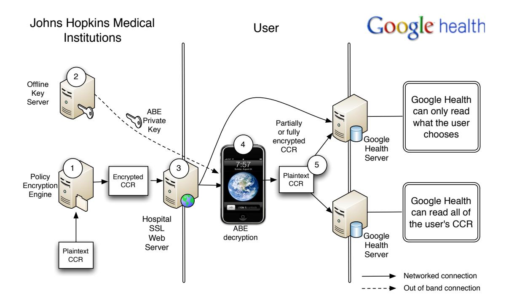
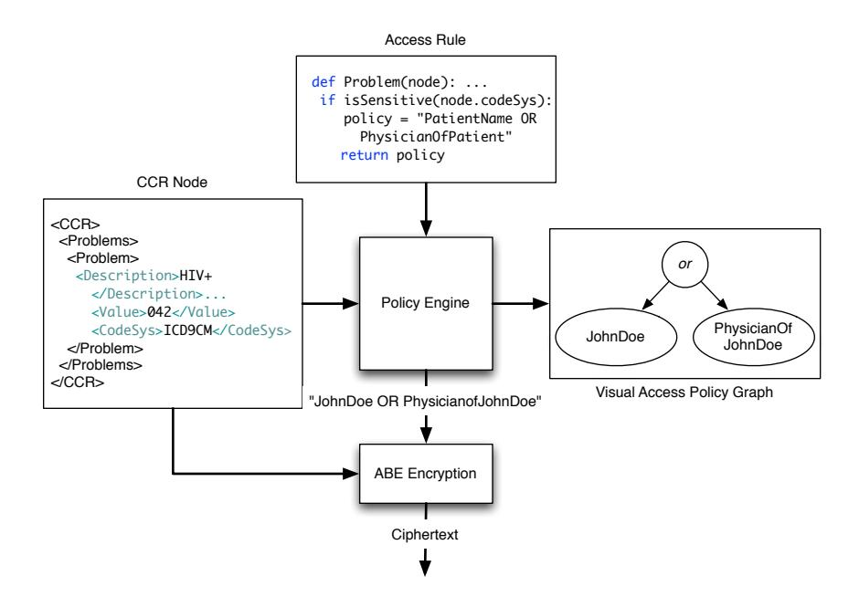
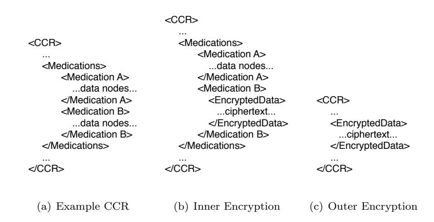
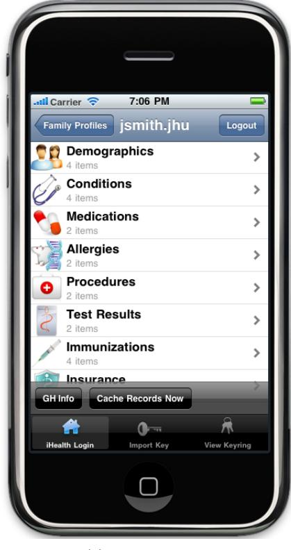
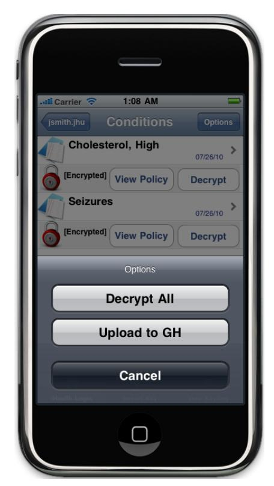
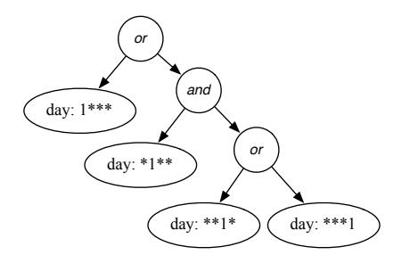
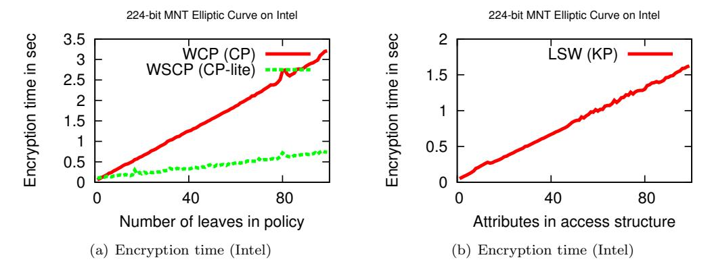
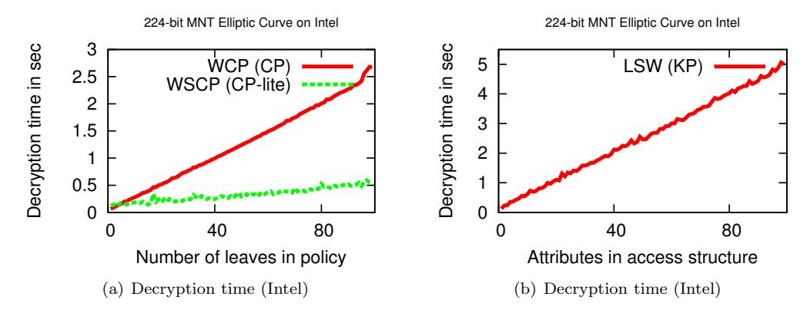
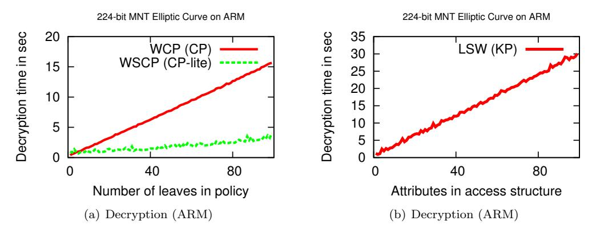
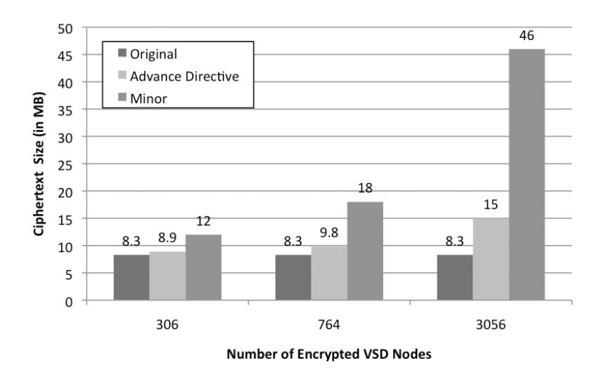

# Self-Protecting Electronic Medical Records Using Attribute-Based Encryption

Joseph A. Akinyele∗ , Christoph U. Lehmann† , Matthew D. Green∗ , Matthew W. Pagano∗ , Zachary N. J. Peterson‡ , Aviel D. Rubin∗

Johns Hopkins University∗ Johns Hopkins Medical Institutions† Naval Postgraduate School‡

#### Abstract

We provide a design and implementation of self-protecting electronic medical records (EMRs) using attribute-based encryption. Our system allows healthcare organizations to export EMRs to storage locations outside of their trust boundary, including mobile devices, Regional Health Information Organizations (RHIOs), and cloud systems such as Google Health. In contrast to some previous approaches to this problem, our solution is designed to maintain EMR availability even when providers are offline, i.e., where network connectivity is not available (for example, during a natural disaster). To balance the needs of emergency care and patient privacy, our system is designed to provide for fine-grained encryption and is able to protect individual items within an EMR, where each encrypted item may have its own access control policy. To validate our architecture, we implemented a prototype system using a new dual-policy attribute-based encryption library that we developed. Our implementation, which includes an iPhone app for storing and managing EMRs offline, allows for flexible and automatic policy generation. An evaluation of our design shows that our ABE library performs well, has acceptable storage requirements, and is practical and usable on modern smartphones.

### 1 Introduction

There are multiple, parallel efforts underway to modernize medical records systems for greater efficiency, improved patient care, patient safety, and costs savings [19, 25, 28, 37, 38]. The potential benefits from electronic medical records (EMRs), which include lab tests, images, diagnoses, prescriptions and medical histories, are without precedent. Patients and insurers can avoid repeating studies that, for example, expose people to additional radiation and incur unnecessary costs. Providers can instantly access patient histories that are relevant to future care and patients can take ownership of their medical records. In general, EMRs offer the potential for greater privacy and better access to records when they are needed.

The shift towards EMRs has highlighted the need to develop meaningful techniques for securing records, both inside and outside of the hospital environment. There are emerging XML-based standards for representing EMRs, such as the Continuity of Care Record (CCR) and Continuity of Care Document (CCD). These standards call for protecting EMRs, but they do not provide enough guidance as to how such protection can be achieved. The Standard Specification for Continuity of Care Record states:

The CCR document instance must be self-protecting when possible, and carry sufficient data embedded in the document instance to permit access decisions to be made based upon confidentiality constraints or limitations specific to that instance. [12]

Regulations such as HIPAA and the HITECH Act also mandate "self-protecting" EMRs but neglect to describe specific mechanisms to enforce this protection. Indeed, providing this self protection of EMRs is perhaps more complicated than the drafters of that legislation imagined. Any system that seeks to enforce record protection must consider the following issues:

Access control to EMRs. Despite the high level of regulation surrounding use of EMRs, medical systems do not adequately provide meaningful access control mechanisms to records. Many hospitals provide no access control mechanisms and rely on audits to investigate security problems, after the fact. At the Johns Hopkins Medical Institution (JHMI), for example, all of the approximately 8,000 clinical employees, including doctors, nurses and technicians, have access to the medical records for all patients in the system.

Current EMRs are not self-protecting. In existing EMR systems, records are either not protected at all, or they are bulk encrypted. When records are transmitted among institutions, they are typically protected only by transport level protocols. Recipients of EMRs obtain the cleartext records.

Complexity of access control policies. Medical administrators are faced with a tremendous number of records that correspond to a wide array of access policies. There are dozens of actors (e.g. pharmacists, doctors, nurses, billing staff, auditors, lab workers, etc.) with varying levels of access to those records. The state of the art is to define an access control matrix that enumerates which actors have access to which records. This overly complex, costly, and error prone environment is in great need of tools and automation.

EMR access is online only. Where meaningful access control is provided, current systems require online access control authorities [2, 4, 7, 24, 29, 30]. When the server or database is unavailable, access control decisions cannot be made, or records cannot be reached. Under certain circumstances, this could result in patient harm.

The final point has particular salience in the context of EMR protection. In the event that a catastrophe destroys network connectivity or cripples power infrastructure, EMR systems that rely upon these services become unusable. This is particularly alarming as this is exactly when one may need immediate access to their medical records. During Hurricane Katrina, for example, much of the infrastructure medical centers relied upon was unavailable [27, 36]. In our experience, providers place a greater emphasis on the availability of medical records in their work than on issues such as security and privacy.

Our contributions. In this paper, we describe our efforts to provide offline, available self-protecting EMRs utilizing recent developments in attribute-based encryption (ABE) [34]. The work is a collaboration between security researchers at Johns Hopkins University and medical practitioners at the Johns Hopkins Medical Institution (JHMI). Our approach to access control using ABE facilitates granular role-based and contentbased access control for EMRs, without the need for a single, vulnerable centralized server. To support this, we propose a framework that includes mechanisms to assist patients and administrators to automatically establish meaningful access policies. To validate our approach we implemented a system whereby users can access their EMRs offline, and can read and write their records to a Personal Health Record (PHR) system, such as Microsoft HealthVault, Georgia Tech's MedVault [18] or Harvard's Indivo [29]. As part of this effort we developed a new software library that implements several new ABE schemes, and we optimized these schemes for server and mobile processors.1 Our prototype runs as an iPhone app and interfaces with Google Health.

### 1.1 Overview of our Solution

Traditionally, access control in EMR systems is accomplished by storing medical records in a centralized location (operated by e.g., a hospital). To facilitate offline access, our system is designed to enable the secure export of EMRs beyond the hospital's trust boundary. This includes EMRs that are held by patients (e.g., on portable devices), records that are submitted to cloud-based storage systems such as Google Health, and records that are shared between hospitals via Regional Health Information Organizations (RHIOs). To protect these exported records, our approach provides the following:

1Our code is publicly available, http://code.google.com/p/libfenc/

End-to-end Encryption. In contrast to traditional access control solutions, our approach is designed to secure records from the point of origin (at the hospital or provider), all the way to the recipient. This eliminates the need to rely on an online, trusted server to handle access control decisions and maintain record confidentiality. Individual components within the record may be encrypted depending on security policies developed by the provider. Since records are encrypted, they may be stored in untrusted locations, such as cloud-based systems (e.g. Google Health), RHIOs, and patients' mobile devices.

Role-based and Content-based Access Control. Our system provides for both role-based access control and a variant that we refer to as content-based access control. In all cases, access control decisions are applied at the level of the individual record node (e.g., a lab report) within the patient's EMR. In role-based access control [11, 14, 21, 35, 41], a record's access control policy is based on roles associated with authorized accessors. For example, a doctor at a particular hospital has attributes including their title, patient list, hospital affiliation, and specialty (Doctor, JHMI, PhysicianofJohnDoe, Oncologist and Dept: Oncology). Each protected record (or sub-record) embeds a complex access control policy specifying which users can access the record; this policy is specified as a boolean formula over individual attributes.

In content-based access control, individuals are explicitly authorized to access collections of records matching certain criteria. We refer to these as collections as content slices. This approach supports individuals who do not have precisely defined roles, such as contractors or medical researchers. The nature of a content slice can be highly specific. For example, an individual might be given access only to records created within a specific time period, covering only certain record types, and even covering lab values within a certain range. To give a simple motivating example, an outside pharmacist dispensing medications prescribed by a doctor may need access to an individual's current medications history, but does not need read access to the patient's billing information or social history. These slices are also defined via boolean formulae, though in this case the formulae are computed over the content tags our system associates with the record. We give examples later in this paper.

The two approaches, role-based and content-based access control, are complementary and can co-exist within a system.

Automatic policy generation. A drawback of access control systems is the need to select appropriate access policies for stored data. In the case of EMRs, which may contain large amounts of (possibly machine generated) data, this challenge is likely to overwhelm providers. To address this problem, we designed and built a prototype policy engine that evaluates new EMRs (or additions to existing EMRs) and determines the appropriate policies under which records should be encrypted. This engine makes its determinations based on (1) a set of policies specified by the hospital or patient, (2) the identity and nature of the record's author, (3) the tags associated with a record, and where necessary (4) the text of the record. The precise implementation details of a policy engine will vary depending on the deployment.

We rely on the security properties provided by attribute-based encryption (ABE) [34]. ABE is described in Section 2 below. We developed a new ABE library and a toolkit that implements new ciphertext-policy and key-policy ABE schemes designed by Waters [39] and Lewko, Sahai and Waters [26]. Our software offers performance improvements over previous implementations [16] and is the first publicly available library that implements key-policy ABE.

# 2 Attribute-Based Encryption

Our work utilizes recent developments around attribute-based encryption (ABE) which was proposed by Sahai and Waters in 2005 [34]. In an ABE scheme, individual users are granted keys that permit them to decrypt a ciphertext if and only if their key matches certain attributes specified in the ciphertext's creation [17, 23, 32, 39]. ABE is a form of public-key encryption, meaning that any party can encrypt. The corresponding private keys are generated by a trusted party known as the Private Key Generator (PKG).

ABE is typically described in two formulations. In ciphertext policy ABE [17], each ciphertext is bound together with a policy describing who is entitled to decrypt it. These policies are typically expressed as boolean formulae referencing a list of attributes that are embedded into the encryptor's secret key. For example, given the attributes Doctor, Nurse, Johns Hopkins Medical Institution (JHMI), InsuranceCo, Agent the following example policy might capture a record that can be read by a JHMI doctor or nurse or an insurance agent:

$$((\mathsf{Doctor} \lor \mathsf{Nurse}) \land \mathsf{JHMI}) \lor ((\mathsf{InsuranceCo} \land \mathsf{Agent})$$

A second variant of ABE is key policy ABE [26, 34], which inverts the relationship between ciphertext and key: individual records are tagged with their relevant attributes, for example: Lab Result, Oncology. To grant access to a portion of a record, the record owner creates specific keys that embed the policy formulae determining which records may be accessed. These approaches need not be used separately, but can be combined into a single primitive that we refer to as dual policy ABE (a first step in this direction was taken by Attrapadung and Imai [13]). Our system combines both approaches.

A fundamental property of ABE systems is collusion resistance. This property means that individuals cannot combine attributes on their secret keys to satisfy a given policy. For example, the following policy might specify that only the insurance agent affiliated with JHMI or with the billing company can read the patient's current medications:

$$(BillingCo \lor JHMI) \land (InsuranceCo \land Agent)$$

The insurance agent's key with the attribute InsuranceCo cannot be combined with the Doctor's key (i.e., JHMI attribute) or with the billing company's key (i.e., BillingCo) to satisfy the policy. In this instance, the insurance agent must establish a trust relationship with the hospital to receive the JHMI or BillingCo attribute. Because each secret key is generated with a random seed, combining keys cannot create a new meaningful key.

Expressive operators. A major strength of ABE is the expressiveness of the policy access formulae. Access policies can be expressed with AND, OR, threshold gates (e.g. 1-of-n or m-of-n) and in addition support boolean operators such as <, ≤, >, and ≥. Numerical values used in boolean operators are typically represented as binary numbers such that each bit in the number corresponds to a non-numerical attribute. A combination of AND and OR gates are used to form a binary tree that represents comparisons over the non-numerical attributes similar to the ciphertext policy implementation of Bethencourt, Sahai and Waters [17]. Thus, ABE allows for expressive access control that is difficult to implement with traditional access control matrices.

# 3 Self-protecting CCR Records: Our Approach

Figure 1 provides a high-level overview of the components in our system. Whenever a healthcare provider submits a new or modified record for storage at the hospital, our policy encryption engine (1) parses each node in the XML-based record to calculate an appropriate access policy. If any record node matches an access control rule, that node is first tagged with content-specific attributes, then encrypted using dual-policy ABE under an appropriate role-based access policy. To aid patients and providers in making intelligent access control decisions, policies are initially specified by the hospital and may take into account various factors such as the age of the patient, the sensitivity of the data, and the identity of the authoring agent (physician or laboratory). The encrypted data is stored in a specially marked node within the CCR.

Once the necessary records have been encrypted, the encrypted CCR can be stored within the provider's own server (3) or they may be exported to semi-trusted cloud-based storage sites such as Google Health or exported to a patient's mobile device (4). When stored locally, the provider may continue to use any existing access control for the record; however, access to the sensitive records is now implicitly restricted to

Figure 1: Diagram of our components: (1) Policy application and encryption engine to automatically generate candidate ABE policies for a patient's CCR-formatted medical record, (2) ABE master controller (i.e. PKG) manages ABE decryption keys and securely provisions keys onto patients mobile devices, (3) Encrypted CCRs can be placed on hospital web servers or directly to third-party servers such as Google Health for patient download, (4) Mobile app that allows user to access and share ABE encrypted CCRs, (5) Patients choose to store CCRs in plaintext or encrypted on Google Health.

individuals with the appropriate decryption keys (i.e. if someone does not have an ABE private key that satisfies the policy, they will not be able to decrypt the record).

Individual hospital employees obtain their ABE decryption keys from an offline key server (ABE master controller) (2) that is operated by the provider (in our example) or by an appropriate trusted entity such as a Regional Health Information Organization (RHIO). These keys may correspond to user roles (long term keys), or can be generated to allow access to a specific slice of content. The master controller can be implemented on a relatively lightweight computing device, such as the processor within a standard hardware security module. The controller can be configured to use existing hospital credentials in order to deliver (provision) keys, and keys should be delivered and provisioned on hospital devices manually.

To view records, the end-user can use a mobile browser app to access the record (4). This software can access the appropriate storage location to download the encrypted CCR. In our instantiation, this encrypted data is stored on the Google Health servers (5) or may be cached locally on the end user's mobile device for portability.

### 3.1 Automatic Policy Generation and Visualization

An individual patient's EMR contains large numbers of individual records, some of which have privacy implications. Patients and providers can manually specify the policies appropriate to each data record; however, this imposes an impractical burden on providers [33]. Therefore a core component of our architecture is an automated policy engine that selects the encryption policy for each record based on a variety of factors,

Figure 2: A flow diagram of the policy engine. The policy engine takes as input a CCR document, or subset thereof, and a list of access rules. It outputs a policy, as determined by the access rule, and visualization of that policy via GraphViz. The policy and the CCR data are then inputed into the ABE encryption library, resulting in an ABE encrypted medical record.

including the record's textual content, provider identity, and patient characteristics.

At a high level, the policy engine is designed to accept a set of configuration parameters. These contain the high level instructions that dictate what types of data should be protected, and what sorts of access control policies should be used. The policy engine's primary role is to evaluate the content of each record node to determine which of these policies (if any) should be applied to that node. Since these decisions are automated, this approach allows for a high level of throughput without requiring providers to make manual access control decisions.

The design of the policy engine is implementation-specific. Our prototype implementation selects from a collection of pre-specified policies that are based on existing metadata tags applied by the hospital record coding system. A more sophisticated engine might incorporate other inputs, e.g., natural language processing based on the record content itself. Indeed, the latter technique might be necessary when importing records from other systems that do not possess consistent metadata.

Figure 2 provides a simple example of the type of decisions that are made by our policy engine. In Section 4 we present more interesting and complex policy examples. In our prototype implementation (Section 5), the policy engine is implemented as a web-based component running on a server device at the provider's location. However, in practice the engine may be replicated at multiple locations, or even loaded separately onto individual client machines.

### 3.2 Using ABE to protect EMRs

Encryption process. When a record is created, each node within the record is evaluated by a policy engine, which determines whether encryption is necessary, and derives a policy and a set of attribute tags that are appropriate for the record (see Figure 1(1)). The operation of the policy engine is flexible, and can be configured according to institutional requirements (we describe our impelementation below). If the record is marked for encryption, it can be encrypted using ciphertext-policy ABE or encrypted using a key-policy ABE scheme under a set of attributes identified by the policy engine (these may include record type, patient age, date, and other non-sensitive attributes related to the record).

Granting Access. Patients and authorized health care providers obtain one of two types of keys from the hospital's ABE master controller (Figure 1(2)). Ciphertext-policy or role keys embed fixed attributes related to the user e.g., patient name, user type (physician, patient, insurance agent), department, age, and key expiration date. These are used for individuals whose access privileges change infrequently. However, it may be desirable to grant other parties such as temporary contractors and researchers a limited access to the health database. These individuals can be supported using the key-policy system: individual content keys will then specify a particular policy defining which records the key can access, e.g., "access to all cardiac-related labs for patients aged 42 and above."

### 4 Use Cases and Applications

We present three use cases that illustrate how seemingly simple and common access requirements can result in complex access control policies, requiring more flexibility and semantic richness than is capable by existing EMR systems. We show how our system is able to achieve these requirements while striking a balance between protecting a patient's privacy and ensuring health care providers have the data they need to deliver the best possible healthcare. These use cases are not contrived or arbitrary. On the contrary, we consulted physicians at the Johns Hopkins Medical Institution to describe common uses that, in their experience, illustrate the limitations of existing EMR access control schemes.

### 4.1 Case 1: Sensitive Medical Data

There are fields in a medical record that are considered by both individuals and legislation (such as HIPAA [10] and HITECH [20]) as highly sensitive and private and should not be made available to all that have access to an EMR, legitimate or otherwise. Knowledge of such data can be used to unfairly discriminate against a person or deny them opportunities that they otherwise deserve. For example, knowledge that a person suffers from cystic fibrosis might adversely affect their personal relationships, professional growth, employment opportunities and insurance costs. A child who has been diagnosed with cystic fibrosis is at a high risk of dying at a young age–the Cystic Fibrosis Foundation states that in 2008, the median predicted age of survival was 37.4 years [22].

The need to protect sensitive medical data is also apparent when considering genotype testing. These tests can indicate whether a person is predisposed to certain conditions. Such information can assist in planning for the future and dealing with the potential onset of the condition making genotype testing is extremely useful. However, knowledge that a person is genetically predisposed to a sensitive condition can lead to unfair treatment, despite the fact that they are not currently suffering from the condition. Indeed, the person may never be diagnosed with the condition for the rest of their life, but exposure of the genotype testing results can bring adverse consequences.

This case demonstrates that EMR systems must employ, at least, bulk encryption to protect sensitive information stored in one's medical record from unauthorized or malicious access. However, a naive bulk encryption scheme fails to protect against inadvertent or malicious access by those who are authorized an EMR system, e.g. a famous patient and a curious nurse. Nor does it protect against the social stigmas of some conditions, e.g. an HIV-positive patient visiting a dermatologist for a fungal infection. Patient's may only want portions of their record made available to all practitioners. Our system provides maximum flexibility and granularity of encryption. Every field in a patient's record may be encrypted under a different policy if desired, giving patient's maximum control over their data.

### 4.2 Case 2: Treatment of Minors

The treatment of minors presents unique challenges to securing and accessing electronic medical records. Consider the case of an adolescent who visits a pediatrician with their mother. The pediatrician may ask the mother to leave so that he and the patient may discuss the patient's sexual history. The data collected for this part of the evaluation should only be visible to the patient and the physician, while the remainder should be accessible to the mother as well.

The age of the patient must also be considered when determining who can access their record. Parents or legal guardians of a child may need access (and are legally granted access) to the child's medical records in order to make an informed decision about their child's care. At the same time, once the patient reaches a certain age, the patient or their health care provider are able to determine whether the parents or guardians should have further access to their records.

Access control technologies employed by existing EMR systems have no way of providing contextual access control. In this use case, the context of the patient's current age has an effect on the decryption policy. The Johns Hopkins Medical Institution requires a parent or legal guardian to consent for care if their child is under the age of twelve, requiring access to that child's record. However, a child twelve or older may make their own decisions about health care and choose to limit access to their record.

We are able to express this written hospital policy using our attribute-based encryption techniques. Our policy engine may be configured to automatically extract the patient's parent's name and birthday from the CCR, allowing the following string to be appended to any encryption strings generated by the policy engine:

$$\lor$$
 (Parent of Patient  $\land$  (Date  $<$  Patient's  $12^{th}$  Birthday))

This modification gives the patient's parents the ability to decrypt the record provided that their ABE private key was issued before the patient's 12th birthday. If the ABE private key was issued subsequently the patient's 12th birthday, the Date attribute of their ABE private key would be greater than the year value of their 12th birthday, resulting in the policy evaluating to "false", and the parents would be unable to decrypt his records.

Note that due to the use of ABE encryption, it is not necessary to know a priori the names of the parents. As long as the hospital follows a standard format for labeling these types of policies, a string such as "Parent of [patient name]" suffices. If the patient's parent wishes to decrypt the patient's records, the parent can authenticate to the hospital ABE controller to obtain the private key corresponding to the "Parent of [patient name]" attribute. This private key allows the parent to decrypt any record that was encrypted with appended string:

∨ Parent of Patient

### 4.3 Case 3: Advance Directives

Advance Directives (ADs) allow patients to express the type of medical interventions they wish to receive should they be unable to communicate them at a later date. For example, a patient might state in her AD that she should not be resuscitated if her breathing or heartbeat ceases, that her organs should be donated, etc. The CCR standard provides specifications for an "Advance Directive" XML tag due to its importance to the patient, the patient's family and the treating hospital.

ADs are an excellent example of the difficult balance between making discrete portions of a record available to some and confidential to others. In the event that a patient becomes incapacitated, their AD must be immediately available. At the same time, ADs often contain highly sensitive information that a patient might not want to be unnecessarily exposed. In addition, the patient might not want even the access policy of the AD to be made public.

Because the advance directive is a document created and transferred by the patient, not the hospital, it is the patient's prerogative as to who can read their AD. We consider two types of scenarios in which the hospital might require read access to the patient's AD. In the first case, the AD contains information that must be instantly available to medical personnel during an emergency (e.g. the patient has established a Do-Not-Resuscitate (DNR) order in the event that she becomes incapacitated). In these types of emergency-care scenarios, the patient allows the hospital to store her AD in plaintext on their servers. In the second case, the AD contains information as to how to administer long-term medical care to the patient if she remains incapacitated for an extended period of time (e.g. the patient prefers her sister to be her "health care agent," or "durable power of attorney for health care" [1], if she remains in a coma for greater than two months). In these types of long-term care scenarios, the AD might contain sensitive information that the patient prefers to not be disclosed unless necessary.

By classifying ADs into these two categories, we can separate the long-term care ADs from those ADs needed during emergencies. Our system allows us to protect the long-term care AD without interfering with normal hospital procedures. Whereas the emergency-care AD remains unencrypted in the hospital, the long-term care AD can be protected with a form of ABE nested encryption. After the patient has finalized her long-term care AD, she can query the hospital's ABE controller to encrypt the document with the policy of her choice. For example, this string might be the following:

#### Sister of Patient ∨ Daughter of Patient

Consequently, either the patient's sister or the patient's daughter must be present to decrypt the AD. This is the inner encryption of the nested encryption scheme for long-term ADs. Its purpose is to restrict read access to the long-term AD to only those named in the ABE policy.

Due to the nature of ABE, the policy can be easily read from the ABE ciphertext (i.e. even though the document itself is encrypted with the policy, the policy itself is in the clear). It is necessary for the policy to remain in the clear while the encrypted AD is stored in the hospital so the hospital knows who to notify if the AD needs to be decrypted. However, the patient might consider the policy itself to be sensitive, as presumably the entities named in the policy will govern how she is to be treated while incapacitated. The policy should therefore be protected if the AD is sent outside of the hospital.

Accordingly, our policy engine is responsible for ensuring that the AD is protected before being transmitted to the outside world. If an AdvanceDirective node is encountered during the traversal of the CCR, the policy engine automatically encrypts the entire node with the hospital's ABE attribute. This is the outer encryption of the nested encryption scheme for long-term ADs, although emergency-care ADs are also encrypted with the hospital's ABE attribute before being transmitted so they are not sent in the clear. For long-term ADs, the inner encryption restricts read access to only those specified in the ABE policy; the outer encryption restricts read access to the ABE policy itself to only the hospital before the encrypted AD is sent externally.

# 5 Implementation

### 5.1 Policy Engine

For the purposes of our prototype implementation, we implemented a Python-based policy engine that evaluates EMRs based on CCR-compliant metadata, and determines the appropriate policy from a set of policies provided by the provider.

Our policy engine functions according to a configurable list of access control rules. Any section of a CCR that matches one of the access control rules is encrypted using ABE with the policy generated by that rule. Because this process is performed for individual nodes within the CCR (as opposed to the entire CCR itself), our solution offers a highly granular form of access control. Each node in a CCR can have an explicit access rule applied to it, as defined in the access rule configuration file (e.g. see the box labeled "Access Rule" in Figure 2). The access rule configuration file has an easily modifiable dictionary that maps CCR node names to Python functions. Our implementation provides several sample functions that specify policies for a number of common and sensitive conditions and may be deployed "as is," or used as a starting point for custom routines.

After determining the appropriate access rule for a given node, the policy engine produces an encryption policy and a visualization of that encryption policy. The encryption policy is a string used as an input to the ABE encryption library. In our example, the string is: (JohnDoe OR PhysicianofJohnDoe). To allow administrators to more easily visualize and understand more complex policies, we have integrated the GraphViz [5] and yapgvb [9] Python packages into our policy engine. An example of a policy graph is shown as an output of the policy engine in Figure 2. Future versions of our policy engine will support the

Figure 3: Stages of encryption to support fine-grained access control.

combination of access rules and visual representations of policies, allowing a patient or administrator to craft policies using only a graphical user interface.

Our policy engine also supports nested encryption within individual CCR nodes, allowing for the application of fine-grained access control policies. To support nested encryption of a record, our policy engine uses a post-order traversal on the CCR. We choose post-order traversal to enable nested encryption at the most granular level–by visiting the XML leaves first before visiting their parent nodes, we retain the option to encrypt the children (inner encryption) first and then their parent nodes (outer encryption) afterward. This choice provides maximum flexibility and security when encrypting an EMR.

For example, current JHMI policy states that medical personnel can access all components of their patients' EMRs with the exception of psychiatric data; only the diagnosing psychiatrist should view this data. Consequently, all the medications that a patient is taking might be encrypted for her primary care physician, but within that medication list, the psychiatric medications should be encrypted for only her psychiatrist.

This example is illustrated in Figure 3. Suppose our policy engine is considering the snippet of the CCR shown in Figure 3(a). The first node to be considered is the Medication A node. Our policy engine reports that this node should be left in the clear. The next node considered is Medication B, but our engine reports that this node should be encrypted. When configuring their access control rules and policies, the EMR administrator can specify whether just the body of the node should be encrypted, or whether the tag name itself should be encrypted as well. In this example, the EMR administrator has configured the engine such that just the body of the Medication B node should be encrypted. The body of the Medication B node is sent to our ABE encryption tool along with the policy that corresponds to the access control rule of Medication B. This ciphertext replaces the body of the Medication B node in the CCR, and is surrounded with an EncryptedData XML node, as is shown in Figure 3(b). The next node to be considered is the Medications node and, in this example, our policy engine reports that both the tag name and body of Medications should be encrypted. Following the same encryption procedure as described above, we are left with the final encrypted CCR as shown in Figure 3(c).

### 5.2 Offline Mobile Access

To permit offline mobile access, our prototype includes an iPhone-based browser application ("iHealthEMR") that interfaces with the provider's server and, optionally, with cloud-based storage provided by Google Health. Our application boasts an intuitive user interface for browsing, updating and securing CCRs. The following sections describe the implementation of iHealthEMR application and the challenges we faced during its implementation.

(a) Top-level view (b) User options

Figure 4: Views of a CCR on a our iHealthEMR iPhone application. (a) This view of the application shows the top-level sections of a patient's CCR. (b) This view of the application shows encrypted entries within a CCR and the access policy the record was encrypted under. Patients may decrypt each individual record or all records within this section as well as upload their records to Google Health.

#### 5.2.1 iHealthEMR Interfaces

The iHealthEMR iPhone application has two interfaces. One interface interacts with a web service supported by the provider, and the other interface interacts with Google Health. The hospital web service supports read access to a patient's medical record encrypted under ABE policies. We authenticate the patient via a username and password to the web service and retrieve the patient's ABE-encrypted CCR. Once the encrypted record is downloaded to the phone, the application uses ABE private-keys stored in the iPhone keychain to decrypt the records (For more on key management, see Section 5.3).

The Google Health interface supports read and write access to a patient's medical record. We interact with Google Health through the Objective-C Google Data (GData) Health client API [3]. We authenticate the user to Google Health and allow the user to access her profiles. Similar to the hospital interface, the application downloads the user's records and allows the user to decrypt them locally. In addition, the user is able to change her policy regarding whether the records are stored on Google Health in plaintext or in their original ABE-encrypted form.

User Interface. We designed the iHealthEMR UI to leverage certain features of the iPhone to make viewing medical records intuitive. Records are organized in a hierarchical data model, allowing the data to be categorized and presented in table form. Figure 4(a) displays the top level of the hierarchy, showing all the sections of the CCR and how many entries the user has in each section. Once the user selects a specific CCR section, they are able to choose from a number of options. Figure 4(b) displays the view shown to the user while in the Conditions section of the record.

While in a CCR section, the user is able to view or decrypt any entries for which they have appropriate decryption keys. They may also upload any new or modified data to their Google Health account. No special processing is needed to view plaintext data. To decrypt or write a record entry, the user selects the Option menu button and an alert with the user's options is presented, as shown in Figure 4(b). If the user attempts to view an encrypted entry, the user must have already obtained the appropriate ABE decryption keys from the ABE controller, making it accessible via the iPhone keychain.

Because application resources on the iPhone are constrained, memory limits on iPhone apps cause developers to use memory as efficiently as possible [6]. Our application performs "lazy" decryption–only decrypting records on an as-needed basis. As a result, we use less memory and less processing power, conserving battery life. To improve usability, the user only has to select the decryption option once. When the user views other encrypted sections, entries are automatically decrypted in the background.

#### 5.2.2 Securing Records on the iPhone

Our application supports caching of ABE-encrypted medical records to the iPhone where network connectivity is not available. This poses some security risks. We want to view the user's plaintext CCR but protect it from adversaries who can mount offline attacks on the iPhone. Consequently, we cannot write the plaintext CCR to the local filesystem, and must rely on the temporary storage available to each application. An advantage of the tmp directory is that the system will delete all data stored in the directory when the user exits the application. However, the ABE-encrypted CCR can be written in the application's local filesystem and remain self-protected.

#### 5.2.3 Uploading Medical Records to Google Health

While we want to store users' ABE-encrypted CCRs on Google's servers without modification, Google Health currently does not natively support any encryption schemes, presenting a limitation for our system. From Google's perspective, if CCRs are stored encrypted, then Google cannot make intelligent decisions about the security or privacy of the user's records. In addition, Google Health provides personal health services to users, such as possible drug interactions, which are adversely impacted by encryption. For instance, Google cannot perform drug interactions analysis if the user's Medications are encrypted. As a result, we allow users to choose whether or not they trust Google with the privacy of their records. As such, the user is able to set her preferences whether to write the records on Google's servers in plaintext or encrypted. Therefore, we have designed a scheme that allows a user to write their encrypted records that still adheres to the CCR standard and is acceptable to Google Health.

Encoding of Encrypted CCRs. Our scheme is straightforward and takes advantage of the flexibility provided by the CCR specification. We base-64 encode the EncryptedData XML nodes and the ciphertext and move them to another location in the CCR's Body, such that the EncryptedData XML appears as regular text. As part of the encoding, we add a special identifier so that we can put the CCR back together when we download the record. Because we move the EncryptedData XML, the CCR is malformed from Google's perspective and would not be accepted. To remedy this, we add artificial CCR XML nodes in place of the EncryptedData XML, complying with Google Health's format requirements.

### 5.3 Key Management

We return to the ABE architecture presented in Figure 1 to discuss our out-of-band key distribution process. In our system, patients must be physically present at an ABE master-control facility such as a hospital, clinic, or RHIO to have their iPhones provisioned with the appropriate ABE decryption keys. Because the key server (or PKG) has the ability to generate arbitrary private keys, it is important that the server be kept offline and keys be transferred manually to patient's mobile devices (e.g. via a USB connection). We recognize this as a limitation, but because of the extremely sensitive data and capabilities of the PKG, we

Figure 5: A boolean formula derived by our pre-processor from the comparison "day ≥ 5". Note that this pre-processing requires 4 additional attributes to the policy tree.

propose to keep it offline. Placing the PKG offline simplifies our prototype and narrows the attack model of our key server to adversaries that have physical access.

To complete initial provisioning, the patient would have to adhere to the hospital's protocol and present appropriate credentials (e.g. state or government issued ID, social security number, passport, etc.) for proper authentication. Upon authenticating the patient, the hospital PKG generates the patient's ABE private keys, a public-key certificate, and a RSA public and private key-pair. The certificate authenticates the attributes or policy placed on the patient's ABE keys and includes an expiration date for the keys. The certificate is digitally signed by a trusted certificate authority such as an RHIO and is used to retrieve future key updates. The keys and certificate are subsequently placed in the patient's iPhone, encrypted with a random passphrase provided by the administrator. The patient is then able to complete the provisioning step by importing the key into the iPhone keychain via our iHealthEMR application.

Once the ABE keys have been secured on the patient's iPhone, physical presence at the hospital is no longer required for the patient to receive updates to their ABE private keys. The RSA public key-pair established at the initial provisioning allows the patient to securely receive key updates remotely. A hospital administrator may simply encrypt the patient's new ABE keys with the patient's RSA public key and make them available for download by the iHealthEMR application the next time it launches. Prior to the ABE keys expiring, the iHealthEMR application may download the renewed ABE keys, decrypt them, and update the iPhone keychain with the new keys.

### 6 Evaluation

To validate the practicality of applying ABE techniques to medical records, we conducted several experiments using our prototype implementation. We first measured the time required for encryption and decryption processing under various scenarios, including server-based encryption and decryption on mobile devices. To show that our techniques induce an acceptable cost in terms of records storage, we also measured the ciphertext size overhead incurred by our encryption solution.

ABE implementations. Our attribute-based encryption library implements three distinct ABE schemes. These include a key-policy scheme due to Lewko, Sahai and Waters [26], and two variants of the ciphertextpolicy scheme from Waters [40], which we refer to as the "standard" and "lite" versions. The lite version is presented in Appendix A of Waters and has a particular limitation that each attribute can appear only once within a policy. In practice this restriction can be adjusted to permit each attribute to appear up to N times in a policy, at the cost of increasing the decryption key size by a factor of N. 2 The "standard" variant has no such limitation. We refer to these schemes in our measurements as "LSW", "WCP" and "WSCP-Lite".

2To accomplish this, simply define attribute variants for each attribute, e.g., Attribute1, Attribute2, . . . , AttributeN. Next, distribute all N variants as part of a user's private key.

Figure 6: CP-ABE and KP-ABE encryption times as measured on our Intel-based platform. (a) The x-axis corresponds to the complexity of the access policy used for encryption (the number of leaves in the ciphertext policy). (b) This x-axis corresponds to the number of attributes in the access structure used for encryption (the number of leaves in the key policy).

Figure 7: CP-ABE and KP-ABE decryption times as measured on our Intel-based platform. (a) The x-axis corresponds to the complexity of the access policy used for decryption (the number of leaves in the ciphertext policy). (b) The x-axis corresponds to the number of attributes in the access structure used for decryption (the number of leaves in the key policy).

Figure 8: CP-ABE and KP-ABE decryption times measured for our ARM-based platform. Note that encryption times are not shown, since the mobile device is not used to generate records in our system.

| Policy            | # of Leaves |
|-------------------|-------------|
| day ≥ 5           | 4           |
| year < 2010       | 16          |
| date > 1281168517 | 32          |

Table 1: Policy complexity (number of policy leaves) induced by adding comparison gates to an access policy.

### 6.1 Computational performance

To establish the practicality of our approach, we evaluated the efficiency of ABE encryption and decryption on workstation/server and mobile platforms. Our experiments were performed on an 2.4 GHz Intel Core i5 processor running Mac OS X 10.6 with 4GB of RAM, as well as an Apple A4 chip-based iPhone 4 running iOS 4 with 512MB of RAM. Our ABE implementation used a 224-bit MNT elliptic curve drawn from the Stanford Pairing-Based Crypto (PBC) library [8]. To give some performance context, the PBC library computes pairings in 20.5ms and 135ms for Intel and ARM respectively.

Besides a negligible amount of parsing and processing overhead, encryption and decryption times in our ABE library are a direct function of the number of attributes in the access policy (used for encryption in CP-ABE, and key generation in KP-ABE). A major exception to this rule involves policies with comparison operators (e.g. <, >, ≤, ≥), since as per Bethencourt et al. [16] these operators are transformed by a pre-processor into boolean formulae using a process that is illustrated in Figure 5.3 This pre-processing induces a policy blowup that is dependent on the size of the literals being compared. Table 1 provides the additional number of attributes added to the access policy for a given numerical comparison. To simplify our measurements, we assume that this processing has already been conducted, and measure our policy size in terms of the post-processed format.

Methodology. To calculate our CP-ABE micro benchmarks we employed the following strategy. For values of N ranging from 1 to 100 we encrypted a message under a policy consisting of a single AND gate with N distinct attribute leaves. We then generated a key containing all N attributes. We instrumented both the encryption and decryption process in order to determine the time required for each operation. For KP-ABE we employed a similar methodology, though the access policy was placed within the generated key.

Results. Figures 6-8 summarize the measurements conducted on our workstation and mobile device. In each figure the x-axis represents the number of leaf nodes (attributes) in the access policy, while the yaxis shows the time required for encryption or decryption. As expected, processing time increases linearly with the complexity of the policy. We observed that the "lite" CP-ABE variant also shown in Figure 6(a) and 7(a) performs significantly better than the standard CP-ABE especially for complex policies. This is an expected result for the decryption algorithm, since the (optimized) "lite" uses a constant number of expensive pairing operation, while the standard variant requires two pairing calculations per attribute. Surprisingly, this result holds even for encryption time. This is unexpected, given that there are no pairing operations during encryption. The result appears to be a side effect of the algebraic group assignments made during implementation of this scheme. In the Pairing-Based Crypto library, operations on the group G2 are particularly expensive.

Based on these results we have determined that encryption (using any of the schemes) is practical on a modern Intel-based platform, e.g., a hospital server or workstation. Decryption is somewhat more expensive, especially with the Waters CP-ABE scheme running on a mobile device. To support the latter application we strongly recommend the use of the "lite" scheme even though it necessitates a larger private key size. In practice, for policy sizes under 30 leaves (the vast majority of cases we have investigated), we believe that all of the schemes have acceptable performance.

3For example, the "day = 5" attribute becomes a 4-bit attribute consisting of the following non-numerical attributes: "day: 0\*\*\*", "day: \*1\*\*", "day: \*\*0\*", and "day: \*\*\*1". These non-numerical attributes are then combined with OR and AND gates to represent comparisons over each bit. Figure 5 shows the binary tree representation of "day ≥ 5".

Figure 9: Storage overhead incurred by ABE encryption of medical records. The 8.3MB base record ("Original") contains 3,056 independent VSD nodes. All encryption is performed with one of two distinct ABE policies, "Advance Directive" or "Minor" (see Section 4 for details). We show three cases: encryption of 10% (306) of the nodes, encryption of 25% (764) of the record nodes, and full encryption of all 3,056 nodes.

### 6.2 Storage Overhead

To determine the storage overhead incurred by our ABE implementation, we conduct experiments on a small set of medical records obtained from the Vanderbilt University Medical Center (VUMC) which are in the Vanderbilt StarChart Data (VSD) format. These records, which were stripped of personally-identifying information (PII), contain a representative set of clinical documents including lab reports, radiology results and procedures. For our basic test, we selected the largest record in our set that contains 3056 XML nodes. Each node varies in size and the total size of the VSD is 8.3MB.

Methodology. To measure the storage overhead, we encrypted the records under CP-ABE using three separate policy profiles: Profile 1 encrypts 10% or 306 nodes chosen at random, Profile 2 encrypts 25% or 764 nodes chosen at random, and Profile 3 encrypts all nodes in the medical record. We performed each trial with two different ABE encryption policies in order to evaluate the growth in medical record sizes as policy complexity increases. The first policy is based on our advance directive use case discussed in Section 4.3 and represents a simple ABE policy:

(Patient ∨ Physician) ∧ (Sister of Patient ∨ Daughter of Patient)

The second policy is based on our use case of the treatment of minors discussed in Section 4.2 and represents a more complex ABE policy:

(Patient ∨ Physician) ∨ (Parent of Patient ∧ (Date < 1281169519))

Results. Figure 9 illustrates the size of an encrypted node for our various encryption policies. As indicated by these results, the storage overhead incurred by ABE encryption is highly dependent on the complexity of the attribute policy. Our "Minor" example represents perhaps the worst case and increases from 8.3MB to 46MB when all of the nodes are encrypted. This is due to the < and > operators that add, in this case, 32 additional attributes to the policy tree. Due to the metadata required by the CP-ABE scheme, each encryption of a node adds 68 bytes of overhead per encryption and approximately 250 bytes per policy attribute. This overhead is in addition to the size of the policy description, which is represented as a nullterminated ASCII string. In total, an ABE encryption using our "Minor" policy requires 9,183 bytes of overhead per encryption (not including the encrypted plaintext).

We concede that the storage overhead for ABE encryption is large compared to other cryptographic schemes. However, this experiment shows a potential upper bound for an fully encrypted record, which we believe is still in an acceptable range. In practice, many fields of records would not be encrypted with sophisticated policies, or perhaps, not encrypted at all.

### 7 Related Work

Several EMR and PCHR systems have been proposed or implemented to enable access control on electronic medical records [31]. The most notable solution is the Indivo X platform [29]. Indivo is an open-source open-standard personally-controlled health record (PCHR) platform that gives patients control over their health records. Indivo provides patients the ability to share their records with different physicians, hospitals and clinics while maintaining access control properties on the patient's health records. Indivo X is strictly an online system that keeps patients' medical data encrypted at rest on Indivo's backend servers. Access control decisions are mediated by the Indivo server and are according to institutional policies and patient specified policies. In addition, Indivo provides a common API for health care providers to develop modules and specialized services that leverage the platform services. These services are made available to users over the Internet.

MedVault [30] implements a patient-centric sharing framework for EMRs that provides an onilne attribute-based authentication system. Requestors of a patient's record must possess specific attributes as defined by the patient. Attributes are authorized by Attribute Providers (APs) and users seeking access to any patients records must acquire the appropriate attributes. The APs authenticate requests and provide digitally signed certificates for user attributes, authenticating users to the health record repository. We consider the Indivo and MedVault systems complementary to our system. Our techniques are designed to augment these and other systems, providing finer-grained protections and access control inside and outside these systems, allowing patients to selectively share their records.

The Patient Controlled Encryption (PCE) [15] design proposes a hierarchical-based encryption and access control scheme that does not rely on a trusted online server to mediate access control decisions. The scheme allows patients to generate and delegate access rights (subkeys) to access their records. In the PCE system, medical records are partitioned into a hierarchical model in which each section of the record is encrypted with a specific private subkey. Patients derive these private subkeys from a root private key. To delegate access rights to a section of the record, a patient must distribute the corresponding key to the intended parties, such as to physicians or nurses. In this way, the patient can share portions of her record and enable remote searches on their encrypted records. Patients manage their own decryption keys and do not rely on the security of a server to protect the records or decryption keys. The hierarchies are fixed and records can only be partitioned in a particular way. For instance, if patients wish to share their records based on the sensitivity of data within a given category, then a separate decryption key is required to delegate access rights for each sensitivity level in that category. Thus, there is an inherent limitation in hierarchical-based encryption schemes that prevents flexible access structures. Our dual-policy ABE system maintains an encrypted access control mechanism similar to the PCE scheme but allows for more expressiveness in the access structures at a fine-grained level.

The InfoShare electronic health record sharing framework [24] proposes a unified access control scheme for selectively sharing EHRs across multiple healthcare providers. In this system, EHRs or virtual composite EHRs consist of EMR instances (e.g., CCR) aggregated from a variety of sources. The sharing framework proposes a policy specification scheme to allow patients to define access policies (e-consent) on their unified health records such that access can be determined at a fine-grained level. They develop a prototype system, InfoShare, that instantiates EHRs and an online editor for patients to define consents over their records. The InfoShare system is an online-only system, but provides a policy specification language that makes it possible to authorize requests based on the intent of the access such as payment, treatment or research. Our solution provides a flexible automated policy extractor that can be applied to any instantiation of an EMR and provides tools that administrators can run to enforce the extracted access policies.

# 8 Conclusions

We present a prototype system to protect EMRs when outside of the trusted domain of a hospital or other provider facility. Attribute-based encryption (ABE) is used to provide fine-grained, policy-based encryption, restricting who can read EMRs on a device. To facilitate our implementation, we have built a software library to support dual policy ABE, incorporating ciphertext- and key-policy ABE schemes. We show how our system enables several realistic use cases such as genetic testing data, treatment of minors and advanced directives. These cases require complex policies, and we have built a policy engine that provides automated support for policy generation. Once policies are specified, ABE keys are used to encrypt fields in the EMRs to enforce restrictions on who can read the data In the future, we will be launching a pilot program to evaluate the usability of our system in a medical facility.

# References

- [1] Advance Directives Information Sheet. http://www.mva.maryland.gov/Resources/ AdvanceDirective.pdf.
- [2] Dossia Personal Health Platform. http://www.dossia.org/.
- [3] GData API Objective-C Client Library. http://code.google.com/p/gdata-objectivec-client/.
- [4] Google Health. http://www.google.com/health/.
- [5] Graphviz. http://www.graphviz.org/.
- [6] iPhone Developer Reference. http://developer.apple.com/iPhone/library/navigation/index. html.
- [7] Microsoft HealthVault. http://www.healthvault.com/Personal/index.html.
- [8] Stanford Pairing-Based Crypto Library. http://crypto.stanford.edu/pbc/.
- [9] yapgvb. http://code.google.com/p/yapgvb/.
- [10] 104th United States Congress. Health Insurance Portability and Accountability A (HIPPA), 1996. http://aspe.hhs.gov/admnsimp/pl104191.htm; Last access: August 16, 2004.
- [11] Gail-Joon Ahn and Badrinath Mohan. Role-based authorization in decentralized health care environments. In 18th Annual ACM Symposium on Applied Computing, 2003.
- [12] ASTM International. ASTM E2369 05e1 Standard Specification for Continuity of Care Record (CCR), 2009.
- [13] Nuttapong Attrapadung and Hideki Imai. Conjunctive broadcast and attribute-based encryption. In Proceedings of the 3rd International Conference Palo Alto on Pairing-Based Cryptography, pages 248– 265. Springer-Verlag, 2009.
- [14] Moritz Y. Becker and Peter Sewell. Cassandra: flexible trust management, applied to electronic health records. In 17th IEEE Computer Security Foundations Workshop (CSFW), 2004.
- [15] Josh Benaioh, Melissa Chase, Eric Horvitz, and Kristin Lauter. Patient controlled encryption: Ensuring privacy of electronic medical records. In ACM workshop on Cloud Computing Security CCSW 09, pages 103–114. ACM, 2009.

- [16] John Bethencourt. Ciphertext-policy Attribute-Based Encryption library, 2006. Available at http: //acsc.cs.utexas.edu/cpabe/.
- [17] John Bethencourt, Amit Sahai, and Brent Waters. Ciphertext-policy attribute-based encryption. In Proceedings of the 2007 IEEE Symposium on Security and Privacy, pages 321–334. IEEE Computer Society, 2007.
- [18] Doug Blough, Mustaque Ahamad, Ling Liu, and Praveen Chopra. MedVault: Ensuring security and privacy for electronic medical records. NSF CyberTrust Principal Investigators Meeting, May 2008.
- [19] Carol Franc Buck. Designing a consumer-centered personal health record. Technical report, California Health Foundation, March 2007.
- [20] United States Congress. Health Information Technology for Economic and Clinical Health (HITECH) Act, Title XIII of Division A and Title IV of Division B of the American Recovery and Reinvestment Act of 2009 (ARRA), 2009.
- [21] D. M. Eyers, J. Bacon, and K. Moody. Oasis role-based access control for electronic health records. In IEEE Software, pages 16–23, 2006.
- [22] Cystic Fibrosis Foundation. Frequently asked questions, 2010. http://www.cff.org/AboutCF/Faqs/.
- [23] Vipul Goyal, Omkant Pandey, Amit Sahai, and Brent Waters. Attribute-based encryption for finegrained access control of encrypted data. In Proceedings of the 13th ACM conference on Computer and communications security, pages 89–98. ACM, 2006.
- [24] Jing Jin, Gail-Joon Ahn, Hongxin Hu, Michael J. Convington, and Xinwen Zhang. Patient-centric authorization framework for sharing electronic health records. In ACM SACMAT, pages 125–134, 2009.
- [25] George R. Kim and Christoph U. Lehmann. Pediatric aspects of inpatient health information technology systems. In Pediatrics, volume 122, 2008.
- [26] Allison Lewko, Amit Sahai, and Brent Waters. Revocation systems with very small private keys. In IEEE Symposium on Security and Privacy. IEEE, 2010.
- [27] Sarah A. Lister. Hurricane Katrina: The public health and medical response. CRS Report for Congress, September 2005.
- [28] Steve Lohr. G.E. and Intel join forces on health technologies. New York Times, 3 April 2009.
- [29] Kenneth D. Mandi, William W. Simons, William CR Crawford, and Jonathan M. Abbett. Indivo: a personally controlled health record for health information exchange and communiation. BMC Medical Informatics and Decision Making, 7, 2007.
- [30] Apurva Mohan, David Bauer, Douglas M. Blough, Mustaque Ahamad, Bhuvan Bamba, Ramkumar Krishnan, Ling Liu, Daisuke Mashima, and Balaji Palanisamy. A patient-centric, attribute-based, source-verifiable framework for health record sharing. In GIT CERCS Technical Report No. GIT-CERCS-09-11, 2009.
- [31] Shivaramakrishnan Narayan, Martin Gagne, and Reihaneh Safavi-Naini. Privacy preserving ehr system using attribute-based infrastructure. In CCSW '10: Proceedings of the 2010 ACM Workshop on Cloud computing security workshop, 2010.
- [32] M. Pirretti, P. Traynor, P. McDaniel, and B. Waters. Secure atrribute-based systems. In Proceedings of ACM Conference on Computer and Communications Security (ACM CCS '06), 2006.
- [33] Aarathi Prasad and David Kotz. Can I access your data? Privacy management in mHealth. In USENIX Workshop on Health Security and Privacy (HealthSec), 2010.

- [34] Amit Sahai and Brent Waters. Fuzzy identity-based encryption. In Advances in Cryptology, EURO-CRYPT, pages 457–473, 2005.
- [35] R. S. Sandhu, E. J. Coyne, H. L. Feinstein, and C. E. Youman. Role-based access control models. In IEEE Computer, 1996.
- [36] Paul C. Tang, Joan S. Ash, David W. Bates, J. Marc Overhage, and Daniel Z. Sands. Personal health records: Definitions, benefits, and strategies for overcoming barriers to adoption. Journal of the American Medical Informatics Association, 13(2):121–126, 2006.
- [37] Micky Tripathi, David Delano, Barbara Lund, and Lynda Rudolph. Engaging patients for health information exchange. Health Affairs, 28(2):435–443, March 2009.
- [38] U.S. Department of Health and Human Services. The nationwide privacy and security framework for electronic exchange of individually identifiable health information. Office of the National Coordinator for Health Information Technology, December 2008.
- [39] Brent Waters. Ciphertext-policy attribute-based encryption: An expressive, efficient, and provably secure realization. Cryptology ePrint Archive, Report 2008/290, 2008.
- [40] Brent Waters. Dual system encryption: realizing fully secure IBE and HIBE under simple assumptions. In Advances in Cryptology CRYPTO 2009, pages 619–636. Springer, 2009.
- [41] Longhua Zhang, Gail-Joon Ahn, and Bei-Tseng Chu. A role-based delegation framework for healthcare information systems. In ACM Symposium on Access Control Models And Technologies (SACMAT), 2002.