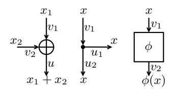
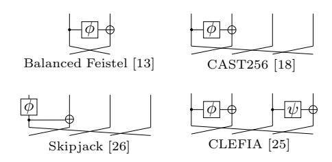
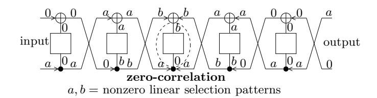
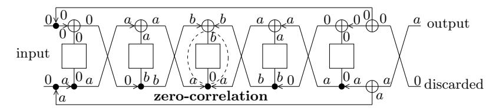
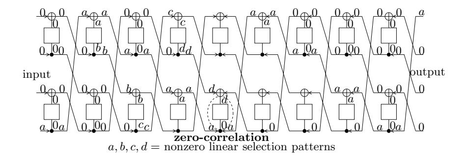
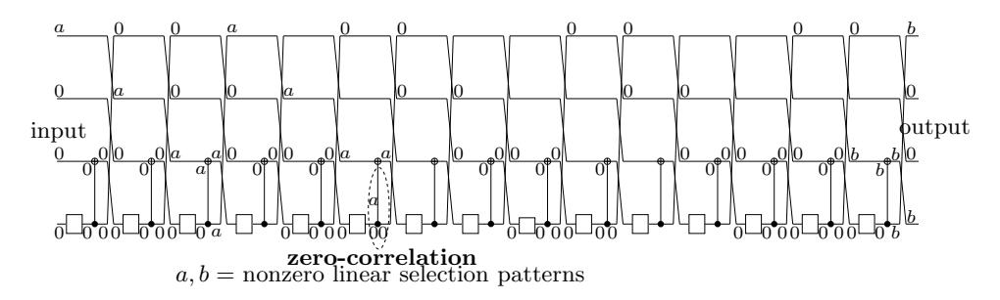
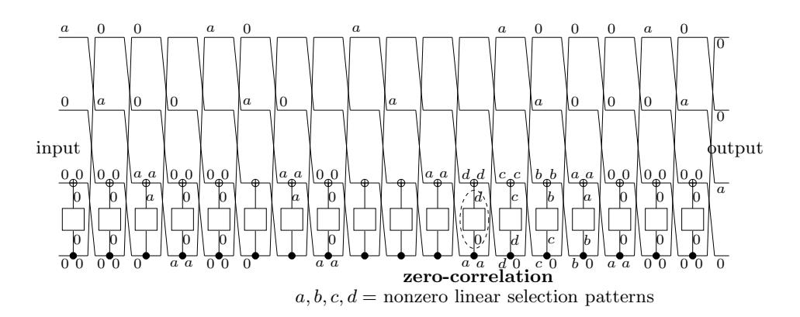

# Linear Hulls with Correlation Zero and Linear Cryptanalysis of Block Ciphers

Andrey Bogdanov and Vincent Rijmen

{andrey.bogdanov,vincent.rijmen}@esat.kuleuven.be KU Leuven, ESAT/COSIC and IBBT, Belgium

Abstract. Linear cryptanalysis, along with differential cryptanalysis, is an important tool to evaluate the security of block ciphers. This work introduces a novel extension of linear cryptanalysis: *zero-correlation linear cryptanalysis*, a technique applicable to many block cipher constructions. It is based on linear approximations with a correlation value of exactly zero. For a permutation on n bits, an algorithm of complexity 2n−1 is proposed for the exact evaluation of correlation. Non-trivial zero-correlation linear approximations are demonstrated for various block cipher structures including AES, balanced Feistel networks, Skipjack, CLEFIA, and CAST256. As an example, using the zero-correlation linear cryptanalysis, a key-recovery attack is shown on 6 rounds of AES-192 and AES-256 as well as 13 rounds of CLEFIA-256.

Keywords: block ciphers, correlation, linear cryptanalysis

## 1 Introduction and background

In this article, we propose a novel extension of linear cryptanalysis: key recovery attacks based on linear approximations that hold true for exactly 50% of the input values. It can be considered as the counterpart of impossible differential cryptanalysis [2,6], though having many significant distinctions of both theoretical and technical nature. We apply it to balanced Feistel and generalized Feistel ciphers as well as to round-reduced AES.

Similarly to differential cryptanalysis [4], the original linear cryptanalysis is based on linear approximations with correlations significantly deviating from zero [16]. Unlike differential cryptanalysis though, for linear cryptanalysis there is only very limited work using linear approximations with correlation values of exactly zero [8, 12, 24]. These papers do not propose ways to find classes of zero correlation linear approximations valid for any key value.

Block ciphers have evolved to be the basic primitives of symmetric-key cryptography. Many sound and efficient cryptographic constructions can be built upon them, such as stream ciphers, message authentication codes, hash functions or entropy extractors for random number generators. Block ciphers are believed to be the best understood primitives of symmetric cryptography. Nevertheless, their security currently cannot be formally proven. Instead, we rely on cryptanalysis: careful evaluation against all the known weaknesses. Any significant advance in cryptanalytic techniques for block ciphers is of high relevance and might result in the re-evaluation of many designs.

Design strategies such as the wide trail design strategy [10] and the decorrelation theory [28] allow to construct block ciphers for which we can state with high confidence that they will resist crucial analysis methods such as standard differential cryptanalysis and linear cryptanalysis. However, these strategies provide only limited evidence of resistance against extensions of differential or linear cryptanalysis. Hence, it remains of interest to study extensions of these basic attacks as well as strategies to counter them.

The remainder of this paper is structured as follows. In Section 2 we briefly recall some important concepts of linear cryptanalysis and introduce our notation. In Section 3 we present our main findings: linear approximations (hulls) with correlation zero for various cipher constructions. We explain how we can construct distinguishers and key-recovery attacks in Section 4 and illustrate this with two examples in Section 5. We conclude in Section 6.

## 2 Correlation and linear cryptanalysis

We briefly recall the concepts of correlation and linear cryptanalysis, based on [9,19].

Let  $\mathbb{F}_2^n$  denote the finite field with  $2^n$  elements, and let '+' denote the addition in this field. The cross-correlation between two functions  $f,g:\mathbb{F}_2^n\to\mathbb{F}_2$  is defined by

$$C_{f,g}(u) = \sum_{x \in \mathbb{F}_2^n} (-1)^{f(x) + g(x+u)}.$$
 (1)

We call the *correlation* between two Boolean functions the quantity

$$C(f(x), g(x)) = 2^{-n}C_{f,g}(0).$$

It can be seen that with this definition, we have:

$$C(f(x), g(x)) = 2 \Pr_{x} (f(x) = g(x)) - 1.$$

We denote the scalar product of binary vectors by

$$a^t x = \sum_{i=1}^n a_i x_i.$$

A function  $h: \mathbb{F}_2^m \to \mathbb{F}_2^n$  can be decomposed into n component functions. Linear cryptanalysis [16] is based on linear approximations. A linear approximation (v, u) of a function h has a correlation  $C(u^th(x), v^tx)$ , where u and v are called output and input selection patterns, respectively. The correlation values for all possible approximations can be grouped in the correlation matrix  $\mathbf{C}^h$ , with entries given by:

$$\mathbf{C}_{uv} = \mathbf{C}(u^t h(x), v^t x).$$

It can be seen that C(0,0) = 1 and  $C(0,v^tx) = 0$ , for all  $v \in \mathbb{F}_2^m$  with  $v \neq 0$ . Furthermore, we have the following property.

Property 1. A function  $h: \mathbb{F}_2^m \to \mathbb{F}_2^n$  is balanced, i.e., it reaches every output in  $\mathbb{F}_2^n$  equally often, if and only if  $C(u^t h(x), 0) = 0$ , for all  $u \in \mathbb{F}_2^n$  with  $u \neq 0$

A proof can be found e.g. in [9]. If m = n, then we have that h is a permutation if and only if  $C(u^t h(x), 0) = 0$ , for all  $u \in \mathbb{F}_2^n$  with  $u \neq 0$ . The approximations (0, 0), (v, 0) and (0, u) of a permutation are called *trivial approximations*.

#### 2.1 Linear trails and linear hulls

Let  $B: \mathbb{F}_2^n \to \mathbb{F}_2^n$  be an iterative transformation on n bits, that is, an iterative application of r maps  $f_i$  (rounds):

$$B = f_r \circ f_{r-1} \circ \dots f_2 \circ f_1$$

with  $f_i: \mathbb{F}_2^n \to \mathbb{F}_2^n$  for  $i = 1, \dots, r$ . Daemen [9] proves (cf. [20]):

$$\mathbf{C}^B = \mathbf{C}^{f_r} \times \dots \times \mathbf{C}^{f_2} \times \mathbf{C}^{f_1}. \tag{2}$$

A linear trail  $U=(u_0,u_1,\ldots,u_{r-1},u_r)$  is the concatenation of r 1-round approximations, where  $(u_{i-1},u_i)$  is the approximation of  $f_i$ . Thus, each linear trail of B consists of n(r+1) bits. The correlation contribution  $C_U$  of linear trail U is defined as

$$C_U = \prod_{i=1}^r C(u_i^t f_i(x), u_{i-1}^t x).$$
(3)

From this and (2) it follows that

$$C(\beta^t B(x), \alpha^t x) = \sum_{U: u_0 = \alpha, u_r = \beta} C_U.$$
(4)

A linear approximation  $(\alpha, \beta)$  of a block cipher is called a *linear hull* in [19]. In [19], *linear hull* is defined as the set of linear trails that a linear approximation of an iterated transformation is composed of. To emphasize this structure, linear approximation is identified with its linear hull.

### 3 Linear hulls with zero correlation

We construct zero-correlation linear hulls such that  $C_U = 0$  for all linear trails U of the linear hull and for all key-dependent round functions of an iterated block cipher. To show that the correlation contribution  $C_U$  of a linear trail is zero, it suffices to have only one combination of its intermediate linear selection patterns that exhibit correlation 0.

### 3.1 Correlation over elementary operations

Before studying the correlation of linear hulls over block ciphers, we will first treat the correlation of approximations over three basic operations which are often encountered as parts of block ciphers, namely the XOR-operation, the branching operation, and the key-dependent F-function  $\phi$ , see also [1,16]. The following proposition will prove to be useful.

**Proposition 1 (Approximation of a linear map** [9]). For a linear map  $h(x) = \mathbf{M}x$ , we have  $C(u^t h(x), v^t x) = 1$  if  $v = \mathbf{M}^t u$ , and  $C(u^t h(x), v^t x) = 0$  if  $v \neq \mathbf{M}^t u$ .

*Proof.* Since  $h(x) = \mathbf{M}x$ , we have  $u^t h(x) = u^t(\mathbf{M}x) = (\mathbf{M}^t u)x$ . Hence, if  $v = \mathbf{M}^t u$ , then  $\mathbf{C}(u^t h(x), v^t x) = \mathbf{C}(v^t x, v^t x) = 1$ . On the other hand, if  $v \neq \mathbf{M}^t u$ , then  $u^t h(x)$  and  $v^t x$  are two different linear functions. The correlation between two different linear functions is always zero.

XOR branching permutation

**Fig. 1.** Linear approximations of basic operations: XOR  $\oplus$ , branching  $\bullet$ , and permutation  $\phi$ . Values  $z_1$ ,  $z_2$ , and  $z_3$  as well as linear selection patterns  $v_1$ ,  $v_2$ , and  $v_3$

The next two lemmata follow easily from Proposition 1 (see also Fig. 1):

**Lemma 1 (XOR operation [1]).** Let  $h(x_1, x_2) = x_1 + x_2$ . Then  $C(u^t h(x_1, x_2), v_1^t x_1 + v_2^t x_2) \neq 0$  if and only if  $u = v_1 = v_2$ .

**Lemma 2 (Branching operation [1]).** Let h(x) = (x, x). Then  $C((u_1, u_2)^t h(x), v^t x) \neq 0$  if and only if  $v = u_1 + u_2$ .

Finally, we have:

**Lemma 3 (Invertible F-function).** Let (v,u) be an approximation over an invertible function  $\phi$ . Then  $C(u^t\phi(x),v^tx)\neq 0$  only if u=v=0 or both u and v are nonzero.

*Proof.* If exactly one of u, v equals 0, then we have a trivial approximation with correlation 0.

Fig. 2. Round maps of balanced Feistel network and some generalized Feistel-type constructions with F-functions  $\phi$  and  $\psi$  invertible

Table 1. Zero-correlation linear hulls and best impossible differentials known. All Feistel constructions are assumed to have invertible F-functions

| Block cipher | r Im    | possible differential                                                                                                     | Zero- | correlation linear hull                                                           |
|--------------|---------|---------------------------------------------------------------------------------------------------------------------------|-------|-----------------------------------------------------------------------------------|
| construction | rounds  | i/o differences                                                                                                           | round | s i/o selection patterns                                                          |
| Feistel      | 5       | $(0,\Delta) \nrightarrow (\Delta,0)$                                                                                      | 5     | (a  0,0  a)                                                                       |
| Skipjack     | 15 [26] | $(0,0,0,\Delta) \nrightarrow (\nabla,0,0,0)$                                                                              | 15    | (0  0  0  a,b  0  0  b)                                                           |
| CAST256      | 19 [7]  | $(0,0,0,\Delta) \nrightarrow (\nabla,0,0,0)$                                                                              | 18    | (0  0  0  a,0  a  0  0)                                                           |
| CLEFIA       | 9 [27]  | $ \begin{array}{c} (0,0,0,\Delta) \nrightarrow (0,0,\Delta,0) \\ (0,\Delta,0,0) \nrightarrow (\Delta,0,0,0) \end{array} $ | 9     | $\begin{array}{c} (a  0  0  0,0  0  0  a) \\ (0  0  a  0,0  a  0  0) \end{array}$ |
| AES          | 4 [3]   | $(\Theta,0,0,0) \nrightarrow (\Theta',0,0,0)$                                                                             |       | $(\Gamma  0  0  0,\Gamma'  0  0  0)$                                              |

$$a \neq 0, b \neq 0, \Delta \neq 0, \nabla \neq 0$$

 $a \neq 0, b \neq 0, \Delta \neq 0, \nabla \neq 0$ AES:  $\Theta$ ,  $\Theta'$ ,  $\Gamma$ ,  $\Gamma'$  are 4-byte columns with exactly one nonzero byte; note that there are also other impossible differentials and zero-correlation linear hulls for AES

#### 3.2 Feistel constructions

Let  $B_F^i: \mathbb{F}_2^{n/2} \times \mathbb{F}_2^{n/2} \to \mathbb{F}_2^{n/2} \times \mathbb{F}_2^{n/2}$  denote a balanced Feistel cipher counting i rounds and with  $\phi$  an invertible function, cf. Fig. 2.

Theorem 1 (Zero-correlation linear hulls for Balanced Feistel ciphers). For all  $a \in \mathbb{F}_2^{n/2}$  with  $a \neq 0$ , the linear hull (a||0, 0||a) over  $B_F^5$  has correlation

*Proof.* Consider a linear trail over  $B_F^5$  with  $u_0 = a \| 0$  and  $u_5 = 0 \| a$ , see Fig. 3. Using Lemmata 1-3 over rounds 1 and 5, we obtain that the correlation contribution of this trail can be non-zero only if  $u_1 = 0 \| a$  and  $u_4 = a \| 0$ . Using the same lemmata over rounds 2 and 4, we obtain that  $u_2 = a \| b$  and  $u_3 = c \| a$  for some non-zero b, c. We see then however that the approximation over round 3 can have a nonzero correlation only if b = c = 0. It follows that all linear trails with  $u_0 = a \| 0$  and  $u_5 = 0 \| a$  have correlation contribution equal to zero. We derive then from (4) that the linear hull has correlation zero.

The balanced Feistel construction can be extended to an generalized Feistel construction in several ways. We study here three types of generalized Feistel ciphers, namely CLEFIA-type ciphers, Skipjack-type ciphers and CAST256-type ciphers. They are illustrated in Fig. 2. For generalized Feistel ciphers with invertible  $\phi$  (and  $\varphi$ ) functions, we have the following:

**Fig. 3.** Zero-correlation linear hull (a||0,0||a) over 5 rounds of balanced Feistel cipher with bijective F-functions: linear trails exhibit a zero correlation at round 3 due to Lemma 3

Theorem 2 (Zero-correlation linear approximations for generalized Feistel ciphers). The following linear hull have zero correlation for  $a \neq 0$  and  $b \neq 0$ :

- $-(a\|0\|0\|0\,,\,0\|0\|0\|a)$  and  $(0\|0\|a\|0\,,\,0\|a\|0\|0)$  for 9 rounds of CLEFIA-type ciphers,
- (0||0||0||a, b||0||0||b) for 15 rounds of Skipjack-type ciphers, and
- -(0||0||0||a, 0||a||0||0) for 18 rounds of CAST256-type ciphers.

*Proof.* For the linear hulls specified for 9 rounds of CLEFIA, 15 rounds of Skipjack and 18 rounds of CAST256, the corresponding linear trails are derived in Fig. 6, 7, and 8 presented in Appendix A. Using Lemmata 1-3, it can be shown that all these linear trails have correlation contribution zero. It follows that the linear hulls have correlation zero.

Theorems 1-2 demonstrate that several widely used Feistel-type block cipher constructions have zero-correlation linear hulls when instantiated with bijective  $\phi$ -functions. The findings are summarized and compared to impossible differentials in Table 1.

### 3.3 Advanced Encryption Standard (AES)

We consider 4 rounds of the AES (which is a 128-bit block cipher), i.e. an initial key addition followed by 3 full AES rounds and one final round, see the left-hand side of Fig. 4. One full AES round comprises the S-box layer SubBytes (SB) followed by linear diffusion layers ShiftRows (SR) and MixColumns (MC) as well as by the key addition AddRoundKey (AK). The final round consists of SubBytes (SB), ShiftRows (SR) as well as the AddRoundKey operation (AK). The SubBytes operation applies 16 copies of the same nonlinear 8-bit S-box to the state in parallel. Each MixColumns operation consists of 4 matrix-vector multiplications using a 4-by-4 MDS matrix over  $\mathbb{F}_2^8$  performed in parallel. ShiftRows provides diffusion between different columns. AddRoundKey consists of 16 additions with the round subkey performed in parallel over  $\mathbb{F}_2^8$ .

Theorem 3 (Zero-correlation linear hulls for 4 rounds of the AES). Let  $\Gamma$  and  $\Gamma'$  be 4-byte column selection patterns with exactly one nonzero byte. Then each of the linear hulls  $(\Gamma ||0||0||0, \Gamma'||0||0||0)$  over 4 AES rounds has a zero correlation.

Fig. 4. Zero-correlation linear cryptanalysis of AES-192 and AES-256: 4-round zero-correlation linear hull (linear selection patterns on the left) and 6-round key recovery (cipher state on the right)

Proof. It is known [10] that a linear trail over AES with  $u_0 = (\Gamma ||0||0||0)$  can have a correlation contribution different from zero only if  $u_2$  has a nonzero value in each of the 16 bytes. At the same time, following the backward diffusion from the output over the final round and one full round, one can see that a linear trail with  $u_4 = (\Gamma' ||0||0||0)$  can have a correlation contribution different from zero only if  $u_2$  is nonzero in exactly 4 bytes. Hence, all linear trails over 4 rounds of AES, with  $u_0 = (\Gamma ||0||0||0)$  and  $u_4 = (\Gamma' ||0||0||0)$ , have correlation contribution zero. It follows that all linear hulls  $(\Gamma ||0||0||0, \Gamma' ||0||0||0)$  have correlation zero. See the left-hand size of Fig. 4 for an example of an zero-correlation linear hull of this type.

Theorem 3 yields one class of zero-correlation linear hulls for 4 rounds of AES. Note that AES has more zero-correlation linear hulls of similar types over 4 rounds.

### 3.4 Balancedness in Matyas-Meyer-Oseas constructions

The Matyas-Meyer-Oseas (MMO) construction transforms a block cipher into a compression function that can be used in a cryptographic hash function [17].

Let  $E: \mathbb{F}_2^k \times \mathbb{F}_2^n \to \mathbb{F}_2^n$  be a block cipher taking a k-bit key and operating on n-bit message blocks. Let  $g: \mathbb{F}_2^n \to \mathbb{F}_2^k$  map ciphertexts to keys. The MMO compression function, which updates the chaining value  $h_i$  to  $h_{i+1}$  using the n-bit message block  $m_i$ , is then defined by:

$$h_{i+1} = E(g(h_i), m_i) + m_i. (5)$$

The following theorem can be used to show structural weaknesses in the MMO compression function (5) if the underlying block cipher is a 5-round balanced

Feistel construction. A similar result can be shown if the underlying block cipher is a 3-round balanced Feistel construction.

**Theorem 4.** Let the map  $D^5: \mathbb{F}_2^{n/2} \times \mathbb{F}_2^{n/2} \to \mathbb{F}_2^{n/2} \times \mathbb{F}_2^{n/2}$  be defined by:

$$y_1 \| y_2 = D^5(x_1 \| x_2) = (x_2 \| x_1) + B_F^5(x_1 \| x_2),$$

where  $B_F^5$  is a 5-round balanced Feistel cipher as defined in Section 3.2, using an invertible function  $\phi$ . Let the map  $D^{5'}: \mathbb{F}_2^{n/2} \times \mathbb{F}_2^{n/2} \to \mathbb{F}_2^{n/2}$  be defined as the map that outputs only  $y_1$ , the right-hand half of the output of  $D^5$ . Then  $D^{5'}$  is balanced.

*Proof.* Using a similar reasoning as in the proof of Theorem 1, we can show that  $\forall a \in \mathbb{F}_2^{n/2}$  with  $a \neq 0$ , the linear hull (0||0, a||0) over  $D^5$  has a correlation zero, see Fig. 5. Application of Property 1 gives the result.

Observe that  $D^{5'}$  is balanced for any choice of the function  $\phi$  in the balanced Feistel cipher, provided that it be invertible.

a, b = nonzero linear selection patterns

**Fig. 5.** Zero-correlation linear hull (0||0,a) over  $D^{5'}$  with bijective F-functions: linear trails exhibit a zero correlation at round 3 due to Lemma 3

Theorem 4 implies that a compression function where the underlying block cipher is a 5-round balanced Feistel cipher with invertible  $\phi$  function exhibits structure in its output: when the input chaining value is kept constant and the message block is varied, one half of the output is perfectly balanced. This behavior is highly unlikely to be observed for a randomly chosen function.

### 4 Key recovery attacks based on zero correlation

In this section, we show how to evaluate the exact correlation value of a linear approximation more efficiently. Subsequently, we give the probability that a linear hull over a randomly chosen permutation has correlation zero. We conclude with a distinguisher for block ciphers based on zero-correlation linear hulls.

### 4.1 Computing the correlation

Let x and y = f(x) be input and output of a permutation f. The straightforward way to evaluate the correlation is by evaluating the sum (1), going over all  $2^n$  input-output pairs:

$$C(\beta^t y, \alpha^t x) = \frac{|\{(x, y) | \alpha^t x + \beta^t y = 0\}|}{2^{n-1}} - 1.$$

However, it is not necessary to have all  $2^n$  input-output pairs to compute C:

**Proposition 2 (Efficient correlation evaluation).** For any non-trivial linear approximation  $(\alpha, \beta)$  of an n-bit permutation f, the correlation value C can be evaluated with  $2^{n-1}$  input-output pairs (x, y) in one of the following ways:

$$C(\beta^t y, \alpha^t x) = \frac{|\{(x, y) | \alpha^t x = 0 \text{ and } \beta^t y = 0\}|}{2^{n-2}} - 1$$
$$= \frac{|\{(x, y) | \alpha^t x = 1 \text{ and } \beta^t y = 1\}|}{2^{n-2}} - 1.$$

*Proof.* The  $2^n$  input-output pairs of an n-bit permutation can be divided into the following four disjunct sets:

$$\begin{split} T_{00} &= \{(x,y) | \alpha^t x = 0 \text{ and } \beta^t y = 0\}, \\ T_{01} &= \{(x,y) | \alpha^t x = 0 \text{ and } \beta^t y = 1\}, \\ T_{10} &= \{(x,y) | \alpha^t x = 1 \text{ and } \beta^t y = 0\}, \text{ and } \\ T_{11} &= \{(x,y) | \alpha^t x = 1 \text{ and } \beta^t y = 1\}. \end{split}$$

Since for a non-trivial linear approximation exactly one half of the inputs x yields  $\alpha^t x = 0$  and the other half gives  $\alpha^t x = 1$ , one has:

$$|T_{00}| + |T_{01}| = 2^{n-1} (6)$$

and

$$|T_{10}| + |T_{11}| = 2^{n-1}. (7)$$

Moreover, this also applies to the outputs y of the permutation, since it is invertible:

$$|T_{01}| + |T_{11}| = 2^{n-1}. (8)$$

Now subtracting (7) from (8), one gets

$$|T_{01}| = |T_{10}| \tag{9}$$

and subtracting (6) from (7) using (9) delivers

$$|T_{00}| = |T_{11}|. (10)$$

Then by the definition of correlation, we obtain from (10):

$$C(\beta^t y, \alpha^t x) = \frac{|T_{00}| + |T_{11}|}{2^{n-1}} - 1 = \frac{|T_{00}|}{2^{n-2}} - 1 = \frac{|T_{11}|}{2^{n-2}} - 1.$$

Proposition 2 says that for an *n*-bit permutation (e.g. a block cipher under a fixed key) it is possible to compute the exact value of the correlation of a linear hull  $(\alpha, \beta)$  having only  $2^{n-1}$  chosen input-output pairs (x, y).

#### 4.2 Zero correlation in random permutations

For a randomly drawn n-bit permutation, the correlation C of a non-trivial linear approximation can be described as a stochastic variable with the following distribution [21, Theorem 1] and [11, Lemma 8]:

$$\Pr_{f} \left\{ C = w \cdot 2^{2-n} \right\} = \frac{\binom{2^{n-1}}{2^{n-2} + w}^{2}}{\binom{2^{n}}{2^{n-1}}}.$$
 (11)

We now derive a compact and precise approximation of the probability that the correlation value is 0.

Proposition 3 (Zero correlation for a randomly drawn permutation). The probability that the correlation value is 0 for a non-trivial linear approximation of a randomly drawn n-bit permutation can be approximated by  $\frac{1}{\sqrt{2\pi}}2^{\frac{4-n}{2}}$  for  $n \geq 5$ .

*Proof.* Recall Theorem 9 of [11]: for a non-trivial linear approximation of a randomly drawn n-bit permutation with  $n \geq 5$  the distribution of the correlation value will be as follows:

$$\Pr\{C = z \cdot 2^{2-n}\} \approx \frac{1}{\sqrt{2\pi} 2^{\frac{n-4}{2}}} e^{-\frac{z^2}{2^{n-3}}}$$
 (12)

for an integer z between  $-2^{n-2}$  and  $2^{n-2}$ . By substituting z=0, one obtains the claim of the proposition.

### 4.3 Distinguisher

To distinguish a block cipher which exhibits a zero-correlation linear hull from a randomly drawn permutation, the adversary collects  $2^{n-1}$  chosen plaintext-ciphertext pairs obtained under some fixed (unknown) key. The choice of either ciphertexts or plaintexts is performed using relations from Proposition 2. For the zero-correlation linear hull  $(\alpha, \beta)$ , the adversary evaluates the correlation  $C(\beta^t y, \alpha^t x)$  using Proposition 2. For a randomly drawn permutation,  $C(\beta^t y, \alpha^t x)$  will deviate from 0 with a probability of  $1 - \frac{1}{\sqrt{2\pi}} 2^{\frac{4-n}{2}}$  due to Proposition 3. Otherwise,  $C(\beta^t y, \alpha^t x) = 0$  deterministically. The distinguishing test is simple and is defined as Algorithm 1. The applicability of Algorithm 1 is mainly limited to the cases where the key length is larger than n. Note that the error probability of distinguishing is negligible for all practical block sizes (n > 32).

Algorithm 1 relies on the existence of at least one non-trivial zero-correlation linear hull for the cipher attacked. In Section 3, we found zero-correlation linear hulls in some popular cipher constructions valid for any key value. In the following section, we propose key-recovery attacks based on Algorithm 1 and two of those zero-correlation linear hulls.

Following the zero correlation approach we introduce in this paper, the work [5] proposes a more efficient distinguisher for zero correlation based on

### Algorithm 1 Distinguisher for zero correlation

### Require:

- 1.  $2^{n-1}$  chosen plaintext-ciphertext pairs obtained with an (unknown) fixed key
- 2. Non-trivial zero-correlation linear hull  $(\alpha, \beta)$

#### Perform:

- 1. Evaluate correlation  $C(\beta^t y, \alpha^t x)$  using Prop. 2
- 2. If  $C(\beta^t y, \alpha^t x) = 0$ , then return non-idealized, else return idealized

### Data complexity:

 $2^{n-1}$  chosen plaintext-ciphertext pairs

### Computational complexity:

 $2^{n-1}$  evaluations of  $\alpha^t x$  or  $\beta^t y$

### Success probability:

false positive probability  $\frac{1}{\sqrt{2\pi}}2^{\frac{4-n}{2}}$  due to Prop. 3 false negative probability 0

the fact that there are usually many linear hulls with correlation zero available. If  $\ell$  zero correlation linear hulls are available, the findings of [5] indicate that  $\mathcal{O}(2^n/\sqrt{\ell})$  known plaintext-ciphertext pairs are needed for distinguishing.

### 5 Examples

Algorithm 1 provides a distinguisher for a block cipher when a linear hull with a correlation of exactly 0 is given. Theorems 1-3 show zero-correlation linear hulls in many popular cipher constructions, which work for all values of the key. In this section, we show how to turn these into key recovery attacks for round-reduced AES-192, AES-256, and CLEFIA-256 [14], [25].

A crucial difference between zero-correlation cryptanalysis and impossible differential cryptanalysis is the following. For a key guess, once the adversary has a pair of texts with an impossible combination of input and output differences, he can deduce that this key guess is wrong, since the attacked cipher would not allow the impossible differential to go through.

In the basic flavour of zero-correlation linear cryptanalysis we present in this paper, the adversary has to compute exactly (or with great accuracy) the value of the correlation in order to be able to tell whether the key guess results in a zero-correlation linear hull. With the basic methods of this paper, a full codebook or at least a half of it (see Proposition 2) is needed. As mentioned above, following the theoretical framework of zero correlation linear cryptanalysis introduced in this paper, the recent work [5] proposes a solution to this problem and requires only  $\mathcal{O}(2^n/\sqrt{\ell})$  texts, if  $\ell$  is the number of zero correlation linear hulls available.

In the scope of this paper, however, we confine ourselves to illustrating the basic properties of zero correlation linear cryptanalysis at the examples of round-reduced AES-192, AES-256 and CLEFIA-256.

### 5.1 6 Rounds of AES-192 and AES-256

Subsection 3.3 provides an introduction into the data transform of AES. AES-192 and AES-256 differ only in the key schedule (which is not of primary importance for the attacks here) and in the number of rounds. AES-192 and AES-256 have 12 and 14 rounds of data transform, respectively.

The zero-correlation linear hull of Theorem 3 and Fig. 4 over 4 rounds of AES can be turned into a key recovery against 6 rounds of AES-192 and AES-256. The general attack procedure is to partially encrypt each plaintext and to partially decrypt the corresponding ciphertext with a guess of subkey bits. For each guess, one computes the relevant parts of the intermediate internal state and verifies if the remaining cipher exhibits the zero-correlation linear hull. The key-recovery attack can be outlined as follows:

- 1. Guess the first diagonal of the first subkey and the main diagonal of round-6 subkey (8 bytes, see Fig. 4). For each guess:
  - (a) Partially encrypt each of the 2128 plaintexts one round forwards and partially decrypt each of the corresponding 2128 ciphertexts one round backwards.
  - (b) Evaluate the correlation for two zero-correlation linear hulls of the type given in Fig. 4 with input selection pattern in the first column. The right guess will have zero correlation for both linear hulls.
- 2. Guess the second diagonal of the first subkey (4 bytes). The main diagonal of round-6 subkey is already known from Step 1. For each guess:
  - (a) Partially encrypt each of the 2128 plaintexts one round forwards and partially decrypt each of the corresponding 2128 ciphertexts one round backwards.
  - (b) Evaluate the correlation for the zero-correlation linear hull with input selection pattern in the second column. The right guess will have zero correlation.
- 3. Guess the third diagonal of the first subkey (4 bytes). The main diagonal of round-6 subkey has already been determined in Step 1. For each guess:
  - (a) Partially encrypt each of the 2128 plaintexts one round forwards and partially decrypt each of the corresponding 2128 ciphertexts one round backwards.
  - (b) Evaluate the correlation for the zero-correlation linear hull with input selection pattern in the third column. The right guess will have zero correlation.
- 4. Guess the remaining bits of the user-supplied key (of which the determined diagonals of the first subkey are a part) by brute force using at most two plaintext-ciphertext pairs.

Once the one diagonal of the first subkey has been determined (Step 1), we switch to active bytes in another column of the input selection pattern for the zero-correlation linear hull and repeat the procedure (Steps 2 and 3). We use two more input selection patterns corresponding to two more diagonals of the first subkey. For each of these, we do not have to guess another diagonal of the last subkey and just stick to the previous output selection pattern of the zero-correlation linear hull.

For each of  $2^{64}$  guesses in Step 1, one needs to evaluate the correlation values for two linear hulls to decrease the error probability. Due to Proposition 3, we estimate that a wrong guess will result in zero correlation value with probability about  $2^{-63.3}$ . For the correlations of two distinct linear hulls, this probability reduces to a negligible value of about  $2^{-126.7}$ , under the assumption that to have zero correlations for these two linear hulls under wrong keys are statistically independent events. The evaluation of the correlation for another linear hull can be performed in parallel.

The complexity of each of Steps 2 and 3 is about  $2^{32} \cdot 2^{128}/12 \approx 2^{156.4}$  encryptions. The complexity of Step 4 is  $2 \cdot 2^{256-3\cdot32} = 2^{161}$  encryptions. Thus, the computational complexity of the full 6-round attack is dominated by Step 1 and can be estimated as  $2^{64} \cdot 2^{128}/12 \approx 2^{188.4}$  encryptions and is the same for both AES-192 and AES-256. The data complexity is  $2^{128}$  plaintext-ciphertext pairs (cf. e.g.  $2^{118.8}$  time and  $2^{2^{113.8}}$  data to attack 7 rounds of AES-192 as well as  $2^{227.8}$  time and  $2^{111.1}$  data complexity to attack 8 rounds of AES-256 in [15] with an impossible-differential key recovery). A similar 5-round chosen-ciphertext or chosen-plaintext attack would reduce the computational complexity to about  $2^{156.3}$  encryptions and the data requirements to  $2^{127}$  texts.

Here, for the sake of simplicity, we omit many possible optimizations, since they are not able to increase the number of attacked rounds for AES-192 and AES-256. At this point, our goal is to demonstrate the applicability of the new attack vector to some relevant ciphers only.

### 5.2 13 rounds of CLEFIA-256

Based on the zero-correlation linear hull (a||0||0||0, 0||0||0||a) of Theorem 1, Table 1, and Fig. 6 over 9 rounds for CLEFIA-type structures, we demonstrate a zero-correlation key-recovery attack against 13 rounds of CLEFIA-256.

CLEFIA-256 is a block cipher with a 128-bit block and a 256-bit key which has a 4-line type-II Generalized Feistel structure depicted in Fig. 6. The number of rounds for CLEFIA-256 is 26. Each line has 4 bytes. F-functions of CLEFIA-256 consist of a subkey addition followed by an S-box layer (4 8-bit S-boxes applied in parallel) and a 4-by-4 MDS diffusion matrix over  $\mathbb{F}_2^8$  (similarly to linear diffusion of AES).

The general attack procedure is similar to that for the attack on 6-round AES-256: We guess all key values needed to compute the active intermediate values at the input and output selection patterns of the zero-correlation linear hull. In our attack, the 9-round zero-correlation linear hull covers rounds 3 to 11. The procedure can be outlined as follows:

- 1. Guess 4 32-bit secret-key values:
  - The XOR of the 32-bit round-key chunk and 32-bit whitening-key chunk in round 1 to predict the output of one F-function in round 1,

- The 32-bit round-key chunk to predict the output of one F-function in round 2,
- The XOR of the 32-bit round-key chunk and 32-bit whitening-key chunk in round 12 to predict the input of one F-function in round 12,
- The 32-bit round-key chunk to predict the input of one F-function in round 13.

### 2. For each guess:

- (a) Partially encrypt each of 2128 plaintexts two rounds forwards and partially decrypt each of the corresponding 2128 ciphertexts two rounds backwards.
- (b) Evaluate the correlation for three zero-correlation linear hulls of the type given in Fig. 6. The right guess will have zero correlation for all three linear hulls.

We evaluate the correlation for three distinct linear hulls to reduce the error probability for each of the  $2^{128}$  guesses to about  $2^{-190}$  (again, assuming that to have zero correlation for these three linear hulls under wrong keys are statistically independent events). The computational complexity of the 13-round attack amounts to  $2^{128} \cdot 2^{128} \cdot \frac{2}{13} \approx 2^{253.3}$  encryptions. The data complexity is  $2^{128}$  plaintext-ciphertext pairs (compare to  $2^{212}$  time and  $2^{120.3}$  data in [27] for a 14-round impossible differential key-recovery attack on CLEFIA-256). A similar 11-round chosen-ciphertext or chosen-plaintext attack would have a computational complexity of about  $2^{155.5}$  encryptions and a data complexity of  $2^{127}$  texts.

### 6 Conclusions

The main contribution of this article belongs to the theory of cryptanalysis of block ciphers. In this article, we have introduced zero-correlation linear cryptanalysis, a novel extension of linear cryptanalysis. We demonstrate linear hulls with a correlation of exactly 0 for many cipher structures including reduced-round variants of AES as well as balanced and generalized Feistel networks (CLEFIA, Skipjack, and CAST256). This extension of linear cryptanalysis bears some similarities to impossible differential cryptanalysis and can be seen as its counterpart in the domain of linear cryptanalysis, though being essentially different. We propose a key recovery approach based on zero-correlation linear approximations and apply it to 6 rounds of AES-192 and AES-256 as well as 13 rounds of CLEFIA-256.

Following the introduction of the new technique of zero-correlation linear cryptanalysis in this paper, the recent work [5] proposes a statistical technique to reduce the data complexity of the key recovery, given many zero correlation linear approximations. Moreover, [5] demonstrates that the approach of zero correlation linear cryptanalysis can be used to derive best attacks in the classical single secret key setting published to date on round-reduced TEA and XTEA.

This makes zero correlation linear cryptanalysis, initially introduced in this paper, one of the major cryptanalytic techniques available today for attacking and evaluating ciphers.

Acknowledgements. Andrey Bogdanov is postdoctoral fellow of the Fund for Scientific Research - Flanders (FWO). This work has been supported in part by the IAP Programme P6/26 BCRYPT of the Belgian State, by the European Commission under contract number ICT-2007-216676 ECRYPT NoE phase II, by KU Leuven-BOF (OT/08/027) and by the Research Council KU Leuven (GOA TENSE).

## References

- 1. Eli Biham. On Matsui's Linear Cryptanalysis. In *EUROCRYPT'94*, volume 950 of *Lecture Notes in Computer Science*, pages 341–355. Springer, 1995.
- 2. Eli Biham, Alex Biryukov, and Adi Shamir. Cryptanalysis of Skipjack Reduced to 31 Rounds Using Impossible Differentials. In *EUROCRYPT'99*, LNCS, pages 12–23. Springer, 1999.
- 3. Eli Biham and Nathan Keller. Cryptanalysis of Reduced Variants of Rijndael, 1999. Available online at www.madchat.fr/crypto/codebreakers/35-ebiham.pdf.
- 4. Eli Biham and Adi Shamir. Differential Cryptanalysis of DES-like Cryptosystems. In Alfred Menezes and Scott A. Vanstone, editors, *CRYPTO'90*, volume 537 of *LNCS*, pages 2–21. Springer-Verlag, 1990.
- 5. Andrey Bogdanov and Meiqin Wang. Zero Correlation Linear Cryptanalysis with Reduced Data Complexity. In *FSE'12*, LNCS. Springer-Verlag, 2012.
- 6. Johan Borst, Lars R. Knudsen, and Vincent Rijmen. Two Attacks on Reduced IDEA. In *EUROCRYPT'97*, LNCS, pages 1–13. Springer-Verlag, 1997.
- 7. Jiali Choy and Huihui Yap. Impossible Boomerang Attack for Block Cipher Structures. In Tsuyoshi Takagi and Masahiro Mambo, editors, *IWSEC'09*, volume 5824 of *LNCS*, pages 22–37. Springer-Verlag, 2009.
- 8. Baudoin Collard and Francois-Xavier Standaert. Experimenting Linear Cryptanalysis. In Pascal Junod and Anne Canteaut, editors, *Advanced Linear Cryptanalysis of Block and Stream Ciphers*, volume 7 of *Cryptology and Information Security Series*. IOS Press, 2011.
- 9. Joan Daemen, Ren´e Govaerts, and Joos Vandewalle. Correlation matrices. In Preneel [23], pages 275–285.
- 10. Joan Daemen and Vincent Rijmen. *The Design of Rijndael: AES The Advanced Encryption Standard*. Springer-Verlag, 2002.
- 11. Joan Daemen and Vincent Rijmen. Probability Distributions of Correlation and Differentials in Block Ciphers. *Journal of Mathematical Cryptology*, 1(3):221–242, 2007.
- 12. Jonathan Etrog and Matthew J. B. Robshaw. On Unbiased Linear Approximations. In *ACISP'10*, volume 6168 of *LNCS*, pages 74–86. Springer, 2010.
- 13. Horst Feistel. Cryptography and Computer Privacy. *Scientific American*, 228:15– 23, 1973.
- 14. FIPS. Advanced Encryption Standard. Publication 197. National Bureau of Standards, U.S. Department of Commerce, 2001.
- 15. Jiqiang Lu, Orr Dunkelman, Nathan Keller, and Jongsung Kim. New Impossible Differential Attacks on AES. In *INDOCRYPT'08*, LNCS, pages 279–293. Springer-Verlag, 2008.
- 16. Mitsuru Matsui. Linear Cryptoanalysis Method for DES Cipher. In *EURO-CRYPT'93*, LNCS, pages 386–397. Springer-Verlag, 1993.

- 17. S.M. Matyas, C.H. Meyer, and J. Oseas. Generating strong one-way functions with cryptographic algorithm. *IBM Technical Disclosure Bulletin*, 27:5658–5659, 1985.
- 18. Shiho Moriai and Serge Vaudenay. On the Pseudorandomness of Top-Level Schemes of Block Ciphers. In Okamoto [22], pages 289–302.
- 19. Kaisa Nyberg. Linear Approximation of Block Ciphers. In *EUROCRYPT'94*, LNCS, pages 439–444. Springer-Verlag, 1994.
- 20. Kaisa Nyberg. Correlation theorems in cryptanalysis. *Discrete Applied Mathematics*, 111(1-2):177–188, 2001.
- 21. Luke O'Connor. Properties of Linear Approximation Tables. In Preneel [23], pages 131–136.
- 22. Tatsuaki Okamoto, editor. *Advances in Cryptology ASIACRYPT 2000, 6th International Conference on the Theory and Application of Cryptology and Information Security, Kyoto, Japan, December 3-7, 2000, Proceedings*, volume 1976 of *Lecture Notes in Computer Science*. Springer, 2000.
- 23. Bart Preneel, editor. *Fast Software Encryption: Second International Workshop. Leuven, Belgium, 14-16 December 1994, Proceedings*, volume 1008 of *Lecture Notes in Computer Science*. Springer, 1995.
- 24. Andrea R¨ock and Kaisa Nyberg. Exploiting Linear Hull in Matsui's Algorithm 1, 2011.
- 25. Taizo Shirai, Kyoji Shibutani, Toru Akishita, Shiho Moriai, and Tetsu Iwata. The 128-Bit Blockcipher CLEFIA (Extended Abstract). In *FSE'07*, LNCS, pages 181– 195. Springer-Verlag, 2007.
- 26. Jaechul Sung, Sangjin Lee, Jong In Lim, Seokhie Hong, and Sangjoon Park. Provable Security for the Skipjack-like Structure against Differential Cryptanalysis and Linear Cryptanalysis. In Okamoto [22], pages 274–288.
- 27. Yukiyasu Tsunoo, Etsuko Tsujihara, Maki Shigeri, Teruo Saito, Tomoyasu Suzaki, and Hiroyasu Kubo. Impossible Differential Cryptanalysis of CLEFIA. In *FSE'08*, LNCS, pages 398–411. Springer-Verlag, 2008.
- 28. Serge Vaudenay. Decorrelation: A Theory for Block Cipher Security. *J. Cryptology*, 16(4):249–286, 2003.

## A Zero-correlation linear hulls for generalized Feistel structures

Below we provide the detailed zero-correlation linear hulls referred to in the proof of Theorem 2.

**Fig. 6.** 9-round zero-correlation linear hull (a||0||0||0,0||0||0||a) for CLEFIA-type ciphers (type-II generalized Feistel network) with bijective F-functions

**Fig. 7.** 15-round zero-correlation linear hull (0||0||0||a,b||0||0||b) for Skipjack-type ciphers with bijective F-functions

Fig. 8. 18-round zero-correlation linear hull (0||0||0||a,0||a||0||0) for CAST256-type ciphers with bijective F-functions