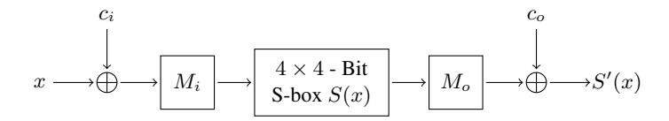

# Cryptographic Analysis of All 4 × 4-Bit S-Boxes

# Markku-Juhani O. Saarinen

REVERE SECURITY 4500 Westgrove Drive, Suite 335, Addison, TX 75001, USA. mjos@reveresecurity.com

Abstract. We present cryptanalytic results of an exhaustive search of all 16! bijective 4-bit S-Boxes. Previously affine equivalence classes have been exhaustively analyzed in 2007 work by Leander and Poschmann. We extend on this work by giving further properties of the optimal S-Box linear equivalence classes. In our main analysis we consider two S-Boxes to be cryptanalytically equivalent if they are isomorphic up to the permutation of input and output bits and a XOR of a constant in the input and output. We have enumerated all such equivalence classes with respect to their differential and linear properties. These equivalence classes are equivalent not only in their differential and linear bounds but also have equivalent algebraic properties, branch number and circuit complexity. We describe a "golden" set of S-boxes that have ideal cryptographic properties. We also present a comparison table of S-Boxes from a dozen published cryptographic algorithms.

Keywords: S-Box, Differential cryptanalysis, Linear cryptanalysis, Exhaustive permutation search.

# 1 Introduction

Horst Feistel introduced the Lucifer cipher, which can be considered to be the first modern block cipher, some 40 years ago. Feistel followed closely the principles outlined by Claude Shannon in 1949 [36] when designing Lucifer. We quote from Feistel's 1971 patent text [20]:

Shannon, in his paper, presents further developments in the art of cryptography by introducing the product cipher. That is, the successive application of two or more distinctly different kinds of message symbol transformations. One example of a product cipher consists of symbol substitution (nonlinear transformation) followed by a symbol transposition (linear transformation).

Cryptographic algorithms are still designed in 2011 according to these same principles. A key element of Lucifer's symbol substitution layer was a pair of 4 × 4-bit substitution boxes (S-Boxes).

Much research effort has been dedicated to the analysis of 4-bit S-Boxes in subsequent encryption algorithms during last the four decades. In this paper we present an analysis of all bijective 4-bit S-Boxes in the light of modern cryptanalytic techniques, together with comparison tables of 4-bit S-Boxes found in a dozen different published encryption algorithm proposals.

Overview of this paper. In Section 2 we give definitions of differential probability, linear bias, algebraic degree, and branch number of an S-Box. Section 3 defines more key concepts such as linear (affine) equivalence (LE) and permutation equivalence (PE) classes, together with the concept of an ordering-based canonical representative identify LE, PE, and other equivalence classes uniquely. We also make new observations on the sixteen "optimal" LE classes first identified in [31]. Section 4 describes our exhaustive search of the 16! bijective  $4 \times 4$ -bit S-Boxes. We give a description of the search algorithm in Section 4.1 and the distribution of class sizes and Linear and Differential properties in Section 4.2. Section 5 discusses the "golden" S-Boxes discovered in our search. We conclude in 4.2. Appendix A tabulates the properties of  $4 \times 4$ -bit S-Boxes found in a dozen different cryptographic algorithms.

### 2 S-Box Properties

In the context of cryptographic operations, arithmetic is assumed to be performed on variables, vectors, or matrices whose individual elements belong to the finite field  $\mathbb{F}_2$ . Vectors are indexed from 0. We write  $\operatorname{wt}(x) = \sum x_i$  to denote the Hamming weight of the bit vector (word) x.

We will first give definitions related to Differential Cryptanalysis [4, 5], Linear Cryptanalysis (LC) [32], and various forms of Algebraic / Cube Cryptanalysis (AC) [16, 17].

**Definition 1.** Let S be an S-Box with |S| input values. Let n be the number of elements x that satisfy  $S(x \oplus \Delta_i) = S(x) \oplus \Delta_o$ . Then n/|S| is the differential probability p of the characteristic  $S_D(\Delta_i \to \Delta_o)$ .

For  $4 \times 4$  bijective S-Boxes the optimal differential bound (maximum of all differentials in an individual S-Box) is p = 1/4.

**Definition 2.** Let S be an S-Box with |S| input values. Let n be the number of elements x that satisfy  $\operatorname{wt}(\beta_i \cdot x \oplus \beta_o \cdot S(x)) \mod 2 = 1$  for two bit-mask vectors  $\beta_i$  and  $\beta_o$ . Then  $\operatorname{abs}(\frac{n}{|S|} - \frac{1}{2})$  is the bias  $\epsilon$  of the linear approximation  $S_L(\beta_i \to \beta_o)$ .

It is well known that all  $2^{2^n}$  functions f from n bits to a single bit can be uniquely expressed by a polynomial function with coefficients drawn from the Algebraic Normal Form  $\hat{f}$ , which has the same domain as f:

$$f(x) = \sum_{y \in \mathbb{F}_n^n} \hat{f}(y) x_0^{y_0} x_1^{y_1} \cdots x_{n-1}^{y_{n-1}}.$$

This transformation from f to  $\hat{f}$  can also be seen to be equivalent to the Walsh transform [35].

**Definition 3.** The algebraic degree  $\deg(f)$  of a function  $f: \mathbb{F}_2^n \mapsto \mathbb{F}_2$  is the maximal weight wt(x) that satisfies  $\hat{f}(x) \neq 0$ .

In other words, the degree of f is the number of variables in the biggest monomial in the polynomial representation of f. Naturally the maximum degree for a 4-bit function is 4. This monomial exists in the polynomial representation exactly when  $f(0) \neq f(15)$ .

We define S-Box branch number similarly to the way it is defined in [39].

**Definition 4.** The branch number of an  $n \times n$ -bit S-Box is

$$BN = \min_{a,b \neq a} (\operatorname{wt}(a \oplus b) + \operatorname{wt}(S(a) \oplus S(b))),$$

where  $a, b \in \mathbb{F}_2^n$ .

It is clear that for a bijective S-Box the branch number is at least 2.

#### 3 Equivalence Classes and Canonical Representation

The classification of Boolean functions dates back to the fifties [22]. Previously 4-bit S-Boxes have been analyzed in relation to linear equivalence [6, 31], defined as follows:

**Definition 5.** Let  $M_i$  and  $M_o$  be two invertible matrices and  $c_i$  and  $c_o$  two vectors. The S-Box S' defined by two affine transformations

$$S'(x) = M_o S(M_i(x \oplus c_i)) \oplus c_o$$

belongs to the linear equivalence set of S;  $S' \in LE(S)$ .

We call  $M_i(x \oplus c_i)$  the inner affine transform and  $M_ox \oplus c_o$  the outer affine transform. There are 20,160 invertible  $4 \times 4$  matrices defined over  $\mathbb{F}_2$  and therefore  $2^4 \times 20$ , 160 = 322, 560 affine invertible transforms.

To be able to identify members of each equivalence class uniquely, we must define a canonical representation for it. Each member of the equivalence class can be reduced to this unique representative, which serves as an identifier for the entire class.



Fig. 1. Linear Equivalence (LE) and Permutation-XOR equivalence (PE).  $M_i$  and  $M_o$  boxes denote multiplication by an invertible matrix for LE and by a permutation matrix for PE.

**Definition 6.** The canonical representative of an equivalence class is the member that is first in lexicographic ordering.

Table 1 gives the canonical members of all 16 "optimal" S-Box LE classes, together with references to their equivalents in [31].

It has been shown that the members of each LE class have the same differential and linear bounds [6, 31]. However, these linear equivalence classes are not equivalent in many ways that have cryptographic significance.

Multiple differential characteristics and Linear approximations. For cryptographic security, the differential and linear bounds are the most important factor. However, the methods of multiple differentials [8] and multiple linear approximations [7, 21, 29] raise the question of how many differentials and linear approximations there are at the respective boundaries. From Table 1 it can be observed that these numbers are not equivalent, making some S-Boxes "more optimal" than others in this respect.

**Avalanche.** For members of an LE class there is no guarantee that a single-bit difference in input will not result in single-bit output difference. If this happens, only a single S-Box is activated in the next round of a simple substitution-permutation network such as PRESENT [9]. This is equivalent to the case where the branch number is 2.

It is somewhat surprising that those optimal S-Boxes with most attractive  $n_d$  and  $n_l$  numbers cannot be affinely transformed so that differentials with  $\operatorname{wt}(\Delta_i) = \operatorname{wt}(\Delta_o) = 1$  would all have p = 0. Only the seven of the sixteen optimal S-Box classes,  $G_0$ ,  $G_1$ ,  $G_2$ ,  $G_9$ ,  $G_{10}$ ,  $G_{14}$ , and  $G_{15}$ , have members that do not have such single-bit differentials. This has been verified by exhaustive search by the authors.

We may illustrate the importance of this property by considering a variant of PRESENT where the S-Box has been replaced by a linearly equivalent one from LE( $G_1$ ) such as (0123468A5BCFED97) that has p=1/4 for the single-bit differential  $S_D(\Delta_i=1\to\Delta_o=1)$ . Due to the fact that the bit 0 is mapped

Table 1. The canonical representatives of the 16 "optimal" linear equivalence classes. The G<sup>i</sup> and G −1 i identifier references are to Table 6 of [31]. We also give the DC and LC bounds, together with the number n<sup>d</sup> of characteristics at the differential bound and the number n<sup>l</sup> of approximations at the linear bound. The branch BN number given is the maximal branch number among all members of the given LE class.

| Canonical representative | Members           | DC      |    | LC         | Max |
|--------------------------|-------------------|---------|----|------------|-----|
| 0123456789ABCDEF         | & Inverse         | p       | nd | <br>nl     | BN  |
| 0123468A5BCF79DE         | −1<br>G2 G<br>0   | 1<br>/4 | 24 | 1<br>/4 36 | 3   |
| 0123468A5BCF7D9E         | −1<br>G15 G<br>14 | 1<br>/4 | 18 | 1<br>/4 32 | 3   |
| 0123468A5BCF7E9D         | −1<br>G0 G<br>2   | 1<br>/4 | 24 | 1<br>/4 36 | 3   |
| 0123468A5BCFDE79         | −1<br>G8 G<br>8   | 1<br>/4 | 24 | 1<br>/4 36 | 2   |
| 0123468A5BCFED97         | −1<br>G1 G<br>1   | 1<br>/4 | 24 | 1<br>/4 36 | 3   |
| 0123468B59CED7AF         | −1<br>G9 G<br>9   | 1<br>/4 | 18 | 1<br>/4 32 | 3   |
| 0123468B59CEDA7F         | −1<br>G13 G<br>13 | 1<br>/4 | 15 | 1<br>/4 30 | 2   |
| 0123468B59CF7DAE         | −1<br>G14 G<br>15 | 1<br>/4 | 18 | 1<br>/4 32 | 3   |
| 0123468B5C9DE7AF         | −1<br>G12 G<br>12 | 1<br>/4 | 15 | 1<br>/4 30 | 2   |
| 0123468B5C9DEA7F         | −1<br>G4 G<br>4   | 1<br>/4 | 15 | 1<br>/4 30 | 2   |
| 0123468B5CD79FAE         | −1<br>G6 G<br>6   | 1<br>/4 | 15 | 1<br>/4 30 | 2   |
| 0123468B5CD7AF9E         | −1<br>G5 G<br>5   | 1<br>/4 | 15 | 1<br>/4 30 | 2   |
| 0123468B5CD7F9EA         | −1<br>G3 G<br>3   | 1<br>/4 | 15 | 1<br>/4 30 | 2   |
| 0123468C59BDE7AF         | −1<br>G10 G<br>10 | 1<br>/4 | 18 | 1<br>/4 32 | 3   |
| 0123468C59BDEA7F         | −1<br>G7 G<br>7   | 1<br>/4 | 15 | 1<br>/4 30 | 2   |
| 0123468C59DFA7BE         | −1<br>G11 G<br>11 | 1<br>/4 | 15 | 1<br>/4 30 | 2   |

to bit 0 in the PRESENT pLayer, this variant has an iterative differential in bit 0 that holds through all 31 rounds with probability 2 <sup>−</sup>62. We may utilize the average branch number in the last rounds to estimate that this variant would be breakable with less than 2 <sup>56</sup> effort.

This motivates us to define the PE class.

Definition 7. *Let* P<sup>i</sup> *and* P<sup>o</sup> *be two bit permutation matrices and* c<sup>i</sup> *and* c<sup>o</sup> *two vectors. The S-Box* S <sup>0</sup> *defined by*

$$S'(x) = P_o S(P_i(x \oplus c_i)) \oplus c_o$$

*belongs to the permutation-xor equivalence set of* S*;* S <sup>0</sup> ∈ PE(S)*.*

Algebraic properties. While the maximal algebraic degree of all output bits may be preserved in LE [31], some of the output bits may still be almost linear. It is noteworthy that despite belonging to LE(G1), one of the PRESENT output bits only has one nonlinear monomial (of degree 2) and therefore this output bit depends only linearly on 2 of the input bits. This can be crucial when determining the number of secure rounds; final rounds can be peeled off using such properties.

Circuit complexity. From an implementation viewpoint, the members of an LE class may vary very much but the members of a PE class are usually equivalent. This is important in bit-slicing implementations such as [3].

It can be shown that circuits that use all 2-input Boolean functions [35, 40] can be transformed to equal-size circuits that use only the four commonly available instructions (AND, OR, XOR, AND NOT) but may require a constant XOR on input and output bit vectors. These XOR constants may be transferred to round key addition in most substitution-permutation networks and therefore there is no additional cost.

Note that the methods described in [39] utilize only five registers and twooperand instructions AND, OR, XOR, NOT and MOV. Most recent CPUs have sixteen 256-bit YMM registers, three-operand instructions (making MOV redundant) and the ANDNx instruction for AND NOT [28]. Therefore 2-input boolean circuit complexity is a more relevant measure for optimality of a circuit. However, for hardware implementation these gates have uneven implementationdependent cost [34].

We may also consider the concept of feeble one-wayness [25–27]. This property is also shared between the members of a PE class.

Other properties. Some researchers put emphasis on the cycle structure of an S-Box. Cycle structure properties are not usually shared between members of LE and PE classes. This may be relevant if the cipher design does not protect against the effects of fixed points or other similar special cases. However, such properties are difficult to analyze in the context of a single S-Box removed from its setting within an encryption algorithm. Care should be taken when choosing input and output bit ordering so that diffusion layers will achieve maximum effect.

Historical developments. The original DES S-Box design principles are described in [10]. In hindsight it can be seen that the criteria given in that 1976 document already offer significantly better resistance against primitive DC and LC than what can be achieved with entirely random S-Boxes [11]. For a perspective on the development of DES and the evaluation of its S-Boxes between the years 1975 and 1990 we refer to [13]. We may compare our current view on the topic of "good" S-Boxes to that given by Adams and Tavares in 1990 [2]. Four evaluation criteria for S-Boxes were given in that work: bijectivity, nonlinearity, strict avalanche, and independence of output bits. In current terminology nonlinearity would map to the algebraic degree, strict avalanche to the branch number, and independence of output bits roughly to both DC and LC. Note that modern DC, LC, and AC were (re)discovered after 1990.


**Fig. 2.** Our internal  $4 \times 16$ -bit representation of the identity permutation  $(0, 1, \dots, 15)$ . The words are always stored in increasing order and the highest bit is normalized to zero.

#### 4 An Exhaustive Search Over All PE Classes

We have performed an exhaustive search over all PE classes. Since there are  $16! \approx 2^{44.25}$  different bijective 4-bit S-Boxes, some shortcuts had to be used. We are currently unable to extend our methods to 5-bit S-Boxes or beyond.

Internally our program uses another (non-lexicographic) ordering to determine the unique canonical member of each PE class. The permutations are stored as four 16-bit words  $W_i$  that are always in ascending order.

**Theorem 1.** Any  $4 \times 4$ -bit bijective S-Box can be uniquely expressed as

$$S(x) = \left(\sum_{i=0}^{3} 2^{P(i)} W_{i,(15-x)}\right) \oplus c$$

for some bit permutation P of numbers (0,1,2,3), a vector  $c \in \mathbb{F}_2^4$  and words  $W_i = \sum_{j=0}^{15} 2^j W_{i,j}$  satisfying  $0 < W_0 < W_1 < W_2 < W_3 < 2^{15}$ .

*Proof.* Output bits can be permuted in 4! = 24 different ways (as each  $W_i$  must be different from others) and each one of the  $2^4 = 16$  masks c creates a different permutation due to the limit  $W_i < 2^{15}$ . P and c uniquely define the  $4!2^4 = 384$  outer transformations while  $W_i$  uniquely defines the rest.

This representation offers a natural and quick way to normalize a S-Box in respect to the outer permutation  $P_o$  and mask  $c_o$  by sorting the four words and inverting all bits of a word if the highest bit is set. Figure 2 illustrates this ordering.

From the fact that S is bijective it follows that  $\operatorname{wt}(W_i) = 8$  for all  $W_i$ . There are  $\binom{16}{8} = 12,870$  16-bit words of weight 8, of which we may remove half due to the  $c_o$  normalization limit  $W_i < 2^{15}$ , yielding 6,535 candidates.

## Algorithm 1 A bit-combinatorial permutation search algorithm.

```
1: for i_0 = 0 to 6534 do
          W_0 = \text{wt8tab}[i_0]
 3:
          if mw(W_0) = W_0 then
 4:
             for i_1 = i_0 + 1 to 6534 do
 5:
                  W_1 = \text{wt8tab}[i_1]
 6:
                  if mw(W_1) > W_0 and
                     {\rm wt}(t_2 = \neg W_0 \wedge W_1) = 4 \text{ and } {\rm wt}(t_3 = W_0 \wedge W_1) = 4 \text{ and }
                     \operatorname{wt}(t_1 = W_0 \wedge \neg W_1) = 4 and \operatorname{wt}(t_0 = \neg W_0 \wedge \neg W_1) = 4 then
 7:
                      for i_2 = i_1 + 1 to 6534 do
                          W_2 = \text{wt8tab}[i_2]
 8:
 9:
                          if mw(W_1) > W_0 and
                             \operatorname{wt}(u_0 = t_0 \wedge \neg W_2) = 2 and \operatorname{wt}(u_4 = t_0 \wedge W_2) = 2 and
                              \operatorname{wt}(u_1 = t_1 \wedge \neg W_2) = 2 and \operatorname{wt}(u_5 = t_1 \wedge W_2) = 2 and
                              \operatorname{wt}(u_2 = t_2 \wedge \neg W_2) = 2 and \operatorname{wt}(u_6 = t_2 \wedge W_2) = 2 and
                              \operatorname{wt}(u_3 = t_3 \wedge \neg W_2) = 2 and \operatorname{wt}(u_7 = t_3 \wedge W_2) = 2 then
10:
                              for j = 0 to 8 do
11:
                                  v_i = lsb(u_i)
                              end for
12:
                              for b = 0 to 255 do
13:
                                  W_3 = \bigoplus_{j=0}^7 \left( u_j \oplus b_j v_j \right)
if W_3 \ge 2^{15} then
14:
15:
                                      W_3 = \neg W_3
16:
17:
                                   end if
                                  if W_3 > W_2 then
18:
19.
                                      test(W_0, W_1, W_2, W_3)
20:
                                  end if
21:
                              end for
22:
                          end if
23:
                      end for
24:
                  end if
25:
              end for
26:
          end if
27: end for
```

Furthermore, each word has a minimal equivalent up to permutation among all input permutations  $P_i$  and input constants  $c_i$ . We call this minimal word  $\operatorname{mw}(x)$ . At program start, a table is initialized that contains  $\operatorname{mw}(x)$  for each 16-bit word by trying all 24 permutations of input bits and 16 values of  $c_i$  on the  $4 \times 1$ -bit Boolean function that the word x represents. If the resulting word is greater or equal to  $2^{15}$  (indicating that the highest bit is set) all bits of the word are inverted, normalizing the constant. Each one of the  $\operatorname{wt}(x) = 8$  candidates map to a set of just 58 different  $\operatorname{mw}(x)$  values.

### 4.1 The Search Algorithm

We will now describe the bit-combinatorial equivalence class search method given in Algorithm 1. There are basically four nested loops. Various early exit strategies are used that are based on properties of the permutation (see Theorem 1 and Figure 2). Lines 1–3 select the smallest word W<sup>0</sup> from a table of weighteight words and checks that it is indeed minimal w.r.t. permutation of the four input bits. In lines 4–6 we select W<sup>1</sup> such that it is larger than W<sup>0</sup> and these two words have each one of the four bit pairs (0, 0), (0, 1), (1, 0), and (1, 1) exactly four times at corresponding locations (W0,i, W1,i). This is a necessary condition for them to be a part of a permutation as described by Theorem 1. The corresponding masks are stored in four temporary variables t<sup>i</sup> . In Lines 7–9 we choose W<sup>2</sup> such that the three words make up two permutations of numbers 0, 1, . . . , 7. The vector u<sup>i</sup> containing the two bit positions of i simultaneously computed. We are now left with exactly 2 <sup>8</sup> = 256 options for the last word W3. In lines 10–12 we store in vector v<sup>i</sup> the lesser bit from the two-bit mask u<sup>i</sup> . In lines 13–20 we loop through the remaining W<sup>3</sup> possibilities. In line 14 we use the bit i of the loop index b to select which one of the two bits in u<sup>i</sup> is used as part of W3. Note that this part may be implemented a bit faster with a Gray-code sequence.

The unique permutation is then tested by the subroutine on line 19 to see if it is the least member of its class (here an early exit strategy will usually exit the exhaustive loop early). If (W0, W1, W2, W3) is indeed the canonical member in the special ordering that we're using, it is stored on on disk together with the size of the class. The entire process of creating the 1.4 GB file takes about half an hour with a 2011 consumer laptop.

# 4.2 Results of the Exhaustive Search

There are 142,090,700 different PE classes of various sizes. Table 2 gives the size distribution of these PE classes, which sum up to 20, 922, 789, 888, 000 = 16! examined S-Boxes. Each class size is divisible by 4!2<sup>4</sup> = 384 due to the fact that the output bits can be permuted 4! = 24 ways and the output constant c<sup>o</sup> can have 2 <sup>4</sup> = 16 different values. However, it is less obvious how the inner transform defined by P<sup>i</sup> and c<sup>i</sup> affect the size of the class together with S. For example, for the identity permutation (0123456789ABCDEF) the bit shuffles P<sup>i</sup> and P<sup>o</sup> and constant additions c<sup>i</sup> and c<sup>o</sup> may be presented with a single bit permutation and addition of constant and hence hence n = 384. It is interesting to note that that there is one other class with this size, the one with the largest canonical representative, (07BCDA61E952348F).

Table 2. Distribution of PE classes. The first column gives the number of elements in each class. The second column |Cn| gives the number of such classes, followed by their product, which sums to 16! = 20, 922, 789, 888, 000 as expected.

| n<br>4!24 | Cn        | n  Cn          | Representative   |
|-----------|-----------|----------------|------------------|
| 1         | 2         | 768            | 0123456789ABCDEF |
| 4         | 4         | 6144           | 01234567FEDCBA98 |
| 6         | 1         | 2304           | 01237654BA98CDEF |
| 8         | 4         | 12288          | 0123456879ABCDEF |
| 12        | 30        | 138240         | 0123456798BADCFE |
| 16        | 18        | 110592         | 0123457689BADCFE |
| 24        | 192       | 1769472        | 0123456789ABFEDC |
| 32        | 104       | 1277952        | 0123456789ABCDFE |
| 48        | 1736      | 31997952       | 0123456789ABCEDF |
| 64        | 264       | 6488064        | 012345678ACD9EBF |
| 96        | 13422     | 494788608      | 0123456789ABDEFC |
| 128       | 324       | 15925248       | 0123456789ADCEBF |
| 192       | 373192    | 27514699776    | 0123456789ABCEFD |
| 384       | 141701407 | 20894722670592 | 0123456789ACBEFD |
| 1–384     | 142090700 | 20922789888000 |                  |

Table 3 gives the distribution of differential and linear properties among the 16! S-Boxes examined. It can be seen that a majority, 54.7155% of all S-Boxes have a differential bound p ≤ 3/4 and linear bound ≤ 3/4. There are no bijective S-Boxes with differential bound p = 7/8. Appendix A gives results on some well-known 4-bit S-Boxes.

Table 3. Distribution of the 16! permutations in relation to Differential Cryptanalysis (rows) and Linear Cryptanalysis (columns).

| LC →    | ≤ 1/4         |        | ≤ 3/8          |         | ≤ 1/2        |        |  |  |  |  |  |
|---------|---------------|--------|----------------|---------|--------------|--------|--|--|--|--|--|
| DC ↓    | n             | %      | n              | %       | n            | %      |  |  |  |  |  |
| p ≤ 1/4 | 749123665920  | 3.5804 | 326998425600   | 1.5629  | 0            | 0.0000 |  |  |  |  |  |
| p ≤ 3/8 | 1040449536000 | 4.9728 | 11448247910400 | 54.7166 | 118908518400 | 0.5683 |  |  |  |  |  |
| p ≤ 1/2 | 52022476800   | 0.2486 | 5812644741120  | 27.7814 | 330249830400 | 1.5784 |  |  |  |  |  |
| p ≤ 5/8 | 0             | 0.0000 | 728314675200   | 3.4810  | 193458585600 | 0.9246 |  |  |  |  |  |
| p ≤ 3/4 | 0             | 0.0000 | 52022476800    | 0.2486  | 68098867200  | 0.3255 |  |  |  |  |  |
| p ≤ 1   | 0             | 0.0000 | 309657600      | 0.0015  | 1940520960   | 0.0093 |  |  |  |  |  |

**Table 4.** Golden S-Boxes with ideal properties are all members of these four PE classes. Both the S-Boxes and their inverses satisfy the bounds  $p \le 1/4$ ,  $\epsilon \le 1/4$ , have branch number 3, all output bits have algebraic degree 3 and are dependent on all input bits in nonlinear fashion. n gives the total size of the class and n' the number of members which additionally have a perfect cycle structure.

| PE Representative | LE       | n      | n'    |
|-------------------|----------|--------|-------|
| 035869C7DAE41FB2  | $G_9$    | 147456 | 19584 |
| 03586CB79EADF214  | $G_9$    | 147456 | 19584 |
| 03586AF4ED9217CB  | $G_{10}$ | 147456 | 22656 |
| 03586CB7A49EF12D  | $G_{10}$ | 147456 | 22656 |

#### 5 Golden S-Boxes

Based on our exhaustive search, we may describe *golden* S-Boxes that have ideal properties. From Table 1 we see that the most tempting candidates belong to the LE sets of  $G_9$ ,  $G_{10}$ ,  $G_{14}$ , and  $G_{15}$  as they have the smallest  $n_d$  and  $n_l$  numbers among those S-Boxes that have branch number 3. Note that  $\mathrm{LE}(G_{14}) = \mathrm{LE}(G_{15}^{-1})$  and vice versa.

The only problem with  $G_{14}$  and  $G_{15}$  in comparison to  $G_9$  and  $G_{10}$  is that if we want the branch number to be larger than 2, there are no S-Boxes in these classes that have the desired property that all output bits are nonlinearly dependent on all input bits and have degree 3. Either the permutation or its inverse will not satisfy this condition. This has been verified with exhaustive search. All golden S-Boxes belong to the four PE classes given in Table 4.

The Serpent [1] S-Box S3, Hummingbird-1 [18] S-Boxes S1, S2, and S3 and Hummingbird-2 [19] S-Boxes  $^1$  S0 and S1 are the only known examples of "golden" S-Boxes in literature. Note that cipher designers may want to avoid reusing the same LE class in multiple S-Boxes and hence not all can be "golden". Please see Appendix A for a more detailed comparison.

#### 6 Conclusions

We have analyzed all 16! bijective  $4 \times 4$ -bit S-Boxes and classified them into linear equivalence (LE) and permutation equivalence (PE) classes. Members of a LE class have equivalent differential and linear bounds but not necessarily branch number, algebraic properties and circuit complexity. Members of PE classes share these properties. Each equivalence class can be uniquely identified

<sup>&</sup>lt;sup>1</sup> Hummingbird-2 was tweaked in May 2011 to use these S-Boxes, and they are also contained in [19]. Some early prototypes used S-Boxes from Serpent.

with the use of a canonical representative, which we define to be the member which is first in lexicographic ordering of the class members.

There are 142,090,700 different PE classes, the vast majority (99.7260%) of which have (4!2<sup>4</sup> ) <sup>2</sup> = 147456 elements. We classify the S-Boxes according to their differential and linear properties. It turns out that that a majority (54.7155%) of S-Boxes have differential bound p ≤ 3/4 and linear bound ≤ 3/4.

Furthermore, we have discovered that not all of the "optimal" S-Boxes described in [31] are equal if we take the branch number and multiple differential and linear cryptanalysis into account.

In an appendix we give comparison tables of the S-Boxes from Lucifer [37], Present [9], JH [41], ICEBERG [38], LUFFA [15] NOEKEON [12], HAMSI [30], Serpent [1], Hummingbird-1 [18], Hummingbird-2 [19], GOST [14, 23, 24] and DES [33].

# 7 Acknowledgements

The author wishes to thank Whitfield Diffie and numerous other commentators for their input. This work is still ongoing.

# References

- 1. R. Anderson, E. Biham and L. Knudsen: "Serpent: A Proposal for the Advanced Encryption Standard." http://www.cl.cam.ac.uk/~rja14/Papers/serpent.pdf (1999)
- 2. C. Adams and S. Tavares: "The Structured Design of Cryptographically Good S-Boxes." Journal of Cryptology, Volume 3, Number 1, pp. 27 – 41. Springer (1990)
- 3. E. Biham: "A fast new DES implementation in software." In E. Biham (Ed.): FSE 1997. LNCS 1267, pp. 260–272. Springer (1997)
- 4. E. Biham and A. Shamir: "Differential Cryptanalysis of DES-like cryptosystems." In A. Menezes and S.A. Vanstone (Eds.): CRYPTO 1990. LNCS 537, pp. 2–21. Springer (1990)
- 5. E. Biham and A. Shamir: "Differential Cryptanalysis of the Data Encryption Standard." Springer (1993)
- 6. A. Biryukov, C. De Cannière, A. Braeken, and B. Preneel: "A toolbox for cryptanalysis: Linear and affine equivalence algorithms." In E. Biham (Ed.): EUROCRPYT 2003. LNCS 2656, pp. 33–50. Springer (2003)
- 7. A. Biryukov, C. De Cannière, and M. Quisquater: "On Multiple Linear Approximations." In M. Franklin (Eds.): CRYPTO 2004. LNCS 3152, pp. 1–22. Springer (2004)
- 8. C. Blondeau and B. Gérard: "Multiple Differential Cryptanalysis: Theory and Practice." In A. Joux (Ed.): FSE 2011. LNCS 6733, pp. 35–54. Springer (2011).
- 9. A. Bogdanov, L.R. Knudsen, G. Leander, C. Paar, A. Poschmann, M.J.B. Robshaw, Y. Seurin, and C. Vikkelsoe: "PRESENT: An Ultra-Lightweight Block Cipher." In P. Paillier and I. Verbauwhede (Eds.): CHES 2007, LNCS 4727, pp. 450 – 466. Springer (2007)
- 10. D. K. Branstad, J. Gait, and S. Katzke: "Report of the Workshop on Cryptography in Support of Computer Security." Tech. Rep. NBSIR 77-1291, National Bureau of Standards, September 1976.

- 11. D. Coppersmith: "The Data Encryption Standard (DES) and its strength against attacks." IBM Journal of Research and Development archive, Vol. 38, Issue 3, May 1994.
- 12. J. Daemen, M. Peeters, G. Van Assche, and V. Rijmen: "Nessie Proposal: NOEKEON." NESSIE Proposal, 27 October 2000.
- 13. D. Denning: "The Data Encryption Standard Fifteen Years of Public Scrutiny." Distinguished Lecture in Computer Security, Sixth Annual Computer Security Applications Conference, Tucson, 3–7 December, 1990.
- 14. V. Dolmatov (Ed.): "GOST 28147-89: Encryption, Decryption, and Message Authentication Code (MAC) Algorithms." Internet Engineering Task Force RFC 5830, March 2010.
- 15. C. De Cannière, H. Sato, and D. Watanabe: "Hash Function Luffa Specification Ver. 2.0.1." NIST SHA-3 Submission, Round 2 document, 2 October 2009.
- 16. N. Courtois and J. Pieprzyk: "Cryptanalysis of Block Ciphers with Overdefined Systems of Equations." In Y. Zhang (Ed.): Proc. ASIACRYPT 2002, LNCS 2501, pp. 267–287. Springer (2002)
- 17. I. Dinur and A. Shamir: "Cube Attacks on Tweakable Black Box Polynomials." In A. Joux (Ed.): EUROCRYPT 2009, LNCS 5479, pp. 278–299. Springer (2009)
- 18. D. Engels, X. Fan, G. Gong, H. Hu, and E. M. Smith: "Hummingbird: Ultra-Lightweight Cryptography for Resource-Constrained Devices." In R. Sion et al. (Eds.): FC 2010 Workshops, LNCS 6054, pp. 3–18. Springer (2010)
- 19. D. Engels, M.-J. O. Saarinen, P. Schweitzer, and E. M. Smith: "The Hummingbird-2 Lightweight Authenticated Encryption Algorithm." RFIDSec 2011, The 7th Workshop on RFID Security and Privacy, 26–28 June 2011, Amherst, Massachusetts, USA (2011)
- 20. H. Feistel: "Block Cipher Cryptographic System." U.S.Patent 3,798,359, Filed 30 June 1971.
- 21. M. Hermelin and K. Nyberg: "Dependent linear approximations: The algorithm of Biryukov and others revisited." In J. Pieprzyk (Ed.): CT-RSA 2010. LNCS 5985, pp. 318–333. Springer (2010)
- 22. S. Golomb: "On the classification of Boolean functions." IEEE Transactions on Information Theory, Vol. 5, Issue 5, pp. 176–186. (1959)
- 23. Government Committee of the USSR for Standards. "Cryptographic Protection for Data Processing System." GOST 28147-89, Gosudarstvennyi Standard of USSR (In Russian). (1989)
- 24. Government Committee of the Russia for Standards. ""Information technology. Cryptographic Data Security. Hashing function." GOST R 34.11-94, Gosudarstvennyi Standard of Russian Federation (In Russian). (1994)
- 25. A. P. Hiltgen: "Constructions of Feebly-One-Way Families of Permutations." In J. Seberry and Y. Zheng (Eds.): AUSCRYPT '92. LNCS 718, pp. 422–434. Springer (1993)
- 26. A. P. Hiltgen: "Towards a Better Understanding of One-Wayness: Facing Linear Permutations." In K. Nyberg (Ed.): EUROCRYPT 1998. LNCS 1403, pp. 319–333. Springer (1998)
- 27. E. A. Hirsch and S. I. Nikolenko: "A Feebly Secure Trapdoor Function." In A. Frid et al. (Eds.): CSR 2009. LNCS 5675, pp. 129–142. Springer (2009)
- 28. Intel: "Intel Advanced Vector Extensions Programming Reference." Publication 319433- 010, Intel, April 2011.
- 29. B. S. Kaliski, M. Matt Robshaw: "Linear Cryptanalysis Using Multiple Approximations." In Yvo Desmedt (Ed.): CRYPTO '94. LNCS 839, pp. 26–39. Springer (1994)
- 30. Ö. Küçük: "The Hash Function Hamsi." NIST SHA-3 Submission, Round 2 document, 14 September 2009.
- 31. G. Leander and A. Poschmann: "On the Classification of 4 Bit S-Boxes." In C. Carlet and B. Sunar (Eds.): WAIFI 2007, LNCS 4547, pp. 159–176. Springer (2007)

- 32. M. Matsui: "Linear cryptoanalysis method for DES cipher." In T. Helleseth (Ed.): EURO-CRYPT 1993. LNCS 765, pp. 386–397. Springer (1993)
- 33. National Bureau of Standards: "Data Encryption Standard." FIPS PUB 46. National Bureau of Standards, U.S. Department of Commerce, Washington D.C., 15 January 1977.
- 34. A. Poschmann: "Lightweight Cryptography Cryptographic Engineering for a Pervasive World." Doktor-Ingenieur Thesis, Ruhr-University Bochum, Germany. Also available as Cryptology ePrint Report 2009/516 (2009)
- 35. M.-J. O. Saarinen: "Chosen-IV Statistical Attacks Against eSTREAM CIPHERS." Proc. SECRYPT 2006, International Conference on Security and Cryptography, Setubal, Portugal, August 7-10, 2006.
- 36. C. E. Shannon: "Communication Theory of Secrecy Systems." Bell System Technical Journal, Vol 28, pp. 656–717, October 1949.
- 37. A. Sorkin: "Lucifer: A cryptographic algorithm." Cryptologia, Vol. 8, No. 1, pp. 22–42. (1984)
- 38. F.-X. Standaert, G. Piret, G. Rouvroy, J.-J. Quisquater, and J.-D. Legat: "ICEBERG : An Involutional Cipher Efficient for Block Encryption in Reconfigurable Hardware." In B. Roy and W. Meier (Eds.): FSE 2004, LNCS 3017, pp. 279–299. Springer (2004)
- 39. M. Ullrich, C. De Cannière, S. Indesteege, Ö. Küçük, N. Mouha, and B. Preneel: "Finding Optimal Bitsliced Implementations of 4 × 4-bit S-Boxes." SKEW 2011 Symmetric Key Encryption Workshop, Copenhagen, Denmark, 16-17 February 2011.
- 40. I. Wegener: "The complexity of Boolean functions." WileyTeubner series in computer science. Wiley, Teubner. (1987)
- 41. H. Wu: "The Hash Function JH." NIST SHA-3 Submission, Round 3 document, 16 January 2011.

# A Cryptographic Analysis of Some Well-Known $4 \times 4$ - Bit S-Boxes

**Algorithm & Source:** A normative identifier for the S-Box in question, together with a literary reference.

**S-Box:** The S-Box permutation S(x) in Hex.

Canonical PE: The lexicographically smallest member of the Permutation-XOR equivalence class PE(S).

**Lin Eqv.:** The linear equivalence class LE(s).

One  $\Delta$ : number of instances where flipping a single input bit will cause single output bit to change (out of 64).

BN #: Branch number.

**DC:** Differential bound p and the number  $n_d$  of characteristics at that bound.

**LC:** Linear bias  $\epsilon$  and the number  $n_l$  of linear approximations at that bound.

**Bit** n: The linear set LS of input bits that only have linear effect on this output bit, together with its degree.

| Algorithm                 | S-Box            | Canonical PE     | Lin.     | One      | BN | D            | C     | L           | LC    |       | 0   | Bit | t 1 | Bit | t 2 | Bit   | 3   |
|---------------------------|------------------|------------------|----------|----------|----|--------------|-------|-------------|-------|-------|-----|-----|-----|-----|-----|-------|-----|
| & Source                  | 0123456789ABCDEF | 0123456789ABCDEF | Eqv.     | $\Delta$ | #  | p            | $n_d$ | $\epsilon$  | $n_l$ | LS    | deg | LS  | deg | LS  | deg | LS    | deg |
| Lucifer S0 [37]           | CF7AEDB026319458 | 01254F9C6AB78D3E |          | 12       | 2  | $^{3}/_{8}$  | 5     | $^{3}/_{8}$ | 3     | {}    | 3   | {}  | 3   | {}  | 3   | {}    | 3   |
| Lucifer S1 [37]           | 72E93B04CD1A6F85 | 01245F3BC7DAE896 |          | 10       | 2  | $ ^{3}/_{8}$ | 1     | $^{1}/_{4}$ | 30    | {}    | 3   | {}  | 3   | {}  | 3   | {}    | 3   |
| Present [9]               | C56B90AD3EF84712 | 03567ABCD4E9812F | $G_1$    | 0        | 3  | $^{1}/_{4}$  | 24    | $^{1}/_{4}$ | 36    | {0,3} | 2   | {}  | 3   | {}  | 3   | {}    | 3   |
| Present <sup>-1</sup> [9] | 5EF8C12DB463079A | 0358BC6FE9274AD1 | $G_1$    | 0        | 3  | $^{1}/_{4}$  | 24    | $^{1}/_{4}$ | 36    | {0,2} | 2   | {}  | 3   | {}  | 3   | {}    | 3   |
| JH S0 [41]                | 904BDC3F1A26758E | 01256BD79CF384AE | $G_{13}$ | 12       | 2  | $^{1}/_{4}$  | 15    | $^{1}/_{4}$ | 30    | {}    | 3   | {}  | 3   | {}  | 3   | {}    | 3   |
| JH S1 [41]                | 3C6D5719F204BAE8 | 012485EADF3B697C | $G_{13}$ | 20       | 2  | $^{1}/_{4}$  | 15    | $^{1}/_{4}$ | 30    | {}    | 3   | {}  | 3   | {}  | 3   | {}    | 3   |
| ICEBERG0 [38]             | D7329AC1F45E60B8 | 012758E46DFA93BC | $G_4$    | 8        | 2  | $^{1}/_{4}$  | 15    | $^{1}/_{4}$ | 30    | {}    | 3   | {}  | 3   | {}  | 3   | {}    | 3   |
| ICEBERG1 [38]             | 4AFC0D9BE6173582 | 0127568CA49EDB3F | $G_4$    | 8        | 2  | $^{1}/_{4}$  | 15    | $^{1}/_{4}$ | 30    | {}    | 3   | {}  | 3   | {}  | 3   | {}    | 3   |
| LUFFA [15]                | DE015A76B39CF824 | 012476AFC3E98B5D | $G_1$    | 18       | 2  | $^{1}/_{4}$  | 24    | $^{1}/_{4}$ | 36    | {}    | 3   | {}  | 3   | {}  | 3   | {}    | 3   |
| NOEKEON [12]              | 7A2C48F0591E3DB6 | 01245EF3C786BAD9 | $G_8$    | 12       | 2  | $^{1}/_{4}$  | 24    | $^{1}/_{4}$ | 36    | {}    | 3   | {}  | 3   | {0} | 2   | {0,3} | 2   |
| HAMSI [30]                | 86793CAFD1E40B52 | 035869A7BCE21FD4 | $G_1$    | 0        | 3  | $^{1}/_{4}$  | 24    | $^{1}/_{4}$ | 36    | {1,3} | 2   | {}  | 3   | {}  | 3   | {}    | 3   |

| Algorithm          | S-Box            | Canonical PE     | Lin.     | One      | BN | D            | C     | L           | С     | Bit | t 0 | Bit | t 1 | Bit | t 2 | Bit   | 3   |
|--------------------|------------------|------------------|----------|----------|----|--------------|-------|-------------|-------|-----|-----|-----|-----|-----|-----|-------|-----|
| & Source           | 0123456789ABCDEF | 0123456789ABCDEF | Eqv.     | $\Delta$ | #  | p            | $n_d$ | $\epsilon$  | $n_l$ | LS  | deg | LS  | deg | LS  | deg | LS    | deg |
| HB1 S0 [18]        | 865F1CA9EB2470D3 | 03586CF1A49EDB27 | $G_{15}$ | 0        | 3  | $^{1}/_{4}$  | 18    | $^{1}/_{4}$ | 32    | {}  | 3   | {}  | 3   | {}  | 3   | {}    | 3   |
| HB1 S1 [18]        | 07E15B823AD6FC49 | 035869C7DAE41FB2 | $G_9$    | 0        | 3  | $^{1}/_{4}$  | 18    | $^{1}/_{4}$ | 32    | {}  | 3   | {}  | 3   | {}  | 3   | {}    | 3   |
| HB1 S2 [18]        | 2EF5C19AB468073D | 03586CB7A49EF12D | $G_{10}$ | 0        | 3  | $^{1}/_{4}$  | 18    | $^{1}/_{4}$ | 32    | {}  | 3   | {}  | 3   | {}  | 3   | {}    | 3   |
| HB1 S3 [18]        | 0734C1AFDE6B2895 | 03586CB79EADF214 | $G_9$    | 0        | 3  | $ ^{1}/_{4}$ | 18    | $^{1}/_{4}$ | 32    | {}  | 3   | {}  | 3   | {}  | 3   | {}    | 3   |
| $HB1^{-1} S0 [18]$ | D4AFB21C07695E83 | 035879BEADF4C261 | $G_{14}$ | 0        | 3  | $ ^{1}/_{4}$ | 18    | $^{1}/_{4}$ | 32    | {0} | 2   | {}  | 3   | {}  | 3   | {}    | 3   |
| $HB1^{-1} S1 [18]$ | 0378E4B16F95DA2C | 03586CB79EADF214 | $G_9$    | 0        | 3  | $ ^{1}/_{4}$ | 18    | $^{1}/_{4}$ | 32    | {}  | 3   | {}  | 3   | {}  | 3   | {}    | 3   |
| $HB1^{-1} S2 [18]$ | C50E93ADB6784F12 | 03586AF4ED9217CB | $G_{10}$ | 0        | 3  | $ ^{1}/_{4}$ | 18    | $^{1}/_{4}$ | 32    | {}  | 3   | {}  | 3   | {}  | 3   | {}    | 3   |
| $HB1^{-1} S3 [18]$ | 05C23FA1DE6B4897 | 035869C7DAE41FB2 | $G_9$    | 0        | 3  | $ ^{1}/_{4}$ | 18    | $^{1}/_{4}$ | 32    | {}  | 3   | {}  | 3   | {}  | 3   | {}    | 3   |
| HB2 S0 [19]        | 7CE9215FB6D048A3 | 035869C7DAE41FB2 | $G_9$    | 0        | 3  | $ ^{1}/_{4}$ | 18    | $^{1}/_{4}$ | 32    | {}  | 3   | {}  | 3   | {}  | 3   | {}    | 3   |
| HB2 S1 [19]        | 4A168F7C30ED59B2 | 03586AF4ED9217CB | $G_{10}$ | 0        | 3  | $^{1}/_{4}$  | 18    | $^{1}/_{4}$ | 32    | {}  | 3   | {}  | 3   | {}  | 3   | {}    | 3   |
| HB2 S2 [19]        | 2FC156ADE8340B97 | 035879BEADF4C261 | $G_{14}$ | 0        | 3  | $^{1}/_{4}$  | 18    | $^{1}/_{4}$ | 32    | {}  | 3   | {}  | 3   | {}  | 3   | {1}   | 2   |
| HB2 S3 [19]        | F4589721A30E6CDB | 03586CF1A49EDB27 | $G_{15}$ | 0        | 3  | $^{1}/_{4}$  | 18    | $^{1}/_{4}$ | 32    | {}  | 3   | {}  | 3   | {}  | 3   | {}    | 3   |
| $HB2^{-1} S0 [19]$ | B54FC690D3E81A27 | 03586CB79EADF214 | $G_9$    | 0        | 3  | $^{1}/_{4}$  | 18    | $^{1}/_{4}$ | 32    | {}  | 3   | {}  | 3   | {}  | 3   | {}    | 3   |
| $HB2^{-1} S1 [19]$ | 92F80C364D1E7BA5 | 03586CB7A49EF12D | $G_{10}$ | 0        | 3  | $^{1}/_{4}$  | 18    | $^{1}/_{4}$ | 32    | {}  | 3   | {}  | 3   | {}  | 3   | {}    | 3   |
| $HB2^{-1} S2 [19]$ | C30AB45F9E6D2781 | 03586CF1A49EDB27 | $G_{15}$ | 0        | 3  | $^{1}/_{4}$  | 18    | $^{1}/_{4}$ | 32    | {}  | 3   | {}  | 3   | {}  | 3   | {}    | 3   |
| $HB2^{-1} S3 [19]$ | A76912C5348FDEB0 | 035879BEADF4C261 | $G_{14}$ | 0        | 3  | $^{1}/_{4}$  | 18    | $^{1}/_{4}$ | 32    | {0} | 2   | {}  | 3   | {}  | 3   | {}    | 3   |
| DES S0-0 [33]      | E4D12FB83A6C5907 | 035679CAED2B84F1 |          | 0        | 3  | $ ^{1}/_{2}$ | 1     | $^{3}/_{8}$ | 4     | {}  | 3   | {}  | 3   | {}  | 3   | {}    | 3   |
| DES S0-1 [33]      | 0F74E2D1A6CB9538 | 035869B7CFA412DE |          | 0        | 3  | $ ^{1}/_{2}$ | 1     | $^{3}/_{8}$ | 4     | {}  | 3   | {}  | 3   | {}  | 3   | {}    | 3   |
| DES S0-2 [33]      | 41E8D62BFC973A50 | 035678BDCAF1942E |          | 0        | 3  | $ ^{1}/_{2}$ | 1     | $^{3}/_{8}$ | 4     | {}  | 3   | {}  | 3   | {}  | 3   | {}    | 3   |
| DES S0-3 [33]      | FC8249175B3EA06D | 035879AFBEC2D461 |          | 0        | 3  | $ ^{1}/_{2}$ | 1     | $^{3}/_{8}$ | 2     | {2} | 2   | {}  | 3   | {1} | 2   | {}    | 3   |
| DES S1-0 [33]      | F18E6B34972DC05A | 035874BEF6ADC912 |          | 0        | 3  | $ ^{3}/_{8}$ | 3     | $^{3}/_{8}$ | 2     | {}  | 3   | {3} | 3   | {0} | 2   | {}    | 3   |
| DES S1-1 [33]      | 3D47F28EC01A69B5 | 03586CF2ED971BA4 |          | 0        | 3  | $ ^{1}/_{2}$ | 1     | $^{3}/_{8}$ | 2     | {3} | 2   | {}  | 3   | {}  | 3   | {2}   | 3   |
| DES S1-2 [33]      | 0E7BA4D158C6932F | 03567CEBADF84192 |          | 0        | 3  | $ ^{1}/_{2}$ | 1     | $^{3}/_{8}$ | 2     | {}  | 3   | {}  | 3   | {}  | 3   | {0,2} | 2   |
| DES S1-3 [33]      | D8A13F42B67C05E9 | 0358BDC6E92F741A |          | 0        | 3  | $ ^{3}/_{8}$ | 6     | $^{3}/_{8}$ | 4     | {}  | 3   | {}  | 3   | {}  | 3   | {}    | 3   |

| Algorithm     | S-Box            | Canonical PE     | Lin. | One      | BN | D             | C     | L             | С     | Bit | t <b>0</b> | Bit | t 1 | Bit   | 2   | Bit   | 3   |
|---------------|------------------|------------------|------|----------|----|---------------|-------|---------------|-------|-----|------------|-----|-----|-------|-----|-------|-----|
| & Source      | 0123456789ABCDEF | 0123456789ABCDEF | Eqv. | $\Delta$ | #  | p             | $n_d$ | $\epsilon$    | $n_l$ | LS  | deg        | LS  | deg | LS    | deg | LS    | deg |
| DES S2-0 [33] | A09E63F51DC7B428 | 03586DF47E92A1CB |      | 0        | 3  | $^{1}/_{2}$   | 1     | $^{3}/_{8}$   | 3     | {3} | 2          | {}  | 3   | {}    | 3   | {}    | 3   |
| DES S2-1 [33] | D709346A285ECBF1 | 03586CB79EF2A14D |      | 0        | 3  | $ ^{1}/_{2}$  | 1     | $^{3}/_{8}$   | 4     | {3} | 2          | {2} | 3   | {}    | 3   | {}    | 3   |
| DES S2-2 [33] | D6498F30B12C5AE7 | 035879BED62FAC41 |      | 0        | 3  | $ ^{1}/_{2}$  | 1     | $ ^{3}/_{8}$  | 2     | {1} | 3          | {}  | 3   | {3}   | 2   | {1}   | 3   |
| DES S2-3 [33] | 1AD069874FE3B52C | 03589CF6DEA72B41 |      | 0        | 3  | $ ^{1}/_{2}$  | 3     | $ ^{3}/_{8}$  | 4     | {}  | 3          | {}  | 3   | {}    | 3   | {0,1} | 2   |
| DES S3-0 [33] | 7DE3069A1285BC4F | 035869BECFA412D7 |      | 0        | 3  | $ ^{3}/_{8}$  | 6     | $\frac{3}{8}$ | 4     | {}  | 3          | {}  | 3   | {}    | 3   | {}    | 3   |
| DES S3-1 [33] | D8B56F03472C1AE9 | 035869BECFA412D7 |      | 0        | 3  | $ ^{3}/_{8}$  | 6     | $ ^{3}/_{8}$  | 4     | {}  | 3          | {}  | 3   | {}    | 3   | {}    | 3   |
| DES S3-2 [33] | A690CB7DF13E5284 | 035869BECFA412D7 |      | 0        | 3  | $ ^{3}/_{8}$  | 6     | $ ^{3}/_{8}$  | 4     | {}  | 3          | {}  | 3   | {}    | 3   | {}    | 3   |
| DES S3-3 [33] | 3F06A1D8945BC72E | 035869BECFA412D7 |      | 0        | 3  | $ ^{3}/_{8}$  | 6     | $ ^{3}/_{8}$  | 4     | {}  | 3          | {}  | 3   | {}    | 3   | {}    | 3   |
| DES S4-0 [33] | 2C417AB6853FD0E9 | 03586DF47EA1CB92 |      | 0        | 3  | $ ^{1}/_{2}$  | 1     | $ ^{3}/_{8}$  | 3     | {}  | 3          | {}  | 3   | {0,2} | 2   | {}    | 3   |
| DES S4-1 [33] | EB2C47D150FA3986 | 035869BECF241AD7 |      | 0        | 3  | $ ^{3}/_{8}$  | 5     | $\frac{3}{8}$ | 3     | {}  | 3          | {}  | 3   | {}    | 3   | {}    | 3   |
| DES S4-2 [33] | 421BAD78F9C5630E | 03586DF2A49E1BC7 |      | 0        | 3  | $ ^{3}/_{8}$  | 2     | $\frac{3}{8}$ | 2     | {}  | 3          | {}  | 3   | {}    | 3   | {}    | 3   |
| DES S4-3 [33] | B8C71E2D6F09A453 | 03586AB79CE2F14D |      | 0        | 3  | $ ^{3}/_{8}$  | 5     | $^{3}/_{8}$   | 3     | {}  | 3          | {1} | 3   | {}    | 3   | {}    | 3   |
| DES S5-0 [33] | C1AF92680D34E75B | 03586DF29EA4CB17 |      | 0        | 3  | $ ^{1}/_{4} $ | 24    | $ ^{3}/_{8}$  | 1     | {}  | 3          | {}  | 3   | {}    | 3   | {}    | 3   |
| DES S5-1 [33] | AF427C9561DE0B38 | 0358749FDAB6E12C |      | 0        | 3  | $ ^{1}/_{2}$  | 1     | $^{3}/_{8}$   | 3     | {}  | 3          | {}  | 3   | {}    | 3   | {}    | 3   |
| DES S5-2 [33] | 9EF528C3704A1DB6 | 035869BEA4CFD721 |      | 0        | 3  | $ ^{3}/_{8}$  | 6     | $ ^{3}/_{8}$  | 4     | {}  | 3          | {1} | 3   | {}    | 3   | {}    | 3   |
| DES S5-3 [33] | 432C95FABE17608D | 035874BEF6ADC912 |      | 0        | 3  | $ ^{3}/_{8}$  | 3     | $ ^{3}/_{8}$  | 2     | {3} | 2          | {}  | 3   | {0}   | 3   | {}    | 3   |
| DES S6-0 [33] | 4B2EF08D3C975A61 | 03586CB79EF2A14D |      | 0        | 3  | $ ^{1}/_{2}$  | 1     | $ ^{3}/_{8}$  | 4     | {}  | 3          | {2} | 3   | {0}   | 2   | {}    | 3   |
| DES S6-1 [33] | D0B7491AE35C2F86 | 03586DF47ECBA192 |      | 0        | 3  | $ ^{1}/_{2}$  | 1     | $ ^{3}/_{8}$  | 2     | {}  | 3          | {}  | 3   | {}    | 3   | {0,2} | 2   |
| DES S6-2 [33] | 14BDC37EAF680592 | 035869BECFA412D7 |      | 0        | 3  | $ ^{3}/_{8}$  | 6     | $ ^{3}/_{8}$  | 4     | {}  | 3          | {}  | 3   | {}    | 3   | {}    | 3   |
| DES S6-3 [33] | 6BD814A7950FE23C | 035869B7F4AD1EC2 |      | 0        | 3  | $ ^{1}/_{2}$  | 2     | $ ^{3}/_{8}$  | 5     | {2} | 3          | {2} | 3   | {0}   | 3   | {}    | 3   |
| DES S7-0 [33] | D2846FB1A93E50C7 | 03589CE2F6AD4B71 |      | 0        | 3  | $ ^{3}/_{8}$  | 4     | $ ^{3}/_{8}$  | 1     | {2} | 3          | {3} | 2   | {}    | 3   | {}    | 3   |
| DES S7-1 [33] | 1FD8A374C56B0E92 | 03587ACF96EB4D21 |      | 0        | 3  | $ ^{5}/_{8}$  | 1     | $ ^{3}/_{8}$  | 5     | {}  | 3          | {}  | 3   | {}    | 3   | {2}   | 3   |
| DES S7-2 [33] | 7B419CE206ADF358 | 035869BEF4ADC217 |      | 0        | 3  | $ ^{3}/_{8}$  | 5     | $ ^{3}/_{8}$  | 3     | {}  | 3          | {1} | 3   | {0}   | 3   | {}    | 3   |
| DES S7-3 [33] | 21E74A8DFC90356B | 035678EB9F2CA4D1 |      | 0        | 3  | $ ^{1}/_{2}$  | 1     | $ ^{3}/_{8}$  | 4     | {}  | 3          | {}  | 3   | {1,3} | 2   | {}    | 3   |

| Algorithm                    | S-Box            | Canonical PE     | Lin.     | One      | BN | D             | C     | L             | С     | Bit   | 0   | Bit   | 1   | Bit   | 2   | Bit       | 3   |
|------------------------------|------------------|------------------|----------|----------|----|---------------|-------|---------------|-------|-------|-----|-------|-----|-------|-----|-----------|-----|
| & Source                     | 0123456789ABCDEF | 0123456789ABCDEF | Eqv.     | $\Delta$ | #  | p             | $n_d$ | $\epsilon$    | $n_l$ | LS    | deg | LS    | deg | LS    | deg | LS        | deg |
| Serpent S0 [1]               | 38F1A65BED42709C | 0358749EF62BADC1 | $G_2$    | 0        | 3  | $^{1}/_{4}$   | 24    | $^{1}/_{4}$   | 36    | {}    | 3   | {}    | 3   | {}    | 3   | {1,2}     | 2   |
| Serpent S1 [1]               | FC27905A1BE86D34 | 035A7CB6D429E18F | $G_0$    | 0        | 3  | $ ^{1}/_{4}$  | 24    | $^{1}/_{4}$   | 36    | {}    | 3   | {}    | 3   | {2,3} | 2   | {}        | 3   |
| Serpent S2 [1]               | 86793CAFD1E40B52 | 035869A7BCE21FD4 | $G_1$    | 0        | 3  | $ ^{1}/_{4}$  | 24    | $ ^{1}/_{4}$  | 36    | {1,3} | 2   | {}    | 3   | {}    | 3   | {}        | 3   |
| Serpent S3 [1]               | 0FB8C963D124A75E | 03586CB79EADF214 | $G_9$    | 0        | 3  | $\frac{1}{4}$ | 18    | $\frac{1}{4}$ | 32    | {}    | 3   | {}    | 3   | {}    | 3   | {}        | 3   |
| Serpent S4 [1]               | 1F83C0B6254A9E7D | 035879BEADF4C261 | $G_{14}$ | 0        | 3  | $ ^{1}/_{4}$  | 18    | $^{1}/_{4}$   | 32    | {2}   | 2   | {}    | 3   | {}    | 3   | {}        | 3   |
| Serpent S5 [1]               | F52B4A9C03E8D671 | 035879BEADF4C261 | $G_{14}$ | 0        | 3  | $ ^{1}/_{4}$  | 18    | $\frac{1}{4}$ | 32    | {2}   | 2   | {}    | 3   | {}    | 3   | {}        | 3   |
| Serpent S6 [1]               | 72C5846BE91FD3A0 | 0358BC6FE9274AD1 | $G_1$    | 0        | 3  | $ ^{1}/_{4}$  | 24    | $\frac{1}{4}$ | 36    | {}    | 3   | {1,2} | 2   | {}    | 3   | {}        | 3   |
| Serpent S7 [1]               | 1DF0E82B74CA9356 | 035869C7DAE41FB2 | $G_9$    | 0        | 3  | $\frac{1}{4}$ | 18    | $\frac{1}{4}$ | 32    | {}    | 3   | {}    | 3   | {}    | 3   | {}        | 3   |
| Serpent <sup>-1</sup> S0 [1] | D3B0A65C1E47F982 | 035A7CB6D429E18F | $G_0$    | 0        | 3  | $ ^{1}/_{4}$  | 24    | $^{1}/_{4}$   | 36    | {}    | 3   | {}    | 3   | {2,3} | 2   | {}        | 3   |
| Serpent <sup>-1</sup> S1 [1] | 582EF6C3B4791DA0 | 0358749EF62BADC1 | $G_2$    | 0        | 3  | $ ^{1}/_{4}$  | 24    | $^{1}/_{4}$   | 36    | {}    | 3   | {}    | 3   | {}    | 3   | $\{0,2\}$ | 2   |
| Serpent <sup>-1</sup> S2 [1] | C9F4BE12036D58A7 | 03586CB7AD9EF124 | $G_1$    | 0        | 3  | $ ^{1}/_{4}$  | 24    | $^{1}/_{4}$   | 36    | {0}   | 2   | {}    | 3   | {}    | 3   | {}        | 3   |
| Serpent <sup>-1</sup> S3 [1] | 09A7BE6D35C248F1 | 035869C7DAE41FB2 | $G_9$    | 0        | 3  | $ ^{1}/_{4}$  | 18    | $^{1}/_{4}$   | 32    | {}    | 3   | {}    | 3   | {}    | 3   | {}        | 3   |
| Serpent <sup>-1</sup> S4 [1] | 5083A97E2CB64FD1 | 03586CF1A49EDB27 | $G_{15}$ | 0        | 3  | $ ^{1}/_{4}$  | 18    | $^{1}/_{4}$   | 32    | {}    | 3   | {}    | 3   | {}    | 3   | {}        | 3   |
| Serpent <sup>-1</sup> S5 [1] | 8F2941DEB6537CA0 | 03586CF1A49EDB27 | $G_{15}$ | 0        | 3  | $ ^{1}/_{4}$  | 18    | $^{1}/_{4}$   | 32    | {}    | 3   | {}    | 3   | {}    | 3   | {}        | 3   |
| Serpent <sup>-1</sup> S6 [1] | FA1D536049E72C8B | 03567ABCD4E9812F | $G_1$    | 0        | 3  | $ ^{1}/_{4}$  | 24    | $^{1}/_{4}$   | 36    | {}    | 3   | {1,3} | 2   | {}    | 3   | {}        | 3   |
| Serpent <sup>-1</sup> S7 [1] | 306D9EF85CB7A142 | 03586CB79EADF214 | $G_9$    | 0        | 3  | $ ^{1}/_{4}$  | 18    | $^{1}/_{4}$   | 32    | {}    | 3   | {}    | 3   | {}    | 3   | {}        | 3   |
| GOST K1 [14]                 | 4A92D80E6B1C7F53 | 01243DFA856B97EC |          | 14       | 2  | $ ^{3}/_{8}$  | 2     | $^{1}/_{4}$   | 36    | {}    | 3   | {}    | 3   | {}    | 3   | {}        | 3   |
| GOST K2 [14]                 | EB4C6DFA23810759 | 01254DC68BE3F79A |          | 14       | 2  | $ ^{3}/_{8}$  | 3     | $\frac{3}{8}$ | 2     | {}    | 3   | {}    | 3   | {}    | 3   | {}        | 3   |
| GOST K3 [14]                 | 581DA342EFC7609B | 01254EB97AF38D6C |          | 14       | 2  | $ ^{3}/_{8}$  | 5     | $^{3}/_{8}$   | 3     | {}    | 3   | {}    | 3   | {}    | 3   | {}        | 3   |
| GOST K4 [14]                 | 7DA1089FE46CB253 | 0132586FC79DBEA4 |          | 8        | 2  | $ ^{3}/_{8}$  | 5     | $ ^{3}/_{8}$  | 3     | {}    | 3   | {}    | 3   | {}    | 3   | {3}       | 3   |
| GOST K5 [14]                 | 6C715FD84A9E03B2 | 0124B78EDF6CA359 |          | 12       | 2  | $ ^{1}/_{4}$  | 21    | $ ^{3}/_{8}$  | 1     | {}    | 3   | {}    | 3   | {}    | 3   | {}        | 3   |
| GOST K6 [14]                 | 4BA0721D36859CFE | 01273CFAB85ED649 |          | 4        | 2  | $ ^{3}/_{8}$  | 2     | $^{3}/_{8}$   | 2     | {}    | 3   | {1}   | 3   | {}    | 3   | {}        | 3   |
| GOST K7 [14]                 | DB413F590AE7682C | 01256D8BCA47F3E9 |          | 12       | 2  | $\frac{1}{2}$ | 1     | $\frac{3}{8}$ | 2     | {}    | 3   | {}    | 3   | {}    | 3   | {}        | 3   |
| GOST K8 [14]                 | 1FD057A4923E6B8C | 012546F8EB7A39CD |          | 12       | 2  | $\frac{1}{2}$ | 1     | $\frac{3}{8}$ | 4     | {}    | 3   | {}    | 3   | {}    | 3   | {}        | 3   |