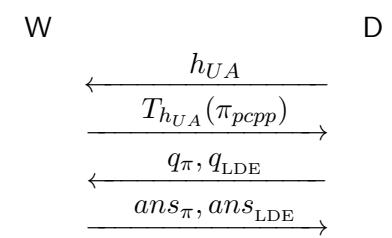
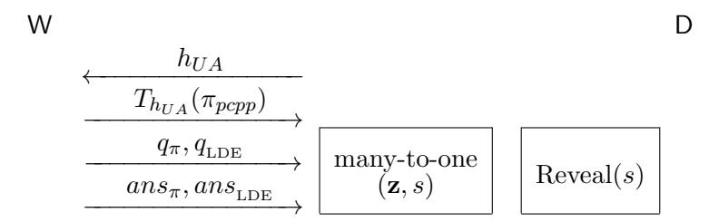

# Memory Delegation∗

Kai-Min Chung† Yael Tauman Kalai‡ Feng-Hao Liu§ Ran Raz ¶ June 15, 2011

#### Abstract

We consider the problem of delegating computation, where the delegator doesn't even know the input to the function being delegated, and runs in time significantly smaller than the input length.

For example, consider the setting of memory delegation, where a delegator wishes to delegate her entire memory to the cloud. The delegator may want the cloud to compute functions on this memory, and prove that the functions were computed correctly. As another example, consider the setting of streaming delegation, where a stream of data goes by, and a delegator, who cannot store this data, delegates this task to the cloud. Later the delegator may ask the cloud to compute statistics on this streaming data, and prove the correctness of the computation. We note that in both settings the delegator must keep a (short) certificate of the data being delegated, in order to later verify the correctness of the computations. Moreover, in the streaming setting, this certificate should be computed in a streaming manner.

We construct both memory and streaming delegation schemes. We present non-interactive constructions based on the (standard) delegation scheme of Goldwasswer et. al. [\[GKR08\]](#page-66-0). These schemes allow the delegation of any function computable by an L-uniform circuit of low depth (the complexity of the delegator depends linearly on the depth). For memory delegation, we rely on the existence of a polylog PIR scheme, and for streaming, we rely on the existence of a fully homomorphic encryption scheme.

We also present constructions based on the CS-proofs of Micali. These schemes allow the delegation of any function in P. However, they are interactive (i.e., consists of 4 messages), or are non-interactive in the Random Oracle Model.

## 1 Introduction

The problem of delegating computation considers a scenario where one party, the delegator, wishes to delegate the computation of a function f to another party, the worker. The challenge is that

∗An extend abstract of this paper will appear in Crypto '11 [\[CKLR11\]](#page-65-0).

†Department of Computer Science, Cornell University, Upson Hall 4108, Ithaca, NY 14850, USA. [http://www.](http://www.cs.cornell.edu/~chung/) [cs.cornell.edu/~chung/](http://www.cs.cornell.edu/~chung/). chung@cs.cornell.edu. Supported by US-Israel BSF grant 2006060 and NSF grant CNS-0831289.

‡Microsoft Research, One Memorial Drive, Cambridge MA, 02142, USA. [http://research.microsoft.com/](http://research.microsoft.com/en-us/um/people/yael/) [en-us/um/people/yael/](http://research.microsoft.com/en-us/um/people/yael/). yael@microsoft.com.

§Department of Computer Science, Brown University, Providence RI, 02912, USA. [http://www.cs.brown.edu/](http://www.cs.brown.edu/people/fenghao/) [people/fenghao/](http://www.cs.brown.edu/people/fenghao/). fenghao@cs.brown.edu.

¶Department of Mathematics and Computer Science, Weizmann Institute of Science, Ziskind 144, Rehovot 76100, Israel. <http://www.wisdom.weizmann.ac.il/~ranraz/>. ran.raz@weizmann.ac.il.

the delegator may not trust the worker, and thus it is desirable to have the worker "prove" that the computation was done correctly. Obviously, verifying this proof should be easier than doing the computation.

This concept of "outsourcing" computation received a lot of attention in recent years, partly due to the increasing interest in cloud computing, where the goal is to outsource all the computational resources to a (possibly untrusted) "cloud". There are several reasons why the client (or delegator) may not trust the cloud, and thus would like to receive proofs for the correctness of the computation. For example, the cloud may have an incentive to return incorrect answers. Such an incentive may be a financial one, if the real computation requires a lot of work, whereas computing incorrect answers requires less work and is unlikely to be detected by the client. Moreover, in some cases, the applications outsourced to the cloud may be so critical that the delegator wishes to rule out accidental errors during the computation.

In order to ensure that the worker (or the cloud) performed the computation correctly, we would like the worker to prove this to the delegator. Of course, it is essential that the time it takes to verify the proof is significantly smaller than the time needed to actually run the computation. At the same time, the running time of the worker carrying out the proof should also be reasonable comparable to the time it takes to do the computation.

The problem of delegating computation has been studied excessively (see Section [1.2](#page-5-0) for an overview on previous work). However, most previous work on delegation allow the delegator to run in time polynomial in the input size, as long as this runtime is significantly smaller than the time it takes to do the computation. For example, when delegating the computation of a function f that runs in time T and has inputs of size n, typically the desired runtime of the delegator is poly(n, log T) and the desired runtime of the worker is poly(T).

In this work, we want the delegator to run in time that is even smaller than the input size n. Namely, we don't allow the delegator even to read the input! At first, this requirement may seem unreasonable and unachievable. So, let us start by motivating this requirement with two examples.

Memory delegation. Suppose that Alice would like to store all her memory in the cloud. The size of her memory may be huge (for example, may include all the emails she ever received). Moreover, suppose she doesn't trust the cloud. Then, every time she asks the cloud to carry out some computation (for example, compute how many emails she has received from Bob during the last year), she would like the answer to be accompanied by a proof that indeed the computation was done correctly. Note that the input to these delegated functions may be her entire memory, which can be huge. Therefore, it is highly undesirable that Alice runs in time that is proportional to this input size. More importantly, Alice doesn't even hold on to this memory anymore, since she delegated it to the cloud.

Thus, in a memory delegation scheme, a delegator delegates her entire memory to the cloud, and then may ask the could to compute functions of this memory, and expects the answers to be accompanied by a proof. Note that in order to verify the correctness of these proofs, the delegator must save some short certificate of her memory, say a certificate of size polylog(n), where n is the memory size. The proofs should be verifiable very efficiently; say, in time polylog(n, T), where T is the time it takes to compute the function. Moreover, Alice should be able to update her memory efficiently.

Streaming delegation. Suppose that there is some large amount of data that is streaming by, and suppose that a user, Alice, wishes to save this data, so that later on she will be able to compute statistics on this data. However, Alice's memory is bounded and she cannot store this data. Instead, she wishes to delegate this to the cloud. Namely, she asks the cloud to store this streaming data for her, and then she asks the cloud to perform computation on this data. As in the case of memory delegation, in order to later verify the correctness of these computations, Alice must save some short certificate of this streaming data. As opposed to the setting of memory delegation, here the certificate should be computed (and updated) in a streaming manner.

The settings of memory delegation and streaming delegation are quite similar. In both settings Alice asks the cloud to store a huge object (either her memory or the streaming data). There are two main differences between the two: (1) In the setting of streaming delegation, the certificates and updates must be computed in a streaming manner. Thus, in this sense, constructing streaming delegation schemes may be harder than constructing memory delegation schemes. Indeed, our streaming delegation scheme is more complicated than our memory delegation scheme, and proving soundness in the streaming setting is significantly harder than proving soundness in the memory setting. (2) In the setting of streaming delegation, the memory is updated by simply adding elements to it. This is in contrast to the setting of memory delegation, where the memory can be updated in arbitrary ways, depending on the user's needs. However, in the memory setting, we allow the delegator to use the help of the worker when updating her certificate (or secret state), whereas in the streaming setting we require that the delegator updates her certificate on her own. The reason for this discrepancy, is that in the memory setting the delegator may not be able to update her certificate on her own, since she may want to update her memory in involved ways (such as, erase all emails from Bob). On the other hand, in the streaming setting, it seems essential that the delegator updates her certificate on her own, since in this setting the data may be streaming by very quickly, and there may not be enough time for the delegator and worker to interact during each update.

## 1.1 Our Results

We construct both memory delegation and streaming delegation schemes. The memory delegation scheme consists of an offline phase, where the delegator D delegates her memory x ∈ {0, 1} n to a worker W. This phase is non-interactive, where the delegator sends a single message, which includes her memory content x to the worker W. The runtime of both the delegator and the worker in the offline phase is poly(n), where n is the memory size. At the end of this phase, the delegator saves a short certificate σ of her memory, which she will later use when verifying delegation proofs.

The streaming delegation scheme, on the other hand, doesn't have such an offline phase. In the streaming setting, we consider the scenario where at each time unit t a bit xt is being streamed. The delegator starts with some secret state (or certificate) σ0, and at time unit t + 1 she uses her secret state σt and the current bit xt+1 being streamed, to efficiently update her secret state from σt to σt+1.

In both settings, each time the delegator D wants the worker W to compute a function f(x), they run a delegation protocol, which we denote by Compute(f). The memory delegation scheme also has an Update protocol, where the delegator D asks the worker W to update her memory and to help her update her secret state σ. The latter can be thought of as a delegation request, and the guarantees (in term of runtime and communication complexity) are similar to the guarantees of the Compute protocol.

In the streaming setting, the delegator updates her secret state on her own in time polylog(N), where N is an upper bound on the length of the stream. Namely, the update function, that takes as input a certificate σt and a bit xt+1, and outputs a new certificate σt+1, can be computed in time polylog(N).

We present two memory and streaming delegation protocols. The first are non-interactive (i.e, Compute(f) consists of two messages, the first sent by the delegator and the second sent by the worker). They are based on the non-interactive version of the delegation protocol of Goldwasser et. al. [\[GKR08,](#page-66-0) [KR09\]](#page-66-1), denoted by GKR (though are significantly more complicated than merely running GKR). As in GKR, the efficiency of the delegator depends linearly on the depth of the circuit being delegated. Our second memory and streaming delegation protocols are interactive (i.e., Compute(f) consists of four messages). These schemes are based on CS-proofs of Micali [\[Mic94\]](#page-66-2), and allow for efficient delegation of all functions in P.

In what follows we state our theorems formally. We refer the reader to Section [6](#page-26-0) for the formal definition of a memory delegation scheme, and to Section [8](#page-38-0) for the formal definition of a streaming delegation scheme.

Theorem 1 (Memory Delegation) Assume the existence of a poly-log PIR scheme(as defined in Definition [5\)](#page-12-0), and assume the existence of a collision resistant hash family. Let F be the class of all L-uniform poly-size boolean circuits. Then there exists a non-interactive (2-message) memory delegation scheme mDel, for delegating any function f ∈ F. The delegation scheme, mDel has the following properties, for security parameter k.

- The scheme has perfect completeness and negligible (reusable) soundness error.
- The delegator and worker are efficient in the offline stage; i.e., both the delegator and the worker run in time poly(k, n).
- The worker is efficient in the online phase. More specifically, it runs in time poly(k, S) during each Compute(f) and Update(f) operation, where S is the size of the L-uniform circuit computing f. The delegator runs in time poly(k, d) during each Compute(f) and Update(f) operation, where d is the depth[1](#page-3-0) of the L-uniform circuit computing f. [2](#page-3-1)

In particular, assuming the existence of a poly-logarithmic PIR scheme, and assuming the existence of a collision resistent hash family, we obtain a memory delegation scheme for L-uniform NC computations, where the delegator D runs in time poly-logarithmic in the length of the memory.

Theorem 2 (Streaming Delegation) Let k be a security parameter, and let N be a parameter (an upper bound on the length of the stream). Let F be the class of all L-uniform poly-size boolean circuits. Assume the existence of a fully-homomorphic encryption scheme secure against poly(N) size adversaries. Then there exists a non-interactive (2-message) streaming delegation scheme sDelF for F with the following properties.

• sDelF has perfect completeness and negligible reusable soundness error.

1We assume that d ≥ log n.

2Thus, for every constant c ∈ N, if we restrict the depth of f to be at most k c , then the delegator is considered efficient.

- D updates her secret state in time polylog(N), per data item.
- In the delegation protocol, when delegating a function f ∈ F computable by an L-uniform circuit of size S and depth d, the delegator D runs in time poly(k, d, log N), and the worker W runs in time poly(k, log N, S).

In particular, assuming the existence of a fully-homomorphic encryption scheme secure against adversaries of size poly(N), we obtain a streaming delegation scheme for L-uniform NC computations, where the delegator D runs in time poly-logarithmic in the length of data stream.

Remark. We note that the property we needed from the GKR protocol is that the verifier does not need to read the entire input in order to verify, but rather only needs to access a single random point in the low-degree extension of the input. (We refer the reader to Section [3.3](#page-13-0) for the definition and properties of a low-degree extension.) We note that the CS-proof delegation scheme of Micali [\[Mic94\]](#page-66-2), for delegating the computation of (uniform) Turing machines, also has the property that verification can be done by only accessing a few random points in the low-degree extension of the input, assuming the underlying PCP is a PCP of Proximity [\[BSGH](#page-65-1)+05, [DR06\]](#page-65-2).

Indeed using this delegation scheme, we get a memory delegation scheme and a streaming delegation scheme for all of P. Using this scheme, the Compute(f) protocol is interactive (i.e., it is a 4-message protocol). The runtime of the delegator is polylog(T) and the runtime of the worker is poly(T), where T is the runtime of the Turing machine computing the function f. [3](#page-4-0) Furthermore, the memory delegation scheme relies only on the existence of a collision resistant hash family, without the need of a poly-log PIR scheme.

Theorem 3 (Interactive Memory Delegation) Assume the existence of a collision resistant hash family. Then there exists a memory delegation scheme mDel, for delegating any function computable by a polynomial-time Turning machine. The delegation scheme, mDel has the following properties, for security parameter k.

- The scheme has perfect completeness and negligible (reusable) soundness error.
- The delegator and worker are efficient in the offline stage; i.e., both the delegator and the worker run in time poly(k, n).
- The worker is efficient in the online phase. More specifically, it runs in time poly(k, T) during each Compute(f) and Update(f) operation, where T is an upper-bound on the running time of f. The delegator runs in time poly(k, log T) during each Compute(f) and Update(f) operation.
- Both Compute(f) and Update(f) operations consist of 4 message exchanges.

Theorem 4 (Interactive Streaming Delegation) Let k be a security parameter, and let N be a parameter (an upper bound on the length of the stream). Let F be the class of all functions computable by a polynomial-time Turning machine. Assume the existence of a fully-homomorphic encryption scheme secure against poly(N)-size adversaries. Then there exists a streaming delegation scheme sDelF for F with the following properties.

3We assume that T ≥ n.

- sDelF has perfect completeness and negligible reusable soundness error.
- D updates her secret state in time polylog(N), per data item.
- In the delegation protocol, when delegating a function f ∈ F computable in time T, the delegator D runs in time poly(k, log N, log T), and the worker W runs in time poly(k, log N, T). The delegation protocol consists of 4 message exchanges.

We note that in the Random Oracle Model (ROM) [\[BR97\]](#page-65-3), the delegation scheme of Micali is non-interactive. This yields a non-interactive memory delegation scheme and a non-interactive streaming delegation scheme, for delegating all functions in P, in the ROM.

## 1.2 Previous Work

Various delegation protocols have been proposed in the literature. Some provide delegation protocols that are sound against any cheating worker, whereas others provide delegation protocols that are secure only against computationally bounded cheating worker (i.e., arguments as opposed to proofs). Some of these protocols are interactive, whereas others are non-interactive. We survey some of these results below, however, we emphasize that in all these solutions, the delegator runs in time that is (at least) linear in the input size, and thus do not apply to our settings of memory delegation or streaming delegation.

Interactive proofs. The celebrated IP=PSPACE Theorem [\[LFKN92,](#page-66-3) [Sha92\]](#page-66-4) yields interactive proofs for any function f computable in polynomial space, with a verifier (delegator) running in polynomial time. Thus, the IP=PSPACE protocol can be seen as a delegation protocol for languages in PSPACE. However, the complexity of the prover (worker) is only bounded by polynomial space (and hence exponential time). This theorem was refined and scaled down in [\[FL93\]](#page-65-4) to give verifier complexity poly(n, s) and prover complexity 2poly(s) for functions f computable in time T and space s, on inputs of length n. Note that the prover complexity is still super-polynomial in T, even for computations that run in the smallest possible space, namely s = O(log T).

The prover complexity was recently improved by Goldwasser et al. [\[GKR08\]](#page-66-0) to poly(T, 2 s ), which is poly(T) when s = O(log T). More generally, Goldwasser et al. [\[GKR08\]](#page-66-0) give interactive proofs for computations of small depth d (i.e. parallel time). For these, they achieve prover complexity poly(T) and verifier complexity poly(n, d, log T). (This implies the result for space-bounded computation because an algorithm that runs in time T and space s can be converted into one that runs in time poly(T, 2 s ) and depth d = O(s 2 ).) However, if we do not restrict to computations of small space or depth, then we cannot use interactive proofs. Indeed, any language that has an interactive proof with verifier running time (and hence communication) TV can be decided in space poly(n, TV ).

Interactive arguments. Interactive arguments [\[BCC88\]](#page-64-0) (aka computationally sound proofs [\[Mic00\]](#page-66-5)) relax the soundness condition to be computational. Namely, instead of requiring that no prover strategy whatsoever can convince the verifier of a false statement, we instead require that no computationally feasible prover strategy can convince the verifier of a false statement. In this model, Kilian [\[Kil92\]](#page-66-6) and Micali [\[Mic00\]](#page-66-5) gave constant-round protocols with prover complexity poly(T, k) and verifier complexity poly(n, k, log T) (where k is the security parameter), assuming the existence of collision-resistant hash functions [\[BG02\]](#page-64-1).

Toward non-interactive Solutions. This possibility of efficient non-interactive arguments was suggested by Micali [\[Mic00\]](#page-66-5), who showed that non-interactive arguments with prover complexity poly(T, k) and verifier complexity poly(n, k, log T) are possible in the Random Oracle Model (the oracle is used to eliminate interaction a la Fiat–Shamir [\[FS86\]](#page-65-5)). Heuristically, one might hope that by instantiating the random oracle with an appropriate family of hash functions, we could obtain a non-interactive solution to delegating computation: first the delegator (or a trusted third party) chooses and publishes a random hash function from the family, and then, the proofs are completely non-interactive (just one message from the prover to the verifier). However, the Random Oracle Heuristic is known to be unsound in general [\[CGH04\]](#page-65-6) and even in the context of Fiat– Shamir [\[Bar01,](#page-64-2) [GK03\]](#page-66-7). Thus, despite extensive effort, the existence of efficient non-interactive arguments remains a significant open problem in complexity and cryptography.

There has been some recent progress in reducing the amount of interaction needed. Using a transformation of Kalai and Raz [\[KR09\]](#page-66-1), the GKR delegation protocol [\[GKR08\]](#page-66-0) can be converted into a 2-message argument (assuming the existence of single-server private-information retrieval (PIR) schemes). However, like the interactive proofs of [\[GKR08\]](#page-66-0), this solution applies only to small-depth computations, as the verifier's complexity grows linearly with the depth.

Very recently, Gennaro, Gentry, and Parno [\[GGP10\]](#page-65-7), and the followup work of Chung, Kalai, and Vadhan [\[CKV10\]](#page-65-8), gave a 2-message delegation scheme for arbitrary functions. However, these constructions have an offline phase, where the delegator invests time poly(T, k) and computes a secret state (T is the time it takes to compute the function, and k is the security parameter). In the online phase, the delegator's running time is reduced to poly(n, k, log T) for an input of length n, and the worker's complexity is poly(T, k). Thus, the delegator's large investment in the offline phase can be amortized over many executions of the online phase to delegate the computation of f on many inputs. Their online phase is not completely non-interactive, but rather consists of two messages. However, in many applications, two messages will be necessary anyway, as the delegator may need to communicate the input x to the worker.

We remark that one main drawback of these works [\[GGP10,](#page-65-7) [CKV10\]](#page-65-8) is that soundness is only guaranteed as long as the adversarial worker does not learn whether the delegator accepted or rejected the proofs.

In another followup work, Applebaum, Ishai, and Kushilevitz [\[AIK10\]](#page-64-3) also consider the offline/online setting, but focus on efficient solutions for one-time delegation (i.e., the online phase can only be executed one time). They also consider the case when the delegation functions are represented as arithmetic circuits.

PCPs and MIPs. The MIP=NEXP Theorem [\[BFL91\]](#page-64-4) and its scaled-down version by Babai et al. [\[BFLS91\]](#page-64-5) yield multi-prover interactive proofs and probabilistically checkable proofs for time T computations with a prover running in time poly(T) and a verifier running in time poly(n, log T), exactly as we want. However, using these for delegation require specialized communication models — either 2 non-communicating provers, or a mechanism for the prover to give the verifier random access to a long PCP (of length poly(T)) that cannot be changed by the prover during the verification.

Streaming Interactive Proofs. Recently, Cormode, Thaler, and Yi [\[CTY10\]](#page-65-9) considered streaming interactive proofs, which is a strengthening of interactive proofs where the input is given to the verifier in a streaming manner and the verifier is restricted to have sub-linear (ideally, polylogarithmic) space. They observed that both the GKR protocol [\[GKR08\]](#page-66-0) and universal arguments [\[BG02\]](#page-64-1) can be modified to yield efficient streaming interactive proofs/arguments.

Streaming interactive proofs are closely related to streaming delegation. The main difference is that streaming interactive proofs correspond to one-time streaming delegation, whereas in our streaming delegation model, the delegator is allowed to delegate as many computations to the worker as she want. Indeed, the GKR protocol is also the starting point of our construction of streaming delegation scheme, and the main effort is to make the scheme reusable.

## 2 Overview of Our Constructions

In what follows we present the high-level overview of our constructions. For more elaborate overviews, we refer the reader to Section [7.1](#page-29-0) for an overview of our memory delegation scheme, and to Section [9.1](#page-42-0) for an overview of our streaming delegation scheme.

## 2.1 Overview of our Memory Delegation Scheme

The starting point of this work is the observation of Goldwasswer et. al. [\[GKR08\]](#page-66-0), that their delegation protocol can be verified very efficiently (in time sub-linear in the input size), if the delegator has oracle access to the low-degree extension of the input x (we refer the reader to Section [3.3](#page-13-0) for the definition of a low-degree extension). Moreover, as observed by [\[GKR08\]](#page-66-0), the delegator needs to access this low-degree extension LDEx at a single point z, which depends only on the random coin tosses of the delegator.

This observation immediately gives rise to a memory delegation scheme with one-time soundness: The delegator's secret state will be (z, LDEx(z)). Then, she will use this secret state in order to verify computation using the GKR protocol. As was argued by Goldwasswer et. al., this indeed works if the delegator runs the delegation protocol once. However, the soundness crucially relies on the fact that the delegator's secret state is indeed secret, and if the delegator uses this state more than once, then soundness breaks completely.

One idea, following the idea of Gennaro et. al. [\[GGP10\]](#page-65-7), is to use a fully homomorphic encryption (FHE) scheme to encrypt all the communication, in order to hide the secret state. This indeed works if the worker does not learn whether the delegator accepts or rejects his proofs. However, if the worker does learn the verdict of the delegator, then there are known attacks that break soundness.

In the streaming setting, we follow this approach, and we succeed in overcoming this problem, and construct a scheme that is sound even if the worker does learn the verdict of the delegator. We could follow this approach in the memory delegation setting as well. However, for several reasons, we choose to take a different approach. First, the approach above relies on the existence of an FHE scheme, whereas our memory delegation scheme relies on the existence of a poly-logarithmic PIR scheme (see Definition [5\)](#page-12-0), arguably a more reasonable assumption. Second, the approach above results with the delegator having a secret state, whereas in our memory delegation scheme, the state of the delegator is public. Finally, the construction and proof of the memory delegation scheme is simpler.

In our approach, instead of having (z, LDEx(z)) as the delegator's secret state, the delegator keeps a tree-commitment of the entire LDEx as her secret state (see Section [3.5](#page-15-0) for the definition of a tree-commitment). Namely, she chooses a random hash function h from a collision-resistant hash family, and keeps (h, Th(LDEx)) as her state. In addition to giving the worker her memory x, she also gives him the hash function h. We stress that her state is not secret, which makes the proof of security significantly simpler than that in the streaming setting (where the delegator's state is secret).

Very roughly speaking, when the delegator wishes to delegate the computation of a function f, they execute Compute(f) by simply running the (non-interactive) delegation protocol GKR(f). Recall that at the end of the GKR protocol the delegator needs to verify the value of LDEx(r) for a random r. However, she doesn't have x, since it was delegated to the prover, and all she has is the state (h, Th(LDEx)). So, rather than computing the value of LDEx(r) on her own, the worker will reveal this value, by sending the augmented path in the Merkle tree corresponding to the leaf r.

Unfortunately the high-level description given above is a gross oversimplification of our actual scheme, and there are several technical issues that complicate matters. We elaborate on these in Section [2.3.](#page-11-0)

We mention that when the delegator wishes to update her memory from x to g(x), she needs to update her secret state from (h, Th(LDEx)) to (h, Th(LDEg(x) )).[4](#page-8-0) However, she cannot perform this operation on her own, since she does not have x. Instead she will delegate this computation to the worker, by requesting a Compute(g 0 ) operation, where g 0 (x) = Th(LDEg(x) ).

## 2.2 Overview of our Streaming Delegation Scheme

Our streaming delegation scheme is similar to our memory delegation scheme described above, and the main difference is in the way the certificate is generated and updated, and in the way the worker reveals the value LDEx(r).

Generating and updating the certificate. Recall that in the memory delegation scheme, the certificate of the delegator D consists of a tree-commitment to the low-degree extension of her memory x. Namely, her certificate is (h, Th(LDEx)), where h is a collision resistant hash function. Note that this certificate cannot be updated in a streaming manner, since any change to x changes the low-degree extension LDEx almost everywhere.

Instead, in the streaming setting, we replace the tree commitment with an "algebraic commitment", which has the property that it can be updated efficiently when new data items arrive. The resulting certificate is a random point in the low-degree extension of the stream x; i.e., (z, LDEx(z)) for a random point z. This certificate is efficiently updatable, if we assume some upper-bound N on the size of the stream, and we take parameters H, F, m of the low-degree extension, such that

$$|\mathbb{H}| = \text{polylog}(N), \ m = \theta\left(\frac{\log N}{\log\log N}\right), \ |\mathbb{F}| = \text{poly}(|\mathbb{H}|)$$
 (1)

(this follows from Proposition [6\)](#page-14-0).

As in the memory delegation scheme, at the end of each delegation protocol, the delegator needs to verify the value of LDEx(r) at a random point r. In the memory delegation scheme this was done using a Reveal protocol where the worker reveals the augmented path of the leaf r in the Merkle tree-commitment of LDEx. In the streaming setting, the Reveal protocol is totally different, since

4Actually, for technical reasons she will need to choose a fresh hash function h 0 ← H during each Update. We discard this technical issue here.

the delegator cannot compute the tree-commitment of  $LDE_x$ . Unfortunately, unlike in the memory delegation scheme, in the streaming setting constructing a *reusable* and *sound* reveal protocol is highly non-trivial.

The Reveal protocol. Our starting point is a basic reveal protocol Reveal1 described in Figure 1. Note that the soundness of Reveal1 relies on the secrecy of the certificate  $\sigma$ . Namely, assuming that W does not know the point z, it is not hard to see, by the Schwartz-Zippel Lemma, that an adversarial worker can cheat with probability at most  $d/|\mathbb{F}|$ , where d is the (total) degree of LDEx.

Reveal1 protocol: D stores a secret state  $\sigma = (z, \text{LDE}_x(z))$ , where  $x \in \{0, 1\}^N$  and z is a random point in  $\mathbb{F}^m$ , and wants to learn the value of  $\text{LDE}_x(s)$  from W.

- D sends to W the line  $\ell_{sz}$  that passes through the points s and z. More specifically, D chooses two random points  $\alpha_1, \alpha_2 \leftarrow \mathbb{F}$ , and defines  $\ell_{s,z}$  to be the line that satisfies  $\ell_{s,z}(\alpha_1) = z$  and  $\ell_{s,z}(\alpha_2) = s$ .
- W returns a univariate polynomial  $p : \mathbb{F} \to \mathbb{F}$ , which is the polynomial LDEx restricted to the line  $\ell_{s,z}$  (i.e.,  $p = \text{LDE}_x|_{\ell_{s,z}}$ ).
- D checks whether  $p(\alpha_1) = \text{LDE}_x(z)$ , and if so accepts the value  $p(\alpha_2) = \text{LDE}_x(s)$ . Otherwise, she rejects.

Figure 1: Reveal1 protocol

However, note that the Reveal1 protocol is not reusable. Suppose that D uses the above reveal protocol to learn the value of  $LDE_x$  on two random points  $s, s' \in \mathbb{F}^m$ . From the two executions, an adversarial worker W\* receives two lines  $\ell_{s,z}$  and  $\ell_{s',z}$ , and can learn the secret point z by taking the intersection of the two lines. Once W\* learns z, W\* can easily cheat by returning any polynomial  $p^*$  that agrees with  $LDE_x$  only on point z but disagrees on the remaining points.

As observed by Gennaro et. al. [GGP10], a natural way to protect the secret point z, is to run the above Reveal protocol under a fully-homomorphic encryption (FHE) scheme. Namely, D generates a pair of keys (pk, sk) for a FHE (Gen, Enc, Dec, Eval), and sends pk and an encrypted line  $\hat{\ell}_{s,z} = \text{Enc}_{pk}(\ell_{s,z})$  to W, who can compute the polynomial  $p = \text{LDE}_x|_{\ell_{s,z}}$  homomorphically under the encryption. Indeed, by the semantic security of FHE, an adversarial worker W\* cannot learn any information from D's message  $\hat{\ell}_{s,z}$ . This indeed makes the protocol reusable provided that W\* does not learn the decision bits of D, as proved in [GGP10, CKV10].

However, since the decision bit of D can potentially contain one bit information about the secret point z, it is not clear that security holds if W\* learns these decision bits. In fact, for both of the delegation schemes of [GGP10, CKV10], which use FHE to hide the delegator D's secret state, there are known attacks that learn the whole secret state of D bit-by-bit from D's decision bits.

Fortunately, we are able to show that a variant of the Reveal1 protocol described in Figure 2 is reusable even if  $W^*$  learns the decision bits of D. The main difference between Reveal1 and Reveal2 is that in Reveal2, the delegator D uses a random two-dimensional affine subspace instead of a line, and uses an FHE to mask the entire protocol.

We prove that no efficient adversarial  $W^*$  can learn useful information about the secret point z from the Reveal2 protocol. We note that the proof of the above statement is highly non-trivial,

Reveal2 protocol: D stores a secret state  $\sigma = (z, \text{LDE}_x(z))$ , where  $x \in \{0, 1\}^N$  and z is a random point in  $\mathbb{F}^m$ , and wants to learn the value of  $\text{LDE}_x(s)$  from W.

- D does the following.
  - 1. Generate a pair of keys  $(pk, sk) \leftarrow \text{Gen}(1^k)$  for a fully homomorphic encryption scheme FHE.
  - 2. Choose a random two-dimensional affine subspace  $S_{s,z} \subset \mathbb{F}^m$  that contains the points s and z. More specifically, choose two random points  $\alpha_1, \alpha_2 \leftarrow \mathbb{F}^2$  and let  $S_{s,z} \subset \mathbb{F}^m$  be a random two-dimensional affine subspace that satisfies  $S_{s,z}(\alpha_1) = z$  and  $S_{s,z}(\alpha_2) = s$ .
  - 3. Send  $\hat{S}_{s,z} \leftarrow \operatorname{Enc}_{\mathsf{pk}}(S_{s,z})$  and  $\mathsf{pk}$  to  $\mathsf{W}$ .
- W homomorphically computes the two-variate polynomial  $p = \text{LDE}_x|_{S_{s,z}}$  under the FHE (denote the resulting ciphertext  $\hat{p}$ ), and sends  $\hat{p}$  to D.
- D decrypts and checks whether  $p(\alpha_1) = \text{LDE}_x(z)$ , and if so accepts the value  $p(\alpha_2) = \text{LDE}_x(s)$ .

Figure 2: Protocol Reveal2

and is one of the main technical difficulties in this work. Informally, the proof first uses Lemma 16, which claims that the ciphertext  $\hat{S}_{s,z}$  and the decision bit b of D (which depend on the strategy of  $W^*$ ) do not give too much information about  $S_{s,z}$  to  $W^*$ . In other words, the random subspace  $S_{s,z}$  still has high (pseudo-)entropy from the point of view of  $W^*$ . Then it uses an *information-theoretic* argument to argue that a random point z in a sufficiently random (with high entropy) subspace  $S_{s,z}$  is statistically close to a random point in  $\mathbb{F}^m$ , which implies that  $W^*$  does not learn useful information about z. We refer the reader to Section 4 for the techniques developed in order to prove the reusable soundness.

**The Field Size.** Recall that by Schwartz-Zippel Lemma, an adversarial worker can cheat with probability at most  $d/|\mathbb{F}|$ , where d is the (total) degree of  $LDE_x$ . Recall that in our setting of parameters:

$$|\mathbb{H}| = \text{polylog}(N), \ m = \theta\left(\frac{\log N}{\log\log N}\right), \ |\mathbb{F}| = \text{poly}(|\mathbb{H}|).$$

Thus, a cheating worker can cheat (and more importantly, obtain information about the secret z) with probability  $d/|\mathbb{F}| = O(1/\text{polylog}(N))$ , which is not low enough.

The idea is to reduce the cheating probability to negligible by simply increasing the field size to be super-polynomial. However, we cannot increase the field size in the GKR protocol, since it will increase the complexity of the worker. Instead, we use an extension field  $\tilde{\mathbb{F}}$  of  $\mathbb{F}$ , of super-polynomial size, only in the certificate and the Reveal protocol, but run the GKR protocols as before. Namely, the secret state is  $\sigma = (z, \text{LDE}^{\tilde{\mathbb{F}}, \mathbb{H}, m}(z))$  where  $z \leftarrow \tilde{\mathbb{F}}^m$ , The GKR protocol is run exactly as before with the parameters  $(\mathbb{H}, \mathbb{F}, m)$ .

#### 2.3 Additional Technicalities

The high-level description given above (in Sections 2.1 and 2.2) is a gross oversimplification of our actual schemes, and there are several technical issues that complicate matters.

Recall that in the overview above, we claimed that Compute(f) merely runs GKR, in addition to a Reveal protocol which helps the delegator verify the GKR protocol.5 There are several technical reasons why this actually does not work. In what follows, we explain what are the main technical problems with this simple idea, and we give the highlevel idea of how to overcome these problems.

- 1. The first technicality (the easiest one to deal with), is that the GKR delegation scheme does not have a negligible soundness error. In our setting, especially in the setting of memory delegation, it is very important to have negligible soundness. The reason is that if the soundness is non-negligible, then a cheating worker may cheat in the update procedure of the memory delegation scheme (which is also being delegated). The problem is that if a worker cheats even once in an update procedure, all soundness guarantees are mute from that point on. So, we really need the soundness error to be negligible. In order to reduce the soundness error, we will run the GKR protocol in parallel u times (for any parameter u such that  $1/2^u = ngl(k)$ , where k is the security parameter). We denote the u-fold parallel repetition of GKR by GKR(u). As a result the worker will need to reveal to u random points in the low-degree extension:  $LDE_x(r_1), \ldots, LDE_x(r_u)$ .
- 2. The second technical point is more subtle. In the offline stage, when the delegator computes the tree commitment  $T_h(LDE_x)$ , she needs to choose the parameters  $\mathbb{H}, \mathbb{F}, m$  for the low-degree extension. The typical choice for these parameters is:

$$|\mathbb{H}| = \text{polylog}(n), \ |\mathbb{F}| = \text{poly}(|\mathbb{H}|), \ m = O\left(\frac{\log n}{\log \log n}\right),$$

where n = |x|. When delegating the computation of a function f, the worker and delegator run  $GKR^{(u)}(f)$  and need to verify  $LDE_x(r_i) = v_i$  for random points  $r_1, \ldots, r_u$ . However, here the parameters of the low-degree extension  $LDE_x$  depend on the depth d of the circuit computing f. Namely, looking at the parameters given in [GKR08] (see Theorem 8), the parameters of the low-degree extension are

$$|\mathbb{H}'| = \theta(d \cdot \log n), \ m' = \theta\left(\frac{\log n}{\log d}\right), \ |\mathbb{F}'| = \text{poly}(|\mathbb{H}'|).$$

Therefore, the worker cannot simply execute the Reveal protocols of the memory delegation or the streaming delegation. In the memory setting, the tree commitment is w.r.t. parameters  $\mathbb{H}, \mathbb{F}, m$  whereas the delegator needs to verify  $\mathrm{LDE}_x^{\mathbb{F}',\mathbb{H}',m'}(r_i) = v_i$ . In the streaming setting, the secret state of the delegator is  $(z,\mathrm{LDE}_x^{\mathbb{F},\mathbb{H},m}(z))$ , as opposed to  $(z,\mathrm{LDE}_x^{\mathbb{F}',\mathbb{H}',m'}(z))$ , thus the Reveal protocol described in Section 2.2 doesn't work.

We get around this technical problem by delegating the functions  $g_{r_i}(x) \triangleq \text{LDE}_x^{\mathbb{F}',\mathbb{H}',m'}(r_i)$ . Luckily, these functions can be computed by a poly-size circuit of depth at most  $\log^2 n$ , assuming the delegated function f is of poly-size (see Proposition 6). We delegate the computation

&lt;sup>5The Reveal protocol in the memory setting is totally different from the Reveal protocol in the streaming setting.

of each of these  $g_{r_i}$  using GKR(u) to ensure negligible soundness. Thus, finally the worker will need to reveal to  $u^2$  points in LDEx (u points for each  $g_{r_i}$ ).6

3. The final technical difficulty is that all these algorithms need to run in parallel, since we want our final delegation schemes to be non-interactive (i.e., to consist of only two messages). Typically, there is no problem in running several two-message protocols in parallel [BIN97, CHS05]. However, in our case, the delegator uses a common secret input in these protocols. Namely, the delegator uses secret randomness  $r_1, \ldots, r_u \in (\mathbb{F}')^{m'}$  in the parallel repetition of the delegation protocol GKR(f) which ends with her needing to verify that  $LDE_x^{\mathbb{F}',\mathbb{H}',m'}(r_i) = v_i$  for every  $i \in [u]$ . In addition she uses these same  $r_i$ 's in the delegation protocols  $GKR(g_{r_i})$ . Moreover, at the end of each of the  $GKR(g_{r_i})$  protocols, the delegator needs to verify that  $LDE_x^{\mathbb{F},\mathbb{H},m}(z_{i,j}) = w_{i,j}$  for random points  $z_{i,1},\ldots,z_{i,u} \in \mathbb{F}^m$ . Finally, they also run a reveal protocol for each  $z_{i,j}$ , denoted by Reveal $(z_{i,j})$ .

We note that the protocol GKR(f) (resp. GKR(g)) is not sound if the  $r_i$ 's (resp.  $z_{i,j}$ 's) are a priori known to the worker. To ensure that soundness still holds even if we run all these algorithms in parallel, we mask parts of the delegator's message using a PIR scheme or an FHE scheme, and then we claim that the soundness error remains negligible. To this end, we use our parallel composition lemma (Lemma 24), which roughly states that if a set of protocols  $\Pi_1, \ldots \Pi_t$  are executed in parallel, and the verifiers use the same common private randomness p in all these protocols, then the soundness remains if the messages of the verifiers hide this common secret randomness p. (We refer the reader to Section 5 for details.)

## 3 Preliminaries

## 3.1 Computational Private Information Retrieval (PIR)

**Definition 5** Let k be the security parameter and N be the database size. Let  $Q^{\text{PIR}}$  and  $D^{\text{PIR}}$  be probabilistic circuits, and let  $R^{\text{PIR}}$  be a deterministic circuit. We say that  $\text{PIR} = (Q^{\text{PIR}}, D^{\text{PIR}}, R^{\text{PIR}})$  is a poly-logarithmic private information retrieval scheme if the following conditions are satisfied:

- 1. (Size Restriction:)  $Q^{\text{PIR}}$  and  $R^{\text{PIR}}$  are of size  $\leq \text{poly}(k, \log N)$ , and  $D^{\text{PIR}}$  is of size  $\leq \text{poly}(k, N)$ . The output of  $Q^{\text{PIR}}$  and  $D^{\text{PIR}}$  is of size  $\leq \text{poly}(k, \log N)$ .
- 2. (Perfect Correctness:)7  $\forall N, \forall k, \forall database \ x = (x_1, x_2, \dots, x_N) \in \{0, 1\}^N$ , and  $\forall i \in [N]$ ,

$$\Pr\left[R^{\mathrm{PIR}}(k, N, i, (q, s), a) = x_i | (q, s) \leftarrow Q^{\mathrm{PIR}}(k, N, i), a \leftarrow D^{\mathrm{PIR}}(k, x, q)\right] = 1$$

3. (User Privacy:)  $\forall N, \forall k, \forall i, j \in [N]$ , and  $\forall adversary \ \mathcal{A}$  of size at most  $2^{k^3}$ ,

$$\left|\Pr[\mathcal{A}(k,N,q) = 1 | (q,s) \leftarrow Q^{\mathrm{PIR}}(k,N,i)] - \Pr[\mathcal{A}(k,N,q) = 1 | (q,s) \leftarrow Q^{\mathrm{PIR}}(k,N,j)] \right| \leq 2^{-k^3}.$$

&lt;sup>6We note that there are several ways to improve efficiency, such as thinking of  $(g_{r_1}, \ldots, g_{r_u})$  as one function. However, for the sake of simplicity of exposition, we focus on the simplest (rather than most efficient) solution.

&lt;sup>7For simplicity, we only define perfect correctness. However, usually a PIR scheme allows a negligible probability of error.

#### 3.2 Fully Homomorphic Encryption

A public-key encryption scheme E = (KeyGen, Enc, Dec) is said to be fully homomorphic if it is associated with an additional polynomial-time algorithm Eval, that takes as input a public key pk, a ciphertext  $\hat{x} = \text{Enc}_{pk}(x)$  and a circuit C, and outputs, a new ciphertext  $c = \text{Eval}_{pk}(\hat{x}, C)$ , such that  $\text{Dec}_{sk}(c) = C(x)$ , where sk is the secret key corresponding to the public key pk. It is required that the size of  $c = \text{Eval}_{pk}(\text{Enc}_{pk}(x), C)$  depends polynomially on the security parameter and the length of C(x), but is otherwise independent of the size of the circuit C. We also require that Eval is deterministic, and the the scheme has perfect correctness (i.e. it always holds that  $\text{Dec}_{sk}(\text{Enc}_{pk}(x)) = x$  and that  $\text{Dec}_{sk}(\text{Eval}_{pk}(\text{Enc}_{pk}(x), C)) = C(x)$ ). For security, we simply require that E is semantically secure.

In a recent breakthrough, Gentry [Gen09] proposed a fully homomorphic encryption scheme based on ideal lattices. Following this, Dijk, Gentry, Halevi and Vaikuntanathan [vDGHV10] proposed an alternative construction based on the extended GCD assumption. In these schemes, the complexity of the algorithms (KeyGen, Enc, Dec) depends linearly on the  $depth\ d$  of the circuit C, where d is an upper bound on the depth of the circuit C that are allowed as inputs to Eval. However, under the additional assumption that these schemes are circular secure (i.e., remain secure even given an encryption of the secret key), the complexity of these algorithms are independent of C.

Our streaming memory delegation scheme relies on the existence of a fully homomorphic scheme. For the sake of simplicity, we assume that the FHE scheme has perfect completeness. We note that the FHE schemes of both [Gen09] and [vDGHV10] indeed have perfect completeness.

### 3.3 Low Degree Extension

Let  $\mathbb{H}$  be an extension field of  $\mathbb{GF}[2]$ , and let  $\mathbb{F}$  be an extension field of  $\mathbb{H}$  (and in particular, an extension field of  $\mathbb{GF}[2]$ ), where  $|\mathbb{F}| = \text{poly}(|\mathbb{H}|)$ . We always assume that field operations can be performed in time that is poly-logarithmic in the field size. Fix an integer  $m \in \mathbb{N}$ . In what follows, we define the low degree extension of an n-element string  $(w_0, w_1, \dots, w_{n-1}) \in \mathbb{F}^n$  with respect to  $\mathbb{F}, \mathbb{H}, m$ , where  $n \leq |\mathbb{H}|^m$ .

Fix  $\alpha: \mathbb{H}^m \to \{0, 1, \dots, |\mathbb{H}|^m - 1\}$  to be any (efficiently computable) one-to-one function. In this paper, we take  $\alpha$  to be the lexicographic order of  $\mathbb{H}^m$ . We can view  $(w_0, w_1, \dots, w_{n-1})$  as a function  $W: \mathbb{H}^m \to \mathbb{F}$ , where

$$W(z) = \begin{cases} w_{\alpha(z)} & \text{if } \alpha(z) < n, \\ 0 & \text{otherwise.} \end{cases}$$
 (2)

A basic fact is that there exists a unique extension of W into a function  $\tilde{W}: \mathbb{F}^m \to \mathbb{F}$  (which agrees with W on  $\mathbb{H}^m$ ; i.e.,  $\tilde{W}|_{\mathbb{H}^m} \equiv W$ ), such that  $\tilde{W}$  is an m-variate polynomial of degree at most  $|\mathbb{H}| - 1$  in each variable. Moreover, as is formally stated in the proposition below, the function  $\tilde{W}$  can be expressed as

$$\widetilde{W}(t_1,\ldots,t_m) = \sum_{i=0}^{n-1} \widetilde{\beta}_i(t_1,\ldots,t_m) \cdot w_i,$$

&lt;sup>8Usually, when doing low degree extensions,  $\mathbb{F}$  is taken to be an extension field of  $\mathbb{GF}[2]$ , and  $\mathbb{H}$  is simply a subset of  $\mathbb{F}$  (not necessarily a subfield). In this work, following the work of [GKR08], we take  $\mathbb{H}$  to be a subfield. However, all that is actually needed is that it is of size  $2^{\ell}$  for some  $\ell \in \mathbb{N}$ .

where each  $\tilde{\beta}_i : \mathbb{F}^m \to \mathbb{F}$  is an *m*-variate polynomial, that depends only on the parameters  $\mathbb{H}, \mathbb{F}$ , and m (and is independent of w), of size poly( $|\mathbb{H}|, m$ ) and degree  $|\mathbb{H}| - 1$  in each variable.

The function  $\tilde{W}$  is called the *low degree extension* of  $w = (w_0, w_1, \dots, w_{n-1})$  with respect to  $\mathbb{F}, \mathbb{H}, m$ , and is denoted by  $\mathrm{LDE}_w^{\mathbb{F}, \mathbb{H}, m}$ . We omit the index of  $\mathbb{F}, \mathbb{H}, m$  when the context is clear. Also, sometimes we use  $\tilde{W}$  for simplicity.

**Proposition 6** There exists a Turing machine that takes as input an extension field  $\mathbb{H}$  of  $\mathbb{GF}[2]$ ,  $^9$  an extension field  $\mathbb{F}$  of  $\mathbb{H}$ , and integer m. The machine runs in time  $\operatorname{poly}(|\mathbb{H}|, m, \log |\mathbb{F}|)$  and outputs the unique 2m-variate polynomial  $\tilde{\beta}: \mathbb{F}^m \times \mathbb{F}^m \to \mathbb{F}$  of degree  $|\mathbb{H}| - 1$  in each variable (represented as an arithmetic circuit of degree  $|\mathbb{H}| - 1$  in each variable), such that for every  $w = (w_0, w_1, \ldots, w_{n-1}) \in \mathbb{F}^n$ , where  $n \leq |\mathbb{H}|^m$ , and for every  $z \in \mathbb{F}^m$ ,

$$\tilde{W}(z) = \sum_{p \in \mathbb{H}^m} \tilde{\beta}(z, p) \cdot W(p),$$

where  $W: \mathbb{H}^m \to \mathbb{F}$  is the function corresponding to  $(w_0, w_1, \dots, w_{n-1})$  as defined in Equation (2), and  $\tilde{W}: \mathbb{F}^m \to \mathbb{F}$  is its low degree extension (i.e., the unique extension of  $W: \mathbb{H}^m \to \mathbb{F}$  of degree at most  $|\mathbb{H}| - 1$  in each variable).

Moreover,  $\tilde{\beta}$  can be evaluated in time  $\operatorname{poly}(|\mathbb{H}|, m, \log |\mathbb{F}|)$ . Namely, there exists a Turing machine that runs in time  $\operatorname{poly}(|\mathbb{H}|, m, \log |\mathbb{F}|)$  that takes as input parameters  $\mathbb{H}, \mathbb{F}, m$  (as above), and a pair  $(z, p) \in \mathbb{F}^m \times \mathbb{F}^m$ , and outputs  $\tilde{\beta}(z, p)$ . Furthermore, there exists a circuit for evaluating  $\tilde{\beta}$  in the above sense with size  $\operatorname{poly}(|\mathbb{H}|, m, \log |\mathbb{F}|)$  and depth  $\operatorname{poly}(m, \log |\mathbb{F}|)$ .

Corollary 7 There exists a Turing machine that takes as input an extension field  $\mathbb{H}$  of  $\mathbb{GF}[2]$ , an extension field  $\mathbb{F}$  of  $\mathbb{H}$ , an integer m, a sequence  $w = (w_0, w_1, \dots, w_{n-1}) \in \mathbb{F}^n$  such that  $n \leq |\mathbb{H}|^m$ , and a coordinate  $z \in \mathbb{F}^m$ . It runs in time  $n \cdot \text{poly}(|\mathbb{H}|, m, \log |\mathbb{F}|)$ , and outputs the value  $\tilde{W}(z)$ , where  $\tilde{W}$  is the unique low-degree extension of w (with respect to  $\mathbb{H}, \mathbb{F}, m$ ). Furthermore, there exists a circuit for the same task with size  $n \cdot \text{poly}(|\mathbb{H}|, m, \log |\mathbb{F}|)$  and depth  $\text{poly}(m, \log |\mathbb{F}|)$ .

#### 3.4 Delegation Schemes

In recent years, as cloud computing is gaining popularity, there have been many attempts to construct efficient delegation schemes. Loosely speaking, a delegation scheme is a protocol between a delegator D and a worker W, where the delegator asks the worker to do some computation, and prove that he indeed did the computation correctly. Typically, a delegation scheme is with respect to a class of functions  $\mathcal{F}$ , and the requirement is that on input (f, x) where  $f \in \mathcal{F}$  and x is in the domain of f, the worker outputs f(x), along with a proof (which may be interactive or non-interactive). The requirement is that the worker runs in time that is polynomial in the size of f (when representing f as a circuit), and the delegator runs in time that is significantly shorter than the size of f (as otherwise, it would simply compute f(x) on its own). In this work, we use the 2-message delegation protocol of [GKR08], which in turn uses a round reduction technique from [KR09]. The protocol has the following guarantees.

&lt;sup>9Throughout this work, when we refer to a machine that takes as input a field, we mean that the machine is given a short (poly-logarithmic in the field size) description of the field, that permits field operations to be computed in time that is poly-logarithmic in the field size.

**Theorem 8** [GKR08, KR09] Assume the existence of a poly-logarithmic PIR scheme, as defined in Definition 5. Let k be the security parameter, and let  $\mathcal{F}$  be the family of functions computable by  $\mathcal{L}$ -space uniform boolean circuits of size S and depth  $d \geq \log S$ . Then, there exists a delegation protocol for  $\mathcal{F}$  with the following properties.

- 1. The worker runs in time poly(S, k) and the delegator runs in time  $n \cdot poly(k, d)$ , where n is the length of the input.
- 2. The protocol has perfect completeness and soundness  $s \leq \frac{1}{2}$  (can be made arbitrarily small), where soundness is against any cheating worker of size  $\leq 2^{k^3}$ .
- 3. The protocol consists of two messages, with communication complexity  $d \cdot poly(k, \log S)$ . Moreover, the first message sent by the delegator depends only on her random coin tosses, and is independent of the statement being proved.
- 4. If the delegator is given oracle access to the low-degree extension of x, rather than being given the input x itself, then it runs in time poly(k,d), and the protocol still has all the properties described above, assuming the parameters  $\mathbb{H}, \mathbb{F}, m$  of the low-degree extension satisfy the following:

$$|\mathbb{H}| = \theta(d \cdot \log n), \ m = \theta\left(\frac{\log n}{\log d}\right), \ |\mathbb{F}| = \text{poly}(|\mathbb{H}|)$$

where poly is a large enough polynomial.10 Moreover, the delegator queries the low-degree extension of x at a single point, which is uniformly random (over his coin tosses).

Throughout this paper, we denote this protocol by GKR.

#### 3.5 Merkle Tree Commitments

**Definition 9** Let  $h: \{0,1\}^k \times \{0,1\}^k \to \{0,1\}^k$  be a hash function. A Merkle tree commitment of a sting  $x \in \{0,1\}^n$  w.r.t. h, denoted by  $T_h(x)$ , is a k-bit string, computed as follows: The input x is partitioned into  $m = \lceil n/k \rceil$  blocks  $x = (B_1, \ldots, B_m)$ , each block of size k.11 These blocks are partitioned into pairs  $(B_{2i-1}, B_{2i})$ , and the hash function h is applied to each pair, resulting in m/2 blocks. Then, again these m/2 blocks are partitioned into pairs, and the hash function h is applied to each of these pairs, resulting with m/4 blocks. This is repeated  $\log m$  times, resulting in a binary tree of hash values, until one block remains. This block is  $T_h(x)$ .

## 4 Our Leakage Lemma

In this section, we define some machinery that is needed in order to prove the soundness of our streaming delegation scheme in Section 9. The main contribution of this section is a leakage lemma (Lemma 22), which essentially says that given an encryption (pk,  $Enc_{pk}(S)$ ) of a random 2-dimensional subspace  $S \leftarrow \mathbb{F}^{m \times 2}$ , and given any additional arbitrary (not necessarily efficient) bit of leakage  $b = L(pk, Enc_{pk}(S))$ , then a random vector  $z \leftarrow S$  is computationally indistinguishable from a truly random vector  $u \leftarrow \mathbb{F}^m$ . We formally state and prove this lemma in Section 4.2.

&lt;sup>10The larger poly is, the smaller the soundness becomes.

&lt;sup>11For simplicity, we assume that m is a power of 2.

This lemma plays a central role in analyzing the (reusable) soundness of our streaming delegation scheme. In this scheme, the delegator has a secret state, and we need to prove that a cheating worker cannot learn any information about her secret state, even after running several delegation protocols with the delegator, and learning the bit of whether she accepted or rejected. In the soundness proof, this verdict bit is thought of as a leakage bit.

In the proof of Lemma 22, which is our main leakage lemma, we use another leakage lemma (Lemma 16), which is formally stated below and proved in Section 4.1. This leakage lemma roughly says that conditioning on a short leakage cannot decrease the conditional pseudo-entropy of a random variable too much.

In order to even state these lemmas formally, we first need to define the notion of conditional pseudo-entropy. There are several possible notions of conditional pseudo-entropy with subtle differences. In the following, we present our definition along with discussions on other possible notions. We start with the information-theoretic notion of min-entropy and conditional min-entropy.

**Definition 10 (Min-Entropy)** Let X be a distribution over finite support. The min-entropy of X is defined as

$$\mathbf{H}_{\infty}(X) = \min_{x \in \text{supp}(X)} \log \frac{1}{\Pr[X = x]} = -\log \left( \max_{x \in \text{supp}(X)} \Pr[X = x] \right).$$

**Definition 11 (Conditional Min-Entropy)** Let (X,C) be a joint distribution over finite support. The (worst-case) conditional min-entropy of X conditioned on C is defined as

$$\mathbf{H}_{\infty}(X|C) = \min_{(x,c) \in \operatorname{supp}(X,C)} \log \frac{1}{\Pr[X = x|C = c]} = \min_{c \in \operatorname{supp}(C)} \mathbf{H}_{\infty}(X|_{C=c}).$$

The above worst-case definition may seem too stringent as it requires X to have good minentropy conditioned on every possible  $c \in \text{supp}(C)$ . Several relaxed definitions have been used. For example, Renner and Wolf [RW05] defined a smooth version of the above definition, where X has  $\varepsilon$ -smooth conditional min-entropy n conditioned on C if (X, C) is  $\varepsilon$ -close in statistical distance to a distribution (X', C') with  $\mathbf{H}_{\infty}(X'|C') = n$ . Such a slackness will be implicitly allowed in our definition of conditional pseudo-entropy. On the other hand, Dodis, Ostrovsky, Reyzin, and Smith [DORS08] defined an average-case version of conditional min-entropy, where  $\mathbf{H}_{\infty}^{avg}(X|C) = -\log(\mathbf{E}_{C\leftarrow C}[\max_x \{\Pr[X=x|C=c]\}])$ .

In the computational setting, Hsiao, Lu, and Reyzin [HLR07] defined conditional HILL entropy. Informally, X has high conditional HILL entropy conditioned on C if there exists a random variable Y = Y(C) such that (1) (X, C) is computationally indistinguishable from (Y, C), and (2) Y has high average conditional min-entropy conditioned on C (a la [DORS08]). In this work, we use a slightly different definition. The only difference between our definition and the [HLR07] definition is that we use the worse-case version of conditional min-entropy, as opposed to the average-case version. We work with the worst-case definition since it is more convenient for our application and makes the analysis simpler. For convenience, we refer to our notion also as conditional HILL entropy.

&lt;sup>12We note that the two notions of [RW05] and [DORS08] are equivalent up to an additive  $\log(1/\varepsilon)$  term. A detailed discussion can be found in Appendix B of [DORS08].

Definition 12 (Conditional HILL Entropy) Let (X, C) be a joint distribution over a finite support, and let n, s ∈ N and ε ∈ (0, 1) be parameters. We say that X conditioned on C has conditional HILL entropy at least n against circuits of size s with advantage ε, denoted by HHILL ε,s (X|C) ≥ n, if there exists a distribution Y = Y (C) jointly distributed with C such that (1) H∞(Y |C) ≥ n, and (2) (X, C) and (Y, C) are computationally indistinguishable against circuits of size s with advantage ε. [13](#page-17-1)

In the asymptotic setting where there is a security parameter k, we say HHILL(X|C) ≥ n, if for every constant c ∈ N, HHILL k−c,kc (X|C) ≥ n.

Remark 13 Note that in the above definition, we only consider distributions (Y, C) that are indistinguishable from (X, C), i.e., we do not allow modifying the distribution of C. An alternative weaker definition is to consider all distributions (X0 , C0 ) that are indistinguishable from (X, C). The two definitions may not be equivalent in general.[14](#page-17-2) We emphasize that the more stringent definition seems more relevant for cryptographic applications, since C is often some leakage information on X learned by an adversary. We further emphasize that we do not claim that our definition is the "right" one, and we only use it as a tool to prove our main result.

Our goal is to show that if X has high conditional HILL entropy conditioned on C (say, HHILL(X|C) ≥ n) and B = B(X, C) is an arbitrary, but short (say, one bit) leakage information on X, then after further conditioning on B, X still has high conditional HILL entropy (i.e., HHILL(X|C, B) ≥ n − t for some small t). When B can be efficiently generated from (X, C), this is very easy to prove. However, proving this for general B = B(X, C) is not trivial. Indeed, in order to prove this, we need to further strengthen our definition of conditional HILL entropy.

Definition 14 (Conditional HILL Entropy w.r.t. Samplable Distributions) Let k be a security parameter. For a finite distribution (X, C), we say HHILL(X|C) ≥ n w.r.t. samplable distributions if there exists a distribution Y = Y (C) such that the following holds.

- 1. H∞(Y |C) ≥ n.
- 2. (X, C) and (Y, C) are computationally indistinguishable.
- 3. There exists a poly(k) time algorithm Smp that on input c ∈ supp(C), outputs a sample y ← (Y |C=c).

Remark 15 This definition differs from Definition [12](#page-16-1) in two ways. First, we require the distributions Y |C=c to be efficiently samplable for every c. Second, we require a single distribution Y = Y (C) such that (X, C) and (Y, C) are indistinguishable for any poly(k)-size distinguisher; whereas in Definition [12,](#page-16-1) we fix the size k c of distinguisher first and require a distribution Y = Y (C) such that (X, C) and (Y, C) are indistinguishable for k c -size distinguishers.

Lemma 16 Let k be a security parameter and n, `, t be any parameters such that n ≤ poly(k), ` = O(log k), and t = ω(log k). Let (X, C) be a joint distribution over {0, 1} ∗ × {0, 1} ∗ of poly(k) length. If HHILL(X|C) ≥ n w.r.t. samplable distributions, then for any distribution B = B(X, C) over {0, 1} ` , we have

$$\mathbf{H}^{\mathsf{HILL}}(X|C,B) \ge n-t.$$

13Note that the ε slackness is inherent in the above HILL-type definition.

14We note that the two definitions are equivalent when the length of C is short (≤ O(log k)).

The lemma says that further conditioning on O(log k) bits can only decrease the conditional HILL entropy by ω(log k). Note that an upper bound of O(log k) on the length of B is necessary, since the pseudo-entropy of X could be generated from merely ω(log k) bits of real entropy. For example, X can be the output of a pseudo-random generator (PRG) with sub-exponential stretch, and B can be the whole seed, if the length limit on B is relaxed. On the other hand, we do not know whether the samplability assumption on Y (C) is necessary or not. Moreover, we do not know whether we inherently need ω(log k) entropy loss, or whether one can prove ` = O(log k) entropy loss.

Before presenting the proof of the lemma, we first compare it with previous results of [\[DP08,](#page-65-13) [RTTV08\]](#page-66-11). Dziembowski and Pietrzak [\[DP08\]](#page-65-13) (implicitly in Lemma 3), and Reingold, Trevisan, Tulsiani, and Vadhan [\[RTTV08\]](#page-66-11) (Theorem 1.3, phrased in a different language of "dense model theorem") proved that if HHILL(X) ≥ n and E is an event that occurs with probability p ≥ 1/poly(k), then after conditioning on the event E, HHILL(X|E) ≥ n − log(1/p).[15](#page-18-1) This implies a special case of our Lemma [16](#page-17-0) where C is not present: Suppose HHILL(X) ≥ n and B = B(X) is of length O(log k), then HHILL(X|B) ≥ n − ω(log k).

In contrast, we consider a more general setting where a (possibly long) prior leakage information C is presented, which may information-theoretically determine X. Indeed, in our setting, C is an encryption of X and hence determines X.

## 4.1 Proof of Lemma [16](#page-17-0)

### 4.1.1 Preliminaries

We proceed to present the proof of Lemma [16.](#page-17-0) The first part of our proof follows the same line as previous results [\[DP08,](#page-65-13) [RTTV08\]](#page-66-11), where we convert (conditional) HILL-type entropy to (conditional) "metric-type" entropy, defined by Barak, Shaltiel, and Wigderson [\[BSW03\]](#page-65-14). On the other hand, the second part of our proof is more involved than previous results. We start by defining a conditional version of metric entropy.

Conditional Metric Entropy. Loosely speaking, metric entropy is weaker than HILL entropy and is defined by switching the order of quantifiers in the definition of HILL entropy. Recall that the HILL definition says that X has HILL entropy n if there exists a random variable Y with min-entropy n such that every small distinguisher D fails to distinguish between X and Y . In contrast, the definition of metric entropy requires that for every small distinguisher D, there exists a random variable Y (which may depend on D) with min-entropy n such that D fails to distinguish between X and Y .

Definition 17 (Conditional Metric Entropy) Let (X, C) be a joint distribution over a finite support. Let n, s ∈ N and ε ∈ (0, 1) be parameters. We say X conditioned on C has conditional metric entropy at least n against randomized circuits of size s with advantage ε, denoted by Hmetric ε,s (X|C) ≥ n, if for every randomized circuit D of size at most s, there exists a distribution Y = Y (C) jointly distributed with C such that H∞(Y |C) ≥ n, and

$$|\Pr[D(X,C)=1] - \Pr[D(Y,C)=1]| \le \varepsilon.$$

15This is also pointed out by Fuller and Reyzin [\[FR11\]](#page-65-15).

In the asymptotic setting where there is a security parameter k, we say  $\mathbf{H}^{\mathsf{metric}}(X|C) \geq n$ , if it holds that  $\mathbf{H}^{\mathsf{metric}}_{k^{-c},k^{c}}(X|C) \geq n$  for every constant  $c \in \mathbb{N}$ .

We emphasize that, except for the natural generalization to the conditional version, our definition differs from that of [BSW03] in that we allow the distinguishers to be randomized, as opposed to deterministic. 16 The reason is that, as pointed out by Vadhan [Vad10] and Dziembowski and Pietrzak [DP08], the result of [BSW03] does not hold when deterministic distinguishers are considered, and randomized distinguishers should be used instead. 17

Lemma 18 (Theorem 5.2 of [BSW03], generalized) Let (X,C) be a joint distribution over  $\{0,1\}^{m_1} \times \{0,1\}^{m_2}$ , and let  $\varepsilon, \delta > 0$ ,  $s,k \in \mathbb{N}$  be parameters. If  $\mathbf{H}^{\mathsf{metric}}_{\varepsilon,s}(X|C) \geq n$ , then  $\mathbf{H}^{\mathsf{HILL}}_{\varepsilon+\delta,s'}(X|C) \geq n$  for  $s' = s \cdot O(\delta^2/(m_1 + m_2))$ .

Lemma 18 is proved in exactly the same way as the proof in [BSW03], where one uses von-Neuman's min-max theorem [Neu28] to switch the order of quantifiers. For the sake of completeness, we give a proof sketch below.

**Proof.** (sketch) For the sake of contradiction, assume that  $\mathbf{H}_{\varepsilon+\delta,s'}^{\mathsf{HILL}}(X|C) < n$ . This means that for every distribution Y = Y(C) with  $\mathbf{H}_{\infty}(Y|C) \geq n$ , there exists a size s' distinguisher D that distinguishes (X,C) from (Y,C) with advantage  $\geq \varepsilon + \delta$ . Applying min-max theorem, we obtain the following statement. There exists a distribution  $\mathcal{D}$  over size-s' distinguishers such that for every Y = Y(C) with  $\mathbf{H}_{\infty}(Y|C) \geq n$ , we have

$$\left| \underset{D \leftarrow \mathcal{D}}{\mathbb{E}} [D(X, C)] - \underset{D \leftarrow \mathcal{D}}{\mathbb{E}} [D(Y, C)] \right| \ge \varepsilon + \delta.$$

Now, it can be shown by standard Chernoff and union bounds that there exists a set  $S = \{D_1, \ldots, D_{O((m_1+m_2)/\delta^2)}\}$  of circuits in  $\text{supp}(\mathcal{D})$  such that for every  $(z, c) \in \{0, 1\}^{m_1} \times \{0, 1\}^{m_2}$ ,

$$\left| \underset{D \leftarrow \mathcal{D}}{\mathbb{E}} [D(z, c)] - \underset{D_i \leftarrow S}{\mathbb{E}} [D_i(z, c)] \right| \le \delta/2.$$

Since this holds point-wise, it follows that for every Y = Y(C) with  $\mathbf{H}_{\infty}(Y|C) \geq n$ ,

$$\left| \underset{D_i \leftarrow S}{\mathbb{E}} [D_i(X, C)] - \underset{D_i \leftarrow S}{\mathbb{E}} [D_i(Y, C)] \right| \ge \varepsilon.$$

We obtain a contradiction by observing that choosing a random circuit  $D_i \leftarrow S$  and outputting  $D_i(z,c)$  can be implemented by a size  $s = s' \cdot O((m_1 + m_2)/\delta^2)$  randomized circuit.

As a corollary, the lemma implies that conditional HILL entropy and conditional metric entropy are equivalent in the asymptotic setting.

**Corollary 19** Let k be a security parameter. For every joint distribution (X, C) of polynomially bounded length  $|(X, C)| \leq \operatorname{poly}(k)$ , we have  $\mathbf{H}^{\mathsf{HILL}}(X|C) = \mathbf{H}^{\mathsf{metric}}(X|C)$ .

&lt;sup>16Note that, for HILL-type entropy, randomized distinguishers and deterministic distinguishers are essentially equivalent, since one can turn a randomized distinguisher to a deterministic one by fixing the "best" coins that preserves the advantage for distinguishing two distributions. In contrast, for the case of metric entropy, it is unclear whether randomized distinguishers can be converted into deterministic ones since the distinguisher needs to work for all distributions.

 $^{17}$ [DP08], instead of using randomized distinguishers, use deterministic [0,1]-valued distinguishers. We choose to use randomized circuit distinguishers since we find them to be more natural than circuits with [0,1]-valued output.

#### 4.1.2 Formal Proof of Lemma 16

**Proof.** Suppose for contradiction that there exists a distribution B = B(X, C) such that  $\mathbf{H}^{\mathsf{HILL}}(X|C,B) < n-t$ . By Corollary 19, this implies that  $\mathbf{H}^{\mathsf{metric}}(X|C,B) < n-t$ . Namely, there exists some constant  $c_0 \in \mathbb{N}$  and a randomized circuit D of size  $k^{c_0}$  such that for every distribution Z = Z(C,B) with  $\mathbf{H}_{\infty}(Z|C,B) \geq n-t$ ,

$$|\Pr[D(X, C, B) = 1] - \Pr[D(Z, C, B) = 1]| > k^{-c_0} \stackrel{\text{def}}{=} \varepsilon.$$
 (3)

On the other hand, the fact that  $\mathbf{H}^{\mathsf{HILL}}(X|C) \geq n$  w.r.t. sampleable distributions implies that there exists a distribution Y = Y(C) such that (1)  $\mathbf{H}_{\infty}(Y|C) \geq n$ , (2) (X,C) and (Y,C) are computationally indistinguishable, and (3) there exists a PPT algorithm Smp that on input  $c \in \mathrm{supp}(C)$ , outputs a sample  $y \leftarrow (Y|_{C=c})$ .

For notational convenience, let

$$p_{c,b}(z) \triangleq \Pr[D(z,c,b) = 1].$$

We construct a polynomial-size (randomized) circuit D' that distinguishes between (X, C) and (Y, C), as follows. On input (w, c) which comes from either (X, C) or (Y, C), D' does the following:

- 1. Use the sampling algorithm Smp to sample  $s = (4 \cdot 2^{\ell}/\varepsilon)$  independent samples of  $y_i \leftarrow Y|_{C=c}$ .
- 2. For every  $b \in \{0,1\}^{\ell}$ , compute estimators for  $p_{c,b}(w)$  and  $p_{c,b}(y_i)$ , denoted by  $\tilde{p}_{c,b}(w)$  and  $\tilde{p}_{c,b}(y_i)$ , respectively. More specifically, run D(w,c,b) (resp.,  $D(y_i,c,b)$ ) with fresh randomness  $t \triangleq \Theta(\ell(\log^2 k)(\log s)/\varepsilon^2)$  times, and let  $\tilde{p}_{c,b}(w)$  (resp.,  $\tilde{p}_{c,b}(y_i)$ ) be the average of the outputs.
- 3. If there exists some  $b \in \{0,1\}^{\ell}$  such that

$$\tilde{p}_{c,b}(w) \ge \max_{y_i} {\{\tilde{p}_{c,b}(y_i)\}} + \varepsilon/4,$$

then output 1. Otherwise, output 0.

Note that D' can be implemented by a randomized circuit of size  $\operatorname{poly}(k, 2^{\ell}, 1/\varepsilon) = \operatorname{poly}(k)$ . We also note that the parameter  $t = \Theta(\ell(\log^2 k)(\log s)/\varepsilon^2)$  defined in Step 2 is chosen so that, with overwhelming probability, *all* estimators have error less than  $\varepsilon/8$ , i.e.,

$$|\tilde{p}_{c,b}(w) - p_{c,b}(w)| < \varepsilon/8$$
, and  $|\tilde{p}_{c,b}(y_i) - p_{c,b}(y_i)| < \varepsilon/8$ . (4)

This follows from a standard Chernoff bound, 18 which says that a single estimator has error less than  $\varepsilon/8$  with probability  $1 - e^{-\Omega(t\varepsilon^2)} = 1 - e^{-\Omega(\ell(\log^2 k)(\log s))}$ . Since there are  $2^{\ell} \cdot (s+1)$  estimators, by a union bound, the probability that all estimators have error less than  $\varepsilon/8$  is at least

$$1 - e^{-\Omega(\ell(\log^2 k)(\log s))} \cdot 2^{\ell} \cdot (s+1) \ge 1 - \mathsf{ngl}(k).$$

We proceed to prove the following two claims, which jointly imply that D' distinguishes between (X, C) and (Y, C) with advantage  $\varepsilon/4 - \mathsf{ngl}$ , and thus completes the proof.

$$\Pr\left[\left|\left(\frac{1}{n}\sum A_i\right) - p\right| \ge \varepsilon\right] \le e^{-\Omega(n\varepsilon^2)}.$$

18We use the following basic version of Chernoff bound: Let  $A_1, \ldots, A_n$  be i.i.d. boolean random variables with  $\Pr[A_i = 1] = p$ , and let  $\varepsilon \in (0, 1)$  be a parameter. Then

Claim 20 Pr[D0 (Y, C) = 1] ≤ ε/4.

Claim 21 Pr[D0 (X, C) = 1] ≥ ε/2 − ngl.

Proof of Claim [20.](#page-20-1) Note that when (w, c) ← (Y, C), then w and yi 's are i.i.d. copies of (Y |C=c). Hence, for every b ∈ {0, 1} ` ,

$$\Pr[p_{c,b}(w) > \max_{y_i} \{p_{c,b}(y_i)\}] < 1/s.$$

By a union bound,

$$\Pr[\exists b^* \in \{0,1\}^{\ell} \text{ s.t. } p_{c,b^*}(w) > \max_{y_i} \{p_{c,b^*}(y_i)\}] < 2^{\ell}/s = \varepsilon/4.$$

Denote by EGood the event that Equation [\(4\)](#page-20-2) holds; i.e., the event that all estimators have error less than ε/8. Recall that we chose the parameter so that event EGood holds with overwhelming probability (i.e., probability 1 − ngl(k)). Note that if event EGood holds,

$$\tilde{p}_{c,b}(w) \ge \max_{y_i} \{ \tilde{p}_{c,b}(y_i) \} + \varepsilon/4 \quad \Rightarrow \quad p_{c,b}(w) > \max_{y_i} \{ p_{c,b}(y_i) \}$$

Therefore,

$$\begin{split} &\Pr[D'(Y,C)=1]\\ &= &\Pr\left[\exists b\in\{0,1\}^{\ell} \text{ s.t. } \tilde{p}_{c,b}(w) \geq \max_{y_i}\{\tilde{p}_{c,b}(y_i)\} + \varepsilon/4\right]\\ &\leq &\Pr\left[\left(\exists b\in\{0,1\}^{\ell} \text{ s.t. } \tilde{p}_{c,b}(w) \geq \max_{y_i}\{\tilde{p}_{c,b}(y_i)\} + \varepsilon/4\right) \wedge E_{Good}\right] + \Pr[\neg E_{Good}]\\ &\leq &\Pr\left[\exists b\in\{0,1\}^{\ell} \text{ s.t. } p_{c,b}(w) > \max_{y_i}\{p_{c,b}(y_i)\}\right] + \mathsf{ngl}(k)\\ &\leq &\varepsilon/4 + \mathsf{ngl}(k). \end{split}$$

Proof of Claim [21.](#page-21-0) We first argue that we can assume, without loss of generality, that for every Z with H∞(Z|C, B) ≥ n − t,

$$\Pr[D(X, C, B) = 1] - \Pr[D(Z, C, B) = 1] > \varepsilon. \tag{5}$$

The reason is the following: Suppose for the sake of contradiction that there exists some distribution Z with H∞(Z|C, B) ≥ n − t such that

$$\Pr[D(X, C, B) = 1] - \Pr[D(Z, C, B) = 1] > \varepsilon,$$

and yet there exists another distribution Z 0 with H∞(Z 0 |C, B) ≥ n − t such that

$$\Pr[D(Z', C, B) = 1] - \Pr[D(X, C, B) = 1] > \varepsilon.$$

Then one can construct a distribution Z 00, by taking an appropriate convex combination of Z and Z 0 , such that H∞(Z 00|C, B) ≥ n − t and Pr[D(X, C, B) = 1] = Pr[D(Z 00, C, B) = 1], contradicting Equation (3).

For every pair  $(c, b) \in \text{supp}(C, B)$ , let  $H_{cb}$  be a set of the "heaviest"  $2^{n-t}$  points w that maximize  $p_{cb}(w)$ . Consider the distribution  $Z^+ = Z^+(C, B)$  such that  $Z^+|_{(C,B)=(c,b)}$  is the uniform distribution over  $H_{c,b}$ . Note that  $\mathbf{H}_{\infty}(Z^+|C,B) = n-t$ . For every  $(c,b) \in \text{supp}(C,B)$ , define

$$p_{c,b}^{+} \triangleq \Pr[D(Z^{+}|_{C=c,B=b},c,b)=1].$$

Using these notations, Equation (5) implies that

$$\mathop{\mathbf{E}}_{(x,c,b)\leftarrow(X,C,B)}[p_{c,b}(x)] - \mathop{\mathbf{E}}_{(c,b)\leftarrow(C,B)}[p_{c,b}^+] \geq \varepsilon.$$

By a Markov argument, with probability at least  $\varepsilon/2$  over  $(x,c,b) \leftarrow (X,C,B)$ ,

$$p_{c,b}(x) - p_{c,b}^+ \ge \varepsilon/2.$$

We next prove that in this case,  $\Pr[D'(x,c)=1] \geq 1 - \mathsf{ngl}(k)$ , which implies that

$$\Pr[D'(X,C)=1] \ge (1-\mathsf{ngl}(k)) \cdot (\varepsilon/2) \ge \varepsilon/2 - \mathsf{ngl}(k).$$

Fix any x, c, b such that  $p_{c,b}(x) - p_{c,b}^+ \ge \varepsilon/2$ . It remains to prove that

$$\Pr[D'(x,c) = 1] \ge 1 - \mathsf{ngl}(k).$$

Note that by definition,  $p_{cb}(w) \leq p_{c,b}^+$  for every  $w \notin H_{cb}$ . Recall that we choose the parameter so that with overwhelming probability, all estimators have error at most  $\varepsilon/8$ . As before, denote by  $E_{Good}$  the event that indeed all estimators have error at most  $\varepsilon/8$ .

$$\begin{split} &\Pr[D'(x,c)=1] \\ &\geq & \Pr[\tilde{p}_{cb}(x) \geq \max_{y_i} \{\tilde{p}_{cb}(y_i)\} + \varepsilon/4] \\ &\geq & \Pr[(\tilde{p}_{cb}(x) \geq \max_{y_i} \{\tilde{p}_{cb}(y_i)\} + \varepsilon/4) \wedge E_{Good}] - \Pr[\neg E_{Good}] \\ &\geq & \Pr[p_{cb}(x) \geq \max_{y_i} \{p_{cb}(y_i)\} + \varepsilon/2] - \mathsf{ngl}(k) \\ &\geq & \Pr[\forall i, y_i \notin H_{cb}] - \mathsf{ngl}(k) \\ &\geq & (1-\mathsf{ngl}(k)) - \mathsf{ngl}(k) \\ &\geq & 1-\mathsf{ngl}(k), \end{split}$$

where the second-to-last inequality follows from the fact that  $|H_{cb}| = 2^{n-t}$  and  $\mathbf{H}_{\infty}(Y|_{C=c}) \geq n$ .

#### 4.2 Main Leakage Lemma

Throughout this section, we consider the following setting. Let  $k \in \mathbb{N}$  be a security parameter. Let  $\mathbb{F}$  be a finite field of size  $q \geq 2^{\log^2 k}$ , and let E = (Gen, Enc, Dec) be any semantic secure public-key encryption scheme. Let  $m \leq \text{poly}(k)$  be a parameter. We define the following random variables.

1. Let  $S \in_R \mathbb{F}^{m \times 2}$  be a random m-by-2 matrix representing a random 2-dimensional linear subspace

$${a_1v_1 + a_2v_2 : a_1, a_2 \in \mathbb{F}},$$

where  $v_1, v_2$  are columns of S.

- 2. Let  $(pk, sk) \leftarrow Gen(1^k)$ , and let  $\hat{S} = Enc_{pk}(S)$ .
- 3. Let  $L: \{0,1\}^* \to \{0,1\}$  be an arbitrary (randomized, not necessarily efficient) leakage function that maps  $(\hat{S}, \mathsf{pk})$  to one bit, and let  $b = L(\hat{S}, \mathsf{pk})$ .
- 4. Let  $u \leftarrow \mathbb{F}^m$  be a random point in  $\mathbb{F}^m$ , and z be a random point in S. Specifically,  $z = S \cdot a = a_1 v_1 + a_2 v_2$  where  $a = (a_1, a_2)$  is a uniformly random vector in  $\mathbb{F}^2$ .

Our goal in this section is to prove the following lemma.

**Lemma 22** In the above setting, the distributions  $(z, \hat{S}, pk, b)$  and  $(u, \hat{S}, pk, b)$  are computationally indistinguishable.

The lemma says that computationally, the encryption  $(\hat{S}, pk)$  together with an arbitrary leakage bit b does not leak any information about z. Note that information-theoretically,  $(\hat{S}, pk)$  does contain information about z, since we know that z is in S. Also note that when b is not present, semantic security readily implies that  $(z, \hat{S}, pk)$  and  $(u, \hat{S}, pk)$  are computationally indistinguishable. However, when the bit b is present, the proof becomes highly non-trivial, and in particular, our proof makes use of Lemma 16.

**Proof.** We first consider the distribution  $(S, \hat{S}, pk)$ . By the semantic security,  $(S, \hat{S}, pk)$  is computationally indistinguishable from  $(S', \hat{S}, pk)$ , where S' is an i.i.d. copy of S. Note that this implies

$$\mathbf{H}^{\mathsf{HILL}}(S|\hat{S},\mathsf{pk}) \geq 2m \cdot \log q$$

w.r.t. sampleable distributions. By Lemma 16,

$$\mathbf{H}^{\mathsf{HILL}}(S|\hat{S},\mathsf{pk},b) \ge (2m \cdot \log q) - t,$$

where we set  $t = (\log q)/4 = \omega(\log k)$ . Namely, for every constant  $c \in \mathbb{N}$ , there exists a distribution  $T = T(\hat{S}, \mathsf{pk}, b)$  such that:

- 1.  $\mathbf{H}_{\infty}(T|\hat{S},\mathsf{pk},b) \geq (2m \cdot \log q) t$ , and
- 2.  $(S, \hat{S}, \mathsf{pk}, b)$  and  $(T, \hat{S}, \mathsf{pk}, b)$  are computationally indistinguishable against circuits of size  $k^c$  with advantage  $k^{-c}$ .

Note that  $z \leftarrow S$  is efficiently sampleable, say, using a circuit of size  $m^3 = \text{poly}(k)$ . Therefore, the distributions  $(z_S, S, \hat{S}, \mathsf{pk}, b)$  and  $(z_T, T, \hat{S}, \mathsf{pk}, b)$ , where  $z_S \leftarrow S$  and  $z_T \leftarrow T$  are random points in S and T respectively, are computationally indistinguishable against circuits of size  $(k^c - m^3)$  with advantage  $k^{-c}$ .

Clearly, we can remove S and T from the distributions while preserving the indistinguishability. Namely, the distributions  $(z_S, \hat{S}, \mathsf{pk}, b)$  and  $(z_T, \hat{S}, \mathsf{pk}, b)$  are computationally indistinguishable against circuits of size  $(k^c - m^3)$  with advantage  $k^{-c}$ .

We next claim that for any distribution  $T = T(\hat{S}, pk, b)$  over  $\mathbb{F}^{m \times 2}$ , with

$$\mathbf{H}_{\infty}(T|\hat{S},\mathsf{pk},b) \geq (2m \cdot \log q) - t,$$

the distributions  $(z_T, \hat{S}, \mathsf{pk}, b)$  and  $(u, \hat{S}, \mathsf{pk}, b)$  are statistically close (i.e., have distance  $\mathsf{ngl}(k)$ ). This would imply that  $(z, \hat{S}, \mathsf{pk}, b)$  and  $(u, \hat{S}, \mathsf{pk}, b)$  are computationally indistinguishable against circuits of size  $(k^c - m^3)$  with advantage  $k^{-c} + \mathsf{ngl}(k)$ . Observing that the above argument holds for all constants  $c \in \mathbb{N}$ , we conclude that  $(z, \hat{S}, \mathsf{pk}, b)$  and  $(u, \hat{S}, \mathsf{pk}, b)$  are computationally indistinguishable, as desired.

Thus, it remains to prove that indeed  $(z_T, \hat{S}, \mathsf{pk}, b)$  and  $(u, \hat{S}, \mathsf{pk}, b)$  are statistically close. To this end, we use Lemma 23 below, which states that if a distribution T over  $\mathbb{F}^{m \times 2}$  has min-entropy at least  $(2m \cdot \log q) - t$  and  $a = (a_1, a_2) \leftarrow \mathbb{F}^2$ , then  $z = T \cdot a$  is  $\varepsilon$ -close to uniform, where  $\varepsilon \leq 2m \cdot q^{-1/4} = \mathsf{ngl}(k)$ .

Recall that according to our definition of conditional min-entropy (which is a worse-case definition),  $\mathbf{H}_{\infty}(T|\hat{S},\mathsf{pk},b) \geq (2m \cdot \log q) - t$  implies that  $\mathbf{H}_{\infty}(T|_{(\hat{S},\mathsf{pk},b)=\sigma}) \geq (2m \cdot \log q) - t$  for every  $\sigma \in \mathrm{supp}(\hat{S},\mathsf{pk},b)$ . Thus, Lemma 23 implies that conditioned on any  $(\hat{S},\mathsf{pk},b) = \sigma$ , the random variable  $z_T$  is  $\mathsf{ngl}(k)$ -close to uniform. This clearly implies  $(z_T,\hat{S},\mathsf{pk},b)$  and  $(u,\hat{S},\mathsf{pk},b)$  are statistically close, as desired.

**Lemma 23** Let X be a distribution over  $\mathbb{F}^{m\times 2}$  with  $\mathbf{H}_{\infty}(X) \geq (2m \cdot \log q) - (\log q)/4$ , and  $a = (a_1, a_2) \leftarrow \mathbb{F}^2$ . Then  $(X \cdot a) \in \mathbb{F}^m$  is  $\varepsilon$ -close to uniform with  $\varepsilon \leq 2m \cdot q^{-1/4}$ .

We defer the proof of Lemma 23 to Appendix A.

## 5 Parallel Composition Lemma

In this section we give soundness guarantees for a protocol  $\Pi$  that executes several protocols  $\Pi_1, \ldots, \Pi_t$  in parallel, where in each  $\Pi_i = \langle P_i, V_i \rangle$  the verifier  $V_i$  uses the same private randomness p. Such a parallel composition lemma will be used to prove soundness both of our memory delegation scheme (in Section 7) and the streaming delegation scheme (in Section 9). For the sake of simplicity, we focus on 2-message protocols, though our results hold for protocols with arbitrary number of messages.

Let  $\Pi_1, \Pi_2, \ldots, \Pi_t$  be protocols, where each  $\Pi_i = \langle P_i, V_i \rangle$  is a 2-message protocol (where the first message is sent by the verifier  $V_i$  and the second message is sent by the prover  $P_i$ ) for proving  $x_i \in L_i$ . Let  $\Pi = \langle P, V(p) \rangle (x_1, \ldots, x_t)$  be the two-message protocol that runs the protocols  $\Pi_1, \ldots, \Pi_t$  in parallel, where each  $\Pi_i$  is run with the input  $x_i$ , and each verifier  $V_i$  uses the *same* private random coin tosses p (in addition to some independent private randomness which each  $V_i$  may use).  $V_i$  accepts  $V_i$  accepts  $V_i$  if and only if at least one of the  $V_i$ 's accepts  $V_i$  accepts  $V_i$  and  $V_i$  have  $V_i$  should be thought of as a proof that there exists  $V_i$  such that  $V_i$  such that  $V_i$  is a constant.

We say that a protocol  $\Pi_i$  has soundness error  $s_i$  if for every false statement  $x \notin L_i$ , and for every efficient cheating prover  $P^*$ ,

$$\Pr_{p}[V_{i} \text{ accepts the interaction } \langle P^{*}, V_{i}(p) \rangle(x)] \leq s_{i},$$

where the randomness is over p and over any additional random coins that  $V_i$  may use.

In what follows we prove that if in each protocol  $\Pi_i$ , the verifier's messages are computationally indistinguishable for all different p's (of length at most poly(k)), then the soundness of all the  $\Pi_i$ 's implies the soundness of  $\Pi$ .

**Lemma 24** Let k be the security parameter and  $t \leq \text{poly}(k)$ . Suppose that a protocol  $\Pi$  consists of a parallel composition of  $\Pi_1, \Pi_2, \ldots, \Pi_t$  of the above form, and suppose that for each i the following two properties hold:

- 1.  $\Pi_i$  has soundness error  $s_i$ .
- 2. Let  $\{M_{V_i(x_i,p)}\}$  be the distribution of  $V_i$ 's first message, where  $x_i$  is the common input of  $V_i$  and  $P_i$ , and p is the the common private random coins of  $V_1, \ldots, V_t$ . Then, for all  $x_i, p, p'$  (of length bounded by poly(k)), the distributions  $\{M_{V_i(x_i,p)}\}$  and  $\{M_{V_i(x_i,p')}\}$  are computationally indistinguishable.

Then  $\Pi$  has soundness error at most  $\sum_{i \in [t]} s_i + \mathsf{ngl}(k)$ .

**Proof.** Suppose for the sake of contradiction that there exists an efficient (parallel) cheating prover  $P^*$  and a false input  $x = (x_1, \ldots, x_t)$  (i.e., an input x such that for every  $i \in [t]$ ,  $x_i \notin L_i$ ) such that  $P^*$  succeeds in convincing the verifier V running  $\Pi$  to accept x with probability

$$\varepsilon > \sum_{i \in [t]} s_i + \alpha(k),$$

for some non-negligible function  $\alpha$ . We argue that there exists a coordinate  $i \in [t]$  and an efficient cheating prover  $P_i^*$  for the protocol  $\Pi_i$  that succeed in convincing  $V_i$  to accept the false  $x_i$  with probability greater than  $s_i + \alpha/t - \mathsf{ngl}(k)$ , which contradicts the assumption.

For every  $i \in [t]$ , let  $W_i$  be the event that  $P^*$  successfully cheats on the *i*'th coordinate in the protocol  $\Pi(x)$ , and define  $\varepsilon_i \triangleq \Pr[W_i]$ . By definition, if  $P^*$  cheats on  $\Pi$  then at least one  $W_i$  holds. Using the union bound, this implies that  $\sum_{i \in [t]} \varepsilon_i \geq \varepsilon$ .

Now for each  $i \in [t]$  we define a cheating prover  $P_i^*$  for the protocol  $\Pi_i(x_i)$  with the following strategy.  $P_i^*$ , upon receiving a message  $M_{V_i(x_i,p)}$  from  $V_i$ , simulates the interaction between  $P^*$  and V by embedding the real message of  $V_i$  into the i-th coordinate, and setting the other  $V_j$ 's messages to be  $M_{V_i(x_i,0)}$  for  $j \neq i$ . Then  $P_i^*$  replies what  $P^*$  does in the i'th coordinate.

Denote the success probability of  $P_i^*$  by  $\tilde{\varepsilon}_i$ . By the message indistinguishability of  $\{M_{V_j(x_j,0)}\}$  and  $\{M_{V_j(x_j,p)}\}$  for  $j \neq i$ , we know that  $\tilde{\varepsilon}_i > \varepsilon_i - \mathsf{ngl}(k)$ ; otherwise there is a distinguisher that distinguishes between the distributions  $\{M_{V_k(x_k,0)}\}$  and  $\{M_{V_k(x_k,p)}\}$  for some  $k \neq i$  (by a standard hybrid argument).

Thus,

$$\sum_{i \in [t]} \tilde{\varepsilon}_i \geq \sum_{i \in [t]} \varepsilon_i - t \cdot \mathsf{ngl}(k) \geq \varepsilon - \mathsf{ngl}(k) \geq \sum_{i \in [t]} s_i + \alpha(k) - \mathsf{ngl}(k).$$

This implies that there exists i such that  $\tilde{\epsilon}_i \geq s_i + \alpha/t - \text{ngl}(k)$ , which contradicts the assumption.

We note that in the streaming delegation and memory delegation schemes, the delegator (verifier) uses an FHE scheme or a PIR scheme to achieve the property that  $\{M_{V_i(x_i,p)}\}$  and  $\{M_{V_i(x_i,p')}\}$  are computationally indistinguishable. This allows us to make use of Lemma 24.

## 6 Memory Delegation Model

In this section, we formally define our memory delegation model. We present our memory delegation scheme in Section 7.

**Definition 25 (Memory Delegation Scheme)** Let  $\mathcal{F}, \mathcal{G}$  be two sets of functions. A memory delegation scheme for functions in  $\mathcal{F}$  and updates in  $\mathcal{G}$ , is an interactive protocol  $\mathsf{mDel}_{\mathcal{F},\mathcal{G}} = \langle \mathsf{D}, \mathsf{W} \rangle$  between a delegator  $\mathsf{D}$  and a worker  $\mathsf{W}$ , of the following form:

- 1. The scheme mDel consists of two stages: an offline/preprocessing stage and an online stage. The offline stage is executed only once before the online stage, whereas the online stage can be executed many times.
- 2. In the offline stage, both the delegator D and the worker W receive a security parameter  $1^k$  and an input  $x \in \{0,1\}^n$ . The worker stores x, and the delegator computes a short (possibly secret) string  $\sigma_D$  and stores it for future use.
- 3. In the online stage, the delegator can interact with the worker via the following two operations.
  - A computation operation Compute(f) where both parties take as input a function f ∈ F.
     This input is in addition to the inputs that the parties store throughout the delegation protocol: the security parameter 1k, the current memory content x ∈ {0,1}n stored only by the worker W, and the short (possibly secret) string σD stored only by the delegator D.
     Then, W proves to D that y = f(x), for some y ∈ {0,1}\*.
  - An update operation Update(g) where both parties take as input a function g: {0,1}n → {0,1}n' ∈ G. This is in addition to the inputs that the parties store throughout the delegation protocol: the security parameters 1k, the current memory content x ∈ {0,1}n stored only by the worker W, and the short (possibly secret) string σD stored only by the delegator D. Then W and D interact, where W "helps" D update her secret σD. At the end of the interaction, if D accepts, she updates her secret to some σ'D and believes that the stored x has been updated to g(x). Otherwise, she keeps her secret σD (and thinks of the previous x as unchanged).

At the end of each operation, D sends W a decision bit  $b \in \{0,1\}$  for her acceptance or rejection.

For a delegation scheme to be meaningful, it needs to have efficiency, completeness and soundness properties, defined below.

**Definition 26 (Efficiency)** A delegation scheme  $\mathsf{mDel}_{\mathcal{F},\mathcal{G}}$  has an efficient delegator in the offline stage if D runs in time  $\mathsf{poly}(k,n)$  in the offline stage. It has an efficient delegator in the online stage if D runs in time  $\mathsf{poly}(k)$  (independent of n) during each operation in the online stage.

A delegation scheme  $\mathsf{mDel}_{\mathcal{F},\mathcal{G}}$  has an efficient worker if the runtime of W is  $\mathsf{poly}(k,n)$  during both the offline stage and during each operation in the online stage, where n is the length of the delegated memory.

**Definition 27 (Completeness)** For any sets of functions  $\mathcal{F}, \mathcal{G}$ , a delegation scheme  $\mathsf{mDel}_{\mathcal{F},\mathcal{G}} = \langle \mathsf{D}, \mathsf{W} \rangle$  has perfect completeness if for every  $k, n \in \mathbb{N}$ , and for every  $x \in \{0,1\}^n$ , the following holds with probability 1:19 When D and W run the offline stage with input  $(1^k, x)$ , and then run the online

&lt;sup>19It has completeness  $1 - \epsilon$  if the following holds with probability  $1 - \epsilon$ .

stage polynomially many times with the operations Update(g), for any  $g \in \mathcal{G}$ , and Compute(f), for any  $f \in \mathcal{F}$ , the delegator D always accepts (i.e., sends W the decision bit 1).

The definition of soundness is more elaborate, and requires defining the following security game. We emphasize that our soundness definition is *reusable* in the sense that we require that a (computationally bounded) cheating worker cannot convince the delegator to accept a wrong statement, even after interacting with the delegator polynomially many times, and each time learning whether the delegator accepted or rejected the proof.

One could define security w.r.t. cheating workers of size T(k) for any (possibly super-polynomial) function T. However, for the sake of simplicity of notation, we define soundness w.r.t. poly-size cheating workers.

**Definition 28 (Reusable Security Game)** Let  $\mathsf{mDel}_{\mathcal{F},\mathcal{G}} = \langle \mathsf{D},\mathsf{W} \rangle$  be a delegation scheme. For a security parameter  $k \in \mathbb{N}$  and for a PPT (cheating) worker  $\mathsf{W}^*$ , the security game  $\mathsf{G}^{\mathsf{W}^*}(k)$  is defined as follows.

The game starts with the offline stage of  $\mathsf{mDel}_{\mathcal{F},\mathcal{G}}$ , and is followed by polynomially many rounds of the online stage.

- 1. (Initial Phase)  $W^*(1^k)$  first chooses a parameter n = poly(k) and an input  $x \in \{0,1\}^n$ . Then, D and  $W^*(1^k)$  run the offline stage on inputs  $(1^k, x)$ .
- 2. (Learning Phase) At the beginning of each round of the online stage, W\* can do one of the following:
  - (a) Terminate this phase.
  - (b) Choose a function  $f \in \mathcal{F}$  and interact with D in the online stage with the operation Compute(f).
  - (c) Choose a function  $g \in \mathcal{G}$  and interact with D in the online stage with the operation  $\mathsf{Update}(g)$ .

After each round, if W\* did not terminate the phase, D sends her decision bit to W\*.

3. (Challenge Phase) If the learning phase is terminated, W\* chooses a function  $f' \in \mathcal{F}$ , and D and W\* execute Compute(f').

W\* succeeds in the game  $G^{W^*}(k)$  if D accepts a wrong value  $y' \neq f'(x)$ , where x is the latest updated memory.

**Definition 29 (Reusable Soundness)** A delegation scheme  $\mathsf{mDel}_{\mathcal{F},\mathcal{G}} = \langle \mathsf{D},\mathsf{W} \rangle$  has **reusable soundness error**  $\varepsilon$  if for every  $k \in \mathbb{N}$  and every PPT worker strategy  $\mathsf{W}^*$ ,

$$\Pr[\mathsf{W}^* \ succeeds \ in \ \mathsf{G}^{\mathsf{W}^*}(k)] \le \varepsilon(k),$$

where  $\mathsf{G}^{\mathsf{W}^*}(k)$  is the security game corresponding to  $\mathsf{mDel}_{\mathcal{F},\mathcal{G}}$ , as defined above. We say that  $\mathsf{mDel}_{\mathcal{F},\mathcal{G}}$  is sound if it has a negligible soundness error.

**Remark.** We stress that in the soundness definition, we allow the adversary W\* to learn the decision bit of the delegator D after each execution of the delegation protocol. This is in contrast to the two delegation schemes of [GGP10, CKV10], which are only sound if the adversary W\* does not learn the decision bit of the delegator D. We elaborate on this point when we discuss the streaming setting, in Section 8.

In what follows we define the notion of *one-time soundness*. The reason we need this definition is that the soundness proof of our memory delegation scheme (in Section 7), consists of two parts. We first prove that our scheme has one-time soundness, i.e., it is sound assuming the delegation protocol is executed only once. Then, we argue that the fact that it is one-time sound, implies that it is also sound from multiple interactions (i.e., has reusable soundness.)

**Definition 30 (One-time Security Game and One-time Soundness)** Let  $\mathsf{mDel}_{\mathcal{F},\mathcal{G}} = \langle \mathsf{D}, \mathsf{W} \rangle$  be a delegation scheme. For a security parameter  $k \in \mathbb{N}$  and for a (cheating) worker  $\mathsf{W}^*$ , the one-time security game  $\mathsf{G}_1^{\mathsf{W}^*}(k)$  is defined similarly to the security game in Definition 37, except that they do not execute the learning phase, and just proceed to the challenge phase directly from the initial phase.

We say  $\mathsf{mDel}_{\mathcal{F},\mathcal{G}} = \langle \mathsf{D}, \mathsf{W} \rangle$  has **one-time soundness error**  $\varepsilon$  if for every  $k \in \mathbb{N}$  and every PPT worker strategy  $\mathsf{W}^*$ ,

$$\Pr[\mathsf{W}^* \ succeeds \ in \ \mathsf{G}_1^{\mathsf{W}^*}(k)] \le \varepsilon(k).$$

We say that  $mDel_{\mathcal{F},\mathcal{G}}$  is **one-time sound** if it has a negligible one-time soundness error.

**Theorem 31 (Memory Delegation)** Assume the existence of a poly-log PIR scheme (as defined in Definition 5) and a collision resistant hash function family. Then there exists a non-interactive (2-message) memory delegation scheme mDel, for delegating any function computable by an  $\mathcal{L}$ -uniform poly-size circuit. The delegation scheme, mDel has the following properties, for security parameter k.

- The scheme has perfect completeness and negligible (reusable) soundness error.
- The delegator and worker are efficient in the offline stage; i.e., both the delegator and the worker run in time poly(k, n).
- The worker is efficient in the online phase. More specifically, it runs in time poly(k, S) during each Compute(f) and Update(f) operation, where S is the size of the  $\mathcal{L}$ -uniform circuit computing f. The delegator runs in time poly(k, d) during each Compute(f) and Update(f) operation, where d is the depth of the  $\mathcal{L}$ -uniform circuit computing f.20

## 7 Memory Delegation Scheme

In this section, we prove Theorem 31, by constructing a non-interactive memory delegation scheme with the desired properties.

&lt;sup>20Thus, for every constant  $c \in \mathbb{N}$ , if we restrict the depth of f to be at most  $k^c$ , then the delegator is considered efficient.

## 7.1 Overview of our Memory Delegation Scheme

The initial idea behind our memory delegation scheme, is the observation of Goldwasswer et. al. [\[GKR08\]](#page-66-0), that their delegation protocol can be verified very efficiently (in time sub-linear in the input size), if the delegator has oracle access to the low-degree extension of the input x (we refer the reader to Section [3.3](#page-13-0) for the definition of a low-degree extension). Moreover, as observed by [\[GKR08\]](#page-66-0), the delegator needs to access this low-degree extension LDEx at a single point z, which depends only on the random coin tosses of the delegator.

This observation immediately gives rise to a memory delegation scheme with one-time soundness: The delegator's secret state will be (z, LDEx(z)). Then, she will use this secret state in order to verify computation using the GKR protocol. As was argued by Goldwasswer et. al., this indeed works if the delegator runs the delegation protocol once. However, the soundness crucially relies on the fact that the delegator's secret state is indeed secret, and if the delegator uses this state more than once, then soundness breaks completely.

One idea, following the idea of Gennaro et. al. [\[GGP10\]](#page-65-7), is to use a fully homomorphic encryption (FHE) scheme to encrypt all the communication, in order to hide the secret state. This indeed works if the worker does not learn whether the delegator accepts or rejects his proofs. However, if the worker does learn the verdict of the delegator, then there are known attacks that break soundness.

In the streaming setting, we follow this approach, and we succeed in overcoming this problem, and construct a scheme that is sound even if the worker does learn the verdict of the delegator. We could follow this approach in the memory delegation setting as well. However, for several reasons, we choose to take a different approach. First, the approach above relies on the existence of an FHE scheme, whereas our memory delegation scheme relies on the existence of a poly-logarithmic PIR scheme, arguably a more reasonable assumption. Second, the approach above results with the delegator having a secret state, whereas in our memory delegation scheme, the state of the delegator is public. Finally, the construction and proof of the memory delegation scheme is simpler.

In our approach, instead of having (z, LDEx(z)) as the delegator's secret state, the delegator keeps a tree-commitment of the entire LDEx as her secret state (recall the definition of a treecommitment in Section [3.5\)](#page-15-0). Namely, she chooses a random hash function h from a collisionresistant hash family, and keeps (h, Th(LDEx)) as her state. In addition to giving the worker her memory x, she also gives him the hash function h. Notice that her state is not secret, which makes the proof of security significantly simpler than that in the streaming setting (where the delegator's state is secret).

When the delegator wishes to delegate the computation of a function f, they will execute Compute(f), by simply running the (non-interactive) delegation protocol GKR(f). Recall that at the end of the GKR protocol the delegator needs to verify the value of LDEx(r) for a random r. However, she doesn't have x, since it was delegated to the prover, and all she has is the state (h, Th(LDEx)). So, rather than computing the value of LDEx(r) on her own, she will ask the worker to reveal to this value, by sending the augmented path in the Merkle tree corresponding to the leaf r. [21](#page-29-1)

When the delegator wishes to update her memory from x to g(x), she will need to update her secret state from (h, Th(LDEx)) to (h, Th(LDEg(x) )). As before, she cannot perform this operation on her own, and instead she will delegate this computation to the worker, by requesting a

21As we shall see in a few paragraphs, this is an oversimplification, and due to technical reasons, the actual protocol is more complicated.

Compute(g') operation, where  $g'(x) = T_h(LDE_{g(x)})$ .

Unfortunately the high-level description given above is a gross oversimplification of our scheme, and there are several technical issues that complicate matters.

The first technicality (the easiest one to deal with), is that the GKR delegation scheme does not have a negligible soundness error. In our setting, it is very important to have negligible soundness, since if the soundness is non-negligible, then a cheating worker may cheat in the update procedure (which is also being delegated). The problem is that if a worker cheats even once in an update procedure, all soundness guarantees are mute from that point on. So, we really need the soundness error to be negligible. In order to reduce the soundness error, we will run the GKR protocol in parallel u times (for any parameter u such that  $1/2^u = ngl(k)$ ). We denote the u-fold parallel repetition of GKR by GKR(u). As a result the worker will need to reveal to u augmented paths of the Merkle tree.

The other technical point is more subtle. In the offline stage, when the delegator computes the tree commitment  $T_h(\text{LDE}_x)$ , she needs to choose the parameters  $\mathbb{H}, \mathbb{F}, m$  for the low-degree extension. The typical choice for these parameters is:  $|\mathbb{H}| = \text{polylog}(n)$ ,  $|\mathbb{F}| = \text{poly}(|\mathbb{H}|)$ , and  $m = O\left(\frac{\log n}{\log \log n}\right)$ , where n = |x|. However, when delegating the computation of a function f, the worker and delegator run  $GKR^{(u)}(f)$  and need to verify  $LDE_x(r_i) = v_i$  for random points  $r_1, \ldots, r_u$ . However, here the parameters of the low-degree extension  $LDE_x$  depend on the depth d of the circuit computing f. Namely, looking at the parameters in Theorem 8, the parameters of the low-degree extension are

$$|\mathbb{H}'| = \theta(d \cdot \log n), \ m' = \theta\left(\frac{\log n}{\log d}\right), \ |\mathbb{F}'| = \text{poly}(|\mathbb{H}'|).$$

Therefore, the worker cannot simply send the augmented path, since the tree commitment is w.r.t. parameters  $\mathbb{H}, \mathbb{F}, m$  whereas the delegator needs to verify  $LDE_x(r_i) = v_i$  w.r.t. the parameters  $\mathbb{H}', \mathbb{F}', m'$ .

We get around this technical problem by delegating the functions  $g_{r_i}(x) \triangleq LDE_x^{\mathbb{F}',\mathbb{H}',m'}(r_i)$ . Luckily, Corollary 7 implies that these functions can be computed by a poly-size circuit of depth  $\log^c(n)$  for some constant c (assuming the delegated function f is of poly-size). Again, we delegate the computation of each of these  $g_{r_i}$  using  $GKR^{(u)}$  to ensure negligible soundness. Thus, finally the worker will need to reveal the augmented paths of  $u^2$  points in  $LDE_x$  (u points for each  $g_{r_i}$ ).

The final technical difficulty is that all these algorithms need to run in parallel, since we want our final memory delegation scheme to be non-interactive (i.e., to consist of only two messages). Typically, there is no problem in running several two-message protocols in parallel. However, in our case, the delegator uses a common secret input in these protocols. Namely, the delegator uses secret randomness  $r_1, \ldots, r_u \in (\mathbb{F}')^{m'}$  in the parallel repetition of the delegation protocol GKR(f) which ends with her needing to verify that  $LDE_x^{\mathbb{F}',\mathbb{H}',m'}(r_i) = v_i$  for every  $i \in [u]$ . In addition she uses these same  $r_i$ 's in the delegation protocols  $GKR(g_{r_i})$ . Moreover, at the end of each of the  $GKR(g_{r_i})$  protocols, the delegator needs to verify that  $LDE_x^{\mathbb{F},\mathbb{H},m}(z_{i,j}) = w_{i,j}$  for random points  $z_{i,1}, \ldots, z_{i,u} \in \mathbb{F}^m$ . Finally, they also run a reveal protocol for each  $z_{i,j}$ , denoted by  $Reveal(z_{i,j})$ , where the worker simply reveals to the augmented path of the leaf  $z_{i,j}$  in the Merkle tree of  $LDE_x^{\mathbb{F},\mathbb{H},m}$ .

We note that the protocol GKR(f) (resp. GKR(g)) is not sound if the  $r_i$ 's (resp.  $z_{i,j}$ 's) are a priori known to the worker. To ensure that soundness still holds even if we run all these algorithms

We note that there are several ways to improve efficiency, such as thinking of  $(g_{r_1}, \ldots, g_{r_u})$  as one function. However, for the sake of simplicity of exposition, we focus on the simplest (rather than most efficient) solution.

in parallel, we mask parts of the delegator's message using a PIR scheme, and then we use Lemma 24 to claim that the soundness error remains negligible.

### 7.2 Formal Description of our Memory Delegation Scheme

Our construction uses the following building blocks

1. A collision resistant hash family  $\mathcal{H} = \{\mathcal{H}_k\}_{k \in \mathbb{N}}$ , where every  $h \in \mathcal{H}_k$  satisfies

$$h: \{0,1\}^k \times \{0,1\}^k \to \{0,1\}^k.$$

- 2. The delegation scheme GKR =  $\langle D', W' \rangle$  from [GKR08, KR09] (see Theorem 8 for the properties of this delegation scheme). The main property we use here, is that the delegator can verify proofs by accessing its input x at a single random point in  $LDE_x$ .
- Parameters. Let  $k \in \mathbb{N}$  be the security parameter, and let  $n \in \mathbb{N}$  be the length of the (initial) memory being delegated. Let  $\mathbb{H}$  be an extension field of  $\mathbb{GF}[2]$ , and let  $m \in \mathbb{Z}$  such that  $|\mathbb{H}| = \text{polylog}(n)$ ,  $m = \theta\left(\frac{\log n}{\log\log n}\right)$ , and let  $\mathbb{F}$  be an extension field of  $\mathbb{H}$  of size  $|\mathbb{F}| = \text{poly}(|\mathbb{H}|)$ .
- Offline Phase. In the offline phase, both the delegator D and the worker W take as input the security parameter  $1^k$  and a string  $x \in \{0,1\}^n$ . The worker W simply saves x. The delegator D does the following.
  - 1. Compute the low-degree extension of x w.r.t.  $\mathbb{H}, \mathbb{F}, m$ , denoted by  $\mathrm{LDE}_x : \mathbb{F}^m \to \mathbb{F}$  (see Section 3.3 for the definition of a low-degree extension). She interprets  $\mathrm{LDE}_x$  as a vector in  $\mathbb{F}^{|\mathbb{F}|^m}$ .
  - 2. Choose a random collision resistant hash-function  $h \leftarrow \mathcal{H}_k$ , and sends h to W.
  - 3. Compute the root of the Merkle tree of  $LDE_x$  with respect to the hash function h. Namely, compute  $\sigma = T_h(LDE_x)$ , which is the root of the Merkle tree corresponding to the hash function h (we refer the reader to Section 3.5 for the definition of a Merkle tree).

The delegator D saves  $(h, \sigma)$  as a short certificate for x.

#### • Online-Phase.

- Compute(f). When the delegator D sends the worker W a computation request Compute(f), they run the following three protocols in parallel.
  - 1. Run the underlying delegation protocol GKR =  $\langle D', W' \rangle$  for delegating the computation of f(x). However, since the soundness of the GKR protocol is only 1/2, we amplify this soundness by repeating the GKR protocol u times in parallel. Namely, W and D run GKR(u) which is a u-fold parallel repetition of the GKR protocol, and thus has soundness  $1/2^u + \mathsf{ngl}(k) = \mathsf{ngl}(k)$  (assuming we take u such that  $1/2^u = \mathsf{ngl}(k)$ ).
    - If D' rejects, then D rejects. Otherwise, at the end of this protocol the delegator D needs to verify that  $LDE_x(r_i) = v_i$  for some random points  $r_1, \ldots, r_u$ . Recall that

these points depend only on the delegators random coin tosses, and can be efficiently computed by the delegator D before the protocol execution begins (see Theorem 8).

Recall that the low-degree extension  $LDE_x$ , is not w.r.t. the parameters  $\mathbb{H}, \mathbb{F}, m$ , but rather w.r.t. parameters  $\mathbb{H}', \mathbb{F}', m'$  that depend on the depth d of the  $\mathcal{L}$ -uniform circuit computing f (see Theorem 8 and the discussion in Section 7.1). Thus, the delegator cannot verify that

$$LDE_x^{\mathbb{F}',\mathbb{H}',m'}(r_i) = v_i$$

by simply asking the worker to "decommit" to the leaves  $r_1, \ldots, r_u$  of the Merkle tree, by sending their augmented paths (since the tree commitment was on the low-degree extension of x w.r.t.  $\mathbb{H}, \mathbb{F}, m$ ). Instead they will run the following additional protocol (in parallel).

2. The idea is to run for every  $i \in [u]$ , the delegation protocol  $GKR^{(u)} = \langle D', W' \rangle$  for delegating the functions  $g_{r_i}$ , where

$$g_{r_i}(x) = LDE_x^{\mathbb{F}',\mathbb{H}',m'}(r_i).$$

(As in Step 1, we use parallel repetition in order to reduce the soundness error to ngl(k)). However, note that since these delegation protocols are running in parallel with the delegation protocol  $GKR^{(u)}$  of Step 1, the  $r_i$ 's (which are part of the description of  $g_{r_i}$ ) must be kept secret, to ensure the soundness of the  $GKR^{(u)}$  protocol of Step 1.

Thus, to ensure the secrecy of the  $r_i$ 's, instead of running the  $GKR^{(u)}$  protocols of Step 2 "in the clear", we mask them using a PIR scheme. In what follows, we explain what a single masked  $GKR^{(u)}$  protocol for computing  $g_{r_i}$  looks like, and this protocol will be repeated in parallel u times (once for each  $i \in [u]$ ).

Recall that in the GKR protocol (and thus in the GKR(u) protocol), the message sent by the delegator D' depends only on the parameters (and her random coin tosses), and is independent of the actual function being delegated (see Theorem 8). Thus, this message can be sent in the clear, as it reveals no information about the function  $g_{r_i}$  being delegated (except for its size and depth), and thus reveals no information about the secret value  $r_i$ . On the other hand, the message sent by the worker W' obviously does depend on  $g_{r_i}$ , and thus on  $r_i$ . Since the  $r_i$ 's should be kept secret, this message will be sent using a PIR scheme.

Namely, the worker W prepares a database DB' with  $N' \triangleq |\mathbb{F}'|^{m'}$  entries, where the entry  $r \in (\mathbb{F}')^{m'}$  contains the message he would have sent (in the parallel version  $GKR^{(u)}$ ) if the delegated function was  $g_r(x) = LDE_x^{F',\mathbb{H}',m'}(r)$ . The delegator D, in addition to sending a  $GKR^{(u)}$  message, also sends a query  $q'_i \leftarrow Q^{PIR}(k, r_i, N')$ . Then, the worker W answers the PIR query  $q'_i$  using the database DB'; i.e., he sends  $a'_i \leftarrow D^{PIR}(k, DB', q'_i)$ . Finally, the delegator D retrieves the "worker's message" using the Retrieve algorithm  $R^{PIR}$ , and accepts this message if and only if  $(D')^{(u)}$  would have accepted it, and if it is consistent with Step 1; i.e., if the worker proved that indeed  $g_{r_i}(x) = v_i$ , for the same value  $v_i$  obtained in Step 1.

As before, for every  $i \in [u]$ , to verify the *i*'th delegation protocol GKR(u) for computing  $g_{r_i}(x) = \text{LDE}_x^{\mathbb{F}',\mathbb{H}',m'}(r_i)$ , the delegator D' needs to verify that  $\text{LDE}_x(z_{i,j}) = w_{i,j}$ ,

for random values  $z_{i,1}, \ldots, z_{i,u}$  that depend only on the parameters and on the delegator's random coin tosses. However, here  $\mathrm{LDE}_x$  is w.r.t. the parameters  $\mathbb{H}, \mathbb{F}, m$ , since the function  $g_{r_i}$  is computable by  $\mathcal{L}$ -uniform circuit of depth polylog(n) (follows from Corollary 7). In order to verify this, they run the following Reveal protocol u times per each  $i \in [u]$ , and thus altogether they run the Reveal protocol  $u^2$  times.

3. The delegator and worker run a Reveal protocol  $u^2$  times, where the delegator sends  $z_{i,j} \in \mathbb{F}^m$  and the worker reveals the augmented path of the Merkle tree corresponding to the leaf  $z_{i,j}$ , denoted by  $\operatorname{aug}(z_{i,j})$ . However, since  $z_{i,j}$  needs to remain secret for the GKR(u) protocols in Step 2 to remain sound, this will be done using a PIR scheme. Namely, the worker W does the following. He prepares a database DB of size  $N \triangleq |\mathbb{F}|^m$ , where for any  $z \in \mathbb{F}^m$  the z'th entry contains  $\operatorname{aug}(z)$  (i..e, the augmented path corresponding to the leaf z in the Merkle tree of  $\operatorname{LDE}_x$ ). The delegator D sends a query  $q_{i,j} \leftarrow Q^{\operatorname{PIR}}(k, z_{i,j}, N)$ , and the worker W answers according to his database  $a_{i,j} \leftarrow D^{\operatorname{PIR}}(k, \operatorname{DB}, q_{i,j})$ . Finally, the delegator D retrieves the answer using the retrieving algorithm  $R^{\operatorname{PIR}}$ , and accepts this answer if and only if the retrieved string is a valid augmented path of the Merkle tree corresponding to the leaf  $z_{i,j}$ , and if the leaf value is  $w_{i,j}$ .

We denote the delegation protocol of Step 1 by

$$GKR^{(u)} = \langle W'^{(u)}, D'^{(u)}(r_1, \dots, r_u) \rangle (f).$$

We denote the masked delegation protocols of Step 2 by

PIR
$$\left(\langle \mathsf{W}'^{(u)}, \mathsf{D}'^{(u)}(z_{i,1},\ldots,z_{i,u})\rangle(g_{r_i})\right)$$
.

We denote the reveal protocols of Step 3 by  $Reveal(z_{i,j})$ . Note that the memory x is implicit in all these notations. We summarize the Compute(f) protocol in Figure 3.

- Update(g). When the delegator D sends the worker W an update request Update(g) for some  $g \in \mathcal{G}$ , indicating that she wishes to update her memory x to g(x), the worker and delegator do the following.
  - 1. The delegator D uses the help of the worker W in order to update her short certificate. Specifically, D chooses a fresh hash function  $h' \leftarrow \mathcal{H}_k$ , and sends h' to W. Then, she delegates to the worker W the computation Compute(g'), where

$$g'(x) = T_{h'}(LDE_{g(x)}),$$

where  $\mathrm{LDE}_{g(x)}$  is w.r.t.  $\mathbb{H}', \mathbb{F}', m'$ , where letting  $n' \triangleq |g(x)|$ , the field  $\mathbb{H}'$  is an extension field of  $\mathbb{GF}[2]$  of size  $|\mathbb{H}'| = \mathrm{polylog}(n')$ ,  $m' = \theta\left(\frac{\log n'}{\log \log n'}\right)$ , and  $\mathbb{F}'$  is an extension field of  $\mathbb{H}'$  of size  $\mathrm{poly}(|\mathbb{H}'|)$ . If she rejects this proof, then no update is performed. Otherwise, she updates her short certificate from  $\sigma$  to  $\sigma' \triangleq T_{h'}(\mathrm{LDE}_{g(x)})$ .

2. The worker W updates his state from x to g(x).

Note that if the function g is computed by an  $\mathcal{L}$ -uniform circuit of depth d, then the function g' is computable by an  $\mathcal{L}$ -uniform circuit of depth  $d + \text{poly}(k) + \text{polylog}(n') \leq \text{poly}(d, k)$ .

### Compute(f):

The delegator D stores a state  $(h, \sigma)$  where  $\sigma = T_h(\text{LDE}_x^{\mathbb{F}, \mathbb{H}, m})$  and wants to learn the value of f(x) from the worker W, who stores  $x \in \{0, 1\}^n$ .

- 1. D and W run GKR(u) =  $\langle W'^{(u)}, D'^{(u)}(r_1, \dots, r_u) \rangle (f)$ .
  - (a) If  $D'^{(u)}$  rejects, then the delegator D outputs "reject".
  - (b) At the end of this protocol, the delegator D' needs to verify that  $LDE_x^{\mathbb{F}',\mathbb{H}',m'}(r_i) = v_i$  for some values  $v_i$ .
- 2. For every  $i \in [u]$ , run PIR( $\langle W'^{(u)}, D'^{(u)}(z_{i,1}, \ldots, z_{i,u}) \rangle (g_{r_i})$ ).
  - (a) The delegator D makes sure that in these protocols the worker still claims that indeed  $g_{r_i}(x) = v_i$ , where  $g_{r_i}(x) = \text{LDE}_x^{\mathbb{F}',\mathbb{H}',m'}(r_i)$ . If this is not the case, then the delegator D outputs "reject".
  - (b) If at any point D' rejects, then the delegator D outputs "reject".
  - (c) In order to verify these protocols, the delegator D needs to verify that  $LDE_x^{\mathbb{F},\mathbb{H},m}(z_{i,j}) = w_{i,j}$  for some values  $w_{i,j}$ .
- 3. For every  $i, j \in [u]$ , run Reveal $(z_{i,j})$ .

  If for some  $i, j \in [u]$ , the worker fails in revealing to  $w_{i,j}$ , then the delegator D outputs "reject".
- 4. The delegator D outputs "accept", assuming he didn't output "reject" at any point.

Figure 3: Compute(f)

#### 7.3 Proof of Theorem 31.

In this section, we prove that the construction above satisfies the properties of Theorem 31. The perfect completeness follows immediately from the completeness of the underlying delegation scheme GKR, the completeness of the PIR scheme, and the completeness of the Reveal protocol. The efficiency guarantees follow immediately from the efficiency guarantees of GKR and the efficiency guarantees of the underlying PIR scheme.

The main difficulty is in proving soundness. We shall prove the one-time soundness of our memory delegation scheme in Lemma 32, and establish the reusable soundness in Lemma 33. At a very high level,

- the one-time soundness of our scheme follows from the soundness of the GKR protocol, the security of tree commitments, and the parallel composition lemma (Lemma 24).
- the reusable soundness of our scheme follows from the one-time soundness, since the short certificate of the delegator is not secret, and the worker can compute this short certificate on his own.

**Lemma 32** The memory delegation scheme constructed in Section 7.2 is one-time sound, i.e., it has negligible one-time soundness error.

**Proof.** Suppose for the sake of contradiction that there exists a PPT worker  $W^*$  and a polynomial q such that for infinitely many k's

$$\Pr[\mathsf{W}^* \text{ succeeds in } \mathsf{G}_1^{\mathsf{W}^*}(k)] \ge \frac{1}{q(k)},\tag{6}$$

where  $G_1$  is the one-time soundness game. Recall that in the game  $G_1$ , the worker  $W^*(1^k)$  first chooses a parameter n = poly(k) and a string  $x \in \{0,1\}^n$ . Then, D and W\* run the offline phase, where D chooses a random hash function  $h \leftarrow \mathcal{H}_k$ , computes  $\sigma \triangleq T_h(x)$ , and sends h to W\*. Then, W\* chooses a function  $f \in \mathcal{F}$ , and D and W\* execute Compute(f).

Suppose that W\* succeeds in proving a false statement f(x) = y'. Namely, W\* and D run the protocol Compute(f) and at the end D accepts a wrong statement f(x) = y'.

Recall that the Compute(f) protocol consists of  $1 + u + u^2$  sub-protocols: an execution of

$$\Pi_0 = GKR^{(u)} = \langle \mathsf{W}'^{(u)}, \mathsf{D}'^{(u)}(r_1, \dots, r_u) \rangle (f),$$

for every  $i \in [u]$ , an execution of

$$\Pi_i = \operatorname{PIR}\left(\langle \mathsf{W}'^{(u)}, \mathsf{D}'^{(u)}(z_{i,1}, \dots, z_{i,u})\rangle(g_{r_i})\right),$$

and for every  $i, j \in [u]$ , an execution of  $\Pi_{i,j} = \text{Reveal}(z_{i,j})$ .

Suppose that in the Compute(f) protocol,  $\Pi_0$  reduces verifying that f(x) = y' to verifying the u statements

$$LDE_x^{\mathbb{F}',\mathbb{H}',m'}(r_i) = v_i,$$

and each  $\Pi_i$  reduces verifying that  $\mathrm{LDE}_x^{\mathbb{F}',\mathbb{H}',m'}(r_i) = v_i$  to verifying the u statements

$$LDE_x^{\mathbb{F},\mathbb{H},m}(z_{i,j}) = w_{i,j}.$$

We note that for W\* to succeed in  $G_1$ , W\* must successfully "cheat" in at least one of  $\Pi_0$ ,  $\Pi_i$ , or  $\Pi_{i,j}$ . Namely, one of the following cases holds.

- 1. Case 1.  $y' \neq f(x)$ , and for every  $i \in [u]$ ,  $v_i = LDE_x^{\mathbb{F}',\mathbb{H}',m'}(r_i)$ .
- 2. Case 2. There exists  $i \in [u]$  such that  $v_i \neq \text{LDE}_x^{\mathbb{F}',\mathbb{H}',m'}(r_i)$ , and for every  $j \in [u]$ ,  $w_{i,j} = \text{LDE}_x^{\mathbb{F},\mathbb{H},m}(z_{i,j})$ .
- 3. Case 3. There exists  $i, j \in [u]$  such that  $w_{i,j} \neq \text{LDE}_x^{\mathbb{F},\mathbb{H},m}(z_{i,j})$ .

Intuitively, each of the above cases should hold with only negligible probability. This is due to the soundness property of the GKR protocol and the security of the tree commitments.

We next use Lemma 24 to claim that each of the above cases holds with negligible probability, even when  $\Pi_0, \Pi_i$ , or  $\Pi_{i,j}$  are executed in parallel, contradicting Equation (6).

In order to make use of Lemma 24, we consider a slightly modified version of the protocols  $\Pi_0$ ,  $\Pi_i$ , and  $\Pi_{i,j}$ , denoted by  $\Pi'_0$ ,  $\Pi'_i$ , and  $\Pi'_{i,j}$ . The messages sent in these protocols are identical to the ones sent in the original  $\Pi_0$ ,  $\Pi_i$ ,  $\Pi_{i,j}$  protocols, and the only difference is in the verification procedure. Note that the protocols  $\Pi_0$ ,  $\Pi_i$ ,  $\Pi_{i,j}$  are interleaved in the sense that the verifier of  $\Pi_0$  doesn't actually verify the correctness of  $\Pi_0$ , but rather uses the protocols  $\Pi_i$  to verify the correctness of  $\Pi_i$ . Similarly, the verifier uses the protocols  $\Pi_{i,j}$  to verify the correctness of  $\Pi_i$ .

Instead, we define  $\Pi'_0, \Pi'_i, \Pi'_{i,j}$  to be stand-alone protocols (with their own verification procedures) for recognizing the *empty* language.

Recall that  $\Pi_0 = \operatorname{GKR}^{(u)} = \langle W'^{(u)}, D'^{(u)}(r_1, \dots, r_u) \rangle(f)$  is a u-fold parallel repetition of GKR, where the delegator delegates the computation of f(x) to the worker. In  $\Pi'_0$ , the verifier actually computes on her own (using x) the correct values of y = f(x) and  $v_i = \operatorname{LDE}_x^{\mathbb{F}',\mathbb{H}',m'}(r_i)$  for every  $i \in [u]^{23}$ , and the verifier accepts if and only if at the end of  $\operatorname{GKR}^{(u)}$ , the worker convinces the delegator to accept some incorrect  $y' \neq f(x)$ . Note that the soundness of  $\operatorname{GKR}^{(u)}$  implies that  $\Pi'_0$  has negligible soundness error.

Recall that each  $\Pi_i = \operatorname{PIR}(\langle \mathsf{W}'^{(u)}, \mathsf{D}'^{(u)}(z_{i,1}, \dots, z_{i,u}) \rangle(g_{r_i}))$  is a masked u-fold parallel repetition of GKR, where the delegator delegates the computation of  $g_{r_i}(x) = \operatorname{LDE}_x^{\mathbb{F}',\mathbb{H}',m'}(r_i)$  to the worker, and  $r_i$  is a random point masked by the PIR scheme. In each  $\Pi'_i$ , the verifier actually computes on her own (using x) the correct value  $v_i = \operatorname{LDE}_x^{\mathbb{F}',\mathbb{H}',m'}(r_i)$  and the values  $w_{i,j} = \operatorname{LDE}_x^{\mathbb{F},\mathbb{H},m}(z_{i,j})$  for every  $j \in [u]$ , and the verifier accepts if and only if the worker convinces the delegator to accept some incorrect  $v'_i \neq \operatorname{LDE}_x^{\mathbb{F}',\mathbb{H}',m'}(r_i)$ . Note that the soundness of GKR(u) implies that  $\Pi'_i$  has negligible soundness error.24

Finally, recall that each  $\Pi_{i,j} = \text{Reveal}(z_{i,j})$  is a masked tree commitment reveal protocol, where the delegator asks the worker to reveal the value of  $\text{LDE}_x^{\mathbb{F},\mathbb{H},m}(z_{i,j})$  by giving a valid augmented path  $\text{aug}(z_{i,j})$  of  $T_h(\text{LDE}_x)$ , and  $z_{i,j}$  is a random point masked by the PIR scheme. In each  $\Pi'_{i,j}$ , the verifier actually computes on her own (using x) the correct values of  $w_{i,j} = \text{LDE}_x^{\mathbb{F},\mathbb{H},m}(z_{i,j})$ , and the verifier accepts iff the worker convinces the delegator to accept some incorrect  $w_{i,j} \neq \text{LDE}_x^{\mathbb{F},\mathbb{H},m}(z_{i,j})$ . Note that the security of the tree commitments implies that  $\Pi'_{i,j}$  has negligible soundness error.

In all the protocols  $\Pi'_0$ ,  $\Pi'_i$ , and  $\Pi'_{i,j}$ , we think of x as the common input, and we think of

$$p = ((r_i)_{i \in [u]}, (z_{i,j})_{i,j \in [u]})$$

as the common private randomness.

Let  $\Pi'$  be the corresponding parallel execution of  $\Pi'_0, \Pi'_i$ , and  $\Pi'_{i,j}$ , where the verifier of  $\Pi'$  accepts if and only if any one of  $\Pi'_0, \Pi'_i$ , and  $\Pi'_{i,j}$  accepts. Lemma 24 implies that the fact that each of the protocols  $\Pi'_0, \Pi'_i$ , and  $\Pi'_{i,j}$  has negligible soundness error, implies that  $\Pi'$  has negligible soundness as well. Recall that whenever  $W^*$  succeed in  $G_1$ , at least one of the above three cases holds. Namely, the verifier in  $\Pi'_0$  accepts when Case 1 holds, the verifier in  $\Pi'_i$  accepts when Case 2 holds, and and the verifier in  $\Pi'_{i,j}$  accepts when Case 3 holds. Thus,

$$\Pr[\mathsf{W}^* \text{ succeeds in } \mathsf{G}_1^{\mathsf{W}^*}(k)] \leq \Pr[\mathsf{D} \text{ accepts in } \Pi'] \leq \mathsf{ngl}(k),$$

contradicting Equation (6).

**Lemma 33** The memory delegation scheme constructed in Section 7.2 is sound, i.e., it has negligible reusable soundness error.

**Proof.** Suppose for the sake of contradiction that there exists a PPT worker W\* such that

$$\Pr[\mathsf{W}^* \text{ succeeds in } \mathsf{G}^{\mathsf{W}^*}(k)] \ge \alpha(k),$$
 (7)

&lt;sup>23Note that the verifier in these protocols runs in time poly(|x|), which is too long in our setting, but this is only in the analysis.

&lt;sup>24Note that we didn't use the soundness of the PIR scheme. Indeed, the PIR scheme is added only in order to later apply Lemma 24.

for a non-negligible function  $\alpha$ , where G is the reusable soundness game. We construct a PPT worker W1\* which succeeds in the one-time security game  $\mathsf{G}_1^{\mathsf{W}_1^*}(k)$  with non-negligible probability. Recall that the game G proceeds in three phases, as follows.

- In the initial phase, the worker  $W^*(1^k)$  first chooses a parameter n = poly(k) and a string  $x \in \{0,1\}^n$ . Then, D and W\* run the offline phase, where D chooses a random hash function  $h \leftarrow \mathcal{H}_k$ , computes  $\sigma \triangleq T_h(x)$ , and sends h to W\*.
- In the learning phase, W\* and D execute polynomially many Compute(f) and Update(g) operations, where each  $f \in \mathcal{F}$  and  $g \in \mathcal{G}$  are chosen by W\*. In the Update(g), D chooses a fresh hash function  $h' \leftarrow \mathcal{H}_k$ , sends h' to W\*, and then D and W\* execute Compute(g') where  $g'(x) = T_{h'}(\text{LDE}_{g(x)})$ . If D accepts, then the memory is updated to x' = g(x), and if D rejects, then the memory x remains unchanged.
- In the challenge phase, W\* chooses  $f' \in \mathcal{F}$ , and D and W\* execute Compute(f'). W\* succeeds if D accepts a wrong value  $y' \neq f'(x)$ , where x is the latest updated memory.

Intuitively, noting that the short certificate of the delegator is public, one-time soundness seems to immediately imply reusable soundness, since in this case a (one-time) cheating worker  $W_1^*$  can simulate the learning phase of  $\langle D, W^* \rangle$  on his own. However, this intuition is an oversimplification, since  $W^*$  may cheat in one of the Update computations, and thus convince the delegator D to update her certificate to some incorrect value, which allows  $W^*$  to cheat easily in the challenge phase. In this case, simulating the learning phase does not help  $W_1^*$  cheat in the one-time security game  $G_1$ .

Therefore, instead of simply simulating the entire learning phase, roughly speaking,  $W_1^*$  does the following.

- 1. Guess the *first time* that W\* cheats successfully in either an update or a compute operation (we refer to this as the first cheating operation).
- 2. Guess the *last* valid update operation (that D accepts) before the cheating operation (we refer to this as the last update operation).
- 3. Embed the one-time game  $G_1$  into the reusable game G, as follows: Simulate  $\langle D, W^* \rangle$  in G up to the last update operation, and use the memory at that time to interact with  $D_1$  in the initial phase of  $G_1$ . Then, continue to simulate  $\langle D, W^* \rangle$  in G up to the first cheating operation, and interact with  $D_1$  in the challenge phase of  $G_1$  by using  $W^*$  in this first cheating operation in G.

In order to describe  $W_1^*$  more formally, we use the following notation. Let  $L(k) \leq \operatorname{poly}(k)$  be an upper bound on the total number of Compute and Update operations that  $W^*$  makes in the (reusable) game G. We call each such operation in G a round. We refer to the initial phase as round 0, the learning phase starts at round 1, and the challenge phase is the last round. Denote by  $x_i$  the memory content at the end of round i, and let  $f_i$  be the delegation function of the Compute(·) operation in round i. Recall that  $\operatorname{Update}(g)$  is implemented via a compute operation, so  $f_i$  is defined for every round.

Using this notation, we define  $W_1^*$  more formally, as follows:

1. Choose at random  $j \leftarrow [L]$  and choose at random  $i \leftarrow \{0, 1, \dots, j-1\}$ , where j is a guess for the first cheating operation of  $W^*$ , and i is a guess for the last successful Update operation

of W\* before round j. (i = 0 corresponds to the guess that W\* doesn't update successfully the initial input  $x_0$  before round j.)

- 2. Simulate the interaction of  $\langle \mathsf{D}, \mathsf{W}^* \rangle$  in the reusable game  $\mathsf{G}$  up until the end of round i. Denote by  $x_i$  the memory at the end of round i in the simulated game  $\mathsf{G}$ .
- 3. Start the initial phase of  $G_1$ , with the memory  $x_i$ .
- 4. Upon receiving a hash function  $h \leftarrow \mathcal{H}_k$  from  $D_1$  in the offline phase, view this h as chosen by D in round i of the simulated (reusable game) G, and continue the simulation of G until the beginning of round j.
- 5. If at round j,  $W^*$  chooses to perform  $Compute(f_j)$ , then start the challenge phase of  $G_1$  with the function  $f_j$ , and interact with  $D_1$  by simulating  $W^*$  (who supposedly executes  $Compute(f_j)$  with D).

We next analyze the success probability of  $W_1^*$ . To this end, for any  $j \in [L]$  and any  $i \in \{0, 1, \ldots, j-1\}$ , let  $W_{i,j}$  be the event that (1) the *first time* that  $W^*$  cheats successfully is in round j, and (2) the *last* valid update operation (that D accepts) before round j is in round i.

Note that by definition, whenever W\* succeeds in G, there must exist some such i, j such that event  $W_{i,j}$  holds. Thus, a simple counting argument, together with Equation (7), implies that there exists some such i, j such that

$$\Pr[W_{i,j}] \ge \frac{\alpha}{L^2},$$

which implies that

$$\Pr[\mathsf{W}_1^* \text{ succeeds in } \mathsf{G}_1^{\mathsf{W}_1^*}(k)] \ge \frac{\alpha}{L^2},$$

contradicting Lemma 32, which asserts that the scheme is one-time secure.

## 8 Streaming Delegation Model

In this section, we formally define our streaming delegation model. We present our streaming delegation scheme in Section 9.

**Definition 34 (Streaming Delegation Scheme)** Let  $\mathcal{F}$  be a class of boolean functions. A streaming delegation scheme  $\mathsf{sDel}_{\mathcal{F}}$ , for a function class  $\mathcal{F}$ , consists of a streaming generator  $\mathsf{S}$  and an interactive protocol  $\langle \mathsf{D}, \mathsf{W} \rangle$  between a delegator  $\mathsf{D}$  and a worker  $\mathsf{W}$  with the following structure.

- 1. The scheme sDel starts at time 0, at which all parties receive a security parameter  $1^k$  and a parameter N (in binary) which specifies the maximum length of the data stream. On input  $(1^k, N)$ , D generates some (possibly secret) state  $\sigma_0$ .
- 2. At each time  $t \in [N]$ , S generates a data item  $x_t \in \{0,1\}$ , which is received by both D and W. Upon receiving  $x_t$ , D updates her secret state from  $\sigma_{t-1}$  to  $\sigma_t$ , and W simply stores  $x_t$ . Let  $x^t = x^{t-1} \circ x_t$  denote the current received data items, where  $\circ$  represents a concatenation.

3. At any time  $t \in [N]$ , D may choose a delegation function  $f : \{0,1\}^t \to \{0,1\} \in \mathcal{F}$  and run the delegation protocol  $\langle D, W \rangle$  on input (f,t). In addition to the common input (f,t), the delegator D takes as input her secret state  $\sigma_t$ , and the worker W takes as input the data stream  $x^{t,25}$

**Remark 1.** For the sake of readability, we try to keep the definition of the model as simple as possible. For example, we assume that data items are bits and delegation functions are boolean functions, while it is natural to consider non-boolean data items and non-boolean delegation functions. Also, we implicitly assume that D delegates at most one function of the current data stream at any given time t, while it is natural to allow D to delegate multiple functions at the same time. Nevertheless, it will be easy to see that our solution presented in Section 9 generalizes to these extensions readily.

**Remark 2.** Note that in Definition 34, we require that D updates her fingerprint of the data stream on her own efficiently (ideally, in time polylog(N); see Definition 35 below). The reason is that in the streaming setting, the data stream arrives constantly at a high rate. Thus, if the update function would be delegated at time t, this delegation protocol may not end before time t+1. Hence, it may be infeasible and unreliable to ask the worker for his help in updating the delegator's fingerprint. We note that this is in contrast to the setting of memory delegation, where we do allow the update procedure to be delegated (see Section 6 for details).

**Definition 35 (Efficiency)** A streaming delegation scheme  $\mathsf{sDel}_{\mathcal{F}}$  has an efficient delegator if the runtime of D each time she updates her (secret) fingerprint is  $\mathsf{polylog}(N)$ , and her runtime during each execution of the protocol  $\langle \mathsf{D}, \mathsf{W} \rangle (f,t)$  is  $\mathsf{poly}(k,\log N,\log S)$ , where S is the size of the circuit computing f. A streaming delegation scheme  $\mathsf{sDel}_{\mathcal{F}}$  has an efficient worker if the runtime of W during an execution of  $\langle \mathsf{D}, \mathsf{W} \rangle (f,t)$  is  $\mathsf{poly}(k,\log N,S)$ , where S is the size of the circuit computing f.

We proceed to define the completeness and soundness of a streaming delegation scheme.

**Definition 36 (Completeness)** For any function class  $\mathcal{F}$ , a streaming delegation scheme  $\mathsf{sDel}_{\mathcal{F}}$  has perfect completeness if for every parameters  $k, N \in \mathbb{N}$ ,  $t \in [N]$ , every function  $f : \{0, 1\}^t \to \{0, 1\} \in \mathcal{F}$ , and every  $x^t \in \{0, 1\}^t$  generated by  $\mathsf{S}$ , the following holds with probability  $1:^{26}$  When  $\mathsf{D}$  and  $\mathsf{W}$  run the delegation protocol  $\langle \mathsf{D}, \mathsf{W} \rangle (f, t)$ ,  $\mathsf{D}$  always accepts and outputs  $y = f(x^t)$ .

The definition of the soundness property is more elaborate, since D and W may run the delegation protocol multiple times with different inputs. We provide the following game-based definition, where we allow the adversary  $W^*$  to choose the data stream and delegation functions, and  $W^*$  wins if he convinces D to accept an incorrect function value.

**Definition 37 (Streaming Security Game)** Let k be a security parameter and N be a parameter. Let  $\mathcal{F}$  be a function class and let  $\mathsf{sDel}_{\mathcal{F}}$  be a delegation scheme for  $\mathcal{F}$ . The corresponding streaming security game  $\mathsf{G}^{\mathsf{W}^*}(k,N)$  played by an (adversarial) worker  $\mathsf{W}^*$  is defined as follows.

&lt;sup>25For simplicity of presentation, we omit the security parameter when it is clear from the context.

&lt;sup>26It has completeness  $1 - \epsilon$  if the following holds with probability  $1 - \epsilon$ .

- 1. At time 0, the delegator D, on input (1k , N), generates her secret state σ0.
- 2. At each time t ∈ [N], W∗ chooses a data item x t ∈ {0, 1} and sends it to D, who then updates her secret state to σt. Furthermore, W∗ may choose a function f : {0, 1} t → {0, 1} ∈ F and run with D the delegation protocol hD, W∗ i on input (f, t).

At the end of each delegation protocol, W∗ learns whether D accepts or rejects.

3. W∗ may terminate the game at any time t ∈ [N].

W∗ succeeds in the game GW∗ (k, N) if there exists a time t such that W∗ chooses to run the delegation protocol on input (f, t) for some function f ∈ F, and convinces D to accept a wrong value y 6= f(x t ).

Definition 38 (Soundness) Let k be a security parameter, and F a (boolean) function class that is poly-time computable. A delegation scheme sDelF has soundness error ε if for every worker strategy W∗ with runtime poly(N), where N = N(k),

$$\Pr[\mathsf{W}^* \ succeeds \ in \ \mathsf{G}^{\mathsf{W}^*}(k)] \le \varepsilon(N),$$

where GW∗ (k) is the security game corresponding to sDelF , as defined above. We say that sDelF is sound if it has a negligible soundness error in the parameter N.

Remark. Note that in the above definition, we refer to k as the security parameter, but require the soundness to hold against any poly(N)-time adversaries as opposed to standard poly(k)-time adversaries. This is because the honest worker needs to run in time poly(N) even to evaluate the delegation function f. One should think of k as the security parameter of the cryptographic primitives used by D in the delegation scheme, where the primitives are required to be secure against poly(N)-time adversaries.

Typically, one may assume that k and N are polynomially related. However, in the context of streaming algorithms, it is common to think of the data stream as having length super-polynomial in the computational resource of the streaming algorithms. For example, the space complexity of a streaming algorithm is typically limited to polylog(N), which usually implies the process time per data item is also polylog(N). We note that a stronger security assumption on the cryptographic primitives is necessary when the data stream is of length super-polynomial in the computational power of the delegator.

Remark. Note that, as in the memory delegation model, in the soundness definition, we allow the adversary W∗ to learn the decision bit of the delegator D after each execution of the delegation protocol. This is in contrast to the two delegation schemes of [\[GGP10,](#page-65-7) [CKV10\]](#page-65-8), which are sound only if the adversary W∗ does not learn the decision bit of the delegator D.

We stress that our streaming delegation scheme (in Section [9\)](#page-42-1) has the property that the state of the delegator must be secret, in order to ensure soundness.[27](#page-40-0) The only other delegation schemes that we are aware of which have this property, are [\[GGP10,](#page-65-7) [CKV10\]](#page-65-8). However, these schemes are sound only if the adversary W∗ does not learn the decision bit of the delegator D. The reason

27This is in contrast to our memory delegation scheme (in Section [7\)](#page-28-0), where the state of the delegator was not secret.

why in these schemes the decision bit needs to be kept secret is that the delegator uses her secret state to verify the worker's answer, and thus, her decision bit can potentially reveal one bit of information about her secret state. Indeed, in both schemes of [GGP10, CKV10], if D's decision bits are revealed, then there are known attacks to learn the secret state of D bit by bit and break the soundness of the schemes.

We didn't have to deal with this issue in our memory delegation scheme mDel, since the state of the delegator in mDel is not secret. In contrast, the delegator of our streaming delegation scheme constructed in Section 9 does hold a secret state, and handling this reusability issue is one of the main technical challenges of this work. It is for this reason that we need all the machinery that was developed in Section 4.

In what follows we define the notion of *one-time soundness*. The reason we need this definition, is that our soundness proof (for our streaming delegation scheme in Section 9), consists of two parts: We first prove that our scheme has one-time soundness, i.e., it is sound assuming the delegation protocol is executed only once. Then, we argue that the one-time soundness implies reusable soundness.

**Definition 39 (One-time Soundness)** Let k be a security parameter and let N be a parameter. Let  $\mathcal{F}$  be a function class and let  $\mathsf{sDel}_{\mathcal{F}}$  be a delegation scheme for  $\mathcal{F}$ . The corresponding **one-time streaming security game**  $\mathsf{G}_1^{\mathsf{W}^*}(k,N)$  played by an (adversarial) worker  $\mathsf{W}^*$  is defined the same as  $\mathsf{G}^{\mathsf{W}^*}(k,N)$ , except that the game is terminated after the first execution of the delegation protocol  $\langle \mathsf{D}, \mathsf{W}^* \rangle$ .

We say that  $sDel_{\mathcal{F}}$  has one-time soundness error  $\varepsilon$  if for every worker strategy W\* with runtime poly(N), where N = N(k),

$$\Pr[\mathsf{W}^* \ succeeds \ in \ \mathsf{G}_1^{\mathsf{W}^*}(k,N)] \le \varepsilon(N).$$

 $\mathsf{sDel}_{\mathcal{F}}$  is one-time sound if it has a negligible one-time soundness error (in parameter N).

We proceed to state our main theorem for streaming delegation.

**Theorem 40 (Streaming Delegation)** Let k be a security parameter, and let N be a parameter. Let  $\mathcal{F}$  be the class of all  $\mathcal{L}$ -uniform poly-size boolean circuits. Assume the existence of a fully-homomorphic encryption scheme secure against  $\operatorname{poly}(N)$ -size adversaries. Then there exists a non-interactive (2-message) streaming delegation scheme  $\operatorname{sDel}_{\mathcal{F}}$  for  $\mathcal{F}$  with the following properties.

- $\mathsf{sDel}_{\mathcal{F}}$  has perfect completeness and negligible soundness error.
- D updates her secret state in time polylog(N), per data item.
- In the delegation protocol, when delegating a function  $f \in \mathcal{F}$  computable by an  $\mathcal{L}$ -uniform circuit of size S and depth d, the delegator D runs in time poly(k, d, log N), and the worker W runs in time poly(k, S, log N).

In particular, assuming the existence of a fully-homomorphic encryption scheme secure against adversaries of size poly(N), we obtain a streaming delegation scheme for  $\mathcal{L}$ -uniform  $\mathbf{NC}$  computations, where the delegator  $\mathsf{D}$  runs in time poly-logarithmic in the length of data stream.

We proceed to present our streaming delegation scheme in the next section.

## 9 Streaming Delegation Scheme

In this section, we prove Theorem 40, by constructing a non-interactive streaming delegation scheme with the desired properties.

#### 9.1 Overview of our Streaming Delegation Scheme

Our streaming delegation scheme is similar to our memory delegation scheme mDel, presented in Section 7, and the main difference is in the way the certificate is generated and updated, and in the Reveal protocol of the Compute operation.

Generating and updating the certificate. Recall that in the memory delegation scheme, the certificate of the delegator D consists of a tree-commitment of the low-degree extension of her memory x. Namely, her certificate is  $(h, T_h(\text{LDE}_x))$ , where h is a collision resistant hash function. Note that this certificate cannot be updated in a streaming manner, since any change to x changes the low-degree extension  $\text{LDE}_x$  almost everywhere.

Instead, in the streaming setting, we replace the tree commitment with an "algebraic commitment", which has the property that it can be updated efficiently when new data items arrive. The resulting certificate is a random point in the low-degree extension of the stream x; i.e.,  $(z, \text{LDE}_x(z))$  for a random point z. Proposition 6 implies that this certificate is efficiently updatable, if we assume some upper-bound N on the size of the stream, and we take parameters  $\mathbb{H}, \mathbb{F}, m$  such that  $\mathbb{H}^m = \theta(N)$ . The parameters we take are

$$|\mathbb{H}| = \text{polylog}(N), \ m = \theta\left(\frac{\log N}{\log\log N}\right), \ |\mathbb{F}| = \text{poly}(|\mathbb{H}|).$$
 (8)

The Compute operation. The Compute operation of our streaming delegation scheme is very similar to the Compute operation of the memory delegation scheme mDel, and the main distinction is in the Reveal protocol. Namely, in Compute(f) the delegator and worker run  $GKR^{(u)}(f)$ , which is the u-fold parallel repetition of GKR(f) (the parallel repetition is in order to get negligible soundness). In order to verify correctness, the delegator needs to verify the value of  $LDE_x(r_i)$  for random  $r_1, \ldots, r_u$ . Recall that this low-degree extension is w.r.t. the parameters  $\mathbb{H}', \mathbb{F}', m'$  given in Theorem 8. Namely,

$$|\mathbb{H}'| = \theta(d \cdot \log n), \ m' = \theta\left(\frac{\log n}{\log d}\right), \ |\mathbb{F}'| = \text{poly}(|\mathbb{H}'|).$$

where d is the depth of the circuit computing f, and n is the input length (i.e., the current size of the stream). Also, recall that the certificate of the delegator is of the form  $(z, \text{LDE}_x(z))$ , where here the low-degree extension is w.r.t. the parameters  $\mathbb{H}, \mathbb{F}, m$  as in Equation (8).

In the memory delegation scheme we overcome this gap by delegating the computation of the functions  $g_{r_i}$ , which are defined by

$$g_{r_i}(x) \triangleq \mathrm{LDE}_x^{\mathbb{F}',\mathbb{H}',m'}(r_i),$$

using  $GKR^{(u)}$  with respect to  $(\mathbb{H}, \mathbb{F}, m)$ . In order to verify the correctness of these u protocols, the delegator needs to verify  $u^2$  values  $LDE_x^{\mathbb{F},\mathbb{H},m}(z_{i,j})$ , where each  $z_{i,j}$  is a random value in  $\mathbb{F}^m$ .

Remark. In our setting this approach is too costly since the running time of the worker W during the delegation protocols of  $g_{r_i}$  is polynomial in N (where N is an upper bound on the stream size), as opposed to polynomial in n, which is the actual stream size (see Theorem 8). However, it turns out that with a slight modification, we can ensure that W runs in time  $\operatorname{poly}(k, n, \log N)$  during these delegation protocols, where k is the security parameter. The idea is the following: Let  $m'' = \lceil \frac{\log n}{\log \log N} \rceil$  so that  $n \leq |\mathbb{H}|^{m''} \leq n \cdot \operatorname{polylog}(N)$ . The delegator will delegate the functions  $g_{r_i}(x_i)$  by running  $\operatorname{GKR}^{(u)}$  with respect to  $(\mathbb{H}, \mathbb{F}, m'')$ . Note that the runtime of W during these protocols is  $\operatorname{poly}(n, k, \log N)$ , as desired. At the end of these protocols the delegator needs to verify  $u^2$  values  $\operatorname{LDE}_x^{\mathbb{F},\mathbb{H},m''}(z_{i,j}'')$ , where each  $z_{i,j}''$  is a random value in  $\mathbb{F}^{m''}$ .

We next argue that for every  $z'' \in \mathbb{F}^{m''}$ ,

$$LDE_x^{\mathbb{F},\mathbb{H},m''}(z'') = LDE_x^{\mathbb{F},\mathbb{H},m}(0^{m-m''},z'').$$

To this end, recall (from Section 3.3) that

$$LDE_x^{\mathbb{F},\mathbb{H},m}(z) = \sum_{p \in \mathbb{H}^m} \tilde{B}(z,p) \cdot x_{\alpha(p)}$$
(9)

and similarly

$$LDE_x^{\mathbb{F},\mathbb{H},m''}(z) = \sum_{p \in \mathbb{H}^{m''}} \tilde{B}(z,p) \cdot x_{\alpha''(p)}$$

where for every  $z \in \mathbb{H}^m$  (or  $z \in \mathbb{H}^{m''}$  respectively) it holds that  $\tilde{B}(z,p) = 1$  if z = p, and  $\tilde{B}(z,p) = 0$  otherwise. The functions  $\alpha : \mathbb{H}^m \to \{0,1,\ldots,N-1\}$  and  $\alpha'' : \mathbb{H}^{m''} \to \{0,1,\ldots,n-1\}$  are the lexicographic order, and thus for every  $p \in \mathbb{H}^{m''}$  it holds that  $\alpha''(p) = \alpha(0^{m-m''},p)$ . Therefore, for every  $x \in \{0,1\}^n$  and for every  $z \in \mathbb{H}^{m''}$ ,

$$LDE_x^{\mathbb{F},\mathbb{H},m}(0^{m-m''},z) = LDE_x^{\mathbb{F},\mathbb{H},m''}(z). \tag{10}$$

This, together with the Schwartz-Zippel lemma, and with the fact that both  $\mathrm{LDE}_x^{\mathbb{F},\mathbb{H},m}$  and  $\mathrm{LDE}_x^{\mathbb{F},\mathbb{H},m''}$  are polynomials of degree at most  $|\mathbb{H}|-1$  in each variable, implies that for every  $z\in\mathbb{F}^{m''}$  it holds that

$$LDE_x^{\mathbb{F},\mathbb{H},m}(0^{m-m''},z) = LDE_x^{\mathbb{F},\mathbb{H},m''}(z).$$

Therefore, it remains to verify the values of  $LDE_x^{\mathbb{F},\mathbb{H},m}(z_{i,j})$ , where  $z_{i,j} \triangleq (0^{m-m''}, z''_{i,j})$ . In the memory delegation scheme this was done using the Reveal $(z_{i,j})$  protocol where the worker reveals the augmented path of the leaf  $z_{i,j}$  in the Merkle tree-commitment of  $LDE_x$ . Here the Reveal protocol needs to be totally different, since the delegator cannot compute the tree-commitment of  $LDE_x$ .

Unfortunately, unlike in the memory delegation scheme, in the streaming setting constructing a *reusable* and *sound* reveal protocol is highly non-trivial.

The Reveal protocol. Our starting point is a basic reveal protocol Reveal1 described in Figure 4. Note that the soundness of Reveal1 relies on the secrecy of the certificate  $\sigma$ . Namely, assuming that W does not know the point z, it is not hard to see, by Schwartz-Zippel Lemma, that an adversarial worker can cheat with probability at most  $d/|\mathbb{F}|$ , where d is the (total) degree of  $LDE_x$ .

However, note that the Reveal1 protocol is not reusable. Suppose that D uses the above reveal protocol to learn the value of  $\text{LDE}_x$  on two random points  $s, s' \in \mathbb{F}^m$ . From the two executions, an

Reveal1 protocol: D stores a secret state  $\sigma = (z, \text{LDE}_x(z))$ , where  $x \in \{0, 1\}^N$  and z is a random point in  $\mathbb{F}^m$ , and wants to learn the value of  $\text{LDE}_x(s)$  from W.

- D sends to W the line  $\ell_{sz}$  that passes through the points s and z. More specifically, D chooses two random points  $\alpha_1, \alpha_2 \leftarrow \mathbb{F}$ , and defines  $\ell_{s,z}$  to be the line that satisfies  $\ell_{s,z}(\alpha_1) = z$  and  $\ell_{s,z}(\alpha_2) = s$ .
- W returns a univariate polynomial  $p : \mathbb{F} \to \mathbb{F}$ , which is the polynomial LDEx restricted to the line  $\ell_{s,z}$  (i.e.,  $p = \text{LDE}_x|_{\ell_{s,z}}$ ).
- D checks whether  $p(\alpha_1) = \text{LDE}_x(z)$ , and if so accepts the value  $p(\alpha_2) = \text{LDE}_x(s)$ . Otherwise, she rejects.

Figure 4: Reveal1 protocol

adversarial worker W\* receives two lines  $\ell_{s,z}$  and  $\ell_{s',z}$ , and can learn the secret point z by taking the intersection of the two lines. Once W\* learns z, W\* can easily cheat by returning any polynomial  $p^*$  that agrees with LDEx only on point z but disagrees on the remaining points.

As observed by Gennaro et. al. [GGP10], a natural way to protect the secret point z, is to run the above Reveal protocol under a fully-homomorphic encryption (FHE) scheme. Namely, D generates a pair of keys (pk, sk) for a FHE (Gen, Enc, Dec, Eval), and sends pk and an encrypted line  $\hat{\ell}_{s,z} = \operatorname{Enc}_{\mathsf{pk}}(\ell_{s,z})$  to W, who can compute the polynomial  $p = \operatorname{LDE}_x|_{\ell}$  homomorphically under the encryption. Indeed, by the semantic security of FHE, an adversarial worker W\* cannot learn any information from D's message  $\hat{\ell}_{s,z}$ . This indeed makes the protocol reusable provided that W\* does not learn the decision bits of D, as proved in [GGP10, CKV10].

However, since the decision bit of D can potentially contain one bit information about the secret point z, it is not clear that security holds if W\* learns these decision bits. In fact, for both of the delegation schemes of [GGP10, CKV10], which use FHE to hide the delegator D's secret state, there are known attacks that learn the whole secret state of D bit-by-bit from D's decision bits.

Fortunately, we are able to show that a variant of the Reveal1 protocol described in Figure 5 is reusable even if W\* learns the decision bits of D. The main difference between Reveal1 and Reveal2 is that in Reveal2, the delegator D uses a random *two-dimensional* affine subspace instead of a line, and uses an FHE to mask the entire protocol.

Using our techniques developed in Section 4 (and in particular using Lemma 22), we show in Section 9.3 that no adversarial W\* can learn useful information about the secret point z from the Reveal2 protocol. We note that the proof of the above statement is highly non-trivial, and is one of the main technical difficulties in this work. Informally, the proof first uses Lemma 16, which claims that the ciphertext  $\hat{S}_{sz}$  and the decision bit b of D (which depend on the strategy of  $W^*$ ) do not give too much information about  $S_{sz}$  to W\*. In other words, the random subspace  $S_{s,z}$  still has high (pseudo-)entropy from the point of view of W\*. Then it uses an information-theoretic argument to argue that a random point z in a sufficiently random (with high entropy) subspace  $S_{s,z}$  is statistically close to a random point in  $\mathbb{F}^m$ , which implies that W\* does not learn useful information about z.

**The Field Size.** Recall that by Schwartz-Zippel Lemma, an adversarial worker can cheat with probability at most  $d/|\mathbb{F}|$ , where d is the (total) degree of LDEx. Recall that in our setting of

Reveal2 protocol: D stores a secret state  $\sigma = (z, \text{LDE}_x(z))$ , where  $x \in \{0, 1\}^N$  and z is a random point in  $\mathbb{F}^m$ , and wants to learn the value of  $\text{LDE}_x(s)$  from W.

- D does the following.
  - 1. Generate a pair of keys  $(pk, sk) \leftarrow \text{Gen}(1^k)$  for a fully homomorphic encryption scheme FHE
  - 2. Choose a random two-dimensional affine subspace  $S_{s,z} \subset \mathbb{F}^m$  that contains the points s and z. More specifically, choose two random points  $\alpha_1, \alpha_2 \leftarrow \mathbb{F}^2$  and let  $S_{s,z} \subset \mathbb{F}^m$  be a random two-dimensional affine subspace that satisfies  $S_{s,z}(\alpha_1) = z$  and  $S_{s,z}(\alpha_2) = s$ .
  - 3. Send  $\hat{S}_{s,z} \leftarrow \operatorname{Enc}_{\mathsf{pk}}(S_{s,z})$  and  $\mathsf{pk}$  to  $\mathsf{W}$ .
- W homomorphically computes the two-variate polynomial  $p = LDE_x|_{S_{s,z}}$  under the FHE (denote the resulting ciphertext  $\hat{p}$ ), and sends  $\hat{p}$  to D.
- D decrypts and checks whether  $p(\alpha_1) = \text{LDE}_x(z)$ , and if so accepts the value  $p(\alpha_2) = \text{LDE}_x(s)$ .

Figure 5: Protocol Reveal2

parameters:

$$|\mathbb{H}| = \text{polylog}(N), \ m = O\left(\frac{\log N}{\log \log N}\right), \ |\mathbb{F}| = \text{poly}(|\mathbb{H}|).$$

Thus, a cheating worker can cheat with probability  $d/|\mathbb{F}| = O(1/\text{polylog}(N))$ , which is not low enough.

The idea is to reduce the cheating probability to negligible by simply increasing the field size to be super-polynomial. However, we cannot increase the field size in the GKR protocol, since it will increase the complexity of the worker. Instead, we use an extension field  $\tilde{\mathbb{F}}$  of  $\mathbb{F}$ , of superpolynomial size, only in the certificate and the Reveal protocol, but run the GKR protocols as before. Namely, the secret state is  $\sigma = (z, \mathrm{LDE}^{\tilde{\mathbb{F}}, \mathbb{H}, m}(z))$  where  $z \leftarrow \tilde{\mathbb{F}}^m$ , The GKR protocols are run exactly as before (one  $\mathrm{GKR}^{(u)}$  protocol with the parameters  $(\mathbb{H}', \mathbb{F}', m')$ , and u  $\mathrm{GKR}^{(u)}$  protocols with the parameters  $(\mathbb{H}, \mathbb{F}, m'')$ ). In the Reveal protocol, the worker reveals to a point  $\mathrm{LDE}_x^{\mathbb{F}, \mathbb{H}, m}(s)$  as follows: The delegator sends an encryption of a random two-dimensional subspace  $S_{s,z} \subset \tilde{\mathbb{F}}^m$ , containing the points s and s, and the worker sends an encryption of  $\mathrm{LDE}_x|_{S_{s,z}}$ . The delegator verifies correctness exactly as in Reveal2.

Reveal Multiple Points in Parallel. Finally, recall that in memory delegation, the reveal protocol is executed in parallel  $u^2$  times to reveal  $u^2$  random points  $z_{i,j}$ . However, if all reveal protocols use the same algebraic commitment  $(z, \text{LDE}_x(z))$ , then proving that z remains secret after W\* learns the decision bits of D becomes somewhat tricky.28 Instead, we could use  $u^2$  independent commitments, one for each copy of the Reveal protocol. However, it blows up the size of D's secret state as well as her runtime during the update procedure. It also makes the analysis somewhat more complicated.

&lt;sup>28We can make it work, but the analysis becomes more complicated. We decide to avoid this unnecessary complication.

Therefore, instead of running multiple copies of the Reveal protocol in parallel, we use a classic "many-to-one" reduction to reduce the number of points to a *single* point, so that D only needs to run a single copy of the Reveal protocol. Briefly, the idea is to let D choose a random degree- $u^2$  curve  $\ell$ , passing through  $z_{i,j} \in \mathbb{F}^m$  for  $i,j \in [u]$  and passing through an additional random point  $s \leftarrow \tilde{\mathbb{F}}^m$ , and send  $\ell$  to W. More specifically, D will choose  $u^2 + 1$  random points  $\alpha_0, \alpha_{i,j} \leftarrow \tilde{\mathbb{F}}$  for  $i,j \in [u]$ , and let  $\ell$  be the  $u^2$ -degree polynomial such that  $\ell(\alpha_0) = s$  and  $\ell(\alpha_{i,j}) = z_{i,j}$  for every  $i,j \in [u]$ . The worker W returns a univariate polynomial  $p: \tilde{\mathbb{F}} \to \tilde{\mathbb{F}}$ , which is supposed to be  $\mathrm{LDE}_x$  restricted on the line  $\ell$ . If W is honest, then D learns the values  $\mathrm{LDE}_x(z_{i,j}) = p(\alpha_{i,j})$  for  $i,j \in [u]$ , as desired. To verify that W was indeed honest, D and W run the Reveal protocol on the point s, to reveal to  $\mathrm{LDE}_x(s)$ , and D checks whether indeed  $p(\alpha_0) = \mathrm{LDE}_x(s)$ .

To summarize, our Compute(f) protocol runs the above many-to-one protocol and the Reveal protocol, in parallel, in order to reveal to  $\{LDE_x(z_{i,j})\}_{i,j\in[u]}$ .

#### 9.2 Formal Description of Our Streaming Delegation Scheme

In this section, we give a formal description of our streaming delegation scheme for delegating  $\mathcal{L}$ -uniform depth-d circuits. Our construction uses the following building blocks

- 1. A fully homomorphic encryption scheme E = (Gen, Enc, Dec, Eval) where the semantic security holds against poly(N)-time adversaries (with negligible advantage in N).
- 2. The delegation scheme GKR =  $\langle D', W' \rangle$  from [GKR08, KR09] (see Theorem 8 for the properties of this delegation scheme). The main property we use here, is that the delegator can verify proofs by accessing its input x at a single random point in  $LDE_x$ .
- Parameters. Let k be the security parameter, and let N be an upper bound on the length of the data stream. Let  $\mathbb{H}$  be an extension field of  $\mathbb{GF}[2]$  of size  $|\mathbb{H}| = \operatorname{polylog}(N)$ , let  $m = \theta\left(\frac{\log N}{\log\log N}\right)$ , and let  $\mathbb{F}$  be an extension field of  $\mathbb{H}$  of size  $|\mathbb{F}| = \operatorname{poly}(|\mathbb{H}|)$ . Let  $\tilde{\mathbb{F}}$  be an extension field of  $\mathbb{F}$  of size  $|\tilde{\mathbb{F}}| = N^{\log N}$ .
- Generating and updating the secret state.
  - 1. At the initial time t=0, the delegator D chooses a random point  $z \leftarrow \tilde{\mathbb{F}}^m$ , and stores  $\sigma_0 = (z,0)$  as her secret state.
  - 2. At each time  $t \in [N]$ , when a data item  $x_t \in \{0,1\}$  arrives, D updates her secret state from  $\sigma_{t-1} = (z, \text{LDE}_{x^{t-1}}(z))$  to  $\sigma_t = (z, \text{LDE}_{x^t}(z))$ , by using Proposition 6.29 (Recall that  $x^t = (x_1, \dots, x_t)$  denotes the entire data stream up until time t.)
- Compute (f,t). At any time  $t \in [N]$  when the delegator wants the worker to compute some function f, where f is an  $\mathcal{L}$ -uniform depth-d circuit, they run the following protocols in parallel.

$$LDE_{xt}(z) = LDE_{xt-1}(z) + x_t \cdot LDEe_t(z),$$

where  $e_t \in \{0,1\}^N$  denotes the N-bit string with 1 at the t-th bit, and 0 otherwise. Note that  $LDE_{e_t}(z)$  can be computed in polylog(N) time by interpolation.

&lt;sup>29More explicitly, the update is done using the following formula.

- 1. Run GKR(u), which is the u-fold parallel repetition of the underlying delegation protocol GKR, for delegating the computation of f(x), where u is any parameter such that  $1/2^u = \operatorname{ngl}(N)$ . If at any time the GKR delegator rejects, the delegator D rejects. Let  $\mathbb{F}', \mathbb{H}', m'$  be the parameters used by GKR(u), and recall that at the end of the protocol, D needs to verify the value of  $\operatorname{LDE}_{x^t}^{\mathbb{F}',\mathbb{H}',m'}$  at u random points  $r_1,\ldots,r_u\in(\mathbb{F}')^{m'}$ , i.e. it needs to check whether  $\operatorname{LDE}_{x^t}^{\mathbb{F}',\mathbb{H}',m'}(r_i)=v_i$  for some values  $v_i$ .
- 2. For each  $i \in [u]$ , run  $GKR^{(u)}$  for delegating the computation in  $g_{r_i}(x^t) \triangleq LDE_{x^t}^{\mathbb{F}',\mathbb{H}',m'}(r_i)$ . These  $GKR^{(u)}(g_{r_i})$  protocols are done with respect to  $(\mathbb{H}, \mathbb{F}, m'')$ , where  $m'' = \theta\left(\frac{\log t}{\log \log N}\right)$ . Moreover, these protocols are masked using a PIR scheme to keep the secrecy of the  $r_i$ 's, which is necessary to ensure the soundness of the  $GKR^{(u)}$  protocol of Step 1. We note that Steps 1 and 2 above are almost identical to Steps 1 and 2 of the Compute(f) operation of our memory delegation scheme, constructed in Section 7.2, and we refer the reader to Section 7.2 for a detailed description of the masked  $GKR^{(u)}(g_{r_i})$  protocols. If the GKR delegator rejects at any point, then the delegator D rejects. Otherwise, in order to verify these protocols, D needs to check that  $LDE_{x^t}^{\mathbb{F},\mathbb{H},m''}(z''_{i,j}) = w_{i,j}$  for  $u^2$  random points  $z''_{i,j} \in \mathbb{F}^{m''}$ , and some values  $w_{i,j} \in \mathbb{F}$ . However, as was argued above (see Equation (10)),  $LDE_{x^t}^{\mathbb{F},\mathbb{H},m''}(z''_{i,j}) = LDE_{x^t}^{\mathbb{F},\mathbb{H},m}(z_{i,j})$  where  $z_{i,j} = (0^{m-m''}, z''_{i,j})$ . Thus, D needs to check that  $LDE_{x^t}^{\mathbb{F},\mathbb{H},m''}(z_{i,j}) = w_{i,j}$  for  $u^2$  points  $z_{i,j} \in \mathbb{F}^m$ .
- 3. Run a many-to-one protocol to reduce computing  $\mathrm{LDE}_{x^t}^{\mathbb{F},\mathbb{H},m}(z_{i,j})$  for  $u^2$  points  $z_{i,j} \in \mathbb{F}^m$ , to computing  $\mathrm{LDE}_{x^t}^{\tilde{\mathbb{F}},\mathbb{H},m}(s)$  for a single random point  $s \leftarrow \tilde{\mathbb{F}}^m$ . Note that s is a random point in the extension field  $\tilde{\mathbb{F}}^m$ , as opposed to  $\mathbb{F}^m$ . As before, the points  $(z_{i,j})_{i,j\in[u]}$  must be kept secret to ensure the soundness of the  $\mathrm{GKR}^{(u)}$  protocols of Step 2. We ensure this secrecy by simply running the protocol under an FHE scheme. We note that we cannot use a PIR scheme here, since  $\tilde{\mathbb{F}}$  is of super-poly size, and therefore
  - We note that we cannot use a PIR scheme here, since  $\tilde{\mathbb{F}}$  is of super-poly size, and therefore the use of a PIR scheme will result with the worker running in super-polynomial time. Instead we use an FHE scheme, which keeps both the worker and the delegator efficient. More specifically, the delegator D chooses a random  $s \leftarrow \tilde{\mathbb{F}}^m$  and computes a canonical representation of the unique degree- $u^2$  curve  $\ell_{\vec{z},s}$  passing through  $\vec{z} = (z_{i,j})_{i,j \in [u]}$  and s. Then D generates  $(\mathsf{pk}_1, \mathsf{sk}_1) \leftarrow \mathrm{Gen}(1^k)$ , computes  $\hat{\ell}_{\vec{z},s} = \mathrm{Enc}_{\mathsf{pk}_1}(\ell_{\vec{z},s})$ , and sends  $(\mathsf{pk}_1, \hat{\ell}_{\vec{z},s})$  to W. The worker W computes, homomorphically under encryption, a univariate polynomial  $p_1 \triangleq \mathrm{LDE}_{x^t}^{\tilde{F},\mathbb{H},m} \circ \ell_{\vec{z},s}$ , and returns the resulting ciphertext  $\hat{p}_1$  to D, who decrypts to obtain the polynomial  $p_1$ .
  - Let  $\alpha_0, \alpha_{i,j} \in \tilde{\mathbb{F}}$  for  $i, j \in [u]$  be such that  $\ell_{\vec{z},s}(\alpha_0) = s$  and  $\ell_{\vec{z},s}(\alpha_{i,j}) = z_{i,j}$ . D checks whether  $w_{i,j} = p_1(\alpha_{i,j})$  (which are supposed to be  $\mathrm{LDE}_{x^t}^{\mathbb{F},\mathbb{H},m}(z_{i,j})$ ). If not, she rejects.
- 4. In order to verify that indeed  $p_1 = \mathrm{LDE}_{x^t}^{\tilde{\mathbb{F}}, \mathbb{H}, m} \circ \ell_{\vec{z}, s}$ , the delegator D checks whether  $\mathrm{LDE}_{x^t}^{\tilde{\mathbb{F}}, \mathbb{H}, m}(s) = p_1(\alpha_0)$ , using the Reveal protocol described in Figure 6, and using its certificate  $\sigma_t = (z, \mathrm{LDE}_{x^t}^{\tilde{\mathbb{F}}, \mathbb{H}, m}(z))$ .

Recall that since computing  $g_{r_i}(\cdot)$  can be done by a polylog(N)-depth poly-size circuit, this setting of parameters works for  $GKR^{(u)}$ .

 $^{31}$ We mention that, we can also mask the GKR(u) protocol using an FHE scheme, as opposed to a polylog PIR scheme, which is what we do in Step 3.

Note that in the Reveal protocol, we are specific about the representation of the random affine space  $S_{s,z}$ . This representation will be useful when we apply our main leakage lemma (Lemma 22), established in Section 4, to prove the reusable soundness of sDel in Section 9.3.

If D rejects in the Reveal(s) protocol, or if the accepted  $p_2(\alpha_s)$  is not equal to the claimed value  $p_1(\alpha_0)$ , then D rejects.

5. The delegator accepts the interaction if and only if she did not reject in any place above.

Note that the first two steps are (almost) the same as that in our memory delegation scheme (Section 7.2). As before, we denote the delegation protocol of Step 1 by

$$GKR^{(u)} = \langle W'^{(u)}, D'^{(u)}(r_1, \dots, r_u) \rangle (f).$$

We denote the masked delegation protocols of Step 2 by

PIR
$$\left(\langle \mathsf{W}'^{(u)}, \mathsf{D}'^{(u)}(z_{i,1}'', \ldots, z_{i,u}'') \rangle(g_{r_i})\right)$$
.

We denote the masked many-to-one protocol of Step 3 by  $u^2$ -to- $1(\vec{z}, s)$  and the reveal protocol of Step 4 by Reveal(s). Note that the streaming data  $x^t$  is implicit in all these notations. We summarize the Compute(f) protocol in Figure 7.

**Remark.** We note that our streaming delegation scheme can also be used as a memory delegation scheme. Recall that the only component that a memory delegation scheme has, and a streaming delegation scheme does not have, is the Update operation. Also recall that in our memory delegation scheme, the delegator D delegates the update of her state (from  $(h, T_h(x))$  to  $(h', T_{h'}(g(x)))$ ) to the worker W. The same idea can be applied to the streaming delegation scheme as well.32 As mentioned in Section 7.1, our memory delegation scheme has several advantages over the one that could be obtained from our streaming delegation scheme.

#### 9.3 Proof of Theorem 40.

In this section, we prove that the construction above satisfies the properties of Theorem 40.

The perfect completeness follows immediately from the completeness of the underlying GKR delegation scheme, the completeness of the FHE scheme, and the completeness of the Reveal protocol. The fact that the delegator D can update her secret state in time polylog(N) follows from Proposition 6. The efficiency guarantees of the Compute protocol follow immediately from the efficiency guarantees of GKR, the efficiency guarantees of the underlying PIR scheme, and the efficiency of the  $u^2$ -to-1 protocol and the Reveal protocol, under FHE.

The main difficulty is in proving soundness. First we observe that the streaming delegation scheme is one-time sound. This proof is very similar to the proof that our memory delegation scheme is one-time sound (Lemma 32). However, it is at all not clear how to reduce one-time soundness to many-time soundness, since the delegator uses the same secret state in all the executions, and each decision bit of the delegator may leak one bit information about this secret state.

&lt;sup>32We note that to ensure that D's secret state is kept secret from the worker W after the Update operation, we would need to run the Compute operation (for updating D' secret state) under FHE.

Reveal(s):

The delegator D stores a secret algebraic commitment  $\sigma_t = (z, \text{LDE}_{x^t}^{\tilde{\mathbb{F}}, \mathbb{H}, m}(z))$  and wants to learn the value of  $\text{LDE}_{x^t}^{\tilde{\mathbb{F}}, \mathbb{H}, m}(s)$  from the worker W, who stores  $x \in \{0, 1\}^N$ .

- D does the following.
  - 1. Choose a random two-dimensional affine subspace  $S_{s,z} \subset \tilde{\mathbb{F}}^m$  that contains the points s and z.
  - 2. Let  $X = S_{s,z} s \triangleq \{v s : v \in S_{s,z}\}$ . Namely, X is a random two-dimensional subspace that contains the point z s.
  - 3. Choose a random representation for X, by choosing two random points  $x_1, x_2 \leftarrow X$ , and represent X as a matrix in  $\tilde{\mathbb{F}}^{m \times 2}$  where the first column is  $x_1$  and the second column is  $x_2$ .

Thus, every point  $a \in S_{s,z}$  is represented by  $a = X \cdot \alpha + s$  for some  $\alpha \in \tilde{\mathbb{F}}^2$ .

4. Generate a pair of keys  $(\mathsf{pk}_2, \mathsf{sk}_2) \leftarrow \operatorname{Gen}(1^k)$  and compute an encryption

$$\hat{S}_{s,z} \triangleq (\hat{X}, \hat{s}) = (\operatorname{Enc}_{\mathsf{pk}_2}(X), \operatorname{Enc}_{\mathsf{pk}_2}(s)).$$

- 5. Send  $(pk_2, \hat{S}_{s,z})$  to W.
- W homomorphically computes the two-variate polynomial  $p_2 = \text{LDE}_x \circ S_{s,z}$  under the FHE (denote the resulting ciphertext  $\hat{p}_2$ ), and sends  $\hat{p}_2$  to D.
- D decrypts  $\hat{p}_2$  to obtain  $p_2$ . Let  $\alpha_s, \alpha_z \in \tilde{\mathbb{F}}^2$  be such that  $S_{s,z}(\alpha_s) = s$  and  $S_{s,z}(\alpha_z) = z$ . D checks whether  $p_2(\alpha_z) = \mathrm{LDE}_{x^t}^{\tilde{\mathbb{F}},\mathbb{H},m}(z)$ . If so, D accepts the value  $\mathrm{LDE}_{x^t}^{\tilde{\mathbb{F}},\mathbb{H},m}(s) = p_2(\alpha_s)$ . Otherwise, D rejects.

Figure 6: Formal description of the Reveal protocol.

Soundness: high-level intuition. Intuitively, we would like to prove that in our construction, the decision bit of the delegator does not reveal any information about her secret state z, and thus this secret is "reusable", and hence the protocol is many-time sound.

Recall that in our Compute protocol, the delegator D uses her secret state z only in the Reveal protocol, where she sends the worker an encryption of a random two-dimensional affine subspace  $S_{s,z}$  that contains z. Intuitively, the idea is to use our main leakage lemma (Lemma 22 in section 4) to argue that in the Reveal protocol, any one-bit leakage about the subspace  $S_{s,z}$  does not reveal information about z (i.e., z looks totally random from the worker's view). While it is indeed true that any bit of leakage about  $S_{s,z}$  does not reveal any information about z, note that the decision of the delegator in the Reveal protocol does depend on the actual point z, and not just on the subspace  $S_{s,z}$  (as she checks the value of  $p_2(\alpha_z)$ ).

One way of going around this, is by considering another delegator  $\tilde{D}$ , which is a "somewhat cautious" delegator, in the sense that she does not check the validity of the polynomial  $p_2$  at the specific point  $\alpha_z$ , as this depends on her secret point z. Instead,  $\tilde{D}$  is an inefficient delegator that holds the entire stream  $x \in \{0,1\}^t$ , and checks that  $p_2 = \text{LDE}_x \circ S_{s,z}$ . The point is that  $\tilde{D}$  does

### Compute(f, t):

The delegator D stores a secret state  $\sigma_t = (z, \text{LDE}_x^{\tilde{\mathbb{F}},H,m}(z))$  and wants to learn the value of f(x) from the worker W, who stores  $x \in \{0,1\}^N$ .

- 1. D and W run GKR(u) =  $\langle W'^{(u)}, D'^{(u)}(r_1, \dots, r_u) \rangle (f)$ .
  - (a) If  $D'^{(u)}$  rejects, then the delegator D outputs "reject".
  - (b) At the end of this protocol, the delegator D' needs to verify that  $LDE_x^{\mathbb{F}',\mathbb{H}',m'}(r_i) = v_i$  for some values  $v_i$ .
- 2. For every  $i \in [u]$ , run  $PIR(\langle W'^{(u)}, D'^{(u)}(z''_{i,1}, \ldots, z''_{i,u})\rangle(g_{r_i}))$  with parameters  $(\mathbb{H}, \mathbb{F}, m'')$  where  $m'' = \theta\left(\frac{\log t}{\log \log N}\right)$ .
  - (a) The delegator D makes sure that in these protocols the worker still claims that indeed  $g_{r_i}(x) = v_i$ , where  $g_{r_i}(x) = \text{LDE}_x^{\mathbb{F}',\mathbb{H}',m'}(r_i)$ . If this is not the case, then the delegator D outputs "reject".
  - (b) If at any point D' rejects, then the delegator D outputs "reject".
  - (c) In order to verify these protocols, the delegator D needs to verify that  $\mathrm{LDE}_x^{\mathbb{F},\mathbb{H},m''}(z_{i,j}'')=w_{i,j}$  for some values  $w_{i,j}$ , which is equivalent to verifying that  $\mathrm{LDE}_x^{\mathbb{F},\mathbb{H},m}(z_{i,j})=w_{i,j}$  where  $z_{i,j}=(0^{m-m''},z_{i,j}'')\in\mathbb{F}^m$  (see Equation (10)).
- 3. Run  $u^2$ -to- $1(\vec{z}, s)$  where  $\vec{z} = (z_{i,j})$ .

Recall that in this protocol, D sends W a message  $(\mathsf{pk}_1, \hat{\ell}_{\vec{z},s})$ , where  $\ell_{\vec{z},s}$  is a canonical representation of the  $u^2$ -degree curve that passes through the points  $z_{i,j}$  and the point s; namely,  $\ell_{\vec{z},s}(\alpha_{i,j}) = z_{i,j}$  and  $\ell_{\vec{z},s}(\alpha_0) = s$ , for some  $\alpha_{i,j}, \alpha_0 \in \tilde{\mathbb{F}}$ . Then, W sends  $\hat{p}_1$ , where supposedly,  $p_1 = \mathrm{LDE}_{x^t}^{\tilde{\mathbb{F}},\mathbb{H},m} \circ \ell_{\vec{z},s}$

The delegator D verifies that  $p_1(\alpha_{i,j}) = w_{i,j}$  for every  $i, j \in [u]$ . If this is not the case, then the delegator D outputs "reject".

- 4. The delegator D verifies that LDExF,H,m(s) = p1(α0) by running Reveal(s).
  If D rejects in the Reveal(s) protocol, or if p1(α0) ≠ p2(αs) (where p2 and αs are defined in the Reveal(s) protocol in Figure 6), then D rejects.
- 5. The delegator D outputs "accept", assuming she didn't output "reject" at any point.

Figure 7: Compute(f)

not use the actual point z, but only the random subspace Ss,z.

Now we can try to use our main leakage lemma (Lemma [22\)](#page-23-0) to claim that each execution of Compute does not reveal any information about the delegator's secret state z, and thus she can safely use this secret state again. It still remains to argue that if a cheating worker could cheat when talking to a "somewhat cautious" delegator, then he could also cheat when talking to the real delegator. The idea here is to use the Schwartz-Zippel lemma (with a computationally hidden z).

Towards our formal proof. In our formal proof, we take another route. We define a "cautious" delegator (as opposed to a "somewhat cautious") to be one that each time uses a fresh new secret state z 0 . As above, our cautious delegator is inefficient, and has the entire stream x ∈ {0, 1} t . The many-time soundness of this cautious scheme follows immediately from its one-time soundness.

Next, we consider a sequence of N hybrid games, G0, . . . , GN , where in Gt the delegator is cautious during the first t Compute protocols, and runs the protocol of the original delegator D from the t + 1'st execution onwards. Note that G0 is the real soundness game (with the real delegator D), as defined in Definition [37,](#page-39-0) whereas GN is the soundness game with the cautious delegator D˜. Thus, if there exists a cheating worker W∗ that cheats in the original game G0, by a standard hybrid argument, there must exist two games Gt−1 and Gt where there is a noticeable gap between the success probability of W∗ in Gt−1 and its success probability in Gt .

The idea is to use this fact to contradict our main leakage lemma (Lemma [22\)](#page-23-0), as follows. Simulate the first t − 1 Compute operations. Note that in both Gt−1 and in Gt the delegator uses a fresh secret state in these executions. Then, in the t'th Compute operation, use the subspace given by the leakage lemma.

Recall that the leakage lemma claims that it is hard to distinguish between (x,Encpk(X), pk, b) and (u,Encpk(X), pk, b), where x ← X and u ← F˜m. So, the idea is to use pk,Encpk(X) in the Reveal(s) protocol. Then continue the simulation of the rest of the Compute operations using the secret state w + s, where w is either a random element in X or a random element in F˜m. However, as was noted above, we cannot use the leakage lemma, since the original delegator actually used the secret point to check the validity of the polynomial p2 sent by the worker. This, slightly complicates matters.

We define our "cautious" delegator to be really cautious, so that not only does he use a fresh secret state z 0 for each round, but he also checks the validity of the polynomial p2 sent by the worker, by actually checking that p2 ≡ LDEx ◦ Ss,z0 (as opposed to checking its validity at a single point). Then, assuming we have a gap between Gt−1 and Gt , we consider another hybrid game between these two games, which we denote by G ∗ . This game is similar to the game Gt−1, in the sense that the delegator uses the real secret state z in the t'th round, but it differs from Gt−1 in that it checks the validity of p2 by checking that p2 = LDEx ◦ Ss,z.

We use the Schwartz-Zippel lemma to prove that Gt−1 and G ∗ are statistically indistinguishable, and we use our main leakage lemma (Lemma [22\)](#page-23-0) to prove that G ∗ and Gt are computationally indistinguishable. The latter is done by contradiction. If there exists a distinguisher between the games G ∗ and Gt , then we construct a distinguisher that distinguishes between the distributions given the leakage lemma. This is done by simply embedding the input given by the leakage lemma in the t'th round of the Reveal protocol.

Remark 41 We remark that the security reduction is inherently non-uniform, due to the use of the machinery developed in Section [4.](#page-15-1) Specifically, the proof of Lemma [16](#page-17-0) uses the equivalence of HILL and Metric entropy, which only holds in the non-uniform setting. Therefore, the cryptographic primitives that we rely on need to be secure against non-uniform adversaries. In contrast, the security proof of our memory delegation scheme in Section 7 is uniform.

In what follows we formally define the notion of a cautious delegator (or a cautious streaming delegation scheme), followed by a formal proof of the (reusable) soundness of our streaming delegation scheme.

Cautious Streaming Delegation Scheme  $s\tilde{Del} = \langle W, \tilde{D} \rangle$ . For the purpose of our analysis, we consider a variant of sDel, called *cautious streaming delegation scheme*, which we denote by  $s\tilde{Del} = \langle W, \tilde{D} \rangle$ . In  $s\tilde{Del}$  the worker is exactly the same as the worker in sDel, but the delegator is "cautious."

More specifically, in  $s\tilde{\mathsf{Del}}$ , the delegator  $\tilde{\mathsf{D}}$ , instead of maintaining a secret state  $\sigma_t = (z, \mathsf{LDE}_x(z))$ , she stores the entire data stream  $x^t \in \{0,1\}^t$ . Recall that in the original  $\mathsf{sDel}$  scheme, during the Compute protocol, the delegator uses her secret state  $\sigma_t$  only in the Reveal protocol. In  $\mathsf{s\tilde{Del}}$ , the Compute protocol is exactly as in  $\mathsf{sDel}$ , except for the following modification to the Reveal(s) protocol.

- $\tilde{\mathsf{D}}$  generates her message in the same way as  $\mathsf{D}$ , except that  $\tilde{\mathsf{D}}$  chooses a random twodimensional affine subspace  $S_s \subset \tilde{\mathbb{F}}^m$  containing s, instead of choosing a random affine space  $S_{s,z} \subset \tilde{\mathbb{F}}^m$  containing both s and z.
- To verify the polynomial  $p_2$  returned by W (after decryption),  $\tilde{D}$  computes  $LDE_x \circ S_s$  on her own and checks if  $p_2 = LDE_x \circ S_s$ , instead of checking its consistency with  $LDE_x \circ S_s$  on a single point.

In other words,  $\tilde{D}$  is doubly-cautious in the Reveal protocol: First,  $\tilde{D}$  doesn't reuse the same secret point z, but rather chooses the affine subspace at random, with the only restriction that it contains s. Second, she checks whether the polynomial  $p_2$  returned by W is correct, instead of only checking if  $p_2$  is correct on a random point z.33 Our analysis proceeds in the following two steps.

- $\bullet$  We first show, that  $s\tilde{Del}$  has negligible one-time soundness error, which immediately implies the (reusable) soundness of  $s\tilde{Del}$ , since these executions are totally independent, as  $\tilde{D}$  does not use a secret state.
  - The proof is very similar to the proof of the one-time soundness of our memory delegation scheme (Lemma 32).
- Let G and  $\tilde{G}$  be the (reusable) security games of sDel and sDel, respectively. We shall show, that the main-leakage lemma (Lemma 22), together with a hybrid argument, implies that no poly(N)-size worker W\* succeeds with noticeably higher probability in G than in  $\tilde{G}$ . In other words, there is no need to be cautious!

**Lemma 42** The streaming delegation scheme sDel constructed in Section 9.2 is one-time sound, i.e., it has negligible one-time soundness error.

The proof of this lemma is essentially the same as the proof of Lemma 32, and is omitted.

&lt;sup>33Note that  $\tilde{D}$  runs in time poly(N), which is not efficient in our setting, but this is only for the sake of the analysis.

**Lemma 43** The streaming delegation scheme sDel constructed in Section 9.2 is sound, i.e., it has negligible soundness error.

**Proof.** Suppose for the sake of contradiction that there exists a poly(N)-size worker W\* such that

$$\Pr[\mathsf{W}^* \text{ succeeds in } \mathsf{G}^{\mathsf{W}^*}(k,N)] \ge \varepsilon(N),$$
 (11)

for some noticeable  $\varepsilon(N)$ . Lemma 42 implies that  $\tilde{\mathsf{sDel}}$  has negligible soundness error. Namely

$$\Pr[\mathsf{W}^* \text{ succeeds in } \tilde{\mathsf{G}}^{\mathsf{W}^*}(k, N)] \le \mathsf{ngl}(N). \tag{12}$$

From Equation (11) and (12), we derive a contradiction to Lemma 22, using the following hybrid argument. Consider the following hybrid games  $G_t$  for every  $t \in \{0, ..., N\}$ .

• **Hybrid Game**  $G_t$ : The reusable security game for the streaming delegation scheme with a hybrid delegator  $D_t$ , who is cautious until (and including) time t, and behaves as the original delegator D after time t. More precisely, for every time  $t' \leq t$ , the hybrid delegator  $D_t$  stores the whole data stream  $x_{t'}$  and behaves as the cautious delegator  $\tilde{D}$ . At the beginning of time t+1, the hybrid delegator  $D_t$  generates a secret state  $\sigma_{t+1} = (z, LDE_{x^{t+1}}(z))$  by choosing a random  $z \leftarrow \tilde{\mathbb{F}}^m$  and computing  $LDE_{x^{t+1}}(z)$ . Then, for every time  $t' \geq t+1$ , the hybrid delegator  $D_t$  behaves as the original delegator D.

By definition, the hybrid games  $G_0$  and  $G_N$  are simply G and G, respectively. By a standard hybrid argument, Equations (11) and (12) imply that there exists some  $t \in [N]$  such that

$$\Pr[\mathsf{W}^* \text{ succeeds in } \mathsf{G}_{t-1}^{\mathsf{W}^*}] - \Pr[\mathsf{W}^* \text{ succeeds in } \mathsf{G}_t^{\mathsf{W}^*}] \ge \varepsilon/N - \mathsf{ngl}(N). \tag{13}$$

Note that the only difference between  $G_{t-1}$  and  $G_t$  is at time t, where  $D_{t-1}$  behaves as the original delegator D, but  $D_t$  is still cautious. More precisely, at time t, the two delegators behave differently in the Reveal(s) protocol (if executed), as follows.

- $\mathsf{D}_{t-1}$  sends  $(\hat{S}_{s,z},\mathsf{pk}) = (\hat{X},\hat{s},\mathsf{pk})$  to  $\mathsf{W}^*$ , where  $S_{s,z}$  is a random 2-dimensional affine space containing s and z, and  $X \in \tilde{\mathbb{F}}^{m \times 2}$  is a random representation of the two-dimensional subspace  $S_{s,z} s \triangleq \{v x : v \in S_{s,z}\}$ . Let  $\alpha_z \in \tilde{\mathbb{F}}^2$  be such that  $z = X \cdot \alpha_z + s$ . Then  $\mathsf{D}_{t-1}$  checks that  $p_2(\alpha_z) = \mathsf{LDE}_{x^t}(z)$ , where  $p_2$  is the polynomial sent by  $\mathsf{W}^*$  (after decryption).
- $\mathsf{D}_t$  sends  $(\hat{S}_s, \mathsf{pk}) = (\hat{X}, \hat{s}, \mathsf{pk})$  to  $\mathsf{W}^*$ , where  $X \in \tilde{\mathbb{F}}^{m \times 2}$  is a random two-dimensional subspace, and S = X + s. Then  $\mathsf{D}_t$  checks that  $p_2 = \mathsf{LDE}_{x^t} \circ S_s$ , where  $p_2$  is the polynomial sent by  $\mathsf{W}^*$  (after decryption).

Note that  $D_{t-1}$  continues to use z as her secret state after time t. Also note that in both cases,  $X \in \tilde{\mathbb{F}}^{m \times 2}$  is a random representation of a random 2-dimensional linear subspace, so X is statistically close to a uniformly random m-by-2 matrix (with statistical distance  $O(1/|\tilde{\mathbb{F}}|) = \text{ngl}(N)$ ).

Looking ahead, we want to use the noticeable gap between the success probability of W\* in  $G_{t-1}$  and  $G_t$  (in Equation (13)) to contradict Lemma 22. To this end, we construct a distinguisher  $\mathcal{A}$  that distinguishes distributions  $(x, \hat{X}, \mathsf{pk}, b) \leftarrow \mathcal{D}_1$  and  $(u, \hat{X}, \mathsf{pk}, b) \leftarrow \mathcal{D}_2$ , where

•  $X \leftarrow \tilde{\mathbb{F}}^{m \times 2}$  is a random m-by-2 matrix.

- pk is a public key generated by  $(pk, sk) \leftarrow \operatorname{Gen}(1^k)$ , and  $\hat{X} \leftarrow \operatorname{Enc}_{pk}(X)$ .
- $b = L(\hat{X}, pk)$  is a leakage bit, where  $L : \{0, 1\}^* \to \{0, 1\}$  is a leakage function, to be specified later.
- $x \leftarrow X$  and  $u \leftarrow \tilde{\mathbb{F}}^m$ .

To this end, the distinguisher  $\mathcal{A}$ , upon receiving  $(w, \hat{X}, \mathsf{pk}, b)$ , distributed according to  $\mathcal{D}_1$  or  $\mathcal{D}_2$ , tries to simulate the game  $\mathsf{G}_{t-1}$  or  $\mathsf{G}_t$ , respectively, by embedding the received distribution  $(w, \hat{X}, \mathsf{pk}, b)$  in the game. At a high level, we let  $\mathcal{A}$  embed the distribution in the Reveal protocol at time t (if executed), where  $(\hat{X}, \mathsf{pk})$  is (part of) the delegator's message, and b is the decision bit indicating whether the delegator accepts or rejects in the Reveal protocol. However, note that (the original)  $\mathsf{D}$  and (the cautious)  $\tilde{\mathsf{D}}$  decide whether to accept in the Reveal protocol in a different way, and in particular,  $\mathsf{D}$ 's decision depends on the secret point z.

Therefore, in addition to  $G_{t-1}$  and  $G_t$ , we consider an intermediate hybrid game  $G^*$ , which is a hybrid of  $G_{t-1}$  and  $G_t$ : It is the same as  $G_{t-1}$  and  $G_t$  except in the t'th protocol, where the delegator  $D^*$  sends the same message as  $D_{t-1}$  (which is less cautious since she uses z), but decide whether to accept in the same way as  $D_t$  (which is cautious). Namely,

• D\* sends  $(\hat{S}_{s,z}, pk) = (\hat{X}, \hat{s}, pk)$  to W\*, where  $S_{s,z}$  is a random 2-dimensional affine space containing s and z, and  $X \in \tilde{\mathbb{F}}^{m \times 2}$  is a random representation of  $S_{s,z} - s$ . Then D\* checks the polynomial  $p_2$  returned by W\* (after decryption) by checking whether  $p_2 = \text{LDE}_{x^t} \circ S_{s,z}$ .

Note that both  $D_{t-1}$  and  $D^*$  continue to use z in their secret state after time t.

We first argue that the hybrid games  $G_{t-1}$  and  $G^*$  are statistically close. Recall that the only difference between them is in the Reveal(s) protocol at time t, where  $D_{t-1}$  (resp.,  $D^*$ ) checks the polynomial  $p_2$  sent by  $W^*$  (after decryption) by checking whether  $p_2(\alpha_z) = \mathrm{LDE}_{x^t}(z)$  (resp.,  $p_2 = \mathrm{LDE}_{x^t} \circ S_{s,z}$ ). Note that  $D_{t-1}$  and  $D^*$ , being cautious before time t, use the (random) point z for the very first time at time t, so we can think of z as being generated from  $z \leftarrow S_{s,z}$  after they send the message  $(\hat{S}_{s,z}, \mathsf{pk})$ .34 It follows by the Schwartz-Zipple lemma that

$$\begin{split} & \text{Pr} \big[ \text{ D}_{t-1} \text{ and D}^* \text{ make a different decision } \big] \\ & \leq & \text{Pr} \big[ (p_2 \neq \text{LDE}_{x^t} \circ S_{s,z}) \wedge (p_2(\alpha_z) = \text{LDE}_{x^t}(z)) \big] \\ & \leq & O(d/|\tilde{\mathbb{F}}|) \leq \mathsf{ngl}(N), \end{split}$$

where d = polylog(N) is the total degree of  $\text{LDE}_{x^t}$ . Since this is the only difference between  $\mathsf{G}_{t-1}$  and  $\mathsf{G}^*$ , the statistical distance of the two hybrid is  $\mathsf{ngl}(N)$ .

Now, since  $G_{t-1}$  and  $G^*$  are statistically close, Equation (13) implies

$$\Pr[\mathsf{W}^* \text{ succeeds in } (\mathsf{G}^*)^{\mathsf{W}^*}] - \Pr[\mathsf{W}^* \text{ succeeds in } \mathsf{G}_t^{\mathsf{W}^*}] \ge (\varepsilon/N) - \mathsf{ngl}. \tag{14}$$

This time, we are able to use the noticeable gap between the success probability of  $W^*$  in  $G^*$  and  $G_t$  in Equation (14), to contradict Lemma 22.

Let us take a close look at the difference between  $G^*$  and  $G_t$ . Again, the only difference is in the Reveal(s) protocol at time t, where  $D^*$  (resp.,  $D_t$ ) sends  $(\hat{S}_{s,z}, pk)$  (resp.,  $(\hat{S}_s, pk)$ ) to  $W^*$ . Note,

&lt;sup>34More precisely, first choosing a random  $z \leftarrow \tilde{\mathbb{F}}^m$  and then choosing a random  $S_{s,z}$  containing z (and s) is equivalent to first choosing a random S containing s, and then choosing  $z \leftarrow S$ .

however, that the distribution of both  $S_{s,z}$  and  $S_s$  are actually the same, both being a random 2-dimensional affine space containing s. The real difference is that, after time t,  $\tilde{\mathsf{D}}_{t-1}$  (resp.,  $\mathsf{D}_t$ ) uses  $z \leftarrow S_{s,z}$  (resp.,  $z \leftarrow \tilde{\mathbb{F}}^m$ ), in her secret state. Noting that this is exactly the difference between  $(z, \hat{X}, \mathsf{pk}, b) \leftarrow \mathcal{D}_1$  and  $(u, \hat{X}, \mathsf{pk}, b) \leftarrow \mathcal{D}_2$ , we are ready to define the distinguisher  $\mathcal{A}$ , as follows, from which the choice of leakage bit  $b = L(\hat{X}, \mathsf{pk})$  would become clear.

On input  $(w, \hat{X}, pk, b)$ , distributed either according to  $\mathcal{D}_1$  or according to  $\mathcal{D}_2$ , the distinguisher  $\mathcal{A}$  does the following.

- 1. Simulate the interaction between W\* and  $\tilde{D}$  until the end of time t-1.
- 2. At time t, if there is a Compute execution, then simulate the Compute operation as follows.
  - Simulate for both parties all (sub-)protocols except the Reveal(s) protocol. This includes choosing  $s \in \tilde{\mathbb{F}}^m$ .
  - For the Reveal(s) protocol, simulate the delegator's message by  $(\hat{X}, \hat{s}, pk)$ , where  $(\hat{X}, pk)$  is part of its input, and  $\hat{s} \leftarrow \operatorname{Enc}_{pk}(s)$ . Then simulate W\*'s message. Finally, use the bit b (which is part of  $\mathcal{A}$ 's input) as the decision bit of the delegator. (Note that  $\mathcal{A}$  does not have a secret key sk and cannot compute the delegator's decision bit efficiently.)
- 3. Compute  $\sigma_t = (w + s, \text{LDE}_{x^t}(w + s))$  and continue to simulate the interaction between W\* and D after time t using  $\sigma_t$  as D's secret state.
- 4. Output 1 if and only if W\* ever cheats successfully during the interaction.

We define the leakage function  $L(\hat{X}, \mathsf{pk})$  to be the decision of  $\mathsf{D}^*$  and  $\mathsf{D}_t$  in the Reveal(s) protocol at time t, if executed, and 0 otherwise. More precisely, let S = X + s;  $L(\hat{X}, \mathsf{pk}) = 1$  if and only if  $p_2 = \mathsf{LDE}_{x^t} \circ S$ . Note that L is a randomized function, which uses its randomness to simulate the game until the end of time t, and determine the decision of the delegator in the Reveal(s) protocol. Also note that the secret key  $\mathsf{sk}$  is missing from  $(\hat{X}, \mathsf{pk}, r)$ , so L cannot be computed in  $\mathsf{poly}(N)$  time

Note that when  $(z, \hat{X}, \mathsf{pk}, b) \leftarrow \mathcal{D}_1$ , the distinguisher  $\mathcal{A}$  perfectly simulates  $\mathsf{G}^*$ , and when  $(u, \hat{X}, \mathsf{pk}, b) \leftarrow \mathcal{D}_2$ , the distinguisher A perfectly simulates  $\mathsf{G}_t$ . Therefore, Equation (14) implies

$$\Pr[\mathcal{A}(z,\hat{X},\mathsf{pk},b)=1] - \Pr[\mathcal{A}(u,\hat{X},\mathsf{pk},b)=1] \geq \varepsilon/N - \mathsf{ngl}(N),$$

contradicting Lemma 22. This completes the proof.

## 10 Interactive Delegation of Any (Efficient) Computation

In this section, we construct memory and streaming delegation schemes based on universal arguments of Barak and Goldreich [BG02]. This allows the delegator to delegate computation for all of  $\mathbf{P}$  rather than  $\mathbf{NC}$ , at the price that the  $\mathsf{Compute}(f)$  protocol becomes interactive with 4 message exchanges.

Recall that when we constructed our memory and streaming delegation schemes in Sections 7 and 9, the key property we need from the GKR protocol is that the verifier does not need to read the entire input, but rather only needs to access a few random points in the low-degree extension of the input. The main observation is that, the same property also holds for universal

arguments, when the underlying PCP is substituted by an efficient PCP of Proximity (PCPP), a notion introduced by Ben-Sasson, Goldreich, Harsha, Sudan, and Vadhan [\[BSGH](#page-65-1)+05] and Dinur and Reingold [\[DR06\]](#page-65-2). (We remark that this observation has been made independently by Cormode, Thaler, and Yi [\[CTY10\]](#page-65-9) in the context of "streaming interactive proofs.") Therefore, we can use universal arguments with PCPP to construct memory and streaming delegation schemes for any (efficient) computation. In fact, the construction becomes simpler. Moreover, for memory delegation, we can avoid the use of poly-log PIR schemes, and only require the existence of collisionresistant hash functions.

Formally, we obtain the following theorems. For the sake of simplicity, we state the theorems for delegating computation of polynomial time Turing machines. The theorems extend readily to non-uniform Turing machines, where the running time of the delegator and the worker in both the offline and the online stage depends polynomially on the length of the non-uniform advice.

Theorem 44 (Interactive Memory Delegation) Let k be a security parameter, and let F be the class of all functions computable by polynomial time Turning machines. Assume the existence of collision-resistance hash functions. Then there exists a memory delegation scheme sDelF for F with the following properties.

- The scheme has perfect completeness and negligible (reusable) soundness error.
- The delegator and worker are efficient in the offline stage; i.e., both the delegator and the worker run in time poly(k, n), where n is the size of the memory.
- The worker is efficient in the online stage. More specifically, it runs in time poly(k, T(n)) during each Compute(f) and Update(f) operation, where T(n) is a time bound of the delegation function f on inputs of length n. The delegator runs in time poly(k, log T) during each Compute(f) and Update(f) operation.
- Both Compute(f) and Update(f) consist of 4 message exchanges.

Theorem 45 (Interactive Streaming Delegation) Let k be a security parameter, and let N be a parameter bounding the maximum length of the stream. Let F be the class of all functions computable by polynomial time Turning machines. Assume the existence of a fully-homomorphic encryption scheme secure against poly(N)-size adversaries. Then there exists a streaming delegation scheme sDelF for F with the following properties.

- sDelF has perfect completeness and negligible (reusable) soundness error.
- D updates her secret state in time polylog(N), per data item.
- In the delegation protocol, when delegating a function f ∈ F computable in time T(n), the delegator D runs in time poly(k, log N, log T), and the worker W runs in time poly(k, log N, T(n)), where n is the length of the stream.
- The delegation protocol Compute(f) consists of 4 message exchanges.

In Section [10.1,](#page-57-0) we present some necessary preliminaries, where we briefly review how to construct a (standard) delegation scheme using universal arguments and define PCP of Proximity. We then present a (standard) delegation scheme with the key property we need in Section [10.2.](#page-59-0) Finally, we construct the memory and streaming delegation schemes described in Theorem [44](#page-56-0) and [45](#page-56-1) in Sections [10.3](#page-61-0) and [10.4,](#page-62-0) respectively.

## 10.1 Preliminaries

### 10.1.1 Universal Arguments

In this section, we briefly review how to delegate computation using universal arguments [\[BG02\]](#page-64-1), as presented implicitly in [\[CKV10,](#page-65-8) Section 9].

Let k be the security parameter. To delegate the computation of a uniform function f (specified by a Turing machine M with a time bound T) on input x ∈ {0, 1} n , [35](#page-57-1) the delegator D sends f, x to the worker W, who returns the answer y = f(x) to D. Then they engage in a universal argument, where W proves to D that indeed y = f(x). More specifically, W proves to D that (M, x, y, T) is in the following language L uni .

$$L^{\text{uni}} \triangleq \{(M, x, y, T) : M \text{ is a Turing machine s.t. } M(x) \text{ outputs } y \text{ in } \leq T \text{ steps}\}.$$

In more detail, in the universal argument, the prover commits to a PCP proof π using a tree commitment Th(π) with the hash function h ← H chosen by the verifier. Then the verifier plays the role of a PCP verifier, with the prover answering her PCP queries by revealing the corresponding bits πi 's in the commitment Th(π).

The universal argument consists of 4 message exchanges, so the delegation protocol as described above requires 6 message exchanges. However, as argued in [\[CKV10\]](#page-65-8), the first two message exchanges can be parallelized with the first two messages of the universal argument, which yields a 4-message delegation protocol.

Clearly, the complexity of the delegation scheme depends on the complexity of the universal argument, which depends on the underlying PCPs. We note that the delegator needs to run in time Ω(n) since the verification of the underlying PCP proof π using standard PCPs (as opposed to PCPs of proximity) depends on the whole input (M, x, y, T).

In the following theorem, we state the delegation scheme obtained by using the universal argument of [\[BG02\]](#page-64-1).

Theorem 46 ([\[BG02\]](#page-64-1)) [36](#page-57-2) Let k be the security parameter. Let n denote the input length, and let T be a time bound such that T ≥ n ≥ k. Let F be the family of boolean functions computable by time T Turing machines. Assume the existence of collision resistant hash functions secure against poly(T)-time adversaries. Then, there exists a delegation protocol for F with the following properties.

- 1. The protocol has perfect completeness and negligible soundness error.
- 2. The worker runs in time poly(T), and the delegator runs in time poly(n, log T).
- 3. The protocol consists of four messages, with communication complexity poly(k, log T). Moreover, the protocol is public-coin.

#### 10.1.2 PCPs of Proximity

In this section, we present necessary preliminaries on PCPs of proximity and state the PCPP theorem of [\[BSGH](#page-65-1)+05].

35Assume that T ≥ n.

36The theorem statement slightly differs from the one given in [\[BG02\]](#page-64-1) and is tailored to our application.

**Definition 47 (Pair-language)** A pair-language L is simply a subset of the set of string pairs  $L \subseteq \{0,1\}^* \times \{0,1\}^*$ . For every  $a \in \{0,1\}^*$ , we denote  $L_a = \{b \in \{0,1\}^* : (a,b) \in L\}$ . We usually denote  $\ell = |a|$  and K = |b|.

The reader can think of a as a Turing machine M, and b as an input encoding, and  $(a,b) \in L$  iff M accepts the input encoded by b within some time bound.

**Definition 48** (PCPP verifier [BSGH+05]) Let  $r, q : \mathbb{N} \to \mathbb{N}$  and  $t : \mathbb{N} \times \mathbb{N} \to \mathbb{N}$ . An (r, q, t)-PCPP verifier V is a probabilistic oracle machine with the following structure.

- V receives as input a string  $a \in \{0,1\}^*$  and a number  $K \in \mathbb{N}$  (in binary), and has oracle access to two strings  $b \in \{0,1\}^K$ , and  $\pi \in \{0,1\}^*$ .
- V uses at most r(|a|+K) coins, makes at most q(|a|+K) non-adaptive queries to the two oracles (in total), runs in at most t(|a|,K) time, and outputs a verdict bit, indicating her acceptance/rejection.

The parameters r, q, t are the randomness, query, and time complexity of V, respectively.

The reader can think of r, q, t as being sub-linear.

**Definition 49** (PCPP for Pair-language [BSGH+05]) Let  $r, q : \mathbb{N} \to \mathbb{N}$ ,  $t : \mathbb{N} \times \mathbb{N} \to \mathbb{N}$ , and  $\varepsilon, \delta : \mathbb{N} \to [0,1]$ . A pair-language  $L \subseteq \{0,1\}^* \times \{0,1\}^*$  is in PCPP $\varepsilon,\delta$ [r,q,t] if there exists an (r,q,t)-PCPP verifier V with the following properties.

- (Completeness) If  $(a,b) \in L$ , then there exists a PCPP proof  $\pi \in \{0,1\}^*$  such that  $V^{b,\pi}(a,|b|)$  accepts with probability 1.
- (Soundness) If (a, b) is such that b is  $\delta(|a| + |b|)$ -far from  $L_a \cap \{0, 1\}^{|b|}$ , 37 then for every  $\pi \in \{0, 1\}^*$ , it holds that

$$\Pr[V^{b,\pi}(a,|b|)=1] \le \varepsilon.$$

The parameter  $\delta$  is called the proximity parameter.

Theorem 50 (Efficient PCPP for Pair-language (Theorem 2.5 of [BSGH+05])) Let  $T : \mathbb{N} \to \mathbb{N}$  be a non-decreasing function, and let  $L = \{(a,b)\}$  be a pair-language. If L can be decided in time T, trule 38, then trule 48 with

- proximity parameter  $\delta = 1/\text{polylog}(T)$ ,
- randomness complexity  $r = \log_2 T + O(\log \log T)$ ,
- query complexity q = polylog(T), and
- verification time complexity  $t(\ell, K) = \text{poly}(\ell, \log K, \log T)$ , where  $\ell \triangleq |a|, K \triangleq |b|$ , and  $T = T(\ell + K)$ .

&lt;sup>37A string b is  $\delta$ -far from a set  $S \subset \{0,1\}^{|b|}$  if for every  $b' \in S$ , the relative Hamming distance  $\Delta(b,b') \geq \delta$ , where the relative Hamming distance is defined by  $\Delta(b,b') \triangleq |\{i:b_i \neq b_i'\}|/|b|$ .

 $^{38}L$  can be decided in time T if there exists a Turing machine M such that for every input  $(a,b) \in \{0,1\}^* \times \{0,1\}^*$ , M(a,b) = 1 iff  $(a,b) \in L$ , and M(a,b) runs in time T(|a| + |b|).

Furthermore, the PCPP proof  $\pi$  for inputs in L (that makes V accepts) can be computed in time poly(T), and has length at most  $q \cdot 2^r = T \cdot \text{polylog}(T)$ .

We mention that the result of [BSGH+05] holds for languages decidable in non-deterministic time T, but we are only interested in deterministic languages for the purpose of delegating computations. We also mention that [BSGH+05] does not discuss the complexity of constructing the PCPP proof, but the efficiency follows by a close inspection of their construction [Vad10].

We note that the soundness error 1/2 can be reduced to  $1/2^u$  by running V with independent coins u times. This blows up the randomness, query, and time complexity of V by a (multiplicative) factor of u (but does not increase the proof length).

#### 10.2 Delegation Scheme using Universal Arguments with PCPP

In this section, we present a 4-message (standard) delegation scheme for any (efficient) computation, that possesses the same key property we need from the GKR protocol for memory and streaming delegation. Namely, the delegation protocol can be verified very efficiently (in sub-linear time in the input size), if the delegator has oracle access to the low-degree extension of the input x.

The starting point is the 4-message delegation scheme using universal argument [BG02] presented in Section 10.1.1. Recall that the delegator runs in time  $\Omega(n)$  since the verification of the underlying PCP proof  $\pi$  depends on the whole input (M, x, y, T). To make the delegator run in sub-linear time in n, we substitute the underlying PCP for the language  $L^{\text{uni}}$  by the efficient PCPP of [BSGH+05] from Theorem 50 for the following pair-language.

 $L^{\mathrm{uni-pair}} \triangleq \{((M, y, T), \mathrm{LDE}_x^{\mathbb{F}, \mathbb{H}, m}) : M \text{ is a Turing machine s.t. } M(x) \text{ outputs } y \text{ in } \leq T \text{ steps}\},$ where the low-degree extension  $\mathrm{LDE}_x^{\mathbb{F}, \mathbb{H}, m}$  is a Reed-Muller code of  $x \in \{0, 1\}^n$  with

$$|\mathbb{H}| = \log n, \ m = \theta\left(\frac{\log n}{\log\log n}\right), \ |\mathbb{F}| = \log^2 n.$$

Since in Section 10.1.2, a language L is always defined to contain bit strings, we think of the codeword  $\text{LDE}_x^{\mathbb{F},\mathbb{H},m}$  as a bit string, parsing every field element in  $\mathbb{F}$  as  $\log |\mathbb{F}|$  bits. Thus, the length of the codeword is  $|\mathbb{F}|^m \cdot \log |\mathbb{F}| = \tilde{O}(n^2)$ . The parameters  $\mathbb{H}, \mathbb{F}, m$  are chosen so that the codewords have sufficient relative Hamming distance to each other, for establishing the soundness property (we discuss this later).

Note that there exists a Turing machine  $\mathcal{M}$  that on input  $((M, y, T), \tilde{x})$ , decides whether  $((M, y, T), \tilde{x}) \in L^{\mathrm{uni-pair}}$  in time  $\mathrm{poly}(n, T)$  as follows: check if  $\tilde{x}$  is a valid codeword (i.e.,  $\tilde{x} = \mathrm{LDE}_x$  for some x), decode  $\tilde{x}$  to obtain x, simulate M(x) for T steps, and check if M outputs y. Hence, Theorem 50 implies the existence of a PCPP system  $\Pi_{pcpp}$  for  $L^{\mathrm{uni-pair}}$  such that on instance  $((M, y, T), \mathrm{LDE}_x)$ , the PCPP verifier  $V^{LDE_x, \pi}(M, y, T; |\mathrm{LDE}_x|)$  runs in time  $\mathrm{polylog}(T)$ .

Therefore, when the underlying PCP of the delegation scheme in Section 10.1.1 is replaced by this PCPP system  $\Pi_{pcpp}$ ,39 and when the delegator D is given oracle access to the low-degree extension LDEx of x, D runs in time poly(k, log T), and makes at most polylog(T) queries to the oracle LDEx. Furthermore, the queries to LDEx depend only on D's coin tosses. On the other hand, the worker W runs in time poly(k, T), since the PCPP proof  $\pi$  can be computed in time poly(T). For the sake of completeness, a formal description of the modified protocol can be found in Figure 8.

39Namely, to prove f(x) = y, instead of proving  $(M, x, y, T) \in L^{\text{uni}}$  using PCP, the worker W proves to D that  $((M, y, T), \text{LDE}_x) \in L^{\text{uni-pair}}$  using universal argument with PCPPs.

Del = hD, Wi:

D delegates the computation of a uniform function f, specified by a Turing machine M and a time bound T, on input x ∈ {0, 1} n to W.

- D has (M, T) and x as the input.
- 1. D sends (M, T) and x to W.
- 2. W computes and sends y = M(x) to D.
- 3. W and D engage in a universal argument with PCPP, where W proves to D that ((M, y, T), LDEx) ∈ L uni−pair .
  - D sends a collision-resistant hash function h ← H to W.
  - W computes a PCPP proof π of the statement ((M, y, T),Enc(x)) ∈ L uni−pair, and sends the tree commitment Th(π) to D.
  - D runs the PCPP verifier V to generate a PCPP query q and sends it to W.
  - W reveals the bits πi 's queried by q from the commitment Th(π) to D.
  - D checks if πi 's are revealed validly, and runs the PCPP verifier V LDEx,π(M, y, T; |LDEx|).
- 4. D accepts y = f(x) if D accepts in the universal argument.

Figure 8: A (standard) delegation protocol Del for any (efficient) computation.

We briefly check the completeness and soundness of Del. The completeness follows by the completeness of the PCPP. For the soundness, note that to convince the delegator D of an incorrect answer y 6= f(x), an adversarial worker W∗ needs to make D accept ((M, y, T), LDEx) ∈/ L uni−pair in the universal argument. Note that by the choice of parameters F, H, m and Schwartz-Zippel Lemma, the relative Hamming distance between any two codewords LDEx, LDEx0 is at least

$$\frac{\mathbb{F} - m \cdot |\mathbb{H}|}{|\mathbb{F}|} \cdot \frac{1}{\log |\mathbb{F}|} = \Omega\left(\frac{1}{\log \log n}\right) \geq \frac{1}{\operatorname{polylog}(T)}.$$

Hence, the soundness property of the PCPP implies that for every ((M, y, T), LDEx) ∈/ L uni−pair and for every π ∈ {0, 1} ∗ ,

$$\Pr[V^{\mathrm{LDE}_x,\pi}(M,y,T;|\mathrm{LDE}_x|)=1] \le 1/2.$$

Since the soundness of the universal argument follows by the security of collision-resistance hash functions and the soundness of the underlying PCP / PCPP, the delegator D would accept y 6= f(x) with probability at most 1/2 + ngl. Namely, the delegation protocol has soundness error 1/2 + ngl. The soundness error can be reduced to negligible if the soundness of the underlying PCPP is negligible, which as mentioned, can be achieved by repeating the PCPP verifier with fresh randomness u times for some u satisfying 1/2 u ≤ ngl.

As in Section [10.1.1,](#page-57-3) the protocol Del, as defined in Figure [8,](#page-60-0) consists of 6 message exchanges. However, note that the first message of D in the universal argument does not depend on the statement ((M, y, T), LDEx), and hence the worker's first message can be delayed to be sent together with the first prover's message of the universal argument, which yields a 4-message delegation protocol.

We summarize the properties of Del in the following theorem.

Theorem 51 (Interactive Delegation Scheme for Any (Efficient) Computation) Let k be the security parameter. Let n denote the input length, and let T be a time bound such that T ≥ n ≥ k. Let F be the family of boolean functions computable by time T Turing machines. Assume the existence of collision resistant hash functions secure against poly(T)-time adversaries. Then, there exists a delegation protocol for F with the following properties.

- 1. The protocol has perfect completeness and negligible soundness error.
- 2. The worker runs in time poly(T), and the delegator runs in time poly(n, log T).
- 3. The protocol consists of four messages, with communication complexity poly(k, log T). Moreover, the protocol is public-coin.
- 4. If the delegator is given oracle access to the low-degree extension of x, rather than being given the input x itself, and if the worker is given x as an input, then she runs in time poly(k, log T), and the protocol still has all the properties described above, for the following choice of parameters H, F, m of the low-degree extension.

$$|\mathbb{H}| = \log n, \ m = \theta\left(\frac{\log n}{\log \log n}\right), \ |\mathbb{F}| = \log^2 n.$$

Moreover, the delegator queries the low-degree extension of x at polylog(T) points, depending only on her coin tosses.

Remark 52 We remark that the parameters F, H, m are chosen so that LDEx is a Reed-Muller code with good rate and minimum distance. Let N > n be a parameter. We can also set F, H, m by

$$|\mathbb{H}| = \log N, \ m = \left\lceil \frac{\log n}{\log \log N} \right\rceil, \ |\mathbb{F}| = \log^2 N,$$

Then LDEx has length at most poly(n, log N) and (relative) minimum distance at least Ω(1/ log log N). One can verify that the delegation scheme in Figure [8](#page-60-0) is also sound with this setting of parameters (provided that T ≥ log N, which can be assumed without loss of generality by padding dummy steps), and the runtime of the delegator and the work are poly(k, log N, log T) and poly(k, log N, T), respectively. This will be useful for our streaming delegation scheme presented in Section [10.4.](#page-62-0)

## 10.3 Memory Delegation Scheme Based on Theorem [51](#page-61-1)

In this section, we outline how to construct the memory delegation scheme (Theorem [44\)](#page-56-0) using the above delegation scheme (Theorem [51\)](#page-61-1). Let x ∈ {0, 1} n be the memory being delegated. We observe that the delegator in Theorem [51](#page-61-1) is efficient (poly(k, log T)) if she is given the oracle access to the low-degree extension of x with respect to some parameters |F| = log2 n, |H| = log n, and m = θ(log n/ log log n). Thus, we can use similar techniques to the once in Section [7.2](#page-31-0) where the delegator can verify points on the low-degree extension oracle using a tree commitment.

#### The Construction.

• Offline Phase. The delegator chooses parameters  $\mathbb{F}, \mathbb{H}, m$  with  $|\mathbb{F}| = \log^2 n$ ,  $|\mathbb{H}| = \log n$ , and  $m = \theta(\log n / \log \log n)$ , and a random function h from a collision resistant hash family  $\mathcal{H}$ . Then the delegator computes the root of the Merkle tree of  $\mathrm{LDE}_x^{\mathbb{F},\mathbb{H},m}$ , namely  $\sigma = T_h(\mathrm{LDE}_x^{\mathbb{F},\mathbb{H},m})$ , and saves  $(h,\sigma)$  as a short certificate of x.

#### • Online Plase.

- Compute(f): The worker and the delegator run the delegation scheme given by Theorem 51. In order to verify, the delegator needs to access poly  $\log T$  points in  $\mathrm{LDE}_x^{\mathbb{F},\mathbb{H},m}$ , and she can achieve this task by asking the worker to reveal the augmented paths corresponding to the Merkle tree. She accepts if and only if all the openings are accepted, and their corresponding values together with the answers to the PCPP queries are accepted in the verification of the delegation scheme.
- Update(g): The delegator chooses a fresh collision resistant hash function  $h' \leftarrow \mathcal{H}$ , then the delegator and the worker run Compute( $T_{h'}(LDE_{g(x)})$ ). Note that  $T_{h'}(LDE_{g(x)})$  is polynomial time computable (in x) given g. Finally, the worker replaces the memory x with g(x).

Putting it together, we obtain Theorem 44. The proof is very similar to the proof of Theorem 31 in Section 7.3, and therefore is omitted. In what follows, we give a very high level overview of the proof.

#### Proof Overview of Theorem 44.

- The completeness follows from those of the delegation scheme from Theorem 51 and the tree commitment. The soundness can be proved in a similar way to the proof in Section 7.3.
- Both parties are efficient in the offline stage, i.e. run in time poly(k, n) since the computation of the root of the Merkle tree takes  $poly(k, |\mathbb{F}|^m) = poly(k, n)$  time.
- In the online phase during each  $\mathsf{Compute}(f)$  operation, the worker runs in time  $\mathsf{poly}(k,T)$ , and the delegator runs in time  $\mathsf{poly}(k,\log T)$ , where T is the running time of f. This follows from the efficiency of the delegation scheme from Theorem 51 and from the fact that only  $\mathsf{poly}\log T$  leaves of the tree commitment need to be revealed.
- The protocol has 4 message exchanges, by running the delegation scheme from Theorem 51 and the Reveal protocols in parallel. Specifically, in the first two messages, the delegator sends a random hash function and the worker uses it to commit to a PCPP proof. Then in the third message, the delegator queries both the PCPP proof and points on the low degree extension of the memory. The worker answers the corresponding queries in the fourth message. An illustration of the protocol can be found in Figure 9.

#### 10.4 Streaming Delegation Scheme Based on Theorem 51

In this section, we outline the construction of our streaming delegation scheme. Let N be the bound of the stream, and we choose the following parameters:  $\tilde{\mathbb{F}}, \mathbb{F}, \mathbb{H}, m$  such that  $|\mathbb{F}| = \log^2 N$ ,  $|\mathbb{H}| = \log N$ ,  $m = \theta(\log N/\log\log N)$ , and  $|\tilde{\mathbb{F}}| = N^{\log N}$  where  $\tilde{\mathbb{F}}$  is an extension field of  $\mathbb{F}$ .

Figure 9: Compute(f) protocol of our interactive memory delegation scheme:  $h_{UA}$  is a collision resistant hash function chosen by the delegator in the universal argument.  $T_{h_{UA}}(\pi_{pcpp})$  is the tree commitment of the PCPP proof  $\pi_{pcpp}$ .  $q_{\pi}$  and  $q_{\text{LDE}}$  denote the queries that the delegator makes to the PCPP proof and the Reed-Muller encoding LDEx of the input x, respectively.  $ans_{\pi}$  and  $ans_{\text{LDE}}$  denote the corresponding answers together with the corresponding augmented paths.

#### The Construction.

- Generating and updating the secret state. At time 0, the delegator keeps a secret  $\sigma_0 = (z,0)$ , where  $z \leftarrow \tilde{\mathbb{F}}^m$ . At each time  $t \in [N]$ , when a data item  $x_t \in \{0,1\}$  arrives, the delegator updates her secret state from  $\sigma_{t-1} = (z, \text{LDE}_{x^{t-1}}^{\tilde{\mathbb{F}}, \mathbb{H}, m}(z))$  to  $\sigma_t = (z, \text{LDE}_{x^t}^{\tilde{\mathbb{F}}, \mathbb{H}, m}(z))$ , by using Proposition 6. (Recall that  $x^t = (x_1, \dots, x_t)$  denotes the entire data stream up until time t.)
- Compute(f, t). At any time t, when the delegator wants to execute Compute(f, t), both parties run the delegation scheme from Theorem 51 with a modified parameter setting

$$|\mathbb{H}| = \log N, \ m'' = \left\lceil \frac{\log n}{\log \log N} \right\rceil, \ |\mathbb{F}| = \log^2 N$$

as stated in Remark 52. Here in order to verify, the delegator needs to verify the value of  $\mathrm{LDE}_{x^t}^{\mathbb{F},\mathbb{H},m''}$  on a few points  $z_i'' \in \mathbb{F}^{m''}$ . As argued in Section 9.1 (see Equation (10)),  $\mathrm{LDE}_{x^t}^{\mathbb{F},\mathbb{H},m''}(z_i'') = \mathrm{LDE}_{x^t}^{\mathbb{F},\mathbb{H},m}(z_i)$  where  $z_i = (0^{m-m''},z_i)$ . Hence, the delegator can instead verify the values  $\mathrm{LDE}_{x^t}^{\mathbb{F},\mathbb{H},m}(z_i)$ , which can be done by using a many-to-one protocol together with a Reveal protocol in exactly the same way as in Section 9.2 (see Steps 3 and 4 in Figure 7).

This gives us a streaming delegation scheme satisfying Theorem 45. As in Section 10.3, the proof is very similar to the proof of Theorem 40 in Section 9, and is therefore omitted.

#### Proof Overview of Theorem 45.

- The completeness follows from that of the delegation scheme from Theorem 51, the many-to-one protocol, and the Reveal protocol of the algebraic commitments (see Section 9 for details). The soundness can be proved in a similar way to the proof in Section 9.3.
- The delegator runs in time polylog N to update her secret per data item.
- The worker runs in time poly(k, log N, T) for the delegation of a time T computable function, and the delegator runs in time poly(k, log N, log T). This follows from the efficiency of the underlying delegation scheme from Theorem 51, the many-to-one protocol, and the Reveal protocol of the algebraic commitments.

• The protocol has 4 message exchanges, by running the the delegation scheme from Theorem 51, the many-to-one protocol, and the Reveal protocol in parallel, in a similar way to that of the memory delegation scheme described in Section 10.3. An illustration of the protocol can be found in Figure 10.

Figure 10: Compute(f) protocol of our interactive streaming delegation scheme, where  $q_{\text{LDE}} = \mathbf{z} = \{z_i\}$  is the queries that the delegator makes to the Reed-Muller encoding LDE $_x$  of the input x. In parallel to the universal argument, the delegator and the worker run a many-to-one protocol and a Reveal protocol in the same way as in Section 9.2 (see Steps 3 and 4 in Figure 7) to verify the values of LDE $_x$  on points  $\mathbf{z}$ .

## Acknowledgments

We are very grateful to Shai Halevi for collaborating with us in the initial phase of this work, and to Salil Vadhan for several helpful discussions.

## References

- [AIK10] Benny Applebaum, Yuval Ishai, and Eyal Kushilevitz. From secrecy to soundness: Efficient verification via secure computation. In *ICALP* (1), pages 152–163, 2010.
- [Bar01] Boaz Barak. How to go beyond the black-box simulation barrier. In *FOCS*, pages 106–115, 2001.
- [BCC88] Gilles Brassard, David Chaum, and Claude Crépeau. Minimum disclosure proofs of knowledge. *Journal of Computer and System Sciences*, 37(2):156–189, 1988.
- [BFL91] László Babai, Lance Fortnow, and Carsten Lund. Non-deterministic exponential time has two-prover interactive protocols. *Computational Complexity*, 1:3–40, 1991.
- [BFLS91] László Babai, Lance Fortnow, Leonid A. Levin, and Mario Szegedy. Checking computations in polylogarithmic time. In *STOC*, pages 21–31, 1991.
- [BG02] Boaz Barak and Oded Goldreich. Universal arguments and their applications. In *Proceedings of the 17th Annual IEEE Conference on Computational Complexity*, pages 194–203, 2002.
- [BIN97] Mihir Bellare, Russell Impagliazzo, and Moni Naor. Does parallel repetition lower the error in computationally sound protocols? In *FOCS*, pages 374–383, 1997.

- [BR97] Mihir Bellare and Phillip Rogaway. Minimizing the use of random oracles in authenticated encryption schemes. In ICICS, pages 1–16, 1997.
- [BSGH+05] Eli Ben-Sasson, Oded Goldreich, Prahladh Harsha, Madhu Sudan, and Salil P. Vadhan. Short pcps verifiable in polylogarithmic time. In IEEE Conference on Computational Complexity, pages 120–134, 2005.
- [BSW03] Boaz Barak, Ronen Shaltiel, and Avi Wigderson. Computational analogues of entropy. In RANDOM-APPROX, pages 200–215, 2003.
- [CGH04] Ran Canetti, Oded Goldreich, and Shai Halevi. The random oracle methodology, revisited. Journal of the ACM, 51(4):557–594, 2004.
- [CHS05] Ran Canetti, Shai Halevi, and Michael Steiner. Hardness amplification of weakly verifiable puzzles. In TCC, pages 17–33, 2005.
- [CKLR11] Kai-Min Chung, Yael Tauman Kalai, Feng-Hao Liu, and Ran Raz. Memory delegation. In CRYPTO, 2011.
- [CKV10] Kai-Min Chung, Yael Kalai, and Salil P. Vadhan. Improved delegation of computation using fully homomorphic encryption. In CRYPTO, pages 483–501, 2010.
- [CTY10] G. Cormode, J. Thaler, and K. Yi. Verifying computations with streaming interactive proofs. Technical Report TR10-159, ECCC Report, 2010.
- [DORS08] Yevgeniy Dodis, Rafail Ostrovsky, Leonid Reyzin, and Adam Smith. Fuzzy extractors: How to generate strong keys from biometrics and other noisy data. SIAM J. Comput., 38(1):97–139, 2008.
- [DP08] Stefan Dziembowski and Krzysztof Pietrzak. Leakage-resilient cryptography. In FOCS, pages 293–302, 2008.
- [DR06] Irit Dinur and Omer Reingold. Assignment testers: Towards a combinatorial proof of the pcp theorem. SIAM J. Comput., 36(4):975–1024, 2006.
- [FL93] Lance Fortnow and Carsten Lund. Interactive proof systems and alternating timespace complexity. Theoretical Computer Science, 113(1):55–73, 1993.
- [FR11] Benjamin Fuller and Leonid Reyzin. Computational entropy and information leakage. Manuscript., 2011.
- [FS86] Amos Fiat and Adi Shamir. How to prove yourself: Practical solutions to identification and signature problems. In CRYPTO, pages 186–194, 1986.
- [Gen09] Craig Gentry. Fully homomorphic encryption using ideal lattices. In STOC, pages 169–178, 2009.
- [GGP10] Rosario Gennaro, Craig Gentry, and Bryan Parno. Non-interactive verifiable computing: Outsourcing computation to untrusted workers. In CRYPTO, pages 465–482, 2010.

- [GK03] Shafi Goldwasser and Yael Tauman Kalai. On the (in)security of the fiat-shamir paradigm. pages 102–113, 2003.
- [GKR08] Shafi Goldwasser, Yael Tauman Kalai, and Guy N. Rothblum. Delegating computation: interactive proofs for muggles. In *STOC*, pages 113–122, 2008.
- [HLR07] Chun-Yuan Hsiao, Chi-Jen Lu, and Leonid Reyzin. Conditional computational entropy, or toward separating pseudoentropy from compressibility. In *EUROCRYPT*, pages 169–186, 2007.
- [Kil92] Joe Kilian. A note on efficient zero-knowledge proofs and arguments (extended abstract). In *STOC*, pages 723–732, 1992.
- [KR09] Yael Tauman Kalai and Ran Raz. Probabilistically checkable arguments. In *CRYPTO*, 2009.
- [LFKN92] Carsten Lund, Lance Fortnow, Howard J. Karloff, and Noam Nisan. Algebraic methods for interactive proof systems. *J. ACM*, 39(4):859–868, 1992.
- [Mic94] Silvio Micali. Cs proofs (extended abstracts). In FOCS, pages 436–453, 1994.
- [Mic00] Silvio Micali. Computationally sound proofs. SIAM J. Comput., 30(4):1253–1298, 2000.
- [Neu28] John Von Neumann. Zur theorie der gesellschaftsspiele. *Mathematische Annalen*, 100(1):295–320, 1928.
- [RTTV08] Omer Reingold, Luca Trevisan, Madhur Tulsiani, and Salil P. Vadhan. Dense subsets of pseudorandom sets. In *FOCS*, pages 76–85, 2008.
- [RW05] Renato Renner and Stefan Wolf. Simple and tight bounds for information reconciliation and privacy amplification. In ASIACRYPT, pages 199–216, 2005.
- [Sha92] Adi Shamir. IP = PSPACE. Journal of the ACM, 39(4):869–877, 1992.
- [Vad10] Salil Vadhan. Psuedorandomness. Book draft, available at "http://people.seas.harvard.edu/~salil/pseudorandomness/pseudorandomness-Aug10.pdf", 2010.
- [vDGHV10] Marten van Dijk, Craig Gentry, Shai Halevi, and Vinod Vaikuntanathan. Fully homomorphic encryption over the integers. In *EUROCRYPT*, pages 24–43, 2010.

## A Proof of Lemma 23

**Lemma 53 (Lemma 23 restated)** Let  $\mathbb{F}$  be a finite field of size q, and let  $m \in \mathbb{N}$  be a parameter. Let X be a distribution over  $\mathbb{F}^{m \times 2}$  with  $\mathbf{H}_{\infty}(X) \geq (2m \cdot \log q) - (\log q)/4$ , and  $a = (a_1, a_2) \leftarrow \mathbb{F}^2$ . Then  $(X \cdot a) \in \mathbb{F}^m$  is  $\varepsilon$ -close to uniform with  $\varepsilon \leq 2m \cdot q^{-1/4}$ . Let x 1 , . . . , xm ∈ F 2 denote the m rows of X, and let H be the following hash function family

$$\mathcal{H} = \{ h_a : \mathbb{F}^2 \to \mathbb{F} \text{ s.t. } h_a(x) = a_1 x_1 + a_2 x_2 \quad \forall a \in \mathbb{F}^2 \}.$$

In the above notation, X · a = (ha(x 1 ), . . . , ha(x m)). Loosely speaking, Lemma [23](#page-24-1) holds for the following reasons:

- All rows of X have high min-entropy. Note that there are only (log q)/4 bits of entropy missing from X, so intuitively, all rows x i of X have at least 2 log q −(log q)/4 bits of entropy.
- H is a 2-universal hash function family. By Leftover Hash Lemma (Lemma [57](#page-67-0) below), ha ← H can extract randomness from all rows x i of X.

We proceed to present necessary preliminaries for proving Lemma [23.](#page-24-1)

Definition 54 (Block Source) Let X = (X1, . . . , Xm) be a distribution, and let ` ∈ N be a parameter. We say that X is a block `-source if for every i ∈ [m] and every (x1, . . . , xi−1) ∈ supp(X1, . . . , Xi−1), H∞(Xi |(X1,...,Xi−1)=(x1,...,xi−1) ) ≥ `.

The following lemma says that if X = (X1, . . . , Xm) has sufficiently high min-entropy, then X is (statistically close to) a block source.

Lemma 55 (see, e.g., [\[Vad10\]](#page-66-12)) Let X = (X1, . . . , Xm) be a distribution over {0, 1} m×n . Let ∆ ∈ N and ε ∈ (0, 1) be parameters. If H∞(X) ≥ mn−∆, then X is (mε)-close to a block k-source with k = n − ∆ − log(1/ε).

Definition 56 (2-universal) A hash function family H = {h : {0, 1} n1 → {0, 1} n2 } is 2-universal if for every x 6= x 0 ∈ {0, 1} n1 ,

$$\Pr_{h \leftarrow \mathcal{H}}[h(x) = h(x')] \le 1/2^{n_2}.$$

It is easy to verify that the hash function family H = {ha : F 2 → F} defined above is 2-universal.

Lemma 57 (Leftorver Hash Lemma (see, e.g., [\[Vad10\]](#page-66-12))) Let H = {h : {0, 1} n1 → {0, 1} n2 } be a 2-universal family of hash functions. Let k ∈ N and ε > 0 be parameters such that n2 ≤ k − 2 log(1/ε). For any distribution X with H∞(X) ≥ k, the distribution (h, h(X)) is ε-close to uniform in statistical distance.

Moreover, if X = (X1, . . . , Xm) is a block k-source, then the distribution (h, h(X1), . . . , h(Xm)) is (mε)-close to uniform.

Lemma [23](#page-24-1) follows readily by Lemma [55](#page-67-1) and [57.](#page-67-0)

Proof. (of Lemma [23\)](#page-24-1) Let ε = q −1/4 , and k = 1.5 log q. By Lemma [55,](#page-67-1) X = (x 1 , . . . , xm) is mε-close to a block k-source. By Lemma [57,](#page-67-0) X · a = (ha(x 1 ), . . . , ha(x m)) is (mε + mε)-close to uniform.