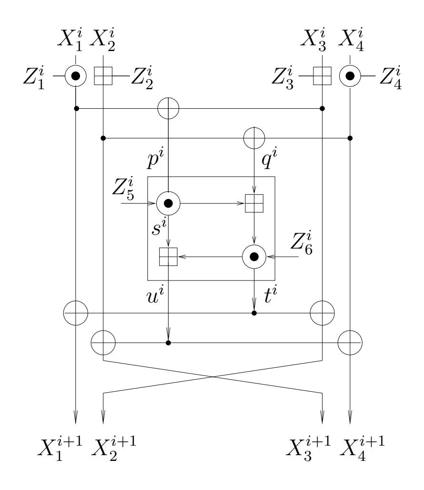

{0}------------------------------------------------

# New Data-Efficient Attacks on Reduced-Round IDEA

Eli Biham<sup>1</sup>, Orr Dunkelman<sup>2,3</sup>, Nathan Keller<sup>3</sup>, and Adi Shamir<sup>3</sup>

Technion
Haifa 32000, Israel
biham@cs.technion.ac.il

Computer Science Department
University of Haifa
Haifa 31905, Israel
orrd@cs.haifa.ac.il

Faculty of Mathematics and Computer Science
Weizmann Institute of Science
P.O. Box 26, Rehovot 76100, Israel
{nathan.keller,adi.shamir}@weizmann.ac.il}

**Abstract.** IDEA is a 64-bit block cipher with 128-bit keys which is widely used due to its inclusion in several cryptographic packages such as PGP. After its introduction by Lai and Massey in 1991, it was subjected to an extensive cryptanalytic effort, but so far the largest variant on which there are any published attacks contains only 6 of its 8.5-rounds. The first 6-round attack, described in the conference version of this paper in 2007, was extremely marginal: It required essentially the entire codebook, and saved only a factor of 2 compared to the time complexity of exhaustive search. In 2009, Sun and Lai reduced the data complexity of the 6-round attack from  $2^{64}$  to  $2^{49}$  chosen plaintexts and simultaneously reduced the time complexity from  $2^{127}$  to  $2^{112.1}$  encryptions. In this revised version of our paper, we combine a highly optimized meet-in-themiddle attack with a keyless version of the Biryukov-Demirci relation to obtain new key recovery attacks on reduced-round IDEA, which dramatically reduce their data complexities and increase the number of rounds to which they are applicable. In the case of 6-round IDEA, we need only two known plaintexts (the minimal number of 64-bit messages required to determine a 128-bit key) to perform full key recovery in 2<sup>123.4</sup> time. By increasing the number of known plaintexts to sixteen, we can reduce the time complexity to 2<sup>111.9</sup>, which is slightly faster than the Sun and Lai data-intensive attack. By increasing the number of plaintexts to about one thousand, we can now attack 6.5 rounds of IDEA, which could not be attacked by any previously published technique. By pushing our techniques to extremes, we can attack 7.5 rounds using  $2^{63}$  plaintexts and 2<sup>114</sup> time, and by using an optimized version of a distributive attack, we can reduce the time complexity of exhaustive search on the full 8.5-round IDEA to 2<sup>126.8</sup> encryptions using only 16 plaintexts.

{1}------------------------------------------------

### 1 Introduction

IDEA (which is an acronym for International Data Encryption Algorithm) is one of the best known and most well studied block ciphers. It was introduced by Lai and Massey in 1991, and became widely deployed due to its inclusion in the PGP package. Even though it has only nine relatively simple rounds which consist of just XOR's, additions, and multiplications of 16-bit values, it withstood more than 20 years of cryptanalysis surprisingly well, and there is no known attack on it which is faster than exhaustive search even in the extremely strong model of related-key attacks.

All the attacks published so far deal with various reduced versions of IDEA. The original version is usually said to have 8.5 rather than 9 rounds since the last round is simplified by eliminating its MA structure (see below). When we consider reduced versions of IDEA, it is customary to consider their size in increments of 0.5, depending on whether this component is used or not. In addition, the scheme is slightly inhomogeneous due to the way its subkeys are derived from the primary key, and thus attacks on reduced versions which have the same size but different starting points can have very different complexities.

The best attack on IDEA published until 2006 was the improved Demirci-Sel¸cuk-T¨ure [2] attack on 5 rounds, whose 2<sup>124</sup> time complexity is only slightly better than exhaustive search. In the ASIACRYPT 2006 version of this paper [5], we introduced the keyless Biryukov-Demirci relation and used it to reduce the time complexity of the attack on 5-round IDEA to 2<sup>103</sup>. We improved this result in our FSE 2007 paper [6], where we used the same technique to devise the first attack on a 6-round variant of IDEA, which starts in the middle of round 2 and ends in the middle of round 8. However, the complexity of this attack was extremely marginal, since it was only twice as fast as exhaustive search, and required essentially the whole codebook of 2<sup>64</sup> plaintext/ciphertext pairs. This 6-round attack was considerably improved two years later by Sun and Lai [32], who showed at ASIACRYPT 2009 how to reduce the data complexity from 2<sup>64</sup> to 2<sup>49</sup> chosen plaintexts, while at the same time reducing the time complexity from 2<sup>126</sup>.<sup>8</sup> to 2<sup>112</sup>.<sup>1</sup> .

In this paper we combine the keyless Biryukov-Demirci relation with a highly optimized meet-in-the-middle attack and obtain a new attack on 6-round IDEA which dramatically reduces the data complexity (from an impractical value of 2<sup>49</sup> chosen plaintexts to the extremely practical value of 16 known plaintexts) while remaining faster than the Sun and Lai attack. We can further reduce the data complexity of our attack all the way to its information-theoretic lower bound of 2 known plaintexts, but then its time complexity increases to 2<sup>123</sup>.<sup>4</sup> , which is worse than the Sun and Lai attack, but still faster than exhaustive search. This is a very rare example of a seemingly secure version of a modern cryptosystem which can be broken exactly at its Shannon's unicity bound.

By using higher data complexities, we can attack larger variants of IDEA, which could not be successfully attacked by any previously published technique. By combining the keyless Biryukov-Demirci relation with the splice-and-cut variant of the meet-in-the-middle attack [1, 34], we can break 6.5 rounds using about 

{2}------------------------------------------------

one thousand plaintexts in 2<sup>122</sup> time. The time complexity can be reduced to 2 <sup>112</sup> (which is slightly faster than the Sun and Lai attack on 6 rounds) by using a semi-practical number of 2<sup>32</sup> plaintexts. If we allow completely non-practical data complexities, we can attack 7 rounds in 2<sup>112</sup> time using 2<sup>48</sup> data, and 7.5 rounds in 2<sup>114</sup> time using 2<sup>63</sup> data. Finally, we can use extreme variants of our techniques to reduce the complexity of exhaustive key search on the full 8.5 round IDEA from 2<sup>128</sup> to 2<sup>126</sup>.<sup>8</sup> encryptions, using only 16 plaintexts. However, it is debatable whether such a marginal improvement in the time complexity should be considered a real attack on full IDEA.

In the last part of the paper we compare the Meet-in-the-Middle Biryukov-Demirci attack presented in this paper (which we call MitM-BD attack) with the Zero-in-the-Middle attacks based on the keyless Biryukov-Demirci relation used in the conference version of this paper and in Sun and Lai's paper (which we call ZitM-BD attacks). We show that while MitM-BD attacks are significantly better in the standard model, there are scenarios in which ZitM-BD attacks are advantageous. One such scenario is the stronger attack model of related-key attacks, which assumes that the adversary has the power to modify the key without knowing its value. We show that in this model, a ZitM-BD attack can break a 7.5-round variant of IDEA with a practical data complexity of 2<sup>25</sup> chosen plaintexts, and time complexity of 2<sup>103</sup>.<sup>5</sup> . Previous related-key attacks are either applicable to at most 7 rounds [5], or require encryption of the entire codebook under many different keys [7].

We have just learned (via private communication) that Khovratovich, Leurent, and Rechberger have also developed marginal attacks on 7.5 and 8.5 round IDEA, after hearing our presentation of the 6-round attack at the MSR workshop on Symmetric Cryptography in August 2011. The techniques they use are different (using their new biclique approach), and require much larger data complexities to achieve slightly better time savings. For example, their attack on full IDEA requires 2<sup>52</sup> chosen plaintexts in order to reduce the time complexity to 2<sup>126</sup> time, whereas our attack needs only 16 chosen plaintexts to reduce the time complexity to 2<sup>126</sup>.<sup>8</sup> .

Table 1 summarizes all the major previously published attacks on reduced round IDEA, and compares them to the new attacks presented in this paper and to the unpublished Khovratovich et al. results [24]. The results in the table are divided into four groups. The first one contains previously published results obtained by other researchers, which are inferior to our results. The second group contains our original results from ASIACRYPT 2006 [5] and FSE 2007 [6]. The third group describes the Khovratovich et al. results [24], and the last group contains all the new results announced in this paper.

The paper is organized as follows: In Section 2 we describe the structure of IDEA and introduce our notation. In Section 3 we describe the basic idea of a meet-in-the-middle attack, apply it to up to 4.5 rounds of IDEA, and optimize it in many different ways. In Section 4 we describe a new keyless version of the Biryukov-Demirci relation, which gets rid of all the subkeys in the equation. By combining these two techniques, we show in Section 5 how to get for free 1.5

{3}------------------------------------------------

| Rounds Attack Type                           |                                | Complexity             |              | Source        |  |  |
|----------------------------------------------|--------------------------------|------------------------|--------------|---------------|--|--|
|                                              |                                | Data                   | Time         | & Year        |  |  |
| 2                                            | Differential                   | $2^{10}$ CP            | $2^{40}$     | [26], 1993    |  |  |
| 2.5                                          | Differential                   | $2^{10}$ CP            | $2^{104.7}$  | [26], 1993    |  |  |
| 3                                            | Differential-Linear            | $2^{29}$ CP            | $2^{44}$     | [11], 1997    |  |  |
| 3.5                                          | Differential                   | $2^{56}$ CP            | $2^{67}$     | [11], 1997    |  |  |
| 3.5                                          | Linear                         | $103~\mathrm{KP}$      | $2^{97}$     | [22], 2005    |  |  |
| 4                                            | Imppossible Differential       | $2^{36.6} \text{ CP}$  | $2^{66.6}$   | [3], 1999     |  |  |
| 4                                            | Linear                         | 114 KP                 | $2^{114}$    | [29], 2004    |  |  |
| 4.5                                          | Impossible Differential        | _ 111                  | $2^{110.4}$  | [3], 1999     |  |  |
| 5                                            | Demirci-Selçuk-Türe            | $2^{24} \text{ CP}$    | $2^{126}$    | [16], 2003    |  |  |
| 5                                            | Demirci-Selçuk-Türe            | $2^{24.6} \text{ CP}$  | $2^{124}$    | [2], 2006     |  |  |
| 5.5                                          | Key-dependent Linear           |                        | $2^{112.1}$  | [32], 2009    |  |  |
| 6                                            | Key-dependent Linear           | $2^{49}$ CP            | $2^{112.1}$  | [32], 2009    |  |  |
|                                              | Our Orig                       | inal Result            | S            |               |  |  |
| $2.5^{\dagger}$                              | Zero-in-the-Middle BD-relation | $2^{18}$ CP            | $2^{18}$     | [5], 2006     |  |  |
| 4.5                                          | ZitM BD-relation               | 16 CP                  | $2^{103}$    | [5], 2006     |  |  |
| 5                                            | ZitM BD-relation               | $2^{18.5} \text{ KP}$  | $2^{103}$    | [6], 2007     |  |  |
| 5                                            | ZitM BD-relation               | 16 KP                  | $2^{114}$    | [6], 2007     |  |  |
| 5.5                                          | ZitM BD-relation               | $2^{32} \text{ CP } 2$ | $2^{126.85}$ | [6], 2007     |  |  |
| 6                                            | ZitM BD-relation               | $2^{64} \text{ KP}$    | $2^{126.8}$  | [6], 2007     |  |  |
| The Independently Discovered Results in [24] |                                |                        |              |               |  |  |
| 7.5                                          | Biclique BD-relation           | $2^{18}$ CP            | $2^{126.5}$  | [24], 2011    |  |  |
| 7.5                                          | Biclique BD-relation           | $2^{52}$ CP            | $2^{123.9}$  | [24], 2011    |  |  |
| 8.5                                          | Biclique BD-relation           | $2^{52}$ CP            | $2^{126.0}$  | [24], 2011    |  |  |
|                                              |                                | w Results              |              | L 3'          |  |  |
| 4.5                                          | MitM                           | 2 KP                   | $2^{103}$    | Sect. 3, 2011 |  |  |
| 6                                            | MitM BD-relation               |                        | $2^{123.4}$  | Sect. 5, 2011 |  |  |
| 6                                            | MitM BD-relation               |                        | $2^{111.9}$  | Sect. 5, 2011 |  |  |
| 6.5                                          | SaC MitM BD-relation           | $2^{10}$ CP            | $2^{122}$    | Sect. 6, 2011 |  |  |
| 6.5                                          | SaC MitM BD-relation           | $2^{23}$ CP            | $2^{113}$    | Sect. 6, 2011 |  |  |
| 6.5                                          | SaC MitM BD-relation           |                        | $2^{111.9}$  | Sect. 6, 2011 |  |  |
| 7                                            | SaC MitM BD-relation           | $2^{38}$ CP            | $2^{123}$    | Sect. 6, 2011 |  |  |
| 7                                            | SaC MitM BD-relation           | $2^{48}$ CP            | $2^{112}$    | Sect. 6, 2011 |  |  |
| 7.5                                          | SaC MitM BD-relation           | 16 CP                  | $2^{125.9}$  | Sect. 7, 2011 |  |  |
| 7.5                                          | SaC MitM BD-relation           | $2^{63}$ CP            | $2^{114}$    | Sect. 6, 2011 |  |  |
| 8.5                                          | SaC MitM BD-relation           | 16 CP                  | $2^{126.8}$  | Sect. 7, 2011 |  |  |
| 7:11                                         | 7                              |                        | /I: 1 11 _ C | 10 01 10 1    |  |  |

ZitM – Zero in the Middle, MitM – Meet in the Middle, SaC – Splice and Cut. KP/CP – Known/Chosen plaintext. Time complexity is measured in encryptions  $^{\dagger}$  – This attack is a distinguishing attack

 ${\bf Table~1.}~{\bf Comparing~Other~Single-Key~Attacks~on~IDEA~with~our~New~Results$ 

additional rounds, which increases the size of the attacked variant of IDEA to 6 rounds. In Section 6 we show how to get up to 1.5 additional rounds at the

{4}------------------------------------------------

expense of increasing the data complexity, using the splice-and-cut technique. In Section 7 we show how to use our techniques to speed up exhaustive search on the full IDEA (as well as discuss the applicability of such speed ups to other cryptosystems). In Section 8 we introduce a different technique called zero-in-the-middle, and show how to use it to devise a related-key attack on 7.5 rounds of IDEA with a practical data complexity. We conclude with a short summary and discussion in Section 9.

# 2 Description of IDEA and the Notations Used in the Paper

IDEA [25] is a 64-bit, 8.5-round block cipher with 128-bit keys. It uses a composition of XOR operations, additions modulo  $2^{16}$ , and multiplications over  $GF(2^{16}+1)$ .

Every round of IDEA is the concatenation of two layers. The input of round i, denoted by  $X^i$ , consists of four 16-bit words, denoted by  $(X_1^i, X_2^i, X_3^i, X_4^i)$ . In the first layer (denoted by KA for Key Addition), the first and the fourth words are multiplied by subkey words (mod  $2^{16} + 1$ ) where a 0 operand is replaced by  $2^{16}$ , and an outcome of  $2^{16}$  is replaced by 0, and the second and the third words are added to subkey words (mod  $2^{16}$ ). The intermediate value after this half-round is denoted by  $Y^i = (Y_1^i, Y_2^i, Y_3^i, Y_4^i)$ . Formally, let  $Z_1^i, Z_2^i, Z_3^i$ , and  $Z_4^i$  be the four subkey words, let  $\square$  denote addition modulo  $2^{16}$  and let  $\odot$  be IDEA's special multiplication, i.e.,

$$Y_1^i = Z_1^i \odot X_1^i; \quad Y_2^i = Z_2^i \boxplus X_2^i; \quad Y_3^i = Z_3^i \boxplus X_3^i; \quad Y_4^i = Z_4^i \odot X_4^i$$

Then,  $(p^i, q^i) = (Y_1^i \oplus Y_3^i, Y_2^i \oplus Y_4^i)$  enters the second layer, a structure composed of multiplications and additions denoted by MA. Denoting the subkey words that enter the MA function by  $Z_5^i$  and  $Z_6^i$ , the computation is performed as follows:

$$s^{i} = p^{i} \odot Z_{5}^{i};$$
  

$$t^{i} = (q^{i} \boxplus s^{i}) \odot Z_{6}^{i};$$
  

$$u^{i} = t^{i} \boxplus s^{i};$$

The output of the MA function is  $(u^i, t^i)$ , which we note are related through  $u^i = t^i \boxplus s^i$ , a fact which is later used.

The structure of a single round of IDEA is shown in Figure 1. The output of the *i*-th round is  $X^{i+1} = (Y_1^i \oplus t^i, Y_3^i \oplus t^i, Y_2^i \oplus u^i, Y_4^i \oplus u^i)$ . In the last round the MA layer is removed (i.e., the ciphertext is  $Y^9 = (Y_1^9||Y_2^9||Y_3^9||Y_4^9)$ ), and thus we refer to the full IDEA as an 8.5-round rather than as a 9-round scheme.

IDEA's key schedule is extremely simple, and turns out to be the source of many attacks. It is completely linear, and each subkey is a subset of 16 consecutive bits selected from the key. Since the exact structure of the key schedule is crucial for our attacks, the entire key schedule is described in Table 2. In this table and the remainder of this paper, we denote the first bit of the key by 0 and the last bit of the key by 127, and use a cyclic interval notation such as 121–8 to denote the 16 bits 121, 122, ..., 127, 0, 1, ..., 7, 8.

{5}------------------------------------------------



Fig. 1. One Round of IDEA

| Round | $Z_1^i$  | $Z_2^i$   | $Z_3^i$   | $Z_4^i$  | $Z_5^i$  | $Z_6^i$   |
|-------|----------|-----------|-----------|----------|----------|-----------|
| i = 1 | 0-15     | 16–31     | 32 – 47   | 48–63    | 64-79    | 80–95     |
| i = 2 | 96 - 111 | 112 – 127 | 25 – 40   | 41 - 56  | 57 - 72  | 73 - 88   |
| i = 3 | 89 - 104 | 105 – 120 | 121 - 8   | 9 – 24   | 50 – 65  | 66 – 81   |
| i = 4 | 82 – 97  | 98 – 113  | 114 - 1   | 2 - 17   | 18 – 33  | 34 – 49   |
| i = 5 | 75 – 90  | 91 – 106  | 107 – 122 | 123 - 10 | 11-26    | 27 – 42   |
| i = 6 | 43 – 58  | 59 – 74   | 100 – 115 | 116 - 3  | 4 - 19   | 20 – 35   |
| i = 7 | 36 – 51  | 52 – 67   | 68 – 83   | 84 - 99  | 125 - 12 | 13 – 28   |
| i = 8 | 29 – 44  | 45 – 60   | 61 - 76   | 77 - 92  | 93 – 108 | 109 – 124 |
| i = 9 | 22 – 37  | 38 – 53   | 54 – 69   | 70 – 85  |          |           |

**Table 2.** The Key Schedule Algorithm of IDEA. Each cell describes the bits of the secret key used in the corresponding subkey.

# 3 Meet-in-the-Middle Attacks on IDEA

In this section we show how to apply the standard meet-in-the-middle (MitM) technique to reduced round IDEA using a surprisingly small number of known plaintexts. Our simplest example (described below) is a complete key recovery attack on 4.5-round IDEA which is  $2^{25}$  times faster than exhaustive search, using only 2 known plaintexts and  $2^{25}$  memory. Note that this is the most data-

{6}------------------------------------------------

efficient attack possible, since the unicity distance of a 64-bit block cipher with a 128-bit key is 2. We were surprised by the fact that this extremely simple attack breaks more rounds of IDEA with so little data compared with numerous previously published sophisticated attacks, including the differential [26], differential-linear [11], Square [22], and impossible differential [3]<sup>1</sup> attacks. In Section 5 we show that the combination of the standard MitM technique with the keyless Biryukov-Demirci relation allows us to enhance the attack significantly, resulting in an attack on 6-round IDEA which requires only 16 known plaintexts.

#### 3.1 Basic Meet-in-the-Middle Attack on 3.5-round IDEA

The standard MitM attack on a block cipher uses the observation that some intermediate value V can be computed from the plaintext given only part of the secret key material (denoted by  $K_t$ , where t stands for "top"), and on the other hand, can also be computed from the ciphertext given a (possibly different) part of the key material (denoted by  $K_b$ , where b stands for "bottom"). In the attack, the adversary considers several known plaintext/ciphertext pairs and for each guess of  $K_t$ , she computes from the plaintexts the corresponding V values and stores them in a hash table. Then, for each guess of  $K_b$ , she computes the V values from the ciphertexts, and searches for a match in the hash table. If  $|K_t| > |K_b|$ , it is more efficient to swap the roles of  $K_t$  and  $K_b$ . The memory complexity of such a generic attack is  $2^{\min(|K_t|,|K_b|)}$ , where |K| is the size of K in bits, and the time complexity is  $2^{\max(|K_t|,|K_b|)}$ . The data complexity is  $D = (|K_t| + |K_b|)/|V|$  plaintext/ciphertext pairs, required for discarding all the wrong values of  $(K_t, K_b)$ .

Consider a reduced-round variant of IDEA which consists of its first 3.5 rounds. We concentrate on the intermediate value  $p^2$ , i.e., the left input to the MA layer of round 2. This  $p^2$  can be computed from the plaintext given only bits 0–111 of the secret key (the entire subkey of round 1, and the subkeys  $Z_1^2$  and  $Z_3^2$ ), and thus,  $|K_t| = 112$ . On the other hand, by the structure of IDEA, we have  $p^2 = X_1^3 \oplus X_2^3$ , and hence,  $p^2$  can be computed from the ciphertext given only bits 50–17 of the secret key (the entire subkeys of the KA layer of round 4 and the MA layer of round 3, and the subkeys  $Z_1^3$  and  $Z_2^3$ ). Thus,  $|K_b| = 96$ . Since  $|V| = |p^2| = 16$ , one can mount a trivial MitM attack on 3.5-round IDEA with data complexity of (112+96)/16 = 13 known plaintexts, memory complexity of  $2^{96}$ , and time complexity of  $2^{112}$ .

<sup>&</sup>lt;sup>1</sup> The impossible differential attack of [3] can break the same number of rounds, but with a significantly higher data, memory, and time complexities.

<sup>&</sup>lt;sup>2</sup> Note that the memory complexity is given in units of  $D \cdot |V|$ -bit blocks, and the time complexity is given in units of D partial encryptions. The exact complexity of our attack on IDEA is computed after incorporating all the suggested improvements of the basic attack.

{7}------------------------------------------------

#### 3.2 Several Improvements

In this subsection we show how to simultaneously reduce the time, memory, and data complexities of the basic MitM attack:

- 1. Reducing the memory complexity from 2 <sup>96</sup> to 2 16 . Note that the "subkeys" K<sup>t</sup> and K<sup>b</sup> in the attack share 80 bits of the secret key (bits 0– 17 and 50–111). This makes it possible to reduce the memory complexity of the attack from the impractical value of 2<sup>96</sup> to a very practical value of 2<sup>16</sup>, without increasing the time complexity. This is done as follows. The adversary starts with guessing these common 80 key bits, and for each guess, performs the MitM procedure assuming that these bits are known constants. Thus, in each such "inner loop", |Kt| is reduced to 32, and |Kb| is reduced to 16. As a result, for each guess of these 80 key bits, the memory complexity of the attack is 2<sup>16</sup> and the time complexity is 2<sup>32</sup>. The total time complexity remains 2<sup>80</sup> · 2 <sup>32</sup> = 2<sup>112</sup> (as in the basic attack), but the memory complexity of the entire attack is reduced from 2<sup>96</sup> to 2<sup>16</sup> since the same memory slots can be re-used for constructing the hash tables for each application of the "inner loop" of the attack.
- 2. Reducing the time complexity from 2 <sup>112</sup> to 2 103 . Note that both modular addition (modulo 2<sup>16</sup>) and bitwise XOR have the property that the k LSBs of the output depend only on the k LSBs of the inputs. This allows to reduce the size of |Kt| (and thus, the time complexity of the attack) by restricting our attention to the k LSBs of the value V . First, we need to alter the attack procedure a little. Instead of taking V = p 2 , we consider V = q 2 (i.e., the right input of the MA layer of round 2). It turns out that q 2 can be computed from the plaintext given bits 0–95 and 112–127 of the secret key, and from the ciphertext given bits 50–24 of the secret key. Thus, |Kt| = 112 and |Kb| = 103, which is inferior to the attack presented above. However, if we restrict our attention to the k LSBs of q 2 then we need only the k LSBs of the addition subkey Z 2 2 (composed of bits 112–127 of the secret key), and hence |Kt| is reduced to 96 + k. Taking k = 7, we obtain |Kt| = |Kb| = 103, and thus the time complexity of the attack is reduced to 2<sup>103</sup>. However, the memory complexity in this case is slightly increased to 2<sup>25</sup> (which is still completely practical), since K<sup>t</sup> and K<sup>b</sup> share only 78 secret key bits which can be enumerated in an external loop, and the data complexity is also slightly increased to ⌈(103 + 103)/7⌉ = 30 known plaintexts.
- 3. Reducing the Data Complexity to 4 known plaintexts. Note that there is no need to discard all the possible (Kt, Kb) values during the MitM procedure. It is sufficient to discard all but 2<sup>103</sup> values, since exhaustively searching the remaining values can be done within an additional time complexity of at most 2<sup>103</sup>. Specifically, if the adversary considers only 4 known plaintexts (which provide a filtering of 4 · |V | = 28 bits), then for each guess of the 78 common secret key bits, only 2<sup>50</sup> · 2 <sup>−</sup><sup>28</sup> = 2<sup>22</sup> suggestions for the remaining bits of K<sup>t</sup> and K<sup>b</sup> are expected to remain. Each such suggestion (together with the 78 common bits) yields a suggestion for the entire secret

{8}------------------------------------------------

key that can be checked by a single trial encryption. Hence, the complexity of the second step of the attack (i.e., discarding the remaining suggestions) is 2<sup>78</sup> · 2 <sup>22</sup> = 2<sup>100</sup> encryptions, which is smaller than the complexity of the MitM phase of the attack.

By combining all the improvements described so far, we can get an attack on the first 3.5 rounds of IDEA which has data complexity of 4 known plaintexts, memory complexity of 2<sup>25</sup>, and time complexity of 2<sup>103</sup> . 3

4. Increasing the number of rounds of IDEA to 4.5. We can attack a larger version of IDEA and get even better complexities by attacking some intermediate rounds instead of the initial rounds of IDEA.<sup>4</sup> Specifically, consider the 4.5-round variant of IDEA which starts at the beginning of round 4 and ends after the KA layer of round 8. It turns out that the value V = p 5 can be computed from the "plaintext" (i.e., the input of round 4) given only bits 75–49 of the key, and from the "ciphertext" (i.e., the value after KA of round 8) given only bits 125–99 of the key. Hence, |Kt| = |Kb| = 103, which allows us to attack this larger variant with the same time complexity of 2 103 . The memory complexity also remains 2<sup>25</sup>, since K<sup>t</sup> and K<sup>b</sup> share 78 key bits. However, the data complexity is reduced to just 2 known plaintexts, since each value of V = p 5 supplies a 16-bit filtering, and thus for each 78-bit key guess, only 2<sup>50</sup> · 2 <sup>−</sup><sup>32</sup> = 2<sup>18</sup> suggestions are left after the MitM phase. The total number of suggested keys is thus 2<sup>78</sup> · 2 <sup>18</sup> = 2<sup>96</sup>, and they can be checked via trial encryption in a small fraction of the total time of the attack.

It is interesting to note that two plaintexts is the information-theoretic lower bound for any key-recovery attack on IDEA, since each plaintext/ciphertext pair supplies only 64 bits of information, and hence at least two such pairs are needed in order to discard all the 2<sup>128</sup> − 1 wrong key guesses.

The algorithm of the 4.5-round attack is presented in Figure 2.

For the sake of completeness, we considered other reduced-round variants of IDEA based on all the possible choices of consecutive intermediate rounds. We found two other 4.5-round variants that can be attacked using the standard MitM technique:

– A variant that starts after the KA layer of round 2 and ends at the end of round 6 — the complexity of the attack on this variant is identical to the complexity of the attack described above.

<sup>3</sup> We note that the attack on the first 3.5 rounds of IDEA can be improved to use only 2 known plaintexts, by meeting in the middle on the value of the third and fourth words after the KA layer of round 2. This follows from the fact that in the 103 bits guessed at the bottom half, cover the bits required for a full decryption of two rounds, including the MA layer of the second round. From the top side, it is sufficient to guess 96 bits to obtain the values of these words after the KA layer of the second round.

<sup>4</sup> We note that a similar strategy of attacking the middle rounds in a round-reduced block cipher was used in many previously published attacks [12, 32].

{9}------------------------------------------------

```
Input: Two "plaintext"/"ciphertext" pairs (P_1, C_1), (P_2, C_2).

for any key guess of key bits 0–49, 75–99, 125–127 do

Initialize a empty hash table H.

for any key guess of key bits 100-124 do

Compute p_1^5 and p_2^5 from P_1 and P_2, respectively (and the known key), and store in H the value (p_1^5, p_2^5, K[100-124]).
\nend for

for any key guess of key bits 50-74 do

Compute p_1'^5 and p_2'^5 from C_1 and C_2, respectively (and the known key), and check whether (p_1'^5, p_2'^5) is in H.

If so, perform trial encryption under the key bits 0–49, 75–99, 125–127, the current guess of key bits 50-74, and the bits suggested in the corresponding entry of H.
\nend for\nend for
```

Fig. 2. The Algorithm for Meet-in-the-Middle Attack on 4.5 Rounds of IDEA (starting at round 4)

- A variant that starts after the KA layer of round 1 and ends at the end of round 5 — the time complexity of the attack on this variant is increased to  $2^{112}$  encryptions, whereas the memory complexity is decreased to  $2^{15}$  64-bit blocks.

# 4 The Keyless Biryukov-Demirci Relation

In this section we present a keyless variant of the Biryukov-Demirci (BD) relation — a linear equation involving the plaintext, the ciphertext, and several intermediate values computed during the IDEA encryption process. In the following sections we combine this keyless BD-relation with the MitM technique and with other techniques to mount improved attacks on larger reduced-round variants of IDEA.

We start with the basic observation made by Biryukov. Let us examine the second and the third words in all the intermediate stages of the encryption. There is a relation between the values of these words and the outputs of the MA layers in the intermediate rounds, that uses only XOR and modular addition, but not multiplication. Let  $P = (P_1, P_2, P_3, P_4)$  be a plaintext and let  $C = (C_1, C_2, C_3, C_4)$  be its corresponding ciphertext. Then:

$$(((((((((((((((((((((((((((((((((((($$

{10}------------------------------------------------

Similarly,

$$(((((((((((((((((((((((((((((((((((($$

(2)

If we restrict our interest to the values of the least significant bits (LSB) of the words, modular addition is equivalent to XOR and we can simplify the above equations into:

$$LSB(P_{2} \oplus Z_{2}^{1} \oplus u^{1} \oplus Z_{3}^{2} \oplus t^{2} \oplus Z_{2}^{3} \oplus u^{3} \oplus Z_{3}^{4} \oplus t^{4} \oplus Z_{2}^{5} \oplus u^{5} \oplus Z_{3}^{6} \oplus t^{6} \oplus Z_{2}^{7} \oplus u^{7} \oplus Z_{3}^{8} \oplus t^{8} \oplus Z_{2}^{9}) = LSB(C_{2}),$$
(3)

and

$$LSB(P_3 \oplus Z_3^1 \oplus t^1 \oplus Z_2^2 \oplus u^2 \oplus Z_3^3 \oplus t^3 \oplus Z_2^4 \oplus u^4 \oplus Z_3^5 \oplus t^5 \oplus Z_2^6 \oplus u^6 \oplus Z_3^7 \oplus t^7 \oplus Z_2^8 \oplus u^8 \oplus Z_3^9) = LSB(C_3).$$

(4)

As observed by Demirci [15],  $u^i = t^i \boxplus s^i$ , thus,  $LSB(u^i) = LSB(t^i \boxplus s^i)$ , which is equivalent to  $LSB(u^i \oplus t^i) = LSB(s^i)$ . Taking this into consideration and XORing the two above equations, we obtain:

$$LSB(P_{2} \oplus P_{3} \oplus Z_{2}^{1} \oplus Z_{3}^{1} \oplus s^{1} \oplus Z_{2}^{2} \oplus Z_{3}^{2} \oplus s^{2} \oplus Z_{2}^{3} \oplus Z_{3}^{3} \oplus s^{3} \oplus Z_{2}^{4} \oplus Z_{3}^{4} \oplus s^{4} \oplus Z_{2}^{5} \oplus Z_{3}^{5} \oplus s^{5} \oplus Z_{2}^{6} \oplus Z_{3}^{6} \oplus s^{6} \oplus Z_{2}^{7} \oplus Z_{3}^{7} \oplus s^{7} \oplus Z_{2}^{8} \oplus Z_{3}^{8} \oplus s^{8} \oplus Z_{2}^{9} \oplus Z_{3}^{9})$$

$$= LSB(C_{2} \oplus C_{3}).$$

(5)

This equation is called in [22] "the Biryukov-Demirci relation", which we shall refer to as the BD-relation.

In this paper we introduce a new keyless variant of the BD-relation in which all the  $Z_j^i$  subkeys are cancelled. Consider any pair of known plaintexts  $P^1$  and  $P^2$ . Denote the XOR difference between the encryptions of  $P^1$  and  $P^2$  (under the same secret key) in an intermediate value X by  $\Delta X$ . Then, XORing the equations given by  $P^1$  and  $P^2$  yields:

$$LSB(P_2^1 \oplus P_3^1 \oplus P_2^2 \oplus P_3^2 \oplus \Delta s^1 \oplus \Delta s^2 \oplus \Delta s^3 \oplus \Delta s^4 \oplus \Delta s^5 \oplus \Delta s^6 \oplus \Delta s^7 \oplus \Delta s^8) = LSB(C_2^1 \oplus C_3^1 \oplus C_2^2 \oplus C_3^2).$$

$$(6)$$

In the sequel, we refer to this equation as the "keyless BD-relation".

#### 5 Meet-in-the-Middle Biryukov-Demirci Attack on 6-round IDEA

In this section we combine the keyless BD-relation with the standard MitM technique to obtain a new attack on 6-round IDEA, which is currently the largest version of IDEA for which single-key attacks are known. The data complexity of our attack is just 16 known plaintexts, the memory complexity is  $2^{25}$  64-bit blocks, and the time complexity is less than  $2^{112}$  encryptions. This is a huge

{11}------------------------------------------------

improvement over the best previously known attack on 6-round IDEA [32], which required 2<sup>49</sup> chosen plaintexts and a slightly larger time complexity.

The 6-round variant we consider starts after the KA layer of round 2 and ends after the KA layer of round 8. First we present the basic attack, and then we present a tradeoff that allows us to slightly reduce the high time complexity, at the expense of slightly increasing the low memory complexity.

#### 5.1The Basic Attack

In the attack combining the keyless BD-relation with the MitM technique, which we call in the sequel "MitM BD attack", we divide the terms of Equation (6) into two sets, such that the terms in the first set are computed using the plaintexts and the subkey  $K_t$  (as defined in Section 3), and the terms in the second set are computed using the ciphertexts and the subkey  $K_b$ . In the attack, for each guess of  $K_b$ , the adversary computes the XOR of all terms of the equation that belong to the first set, and stores it in a hash table. Then, for each guess of the subkey  $K_t$ , she computes the XOR of all terms that belong to the second set, and searches for a match in the hash table. If the equation is satisfied (which is always the case for the correct guess of  $(K_t, K_b)$ , the XOR of all the terms in the equation is zero, which corresponds to a match in the hash table.

In the specific case of 6-round IDEA considered in this paper, Equation (6) is reduced to:

$$LSB(P_2^1 \oplus P_3^1 \oplus P_2^2 \oplus P_3^2 \oplus \Delta s^2 \oplus \Delta s^3 \oplus \Delta s^4) = LSB(C_2^1 \oplus C_3^1 \oplus C_2^2 \oplus C_3^2 \oplus \Delta s^5 \oplus \Delta s^6 \oplus \Delta s^7).$$

$$(7)$$

We choose the sets as follows:

- The first set consists of the terms:  $P_2^1, P_3^1, P_2^2, P_3^2, \Delta s^2, \Delta s^3, \Delta s^4$ . The second set consists of the terms:  $C_2^1, C_3^1, C_2^2, C_3^2, \Delta s^5, \Delta s^6, \Delta s^7$ .

This division emphasizes the advantage of the MitM BD attack over the standard MitM attack. In the standard MitM attack, the adversary has to compute values from both the plaintext and ciphertext sides until she reaches a common intermediate value V. The use of the BD-relation allows us to "jump" over one round in the middle: the adversary computes only up to  $\Delta s^4$  in the encryption direction and only up to  $\Delta s^5$  in the decryption direction, and the meet-in-themiddle effect is achieved using Equation (7) to bridge between these values. What makes the attack even better is that due to the special properties of the IDEA key schedule, this bridging in the middle allows us to gain 1.5 rounds in the attack for free, and extends our extremely data-efficient 4.5-round attack into a similarly efficient 6-round attack.

The details of the attack are as follows. The terms of the first set can be computed from the plaintexts given key bits 50–33 (i.e., the entire subkeys of the MA layer of round 2 and the entire round 3, and the subkeys  $Z_1^4, Z_3^4, Z_5^4$ ). The terms of the second set can be computed from the ciphertexts given key bits 125–99 (i.e., the entire subkeys of the KA layer of round 8 and the entire

{12}------------------------------------------------

round 7, plus the subkeys Z 6 1 , Z<sup>6</sup> 2 , Z<sup>5</sup> 5 ). Hence, we have |Kt| = 112, |Kb| = 103, and |V | = 1 (since Equation (7) considers only the LSB of the word). Note that K<sup>t</sup> and K<sup>b</sup> share 87 key bits (i.e., bits 125–33 and 50–99). Hence, using the improvements presented in Section 3.2, the data complexity of the attack is 16 known plaintexts (which suffice to construct the 15 independent message pairs required for Equation (7)), the memory complexity is 2<sup>16</sup> 32-bit blocks (which are equivalent to 2<sup>15</sup> 64-bit blocks), and the time complexity is 2<sup>112</sup> partial encryptions of 16 plaintexts, which are roughly equivalent to 2<sup>115</sup> encryptions.

#### 5.2 A Time-Memory Tradeoff

In this subsection we show that the time complexity of the attack can be slightly reduced from 2<sup>115</sup> to less than 2<sup>112</sup> encryptions, at the expense of increasing the memory complexity from 2<sup>15</sup> to 2<sup>25</sup> 64-bit blocks. The tradeoff may seem to be unattractive, but in fact it reduces the largest complexity (time) while keeping the smaller complexities (memory and data) completely practical.

The most time-consuming part of the basic attack is computing the terms ∆s<sup>3</sup> and ∆s<sup>4</sup> for 16 plaintexts, which requires the knowledge of the 112 key bits 50–33. We observe that bits 25–33 are required only for the subkey Z 4 5 , which is used only in the last multiplication operation in the computation of ∆s<sup>4</sup> . Hence, at first glance it seems that the adversary can guess the 103 key bits 50–24 and perform all operations except for the last multiplication, and then guess the remaining 9 key bits and perform a single multiplication operation for the 16 plaintexts. However, this is impossible since key bits 25–33 are also part of Kb, and hence their value should be guessed and fixed in advance, before the beginning of the MitM phase.

This technical problem can be solved at the expense of enlarging the memory complexity. The adversary simply ignores the fact that bits 25–33 are shared by K<sup>t</sup> and Kb, and treats them as independent parts of K<sup>t</sup> and Kb. As a result, the number of shared key bits is reduced to 78, and thus the memory complexity is increased to 2<sup>25</sup> 40-bit blocks.<sup>5</sup> On the other hand, this allows the adversary to reduce the time complexity of the computation of ∆s<sup>3</sup> and ∆s<sup>4</sup> , since it is now possible to postpone the guess of bits 25–33 until the last multiplication operation, as described above. As a result, this phase of the attack requires 2 112 · 16 = 2<sup>116</sup> modular multiplications. Since each encryption with 6-round IDEA contains 24 modular multiplications (in addition to other operations), the time required is less than 2<sup>111</sup>.<sup>42</sup> 6-round encryptions.<sup>6</sup>

<sup>5</sup> Note that the size of an entry in the table is 40 bits: 15 bits for the value of the evaluated keyless BD-relation in the 15 pairs, and 25 bits for the value of key bits 25–49.

<sup>6</sup> In order to evaluate more precisely the time complexity of the attack (and of the other attacks presented in this paper), one has to determine the ratio between the complexities of the three types of operations used in IDEA (i.e., XORs, modular additions, and modular multiplications). As this relation differs very much for different platforms, we chose the following line of action: In the attack on the full IDEA pre-

{13}------------------------------------------------

After reducing the time complexity of the MitM phase, the second phase of the attack (i.e., discarding the  $2^{113}$  remaining subkey candidates), becomes the most time-consuming phase of the attack. However, this part can also be performed more efficiently, as follows: at the phase of generating the hash table, the adversary also computes the entire value  $p^5 = X_1^6 \oplus X_2^6$  for one of the plaintext/ciphertext pairs and stores it in the hash table. Then, for a remaining subkey guess, the adversary only computes the value  $p^5$  for that plaintext/ciphertext pair from the plaintext side, and checks whether it matches the value in the corresponding entry of the hash table. As this is a 16-bit filtering, only  $2^{97}$  key candidates remain after this stage, and they can be easily checked by trial encryption. Since during the computation of  $\Delta s^3$  and  $\Delta s^4$ , the adversary already performs full encryption through round 3 and partial encryption through round 4, obtaining the value of  $p^5$  requires only three modular multiplications, which are roughly equivalent to 1/8 encryption. Thus, the time complexity of this phase is  $(1/8) \cdot 2^{113} = 2^{110}$  encryptions.

Therefore, the total time complexity of the attack is  $2^{111.42} + 2^{110} = 2^{111.9}$  encryptions. The memory complexity is increased by a small factor (due to the need to store the  $p^5$  values) to  $2^{25}$  56-bit blocks, which are less than  $2^{25}$  64-bit blocks.

#### 5.3 An Attack with Only Two Known Plaintexts

A variant of the attack described above can be used to attack the same 6-round variant of IDEA with only two known plaintexts and time complexity of  $2^{123.4}$  encryptions. Note that this is the smallest possible number of 64-bit messages which can information-theoretically determine the 128-bit key, and thus it is surprising that even with so little data we can perform full key extraction by an algorithm which is considerably faster than exhaustive search.

First, the adversary constructs the tables and performs the MitM phase of the basic attack described above. Since the adversary has only two plaintexts in his disposition, he can check the validity of the keyless Biryukov-Demirci relation only once, and thus,  $2^{127}$  key suggestions remain after this stage.

As described in the previous subsection, most of these suggestions can be discarded efficiently by storing in the table also the  $p^5$  value in one of the encryptions and computing it from the plaintext side for each subkey suggestion. In order to make this step even more efficient, the adversary can make a small change in the MitM phase of the attack: In addition to computing  $\Delta s^3$  and  $\Delta s^4$ , she computes the intermediate values until the multiplication with the subkey  $Z_6^4$  in the MA layer of round 4. Given these intermediate values,  $p^5$  can be computed with only 2 modular multiplications, 2 modular additions, and 2 XORs, which are less than 1/12 of a 6-round encryption.

sented in Section 7, where computing the exact complexity is important, we perform the computation according to two natural measures and compare the results. In the rest of the attacks, where the exact complexity is not so important, we compute the complexity according to the simplest measure that assumes that additions and XORs are negligible compared to modular multiplications.

{14}------------------------------------------------

The time complexity of the attack is dominated by the second phase (i.e., discarding the subkey suggestions), whose complexity is 2<sup>127</sup> · (1/12) = 2<sup>123</sup>.<sup>42</sup> encryptions.

We note that a similar attack can be applied to any number 2 ≤ k ≤ 16 of plaintexts, with time complexity of 2<sup>107</sup>.<sup>42</sup> · k + 2<sup>125</sup>.42−<sup>k</sup> encryptions.

#### 5.4 Attacks on Other Reduced-Round Variants

Our analysis indicates that no other 6-round variant of IDEA (with a shifted starting position) can be attacked by this MitM technique.

If the reduced-round variant must start at the beginning of round 1 (as considered in [32]), then 5 rounds can be attacked, with data complexity of just 10 known plaintexts, memory complexity of 2<sup>24</sup> 64-bit blocks, and time complexity of 2<sup>119</sup> encryptions. For the sake of comparison, the best previous attack on the same variant which was presented in [32] requires either 2<sup>17</sup> chosen plaintexts and 2<sup>125</sup>.<sup>5</sup> encryptions, or 2<sup>64</sup> known plaintexts and 2<sup>115</sup>.<sup>5</sup> encryptions.

Similarly, if the reduced-round variant must end at the KA layer of round 9, then 5.5 rounds can be attacked, with data complexity of 10 known plaintexts, memory complexity of 2<sup>24</sup> 64-bit blocks, and time complexity of 2<sup>119</sup> encryptions.

# 6 Splice-and-Cut Meet-in-the-Middle Biryukov-Demirci Attacks on Up to 7.5-Round IDEA

In this section we show that by increasing the data complexity and incorporating the splice-and-cut [1] variant of the meet-in-the-middle technique into the attack, we can increase the number of rounds we can target from 6 to 7.5, without affecting the time complexity of the attack.

The splice-and-cut technique was proposed by Aoki and Sasaki [1] for cryptanalysis of hash functions, and was recently adapted to block ciphers by Wei et al. [34]. The idea behind the technique is quite simple. We divide the cipher into two parts, just as in the basic meet-in-the-middle attack. However, in the spliceand-cut variant, one of the parts is not consecutive but rather consists of rounds at the top and at the bottom of the encryption. This enhancement allows us to increase the number of rounds covered by the meet-in-the-middle technique, at the expense of switching to the chosen plaintext model and requiring a larger number of plaintexts.

Instead of considering several known plaintext/ciphertext pairs, guessing key material from the encryption and the decryption sides, and checking for a match in the middle, we choose fixed intermediate values at some point of the encryption. From one side, we guess key material used "just after" the fixed values, and partially encrypt these values until the "checkpoint" in the middle. For the other side, we guess key material used between the fixed point and the plaintext, decrypting the values to get the corresponding plaintexts. We then ask (using the fact that we are now in a chosen plaintext model) for the corresponding 

{15}------------------------------------------------

ciphertexts, and then guess key material at the bottom of the cipher to decrypt the ciphertexts until the checkpoint in the middle.

We refer the reader to [1, 34] for a full presentation of the splice-and-cut technique.

## 6.1 Attack on 6.5-round IDEA

We start by extending the 6-round attack to 6.5 rounds, starting at the beginning of round 2 and ending after the KA layer of round 8. Its data complexity increases to 2<sup>23</sup> chosen plaintexts, which is considerably higher than in the 6-round attack but still quite practical.

The key observation in the attack is a clever choice of the fixed intermediate values. In our choice we use a technique similar to the ladder switch presented in [9]. Our chosen values do not consist of an entire intermediate state, but rather constitute a ladder-type structure: In the first two words, we simply choose the corresponding plaintext words, while in the last two words, we choose the values after the KA layer of round 2. We outline the location of the chosen value and corresponding subkeys in Table 3.

Recall that in our 6-round attack, K<sup>t</sup> consists of all the key except for bits 34– 49, and K<sup>b</sup> consists of all the key except for bits 100–124. Since key bits 34–49 are not used in the first two words of the KA layer of round 2, we can encrypt our chosen intermediate values through this part of the KA layer, and then continue like in the top part of the 6-round attack, to obtain the values ∆s<sup>2</sup> , ∆s<sup>3</sup> , and ∆s<sup>4</sup> .

On the other hand, since key bits 100-124 are not used in the last two words of the KA layer of round 2, we can decrypt the chosen values through this part of the KA layer, without knowing these key bits, to obtain the corresponding plaintexts. Then, we can ask for the corresponding ciphertexts, and proceed as in the basic 6-round attack to obtain the values ∆s<sup>7</sup> , ∆s<sup>6</sup> , and ∆s<sup>5</sup> . The rest of the attack is similar to the basic 6-round attack and has the same time complexity. The time-memory tradeoff presented in Section 5.2 works without change as well, allowing us to reduce the time complexity to less than 2<sup>112</sup> encryptions.

The only remaining issue is to determine the data complexity of the 6.5 round attack. Since two of the four words in the chosen intermediate values are actually plaintext words, it is clear that the data complexity can be reduced to 2 <sup>32</sup> chosen plaintexts by fixing these two words to some fixed value (e.g., zero). We now show that the data complexity can be further reduced to 2<sup>23</sup> chosen plaintexts with only a small increase in the time complexity.

Note that the 9 most significant bits of the addition subkey Z 2 3 (i.e., bits 25– 33) are included among the bits that are shared by K<sup>t</sup> and K<sup>b</sup> in the basic 6-round attack. This allows us to choose the intermediate values in a more sophisticated way. Recall that the inner loop of the basic 6-round attack is repeated for each possible value of the 87 shared bits. We suggest to choose a different set of intermediate values for each value of bits 25–33, as follows. Denote the value of bits 25–33 by v ∈ {0, 1} 9 . We choose the intermediate value of the third word after the addition with Z 2 3 to be v||1111111, where || denotes concatenation 

{16}------------------------------------------------

of bit strings. For this choice, the  $2^7$  corresponding values before the addition with  $Z_3^2$  (obtained for the  $2^7$  possible values of the 7 least significant bits of  $Z_3^2$ ) are the  $2^7$  values of the form 000000000|w, where w assumes all the possible values in  $\{0,1\}^7$ . Since these values are the corresponding plaintext values, this assures that all the plaintexts required in the attack have zeros as the 9 most significant bits of the third word. As the values of the first two words can be easily fixed to zeros as described above, this reduces the data complexity to  $2^{23}$  chosen plaintexts.

The price of the significant data reduction (from  $2^{32}$  to  $2^{23}$ ) is a slightly increased time complexity (from  $2^{112}$  to  $2^{113}$ ), as the time-memory tradeoff described in Section 5.2 is not compatible with the sophisticated choice of V suggested above. Indeed, in the attack presented in Section 5.2, key bits 25–33 are no longer part of the external loop, and thus, the value of V cannot be chosen according to their value. To minimize the computation overhead, we note that the adversary can still perform part of the computation of  $\Delta s^3$  and  $\Delta s^4$  before guessing all the 25 key bits 100–124. Specifically, she can compute  $\Delta s^3$  and perform the multiplication with  $Z_4^3$  before guessing subkey bits 105–120, and only then guess these key bits and perform the rest of the computation of  $\Delta s^4$ . As a result, this phase of the attack is roughly equivalent to  $2^{112} \cdot 16 \cdot 3 = 2^{117.6}$ modular multiplications. Since each encryption with 6.5-round IDEA contains 26 modular multiplications, this is roughly equivalent to  $2^{112.9}$  6.5-round encryptions. The time complexity of the rest of the attack (which is equal to the complexity of the corresponding steps of the 6-round attack) is negligible, and hence, the overall time complexity of the attack is about  $2^{113}$  encryptions.

The data complexity can be further reduced by another factor of  $2^{13}$  to only  $2^{10}$  chosen plaintexts, at the expense of increasing the time complexity by a smaller factor of  $2^9$ . Note that out of the 16 bits of the multiplication subkey  $Z_4^2$ , 7 bits are included in the 87 shared bits. If we guess the 9 remaining bits (i.e., bits 41–49) at the beginning of the attack, we can choose the intermediate values after the multiplication with  $Z_4^2$  in accordance with the value of  $Z_4^2$ , such that the corresponding values of the fourth plaintext word are fixed. Since the attack requires 8 intermediate values for performing the match in the middle (such that the remaining part of the attack has a smaller data complexity), the data complexity is reduced to  $2^{10}$  chosen plaintexts ( $2^7$  possible values of the third word, and 8 possible values of the fourth word).

We note that various other tradeoffs between the data and the time complexities of the attack are possible as well.

#### 6.2 Attack on 7-round IDEA

In this subsection we show that another half-round can be added to the attack, in exchange for increasing the data complexity to the non-practical value of  $2^{48}$  chosen plaintexts.

The variant we attack starts after the KA layer of round 1 and ends after the KA layer of round 8. The intermediate values are chosen as in the previous attack. Since the bits used in the MA layer of round 1 (i.e., bits 64–95) are 

{17}------------------------------------------------

included in the bits shared by  $K_t$  and  $K_b$  in the 6-round attack, the attack described in the previous subsection extends without any change to the 7-round version we consider, with time complexity of less than  $2^{112}$  encryptions.

The only remaining issue is the data complexity of the resulting attack. This time, all the words in the intermediate values are not taken from the plaintext. However, we observe that by the structure of the MA layer in IDEA, the XOR of words 1 and 2 before the KA layer of round 2 is equal to the XOR of words 1 and 3 in the "plaintext" of our variant (i.e., before the MA layer of round 1). As the values of words 1 and 2 before the KA layer of round 2 are included in the intermediate values we fix, we can choose them in such a way that their XOR is always constant (e.g., zero), and thus, the XOR of words 1 and 3 in all the plaintext words required in the attack is constant. This reduces the data complexity to  $2^{48}$  chosen plaintexts.

The data complexity can be reduced from  $2^{48}$  to  $2^{39}$  chosen plaintexts, at the expense of increasing the time complexity by factor of about  $2^{10}$ . As described in the 6.5-round attack, if we guess the value of key bits 41–49 at the beginning of the attack, we can choose the intermediate values according to the value of the subkey  $Z_4^2$ . If we choose them such that the intermediate values before the multiplication with  $Z_4^2$  are equal to zero, then the XOR of words 2 and 4 of the plaintext is equal to the value of word 3 before the addition with  $Z_3^2$ . This allows us to choose the intermediate values after this addition in such a way that the 9 most significant bits of the XOR of words 2 and 4 of the plaintext is equal to zero (like in the 6.5-round attack). This reduces the data complexity to  $2^{39}$  chosen plaintexts. On the other hand, the time complexity is increased by factor  $2^{10}$  due to the guess of bits 41–49, and since this improvement is not compatible with the time-memory tradeoff presented in Section 5.2 (as in the data-reduced 6.5-round attack).

The data complexity can be reduced by another factor of 2 if we increase the time complexity by the same factor. Here we use the fact that by the BD-relation, the LSB of the XOR of words 2 and 3 in the input to round 2 is equal to the LSB of the XOR of words 2 and 3 in the "plaintext" (i.e., before the MA layer of round 1) XORed with the LSB of  $s^1$ . Note that since the left input to the MA layer of round 1 is the XOR of the two leftmost words of V, and the subkey  $Z_5^1$  is included among the 87 common bits, the value of  $s^1$  can be fixed by choosing the first two words of the V values according to the value of  $Z_5^1$ . Furthermore, if we guess the least significant bit of the subkey  $Z_3^2$  (i.e., bit 40) in advance, we can choose the intermediate values such that the LSB of the XOR of words 2 and 3 in the input of round 2 is fixed. This allows us to choose the intermediate values in such a way that the LSB of the XOR of words 2 and 3 of the plaintexts is fixed (say, to zero), and thus to reduce the data complexity (while increasing the time complexity) by an additional factor of 2.

The two reductions of the data complexity can be combined, resulting in a final data complexity of  $2^{38}$  chosen plaintexts, and a time complexity of about  $2^{123}$  encryptions.

{18}------------------------------------------------

| Round | $Z_1^i$  | $Z_2^i$   | $Z_3^i$   | $Z_4^i$  | $Z_5^i$  | $Z_6^i$ |
|-------|----------|-----------|-----------|----------|----------|---------|
| i = 1 | 0-15     | 16–31     | 32 – 47   | 48–63    | 64-79    | 80–95   |
| i=2   | 96–111   | 112–127   | 25 – 40   | 41 - 56  | 57 - 72  | 73 - 88 |
| i = 3 | 89 - 104 | 105 – 120 | 121-8     | 9-24     | 50-65    | 66 – 81 |
| i = 4 | 82 - 97  | 98 – 113  | 114 - 1   | 2 - 17   | 18 – 33  | 34 – 49 |
| i = 5 | 75 - 90  | 91 – 106  | 107 – 122 | 123 – 10 | 11-26    | 27 – 42 |
| i = 6 | 43 - 58  | 59 - 74   | 100 – 115 | 116 - 3  | 4 - 19   | 20 – 35 |
| i = 7 | 36 – 51  | 52 – 67   | 68 – 83   | 84 – 99  | 125 – 12 | 13 – 28 |
| i = 8 | 29 – 44  | 45 – 60   | 61 - 76   | 77 - 92  |          |         |

The lines show the point where the fixed value V is chosen, where  $\overline{\text{range}}$  means that the value V is set before the use of this subkey, and  $\underline{\text{range}}$  stands for the value V being chosen after the use of this subkey.

**Table 3.** The Splice-and-Cut Meet-in-the-Middle Biryukov-Demirci Attacks of Section 6.

#### 6.3 Attack on 7.5-round IDEA

In this subsection we show how to add another half-round to the attack, but this time we have to use  $2^{63}$  chosen plaintexts, which is half of the entire codebook of IDEA.

The variant we attack starts at the plaintext and ends after the KA layer of round 8. The intermediate values are chosen like in the previous attacks. Since the bits used in the entire round 1 (i.e., bits 0–95) are included in the bits of  $K_b$  in the 6-round attack, the attack described in the previous subsection extends without change to the 7.5-round variant we consider, with time complexity of less than  $2^{112}$  encryptions.

The only remaining issue is the data complexity of the resulting attack. This time, all the words in the intermediate values are too far from the plaintext, and we did not find a way to choose the intermediate values in such a way that several plaintext bits will be fixed.

The only reduction we were able to obtain in the data complexity is by a factor of 2, using the second improvement of the 7-round attack described above. By guessing the least significant bits of the subkeys  $Z_3^1$  and  $Z_3^2$  (i.e., bits 40 and 47) in advance, we can choose the intermediate values so that the LSB of the XOR of words 2 and 3 of the plaintexts is fixed. This reduces the data complexity to  $2^{63}$  chosen plaintexts, while increasing the time complexity to slightly less than  $2^{114}$  encryptions (which is still significantly faster than exhaustive key search).

# 7 Reducing the Time Complexity of Exhaustive Key Search on the Full IDEA

In this section we show that the techniques presented in Section 6 can be used to marginally reduce the time complexity of exhaustive key search on the full 8.5-round IDEA to  $2^{126.8}$  encryptions. Our techniques (along with several other

{19}------------------------------------------------

techniques which were recently proposed by other researchers) can be viewed as speeding up exhaustive search rather than as "real attacks", since they still go over all the possible keys, but perform less than a full encryption for each key. Such techniques are always limited in the speedup factor they can offer, since even in the best case the cryptanalyst has to perform at least one operation for each possible key.

First we recall two well known "folklore" techniques that allow us to slightly speed up exhaustive search for almost any block cipher. Afterwards, we show that in the special case of IDEA, we can get even better speedup factors by combining these techniques with the BD-relation.

#### 7.1 Standard Techniques for Speeding up Exhaustive Search on Block Ciphers

The standard ways to slightly speed up exhaustive key search on block ciphers are:

- 1. The distributive technique: Usually, several secret key bits are not used in the first few operations of the encryption process (for example, in IDEA, bits 96– 127 of the key are not used in round 1 of the encryption process). This allows us to perform these few operations only once for each choice of the other bits, and then guess the remaining bits and perform the rest of the encryption process. The same is possible (using the decryption direction) if several key bits are not used in the last few operations. We call it a distributive technique since it is similar to the algebraic idea of extracting common values out of the parenthesis (i.e., when we compute x followed by y and then x followed by z, we can compute x only once via xy + xz = x(y + z)).
- 2. The early abort technique: To discard a possible key, it suffices to show that one of the ciphertext bits it produces is incorrect, and thus we can abort the evaluation for almost all the keys before we compute the full ciphertext. For example, in the case of IDEA, one can compute the 16 initial ciphertext bits without performing three of the four operations in the last KA layer, which allows us to discard most of the key guesses in a slightly more efficient way.

The distributive technique can be further enhanced by using the meet-inthe-middle technique. If several key bits are not used both in the first and in the last few operations of the encryption process, the adversary can perform these operations before guessing the relevant key bits, and then perform the rest of the encryption (for all the key guesses) in a meet-in-the-middle fashion. For example, in the case of IDEA, bits 125–127 are not used in rounds 1,8,9 and part of round 2 of the encryption, which allows to reduce the complexity of exhaustive key search by more than 25% (by "saving" the computation of about 3 of the 8.5 rounds of IDEA).

A more advanced enhancement using the meet-in-the-middle technique is the following. Assume that a subset S<sup>1</sup> of the key bits is not used in the first few operations, and a (possibly different) subset S<sup>2</sup> is not used in the last few 

{20}------------------------------------------------

operations. The adversary can perform the following algorithm (given a single known plaintext/ciphertext pair):

For each value of the bits in K \ S<sup>1</sup> \ S<sup>2</sup> (i.e., the bits of K that are not included in either S<sup>1</sup> or S2), perform the following:

- 1. For each value of the bits in S<sup>2</sup> \ S1, perform the first few operations of the encryption process (that do not require the knowledge of S1) for the given plaintext. Create a table that contains the intermediate values corresponding to the values of the bits in S<sup>2</sup> \ S1.
- 2. For each value of the bits in S<sup>1</sup> \ S2, perform the last few operations of the encryption process (that do not require the knowledge of S2) in the decryption direction for the given ciphertext. After that, guess the value of the remaining bits in S2, compute the rest of the operations until the intermediate values, and check the match with the values in the pre-computed table.

This algorithm can be enhanced even further using the splice-and-cut technique. Instead of starting from the plaintext and the ciphertext sides, we can start from a chosen intermediate value V . Assume that a subset S ′ 1 of the key bits is not used in the operations between the plaintext and V and in the last few operations, and a (possibly different) subset S ′ 2 is not used in the first few operations after V . Then, as in the attacks presented in Section 6, an adapted variant of the above algorithm applies when staring with V , at the expense of increasing the data complexity.

#### 7.2 Speeding Up Exhaustive Key Search on the Full IDEA

While for many block ciphers, the speedup that can be obtained using the simple techniques described above is still a very small fraction of the time complexity of exhaustive key search, in the case of IDEA they already provide a considerable speedup. We can fix, as the intermediate value V , the following ladder-type structure in the KA layer of round 1: In all words except for the second one, we simply choose the corresponding plaintext words, while in the second word, we choose the value after the key addition with Z 1 2 . We observe that key bits 125–15 are not used at the beginning between the plaintext and V and at the end in rounds 8,9. On the other hand, key bits 16–24 are not used (after V ) in rounds 1,2, and in part of round 3. The location of V is described in Table 4. Using the algorithm described above, the complexity of exhaustive key search is reduced by almost 50% (by "saving" the computation of more than four of the 8.5 rounds).<sup>7</sup>

The speedup can be made even more significant by incorporating the BDrelation. Recall that the second basic observation presented above suggests to avoid the computation of several operations in the encryption process by checking only part of the ciphertext. In the case of IDEA, we can save even more by

<sup>7</sup> The exact complexity analysis is given for the most advanced attack presented below, and thus we do not analyze this intermediate value here.

{21}------------------------------------------------

checking instead whether the BD-relation holds. We cannot use the keyless BD-relation since we want to use a *single* plaintext/ciphertext pair. (Using two pairs will double the encryption time, which will eliminate most of the time saving). However, we can still use the original BD-relation.

The algorithm of the improved attack is as follows:

- 1. Choose an arbitrary value V of ladder type, as described above.
- 2. For each value of bits 0–12 and 25–127 of the key, perform the following:
  - (a) Compute the XOR of the LSBs of the subkeys  $Z_2^1, Z_2^2, \ldots, Z_2^9, Z_3^1, Z_3^2, \ldots, Z_3^9$  (required for the BD-relation).
  - (b) For each value of bits 13–15 of the key, partially encrypt V through rounds 1,2,3 and compute the values  $s^1, s^2, s^3$  in the BD-relation. Store the XOR of the LSBs of these values, along with the intermediate value  $p^3$ , in a table entry corresponding to the value of bits 13–15.
  - (c) For each value of bits 16–24 of the key, perform the following:
    - i. Decrypt V through the key addition with  $\mathbb{Z}_2^1$  to obtain the corresponding plaintext. Consider the corresponding ciphertext,<sup>8</sup> and partially decrypt it through rounds 9,8,7 to obtain the values  $s^7, s^8.9$
    - ii. For each value of bits 13–15 of the key, continue the partial decryption to compute the values  $s^4, s^5, s^6$ , and check (using the corresponding entry in the table), whether the BD-relation holds. If not, discard the key guess.
    - iii. For the remaining keys, continue the partial decryption through rounds 5 and 4 and check whether the value of  $p^3$  (that is equal to the XOR of the first two words in the input to round 4) matches the corresponding value in the table. As this is a 16-bit filtering, most of the key guesses are discarded at this stage.
    - iv. Check the remaining key guesses by a trial encryption.

As we show below, this algorithm allows to speed-up exhaustive search by a factor of about 5/2. However, in a naive implementation, it increases the data complexity to  $2^{16}$  chosen plaintexts, since for different values of key bits 16-31, the intermediate value V leads (by partial decryption) to  $2^{16}$  different plaintexts. The data complexity can be reduced by choosing the value V according to the value of (part of) bits 16-31. Specifically, we can reduce the complexity to  $2^9$  chosen plaintexts by setting the 7 LSBs of the second word in V to be equal to bits 25-31 of the key (that are guessed in the external loop of the attack), which assures that the 7 LSBs of the second plaintext word are zero in all plaintexts.

<sup>&</sup>lt;sup>8</sup> As shown below, the data complexity of the attack is only 16 chosen plaintexts. Hence, the plaintext/ciphertext pairs can be stored in a table of size 16, and the corresponding ciphertext can be retrieved by a single table lookup.

Note that this operation can be performed more efficiently using the fact that key bits 125-12 are not used in the decryption direction until the multiplication with the subkey  $Z_5^7$ . This allows us to perform all the operations in this step except for the last multiplication only once for each value of bits 125-12, which makes the complexity of all these operations negligible (compared to the other parts of the attack).

{22}------------------------------------------------

| Round | $Z_1^i$  | $Z_2^i$   | $Z_3^i$   | $Z_4^i$  | $Z_5^i$  | $Z_6^i$   |
|-------|----------|-----------|-----------|----------|----------|-----------|
| i = 1 | 0-15     | 16–31     | 32–47     | 48-63    | 64-79    | 80–95     |
| i = 2 | 96 - 111 | 112–127   | 25 – 40   | 41 - 56  | 57 - 72  | 73 – 88   |
| i = 3 | 89 - 104 | 105 – 120 | 121 - 8   | 9 – 24   | 50 – 65  | 66 – 81   |
| i = 4 | 82 – 97  | 98 – 113  | 114 - 1   | 2 - 17   | 18 – 33  | 34 – 49   |
| i = 5 | 75 - 90  | 91 – 106  | 107 – 122 | 123 - 10 | 11-26    | 27 – 42   |
| i = 6 | 43 - 58  | 59 – 74   | 100 – 115 | 116 - 3  | 4 - 19   | 20 – 35   |
| i = 7 | 36 – 51  | 52 – 67   | 68 – 83   | 84 – 99  | 125 - 12 | 13 – 28   |
| i = 8 | 29 – 44  | 45 – 60   | 61 - 76   | 77 - 92  | 93 - 108 | 109 – 124 |
| i = 9 | 22 - 37  | 38 – 53   | 54 – 69   | 70 – 85  |          |           |

The lines show the point where the fixed value V is chosen, where  $\overline{\text{range}}$  means that the value V is set before the use of this subkey, and  $\underline{\text{range}}$  stands for the value V being chosen after the use of this subkey.

**Table 4.** Speeding up Exhaustive Search on the Full IDEA.

The complexity can be reduced even further by adding part of bits 16–24 to the external loop of the attack. For example, adding bits 20–24 to the external loop increases the time complexity of the attack by less than 5%, while reducing the data complexity to only 16 chosen plaintexts. The data complexity can be reduced even further, but at the expense of increasing the time complexity. We compute below the time complexity for the variant of the attack that requires 16 chosen plaintexts.

In order to determine the time complexity of the attack, we count the number of operations of each type (XORs, modular additions, modular multiplications, and table lookups) performed for each key guess. For the sake of clarity, we present the numbers for each step of the attack separately.

- Step 2(a): Negligible (performed only once every  $2^{12}$  keys).
- Step 2(b): 10 multiplications, 8 additions, and 13 XORs, performed for  $2^{-4}$  of the keys.
- Step 2(c)(i): Using the efficient implementation described in footnote 9, equivalent to 1 multiplication and 1 addition, performed for  $2^{-3}$  of the keys.
- Step 2(c)(ii): 11 multiplications, 10 additions, 20 XORs, and 1 table lookup, performed for all the keys.
- Step 2(c)(iii): 3 multiplications, 4 additions, 4 XORs, and 1 table lookup, performed for  $2^{-1}$  of the keys.
  - item Step 2(c)(iv): Negligible (performed only for  $2^{-17}$  of the keys).

Hence, the amortized number of operations for each key is 13.3 multiplications, 12.6 additions, 22.8 XORs, and 1.5 table lookups. For the sake of comparison, the number of operations in a full IDEA encryption are: 34 multiplications, 34 additions, and 48 XORs.

In order to compare the complexity of our attack with that of exhaustive key search, one has to fix a ratio between the computational costs of the three types of operations used in IDEA – XORs, modular additions, and modular

{23}------------------------------------------------

multiplications, and to compare the cost of a table lookup to that of these three operations. As these costs differ significantly on different platforms, we propose the two extremal measurements:

- 1. Assuming that the multiplications are much more time consuming than all the other operations, and thus, counting only multiplications and table lookups and assuming that they take the same amount of time. (This approach was taken in [24]).
- 2. Assuming that one multiplication is equivalent to one XOR/addition. (It is clear that on any platform, a multiplication modulo 2<sup>16</sup> + 1 does not take less than a modular addition or an XOR).

According to the first approach, a full IDEA encryption is equivalent to 34 multiplications. Our attack requires 14.75 multiplications for each key, which are equivalent to 0.4338 · 2 <sup>128</sup> IDEA encryptions.

According to the second approach, a full IDEA encryption is equivalent to 116 operations. Our attack requires 50.3 operations for each key, which are equivalent to 0.4336 · 2 <sup>128</sup> IDEA encryptions.

As can be seen, the two computations yield extremely close values of the complexity. It is thus reasonable to assume that a measurement using any other natural ratio will lead to a similar overall complexity. Therefore, the time complexity of our attack is close to 2<sup>126</sup>.<sup>8</sup> encryptions.

We note that a similar attack can be applied to 7.5-round IDEA, starting at the plaintext. In this case, V is chosen as in the attack on the full IDEA, and the adversary uses the fact that key bits 100–124 are not used between the plaintext and V , in rounds 8,7, and in part of round 6. The data complexity of the attack is 16 chosen plaintexts, and its time complexity is

$$2^{128}(10 \cdot 2^{-4} + 10 \cdot 2^{-25} + 4 + 1 + 3 \cdot 2^{-1}) = 2^{128} \cdot 7.125$$

multiplications, that are equivalent to 2<sup>125</sup>.<sup>9</sup> 7.5-round encryptions. This attack has a higher time complexity than the 7.5-round attack presented in Section 6 (2<sup>125</sup>.<sup>9</sup> vs 2<sup>114</sup>), but we mention it due to its greatly reduced data complexity (16 vs 2<sup>63</sup>).

#### 7.3 Speeding Up Exhaustive Key Search on Other Block Ciphers

The simple techniques for speeding up exhaustive search presented in Section 7.1 can be used to obtain considerable speedups not only for IDEA, but also for other well-known block ciphers. To give two quick examples, we consider the ciphers KASUMI [33] (used in GSM and 3G telephony) and GOST [17] (the former Soviet Union encryption standard). In order to save space, we refer the reader to [17, 33] for the notations used in the attacks.

In the case of KASUMI, the adversary can fix V to be the intermediate value before the third round of the F O function in round 1. The key word K<sup>8</sup> is not used before V and in most of round 8 (until the F L function), and the key word K<sup>4</sup> is not used in the rest of round 1 and in most of round 2 (until the subkey 

{24}------------------------------------------------

KL2,2). This allows the adversary to compute 16 bits in the left half of the output of round 2 (and thus, also of round 3, due to the Feistel structure) on the one side, and almost a full round on the other side, before guessing the entire key. The part of encryption performed until the full key guess is thus slightly more than 4 rounds, which means that the attack provides speedup by a factor of almost 2 over exhaustive key search.

In the case of GOST, the speedup is even more considerable due to its very weak key schedule. The adversary can fix V to be the intermediate value after round 31 (i.e., one round before the ciphertext). The key word K1 is not used in rounds 18–31, and the key word K8 is not used in round 32 and rounds 1–7. This allows to compute 22 of the 32 rounds before guessing the full key. The weak diffusion of a single GOST round allows to gain at least three more rounds for free easily, and hence, the attack provides a speedup by a factor of at least 32/7 over exhaustive key search.

It should be mentioned that recently, attacks faster than exhaustive key search were proposed against both KASUMI (by Jia et al. [21]) and GOST (by Isobe [20] and others). However, these are complex attacks making use of various subtle weaknesses of the ciphers. The speedups we sketched are much simpler and more generic, and can be viewed as suggesting one of the following:

- Using a simple key schedule (as in KASUMI, GOST, IDEA, and many other ciphers) leads in many cases to a true reduction in the cipher's security, due to the ability to speed up exhaustive search in a non-negligible way. Hence, a linear key schedule should be avoided in the design of block ciphers, even if the rest of the design is conservative.
- Minor speedups of exhaustive key search, e.g., by a factor of 2 or 4, should not be considered a weakness of the design, since the key length is way too big to make such speedups a threat in any scenario. On the other hand, such speedups should be taken into consideration when the complexity of other attacks is compared to that of exhaustive key search. Instead of comparing with the "theoretical" complexity of 2<sup>n</sup> trial encryptions for a cipher with n-bit keys, one should compare to the realistic complexity of optimized exhaustive key search.

# 8 Zero-in-the-Middle Biryukov-Demirci Attack on Reduced-Round Variants of IDEA

The keyless Biryukov-Demirci relation was used to attack reduced-round variants of IDEA in several previous papers [5, 6, 32]. All these papers used a technique that can be called "Zero-in-the-Middle" (ZitM BD attack), in which the adversary uses proper choice of plaintext/ciphertext pairs, in conjunction with additional differential-type techniques, in order to ensure that some terms of the BD-relation are cancelled. While all the attacks presented in [5, 6, 32] are inferior to the MitM BD attacks presented in the previous sections, we show in this section that there are other scenarios in which the ZitM BD technique is more 

{25}------------------------------------------------

efficient than the MitM BD technique. First, we survey the results of [5, 6, 32], and then we present two new ZitM BD attacks.

#### 8.1 Previous Zero-in-the-Middle Keyless Biryukov-Demirci Attacks

The Zero-in-the-Middle Biryukov-Demirci attack was used in several papers to attack 5-round, 5.5-round, and 6-round variants of IDEA:

- 1. Differential BD attack on 5 rounds: The first attack that exploited the keyless BD-relation is [5]. In the attack, the reduced-round variant starts after the KA layer of round 3 and ends after the KA layer of round 8, and a differential property is used to cancel the term ∆s<sup>4</sup> in the BD-relation. The data complexity of the attack is 2<sup>19</sup> known plaintexts, and the time complexity is 2<sup>103</sup> encryptions. In [6] it was shown that the data complexity can be reduced to 16 known plaintexts, at the expense of increasing the time complexity to 2<sup>114</sup> encryptions (and a slightly improved variant of the attack of [5] which uses only 2<sup>18</sup>.<sup>5</sup> known plaintexts was presented).
- 2. Square BD attack on 5.5 and 6 rounds: The next attack that exploited the keyless BD-relation in larger versions of IDEA appeared in [6]. In this attack, the reduced-round variant starts either after the KA layer of round 2 or at the beginning of round 3 and ends after the KA layer of round 8, and a Square property is used to cancel the terms ∆s<sup>3</sup> and ∆s<sup>4</sup> in the BDrelation. The data complexity of the attack on 6-round IDEA is almost the entire codebook, and the time complexity is 2<sup>126</sup>.<sup>8</sup> encryptions.
- 3. Key-Dependent Differential BD attack on 5.5 and 6 rounds: The most recent attack that exploited the keyless BD-relation is [32]. The attack targets the same variant as [6] and uses a differential-type technique called key-dependent attack to cancel the terms ∆s<sup>3</sup> and ∆s<sup>4</sup> in the BD-relation (instead of the Square technique used in [6]). This allows to reduce the data and time complexities of the attack on 6-round IDEA to 2<sup>49</sup> chosen plaintexts and 2<sup>112</sup>.<sup>1</sup> encryptions, respectively.

All these attacks are clearly inferior to the MitM BD attack on 6-round IDEA presented in Section 5, whose data complexity is just 16 known plaintexts, and whose time complexity is less than 2<sup>112</sup> encryptions.

#### 8.2 A Zero-in-the-Middle Biryukov-Demirci Distinguishing Attack on 2.5-Round IDEA

In this subsection we present a very efficient distinguishing attack on 2.5-round IDEA, based on the Zero-in-the-Middle Biryukov-Demirci technique. The attack applies to any 2.5 consecutive rounds starting with the KA layer, and does not depend on any property of the IDEA key schedule. The time complexity of the attack is 2<sup>18</sup>, which is significantly lower than the complexity of any previously published attack on IDEA (including attacks on 2 and 2.5 rounds).

{26}------------------------------------------------

For 2.5 rounds of IDEA, Equation (6) is reduced to:

$$LSB(P_2^1 \oplus P_3^1 \oplus P_2^2 \oplus P_3^2 \oplus \Delta s^1 \oplus \Delta s^2) = LSB(C_2^1 \oplus C_3^1 \oplus C_2^2 \oplus C_3^2).$$
 (8)

Note that if for some round of IDEA,  $\Delta p^r = 0$ , then  $\Delta s^r = 0$  as well. Hence, if the plaintexts and the ciphertexts are chosen such that  $\Delta p^1 = \Delta p^2 = 0$ , then the terms  $\Delta s^1$  and  $\Delta s^2$  in Equation (8) are cancelled, and the equation reduces to a simpler form:

$$LSB(P_2^1 \oplus P_3^1 \oplus P_2^2 \oplus P_3^2) = LSB(C_2^1 \oplus C_3^1 \oplus C_2^2 \oplus C_3^2),$$
 (9)

whose validity can be checked using only the plaintexts and the ciphertexts, independently of the key.

In order to satisfy the relation  $\Delta p^1 = 0$ , we can consider pairs of chosen plaintexts  $(P^1, P^2)$  such that  $\Delta(X_1^1, X_2^1, X_3^1, X_4^1) = (0, \beta, 0, \gamma)$  for arbitrary values of  $\beta$  and  $\gamma$ . For such pairs,  $\Delta Y_1^1 = \Delta Y_3^1 = 0$  (independent of the values of  $Z_1^1, Z_3^1$ ), and hence,  $\Delta p^1 = 0$ . We note that the same idea was used in [22].

Similarly, if we take only ciphertext pairs satisfying  $\Delta(Y_1^3, Y_2^3, Y_3^3, Y_4^3) = (0, 0, \beta', \gamma')$  for arbitrary values of  $\beta'$  and  $\gamma'$ , then  $\Delta X_1^3 = \Delta X_2^3 = 0$ , and thus,  $\Delta p^2 = 0$ .

Based on these observations, we can mount a simple distinguishing attack on 2.5-round IDEA, using the following algorithm:

- 1. Ask for the encryption of  $2^{18}$  plaintexts of the form (A, Z, B, W), where A and B are fixed and Z and W assume arbitrary random values.
- 2. Insert the ciphertexts into a hash table sorted by the first two words.
- 3. For every pair of ciphertexts in the same bin of the hash table, check whether Equation (9) holds for the corresponding plaintext/ciphertext pair.
- 4. If there is a pair for which the equation does not hold, conclude that the cipher is not 2.5-round IDEA. If there is no such pair, conclude that the cipher is 2.5-round IDEA.

Due to the choice of the structure, for every pair of plaintexts in the structure we have  $\Delta p^1 = 0$ . Furthermore, for every pair of ciphertexts in the same bin of the hash table, we also have  $\Delta p^2 = 0$ . Hence, for all the checked pairs, Equation (9) must be satisfied.

The  $2^{18}$  plaintexts can be combined into about  $2^{35}$  possible pairs, and a fraction of  $2^{-32}$  of them is expected to have ciphertext difference of the form  $(0,0,\beta',\gamma')$ . Hence, the expected number of pairs analyzed in Step 3 is 8. If there is a pair for which Equation (9) fails, we know for sure that the cipher is not 2.5-round IDEA. On the other hand, for a random permutation, the probability that the equation holds for all the eight pairs is 1/256. Hence, the distinguisher succeeds with probability greater than 99.5%.

Since the second and the third steps of the attack are implemented using a hash table, the time complexity of the attack is dominated by the time complexity of the encryptions in the first step of the attack. Hence, the data complexity of the attack is  $2^{18}$  chosen plaintexts and the time complexity is  $2^{18}$  encryptions.

{27}------------------------------------------------

We note that by adding an MA layer after the attacked 2.5-round variant, one may obtain a key recovery attack on 3-round IDEA with data complexity of  $2^{19}$  chosen plaintexts and time complexity of  $2^{48.5}$  encryptions. Also, for a 5-round variant of IDEA starting after the KA layer of round 3, a choice of plaintexts similar to that of the 2.5-round attack allows to cancel the term  $\Delta s^4$  in the keyless Biryukov-Demirci relation, and thus to obtain an attack with data complexity of  $2^{19}$  chosen plaintexts and time complexity of  $2^{103}$  encryptions. Finally, considering a Square structure chosen in a similar way, one may cancel both the terms  $\Delta s^3$  and  $\Delta s^4$  in the Biryukov-Demirci relation, resulting in a marginal attack on 6-round IDEA. All these results were described in the conference versions of this paper [5,6], and are omitted here since they are inferior to the MitM BD attack presented in Section 5.

# 8.3 Related-Key Zero-in-the-Middle Biryukov-Demirci Attack on 7.5-Round IDEA

In this section we present a related-key attack on the first 7.5 rounds of IDEA based on the Zero-in-the-Middle Biryukov-Demirci technique. In this attack, we use the difference between the keys to construct pairs of plaintexts for which the intermediate values (when encrypted under the two different keys) are equal for 2.5 rounds. In conjunction with an appropriate choice of the plaintext/ciphertext pairs, the terms  $\Delta s^1$ ,  $\Delta s^2$ ,  $\Delta s^3$ , and  $\Delta s^4$  in the keyless Biryukov-Demirci relation are cancelled.

The related-key differential Let K and  $K^*$  be two keys that differ only in the two bits 34 and 49. We observe that if for two plaintexts P and  $P^*$ , encrypted under K and  $K^*$ , respectively, the intermediate values of  $Y^2$  (i.e., the values after the KA layer of round 2) are equal, then the intermediate encryption values remain equal until the MA layer of round 4. Indeed, bits 34 and 49 of the key are not used in the MA layer of round 2, in the entire round 3, and in the KA layer of round 4. Furthermore, these key bits are also not used in the subkey  $Z_5^4$ , and hence, the terms  $\Delta s^2$ ,  $\Delta s^3$ , and  $\Delta s^4$  in the BD-relation are equal to zero.

Therefore, for such pairs, Equation (6) (for the first 7.5 rounds of IDEA) is reduced to:

$$LSB(P_2 \oplus P_3 \oplus P_2^* \oplus P_3^* \oplus \Delta s^1 \oplus \Delta s^5 \oplus \Delta s^6 \oplus \Delta s^7) = LSB(C_2 \oplus C_3 \oplus C_2^* \oplus C_3^*).$$
 (10)

All terms of this equation can be computed given the plaintexts, the ciphertexts, and 103 key bits (specifically, bits 125–99 of the key). Hence, if the adversary can construct 25 pairs  $(P, P^*)$  for which the intermediate  $Y^2$  values are equal, the attack can be completed within time complexity of about  $2^{103}$  encryptions.

The choice of the plaintexts In order to obtain the required pairs  $(P, P^*)$  efficiently, we consider  $2^8$  pairs of structures  $(S_i, S_i^*)$  of  $2^{16}$  chosen plaintexts each,

{28}------------------------------------------------

to be encrypted under the keys K and  $K^*$ , respectively. In both structures  $S_i$  and  $S_i^*$ , the three first words are fixed to constants  $(A_i, B_i, C_i)$  and  $(A_i^*, B_i^*, C_i^*)$ , respectively, and the fourth words assume all the  $2^{16}$  possible values. The values  $A_i, B_i, C_i, A_i^*, B_i^*, C_i^*$  are chosen such that:

$$A_i = A_i^*;$$
  $B_i \oplus B_i^* = 0040_x;$   $C_i \oplus C_i^* = 2000_x.$ 

Note that by the chosen key difference, there is no difference in the subkeys  $Z_1^1$  and  $Z_2^1$ , and the difference in the subkey  $Z_3^1$  is in the third-most significant bit (which is bit 34 of the secret key). Hence, the difference between the structures  $S_i$  and  $S_i^*$  in the first three words of the state  $Y^1$  (i.e., after the KA layer of round 1) equals  $(0,0040_x,0)$  with probability  $2^{-2}$ . In order to bypass the MA layer of round 1, we consider only pairs  $(P_i \in S_i, P_i^* \in S_i^*)$  for which the difference in  $Y_4^1$  is  $0040_x$ . For each pair of structures  $(S_i, S_i^*)$  and for any value of the subkey  $Z_4^1$ , the pair of structures contains  $2^{16}$  pairs  $(P_i, P_i^*)$  for which this condition is satisfied. Therefore, the data contains  $2^8 \cdot 2^{-2} \cdot 2^{16} = 2^{22}$  pairs with difference  $(0,0040_x, 0,0040_x)$  in the state  $Y^1$ .

**Detection of the right pairs** The right pairs, i.e., the pairs  $(P_i \in S_i, P_i^* \in S_i^*)$  for which  $\Delta Y^2 = 0$ , are detected in a two-step procedure. First the adversary guesses the value of bits 0–63 of the key, encrypts all plaintexts through the KA layer of round 1 (under the corresponding keys), and chooses the  $2^{22}$  pairs for which the difference  $\Delta Y^1$  is  $(0,0040_x,0,0040_x)$ . The time complexity of this step is less than  $2^{25} \cdot 2^{64} = 2^{89}$  encryptions.

In the second step, the adversary guesses the value of bits 64–95 of the key, and for each of the  $2^{22}$  remaining pairs, she checks whether  $\Delta Y^2 = 0$ .

Note that for each of the  $2^{22}$  pairs, we have  $\Delta X^2 = (0,0,0040_x,0040_x)$ . Since there is no difference in the subkeys  $Z_1^2$  and  $Z_2^2$ , it is assured that  $\Delta Y_1^2 = \Delta Y_2^2 = 0$ , as required. In the third word, we have  $\Delta X_3^2 = 0040_x$ , and there is key difference in the seventh least significant bit (which is bit 34 of the secret key), and hence,  $\Delta Y_3^2 = 0$  holds with probability 1/2. In the fourth word, since the operation is modular multiplication and both the state difference and the subkey difference are non-zero, we make the randomness assumption that the values after the KA layer are equal with probability  $2^{-16}$ . Hence, the expected number of pairs satisfying  $\Delta Y^2 = 0$  is  $2^{22} \cdot 2^{-1} \cdot 2^{-16} = 32$ .

The time complexity of detecting these pairs is  $2^{64} \cdot 2^{32} \cdot 2^{22} = 2^{118}$  partial encryptions, which are roughly equivalent to  $2^{115}$  full encryptions.

Note that it is important that this difference is fixed to zero independently of the subkeys  $Z_1^2$  and  $Z_2^2$ , since these two subkeys use bits 96–127 of the secret key, and 25 of these 32 bits are not included in the 103 key bits guessed in the attack (which are bits 125–99).

We have experimentally verified this claim, and found out that for all subkey pairs, this probability is at least  $2^{-16}$ . Furthermore, our experiments revealed that for 31/32 of the subkey pairs, this probability is actually  $2^{-15}$ . Thus, in most of the cases, the data complexity of the attack can be reduced by factor of 2.

{29}------------------------------------------------

Checking whether Equation (10) holds After the right pairs are detected, the adversary guesses 7 additional key bits (i.e., bits 96–99 and 125–127 of the key), and checks whether Equation (10) holds. As this is a 32-bit filtering, only  $2^{103} \cdot 2^{-32} = 2^{71}$  key suggestions are expected to remain, and these suggestions can be checked by guessing the remaining 25 key bits and performing a trial encryption.

Checking whether Equation (10) holds requires partial decryption of the ciphertexts through 2.5 rounds. (Note that there is no need to compute  $\Delta s^1$ , as for all the right pairs,  $\Delta p^1 = 0$ , and thus,  $\Delta s^1 = 0$ ). Hence, a naive application of this step requires  $2^{103} \cdot (32 \cdot 2) \cdot (2.5/8) = 2^{107.32}$  encryptions.

This step can be performed more efficiently by noting that half of the key guesses are discarded after considering the first right pair, half of the remaining key guesses are discarded after the second right pair, etc. Hence, instead of decrypting all the pairs at once, the adversary can decrypt the first pair and check whether the equation holds, then (if the key guess was not discarded) decrypt the second pair and check the equation for it, etc. Using this improvement, the time complexity of this step is  $2^{104} + 2^{103} + 2^{102} + \dots \approx 2^{105}$  partial decryptions, which are roughly equivalent to  $2^{103.32}$  full encryptions.

However, the overall time complexity of the attack is dominated by the detection of the right pairs, whose complexity is about  $2^{115}$  encryptions. In the next paragraph we present a more efficient algorithm that allows to detect the right pairs with time complexity of less than  $2^{100}$  encryptions, thus reducing the overall complexity of the attack to about  $2^{103.5}$  encryptions.

An efficient algorithm for detecting the right pairs As shown above, the first step in the detection of right pairs, that consists of guessing bits 0–63 of the key and detecting  $2^{22}$  pairs with difference  $\Delta Y^1 = (0,0040_x,0,0040_x)$ , requires less than  $2^{89}$  encryptions. We thus concentrate on the second step that consists of guessing bits 64–95 of the key and checking, for each of the  $2^{22}$  pairs, whether  $\Delta Y^2 = 0$ .

Consider the modular multiplication with the subkey  $Z_4^2$  in the KA layer of round 2. We observe that for all  $2^{22}$  pairs, the difference before this multiplication is  $\Delta X_4^2 = 0040_x$ , and for the right pairs, the difference after the multiplication is  $\Delta Y_4^2 = 0$ . In addition, the subkey  $Z_4^2$  consists of bits 41–55 of the key, and thus is included in bits 0–63 that are guessed during the first step of the right pairs detection. Hence, the adversary can go over all  $2^{16}$  pairs of 16-bit values with difference  $0040_x$ , multiply them by the known value of  $Z_4^2$  and find those pairs for which the difference after the multiplication is zero. For each guess of  $Z_4^2$ , one or two pairs with difference  $0040_x$  lead after the subkey multiplication to zero difference, and thus, the adversary can compute the actual values  $(X_4^2, X_4^{*2})$  which a pair must have in order to be a right pair. The time complexity of this computation is less than  $2^{64} \cdot 2^{16} = 2^{80}$  encryptions.

After the adversary computes the "required"  $(X_4^2, X_4^{*2})$  values, she guesses bits 64–79 of the key (i.e., the subkey  $Z_5^1$ ), and partially encrypts the  $2^{22}$  pairs through the MA layer of round 1. Then, for each pair, she assumes that indeed

{30}------------------------------------------------

it is a right pair, and using the required values of  $(X_4^2, X_4^{*2})$  on the one hand and  $u^1, s^1, q^1$  (that can be computed from the partial encryption and the required values  $(X_4^2, X_4^{*2})$ ) on the other hand, she computes the input and the output of the modular multiplication with the subkey  $Z_6^1$ .

This gives the adversary an equation of the form  $a \odot Z_6^1 = b$ , where a, b are known. Since the modular multiplication is performed in a field, the adversary can invert the equation and get the value of  $Z_6^1$  with only a few operations. (For example, she can store the inverses of all elements in the field in a table of size  $2^{16}$ , and perform a single table lookup and a single modular multiplication to compute  $Z_6^1 = a^{-1} \odot b$ ). Hence, for each of the  $2^{22}$  pairs, the adversary can find the value of  $Z_6^1$  for which that pair is a right pair. Finally, the adversary inserts the tuples  $(P_1, P_2, Z_6^1)$  into a hash table sorted according to the value of  $Z_6^1$ , and then for each value of  $Z_6^1$ , she can get the 32 right pairs with respect to that key by a single table lookup. The time complexity of this step is  $2^{64} \cdot 2^{16} \cdot 2^{22} = 2^{102}$  simple computations, which are less than  $2^{100}$  encryptions.

**Summary** Using this improved algorithm, the time complexity of the attack is reduced to less than  $2^{103.5}$  encryptions. The data complexity of the attack is  $2^{25}$  chosen plaintexts, and the memory complexity is  $2^{22}$  32-bit blocks, which are equivalent to  $2^{21}$  64-bit blocks.

A known plaintext variant of the attack We note that a similar attack can be performed in the known-plaintext model. In the attack, the adversary considers two structures of  $2^{43}$  known plaintexts encrypted under the keys K and  $K^*$ , and for each guess of bits 0–63 of the key, she inserts the plaintexts into a hash table and detects the  $2^{22}$  pairs  $(P, P^*)$  for which  $\Delta Y^1 = (0,0040_x,0,0040_x)$ . The rest of the attack is the same as the chosen-plaintext attack described above. Since the first step can be performed efficiently, the overall time complexity of the attack is the same as that of the chosen plaintext attack. The memory complexity is increased to  $2^{43}$  64-bit blocks.

#### 9 Summary and Open Problems

In this paper, we described a new single-key attack on 6-round IDEA which requires only two known plaintexts in order to find the full 128-bit key by an algorithm which is considerably faster than exhaustive search. In addition, we presented several single-key attacks on 6.5, 7, and 7.5 rounds of IDEA using an increasing number of plaintexts, and even a marginal attack on full IDEA which is about 2.5 times faster than exhaustive search. All these results are major improvements over previously published attacks, which could handle at most 6 rounds using impractical amounts of chosen plaintexts. In the stronger model of related-key attacks, we could attack up to 7.5 rounds using a practical data complexity.

The two major techniques we used in this paper are MitM BD and ZitM BD. In general, the MitM BD technique yields better attacks in terms of the number

{31}------------------------------------------------

of rounds that can be attacked, but there are scenarios in which the ZitM BD technique yields better results. It seems that such scenarios are of two types:

- Low time complexity attacks: The MitM BD attack inevitably requires a large time complexity, since computing even a single  $\Delta s^r$  value requires to guess at least 48 key bits (subkeys  $Z_1^r, Z_3^r$ , and  $Z_5^r$  in the encryption direction, or subkeys  $Z_1^{r+1}, Z_2^{r+1}$ , and  $Z_5^r$  in the decryption direction). Hence, it appears that any MitM BD attack would have time complexity of at least  $2^{48}$ . In contrast, there is no lower bound on the complexity of a ZitM BD attack, since the adversary can choose the plaintexts such that some  $\Delta s^r$  terms are cancelled, independently of the key. This is demonstrated in the case of 2.5-round IDEA, where the ZitM BD technique allows to mount a distinguishing attack with an extremely low time complexity of  $2^{18}$ .
- Low data complexity attacks on a large number of rounds: Due to the key schedule of IDEA, the computation of any four consecutive  $\Delta s^r$  values requires knowledge of the entire secret key. Hence, if the number of  $\Delta s^r$  terms in the BD equation is greater than 6, the equation is not vulnerable to the MitM BD attack. This obstacle can be overruled by using the splice-and-cut technique (like in our 7.5-round attack), but only at the price of a higher data complexity. In contrast, there may be special scenarios, such as the related-key model, in which a special choice of plaintexts allows to cancel more than three consecutive  $\Delta s^r$  values. This is demonstrated in the case of 7.5-round IDEA, where the BD-relation contains 7 terms of the form  $\Delta s^r$ , but a special choice of plaintexts according to a related-key differential allows to cancel four consecutive  $\Delta s^r$  terms.

Summarizing, it seems that the MitM BD technique is better in the "usual" scenarios, where the required complexity of the attack is not "too low". However, in specific scenarios, and especially in the related-key scenario, the ZitM BD attack can perform better. It would be nice to combine these two techniques into a unified framework.

The main open problem left in this paper is to find a "real" attack on the full 8.5-round IDEA, whose running time is considerably faster than the  $2^{128}$  complexity of exhaustive search. In our opinion, the  $2^{126.8}$  attack we described in this paper (and even the  $2^{126.0}$  attack presented in [24]) are too marginal to justify such a claim, and we encourage other researchers to try to improve them.

#### References

- 1. Kazumaro Aoki and Yu Sasaki, *Preimage Attacks on One-Block MD4*, 63-Step MD5 and More, proceedings of Selected Areas in Cryptography 2008, Lecture Notes in Computer Science 5381, pp. 103–119, Springer-Verlag, 2009.
- 2. Eyup S. Ayaz and Ali A. Selçuk, *Improved DST Cryptanalysis of IDEA*, proceedings of Selected Areas in Cryptography 2006, Lecture Notes in Computer Science 4356, pp. 1–14, Springer-Verlag, 2007.
- 3. Eli Biham, Alex Biryukov, and Adi Shamir, *Miss in the Middle Attacks on IDEA and Khufu*, proceedings of Fast Software Encryption 1999, Lecture Notes in Computer Science 1636, pp. 124–138, Springer-Verlag, 1999.

{32}------------------------------------------------

- 4. Eli Biham, Orr Dunkelman, and Nathan Keller, Related-Key Boomerang and Rectangle Attacks, Advances in Cryptology, proceedings of EUROCRYPT 2005, Lecture Notes in Computer Science 3494, pp. 507-525, Springer-Verlag, 2005.
- 5. Eli Biham, Orr Dunkelman, and Nathan Keller, New Cryptanalytic Results on IDEA, Advances in Cryptology, proceedings of ASIACRYPT 2006, Lecture Notes in Computer Science 4284, pp. 412–427, 2006.
- 6. Eli Biham, Orr Dunkelman, and Nathan Keller, A New Attack on 6-Round IDEA, proceedings of Fast Software Encryption 2007, Lecture Notes in Computer Science 4593, pp. 211–224, Springer-Verlag, 2007.
- 7. Eli Biham, Orr Dunkelman, and Nathan Keller, A Unified Approach to Related-Key Attacks, proceedings of Fast Software Encryption 2008, Lecture Notes in Computer Science 5086, pp. 73–96, Springer-Verlag, 2008.
- 8. Alex Biryukov, Jorge Nakahara Jr., Bart Preneel, and Joos Vandewalle, New Weak-Key Classes of IDEA, proceedings of Information and Communications Security 2002, Lecture Notes in Computer Science 2513, pp. 315–326, Springer-Verlag, 2002.
- 9. Alex Biryukov and Dmitry Khovratovich, Related-key Cryptanalysis of the Full AES-192 and AES-256, Advances in Cryptology, proceedings of ASIACRYPT 2009, Lecture Notes in Computer Science 5912, pp. 1–18, Springer-Verlag, 2009.
- 10. Nikita Borisov, Monica Chew, Robert Johnson, and David Wagner, Multiplicative Differentials, proceedings of Fast Software Encryption 2002, Lecture Notes in Computer Science 2365, pp. 17–33, Springer-Verlag, 2002.
- 11. Johan Borst, Lars R. Knudsen, and Vincent Rijmen, Two Attacks on Reduced Round IDEA, Advances in Cryptology, proceedings of EUROCRYPT 1997, Lecture Notes in Computer Science 1233, pp. 1–13, Springer-Verlag, 1997.
- 12. David Chaum and Jan-Hendrik Evertse, Cryptanalysis of DES with a Reduced Number of Rounds: Sequences of Linear Factors in Block Ciphers, Advances in Cryptology, proceedings of CRYPTO 1985, Lecture Notes in Computer Science 218, pp. 192–211, Springer, 1986.
- 13. Joan Daemen, Ren´e Govaerts, and Joos Vandewalle, Cryptanalysis of 2.5 Rounds of IDEA (Extended Abstract), technical report 93/1, Department of Electrical Engineering, ESAT–COSIC, K.U. Leuven, Belgium, 1993.
- 14. Joan Daemen, Ren´e Govaerts, and Joos Vandewalle, Weak Keys for IDEA, Advances in Cryptology, proceedings of CRYPTO 1993, Lecture Notes in Computer Science 773, pp. 224–231, Springer-Verlag, 1994.
- 15. H¨useyin Demirci, Square-like Attacks on Reduced Rounds of IDEA, proceedings of Selected Areas in Cryptography 2002, Lecture Notes in Computer Science 2595, pp. 147–159, Springer-Verlag, 2003.
- 16. H¨useyin Demirci, Ali A. Sel¸cuk, and Erkan T¨ure, A New Meet-in-the-Middle Attack on the IDEA Block Cipher, proceedings of Selected Areas in Cryptography 2003, Lecture Notes in Computer Science 3006, pp. 117–129, Springer-Verlag, 2004.
- 17. GOST, Gosudarstvennei Standard 28147-89, Cryptographic Protection for Data Processing Systems, Government Committee of the USSR for Standards, 1989.
- 18. Philip Hawkes, Differential-Linear Weak Keys Classes of IDEA, Advances in Cryptology, proceedings if EUROCRYPT 1998, Lecture Notes in Computer Science 1403, pp. 112–126, Springer-Verlag, 1998.
- 19. Philip Hawkes and Luke O'Connor, On Applying Linear Cryptanalysis to IDEA, Advances in Cryptology, proceedings of ASIACRYPT 1996, Lecture Notes in Computer Science 1163, pp. 105–115, Springer-Verlag, 1996.

{33}------------------------------------------------

- 20. Takanori Isobe, A Single-Key Attack on the Full GOST Block cipher, proceedings of Fast Software Encryption 2011, Lecture Notes in Computer Science 6733, pp. 290– 305, Springer-Verlag, 2011.
- 21. Keting Jia, Hongbo Yu, and Xiaoyun Wang, A Meet-in-the-Middle Attack on the Full KASUMI, IACR Cryptology ePrint Archive, Report 2011/466, 2011.
- 22. Pascal Junod, New Attacks Against Reduced-Round Versions of IDEA, proceedings of Fast Software Encryption 2005, Lecture Notes in Computer Science 3557, pp. 384–397, Springer-Verlag, 2005.
- 23. John Kelsey, Bruce Schneier, and David Wagner, Key-Schedule Cryptoanalysis of IDEA, G-DES, GOST, SAFER, and Triple-DES, Advances in Cryptology, proceedings of CRYPTO 1996, Lecture Notes in Computer Science 1109, pp. 237–251, Springer-Verlag, 1996.
- 24. Dmitry Khovratovich, Ga¨etan Leurent, and Christian Rechberger, Amplified Independent-Bicliques: Cryptanalysis of Full IDEA, private communication, 2011.
- 25. Xuejia Lai, James L. Massey, and Sean Murphy, Markov Ciphers and Differential Cryptanalysis, Advances in Cryptology, proceedings of EUROCRYPT 1991, Lecture Notes in Computer Science 547, pp. 17–38, Springer-Verlag, 1992.
- 26. Willi Meier, On the Security of the IDEA Block Cipher, Advances in Cryptology, proceedings of EUROCRYPT 1993, Lecture Notes in Computer Science 765, pp. 371–385, Springer-Verlag, 1994.
- 27. Jorge Nakahara Jr., Paulo S.L.M. Barreto, Bart Preneel, Joos Vandewalle, and Hae Y. Kim, SQUARE Attacks Against Reduced-Round PES and IDEA Block Ciphers, IACR Cryptology ePrint Archive, Report 2001/068, 2001.
- 28. Jorge Nakahara Jr., Vincent Rijmen, Bart Preneel, and Joos Vandewalle, The MESH Block Ciphers, proceedings of Information Security Applications, WISA 2003, Lecture Notes in Computer Science 2908, pp. 458–473, Springer-Verlag, 2004.
- 29. Jorge Nakahara Jr., Bart Preneel, and Joos Vandewalle, The Biryukov-Demirci Attack on Reduced-Round Versions of IDEA and MESH Ciphers, proceedings of Australasian Conference on Information Security and Privacy 2004, Lecture Notes in Computer Science 3108, pp. 98–109, Springer-Verlag, 2004.
- 30. NESSIE, Performance of Optimized Implementations of the NESSIE Primitives, NES/DOC/TEC/WP6/D21/a, available on-line at http://www.nessie.eu.org/nessie.
- 31. H˚avard Raddum, Cryptanalysis of IDEA-X/2, proceedings of Fast Software Encryption 2003, Lecture Notes in Computer Science 2887, pp. 1–8, Springer-Verlag, 2003.
- 32. Xiaorui Sun and Xuejia Lai, The Key-Dependent Attack on Block Ciphers, Advances in Cryptology, proceedings of ASIACRYPT 2009, Lecture Notes in Computer Science 5912, pp. 19–36, 2009.
- 33. 3rd Generation Partnership Project, Technical Specification Group Services and System Aspects, 3G Security, Specification of the 3GPP Confidentiality and Integrity Algorithms; Document 2: KASUMI Specification, V.3.1.1, 2001.
- 34. Lei Wei, Christian Rechberger, Jian Guo, Hongjun Wu, Huaxiong Wang, and San Liang, Improved Meet-in-the-Middle Cryptanalysis of KTANTAN, IACR Cryptology ePrint Archive, Report 2011/201, 2011.