# Biclique Cryptanalysis of the Full AES

Andrey Bogdanov\*, Dmitry Khovratovich, and Christian Rechberger\*

K.U. Leuven, Belgium; Microsoft Research Redmond, USA; ENS Paris and Chaire France Telecom, France

August 31, 2011

**Abstract.** Since Rijndael was chosen as the Advanced Encryption Standard (AES), improving upon 7-round attacks on the 128-bit key variant (out of 10 rounds) or upon 8-round attacks on the 192/256-bit key variants (out of 12/14 rounds) has been one of the most difficult challenges in the cryptanalysis of block ciphers for more than a decade. In this paper, we present the novel technique of block cipher cryptanalysis with bicliques, which leads to the following results:

- The first key recovery method for the full AES-128 with computational complexity 2126.1
- The first key recovery method for the full AES-192 with computational complexity 2189.7.
- The first key recovery method for the full AES-256 with computational complexity  $2^{254.4}$ .
- Key recovery methods with lower complexity for the reduced-round versions of AES not considered before, including cryptanalysis of 8-round AES-128 with complexity  $2^{124.9}$ .
- Preimage search for compression functions based on the full AES versions faster than brute force.

In contrast to most shortcut attacks on AES variants, we do not need to assume related-keys. Most of our techniques only need a very small part of the codebook and have low memory requirements, and are practically verified to a large extent. As our cryptanalysis is of high computational complexity, it does not threaten the practical use of AES in any way.

Keywords: block ciphers, bicliques, AES, key recovery, preimage

#### 1 Introduction

Since the Advanced Encryption Standard competition finished in 2001, the world saw little progress in the cryptanalysis of block ciphers. In particular, the current standard AES is almost as secure as it was 10 years ago in the strongest and most practical model with a single unknown key. The former standard DES has not seen a major improvement since Matsui's seminal paper in 1993 [37].

In contrast, the area of hash function cryptanalysis is growing quickly, encouraged by the cryptanalysis of MD5 [48], of SHA-0 [6,14] and SHA-1 [47], followed by a practical attack on protocols using MD5 [44,45], preimage attacks on Tiger [28] and MD5 [43], etc. While differential cryptanalysis [7], a technique originally developed for block ciphers, was initially carried over to hash function analysis to enrich the cryptanalytic toolbox for hash functions, now cryptanalysts are looking for the opposite: a method of hash function analysis that would give new results on block ciphers. So far the most successful attempt is the analysis of AES with local collisions [8–11], but it is only applicable in the related-key model. In the latter model, an attacker works with plaintexts and ciphertexts that are produced under not only the unknown key, but also under other keys related to the first one in a way chosen by the adversary. Such a strong requirement is rarely practical and, thus, has not been considered to be a threat for the use of AES. Also, there has been no evidence that the local collision approach can facilitate an attack in the more practical and relevant single-key model.

State of the art for attacks on AES. AES with its wide-trail strategy was designed to withstand differential and linear cryptanalyses [17], so pure versions of these techniques have

\* The authors were visiting Microsoft Research Redmond while working on these results.

limited applications in attacks. With respect to AES, probably the most powerful singlekey recovery methods designed so far are impossible differential cryptanalysis [5, 36] and Square attacks [16, 22]. Impossible differential cryptanalysis yielded the first attack on the 7-round AES-128 with non-marginal data complexity. The Square attack and its variations such as integral attack and multiset attack resulted in the cryptanalysis of round-reduced AES variants with lowest computational complexity to date, while the first attack on 8-round AES-192 with non-marginal data complexity has appeared only recently [22].

The situation is different in weaker attack models, where the related-key cryptanalysis was applied to the full versions of AES-192 and AES-256 [9], and the rebound attack demonstrated a non-random property in 8-round AES-128 [27,33]. However, there is little evidence so far that carrying over these techniques to the most practical single-secret-key model is feasible. Note that no attack against the full AES-128 has been known even in the relate-key model or a hash mode.

Meet-in-the-middle attacks with bicliques. Meet-in-the-middle attacks on block ciphers have obtained less attention (see [12, 13, 15, 21, 24, 29, 49] for a list of the most interesting ones) than the differential, linear, impossible differential, and integral approaches. However, they are probably the most practical in terms of data complexity. A basic meet-in-the-middle attack requires only the information-theoretical minimum of plaintext-ciphertext pairs. The limited use of these attacks can be attributed to the requirement for large parts of the cipher to be independent of particular key bits. As this requirement is not met in AES and most AES candidates, the number of rounds broken with this technique is rather small [13, 21], which seems to prevent it from producing results on yet unbroken number of rounds in AES. We also mention that the collision attacks [19, 20] use some elements of the meet-in-the-middle framework.

In this paper we demonstrate that the meet-in-the-middle attacks on block ciphers have great potential if enhanced by a new concept called bicliques. The biclique concept was first introduced for hash cryptanalysis by Savelieva et al. [31]. It originates from the socalled splice-and-cut framework [1, 2, 28] in hash function cryptanalysis, more specifically its element called initial structure. The biclique approach led to the best preimage attacks on the SHA family of hash functions so far, including the attack on 50 rounds of SHA-512, and the first attack on a round-reduced Skein hash function [31]. We show how to carry over the concept of bicliques to block cipher cryptanalysis and get even more significant results, including the first key recovery for all versions of the full AES faster than brute force.

A biclique is characterized by its length (number of rounds covered) and dimension. The dimension is related to the cardinality of the biclique elements and is one of the factors that determines the advantage over brute force. The total cost of the key search with bicliques was two main contributors: firstly the cost of constructing the bicliques, and secondly the matching computations.

Two paradigms for key recovery with bicliques. Taking the biclique properties into account, we propose two different approaches, or paradigms, for key recovery. Suppose that the cipher admits the basic meet-in-the-middle attack on m (out of r) rounds. The first paradigm, the long-biclique, aims to construct a biclique for the remaining r − m rounds. Though the dimension of the biclique decreases as r grows, small-dimension bicliques can be constructed with numerous tools and methods from differential cryptanalysis of block ciphers and hash functions: rebound attacks, trail backtracking, local collisions, etc. Also from an information-theoretic point of view, bicliques of dimension 1 are likely to exist in a

cipher, regardless of the number of rounds. The computational bottleneck for this approach is usually the construction of the bicliques.

The second paradigm, the *independent-biclique*, aims to construct bicliques of higher dimensions for smaller b < (r-m) number of rounds efficiently and cover the remaining rounds in a brute-force way with a new method of *matching with precomputations*. The construction of bicliques becomes much simpler with this approach, the computational bottleneck is hence the matching computation. Even though partial brute-force computations have been considered before for cryptanalytically improved preimage search methods for hash functions [1,41], we show that its combination with biclique cryptanalysis allows for much larger savings of computations.

Results on AES. The biclique cryptanalysis successfully applies to all full versions of AES and compared to brute force provides a computational advantage of about a factor 3 to 5, depending on the version. Also, it yields advantages of up to a factor 15 for the key recovery of the AES versions with smaller but yet secure number of rounds. The largest factors are obtained in the independent-biclique paradigm and have success rate 1. We also provide complexities for finding compression function preimages for all full versions of AES when considered in hash modes. Our results on AES are summarized in Table 1 and 2, and an attempt to give an exhaustive overview with earlier results is given in Tables 8 and 6.

Table 1. Biclique key recovery for AES

| rounds | data                        | computations/succ.rate | memory    | biclique length in rounds | reference |  |
|--------|-----------------------------|------------------------|-----------|---------------------------|-----------|--|
|        | AES-128 secret key recovery |                        |           |                           |           |  |
| 8      | $2^{126.33}$                | $2^{124.97}$           | $2^{102}$ | 5                         | Sec. 9    |  |
| 8      | $2^{127}$                   | $2^{125.64}$           | $2^{32}$  | 5                         | Sec. 9    |  |
| 8      | $2^{88}$                    | $2^{125.34}$           | $2^8$     | 3                         | Sec. 6    |  |
| 10     | $2^{88}$                    | $2^{126.18}$           | $2^{8}$   | 3                         | Sec. 6    |  |
|        | AES-192 secret key recovery |                        |           |                           |           |  |
| 9      | $2^{80}$                    | $2^{188.8}$            | $2^{8}$   | 4                         | Sec. 7    |  |
| 12     | $2^{80}$                    | $2^{189.74}$           | $2^{8}$   | 4                         | Sec. 7    |  |
|        | AES-256 secret key recovery |                        |           |                           |           |  |
| 9      | $2^{120}$                   | $2^{253.1}$            | $2^{8}$   | 6                         | Sec. 10   |  |
| 9      | $2^{120}$                   | $2^{251.92}$           | $2^{8}$   | 4                         | Sec. 8    |  |
| 14     | $2^{40}$                    | $2^{254.42}$           | $2^{8}$   | 4                         | Sec. 8    |  |

Table 2. Biclique preimage search of AES in hash modes (compression function)

| rounds | computations                                             | succ.rate | memory  | biclique length in rounds | reference |  |
|--------|----------------------------------------------------------|-----------|---------|---------------------------|-----------|--|
|        | AES-128 compression function preimage, Miyaguchi-Preneel |           |         |                           |           |  |
| 10     | $2^{125.83}$                                             | 0.632     | $2^{8}$ | 3                         | Sec. 6    |  |
|        | AES-192 compression function preimage, Davies-Meyer      |           |         |                           |           |  |
| 12     | $2^{125.71}$                                             | 0.632     | $2^{8}$ | 4                         | Sec. 7    |  |
|        | AES-256 compression function preimage, Davies-Meyer      |           |         |                           |           |  |
| 14     | $2^{126.35}$                                             | 0.632     | $2^{8}$ | 4                         | Sec. 8    |  |

#### 2 Biclique Cryptanalysis

Now we introduce the concept of biclique cryptanalysis applied to block ciphers. To make our approach clear for readers familiar with meet-in-the-middle attacks, we introduce most of the terminology while explaining how meet-in-the-middle works, and then proceed with bicliques.

#### 2.1 Basic Meet-in-the-Middle Attack

An adversary chooses a partition of the key space into groups of keys of cardinality  $2^{2d}$  each for some d. A key in a group is indexed as an element of a  $2^d \times 2^d$  matrix: K[i,j]. The adversary selects an internal variable v in the data transform of the cipher such that

- as a function of a plaintext and a key, it is identical for all keys in a row:

$$P \xrightarrow[q_1]{K[i,\cdot]} v;$$

- as a function of a ciphertext and a key, it is identical for all keys in a *column*:

$$v \stackrel{K[\cdot,j]}{\longleftarrow} C,$$

where  $g_1$  and  $g_2$  form the cipher  $E = g_2 \circ g_1$ .

Given a plaintext-ciphertext pair (P,C) obtained under the secret key  $K_{secret}$ , an adversary computes  $2^d$  possible values  $\overrightarrow{v}$  and  $2^d$  possible values  $\overleftarrow{v}$  from the plaintext and from the ciphertext, respectively. A matching pair  $\overrightarrow{v}_i = \overleftarrow{v}_j$  yields a key candidate K[i,j]. The expected number of key candidates depends on the bit size |v| of v and is given by the formula  $2^{2d-|v|}$ . For |v| close to d and larger, an attack has advantage of about  $2^d$  over brute force search as it tests  $2^{2d}$  keys with less than  $2^d$  calls of the full cipher.

The basic meet-in-the-middle attack has clear limitations in block cipher cryptanalysis since an internal variable with the properties listed above can be found for a very small number of rounds only. We show how to bypass this obstacle with the concept of a *biclique*.

#### 2.2 Bicliques

Now we introduce the notion of a biclique following [31]. Let f be a subcipher that maps an internal state S to the ciphertext C:  $f_K(S) = C$ . f connects  $2^d$  internal states  $\{S_j\}$  to  $2^d$  ciphertexts  $\{C_i\}$  with  $2^{2d}$  keys  $\{K[i,j]\}$ :

$$\{K[i,j]\} = \begin{bmatrix} K[0,0] & K[0,1] & \dots & K[0,2^d-1] \\ \dots & & \\ K[2^d-1,0] & K[2^d-1,1] & \dots & K[2^d-1,2^d-1] \end{bmatrix}.$$

The 3-tuple  $\{C_i\}, \{S_j\}, \{K[i,j]\}\$  is called a d-dimensional biclique, if

$$C_i = f_{K[i,j]}(S_j) \text{ for all } i, j \in \{0, \dots, 2^d - 1\}.$$
 (1)

In other words, in a biclique, the key K[i,j] maps the internal state  $S_i$  to the ciphertext  $C_j$  and vice versa. This is illustrated in Figure 1.

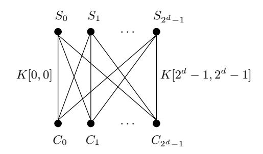

Fig. 1. d-dimensional biclique

#### 2.3 The Flow of Biclique Cryptanalysis

**Preparation.** An adversary chooses a partition of the key space into groups of keys of cardinality  $2^{2d}$  each for some d and considers the block cipher as a composition of two subciphers:  $e = f \circ g$ , where f follows g. A key in a group is indexed as an element of a  $2^d \times 2^d$  matrix: K[i,j].

**Step 1.** For each group of keys the adversary builds a structure of  $2^d$  ciphertexts  $C_i$  and  $2^d$  intermediate states  $S_j$  with respect to the group of keys  $\{K[i,j]\}$  so that the partial decryption of  $C_i$  with K[i,j] yields  $S_j$ . In other words, the structure satisfies the following condition:

$$\forall i, j: S_j \xrightarrow{K[i,j]} C_i. \tag{2}$$

**Step 2.** The adversary asks the oracle to decrypt ciphertexts  $C_i$  with the secret key  $K_{secret}$  and obtains the  $2^d$  plaintexts  $P_i$ :

$$C_i \xrightarrow{\text{decryption oracle}} P_i.$$
 (3)

**Step 3.** If one of the tested keys K[i, j] is the secret key  $K_{secret}$ , then it maps intermediate state  $S_j$  to the plaintext  $P_i$ . Therefore, the adversary checks if

$$\exists i, j : P_i \xrightarrow{K[i,j]} S_j. \tag{4}$$

A valid pair proposes K[i, j] as a key candidate.

#### 3 New Tools and Techniques for Bicliques

In here we describe two approaches to construct bicliques, and propose a precomputation technique that speeds up the application of bicliques for key recovery. The exposition is largely independent of a cipher.

#### 3.1 Bicliques from Independent Related-Key Differentials

A straightforward approach to find a d-dimensional biclique would be to fix  $2^d$  states and  $2^d$  ciphertexts, and derive a key for each pair to satisfy (2). This would require at least  $2^{2d}$  key recovery attempts for f. A much more efficient way for the adversary is to choose the keys in advance and require them to conform to specific differentials as follows.

Let the key K[0,0] map the intermediate state  $S_0$  to the ciphertext  $C_0$ , and consider two sets of  $2^d$  related-key differentials each over f with respect to the base computation  $S_0 \xrightarrow{K[0,0]} C_0$ :

-  $\Delta_i$ -differentials. A differential in the first set maps the input difference 0 to an output difference  $\Delta_i$  under a key difference  $\Delta_i^K$ :

$$0 \xrightarrow{\Delta_i^K} \Delta_i \text{ with } \Delta_0^K = 0 \text{ and } \Delta_0 = 0.$$
 (5)

-  $\nabla_j$ -differentials. A differential in the second set maps an input difference  $\nabla_j$  to the output difference 0 under key difference  $\nabla_i^K$ :

$$\nabla_j \xrightarrow{\nabla_j^K} 0 \text{ with } \nabla_0^K = 0 \text{ and } \nabla_0 = 0.$$
 (6)

The tuple  $(S_0, C_0, K[0, 0])$  conforms to both sets of differentials by definition. If the trails of  $\Delta_i$ -differentials do not share active nonlinear components (such as active S-boxes in AES) with the trails of  $\nabla_j$ -differentials, then the tuple also conforms to  $2^{2d}$  combined  $(\Delta_i, \nabla_j)$ -differentials:

$$\nabla_j \xrightarrow{\Delta_i^K \oplus \nabla_j^K} \Delta_i \text{ for } i, j \in \{0, \dots, 2^d - 1\},$$
(7)

which are obtained by formal xor of differentials (5) and (6) (and trails, if necessary). The proof follows from the fact that an active non-linear element in a trail of a combined differential is active in either  $\Delta$ - or  $\nabla$ -trail, hence its input still conforms to the corresponding trail by the assumption. A more formal and generic proof can be derived from the theory of boomerang attacks [46] and particularly from the concept of the S-box switch [9] and a sandwich attack [23]. Since  $\Delta_i$ - and  $\nabla_j$ -trails share no active non-linear elements, a boomerang based on them returns from the ciphertext with probability 1 as the quartet of states forms the boomerang rectangle at every step. In the special case where no nontrivial trail of one differential intersects with a nontrivial trail of the other differential, the differentials are completely independent and can be directly combined.

Substituting  $S_0$ ,  $C_0$ , and K[0,0] to the combined differentials (7), one obtains:

$$S_0 \oplus \nabla_j \xrightarrow{K[0,0] \oplus \Delta_i^K \oplus \nabla_j^K} C_0 \oplus \Delta_i. \tag{8}$$

Finally, we put

$$S_j = S_0 \oplus \nabla_j,$$

 $C_i = C_0 \oplus \Delta_i, \text{ and }$
 $K[i,j] = K[0,0] \oplus \Delta_i^K \oplus \nabla_j^K$

and get exactly the definition of a d-dimensional biclique (1). If  $\Delta_i \neq \nabla_j$  for i+j>0, then all keys K[i,j] are different. The construction of a biclique is thus reduced to the computation of  $\Delta_i$  and  $\nabla_j$ , which requires no more than  $2 \cdot 2^d$  computations of f.

The independency of the related-key differentials allows one to efficiently construct higher-dimensional bicliques and simplifies the partition of the key space. Though this approach turns out to be effective in the case of AES, the length of independent differentials (and hence a biclique) is limited by the diffusion properties of the cipher.

#### 3.2 Bicliques from Interleaving Related-Key Differential Trails

The differential independency requirement appears to be a very strong requirement as it clearly limits the biclique length. An alternative way to construct a biclique is to consider interleaving differential trails. However, a primitive secure against differential cryptanalysis does not admit a long biclique of high dimension over itself, as such a biclique would consume too many degrees of freedom. For small dimensions, however, the biclique equations admit a rather simple differential representation, which allows a cryptanalyst to involve valuable tools from differential cryptanalysis of hash functions.

We outline here how bicliques of dimension 1 can be constructed in terms of differentials and differential trails with a procedure resembling the rebound attack [39]. We are also able to amortize the construction cost of a biclique by producing many more out of a single one. The construction algorithm is outlined as follows for a fixed key group  $\{K[0,0], K[0,1], K[1,0], K[1,1]\}$ , see also Figure 2:

- Intermediate state T. Choose an intermediate state T in subcipher f (over which the biclique is constructed). The position of T splits f into two parts :  $f = f_2 \circ f_1$ .  $f_1$  maps  $S_i$  to T.  $f_2$  maps T to  $C_i$ .
- $\Delta$  and  $\nabla$ -trails. Choose some truncated related-key differential trails:  $\Delta$ -trails over  $f_1$  and  $\nabla$ -trails over  $f_2$ .
- **Inbound phase.** Guess the differences in the differential trails up to T. Get the values of T that satisfy the input and output differences over f.
- Outbound phase. Use the remaining degrees of freedom in the state to sustain difference propagation in trails.
- Output the states for the biclique.

We stress that the related-key trails are used in the single-key model.

Numerous optimizations of the outlined biclique construction algorithm are possible. For instance, it is not necessary to guess all differences in the trail, but only a part of them, and subsequently filter out the solutions. Instead of fixing the key group, it is also possible to fix only the difference between keys and derive actual values during the attack (the disadvantage of this approach is that key groups are generated online, and we have to take care of possible repetitions). It is also important to reduce an amortized cost of a biclique by producing new ones for other key group by some simple modification.

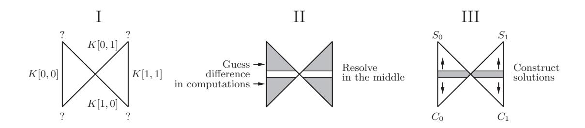

**Fig. 2.** Construction of a 1-dimensional biclique from dependent related-key differential trails: Guess difference between computations and derive states  $S_j$  and ciphertext  $C_i$  as conforming elements.

### 3.3 Matching with Precomputations

Here we describe the idea of matching with precomputations, which provides a significant computational advantage due to amortized computations. This is an efficient way to check Equation (4) in the procedure of biclique cryptanalysis.

First, the adversary computes and stores in memory 2 · 2 d full computations

for all
$$i \text{ } P_i \xrightarrow{K[i,0]} \overrightarrow{v} \text{ and for all } j \text{ } \overleftarrow{v} \xleftarrow{K[0,j]} S_j$$

up to some matching variable v, which can be a small part of the internal cipher state. Then for particular i, j he recomputes only those parts of the cipher that differ from the stored ones:

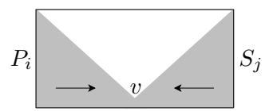

The amount of recalculation depends on the diffusion properties of both internal rounds and the key schedule of the cipher. The relatively slow diffusion in the AES key schedule allows the adversary to skip most recomputations of the key schedule operations.

# 4 Two Paradigms of Key Recovery

We have introduced different approaches to construct bicliques and to perform matching with precomputations. One may ask which approach is optimal and relevant. We have studied several block ciphers and hash functions, including different variants of AES, and it turns out that the optimal choice depends on a primitive, its diffusion properties, and features of the key schedule. This prepares the case to introduce two paradigms for key recovery, which differ both methodologically and in their use of tools.

To put our statement in context, let us consider the basic meet-in-the-middle attack (Section 2.1) and assume that it can be applied to m rounds of a primitive, while we are going to attack r > m rounds.

### 4.1 Long-Biclique

Our first paradigm aims to construct a biclique over the remaining (r − m) rounds so that the basic meet-in-the-middle attack can be applied with negligible modification. The first advantage of this approach is that theoretically we can get the same advantage as the basic attack if we manage to construct a biclique of appropriate dimension. If the dimension is inevitably small due to the diffusion, then we use the second advantage: the biclique construction methods based on differential cryptanalysis of block ciphers and hash functions.

The disadvantage of this paradigm is that the construction of bicliques over many rounds is very difficult. Therefore, we are limited in the total number of rounds that we can attack. Furthermore, the data complexity can be very large since we use all the degrees of freedom to construct a biclique and may have nothing left to impose restrictions on the plaintexts or ciphertexts.

Nevertheless, we expect this paradigm to benefit from the further development of differential cryptanalysis and the inside-out strategy and predict its applicability to many other ciphers.

Hence, to check (4) the adversary selects an internal variable  $v \in V$  that can be computed as follows for each key group  $\{K[i,j]\}$ :

$$P \xrightarrow{K[i,\cdot]} v \xleftarrow{K[\cdot,j]} S. \tag{9}$$

Therefore, the computational complexity of matching is upper bounded by  $2^d$  computations of the cipher.

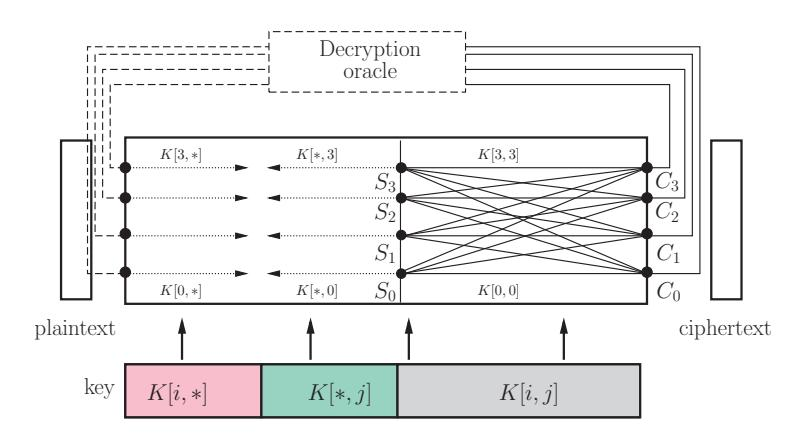

Fig. 3. Long-biclique attack with four states and four ciphertexts.

Complexity of Key Recovery. Let us evaluate the full complexity of the long-biclique approach. Since the full key recovery is merely the application of Steps 1-3  $2^{n-2d}$  times, we get the following equation:

$$C_{full} = 2^{n-2d} \left[ C_{biclique} + C_{match} + C_{falsepos} \right],$$

where

- $C_{biclique}$  is the complexity of constructing a single biclique. Since the differential-based method is time-consuming, one has to amortize the construction cost by selecting a proper set of neutral bytes that do not affect the biclique equations.
- $C_{match}$  is the complexity of the computation of the internal variable v  $2^d$  times in each direction. It is upper bounded by  $2^d$  calls of E.
- $C_{falsepos}$  is the complexity generated by false positives, which have to be matched on other variables. If we match on a single byte, the number of false positives is about  $2^{2d-8}$ . Each requires only a few operations to re-check.

Generally, the complexity is dominated by  $C_{match}$  and hence has an advantage of at least  $2^d$  over brute force. The memory complexity depends on the biclique construction procedure.

### 4.2 Independent-Biclique

Our second paradigm lets the attacker exploit the diffusion properties rather than differential properties, and does not aim to construct the longest biclique. In contrast, it proposes

to construct shorter bicliques with high dimension by tools like independent related-key differentials (Section 3.1).

This approach has clear advantages. First, the data complexity can be made quite low. Since the biclique area is small, the attacker has more freedom to impose constraints on the ciphertext and hence restrict it to a particular set. Secondly, the attack gets a compact and small description, since the independent trails are generally short and self-explaining.

For further explanation, we recall the decomposition of the cipher:

$$E: \quad P \xrightarrow[\mathcal{E}_1]{} V \xrightarrow[\mathcal{E}_2]{} S \xrightarrow[\mathcal{E}_3]{} C,$$

In (4), the adversary detects the right key by computing an intermediate variable v in both directions:

$$P_i \xrightarrow{K[i,j]} \overrightarrow{v} \stackrel{?}{=} \overleftarrow{v} \xleftarrow{K[i,j]} S_j.$$
 (10)

Since the meet-in-the-middle attack is no longer applicable to the  $\mathcal{E}_2 \circ \mathcal{E}_1$ , we apply the matching with precomputations (Section 3.3).

As with the long-biclique paradigm,  $2^{2d}$  keys are tested using only  $2^d$  intermediate cipher states. The precomputation of about  $2^{d+1}$  matches allows for a significant complexity gain and is the major source of the computational advantage of our attacks on AES (Subsection 3.3). The advantage comes from the fact that in case of high dimension the basic computation has negligible cost, and the full complexity is determined by the amount of precomputation. By a careful choice of key groups, one is able to reduce the precomputation proportion to a very small factor, e.g. factor 1/15 in attacks on reduced-round versions of AES-256.

**Complexity of Key Recovery.** The full complexity of the independent biclique approach is evaluated as follows:

$$C_{full} = 2^{n-2d} \left[ C_{biclique} + C_{precomp} + C_{recomp} + C_{falsepos} \right],$$

where

- $C_{precomp}$  is the complexity of the precomputation in Step 3. It is equivalent to less than  $2^d$  runs of the subcipher g.
- $C_{recomp}$  is the complexity of the recomputation of the internal variable v  $2^{2d}$  times. It strongly depends on the diffusion properties of the cipher. For AES this value varies from  $2^{2d-1.5}$  to  $2^{2d-4}$ .

The biclique construction is quite cheap in this paradigm. The method in Section 3.1 enables construction of a biclique in only  $2^{d+1}$  calls of subcipher f. Therefore, usually the full key recovery complexity will be dominated by  $2^{n-2d} \cdot C_{recomp}$ . However, it is dependent on the width of the matching variable and biclique dimension d too. We give more details for the case of AES in further sections. The memory complexity of the key recovery is upper-bounded by storing  $2^d$  full computations of the cipher.

# 5 Description of AES

AES is a block cipher with 128-bit internal state and 128/192/256-bit key K (AES-128, AES-192, AES-256, respectively). The internal state is represented by a  $4\times4$  byte matrix, and the key is represented by a  $4\times4/4\times6/4\times8$  matrix.

The encryption works as follows. The plaintext is xored with the key, and then undergoes a sequence of 10/12/14 rounds. Each round consists of four transformations: nonlinear bytewise SubBytes, the byte permutation ShiftRows, linear transformation MixColumns, and the addition with a subkey AddRoundKey. MixColumns is omitted in the last round.

SubBytes is a nonlinear transformation operating on 8-bit S-boxes with maximum differential probability as low as 2−6 (for most cases 0 or 2−7 ). The ShiftRows rotates bytes in row r by r positions to the left. The MixColumns is a linear transformation with branch number 5, i.e. in the column equation (y0, y1, y2, y3) = MC(x0, x1, x2, x3) only 5 and more variables can be non-zero.

We address two internal states in each round as follows in AES-128: #1 is the state before SubBytes in round 1, #2 is the state after MixColumns in round 1, #3 is the state before SubBytes in round 2, . . ., #19 is the state before SubBytes in round 10, #20 is the state after ShiftRows in round 10 (MixColumns is omitted in the last round). The states in the last round of AES-192 are addressed as #23 and #24, and of AES-256 as #27 and #28.

The subkeys come out of the key schedule procedure, which slightly differs for each version of AES. The key K is expanded to a sequence of keys K0 , K1 , K2 , . . . , K10, which form a 4×60 byte array. Then the 128-bit subkeys \$0, \$1, \$2, . . . , \$14 come out of the sliding window with a 4-column step. The keys in the expanded key are formed as follows. First, K0 = K. Then, column 0 of Kr is the column 0 of Kr−1 xored with the nonlinear function (SK) of the last column of Kr−1 . Subsequently, column i of Kr is the xor of column i − 1 of Kr−1 and of column i of Kr−1 . In AES-256 column 3 undergoes SubBytes transformation while forming column 4.

Bytes within a state and a subkey are enumerated as follows

Byte i in state Q is addressed as Qi .

# 6 Independent-Biclique: Key Recovery for the Full AES-128

In this section we describe a key recovery method on the full 10-round AES-128 using the independent-bilcique approach. The computational bottleneck will be the matching computation. See also Appendix A for an additional illustration.

# 6.1 Key Partitioning

For more clarity we define the key groups with respect to the subkey \$8 of round 8 and enumerate the groups of keys by 2112 base keys. Since the AES-128 key schedule bijectively maps each key to \$8, the enumeration is well-defined. The base keys K[0, 0] are all possible 2 112 16-byte values with two bytes fixed to 0 whereas the remaining 14 bytes run over all values:

The keys {K[i, j]} in a group are enumerated by all possible byte differences i and j with respect to the base key K[0, 0]:

> i i j j

This yields the partition of the round-8 subkey space, and hence the AES key space, into the 2112 groups of 216 keys each.

Table 3. Parameters of the key recovery for the full AES-128

| f                |                |                     |                  | Biclique          |                    |  |
|------------------|----------------|---------------------|------------------|-------------------|--------------------|--|
| Rounds           | Dimension      | $\Delta^K$ bytes    | $\nabla^K$ bytes | Time              | Memory             |  |
| 8-10             | 8              | $\$8_8,\$8_{12}$    | \$81,\$89        | $2^{7}$           | $2^{8}$            |  |
|                  | Matching       |                     |                  |                   |                    |  |
| g                |                | Precomputation      |                  | Recomputation     |                    |  |
| Rounds           | v              | Workload            | Memory           | SubBytes: forward | SubBytes: backward |  |
| 1-7              | $\#5_{12}$     | $2^{8-\varepsilon}$ | $2^{8}$          | 0.875             | 2.625              |  |
| Total complexity |                |                     |                  |                   |                    |  |
| Memory           | $C_{biclique}$ | $C_{precomp}$       | $C_{recomp}$     | $C_{falsepos}$    | $C_{full}$         |  |
| $2^{8}$          | $2^{7}$        | $2^{7}$             | $2^{14.14}$      | $2^8$             | $2^{126.18}$       |  |

# 6.2 3-Round Biclique of Dimension 8

We construct a 3-round biclique from combined related-key differentials as described in Section 3.1. The parameters of the key recovery are summarized in Table 3. The adversary fixes  $C_0 = 0$  and derives  $S_0 = f_{K[0,0]}^{-1}(C_0)$  (Figure 4, left). The  $\Delta_i$ -differentials are based on the difference  $\Delta_i^K$  in \$8, and  $\nabla_j$ -differentials are based on the difference  $\nabla_i^K$  in \$8:

$$\Delta_i^K(\$8) = \begin{array}{|c|c|c|c|c|c|c|c|c|c|c|c|c|c|c|c|c|c|c$$

Both sets of differentials are depicted in Figure 4 in the truncated form. As they share no active S-boxes, the resulting combined differentials yield a biclique of dimension 8.

Since the  $\Delta_i$ -differential affects only 12 bytes of the ciphertext, all the ciphertexts share the same values in bytes  $C_{0,1,4,13}$ . Furthermore, since  $\Delta_i^K(\$10_{10}) = \Delta_i^K(\$10_{14})$ , the ciphertext bytes  $C_{10}$  and  $C_{14}$  are also always equal. As a result, the data complexity does not exceed  $2^{88}$ .

Forward computation. Now we figure out how the computation  $P_i \xrightarrow{K[i,j]} \overrightarrow{v}$  differs from the stored one  $P_i \xrightarrow{K[i,0]} \overrightarrow{v}_i$ . Similarly, it is determined by the influence of the difference between keys K[i,j] and K[i,0], now applied to the plaintext. Thanks to the low diffusion of the AES key schedule and sparsity of the key difference in round 8, the whitening subkeys of K[i,j] and K[i,0] differ in 9 bytes only. The difference is no longer a linear function of j as it is in the computation of v, but still requires only three s-boxes in the key schedule to recompute. The areas of internal states to be recomputed (with 13 S-boxes) are depicted in Figure 6.

#### 6.3 Matching over 7 Rounds

Now we check whether the secret key  $K_{secret}$  belongs to the key group  $\{K[i,j]\}$  according to Section 3.3. We make  $2^{d+1}$  precomputations of v and store values as well as the intermediate states and subkeys in memory. Then we check (10) for every i,j by recomputing only those variables that differ from the ones stored in memory. Now we evaluate the amount of recomputation in both directions.

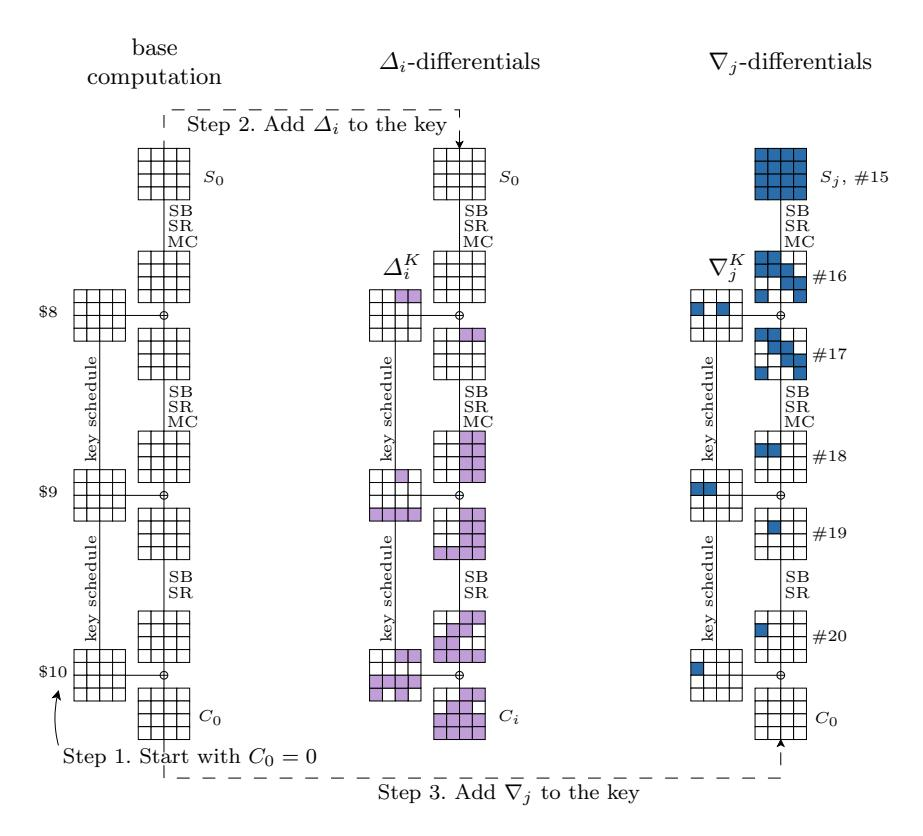

Fig. 4. AES-128 biclique from combined differentials: base computation as well as  $\Delta_i$ - and  $\nabla_j$ -differentials.

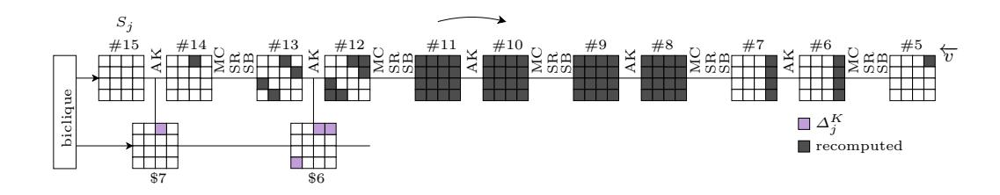

Fig. 5. Recomputation in the backward direction: AES-128

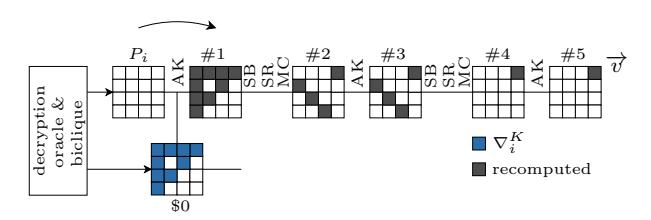

Fig. 6. Recomputation in the forward direction: AES-128

Backward direction. Let us figure out how the computation  $\overleftarrow{v} \xleftarrow{K[i,j]} S_j$  differs from the stored one  $\overleftarrow{v}_j \xleftarrow{K[0,j]} S_j$ . It is determined by the influence of the difference between keys K[i,j] and K[0,j] (see the definition of the key group in Section 6.1). The difference in the subkey \$5 is non-zero in only one byte, so we have to recompute as few as four S-boxes in round 5 (state #13). The full area to be recomputed, which includes 41 S-boxes, is depicted in Figure 5. Note that the difference in the relevant subkeys is a linear function of i, and hence can be precomputed and stored.

Forward computation. Now we look at how the computation  $P_i \xrightarrow{K[i,j]} \overrightarrow{v}$  differs from the stored one  $P_i \xrightarrow{K[i,0]} \overrightarrow{v}_i$ . Similarly, it is determined by the influence of the difference between keys K[i,j] and K[i,0], now applied to the plaintext. Thanks to the low diffusion of the AES key schedule and sparsity of the key difference in round 8, the whitening subkeys of K[i,j] and K[i,0] differ in 9 bytes only. The difference is no longer a linear function of j as it is involved into the computation of v, but still requires only three S-boxes in the key schedule to recompute. This effect and the areas of internal states to be recomputed (with 13 S-boxes) are depicted in Figure 6.

# 6.4 Complexities

Since only a portion of the round function is recomputed, one has to be highly accurate in evaluating the complexity  $C_{recomp}$ . A rough division of AES-128 into 10 rounds is not precise enough. For a more exact evaluation, we count the number of S-boxes in each SubBytes operation that we have to recompute, the number of active variables in MixColumns, the number of output variables that we need from MixColumns, and, finally, the number of S-boxes to recompute in the key schedule.

Altogether, we need an equivalent of 3.4375 SubBytes operations (i.e., 55 S-boxes), 2.3125 MixColumns operations, and a negligible amount of XORs in the key schedule. The number of SubBytes computations clearly is a larger summand. S-boxes are also the major contributor to the practical complexity of AES both in hardware and software. Therefore, if we aim for a single number that refers to the complexity, it makes sense to count the number of SubBytes operations that we need and compare it to that in the full cipher. The latter number is 10 + 2.5 = 12.5 as we have to take the key schedule nonlinearity into account. As a result,  $C_{recomp}$  is equivalent to  $2^{16} \cdot 3.4375/12.5 = 2^{14.14}$  runs of the full AES-128. The values  $C_{biclique}$  and  $C_{precomp}$  together do not exceed  $2^8$  calls of the full AES-128.

The full computational complexity amounts to about

$$2^{112} \left(2^7 + 2^7 + 2^{14.14} + 2^8\right) = 2^{126.18}.$$

The memory requirement is upper-bounded by the storage of  $2^8$  full computations of g. Since the coverage of the key space by groups around base keys is complete, the success probability is 1.

This approach for 8-round AES-128 yields a key recovery with computational complexity about  $2^{125.34}$ , data complexity  $2^{88}$ , memory complexity  $2^{8}$ , and success probability 1. Similarly, preimage finding for the compression function of the full AES-128 in Miyaguchi-Preneel mode requires about  $2^{125.83}$  computations,  $2^{8}$  memory, and has a success probability of about 0.6321.

# 7 Independent-Biclique: Full AES-192

# 7.1 Key Partitioning

We define the key groups with respect to the expanded key block  $K^6$ , which consists of the subkey \$9 and left two columns of the subkey \$10 (further denoted by \$10L) and enumerate the groups of keys by  $2^{176}$  base keys. Since the AES-192 key schedule bijectively maps each key to \$9||\$10L, the enumeration is well-defined. The base keys K[0,0] are all possible  $2^{176}$  24-byte values with two bytes fixed to 0 whereas the remaining 22 bytes run over all values:

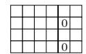

The keys  $\{K[i,j]\}$  in a group are enumerated by all possible byte differences i and j with respect to the base key K[0,0]:

$$\Delta_i^K(\$9||\$10_{\rm L}) = \frac{\sum_{i=1}^{K} |i_i|}{\sum_{i=1}^{K} |i_i|} \text{ and } \nabla_j^K(\$9||\$10_{\rm L}) = \frac{\sum_{i=1}^{K} |i_i|}{\sum_{i=1}^{K} |i_i|}$$

where  $(i_1, i_2)$  are all possible columns that have one byte zero and one byte set to i after applying MixColumns-1:

$$\begin{pmatrix} 0 \\ i_1 \\ i_2 \\ 0 \end{pmatrix} = \text{MixColumns} \begin{pmatrix} * \\ i \\ * \\ 0 \end{pmatrix}, \tag{11}$$

This yields the partition of the AES-192 key space by the  $2^{176}$  groups of  $2^{16}$  keys each.

#### 7.2 4-Round Biclique

The parameters of the key recovery are outlined in Table 4. The biclique is defined analogously to the biclique for AES-128. Thanks to the longer key, we are able to construct a biclique over 4-round f, so that  $S_0 = \#17$ . Again, the  $\Delta_i$ - and  $\nabla_j$ -differential trails share no active S-boxes (Figure 7).

Table 4. Parameters of the key recovery in the full AES-192

| f                | ]              |                     |                     | Biclique          |                    |  |
|------------------|----------------|---------------------|---------------------|-------------------|--------------------|--|
| Rounds           | Dimension      | $\Delta^K$ bytes    | $\nabla^K$ bytes    | Time              | Memory             |  |
| 9-12             | 8              | $$6_{17},$6_{18}$   | $\$6_{11},\$6_{17}$ | $2^7$             | $2^{8}$            |  |
|                  | Matching       |                     |                     |                   |                    |  |
|                  | g              |                     | putation            | Recomputation     |                    |  |
| Rounds           | v              | Workload            | Memory              | SubBytes: forward | SubBytes: backward |  |
| 1-8              | $\#7_{12}$     | $2^{8-\varepsilon}$ | $2^{8}$             | 1.1875            | 1.625              |  |
| Total complexity |                |                     |                     |                   |                    |  |
| Memory           | $C_{biclique}$ | $C_{precomp}$       | $C_{recomp}$        | $C_{falsepos}$    | $C_{full}$         |  |
| $2^{8}$          | $2^{7}$        | $2^{7}$             | $2^{13.68}$         | $2^{8}$           | $2^{189.68}$       |  |

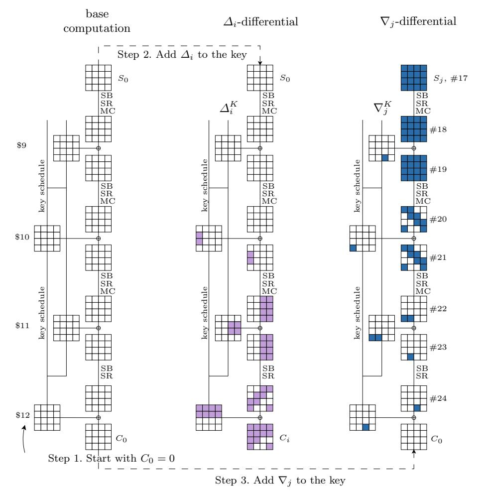

 ${\bf Fig.\,7.}$  Two key modifications for AES-192 biclique

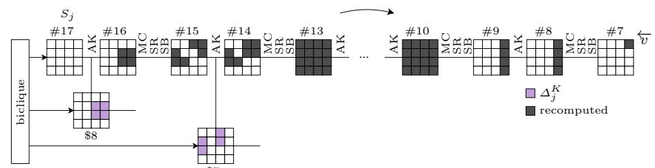

Fig. 8. Recomputation in the backward direction: AES-192

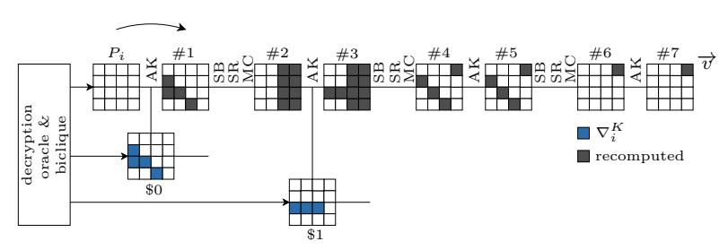

Fig. 9. Recomputation the forward direction: AES-192

Since the  $\Delta_i$ -differential affects only 12 bytes of the ciphertext, all the ciphertexts share the same values in bytes  $C_{3,6,7,10}$ . Furthermore, since  $\Delta_i^K(\$12_0) = \Delta_i^K(\$12_{12})$  and  $\Delta_i^K(\$12_9) = \Delta_i^K(\$12_{13})$ , we have the following property for the ciphertext bytes:

$$C_0 = C_{12}$$
 and  $C_9 = C_{13}$ .

As a result, the data complexity does not exceed  $2^{80}$ .

# 7.3 Matching over 8 Rounds

The partial matching procedure is very similar to that in AES-128. The areas to be recomputed in the backward direction are depicted in Figure 8, and in the forward direction in Figure 9. In the backward direction we save two S-boxes, since the  $\Delta^K(\$9||\$10_L)$  is the expansion of 3-byte difference by MixColumns (Equation (11)). As a result, only six (instead of eight) S-boxes needs recomputing in state #15 (round 8). Regarding the forward direction, the whitening subkeys \$0 differ in 4 bytes only, which makes only four S-boxes to recompute. Note that the difference in the relevant subkeys is a linear function of i and j, respectively, and hence can be precomputed and stored.

# 7.4 Complexities

Again, we aim to count the nonlinear operations as both a larger summand and the bottleneck of most implementations. Altogether, we need an equivalent of 2.8125 SubBytes operations compared to the equivalent of 14 in the full cipher (there are 8 key schedule rounds). As a result,  $C_{recomp}$  is equivalent to  $2^{16} \cdot 2.8125/14 = 2^{13.68}$  runs of the full AES-192. The full computational complexity amounts to about

$$2^{172} \cdot \left(2^9 + 2^{13.68}\right) = 2^{189.74}.$$

The memory requirement is upper-bounded by the storage of  $2^8$  full computations of g. Since the coverage of the key space by groups around base keys is complete, the success probability is 1.

This approach for 9-round AES-192 yields a key recovery with computational complexity about  $2^{188.8}$ , data complexity  $2^{80}$ , memory complexity  $2^{8}$ , and success probability 1. Similarly, preimage finding for the compression function of the full AES-192 in Davies-Meyer mode requires about  $2^{125.71}$  computations,  $2^{8}$  memory, and has success rate 0.6321.

#### 8 Independent-Biclique: Full AES-256

#### 8.1 Key Partitioning

We define the key groups with respect to the expanded key block  $K^6 = \$12||\$13$  and enumerate the groups of keys by  $2^{240}$  base keys. Since the AES-256 key schedule bijectively maps each key to \$12||\$13, the enumeration is well-defined. The base keys K[0,0] are all possible  $2^{240}$  32-byte values with two bytes fixed to 0 whereas the remaining 30 bytes run over all values:

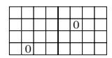

Table 5. Parameters of the key recovery in the full AES-256

| f                |                |                  |                  | Biclique          |                    |  |
|------------------|----------------|------------------|------------------|-------------------|--------------------|--|
| Rounds           | Dimension      | $\Delta^K$ bytes | $\nabla^K$ bytes | Time              | Memory             |  |
| 11-14            | 8              | \$122            | \$135            | $2^7$             | $2^8$              |  |
|                  | Matching       |                  |                  |                   |                    |  |
| g                |                | Precomputation   |                  | Recomputation     |                    |  |
| Rounds           | v              | Workload         | Memory           | SubBytes: forward | SubBytes: backward |  |
| 1-10             | $\#7_{12}$     | $2^{7}$          | $2^{8}$          | 0.625             | 4.8125             |  |
| Total complexity |                |                  |                  |                   |                    |  |
| Memory           | $C_{biclique}$ | $C_{precomp}$    | $C_{recomp}$     | $C_{falsepos}$    | $C_{full}$         |  |
| $2^{8}$          | $2^{7}$        | $2^{7}$          | $2^{14.64}$      | $2^{8}$           | $2^{254.64}$       |  |

The keys  $\{K[i,j]\}$  in a group are enumerated by all possible byte differences i and j with respect to the base key K[0,0]:

$$\varDelta_i^K(\$12||\$13) = \begin{tabular}{|l|l|l|l|l|l|l|l|l|l|l|l|l|l|l|l|l|l|l$$

This yields the partition of the AES-256 key space into the  $2^{240}$  groups of  $2^{16}$  keys each.

#### 8.2 4-Round Biclique

The parameters of the key recovery are outlined in Table 5. The biclique is defined analogously to the biclique for AES-128. Thanks to the longer key, we are able to construct a biclique over 4-round f, so that  $S_0 = \#21$ . Again, the  $\Delta_i$ - and  $\nabla_j$ -differential trails share no active S-boxes (Figure 10).

The  $\Delta_i$ -differential affects only 7 bytes of the ciphertext, and the key difference is equal in all non-zero bytes of \$14. Therefore, the data complexity does not exceed  $2^{40}$ .

#### 8.3 Matching over 10 Rounds

The partial matching procedure is again similar to that in AES-128. The areas to be recomputed in the backward direction are depicted in Figure 11, and in the forward direction in Figure 12. The whitening subkeys differ in 1 byte only. Note that the difference in the relevant subkeys is a linear function of i and j, respectively, and hence can be precomputed and stored.

#### 8.4 Complexities

Again, we aim to count the non-linear operations as both a larger summand and the bottleneck of most implementations. Altogether, we need an equivalent of 5.4375 SubBytes operations compared to the equivalent of 17.25 in the full cipher (there are 6.5 key schedule rounds). As a result,  $C_{recomp}$  is equivalent to  $2^{16} \cdot 5.625/17.25 = 2^{14.383}$  runs of the full AES-256. The full computational complexity amounts to about

$$2^{240} \cdot \left(2^9 + 2^{14.383}\right) = 2^{254.42}.$$

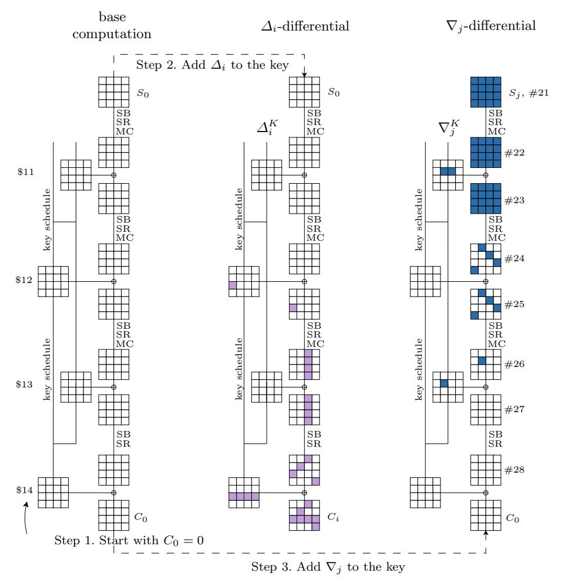

 ${\bf Fig.~10.}$  Two key modifications for AES-256 biclique

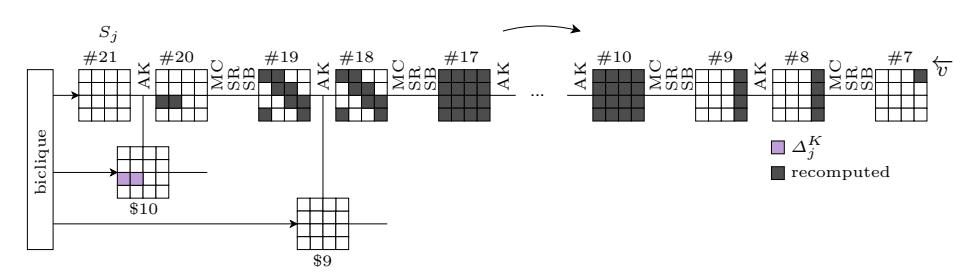

 ${\bf Fig.\,11.}$  Recomputation in the backward direction: AES-256

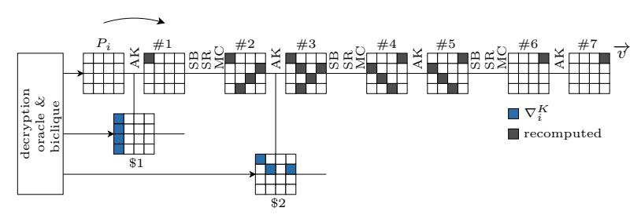

Fig. 12. Recomputation the forward direction: AES-256

The memory requirement is upper bounded by the storage of  $2^8$  full computations of g. Since the coverage of the key space by groups around base keys is full, the success probability is 1.

This approach for 9-round AES-256 yields a key recovery with computational complexity about  $2^{251.92}$ , data complexity  $2^{120}$ , memory complexity  $2^8$ , and success probability 1. Similarly, preimage finding for the compression function of the full AES-256 in Davies-Meyer mode requires about  $2^{126.35}$  computations,  $2^8$  memory, and works with success probability 0.6321.

# 9 Long-Biclique: Key Recovery for 8-Round AES-128

We view the sequence  $SB \circ AK \circ MC \circ SR \circ SB$  as a layer of four parallel 32-bit *super boxes* [18], each parameterized with the corresponding column of the subkey. We decided to include SR into the Super Box for clarity.

# 9.1 Technique

Following the long-biclique paradigm, we construct a biclique for the maximal obtainable number of rounds: 5. We have to set dimension to 1 and use heavily dependent differential trails (Section 3.2).

**Step 1.** A biclique of dimension 1 involves two states, two ciphertexts, and a group of four keys, which is defined as follows:

The keys in the group are defined via the differences in subkeys \$4 and \$6:, i.e. like in a related-subkey boomerang attack:

$$\begin{split} K[0,1]: & \$4(K[0,1]) \oplus \$4(K[0,0]) = \Delta K; \\ K[1,0]: & \$6(K[1,0]) \oplus \$6(K[0,0]) = \nabla K; \\ K[1,1]: & \$4(K[1,1]) \oplus \$4(K[0,1]) = \Delta K. \end{split}$$

The differences  $\Delta K$  and  $\nabla K$  are defined columnwise:

$$\Delta K = (A, \overline{0}, \overline{0}, \overline{0}); \quad \nabla K = (B, \overline{0}, B, \overline{0}),$$

where

$$A = \begin{pmatrix} 0 \\ 1 \\ 0x8d \\ 0x8c \end{pmatrix} = \text{MixColumns} \begin{pmatrix} 0 \\ 0 \\ 0x8d \\ 0x8d \end{pmatrix}; \qquad B = \begin{pmatrix} 1 \\ 0 \\ 0 \\ 0 \end{pmatrix}.$$

Let us note that  $\nabla K$  in round 8 ( $\nabla$ \$8) is equal to  $(B, \overline{0}, \overline{0}, \overline{0})$ .

Instead of fixing the full keys in the group, we fix only three key bytes in the last column of \$5 so that we know the key difference in the  $\Delta$ -trail in round 6.

We split the 8-round AES-128 as follows:

- $-\mathcal{E}_1$  is round 1.
- $-\mathcal{E}_2$  is rounds 2-3.
- $-\mathcal{E}_3$  is rounds 4-8.

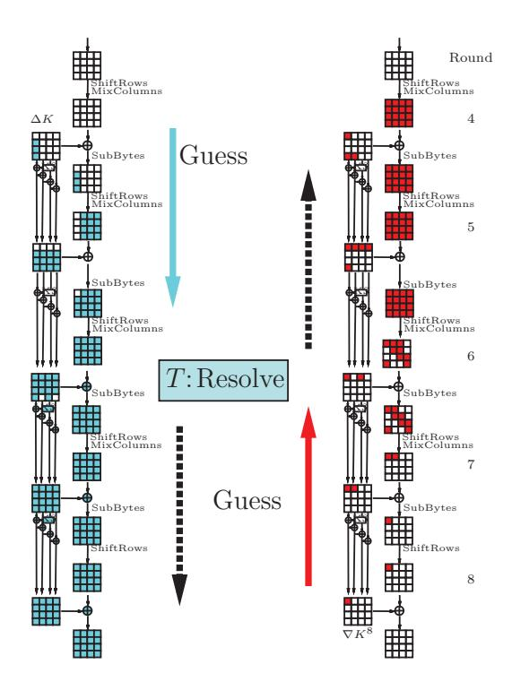

Fig. 13. Biclique construction in AES-128.

Step 2. An illustration of the biclique construction in steps 2(a) - 2(e) is given in Fig. 13.

Step 2 (a). The intermediate state in E3 is the Super-Box layer in rounds 6-7. We construct truncated differential trails in rounds 5 based on the injection of ∆K after round 4 (Fig. 13, left), and in rounds 7-8 based on the injection of ∇(\$8) after round 8 (Fig. 13, right). Given the keys in the group, we know the key differences in trails.

Step 2 (b). We guess the actual differences in the truncated trails. We have three active S-boxes in round 5 and one active S-boxes in round 8. In total we make 27·4·2 = 256 guesses.

Step 2 (c). First, for Super-boxes in columns 0 and 1 we construct all possible solutions that conform to the input and output differences. We note that the \$6 bytes not adjacent to active S-boxes in the ∇-trail in round 7 do not affect the ∇-trail, and thus can be left undefined. Therefore, we construct 264−32 = 232 solutions. Similarly, we construct all possible solutions for Super-boxes in columns 2 and 3. We get only 224 solutions since we have restricted three bytes of \$5.

Step 2 (d). Outbound phase: we combine the solutions for pairs of Super-boxes and filter out those that are incompatible with the S-box behavior guessed in rounds 6 and 8. In round 8 we have a full 14-bit filter, and in round 6 we have only a portion of filter via the differences in the extended ∇-trails. For the latter, the filter is 6 bit per active S-box, with the remaining 8 bit filter to be fulfilled by adjusting the key. Therefore, we have 232+24−14−6·3 = 224 solutions. In those solutions we have fixed 64 bits of \$6 and 24 bits of \$5, which gives 80 bits in total due to dependencies. Finally, we additionally fix 24 key bits to sustain the difference propagation in round 6. Taking the guess of differences into account, we have constructed  $2^{80}$  bicliques with 104 key bits fixed. The remaining 126 - 104 = 22 key bits that define the key group can be chosen arbitrarily, so we amortize the construction of a biclique. As a result, we construct  $2^{102}$  bicliques for each value of the three bytes of \$5 we have fixed in advance.

Step 2 (e). We do not restrict the ciphertexts.

**Step 3-5.** We ask for the decryption of two ciphertexts and get two plaintexts. The matching position (v) is the state  $S_{2,3}^2$ . We compute v in both directions and check for the match (Figure 14).

**Step 6.** We construct  $2^{22}$  bicliques out of one by choosing 22 bits of the key (defined in Step 2 (d)) so that difference propagation in the guessed parts remains untouched. The simplest change that does not affect the trails is the flip in two bytes of  $K^6$  not adjacent to the active S-boxes and simultaneously in four bytes of  $K^5$  so that three active S-boxes in round 5 are stable.

# 9.2 Complexity

Solutions for the Super-boxes are constructed online by substituting  $2^{32}$  input pairs to the super-box transformation and filtering out incorrect quartets. This gives a time complexity  $2^{32}$  and the memory complexity  $2^{16}$ . Therefore, Step 2 (c) has complexity  $2^{32}$ . It also dominates the complexity of other steps, so we construct  $2^{80}$  bicliques with 104 fixed key bits in  $2^{56+32}=2^{88}$ , and  $2^{102}$  bicliques in  $2^{88}$  plus the time required to construct a new biclique (Step 6). Again, in the complexity evaluation we count the number of recomputed S-boxes. Step 6 requires 3/8 SubBytes operations in round 5, 1 in round 4, 1/8 in round 7, 1/2 in round 8 per biclique ciphertext, hence 4 SubBytes operations per biclique. In the matching phase we compute 9 S-boxes in rounds 1-3, i.e. 1.125 SubBytes operations per biclique. Additionally, Step 6 requires four S-boxes in the key schedule to recalculate, of which only two are relevant for the matching. Recall that AES-128 has 40 S-boxes in the key schedule, or equivalent of 2.5 SubBytes operations.

The chance of getting a false positive is  $4 \cdot 2^{-8} = 2^{-6}$  per biclique. Most of false positives require only round 2 to recompute, which gives  $2^{-9}$  AES calls overhead on average, which is negligible compared to the matching phase. Therefore, the total complexity of the attack with  $2^{126}$  bicliques is about

$$2^{126} \left( 4/10.5 + 2^{-9} + 1.125/10.5 \right) = 2^{124.97}.$$

with  $2^{32}$  memory and  $2^{127}$  data.

#### 9.3 Success Rate

Our attack always outputs the right key as soon as it belongs to one of the quartets produced in the attack. As the key bits are adaptively chosen in the attack, the algorithm does not guarantee that the quartets are pairwise different. On the other hand, each quartet has

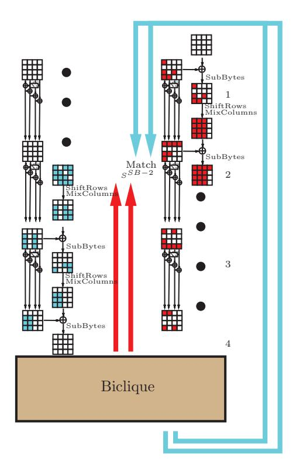

Fig. 14. Matching in the 8-round attack on AES-128.

equal chance to be produced. Therefore, we estimate that the algorithm generates a natural proportion of (1−1/e) = 63% quartets. If we keep track of quartets in the loop after the guess of three bytes of K5 , then the memory complexity grows to 2102. For a success probability of 63% the second variant of the attack produces 2125.33 bicliques in 2124.3 time, and needs 2 126.33 chosen ciphertexts. The workload/success rate ratio is thus 2124.97 .

### 10 Long-Biclique: 9-Round AES-256

Our attack is differential-based biclique attack (Section 3.2).

Step 1. A biclique of dimension 1 involves two states, two ciphertexts, and a group of four keys. The keys in the group are defined via the difference in subkeys:

| K[0, 1] : | \$5(K[0, 1]) ⊕ \$5(K[0, 0]) = ∆K; |
|-----------|-----------------------------------|
| K[1, 0] : | \$6(K[1, 0]) ⊕ \$6(K[0, 0]) = ∇K; |
| K[1, 1] : | \$6(K[1, 1]) ⊕ \$6(K[0, 1]) = ∇K. |

The differences ∆K and ∇K are defined columnwise:

$$\Delta K = (A, \overline{0}, \overline{0}, \overline{0}); \quad \nabla K = (B, B, \overline{0}, \overline{0}),$$

where

$$A = \text{MixColumns} \begin{pmatrix} 0 \\ 0 \\ 2 \\ 0 \end{pmatrix}; \qquad B = \begin{pmatrix} 0 \\ 2 \\ 0 \text{xb9} \\ 2 \end{pmatrix} = \text{MixColumns} \begin{pmatrix} 0 \text{xd0} \\ 0 \text{x69} \\ 0 \\ 0 \end{pmatrix}.$$

Let us note that the key relation in the next expanded key is still linear:

$$\$4(K[1,0]) \oplus \$4(K[0,0]) = \$4(K[1,1]) \oplus \$4(K[0,1]) = (B,\overline{0},\overline{0},\overline{0}).$$

Evidently, the groups do not intersect and cover the full key space. We split the 9-round AES-256 as follows:

- $-\mathcal{E}_1$  is round 1.
- $-\mathcal{E}_2$  is rounds 2-4.
- $-\mathcal{E}_3$  is rounds 5-9.

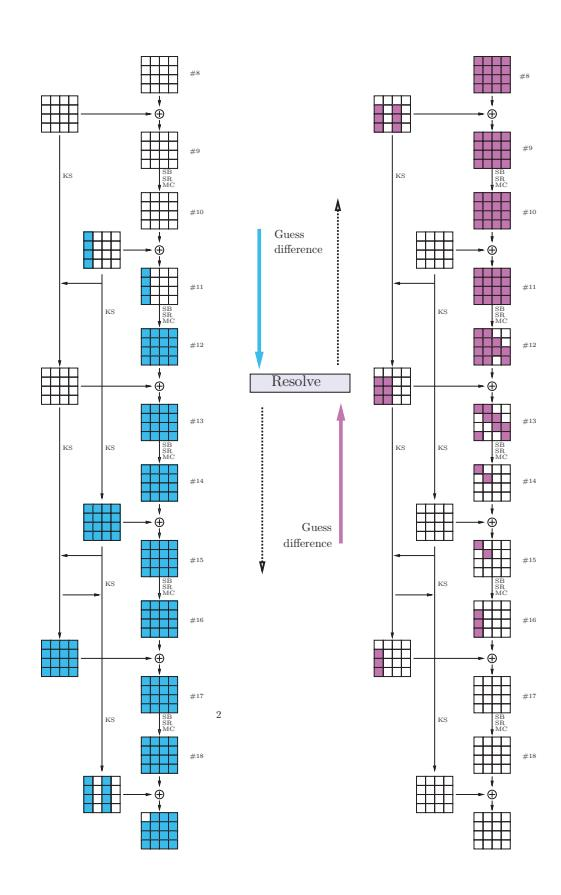

Fig. 15. Biclique construction in AES-256.  $\Delta$ -trail (left) and  $\nabla$ -trail (right).

**Step 2.** An illustration of steps 2(a) - 2(e) is given in Fig. 15.

Step 2 (a). The intermediate state T in  $\mathcal{E}_3$  is the S-box layer in round 7. We construct truncated differential trails in rounds 5-6 based on the injection of  $\Delta K$  after round 5 (Figure 15, left), and in rounds 7-9 based on the injection of  $\nabla K$  before round 9 (Figure 15, right).

- Step 2 (b). We guess the differences in the truncated trails up to T. We have four active S-boxes in round 6 and two active S-boxes in round 8. We also require ∆-trails to be equal. In total we make 27·(4+2·2) = 256 guesses.
- Step 2 (c). For each S-box in round 7 that is active in both trails (eight in total) we take a quartet of values that conform to the input and output differences, being essentially the boomerang quartet for the S-box (one solution per S-box on average). For the remaining 8 S-boxes we take all possible values. Therefore, we have 264 solutions for each guess in the inbound phase, or 2120 solutions in total.
- Step 2 (d). Outbound phase: we filter out the solutions that do not conform to the differential trails in rounds 6 and 8. We have four active S-boxes in each ∆-trail, and two active S-boxes in each ∇-trail, hence 12 in total. Therefore, we get a 84-bit filter, and leave with 2 36 bicliques.
- Step 2 (e). Now we keep only the bicliques with byte C0,0 equal to zero in both ciphertexts. This is a 16-bit filter, which reduces the number of bicliques to 220. We need only one.
- Step 3-5. We ask for the decryption of two ciphertexts and get two plaintexts. The matching position (v) is the byte #30,0. As demonstrated in Fig. 16, it is equal as a function of the plaintext for keys with difference ∆K (not affected by lightblue cells), and is also equal as a function of S for keys with difference ∇K (not affected by red cells). We compute v in both directions and check for the match.
- Step 6. We can produce sufficiently many bicliques out of one to amortize the construction cost. Let us look at the subkey \$6 in the outbound phase. We can change its value to any of the 296 specific values so that the active S-boxes in round 6 during the outbound phase are not affected. On the other hand, any change in bytes in rows 1,2,3 affects only those rows in the subkeys \$8 and \$9 and hence does not affect C0,0. Therefore, we have 128− 32− 32 = 64 neutral bits in \$6.

Similarly, we identify 9 bytes in \$7 that can be changed so that \$6, the active S-boxes in round 8, and the byte C0,0 are unaffected. Those are bytes in the first three columns not on the main diagonal. Therefore, we have 72 neutral bits in \$7, and 136 neutral bits in total.

Complexity. A single biclique with C0,0 = 0 is constructed with complexity 2120−20 = 2100 and 28 memory needed for Step 2 (c). However, 136 neutral bits in the key reduce the amortized construction cost significantly. Let us compute the cost of constructing a new biclique according to Step 6. A change in a single byte in K7 needs 5 S-boxes, 1 MC and several XORs recomputing for each ciphertext, which gives us the complexity of 10/16 AES rounds. This change also affects two bytes of K5 , so we have to recompute one half of round 5, with the resulting complexity of 1 AES round per biclique. The total amortized complexity is 1.625 AES rounds.

In the matching part we compute a single byte in two directions, thus spending 9/16 of a round in rounds 1-3, and full round 4, i.e. 3.125 full rounds per biclique. In total we need 4.75 AES rounds per biclique, i.e. 2−0.92 9-round AES-256 calls. The complexity generated by false positives is at most  $2^{-6}$  rounds per biclique. We need  $2^{254}$  bicliques, so the total complexity is  $2^{253.1}$ .

The data complexity is  $2^{120}$  since one ciphertext byte is always fixed. The success rate of the attack is 1, since we can generate many bicliques for each key group.

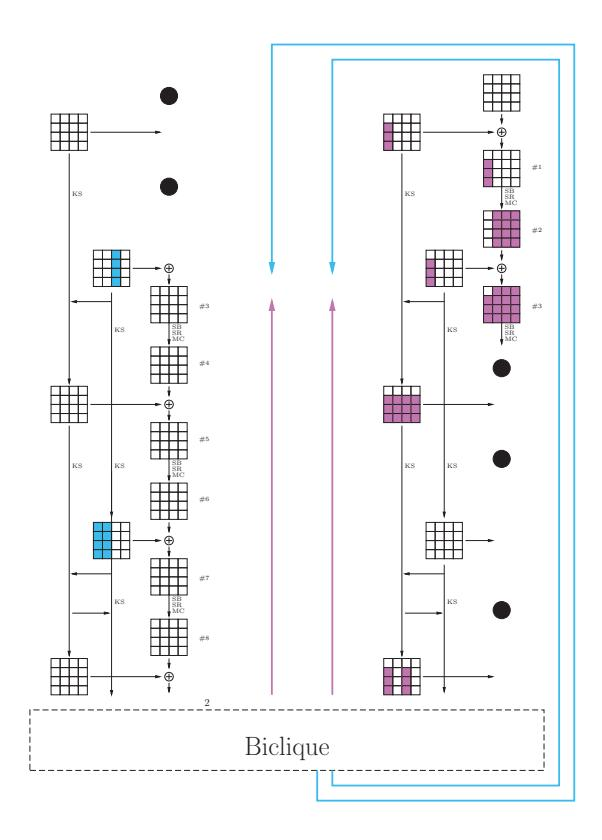

Fig. 16. Matching in AES-256. Byte  $\#3_0$  can be computed in each direction.

### 11 On Practical Verification

Especially for the type of cryptanalysis described in this paper where carrying out an attack in full is computationally infeasible, practical verification of attack details and steps is important in order to get confidence in it. To address this, we explicitly state the following:

- We verified all truncated differentials through AES-128/192/256 for all the attacks, including the independent bicliques.
- We constructed a real 6-round biclique for the 9-round AES-256 (Table 7). To make the algorithm in Section 10 practical, we fixed more key bytes than required. As a result, the construction cost for a single biclique dropped, but the amortized cost has increased.
- We verified that some difference guesses must be equal (like in the AES-256 attack) due to the branch number of MixColumns that results in a correlation of differences in the outbound phase.

### 12 Discussion and Conclusions

We propose the concept of bicliques for block cipher cryptanalysis and give various applications to AES, including a key recovery method for the full versions of AES-128, AES-192, and AES-256. Both the "long-biclique" and the "independent-biclique" approach we introduced feature conceptual novelties that we expect will find applications in other areas. For the "long-biclique" approach, it is the use of techniques from differential collision attacks on hash functions that forces two trails to be independent and hence allows to add more rounds at low amortized cost. For the "independent-biclique" approach, it is the matching with precomputation trick that allows to significantly reduce the cost of matching computations over more rounds in a MITM attack.

Using the latter approach on AES, we allow a small portion of the cipher to ie recomputed in every key test. The use of bicliques in combination with the technique of matching with precomputation, results in a surprisingly low recomputation in the innermost loop, varying from about 1/3 to approximately 1/5 of the cipher depending on the key size, while having data complexities of 288, 280 and 240 plaintext-ciphertext pairs, respectively. Arguably no known generic approach to key recovery allows for that gain. We notice that the data complexity of key recovery can be significantly reduced by sacrificing only a small factor of computational advantage.

To conclude, we discuss the properties of AES that allowed us to cover more rounds than in previous cryptanalysis, discuss the attained computational advantage, and list a number of problems to consider for future work.

# 12.1 What Properties of the AES Allowed to Obtain These New Results

Our approach heavily relies on the existence of high-probability related-key differentials over a part of the cipher. More specifically:

- The round transformation of AES is not designed to have strong resistance against several classes of attacks for a smaller number of rounds. The fact that our approach allows to split up the cipher into three parts exposes these properties even when considering the full cipher. Also, as already observed in [21,42], the fact that the MixColumns transformation is omitted in the last round of AES helps to design attacks for more rounds.
- In the key schedule, we especially take advantage of the relatively slow backward diffusion. Whereas using key-schedule properties in related-key attacks is natural, there seem only a few examples in the literature where this is used in the arguably more relevant single-key setting. This includes the attack on the self-synchronized stream cipher Moustique [30], the lightweight block cipher KTANTAN [12], and recent improvements upon attacks on 8-rounds of AES-192 and AES-256 [22].

# 12.2 On the Computational Advantage of the Biclique Techniques

Most computational complexities in this paper are relatively close to those of generic attacks. In here we discuss why we think the complexity advantage is meaningful.

– Biclique cryptanalysis with the independent-biclique approach allows us to be very precise about the required computations. In all cases we arrive at computational complexities considerably lower than those of generic attacks.

- For long-biclique cryptanalysis, whenever it is difficult to be precise about certain parts of our estimates, we choose to be conservative, potentially resulting in an underestimate of the claimed improvement. Again, in all cases we arrive at a computational complexity that is considerably lower than that of generic attacks.
- Improved AES implementations (that may e.g. be used to speed-up brute force key search) will very likely also improve the biclique techniques we propose.
- To the best of our knowledge, there are no generic methods known that would speed-up key recovery given a part of the codebook.

# 12.3 Open Problems

There are a number of other settings this approach may be applied to. It will be interesting to study other block ciphers like the AES finalists or more recent proposals with respect to this class of attacks. A combination of the "long-biclique" and "independent-biclique" approaches may be a source for further improvements. Also, we may decide to drop the requirement of the biclique to be complete, i.e. instead of a complete bipartite graph consider a more general graph. There may be cases where different tradeoffs between success probability, complexity requirements, and even number of rounds are obtainable. Alternatively, this paper may inspire work on more generic attacks on block ciphers that try to take advantage of the fact that a small part of the codebook, or some memory, is available.

# Acknowledgements

We thank Joan Daemen and Vincent Rijmen for their helpful feedback on the earlier versions of the paper. We also thank Pierre-Alain Fouque, Alexander Gotmanov, Gregor Leander, Søren Thomsen, and reviewers of ASIACRYPT 2011 for their comments. Part of this work was done while Andrey Bogdanov was visiting MSR Redmond and while Christian Rechberger was with K.U.Leuven and visiting MSR Redmond. This work was supported in part by the European Commission under contract ICT-2007-216646 (ECRYPT II).

# References

- 1. Kazumaro Aoki and Yu Sasaki. Preimage attacks on one-block MD4, 63-step MD5 and more. In *Selected Areas in Cryptography'08*, volume 5381 of *Lecture Notes in Computer Science*, pages 103–119. Springer, 2008.
- 2. Kazumaro Aoki and Yu Sasaki. Meet-in-the-middle preimage attacks against reduced SHA-0 and SHA-1. In *CRYPTO'09*, volume 5677 of *Lecture Notes in Computer Science*, pages 70–89. Springer, 2009.
- 3. Behran Bahrak and Mohammad Reza Aref. A novel impossible differential cryptanalysis of AES. In *Proceedings of the Western European Workshop on Research in Cryptology 2007 (WEWoRC'07)*, pages 152–156, 2007.
- 4. Behran Bahrak and Mohammad Reza Aref. Impossible differential attack on seven-round aes-128. *IET Inf. Secur.*, 2(2):28–32, June 2008.
- 5. Eli Biham, Alex Biryukov, and Adi Shamir. Miss in the middle attacks on IDEA and Khufu. In *FSE'99*, volume 1636 of *Lecture Notes in Computer Science*, pages 124–138. Springer, 1999.
- 6. Eli Biham, Rafi Chen, Antoine Joux, Patrick Carribault, Christophe Lemuet, and William Jalby. Collisions of SHA-0 and reduced SHA-1. In *EUROCRYPT'05*, volume 3494 of *Lecture Notes in Computer Science*, pages 36–57. Springer, 2005.
- 7. Eli Biham and Adi Shamir. Differential Cryptanalysis of DES-like Cryptosystems. *J. Cryptology*, 4(1):3– 72, 1991.
- 8. Alex Biryukov, Orr Dunkelman, Nathan Keller, Dmitry Khovratovich, and Adi Shamir. Key recovery attacks of practical complexity on AES-256 variants with up to 10 rounds. In *EUROCRYPT'10*, volume 6110 of *Lecture Notes in Computer Science*, pages 299–319. Springer, 2010.

- 9. Alex Biryukov and Dmitry Khovratovich. Related-Key Cryptanalysis of the Full AES-192 and AES-256. In *ASIACRYPT'09*, volume 5912 of *Lecture Notes in Computer Science*, pages 1–18. Springer, 2009.
- 10. Alex Biryukov, Dmitry Khovratovich, and Ivica Nikoli´c. Distinguisher and related-key attack on the full AES-256. In *CRYPTO'09*, volume 5677 of *Lecture Notes in Computer Science*, pages 231–249. Springer, 2009.
- 11. Alex Biryukov and Ivica Nikoli´c. Automatic Search for Related-Key Differential Characteristics in Byte-Oriented Block Ciphers: Application to AES, Camellia, Khazad and Others. In *EUROCRYPT'10*, volume 6110 of *Lecture Notes in Computer Science*, pages 322–344. Springer, 2010.
- 12. Andrey Bogdanov and Christian Rechberger. A 3-Subset Meet-in-the-Middle Attack: Cryptanalysis of the Lightweight Block Cipher KTANTAN. In *SAC'10*, volume 6544 of *Lecture Notes in Computer Science*, pages 229–240. Springer, 2010.
- 13. Charles Bouillaguet, Patrick Derbez, and Pierre-Alain Fouque. Automatic Search of Attacks on Round-Reduced AES and Applications. In *CRYPTO'11*, volume 2442 of *Lecture Notes in Computer Science*, pages 169–187. Springer, 2011.
- 14. Florent Chabaud and Antoine Joux. Differential collisions in SHA-0. In *CRYPTO'98*, volume 1462 of *Lecture Notes in Computer Science*, pages 56–71. Springer, 1998.
- 15. David Chaum and Jan-Hendrik Evertse. Crytanalysis of DES with a Reduced Number of Rounds: Sequences of Linear Factors in Block Ciphers. In *CRYPTO'85*, volume 218 of *Lecture Notes in Computer Science*, pages 192–211, 1986.
- 16. Joan Daemen, Lars R. Knudsen, and Vincent Rijmen. The Block Cipher Square. In Eli Biham, editor, *FSE'97*, volume 1267 of *Lecture Notes in Computer Science*, pages 149–165. Springer, 1997.
- 17. Joan Daemen and Vincent Rijmen. *The Design of Rijndael: AES The Advanced Encryption Standard*. Springer, 2002.
- 18. Joan Daemen and Vincent Rijmen. Understanding two-round differentials in AES. In Roberto De Prisco and Moti Yung, editors, *SCN'06*, volume 4116 of *Lecture Notes in Computer Science*, pages 78–94. Springer, 2006.
- 19. H¨useyin Demirci and Ali Aydin Sel¸cuk. A meet-in-the-middle attack on 8-round AES. In *FSE'08*, volume 5086 of *Lecture Notes in Computer Science*, pages 116–126. Springer, 2008.
- 20. H¨useyin Demirci, Ihsan Taskin, Mustafa C¸ oban, and Adnan Baysal. Improved Meet-in-the-Middle Attacks on AES. In *INDOCRYPT'09*, volume 5922 of *Lecture Notes in Computer Science*, pages 144–156. Springer, 2009.
- 21. Orr Dunkelman and Nathan Keller. The effects of the omission of last round's MixColumns on AES. *Inf. Process. Lett.*, 110(8-9):304–308, 2010.
- 22. Orr Dunkelman, Nathan Keller, and Adi Shamir. Improved Single-Key Attacks on 8-Round AES-192 and AES-256. In *ASIACRYPT'10*, volume 6477 of *Lecture Notes in Computer Science*, pages 158–176. Springer, 2010.
- 23. Orr Dunkelman, Nathan Keller, and Adi Shamir. A practical-time related-key attack on the KASUMI cryptosystem used in GSM and 3G telephony. In *CRYPTO'10*, volume 6223 of *Lecture Notes in Computer Science*, pages 393–410. Springer, 2010.
- 24. Orr Dunkelman, Gautham Sekar, and Bart Preneel. Improved meet-in-the-middle attacks on reducedround DES. In *INDOCRYPT'07*, volume 4859 of *Lecture Notes in Computer Science*, pages 86–100. Springer, 2007.
- 25. Niels Ferguson, John Kelsey, Stefan Lucks, Bruce Schneier, Michael Stay, David Wagner, and Doug Whiting. Improved cryptanalysis of Rijndael. In *FSE'00*, volume 1978 of *Lecture Notes in Computer Science*, pages 213–230. Springer, 2000.
- 26. Henri Gilbert and Marine Minier. A Collision Attack on 7 Rounds of Rijndael. In *AES Candidate Conference*, pages 230–241, 2000.
- 27. Henri Gilbert and Thomas Peyrin. Super-Sbox cryptanalysis: Improved attacks for AES-like permutations. In *FSE'10*, volume 6147 of *Lecture Notes in Computer Science*, pages 365–383. Springer, 2010.
- 28. Jian Guo, San Ling, Christian Rechberger, and Huaxiong Wang. Advanced Meet-in-the-Middle Preimage Attacks: First Results on Full Tiger, and Improved Results on MD4 and SHA-2. In *ASIACRYPT'10*, volume 6477 of *Lecture Notes in Computer Science*, pages 56–75. Springer, 2010.
- 29. Takanori Isobe. A single-key attack on the full gost block cipher. In *FSE'11*, volume 6733 of *Lecture Notes in Computer Science*, pages 290–305. Springer, 2011.
- 30. Emilia K¨asper, Vincent Rijmen, Tor E. Bjørstad, Christian Rechberger, Matthew J. B. Robshaw, and Gautham Sekar. Correlated Keystreams in Moustique. In *AFRICACRYPT'08*, volume 5023 of *Lecture Notes in Computer Science*, pages 246–257. Springer, 2008.
- 31. Dmitry Khovratovich, Christian Rechberger, and Alexandra Savelieva. Bicliques for preimages: attacks on Skein-512 and the SHA-2 family. Available at http://eprint.iacr.org/2011/286.pdf, 2011.

- 32. Lars R. Knudsen and Vincent Rijmen. Known-key distinguishers for some block ciphers. In *ASI-ACRYPT'07*, volume 4833 of *Lecture Notes in Computer Science*, pages 315–324. Springer, 2007.
- 33. Mario Lamberger, Florian Mendel, Christian Rechberger, Vincent Rijmen, and Martin Schl¨affer. Rebound Distinguishers: Results on the Full Whirlpool Compression Function. In *ASIACRYPT'09*, volume 5912 of *Lecture Notes in Computer Science*, pages 126–143. Springer, 2009.
- 34. Jiqiang Lu, Orr Dunkelman, Nathan Keller, and Jongsung Kim. New impossible differential attacks on AES. In *INDOCRYPT'08*, volume 5365 of *Lecture Notes in Computer Science*, pages 279–293. Springer, 2008.
- 35. Stefan Lucks. Attacking seven rounds of Rijndael under 192-bit and 256-bit keys. In *AES Candidate Conference*, pages 215–229, 2000.
- 36. Hamid Mala, Mohammad Dakhilalian, Vincent Rijmen, and Mahmoud Modarres-Hashemi. Improved Impossible Differential Cryptanalysis of 7-Round AES-128. In *INDOCRYPT'10*, volume 6498 of *Lecture Notes in Computer Science*, pages 282–291. Springer, 2010.
- 37. Mitsuru Matsui. Linear cryptanalysis method for DES cipher. In *EUROCRYPT'93*, volume 765 of *Lecture Notes in Computer Science*, pages 386–397. Springer, 1993.
- 38. Florian Mendel, Thomas Peyrin, Christian Rechberger, and Martin Schl¨affer. Improved Cryptanalysis of the Reduced Grøstl Compression Function, ECHO Permutation and AES Block Cipher. In *Selected Areas in Cryptography'09*, volume 5867 of *Lecture Notes in Computer Science*, pages 16–35. Springer, 2009.
- 39. Florian Mendel, Christian Rechberger, Martin Schl¨affer, and Søren S. Thomsen. The rebound attack: Cryptanalysis of reduced Whirlpool and Grøstl. In *FSE'09*, volume 5665 of *Lecture Notes in Computer Science*, pages 260–276. Springer, 2009.
- 40. Raphael Chung-Wei Phan. Impossible differential cryptanalysis of 7-round advanced encryption standard (AES). *Inf. Process. Lett.*, 91(1):33–38, 2004.
- 41. Christian Rechberger. Preimage Search for a Class of Block Cipher based Hash Functions with Less Computation. Unpublished manuscript, 2008.
- 42. Yu Sasaki. Meet-in-the-Middle Preimage Attacks on AES Hashing Modes and an Application to Whirlpool. In *FSE'11 Preproceedings*, 2011.
- 43. Yu Sasaki and Kazumaro Aoki. Finding Preimages in Full MD5 Faster Than Exhaustive Search. In *EUROCRYPT'09*, volume 5479 of *Lecture Notes in Computer Science*, pages 134–152. Springer, 2009.
- 44. Marc Stevens, Arjen K. Lenstra, and Benne de Weger. Chosen-prefix collisions for MD5 and colliding X.509 certificates for different identities. In *EUROCRYPT'07*, volume 4515 of *Lecture Notes in Computer Science*, pages 1–22. Springer, 2007.
- 45. Marc Stevens, Alexander Sotirov, Jacob Appelbaum, Arjen K. Lenstra, David Molnar, Dag Arne Osvik, and Benne de Weger. Short chosen-prefix collisions for MD5 and the creation of a rogue ca certificate. In *CRYPTO'09*, volume 5677 of *Lecture Notes in Computer Science*, pages 55–69. Springer, 2009.
- 46. David Wagner. The boomerang attack. In *FSE'99*, volume 1636 of *Lecture Notes in Computer Science*, pages 156–170. Springer, 1999.
- 47. Xiaoyun Wang, Yiqun Lisa Yin, and Hongbo Yu. Finding collisions in the full SHA-1. In *CRYPTO'05*, volume 3621 of *Lecture Notes in Computer Science*, pages 17–36. Springer, 2005.
- 48. Xiaoyun Wang and Hongbo Yu. How to break MD5 and other hash functions. In *EUROCRYPT'05*, volume 3494 of *Lecture Notes in Computer Science*, pages 19–35. Springer, 2005.
- 49. Lei Wei, Christian Rechberger, Jian Guo, Hongjun Wu, Huaxiong Wang, and San Ling. Improved meet-in-the-middle cryptanalysis of KTANTAN. Cryptology ePrint Archive, Report 2011/201, 2011. http://eprint.iacr.org/.
- 50. Wentao Zhang, Wenling Wu, and Dengguo Feng. New results on impossible differential cryptanalysis of reduced AES. In *ICISC'07*, volume 4817 of *Lecture Notes in Computer Science*, pages 239–250. Springer, 2007.

# A Additional illustration for the case of full AES-128

In Figure 17 we give an additional illustration for key recovery in full AES-128 described in Section 6. It demonstrates biclique differentials, influence of key differences in matching, and the recomputations.

The influence of key differences in the matching part can be described as a truncated differential that starts with a zero difference in the plaintext (forward matching) or in the state (backward matching). Since both biclique and matching result from the same key differences, it is natural to depict the related differentials in the same computational flow (left and center schemes in Figure 17). We stress that the full 10-round picture does not represent a single differential trail, but it is rather a concatenation of trails in rounds 1–7 and 8–10, respectively.

The biclique differentials are depicted in pink (left,  $\Delta$ -trail) and lightblue (center,  $\nabla$ -trail) colors. The same for the matching: pink is the influence of  $\Delta K$  on the backward computation, and lightblue is the influence of  $\nabla K$  on the forward computation. The Recomputation parts are derived as follows: formally overlap pink and blue schemes, then interleaving parts must be recomputed (darkgray cells). The lightgray cells are those excluded from recomputation since we do not match on the full state.

**Table 6.** Summary of previous results on AES in hash-mode use, i.e. distinguishers in chosen and known-key models, or preimage or collision attacks

| rounds    | versions    | type/mode                                       | attack work/generic                                | memory   | method     | reference       |
|-----------|-------------|-------------------------------------------------|----------------------------------------------------|----------|------------|-----------------|
| 7         | 128/192/256 | known-key dist.                                 | $2^{56}/>2^{58}$ ?                                 | _        | Square     | [32], 2007      |
| 7         | 128/192/256 | chosen-key dist.                                | $2^{24}/2^{64}$                                    | $2^{16}$ | Rebound    | [38], 2009      |
| 8         | 128/192/256 | chosen-key dist.                                | $2^{48}/2^{64}$                                    | $2^{32}$ | Rebound    | [27, 33], 2009+ |
| 14 (full) | 256         | chosen-key dist.                                | $q \cdot 2^{67} / > 2^{\frac{q-1}{q+1} \cdot 128}$ | _        | Boomerang  | [10], 2009      |
| 6         | 128/192/256 | collision/MMO+MP                                |                                                    | $2^{32}$ | Rebound    | [33], 2009      |
| 7         | 128/192/256 | near-coll./MMO                                  | $2^{32}/2^{48}$                                    | $2^{32}$ | Rebound    | [33], 2009      |
| 7         | 128/192/256 | preimage/DM                                     | $2^{120}/2^{128}$                                  | $2^{8}$  | Splice&Cut | [42], 2011      |
| 7         | 128/192/256 | $2 {\rm nd\text{-}pre.}/{\rm MMO} {+} {\rm MP}$ | $2^{120}/2^{128}$                                  | $2^{8}$  | Splice&Cut | [42], 2011      |

**Table 7.** Example of a biclique for 9-round AES-256.  $S_i$  are states after MixColumns in round 5,  $C_i$  are ciphertexts.

| a                     |             | - | ~                               |                           |  |  |
|-----------------------|-------------|---|---------------------------------|---------------------------|--|--|
| $S_0$                 | $S_1$       |   | $C_0$                           | $C_1$                     |  |  |
| 40 8a ba 52           | 44 d2 66 7l | b | 79 18 c0 8e                     | 5d 08 b5 ac               |  |  |
| $30 \ 4a \ 10 \ 52$   | 32 34 6e f  | 7 | $67~\mathrm{ac}~89~9\mathrm{e}$ | e5  bd d 354              |  |  |
| 34 b6 84 52           | 36 f4 b0 7a | a | 2e 39 52 84                     | a0 ac d9 8a               |  |  |
| b8 fe aa 52           | b8 ba 71 3a | a | $3c\ fd\ 40\ 26$                | 09 6a 55 1e               |  |  |
| K[0,0]:\$6,\$7        |             |   | K[0,1]:\$6,\$7                  |                           |  |  |
| 7d 8a d8 a4 30 e8 0 0 |             |   | 7d 8a d8 a4 <b>34 ec 4 4</b>    |                           |  |  |
| 12 a8 f9 31 5a 42 0 0 |             |   | 12 a8 f9 3                      | 1 <b>58 40 2 2</b>        |  |  |
| 12 55 cd 0b 32 d6 0 0 |             |   | 12 55 cd 0b <b>30 d4 2 2</b>    |                           |  |  |
| 58 66 d8 cf 54 f8 0 0 |             |   | 58 66 d8 cf <b>52 fe 6 6</b>    |                           |  |  |
| K[1,0]:\$6,\$7        |             |   | K[1,1]:\$6,\$7                  |                           |  |  |
| 7d 8a d8 a            | 4 30 e8 0 0 |   | 7d 8a d8 a                      | 4 <b>34</b> ec <b>4 4</b> |  |  |
| <b>10 aa</b> f9 3     | 1 5a 42 0 0 |   | <b>10 aa</b> f9 3               | 1 <b>58 40 2 2</b>        |  |  |
| <b>ab ec</b> cd 0     | b 32 d6 0 0 |   | <b>ab ec</b> cd 0               | b $30 d4 2 2$             |  |  |
| <b>5a 64</b> d8 d     | f 54 f8 0 0 |   | <b>5a 64</b> d8 c               | f <b>52</b> fe 66         |  |  |

 $\textbf{Table 8.} \ \textbf{Summary of previous results on AES in the single-secret-key model for 7 or more rounds}$

| rounds   | data                | workload                         | memory              | method                | reference                |  |  |  |
|----------|---------------------|----------------------------------|---------------------|-----------------------|--------------------------|--|--|--|
|          |                     | AES-1                            |                     | I                     | 1                        |  |  |  |
| 7        |                     |                                  |                     |                       |                          |  |  |  |
| 7        | $2^{32}$            | $2^{128-\epsilon}$               | $2^{100}$           | Square-functional     | [25], 2000 [26], 2000 |  |  |  |
| 7        | $2^{117.5}$         | $2^{123}$                        | $2^{109}$           | Impossible            | [3], 2007                |  |  |  |
| 7        | $2^{115.5}$         | $2^{119}$                        | $2^{45}$            | Impossible            | [50], 2007               |  |  |  |
| 7        | $2^{115.5}$         | $2^{119}$                        | $2^{109}$           | Impossible            | [4], 2008                |  |  |  |
| 7        | $2^{112.2}$         | $2^{112} + 2^{117.2}MA$          | $2^{109}$ ?         | Impossible            | [34] 2008                |  |  |  |
| 7        | $2^{80}$            | $2^{113} + 2^{123}$ precomp.     | $2^{122}$           | MitM                  | [20], 2009               |  |  |  |
| 7        | $2^{106.2}$         | $2^{107.1} + 2^{117.2} MA$       | $2^{94.2}$          | Impossible            | [36], 2010               |  |  |  |
| 7        | $2^{103}$           | $2^{116}$                        | $2^{116}$           |                       | [22], 2010               |  |  |  |
| <u> </u> |                     | AES-1                            | 02                  | . 4                   | [],                      |  |  |  |
| 7        | $2^{127.997}$       | 2 120                 | $2^{64}$            | Sauara                | [95] 9000                |  |  |  |
| 7        | $2^{36}$            | $2 \over 2^{155}$                | $2^{32}$            | Square                | [25], 2000 [25], 2000 |  |  |  |
|          | $2^{32}$            | $2^{182}$                        | $2^{32}$            | Square                |                          |  |  |  |
| 7        | $2^{32}$            | $2^{140}$                        | $2^{84}$            | Square                | [35], 2000               |  |  |  |
| 7        | $2^{92}$            | $2^{186}$                        | $2^{153}$           | Square-functional     | 1                        |  |  |  |
| 7        | $2^{115.5}$         | $2^{100}$ $2^{119}$              | $2^{45}$            | Impossible            | [40], 2004               |  |  |  |
| 7        | $2^{92}$            | $2^{16}$ $2^{162}$               | $2^{153}$ $2^{153}$ | Impossible            | [50], 2007               |  |  |  |
| 7        | $2^{92}$ $2^{91.2}$ | $2^{132}$ $2^{139.2}$            | $2^{61}$            | Impossible            | [50], 2007               |  |  |  |
| 7        | $2^{113.8}$         | _                                | $2^{89.2}$          | Impossible            | [34] 2008                |  |  |  |
| 7        |                     | $2^{118.8}MA$                    |                     | Impossible            | [34] 2008                |  |  |  |
| 7        | $2^{34+n}$          | $2^{74+n} + 2^{208-n}$ precomp.  | $2^{206-n}$         | MitM                  | [19], 2008               |  |  |  |
| 7        | $2^{80}$            | $2^{113} + 2^{123}$ precomp.     | $2^{122}$           | MitM                  | [20], 2009               |  |  |  |
| 7        | $2^{103}$           | $2^{116}$                        | 2 116    | Square-multiset       | [22], 2010               |  |  |  |
| 8        | $2^{127.997}$       | $2^{188}$                        | $2^{64}$            | Square                | [25], 2000               |  |  |  |
| 8        | $2^{113}$           | $2^{172}$                        | $2^{129}$           | Square-multiset       | [22], 2010               |  |  |  |
|          |                     | AES-2                            |                     |                       |                          |  |  |  |
| 7        | $2^{36}$            | $2^{172}$                        | $2^{32}$            | Square                | [25], 2000               |  |  |  |
| 7        | $2^{127.997}$       | $2^{120}$                        | $2^{64}$            | Square                | [25], 2000               |  |  |  |
| 7        | $2^{32}$            | $2^{200}$                        | $2^{32}$            | Square                | [35], 2000               |  |  |  |
| 7        | $2^{32}$            | $2^{184}$                        | $2^{140}$           | Square-functional     | [26], 2000               |  |  |  |
| 7        | $2^{92.5}$          | $2^{250.5}$                      | $2^{153}$           | Impossible            | [40], 2004               |  |  |  |
| 7        | $2^{115.5}$         | $2^{119}$                        | $2^{45}$            | Impossible            | [50], 2007               |  |  |  |
| 7        | $2^{113.8}$         | $2^{118.8} MA$                   | $2^{89.2}$          | Impossible            | [34] 2008                |  |  |  |
| 7        | $2^{92}$            | $2^{163}\mathrm{MA}$             | $2^{61}$            | Impossible            | [34] 2008                |  |  |  |
| 7        | $2^{34+n}$          | $2^{74+n} + 2^{208-n}$ precomp.  | $2^{206-n}$         | MitM                  | [19], 2008               |  |  |  |
| 7        | $2^{80}$            | $2^{113} + 2^{123}$ precomp.     | $2^{122}$           | $\operatorname{MitM}$ | [20], 2009               |  |  |  |
| 8        | $2^{127.997}$       | $2^{204}$                        | $2^{1044}$          | Square                | [25], 2000               |  |  |  |
| 8        | $2^{116.5}$         | $2^{247.5}$                      | $2^{45}$            | Impossible            | [50], 2007               |  |  |  |
| 8        | $2^{89.1}$          | $2^{229.7}MA$                    | $2^{97}$            | Impossible            | [34] 2008                |  |  |  |
| 8        | $2^{111.1}$         | $2^{227.8}MA$                    | $2^{112.1}$         | Impossible            | [34] 2008                |  |  |  |
| 8        | $2^{34+n}$          | $2^{202+n} + 2^{208-n}$ precomp. | $2^{206-n}$         | MitM                  | [19], 2008               |  |  |  |
| 8        | $2^{80}$            | $2^{241}$                        | $2^{123}$           | MitM                  | [20], 2009               |  |  |  |
| 8        | $2^{113}$           | $2^{196}$                        | $2^{129}$           | Square-multiset       | [20], 2009 $[22], 2010$  |  |  |  |
| O        | 4                   | 4                                | 4                   | oquare-muniset        | [[44], 4010              |  |  |  |

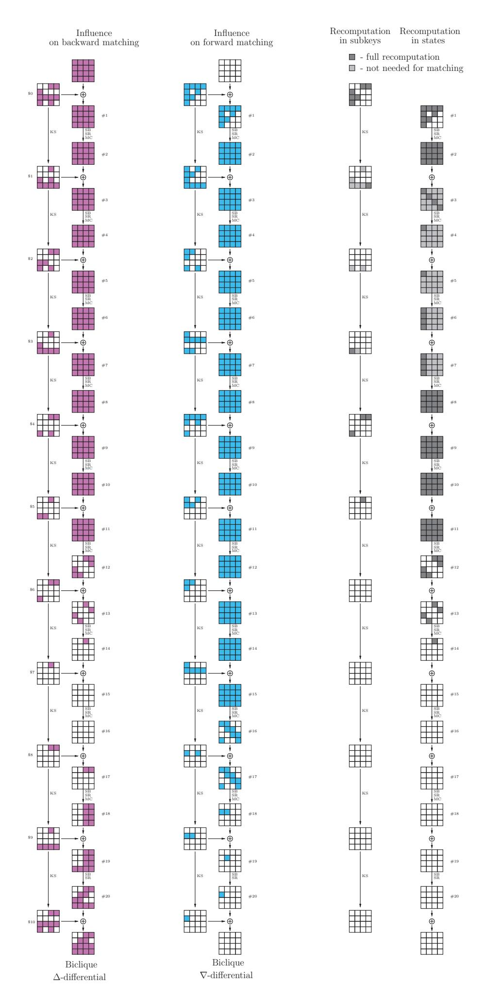

Fig. 17. Biclique differentials and matching in AES-128