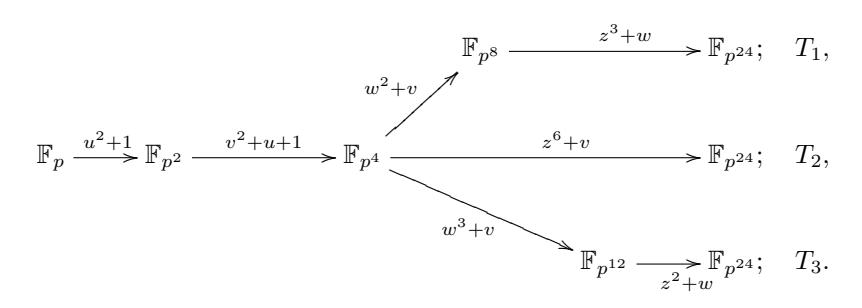

# Attractive Subfamilies of BLS Curves for Implementing High-Security Pairings

Craig Costello1,2? , Kristin Lauter<sup>2</sup> , and Michael Naehrig2,<sup>3</sup>

1 Information Security Institute Queensland University of Technology, GPO Box 2434, Brisbane QLD 4001, Australia craig.costello@qut.edu.au

<sup>2</sup> Microsoft Research One Microsoft Way, Redmond, WA 98052, USA klauter@microsoft.com

<sup>3</sup> Department of Mathematics and Computer Science Technische Universiteit Eindhoven, P.O. Box 513, 5600 MB Eindhoven, Netherlands michael@cryptojedi.org

Abstract. Barreto-Lynn-Scott (BLS) curves are a stand-out candidate for implementing high-security pairings. This paper shows that particular choices of the pairing-friendly search parameter give rise to four subfamilies of BLS curves, all of which offer highly efficient and implementationfriendly pairing instantiations.

Curves from these particular subfamilies are defined over prime fields that support very efficient towering options for the full extension field. The coefficients for a specific curve and its correct twist are automatically determined without any computational effort. The choice of an extremely sparse search parameter is immediately reflected by a highly efficient optimal ate Miller loop and final exponentiation. As a resource for implementors, we give a list with examples of implementation-friendly BLS curves through several high-security levels.

Keywords: Pairing-friendly, high-security pairings, BLS curves.

### 1 Introduction

Current public-key security recommendations have influenced a concentrated effort from the pairing-based community towards optimizing the implementation of pairings on Barreto-Naehrig (BN) curves [4]. Indeed, aside from an array of many other attractive properties (see [20, 23] for more details), BN curves are perfectly suited to the security level of 128 bits (cf. [2], [32], and [12, §1.1]), since they achieve an optimal balance between the necessary sizes of the three groups involved in the pairing e : G<sup>1</sup> × G<sup>2</sup> → G<sup>T</sup> . The BN pairing speed record of 10 million cycles set by Hankerson et al. in 2008 [14] stood until mid 2010, when

<sup>?</sup> Acknowledges funding from the Australian-American Fulbright Commission, the Queensland Government Smart State PhD Scholarship, and an Australian Postgraduate Award.

three papers appeared in rapid succession [22,7,1], each one shaving more time off the previous record and pushing the limit of efficiency at this security level. This work was pinnacled by Aranha *et al.* [1], who applied a combination of improvements to accelerate the entire pairing computation to less than 2 million cycles. As implementors seemingly converge towards a "satisfaction asymptote" at the 128-bit security level, the focus is now beginning to shift to optimizing pairings at higher security levels.

As Scott details [25], scaling security in pairing-based cryptography is fundamentally different than doing so in traditional public-key protocols that only require one group definition. Whilst increasing the security of other number theoretic protocols usually requires an increase in the size of the modulus, an optimized scaling in the context of pairing-based cryptography can be achieved by increasing the embedding degree. Utilizing the flexibility of a higher embedding degree allows an implementor to inflate the size of the finite field target group  $\mathbb{G}_T$  at a greater rate than the corresponding inflation in the elliptic curve groups  $\mathbb{G}_1$  and  $\mathbb{G}_2$ , paying respect to the faster subexponential attacks that must be resisted in  $\mathbb{G}_T$ . Stepping up to a significantly higher security level therefore calls for a different family of pairing-friendly elliptic curves altogether, and although many of the previous optimizations (e.g. for BN curves) can be immediately or easily transferred to computing pairings on the new curves, there are naturally new issues that arise when advancing towards a thorough optimization.

This work focuses on pairings that employ the Barreto-Lynn-Scott (BLS) family with k=24 [3] (see also [12, §6.6]). The BLS family has already been identified as the prime candidate for 256-bit secure pairings by Scott [27], who now holds the current software speed record at this level. The aim of this paper is to provide some of the finer details that will begin to pave the way for implementors who may wish to further accelerate the state-of-the-art timings on BLS curves. The bulk of our discussion is motivated by Pereira et al.'s work in the case of BN curves [23], where they detail a very simple method of generating highly optimal instantiations of implementation-friendly BN curves. With the same intent, we point out four highly attractive subfamilies of BLS curves that facilitate very efficient instantiations of high-security pairings.

The proposed curves are found by restricting the search parameter x in the polynomial representation to any one of four specific congruency classes, namely  $x_0 \equiv 7, 16, 31, 64 \pmod{72}$ . These choices result in prime fields of characteristic  $p \equiv 19 \pmod{24}$ , which in turn leads to three very efficient towering options for the full extension field  $\mathbb{F}_{p^{24}}$ . We show that all curves found in any of the proposed subfamilies can immediately be given by the same short Weierstraß equation over  $\mathbb{F}_p$ , and the unique sextic twist E' of correct order for use in the ate pairing setting is automatically determined. Not only is there no computational effort necessary to write down the curve equations once the prime p is found, both E and E' can be represented very compactly by the polynomial parameter  $x_0$  alone.

We give some details on line function computation and discuss an efficient version of the hard part in the final exponentiation. As a resource for implementors,

we give elaborate lists of example curves covering a range of high-security levels between 192- and 320-bit security, including the dedicated BLS security level of 256 bits. We have chosen the examples with a very sparse parameter x which leads to a low number of addition steps in the Miller loop and simultaneously very efficient exponentiations by x, which are needed in the final exponentiation.

The remainder of this paper is organized as follows. Section 2 gives a brief background on the BLS family for embedding degree k=24 and on computing optimal pairings on BLS curves. Section 3 describes the proposed implementation-friendly subfamilies of BLS curves, whilst Section 4 details some choices that can facilitate more simple pairing code. In Section 5 we apply the work of Scott *et al.* [29] to give details on the final exponentiation routine. Lists of example curves at several security levels are presented in Section 6. Finally, Appendix A provides timing results of a C implementation of the optimal ate pairing on BLS curves.

# 2 Background

The BLS family with embedding degree 24. In [3], Barreto, Lynn and Scott propose polynomial parametrizations for certain complete pairing-friendly curve families for specific fixed embedding degrees. All curves belonging to one of these so-called cyclotomic families have CM discriminant D=3 (i.e. j-invariant j=0) and can be given by a short Weierstraß equation  $E: y^2 = x^3 + b$ . For embedding degree k=24, the Barreto-Lynn-Scott (BLS) family is given by the following parametrization (see also [12, Construction 6.6]):

$$p(x) = (x-1)^{2}(x^{8} - x^{4} + 1)/3 + x, r(x) = x^{8} - x^{4} + 1,$$


$$n(x) = (x-1)^{2}(x^{8} - x^{4} + 1)/3, t(x) = x + 1,$$


$$f(x) = (x-1)(2x^{4} - 1)/3. (1)$$

Finding a specific BLS curve is achieved by running through integer values  $x_0 \equiv 1 \pmod{3}$  until  $p(x_0)$  and  $r(x_0)$  are both prime (note that  $x_0 \equiv 1 \pmod{3}$  leads to all involved parameters being integers). For each set of parameters, there exists an elliptic curve E over  $\mathbb{F}_p$  such that  $\#E(\mathbb{F}_p) = n(x_0)$ . The correct curve E can be found by trying different values for e (i.e. different twists) and checking for the right group order. Another alternative is to compute the coefficient by the algorithm described in [24]. Since  $r(x_0) \mid n(x_0)$ , there is a subgroup of  $E(\mathbb{F}_p)$  of prime order  $r(x_0)$ . The CM discriminant is p0 and p1 because p2. The family has a p2-value of p3 decays p3. The family has a p5-value of p4 degp7 degp8.

BLS curves achieve the smallest  $\rho$ -value for k=24 (see [12, Section 8]); they have twists of degree 6 and allow for many optimizations when computing pairings, similar to Barreto-Naehrig (BN) curves. A particularly nice property is that the ate pairing [15] already provides an optimal pairing [33]. The number of iterations in Miller's algorithm to compute the ate pairing is  $\log(t(x_0)-1) = \log(x_0) \approx \log(r(x_0))/\varphi(k) = \log(r(x_0))/8$ .

According to key size recommendations in [2], [32], and [12, Section 1], BLS curves are a good choice for pairings at the high-security 256-bit level. Indeed,

Scott [27] recently demonstrated an efficient implementation of pairings on BLS curves at that level.

An optimal ate pairing. We now briefly recall the ate pairing on BLS curves and the arithmetic that is involved in its computation. Let  $E/\mathbb{F}_p$  be a BLS curve with parameters constructed as above given an integer  $x_0 \equiv 1 \pmod{3}$ , i.e.  $p = p(x_0)$ ,  $r = r(x_0)$  and so forth. Then there exists a unique twist  $E'/\mathbb{F}_{p^4}$  with  $r \mid \#E'(\mathbb{F}_{p^4})$  with twisting isomorphism  $\psi : E' \to E$  over  $\mathbb{F}_{p^4}$ . Let us define the usual groups  $G_1 = E(\mathbb{F}_p)[r]$  and  $G_2 = \ker(\phi_p - [p]) \subset E(\mathbb{F}_{p^{24}})[r]$  as the 1- and p-eigenspaces of the Frobenius endomorphism  $\phi_p$  on E[r]. Let the group  $G'_2 = \psi^{-1}(G_2)$  be the preimage of  $G_2$  under  $\psi$ .

Let T=t-1. As outlined in [9], we can either compute the original ate pairing

$$a_T: G_2' \times G_1 \to \mathbb{F}_{p^{24}}^*, \ (Q', P) \mapsto f_{T, \psi(Q')}(P)^{\frac{p^{24} - 1}{r}},$$

by "untwisting" Q' for the computation of  $f_{T,\psi(Q')}$ ; or we can compute

$$a'_T: G'_2 \times G_1 \to \mathbb{F}^*_{p^{24}}, \ (Q', P) \mapsto f_{T, Q'}(\psi^{-1}(P))^{\frac{p^{24} - 1}{r}},$$

i.e. compute entirely on the twist by "twisting" P to E'.

A function  $f_{T,R}(S)$  for points R,S on E or E' as above is computed with Miller's algorithm [19]. It involves curve arithmetic in  $G'_2$ , i.e. doubling and addition of points on the curve E' over the field  $\mathbb{F}_{p^4}$  and the computation of line functions from points in  $G'_2$  evaluated at a point in  $G_1$  or its preimage under  $\psi$ . The computations in  $\mathbb{F}_{p^4}$  for point doubling and addition and for obtaining the corresponding line function coefficients share partial results and are thus usually optimized together. Depending on the context in which the pairing is used and the computing platform, one needs to choose between affine and different variants of projective coordinates to find the best formulas for these operations.

The function  $f_{T,R}(S)$  is built up by accumulating the line function values. This requires efficient squaring and multiplication-by-line-function operations in the full extension field  $\mathbb{F}_{p^{24}}$ . The final exponentiation on elements in  $\mathbb{F}_{p^{24}}^*$  has a fixed exponent and it is possible to use specialized more efficient squaring operations as well as other optimizations [13, 17, 1]. Full extension field arithmetic needs to be particularly efficient as pairing efficiency strongly depends on it. It is therefore important to work with a well-chosen extension field tower [6].

### 3 Particularly friendly subfamilies

In this section we show that specializing the congruency classes of the curvefinding search parameter gives rise to four subfamilies of k=24 BLS curves that are highly efficient in terms of all operations required in a pairing computation. Specifically, we show that rather than searching with  $x_0 \equiv 1 \pmod{3}$ , searching with any of  $x_0 \equiv 7, 16, 31, 64 \pmod{72}$  guarantees that the curves found offer (among other things) the following advantages.

- The curve constant b is immediately determined (see Proposition 3 below). This saves performing expensive computations that test different values of b and the corresponding group order until the correct twist is found; or the checks for quadratic and cubic residuosity and root computations for the algorithm in [24].
- **Highly efficient field tower options are available** (see Proposition 2 below). This facilitates very efficient field arithmetic in the full extension field (and all intermediate subfields).
- The correct twist is immediately determined (see Proposition 4 below). Among other savings, having an automated and general representation for the *correct* twist saves group arithmetic on curves over the quartic extension field  $\mathbb{F}_{p^4}$  in the generation phase. Also, the representations of the twists are always simple and facilitate nice back-and-forth isomorphisms between E and E'.

In addition to the above efficiency benefits, generating curves with identical or consistent parameters also offers the advantage of code reusability across different instantiations and security levels. This allows an implementor the flexibility of scaling parameter sizes to better match a neighboring security level without changing any of the pairing code.

Furthermore, having fixed coefficients for the curve and its twist leads to a very compact way of representing the curve data. Note that in this setting, the knowledge of the generating parameter  $x_0$  uniquely determines all information about both curves. What only remains is to give generators for the groups  $G_1$  and  $G'_2$ , except for the case of  $x_0 \equiv 64 \pmod{72}$  for which a compact generator in  $G_1$  is always available as [h](3,5) with high probability, where h is the cofactor, i.e. [h] maps elements of  $E(\mathbb{F}_p)$  into  $G_1$ .

| $x_0$       | $p(x_0)$    | $n(x_0)$    | efficient | E               | E'                  |
|-------------|-------------|-------------|-----------|-----------------|---------------------|
| $\pmod{72}$ | $\pmod{72}$ | $\pmod{72}$ | tower     |                 |                     |
|             | (eq. (1))   | (eq. (1))   | (Prop. 2) | (Prop. 3)       | (Prop. 4)           |
| 7           | 19          | 12          | ✓         | $y^2 = x^3 + 1$ | $y^2 = x^3 \pm 1/v$ |
| 16          | 19          | 3           | ✓         | $y^2 = x^3 + 4$ | $y^2 = x^3 \pm 4v$  |
| 31          | 43          | 12          | ✓         | $y^2 = x^3 + 1$ | $y^2 = x^3 \pm v$   |
| 64          | 19          | 27          | ✓         | $y^2 = x^3 - 2$ | $y^2 = x^3 \pm 2/v$ |

Table 1. Four attractive subfamilies of BLS curves

We split the rest of this section into two subsections. The first subsection is dedicated to proving the claims in Table 1 and showing that taking  $x_0 \equiv 7, 16, 31, 64 \pmod{72}$  will always give rise to highly efficient BLS instantiations. The intention of the second subsection is to detail why  $x_0 \equiv 7, 16, 31, 64 \pmod{72}$  reign supreme over the other possible congruence classes.

#### 3.1 Using the four classes $x_0 \equiv 7, 16, 31, 64 \pmod{72}$

We start with a lemma that is instrumental in some of the proofs that follow. For a prime p, let QR(p) denote the set of quadratic residues modulo p.

**Lemma 1.** Let  $x_0 \in \mathbb{Z}$  be any of  $x_0 \equiv 7, 16, 31, 64 \pmod{72}$ , and let  $p = p(x_0)$  with p given by (1) be a prime. Then 2 is neither a quadratic nor a cubic residue modulo p.

*Proof.* A simple calculation shows that for  $x_0 \equiv 7, 16, 64 \pmod{72}$ , we have  $p(x_0) \equiv 19 \pmod{72}$ . For  $x_0 \equiv 31 \pmod{72}$ , we have  $p(x_0) \equiv 43 \pmod{72}$ . In both cases, it is easy to deduce that  $2 \notin QR(p)$ .

It remains to show that 2 is not a cube modulo p for each of the  $x_0$  values. For all four cases, we use [16, Prop. 9.6.2], which states that for  $p \equiv 1 \pmod{3}$ , 2 is a cubic residue modulo p if and only if there exist integers C, D such that  $p = C^2 + 27D^2$ . According to [16, Prop. 8.3.2], for  $p \equiv 1 \pmod{3}$  there always exist integers A and B such that  $4p = A^2 + 27B^2$  and A, B are unique up to sign. Thus, if A and B in this unique representation are both even, 2 is a cube modulo p, otherwise it is not. In each of the four cases  $x_0 \equiv 7, 16, 31, 64 \pmod{72}$ , we examine A and B in terms of the polynomials from (1). The CM norm equation for the BLS family is  $4p = t^2 + 3f^2$ , where  $f = (x_0 - 1)/3 \cdot (2x_0^4 - 1)$ , see (1).

For  $x_0 \equiv 64 \pmod{72}$ , we have  $f(x_0) \equiv 0 \pmod{3}$  which allows us to write  $4p(x_0) = t(x_0)^2 + 27 \cdot (f(x_0)/3)^2$ , so  $A = t(x_0) = x_0 + 1 \equiv 65 \pmod{72}$  and  $B = f(x_0)/3 = (x_0 - 1)/9 \cdot (2x_0^4 - 1) \equiv 25 \pmod{72}$  are both odd, meaning that for  $x_0 \equiv 64 \pmod{72}$ , 2 is not a cubic residue modulo  $p(x_0)$ .

For the other three cases  $x_0 \equiv 7, 16, 31 \pmod{72}$ , it is easy to show that  $f(x_0) \not\equiv 0 \pmod{3}$ , so the CM equation does not directly yield A and B. The two cases  $x_0 \equiv 7, 16 \pmod{72}$  can be handled by considering a transformation of the CM norm as

$$4p = \left(\frac{3f+t}{2}\right)^2 + 27\left(\frac{t-f}{6}\right)^2.$$

For  $x_0 \equiv 7 \pmod{72}$ ,  $t(x_0)$ ,  $f(x_0) \equiv 2 \pmod{6}$ , so that both A = (3f + t)/2 and B = (t - f)/6 are integers. Furthermore,  $f(x_0) \equiv 2 \pmod{4}$  and  $t(x_0) \equiv 0 \pmod{4}$  reveal that  $3f + t \equiv 2 \pmod{4}$  so that A is odd, from which it follows that 2 is not a cubic residue modulo  $p(x_0)$  for  $x_0 \equiv 7 \pmod{72}$ .

For  $x_0 \equiv 16 \pmod{72}$ , we have  $t(x_0), f(x_0) \equiv 1 \pmod{2}$  and  $t(x_0), f(x_0) \equiv 2 \pmod{3}$ . Furthermore, since  $t(x_0) \equiv 1 \pmod{4}$  and  $f(x_0) \equiv 3 \pmod{4}$ , again we conclude that  $3f + t \equiv 2 \pmod{4}$ , meaning that A = (t - 3f)/2 is odd and 2 is not a cube modulo  $p(x_0)$  for  $x_0 \equiv 16 \pmod{72}$ .

Finally, for  $x_0 \equiv 31 \pmod{72}$ , we require a slightly different transformation of the CM equation as

$$4p = \left(\frac{t - 3f}{2}\right)^2 + 27\left(\frac{t + f}{6}\right)^2.$$

In this case  $t(x_0) \equiv 2 \pmod{6}$  and  $f(x_0) \equiv 4 \pmod{6}$  so that A = (t - 3f)/2 and B = (t+f)/6 are integers. Since  $t(x_0) \equiv 0 \pmod{4}$  and  $f(x_0) \equiv 2 \pmod{4}$ ,

it follows that  $A \equiv 1 \pmod{4}$  is odd and 2 is not cube modulo  $p(x_0)$  for  $x_0 \equiv 31 \pmod{72}$ .

The ideal way to form a quadratic extension field arises when  $p \equiv 3 \pmod 4$  which allows us to take  $\mathbb{F}_{p^2} = \mathbb{F}_p(u), \ u^2 + 1 = 0$ . Operations in  $\mathbb{F}_p[u]/(u^2+1)$  are cheaper than operations in  $\mathbb{F}_p[u]/(u^2-\alpha)$  for any other non-residue  $\alpha \in \mathbb{F}_p$ , since multiplication by  $\alpha \neq \pm 1$  costs additions in  $\mathbb{F}_p$  (or see [10]). Since we have  $p \equiv 19 \pmod{24}$  in all four cases, we always have  $p \equiv 3 \pmod{4}$ .

For the extension from  $\mathbb{F}_{p^2}$  to  $\mathbb{F}_{p^4} = \mathbb{F}_{p^2}(v)$ , the ideal irreducible binomial in terms of simplicity would be  $v^2 + u$ . Unfortunately the following proposition shows that if we form  $\mathbb{F}_{p^2}$  as above, then this binomial cannot be used to define  $\mathbb{F}_{p^4}$  (and this statement is true for any quartic extension fields, whether in the context of pairings or not).

**Proposition 1.** If  $p \equiv 3 \pmod{4}$ , and  $\mathbb{F}_{p^2}$  is constructed as  $\mathbb{F}_p(u)$ ,  $u^2 + 1 = 0$ , then the polynomial  $x^2 + su$  with  $s \in \mathbb{F}_p$  is reducible over  $\mathbb{F}_{p^2}$ . In particular,  $\mathbb{F}_{p^4}$  cannot be constructed over  $\mathbb{F}_{p^2}$  using a binomial of the above form.

*Proof.* Since  $-1 \notin QR(p)$ , precisely one of s/2 or -s/2 is a quadratic residue modulo p. In the first case, write  $x^2 + su = x^2 + 2a^2u = (x + au - a)(x - au + a)$  for  $s = 2a^2$ ,  $a \in \mathbb{F}_p$ . In the second case, taking  $s = -2a^2$  for some  $a \in \mathbb{F}_p$  gives  $x^2 + su = x^2 - 2a^2u = (x + au + a)(x - au - a)$ . Thus,  $x^2 + su$  with  $s \in \mathbb{F}_p$  is reducible over  $\mathbb{F}_{p^2}$ . □

Nevertheless, a binomial that is almost as attractive in terms of efficiency is  $v^2 + (u+1)$ , since multiplications by u+1 in  $\mathbb{F}_{p^2}$  also come almost for free. The following proposition shows that the proposed subfamilies of BLS curves always allow  $\mathbb{F}_{p^4}$  to be constructed using this binomial. Furthermore, we also show that the rest of the tower up to  $\mathbb{F}_{p^{24}}$  can be constructed in three different ways; all three of which employ optimal binomials, but may be preferred by implementors depending on various factors, such as the nature of previous pairing code, or whether compression is desired.

**Proposition 2.** Let  $x_0 \in \mathbb{Z}$  be any of  $x_0 \equiv 7, 16, 31, 64 \pmod{72}$ . If  $p = p(x_0)$  given by the polynomial in (1) is prime, then the extension field  $\mathbb{F}_{p^{24}}$  can be constructed using any of the following towering options  $T_1$ ,  $T_2$ ,  $T_3$ :



*Proof.* For all four congruency classes  $x_0 \equiv 7, 16, 31, 64 \pmod{72}$ , we have  $p(x_0) \equiv 19 \pmod{24}$ , so that  $p \equiv 3 \pmod{4}$  and we can use  $\mathbb{F}_{p^2} = \mathbb{F}_p(u) = \mathbb{F}_p[u]/(u^2+1)$ . For the remaining irreducibility arguments, we make use of a theorem due to Benger and Scott [6, Thm. 4]. We immediately note that  $2, 3 \mid p-1$ .

Let us compute  $N_{\mathbb{F}_{p^2}/\mathbb{F}_p}(-(u+1)) = N_{\mathbb{F}_{p^2}/\mathbb{F}_p}(-1)N_{\mathbb{F}_{p^2}/\mathbb{F}_p}(u+1) = (u+1)^{p+1} = (u+1)^p(u+1) = (1-u)(u+1) = 2$ . Since 2 is not a quadratic residue modulo p, Theorem 4 of [6] ensures that  $v^2 + u + 1$  is irreducible in  $\mathbb{F}_{p^2}[v]$  and we can construct  $\mathbb{F}_{p^4} = \mathbb{F}_{p^2}[v]/(v^2 + u + 1)$ .

Next, we compute  $N_{\mathbb{F}_{p^4}/\mathbb{F}_p}(-v) = N_{\mathbb{F}_{p^4}/\mathbb{F}_p}(-1)N_{\mathbb{F}_{p^4}/\mathbb{F}_p}(v) = N_{\mathbb{F}_{p^4}/\mathbb{F}_p}(v) = v^{1+p+p^2+p^3} = (v^{1+p^2})^{1+p} = ((-(u+1))^{1+p^2})^{(1+p)/2} = ((u+1)^2)^{(1+p)/2} = (u+1)^{p+1} = 2$ . Lemma 1 tells us that 2 is neither a quadratic nor a cubic residue modulo p, and thus it follows from [6, Thm. 4] that  $w^2 + v$ ,  $w^3 + v$  and  $z^6 + v$  are all irreducible over  $\mathbb{F}_{p^4}$ , giving rise to the tower  $T_2$ , to  $T_1$  up to  $\mathbb{F}_{p^3}$  and  $T_3$  up to  $\mathbb{F}_{p^{12}}$ .

For the remaining parts of  $T_1$  and  $T_3$ , we similarly compute  $N_{\mathbb{F}_{p^{12}}/\mathbb{F}_p}(-w) = 2^{(1+p^4+p^8)/3}$  and  $N_{\mathbb{F}_{p^8}/\mathbb{F}_p}(-w) = 2^{(1+p^4)/2}$ . Since  $p \equiv 1 \pmod{6}$  for all cases, it follows that  $(1+p^4+p^8)/3$  is odd and so  $N_{\mathbb{F}_{p^{12}}/\mathbb{F}_p}(-w)$  is not a square in  $\mathbb{F}_p$  since 2 is not a square by Lemma 1. Similarly,  $(p^4+1)/2 \equiv 1 \pmod{3}$  and so  $N_{\mathbb{F}_{p^8}/\mathbb{F}_p}(-w)$  is not a cube in  $\mathbb{F}_p$ . Therefore, [6, Thm. 4] ensures irreducibility of the remaining polynomials and completes the proof.

We have now shown that once a BLS prime p is found using  $x_0 \equiv 7, 16, 31, 64 \pmod{72}$ , a highly efficient tower is immediately available. The following two propositions show that the curve constant and twisted curve are also immediate in all four cases.

**Proposition 3.** If  $x_0 \equiv 7,31 \pmod{72}$  in (1) produces a prime  $p = p(x_0)$ , then the curve  $E/\mathbb{F}_p: y^2 = x^3 + 1$  is always such that  $r = r(x_0) \mid n = \#E(\mathbb{F}_p)$ . Similarly, for  $x_0 \equiv 16 \pmod{72}$ , the desired curve is always  $E/\mathbb{F}_p: y^2 = x^3 + 4$ . Finally, for  $x_0 \equiv 64 \pmod{72}$ , the desired curve is always  $E/\mathbb{F}_p: y^2 = x^3 - 2$ .

*Proof.* It is well known that if g is neither a square nor a cube in  $\mathbb{F}_p$ , then all possible group orders an elliptic curve  $E: y^2 = x^3 + b$  can have over  $\mathbb{F}_p$  occur as the order of one of the 6 twists with  $b \in \{1, g, g^2, g^3, g^4, g^5\}$ . Specifically, choosing b as exactly one of  $\{1, g, g^2, g^3, g^4, g^5\}$  will give the correct number of points (cf.  $[31, \S X.5]$ ), i.e. the curve with  $r \mid n = \#E(\mathbb{F}_p)$ . Lemma 1 shows that we can take g = 2, so that in all four cases the correct b is exactly one of  $\{1, 2, 4, 8, 16, 32\}$ .

For both  $x_0 \equiv 7 \pmod{72}$  and  $x_0 \equiv 31 \pmod{72}$ , we have  $n(x_0) = (x_0 - 1)^2(x_0^8 - x_0^4 + 1)/3 \equiv 12 \pmod{72}$  from (1). Thus, both cases have  $2, 3 \mid n$ , meaning that the correct curves  $E/\mathbb{F}_p$  necessarily contain points of order 2 and points of order 3. This implies that b is both a quadratic and cubic residue modulo p, from which it follows that b = 1 is the only option.

For  $x_0 \equiv 16 \pmod{72}$ , observe that  $n(x_0) \equiv 3 \pmod{72}$  and thus the correct curve E has a point of order 3, but not a point of order 2. This rules out b = 1, 8, since the points (-1,0) and (-2,0) have order 2 on the respective curves. The

curve  $E/\mathbb{F}_p: y^2=x^3+b$  has a point of order 3 if and only if b is a square in  $\mathbb{F}_p$ , which rules out b=2, and therefore b=32 as well. To rule out b=16, we first observe that since  $n=n(x_0)\equiv 3\pmod{72}, 9\nmid n$  and  $E/\mathbb{F}_p$  has at most three points of order 3. If b=16, then two such points are (0,-4) and (0,4). It is easy to see that  $-3\in \mathrm{QR}(p)$ , so let  $\nu^2=-3$  for  $\nu\in\mathbb{F}_p$ , and write  $P=(-4,4\nu)\in E(\mathbb{F}_p):y^2=x^3+16$ . An easy calculation (e.g. using point doubling formulas) shows that  $[2]P=(-4,-4\nu)=-P$ , so that P has order 3, and similarly for -P. Thus, there are at least four points of order 3 in  $\mathbb{F}_p$  if b=16 contradicting  $9\nmid n$ , which leaves b=4 as the only option.

For  $x_0 \equiv 64 \pmod{72}$ , we can make use of Algorithm 3.5 in [24], where in our case U = t/2 and V = f/2. Since  $2V = f(x_0) \equiv 0 \mod 3$  and  $2U = t(x_0) = 2 \mod 3$ , we immediately have  $E/\mathbb{F}_p : y^2 = x^3 + 16$  as the correct curve. Lastly, since  $-2 \in \mathrm{QR}(p)$ , write  $\mu^2 = -2$  for  $\mu \in \mathbb{F}_p$ , so that  $\mu^6 = -8$ . Since  $E/\mathbb{F}_p : y^2 = x^3 + 16$  is isomorphic to  $\tilde{E}/\mathbb{F}_p : y^2 = x^3 + 16/\mu^6$  over  $\mathbb{F}_p$ , we can take b = 16/-8 = -2 as the curve constant instead.

**Proposition 4.** If  $x_0 \equiv 7 \pmod{72}$  produces the BLS curve  $y^2 = x^3 + 1$  described in Proposition 3, and  $\mathbb{F}_{p^4}$  is constructed as in Proposition 2, then the correct sextic twist with  $r = r(x_0) \mid \#E'(\mathbb{F}_{p^4})$  can be obtained as both  $E'/\mathbb{F}_{p^4} = y^2 = x^3 + 1/v$  and  $E'/\mathbb{F}_{p^4} : y^2 = x^3 - 1/v$ . Similarly,  $x_0 \equiv 16 \mod 72$  gives rise to the correct twist as both  $E'/\mathbb{F}_{p^4} : y^2 = x^3 + 4v$  or  $E'/\mathbb{F}_{p^4} : y^2 = x^3 - 4v$ ;  $x_0 \equiv 31 \mod 72$  gives rise to the correct twist as both  $E'/\mathbb{F}_{p^4} : y^2 = x^3 + v$  or  $E'/\mathbb{F}_{p^4} : y^2 = x^3 - v$ ; and finally,  $x_0 \equiv 64 \mod 72$  gives rise to the correct twist as both  $E'/\mathbb{F}_{p^4} : y^2 = x^3 + 2/v$  or  $E'/\mathbb{F}_{p^4} : y^2 = x^3 - 2/v$ .

*Proof.* We first note that  $-1 = u^6$  is a sixth power in  $\mathbb{F}_{p^2}$ . Therefore, for  $b' \in \mathbb{F}_{p^4}$ , the curves given by  $y^2 = x^3 + b'$  and  $y^2 = x^3 - b'$  are isomorphic over  $\mathbb{F}_{p^4}$ .

In each case the correct twist E' is unique with the property that  $r \mid \#E'(\mathbb{F}_{p^4})$  and it has degree 6 (see [15]). Since there are exactly two twists of E of degree 6 over  $\mathbb{F}_{p^4}$ , there are only two possible group orders. We have  $\#E(\mathbb{F}_{p^4}) = p^4 + 1 - t_4$ , where  $t_4$  can be computed from t and f (notation as before) as  $t_4 = (t^4 - 18t^2f^2 + 9f^2)/8$  (see [31, §V.2]). If we define  $f_4$  by  $4p^4 = t_4^2 + 3f_4^2$ , the possible group orders for the sextic twist are given in [15] as

$$n_{4,1} = p^4 + 1 - (3f_4 - t_4)/2,$$
  $n_{4,2} = p^4 + 1 - (-3f_4 - t_4)/2.$

We compute both  $n_{4,1}$  and  $n_{4,2}$  as polynomials in terms of the parametrization (1), and evaluate them at each of the congruency classes which reveals opposing parities each time. The remainder of the proof is essentially the same for all four congruencies classes, so we demonstrate completely with  $x_0 \equiv 16 \pmod{72}$ . Taking  $x_0 \equiv 16 \pmod{72}$  gives  $n_{4,1} \equiv 28 \pmod{72}$  and  $n_{4,2} \equiv 49 \pmod{72}$ . In particular,  $n_{4,1}$  is even and  $n_{4,2}$  is odd in this case. From the polynomial parametrization, it is easy to check that  $r \mid n_{4,1}$ . Therefore, the unique sextic twist we are looking for in this case has an even group order over  $\mathbb{F}_{p^4}$ .

Proposition 2 shows that v is neither a square nor a cube in  $\mathbb{F}_{p^4}$ , so the correct twist can be given as  $y^2 = x^3 + 4v$  or as  $y^2 = x^3 + 4v^5$ . We have  $4v = (N_{\mathbb{F}_{p^4/\mathbb{F}_p}}(v))^2v = v^{3+2p+2p^2+2p^3}$  as in the proof of Proposition 2. Since the

exponent on the right hand side of the last equation is divisible by 3, we conclude that 4v is a cube in  $\mathbb{F}_{p^4}$ . Similarly, one can show that  $4v^5$  is not a cube. Since 4v is a cube, the curve  $y^2 = x^3 + 4v$  has a point of order 2, namely (-c, 0) with  $c^3 = 4v$ . Hence its order is even and we have found the correct twist for  $x_0 \equiv 16 \pmod{72}$ . The other three cases are proven analogously.

#### 3.2 The other congruency classes

We now show why the four congruency classes  $x_0 \equiv 7, 16, 31, 64 \pmod{72}$  stand out over the other congruency classes. After all, restricting  $x_0 \equiv 1 \pmod{3}$  to any or all of the proposed classes essentially discards 20 out of 24 other congruency classes modulo 72. Of course, there will always be examples where some of the discarded congruency classes produce curves that also perform highly efficiently. However, we argue that  $x_0 \equiv 7, 16, 31, 64 \pmod{72}$  are the only classes for which we can always simultaneously guarantee the propositions in the previous subsection.

Quadratic extension to  $\mathbb{F}_{p^2}$ : We start by eliminating the classes of  $x_0$  mod 72 which do not facilitate the quadratic extension as  $\mathbb{F}_{p^2} = \mathbb{F}_p(u)$ ,  $u^2 + 1 = 0$ . Of the 24 possible  $x_0$  values modulo 72 in  $\{1, 4, 7, ..., 67, 70\}$ , 12 have  $x_0 \equiv 1, 10 \pmod{12}$ , which always (undesirably) produce  $p \equiv 1 \pmod{12}$ . The remaining 12 are  $\{4, 7, 16, 19, 28, 31, 40, 43, 52, 55, 64, 67\}$  with  $x_0 = 4, 7 \pmod{12}$ , which always produce  $p(x_0) \equiv 7 \pmod{12}$ .

Quadratic extension to  $\mathbb{F}_{p^4}$ : If  $\mathbb{F}_{p^4}$  is to be constructed as  $\mathbb{F}_{p^4} = \mathbb{F}_{p^2}(v)$ ,  $v^2 + u + 1 = 0$ , then (refer back to the proof of Proposition 2) we can only guarantee this if  $N_{\mathbb{F}_{p^2}/\mathbb{F}_p}(-(u+1)) = 2$  is not a quadratic residue in  $\mathbb{F}_p$ . Substituting the remaining 12 candidates for  $x_0 \pmod{72}$  into (1) reveals only 4 possibilities for  $p \pmod{72}$ , those being  $p \equiv 7, 19, 43, 55 \pmod{72}$ . It is easy to check that only two of these have  $2 \notin \mathrm{QR}(p)$ , namely  $p \equiv 19, 43 \pmod{72}$ . These correspond to 6 of the remaining  $x_0$  congruencies, shrinking the pool of preferred candidates to  $\{7, 16, 31, 40, 55, 64\}$ .

Sextic extension to  $\mathbb{F}_{p^{24}}$ : The proposed sextic extensions in Proposition 2 that employ simple binomials to form  $\mathbb{F}_{p^{24}}$  over  $\mathbb{F}_{p^4}$  require that 2 is not a cube in  $\mathbb{F}_p$ . This does not always happen for  $x_0 \in \{40,55\}$ . For the sake of counter examples,  $x_0 = 12856 \equiv 40 \pmod{72}$  and  $x_0 = 1135 \equiv 55 \pmod{72}$  produce BLS curves where 2 is a cube modulo p, and therefore fields which can not use the tower in Proposition 2. Even if alternative binomials can be found in such cases, the fact that 2 is a cubic residue also affects the ease of guaranteeing the smallest identical curve constant p for all curves in the subfamily, as we were able to do for the proposed four congruency classes in Proposition 3. For example, the smallest curve constant for the curve found with  $x_0 = 12856 \equiv 40 \pmod{72}$  is p = -3, whilst the smallest constant for the curve found with  $p = 25312 \equiv 40 \pmod{72}$  is p = -3, whilst the smallest constant for the curve found with  $p = 25312 \equiv 40 \pmod{72}$  is p = -3.

#### 4 Choosing simple lines: twisting vs. untwisting

The aim of this short section is to detail some choices that can facilitate more simple (and theoretically faster) pairing code.

For 128-bit security BN implementations, the complexity of a single Miller loop is higher than complexity of a single final exponentiation (see any of [22, 7,1]). However, as the security level and embedding degree increases, a final exponentiation becomes much more costly than a Miller loop [11] (or see our timings in Appendix A). This could influence implementors paying less attention to more complicated subtleties within the Miller loop, like adopting projective coordinates, and instead focusing on speedups within the exponentiation routine. On the other hand, a large number of recent pairing protocols like attribute-based encryption (ABE) require many Miller loops for each exponentiation (see Scott's recent work [27] for an in depth look), and therefore in these scenarios savings within the loop again become more significant overall. In any case, a thoroughly optimized implementation will make use of the fastest formulas inside the Miller loop, so even though our implementation slightly favored affine coordinates, and indeed Scott's current 256-bit record [27] also employed affine coordinates, it could well be that a thoroughly optimized projective routine (like [1] for k=12) ends up outperforming affine formulas at this level too. We refer to [8,9,18] for ways to find the most efficient coordinate system depending on the specific protocol and implementation situation.

As we mentioned briefly in the previous section, the choice of which tower  $(T_1, T_2, T_3)$  in Proposition 2) to use in an implementation could be influenced by a number of factors. For example, if low bandwidth requirements favored maximum compression techniques [28], then  $T_1$  would seem most appropriate. On the other hand, if the major priority is raw speed, then one could employ the field arithmetic presented in [10, §6] and favor the (slightly faster) quadratic over cubic extension offered by  $T_3$ . Or perhaps most commonly, if the implementor is adopting BLS curves to scale a prior (say BN) pairing implementation to a higher security level, then the towered code for the BN sextic extension from  $\mathbb{F}_{p^2}$  to  $\mathbb{F}_{p^{12}}$  could be easily updated to BLS code for the extension from  $\mathbb{F}_{p^4}$  to  $\mathbb{F}_{p^{24}}$ . In any case, there are efficient formulas available for all three of the towering choices [10, 9], so we will treat all three cases in parallel and highlight the differences that arise.

One such difference lies in the sparse doubling and addition lines that are used to update the pairing function. For each of the proposed congruency classes, Table 2 follows the exposition in [26,  $\S 5$ ] and details the correct placing of the line function coefficients for the three tower choices  $T_1, T_2, T_3$  and the two twist choices in Proposition 4, both of which have the same group order but result in different looking line functions.

The point P is always kept in affine coordinates  $(x_P, y_P)$ . For the affine formulas the line simply is  $\ell(P) = y_P - \lambda x_P - c$ , where  $\lambda \in \mathbb{F}_{p^4}$  is the slope of the line as usual and  $c \in \mathbb{F}_{p^4}$  is the constant coefficient. Projective formulas for these line functions usually output three coefficients  $L_{0,0}, L_{1,0}, L_{0,1} \in \mathbb{F}_{p^4}$  [9] that define the evaluated update  $\ell(P) = L_{0,0} + L_{1,0}x_{\psi^{-1}(P)} + L_{0,1}y_{\psi^{-1}(P)} \in \mathbb{F}_{p^{24}}$

by being attached to different algebraic elements in the representation of  $\mathbb{F}_{p^{24}}$  over  $\mathbb{F}_{p^4}$  depending on the twisting isomorphism  $\psi$ . In all cases  $\ell(P)$  is a sparse element of  $\mathbb{F}_{p^{24}}$ , with the only difference being the places that the  $\ell_i$  occupy as a result of the different algebraic towerings and maybe a sign change.

To explain the different lines in Table 2, let us briefly look at the conversion between representations of an element in the different towering options  $T_1, T_2$ , and  $T_3$ . Let us start with an element a in  $T_2$  given by the coefficients  $a_0, \ldots, a_5 \in \mathbb{F}_{p^4}$ , i.e.  $a=a_0+a_1z+a_2z^2+a_3z^3+a_4z^4+a_5z^5$ . Converting to  $T_1$ , we take  $z^3\mapsto w$  and thus the same element is represented as  $a=(a_0+a_3w)+(a_1+a_4w)z+(a_2+a_5w)z^2$ . To go to  $T_3$ , we use  $z\mapsto -uz$  (i.e.  $z^2\mapsto w$ ) and obtain  $a=(a_0+a_2w+a_4w^2)+(-a_1u-a_3uw-a_5uw^2)z$ .

An optimized routine must take advantage of the sparse nature of  $\ell(P)$  and tailor make a specialized multiplication routine to exploit the presence of zero entries. Roughly speaking, the options in Table 2 will give rise to similar speeds, but it is obvious to see which twist constant an implementor would choose (all other things being equal) if their choice of tower is already concrete. For example, if  $T_1$  is the chosen tower, then using b' = 4v gives a slightly easier line function to code than using b' = 4v.

A more important difference arises when choosing whether to leave  $P \in E$  and "untwist"  $Q' \in E'$  to  $Q \in E$  for the line function computation, or choosing to put both points on the twist for the entire routine [9]. The nature of the proposed tower actually means that there is a significant difference between the simplicity of the twisting and untwisting isomorphisms, and one option will be more desirable to implement than the other. For example, when using  $T_1$  and b' = -4v, the untwisting isomorphism  $\psi$  is  $\psi: (x', y') \mapsto (x/z^2, y/w) = (wvz(u-1)/2 \cdot x', wv(1-u)/2 \cdot y')$ , which is more annoying to code (and theoretically slightly slower) than using  $\psi^{-1}: (x,y) \mapsto (z^2x, wy)$  to twist the second argument P instead. On the other hand, if the twist is given as  $E': y^2 = x^3 \pm b/v$ , as is the cases when  $x_0 \equiv 7,64 \pmod{72}$ , then it is the untwisting isomorphism that is clearly preferable.

#### 5 The final exponentiation

An optimized final exponentiation routine is critical for fast pairings at high-security levels. Scott *et al.* [29] propose the most efficient algorithm to date, which exploits the polynomial representations of p and r to reduce the work encountered after the Miller loop. The first step is to split the exponent into two parts by factoring  $(p^k-1)/r$  and exploiting the Frobenius operator which raises elements to the power of p almost for free. In our case the exponent splits as:

$$(p^{24}-1)/r = [(p^{12}-1)\cdot(p^4+1)]\cdot \underbrace{[(p^8-p^4+1)/r]}_{\text{hard part}}.$$

After exploiting Frobenius operations to quickly raise the output of the Miller loop to the exponent in the left square parentheses, we then face the major

| cong. t | wist    | cong. twist tower       | tw                                         |                                                                                                                                                                                                                                   | Miller lines                                                                                                                                                                                                                             |
|---------|---------|-------------------------|--------------------------------------------|-----------------------------------------------------------------------------------------------------------------------------------------------------------------------------------------------------------------------------------|------------------------------------------------------------------------------------------------------------------------------------------------------------------------------------------------------------------------------------------|
| - 1     | 9       | choice                  | $\psi : E \to E$                           | Amne                                                                                                                                                                                                                              | Frojective                                                                                                                                                                                                                               |
|         |         | $T_1$                   | $(x,y) \mapsto (-z^2 x, uwy)$              | $ \frac{1}{1-c} \cdot \frac{1}{y_P \cdot u} \cdot \frac{z}{\left[ \begin{array}{c} z \\ 0 : \overline{0} \end{array} \right] \cdot \frac{z^2}{\lambda \cdot x_P : 0} } $                                                          | $[\underbrace{L_{0,0}: \underbrace{L_{0,1} \cdot y_P u}_{w}   \underbrace{0:\frac{z}{0:0}}_{1}   \underbrace{-L_{1,0} \cdot x_P : \underbrace{0}}_{w}]}_{]$                                                                              |
|         | bv      | $T_2$                   | $(x,y) \mapsto (-z^2 x, uz^3 y)$           | $\begin{bmatrix} \frac{1}{-c} : \overset{z}{0} : \overset{z^2}{\lambda \cdot x_P} : \overset{z^3}{y_P \cdot u} : \overset{z^4}{0} : \overset{z}{0} \end{bmatrix}$                                                                 | $[\overline{L_{0,0}}: \overset{z}{0}: \overline{-L_{1,0} \cdot x_P}: \overline{L_{0,1} \cdot y_P u}: \overset{z^4}{0}: \overset{z^4}{0}]$                                                                                                |
| 16,31   |         | $T_3$                   | $(x,y)\mapsto (-wx,wzy)$                   | $ \underbrace{ \begin{bmatrix} -c \colon \overleftarrow{\lambda \cdot x}_P \colon \overrightarrow{0} \mid \overleftarrow{0} \colon y_P \colon \overrightarrow{0} \\ w^2 & 1 & w & w^2 \end{bmatrix}}_{z} $                        | $\underbrace{\begin{bmatrix} \overline{L_{0,0}} : -\overline{L_{1,0} \cdot x_P} : \overline{0} \\ 1 \end{bmatrix}}_{w}   \underbrace{\begin{bmatrix} \overline{0} : \overline{L_{0,1} \cdot y_P} : \overline{0} \\ 1 \end{bmatrix}}_{w}$ |
|         |         | $T_1$                   | $(x,y) \mapsto (z^2 x, wy)$                | $\begin{bmatrix} -\frac{1}{c} : \frac{y}{y} & \left  \frac{z}{0} : \frac{0}{0} \right  -\lambda \cdot x_P : 0 \end{bmatrix}$                                                                                                      | $ \frac{1}{[L_{0,0}:L_{0,1}\cdot y_P]} \frac{z}{0}:\frac{z}{0} \frac{z}{[L_{1,0}\cdot x_P:0]} $                                                                                                                                          |
|         | -bv     | $-bv$ $T_2$             | $(x,y) \mapsto (z^2 x, z^3 y)$             | $\begin{bmatrix} \frac{1}{-C} : \vec{0} : -\lambda \cdot x_P : \frac{z^3}{yP} : \vec{0} : \vec{0} \end{bmatrix}$                                                                                                                  | $[\overline{L_{0,0}}: \overset{z}{0}: \overline{L_{1,0} \cdot x_P}: \overline{L_{0,1} \cdot y_P}: \overset{z^4}{0}: \overset{z^5}{0}]$                                                                                                   |
|         |         | $T_3$                   | $(x,y) \mapsto (wx,uwzy)$                  | $\begin{bmatrix} -c : -\lambda \cdot x_P : \ 0 \end{bmatrix}   \underbrace{0}_{w^2}   \underbrace{0}_{1} : -y_P \cdot u : \ 0 \end{bmatrix}$                                                                                      | $\underbrace{\begin{bmatrix} L_{0,0} : L_{1,0} \cdot x_P : \ 0 \end{bmatrix}}_{1}   \underbrace{\begin{bmatrix} 0 : -L_{0,1} \cdot y_P u : \ 0 \end{bmatrix}}_{w} $                                                                      |
| 1       | wist b' | twist tower $b'$ choice | untwist isomorphism $\psi: E' \to E$       | Affine                                                                                                                                                                                                                            | Miller lines Projective                                                                                                                                                                                                                  |
|         |         | $T_1$                   | (x', y')                                   | $\underbrace{\frac{1}{[y_P:-C \cdot u]}}_{1} \underbrace{ \frac{z}{-\lambda \cdot x_P \cdot u} \cdot 0]}_{1} \underbrace{ \frac{z^2}{0:0]}}_{0}$                                                                                  | $[\overbrace{L_{0,1} \cdot y_P : L_{0,0} \cdot u}^{1} \mid \overbrace{L_{1,0} \cdot x_P \cdot u}^{z} \mid \underbrace{0 : 2 \atop 1 \cdot w}^{z} \mid \underbrace{0 : 2 \atop 0 : 0}]$                                                   |
|         | b/v     |                         | $T_2  (x', y') \mapsto (-z^2 x', uz^3 y')$ | $\begin{bmatrix} \frac{1}{y_P} : \overline{\lambda \cdot u \cdot x_P} : \overline{0} : \overline{-c \cdot u} : \overline{0} : \overline{0} \end{bmatrix}$                                                                         | $[\overline{L_{0,1} \cdot y_P} : \overline{-L_{1,0} \cdot u \cdot x_P} : \overline{0} : \overline{L_{0,0} \cdot u} : \overline{0} : \overline{0} : \overline{0} : 0]$                                                                    |
|         |         | $T_3$                   | $T_3  (x',y') \mapsto (-wx',wzy')$         | $\underbrace{\begin{bmatrix} y_P : \overline{0} : \overline{0} \\ 1 & w & w^2 \end{bmatrix}}_{1} \begin{bmatrix} \overline{\lambda \cdot x_P} : \underline{-c} : \overline{0} \\ 1 & w & w^2 \end{bmatrix}$                       | $\underbrace{\left[\underbrace{L_{0,1} \cdot y_P : \underbrace{0}_{w} : \underbrace{0}_{w} : \underbrace{0}_{w} \mid \underbrace{-L_{1,0} \cdot x_P : \underbrace{L_{0,0} : \underbrace{0}_{w}}_{w}\right]}_{1}$                         |
|         |         | $T_1$                   | $(x',y')\mapsto (z^2x',wy')$               | $\underbrace{\left[ \underbrace{y_P : -c}_{1} \mid \underbrace{\lambda \cdot x_P : 0}_{1} \mid \underbrace{0 : 0}_{1} \mid \underbrace{0 : 0}_{1} \right]}_{}$                                                                    | $  \underbrace{y_P}_1 : \underbrace{L_{0,0}}_{w}  \underbrace{-L_{1,0} \cdot x_P : \underbrace{0}_{w}  \underbrace{0}_{1} : \underbrace{0}_{w}}_{1}  $                                                                                   |
| 1       | -b/v    | $T_2$                   | $(x',y') \mapsto (z^2x',z^3y')$            | $[\overline{y_P}: \overline{-\lambda \cdot x_P}: \overline{0}: \overline{-c}: \overline{0}: \overline{0}]$                                                                                                                        | $[\overline{y}_{P}^{1}:\overline{L_{1,0}\cdot x_{P}}:\overline{0}:\overline{L_{0,0}}:\overline{0}:\overline{0}]$                                                                                                                         |
|         |         | $T_3$                   | $(x,y) \mapsto (wx', uwzy')$               | $(x,y) \mapsto (wx', uwzy') \left[ \underbrace{\begin{vmatrix} 1 \\ y_P : \underline{0} : \underline{0} \\ 1 \end{vmatrix}}_{w \ w^2}   \underbrace{-\lambda \cdot u \cdot x_P : -c \cdot u : \underline{0}}_{w \ w^2}   \right]$ | $[\underbrace{y_P: 0: 0}_{1}: \underbrace{0: 0}_{w} \mid \underbrace{L_{1,0} \cdot u \cdot x_P: L_{0,0} \cdot u: 0}_{1}]$                                                                                                                |

Table 2. Details of the Miller line function depending on the choice of tower (and twist constant).

bottle-neck in the exponentiation: raising a value  $m \in \mathbb{F}_{p^{24}}$  to the power of "the hard part".

One helpful observation which aids the remaining computations is that, after exponentiation to the power  $p^{12}-1$ , the value  $m \in \mathbb{F}_{p^{24}}$  is now such that  $N_{\mathbb{F}_{p^{24}}/\mathbb{F}_{p^{12}}}(m)=1$ . This allows any inversions in  $\mathbb{F}_{p^{24}}$  to be computed for free using a simple conjugation [28, 21, 29], and any squarings in  $\mathbb{F}_{p^{24}}$  to be computed more efficiently than standard squarings [13, 17, 1]. To apply the algorithm in [29], we use the parameterizations in (1) to write the hard part as

$$(p(x)^8 - p(x)^4 + 1)/r(x) = \sum_{i=0}^{7} \lambda_i(x)p(x)^i.$$

In an appendix of her thesis, Benger [5] computed the  $\lambda_i$  for a range of curve families, including BLS curves with k = 24, giving  $\lambda_i = \nu_i/3$ , where

$$\begin{split} \nu_7(x) &= x^2 - 2x + 1, \\ \nu_6(x) &= x^3 - 2x^2 + x = x \cdot \nu_7(x), \\ \nu_5(x) &= x^4 - 2x^3 + x^2 = x \cdot \nu_6(x), \\ \nu_4(x) &= x^5 - 2x^4 + x^3 = x \cdot \nu_5(x), \\ \nu_3(x) &= x^6 - 2x^5 + x^4 - x^2 + 2x - 1 = x \cdot \nu_4(x) - \nu_7(x), \\ \nu_2(x) &= x^7 - 2x^6 + x^5 - x^3 + 2x^2 - x = x \cdot \nu_3(x), \\ \nu_1(x) &= x^8 - 2x^7 + x^6 - x^4 + 2x^3 - x^2 = x \cdot \nu_2(x), \\ \nu_0(x) &= x^9 - 2x^8 + x^7 - x^5 + 2x^4 - x^3 + 3 = x \cdot \nu_1(x) + 3. \end{split}$$

This representation reveals another nice property exhibited by k=24 BLS curves: namely, a very convenient way to compute the  $\nu_i$  with essentially just multiplications by x. Letting  $\mu_i = m^{\nu_i(x_0)}$ , this structure allows us to write the hard part of the final exponentiation as

$$m^{(p^8-p^4+1)/r} = \mu_0 \cdot \mu_1^p \cdot \mu_2^{p^2} \cdot \mu_3^{p^3} \cdot \mu_4^{p^4} \cdot \mu_5^{p^5} \cdot \mu_6^{p^6} \cdot \mu_7^{p^7},$$

where the  $\mu_i$  can be computed using the following sequence of operations:

$$\mu_7 = (m^{x_0})^{x_0} \cdot (m^{x_0})^{-2} \cdot m, \ \mu_6 = (\mu_7)^{x_0}, \ \mu_5 = (\mu_6)^{x_0}, \ \mu_4 = (\mu_5)^{x_0}, \ \mu_3 = (\mu_4)^{x_0} \cdot (\mu_7)^{-1}, \ \mu_2 = (\mu_3)^{x_0}, \ \mu_1 = (\mu_2)^{x_0}, \mu_0 = (\mu_1)^{x_0} \cdot m^2 \cdot m.$$

The computation of  $m^{(p^8-p^4+1)/r}$  requires 9 exponentiations by  $x_0$ , 12 multiplications in  $\mathbb{F}_{p^{24}}$ , 2 special squarings, 2 conjugations to compute the inverses and 7 p-power Frobenius operations. We detail a possible scheduling for the full exponentiation routine in Table 3. Note that we can simply forget about the difference between the  $\lambda_i$  and the  $\nu_i$ ; by leaving away the 3 in the denominators, we just compute the third power of the pairing.

By far the most costly stage of the final exponentiation is the nine exponentiations by  $x_0$ , which are performed using a standard square-and-multiply routine.

```
FinalExp Input: f_{r,Q}(P) \in \mathbb{F}_{p^{24}} and loop parameter x_0

Initialize f \leftarrow f_{r,Q}(P),
t_0 \leftarrow 1/f, m \leftarrow \overline{f}, m \leftarrow m \cdot t_0, t_0 \leftarrow \pi_p^4(m), m \leftarrow m \cdot t_0,
m_1 \leftarrow m^x, m_2 \leftarrow m_1^x m_1 \leftarrow m_1^2, m_1 \leftarrow \overline{m_1}, \mu_7 \leftarrow m_2 \cdot m_1, \mu_7 \leftarrow \mu_7 \cdot m,
\mu_6 \leftarrow \mu_7^x, \mu_5 \leftarrow \mu_6^x, \mu_4 \leftarrow \mu_5^x, \mu_7' \leftarrow \overline{\mu_7}, \mu_3 \leftarrow \mu_4^x, \mu_3 \leftarrow \mu_3 \cdot \mu_7',
\mu_2 \leftarrow \mu_3^x, \mu_1 \leftarrow \mu_2^x, \mu_0 \leftarrow \mu_1^x, m' \leftarrow m^2, \mu_0 \leftarrow \mu_0 \cdot m', \mu_0 \leftarrow \mu_0 \cdot m,
f \leftarrow \pi_p(\mu_7), f \leftarrow f \cdot \mu_6, f \leftarrow \pi_p(f), f \leftarrow f \cdot \mu_5, f \leftarrow \pi_p(f), f \leftarrow f \cdot \mu_4,
f \leftarrow \pi_p(f), f \leftarrow f \cdot \mu_0,
Return f_{r,Q}(P)^{(p^{24}-1)/r} \leftarrow f.
```

**Table 3.** The final exponentiation for BLS curves with k=24

This is where the BLS pairing computation benefits most from the faster squarings in  $\mathbb{F}_{p^{24}}$ , and also from an  $x_0$  value that has low hamming-weight which reduces the  $\mathbb{F}_{p^{24}}$  multiplications encountered. In the following section we give several examples of very low hamming-weight  $x_0$  values that give rise to curves in the proposed implementation-friendly BLS subfamily.

### 6 Example curves

This section provides four lists of implementation-friendly BLS curves at security levels where the entire BLS family is either competitive across all families, or is clearly the current outright favorite. Each list (Table 4 through to Table 7) corresponds to one of the four proposed subfamilies.

We start with 192-bit security since our timings of a C implementation of the optimal ate pairing at this level (see Appendix A) agreed with Scott's comment [27] that the stand-out candidate curve family at this level is not yet as obvious as the 128- and 256-bit levels. In our implementation both a k=12 BN curve and k=24 BLS curve outperformed a k=18 KSS curve at this level.

Each table lists curves where  $x_0$  is very sparse in signed binary representation, meaning here that it has weight 3, 4 or 5. Working with signed binary representation for the Miller loop parameter and the powerings in the final exponentiation can be considered standard and extends the space of nice curves compared to just using plain binary representation. Nevertheless, we also included many  $x_0$  values which have the same plain binary representation as the signed binary representation; these are the  $x_0$  values which share the same sign for each power of 2.

All curves given have the implementation-friendly properties outlined in the previous sections. In particular, curves in Table 4 and Table 6 have  $x_0 \equiv 7$

(mod 72) and x<sup>0</sup> ≡ 31 (mod 72) respectively, and are given by E : y <sup>2</sup> = x <sup>3</sup> + 1; curves in Table 5 have x<sup>0</sup> ≡ 16 (mod 72) and are given by E : y <sup>2</sup> = x <sup>3</sup> + 4, and curves in Table 7 have x<sup>0</sup> ≡ 64 (mod 72) and are given by y <sup>2</sup> = x <sup>3</sup> − 2. In all cases all parameters are uniquely defined by the short value x0.

The curves in all four tables were found by trying all possibilities for the signed binary representation of x<sup>0</sup> with a fixed weight such that x<sup>0</sup> belongs to the right congruence class modulo 72. In our search, we did not find any curves in the considered range of parameter sizes where x<sup>0</sup> is plus or minus a power of 2 (i.e. weight 1) or where it is a binomial, a sum of two such powers (i.e. weight 2). In this sense, our search indicates that weights 3, 4 and 5 are optimal for the security levels considered in this paper. The even congruencies (x<sup>0</sup> ≡ 16, 64 (mod 72)) gain the slight advantage over the odd congruencies (x<sup>0</sup> ≡ 7, 31 (mod 72)), since the last bit of the binary representation of odd congruencies is obviously forced to be 1. Thus, curves in the even congruency classes commonly have weights 3 and 4 whilst curves in the odd congruency classes commonly have weights 4 and 5. On the other hand, the odd congruencies both give rise to curves with b = 1 which would make for slightly faster point operations, but (all other things being equal) one would probably achieve a faster implementation by taking the x<sup>0</sup> value with the lowest weight possible, since one less bit in x<sup>0</sup> saves over 10 full Fp<sup>24</sup> multiplications per single pairing.

Restricting x<sup>0</sup> to sparse values only results in a certain inflexibility when adjusting the parameter sizes to exact values, for example certain multiples of word sizes on a target implementation platform. However, recent high-speed implementations of pairings at the 128-bit security level have shown that lazy reduction techniques give significant improvements in the field tower arithmetic and thus the overall pairing computation [7, 1]. Such techniques can be employed efficiently when the bit size of the prime characteristic p is a few bits less than a multiple of the word size, which provides a certain space for delaying reductions for field arithmetic. In Tables 4, 5, 6 and 7 we have tried to account for this (as far as possible), by including different choices of curves at each security level that have a varying gap between the prime field size and multiples of standard word sizes 32 and 64, which are also given in the table. We believe that most implementors of pairings in software will find a suitable curve at the desired security level in our tables, or else will be able to find a suitable curve themselves with similar properties.

## References

- 1. Diego F. Aranha, Koray Karabina, Patrick Longa, Catherine H. Gebotys, and Julio L´opez. Faster explicit formulas for computing pairings over ordinary curves. In Kenneth G. Paterson, editor, EUROCRYPT, volume 6632 of Lecture Notes in Computer Science, pages 48–68. Springer, 2011.
- 2. Elaine Barker, William Barker, William Burr, William Polk, and Miles Smid. Recommendation for key management - part 1: General (revised). Technical report, NIST National Institute of Standards and Technology, 2007. Published as

| security | x0<br>≡ 7 (mod 72)                                   | weight | p      | words        | r      |         | words security |
|----------|------------------------------------------------------|--------|--------|--------------|--------|---------|----------------|
| level    |                                                      |        | (bits) | for p        | (bits) | for r   | (bits)         |
| 192      | 8 + 238 + 245<br>−1 − 2                              | 4      | 449    | 15 × 32      | 361    | 6 × 64  | 181            |
|          | −1 + 23 −<br>5 −<br>19 + 246<br>2<br>2               | 5      | 459    |              | 368    |         | 184            |
|          | 11 −<br>26 −<br>35 −<br>47<br>−1 − 2<br>2<br>2<br>2  | 5      | 469    |              | 377    |         | 189            |
|          | −1 + 219 −<br>24 + 227 −<br>48<br>2<br>2             | 5      | 479    |              | 384    |         | 192            |
|          | 11 −<br>28 −<br>35 −<br>49<br>−1 − 2<br>2<br>2<br>2  | 5      | 489    | 8 × 64       | 393    | 13 × 32 | 197            |
|          | 4 −<br>21 −<br>50<br>−1 − 2<br>2<br>2                | 4      | 499    |              | 401    |         | 201            |
|          | −1 + 211 −<br>28 −<br>51<br>2<br>2                   | 4      | 509    |              | 409    |         | 205            |
|          | 22 −<br>26 −<br>36 −<br>52<br>−1 − 2<br>2<br>2<br>2  | 5      | 519    | 17 × 32      | 417    | 7 × 64  | 209            |
|          | −1 + 244 + 251 + 253                                 | 4      | 532    |              | 427    |         | 214            |
| 224      | 3 −<br>29 −<br>38 −<br>55<br>−1 − 2<br>2<br>2<br>2   | 5      | 549    | 9 × 64       | 441    | 7 × 64  | 221            |
|          | −1 + 23 −<br>11 −<br>51 + 256<br>2<br>2              | 5      | 558    |              | 448    |         | 224            |
|          | 15 −<br>22 −<br>56<br>−1 − 2<br>2<br>2               | 4      | 559    |              | 449    | 15 × 32 | 225            |
|          | 16 + 223 −<br>28 + 257<br>−1 − 2<br>2                | 5      | 569    |              | 456    |         | 228            |
|          | 28 + 251 + 258<br>−1 − 2                             | 4      | 579    | 19 × 32      | 465    |         | 233            |
|          | 12 −<br>28 −<br>50 −<br>58<br>−1 − 2<br>2<br>2<br>2  | 5      | 579    |              | 465    |         | 233            |
| 256      | −1 + 215 + 243 −<br>61<br>2                          | 4      | 609    | 10 × 64      | 488    | 8 × 64  | 244            |
|          | −1 + 249 + 255 + 262                                 | 4      | 619    |              | 497    |         | 249            |
|          | 19 −<br>23 −<br>26 −<br>63<br>−1 − 2<br>2<br>2<br>2  | 5      | 629    |              | 505    |         | 253            |
|          | 8 −<br>35 −<br>61 −<br>63<br>−1 − 2<br>2<br>2<br>2   | 5      | 632    |              | 507    |         | 254            |
|          | −1 + 217 −<br>54 + 261 −<br>64<br>2<br>2             | 5      | 637    |              | 511    |         | 256            |
|          | −1 + 235 + 260 −<br>64<br>2                          | 4      | 638    |              | 512    |         | 256            |
|          | −1 + 210 + 214 −<br>18 + 264<br>2                    | 5      | 639    |              | 512    |         | 256            |
|          | 3 −<br>37 −<br>50 −<br>65<br>−1 − 2<br>2<br>2<br>2   | 5      | 649    | 21 × 32      | 521    | 17 × 32 | 261            |
| 288      | 52 + 259 −<br>81<br>−1 − 2<br>2                      | 4      | 809    | 13 × 64      | 648    | 21 × 32 | 282            |
|          | 26 −<br>74 + 282<br>−1 − 2<br>2                      | 4      | 819    |              | 656    |         | 283            |
|          | −1 + 221 −<br>73 −<br>82<br>2<br>2                   | 4      | 819    |              | 657    |         | 283            |
|          | 7 −<br>13 −<br>27 −<br>82<br>−1 − 2<br>2<br>2<br>2   | 5      | 819    |              | 657    |         | 283            |
|          | 11 −<br>23 −<br>32 −<br>83<br>−1 − 2<br>2<br>2<br>2  | 5      | 829    |              | 665    |         | 285            |
|          | 48 −<br>52 −<br>72 −<br>84<br>−1 − 2<br>2<br>2<br>2  | 5      | 839    | 27 × 32      | 673    | 11 × 64 | 286            |
|          | −1 + 28 −<br>12 + 216 −<br>85<br>2<br>2              | 5      | 849    |              | 680    |         | 287            |
|          | 3 + 231 −<br>86<br>−1 − 2<br>2                       | 4      | 859    |              | 688    |         | 289            |
|          | 16 −<br>20 −<br>87<br>−1 − 2<br>2<br>2               | 4      | 869    | 14 × 64      | 697    |         | 290            |
|          | −1 + 253 −<br>56 + 288<br>2                          | 4      | 879    |              | 704    |         | 292            |
|          | −1 + 223 + 267 + 290                                 | 4      | 899    | 29 × 32      | 721    | 23 × 32 | 295            |
| 320      | 12 −<br>93 −<br>95 −<br>107<br>−1 − 2<br>2<br>2<br>2 | 5      |        | 1069 17 × 64 | 857    | 27 × 32 | 317            |
|          | −1 + 265 −<br>75 + 2109<br>2                         | 4      |        | 1089 35 × 32 | 872    | 14 × 64 | 319            |
|          | 64 −<br>100 + 2110<br>−1 − 2<br>2                    | 4      | 1099   |              | 880    |         | 321            |
|          | −1 + 215 + 293 −<br>111<br>2                         | 4      | 1109   |              | 888    |         | 322            |
|          | 13 + 257 −<br>112<br>−1 − 2<br>2                     | 4      | 1119   |              | 896    |         | 323            |

Table 4. BLS curves with low-weight parameter x<sup>0</sup> ≡ 7 (mod 72) aiming at several security levels given in the first column. The columns "words for p" and "words for r" give the necessary number of 32- or 64-bit words to store the values for p and r, respectively. The last column provides the estimated actual security by the formula in [32].

| security | x0<br>≡ 16 (mod 72)                             | weight | p      | words        | r      |         | words security |
|----------|-------------------------------------------------|--------|--------|--------------|--------|---------|----------------|
| level    |                                                 |        | (bits) | for p        | (bits) | for r   | (bits)         |
| 192      | 47 + 216 −<br>5<br>2<br>2                       | 3      | 469    | 15 × 32      | 377    | 12 × 32 | 188            |
|          | 47 + 243 + 236 + 23<br>2                        | 4      | 470    |              | 377    |         | 188            |
|          | 47 + 244 −<br>32 + 27<br>2<br>2                 | 4      | 471    |              | 378    |         | 189            |
|          | 47 −<br>45 + 232 + 228<br>−2<br>2               | 4      | 472    |              | 379    |         | 189            |
|          | 48 + 245 + 231 −<br>7<br>−2<br>2                | 4      | 477    |              | 383    |         | 191            |
|          | 48 −<br>14 −<br>12 −<br>4<br>2<br>2<br>2<br>2   | 4      | 479    |              | 384    |         | 192            |
|          | 50 + 221 + 217 −<br>13<br>−2<br>2               | 4      | 499    | 8 × 64       | 400    | 7 × 64  | 200            |
|          | 51 −<br>48 + 246 −<br>16<br>2<br>2<br>2         | 4      | 507    |              | 407    |         | 203            |
|          | 51 + 247 −<br>22 + 215<br>−2<br>2               | 4      | 508    |              | 408    |         | 204            |
|          | 51 −<br>8 −<br>6 −<br>4<br>−2<br>2<br>2<br>2    | 4      | 509    |              | 409    |         | 204            |
|          | 51 −<br>48 + 245 + 239<br>−2<br>2               | 4      | 510    |              | 410    |         | 205            |
| 224      | 56 −<br>53 −<br>31 −<br>9<br>2<br>2<br>2<br>2   | 4      | 557    | 9 × 64       | 447    | 7 × 64  | 223            |
|          | 56 + 240 −<br>26 −<br>6<br>−2<br>2<br>2         | 4      | 559    |              | 448    |         | 224            |
|          | 56 + 240 −<br>20<br>2<br>2                      | 3      | 559    |              | 449    | 15 × 32 | 224            |
|          | 57 + 225 + 218 + 211<br>2                       | 4      | 569    |              | 457    |         | 228            |
|          | 57 + 254 + 251 + 239<br>2                       | 4      | 571    |              | 458    |         | 229            |
| 256      | 63 −<br>47 + 238<br>2<br>2                      | 3      | 629    | 10 × 64      | 504    | 8 × 64  | 252            |
|          | 63 + 259 + 245 −<br>17<br>2<br>2                | 4      | 630    |              | 505    |         | 252            |
|          | 63 −<br>60 −<br>44 −<br>16<br>−2<br>2<br>2<br>2 | 4      | 631    |              | 506    |         | 253            |
|          | 64 + 261 −<br>35 + 23<br>−2<br>2                | 4      | 637    |              | 511    |         | 254            |
|          | 64 −<br>46 + 215 + 29<br>2<br>2                 | 4      | 639    |              | 512    |         | 255            |
| 288      | 83 −<br>78 + 260 −<br>22<br>2<br>2<br>2         | 4      | 828    | 13 × 64      | 664    | 11 × 64 | 284            |
|          | 83 −<br>46 + 224<br>−2<br>2                     | 3      | 829    |              | 665    |         | 285            |
|          | 83 + 281 + 212 + 27<br>2                        | 4      | 832    |              | 667    |         | 285            |
|          | 86 + 282 + 271 −<br>24<br>−2<br>2               | 4      | 858    | 27 × 32      | 688    | 22 × 32 | 289            |
|          | 86 + 277 −<br>54 + 227<br>2<br>2                | 4      | 859    |              | 689    |         | 289            |
|          | 89 + 286 + 228 −<br>15<br>−2<br>2               | 4      | 887    | 14 × 64      | 711    | 12 × 64 | 293            |
|          | 89 −<br>84 −<br>50 + 210<br>2<br>2<br>2         | 4      | 888    |              | 712    |         | 293            |
|          | 89 + 233 −<br>29 −<br>6<br>2<br>2<br>2          | 3      | 889    |              | 713    |         | 293            |
| 320      | 108 + 266 −<br>42<br>2<br>2                     | 3      |        | 1079 17 × 64 | 865    | 14 × 64 | 318            |
|          | 108 −<br>105 + 255 + 211<br>−2<br>2             | 4      | 1081   |              | 866    |         | 318            |
|          | 109 −<br>106 + 271 + 222<br>2<br>2              | 4      | 1087   |              | 871    |         | 319            |
|          | 111 + 270 + 266<br>2                            | 3      |        | 1109 35 × 32 | 889    | 28 × 32 | 322            |
|          | 111 + 2109 −<br>100 −<br>83<br>2<br>2<br>2      | 4      | 1112   |              | 891    |         | 322            |
|          | 111 + 2110 + 2103 + 243<br>2                    | 4      | 1115   |              | 893    |         | 322            |
|          | 112 + 2107 −<br>57 + 233<br>−2<br>2             | 4      | 1118   |              | 896    |         | 323            |
|          | 112 −<br>66 + 242<br>2<br>2                     | 3      | 1119   |              | 896    |         | 323            |

Table 5. BLS curves with low-weight parameter x<sup>0</sup> ≡ 16 (mod 72) aiming at several security levels given in the first column. The columns "words for p" and "words for r" give the necessary number of 32- or 64-bit words to store the values for p and r, respectively. The last column provides the estimated actual security by the formula in [32].

| security | ≡ 31 (mod 72)<br>x0                                 | weight | p          | words        | r          |         | words security |
|----------|-----------------------------------------------------|--------|------------|--------------|------------|---------|----------------|
| level    |                                                     |        | (bits)     | for p        | (bits)     | for r   | (bits)         |
|          | −1 + 216 + 221 + 245                                |        |            |              |            |         |                |
| 192      | 17 + 220 −<br>36 + 246                              | 4      | 449        | 15 × 32      | 361        | 6 × 64  | 181            |
|          | −1 − 2<br>2<br>28 −<br>37 + 247<br>−1 − 2<br>2      | 5<br>4 | 459<br>469 |              | 368<br>376 |         | 184<br>188     |
|          | 6 −<br>16 −<br>47<br>−1 − 2<br>2<br>2               | 4      | 469        |              | 377        |         | 189            |
|          | 13 −<br>25 −<br>30 + 248<br>−1 − 2<br>2<br>2        | 5      | 479        |              | 384        |         | 192            |
|          | 15 −<br>32 −<br>48<br>−1 − 2<br>2<br>2              | 4      | 479        |              | 385        | 13 × 32 | 193            |
|          | −1 + 227 −<br>43 −<br>48<br>2<br>2                  | 4      | 479        |              | 385        |         | 193            |
|          | 15 −<br>19 −<br>31 −<br>48<br>−1 − 2<br>2<br>2<br>2 | 5      | 479        |              | 385        |         | 193            |
|          | 8 + 215 + 217 −<br>50<br>−1 − 2<br>2                | 5      | 499        | 8 × 64       | 400        |         | 200            |
|          | 8 −<br>15 + 251<br>−1 − 2<br>2                      | 4      | 509        |              | 408        |         | 204            |
|          | −1 + 218 −<br>28 −<br>52<br>2<br>2                  | 4      | 519        | 17 × 32      | 417        | 7 × 64  | 209            |
| 224      | 37 + 240 −<br>43 + 255<br>−1 − 2<br>2               | 5      | 549        | 9 × 64       | 440        | 7 × 64  | 220            |
|          | 18 + 229 + 235 −<br>56<br>−1 − 2<br>2               | 5      | 559        |              | 448        |         | 224            |
|          | −1 + 214 −<br>22 + 257<br>2                         | 4      | 569        |              | 456        | 15 × 32 | 228            |
|          | −1 + 217 + 227 −<br>57<br>2                         | 4      | 569        |              | 456        |         | 228            |
|          | 8 −<br>34 −<br>50 −<br>58<br>−1 − 2<br>2<br>2<br>2  | 5      | 579        | 19 × 32      | 465        |         | 233            |
|          | −1 + 213 −<br>30 −<br>59<br>2<br>2                  | 4      | 589        |              | 473        |         | 237            |
| 256      | −1 + 216 + 220 −<br>24 + 262<br>2                   | 5      | 619        | 10 × 64      | 496        | 8 × 64  | 248            |
|          | −1 + 245 −<br>49 + 263<br>2                         | 4      | 629        |              | 504        |         | 252            |
|          | 9 + 211 −<br>27 + 264<br>−1 − 2<br>2                | 5      | 639        |              | 512        |         | 256            |
|          | 10 −<br>22 −<br>24 −<br>64<br>−1 − 2<br>2<br>2<br>2 | 5      | 639        |              | 513        | 17 × 32 | 257            |
|          | 3 −<br>36 −<br>57 −<br>65<br>−1 − 2<br>2<br>2<br>2  | 5      | 649        | 21 × 32      | 521        |         | 261            |
|          | −1 + 220 −<br>43 + 258 + 265<br>2                   | 5      | 649        |              | 521        |         | 261            |
| 288      | −1 + 225 + 249 −<br>81<br>2                         | 4      | 809        | 13 × 64      | 648        | 21 × 32 | 282            |
|          | −1 + 23 −<br>74 −<br>81<br>2<br>2                   | 4      | 809        |              | 649        |         | 282            |
|          | 11 + 257 −<br>82<br>−1 − 2<br>2                     | 4      | 819        |              | 656        |         | 283            |
|          | 18 −<br>39 + 283<br>−1 − 2<br>2                     | 4      | 829        |              | 664        |         | 285            |
|          | 18 −<br>39 + 283<br>−1 − 2<br>2                     | 4      | 829        |              | 664        |         | 285            |
|          | −1 + 231 −<br>77 −<br>84<br>2<br>2                  | 4      | 839        | 27 × 32      | 673        | 11 × 64 | 286            |
|          | 20 + 271 + 286<br>−1 − 2                            | 4      | 859        |              | 689        |         | 289            |
| 320      | 39 −<br>54 + 2107<br>−1 − 2<br>2                    | 4      |            | 1069 17 × 64 | 856        | 27 × 32 | 317            |
|          | −1 + 23 + 210 + 218 −<br>109<br>2                   | 5      |            | 1089 35 × 32 | 872        | 14 × 64 | 319            |
|          | −1 + 226 + 236 + 257 −<br>111<br>2                  | 5      | 1109       |              | 888        |         | 322            |
|          | 8 −<br>24 + 237 + 2111<br>−1 − 2<br>2               | 5      | 1109       |              | 889        |         | 322            |

Table 6. BLS curves with low-weight parameter x<sup>0</sup> ≡ 31 (mod 72) aiming at several security levels given in the first column. The columns "words for p" and "words for r" give the necessary number of 32- or 64-bit words to store the values for p and r, respectively. The last column provides the estimated actual security by the formula in [32].

| security | x0<br>≡ 64 (mod 72)                             | weight | p      | words        | r      |         | words security |
|----------|-------------------------------------------------|--------|--------|--------------|--------|---------|----------------|
| level    |                                                 |        | (bits) | for p        | (bits) | for r   | (bits)         |
| 192      | 16 −<br>27 + 246<br>−2<br>2                     | 3      | 459    | 15 × 32      | 368    | 6 × 64  | 184            |
|          | 8 + 212 + 240 + 246<br>2                        | 4      | 459    |              | 369    |         | 185            |
|          | 14 + 219 + 221 −<br>47<br>−2<br>2               | 4      | 469    |              | 376    |         | 188            |
|          | 12 −<br>30 −<br>35 −<br>48<br>−2<br>2<br>2<br>2 | 4      | 479    |              | 385    | 13 × 32 | 193            |
|          | 10 −<br>14 −<br>17 −<br>48<br>−2<br>2<br>2<br>2 | 4      | 479    |              | 385    |         | 193            |
|          | 15 + 222 + 225 + 249<br>2                       | 4      | 489    | 8 × 64       | 393    |         | 197            |
|          | 12 −<br>17 −<br>31 −<br>49<br>2<br>2<br>2<br>2  | 4      | 489    |              | 393    |         | 197            |
|          | 31 −<br>33 −<br>49<br>2<br>2<br>2               | 3      | 489    |              | 393    |         | 197            |
| 224      | 10 + 221 −<br>28 + 255<br>2<br>2                | 4      | 549    | 9 × 64       | 440    | 7 × 64  | 220            |
|          | 4 −<br>30 + 232 −<br>56<br>−2<br>2<br>2         | 4      | 559    |              | 448    |         | 224            |
|          | 5 −<br>10 + 227 + 256<br>2<br>2                 | 4      | 559    |              | 449    | 15 × 32 | 225            |
|          | 8 + 210 + 216 −<br>57<br>2<br>2                 | 4      | 569    |              | 456    |         | 228            |
|          | 31 + 235 −<br>41 + 257<br>2<br>2                | 4      | 569    |              | 456    |         | 228            |
|          | 7 + 210 + 216 + 258<br>−2                       | 4      | 579    | 19 × 32      | 465    |         | 233            |
|          | 7 −<br>25 + 231 −<br>60<br>2<br>2<br>2          | 4      | 599    |              | 480    |         | 240            |
| 256      | 19 −<br>26 −<br>37 −<br>62<br>2<br>2<br>2<br>2  | 4      | 619    | 10 × 64      | 497    | 8 × 64  | 249            |
|          | 16 −<br>42 −<br>60 −<br>62<br>2<br>2<br>2<br>2  | 4      | 622    |              | 499    |         | 250            |
|          | 9 −<br>38 −<br>56 −<br>63<br>2<br>2<br>2<br>2   | 4      | 629    |              | 505    |         | 253            |
|          | 14 + 239 −<br>56 −<br>63<br>−2<br>2<br>2        | 4      | 629    |              | 505    |         | 253            |
|          | 23 −<br>42 −<br>44 −<br>64<br>−2<br>2<br>2<br>2 | 4      | 639    |              | 513    | 17 × 32 | 257            |
|          | 12 −<br>21 −<br>60 −<br>64<br>−2<br>2<br>2<br>2 | 4      | 640    |              | 513    |         | 257            |
|          | 17 −<br>52 −<br>54 −<br>65<br>2<br>2<br>2<br>2  | 4      | 649    | 21 × 32      | 521    |         | 261            |
|          | 11 −<br>35 −<br>55 −<br>65<br>−2<br>2<br>2<br>2 | 4      | 649    |              | 521    |         | 261            |
| 288      | 40 −<br>49 −<br>81<br>−2<br>2<br>2              | 3      | 809    | 13 × 64      | 649    | 21 × 32 | 282            |
|          | 7 −<br>48 −<br>70 −<br>82<br>−2<br>2<br>2<br>2  | 4      | 819    |              | 657    |         | 283            |
|          | 7 −<br>46 −<br>54 −<br>82<br>−2<br>2<br>2<br>2  | 4      | 819    |              | 657    |         | 283            |
|          | 15 −<br>17 + 283<br>−2<br>2                     | 3      | 829    |              | 664    |         | 285            |
|          | 41 + 247 + 268 + 283<br>2                       | 4      | 829    |              | 665    |         | 285            |
|          | 17 + 221 + 229 + 284<br>2                       | 4      | 839    | 27 × 32      | 673    | 11 × 64 | 286            |
|          | 9 + 213 + 234 + 285<br>2                        | 4      | 849    |              | 681    |         | 287            |
|          | 31 −<br>66 + 286<br>−2<br>2                     | 3      | 859    |              | 688    |         | 289            |
|          | 8 + 226 + 234 + 286<br>2                        | 4      | 859    |              | 689    |         | 289            |
|          | 34 −<br>82 −<br>87<br>2<br>2<br>2               | 3      | 869    | 14 × 64      | 697    |         | 290            |
|          | 13 + 217 −<br>27 −<br>88<br>2<br>2<br>2<br>89   | 4      | 879    |              | 705    | 23 × 32 | 292            |
|          | 10 −<br>12 −<br>14 −<br>−2<br>2<br>2<br>2       | 4      | 889    |              | 713    |         | 293            |
|          | 6 −<br>45 + 290<br>−2<br>2                      | 3      | 899    | 29 × 32      | 720    |         | 295            |
|          | 60 −<br>67 + 291<br>2<br>2                      | 3      | 909    |              | 728    |         | 296            |
| 320      | 14 + 217 −<br>38 + 2107<br>2<br>2               | 4      |        | 1069 17 × 64 | 856    | 27 × 32 | 317            |
|          | 6 −<br>32 + 239 + 2107<br>2<br>2<br>108         | 4      | 1069   |              | 857    |         | 317            |
|          | 5 −<br>18 −<br>25 −<br>2<br>2<br>2<br>2         | 4      | 1079   |              | 865    | 14 × 64 | 318            |
|          | 20 + 249 + 271 + 2111<br>2                      | 4      |        | 1109 35 × 32 | 889    |         | 322            |

Table 7. BLS curves with low-weight parameter x<sup>0</sup> ≡ 64 (mod 72) aiming at several security levels given in the first column. The columns "words for p" and "words for r" give the necessary number of 32- or 64-bit words to store the values for p and r, respectively. The last column provides the estimated actual security by the formula in [32].

- NIST Special Publication 800–57, http://csrc.nist.gov/groups/ST/toolkit/ documents/SP800-57Part1\_3-8-07.pdf.
- 3. Paulo S. L. M. Barreto, Ben Lynn, and Michael Scott. Constructing elliptic curves with prescribed embedding degrees. In Stelvio Cimato, Clemente Galdi, and Giuseppe Persiano, editors, SCN, volume 2576 of Lecture Notes in Computer Science, pages 257–267. Springer, 2002.
- 4. Paulo S. L. M. Barreto and Michael Naehrig. Pairing-friendly elliptic curves of prime order. In Bart Preneel and Stafford E. Tavares, editors, Selected Areas in Cryptography, volume 3897 of Lecture Notes in Computer Science, pages 319–331. Springer, 2005.
- 5. Naomi Benger. Cryptographic Pairings: Efficiency and DLP Security. PhD thesis, Dublin City University, May 2010.
- 6. Naomi Benger and Michael Scott. Constructing tower extensions for the implementation of pairing-based cryptography. In Anwar Hasan and Tor Helleseth, editors, International Workshop on the Arithmetic of Finite Fields (WAIFI) 2010, Lecture Notes in Computer Science. Springer, 2010.
- 7. Jean-Luc Beuchat, Jorge E. Gonz´alez-D´ıaz, Shigeo Mitsunari, Eiji Okamoto, Francisco Rodr´ıguez-Henr´ıquez, and Tadanori Teruya. High-speed software implementation of the optimal ate pairing over barreto-naehrig curves. In Marc Joye, Atsuko Miyaji, and Akira Otsuka, editors, Pairing, volume 6487 of Lecture Notes in Computer Science, pages 21–39. Springer, 2010.
- 8. Craig Costello, Huseyin Hi¸sil, Colin Boyd, Juan Manuel Gonz´alez Nieto, and Kenneth Koon-Ho Wong. Faster pairings on special Weierstrass curves. In Shacham and Waters [30], pages 89–101.
- 9. Craig Costello, Tanja Lange, and Michael Naehrig. Faster pairing computations on curves with high-degree twists. In P. Q. Nguyen and D. Pointcheval, editors, Public Key Cryptography (PKC) 2010, volume 6056 of Lecture Notes in Computer Science, pages 224–242. Springer, 2010.
- 10. Augusto Jun Devegili, Colm O h ´ Eigeartaigh, Michael Scott, and Ricardo Dahab. ´ Multiplication and squaring on pairing-friendly fields. Cryptology ePrint Archive, Report 2006/471, 2006. http://eprint.iacr.org/.
- 11. Luis J. Dominguez Perez and Michael Scott. Private communication, November 2010.
- 12. David Freeman, Michael Scott, and Edlyn Teske. A taxonomy of pairing-friendly elliptic curves. J. Cryptology, 23(2):224–280, 2010.
- 13. Robert Granger and Michael Scott. Faster squaring in the cyclotomic subgroup of sixth degree extensions. In Phong Q. Nguyen and David Pointcheval, editors, Public Key Cryptography, volume 6056 of Lecture Notes in Computer Science, pages 209–223. Springer, 2010.
- 14. Darrel Hankerson, Alfred J. Menezes, and Michael Scott. Software implementation of pairings. In M. Joye and G. Neven, editors, Identity-Based Cryptography, pages 188–206. IOS Press, 2008.
- 15. Florian Heß, Nigel P. Smart, and Frederik Vercauteren. The eta pairing revisited. IEEE Transactions on Information Theory, 52:4595–4602, 2006.
- 16. Kenneth Ireland and Michael Rosen. A Classical Introduction to Modern Number Theory, volume 84 of Graduate texts in mathematics. Springer-Verlag, 1990.
- 17. Koray Karabina. Squaring in cyclotomic subgroups. Cryptology ePrint Archive, Report 2010/542, 2010. http://eprint.iacr.org/.
- 18. Kristin Lauter, Peter L. Montgomery, and Michael Naehrig. An analysis of affine coordinates for pairing computation. In M. Joye, A. Miyaji, and A. Otsuka, edi-

- tors, Pairing-Based Cryptography Pairing 2010, volume 6487 of Lecture Notes in Computer Science, pages 1–20. Springer Berlin / Heidelberg, 2010.
- 19. Victor S. Miller. The Weil pairing, and its efficient calculation. Journal of Cryptology, 17:235–261, 2004.
- 20. Michael Naehrig. Constructive and computational aspects of cryptographic pairings. PhD thesis, Eindhoven University of Technology, May 2009.
- 21. Michael Naehrig, Paulo S. L. M. Barreto, and Peter Schwabe. On compressible pairings and their computation. In Serge Vaudenay, editor, Progress in Cryptology – AFRICACRYPT 2008, volume 5023 of Lecture Notes in Computer Science, pages 371–388. Springer, 2008.
- 22. Michael Naehrig, Ruben Niederhagen, and Peter Schwabe. New software speed records for cryptographic pairings. In Michel Abdalla and Paulo S. L. M. Barreto, editors, LATINCRYPT, volume 6212 of Lecture Notes in Computer Science, pages 109–123. Springer, 2010.
- 23. Geovandro C. C. F. Pereira, Marcos A. Simpl´ıcio Jr, Michael Naehrig, and Paulo S. L. M. Barreto. A family of implementation-friendly BN elliptic curves. Journal of Systems and Software, 84(8):1319–1326, 2011. http://cryptojedi.org/papers/ \#fast-bn.
- 24. K. Rubin and A. Silverberg. Choosing the correct elliptic curve in the CM method. Mathematics of Computation, 79:545–561, 2010.
- 25. Michael Scott. Scaling security in pairing-based protocols. Cryptology ePrint Archive, Report 2005/139, 2005. http://eprint.iacr.org/.
- 26. Michael Scott. A note on twists for pairing friendly curves. Personal webpage: ftp://ftp.computing.dcu.ie/pub/resources/crypto/twists.pdf, February 2009.
- 27. Michael Scott. On the efficient implementation of pairing-based protocols. Cryptology ePrint Archive, Report 2011/334, 2011. http://eprint.iacr.org/.
- 28. Michael Scott and Paulo S. L. M. Barreto. Compressed pairings. In Matthew K. Franklin, editor, CRYPTO, volume 3152 of Lecture Notes in Computer Science, pages 140–156. Springer, 2004.
- 29. Michael Scott, Naomi Benger, Manuel Charlemagne, Luis J. Dominguez Perez, and Ezekiel J. Kachisa. On the final exponentiation for calculating pairings on ordinary elliptic curves. In Shacham and Waters [30], pages 78–88.
- 30. Hovav Shacham and Brent Waters, editors. Pairing-Based Cryptography Pairing 2009, volume 5671 of Lecture Notes in Computer Science. Springer, 2009.
- 31. Joseph H. Silverman. The Arithmetic of Elliptic Curves. Number 106 in Graduate texts in mathematics. Springer-Verlag, 1986.
- 32. Nigel Smart (editor). ECRYPT II yearly report on algorithms and keysizes (2009- 2010). Technical report, ECRYPT II – European Network of Excellence in Cryptology, EU FP7, ICT-2007-216676, 2010. Published as deliverable D.SPA.13, http://www.ecrypt.eu.org/documents/D.SPA.13.pdf.
- 33. Frederik Vercauteren. Optimal pairings. IEEE Transactions on Information Theory, 56(1):455–461, 2010.

# A Timings

This section provides timings of a plain C implementation of the (optimal) ate pairing on BLS curves with embedding degree k = 24 and parameter x<sup>0</sup> ≡ 16 (mod 72). We give timings for field operations of base field and all extension fields. Timings for pairings are split up into timing for the Miller loop, the final exponentiation, and the complete pairing. The number denoted "Product" refers to the time per pairing in a product of 20 pairings.

|                       | add      |                  | sub        |                  | M          |                  | S          |                  | I         |                  |
|-----------------------|----------|------------------|------------|------------------|------------|------------------|------------|------------------|-----------|------------------|
|                       | сус      | $\mu \mathrm{s}$ | cyc        | $\mu \mathrm{s}$ | cyc        | $\mu \mathrm{s}$ | cyc        | $\mu \mathrm{s}$ | cyc       | $\mu \mathrm{s}$ |
| $\mathbb{F}_p$        | 227      | 0.08             | 176        | 0.06             | 513        | 0.17             | 506        | 0.17             | 13793     | 4.61             |
| $\mathbb{F}_{p^2}$    | 379      | 0.13             | 342        | 0.11             | 2633       | 0.89             | 2463       | 0.83             | 32946     | 11.06            |
| $\mathbb{F}_{p^4}$    | 731      | 0.25             | 650        | 0.22             | 13129      | 4.44             | 12066      | 4.07             | 84355     | 27.82            |
| $\mathbb{F}_{p^{12}}$ | 2182     | 0.75             | 1870       | 0.62             | 101401     | 34.21            | 93935      | 31.83            | 466969    | 156.43           |
| $\mathbb{F}_{p^{24}}$ | 4229     | 1.41             | 3745       | 1.25             | 337762     | 113.44           | 314790     | 105.03           | 1467723   | 486.79           |
|                       | Pairings |                  | Miller     | loop             | Final      | exp.             | Single     | pairing          | Prod      | luct             |
|                       | cyc      |                  | 12,278,079 |                  | 44,760,054 |                  | 57,038,133 |                  | 9,766,162 |                  |
|                       | ms       |                  | 4.14       |                  | 14.87      |                  | 19.01      |                  | 3.24      |                  |

 $\textbf{Table 8.} \ \text{Cycle counts and timings: pfc-bls256-p319-k24a}$

|                       | add      |                  | sub        |                  | $\mathbf{N}$ | M                |            | S                |            |                  |
|-----------------------|----------|------------------|------------|------------------|--------------|------------------|------------|------------------|------------|------------------|
|                       | cyc      | $\mu \mathrm{s}$ | cyc        | $\mu \mathrm{s}$ | cyc          | $\mu \mathrm{s}$ | cyc        | $\mu \mathrm{s}$ | cyc        | $\mu \mathrm{s}$ |
| $\mathbb{F}_p$        | 343      | 0.09             | 220        | 0.08             | 824          | 0.27             | 820        | 0.27             | 17174      | 5.70             |
| $\mathbb{F}_{p^2}$    | 487      | 0.16             | 436        | 0.15             | 3835         | 1.33             | 3695       | 1.23             | 43117      | 14.35            |
| $\mathbb{F}_{p^4}$    | 940      | 0.32             | 835        | 0.28             | 18395        | 6.26             | 17296      | 5.96             | 111150     | 37.02            |
| $\mathbb{F}_{p^{12}}$ | 3278     | 1.03             | 2440       | 0.82             | 141948       | 47.44            | 132764     | 44.63            | 635264     | 211.70           |
| $\mathbb{F}_{p^{24}}$ | 5649     | 1.88             | 5200       | 1.65             | 470743       | 155.93           | 437528     | 145.64           | 2012589    | 670.70           |
|                       | Pairings |                  | Miller     | loop             | Final        | exp.             | Single     | pairing          | Prod       | luct             |
|                       | cyc      |                  | 21,451,197 |                  | 72,193,868   |                  | 93,645,065 |                  | 16,978,941 |                  |
|                       | ms       |                  | 7.18       |                  | 24.13        |                  | 31.31      |                  | 5.68       |                  |

Table 9. Cycle counts and timings: pfc-bls320-p399-k24a

|                       | add      |                  | $\operatorname{sub}$ |                  | $\mathbf{N}$ | $\mathbf{M}$     |             | S                |            |                  |
|-----------------------|----------|------------------|----------------------|------------------|--------------|------------------|-------------|------------------|------------|------------------|
|                       | сус      | $\mu \mathrm{s}$ | cyc                  | $\mu \mathrm{s}$ | cyc          | $\mu \mathrm{s}$ | cyc         | $\mu \mathrm{s}$ | cyc        | $\mu \mathrm{s}$ |
| $\mathbb{F}_p$        | 320      | 0.10             | 248                  | 0.08             | 1112         | 0.34             | 1026        | 0.36             | 20320      | 6.83             |
| $\mathbb{F}_{p^2}$    | 540      | 0.18             | 487                  | 0.16             | 4627         | 1.52             | 4414        | 1.44             | 52334      | 17.16            |
| $\mathbb{F}_{p^4}$    | 1068     | 0.35             | 942                  | 0.32             | 21722        | 7.21             | 20532       | 6.76             | 131246     | 43.65            |
| $\mathbb{F}_{p^{12}}$ | 3510     | 1.19             | 2750                 | 0.93             | 163570       | 54.83            | 154325      | 51.21            | 744451     | 247.18           |
| $\mathbb{F}_{p^{24}}$ | 6269     | 2.15             | 5536                 | 1.85             | 539026       | 179.70           | 506029      | 168.13           | 2326049    | 777.80           |
|                       | Pairings |                  | Miller               | loop             | Final        | exp.             | Single      | pairing          | Prod       | luct             |
|                       | cyc      |                  | 30,335,982           |                  | 97,561,935   |                  | 127,897,917 |                  | 24,124,734 |                  |
|                       | ms       |                  | 10.00                |                  | 32.62        |                  | 42          | 2.62             | 8.05       |                  |

 ${\bf Table~10.~Cycle~counts~and~timings:~pfc-bls384-p478-k24a}$

|                       | add      |                  | sub        |         | M           |                  | S           |                  | I          |                  |
|-----------------------|----------|------------------|------------|---------|-------------|------------------|-------------|------------------|------------|------------------|
|                       | cyc      | $\mu \mathrm{s}$ | cyc        | $\mu s$ | cyc         | $\mu \mathrm{s}$ | cyc         | $\mu \mathrm{s}$ | cyc        | $\mu \mathrm{s}$ |
| $\mathbb{F}_p$        | 334      | 0.11             | 288        | 0.09    | 1235        | 0.41             | 1232        | 0.41             | 24918      | 8.23             |
| $\mathbb{F}_{p^2}$    | 606      | 0.20             | 541        | 0.19    | 5529        | 1.82             | 5202        | 1.72             | 61942      | 20.70            |
| $\mathbb{F}_{p^4}$    | 1219     | 0.41             | 1107       | 0.36    | 26159       | 8.64             | 24532       | 8.19             | 158822     | 52.81            |
| $\mathbb{F}_{p^{12}}$ | 3710     | 1.36             | 3124       | 1.11    | 194825      | 65.07            | 183680      | 61.00            | 895588     | 297.69           |
| $\mathbb{F}_{p^{24}}$ | 7601     | 2.53             | 6678       | 2.24    | 641578      | 215.21           | 603282      | 202.31           | 2801070    | 936.49           |
|                       | Pairings |                  | Miller     | loop    | Final       | exp.             | Single      | pairing          | Prod       | luct             |
|                       | cyc      |                  | 42,945,862 |         | 157,289,781 |                  | 200,235,643 |                  | 35,992,064 |                  |
|                       | ms       |                  | 14.64      |         | 52.65       |                  | 67          | .29              | 11.99      |                  |

Table 11. Cycle counts and timings: pfc-bls448-p559-k24a

|                       | add      |                  | sub        |         | N           | $\mathbf{M}$     |             | S                |            | [                |
|-----------------------|----------|------------------|------------|---------|-------------|------------------|-------------|------------------|------------|------------------|
|                       | cyc      | $\mu \mathrm{s}$ | cyc        | $\mu s$ | cyc         | $\mu \mathrm{s}$ | cyc         | $\mu \mathrm{s}$ | cyc        | $\mu \mathrm{s}$ |
| $\mathbb{F}_p$        | 367      | 0.12             | 393        | 0.10    | 1475        | 0.52             | 1465        | 0.49             | 28511      | 9.70             |
| $\mathbb{F}_{p^2}$    | 659      | 0.22             | 587        | 0.20    | 6272        | 2.09             | 5973        | 1.99             | 71990      | 23.96            |
| $\mathbb{F}_{p^4}$    | 1272     | 0.42             | 1146       | 0.38    | 29253       | 9.70             | 27512       | 9.24             | 181534     | 60.34            |
| $\mathbb{F}_{p^{12}}$ | 3884     | 1.36             | 3443       | 1.15    | 218255      | 72.04            | 209100      | 68.05            | 1010078    | 337.78           |
| $\mathbb{F}_{p^{24}}$ | 7644     | 2.68             | 6982       | 2.32    | 708585      | 236.46           | 665836      | 221.82           | 3127211    | 1041.84          |
|                       | Pairings |                  | Miller     |         | Final       | exp.             | Single      | pairing          | Proc       | luct             |
|                       | cyc      |                  | 53,827,736 |         | 168,824,048 |                  | 222,651,784 |                  | 41,951,965 |                  |
|                       | ms       |                  | 17.98      |         | 56.29       |                  | 74.27       |                  | 13.99      |                  |

 $\textbf{Table 12.} \ \ \text{Cycle counts and timings: pfc-bls513-p639-k24a}$

|                       | add      |                  | sub        |                  | M           |                  | S           |                  | I          |                  |
|-----------------------|----------|------------------|------------|------------------|-------------|------------------|-------------|------------------|------------|------------------|
|                       | cyc      | $\mu \mathrm{s}$ | cyc        | $\mu \mathrm{s}$ | cyc         | $\mu \mathrm{s}$ | cyc         | $\mu \mathrm{s}$ | cyc        | $\mu \mathrm{s}$ |
| $\mathbb{F}_p$        | 429      | 0.14             | 343        | 0.11             | 1986        | 0.67             | 1988        | 0.66             | 32906      | 10.91            |
| $\mathbb{F}_{p^2}$    | 762      | 0.25             | 691        | 0.23             | 8130        | 2.71             | 7981        | 2.59             | 85001      | 28.16            |
| $\mathbb{F}_{p^4}$    | 1521     | 0.49             | 1338       | 0.45             | 37086       | 12.55            | 35429       | 11.87            | 218090     | 72.35            |
| $\mathbb{F}_{p^{12}}$ | 4588     | 1.54             | 4048       | 1.35             | 274377      | 91.71            | 259148      | 87.00            | 1240720    | 413.50           |
| $\mathbb{F}_{p^{24}}$ | 9267     | 3.12             | 8237       | 2.72             | 895818      | 297.14           | 846330      | 281.03           | 3880459    | 1296.70          |
|                       | Pairings |                  | Miller     | loop             | Final       | exp.             | Single      | pairing          | Proc       | luct             |
|                       | cyc      |                  | 76,886,954 |                  | 243,839,131 |                  | 320,726,085 |                  | 61,395,564 |                  |
|                       | ms       |                  | 25.64      |                  | 81.41       |                  | 107.05      |                  | 20.44      |                  |

Table 13. Cycle counts and timings: pfc-bls577-p719-k24

|                       | add        |                  | sub        |                  | M           |                  | $\mathbf{S}$ |                  | I          |                  |
|-----------------------|------------|------------------|------------|------------------|-------------|------------------|--------------|------------------|------------|------------------|
|                       | cyc        | $\mu \mathrm{s}$ | cyc        | $\mu \mathrm{s}$ | cyc         | $\mu \mathrm{s}$ | cyc          | $\mu \mathrm{s}$ | cyc        | $\mu \mathrm{s}$ |
| $\mathbb{F}_p$        | 454        | 0.15             | 369        | 0.12             | 2312        | 0.80             | 2306         | 0.77             | 36851      | 12.36            |
| $\mathbb{F}_{p^2}$    | 816        | 0.28             | 728        | 0.24             | 9193        | 3.07             | 9014         | 2.97             | 96213      | 31.90            |
| $\mathbb{F}_{p^4}$    | 1607       | 0.59             | 1435       | 0.49             | 41690       | 13.92            | 40217        | 13.38            | 245558     | 81.78            |
| $\mathbb{F}_{p^{12}}$ | 4972       | 1.66             | 4355       | 1.45             | 304961      | 101.76           | 289686       | 96.56            | 1498809    | 463.72           |
| $\mathbb{F}_{p^{24}}$ | 10011      | 3.39             | 8795       | 2.92             | 990278      | 330.80           | 938942       | 313.90           | 4336510    | 1449.92          |
|                       | Pairings   |                  | Miller     | loop             | Final       | exp.             | Single       | pairing          | Proc       | luct             |
|                       | cyc        |                  | 93,910,489 |                  | 290,363,980 |                  | 384,274,469  |                  | 74,149,199 |                  |
|                       | ${\rm ms}$ |                  | 30.98      |                  | 97.06       |                  | 128.04       |                  | 24.73      |                  |

Table 14. Cycle counts and timings: pfc-bls640-p797-k24