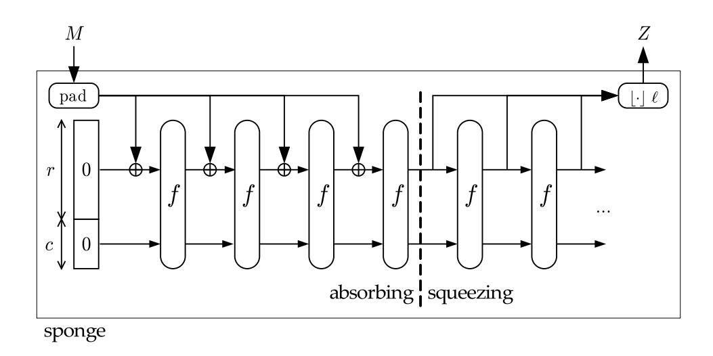
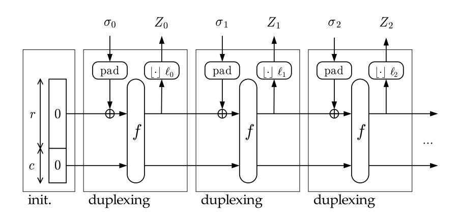
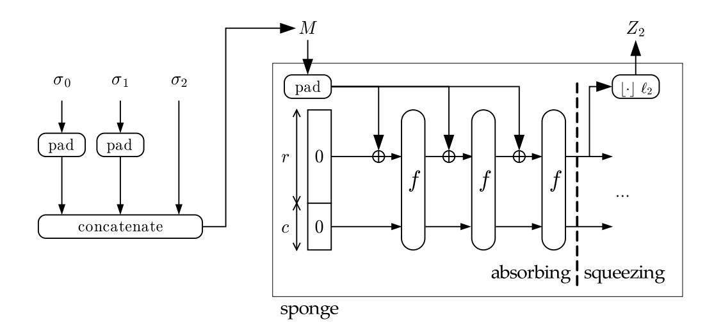

# **Duplexing the sponge: single-pass authenticated encryption and other applications**

Guido Bertoni<sup>1</sup> , Joan Daemen<sup>1</sup> , Michaël Peeters<sup>2</sup> , and Gilles Van Assche<sup>1</sup>

> <sup>1</sup> STMicroelectronics <sup>2</sup> NXP Semiconductors

**Abstract.** This paper proposes a novel construction, called duplex, closely related to the sponge construction, that accepts message blocks to be hashed and—at no extra cost—provides digests on the input blocks received so far. It can be proven equivalent to a cascade of sponge functions and hence inherits its security against single-stage generic aĴacks. The main application proposed here is an authenticated encryption mode based on the duplex construction. This mode is efficient, namely, enciphering and authenticating together require only a single call to the underlying permutation per block, and is readily usable in, e.g., key wrapping. Furthermore, it is the first mode of this kind to be directly based on a permutation instead of a block cipher and to natively support intermediate tags. The duplex construction can be used to efficiently realize other modes, such as a reseedable pseudo-random bit sequence generators and a sponge variant that overwrites part of the state with the input block rather than to XOR it in.

**Keywords:** sponge functions, duplex construction, authenticated encryption, key wrapping, provable security, pseudo-random bit sequence generator, Keccak

## **1 Introduction**

While most symmetric-key modes of operations are based on a block cipher or a stream cipher, there exist modes using a fixed permutation as underlying primitive. Designing a cryptographically strong permutation suitable for such purposes is similar to designing a block cipher without a key schedule and this design approach was followed for several recent hash functions, see, e.g., [19].

The sponge construction is an example of such a mode. With its arbitrarily long input and output sizes, it allows building various primitives such as a stream cipher or a hash function [7]. In the former, the input is short (typically the key and a nonce) while the output is as long as the messag[e to](#page-18-0) encrypt. In contrast, the laĴer takes a message of any length at input and produces a digest of small length.

Some applications can take advantage of both a long input and a long output size. For instance, [au](#page-18-1)thenticated encryption combines the encryption of a message and the generation of a message authentication code (MAC) on it. It could be implemented with one sponge function call to generate a key stream (long output) for the encryption and another call to generate the MAC (long input). However, in this case, encryption and authentication are separate processes without any synergy.

The duplex construction is a novel way to use a fixed permutation (or transformation) to allow the alternation of input and output blocks at the same rate as the sponge construction, like a full-duplex communication. In fact, the duplex construction can be seen as a particular way to use the sponge construction, hence it inherits its security properties. By using the duplex construction, authenticated encryption requires only one call to the underlying permutation (or transformation) per message block. In a nutshell, the input blocks of the duplex are used to input the key and the message blocks, while the intermediate output blocks are used as key stream and the last one as a MAC.

Authenticated encryption (AE) has been extensively studied in the last ten years. Block cipher modes clearly are a popular way to provide simultaneously both integrity and confidentiality. Many block cipher modes have been proposed and most of these come with a security proof against generic attacks, e.g., [3,21,28,45,38,5,30,43,32,24,46,39,25,27,26,31]. Interestingly, there have also been attempts at designing dedicated hybrid primitives offering efficient simultaneous stream encryption and MAC computation, e.g., Helix and Phelix [20,48]. However, these primitives were shown to be weak [36,40,49]. Another example of hybrid primitive is the Grain-128 stream cipher to which optional built-in authentication was recently added [50].

Our proposed mode shares with these hybrid primitives that it offers efficient simultaneous stream encryption and MAC computation. It shares with the block cipher modes that it has provable security against generic attacks. However, it is the first such construction that (directly) relies on a permutation rather than a block cipher and that proves its security based on this type of primitive. An important efficiency parameter of an AE mode is the number of calls to the block cipher or to the permutation per block. While encryption or authentication alone requires one call per block, some AE modes only require one call per block for both functions. The duplex construction naturally provides a good basis for building such an efficient AE mode. Also, the AE mode we propose natively supports intermediate tags and the authenticated encryption of a sequence of messages.

Authenticated encryption can also be used to transport secret keys in a confidential way and to ensure their integrity. This task, called key wrapping, is very important in key management and can be implemented with our construction if each key has a unique identifier.

Finally, the duplex construction can be used for other modes as well, such as a reseedable pseudo-random bit sequence generator (PRG) or to prove the security of an "overwrite" mode where the input block overwrites part of the state instead of XORing it in.

These modes can readily be used by the concrete sponge function Keccak [11] and the members of a recent wave of lightweight hash functions that are in fact sponge functions: Quark [2], Photon [23] and Spongent [14]. For these, and for the small-width instances of Keccak, our security bound against generic attacks beyond the birthday bound published in [10] allows constructing solutions that are at the same time compact, efficient and potentially secure.

The remainder of this paper is organized as follows. First, we propose a model for authenticated encryption in Section 2. Then in Section 3, we review the sponge construction. The core concept of this paper, namely the duplex construction, is defined in Section 4. Its use for authenticated encryption is given in Section 5 and for other applications in Section 6. Finally, Section 7 discusses the use of a flexible and compact padding.

# 2 Modeling authenticated encryption

<span id="page-1-0"></span>We consider authenticated encryption as a process that takes as input a key K, a data header A and a data body B and that returns a cryptogram C and a tag T. We denote this operation by the term wrapping and the operation of taking a data header A, a cryptogram C and a tag T and returning the data body B if the tag T is correct by the term unwrapping.

The cryptogram is the data body enciphered under the key K and the tag is a MAC computed under the same key K over both header A and body B. So here the header A can play the role of associated data as described in [42]. We assume the wrapping and unwrapping operations as such to be deterministic. Hence two equal inputs (A, B) = (A', B') will give rise to the same output (C, T) under the same key K. If this is a problem, it can be tackled by expanding A with a nonce.

Formally, for a given key length k and tag length t, we consider a pair of algorithms W and U, with

$$W: \mathbb{Z}_2^k \times (\mathbb{Z}_2^*)^2 \to \mathbb{Z}_2^* \times \mathbb{Z}_2^t : (K, A, B) \to (C, T) = W(K, A, B)$$
, and  $U: \mathbb{Z}_2^k \times (\mathbb{Z}_2^*)^2 \times \mathbb{Z}_2^t \to \mathbb{Z}_2^* \cup \{\text{error}\} : (K, A, C, T) \to B \text{ or error.}$

The algorithms are such that if (C, T) = W(K, A, B) then U(K, A, C, T) = B. As we consider only the case of non-expanding encryption, we assume from now on that |C| = |B|.

#### 2.1 Intermediate tags and authenticated encryption of a sequence

<span id="page-2-1"></span>So far, we have only considered the case of the authentication and encryption of a single message, i.e., a header and body pair (A, B). It can also be interesting to authenticate and encrypt a sequence of messages in such a way that the authenticity is guaranteed not only on each (A, B) pair but also on the sequence received so far. Intermediate tags can also be useful in practice to be able to catch fraudulent transactions early.

Let  $(\overline{A}, \overline{B}) = (A^{(1)}, B^{(1)}, A^{(2)}, \dots, A^{(n)}, B^{(n)})$  be a sequence of header-body pairs. We extend the function of wrapping and unwrapping as providing encryption over the last body  $B^{(n)}$  and authentication over the whole sequence  $(\overline{A}, \overline{B})$ . Formally, W and W are defined as:

$$W: \mathbb{Z}_2^k \times (\mathbb{Z}_2^*)^{2+} \to \mathbb{Z}_2^* \times \mathbb{Z}_2^t : (K, \overline{A, B}) \to (C^{(\text{last})}, T^{(\text{last})}) = W(K, \overline{A, B}), \text{ and } U: \mathbb{Z}_2^k \times (\mathbb{Z}_2^*)^{2+} \times \mathbb{Z}_2^t \to \mathbb{Z}_2^* \cup \{\text{error}\} : (K, \overline{A, C}, T^{(\text{last})}) \to B^{(\text{last})} \text{ or error.}$$

Here,  $(\mathbb{Z}_2^*)^{2+}$  means any sequence of binary strings, with an even number of such strings and at least two. To wrap a sequence of header-body pairs, the sender calls  $W(K,A^{(1)},B^{(1)})$  with the first header-body pair to get  $(C^{(1)},T^{(1)})$ , then  $W(K,A^{(1)},B^{(1)},A^{(2)},B^{(2)})$  with the second one to get  $(C^{(2)},T^{(2)})$ , and so on. To unwrap, the receiver first calls  $U(K,A^{(1)},C^{(1)},T^{(1)})$  to retrieve the first body  $B^{(1)}$ , then  $U(K,A^{(1)},C^{(1)},A^{(2)},C^{(2)},T^{(2)})$  to retrieve the second body, and so on. As we consider only the case of non-expanding encryption, we assume that  $|C^{(i)}|=|B^{(i)}|$  for all i.

## 2.2 Security requirements

We consider two security notions from [45] and works cited therein, called *privacy* and *authenticity*. Together, these notions are central to the security of authenticated encryption [3].

Privacy is defined in Eq. (1) below. Informally, it means that the output of the wrapping function looks like uniformly chosen random bits to an observer who does not know the key.

$$Adv^{\text{priv}}(\mathcal{A}) = \left| \Pr[K \xleftarrow{\$} \mathbb{Z}_2^k : \mathcal{A}[W(K, \cdot, \cdot)] = 1] - \Pr[\mathcal{A}[R(\cdot, \cdot)] = 1] \right|, \tag{1}$$

<span id="page-2-0"></span>with  $R(\overline{A,B}) = \lfloor \mathcal{RO}(\overline{A,B}) \rfloor_{|B^{(n)}|+t}$  where  $B^{(n)}$  is the last body in  $\overline{A,B}$ , |x| is the bitlength of string x,  $\lfloor \cdot \rfloor_{\ell}$  indicates truncation to  $\ell$  bits and  $K \stackrel{\$}{\leftarrow} \mathbb{Z}_2^k$  means that K is chosen randomly and uniformly among the set  $\mathbb{Z}_2^k$ . In this definition, we use a random oracle  $\mathcal{RO}$  as defined in [4], but allowing sequences of one or more binary strings as input (instead of a single binary string). Here, a random oracle is a map from  $(\mathbb{Z}_2^*)^+$  to  $\mathbb{Z}_2^\infty$ , chosen by selecting each bit of  $\mathcal{RO}(x)$  uniformly and independently, for every input. The original definition can still be used by defining an injective mapping from  $(\mathbb{Z}_2^*)^+$  to  $\mathbb{Z}_2^*$ .

For privacy, we consider only adversaries who respect the nonce requirement. For a single header-body pair, it means that, for any two queries (A, B) and (A', B'), we have  $A = A' \Rightarrow B = B'$ . In general, the nonce requirement specifies that for any two queries  $(\overline{A}, \overline{B})$  and  $(\overline{A'}, \overline{B'})$  of equal length n, we have

$$\operatorname{pre}(\overline{A,B}) = \operatorname{pre}(\overline{A',B'}) \Rightarrow B^{(n)} = B'^{(n)},$$

with  $\operatorname{pre}(\overline{A}, \overline{B}) = (A^{(1)}, B^{(1)}, A^{(2)}, \dots, B^{(n-1)}, A^{(n)})$  the sequence with the last body omitted. As for a stream cipher, not respecting the nonce requirement means that the adversary can learn the bitwise difference between two plaintext bodies.

Authenticity is defined in Eq. (2) below. Informally, it quantifies the probability of the adversary successfully generating a forged ciphertext-tag pair.

<span id="page-3-1"></span>
$$Adv^{\text{auth}}(\mathcal{A}) = \Pr[K \xleftarrow{\$} \mathbb{Z}_2^k : \mathcal{A}[W(K,\cdot,\cdot)] \text{ outputs a forgery}]. \tag{2}$$

Here a forgery is a sequence  $(\overline{A}, \overline{C}, T)$  such that  $U(K, \overline{A}, \overline{C}, T) \neq$  error and that the adversary made no query to W with input  $(\overline{A}, \overline{B})$  returning  $(C^{(n)}, T)$ , with  $C^{(n)}$  the last ciphertext body of  $\overline{A}, \overline{C}$ . Note that authenticity does not need the nonce requirement.

### 2.3 An ideal system

We can define an ideal system using a pair of independent random oracles  $(\mathcal{RO}_C, \mathcal{RO}_T)$ . For a single header-body pair, encryption and tag computation are implemented as follows. The ciphertext C is produced by XORing B with a key stream. This key stream is the output of  $\mathcal{RO}_C(K,A)$ . If (K,A) is a nonce, key streams for different data inputs are the result of calls to  $\mathcal{RO}_C$  with different inputs and hence one key stream gives no information on another. The tag T is the output of  $\mathcal{RO}_T(K,A,B)$ . Tags computed over different header-body pairs will be the result of calls to  $\mathcal{RO}_T$  with different inputs. Key stream sequences give no information on tags and vice versa as they are obtained by calls to different random oracles.

Let us define the ideal system in the general case, which we call ROWRAP. Wrapping is defined as  $W(K, \overline{A}, \overline{B}) = (C^{(n)}, T^{(n)})$ , if  $\overline{A}, \overline{B}$  contains n header-body pairs, with

$$C^{(n)} = \lfloor \mathcal{RO}_{\mathbb{C}}(K, \operatorname{pre}(\overline{A, B})) \rfloor_{|B^{(n)}|} \oplus B^{(n)},$$


$$T^{(n)} = \lfloor \mathcal{RO}_{\mathbb{T}}(K, \overline{A, B}) \rfloor_{t}.$$

The unwrapping algorithm U first checks that  $T^{(n)} = \lfloor \mathcal{RO}_{\mathbf{T}}(K, \overline{A}, \overline{B}) \rfloor_t$  and if so decrypts each body  $B^{(i)} = \lfloor \mathcal{RO}_{\mathbf{C}}(K, A^{(1)}, B^{(1)}, A^{(2)}, \dots, A^{(i)}) \rfloor_{|\mathbf{C}^{(i)}|} \oplus C^{(i)}$  from the first one to the last one and finally returns the last one  $B^{(n)} = \lfloor \mathcal{RO}_{\mathbf{C}}(K, \operatorname{pre}(\overline{A}, \overline{B})) \rfloor_{|\mathbf{C}^{(n)}|} \oplus C^{(n)}$ .

The security of ROWRAP is captured by Lemmas 1 and 2.

**Lemma 1.** Let  $\mathcal{A}[\mathcal{RO}_C, \mathcal{RO}_T]$  be an adversary having access to  $\mathcal{RO}_C$  and  $\mathcal{RO}_T$  and respecting the nonce requirement. Then,  $Adv^{priv}_{\mathcal{RO}_{WRAP}}(\mathcal{A}) \leq q2^{-k}$  if the adversary makes no more than q queries to  $\mathcal{RO}_C$  or  $\mathcal{RO}_T$ .

*Proof.* For any fixed last body  $B^{(n)}$ , the output of ROWRAP is indistinguishable from that of  $\mathcal{RO}$  used in Eq. (1), unless  $\mathcal{A}$  makes a query to  $\mathcal{RO}_{\mathbb{C}}$  or  $\mathcal{RO}_{\mathbb{T}}$  with the correct key K as first argument. This last event has probability  $q2^{-k}$  among q queries and the advantage can be bounded following [34, Theorem 1]. The conclusion is still valid for a variable  $B^{(n)}$ , as a different  $B^{(n)}$  implies a different pre $(\overline{A}, \overline{B})$ .

**Lemma 2.** Let  $\mathcal{A}[\mathcal{RO}_C, \mathcal{RO}_T]$  be an adversary having access to  $\mathcal{RO}_C$  and  $\mathcal{RO}_T$ . Then, ROWRAP satisfies  $Adv^{auth}_{ROWRAP}(\mathcal{A}) \leq q2^{-k} + 2^{-t}$  if the adversary makes no more than q queries to  $\mathcal{RO}_C$  or  $\mathcal{RO}_T$ .

*Proof.* A similar argument as in Lemma 1 can be applied here. In addition, the adversary can just be lucky and output the correct tag T with probability  $2^{-t}$ .

# 3 The sponge construction

<span id="page-3-0"></span>The sponge construction [7] builds a function sponge[f,pad,r] with variable-length input and arbitrary output length using a fixed-length permutation (or transformation) f, a padding rule "pad" and a parameter  $bitrate\ r$ .

For the padding rule we use the following notation: the padding of a message *M* to a sequence of *x*-bit blocks is denoted by *M||*pad[*x*](*|M|*), where *|M|* is the length of *M*. This notation highlights that we only consider padding rules that append a bitstring that is fully determined by the length of *M* and the block length *x*. We may omit [*x*], *|M|* or both if their value is clear from the context.

**Definition 1.** *A padding rule is* sponge-compliant *if it never results in the empty string and if it satisfies following criterion:*

$$\forall n \geq 0, \forall M, M' \in \mathbb{Z}_2^* : M \neq M' \Rightarrow M||\operatorname{pad}[r](|M|) \neq M'||\operatorname{pad}[r](|M'|)||0^{nr}$$
 (3)

For the sponge construction to be secure (see Section 3.2), the padding rule pad must be sponge-compliant. As a sufficient condition, a padding rule that is reversible, non-empty and such that the last block must be non-zero, is sponge-compliant [7].

### **3.1 Definition**

The permutation *f* operates on a fixed number of bits, the *width b*. The [s](#page-18-1)ponge construction has a state of *b* bits. First, all the bits of the state are initialized to zero. The input message is padded with the function pad[*r*] and cut into *r*-bits blocks. Then it proceeds in two phases: the *absorbing phase* followed by the *squeezing phase*:

**Absorbing phase** The *r*-bit input message blocks are XORed into the first *r* bits of the state, interleaved with applications of the function *f* . When all message blocks are processed, the sponge construction switches to the squeezing phase.

**Squeezing phase** The first *r* bits of the state are returned as output blocks, interleaved with applications of the function *f* . The number of iterations is determined by the requested number of bits.

Finally the output is truncated to the requested length. The sponge construction is illustrated in Figure 1, and Algorithm 1 provides a formal definition.



**Fig. 1.** The sponge construction

The value *c* = *b − r* is called the *capacity*. The last *c* bits of the state are never directly affected by the input blocks and are never output during the squeezing phase. The capacity *c* actually determines the aĴainable security level of the construction [8,10].

```
Require: r < b
```

```
Interface: Z = \operatorname{sponge}(M,\ell) with M \in \mathbb{Z}_2^*, integer \ell > 0 and Z \in \mathbb{Z}_2^\ell P = M||\operatorname{pad}[r](|M|) Let P = P_0||P_1||\dots||P_w with |P_i| = r s = 0^b for i = 0 to w do s = s \oplus (P_i||0^{b-r}) s = f(s) end for Z = \lfloor s \rfloor_r while |Z| < \ell do s = f(s) Z = Z||\lfloor s \rfloor_r end while return \lfloor Z \rfloor_\ell
```

### 3.2 Security

<span id="page-5-0"></span>Cryptographic functions are often designed in two steps. In the first step, one chooses a construction that uses a cryptographic primitive with fixed input and output size (e.g., a compression function or a permutation) and builds a function that can take inputs and or generate outputs of arbitrary size. If the security of this construction can be proven, for instance as in this case using the indifferentiability framework, it reduces the scope of cryptanalysis to that of the underlying primitive and guarantees the absence of single-stage generic attacks (e.g., preimage, second preimage and collision attacks) [35]. However, generic security in the multi-stage setting using the indifferentiability framework is currently an open problem [41].

It is shown in [8] that the success probability of any single-stage generic attack for differentiating the sponge construction calling a random permutation or transformation from a random oracle is upper bounded by  $2^{-(c+1)}N^2$ . Here N is the number of calls to the underlying permutation or its inverse. This implies that any single-stage generic attack on a sponge function has success probability of at most  $2^{-(c+1)}N^2$  plus the success probability of this attack on a random oracle.

In [10], we address the security of the sponge construction when the message is prefixed with a key, as it will be done in the mode of Section 5. In this specific case, the security proof goes beyond the  $2^{c/2}$  complexity if the number of input or output blocks for which the key is used (data complexity) is upper bounded by  $M < 2^{c/2-1}$ . In that case, distinguishing the keyed sponge from a random oracle has time complexity of at least  $2^{c-1}/M > 2^{c/2}$ . Hence, for keyed modes, one can reduce the capacity c for the same targeted security level.

#### 3.3 Implementing authenticated encryption

The simplest way to build an actual system that behaves as ROWRAP would be to replace the random oracles  $\mathcal{RO}_{\mathbb{C}}$  and  $\mathcal{RO}_{\mathbb{T}}$  by a sponge function with domain separation. The indifferentiability proof in [8] guarantees the result is secure if the permutation f of the sponge function has no structural distinguishers.

However, such a solution requires two sponge function executions: one for the generation of the key stream and one for the generation of the tag, while we aim for a single-pass solution. To achieve this, we define a variant where the key stream blocks and tag are the responses of a sponge function to input sequences that are each other's prefix. This introduces a new construction that is closely related to the sponge construction: the duplex construction. Subsequently, we build an authenticated encryption mode on top of that.

### 4 The duplex construction

Like the sponge construction, the *duplex construction* DUPLEX[f, pad, r] uses a fixed-length transformation (or permutation) f, a padding rule "pad" and a parameter bitrate r. Unlike a sponge function that is stateless in between calls, the duplex construction accepts calls that take an input string and return an output string depending on all inputs received so far. We call an instance of the duplex construction a *duplex object*, which we denote D in our descriptions. We prefix the calls made to a specific duplex object D by its name D and a dot.



Fig. 2. The duplex construction

<span id="page-6-0"></span>The duplex construction works as follows. A duplex object D has a state of b bits. Upon initialization all the bits of the state are set to zero. From then on one can send to it D.duplexing( $\sigma$ ,  $\ell$ ) calls, with  $\sigma$  an input string and  $\ell$  the requested number of bits.

```
Algorithm 2 The duplex construction DUPLEX[f, pad, r]
```

```
Require: r < b
Require: \rho_{\max}(\operatorname{pad}, r) > 0
Require: \rho_{\max}(\operatorname{pad}, r) > 0
Require: s \in \mathbb{Z}_2^b (maintained across calls)

Interface: D.initialize()
s = 0^b

Interface: Z = D.duplexing(\sigma, \ell) with \ell \leq r, \sigma \in \bigcup_{n=0}^{\rho_{\max}(\operatorname{pad}, r)} \mathbb{Z}_2^n, and Z \in \mathbb{Z}_2^\ell
P = \sigma||\operatorname{pad}[r](|\sigma|)
s = s \oplus (P||0^{b-r})
s = f(s)
return |s|_{\ell}
```

The maximum number of bits  $\ell$  one can request is r and the input string  $\sigma$  shall be short enough such that after padding it results in a single r-bit block. We call the maximum length of  $\sigma$  the *maximum duplex rate* and denote it by  $\rho_{\max}(\text{pad},r)$ . Formally:

<span id="page-6-2"></span>
$$\rho_{\max}(\text{pad}, r) = \min\{x : x + |\text{pad}[r](x)| > r\} - 1. \tag{4}$$

Upon receipt of a D.duplexing( $\sigma$ ,  $\ell$ ) call, the duplex object pads the input string  $\sigma$  and XORs it into the first r bits of the state. Then it applies f to the state and returns the first



Fig. 3. Generating the output of a duplexing call with a sponge

 $\ell$  bits of the state at the output. We call a *blank call* a call with  $\sigma$  the empty string, and a *mute call* a call without output,  $\ell=0$ . The duplex construction is illustrated in Figure 2, and Algorithm 2 provides a formal definition.

The following lemma links the security of the duplex construction  $\mathtt{DUPLEX}[f,\mathtt{pad},r]$  to that of the sponge construction  $\mathtt{SPONGE}[f,\mathtt{pad},r]$ . Generating the output of a D.duplexing() call using a sponge function is illustrated in Figure 3.

**Lemma 3.** [Duplexing-sponge lemma] *If we denote the input to the i-th call to a duplex object by*  $(\sigma_i, \ell_i)$  *and the corresponding output by*  $Z_i$  *we have:*

$$Z_i = D.\text{duplexing}(\sigma_i, \ell_i) = \text{sponge}(\sigma_0||\text{pad}_0||\sigma_1||\text{pad}_1||\dots||\sigma_i, \ell_i)$$

<span id="page-7-0"></span>with  $pad_i$  a shortcut notation for  $pad[r](|\sigma_i|)$ .

*Proof.* The proof is by induction on the number of input strings  $\sigma_i$ .

First consider the case i=0. We must prove  $D.\mathrm{duplexing}(\sigma_0,\ell_0)=\mathrm{sponge}(\sigma_0,\ell_0)$ . The state of the duplex object before the call has value  $0^b$ , the same as the initial state of the sponge function. Both in the case of the sponge function and the duplex object the input string is padded with pad resulting in a single r-bit block P. Then, in both cases P is XORed to the first r bits of the state and f is applied to the state. At this point the sponge function and the duplex object have the same state and both return the first  $\ell \leq r$  bits of the state as output string. Since the sponge function does not do any additional iterations of f on the state, the state of the duplex object after the call  $D.\mathrm{duplexing}(\sigma_0,\ell_0)$  is equal to the state of the sponge construction after absorbing a single block  $\sigma_0||\mathrm{pad}_0$ .

Now assume that after the call D.duplexing  $(\sigma_{i-1}, \ell_{i-1})$  the duplex object has the same state as the sponge function after absorbing  $\sigma_0||\mathrm{pad}_0||\sigma_1||\mathrm{pad}_1||\dots||\sigma_{i-1}||\mathrm{pad}_{i-1}$ . During the call D.duplexing  $(\sigma_i, \ell_i)$ , the block  $\sigma_i||\mathrm{pad}_i$  is XORed into the first r bits of the state and subsequently f is applied to the state. It follows that the state of the duplex object D after the call D.duplexing  $(\sigma_i, \ell_i)$  is equal to the state of the sponge function after absorbing  $\sigma_0||\mathrm{pad}_0||\sigma_1||\mathrm{pad}_1||\dots\sigma_i||\mathrm{pad}_i$ . As the output just consists of the first  $\ell_i$  bits of the state, this proves Lemma 3.

The output of a duplexing call is thus the output of a sponge function with an input  $\sigma_0||\mathrm{pad}_0||\sigma_1||\mathrm{pad}_1||\dots||\sigma_i|$  and from this input the exact sequence  $\sigma_0,\sigma_1,\dots,\sigma_i$  can be recovered as shown in Lemma 4 below. As such, the duplex construction is as secure as

the sponge construction with the same parameters. In particular, it inherits its resistance against (single-stage) generic attacks. The reference point in this case is a random oracle whose input is the sequence of inputs to the duplexing calls since the initialization.

**Lemma 4.** Let pad and r be fixed. Then, the mapping from a sequence  $(\sigma_0, \sigma_1, \ldots, \sigma_n)$  of binary strings with  $|\sigma_i| \leq \rho_{\max}(\text{pad}, r) \, \forall i$  to the binary string  $s = \sigma_0 ||\text{pad}_0||\sigma_1||\text{pad}_1||\ldots||\text{pad}_{n-1}||\sigma_n||$  is injective.

<span id="page-8-1"></span>*Proof.* The length of  $\sigma_n$  can be determined as  $|\sigma_n| = |s| \mod r$ ; this allows recovering  $\sigma_n$  from s. Then, if n > 0, pad<sub>n-1</sub> can be removed and the process continues recursively with  $s' = \sigma_0 ||\text{pad}_0||\sigma_1||\text{pad}_1||\dots||\sigma_{n-1}$ .

In the following sections we will show that the duplex construction is a powerful tool for building modes of use.

## 5 The authenticated encryption mode SpongeWrap

We propose an authenticated encryption mode SpongeWrap that realizes the authenticated encryption process defined in Section 2. Similarly to the duplex construction, we call an instance of the authenticated encryption mode a SpongeWrap object.

<span id="page-8-0"></span>Upon initialization of a SpongeWrap object, it loads the key K. From then on one can send requests to it for wrapping and/or unwrapping data. The key stream blocks used for encryption and the tags depend on the key K and the data sent in all previous requests. The authenticated encryption of a sequence of header-body pairs, as described in Section 2.1, can be performed with a sequence of wrap or unwrap requests to a SpongeWrap object.

#### 5.1 Definition

A SpongeWrap object W internally uses a duplex object D with parameters f, pad and r. Upon initialization of a SpongeWrap object, it initializes D and forwards the (padded) key blocks K to D using mute D.duplexing() calls.

When receiving a  $W.\text{wrap}(A, B, \ell)$  request, it forwards the blocks of the (padded) header A and the (padded) body B to D. It generates the cryptogram C block by block  $C_i = B_i \oplus Z_i$  with  $Z_i$  the response of D to the previous D.duplexing() call. The  $\ell$ -bit tag T is the response of D to the last body block (possibly extended with the response to additional blank D.duplexing() calls in case  $\ell > \rho$ ). Finally it returns the cryptogram C and the tag T.

When receiving a W-unwrap(A, C, T) request, it forwards the blocks of the (padded) header A to D. It decrypts the data body B block by block  $B_i = C_i \oplus Z_i$  with  $Z_i$  the response of D to the previous D-duplexing() call. The response of D to the last body block (possibly extended) is compared with the tag T received as input. If the tag is valid, it returns the data body B; otherwise, it returns an error. Note that in implementations one may impose additional constraints, such as SpongeWrap objects dedicated to either wrapping or unwrapping. Additionally, the SpongeWrap object should impose a minimum length t for the tag received before unwrapping and could break the entire session as soon as an incorrect tag is received.

Before being forwarded to D, every key, header, data or cryptogram block is extended with a so-called *frame bit*. The rate  $\rho$  of the SpongeWrap mode determines the size of the blocks and hence the maximum number of bits processed per call to f. Its upper bound is  $\rho_{\max}(\text{pad},r)-1$  due to the inclusion of one frame bit per block. A formal definition of SpongeWrap is given in Algorithm 3.

#### **Algorithm 3** The authenticated encryption mode SpongeWrap[f, pad, r, $\rho$ ].

```
Require: \rho \leq \rho_{\text{max}}(\text{pad}, r) - 1
Require: D = \text{DUPLEX}[f, \text{pad}, r]
 1: Interface: W.initialize(K) with K \in \mathbb{Z}_2^*
 2: Let K = K_0 ||K_1|| \dots ||K_u|| with |K_i| = \rho for i < u, |K_u| \le \rho and |K_u| > 0 if u > 0
 3: D.initialize()
 4: for i = 0 to u - 1 do
       D.\text{duplexing}(K_i||1,0)
 6: end for
 7: D.\text{duplexing}(K_u||0,0)
 8: Interface: (C, T) = W.\text{wrap}(A, B, \ell) with A, B \in \mathbb{Z}_2^*, \ell \ge 0, C \in \mathbb{Z}_2^{|B|} and T \in \mathbb{Z}_2^{\ell}
9: Let A = A_0 ||A_1|| \dots ||A_v|| with |A_i| = \rho for i < v, |A_v| \le \rho and |A_v| > 0 if v > 0
10: Let B = B_0 ||B_1|| \dots ||B_w| with |B_i| = \rho for i < w, |B_w| \le \rho and |B_w| > 0 if w > 0
11: for i = 0 to v - 1 do
12: D.\text{duplexing}(A_i||0,0)
13: end for
14: Z = D.duplexing(A_v||1, |B_0|)
15: C = B_0 \oplus Z
16: for i = 0 to w - 1 do
17: Z = D.duplexing(B_i||1,|B_{i+1}|)
18: C = C||(B_{i+1} \oplus Z)|
19: end for
20: Z = D.\text{duplexing}(B_w||0,\rho)
21: while |Z| < \ell do
22: Z = Z||D.\text{duplexing}(0, \rho)|
23: end while
24: T = |Z|_{\ell}
25: return (C,T)
26: Interface: B = W.unwrap(A, C, T) with A, C, T \in \mathbb{Z}_2^*, B \in \mathbb{Z}_2^{|C|} \cup \{\text{error}\}
27: Let A = A_0 ||A_1|| \dots ||A_v|| with |A_i| = \rho for i < v, |A_v| \le \rho and |A_v| > 0 if v > 0
28: Let C = C_0 ||C_1|| \dots ||C_w| with |C_i| = \rho for i < w, |C_w| \le \rho and |C_w| > 0 if w > 0 29: Let T = T_0 ||T_1|| \dots ||T_x|| with |T_i| = \rho for i < x, |C_x| \le \rho and |C_x| > 0 if x > 0
30: for i = 0 to v - 1 do
31: D.\text{duplexing}(A_i||0,0)
32: end for
33: Z = D.\text{duplexing}(A_v||1,|C_0|)
34: B_0 = C_0 \oplus Z
35: for i = 0 to w - 1 do
       Z = D.duplexing(B_i||1, |C_{i+1}|)
36:
37:
       B_{i+1} = C_{i+1} \oplus Z
38: end for
39: Z = D.\text{duplexing}(B_w||0,\rho)
40: while |Z| < \ell do
41: Z = Z||D.\text{duplexing}(0, \rho)|
42: end while
43: if T = |Z|_{\ell} then
        return B_0||B_1||\dots B_w
45: else
46.
        return Error
47: end if
```

### 5.2 Security

In this section, we show the security of SpongeWrap against generic attacks. To do so, we proceed in two steps. First, we define a variant of ROwrap for which the key stream depends not only on A but also on previous blocks of B. Then, we quantify the increase in the adversary advantage when trading the random oracles  $\mathcal{RO}_{\mathbb{C}}$  and  $\mathcal{RO}_{\mathbb{T}}$  with a random sponge function and appropriate input mappings.

For a fixed block length  $\rho$ , let  $\operatorname{pre}_i(\overline{A,B}) = (A^{(1)},B^{(1)},A^{(2)},\ldots,B^{(n-1)},A^{(n)},\lfloor B^{(n)}\rfloor_{i\rho})$ , i.e., the last body  $B^{(n)}$  is truncated to its first i blocks of  $\rho$  bits. We define  $\operatorname{ROwrap}[\rho]$  identically to  $\operatorname{ROwrap}$ , except that in the wrapping algorithm, we have

$$\begin{split} C^{(n)} = & \lfloor \mathcal{RO}_{\mathsf{C}}(K, \mathsf{pre}_0(\overline{A,B})) \rfloor_{|B_0^{(n)}|} \oplus B_0^{(n)} \\ & ||\lfloor \mathcal{RO}_{\mathsf{C}}(K, \mathsf{pre}_1(\overline{A,B})) \rfloor_{|B_1^{(n)}|} \oplus B_1^{(n)} \\ & \cdots \\ & ||\lfloor \mathcal{RO}_{\mathsf{C}}(K, \mathsf{pre}_w(\overline{A,B})) \rfloor_{|B_w^{(n)}|} \oplus B_w^{(n)} \end{split}$$

for  $B^{(n)} = B_0^{(n)} ||B_1^{(n)}|| \dots ||B_w^{(n)}||$  with  $|B_i^{(n)}| = \rho$  for i < w,  $|B_w^{(n)}| \le \rho$  and  $|B_w^{(n)}| > 0$  if w > 0. The unwrap algorithm U is defined accordingly.

The scheme  $ROwrap[\rho]$  is as secure as ROwrap, as expressed in the following two lemmas. We omit the proofs, as they are very similar to those of Lemma 1 and 2.

**Lemma 5.** Let  $\mathcal{A}[\mathcal{RO}_C, \mathcal{RO}_T]$  be an adversary having access to  $\mathcal{RO}_C$  and  $\mathcal{RO}_T$  and respecting the nonce requirement. Then,  $Adv^{priv}_{\mathcal{RO}_{WRAP}[\rho]}(\mathcal{A}) \leq q2^{-k}$  if the adversary makes no more than q queries to  $\mathcal{RO}_C$  or  $\mathcal{RO}_T$ .

<span id="page-10-1"></span>**Lemma 6.** Let  $\mathcal{A}[\mathcal{RO}_C, \mathcal{RO}_T]$  be an adversary having access to  $\mathcal{RO}_C$  and  $\mathcal{RO}_T$ . Then, ROWRAP satisfies  $\operatorname{Adv}^{\operatorname{auth}}_{RO_{WRAP}[\rho]}(\mathcal{A}) \leq q2^{-k} + 2^{-t}$  if the adversary makes no more than q queries to  $\mathcal{RO}_C$  or  $\mathcal{RO}_T$ .

<span id="page-10-2"></span>Clearly, ROWRAP and ROWRAP[ $\rho$ ] are equally secure if we implement  $\mathcal{RO}_{C}$  and  $\mathcal{RO}_{T}$  using a single random oracle with domain separation:  $\mathcal{RO}_{C}(x) = \mathcal{RO}(x||1)$  and  $\mathcal{RO}_{T}(x) = \mathcal{RO}(x||0)$ . Notice that SpongeWrap uses the same domain separation technique: the last bit of the input of the last duplexing call is always a 1 (resp. 0) to produce key stream bits (resp. to produce the tag). With this change, SpongeWrap now works like ROWRAP[ $\rho$ ], except that the input is formatted differently and that a sponge function replaces  $\mathcal{RO}$ . The next lemma focuses on the former aspect.

**Lemma 7.** Let  $(K, \overline{A}, \overline{B})$  be a sequence of strings composed by a key followed by header-body pairs. Then, the mapping from  $(K, \overline{A}, \overline{B})$  to the corresponding sequence of inputs  $(\sigma_0, \sigma_1, \ldots, \sigma_n)$  to the duplexing calls in Algorithm 3 is injective.

<span id="page-10-0"></span>*Proof.* We show that from  $(\sigma_0, \sigma_1, \dots, \sigma_n)$  we can always recover  $(K, \overline{A}, \overline{B})$ . The convention is that, when cutting input strings into blocks of  $\rho$  bits, there is always at least one block (see, e.g., line 2 of Algorithm 3). Consequently, any (possibly empty) input string causes at least one duplexing call (e.g., see lines 7, 14 and 20) or equivalently at least one element  $\sigma_i$ .

The key K can be found by looking for the first block  $\sigma_i$  that ends with frame bit 0; the key K is concatenation of the blocks  $\sigma_j$ ,  $j \leq i$ , with their last bit removed. Then we look for the first block  $\sigma_{i'}$ , i' > i, that ends with a frame bit 1; blocks from  $\sigma_{i+1}$  to  $\sigma_{i'}$  are concatenated with their last bit removed to give the first header  $A^{(1)}$ . To find the first body  $B^{(1)}$ , we follow the same procedure, except that we look for the first block  $\sigma_{i''}$ , i'' > i', that

ends with a bit 0. This operation is repeated to find the next header *A* (2) and the next body *B* (2) . And so on.

Note that the blocks *σ* produced by line 22 of Algorithm 3 do not contribute to neither a header nor a body as they contain only one bit, which is removed in the above procedure.

*⊓⊔*

We now have all the ingredients to pro[ve](#page-9-5) the followin[g t](#page-9-0)heorem.

**Theorem 1.** *The authenticated encryption mode SѝќћєђWџюѝ*[ *f* , pad,*r*, *ρ*] *defined in Algorithm 3 satisfies*

$$\begin{split} &Adv_{\textit{SpongeWrap}[f,pad,r,\rho]}^{priv}(\mathcal{A}) < q2^{-k} + \frac{N(N+1)}{2^{c+1}} \textit{ and} \\ &Adv_{\textit{SpongeWrap}[f,pad,r,\rho]}^{auth}(\mathcal{A}) < q2^{-k} + 2^{-t} + \frac{N(N+1)}{2^{c+1}}, \end{split}$$

*against any single adversary A if K* \$*←−* **Z***<sup>k</sup>* 2 *, tags of ℓ ≥ t bits are used, f is a randomly chosen permutation, q is the number of queries and N is the number of times f is called.*

*Proof.* The scheme SѝќћєђWџюѝ[ *f* , pad,*r*, *ρ*] uses a ёѢѝљђѥ[ *f* , pad,*r*] object. Combining Lemmas 3, 4 and 7, we see that SѝќћєђWџюѝ[ *f* , pad,*r*, *ρ*] works like ROѤџюѝ[*ρ*] with a random oracle replaced by the sponge function Ѡѝќћєђ[ *f* , pad,*r*] and an injective input function from (**Z***<sup>∗</sup>* 2 ) <sup>+</sup> to **Z***<sup>∗</sup>* 2 . Compared to the expressions in Lemmas 5 and 6, the extra term in the advantages above accounts for the adversary being able to differentiate a random spo[ng](#page-7-0)[e](#page-8-1) from [a](#page-10-0) random oracle. This follows from [35], formalized in [1, Theorem 2], and from the value of the RO-differentiating advantage of a random s[po](#page-10-1)nge [\[8](#page-10-2)]. *⊓⊔*

Note that all the outputs of SѝќћєђWџюѝ are equivalent to calls to a sponge function with the secret key blocks as a prefix. So the res[ults](#page-19-18) of [10] can als[o b](#page-18-15)e applied to SѝќћєђWџюѝ as explained in Section 3.2.

#### **5.3 Advantages and limitations**

The authenticated encryption mode [Sѝќ](#page-5-0)ћєђWџюѝ has the following unique combination of advantages:

- **–** While most other authenticated encryption modes are described in terms of a block cipher, SѝќћєђWџюѝ only requires on a fixed-length permutation.
- **–** It supports the alternation of strings that require authenticated encryption and strings that only require authentication.
- **–** It can provide intermediate tags aĞer each *W*.wrap(*A*, *B*, *ℓ*) request.
- **–** It has a strong security bound against generic aĴacks with a very simple proof.
- **–** It is single-pass and requires only a single call to the permutation *f* per *ρ*-bit block.
- **–** It is flexible as the bitrate can be freely chosen as long as the capacity is larger than some lower bound.
- **–** The encryption is not expanding.

As compared to some block cipher based authenticated encryption modes, it has some limitations. First, the mode as such is serial and cannot be parallelized at algorithmic level. Some block cipher based modes do actually allow parallelization, for instance, the offset codebook (OCB) mode [44]. Yet, SѝќћєђWџюѝ variants could be defined to support parallel streams in a fashion similar to tree hashing, but with some overhead.

Second, if a system does not impose the nonce requirement on *A*, an aĴacker may send two requests (*A*, *B*) [a](#page-19-20)nd (*A*, *B ′* ) with *B ̸*= *B ′* . In this case, the first differing blocks of B and B', say  $B_i$  and  $B'_i$ , will be enciphered with the same key stream, making their bitwise XOR available to the attacker. Some block cipher based modes are *misuse resistant*, i.e., they are designed in such a way that in case the nonce requirement is not fulfilled, the only information an attacker can find out is whether B and B' are equal or not [46]. Yet, many applications already provide a nonce, such as a packet number or a key ID, and can put it in A.

### 5.4 An application: key wrapping

Key wrapping is the process of ensuring the secrecy and integrity of cryptographic keys in transport or storage, e.g., [37,18]. A *payload key* is wrapped with a *key-encrypting key* (KEK). We can use the SpongeWrap mode with *K* equal to the KEK and let the data body be the payload key value. In a sound key management system every key has a unique identifier. It is sufficient to include the identifier of the payload key in the header *A* and two different payload keys will never be enciphered with the same key stream. When wrapping a private key, the corresponding public key or a digest computed from it can serve as identifier.

## 6 Other applications of the duplex construction

<span id="page-12-0"></span>Authenticated encryption is just one application of the duplex construction. In this section we illustrate it by providing two more examples: a pseudo-random bit sequence generator and a sponge-like construction that overwrites part of the state with the input block rather than to XOR it in.

## 6.1 A reseedable pseudo-random bit sequence generator

In various cryptographic applications and protocols, random bits are used to generate keys or unpredictable challenges. While randomness can be extracted from a physical source, it is often necessary to provide many more bits than the entropy of the physical source. A pseudo-random bit sequence generator (PRG) is initialized with a seed, generated in a secret or truly random way, and it then expands the seed into a sequence of bits. For cryptographic purposes, it is required that the generated bits cannot be predicted, even if subsets of the sequence are revealed. In this context, a PRG is similar to a stream cipher. A PRG is also similar to a cryptographic hash function when gathering entropy coming from different sources. Finally, some applications require a pseudo-random bit sequence generator to support forward security: The compromise of the current state does not enable the attacker to determine the previously generated pseudo-random bits [6,17].

Conveniently, a pseudo-random bit sequence generator can be reseedable, i.e., one can bring an additional source of entropy after pseudo-random bits have been generated. Instead of throwing away the current state of the PRG, reseeding combines the current state of the generator with the new seed material. In [9] a reseedable PRG was defined based on the sponge construction that implements the required functionality. The ideas behind that PRG are very similar to the duplex construction. We however show that such a PRG can be defined on top of the duplex construction.

A duplex object can readily be used as a reseedable PRG. Seed material can be fed via the  $\sigma$  inputs in D.duplexing() call and the responses can be used as pseudo-random bits. If pseudo-random bits are required and there is no seed available, one can simply send blank D.duplexing() calls. The only limitation of this is that the user must split his seed material in strings of at most  $\rho_{\max}$  bits and that at most r bits can be requested in a single call.

As a next step, we propose a reseedable pseudo-random bit sequence generator mode called SѝќћєђPRG. This mode is similar to the one proposed in [9] in that it minimizes the number of calls to *f* , although explicitly based on the duplex construction. Internally it makes use of a duplex object *D* and it has two buffers: an input buffer *B*in and an output buffer *B*out. During feed requests it accumulates seed material in *B*in and, if it has received at least *ρ* bits, it forwards them to *D* in a *D*.duplexing() call. [An](#page-18-19)y surplus seed string is kept in the input buffer. Upon a fetch request, if the input buffer is not empty, it empties it by forwarding any remaining seed to *D* and returns the requested number of bits, performing more duplexing calls if necessary, each requesting *ρ* bits. The surplus of produced bits are kept in *B*out, which will be returned first upon the next fetch request. Note that at any moment, one of *B*in and *B*out is empty.

As such, the operation of a SѝќћєђPRG object is based on a permutation and revealing the state allows the aĴacker to backtrack the generation back to the most recent unknown seed fed into it. Nevertheless, reseeding regularly with sufficient entropy already prevents the aĴacker from going backwards. Also, an embedded security device such as a smartcard in which such a PRG would be used is designed to protect the secrecy of keys and therefore reading out the state is expected to be difficult.

Still, forward security can be explicitly enforced by means of a *P*.forget() request. The effect of this request is the reseĴing to zero of the first *ρ* bits of the state, an application of the padding and a subsequent application of *f* . Under the condition that *ρ ≥ c*, guessing the state before this operation given the state aĞerwards requires guessing at least *c* bits and hence is infeasible for reasonable values of *c*. On a PC, which might be more vulnerable to a memory recovery aĴack, this condition that *ρ ≥ c* can easily be satisfied by a suitable sponge function; e.g., this is the case for Kђѐѐюј[] with its default parameters.

The SѝќћєђPRG mode is defined in Algorithm 4. Note that the buffers do not require separate storage but can be implemented merely as pointers to the state: The input buffer requires a pointer to the state indicating from where on new bits must be XORed into the state, while the output buffer pointer points in the state where the next output bit must be taken. The storage is thus limited to the *b*-bit st[ate](#page-14-0) and two integers.

It is clear that every bit returned by *P*.fetch() is part of the output of the sponge presented with a string that contains all seed material presented so far. The SѝќћєђPRG mode does not allow reconstructing the individual blocks *σ<sup>i</sup>* but does allow reconstructing their concatenation.

### **6.2 The mode OѣђџѤџіѡђ**

In [22] sponge-like constructions were proposed and cryptanalyzed. In some of these constructions, absorbing is done by overwriting part of the state by the message block rather than XORing it in, e.g., as in the hash function Grindahl [29]. These overwrite functions have the advantage over sponge functions that between calls to *f* , only *c* bits must be ke[pt i](#page-18-20)nstead of *b*. This may not be useful when hashing in a continuous fashion, as *b* bits must be processed by *f* anyway. However, when hashing a partial message, then puĴing it aside to continue later on, storing only *c* bits may be us[eful](#page-19-22) on some platforms.

The mode OѣђџѤџіѡђ differs from the sponge construction in that it overwrites part of the state with an input block instead of XORing it in. Such a mode can be analyzed by building it on top of the duplex construction. If the first *ρ* bits of the state are known to be *Z*, overwriting them with a message block *P<sup>i</sup>* is equivalent to XORing in *Z ⊕ P<sup>i</sup>* . Note that this idea is also used in the forget call of the SѝќћєђPRG mode and is formally implemented in Algorithm 5. In practice, of course, the implementation can just overwrite the first *ρ* bits of the state by a message block. As a maĴer of fact, Algorithm 5 can be rewriĴen to call *f* directly, similar to the sponge construction. We leave this as an exercise for the reader.

**Algorithm 4** Pseudo-random bit sequence generator mode SpongePRG[f, pad, r,  $\rho$ ]

```
Require: \rho \leq \rho_{\text{max}}(\text{pad}, r)
Require: D = \text{DUPLEX}[f, \text{pad}, r]
   Interface: P.initialize()
   D.initialize()
   B_{\rm in} = {\rm empty \ string}
   B_{\text{out}} = \text{empty string}
   Interface: P.\text{feed}(\sigma) with \sigma \in \mathbb{Z}_2^*
   M = B_{\rm in} || \sigma
   Let M = M_0 ||M_1|| \dots ||M_w| with |M_i| = \rho for i < w and 0 \le |M_w| < \rho
   for i = 0 to w - 1 do
       D.duplexing(M_i, 0)
   end for
   B_{\rm in} = M_w
   B_{\text{out}} = \text{empty string}
   Interface: Z = P.\text{fetch}(\ell) with integer \ell \geq 0 and Z \in \mathbb{Z}_2^{\ell}
   while |B_{\text{out}}| < \ell do
       B_{\text{out}} = B_{\text{out}} || D.\text{duplexing}(B_{\text{in}}, \rho)
       B_{\rm in} = {\rm empty \ string}
   end while
   Z = |B_{\text{out}}|_{\ell}
   B_{\text{out}} = \text{last} (|B_{\text{out}}| - \ell) \text{ bits of } B_{\text{out}}
   return Z
   Interface: Z = P.\text{forget}() requiring \rho \geq c
   Z = D.duplexing(B_{in}, \rho)
   B_{\rm in} = {\rm empty\ string}
   D.duplexing(Z, \rho)
   B_{\text{out}} = \text{empty string}
```

We define the mode Overwrite on top of the duplex construction. An Overwrite function internally uses a duplex object D. It pads the message M and splits it in  $\rho$ -bit blocks. Then it makes a sequence of D.duplexing() calls, each time with a message block XORed with the response of the previous D.duplexing() call and with a frame bit appended to it. This frame bit is equal to 1 for the last block and 0 for all other blocks. If the requested number of output bits  $\ell$  is larger than  $\rho$ , additional D.duplexing() calls are done where each time the response of the previous D.duplexing() call is fed back to D.

**Theorem 2.** The construction Overwrite  $[f, pad, r, \rho]$  is as secure as sponge[f, pad, r].

*Proof.* The construction Overwrite  $[f, pad, r, \rho]$  is defined in terms of calls to DUPLEX[f, pad, r]. From the sponge-duplexing lemma, the output of such a call is the output to SPONGE[f, pad, r] for a specific input. Hence, the theorem comes down to showing that the input M to Overwrite can be recovered from the inputs to the duplexing calls.

The coding using the frame bits in Algorithm 5 allows, for any input sequence of D, finding the last block  $(P_w \oplus Z)$  and the length of the original input M. To recover the message M from the input sequence, one can start with the first block. Since  $Z = 0^{\rho}$  in the first block, the first block in the D.duplexing() call allows recovering the first block of M. Then, this block allows determining the output Z that was XORed into the next block, and so on.

We have thus proven that the security of Overwrite is equivalent to that of the sponge construction with the same parameter, but at a cost of 2 bits of bitrate (or equivalently, of capacity): one for the padding rule (assuming pad10\* is used) and one for the frame bit.

## **Algorithm 5** The construction OѣђџѤџіѡђ[ *f* , pad,*r*, *ρ*]

```
Require: ρ ≤ ρmax(pad,r) − 1
Require: D = ёѢѝљђѥ[ f , pad,r]
  Interface: Z = OѣђџѤџіѡђ(M, ℓ) with M ∈ Z∗
                                                2
                                                 , integer ℓ > 0 and Z ∈ Zℓ
                                                                           2
  P = M||pad[ρ](|M|)
  Let P = P0||P1
                 || . . . ||Pw with |Pi
                                  | = ρ for i ≤ w
  D.initialize()
  Z = 0
        ρ
  for i = 0 to w − 1 do
    Z = D.duplexing((Pi ⊕ Z)||0, ρ)
  end for
  Z = D.duplexing((Pw ⊕ Z)||1, ρ)
  Bout = Z
  while |Bout| < ℓ do
    Z = D.duplexing(Z||1, ρ)
    Bout = Bout||Z
  end while
  return ⌊Bout⌋ℓ
```

## **7 A flexible and compact padding rule**

<span id="page-15-0"></span>Sponge functions and duplex objects feature the nice property of allowing a range of security-performance trade-offs, via capacity-rate pairs, using the same fixed permutation *f* . To be able to fully exploit this property in the scope of the duplex construction, and for performance reasons, the padding rule should be compact and should be suitable for a family of sponge functions with different rates. In this section, we introduce the multi-rate padding and prove that it is suitable for such a family.

For a given capacity and width, the padding reduces the maximum bitrate of the duplex construction, as in Eq. (4). To minimize this effect, especially when the width of the permutation is relatively small, one should look for the most compact padding rule. The sponge-compliant padding scheme (see Section 3) with the smallest overhead is the wellknown *simple reversible padding*, which appends a single 1 and the smallest number of zeroes such that the length [o](#page-6-2)f the result is a multiple of the required block length. We denote it by pad10*<sup>∗</sup>* [*r*](*M*). It satisfies *ρ*max(pad[10](#page-3-0)*<sup>∗</sup>* ,*r*) = *r −* 1 and hence has only one bit of overhead.

When considering the security of a set of sponge functions that make use of the same permutation *f* but with different bitrates, simple reversible padding is not sufficient. The indifferentiability proof of [8] actually only covers the indifferentiability of a single sponge function instance from a random oracle. As a solution, we propose the *multirate padding*, denoted pad10*∗*1[*r*](*|M|*), which returns a bitstring 10*q*1 with *q* = (*−|M| −* 2) mod *r*. This padding is sponge-compliant and has *ρ*max(pad10*∗*1,*r*) = *r −*2. Hence, this padding scheme is compact as t[he](#page-18-14) duplex-level maximum rate differs from the spongelevel rate by only two bits. Furthermore, in Theorem 3 we will show it is sufficient for the indifferentiability of a set of sponge functions. The intuitive idea behind this is that, with the pad10*∗*1 padding scheme, the last block absorbed has a bit with value 1 at position *r −* 1, while any other function of the family with *r ′ < r* this bit has value 0.

Besides having a compact padding rule, it is also [use](#page-16-0)ful to allow the sponge function to have specific bitrate values. In many applications one prefers to have block lengths that are a multiple of 8 or even higher powers of two to avoid bit shiĞing or misalignment issues. With modes using the duplex construction, one has to distinguish between the modelevel block size and the bitrate of the underlying sponge function. For instance in the authenticated encryption mode SѝќћєђWџюѝ, the block size is at most *ρ*max(pad,*r*) *−* 1. To have a block size with the desired value, it suffices to take a slightly higher value as bitrate r; hence, the sponge-level bitrate may no longer be a multiple of 8 or of a higher power of two. Therefore it is meaningful to consider the security of a set of sponge functions with common f and different bitrates, including bitrates that are not multiples of 8 or of a higher power of two. For instance, the mode SpongeWrap could be based on Keccak[r=1027, c=573] so as to process application-level blocks of  $\rho_{\rm max}({\rm pad}10^*1, 1027)-1=1024$  bits [11].

Regarding the indifferentiability of a set of sponge functions, it is clear that the best one can achieve is bounded by the strength of the sponge construction with the lowest capacity (or, equivalently, the highest bitrate), as an adversary can always just try to differentiate the weakest construction from a random oracle. The next theorem states that we achieve this bound by using the multi-rate padding.

**Theorem 3.** Given a random permutation (or transformation) f, differentiating the array of sponge functions  $sponge[f, pad10^*1, r]$  with  $0 < r \le r_{max}$  from an array of independent random oracles  $(\mathcal{RO}_r)$  has the same advantage as differentiating  $sponge[f, pad10^*, r_{max}]$  from a random oracle.

<span id="page-16-0"></span>*Proof.* We can implement the array of sponge functions sponge[f, pad10\*1, r] using a single sponge function  $sponge_{max} = sponge[f, pad10*, r_{max}]$ , a bitrate-dependent input preprocessing function  $I[r, r_{max}]$  and a bitrate-dependent output post-processing function  $O[r, r_{max}]$ . So we have:

<span id="page-16-1"></span>
$$SPONGE[f,pad10^*1,r] = O[r,r_{max}] \circ SPONGE[f,pad10^*,r_{max}] \circ I[r,r_{max}]. \tag{5}$$

The input pre-processing function  $M' = I[r, r_{\text{max}}](M)$  consists of the following steps:

- 1. Construct Q by padding M with multi-rate padding: Q = M||pad10\*1[r](|M|).
- 2. Construct Q' by splitting Q in r-bit blocks, extending each block with  $0^{r_{\text{max}}-r}$  and concatenating the blocks again.
- 3. Construct M' by unpadding Q' according to the padding rule pad10\*.

Note that the third step removes the trailing  $r_{\rm max}-r$  bits with value 0 and the bit with value 1 just before that. It follows that the length of M' modulo  $r_{\rm max}$  is r-1, hence this pre-processing implements domain separation between the different r values for a given value of  $r_{\rm max}$ . Moreover, it is straightforward to extract M from  $I[r, r_{\rm max}](M)$  and hence the pre-processing function is injective:

$$\forall (M_1, r_1) \neq (M_2, r_2) \Rightarrow I[r_1, r_{\max}](M_1) \neq I[r_2, r_{\max}](M_2).$$

The output post-processing function  $Z = O[r, r_{\text{max}}](Z')$  consists of splitting Z' in  $r_{\text{max}}$  bit blocks  $Z'_i$ , truncating each block to its first r bits  $Z_i = \lfloor Z'_i \rfloor_r$  and concatenating the blocks again:  $Z = Z_0 ||Z_1|| \dots$

It is easy to verify that with these pre- and post-processing functions Eq. (5) holds.

Any attack that can differentiate the set of sponge functions  $\mathsf{sponge}[f,\mathsf{pad}10^*1,r]$  from a set of random oracles with an advantage  $\epsilon$  can be converted into an attack on  $\mathsf{sponge}_{\mathsf{max}}$  with the same advantage. Namely, the response  $Z^{(i)}$  to a query  $M^{(i)}$  to  $\mathsf{sponge}[f,\mathsf{pad}_1,r]$  can be obtained from  $\mathsf{sponge}_{\mathsf{max}}$  by querying it with  $I[r,r_{\mathsf{max}}](M^{(i)})$  and  $\mathsf{applying}\,O[r,r_{\mathsf{max}}]$  to its response  $Z^{(i)}$ .

Hence, differentiating the array  $sponge[f,pad10^*1,r]$  from the array  $(\mathcal{RO}_r)$  comes down to differentiating  $sponge_{max}$  from  $\mathcal{RO}$ , where  $sponge_{max}$  has capacity  $c_{min} = b - r_{max}$ .

### **8 Duplexing iterated functions in general**

The duplex construction can be seen as a way to use a sponge function in a cascaded way. The central idea is that a duplex object keeps a state equal to that of a sponge function that has absorbed the combination of all inputs to the duplex object so far. Clearly, the same principle can be applied to most other sequential hash function constructions that consist of the iterated application of a compression function or permutation *f* .

In general, a duplex-like object corresponding to such a hash function would work as follows. Its state is the chaining value resulting from hashing all previous inputs and possibly a counter (e.g., if the hash function requires the message length for the padding or as input in the compression function). Upon presentation of an input *σ*, it performs two tasks. First, it generates an output: It pads *σ* with the padding rule of the hash function, applies the final compression function *f* or an output transformation *g*, and returns the result. Second, it updates its state by padding *σ* with reversible padding, applying *f* and updating the counter.

The disadvantage of this method is that, in general, a single duplexing call to the object requires two calls to *f* , or in case of an output transformation *g*, one call to *f* and one to *g*. In contrast, for a sponge function, the generation of the output and the update of the state can be done in a single call to *f* .

Three main obstacles may hinder the efficiency of duplexing.

- **–** First, as already mentioned, the special processing done aĞer the last block prevents to update the state and produce output at the same time. For instance, some constructions have an output transformation, which must be applied before producing output, while the main compression function is applied to update the state. The same problem occurs in the HAIFA framework [12], which enforces domain separation between the final call to *f* and the previous ones. In some constructions, blank iterations are applied at the end, which must be performed every time output is requested.
- **–** Second, the overhead due to the padding reduces the number of bits that can be input in a duplexing call. If the input block [siz](#page-18-21)e is fixed to a power of two (or a small multiple of it), the place taken by the padding can break the alignment of input blocks. Flexibility on the input block size is thus an advantage in this respect, as it can restore their alignment.
- **–** Third, the output length of the hash function may be smaller than the input block size. This can be another slowdown factor, as in the case of the SѝќћєђWџюѝ mode, since as many output bits are needed as input bits. The last compression function, output transformation or blank iterations have then to be performed several times to produce output bits like in a mask generating function. Another possible solution is just to use shorter input blocks.

The chop-MD construction [16,15] is a good candidate for duplexing. Producing output and updating the state can be made in the same operation. However, for the duplexing to be as fast as hashing, the output length should be as large as the message block and the padding should be as compact [as](#page-18-22) [pos](#page-18-23)sible.

#### **9 Conclusions**

We have defined a new construction, namely the duplex construction, and showed that its security is equivalent to that of a sponge function with the same parameters. This construction was then used to give an efficient (single-pass) authenticated encryption mode. We proposed a reseedable pseudo-random bit sequence generator as another application of the duplex construction and to use it to prove the security of a mode overwriting input blocks instead of XORing them in. We have showed that the duplex construction inherits the flexibility of the sponge construction in terms of security-speed trade-offs. Finally, we have argued that duplexing with other hash function constructions is in most cases not as efficient as with the sponge construction.

## **References**

- 1. E. Andreeva, B. Mennink, and B. Preneel, *Security reductions of the second round SHA-3 candidates*, Cryptology ePrint Archive, Report 2010/381, 2010, http://eprint.iacr.org/.
- 2. J.-P. Aumasson, L. Henzen, W. Meier, and M. Naya-Plasencia, *Quark: A lightweight hash*, in Mangard and Standaert [33], pp. 1–15.
- <span id="page-18-15"></span>3. M. Bellare and C. Namprempre, *Authenticated encryption: Relations among notions and analysis of the generic composition paradigm*, Asiacrypt (T. Ok[amoto, ed.\), Lecture Notes in](http://eprint.iacr.org/) Computer Science, vol. 1976, Springer, 2000, pp. 531–545.
- <span id="page-18-9"></span>4. M. Bellare and P. Rogaway, *Random oracles are practical: A paradigm for designing efficient protocols*, ACM Conferenc[e on](#page-19-23) Computer and Communications Security 1993 (ACM, ed.), 1993, pp. 62–73.
- <span id="page-18-2"></span>5. M. Bellare, P. Rogaway, and D. Wagner, *The EAX mode of operation*, in Roy and Meier [47], pp. 389–407.
- 6. M. Bellare and B. Yee, *Forward-security in private-key cryptography*, Cryptology ePrint Archive, Report 2001/035, 2001, http://eprint.iacr.org/.
- <span id="page-18-13"></span><span id="page-18-4"></span>7. G. Bertoni, J. Daemen, M. Peeters, and G. Van Assche, *Sponge functions*, Ecrypt Hash Workshop 2007, May 2007, also available as public comment to NIST from http://www.csrc.nist.gov/p[ki/](#page-19-24)HashWorkshop/ Public\_Comments/2007\_May.html.
- <span id="page-18-17"></span><span id="page-18-1"></span>8. , *On the [indifferentiability of the sponge](http://eprint.iacr.org/) construction*, Advances in Cryptology – Eurocrypt 2008 (N. P. Smart, ed.), Lecture Notes in Computer Science, vol. 4965, Springer, 2008, http://sponge.noekeon.org/, pp. 181–197.
- 9. , *[Sponge-based pseudo-random](http://www.csrc.nist.gov/pki/HashWorkshop/Public_Comments/2007_May.html) number generators*[, in Mangard and Standaert \[33\], pp. 33–47.](http://www.csrc.nist.gov/pki/HashWorkshop/Public_Comments/2007_May.html)
- <span id="page-18-14"></span>10. , *On the security of the keyed sponge construction*, Symmetric Key Encryption Workshop (SKEW), February 2011.
- 11. , *The* Kђѐѐюј *reference*, January 2011, http://keccak.noekeon.o[rg/](http://sponge.noekeon.org/).
- <span id="page-18-19"></span>12. E. Biham and O. Dunkelman, *A framework for iterative hash functions—HAIFA*, Secon[d C](#page-19-23)ryptographic Hash Workshop, Santa Barbara, August 2006.
- <span id="page-18-12"></span>13. A. Biryukov (ed.), *Fast soĞware encryption, 14th international workshop, FSE 2007, Luxembourg, Luxembourg, march 26-28, 2007, revised selected papers*, Lec[ture Notes in Computer Science](http://keccak.noekeon.org/), vol. 4593, Springer, 2007.
- <span id="page-18-21"></span><span id="page-18-8"></span>14. A. Bogdanov, M. Knezevic, G. Leander, D. Toz, K. Varici, and I. Verbauwhede, *SPONGENT: A lightweight hash function*, CHES (U. Parampalli and P. Hawkes, eds.), Lecture Notes in Computer Science, Springer, 2011, to appear.
- <span id="page-18-24"></span>15. D. Chang and M. Nandi, *Improved indifferentiability security analysis of chopMD hash function*, Fast SoĞware Encryption (K. Nyberg, ed.), Lecture Notes in Computer Science, vol. 5086, Springer, 2008, pp. 429–443.
- <span id="page-18-11"></span>16. J. Coron, Y. Dodis, C. Malinaud, and P. Puniya, *Merkle-Damgård revisited: How to construct a hash function*, Advances in Cryptology – Crypto 2005 (V. Shoup, ed.), LNCS, no. 3621, Springer-Verlag, 2005, pp. 430–448.
- <span id="page-18-23"></span>17. A. Desai, A. Hevia, and Y. L. Yin, *A practice-oriented treatment of pseudorandom number generators*, Advances in Cryptology – Eurocrypt 2002 (L. R. Knudsen, ed.), Lecture Notes in Computer Science, vol. 2332, Springer, 2002, pp. 368–383.
- <span id="page-18-22"></span>18. M. Dworkin, *Request for review of key wrap algorithms*, Cryptology ePrint Archive, Report 2004/340, 2004, http://eprint.iacr.org/.
- <span id="page-18-18"></span>19. ECRYPT Network of excellence, *The SHA-3 Zoo*, 2011, http://ehash.iaik.tugraz.at/index.php/The\_ SHA-3\_Zoo.
- <span id="page-18-16"></span>20. N. Ferguson, D. Whiting, B. Schneier, J. Kelsey, S. Lucks, and T. Kohno, *Helix: Fast encryption and authen[tication in a single cryptograp](http://eprint.iacr.org/)hic primitive*, Fast SoĞware Encryption (T. Johansson, ed.), Lecture Notes in Computer Science, vol. 2887, Springer, 2003, pp. 330–346.
- <span id="page-18-7"></span><span id="page-18-0"></span>21. [V. D. Gligo](http://ehash.iaik.tugraz.at/index.php/The_SHA-3_Zoo)r and P. Donescu, *Fast encryption and authe[ntication: XCBC encryption and XECB authentication](http://ehash.iaik.tugraz.at/index.php/The_SHA-3_Zoo) modes*, Fast SoĞware Encryption 2001 (M. Matsui, ed.), Lecture Notes in Computer Science, vol. 2355, Springer, 2001, pp. 92–108.
- 22. M. Gorski, S. Lucks, and T. Peyrin, *Slide aĴacks on a class of hash functions*, Asiacrypt ( J. Pieprzyk, ed.), Lecture Notes in Computer Science, vol. 5350, Springer, 2008, pp. 143–160.
- <span id="page-18-3"></span>23. J. Guo, T. Peyrin, and A. Poschman, *The PHOTON family of lightweight hash functions*, Advances in Cryptology – Crypto 2011 (P. Rogaway and R. Safavi-Naini, eds.), Lecture Notes in Computer Science, Springer, 2011, to appear.
- <span id="page-18-20"></span>24. T. Iwata, *New blockcipher modes of operation with beyond the birthday bound security*, Fast SoĞware Encryption 2006 (M. J. B. Robshaw, ed.), Lecture Notes in Computer Science, vol. 4047, Springer, 2006, pp. 310–327.
- <span id="page-18-10"></span><span id="page-18-6"></span><span id="page-18-5"></span>25. , *Authenticated encryption mode for beyond the birthday bound security*, Africacrypt (S. Vaudenay, ed.), Lecture Notes in Computer Science, vol. 5023, Springer, 2008, pp. 125–142.

- 26. T. Iwata and K. Yasuda, *BTM: A single-key, inverse-cipher-free mode for deterministic authenticated encryption*, Selected Areas in Cryptography (M. J. Jacobson Jr., V. Rijmen, and R. Safavi-Naini, eds.), Lecture Notes in Computer Science, vol. 5867, Springer, 2009, pp. 313–330.
- 27. , *HBS: A single-key mode of operation for deterministic authenticated encryption*, Fast SoĞware Encryption 2009 (O. Dunkelman, ed.), Lecture Notes in Computer Science, vol. 5665, Springer, 2009, pp. 394–415.
- <span id="page-19-9"></span>28. C. S. Jutla, *Encryption modes with almost free message integrity*, Advances in Cryptology – Eurocrypt 2001 (B. Pfitzmann, ed.), Lecture Notes in Computer Science, vol. 2045, Springer, 2001, pp. 529–544.
- <span id="page-19-8"></span>29. L. Knudsen, C. Rechberger, and S. Thomsen, *The Grindahl hash functions*, in Biryukov [13], pp. 39–57.
- 30. T. Kohno, J. Viega, and D. Whiting, *CWC: A high-performance conventional authenticated encryption mode*, in Roy and Meier [47], pp. 408–426.
- <span id="page-19-0"></span>31. T. Krovetz and P. Rogaway, *The soĞware performance of authenticated-encryption modes*, Fast SoĞware Encryption 2011, 2011.
- <span id="page-19-22"></span><span id="page-19-3"></span>32. S. Lucks, *Two-pass authenticated encryption faster than generic composition*, Fast So[Ğw](#page-18-24)are Encryption (H. Gilbert and [H](#page-19-24). Handschuh, eds.), Lecture Notes in Computer Science, vol. 3557, Springer, 2005, pp. 284–298.
- <span id="page-19-10"></span><span id="page-19-5"></span>33. S. Mangard and F.-X. Standaert (eds.), *Cryptographic hardware and embedded systems, CHES 2010, 12th international workshop, Santa Barbara, CA, USA, August 17-20, 2010*, Lecture Notes in Computer Science, vol. 6225, Springer, 2010.
- 34. U. Maurer, *Indistinguishability of random systems*, Advances in Cryptology Eurocrypt 2002 (L. Knudsen, ed.), Lecture Notes in Computer Science, vol. 2332, Springer-Verlag, May 2002, pp. 110–132.
- <span id="page-19-23"></span>35. U. Maurer, R. Renner, and C. Holenstein, *Indifferentiability, impossibility results on reductions, and applications to the random oracle methodology*, Theory of Cryptography - TCC 2004 (M. Naor, ed.), Lecture Notes in Computer Science, no. 2951, Springer-Verlag, 2004, pp. 21–39.
- <span id="page-19-17"></span>36. F. Muller, *Differential aĴacks against the Helix stream cipher*, in Roy and Meier [47], pp. 94–108.
- 37. NIST, *AES key wrap specification*, November 2001.
- <span id="page-19-18"></span>38. , *NIST special publication 800-38C, recommendation for block cipher modes of operation: The CCM mode for authentication and confidentiality*, July 2007.
- <span id="page-19-12"></span>39. , *NIST special publication 800-38D, recommendation for block cipher mod[es o](#page-19-24)f operation: Galois/counter mode (GCM) and GMAC*, November 2007.
- <span id="page-19-21"></span><span id="page-19-2"></span>40. S. Paul and B. Preneel, *Solving systems of differential equations of addition*, ACISP (C. Boyd and J. M. González Nieto, eds.), Lecture Notes in Computer Science, vol. 3574, Springer, 2005, pp. 75–88.
- <span id="page-19-7"></span>41. T. Ristenpart, H. Shacham, and T. Shrimpton, *Careful with composition: Limitations of the indifferentiability framework*, Eurocrypt 2011 (K. G. Paterson, ed.), Lecture Notes in Computer Science, vol. 6632, Springer, 2011, pp. 487–506.
- <span id="page-19-13"></span>42. P. Rogaway, *Authenticated-encryption with associated-data*, ACM Conference on Computer and Communications Security 2002 (CCS'02), ACM Press, 2002, pp. 98–107.
- <span id="page-19-19"></span>43. , *Efficient instantiations of tweakable blockciphers and refinements to modes OCB and PMAC*, Asiacrypt (Pil Joong Lee, ed.), Lecture Notes in Computer Science, vol. 3329, Springer, 2004, pp. 16–31.
- <span id="page-19-16"></span>44. P. Rogaway, M. Bellare, and J. Black, *OCB: A block-cipher mode of operation for efficient authenticated encryption*, ACM Trans. Inf. Syst. Secur. **6** (2003), no. 3, 365–403.
- <span id="page-19-4"></span>45. P. Rogaway, M. Bellare, J. Black, and T. Krovetz, *OCB: A block-cipher mode of operation for efficient authenticated encryption*, CCS '01: Proceedings of the 8th ACM conference on Computer and Communications Security (New York, NY, USA), ACM, 2001, pp. 196–205.
- <span id="page-19-20"></span>46. P. Rogaway and T. Shrimpton, *A provable-security treatment of the key-wrap problem*, Eurocrypt (S. Vaudenay, ed.), Lecture Notes in Computer Science, vol. 4004, Springer, 2006, pp. 373–390.
- <span id="page-19-1"></span>47. B. K. Roy and W. Meier (eds.), *Fast soĞware encryption, 11th international workshop, FSE 2004, Delhi, India, February 5-7, 2004, revised papers*, Lecture Notes in Computer Science, vol. 3017, Springer, 2004.
- <span id="page-19-6"></span>48. D. Whiting, B. Schneier, S. Lucks, and F. Muller, *Fast encryption and authentication in a single cryptographic primitive*, ECRYPT Stream Cipher Project Report 2005/027, 2005, http://www.ecrypt.eu.org/stream/ phelixp2.html.
- <span id="page-19-24"></span>49. H. Wu and B. Preneel, *Differential-linear aĴacks against the stream cipher Phelix*, in Biryukov [13], pp. 87–100.
- <span id="page-19-15"></span><span id="page-19-14"></span><span id="page-19-11"></span>50. M. Ågren, M. Hell, T. Johansson, and W. Meier, *A new version of Grain-128 with authentication*, Symmetric Key Encryption Workshop (SKEW), February 2011.