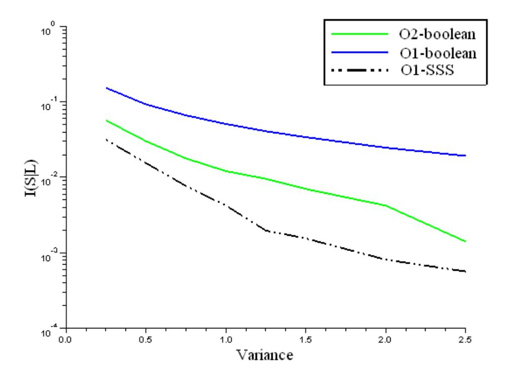
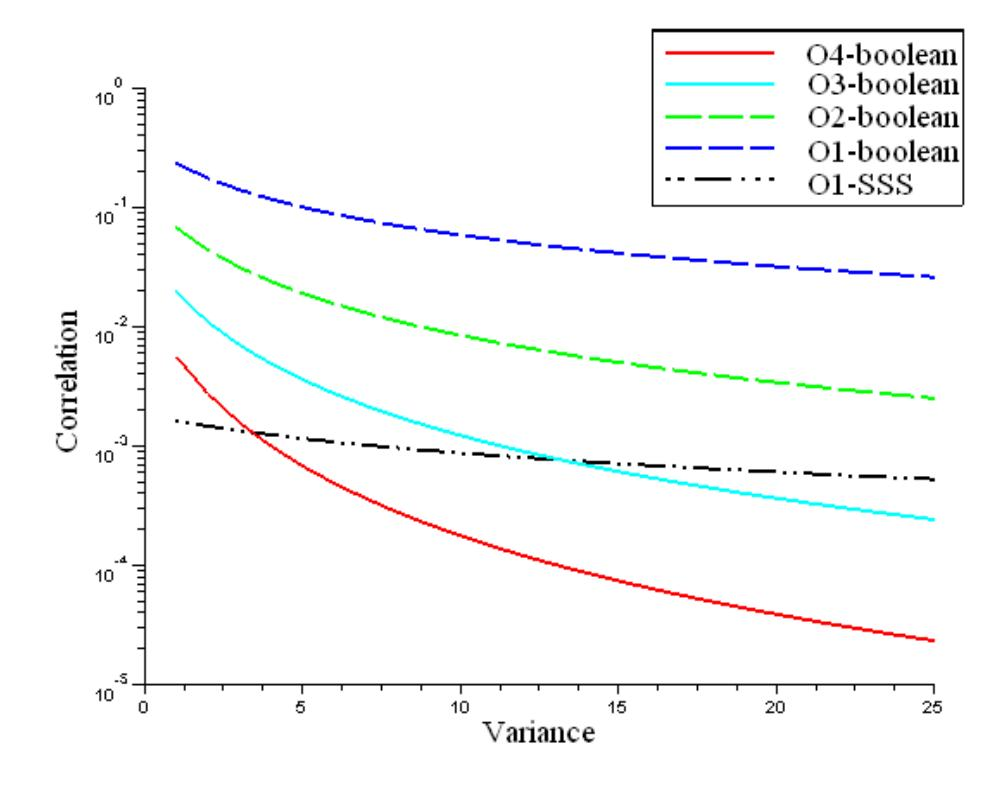

{0}------------------------------------------------

# Protecting AES with Shamir's Secret Sharing Scheme?

Louis Goubin1 and Ange Martinelli1,2

1 Versailles Saint-Quentin-en-Yvelines University Louis.Goubin@prism.uvsq.fr 2 Thales Communications jean.martinelli@fr.thalesgroup.com

Abstract. Cryptographic algorithms embedded on physical devices are particularly vulnerable to Side Channel Analysis (SCA). The most common countermeasure for block cipher implementations is masking, which randomizes the variables to be protected by combining them with one or several random values. In this paper, we propose an original masking scheme based on Shamir's Secret Sharing scheme [23] as an alternative to Boolean masking. We detail its implementation for the AES using the same tool than Rivain and Prouff in CHES 2010 [17]: multi-party computation. We then conduct a security analysis of our scheme in order to compare it to Boolean masking. Our results show that for a given amount of noise the proposed scheme - implemented to the first order provides the same security level as 3rd up to 4th order boolean masking, together with a better efficiency.

Keywords: Side Channel Analysis (SCA), Masking, AES Implementation, Shamir's Secret Sharing, Multi-party computation.

# 1 Introduction

Side Channel Analysis is a cryptanalytic method in which an attacker analyzes the side channel leakage (e.g. the power consumption, . . . ) produced during the execution of a cryptographic algorithm embedded on a physical device. SCA exploits the fact that this leakage is statistically dependent on the intermediate variables that are involved in the computation. Some of these variables are called sensitive in that they are related to a secret data (e.g. the key) and a known data (e.g. the plain text), and recovering information on them therefore enables efficient key recovery attacks [12, 3, 9].

The most common countermeasure to protect implementations of block ciphers against SCA is to use masking techniques [4, 10] to randomize the sensitive variables. The principle is to combine one or several random values, called masks, with every processed sensitive variable. Masks and masked variables propagate

? Full version of the paper published in the proceedings of CHES 2011

{1}------------------------------------------------

throughout the cipher in such a way that any intermediate variable is independent of any sensitive variable. This method ensures that the leakage at an instant t is independent of any sensitive variable, thus rendering SCA difficult to perform. The masking can be improved by increasing the number of random masks that are used per sensitive variable. A masking that involves d random masks is called a d th-order masking and can always be theoretically broken by a (d+ 1)th order SCA, namely an SCA that targets d + 1 intermediate variables at the same time [14, 22, 19]. However, the noise effects imply that the complexity of a d th-order SCA increases exponentially with d in practice [4]. The d th-order SCA resistance (for a given d) is thus a good security criterion for implementations of block ciphers. In [18] Rivain and Prouff give a general method to implement a d th-order masking scheme to the AES using secure Multi-Party Computation. Instead of looking for perfect theoretical security against d th-order SCA as done in [18], an alternative approach consists in looking for practical resistance to these attacks. It may for instance be observed that the efficiency of higher-order SCA is related to the way the masks are introduced to randomize sensitive variables. The most widely studied masking schemes are based on Boolean masking where masks are introduced by exclusive-or (XOR). First order boolean masking enables securing implementations against first-order SCA quite efficiently[1, 17]. It is however especially vulnerable to higher-order SCA [14] due to the intrinsic physical properties of electronic devices. Other masking schemes may provide better resistance against these attacks using various operations to randomize sensitive variables. This approach will be further investigated in this paper.

Related work. In [26, 6], the authors propose to use an affine function instead of just XOR to mask sensitive variables, thus improving the security of the scheme for a low complexity overhead. However, this countermeasure is developed only to the 1th order and it is not clear how it can be extended to higher orders. In [11, 17] the authors explain how to use secure Multi-Party Computation to process the cipher on shared variables. They use a sharing scheme based on XOR, implementing boolean masking to any order to secure the AES block cipher. At last, in [20], Prouff and Roche give a hardware oriented glitch free way to implement block ciphers using Shamir's Secret Sharing scheme and Ben-Or et al. secure multi-party computation [2] protocol operating on 2d + 1 shares to thwart d-th order SCA.

Our contribution. In this paper, we propose to combine both approaches in implementing a masking scheme based upon Shamir's Secret Sharing scheme [23], called SSS masking and processed using Multi-party Computation methods. Namely, we present an implementation of the block cipher such that every 8-bit intermediate result z ∈ GF(256) is manipulated under the form (xi , P(xi))i=0..d, where xi ∈ GF(256)∗ is a random value generated before each new execution of the algorithm and P(X) ∈ GF(256)[X] is a polynomial of degree d such that P(0) = z. Our scheme maintains the same compatibility as Boolean masking with the linear transformations of the algorithm. Moreover, the fact that the masks are never processed alone prevents them to be targeted by a higher-order 

{2}------------------------------------------------

SCA, thus greatly improves the resistance of the scheme to such attacks.

Organization of the paper. We fist recall the AES and Shamir's secret sharing scheme in Sect. 2. In Sect. 3, we show how SSS masking can be applied to the AES and give some implementation results. Sect. 4 analyzes the resistance of our method to high-order SCA and Sect. 5 concludes the paper.

# 2 Preliminaries

### 2.1 The Advanced Encryption Standard

The Advanced Encryption Standard (AES) is a block cipher that iterate 10 times a round transformation. Each of these involves four stages: AddRoundKey, ShiftRows, MixColumn, and SubByte, that ensure the security of the scheme.

In this section, we recall the four main operations involved in the AES encryption Algorithm. For each of them, we denote by  $\mathbf{s} = (s_{i,j})_{0 \le i,j \le 3}$  the state at the input of the transformation, and by  $\mathbf{s}' = (s'_{i,j})_{0 \le i,j \le 3}$  the state at the output of the transformation.

1. AddRoundKey: Let  $\mathbf{k} = (k_{i,j})_{0 \le i,j \le 3}$  denote the round key. Each byte of the state is XOR-ed with the corresponding round key byte:

$$(s'_{i,j}) \leftarrow (s_{i,j}) \oplus (k_{i,j}).$$

2. SubBytes: each byte of the state passes through the 8-bit AES S-box S:

$$s'_{i,j} \leftarrow \mathsf{S}(s_{i,j}).$$

3. ShiftRows: each row of the state is cyclically shifted by a certain offset:

$$s'_{i,j} \leftarrow s_{i,j-i \bmod 4}$$
.

4. MixColumns: each column of the state is modified as follows:

$$(s'_{0,c}, s'_{1,c}, s'_{2,c}, s'_{3,c}) \leftarrow \mathsf{MixColumns}_c(s_{0,c}, s_{1,c}, s_{2,c}, s_{3,c})$$

where  $MixColumns_c$  implements the following operations:

$$\begin{cases} s'_{0,c} \leftarrow (02 \cdot s_{0,c}) \oplus (03 \cdot s_{1,c}) \oplus s_{2,c} \oplus s_{3,c} \\ s'_{1,c} \leftarrow s_{0,c} \oplus (02 \cdot s_{1,c}) \oplus (03 \cdot s_{2,c}) \oplus s_{3,c} \\ s'_{2,c} \leftarrow s_{0,c} \oplus s_{1,c} \oplus (02 \cdot s_{2,c}) \oplus (03 \cdot s_{3,c}) \\ s'_{3,c} \leftarrow (03 \cdot s_{0,c}) \oplus s_{1,c} \oplus s_{2,c} \oplus (02 \cdot s_{3,c}), \end{cases}$$

where  $\cdot$  and  $\oplus$  respectively denote the multiplication and the addition in the field GF(2)[X]/p(X) with  $p(X)=X^8+X^4+X^3+X+1$ , and where 02 and

{3}------------------------------------------------

03 respectively denote the elements X and X+1. In the following, we will assume that  $\mathsf{MixColumns}_c$  is implemented as

$$\begin{cases} s'_{0,c} \leftarrow \mathsf{xtimes}(s_{0,c} \oplus s_{1,c}) \oplus tmp \oplus s_{0,c} \\ s'_{1,c} \leftarrow \mathsf{xtimes}(s_{1,c} \oplus s_{2,c}) \oplus tmp \oplus s_{1,c} \\ s'_{2,c} \leftarrow \mathsf{xtimes}(s_{2,c} \oplus s_{3,c}) \oplus tmp \oplus s_{2,c} \\ s'_{3,c} \leftarrow s'_{0,c} \oplus s'_{1,c} \oplus s'_{2,c} \oplus tmp, \end{cases}$$

where  $tmp = s_{0,c} \oplus s_{1,c} \oplus s_{2,c} \oplus s_{3,c}$  and where the xtimes function is implemented as a look-up table for the application  $x \mapsto 02 \cdot x$ .

### 2.2 Shamir's Secret Sharing scheme

In some cryptographic context ones may need to share a secret between (at least) d users without any k < d users being able to recover the secret alone. In [23] Shamir exposes the problematic and gives a secret sharing scheme using polynomial interpolation as a recovery mean. Namely, every user has a pair  $(x_i, P(x_i))_{x_i \neq 0}$ , where P is a polynomial of degree k, and the secret is given by P(0). In this configuration, one needs at least k+1 shares to recover P, then P(0). We recall hereafter the sharing and reconstruction algorithms for a value of k = d-1, operating on n-bits words. With these parameters, in order to share a secret  $a_0$  into d shares, one needs to choose d-1 random numbers  $(a_{d-1}, \ldots, a_1)$  to construct the polynomial

$$P(x) = a_{d-1} \cdot x^{d-1} + a_{d-2} \cdot x^{d-2} + \dots + a_1 \cdot x + a_0.$$

Every share i is then given by  $(x_i, y_i)$  where  $y_i = P(x_i)$ , and the  $x_i$ 's are all distinct and non-zero. Formally we have Algorithm 1.

### Algorithm 1 Shamir's Secret Sharing scheme

INPUT: A secret  $a_0$ , random values  $(x_i)_{i=0..d-1}$ 

OUTPUT: Shares  $(x_i, y_i)_{i=0..d-1}$ 

- 1.  $(a_i)_{i=1..d-1} \leftarrow \text{Rand}(n)$
- 2. **for** i = 0 **to** d **do**
- 3.  $y_i \leftarrow a_{d-1} \cdot x_i^{d-1} + a_{d-2} \cdot x_i^{d-2} + \dots + a_1 \cdot x_i + a_0$
- 4. return  $(x_i, y_i)_{i=0..d-1}$

The reconstruction step is directly derived from polynomial interpolation and proceeds as follows:

$$a_0 = \sum_{i=0}^{d} y_i \cdot \beta_i \tag{1}$$

where each  $\beta_i$  is a precomputed value such that  $\beta_i = \prod_{j=0, j \neq i}^d \frac{-x_j}{x_i - x_j}$ .

{4}------------------------------------------------

# 3 Higher order masking of AES

The AES block cipher iterates a round transform composed of four stages: AddRoundKey, ShiftRows, MixColumn and SubByte. In this section we will show how to securely mask the different layers at order d using SSS masking.

### 3.1 Masking Field Operations

In order to secure the AES there are five field operations that must be protected: the addition with an unmasked constant, the addition with a masked variable, the multiplication by a scalar, the square, and the multiplication between two shared variables. Moreover, as the AES Sbox is the composition of the inversion in GF(256) and an affine function modulus the polynomial  $X^8 + 1$ , this affine transform also has to be secured.

Let b be a sensitive variable shared as  $(x_i, y_i)_{i=0..d}$  following Shamir's secret sharing scheme. Addition with an unmasked constant u can be directly computed by XORing u to the second component of the shares, such as:

$$(x_i', y_i') \leftarrow (x_i, y_i \oplus u).$$

Let  $(x_i, u_i)_{i=0..d}$  be the shared representation of a variable u. The shared representation of the addition  $b \oplus u$  is obtained as:

$$(x_i', y_i') \leftarrow (x_i, y_i \oplus u_i).$$

Similarly the multiplication by a scalar p is computed as:

$$(x_i', y_i') \leftarrow (x_i, y_i \cdot p).$$

While working in a field of characteristic 2 squaring is GF(256)-linear:

$$(x_i', y_i') \leftarrow (x_i^2, y_i^2).$$

Remark 1. The coefficient  $x'_i$  at the output of the squaring is not equal to the coefficient  $x_i$ . However others operations may need the use of constant  $x_i$ . This matter must be taken in account in the computation as shown in Algorithm 5.

The product of two variables protected by secret sharing cannot be solved with the linear property of the transformation, as multiplying two polynomials with the same degree gives a polynomial with degree double of the original polynomial. Two different approaches can be studied. The first is to use the proven secure multi-party computation scheme of [7,2] operating on 2d + 1 shares to process the product. However this approach has a very high complexity because we have to process the whole algorithm using 2d + 1 shares. A solution could be to generate at the beginning of every field multiplication d pairs  $(x_i, y_i)_{i=d+1...2d+1}$ 

{5}------------------------------------------------

to process the multiplication. With this method we can use d + 1 shares for all the operations except the product, and 2d + 1 shares for it. Formally we give Algorithm 2.

# Algorithm 2 Share multiplication SecMult

Input: Shared representation of b, (xi, yi)i=0..d and u, (xi, wi)i=0..d

Output: Shares (xi, y0 i)i=0..d representing the product of b and u

- 1. for i = d + 1 to 2d do
- 2. yi ← Pd j=0 yj · βj (xi)
- 3. wi ← Pd j=0 wj · βj (xi)
- 4. for i = 0 to 2d do
- 5. zi ← yi · wi · β ∗ i
- 6. Share zi in (xj , zij = Pi(xj ))j=0..d using Algo 1 with Pi of degree d
- 7. for i = 0 to d do

8. 
$$y_i' = z_{i_i} + \sum_{j=0, j \neq i}^{2d} z_{j_i}$$

9. return (xi, y0 i)i=0..d

where the βj (xi) are d(d + 1) precomputed values such that

$$\beta_j(x_i) = \prod_{k=0, k \neq j}^d \frac{x_i - x_k}{x_j - x_k},$$

and β ∗ i are 2d + 1 precomputed values such that

$$\beta_i^* = \prod_{j=0, j \neq i}^{2d} \frac{-x_j}{x_i - x_j}.$$

This algorithm is secure according to the security proofs given in [2]. Indeed, the computation of the βj (xi) is independent of any secret and the yi and wi for d + 1 ≤ i ≤ 2d do not leak any more information than the yi and wi for i ≤ d. The security of the remaining of the algorithm is directly derived from the security of the secure multiparty computation scheme given in [2]. However, as we will show in section 3.2 algorithm 2 has a very high complexity.

The second possibility is to exploit the context of side channel countermeasure that allows us to compute values unknown in classical multi-party computation in order to improve the complexity at the loss of the security proof. We give Algorithm 3 to compute secure shared field multiplication.

{6}------------------------------------------------

### Algorithm 3 Share multiplication SecMult

INPUT: Shared representation of b,  $(x_i, y_i)_{i=0..d}$  and u,  $(x_i, w_i)_{i=0..d}$ 

Output: Shares  $(x_i, y_i)_{i=0..d}$  representing the product of b and u

- 1. **for** j = 0 **to** d **do**
- for k = 0 to d do 2.
- 3.  $z_{j,k} \leftarrow y_j \cdot w_k$
- 4. **for** i = 0 **to** d **do**

5. 
$$(x_i, y_i') \leftarrow \left(x_i, \left(\sum_{j=1}^d \sum_{0 \le k < j} (z_{j,k} \oplus z_{k,j}) \cdot \beta_{j,k}(x_i)\right) + \sum_{j=0}^d z_{j,j} \cdot \beta_{j,j}(x_i)\right)$$

6. return  $(x_i, y_i')_{i=0...d}$ 

where the  $\beta_{j,k}(x_i)$  are precomputed values defined as follows.

Recall that  $\beta_j(x) = \prod_{l=0}^d \frac{x - x_l}{x_j - x_l}$ . We have

$$\beta_{j}(x) \cdot \beta_{k}(x) = \prod_{\substack{l=0, l \neq j \\ m \neq k}}^{d} \frac{x - x_{l}}{x_{j} - x_{l}} \cdot \prod_{\substack{m=0, m \neq k \\ m \neq k}}^{d} \frac{x - x_{m}}{x_{k} - x_{m}}$$

$$= \alpha_{2d}x^{2d} + \dots + \alpha_{d}x^{d} + \dots + \alpha_{1}x + \alpha_{0}$$
(2)

We then define  $\beta_{j,k}(x) = \beta_{k,j}(x) = \alpha_d x^d + \dots + \alpha_1 x + \alpha_0$ .

**Proposition 1.** Algorithm 3 holds because the polynomial

$$P(x) = \sum_{j=0}^{d} \sum_{k=0}^{d} y_j \cdot w_k \cdot \beta_{j,k}(x) \text{ is such that: } \begin{cases} degree(P) = d \\ P(0) = b \cdot u \\ \forall x \in \{x_i\}_{i=0..d}, \ P(x_i) = y_i' \end{cases}$$

*Proof.* – By construction of the  $\beta_{k,j}(x)$ , degree(P) = d. – Let b, u be shared respectively in  $(x_i, y_i = R(x_i))$  and  $(x_i, w_i = Q(x_i))$ .  $R(x) = \sum_{i=0}^{d} y_i \cdot \beta_i(x)$  and b = R(0) and  $Q(x) = \sum_{i=0}^{d} w_i \cdot \beta_i(x)$  and u = Q(0). As the truncation does not modify the constant term of the polynomial,

$$P(0) = R(0) \cdot Q(0) = b \cdot u.$$

- At last, by construction  $\forall x \in \{x_i\}_{i=0..d}$ ,

$$y'_{i} = \sum_{j=0}^{d} \sum_{k=0}^{d} y_{j} \cdot w_{k} \cdot \beta_{j,k}(x_{i}) = P(x_{i})$$

Intuitively, the security of the scheme against k-th order SCA  $(k \leq d)$  is based on the following points:

{7}------------------------------------------------

- according to polynomial interpolation, one needs at least d + 1 shares to define a polynomial of degree d,
- the computation of the  $\beta_{j,k}(x_i)$  is independent of any secret,
- the knowledge of  $y_j \cdot w_k$  does not leak more information on b (resp. u) than the knowledge of  $y_j$  (resp.  $w_k$ ),

However the security proof of Algorithm 3 does not seems to be an easy matter and is still an open work.

Finally the affine function A involved in the AES Sbox, as if non linear with respect to the polynomial mask, can nevertheless be implemented using straightforwardly as:  $(x'_i, y'_i) \leftarrow (x_i, A(y_i))$ . Indeed, if  $y_i = P(x_i)$ , since A s affine A(P) is a polynomial of degree d with A(P(0)) = A(b) and every  $A(y_i)$  is the polynomial value of A(P)(x) in  $x_i$ .

### 3.2 Complexity of the operations

In order to evaluate the complexity overhead of SSS masking with respect to boolean masking, we compare the complexity of each operation involved in the AES computation for both kind of masking. As shown in the previous section, the multiplication between two shared variables is the most consuming operation, but this is also the case for boolean masking (see [17]). Table 1 resumes the complexities of both schemes.

| Operation \ Masking scheme | Boolean [17]             | SSS (algo.2)                      | SSS (algo.3)                            |
|----------------------------|--------------------------|-----------------------------------|-----------------------------------------|
| XOR with a constant        | 1 XOR                    | d+1  XORs                         | d+1  XORs                               |
| Shared XOR                 | d+1  XORs                | d+1  XORs                         | d+1  XORs                               |
| Scalar Multiplication      | d+1 field products       | d+1 field products                | d+1 field products                      |
| Squaring                   | d+1 squaring             | 2(d+1) squaring                   | 2(d+1) squaring                         |
| Shared Field               | 2d(d+1) XORs             | $d(2d^2 + 7d + 1) \text{ XORs}$   | d(d+1)(d+2) XORs                        |
| Multiplication             | d(d+1)/2 Rand            | d(2d+1) Rand                      | 0 Rand                                  |
|                            | $(d+1)^2$ field products | $d(2d^2 + 5d + 5)$ field products | $(d+1)^2(2+\frac{d}{2})$ field products |
| Sbox Affine                | 1 XOR                    | d XORs                            | d XORs                                  |
| transformation             | d ring products          | d ring products                   | d ring products                         |

Table 1. Complexity of masked operations

### 3.3 Masking the full S-box

We have defined secure squaring and multiplication in Section 3.1, we then use the exponentiation algorithm given in [17], and resumed afterward (Algo 4), to implement the power function involved in the AES S-box.

{8}------------------------------------------------

#### Algorithm 4 Secure Exponentiation to the power 254 over GF(28 )

Input: Shared representation of b, (xi, yi)i=0..d

Output: Shares (xi, y0 i)i=0..d of the value b 254

- 1. for i = 0 to d do(αi, ζi) ← (x 2 i , y2 i )
- 2. (xi, ζi)i ← RefreshMasks((αi, ζi)i, 2)
- 3. (xi, γi)i ← SecMult((xi, ζi),(xi, yi))
- 4. for i = 0 to d do(αi, δi) ← (x 4 i , γ4 i )
- 5. (xi, δi)i ← RefreshMasks((αi, δi)i, 4)
- 6. (xi, γi)i ← SecMult((xi, γi),(xi, δi))
- 7. for i = 0 to d do(αi, γi) ← (x 16 i , γ16 i )
- 8. (xi, γi)i ← RefreshMasks((αi, γi)i, 16)
- 9. (xi, γi)i ← SecMult((xi, γi),(xi, δi))
- 10. (xi, y0 i)i ← SecMult((xi, γi),(xi, ζi))
- 11. return (xi, y0 i)i=0..d

Here the RefreshMasks operation is needed to ensure the conservation of the xi 's during the computation and the independence of the coefficients of the polynomials before SecMult operation. Formally it follows Algorithm 5.

# Algorithm 5 RefreshMasks

Input: Shared representation of b, (αi, yi)i=0..d, chosen (xi)i=0..d, t such that αi = x 2 t i Output: Shared representation of b, (xi, y0 i)i=0..d

- 1. for i = 0 to d do
- 2. β 0 i ← β 2 t i
- 3. Share yi in (xj , zij ) using Algo 1
- 4. for i = 0 to d do
- 5. (xi, y 0 i) ← xi, Xd j=0 β 0 j · zji !
- 6. return (xi, y0 i)i=0..d

Algorithm 5 consists in re-sharing each shares separately using a new random polynomial, then to reconstruct the original shares to obtain d + 1 shares corresponding to this new polynomial. Eventually the complexity of Algorithm 4 is resumed in Table 2. As a matter of comparison, we recall hereafter the complexity of Boolean masking as given in [17].

As a matter of fact, the number of operations involved in SSS masking is larger than that of boolean masking for a given order d, as the number of field mul-

{9}------------------------------------------------

| Order                     | XORs               | multiplications           | ˆ2j          | Random bytes  | RAM                                   |  |  |  |
|---------------------------|--------------------|---------------------------|--------------|---------------|---------------------------------------|--|--|--|
| SSS masking (algorithm 2) |                    |                           |              |               |                                       |  |  |  |
| order 1                   | 58                 | 72                        | 18           | 18            | 18                                    |  |  |  |
| order 2                   | 256                | 265                       | 27           | 58            | 40                                    |  |  |  |
| order 3                   | 660                | 648                       | 36           | 120           | 70                                    |  |  |  |
| order d 11d               | 3 + 37d 2 + 10d | 3 + 29d 2 + 29d 11d | + 3 9(d + 1) | 2 + 7d 11d | 2 + 10d 4d + 4                  |  |  |  |
| SSS masking (algorithm 3) |                    |                           |              |               |                                       |  |  |  |
| order 1                   | 36                 | 54                        | 14           | 6             | 20                                    |  |  |  |
| order 2                   | 150                | 165                       | 21           | 18            | 33                                    |  |  |  |
| order 3                   | 384                | 372                       | 28           | 36            | 48                                    |  |  |  |
| order d 7d                | 3 + 18d 2 + 11d | 3 + 18d 2 + 22d 5d  | + 9 7(d + 1) | 2 + 3d 3d  | 2 + 10d d + 9                   |  |  |  |
| Boolean masking [17]      |                    |                           |              |               |                                       |  |  |  |
| order 1                   | 20                 | 16                        | 6            | 6             | 7                                     |  |  |  |
| order 2                   | 56                 | 36                        | 9            | 16            | 12                                    |  |  |  |
| order 3                   | 108                | 64                        | 12           | 20            | 18                                    |  |  |  |
| order 4                   | 176                | 100                       | 15           | 48            | 25                                    |  |  |  |
| order 5                   | 260                | 144                       | 18           | 70            | 33                                    |  |  |  |
| order d                   | 2 + 12d 7d      | 2 + 8d 4d + 4       | 3(d + 1)     | 2 + 4d 2d  | 1 2 + 7 d d + 3 2 2 |  |  |  |

Table 2. Complexity of inversion algorithms

tiplications and XOR operations are cubic in the order instead of quadratic for boolean masking. We can ask ourselves if this observation remains true for a given security level. This question will be studied in section 4.

# 3.4 Masking the whole AES

In the following, we describe how to mask an AES computation at the dth order using SSS masking. We will assume that the secret key has been previously masked and that its d+1 shares are provided as input to the algorithm (otherwise a straightforward 1st-order attack would be possible). At the beginning of the computation, the state s (holding the plaintext) is split into d+ 1 shares (x0, y0), (x1, y1), . . . , (xd, yd) with respect to Shamir's secret sharing scheme. In the next sections, we describe how to perform the different AES transformations on the state shares in order to guarantee the completeness as well as the dth-order security.

Masking AddRoundKey The AddRoundKey stage at round r consists in XORing the rth round key kr to the state. The masked key schedule provides d + 1 shares (xi , kr,i)i for every round key kr. The XOR operation is then processed as described in section 3.1: M(s ⊕ kr) → (xi , yi ⊕ kr,i)i=0..d

Masking ShiftRows As the ShiftRows layer operates on each byte separately and does not change their value, we have: M(ShiftRows(s)) = ShiftRows(M(s))

Masking MixColumn Since each output byte of MixColumnsc can be expressed as a linear function of the bytes of the input state over GF(256) we have:

{10}------------------------------------------------

$$\mathsf{MixColumns}_c(M(s_0), M(s_1), M(s_2), M(s_3)) = (M(s_0'), M(s_1'), M(s_2'), M(s_3')).$$

This suggests to perform the following steps to securely process  $\mathsf{MixColumns}_c$  on the masked representation of the state columns.

$$\begin{cases} M(s'_0) = (x_i, y'_{0,i}) \leftarrow (x_i, \ \mathsf{xtimes}(y_{0,i} \oplus y_{1,i}) \oplus tmp_i \oplus y_{0,i}) \\ M(s'_1) = (x_i, y'_{1,i}) \leftarrow (x_i, \ \mathsf{xtimes}(y_{1,i} \oplus y_{2,i}) \oplus tmp_i \oplus y_{1,i}) \\ M(s'_2) = (x_i, y'_{2,i}) \leftarrow (x_i, \ \mathsf{xtimes}(y_{2,i} \oplus y_{3,i}) \oplus tmp_i \oplus y_{2,i}) \\ M(s'_3) = (x_i, y'_{2,i}) \leftarrow (x_i, \ y'_{0,i} \oplus y'_{1,i} \oplus y'_{2,i} \oplus tmp_i). \end{cases}$$
(3)

where  $tmp_i = y_{0,i} \oplus y_{1,i} \oplus y_{2,i} \oplus y_{3,i}$  and where xtimes denotes a look-up table for the function  $x \mapsto 02 \cdot x$ . The completeness holds because the single operation that modify the random factors  $(a_i)_{i=1..d}$  is the xtimes one, and is applied similarly to each share.

**Masking SubByte** The SubBytes transformation consists in applying the AES S-box S to each byte of the state. In order to mask this transformation, we apply the secure S-box computation described in Section 3.3 to the (d + 1)-tuple of every byte shares of the state.

**KeySchedule** Finally, since the round key derivation is a composition of the previous transformations, it can be protected using the exact same methods as previously described.

Overall complexity In order to give an idea of the global complexity of the scheme, and to compare it to the boolean masking, we give in Table 3 the overall number of operations involved in the ciphering. The field multiplications are implemented using log/alog tables as recalled in appendix A.

| Masking scheme  | XORs/ANDs | TLU   | Random bits | RAM (bits) | ROM (bits) |
|-----------------|-----------|-------|-------------|------------|------------|
| 10 boolean      | 17640     | 16144 | 16896       | 312        | 6128       |
| 2O boolean      | 37800     | 32272 | 46080       | 352        | 6128       |
| 3O boolean      | 65640     | 54160 | 87552       | 400        | 6128       |
| 10 SSS (Algo 2) | 58560     | 65824 | 27792       | 400        | 6128       |
| 10 SSS (Algo 3) | 31760     | 37296 | 16240       | 400        | 6128       |

**Table 3.** Complexity of cipher implementations

### 4 Security analysis

In what follows, we shall consider that an intermediate variable  $U_i$  is associated with a leakage variable  $L_i$  representing the information leaking about  $U_i$  through side channel. We will assume that the leakage can be expressed as a deterministic leakage function  $\varphi$  of the intermediate variable  $U_i$  with an independent additive noise  $B_i$ . Namely, we will assume that the leakage variable  $L_i$  satisfies:

$$L_i = \varphi(U_i) + B_i \quad . \tag{4}$$

{11}------------------------------------------------

In the following, we call d th-order leakage a tuple of d leakage variables Li corresponding to d different intermediate variables Ui that jointly depend on some sensitive variable. As already argued in Sect. 3.4, when an implementation is correctly protected by SSS masking, no first-order leakage of sensitive information occurs. This directly comes from Shamir's secret sharing scheme security. In the following we will focus on higher orders attacks against protected implementations, secured by boolean or SSS masking.

### 4.1 Information Theoretic Analysis

In order to evaluate the information leaked by 1O-SSS masking and to compare it to that of various orders Boolean masking, we compute, as suggested in [24], the theoretical mutual information I(S|Ld) for a class discrete variable S of the secret, and a d-order leakage Ld, with respect to increasing noise standard deviation σ. Namely we consider the three following leakages:

- 2 nd-order leakage of 1O-Boolean masking with targeted variables (Z⊕m1, m1)
- 3 rd-order leakage of 2O-Boolean masking with targeted variables (Z ⊕ m1 ⊕ m2, m1, m2)
- 2 nd-order leakage of 1O-SSS masking with targeted variables ((x1, a · x1 ⊕ Z),(x2, a · x2 ⊕ Z))

The variables Z, m1, m2 and a are assumed uniformly distributed over GF(256) and mutually independent, and x1, x2 are assumed uniformly distributed over GF(256)∗ with x1 6= x2. For each kind of leakage, we compute the mutual information between Z and the tuple of leakages in the Hamming weight (HW) model with Gaussian noise: the leakage Li related to a variable Ui is distributed according to equation (4) with ϕ = HW and Bi ∼ N (0, σ2 ) (the different Bi 's are also assumed independent). In this context, the signal-to-noise ratio (SNR) of the leakage is defined as Var [ϕ(Ui)] /Var [Bi ] = 2/σ2 .

Fig. 1 shows the mutual information values obtained for each kind of leakage with respect to an increasing noise standard deviation. These results demonstrate the information leakage reduction implied by the use of SSS masking. As expected, SSS masking leaks less information than first and second order Boolean masking for the considered Signal to Noise ratios (SNRs). We will now see to which extent this reduction also applies to the efficiency of SCA on SSS masking.

### 4.2 Higher-Order DPA Evaluation

Let us assume that Z depends on the plaintext and of a subkey k ? , and let us denote by Z(k) the hypothetic value of Z for a guess k on k ? . In a higherorder DPA (HO-DPA) [14, 19], the attacker tests the guess k by estimating the correlation coefficient ρ [ ˆϕ(Z(k)), C(L)], where C is a combining function that converts the multivariate leakage L into a univariate signal and where ˆϕ is a

{12}------------------------------------------------

Fig. 1. Mutual Information values with respect to σ 2 (logarithmic scale).

prediction function chosen such that ˆϕ(Z) is correlated as much as possible to C(L). The guess k leading to the greatest correlation (in absolute value) is selected as key-candidate. In [13], the authors show that the number of traces required to mount a successful DPA attack is roughly quadratic in ρ −1 where ρ is the correlation coefficient ρ [ ˆϕ(Z), C(L)] (that is the expected correlation for the correct key guess). The latter can therefore be used as a metric for the efficiency of a (HO-)DPA attack.

The analysis conducted in [19] states that a good choice for C is the normalized product combining:

$$C: \mathbf{L} \mapsto \prod_{i} (L_i - \mathrm{E}[L_i]). \tag{5}$$

Although the effectiveness of the normalized product combining has been only studied in [19] in the context of Boolean masking, we can argue that this combining function stays a natural choice against any kind of masking since ρ [ ˆϕ(Z(k)), C(L)] is related to the multivariate correlation3 between ˆϕ(Z(k)) and every coordinate of L [25]. Besides, in the presence of (even little) noise in the side-channel leakage, the HO-DPA with normalized product combining is nowadays the most efficient unprofiled attack against Boolean masking in the literature (see for instance [19, 25, 18]).

3 What we call multivariate correlation here is the straightforward generalization of the correlation coefficient to more than two variables (see [25]).

{13}------------------------------------------------

From Corollary 8 in [19], the optimal correlation  $\rho_{SSS}$  for the correct key hypothesis can be obtained as:

$$\rho_{\rm SSS} = \sqrt{\frac{\operatorname{Var}\left[\operatorname{E}\left[\overline{L}_{1} \times \overline{L}_{2} | Z = z\right]\right]}{\operatorname{Var}\left[\overline{L}_{1} \times \overline{L}_{2}\right]}}$$
(6)

Formally, when the leakage satisfies (4) with  $\varphi = HW$  and  $B_i \sim \mathcal{N}(0, \sigma^2)$ , the coefficient  $\rho_{SSS}$  obtained for the 2-nd order leakage of 1-st order SSS masking satisfies:

$$\rho_{SSS} = \sqrt{\frac{n^3 \cdot (2^{n+1} - 4^n - 1)}{\alpha_2 \cdot \sigma^4 + \alpha_1 \cdot \sigma^2 + \alpha_0}},$$
(7)

where n is the bit-size of Z, and

$$\alpha_{2} = 192 \cdot 2^{n} - 2^{4n+4} - 64 - 208 \cdot 4^{n} + 96 \cdot 8^{n}$$

$$\alpha_{1} = (40 \cdot 8^{n} - 64 \cdot 4^{n} - 8 \cdot 16^{n} + 32 \cdot 2^{n})n^{2} + (88 \cdot 8^{n} + 128 \cdot 2^{n} - 2^{4n+4} - 168 \cdot 4^{n} - 32)n$$

$$\alpha_{0} = (8^{n} - 3 \cdot 4^{n} + 6 \cdot 2^{n} - 4)n^{4} + (-4 \cdot 16^{n} + 14 \cdot 8^{n} - 16 \cdot 4^{n} + 2 \cdot 2^{n} + 4)n^{3} + (23 \cdot 8^{n} - 4 \cdot 16^{n} - 44 \cdot 4^{n} + 34 \cdot 2^{n} - 8)n^{2} + (10 \cdot 4^{n} - 3 \cdot 8^{n} - 9 \cdot 2^{n} + 2)n$$

$$(8)$$

Remark 2. In order to endorse our choice of targeted variables, we also computed the correlation coefficient corresponding to another 2rd-order leakage of SSS masking targeting the pair  $(a, a \cdot x + Z)$  with the corresponding pair of prediction functions: the Dirac function  $\delta_0$  ( $\delta_0(x) = 0 \Leftrightarrow x \neq 0$ ) and the Hamming weight. We observed for several values of n and  $\sigma$  that the correlation coefficient was always lower than  $\rho_{\rm SSS}$ .

Regarding Boolean masking, it has been shown in [21] that the correlation  $\rho_{\text{bool}}$  corresponding to HO-DPA with normalized product combining against dth-order Boolean masking satisfies (in the Hamming weight model):

$$\rho_{\text{bool}} = (-1)^d \frac{\sqrt{n}}{(n+4\sigma^2)^{\frac{d+1}{2}}} . \tag{9}$$

From (7) and (9), we define the ratio  $\nu$  as:  $\nu = \frac{\rho_{\text{SSS}}}{\rho_{\text{bool}}}$ 

Let us denote by  $N_{\rm SSS}$  (resp.  $N_{\rm bool}$ ) the number of leakage measurements for a successful attack on SSS masking (resp. Boolean masking). According to [13],  $N_{\rm SSS}$  and  $N_{\rm bool}$  are roughly quadratic in the values of the correlation values. Hence the ratio  $\frac{N_{\rm SSS}}{N_{\rm bool}}$  satisfies:

$$\frac{N_{\rm SSS}}{N_{\rm bool}} \approx \frac{1}{\nu^2} \ . \tag{10}$$

Table 4 illustrate this relation giving the value  $1/\nu^2$  for different values of SNRs. Values greater (resp. lower) than 1 indicate that SSS masking is more (resp. less) secure than the considered attack.

{14}------------------------------------------------

Table 4. Ratio 1/ν2 for several Boolean masking orders with respect to 1O-order SSS masking.

| Attack \ SNR           | +∞                                | 1     | 1/2   | 1/5  | 1/10       |
|------------------------------|-----------------------------------|-------|-------|------|------------|
| 3O-DPA on 2O Boolean Masking | 4544.83 899.99 374.33 94.17 22.70 |       |       |      |            |
| 4O-DPA on 3O Boolean Masking | 568.10                            | 56.25 | 15.60 | 1.96 | 0.21       |
| 5O-DPA on 4O Boolean Masking | 71.01                             | 3.52  | 0.65  |      | 0.04 0.002 |

Due to (10), SSS masking is more secure than dth-order Boolean masking if and only if |ν| ≤ 1. Comparing the resistance of the Boolean masking and SSS masking against HO-DPA thus amounts to study when |ν| ≤ 1 is satisfied. We can note that |ν| is an increasing function of σ and a decreasing function of n. Let us denote by ϑ the maximal variance of the noise such that |ν| ≤ 1 is satisfied. For the first values of d, we have:

$$\vartheta = \begin{cases} +\infty & \text{if } d = 1, \\ 282.2683 & \text{if } d = 2, \\ 13.2072 & \text{if } d = 3, \\ 3.4036 & \text{if } d = 4. \end{cases}$$

$$(11)$$

Eventually Fig. 2 sums up our main theoretical results. In particular, it illustrates the fact that the coefficient ρSSS is lower than ρbool (computed for d = 3) only when the noise variance σ 2 is lower than 13.2072.

Fig. 2. Correlation values with respect to σ 2 (logarithmic scale).

{15}------------------------------------------------

### 4.3 Attack simulations

In order to confront our theoretical analyses to practical evaluation, we performed several attacks simulations. We then applied several side-channel distinguishers to leakage measurements simulated in the Hamming weight model with Gaussian noise. The leakage measurements have been simulated as samples of the random variables Li defined according to equation (4) with ϕ = HW and Bi ∼ N (0, σ2 ) (the different Bi 's are also assumed independent). For all the attacks, the sensitive variable Z was chosen to be an AES S-box output of the form S(M ⊕ k ? ) where M represents a varying plaintext byte and k ? represents the key byte to recover.

Side-channel distinguishers. We applied two kind of side-channel distinguishers: higher-order DPA such as described in Sect. 4.2 and higher-order MIA. In a HO-MIA [16, 8], the distinguisher is the mutual information: the guess k is tested by estimating I( ˆϕ(Z(k));L). As mutual information is a multivariate operator, this approach does not involve a combining function.

Targeted variables. Each attack was applied against the leakages of SSS masking, and Boolean masking. The target variables are those listed in Sect. 4.1 for Z being S(X ⊕ k ? ).

Prediction functions. For each DPA, we choose ˆϕ to be the optimal prediction function :

$$\hat{\varphi}: z \mapsto \mathbf{E}\left[\mathcal{C}(\mathbf{L})|Z=z\right]. \tag{12}$$

This leads us to select the Hamming weight function in the attacks against both SSS and Boolean masking of any order.

For the MIA attacks, we choose ˆϕ such that it maximizes the mutual information I( ˆϕ(Z(k));L) for k = k ? while ensuring that the mutual information is lower for k 6= k ? . In our case, every HO-MIA against both SSS and Boolean masking is performed with ˆϕ = HW since the distribution of (HW(Z⊕m0), HW(m0)) (resp. (HW(Z ⊕ a0 · x0, x0), HW(Z ⊕ a0 · x1, x1))) only depends on HW(Z). Therefore I Z; (HW(Z ⊕ m0), HW(m0)) = I HW(Z); (HW(Z ⊕ m0), HW(m0)) . Note that the same relation holds at every masking order.

Pdf estimation method. For the (HO-)MIA attacks, we use the histogram estimation method with rule of [9] for the bin-widths selection.

Attack simulation results. Each attack simulation is performed 100 times for various SNR values (+∞, 1, 1/2, 1/5 and 1/10). Table 5 summarizes the number of leakage measurements required to observe a success rate of 90% in retrieving k ? for the different attacks.These results shows the security improvement provided by SSS masking with respect to boolean masking. This gain of security can be explained by the fact that an attacker does not have direct access to the mask a1 · xi , hence the relation between the key and the targeted variables is much more noisy than for boolean masking.

{16}------------------------------------------------

Table 5. Number of leakage measurements for a 90% success rate.

| Attack \ SNR              | +∞      | 1     | 1/2             | 1/5     | 1/10    |  |  |  |
|---------------------------------|---------|-------|-----------------|---------|---------|--|--|--|
| Attacks against Boolean Masking |         |       |                 |         |         |  |  |  |
| 2O-DPA on 1O Boolean Masking    | 150     | 500   | 1500            | 6000    | 20 000  |  |  |  |
| 2O-MIA on 1O Boolean Masking    | 100     | 5000  | 15 000          | 50 000  | 160 000 |  |  |  |
| 3O-DPA on 2O Boolean Masking    | 1500    | 9000  | 35 000          | 280 000 | > 106   |  |  |  |
| 3O-MIA on 2O Boolean Masking    | 160     |       | 160 000 650 000 | > 106   | > 106   |  |  |  |
| Attacks against SSS Masking     |         |       |                 |         |         |  |  |  |
| 2O-DPA on 1O SSS Masking        | > 106   | > 106 | > 106           | > 106   | > 106   |  |  |  |
| 2O-MIA on 1O SSS Masking        | 500 000 | > 106 | > 106           | > 106   | > 106   |  |  |  |
| 3O-DPA on 2O SSS Masking        | > 106   | > 106 | > 106           | > 106   | > 106   |  |  |  |
| 3O-MIA on 2O SSS Masking        | > 106   | > 106 | > 106           | > 106   | > 106   |  |  |  |

# 5 Conclusion

In this paper we propose a new alternative to boolean masking to secure implementations of AES against side channel attacks using Shamir's Secret Sharing scheme to share sensitive variables. We give implementation results and conduct a security analysis that clearly show that our scheme can provide a good complexity-security trade-off compared to boolean masking. In particular, on smart card implementation, where SNR value is around 1/2, 1O SSS masking provides both a better security and complexity than 3O boolean masking. On hardware implementations where the noise can be drastically reduced, 1O SSS masking is to be compared to 4th order boolean masking, which increase the advantage of SSS masking. Table 6 resume the complexit of the inversion algorithm in these scnarii.

| Masking scheme     |     | XOR multiplications ˆ2j |    | Random bytes RAM |    |
|--------------------|-----|-------------------------|----|------------------|----|
| O1-SSS (Algo. 2)   | 58  | 72                      | 18 | 18               | 18 |
| O1-SSS (Algo. 3)   | 36  | 54                      | 14 | 6                | 20 |
| O3-boolean (σ = 2) | 108 | 64                      | 12 | 20               | 18 |
| O4-boolean (σ ≈ 0) | 176 | 100                     | 15 | 48               | 25 |

Table 6. Complexity of inversion algorithms for similar security levels

These results show that the opening to secret sharing and secure multi-party computation can provide a good alternative to boolean masking. This may be an interesting way to thwart HO-SCA. It is an open research topic to try the security and complexity of such a masking using other kinds of secret sharing scheme.

{17}------------------------------------------------

# References

- 1. Mehdi-Laurent Akkar and C. Giraud. An Implementation of DES and AES, Secure against Some Attacks. In C¸ .K. Ko¸c, D. Naccache, and C. Paar, editors, Cryptographic Hardware and Embedded Systems – CHES 2001, volume 2162 of Lecture Notes in Computer Science, pages 309–318. Springer, 2001.
- 2. Michael Ben-Or, Shafi Goldwasser, and Avi Wigderson. Completeness theorems for non-cryptographic fault-tolerant distributed computation (extended abstract). In STOC, pages 1–10. ACM, 1988.
- 3. E. Brier, C. Clavier, and F. Olivier. Correlation Power Analysis with a Leakage ´ Model. In M. Joye and J.-J. Quisquater, editors, Cryptographic Hardware and Embedded Systems – CHES 2004, volume 3156 of Lecture Notes in Computer Science, pages 16–29. Springer, 2004.
- 4. S. Chari, C.S. Jutla, J.R. Rao, and P. Rohatgi. Towards Sound Approaches to Counteract Power-Analysis Attacks. In Wiener [27], pages 398–412.
- 5. Christophe Clavier and Kris Gaj, editors. Cryptographic Hardware and Embedded Systems – CHES 2009, volume 5747 of Lecture Notes in Computer Science. Springer, 2009.
- 6. Guillaume Fumaroli, Ange Martinelli, Emmanuel Prouff, and Matthieu Rivain. Affine masking against higher-order side channel analysis. In Selected Areas in Cryptography, volume 6544 of Lecture Notes in Computer Science. Springer, 2010.
- 7. Rosario Gennaro, Michael O. Rabin, and Tal Rabin. Simplified vss and fact-track multiparty computations with applications to threshold cryptography. In PODC, pages 101–111, 1998.
- 8. Benedikt Gierlichs, Lejla Batina, Bart Preneel, and Ingrid Verbauwhede. Revisiting Higher-Order DPA Attacks: Multivariate Mutual Information Analysis. Cryptology ePrint Archive, Report 2009/228, 2009. http://eprint.iacr.org/.
- 9. Benedikt Gierlichs, Lejla Batina, Pim Tuyls, and Bart Preneel. Mutual Information Analysis. In Elisabeth Oswald and Pankaj Rohatgi, editors, Cryptographic Hardware and Embedded Systems – CHES 2008, volume 5154 of Lecture Notes in Computer Science, pages 426–442. Springer, 2008.
- 10. L. Goubin and J. Patarin. DES and Differential Power Analysis The Duplication Method. In C¸.K. Ko¸c and C. Paar, editors, Cryptographic Hardware and Embedded Systems – CHES '99, volume 1717 of Lecture Notes in Computer Science, pages 158–172. Springer, 1999.
- 11. Yuval Ishai, Amit Sahai, and David Wagner. Private Circuits: Securing Hardware against Probing Attacks. In D. Boneh, editor, Advances in Cryptology – CRYPTO 2003, volume 2729 of Lecture Notes in Computer Science, pages 463–481. Springer, 2003.
- 12. P. Kocher, J. Jaffe, and B. Jun. Differential Power Analysis. In Wiener [27], pages 388–397.
- 13. Stefan Mangard, Elisabeth Oswald, and Thomas Popp. Power Analysis Attacks Revealing the Secrets of Smartcards. Springer, 2007.
- 14. T.S. Messerges. Using Second-order Power Analysis to Attack DPA Resistant Software. In C¸.K. Ko¸c and C. Paar, editors, Cryptographic Hardware and Embedded Systems – CHES 2000, volume 1965 of Lecture Notes in Computer Science, pages 238–251. Springer, 2000.
- 15. D. Pointcheval, editor. Topics in Cryptology CT-RSA 2006, volume 3860 of Lecture Notes in Computer Science. Springer, 2006.
- 16. Emmanuel Prouff and Matthieu Rivain. Theoretical and Practical Aspects of Mutual Information Based Side Channel Analysis. In Michel Abdalla, David

{18}------------------------------------------------

- Pointcheval, Pierre-Alain Fouque, and Damien Vergnaud, editors, Applied Cryptography and Network Security – ANCS 2009, volume 5536 of Lecture Notes in Computer Science, pages 499–518. Springer, 2009.
- 17. Emmanuel Prouff and Matthieu Rivain. Provably Secure Higher-Order Masking of AES. In Stefan Mangard and Franois-Xavier Standaert, editors, Cryptographic Hardware and Embedded Systems – CHES 2010, volume 6225 of Lecture Notes in Computer Science, pages 413–427. Springer, 2010.
- 18. Emmanuel Prouff and Matthieu Rivain. Theoretical and Practical Aspects of Mutual Information Based Side Channel Analysis (Extended Version). To appear in the Int. Journal of Applied Cryptography (IJACT), 2010.
- 19. Emmanuel Prouff, Matthieu Rivain, and R´egis B´evan. Statistical Analysis of Second Order Differential Power Analysis. IEEE Trans. Comput., 58(6):799–811, 2009.
- 20. Emmanuel Prouff and Thomas Roche. Higher-order glitches free implementation of the aes using secure multi-party computation protocols. In Cryptographic Hardware and Embedded Systems – CHES 2011, Lecture Notes in Computer Science. Springer.
- 21. Matthieu Rivain, Emmanuel Prouff, and Julien Doget. Higher-Order Masking and Shuffling for Software Implementations of Block Ciphers. In Clavier and Gaj [5], pages 171–188.
- 22. Kai Schramm and Christof Paar. Higher Order Masking of the AES. In Pointcheval [15], pages 208–225.
- 23. Adi Shamir. How to Share a Secret. Communications of the ACM, 22(11):612–613, November 1979.
- 24. Fran¸cois-Xavier Standaert, Tal Malkin, and Moti Yung. A Unified Framework for the Analysis of Side-Channel Key Recovery Attacks. In Antoine Joux, editor, Advances in Cryptology – EUROCRYPT 2009, volume 5479 of Lecture Notes in Computer Science, pages 443–461. Springer, 2009.
- 25. Francois-Xavier Standaert, Nicolas Veyrat-Charvillon, Elisabeth Oswald, Benedikt Gierlichs, Marcel Medwed, Markus Kasper, and Stefan Mangard. The world is not enough: Another look on second-order dpa. Cryptology ePrint Archive, Report 2010/180, 2010. http://eprint.iacr.org/.
- 26. Manfred von Willich. A technique with an information-theoretic basis for protecting secret data from differential power attacks. In IMA int. Conf., volume 2260 of Lecture Notes in Computer Science, pages 44–62. Springer, 2001.
- 27. M.J. Wiener, editor. Advances in Cryptology CRYPTO '99, volume 1666 of Lecture Notes in Computer Science. Springer, 1999.

# A Computing the product in GF(256)

The SSS masking and the processing of the AES involves multiplications in the field GF(28 ). In software applications, the most efficient way to implement the product in the field GF(256) is to use precomputed log/alog tables. The construction of these tables is based on the fact that all non-zero elements in a finite field GF(2n) can be obtained by exponentiation of a generator in this field.

Let α be a generator of GF(256)∗ . We define

$$\log(\alpha^i) = i$$

{19}------------------------------------------------

and

$$alog(i) = \alpha^i$$
.

These results are stored in two tables of 2n − 1 words of n bits.

If a, b are non-zero, then the product a· b can be computed using log/alog tables as

$$a \cdot b = a\log[(\log(a) + \log(b)) \mod (2^n - 1)].$$
 (13)

In order to compute the addition modulo 2n − 1, let a, b ∈ GF(2n), and let c denote the carry associated with the operation a + b mod (2n). Then, a + b mod (2n − 1) can be computed from a + b mod (2n) and c as follows.

### Algorithm 6

Input: a, b ∈ GF(2n )

Output: s = a + b mod (2n − 1)

- 1. s ← a + b mod 2n
- 2. s ← s + c mod 2n
- 3. if s = 2n − 1 then s = 0
- 4. Return s

Similarly the inversion of a non-zero element a ∈ GF(2n) can be implemented using log/alog tables as

$$a^{-1} = a\log[-\log(a) \bmod (2^n - 1)]. \tag{14}$$