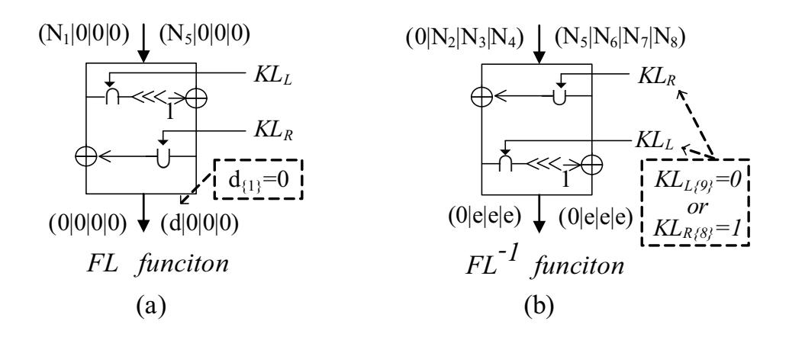
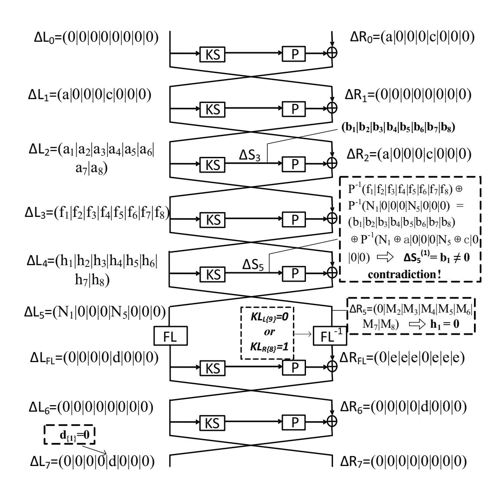
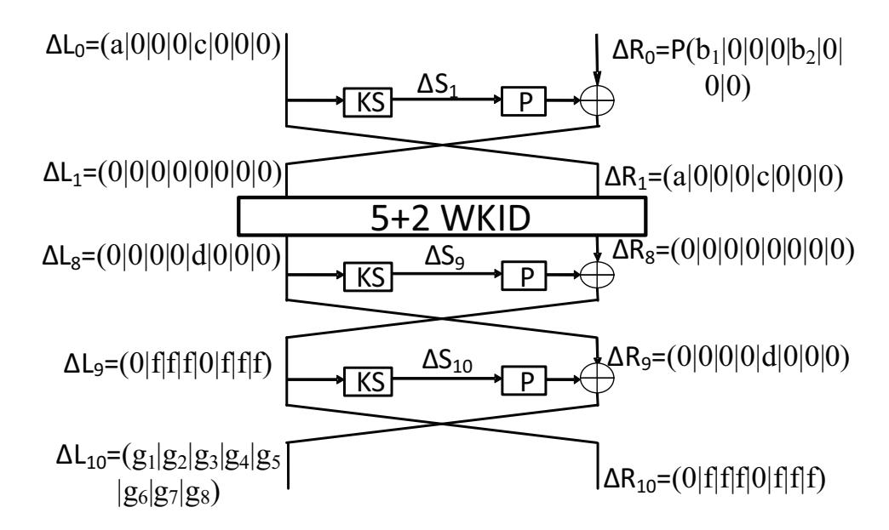
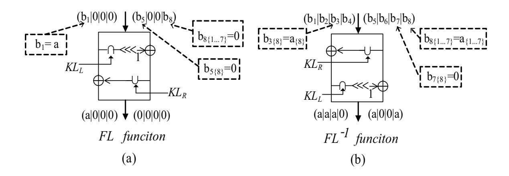
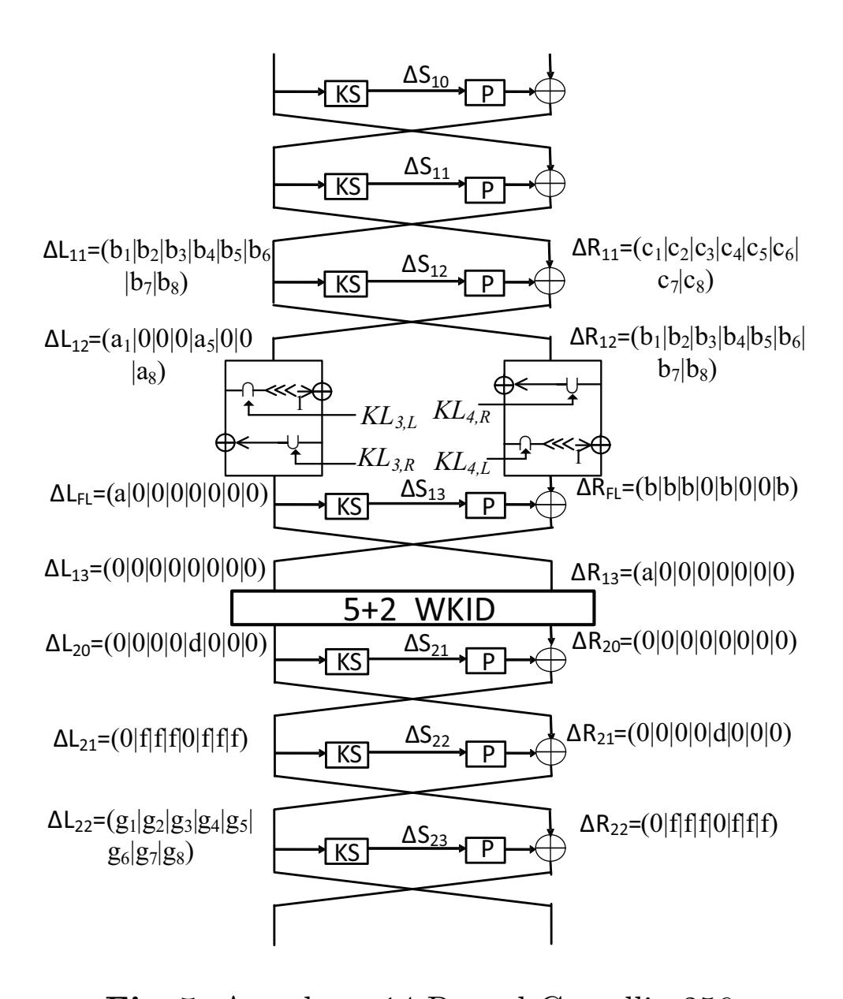

{0}------------------------------------------------

# **Security of Reduced-Round Camellia against Impossible Differential Attack** *<sup>⋆</sup>*

Leibo Li1*,*<sup>2</sup> , Jiazhe Chen1*,*<sup>2</sup> and Xiaoyun Wang1*,*2*,*3*⋆⋆*

<sup>1</sup> Key Laboratory of Cryptologic Technology and Information Security, Ministry of Education, Shandong University, Jinan 250100, China <sup>2</sup> School of Mathematics, Shandong University, Jinan 250100, China

xiaoyunwang@mail.tsinghua.edu.cn

**Abstract.** Camellia is one of the widely used block ciphers, which has been selected as an international standard by ISO/IEC. By using some interesting properties of *F L/F L<sup>−</sup>*<sup>1</sup> functions, we introduce new 7-round impossible differentials of Camellia for weak keys, which can be used to attack reduced-round Camellia under weak-key setting. The weak keys that work for the impossible differential take 3/4 of the whole key space, therefore, we can further get rid of the weak-key assumption and leverage the attacks to all keys by utilizing a method that is called *the multiplied method*. As a result, for the whole key space, 10-round Camellia-128, 11-round Camellia-192 and 12-round Camellia-256 can be attacked with about 2<sup>120</sup>, 2<sup>184</sup> and 2<sup>240</sup> encryptions, respectively. In addition, we are able to extend the attacks to 12-round Camellia-192 and 14-round Camellia-256 which include two *F L/F L<sup>−</sup>*<sup>1</sup> layers, provided that the attacks do not have to be started from the first round.

**Keywords:** Camellia, Block Cipher, Impossible Differential, Cryptanalysis.

## **1 Introduction**

3

The block cipher Camellia is a 128-bit block cipher with variable key length of 128, 192, 256, which are denoted as Camellia-128, Camellia-192 and Camellia-256, respectively. Camellia was proposed by NTT and Mitsubishi in 2000 [1], and was selected as an e-government recommended cipher by CRYPTREC in 2002 [6], NESSIE block cipher portfolio in 2003 [19] and international standard by ISO/IEC 18033-3 in 2005 [9].

Many methods of cryptanalysis were applied to attack reduced-round Camellia in recent years, such as higher order differential attack [8], linear and differential attacks [20], truncated differential attack [10,13,21], collision attack [22], square attack [14,7] and impossible differential attack [16,18,23]. An important property of the Camellia's structure is that *F L/F L−*<sup>1</sup> layers are inserted every 6 rounds. The *F L/F L−*<sup>1</sup> layers are constructed by logical operations AND, OR, XOR and one bit rotation. This design could provide non-regularity across rounds [1] and destroy the differential property. So many previous papers proposed attacks on simplified versions of Camellia, which did not take the *F L/F L−*<sup>1</sup> layers and the whitening layers into account [7,13,16,18,20,22,23]. In this paper, we will mainly focus on the original Camellia, so the results we are interested in are the cryptanalysis with *F L/F L−*<sup>1</sup> layers. Duo et al. proposed a square attack of 9-round Camellia-128 without whitening in [14], and an higher order differential attack was given by Hatano et al. for the last 11 rounds of Camellia-256 [8]. Recently, impossible differential attacks of 10-round Camellia-192 and 11-round Camellia-256 were presented by proposing a 6-round impossible differential with *F L/F L−*<sup>1</sup> layer [5]. By using the same impossible differential, attacks on 10-round (rounds 8 to 17) Camellia-128 and 11-round (rounds 13 to 23) Camellia-192 were given by Lu et al., which did not include the whitening layers [17]. With a

*<sup>{</sup>*lileibo, jiazhechen*}*@mail.sdu.edu.cn Institute for Advanced Study, Tsinghua University, Beijing 100084, China

*<sup>⋆</sup>* Supported by the National Natural Science Foundation of China (Grant No. 60931160442), and the Tsinghua University Initiative Scientific Research Program (2009THZ01002).

*<sup>⋆⋆</sup>* Corresponding author.

{1}------------------------------------------------

7-round impossible including the *F L/F L−*<sup>1</sup> layer, impossible differential attacks on 10-round Camellia-128 (without whitening keys), 10-round Camellia-192 and 11-round Camellia-256 are also proposed [15].

Impossible differential cryptanalysis was independently introduced by Biham [4] and Knudsen [11], which is one of the most powerful toolkits to attack block ciphers. By starting the attack, the adversary tries to seek for an input difference that can never result in a output difference. The differential which connects the input and output difference is impossible and called an impossible differential. When the adversary wants to launch an impossible differential attack on a block cipher, she adds rounds before and/or after the impossible differential, and collect enough pairs with required plaintext and ciphertext differences. Then she concludes that the subkey bits in added rounds must be wrong, if there is a pair meets the input and output of the impossible differential under these subkey bits. In this way, she discards as many wrong keys as possible and exhaustively searches the rest of the keys.

This paper introduces new 7-round impossible differentials of Camellia with *F L/F L−*<sup>1</sup> layers, which works for 75% of the keys. Although the impossible differential only holds under the weak-key assumption, the percentage of weak keys is so high that we can propose a "multiplied" method to recover the key for the whole key space. The idea is based on the fact that if the correct key belongs to the set of weak keys, then it will never satisfy the impossible differential. While if the correct key is not a weak key, the impossible differential will no longer hold, then if we leverage the impossible differential attack on the cipher under the assumption that the impossible differential holds, the correct will be eliminated randomly. Accordingly, in our attack, we first mount impossible differential attack on Camellia as in the weak-key setting. Then after the whole procedure, if there is a remaining key, we conclude that it is the correct key. However, if there is no key kept, we know that the correct key is not in the set of weak keys, but in the other 25% of the key space. In other words, we get 2-bit conditions about the key.

Furthermore, there are several independent impossible differentials under different weak-key assumptions, these impossible differentials are called "multiplied" impossible differentials. For each impossible differential, we can perform the procedure of impossible differential attack to either recover the right key or obtain 2-bit conditions of the key. The worst case is that the correct key does not belong to any of the weak-key sets. If we have *a* impossible differentials, then we get 2*a*-bit conditions of the key and have to search for the rest 2*n−*2*<sup>a</sup>* keys to get the correct key, where *n* is the bit-length of the key. Consequently, the time complexity in this case is 2*n−*2*<sup>a</sup>* + *a ×* 2 *b* , where 2*<sup>b</sup>* is the complexity for performing one impossible differential attack procedure.

Based on this method, we present impossible differential attacks on 10-round Camellia-128, 11-round Camellia-192 and 12-round Camellia-256 with the time complexities of 2120, 2<sup>184</sup> and 2<sup>240</sup> encryptions, respectively. Note that all these attacks start from the first round and include the whitening layers. Additionally, we give attacks of 12-round Camellia-192 and 14 round Camellia-256 which do not start from the first round but include two *F L/F L−*<sup>1</sup> layers. Table 1 summarizes our results along with the best previously known results of reduced-round Camellia, where CP and CC refer to the number of chosen plaintexts and chosen ciphertexts, respectively, and Enc refers to the number of encryptions. "Weak Key" represents the weak key space which contains 3*/*4 of keys.

The rest of this paper is organized as follows. Section 2 provides some notations and a brief description of block cipher Camellia. Section 3 presents a 7-round impossible differential of Camellia for weak keys. Section 4 describes the impossible differential attack on 10-round Camellia-128, 11-round Camellia-192 and 12-round Camellia-256. Cryptanalysis of 12-round Camellia-192 and 14-round Camellia-256 with two *F L/F L−*<sup>1</sup> layers are given in Section 5. Finally, we conclude the paper in section 6.

{2}------------------------------------------------

Table 1. Summary of the Attacks on Reduced-Round Camellia

| Rounds         | Attack Type       | Data                   | Time                      | Memory            | Source      |
|----------------|-------------------|------------------------|---------------------------|-------------------|-------------|
| Camellia-128   |                   |                        |                           |                   |             |
| 9 †            | Square            | $2^{48}$ CP            | $2^{122}$ Enc             | $2^{53}$ Bytes    | [14]        |
| 10 (8-17) †    | Impossible Diff   | $2^{118}$ CP           | $2^{118} \mathrm{Enc}$    | $2^{93}$ Bytes    | [17]        |
| 10 †           | Impossible Diff   | $2^{118.5}\mathrm{CP}$ | $2^{123.5}$ Enc           | $2^{127}$ Bytes   | [15]        |
| 10 (Weak Key)  | Impossible Diff   | $2^{110.4}\mathrm{CP}$ | $2^{110.4}$ Enc           | $2^{86.4}$ Bytes  | Section 4.1 |
| 10             | Impossible Diff   | $2^{112.4}CP$          | $2^{120}$ Enc             | $2^{86.4}$ Bytes  | Section 4.1 |
| Camellia-192   |                   |                        |                           |                   |             |
| 10             | Impossible Diff   | $2^{121}CP$            | $2^{175} \mathrm{Enc}$    | $2^{155.2}$ Bytes | [5]         |
| 10             | Impossible Diff   | $2^{118.7}CP$          | $2^{130.4}\mathrm{Enc}$   | $2^{135}$ Bytes   | [15]        |
| 11 (13-23) †   | Impossible Diff   | $2^{118}$ CP           | $2^{163.1}\mathrm{Enc}$   | $2^{141}$ Bytes   |             |
| 11 (Weak Key)  | Impossible Diff   | $2^{119.5}\mathrm{CP}$ | $2^{138.54} Enc$          | $2^{135.5}$ Bytes | Section 4.2 |
| 11             | Impossible Diff   | $2^{113.7}\mathrm{CP}$ | $2^{184} \mathrm{Enc}$    | $2^{143.7}$ Bytes | Section 4.2 |
| 12 (3-14) †    | Impossible Diff   | $2^{120.1}CP$          | $2^{184}$ Enc             | $2^{126.1}$ Bytes | Append. B   |
| Camellia-256   |                   |                        |                           |                   |             |
| 11             | Impossible Diff   | $2^{121}CP$            | $2^{206.8} {\rm Enc}$     | $2^{166}$ Bytes   | [5]         |
| last 11 rounds | Higher Order Diff | $2^{93}$ CP            | $2^{255.6}$ Enc           | $2^{98}$ Bytes    | [8]         |
| 11             | Impossible Diff   | $2^{119.6}CP$          | $2^{194.5}$ Enc           | $2^{135}$ Bytes   | [15]        |
| 12 (Weak Key)  | Impossible Diff   | $2^{119.7}\mathrm{CP}$ | $2^{202.55} \mathrm{Enc}$ | $2^{143.7}$ Bytes | Section 4.3 |
| 12             | Impossible Diff   | $2^{114.8}$ CP/CC      | $2^{240} \mathrm{Enc}$    | $2^{151.8}$ Bytes | Section 4.3 |
| 14 (10-23) †   | Impossible Diff   | $2^{120}$ CC           | $2^{250.5}$ Enc           | $2^{131}$ Bytes   | Section 5.2 |

CP/CC: Partial phases of the attack are performed under the chosen ciphertext scenario.

†: The attack doesn't include the whitening layers.

## 2 The Camellia Block Cipher

#### 2.1 Notations

The following notations are used in this paper:

 $L_{r-1}$ ,  $L'_{r-1}$ : the left 64-bit half of the r-th round input,  $R_{r-1}$ ,  $R'_{r-1}$ : the right 64-bit half of the r-th round input,

 $\Delta L_{r-1}$  : the difference of  $L_{r-1}$  and  $L'_{r-1}$ ,  $\Delta R_{r-1}$  : the difference of  $R_{r-1}$  and  $R'_{r-1}$ ,

 $S_r, S'_r$ : the output value of the S-box layer of the r-th round,

 $\Delta S_r$  : the difference of  $S_r$  and  $S'_r$ ,

 $K_r$ : the subkey used in the r-th round,

: the *l*-th byte of a 64-bit value X ( $l = 1, \sim, 8$ ),

: the *i*-th most significant bit of a bit string  $X(1 \le i \le 128)$ , where the left most

bit is the most significant bit,

 $X_{\{i\sim j\}}$ : the *i*-th to the *j*-th most significant bit of X  $(1 \le i, j \le 128)$ ,

x|y: bit string concatenation of x and y,  $\oplus$ ,  $\cap$ ,  $\cup$ : bitwise exclusive OR (XOR), AND, OR.

## 2.2 A Brief Description of Camellia

Camellia [1] is a Feistel structure block cipher, and the number of rounds are 18/24/24 for Camellia-128/192/-256, respectively. For Camellia-128, the encryption procedure is as follows.

Firstly, a 128-bit plaintext M is XORed with  $KW_1|KW_2$  and get two 64-bit data  $L_0$  and  $R_0$ . Then, for r=1 to 18, expect for r=6 and 12, the following is carried out:

$$L_r = R_{r-1} \oplus F(L_{r-1}, K_r), R_r = L_{r-1}.$$

{3}------------------------------------------------

For r = 6 and 12, do the following:

$$L'_r = R_{r-1} \oplus F(L_{r-1}, K_r), \qquad R'_r = L_{r-1}, L_r = FL(L'_r, KL_{r/3-1}), \qquad R_r = FL(R'_r, KL_{r/3}),$$

Lastly, the 128-bit ciphertext C is computed as:  $C = (R_{18}|L_{18}) \oplus (KW_3|KW_4)$ .

Following the notations in [1] and [2], we denote the main key of Camellia by K, and  $K_L$ ,  $K_R$  are simply generated from K. For Camellia-128,  $K_L$  is the 128-bit K, and  $K_R$  is 0. For Camellia-192,  $K_L$  is the left 128-bit of K, the concatenation of the right 64-bit of K and its complement used as  $K_R$ . For Camellia-256,  $K_L$  is the left 128-bit of K, and  $K_R$  is the right 128-bit of K. Two 128-bit keys  $K_A$  and  $K_B$  are derived from  $K_L$  and  $K_R$  by a non-linear transformation, where  $K_B$  is only used in Camellia-192/256. Then the whitening keys  $KW_i$  (i = 1, ..., 4), round subkeys  $K_r$  (r = 1, ..., 18) and  $KL_j$  (j = 1, ..., 4) are generated by rotating  $K_L$ ,  $K_R$ ,  $K_A$  or  $K_B$ .

The round function F is composed of a key-addition layer, a substitution transformation S and a diffusion layer P. There are four types of  $8 \times 8$  S-boxes  $s_1$ ,  $s_2$ ,  $s_3$  and  $s_4$  in the S transformation layer, and a 64-bit data is substituted as follows:

$$S(x_1|x_2|x_3|x_4|x_5|x_6|x_7|x_8) = s_1(x_1)|s_2(x_2)|s_3(x_3)|s_4(x_4)|s_2(x_5)|s_3(x_6)|s_4(x_7)|s_1(x_8).$$

The linear transformation  $P: (\{0,1\}^8)^8 \to (\{0,1\}^8)^8$  maps  $(y_1, \dots, y_8) \to (z_1, \dots, z_8)$ , this transformation and its inverse  $P^{-1}$  are defined as follows:

```
 z_1 = y_1 \oplus y_3 \oplus y_4 \oplus y_6 \oplus y_7 \oplus y_8 
z_2 = y_1 \oplus y_2 \oplus y_4 \oplus y_5 \oplus y_7 \oplus y_8 
z_3 = y_1 \oplus y_2 \oplus y_3 \oplus y_5 \oplus y_6 \oplus y_8 
z_4 = y_2 \oplus y_3 \oplus y_4 \oplus y_5 \oplus y_6 \oplus y_7 
z_5 = y_1 \oplus y_2 \oplus y_3 \oplus y_5 \oplus y_6 \oplus y_8 
z_6 = y_2 \oplus y_3 \oplus y_5 \oplus y_7 \oplus y_8 
z_7 = y_3 \oplus y_4 \oplus y_5 \oplus y_6 \oplus y_8 
z_8 = y_1 \oplus y_4 \oplus y_5 \oplus y_6 \oplus y_8 
z_8 = y_1 \oplus y_4 \oplus y_5 \oplus y_6 \oplus y_7 
z_8 = y_1 \oplus y_4 \oplus y_5 \oplus y_6 \oplus y_7 
z_8 = y_1 \oplus y_4 \oplus y_5 \oplus y_6 \oplus y_7 
z_8 = y_1 \oplus y_4 \oplus y_5 \oplus y_6 \oplus y_7 
z_8 = y_1 \oplus y_4 \oplus y_5 \oplus y_6 \oplus y_7 
z_8 = y_1 \oplus y_4 \oplus y_5 \oplus y_6 \oplus y_7 
z_8 = y_1 \oplus y_4 \oplus y_5 \oplus y_6 \oplus y_7 
z_8 = y_1 \oplus y_4 \oplus y_5 \oplus y_6 \oplus y_7 
z_8 = y_1 \oplus y_4 \oplus y_5 \oplus y_6 \oplus y_7 
z_8 = y_1 \oplus y_4 \oplus y_5 \oplus y_6 \oplus y_7 
z_8 = y_1 \oplus y_4 \oplus y_5 \oplus y_6 \oplus y_7 
z_8 = y_1 \oplus y_4 \oplus y_5 \oplus y_6 \oplus y_7 
z_8 = y_1 \oplus y_4 \oplus y_5 \oplus y_6 \oplus y_7 
z_8 = y_1 \oplus y_4 \oplus y_5 \oplus y_6 \oplus y_7 
z_8 = y_1 \oplus y_4 \oplus y_5 \oplus y_6 \oplus y_7 
z_8 = y_1 \oplus y_4 \oplus y_5 \oplus y_6 \oplus y_7 
z_8 = y_1 \oplus y_4 \oplus y_5 \oplus y_6 \oplus y_7 
z_8 = y_1 \oplus y_4 \oplus y_5 \oplus y_6 \oplus y_7 
z_8 = y_1 \oplus y_4 \oplus y_5 \oplus y_6 \oplus y_7 
z_8 = y_1 \oplus y_4 \oplus y_5 \oplus y_6 \oplus y_7 
z_8 = y_1 \oplus y_4 \oplus y_5 \oplus y_6 \oplus y_7 
z_8 = y_1 \oplus y_4 \oplus y_5 \oplus y_6 \oplus y_7 
z_8 = y_1 \oplus y_4 \oplus y_5 \oplus y_6 \oplus y_7 
z_8 = y_1 \oplus y_4 \oplus y_5 \oplus y_6 \oplus y_7 
z_8 = y_1 \oplus y_4 \oplus y_5 \oplus y_6 \oplus y_7 
z_8 = y_1 \oplus y_4 \oplus y_5 \oplus y_6 \oplus y_7 
z_8 = y_1 \oplus y_4 \oplus y_5 \oplus y_6 \oplus y_7 
z_8 = y_1 \oplus y_4 \oplus y_5 \oplus y_6 \oplus y_7 
z_8 = y_1 \oplus y_4 \oplus y_5 \oplus y_6 \oplus y_7 
z_8 = y_1 \oplus y_4 \oplus y_5 \oplus y_6 \oplus y_7 
z_8 = y_1 \oplus y_4 \oplus y_5 \oplus y_6 \oplus y_7 
z_8 = y_1 \oplus y_4 \oplus y_5 \oplus y_6 \oplus y_7 
z_8 = y_1 \oplus y_4 \oplus y_5 \oplus y_6 \oplus y_7 
z_8 = y_1 \oplus y_4 \oplus y_5 \oplus y_6 \oplus y_7 
z_8 = y_1 \oplus y_4 \oplus y_5 \oplus y_6 \oplus y_7 
z_8 = y_1 \oplus y_4 \oplus y_5 \oplus y_6 \oplus y_7 
z_8 = y_1 \oplus y_4 \oplus y_5 \oplus y_6 \oplus y_7 
z_8 = y_1 \oplus y_4 \oplus y_5 \oplus y_6 \oplus y_7 
z_8 = y_1 \oplus y_4 \oplus y_5 \oplus y_6 \oplus y_7 
z_8 = y_1 \oplus y_4 \oplus y_5 \oplus y_6 \oplus y_7 
z_8 = y_1 \oplus y_4 \oplus y_5 \oplus y_6 \oplus y_6 \oplus y_6 
z_8 = y_1 \oplus y_4 \oplus y_5 \oplus y_6 \oplus y_6 \oplus y_6 
z_8 = y_1 \oplus y_4 \oplus y_5 \oplus y_6 \oplus y_6 \oplus y_6 
z_8 = y_1 \oplus y_4 \oplus y_5 \oplus y_6 \oplus y_6 \oplus y_6 
z_8 = y_1 \oplus y
```

The FL function is defined as  $(X_L|X_R, KL_L|KL_R) \mapsto Y_L|Y_R$ , where

$$Y_R = ((X_L \cap KL_L) \ll_1) \oplus X_R, \quad Y_L = (Y_R \cup KL_R) \oplus X_L.$$

Similar to Camellia-128, Camellia-192/256 have a 24-round Feistel structure, and the  $FL/FL^{-1}$  function layer are inserted in the 6-th, 12-th and 18-th rounds. Before the first round and after the last round, there are pre- and post- whitening layers as well. For details of Camellia, we refer to [1,2].

## 3 7-Round Impossible Differentials of Camellia for Weak Keys

This section introduces 7-round impossible differentials of Camellia in weak-key setting, which is based on the following observations.

**Observation 1** (from [12]) Let X, X', K be l-bit values, and  $\Delta X = X \oplus X'$ , then the differential properties of AND and OR operations are:

$$(X \cap K) \oplus (X' \cap K) = (X \oplus X') \cap K = \Delta X \cap K,$$
  
$$(X \cup K) \oplus (X' \cup K) = (X \oplus K \oplus (X \cap K)) \oplus (X' \oplus K \oplus (X' \cap K)) = \Delta X \oplus (\Delta X \cap K).$$

**Observation 2** If the output difference of FL function is  $\Delta Y = (0|0|0|0|0|0|0|0)$ , where  $d \neq 0$  and  $d_{\{1\}} = 0$ , then the input difference of FL function should satisfy  $\Delta X^{(2,3,4,6,7,8)} = 0$  (see Fig. 1. a).

{4}------------------------------------------------



**Fig. 1.** Properties of  $FL/FL^{-1}$  Function

*Proof.* From Observation 1 we know that

$$\Delta X_L = \Delta Y_L \oplus \Delta Y_R \oplus (\Delta Y_R \cap KL_R),$$

and  $\Delta Y_R^{(2,3,4)}=0$ , hence  $\Delta X_L^{(2,3,4)}=0$ . According to the condition  $\Delta Y_{R\{1\}}=d_{\{1\}}=0$ , we conclude  $\Delta X_{L\{1\}}=0$ , as we know

$$\Delta X_R = \Delta Y_R \oplus ((\Delta X_L \cap KL_L) \ll 1)$$

which implies  $\Delta X_R^{(6,7,8)} = 0$ .

**Observation 3** If the output difference of  $FL^{-1}$  function is  $\Delta X = (0|e|e|e|0|e|e|)$ , and the subkeys of  $FL^{-1}$  function satisfy that  $KL_{L\{9\}}$  is 0 or  $KL_{R\{8\}}$  is 1, then the first byte of input difference  $\Delta Y$  should be zero, where e is a non-zero byte (see Fig. 1. b).

*Proof.* On the one hand, if  $KL_{L\{9\}} = 0$ , we conclude that  $((X_L \cap KL_L) \oplus (X'_L \cap KL_L))_{\{9\}}$  must be 0. According to

$$\Delta Y_R = \Delta X_R \oplus (((X_L \cap KL_L) \oplus (X_L' \cap KL_L)) \ll_1)$$

we obtain  $\Delta Y_R^{(1)} = 0$  or  $\Delta Y_R = (0|N_6|N_7|N_8)$ . Then

$$\Delta Y_L = \Delta X_L \oplus (Y_R \cup KL_R) \oplus (Y_R' \cup KL_R) = (0|N_2|N_3|N_4),$$

where  $N_i$  are unknown bytes.

On the other hand, if  $KL_{R\{8\}} = 0$ , we obtain that  $((Y_R \cup KL_R) \oplus (Y'_R \cup KL_R))_{\{8\}}$  must be 0. Since  $((Y_R \cup KL_R) \oplus (Y'_R \cup KL_R))_{\{1 \sim 7\}}$  is always 0, the left half input difference satisfy

$$\Delta Y_L = \Delta X_L \oplus (Y_R \cup KL_R) \oplus (Y_R' \cup KL_R) = (0|N_2|N_3|N_4). \quad \Box$$

**Observation 4** Given a 7-round Camellia encryption and a  $FL/FL^{-1}$  layer inserted between the fifth and sixth round. If the input difference of the first round is (0|0|0|0|0|0|0|0, a|0|0|0|0|0), and the subkeys of  $FL^{-1}$  function satisfy  $KL_{L\{9\}} = 0$  or  $KL_{R\{8\}} = 1$ , then the output difference (0|0|0|0|0|0|0|0|0|0|0|0|0|0) with  $d_{\{1\}} = 0$  is impossible, where a and d are non-zero bytes, c is an arbitrary value. (see Fig. 2).

*Proof.* Firstly, we analyze the forward direction. It is trivial that  $(\Delta L_1, \Delta R_1) = (a|0|0|0|0|0|0|0|0|0|0|0|0|0|0|0|0|0|0|0$ 

{5}------------------------------------------------



Fig. 2. A 7-Round Impossible Differential for Weak Keys

non-zero values. Then we have  $(\Delta L_3, \Delta R_3) = (f_1|f_2|f_3|f_4|f_5|f_6|f_7|f_8, a_1|a_2|a_3|a_4|a_5|a_6|a_7|a_8)$ , and  $(\Delta L_4, \Delta R_4) = (h_1|h_2|h_3|h_4|h_5|h_6|h_7|h_8, f_1|f_2|f_3|f_4|f_5|f_6|f_7|f_8)$ , where  $f_i$ ,  $h_i$  are unknown values.

Secondly, we consider the backward direction. The output difference of the seventh round is  $(\Delta L_7, \Delta R_7) = (0|0|0|0|0|0|0|0, 0|0|0|0|0|0|0|0)$ , then the output difference of the sixth round is  $(\Delta L_6, \Delta R_6) = (0|0|0|0|0|0|0|0|0|0|0|0|0|0|0|0|0|0|0|$ 

Finally, we focus on the fifth round. The output difference of S-layer in the fifth round is

$$\Delta S_5 = P^{-1}(f_1|f_2|f_3|f_4|f_5|f_6|f_7|f_8) \oplus P^{-1}(N_1|0|0|0|N_5|0|0|0)$$
  
=  $(b_1|b_2|b_3|b_4|b_5|b_6|b_7|b_8) \oplus P^{-1}(N_1 \oplus a|0|0|0|N_5 \oplus c|0|0|0).$ 

Then  $\Delta S_5^{(1)} = b_1 \neq 0$ , which contradicts  $\Delta L_4^{(1)} = 0$ .

We also obtain three other impossible differentials under different weak-key assumptions:

- $(0|0|0|0|0|0|0|0,0|a|0|0|0|c|0|0) \rightarrow (0|0|0|0|0|0|0|0|0|0|0|0|0|0|0)$  with conditions  $KL_{L\{17\}} = 0$  or  $KL_{R\{16\}} = 1$ , and  $d_{\{1\}} = 0$ ,
- $(0|0|0|0|0|0|0|0,0|0|a|0|0|0|c|0) \rightarrow (0|0|0|0|0|0|0|0|0|0|0|0|0|0|0|0|0|0|0|$
- $(0|0|0|0|0|0|0|0|0|a|0|0|0|c) \rightarrow (0|0|0|0|0|0|0|0|0|0|0|0|0|0|0|0|0|0|0|$

We denote this type of impossible differentials above as 5+2 WKID (weak-key impossible differentials). Due to the feature of Feistel structure, we also deduce another type of 7-round impossible differentials with the  $FL/FL^{-1}$  layers inserted between the second and the third rounds, we call it 2+5 WKID, which are depicted as follows.

{6}------------------------------------------------

- $(0|0|0|0|0|0|0|0|0|0|0|0|0|0|0|0|0) \rightarrow (a|0|0|0|0|0|0|0|0|0|0|0|0|0|0)$  with conditions  $KL'_{L\{9\}} = 0$  or  $KL'_{R\{8\}} = 1$ , and  $d_{\{1\}} = 0$ ,
- (0|0|0|0|0|0|0|0|0|0|0|0|0|0|0|0|0|0|0|
- $(0|0|0|0|0|0|0|0|0|0|0|0|0|0|0|d|0) \rightarrow (0|0|a|0|0|0|c|0,0|0|0|0|0|0|0|0)$  with conditions  $KL'_{L\{25\}} = 0$  or  $KL'_{R\{24\}} = 1$ , and  $d_{\{1\}} = 0$ ,
- (0|0|0|0|0|0|0|0|0|0|0|0|0|0|0|0|0)  $\rightarrow$  (0|0|0|a|0|0|0|c, 0|0|0|0|0|0|0) with conditions  $KL'_{L\{1\}} = 0$  or  $KL'_{R\{32\}} = 1$ , and  $d_{\{1\}} = 0$ ,

where KL' represents the subkey used in FL-function.

## 4 New Impossible Differential Attacks on Reduced-Round Camellia

In this section, we introduce impossible differential attacks on 10-round Camellia-128, 11-round Camellia-192 and 12-round Camellia-256 which start from the first round. As mentioned above, each attack will start with a weak-key attack that is based on the **WKID**, then it will be extended to an attack for the whole key space.

#### 4.1 Impossible Differential Attack on 10-Round Camellia-128



Fig. 3. Impossible Differential Attack on 10-Round Camellia-128 for Weak Keys

We first propose an attack that works for  $3 \times 2^{126}$  keys, which is mounted by adding one round on the top and two rounds on the bottom of the  $\mathbf{5+2}$  WKID (Fig. 2). The attack procedure is as follows.

#### Data Collection.

1. Choose  $2^n$  structures of plaintexts, and each structure contains  $2^{32}$  plaintexts

$$(L_0, R_0) = (\alpha_1 | x_1 | x_2 | x_3 | \alpha_2 | x_4 | x_5 | x_6, P(\beta_1 | y_1 | y_2 | y_3 | \beta_2 | y_4 | y_5 | y_6)),$$

where  $x_i$  and  $y_i$  (i = 1, ..., 6) are fixed values in each structure, while  $\alpha_j$ ,  $\beta_j$  (j = 1, 2) takes all the possible values, and P is the linear transformation.

2. For each structure, ask for the encryption of the plaintexts and get  $2^{32}$  ciphertexts. Store them in a hash table H indexed by  $R_{10}^{(1,5)}$ , the XOR of  $R_{10}^{(2)}$  and  $R_{10}^{(3)}$ , the XOR of  $R_{10}^{(2)}$  and

{7}------------------------------------------------

 $R_{10}^{(4)}$ , the XOR of  $R_{10}^{(2)}$  and  $R_{10}^{(6)}$ , the XOR of  $R_{10}^{(2)}$  and  $R_{10}^{(7)}$ , the XOR of  $R_{10}^{(2)}$  and  $R_{10}^{(8)}$ . Then by birthday paradox, we get  $2^{n+63} \times 2^{-56} = 2^{n+7}$  pairs of ciphertexts with the differences

$$(\Delta L_{10}, \Delta R_{10}) = (g_1|g_2|g_3|g_4|g_5|g_6|g_7|g_8, 0|f|f|f|0|f|f|f),$$

and the differences of corresponding plaintext pairs satisfy

$$(\Delta L_0, \Delta R_0) = (a|0|0|0|c|0|0|0, P(b_1|0|0|0|b_2|0|0|0)).$$

Where a, c, f and  $b_i$  (i = 1, 2) are non-zero bytes, and  $g_i$  are unknown bytes. For every pair, compute the value

$$P^{-1}(\Delta L_{10}) = P^{-1}(g_1|g_2|g_3|g_4|g_5|g_6|g_7|g_8) = (g_1'|g_2'|g_3'|g_4'|g_5'|g_6'|g_7'|g_8').$$

Keep only the pairs whose ciphertexts satisfy  $g'_1 = 0$ <sup>4</sup>. The probability of this event is  $2^{-8}$ , thus the expected number of remaining pairs is  $2^{n+7} \times 2^{-8} = 2^{n-1}$ .

### Key Recovery.

- 1. For each pair obtained in the data collection phase, guess the 16-bit value  $K_1^{(1,5)}$ , partially encrypt its plaintext  $(L_0^{(1,5)}, L'_0^{(1,5)})$  to get the intermediate value  $(S_1^{(1,5)}, S'_1^{(1,5)})$  and the difference  $\Delta S_1^{(1,5)}$ . Then discard the pairs whose intermediate values do not satisfy  $\Delta S_1^{(1)} = b_1$  and  $\Delta S_1^{(5)} = b_2$ . The probability of a pair being kept is  $2^{-16}$ , so the expected number of remaining pairs is  $2^{n-1} \times 2^{-16} = 2^{n-17}$ .
- 2. In this step, the ciphertext of every remaining pair are considered.
  - (a) Guess the 8-bit value  $K_{10}^{(8)}$  for every remaining pair, partially decrypt the ciphertext  $(R_{10}^{(8)}, R_{10}^{(8)})$  to get the intermediate value  $(S_{10}^{(8)}, S_{10}^{(8)})$  and the difference  $\Delta S_{10}^{(8)}$ , and discard the pairs whose intermediate values do not satisfy  $\Delta S_{10}^{(8)} = g_8'$ . The expected number of remaining pairs is  $2^{n-17} \times 2^{-8} = 2^{n-25}$ .
  - (b) For l=2,3,4,6,7, guess the 8-bit value  $K_{10}^{(l)}$ . For every remaining pair, partially decrypt the ciphertext  $(R_{10}^{(l)}, R'_{10}^{(l)})$  to get the intermediate value  $(S_{10}^{(l)}, S'_{10}^{(l)})$  and the difference  $\Delta S_{10}^{(l)}$ , and keep only the pairs whose intermediate values satisfy  $\Delta S_{10}^{(l)} = g'_l \oplus g'_5$ . Since for each l, each pair will remain with probability  $2^{-8}$ , the expected number of remaining pairs is  $2^{n-25} \times 2^{5 \times (-8)} = 2^{n-65}$ .
  - (c) Guess the 8-bit value  $K_{10}^{(1)}$ , partially decrypt the ciphertext  $R_{10}^{(1)}$  of every remaining pair to get the intermediate value  $S_{10}^{(1)}$ , which is also the value of  $S_{10}^{(1)}$ .
  - (d) Partially decrypt  $(S_{10}, S'_{10})$  to get the intermediate values  $(R_9^{(5)}, R'_9^{(5)})$ , and discard the pairs whose intermediate values do not satisfy  $\Delta R_{9\{1\}}^{(5)} = 0$ . As the probability of a pair being discarded is 0.5, the expected number of remaining pairs is  $2^{n-65} \times 2^{-1} = 2^{n-66}$ .
- 3. For every remaining pair, guess the 8-bit value  $K_9^{(5)}$ , partially decrypt the output value  $(R_9^{(5)}, R_9^{(5)})$  to get the intermediate value  $(S_9^{(5)}, S_9^{(5)})$  and the difference  $\Delta S_9^{(5)}$ . If there is a pair satisfies  $\Delta S_9^{(5)} = \Delta R_{10}^{(2)}$ , we discard the key guess and try another one. Otherwise we exhaustively search for the rest 48 bits of the key under this key guess, if the correct key is obtained, we halt the attack; otherwise, another key guess should be tried.

To guarantee that the differential characteristic holds, the difference of intermediate value  $\Delta S_{10}$  should equal to  $P^{-1}(\Delta L_{10} \oplus \Delta R_9) = (g_1'|g_2' \oplus d|g_3' \oplus d|g_4' \oplus d|g_5' \oplus d|g_6' \oplus d|g_7' \oplus d|g_8')$ . Since  $\Delta L_9 = \Delta R_{10} = (0|f|f|f|0|f|f|f)$ , then there must be  $g_1' = 0$  and  $g_5' = d$ .

{8}------------------------------------------------

**Complexity.** Since the probability of the event  $\Delta S_9^{(5)} = \Delta R_{10}^{(2)}$  happens in step 3 of key recovery phase is  $2^{-8}$ , the expected number of remaining guesses for 72-bit target subkeys is about  $\epsilon = 2^{80} \times (1-2^{-8})^{2^{n-66}}$ . If we choose  $\epsilon = 2^{50}$ , then n is 78.4, and the proposed attack requires  $2^{n+32} = 2^{110.4}$  chosen plaintexts. The time and memory complexities are dominated by step 2 of data collection phase, which are about  $2^{110.4}$  10-round encryptions and  $2^{n-1} \times 4 \times 2^7 = 2^{86.4}$  bytes.

**Remark.** The application of whitening layers does not effect the complexity of this attack, because the master key can be recovered by guessing equivalent keys [5].

**Extending the Attack to the Whole Key Space.** On the basis of the above impossible differential attack for weak keys, we construct a multiplied attack on 10-Round Camellia-128 as follows.

- Phase 1. Perform an impossible differential attack by using the 5+2 WKID

$$(0|0|0|0|0|0|0, a|0|0|0|c|0|0|0) \rightarrow (0|0|0|0|0|0|0, 0|0|0|0|0|0|0).$$

This phase is extremely similar to the weak-key attack that is described above. However, it is slightly different when the attack is finished. That is, if there is a key kept, then the key is the correct key, and we halt the procedure of the attack. Otherwise, we conclude that the correct key does not belong to this set of weak keys, which means that  $KL_{1\{9\}} = 1$  and  $KL_{2\{8\}} = 0$ . In this case, we get 2-bit information of the key and perform the next phase.

- Phase 2. Perform an impossible differential attack by using the 5+2 WKID

$$(0|0|0|0|0|0|0|0, 0|a|0|0|0|c|0|0) \rightarrow (0|0|0|0|0|d|0|0, 0|0|0|0|0|0|0).$$

The procedure is similar to Phase 1, and either output the correct key or get another 2-bit information about the key and execute the next phase.

. . . . . . . . . . . . . . . .

- Phase 4. Perform an impossible differential attack by using the 5+2 WKID

$$(0|0|0|0|0|0|0,0|0|0|a|0|0|c) \rightarrow (0|0|0|0|0|0,0|0|0|0|0|0|0).$$

Similarly, if success, then output the actual key, otherwise perform the next phase.

- Phase 5. Announce the intermediate key

$$K_{A\{95,103,111,119\}} = 0 \text{ and } K_{A\{6,14,22,30\}} = 1,$$

then exhaustively search for the remaining 120 bit value of  $K_A$  and recover the master key  $K_L$ .

The upper bound of the time complexity is  $2^{110.4} + 2^{110.4} + 2^{110.4} + 2^{110.4} + 2^{120} \approx 2^{120}$ . The data complexity is about  $2^{112.4}$ . The memory could be reused in different phase, so the memory requirement is about  $2^{86.4}$  bytes.

#### 4.2 Attack on 11-Round Camellia-192

We add one round on the bottom of 10-round attack, and give an attack on 11-round Camellia-192. 

{9}------------------------------------------------

**Data Collection.** Choose  $2^{79.7}$  structures of plaintexts, and each structure contains  $2^{32}$  plaintexts:

$$(L_0, R_0) = (\alpha_1 | x_1 | x_2 | x_3 | \alpha_2 | x_4 | x_5 | x_6, P(\beta_1 | y_1 | y_2 | y_3 | \beta_2 | y_4 | y_5 | y_6)),$$

where  $x_i$  and  $y_i$  (i=1,...,6) are fixed values in each structure, while  $\alpha_j$  and  $\beta_j$  (j=1,2) take all the possible values, and P is the linear transformation. Ask for the encryption of the corresponding ciphertext for each plaintext, compute  $P^{-1}(R_{11})$  and store the plaintext-ciphertext pairs  $(L_0, R_0, L_{11}, R_{11})$  in a hash table indexed by 8-bit value  $(P^{-1}(R_{11}))^{(1)}$ . By birth-day paradox, we get  $2^{142.7} \times 2^{-8} = 2^{134.7}$  pairs whose ciphertext differences satisfy  $P^{-1}(\Delta L_{11}) = (h'_1|h'_2|h'_3|h'_4|h'_5|h'_6|h'_7|h'_8)$  and  $P^{-1}(\Delta R_{11}) = (0|g'_2|g'_3|g'_4|g'_5|g'_6|g'_7|g'_8)$ , where  $h'_i$  and  $g'_i$  are unknown values.

#### Key Recovery.

- 1. For l=1,5, guess the 8-bit value of  $K_1^{(l)}$ , partially encrypt their plaintext  $(L_0^{(l)}, L_0^{(l)})$  and discard the pairs whose intermediate value do not satisfy  $\Delta S_1^{(l)} = (P^{-1}(\Delta R_0))^{(l)}$ . The expected number of remaining pairs is  $2^{134.7} \times 2^{-16} = 2^{118.7}$ .
- 2. In this step, we consider the ciphertext of each remaining pair.
  - (a) For l=1,2,3,4,6,7,8, guess the 8-bit value of  $K_{11}^{(l)}$ . Partially decrypt the ciphertext  $(R_{11}^{(l)}, R_{11}^{(l)})$  and keep only the pairs which satisfy  $\Delta S_{11}^{(l)} = h'_l$ . The expected number of remaining pairs is  $2^{118.7} \times 2^{7 \times (-8)} = 2^{62.7}$ .
  - (b) Guess the 8-bit value  $K_{11}^{(5)}$ . Partially decrypt the ciphertext  $(R_{11}^{(5)}, R'_{11}^{(5)})$ , then compute the intermediate value  $(R_{10}, R'_{10})$ , where  $\Delta R_{10} = (0|f|f|f|0|f|f|f)$  and  $f = \Delta S_{11}^{(5)} \oplus h'_5$ .
- 3. Application of the 10-round attack.
  - (a) Guess the 8-bit value  $K_{10}^{(8)}$ , partially decrypt  $(R_{10}^{(8)}, R_{10}^{(8)})$  and discard the pairs whose intermediate values do not satisfy  $\Delta S_{10}^{(8)} = g_8'$ . The expected number of remaining pairs is  $2^{62.7} \times 2^{-8} = 2^{54.7}$ .
  - (b) For l=2,3,4,6,7, guess the 8-bit value  $K_{10}^{(l)}$ . Partially decrypt the intermediate value  $(R_{10}^{(l)},R_{10}^{\prime(l)})$  and keep only the pairs whose intermediate values satisfy  $\Delta S_{10}^{(l)}=g_l^\prime\oplus g_5^\prime$ . The expected number of remaining pairs is  $2^{54.7}\times 2^{5\times (-8)}=2^{14.7}$ .
  - (c) Guess the 8-bit value  $K_{10}^{(1)}$ , partially decrypt the intermediate value  $R_{10}^{(1)}$  and calculate the intermediate values  $(R_9^{(5)}, R_9^{(5)})$ . Discard the pairs whose intermediate values do not satisfy  $\Delta R_{9\{1\}}^{(5)} = 0$ . Then the expected number of remaining pairs is  $2^{14.7} \times 2^{-1} = 2^{13.7}$ .
  - (d) Guess the 8-bit value  $K_9^{(5)}$ , partially decrypt the intermediate value  $(R_9^{(5)}, R_9^{(5)})$  to get the difference  $\Delta S_9^{(5)}$ . If there is a pair satisfies  $\Delta S_9^{(5)} = \Delta R_{10}^{(2)}$ , we discard the key guess and try another one. Otherwise we exhaustively search for the rest 48 bits of  $K_L$  and  $K_R$  under this key guess, if the correct key is obtained, we halt the attack; otherwise, another key guess should be tried.

**Complexity.** The data complexity of the attack is  $2^{111.7}$  chosen plaintexts. The time complexity is dominated by step 3 (d) which requires about  $2^{144} \times (1 + (1 - 2^{-8}) + (1 - 2^{-8})^2 + ... + (1 - 2^{-8})^{2^{13.7} - 1}) \times 2 \times \frac{1}{11} \times \frac{1}{8} \approx 2^{146.54}$  11-round encryptions. The memory complexity is about  $2^{134.7} \times 4 \times 2^7 = 2^{143.7}$  bytes.

Reduce the Time Complexity to  $2^{138.54}$ . Assume 16-bit value  $\alpha_2$  and  $\beta_2$  are fixed in data collection phase of above attack, then we can collect  $2^{n+31} \times 2^{-8} = 2^{n+23}$  pairs, where n represents the number of structures. Nevertheless, it is unnecessary for us to guess 8-bit subkey  $K_1^{(5)}$  in this case. Then there are totally 136-bit values of subkey to be guessed in the attack, therefore, the expected number of remaining guesses of target subkey is about  $\epsilon = 2^{136} \times (1-2^{-8})^{2^{n-90}}$  after the attack. If we chose  $\epsilon = 2^{70}$ , n is 103.5. Then the data complexity increases to  $2^{n+16} = 2^{119.5}$ , but the

{10}------------------------------------------------

time complexity reduces to 2128*×*2 <sup>8</sup>*×*(1+(1*−*2 *−*8 )+(1*−*2 *−*8 ) <sup>2</sup>+*...*+(1*−*2 *−*8 ) 2 *<sup>n</sup>−*90*−*1 )*×*2*×* 1 <sup>11</sup>*×* 1 <sup>8</sup> *≈* 2 <sup>138</sup>*.*54, the memory requirement reduces to 2*n*+23 *×* 4 *×* 2 <sup>7</sup> = 2135*.*<sup>5</sup> bytes.

**Extending the Attack to the Whole Key Space.** Similar to 10-round attack on Camellia-128, we mount a multiplied attack on Camellia-192 for the whole key space. The expected time of the attack is about 4 *×* 2 <sup>146</sup>*.*<sup>54</sup> + 2<sup>192</sup> *×* (1 *−* 3 4 ) <sup>4</sup> = 2<sup>184</sup> *.* The expected data of the attack is 2 113*.*7 . The memory requirement is about 2143*.*<sup>7</sup> bytes.

### **4.3 The Attack on 12-Round Camellia-256**

We add one round on the bottom of 11-round attack, and present a 12-round attack on Camellia-256. The attack procedure is similar to the 11-round attack. First choose 279*.*<sup>8</sup> structures and collect 2142*.*<sup>8</sup> plaintext-ciphertext pairs in data collection phase. After guessing the subkey *K* (1*,*5) 1 , we guess the 64-bit value *K*<sup>12</sup> and compute the intermediate value (*R*11*, R′* <sup>11</sup>), then apply the 11-round attack to perform the remaining steps. In summary, the proposed attack requires 2 <sup>78</sup>*.*8+32 = 2111*.*<sup>8</sup> chosen plaintexts. The time complexity is about 2210*.*<sup>55</sup> 12-round encryptions, and the memory requirement is about 2151*.*<sup>8</sup> bytes. Similar to the above subsection, the time complexity and memory requirement can also reduce to 2202*.*<sup>55</sup> and 2143*.*<sup>7</sup> , respectively, but data complexity increases to 2119*.*<sup>7</sup> in this case.

We also construct another type of impossible differential attack of Camellia-256, which adds four rounds on the top and one round on the bottom of the **2+5 WKID** (see section 3). The attack is performed under the chosen ciphertext attack scenario. Similar to the attack based on the **5+2 WKID**, the data and time complexity are about 2111*.*<sup>8</sup> and 2216*.*<sup>3</sup> , respectively.

**Extending the Attack to the Whole Key Space.** On the basis of two types of impossible differential attacks for weak keys, we mount a multiplied attack on 12-round Camellia-256 for the whole key space as below.

**– Phase 1.** Preform an impossible differential attack by using of **5+2 WKID**

$$(0|0|0|0|0|0|0|0, a|0|0|0|c|0|0|0) \rightarrow (0|0|0|0|d|0|0|0, 0|0|0|0|0|0|0).$$

If success, output the actual key, else perform the next phase.

*· · · · · · · · · · · · · · ·*

**– Phase 5.** Preform an impossible differential attack by using of **2+5 WKID**

(0*|*0*|*0*|*0*|*0*|*0*|*0*|*0*,* 0*|*0*|*0*|*0*|d|*0*|*0*|*0) 9 (*a|*0*|*0*|*0*|c|*0*|*0*|*0*,* 0*|*0*|*0*|*0*|*0*|*0*|*0*|*0)*.*

If success, output the actual key, else perform the next phase.

*· · · · · · · · · · · · · · ·*

**– Phase 9.** Announce 16-bit value of the master key

$$K_{R\{31,39,47,55,95,103,111,119\}} = 0 \text{ and } K_{R\{6,14,22,30,70,78,86,94\}} = 1,$$

then exhaustively search for the remaining 240 bit value of *KR*, *K<sup>L</sup>* and recover the actual key.

The expected time of the attack is 2216*.*<sup>3</sup> *×* 8 + 2<sup>256</sup> *×* ( 1 4 ) 8 *≈* 2 <sup>240</sup> encryptions, and the expected data complexity is about 2114*.*<sup>8</sup> *.*

{11}------------------------------------------------

## 5 The Attacks Including Two $FL/FL^{-1}$ Layers

If we do not start from the first round, we can take the attacks that include two  $FL/FL^{-1}$  layers into account. We first illustrate some new observations of FL and  $FL^{-1}$  functions, then present attacks on variants of 14-round Camellia-256 and 12-round Camellia-192 (Appendix B).

## 5.1 Observations of $FL/FL^{-1}$ Layer

Our attacks are based on the following observations.



Fig. 4. Observations of  $FL/FL^{-1}$  Function

**Observation 5** If the output difference of FL function is  $\Delta Y = (a|0|0|0|0|0|0|0)$ , then the input difference should satisfy  $\Delta X = (b_1|0|0|0|b_5|0|0|b_8)$  with  $b_1 = a$ ,  $b_{5\{8\}} = 0$  and  $b_{8\{1\sim7\}} = 0$ , where a is a non-zero byte (see Fig. 4. (a)).

**Observation 6** If the output difference of  $FL^{-1}$  function is  $\Delta X = (a|a|a|0|a|0|a|0|a|)$ , and the input difference  $\Delta Y = (b_1|b_2|b_3|b_4|b_5|b_6|b_7|b_8)$ , then  $b_{7\{8\}} = 0$ ,  $b_{3\{8\}} = a_{\{8\}}$  and  $b_{8\{1\sim7\}} = a_{\{1\sim7\}}$ , where a is a non-zero byte,  $b_i$  are unknown bytes (see Fig. 4. (b)).

**Observation 7** Suppose the input difference of the i-round of Camellia satisfies  $(\Delta L_{i-1}, \Delta R_{i-1})$  =  $(b_1|b_2|b_3|b_4|b_5|b_6|b_7|b_8$ ,  $P(c'_1|c'_2|c'_3|c'_4|c'_5|c'_6|c'_7|c'_8)$ , and the output difference is  $(\Delta L_i, \Delta R_i)$  =  $(a_1|0|0|0|a_5|0|0|a_8, b_1|b_2|b_3|b_4|b_5|b_6|b_7|b_8)$  with  $a_{5\{8\}} = 0$  and  $a_{8\{1\sim7\}} = 0$ , where  $b'_i$ ,  $c'_i$  are arbitrary bytes, and  $a_1$  is a nonzero byte, then the following results hold.

- 1. The intermediate value  $\Delta S_i = P^{-1}(\Delta L_i \oplus \Delta R_{i-1}) = (c_1' \oplus a_8 | c_2' \oplus a_1 \oplus a_5 \oplus a_8 | c_3' \oplus a_1 \oplus a_5 \oplus a_8 | c_4' \oplus a_1 \oplus a_5 | c_5' \oplus a_1 \oplus a_5 \oplus a_8 | c_6' \oplus a_5 \oplus a_8 | c_7' \oplus a_5 | c_8' \oplus a_1 \oplus a_8).$
- 2.  $\Delta S_{i\{1\sim7\}}^{(1)} = c'_{1\{1\sim7\}}, \text{ and } a_{8\{8\}} = \Delta S_{i\{8\}}^{(1)} \oplus c'_{1\{8\}}.$
- 3.  $\Delta S_{i\{8\}}^{(7)} = c_{7\{8\}}', \text{ and } a_{5\{1\sim7\}} = \Delta S_{i\{1\sim7\}}^{(5)} \oplus c_{7\{1\sim7\}}'.$
- 4.  $a_1 = \Delta S_i^{(8)} \oplus c_8' \oplus a_8$ .

#### 5.2 Attack on 14-Round Camellia-256

Our 14-round attack of Camellia-256, which is shown in Fig. 5 (Appendix A), works from round 10 to round 23, where the **5+2 WKID** is applied from round 14 to round 20.

**Relation of Subkeys.** First of all, we demonstrate the relation of subkeys used in the round 10, 11, 12, 13, 21, 22, 23 and the second  $FL/FL^{-1}$  layer  $(KL_3, KL_4)$  as follows.

$$K_{10} = K_{L\{110\sim128,1\sim45\}}, \ K_{11} = K_{A\{46\sim109\}}, \ K_{12} = K_{A\{110\sim128,1\sim45\}}, \ K_{13\{1\sim8\}} = K_{R\{61\sim68\}}, \ KL_{3,L\{1\sim9\}} = K_{L\{61\sim69\}}, \ KL_{3,R\{1\sim8\}} = K_{L\{93\sim100\}}, \ KL_{4,L} = K_{L\{125\sim128,1\sim28\}}, \ KL_{4,R} = K_{L\{125\sim128,1\sim28\}}, \ KL_{4,R} = K_{L\{125\sim128,1\sim28\}}, \ KL_{4,R} = K_{L\{125\sim128,1\sim28\}}, \ KL_{4,R} = K_{L\{125\sim128,1\sim28\}}, \ KL_{4,R} = K_{L\{125\sim128,1\sim28\}}, \ KL_{4,R} = K_{L\{125\sim128,1\sim28\}}, \ KL_{4,R} = K_{L\{125\sim128,1\sim28\}}, \ KL_{4,R} = K_{L\{125\sim128,1\sim28\}}, \ KL_{4,R} = K_{L\{125\sim128,1\sim28\}}, \ KL_{4,R} = K_{L\{125\sim128,1\sim28\}}, \ KL_{4,R} = K_{L\{125\sim128,1\sim28\}}, \ KL_{4,R} = K_{L\{125\sim128,1\sim28\}}, \ KL_{4,R} = K_{L\{125\sim128,1\sim28\}}, \ KL_{4,R} = K_{L\{125\sim128,1\sim28\}}, \ KL_{4,R} = K_{L\{125\sim128,1\sim28\}}, \ KL_{4,R} = K_{L\{125\sim128,1\sim28\}}, \ KL_{4,R} = K_{L\{125\sim128,1\sim28\}}, \ KL_{4,R} = K_{L\{125\sim128,1\sim28\}}, \ KL_{4,R} = K_{L\{125\sim128,1\sim28\}}, \ KL_{4,R} = K_{L\{125\sim128,1\sim28\}}, \ KL_{4,R} = K_{L\{125\sim128,1\sim28\}}, \ KL_{4,R} = K_{L\{125\sim128,1\sim28\}}, \ KL_{4,R} = K_{L\{125\sim128,1\sim28\}}, \ KL_{4,R} = K_{L\{125\sim128,1\sim28\}}, \ KL_{4,R} = K_{L\{125\sim128,1\sim28\}}, \ KL_{4,R} = K_{L\{125\sim128,1\sim28\}}, \ KL_{4,R} = K_{L\{125\sim128,1\sim28\}}, \ KL_{4,R} = K_{L\{125\sim128,1\sim28\}}, \ KL_{4,R} = K_{L\{125\sim128,1\sim28\}}, \ KL_{4,R} = K_{L\{125\sim128,1\sim28\}}, \ KL_{4,R} = K_{L\{125\sim128,1\sim28\}}, \ KL_{4,R} = K_{L\{125\sim128,1\sim28\}}, \ KL_{4,R} = K_{L\{125\sim128,1\sim28\}}, \ KL_{4,R} = K_{L\{125\sim128,1\sim28\}}, \ KL_{4,R} = K_{L\{125\sim128,1\sim28\}}, \ KL_{4,R} = K_{L\{125\sim128,1\sim28\}}, \ KL_{4,R} = K_{L\{125\sim128,1\sim28\}}, \ KL_{4,R} = K_{L\{125\sim128,1\sim28\}}, \ KL_{4,R} = K_{L\{125\sim128,1\sim28\}}, \ KL_{4,R} = K_{L\{125\sim128,1\sim28\}}, \ KL_{4,R} = K_{L\{125\sim128,1\sim28\}}, \ KL_{4,R} = K_{L\{125\sim128,1\sim28\}}, \ KL_{4,R} = K_{L\{125\sim128,1\sim28\}}, \ KL_{4,R} = K_{L\{125\sim128,1\sim28\}}, \ KL_{4,R} = K_{L\{125\sim128,1\sim28\}}, \ KL_{4,R} = K_{L\{125\sim128,1\sim28\}}, \ KL_{4,R} = K_{L\{125\sim128,1\sim28\}}, \ KL_{4,R} = K_{L\{125\sim128,1\sim28\}}, \ KL_{4,R} = K_{L\{125\sim128,1\sim28\}}, \ KL_{4,R} = K_{L\{125\sim128,1\sim28\}}, \ KL_{4,R} = K_{L\{125\sim128,1\sim28\}}, \ KL_{4,R} = K_{L\{125\sim128,1\sim28\}}, \ KL_{4,R} = K_{L\{125\sim128,1\sim28\}}, \ KL_{4,R} = K_{L\{125\sim128$$

{12}------------------------------------------------

$$K_{L\{29\sim60\}}, K_{21\{33\sim40\}} = K_{A\{127,128,1\sim6\}}, K_{22} = K_{A\{31\sim94\}}, K_{23} = K_{L\{112\sim128,1\sim47\}}.$$

With the key relation, we can first launch the impossible differential attack in weak-key setting, then extend it to an attack for all keys, which is similar to above attacks.

Data Collection. We choose the chosen ciphertext scenario to perform the attack and begin with choosing one structure of ciphertexts which contains  $2^{120}$  ciphertexts:

$$(L_{23}, R_{23}) = (\alpha_1 | \alpha_2 | \alpha_3 | \alpha_4 | \alpha_5 | \alpha_6 | \alpha_7 | \alpha_8, P(y_1 | \beta_2 | \beta_3 | \beta_4 | \beta_5 | \beta_6 | \beta_7 | \beta_8)).$$

Where  $y_1$  is fixed, while  $\alpha_i$  (i = 1, ..., 8) and  $\beta_j$  (j = 2, ...8) take all possible values. Ask for the decryption to get the corresponding plaintext for each ciphertext, which results in  $2^{239}$  pairs which satisfy the difference:

$$(\Delta L_{23}, \Delta R_{23}) = (f_1|f_2|f_3|f_4|f_5|f_6|f_7|f_8, P(0|g_2'|g_3'|g_4'|g_5'|g_6'|g_7'|g_8')).$$

#### Key Recovery.

- 1. Guess 130-bit value  $(K_{L\{1\sim47,110\sim128\}}|K_{A\{46\sim109\}})$ , for every plaintext-ciphertext pair (P,C), perform the following substeps.
  - (a) Partially encrypt the plaintext P to get the intermediate value  $(L_{11}, R_{11})$ . Since 38 bits of the subkey used in  $FL^{-1}$  function, which are  $KL_{4,R\{1\sim19\}}=K_{L\{29\sim47\}}$  and  $KL_{4,L\{1\sim19\}} = K_{L\{125\sim128,1\sim15\}}$ , have been guessed, 38-bit intermediate value  $R_{FL}^{(1)}|R_{FL}^{(2)}|$  $R_{FL\{1\sim3\}}^{(3)}|R_{FL}^{(5)}|R_{FL}^{(6)}|R_{FL\{1,2\}}^{(7)}|R_{FL\{8\}}^{(8)}$  can be computed, where  $R_{FL}$  represents the value after the  $FL^{-1}$  function.
  - (b) Partially decrypt the ciphertext C to get the intermediate values  $(L_{22}, R_{22})$  and  $P^{-1}(L_{22})$ . Note that now we can compute  $S_{22}^{(3\sim8)}$  as the 48-bit value  $K_{22}^{(3\sim8)}=K_{L\{47\sim94\}}$  is known.
  - (c) Store the values  $(L_{11}, R_{11})$  and  $(L_{22}, R_{22})$  into a hash table  $\Gamma$  indexed by the following 143-bit values.

    - $-R_{22}^{(1,5)}, R_{22}^{(2)} \oplus R_{22}^{(3)}, R_{22}^{(2)} \oplus R_{22}^{(4)}, R_{22}^{(2)} \oplus R_{22}^{(6)}, R_{22}^{(6)} \oplus R_{22}^{(7)}, R_{22}^{(2)} \oplus R_{22}^{(8)}.$   $-S_{22}^{(3)} \oplus P^{-1}(L_{22})^{(3)} \oplus P^{-1}(L_{22})^{(5)}, S_{22}^{(4)} \oplus P^{-1}(L_{22})^{(4)} \oplus P^{-1}(L_{22})^{(5)}, S_{22}^{(6)} \oplus P^{-1}(L_{22})^{(6)} \oplus$  $P^{-1}(L_{22})^{(5)}, S_{22}^{(7)} \oplus P^{-1}(L_{22})^{(7)} \oplus P^{-1}(L_{22})^{(5)}, S_{22}^{(8)} \oplus P^{-1}(L_{22})^{(8)}.$
    - $-R_{12\{8\}}^{(7)}, R_{FL}^{(1)} \oplus (R_{12\{1\sim7\}}^{(8)} | R_{12\{8\}}^{(3)}), R_{FL}^{(2)} \oplus (R_{12\{1\sim7\}}^{(8)} | R_{12\{8\}}^{(3)}), R_{FL\{1\sim3\}}^{(8)} \oplus R_{12\{1\sim3\}}^{(8)},$  $R_{FL}^{(5)} \oplus (R_{12\{1\sim7\}}^{(8)}|R_{12\{8\}}^{(3)}), R_{FL}^{(6)}, R_{FL\{1,2\}}^{(7)}, R_{FL\{8\}}^{(8)} \oplus R_{12\{8\}}^{(3)}.$  Then each two values lie in the same row of  $\Gamma$  form a pair that satisfies the following

conditions.

- The difference  $\Delta R_{22} = (0|f|f|f|g|f|f)$ , where f is a nonzero value.
- The difference  $P^{-1}(\Delta L_{22}) = (0|g_2'|g_3'|g_4'|g_5'|g_6'|g_7'|g_8')$  satisfies  $g_3' \oplus g_5' = \Delta S_{22}^{(3)}, g_4' \oplus g_5' = \Delta S_{22}^{(3)}$  $\Delta S_{22}^{(4)}, g_6' \oplus g_5' = \Delta S_{22}^{(6)}, g_7' \oplus g_5' = \Delta S_{22}^{(7)}, g_8' = \Delta S_{22}^{(8)}.$ - Assume the difference  $\Delta R_{12}$  (equals to  $\Delta L_{11}$ ) is represented as  $(b_1|b_2|b_3|b_4|b_5|b_6|b_7|b_8)$ ,
- then it satisfies  $b_{7\{8\}} = 0$ , and the output difference of  $FL^{-1}$  function satisfies  $\Delta R_{FL}^{(1)} = (b_{8\{1\sim7\}}|b_{3\{8\}}), \ \Delta R_{FL}^{(2)} = (b_{8\{1\sim7\}}|b_{3\{8\}}), \ \Delta R_{FL\{1\sim3\}}^{(3)} = b_{8\{1\sim3\}}, \ \Delta R_{FL}^{(5)} = b_{8\{1\sim7\}}|b_{3\{8\}}|$  $(b_{8\{1\sim7\}}|b_{3\{8\}}), \ \Delta R_{FL}^{(6)} = 0, \ \Delta R_{FL\{1,2\}}^{(7)} = 0 \text{ and } \Delta R_{FL\{8\}}^{(8)} = b_{3\{8\}}.$

This step performs a 135-bit filtration from  $2^{239}$  pairs, so the expected number of remaining pairs is  $2^{104}$ .

2. Guess 12-bit value  $KL_{4,R\{20\sim23,25\sim32\}}$ , compute the output differences  $\Delta R_{FL\{4\sim7\}}^{(3)}$ ,  $\Delta R_{FL\{3\sim7\}}^{(7)}$ and  $R_{FL}^{(4)}$  (from  $b_{7\{8\}} = 0$  we conclude  $\Delta R_{FL\{8\}}^{(3)} = b_{3\{8\}}$ ). Discard the pairs that do not satisfy  $\Delta R_{FL\{4\sim7\}}^{(3)} = b_{8\{4\sim7\}}$ ,  $\Delta R_{FL\{3\sim7\}}^{(7)} = 0$  and  $\Delta R_{FL}^{(4)} = 0$ , then the expected number of

{13}------------------------------------------------

- remaining pairs is  $2^{87}$ . Moveover, from  $\Delta R_{FL}^{(4)} = 0$  and  $b_{7\{8\}} = 0$ , we get  $\Delta R_{FL\{8\}}^{(7)} = 0$  and  $\Delta R_{FL\{1\sim7\}}^{(8)} = b_{8\{1\sim7\}}$ . Therefore, at the end of this substep, all remaining pairs satisfy the condition  $\Delta R_{FL} = (b|b|b|0|b|0|b|0|b)$ , where  $b = (b_{8\{1\sim7\}}|b_{3\{8\}})$ .
- 3. Guess 7-bit value  $K_{22\{9\sim15\}}$ , compute the intermediate value  $\Delta S_{22}^{(2)}$  ( $K_{22\{16\}}$  ( $K_{A\{46\}}$ ) has already been guessed in the step 1), and discard the pairs which do not satisfy  $\Delta S_{22}^{(2)} = g_2' \oplus g_5'$ . Each pair will be kept with probability  $2^{-8}$ , so the expected number of remaining pairs is  $2^{79}$ .
- 4. Compute the intermediate value  $P^{-1}(\Delta R_{11}) = (c_1'|c_2'|c_3'|c_4'|c_5'|c_6'|c_7'|c_8')$ , then perform the following substeps.
  - (a) Guess 17-bit subkeys  $K_{12}^{(1)}$ ,  $K_{12}^{(7)}$  and  $K_{12\{1\}}^{(8)}$ , calculate the value  $\Delta S_{12}^{(1,7,8)}$  (7-bit value  $K_{12\{1\sim7\}}^{(8)}$  ( $K_{A\{39\sim45\}}$ ) has been guessed in step 3), and discard the pairs which do not satisfy  $\Delta S_{12\{1\sim7\}}^{(1)} = c'_{1\{1\sim7\}}$  and  $\Delta S_{12\{8\}}^{(7)} = c'_{7\{8\}}$  according to Observation 7. The expected number of remaining pairs is  $2^{71}$ . Then we compute the value  $a_8 = \Delta S_{12}^{(1)} \oplus c'_{1}$ ,  $a_{5\{1\sim7\}} = \Delta S_{12\{1\sim7\}}^{(7)} \oplus c'_{7\{1\sim7\}}$  and  $a_1 = \Delta S_{12}^{(8)} \oplus c'_{8} \oplus a_{8}$ .
  - (b) For i=2 to 6, guess 8-bit subkey  $K_{12}^{(i)}$ , compute the difference  $\Delta S_{12}^{(i)}$  and discard the pairs which do not satisfy  $\Delta S_{12}^{(j)}=c_j'\oplus a_1\oplus a_5\oplus a_8$  (j=2,3,4),  $\Delta S_{12}^{(5)}=c_5'\oplus a_1\oplus a_8$  and  $\Delta S_{12}^{(6)}=c_6'\oplus a_5\oplus a_8$ . Then we expect about  $2^{31}$  pairs remain.
- 5. Since all of the 128-bit value of  $K_A$  have been guessed in step 1, 3 and 4, we compute the values  $R_{21}$  and  $R'_{21}$  for every remaining pair and keep only the pairs whose  $\Delta R^{(5)}_{21\{1\}} = 0$ . Then we partially decrypt  $R^{(5)}_{21}$  and  $R'^{(5)}_{21}$  to get the value  $\Delta S^{(5)}_{21}$ , keep only the pairs whose  $\Delta S^{(5)}_{21} = f$ , which results in  $2^{22}$  remaining pairs.
- 6. Guess 17-bit value  $KL_{3,L\{1\sim9\}}$  and  $KL_{3,R}^{(1)}$ , compute  $\Delta L_{FL}^{(5)}$ ,  $\Delta L_{FL\{8\}}^{(8)}$  and  $\Delta L_{FL}^{(1)}$ . Then discard the pairs whose  $(\Delta L_{FL\{1\sim7\}}^{(5)}|\Delta L_{FL\{8\}}^{(8)}) \neq 0$ . The expected number of remaining pairs is about  $2^{14}$ .
- 7. Guess 8-bit value  $K_{13}^{(1)}$ , partially encrypt  $L_{FL}^{(1)}$  and  $L_{FL}^{(1)}$  to get the value  $\Delta S_{13}^{(1)}$  of every remaining pair. If  $\Delta S_{13}^{(1)}$  equals to  $\Delta R_{FL}^{(1,2,3,5,8)}$ , delete this value from the list of all the  $2^8$  possible values  $K_{13}^{(1)}$ .
- 8. After analyzing of all remaining pairs, if the list is not empty, announce that the value in the list along with above 223-bit guessed values are the candidates of 231-bit target value of subkey  $K_A|K_{R\{61\sim68\}}|K_{L\{1\sim51,53\sim69,93\sim100,110\sim128\}}$ , then recover the whole master key  $K_L$  and  $K_R$  by key searching. Otherwise, try the other 223-bit guess.

Complexity. The time complexity is dominated by step 1, which requires about 5 rounds' encryptions to compute the intermediate values for every plaintext and ciphertext pair. Then the time complexity is  $2^{120} \times 2^{130} \times 5/14 \approx 2^{248.5}$  14-round encryptions. The memory requirement is dominated by data collection, which needs  $2^{131}$  bytes to store the known plaintexts and the corresponding ciphertexts. Similarly, the expected time of the attack for the whole key space is about  $2^{250.5}$  14-round encryptions.

## 6 Conclusion

In this paper, we propose impossible differential attacks on Camellia for 75% of the keys, which are then extended to attacks that work for the whole key space. We are unaware of any results in existing literature where 11-round Camellia-192 and 12-round Camellia-256 which start from the first round and include the whitening layers can be attacked. We also present attacks on more

{14}------------------------------------------------

rounds of Camellia-192 and Camellia-256 that do not start from the first round, but include two *F L/F L−*<sup>1</sup> layers. Note that if the operation of one bit rotation was discarded in the *F L* and *F L−*<sup>1</sup> functions, the 7-round impossible differential would hold for all the keys. Therefore, we conclude that one bit rotation is greatly contributed to the security of Camellia with respect to the impossible differential attack.

## **References**

- 1. Aoki, K., Ichikawa, T., Kanda, M., Matsui, M., Moriai, S., Nakajima, J., Tokita, T.: Camellia: a 128-bit Block Cipher Suitable for Multiple Platforms-Design and Analysis. In: Stinson, D.R., Tavares, S. (eds.) SAC 2000. LNCS, vol. 2012, pp. 39-56. Springer, Heidelberg (2001)
- 2. Aoki, K., Ichikawa, T., Kanda, M., Matsui, M., Moriai, S., Nakajima, J., Tokita, T.: Specification of Camelliaa 128-bit Block Cipher. version 2.0 (2001), http://info.isl.ntt.co.jp/crypt/eng/camellia/specifications.html
- 3. Ben-Aroya, I., Biham, E.: Differential Cryptanalysis of Lucifer. J. Cryptology 9(1), 21-34 (1996)
- 4. Biham, E., Biryukov, A., Shamir, A.: Cryptanalysis of Skipjack Reduced to 31 Rounds Using Impossible Differentials. In: Stern, J. (ed.) EUROCRYPT 1999. LNCS, vol. 1592, pp. 12-23. Springer, Heidelberg (1999)
- 5. Chen, J., Jia, K., Yu, H., Wang, X.,: New Impossible Differential Attacks of Reduced-Round Camellia-192 and Camellia-256. In: ACISP 2011, LNCS 6812, pp. 16-33. Springer, Heidelberg (2011)
- 6. CRYPTREC-Cryptography Research and Evaluation Committees, report, Archive (2002), http://www.ipa.go.jp/security/enc/CRYPTREC/index-e.html
- 7. Duo, L., Li, C., Feng, K.: Square Like Attack on Camellia. In: Qing, S., Imai, H., Wang, G. (eds.) ICICS 2007. LNCS, vol. 4861, pp. 269-283. Springer, Heidelberg (2007)
- 8. Hatano, Y., Sekine, H., Kaneko, T.: Higher Order Differential Attack of Camellia (II). In: Nyberg, K., Heys, H.M. (eds.) SAC 2002. LNCS, vol. 2595, pp. 129-146. Springer, Heidelberg (2003)
- 9. International Standardization of Organization (ISO), International Standard ISO/IEC 18033-3, Information technology - Security techniques - Encryption algorithms - Part 3: Block ciphers (2005)
- 10. Kanda, M., Matsumoto, T.: Security of Camellia against Truncated Differential Cryptanalysis. In: Matsui, M. (ed.) FSE 2001. LNCS, vol. 2355, pp. 119-137. Springer, Heidelberg (2002)
- 11. Knudsen, L.R.: DEAL C a 128-bit Block Cipher. Technical report, Department of Informatics, University of Bergen, Norway (1998)
- 12. K¨uhn, U.: Improved cryptanalysis of MISTY1. In: Daemen, J., Rijmen, V. (eds.) FSE 2002. LNCS, vol. 2365, pp. 61-75. Springer, Heidelberg (2002)
- 13. Lee, S., Hong, S., Lee, S., Lim, J., Yoon, S.: Truncated Differential Cryptanalysis of Camellia. In: Kim, K.-c. (ed.) ICISC 2001. LNCS, vol. 2288, pp. 32-38. Springer, Heidelberg (2002)
- 14. Lei, D., Li, C., Feng, K.: New Observation on Camellia. In: Preneel, B., Tavares, S. (eds.) SAC 2005. LNCS, vol. 3897, pp. 51-64. Springer, Heidelberg (2006)
- 15. Li, L., Chen, J., Jia, K.: New Impossible Differential Cryptanalysis of Reduced-Round Camellia. To appear in: CANS 2011. (2011)
- 16. Lu, J., Kim, J., Keller, N., Dunkelman, O.: Improving the Efficiency of Impossible Differential Cryptanalysis of Reduced Camellia and MISTY1. In: Malkin, T.G. (ed.) CT-RSA 2008. LNCS, vol. 4964, pp. 370-386. Springer, Heidelberg (2008)
- 17. Lu, J., Wei, Y., Kim, J., Fouque, P.A.: Cryptanalysis of Reduced Versions of the Camellia Block Cipher. To appear in: SAC 2011. (2011)
- 18. Mala, H., Shakiba, M., Dakhilalian, M., Bagherikaram G.: New Results on Impossible Differential Cryptanalysis of Reduced-Round Camellia-128, SAC 2009, LNCS 5867, pp.281-294, Springer, Heidelberg (2009)
- 19. NESSIE-New European Schemes for Signatures, Integrity, and Encryption, final report of European project IST-1999-12324. Archive (1999), https://www.cosic.esat.kuleuven.be/nessie/Bookv015.pdf
- 20. Shirai, T.: Differential, Linear, Boomerang and Rectangle Cryptanalysis of Reduced-Round Camellia. In: Proceedings of 3rd NESSIE workshop (2002)
- 21. Sugita, M., Kobara, K., Imai, H.: Security of Reduced Version of the Block Cipher Camellia against Truncated and Impossible Differential Cryptanalysis. In: Boyd, C. (ed.) ASIACRYPT 2001. LNCS, vol. 2248, pp. 193- 207. Springer, Heidelberg (2001)
- 22. Wu, W., Feng, D., Chen, H.: Collision Attack and Pseudorandomness of Reduced-Round Camellia. In: Handschuh, H., Hasan, M.A. (eds.) SAC 2004. LNCS, vol. 3357, pp. 252-266. Springer, Heidelberg (2004)
- 23. Wu, W., Zhang, W., Feng, D.: Impossible Differential Cryptanalysis of Reduced-Round ARIA and Camellia. Journal of Computer Science and Technology 22(3), 449-456 (2007)

{15}------------------------------------------------

#### A The Illustration of Attack on 14-Round Camellia-256



Fig. 5. Attack on 14-Round Camellia-256

## B Attack on 12-Round Camellia-192

Making use of **2+5 WKID**, we mount the weak-key impossible differential attack on 12-round Camellia-192, which is from round 3 to round 14, where the **2+5 WKID** is applied from round 5 to round 11. The attack procedure is similar to that of 14-round Camellia-256.

- 1. Choose  $2^{46.1}$  structures of plaintexts, and each structure contains  $2^{72}$  plaintexts  $(L_2, R_2) = (P(x_1|x_2|x_3|x_4|\alpha|x_6|x_7|x_8), \beta_1|\beta_2|\beta_3|\beta_4|\beta_5|\beta_6|\beta_7|\beta_8)$ , where  $x_i$  are fixed values,  $\alpha, \beta_i$  take all the possible values. Ask for the corresponding ciphertext for each plaintext. Guess 64-bit values of master key  $K_{R\{1\sim 64\}}$ , then the subkey  $K_{R\{65\sim 128\}}$  is known for every guess. Partially encrypt the plaintext to get the intermediate value  $(S_4, L_3)$ , and decrypt the ciphertext to get  $(L_{FL}, R_{FL})$ , where  $(L_{FL}, R_{FL})$  represents the output value of the second  $FL/FL^{-1}$  layer.
- 2. Store the the quartets  $(S_4, L_3, L_{FL}, R_{FL})$  in a hash table indexed by  $S_4^{(5)} \oplus \alpha$ ,  $L_3^{(1,2,3,4,6,7,8)}$ ,  $R_{4\{1\}}^{(5)}$ ,  $R_{FL}^{(2,3,4,6,7)}$ ,  $R_{FL\{8\}}^{(5)}$  and  $R_{FL\{1\sim7\}}^{(8)}$ , each two quarters lie in a same row form a proper pair. Thus, the expected number of proper pairs is about  $2^{46.1+143} \times 2^{-113} = 2^{76.1}$ . After this step, all of the proper pairs satisfy  $(\Delta L_4, \Delta R_4) = (0|0|0|0|0|0|0|0|0|0|0|0|0|0|0|0|0|0|0|$

The expected time of this process is about  $2^{118.1} \times 2^{64} \times 3/12 \approx 2^{180.1}$  12-round encryptions. Next, according to Observation 6, we need to eliminate the pairs whose  $\Delta L_{FL\{8\}}^{(7)} \neq 0$ . Then

{16}------------------------------------------------

guess 31-bit value  $KL_{3,R\{1\sim23,25\sim32\}}$  and 24-bit value  $KL_{3,L\{1\sim23,32\}}$  to sieve the pairs which do not satisfy  $\Delta L_{12} = (b|b|b|0|b|0|b|0|b)$ . Then guess 17-bit subkey  $(KL_{4,L\{1\sim9\}},KL_{4,R\{1\sim8\}})$  to sieve the pairs whose  $(\Delta R_{12\{1\sim7\}}^{(5)}|\Delta R_{12\{8\}}^{(8)}) \neq 0$ . Finally, we discard the wrong 144-bit keys by guessing 8-bit subkey  $K_{12}^{(1)}$  and checking whether there are pairs satisfy  $\Delta S_{12}^{(1)} = \Delta L_{12}^{(1,2,3,5,8)}$ . It is expected that  $2^{144}(1-2^{-8})^{2^{76.1-64}} \approx 2^{120}$  wrong 144-bit subkeys will remain, thus, it requires  $2^{120} \times 2^{56} = 2^{176}$  trial encryptions to search the correct key.

In total, the time complexity of the attack is about  $2^{180.1}$  12-round encryptions. The memory requirement is dominated by step 1, which needs  $2^{126.1}$  bytes to store the plaintext-ciphertext pairs. For the attack that works for the whole key space, the data complexity is about  $2^{120.1}$  chosen plaintexts, and the time complexity is about  $2^{184}$  12-round encryptions.