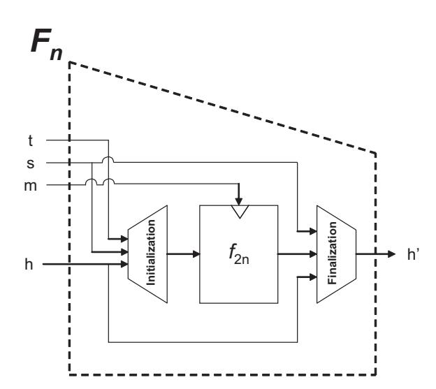
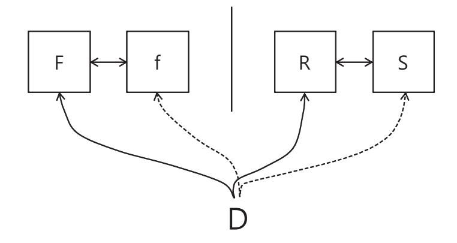
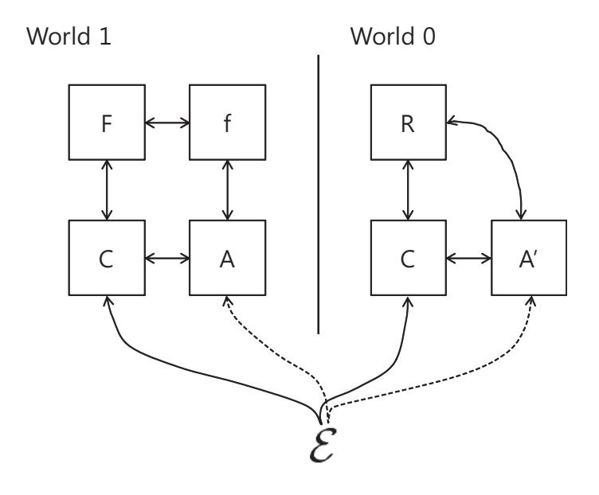
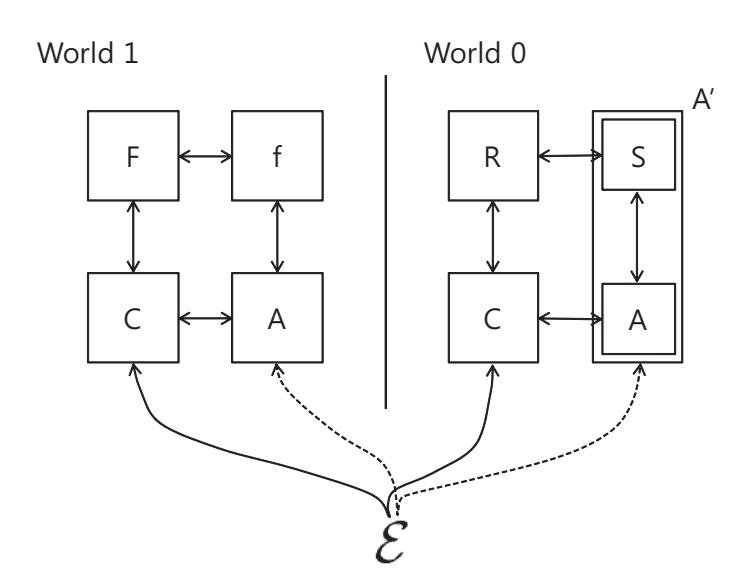

{0}------------------------------------------------

# Indifferentiability of the Hash Algorithm BLAKE

Donghoon Chang<sup>1</sup>, Mridul Nandi<sup>2</sup>, and Moti Yung<sup>3</sup>

National Institute of Standards and Technology, USA pointchang@gmail.com
Indian Statistical Institute, Kolkata, India mridul.nandi@gmail.com

Google Inc. and Department of Computer Science, Columbia University, New York, USA my123@columbia.edu

**Abstract.** The hash algorithm BLAKE, one of the SHA-3 finalists, was designed by Aumasson, Henzen, Meier, and Phan. Unlike other SHA-3 finalists, there is no known indifferentiable security proof on BLAKE. In this paper, we provide the indifferentiable security proof on BLAKE with the bound  $O(\frac{\sigma^2}{2^{n-3}})$ , where  $\sigma$  is the total number of blocks of queries, and n is the hash output size.

Key Words :Indifferentiability, BLAKE, Ideal cipher, Random oracle.

# 1 Introduction

BLAKE [2], designed by Aumasson, Henzen, Meier, and Phan, is the one of the five SHA-3 finalists. Indifferentiability is one of well known security notions of hash functions, because it shows how close a hash function behave as a random oracle, under the assumption that its underlying function such as a permutation, a compression function, or a block cipher is ideal, where 'ideal' informally means that the underlying function is chosen randomly and any attacker is allowed only to know input-output pairs of the function by making queries without knowing the internal structure of the function. So, if a hash function based on its ideal underlying function is indifferentiable from a random oracle, there exists no structural weakness of the hash function as long as the attacker does not use any property of the internal structure of the underlying function. Except for BLAKE, in cases of the other four final SHA-3 candidates, Grøstl, JH, Keccak, and Skein, their indifferentiable securities have been already proven even though some of indifferentiable security bound are not tight, where 'tight' means that there is a possible room that the indifferentiable security bound of a hash function may be further improved. In case of BLAKE, its designers wrote in their submission that "BLAKE is indifferentiable from a random oracle when its compression function is assumed ideal" [2]. However, in this paper, we will show that the compression function of BLAKE cannot be assumed ideal because there exists a simple and efficient attack of differentiating the compression function from a fixed-input-length (FIL) random oracle, under the assumption that the block cipher on which the compression function is based is ideal. And we will provide an indifferentiable security proof of BLAKE, not that of the compression function of BLAKE. This paper is organized as follows; in Section 2, we describe the description of BLAKE, and all the necessary notions in this paper. In Section 3, we provide the indifferentiable analysis of the compression function of BLAKE. In Section 4, we give a direct indifferentiable security proof on BLAKE with a birth day security bound, where we show that BLAKE is indifferentiable from a variable-input-length (VIL) random oracle, under the assumption that its underlying block cipher is ideal. Finally, in Section 5, we conclude.

{1}------------------------------------------------

## 2 Preliminary

Let (k, m)-block cipher be a block cipher with the k-bit key size and m-bit block size.

#### 2.1 Description of BLAKE

BLAKE-256, BLAKE-384, and BLAKE-512, where BLAKE-n has the n-bit hash output size. Since BLAKE-224 and BLAKE-384 are the same as BLAKE-256 and BLAKE 512 except the initial value and the final truncation, respectively. In this paper, we only focus on indifferentiable security proofs on BLAKE-256 and BLAKE-512, because the indifferentiable security proofs on BLAKE-224 and BLAKE-384 can be obtained directly from the indifferentiable security proof on BLAKE-256 and BLAKE-512 with the same security bounds, respectively.

Compression Functions of BLAKE-256 and BLAKE-512. Let  $F_n$  be the compression function of BLAKE-n, where the input and output sizes of  $F_n$  are  $((3+\frac{3}{4})\cdot n)$ -bit and n-bit, respectively. The input of  $F_n$  consists of four components, a chaining value h, the message block m, a salt s, and a counter t. In case of BLAKE-256, |h| = 256, |m| = 512, |s| = 128, and |t| = 64, where |x| is the bit size of x. In case of BLAKE-512, |h| = 512, |m| = 1024, |s| = 256, and |t| = 128. Let  $h = h_0 || \dots ||h_7, m = m_0 || \dots ||m_{15}, s = s_0 || \dots ||s_3, \text{ and } t = t_0 ||t_1.$  There are three parts of  $F_n$ , initialization, round functions, and finalization. Let  $f_{2n}(\cdot, \cdot)$  be the underlying (2n, 2n)-block cipher of  $F_n$ , where the first parameter is for a 2n-bit key, and the second parameter is for a 2n-bit plaintext, which will not described in this paper because we don't need the internal structure of the block cipher for indifferentiable security proof. More precisely,  $F_n(h, m, s, t) = h'$  is defined as follows, where  $h' = h'_0 || \dots ||h'_7$  is the n-bit output of the compression function  $F_n$ .



Fig. 1. Compression Function of BLAKE.

 $F_n(h, m, s, t) = h'$  is defined as following three steps:

Step 1. Initialization(h, s, t) = v:

{2}------------------------------------------------

$$v = \begin{bmatrix} v_0 & v_1 & v_2 & v_3 \\ v_4 & v_5 & v_6 & v_7 \\ v_8 & v_9 & v_{10} & v_{11} \\ v_{12} & v_{13} & v_{14} & v_{15} \end{bmatrix} = \begin{bmatrix} h_0 & h_1 & h_2 & h_3 \\ h_4 & h_5 & h_6 & h_7 \\ s_0 \oplus c_0 & s_1 \oplus c_1 & s_2 \oplus c_2 & s_3 \oplus c_3 \\ t_0 \oplus c_4 & t_0 \oplus c_5 & t_1 \oplus c_6 & t_1 \oplus c_7 \end{bmatrix}$$

Step 2. Computation by a (2n, 2n)-Block Cipher  $f_{2n}(m, v) = v'$ :

Step 3. Finalization(h, s, v') = h':

$$h'_{0} = h_{0} \oplus s_{0} \oplus v'_{0} \oplus v'_{8}$$

$$h'_{1} = h_{1} \oplus s_{1} \oplus v'_{1} \oplus v'_{9}$$

$$h'_{2} = h_{2} \oplus s_{2} \oplus v'_{2} \oplus v'_{10}$$

$$h'_{3} = h_{3} \oplus s_{3} \oplus v'_{3} \oplus v'_{11}$$

$$h'_{4} = h_{4} \oplus s_{0} \oplus v'_{4} \oplus v'_{12}$$

$$h'_{5} = h_{5} \oplus s_{1} \oplus v'_{5} \oplus v'_{13}$$

$$h'_{6} = h_{6} \oplus s_{2} \oplus v'_{6} \oplus v'_{14}$$

$$h'_{7} = h_{7} \oplus s_{3} \oplus v'_{7} \oplus v'_{15}$$

$$(1)$$

$$(2)$$

$$(3)$$

$$(4)$$

$$(5)$$

$$h'_{5} = h_{5} \oplus s_{1} \oplus v'_{5} \oplus v'_{13}$$

$$(6)$$

$$h'_{6} = h_{6} \oplus s_{2} \oplus v'_{6} \oplus v'_{14}$$

$$(7)$$

$$h'_{7} = h_{7} \oplus s_{3} \oplus v'_{7} \oplus v'_{15}$$

**Domain Extension of BLAKE.** BLAKE follows the HAIFA iteration mode [8], that is a prefix-free Merkle-Damgård construction whose padding rule is prefix-free. We say that a padding function g is prefix-free if for any x and x' ( $x \neq x'$ ) g(x) is not a prefix of g(x'). In this paper, we only need the information that the domain extension of BLAKE is a prefix-free Merkle-Damgård construction.

#### 2.2 Indifferentiable Security Notion and Its related Results

We describe indifferentiability, and its application in the concrete security treatment.

Indifferentiability (Concrete Version) The security notion of indifferentiability was introduced by Maurer et al. in TCC 2004 [13]. In Crypto 2005, Coron et al. were the first to adopt it as a security notion for hash functions [11]. Here, we only consider the security notion in this context of hash functions. Let F be a hash function based on an ideal primitive f and R be a VIL random oracle, and S be a simulator with access to R and its query-memory-time complexity is defined by  $(q_S, m_S, t_S, l_S, \sigma_S)$ , where  $l_S$  is the maximum length of query and  $\sigma_S$  is the total block length of all the queries. Then, we say that  $F^f$  is  $(q_S, m_S, t_S, l_S, \sigma_S, q_D, m_D, t_D, l_D, \sigma_D, \epsilon)$ -indifferentiable from R if for any adversary D with the query-memory-time complexity  $(q_D, m_D, t_D, l_D, \sigma_D)$ , where  $l_D$  is the maximum length of query and  $\sigma_D$  is the total block length of all the queries, there exists a simulator S with the query-memory-time complexity  $(q_S, m_S, t_S, l_S, \sigma_S)$  as follows:

$$\operatorname{Adv}_{F_{S}^{f},S^{R}}^{\operatorname{indiff}}(D) = |\Pr[D^{F,f} = 1] - \Pr[D^{R,S} = 1]| \le \epsilon.$$

We say F is indifferentiable from R when  $\epsilon$  is small and all the complexities involved in the security can be described as a polynomial over q.

Sponge Construction [3]. There exists a simulator such that the Sponge Construction is  $(O(q), O(q), O(lq), l, O(lq), q, m_D, t_D, l, \sigma, O(\frac{\sigma^2}{2^c}))$ -indifferentiable from  $\mathcal{F}$ , where c is the size of capacity of the Sponge Construction.

{3}------------------------------------------------



Fig. 2. Indifferentiability Security Notion.

prefix-free MD Construction [11, 9]. There exists a simulator such that prefix-free MD is  $(O(q), O(lq), l, O(lq), q, m_D, t_D, l, \sigma, O(\frac{\sigma^2}{2^n}))$ -indifferentiable from  $\mathcal{F}$ .

chopped MD Construction [10]. There exists a simulator such that chopped MD is  $(O(q), O(q), O(lq), l, lq, q, m_D, t_D, l, \sigma, O(\frac{nq}{2^n} + \frac{\sigma^2}{2^{2n}}))$ -indifferentiable from  $\mathcal{F}$ , where n is the hash output size and the chopped bit size is also n.

#### 2.3 Implication of Indifferentiable Security Notion

In this section, we revisit previous results of [13,11]. There are many protocols or algorithms proved in the VIL random oracle model. What if we replace the VIL random oracle with the above indifferentiable hash domain extensions? If we do that, there is security loss for change. Here, we want to talk more in detail about security loss. We define two worlds.

World 0: Let C be a cryptosystem based on a function oracle R. Let A' be an adversary connected to C and R.

World 1: Let C be a cryptosystem based on a function oracle F based on its underlying primitive oracle f. Let A be an adversary connected to f, F.

Let  $\mathcal{E}$  be an environment which is any kind of efficient system connected to C and A' or C and A. Fig. 3 shows the relation among those parties in above two worlds. We say that the two worlds are indistinguishable if for any efficient adversary A there exists an efficient adversary A' such that for any  $\mathcal{E}$  the following holds:

$$|\Pr[\mathcal{E}^{C^F,A^{C,f,\mathcal{E}}}=1]-\Pr[\mathcal{E}^{C^R,A'^{C,R,\mathcal{E}}}=1]=\mathsf{negl}$$

In other words, a system C based on F in the f-model is as secure as the system C in the R-model is with small security loss [13,11]. In this paper, we consider that R is a VIL random oracle and f is a FIL random oracle or an ideal permutation and F is a hash domain extension based on f.

Now, we want to connect the above security notion with the indifferentiability. In case of indifferentiability of hash function, we need to define a simulator S simulating a underlying primitive of hash function with access to the VIL random oracle. Once we have such a simulator S, we can construct A' from A as follows and can prove the following theorem as shown in [11].

{4}------------------------------------------------



Fig. 3. World 0 and World 1

Theorem 1. [13, 11] Let C be a cryptosystem with oracle access to an ideal primitive F. Let F be an algorithm such that F based on f is indifferentiable from the VIL random oracle R. Then the cryptosystem C is at least as secure in the f-model with algorithm F as in the R-model.

Proof of [13, 11]. Let S be a simulator making that F is indifferentiable from R. Let A be an adversary attacking the any system based on cryptosystem C. Then, we can construct A′ from A and S as shown in Fig. 4 such that the two worlds are indistinguishable.



Fig. 4. A ′ construction based on a simulator S of indifferentiable security proof

# 3 Indifferentiable Analysis on the compression function of BLAKE

In this section, we give indifferentiable security analysis on the compression function of BLAKE. The padding rule of BLAKE follows the HAIFA iteration mode [8], which is prefix-free. If the compression function behaves as a FIL random oracle, then the whole hash function also behaves as a VIL random oracle [11, 9]. In the submission document of BLAKE for the final 

{5}------------------------------------------------

round [2], designers of BLAKE said "BLAKE is indifferentiable from a random oracle when its compression function is assumed ideal". But, in this section, we give a negative result on the assumption that the compression function is ideal. More precisely, we can find a non-randomness relation between an input and its output of the compression function based on an ideal cipher with  $2^{64}$  or  $2^{128}$  query complexity, where the output size is 256-bit or 512-bit, respectively. On the other hand, there is no way to find such a non-randomness only with  $2^{64}$  or  $2^{128}$  query complexity in case of the FIL random oracle model whose output size is 256-bit or 512-bit, respectively. More in detail, due to this non-randomness of the compression function, from the perspective of simulator's query complexity in the indifferentiable security proof, there is no way to design a simulator of query complexity  $O(q^4)$  to guarantee the indifferentiability of the compression function, which means that there is at least 3q-bit security loss. So, it is important to directly give an indifferentiable security proof for the full BLAKE hash algorithm with a simulator of small query complexity, which will be shown in the next section. In this section, we give a detailed indifferentiable analysis on the compression function of BLAKE. For the indifferentiable security analysis, it is assumed that  $f_{2n}(m,v)$  in the compression function of BLAKE is an (2n, 2n)-block ideal cipher, where m and v correspond to a 2n-bit secret key and a 2n-bit plaintext.

**Theorem 2.** Let  $F_{256}$  and  $F_{512}$  be the compression functions of BLAKE-256 and BLAKE-512, where the input and output sizes of  $F_n$  are  $((3+\frac{3}{4})\cdot n)$ -bit and n-bit, respectively. Let  $f_{2n}$  be the underlying primitive of  $F_n$  which is an (2n,2n)-block ideal cipher. Then, in order to show that  $F_n$  is indifferentiable from a FIL random oracle  $R_n$  we need a simulator of at least query complexity  $q^4$ , where  $R_n$  is a FIL random oracle with  $((3+\frac{3}{4})\cdot n)$ -bit input and n-bit output, where q is the maximum number of queries by any indifferentiability adversary A.

**Proof.** In order to prove the theorem, firstly we describe the following characteristics of the compression function  $F_n$  of BLAKE-n.

Characteristic 1. Given a (m, v'), the probability that (i)  $f_{2n}^{-1}(m, v') = v$ , (ii)  $v_{12} \oplus v_{13} = c_4 \oplus c_5$ , and (iii)  $v_{14} \oplus v_{15} = c_6 \oplus c_7$  (according to Initialization) is between  $\frac{2^{7n/4} - q}{2^{2n} - q}$  and  $\frac{2^{7n/4}}{2^{2n} - q}$ , where  $c_i$ 's are constants defined in BLAKE-n and q is the maximum number of queries. This is clear because  $f_{2n}$  is the ideal cipher. For n=256 and n=512, the probabilities are about  $2^{-64}$  and  $2^{-128}$ , respectively. Once the three input-output relations (i), (ii), and (iii) of  $f_{2n}$  are satisfied, the relations of  $f_{2n}$  uniquely determines an input-output pair of  $F_n$ .

Characteristic 2. Given a v, for any (h, m, s, t), the probability that  $R_n(h, m, s, t) = h'$  and  $(1)\sim(8)$  in the Finalization hold is  $2^{-n}$ . This is clear because  $R_n$  is a FIL random oracle with n-bit output.

Then, based on the above two characteristics, given any simulator S, we can construct an indifferentiable adversary A as follows.

```
algorithm A^{O_1,O_2,O_3}, where (O_1,O_2,O_3) is (F_n,f_{2n},f_{2n}^{-1}) or (R_n,S,S^{-1}).

100 Make a random O_3-query (m,v') repeatedly until the following holds.

101 O_3(m,v')=v and v_{12}\oplus v_{13}=c_4\oplus c_5, and v_{14}\oplus v_{15}=c_6\oplus c_7.

200 Make O_1-query (h,m,s,t) such that Initialization(h,m,s,t)=v

300 If O_1(h,m,s,t)=h' and (h,m,s,t,h') satisfy the equations (1)\sim(8), then output 1 otherwise output 0.
```

{6}------------------------------------------------

In case that  $(O_1, O_2, O_3)$  is  $(F_n, f_{2n}, f_{2n}^{-1})$ , it is expected that A outputs 1 with at most  $2^{n/4}$  queries to  $O_3$  and one query to  $O_1$ . On the other hand, in case that  $(O_1, O_2, O_3)$  is  $(R_n, S, S^{-1})$ , based on Characteristic 2, any simulator S needs at most  $2^n$  queries to  $R_n$  to correctly respond h' in line 300 such that the equations  $(1) \sim (8)$  hold. This means that for adversary of  $q = 2^{n/4}$  queries the simulator needs at least complexity  $q^4 (= 2^n)$ .

# 4 Direct Indifferentiable Security Proof on BLAKE-n

In this section, it is shown that we can prove the indifferentiable security of BLAKE-n with a simulator of query complexity O(q) and time complexity O(lq), where l is the maximum length of queries and q is the maximum number of queries of any adversary. Let H be the BLAKE-n based on the (2n, 2n)-block ideal cipher  $f_{2n}$  and  $R_n$  be a VIL random oracle with n-bit output. Also, we define a simulator S as shown in Fig. 5.

**Explanation on Notations in Fig. 5** ~ **10:** Let  $F_n$  be the compression function of the BLAKE-n. Let pad be the padding function of the BLAKE-n. pad has the padding rule of HAIFA framework [8], which is prefix-free. For a message M,  $pad(M) = N = N_1 || .... || N_t$ , where  $N_i = (m^i, s^i, t^i)$  and  $m^i$  is the i-th message block,  $s^i$  is i-th salt, and  $t^i$  is i-th counter. Let  $h^0$  be the initial value of the BLAKE-n. We define a directed graph G in the simulator S. We write  $h^0 \to_{N_1||N_2} h^2 \in G$  if there exists a  $h^1$  such that  $h^0 \to_{N_1} h^1 \in G$  and  $h^1 \to_{N_2} h^2 \in G$ . Let X be the set of all the query-response pairs (m, v, v') of an oracle O such that  $O_m(v) = v'$ . For a new O-query (m, v) or a new  $O^{-1}$ -query (m, v'),  $\exists (m, v, v') \in X$  means that the new query is a repeated one.

**Theorem 3.** Let H be the BLAKE-n hash algorithm with n-bit hash output based on the (2n, 2n)-block ideal cipher  $f_{2n}$ . Then, H is  $(O(q), O(q), O(lq), l, O(lq), q, m_D, t_D, l, \sigma, O(\frac{\sigma^2}{2^{n-3}}))$ -indifferentiable from a VIL random oracle  $R_n$  with n-bit output, where the simulator S is defined in Fig. 5.

**Proof.** In Fig. 5, we exactly describe what  $(H, f_{2n}, f_{2n}^{-1})$  and  $(R_n, S, S^{-1})$  are. Now, we want to prove how closely they are to each other by using indifferentiable security notion. In this paper, we follow the code-based game-playing Proof technique [6].

From the following differences between Games, we can know that for any adversary D with the query-memory-time complexity  $(q, m_D, t_D, l, \sigma)$  the following inequality holds:

$$\operatorname{Adv}_{H^{f_{2n}},S^{R_n}}^{\operatorname{indiff}}(D) = \left| \Pr[D^{H,f_{2n},f_{2n}^{-1}} = 1] - \Pr[D^{R_n,S,S^{-1}} = 1] \right| \le \frac{4 \cdot \sigma^2}{2^{2n+1}} + \frac{16 \cdot \sigma^2}{2^{n+1}} \approx \frac{\sigma^2}{2^{n-3}}.$$

Complexity of the Simulator S. Now we want to show that the complexity of S is defined by (O(q), O(q), O(lq), l, O(lq)) for for any adversary D with the query-memory-time complexity  $(q, m_D, t_D, l, \sigma)$ . As shown in Fig. 5, the simulator make a query to the VIL random oracle  $R_n$  only when the S-query is requested. So, the maximum number of queries of any adversary D is q, so that of the simulator is also O(q). In case of memory size, the simulator S should keep the graph which has the maximum number of edges O(q). In case of time complexity of the simulator S, S need to backwardly track all the way to the initial value  $h^0$  in worse case. Since the maximum length of queries is l, so the time complexity is bounded by O(lq). The remaining values l and

{7}------------------------------------------------

```
(R_n, S, S)
 (H, f_{2n}, f_{2n}^{-1})
                                               Initialize: the directed graph G is initialized as \{h^0 \to_{\varepsilon} h^0\}, where h^0
                                               is the initial value of H and \varepsilon is the empty string.
100 On H-query M,
                                               10000 On R_n-query M,
         N := pad(M) = N_1 || .... || N_t
                                               11000
110
                                                            h=R_n(M).
         for i=1 to t
120
                                               12000
                                                            return h.
           h^{i}=F_{n}^{f_{2n}}(h^{i-1},N_{i})
121
                                               20000 On S-query (m, v),
         return h^t
130
                                                            If (m, v) is a repetition query, return its previous output.
                                               21000
200 On f_{2n}-query (m, v),
                                               22000
                                                            If \exists h,s,t \text{ s.t. } v = \text{Initialization}(h,s,t), then
         v' = f_{2n}(m, v).
                                                                  if \exists N, M \text{ s.t. } pad(M) = N | | (m, s, t), h^0 \rightarrow_N h \text{ in } G,
210
                                               22100
         return v'.
                                                                        then h' = R_n(M), add h \to_{(m,s,t)} h' to G,
220
                                               22110
300 On f_{2n}^{-1}-query (m, v'),
                                                                                v' = \mathsf{Out}(h, s, h'), and return v'.
                                               22111
                                                                 h' \stackrel{\$}{\leftarrow} \{0,1\}^n, add h \to_{(m,s,t)} h' to G, v' = \mathsf{Out}(h,s,h'), and return v'.
         v = f_{2n}^{-1}(m, v').
310
                                               22120
320
                                               22121
         return v.
                                                            v' \stackrel{\$}{\leftarrow} \{0,1\}^{2n} and return v'.
                                               23000
                                               30000 On S^{-1}-query (m, v'),
                                                            If (m, v) is a repetition query, return its previous output.
                                               31000
                                                            v \stackrel{\$}{\leftarrow} \{0,1\}^{2n} and return v.
                                                32000
                                               40000 Subroutine Out-query (h, s, h'),
                                                            temp \stackrel{\$}{\leftarrow} \{0,1\}^n.
                                               41000
                                                            |v_0'|| \cdots ||v_7'| := temp.
                                               42000
                                                            v_8' \sim v_{15}' are uniquely obtained from Finalization(h, s, v') = h'.
                                               43000
                                                            return v', where v' = v'_0 || \cdots || v'_{15}.
                                               44000
```

**Fig. 5.**  $(H, f_{2n}, f_{2n}^{-1})$  and  $(R_n, S, S^{-1})$ : G is the directed graph maintained by the simulator S.

O(lq) for the maximum length of each query and the total length of queries made by S are clear.

G0 perfectly simulates  $(H, f_{2n}, f_{2n}^{-1})$ . This part is clear so we omit the proof.

G0 and G1 are identical. In Game G0, in line 2210 we replace " $v' 
lefthine \{0,1\}^n$ , and compute  $v' = \operatorname{Out}(h,s,h')$ " in Game G1. In Game G0, v' is randomly chosen. On the other hand, in Game G1, the half of v' is randomly chosen in the subroutine Out, and then the other half of v' is also randomly chosen by  $h' 
lefthine \{0,1\}^n$ . Therefore, There is no difference between those two games. (For example, let A, B, and C be n-bit strings such that  $A \oplus B = C$ . Let's consider the following two cases. 1) Randomly choose A and B, and then disclose (A, B, C). 2) Randomly choose A and C, and then disclose (A, B, C). In this two cases, the distributions of (A, B, C) are same regardless of the order of random selection.)

G1 and G2 are identical-until-bad. This is clear because all the codes implemented by Games G1 and G2 are same unless bad events occur. Since all the bad events are collision events, it is clear that  $\Pr[bad] \leq 3 \cdot \frac{\sigma^2}{2^{2n+1}}$ , where  $\sigma$  is the total block length of queries made by any indifferentiable adversary and the block size of the ideal cipher  $f_{2n}$  is 2n-bit.

G2 and G3 are identical. This is clear because two games behave identically.

G3 and G4 are identical-until-bad. This is clear because all the codes implemented by Games G3 and G4 are same unless bad events occur. Since all the bad events are chaining

{8}------------------------------------------------

variable-collision events, it is clear that  $\Pr[bad] \leq 2 \cdot \frac{4 \cdot \sigma^2}{2^{n+1}}$ , where  $\sigma$  is the total block length of queries made by any indifferentiable adversary and the block size of the ideal cipher  $f_{2n}$  is 2n-bit.

G4 and G5 are identical. This is clear because two games behave identically.

G5 and G6 are identical-until-bad. This is clear because all the codes implemented by Games G5 and G6 are same unless bad events occur. Since all the bad events are collision events, it is clear that  $\Pr[bad] \leq \frac{4 \cdot \sigma^2}{2^{n+1}}$ , where  $\sigma$  is the total block length of queries made by any indifferentiable adversary and the block size of the ideal cipher  $f_{2n}$  is 2n-bit.

G6 and G7 are identical. In Game G6, in line 2211 we replace " $h' \stackrel{\$}{\leftarrow} \{0,1\}^n$ " with " $h' = O_1(M)$ " in Game G7. In Game G6, there is no collision of values of chaining variable so there is no dependency between internal chaining values generated by  $O_2$  and  $O_3$  and the final output values generated by  $O_1$ . So, the replacement of G7 doesn't impact the behavior of G6.

G7 and G8 are identical-until-bad. This is clear because all the codes implemented by Games G7 and G8 are same unless bad events occur. Since all the bad events are collision events, it is clear that  $\Pr[bad] \leq \frac{4 \cdot \sigma^2}{2^{n+1}}$ , where  $\sigma$  is the total block length of queries made by any indifferentiable adversary and the block size of the ideal cipher  $f_{2n}$  is 2n-bit.

G8 perfectly simulates  $(R_n, S, S^{-1})$ . This part is clear so we omit the proof.

```
Game G0
Initialize: X = \emptyset and h^0 is the initial value.
1000 On O_1-query M,
          N := pad(M) = N_1 || .... || N_t.
1100
1200
           for i=1 to t
          h^i = F_n^{O_2}(h^{i-1}, N_i), where F_n is the compression function based on O_2. return h^t
1210
1300
2000 On O_2-query (m, v),
                                         // This oracle implements the ideal cipher query f_{2n}(m,v).
                                                              // (m, v, v') \in X means (m, v) is a repeated query.
           if (m, v, v') \in X, then return v'.
2100
           if \exists a (h, s, t) such that v=Initialization(h, s, t), then
2200
                v' \stackrel{\$}{\leftarrow} \{0,1\}^{2n}.
2210
                if \exists v^* \text{ s.t. } (m, v^*, v') \in X, then v' \stackrel{\$}{\leftarrow} \{0, 1\}^{2n} \setminus \{t : (m, *, t) \in X\}.
2220
                X = X \cup \{(m, v, v')\} and return v'.
2230
          v' \stackrel{\$}{\leftarrow} \{0,1\}^{2n}
2300
          if \exists v^* \text{ s.t. } (m, v^*, v') \in X, then v' \stackrel{\$}{\leftarrow} \{0, 1\}^{2n} \setminus \{t : (m, *, t) \in X\}.
2400
           X = X \cup \{(m, v, v')\}, \text{ and return } v'.
2500
3000 On O_3-query (m, v'), // this oracle implements the ideal cipher inverse query f_{2n}^{-1}(m, v').
          if (m, v, v') \in X, then return v. //(m, v, v') \in X means (m, v') is a repeated query.
3100
           v \stackrel{\$}{\leftarrow} \{0,1\}^{2n}.
3200
           if \exists v^* \text{ s.t. } (m, v, v^*) \in X, then v' \stackrel{\$}{\leftarrow} \{0, 1\}^{2n} \setminus \{t : (m, t, *) \in X\}.
3300
           X = X \cup \{(m, v, v')\}, \text{ and return } v.
3400
```

**Fig. 6.** G0 perfectly simulates  $(H, f_{2n}, f_{2n}^{-1})$ .

{9}------------------------------------------------

```
Game
         G1 \mid \text{and } G2
Initialize: X = \emptyset and h^0 is the initial value.
1000 On O_1-query M,
           N := pad(M) = N_1 || .... || N_t.
1100
1200
           for i=1 to t
          h^i = F_n^{O_2}(h^{i-1}, N_i), where F_n is the compression function based on O_2. return h^t
1210
1300
                                          // This oracle implements the ideal cipher query f_{2n}(m,v).
2000 On O_2-query (m, v),
           if (m, v, v') \in X, then return v'.
                                                             //(m,v,v') \in X means (m,v) is a repeated query.
2100
           if \exists a (h, s, t) such that v = \text{Initialization}(h, s, t), then //v' will be chosen through a random h'.
2200
                h' \stackrel{\$}{\leftarrow} \{0,1\}^n, and compute v' = \mathsf{Out}(h,s,h').
2210
                if \exists v^* s.t. (m, v^*, v') \in X, then \mathsf{bad} \leftarrow \mathsf{true}, \mathsf{and}\ v' \overset{\$}{\leftarrow} \{0, 1\}^{2n} \setminus \{t : (m, *, t) \in X\}
2220
                X = X \cup \{(m, v, v')\} and return v'.
2230
           v' \stackrel{\$}{\leftarrow} \{0,1\}^{2n}.
2300
           if \exists v^* s.t. (m, v^*, v') \in X, then \mathsf{bad} \leftarrow \mathsf{true}, and v' \overset{\$}{\leftarrow} \{0, 1\}^{2n} \setminus \{t : (m, *, t) \in X\}
2400
           X = X \cup \{(m, v, v')\}, \text{ and return } v'.
2500
                                       // this oracle implements the ideal cipher inverse query f_{2n}^{-1}(m,v').
3000 On O_3-query (m, v'),
                                                        //(m,v,v') \in X means (m,v') is a repeated query.
           if (m, v, v') \in X, then return v.
3100
           v \stackrel{\$}{\leftarrow} \{0,1\}^{2n}.
3200
          if \exists v^* s.t. (m, v, v^*) \in X, then \mathsf{bad} \leftarrow \mathsf{true}, and v' \stackrel{\$}{\leftarrow} \{0, 1\}^{2n} \setminus \{t : (m, t, *) \in X\}
3300
           X = X \cup \{(m, v, v')\}, and return v.
3400
4000 Subroutine Out-query (h, s, h'),
           temp \stackrel{\$}{\leftarrow} \{0,1\}^n.
4100
           v_0'||\cdots||v_7':=temp.
4200
           v_8' \sim v_{15}' are uniquely obtained from Finalization(h, s, v') = h'.
4300
           return v', where v' = v'_0 || \cdots || v'_{15}.
4400
```

Fig. 7. G1 executes with boxed statements whereas G2 executes without these. G1 and G2 are identical-until-bad. G1 perfectly simulates G0.

## 5 Conclusion

In this paper we have shown that BLAKE is indifferentiable from a VIL random oracle with a birthday security bound, under the assumption that its underlying block cipher is ideal. Our bound is optimal because the output sizes of BLAKE compression and hash functions are same so that we can easily distinguish BLAKE from a VIL random oracle with a birthday bound. It is still open to see if there exists a better indifferentiable attack on the compression function of BLAKE.

## References

- 1. E. Andreeva, B. Mennink, and B. Preneel, On the Indifferentiability of the Grøstl Hash Function, SCN'10, LNCS 6280, Springer-Verlag, pp. 88-105, 2010.
- 2. J. Aumasson, L. Henzen, W. Meier, and R. C.-W. Phan, SHA-3 proposal BLAKE- version 1.3, December 16, 2010, http://131002.net/blake/blake.pdf.

{10}------------------------------------------------

```
Game G3 and G4
Initialize: X = \emptyset, Q = \{h^0\} and h^0 is the initial value.
1000 On O_1-query M,
          N := pad(M) = N_1 || .... || N_t.
1100
1200
          for i=1 to t
             h^{i}=F_{n}^{O_{2}}(h^{i-1},N_{i}), where F_{n} is the compression function based on O_{2}.
1210
          return h^{t}
1300
2000 On O_2-query (m, v),
                                       // This oracle implements the ideal cipher query f_{2n}(m,v).
          if (m, v, v') \in X, then return v'.
                                                          //(m,v,v') \in X means (m,v) is a repeated query.
2100
2200
          if \exists a (h, s, t) such that v = \text{Initialization}(h, s, t), then //v' will be chosen through a random h'.
               h' \stackrel{\$}{\leftarrow} \{0,1\}^n, and compute v' = \mathsf{Out}(h,s,h').
2210
               if h' \in Q \cup \{h\}, then bad \leftarrow true, and h' \stackrel{\$}{\leftarrow} \{0,1\}^n \setminus Q \cup \{h\} and compute v' = \mathsf{Out}(h,s,h')
2220
               Q = Q \cup \{h, h'\}.
2230
                X = X \cup \{(m, v, v')\} and return v'.
2240
          v' \stackrel{\$}{\leftarrow} \{0,1\}^{2n}.
2300
          X = X \cup \{(m, v, v')\}, \text{ and return } v'.
2400
                                      /* this oracle implements the ideal cipher inverse query f_{2n}^{-1}(m,v').*/
3000 On O_3-query (m, v'),
          if (m, v, v') \in X, then return v. //(m, v, v') \in X means (m, v') is a repeated query.
3100
          v \stackrel{\$}{\leftarrow} \{0,1\}^{2n}
3200
          if \exists a (h, s, t) such that v = \text{Initialization}(h, s, t) and h \in Q,
3300
               then bad \leftarrow true, and h \stackrel{\$}{\leftarrow} \{0,1\}^n \setminus Q and v := \text{Initialization}(h,s,t) and Q = Q \cup \{h\}
          X = X \cup \{(m, v, v')\}, \text{ and return } v.
3400
4000 Subroutine Out-query (h, s, h'),
          temp \stackrel{\$}{\leftarrow} \{0,1\}^n.
4100
          v_0'||\cdots||v_7':=temp.
4200
          v_8' \sim v_{15}' are uniquely obtained from Finalization(h, s, v') = h'.
4300
          return v', where v' = v'_0 || \cdots || v'_{15}.
4400
```

Fig. 8. G4 executes with boxed statements whereas G3 executes without these. G3 and G4 are identical-until-bad. G3 perfectly simulates G2.

- 3. G. Bertoni, J. Daemen, M. Peeters, and G. V. Assche, On the Indifferentiability of the Sponge Construction, Advances in Cryptology EUROCRYPT'08, LNCS 4965, Springer-Verlag, pp. 181-197, 2008.
- 4. M. Bellare, T. Kohno, S. Lucks, N. Ferguson, B. Schneier, D. Whiting, J. Callas, J. Walker, *Provable Security Support for the Skein Hash Family*, http://www.skein-hash.info/sites/default/files/skein-proofs.pdf.
- 5. M. Bellare and T. Ristenpart, *Multi-Property-Preserving Hash Domain Extension and the EMD Transform*, Advances in Cryptology ASIACRYPT'06, LNCS 4284, Springer-Verlag, pp. 299-314, 2006.
- 6. M. Bellare and P. Rogaway, *The Security of Triple Encryption and a Framework for Code-Based Game-Playing Proofs*, Advances in Cryptology EUROCRYPT'06, LNCS 4004, Springer-Verlag, pp. 409-426, 2006.
- 7. R. Bhattacharyya, A. Mandal, and M. Nandi, Security Analysis of the Mode of JH Hash Function, FSE'10, LNCS 6147, Springer-Verlag, pp. 168-191, 2010.
- 8. E. Biham and O. Dunkelman, A Framework for Iterative Hash Functions HAIFA, Cryptology ePrint Archive: Report 2007/278.

{11}------------------------------------------------

- 9. D. Chang, S. Lee, M. Nandi, and M. Yung, *Indifferentiable Security Analysis of Popular Hash Functions with Prefix-Free Padding*, Advances in Cryptology – ASIACRYPT'06, LNCS 4284, Springer-Verlag, pp. 283-298, 2006.
- 10. D. Chang and M. Nandi, *Improved indifferentiability security analysis of chopMD Hash Function*, FSE'08, LNCS 5086, Springer-Verlag, pp. 429-443, 2008.
- 11. J. S. Coron, Y. Dodis, C. Malinaud, and P. Puniya, *Merkle-Damgard Revisited: How to Construct a Hash Function*, Advances in Cryptology – CRYPTO'05, LNCS 3621, Springer-Verlag, pp. 430-448, 2005.
- 12. S. Hirose, J. H. Park, and A. Yun, *A Simple Variant of the Merkle-Damg˚ard Scheme with a Permutation*, Advances in Cryptology – ASIACRYPT'07, LNCS 4833, Springer-Verlag, pp. 113- 129, 2007.
- 13. U. Maurer, R. Renner, and C. Holenstein, *Indifferentiability, Impossibility Results on Reductions, and Applications to the Random Oracle Methodology*, TCC'04, , LNCS 2951, Springer-Verlag, pp. 21-39, 2004.
- 14. T. Ristenpart, H. Shacham, and T. Shrimpton, *Careful with Composition: Limitations of the Indifferentiability Framework*, Advances in Cryptology – EUROCRYPT'11, LNCS 6632, Springer-Verlag, pp. 487-506, 2001.
- 15. T. Ristenpart, H. Shacham, and T. Shrimpton, *Careful with Composition: Limitations of Indifferentiability and Universal Composability*, http://eprint.iacr.org/2011/339.pdf.

{12}------------------------------------------------

```
Game |G5| and G6
Initialize: X = \emptyset, Q = \{h^0\} and h^0 is the initial value.
1000 On O_1-query M,
          N := pad(M) = N_1 || .... || N_t.
1100
1200
           for i=1 to t
          h^i = F_n^{O_2}(h^{i-1}, N_i), where F_n is the compression function based on O_2. return h^t
1210
1300
                                         // This oracle implements the ideal cipher query f_{2n}(m,v).
2000 On O_2-query (m, v),
           if (m, v, v') \in X, then return v'.
                                                             //(m,v,v') \in X means (m,v) is a repeated query.
2100
           if \exists a (h, s, t) such that v = \text{Initialization}(h, s, t), then //v' will be chosen through a random h'.
2200
                if \exists M, N \text{ such that } pad(M) = N || (m, s, t) \text{ and } h^0 \to_N h \text{ in } G, \text{ then }
2210
                   /* Due to prefix-freeness of pad it is possible to check if (m, v) is the final block query. */
                       h' \stackrel{\$}{\leftarrow} \{0,1\}^n, and compute v' = \mathsf{Out}(h,s,h').
2211
                      if h' \in Q \cup \{h\}, then bad \leftarrow true, and h' \stackrel{\$}{\leftarrow} \{0,1\}^n \setminus Q \cup \{h\} and compute v' = \mathsf{Out}(h,s,h')
2212
                      Q = Q \cup \{h, h'\} and h \rightarrow_{(m,s,t)} h' to G. X = X \cup \{(m, v, v')\} and return v'.
2213
2214
                h' \stackrel{\$}{\leftarrow} \{0,1\}^n, and compute v' = \mathsf{Out}(h,s,h').
2210
                if h' \in Q \cup \{h\}, then h' \stackrel{\$}{\leftarrow} \{0,1\}^n \setminus Q \cup \{h\} and compute v' = \mathsf{Out}(h,s,h').
2220
                Q = Q \cup \{h, h'\}.
2230
2240
                X = X \cup \{(m, v, v')\} and return v'.
           v' \stackrel{\$}{\leftarrow} \{0,1\}^{2n}.
2300
           X = X \cup \{(m, v, v')\}, \text{ and return } v'.
2400
3000 On O_3-query (m, v'), /* this oracle implements the ideal cipher inverse query f_{2n}^{-1}(m, v').*/
          if (m, v, v') \in X, then return v.
                                                            //(m,v,v') \in X means (m,v') is a repeated query.
3100
          v \stackrel{\$}{\leftarrow} \{0,1\}^{2n}.
3200
3300
           if \exists a (h, s, t) such that v = Initialization(h, s, t) and h \in Q,
                then h \stackrel{\$}{\leftarrow} \{0,1\}^n \setminus Q and v := \text{Initialization}(h,s,t) and Q = Q \cup \{h\}.
           X = X \cup \{(m, v, v')\}, \text{ and return } v.
3400
4000 Subroutine Out-query (h, s, h'),
          temp \stackrel{\$}{\leftarrow} \{0,1\}^n.
4100
           |v_0'||\cdots||v_7':=temp.
4200
           v_8' \sim v_{15}' are uniquely obtained from Finalization(h, s, v') = h'.
4300
          return v', where v' = v'_0 || \cdots || v'_{15}.
4400
```

Fig. 9. G5 executes with boxed statements whereas G6 executes without these. G5 and G6 are identical-until-bad. G5 perfectly simulates G4.

{13}------------------------------------------------

```
Game |G7| and G8
Initialize: X = \emptyset, the directed graph G is initialized as \{h^0 \to_{\varepsilon} h^0\}, where h^0 is the initial value and \varepsilon is
the empty string, and Q = \{h^0\}.
1000 On O_1-query M,
          h = R_n(M), where R_n is a VIL random oracle with n-bit output.
1100
1200
          return h
                                        // This oracle implements the ideal cipher query f_{2n}(m,v).
2000 On O_2-query (m, v),
          if (m, v, v') \in X, then return v'.
                                                           //(m,v,v') \in X means (m,v) is a repeated query.
2100
2200
          if \exists a (h, s, t) such that v = \text{Initialization}(h, s, t), then
               if \exists M, N \text{ such that } pad(M) = N | |(m, s, t) \text{ and } h^0 \to_N h \text{ in } G, then
2210
                   /* Due to prefix-freeness of pad it is possible to check if (m, v) is the final block query. */
                      h' = O_1(M) \text{ and } v' = \text{Out}(h, s, h').
2211
                      Q = Q \cup \{h, h'\} and h \rightarrow_{(m,s,t)} h' to G.
2212
                      X = X \cup \{(m, v, v')\} and return v'.
2213
               h' \stackrel{\$}{\leftarrow} \{0,1\}^n, and compute v' = \mathsf{Out}(h,s,h')
2220
               if h' \in Q \cup \{h\}, then bad \leftarrow true, and h' \stackrel{\$}{\leftarrow} \{0,1\}^n \setminus Q \cup \{h\} and compute v' = \mathsf{Out}(h,s,h')
2230
               Q = Q \cup \{h, h'\} and h \rightarrow_{(m,s,t)} h' to G.
2240
2250
               X = X \cup \{(m, v, v')\} and return v'.
          v' \stackrel{\$}{\leftarrow} \{0,1\}^{2n}.
2300
          X = X \cup \{(m, v, v')\}, \text{ and return } v'.
2400
3000 On O_3-query (m, v'), /* this oracle implements the ideal cipher inverse query f_{2n}^{-1}(m, v').*/
          if (m, v, v') \in X, then return v.
                                                      //(m,v,v') \in X means (m,v') is a repeated query.
3100
          v \stackrel{\$}{\leftarrow} \{0,1\}^{2n}.
3200
          if \exists a (h, s, t) such that v = \text{Initialization}(h, s, t) and h \in Q,
3300
               then bad \leftarrow true, and h \stackrel{\$}{\leftarrow} \{0,1\}^n \setminus Q and v := \text{Initialization}(h,s,t) and Q = Q \cup \{h\}
          X = X \cup \{(m, v, v')\}, \text{ and return } v.
3400
4000 Subroutine Out-query (h, s, h'),
          temp \stackrel{\$}{\leftarrow} \{0,1\}^n.
4100
          v_0'||\cdots||v_7':=temp.
4200
          v_8' \sim v_{15}' are uniquely obtained from Finalization(h, s, v') = h'.
4300
          return v', where v' = v'_0 || \cdots || v'_{15}.
4400
```

**Fig. 10.** G7 executes with boxed statements whereas G8 executes without these. G7 and G8 are identical-until-bad. G7 perfectly simulates G6 and G8 perfectly simulates  $(R_n, S, S^{-1})$ .