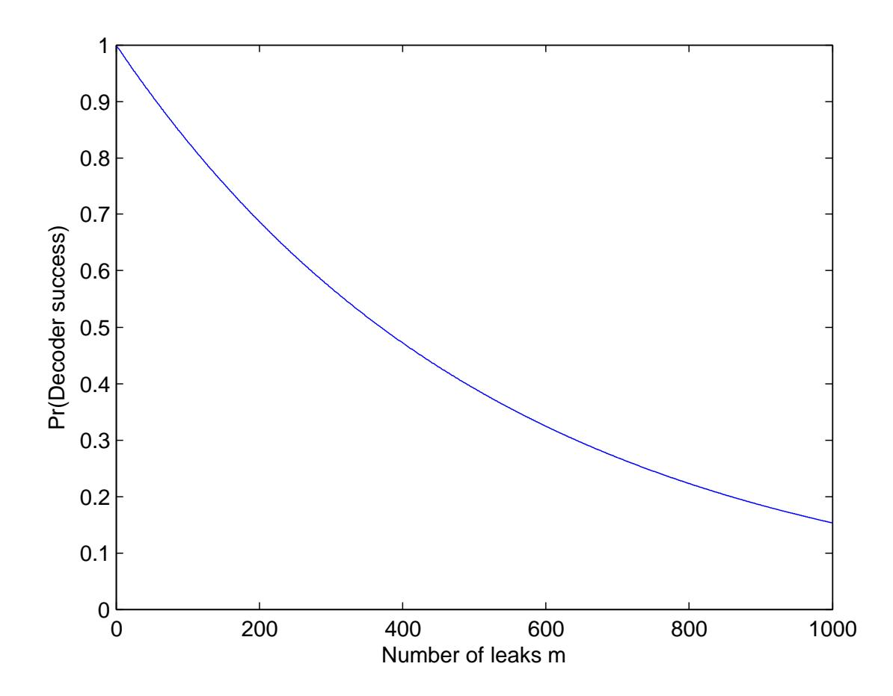
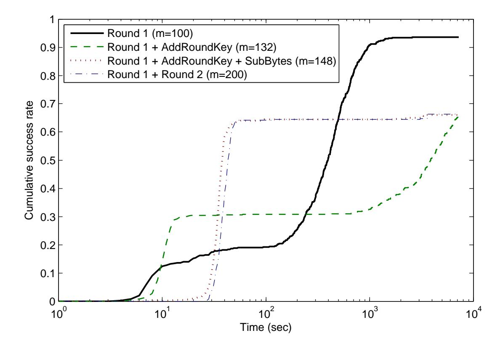
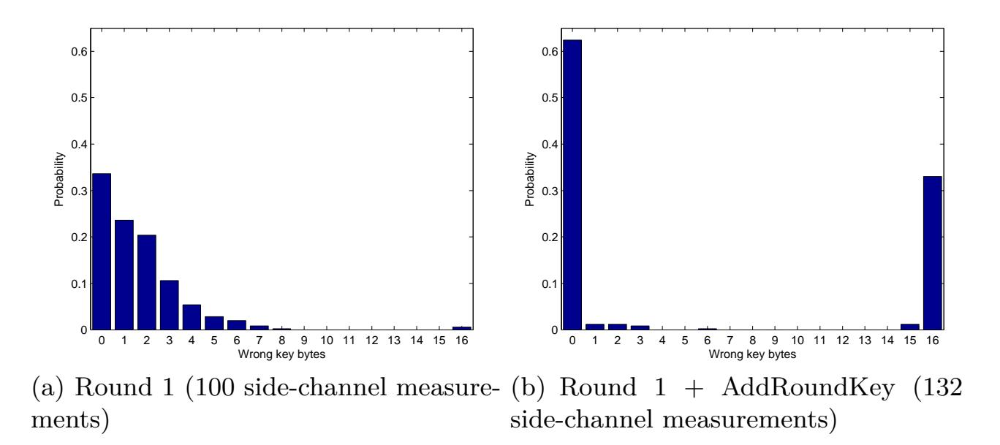
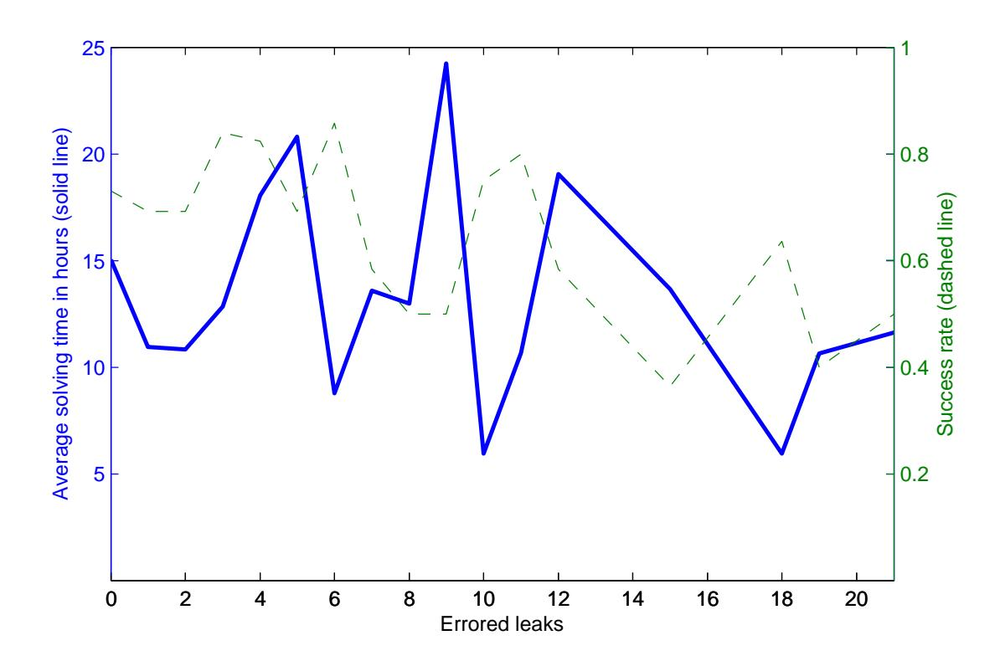

{0}------------------------------------------------

# **Tolerant Algebraic Side-Channel Analysis of AES**

Yossef Oren1 and Avishai Wool1

Computer and Network Security Lab, School of Electrical Engineering Tel-Aviv University, Ramat Aviv 69978, Israel {yos, yash}@eng.tau.ac.il

**Abstract.** We report on a Tolerant Algebraic Side-Channel Analysis (TASCA) attack on an AES implementation, using an optimizing pseudo-Boolean solver to recover the secret key from a vector of Hamming weights corresponding to a single encryption. We first develop a boundary on the maximum error rate that can be tolerated as a function of the set size output by the decoder and the number of measurements. Then, we show that the TASCA approach is capable of recovering the secret key from errored traces in a reasonable time for error rates approaching this theoretical boundary – specifically, the key was recovered in 10 hours on average from 100 measurements with error rates of up to 20%. We discovered that, perhaps counter-intuitively, there are strong incentives for the attacker to use as few leaks as possible to recover the key. We describe the equation setup, the experiment setup and discuss the results.

**Keywords:** Algebraic attacks, power analysis, side-channel attacks

# **1 Introduction**

*Algebraic Side-Channel Analysis (ASCA)*, first described in [\[15\]](#page-16-0), is a method for recovering the secret key from a side-channel trace (specifically, a power trace) with a very low data complexity. ASCA is an extension of the more general discipline of *Algebraic Cryptanalysis* attacks[\[12\]](#page-16-1), which represent cryptosystems as systems of equations, then apply machine solvers to find the cryptographic key satisfying these equations. To carry out an ASCA attack, the attacker recovers a vector of **side-channel leaks** (such as Hamming weights or Hamming distances) from the power trace, then writes an **equation set** mapping these leaks to the evolution of the internal state of the device; finally, a **machine solver** is used to find the secret key satisfying these equations. In [\[15\]](#page-16-0) and [\[14\]](#page-16-2) it was shown that if the side-channel vector is represented perfectly it is possible to recover the key from unprotected AES[\[13\]](#page-16-3) and PRESENT[\[4\]](#page-15-0) software implementations with very low data complexity (typically one or two power traces). However, the ASCA methodology is very vulnerable to noise or decoding errors in the sidechannel leak vector, limiting its practicality in cases where uncontrollable sources 

{1}------------------------------------------------

of noise are present in the system under attack. In [\[8\]](#page-16-4) a new attack methodology called *Tolerant Algebraic Side-Channel Analysis (TASCA)* was presented. This methodology allows the algebraic methods of [\[14\]](#page-16-2) to be used for key recovery from a very small amount of side-channel information, even in the presence of reasonable amounts of measurement noise. A modification to the standard ASCA attack which can tolerate some noise was also introduced in [\[17\]](#page-16-5).

### **1.1 Anatomy of a TASCA attack**

Throughout this report we assume the the attacker is provided with a **device under test** (DUT) which performs a cryptographic operation (e.g. encryption). While encrypting the device emits a measurable **side-channel trace**, specifically a **power trace** which is captured by an oscilloscope of a certain memory depth and sampling rate. A certain amount of **leaks** are modulated into the trace, due to the physical characteristics of the device under attack. These leaks can teach an attacker about the internal state of the DUT during various stages of the cryptographic operation. While the leaks are typically integral values (commonly **Hamming weights** or **Hamming distances**), the power trace itself is a continuous analog signal which exhibits a certain amount of **noise** or **errors** due to interference and to limitations of the capture mechanism (see [\[8,](#page-16-4) §1.2]).

The TASCA methodology uses the following steps to recover the secret key from a power trace:

- 1. In an offline phase, the DUT is first analysed in order to identify **potential leaks**, for instance by reverse engineering.
- 2. Next, the DUT is profiled and a **decoding process** is devised to map between a single trace and a vector of leaks.
- 3. After the offline phase concludes, the attacker is provided with a small number of power traces (typically a single trace). The traces may be also accompanied by some **auxiliary information** such as the known plaintext/ciphertext associated with this trace. The decoding process is then applied to the power trace, and a vector of leaks is recovered. This vector is possibly corrupted by noise.
- 4. The leak vector, together with a formal description of the DUT found through reverse engineering, is represented as a system of pseudo-Boolean equations. This equation set also includes any additional auxiliary information. The equation set is specially formed such that an optimizing solver can receive a leak vector which is a slightly different than the original vector (due to the effect of noise) and still find the correct key assignment. The equation set also contains a **goal function**, which is used by the solver to define the optimality of each candidate solution. In our specific case the goal function indicates that less-errored solutions are preferable to errored ones.
- 5. Finally, a solver such as SCIP [\[3\]](#page-15-1) evaluates the equation set and attempts to find a candidate key which satisfies the equation set while minimizing the goal function. The solver may fail to terminate in a tractable time, or otherwise return a candidate key.

{2}------------------------------------------------

6. The candidate key (or, as stated in Subsection [2.2,](#page-3-0) its immediate neighborhood) is verified.

As indicated in the above list, there are several conditions which must all hold true before a TASCA attack succeeds. First, the **decoder** should succeed in capturing the leaks with an error rate which the solver is robust enough to handle. Next, the **solver** should return some key, and not run for an intractable time. Finally, the returned key should be the **correct key**.

### **1.2 Evaluating solver performance**

A central component of this attack is a pseudo-Boolean optimizer, described in more detail in [\[1\]](#page-15-2). There are several ways of constructing such a solver, for example by extending a SAT solver or by constraining an Integer Programming solver. Regardless of the design choice, a pseudo-Boolean optimizer is generally slower and less efficient than a single-purpose SAT solver.

An interesting alternative to an optimizing solver was introduced in [\[14\]](#page-16-2) and more recently investigated in [\[17\]](#page-16-5). In this approach each entry in the recovered leak vector is not represented as an equation allowing a single acceptable value. Instead, the equations accept any value from a *set* of several possible values. The values in the set are each equally acceptable, that is, there is no incentive for the solver to choose one value over another. The resulting equation set, which is essentially similar to the straight ASCA equation set, is then submitted to a standard SAT solver. As shown in [\[17\]](#page-16-5), this approach is quite satisfactory given that a enough leaks and auxiliary information are provided to the solver. Thus, it is interesting to compare this approach (which we call *Set-ASCA*) to a full optimizer-based TASCA attack.

When evaluating the performance of various solving methodologies, several metrics of performance may be used. For example, one may measure the **time** it takes the solver before the key is successfully recovered. SAT solvers are simpler in construction than PB optimizers and are dramatically faster for instances of similar size. From a security standpoint, however, it is not obvious that an attack that recovers a secret key in several days is less useful than one that does so in several seconds. Another possible metric is the **success probability** of the attack to succeed given a typical power trace. While this is an important practical consideration, we note that from a security standpoint an attack that can break AES for a small but significant fraction of the instances it encounters is arguably just as dangerous as one that can break nearly all of the instances. A third metric is the **amount of leaks** required – naturally the attack which requires the least amount of leaks is the most useful. We consider this metric significant, especially considering the large amount of profiling and preprocessing involved in a complete attack and the interplay between the amount of required leaks and the maximum tolerable error rate (see Subsection [2.3\)](#page-4-0). A final and significant metric is the ability of the solver to **tolerate noise** and error. There are several conflicting ways of treating this metric and we will attempt to unify them in this discussion.

{3}------------------------------------------------

### **1.3 Structure of this report**

This report is organized as follows: In Section [2,](#page-3-1) we describe a theoretical analysis, connecting the measurement signal-to-noise ratio and the set size in a Set-ASCA solver with the success probability. Next, in Section [3,](#page-7-0) we describe an experiment setup, both in terms of the DUT and of the software and hardware configuration of the solver. In Section [4](#page-9-0) we list results obtained using standard (non-optimizing) ASCA on our simulated AES implementation. In Section [5](#page-11-0) we describe the actual tolerant attack on AES and its performance, and finally we conclude with some discussion in Section [6.](#page-13-0)

# **2 Theoretical Considerations**

### **2.1 The TASCA problem space**

As discussed in the previous subsection, the TASCA solver is presented with **leak equations** and with **auxiliary information** such as known plaintext and ciphertext, and is tasked with finding the secret key. Let us discuss the behaviour of the solver as the function of the amount of leaks it is provided.

At the most extreme case of limited information, the solver is provided with no leak equations at all and with no auxiliary information. It is immediately evident that this instance is **trivial to solve** but will return an **incorrect key**, since any key will satisfy this extremely underspecified problem. The same holds if no leaks are known and only the plaintext or the ciphertext (but not both) are provided as auxiliary information.

In contrast, if the plaintext and ciphertext are *both* provided, and no leak equations exist, the problem degrades to that of standard algebraic cryptanalysis – with high probability only a single key exists that will satisfy this plaintextciphertext relation, but this cryptanalytic instance is **too difficult to solve**, making it impossible for a solver to find the key in a reasonable time[\[12\]](#page-16-1).

Another extreme case is the case where all side-channel data is presented to the solver, without any measurement error. As shown in [\[14\]](#page-16-2), even with no auxiliary information the solver has enough information to **solve the problem successfully and efficiently** and find the correct key in a reasonable time. Obviously, any additional auxiliary information such as known plaintext or ciphertext only increases the probability of a successful outcome.

The amount of leak information provided to the solver is measured both by the number of measurement equations and by the amount of error tolerance built into each equation. As opposed to ASCA problems, for which the leak equations are precisely defined, TASCA (and Set-ASCA) leak equations admit several possible values for each leak, allowing the solver to tolerate some amount of noise in the measurements.

### **2.2 Dealing with incorrect answers**

The solver does not always succeed in recovering the correct key. Based on our practical experience, we have observed three common failure modes. The first 

{4}------------------------------------------------

type of failure occurs when the solver reports that the problem is **unsatisfiable**. The source of this failure is a **decoding failure** – the decoder introduces more noise into the leak equations than the solver is capable of dealing with. Another type of failure occurs when the solver **times out** and does not return any answer within the specified time. At other times the solver **returns an incorrect key**, usually because the low amount (or high error tolerance) of the leak equations causes the problem to be under-defined.

A specific type of the third failure mode, which we discovered to be quite common, results in the solver returning a **partially correct key**. Due to the specific byte-oriented micro-architecture we address in this work, this mode is usually characterized by a partition of the key bytes into a group of perfectly correct bytes and a group of completely random bytes. Since the error tends to be localised to only a few bytes, the key can be recovered in some cases from the incorrect result using a moderate amount of brute-force searching.

To analyse the brute-force effort required by an attacker, assume that *e* of the 16 bytes are incorrect, and that the rest are correct. The attacker must go over all 16 *e* ≈ 2 4*e* possible locations for those errored bytes, then try 256*e* = 28*e* possible candidate assignments for these positions, resulting in an approximate total effort of 2 4*e* · 2 8*e* = 212*e* AES operations. Most modern Intel CPUs have a native implementation of AES (AES-NI), which allows a sustained rate of more than 2 31 AES operations per second on a contemporary system[\[2\]](#page-15-3). As illustrated below in Table [1,](#page-4-1) an attacker can use a single machine with an AES-NI implementation to probe the close neighborhood of a candidate key and find the correct key within several hours, even if as many as 4 of the 16 bytes returned are incorrect.

| Incorrect Key Bytes                                                   | 0 | 1       | 2       | 3       | 4       | 5       |
|-----------------------------------------------------------------------|---|---------|---------|---------|---------|---------|
| AES operations required                                               | 1 | 12 2 | 24 2 | 36 2 | 48 2 | 60 2 |
| Estimated time using AES-NI[2] <1 sec <1 sec <1 sec 25 sec 24 hr 9 yr |   |         |         |         |         |         |

**Table 1.** Estimated time for brute-force searching for incorrect key candidates

### **2.3 Measuring error tolerance**

Since there are different ways of encoding error into an equation set, it is difficult to compare the ability of different methods to deal with errors. Therefore, it is useful to find a way to discuss errors in terms of standard metrics such as signal to noise ratio or bit error rate.

As stated in Subsection [1.1,](#page-1-0) the side-channel leak is first passed through a decoder, where it is converted to set of leak equations, and next to a solver. The solvers we discuss here deal with errors by permitting more than one valid assignment to each individual leak (i.e. they follow either the Set-ASCA or the TASCA methodologies). Thus, a set of *k* values are accepted for each leak. A 

{5}------------------------------------------------

necessary condition for the solver (Set-ASCA or TASCA) to succeed is that the correct value of each leak is a member of the acceptable set presented to the solver[1](#page-5-0) .

Let us now assume that we wish to carry out an attack based on Hamming weights of internal calculations performed by an 8-bit microcontroller. In this model each leak *xi* is an integer value which takes a value between 0 and 8. The leak is modulated onto the amplitude of the power trace, subjected to some additive noise, and finally recovered by the attacker.

As shown in [\[10\]](#page-16-6), in the case of an 8-bit microcontroller the amplitude of the power trace is approximately linearly dependent on the Hamming weight. To recover the Hamming weight from the power trace, the attacker typically measures the amplitude of the power trace at one or more points in time, then applies an *affine transform* to these measurements to arrive at *x*ˆ*i* , the estimated value for the leak *xi* . This estimated value can thus be seen as the result of the original integral leak *xi* and an additive Gaussian noise element *νi* ∼ N (0*, σ*): *x*ˆ*i* = *xi* + *νi* .

To put this model into standard engineering signal and noise terms, the signal power *Ps* can be defined as the variance of the *Hamming weights* of the inputs, assuming a uniform distribution of the inputs, and the noise power *Pn* as the variance of the noise *ν*, leading to the standard definition of signal-to-noise ratio:

### **Definition 1.**

$$SNR = 10 \log_{10} \frac{P_s}{P_n}$$

$$= 10 \log_{10} \frac{\frac{1}{256} \sum_{i=0}^{256} (HW(i) - E[HW(i)])^2}{\sigma^2}$$

$$= 10 \log_{10} 2 - 10 \log_{10} \frac{1}{\sigma^2}$$

$$\approx -20 \log_{10} \sigma + 3$$

Now that *x*ˆ*i* is defined, it needs to be presented to the solver. Assuming the solver is a TASCA or Set-ASCA solver with a set of size *k*, the natural approach would be for the decoder to populate the set of valid solutions with the *k* integer values closest to *x*ˆ. A necessary condition for the solver to succeed would then be that one of the elements of the set output by the decoder is the original *xi* . The elements of this set may all be considered equally desirable (in the case of Set-ASCA), or otherwise ranked according to their distance from *x*ˆ*i* (in the case of TASCA). For example, if the set size *k* is 1 (corresponding to ASCA) and the decoder observation was *x*ˆ*i* = 2*.*2, the set will contain the value 2. In other words, if the decoder outputs the symbol closest to *x*ˆ*i* , and the original symbol *xi* was 2, the attack will succeed only if the decoded value *x*ˆ*i* is between 1*.*5 and 2*.*5, or equivalently if *νi* is between −0*.*5 and 0*.*5. If *k* is 2, it will include the values

1 This is not a sufficient condition – even if all leaks are recovered correctly the problem may still be under-defined or computationally intractable.

{6}------------------------------------------------

2 and 3, and the attack will succeed only if  $\hat{x} \in (1.5, 3, 5)$ . In general, if k values are acceptable than  $\nu_i$  must be in the range  $\left[-\frac{k}{2}, \frac{k}{2}\right]$ . For a **decoding success** we require this condition to hold for all leaks in the leak vector simultaneously. Assuming the noise is i.i.d. for all leaks, the probability of such an event is:

Pr (Decoding Success)
$$= P\left(\hat{x}_i \in \left[x_i - \frac{k}{2}, x_i + \frac{k}{2}\right] | x_i\right)^m$$

$$= P\left(x_i + \nu_i \in \left[x_i - \frac{k}{2}, x_i + \frac{k}{2}\right] | x_i\right)^m$$

$$= P\left(\nu_i \in \left[-\frac{k}{2}, \frac{k}{2}\right] | x_i\right)^m$$

$$= P\left(\nu_i \in \left[-\frac{k}{2}, \frac{k}{2}\right]\right)^m$$

$$= \left(\frac{1}{\sqrt{2\pi\sigma^2}} \int_{-\frac{k}{2}}^{\frac{k}{2}} e^{-\frac{x^2}{2\sigma^2}} dx\right)^m$$

By fixing the set size k and the number of leaks m and solving for  $\sigma$ , we can find the maximum Gaussian noise power tolerable by sets of a certain size if a certain success probability is desired.

If we define the per-leak error rate as the probability that a set of size 1 does not contain the correct value of x, we can convert the value of  $\sigma$  to an error rate using the following relation:

### Definition 2.

$$P_{error} = P\left(\nu_i \notin \left[-\frac{1}{2}, \frac{1}{2}\right]\right) = 1 - \frac{1}{\sqrt{2\pi\sigma^2}} \int_{-\frac{1}{2}}^{\frac{1}{2}} e^{-\frac{x^2}{2\sigma^2}} dx$$

Table 2 summarises these results. It can be seen from the table that each set size corresponds to a certain maximal error rate and, equivalently, to a certain minimal signal-to-noise ratio.

| Leak Count   | m = 100  leaks |                 | m = 200  leaks |                 |  |
|--------------|----------------|-----------------|----------------|-----------------|--|
| Set size $k$ | min. SNR [dB]  | max. error rate | min. SNR [dB]  | max. error rate |  |
| 1            | 20.8           | 0.1%            | 21.2           | 0.05%           |  |
| 2            | 14.8           | 5.2%            | 15.2           | 4.3%            |  |
| 3            | 11.3           | 19.5%           | 11.6           | 17.7%           |  |
| 4            | 8.8            | 33.1%           | 9.1            | 31.1%           |  |

**Table 2.** Relation between error rate and set size for normally distributed noise when we require Pr (Decoding Success) = 99%

{7}------------------------------------------------

Figure [1](#page-7-1) displays the probability that a decoder using a set of size *k* = 3 will correctly capture all measurements with a fixed error rate. It can be seen that as the number of equations *m* grows, the probability of decoding success falls exponentially. We see that an increase in information causes a decrease in the robustness of the attack, making it more sensitive to errors. Thus (and perhaps counter-intuitively) it makes sense to provide the solver with the *least* amount of side-channel information required for a successful key recovery, even if more information is available.

**Fig. 1.** Decoder success rate as a function of leak count *m*, with a fixed set size *k* = 3 and an error rate of 30% (*σ* = 0*.*4824, SNR=9.3dB)

# **3 Experiment Setup**

In this section we describe the setup we used for our experiments with ASCA, Set-ASCA, and TASCA.

# **3.1 The Device Under Test**

As a DUT we chose an 8-bit microcontroller implementation of AES-128, based on the standard NIST implementation of [\[13\]](#page-16-3) and on a hardware implementation specified in [\[16\]](#page-16-7). We assumed that the device leaks the Hamming weight of the 8-bit operand on its data bus. Following the observations of Subsection [2.3,](#page-4-0) we 

{8}------------------------------------------------

aimed to provide the minimum amount of (errored) measurements to the solver. Thus, we only modeled the first few rounds of AES. We made the following assumptions:

- **–** Only the **plaintext** (or the ciphertext) are provided to the solver, but not both[2](#page-8-0) .
- **–** The leaks from the **key expansion process** are not available to the solver, since we assume that the DUT performs round key expansion in advance.[3](#page-8-1)
- **–** The **AddKey** and **AddRoundKey** operations leak the Hamming weights of the 16 state bytes after the XOR with the key/round key, as well as the Hamming weights of the key bytes themselves, giving a total of 32 fresh leaks per subround.
- **–** The **SubBytes** operation is implemented as a look-up table (LUT). The equations representing the SubBytes operation use the canonical representation (see [\[8,](#page-16-4) §5.2]), using a single equation per output bit or a total of 8 equations per invocation of SubBytes. The LUT operation leaks only the Hamming weights of the 16 state bytes after the SubBytes operation (and not any other internal state information), for a total of 16 fresh leaks per subround.
- **–** The **ShiftRows** operation is implemented logically as index shuffling and as such does not leak any information.
- **–** The **MixColumns** operation is implemented using 8-bit XTIME and XOR operations as specified in [\[6,](#page-16-8) §5.1] and as such leaks 36 additional bytes of internal state per round. In addition to the 16 leaks of the final state, this gives a total of 52 fresh leaks per subround.

In total each round of AES (consisting of **SubBytes, ShiftRows, MixColumns** and **AddKey/AddRoundKey**) leaks 100 Hamming weights of 8-bit values.

The experiments were performed under various error rates and set sizes up to the theoretical thresholds calculated in Subsection [2.3.](#page-4-0) We chose to focus on the performance of the solver and not on that of the decoder, assuming that the leaks satisfied the necessary condition for **decoding success** outlined in Subsection [2.3.](#page-4-0) To apply an error rate of *e* to the Hamming weight measurement vector of length *m*, *em* indices are chosen independently at random, and the Hamming weight at each of these selected indices is modified by either ±1 (for sets of size *k* = 3) or by +1 (for sets of size *k* = 2).

### **3.2 Solver Software and Hardware**

The solver used in our experiments was SCIP version 1.2.0 compiled for Windows 64-bit[\[3\]](#page-15-1). This solver is currently the best non-commercial solver available for

2 If both plaintext and ciphertext are provided, the solver will never return an incorrect key – it will either terminate with the correct key or run for an intracable amount of time.

3 It was already established in [\[9\]](#page-16-9) that the Hamming weights leaked from an 8-bit microcontroller implementation of AES during key expansion are sufficient for full key recovery, even without any additional state information.

{9}------------------------------------------------

non-linear optimization problems, as listed by [\[11\]](#page-16-10). The solver was run on on a quad-core Intel Core i7 950 at 3.06GHz with 8MB cache, running Windows 7 64-bit Edition. To take advantage of the multiple hyper-threading cores of the server, six instances of the solver were run in parallel. It should be noted that running a single instance at a time will result in noticeably better performance due to less contention on the L2 cache (equation solving is very RAM intensive) and due to Intel's Turbo Boost feature which speeds up one computational core when the others are idle[\[5\]](#page-15-4). The running time of each instance was limited by a shell script – ASCA and Set-ASCA instances were limited to two hours and TASCA instances limited to two days. A set of MATLAB scripts was used to create random instances, run the solver and collect the results automatically.

# **4 Results – ASCA with no errors**

As stated in [\[8,](#page-16-4) §3.3], each ASCA or TASCA instance consists of a general description of the cryptographic algorithm as a set of equations, an assignment of any known inputs to the algorithm, a specification of the measurement setup, and finally a set of potentially errored measurements. For TASCA instances we also include a goal function, which instructs the solver to aim for a solution (i.e. key assignment) which minimizes the amount of noise in the measurements. If we change the measurement equations so that they do not admit noise (i.e., let *k* = 1) and eliminate the goal function, we transform the problem from a TASCA instance to an ASCA instance similar in form to that used in [\[15\]](#page-16-0). An ASCA instance typically has a smaller solution space and is thus much easier to solve. We used ASCA instances to determine the minimal amount of sidechannel information which can be provided to the solver for an efficient and correct response.

Figure [2](#page-10-0) shows the success probability of non-error-tolerant ASCA measurements as a function of the runtime with different amounts of side-channel data. It can be seen that 20%-60% of the problems are solved within about 1 minute while the rest take much longer to run. This agrees with the findings of [\[14\]](#page-16-2).

Table [3](#page-9-1) summarizes the success rate of the ASCA solver as a function of time for different amounts of side-channel data. Based on Subsection [2.2,](#page-3-0) we consider as success cases where the solver terminates and returns a key which is at most 4 bytes apart from the correct one.

| Amount of side-channel data                  | Mean solving Success rate after |       |                     |             |
|----------------------------------------------|---------------------------------|-------|---------------------|-------------|
|                                              | time                            |       | 10 sec 80 sec 2 hrs |             |
| Round 1 (100 leaks)                          | 392 sec                         | 12.4% | 19%                 | 93.6%       |
| Round 1 + AddRoundKey(132 leaks)             | 1950 sec                        |       | 14.2% 30.8% 65.6%   |             |
| Round 1 + AddRoundKey + SubBytes (148 leaks) | 102 sec                         | 0%    | 64%                 | 66%         |
| Round 1 + Round 2 (200 leaks)                | 137 sec                         | 0%    |                     | 64.2% 66.3% |

**Table 3.** Success rate of the ASCA solver at different times

{10}------------------------------------------------

Fig. 2. ASCA cumulative success rates for different amounts of side-channel data

Based on these results we conclude that side-channel measurements from a single AES round without any errors are usually sufficient for full key recovery. We discovered that if we reduced the leak count to less than a full round, the probability of success became vanishingly small. Note that the success probability after 2 hours is largely unaffected by the amount of side-channel information. Thus, if the attacker has sufficient time, it makes sense to use only a single round of leaks and no more, and thus increase the robustness of the attack.

A possible drawback to using a small amount of side-channel data is the risk of a situation in which the problem is underspecified, causing the solver to return an incorrect answer. To demonstrate the impact of this effect, Figure 3 shows the distribution of incorrect key bytes in the recovered solution for 100 and 132 of side-channel measurements, where instances which timed out after 2 hours were assigned the all-zero key.

We can see that with 100 leaks, only 6.4% of the recovered keys had more than 4 incorrect key bytes. With 132 measurements this rate drops to 0.2%, but an additional 35% of the instances fail with a solver time-out. With additional measurements the fraction of wrong bytes drops to nearly 0 (graphs omitted). As discussed previously in Subsection 2.2, even 3 or 4 incorrect key bytes can be considered a correct result, if we allow the immediate neighborhood of the candidate key to be probed using brute force. In all cases the key was either recovered correctly (at least partially), or the operation timed out, leading us to conclude that 100 leaks (1 full AES round) are enough to uniquely determine the key in the case of error-free ASCA (i.e., k = 1), even if the ciphertext is not provided to the solver.

{11}------------------------------------------------

**Fig. 3.** ASCA wrong key histograms

# **5 Results – TASCA and Set-ASCA with errors**

This section describes the results of TASCA runs on simulated power traces of AES which have been corrupted with noise. We tested the average solving time and average success rates for various combinations of side-channel information amounts and error rates. We also measured the effect of the optimizing aspect of the solver (the goal function) on the performance of our solver.

### **5.1 Effect of error rate**

The objective of this experiment was to measure the effect of the error rate on the solving time and success probability of our TASCA solver. Based on the conclusions of the previous section, we provided our TASCA solver with one round of side-channel leaks (*m* =100 measurements) and with a known plaintext. The error rate was chosen to be between 0% and 25%. According to Table [2,](#page-6-0) a decoder has at least a 99% probability of success when producing such a set of equations, given the above parameters and a set of size *k* =3. Figure [4](#page-12-0) shows our results. We also ran the experiment with *k* = 2 and error rates of up to 5% (results omitted).

In general, the TASCA approach showed itself capable of recovering the secret key, with a success probability of 30%-80%, from errored traces in 6 to 24 hours for sets of size 2 and 3, even with error rates all the way up to the theoretical boundary of 19.5% previously calculated in Subsection [2.3.](#page-4-0) Interestingly, we could find no significant correlation neither between the error rate and the success rate, nor between the error rate and the solving time. This is in contrast to our previous results on Keeloq, where increasing the error rate caused a measurable increase in the running time and a corresponding decrease in the success rate.

We note that we have also performed some successful key recovery attacks with 100 leaks and a set of size *k* = 4. Since these instances take a very long time

{12}------------------------------------------------

**Fig. 4.** Effect of error rate on success rate and solving time for 3-set TASCA of AES with *m* = 100 leaks (20 experiments per data point)

to execute on our system, we cannot provide any quantitative results regarding their efficiency at this time.

### **5.2 Comparing TASCA and Set-ASCA**

As discussed in Subsection [1.2,](#page-2-0) an alternative approach to TASCA called Set-ASCA was introduced in [\[14\]](#page-16-2) and more recently investigated in [\[17\]](#page-16-5). In this approach the *k* values in the set are each equally acceptable, that is, there is no incentive for the solver to choose one value over another. The represents a loss of information when compared to full TASCA. The Set-ASCA equation set, which is essentially similar to the straight ASCA equation set, is then submitted to a standard SAT solver. Assuming an identical quantity of leaks is used in both cases, Set-ASCA has been shown in [\[17\]](#page-16-5) to be about 20 times faster than (optimizing) TASCA. However, there are structural advantages of TASCA over Set-ASCA which must be considered, especially in cases where the set is large. It has been shown in [\[15\]](#page-16-0) that if the Hamming weight side-channel is precisely specified (ASCA), and that if a sufficiently large amount of side-channel information is provided, then a correct key for AES encryption can be recovered with good probability. Stated another way, given enough side-channel data only a single key assignment can satisfy the precisely-specified side-channel leak equations. In the case of TASCA or Set-ASCA, where the side-channel is imprecisely specified, either more side-channel information or additional auxiliary information (such as known plaintext and ciphertext pairs) should intuitively be required to guarantee only a single key satisfies the leak equations. If less than the required amount of side-channel information is available, and the auxiliary information is also limited or not available, many keys – potentially an exponential amount 

{13}------------------------------------------------

– may satisfy the same side-channel leak equations. If a non-optimizing solver is used in this case, it will arbitrarily choose a satisfying solution and terminate, making its success probability exponentially small. In contrast, an optimizing solver will only terminate once it has found a solution which minimizes the goal function. Assuming the goal function has been correctly specified, we hypothesise that an optimizing TASCA approach is more likely to find the correct key than a random satisfying assignment.

To investigate this scenario, we compare a TASCA and a Set-ASCA solver operating on *m* =100 leaks of side-channel data with 0% errors, varying the set size from *k* = 1 (standard ASCA) to *k* = 4. Table [4](#page-13-1) describes our results.

| Set Size k                   |                        | 1 | 2         | 3    | 4                         |
|------------------------------|------------------------|---|-----------|------|---------------------------|
| Success probability          | (TASCA)                |   | 78% 87.5% | 73%  | 72.7%                     |
|                              | (Set-ASCA) 78% 9.2%    |   |           | 0%   | 0%                        |
| Mean solving time in minutes | (TASCA)                |   |           |      | 6.45 245.2 901.99 1332.07 |
|                              | (Set-ASCA) 6.45 171.05 |   |           | 7.18 | 2.92                      |

**Table 4.** TASCA vs. Set-ASCA performance with 100 leaks

Note that for a set size of *k* =1, both TASCA and Set-ASCA solvers are reduced to the case of standard ASCA, making their performance identical. As we expected, the solving time of the optimizer is much worse than that of the SAT solver, a difference that only grows as the set size grows. On the other hand, it can clearly be seen that the accuracy of Set-ASCA falls dramatically when we must increase the set size *k* to overcome decoder failures: the solver may terminate quickly, but it provides the correct key in only 9% of the cases for *k* = 2 and is always wrong for *k* = 3 or *k* = 4. This is caused by the large set of admissible solutions made possible by the lower precision of the leak equations. Since the SAT solver chooses one of these solutions arbitrarily, its success rate falls dramatically as the set size grows. In contrast, the optimizer is motivated to choose the best solution from the available set. As a result, its success rate is largely determined by the error rate (as we saw in Subsection [5.1\)](#page-11-2) and not by the set size.

# **6 Conclusions and Discussion**

This report demonstrates that the TASCA approach, which was previously applied to the low-security Keeloq cipher, is also usable for full-strength ciphers such as AES. The secret key can be recovered from 60%-70% of AES instances even when only a single trace is provided, and even when 20% of the trace signal is corrupted by noise. This new cryptanalytic capability may compromise secure systems whose defense against (statistical) side-channel attacks was an aggressive rekeying schedule which results in a small amount of traces per given key – 

{14}------------------------------------------------

as we showed, even a single encryption is enough to recover the key, assuming that the device under attack has been properly profiled by the attacker.

### **6.1 A strategy for successful TASCA attacks**

As shown in this report, the choice of operating parameters can have a substantial effect on the running time and success probability of an algebraic sidechannel attack. We showed that increasing the amount of side-channel measurements available to the solver has a mixed effect. On one hand, as shown in [\[17\]](#page-16-5), it decreases the space of possible solutions sufficiently to allow the use of nonoptimizing solvers with better running times. On the other hand, it increases the sensitivity of the solver to noise. For a fixed amount of side-channel leaks, we showed that increasing the size of the set of acceptable values per leak (*k*) increases the running time but does not decrease the success probability of the attack.

In view of these findings, we can recommend that implementers first characterise the expected signal-to-noise ratio of the DUT using standard signal processing techniques; Next, they should choose the minimal amount of sidechannel leaks (*m*) required for a successful key recovery; Finally, they should choose the minimal set size (*k*) which can tolerate the expected amount of noise with good probability. Specifically in the case of AES, we discovered that using *m* =100 leaks is a good choice for signal to noise ratios of as low as 20dB for *k* =1, up to 14dB for *k* =2, and up to 11dB for *k* =3.

### **6.2 Comparison with Keeloq results**

There are several differences between the Keeloq[\[7\]](#page-16-11) cipher and the AES[\[13\]](#page-16-3) cipher, when viewed from the viewpoint of a TASCA attack. On one hand, the Keeloq cipher seems easier to analyse because of its weak diffusion property – the key bits are shifted into the Keeloq cipher state one bit at a time, whereas in 8-bit AES they are introduced into the state one byte at a time. On the other hand, the Keeloq implementation runs on an ASIC circuit which leaks 32-bit Hamming distances, a side-channel leak which is generally considered more difficult to attack in contrast to the 8-bit Hamming weights leaked by the AES implementation.

Table [5](#page-15-5) contrasts AES and Keeloq instances in terms of instance size and solving time. The Keeloq instances use *m* =90 subrounds (and hence 90 measurements), while the AES instances use one AES round with *m* =100 measurements. In both cases the TASCA cases use a set size of *k* = 3 and the leaks are corrupted with a 5% error rate. It can be seen from the table that despite the fact that the AES instance is only 9 times larger than the Keeloq instance, it is harder to solve by three orders of magnitude. Another interesting difference, which we demonstrated in Figure [4,](#page-12-0) is the low correlation between the error rate and the solving time for AES – as shown in [\[8\]](#page-16-4), the solving time of Keeloq TASCA instances grew super-linearly with the error rate, while we could observe no such 

{15}------------------------------------------------

condition in the case of AES. In our experiments, AES instances took roughly the same amount of time to solve regardless of their error rate.

|                                           | Keeloq      | AES   | Ratio |
|-------------------------------------------|-------------|-------|-------|
| ASCA instance size                        | 140KB 1.3MB |       | x9.3  |
| ASCA instance time 0.36 sec 387 sec x1072 |             |       |       |
| TASCA instance size                       | 140KB 1.3MB |       | x9.3  |
| TASCA instance time                       | 22 sec      | 8.7hr | x1436 |

**Table 5.** Comparison of AES and Keeloq performance

Both differences in behaviour between AES and Keeloq may be attributed to the different diffusion properties of the two ciphers. While in Keeloq the key is introduced into the equation one bit at a time, in AES it is XORed into the plaintext as soon as encryption begins and further diffused by the following operations. The good diffusion property of AES makes it difficult for the solver to infer the value of one variable from the assignment of another. This both increases the runtime and defeats the "added value" granted to the solver for correctly determining a partial solution. Since diffusion has such a profound effect, finding a more precise power model of the cipher which allows additional leaks to be considered and reduces this diffusion property should AES instances easier to solve.

**Acknowledgements.** This work is supported in part by a grant from Check Point.

# **References**

- 1. T. Achterberg. *Constraint Integer Programming*. PhD thesis, Technische Universität Berlin, 2007.
- 2. Kahraman Akdemir, Martin Dixon, Wajdi Feghali, Patrick Fay, Vinodh Gopal, Jim Guilford, Erdinc Ozturc, Gil Worlich, and Ronen Zohar. Breakthrough AES performance with intel AES new instructions. Technical report, Intel Corporation, October 2010. <http://software.intel.com/file/27067>.
- 3. T. Berthold, S. Heinz, M. E. Pfetsch, and M. Winkler. SCIP – solving constraint integer programs. SAT 2009 competitive events booklet, 2009.
- 4. A. Bogdanov, L. Knudsen, G. Leander, C. Paar, A. Poschmann, M. Robshaw, Y. Seurin, and C. Vikkelsoe. Present: An ultra-lightweight block cipher. In Pascal Paillier and Ingrid Verbauwhede, editors, *Cryptographic Hardware and Embedded Systems - CHES 2007*, volume 4727 of *Lecture Notes in Computer Science*, pages 450–466. Springer Berlin / Heidelberg, 2007. [http://dx.doi.org/10.1007/](http://dx.doi.org/10.1007/978-3-540-74735-2_31) [978-3-540-74735-2\\_31](http://dx.doi.org/10.1007/978-3-540-74735-2_31).
- 5. Intel Corporation. Intel turbo boost technology in Intel core microarchitecture (nehalem) based processors. Technical report, November 2008. [http://download.](http://download.intel.com/design/processor/applnots/320354.pdf) [intel.com/design/processor/applnots/320354.pdf](http://download.intel.com/design/processor/applnots/320354.pdf).

{16}------------------------------------------------

- 6. J. Daemen and V. Rijmen. AES proposal: Rijndael, 1998.
- 7. S. Dawson. Code hopping decoder using a PIC16C56. Microchip confidential, leaked online in 2002, 1998.
- 8. Mario Kirschbaum, Yossef Oren, Thomas Popp, and Avishai Wool. Algebraic sidechannel analysis in the presence of errors. In S. Mangard and F.-X. Standaert, editors, *Workshop on Cryptographic Hardware and Embedded Systems 2010 (CHES 2010), LNCS 6225*, pages 428–442, Santa Barbara, California, USA, 8 2010. International Association for Cryptologic Research, Springer. [http://iss.oy.ne.ro/](http://iss.oy.ne.ro/TASCA) [TASCA](http://iss.oy.ne.ro/TASCA).
- 9. S. Mangard. A simple power-analysis (SPA) attack on implementations of the AES key expansion. In P. J. Lee and C. H. Lim, editors, *ICISC 2002*, volume 2587 of *LNCS*, pages 343–358. Springer, 2002.
- 10. S. Mangard, E. Oswald, and T. Popp. *Power Analysis Attacks: Revealing the Secrets of Smart Cards (Advances in Information Security)*. Springer-Verlag New York, Inc., Secaucus, NJ, USA, 2007.
- 11. V. Manquinho and O. Roussel. Pseudo-boolean competition 2009. Online, July 2009. <http://www.cril.univ-artois.fr/PB09/>.
- 12. F. Massacci and L. Marraro. Logical cryptanalysis as a SAT problem. *J. Autom. Reason.*, 24(1-2):165–203, 2000.
- 13. Information Technology Laboratory (National Institute of Standards and Technology). *Announcing the Advanced Encryption Standard (AES)*. Computer Security Division, Information Technology Laboratory, National Institute of Standards and Technology, Gaithersburg, MD, 2001.
- 14. M. Renauld, F.-X. Standaert, and N. Veyrat-Charvillon. Algebraic side-channel attacks on the AES: Why time also matters in DPA. In C. Clavier and K. Gaj, editors, *CHES 2009*, volume 5747 of *LNCS*, pages 97–111. Springer, 2009.
- 15. M. Renauld and F.X. Standaert. Algebraic Side-Channel Attacks. In Dongdai Lin Jiwu Jing Feng Bao, Moti Yung, editor, *Information Security and Cryptology (INSCRYPT) 2009*, volume 6151 of *Lecture Notes in Computer Science*, pages 393–410. Springer, 12 2009.
- 16. H. Satyanarayana. AES128 package. Online, December 2004. [http://opencores.](http://opencores.net/project,aes_crypto_core) [net/project,aes\\_crypto\\_core](http://opencores.net/project,aes_crypto_core).
- 17. Xinjie Zhao, Tao Wang, Shize Guo, Fan Zhang, Zhijie Shi, Huiying Liu, and Kehui Wu. SAT based error tolerant algebraic side-channel attacks. 2011 Conference on Cryptographic Algorithms and Cryptographic Chips (CASC2011), July 2011.