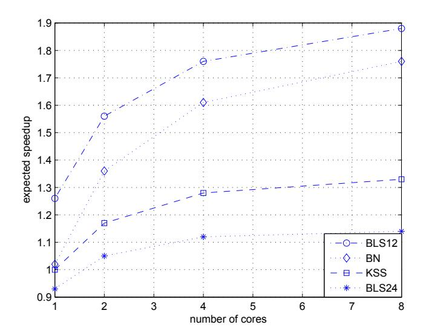

# **Implementing Pairings at the 192-bit Security Level**

Diego F. Aranha<sup>1</sup> , Laura Fuentes-Casta˜neda<sup>2</sup> , Edward Knapp<sup>3</sup> , Alfred Menezes<sup>3</sup> , and Francisco Rodr´ıguez-Henr´ıquez<sup>2</sup>

- <sup>1</sup> Department of Computer Science, University of Bras´ılia dfaranha@unb.br
- <sup>2</sup> CINVESTAV-IPN, Computer Science Department lfuentes@cs.cinvestav.mx, francisco@cs.cinvestav.mx <sup>3</sup> Department of Combinatorics & Optimization, University of Waterloo edward.m.knapp@gmail.com, ajmeneze@uwaterloo.ca

**Abstract.** We implement asymmetric pairings derived from Kachisa-Schaefer-Scott (KSS), Barreto-Naehrig (BN), and Barreto-Lynn-Scott (BLS) elliptic curves at the 192-bit security level. Somewhat surprisingly, we find pairings derived from BLS curves with embedding degree 12 to be the fastest for our serial as well as our parallel implementations. Our serial implementations provide a factor-3 speedup over the previous state-of-the-art, demonstrating that pairing computation at the 192-bit security level is not as expensive as previously thought. We also present a general framework for deriving a Weil-type pairing that is well-suited for computing a single pairing on a multi-processor machine.

### **1 Introduction**

Since the advent of pairing-based cryptography, researchers have been devising methods for constructing and efficiently implementing bilinear pairings. Initial work [5,12] was focused on implementing pairings at (roughly) the 80-bit security level. Koblitz and Menezes [19] highlighted the performance drawbacks of pairings at very high security levels. The subsequent discovery of Barreto-Naehrig (BN) elliptic curves [7], ideally suited for implementing pairings at the 128-bit security level, spurred a lot of research culminating in the implementation of Aranha et al. [2] that achieved speeds of under 2 million cycles for a 128-bit pairing computation on a single core of Phenom II, Core i5 and Opteron machines.

More recently, researchers have considered implementing pairings at even higher security levels. Costello, Lauter and Naehrig [9] argued that a certain family of embedding degree *k* = 24 Barreto-Lynn-Scott elliptic curves [6], henceforth called *BLS24* curves, are well-suited for implementing pairings at the 192, 224, 256, 288, and 320-bit security levels. Scott [28] implemented several pairing-based protocols using BN curves at the 128-bit security level, Kachisa-Schaefer-Scott (KSS) curves [17] with embedding degree *k* = 18 at the 192-bit security level, and BLS24 curves at the 256-bit security level. Scott concludes that the best choice of pairing to implement a particular protocol can depend on a variety of factors including the number and complexity of non-pairing operations in the protocol, the number of pairing computations that are required, and the applicability of several optimizations including fixed-argument pairings and products of pairings [27].

In this paper, we focus on fast implementations of a single pairing at the 192-bit security level. We chose the 192-bit level because it is the higher security level (the other is 128-bit) for public-key operations in the National Security Agency's Suite B Cryptography standard [23]. Moreover, as mentioned by Scott [28], the optimum choice of pairing-friendly curve for the 192-bit security level from the many available candidates [10] is not straightforward.

We examine a family of embedding degree k=12 elliptic curves, henceforth called BLS12 curves, first proposed by Barreto, Lynn and Scott [6] (see also [8]). Unlike BN curves, the BLS12 curves are not ideal for the 128-bit security level since the group order  $\#E(\mathbb{F}_p)$  is not prime. Nevertheless, our careful estimates and implementation results demonstrate that they outperform KSS, BN and BLS24 curves at the 192-bit security level. We also present a general framework for deriving analogues of the  $\beta$  Weil pairing, first presented in [3] for BN curves. This pairing is well-suited for computing a single pairing on a multi-processor machine since it avoids the relatively-costly final exponentiation that cannot be effectively parallelized and is present in all Tate-type pairings.

The remainder of the paper is organized as follows. The salient parameters of KSS, BN, BLS12 and BLS24 curves are presented in §2. In §3, we review Vercauteren's notion of an optimal pairing and present the  $\beta$  Weil pairing. The cost of the BLS12, KSS, BN and BLS24 pairings are estimated in §4, §5, §6 and §7, respectively. Finally, §8 compares the estimated speeds of the four pairings and reports on our implementation. Our results show a significant performance improvement over the previous state-of-the-art for serial pairing implementation of the optimal ate pairing at the 192-bit security level, and an increased scalability of the  $\beta$  Weil pairing in relation to the optimal ate pairing.

#### 2 Pairing-friendly elliptic curves

Let p be a prime, and let E be an elliptic curve defined over the finite field  $\mathbb{F}_p$ . Let r be a prime with  $r \mid \#E(\mathbb{F}_p)$  and  $\gcd(r,p) = 1$ . The *cofactor* is  $\rho = \log p / \log r$ . The *embedding degree* k is the smallest positive integer with  $r \mid (p^k - 1)$ . We will assume that k is even, whence k > 1 and  $E[r] \subseteq E(\mathbb{F}_{p^k})$ .

Let  $\pi:(x,y)\mapsto (x^p,y^p)$  be the p-th power Frobenius endomorphism. The trace of the Frobenius is  $t=p+1-\#E(\mathbb{F}_p)$ . Let  $\mathbb{G}_1=\{P\in E[r]:\pi(P)=P\}=E(\mathbb{F}_p)[r];\mathbb{G}_1$  is the 1-eigenspace of  $\pi$  acting on E[r]. Let d be the order of the automorphism group of E, and suppose that  $d\mid k$ . Let e=k/d and  $q=p^e$ . Then there is a unique degree-d twist  $\tilde{E}$  of E over  $\mathbb{F}_q$  with  $r\mid \#\tilde{E}(\mathbb{F}_q)$  [16]; let  $\Psi:\tilde{E}\to E$  be the associated twisting isomorphism. Let  $\tilde{Q}\in \tilde{E}(\mathbb{F}_q)$  be a point of order r; then  $Q=\Psi(\tilde{Q})\not\in E(\mathbb{F}_p)$ . The group  $\mathbb{G}_2=\langle Q\rangle$  is the p-eigenspace of  $\pi$  acting on E[r]. Let  $\mathbb{G}_T$  denote the order-r subgroup of  $\mathbb{F}_{n^k}^*$ . The pairings we

study in this paper are non-degenerate bilinear maps from  $\mathbb{G}_1 \times \mathbb{G}_2$  to  $\mathbb{G}_T$  and are called Type 3 pairings in the literature [13].

Table 1 summarizes the salient parameters of the KSS [17], BN [7], BLS12 [6] and BLS24 [6] families of elliptic curves. All these curves are parameterized by a positive integer z, are defined by an equation of the form  $Y^2 = X^3 + b$ , and have a twist of order d = 6. Table 2 lists the important parameters of the particular KSS, BN, BLS12 and BLS24 curves that are suitable for implementing pairing-based protocols at the 192-bit security level. The requirements for this security level are that the bitlength of r be at least 384 (in order to resist Pollard's rho attack [25] on the discrete logarithm problem in  $\mathbb{G}_1$ ), and that the bitlength of  $p^k$  should be at least 7680 (in order to resist the number field sieve attack [26] on the discrete logarithm problem in  $\mathbb{F}_{p^k}^*$ ).

```
KSS curves: k = 18, \rho \approx 4/3

p(z) = (z^8 + 5z^7 + 7z^6 + 37z^5 + 188z^4 + 259z^3 + 343z^2 + 1763z + 2401)/21

r(z) = (z^6 + 37z^3 + 343)/343, t(z) = (z^4 + 16z + 7)/7

BN curves: k = 12, \rho \approx 1

p(z) = 36z^4 + 36z^3 + 24z^2 + 6z + 1

r(z) = 36z^4 + 36z^3 + 18z^2 + 6z + 1, t(z) = 6z^2 + 1

BLS12 curves: k = 12, \rho \approx 1.5

p(z) = (z - 1)^2(z^4 - z^2 + 1)/3 + z, r(z) = z^4 - z^2 + 1, t(z) = z + 1

BLS24 curves: k = 24, \rho \approx 1.25

p(z) = (z - 1)^2(z^8 - z^4 + 1)/3 + z, r(z) = z^8 - z^4 + 1, t(z) = z + 1
```

Table 1. Important parameters for the KSS, BN, BLS12 and BLS24 families.

| Curve | b | k  | z                                     | $\lceil \log_2 p \rceil$ | $\lceil \log_2 r \rceil$ | ρ    | $\lceil \log_2 q \rceil$ | $\lceil \log_2 p^k \rceil$ |
|-------|---|----|---------------------------------------|--------------------------|--------------------------|------|--------------------------|----------------------------|
| KSS   | 2 | 18 | $-2^{64} - 2^{51} + 2^{46} + 2^{12}$  | 508                      | 376                      | 1.35 | 1523                     | 9137                       |
| BN    | 5 | 12 |                                       | 638                      | 638                      | 1    | 1275                     | 7647                       |
| BLS12 | 4 | 12 | $-2^{107} + 2^{105} + 2^{93} + 2^{5}$ | 638                      | 427                      | 1.49 | 1276                     | 7656                       |
| BLS24 | 4 | 24 | $-2^{48} + 2^{45} + 2^{31} - 2^7$     | 477                      | 383                      | 1.25 | 1914                     | 11482                      |

Table 2. Important parameters for the chosen KSS, BN, BLS12, BLS24 curves.

#### 3 Optimal pairings

Let  $R \in E(\mathbb{F}_{p^k})$  and let s be a non-negative integer. A Miller function  $f_{s,R}$  [22] of length s is a function in  $\mathbb{F}_{p^k}(E)$  with divisor  $(f_{s,R}) = s(R) - (sR) - (s-1)(\infty)$ . Note that  $f_{s,R}$  is uniquely defined up to multiplication by nonzero constants in  $\mathbb{F}_{p^k}$ . The length s of a Miller function determines the number  $\lfloor \log_2 s \rfloor$  of doubling steps, and the Hamming weight of s determines the number of addition steps in Miller's algorithm for computing  $f_{s,R}$  [22]. We will always assume that Miller

functions are minimally defined; that is, if  $R \in E(\mathbb{F}_{p^{\ell}})$ , then  $f_{s,R}$  is selected from the function field  $\mathbb{F}_{p^{\ell}}(E)$ .

The optimal ate pairing. Vercauteren's optimal pairing framework [30] allows one to compute a pairing using Miller functions each of length approximately  $(1/\varphi(k)) \log r$ .

For a point  $R \in E[r]$  and polynomial  $h = \sum h_i x^i \in \mathbb{Z}[x]$  such that  $h(s) \equiv 0 \pmod{r}$ , define the extended Miller function  $f_{s,h,R}$  to be the normalized rational function with divisor

$$\sum_{i=0}^{\deg h} h_i[(s^i R) - (\infty)].$$

The length of the extended Miller function  $f_{s,h,R}$  is the maximum of the absolute values of the  $h_i$ 's. Observing that  $f_{s,h_1,R} \cdot f_{s,h_2,R} = f_{s,h_1+h_2,R}$  and the polynomials h(x) = r,  $h(x) = x^i - p^i$  satisfy the congruence condition with s = p, we desire elements in the following lattice which have small coefficients:

$$\left[ \frac{r(z) \, \middle| \, \mathbf{0}}{\mathbf{v} \, \middle| I_{\varphi(k)-1}} \right],$$

where **v** is the column vector with *i*-th entry  $-p(z)^i$ . This leads to the following result of Vercauteren's.

**Theorem 1 ([30]).** There exists h such that  $|h_i| \leq r^{1/\varphi(k)}$  and  $(P,Q) \mapsto f_{p,h,Q}(P)^{(p^k-1)/r}$  is a pairing.

For parameterized curves, the function  $f_{p,h,Q}$  where  $|h_i| \leq r^{1/\varphi(k)}$  can be computed as a product of Miller functions each having length approximately  $(1/\varphi(k)) \log r$ . Optimal ate pairings for KSS [30], BN [30], BLS12 [16] and BLS24 [16] curves are given in Table 3. In the table,  $\ell_{S,T}$  denotes the line through points S and T.

| Curve | Optimal ate pairing: $(P,Q) \mapsto$                                                                 | h(x)                     |
|-------|------------------------------------------------------------------------------------------------------|--------------------------|
| KSS   | $(f_{z,Q} \cdot f_{3,Q}^p \cdot \ell_{z[Q],[3p]Q}(P))^{(p^{18}-1)/r}$                                | $z + 3x - x^4$           |
| BN    | $\left(f_{6z+2,Q} \cdot \ell_{[6z+2]Q,[p]Q} \cdot \ell_{[6z+2+p]Q,[-p^2]Q}(P)\right)^{(p^{12}-1)/r}$ | $6z + 2 + x - x^2 + x^3$ |
| BLS12 | ( 12 1) (                                                                                            | z-x                      |
| BLS24 | $(f_{z,Q}(P))^{(p^{24}-1)/r}$                                                                        | z-x                      |

Table 3. Optimal ate pairings.

The  $\beta$  Weil pairing. Set k = ed, where d is the order of the automorphism group of E. Define  $w_s$  and  $w_{s,h}$  as

$$w_s(P,Q) = \left(\frac{f_{s,Q}(P)}{f_{s,P}(Q)}\right)^{p^{k/2}-1}$$
 and  $w_{s,h}(P,Q) = \left(\frac{f_{s,h,Q}(P)}{f_{s,h,P}(Q)}\right)^{p^{k/2}-1}$ . (1)

Hess [15] gave a framework for computing *optimal Weil* pairings, building on the methods of Vercauteren as expressed in Theorem 1.

**Theorem 2 (Theorem 1 in [15]).** There exists h such that  $|h_i| \leq r^{1/2}$  and  $w_{p^e,h}$  is a pairing.

The pairing  $w_{p^e,h}$  with  $|h_i| \leq r^{1/2}$  can be computed using two extended Miller functions of length approximately  $\frac{1}{2}\log r$ . We present a framework for constructing Weil-type pairings, called  $\beta$  pairings, which can be computed using 2e extended Miller functions each of length approximately  $(1/\varphi(k))\log r$ . In particular, we prove that for a polynomial h for which  $h(p) \equiv 0 \pmod{r}$ , the following is a pairing:

$$\beta \colon \mathbb{G}_1 \times \mathbb{G}_2 \to \mathbb{G}_T : (P, Q) \mapsto \prod_{i=0}^{e-1} w_{p,h}([p^i]P, Q)^{p^{e-1-i}}. \tag{2}$$

To establish that (2) is a pairing, we require a few technical lemmas, building on the work of Hess and Vercauteren. Lemma 1 gives a pairing which is the product of Weil pairings consisting of Miller functions having ate-like lengths.

**Lemma 1.** For all positive integers s, the following map from  $\mathbb{G}_1 \times \mathbb{G}_2$  to  $\mathbb{G}_T$  is a pairing:

$$(P,Q) \mapsto \left( \prod_{i=0}^{e-1} \left( \frac{f_{p^s,[p^i]Q}(P)}{f_{p^s,[p^i]P}(Q)} \right)^{p^{e-1-i}} \right)^{p^{k/2}-1}.$$

*Proof.* It follows from Theorem 1 of [15] that the map

$$(P,Q) \mapsto \left(\frac{f_{p^e,Q}(P)}{f_{p^e,P}(Q)}\right)^{p^{k/2}-1}$$

is a pairing. Using Lemma 3(ii), one can see that

$$f_{p^e,P} = \prod_{i=0}^{e-1} (f_{p,[p^i]P})^{p^{e-1-i}}.$$

Hence, the result holds for s = 1.

Since

$$f_{p^s,P} = \prod_{i=0}^{s-1} (f_{p,[p^j]P})^{p^{s-1-j}},$$

we have that

$$\begin{split} \prod_{i=0}^{e-1} (f_{p^s,[p^i]P})^{p^{e-1-i}} &= \prod_{i=0}^{e-1} \left( \prod_{j=0}^{s-1} (f_{p,[p^i][p^j]P})^{p^{s-1-j}} \right)^{p^{e-1-i}} \\ &= \prod_{j=0}^{s-1} \left( \prod_{i=0}^{e-1} (f_{p,[p^i]([p^j]P)})^{p^{e-1-i}} \right)^{p^{s-1-j}} \\ &= \prod_{i=0}^{s-1} \left( f_{p^e,[p^j]P} \right)^{p^{s-1-j}} . \end{split}$$

From this, we can observe that

$$\left(\prod_{i=0}^{e-1} \left(\frac{f_{p^s,[p^i]Q}(P)}{f_{p^s,[p^i]P}(Q)}\right)^{p^{e-1-i}}\right)^{p^{k/2}-1} = \left(\prod_{i=0}^{s-1} \left(\frac{f_{p^e,[p^i]Q}(P)}{f_{p^e,[p^i]P}(Q)}\right)^{p^{s-1-i}}\right)^{p^{k/2}-1}.$$
 (3)

By Lemma 6 of [14], the map  $(P,Q) \mapsto f_{p^e,Q}(P)$  is a pairing. Thus, the right hand side of (3) is a product of pairings.  $\square$

The next lemma relates the previous pairing to the Weil pairing notation defined in (1).

**Lemma 2.** The following identity holds for all positive integers s:

$$\left(\prod_{i=0}^{e-1} \left(\frac{f_{p^s,[p^i]Q}(P)}{f_{p^s,[p^i]P}(Q)}\right)^{p^{e-1-i}}\right)^{p^{k/2}-1} = \prod_{i=0}^{e-1} w_{p^s}([p^i]P,Q)^{p^{e-1-i}}.$$

*Proof.* By Lemma 6 of [14], the map  $(P,Q) \mapsto f_{p^s,Q}(P)$  is a pairing and so

$$\left(\prod_{i=0}^{e-1} \left(\frac{f_{p^s,[p^i]Q}(P)}{f_{p^s,[p^i]P}(Q)}\right)^{p^{e-1-i}}\right)^{p^{k/2}-1} = \left(\prod_{i=0}^{e-1} \left(\frac{f_{p^s,Q}([p^i]P)}{f_{p^s,[p^i]P}(Q)}\right)^{p^{e-1-i}}\right)^{p^{k/2}-1} \\
= \prod_{i=0}^{e-1} w_{p^s}([p^i]P,Q)^{p^{e-1-i}}. \quad \square$$

Finally, using the pairing relation from Lemma 2, we can obtain a pairing composed of Miller functions each with Vercauteren-style bound on the length.

**Theorem 3.** There exists h such that  $|h_i| \leq r^{1/\varphi(k)}$  and the following is a pairing:

$$\beta \colon \mathbb{G}_1 \times \mathbb{G}_2 \to \mathbb{G}_T \colon (P,Q) \mapsto \prod_{i=0}^{e-1} w_{p,h}([p^i]P,Q)^{p^{e-1-i}}.$$

*Proof.* Let  $h(x) = \sum_{i=0}^{c} h_i x^i$  be given by Vercauteren's theorem and let h(p) = rm. Since

$$f_{r,P}^{m} = f_{p,h,P} \cdot \prod_{j=0}^{c} f_{p^{j},P}^{h_{j}},$$

we have that

$$w_r(P,Q)^m = w_{p,h}(P,Q) \cdot \prod_{j=0}^c w_{p^j}(P,Q)^{h_j}.$$

Hence

$$\prod_{i=0}^{e-1} w_{p,h}([p^i]P,Q)^{p^{e-1-i}} = \prod_{i=0}^{e-1} \left( w_r([p^i]P,Q)^m \cdot \prod_{j=0}^c w_{p^j}([p^i]P,Q)^{-h_j} \right)^{p^{e-1-i}} \\
= \prod_{i=0}^{e-1} w_r([p^i]P,Q)^{mp^{e-1-i}} \cdot \prod_{j=0}^c \left( \prod_{i=0}^{e-1} w_{p^j}([p^i]P,Q)^{p^{e-1-i}} \right)^{-h_j},$$

which by Lemmas 1 and 2 is a product of pairings.  $\Box$

Using Theorem 3 and the polynomials h from Table 3, we found that the  $\beta$  Weil pairings for BN, BLS12, KSS and BLS24 curves can be defined as follows:

$$KSS: (P,Q) \mapsto \left[ \left( \frac{f_{p,h,P}(Q)}{f_{p,h,Q}(P)} \right)^{p^2} \left( \frac{f_{p,h,[p]P}(Q)}{f_{p,h,Q}([p]P)} \right)^{p} \frac{f_{p,h,[p^2]P}(Q)}{f_{p,h,Q}([p^2]P)} \right]^{(p^9-1)(p^3+1)}, \tag{4}$$

BN:
$$(P,Q) \mapsto \left[ \left( \frac{f_{p,h,P}(Q)}{f_{p,h,Q}(P)} \right)^p \frac{f_{p,h,[p]P}(Q)}{f_{p,h,Q}([p]P)} \right]^{(p^6-1)(p^2+1)},$$
 (5)

BLS12:
$$(P,Q) \mapsto \left[ \left( \frac{f_{z,P}(Q)}{f_{z,Q}(P)} \right)^p \frac{f_{z,[p]P}(Q)}{f_{z,Q}([p]P)} \right]^{(p^6-1)(p^2+1)},$$
 (6)

$$BLS24: (P,Q) \mapsto \left[ \frac{f_{z,P}^{p^{3}}(Q) \cdot f_{z,[p]P}^{p^{2}}(Q) \cdot f_{z,[p^{2}]P}(Q) \cdot f_{z,[p^{3}]P}(Q)}{f_{z,Q}^{p^{3}}(P) \cdot f_{z,Q}^{p^{2}}([p]P) \cdot f_{z,Q}^{p}([p^{2}]P) \cdot f_{z,Q}([p^{3}]P)} \right]^{(p^{12}-1)(p^{4}+1)}$$

$$(7)$$

For all four  $\beta$  Weil pairings, computing [p]P has approximately the same cost as computing [z]P.

Parallelization of pairings. Given two processors, the Weil pairing can be trivially parallelized since the numerator and denominator of the Weil pairing are independent operations. The ate pairing requires two serial operations, the Miller loop and the final exponentiation. The next lemma can be used to parallelize the computation of the Miller loop. We know of no way to parallelize the final exponentiation.

**Lemma 3.** Let a and b be non-negative integers, and let  $R \in E(\mathbb{F}_{q^k})$ . Then (i)  $f_{a+b,R} = f_{a,R} \cdot f_{b,R} \cdot \ell_{[a]R,[b]R}/v_{[a+b]R}$ , where  $v_P$  denotes the vertical line through P; and (ii)  $f_{ab,R} = f_{a,R}^b \cdot f_{a,[b]R}$ .

The method of Aranha et al. [4] for parallelizing the computation of a Miller function  $f_{s,R}$  is the following. We first write  $s = 2^w s_1 + s_0$  with  $s_0 < 2^w$ . Applying Lemma 3, we obtain

$$f_{s,R} = f_{s_1,R}^{2^w} \cdot f_{2^w,[s_1]R} \cdot f_{s_0,R} \cdot \ell_{[2^w s_1]R,[s_0]R} / v_{[s]R}.$$
(8)

If  $s_0$  is small, then the Miller function  $f_{s_0,R}$  can be computed relatively cheaply. Thus the computation of  $f_{s,R}$  can be parallelized by computing  $f_{s_1,R}^{2^w}$  on one processor and  $f_{2^w,[s_1]R}$  on a second processor. The parameter w should be carefully selected in order to balance the time of the two function computations. The relevant criteria for selecting w include the Hamming weight of  $s_1$  (which determines the number of additions in the Miller loop for the first function), and the cost of the w-fold squaring in the first function relative to the cost of computing  $s_1R$  in the second function. This idea can be extended to c processors by writing  $s = 2^{w_{c-1}} s_{c-1} + \cdots + 2^{w_1} s_1 + s_0$ .

Remark 1. (unsuitability of composite-order BN curves) Consider a BN curve at the 192-bit security level. For such a curve, we desire a (sparse) BN parameter z of approximately 160 bits. From the optimal pairing framework, we choose a suitable vector [2z, z+1, -z, z] corresponding to the following pairing (with the final exponentiation omitted):

$$(P,Q) \mapsto f_{2z,Q} \cdot f_{z+1,Q}^p \cdot f_{z,Q}^{-p^2} \cdot f_{z,Q}^{p^3} \cdot \ell_{[-zp^2]Q,[zp^3]Q} \cdot \ell_{[p(z+1)]Q,[-zp^2+zp^3]Q}(P).$$

Computation of the lines is relatively inexpensive. However, at first, it appears one must evaluate multiple Miller functions. Fortunately, for parameterized curves, one can (usually) rearrange terms such that the computational bottleneck is  $f_{z,Q}$  with only a few lines comprising the remaining computation. In the above case, we obtain

$$(P,Q) \mapsto f_{z,Q}^{2+p-p^2+p^3} \cdot \ell_{[z]Q,[z]Q} \cdot \ell_{[zp]Q,[p]Q} \cdot \ell_{[-zp^2]Q,[zp^3]Q} \cdot \ell_{[p(z+1)]Q,[-zp^2+zp^3]Q}(P).$$

At the 192-bit security level, we require that r have a prime divisor of at least 384 bits. We can easily choose r to be (a 640-bit) prime. However, given that the optimal pairing framework gives a maximum Miller length of around  $(\log n)/4$  for BN curves where n is a large prime divisor of r, we should be tempted to choose r with a 384-bit prime divisor. The fact that the coordinates of the vector [2z, z+1, -z, z] have small coefficients when written in base z allowed us to write the pairings as a power of  $f_{z,Q}$  multiplied by a few lines. However, for composite values of r, the vector with 96-bit elements which we obtain from the optimal pairing framework does not, in general, have coordinates which we can relate to each other. We would therefore require approximately 4 independent Miller functions, negating most of the benefit of computing an optimal pairing, rather

than the Tate pairing. The possibility of choosing a vector whose elements are part of a short addition chain may still exist but the vectors produced by the LLL algorithm [21] do not appear to maintain such structure. Thus, composite-order BN curves would appear to yield inferior performance compared to prime-order BN curves.

# **4 BLS12 pairings**

In this section, we consider the BLS12 curve *Y* <sup>2</sup> = *X*<sup>3</sup> + 4 defined with the parameter selection *z* = *−*2 <sup>107</sup> + 2<sup>105</sup> + 2<sup>93</sup> + 2<sup>5</sup> which yields a 638-bit prime *p* and a 427-bit prime *r*.

**Extension field arithmetic for pairings with k** = **12.** A tower extension for F*p*<sup>12</sup> can be constructed as follows:

$$\mathbb{F}_{p^2} = \mathbb{F}_p[u]/(u^2 - \beta), \text{ where } \beta \in \mathbb{F}_p,
\mathbb{F}_{p^6} = \mathbb{F}_{p^2}[v]/(v^3 - \xi), \text{ where } \xi \in \mathbb{F}_{p^2}, \text{ and}
\mathbb{F}_{p^{12}} = \mathbb{F}_{p^6}[w]/(w^2 - \gamma), \text{ where } \gamma \in \mathbb{F}_{p^6}.$$

For our choice of parameters, we have the optimal *β* = *−*1, *ξ* = *u* + 1, *γ* = *v*. Table 4 gives the computational costs of the tower extension field arithmetic for curves with *k* = 12 in terms of a 640-bit multiplication (*m*640) and inversion (*i*640) in F*p*, with *p* a 638-bit prime.<sup>1</sup> The cost of additions is ignored because of their lower overall performance impact due to the larger field size in comparison with [2,24]. Moreover, ˜*m*, ˜*s*, ˜*ı* denote the cost of multiplication, squaring and inversion in F*p*<sup>2</sup> respectively.<sup>2</sup> G*<sup>Φ</sup>*6(*p*2) denotes the order-*Φ*6(*p* 2 ) subgroup of F *∗ <sup>p</sup>*<sup>12</sup> , where *Φ<sup>k</sup>* denotes the *k*-th cyclotomic polynomial.

**Miller loop.** For the parameter selection *z* = *−*2 <sup>107</sup> + 2<sup>105</sup> + 2<sup>93</sup> + 2<sup>5</sup> , the Miller loop computation of *fz,Q* requires 107 point doublings and associated line evaluations, 3 point additions with line evaluations, 109 sparse multiplications, and 106 squarings in F*p*<sup>12</sup> . The computational costs of these operations can be found in [2, Table 1]. We obtain a BLS12 Miller loop cost of 107(3 ˜*m* + 6˜*s* + 4*m*640)+3(11 ˜*m*+2˜*s*+4*m*640)+109(13 ˜*m*)+106(12 ˜*m*) = 3043 ˜*m*+648˜*s*+440*m*<sup>640</sup> = 10865*m*640.

**Final exponentiation.** The final exponentiation consists of raising the Miller loop result *f ∈* F*p<sup>k</sup>* to the *e* = (*p <sup>k</sup> −*1)*/r*-th power. This task can be broken into two parts since

$$e = (p^k - 1)/r = [(p^k - 1)/\Phi_k(p)] \cdot [\Phi_k(p)/r].$$

Computing *f* (*p <sup>k</sup>−*1)*/Φk*(*p*) is considered easy, costing only a few multiplications, inversions, and inexpensive *p*-th powerings in F*p<sup>k</sup>* . Raising to the power *d* =

<sup>1</sup> In the case of software implementation, this selection of the size of *p* facilitates the usage of *lazy reduction* techniques as recommended in [2,24].

<sup>2</sup> For further details on how these costs were deduced, the reader is referred to [2,24].

| Field                      | Mult.                  | Squaring                 | Inversion                                    |
|----------------------------|------------------------|--------------------------|----------------------------------------------|
| $\mathbb{F}_{p^2}$         | $\tilde{m} = 3m_{640}$ | $\tilde{s} = 2m_{640}$   | $\tilde{i} = 4m_{640} + i_{640}$             |
| $\mathbb{F}_{p^6}$         | $6\tilde{m}$           | $\tilde{m} + 4\tilde{s}$ | $9\tilde{m} + 3\tilde{s} + \tilde{\imath}$   |
| $\mathbb{F}_{p^{12}}$      | $18\tilde{m}$          | $12\tilde{m}$            | $23\tilde{m} + 11\tilde{s} + \tilde{\imath}$ |
| $\mathbb{G}_{\Phi_6(p^2)}$ | $18\tilde{m}$          | $9\tilde{s}$             | Conjugation                                  |

| Operation              | Cost                             |
|------------------------|----------------------------------|
| Sparse Mult.           | $13\tilde{m}$                    |
| Sparser Mult.          | $7\tilde{m}$                     |
| Compressed Squaring    | $6\tilde{s}$                     |
| Simult. decompression  | $n(3\tilde{m}+3\tilde{s})+$      |
| of $n$ field elements  | $(n-1)3\tilde{m}+\tilde{\imath}$ |
| $p/p^2/p^3$ -Frobenius | 10m/15m/15m                      |

**Table 4.** Costs of arithmetic operations in a tower extension field  $\mathbb{F}_{p^{12}}$ .

 $\Phi_k(p)/r$  is a more challenging task. Observing that p-th powering is much less expensive than multiplication, Scott et al. [29] give a systematic method for reducing the expense of exponentiating by d. In the case of BLS12 curves, it can be shown that the exponent d can be written as  $d=\lambda_0+\lambda_1p+\lambda_2p^2+\lambda_3p^3$  where  $\lambda_0=z^5-2z^4+2z^2-z+3$ ,  $\lambda_1=z^4-2z^3+2z-1$ ,  $\lambda_2=z^3-2z^2+z$ , and  $\lambda_3=z^2-2z+1$ . The exponentiation  $f^d$  can be computed using the following addition-subtraction chain:

$$\begin{split} f \to f^{-2} \to f^z \to f^{2z} \to f^{z-2} \to f^{z^2-2z} \to f^{z^3-2z^2} \to f^{z^4-2z^3} \\ \to f^{z^4-2z^3+2z} \to f^{z^5-2z^4+2z^2}, \end{split}$$

which requires 5 exponentiations by z, 2 multiplications in  $\mathbb{F}_{p^{12}}$ , and 2 cyclotomic squarings. This allows  $f^d$  to be computed as

$$f^d = f^{z^5 - 2z^4 + 2z^2} \cdot (f^{z-2})^{-1} \cdot f \cdot (f^{z^4 - 2z^3 + 2z} \cdot f^{-1})^p \cdot (f^{z^3 - 2z^2} \cdot f^z)^{p^2} \cdot (f^{z^2 - 2z} \cdot f)^{p^3},$$

which requires an additional 8 multiplications in  $\mathbb{F}_{p^{12}}$  and 3 Frobenius maps. This implies that the hard part of the final exponentiation requires 2 cyclotomic squarings, 5 exponentiations by z, 10 multiplications in  $\mathbb{F}_{p^{12}}$ , and 3 Frobenius maps.

In total, the cost of computing the final exponentiation is 1 inversion in  $\mathbb{F}_{p^{12}}$ , 2 cyclotomic squarings, 12 multiplications in  $\mathbb{F}_{p^{12}}$ , 4 Frobenius maps, and 5 exponentiations by z. It can be shown that exponentiation by our choice of the z parameter requires 107 compressed squarings, simultaneous decompression of 4 field elements, and 3 multiplications in  $\mathbb{F}_{p^{12}}$  when Karabina's exponentiation technique [18] is employed. The cost of an exponentiation by z is  $107(6\tilde{s})+4(3\tilde{m}+3\tilde{s})+3(3\tilde{m})+\tilde{\imath}+3(18\tilde{m})=75\tilde{m}+654\tilde{s}+\tilde{\imath}$ , whence the total cost of the final exponentiation is  $(23\tilde{m}+11\tilde{s}+\tilde{\imath})+2(9\tilde{s})+12(18\tilde{m})+60m_{640}+5(75\tilde{m}+654\tilde{s}+\tilde{\imath})=614\tilde{m}+3299\tilde{s}+6\tilde{\imath}=8464m_{640}+6i_{640}$ .

**Optimal pairing cost.** From the above, we conclude that the estimated cost of the optimal ate pairing for our chosen BLS12 curve is 10865*m*<sup>640</sup> + 8464*m*<sup>640</sup> + 6*i*<sup>640</sup> = 19329*m*<sup>640</sup> + 6*i*640.

**Parallelization.** Figure 1 illustrates the execution path for the *β* Weil pairing (6) when the four Miller functions are computed in parallel using 4 processors. As with the optimal ate pairing, Lemma 3 was repeatedly applied to each Miller function in the *β* Weil pairing in order to obtain a parallel implementation using 8 processors.

1.
$$f_{z,Q}(P) \longrightarrow f_{z,Q}^p(P) \longrightarrow f_{z,Q}^p(P) \cdot f_{z,Q}([p]P)$$

2.  $[p]P \longrightarrow f_{z,Q}([p]P)$
3.  $f_{z,P}(Q) \longrightarrow f_{z,P}^p(Q) \cdot f_{z,[p]P}(Q)$
4.  $[p]P \longrightarrow f_{z,[p]P}(Q)$

**Fig. 1.** Execution path for computing the *β* Weil pairing for BLS12 curves on 4 processors.

# **5 KSS pairings**

In this section, we consider the KSS curve *Y* <sup>2</sup> = *X*<sup>3</sup> + 2 defined with the parameter selection *z* = *−*2 <sup>64</sup> *−* 2 <sup>61</sup> + 2<sup>46</sup> + 2<sup>12</sup> .

**Extension field arithmetic for pairings with k** = **18.** An element in F*p*<sup>18</sup> can be represented using the following towering scheme:

$$\begin{split} \mathbb{F}_{p^3} &= \mathbb{F}_p[u]/(u^3 + 2), \\ \mathbb{F}_{p^6} &= \mathbb{F}_{p^3}[v]/(v^2 - u), \\ \mathbb{F}_{p^{18}} &= \mathbb{F}_{p^6}[w]/(w^3 - v). \end{split}$$

Table 5 gives the computational costs of the tower extensions field arithmetic for curves with *k* = 18, where *m*512, *i*<sup>512</sup> denote the cost of multiplication and inversion in F*p*, with *p* a 512-bit prime. Moreover, ˆ*m*, ˆ*s*, ˆ*ı* denote the cost of multiplication, squaring and inversion in F*p*<sup>3</sup> respectively.

**Computation of the optimal ate pairing.** For the parameter selection *z* = *−*2 <sup>64</sup> *−*2 <sup>51</sup> + 2<sup>46</sup> + 2<sup>12</sup>, the Miller loop executes 64 point doublings with line evaluations, 4 point additions with line evaluations, 67 sparse multiplications and 63 squarings in F*p*<sup>18</sup> . We obtain a KSS Miller loop cost of 64(3 ˆ*m* + 6ˆ*s* + 6*m*512) + 4(11 ˆ*m*+2ˆ*s*+6*m*512)+67(13 ˆ*m*)+63(11 ˆ*m*) = 1800 ˆ*m*+392ˆ*s*+408*m*<sup>512</sup> = 13168*m*512. Furthermore, the final step executes 1 squaring in F*p*<sup>18</sup> , one *p*-power Frobenius, 1 multiplication in F*p*<sup>18</sup> , 2 point additions with line evaluation, one point doubling with line evaluation, 1 sparse multiplication, 1 sparser multiplication,

| Field                                      | Mult.                | Squaring             | Inversion                             |
|--------------------------------------------|----------------------|----------------------|---------------------------------------|
| $\mathbb{F}_{p^3}$                         | $\hat{m} = 6m_{512}$ | $\hat{s} = 5m_{512}$ | $\hat{\imath} = 12m_{512} + i_{512}$  |
| $\mathbb{F}_{p^6}$                         | $3\hat{m}$           | $2\hat{m}$           | $2\hat{m} + 2\hat{s} + \hat{\imath}$  |
| $\mathbb{F}_{p^{18}}$                      | $18\hat{m}$          | $11\hat{m}$          | $20\hat{m} + 8\hat{s} + \hat{\imath}$ |
| $\mathbb{G}_{\varphi_6}(\mathbb{F}_{p^3})$ | $18\hat{m}$          | $6\hat{m}$           | Conjugation                           |

| Operation             | Cost                           |
|-----------------------|--------------------------------|
| Sparse Mult.          | $13\hat{m}$                    |
| Sparser Mult.         | $7\hat{m}$                     |
| Compressed Squaring   | $4\hat{m}$                     |
| Simult. decompression | $n(3\hat{m}+3\hat{s})+$        |
| of $n$ field elements | $(n-1)3\hat{m} + \hat{\imath}$ |
| p-th Frobenius        | 15m                            |

**Table 5.** Costs of arithmetic operations in a tower extension field  $\mathbb{F}_{p^{18}}$ .

and the computation of the isomorphism  $\psi(Q)$ . Thus the KSS final step cost is  $11\hat{m} + 18\hat{m} + 2(11\hat{m} + 2\hat{s} + 6m_{512}) + 3\hat{m} + 6\hat{s} + 6m_{512} + 20\hat{m} + 28m_{512} = 74\hat{m} + 10\hat{s} + 40m_{512} = 534m_{512}$ . The final exponentiation executes in total one inversion in  $\mathbb{F}_{p^{18}}$ , 8 cyclotomic squarings, 54 multiplications in  $\mathbb{F}_{p^{18}}$ , 29 p-power Frobenius, and 7 exponentiations by z [11]. The computational cost of an exponentiation by z is 64 compressed squarings, decompression of 4 field elements and 3 multiplications in  $\mathbb{F}_{p^{18}}$ , for a total cost of  $64(6\hat{s}) + 4(3\hat{s} + 3\hat{m}) + 9\hat{m} + \hat{\imath} + 3(18\hat{m}) = 75\hat{m} + 396\hat{s} + \hat{\imath}$ . Hence, the total cost of the final exponentiation is  $20\hat{m} + 8\hat{s} + \hat{\imath} + 8(6\hat{m}) + 54(18\hat{m}) + 435m_{512} + 7(75\hat{m} + 396\hat{s} + \hat{\imath}) = 1565\hat{m} + 2780\hat{s} + 8\hat{\imath} + 435m_{512} = 23821m_{512} + 8i_{512}$  Finally, the total cost of computing the KSS optimal ate pairing is  $13168m_{512} + 534m_{512} + 23821m_{512} + 8i_{512} = 37523m_{512} + 8i_{512}$ .

Computation of the  $\beta$  Weil pairing. The most expensive part of the  $\beta$  Weil pairing for KSS curves (4) are the six Miller functions  $f_{z,R}$ . For parallel implementation using 4 cores, repeated applications of Lemma 3 can be used to write  $z = 2^w z_1 + z_0$  such that  $f_{z,R}$  can be computed in the following way:

$$f_{z,R} = f_{z_1,R}^{2^w} \cdot f_{2^w,[z_1]R} \cdot f_{z_0,R} \cdot (\ell_{2^w} \cdot [z_1]R,[z_0]R) / v_{[z]R}.$$

For the KSS parameter  $z=-2^{64}-2^{51}+2^{46}+2^{12}$ , we chose  $w=36, z_1=-2^{28}+2^{15}+2^{10}, z_0=2^{12}$  and split the two most expensive Miller functions  $f_{z,Q}^p([p]P)$  and  $f_{z,Q}([p^2]P)$ . Figure 2 illustrates an execution path. At the end, it is necessary for each core to compute the additional functions  $(f_{3,R}^p \cdot \ell_{[z]R,[3p]R})^{p^i}$  and the exponentiation by  $(p^9-1) \cdot (p^3+1)$ .

For the case of an 8-core implementation, we simply reschedule these functions so that each core takes approximately the same time.

1.
$$[p]P \longrightarrow \frac{1}{f_{z,Q}^{p^2}(P) \cdot f_{z_1,Q}^{2w}[[p](P)} \longrightarrow \frac{f_{z,P}^{p^2}(Q)}{f_{z,Q}^{p^2}(P) \cdot f_{z,Q}^p([p]P)}$$

2.  $[p]P \longrightarrow \frac{f_{z,P}^{p^2}(Q)}{f_{zw,[z_1]Q}^p([p]P) \cdot f_{z_0,Q}^p([p]P)}$

3.  $[p]P \longrightarrow [p^2]P \longrightarrow \frac{f_{z,[p]P}^p(Q)}{f_{z_1,Q}^{2w}([p^2]P)} \longrightarrow \frac{f_{z,[p]P}^p(Q) \cdot f_{z,[p^2]P}(Q)}{f_{z,Q}([p^2]P)}$

4.  $[p]P \longrightarrow [p^2]P \longrightarrow \frac{f_{zw,[z_1]Q}([p^2]P) \cdot f_{z_0,Q}([p^2]P)}{f_{zw,[z_1]Q}([p^2]P) \cdot f_{z_0,Q}([p^2]P)}$

**Fig. 2.** Execution path for computing the  $\beta$  Weil pairing for KSS curves on 4 processors.

#### 6 BN pairings

In this section, we consider the BN curve  $Y^2=X^3+5$  defined with the parameter selection  $z=2^{158}-2^{128}-2^{68}+1$ . The extension fields are  $\mathbb{F}_{p^2}=\mathbb{F}_p[u]/(u^2+1)$ ,  $\mathbb{F}_{p^6}=\mathbb{F}_{p^2}[v]/(v^3-\xi)$  with  $\xi=u+2$ , and  $\mathbb{F}_{p^{12}}=\mathbb{F}_{p^6}[w]/(w^2-v)$ .

Computation of the optimal ate pairing. The Miller loop executes 160 point doublings with line evaluations, 6 point additions with line evaluations, 164 sparse multiplications, 1 sparser multiplication and 159 squarings in  $\mathbb{F}_{p^{12}}$ . We obtain a BN Miller loop cost of  $160(3\tilde{m}+6\tilde{s}+4m_{640})+6(11\tilde{m}+2\tilde{s}+4m_{640})+164(13\tilde{m})+7\tilde{m}+159(12\tilde{m})=4593\tilde{m}+972\tilde{s}+664m_{640}=16387m_{640}$ .

Furthermore, the final step executes  $\psi(Q)$ ,  $\psi^2(Q)$ , 2 point additions with line evaluation, 1 sparser multiplication and 1 multiplication in  $\mathbb{F}_{p^{12}}$ . The p-th power Frobenius can be computed at a cost of about  $5m_{640}$  and the  $p^2$ -th power Frobenius can be computed at a cost of about  $4m_{640}$ . Thus the BN final step cost is  $2(11\tilde{m}+2\tilde{s}+4m_{640})+7\tilde{m}+18\tilde{m}+9m_{640}=47\tilde{m}+4\tilde{s}+17m_{640}=166m_{640}$ . The final exponentiation executes in total 1 inversion in  $\mathbb{F}_{p^{12}}$ , 3 cyclotomic squarings, 12 multiplications in  $\mathbb{F}_{p^{12}}$ , 2 p-th power Frobenius, 1  $p^2$ -th power Frobenius, 1  $p^3$ -th power Frobenius, and 3 exponentiations by z [11]. The computational cost of an exponentiation by z is: 158 compressed squarings, decompression of 3 field elements and 3 multiplications in  $\mathbb{F}_{p^{12}}$ , for a total cost of  $158(6\tilde{s})+3(3\tilde{s}+3\tilde{m})+6\tilde{m}+\tilde{i}+3(18\tilde{m})=69\tilde{m}+957\tilde{s}+\tilde{i}$ . Hence, the total cost of the final exponentiation is  $23\tilde{m}+11\tilde{s}+\tilde{i}+3(9\tilde{s})+12(18\tilde{m})+50m_{640}+3(69\tilde{m}+957\tilde{s}+\tilde{i})=446\tilde{m}+2909\tilde{s}+62m_{640}+4i_{640}=7218m_{640}+4i_{640}$ . Finally, the total cost of computing the BN optimal ate pairing is  $16387m_{640}+166m_{640}+7218m_{640}+4i_{640}=23771m_{640}+4i_{640}$ .

Computation of the  $\beta$  Weil pairing. For BN curves, we consider the  $\beta$  pairing presented by Aranha et al. [3]. Lemma 3 was repeatedly applied in order to estimate the cost of a parallel implementation using 8 processors.

### **7 BLS24 pairings**

In this section, we consider the BLS24 curve *Y* <sup>2</sup> = *X*<sup>3</sup> + 1 defined with the parameter selection *z* = *−*2 <sup>48</sup> + 2<sup>45</sup> + 2<sup>31</sup> *−* 2 7 .

**Extension field arithmetic for pairings with k** = **24.** An element in F*p*<sup>24</sup> can be represented using the following towering scheme:

$$\begin{split} \mathbb{F}_{p^2} &= \mathbb{F}_p[i]/(i^2+1), \\ \mathbb{F}_{p^4} &= \mathbb{F}_{p^2}[u]/(u^2-\xi), \text{ with } \xi = i+1, \\ \mathbb{F}_{p^{12}} &= \mathbb{F}_{p^4}[v]/(v^3-u), \\ \mathbb{F}_{p^{24}} &= \mathbb{F}_{p^{12}}[w]/(w^2-v). \end{split}$$

Table 6 gives the computational costs of the tower extension field arithmetic for curves with *k* = 24, where *m*<sup>480</sup> and *i*<sup>480</sup> denote the cost of multiplication and inversion in F*p*, with *p* a 479-bit prime. Moreover, ˜*m*, ˜*s*, ˜*ı* denote the cost of multiplication, squaring and inversion in F*p*<sup>2</sup> respectively.

| Field         | Mult.      | Squaring   | Inversion            |
|---------------|------------|------------|----------------------|
| Fp2           | m˜ = 3m480 | s˜ = 2m480 | ˜ı = 4m480<br>+ i480 |
| Fp4           | 3 ˜m       | 2 ˜m       | 2 ˜m + 2˜s + ˜ı      |
| Fp12          | 18 ˜m      | 12 ˜m      | 23 ˜m + 11˜s + ˜ı    |
| Fp24          | 54 ˜m      | 36 ˜m      | 83 ˜m + 11˜s + ˜ı    |
| (Fp4 )<br>Gφ6 | 54 ˜m      | 18 ˜m      | Conjugation          |

|                       | Operation Count          |
|-----------------------|--------------------------|
| Sparse Mult.          | 39 ˜m                    |
| Sparser Mult.         | 21 ˜m                    |
| Compressed Squaring   | 12 ˜m                    |
| Simult. decompression | (2n − 1)(9 ˜m) + n(6 ˜m) |
| of n field elements   | +2 ˜m + 2˜s + ˜ı         |
| p-th Frobenius        | 45m                      |

**Table 6.** Costs of arithmetic operations in a tower extension field F*p*<sup>24</sup> .

**Computation of the optimal ate pairing.** The Miller loop executes 48 point doublings with line evaluations, 4 point additions with line evaluations, 51 sparse multiplications and 47 squarings in F*p*<sup>24</sup> . We obtain a BLS24 Miller loop cost of 48(21 ˜*m* + 8*m*480) + 4(37 ˜*m* + 8*m*480) + 51(39 ˜*m*) + 47(36 ˜*m*) = 4837 ˜*m* + 416*m*<sup>480</sup> = 14927*m*480. The computation of the final exponentiation requires 1 inversion, 9 exponentiations by *z*, 14 multiplications in F*p*<sup>24</sup> , 2 cyclotomic squarings, and 8 *p*th power Frobenius operations. Moreover, the cost of an exponentiation by *z* is 48 compressed squarings, decompression of 4 field elements and 3 multiplications in F*p*<sup>24</sup> , for a total cost of 48(12 ˜*m*) + 87 ˜*m* + ˜*ı* + 3(54 ˜*m*) = 827 ˜*m* + 2˜*s* + ˜*ı*. Hence, the total cost of the final exponentiation is  $(83\tilde{m} + 11\tilde{s} + \tilde{\imath}) + 9(827\tilde{m} + 2\tilde{s} + \tilde{\imath}) + 14(54\tilde{m}) + 2(18\tilde{m}) + 360m_{480} = 8318\tilde{m} + 29\tilde{s} + 400m_{480} + 10i_{480} = 25412m_{480} + 10i_{480}$ . Finally, the total cost of computing the BLS24 optimal ate pairing is  $14927m_{480} + 25412m_{480} + 10i_{480} = 40339m_{480} + 10i_{480}$ .

Computation of the  $\beta$  Weil pairing. Since  $8 \mid e$  where e = k/d, the parallelization procedure for the  $\beta$  Weil pairing (7) on 2, 4 and 8 cores is straightforward: with 2 cores, each core computes 4 Miller functions; with 4 cores, each core computes 2 Miller functions; and with 8 cores: each core computes 1 Miller function.

## 8 Comparisons

Estimates for serial implementations of the optimal ate pairings. The customary way to estimate the cost of a pairing is to count multiplications in the underlying finite fields. Notice that in the case of software implementations in modern desktop platforms, field elements  $a \in \mathbb{F}_p$  can be represented with  $\ell = 1 + \lfloor \log_2(p) \rfloor$  binary coefficients  $a_i$  packed in  $n_{64} = \lceil \frac{\ell}{64} \rceil$  64-bit processor words. If Montgomery representation is used to implement field multiplication in  $\mathbb{F}_{p_{640}}$  and  $\mathbb{F}_{p_{512}}$  with complexity  $O(2n_{64}^2 + n_{64})$ , then it is reasonable to estimate that we have  $m_{640} \approx (210/136) \cdot m_{512} \approx 1.544 \cdot m_{512}$ .

Table 7 summarizes the costs in terms of finite field multiplications for computing the optimal ate pairing over our choice of KSS, BN, BLS12 and BLS24 curves at the 192-bit security level.<sup>3</sup> As can be seen, our estimates predict that the optimal ate pairing over BLS12 curves is the most efficient choice at the 192-bit security level, with KSS, BN and BLS24 curves being significantly slower. The main computational bottleneck for BLS24 curves is their very expensive final exponentiation.

Estimates for multi-core implementations of the optimal ate and  $\beta$  Weil pairings. Table 8 (see also Figure 3) shows estimated speedups for the parallel version of the optimal ate pairing using the partitions in Table 9 and all the  $\beta$  Weil pairing variants considered here. All speedup factors are with respect to the serial version of the KSS optimal ate pairing. It can be seen that the estimated performance for BLS12 curves when using 8 cores is of a factor-3.29 acceleration, which is the highest speedup we obtain. Perhaps the most notable observation from Table 8 is that, for eight-core implementations, the  $\beta$  Weil pairing becomes more efficient than the optimal ate pairing for all the four curves considered.

**Timings.** We implemented the KSS, BN, BLS12 and BLS24 pairings following the techniques described in [2] on two different 64-bit 32nm platforms, an Intel Core i5 540M Nehalem and an Intel Core i7 2630QM Sandy Bridge. Field arithmetic was implemented in Assembly for maximum efficiency and high-level code

<sup>&</sup>lt;sup>3</sup> In the case of BN and KSS curves it is necessary to compute several extra lines and Frobenius maps. We refer to these steps as the "Final step". We stress that there is no analogous final step in the case of BLS12 and BLS24 curves.

| Curve | Phase        | Mult. in Fp | Mult. in Fp512 |  |
|-------|--------------|-------------|----------------|--|
|       | Miller Loop  | 13168m512   | 13168m512      |  |
| KSS   | Final Step   | 534m512     | 534m512        |  |
|       | Final Exp.   | 23821m512   | 23821m512      |  |
|       | ML + FS + FE | 37523m512   | 37523m512      |  |
| BN    | Miller Loop  | 16387m640   | 25301m512      |  |
|       | Final Step   | 166m640     | 256m512        |  |
|       | Final Exp.   | 7218m640    | 11145m512      |  |
|       | ML + FS + FE | 23771m640   | 36702m512      |  |
|       | Miller Loop  | 10865m640   | 16775m512      |  |
| BLS12 | Final Exp.   | 8464m640    | 13068m512      |  |
|       | ML + FE      | 19329m640   | 29843m512      |  |
| BLS24 | Miller Loop  | 14927m480   | 14927m512      |  |
|       | Final Exp.   | 25412m480   | 25412m512      |  |
|       | ML + FE      | 40339m480   | 40339m512      |  |

**Table 7.** Cost estimates of the optimal ate pairing for KSS, BN, BLS12 and BLS24 curves at the 192-bit security level. Note that *m*<sup>480</sup> = *m*<sup>512</sup> in a 64-bit processor.

|                         | Number of threads |      |      |      |
|-------------------------|-------------------|------|------|------|
| Estimated speedup KSS   | 1                 | 2    | 4    | 8    |
| Optimal ate             | 1.00              | 1.17 | 1.28 | 1.33 |
| β Weil                  | 0.47              | 0.91 | 1.54 | 2.51 |
| Estimated speedup BN    | 1                 | 2    | 4    | 8    |
| Optimal ate             | 1.02              | 1.36 | 1.61 | 1.76 |
| β Weil                  | 0.41              | 0.81 | 1.42 | 2.16 |
| Estimated speedup BLS12 | 1                 | 2    | 4    | 8    |
| Optimal ate             | 1.26              | 1.56 | 1.76 | 1.88 |
| β Weil                  | 0.64              | 1.25 | 2.20 | 3.29 |
| Estimated speedup BLS24 | 1                 | 2    | 4    | 8    |
| Optimal ate             | 0.93              | 1.05 | 1.12 | 1.14 |
| β Weil                  | 0.40              | 0.78 | 1.49 | 2.39 |

**Table 8.** Estimated speedups for the parallel version of the optimal ate pairing versus the *β* Weil pairing. All speedup factors are with respect to the serial version of the KSS optimal ate pairing.



**Fig. 3.** Expected speedups for KSS, BN, BLS12 and BLS24 optimal ate pairings at the 192-bit security level. All speedup factors are with respect to the serial version of the KSS optimal ate pairing.

|       | Number of threads $(c)$ |             |                                |  |
|-------|-------------------------|-------------|--------------------------------|--|
| Curve | 2                       | 4           | 8                              |  |
| KSS   | 36                      | 54, 39, 21  | 63, 58, 52, 45, 36, 26, 14     |  |
| BN    | 86                      | 129, 93, 50 | 149, 137, 122, 105, 85, 61, 33 |  |
| BLS12 | 57                      | 85, 61, 33  | 98, 90, 81, 70, 56, 40, 21     |  |
| BLS24 | 26                      | 38, 28, 15  | 44, 41, 37, 32, 26, 19, 10     |  |

**Table 9.** Parameters  $w_i$ , 0 < i < c, which define the partition of the form  $s = 2^{w_{c-1}}s_{c-1} + \cdots + 2^{w_1}s_1 + s_0$  for splitting the Miller loop according to Equation (8) when computing a multi-thread optimal ate pairing among c processing units.

was implemented in the C programming language. The GCC 4.7.0 compiler suite was used with compilation flags for loop unrolling, inlining of small functions to reduce function call overheads, and optimization level -O3. The implementation was done on top of the RELIC cryptographic toolkit [1]. The code will eventually be incorporated into the library.

The *m*<sup>640</sup> *≈* 1*.*544 *· m*<sup>512</sup> estimate used above was experimentally confirmed with carefully crafted Assembly code for multiplication and Montgomery reduction. Implementing the double-precision arithmetic needed for efficient application of lazy reduction proved to be slightly cumbersome due to the exhaustion of the 16 general-purpose registers available in the target platform (one of the registers is mostly reserved for keeping track of stack memory, aggravating the effect). Naturally, this issue had a bigger performance impact on the larger 638-bit field, introducing higher penalties for reading and writing values stored into memory. By using a very efficient implementation of the Extended Euclidean Algorithm imported from the GMP<sup>4</sup> library, we obtained inversion-to-multiplication ratios in F*<sup>p</sup>* of around 16, suggesting the use of the projective coordinate system instead of the affine coordinates recommended in [28] and [20], even after considering the action of the norm map to simplify the inversion operation in extension fields. Affine coordinates were only competitive for the BLS24 curve.

The resulting timings for the two platforms are presented in Table 10 (measured with the Turbo Boost feature disabled). Timings for the parallel implementation of pairings which were estimated to be slower than the reference performance of the KSS pairing are omitted. We obtained results confirming our performance estimates, i.e., the BLS12 curve is the most efficient choice for pairing computation at the 192-bit security level across all the considered scenarios. In particular, our fastest serial implementation on the Intel Core i5 Nehalem machine can compute a pairing in approximately 19 million cycles, more than 3 times faster than the current state-of-the-art. The previous speed record for a single pairing computation without precomputation at this security level was presented in [28, Table 2, column 4 halved] and achieves a latency of 60 million cycles on a very similar machine when a factor of 1.22 is applied to the timings to adjust for the effect of Turbo Boost.<sup>5</sup> Additionally, the *β* Weil pairing presents itself as the most efficient and scalable choice of pairing in a multiprocessor machine with more than 4 processing units.

### **References**

- 1. D. F. Aranha, C. P. L. Gouvˆea, RELIC is an Efficient LIbrary for Cryptography, http://code.google.com/p/relic-toolkit/.
- 2. D. F. Aranha, K. Karabina, P. Longa, C. Gebotys and J. L´opez, "Faster explicit formulas for computing pairings over ordinary curves", *Advances in Cryptology – EUROCRYPT 2011*, LNCS 6632 (2011), 48–68.

<sup>4</sup> GNU Multiple Precision Arithmetic Library: http://www.gmplib.org

<sup>5</sup> This was confirmed with the author via private communication.

|                                              | Number of threads |       |       |       |
|----------------------------------------------|-------------------|-------|-------|-------|
| Platform 1 – Intel Core i5 Nehalem 32nm      | 1                 | 2     | 4*    | 8*    |
| KSS optimal ate – latency                    | 23.40             | 20.91 | 19.75 | 19.17 |
| KSS optimal ate – speedup                    | 1.00              | 1.12  | 1.18  | 1.22  |
| KSS β Weil – latency                         | –                 | –     | 15.04 | 9.18  |
| KSS β Weil – speedup                         | –                 | –     | 1.56  | 2.55  |
| BN optimal ate – latency                     | 23.22             | 17.28 | 14.63 | 13.40 |
| BN optimal ate – speedup                     | 1.01              | 1.35  | 1.59  | 1.73  |
| BN β Weil – latency                          | –                 | –     | 16.65 | 11.17 |
| BN β Weil – speedup                          | –                 | –     | 1.39  | 2.08  |
| BLS12 optimal ate – latency                  | 18.67             | 15.15 | 13.49 | 12.58 |
| BLS12 optimal ate – speedup                  | 1.25              | 1.54  | 1.73  | 1.86  |
| BLS12 β Weil – latency                       | –                 | 19.38 | 10.80 | 7.24  |
| BLS12 β Weil – speedup                       | –                 | 1.21  | 2.17  | 3.23  |
| BLS24 optimal ate – latency                  | 26.32             | 24.00 | 22.82 | 22.27 |
| BLS24 optimal ate – speedup                  | 0.89              | 0.98  | 1.03  | 1.05  |
| BLS24 β Weil – latency                       | –                 | –     | 17.83 | 10.26 |
| BLS24 β Weil – speedup                       | –                 | –     | 1.31  | 2.28  |
| Platform 2 – Intel Core i7 Sandy Bridge 32nm | 1                 | 2     | 4     | 8*    |
| KSS optimal ate – latency                    | 17.73             | 15.76 | 14.95 | 14.52 |
| KSS optimal ate – speedup                    | 1.00              | 1.12  | 1.19  | 1.22  |
| KSS β Weil – latency                         | –                 | –     | 11.36 | 6.97  |
| KSS β Weil – speedup                         | –                 | –     | 1.56  | 2.54  |
| BN optimal ate – latency                     | 17.43             | 13.00 | 10.98 | 10.05 |
| BN optimal ate – speedup                     | 1.02              | 1.36  | 1.61  | 1.76  |
| BN β Weil – latency                          | –                 | –     | 12.58 | 8.45  |
| BN β Weil – speedup                          | –                 | –     | 1.41  | 2.10  |
| BLS12 optimal ate – latency                  | 14.08             | 11.41 | 10.11 | 9.48  |
| BLS12 optimal ate – speedup                  | 1.26              | 1.55  | 1.75  | 1.87  |
| BLS12 β Weil – latency                       | –                 | 14.58 | 8.13  | 5.47  |
| BLS12 β Weil – speedup                       | –                 | 1.22  | 2.18  | 3.24  |
| BLS24 optimal ate – latency                  | 19.97             | 18.27 | 17.21 | 16.86 |
| BLS24 optimal ate – speedup                  | 0.89              | 0.97  | 1.03  | 1.05  |
| BLS24 β Weil – latency                       | –                 | –     | 13.75 | 7.90  |
| BLS24 β Weil – speedup                       | –                 | –     | 1.29  | 2.24  |

**Table 10.** Experimental results for serial/parallel executions of the KSS, BN and BLS12 optimal ate and *β* Weil pairings. Timings are presented in millions of clock cycles. The speedups are with respect to the serial version of the KSS optimal ate pairing. The columns marked with (\*) present estimates based on per-thread data.

- 3. D. F. Aranha, E. Knapp, A. Menezes and F. Rodr´ıguez-Henr´ıquez. "Parallelizing the Weil and Tate pairings", *Cryptography and Coding*, LNCS 7089 (2011), 275– 295.
- 4. D. F. Aranha, J. L´opez and D. Hankerson, "High-speed parallel software implementation of the *η<sup>T</sup>* pairing", *Topics in Cryptology – CT-RSA 2010*, LNCS 5985 (2010), 89–105.
- 5. P. Barreto, H. Kim, B. Lynn and M. Scott, "Efficient algorithms for pairing-based cryptosystems", *Advances in Cryptology – CRYPTO 2002*, LNCS 2442 (2002), 354–368.
- 6. P. Barreto, B. Lynn and M. Scott, "Constructing elliptic curves with prescribed embedding degrees", *Security in Communication Networks – SCN 2002*, LNCS 2576 (2003), 257–267.
- 7. P. Barreto and M. Naehrig, "Pairing-friendly elliptic curves of prime order", *Selected Areas in Cryptography – SAC 2005*, LNCS 3897 (2006), 319–331.
- 8. F. Brezing and A. Weng, "Elliptic curves suitable for pairing based cryptography", *Designs, Codes and Cryptography*, 37 (2006), 133–141.
- 9. C. Costello, K. Lauter and M. Naehrig, "Attractive subfamilies of BLS curves for implementing high-security pairings", *Progress in Cryptology – INDOCRYPT 2011*, LNCS 7107 (2011), 320–342.
- 10. D. Freeman, M. Scott and E. Teske, "A taxonomy of pairing-friendly elliptic curves", *Journal of Cryptology*, 23 (2010), 224–280.
- 11. L. Fuentes-Casta˜neda, E. Knapp and F. Rodr´ıguez-Henr´ıquez, "Faster hashing to G2", *Selected Areas in Cryptography – SAC 2011*, LNCS 7118 (2012), 412-430.
- 12. S. Galbraith, K. Harrison and D. Soldera, "Implementing the Tate pairing", *Algorithmic Number Theory – ANTS 2002*, LNCS 2369 (2002), 324–337.
- 13. S. Galbraith, K. Paterson and N. Smart, "Pairings for cryptographers", *Discrete Applied Mathematics*, 156 (2008), 3113–3121.
- 14. R. Granger, F. Hess, R. Oyono, N. Th´eriault and F. Vercauteren, "Ate pairing on hyperelliptic curves", *Advances in Cryptology – EUROCRYPT 2007*, LNCS 4515 (2007), 430–447.
- 15. F. Hess, "Pairing lattices", *Pairing-Based Cryptography Pairing 2008*, LNCS 5209 (2008), 18–38.
- 16. F. Hess, N. Smart and F. Vercauteren, "The eta pairing revisited" *IEEE Transactions on Information Theory*, 52 (2006), 4595–4602.
- 17. E. Kachisa, E. Schaefer and M. Scott, "Constructing Brezing-Weng pairing-friendly elliptic curves using elements in the cyclotomic field", *Pairing-Based Cryptography – Pairing 2008*, LNCS 5209 (2008), 126–135.
- 18. K. Karabina, "Squaring in cyclotomic subgroups", *Mathematics of Computation*, to appear.
- 19. N. Koblitz and A. Menezes, "Pairing-based cryptography at high security levels", *Cryptography and Coding*, LNCS 3796 (2005), 13–36.
- 20. K. Lauter, P. Montgomery and M. Naehrig, "An analysis of affine coordinates for pairing computation", *Pairing-Based Cryptography – Pairing 2010*, LNCS 6487 (2010), 1–20.
- 21. A. Lenstra, H. Lenstra and L. Lovasz, "Factoring polynomials with rational coefficients", *Mathematische Annalen*, 261 (1982) 515–534.
- 22. V. Miller, "The Weil pairing, and its efficient calculation', *Journal of Cryptology*, 17 (2004), 235–261.
- 23. NSA Suite B Cryptography, www.nsa.gov/ia/programs/suiteb cryptography/.

- 24. G. Pereira, M. Simpl´ıcio Jr., M. Naehrig and P. Barreto, "A family of implementation-friendly BN elliptic curves", *Journal of Systems and Software*, 84 (2011), 1319–1326.
- 25. J. Pollard, "Monte Carlo methods for index computation mod *p*", *Mathematics of Computation*, 32 (1978), 918–924.
- 26. O. Schirokauer, "Discrete logarithms and local units", *Philosophical Transactions of the Royal Society London A*, 345 (1993), 409–423.
- 27. M. Scott, "Computing the Tate pairing", *Topics in Cryptology CT-RSA 2005*, LNCS 3376 (2005) 300–312.
- 28. M. Scott, "On the efficient implementation of pairing-based protocols", *Cryptography and Coding*, LNCS 7089 (2011), 296–308.
- 29. M. Scott, N. Benger, M. Charlemagne, L. J. Dominguez-Perez and E. J. Kachisa, "On the final exponentiation for calculating pairings on ordinary elliptic curves", *Pairing-Based Cryptography – Pairing 2009*, LNCS 5671 (2009), 78–88.
- 30. F. Vercauteren, "Optimal pairings", *IEEE Transactions on Information Theory*, 56 (2010), 455–461.