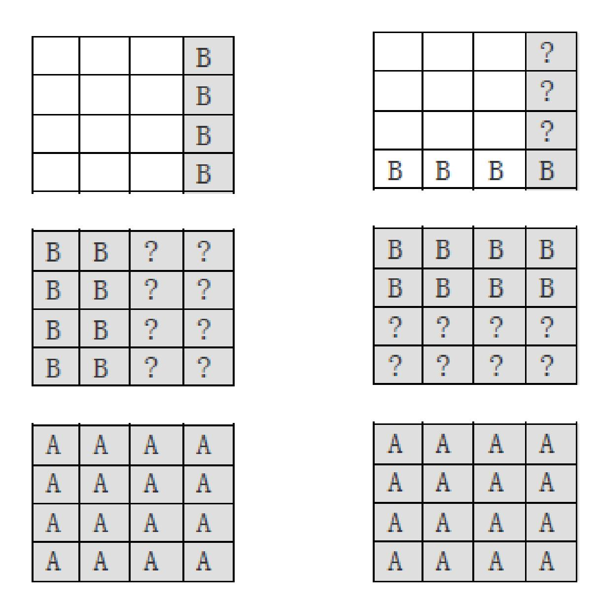
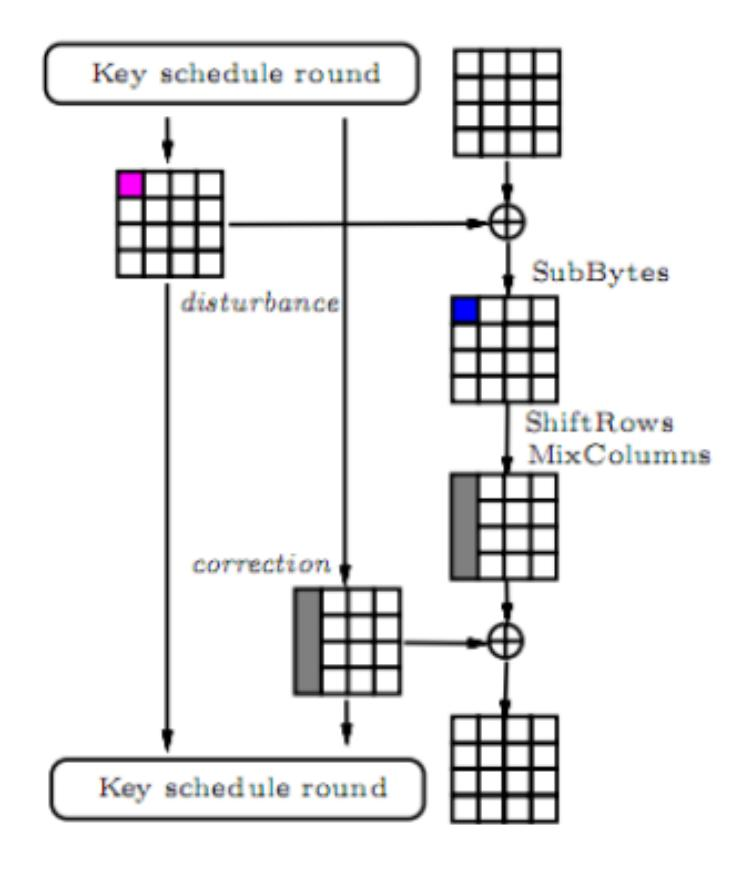

{0}------------------------------------------------

# Transposition of AES Key Schedule

Jialin Huang, Xuejia Lai

Department of Computer Science and Engineering Shanghai Jiaotong University, China

Abstract. In this paper, we point out a new weakness of the AES key schedule by revisiting an old observation exploited by many known attacks. We also discover a major cause for this weakness is that the column-by-column word-wise property in the key schedule matches nicely with the MixColumns operation in the cipher's diffusion layer. Then we propose a new key schedule by minor modification to increase the security level for AES. First, it reduces the number of rounds that some attacks are effective, such as SQUARE attacks and meet-in-the-middle attacks; Second, it is interesting that our new key schedule also protects AES from the most devastating related-key differential type attacks, which work against AES-192 and AES-256 with the full number of rounds. Compared with the original key schedule, ours just does a transposition on the output matrix of the subkeys. Compared with other proposed modifications of AES key schedule, our modification adds no non-linear operations, no need to complicate the diffusion method, or complicate the iteration process of generating subkeys. Finally, our results suggest that the route of diffusion propagation should get more attention in the design of key schedules.

Key words: AES, key schedule, meet-in-the-middle, related-key, Mix-Columns

## 1 Introduction

In 2000, Rijndael was chosen by NIST as the Advanced Encryption Standard (AES), as a replacement of DES for the US government. This new standard encryption algorithm has become one of the most widely used block ciphers in the last decade. There has been a lot of cryptanalysis against it, such as square attack, differential attack, impossible differential attack, differential-linear attack, and meet-in-the-middle attack. A considerable number of these attacks exploit the weaknesses of the AES key schedule. On the one hand, almost all the differential-type attacks can be put in a related-key model for a lower time and data complexity than in a single-key model. On the other hand, the weakness in the key schedule can be exploited in the SQUARE and meet-in-the-middle attacks. This assists the attacker to gain free bytes of subkeys for extending the targeted rounds of an attack. Since most current attacks focus on maximizing the number of rounds that can be broken and on minimizing the time and data complexity, these security vulnerabilities caused by key schedules are worthy of 

{1}------------------------------------------------

more study. There are many modified variants of AES, especially modifications of the key schedule, which aim to patch the security flaw. In 2002, May et al. studied the defects of the AES key schedule which help the published attacks. By taking two statistical tests-frequency test and SAC test they found that the original AES key schedule has a problem of bit leakage and does not satisfy a one-way function property. Then the author gave a new design of key schedule, exploiting a three-round AES cipher function, which has good bit diffusion and confusion, to derive the subkeys. In 2010, Nikolic presented a tweak for the key schedule of AES, which is called xAES. The author added several rotation operations and extra S-boxes, which would not change the overall structure of the original key schedule. After checking by an automatic search tool developed by [1], the author showed that xAES can defend against related-key differential attacks. In 2011, Choy et al. proved that there are a number of equivalent key pairs in May et al.'s key schedule, which should be avoided in a block cipher design. Then they improved this key schedule by eliminating these weak keys. Moreover, they emphasized that the improved key schedule can defend against the related-key differential attack in [2] and the related-key boomerang attack in [3]. All of these modifications to the AES key schedule introduce extra operations leading to a reduction of execution speed and making the new key schedule totally inconsistent with the old one.

### Our contribution

In this paper, we propose a new key schedule which is almost the same as the original AES key schedule, that is, we will not bring any additional operations into the old one—no increase in any non-linear operations (i.e. S-boxes), no complicating the diffusion course (e.g. adding rotation operations or XOR involving more bits, and so on). All we have done is just transpose the output matrix of the subkeys which are about to enter the encryption round's AddRoundKey operation. Actually, we only exchange the matrix subscripts of rows and columns. Our change is very simple and just affects the position of the diffusion pattern, instead of altering the branching of the key schedule. This feature makes our key schedule significantly faster than other variants of AES key schedule. We switch the interaction from between different columns to between different rows. The reason for this modification is due to a new weakness: it is the specific way that diffusion is done that makes the AES key schedule much weaker. Since this new AES key schedule still keeps its two fatal weaknesses—slow diffusion and high linearity—it is interesting that this minor change can bring much higher security. Moreover, most of the recent modifications to the AES key schedule only stress resisting related-key attacks, while our modification can impact both related-key attacks and single-key attacks.

### Organization

This paper is organized as follows: in Section 2, we describe the AES block cipher, especially its key schedule. Then we introduce several major pieces of analysis as well as modifications proposed in previous work. In Section 3, we describe our new key schedule. In Section 4, we focus on two kinds of attacks 

{2}------------------------------------------------

using weaknesses of the AES key schedule, and explain how the change we make can avoid these attacks. In Section 5 we summarize our results.

# 2 Preliminaries

In this section, we give a brief description of the FOX block cipher, then the formal definition of the pseudorandom and strong pseudorandom permutations are reviewed.

# 3 Description and Security Analysis of the AES Key Schedule

#### 3.1 A Short Description of AES

The block cipher AES has a 128-bit state and supports three key sizes: 128, 192, and 256 bits. It is a byte-oriented cipher, and has 10 rounds for 128-bit, 12 rounds for 192-bit and 14 rounds for 256-bit keys. In each round of AES, the internal state can be seen as a 4 × 4 matrix of bytes, which undergo the following basic transformations: 1. SubBytes: byte-wise application of S-boxes, abbreviated as SB(·). 2. ShiftRows: cyclic shift of each row of the state matrix by some amount, abbreviated as SR(·). 3. MixColumns: column-wise matrix multiplication, abbreviated as MC(·). 4. AddRoundKey: XOR of the subkey to the state, abbreviated as ARK(·).

An additional AddRoundKey operation is performed before the first round (the whitening key) and the MixColumns operation is omitted in the last round.

The key schedule is required to produce 11, 13 or 15 128-bit subkeys from master keys of size 128, 192 or 256 bits respectively. Each 128-bit subkey contains four words (a word is a 32-bit quantity which is denoted by W[·]). Call the number of rounds Nr, and the number of 32-bit words in the master key Nk(e.g., for AES-128, N<sup>r</sup> = 10,N<sup>k</sup> = 4):

```
For i = 0, ..., Nk − 1 : W[i] = K[i], where K[·] is the master key.
For i = Nk, ..., 4(Nr + 1) − 1:
1.temp ←− W[i − 1].
2.If i mod Nk == 0: temp ←− SB(RotWord(temp)) ⊕RCON[i\Nk].
3.If Nk = 8 and i mod 8 == 4: temp ←− SB(temp).
4.W[i] ←− W[i − Nk]⊕ temp.
```

where RCON[·] are round constants, and RotWord(·) rotates four bytes by one byte position to the left. The subkey used in the AddRoundKey at the end of round r is denoted by K<sup>r</sup> . The whitening key is K<sup>0</sup> . Each subkey is represented as a byte matrix of size 4x4 (corresponding to the state matrix), and the j'th byte in the i'th row of the matrix is denoted by K<sup>r</sup> i,j (0 < i, j < 4). The "equivalent" key obtained when the MixColumns and AddRoundKey operations are interchanged is denoted by K r = MC<sup>−</sup><sup>1</sup> (K<sup>r</sup> ).

{3}------------------------------------------------

### 3.2 Previous Analysis of the AES Key Schedule

In [4], two properties of the AES key schedule were discussed: partial key guessing and key splitting. Partial key guessing describes the situation where knowledge of a part of the subkey allows the attacker to calculate many other subkey(or even master key) bits. According to the author's order of key guessing, the result is as follows: learning of 28 bytes of key at the cost of having guessed seven bytes; learning of 88 bytes of key at the cost of guessing 15 bytes; learning of 148 bytes by guessing 23 bytes; learning of 208 bytes by guessing 31 bytes. Key splitting describes the following phenomenon: the two topmost rows interact with the two bottommost rows through only 14 bytes (for AES-256) and if we guess these 14 bytes, the rest of the key has been split into two independent halves each controlling half of the expanded key bytes. This implies some kind of meet-inthe-middle attack but no attack is known that uses this property.

In [5], the author proposed three desired properties for a key schedule: 1. be a collision-resistant one-way function (irreversible function); 2. has minimal mutual information between all subkey bits and master key bits; 3. has an efficient implementation. The author measured property 1 with Shannon's concepts of bit confusion and bit diffusion. Property 2 between subkeys can be avoided by the achievement of property 1, and the author assumed that a designer would not use master key bits directly in subkeys, such as IDEA and DES. Then the author used two statistical tests of CryptX to measure the original key schedule of AES. One is the frequency test, which is performed to judge the bit confusion property. The other is the Strict Avalanche Criterion (SAC) test for measuring the bit diffusion property. According to the results, the author pointed out that the majority of subkeys do not attain complete bit confusion, and none of these subkeys pass the SAC test. This poor performance suggests that the AES key schedule suffers a serious bit leakage problem and is not a one-way function.

In [6], the linear relationships between subkey values have been described. The author studied the propagation of (known) key differences in the key schedule for all three key sizes of AES. In principle these relationships can be useful for related-key attacks against AES. However, the author pointed out that for any of the defined key sizes, no such relationship exists which covers the entire key-schedule (i.e., which involves values from the first subkey and values from the last subkey, but no values from subkeys in between), so there is no straightforward way to exploit the findings to mount a related-key attack against the full AES.

In [2], two features of the AES key schedule are analyzed. The slow diffusion feature has already been discussed widely in a related-key model cryptanalysis. Another feature is that the shift operation in the internal state is preserved by the key schedule. These two features result in the existence of local collisions, which are important for finding a related-key differential type attack that works against the cipher with the full number of rounds.

{4}------------------------------------------------

### 3.3 Previous Modifications to the AES Key Schedule

Increasing the number of rounds is a straightforward and effective way to avoid many kinds of attacks. The current key schedule of AES can easily produce a few more subkeys without any substantial change. This enhances the security of AES to a large extent, and is also what the designer has done for different versions of AES [7]. However, this method affects the speed of not only the key schedule but also the actual cipher, reducing the execution speed by a factor that cannot be ignored. So most of the designers seek to modify the key schedule itself. [5] gave a new AES key schedule proposal. Each subkey is a 128-bit output after the execution of three rounds of the cipher function, using the XOR of master key and different round constants as both the data input and the key input. The only difference among the three versions of the key schedule (128,192, and 256-bit) is the initialization of the data input and the key input. The author aimed to apply the elegant and succinct AES round function to the key schedule, and he also used two basic statistical tests-the frequency test and the SAC test-to measure bit confusion and bit diffusion in the key schedule. He concluded that the new AES key schedule has much better performance than the old one. However, this new key schedule has a relatively large change compared to the original one, and also has a strong efficiency drawback due to the high number of S-boxes, especially in the hash mode. Moreover, [8] proved that there are 2<sup>271</sup> equivalent key pairs in [5]'s key schedule, which produce the same encryption output and could be taken as an attack point. [8] also designed two new AES variants to protect against the related-key attacks of [3] and [2]. One is a revision of [5]'s key schedule that eliminates the equivalent key pairs. The author simplified the initialization of the data input and the key input so that each byte of them only depends on one instead of two bytes of the master key. This prevents an adversary from forcing the inputs to have zero differentials by choosing an appropriate pair of related master keys. Another is a new on-the-fly key schedule required in the hardware implementation. Both of the key schedules mentioned in [5] and [8] have the property of round key irreversibility, which may make an attack more difficult to a certain extent. However, the irreversibility is likely to result in a lot of equivalent keys, which need to be avoided by the designer. Moreover, these key schedules increase the security by making the AES key schedule more nonlinear and this reduces the efficiency greatly. [9] presented a tweak for the key schedule of AES by adding a certain number of rotation operations, as well as additional S-boxes in the key schedule of AES-192. And this new variant is called xAES. A subkey word is rotated by one byte before participating in the generation of the next subkey word. The other operations are the same as the old AES key schedule. Then after exploiting an automatic search tool to find the related-key differential characteristics, the author claimed that the number of active S-boxes in the best round-reduced related-key differential characteristics has increased, so xAES is resistant against related-key differential attacks. However, this tweak cannot protect AES from other kinds of attacks, such as recent meet-in-themiddle attacks [11] [13], and also suffers a reduced efficiency. The key schedules in [9] and [8] defend mainly against the recent related-key differential type

{5}------------------------------------------------

| Original subkey |     |     |     |  |
|-----------------|-----|-----|-----|--|
| k00             | k01 | k02 | k03 |  |
| k10             | k11 | k12 | k13 |  |
| k20             | k21 | k22 | k23 |  |
| \k30            | k31 | k32 | k33 |  |

| New subkey |     |     |     |  |
|------------|-----|-----|-----|--|
| k00        | k10 | k20 | k30 |  |
| k01        | k11 | k21 | k31 |  |
| k02        | k12 | k22 | k32 |  |
| k03        | k13 | k23 | k33 |  |

Fig. 1. Transposition on subkey matrix

attacks. Hashing the master key before passing it through the AES key schedule can also achieve this purpose, since it is hard for an adversary to control the key differences at the beginning [14].

# 4 The New Weakness and a New AES Key Schedule Proposal

The weaknesses of AES key schedule in the previous work can be classified as follows: subkey bit leakage, slow diffusion and high linearity. The subkey leakage property only focuses on the amount of information leaked. But in this paper, we show that the position of the leaked subkey material is also an important flaw for AES. That is, even though we cannot change the number of subkey bytes leaked, rearranging which bytes are leaked brings a different security level for AES. The major reason is the column-by-column word-wise property in the original key schedule, which matches nicely with the MixColumns operation in the cipher's diffusion layer. With this match, the leaked subkeys provide as much useful information as possible for an attack.

We propose a new key schedule having only a minor modification to the old one but more resistant to SQUARE attack, meet-in-the-middle attack and related-key differential attack. The AES key schedule uses word-wise operations, instead of byte-wise operations just as in the cipher round function. The word type helps an attacker to get some free bytes needed to guess, leading to an extension of the number of targeted rounds. Moreover, the independence between different rows allows the attacker to construct required key differentials more easily in a related-key differential scenario exploiting a local collisions technique, which makes a major contribution to covering the full number of rounds in AES-192 and AES-256 attacks. Starting from the point of changing word type, we reconsider the AES key schedule from a very simple aspect, that is, after the execution of the original key schedule, we transpose the output matrix of each subkey. According to the notation of 2.1, we rearrange the position of the subkey bytes, by taking the k r j,i as subkeys, instead of k r i,j , just as Fig. 1. After this transposition, the route of subkey generation is changed and the weakness is removed.

For the convenience of illustrating, hereafter we denote AES with our new key schedule as transposition-AES.

{6}------------------------------------------------

### 5 Security Comparison of AES and transposition-AES

In this section we first review AES analysis papers, with the emphasis on relating attack scenarios to the AES key schedule weakness mentioned in Section 3. Then we show specifics of how transposition-AES can effectively resist these two types of attacks.

#### 5.1 SQUARE Attack and Meet-in-the-Middle Attack

First we describe a well-known observation on the AES-192 key schedule. This observation is based on the truth that when two of the three words W[i-1], W[i], W[i-N] are known, the remaining one can be derived.

**Observation 1.** By the key schedule of AES-192, knowledge of columns 0, 1, 2, 3 of the subkey  $K_{i+1}$  allows an attacker to deduce two columns of the subkey  $K_i$ , and one column of the subkey  $K_{i-1}$ .

This observation is widely used for the extension of attacks for AES-192, which originates from [10]. In [10], a generic 7-round SQUARE attack extended from a 6-round SQUARE attack was proposed, with complexity of  $2^{208}$ . This running time should not have been suitable for AES-192. But by using Observation 1, the author gains three useful key bytes for free, so the attack needs  $2^{184}$ time, which is lower than exhaustive search of AES-192. At the end of [10], the author claimed that "This f does not indicate the necessity to modify the Rijndael key schedule" and "If we concentrate on counting the number of rounds for which shortcut attacks exist, the cryptanalytic gain of this paper is one round for RD-192, not more". However, with the development of cryptanalysis technique, the original attacks are always being improved. As the complexity is reduced and the targeted number of rounds becomes larger, this extension in the last rounds is likely to become more and more dangerous. In [4], an improved 6round SQUARE attack is mentioned, whose overall complexity is comparable to  $2^{72}$  encryptions. Then an extension to 7 rounds is carried out, adding 128-bit of key guessing in the last round. This leads to a total workload of  $2^{200}$ . According to observation 1, guessing the last round key  $K^7$  gives us two of the four bytes from  $\overline{K}^6$ , plus one byte from  $\overline{K}^5$ . This also saves us three bytes of key guessing. [4] also gives two improvements to generate a 7-round attack, which make an extension to 8 rounds possible. This 8-round attack has a complexity of  $2^{204}$ . Again, fixing  $K^8$  determines two useful key bytes of  $\overline{K}^7$ , which gives a  $2^{188}$  complexity. In [12], the author presents a new variant of the SQUARE-type attack mentioned in [11]. Then the author shows that for AES-192, the time complexity of the 8-round attack can be reduced by a factor of  $2^{32}$  using key schedule weaknesses. A factor of  $2^{24}$  in this reduction is achieved by applying Observation 1. Later, [13] gives an 8-round meet-in-the-middle attack on AES-192, which has a dramatically smaller data complexity -  $2^{41}$  chosen plaintexts. In this paper Observation 1 again contributes to a reduction of the time complexity.

#### Security analysis of the key schedule after transposition

Most of above attacks use the key schedule to extend the last three rounds. Considering the situation of the least bytes of keys involved in these three rounds, 

{7}------------------------------------------------

we need to guess all bytes of the last round's subkey, marked as round r. Since the last round does not have the MixColumns operation, all bytes of the subkey in round r-1 are involved in the AddRoundKey operation. And then according to the diffusion of cipher rounds, there are at least four bytes of r-2 round subkey needed to guess(since we only consider one byte of the internal value at the beginning of r-2 round). See Fig. 2 and Fig. 3: the gray boxes are the involved key bytes; the "A" mark the key bytes having been guessed; the "B" mark the leaked key bytes, which can derive from "A"; the "?" mark the unknown key bytes.



Fig. 2. Original key schedule Fig. 3. Our key schedule

However, it is not necessary and not practical to guess all gray bytes. In this situation, when there are four bytes in the same column and these four bytes are obtained by MixColumns from one byte (This occurs in round r-1 and round r-2), we could exchange the operation of AddRoundKey and MixColumns. By doing this we only need to guess the corresponding one byte of K<sup>j</sup> , instead of guessing four bytes of K<sup>j</sup> (K<sup>j</sup> = MC<sup>−</sup><sup>1</sup> (K<sup>j</sup> ), where K<sup>j</sup> is the j'th column in subkey K). It is by this that we can avoid searching too many bytes of subkeys 

{8}------------------------------------------------

in a targeted round, which is also what the previous analysis papers have done. This is due to a property of the cipher round function and has nothing to do with the key schedule.

An attacker can further reduce the number of guessed bytes mentioned above by Observation 1. Owing to the word-wise property of the AES key schedule, there are several words' information being leaked when the attacker has guessed the last four words. When this type of word-wise is by column, just as the original AES key schedule, the inversion of the MixColumns operation on the leaked word can be done easily. That is, the leakage makes all four bytes in some K<sup>j</sup> are known, so the complexity for guessing the needed one byte in K<sup>j</sup> is left out. See Fig. 2.

After transposing the output subkey, Observation 1 turns out to be "By the key schedule of AES-192, knowledge of rows 0, 1, 2, 3 of the subkey Ki+1 allows an attacker to deduce two rows of the subkey K<sup>i</sup> , and one row of the subkey Ki−1". The leaked words are by rows now, just as Fig. 3. Obviously it is not sufficient for any one column to compute K<sup>j</sup> = MC−<sup>1</sup> (K<sup>j</sup> ) unless the remaining two(or three) unknown bytes in K<sup>j</sup> are also guessed, which leads to a heavier workload than guessing just one byte of K<sup>j</sup> directly. So in this situation the attacker cannot gain any free bytes through the weakness of the key schedule. It is the column-oriented property of the MixColumns operation that makes the original AES key schedule which is also word-wise by column more vulnerable to the attacks, and the transposition eliminates this vulnerability. A similar analysis also applies to AES-256.

#### 5.2 Related-key Differential Attack

The related-key differential technique has always been a useful cryptanalysis tool for AES, especially its variants-related-key boomerang and rectangle attacks. But none of these attacks could break any version of full round AES, until in [2] and [3]. In [2], the author identified slow diffusion and certain differential trails in the key schedule of AES-256 which match nicely with the differential properties of the cipher round function. Then he constructed local collisions based on this discovery. The concept of local collisions comes from the cryptanalysis of hash functions. The method is to inject a difference into the internal state from the key schedule, causing a disturbance, and then to correct it with the next injections, which also come from the key schedule. An one-round example of local collision in AES-256 is shown in Fig. 4 [3]. In this related-key scenario the attacker can control the difference in the key at the beginning, and due to the key schedule the resulting difference pattern spreads to other subkeys. The more disturbances there are, the more complexity the attack needs, since the disturbances bring about active S-boxes in the internal state and in the key schedule. The disturbance differences and the correction differences compensating each other in the key schedule can be viewed as a set of local collisions. [2] starts from a two-round difference propagation using the idea of local collisions, which brings deterministic differences in the subkeys and no difference in the internal state. The author then concatenates four such two-round patterns and

{9}------------------------------------------------



Fig. 4. One round local collision

an additional 6-round trail on the top to reach a full attack for AES-256. The trail has 36 active S-boxes in the block and 5 in the key schedule in total. Based on a small modification to this trail, the author develops the first related-key attack for AES-256 for one out of 2<sup>35</sup> key pairs, with 2<sup>131</sup> time complexity and 2 <sup>65</sup> memory. In [3], the author improves the result. By a combination of local collisions and the related-key boomerang technique, this attack covers the full AES-256 with 299.<sup>5</sup> time and data complexity for all the keys, instead of a weak key class in [2]. Moreover, with the help of local collisions, the author shows a first related-key amplified-boomerang attack for full AES-192, whose key schedule has better diffusion which leads to more active S-boxes in subkeys. The overall time complexity of this attack is about 2176, and the data complexity is 2 123 .

### Security analysis of the key schedule after transposition

The resistance to related-key differential type attacks is usually measured by the number of active S-boxes in the differential characteristics. In a related-key scenario we need to consider the number of S-boxes both in the internal state and in the key schedule. The former is just the number of non-zero bytes in the disturbances; the latter is determined by the diffusion and the non-linear modules (i.e. S-boxes in AES) in the key schedule. The slow diffusion and low nonlinearity in the AES key schedule make a subkey differential trail with a small number of active S-boxes possible. This provides us with the high probability propagation of injection and correction of key differentials, resulting in the availability of local collisions. According to the method mentioned in [1] for searching for related-key differentials automatically, we can also reach the same

{10}------------------------------------------------

Fig. 5. MixColumns matrix

conclusion. Moreover, the linearity of the AES key schedule allows the injection and correction key patterns to overlap each other. The transposition of the subkeys is just the exchange of rows and columns for the output subscripts, the slow diffusion and low nonlinearity features still exist. So we focus on another property that makes the local collisions technique successful: the matching differential property between the key schedule and the cipher round function.

The original key schedule is more vulnerable since there is almost no interaction between different rows, so an attacker can fix the four bytes in the same column independently according to the result of MixColumns. This makes the construction of correction differentials easy. Also, the shift operation is preserved by the key schedule round. That is, the shift in the same row in the internal state does not contradict the XOR operation in the same row in the key schedule: the value in one byte is zero or the same (b⊕b = 0, b⊕0 = b). All of these properties are disrupted by changing the subkey column into the subkey row.

In order to explain in detail, we introduce the MixColumns and stress the operations it uses.

### MixColumns

The MixColumns step is a linear transformation which makes every input byte influence four output bytes. Each 4-byte column is considered as a vector and multiplied by a fixed 4 × 4 matrix. The matrix contains constant entries. The vector-matrix multiplication and addition are done in GF(2<sup>8</sup> ). Each byte element is represented as polynomial with coefficients in GF(2). The addition in GF(2<sup>8</sup> ) is simple bitwise XOR of the respective bytes. The MixColumns matrix is as Fig. 5.

For the constants in the matrix a hexadecimal notation is used: "01" refers to the GF(2<sup>8</sup> ) polynomial with the coefficients (00000001), i.e., it is the element 1 of the Galois field; "02" refers to the polynomial with the bit vector (00000010), i.e., to the polynomial x; and "03" refers to the polynomial with the bit vector (00000011), i.e., the Galois field element x+1.Multiplication by 02 is implemented as a multiplication by x, which is a left shift by one bit, and a modular reduction with P(x) = x <sup>8</sup> + x <sup>4</sup> + x <sup>3</sup> + x + 1. Similarly, multiplication by 03 can be implemented by a left shift by one bit and addition of the original value followed by a modular reduction with P(x).

Without loss of generality, we take Fig. 4 as an illustration: ∆k<sup>i</sup> injects a one-byte difference to s0,<sup>0</sup> (∆k<sup>i</sup> <sup>0</sup>,<sup>0</sup> = a), then it is expanded by MixColumns to a four-byte difference in column 0. Those four bytes are cancelled by the addition of ∆k<sup>i</sup>+1. The column 0 in∆k<sup>i</sup>+1 should be of special form: it is the result of 

{11}------------------------------------------------

multiplying a vector (b, 0, 0, 0)<sup>T</sup> by the MixColumns matrix (the gray part in Fig. 4, where b equals S-box(a) with the highest probability). The resulting vector is called MC-column like in [2].

After transposing the output of subkey, the correction patterns in ∆ki+1 change from column-type to row-type. i.e., we need to generate MC-column in row 0 of ∆ki+1(in this situation ∆ki+1 is (02 · b, b, b, 03 · b)). According to the key schedule, the different bytes in the same row have a XOR relation with each other. When the degree of the polynomials represented by 02 · b and 03 · b is less than 8, there are the following relations: (02 · b) ⊕ b = 03 · b,(03 · b) ⊕ b = 02 · b,(02 · b) ⊕ (03 · b) = b. However, these relations cannot assist to generate and spread MC-column value. For example, take a backward direction, the row differential value (02 · b, b, b, 03 · b) of a subkey causes row differential pattern (?, 03 · b, 0, 02 · b) for its previous subkey. This differential is not compatible with the MC-column value (02 · b, b, b, 03 · b) (more precisely, we need to check all of the columns in the MixColumns matrix). So it is more difficult for an attacker to choose a subkey difference to cancel the internal state differences deriving from the disturbance. When we want to exploit the relations between 02 · a, 03 · a and a, we need more non-zero disturbances in ∆k<sup>i</sup> for subsequent cancelling, which will cause more active S-boxes in the internal state. On the other hand, when we require the MC-column type value by row, we will get S-boxes involved in the key schedule more quickly. Since the MC-column includes four non-zero bytes, when we put these bytes in the same row, there is at least one active S-box in each round of subkey for AES-128 and AES-256 (the original key schedule can go without using the S-box for several rounds). As in Section 4.1, the subkey pattern by row is not synchronized with the internal state which is spread by column (due to the MixColumns operation rather than "MixRows").

## 6 Summary and Conclusion

In this paper, we analyze the security of AES after doing a transposition on the output matrix of subkeys, while other conditions are totally the same as the original key schedule. We point out that due to the weakness of the original key schedule's word type, our new key schedule is more secure. By this slight change we obtain a higher security level for AES. First, our key schedule can prevent the attacker from gaining free bytes of subkeys which are needed during the procedure of the attack, so the number of targeted rounds can be reduced. Second, we do not adopt the traditional idea of adding more non-linear operations, to avoid related-key differential type attacks. We do not even require any change in the iteration process of generating subkeys, that is, we do not need to speed up the diffusion in the key schedule, or complicate the key schedule. However, we successfully protect AES from the most devastating related-key attacks mentioned in [3] and [2], which work against AES-192 and AES-256 with the full number of rounds. The analysis in this paper suggests that current design criteria for key schedules are not enough. As well as the speed of the diffusion and the amount 

{12}------------------------------------------------

of non-linearity, the route, or position of diffusion propagation should get more attention.

## References

- 1. A. Biryukov, I. Nikolic, Automatic search for related-key differential character- istics in byte-oriented block ciphers: Application to AES, Camellia, Khazad and others. In H. Gilbert, editor, Eurocrypt 2010, LNCS, vol. 6110, pages 322-344, Springer, 2010.
- 2. A. Biryukov, D. Khovratovich, and I. Nikolic, Distinguisher and Related-Key Attack on the Full AES-256", Crypto 2009, LNCS, vol. 5677, pages 231-249, Springer, 2009.
- 3. A. Biryukov and D. Khovratovich, Related-Key Cryptanalysis of the Full AES-192 and AES-256", Asiacrypt 2009, LNCS, vol. 5912, pages 1-18, Springer, 2009.
- 4. N. Ferguson, J. Kelsey, S. Lucks, B. Schneier, M. Stay, D. Wagner, and D. Whiting, Improved cryptanalysis of Rijndael, In B. Schneier, editor, FSE, LNCS, vol. 1978, pages 213-230, Springer, 2000.
- 5. L. May, M. Henricksen, W. Millan, G. Carter, E. Dawson, Strengthening the key schedule of the AES, In L.M. Batten, J. Seberry, editor, ACISP 2002, LNCS, vol. 2384, pages 226-240, Springer, 2002.
- 6. F. Armknecht and S. Lucks, Linearity of the AES Key Schedule, LNCS, vol. 3373, pages 159-169, Springer, 2005.
- 7. J. Daemen and V. Rijmen, AES proposal: Rijndael, In The First AES Candidate Conference, 1998.
- 8. J Choy, A Zhang, K Khoo, M. Henricksen, and A. Poschmann, AES Variants Secure Against Related-Key Differential and Boomerang Attacks, Information Security Theory and Practice: Security and Privacy of Mobile Devices in Wireless Communication, WISTP 2011, LNCS, vol. 6633, pages 191-207, Springer, 2011.
- 9. I. Nikolic, Tweaking AES, SAC 2010, LNCS, vol. 6544, pages 198-210, Springer, 2011.
- 10. S. Lucks, Attacking Seven Rounds of Rijndael under 192-bit and 256-bit Keys, In The Third AES Candidate Conference, pages 215-229, 2000.
- 11. H¨useyin Demirci, and Ali Aydin Sel¸cuk, A Meet-in-the-Middle Attack on 8-Round AES, proceedings of FSE 2008, LNCS, vol. 5086, pages 116-126, Springer, 2008.
- 12. O. Dunkelman, N. Keller, and A. Shamir, Improved Single-Key Attacks on 8-Round AES-192 and AES-256, Asiacrypt 2010, LNCS, vol. 6477, pages 158-176, Springer, 2010.
- 13. Y Wei, J Lu, and Y Hu, Meet-in-the-Middle Attack on 8 Rounds of the AES Block Cipher under 192 Key Bits, Information Security Practice and Experience, LNCS, vol. 6672, pages 222-232, Springer, 2011
- 14. J. Kelsey, B. Schneier, and D. Wagner, Key-Schedule Cryptanalysis of IDEA, G-DES, GOST, SAFER, and Triple-DES, Advances in Cryptology–CRYPTO'96, pages 237-251, Springer, 1996.