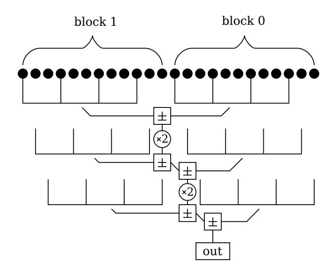

# Fast and compact elliptic-curve cryptography

### Mike Hamburg∗

#### Abstract

Elliptic curve cryptosystems have improved greatly in speed over the past few years. In this paper we outline a new elliptic curve signature and key agreement implementation. We achieve record speeds for signatures while remaining relatively compact. For example, on Intel Sandy Bridge, a curve with about 2250 points produces a signature in just under 60k clock cycles, verifies in under 169k clock cycles, and computes a Diffie-Hellman shared secret in under 153k clock cycles. Our implementation has a small footprint: the library is under 55kB. We also post competitive timings on ARM processors, verifying a signature in under 618k Tegra-2 cycles. We introduce faster field arithmetic, a new point compression algorithm, an improved fixed-base scalar multiplication algorithm and a new way to verify signatures without inversions or coordinate recovery. Some of these improvements should be applicable to other systems.

## 1 Introduction

Of the many applications for digital signatures, most use some variant of the venerable RSA scheme. RSA signatures have several advantages, such as age, simplicity and extreme speed of verification. For example, NIST's recommendations [2] hold RSA-2048 and the elliptic curve signature scheme ECDSA-p224 to be similarly secure1 , and the former verifies signatures more than 13× faster than the latter [7].

Elliptic curve signatures have many advantages, however. Current attacks against elliptic curves scale exponentially with key size. Therefore ECC key and signatures can be considerably smaller than their RSA counterparts, and key generation and signing are much faster. Still, elliptic curve signatures' historically slow verification has kept these signatures out of protocols such as DNSSEC (though a draft is in progress [20]), and still makes them a difficult choice for less powerful systems such as embedded devices and smart phones.

∗Cryptography Research, a division of Rambus.

1Eurocrypt's report [1] estimates ECDSA-p224 to be slightly stronger than RSA-2048.

This performance gap has narrowed in recent years. Edwards' elliptic curves [11] and their twists provide faster operations [5, 18, 19] than the traditional projective or Jacobian coordinates for Weierstrass curves, and make it easier to achieve resistance to side-channel attacks. Bernstein et al.'s Ed25519 software [6], which uses these curves, verifies signatures in some 234k cyles on Intel's Sandy Bridge microarchitecture. While RSA-2048 is still considerably faster at approximately 98k (even in the conservative OpenSSL implementation), this is a significant improvement over ECDSA [7].

Here we continue to push the envelope. We demonstrate improved field arithmetic and improved algorithms for scalar multiplication and point compression. These enable us to achieve approximately 172k median Sandy Bridge cycles for verification, 52k for signing and 55k for key generation. These benchmarks were measured with SUPERCOP [7] and adjusted for Turbo Boost, so they should be reproducible.

Our code is not optimized purely for speed. Rather, it is designed to balance speed with security, simplicity, portability and small cache footprint. For example, we decided to use only 7.5kiB of tables for key generation and signing (compare to 30kiB in [6]). We believe the above speeds are fast enough that additional cache pollution would not be worth the modest speed increase in most applications. We also provide standard protection against timing and cache-leakage attacks, by avoiding the use of secret data in conditional branches and array indices. These countermeasures are not necessary for verification since it uses no secrets, but we used the same constant-time arithmetic for simplicity. We made no attempt to protect against physical side-channels such as SPA and DPA.

Fast Sandy Bridge benchmarks are somewhat unsatisfying. We set new records for signing and verification, but the reduction in verification times from 73µs to 53µs will be irrelevant most of the time. However, asymmetric cryptography is somewhat more costly on smartphones, with OpenSSL ECC verifies taking 7.7ms on our 1GHz Tegra 2 (ARM Cortex A9) test machine. On this platform, our implementation also does well. For example, it verifies signatures in under 618k cycles, that is, well under a millisecond. Our ARM code does not currently take advantage of ARM's NEON vector instructions; indeed, our Tegra 2 test machine does not support NEON. Still, our ARM code's performance is similar to Bernstein and Schwabe's NEON results [8]: slower for key agreement, faster for verification, and much faster for signing. This is not an apples-to-apples comparison: our A9 lacks NEON, but its support out-of-order execution improves the performance of our code. Still, the implication is clear: even where our arithmetic code is slower than the state of the art, our algorithmic improvements enable us to set new records.

#### 1.1 Overview

The rest of this paper is organized as follows:

- In Section 2.1, we demonstrate a previously unrecognized class of primes which allow for particularly fast arithmetic. The arithmetic in our system is done modulo such a prime.
- In Section 2.2, we describe the Montgomery curve and equivalent twisted Edwards curves which will be used in our system. These curves were chosen to have security properties similar to Curve25519 [3]. Our system uses q-torsion points on these curves.
- In Section 2.3, we describe how q-torsion points are encoded and decoded as field elements, without any extra bits. In order to encode and decode elements efficiently, we use a simple simultaneous inversion and square root algorithm, which is to our knowledge novel.
- In Section 3.1, we describe our signatures, which are modeled on Ed25519 [6] and are similar to Schnorr signatures [23].
- In Section 3.2, we describe the "extensible" coordinates we use for twisted Edwards curves. These are a variant of Hı¸sıl's "mixed homogeneous projective coordinates" [18] with Niels coordinates [6] for readdition. Our coordinates combine many of the strengths of projective coordinates and extended coordinates, without Hı¸sıl's requirement to schedule doublings and additions in advance.
- In Section 3.3, we describe how we sign messages. We introduce a new "multiple signed comb" algorithm which is simpler, more flexible and more efficient than previous algorithms for scalar multiplication with precomputation.
- In Section 3.4, we describe how to verify signatures.
- In Section 4, we describe how we implement elliptic-curve Diffie-Hellman with Montgomery curves, including a technique for coordinate recovery after a Montgomery ladder.
- In Section 5, we show benchmarks on Intel Sandy Bridge and Nvidia Tegra-2 processors. These benchmarks were taken with SUPERCOP [7], so they should be reproducible.
- In Appendix A, we describe an alternative technique for signature verification which avoids point decompression. With the parameters we chose, it is slightly slower than the techniques presented in the main body of the paper.

### 2 Design parameters

We made a number of choices in our system's design in order to simultaneously achieve high speed and high security. We emphasize that this paper is intended as a demonstration of new algorithms, fields and formulae, and that we do not intend these parameters as a new standard. Before doing that, more work is necessary. We would first want to examine more trade-offs in fields, security levels, hash functons, encodings, curves and signature forms, and to test on a wider variety of hardware configurations.

#### 2.1 Special Montgomery fields

Most implementations of arithmetic in general prime-order fields use Montgomery reduction, because it is usually faster than other options such as Barrett reduction. When choosing special prime-order fields, we would like to use Mersenne primes, but there are no such primes between 2127 −1 and 2521 −1. Therefore, special fields of other forms are used. These fields usually use Barrett reduction, of which Solinas reduction [24] is a special case.

However, it is possible — and profitable — to use Montgomery reduction in special primeorder fields. For example, let p = k · 2 aw − 1, where w is the machine's word size, a ≥ 1, and k is an arbitrary constant. We call such a p a special Montgomery number, or a special Montgomery prime if it is prime. To perform a Montgomery reduction step x → x/2 w, we use the identity

$$1/2^w \equiv k \cdot 2^{(a-1)w} \pmod{p}$$

That is, to divide by 2w, shift each word down by one position2 . The bottom word cannot be shifted down; instead, shift it up a − 1 words, multiply it by k, and accumulate. If k is a single word, then this process can be a single multiply-and-accumulate instruction. If k is low-weight, then this process can be accomplished with a few shifts and adds, similar to Solinas reduction. This version of the technique works for the NIST primes with the exception of p224 = 2224 − 2 96 + 13 However, except for p256, the NIST primes' coefficients are weighted toward the least significant side, giving an advantage to Barrett reduction.

For our implementation, we wanted a field with slightly fewer than 2256 elements. We chose p := 2252 − 2 232 − 1, a special Montgomery prime with a single-word k on both 32 and 64-bit architectures. The gap between p and 2256 enables lazy reduction: the result of a multiply is under 2p, which can be added or subtracted once without reduction; the results can be Montgomery multiplied to produce results under 16p 2/2 256 + p < 2p. In cases where more additions or subtractions are needed, Barrett reduction is still efficient. Alternatively, when projective coordinates are used, we can insert an extra Montgomery reduction step –

2Of course, this shifting can be logical instead of physical, especially if the element fits into registers.

3 It requires modification or a smaller word size for the deprecated p160 = 2160 − 2 31 − 1.

a one-word multiply and accumulate – in two balancing places. This option is applicable mainly in twisted Edwards doubling formulas, where it maximizes speed and minimizes code size. In microbenchmarks, our field seemed considerably faster than primes of other forms, and in the end our benchmarks validate our choice.

We considered several other primes for our implementation, but ultimately decided on this 252-bit p. Our analysis of the alternatives is found in Appendix B. Certain primes work better for different machines and different situations, and there is a performance vs security trade-off to consider as well. For example, some primes are faster on AMD but slower on Intel, or faster on 32-bit machines but slower on 64-bit machines, or faster with NEON but slower in scalar code. Our p is a compromise. We do not intend to set a new standard, but instead to suggest that future efforts should consider special Montgomery primes.

#### 2.2 Curve choice

We chose a Montgomery curve

$$\mathcal{E}_m: v^2 = u^3 + Au^2 + u \pmod{p}$$

The laddering operation on such curves requires a multiplication by A0 = (A − 2)/4, so we set A0 := 1107/2 64 in order to use Montgomery multiplication. This gives a curve of order

$$4q = p - k$$
 where  $k = 48305947151610022181991269137732172107$

with twist of order

$$4\hat{q} = p + k + 2$$

Here q and ˆq are both primes, and are both slightly smaller than 2250. In other words, both Em and its quadratic twist have cofactor 4. This is important for Curve25519-style protocols, where parties need not check that a point is on Em before operating on it [3]. For our designs, we only use the order-q subgroup of Em.

We have checked that neither Em nor its quadratic twist have any low-degree complex endomorphisms, and that the orders of p modulo q and ˆq are large — in fact, p is a generator modulo both.

The curve Em is isomorphic to the twisted Edwards curve

$$\mathcal{E}: y^2 - x^2 = 1 + dx^2 y^2$$
 where  $d = -\frac{A-2}{A+2} = -\frac{1107}{1107 + 2^{64}}$

We work only in the order-q subgroups of these curves. Because Edwards curves are faster for most operations, we spent most of our effort on the q-torsion group of E.

#### 2.3 Point compression

We compress q-torsion points in E and Em down to a single element of F. That is, we do not send a separate sign bit. Saving a bit is somewhat gratuitous with our 252-bit prime, but it would be more relevant to a system whose elements have sizes that are a multiple of a byte. Our compression technique uses the following lemma:

Lemma. Let P1 = (u1, v1), P2 = (u2, v2), P3 = (u3, v3) be finite points on a curve defined by v 2 = u 3 + Au2 + Bu, with P1 = P2 + P3. Then u1u2u3 is a quadratic residue in F.

Proof. The points −P1, P2 and P3 lie on a line v = mu+b, so that u 3+Au2+Bu−(mu+b) 2 = 0 at u1, u2 and u3. Thus

$$u^{3} + Au^{2} + Bu - (mu + b)^{2} = (u - u_{1}) \cdot (u - u_{2}) \cdot (u - u_{3})$$

and u1 · u2 · u3 = b 2 is a quadratic residue.

Corollary. If P = (u, v) = 2Q on such a curve, then u is a quadratic residue.

In light of this lemma, we choose to represent points of Em as 1/ √ u with the same sign as v, encoded as 32 bytes in little-endian order. Call this encoding P. For "sign" we choose the Legendre symbol, but another choice such as the least-significant bit would also suffice. With this representation, the identity is encoded as 0. The point (0, 0) ∈ Em is not a qtorsion point, so we need not worry about u being 0. This form of point compression is also compatible with a fast Montgomery ladder.

To compress a point (X/Z, Y/Z) ∈ E, we need to compute τ := p (Z − Y )/(Z + Y ) with the same sign as XZ. To decompress a point encoded as τ , we need to compute

$$y = \frac{1+\tau^2}{1-\tau^2}$$
 and  $x = \tau \sqrt{\frac{-A-2}{\tau^4 + A\tau^2 + 1}}$

In order to perform these computations efficiently, we use a simultaneous inversion and square root algorithm, similar to Montgomery's simultaneous inversion trick or batch RSA [13], and similar to the accelerated decompression in Ed25519 [6]. Since p ≡ 3 (mod 4), for a ∈ F(p) ∗ we might compute 1/a = a p−2 and √ ±a = a (p+1)/4 . We can just as easily4 compute the intermediate 1/ √ ±a = a (p−3)/4 . The inverses and square roots in decompression have the form 1/a and p 1/c, which must be computed with Legendre symbol 1. We can compute these by first setting s = 1/ √ a 4c, whence 1/a = s 2a 3 c = sa · sa2 · c and p 1/c = sa2 . Similarly, for compression we must compute p a/b with the same sign as c; we can compute this as a 2 c/√ a 3bc2 . For any of these formulas, if one of the inputs is zero it will ruin the

4This takes slightly less effort than an inversion and slightly more than a square root, since (p + 1)/4 is highly even.

computation; we can avoid this problem by replacing zeros with ones in constant time in suitable places.

Note that formulas like these can compute any number of inversions and any number of relatively prime roots or symbols simultaneously. In essence, they compute a suitable generator of the lattice containing the logarithms of the desired results, quotiented by the lattice of the logarithms of the inputs. But when the roots to be taken are not relatively prime, this quotient lattice has dimension higher than 1, so more than one expensive root operation will be required. In particular, these formulas do not reduce the time required to take two separate square roots.

### 3 Signatures

We follow the form of Schnorr signatures [23] used in Ed25519 [6]. We do not follow the EdDSA standard itself, because it is too strict for us; for example, it requires the field order to be congruent 1 mod 4. Our base point P is the q-torsion point with the numerically minimum encoding, the byte sequence [4, 0, 0, . . . , 0]. A secret key is an integer a ∈ [0, q), with corresponding public key Q = a · P.

#### 3.1 Signature form

To sign a message, the signer chooses a pseudorandom r R ← Z/qZ and computes R ← r · P. It computes a hash c ← H(Q, R, m) — we use SHA-256 for H — and sets

$$t \leftarrow r + c \cdot a \pmod{q}$$

The signature is then (R, t). The verifier can likewise compute c and then check that R is on the curve and that

$$t \cdot P \stackrel{?}{=} c \cdot Q + R$$

We could simplify our implementation by not checking the sign of R, i.e. verifying this equation for ±R instead of R. This would save some 3% in verification and a few kiB of code size, and probably would not impact security at all. Additionally, we could choose a hash with a 128-bit output [4, 23]. But in order to remain conservative, and to enable apples-to-apples comparisons with other systems, we chose to use a 256-bit output and to verify the x-coordinate.

The signer may choose r at random, but following [6], we instead choose r = H(a, m) except when a streaming API is desired.

#### 3.2 Coordinate choice

Our signature implementation internally uses points on the twisted Edwards curve E, so it is important to choose efficient coordinates for this curve. Projective coordinates (with 3 coefficients) support the fastest doublings [5], but extended coordinates (with 4 coefficients) support the fastest additions [19].

Hı¸sıl proposes "mixed homogeneous projective coordinates" [18]. With this technique, one determines whether the next operation will be an addition or a doubling, and if so the extra coordinate T must be computed; otherwise, it is omitted. We wished to avoid this look-ahead. So instead we store (X, Y, Z, T1, T2), where x = X/Z, y = Y/Z and T1 ·T2 = T = XY/Z. The last step of a doubling or addition with extended coordinates [19] amounts to computing T = T1 · T2. We skip that step and leave T1 and T2 in memory, saving a multiply. The T-coordinate is required for additions, so we compute it at the cost of a multiply when beginning an addition. Thus, as with mixed homogeneous projective coordinates, our "extensible" coordinates cost 4 squares and 3 multiplies to double, and 8 multiplies for addition (7 for mixed addition). Since in most cases only one point is in this form, we aren't concerned with the 5-element size. Occasionally we may end up computing T twice, but this is rare enough that we will ignore it. Because we use only q-torsion points, the formulas in [19] are strongly unified even though −1 is not a quadratic residue in F(p).

For mixed readdition, we use a variant of "Niels coordinates"5 , of the form

$$\alpha = (y - x)/2, \beta = (y + x)/2, \gamma = dxy$$

where d is the Edwards curve constant. For unmixed readdition, we add a Z coordinate.

#### 3.3 Key generation and signing

The bulk of the work in key generation and signing is the computation of e · P for (pseudo) random values e. For this we use a novel signed multi-comb algorithm. This is similar to the algorithm of Lim and Lee [21]. It is also similar in spirit to the signed MSB-set comb algorithm of Feng et al. [12] and the multiple-comb algorithm in Hankerson, Menezes and Vanstone [17]. Our algorithm combines the simplicity and flexibility of the HMV algorithm with the speed advantages of the signed comb algorithms, and is faster than all of them.

Let D > log2 q be enough digits to write the scalar e. We first write the scalar in signed binary form:

$$e \equiv \sum_{i=0}^{D} d_i \cdot 2^i \pmod{q}$$
 where  $d_i \in \{\pm 1\}$

5Named after Niels Duif. So far as I know, these are so-called only in the source code for Ed25519. Our coordinates are exactly half of Ed25519's Niels coordinates, which saves a multiply by 2.

To do this, note that

$$\frac{e+2^D-1}{2} = \sum_{i=0}^{D} \frac{d_i+1}{2} \cdot 2^i$$

so that (di + 1)/2 ∈ {0, 1} is the ith binary digit of (e + 2D − 1)/2 (mod q). Here we take advantage of the fact that q is odd, so halving is always possible mod q. Next, we divide the digits into disjoint blocks:

$$e \equiv \sum_{j=0}^{n-1} B_j$$
 where  $B_j := \sum_{i=o_j}^{o_{j+1}-1} d_i \cdot 2^i$

Here oj is the (suitably chosen) offset of the jth block, and on := D so that all the digits are accounted for. Finally, we divide the digits in each block into combs. The jth combset has tj teeth and spacing sj , where sj · tj = oj+1 − oj . Set

$$B_j = 2^{o_j} \cdot \sum_{k=0}^{s_j - 1} 2^k \cdot C_{j,k} \text{ where } C_{j,k} := \sum_{i=0}^{t_j - 1} d_{o_j + s_j i + k} \cdot 2^{s_j i}$$

We then have

$$e \equiv \sum_{k=0}^{\max s_j - 1} 2^k \cdot \sum_{\substack{j=0 \ s_j > k}}^{n-1} C_{j,k} = \sum_{k=0}^{\max s_j - 1} 2^k \cdot \sum_{\substack{j=0 \ s_j > k}}^{n-1} \pm |C_{j,k}| \pmod{q}$$

Our algorithm follows directly. Given a base point P, precompute the 2tj − 1 values of |Cj,k| · P for each j ∈ [0, n). To perform a multiplication, compute the signed digits di of e, then evaluate

$$e \cdot P = \sum_{k=0}^{\max s_j - 1} 2^k \cdot \sum_{\substack{j=0 \ s_j > k}}^{n-1} \pm |C_{j,k}| \cdot P$$

with Pn−1 j=0 sj −1 additions (from the inner sum) and max sj −1 doublings (from the outer sum). Figure 1 summarizes the algorithm.

In a conventional point multiplication algorithm, point additions can be skipped when the coefficient happens to be zero. A similar optimization is possible with our comb algorithm. When Cj,k = −Cj,k+1, then the former can be inverted and the latter skipped. This process replaces a higher and a lower coefficient with only the lower one, and so should be performed from the top down; in this case, it should save n(s − 1)/2 t point additions in expectation. We could divide the bits into combs differently, so that they interlock; in this case, the above optimization saves (ns−1)/2 t additions in expectation. We do not perform this optimization, because it would introduce a timing or SPA attack, and because it wouldn't save much time

Figure 1: Comb algorithm with n = 2, s = 3, t = 4. A 24-bit multiplication with 5 additions, 2 doublings and 2, 8-element tables.

anyway. We also do not interlock the combs, because gathering the digits from the entirety of e is slightly more complicated and expensive.

To prevent timing attacks, we fetch points from memory using a linear pass over the table with arithmetic operations. With Sandy Bridge's vector unit6 , this costs about 4-5% of a multiply. This penalty discourages large tables.

We can use either affine or Niels coordinates for these tables. An extensible+Niels addition costs 7M, and an extensible+affine addition costs 8M. Additionally, the Niels addition formula is strongly unified, but a strongly unified affine addition costs another multiply by d. We do not consider this in Table 5.1, as most applications of fixed-base scalar multiplication do not require unified addition. Affine coordinates have two elements of F(p), and Niels coordinates have three; in many cases, a 50% bigger table is faster than saving a multiply.

With dlog2 qe = 250, we can set D to either 250 or 252 and use the same t for each tj and the same s for each sj . This works well because such D divide evenly into appropriately-sized n · t · s. Alternatively, we can set D = 250, n = 4 and s0 = s1 = 12 but s2 = s3 = 13, or some other combination. We used a script to estimate the cost for different choices of n, t and s, with either affine or Niels coordinates. Some of the results are shown in Table 5.1. Side-channel protection makes large t exponentially costly, so that the benefits top out at t = 5 with Niels coordinates and t = 6 with affine coordinates. On the other hand, t = 5 is generally faster than t = 4 even for small tables.

We somewhat arbitrarily chose (t, n, s) = (5, 5, 10) with Niels coordinates. This makes

6SSE2 and AVX seem to perform similarly here, because the SSE2 pipeline issues more instructions per cycle. Our Tegra-2 test machine does not have a vector unit.

|   |    |       | Affine |      |        | Niels |      |        |
|---|----|-------|--------|------|--------|-------|------|--------|
| t | n  | s     | size   | prot | unprot | size  | prot | unprot |
| 5 | 2  | 25    | 2.0    | 2.45 | 2.11   | 3.0   | 2.40 | 1.92   |
| 5 | 3  | 17    | 3.0    | 2.29 | 1.95   | 4.5   | 2.24 | 1.75   |
| 5 | 4  | 12,13 | 4.0    | 2.16 | 1.82   | 6.0   | 2.11 | 1.62   |
| 5 | 5  | 10    | 5.0    | 2.08 | 1.74   | 7.5   | 2.03 | 1.55   |
| 6 | 3  | 14    | 6.0    | 2.12 | 1.61   | 9.0   | 2.20 | 1.45   |
| 5 | 10 | 5     | 10.0   | 1.96 | 1.62   | 15.0  | 1.91 | 1.43   |
| 6 | 6  | 7     | 12.0   | 1.95 | 1.44   | 18.0  | 2.03 | 1.28   |
| 6 | 7  | 6     | 14.0   | 1.92 | 1.42   | 21.0  | 2.01 | 1.25   |
| 7 | 4  | 9     | 16.0   | 2.16 | 1.31   | 24.0  | 2.44 | 1.17   |

Table 1: Precomputation trade-off: space in KiB vs. approximate time in multiplies per bit, 250-bit scalar. Estimates with timing attack protection in "prot" column, and without in "unprot".

our tables fairly compact, yet fast for operations with and without side channel protection. We would need to nearly double the table size in order to achieve a 5% speedup.

We can generate the tables reasonably efficiently by iterating over the points in each comb in Gray-code order. We compute the first point in the comb with t − 1 additions. Each additional point requires one addition or subtraction. We compute all the combs in projective Niels coordinates, then normalize all of them with one simultaneous inversion. We benchmarked this precomputation at around 219k Sandy Bridge cycles for (t, n, s) = (5, 5, 10), making it worthwhile when more than 3 point multiplications will be done with the same base. The same speedup applies to signature verification as well.

### 3.4 Signature verification

To verify signatures, we use a standard WNAF linear-combination algorithm. For the multiples of the fixed base point P, we use a 25 -element precomputed table in Niels coordinates. This requires 1/8 mixed readdition per bit in expectation. For the multiples of the public key Q, we precompute 23 points on the fly in projective Niels coordinates; the main computation then requires 1/6 readdition per bit in expectation. This requires a 3kiB table. Doubling the table size would be acceptable space-wise, but produces only a 2% speedup.

We decompress the public key Q, but not the signature's challenge point R. Instead, we check the signature directly from the encoding of R, using the output of the linear combination algorithm in projective coordinates. This requires a few multiplications, plus a Legendre symbol computation to check the sign. If we wished to frequently check signatures with a single public key, we could precompute combs for that public key. This reduces the time required to verify by over 60%.

### 4 EC Diffie-Hellman key agreement

For Diffie-Hellman key exchange, the input point (the public key) is encoded using the Montgomery curve Em, so we use a Montgomery ladder. We use the formulas in Appendix A.3 to recover the sign of the v-coordinate so that we can encode the output point. By using the simultaneous multiplication and square root formulae, this costs only 10 multiplications (well under 1%) more than compressing without the v-coordinate.

The Montgomery ladder is faster than using Edwards coordinates because the input point does not have to be decompressed. When computing secret multiples of a point which is already decompressed (for example, in a password-authenticated key exchange protocol), it is faster to use a 4-bit signed-binary fixed-window algorithm. We cannot use a WNAF algorithm in this situation because we wish to protect against timing attacks.

### 5 Benchmarks

For fair and reproducible measurements, we used the SUPERCOP [7] benchmarking suite. We modified our key generation routines to use randombytes for their entropy, while our signature algorithm uses the deterministic option, hashing its secret key and the message to choose its nonce. This is significant because randombytes runs very slowly, taking about 10k Sandy Bridge cycles to generate 256 bits of randomness, similar to a read of /dev/urandom. These choices were made to match Ed25519 to make a more direct comparison. We used our own (simple and slow) implementation of SHA256 for the hash, but the hashing time is a small fraction of the numbers presented here. A production-ready implementation would use a tuned implementation, and might rather use SHA512, or SHA-3 when it becomes available.

Our primary test machine is a laptop with a 2.2GHz Intel Core i7 2720QM Sandy Bridge processor, running on only one of its 4 cores. The processor Turbo Boosts to at most 3.2GHz, while its cycle counter always runs at 2.2GHz. SUPERCOP does not notice this, so we multiplied our cycle counts by 3.2/2.2. We found the actual boost rate to be somewhat variable in practice, but we do not believe it can exceed this ratio.

Our second test machine is a TrimSlice nettop with a dual-core 1GHz Tegra 2 core (Cortex A9, no NEON vector unit), running on only one of its 2 cores. SUPERCOP uses the Linux perf-events system to measure timings.

|                           | Our System |        | Ed/Curve25519 |         |
|---------------------------|------------|--------|---------------|---------|
| Operation                 | SBR        | A9     | SBR           | A8+NEON |
| Generate keys             | 60kcy      | 254kcy | 73kcy         | ?kcy    |
| Sign                      | 60kcy      | 262kcy | 70kcy         | 368kcy  |
| Verify                    | 169kcy     | 618kcy | 226kcy        | 650kcy  |
| Compute shared secret     | 153kcy     | 616kcy | 194kcy        | 527kcy  |
| Fixed signing tables      | 7.5kiB     |        | 30kiB         | ?kiB    |
| Fixed verification tables | 3kiB       |        | 3.75kiB       | ?kiB    |

Table 2: Benchmarks on Sandy Bridge, Cortex-A9 (Nvidia Tegra 2 1GHz, no NEON) and Cortex-A8 (Apple A4 1GHz with NEON). Median SUPERCOP cycles. Signatures on 59 byte messages. Our results rounded up to the next multiple of 1000 cycles, previous results rounded down.

Our benchmarks, shown in Table 3, compare well with previous systems. Our software takes 20−25% less time on Sandy Bridge than Bernstein's F(2255 −19) software. We did not find any other elliptic curve signing and key exchange implementations which are optimized for NEON-less ARM processors, and comparing even our minimally-optimized ARM code with reference code would not be fair. We do not know all the relevant figures for Bernstein and Schwabe's A8+NEON implementation, as they are not listed in [8] and the source code is not available.

We wished to compare with H¨useyin Hı¸sıl's ecfp256 software as well, but a comparison is much more difficult. It would also not be entirely fair, since our implementation and ecfp256 are both prototype implementations, designed to test different things. eBATS [7] reports 53kcy key generation on Sandy Bridge using 192kiB tables, no randombytes and no side-channel protection. However, ecfp256 uses a bigger prime and is factored differently, with less aggressive inlining. ecfp does not implement signatures or Montgomery laddering — it uses Edwards coordinates for Diffie-Hellman exchanges — and it does not run on ARM.

Longa and Sica implemented variable-base scalar multiplication on elliptic curves with endomorphims [22]. Their fastest curve is an Edwards curve over a quadratic extension of a 127-bit special Barrett prime field, supporting a degree-4 endomorphism. For this curve they reported a variable-base scalar multiplication in 91k Sandy Bridge cycles without sidechannel protection, and 137k cycles with protection. This operation represents almost all the work of a shared-secret computation. Longa and Sica did not implement key generation, signatures or point compression, and they reported results only for x86-64 processors.

| Operation                     | SBR    | A9     |
|-------------------------------|--------|--------|
| Precompute verification table | 219kcy | 862kcy |
| Verify                        | 169kcy | 618kcy |
| Verify with table             | 62kcy  | 238kcy |
| Verification table size       | 7.5kiB |        |

Table 3: Benchmarks with precomputation on Sandy Bridge and Cortex-A9 (Nvidia Tegra 2 1GHz, no NEON). Median cycles, rounded up to the next multiple of 1000 cycles. Signatures on 59-byte messages. This is not a SUPERCOP-supported benchmark.

#### 5.1 Precomputation

Our software is capable of precomputing tables for commonly-used keys in order to speed up verification with those keys. This code uses the same (5, 5, 10) comb tables as signing and key generation. As Table 5.1 shows, this reduces verification time by over 60%, putting it near the performance level of multivariate quadratic signatures [16, 10, 9]. One possible use of this code is to replace MACs between peers in systems where nonrepudiation would be desirable. While 62kcy is nowhere near as fast as a MAC, it may be fast enough to make such a replacement feasible.

### 6 Conclusions and Future Work

We have presented a new, faster implementation of elliptic-curve cryptography. In particular, we have demonstrated faster fields, a new point compression algorithm and a new algorithm for scalar multiplication with precomputation. Our system is faster than previous software implementations of ECC signatures at comparable security levels. It does not use the NEON vector unit found in some smartphones, but it is competitive with software that does. It does not use curves with endomorphisms, but for side-channel-resistant operations it is competitive with software that does.

These techniques are applicable to many other systems, and this application we leave as future work. We would like to investigate other curve forms, particularly elliptic curves with endomorphisms. We would like to examine fields for curves at stronger security levels. We are interested in performance on other platforms such as hardware and ARM+NEON. We would like to extend our toolkit to other cryptographic algorithms such as as batch signature verification, oblivious function evaluation and password-authenticated key exchange.

### References

- [1] Yearly report on algorithms and keysizes (2010-2011), 2011.
- [2] E. Barker, W. Barker, W. Burr, W. Polk, and M. Smid. Recommendation for key management–part 1: General (revision 3). NIST special publication, 800:57, 2011.
- [3] D. Bernstein. Curve25519: new Diffie-Hellman speed records. Public Key Cryptography-PKC 2006, pages 207–228, 2006.
- [4] D. Bernstein. ElGamal vs Schnorr vs ECDSA vs..., August 29 2006. Posted to sci.crypt.
- [5] D. Bernstein, P. Birkner, M. Joye, T. Lange, and C. Peters. Twisted edwards curves. Progress in Cryptology–AFRICACRYPT 2008, pages 389–405, 2008.
- [6] D.J. Bernstein, N. Duif, T. Lange, P. Schwabe, and B.Y. Yang. High-speed high-security signatures. Cryptographic Hardware and Embedded Systems, CHES 2011, 2011.
- [7] D.J. Bernstein and T. Lange. eBACS: Ecrypt benchmarking of cryptographic systems. http://bench.cr.yp.to, accessed 28 October 2011.
- [8] D.J. Bernstein and P. Schwabe. Neon crypto, March 20 2012. http://cryptojedi.org/papers/neoncrypto-20120320.pdf.
- [9] Jiun-Ming Chen and Bo-Yin Yang. A more secure and efficacious tts signature scheme. In Jong-In Lim and Dong-Hoon Lee, editors, Information Security and Cryptology - ICISC 2003, volume 2971 of Lecture Notes in Computer Science, pages 320–338. Springer Berlin / Heidelberg, 2004.
- [10] Jintai Ding and Dieter Schmidt. Rainbow, a new multivariable polynomial signature scheme. In Proceedings of the Third international conference on Applied Cryptography and Network Security, ACNS'05, pages 164–175, Berlin, Heidelberg, 2005. Springer-Verlag.
- [11] H.M. Edwards. A normal form for elliptic curves. Bulletin-American Mathematical Society, 44(3):393, 2007.
- [12] M. Feng, B. Zhu, C. Zhao, and S. Li. Signed MSB-set comb method for elliptic curve point multiplication. Information Security Practice and Experience, pages 13–24, 2006.
- [13] A. Fiat. Batch RSA. Journal of Cryptology, 10(2):75–88, 1997.

- [14] S. Galbraith, X. Lin, and M. Scott. Endomorphisms for faster elliptic curve cryptography on a large class of curves. Advances in Cryptology-EUROCRYPT 2009, pages 518–535, 2009.
- [15] R. Gallant, R. Lambert, and S. Vanstone. Faster point multiplication on elliptic curves with efficient endomorphisms. In Advances in CryptologyCRYPTO 2001, pages 190–200. Springer, 2001.
- [16] Danilo Gligoroski, Rune Steinsmo Ødeg˚ard, Rune Erlend Jensen, Ludovic Perret, Jean-Charles Faug`ere, Svein Johan Knapskog, and Smile Markovski. The digital signature scheme mqq-sig. Cryptology ePrint Archive, Report 2010/527, 2010. http://eprint.iacr.org/.
- [17] D.R. Hankerson, S.A. Vanstone, and A.J. Menezes. Guide to elliptic curve cryptography. Springer-Verlag New York Inc, 2004.
- [18] H. Hı¸sıl. Elliptic curves, group law, and efficient computation, 2010.
- [19] H. Hı¸sıl, K. Wong, G. Carter, and E. Dawson. Twisted edwards curves revisited. Advances in Cryptology–ASIACRYPT 2008, pages 326–343, 2008.
- [20] P. Hoffman. Elliptic curve dsa for dnssec. http://tools.ietf.org/html/draft-hoffmandnssec-ecdsa-04, accessed 14 March 2012.
- [21] C. Lim and P. Lee. More flexible exponentiation with precomputation. In Advances in CryptologyCRYPTO94, pages 95–107. Springer, 1994.
- [22] P. Longa and F. Sica. Four-dimensional Gallant-Lambert-Vanstone scalar multiplication, 2012. http://eprint.iacr.org/2011/608.
- [23] C. Schnorr. Efficient identification and signatures for smart cards. In Advances in CryptologyCrypto89 Proceedings, pages 239–252. Springer, 1990.
- [24] J.A. Solinas. Generalized mersenne numbers, 1999.

### A Verification without decompression

We experimented with an alternative strategy for signature verification, which we ultimately abandoned in favor of a traditional linear-combination implementation.

#### A.1 Verification

We wish to verify a signature which is of the form t · P = c · Q + R, for some scalars t, c and points P, Q, R, of which P is fixed. However, it suffices to verify a weaker equation, such as t · P = c · Q ± R or t · P = ±c · Q ± R. The usual strategy (and the one we ultimately adopted) is to compute t · P − c · Q. With extensible coordinates, this costs:

| Decompressing R                               | 1S                |
|--------------------------------------------------|-------------------|
| One doubling per bit                             | 3M + 4S        |
| One readdition every 6 bits in expectation       | 8M/6.             |
| One mixed readdition every 9 bits in expectation | 7M/9              |
| Precomputation of about 8 points over 250 bits   | 8M ∗ 16/250 |
| Total                                            | 5.62M + 5S     |

With S ≈ 0.8M, this comes out to some 9.62M per bit. An alternative is to use the fastest available algorithms to compute t · P and c · Q separately, and then to combine them. For t · P we use the signed multi-comb method, and for c · Q we use a Montgomery ladder over Em. Using the (5, 5, 10) combs, this costs:

| 49 mixed readditions          | · 49 7M/250          |
|-------------------------------|----------------------------|
| 9 doublings                   | · 9 (3M + 4S)/250 |
| One mixed ladder step per bit | 5M + 4S                 |
| Total                         | 6.48M + 4.14S           |

With S ≈ 0.8M, this comes out to 9.79M per bit. In our implementation with (5, 5, 10) combs, this split method was indeed slightly slower — 152k cycles vs 148k cycles. With larger precomputed tables, the trade-off is slightly more favorable to the Montgomery method. Likewise, if the hash is truncated to 128 bits, the split method has an advantage. But with our parameters, the traditional linear-combination method is faster.

#### A.2 Verifying an addition

A tricky question arises in our split formulation, however. The Montgomery ladder only computes the u-coordinate of c · Q, and without performing decompression, we do not have the v coordinate of either c · Q nor R. How then can we verify the addition, even if we weaken it to

$$t \cdot P \stackrel{?}{=} \pm R \pm c \cdot Q$$

We cannot compute the right side of this equation, even up to sign, without recovering a v-coordinate. However, we can still verify the equation given the u-coordinates of these values, say u1, u2 and u3 for t · P, R and c · Q respectively. Recall that these points lie on the Montgomery curve

$$\mathcal{E}: v^2 = u^3 + Au^2 + u$$

The verification equation will hold if some line

$$v = mu + b$$

intersects E in three points with the given u-coordinates, with appropriate multiplicities if the coordinates are repeated. Thus we will have

$$u^{3} + Au^{2} + u - (mu + b)^{2} = (u - u_{1})(u - u_{2})(u - u_{3})$$

$$= u^{3} - (u_{1} + u_{2} + u_{3})u^{2}$$

$$+ (u_{1}u_{2} + u_{2}u_{3} + u_{3}u_{1})u + u_{1}u_{2}u_{3}$$

whence

$$m^2 = u_1 + u_2 + u_3 + A$$
,  $2mb = 1 - u_1u_2 - u_2u_3 - u_3u_1$  and  $b^2 = u_1u_2u_3$

These equations will be solvable (i.e. the line will exist) over a quadratic extension of F if and only if

$$4(u_1 + u_2 + u_3 + A)(u_1u_2u_3) = (1 - u_1u_2 - u_2u_3 - u_3u_1)^2$$

If m and b are not in F, then since their squares and product are in F, they must both be "pure imaginary". In this case, we would still have

$$t \cdot P = \pm c \cdot Q \ \pm \ R$$

with t·P, c·Q and R lying not on E, but on its quadratic twist. However, this cannot happen because P and Q are on E. So to check that t · P ?= ±R ± c · Q, it suffices to check this equation, which takes about as long as a point addition.

Note that u1 and u3 above will be given in projective coordinates, i.e. as U1/Z1 and U3/Z3, respectively; the formula is easily adapted to this case by clearing the denominators. In this case, the formula is still correct even if one or both of the points is the identity.

This formula is easily adapted to curves in other cubic forms, even over binary fields. For twisted Edwards curves, the birational equivalence to Montgomery curves computes the u coordinate on the Montgomery curve using only the y coordinate of the Edwards curve, so this equation can check relations on twisted Edwards curves with Y, Z coordinates as well.

#### A.3 Checking the v coordinate

The split equation does not check the v coordinate given in signatures. However, we will show in this section that it is possible to do so.

Given the v-coordinate of one of the points, we can solve for those of the others. We have

$$v_1 \cdot v_2 = (mu_1 + b) \cdot (mu_1 + b)$$

$$= m^2 u_1 u_2 + mb(u_1 + u_2) + b^2$$

$$= \frac{1}{2} ((u_1 u_2 + 1)(u_1 + u_2) - u_3(u_1 - u_2)^2 + 2Au_1 u_2)$$

by plugging in the formulas for m2 , 2mb and b 2 . Since the Edwards scalar-multiplication algorithm and isomorphism will produce the v-coordinate of t · P, we can recover that of R and that of c · Q. Since this last value was computed with a Montgomery ladder, we also have access to the u-coordinates of Q and (c + 1) · Q, we can repeat this equation again to solve for the v-coordinate of Q.

Since we chose the Legendre symbol as our sign bit, we can check the sign of the vcoordinates with one Legendre symbol calculation each. In our experiments, the Legendre symbol takes about 40% as long as an inversion by exponentiation, so it is cheaper to verify both v-coordinates than to actually compute either of them.

### B Other prime fields

We considered several other fields for our implementation. For clarity, let p252 = 2252−2 232−1 be the prime we chose.

#### B.1 Special primes with Barrett reduction

We first considered a conventional choice such as 2255 −19, 2256 −189 or similar with Barrett reduction. We found Montgomery reduction to be significantly more efficient than Barrett reduction, because no contortions are required to limit carry-propagation. Multiplication modulo these primes took some 80 cycles in our tests, compared with 55 cycles for p252. Perhaps more tuning would improve this.

Bernstein [3] changes the radix from 264 to 251 and stores elements in 5 words. This helps on processors such as Sandy Bridge which sport fast multipliers and slow carries – but in our measurements the increased number of multiplies, higher register pressure and larger memory footprint negated these benefits.

#### B.2 Slightly larger fields

We strongly considered using p256 := 2256 − 2 194 − 1. This special Montgomery prime is slightly larger than our p252, and its round size and Solinas form are appealing. Reductions can be done with shifting and addition; and its Barrett reduction algorithm is faster than that of p252. We need one extra Montgomery reduction in the multiplication step to reduce from less than 2p to less than 2256. However, if we wish to keep elements under 4 words with p256, we will also have to reduce after every addition or subtraction; expanding to 5 words would slow down multiplication and worsen register pressure.

The performance difference between these primes depends heavily on the platform. On Sandy Bridge, p256 operations take 8% longer than p252; on Core 2 Conroe (which sports a respectably fast multiplier, but slow add-with-carry), they take up to 50% longer; on AMD K8 (with a slower multiplier, but fast add-with-carry), they take 2% less time. We did not implement p256 arithmetic on ARM, but we conjecture that it would perform slightly worse than p252.

In light of p256's slow performance on Conroe, we chose p252 for this paper. However, we are interested in future work with p256.

Adding an extra bit for point compression would ruin the round 256-bit size of p256 but our compression technique does not require an extra bit (see Section 2.3).

We also considered 2255 − 2 224 · 29 − 1. This prime is a compromise between p256 and p252, and its non-Solinas form hurts the performance of Barrett reduction, but it does allow some degree of laziness. It also has an extra bit for point compression in protocols over prime-order curves, where the compression techniques in Section 2.3 do not apply.

#### B.3 Composite Mersenne fields

We considered primes such as (2281 − 1)/80929, representing each number internally modulo 2 281 − 1. However, for computations without a vector unit, we believe that the increased number of multiplications outweighs the simpler reduction. For example, on ARM such a prime would require 92 32-bit multiplies and a few shifts and adds, but p252 requires only 8 · 9 multiplies.

#### B.4 Much larger fields

We are interested in trying larger pseudo-Mersenne and/or trinomial primes, but they are beyond the scope of this work.

#### B.5 Extension fields

We considered odd-prime-power extension fields, particularly the popular F((2127 − 1)2 ). The smaller multiplies and double reductions required for this field lengthen its multiplication to about 75 Sandy Bridge cycles in our implementation, with or without Karatsuba. However, this field allows endomorphisms for faster point multiplication [15] on a wide variety of curves [14]. What is more, extension fields support much faster inversion and square roots, which may balance their slower multiplication in some applications.

The disadvantages of this field do not apply as strongly in larger extension fields, such as F((2192 − 2 64 − 1)2 ). But in this paper we target a security level near 128 bits. Similarly, we suspect that F((2127 − 1)2 ) would perform well on 32-bit platforms such as ARM.

#### B.6 Primes supporting endomorphisms

We considered primes supporting ordinary curves with endomorphism. For example, we looked into 2252 − 739448 · 2 224 − 1; 2255 − 209264 · 2 224 − 1; 2256 − 44416 · 2 224 − 1; etc. Modulo these primes, both

$$\mathcal{E}_3: y^2 = x^3 - \frac{3}{4}x^2 - 2x - 1$$

and its quadratic twist have 8·prime order, and −7 is a quadratic residue. Such curves have complex multiplication modulo (1+√ −7)/2, and therefore support an efficiently computable endomorphism [15]. We leave exploration of such endomorphisms to future work. We suspect that they will noticeably speed up verification and key exchange, but not key generation or signing.