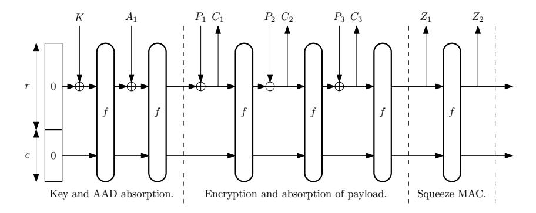

# A Do-It-All-Cipher for RFID: Design Requirements (Extended Abstract)

Markku-Juhani O. Saarinen and Daniel Engels

REVERE SECURITY 4500 Westgrove Drive, Suite 300, Addison, TX 75001, USA. mjos@reveresecurity.com

Abstract. Recent years have seen significant progress in the development of lightweight symmetric cryptoprimitives. The main concern of the designers of these primitives has been to minimize the number of gate equivalents (GEs) of the hardware implementation. However, there are numerous additional requirements that are present in real-life RFID systems. We give an overview of requirements emerging or already present in the widely deployed EPCGlobal Gen2 and ISO / IEC 18000-63 passive UHF RFID air interface standards. Lightweight stateful authenticated encryption algorithms seem to offer the most complete set of features for this purpose. In this work we give a Gen2-focused "lessons learned" overview of the challenges and related developments in RFID cryptography and propose what we see as appropriate design criteria for a cipher (dubbed "Do-It-All-Cipher" or DIAC) for the Internet of Things. We also comment on the applicability of NSA's new SIMON and SPECK proposals for this purpose.

Keywords: RFID Security, Authenticated Encryption, Lightweight Cryptography, Gen2, DIAC, SIMON, SPECK.

### 1 Introduction: Supply Chain RFID

Passive RFID (Radio Frequency IDentification) technologies have found use in a vast array of important application areas from animal microchip implants to electronic passports and payment systems. However, in economic terms the highest single application area is in supply chain management. During the 2000s, much of the retail supply chain world converged to use the EPCGlobal UHF Class 1 Generation 2 ("Gen2") and ISO/IEC 18000-63 "Type C" passive UHF RFID air interface [34]. The latter standard is otherwise equivalent to the first but also includes sensor and battery assisted passive specifications.

These standards were designed with a minimal set of security mechanisms as they were initially designed to operate primarily as barcode replacements in a physically secure supply chain. However, the success of this RFID technology has led to its use within a broad range of supply chain and consumer applications and industry verticals that would benefit from a higher level of security than provided by the existing standards.

The real-life risks and services provided by RFID systems are best protected by cryptographically secure RFID tags. The main risks and services addressed by the deployment of cryptographically secure RFID tags (and which are used to justify their additional cost) include the following:

- 1. Counterfeit goods. Cryptography is used to make RFID tags difficult to clone or modify. We have seen entire counterfeit aircraft engines; the risks and liability issues involved are difficult to even measure.
- 2. Secure logging. Tamper resistant recording of environmental information such the temperature is vital in supply chain management of products such as fresh goods and medical supplies.
- 3. Privacy protection. The Electronic Product Code (EPC) used in Gen2 differs from product bar codes in that it is indeed unique (basically a serial number). It may be used to track an individual tag. This raises serious privacy issues if such tags are attached to personal items. Therefore the tag must also identify the reader as trusted before divulging traceable information.
- 4. Antitheft. Data may be written to the tag to indicate to an exit portal whether or not that item has been sold. Persistent memory write and locking operations must be protected to prevent theft.
- 5. Returns. When a tag is returned to a store or manufacturer an authenticated reset/write mechanism allows it to be reused. The tags maintain some amount of persistent memory; read, write and lock operations to this memory must be authenticated to prevent tamper and unauthorized modification. Authenticated reads allow data to be visible only for the tags owner.

Many academic cryptographers working in the field of lightweight cryptography tend to concentrate only on a cryptoprimitive (such as a hash function) or a single function (such as authentication). In real life secure RFID actually requires a wide palette of security functionality and a multi-faceted, yet light-weight, protocol.

### 2 Developments in Lightweight Cryptography

The basic symmetric cryptographic one-way authentication mechanism consists of an Interrogator (RFID Reader) Alice sending a (random) challenge C to the Responder (RFID Tag) Bob. The Bob-Tag then uses a shared secret S and a cryptographic function f to compute and transmit the response R = f(S, C) to Interrogator-Alice. Alice can then verify knowledge of the secret S by verifying whether the response indeed matches with the shared secret. The main cryptographic requirement is that there should be no computationally efficient way of deriving the secret S (or other way of computing the matching response R) based on observations of C and R alone. There are many variations and subtleties to this scheme and practical RFID systems outside simple access control tend to need more security services than just authentication. However, for the basic authentication scheme the fucntion f can be a hash function, a block cipher, a stream cipher – essentially any keyed pseudorandom permutation or function.

A decade ago, Sarma, Weis and Engels were one of the first to draw attention to lightweight cryptographic challenges emerging in the RFID field [53, 54, 58]. Their work defined the challenge and called for hardware-efficient cryptographic hash functions and symmetric encryption schemes. The requirements can be boiled down to four points:

- The system (including the cryptographic primitives) should be realizable with a circuit of between 3000-4000 Gate Equivalents (GEs) or less.
- The cryptographic implementation and the authentication protocol should be able to meet the stringent timing requirements of ISO 18000-63.
- A passive device should not consume more than 30–50 µW of energy. Note that energy consumption peaks effectively limit the range of the device, hence they should be avoided.
- The cryptographic protocols should have as few round-trip communications as possible. Also, the number of bits transmitted should be minimized, while maintaining a tolerably low probability of a false authentication.

Established standards such as the Advanced Encryption Standard AES [41] and Secure Hash Algorithm [43] have widely been deemed too complex and energy-hungry for the RFID environment, although advances have been made in small-scale implementations of both AES [26, 31] and SHA-1 and the SHA-2 family [25, 44].

Vajda and Buttyán [57] responded to this call but some of their protocols were cryptanalyzed and found to be weak [18]. During subsequent years literally hundreds of authentication protocols for RFID systems have been proposed to counter various attacks scenarios, including:

- Tag cloning (unauthorized copying) and other impersonation and relay attacks.
- Privacy violations, information leakage, illicit tracking and monitoring (anonymity).
- Denial of service, availability.
- Forward security it should be infeasible to compromise past sessions.

We note that a vast majority if these protocol and design proposals have either failed in their goals or have been simply ignored by the RFID industry. However, the "RFID Challenge" has also generated a lot of fresh and innovative research, some of which will be highlighted here as prior art.

*Block ciphers and hash functions.* Since 2007 we have seen a significant progress in the development of lightweight ciphers and hash functions, illustrated by the development of block ciphers DESL [38], PRESENT [15, 50], KATAN/KTANTAN [16], and LED [30], hash functions QUARK [1], PHOTON [29] and SPONGENT [14], and many others. These proposals have been designed to meet the low gate count requirements and usually exhibit appropriate cryptographic strength. However, these are general purpose cryptographic primitives and not specifically crafted for use with RFID.

*Stream ciphers.* Light-weight stream ciphers (especially those equipped with an Initialization Vector that can be quickly set up) may also be used for authentication. We are aware of a proprietary RFID solution based on Grain-128 [28, 32]. There has been recent progress in cryptanalysis of Grain-128 [19, 20]. Grain-128 is also used as a building block of the SQUASH-128 MAC function [55].

*Dedicated RFID protocol designs.* The field of (ultra-) lightweight RFID authentication protocols has proceeded quite independently from the ciphers and hash functions, starting with the UMAP family [45–47], which was swiftly broken in a series of publications [2, 3, 33, 39, 40]. These protocols are often designed to resist only passive attacks and are constructed from simple bit-wise operations. Notable later examples include Chien's SASI [17, 56] and the Gossamer protocol [13, 48].

*Combined cipher / protocol proposals.* Just as Hummingbirds have co-evolved in the nature with (ornithophilous) flowers, the Hummingbird-1 authenticated encryption algorithm [22, 23] was proposed *together* with a protocol: Hummingbird is a protocolcipher pair. After cryptographic vulnerabilities were discovered in the cipher [51], it was amended to produce Hummingbird-2 [24].

## 3 An RFID Security Suite and Its Design Criteria

Many cryptographers tend to see the RFID authentication challenge from an overly abstract viewpoint, ignoring the underlying communication channel details, such as how the radio channel actually operates. Work on light-weight cryptography such as [1, 14– 16, 28–30, 32, 38, 50] has almost exclusively concentrated on minimizing the number of Gate Equivalents (GEs) of the light-weight primitive, while generally ignoring the inherent timing constraints (number of clocks) required to generate a response. The following discussion is partially from [24].

The HB2-128 cipher and protocol is a cryptography suite for use in the security standards EPCglobal Gen2 version 2.0 and the ISO/IEC JTC1 SC31 18000-63 passive UHF RFID air protocols [21]. The basic security services provided include:

- Interrogator and/or tag authentication.
- An authenticated and/or confidential communication channel.
- Message Authentication Code (MAC) for message integrity.

The proposed secure HB2-128 Gen2 protocol utilizes five basic commands to provide security services: *Authenticate*, *Challenge*, *KeyUpdate*, *AuthComm*, and *SecureComm*. A finite state machine defines the operation of the security functions including the authentication protocol.

The primary functionality of the Gen2 protocol is for fast and efficient tag identification across a range of operating environments. Consequently, Gen2 supports a range of data rates at which the interrogator and the tag may communicate. Communications are controlled by the interrogator in a Reader Talks First communication scheme. The interrogator begins a command by issuing a preamble that defines the length of the logic 0 and logic 1 symbols. The length of the logic 0 symbol is referred to as Tari, which is a fundamental timing parameter for communications.

For all commands except the Write command, the Tari value determines the amount of time the tag has to begin its response to the reader after the reader has completed the last symbol in its command to the tag. This time is referred to as T1 time. Table 1 shows the T1 timing for the minimum Tari value of 6.25 µs, the maximum Tari value of 25 µs,

Table 1. T1 Timing Values and Available Clock Cycles.

| Tari (µs) | T1 Time (µs) | Cycles 1.5 MHz | Cycles 2 MHz | Cycles 2.5 MHz |
|-----------|--------------|----------------|--------------|----------------|
| 6.25      | 39.06        | 58             | 78           | 97             |
| 12.5      | 78.125       | 117            | 156          | 195            |
| 25        | 187.5        | 281            | 375          | 468            |

and a commonly used Tari value of 12.5 µs. A Gen2 tag typically has an on-chip clock that operates netween 1.5 MHz and 2.5 MHz.

In addition to the T1 timings, Table 1 shows the number of full clock cycles available for computation within T1 for three on tag clock frequencies around 2 MHz, a common on-tag clock frequency. We see that hashes and ciphers with a latency exceeding 58 cycles are already unworkable in some allowable communication rates. This means that otherwise attractive but high-latency proposals such as U-Quark [1] (544 cycles with 1379 GE, 68 cycles with 2392 GE), SPONGENT-128 [14] (2380 cycles with 1060 GE, 70 cycles with 1687 GE), and PHOTON-128/16/16 [29] (996 cycles with 1122 GE, 156 cycles with 1708 GE) are largely inappropriate for Gen2 RFID authentication.

# 4 Power and Clock Frequency

Power is the product of current and voltage (W = A × I), and for most CMOS circuits the current draw is close to linearly dependent upon the clock frequency for a fixed voltage. All of these factors affect the all-important range of an RFID tag. Implementors also try to make the power usage profile of cryptoprimitives independent of the secret keying material as a countermeasure against DPA (Differential Power Analysis) [36].

*Microcontrollers.* Software designers think in terms of Watts/Hertz since the only thing they can really change is the clock frequency of the device. Voltage is fixed and current is basically linearly dependent upon clock frequency. Therefore the algorithm implementation is optimized for throughput in order to consume fewer cycles.

*Hardware implementations.* Circuit designers in in the passive UHF space tend to have a different mindset. Max instantaneous power is a important regardless of what clock frequency is used on chip since more instantaneous power means shorter range. A power spike that drops the chip voltage below the threshold (1.5V typical) causes a tag to reset itself. This is because it's the instantaneous power that can perform a quick power draw from the storage cap that drops its voltage below the minimum required to operate which then shuts down or reboots the tag. Hence our 3µW to 30µW limit (Section 8) is really an instantaneous power limit not dependent upon clock frequency.

*Tag power usage.* Tags typically *do not* perform operations unrelated to communication during the communication phase due to the lack of power harvesting; thus, all computations, including cryptographic computations, related to the command execution should be done before communication starts.

For Gen2 tags, the voltage varies from about 1.8V to 2.2V (typical values) with most devices trying for the 2V average. Most of these CMOS circuits are able to operate at about 1.5V and the voltage limiters cap voltage at about 3V . This is a design feature that is trying to provide protection against sudden voltage spikes which, in practice, tends to limit the upper voltage range. Although this level is rarely achieved in practice. 2.5V seems to be the maximum level reached in realistic laboratory testing.

A tag will often operate over the entire range of usable voltage levels during a single communication sequence since the power cap goes from zero to 1.5 V at which point the chip begins operating then up to a maximum voltage, usually 2 − 2.5V depending on power radiated by reader, then back down to 1.8V (or lower) as the chip receives a command and performs its operations and communicates back to the reader. At long range, the peak voltage is often close to 1.8V. A tag typically does not harvest much if any power as it is communicating, and it is during this time that the tag's voltage drops to its lowest point.

### 5 Case study: A Do-It-All-Cipher Proposal

Hummingbird-2 [24] as an authenticated encryption primitive does not fall directly into the block cipher / stream cipher / hash function classifications, but operates in similar fashion to the HELIX [27], PHELIX [59] and Duplex Sponge [10] constructions. A HB2 engine suitable for RFID authentication can be realized with as little as 1250 GE.

In addition to standard security requirements – such as resistance against chosen plaintext- and ciphertext attacks – HB2 was designed to have the following features that are desirable in RFID cryptography:

- 1. Nonce / IV / Tweak which allows rapid re-initialization of the cipher without rekeying the cipher. This is essential for communications protocols over a radio channel and also for challenge-response authentication mechanisms.
- 2. Secure with repeated IVs. The primitive should be resistant to repeated IV attacks such as [51]. Note that many (if not all) authenticated single block cipher encryption modes such as GCM [42] and OCB [37, 49] are insecure when IV is repeated [35].
- 3. Message Authentication code (MAC). The primitive should be capable of producing a secure MAC for the processed data. We would also like the algorithm to produce a secure hash when a fixed IV is used.
- 4. Authenticated Associated Data (AAD). The primitive should be able to authenticate both encrypted data and unencrypted data without re-initialization. This is extremely useful for explicit plaintext data (message headers such as a destination) or implicit data (untransmitted information such as message sequence numbers).
- 5. Small block size. The primitive should be able to process data in 8- or 16- bit increments, or even smaller (HB2 can transmit authenticated data in under 8-bit increments, even though full 16-bit processing is required in such cases). 128 bits is clearly too much.

*Comparison to block ciphers.* Block ciphers, by themselves, are stateless. Hence an external state must be maintained (as part of a "mode of operation") to counter birthday paradox attacks in encryption/decryption use. Typically, additional state information is required to achieve authenticated encryption.

*Comparison to hash functions.* In a multi-round authentication protocol, a hash function would have to be "re-initialized" with various transmitted or shared secrets to generate output each transmitted message, whereas HB2 maintains all of that communicated information in its 128-bit state. Furthermore, confidential communications channels cannot be established in a straight-forward fashion with a hash functions alone.

*HB2 Criticism.* The main drawback of a design such as HB2 [24] is the same as that of the AES candidate Serpent [11, 12]; encryption and decryption operations do not fully use the same components since the inverses of S-boxes and linear transforms must be implemented separately. In fact, an implementation with both encrypt and decrypt functionality tends to be about 70 % larger than one that only implements encryption (2150 GE vs 1250 GE for a 16-cycle / word implementation). However, we note that only encryption functionality is sufficient for tag authentication for all of the security functionality in the HB2-128 Gen2 proposal.

Another issue is that the "critical path" of the encryption function is rather long; each 16-bit word requires invocation of 16 S-Box layers. However, since each set of 4 layers of S-Boxes is isolated into its own keyed WD16 function, 4-cycle / word implementations can be constructed. Furthermore, the low clock rate on tags allows for long critical paths without compromising tag performance.

# 6 NSA's Proposal: SIMON and SPECK

The U.S. National Security Agency has recently published performance and implementation footprint numbers for their in-house developed lightweight block cipher families SIMON and SPECK [4]. NSA has considerable institutional expertise and taxpayer funded resources in cryptography and we would welcome their help in civilian anti-counterfeit and other infrastructure protection (RFID, remote keys and locks, etc). However, in order to fully benefit commerce, industry, and the general public, the algorithm details must also be released. This will make the algorithm standardizable as most international bodies are reluctant to blindly trust technology that has its origins within the security apparatus of any one nation. ECRYPT and the international cryptologic community can analyze the ciphers and may choose to modify and perhaps even to improve upon the given design for standardization.

SIMON and SPECK are block cipher families with block size of 32, 48, 64, 96, and 128 bits, with up to three key sizes for each block size. Hardware implementations are very impressive in size. A target latency of 58 cycles for a full block operation is not reached by the very smallest implementations, but due to it's highly tunable nature, implementations meeting the Gen2 passive RFID criteria are also reported.

However, a question remains on how to perform authenticated encryption on short messages such as those required for "Internet of Things". We know that a standard authenticated mode such as GCM is insecure with small block sizes [52]. One may wish to construct a mode with a much larger state from SIMON / SPECK. Such a construction could be modeled as a larger Sponge PRP (see Section 7). This would also make the cost of decryption functionality basically free. We note that authors of [4] only report the cost of the block cipher encryption function but claim that there is some "symmetry" and a degree of reusable components between encryption and decryption.

Fig. 1. A simplified view of how a Sponge Function f with a rate of r bits and state r+c bits may be used to process a secret key / tweak K, Associated Authenticated Data (AAD) block A1 and plaintext blocks P1 . . . P3 to produce ciphertext blocks C1 . . . C3 and the message authentication blocks Z1 . . . Z2.

## 7 A Duplex Sponge Can (almost) Do It All

As shown by Bertoni et al in their Sponge function work, s fixed-length PRP (pseudorandom permutation) can be used to "do it all"; it can meet all of the requirements set forth in Section 5 [5, 6, 8–10]. The only major thing that seems to be missing from the proposal of [10] is Authenticated Associated Data (AAD). A padding mechanism to achieve this would seem to be reasonably easy to achieve.

Figure 1 illustrates how a Sponge Function f can be used to process keying, nonce and AAD data, then encrypt a message and finally to squeeze out a message authentication code.

One additional feature that we would like to see is "MAC without reset" where one would be able to authenticate each message while also authenticating all previously sent messages (and perhaps even received messages). Here the state is not reset after the MAC or hash has been "squeezed" out of the state, but instead the state is used for the next message. Thereby the system would not be dependent on the uniqueness of the message IV to protect the confidentiality of the first block of data, among other advantageous features.

One notable advantage of block cipher authenticated modes such as GCM [42] and OCB [37, 49] is that they can handle *any* bandwidth; one just has to implement a sufficient number of parallel AES cores. This shortcoming of the Sponge function construction may be addressed with something akin to Tree Hashing [7].

One of the major advantages of the Sponge construction in RFID is that there is no key to protect after initialization, just the present state. We may construct a PRF g from PRP f by using a construction such as g(x) = x ⊕ f(x). If we always store the g(x) value in persistent storage between subsequent authentications or message exchanges, we obtain a degree of forward security; in a key-search based authentication [58] the previous sessions remain anonymous and secure even after a state compromise. This is naturally just optional as persistent storage is not available on all RFID platforms and the special protocols must be used for such "rolling code" applications.

#### 8 Conclusions

We conclude with a set of design goals for a RFID or lightweight sensor network "Do-It-All-Cipher" (DIAC) for Internet of Things.

- The primitive must be able to operate without significant modification as a singlepass tweakable authenticated encryption & decryption algorithm and as a cryptographically secure hash.
- The padding and operation rules for various inputs, including IVs, Authenticated Associated Data (AAD) must be unambiguously defined. The data rate should be small to avoid message expansion.
- Initialization vector (IV) does not have to be a nonce (secure in a repeated chosen-IV attack). The security level must be consistent with key and state size under all reasonable attack models.
- Hardware implementation must be under 2000 GE, including state memory and both encryption and decryption functionality. Software implementation speed and size across all MCU and CPU platforms should also be a design consideration.
- The primitive must have a latency of under 50 cycles and encryption/decryption throughput of more than 1 bit / cycle.
- The power usage should be less than  $1\dots 10\frac{\mu W}{MHz}$  average with peaks below  $3\mu W$  and  $30\mu W$  respectively. Thus, at 2MHz, peaks should be below  $1.5\frac{\mu W}{MHz}$  to  $15\frac{\mu W}{MHz}$ .

We hope to see proposals meeting not just a few of these goals but to simultaneously meet *all* of these criteria.

#### References

- AUMASSON, J.-P., HENZEN, L., MEIER, W., AND NAYA-PLASENCIA, M. Quark: A lightweight hash. In CHES 2010 (2010), S. Mangard and F.-X. Standaert, Eds., vol. 6225 of LNCS, Springer, pp. 1–15.
- 2. BÁRÁSZ, M., BOROS, B., LIGETI, P., LÓJA, K., AND NAGY, D. A. Breaking LMAP. In *RFIDSec '07* (July 2007).
- BÁRÁSZ, M., BOROS, B., LIGETI, P., LÓJA, K., AND NAGY, D. A. Passive attack against the M2AP mutual authentication protocol for RFID tags. In *EURASIP RFID 2007* (September 2007).
- BEAULIEU, R., SHORS, D., SMITH, J., TREATMAN-CLARK, S., WEEKS, B., AND WINGERS, L. Performance of the SIMON and SPECK families of lightweight block ciphers. Tech. rep., National Security Agency, May 2012.
- BERTONI, G., DAEMEN, J., PEETERS, M., AND ASSCHE, G. V. Sponge functions. In Ecrypt Hash Workshop 2007 (May 2007).
- BERTONI, G., DAEMEN, J., PEETERS, M., AND ASSCHE, G. V. On the indifferentiability of the sponge construction. In *EUROCRYPT 2008* (2008), N. P. Smart, Ed., vol. 4965 of *LNCS*, Springer, pp. 181–197.
- BERTONI, G., DAEMEN, J., PEETERS, M., AND ASSCHE, G. V. Sufficient conditions for sound tree and sequential hashing modes. IACR ePrint 2009/210, http://eprint. iacr.org/2008/210, December 2009.

- 8. BERTONI, G., DAEMEN, J., PEETERS, M., AND ASSCHE, G. V. Sponge-based pseudorandom number generators. In *CHES 2010* (2010), S. Mangard and F.-X. Standaert, Eds., vol. 6225 of *LNCS*, Springer, pp. 33–47.
- 9. BERTONI, G., DAEMEN, J., PEETERS, M., AND ASSCHE, G. V. Cryptographic sponge functions, version 0.1. http://sponge.noekeon.org/, STMicroelectronics and NXP Semiconductors, January 2011.
- 10. BERTONI, G., DAEMEN, J., PEETERS, M., AND ASSCHE, G. V. Duplexing the sponge: Single-pass authenticated encryption and other applications. In *SAC 2011* (2011), A. Miri and S. Vaudenay, Eds., vol. 7118 of *LNCS*, Springer, pp. 320–337.
- 11. BIHAM, E., ANDERSON, R. J., AND KNUDSEN, L. R. Serpent: A new block cipher proposal. In *FSE 98* (1998), S. Vaudenay, Ed., vol. 1372 of *LNCS*, Springer, pp. 222–238.
- 12. BIHAM, E., ANDERSON, R. J., AND KNUDSEN, L. R. Serpent: A proposal for the advanced encryption standard. AES Proposal to NIST. http://www.cl.cam.ac.uk/~rja14/ Papers/serpent.pdf, 1999.
- 13. BILAL, Z., MASOOD, A., AND KAUSAR, F. Security analysis of ultra-lightweight cryptographic protocol for low-cost RFID tags: Gossamer protocol. In *Proc. NBIS '09* (2007), IEEE Computer Society, pp. 260–267.
- 14. BOGDANOV, A., KNEZEVIC, M., LEANDER, G., TOZ, D., VARICI, K., AND VER-BAUWHEDE, I. Spongent: A lightweight hash function. In *CHES 2011* (2011), B. Preneel and T. Takagi, Eds., vol. 6917 of *LNCS*, Springer, pp. 312–325.
- 15. BOGDANOV, A., KNUDSEN, L. R., LEANDER, G., PAAR, C., POSCHMANN, A., ROB-SHAW, M. J. B., SEURIN, Y., AND VIKKELSOE, C. PRESENT: An ultra-lightweight block cipher. In *CHES 2007* (2007), P. Paillier and I. Verbauwhede, Eds., vol. 4727 of *LNCS*, Springer, pp. 450–466.
- 16. CANNIÈRE, C. D., O.DUNKELMAN, AND ZEVIC´ ., M. K. KATAN & KTANTAN a family of small and efficient hardware-oriented block ciphers. In *CHES 2009* (2009), C. Clavier and K. Gaj, Eds., vol. 5747 of *LNCS*, Springer, pp. 272–288.
- 17. CHIEN, H.-Y. SASI: A new ultralightweight RFID authentication protocol providing strong authentication and strong integrity. *IEEE Trans. in Dependable and Secure Computing 4*, 4 (2007), 337–340.
- 18. DEFEND, B., FU, K., AND JUELS, A. Cryptanalysis of two lightweight RFID authentication schemes. In *Proc. Fifth IEEE International Conference on Pervasive Computing and Communications Workshops* (2007), PERCOMW '07, IEEE Computer Society, pp. 211–216.
- 19. DINUR, I., GÜNEYSU, T., PAAR, C., SHAMIR, A., AND ZIMMERMANN, R. An experimentally verified attack on full Grain-128 using dedicated reconfigurable hardware. In *ASI-ACRYPT 2011* (2011), vol. 7073 of *LNCS*, Springer, pp. 327–343.
- 20. DINUR, I., AND SHAMIR, A. Breaking Grain-128 with dynamic cube attacks. In *FSE 2011* (2011), A. Joux, Ed., vol. 6733 of *LNCS*, Springer, pp. 167–187.
- 21. ENGELS, D. HB2-128 crypto-suite proposal. Tech. rep., Revere Security, December 2011. Version 1.1.
- 22. ENGELS, D., FAN, X., GONG, G., HU, H., AND SMITH, E. M. Ultra-lightweight cryptography for low-cost RFID tags: Hummingbird algorithm and protocol. Tech. Rep. CACR-2009-29, Centre for Applied Cryptographic Research (CACR), University of Waterloo, 2009. http://www.cacr.math.uwaterloo.ca/techreports/2009/ cacr2009-29.pdf.
- 23. ENGELS, D., FAN, X., GONG, G., HU, H., AND SMITH, E. M. Hummingbird: Ultralightweight cryptography for resource-constrained devices. In *Financial Cryptography and Data Security, FC 2010 Workshops* (2010), R. Sion, R. Curtmola, S. Dietrich, A. Kiayias, J. M. Miret, K. Sako, and F. Sebé, Eds., vol. 6054 of *LNCS*, Springer, pp. 3–18.

- 24. ENGELS, D., SAARINEN, M.-J. O., SCHWEITZER, P., AND SMITH, E. M. The Hummingbird-2 lightweight authenticated encryption algorithm. In *RFIDSec '11* (2011), A. Juels and C. Paar, Eds., vol. 7055 of *LNCS*, Springer, pp. 19–31.
- 25. FELDHOFER, M., AND RECHBERGER, C. A case against currently used hash functions in RFID protocols. In *OTM Workshops (I)* (2006), R. Meersman, Z. Tari, and P. Herrero, Eds., vol. 4288 of *LNCS*, Springer, pp. 372–381.
- 26. FELDHOFER, M., WOLKERSTORFER, J., AND RIJMEN, V. AES implementation on a grain of sand. *IEE Proc. Inf. Sec 153*, 1 (October 2005), 13–20.
- 27. FERGUSON, N., WHITING, D., SCHNEIER, B., KELSEY, J., LUCKS, S., AND KOHNO, T. Helix: Fast encryption and authentication in a single cryptographic primitive. In *FSE 2003* (2003), T. Johansson, Ed., vol. 2887 of *LNCS*, Springer, pp. 330–346.
- 28. GREN, M. A., HELL, M., JOHANSSON, T., AND MEIER, W. Grain-128a: a new version of Grain-128 with optional authentication. *International Journal of Wireless and Mobile Computing 5*, 1 (2011), 48–59.
- 29. GUO, J., PEYRIN, T., AND POSCHMANN, A. The PHOTON family of lightweight hash functions. In *CRYPTO 2011* (2011), P. Rogaway, Ed., vol. 6841 of *LNCS*, Springer, pp. 222– 239.
- 30. GUO, J., PEYRIN, T., POSCHMANN, A., AND ROBSHAW, M. J. B. The LED block cipher. In *CHES 2011* (2011), B. Preneel and T. Takagi, Eds., vol. 6917 of *LNCS*, Springer, pp. 326– 341.
- 31. HÄMÄLÄINEN, P., ALHO, T., HÄNNIKÄINEN, M., AND HÄMÄLÄINEN, T. Design and implementation of low-area and low-power AES encryption hardware core. In *Ninth Euromicro Conference on Digital System Design: Architectures, Methods and Tools (DSD 2006)* (2006), IEEE Computer Society, pp. 577–583.
- 32. HELL, M., JOHANSSON, T., AND MEIER, W. Grain: a stream cipher for constrained environments. *International Journal of Wireless and Mobile Computing 2*, 1 (2007), 86–93.
- 33. HUNG-YU, C., AND CHEN-WEI, H. Security of ultra-lightweight RFID authentication protocols and its improvements. *ACM SIGOPS Operating Systems Review 41*, 4 (July 2007), 83–86.
- 34. INTERNATIONAL STANDARDIZATION ORGANIZATION. *ISO/IEC 18000-63. Information technology – Radio frequency identification for item management – Part 6: Parameters for air interface communications at 860 MHz to 960 MHz Type C*, 2012.
- 35. JOUX, A. Authentication failures in NIST version of GCM. NIST Standardization Comment, 2006.
- 36. KOCHER, P., JAFFE, J., AND JUN, B. Differential power analysis. In *Crypto '99* (1999), M. J. Wiener, Ed., vol. 1666 of *LNCS*, Springer, pp. 104–114.
- 37. KROVETZ, T., AND ROGAWAY, P. The software performance of authenticated-encryption modes. In *FSE 2011* (2011), A. Joyx, Ed., vol. 6733 of *LNCS*, Springer, pp. 306–327.
- 38. LEANDER, G., PAAR, C., POSCHMANN, A., AND SCHRAMM, K. New lightweight DES variants. In *FSE 2007* (2007), A. Biryukov, Ed., vol. 4593 of *LNCS*, Springer, pp. 196–210.
- 39. LI, T., AND DENG, R. Vulnerability analysis of EMAP an efficient RFID mutual authentication protocol. In *Proc. ARES 2007* (2007), IEEE Computer Society, pp. 238–245.
- 40. LI, T., AND WANG, G. Security analysis of two ultra-lightweight RFID authentication protocols. In *IFIP-SEC 2007* (2007), H. S. Venter, M. M. Eloff, L. Labuschagne, J. H. P. Eloff, and R. von Solms, Eds., no. 232 in IFIP, Springer, pp. 109–120.
- 41. NIST. Advanced Encryption standard (AES). Federal Information Processing Standards 197, 2001.
- 42. NIST. Recommendation for block cipher modes of operation: Galois/counter mode (GCM) and GMAC. NIST Special Publication 800-38D, 2007.
- 43. NIST. Secure Hash Standard (SHS). Federal Information Processing Standards 180-3, 2008.

- 44. O'NEILL, M. Low-cost SHA-1 hash function architecture for RFID tags. In *RFIDSec '08* (2008).
- 45. PERIS-LOPEZ, P., HERNANDEZ-CASTRO, J. C., ESTEVEZ-TAPIADOR, J. M., AND RIB-AGORDA, A. EMAP: An efficient mutual-authentication protocol for low-cost RFID tags. In *OTM 2006 Workshops* (2006), R. Meersman, Z. Tari, and P. Herrero, Eds., vol. 4277 of *LNCS*, Springer, pp. 352–361.
- 46. PERIS-LOPEZ, P., HERNANDEZ-CASTRO, J. C., ESTEVEZ-TAPIADOR, J. M., AND RIB-AGORDA, A. LMAP: A real lightweight mutual authentication protocol for low-cost RFID tags. In *RFIDSec '06* (2006).
- 47. PERIS-LOPEZ, P., HERNANDEZ-CASTRO, J. C., ESTEVEZ-TAPIADOR, J. M., AND RIB-AGORDA, A. M2AP: A minimalist mutual-authentication protocol for low-cost RFID tags. In *UIC 2006* (2006), J. Ma, H. Jin, L. T. Yang, and J. J.-P. Tsai, Eds., vol. 4159 of *LNCS*, Springer, pp. 912–923.
- 48. PERIS-LOPEZ, P., HERNANDEZ-CASTRO, J. C., TAPIADOR, J. M., AND RIBAGORDA, A. Advances in ultralightweight cryptography for low-cost RFID tags: Gossamer protocol. In *WISA 2008* (2009), K. Chung, K. Sohn, and M. Yung, Eds., vol. 5379 of *LNCS*, Springer, pp. 56–68.
- 49. ROGAWAY, P., BELLARE, M., AND BLACK, J. OCB: A block-cipher mode of operation for efficient authenticated encryption. *ACM Transactions on Information and System Security (TISSEC) 6*, 3 (August 2003), 365–403.
- 50. ROLFES, C., POSCHMANN, A., LEANDER, G., AND PAAR, C. Ultra-lightweight implementations for smart devices - security for 1000 gate equivalents. In *CARDIS 2008* (2008), G. Grimaud and F.-X. Standaert, Eds., vol. 5189 of *LNCS*, Springer, pp. 89–103.
- 51. SAARINEN, M.-J. O. Cryptanalysis of Hummingbird-1. In *FSE 2011* (2011), A. Joux, Ed., vol. 6733 of *LNCS*, Springer, pp. 328–341.
- 52. SAARINEN, M.-J. O. Cycling attacks on GCM, GHASH and other polynomial MACs and hashes. In *FSE 2012: 19th International Workshop on Fast Software Encryption. 19-21 March 2012, Washington DC, USA. To appear* (2012).
- 53. SARMA, S. E., WEIS, S. A., AND ENGELS, D. W. Radio-frequency identification: Security risks and challenges. *CryptoBytes 6*, 1 (2003), 2–9.
- 54. SARMA, S. E., WEIS, S. A., AND ENGELS, D. W. RFID systems and security and privacy implications. In *CHES 2002* (2003), B. S. K. Jr., Ç. K. Koç, and C. Paar, Eds., vol. 2523 of *LNCS*, Springer, pp. 454–469.
- 55. SHAMIR, A. SQUASH a new MAC with provable security properties for highly constrained devices such as RFID tags. In *FSE 2008* (2008), K. Nyberg, Ed., vol. 5086 of *LNCS*, Springer, pp. 144–157.
- 56. SUN, H.-M., TING, W.-C., AND WANG, K.-H. On the security of chien's ultralightweight RFID authentication protocol. IACR ePrint 2008/083, http://eprint.iacr.org/ 2008/083, February 2008.
- 57. VAJDA, I., AND BUTTYÁN, L. Lightweight authentication protocols for low-cost RFID tags. In *2nd Workshop on Security in Ubiquitous Computing, in conjunction with UbiComp 2003* (October 2003). *Note: This paper does not appear in the Springer UbiComp 2003 proceedings*.
- 58. WEIS, S. A., SARMA, S. E., RIVEST, R. L., , AND ENGELS, D. W. Security and privacy aspects of low-cost radio frequency identification systems. In *Security in Pervasive Computing 2003* (2004), D. Hutter, G. Müller, W. Stephan, and M. Ullmann, Eds., vol. 2802 of *LNCS*, Springer, pp. 201–212.
- 59. WHITING, D., SCHNEIER, B., LUCKS, S., AND MULLER, F. Phelix fast encryption and authentication in a single cryptographic primitive. ECRYPT Stream Cipher Project Report 2005/027, 2005. http://www.schneier.com/paper-phelix.html.