{0}------------------------------------------------

# Differential Fault Analysis of AES: Towards Reaching its Limits

Sk Subidh Ali<sup>1</sup> , Debdeep Mukhopadhyay<sup>1</sup> , and Michael Tunstall<sup>2</sup>

- <sup>1</sup> Department of Computer Sc. and Engg, IIT Kharagpur, West Bengal, India. {subidh,debdeep}@cse.iitkgp.ernet.in
- <sup>2</sup> Department of Computer Science, University of Bristol, Merchant Venturers Building, Woodland Road, Bristol BS8 1UB, United Kingdom. tunstall@cs.bris.ac.uk

Abstract. In this paper we present a theoretical analysis of the limits of the Differential Fault Analysis (DFA) of AES by developing an interrelationship between conventional cryptanalysis of AES and DFAs. We show that the existing attacks have not reached these limits and present techniques to reach these. More specifically, we propose optimal DFA on states of AES-128 and AES-256. We also propose attacks on the key schedule of the three versions of AES, and demonstrate that these are some of the most efficient attacks on AES to date. Our attack on AES-128 key schedule is optimal, and the attacks on AES-192 and AES-256 key schedule are very close to optimal. Detailed experimental results have been provided for the developed attacks. The work has been compared to other works and also the optimal limits of Differential Fault Analysis of AES.

Keywords: AES , AES key schedule , Differential Fault Analysis , Fault Model

# 1 Introduction

Fault attacks were first proposed by Boneh et al. [7] where the author showed that if a fault could be introduced into a microprocessor whilst it is generating an RSA signature the entire private key can be retrieved. In the same year, Biham et al. proposed a different form of the attack [4], where they combined the concept of fault analysis and differential cryptanalysis to propose theoretical attacks on DES, which is typically referred to as Differential Fault Analysis (DFA).

In 2001 NIST standardized Rinjdael as the Advanced Encryption Standard (AES) [11] in three different versions: AES-128, AES-192 and AES-256 that have three different key lengths of 128, 192, and 256 bits respectively. Subsequently, the block cipher drew a significant amount of attention from the research community. That is, Giraud proposed an attack on AES-128 by inducing a fault to the input of the ninth round [9]. Giraud showed two different ways of attacking AES. One method by inducing fault in an intermediate states and the other by inducing fault in the AES key schedule. However, Giraud used both 

{1}------------------------------------------------

the techniques to break the 128-bit version of AES. The attack required around 250 faulty ciphertexts to reveal the AES-128 key. This attack was improved by Blömer et al. [5] which required around 128 to 256 faulty ciphertexts. Dusart et al. in [10], proposed an attack by inducing faults anywhere between the eight round and ninth round MixColumns operations, which required only 40 faulty ciphertexts.

Finally, Piret et al. in [23] proposed a fault attack using only two faulty ciphertexts. Moradi et al. [20], proposed a more generalized fault attack by considering two different fault models. In the first, the authors consider one out of four targeted bytes are corrupted and in the second model the author consider that all four targeted bytes are corrupted. For the first fault model the attack required around four faulty ciphertexts whereas in the second fault model the attack requires around 1500 faulty ciphertexts. Beside these DFA attacks there were some practical results [1,2,13,25,26], where the authors have shown that the required fault induction is indeed possible by inexpensive devices.

There are two more versions of AES: AES-192 and AES-256. Initially, it was assumed that attack proposed by Piret et al. can be extended to these two versions of the AES with little modification. However, this assumption has been shown to be wrong. In 2009, Li et al. [18] proposed a complete attack on AES-192 and AES-256. This attack required 16 or 3000 faulty ciphertexts depending on the fault model. Subsequently, many attacks were proposed on AES-192 and AES-256 [14,16,27]. The most recent among these attacks is an attack proposed by Kim [16], which only requires two faulty ciphertexts to uniquely determine the AES-192 key and three faulty ciphertext to retrieve the 256-bit key AES-256.

Recently, there has been a significant research on the AES key schedule. Chen et al. [8], improved Giraud's attack [9] and showed that the proposed attack can retrieve the AES-128 key by inducing faults in 9-th round key and requires less than 30 faulty ciphertexts. Peacham et al. |22|, considered a different fault model where a fault is induced while the ninth round key is being generated. Therefore, the induced fault subsequently propagated to the tenth round key. Peacham's attack required only 12 faulty ciphertexts to retrieve the AES-128 secret key. Takahashi et al. [28], proposed a generalized attack that required only two faulty ciphertexts to reduce the number of key hypotheses for a AES-128 secret key to 2<sup>48</sup>. Other variants of this attack were presented that, using four faulty ciphertexts, reduce the number of hypotheses to  $2^{16}$  or, using seven faulty ciphertexts, determine the secret key. Kim et al. [17] proposed an improved attack on AES-128 key schedule which required only two faulty ciphertexts to reduce the key space to  $2^{32}$ . Recently, Kim proposed a different attack on AES-128 key schedule by inducing single byte fault at the first column of eighth round key, that requires two faulty ciphertexts to uniquely determine the secret key |15|.

Exploiting faults induced in the key schedule of AES-192 and AES-256 has received less attention in the literature. Floissac et al. first proposed an attack on the AES-192 and AES-256 key schedule [12]. They used a single byte fault model where a fault is induced in the tenth and twelfth round key for different

{2}------------------------------------------------

instantiations of the block cipher. In both the cases their attack required 16 faulty ciphertexts to retrieve the secret key. This attack was improved upon by Kim [15], who proposed an attack that required between four and six faulty ciphertexts to uniquely determine a AES-192 secret key and four faulty ciphertexts to uniquely determine a AES-256 secret key.

The attacks described above show a gradual reduction in the data complexity of differential fault analysis. However, there is no theoretical analysis which clearly shows the limits of these attacks. There is one contribution by Gomisawa et al. [19] that shows the limits of the attacks performed on AES where faults are injected into intermediate states of the block cipher but the analysis is based on existing attacks. There is no clear explanation of the limits of attacks on the AES key schedule so that one cannot be sure whether the existing attacks on the AES key schedule have reached limits.

In this paper, we first theoretically analyze the limits of differential fault analysis of AES. We then describe attacks based on faults in the intermediate states of AES-128 and AES-256 and show that these attacks have reached their limits. This implies that theses attacks cannot be optimized further. We then propose three more attacks on the key schedule for the three different versions of AES and show that the attack on AES-128 key schedule reaches its theoretical limit. However, the proposed attack on the AES-192 and AES-256 key schedule is the most efficient attack to date but does not reach the theoretical limit.

#### 2 Preliminaries

#### 2.1 **AES**

The Advanced Encryption Standard (AES) is a 128-bit symmetric key block cipher. It has three different versions namely: AES-128, AES-192 and AES-256 that have three different key lengths of 128, 192, and 256 bits respectively. The intermediate results are represented by  $4 \times 4$  state matrix, where each of its elements is an 8-bit value. The internal operation of AES is divided into identical round functions, where the number of iterations of a this round function varies depending on the bit length of the secret key. That is, AES-128 has 10, AES-192 has 12 rounds and AES-256 has 14 rounds. All the round functions consist of following four transformations, except the last round that omits the MixColumns operation:

- SubBytes: A byte-wise substitution, where each element of the state matrix is replaced by its inverse and followed by an affine mapping. All the operations are under  $\mathbf{F_{28}}$ .
- ShiftRows: A cyclic shift of i-th row by i bytes towards left (we number the rows from zero to three).
- MixColumns: A column-wise linear transformation of the state matrix. Each column of the state matrix is considered as a polynomial of degree 3 with coefficients in  $\mathbf{F_{2s}}$  and multiplied by the polynomial  $\{03\}x^3 + \{01\}x^2 + \{01\}x + \{02\} \mod x^4 + 1$ .

{3}------------------------------------------------

- AddRoundKey: In this transformation a 128-bit round key is XORed with the 128-bit state.

There is one additional AddRoundKey operations at the beginning of the first round. The round keys are generated by the AES key scheduling algorithm, as shown in Algorithm 1. The round keys are generated from the master key K where  $N_k$ ,  $N_r$  and  $K^r$  represent the key length in bytes, number of rounds and the r-th round key respectively. For more details one can refer to the AES specification [11].

#### Algorithm 1: AES Key Scheduling Algorithm

```
Input: K the initial key of length N_k bytes
Output: K^r the round key where 0 \le r \le N_r
for i = 0 \ to \ N_k - 1 \ do
W[i] \leftarrow \{K[4*i], K[4*i+1], K[4*i+2], K[4*i+3]\}
end
for i = N_k \ to \ N_b * (N_r - 1) \ do
    temp \leftarrow W[i-1]
    if i \mod N_k = 0 then
     temp \leftarrow SubWord(RotWord(temp)) \oplus Rcon[i/N_k]
    \mathbf{end}
    else if N_k > 6 and i \mod N_k = 4 then
     temp \leftarrow SubWord(temp)
    \mathbf{end}
    W[i] \leftarrow W[i-N_k] \oplus temp
end
return W
```

#### 2.2 Notations Used

In the rest of the paper we refer to the SubBytes, ShiftRows, and MixColumns operations as SB, SR and MC respectively and their corresponding inverse functions as  $SB^{-1}$ ,  $SR^{-1}$  and  $MC^{-1}$ .

The AES is typically considered to operate on a 4 matrix referred to as a state matrix. A given byte in a state matrix will be indexed by its row i and column j. The notation used in this paper takes the form:

```
C_{i,j}: The \{i,j\} byte of the ciphertext C.

C_{i,j}^*: The \{i,j\} byte of the faulty ciphertext C^*.

K_{i,j}^r: The \{i,j\} byte of the r-th round key K^r

where 0 \le i,j \le 3.
```

## 3 Fault Model Used

In this paper we use a single byte fault model where we assume that an attacker has the ability to induce a single byte random fault in any chosen point during the 

{4}------------------------------------------------

computation of the AES block cipher. In this paper we consider both attacks that affect the AES state matrix and the attacks that affect the AES key schedule. In each case we consider the attack on all three versions of AES: AES-128, AES-192 and AES-256.

In the case of attacks that could be applied to AES-128 and AES-192, we assume that an attacker can induce single byte fault between the MixColumns operations in rounds  $N_r - 2$  and  $N_r - 3$ . In the case of AES-256 we assume that an attacker can induce faults at two different locations; between the MixColumns operation in rounds  $N_r - 2$  and  $N_r - 3$  and between the MixColumns operation in rounds  $N_r - 3$  and  $N_r - 4$ .

While considering the attack on AES key schedule, we assume a similar fault model. For AES-128 and AES-192 we assume that an attacker can induce a single byte random fault in the first column of  $K^{N_r-2}$ . In AES-256 we assume two different fault models: in the first one a fault is induced in the first column of  $K^{N_r-2}$  and in the second one a fault can be induced in the first column of  $K^{N_r-3}$ .

# 4 Estimating the Limits of DFA on AES with Single Byte Faults

In this section, we analyze the limits of DFA on the AES algorithm. The proofs are based on reduction techniques: we reduce an adversary against AES using conventional cryptanalysis to an adversary in the DFA setting. First, we reduce a collision based adversary,  $Adv_{col}$  to a  $Adv_{DFA}^{state}$  which targets a fault in the state matrix of AES. Next, we show a reduction of a related key adversary of AES,  $Adv_{RKey}$  to a DFA adversary which exploits faults in the key-schedule,  $Adv_{DFA}^{key}$ . The adversary  $Adv_{col}$  is defined to be an attacking algorithm which attacks AES by first varying the plaintext and finding a pair which collides by having a state with a small difference at a chosen point in the algorithm. On the other hand, the adversary  $Adv_{RKey}$  obtains a key pair which is related in the sense that the key scheduling generates fixed difference at a chosen round.

The attacker has the ability to obtain encryptions under both the related keys and arbitrary chosen plaintexts. It is assumed that such classical adversaries against AES are not successful in reducing the worst case key space of AES. Further, the adversaries have no other means of inducing such collisions except exhaustive search. We establish the optimal complexities of the DFA adversaries by arguing that if there is a more efficient DFA adversary then the reduction proofs lead to the definitions of classical adversaries which reduce the key space of AES from the worst case complexities, which is assumed to be not possible in this work.

#### 4.1 Limits of DFA on AES States

Fig. 1 shows the construction of the adversary  $Adv_{col}$  using the adversary  $Adv_{DFA}^{state}$  as a subroutine. The figure essentially depicts the reduction of the adversary

{5}------------------------------------------------

 $Adv_{col}$  to the adversary  $Adv_{DFA}^{state}$ . The reduction starts by  $Adv_{col}$  searching for a pair of plaintexts P and P' such that after a particular round r a target difference  $\Delta S$  is obtained. If the probability of obtaining such a pair is  $\Pr(\Delta S)$ , the expected number of pairs required to obtain at least one pair with the required property is  $\frac{1}{\Pr(\Delta S)}$ . For each such guessed pair, the adversary  $Adv_{col}$  obtains a pair of ciphertexts,  $C = E^n(P)$ , and  $C' = E^n(P')$  where E is the AES round applied for n times. It then invokes  $Adv_{DFA}^{state}$  with the pair C and C'.

It may be observed that if the pair P and P' leads to the desired difference  $\Delta S$  at the output of round r, then the ciphertext pairs (C, C') are exactly same as in a DFA. This is because in a DFA, the induced fault during the execution of E will generate a difference  $\Delta S$  at the round r, which will lead to the same faulty ciphertext C'. However the adversary  $Adv_{col}$  has no way of determining that the desired fault has occurred, and has to make expected  $\frac{1}{\Pr(\Delta S)}$  number of trials. Thus if the  $Adv_{DFA}^{state}$  reduces the search space of the key to  $K_l$ , then the search space of AES with regard to  $Adv_{col}$  is on an average  $\frac{1}{\Pr(\Delta S)} \cdot K_l$ . If we denote the security level of AES as  $K_s$ , then  $K_s$  is at most  $\frac{1}{\Pr(\Delta S)} \cdot K_l$ . Thus,  $K_s \leq \frac{1}{\Pr(\Delta S)} \cdot K_l$ , or  $K_l \geq K_s \cdot \Pr(\Delta S)$ . Hence, an optimal DFA on AES would reduce the search space of AES key to  $K_s \cdot \Pr(\Delta S)$ .

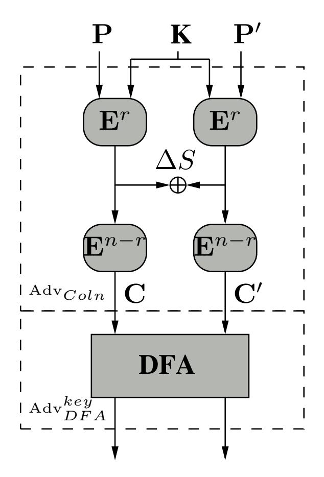

Fig. 1. Collision based DFA

{6}------------------------------------------------

We assume that AES is theoretically unbreakable, i.e. there is no attack that would require less time complexity than an exhaustive search<sup>3</sup>. Then in the case of AES-128  $K_s = 2^{128}$ . In conducting DFA on AES-128, a single byte fault is induced in the input to the eighth round. Therefore,  $\Delta S$  is a single byte difference at the input to the eighth round. The probability that the two plaintexts P and P' collide at the beginning of a round in 15 bytes out of 16 is  $2^{-120} \Rightarrow K_l = 2^{-120} \cdot 2^{128} \Rightarrow K_l = 2^8$ . This implies, the state-of-art DFA using a single-byte fault cannot reduce the search space of AES-128 to less then  $2^8$ . If it does then  $K_s < 2^{128}$  which means the security level of AES-128 is less than 128 bits which contradicts our assumption. Therefore, the lower limits of a DFA using single-byte fault is  $2^8$ .

This hypotheses is also true for the other two version of AES: AES-192 and AES-256. In case of AES-192,  $K_s = 2^{192}$ . Therefore,  $K_l = 2^{192-120} = 2^{72}$ , i.e. a single byte fault induction can reduce the search space of AES-192 key to 72-bit which is the minimum limit. Similarly, for AES-256,  $K_s = 2^{256}$ . Therefore,  $K_l = 2^{256-120} = 2^{136}$ .

## Note

In this paper we only consider the single byte fault model. However, our analysis is also true for multi-byte DFA as proposed in [24]. In case of the diagonal attack of [24], the difference is considered across a diagonal of the AES state matrix before the input of the eighth round MixColums. The diagonal fault attack uses the observation that the faults in the diagonals adjusts to columns at the input of the ninth round. The subsequent MixColumns produces similar relations as the single byte DFA on AES-128 state, which are exploited to retrieve the key. However, the attacks proposed in [24] are not optimal in the sense described in this paper. They do not use the inter-relationships of the faults at the output of the eighth round MixColumns and hence can be further optimized depending on the number of bytes corrupted in the diagonals. These optimized attacks are presented in [1], and their optimality can be argued in a similar fashion.

According to our analysis, if the induced fault infects i bytes in the required state matrix, then the optimal attack result is given by  $K_s \cdot P(\Delta S)$ , where  $\Delta S$  is the required difference which can be of i bytes. In the case of AES-128, the optimal limit is given by  $2^{128} \cdot \frac{1}{2^{128-8 \cdot i}} = 2^{8 \cdot i}$ .

Therefore, for a diagonal attack, depending on the value of i, the results may vary. For example, for single byte fault, the optimal limit is  $2^8$ . Similarly, when the fault affects all the four bytes of the diagonal, the optimal limit of the attack is  $2^{32}$ , as the difference is in four bytes.

The same analysis also true for two diagonal and three diagonal attacks. The optimal attacks complexities are mentioned in Table 2, and it shows that the

<sup>&</sup>lt;sup>3</sup> This assumption is not entirely true since an attack on the full AES-128 has recently been published [6]. However, this attack is marginal and will not affect our reasoning with regard to collision attacks.

{7}------------------------------------------------

improvement in [1] indeed achieves the optimal complexities of the Diagonal attacks published in [24].

#### 4.2 Limits of DFA on AES key schedule

A similar analysis helps to compute the optimal complexity of a DFA on the AES key-schedule. For this purpose, we reduce a related key adversary  $Adv_{RKey}$  to an adversary  $Adv_{DFA}^{key}$ , which performs DFA on AES exploiting faults in the key-schedule of AES. The related key adversary has the ability to obtain encryptions with related keys, the unknown key and a related key to the unknown key (as introduced by Biham [3]). The encryptions are performed through suitable oracles for encrypting using related keys.

The relation in this case gives a key K' such that the key-schedule will generate a required difference  $\Delta K$  in the r-th round key. It may be noted that  $\Delta K$  is not a fixed value, but shall be a byte-wise difference (as described in Section 7). For example, for AES-128  $\Delta K$  is such that the first row of the difference of the 8-th round key is the bytes a, a, a, a, a, where a is any byte.

The attacker  $Adv_{RKey}$  also attempts that the  $E^r(P,K) \oplus E^r(P',K') = \Delta K_p$  where  $E^r$  is the output of the r-th round after the addition of the r-th round key. For this the attacker starts to vary the plaintext P' and obtain the required difference in the state matrices. Note that the difference  $\Delta K_p$  indicates that the difference is not necessarily the same difference as  $\Delta K$ , but a similar difference. Thus in the example of the attack on AES-128, the corresponding differential is such that the first row difference is b, b, b, b, where b is any byte, not necessarily the same as a. The probability of random two plaintexts P and P' to create the above difference is  $\Pr(\Delta K_p)$ . However the adversary  $Adv_{RKey}$  has no way of determining that the required difference has occurred, and hence has to make  $\frac{1}{\Pr(\Delta K_p)}$  expected number of choices of P'.

It thus creates an expected  $\frac{1}{\Pr(\Delta K_p)}$  ciphertexts, C' and invokes the adversary  $Adv_{DFA}^{key}$  with the pairs C and C'. It may be noted that it is expected that there will be one pair where the required difference in the state matrices is created. Under this situation the view of  $Adv_{DFA}^{key}$  is exactly the same as in a DFA targeting the AES key scheduling. This is because the keys K and K' are related such that after the r-th round the difference as required in the DFA exists and the plaintext pair ensures that the difference in the state matrix is also identical to the DFA. Thus if the  $Adv_{DFA}^{key}$  reduces the key-space to  $K_l$ , then the search space of the AES key wrt.  $Adv_{RKey}$  is  $\frac{1}{\Pr(\Delta K_p)} \cdot K_l$ . Like before, if we denote the security margin of AES as  $K_s$ , then  $K_s \leq \frac{1}{\Pr(\Delta K_p)} \cdot K_l \Rightarrow K_l \geq K_s \cdot \Pr(\Delta K_p)$ . Thus an optimal DFA on the AES state is  $K_s \cdot \Pr(\Delta K_p)$ .

The recent attack on the AES-128 key schedule [17] required a fault that affects three bytes in the first column of the 9-th round key while the key is being generated. A single-byte fault induction in the first column will make a four byte difference in the 9-th round key. Therefore, a three byte fault injection will generate a 12 byte difference. If we map this model to our analysis the related keys generate 12 byte differences (also the difference values are the same

{8}------------------------------------------------

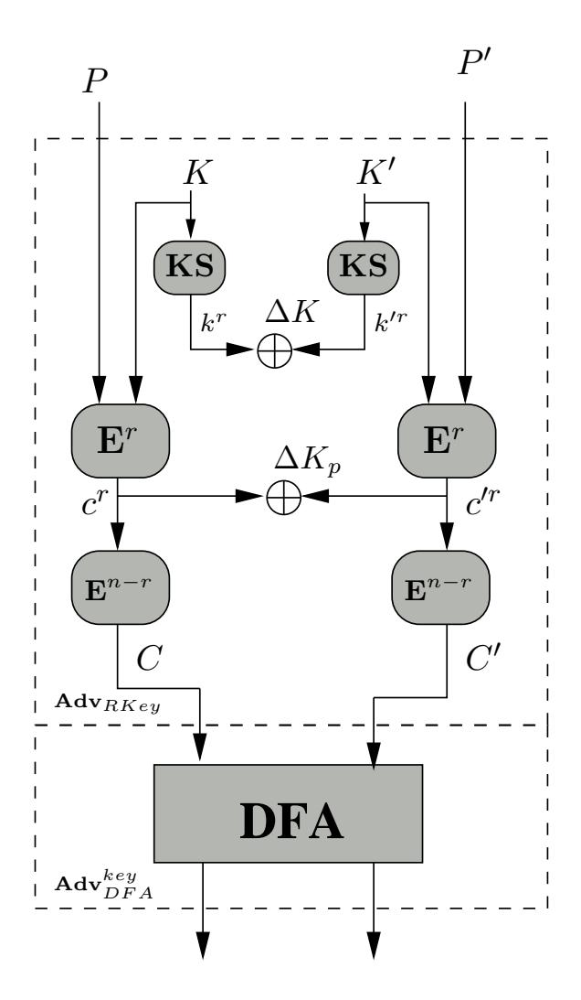

Fig. 2. Related key based DFA

in each of the three rows). Fig. 3(a) shows the faults in the 9-th round key where a, b, and c are the fault values. The probability of getting such difference using a pair of plaintexts is given by  $\frac{(255)^3}{(2^8)^{12}} \cdot \frac{1}{(2^8)^4} \approx \frac{1}{2^{104}}$ . Therefore, we can write  $K_l = 2^{128-104} = 2^{24}$ . This implies, the lower limit of this attack is 24-bit using a single faulty ciphertext.

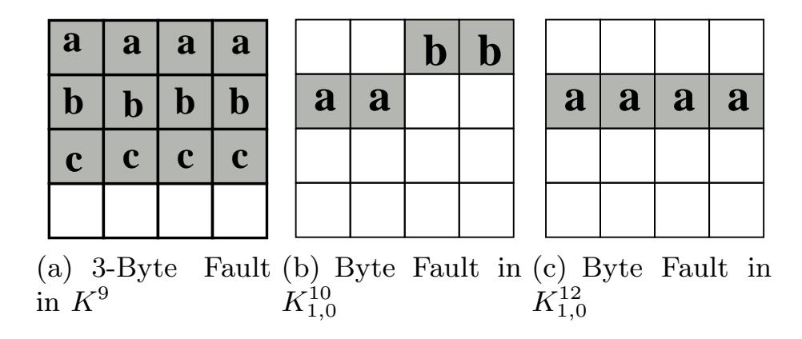

Fig. 3.

{9}------------------------------------------------

In this paper we consider the single-byte fault model. Therefore, if we consider that a single-byte fault is induced in the first column of  $K^9$  the values of b and c becomes zero in Fig. 3(a). So, only the first row differences will remain. The probability of getting the four byte difference in a particular row using a pair of plaintexts is given by  $\frac{(255)}{2^{32}} \cdot \frac{1}{2^{96}} \approx \frac{1}{2^{120}}$ . The lower limit  $K_l = 2^{128-120} = 2^8$ . Therefore, in case of single byte fault, the attack should reduce the AES-128 key space to  $2^8$ .

Floissac et al. showed a single byte fault analysis on AES-192 and AES-256 key schedule where the fault is induced in 10-th and 12-th round key respectively (Fig. 3(b) and Fig. 3(c)) [12]. It is clear from Fig. 3(c), that a single-byte fault induction in AES-256 key schedule should reveal 120 bits of information on the key. However, in the case of AES-192 the required difference can be generated using a pair of plaintexts with probability  $\frac{(255)^2}{(2^8)^4} \cdot \frac{1}{2^{96}} \approx \frac{1}{2^{112}}$ . Therefore, the lower bound of attack on AES-192 key schedule is given by  $K_l = 2^{192-112} = 2^{80}$ .

From the above analysis we come to know the maximum information leakage from a DFA based on single byte-fault induction. Using this information we can also get the optimum attack results. Here the optimum results are based on two scenarios. In one the attacker has the access to the plaintext. Therefore, brute-force search on final key hypotheses is possible. In this scenario the optimum result means the minimum number of fault inductions require to reduce the key space to a practical limit. In the second scenario the attacker does not have access to the plaintext. Therefore, the key must be uniquely determined. In that case the optimum result implies the minimum number of fault inductions require to uniquely determine the key.

Table 1 shows the optimum results for the above two scenarios. The table also shows that in case of second scenario the existing attack on AES-128, AES-192, AES-256 states and AES-128 key schedule are optimal. In rest of the cases, there is no reported DFA attack which reached the optimum limits. Therefore, the table shows that there is a scope of work in this area which is the motivation behind this paper.

In the next two sections we present differential fault analysis against the AES state matrix and key schedule respectively. We show that our attack on the AES state matrix has reached its theoretical limits. However, in the case of DFA on the AES key schedule the limit has not yet been reached. Only, the DFA on AES-128 key schedule has reached to its limits. The proposed DFA on AES-192 and AES-256 key schedule are very close to their limits.

We start with the DFA on the states of three version of AES.

# 5 Basic Principle of DFA on AES

We have already mentioned that DFA on AES is divided into two categories. One in which the fault is induced in the AES states. In the other the fault is induced at the round keys. In both the categories the objective of the attacker is to induce certain difference at a particular state of the encryption and then

{10}------------------------------------------------

Table 1. Optimal Limits of DFA on AES

| AES Version and |           | Optimal Result      | Optimal Result for Unique key |
|-----------------|-----------|---------------------|-------------------------------|
| Attack Type     | Number    | remaining           | Number                        |
|                 | of Faults | Keys                | of Faults                     |
| AES-128         | 1         | 8<br>2              | 2                             |
| State           |           |                     | (published in [23])           |
| AES-192         | 2         | 1                   | 2                             |
| State           |           | (published in [16]) | (published in [16])           |
| AES-256         | 2         | 16<br>2             | 3                             |
| State           |           |                     | (published in [16])           |
| AES-128         | 1         | 8<br>2              | 2                             |
| Key Schedule    |           |                     | (Published in [15])           |
| AES-192         | 2         | 1                   | 2                             |
| Key Schedule    |           |                     |                               |
| AES-256         | 2         | 16<br>2             | 3                             |
| Key Schedule    |           |                     |                               |

Table 2. Optimal Limits of Diagonal Attacks on AES

| No. of       |         | 1-Diagonal DFA 2-Diagonal DFA 3-Diagonal |         |
|--------------|---------|------------------------------------------|---------|
| Faulty Bytes | (M0)    | (M1)                                     | (M3)    |
|              | Optimal | Optimal                                  | Optimal |
|              | Result  | Result                                   | Result  |
| 1            | 8<br>2  | 8<br>2                                   | 8<br>2  |
| 2            | 16<br>2 | 16<br>2                                  | 16<br>2 |
| 3            | 24<br>2 | 24<br>2                                  | 24<br>2 |
| 4            | 32<br>2 | 32<br>2                                  | 32<br>2 |
| 5            | −       | 40<br>2                                  | 40<br>2 |
| 6            | −       | 48<br>2                                  | 48<br>2 |
| 7            | −       | 56<br>2                                  | 56<br>2 |
| 8            | −       | 64<br>2                                  | 64<br>2 |
| 9            | −       | −                                        | 72<br>2 |
| 10           | −       | −                                        | 80<br>2 |
| 11           | −       | −                                        | 88<br>2 |
| 12           | −       | −                                        | 96<br>2 |

following the differential characteristic she deduces some equations which relate the input-output difference of the S-boxes.

In case of the AES, the input to the S-box in each round is the XOR of previous round output and the round key. Fig. 4 shows one such example. Here

{11}------------------------------------------------

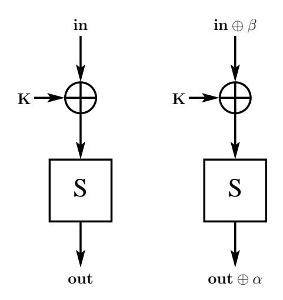

Fig. 4. Difference across S-box

in is the previous round output byte and K is the round key byte. Due to the fault induction, a difference β is generated in X following which there is an output difference α at the S-box output out. Now if we replace the value of in ⊕ K by X, we get following differential equation;

$$\alpha = S(X \oplus \beta) \oplus S(X) \tag{1}$$

According to the properties of AES S-box for a particular value of α and β the above equation can have 0, 2, or 4 solutions of X [21]. For a fixed value of β, in 126 out of 256 choices of α the equation gives 2 solutions of X, and in only one choice of α the equation gives 4 solutions and the rest of the choices of α will not give any solution for X. This implies only 127 out of 256 choices of α produce solutions for X. For more details one can refer [21]. Therefore, if we know the values of α, β and in we can get the values of K from the above equation.

Equation (1) is the basis to almost all the DFA attacks on SPN and Feistel ciphers. The attacker induces fault in such a way so that she can deduce equations like (1), which relates the round key bytes with the input-output difference. Then solving these equations she retrieves the round keys. Depending on the key schedule of the cipher she needs to retrieve sufficient number of round keys to get the master key.

In AES, retrieving the last two round keys are sufficient to get the master key. Therefore, the attacker first try to get the final round key by inducing certain number of faults. Once the final round key is retrieved, she performs last round decryption and applies the same technique to get the penultimate round key. Therefore, the attack can be divided into two phases. In the first phase the attacker retrieves the final round key and in the second phase she retrieves the penultimate round key. In order to explain the basic principle of the twophase attack, we consider a r round AES with K<sup>r</sup> and Kr−<sup>1</sup> as the final and penultimate round keys.

{12}------------------------------------------------

#### 5.1 First Phase of DFA on AES

In AES, if one byte difference is induced at the input of a round function, due to MixColumns operation the difference spread to four bytes at the round output. Fig. 5 shows one such scenario.

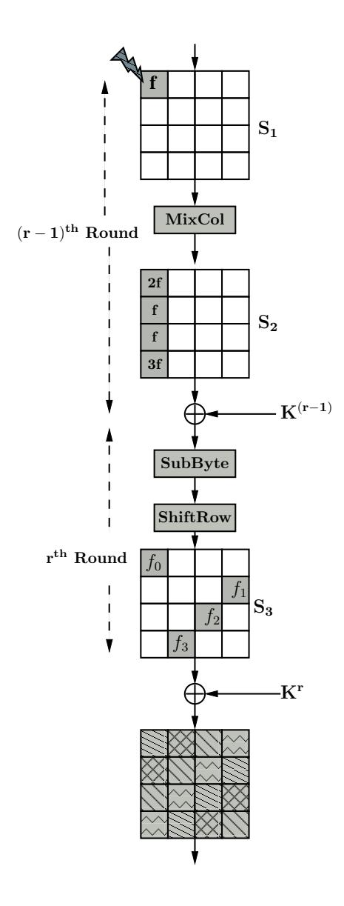

Fig. 5. Differences across the Last Two Rounds

A single byte difference is generated before the (r-1)-th round MixColumns by the induced fault. The value of this difference is f and the corresponding 4-byte output difference is (2f, f, f, 3f), where 2, 1, and 3 are the elements of the first row of the MDS matrix used in MixColumns operation. The 4-byte difference is again changed to  $(f_0, f_1, f_2, f_3)$  by the r-th round S-box. The ShiftRows operation will shift the differences to four different locations. The attacker knows the value of fault-free and faulty ciphertexts which differ in four bytes. Therefore, she can represent the 4-byte difference (2f, f, f, 3f) in terms of  $K^r$  by following equations:

{13}------------------------------------------------

$$2f = S^{-1}(C_{0,0} \oplus K_{0,0}^r) \oplus S^{-1}(C_{0,0}^* \oplus K_{0,0}^r)$$

$$f = S^{-1}(C_{1,3} \oplus K_{1,3}^r) \oplus S^{-1}(C_{1,3}^* \oplus K_{1,3}^r)$$

$$f = S^{-1}(C_{2,2} \oplus K_{2,2}^r) \oplus S^{-1}(C_{2,2}^* \oplus K_{2,2}^r)$$

$$3f = S^{-1}(C_{3,1} \oplus K_{3,1}^r) \oplus S^{-1}(C_{3,1}^* \oplus K_{3,1}^r)$$

$$(2)$$

Here C and  $C^*$  are the fault-free and faulty ciphertexts. AES S-box is bijective, therefore each of the above four equations can be represented as equation (1). Again, equation 1 can be represented as:  $A = B \oplus C$  where A, B, and C are bytes in  $\mathbf{F_{28}}$ , having  $2^8$  possible values each. A random value of (A, B, C) satisfies this equation with probability  $\frac{1}{2^8}$ . Therefore,  $2^{16}$  out of  $2^{24}$  choices of (A, B, C) will satisfy the equation.

If we have M such equations which contain N variables in that case the reduce search space is given by  $(\frac{1}{2^8})^M \cdot (2^8)^N = (2^8)^{N-M}$ . In the above set of four equations we have five unknown variables:  $f, K_{0,0}^r, K_{1,3}^r, K_{2,2}^r$ , and  $K_{3,2}^r$ . Therefore, the four equations reduce the search space to  $(2^8)^{5-4} = 2^8$ . This implies only  $2^8$  candidates of the quartet of key bytes will satisfy the above four equations. By inducing two such faults one can uniquely determine the key quartet. In the same way one can also get the rest of the three quartets of  $K^r$ . It may also be observed that if the location of the induced difference is changed then only the indices of the variables and the order of the equations will changed. The basic form of the equations will remain same.

Once  $K^r$  is determine the attacker applies the second phase of the attack to determine  $K^{r-1}$ .

## 5.2 Second Phase of DFA on AES

In the second phase, the attacker induces faults in such a way so that a single byte difference is generated at the input of (r-2)-th round MixColumns operation. The fault propagation pattern remain same as in the first phase of the attack. Therefore, if the input difference is f', then the 4-byte output difference of (r-2)-th round is (2f', f', f', 3f'). These differences can also be represented by (r-1)-th round fault-free and faulty outputs. However, due to the (r-1)-th round MixColumns operation, the equations will change (the last round does not have MixColumns). For example, 2f' can be represented by following equation:

$$2f' = S^{-1}(14(C_{0,0}^{r-1} \oplus K_{0,0}^{r-1}) \oplus 11(C_{1,0}^{r-1} \oplus K_{1,0}^{r-1}) \oplus 13(C_{2,0}^{r-1} \oplus K_{2,0}^{r-1}) \oplus 9(C_{3,0}^{r-1} \oplus K_{3,0}^{r-1})) \oplus S^{-1}(14(C_{0,0}^{*(r-1)} \oplus K_{0,0}^{r-1}) \oplus 11(C_{1,0}^{*(r-1)} \oplus K_{1,0}^{r-1}) \oplus 13(C_{2,0}^{*(r-1)} \oplus K_{2,0}^{r-1}) \oplus 9(C_{3,0}^{*(r-1)} \oplus K_{3,0}^{r-1}))$$

$$(3)$$

Here  $C^{r-1}$  and  $C^{*(r-1)}$  are the fault-free and faulty output of (r-1)-th round. Therefore, if the attacker has already determined the final round key she can get the values of  $C^{r-1}$  and  $C^{*(r-1)}$  by decrypting the last round. She can also deduce three more such equations from the rest of the three differences. Solving these equations the attacker can reduce the search space of  $K^{r-1}$ .

{14}------------------------------------------------

#### 5.3 Similarity and Differences Between the Attacks

In the previous two sections we explain the basic principle of a DFA on AES. It uses simple divide and conquer approach. However, when we apply this technique to different versions of AES, the complexity of the attack changes drastically. For DFA on AES states, the first phase of the attack is same for all the three versions. It only retrieves the final round key. However, solving the second phase equations (Eq. (3)) are real challenge. As we can see each equation consists of four key bytes and these key bytes are not same across all the four equations generated from the 4-byte difference. If we consider all the four equations we have total seventeen unknown variables; sixteen bytes of Kr−<sup>1</sup> and f. Therefore, it is evident that the required exhaustive search on these variable is not practical. Therefore, the attacker must find some relation between these key bytes.

In order to do that the attacker takes the help of AES key schedule. As the key schedule is different for different versions of AES, therefore the attack strategy will also be different. Further, attacking AES key schedule is much more difficult than attacking AES state. In the first case the number of variables in the first phase and the second phase equations are more due to the diffusion of the differences in the key schedule.

# 6 DFA on AES State

In this section, we propose optimal DFA attacks on the AES state. The present section presents differential fault attacks on AES-128 and AES-256, and shows how an optimal fault attack can be performed. As proved in Section 4, a single byte fault can reveal 120 bits of information of the AES key. Hence, an optimal DFA on AES-128 would require a single fault (as the remaining uncertainty of 8 bits can be obtained using a practical exhaustive search). However for AES-256, an optimal DFA should need two faults, as then the remaining uncertainty is of (256 − 2 · 120) = 16 bits, which also can be easily computed through a brute force analysis. In the following description, we present the attack steps which reach these optimal limits. It may be pointed out that for AES-192, the attack proposed in [16] already reaches the optimal limit.

#### 6.1 DFA on AES-128 State

In these section we propose a two phase attack on the AES-128 state matrix by inducing a single byte fault in between the seventh and eighth round MixColumns operations. In the first phase of the attack we reduce the search space of the final round key K<sup>10</sup> to 2<sup>32</sup> hypotheses using the differential equations at the output of the ninth round MixColumns operation. In the second phase of the attack we further reduce the search space of the final round key by taking into consideration the differential equations at the output of the MixColumns operation in the eighth round.

{15}------------------------------------------------

First Phase of the Attack on AES-128 State A single byte random fault is induced in between the seventh and eighth round MixColumns operations. Fig. 6 shows the flow of such a fault. The induced fault is propagated from the output of the eighth round

MixColumns operation to the first column of  $S_2$  and subsequently to all the volumes of the state matrix after the ninth round MixColumns operation. This actually serves the objective of inducing four faults at four different columns of the state matrix input to the ninth round MixColumns which is described in Section 5.1.

Therefore, the difference between columns of state matrices in the fault-free and faulty ciphertexts can be expressed in terms of these ciphertexts and the tenth round key  $K^{10}$ . The first column of  $S_4$  will produce four equations similar to equations (2). In this case r will be replaced by 10 and the 4-byte difference (2f, f, f, 3f) will be replaced by  $(2p_0, p_0, p_0, 3p_0)$ . We call this equations as ninth round differential equations. These equations will reduce the search space of key quartet  $(K_{0,0}^{10}, K_{1,3}^{10}, K_{2,2}^{10}, K_{3,2}^{10})$  to an expected value of  $2^8$ .

Similarly, we can deduce three sets of equations from the rest of the three columns of the state matrix  $S_4$ . These three sets of equations will reduce the corresponding quartet of key byte's search space to  $2^8$  hypotheses. If we combine all the four key quartets, we get  $(2^8)^4 = 2^{32}$  hypotheses of  $K^{10}$ . So, in the first phase of the attack we have  $2^{32}$  hypotheses for  $K^{10}$ . In the second phase of the attack we further reduce the search space of  $K^{10}$ .

Second Phase of the Attack on AES-128 State In order to further reduce the search space of the final round key we consider the relationship between the faulty bytes at the first column of  $S_2$ , see Fig. 6. In order to do that we need  $K^9$  and the ninth round fault-free and faulty outputs  $(C^9, C^{*9})$ . However, as the AES-128 key schedule is invertible, therefore, we can avoid making hypotheses directly on  $K^9$  by performing inverse key schedule operation as:

$$\begin{pmatrix} (K_{0,0}^{10} \oplus S[K_{1,3}^{10} \oplus K_{1,2}^{10}] & K_{0,1}^{10} \oplus K_{0,0}^{10} & K_{0,2}^{10} \oplus K_{0,1}^{10} & K_{0,3}^{10} \oplus K_{0,2}^{10} \\ & \oplus^{h_{10}}) \\ (K_{1,0}^{10} \oplus S[K_{2,3}^{10} \oplus K_{2,2}^{10}]) & K_{1,1}^{10} \oplus K_{1,0}^{10} & K_{1,2}^{10} \oplus K_{1,1}^{10} & K_{1,3}^{10} \oplus K_{1,2}^{10} \\ (K_{2,0}^{10} \oplus S[K_{3,3}^{10} \oplus K_{3,2}^{10}]) & K_{2,1}^{10} \oplus K_{2,0}^{10} & K_{2,2}^{10} \oplus K_{2,1}^{10} & K_{2,3}^{10} \oplus K_{2,2}^{10} \\ (K_{3,0}^{10} \oplus S[K_{0,3}^{10} \oplus K_{0,2}^{10}]) & K_{3,1}^{10} \oplus K_{3,0}^{10} & K_{3,2}^{10} \oplus K_{3,1}^{10} & K_{3,3}^{10} & K_{3,2}^{10} \end{pmatrix} .$$

In order to get  $(C^9, C^{*9})$  we do one round decryption operation on  $(C, C^*)$  using the hypotheses for  $K^{10}$ .

The 4-byte fault value (2p, p, p, 3p) at the first column of  $S_2$  can be represented in terms of  $(C^9, C^{*9})$  and  $K^9$  which in turn produces four equations similar to equation (3). In that case the value of r will be replaced by 9 and (2f', f', f', 3f') will be replaced by (2p, p, p, 3p). We call these equations as eighth round differential equations. In these four differential equations, we have  $2^{32}$  hypotheses for  $(K^9, C^9, C^{*9})$  and  $2^8$  possible values for p. Therefore, the four equations reduce the search space to  $\frac{(2^{32} \cdot 2^8)}{(2^8)^4} = 2^8$ , i.e. from the  $2^{32}$  hypotheses for  $K^{10}$  only  $2^8$  will satisfy the set of four equations. This result shows that our proposed DFA on AES-128 reaches the limit as describe in Section 4.

{16}------------------------------------------------

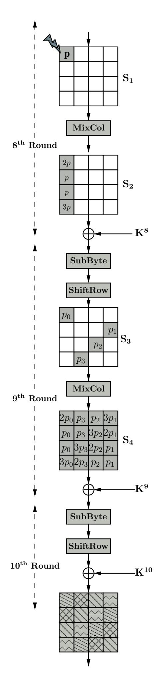

Fig. 6. Flow of fault in the last three rounds of AES-128

{17}------------------------------------------------

However, the time complexity of the attack is still  $2^{32}$ , as each of the  $2^{32}$  choices of  $K^{10}$  are tested by set of four equations. In the next section we propose an acceleration technique by which the attack time complexity reduces to  $2^{30}$  from  $2^{32}$ .

Reducing the Time Complexity of the Attack In order to reduce the time complexity of the attack we observe the basic properties of the differential equations as explained in Section 5.

If we consider the ninth round differential equations in the first phase of the attack, each of which can be represented as equation (1). In that case  $p_0$  corresponds to  $\alpha$ . Therefore, if a value  $p_0$  contributes to the solutions of  $(K_{0,0}^{10}, K_{1,3}^{10}, K_{2,2}^{10}, K_{3,1}^{10})$ , then there will total  $2^4$  solutions of the quartet for one such choice of  $p_0$  as each of the key bytes will have 2 solutions<sup>4</sup>. For example if  $(a_0, b_0, c_0, d_0)$  is one solution of the quartet then there is another solution  $(a_1, b_0, c_0, d_0)$  where  $K_{0,0}^{10}$  has the second solution  $a_1$ , whereas the rest of the three key bytes have the same values. This implies if we only want the unique choices of the last three key bytes among all possible solutions of  $(K_{0,0}^{10}, K_{1,3}^{10}, K_{2,2}^{10}, K_{3,1}^{10})$ , we get  $\frac{2^8}{2} = 2^7$  choices.

Now in the eighth round differential, each byte of  $C^9$  or  $C^{*9}$  consists of one byte of tenth round key. For example  $C_{0,0}^9$  consists of key byte  $K_{0,0}^{10}$ . However, in case of ninth round key byte, if the key byte is in the first column of  $K^9$ , it requires three byte of  $K^{10}$  whereas for the other key bytes of  $K^9$  requires two bytes of  $K^{10}$ . Therefore, if we consider these equations in pairs, all the pairs of equations does not consists of same number of key bytes of  $K^{10}$ . The pair of equations which consists of second and third equations requires least number of key bytes 14 (except the key bytes  $K_{0,0}^{10}$  and  $K_{0,1}^{10}$ ).

Therefore, in order to reduce the time complexity of the attack, in the second phase we test the second and third equation first by the unique choices of 14 key bytes of  $K^{10}$  (excluding key bytes  $K^{10}_{0,0}$  and  $K^{10}_{0,1}$ ). There are total  $2^{32}$  choices of  $K^{10}$  out of which the number unique choices of required 14 key bytes is given by  $\frac{2^{32}}{2^2} = 2^{30}$ . Therefore, out of these choices only  $\frac{2^{30}}{2^8} = 2^{22}$  will satisfy the two equations. Rest will be discarded. Those which satisfy are combined with the  $2^2$  choices of the rest of the two key bytes and further tested by the other two eighth round differential equations.

As we need to test only  $2^{30}$  times in the second phase of the attack, therefore, the time complexity of the attack reduces to  $2^{30}$  from  $2^{32}$ . The summary of the proposed attack is presented in Algorithm 2.

#### 6.2 DFA on AES-192 States

A DFA on AES-192 has been proposed by Kim [16] which exploits all the available information. According to our analysis a single byte fault should reveal 120-bit of the secret key. AES-192 has a 192-bit key, and therefore one would

<sup>&</sup>lt;sup>4</sup> For the sake of simplicity we do not consider the 4 solutions cases.

{18}------------------------------------------------

#### **Algorithm 2:** DFA on AES-128 State

```
Input: C, C^*
Output: List L_k of tenth round key K^{10}
Solve the four sets of equations of S_4 (Fig. 6) independently.

Get 2^{32} hypotheses of K^{10}.

for Each \ candidates \ of \ K^{10} do

Get K^9 from K^{10} using AES-128 Key Scheduling.

Get unique choices of 14 bytes of K^{10} except K^{10}_{0,0}, K^{10}_{0,1}.

Test the 2^{nd} and 3^{rd} equations of S_2
\nif Satisfied then

for Each \ candidates \ of \ (K^{10}_{0,0}, K^{10}_{0,1}) do

Test the 1^{st} and 4^{th} equations of S_2.
\nif Satisfied then

Save K^{10} to L_k.
\nend
\nend
\nend

return L_k
```

expect the most efficient attack would need two single byte faults. Kim's attack required two faults and uniquely determines the key.

#### 6.3 DFA on AES-256 States

In this section we propose a two phase DFA on AES-256 states and show that our attack reaches its limit as per the analysis in Section 4. The analysis says that using a single byte fault induction one can reveal maximum of 120 bits of the secret key. AES-256 has a 256-bit key. Therefore, two fault induction should be able to reveal  $(120 \cdot 2) = 240$  bits of the key.

According to the AES-256 key schedule, retrieving one round key is not enough to get the master key. Algorithm 1 shows that the penultimate round key is not directly related to the final round key. Therefore, the attack on AES-128 cannot be directly applicable to AES-256.

We propose an attack which requires two faulty ciphertexts  $C_1^*$  and  $C_2^*$  and a fault free ciphertext C. The first faulty ciphertext  $C_1^*$  is generated by inducing a single byte fault between the MixColumns operations in the eleventh and twelfth round, whereas  $C_2^*$  is generated by inducing a single byte fault in between the MixColumns operations in the tenth and eleventh round. Fig. 7(a) shows the flow of faults corresponding to  $C_1^*$  whereas Fig. 7(b) shows the flow of faults corresponding to  $C_2^*$ .

The proposed attack works in two phases. In the first phase of the attack we reduce the possible choices of final round key to  $2^{16}$  hypotheses and in the second phase of the attack we deduce  $2^{16}$  hypotheses for the penultimate round key leaving  $2^{16}$  hypotheses for the master key.

{19}------------------------------------------------

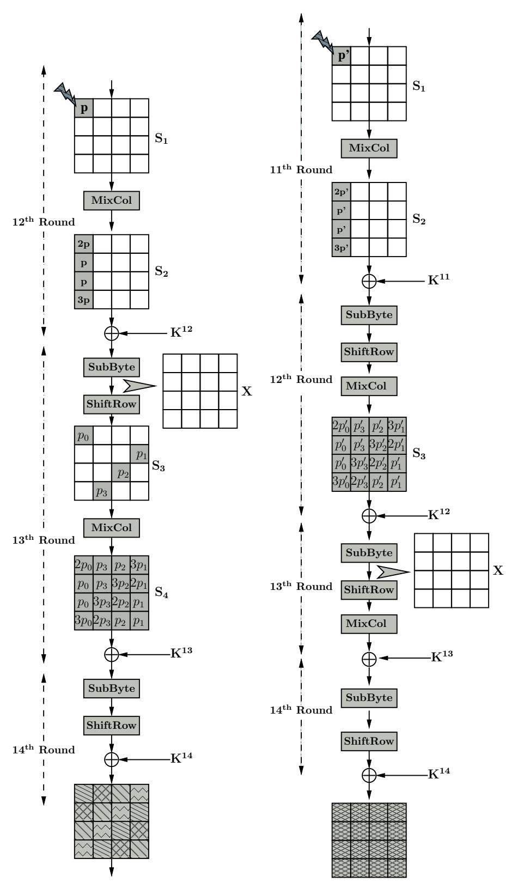

(a) Flow of faults in the last (b) Flow of faults in the last three rounds of AES-256 four rounds of AES-256

Fig. 7. Flow of Faults

First Phase of the Attack on AES-256 States In order to get the final round key we directly apply the first phase of the DFA on AES-128, described in Section 6.1, to the faulty ciphertext  $C_1^*$  (Fig. 7(a)). Therefore, using the relation between the faulty bytes in state matrix  $S_4$  we reduce the possible values of the final round key  $K^{14}$  to  $2^{32}$  hypotheses. Next we consider the second faulty ciphertext  $C_2^*$  (Fig. 7(b)), where in state matrix  $S_3$  we have a relationship between

{20}------------------------------------------------

the faulty bytes that is similar to the state matrix  $S_4$  of  $C_1$  (Fig. 7(a)). We define X as the output of the 13-th round SubBytes operation in the computation that produced the fault-free ciphertext. We also define  $\rho$  and  $\varepsilon$  as the differences at the output of 13-th round SubBytes operation corresponding to two faulty ciphertexts  $C_1^*$  and  $C_2^*$  respectively. These two differences can be expressed as:

$$\rho = SR^{-1} \Big( MC^{-1} \big( SR^{-1} (SB^{-1} (C \oplus K^{14}) \big) \oplus SR^{-1} (SB^{-1} (C_1^* \oplus K^{14})) \big) \Big)$$

$$\varepsilon = SR^{-1} \Big( MC^{-1} \big( SR^{-1} (SB^{-1} (C \oplus K^{14})) \oplus SR^{-1} (SB^{-1} (C_2^* \oplus K^{14})) \big) \Big)$$

Therefore, the fault values in the first column of  $S_3$  (Fig. 7(b)) can be represented in terms of X and  $\varepsilon$  by four equations similar to equation (1). In that case  $\varepsilon_{0,0}$ ,  $\varepsilon_{1,0}$ ,  $\varepsilon_{2,0}$ , and  $\varepsilon_{3,0}$  are the values corresponding  $\beta$  and  $2p'_0$ ,  $p'_0$ ,  $p'_0$ , and  $3p'_0$  are the values corresponding to  $\alpha$  in the four equations respectively.

Similarly, from the first column of state matrix  $S_2$  of Fig. 7(a), we get four more differential equations which correspond to the first column of X and  $\rho$ . Therefore, corresponding to first column of X, we get two sets of differential equations. Again each byte of  $\varepsilon$  and  $\rho$  corresponds to one quartet of  $K^{14}$ . For example  $\rho_{0,0}$  can be expressed as:

$$\rho_{0,0} = \left(14(SB^{-1}(C_{0,0} \oplus K_{0,0}^{14}) \oplus SB^{-1}(C_{1(0,0)}^* \oplus K_{0,0}^{14})) \oplus 11(SB^{-1}(C_{1,3} \oplus K_{1,3}^{14}) \oplus SB^{-1}(C_{1(1,3)}^* \oplus K_{1,3}^{14})) \oplus 13(SB^{-1}(C_{2,2} \oplus K_{2,2}^{14}) \oplus SB^{-1}(C_{1(2,2)}^* \oplus K_{2,2}^{14})) \oplus 9(SB^{-1}(C_{3,1} \oplus K_{3,1}^{14}) \oplus SB^{-1}(C_{1(3,1)}^* \oplus K_{3,1}^{14}))\right)$$

$$(4)$$

We already know that each of the quartets are independently calculated and produces  $2^8$  hypotheses. Therefore, the four pairs  $(\varepsilon_{0,0}, \rho_{0,0})$ ,  $(\varepsilon_{1,0}, \rho_{1,0})$ ,  $(\varepsilon_{2,0}, \rho_{2,0})$ , and  $(\varepsilon_{3,0}, \rho_{3,0})$  correspond to four quartets of  $K^{14}$  and each having  $2^8$  values.

In order to solve two sets of differential equations of first column of X, with minimum time complexity, we consider them in pairs. First we choose two equations, for example from the second set we choose equations corresponding to  $X_{0,0}$  and  $X_{1,0}$ . We guess the values of p corresponding to each choice of  $(\rho_{0,0}, \rho_{1,0})$  and derive the possible values of  $X_{0,0}, X_{1,0}, \varepsilon_{0,0}$ , and  $\varepsilon_{1,0}$ . We test these values by the corresponding equations in the first set. If they satisfy the relationships they are accepted, otherwise they are rejected. It may be observed that the mapping between a byte of  $\rho$  and the corresponding byte of  $\varepsilon$  is one-to-one, as both the bytes are derived from same key quartet.

Therefore, in the two equations of the second set we guess  $2^8 \cdot 2^8 \cdot 2^8 = 2^{24}$  hypotheses for  $(\rho_{0,0}, \rho_{1,0}, p)$  which is reduced to  $2^{16}$  hypotheses by corresponding two equations of the first set. Each of these  $2^{16}$  hypotheses are combined with  $2^8$  hypotheses for  $\rho_{2,0}$  in the third equation of the second set and tested by the corresponding equation in the first set. Again, the possible hypotheses reduce to  $2^{16}$ . Then these values are combined with  $2^8$  hypotheses for  $\rho_{3,0}$  in the fourth equation of the second set and verified using the corresponding equation in the first set, which will again reduce the number of possible hypotheses to

{21}------------------------------------------------

 $2^{16}$ . Therefore, finally we will have  $2^{16}$  hypotheses for  $K^{14}$  each corresponding to one value for  $(X_{0,0}, X_{1,0}, X_{2,0}, X_{3,0})$ . Throughout the process the time consuming part of the calculation is where  $2^{24}$  hypotheses are made and the rest is negligible. We, therefore, consider the time complexity of this process to be  $2^{24}$ .

It can also be explained in straightforward way. There are eight equations, in which  $p, p'_0, (X_{0,0}, X_{1,0}, X_{2,0}, X_{3,0})$  and  $K^{14}$  are unknown. The total search space of these variables would be  $2^{80}$ . Therefore, the reduced search space produced by these eight equations is  $\frac{2^{80}}{(2^8)^8} = 2^{16}$ .

In the second phase of the attack we deduce the values of penultimate round key  $K^{13}$  corresponding to  $2^{16}$  choices of  $K^{14}$ .

Second Phase of the Attack on AES-256 States In order to get the penultimate round key, we consider the last three columns of  $S_3$  in Fig. 7(b). For, one choice of  $K^{14}$ , the differential equations from the last three columns of  $S_4$  will reduce the number of hypotheses for  $(X_{0,1}, X_{1,1}, X_{2,1}, X_{3,1}), (X_{0,2}, X_{1,2}, X_{2,2}, X_{3,2}),$  and  $(X_{0,3}, X_{1,3}, X_{2,3}, X_{3,3})$  to  $2^8$  for each set. Then we get the last three columns of  $K^{12}$  from  $K^{14}$  as  $K^{12}_{i,j} = K^{14}_{i,j} \oplus K^{14}_{i,j-1}$ , where  $0 \le i \le 3$  and  $1 \le j \le 3$ .

Now from the first column of  $S_2$  we get four differential equations similar to equations (3). In this case r is replaced by 13. The twelfth round fault-free output can be expressed as  $C^{12} = S^{-1}(X)$ . Similarly, the faulty outputs corresponding to two faulty ciphertexts can be expressed as  $C_1^{*12} = S^{-1}(X \oplus \rho)$  and  $C_2^{*12} = S^{-1}(X \oplus \epsilon)$ .

Therefore, each of the four equations requires one column of X and one column of  $K^{12}$ . The last three equations can be directly solved as we already know the values of the last three columns of X and  $K^{12}$ . In order to reduce the time complexity we conduct a pairwise analysis. We first choose the second and third equations which correspond to  $(X_{0,3}, X_{1,3}, X_{2,3}, X_{3,3})$  and  $(X_{0,2}, X_{1,2}, X_{2,2}, X_{3,2})$ . We have  $2^8$  hypotheses for both  $(X_{0,3}, X_{1,3}, X_{2,3}, X_{3,3})$  and  $(X_{0,2}, X_{1,2}, X_{2,2}, X_{3,2})$ . Each of these hypotheses can be evaluated using these two equations that will reduce the value to  $2^8$  choices. Those which satisfy these equations are combined with the  $2^8$  choices for  $(X_{0,1}, X_{1,1}, X_{2,1}, X_{3,1})$  and further tested by fourth equation which will again reduce the combined hypotheses of the last three columns of X to  $2^8$  possibilities. The values of  $(X_{0,0}, X_{1,0}, X_{2,0}, X_{3,0})$  are already reduced to one possibility for a particular value of  $K^{14}$  in the first phase of the attack. Therefore, this results in  $2^8$  hypotheses for X. For each of these hypotheses we get the first column of  $K^{12}$  and test using the first equation. This will further reduce the hypotheses for X to 1. The time complexity here is around  $2^{16}$  as we consider two columns of X at a time.

Therefore, one hypothesis for  $K^{14}$  will produce one value for X which in turn produces one value for  $K^{13}$  by the following:  $K^{13} = MC(SR(X)) \oplus C^{13}$ , where  $C^{13}$  is the output from the 13-th round, which is known to the attacker from the ciphertext C and  $K^{14}$  previously ascertained. Hence one hypothesis for  $K^{14}$  will produce one hypothesis for  $K^{13}$ . Therefore, the  $2^{16}$  hypotheses of  $K^{14}$  will produce  $2^{16}$  hypotheses for  $K^{13}$ . In which case the total time complexity will be  $2^{16} \cdot 2^{16} = 2^{32}$ . So, finally we have  $2^{16}$  hypotheses for  $(K^{13}, K^{14})$  which

{22}------------------------------------------------

corresponds to  $2^{16}$  hypotheses for the 256-bit master key. According the analysis in Section 4, two faulty ciphertexts should reveal 240-bit of the AES-256 key. Therefore, we can say that the proposed attack on AES-256 has reached its limit. The summary of the attack is presented in Algorithm 3.

### Algorithm 3: DFA on AES-256 State

```
Input: C, C_1^*, C_2^*
Output: List of 256-bit key L_k
 / ^* \; X_{i,j} \; = \; \langle X_{0,j}, X_{1,j}, X_{2,j}, X_{3,j} \rangle ^* / \\ / ^* \; K_{i,j}^{12} \; = \; \langle K_{0,j}^{12}, K_{1,j}^{12}, K_{2,j}^{12}, K_{3,j}^{12} \rangle ^* / \\ 
Solve four sets of equations of S_4 (Fig. 7(a)) independently.
Get 2^{32} hypotheses for K^{14}.
Solve the two set of equations of X_{i,0}.
Get 2^{16} hypotheses for K^{14}.
for each candidate of K^{14} do
       Guess the possible candidates of X_{i,1}, X_{i,2}, and X_{i,3} Get the values of K_{i,1}^{12}, K_{i,2}^{12}, and K_{i,3}^{12} from K^{14}
       for Each candidate of X_{i,3}, X_{i,2}, X_{i,1} do

Test second, third and fourth equations of S_2(\text{Fig. 7(b)})
              if Satisfied then
                     Get K_{i,0}^{12} from K^{14} and X
Test First equation of S_2 (Fig. 7(b))
                     if Satisfied then
                            Get K^{13} from X
Get 256-bit key from AES-256 Key Scheduling algorithm
                            save the 256-bit key to L_k
                     end
              \quad \text{end} \quad
       end
end
return L_k
```

## 7 Attacks on AES Key Schedule

In the previous section we explained how a single byte difference induced at the state of a particular round can be exploited to reveal the secret key. Therefore, in order to protect AES from such attacks a designer has to use some countermeasures which will not allow the attacker to induce fault in AES round operations. The DFA on AES key schedule is such kind of attack which works even if the rounds of the AES are protected against faults. In this case the fault is induced at the round key. Therefore, the normal countermeasures which only protect the round operations, will not be able to distinguish between a fault-free round key and a faulty round key. Hence, it will fail.

Until recently DFA on AES key schedule was considered more difficult than the DFA on AES states. Due to diffusion in the key schedule, a single byte difference spreads to more number of round key bytes of same round key as well 

{23}------------------------------------------------

as subsequent round key because of which the differential equations are more complex than the DFA on AES states.

In this section, we present DFA on the AES Key Schedule for all the three versions of AES. The current section develops the attacks published in literature requiring 2 faults for AES-128, 16 faults for AES-192 and AES-256. The attacks proposed in this section requires 1 fault for AES-128, 2 faults for AES-192 and 3 faults for AES-256. Thus compared to the optimal attacks as shown in Section 4, we reach the limits for AES-128. However for AES-192 and AES-256 the present attack is much closer to the optimal results than that in the literature.

#### 7.1 Attack on AES-128 Key Schedule

In this section we propose a two phase attack which will reduce the AES-128 key space to  $2^8$  hypotheses using only one faulty ciphertext. The required faulty ciphertext is generated by inducing a single-byte fault in the first column of the eighth round key while it is being generated. Therefore, the induced byte fault is then propagated to subsequent round keys. Fig. 8 shows the flow of this fault as per the AES-128 key schedule. These faulty round keys subsequently corrupt the AES state matrix during the encryption process. The flow of faults in the AES states is shown in Fig. 9.

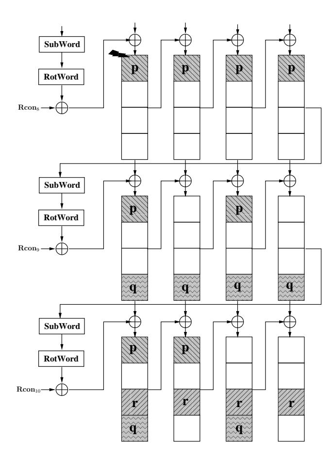

Fig. 8. Flow of faults in AES-128 key schedule

{24}------------------------------------------------

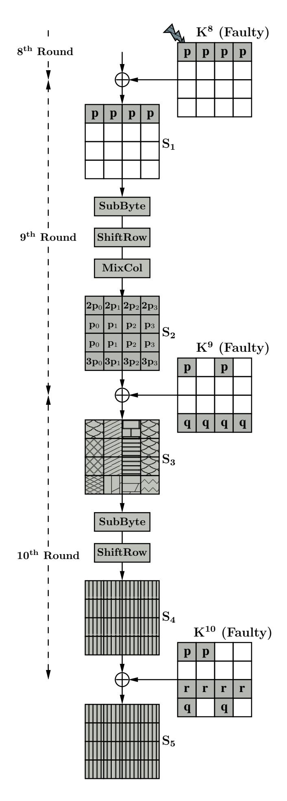

Fig. 9. Flow of faults in the last three rounds of AES-128

In the first phase of the attack we reduce the search space of the final round key to  $2^{40}$  hypotheses. In the second phase we further reduce this search space to  $2^8$  hypotheses.

{25}------------------------------------------------

First Phase of the Attack on AES-128 Key Schedule The faulty eighth round key corrupts the AES state matrix during the AddRoundKey operation. Fig. 9 shows that the faults in  $K^8$  corrupts the first row of the state matrix at the input of ninth round. Subsequently, the faults are propagated to all 16 bytes in the MixColumns operation. The faulty bytes in state matrix  $S_2$  can be represented by the fault-free and faulty ciphertexts C and  $C^*$ . The first column  $S_2$  will produce a set of four differential equations similar to equations (2) which corresponds to the key quartet  $(K_{0,0}^{10}, K_{1,3}^{10}, K_{2,2}^{10}, K_{3,1}^{10})$ . Similarly, from other three columns we get three more sets of equations corresponding to key quartets  $(K_{0,1}^{10}, K_{1,0}^{10}, K_{2,3}^{10}, K_{3,2}^{10})$ ,  $(K_{0,2}^{10}, K_{1,1}^{10}, K_{2,0}^{10}, K_{3,3}^{10})$ ,  $(K_{0,3}^{10}, K_{1,2}^{10}, K_{2,1}^{10}, K_{3,0}^{10})$ . We refer to these four key quartets as  $K_{q0}, K_{q1}, K_{q2}$ , and  $K_{q3}$  respectively.

It may be observed that unlike the proposed DFA on AES-128, here the number of unknown variable are more. We have p, q, and r as extra unknown variables. Therefore, existing solving techniques will not be applicable to these equations. It may be noted that these three unknown variables are derived from key schedule operation and related by following equations:

$$q = S[K_{0,3}^{8}] \oplus S[K_{0,3}^{8} \oplus p]$$

$$= S[K_{0,3}^{9} \oplus K_{0,2}^{9}] \oplus S[K_{0,3}^{9} \oplus K_{0,2}^{9} \oplus p]$$

$$= S[K_{0,3}^{10} \oplus K_{0,1}^{10}] \oplus S[K_{0,3}^{10} \oplus K_{0,1}^{10} \oplus p]$$

$$r = S[K_{3,3}^{9}] \oplus S[K_{3,3}^{9} \oplus q]$$

$$= S[K_{3,3}^{10} \oplus K_{3,2}^{10}] \oplus S[K_{3,3}^{10} \oplus K_{3,2}^{10} \oplus q]$$
(6)

In the first three sets of equations there are 8 unknown variables  $(p, q, r, p_i)$  and the corresponding quartet of key bytes  $K_{qi}$ ; where i corresponds to the i-th quartet. We observe that the fourth set of equations does not contain p. In order to get the quartets  $K_{q0}$ ,  $K_{q1}$ ,  $K_{q2}$  from the first three sets of equations, we need to test all possible  $2^{32}$  values for  $(p, q, r, p_i)$ . For, each of these hypotheses we get one hypothesis for  $K_{q0}$ ,  $K_{q1}$ , and  $K_{q2}$  each. Therefore, for all possible  $2^{32}$  choices we get  $2^{32}$  hypotheses of each of the quartets. In the last set of equations we have only q, r, and  $p_3$ . Therefore, in the last set of equations we get  $2^{24}$  possible hypotheses for  $K_{q3}$ . Hence, all the possible choices of  $K^{10}$  are given by  $(2^{32})^3 \cdot 2^{24} = 2^{120}$  which is not practical.

In order to solve the individual set of equations in practical time we apply a divide-and-conquer technique. We observe that the key bytes  $K_{0,3}^{10}$ ,  $K_{0,1}^{10}$ ,  $K_{3,2}^{10}$ ,  $K_{3,3}^{10}$ , and (p,q) are also contained in (5) and (6). Therefore, we can combine these equations with the last three sets of equation corresponding to  $K_{q1}$ ,  $K_{q2}$ , and  $K_{q3}$ . This will reduce the possible choices for the corresponding 12 key bytes.

In the first step we test the possible values of (p,q) For, each of these values we guess the  $2^8$  values of  $p_1$  in the second set of equations. For each  $(p,q,p_1)$  we get the values of three key bytes  $K_{0,1}^{10},K_{1,0}^{10}$ , and  $K_{3,2}^{10}$  from the corresponding equations. Therefore, for one value of (p,q) we get  $2^8$  hypotheses for  $(K_{0,1}^{10},K_{1,0}^{10},K_{3,2}^{10})$ . Similarly, we guess  $p_3$  in fourth set of equations and get  $2^8$  hypotheses for  $(K_{0,3}^{10},K_{1,2}^{10},K_{3,0}^{10})$ . Therefore, for one hypothesis for (p,q) we get

{26}------------------------------------------------

a total of  $2^8 \cdot 2^8 = 2^{16}$  hypotheses for six key bytes  $(K_{0,1}^{10}, K_{1,0}^{10}, K_{3,2}^{10}, K_{0,3}^{10}, K_{1,2}^{10}, K_{3,0}^{10})$ . These values are tested by using (5), which will reduce the possible values of these six key bytes to  $\frac{2^{16}}{2^8} = 2^8$  hypotheses.

In the second step, for each hypothesis for the six key bytes, we guess the values of  $p_2$  and get the three key bytes  $(K_{0,2}^{10}, K_{1,1}^{10}, K_{3,3}^{10})$  from the third set of equations. Therefore, we have a total of  $2^8 \cdot 2^8 = 2^{16}$  hypotheses for nine key bytes  $(K_{0,1}^{10}, K_{1,0}^{10}, K_{3,2}^{10}, K_{0,3}^{10}, K_{1,2}^{10}, K_{3,0}^{10}, K_{0,2}^{10}, K_{1,1}^{10}, K_{3,3}^{10})$ . We use these and get the corresponding values of r from (6). Therefore, now using the values of r we can deduce the other three key bytes  $(K_{2,3}^{10}, K_{2,0}^{10}, K_{2,1}^{10})$  from the corresponding equations in the last three sets of equations. So, in the second step we deduce  $2^{16}$  hypotheses for twelve key bytes from the last three sets of equations.

In the third step we test the  $2^8$  values for  $p_0$  and get the corresponding choices of the four key bytes  $\{K_{0,0}^{10}, K_{1,3}^{10}, K_{2,2}^{10}, K_{3,1}^{10}\}$  from the first set of equations. Therefore, in the third step we deduce a total of  $2^{16} \cdot 2^8 = 2^{24}$  hypotheses for the 16 key bytes of  $K^{16}$  corresponding to one hypothesis for (p,q). Therefore, for all possible  $2^{16}$  hypotheses for (p,q), we will get  $2^{24} \cdot 2^{16} = 2^{40}$  hypotheses for  $K^{40}$ .

However, the complexity of this attack is still quite high. In our experiments we found out that for a desktop with an  $Intel\ Core^{TM} 2\ Duo$  processor clocked at 3 GHz speed takes around two and half days to perform brute-force search of  $2^{40}$  possible keys.

Second Phase of the Attack on AES-128 Key Schedule In this phase of the attack we deduce differential equations from the differences in the state matrix  $S_1$  (Fig. 9). In the first row of the state matrix we have 4-byte differences (p, p, p, p). The faulty byte p at the first column of the state matrix can be represented as equation (3). In that case r will be replaced by 10 and p corresponds to 2f'. Similarly, we get three more equations from rest of the three faulty bytes of  $S_1$ .

However, due to faulty key, the right hand side of each equations will have p, q, and r. In the first phase of the attack we have already reduced p, q, r, and  $K^{10}$  to  $2^{40}$  choices. Using these values we can get the ninth round fault-free and faulty outputs. As per the attack on the AES-128 key scheduling algorithm (Fig. 8), we can directly deduce the ninth round key from the tenth round key. Therefore, for each value of  $K^{10}$  we get the corresponding values of  $K^{9}$  and can test it using the four equations. There are four equations and the total search space is  $2^{40}$ . Therefore, the four equations reduce the search space to  $\frac{2^{40}}{(2^8)^4} = 2^8$ . Hence, in the second phase of the attack we have only  $2^8$  hypotheses for  $K^{10}$ . These can then be used to drive  $2^8$  hypotheses for the master key.

Though the final search space is  $2^8$ , the time complexity of the attack is still  $2^{40}$  since the second phase of the attack still needs to test each of the  $2^{40}$  keys generated from the first phase of the attack.

**Time Complexity Reduction** In the first phase of the attack we have four sets of equations corresponding to four key quartets  $K_{q0}$ ,  $K_{q1}$ ,  $K_{q2}$ , and  $K_{q3}$ . These

{27}------------------------------------------------

four sets of equations produce  $2^{40}$  values of 16-byte key  $K^{10}$ . Each of these keys are tested by four equations in the second phase of the attack. However, none of these equations require all 16 bytes of the key. For example, the first equations required  $K_{0,0}^{10}, K_{1,3}^{10}, K_{2,2}^{10}, K_{3,1}^{10}$  and nine more key bytes corresponding to four ninth round key bytes  $K_{0,0}^9, K_{1,0}^9, K_{2,0}^9, K_{3,0}^9$ . Therefore, in the first equation we need 13 bytes of  $K^{13}$ . Similarly, in the rest of the three equations, each requires ten bytes of  $K^{10}$ . In the first phase of the attack we use (5) and (6) since their dependencies are between the key bytes  $K_{0,3}^{10}, K_{0,1}^{10}$ , and  $K_{3,3}^{10}, K_{3,2}^{10}$ .

Therefore, in order to reduce the time complexity of the attack in the second phase we only test one equation at a time. We start with the third equation, as it only requires eleven bytes of  $K^{10}$  (ten key bytes plus one for  $K^{10}_{0,3}$  since it depends on  $K^{10}_{0,1}$  in (5)). Those which satisfy this equation are accepted and combined with the other five key bytes, and are subsequently tested using rest of the three equations. Those which do not satisfy these equations are simply discarded.

It is clear from the analysis in Section 6.1 that the number of unique choices of the eleven key bytes required by the third equation is  $\frac{2^{40}}{2^5} = 2^{35}$ . Therefore, we need only to test  $2^{35}$  hypotheses out of the  $2^{40}$  possibilities for the 16-byte key. Those which satisfy the test are combined with  $2^5$  possible hypotheses for the remaining five key bytes and subsequently tested using rest of the three equations. The first test will reduce the possible hypotheses for 11 key bytes to  $\frac{2^{35}}{2^8} = 2^{27}$ . Therefore, the rest of the three equations are tested using the  $2^{27} \cdot 2^5 = 2^{32}$  hypotheses for the 16-byte key, which will reduce the number of hypotheses to  $\frac{2^{32}}{(2^8)^3} = 2^8$ .

So, finally we get  $2^8$  hypotheses for  $K^{10}$ , and we test a maximum of  $2^{35}$  hypotheses for the key. Therefore, the time complexity of the attack is reduced to  $2^{35}$  from  $2^{40}$ . This result also supports the analysis in Section 4, which states that single fault should be able to reduce the number of key hypotheses for a AES-128 to  $2^8$ . Therefore, we can claim that the proposed attack is also optimal for a fault attack that analyzes the AES-128 key schedule. The proposed attack summary is presented in Algorithm 4.

#### 7.2 Proposed Attack on AES-192 Key Schedule

In this section we propose an attack on AES-192 using only two faulty ciphertexts. The most recent attack to date requires around 4 to 6 faulty ciphertexts [15]. Due to the different key scheduling algorithm the attack described above for the AES-128 can not be directly applied to AES-192, since the knowledge of last round key is not sufficient to get the master key. From Algorithm 1 we know that the first two columns of the eleventh round key  $K^{11}$  can easily be retrieved from the first three columns of the twelfth round key  $K^{12}$  by following simple XOR operations since:  $K^{11}_{i,j} = K^{12}_{i,j} \oplus K^{12}_{i,j-1}$  where  $0 \le i \le 4$  and  $0 \le j \le 1$ . The last two columns of  $K^{11}$  cannot be directly recovered from  $K^{12}$ . Therefore, unlike the attack on AES-128, an extra eight byte need to be derived to get the master key.

{28}------------------------------------------------

#### Algorithm 4: DFA on AES-128 Key Scheduling

```
Input: C, C^*
Output: List L_k of tenth round key K^{10}
for Each candidate of \{p,q\} do
      for Each candidate of (p_1,p_3) do
            Get (K_{0,1}^{10}, K_{1,0}^{10}, K_{3,2}^{10}) and (K_{0,3}^{10}, K_{1,2}^{10}, K_{3,0}^{10}) from equations of 2^{nd} and 4^{th}
            column of S_2(\text{Fig. 9}).
            Test equation (5)
            if Satisfied then
                  for Each candidate of (p_2, p_0) do
 | Get (K_{0,2}^{10}, K_{1,1}^{10}, K_{3,3}^{10}) \text{ from equations of } 3^{rd} \text{ column of } S_2. 
                        Get r from equation (6).
                        Get (K_{2,3}^{10},K_{2,0}^{10},K_{2,1}^{10}) from equations of last three columns of S_2 .
                        Get (K_{0,0}^{10}, K_{1,3}^{10}, K_{2,2}^{10}, K_{3,1}^{10}) from equations of 1^{st} column of S_2.
                        Get K^9 from K^{10} using AES-128 Key Scheduling.
                        Test third equation of S_1.
                        if Satisfied then
                              for Each values of \{K_{0,0}^{10}, K_{1,0}^{10}, K_{3,0}^{10}, K_{1,3}^{10}, K_{2,3}^{10}\} do 
 Get K^9 from K^{10} using AES-128 Key Scheduling.
                                    Test rest of the three equations of S_1.
                                    if Satisfied then
                                      Save K^{10} to L_k.
                                    end
                              end
                        \mathbf{end}
                  end
            end
      end
end
return L_k
```

We propose a two phase attack which requires two faulty ciphertexts  $C_1^*$  and  $C_2^*$ . These two faulty ciphertexts are generated by inducing a single byte fault at two different locations of the first column of the tenth round key. Fig. 10 and Fig. 11 show how these faults propagate in the key schedule.

The propagation of these fault in the AES-192 state matrix in the last three rounds is shown in Fig. 12(a) and Fig. 12(b). At the input to the eleventh round, state matrix  $S_1$ , there is a difference in only four bytes. However, unlike the AES-128, the fault is not propagated to all the bytes at the out put of penultimate round. In Fig. 12(a) the fault is propagated to only 14 bytes whereas in Fig. 12(b) the fault affects 13 bytes in the penultimate round output.

In order to get the last two round keys of AES-192 we again follow a two phase attack strategy. In the first phase of the attack we reduce the final round key to  $2^8$  choices and in the second phase we first uniquely determine the final round key and then reduce the penultimate round key to  $2^{10}$  possible choices.

First Phase of the Attack on AES-192 Key Schedule In the first phase of the attack we consider the relationship between the fault values at state matrix  $S_3$  (Fig. 12(a) and Fig. 12(b)). In Fig. 12(a), which corresponds to first faulty

{29}------------------------------------------------

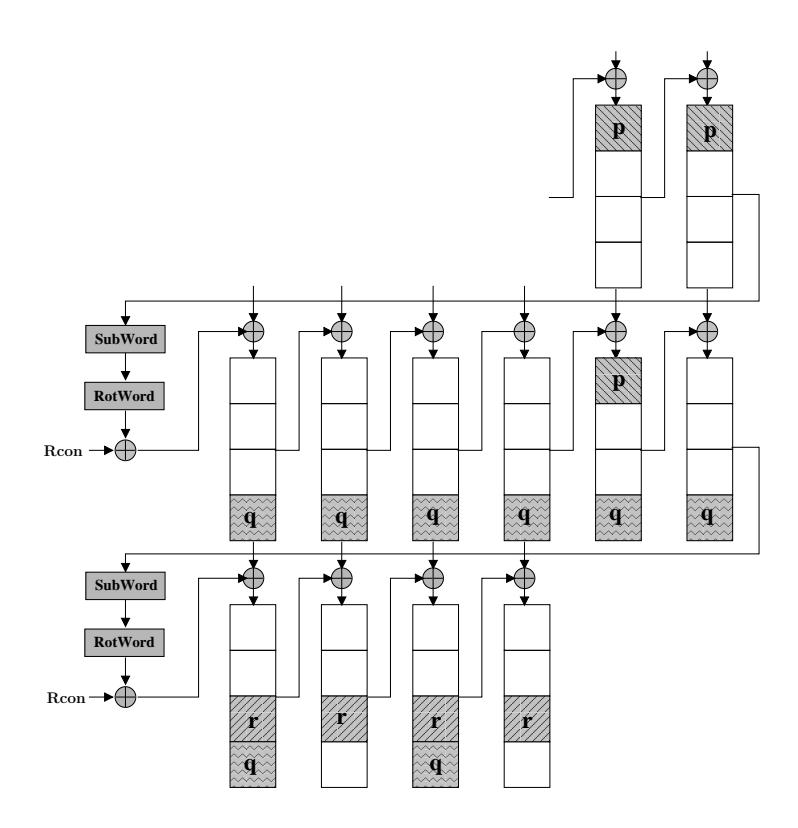

**Fig. 10.** Flow of faults in AES-192 key schedule when fault induced at  $K_{0,0}^{10}$ .

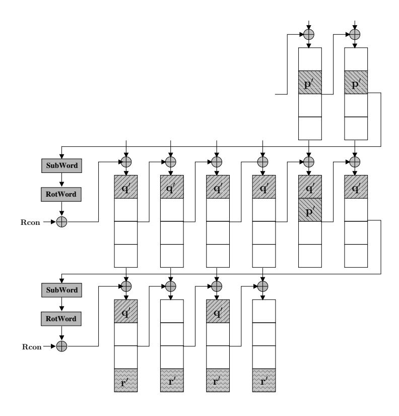

**Fig. 11.** Flow of faults in AES-192 key schedule when fault induced at  $K_{1,0}^{10}$ .

ciphertext  $C_1^*$ , the first column of state matrix  $S_2$  consists of two faulty bytes  $p_0$  and  $q_0$ . These two faulty bytes will produce a relation  $\langle (2p_0 \oplus q_0), (p_0 \oplus q_0), (p_0 \oplus 3q_0), (3p_0 \oplus 2q_0) \rangle$  at the output of MixColumns (in  $S_3$ ). Therefore, this relation will produce four equations similar to equations (2). In the same way, from the rest of the three columns of  $S_3$  we get  $\langle 2p_1, p_1, p_1, 3p_1 \rangle$ ,  $\langle 0, 0, 0, 0 \rangle$ , and  $\langle q_1, q_1, 3q_1, 2q_1 \rangle$ . Using second and fourth relations we get two more sets of equations. However, from the third relation which does not have any difference, we get a set of two equations corresponding to fault value p and q in  $K^{11}$ . It

{30}------------------------------------------------

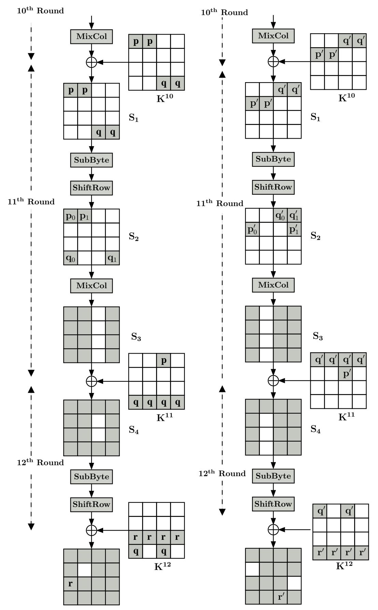

(a) Flow of fault from key byte (b) Flow of fault from key byte  $K_{0,0}^{10}$ 

 $\mathbf{Fig.~12}$ . Flow of faults in the last three rounds of AES-192

may be observed that the third byte of this relation is zero. Therefore, from this value we can get  $r = C_{2,0} \oplus C_{1(2,0)}^*$ .

{31}------------------------------------------------

Similarly, from the four columns of  $S_3$  of Fig. 12(b), we get relations  $\langle 3p'_0, 2p'_0, p'_0, p'_0 \rangle$ ,  $\langle 0, 0, 0, 0 \rangle$ ,  $\langle 2q_0, q_0, q_0, 3q_0 \rangle$ , and  $\langle (2q_1 \oplus 3p_1), (q_1 \oplus 2p_1), (q_1 \oplus p_1), (3q_1 \oplus p_1) \rangle$ . These four relations will produce four more sets of equations. Each of these sets of equations corresponds to one key quartet of twelfth round key  $K^{12}$ . Like the previous attack we also name these quartets  $K_{q0}, K_{q1}, K_{q2}$ , and  $K_{q3}$  respectively.

Therefore, each faulty ciphertext produces four sets of equations. These sets of equations are not mutually independent, and are related by two variables. For the faulty ciphertext  $C_1^*$ , the variables are (q, r) whereas for faulty ciphertext  $C_2^*$ , the variables are (q', r'). As with the propagation of faults in the AES-192 key schedule, the variables r and r' can be deduced from q and q' respectively (Fig. 10 and Fig. 11). They are related by following equation:

$$r = S(K_{3,3}^{11}) \oplus S(K_{3,3}^{11} \oplus q) \tag{7a}$$

$$r' = S(K_{0,3}^{11}) \oplus S(K_{0,3}^{11} \oplus q')$$
(7b)

Similarly, q and q' are related to p and p' by following equations:

$$q = S(K_{1,3}^{11} \oplus K_{1,2}^{11}) \oplus S(K_{1,3}^{11} \oplus K_{1,2}^{11} \oplus p)$$
(8a)

$$q' = S(K_{0,3}^{11} \oplus K_{0,2}^{11}) \oplus S(K_{0,3}^{11} \oplus K_{0,2}^{11} \oplus p')$$
(8b)

Then r and r' can directly be calculated from the ciphertexts  $C_1^*$  and  $C_2^*$  as  $r = C_{2,0} \oplus C_{1(2,0)}^*$  and  $r' = C_{2,0} \oplus C_{2(2,0)}^*$ . Now to solve the eight sets of equations we guess the values of (q, q'). We start with two sets of equations corresponding to quartet  $K_{q0}$ . In the second set of equations, for one hypothesis for (q, q') we get  $2^8$  hypotheses for the quartet  $K_{q0}$  corresponding to  $2^8$  hypotheses for  $p'_1$ . Therefore, for all possible values of (q, q') we get  $2^{24}$  hypotheses for  $K_{q0}$ . Each of these hypotheses are tested using the first set of equations.

There are eight equations in the two sets corresponding to quartet  $K_{q0}$ , that contain nine unknown variables; namely  $q,q',p_0, p_3,p'_1$  and the quartet  $K_{q0}$ . Therefore, the reduced search space is given by  $(2^8)^{9-8} = 2^8$ . This implies, that out of  $2^{24}$  choices of  $q, q', K_{q0}$ , only  $2^8$  choices satisfy both the sets of equations.

Next we derive the second quartet  $K_{q1}$  from its corresponding two sets of equations. We can directly deduce the values of  $K_{0,1}^{12}$  corresponding to the values of q' in second set of equations. These values can be used in the first set of equations to get the corresponding values of  $2 p_1$  and  $p_1$ . Using these values we can derive the three key bytes  $K_{1,0}^{12}, K_{2,3}^{12}, K_{3,2}^{12}$  from the remaining three equations of the first set.

This gives an expected  $2^8$  hypotheses for (q, q') from the previous step. Each of these hypotheses will give one expected hypothesis for  $K_{0,1}^{12}$ , which in turn give one expected hypothesis for the three key bytes  $K_{1,0}^{12}$ ,  $K_{2,3}^{12}$ ,  $K_{3,2}^{12}$ . Therefore, the  $2^8$  hypotheses for  $(q, q', K_{q0})$  will produce  $2^8$  hypotheses for the quartet  $K_{q1}$ , giving  $2^8$  hypotheses for  $(q, q', K_{q0}, K_{q1})$ .

For the third quartet  $K_{q2}$  we can apply the same approach and one hypotheses for  $K_{3,3}^{12}$  corresponding to one hypotheses for q from its first set of equations.

{32}------------------------------------------------

This value will in turn allow a hypothesis for  $K_{0,2}^{12}$  and  $K_{2,0}^{12}$  from the first and third equations of the second set. However, p' is unknown. Therefore, we have to consider all possible  $2^8$  hypotheses for p' which in turn produces  $2^8$  hypotheses for  $K_{1,1}^{12}$ . This implies, for one hypothesis for q we get  $2^8$  hypotheses for the third quartet  $K_{q2}$ . From the previous steps we have  $2^8$  hypotheses for q. Therefore, in this step, we get  $2^{16}$  hypotheses for  $(q, q', K_{q0}, K_{q1}, K_{q2})$ .

In the next step we consider fourth quartet  $K_{q3}$ . The two sets of equations are similar to the two sets of equations corresponding to quartet  $K_{q0}$ . Therefore, for one hypothesis for q we get  $2^8$  hypotheses for the quartet  $K_{q3}$  from the first set of equations. Each of these are tested using the second set of equations. We have nine variables in the two sets of differential equations in which we choose the values of q and q' from the 5-tuple  $(q, q', K_{q0}, K_{q1}, K_{q2})$ . Therefore, the total number for resulting hypotheses is  $(2^8)^7 \cdot 2^{16} = (2^8)^9$ . We have eight equations in two sets, which will reduce the hypotheses to  $(2^8)^{9-8} = 2^8$  for the 6-tuple  $(q, q', K_{q0}, K_{q1}, K_{q2}), K_{q2})$ . Therefore, in the first phase of the attack we have  $2^8$  choices of the final round key  $K^{12}$ .

Second Phase of the Attack on AES-192 Key Schedule In the second phase of the attack we define differential equations based on the relationship between the faulty bytes in state matrix  $S_1$ . The fault values (p,q) and (p',q') in  $S_1$  of (Fig. 12(a) and Fig. 12(b)) will give eight differential equations similar to equation (3), where r is replaced by 12. Each of these equations corresponds to one column of  $K^{11}$ . Using AES-192 key scheduling algorithm we can directly define the first two columns  $K^{11}$  from  $K^{12}$  as  $K^{11}_{i,j} = K^{12}_{i,j} \oplus K^{12}_{i,j-1}$  for  $0 \le i \le 3$  and  $0 \le j \le 1$ .

The values of p can be deduced from  $K^{12}$  using equation  $p = S^{-1}(K_{0,2}^{12} \oplus C_{0,2}) \oplus S^{-1}(K_{0,2}^{12} \oplus C_{1(0,2)}^*)$ . Therefore,  $p, K_{q0}, K_{q1}, K_{i,0}^{11}$ , and  $K_{i,1}^{11}$  can be directly derived from  $K^{12}$  where  $0 \le i \le 3$ . There is an expected  $2^8$  hypotheses for  $K^{12}$  from the first phase of the attack. We consider the two equations corresponding to two values of p in  $S_1$ . In these two equations the search space is  $2^8$ , which can be reduced to  $\frac{2^8}{2^{16}} = \frac{1}{2^8}$ . One would expect that only one value will satisfy both the equations leaving one hypotheses for  $K^{12}$ .

An attacker can then deduce the fourth column  $K_{i,3}^{11}$ . The two bytes  $K_{0,3}^{11}$  and  $K_{3,3}^{11}$  of the fourth column can directly be calculated using (7a) and (7b). For one hypothesis for (q, r, q', r'), we get four hypotheses for  $(K_{0,3}^{11}, K_{3,3}^{11})$ . The other two key bytes,  $K_{1,3}^{11}$  and  $K_{2,3}^{11}$ , can be derived from three more differential equations from  $S_1$ . The faulty byte q in the fourth column of  $S_1$  (Fig. 12(a)), p' in the first column and q' in the fourth column of  $S_1$  (Fig. 12(b), will produce equations which correspond to  $K_{i,3}^{11}$ . In these equations only  $K_{1,3}^{11}$  and  $K_{2,3}^{11}$  are unknown, and the possible values for key bytes  $K_{0,3}^{11}$ ,  $K_{3,3}^{11}$  had already been reduced to an expected four hypotheses. One would expect that these will allow one hypothesis for  $K_{i,3}^{11}$  to be determined (two hypotheses will remain with probability  $\frac{2^{18}}{(2^8)^3} = \frac{1}{2^6}$ ).

{33}------------------------------------------------

For the third column of  $K^{11}$ , we can get the values of two key bytes  $K^{11}_{0,2}$  and  $K^{11}_{1,2}$  from (8a) and (8b). However, for one value for  $K^{11}_{0,3}$ ,  $K^{11}_{1,3}$ , q, q' we get two hypotheses for  $K^{11}_{0,2}$  from (8a) and two hypotheses for  $K^{11}_{1,2}$  from (8b) giving a total of four hypotheses. For key bytes  $K^{11}_{2,2}$  and  $K^{11}_{3,2}$  we can only determine one equation, i.e. from q' at the third column of  $S_1$  (Fig. 12(b)). This gives an expected four hypotheses for  $(K^{11}_{2,2}, K^{11}_{3,2})$  and  $2^{16}$  hypotheses for  $(K^{11}_{2,2}, K^{11}_{2,3})$ . Therefore, the resulting number of expected hypotheses is  $\frac{2^{16} \cdot 4}{2^8} = 2^{10}$ . So, finally we get an expected  $2^{10}$  hypotheses for  $K^{12}_{i,2}$ , implying the expected hypotheses for  $K^{11}$  is reduced to  $2^{10}$ .

Therefore, the two phase attack on AES-192 using two faulty ciphertexts can reduce a 192-bit key to 2<sup>10</sup> hypotheses. However, as per our analysis in Section 4 on AES-192 key schedule should be sufficient to determine the key. The attack described above reduces the key to 2<sup>10</sup> hypotheses and is therefore not optimal but it is the most efficient attack on the AES-192 key schedule to date. The attack summary is presented in Algorithm 5.

#### Algorithm 5: DFA on AES-192 Key Scheduling

```
Input: C, C_1^*, C_2^*
Output: List L_k of (K^{11}, K^{12})
Get r and r' from C, C_1^*, C_2^*.
Derive equations from \bar{S}_3 of Fig. 12(a) and Fig. 12(b).
for Each candidate of (q, q', p') do

Get K_{q0}, K_{q1}, K_{q2}, K_{q3} by solving corresponding two sets of equations of S_3.
         Get K^{12} from K_{q0}, K_{q1}, K_{q2}, and K_{q3}.
        for Each candidate of K^{12} do

Get K_{i,0}^{11} and K_{i,1}^{11} (two columns of K^{11}).

Test two equations of p of S_1.
\nif Satisfied then

Save (p, p', q, q', K^{12}).
                 end
        end
end
Get K_{0,3}^{11} and K_{3,3}^{11} from equations (7a) and (7b).
for Each candidate of (K_{0,3}^{11}, K_{3,3}^{11}) do

Get K_{1,3}^{11}, and K_{2,3}^{11} from equations of q, p' and q' of S_1.

Get K_{0,2}^{11} and K_{1,2}^{11} from equations (8a) and (8b).
       for Each candidate of (K_{0,2}^{11}, K_{1,2}^{11}) do
 | Get K_{2,2}^{11} \text{ and } K_{3,2}^{11} \text{ from equations of } q' \text{ of } S_1. 
Save (K^{11}, K^{12}) to L_k.
        end
end
return L_k
```

{34}------------------------------------------------

#### 7.3 Proposed Attack on AES-256 Key Schedule

In this section we present a two phase attack on AES-256 to uniquely determine the secret key. The attack requires three faulty ciphertexts, that we will refer to as  $C_1$ ,  $C_2$ , and  $C_3$ . The first two faulty ciphertexts  $C_1$  and  $C_2$  are generated by inducing a single byte fault in the first column of twelfth round key (Fig. 13). The third faulty ciphertext  $C_3$  is generated by inducing fault in the first column of the eleventh round key (Fig. 14). Figs. 15(a) and 15(b) shows how the propagation of the fault in the AES state matrix.

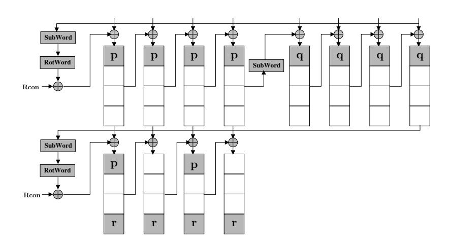

**Fig. 13.** Flow of faults in AES-256 key schedule when the fault is induced at  $K_{0,0}^{12}$ 

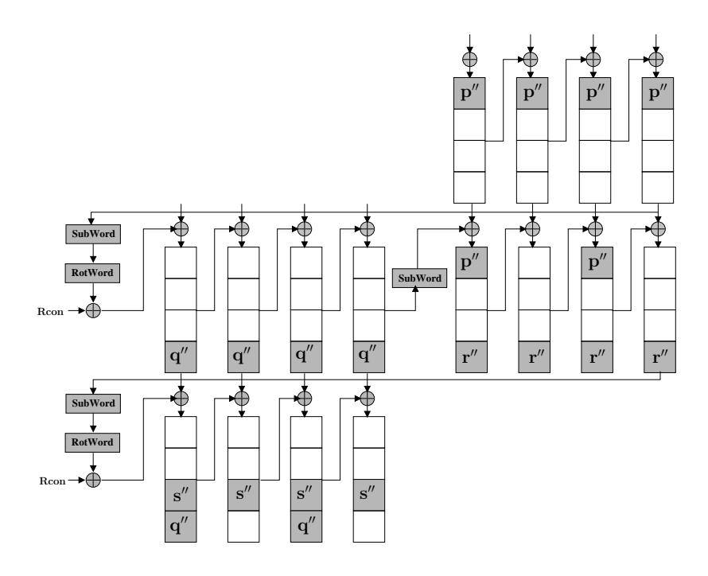

**Fig. 14.** Flow of faults in AES-256 key schedule when the fault is induced at  $K_{0,0}^{11}$ 

In the first phase of the attack we uniquely determine the 14-th round key  $K^{14}$  using  $C_1$  and  $C_2$ . In the second phase of the attack we uniquely determine the penultimate round key  $K^{13}$  using  $C_3$ .

{35}------------------------------------------------

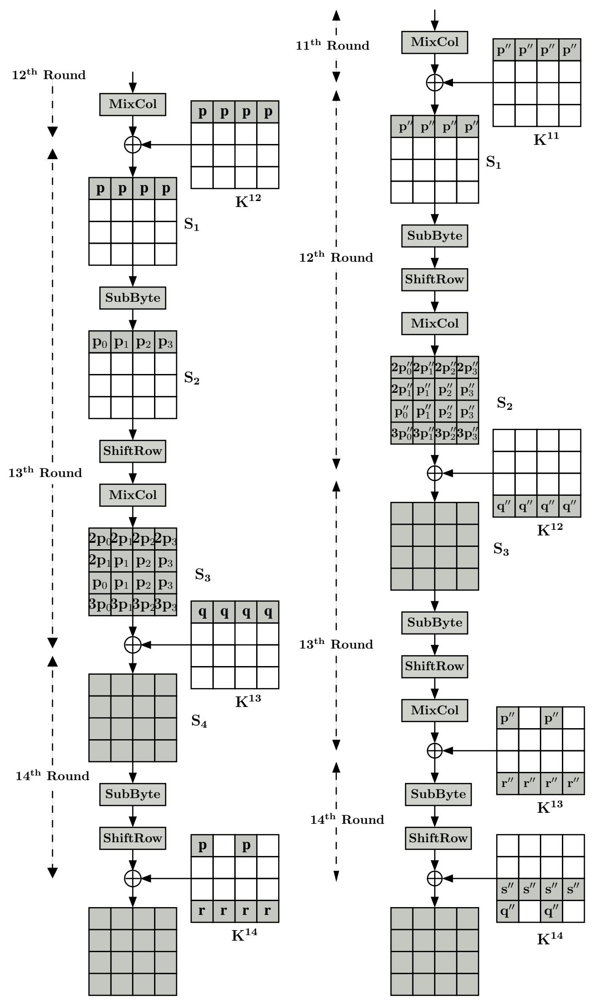

(a) Flow of faults from key byte  $K_{0,0}^{12}$  (b) Flow of faults from key byte  $K_{0,0}^{11}$ 

Fig. 15. Flow of faults in the AES-256 rounds

{36}------------------------------------------------

First Phase of the Attack of AES-256 Key Schedule In the first phase of the attack we deduce the differential equations from the relationship between the faulty bytes in state matrix  $S_3$  (Fig. 15(a)). From the first column of  $S_3$  we get relation  $\langle 2p_0, p_0, p_0, 3p_0 \rangle$ , which corresponds to  $C_1$ . Similarly, from  $C_2$  we get  $\langle 2p'_0, p'_0, p'_0, 3p'_0 \rangle$ . These two relations will give two sets of equations. Therefore, together we get eight sets of equations, each set corresponds to the one quartet of key bytes. As with the previously described attacks, we refer to these quartets as  $K_{q0}, K_{q1}, K_{q2}, K_{q3}$ . There are two sets of equations each corresponding to a quartet. In order to use these sets of equations we need to guess the values of  $p, q, r, p_i$  and  $p', q', r', p'_i$  where i corresponds to the i-th quartet. In which case the total possible hypotheses is  $(2^8)^8 = 2^{64}$  which would make an exhaustive search impossible. We apply a divide-and-conquer strategy to these equations.

The second and third equation of each set of equations contain only two unknown variables except the key bytes. Therefore we can directly solve these equations by guessing the values of  $p_i$  and  $p'_i$ . For example we guess  $p_0$  in the first set of equations of  $K_{q0}$  and derive  $2^8$  hypotheses for  $(K_{1,3}^{14}, K_{2,2}^{14})$ . Each of these hypotheses are tested using corresponding equations in the second set of equations of  $K_{q0}$ . Those which satisfy these equations are accepted and rest are discarded. There are four equations and four unknowns  $(K_{1,3}^{14}, K_{2,2}^{14}, p_0, p'_0)$ , so one would expect one hypothesis to remain.

Similarly, we can uniquely determine the values of  $(K_{1,0}^{14}, K_{2,3}^{14})$ ,  $(K_{1,1}^{14}, K_{2,0}^{14})$ , and  $(K_{1,2}^{14}, K_{2,1}^{14})$ , and the corresponding values of  $p_1, p_2, p_3, p'_1, p'_2, p'_3$  from the second and third equations of two sets of equations of  $K_{q1}, K_{q2}, K_{q3}$ . Next, we guess the values of r and r'. For each hypothesis we get one hypothesis for  $K_{3,1}^{14}$  using fourth equation of two sets of equations of  $K_{q0}$ . Similarly, we get the values  $K_{3,2}^{14}, K_{3,3}^{14}$ , and  $K_{3,0}^{14}$  corresponding to other three key quartets. There are eight equations and six unknown variables (namely r, r', and four key bytes) so an attacker should be able to determine these bytes.

An attacker would then only need to solve the first equation of each of the eight sets of equations. In these equations we have eight unknown variable (q, p, q', p'), and the four key bytes. As per Fig. 13, q and q' can be derived from p and p' using the following:

$$q = S(K_{0,3}^{13} \oplus K_{0,2}^{13}) \oplus S(K_{0,3}^{13} \oplus K_{0,2}^{13} \oplus p)$$
(9)

$$q' = S(K_{0,3}^{13} \oplus K_{0,2}^{13}) \oplus S(K_{0,3}^{13} \oplus K_{0,2}^{13} \oplus p')$$
(10)

Similarly, r, r' can be deduced from q, q' using the following:

$$r = S(K_{3,3}^{14} \oplus K_{3,2}^{14}) \oplus S(K_{3,3}^{14} \oplus K_{3,2}^{14} \oplus q)$$
(11)

$$r' = S(K_{3,3}^{14} \oplus K_{3,2}^{14}) \oplus S(K_{3,3}^{14} \oplus K_{3,2}^{14} \oplus q')$$
(12)

The values of  $r, r', K_{3,3}^{14}$ , and  $K_{3,2}^{14}$  are already known from the previous steps. Therefore, we get the values of q, and q' from (11) and (12). Therefore, an attacker would only need to guess the values of p and p' to get the values of  $K_{0,0}^{14}, K_{0,1}^{14}, K_{0,2}^{14}$ , and  $K_{0,3}^{14}$  from the corresponding sets of equations. There are

{37}------------------------------------------------

eight equations and six unknown variables, which implies that an attacker would

be able to determine p, p' and  $K_{0,0}^{14}$   $K_{0,1}^{14}$ ,  $K_{0,2}^{14}$ ,  $K_{0,3}^{14}$ .

Therefore, finally we have one choice of p, p', q, q', r, r' and  $K^{14}$  using two faulty ciphertexts  $C_1^*$  and  $C_2^*$ .

Second Phase of th Attack of AES-256 Key Schedule In the second phase of the attack we use a third faulty ciphertext produced by a one byte fault in the first column of the eleventh round key, as shown in Fig. 14. The propagation of the fault in the last three rounds is shown in Fig. 15(b). In order to reduce the number of hypotheses for  $K^{13}$  we use the relationship between the faulty byte in the 13-th round. As we have the 14-th round key, we can decrypt one round and get the output of the 13-th round for a fault-free and faulty outputs. We define the output of the 13-th round of  $C, C_1^*$ , and  $C_2^*$  as  $C^{13}, C_1^{13*}$ , and  $C_2^{13*}$ respectively. In case of the third faulty ciphertext  $C_3^*$  we cannot compute the output of the 13-th round as the values of q'' and s'' in the final round key are not known.

Therefore, we follow the technique proposed in Section 6.3. Let X be the fault-free output of the 13-th round SubBytes operation and  $\epsilon$  be the corresponding fault value. Therefore,  $\epsilon$  can be written as

$$\epsilon = SR^{-1} \Big( MC^{-1} \Big( SR^{-1} (SB^{-1} (C \oplus K^{14})) \oplus SR^{-1} (SB^{-1} (C_3^* \oplus K^{14*})) \oplus (K^{13} \oplus K^{13*}) \Big) \Big)$$

where  $K^{14*}$  and  $K^{13*}$  are the 14-th and 13-th round faulty keys used to generate faulty ciphertext  $C_3$ .  $K^{14}$  is already known to us. Therefore, in order to get  $K^{14*}$ and  $(K^{13} \oplus K^{13*})$  we need to know the values of p'', q'', r'', and s''. However, as per Fig. 14, r'' can be directly deduced from  $K^{14}$  and q'' by the following equation:

$$r'' = S(K_{3,3}^{12}) \oplus S(K_{3,3}^{12} \oplus q'')$$

$$= S(K_{3,3}^{14} \oplus K_{3,2}^{14}) \oplus S(K_{3,3}^{14} \oplus K_{3,2}^{14} \oplus q'')$$
(13)

Therefore, now we need to guess p'', q'', and s'' to get the possible hypotheses for  $\epsilon$ .

The possible fault values in the first column of  $S_2$  (Fig. 15(b)) can be represented in terms of first column of X and  $\epsilon$  which will produce four differential equations. Similarly, from the rest of the three columns of  $S_2$  we get three more sets of equations. The values for  $X_{0,0}, X_{0,1}, X_{0,2}, X_{0,3}$  can also be represented by the faulty ciphertexts  $C_1^*$  and  $C_2^*$ . In Fig. 15(a), the first row of  $S_1$  can be expressed in terms of  $(X_{0,0}, X_{0,1}, X_{0,2}, X_{0,3}), (p_0, p_1, p_2, p_3),$  which will produce a set of four differential equations. Similar, equations can also be generated from  $C_{2}^{*}$ .

In these eight equations only  $X_{0,0}, X_{0,1}, X_{0,2}, X_{0,3}$  are unknown; the rest of the variables have been determined in the first phase of the attack. Therefore, using these equations we can uniquely determine the values of  $X_{0,0}, X_{0,1}, X_{0,2}$  $X_{0,3}$ . It may be noted that these four bytes of X correspond to the first equations

{38}------------------------------------------------

of the four sets of equations generated from  $S_2$  (Fig. 15(b)). We use the four bytes of X; and get the corresponding values of  $2p_0''$ ,  $2p_1''$ ,  $2p_2''$ ,  $2p_3''$ . If we multiply these values with the inverse of 2 we get the corresponding values of  $p_0''$ ,  $p_1''$ ,  $p_2''$ , and  $p_3''$ .

We have  $2^{24}$  choices of  $\epsilon$  corresponding to the all possible values of p'', q'', and s''. For, each possible value of  $\epsilon$  we will get one hypothesis for the quartet of X from each of the four sets of equations. Therefore, from all the four sets of equations we get one hypothesis for X corresponding to one hypothesis for  $\epsilon$ . Therefore, we expect to have  $2^{24}$  hypotheses for X corresponding to  $2^{24}$  hypotheses for  $\epsilon$ .

In the next step we deduce four differential equations corresponding to four faulty bytes p'', p'', p'', p'', in  $S_1$  (Fig. 15(b)) as described in Section 6.3. Each of these four equations requires one column of the twelfth round key  $K^{12}$ . The last three columns of  $K^{12}$  can be computed from  $K^{14}$  as  $K^{12}_{i,j} = K^{14}_{i,j} \oplus K^{14}_{i,j-1}$  where  $0 \le i \le 4$  and  $1 \le j \le 3$ . Therefore, we can test each value of X using the last three of the four equations which corresponds to last three columns of  $K^{12}$ . The value of p'' is already known while considering  $\varepsilon$ .

There are  $2^{24}$  values of X in the three equations that will be expected to be reduced to one hypothesis, since  $\frac{2^{24}}{(2^8)^3} = 1$ . In some cases there could be more than one remaining hypothesis for X satisfying the last three equations. In which case the false hypotheses can be eliminated since  $K^{13} = (MC(SR(X)) \oplus C^{13})$ . Using the value of  $K^{13}$  and  $K^{14}$  we verify these hypotheses using the key schedule.

The described attack would determine  $K^{13}$  and  $K^{14}$  allowing the 256-bit master key of AES-256 using three faulty ciphertexts. The summary of the attack is given in Algorithm 6.

## 8 Experimental Results

In this section we present experimental results used to validate our attacks. We have simulated all the attacks. The attack codes were written in the C programming language and compiled with gcc-4.4.3. We used  $Intel\ Core2\ Duo$  processor with 3 GHz and 2 GB RAM. The simulated attacks were performed on different randomly generated keys and the results are detailed in this section.

Table 3 shows the simulated attack results on the AES-128 state matrix, the simulated attack takes around five minutes to reveal  $2^8$  possible keys. The second column shows the total possible choices of all four quartets of key bytes generated in the first phase of the attack. In the second phase we used four threads running in parallel, each taking  $2^{30}$  possible keys from the first phase of the attack as describe in Section 4.1.

Table 4 shows the simulated attack results on the AES-256 state matrix. The two phase attack reduces the search space of 256-bit key to approximately  $2^{16}$  hypotheses. However, the attack takes around 45-minutes which is caused by the relatively high time complexity of  $2^{32}$ .

{39}------------------------------------------------

#### **Algorithm 6:** DFA on AES-256 Key Scheduling

```
Input: C, C_1^*, \overline{C_2^*}, \overline{C_3^*}
Output: List L_k of (K^{13}, K^{14})
Derive equations from S_3 (Fig. 15(a)) corresponding to C_1^*, and (Fig. 15(b)) corresponding
to C_2^*.
Solve 2^{nd} and 3^{rd} equations corresponding to each quartet of key.
Determine 2^{nd} and 3^{rd} bytes of each quartets and p_i, p'_i (0 \le i \le 3).
for Each candidate of (r, r') do
     Solve equations of (r, r') of S_3.
     if Solution found then
       Save (r, r') and 4^{th} bytes of each quartets.
     \mathbf{end}
end
Get q and q' from equations (11) and (12).
for Each candidate of (p, p') do
      Solve equations of (p, p') of S_3.
      if Solution found then
      Save (p, p') and 1^{st} bytes of each quartets.
     end
end
Get K^{14} from K_{q0}, K_{q1}, K_{q2}, and K_{q3},
Derive two sets of equations of X from (p, p') of S_1.
Determine X_{0,0}, X_{0,1}, X_{0,2}, X_{0,3} by solving these equations.
Derive equations of X from S_2(\text{Fig. 15(b)})
for Each candidate of (p'', q'', s'') do
     Determine \epsilon
     Determine P_i'' from X_{0,i} (0 \le i \le 3)
Determine X from equations of S_2(\text{Fig. 15(b)})
     Get K_{i,j}^{12} from K^{14} (1 \le j \le 3)
Test last three equations of P'' of S_1(\text{Fig. 15(b)})
      if Satisfied then
          Get K_{i,0}^{12} from X and K^{14}
Test first equation of P'' of S_1(\text{Fig. 15(b)})
           if Satisfied then Get K^{13} from X.
Save (K^{13}, K^{14}).
           end
     end
end
return L_k
```

In case of attacks based on faults in the AES key schedule we get different results. Table 5 shows the attack results on AES-128 key schedule. Like the attack on the AES-128 state matrix, here also the final search space is reduce to approximately 2<sup>8</sup> hypotheses. However, the execution time is little higher. The third column of the table shows that the proposed attack takes around 35 minutes.

Table 6 presents the simulated attack results on AES-192 key schedule. The attack takes around 5 seconds to reveal all the possible  $2^{10}$  hypotheses for 192-bit keys.

{40}------------------------------------------------

Table 3. Attack Results of AES-128 State

| Random 128-bit              | Number of     | Number of                          | Running |
|-----------------------------|---------------|------------------------------------|---------|
| AES key                     | Keys in       | Keys in                            | Time    |
|                             |               | First Phase Second Phase (minutes) |         |
| a43663d288b6cffd 3538944000 |               | 7.9<br>240 ≈ 2                     | 5.727   |
| 8e8d3dbec9dff34d            | 31.72<br>≈ 2  |                                    |         |
| 261043d7ddd03357 3774873600 |               | 7.82<br>227 ≈ 2                    | 4.616   |
| b05ceb45c12899f8            | 31.813<br>≈ 2 |                                    |         |
| 5ff94723b3ab5e2f 8304721920 |               | 8.03<br>262 ≈ 2                    | 5.342   |
| 48171a2af88e0ec6            | 32.951<br>≈ 2 |                                    |         |
| 74a33cf4114b271b 3317760000 |               | 7.9<br>240 ≈ 2                     | 5.64    |
| f06a985303785c61            | 31.627<br>≈ 2 |                                    |         |
| ff85f16a9aa247d8            | 8304721920    | 8.05<br>266 ≈ 2                    | 5.231   |
| c3d5bf355c27df7b            | 32.951<br>≈ 2 |                                    |         |

Table 4. Attack Results of AES-256 State

| Random 256-bit                   | Number of Running |           |
|----------------------------------|-------------------|-----------|
| AES key                          | Keys              | Time      |
|                                  |                   | (minutes) |
| 0b169d18964b23cffedced73674e2bf1 | 56931 ≈           | 45.2      |
| 8a2f68ca11ebfacb7aa5f6694d045169 | 15.795<br>2       |           |
| e2b151958b9e86480e2b4ae624ccaa2c | 54252 ≈           | 44        |
| b86f5e72c6b1ac7f114a12e4601303c4 | 15.727<br>2       |           |
| 3a1bda7d59a233de3901aee30d60ef8f | 34262 ≈           | 45.4      |
| 46dee1bd66c837cdfbbd20a642496ca6 | 15.06<br>2        |           |
| 3a4f6f8682e7138d02ae4b7b162c2d9f | 53846 ≈           | 45.4      |
| c839c9cda1b464f54143c2f934b1c2af | 15.716<br>2       |           |
| 3991e777a5947416a102642ed314f811 | 43256 ≈           | 42.9      |
| 899ab00ae736dd226fa9273f00a69872 | 15.4<br>2         |           |

Table 5. Attack Results of AES-128 Key Schedule

| Random 128-bit                       | Number of    | Number of                          | Running |
|--------------------------------------|--------------|------------------------------------|---------|
| AES key                              | Keys in      | Keys in                            | Time    |
|                                      |              | First Phase Second Phase (minutes) |         |
| 7f6a28b073e9b4f4 23631628492 248 ≈ 2 |              | 7.954                              | 33.472  |
| d9d55414fe5bab4f                     | 34.46<br>≈ 2 |                                    |         |
| 6f116394d00fcd82 30966733299         |              | 8.01<br>258 ≈ 2                    | 34.643  |
| 737799d7aa661e13                     | 34.85<br>≈ 2 |                                    |         |
| 7937fd3f2a25172f 27334426474         |              | 8.03<br>262 ≈ 2                    | 35.93   |
| 9084da2e274f2a87                     | 34.67<br>≈ 2 |                                    |         |
| eaa618c81145622f 31977681408         |              | 7.9<br>240 ≈ 2                     | 35.467  |
| b409c89c0a5ec485                     | 34.89<br>≈ 2 |                                    |         |
| 79f13f05486d3e24 24637624453         |              | 8.04<br>264 ≈ 2                    | 36.016  |
| cbcdeb3ac7c174cf                     | 34.52<br>≈ 2 |                                    |         |

In case of AES-256 we performed the simulated attack on several random keys. In all the cases the attack uniquely determined the 256-bit key and the attack takes less then one second to compute

{41}------------------------------------------------

Table 6. Attack Results of AES-192 Key Schedule

| Random 192-bit                   | Number of Running |           |
|----------------------------------|-------------------|-----------|
| AES key                          | Keys              | Time      |
|                                  |                   | (Seconds) |
| 4277a31082c1ca12410ad654edd60d21 | 1024              | 5         |
| 20878c69302553cb                 | 10<br>≈ 2         |           |
| 531e1665195a75e4859088faaa9cb334 | 1024              | 5         |
| 30c979c8ebb9cd3b                 | 10<br>≈ 2         |           |
| a4fddcc4a8604705cee71f3230923d9c | 1024              | 5         |
| c62f8b411aedb627                 | 10<br>≈ 2         |           |
| 5fc4ed8ec84f2f8acaf0711ed42d5fac | 1024              | 5         |
| 19dcd7723f08d8b2                 | 10<br>≈ 2         |           |
| 5a16a80e4199945e1d929619186feba7 | 1024              | 5         |
| 95f655e1d420bd8b                 | 10<br>≈ 2         |           |

# 9 Comparison With the Previous Works

In this section we compare our attacks with some of the previous attacks defined in the literature. In Table 7 we compare our attack on AES-128 state with some of the existing attacks. For example, the attack proposed by Fukunaga and Takahashi [13] reduces the key hypotheses for a AES-128 key to 2 <sup>32</sup> whereas our attack reduces the key hypotheses to 2<sup>8</sup> .

In case of attacks on the AES-256 state matrix, the most recent attack [19](Table 8) reduces the key hypotheses to 2<sup>16</sup> with a time complexity of 2<sup>48</sup> which at the upper limit of what is practical. The time complexity of our attack is 2 32 that means the attack can be conducted in approximately one hour.

The existing attacks on the AES-128 key schedule require at least two faulty ciphertexts [15](Table 9, where as our attack requires only one faulty ciphertext and reduces the key hypotheses to 2<sup>8</sup> . Similar improvements can also be seen in the attacks on the AES-192 and AES-256 key schedules (Table 10 and Table 11). The most recent attack on the AES-192 key schedule required between four and six faulty ciphertexts [15], whereas our attack requires only two faulty ciphertexts and reduces the key hypotheses to 2<sup>10</sup>. Our attack on the AES-256 key schedule only requires three faulty ciphertexts, whereas the attack proposed by Kim [15] requires four faulty ciphertexts to uniquely determine the key.

From the tables we can see that the attacks proposed in this paper present an improvement over the attacks in the literature. Table 12 shows that we have obtained the optimal limits for DFA on AES-128, AES-256 states and AES-128 key schedule in the first scenario. It also shows that the proposed DFA on AES-256 key schedules for the second scenario has also reached its limit. However, for the first scenario, it is still a open problem to find a DFA on AES-192 and AES-256 with optimal results.

{42}------------------------------------------------

Table 7. Comparison with existing attack on AES-128 states

| Reference  | Fault Model       | Number    | Exhaustive |
|------------|-------------------|-----------|------------|
|            |                   | of Faults | Search     |
| [23]       | Single byte fault | 2         | 1          |
| [13]       | Single byte fault | 1         | $2^{32}$   |
| Our Attack | single byte fault | 1         | $2^8$      |

Table 8. Comparison with existing single byte attack on AES-256

| Reference  | Number    | Exhaustive | Time       |
|------------|-----------|------------|------------|
|            | of Faults | Search     | Complexity |
| [16]       | 3         | 1          | $2^{24}$   |
| [19]       | 2         | $2^{16}$   | $2^{48}$   |
| Our attack | 2         | $2^{16}$   | $2^{32}$   |

Table 9. Comparison with existing attack on AES-128 key schedule

| Reference  | Fault Model       | Number    | Exhaustive |
|------------|-------------------|-----------|------------|
|            |                   | of Faults | Search     |
| [8]        | Single byte fault | 22 to 44  | 1          |
| [22]       | Multi byte fault  | 12        | 1          |
| [28]       | Multi byte fault  | 2         | $2^{48}$   |
| [17]       | Multi byte fault  | 2         | $2^{32}$   |
| [15]       | Single byte fault | 2         | 1          |
| Our Attack | Single byte fault | 1         | $2^{8}$    |

# 10 Conclusion

In this paper we analyze the limits of Differential Fault Analysis on AES, using reduction methods based on the security assumption of AES. We then extend the results present in the literature, targeting faults in either the state matrix or key schedule of the block cipher. More specifically, we develop fault attacks on the data path of AES-128 and 256, and reach the optimal limits. For the analysis of fault in the key schedule, we present new attacks and shows that under such scenarios AES-128, 192, and 256 can be attacked with one, two, and

{43}------------------------------------------------

Table 10. Comparison with existing attack on AES-192 key schedule

| Reference | Fault Model                  |           | Number Exhaustive |
|-----------|------------------------------|-----------|-------------------|
|           |                              | of Faults | Search            |
| [12]      | Single byte fault            | 16        | 1                 |
| [15]      | Single byte fault            | 4 to 6    | 1                 |
|           | Our Attack Single byte fault | 2         | 10<br>2           |

Table 11. Comparison with existing attack on AES-256 key schedule

| Reference | Fault Model                  |           | Number Exhaustive |
|-----------|------------------------------|-----------|-------------------|
|           |                              | of Faults | Search            |
| [12]      | Single byte fault            | 16        | 1                 |
| [15]      | Single byte fault            | 4         | 1                 |
|           | Our Attack Single byte fault | 3         | 1                 |

three faults respectively. Our theoretical analysis shows that the fault attack on the key schedule, reaches the optimal limit for AES-128, there is still scope for improvement for the other two variants of AES. The results developed in the paper are validated through detailed experimental results.

#### Acknowledgments

The work described in this paper has been supported in part the European Commission through the ICT Programme under Contract ICT-2007-216676 ECRYPT II and the EPSRC via grant EP/I005226/1.

## References

- 1. Ali, S., Mukhopadhyay, D., Tunstall, M.: Differential Fault Analysis of AES using a Single Multiple-Byte Fault. Cryptology ePrint Archive, Report 2010/636 (2010). http://eprint.iacr.org/
- 2. Barenghi, A., Bertoni, G., Breveglieri, L., Pellicioli, M., Pelosi, G.: Low Voltage Fault Attacks to AES and RSA on General Purpose Processors. Cryptology ePrint Archive, Report 2010/130 (2010). http://eprint.iacr.org/
- 3. Biham, E.: New Types of Cryptanalytic Attacks Using Related Keys. In: T. Helleseth (ed.) EUROCRYPT '93, LNCS, vol. 765, pp. 398–409. Springer (1993)
- 4. Biham, E., Shamir, A.: Differential Fault Analysis of Secret Key Cryptosystems. In: B.S. Kaliski (ed.) Advances in Cryptology — CRYPTO '97, LNCS, vol. 1294, pp. 513–525. Springer (1997)

{44}------------------------------------------------

Table 12. Status of the Present Attacks

| AES Version and |           | Optimal Result      | Optimal Result for Unique key |
|-----------------|-----------|---------------------|-------------------------------|
| Attack Type     | Number    | remaining           | Number                        |
|                 | of Faults | Keys                | of Faults                     |
| AES-128         | 1         | 8<br>2              | 2                             |
| State           |           | (Obtained)          | (published in [23])           |
| AES-192         | 2         | 1                   | 2                             |
| State           |           | (published in [16]) | (published in [16])           |
| AES-256         | 2         | 16<br>2             | 3                             |
| State           |           | (Obtained)          | (published in [16])           |
| AES-128         | 1         | 8<br>2              | 2                             |
| Key Schedule    |           | (Obtained)          | (Published in [15])           |
| AES-192         | 2         | 1                   | 2                             |
| Key Schedule    |           |                     |                               |
| AES-256         | 2         | 16<br>2             | 3                             |
| Key Schedule    |           |                     | Obtained                      |

- 5. Bl¨omer, J., Seifert, J.P.: Fault Based Cryptanalysis of the Advanced Encryption Standard (AES). In: R.N. Wright (ed.) Financial Cryptography, Lecture Notes in Computer Science, vol. 2742, pp. 162–181. Springer (2003)
- 6. Bogdanov, A., Khovratovich, D., Rechberger, C.: Biclique Cryptanalysis of the Full AES. Cryptology ePrint Archive, Report 2011/449 (2011). http://eprint.iacr. org/
- 7. Boneh, D., DeMillo, R., Lipton, R.: On the importance of checking cryptographic protocols for faults. In: W. Fumy (ed.) Advances in Cryptology — EUROCRYPT '97, LNCS, vol. 1233, pp. 37–51. Springer (1997)
- 8. Chen, C.N., Yen, S.M.: Differential fault analysis on AES key schedule and some countermeasures. In: G. Goos, J. Hartmanis, J. van Leeuwen (eds.) ACISP 2003, LNCS, vol. 2727, pp. 118–129. Springer (2003)
- 9. Christophe Giraud: DFA on AES. In: H. Dobbertin, V. Rijmen, A. Sowa (eds.) AES Conference, Lecture Notes in Computer Science, vol. 3373, pp. 27–41. Springer (2004)
- 10. Dusart, P., Letourneux, G., Vivolo, O.: Differential Fault Analysis on AES. Cryptology ePrint Archive, Report 2003/010 (2003). http://eprint.iacr.org/
- 11. FIPS PUB 197: Advanced encryption standard (AES). Federal Information Processing Standards Publication 197, National Institute of Standards and Technology (NIST), Gaithersburg, MD, USA (2001)
- 12. Floissac, N., L'Hyver, Y.: From AES-128 to AES-192 and AES-256, How to Adapt Differential Fault Analysis Attacks. Cryptology ePrint Archive, Report 2010/396 (2010). http://eprint.iacr.org/
- 13. Fukunaga, T., Takahashi, J.: Practical Fault Attack on a Cryptographic LSI with ISO/IEC 18033-3 Block Ciphers. In: L. Breveglieri, S. Gueron, I. Koren, D. Naccache, J.P. Seifert (eds.) FDTC, pp. 84–92. IEEE Computer Society (2009)
- 14. Giraud, C., Thillard, A.: Piret and Quisquater's DFA on AES Revisited. Cryptology ePrint Archive, Report 2010/440 (2010). http://eprint.iacr.org/

{45}------------------------------------------------

- 15. Kim, C.: Improved Differential Fault Analysis on AES Key Schedule. Information Forensics and Security, IEEE Transactions on PP(99), 1 (2011). DOI 10.1109/ TIFS.2011.2161289
- 16. Kim, C.H.: Differential fault analysis against AES-192 and AES-256 with minimal faults. In: L. Breveglieri, M. Joye, I. Koren, D. Naccache, I. Verbauwhede (eds.) Fault Diagnosis and Tolerance in Cryptography — FDTC 2010, pp. 3–9. IEEE Computer Society (2010)
- 17. Kim, C.H., Quisquater, J.J.: New Differential Fault Analysis on AES Key Schedule: Two Faults Are Enough. In: G. Grimaud, F.X. Standaert (eds.) CARDIS, LNCS, vol. 5189, pp. 48–60. Springer (2008)
- 18. Li, W., Gu, D., Wang, Y., Li, J., Liu, Z.: An Extension of Differential Fault Analysis on AES. In: Third International Conference on Network and System Security, pp. 443–446. NSS (2009)
- 19. Li, Y., Gomisawa, S., Sakiyama, K., Ohta, K.: An Information Theoretic Perspective on the Differential Fault Analysis against AES. Cryptology ePrint Archive, Report 2010/032 (2010). http://eprint.iacr.org/
- 20. Moradi, A., Shalmani, M.T.M., Salmasizadeh, M.: A Generalized Method of Differential Fault Attack Against AES Cryptosystem. In: L. Goubin, M. Matsui (eds.) CHES 2006, LNCS, vol. 4249, pp. 91–100. Springer (2006)
- 21. Nyberg, K.: Differentially uniform mappings for cryptography. In: EUROCRYPT, pp. 55–64 (1993)
- 22. Peacham, D., Thomas, B.: A DFA attack against the AES key schedule. SiVenture White Paper 001, 26 October (2006)
- 23. Piret, G., Quisquater, J.J.: A Differential Fault Attack Technique against SPN Structures, with Application to the AES and KHAZAD. In: C.D. Walter, C¸ etin Kaya Ko¸c, C. Paar (eds.) CHES, Lecture Notes in Computer Science, vol. 2779, pp. 77–88. Springer (2003)
- 24. Saha, D., Mukhopadhyay, D., RoyChowdhury, D.: A Diagonal Fault Attack on the Advanced Encryption Standard. Cryptology ePrint Archive, Report 2009/581 (2009). http://eprint.iacr.org/
- 25. Selmane, N., Guilley, S., Danger, J.L.: Pttacks on AES ractical Setup Time Violation Attacks on AES. In: EDCC, pp. 91–96 (2008)
- 26. Skorobogatov, S.P., Anderson, R.J.: Optical Fault Induction Attacks. In: B.S.K. Jr., C¸ etin Kaya Ko¸c, C. Paar (eds.) CHES, Lecture Notes in Computer Science, vol. 2523, pp. 2–12. Springer (2002)
- 27. Takahashi, J., Fukunaga, T.: Differential Fault Analysis on AES with 192 and 256- Bit Keys. Cryptology ePrint Archive, Report 2010/023 (2010). http://eprint. iacr.org/
- 28. Takahashi, J., Fukunaga, T., Yamakoshi, K.: DFA Mechanism on the AES Key Schedule. In: L. Breveglieri, S. Gueron, I. Koren, D. Naccache, J.P. Seifert (eds.) FDTC, pp. 62–74. IEEE Computer Society (2007)