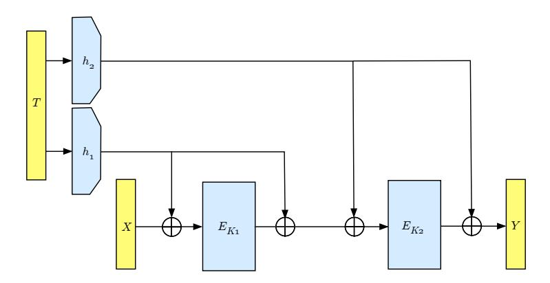
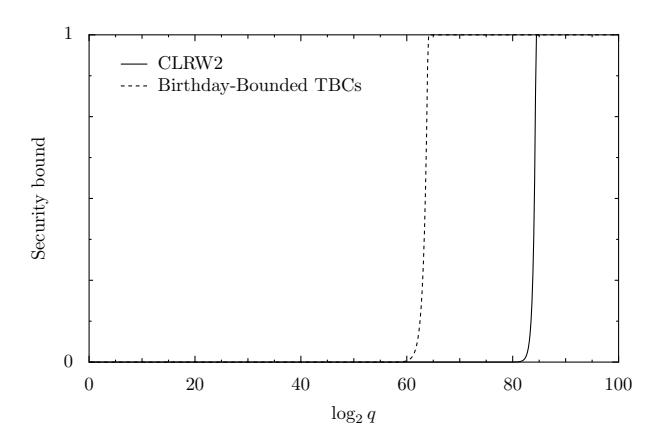
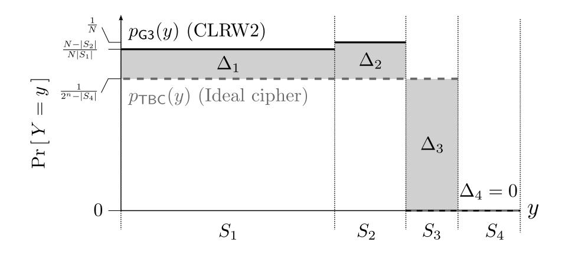
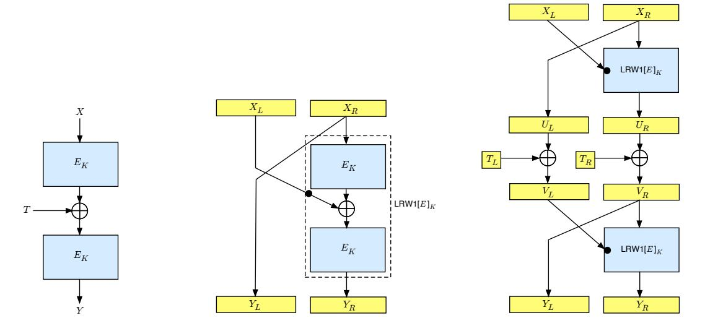
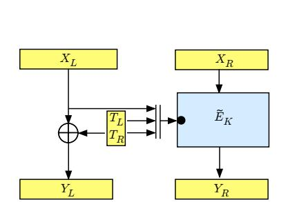
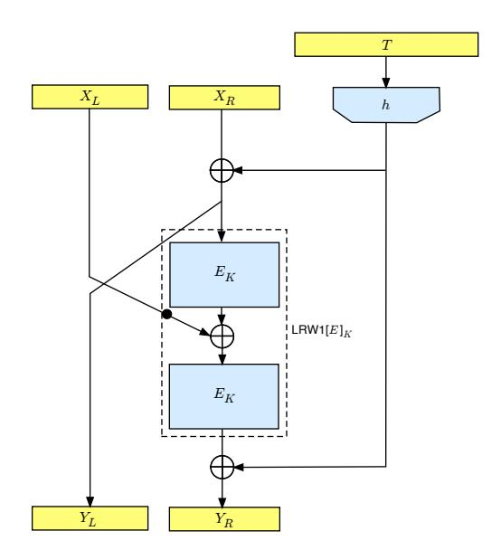

# Tweakable Blockciphers with Beyond Birthday-Bound Security

Will Landecker, Thomas Shrimpton, and R. Seth Terashima

Dept. of Computer Science, Portland State University {landeckw, teshrim, seth}@cs.pdx.edu

**Abstract.** Liskov, Rivest and Wagner formalized the tweakable blockcipher (TBC) primitive at CRYPTO'02. The typical recipe for instantiating a TBC is to start with a blockcipher, and then build up a construction that admits a tweak. Almost all such constructions enjoy provable security only to the birthday bound, and the one that does achieve security beyond the birthday bound (due to Minematsu) severely restricts the tweak size and requires per-invocation blockcipher rekeying.

This paper gives the first TBC construction that simultaneously allows for arbitrarily "wide" tweaks, does not rekey, and delivers provable security beyond the birthday bound. Our construction is built from a blockcipher and an  $\epsilon$ -AXU<sub>2</sub> hash function.

As an application of the TBC primitive, LRW suggest the TBC-MAC construction (similar to CBC-MAC but chaining through the tweak), but leave open the question of its security. We close this question, both for TBC-MAC as a PRF and a MAC. Along the way, we find a nonce-based variant of TBC-MAC that has a *tight* reduction to the security of the underlying TBC, and also displays graceful security degradation when nonces are misused. This result is interesting on its own, but it also serves as an application of our new TBC construction, ultimately giving a variable input-length PRF with beyond birthday-bound security.

**Keywords**: tweakable blockcipher, beyond birthday bound, pseudorandom function, message authentication code, unforgeability.

sectionIntroduction A blockcipher  $E: \{0,1\}^k \times \{0,1\}^n \to \{0,1\}^n$  is typically viewed as a family of permutations  $E_K$  over  $\{0,1\}^n$ , where the index into the family is the key  $K \in \{0,1\}^k$ . A tweakable blockcipher (TBC) extends this viewpoint by adding a second "dimension" to the function family, called a tweak. In particular, a TBC  $\widetilde{E}: \{0,1\}^k \times \mathcal{T} \times \{0,1\}^n \to \{0,1\}^n$  is a family of permutations indexed by a pair  $(K,T) \in \{0,1\}^k \times \mathcal{T}$ . There is, however, a semantic asymmetry between the key and the tweak: the key is secret and gives rise to security, while the tweak may be public and gives rise to variability.

Liskov, Rivest and Wagner [21] formalized the TBC primitive. Their thesis was that primitives with inherent variability are a more natural starting point for building modes of operation, whereas classical constructions would use a blockcipher (deterministic once the key is fixed) and induce variability by using a per-message IV or nonce. Subsequent papers have delivered tweakable enciphering schemes (e.g. [14–16, 34, 8] and others), message authentication codes (e.g. [30]), and authenticated encryption (e.g. [29, 30, 20]) modes of operation. The Skein [32] hash function has a TBC at its core. TBC-based constructions have found widespread practical application for full-disk encryption.

BUILDING TBCs. There are few dedicated TBC designs: the Hasty Pudding [31] and Mercy [10] ciphers natively admit tweaks. The more common approach is to start from a blockcipher and build up a TBC, incorporating support for a tweak without (one hopes) sacrificing whatever security the original blockcipher offered. The original LRW paper itself gave two constructions, which we call LRW1 and LRW2. The former construction is LRW1[E] $_K(T,X) = E_K(T \oplus E_K(X))$  and it is a secure tweakable-PRP¹ if the underlying n-bit blockcipher E is a secure PRP, although there is a birthday-type loss in the reduction. (That is, the security bound becomes vacuous around  $2^{n/2}$  queries.) In addition to birthday-bound security, the tweakspace is limited to  $\mathcal{T} \subseteq \{0,1\}^n$ . The second LRW construction LRW2[H,E] $_{h,K}(T,X) = h(T) \oplus E_K(X \oplus h(T))$  avoids this length restriction by hashing the tweak. LRW prove that this is a tweakable strong-PRP when E is a secure strong-PRP and h is a random element of an  $\epsilon$ -almost 2-xor-universal ( $\epsilon$ -AXU2) hash function family H. But here, too, one finds only birthday-bound

<sup>&</sup>lt;sup>1</sup> This notion is formally defined in Section 1. Informally, a TBC  $\widetilde{E}$  is a secure tweakable-PRP if, for a random and secret key K, the family of mappings  $\widetilde{E}_K(\cdot,\cdot)$  is computationally indistinguishable from a family of random permutations. The tweakable strong-PRP notion allows for inverse queries, too.

security. Variations on the LRW constructions, for example Rogaway's XE and XEX constructions [30], similarly offer provable security only to the birthday bound.

Tweakable blockciphers with beyond birthday-bound (BBB) security may be of particular interest for applications such as large-scale data-at-rest protection, where key management and negotiation issues seem likely to drive up the amount of data protected by a single key. Also, when legacy restrictions require the use of Triple-DES (where n=64), delivering BBB security has obvious benefits. We also note that OCB mode [30] would deliver BBB authenticated-encryption security if constructed over a BBB tweakable blockcipher; other TBC-based constructions with (tight) security reductions to the security of the underlying TBC would similarly benefit.

Nonetheless, constructions of TBCs with BBB security are rare. One due to Minematsu [25] achieves BBB security, but only admits short tweaks (e.g.  $\mathcal{T} = \{0,1\}^{n-m}$  for  $m \geq n/2$ ). It requires two blockcipher calls per TBC invocation, and suffers an additional performance penalty by rescheduling one blockcipher key whenever the tweak changes. This last point also violates a TBC design goal, that changing a tweak should be more efficient than changing a key.

A NEW CONSTRUCTION WITH BBB SECURITY: CLRW2. Our main technical result is the first TBC construction that has tweakable strong-PRP security beyond the birthday bound, admits essentially arbitrary tweaks, and does not require per-invocation rekeying of any of the underlying objects. We call this the *Chained LRW2* (CLRW2) construction, since it can be written as  $LRW2[H, E]_{h_2, K_2}(T, LRW2[H, E]_{h_1, K_1}(T, X))$ ; see Figure 1.

The bulk of the paper is dedicated to showing that when E is a secure strong-PRP and H is an  $\epsilon$ -AXU $_2$  hash function family with  $\epsilon=2^{-n}$ , the CLRW2 TBC is a tweakable strong-PRP with security against adaptive attackers making  $\mathcal{O}(2^{2n/3})$  queries. Figure 2 gives a graphical comparison of our security bound and the birthday bound.

We also consider some variations of CLRW2, for example omitting internal xors, or keying the two blockciphers with the same key.

Note that there are many efficient constructions of  $\epsilon$ -AXU<sub>2</sub> families with  $\epsilon \approx 2^{-n}$  and, except perhaps for very long tweaks, the running time of CLRW2 is likely to be dominated by the two blockcipher calls.



Fig. 1. The CLRW2 Construction.

ANALYZING THE TBC-MAC CONSTRUCTION AND VARIANTS. In addition to formalizing the TBC primitive, LRW suggested TBC-based constructions for (authenticated) encryption, hashing and message authentication. The last of these has yet to receive formal analysis, so we consider it. The basic TBC-MAC construction operates as follows. Fix k, n > 0 and let  $\widetilde{E} \colon \{0,1\}^k \times \{0,1\}^n \times \{0,1\}^n \to \{0,1\}^n$  be a tweakable blockcipher. Fix  $T_0 \in \{0,1\}^n$ . Then for any key  $K \in \{0,1\}^k$  and a plaintext  $M = M_1, \ldots, M_b$  consisting of n-bit blocks, define TBCMAC $[\widetilde{E}]_K(M) = T_b$  where  $T_i \leftarrow \widetilde{E}_K(T_{i-1}, M_i)$  for all  $i \in [1..b]$ . This is the TBC-MAC (over  $\widetilde{E}$ ) of the input M.

It is intuitive to think of TBC-MAC as analogous to CBC-MAC. Indeed, if  $\widetilde{E}_K(T,X)=E_K(T\oplus X)$  then we have the CBC-MAC construction. But perhaps by abstracting away the details of  $\widetilde{E}$  one can achieve better security than that offered by CBC-MAC? This seems a reasonable expectation, since an attacker can directly influence the input to the blockcipher E in CBC-MAC via the exclusive-or operation, but no such influence is guaranteed when

the chaining value (the tweak) is separated from the plaintext input block. Moreover, it is easy to build TBCs with tweak inputs that are much larger than n bits (LRW already gave one way), and exploiting this may allow for simple twists on the basic TBC-MAC that give better security.

We first consider TBC-MAC as a variable-input-length pseudorandom function (VIL-PRF). We show that it is secure if the underlying TBC is a secure tweakable-PRP. Like CBC-MAC, however, TBC-MAC has only birthday-bound security. A small benefit is that this result is not restricted to prefix-free encoded inputs as it is for CBC-MAC. Actually, one can view TBC-MAC as an instance of the Merkle-Damgard iteration [23, 11] over ˚ a compression function with a dedicated key input. In this setting Bellare and Ristenpart [3] have already shown that various versions of Merkle-Damgard (plain, suffix-free encoded inputs, prefix-free encoded inputs) are PRF- ˚ preserving.

A more interesting result is found if the underlying TBC allows "wide" tweaks, i.e. tweaks that are wider than the blocksize. In this case, a simple nonce-based version of TBC-MAC (TBCMAC2) achieves much better PRF security bounds. In fact, if nonces are properly respected, the mode of operation imparts *no* loss over the security of the underlying TBC. Thus, TBCMAC2 instantiated with a beyond-birthday secure TBC yields a variable-input-length PRF with beyond-birthday security. What's more, the security bound degrades quadratically in the maximum number of times any nonce is repeated, providing more graceful behavior than most nonce-based constructions, which fail catastrophically when a nonce-repeat occurs. Such nonce misuse-resistance can be quite useful in practice.

Lastly, we show that TBC-MAC is unforgeable assuming only that the underlying TBC is likewise unforgeable. This holds only for prefix-free encoded inputs. In fact, this follows from the work of Maurer and Sjodin [22], who ¨ give general results for the Merkle-Damgard iteration. When the prefix-free encoding restriction is lifted, we exhibit ˚ a TBC <sup>E</sup><sup>e</sup> that is unforgeable, yet TBC-MAC over <sup>E</sup><sup>e</sup> is easily forged.

UNFORGEABILITY PRESERVATION OF TBC CONSTRUCTIONS. A final, small contribution of this work is to address the question: What if one wants only to assume access to cryptographic primitives that are unforgeable (i.e. unpredictable), rather than pseudorandom? No previous work addresses the provable security of TBC constructions starting from blockciphers with this weaker security assumption. We begin this effort by considering the two TBC constructions from LRW. We show that LRW1 is *not* unforgeability preserving. That is, we build a blockcipher E that is unforgeable but for which is it easy to forge LRW1[E]. (In fact, we use LRW1 against itself in this result!) Likewise for LRW2, we show that there is an -AXU<sup>2</sup> hash function family and an unforgeable blockcipher E such that LRW2[H, E] is easily forged. (Again, we use LRW1 again to construct the E we need.) For space reasons, these results appear in Appendix E. At this time, we do not know if CLRW2 remains unforgeable given only unforgeable underlying blockciphers.

ADDITIONAL RELATED WORK. We have already mentioned the paper of Liskov et al. [21] as the starting point for our work. Goldenberg et al. [17] show how to build a TBC by directly tweaking the Luby-Rackoff construction. Using n-bit random functions, the resulting 2n-bit TBC has tweakable strong-PRP security to roughly 2 <sup>n</sup> queries, and can accommodate a tweak of length `n using ` + 6 rounds.

Coron et al. [9] show that a three-round Feistel construction over an n-bit TBC with a wide tweak yields a 2n-bit TBC that has beyond birthday-bound security if the underlying TBC does. Our CLRW2 construction meets this requirement.

The PMAC1 construction by Rogaway [30] builds a (parallelizable) VIL-PRF from a TBC, achieving birthdaybound security. Recently, Yasuda [36] introduced the PMAC plus construction, which has O(2<sup>2</sup>n/<sup>3</sup> ) security like TBCMAC2 but is more efficient and parallelizable. PMAC plus could be viewed as a construction over a tweakable blockcipher (which might be called the "XXE" construction, following Rogaway's naming convention), but neither the construction nor the proof is cast this way. Separately, Yasuda [35] proves that Algorithm 6 from ISO 9797-1 and SUM-ECBC both have security against O(2<sup>2</sup>n/<sup>3</sup> ) queries.

The WMAC construction of Black and Cochran [6] is a stateful hash-then-MAC construction that, like our TBCMAC2 construction, allows for graceful (quadratic) security degradation when nonces are repeated. There are various methods for using randomness to build VIL-PRFs with beyond birthday-bound security; for example MACRX [2], RMAC [19], randomized WMAC and enhanced hash-then-MAC [26]

We note that real-world protocols such as TLS [33] employ nonce-based PRFs by using per-message sequence numbers. Nonce-based PRFs also have applications in secure memory; see Garay et al. [18] and references therein.

Bellare and Ristenpart [3] study unforgeability preservation of iterated Merkle-Damgard constructions in the ˚ dedicated-key compression-function setting. They show that, in general, these iterations do not preserve unforgeability; however, their counterexample does not apply to TBC-MAC because the compression function they construct is not a TBC.

Zhang et al. [37] study so-called rate-1 MACs constructed from variations of the PGV [27,7] blockcipher-based compression functions. They show that certain of these compression functions, for example  $f(T,X) = E_{K \oplus T}(X)$ , iterate (through T) to unforgeable MACs under the assumption that the underlying blockcipher is related-key unpredictable for specific related-key functions. In the case of our example, the related-key functions are  $\{K \mapsto K \oplus T \mid T \in \{0,1\}^{|K|}\}$ . But in this example and others, assuming that the blockcipher is related-key unforgeable is equivalent to assuming that the compression function is an unforgeable TBC, and thus chaining through the tweak leads to TBC-MAC. Hence our results generalize some of those given by Zhang et al. [37]. We note that TBCs like  $E_{K \oplus T}(X)$  are inefficient choices for iteration through the tweak, since they require rescheduling the blockcipher key each round.

We mention in passing that the basic three-key enciphered CBC construction due to Dodis et al. [12] can, in large, part be viewed as an instance of TBC-MAC over the LRW1 TBC. (The IV is no longer a fixed value, but depends on the first input block.)

NOTE ON ERROR IN PREVIOUS VERSION. This is a revised full version of a paper that appeared in CRYPTO '12. Both the original full version (6 Aug. 2012) and the CRYPTO paper contain an error in the proof of Theorem 1.

Briefly, the error occurs in the transition from Game 4 to Game 5 when we tacitly assume the former is more likely than an ideal tweakable blockcipher to return certain values (specifically, values in the set  $S_1$ ). We would like to thank Gordon Procter for bringing the error to our attention. Procter also provided a suggested patch to the problem [28]; while we believe the patch is sound, we opted for a solution that simplifies the proof by using a coupling argument to abstract away the details of certain game transitions.

#### 1 Preliminaries

NOTATION. When  $\mathcal{X}$  is a set, we write  $x \overset{\$}{\leftarrow} \mathcal{X}$  to mean that an element (named x) is uniformly sampled from  $\mathcal{X}$ . We overload the notation for probabilistic algorithms, writing  $x \overset{\$}{\leftarrow} M$  to mean that algorithm M runs and outputs a value named x. When X and Y are strings, we write X | Y for their concatenation. When  $X \in \{0,1\}^*$  we write |X| for its length and, if  $1 \leq i < j \leq |X|$  we write X[i...j] for the substring running from its  $i^{\text{th}}$  to  $j^{\text{th}}$  characters, or the empty string  $\varepsilon$  otherwise. For a string X of even length n, we define  $X_L$  and  $X_R$  to be  $X[1...\frac{n}{2}]$  and  $X[(\frac{n}{2}+1)..n]$ , respectively. For a tuple of strings  $(X_1, X_2, \ldots, X_r)$  we define  $|(X_1, X_2, \ldots, X_r)| = |X_1 | |X_2 | | \cdots | |X_r|$ . The set  $\{0,1\}^n$  is the set of all n-bit strings,  $(\{0,1\}^n)^r$  is the set of all n-bit strings understood as r blocks of n-bits each, and  $(\{0,1\}^n)^+$  is the set of all strings that are a positive number of n-bit blocks in length. When  $X \in (\{0,1\}^n)^+$ , we write  $X_1, \ldots, X_b \overset{n}{\leftarrow} X$  to mean that X is parsed into b blocks of n-bits each. For strings  $X, Y \in (\{0,1\}^n)^+$  we define the predicate CommonPF $_i(X,Y)$  to be true if and only if X and Y agree on their first i blocks of n-bits, i.e.  $X_j = Y_j$  for all  $1 \leq j \leq i$  where  $X_j, Y_j \in \{0,1\}^n$ . When  $X \subseteq (\{0,1\}^n)^+$  and  $M \in (\{0,1\}^n)^+$ , we also define Prefix $_X(M)$  to be the function that returns the blockwise longest common prefix that M shares with strings in  $\mathcal{X}$ . An adversary A is a probabilistic algorithm that takes zero or more oracles. We often use the notation  $A \Rightarrow x$  to denote the event (defined over some specified probability space) that some algorithm A outputs value x.

We make use of the code-based game-playing framework of Bellare and Rogaway [5]. When G is a game and A an adversary, we write  $\Pr\left[G^A\Rightarrow y\right]$  for the probability that the **Finalize** procedure of game G outputs y when executed with adversary A. The probability is over the coins of G and A. When the **Finalize** procedure is trivial, returning whatever A does, we omit the procedure from the game and write  $\Pr\left[A^G\Rightarrow y\right]$  for the probability that A outputs y when executed with game G. In games, all boolean flags are initialized to false and all arrays are initially undefined at every point.

FUNCTION FAMILIES AND (TWEAKABLE) BLOCKCIPHERS. Let  $\mathcal{K}, \mathcal{D}$  and  $\mathcal{R}$  be sets, where at least  $\mathcal{K}$  is non-empty. A mapping  $F \colon \mathcal{K} \times \mathcal{D} \to \mathcal{R}$  can be thought of as a function family  $F = \{F_K\}$  where for each  $K \in \mathcal{K}$  we assign  $F_K(\cdot) = F(K, \cdot)$ . We will use both representations of the family, as a two-argument mapping and as a set indexed by the first argument, choosing whichever is most convenient. We write  $\mathrm{Func}(\mathcal{D},\mathcal{R})$  for the set of all mappings from  $\mathcal{D}$  to  $\mathcal{R}$ . We write  $\mathrm{Perm}(n)$  to denote the set of all permutations (bijections) over  $\{0,1\}^n$ . We can view each of these as function families with some understood ordering.

A blockcipher is a function family  $E \colon \mathcal{K} \times \{0,1\}^n \to \{0,1\}^n$  such that for all  $K \in \mathcal{K}$  the mapping  $E_K(\cdot) \in \operatorname{Perm}(n)$ . We write  $\operatorname{BC}(\mathcal{K},n)$  to mean the set of all such blockciphers, shortening to  $\operatorname{BC}(k,n)$  when  $\mathcal{K} = \{0,1\}^k$ . A tweakable blockcipher (TBC) is a function family  $\widetilde{E} \colon \mathcal{K} \times (\mathcal{T} \times \{0,1\}^n) \to \{0,1\}^n$  such that for every  $K \in \mathcal{K}$  and  $T \in \mathcal{T} \subseteq \{0,1\}^*$  the mapping  $\widetilde{E}_K(T,\cdot)$  is a permutation over  $\{0,1\}^n$ . The set  $\mathcal{T}$  is called the tweakspace of the TBC, and the element  $T \in \mathcal{T}$  is the tweak.

SECURITY NOTIONS. Let  $F: \mathcal{K} \times \mathcal{D} \to \mathcal{R}$  be a function family, and let A be an adversary taking one oracle. Then we define

$$\mathbf{Adv}_F^{\mathrm{prf}}(A) = \Pr\left[K \overset{\hspace{0.1em}\mathsf{\scriptscriptstyle\$}}{\leftarrow} \mathcal{K} : A^{F_K(\cdot)} \Rightarrow 1\right] - \Pr\left[\rho \overset{\hspace{0.1em}\mathsf{\scriptscriptstyle\$}}{\leftarrow} \mathrm{Func}(\mathcal{D}, \mathcal{R}) : A^{\rho(\cdot)} \Rightarrow 1\right]$$

to be the PRF advantage of A attacking F. Here, and throughout, the probability is over the random choices of the described experiment and those of the adversary. We define

$$\mathbf{Adv}_F^{\text{uf-cma}}(A) = \Pr \left[ K \overset{\$}{\leftarrow} \mathcal{K}; (M, \tau) \overset{\$}{\leftarrow} A^{F_K(\cdot)} : F_K(M) = \tau \land \text{new-msg} \right]$$

to be the UF-CMA advantage (or "forging" advantage) of A. Here the event new-msg holds iff the string M was never asked by A to its oracle.

Let  $E: \{0,1\}^k \times \{0,1\}^n \to \{0,1\}^n$  be a blockcipher, and let  $\widetilde{E}: \{0,1\}^k \times (\mathcal{T} \times \{0,1\}^n) \to \{0,1\}^n$  be a tweakable blockcipher. Let  $K \overset{\hspace{0.1em}\mathsf{\scriptscriptstyle\$}}{\leftarrow} \{0,1\}^k, \pi \overset{\hspace{0.1em}\mathsf{\scriptscriptstyle\$}}{\leftarrow} \operatorname{Perm}(n)$ , and  $\Pi \overset{\hspace{0.1em}\mathsf{\scriptscriptstyle\$}}{\leftarrow} \operatorname{BC}(\mathcal{T},n)$ . Then we define

$$\begin{split} \mathbf{Adv}_E^{\mathrm{prp}}(A) &= \Pr\left[ \ A^{E_K(\cdot)} \Rightarrow 1 \ \right] - \Pr\left[ \ A^{\pi(\cdot)} \Rightarrow 1 \ \right] \\ \mathbf{Adv}_E^{\mathrm{sprp}}(A) &= \Pr\left[ \ A^{E_K(\cdot), E_K^{-1}(\cdot)} \Rightarrow 1 \ \right] - \Pr\left[ \ A^{\pi(\cdot), \pi^{-1}(\cdot)} \Rightarrow 1 \ \right] \\ \mathbf{Adv}_{\widetilde{E}}^{\widetilde{\mathrm{prp}}}(A) &= \Pr\left[ \ A^{\widetilde{E}_K(\cdot, \cdot)} \Rightarrow 1 \ \right] - \Pr\left[ \ A^{\Pi(\cdot, \cdot)} \Rightarrow 1 \ \right] \\ \mathbf{Adv}_{\widetilde{E}}^{\widetilde{\mathrm{prp}}}(A) &= \Pr\left[ \ A^{\widetilde{E}_K(\cdot, \cdot), \widetilde{E}_K^{-1}(\cdot, \cdot)} \Rightarrow 1 \ \right] - \Pr\left[ \ A^{\Pi(\cdot, \cdot), \Pi^{-1}(\cdot, \cdot)} \Rightarrow 1 \ \right] \end{split}$$

to be (respectively) the PRP, strong PRP, tweakable-PRP, and tweakable strong-PRP advantages of A, an adversary taking the indicated number of oracles. These probabilities are over the random coins of A and the random choices of K,  $\pi$ , and  $\Pi$ , as appropriate.

A function family  $F \colon \mathcal{K} \times \mathcal{D} \to \mathcal{R}$  is  $\epsilon$ -almost 2-XOR-universal ( $\epsilon$ -AXU<sub>2</sub>) if for all distinct  $X, X' \in \mathcal{D}$  and  $Y \in \mathcal{R}$ ,  $\Pr \left[ K \overset{\$}{\leftarrow} \mathcal{K} \colon F_K(X) \oplus F_K(X') = Y \right] \leq \epsilon$ .

RESOURSES AND CONVENTIONS. We consider the following adversarial resources: the running time t, the number of oracle queries asked q, and the total length of these queries  $\mu$ . For the PRP and strong PRP notions, we suppress  $\mu$  since it is implicitly computable from q and the blocksize. In the UF-CMA advantage,  $\mu$  includes the length of the output forgery attempt  $(M,\tau)$ . It will often be the case that queries (and forgery attempts) are strings in  $(\{0,1\}^n)^+$  for some blocksize n>0, and here it will be convenient to speak of the total number of blocks  $\sigma=\mu/n$ . The running time of an adversary is relative to some (implicit) fixed underlying model of computation. Running times will always be given with respect to some security experiment, and we define the running time to include the time to execute the entire experiment. We assume that adversaries do not make pointless queries: they do not repeat queries, nor do they ask queries that are outside of the domain of oracles they may access.

# 2 Tweakable SPRP-security of CLRW2

The centerpiece of this work is a TBC construction that provides BBB security, admits a large tweakspace, and does not require rekeying of any underlying object. Given a blockcipher  $E \colon \{0,1\}^k \times \{0,1\}^n \to \{0,1\}^n$  is blockcipher, and a hash function family  $H \colon \mathcal{K}_H \times \mathcal{D} \to \{0,1\}^n$ , the CLRW2 construction  $\widetilde{E}[H,E] \colon (\mathcal{K}_H)^2 \times (\{0,1\}^k)^2 \times \mathcal{D} \times \{0,1\}^n \to \{0,1\}^n$  is given by

$$\widetilde{E}[H,E]_{h_1,h_2,K_1,K_2}(T,X) = E_{K_2}(E_{K_1}(X \oplus H_{h_1}(T)) \oplus H_{h_1}(T) \oplus H_{h_2}(T)) \oplus H_{h_2}(T).$$

The following theorem is our main technical result.

**Theorem 1.** Fix k, n > 0 and let  $E: \{0, 1\}^k \times \{0, 1\}^n \to \{0, 1\}^n$  be a blockcipher. Fix a non-empty set  $\mathcal{K}_H$ , and let  $\mathcal{D} \subseteq \{0, 1\}^*$ . Let  $H: \mathcal{K}_H \times \mathcal{D} \to \{0, 1\}^n$  be an  $\epsilon$ -AXU<sub>2</sub> function family. Let  $\widetilde{E} = \widetilde{E}[H, E]$  be the CLRW2 construction, defined above. Let A be an adversary asking a total of q queries to its oracles, running in time t. Let  $\widehat{\epsilon} = \max\{\epsilon, 1/(2^n - 2q)\}$ . Then there exists an adversary B using the same resources, such that

$$\mathbf{Adv}_{\widetilde{E}}^{\widetilde{\mathrm{sprp}}}(A) \leq 2\mathbf{Adv}_{E}^{\mathrm{sprp}}(B) + \frac{4q^{3}\hat{\epsilon}^{2}}{1 - q^{3}\hat{\epsilon}^{2}}. \ \blacksquare$$



**Fig. 2.** The maximum advantage of an adversary making q queries agaisnt CLRW2 (solid line) and constructions limited by the birthday bound,  $q^2/2^n$  (dashed line). Here, n=128,  $\epsilon=2^{-n}$ , and we have assumed the  $\mathbf{Adv}_{E}^{\mathrm{sprp}}(B)$  term is negligible.

This bound deserves some interpretation. Consider  $\epsilon=2^{-n}$  (since there are efficient constructions meeting this), and assume  $q\leq 2^{n-2}$ . Then  $\hat{\epsilon}\leq 1/2^{n-1}\approx 2^{-n}$  for interesting values of n. Now the additive term in the bound is at most p when  $q\leq (p/(p+6))^{1/3}\hat{\epsilon}^{-2/3}$ , so for any small constant p we have  $q=\mathcal{O}(2^{2n/3})$ . Thus when  $\mathbf{Adv}^{\mathrm{sprp}}_{\mathbf{E}}(B)$  is sufficiently small, CLRW2 is secure as a tweakable-SPRP up to about  $2^{2n/3}$  queries. Figure 2 gives a graphical comparison of our bound and the standard birthday bound.

PROOF OVERVIEW. The proof of Theorem 1 is quite long and involved, so we'll start by giving a high-level overview of it. Proofs demonstrating birthday-bound security for TBC constructions typically "give up" if the adversary can cause a collision at a blockcipher input. In constructions like LRW1 and LRW2, the TBC output is no longer random, even when the blockcipher has been replaced by a random permutation. We overcome this problem by using two rounds of LRW2, and showing that it takes two independent collisions *on the same query* to force non-random CLRW2 outputs.

The chief difficulty is ensuring that the second LRW2 round can withstand a collision so long as there was not also one on the first round. To this end, we argue that given a collision-free first round, the resulting distribution of CLRW2 output values — including those which *require* a second-round collision to obtain — is extremely close to that of an ideal TBC.

The bulk of the proof is a sequence of games bounding the success probability of an adversary in the information-theoretic setting, where the blockciphers have been replaced by random permutations. The first three games address first-round collisions, and show that the distribution of CLRW2 outputs is consistent with that of an ideal cipher unless there is simultaneous a second-round collision. Our next three games address the case in which there is no first-round collision. By swapping the order in which dependent random variables are assigned values, we can choose the output early on in the game, and gain insight into the distribution by which it is governed. This distribution is shown to be very close to the ideal one. The final two games are used to derive an upper bound for the probability that the adversary can set a "bad flag", which would force the game to exhibit non-ideal behavior. In

<sup>&</sup>lt;sup>2</sup> We note that  $\mathbf{Adv}_E^{\mathrm{sprp}}(B)$  will be at least  $t/2^k \approx q/2^k$  by exhaustive key search so,  $q=2^{2n/3}$  requires k>2n/3, which is met by AES (k=n=128) and DES (k=56,n=64).

the end, we are able to assume that the adversary is non-adaptive by giving it explicit control over oracle return values. At that point, the  $\epsilon$ -AXU<sub>2</sub> property can be applied.

*Proof.* For notational simplicity, we write  $h_1$  for  $H_{h_1}$ , and  $h_2$  for  $H_{h_2}$ ; this should cause no confusion. The majority of the proof will consider the construction  $\widetilde{E}$  with  $E_{K_1}$  and  $E_{K_2}$  replaced with random permutations  $\pi_1$  and  $\pi_2$ , which we write as  $\widetilde{E}_{h_1,h_2,\pi_i,\pi_2}$ . At the end we can make a standard move to lift to the fully complexity theoretic setting.

Let A be an adversary making q queries. If the i<sup>th</sup> query is to the left (encryption) oracle, we denote the query with  $(T_i, X_i)$  and the response with  $Y_i$ ; if the query is to the right (decryption) oracle, the roles of  $X_i$  and  $Y_i$  are reversed. We denote by  $\mathcal{Y}_i$  the set of permissible (tweak-respecting) return values for an encryption oracle query, and similarly,  $\mathcal{X}_i$  is the set of permissible return values for a decryption oracle query. That is,

$$\mathcal{Y}_i = \{0, 1\}^n \setminus \{Y_j : j < i, T_j = T_i\}$$

$$\mathcal{X}_i = \{0, 1\}^n \setminus \{X_j : j < i, T_j = T_i\}.$$

Given a set  $S \subseteq \{0,1\}^n$  and a string  $x \in \{0,1\}^n$  we define  $S \oplus x = \{s \oplus x : s \in S\}$ . The permutations  $\pi_1$  and  $\pi_2$  are constructed lazily, while  $h_1$  and  $h_2$  are already defined. Initially, boolean variables have the value false, integers are zero, and all other variable types are undefined (equal to  $\bot$ ).

Game G1 (refer to Appendix A to see the games used in this proof) simulates  $\widetilde{E}$  exactly by lazily sampling values for  $\pi_1$  and  $\pi_2$ . Note that there is a certain symmetry between the encryption and decryption oracles. This symmetry arises from the fact that  $\widetilde{E}$  is the dual of  $\widetilde{E}^{-1}$ , in the sense that  $\widetilde{E}_{h_1,h_2,\pi_1,\pi_2}^{-1}(Y,T) = \widetilde{E}_{h_2,h_1,\pi_2^{-1},\pi_1^{-1}}(Y,T)$ .

The bulk of this proof concerns showing that a sequence of games are identical, or are identical until a specified event occurs (a boolean variable is set to true). When arguing that transitions between games are correct in this sense, we will exploit the above symmetry by limiting our discussion to changes in the encryption oracle, and hence to queries made to that oracle; the arguments used to justify the corresponding changes in the decryption oracle are practically identical. Therefore fix some value  $i \in [1..q]$ , and assume the  $i^{\text{th}}$  query is to the encryption oracle.

In Game G2, we change what happens when there is a collision at the first block cipher: we sample  $Y_i$  from the ideal distribution, but raise a bad flag if we also encounter a collision at the input of second block cipher (bad<sub>1</sub>) or if  $Y_i$  is already in the defined range (bad<sub>2</sub>). See Figure ??. Game G3 is identical to Game G2, except  $Y_i$  is not reassigned after a bad flag is set. Hence  $\Pr\left[A^{GI} \Rightarrow 1\right] = \Pr\left[A^{G2} \Rightarrow 1\right] \leq \Pr\left[A^{G3} \Rightarrow 1\right] + \Pr\left[A^{G3} : \mathsf{bad}_1 \lor \mathsf{bad}_2\right]$ .

Next we modify the section of code in Game G3 that is executed when no collision occurs at  $\pi_1$ ; i.e., when  $X_i \oplus h_1(T_i) \neq X_j \oplus h_1(T_j)$  for all j < i. Note that the random variables Z and  $Y_i$  are dependent. In Game G3, Z is chosen before  $Y_i$ , but as long as the joint distribution as preserved we may reverse this order. The resulting game will be equivalent to Game G3. As always, the decryption oracle will be modified in a similar manner.

To describe the correct distribution for  $Y_i$ , partition  $\{0,1\}^n$  into four sets,  $S_1$ ,  $S_2$ ,  $S_3$  and  $S_4$ . These sets are defined with respect to an oracle query  $(T_i, X_i)$  such that no collision occurs at  $\pi_1$ ; that is, such that  $X_i \oplus h_1(T_i) \not\in Dom(\pi_1)$ . (When referring to  $Dom(\cdot)$  outside of pseudocode, we refer to the set of points at which the function is defined at the instant the adversary makes its  $i^{\text{th}}$  oracle call [and similarly for  $Rng(\cdot)$ ]; the game currently being used to define the oracle should be clear from context). For  $y \in \{0,1\}^n$ , we say y is permissible when  $y \in \mathcal{Y}_i$ , and y is possible when  $Pr[Y_i = y] > 0$ , given our assumption that  $X_i \oplus h_1(T_i) \not\in Dom(\pi_1)$  and the oracles' execution histories for the first i-1 queries.

Let  $S_4$  be the set of all non-permissible values. Note that if y is not permissible (it has been returned on a query that used tweak  $T_i$ ), then y is not possible (since  $\widetilde{E}(T_i, \cdot)$  is a permutation and queries are distinct); hence  $S_4$  is a subset of the impossible values. Let  $S_3$  be the set of impossible values that are permissible.

We now subdivide the set of possible values based on the conditional branch on Line 317 in Game G3. Some values for  $Y_i$  will only be returned if the choice of Z causes a collision at  $\pi_2$ , while others can only be assigned in the absence of such a collision; the former will be  $S_2$ , the latter  $S_1$ . More formally, one can see that y is not possible if and only if  $y \oplus h_2(T_i) \in Rng(\pi_2)$  and  $\pi_2^{-1}(y \oplus h_2(T_i)) \oplus h_2(T_i) \oplus h_1(T_i) \in Rng(\pi_1)$  Therefore let  $S_1 = \{y : y \oplus h_2(T_i) \notin Rng(\pi_2)\}$ , and let  $S_2$  be the set of all other possible values.

In summary,

$$S_{1} = \{y : y \oplus h_{2}(T_{i}) \notin \operatorname{Rng}(\pi_{2})\}$$

$$S_{2} = \{y : y \oplus h_{2}(T_{i}) \in \operatorname{Rng}(\pi_{2}), \pi_{2}^{-1}(y \oplus h_{2}(T_{i})) \oplus h_{2}(T_{i}) \oplus h_{1}(T_{i}) \in \overline{\operatorname{Rng}(\pi_{1})}\}$$

$$S_{3} = \mathcal{Y}_{i} \setminus (S_{1} \cup S_{2})$$

$$= \{y : y \oplus h_{2}(T_{i}) \in \operatorname{Rng}(\pi_{2}), \pi_{2}^{-1}(y \oplus h_{2}(T_{i})) \oplus h_{2}(T_{i}) \oplus h_{1}(T_{i}) \in \operatorname{Rng}(\pi_{1})\} \setminus \overline{\mathcal{Y}_{i}}$$

$$S_{4} = \overline{\mathcal{Y}_{i}} = \{Y_{i} : j < i, T_{i} = T_{i}\}.$$

When these sets are used in pseudocode, it is understood that they are defined at the time the oracle call is made; although  $Rng(\pi_1)$  (for example) may change as code executes,  $S_2$  does not change until the next query. When referred to by a decryption oracle, the definitions for these sets are the same up to the previously mentioned duality.

We will now compute the probability that  $Y_i$  will be in each of these sets (again, under the assumption that there is no collision at the first block cipher; i.e, that  $L_i = X_i \oplus h_1(T_i) \not\in Dom(\pi_1)$ ). Since  $S_3$  and  $S_4$  contain only impossible values,  $\Pr\left[Y_i \in S_3 \cup S_4 \mid L_i \not\in Dom(\pi_1)\right] = 0$ . Let  $N = \left|\overline{Rng(\pi_1)}\right|$ . Given  $y \in S_2$  and  $L_i \not\in Dom(\pi_1)$ ,  $Y_i = y$  if and only if  $Z = \pi_2^{-1}(y \oplus h_2(T_i)) \oplus h_2(T_i) \oplus h_2(T_i)$ . This value is in  $\overline{Rng(\pi_1)}$  by definition of  $S_2$ , and so this event happens with probability 1/N. Hence,

$$\Pr\left[\left.Y_{i} \in S_{2} \mid L_{i} \not\in Dom(\pi_{1})\right.\right] = \left|S_{2}\right|/N \quad \text{and} \quad \Pr\left[\left.Y_{i} \in S_{1} \mid L_{i} \oplus \not\in Dom(\pi_{1})\right.\right] = (N - |S_{2}|)/N.$$



Fig. 3. When there is no collision at  $\pi_1$ , the distribution governing  $\widetilde{E}$ 's outputs is very close to the distribution an ideal cipher would provide. Horizontal scaling suggests plausible relative sizes of each  $|S_k|$ : likely  $|S_1| \gg |S_2 \cup S_4| \gg |S_3|$ . This graph is accurate for the oracles in Games 1–5.

Ideally,  $Y_i$  would be distributed as  $p_{\mathsf{TBC}}(y) := \Pr\left[Y \overset{\hspace{0.1em}\mathsf{\scriptscriptstyle\$}}{\leftarrow} \mathcal{Y}_i \, ; \, Y = y\right] = 1/(2^n - |S_4|)$  (for  $y \not\in S_4$ ) and zero otherwise. However, we have shown that if there is no collision at  $\pi_1$  on the  $i^{\mathsf{th}}$  query, then  $Y_i$  is distributed as

$$p_{\mathsf{lazy}}(y) := \Pr\left[ \left. Y_i = y \mid L_i \not\in Dom(\pi_1) \right. \right] = \begin{cases} \frac{N - |S_2|}{N|S_1|} & \text{if } y \in S_1 \\ \frac{1}{N} & \text{if } y \in S_2 \\ 0 & \text{if } y \in S_3 \cup S_4 \end{cases}$$

See Figure 3.

Although this distribution is not quite what we want, we will show that it is close enough (even against birthdaytype attacks). In particular, the statistical distance

$$\delta(p_{\mathsf{lazy}}, p_{\mathsf{TBC}}) := \frac{1}{2} \sum_{y \in \{0,1\}^n} |p_{\mathsf{lazy}}(y) - p_{\mathsf{TBC}}(y)| = \max_{S \subseteq \{0,1\}^n} \sum_{y \in S} \left(p_{\mathsf{lazy}}(y) - p_{\mathsf{TBC}}(y)\right)$$

will be on the order of q <sup>2</sup>/2 <sup>2</sup>n. Geometrically, this quantity corresponds to half the shaded area in Figure 3. It can also be viewed as the area above pTBC but below plazy (or the other way around).

We integrate statistical distance into the game-playing proof by exploiting the existence of a optimal *coupling distribution* Γ(plazy, pTBC) (see, e.g., Lemma 11.3 of [24]). This distribution samples points from {0, 1} <sup>n</sup>×{0, 1} n and has the property that when (Y, Y <sup>0</sup> ) \$← Γ(plazy, pTBC):

- 1. For all y ∈ {0, 1} <sup>n</sup>, Pr [ Y = y ] = plazy(y) and Pr [ Y <sup>0</sup> = y ] = pTBC(y)
- 2. Except with probability δ(plazy, pTBC), Y = Y 0 .

So in Game *G4*, we sample (Y, Y <sup>0</sup> ) \$← Γ(plazy, pTBC) and return Y . But we also need to lazily sample a point Z for π<sup>1</sup> that is consistent with our choice. If Y ∈ S2, our decision is forced. On the other hand, if Y ∈ S1, we can choose any value for Z ∈ S <sup>0</sup> = Rng(π1)∩ {z : z ⊕ h1(Ti) ⊕ h2(Ti) 6∈ Dom(π2)}. Sampling Z \$← S <sup>0</sup> uniformly satisfies the need for the joint distribution on (Z, Yi) to be identical in Games *G3* and *G4*; e.g., in Game *G4*, for any fixed z ∈ S 0 :

$$\Pr[Z = z] = \Pr[Z = z \mid Y_i \in S_1] \Pr[Y \in S_1] = \frac{1}{|S'|} \left(\frac{N - |S_2|}{N}\right) = \frac{1}{N}.$$

(By construction, |S 0 | = N − |S2|.) Hence:

$$\Pr\left[\,A^{G3}\,;\,\mathsf{bad}_1 \lor \mathsf{bad}_2\,\right] = \Pr\left[\,A^{G4}\,;\,\mathsf{bad}_1 \lor \mathsf{bad}_2\,\right], \text{ and } \Pr\left[\,A^{G3} \Rightarrow 1\,\right] = \Pr\left[\,A^{G4} \Rightarrow 1\,\right].$$

Then in Game *G5*, we return Y 0 instead of Y after sampling (Y, Y <sup>0</sup> ) \$← Γ(plazy, pTBC). Since Y 6= Y <sup>0</sup> only with probability δ(plazy, pTBC), most of the time these two games will behave identically. We set bad<sup>3</sup> when they do not:

$$\begin{split} \Pr\left[\,A^{G4}\,;\,\mathsf{bad}_1 \lor \mathsf{bad}_2\,\right] - \Pr\left[\,A^{G5}\,;\,\mathsf{bad}_1 \lor \mathsf{bad}_2\,\right] &\leq \Pr\left[\,A^{G5}\,;\,\mathsf{bad}_3\,\right], \\ \Pr\left[\,A^{G4} \Rightarrow 1\,\right] - \Pr\left[\,A^{G5} \Rightarrow 1\,\right] &\leq \Pr\left[\,A^{G5}\,;\,\mathsf{bad}_3\,\right]. \end{split}$$

Now that we return Y 0 instead of Y , the random variable Y serves no direct function. So in Game *G6*, we forgo assigning Y . Instead, we sample Y<sup>i</sup> \$← Y<sup>i</sup> , and then set bad<sup>3</sup> with probability δ(plazy, pTBC). Values for π<sup>1</sup> and π<sup>2</sup> are chosen as before. Thus, Games *G5* and *G6* are equivalent.

At this point, Y<sup>i</sup> is always sampled from Y<sup>i</sup> , and once assigned, its value is never changed.

In Game *G7*, we give the adversary control over what value is assigned to Y<sup>i</sup> (or X<sup>i</sup> , in the case of decryption queries), but insist that the value be in Y<sup>i</sup> or X<sup>i</sup> , as appropriate. Because the adversary can compute Y<sup>i</sup> and X<sup>i</sup> , he may simulate the oracles of Game *G6* if desired; hence, he can set the bad flags in Game *G7* with probability at least as high as any adversary can set the corresponding flags in Game *G6*. The oracle's outputs are now deterministic, and may be (trivially) computed by the adversary in advance. Hence, we may assume without loss of generality that the adversary is non-adaptive.

For the rest of this proof, all probabilities will be with respect to the experiment A*G7* (unless the experiment is explicitly stated).

Let Q be the event that for there exist i, j, and k (with j, k 6= i) such that X<sup>i</sup> ⊕ h1(Ti) = X<sup>j</sup> ⊕ h1(T<sup>j</sup> ) and Y<sup>i</sup> ⊕ h2(Ti) = Y<sup>k</sup> ⊕ h2(Tk). That is, Q indicates the i th query is responsible for collisions at both π<sup>1</sup> and π2. Our strategy is to show that Q is extremely unlikely, since it requires two independent collisions involving a single query. Barring such a query, we can show that the probability of a bad flag being set is very small.

By definition of Q and the -AXU<sup>2</sup> property of H,

$$\Pr\left[\mathcal{Q}\right] \leq \sum_{i=1}^{q} \sum_{j,k \neq i} \Pr\left[h_1(T_j) \oplus h_1(T_i) = X_j \oplus X_i\right] \Pr\left[h_2(T_k) \oplus h_2(T_i) = Y_k \oplus Y_i\right] < q^3 \epsilon^2.$$

Define  $\beta_j = \max_{\widetilde{A}} \left( \Pr\left[ \widetilde{A}^{G7} : \mathsf{bad}_j \mid \neg \mathcal{Q} \right] \right)$  and  $\beta_j(i) = \max_{\widetilde{A}} \left( \Pr\left[ \widetilde{A}^{G7} : \mathsf{bad}_j \text{ on query } i \mid \neg \mathcal{Q} \right] \right)$ . We consider the event in the latter definition to "trigger" even if it has also triggered on an earlier query. (This definition assumes q is not so large that  $\Pr\left[ \neg \mathcal{Q} \right] = 0$ , but since our bound becomes vacuous before this threshold, this is not an issue.) When bounding  $\beta_j(i)$ , we will assume the  $i^{\text{th}}$  query is made to the encryption oracle; as before, the other case is symmetric.

Because bad<sub>2</sub> can only be set if the conditions for Q are met, we immediately have that  $\beta_2 \leq \Pr[Q] \leq q^3 \epsilon^2$ .

Note that bad<sub>1</sub> is set on query i if and only if there exist j, k < i such that

$$X_i \oplus h_1(T_i) = X_i \oplus h_1(T_i)$$
 and  $\pi_1(L_i) \oplus h_1(T_i) \oplus h_2(T_i) = \pi_1(L_k) \oplus h_1(T_k) \oplus h_2(T_k)$ ,

where we remind the reader that  $L_i = X_i \oplus h_1(T_i)$ . Our goal now is to bound

$$\beta_1(i) = \Pr\left[\exists k < i : \pi_1(L_i) \oplus \pi_1(L_k) = R(i,k) \mid \exists j < i : L_i = L_j \land \neg \mathcal{Q}\right] \cdot \Pr\left[\exists j < i : L_i = L_j \mid \neg \mathcal{Q}\right],$$

where for brevity we introduce  $R(i,k) = h_1(T_i) \oplus h_2(T_i) \oplus h_1(T_k) \oplus h_2(T_k)$ .

Because queries are unique and  $\widetilde{E}(T_i,\cdot)$  is a permutation,  $L_i=L_j$  is only possible if  $T_i\neq T_j$ , bringing the  $\epsilon$ -AXU<sub>2</sub> property into scope. Hence

$$\Pr\left[\exists j < i : L_i = L_j \mid \neg \mathcal{Q}\right] = \frac{\Pr\left[\exists j < i : L_i = L_j \land \neg \mathcal{Q}\right]}{\Pr\left[\neg \mathcal{Q}\right]}$$
$$\leq \frac{\Pr\left[\exists j < i : L_i = L_j\right]}{1 - q^3 \epsilon^2} \leq \frac{q\epsilon}{1 - q^3 \epsilon^2}.$$

We now wish to bound  $\Pr\left[\exists k < i : \pi_1(L_i) \oplus \pi_1(L_k) = R(i,k) \mid \exists j < i : L_i = L_j \land \neg \mathcal{Q}\right]$  (the other factor in our bound for  $\beta_1(i)$ ), so assume that there is some j < i such that  $L_i = L_j$  and that  $\neg \mathcal{Q}$ .

Fix  $k \in [1..i-1]$ . Consider the case that  $L_i = L_k$ . Then  $\pi_1(L_i) = R(i,k)$  is equivalent to  $h_1(T_i) \oplus h_1(T_k) = h_2(T_i) \oplus h_2(T_k)$ . Because queries must respect per-tweak permutivity,  $T_i \neq T_k$ ; hence by the  $\epsilon$ -AXU<sub>2</sub> property of H, in this case  $\beta_1(i) \leq \epsilon$ .

On the other hand, if  $L_i \neq L_k$ , we will trace the execution history of the game backwards to when the values eventually assigned to  $\pi_1(L_i)$  and  $\pi_1(L_k)$  become determined. Define  $\mathrm{root}(x) = \min \{m: L_x = L_m\}$ . Let  $i' = \mathrm{root}(i)$ , and let  $k' = \mathrm{root}(k)$ . Since  $L_i = L_j$  for some j < i, it follows that i' < i. Therefore, by our assumption that  $\mathcal{Q}$  does not occur, there is no  $\ell \neq i'$  such that  $Y_\ell \oplus h_2(T_\ell) = Y_{i'} \oplus h_2(T_{i'})$ . Hence on query i',  $\pi_1(L_i)$  is sampled from a set of size at least  $2^n - 2q$ ; this sampling occurs indirectly through the random variable Z, itself sampled either on Line 813 or 836, depending on which oracle receives query i'.

Now we compute when the value of  $\pi_1(L_k)=\pi_1(L_{k'})$  is determined. If there is no  $\ell < k'$  such that  $Y_\ell \oplus h_2(T_\ell)=Y_{k'}\oplus h_2(T_{k'})$ , then  $\pi_1(L_{k'})$  is likewise sampled indirectly from a set of size at least  $2^n-2q$ . However, if such an  $\ell$  exists, then  $\pi_1(L_k)=\pi_2^{-1}(Y_{k'}\oplus h_2(T_{k'}))\oplus h_2(T_{k'})\oplus h_1(T_{k'})$ , and we are forced to backtrack further to when  $\pi_2^{-1}(Y_\ell \oplus h_2(T_\ell))=\pi_2^{-1}(Y_{k'}\oplus h_2(T_{k'}))$  was defined. Fortunately, our assumption that the conditions for Q are not met saves us from having to backtrack far. Let  $\ell'=\min\{m:Y_\ell\oplus h_2(T_\ell)=Y_m\oplus h_2(T_m)\}$ . Then  $\neg Q$  implies  $\ell'=\operatorname{root}(\ell')$ . Hence on query  $\ell',\pi_2^{-1}(Y_{\ell'}\oplus h_2(T_{\ell'}))=\pi_2^{-1}(Y_\ell\oplus h_2(T_\ell))$  is sampled, through Z, from a set of size at least  $2^n-2q$ . In the first of these two cases, let r=k'; in the second, let  $r=\ell'$ . After query r completes, the value which will be assigned to  $\pi_1(L_k)$  is deterministic.

Suppose without loss of generality that i' > r. Then  $\pi_1(L_i) = \pi_1(L_k) \oplus R(i,k)$  only if on query i',  $\pi_1(L_i) = \pi_1(L_{i'})$  is assigned the unique value that makes the former equation true; this happens with probability at most  $1/(2^n - 2q)$ .

Let  $\hat{\epsilon} = \max(\epsilon, 1/(2^n - 2q))$ . Then  $\Pr\left[\pi_1(L_i) \oplus \pi_1(L_k) = R(i, k) \mid \exists j < i : L_i = L_j \land \neg \mathcal{Q}\right] \leq \hat{\epsilon}$ . We have

$$\beta_1 \le \sum_{i=1}^q \beta_1(i) \le \sum_{i=1}^q \sum_{k=1}^{i-1} \frac{q\hat{\epsilon}^2}{1 - q^3\hat{\epsilon}} < \frac{q^3\hat{\epsilon}^2}{1 - q^3\hat{\epsilon}^2}.$$

Our final task is to bound  $\Pr\left[\mathsf{bad}_3\right] = \delta(p_{\mathsf{lazy}}, p_{\mathsf{TBC}})$ . For j = 1, 2, 3, define  $\Delta_j = \sum_{y \in S_j} (p_{\mathsf{lazy}}(y) - p_{\mathsf{TBC}}(y))$ . Since for any  $y, y' \in S_j$ ,  $p_{\mathsf{lazy}}(y) = p_{\mathsf{lazy}}(y')$  (and  $p_{\mathsf{TBC}}$  is constant in these sets), we have:

$$\beta_3(i) = \delta(p_{\mathsf{lazy}}, p_{\mathsf{TBC}}) = \frac{1}{2} \left( |\varDelta_1| + |\varDelta_2| + |\varDelta_3| \right).$$

The law of total probability tells us that  $\Delta_1 + \Delta_2 + \Delta_3 = 0$ , and by construction of  $S_3$ ,  $\Delta_3 \leq 0$ . Further, since  $\pi_2^{-1}(S_4) \oplus h_2(T_i) \oplus h_1(T_i) \subseteq Rng(\pi_1)$ , we have that for  $y \in S_2$ :  $p_{\mathsf{lazy}}(y) - p_{\mathsf{TBC}}(y) = 1/N - 1/(2^n - |S_4|) \geq 0$ . That is,  $\Delta_2 \geq 0$ .

We therefore are left with two possibilities: either  $\Delta_1 \leq 0$  (in which case  $\delta(p_{\mathsf{lazy}}, p_{\mathsf{TBC}}) = \Delta_2$ ), or  $\Delta_1 > 0$  (in which case  $\delta(p_{\mathsf{lazy}}, p_{\mathsf{TBC}}) = -\Delta_3$ ). Hence,  $\delta(p_{\mathsf{lazy}}, p_{\mathsf{TBC}}) \leq \max(\Delta_2, -\Delta_3)$ .

The quantity  $\Delta_2$  can be bounded as follows:

$$\Delta_2 = |S_2| \left( \frac{1}{N} - \frac{1}{2^n - |S_4|} \right) \le \frac{q}{N(2^n - |S_4|)} (2^n - |S_4| - N)$$

$$\le \frac{q}{N(2^n - q)} (2^n - N) \le \frac{q}{N(2^n - q)} (2^n - (2^n - q))$$

$$= \frac{q^2}{(2^n - q)^2}.$$

It remains to bound  $-\Delta_3 = \Pr\left[Y \overset{\$}{\leftarrow} \mathcal{Y}_i; Y \in S_3\right]$ . Note that  $Y \in S_3$  only if there exists j, k < i such that  $X_j \oplus h_1(T_j) = X_i \oplus h_1(T_i)$  and  $Y_k \oplus h_2(T_k) = Y \oplus h_1(T_i)$ . We appeal to the  $\epsilon$ -AXU<sub>2</sub> property as before to argue that the probability of such j and k existing is at most  $(q\epsilon)^2$ .

In both cases, then,  $\beta_3(i) = \delta(p_{\text{lazy}}, p_{\text{TBC}}) \le q^2 \hat{\epsilon}^2$ . (Recall that  $\hat{\epsilon} = \max{\{\epsilon, 1/(2^n - 2q)\}}$ .) Therefore  $\beta_3 \le q^3 \hat{\epsilon}^2$ . By the fundamental lemma of game playing,

$$\begin{split} \Pr\left[ \, A^{\widetilde{E}_{h_1,h_2,\pi_1,\pi_2}(\cdot,\cdot),\widetilde{E}_{h_1,h_2,\pi_1,\pi_2}^{-1}(\cdot,\cdot)} \Rightarrow 1 \, \right] &= \Pr\left[ \, A^{GI} \Rightarrow 1 \, \right] \\ &\leq \Pr\left[ \, A^{G3} \Rightarrow 1 \, \right] + \Pr\left[ \, A^{G3} \, : \, \mathsf{bad}_1 \vee \mathsf{bad}_2 \, \right] \\ &\leq \Pr\left[ \, A^{G6} \Rightarrow 1 \, \right] + \Pr\left[ \, A^{G6} \, : \, \mathsf{bad}_1 \vee \mathsf{bad}_2 \, \right] + 2\Pr\left[ \, A^{G6} \, : \, \mathsf{bad}_3 \, \right] \\ &\leq \Pr\left[ \, A^{G6} \Rightarrow 1 \, \right] + \Pr\left[ \, A^{G7} \, : \, \mathsf{bad}_1 \vee \mathsf{bad}_2 \, \right] + 2\Pr\left[ \, A^{G7} \, : \, \mathsf{bad}_3 \, \right] \\ &\leq \Pr\left[ \, A^{G6} \Rightarrow 1 \, \right] + \beta_1 + \Pr\left[ \, \mathcal{Q} \, \right] + 2\beta_3 \\ &\leq \Pr\left[ \, A^{\Pi(\cdot,\cdot),\Pi^{-1}(\cdot,\cdot)} \Rightarrow 1 \, \right] + \frac{4q^3 \hat{\epsilon}^2}{1 - q^3 \hat{\epsilon}^2}. \end{split}$$

Thus by a standard argument, there exists a B such that

$$\mathbf{Adv}_{\widetilde{E}}^{\widetilde{\mathrm{sprp}}}(A) \le 2\mathbf{Adv}_{E}^{\mathrm{sprp}}(B) + \frac{4q^{3}\hat{\epsilon}^{2}}{1 - q^{3}\hat{\epsilon}^{2}}.$$

This completes the proof.

A NOTE ON AN ERROR IN A PREVIOUS VERSION. The original version of this paper attempted to, in effect, construct  $\Gamma(p_{\text{lazy}}, p_{\text{TBC}})$  explicitly — but failed to do so correctly: we erroneously made a tacit assumption that  $\Delta_1 \geq 0$ . We thank Gordon Procter for bringing this mistake to our attention. Procter also helpfully provided a suggested patch [28], which uses an **if/else** clause in the game-playing proof to address the two cases  $\Delta_1 \geq 0$  and  $\Delta_1 < 0$  separately. We believe Procter's solution succeeds in fixing the problem. Ultimately, however, we decided to use a coupling distribution to abstract the details of transitioning from  $p_{\text{lazy}}$  to  $p_{\text{TBC}}$ . This simplifies some of the arguments, but admittedly sacrifices some of the explicitness present in Procter's proof.

ATTACKS ON SIMPLER VARIANTS. Having seen our construction, one wonder if simpler variants work. For example, consider CLRW2 without the first  $H_{h_2}(T)$  XOR operation, leaving

$$\widetilde{E}_{h_1,h_2,K_1,K_2}(T,X) = H_{h_2}(T) \oplus E_{K_2}(H_{h_1}(T) \oplus E_{K_1}(H_{h_1}(T) \oplus X)).$$

This variation permits birthday-bound attack. Namely, an adversary could submit queries in pairs,  $(T_i, X')$  and  $(T_i, X'')$ , where X' and X'' are fixed, and a new random tweak is used for each pair. By remembering the values  $\widetilde{E}(T_i, X') \oplus \widetilde{E}(T_i, X'')$ , which are independent of  $H_{h_2}$ , it could detect collisions in  $H_{h_1}$ , say by using a hash table. That is, if  $H_{h_1}(T_i) = H_{h_1}(T_j)$ , then  $\widetilde{E}(T_i, X') \oplus \widetilde{E}(T_i, X'') = \widetilde{E}(T_j, X') \oplus \widetilde{E}(T_j, X'')$ . The converse is false, but false positives could be weeded out by testing a small number of X-values. Such an adversary would gain advantage close to one. Similar variations on  $\widetilde{E}$  permit analogous attacks, though we believe (but do not prove) that omitting the second  $H_{h_1}(T)$  XOR operation yields a construction secure against adversaries constrained to chosen-plaintext attacks.

One might also wish to try setting  $K_2 = K_1$ . While we know of no attacks here, modifying our proof to accommodate this change would be non-trivial. In particular, bounding  $\beta_1$  required us to trace back through a game's execution history to determine when  $\pi_1$  became defined at particular points; this task would be messier and more difficult to verify if  $\pi_2 = \pi_1$ . Still, this may merit future investigation.

## 3 PRF-security of TBC-MAC

THE TBC-MAC FUNCTION FAMILY. Fix k,n>0 and let  $\widetilde{E}\colon\{0,1\}^k\times\{0,1\}^n\times\{0,1\}^n\to\{0,1\}^n$  be a tweakable blockcipher. We define the TBC-MAC function family TBCMAC $[\widetilde{E}]\colon\{0,1\}^k\times(\{0,1\}^n)^+\to\{0,1\}^n$  as follows. On input  $K\in\{0,1\}^k$  and  $M\in(\{0,1\}^n)^+$ , let TBCMAC $[\widetilde{E}]_K(T,M)=T_b$  where  $T_0=0^n$ ; let  $M_1,\cdots,M_b\stackrel{r}{\leftarrow}M$ , and  $T_i\leftarrow\widetilde{E}_K(T_{i-1},M_i)$  for  $i\in\{1,\ldots,b\}$ . To extend the domain to  $\{0,1\}^*$ , one could introduce an explicit, unambiguous padding rule mapping  $\{0,1\}^*\to(\{0,1\}^n)^+$ , say mapping  $M\mapsto M\parallel 10^r$  where r is the smallest integer needed to reach a block boundary. But for simplicity we assume that all strings input to TBCMAC $[\widetilde{E}]$  are block-aligned. We extend this assumption by writing TBCMAC $^{\rm pf}$  for the TBC-MAC construction restricted to prefix-free encoded, block-aligned inputs.

BUILDING FROM A "NARROW" TWEAKSIZE TBC. Our first result in this section is a natural one. We prove that TBC-MAC is a secure PRF if the underlying TBC  $\widetilde{E}$ , with n-bit tweaks and blocksize, is secure as a tweakable-PRP. One might hope that the security bound for TBCMAC[ $\widetilde{E}$ ] is better than for CBC-MAC over an n-bit blockcipher, since the former is intuitively a "stronger" object than the latter. This is not the case. This is because the IV is fixed; thus an adversary can ask a series of distinct one-block messages and wait for a collision. Considering the information-theoretic setting, the fixed IV effectively reduces the ideal cipher to a random permutation in the first round, and so the standard PRP-PRF distinguishing attack forces us to accept birthday-bound security. The following theorem closely follows the code-based game-playing proof of CBC-MAC due to Bellare and Rogaway [5]. We note that a tighter bound could be achieved (with more work) following the techniques of Bellare et al. [4]. The proof appears in Appendix B .

**Theorem 2.** (TBCMAC is a PRF.) Fix n > 0. Let  $\widetilde{E}$ :  $\{0,1\}^n \times (\{0,1\}^n \times \{0,1\}^n) \to \{0,1\}^n$  be a tweakable blockcipher. Let A be an adversary running in time t, asking q queries, each of length at most  $\ell$  blocks of n-bits. Then

$$\mathbf{Adv}^{\mathrm{prf}}_{\mathsf{TBCMAC}[\widetilde{E}]}(A) \leq \mathbf{Adv}^{\widetilde{\mathrm{prp}}}_{\widetilde{E}}(B) + \frac{(q\ell)^2}{2^n}$$

for an adversary B that runs in time  $t' = t + O(\ell q)$  and asks at most  $q' = q\ell$  queries.

BUILDING FROM A "WIDE" TWEAKSIZE TBC. The LRW2 and CLRW2 constructions each give TBC that can handle tweaks that are potentially much larger than the blocksize. So we now consider the security of a nonce-based version of TBC-MAC based upon such a TBC. In particular, fix k, n, b > 0 and let  $\widetilde{E} \colon \{0, 1\}^k \times (\{0, 1\}^{n+b+1} \times \{0, 1\}^n) \to \{0, 1\}^n$  be a tweakable blockcipher with tweaksize n + b + 1 bits and blocksize n bits. For an  $\ell$ -block message  $M_1, \ldots, M_\ell$  where  $\ell > 1$ , nonce  $N \in \{0, 1\}^b$ , and a fixed  $T_0 = IV$ , define TBCMAC2 $[\widetilde{E}]_K(N, M)$  as  $T_\ell = \widetilde{E}_K(T_{\ell-1} \parallel 1 \parallel N, M_\ell)$  where for i = 1 to  $\ell - 1, T_i = \widetilde{E}_K(T_{i-1} \parallel 0 \parallel 0^b, M_i)$ . We say that a PRF-adversary A is nonce-respecting (for TBCMAC2) if it never repeats a nonce. The multiplicity  $\alpha$  of a nonce N is the number of times it is used in an attack, e.g.  $\alpha = 1$  for every nonce if the attack is nonce-respecting.

**Theorem 3.** (TBCMAC2 is a PRF.) Fix n > 0 and  $b \ge 0$ . Let  $\widetilde{E}: \{0,1\}^n \times (\{0,1\}^{n+b+1} \times \{0,1\}^n) \to \{0,1\}^n$  be a tweakable blockcipher. Let TBCMAC2[ $\widetilde{E}$ ] be as described above. Let A be an adversary that runs in time t,

asks q queries for the form (N, M) where the length of M is at most  $\ell$  blocks. Assume that there are r distinct values of N among these queries, and let  $\alpha_1, \ldots, \alpha_r$  denote the multiplicities of these. Then

$$\mathbf{Adv}^{\mathrm{prf}}_{\mathsf{TBCMAC2}[\widetilde{E}]}(A) \leq \mathbf{Adv}^{\widetilde{\mathrm{prp}}}_{\widetilde{E}}(B) + \frac{1}{2^{n+1}} \left( \sum_{i=1}^r \alpha_i (\alpha_i - 1) \right) + \sum_{i=1}^r \binom{\alpha_i}{2} \frac{(2\ell+1)(2\ell)}{2^n}$$

where B runs in time  $t'=t+\mathcal{O}(q\ell)$  and asks at most  $q'=q\ell$  queries. Specifically, if A is nonce-respecting,  $\mathbf{Adv}^{\mathrm{prf}}_{\mathsf{TBCMAC2}[\widetilde{E}]}(A) \leq \mathbf{Adv}^{\widehat{\mathrm{prp}}}_{\widetilde{E}}(B)$ .

*Proof.* The second claim follows immediately from the first, since  $\alpha_i = 1$  for all i if A is nonce-respecting. So we prove the first claim.

We omit proof of the standard switch from the complexity-theoretic to the information-theoretic setting, wherein adversary B simulates the PRF experiment for TBCMAC2 over  $\widetilde{E}_K$  or  $\Pi$ , depending upon its own oracle. The remainder of the proof is the core technical piece, which proceeds by a sequence of code-based games.

For ease of notation, we write TBCMAC2[ $\Pi$ ] instead of TBCMAC2[ $\mathrm{BC}(n+b+1,n)$ ] $_{\Pi}$  with the understanding that  $\Pi$  is a uniform element from  $\mathrm{BC}(n+b+1,n)$ . Also, in the psuedocode we use  $Dom(\Pi(T,\cdot))$  to denote the set of domain points under the (lazily sampled) random permutation  $\Pi(T,\cdot)$  that have been assigned a corresponding range value. Likewise, the set  $\overline{Rng}(\Pi(T,\cdot))$  denotes the set of stings in  $\{0,1\}^n$  that have not yet been associated to any domain point under  $\Pi(T,\cdot)$ . Games are shown in Figure 4.

Game G0 faithfully simulates TBCMAC2[II], using lazy sampling to establish the random II. Game G1 does likewise, but always returns a uniform random string. Letting bad = bad $_1 \lor$  bad $_2$ , we see that these games are identical-until-bad, so  $\Pr\left[A^{G0}\Rightarrow 1\right]-\Pr\left[A^{G1}\Rightarrow 1\right] \le \Pr\left[A^{G1}$  sets bad $_1$ . Since G1 returns a random string no matter what the value of bad, we drop unneccessary instructions and move to game G2 with  $\Pr\left[A^{G1}$  sets bad $_1 = \Pr\left[A^{G2}$  sets bad $_1 = \Pr\left[A^{G2}$  sets bad $_1 = \Pr\left[A^{G2}$  sets bad $_1 = \Pr\left[A^{G2}$  sets bad $_1 = \Pr\left[A^{G2}$  sets bad $_1 = \Pr\left[A^{G2}$  sets bad $_1 = \Pr\left[A^{G2}$  sets bad $_1 = \Pr\left[A^{G2}$  sets bad $_1 = \Pr\left[A^{G2}$  sets bad $_1 = \Pr\left[A^{G1}$  sets bad $_1 = \Pr\left[A^{G2}$  sets bad $_1 = \Pr\left[A^{G1}$  sets bad $_1 = \Pr\left[A^{G1}$  sets bad $_1 = \Pr\left[A^{G1}$  sets bad $_1 = \Pr\left[A^{G1}$  sets bad $_1 = \Pr\left[A^{G2}$  sets bad $_1 = \Pr\left[A^{G3}$  sets bad $_2 = \Pr\left[A^{G3}$  sets bad $_2 = \Pr\left[A^{G3}$  sets bad $_2 = \Pr\left[A^{G3}$  sets bad $_2 = \Pr\left[A^{G3}$  sets bad $_2 = \Pr\left[A^{G3}$  sets bad $_2 = \Pr\left[A^{G3}$  sets bad $_2 = \Pr\left[A^{G3}$  sets bad $_2 = \Pr\left[A^{G3}$  sets bad $_2 = \Pr\left[A^{G3}$  sets bad $_2 = \Pr\left[A^{G3}$  sets bad $_2 = \Pr\left[A^{G3}$  sets bad $_2 = \Pr\left[A^{G3}$  sets bad $_2 = \Pr\left[A^{G3}$  sets bad $_2 = \Pr\left[A^{G3}$  sets bad $_2 = \Pr\left[A^{G3}\right]$  sets bad $_3 = \Pr\left[A^{G3}\right]$  sets bad $_3 = \Pr\left[A^{G3}\right]$  sets bad $_3 = \Pr\left[A^{G3}\right]$  sets bad $_3 = \Pr\left[A^{G3}\right]$  sets bad $_3 = \Pr\left[A^{G3}\right]$  sets bad $_3 = \Pr\left[A^{G3}\right]$  sets bad $_3 = \Pr\left[A^{G3}\right]$  sets bad $_3 = \Pr\left[A^{G3}\right]$  sets bad $_3 = \Pr\left[A^{G3}\right]$  sets bad $_3 = \Pr\left[A^{G3}\right]$  sets bad $_3 = \Pr\left[A^{G3}\right]$  sets bad $_3 = \Pr\left[A^{G3}\right]$  sets bad $_3 = \Pr\left[A^{G3}\right]$  sets bad $_3 = \Pr\left[A^{G3}\right]$  sets bad $_3 = \Pr\left[A^{G3}\right]$  sets bad $_3 = \Pr\left[A^{G3}\right]$  sets bad $_3 = \Pr\left[A^{G3}\right]$  sets bad $_3 = \Pr\left[A^{G3}\right]$  sets bad $_3 = \Pr\left[A^{G3}\right]$  sets bad $_3 = \Pr\left[A^{G3}\right]$  sets bad $_3 = \Pr\left[A^{G3}\right]$  sets bad $_3 = \Pr\left[A^{G3}\right]$  sets bad $_3 = \Pr\left[A^{G3}\right]$  sets bad $_3 = \Pr\left[A^{G3}\right]$  sets bad $_3 = \Pr\left[A^{G3}\right]$  sets bad $_3 = \Pr\left[A^{G3}\right]$  sets bad $_3 = \Pr\left[A^{G3}\right]$  sets bad $_3 = \Pr\left[A^{G3}\right]$  sets bad $_3 = \Pr\left[A^{G3}\right]$  sets bad

The setting of bad<sub>2</sub> is more complicated to analyze, because the adversary controls  $M_b^s$  and  $N^s$ . We see that bad<sub>2</sub> is set only if for some  $1 \le r < s \le q$  we have  $T_{b_r-1}^r = T_{b_s-1}^s$  and  $N^r = N^s$ . Notice that in terms of setting bad<sub>2</sub> the particular value assigned to  $\Pi(T_{b_s-1}^s \parallel N^s, M_{b_s}^s)$  is irrelevant. It only matters that the domain point has been previously assigned a value. Moreover, these values are never used in the for-loop (because  $N^s = 1 \parallel N$ ). So the adversary could itself have selected up front the values  $T_{b_s}^s$  to be returned and, also up front, picked the q pairs (N, M) that optimize the chance of bad<sub>2</sub>. So in  $G^s$  we no longer sample  $T_{b_s}^s$ , and no longer return any value; we simply mark domain points as defined. Thus  $\Pr\left[A^{G^s} \text{ sets bad}_2\right] \le \Pr\left[A^{G^s} \text{ sets bad}_2\right]$ . Fix the optimal set of (N, M) for setting bad<sub>2</sub> in  $G^s$ . Finally in game  $G^s$  we delay the setting of bad<sub>2</sub> until the end, exchange the procedure  $F^s$  for a for-loop over the fixed nonce-message pairs, and sample the entire ideal cipher  $I^s$  at the beginning instead of using lazy sampling. We note that  $G^s$  sets bad<sub>2</sub> at least as often as does  $G^s$ , since the latter only requires a tweak collision. Hence  $\Pr\left[A^{G^s} \text{ sets bad}_2\right] \le \Pr\left[G^s \text{ sets bad}_2\right]$ .

Once  $\Pi$  is fixed, the order in which the  $(\mathbb{N}^i,\mathbb{M}^i)$ ,  $i\in[s]$ , are put through the for-loop does not matter, so we assume that they are ordered lexicographically by their first component. Thus we can think of the messages as being processed in groups "named" by their common nonce value. By assumption, there are r such groups with sizes  $\alpha_1,\ldots,\alpha_r$ , respectively. Let  $\mathrm{Coll}_1,\ldots,\mathrm{Coll}_r$  be the events that  $\mathrm{bad}_2$  is set by members of the corresponding groups. Then we have  $\mathrm{Pr}\,[\,G5$  sets  $\mathrm{bad}_2\,] \leq \sum_{i=1}^r \mathrm{Pr}\,[\,\mathrm{Coll}_i$  in  $G5\,]$ . Collecting up results we have

$$\Pr\left[\,A^{G1} \text{ sets bad }\right] \leq (2/2^n) \sum_{i=1}^r \alpha_i(\alpha_i-1) + \sum_{i=1}^r \Pr\left[\,\operatorname{Coll}_i \text{ in } G5\,\right]\,.$$

At this point we notice that if  $\alpha_1 = \cdots = \alpha_r = 1$ , then all terms on the right side are zero. Thus if the attack is nonce-respecting, then our reduction is as tight as possible. In general, every  $i \in [r]$  for which  $\alpha_i = 1$  contributes zero to the right side. Assume that  $\alpha_i > 1$  for some  $i \in [r]$ . The probability that  $\operatorname{Coll}_i$  is bounded as follows. Consider any two messages M, M' that are associated to the same nonce. By Lemma 2 we know the probability that these collide is at most  $(2\ell)^2/2^n$  since each message is at most  $\ell$  blocks long. By taking a union bound over all

such pairs of messages we obtain

$$\Pr\left[\,A^{G1} \text{ sets bad}\,\right] \leq (2/2^n) \sum_{i=1}^r \alpha_i (\alpha_i - 1) + \sum_{i=1}^r \binom{\alpha_i}{2} (2\ell+1)(2\ell)/2^n$$

and our proof is complete.

```
Games G0, G1
                                                                                                                                            Games G2, G3
procedure F(N, M):
                                                                                                                                           procedure F(N, M):
s \leftarrow s + 1
                                                                                                                                            s \leftarrow s + 1
N^s \leftarrow 1 \parallel N
                                                                                                                                           N^s \leftarrow 1 \parallel N
M_1^s, \dots, M_{b_s}^s \stackrel{\boldsymbol{n}}{\leftarrow} M^s \leftarrow M
                                                                                                                                           M_1^s, \ldots, M_{b_s}^s \stackrel{\boldsymbol{n}}{\leftarrow} M^s \leftarrow M
T_0^s \leftarrow IV
                                                                                                                                           T_0^s \leftarrow IV
for i = 1 to b_s - 1 do
                                                                                                                                           for i = 1 to b_s - 1 do
  if M_i^s \in Dom(\Pi(T_{i-1}^s \parallel \mathbf{0}, \cdot)) then
                                                                                                                                               if M_i^s \in Dom(\Pi(T_{i-1}^s \parallel \mathbf{0}, \cdot)) then
       T_i^s \leftarrow \Pi(T_{i-1}^s \parallel \mathbf{0}, M_i^s)
                                                                                                                                                   T_i^s \leftarrow \Pi(T_{i-1}^s \parallel \mathbf{0}, M_i^s)
       T_i^s \stackrel{\$}{\leftarrow} \overline{Rng}(\Pi(T_{i-1}^s \parallel \mathbf{0}, \cdot))
                                                                                                                                                   T_i^s \stackrel{\$}{\leftarrow} \overline{Rng}(\Pi(T_{i-1}^s \parallel \mathbf{0}, \cdot))
  \Pi(T_{i-1}^s \parallel \mathbf{0}, M_i^s) \leftarrow T_i^s
                                                                                                                                                   \Pi(T_{i-1}^s \parallel \mathbf{0}, M_i^s) \leftarrow T_i^s
\tau^s \leftarrow T^s_{b_s} \xleftarrow{\$} \{0,1\}^n
                                                                                                                                            T_{b_s}^s \stackrel{\$}{\leftarrow} \{0,1\}^n
if T_{b_s}^s \in Rng(\Pi(T_{b_s-1}^s \parallel N^s, \cdot)) then
                                                                                                                                              if T_{b_s}^s \in Rng(\Pi(T_{b_s-1}^s \parallel N^s, \cdot)) then \mathsf{bad}_1 \leftarrow \mathsf{true}
 \mathsf{bad}_1 \leftarrow \mathsf{true} \, \middle| \, ; T^s_{b_s} \xleftarrow{\$} \overline{Rng}(\Pi(T^s_{b_s-1} \parallel N^s, \cdot))
                                                                                                                                           if M_{b_s}^s \in Dom(\Pi(T_{b_s-1}^s \parallel N^s, \cdot)) then bad_2 \leftarrow true
                                                                                                                                            \Pi(T_{b_s-1}^s \parallel N^s, M_{b_s}^s) \leftarrow T_{b_s}^s
if M_{b_s}^s \in Dom(\overline{\Pi(T_{b_s-1}^s \parallel N^s, \cdot))} then
                                                                                                                                           Return T_h^s
 \mathsf{bad}_2 \leftarrow \mathsf{true} \mid ; T_{b_s}^s \leftarrow \Pi(T_{b_s-1}^s \parallel N^s, M_{b_s}^s)
\Pi(T_{b_s-1}^s \parallel N^s, \overline{M_{b_s}^s}) \leftarrow T_{b_s}^s
if bad<sub>1</sub> \vee bad<sub>2</sub> then Return T_{b_s}^s
Return \tau^s
                                                                                                                                           Game G5
Game G4
                                                                                                                                            \Pi \stackrel{\$}{\leftarrow} \mathrm{BC}(n+b+1,n)
procedure F(N, M):
                                                                                                                                           for s = 1 to q do
s \leftarrow s + 1
                                                                                                                                               \mathtt{N}^s \leftarrow 1 \parallel \mathtt{N}
\mathtt{N}^s \leftarrow 1 \parallel \mathtt{N}
                                                                                                                                               M_1^s, \dots, M_{b_s}^s \stackrel{\boldsymbol{n}}{\leftarrow} M^s
\mathbf{M}_{1}^{s}, \ldots, \mathbf{M}_{bs}^{s} \xleftarrow{\mathbf{n}} \mathbf{M}^{s}
                                                                                                                                               T_0^s \leftarrow IV
T_0^s \leftarrow IV
                                                                                                                                               for i=1 to b_s-1 do
for i = 1 to b_s - 1 do
                                                                                                                                                  T_i^s \leftarrow \Pi(T_{i-1}^s \parallel \mathbf{0}, \mathbf{M}_i^s)
 if M_i^s \in Dom(\Pi(T_{i-1}^s \parallel \mathbf{0}, \cdot)) then
       T_i^s \leftarrow \Pi(T_{i-1}^s \parallel \mathbf{0}, \mathbf{M}_i^s)
                                                                                                                                           if (\exists r \neq s)((T^s_{b_r-1} \parallel \mathbf{N}^r) = (T^s_{b_s-1} \parallel \mathbf{N}^s))
                                                                                                                                               then \mathsf{bad}_2 \leftarrow \mathsf{true}
       T_i^s \stackrel{\$}{\leftarrow} \overline{Rng}(\Pi(T_{i-1}^s \parallel \mathbf{0}, \cdot))
       \Pi(T_{i-1}^s \parallel \mathbf{0}, \mathbf{M}_i^s) \leftarrow T_i^s
if \mathbf{U}[T_{b_s-1}^s \parallel \mathbf{N}^s, \mathbf{M}_{b_s}^s] = \mathsf{defined} then \mathsf{bad}_2 \leftarrow \mathsf{true}
\mathbf{U}[T_{b_s-1}^s \parallel \mathbf{N}^s, \mathbf{M}_{b_s}^s] \leftarrow \mathsf{defined}
```

**Fig. 4.** Games for Theorem 3. We write  $\mathbf{0}$  for  $0 \parallel 0^b$ , and IV is some fixed string.

## 4 Unforgeability-Preservation of TBC-MAC

TBC-MAC preserves the unforgeability of its underlying TBC when the TBC-MAC inputs are prefix-free. Since, qualitatively, this amounts to a new application of an existing result by Maurer and Sjödin [22], we defer our proof to Appendix D .

**Theorem 4.** (TBCMAC<sup>pf</sup> preserves UF-CMA.) Fix k, n > 0, and let  $\widetilde{E}$ :  $\{0,1\}^k \times \{0,1\}^n \times \{0,1\}^n \to \{0,1\}^n$  be a TBC. Let A be an adversary for TBCMAC<sup>pf</sup>  $[\widetilde{E}]$  that runs in time t, asks q queries, these totaling  $\sigma$  blocks of n-bits in length. Then there exist adversaries B and C such that

$$\mathbf{Adv}^{\mathrm{uf\text{-}cma}}_{\mathsf{TBCMAC}^{\mathsf{pf}}[\widetilde{E}]}(A) \leq \frac{\sigma(\sigma-1)}{2}\mathbf{Adv}^{\mathrm{uf\text{-}cma}}_{\widetilde{E}}(B) + \mathbf{Adv}^{\mathrm{uf\text{-}cma}}_{\widetilde{E}}(C)$$

where B runs in time  $t_B \le t$ , asks  $q_B \le \sigma$  queries totalling  $\sigma_B \le 2\sigma$  blocks; and where C runs in time  $t_C = t$ , asks  $q_C = \sigma$  queries totalling  $\sigma_C = 2\sigma$  blocks.

However, if adversaries may mount an attack using non-prefix-free inputs, it is possible to forge TBC-MAC.<sup>3</sup> The following lemma says that there exists a TBC  $\widetilde{F}$ , shown in Figure 12, that is unforgeable if some underlying TBC  $\widetilde{E}$  is. Liskov et al. [21] provide a TBC  $\widetilde{E}$  with the required signature.

**Lemma 1.** Let  $\widetilde{E}: \{0,1\}^k \times \{0,1\}^{3n} \times \{0,1\}^n \to \{0,1\}^n$  be a tweakable blockcipher. Let  $\widetilde{F}: \{0,1\}^k \times \{0,1\}^{2n} \times \{0,1\}^{2n} \to \{0,1\}^{2n}$  be a tweakable blockcipher defined by

$$\widetilde{F}_K(T_L \parallel T_R, X_L \parallel X_R) = X_L \oplus T_R \parallel \widetilde{E}_K(X_L \parallel T_L \parallel T_R, X_R).$$

Then  $\mathbf{Adv}^{\text{uf-cma}}_{\widetilde{E}}(A) \leq \mathbf{Adv}^{\text{uf-cma}}_{\widetilde{E}}(B)$  where the resources of adversaries A and B are the same.

*Proof.*  $\widetilde{F}$  is a tweakable blockcipher because, given the tweak T and key K, one can invert  $\widetilde{F}_K(T,X)=Y$  by evaluating  $X=Y_L\oplus T_R \parallel \widetilde{E}_K^{-1}(Y_L\oplus T_R \parallel T_L \parallel T_R,Y_R)$ . Therefore  $\widetilde{F}_K(T,\cdot)$  is a permutation for every tweak T.

Now, let B be a forging adversary for  $\widetilde{E}$  that runs as follows. Adversary B runs A, responding to A's queries by using its own oracle for  $\widetilde{E}$ . When A outputs its forgery  $((T^*, X^*), Y^*)$ , let B output  $(X_L^* \parallel T_L^* \parallel T_R^*, X_R^*, Y_R^*)$  as its own forgery.

If A's forgery is valid, it must be the case that

$$\begin{split} Y^* = & \widetilde{F}_K(T^*, X^*) \\ = & X_L^* \oplus T_R^* \parallel \widetilde{E}_K(X_L^* \parallel T_L^* \parallel T_R^*, X_R^*) \\ \text{hence } Y_R^* = & \widetilde{E}_K(X_L^* \parallel T_L^* \parallel T_R^*, X_R^*) \end{split}$$

It must also be the case that A's final query  $(T^*, X^*)$  be a new query. This implies that  $(X_L^* \| T_R^*, X_R^*)$  is a new query as well, as we have only rearranged the forgery's n-bit blocks. Clearly, then, B successfully forges whenever A does. Furthermore, B makes the same number of queries as A does. Therefore, if A runs in time t making q queries totalling  $\sigma$  blocks,  $\mathbf{Adv}_{\widetilde{F}}^{\mathrm{uf-cma}}(A) \leq \mathbf{Adv}_{\widetilde{E}}^{\mathrm{uf-cma}}(B)$ , where the resources of B are t' = t, q' = q queries, these totalling  $\sigma' = \sigma$  blocks. This is due to the fact that each of A's q queries contain a 2n-bit tweak and a 2n-bit message (a total of 4n bits per query), and each of B's q queries contain a 3n-bit tweak and an n-bit message (also totalling 4n bits per query).

We now show that TBC-MAC instantiated with  $\widetilde{F}$  admits efficient forging attacks if arbitrary inputs are allowed.

**Theorem 5.** (TBCMAC is not UF-CMA preserving.) Let  $\widetilde{E}$  be a tweakable blockcipher and let  $\widetilde{F}$  be as defined in Lemma 1. Then there exists an adversary A that asks q=2 queries totalling  $\sigma=12$  blocks of n-bits such that  $\mathbf{Adv}^{\mathrm{uf}\text{-}\mathrm{cma}}_{\mathsf{TBCMAC}[\widetilde{F}]}(A)=1$ .

*Proof.* Consider the adversary A that queries  $Y^1 \leftarrow \mathsf{TBCMAC}[\widetilde{F}]_K(0^{2n} \parallel 0^{2n})$ , and then forges with  $X^* = 0^{2n}$  and  $Y^* = 0^n \parallel Y_L^1$ . The forgery is valid; we leave the confirmation of this fact to the interested reader.

<sup>&</sup>lt;sup>3</sup> We note that Bellare and Ristenpart [3] have already shown that the Merkle-Damgård iteration is not unforgeability preserving for arbitrary inputs. However, their counterexample does not suffice here, because the compression function they build is *not* a TBC.

# References

- 1. J. An and M. Bellare. Constructing VIL-MACs from FIL-MACs: Message authentication under weakened assumptions. *Advances in Cryptology – CRYPTO 1999,* LNCS vol. 1666, Springer, pp. 252–269, 1999.
- 2. M. Bellare, O. Goldreich and H. Krawczyk. Stateless evaluation of pseudorandom functions: Security beyond the birthday barrier. *Advances in Cryptology – CRYPTO 1999*, LNCS vol. 1666, Springer, pp. 270-287
- 3. M. Bellare and T. Ristenpart. Hash functions in the dedicated-key setting: Design choices and MPP transforms. *International Colloquium on Automata, Languages, and Programming – ICALP 2007*, LNCS vol. 4596, Springer, pp. 399–410, 2007.
- 4. M. Bellare, K. Pietrzak, P. Rogaway. Improved security analyses for CBC MACs. *Advances in Cryptology CRYPTO 2005*, LNCS vol. 3621, Spring, pp. 527–541, 2005.
- 5. M. Bellare and P. Rogaway. The security of triple encryption and a framework for code-based game-playing proofs. *Advances in Cryptology – EUROCRYPT 2006*, LNCS vol. 4004, Springer, pp. 409–426, 2006.
- 6. J. Black and M. Cochran. MAC Reforgability. *Fast Software Encryption FSE 2009*, LNCS vol. 5665, Springer, pp. 345– 362, 2009.
- 7. J. Black, P. Rogaway, T. Shrimpton and M. Stam. An analysis of the blockcipher-based hash functions from PGV. *Journal of Cryptology*, vol. 23, no. 4, pp. 320–325, Springer, 2010.
- 8. D. Chakraborty and P. Sarkar. A new mode of encryption providing a tweakable strong pseudo-random permutation. *Fast Software Encryption – FSE 2006*, LNCS vol. 4047, Springer, pp. 293-309, 2006
- 9. J-S. Coron, Y. Dodis, A. Mandal and Y. Seurin. A Domain Extender for the Ideal Cipher. *Theory of Cryptography TCC 2010*, LNCS vol. 5978, Springer, pp. 273-289, 2010.
- 10. P. Crowley. Mercy: A Fast Large Block Cipher for Disk Sector Encryption. *Fast Software Encryption FSE 2000*, LNCS 19787, pp. 49-63, 2000.
- 11. I. Damgard. A design principle for hash functions. ˚ *Advances in Cryptology CRYPTO 1989*, LNCS vol. 435, Springer, pp. 416–427, 1989.
- 12. Y. Dodis, K. Pietrzak and P. Puniya. A new mode of operation for block ciphers and length-preserving MACs. *Advances in Cryptology – EUROCRYPT 2008*, LNCS vol. 4965, Springer, pp. 198–219, 2008.
- 13. Y. Dodis and J. Steinberger. Message authentication codes from unpredictable block ciphers. *Advances in Cryptology – CRYPTO 2009*, LNCS vol. 5677, Springer, pp. 267–285, 2009.
- 14. S. Halevi and P. Rogaway. A tweakable cnciphering mode. *Advances in Cryptology CRYPTO 2003*, LNCS vol. 2729, Springer, pp. 482–499, 2003.
- 15. S. Halevi and P. Rogaway. A parallelizable enciphering mode. *Topics in Cryptology CT-RSA 2004*, LNCS vol. 2964, Springer, pp. 292–304, 2004.
- 16. S. Halevi. Invertible Universal Hashing and the TET Encryption Mode. *Advances in Cryptology CRYPTO 2007*, LNCS vol. 4622, Springer, pp. 412-429, 2007.
- 17. D. Goldenberg, S. Hohenberger, M. Liskov, E.C. Schwartz and H. Seyalioglu. On Tweaking Luby-Rackoff Blockciphers. *Advances in Cryptologoy – ASIACRYPT 2007*, LNCS vol. 4833, Springer, pp. 342–356, 2007
- 18. J. Garay, V. Kolesnikov and R. McLellan. MAC precomputation with applications to secure memory. *12th Information Security Conference – ISC 2009*, LNCS vol. 5735, Springer, pp. 427–442, 2009.
- 19. E. Jaulmes, A. Joux and F. Valette. On the security of randomized CBC-MAC beyond the birthday paradox limit: A new construction. *Fast Software Encryption –FSE 2002*, LNCS vol. 2365, Springer, pp. 237–251, 2002.
- 20. T. Krovetz and P. Rogaway. The Software Performance of Authenticated-Encryption Modes. *Fast Software Encryption – FSE 2011*, LNCS vol. 6733, Springer, pp. 306–327, 2011.
- 21. M. Liskov, R. Rivest and D. Wagner, Tweakable block ciphers. *Advances in Cryptology CRYPTO 2002*, LNCS vol. 2442, Springer, pp. 31–46, 2002.
- 22. U. Maurer and J. Sjodin. Single-key AIL-MACs from any FIL-MAC. ¨ *International Colloquium on Automata, Languages, and Programming – ICALP 2005,* LNCS vol. 3580, Springer, pp. 472–484, 2005.
- 23. R. Merkle. One way hash functions and DES. *Advances in Cryptology CRYPTO '89*, LNCS vol. 435, Springer, pp. 428– 446, 1989.
- 24. M. Mitzenmacher and E. Upfal. Probability and Computing: Randomized Algorithms and Probablistic Analysis. Cambridge University Press, 2005.
- 25. K. Minematsu. Beyond-birthday-bound security based on tweakable block cipher. *Fast Software Encryption FSE 2009*, LNCS vol. 5665, Springer, pp. 308–326, 2009.
- 26. K. Minematsu. How to Thwart Birthday Attacks against MACs via Small Randomness. *Fast Software Encryption FSE 2010*, LNCS vol. 6147, Springer, pp. 230–249, 2010.
- 27. B. Preneel, R. Govaerts and J. Vandewalle. Hash functions based on block ciphers: A synthetic approach. *Advances in Cryptology – CRYPTO 1993*, LNCS vol. 773, Springer, pp. 368–378, 1993.
- 28. G. Procter. A Note on the CLRW2 Tweakable Block Cipher Construction. *Cryptology ePrint Archive*, Report 2014/111. http://eprint.iacr.org/2014/111, Jan. 2014.

- 29. P. Rogaway, M. Bellare, J. Black and T. Krovetz. OCB: A Block-Cipher Mode of Operation for Efficient Authenticated Encryption. *ACM Conference on Computer and Communication Security – CCS 2001*, ACM Press, pp. 196-205, 2001.
- 30. P. Rogaway. Efficient instantiations of tweakable blockciphers and refinements to modes OCB and PMAC *Advances in Cryptology – ASIACRYPT 2004*, LNCS vol. 3329, Springer, pp. 13–31, 2004.
- 31. R. Schroeppel. The hasty pudding cipher. *NIST AES proposal, available at* http://www.cs.arizona.edu/∼rcs/hpc, 1998.
- 32. M. Bellare, T. Kohno, S. Lucks, N. Ferguson, B. Schneier, D. Whiting, J. Callas and J. Walker. Provable Security Support for the Skein Hash Family. http://www.skein-hash.info/sites/default/files/skein-proofs.pdf
- 33. T. Dierks and E. Rescorla. The Transport Layer Security (TLS) Protocol Version 1.1. Internet RFC 4346, 2006.
- 34. P. Wang, D. Feng and W. Wu. HCTS: A varible-input-length enciphering mode. *Information Security an Cryptology – CISC 2005*, LNCS vol. 3822, Springer, pp. 175-188, 2005.
- 35. K. Yasuda. The Sum of CBC MACs Is a Secure PRF *Topics in Cryptology CT-RSA 2010*, LNCS vol. 5985, pp. 366–381, 2010.
- 36. K. Yasuda. A New Variant of PMAC: Beyond the Birthday Bound *Advances in Cryptology CRYPTO 2011*, LNCS vol. 6841, pp. 596–607, 2011.
- 37. L. Zhang, W. Wu, P. Wang, L. Zhang, S. Wu and B. Liang. Constructing rate-1 MACs from related-key unpredictable block ciphers: PGV model revisted. *Fast Software Encryption – FSE 2010*, LNCS vol. 6147, Springer, pp. 250–269, 2010.

# A Games for Theorem 1

This appendix contains the games used in the proof of Theorem 1.

#### GAME *G1*

```
100 Procedure Ee(T, X):
101 i ← i + 1; Xi ← X; Ti ← T
102 Li ← Xi ⊕ h1(Ti)
103 if Li ∈ Dom(π1) then
104 Mi ← π1(Li) ⊕ h1(Ti) ⊕ h2(Ti)
105 if Mi ∈ Dom(π2) then
106 Yi ← π2(Mi) ⊕ h2(Ti)
107 else
108 Yi
           $← Rng(π2) ⊕ h2(Ti)
109 π2(Mi) ← Yi ⊕ h2(Ti)
110 else
111 Z
         $← Rng(π1); π1(Li) ← Z
112 Mi ← π1(Li) ⊕ h1(Ti) ⊕ h2(Ti)
113 if Mi ∈ Dom(π2) then
114 Yi ← π2(Mi) ⊕ h2(Ti)
115 else
116 Yi
           $← Rng(π2) ⊕ h2(Ti)
117 π2(Mi) ← Yi ⊕ h2(Ti)
118 return Yi
                                               119 Procedure Ee−1
                                                                (T, Y ):
                                               120 i ← i + 1; Yi ← Y ; Ti ← T
                                               121 Ni ← Yi ⊕ h2(Ti)
                                               122 if Ni ∈ Rng(π2) then
                                               123 Mi ← π
                                                              −1
                                                              2
                                                                (Ni) ⊕ h2(Ti) ⊕ h1(Ti)
                                               124 if Mi ∈ Rng(π1) then
                                               125 Xi ← π
                                                               −1
                                                               1
                                                                 (Mi) ⊕ h1(Ti)
                                               126 else
                                               127 Xi
                                                           $← Dom(π1) ⊕ h1(Ti)
                                               128 π
                                                          −1
                                                          1
                                                            (Mi) ← Xi ⊕ h1(Ti)
                                               129 else
                                               130 Z
                                                         $← Dom(π2); π
                                                                     −1
                                                                     2
                                                                       (Ni) ← Z
                                               131 Mi ← π
                                                              −1
                                                              2
                                                                (Ni) ⊕ h2(Ti) ⊕ h1(Ti)
                                               132 if Mi ∈ Rng(π1) then
                                               133 Xi ← π
                                                               −1
                                                               1
                                                                 (Mi) ⊕ h1(Ti)
                                               134 else
                                               135 Xi
                                                           $← Dom(π1) ⊕ h1(Ti)
                                               136 π
                                                          −1
                                                          1
                                                            (Mi) ← Xi ⊕ h1(Ti)
                                               137 return Xi
```

Fig. 5. Game *G1* simulates <sup>E</sup><sup>e</sup> by using lazy sampling to define the random permutations.

```
GAMES G2 , G3
300 Procedure Ee(T, X):
301 i ← i + 1; Xi ← X; Ti ← T
302 Li ← Xi ⊕ h1(Ti)
303 if Li ∈ Dom(π1) then
304 Mi ← π1(Li) ⊕ h1(Ti) ⊕ h2(Ti)
305 Yi
          $← Yi
306 if Mi ∈ Dom(π2) then
307 bad1 ← true
308 Yi ← π2(Mi) ⊕ h2(Ti)
309 else
310 if Yi ⊕ h2(Ti) ∈ Rng(π2) then
311 bad2 ← true
312 Yi
             $← Rng(π2) ⊕ h2(Ti)
313 π2(Mi) ← Yi ⊕ h2(Ti)
314 else
315 Z
         $← Rng(π1); π1(Li) ← Z
316 Mi ← π1(Li) ⊕ h1(Ti) ⊕ h2(Ti)
317 if Mi ∈ Dom(π2) then
318 Yi ← π2(Mi) ⊕ h2(Ti)
319 else
320 Yi
           $← Rng(π2) ⊕ h2(Ti)
321 π2(Mi) ← Yi ⊕ h2(Ti)
322 return Yi
                                               323 Procedure Ee−1
                                                                (T, Y ):
                                               324 i ← i + 1; Yi ← Y ; Ti ← T
                                               325 Ni ← Yi ⊕ h2(Ti)
                                               326 if Ni ∈ Rng(π2) then
                                               327 Mi ← π
                                                              −1
                                                              2
                                                                (Ni) ⊕ h2(Ti) ⊕ h1(Ti)
                                               328 Xi
                                                          $← Xi
                                               329 if Mi ∈ Rng(π1) then
                                               330 bad1 ← true
                                               331 Xi ← π
                                                                −1
                                                                1
                                                                  (Mi) ⊕ h1(Ti)
                                               332 else
                                               333 if Xi ⊕ h1(Ti) ∈ Dom(π1) then
                                               334 bad2 ← true
                                               335 Xi
                                                              $← Dom(π1) ⊕ h1(Ti)
                                               336 π
                                                          −1
                                                          1
                                                            (Mi) ← Xi ⊕ h1(Ti)
                                               337 else
                                               338 Z
                                                         $← Dom(π2); π
                                                                     −1
                                                                     2
                                                                       (Ni) ← Z
                                               339 Mi ← π
                                                              −1
                                                              2
                                                                (Ni) ⊕ h2(Ti) ⊕ h1(Ti)
                                               340 if Mi ∈ Rng(π1) then
                                               341 Xi ← π
                                                               −1
                                                               1
                                                                 (Mi) ⊕ h1(Ti)
                                               342 else
                                               343 Xi
                                                           $← Dom(π1) ⊕ h1(Ti)
                                               344 π
                                                          −1
                                                          1
                                                            (Mi) ← Xi ⊕ h1(Ti)
                                               345 return Xi
GAMES G4 , G5
500 Procedure Ee(T, X):
501 i ← i + 1; Xi ← X; Ti ← T
502 Li ← Xi ⊕ h1(Ti)
503 if Li ∈ Dom(π1) then
504 Mi ← π1(Li) ⊕ h1(Ti) ⊕ h2(Ti)
505 Yi
          $← Yi
506 if Mi ∈ Dom(π2) then
507 bad1 ← true
508 else
509 if Yi ⊕ h2(Ti) ∈ Rng(π2) then bad2 ← true
510 π2(Mi) ← Yi ⊕ h2(Ti)
511 else
512 (Y, Y 0
             )
              $← Γ(plazy, pTBC)
513 if Y 6= Y
               0
                then
514 bad3 ← true
515 Yi ← Y
               0
                ; Yi ← Y
516 if Yi ∈ S2 then
517 Z ← π
               −1
               2
                 (Yi ⊕ h2(Ti)) ⊕ h2(Ti) ⊕ h1(Ti)
518 else if Yi ∈ S1
519 Z
           $← Rng(π1) \ (Dom(π2) ⊕ h2(Ti) ⊕ h1(Ti))
520 π2(Z ⊕ h1(Ti) ⊕ h2(Ti)) ← Yi ⊕ h2(Ti)
521 π1(Li) ← Z
522 Mi ← π1(Li) ⊕ h1(Ti) ⊕ h2(Ti)
523 return Yi
                                               524 Procedure Ee−1
                                                                (T, Y ):
                                               525 i ← i + 1; Yi ← Y ; Ti ← T
                                               526 Ni ← Yi ⊕ h2(Ti)
                                               527 if Ni ∈ Rng(π2) then
                                               528 Mi ← π
                                                              −1
                                                              2
                                                                (Ni) ⊕ h2(Ti) ⊕ h1(Ti)
                                               529 Xi
                                                          $← Xi
                                               530 if Mi ∈ Rng(π1) then
                                               531 bad1 ← true
                                               532 else
                                               533 if Xi ⊕ h1(Ti) ∈ Dom(π1) then bad2 ← true
                                               534 π
                                                          −1
                                                          1
                                                            (Mi) ← Xi ⊕ h1(Ti)
                                               535 else
                                               536 (X, X0
                                                             )
                                                              $← Γ(plazy, pTBC)
                                               537 if X 6= X
                                                               0
                                                                then
                                               538 bad3 ← true
                                               539 Xi ← X
                                                                0
                                                                ; Xi ← X
                                               540 if Xi ∈ S2 then
                                               541 Z ← π1(Xi ⊕ h1(Ti)) ⊕ h1(Ti) ⊕ h2(Ti)
                                               542 else if Xi ∈ S1
                                               543 Z
                                                           $← Dom(π2) \ (Rng(π1) ⊕ h1(Ti) ⊕ h2(Ti))
                                               544 π
                                                          −1
                                                          1
                                                            (Z ⊕ h2(Ti) ⊕ h1(Ti)) ← Xi ⊕ h1(Ti)
                                               545 π
                                                        −1
                                                        2
                                                          (Ni) ← Z
                                               546 Mi ← π
                                                              −1
                                                              2
                                                                (Ni) ⊕ h2(Ti) ⊕ h1(Ti)
                                               547 return Xi
```

Fig. 6. In Game *G4*, we use a coupling Γ to sample random variables from the distribution of Game *G3* (plazy) and the distribution of an ideal TBC (pTBC). We return the former. In Game *G5*, we return the latter instead.

#### GAME *G6*

```
600 Procedure Ee(T, X):
601 i ← i + 1; Xi ← X; Ti ← T
602 Li ← Xi ⊕ h1(Ti)
603 if Li ∈ Dom(π1) then
604 Mi ← π1(Li) ⊕ h1(Ti) ⊕ h2(Ti)
605 Yi
          $← Yi
606 if Mi ∈ Dom(π2) then
607 bad1 ← true
608 else
609 if Yi ⊕ h2(Ti) ∈ Rng(π2) then bad2 ← true
610 π2(Mi) ← Yi ⊕ h2(Ti)
611 else
612 Yi
          $← Yi
613 V
          $← {w ∈ R : 0 ≤ w ≤ 1}
614 if V < δ(plazy, pTBC) then bad3
                                 $← true
615 if Yi ∈ S2 then
616 Z ← π
               −1
               2
                 (Yi ⊕ h2(Ti)) ⊕ h2(Ti) ⊕ h1(Ti)
617 else if Yi ∈ S1
618 Z
           $← Rng(π1) \ (Dom(π2) ⊕ h2(Ti) ⊕ h1(Ti))
619 π2(Z ⊕ h1(Ti) ⊕ h2(Ti)) ← Yi ⊕ h2(Ti)
620 π1(Li) ← Z
621 Mi ← π1(Li) ⊕ h1(Ti) ⊕ h2(Ti)
622 return Yi
                                                623 Procedure Ee−1
                                                                  (T, Y ):
                                                624 i ← i + 1; Yi ← Y ; Ti ← T
                                                625 Ni ← Yi ⊕ h2(Ti)
                                                626 if Ni ∈ Rng(π2) then
                                                627 Mi ← π
                                                               −1
                                                               2
                                                                 (Ni) ⊕ h2(Ti) ⊕ h1(Ti)
                                                628 Xi
                                                           $← Xi
                                                629 if Mi ∈ Rng(π1) then
                                                630 bad1 ← true
                                                631 else
                                                632 if Xi ⊕ h1(Ti) ∈ Dom(π1) then bad2 ← true
                                                633 π
                                                           −1
                                                           1
                                                             (Mi) ← Xi ⊕ h1(Ti)
                                                634 else
                                                635 Xi
                                                           $← Xi
                                                636 V
                                                          $← {w ∈ R : 0 ≤ w ≤ 1}
                                                637 if V < δ(plazy, pTBC) then bad3
                                                                                 $← true
                                                638 if Xi ∈ S2 then
                                                639 Z ← π1(Xi ⊕ h1(Ti)) ⊕ h1(Ti) ⊕ h2(Ti)
                                                640 else if Xi ∈ S1
                                                641 Z
                                                            $← Dom(π2) \ (Rng(π1) ⊕ h1(Ti) ⊕ h2(Ti))
                                                642 π
                                                           −1
                                                           1
                                                             (Z ⊕ h2(Ti) ⊕ h1(Ti)) ← Xi ⊕ h1(Ti)
                                                643 π
                                                          −1
                                                          2
                                                            (Ni) ← Z
                                                644 Mi ← π
                                                               −1
                                                               2
                                                                 (Ni) ⊕ h2(Ti) ⊕ h1(Ti)
                                                645 return Xi
```

Fig. 7. Since the previous game discarded one of the coupled random variables, we no longer use the coupling distribution here. Instead, we sample directly from the ideal distribution but still set bad<sup>3</sup> with probability δ(plazy, pTBC).

# GAME *G7*

```
700 Procedure Ee(T, X, Y ):
701 i ← i + 1; Xi ← X; Ti ← T
stYi
   $← Y
702 Li ← Xi ⊕ h1(Ti)
703 if Li ∈ Dom(π1) then
704 Mi ← π1(Li) ⊕ h1(Ti) ⊕ h2(Ti)
705 if Mi ∈ Dom(π2) then
706 bad1 ← true
707 else
708 if Yi ⊕ h2(Ti) ∈ Rng(π2) then bad2 ← true
709 π2(Mi) ← Yi ⊕ h2(Ti)
710 else
711 V
          $← {w ∈ R : 0 ≤ w ≤ 1}
712 if V < δ(plazy, pTBC) then bad3
                                 $← true
713 if Yi ∈ S2 then
714 Z ← π
               −1
               2
                 (Yi ⊕ h2(Ti)) ⊕ h2(Ti) ⊕ h1(Ti)
715 else if Yi ∈ S1
716 Z
           $← Rng(π1) \ (Dom(π2) ⊕ h2(Ti) ⊕ h1(Ti))
717 π2(Z ⊕ h1(Ti) ⊕ h2(Ti)) ← Yi ⊕ h2(Ti)
718 π1(Li) ← Z
719 Mi ← π1(Li) ⊕ h1(Ti) ⊕ h2(Ti)
720 return Yi
                                                 721 Procedure Ee−1
                                                                   (T, Y, X):
                                                 722 i ← i + 1; Yi ← Y ; Ti ← T
                                                 stXi
                                                     $← X
                                                 723 Ni ← Yi ⊕ h2(Ti)
                                                 724 if Ni ∈ Rng(π2) then
                                                 725 Mi ← π
                                                                −1
                                                                2
                                                                  (Ni) ⊕ h2(Ti) ⊕ h1(Ti)
                                                 726 if Mi ∈ Rng(π1) then
                                                 727 bad1 ← true
                                                 728 else
                                                 729 if Xi ⊕ h1(Ti) ∈ Dom(π1) then bad2 ← true
                                                 730 π
                                                            −1
                                                            1
                                                              (Mi) ← Xi ⊕ h1(Ti)
                                                 731 else
                                                 732 V
                                                           $← {w ∈ R : 0 ≤ w ≤ 1}
                                                 733 if V < δ(plazy, pTBC) then bad3
                                                                                  $← true
                                                 734 if Xi ∈ S2 then
                                                 735 Z ← π1(Xi ⊕ h1(Ti)) ⊕ h1(Ti) ⊕ h2(Ti)
                                                 736 else if Xi ∈ S1
                                                 737 Z
                                                             $← Dom(π2) \ (Rng(π1) ⊕ h1(Ti) ⊕ h2(Ti))
                                                 738 π
                                                            −1
                                                            1
                                                              (Z ⊕ h2(Ti) ⊕ h1(Ti)) ← Xi ⊕ h1(Ti)
                                                 739 π
                                                          −1
                                                          2
                                                            (Ni) ← Z
                                                 740 Mi ← π
                                                                −1
                                                                2
                                                                  (Ni) ⊕ h2(Ti) ⊕ h1(Ti)
                                                 741 return Xi
```

Fig. 8. Game *G7* gives the advesary control over Y<sup>i</sup> values. Such an adversary can set bad flags at least as easily as adversaries for Game *G6* can. Additionally, adversaries for Game *G7* are, without loss of generality, non-adaptive.

#### **B** Proof of Theorem 2

```
Games \boxed{G0}, G1
                                                                                                                        Game G2
procedure F(M):
                                                                                                                        procedure F(M):
100 s \leftarrow s + 1; M^s \leftarrow M
                                                                                                                        200 s \leftarrow s + 1; M^s \leftarrow M
101 M_1^s, \ldots, M_{b_s}^s \stackrel{\boldsymbol{n}}{\leftarrow} M^s
                                                                                                                        201 M_1^s, \ldots, M_{b_s}^s \stackrel{n}{\leftarrow} M^s
102 P \leftarrow \mathsf{Prefix}_{\mathcal{M}}(M^s); p \leftarrow |P|; T_p^s \leftarrow \mathtt{T}[P]
                                                                                                                        202 P \leftarrow \mathsf{Prefix}_{\mathcal{M}}(M^s); p \leftarrow |P|; T_p^s \leftarrow \mathtt{T}[P]
103 for i = p + 1 to b_s
                                                                                                                        203 for i = p + 1 to b_s
104 T_i^s \stackrel{\$}{\leftarrow} \{0,1\}^n
                                                                                                                        204 T_i^s \stackrel{\$}{\leftarrow} \{0,1\}^n
103 if M_i^s \in Dom(\Pi(T_{i-1}^s, \cdot)) then
                                                                                                                        205 if M_i^s \in Dom(\Pi(T_{i-1}^s, \cdot)) then bad \leftarrow true
                                                                                                                        206 \Pi(T_{i-1}^s, M_i^s) \leftarrow T_i^s
           \mathsf{bad} \leftarrow \mathsf{true} \mid ; T_i^s \leftarrow \Pi(T_{i-1}^s, M_i^s)
104
                                                                                                                       207 T[M_1^s \cdots M_i^s] \leftarrow T_i^s
105 if T_i^s \in Rng(\overline{\Pi(T_{i-1}^s,\cdot)}) then
                                                                                                                        208 \mathcal{M} \stackrel{\cup}{\leftarrow} M^s
           \mathsf{bad} \leftarrow \mathsf{true} \, \big| \, ; T_i^s \overset{\$}{\leftarrow} \, \overline{Rng}(\Pi(T_{i-1}^s, \cdot))
106
                                                                                                                       209 Return T_h^s
107 \Pi(T_{i-1}^s, M_i^s) \leftarrow T_i^s
108 \mathsf{T}[M_1^s \cdots M_i^s] \leftarrow T_i^s
109 \mathcal{M} \stackrel{\cup}{\leftarrow} M^s
110 Return T_h^s
Game G3
                                                                                                                        Game G4
procedure F(M):
                                                                                                                        procedure F(M):
200 s \leftarrow s + 1; M^s \leftarrow M
                                                                                                                        400 \ s \leftarrow s + 1; M^s \leftarrow M
301 M_1^s, \ldots, M_h^s \stackrel{n}{\leftarrow} M^s
                                                                                                                        401 \ M_1^s, \ldots, M_h^s \stackrel{n}{\leftarrow} M^s
302 P \leftarrow \mathsf{Prefix}_{\mathcal{M}}(M^s); p \leftarrow |P|; T_p^s \leftarrow \mathtt{T}[P]
                                                                                                                        402 P \leftarrow \mathsf{Prefix}_{\mathcal{M}}(M^s); p \leftarrow |P|; T_p^s \leftarrow \mathtt{T}[P]
303 for i = p + 1 to b_s
                                                                                                                        403 for i = p + 1 to b_s
305 if M_i^s \in Dom(\Pi(T_{i-1}^s, \cdot)) then bad \leftarrow true
                                                                                                                        405 if M_i^s \in Dom(\Pi(T_{i-1}^s, \cdot)) then bad \leftarrow true
306 \Pi(T_{i-1}^s, M_i^s) \leftarrow \mathsf{defined}
                                                                                                                        406 \Pi(T_{i-1}^s, M_i^s) \leftarrow \mathsf{defined}
307 \mathbf{T}[M_1^s \cdots M_i^s] \leftarrow T_i^s \stackrel{\$}{\leftarrow} \{0,1\}^n
                                                                                                                        407 T[M_1 \cdots M_i] \leftarrow T_i^s \stackrel{\$}{\leftarrow} \{0,1\}^n
308 \ \mathcal{M} \stackrel{\cup}{\leftarrow} M^s
                                                                                                                        408 \ \mathcal{M} \stackrel{\cup}{\leftarrow} M^s
309 Return T_h^s
Game G5
                                                                                                                        Game G6
for s = 1 to q
                                                                                                                        for all X \in (\{0,1\}^n)^+), T[X] \stackrel{\$}{\leftarrow} \{0,1\}^n
500 \, \, \mathrm{M}_{1}^{s}, \ldots, \mathrm{M}_{b}^{s} \stackrel{n}{\leftarrow} \mathrm{M}^{s}
                                                                                                                        for s = 1 to q
501 P \leftarrow \mathsf{Prefix}_{\mathcal{M}}(\mathtt{M}^s); p \leftarrow |P|; T^s_p \leftarrow \mathtt{T}[P]
                                                                                                                        600~\mathtt{M}_{1}^{s},\ldots,\mathtt{M}_{b_{s}}^{s} \xleftarrow{\mathbf{n}} \mathtt{M}^{s}
502 for i = p + 1 to b_s
                                                                                                                        601 P^s \leftarrow \mathsf{Prefix}_{\mathcal{M}}(\mathtt{M}^s); p^s \leftarrow |P^s|
503 if \mathbf{M}_{i}^{s} \in Dom(\Pi(T_{i-1}^{s}, \cdot)) then bad \leftarrow true
                                                                                                                        602 if M_{n^s+1}^s \in Dom(\Pi(T[P^s], \cdot)) then bad \leftarrow true
504 \Pi(T_{i-1}^s, \mathbf{M}_i^s) \leftarrow \mathsf{defined}
                                                                                                                        603~\Pi(\mathtt{T}[P^s],\mathtt{M}^s_{p^s+1}) \leftarrow \mathsf{defined}
505 T[M_1^s \cdots M_i^s] \leftarrow T_i^s \stackrel{\$}{\leftarrow} \{0,1\}^n
                                                                                                                       604 for i = p^s + 1 to b_s - 1
506 \ \mathcal{M} \stackrel{\cup}{\leftarrow} \mathtt{M}^s
                                                                                                                        606 if M_{i+1}^s \in Dom(\Pi(\mathtt{T}[\mathtt{M}_1^s \dots \mathtt{M}_i^s], \cdot)) then bad \leftarrow true
                                                                                                                        607 \quad \varPi(\mathtt{T}[\mathtt{M}^s_1 \dots \mathtt{M}^s_i], \mathtt{M}^s_{i+1}) \leftarrow \mathsf{defined}
                                                                                                                        608 \mathcal{M} \stackrel{\sqcup}{\leftarrow} \mathtt{M}^s
```

**Fig. 9.** Games for the proof of Theorem 2. We define  $T[\varepsilon] = 0^n$ . The set  $\mathcal{M}$  is initially empty.

*Proof.* We omit proof of the standard switch from the complexity-theoretic to the information-theoretic setting, wherein adversary B simulates the PRF experiment for TBCMAC $[\widetilde{E}]$  or TBCMAC[H], depending upon its own oracle. The remainder of the proof is the core technical piece, which proceeds by a sequence of code-based games.

Game G0 faithfully implements TBCMAC[ $\Pi$ ]. Here and throughout we use  $Dom(\Pi(T,\cdot))$  to denote the set of domain points under the (lazily sampled) random permutation  $\Pi(T,\cdot)$  that have been assigned a corresponding range value. Likewise, the set  $Rng(\Pi(T,\cdot))$  denotes the set of stings in  $\{0,1\}^n$  that have not yet been associated to any domain point under  $\Pi(T,\cdot)$ . Game G1 omits the boxed statements, and hence implements a random function  $\rho$  with the same domain as TBCMAC and n-bit outputs. Thus  $\Pr \left[ A^{\mathsf{TBCMAC}[\Pi]} \Rightarrow 1 \right] =$  $\Pr\left[A^{G0}\Rightarrow 1\right]$  and  $\Pr\left[A^{\rho}\Rightarrow 1\right]=\Pr\left[A^{G1}\Rightarrow 1\right]$ , and these games are identical-until-bad [5], so we have that  $\mathbf{Adv}_{\mathsf{TBCMAC}[II]}^{\mathsf{prf}}(A) \leq \Pr\left[A^{G1} \text{ sets bad}\right]$ . The probability that bad  $\leftarrow$  true on line 106 of G1 is at most  $(0+1+\cdots+(\ell q-1))/2^n \leq .5(\ell q)^2/2^n$ . So in  $G^2$  we simply remove the check for colliding range points under  $\Pi$  and have the bound  $\Pr[A^{G1} \text{ sets bad}] \leq \Pr[A^{G2} \text{ sets bad}] + .5(\ell q)^2/2^n$ . Notice that in game G2the actual values assigned to  $\Pi$  do not impact the setting of bad. In moving to game G3 we simply associate a distinguished value defined to domain points that have been touched, and move the random sampling of  $T_i^s$  to the first place that it is needed (line 307). Now, in G3 the adversary learns only the output of a random function on input M, i.e.  $T_{b_s}^s$  for query  $M^s$ ; inside the game these returned values are only written into  $T[M_1^s \cdots M_{b_s}^s]$ . But since queries are restricted to be prefix-free, these final values are never again used by the game, so we can simply return to the adversary a "dummy" uniform random point  $Z^s$  that is never used elsewhere. We do this in game G4. Thus  $\Pr [A^{G3} \text{sets bad}] \leq \Pr [A^{G4} \text{sets bad}].$

At this point the adversary receives values that are independent of the setting of bad, so we can assume that the adversary just picks q random values itself and not bother to return the  $Z^s$  at all. Moreover, at this point we can assume without loss that the adversary is deterministic and has hardcoded into it the string of coins that maximize the probability that it sets bad by choice of the queries  $M^1, \ldots, M^q$ . Let  $M^1, \ldots, M^q$  be these queries. This moves us to game G5, where the adversary is no longer present, so we replace the procedure F(M) by a for-loop over these fixed messages. We have  $\Pr \left[ A^{G4} \text{sets bad} \right] \leq \Pr \left[ G5 \text{sets bad} \right]$ .

Finally we move to game G6. Here we make a number of structural changes that do not impact the probability of setting bad. First we unroll the first loop of the for-loop in G5 on line 502. We no longer sample values  $T_i^s$  and assign these to T inside the for-loop, instead we set T to have uniform random values for every "message"  $X \in (\{0,1\}^n)^+$ ; thus in particular all of the random assignments that were made in G5 are made here. Wherever  $T_i^s$  would have been used before, we use directly the corresponding values of T. The prefixes P are now indexed by S (i.e. S) as are the prefix (block)lengths S0. Finally, the inner for-loop from S1 is reindexed. It is straightforward to verify that S1 is given by S2 is reindexed. It is straightforward to verify that S3 is reindexed.

What remains is an analysis of the ways in which bad can be set in G6. There are four cases to consider.

Case 1: For some  $1 \leq r < s \leq q$  we have  $(\mathsf{T}[P^r], \mathsf{M}^r_{p^r+1}) = (\mathsf{T}[P^s], \mathsf{M}^s_{p^s+1})$ . If  $P^r = P^s = \varepsilon$  then  $M^r$  and  $M^s$  differ in their first block, so  $\Pr\left[\left(\mathsf{T}[P^r], \mathsf{M}^r_{p^r+1}\right) = (\mathsf{T}[P^s], \mathsf{M}^s_{p^s+1})\right] = 0$  because  $\mathsf{M}^r_1 \neq \mathsf{M}^s_1$ . If  $P^r = \varepsilon$  and  $P^s \neq \varepsilon$  then  $\Pr\left[\left(0^n, \mathsf{M}^r_1\right) = (\mathsf{T}[P^s], \mathsf{M}^s_{p^s+1}\right)\right] = 2^{-n}$  because  $\mathsf{T}[P^s]$  is uniformaly random. If  $P^r \neq \varepsilon$  and  $P^s = \varepsilon$  the same reasoning applies symmetrically. If  $P^r \neq \varepsilon$  and  $P^s \neq \varepsilon$  then  $\Pr\left[\left(\mathsf{T}[P^r], \mathsf{M}^r_{p^r+1}\right) = (\mathsf{T}[P^s], \mathsf{M}^s_{p^s+1}\right)\right] = 2^{-n}$  unless  $P^r = P^s$ , so assume this. But then  $\mathsf{M}^r_{p^r+1} \neq \mathsf{M}^s_{p^s+1}$ , since otherwise there would have been a longer common prefix.

Case 2: For some  $1 \le r < s \le q$  and  $p_r + 1 \le i \le b_r - 1$  we have  $(\mathsf{T}[P^s], \mathsf{M}^s_{p^s+1}) = (\mathsf{T}[\mathsf{M}^r_1 \cdots \mathsf{M}^r_i], \mathsf{M}^r_{i+1})$ . If  $P^s = \varepsilon$  then we have  $\Pr\left[ (0^n, \mathsf{M}^s_{p^s+1}) = (\mathsf{T}[\mathsf{M}^r_1 \cdots \mathsf{M}^r_i], \mathsf{M}^r_{i+1}) \right] = 2^{-n}$ . If  $P^s \ne \varepsilon$  then  $\Pr\left[ () (\mathsf{T}[P^s], \mathsf{M}^s_{p^s+1}) = (\mathsf{T}[\mathsf{M}^r_1 \cdots \mathsf{M}^r_i], \mathsf{M}^r_{i+1}) \right] = 2^{-n}$  unless  $P^s = \mathsf{M}^r_1 \cdots \mathsf{M}^r_i$ . But then  $\mathsf{M}^s_{p^s+1} \ne \mathsf{M}^r_{i+1}$ , since otherwise there would have been a longer common prefix.

Case 3: For some  $1 \leq r < s \leq q$  and  $p_s + 1 \leq i \leq b_s - 1$  we have  $(\mathtt{T}[P^r], \mathtt{M}^s_{p^r+1}) = (\mathtt{T}[\mathtt{M}^s_1 \cdots \mathtt{M}^s_i], \mathtt{M}^s_{i+1})$ . This is argued as in case 2, so  $\Pr\left[\ (\mathtt{T}[P^r], \mathtt{M}^s_{p^r+1}) = (\mathtt{T}[\mathtt{M}^s_1 \cdots \mathtt{M}^s_i], \mathtt{M}^s_{i+1})\ \right] \leq 2^{-n}$ .

Case 4: For some  $1 \le r < s \le q$ , some  $p_r + 1 \le i \le b_r - 1$ , and some  $p_s + 1 \le j \le b_s - 1$ , we have  $(T[M_1^r \cdots M_i^r], M_{i+1}^r) = (T[M_1^s \cdots M_j^s], M_{j+1}^s)$ . The probability of this is at most  $2^{-n}$  unless i = j and  $M_1^r \cdots M_i^r = M_1^s \cdots M_j^s$ . But this leads to contradictory values for  $p^r$  and  $p^s$ .

Thus in every case the probability of bad  $\leftarrow$  true is at most  $2^{-n}$ . Since there are at most  $.5(\ell q)^2$  opportunities for bad to be set, we have  $\Pr\left[ G6 \text{ sets bad } \right] \leq .5(\ell q)^2/2^n$ . Collecting up our results from each game step, we have our claimed bound.

#### C Collision Resistance Lemma for TBC-MAC

Here we give a simple result showing that TBC-MAC over an ideal cipher  $\Pi$  is collision resistant. We begin by observing that TBCMAC[BC(n,n)] can be viewed as an iterated hash with compression function  $f^\Pi(T,M) = \Pi(T,M)$ . Let  $H^\Pi$  be the TBC-MAC construction for a particular  $\Pi \in \mathrm{BC}(n,n)$ . Then we define the collision-finding advantage of A attacking TBC-MAC as

$$\mathbf{Adv}^{\mathrm{cr}}_{\mathsf{TBCMAC}}(A) = \Pr \left[ \ \varPi \overset{\hspace{0.1em}\mathsf{\scriptscriptstyle\$}}{\leftarrow} \ \mathrm{BC}(n,n) \, ; \, (M,M') \overset{\hspace{0.1em}\mathsf{\scriptscriptstyle\$}}{\leftarrow} \ A^{\varPi} \ : \ H^{\varPi}(M) = H^{\varPi}(M') \right]$$

and we make the convention that when A outputs (M, M') it has already made all queries necessary to evaluate  $H^{\Pi}(M)$  and  $H^{\Pi}(M')$ . We note that this differs from the usual ideal-cipher notion of collision-resistance because the adversary has access only to  $\Pi$ , and *not* its inverse. This notion will be sufficient for our needs.

Similarly, let  $f^{\Pi}(T, M) = \Pi(T, M)$  be the compression function of the TBC-MAC iteration for some particular  $\Pi \in \mathrm{BC}(n,n)$ . We define the collision-finding advantage of A in attacking this compression function as

$$\mathbf{Adv}_f^{\text{comp}}(A) = \Pr \left[ \Pi \overset{\hspace{0.1em}\mathsf{\scriptscriptstyle\$}}{\leftarrow} \operatorname{BC}(n,n) \, ; \, (T,M), (T'M') \overset{\hspace{0.1em}\mathsf{\scriptscriptstyle\$}}{\leftarrow} A^\Pi \right. \\ \hspace{0.1em} \left. : \, ((T,M) \neq (T',M') \wedge f^\Pi(T,M) = f^\Pi(T',M')) \vee f^\Pi(T,M) = 0^n \right]$$

where we note that the adversary wins by making a collision (again using only  $\Pi$ , not its inverse) or by finding a preimage of the IV. Now a standard argument about the Merkle-Damgård iteration gives us that for any collision-finding adversary A asking q messages of length at most  $\ell$  blocks, there exists an adversary B such that  $\mathbf{Adv}^{\mathrm{cr}}_{\mathsf{TBCMAC}}(A) \leq \mathbf{Adv}^{\mathrm{comp}}_f(B)$ , where B asks at most  $q\ell$  queries. Moreover, a simple union bound argument shows that for any adversary B making  $q\ell$  queries, we have  $\mathbf{Adv}^{\mathrm{comp}}_f(B) \leq (q\ell+1)(q\ell)/2^n$ . Thus we have the following lemma.

**Lemma 2.** Fix n > 0 and let A be a collision-finding adversary for TBC-MAC that asks q messages of length at most  $\ell$  blocks. Then  $\mathbf{Adv}^{\mathrm{cr}}_{\mathsf{TBCMAC}}(A) \leq (q\ell+1)(q\ell)/2^n$ .

#### D Proof of Theorem 4

*Proof.* The proof essentially analyzes two cases: either the messages queried by A to its oracle result in some output of  $\widetilde{E}$  repeating (possibly across queries), or all values output by  $\widetilde{E}$  are distinct. In the latter case, we will show there is an adversary C that immediately turns A's forgery into a forgery for  $\widetilde{E}$  (in particular, the last call to  $\widetilde{E}$  in evaluating A's forgery). In the former case, we show that there exists an adversary that turns  $\widetilde{E}$ -collisions into  $\widetilde{E}$  forgeries.

Consider Game G0 in Figure 10. As the boxed instructions are not executed in this game and various book-keeping objects (e.g.  $\mathcal{W}$ , j, bad) are never surfaced, it is clear that the procedure Mac correctly implements the TBCMAC<sup>pf</sup> $[\widetilde{E}]$  oracle expected by A in the UF-CMA experiment. Likewise, the procedure **Finalize** returns 1 iff the "winning" event of the UF-CMA experiment occurs. Thus we have  $\mathbf{Adv}_{\mathsf{TBCMAC}^{\mathsf{pf}}\widetilde{E}}^{\mathsf{com}}(A) = \Pr\left[G0^A \Rightarrow 1\right]$ . Now since Games G0 and G1 are identical-until-bad games, the fundamental lemma of game playing [5] gives us that

$$\Pr\left[\:G0^A\Rightarrow 1\:\right]-\Pr\left[\:G1^A\Rightarrow 1\:\right]\leq \Pr\left[\:G1^A\:\mathsf{sets}\:\mathsf{bad}\:\right].$$

Let forges be the event that **Finalize** returns 1, i.e. the adversary manages to forge. We note that the event forges does not occur in Game G1 if bad  $\leftarrow$  true because execution is halted in this case.

Now, for  $\ell \in [1..\sigma-1]$  let  $\mathsf{Coll}_\ell$  denote the event that bad  $\leftarrow$  true occurs in Game G1 on the  $\ell$ -th call to  $\widetilde{E}$ . Let  $\mathsf{Coll} = \mathsf{Coll}_1 \vee \mathsf{Coll}_2 \vee \cdots \vee \mathsf{Coll}_{(\sigma-1)}$ , and notice that if  $\mathsf{Coll}$  is true then exactly one of the  $\mathsf{Coll}_\ell$  is true because Game G1 halts. Conditioning on  $\mathsf{Coll}$  and using the above, we have

$$\begin{split} \mathbf{Adv}_{\mathsf{TBCMAC^{pf}}[\widetilde{E}]}^{\text{uf-cma}}(A) &\leq \Pr_{1}\left[ \text{ forges } \right] + \Pr_{1}\left[ \text{ Coll } \right] \\ &\leq \Pr_{1}\left[ \text{ forges } \mid \overline{\mathsf{Coll}} \right] + \Pr_{1}\left[ \text{ Coll } \right] \end{split}$$

where  $Pr_1[\cdot]$  is the probability measured when A is in Game G1.

```
Game G0
                                                                           Game G1
procedure Initialize:
10 \ K \stackrel{\$}{\leftarrow} \{0,1\}^k
11 T_0 \leftarrow 0^n; \mathcal{W} \leftarrow \{T_0\}; j \leftarrow 0
                                                                                                  When A asks query M
procedure Mac(M):
                                                                                                  12 M_1, \ldots, M_b \stackrel{\boldsymbol{n}}{\leftarrow} M
12 \ j \leftarrow j+1; M^j \leftarrow M
                                                                                                  13 for i = 1 to b do
13 M_1^j, \ldots, M_{b_i}^j \stackrel{\boldsymbol{n}}{\leftarrow} M^j
14 for i = 1 to b_i do
                                                                                                 15
        T_i \leftarrow E_K(T_{i-1}, M_i^j)
         if T_i \in \mathcal{W} and \nexists h < j such that \mathsf{CommonPF}_i(M^j, M^h)
17
             then bad \leftarrow true; HALT
       \mathcal{W} \leftarrow \mathcal{W} \cup \{T_i\}
19 Return T_{b_i}
                                                                                                  When A halts execution with output (M^*, \tau^*)
procedure Finalize(M, \tau):
20~M^q \leftarrow M
                                                                                                 21 M_1^*, \dots M_{b^*}^* \stackrel{\boldsymbol{n}}{\leftarrow} M^*
21 if \exists j \in [1..q-1] such that M^q = M^j then return 0
                                                                                                 22 for i = 1 to b^* - 1 do
                                                                                                 23 if s = \ell then
22 M_1^q, \ldots, M_{b_q}^q \stackrel{\boldsymbol{n}}{\leftarrow} M^q
23 T_0 \leftarrow 0^n
                                                                                                 24
24 for i = 1 to b_q - 1 do
                                                                                                 25
       T_i \leftarrow \widetilde{E}_K(T_{i-1}, M_i^q)
        if T_i \in \mathcal{W} and \nexists h < q such that \mathsf{CommonPF}_i(M^q, M^h)
                                                                                                27 \mathcal{W} \leftarrow \mathcal{W} \cup \{T_i\}
27
             then bad ← true; HALT
28 if E_K(T_{b_q-1}, M_{b_q}^q) = \tau then Return 1 else Return 0.
```

Fig. 10. Games for the proof of Theorem 4. Game G0 excludes the boxed text (lines 17 and 27). Game G1 includes the boxed text. Adversary  $B_{\ell}$  is for forging the TBC in the event that bad  $\leftarrow$  true on the  $\ell$ -th message block in Game G0, where  $\ell \in [\sigma - 1]$ . Recall our convention that all boolean flags are initially false.

Consider the case that the event forges occurs in G1. Then necessarily G1-line 29 executes (the game did not halt), so in fact  $\Pr_1[\text{ forges }] = \Pr_1[\text{ forges }|\overline{\text{Coll }}]$ . In this case there exists an obvious  $\widetilde{E}$ -forging adversary C (based on the code of game G1) that outputs  $((T_{b_q-1},M_{b_q}^q),\tau)$  as its forgery. We claim that if event (forges  $|\overline{\text{Coll }}|$  occurs in G1, then C successfully forges  $\widetilde{E}$ . To see this, it suffices to show that C never asks  $(T_{b_q-1},M_{b_q}^q)$  to its  $\widetilde{E}$ -oracle during its execution. Assume not, and consider the message blocks  $M_1^h,M_2^h,...,M_w^h$  that immediately preceded the first query of  $(T_{b_q-1},M_{b_q}^q)$ . Either  $M_1^h,\ldots,M_w^h=M_1^q,\ldots,M_{b_q-1}^q$  or  $M_1^h,\ldots,M_w^h\neq M_1^q,\ldots,M_{b_q-1}^q$ . In the former case  $M^q$  is a prefix of some previously queried message, which violates the prefix-free encoding of the messages. In the latter case,  $\operatorname{Coll}_\ell$  must have occurred for some  $\ell$ , which contradicts our assumption that  $\overline{\operatorname{Coll}}$  is true. Hence  $\operatorname{Pr}_1[\operatorname{forges}|\overline{\operatorname{Coll}}] \leq \operatorname{Adv}_{\widetilde{E}}^{\operatorname{Grema}}(C)$ . The adversary C perfectly simulates an oracle TBCMAC $^{\operatorname{pf}}[\widetilde{E}]$  for A, making a single query for each block of a message queried by A. Thus C's resources are defined by  $t_C = t$ ,  $t_C = \sigma$ , and  $t_C = t$  which comes from the fact that C must query the tweak in addition to the message when simulating TBCMAC $^{\operatorname{pf}}$  on each block of A's queries.

Thus it remains to bound  $\Pr_1[\mathsf{Coll}]$  to finish our proof. For  $\ell \in [1..\sigma-1]$  let  $B_\ell$  be the adversary described in Figure 10. Recall that if  $\mathsf{Coll}$  is true, then exactly one of  $\mathsf{Coll}_\ell$  is true, and for this  $\ell$  there is some  $0 \le p < \ell$  such that  $T_\ell = T_p$ . Let  $(T_{\ell-1}, M_\ell)$  be the query to  $\widetilde{E}$  that gave rise to  $T_\ell$ . In this case, there is a  $1/\ell$  chance that  $B_\ell$  correctly guesses the index p. If it does and  $(T_{\ell-1}, M_\ell)$  has not already been queried, then  $((T_{\ell-1}, M_\ell), T_p)$  is a valid  $\widetilde{E}$ -forgery. (Note that if  $(T_{\ell-1}, M_\ell)$  had already been queried, then  $\mathsf{Coll}_{\ell-1}$  would have held, contradicting our assumption that  $\mathsf{Coll}_\ell$  holds.)

Therefore,  $\mathbf{Adv}^{\mathrm{uf-cma}}_{\widetilde{E}}(B_{\ell}) = \Pr(B_{\ell} \text{ correctly guesses } T_p \wedge \mathsf{Coll}_{\ell})$ . The fact that  $B_{\ell}$  guesses  $T_p$  uniformly from the set  $\mathcal{W}$ , where  $|\mathcal{W}| = \ell$ , gives us

$$\begin{split} \mathbf{Adv}^{\mathrm{uf\text{-}cma}}_{\widetilde{E}}(B_{\ell}) &\geq \Pr(B_{\ell}(\text{ correctly guesses } T_p) \wedge \mathsf{Coll}_{\ell}) \\ &= \Pr(B_{\ell}(\text{ correctly guesses } T_p)|\mathsf{Coll}_{\ell}) \Pr(\mathsf{Coll}_{\ell}) = \frac{1}{\ell} \Pr(\mathsf{Coll}_{\ell}). \end{split}$$

Thus,

$$\Pr(\mathsf{Coll}) \leq \sum_{\ell=1}^{\sigma-1} \Pr(\mathsf{Coll}_{\ell}) \leq \left(\sum_{\ell=1}^{\sigma-1} \ell\right) \mathbf{Adv}_{\widetilde{E}}^{\text{uf-cma}}(B) = \frac{\sigma(\sigma-1)}{2} \mathbf{Adv}_{\widetilde{E}}^{\text{uf-cma}}(B)$$

where  $B=B_\ell$  for the value of  $\ell$  that maximizes the advatange. This B runs in time at most  $t_B=\max_\ell(t_\ell)\leq t$ , asks at most  $q_B=\max_\ell(q_\ell)\leq \sigma$  queries, these totaling at most  $\sigma_B=\max_\ell(\sigma_\ell)\leq 2\sigma$  which comes from the fact that  $B_\ell$  must query the tweak in addition to the message when simulating TBCMAC<sup>pf</sup> on each block of A's queries. Pulling together results leads immediately to the theorem statement.

## E LRW1 and LRW2 Do Not Preserve Unforgeability

In this section we show that the two TBC constructions from Liskov et al. [21] do not preserve unforgeability. Specifically: given a PRP-secure blockcipher, we construct an unforgeable blockcipher (with a larger domain) that, when used in either of the constructions from Liskov et al. [21], yields a TBC that is easily forged. Curiously, we use one of the LRW constructions in the first step of the process, i.e. building an unforgeable blockcipher from a PRP.

BREAKING LRW1. For what follows, we refer the reader to Figure 11 for a visual representation of the various constructions. First we construct a blockcipher from a TBC. Let  $\widetilde{E} \colon \{0,1\}^n \times (\{0,1\}^n \times \{0,1\}^n) \to \{0,1\}^n$  be a tweakable blockcipher. We define  $F^{\widetilde{E}} \colon \{0,1\}^n \times \{0,1\}^{2n} \to \{0,1\}^{2n}$  by  $F_K^{\widetilde{E}}(X_L \parallel X_R) = X_R \parallel \widetilde{E}_K(X_L, X_R)$ , where  $X_L$  and  $X_R$  are the leftmost and rightmost n bits of X, respectively. It is clear that the Feistel-like  $F^{\widetilde{E}}$  is invertible for any key K, and therefore a permutation, since the preimage of  $Y_L \parallel Y_R$  is given by  $E_K^{-1}(Y_L, Y_R) \parallel Y_L$ . Thus  $F^{\widetilde{E}}$  is a blockcipher with an n-bit key and 2n-bit blocksize.

If the underlying TBC  $\widetilde{E}$  is unforgeable, then clearly so is the blockcipher  $F^{\widetilde{E}}$ , since forging the latter implies forging the former. Likewise, it is straightforward to prove that a secure tweakable-PRP is unforgeable. We state these simple results as lemmas; we omit the obivous reductions.

**Lemma 3.** Let  $\widetilde{E}: \{0,1\}^n \times (\{0,1\}^n \times \{0,1\}^n) \to \{0,1\}^n$  be a tweakable blockcipher, and let  $F^{\widetilde{E}}$  be defined as above. Then  $\mathbf{Adv}^{\mathrm{uf\text{-}cma}}_{\widetilde{E}}(A) \leq \mathbf{Adv}^{\mathrm{uf\text{-}cma}}_{\widetilde{E}}(B)$ , where the resources of A and B are identical.

**Lemma 4.** Fix n > 0, and let  $\widetilde{E} : \{0,1\}^n \times \{0,1\}^n \times \{0,1\}^n \to \{0,1\}^n$  be a tweakable blockcipher. Let A be an adversary running in time t, asking q queries totalling  $\sigma$  blocks. Then there exists adversary B such that  $\mathbf{Adv}_{\widetilde{E}}^{\mathrm{uff-cma}}(A) \leq \mathbf{Adv}_{\widetilde{E}}^{\mathrm{prp}}(B) + \frac{1}{2^n - q}$ , where B runs in time t, asks q + 1 queries, these totalling  $\sigma$  blocks.

Thus  $F^{\widetilde{E}}$  is unforgeable if  $\widetilde{E}$  is a secure tweakable-PRP. Now we leverage the results of Liskov et al. [21] to build a tweakable-PRP from a PRP. Specifically, let  $E\colon\{0,1\}^n\times\{0,1\}^n\to\{0,1\}^n$  be a blockcipher, and let LRW1 $[E]\colon\{0,1\}^n\times(\{0,1\}^n\times\{0,1\}^n)\to\{0,1\}^n$  be defined by LRW1 $[E]_K(T,X)=E_K(T\oplus E_K(X))$ . LRW show that  $\mathbf{Adv}_{\mathsf{LRW1}[E]}^{\widetilde{\mathsf{prp}}}(A)\leq\mathbf{Adv}_E^{\mathsf{prp}}(B)+\Theta(Q^2/2^n)$ , where A makes Q queries to its oracle, and the resources of B are essentially those of A. This result, combined with Lemmas 3 and 4 gives the following.

**Lemma 5.** Fix n > 0. Let  $E : \{0,1\}^n \times \{0,1\}^n \to \{0,1\}^n$  be a blockcipher, and let  $\mathsf{LRW1}[E]_K(T,X) = E_K(T \oplus E_K(X))$  be defined as above. Let A run in time t, and ask q queries of total length  $\sigma$  blocks. Then there exists a B such that

$$\mathbf{Adv}^{\text{uf-cma}}_{F^{\texttt{LRWI}[E]}}(A) \leq \mathbf{Adv}^{\text{prp}}_{E}(B) + \Theta((q+1)^2/2^n)$$

where B runs in time t, asking q + 1 queries, these totalling  $\sigma$  blocks.

Now we can proceed to the main point, that the TBC LRW1[ $F^{LRW1[E]}$ ] is easily forged.

**Theorem 6.** (LRW1 does not preserve unforgeability.) Fix n > 0. Let  $E : \{0,1\}^n \times \{0,1\}^n \to \{0,1\}^n$  be a blockcipher, and let LRW1[E] be the tweakable blockcipher construction defined above. Let blockcipher  $F^{\mathsf{LRW1}[E]}: \{0,1\}^{2n} \times \{0,1\}^{2n} \to \{0,1\}^{2n}$  be defined (as above) by

$$F_K^{\mathsf{LRW1}[E]}(X_L \parallel X_R) = X_R \parallel \mathsf{LRW1}[E]_K(X_L, X_R) = X_R \parallel E_K(X_L \oplus E_K(X_R))).$$

Then there exists an A that achieves  $\mathbf{Adv}^{\mathrm{uf\text{-}cma}}_{\mathsf{LRW1}[F^{\mathsf{LRW1}[E]}]}(A) = 1$  by asking q = 3 queries totalling  $\sigma = 12$  blocks.

*Proof.* To avoid writing LRW1 $[F^{\text{LRW1}[E]}]_K$  repeatedly, we let  $\widetilde{E}_K$  stand for this. Adversary A asks queries  $Y^1 \leftarrow \widetilde{E}_K(0^{2n},0^{2n})$ , and  $Y^2 \leftarrow \widetilde{E}_K(0^{2n},1^{2n})$  and then outputs  $((T^*,X^*),Y^*)$  where  $(T^*,X^*)=(1^n \|Y_L^1 \oplus Y_L^2,1^{2n})$  and  $Y^*=Y^1$  as its forgery. We note immediately that the forgery  $(T^*,X^*)$  has never been queried, since  $T^1=T^2=T^2$ .

Now we show that A indeed produces a valid forgery. First, we have that

$$Y^{1} = E_{K}(E_{K}(0^{n})) \parallel E_{K}(E_{K}(E_{K}(E_{K}(0^{n})))),$$


$$Y^{2} = E_{K}(1^{n} \oplus E_{K}(1^{n})) \parallel E_{K}(1^{n} \oplus E_{K}(E_{K}(1^{n} \oplus E_{K}(1^{n}))))$$

and hence

$$\widetilde{E}_K(T^*, X^*) = \widetilde{E}_K(1^n \parallel Y_L^1 \oplus Y_L^2, 1^{2n})$$

$$= \widetilde{E}_K(1^n \parallel E_K(E_K(0^n)) \oplus E_K(1^n \oplus E_K(1^n)), 1^{2n})$$

which we must show is exactly  $Y^* = Y^1$ . Let U denote the output of the first round of  $E_K$  calculated in the LRW1 construction, and let V denote the input to the second round of  $E_K$ . Then we have both  $U^* = X_R^* \parallel E_K(X_L^* \oplus E_K(X_R^*)) = 1^n \parallel E_K(1^n \oplus E_K(1^n))$  and

$$V^* = U_L^* \oplus T_L^* \parallel U_R^* \oplus T_R^*$$

= 1<sup>n</sup> \oplus 1<sup>n</sup> \prop E\_K(1^n \oplus E\_K(1^n)) \oplus E\_K(E\_K(0^n)) \oplus E\_K(1^n \oplus E\_K(1^n))
= 0<sup>n</sup> \prop E\_K(E\_K(0^n))

finally giving

$$Y^* = V_R^* \parallel E_K(V_L^* \oplus E_K(V_R^*)) = E_K(E_K(0^n)) \parallel E_K(E_K(E_K(E_K(0^n)))) = Y^1$$

which completes the proof.

We note that if the two blockcipher calls in LRW1 were keyed with distinct keys, the proof is easily modified to cover this case, too. (We present the result with one key because this is the construction proposed by LRW.)

BREAKING LRW2. Liskov et al. [21] give a second construction that yields a tweakable-PRP from a blockcipher and an  $\epsilon$ -AXU<sub>2</sub> hash function. The LRW2 construction is as follows. Given a blockcipher  $E:\{0,1\}^n\times\{0,1\}^n\to\{0,1\}^n$  and an  $\epsilon$ -AXU<sub>2</sub> hash function family H, the construction LRW2[H,E]:  $(\mathcal{K}\times\{0,1\}^n)\times\{0,1\}^t\times\{0,1\}^n\to\{0,1\}^n$  is defined by LRW2[H,E]<sub>(h,K)</sub> $(T,X)=h(T)\oplus E_K(X\oplus h(T))$ . We will show that there exists an  $\epsilon$ -AXU<sub>2</sub> hash function family and an unforgeable blockcipher such that LRW2 admits an efficient forging attack that succeeds with high probablility. In particular, fix an  $\epsilon$ -AXU<sub>2</sub> hash function family H mapping from t bits to t0 bits. Let t1 : t2 t3 t4 t5 t6 t7 be the family defined by t6 t7 for each t8 t8. We immediately have the following lemma, given without proof.

**Lemma 6.** Fix t, n > 0 and let  $H: \mathcal{K} \times \{0, 1\}^t \to \{0, 1\}^n$  be a family of  $\epsilon$ -AXU<sub>2</sub> hash functions, and let H' be defined as above. Then H' is also  $\epsilon$ -AXU<sub>2</sub>.

This will be our  $\epsilon$ -AXU<sub>2</sub> hash function. For the blockcipher, we reuse the  $F^{\mathsf{LRW1}[E]}$  construction. We have already shown in Theorem 5 that this blockcipher is unforgeable if E is a secure PRP. Our next result shows that  $\mathsf{LRW2}[H', F^{\mathsf{LRW1}[E]}]$  does not preserve this unforgeability. See Figure 13 for a drawing of the construction.

**Theorem 7.** (LRW2 does not preserve unforgeability.) Fix t, n > 0. Let  $E : \{0,1\}^n \times \{0,1\}^n \to \{0,1\}^n$  be a blockcipher. Let  $F^{LRW1[E]}$  be defined as in Theorem 6. Let  $H : \mathcal{K} \times \{0,1\}^t \to \{0,1\}^n$  be a family of  $\epsilon$ -AXU2 hash functions, and let H' be defined as above. Then there exists an adversary A that asks q = 3 queries, and achieves  $\mathbf{Adv}^{uf\text{-}cma}_{LRW2[H',FLRW1[E]]}(A) > 1 - \epsilon$ .

*Proof.* To avoid writing LRW2 $[H', F^{\mathsf{LRW1}[E]}]_{(h',K)}$  repeatedly, we write  $\overline{K}$  for the pair (h',K), and write  $\widetilde{E}_{\overline{K}}$  for LRW2 $[H', F^{\mathsf{LRW1}[E]}]_{(h',K)}$ .

Adversary A queries  $Y^1 \leftarrow \widetilde{E}_{\overline{K}}(0^{2n},0^{2n})$  and  $Y^2 \leftarrow \widetilde{E}_{\overline{K}}(1^{2n},0^{2n})$ . A then forges with  $((T^*,X^*),Y^*)$ , where  $Y^* = Y_L^2 \parallel Y_L^1 \oplus Y_L^2 \oplus Y_R^2$ , and  $(T^*,X^*) = (0^{2n},0^n \parallel Y_L^1 \oplus Y_L^2)$ .

To aid in our analysis, we note that

$$\widetilde{E}_{\overline{K}}(T,X) = X_R \oplus h(T) \parallel h(T) \oplus E_K(X_L \oplus E_K(X_R \oplus h(T)))$$

and so  $Y^1 = h(0^{2n}) \parallel h(0^{2n}) \oplus E_K(E_K(h(0^{2n})))$ , and  $Y^2 = h(1^{2n}) \parallel h(1^{2n}) \oplus E_K(E_K(h(1^{2n})))$ .

In order to prove the theorem statement, we must prove that  $((T^*,X^*),Y^*)$  is a valid forgery with probability  $1-\epsilon$ . To this end, we first show that  $\widetilde{E}_{\overline{K}}(T^*,X^*)=Y^*$ , and next that  $(T^*,X^*)$  is a new query. To the first point, we note that

$$\begin{split} \widetilde{E}_{\overline{K}}(T^*, X^*) &= \widetilde{E}_{\overline{K}}(0^{2n}, 0^n \parallel Y_1^L \oplus Y_2^L) \\ &= \widetilde{E}_{\overline{K}}(0^{2n}, 0^n \parallel h(0^{2n}) \oplus h(1^{2n})) \\ &= h(0^{2n}) \oplus h(1^{2n}) \oplus h(0^{2n}) \parallel h(0^{2n}) \oplus E_K(0^n \oplus E_K(h(0^{2n}) \oplus h(1^{2n}) \oplus h(0^{2n}))) \\ &= h(1^{2n}) \parallel h(0^{2n}) \oplus E_K(E_K(h(1^{2n}))) \\ &= Y_L^2 \parallel Y_L^1 \oplus Y_L^2 \oplus Y_R^2 \end{split}$$

Therefore the event  $\widetilde{E}_{\overline{K}}(T^*,X^*)=Y^*$  is always true. To the second point, let new-msg denote the event that  $(T^*,X^*)$  is a new query. We note that new-msg occurs if and only if  $Y_1^L\oplus Y_2^L\neq 0^n$ . Thus we have

$$\Pr[\text{new-msg}] = 1 - \Pr[Y_1^L \oplus Y_2^L = 0^n] = 1 - \Pr[h(0^{2n}) \oplus h(1^{2n}) = 0^n] > 1 - \epsilon.$$

where the probability is taken over the random choice of function  $h \in \mathcal{H}$ . Thus we have

$$\mathbf{Adv}^{\mathrm{uf\text{-}cma}}_{\widetilde{E}}(A) = \Pr\left[\left(\widetilde{E}_{\overline{K}}(T^*, X^*) = Y^*\right) \land \mathrm{new\text{-}msg}\right] = \Pr[\mathrm{new\text{-}msg}]$$

$$> 1 - \epsilon \quad \Box$$

We note that this counterexample is easily strengthened to the case that H is a collision-resistant hash function, rather than merely  $\epsilon$ -AXU<sub>2</sub>.



Fig. 11. Figures for Theorem 6. Left: The LRW1[E] construction of an n-bit TBC from an n-bit BC. Center: Using LRW1[E] to build a 2n-bit BC F LRW1[E] . Right: The LRW1[F LRW1[E] ] TBC construction. The filled-in dot denotes the tweak input.



Fig. 12. The <sup>F</sup><sup>e</sup> construction from Theorem 5



Fig. 13. The LRW2[H<sup>0</sup> , FLRW1[E] ] TBC construction, used in Theorem 7. Note that h 0 (T) = 0 n kh(T), but for compactness we do not draw the 0 n block or the exclusive-or (with 0 n ) operations.